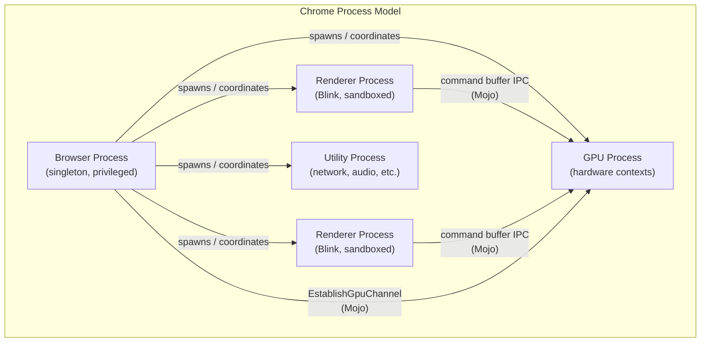
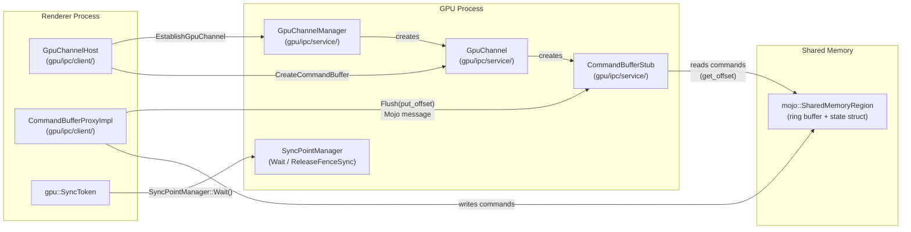
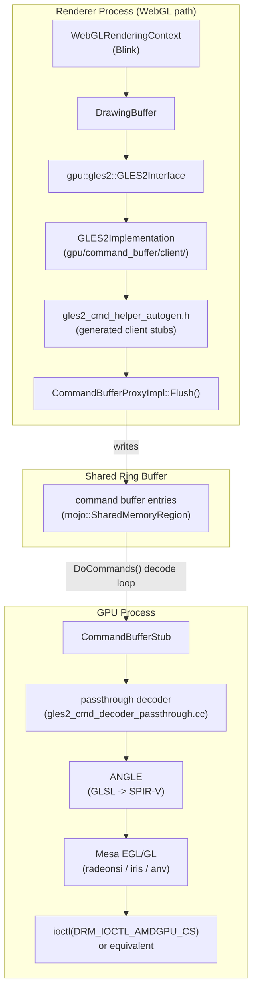
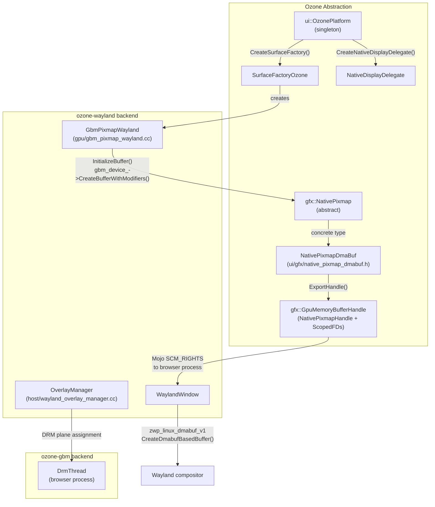
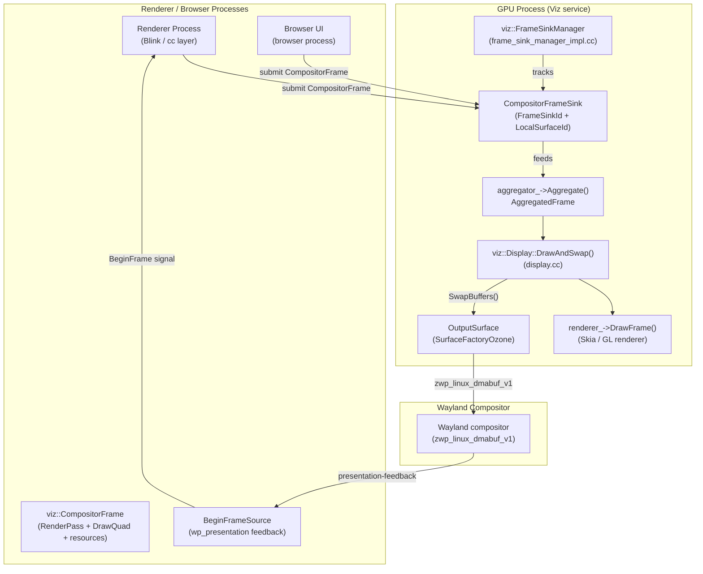
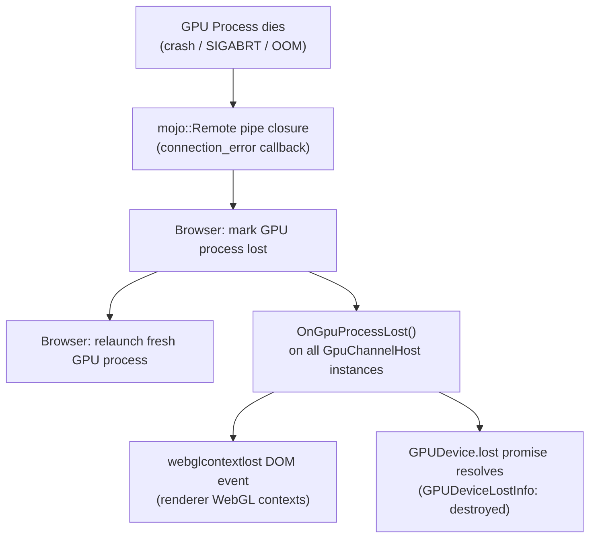

# Chapter 33: Chromium's Multi-Process GPU Architecture

**Part**: X — The Browser Rendering Stack  
**Primary audience**: Browser and web platform engineers who need to understand how Chrome maps tab rendering onto a real GPU; systems and driver developers who want to understand why certain driver bugs only surface under Chrome, how Mesa is reached from a browser tab, and what the GPU process sandbox permits and denies.

---

## Table of Contents

1. [The Multi-Process Architecture and the GPU Process](#1-the-multi-process-architecture-and-the-gpu-process)
2. [Mojo IPC: Chrome's Typed Pipe Framework](#2-mojo-ipc-chromes-typed-pipe-framework)
3. [The GPU Command Buffer Protocol](#3-the-gpu-command-buffer-protocol)
4. [The Ozone Platform Abstraction Layer](#4-the-ozone-platform-abstraction-layer)
5. [GPU Feature Detection and Backend Selection on Linux](#5-gpu-feature-detection-and-backend-selection-on-linux)
6. [OOP-D: The Out-of-Process Display Compositor](#6-oop-d-the-out-of-process-display-compositor)
7. [The GPU Process Lifecycle: Startup, Context Creation, and Crash Recovery](#7-the-gpu-process-lifecycle-startup-context-creation-and-crash-recovery)
8. [Security Model: Sandboxing the GPU Process on Linux](#8-security-model-sandboxing-the-gpu-process-on-linux)
9. [Integrations](#9-integrations)
10. [References](#10-references)

---

## 1. The Multi-Process Architecture and the GPU Process

Every tab in a modern Chrome installation runs in a sandboxed process that is deliberately and aggressively prevented from touching hardware. Yet those tabs render WebGL particle systems, decode H.264 video through VA-API, and execute WebGPU compute shaders at full hardware speed. The architecture that achieves this is built around a single, long-lived **GPU process** that holds the actual hardware context and accepts serialised rendering commands from every renderer process over a typed IPC channel.

Chrome's process model separates concerns across four principal process types. The **browser process** is a singleton that coordinates everything: it manages the window, handles top-level navigation, spawns child processes, and holds the privileged file descriptors to DRM device nodes and the Wayland compositor connection. **Renderer processes** contain Blink (the HTML/CSS/JavaScript engine) and execute one or more site origins; they are the highest-risk processes because they parse attacker-controlled HTML, JavaScript, and media, so they run inside the most restrictive sandbox. **Utility processes** handle specific tasks such as network service or audio. The **GPU process** is the subject of this chapter: a single process that owns all hardware GPU contexts and through which all rendering from all renderers is funnelled.

The decision to isolate GPU access in a dedicated process was driven by a clear engineering problem encountered in early Chrome. The original design ran OpenGL directly in renderer processes. Because GPU drivers are, in practice, not hardened against malformed API call sequences from untrusted code, a buggy or malicious page could trigger a driver crash that killed the renderer process. More damagingly, GPU driver hangs—particularly on early Intel and NVIDIA Linux drivers—would freeze the entire browser. When OpenGL was moved to a separate GPU process, those crashes became recoverable events. The browser process detects GPU process death via Mojo pipe closure and relaunches it; individual renderers receive a notification and can re-establish their command buffer channels. This turned a browser-killing event into a recoverable per-page `webglcontextlost` event.

The security argument is equally important. Renderer processes parse untrusted HTML, execute arbitrary JavaScript, and decode compressed media—all rich attack surfaces. Removing direct GPU API access from renderers eliminates an entire class of GPU driver privilege-escalation exploits from the renderer attack surface. Even if an attacker achieves arbitrary code execution in a renderer, they cannot directly call `ioctl(DRM_IOCTL_MODE_SETCRTC)` to reprogram the display or exploit a kernel memory corruption in a DRM driver, because the renderer process has no access to DRM device nodes at all.

The Linux sandbox model for renderer processes is built on two complementary mechanisms. After process launch, the renderer calls `InitializeSandbox()`, which installs a `seccomp-BPF` syscall filter that denies `open`, `openat`, `socket`, and essentially every syscall that could touch hardware or the filesystem. The renderer is additionally isolated using `CLONE_NEWUSER` and `CLONE_NEWPID` namespace isolation, and `PR_SET_NO_NEW_PRIVS` to prevent privilege escalation. The result is a process that communicates exclusively through pre-opened Mojo pipes and shared memory regions, and that cannot independently open `/dev/dri/renderD128` or any other device node under any circumstances.

The GPU process runs with elevated permissions relative to the renderer but is still sandboxed. It must open `/dev/dri/renderDN` (the render node; see Chapter 1) and call `ioctl` on it to allocate GPU memory, submit command streams, and import DMA-BUF buffers. On Linux, the GPU process also opens `/dev/dri/cardN` through the Ozone layer in some configurations for KMS operations, though on Wayland the primary node is typically held by the browser process. The `seccomp-BPF` policy for the GPU process is therefore wider than the renderer's but still carefully restricted to the specific syscalls and ioctl request codes needed for GPU operation.

The top-level source directory for the command buffer protocol and GPU IPC is `gpu/command_buffer/`, divided into `client/` (the renderer-side implementation) and `service/` (the GPU-process-side implementation). The GPU process IPC service lives in `gpu/ipc/service/`, while the client stubs used by renderers are in `gpu/ipc/client/`. Understanding this `client/service` split is foundational to everything else in this chapter.



---

## 2. Mojo IPC: Chrome's Typed Pipe Framework

Mojo is Chrome's cross-platform IPC library, introduced to replace the older `IPC::Channel` infrastructure that predated multi-process Chrome. Where `IPC::Channel` was untyped and fragile, Mojo provides typed message pipes, datagram pipes, and shared memory regions with a formal interface definition language and generated C++ bindings.

The **Mojom IDL** (interface definition language) defines interfaces, methods, and the types of their parameters. The build system (`mojo/public/tools/bindings/`) processes `.mojom` files and generates C++ bindings — interface classes, method dispatchers, and serialisation/deserialisation code. An interface such as `mojom::GpuChannel` is defined in a `.mojom` file, and the generator produces `GpuChannel` (the implementation base), `GpuChannelRemote` (the caller-side stub), and `GpuChannelReceiver` (the callee-side binding), all strongly typed.

A **Mojo message pipe** is a pair of bidirectional endpoints (`mojo::MessagePipeHandle`), one per side of a connection. Messages are serialised structs with optional attached handles. The critical capability that makes Mojo effective for GPU IPC on Linux is handle passing: Mojo can transfer file descriptors across process boundaries using `SCM_RIGHTS` in a `sendmsg(2)` call on the underlying Unix domain socket. This is how DMA-BUF file descriptors move from the GPU process to the browser process, and from the browser process to the Wayland compositor. A `mojo::PlatformHandle` wraps a file descriptor (on Linux), a Windows `HANDLE`, or a macOS Mach port, making the handle-passing mechanism portable.

For bulk data — command buffer contents, texture uploads, vertex data — Mojo provides **shared memory regions** (`mojo::SharedMemoryRegion`). Rather than copying data through the pipe (which would be limited to the socket buffer), the sender allocates a `mojo::SharedMemoryRegion`, writes data into it, and sends only the handle over the pipe. The receiver maps the region and reads data directly. This is the mechanism underlying the command buffer's ring buffer: the client and service share a memory region, and the client writes command entries into it while the service reads them out, communicating only the write pointer (put_offset) and read pointer (get_offset) via cheap IPC messages.

The **GPU channel** is the highest-level IPC abstraction between a renderer and the GPU process. `GpuChannelHost` (in `gpu/ipc/client/gpu_channel_host.h`) is the renderer-side handle; `GpuChannel` (in `gpu/ipc/service/gpu_channel.cc`) is the GPU-process-side implementation. One `GpuChannel` exists per renderer process; over a single Mojo pipe it multiplexes multiple command buffer streams (one per GL context or raster context in that renderer). The `GpuChannelManager` singleton in the GPU process (`gpu/ipc/service/gpu_channel_manager.cc`) owns all live `GpuChannel` instances and creates a new one for each renderer that requests access via `EstablishGpuChannel`.

**Synchronisation tokens** (`gpu::SyncToken`) are the mechanism by which a renderer tells the display compositor (Viz) "do not composite my frame until my command stream has reached this point." A `SyncToken` is a triplet: a `CommandBufferNamespace` (e.g., `GPU_IO`), a `CommandBufferId` (64-bit value, packed as process ID in the high bits and IPC route ID in the low bits), and a **fence release count** (a monotonically increasing sequence number). When a renderer inserts a fence into its command stream using `GenSyncTokenCHROMIUM`, it appends an `InsertFenceSync` command and increments the sequence number. When Viz receives a `CompositorFrame` from the renderer, it checks the `SyncToken` embedded in the frame's resource list and calls `SyncPointManager::Wait()` — the GPU process will not begin compositing that frame's resources until the corresponding `SyncPointClientState::ReleaseFenceSync()` has been called in the GPU process's command stream decoder.

Comparing Mojo to the Wayland wire protocol (Chapter 20) reveals both similarities and design differences. Both are binary, object-oriented IPC systems over Unix sockets, and both support handle passing. Wayland's protocol is tightly specialised for display-system operations: it uses a fixed 32-bit opcode header, object IDs managed by the wayland-client library, and event/request semantics that map directly to display lifecycle operations. Mojo is a general-purpose IPC framework — it has no knowledge of display concepts — and it supports significantly richer type semantics including associated interfaces, interface request pipes, and strongly typed enum-based dispatch. Chrome needs Mojo's generality because it is carrying not just display-related messages but command buffer payloads, GPU memory allocation requests, video decode commands, and WebGPU wire protocol messages over the same infrastructure.



---

## 3. The GPU Command Buffer Protocol

The GPU command buffer is the beating heart of Chrome's GPU IPC. It is an in-memory ring buffer of fixed-format command entries shared between the renderer process (client) and the GPU process (service) via a `mojo::SharedMemoryRegion`. The client writes entries into the ring buffer; the GPU process reads and decodes them. No GL or Vulkan calls happen in the renderer at all — the renderer only writes command entries.

The client-side is implemented by `CommandBufferProxyImpl` (in `gpu/ipc/client/command_buffer_proxy_impl.h`). The service-side is implemented by `CommandBufferStub` (and its subclasses `GLES2CommandBufferStub`, `RasterCommandBufferStub`, and `WebGPUCommandBufferStub`) in `gpu/ipc/service/`. The `CommandBufferStub` owns the real GL or Vulkan context and executes decoded commands against it.

The **shared memory ring buffer** is established during channel creation. The client calls `CommandBufferProxyImpl::Initialize()`, which sends a Mojo message to the service including a `mojo::SharedMemoryRegion` for the command buffer and a separate region for the "state" struct. The state struct contains two critical fields: `put_offset` (the client's write pointer, indicating how many 32-bit words of commands have been written) and `get_offset` (the service's read pointer). Both are 32-bit integers treated as offsets into a flat array of 32-bit words.

Commands are encoded as 32-bit entries. Each command begins with a header word that encodes the command opcode in the high 16 bits and the command length (in 32-bit words) in the low 16 bits. Argument words follow immediately after the header. The maximum inline command size is 1 MB minus 1 (256k 32-bit words), but most commands are small. For large data — texture uploads, vertex buffer contents — the client uses **transfer buffers**: secondary shared-memory regions mapped by both sides. A `TexImage2D` command, for example, does not embed the texture data inline; instead it carries a transfer buffer ID, an offset into that buffer, and a size. The service looks up the transfer buffer, validates that the offset+size stays within the mapped region, and reads the texture data directly from there.

The flush sequence is the mechanism by which the client signals "there are new commands to process." The client calls `CommandBufferProxyImpl::Flush(put_offset)`, which sends a `GpuCommandBufferMsg_AsyncFlush` Mojo message to the service carrying the new `put_offset`. The service receives this message, calls `gpu::CommandBufferService::Flush(put_offset)`, which invokes the decoder's `DoCommands()` loop. The decoder reads from the ring buffer at `get_offset` and advances until it reaches `put_offset` or encounters an error. The service updates `get_offset` in the shared state struct, which the client can read back (via a shared-memory read, not an IPC round-trip) to determine how much of the ring buffer has been consumed and can be reused.

The `DoCommands()` decode loop is implemented in the decoder subclasses. The primary WebGL decoder is `GLES2DecoderImpl` (in `gpu/command_buffer/service/gles2_cmd_decoder.cc`), which dispatches to handler methods for each opcode. However, Chrome has largely transitioned away from this "validating decoder" to the **passthrough command decoder**. In passthrough mode (`--use-cmd-decoder=passthrough`, now the default), Chrome uses ANGLE's internal command stream directly: the client side generates ANGLE API calls that are serialised into the command buffer using ANGLE's own serialisation format, and the service side forwards them to ANGLE's passthrough decoder (`gpu/command_buffer/service/gles2_cmd_decoder_passthrough.cc`) which calls ANGLE's EGL/GLES2 implementation with minimal additional validation. The old validating decoder performed full server-side validation of every GL call against a tracked GL state machine; the passthrough decoder delegates that validation to ANGLE itself. The validating decoder is being phased out; production Chrome builds have used the passthrough decoder since approximately Chrome 71.

The **raster decoder** (`gpu/command_buffer/service/raster_decoder.cc`) is a distinct decoder used for Skia rasterisation in the GPU process (OOP-Raster). It accepts a different, smaller command set oriented around Skia's recording/replay model rather than the full GLES2 API.

The pathway from a `canvas.getContext('webgl')` call in a web page to actual Mesa driver calls spans several layers. Blink creates a `WebGLRenderingContext`, which wraps a `DrawingBuffer`, which holds a `gpu::gles2::GLES2Interface`. That interface is backed by `GLES2Implementation` in `gpu/command_buffer/client/gles2_implementation.cc`, which serialises every `glDrawArrays`, `glUniform4f`, and similar call into command buffer entries via the generated client stubs in `gpu/command_buffer/client/gles2_cmd_helper_autogen.h`. The `CommandBufferProxyImpl::Flush()` path then ships those entries to `CommandBufferStub` in the GPU process. The passthrough decoder calls ANGLE's `GL_ANGLE_program_binary` and related API. ANGLE translates GLSL to SPIR-V, then calls the underlying GL or Vulkan driver. On a typical Linux desktop with an AMD or Intel GPU, that underlying call reaches Mesa's EGL/GL implementation (radeonsi, iris, or anv for Vulkan), which encodes the work into a kernel command stream submitted via `ioctl(DRM_IOCTL_AMDGPU_CS)` or equivalent.

WebGPU follows a fundamentally different path: it uses the **DawnWire** protocol (covered in Chapter 35) layered on top of Mojo pipes, not the legacy command buffer. DawnWire has its own serialisation format optimised for Dawn's object model. This separation is architecturally significant: the legacy command buffer carries GL-flavoured commands, while DawnWire carries WebGPU-flavoured commands. Both run over Mojo but are completely independent code paths through the GPU process.



---

## 4. The Ozone Platform Abstraction Layer

Ozone is Chrome's compile-time-configurable display-system abstraction layer, sitting beneath the Aura window manager and above the OS-level display APIs. Its core design principle is that platform differences are expressed through C++ virtual interfaces rather than `#ifdef` conditional compilation throughout the codebase. Code in Chrome that needs a window, a surface, or a pixmap calls into Ozone interfaces; Ozone dispatches to the appropriate backend.

The `ui::OzonePlatform` singleton (created in the GPU and browser processes) is the factory for all platform-specific objects. Its `CreateSurfaceFactory()` returns a `SurfaceFactoryOzone` whose implementations create actual windowing surfaces. `CreateInputController()` returns the input event dispatcher. `CreateNativeDisplayDelegate()` returns the display configuration interface. `CreatePlatformScreen()` returns screen topology information. Platform selection on Linux happens at runtime via the `--ozone-platform` command-line flag (defaulting to `wayland` in modern desktop builds) or at compile time for Chrome OS.

The desktop Linux build of Chrome supports three primary Ozone backends:

**`ozone-wayland`** (`ui/ozone/platform/wayland/`) is the default for desktop Linux since Chrome 87. It connects to the Wayland compositor via `wl_display`, creates `xdg_surface` / `xdg_toplevel` objects for browser windows, and submits rendered frames via `wl_surface::attach` combined with the `zwp_linux_dmabuf_v1` protocol (Chapter 20). The Wayland backend is split across two processes: the browser process holds the `wl_display` connection and manages `WaylandWindow` objects; the GPU process creates GBM buffers and exports their DMA-BUF file descriptors, which are then sent to the browser process over Mojo as `GpuMemoryBufferHandle` objects and forwarded to the Wayland compositor.

**`ozone-x11`** (`ui/ozone/platform/x11/`) handles both native X11 and XWayland sessions. Under XWayland, Chrome is unaware it is running over Wayland; it communicates with the XWayland server via the X11 protocol as usual. Native X11 support allows Chrome to run on servers without Wayland compositors.

**`ozone-gbm`** (`ui/ozone/platform/drm/`) is the Chrome OS backend. It bypasses the Wayland compositor entirely and manages DRM planes and KMS directly. The GPU process communicates with a privileged `DrmThread` in the browser process that holds the DRM primary node and issues `DRM_IOCTL_MODE_PAGE_FLIP` calls.

The central data type in Ozone is `gfx::NativePixmap`, an abstract handle for a GPU-accessible buffer. On Wayland and GBM, the concrete type is `NativePixmapDmaBuf` (`ui/gfx/native_pixmap_dmabuf.h`). It holds a `gfx::GpuMemoryBufferHandle` containing one or more plane entries, each with a file descriptor, stride, offset, and format modifier. This is exactly the structure needed to import the buffer into Vulkan (`VkImportMemoryFdInfoKHR` from `VK_KHR_external_memory_fd`), into EGL (`EGL_EXT_image_dma_buf_import`), or into the `zwp_linux_dmabuf_v1` Wayland protocol.

The `GbmPixmapWayland` class (`ui/ozone/platform/wayland/gpu/gbm_pixmap_wayland.cc`) is the concrete implementation used in production. Its `InitializeBuffer()` method creates a GBM buffer object:



```cpp
// ui/ozone/platform/wayland/gpu/gbm_pixmap_wayland.cc
// Simplified from upstream Chromium

bool GbmPixmapWayland::InitializeBuffer(gfx::Size size,
                                         gfx::BufferFormat format,
                                         gfx::BufferUsage usage) {
  uint32_t fourcc_format = ui::GetFourCCFormatFromBufferFormat(format);
  uint32_t gbm_flags = ui::BufferUsageToGbmFlags(usage);

  auto modifiers = GetSupportedModifiers(fourcc_format);
  if (modifiers.empty()) {
    gbm_bo_ = gbm_device_->CreateBuffer(fourcc_format, size, gbm_flags);
  } else {
    gbm_bo_ = gbm_device_->CreateBufferWithModifiers(
        fourcc_format, size, gbm_flags,
        modifiers.data(), modifiers.size());
  }
  return gbm_bo_ != nullptr;
}
```

The `ExportHandle()` method extracts the per-plane file descriptors and metadata into a `gfx::GpuMemoryBufferHandle`, which is serialised over Mojo to the browser process. The browser process then calls `CreateDmabufBasedBuffer()` to ask the Wayland compositor to create a `wl_buffer` from those DMA-BUF descriptors via `zwp_linux_dmabuf_v1`.

The **OverlayManager** (`ui/ozone/platform/wayland/host/wayland_overlay_manager.cc`) analyses each frame for hardware overlay candidates. On Wayland, it communicates with the compositor using the `wp_viewporter` and `xdg_output` protocols to request that specific buffer planes be presented as hardware overlays. On GBM/KMS, it assigns DRM planes directly (Chapter 2). Hardware overlay support is critical for power-efficient video playback: the video frame lives in a VA-API-decoded buffer, and presenting it as a hardware overlay avoids a GPU blit that would otherwise consume significant memory bandwidth.

The GPU process and browser process share pixmaps efficiently through the `GpuMemoryBufferHandle` abstraction. The handle contains a `UnionedHandle` that on Linux is a `NativePixmapHandle` — a vector of `NativePixmapPlane` entries, each with a `base::ScopedFD`. When the handle is serialised through Mojo's `PlatformHandle` support, each `ScopedFD` is transferred using `SCM_RIGHTS` in a `sendmsg(2)` call, so the file descriptor is duplicated into the receiving process's file descriptor table without requiring the receiving process to open any files.

---

## 5. GPU Feature Detection and Backend Selection on Linux

At GPU process startup, before any rendering is attempted, Chrome collects a comprehensive description of the GPU hardware and drivers and uses it to decide what rendering path is safe and performant. This information is captured in the `gpu::GPUInfo` struct (defined in `gpu/config/gpu_info.h`).

The `gpu::CollectGpuInfo()` function (implemented on Linux in `gpu/config/gpu_info_collector_linux.cc`) performs several queries. It creates a temporary EGL display and context, queries `GL_RENDERER`, `GL_VENDOR`, `GL_VERSION`, and `GL_EXTENSIONS` strings, and stores them in `GPUInfo`. It reads the GPU's PCI vendor and device IDs from `/sys/class/drm/card0/device/vendor` and `/sys/class/drm/card0/device/device` (or equivalent sysfs paths). For Vulkan capability detection, it creates a `VkInstance`, enumerates physical devices, and queries `VkPhysicalDeviceProperties` for device type, driver version, and device name, as well as extension support via `vkEnumerateDeviceExtensionProperties`.

The `gpu_driver_bug_list.json` (at `gpu/config/gpu_driver_bug_list.json` in the Chromium source) is a JSON database, evaluated at startup, that maps hardware-and-driver conditions to workaround flags. Each entry has a unique integer `id`, a human-readable description, conditions (`os`, `vendor_id`, `device_id`, `driver_vendor`, `driver_version`, `gl_vendor`, `gl_renderer`), and a list of `features` (workaround strings). For example:

```json
{
  "id": 131,
  "description": "Linux Mesa drivers crash on glTexSubImage2D() to texture storage bound to FBO",
  "os": { "type": "linux" },
  "driver_vendor": "Mesa",
  "driver_version": { "op": "<", "value": "10.6" },
  "features": ["disable_texture_storage"]
}
```

```json
{
  "id": 37,
  "cr_bugs": [286468],
  "description": "Program link fails in NVIDIA Linux if gl_Position is not set",
  "os": { "type": "linux" },
  "vendor_id": "0x10de",
  "gl_vendor": "NVIDIA.*",
  "features": ["init_gl_position_in_vertex_shader"]
}
```

The `GpuDriverBugList::MakeDecision()` function (in `gpu/config/gpu_driver_bug_list.cc`) evaluates all entries against the collected `GPUInfo` and builds a set of active workaround flags. These flags propagate throughout the GPU process and influence ANGLE's behaviour, the raster decoder's path, and whether hardware-accelerated video decode is permitted. Understanding which entries have fired for a given system is essential for diagnosing unexpected Chrome fallbacks; `chrome://gpu` displays the complete list of active workarounds under the "Driver Bug Workarounds" section.

The **Vulkan selection path** on Linux starts with the `--use-vulkan` flag. In automatic mode (`--use-vulkan=auto`), Chrome probes for Vulkan support during GPU process initialisation. It requires several instance and device extensions: `VK_KHR_surface`, `VK_KHR_external_memory_fd` (for DMA-BUF import), `VK_KHR_external_semaphore_fd` (for cross-process synchronisation), and `VK_EXT_external_memory_dma_buf`. If any required extension is absent, Chrome falls back to the GL backend. The `VK_KHR_swapchain` extension is not required for the GPU process itself — Chrome does not use Vulkan swapchains; instead it manages buffer allocation through GBM and presents via Ozone/Wayland, treating Vulkan purely as a rendering API.

The **GL backend path** uses EGL via ANGLE (`--use-gl=angle`, the default) or native Mesa EGL (`--use-gl=egl`). For the GPU process's own off-screen context on Wayland, Chrome uses `EGL_PLATFORM_SURFACELESS_MESA` (the `EGL_MESA_platform_surfaceless` extension) to create an EGL display without requiring a window surface. This allows the GPU process to allocate textures, render into FBOs, and export results as DMA-BUFs without ever having a visible window.

The **SwANGLE fallback** path engages when neither hardware GL nor Vulkan is available — for example, in headless CI environments or on systems with only `llvmpipe`. Chrome can use ANGLE backed by SwiftShader, a CPU-based Vulkan implementation. SwiftShader is detected via `VkPhysicalDeviceType` == `VK_PHYSICAL_DEVICE_TYPE_CPU` in the Vulkan device enumeration.

Several command-line flags override automatic detection and are indispensable for driver debugging:

- `--use-gl=angle|egl|desktop` — select the GL implementation
- `--use-vulkan=native|swiftshader|disabled` — select the Vulkan path
- `--disable-gpu` — force software rendering via SwiftShader or Skia's CPU backend
- `--use-cmd-decoder=passthrough|validating` — select the command decoder variant
- `--enable-logging --v=1` — enable verbose GPU process logging

The `chrome://gpu` page is the primary diagnostic tool. It displays the full resolved `GPUInfo` struct, the list of active driver bug workarounds, the GL and Vulkan version strings from the driver, the feature status table (hardware acceleration enabled/disabled per feature), and information about the command decoder in use. Any experienced Chrome GPU debugging session begins here.

---

## 6. OOP-D: The Out-of-Process Display Compositor

Prior to Chrome 71, the display compositor ran inside the browser process. The browser process was responsible not only for browser UI (address bar, tabs, toolbar) but also for collecting `CompositorFrame`s from all renderer processes and assembling them into the final image presented to the screen. This coupling had several undesirable consequences. A slow compositor blocked the browser UI thread. A crash in compositor code could bring down the browser process entirely. And the architecture made it impossible to properly sandbox the compositor, since the browser process requires elevated privileges for window management.

**OOP-D** (Out-of-Process Display) moves the display compositor — the **Viz** service — into the GPU process. This separation was enabled by default in Chrome 71 (released December 2018) and has been the standard architecture since then. In the OOP-D model, the GPU process hosts `viz::DisplayCompositor`, which receives `CompositorFrame` submissions from the browser process and all renderer processes, aggregates them, and presents the final frame to the screen via the Ozone backend.

The `viz::FrameSinkManager` (in `components/viz/service/frame_sinks/frame_sink_manager_impl.cc`) tracks all registered `CompositorFrameSink` instances — one per renderer surface, one for the browser UI. Each `FrameSink` has a `FrameSinkId` that identifies which page component it belongs to, and a `LocalSurfaceId` that monotonically increases on navigation, preventing stale frames from prior pages from appearing after a navigation.

When a renderer finishes painting a frame, it submits a `viz::CompositorFrame` to its `FrameSink`. A `CompositorFrame` is a tree of `RenderPass` objects, each containing a list of `DrawQuad`s describing how to composite tiles and surfaces together. Critically, the frame contains a resource list mapping `ResourceId`s to `TransferableResource`s — GPU textures or shared memory bitmaps — along with `SyncToken`s that must be waited on before those resources can safely be read by Viz.

`viz::Display::DrawAndSwap()` (in `components/viz/service/display/display.cc`) orchestrates each frame. It calls `aggregator_->Aggregate(current_surface_id_)` to produce an `AggregatedFrame` that merges all submitted `CompositorFrame`s into a single render tree. It evaluates the `should_draw` condition: drawing proceeds if copy requests exist or if there is damage (changed pixels) and the output surface dimensions match. If drawing proceeds, it calls `renderer_->DrawFrame()` — which uses Skia/Dawn or the GL renderer to draw render passes into the back buffer — and then `renderer_->SwapBuffers()` to present via the `OutputSurface`. The `OutputSurface` implementation dispatches to Ozone's `SurfaceFactoryOzone`, which submits the buffer to the Wayland compositor via `zwp_linux_dmabuf_v1`.

The **`BeginFrameSource`** drives the frame cadence. On Wayland, `wp_presentation` feedback events (Chapter 20) deliver `presentation-feedback` messages back to Chrome after each presented frame. These trigger `BeginFrame` signals to all active `FrameSink`s, telling renderers when to begin producing the next frame. This pull-based model is central to Chrome's power efficiency on Linux: renderers only produce frames when the compositor needs them, rather than at an unconstrained rate.



**OOP-R (Out-of-Process Raster)** is a related but distinct concept worth distinguishing. In OOP-R (enabled by default since approximately Chrome 79), tile rasterisation — converting Blink's display lists into GPU textures — is performed in the GPU process rather than the renderer process. The renderer sends paint records over the command buffer using the raster decoder protocol; the GPU process executes them using Skia's GPU backend (either Ganesh GL or Ganesh Vulkan). This reduces peak renderer memory usage and allows the GPU scheduler to interleave tile rasterisation with compositing more efficiently. OOP-D is about *assembling and presenting* the final frame; OOP-R is about *rasterising tiles* that feed into that assembly.

---

## 7. The GPU Process Lifecycle: Startup, Context Creation, and Crash Recovery

The GPU process lifecycle begins when the browser process forks (or launches on Windows) the GPU process. The GPU process entry point is `GpuMain` in `gpu/ipc/service/gpu_main.cc`. This function performs a carefully ordered sequence of initialisation steps:

1. The process calls `GpuInit::InitializeAndStartSandbox()`, which performs GPU feature detection, collects `GPUInfo`, evaluates the driver bug list, and — after collection is complete — installs the `seccomp-BPF` sandbox policy (feature detection requires EGL initialisation, which must complete before the sandbox restricts `open(2)`).

2. `GpuServiceImpl` is created. This is the central object in the GPU process; it implements the `mojom::GpuService` Mojo interface and is the entry point for all GPU process services.

3. A `GpuChannelManager` is created; it will manage per-renderer `GpuChannel` objects.

4. The `VizCompositorThreadRunner` is started, which creates the `viz::FrameSinkManagerImpl` and `viz::DisplayCompositor` objects on a dedicated compositor thread.

5. The GPU process signals readiness to the browser process by sending a `GpuHostMsg_Initialized` message containing the collected `GPUInfo`.

The startup sequencing in `GpuMain` is critical to understand because it explains a class of Linux GPU debugging scenarios. Because `InitializeAndStartSandbox()` calls EGL before installing the `seccomp-BPF` policy, any failure during EGL initialisation — such as a missing `libEGL.so`, a broken DRI driver, or an incompatible `EGL_EXT_platform_base` extension — will cause the GPU process to exit before the sandbox is even applied. The browser process will detect this via Mojo pipe closure and will fall back to software rendering (SwANGLE) rather than retrying hardware initialisation indefinitely. This is why a freshly installed Mesa driver that breaks EGL compatibility will cause Chrome to silently switch to software rendering — the symptom is visible in `chrome://gpu` as "Software only, hardware acceleration unavailable."

A simplified sketch of the `GpuMain` startup sequence, condensed from `gpu/ipc/service/gpu_main.cc`, illustrates the ordering:

```cpp
// gpu/ipc/service/gpu_main.cc (simplified, illustrative)
int GpuMain(const MainFunctionParams& parameters) {
  // Step 1: Collect GPU info and start sandbox.
  // EGL must be accessible at this point — no sandbox yet.
  auto gpu_init = std::make_unique<GpuInit>();
  if (!gpu_init->InitializeAndStartSandbox(parameters.command_line)) {
    // EGL/GL initialisation failed; fall back to software rendering.
    LOG(ERROR) << "GPU initialisation failed; running software renderer";
  }
  // seccomp-BPF is now installed.

  // Step 2: Set up message loop and Mojo binding for GpuServiceImpl.
  base::SingleThreadTaskExecutor main_task_executor(base::MessagePumpType::DEFAULT);
  mojo::core::Init();

  // Step 3: Create the GPU service and channel manager.
  auto gpu_service = std::make_unique<GpuServiceImpl>(
      gpu_init->gpu_info(),
      gpu_init->TakeWatchdogThread(),
      main_task_executor.task_runner());

  // Step 4: Start the Viz compositor thread.
  gpu_service->InitializeWithHost(
      std::move(pending_gpu_host),
      /*activity_flags=*/base::UnsafeSharedMemoryRegion{},
      /*io_runner=*/io_runner);

  // Step 5: Run the main loop. The process stays alive until the browser
  // process closes the Mojo GpuService endpoint.
  base::RunLoop().Run();
  return 0;
}
```

When a renderer process needs GPU access for the first time (triggered by, for example, a `<canvas>` element entering the document), it calls `GpuChannelHost::Establish()`. This sends `EstablishGpuChannel` through the browser process to the GPU process. `GpuChannelManager::EstablishChannel()` allocates a new `GpuChannel` with a unique `client_id`, creates a `mojo::MessagePipe` pair, and sends one end to the renderer. Inside `GpuChannel`, a `GpuChannelMessageFilter` is created to dispatch incoming Mojo messages to the appropriate command buffer stub. The renderer then calls `GpuChannel::CreateCommandBuffer()` — specifying context type (`GLES2`, `Raster`, or `WebGPU`) and the shared-memory ring buffer region — which instantiates the corresponding `CommandBufferStub` subclass and returns a route ID to the renderer.

EGL context creation on Linux depends on the configured Ozone backend. For the Wayland path, the GPU process creates an EGL display using `eglGetPlatformDisplayEXT(EGL_PLATFORM_SURFACELESS_MESA, EGL_DEFAULT_DISPLAY, nullptr)` for the off-screen GPU context. For GBM/KMS (Chrome OS), `eglGetPlatformDisplay(EGL_PLATFORM_GBM_MESA, gbm_device, nullptr)` is used. The context is created with `eglCreateContext` using an appropriate attribute list specifying GLES2 or GLES3 compatibility and, for the passthrough decoder, the `EGL_CONTEXT_OPENGL_DEBUG_BIT_KHR` attribute for debug contexts in development builds.

When a renderer process requests GPU access, it sends a `GpuHostMsg_EstablishGpuChannel` IPC to the browser process, which forwards it to the GPU process. `GpuChannelManager::EstablishChannel()` creates a new `GpuChannel` for that renderer, associates it with a `SchedulingPriority`, and returns a `mojo::ScopedMessagePipeHandle` to the renderer. The renderer creates a `GpuChannelHost` wrapping that handle and is now ready to create command buffers.

GPU process crash detection is synchronous via Mojo. The browser process holds a `mojo::Remote<mojom::GpuService>` — a Mojo client endpoint connected to the GPU process. When the GPU process dies (for any reason: crash, SIGKILL from the watchdog, or OOM), the underlying Mojo pipe closes. This closure generates a `connection_error` callback in the browser process synchronously on the Mojo IO thread. The browser process then:

1. Marks the GPU process as lost.
2. Relaunches a fresh GPU process.
3. Notifies all `GpuChannelHost` instances via their `OnGpuProcessLost()` callback.
4. Each renderer's WebGL contexts receive a `webglcontextlost` DOM event; the page can listen to this event and attempt context restoration.
5. WebGPU devices receive resolution of their `GPUDevice.lost` promise with a `GPUDeviceLostInfo` reason of `"destroyed"`.



The **`GpuWatchdogThread`** (in `gpu/ipc/service/gpu_watchdog_thread.cc`) is a separate thread in the GPU process that monitors the main GPU thread for liveness. It sends a periodic heartbeat and waits for a response. If no response arrives within a configurable timeout — historically around 8 seconds on Linux, though the exact value has varied across Chrome versions — the watchdog sends `SIGABRT` to the GPU process, forcing a crash dump and process termination. This turns a driver deadlock (an infinite loop inside an `ioctl` call, for example, caused by a buggy kernel DRM driver or firmware bug) into a recoverable GPU process crash rather than a browser hang.

Context loss can be simulated for testing via the `chrome://gpu` page's "Force Context Loss" button, which calls `gl.getExtension('WEBGL_lose_context').loseContext()` on all active WebGL contexts. This is essential for testing whether web applications handle the `webglcontextlost` / `webglcontextrestored` event pair correctly.

---

## 8. Security Model: Sandboxing the GPU Process on Linux

The security architecture of Chrome's GPU subsystem on Linux is a carefully calibrated balance between the privileges the GPU process genuinely needs and the attack surface exposed to potential exploits. Understanding this model is important for both security researchers and driver developers.

The **renderer sandbox** is the most restrictive. After process launch, `InitializeSandbox()` in `content/renderer/renderer_sandbox_interface.cc` installs a `seccomp-BPF` policy via `sandbox::SetProcessSandbox()`. The policy is defined using Chrome's BPF DSL (`sandbox/linux/bpf_dsl/`). For renderer processes, this policy denies `open`, `openat`, `socket`, `connect`, `accept`, `bind`, `listen`, `sendmsg` (except for pre-connected sockets), `ioctl` on any file descriptor that is not a pre-opened pipe or socket, `mmap` of anonymous memory above a certain limit, `clone` with privileged flags, and many other syscalls. The renderer communicates exclusively through pre-established Mojo pipes. It cannot open `/dev/dri/renderD128` or any DRM device node — not because a policy explicitly names that file, but because `openat` itself is blocked entirely.

The **GPU process sandbox** policy is defined in `content/gpu/gpu_sandbox_hook_linux.cc` (note: this file lives in `content/gpu/`, not `gpu/sandbox/` as the plan mentions; the actual file to reference is `content/gpu/gpu_sandbox_hook_linux.cc`). This file exports a `SandboxHook` function that is called by the generic sandbox infrastructure after GPU feature detection completes. The policy permits:

- `ioctl` with a restricted set of request codes. The GPU process must call DRM ioctls on the render node: `DRM_IOCTL_GEM_CLOSE`, `DRM_IOCTL_GEM_OPEN`, `DRM_IOCTL_PRIME_FD_TO_HANDLE`, `DRM_IOCTL_PRIME_HANDLE_TO_FD`, and driver-specific ioctls such as `DRM_IOCTL_AMDGPU_CS`, `DRM_IOCTL_I915_GEM_EXECBUFFER2`, and `DRM_IOCTL_NOUVEAU_GEM_PUSHBUF`. Allowing all `ioctl` calls indiscriminately would be too permissive; Chrome maintains a per-driver allowlist of ioctl request codes.
- `mmap`, `mprotect`, and `munmap` for GPU memory management (GBM buffer objects are mmap'd for CPU access during texture uploads).
- `read`, `write`, `pread64`, `pwrite64` on pre-opened file descriptors.
- `futex` for mutex operations.
- `clock_gettime`, `gettimeofday` for timing.
- `recvmsg` / `sendmsg` on pre-established Mojo sockets.

Crucially, the GPU process does **not** open the DRM primary node (`/dev/dri/card0`) for itself on Wayland. The primary node is required for modesetting (KMS) operations — `DRM_IOCTL_MODE_PAGE_FLIP`, `DRM_IOCTL_MODE_SETCRTC`. On Wayland, those calls are unnecessary because the Wayland compositor handles modesetting. On Chrome OS (GBM/KMS path), the `DrmThread` in the browser process holds the primary node and performs modesetting on behalf of the GPU process via a dedicated IPC channel, ensuring the GPU process never has direct modesetting capability.

The GPU process only opens `/dev/dri/renderDN` — the render node — which (as covered in Chapter 1) deliberately lacks modesetting capability. A compromised GPU process cannot blank the display, reconfigure output resolution, or access another user's DRM framebuffer. The worst a compromised GPU process can do is corrupt GPU commands that affect rendering, which is mitigated by crash recovery.

**Shader JIT security** is a distinct concern. GPU shader compilers (the Mesa compiler, the NVIDIA proprietary compiler) execute shader bytecode from web pages. A crafted SPIR-V or GLSL shader could exploit a bug in the shader compiler, potentially achieving code execution in the GPU process. Chrome's defence is multi-layered: ANGLE's shader translator and validator reject non-conforming GLSL before it crosses into the GPU process; Dawn's Tint compiler validates WGSL and rejects non-conforming WebGPU shaders; and the GPU process sandbox limits the damage if the shader compiler is exploited.

The `gpu/config/gpu_blocklist.json` (distinct from the driver bug list) contains entries that disable entire feature categories for specific driver versions known to have security-relevant bugs. Unlike the driver bug list, which enables workarounds that preserve some functionality, blocklist entries disable the feature entirely — for example, disabling hardware-accelerated video decode entirely for a specific driver version range where a memory safety bug was identified.

An important security property of the DawnWire protocol (Chapter 35) is that it gives Dawn's implementation freedom to validate WebGPU commands before executing them on the GPU process side, providing an additional validation layer that the legacy GL command buffer (in passthrough mode) does not offer for GLES2.

---

## 9. Integrations

**Chapter 1 (DRM Architecture)**: The GPU process's security model depends directly on the DRM render node privilege separation described in Chapter 1. The render node's deliberate lack of modesetting capability is what makes the GPU process sandbox viable: even if the GPU process is compromised, it cannot reconfigure the display or access another session's KMS state. The `DRM_IOCTL_PRIME_HANDLE_TO_FD` and `DRM_IOCTL_PRIME_FD_TO_HANDLE` ioctls used for DMA-BUF sharing are central to how GBM pixmaps flow from the GPU process to the Wayland compositor.

**Chapter 2 (KMS Plane Assignment)**: Ozone's `OverlayManager` analyses each `DrawAndSwap` frame for hardware overlay candidates. On the Chrome OS (GBM/KMS) path, it assigns DRM planes directly through the browser process's `DrmThread`. On Wayland, it communicates overlay requests to the compositor via the `wp_drm_lease_device_v1` and similar protocols. The plane assignment logic is covered in Chapter 2.

**Chapter 4 (GBM and DMA-BUF)**: `NativePixmapDmaBuf` and the GBM buffer object lifecycle introduced here are detailed in Chapter 4. The format modifier negotiation in `GbmPixmapWayland::InitializeBuffer()` — selecting between `DRM_FORMAT_MOD_LINEAR` and vendor-specific tiled modifiers — is examined in depth there, along with the `DRM_FORMAT_MOD_*` namespace.

**Chapter 20 (Wayland Protocols)**: The `zwp_linux_dmabuf_v1` protocol used by `GbmPixmapWayland::CreateDmabufBasedWlBuffer()` and the `wp_presentation` protocol that drives Chrome's `BeginFrameSource` are both covered in Chapter 20. The Wayland backend's `wayland_zwp_linux_dmabuf.cc` is the client-side implementation of that protocol.

**Chapter 34 (ANGLE)**: The passthrough command decoder's relationship to ANGLE is only introduced here; Chapter 34 covers ANGLE's internal architecture, how it translates GLSL to SPIR-V, how it selects a backend (GL, Vulkan, Metal), and the performance characteristics of each translation path.

**Chapter 35 (Dawn and WebGPU)**: The DawnWire protocol mentioned in Section 3 is fully detailed in Chapter 35, including its object model, serialisation format, and how it interacts with the GPU process's Vulkan backend.

**Chapter 36 (Viz and Compositor Frames)**: The `CompositorFrame`, `RenderPass`, `DrawQuad`, and `FrameSink` model introduced in Section 6 are given a complete treatment in Chapter 36, including the tile rasterisation pipeline, surface synchronisation, and the interaction between the cc (Chromium Compositor) layer in renderers and Viz in the GPU process.

**Chapter 30 (Debugging)**: `chrome://gpu` is the first-line diagnostic for any GPU rendering anomaly. The `--enable-logging --v=1` flag activates verbose GPU process logging that reveals command buffer activity, context creation, and blocklist evaluation. Chapter 30 provides a systematic debugging methodology for the full Linux graphics stack.

**Chapter 31 (Driver Conformance)**: The GPU blocklist is populated partly by conformance failures — cases where a driver's behaviour diverges from spec in ways that are incompatible with Chrome's rendering assumptions. Chapter 31's coverage of the OpenGL and Vulkan conformance test suites (dEQP) gives context for why certain blocklist entries exist.

---

## 10. References

1. Chromium multi-process architecture overview:  
   https://www.chromium.org/developers/design-documents/multi-process-architecture/

2. Chromium GPU accelerated compositing design:  
   https://www.chromium.org/developers/design-documents/gpu-accelerated-compositing-in-chrome/

3. Chromium source — GPU command buffer (client and service):  
   https://source.chromium.org/chromium/chromium/src/+/main:gpu/command_buffer/

4. Chromium source — GPU IPC service (`GpuMain`, `GpuServiceImpl`, `GpuChannel`):  
   https://source.chromium.org/chromium/chromium/src/+/main:gpu/ipc/service/

5. Chromium source — Ozone Wayland backend:  
   https://source.chromium.org/chromium/chromium/src/+/main:ui/ozone/platform/wayland/

6. Chromium source — Viz display service (`Display::DrawAndSwap`):  
   https://source.chromium.org/chromium/chromium/src/+/main:components/viz/service/display/

7. Chromium source — `GbmPixmapWayland`:  
   https://chromium.googlesource.com/chromium/src/+/refs/heads/main/ui/ozone/platform/wayland/gpu/gbm_pixmap_wayland.cc

8. Chromium Mojo documentation:  
   https://chromium.googlesource.com/chromium/src/+/refs/heads/main/mojo/README.md

9. Chromium SyncToken internals:  
   https://chromium.googlesource.com/chromium/src/+/refs/heads/main/docs/gpu/sync_token_internals.md

10. Chromium GPU synchronization design:  
    https://chromium.googlesource.com/chromium/src/+/e66cc7d91e9d2f1e14a815d6393a881c2b6cf71c/docs/design/gpu_synchronization.md

11. Chromium GPU command buffer security research:  
    https://chromium.googlesource.com/chromium/src/+/12a7862a280dbb36a57c5e6f38c4a21f3c77ea6c/docs/security/research/graphics/gpu_command_buffer.md

12. Ozone overview documentation:  
    https://chromium.googlesource.com/chromium/src/+/master/docs/ozone_overview.md

13. Chromium source — GPU driver bug list:  
    https://source.chromium.org/chromium/chromium/src/+/main:gpu/config/gpu_driver_bug_list.json

14. Chromium source — GPU sandbox hook (Linux):  
    https://source.chromium.org/chromium/chromium/src/+/main:content/gpu/gpu_sandbox_hook_linux.cc

15. Chromium Linux sandboxing documentation:  
    https://chromium.googlesource.com/chromium/src/+/0e94f26e8/docs/linux_sandboxing.md

16. RenderingNG architecture overview:  
    https://developer.chrome.com/docs/chromium/renderingng-architecture

17. Chromium source — Viz components README:  
    https://chromium.googlesource.com/chromium/src/+/HEAD/components/viz/README.md

18. Chromium GPU channel (`GpuChannel`, `GpuChannelManager`):  
    https://chromium.googlesource.com/chromium/src/+/refs/heads/main/gpu/ipc/service/gpu_channel.cc

19. GPU process GBM/Wayland: GBM pixmap Wayland and `zwp_linux_dmabuf`:  
    https://chromium.googlesource.com/chromium/src/+/refs/heads/main/ui/ozone/platform/wayland/host/wayland_zwp_linux_dmabuf.cc

20. Chromium OOP-D bug tracking and VizDisplayCompositor flag:  
    https://issues.chromium.org/issues/40542793

---

*Copyright © 2026 jreuben11. Licensed under [CC BY 4.0](https://creativecommons.org/licenses/by/4.0/).*
