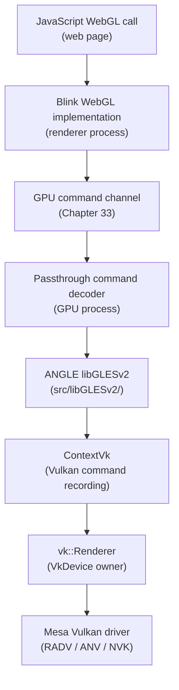
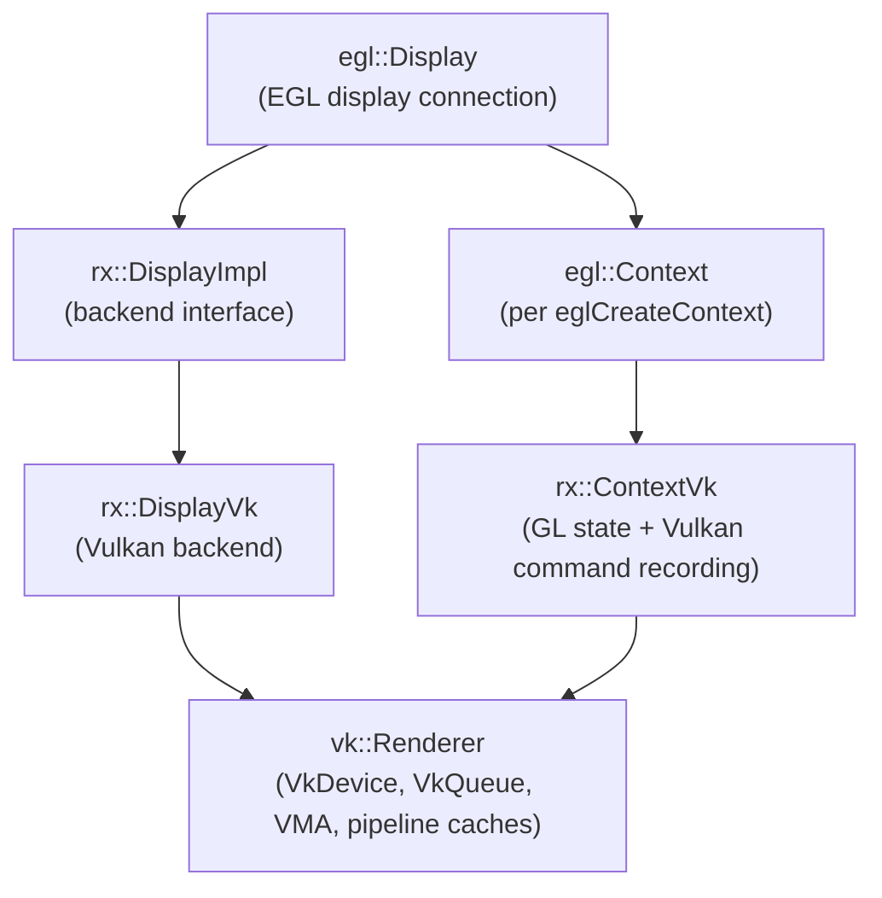
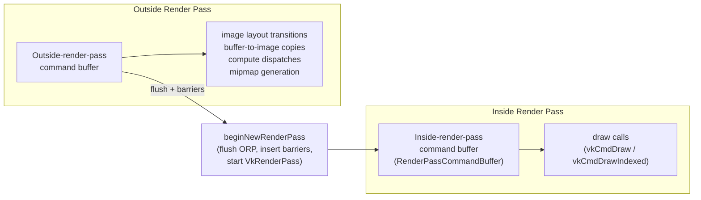
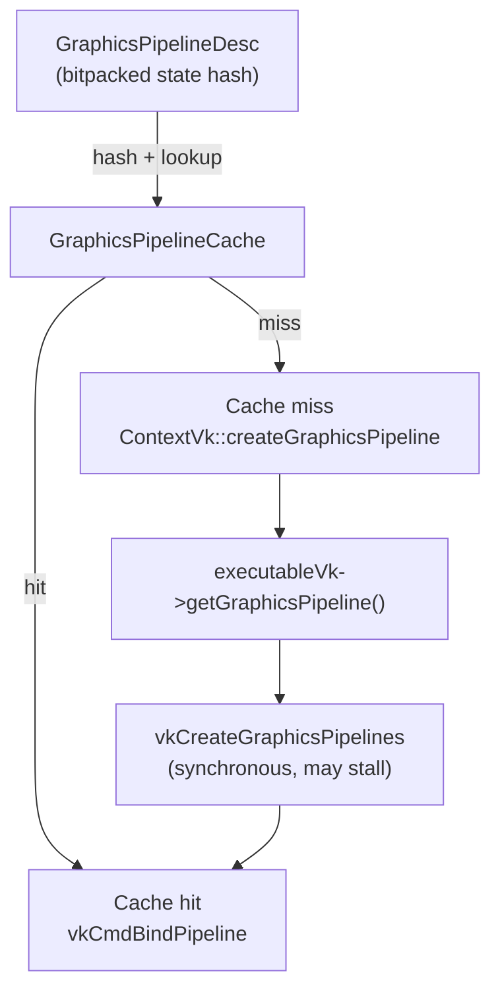
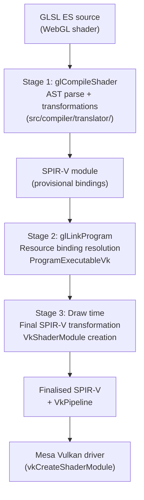
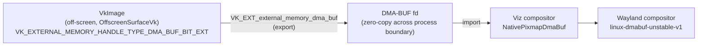

# Chapter 34: ANGLE — WebGL on Linux

**Scope:** This chapter targets browser and web platform engineers who need to understand how WebGL maps onto the Linux graphics stack, and systems developers who want to trace the path from an OpenGL ES API call through ANGLE's Vulkan translation layer into a Mesa driver. It covers ANGLE's architecture in sufficient depth to diagnose rendering correctness bugs and performance regressions that originate in the GL-to-Vulkan translation layer.

---

## Table of Contents

1. [ANGLE's Role in the Browser Stack](#1-angles-role-in-the-browser-stack)
2. [The ANGLE Object Model](#2-the-angle-object-model)
3. [OpenGL ES State Mapping to Vulkan Pipelines](#3-opengl-es-state-mapping-to-vulkan-pipelines)
4. [FramebufferVk, RenderTargetVk, and VkRenderPass Caching](#4-framebuffervk-rendertargetvk-and-vkrenderpass-caching)
5. [Shader Translation: GLSL ES to SPIR-V](#5-shader-translation-glsl-es-to-spir-v)
6. [Multi-Sample Resolve and WebGL Antialiasing](#6-multi-sample-resolve-and-webgl-antialiasing)
7. [Surface and Context Management on Linux](#7-surface-and-context-management-on-linux)
8. [ANGLE per Platform: Linux, Windows, macOS, and Android](#8-angle-per-platform-linux-windows-macos-and-android)
9. [Chrome's ANGLE Integration and the GPU Process](#9-chromes-angle-integration-and-the-gpu-process)
10. [Synchronisation: Bridging the GL and Vulkan Models](#10-synchronisation-bridging-the-gl-and-vulkan-models)
11. [Performance Characteristics and Mitigation Strategies](#11-performance-characteristics-and-mitigation-strategies)
12. [ANGLE Beyond Chrome: Conformance, CTS, and Ecosystem](#12-angle-beyond-chrome-conformance-cts-and-ecosystem)
13. [Frame Capture and Replay](#13-frame-capture-and-replay)
14. [Integrations](#integrations)
15. [References](#references)

---

## 1. ANGLE's Role in the Browser Stack

**ANGLE** — Almost Native Graphics Layer Engine — is a C++ library developed by Google that implements **OpenGL ES** 2.0, 3.0, and 3.1 (with **OpenGL ES** 3.2 support actively underway), alongside **EGL** 1.5. Its source lives at `https://chromium.googlesource.com/angle/angle` and is developed in the open as part of the Chromium project. The core mandate is straightforward: accept **OpenGL ES** API calls from above and translate them to whichever native GPU API is most appropriate for the host platform, doing so with full conformance to the Khronos specification.

Chrome uses **ANGLE** for all **WebGL** rendering rather than calling **Mesa**'s OpenGL implementation directly. The reason is conformance and isolation. Shipping Chrome's own **ANGLE** binary insulates the browser from the enormous variation in **Mesa** versions, vendor extensions, and outright driver bugs found across Linux distributions. Chrome's **ANGLE** is tested on every commit against the Khronos **WebGL** Conformance Test Suite (**CTS**) and the Khronos **deqp-GLES** suites; a **Mesa** installation on a user's machine has no such guarantee. By owning the **GL ES** layer entirely, the Chrome team can fix driver-level bugs in **ANGLE** itself rather than waiting for distribution maintainers to pick up **Mesa** patches.

**ANGLE**'s backend matrix is broad. On Linux the production backend is **Vulkan**, translating **OpenGL ES** calls into **Vulkan** command recording that lands in **RADV** (AMD), **ANV** (Intel), **NVK** (NVIDIA), or any other **Mesa** Vulkan driver. On macOS and iOS the backend is **Metal**. On Windows, **Direct3D 11** remains the default for legacy coverage, with **Direct3D 12** under active development. An **OpenGL/GLES** passthrough backend exists for ChromeOS, where the underlying platform's OpenGL implementation is already trusted. **SwiftShader**, a CPU-side Vulkan renderer, provides the software fallback when no GPU is available. A native OpenGL backend also exists but is not used in production Chrome on Linux — it exists primarily for development and for environments where **Vulkan** is unavailable.

On Linux, the call stack flows as follows. A JavaScript **WebGL** call in a web page reaches **Blink**'s **WebGL** implementation, which calls through the GPU command channel (described in Chapter 33) into the GPU process. The passthrough command decoder in the GPU process forwards each GL call directly to **ANGLE**'s **`libGLESv2`** entry points in **`src/libGLESv2/`**. Those entry points dispatch into **`ContextVk`**, which records **Vulkan** commands. **`ContextVk`** submits those commands to **`vk::Renderer`**, which owns the **`VkDevice`** and submits to the hardware via a **Mesa** Vulkan driver. The entire translation is synchronous from the perspective of the calling thread: there is no extra process boundary between **ANGLE** and the **Mesa** driver.



**ANGLE** is used beyond Chrome. **Firefox** uses **ANGLE** on Windows (**D3D11** backend) and is evaluating the **Vulkan** backend on Linux. **Flutter** uses **ANGLE** on Android to provide its **OpenGL ES** context. **Qt WebEngine** embeds **ANGLE**. **WebKit** on non-Apple platforms also uses **ANGLE**. The project is, in practice, the reference **OpenGL ES** implementation for browser-hosted GPU workloads.

The remainder of this chapter covers **ANGLE** in depth across thirteen sections. Sections 2 and 3 examine the object model and pipeline state mapping. Section 4 covers **FramebufferVk**, **RenderTargetVk**, and **VkRenderPass** caching — how ANGLE maps WebGL's implicit framebuffer model to Vulkan's explicit render pass objects. Section 5 covers the three-stage GLSL ES to SPIR-V pipeline including ANGLE's own **OutputSPIRV** emitter. Section 6 explains multi-sample resolve and WebGL antialiasing on Vulkan. Sections 7 through 9 cover surface management, platform-specific backend selection, and Chrome's GPU process integration. Sections 10 through 13 address synchronisation, performance, conformance testing, and the capture/replay debugging system.

---

## 2. The ANGLE Object Model

Understanding ANGLE's internal object hierarchy is essential for reading crash stacks, correlating GL API calls with Vulkan activity, and reasoning about resource lifetimes.

### The EGL layer

At the top of the object graph sits `egl::Display`, which represents an EGL display connection — conceptually, a connection to a GPU. `egl::Display` owns an `rx::DisplayImpl` implementation pointer; on the Vulkan backend this is `rx::DisplayVk`. The `egl::Context` object (one per `eglCreateContext` call) similarly delegates to `rx::ContextVk`. This two-level structure — a frontend GL/EGL object and a backend `rx::` implementation — runs throughout ANGLE; the frontend handles conformance validation and object tracking while the backend handles the actual API translation.



### DisplayVk and vk::Renderer

`rx::DisplayVk` (defined in `src/libANGLE/renderer/vulkan/DisplayVk.cpp`) is the Vulkan implementation of `egl::Display`. Its `initialize` method, with the signature:

```cpp
// src/libANGLE/renderer/vulkan/DisplayVk.cpp
egl::Error DisplayVk::initialize(egl::Display *display)
```

delegates the heavy lifting to `mRenderer->initialize(...)`, which creates the `VkInstance`, enumerates `VkPhysicalDevice` objects, and selects the appropriate device based on the vendor ID, device ID, device UUID, and driver UUID parameters passed down from Chrome's GPU service. The renderer it creates is a `vk::Renderer` object.

`vk::Renderer` (formerly named `RendererVk` in older versions of the codebase) is the central Vulkan context. It is a singleton per display and holds the `VkDevice`, a `VkQueue` (and the supporting synchronisation primitives for multi-threaded submission), the AMD Vulkan Memory Allocator (VMA) integration for `VkDeviceMemory` suballocation, a per-thread command pool, the global graphics and compute pipeline caches, and the format capability tables that tell the rest of the backend which `VkFormat` values are usable for a given GL internal format. Because `vk::Renderer` is shared across all `ContextVk` instances on a display, access to its pipeline cache and memory allocator is internally locked.

### ContextVk

`rx::ContextVk` (defined in `src/libANGLE/renderer/vulkan/ContextVk.cpp`) is the backend for a single `egl::Context`. It is the most complex class in the Vulkan backend, responsible for tracking all OpenGL context state and translating draw calls into Vulkan command recording.

The key architectural feature of `ContextVk` is its dirty bit system. Every piece of OpenGL state that can affect a Vulkan pipeline — viewport, scissor, blend equations, depth and stencil configuration, cull mode, front face, vertex attribute formats, bound textures, bound uniform buffers — is represented by a bit in a compact bitset. When the GL application changes state (e.g., calls `glBlendFunc` or `glBindTexture`), ANGLE sets the corresponding dirty bit in `ContextVk` but does not immediately apply the change to any Vulkan object. Only when the next draw call arrives does `ContextVk` sweep the dirty bitset, calling each `mGraphicsDirtyBitHandlers[i]` method pointer that corresponds to a set bit. This deferred approach means that state changes between draw calls in a tight loop incur only the cost of a bit-set operation, not a full pipeline state flush, and allows the backend to coalesce redundant state changes. [Source: ANGLE DirtyBits design document](https://chromium.googlesource.com/angle/angle/+/HEAD/doc/DirtyBits.md)

The entry point for most GL draw work passes through `ContextVk::setupDraw`:

```cpp
// src/libANGLE/renderer/vulkan/ContextVk.cpp
angle::Result ContextVk::setupDraw(const gl::Context *context,
    gl::PrimitiveMode mode,
    GLint firstVertexOrInvalid,
    GLsizei vertexOrIndexCount,
    GLsizei baseInstance,
    GLsizei instanceCount,
    gl::DrawElementsType indexTypeOrInvalid,
    const void *indices,
    DirtyBits dirtyBitMask)
```

`setupDraw` handles topology updates and driver uniform changes, then iterates the dirty bits through `mGraphicsDirtyBitHandlers`, with handlers such as `handleDirtyGraphicsRenderPass`, `handleDirtyGraphicsPipelineDesc`, and `handleDirtyGraphicsRasterizerState`. Only after all handlers have executed and the necessary Vulkan objects are in place does the actual `vkCmdDraw` or `vkCmdDrawIndexed` recording occur.

### Command Buffer Architecture

ANGLE's Vulkan backend maintains two parallel command streams. The "outside render pass" command buffer records operations that Vulkan requires to happen outside a `VkRenderPass` — image layout transitions, buffer-to-image copies, compute dispatches for prefiltering, and mipmap generation. The "inside render pass" command buffer records draw calls within an active `VkRenderPass` instance. ANGLE's `beginNewRenderPass` method flushes all pending outside-render-pass commands, inserts any required pipeline barriers, starts a new render pass, and returns a secondary command buffer scoped to that pass.



The key APIs on `ContextVk` for navigating between these states are:

- `beginNewRenderPass`: ends any existing render pass, flushes queued barrier work, starts a new render pass, returns a `RenderPassCommandBuffer`
- `getOutsideRenderPassCommandBuffer`: returns the outside-render-pass secondary command buffer, ensuring barriers are correctly ordered
- `getStartedRenderPassCommands`: returns a reference to the currently active render pass command buffer
- `onRenderPassFinished`: transitions the render pass state machine to "inactive"

Command buffer submission is deferred through the `CommandBatch` system. Multiple frames of draw commands are accumulated into a primary command buffer before `vkQueueSubmit` is called. A flush is forced by `glFlush`, `eglSwapBuffers`, or a fence wait. This batching is critical for Vulkan performance since each `vkQueueSubmit` call carries significant driver overhead.

---

## 3. OpenGL ES State Mapping to Vulkan Pipelines

The central engineering challenge in ANGLE's Vulkan backend is the impedance mismatch between OpenGL's stateful, late-binding model and Vulkan's explicit, immutable pipeline objects. OpenGL allows state to change freely between draw calls with the guarantee that the driver will apply whatever the current state is at the time of the draw. Vulkan instead requires a complete `VkPipeline` object — encoding the rasteriser state, blend state, depth-stencil state, vertex input layout, primitive topology, and shader modules — to be created ahead of time and bound before drawing. Creating a `VkPipeline` may take milliseconds and cannot happen during a draw call without stalling the GPU timeline.

### GraphicsPipelineDesc

ANGLE's solution is the `GraphicsPipelineDesc` structure, a bitpacked aggregate that describes the complete state vector required to uniquely identify a `VkPipeline`. The structure is divided into four independent state subsets that can be hashed independently for sub-library compilation:

- **Vertex input** state: vertex attribute formats, strides, input rate, divisors, and assembly topology
- **Shaders** state: rasterisation, depth/stencil configuration, and the program executable reference
- **Shared non-vertex input** state: multisampling configuration and the embedded `RenderPassDesc`
- **Fragment output** state: per-attachment blend factors, blend equations, and write masks

Every dimension of pipeline state that Vulkan bakes into the object is represented as a field or bitfield within `GraphicsPipelineDesc`. The struct is designed for fast hashing and equality comparison — all fields are packed to minimise padding, and equality is implemented as a `memcmp` over the packed representation. [Source: ANGLE vk_cache_utils.h](https://chromium.googlesource.com/angle/angle/+/refs/heads/main/src/libANGLE/renderer/vulkan/vk_cache_utils.h)

When `handleDirtyGraphicsPipelineDesc` fires during `setupDraw`, ANGLE hashes the current `GraphicsPipelineDesc` and looks it up in the `GraphicsPipelineCache`. A cache hit binds the existing `VkPipeline` with `vkCmdBindPipeline` at essentially zero cost. A cache miss triggers `ContextVk::createGraphicsPipeline`, which calls `executableVk->getGraphicsPipeline()` and ultimately issues `vkCreateGraphicsPipelines`. This synchronous creation step is the primary source of "first-draw" stutter in WebGL applications.



ANGLE tracks which bits of `GraphicsPipelineDesc` changed since the last draw through a parallel `mGraphicsPipelineTransition` bitmask. Rather than rehashing the full descriptor on every draw, ANGLE walks only the transition bits to determine whether the pipeline has genuinely changed, enabling a fast path when consecutive draw calls differ only in viewport or scissor (which are dynamic state).

On devices that support `VK_EXT_graphics_pipeline_library`, ANGLE can split the pipeline object into independently compiled sub-libraries — one per state subset — that can be compiled and linked in stages. The vertex input and fragment output libraries can be compiled from known FBO formats and vertex buffer layouts even before shader compilation completes, reducing the latency of the cache-miss path substantially. [Source: Khronos blog on VK_EXT_graphics_pipeline_library](https://www.khronos.org/blog/reducing-draw-time-hitching-with-vk-ext-graphics-pipeline-library)

### Pipeline State Explosion

A WebGL application that uses many shader programs, blend modes, or vertex input configurations can generate a large number of distinct `VkPipeline` objects. In pathological cases — a particle engine cycling through many blend equations, a procedural renderer switching between many topology modes — the pipeline variant count can reach into the hundreds per shader program. ANGLE addresses this through dynamic state extensions. `VK_EXT_extended_dynamic_state` removes viewport, scissor, cull mode, front face, and primitive topology from the pipeline key, making those dimensions dynamic commands rather than baked-in pipeline fields. On Android this extension is required; on Linux, ANGLE prefers it when available. `VK_EXT_extended_dynamic_state2` adds primitive restart enable and patch control points. Together these two extensions collapse the pipeline variant space substantially for the most common dynamic dimensions. Both extensions were promoted to Vulkan 1.3 core, so they are universally available on Mesa drivers advertising Vulkan 1.3. [Source: VK_EXT_extended_dynamic_state spec](https://registry.khronos.org/vulkan/specs/latest/man/html/VK_EXT_extended_dynamic_state.html)

### Vertex Array Objects

`rx::VertexArrayVk` maps a GL VAO to Vulkan vertex input state. The vertex attribute format descriptions feed into `VkPipelineVertexInputStateCreateInfo` and become part of `GraphicsPipelineDesc`. Vertex buffer bindings are recorded as `vkCmdBindVertexBuffers` at draw time. A known hazard arises when a GL application passes a vertex buffer with a stride that does not satisfy Vulkan's `minVertexInputBindingStrideAlignment` requirement. In such cases ANGLE performs a CPU-side copy of the vertex data into a conformantly-strided temporary buffer before issuing the draw — an unavoidable overhead for legacy WebGL content that assumes arbitrary strides.

### Uniform Buffers and Default Uniforms

OpenGL ES has both "default-block" uniforms set with `glUniform*` calls and explicitly declared uniform blocks. Default-block uniforms have no direct Vulkan equivalent; Vulkan does not support individual uniform variables. ANGLE packs all default-block uniforms for a program into a `DefaultUniformBlock` — a host-side buffer that is uploaded as a UBO on each draw call. The data is uploaded via a ring-buffer strategy using VMA suballocation, minimising the number of `vkUpdateDescriptorSets` calls. Explicit uniform blocks map directly to `VkDescriptorType::VK_DESCRIPTOR_TYPE_UNIFORM_BUFFER` descriptors.

### Textures, Samplers, and Descriptor Sets

Each `rx::TextureVk` object owns a `VkImage`, one or more `VkImageView` objects (for different mip ranges and array slices), and a set of `VkSampler` objects. The `VkSampler` objects are cached in a global `SamplerCache` keyed on the GL sampler parameter hash; reuse across textures is common.

At draw time, ANGLE must update the descriptor set to point to the current textures and samplers. Descriptor sets are allocated from a per-frame pool and updated with `vkUpdateDescriptorSets`. ANGLE uses a watermark-reset strategy on the descriptor pool: at the start of each frame, the pool's allocation pointer is reset to zero, and all descriptor sets from the previous frame are implicitly freed. This avoids per-draw allocation overhead at the cost of per-frame pool memory.

WebGL's `sampler2D` type is a combined texture-sampler in GLSL ES terms, but Vulkan represents textures and samplers as separate objects. ANGLE uses `VK_DESCRIPTOR_TYPE_COMBINED_IMAGE_SAMPLER` by default to match the GLSL ES semantics, creating a single descriptor that pairs the `VkImageView` with the `VkSampler`. Immutable samplers — which Vulkan can bake into the pipeline layout at a performance benefit — are not used for WebGL because the sampler state is determined at GL runtime and is not known at pipeline creation time.

### Framebuffer Attachments and Load/Store Operations

Vulkan `VkRenderPass` objects encode whether each attachment is cleared, loaded, or undefined at the start of the pass (`VkAttachmentLoadOp`) and whether the result is stored or discarded at the end (`VkAttachmentStoreOp`). Getting these right is critical for correctness and GPU efficiency: a GPU tile-based renderer (as found in mobile Arm Mali and Qualcomm Adreno chips) can save significant bandwidth by using `LOAD_OP_CLEAR` or `LOAD_OP_DONT_CARE` instead of loading old framebuffer contents from memory.

ANGLE tracks GL clear calls issued before the first draw into an FBO. If a `glClear` precedes the first draw without any intervening reads of the attachment, ANGLE promotes the clear into a `VK_ATTACHMENT_LOAD_OP_CLEAR` on the render pass, passing the clear colour directly to `VkRenderPassBeginInfo::pClearValues`. If no clear preceded the draw, the load op is `VK_ATTACHMENT_LOAD_OP_LOAD`. At the end of the render pass, ANGLE infers the store op based on whether the attachment will be used again; if a depth buffer is only needed for a single render pass and is not read subsequently, it can be discarded with `VK_ATTACHMENT_STORE_OP_DONT_CARE`.

---

## 4. FramebufferVk, RenderTargetVk, and VkRenderPass Caching

### The FramebufferVk and RenderTargetVk Hierarchy

`rx::FramebufferVk` (defined in `src/libANGLE/renderer/vulkan/FramebufferVk.cpp`) wraps all Vulkan objects associated with a GL framebuffer object: the `VkFramebuffer`, the set of `VkImageView` references for each attachment, and the render pass description. The object graph flows: `gl::Framebuffer` → `FramebufferVk` → `vk::Framebuffer` → `VkFramebuffer`.

Each individual attachment — a color attachment, the depth buffer, the stencil buffer, or an MSAA resolve target — is represented by `rx::RenderTargetVk` (defined in `src/libANGLE/renderer/vulkan/RenderTargetVk.cpp`). A `RenderTargetVk` holds a reference to the backing `vk::ImageHelper` (which wraps the `VkImage` and its `VkDeviceMemory`), the specific `VkImageView` for this attachment (selecting the correct mip level and array layer), and the image's current `VkImageLayout`. During `beginRenderPass`, `ContextVk` iterates the `RenderTargetVk` objects attached to the current `FramebufferVk` and assembles the `VkRenderPassAttachmentDescription` array from their formats, sample counts, and inferred load/store operations.

### RenderPassDesc and VkRenderPass Caching

Because Vulkan requires `VkRenderPass` objects to be created with full knowledge of attachment formats, sample counts, and load/store operations, and because OpenGL allows framebuffer attachments to change dynamically, ANGLE caches `VkRenderPass` objects using the `RenderPassDesc` structure defined in `src/libANGLE/renderer/vulkan/vk_cache_utils.h`.

`RenderPassDesc` is a compact, bitfield-packed structure — designed to fit within 16 bytes total — that encodes:

- Per-attachment color formats indexed by attachment index
- Depth/stencil attachment format
- Sample count (expressed as a log2 value for compact storage)
- View count for multiview rendering
- Flags for special features: framebuffer fetch, resolve attachments, dithering, and whether attachments are stored or discarded

```cpp
// Simplified sketch of RenderPassDesc layout
// src/libANGLE/renderer/vulkan/vk_cache_utils.h
class RenderPassDesc final
{
  public:
    // Pack color attachment VkFormat into the descriptor
    void packColorAttachment(size_t colorIndexGL, angle::FormatID formatID);
    // Pack depth/stencil attachment
    void packDepthStencilAttachment(angle::FormatID formatID);
    // Hash for use as cache key
    size_t hash() const;
    // Initiate a render pass (creates VkRenderPass on cache miss)
    angle::Result beginRenderPass(...) const;
    // Initiate dynamic rendering (VK_KHR_dynamic_rendering path)
    angle::Result beginRendering(...) const;

  private:
    // Bitfield-packed format and flag storage — 16 bytes total
    uint8_t mColorAttachmentFormats[gl::IMPLEMENTATION_MAX_DRAW_BUFFERS];
    uint8_t mDepthStencilAttachmentFormat;
    uint8_t mSamples;   // log2 of sample count
    uint8_t mFlags;     // feature flags
};
```

The `RenderPassCache` (a hash map keyed on `RenderPassDesc`) is owned by `vk::Renderer` and shared across all contexts. On a cache hit, an existing `VkRenderPass` is returned immediately. On a cache miss, a new `VkRenderPass` is created via `vkCreateRenderPass` with the full attachment description array derived from the `RenderPassDesc` fields, and the result is stored in the cache. Because the cache is keyed only on the attachment formats, sample counts, and feature flags — not on the specific load/store operations selected for a given draw — ANGLE creates separate `VkRenderPass` "compatible" variants keyed on the same `RenderPassDesc` but with different `VkAttachmentLoadOp` / `VkAttachmentStoreOp` combinations. The Vulkan specification allows render passes with the same attachment formats and sample counts to be considered compatible for pipeline creation even if their load/store operations differ, meaning a single `VkPipeline` can be used with multiple compatible render pass variants. [Source: ANGLE vk_cache_utils.h](https://chromium.googlesource.com/angle/angle/+/refs/heads/main/src/libANGLE/renderer/vulkan/vk_cache_utils.h)

On drivers that support `VK_KHR_dynamic_rendering` (Vulkan 1.3 core), ANGLE can bypass the `VkRenderPass` object entirely by using `vkCmdBeginRenderingKHR` with a `VkRenderingInfoKHR` structure that specifies attachments inline. This eliminates the render pass cache entirely for modern drivers and simplifies the code path, though the `VkPipeline` creation path still requires format information. ANGLE probes for this extension and uses the dynamic rendering path when available.

### How ANGLE Batches Draw Calls into VkCommandBuffer

Within a `VkRenderPass` instance, ANGLE records all draw calls into a `RenderPassCommandBuffer` — a secondary command buffer scoped to the render pass. Draw calls are batched within this secondary buffer until one of the following events forces the render pass to end:

- A resource barrier is required that cannot be expressed within the render pass (e.g., an image layout transition for a texture that is simultaneously being read and written)
- A `glFlush`, `glFinish`, or `eglSwapBuffers` call forces submission
- A GPU resource is needed outside the render pass (e.g., a mipmap generation compute dispatch)
- The `ContextVk` dirty-bit sweep determines that the render pass framebuffer must change (FBO rebind)

The primary `CommandBuffer` accumulates the outside-render-pass commands and the completed secondary render pass command buffers until a `CommandBatch` submission event occurs. The `CommandBatch` system collects these into a single `vkQueueSubmit` call, minimising per-submit overhead. Each submission is tracked by a `vk::Fence` (or `vk::Semaphore` for cross-queue ordering), allowing the CPU to track GPU completion for fence-sync and swap operations.

### Pipeline Blob Cache

The Vulkan pipeline cache blob, serialised via `vkGetPipelineCacheData`, is persisted to Chrome's GPU shader cache on disk after each session. The cache key is derived from the device's `VkPhysicalDeviceProperties` (vendor ID, device ID, driver version, and `pipelineCacheUUID`). On next launch, the blob is read back and passed to `vkCreatePipelineCache` with `VkPipelineCacheCreateInfo::pInitialData`, enabling the driver to reuse previously compiled pipeline binaries without re-entering its shader compiler. The effectiveness of this persistence depends on the Mesa driver: driver version changes typically invalidate the UUID, requiring a cold rebuild on the first visit after a system update. [Source: Vulkan Pipeline Cache documentation](https://docs.vulkan.org/guide/latest/pipeline_cache.html)

The SPIR-V modules themselves are also cached. After the draw-time SPIR-V finalisation step (see Section 5), ANGLE passes the finalised SPIR-V to `vkCreateShaderModule`. The resulting `VkShaderModule` is retained in the `ProgramExecutableVk` for the lifetime of the program. Across browser sessions, Chrome serialises the pre-transformed SPIR-V (after all AST transformations but before driver-specific compilation) to the GPU shader cache keyed on a hash of the original GLSL ES source. On a cache hit, the stored SPIR-V is loaded directly, bypassing the entire AST parse and transformation chain for that shader.

---

## 5. Shader Translation: GLSL ES to SPIR-V

WebGL shaders are written in GLSL ES — a dialect of GLSL that supports only features available in OpenGL ES. ANGLE must translate this shader source into SPIR-V modules that the Mesa Vulkan driver can accept via `vkCreateShaderModule`. This translation is performed entirely within ANGLE; the project has its own SPIR-V emitter and does not depend on glslang for the Vulkan path.

This independence is a deliberate architectural decision. Prior to approximately 2021, ANGLE's Vulkan backend used a two-step approach: the GLSL ES AST was first transformed into a Vulkan-compatible GLSL string, which was then compiled to SPIR-V using glslang. The current architecture replaces the glslang step with ANGLE's own `OutputSPIRV` traverser, defined in `src/compiler/translator/spirv/OutputSPIRV.cpp`. This change gives ANGLE finer control over the generated SPIR-V, eliminates the glslang dependency for the Vulkan path, and allows the team to implement GLSL semantics precisely — particularly for features like short-circuit evaluation, precision handling, and composite constant optimisation — in ways that differ from glslang's output. [Source: ANGLE OutputSPIRV.cpp](https://chromium.googlesource.com/angle/angle/+/HEAD/src/compiler/translator/spirv/OutputSPIRV.cpp)

The translation is broken into three stages that proceed across the GL pipeline's lifetime.



### Stage 1: Shader Compilation (glCompileShader)

When `glCompileShader` is called, ANGLE's shader translator (in `src/compiler/translator/`) parses the GLSL ES source and builds an Abstract Syntax Tree (AST). The translator applies a sequence of AST transformations that adapt GL semantics to Vulkan constraints, then walks the transformed AST to emit a SPIR-V module.

Key AST transformations at this stage include:

**RewriteStructSamplers.** GLSL ES allows samplers to appear inside structs, which SPIR-V and Vulkan do not permit. This pass decomposes struct members that contain opaque sampler types into separate top-level sampler variables, rewriting all call sites accordingly.

**MonomorphizeUnsupportedFunctions.** GLSL ES allows functions to take sampler parameters. SPIR-V disallows this. This pass clones each such function for every distinct sampler that is passed to it at call sites, replacing the generic parameter with a concrete sampler variable.

**Precision emulation.** GLSL ES defines `mediump` and `lowp` precision qualifiers with the intent of allowing `float16` execution on mobile hardware. Vulkan itself has no precision qualifiers; the `VK_KHR_shader_float16_int8` extension is required to use 16-bit floats. ANGLE's precision emulation pass optionally inserts explicit conversions to and from `float16` types in `mediump` contexts, enabling GPU bandwidth and ALU savings on hardware that supports the extension. This is an active area of optimisation and care is needed for precision-sensitive code paths such as trigonometric functions and texture coordinate accumulation.

**BuiltinsWorkaround.** Many GLSL ES built-ins and predefined outputs have no direct Vulkan SPIR-V equivalent. `gl_FragColor` in GLSL ES 1.0 must become a `layout(location=0) out vec4` user-defined output. `gl_PointCoord` requires y-flipping on some Vulkan implementations due to Vulkan's different NDC origin convention. The `BuiltinsWorkaround` pass replaces each such built-in with the appropriate Vulkan-compatible construct.

**AddEmulatedPixelLocalStorage.** Pixel local storage is a tile-memory extension used for deferred shading passes on mobile GPU architectures. In Vulkan this is exposed via `VK_EXT_rasterization_order_attachment_access` and input attachments. This pass rewrites pixel local storage accesses into Vulkan-compatible framebuffer fetch or input attachment reads.

After transformations, the AST is walked by the `OutputSPIRVTraverser` class (inheriting from `TIntermTraverser`), which emits SPIR-V opcodes directly. The traverser maintains a node data stack — each AST node pushes data during pre-visit and generates SPIR-V instructions during post-visit as child data is aggregated. SPIR-V storage classes are determined by a `GetStorageClass()` helper that maps GLSL qualifiers to SPIR-V storage classes:

```cpp
// Simplified from src/compiler/translator/spirv/OutputSPIRV.cpp
// Maps GLSL ES variable qualifiers to SPIR-V storage classes
spv::StorageClass GetStorageClass(const TType &type, GLenum shaderType)
{
    // Opaque types (samplers, images) → UniformConstant
    if (IsOpaqueType(type.getBasicType()))
        return spv::StorageClassUniformConstant;
    // Shader inputs → Input, outputs → Output
    if (type.getQualifier() == EvqVaryingIn || type.getQualifier() == EvqFragCoord)
        return spv::StorageClassInput;
    if (type.getQualifier() == EvqVaryingOut || type.getQualifier() == EvqFragmentOut)
        return spv::StorageClassOutput;
    // Shared memory (compute shaders) → Workgroup
    if (type.getQualifier() == EvqShared)
        return spv::StorageClassWorkgroup;
    // UBOs → Uniform, SSBOs → StorageBuffer
    if (type.getQualifier() == EvqUniform && type.isInterfaceBlock())
        return spv::StorageClassUniform;
    // Default uniforms (packed into DefaultUniformBlock) → Uniform
    return spv::StorageClassUniform;
}
```

### Interface Blocks and Varyings in SPIR-V

OpenGL varyings — the `varying` / `in` / `out` variables that connect vertex and fragment stages — become SPIR-V `Input` and `Output` variables decorated with `Location` indices. ANGLE resolves location assignments at link time (Stage 2) rather than at compile time, so the Stage 1 SPIR-V carries provisional location decorations that will be patched during the draw-time transformation (Stage 3).

Interface blocks — GLSL ES `uniform` blocks and `buffer` blocks — map to SPIR-V `OpTypeStruct` types wrapped in `OpVariable` declarations with `Uniform` or `StorageBuffer` storage class. The struct receives `Block` decoration (for UBOs) or `BufferBlock` decoration (for SSBOs, using SPIR-V 1.3 semantics). Each member receives `Offset` decoration giving its byte offset within the block layout.

The output at Stage 1 has provisional descriptor set, binding, and location assignments — placeholders that will be resolved later. Specialisation constants are inserted for features whose values are not known until draw time: dithering mode and screen rotation on Android.

### Stage 2: Link Time (glLinkProgram)

At `glLinkProgram`, ANGLE resolves the interface between vertex and fragment (and, if present, geometry/compute) shader stages. The backend assigns final descriptor set indices and binding numbers for each resource — uniform blocks, texture samplers, image uniforms, and shader storage blocks — producing the `ProgramExecutableVk` that encodes the paired SPIR-V modules alongside their resource layout.

As an optimisation, ANGLE performs a preliminary SPIR-V transformation with assumed draw-time values and creates a `VkPipeline` object to pre-warm the pipeline cache. This speculative compilation absorbs some of the first-draw stall by doing pipeline work at link time when the application is not yet blocked on a draw result. [Source: ANGLE ShaderModuleCompilation.md](https://chromium.googlesource.com/angle/angle/+/HEAD/src/libANGLE/renderer/vulkan/doc/ShaderModuleCompilation.md)

### Stage 3: Draw Time

The final SPIR-V transformation occurs when the first draw call referencing a newly linked program is processed. The transformation pass corrects all provisional descriptor set and binding indices to their final values, applies component decorations for transform feedback varyings, removes inactive varyings (those not consumed by the next shader stage), toggles early fragment test optimisation if appropriate, strips debug info from the module, and applies pre-rotation transforms for rotated display modes.

After transformation, `VkShaderModule` objects are created from the finalised SPIR-V and cached in the program's `ProgramExecutableVk`. Subsequent draws reuse the cached modules. The final `VkPipeline` is then created (or retrieved from the cache) using these modules, completing the compilation chain.

---

## 6. Multi-Sample Resolve and WebGL Antialiasing

### WebGL MSAA Semantics

WebGL exposes antialiasing as a single boolean attribute on the rendering context: `WebGLRenderingContext.getContextAttributes().antialias`. When `antialias: true` (the default), the browser is expected to render the scene at a higher sample count and resolve it before presenting. This is a high-level contract — WebGL does not expose the sample count, explicit MSAA framebuffer attachments, or resolve operations to the application. ANGLE's Vulkan backend must implement this implicit contract using explicit Vulkan multisampling primitives.

### Multisampled Render Targets

When a WebGL context is created with `antialias: true`, `ContextVk` allocates the default framebuffer's colour attachment and depth/stencil attachment as multisampled `VkImage` objects — typically at 4 samples per pixel. These images are created with `VK_SAMPLE_COUNT_4_BIT` and `VK_IMAGE_USAGE_COLOR_ATTACHMENT_BIT` (or `DEPTH_STENCIL_ATTACHMENT_BIT` for depth). On mobile GPUs with tile-based deferred rendering (TBDR) architectures such as Arm Mali and Qualcomm Adreno, the MSAA samples live in on-chip tile memory and never need to be written to DRAM if the render pass is structured correctly — making MSAA essentially free in memory bandwidth terms.

### VkRenderPass Resolve Attachments

Vulkan implements MSAA resolve as a `VkAttachmentDescription` pair within the render pass: a multisampled attachment and a single-sampled resolve attachment. The `VkSubpassDescription::pResolveAttachments` array specifies which single-sampled attachment receives the resolved output at subpass end. The Vulkan driver then schedules the resolve operation at the end of the subpass, before writing out tile memory to DRAM. On a TBDR GPU, this means the resolve happens in the tile pipeline without a separate pass over DRAM — the "multisampled anti-aliasing for almost free" optimisation. [Source: Efficient Render Passes on TBDR hardware](https://medium.com/androiddevelopers/multisampled-anti-aliasing-for-almost-free-on-tile-based-rendering-hardware-21794c479cb9)

ANGLE constructs the resolve attachment by adding a `RenderTargetVk` for the single-sampled resolve image alongside the multisampled render target. When `beginRenderPass` assembles the `VkRenderPassAttachmentDescription` array for a framebuffer with MSAA enabled, it places the multisampled image as the colour attachment and the single-sampled image as the resolve attachment, with:

- Multisampled attachment: `loadOp = LOAD_OP_CLEAR` (or `DONT_CARE`), `storeOp = STORE_OP_DONT_CARE`
- Resolve attachment: `loadOp = LOAD_OP_DONT_CARE`, `storeOp = STORE_OP_STORE`

The `STORE_OP_DONT_CARE` on the multisampled attachment is the critical optimisation: it instructs the GPU that the multisampled tile data need not be written to main memory. On a TBDR GPU this reclaims the entire bandwidth cost of the MSAA samples. Setting this incorrectly (e.g., `STORE_OP_STORE` on the MSAA attachment) would cause a ~5 GB/s increase in memory bandwidth on a Pixel 6-class device.

```c
// Pseudocode showing how ANGLE structures a 4x MSAA render pass with resolve
// Actual code: src/libANGLE/renderer/vulkan/FramebufferVk.cpp

VkAttachmentDescription attachments[2] = {
    // [0] Multisampled colour attachment
    {
        .format         = VK_FORMAT_R8G8B8A8_UNORM,
        .samples        = VK_SAMPLE_COUNT_4_BIT,
        .loadOp         = VK_ATTACHMENT_LOAD_OP_CLEAR,
        .storeOp        = VK_ATTACHMENT_STORE_OP_DONT_CARE,  // on-chip only
        .initialLayout  = VK_IMAGE_LAYOUT_COLOR_ATTACHMENT_OPTIMAL,
        .finalLayout    = VK_IMAGE_LAYOUT_COLOR_ATTACHMENT_OPTIMAL,
    },
    // [1] Single-sampled resolve target
    {
        .format         = VK_FORMAT_R8G8B8A8_UNORM,
        .samples        = VK_SAMPLE_COUNT_1_BIT,
        .loadOp         = VK_ATTACHMENT_LOAD_OP_DONT_CARE,
        .storeOp        = VK_ATTACHMENT_STORE_OP_STORE,
        .initialLayout  = VK_IMAGE_LAYOUT_UNDEFINED,
        .finalLayout    = VK_IMAGE_LAYOUT_SHADER_READ_ONLY_OPTIMAL,
    },
};

VkAttachmentReference colorRef  = { 0, VK_IMAGE_LAYOUT_COLOR_ATTACHMENT_OPTIMAL };
VkAttachmentReference resolveRef = { 1, VK_IMAGE_LAYOUT_COLOR_ATTACHMENT_OPTIMAL };

VkSubpassDescription subpass = {
    .colorAttachmentCount    = 1,
    .pColorAttachments       = &colorRef,
    .pResolveAttachments     = &resolveRef,
};
```

### On-Chip Resolve vs. Explicit vkCmdResolveImage

When the platform supports TBDR and the render pass is correctly structured with `pResolveAttachments`, the resolve is an on-chip operation with no DRAM bandwidth cost. ANGLE strongly prefers this path.

The fallback is `vkCmdResolveImage`, which is an explicit resolve command issued outside the render pass. This command reads the multisampled image from DRAM, computes the resolve, and writes the result to the single-sampled image — three DRAM accesses per pixel at 4x MSAA. ANGLE uses `vkCmdResolveImage` only when the render pass-based resolve is not available (e.g., if the resolve attachment was not included in the original render pass description and the content must be resolved retroactively) or when a non-default framebuffer with a mixed-sample configuration requires it.

On desktop GPUs (Nvidia, AMD, Intel) where TBDR is not used and the GPU has dedicated on-chip MSAA resolve logic, both paths are efficient. On these platforms the choice is driven by correctness and code simplicity rather than bandwidth optimisation.

### The antialias Attribute Path

When Chrome creates a WebGL context with `{antialias: true}`, the `OffscreenSurfaceVk` (or `WindowSurfaceVk`) is set up with a multisampled colour attachment and a single-sampled resolve attachment. The final rendered frame that Viz receives is the resolved single-sampled image. The multisampled `VkImage` is marked as transient (`VK_IMAGE_USAGE_TRANSIENT_ATTACHMENT_BIT`) and allocated in lazily-allocated memory (`VK_MEMORY_PROPERTY_LAZILY_ALLOCATED_BIT`) where available — on mobile platforms this means the MSAA samples are guaranteed to live only in tile memory and are never backed by physical DRAM pages.

---

## 7. Surface and Context Management on Linux

### EGL Surface Types

ANGLE implements the EGL 1.5 API. On Linux, the display connection is obtained via `eglGetPlatformDisplayEXT` using the `EGL_ANGLE_platform_angle` extension, passing `EGL_PLATFORM_ANGLE_ANGLE` as the platform identifier and `EGL_PLATFORM_ANGLE_TYPE_VULKAN_ANGLE` as the type attribute — the mechanism by which the caller requests the Vulkan backend at display creation time. [Source: ANGLE extension spec `extensions/EGL_ANGLE_platform_angle_vulkan.txt`]

Three surface types are relevant on Linux:

**WindowSurfaceVk** wraps a `VkSwapchainKHR` and is used when ANGLE renders directly to a native window. On Chrome/Linux this case is relatively rare; Chrome's compositor (Viz) typically manages presentation separately. There is an open tracking issue for ANGLE's native Wayland window surface (`WindowSurfaceVkWayland`), as the Wayland path has had stability and integration issues on Ozone/Wayland configurations. [Source: Chromium issue 334275637](https://issues.chromium.org/issues/334275637)

**OffscreenSurfaceVk** renders to a `VkImage` not backed by a swapchain. This is the standard configuration for WebGL canvases in Chrome: ANGLE renders into an off-screen `VkImage`, which is then imported by the Viz compositor for presentation.

**PbufferSurfaceVk** is a fixed-size off-screen surface used for WebGL canvases that are not yet visible in the viewport, avoiding the overhead of swapchain creation for off-screen content.

### DMA-BUF Integration

ANGLE implements `EGL_KHR_image_base` and `EGL_EXT_image_dma_buf_import` (with modifier support via `EGL_EXT_image_dma_buf_import_modifiers`). The DMA-BUF import path is enabled when both `supportsExternalMemoryDmaBuf` and `supportsImageDrmFormatModifier` feature flags are set on `vk::Renderer`. This allows an externally-produced DMA-BUF file descriptor — such as a buffer allocated by Viz or the Wayland compositor — to be imported as a `VkImage` backed by `VK_EXT_external_memory_dma_buf`. The import uses `vkBindImageMemory2` with a `VkImportMemoryFdInfoKHR` structure in the `pNext` chain, naming the DMA-BUF fd and its memory type index. [Source: EGL_EXT_image_dma_buf_import spec](https://registry.khronos.org/EGL/extensions/EXT/EGL_EXT_image_dma_buf_import.txt)

The inverse operation — exporting an ANGLE-rendered `VkImage` as a DMA-BUF fd for consumption by Viz — uses `VK_EXT_external_memory_dma_buf` in export mode. The GPU process renders the WebGL canvas into an off-screen `VkImage` allocated with `VK_EXTERNAL_MEMORY_HANDLE_TYPE_DMA_BUF_BIT_EXT`, exports the backing memory as a DMA-BUF fd, and passes that fd to Viz. Viz imports it as a `NativePixmapDmaBuf` and submits it to the Wayland compositor via the `linux-dmabuf-unstable-v1` protocol (covered in Chapter 20). The DMA-BUF fd crosses the GPU process boundary without any pixel data copy, making this path zero-copy from ANGLE's `VkImage` to the Wayland compositor's scanout buffer.



### Multi-Context and Thread Safety

`vk::Renderer` is shared across all `ContextVk` instances on a display. Per-context command buffers are recorded on the context's thread. `vk::Renderer` uses internal locking for shared resources: the pipeline cache, the memory allocator (VMA), and the pipeline layout cache. The command buffer submission queue is also protected by a mutex, since Chrome may submit from multiple threads. The design avoids per-draw locking in the hot path by ensuring that `ContextVk`-private state (the dirty bitset, the active command buffers, the descriptor pool) is never shared.

---

## 8. ANGLE per Platform: Linux, Windows, macOS, and Android

Understanding which platforms use ANGLE — and which specific backend each platform uses — is essential for diagnosing platform-specific WebGL bugs and understanding why a behavior differs across browsers or operating systems.

### Linux Desktop

On Linux desktop, Chrome does **not** use the ANGLE translation layer by default for WebGL. Instead, the GPU process initialises an OpenGL context directly against Mesa (via GLX on X11 or via EGL/gbm on Wayland/DRM), and the passthrough command decoder forwards GL ES calls through Mesa's OpenGL implementation — which on Vulkan-class Mesa installations is internally translated to Vulkan via Zink or served by the driver's native OpenGL path. The GPU process on Linux uses `gl=desktop` or `gl=egl` mode, not `gl=egl-angle`. [Source: ANGLE project discussion](https://groups.google.com/g/angleproject/c/VshCv-jUp9Q)

This means that on Linux desktop, the ANGLE **shader translator** (the `src/compiler/translator/` component) is still used for GLSL ES validation and WebGL conformance enforcement — ANGLE's compiler catches violations that Mesa's OpenGL driver might silently accept — but the Vulkan translation layer (`ContextVk`, `FramebufferVk`, etc.) is not in the path. The shader translator output is Vulkan SPIR-V only when Chrome explicitly uses the ANGLE Vulkan backend, which is available via command-line flags but is not the shipping default on Linux desktop as of 2026.

Users can opt into the ANGLE Vulkan backend on Linux via:

```bash
# Force Chrome to use ANGLE with the Vulkan backend on Linux
google-chrome --use-angle=vulkan
# Or: use ANGLE with the native GL backend (for debugging)
google-chrome --use-angle=gl
```

The Wayland/Ozone path has a known limitation: `gl=egl-angle,angle=vulkan` was not in the set of allowed GL implementations on Wayland as of 2024, causing Chrome to fall back to `gl=egl-angle,angle=opengl` even when `--use-angle=vulkan` is specified. [Source: Chromium issue 334275637](https://issues.chromium.org/issues/334275637)

### Windows

On Windows, Chrome uses ANGLE with the **Direct3D 11** backend as the production default for WebGL. This backend translates OpenGL ES API calls into D3D11 draw calls, which is the primary reason Chrome has historically had superior WebGL compatibility on Windows compared to Linux — the D3D11 backend is the most-tested ANGLE path and the one against which the WebGL CTS is run in Chrome's primary CI. The Vulkan backend is available on Windows via `--use-angle=vulkan` and is under active development, with the intent of eventually replacing D3D11 as the default. [Source: ANGLE README](https://chromium.googlesource.com/angle/angle/+/main/README.md)

### macOS and iOS

On macOS, Chrome uses ANGLE with the **Metal** backend. The Metal backend translates OpenGL ES calls to Metal API calls, using ANGLE's Metal-specific shader translator to produce MSL (Metal Shading Language) from the GLSL ES AST. On iOS, the Metal backend is the only available option, as OpenGL ES support was deprecated by Apple in 2018. The Metal backend reaches equivalent conformance levels to the Vulkan backend for WebGL 1.0 and 2.0. [Source: ANGLE README](https://chromium.googlesource.com/angle/angle/+/main/README.md)

### Android

On Android, the situation is the most complex. Chrome uses ANGLE as its WebGL backend on Android, layered over the **Vulkan** backend (on devices with Vulkan 1.1+) or over the platform's **OpenGL ES** driver (on older devices). On Pixel devices running Android 12 and later, Google has deployed ANGLE as the **system-wide OpenGL ES driver** for selected applications — meaning that an application that calls `eglGetDisplay` and creates a GLES context gets ANGLE+Vulkan under the hood rather than the GPU vendor's proprietary OpenGL ES driver. Chrome's WebGL calls on such a device traverse two ANGLE instantiations: Chrome's own ANGLE instance (processing WebGL conformance), and the system ANGLE instance (serving as the GLES driver). The tracking issue for enabling ANGLE's Vulkan backend natively in Chrome on Android (avoiding the double-ANGLE overhead) is tracked at [Chromium issue 371512561](https://issues.chromium.org/issues/371512561).

Android's ANGLE deployment is controlled by a configuration file embedded in the ANGLE APK (`angle_layers.json`), which specifies which application package names, GPU vendor IDs, and driver versions should use ANGLE. This allows Google to roll out ANGLE as the system GLES driver incrementally on Pixel devices while retaining the vendor driver fallback for applications that require it.

The table below summarises the platform–backend matrix:

| Platform | Default Chrome WebGL backend | ANGLE backend |
|---|---|---|
| Linux X11 | Mesa OpenGL (GLX) | Not in path (shader translator only) |
| Linux Wayland | Mesa OpenGL (EGL) | Not in path (shader translator only) |
| Windows | ANGLE | Direct3D 11 |
| macOS | ANGLE | Metal |
| iOS | ANGLE | Metal |
| Android (Vulkan device) | ANGLE | Vulkan |
| Android (GLES-only device) | ANGLE | OpenGL ES |
| ChromeOS | ANGLE | OpenGL ES (passthrough) |

---

## 9. Chrome's ANGLE Integration and the GPU Process

### The GPU Process ANGLE Lifecycle

Chrome's GPU process hosts a single `egl::Display` per physical GPU, created at GPU process startup. The `egl::Display` is initialised with the backend type determined by the `--use-angle=` command-line flag or the compiled-in platform default. On Windows, this is `EGL_PLATFORM_ANGLE_TYPE_D3D11_ANGLE`; on Linux with the ANGLE Vulkan path, `EGL_PLATFORM_ANGLE_TYPE_VULKAN_ANGLE`. The display's `vk::Renderer` object (on the Vulkan backend) creates the `VkInstance` and selects the `VkPhysicalDevice` at this point, driven by the GPU device information gathered by the GPU Info Collector earlier in the startup sequence.

Each WebGL context in a renderer process corresponds to a separate `egl::Context` (`rx::ContextVk`) inside the GPU process. The mapping is one-to-one: one `<canvas>` element with a WebGL context → one `eglCreateContext` call in the GPU process → one `ContextVk`. Contexts share the `vk::Renderer` singleton, which means they share the `VkDevice`, the pipeline cache, and the memory allocator, but each context has its own command buffers, descriptor pools, and dirty-bit state.

### The --use-angle= Flag

The `--use-angle=` flag controls which ANGLE backend Chrome selects when it initialises the `egl::Display`:

```bash
google-chrome --use-angle=d3d11     # Windows default
google-chrome --use-angle=d3d9      # Legacy Windows fallback
google-chrome --use-angle=gl        # OpenGL passthrough (Linux/Mac development)
google-chrome --use-angle=vulkan    # Vulkan backend
google-chrome --use-angle=metal     # Metal backend (macOS)
google-chrome --use-angle=swiftshader  # CPU software renderer
```

On Linux, the flags `--use-gl=angle --use-angle=vulkan` together force Chrome to use ANGLE's Vulkan backend rather than Mesa's native OpenGL path. This is not the default but is useful for testing ANGLE Vulkan behaviour against Mesa's Vulkan drivers (RADV, ANV, NVK) on Linux hardware.

### EGLImage Zero-Copy Texture Sharing

Chrome uses the `EGL_KHR_image_base` extension to share textures between the renderer process and the GPU process without data copies. The mechanism works as follows:

1. The GPU process creates a `VkImage` for a WebGL texture, allocates memory with `VK_EXTERNAL_MEMORY_HANDLE_TYPE_DMA_BUF_BIT_EXT`, and exports it as a DMA-BUF fd.
2. The fd is passed to the renderer process (or to the Viz compositor) via the GPU command channel as a platform handle.
3. The recipient imports the fd using `eglCreateImageKHR` with `EGL_LINUX_DMA_BUF_EXT` as the target, producing an `EGLImage`.
4. The `EGLImage` is bound to a texture object via `glEGLImageTargetTexture2DOES`, making the ANGLE-rendered content available as a texture without any pixel data copy.

This zero-copy path is the mechanism by which video frames decoded in the media process (via VA-API or V4L2, as described in Chapter 47) are made available to WebGL shaders for GPU-accelerated video processing. The DMA-BUF fd carries the frame data through the process boundary at the kernel level; no pixel data ever crosses a CPU copy step.

For WebGL canvas compositing, Chrome's Viz compositor similarly receives the ANGLE-rendered canvas content via a DMA-BUF fd export from the GPU process, composites it with other page content, and presents the result to the Wayland compositor.

### ANGLE's Role in the GPU Sandbox

Chrome runs the GPU process with a restricted seccomp-BPF sandbox on Linux. The ANGLE Vulkan backend communicates with the Mesa Vulkan driver via the same ioctl interfaces that any Vulkan application uses: the DRM render node (`/dev/dri/renderD128`), the Mesa loader's `dlopen` of the Vulkan ICD, and the `drm_ioctl` family for memory management. ANGLE does not require any additional sandbox capabilities beyond those needed by a standard Vulkan application; the Mesa driver performs the actual kernel calls within the GPU sandbox's permitted ioctl whitelist.

---

## 10. Synchronisation: Bridging the GL and Vulkan Models

### The Fundamental Mismatch

OpenGL's concurrency model is implicit: the specification guarantees that a read after a write is coherent without any application-visible synchronisation primitive. Every `glTexImage2D` followed by a draw that samples the texture is guaranteed to see the new data. Every `glCopyTexImage2D` followed by a `glDrawArrays` that reads the copy target is correctly ordered. This guarantee is built into the API contract, and drivers have historically maintained it by inserting barriers at the command-stream level without application involvement.

Vulkan's model is the opposite. The application is responsible for all ordering: `VkMemoryBarrier`, `VkBufferMemoryBarrier`, and `VkImageMemoryBarrier` structures must be placed at every point where one operation's output is consumed by another, specifying the source and destination pipeline stages, the source and destination access masks, and (for images) the required layout transitions. Omitting a barrier is undefined behaviour — the GPU may read stale data, produce corrupted output, or crash.

ANGLE must therefore infer and insert all Vulkan barriers automatically, preserving OpenGL's implicit-ordering guarantee while generating correct Vulkan synchronisation.

### Resource Use Tracking

ANGLE tracks the "use state" of every buffer and image through the `CommandBufferHelper` and `CommandResources` APIs. Every operation that touches a resource records what it did to that resource using methods like:

- `onBufferTransferRead` / `onBufferTransferWrite`: CPU-to-GPU uploads, buffer copies
- `onBufferComputeShaderRead` / `onBufferComputeShaderWrite`: compute dispatch buffer accesses
- `onImageRenderPassRead` / `onImageRenderPassWrite`: image attachment reads/writes within a render pass
- `onImageTransferRead` / `onImageTransferWrite`: blit and copy operations on images

When a draw call is about to begin and `beginNewRenderPass` is called, the `CommandBufferHelper` sweeps the accumulated resource use records and emits the minimal set of `vkCmdPipelineBarrier` calls needed to resolve all hazards. Barriers are batched into `mPipelineBarriers` and `mEventBarriers` structures, with the newer code using `VkEvent`-based barriers via `mRefCountedEventCollector` where event-based signalling can replace heavier pipeline-stage barriers for better GPU throughput.

### Image Layout Transitions

Vulkan requires each `VkImage` to be in the correct layout for each use. A texture that is written by a transfer operation (`VK_IMAGE_LAYOUT_TRANSFER_DST_OPTIMAL`) must be transitioned to `VK_IMAGE_LAYOUT_SHADER_READ_ONLY_OPTIMAL` before it can be sampled. ANGLE defers these transitions: after a texture upload (`glTexImage2D`), the image is left in `TRANSFER_DST_OPTIMAL`. The transition to `SHADER_READ_ONLY_OPTIMAL` is only inserted when the next draw call that samples the texture fires. This deferral allows multiple uploads to the same image to be batched before the transition occurs, and avoids unnecessary transitions for textures that are written and re-written without intervening sampling.

### Fence Synchronisation

GL fence sync objects, created with `glFenceSync(GL_SYNC_GPU_COMMANDS_COMPLETE, 0)`, map to a `VkFence` inserted at command buffer submission time. `glClientWaitSync` maps to `vkWaitForFences` with the corresponding timeout.

At the EGL level, `EGL_KHR_fence_sync` and `EGL_ANDROID_native_fence_sync` provide fence objects that can be exported as Linux sync file descriptors. ANGLE implements this export via `VK_KHR_external_fence_fd`. [Source: VK_KHR_external_fence_fd spec](https://registry.khronos.org/vulkan/specs/latest/man/html/VK_KHR_external_fence_fd.html) The `ExternalFence` class (in `src/libANGLE/renderer/vulkan/SyncVk.cpp`) wraps a Vulkan fence configured with `VK_STRUCTURE_TYPE_EXPORT_FENCE_CREATE_INFO` and `VK_EXTERNAL_FENCE_HANDLE_TYPE_SYNC_FD_BIT_KHR`. Export is performed by:

```cpp
// src/libANGLE/renderer/vulkan/SyncVk.cpp
void ExternalFence::exportFd(VkDevice device, const VkFenceGetFdInfoKHR &fenceGetFdInfo)
{
    ASSERT(mFenceFdStatus == VK_INCOMPLETE && mFenceFd == kInvalidFenceFd);
    mFenceFdStatus = mFence.exportFd(device, fenceGetFdInfo, &mFenceFd);
    ASSERT(mFenceFdStatus != VK_INCOMPLETE);
}
```

The resulting file descriptor is a Linux sync fd that encodes GPU completion. Viz receives this fd as part of the frame submission protocol and uses it to defer scanout until the GPU has finished rendering, without stalling the CPU. This mechanism is described further in Chapter 36.

### Texture Upload Hazards in Practice

The most common synchronisation pitfall for WebGL authors that manifests as rendering glitches in ANGLE is the texture upload hazard. A pattern like:

```javascript
gl.texImage2D(gl.TEXTURE_2D, 0, gl.RGBA, ...);
gl.drawArrays(gl.TRIANGLES, 0, 6);
```

is valid in WebGL and must work correctly. ANGLE tracks that the texture was last written by a transfer operation and that the upcoming draw call will sample it, and automatically inserts the layout transition barrier before the render pass begins. For animated textures updated every frame this barrier is consistently present, and ANGLE's batching ensures it is emitted only once per frame per texture, not once per draw.

---

## 11. Performance Characteristics and Mitigation Strategies

### Pipeline Creation Stutter

The most user-visible performance issue in ANGLE's Vulkan backend is first-draw stutter caused by `vkCreateGraphicsPipelines`. A complex WebGL scene that exercises novel state combinations on first visit may stall for 1–100 milliseconds per distinct pipeline, causing janky frame times during initial load or during state-space exploration (e.g., a game that activates new visual effects). ANGLE mitigates this through three mechanisms.

First, the persistent pipeline cache: `vkGetPipelineCacheData` blob is serialised to Chrome's `gpu_shader_cache` on disk after each session. On revisit, the blob is passed to `vkCreatePipelineCache` at startup, and the driver can reuse compiled pipelines from it without re-entering its compiler. The effectiveness of this mechanism depends on the Mesa driver implementation; driver version changes may invalidate the cache, requiring a cold rebuild on the first visit after an update. [Source: Vulkan Pipeline Cache guide](https://docs.vulkan.org/guide/latest/pipeline_cache.html)

Second, speculative link-time compilation: at `glLinkProgram`, ANGLE creates a pipeline with assumed draw-time defaults, warming the cache for the most likely first draw. [Source: ANGLE ShaderModuleCompilation.md](https://chromium.googlesource.com/angle/angle/+/HEAD/src/libANGLE/renderer/vulkan/doc/ShaderModuleCompilation.md)

Third, `VK_EXT_graphics_pipeline_library`: ANGLE splits the pipeline into independently compiled sub-libraries on supporting hardware. The vertex input and fragment output stages — which depend only on the vertex attribute format and the framebuffer format, not on the shaders — can be compiled asynchronously. When the full pipeline is needed, the shader stage library (already compiled) is linked to the pre-compiled input/output stubs, reducing per-draw pipeline creation latency. [Source: Khronos blog on VK_EXT_graphics_pipeline_library](https://www.khronos.org/blog/reducing-draw-time-hitching-with-vk-ext-graphics-pipeline-library)

### Descriptor Set Overhead

Each WebGL draw call that changes texture bindings or uniform values requires updating descriptor sets. ANGLE's per-frame pool watermark strategy (described in Section 3) avoids `vkAllocateDescriptorSets` on every draw. The pool is large enough to accommodate a full frame of draw calls; at frame boundary the watermark resets to zero. This approach is cache-friendly and allocation-free during the frame but requires sizing the pool conservatively.

A longer-term approach under evaluation is `VK_EXT_descriptor_indexing` (bindless textures). With bindless, all textures are placed in a single large descriptor array bound once per frame; draw calls reference textures by integer index rather than updating descriptor sets. This eliminates per-draw descriptor churn entirely. The obstacle for WebGL is that WebGL's texture binding model requires precise aliasing semantics that bindless complicates; the work is ongoing.

### Command Buffer Batching

ANGLE defers `vkQueueSubmit` until a fence wait, `glFlush`, or buffer swap forces submission. The `CommandBatch` accumulator collects draw command buffers until this point. Aggressive batching reduces the per-submit CPU overhead and allows the GPU to see a larger batch of work, improving its scheduling efficiency. The trade-off is latency: deferred submission means the GPU may sit idle waiting for a batch to fill. Chrome's frame timing infrastructure mediates this by forcing submission at appropriate points in the frame lifecycle.

### Vertex Buffer Alignment

Vulkan's `VkPhysicalDeviceLimits::minVertexInputBindingStrideAlignment` may require vertex buffer strides to be aligned to 4 bytes. OpenGL ES places no such restriction. WebGL content, particularly legacy applications ported from desktop GL, sometimes uses packed vertex formats with odd strides (e.g., 12-byte positions interleaved with 1-byte colours). When ANGLE detects a non-conformant stride, it performs a CPU-side copy of the vertex data into an aligned buffer before the draw. For particle systems with millions of vertices this copy is a significant overhead; the ANGLE team has documented this as a known performance hazard for which there is no fully satisfying solution without GPU-side reformatting.

### Dynamic State Adoption

`VK_EXT_extended_dynamic_state` (and its successor `VK_EXT_extended_dynamic_state2`) makes a substantial set of pipeline state dynamic: viewport, scissor, cull mode, front face, line width, depth bias, depth bounds, and primitive topology. When ANGLE's `handleDirtyGraphicsRasterizerState` fires and the device supports this extension, cull mode and front face changes are emitted as `vkCmdSetCullModeEXT` and `vkCmdSetFrontFaceEXT` calls rather than requiring a pipeline variant change. This removes cull mode and front face from `GraphicsPipelineDesc`, reducing the variant space. ANGLE marks this extension as required on Android (where virtually all Vulkan devices support it) and as preferred on Linux (where it is available on any Mesa driver with Vulkan 1.3 or later, since both extensions were promoted to core in Vulkan 1.3).

### Overhead vs. Native Vulkan

ANGLE's per-draw overhead relative to direct Vulkan usage is primarily in two areas. The resource use tracking (Section 10) adds CPU work proportional to the number of resource accesses per draw call. For well-structured WebGL content with stable texture and buffer bindings, this overhead is typically below 1%. For pathological cases — a scene that rebinds many different textures per draw, or that performs many small texture uploads — the overhead has been measured at 5–10% of total CPU draw time. The shader translation overhead is a one-time cost amortised over many draws and is not in the per-frame hot path once compilation is complete.

---

## 12. ANGLE Beyond Chrome: Conformance, CTS, and Ecosystem

### The WebGL Conformance Test Suite

The WebGL CTS (Conformance Test Suite), maintained by the Khronos WebGL working group, is the gating criterion for new WebGL versions in Chrome. ANGLE must achieve a passing score against the CTS before a WebGL version ships. The CTS tests run against ANGLE's `libGLESv2` entry points exactly as a browser would call them, covering the full API surface including corner cases in blending, texture formats, framebuffer completeness, and shader behaviour. Continuous integration on the Chrome GPU bots runs the CTS against ANGLE's Vulkan backend for every upstream commit, meaning regressions are caught before they reach users. The test infrastructure covers RADV (AMD), ANV (Intel), and the SwiftShader CPU backend, providing vendor coverage even in the CI environment. [Source: WebGL CTS repository](https://github.com/KhronosGroup/WebGL/tree/main/sdk/tests/conformance)

### dEQP-GLES and Khronos Conformance

In addition to the WebGL CTS, ANGLE is tested with the Khronos dEQP-GLES2 and dEQP-GLES3 suites — the same test infrastructure used for OpenGL ES conformance certification. ANGLE automatically builds dEQP testing targets:

- `angle_deqp_egl_tests` — EGL 1.x conformance
- `angle_deqp_gles2_tests` — OpenGL ES 2.0 conformance
- `angle_deqp_gles3_tests` — OpenGL ES 3.0 conformance
- `angle_deqp_gles31_tests` — OpenGL ES 3.1 conformance

[Source: ANGLE dEQP documentation](https://chromium.googlesource.com/angle/angle/+/main/doc/dEQP.md)

ANGLE has received OpenGL ES 2.0 conformance certification (November 2019), OpenGL ES 3.0 certification (February 2020), and OpenGL ES 3.1 certification (July 2020) with its Vulkan backend. These certifications are made against specific tagged versions of the codebase and establish ANGLE as a formally conformant GL ES implementation, not merely a pragmatic approximation.

The dEQP tests default to the Vulkan backend when running on ANGLE, except on Apple platforms which use OpenGL. Developers can override the backend using the `--deqp-egl-display-type` flag:

```bash
# Run dEQP-GLES3 against ANGLE's Vulkan backend
./angle_deqp_gles3_tests --deqp-egl-display-type=angle-vulkan

# Run against ANGLE's D3D11 backend (Windows)
./angle_deqp_gles3_tests --deqp-egl-display-type=angle-d3d11

# Run against software SwiftShader fallback
./angle_deqp_gles3_tests --deqp-egl-display-type=angle-swiftshader
```

When a developer resolves a dEQP test failure, the corresponding suppression entry is removed from `src/tests/deqp_support/`, and the CI enforces that the test now passes. Test lists originate from Android CTS sources, ensuring that ANGLE's conformance coverage aligns with what Android device certification requires.

### The Relationship Between ANGLE Conformance and WebGL Shipping

For Chrome to ship WebGL 2.0 support on a new platform, ANGLE's backend for that platform must pass the full WebGL 2.0 CTS. This creates a direct dependency chain: when ANGLE gained a conformant Metal backend for macOS/iOS, Chrome could ship WebGL 2.0 on those platforms. When the Vulkan backend reached sufficient conformance for Android Pixel devices, Chrome's WebGL 2.0 on Android became viable. New platform support therefore requires both ANGLE backend work and CTS conformance validation before any user-facing WebGL version bump.

### ANGLE as a Mesa Stress Test

An underappreciated aspect of ANGLE's Vulkan backend is the degree to which it exercises Mesa driver code paths that other open-source applications do not. ANGLE exercises combined image samplers with specific immutable-sampler patterns, unusual render pass load/store combinations (particularly `LOAD_OP_DONT_CARE` on colour attachments that are subsequently sampled), specific transform feedback configurations, and texture format conversion paths. ANGLE conformance failures have repeatedly surfaced latent bugs in RADV and ANV: a conformance test that passes on Windows D3D11 but fails on Linux Vulkan points directly at the Mesa Vulkan driver. This cross-pollination between the browser and the driver community has made both more robust. [Source: KhronosGroup VK-GL-CTS](https://github.com/KhronosGroup/VK-GL-CTS)

### Firefox and Other Consumers

Firefox uses ANGLE on Windows with the D3D11 backend and is evaluating the Vulkan backend on Linux. The Mozilla fork lives at `https://github.com/mozilla/angle` and carries Gecko-specific patches. Firefox's integration differs from Chrome's in compositor architecture: Firefox's WebRender compositor has its own Vulkan rendering pipeline and takes ANGLE-rendered frames differently from how Viz does. The two projects share the ANGLE core but diverge in the integration layer above `eglSwapBuffers`.

Flutter uses ANGLE on Android to provide the OpenGL ES context required by its rendering engine. The Vulkan backend is under evaluation for Flutter as well, driven by performance requirements for high-refresh-rate displays.

Qt WebEngine embeds ANGLE as its GL ES backend on Windows and is expanding its Vulkan backend support on Linux. The breadth of ANGLE consumers means that performance and correctness improvements made for Chrome's benefit typically propagate to the broader web platform ecosystem.

---

## 13. Frame Capture and Replay

### The angle_capture System

ANGLE includes a built-in frame capture and replay system (`angle_capture`) that records every OpenGL ES API call made within a capture window into C++ source files. When compiled and executed, those source files replay the captured API calls exactly, reproducing the original rendering without requiring the application or browser. This system is invaluable for isolating rendering regressions, performance regressions, and conformance failures, because a captured trace is a completely self-contained reproduction case.

The capture system is enabled at build time by setting the GN build argument:

```bash
angle_with_capture_by_default = true
```

At runtime, the capture window is controlled via environment variables:

| Variable | Purpose |
|---|---|
| `ANGLE_CAPTURE_ENABLED` | Set to `0` to disable; default is `1` when capture is built in |
| `ANGLE_CAPTURE_FRAME_START` | First frame to capture (integer frame index) |
| `ANGLE_CAPTURE_FRAME_END` | Last frame to capture; set to `0` to disable capture entirely |
| `ANGLE_CAPTURE_OUT_DIR` | Output directory for generated source files |
| `ANGLE_CAPTURE_LABEL` | Base name for output files; used to distinguish multiple captures |
| `ANGLE_CAPTURE_COMPRESSION` | Set to `0` to disable `.gz` compression; default is `1` |

[Source: ANGLE CaptureAndReplay documentation](https://chromium.googlesource.com/angle/angle/+/HEAD/doc/CaptureAndReplay.md)

### Output File Format

For a capture with `ANGLE_CAPTURE_LABEL=foo`, the system produces the following files:

- `foo_context1_0001.cpp`, `foo_context1_0002.cpp`, ... — per-frame C++ source files containing the captured API call sequence
- `foo_context1.cpp`, `foo_context1.h` — context setup and teardown code
- `foo.angledata.gz` — compressed binary blob containing large texture and buffer data that is referenced by the per-frame source files

Each GL Context has its own separate replay sources. The `.angledata` files contain the raw binary contents of `glTexImage2D`, `glBufferData`, and similar calls where the inline data would make the `.cpp` files impractically large. The replay programs load these blobs at startup and reference them during replay via pointer offsets into the mapped binary data.

On Android, capture files are written to `/sdcard/Android/data/$PACKAGE_NAME/angle_capture/`, which can be pulled with `adb pull`.

### Using Capture for Regression Bisection

The typical workflow for bisecting a WebGL rendering regression with `angle_capture` is:

```bash
# 1. Enable capture in a Chrome build with angle_with_capture_by_default=true
ANGLE_CAPTURE_LABEL=webgl_bug \
ANGLE_CAPTURE_FRAME_START=100 \
ANGLE_CAPTURE_FRAME_END=110 \
ANGLE_CAPTURE_OUT_DIR=/tmp/capture \
google-chrome --use-angle=vulkan https://example.com/webgl-page

# 2. Build the capture replay binary
ninja -C out/Debug angle_trace_tests

# 3. Run the replay test against the captured trace
./out/Debug/angle_trace_tests \
  --gtest_filter="*webgl_bug*" \
  --use-angle=vulkan
```

Once a captured trace is confirmed to reproduce the bug, it can be used to bisect ANGLE commits with `git bisect`, building and running the replay test at each bisect step without requiring the full browser. This dramatically reduces the reproduction overhead from "launch Chrome, navigate to a page, observe rendering" to "run a 200ms standalone binary".

### The capture_replay_tests Infrastructure

ANGLE's CI infrastructure includes a `capture_replay_tests.py` Python driver that manages the three-stage test pipeline:

1. **Capture run:** Launch the ANGLE test suite (or a real application trace) with capture enabled to produce `.cpp` / `.angledata` files.
2. **Replay build:** Compile all captured traces into `angle_trace_tests` binaries, batching the build across CPU cores using a job queue pattern (`multiprocessing.cpu_count() - 1` workers).
3. **Replay run:** Execute the compiled replay binaries, comparing per-frame checksums against stored reference images to detect rendering regressions.

The restricted traces in `src/tests/restricted_traces/` are pre-captured real-world application traces (games, 3D demos, productivity apps) that serve as performance and conformance regression tests. Each trace is maintained as a checked-in set of `.cpp` and compressed `.angledata` files. Chrome's CI runs `TracePerfTest` against these traces on every ANGLE commit, measuring frame time and GPU memory usage and alerting on regressions beyond a configurable threshold.

The capture/replay system complements the WebGL CTS and dEQP suites by covering real-world usage patterns that synthetic conformance tests may miss — particularly performance regressions in GPU command submission patterns, descriptor set allocation behaviour, and pipeline cache interaction.

---

## Roadmap

### Near-term (6–12 months)

- **OpenGL ES 3.2 conformance certification.** ANGLE's Vulkan backend has had ES 3.2 coverage in-progress for several years; achieving formal Khronos conformance certification for ES 3.2 is an explicit stated goal in the ANGLE README. [Source](https://chromium.googlesource.com/angle/angle/+/main/README.md)
- **Wider adoption of `VK_EXT_graphics_pipeline_library` (GPL).** Adoption of GPL sub-library pre-compilation at link time (vertex-input and fragment-output libraries) reduces per-draw pipeline stall hitching. The extension is now available on all major Linux Mesa drivers (RADV, ANV, NVK), making broader ANGLE exploitation of it the next step. [Source](https://www.khronos.org/blog/reducing-draw-time-hitching-with-vk-ext-graphics-pipeline-library)
- **Continued `VK_EXT_extended_dynamic_state` expansion.** Migrating more rasterizer state (polygon mode, depth-bias parameters, sample mask) from baked pipeline objects to dynamic commands reduces the pipeline variant explosion that is ANGLE's primary source of stutter on first draw. Note: needs verification of specific ANGLE tracking bugs.
- **Wayland `EGLSurface` stabilisation.** ANGLE's native Wayland window surface path (`WindowSurfaceVkWayland`) has an open tracking issue; stabilising it is required before Chrome can deprecate its XWayland fallback on Wayland compositors. [Source](https://issues.chromium.org/issues/334275637)
- **Firefox Vulkan backend on Linux (Mozilla fork).** Mozilla's downstream ANGLE fork is evaluating the Vulkan backend for Linux; near-term work includes validating ANGLE Vulkan against Firefox's WebRender compositor integration. [Source](https://github.com/mozilla/angle)

### Medium-term (1–3 years)

- **Bindless descriptor adoption via `VK_EXT_descriptor_indexing` / `VK_EXT_descriptor_buffer`.** Moving ANGLE's per-draw descriptor set updates to a bindless model would eliminate the per-draw descriptor pool watermark management that is a significant CPU overhead in texture-heavy WebGL workloads. `VK_EXT_descriptor_heap` (proposed 2026) is a further candidate. [Source](https://docs.vulkan.org/features/latest/features/proposals/VK_EXT_descriptor_heap.html)
- **WebGPU's ascendancy and ANGLE maintenance posture.** With WebGPU reaching ~82% global browser support as of 2026, new high-performance web graphics workloads are moving to WebGPU (backed by Dawn/wgpu rather than ANGLE). ANGLE's long-term role shifts toward providing a reliable WebGL 1.0/2.0 compatibility layer for the installed base of existing content.
- **Android and ChromeOS OpenGL ES 3.2 full stack.** ANGLE is the OpenGL ES runtime on Android 12+ and ChromeOS. Completing ES 3.2 coverage (geometry shaders, tessellation, ASTC LDR/HDR, `EXT_texture_buffer`) closes the gap with console-class ES feature sets for mobile web content. Note: needs verification of exact Android rollout schedule.

---

## Integrations

This chapter connects to several other parts of the book.

**Forward to Chapter 36 (Viz Compositor).** The DMA-BUF fd export path described in Section 7 is the mechanism by which ANGLE-rendered WebGL frames reach Viz for presentation. Viz imports the fd as a `NativePixmapDmaBuf` and schedules it for scanout via the Wayland compositor. The sync fd exported by `ExternalFence::exportFd` (Section 10) is the fence Viz waits on before presenting the frame; Chapter 36 describes the full presentation timeline from ANGLE submission to screen.

**Forward to Chapter 14 (Mesa NIR and SPIR-V).** The SPIR-V modules produced by ANGLE's shader translator (Section 5) enter the Mesa NIR pipeline at exactly the same point as SPIR-V from a native Vulkan application. Mesa's SPIR-V front end (`spirv_to_nir`) processes ANGLE's output without any knowledge that it was produced by a browser. Understanding Chapter 14's description of how Mesa translates SPIR-V to NIR to hardware-specific ISA helps explain why ANGLE shader compilation time partially depends on Mesa driver internals.

**Backward to Chapter 33 (Chromium GPU Architecture).** ANGLE runs inside the GPU process command buffer service described in Chapter 33. The passthrough command decoder forwards GL API calls directly to ANGLE's `libGLESv2` entry points; the validating decoder (which re-validates every call) is legacy. Chapter 33's description of the GPU command channel is the context in which ANGLE receives its calls on Linux.

**Backward to Chapter 18 (Mesa Vulkan Drivers).** ANGLE's Vulkan API calls land in RADV, ANV, or NVK, as described in Chapter 18. Driver bugs at that layer surface as ANGLE conformance failures. The close relationship between ANGLE test results and Mesa driver quality has been described in Section 12.

**Backward to Chapter 24 (EGL).** ANGLE implements the EGL 1.5 API surface described in Chapter 24. The EGL surface types (`WindowSurfaceVk`, `OffscreenSurfaceVk`, `PbufferSurfaceVk`) correspond to the EGL surface types described there. The `eglGetPlatformDisplay`, `eglCreateContext`, and `eglMakeCurrent` call sequence in Chapter 24's exposition flows directly into the `DisplayVk::initialize` → `ContextVk` construction chain described in Section 2.

**Backward to Chapter 4 (DMA-BUF and GBM).** The DMA-BUF import and export mechanisms in Section 7 rely on the DMA-BUF fd infrastructure described in Chapter 4. The fd handle type, the `dma_buf_export_sync_file` / `dma_buf_import_sync_file` ioctl family for attaching explicit fences to DMA-BUFs, and the KMS import path for scanout buffers are all described there.

**Lateral to Chapter 31 (Conformance Testing).** The WebGL CTS and dEQP-GLES suites that test ANGLE (Section 12) are direct counterparts to the dEQP-VK suite that tests Mesa Vulkan drivers. Chapter 31's discussion of how conformance test infrastructure is structured and run applies equally to both.

**Lateral to Chapter 30 (Debugging Graphics).** ANGLE's frame capture system (Section 13) is one of the primary tools for bisecting WebGL rendering regressions. Chapter 30 covers it alongside RenderDoc, apitrace, and Mesa's own debugging overlays.

---

## References

1. ANGLE source repository: [https://chromium.googlesource.com/angle/angle](https://chromium.googlesource.com/angle/angle)

2. ANGLE Vulkan backend README: [https://chromium.googlesource.com/angle/angle/+/refs/heads/main/src/libANGLE/renderer/vulkan/README.md](https://chromium.googlesource.com/angle/angle/+/refs/heads/main/src/libANGLE/renderer/vulkan/README.md)

3. ANGLE Shader Module Compilation design document: [https://chromium.googlesource.com/angle/angle/+/HEAD/src/libANGLE/renderer/vulkan/doc/ShaderModuleCompilation.md](https://chromium.googlesource.com/angle/angle/+/HEAD/src/libANGLE/renderer/vulkan/doc/ShaderModuleCompilation.md)

4. ANGLE DirtyBits design document: [https://chromium.googlesource.com/angle/angle/+/HEAD/doc/DirtyBits.md](https://chromium.googlesource.com/angle/angle/+/HEAD/doc/DirtyBits.md)

5. Writing ANGLE Shader AST Transformations: [https://chromium.googlesource.com/angle/angle/+/HEAD/doc/WritingShaderASTTransformations.md](https://chromium.googlesource.com/angle/angle/+/HEAD/doc/WritingShaderASTTransformations.md)

6. ANGLE main README: [https://chromium.googlesource.com/angle/angle/+/main/README.md](https://chromium.googlesource.com/angle/angle/+/main/README.md)

7. ANGLE OpenGL Frame Capture and Replay: [https://chromium.googlesource.com/angle/angle/+/HEAD/doc/CaptureAndReplay.md](https://chromium.googlesource.com/angle/angle/+/HEAD/doc/CaptureAndReplay.md)

8. ANGLE dEQP integration: [https://chromium.googlesource.com/angle/angle/+/main/doc/dEQP.md](https://chromium.googlesource.com/angle/angle/+/main/doc/dEQP.md)

9. ANGLE OutputSPIRV.cpp (own SPIR-V emitter): [https://chromium.googlesource.com/angle/angle/+/HEAD/src/compiler/translator/spirv/OutputSPIRV.cpp](https://chromium.googlesource.com/angle/angle/+/HEAD/src/compiler/translator/spirv/OutputSPIRV.cpp)

10. ANGLE vk_cache_utils.h (RenderPassDesc, GraphicsPipelineDesc): [https://chromium.googlesource.com/angle/angle/+/refs/heads/main/src/libANGLE/renderer/vulkan/vk_cache_utils.h](https://chromium.googlesource.com/angle/angle/+/refs/heads/main/src/libANGLE/renderer/vulkan/vk_cache_utils.h)

11. WebGL Conformance Test Suite: [https://github.com/KhronosGroup/WebGL/tree/main/sdk/tests/conformance](https://github.com/KhronosGroup/WebGL/tree/main/sdk/tests/conformance)

12. Khronos deqp (VK-GL-CTS): [https://github.com/KhronosGroup/VK-GL-CTS](https://github.com/KhronosGroup/VK-GL-CTS)

13. `VK_EXT_extended_dynamic_state` specification: [https://registry.khronos.org/vulkan/specs/latest/man/html/VK_EXT_extended_dynamic_state.html](https://registry.khronos.org/vulkan/specs/latest/man/html/VK_EXT_extended_dynamic_state.html)

14. `VK_EXT_graphics_pipeline_library` proposal: [https://docs.vulkan.org/features/latest/features/proposals/VK_EXT_graphics_pipeline_library.html](https://docs.vulkan.org/features/latest/features/proposals/VK_EXT_graphics_pipeline_library.html)

15. Reducing Draw-Time Hitching with VK_EXT_graphics_pipeline_library (Khronos blog): [https://www.khronos.org/blog/reducing-draw-time-hitching-with-vk-ext-graphics-pipeline-library](https://www.khronos.org/blog/reducing-draw-time-hitching-with-vk-ext-graphics-pipeline-library)

16. `EGL_EXT_image_dma_buf_import` specification: [https://registry.khronos.org/EGL/extensions/EXT/EGL_EXT_image_dma_buf_import.txt](https://registry.khronos.org/EGL/extensions/EXT/EGL_EXT_image_dma_buf_import.txt)

17. `VK_KHR_external_fence_fd` specification: [https://registry.khronos.org/vulkan/specs/latest/man/html/VK_KHR_external_fence_fd.html](https://registry.khronos.org/vulkan/specs/latest/man/html/VK_KHR_external_fence_fd.html)

18. AMD Vulkan Memory Allocator: [https://gpuopen.com/vulkan-memory-allocator/](https://gpuopen.com/vulkan-memory-allocator/)

19. ANGLE on Wayland (Chromium issue tracker): [https://issues.chromium.org/issues/334275637](https://issues.chromium.org/issues/334275637)

20. ANGLE Vulkan backend on Android (Chromium issue tracker): [https://issues.chromium.org/issues/371512561](https://issues.chromium.org/issues/371512561)

21. Mozilla ANGLE downstream fork: [https://github.com/mozilla/angle](https://github.com/mozilla/angle)

22. Multisampled Anti-aliasing For Almost Free on TBDR hardware: [https://medium.com/androiddevelopers/multisampled-anti-aliasing-for-almost-free-on-tile-based-rendering-hardware-21794c479cb9](https://medium.com/androiddevelopers/multisampled-anti-aliasing-for-almost-free-on-tile-based-rendering-hardware-21794c479cb9)

23. Vulkan Pipeline Cache documentation: [https://docs.vulkan.org/guide/latest/pipeline_cache.html](https://docs.vulkan.org/guide/latest/pipeline_cache.html)

24. ANGLE preferred backing renderer discussion (Linux): [https://groups.google.com/g/angleproject/c/VshCv-jUp9Q](https://groups.google.com/g/angleproject/c/VshCv-jUp9Q)

---

*Copyright © 2026 jreuben11. Licensed under [CC BY 4.0](https://creativecommons.org/licenses/by/4.0/).*
