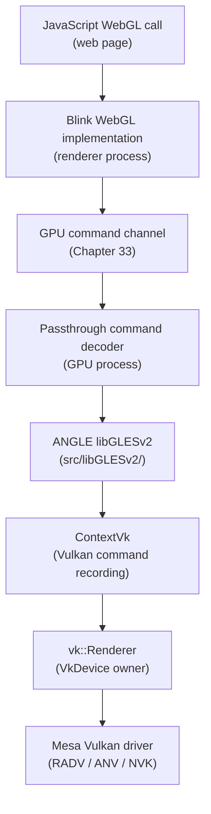
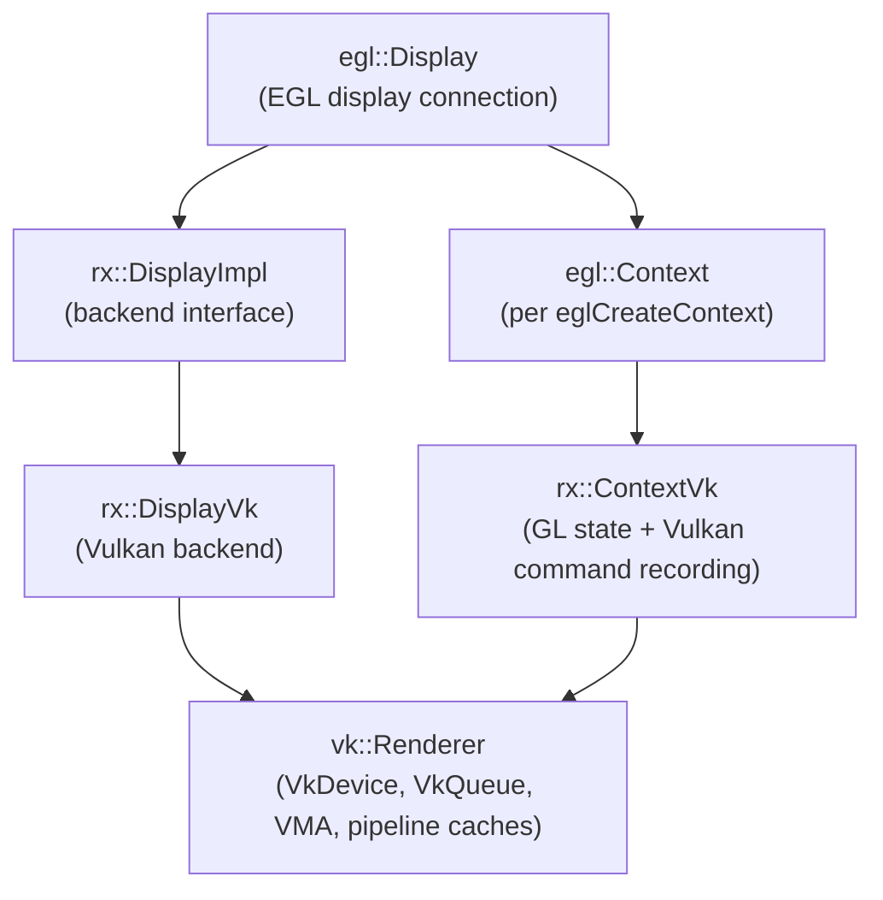
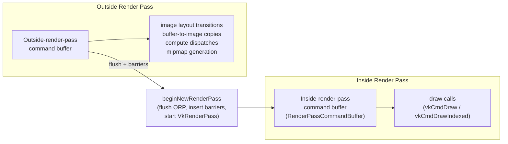
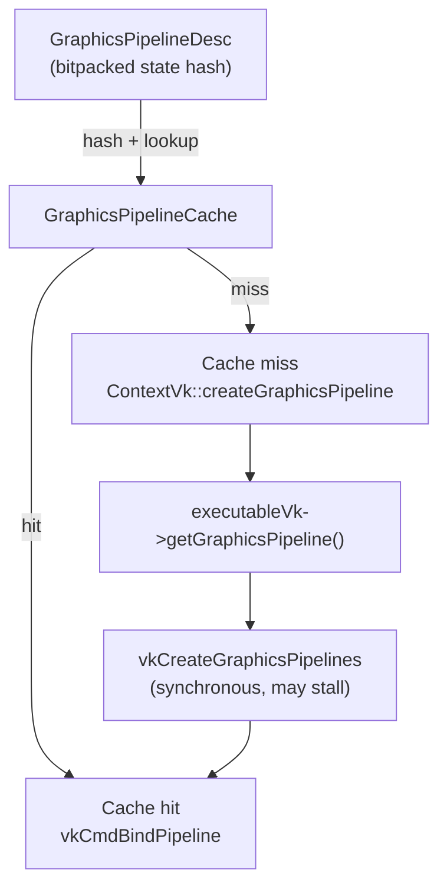
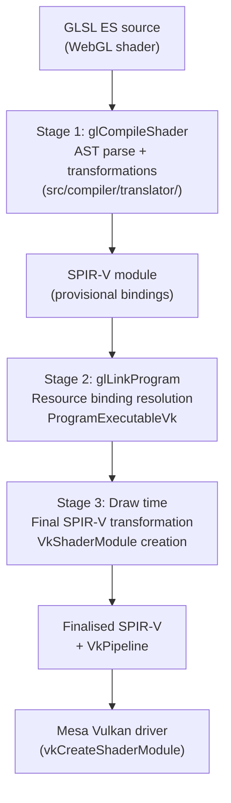
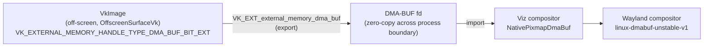

# Chapter 34: ANGLE — WebGL on Linux

**Scope:** This chapter targets browser and web platform engineers who need to understand how WebGL maps onto the Linux graphics stack, and systems developers who want to trace the path from an OpenGL ES API call through ANGLE's Vulkan translation layer into a Mesa driver. It covers ANGLE's architecture in sufficient depth to diagnose rendering correctness bugs and performance regressions that originate in the GL-to-Vulkan translation layer.

---

## Table of Contents

1. [ANGLE's Role in the Browser Stack](#1-angles-role-in-the-browser-stack)
2. [The ANGLE Object Model](#2-the-angle-object-model)
3. [OpenGL ES State Mapping to Vulkan Pipelines](#3-opengl-es-state-mapping-to-vulkan-pipelines)
4. [Shader Translation: GLSL ES to SPIR-V](#4-shader-translation-glsl-es-to-spir-v)
5. [Surface and Context Management on Linux](#5-surface-and-context-management-on-linux)
6. [Synchronisation: Bridging the GL and Vulkan Models](#6-synchronisation-bridging-the-gl-and-vulkan-models)
7. [Performance Characteristics and Mitigation Strategies](#7-performance-characteristics-and-mitigation-strategies)
8. [ANGLE Beyond Chrome: Conformance and Ecosystem](#8-angle-beyond-chrome-conformance-and-ecosystem)
9. [Integrations](#integrations)
10. [References](#references)

---

## 1. ANGLE's Role in the Browser Stack

**ANGLE** — Almost Native Graphics Layer Engine — is a C++ library developed by Google that implements **OpenGL ES** 2.0, 3.0, and 3.1 (with **OpenGL ES** 3.2 support actively underway), alongside **EGL** 1.5. Its source lives at `https://chromium.googlesource.com/angle/angle` and is developed in the open as part of the Chromium project. The core mandate is straightforward: accept **OpenGL ES** API calls from above and translate them to whichever native GPU API is most appropriate for the host platform, doing so with full conformance to the Khronos specification.

Chrome uses **ANGLE** for all **WebGL** rendering rather than calling **Mesa**'s OpenGL implementation directly. The reason is conformance and isolation. Shipping Chrome's own **ANGLE** binary insulates the browser from the enormous variation in **Mesa** versions, vendor extensions, and outright driver bugs found across Linux distributions. Chrome's **ANGLE** is tested on every commit against the Khronos **WebGL** Conformance Test Suite (**CTS**) and the Khronos **deqp-GLES** suites; a **Mesa** installation on a user's machine has no such guarantee. By owning the **GL ES** layer entirely, the Chrome team can fix driver-level bugs in **ANGLE** itself rather than waiting for distribution maintainers to pick up **Mesa** patches.

**ANGLE**'s backend matrix is broad. On Linux the production backend is **Vulkan**, translating **OpenGL ES** calls into **Vulkan** command recording that lands in **RADV** (AMD), **ANV** (Intel), **NVK** (NVIDIA), or any other **Mesa** Vulkan driver. On macOS and iOS the backend is **Metal**. On Windows, **Direct3D 11** remains the default for legacy coverage, with **Direct3D 12** under active development. An **OpenGL/GLES** passthrough backend exists for ChromeOS, where the underlying platform's OpenGL implementation is already trusted. **SwiftShader**, a CPU-side Vulkan renderer, provides the software fallback when no GPU is available. A native OpenGL backend also exists but is not used in production Chrome on Linux — it exists primarily for development and for environments where **Vulkan** is unavailable.

On Linux, the call stack flows as follows. A JavaScript **WebGL** call in a web page reaches **Blink**'s **WebGL** implementation, which calls through the GPU command channel (described in Chapter 33) into the GPU process. The passthrough command decoder in the GPU process forwards each GL call directly to **ANGLE**'s **`libGLESv2`** entry points in **`src/libGLESv2/`**. Those entry points dispatch into **`ContextVk`**, which records **Vulkan** commands. **`ContextVk`** submits those commands to **`vk::Renderer`**, which owns the **`VkDevice`** and submits to the hardware via a **Mesa** Vulkan driver. The entire translation is synchronous from the perspective of the calling thread: there is no extra process boundary between **ANGLE** and the **Mesa** driver.



**ANGLE** is used beyond Chrome. **Firefox** uses **ANGLE** on Windows (**D3D11** backend) and is evaluating the **Vulkan** backend on Linux. **Flutter** uses **ANGLE** on Android to provide its **OpenGL ES** context. **Qt WebEngine** embeds **ANGLE**. **WebKit** on non-Apple platforms also uses **ANGLE**. The project is, in practice, the reference **OpenGL ES** implementation for browser-hosted GPU workloads.

The remainder of this chapter covers **ANGLE** in depth across seven topics. Section 2 examines the **ANGLE** object model: the two-level frontend/backend hierarchy of **`egl::Display`** / **`rx::DisplayImpl`** and **`egl::Context`** / **`rx::ContextVk`**, the role of **`rx::DisplayVk`** and the singleton **`vk::Renderer`** (which owns the **`VkDevice`**, **VMA** memory allocator, and pipeline caches), **`ContextVk`**'s dirty-bit system for deferred state application, the dual command buffer architecture (outside-render-pass and inside-render-pass streams managed by **`beginNewRenderPass`**), and **`rx::FramebufferVk`**'s **`VkRenderPass`** caching strategy. Section 3 traces the impedance mismatch between **OpenGL**'s stateful model and **Vulkan**'s immutable pipeline objects: the **`GraphicsPipelineDesc`** bitpacked state descriptor and **`GraphicsPipelineCache`**, pipeline state explosion and its mitigation via **`VK_EXT_extended_dynamic_state`** and **`VK_EXT_extended_dynamic_state2`**, **`rx::VertexArrayVk`** and **`VkPipelineVertexInputStateCreateInfo`**, default-block uniform packing into **`DefaultUniformBlock`** **UBO**s, **`rx::TextureVk`** / **`VkImage`** / **`VkSampler`** / **`SamplerCache`** management with **`VK_DESCRIPTOR_TYPE_COMBINED_IMAGE_SAMPLER`** descriptors, and **`VkAttachmentLoadOp`** / **`VkAttachmentStoreOp`** selection for tile-based GPU bandwidth savings. Section 4 covers the three-stage **GLSL ES** to **SPIR-V** translation pipeline: **`glCompileShader`** AST parsing and transformations (**RewriteStructSamplers**, **MonomorphizeUnsupportedFunctions**, precision emulation via **`VK_KHR_shader_float16_int8`**, **BuiltinsWorkaround**, **AddEmulatedPixelLocalStorage**) in **`src/compiler/translator/`**, **`glLinkProgram`** resource binding resolution into **`ProgramExecutableVk`**, draw-time finalisation and **`VkShaderModule`** creation, and **SPIR-V** and pipeline caching via Chrome's **`gpu_shader_cache`** and **`vkGetPipelineCacheData`**. Section 5 addresses **EGL** surface and context management: the three **Linux** surface types (**`WindowSurfaceVk`** / **`VkSwapchainKHR`**, **`OffscreenSurfaceVk`**, **`PbufferSurfaceVk`**), zero-copy **DMA-BUF** import/export via **`EGL_KHR_image_base`**, **`EGL_EXT_image_dma_buf_import`**, **`VK_EXT_external_memory_dma_buf`**, and **`linux-dmabuf-unstable-v1`**, and multi-context thread safety in **`vk::Renderer`**. Section 6 analyses the synchronisation challenge of preserving **OpenGL**'s implicit ordering guarantee in **Vulkan**: resource use tracking via **`CommandBufferHelper`** and **`onBufferTransferRead`** / **`onImageRenderPassWrite`** family methods, **`vkCmdPipelineBarrier`** batching and **`VkEvent`**-based barriers, deferred image layout transitions (**`VK_IMAGE_LAYOUT_TRANSFER_DST_OPTIMAL`** → **`VK_IMAGE_LAYOUT_SHADER_READ_ONLY_OPTIMAL`**), **`glFenceSync`** / **`vkWaitForFences`** mapping, and sync fd export via **`VK_KHR_external_fence_fd`** and **`ExternalFence::exportFd()`**. Section 7 examines performance characteristics: **`vkCreateGraphicsPipelines`** stutter and its mitigations (persistent pipeline cache, speculative link-time compilation, **`VK_EXT_graphics_pipeline_library`** sub-libraries), descriptor set pool watermark strategy and the path toward **`VK_EXT_descriptor_indexing`** bindless textures, **`CommandBatch`** submission batching, vertex buffer alignment copies for **`minVertexInputBindingStrideAlignment`** violations, and **`VK_EXT_extended_dynamic_state`** dynamic command adoption. Section 8 covers conformance and ecosystem: the **WebGL CTS**, **deqp-GLES2/3** certification history, **ANGLE** as a **Mesa** driver stress test surfacing latent **RADV** and **ANV** bugs, **Firefox**, **Flutter**, and **Qt WebEngine** as downstream consumers, and the **`ANGLE_CAPTURE_FRAME_START`** / **`ANGLE_CAPTURE_FRAME_END`** frame capture and replay system for regression debugging.

---

## 2. The ANGLE Object Model

Understanding ANGLE's internal object hierarchy is essential for reading crash stacks, correlating GL API calls with Vulkan activity, and reasoning about resource lifetimes.

### The EGL layer

At the top of the object graph sits `egl::Display`, which represents an EGL display connection — conceptually, a connection to a GPU. `egl::Display` owns an `rx::DisplayImpl` implementation pointer; on the Vulkan backend this is `rx::DisplayVk`. The `egl::Context` object (one per `eglCreateContext` call) similarly delegates to `rx::ContextVk`. This two-level structure — a frontend GL/EGL object and a backend `rx::` implementation — runs throughout ANGLE; the frontend handles conformance validation and object tracking while the backend handles the actual API translation.



### DisplayVk and vk::Renderer

`rx::DisplayVk` (defined in `src/libANGLE/renderer/vulkan/DisplayVk.cpp`) is the Vulkan implementation of `egl::Display`. Its `initialize` method, with the signature:

```cpp
// src/libANGLE/renderer/vulkan/DisplayVk.cpp
egl::Error DisplayVk::initialize(egl::Display *display)
```

delegates the heavy lifting to `mRenderer->initialize(...)`, which creates the `VkInstance`, enumerates `VkPhysicalDevice` objects, and selects the appropriate device based on the vendor ID, device ID, device UUID, and driver UUID parameters passed down from Chrome's GPU service. The renderer it creates is a `vk::Renderer` object.

`vk::Renderer` (formerly named `RendererVk` in older versions of the codebase) is the central Vulkan context. It is a singleton per display and holds the `VkDevice`, a `VkQueue` (and the supporting synchronisation primitives for multi-threaded submission), the AMD Vulkan Memory Allocator (VMA) integration for `VkDeviceMemory` suballocation, a per-thread command pool, the global graphics and compute pipeline caches, and the format capability tables that tell the rest of the backend which `VkFormat` values are usable for a given GL internal format. Because `vk::Renderer` is shared across all `ContextVk` instances on a display, access to its pipeline cache and memory allocator is internally locked.

### ContextVk

`rx::ContextVk` (defined in `src/libANGLE/renderer/vulkan/ContextVk.cpp`) is the backend for a single `egl::Context`. It is the most complex class in the Vulkan backend, responsible for tracking all OpenGL context state and translating draw calls into Vulkan command recording.

The key architectural feature of `ContextVk` is its dirty bit system. Every piece of OpenGL state that can affect a Vulkan pipeline — viewport, scissor, blend equations, depth and stencil configuration, cull mode, front face, vertex attribute formats, bound textures, bound uniform buffers — is represented by a bit in a compact bitset. When the GL application changes state (e.g., calls `glBlendFunc` or `glBindTexture`), ANGLE sets the corresponding dirty bit in `ContextVk` but does not immediately apply the change to any Vulkan object. Only when the next draw call arrives does `ContextVk` sweep the dirty bitset, calling each `mGraphicsDirtyBitHandlers[i]` method pointer that corresponds to a set bit. This deferred approach means that state changes between draw calls in a tight loop incur only the cost of a bit-set operation, not a full pipeline state flush, and allows the backend to coalesce redundant state changes.

The entry point for most GL draw work passes through `ContextVk::setupDraw`:

```cpp
// src/libANGLE/renderer/vulkan/ContextVk.cpp
angle::Result ContextVk::setupDraw(const gl::Context *context,
    gl::PrimitiveMode mode,
    GLint firstVertexOrInvalid,
    GLsizei vertexOrIndexCount,
    GLsizei baseInstance,
    GLsizei instanceCount,
    gl::DrawElementsType indexTypeOrInvalid,
    const void *indices,
    DirtyBits dirtyBitMask)
```

`setupDraw` handles topology updates and driver uniform changes, then iterates the dirty bits through `mGraphicsDirtyBitHandlers`, with handlers such as `handleDirtyGraphicsRenderPass`, `handleDirtyGraphicsPipelineDesc`, and `handleDirtyGraphicsRasterizerState`. Only after all handlers have executed and the necessary Vulkan objects are in place does the actual `vkCmdDraw` or `vkCmdDrawIndexed` recording occur.

### Command Buffer Architecture

ANGLE's Vulkan backend maintains two parallel command streams. The "outside render pass" command buffer records operations that Vulkan requires to happen outside a `VkRenderPass` — image layout transitions, buffer-to-image copies, compute dispatches for prefiltering, and mipmap generation. The "inside render pass" command buffer records draw calls within an active `VkRenderPass` instance. ANGLE's `beginNewRenderPass` method flushes all pending outside-render-pass commands, inserts any required pipeline barriers, starts a new render pass, and returns a secondary command buffer scoped to that pass.



The key APIs on `ContextVk` for navigating between these states are:

- `beginNewRenderPass`: ends any existing render pass, flushes queued barrier work, starts a new render pass, returns a `RenderPassCommandBuffer`
- `getOutsideRenderPassCommandBuffer`: returns the outside-render-pass secondary command buffer, ensuring barriers are correctly ordered
- `getStartedRenderPassCommands`: returns a reference to the currently active render pass command buffer
- `onRenderPassFinished`: transitions the render pass state machine to "inactive"

Command buffer submission is deferred through the `CommandBatch` system. Multiple frames of draw commands are accumulated into a primary command buffer before `vkQueueSubmit` is called. A flush is forced by `glFlush`, `eglSwapBuffers`, or a fence wait. This batching is critical for Vulkan performance since each `vkQueueSubmit` call carries significant driver overhead.

### FramebufferVk

`rx::FramebufferVk` wraps the `VkFramebuffer` and its associated `VkRenderPass` descriptor. Because Vulkan requires `VkRenderPass` objects to be created with full knowledge of attachment formats and load/store operations, and because OpenGL allows framebuffer attachments to change dynamically, `FramebufferVk` caches render pass objects keyed on a hash of the attachment configuration. A cache hit returns an existing `VkRenderPass`; a cache miss creates a new one. The ANGLE team has carefully designed the hash to avoid false collisions while keeping the key compact enough for efficient lookup.

---

## 3. OpenGL ES State Mapping to Vulkan Pipelines

The central engineering challenge in ANGLE's Vulkan backend is the impedance mismatch between OpenGL's stateful, late-binding model and Vulkan's explicit, immutable pipeline objects. OpenGL allows state to change freely between draw calls with the guarantee that the driver will apply whatever the current state is at the time of the draw. Vulkan instead requires a complete `VkPipeline` object — encoding the rasteriser state, blend state, depth-stencil state, vertex input layout, primitive topology, and shader modules — to be created ahead of time and bound before drawing. Creating a `VkPipeline` may take milliseconds and cannot happen during a draw call without stalling the GPU timeline.

### GraphicsPipelineDesc

ANGLE's solution is the `GraphicsPipelineDesc` structure, a bitpacked aggregate that describes the complete state vector required to uniquely identify a `VkPipeline`. Every dimension of pipeline state that Vulkan bakes into the object is represented as a field or bitfield within `GraphicsPipelineDesc`: the primitive topology, the rasteriser's cull mode and polygon mode, the depth test and write configuration, the per-attachment blend factors and operations, the vertex input binding strides and attribute formats, and the shader module identifiers. The struct is designed for fast hashing and equality comparison — all fields are packed to minimise padding, and equality is implemented as a `memcmp` over the packed representation.

When `handleDirtyGraphicsPipelineDesc` fires during `setupDraw`, ANGLE hashes the current `GraphicsPipelineDesc` and looks it up in the `GraphicsPipelineCache`. A cache hit binds the existing `VkPipeline` with `vkCmdBindPipeline` at essentially zero cost. A cache miss triggers `ContextVk::createGraphicsPipeline`, which calls `executableVk->getGraphicsPipeline()` and ultimately issues `vkCreateGraphicsPipelines`. This synchronous creation step is the primary source of "first-draw" stutter in WebGL applications.



ANGLE tracks which bits of `GraphicsPipelineDesc` changed since the last draw through a parallel `mGraphicsPipelineTransition` bitmask. Rather than rehashing the full descriptor on every draw, ANGLE walks only the transition bits to determine whether the pipeline has genuinely changed, enabling a fast path when consecutive draw calls differ only in viewport or scissor (which are dynamic state).

On devices that support `VK_EXT_graphics_pipeline_library`, ANGLE can split the pipeline object into independent "Shaders" and "Fragment Output" sub-libraries that can be compiled and linked in stages, reducing the latency of the cache-miss path substantially. The `createGraphicsPipeline` implementation probes for this extension and takes the library-enabled path when available.

### Pipeline State Explosion

A WebGL application that uses many shader programs, blend modes, or vertex input configurations can generate a large number of distinct `VkPipeline` objects. In pathological cases — a particle engine cycling through many blend equations, a procedural renderer switching between many topology modes — the pipeline variant count can reach into the hundreds per shader program. ANGLE addresses this through dynamic state extensions. `VK_EXT_extended_dynamic_state` removes viewport, scissor, cull mode, front face, and primitive topology from the pipeline key, making those dimensions dynamic commands rather than baked-in pipeline fields. On Android this extension is required; on Linux, ANGLE prefers it when available. `VK_EXT_extended_dynamic_state2` adds primitive restart enable and patch control points. Together these two extensions collapse the pipeline variant space substantially for the most common dynamic dimensions.

### Vertex Array Objects

`rx::VertexArrayVk` maps a GL VAO to Vulkan vertex input state. The vertex attribute format descriptions feed into `VkPipelineVertexInputStateCreateInfo` and become part of `GraphicsPipelineDesc`. Vertex buffer bindings are recorded as `vkCmdBindVertexBuffers` at draw time. A known hazard arises when a GL application passes a vertex buffer with a stride that does not satisfy Vulkan's `minVertexInputBindingStrideAlignment` requirement. In such cases ANGLE performs a CPU-side copy of the vertex data into a conformantly-strided temporary buffer before issuing the draw — an unavoidable overhead for legacy WebGL content that assumes arbitrary strides.

### Uniform Buffers and Default Uniforms

OpenGL ES has both "default-block" uniforms set with `glUniform*` calls and explicitly declared uniform blocks. Default-block uniforms have no direct Vulkan equivalent; Vulkan does not support individual uniform variables. ANGLE packs all default-block uniforms for a program into a `DefaultUniformBlock` — a host-side buffer that is uploaded as a UBO on each draw call. The data is uploaded via a ring-buffer strategy using VMA suballocation, minimising the number of `vkUpdateDescriptorSets` calls. Explicit uniform blocks map directly to `VkDescriptorType::VK_DESCRIPTOR_TYPE_UNIFORM_BUFFER` descriptors.

### Textures, Samplers, and Descriptor Sets

Each `rx::TextureVk` object owns a `VkImage`, one or more `VkImageView` objects (for different mip ranges and array slices), and a set of `VkSampler` objects. The `VkSampler` objects are cached in a global `SamplerCache` keyed on the GL sampler parameter hash; reuse across textures is common.

At draw time, ANGLE must update the descriptor set to point to the current textures and samplers. Descriptor sets are allocated from a per-frame pool and updated with `vkUpdateDescriptorSets`. ANGLE uses a watermark-reset strategy on the descriptor pool: at the start of each frame, the pool's allocation pointer is reset to zero, and all descriptor sets from the previous frame are implicitly freed. This avoids per-draw allocation overhead at the cost of per-frame pool memory.

WebGL's `sampler2D` type is a combined texture-sampler in GLSL ES terms, but Vulkan represents textures and samplers as separate objects. ANGLE uses `VK_DESCRIPTOR_TYPE_COMBINED_IMAGE_SAMPLER` by default to match the GLSL ES semantics, creating a single descriptor that pairs the `VkImageView` with the `VkSampler`. Separate image and sampler descriptors are supported as an option but are not the default for WebGL workloads. Immutable samplers — which Vulkan can bake into the pipeline layout at a performance benefit — are not used for WebGL because the sampler state is determined at GL runtime and is not known at pipeline creation time.

### Framebuffer Attachments and Load/Store Operations

Vulkan `VkRenderPass` objects encode whether each attachment is cleared, loaded, or undefined at the start of the pass (`VkAttachmentLoadOp`) and whether the result is stored or discarded at the end (`VkAttachmentStoreOp`). Getting these right is critical for correctness and GPU efficiency: a GPU tile-based renderer (as found in mobile Arm Mali and Qualcomm Adreno chips) can save significant bandwidth by using `LOAD_OP_CLEAR` or `LOAD_OP_DONT_CARE` instead of loading old framebuffer contents from memory.

ANGLE tracks GL clear calls issued before the first draw into an FBO. If a `glClear` precedes the first draw without any intervening reads of the attachment, ANGLE promotes the clear into a `VK_ATTACHMENT_LOAD_OP_CLEAR` on the render pass, passing the clear colour directly to `VkRenderPassBeginInfo::pClearValues`. If no clear preceded the draw, the load op is `VK_ATTACHMENT_LOAD_OP_LOAD`. At the end of the render pass, ANGLE infers the store op based on whether the attachment will be used again; if a depth buffer is only needed for a single render pass and is not read subsequently, it can be discarded with `VK_ATTACHMENT_STORE_OP_DONT_CARE`.

---

## 4. Shader Translation: GLSL ES to SPIR-V

WebGL shaders are written in GLSL ES — a dialect of GLSL that supports only features available in OpenGL ES. ANGLE must translate this shader source into SPIR-V modules that the Mesa Vulkan driver can accept via `vkCreateShaderModule`. This translation is performed entirely within ANGLE; the project has its own SPIR-V emitter and does not depend on glslang for the Vulkan path. This independence gives ANGLE finer control over the generated SPIR-V and allows the team to work around specific Mesa driver assumptions about SPIR-V structure that glslang-generated modules might not exercise.

The translation is broken into three stages that proceed across the GL pipeline's lifetime.



### Stage 1: Shader Compilation (glCompileShader)

When `glCompileShader` is called, ANGLE's shader translator (in `src/compiler/translator/`) parses the GLSL ES source and builds an Abstract Syntax Tree (AST). The translator applies a sequence of AST transformations that adapt GL semantics to Vulkan constraints, then walks the transformed AST to emit a SPIR-V module.

Key AST transformations at this stage include:

**RewriteStructSamplers.** GLSL ES allows samplers to appear inside structs, which SPIR-V and Vulkan do not permit. This pass decomposes struct members that contain opaque sampler types into separate top-level sampler variables, rewriting all call sites accordingly.

**MonomorphizeUnsupportedFunctions.** GLSL ES allows functions to take sampler parameters. SPIR-V disallows this. This pass clones each such function for every distinct sampler that is passed to it at call sites, replacing the generic parameter with a concrete sampler variable.

**Precision emulation.** GLSL ES defines `mediump` and `lowp` precision qualifiers with the intent of allowing `float16` execution on mobile hardware. Vulkan itself has no precision qualifiers; the `VK_KHR_shader_float16_int8` extension is required to use 16-bit floats. ANGLE's precision emulation pass optionally inserts explicit conversions to and from `float16` types in `mediump` contexts, enabling GPU bandwidth and ALU savings on hardware that supports the extension. This is an active area of optimisation and care is needed for precision-sensitive code paths such as trigonometric functions and texture coordinate accumulation.

**BuiltinsWorkaround.** Many GLSL ES built-ins and predefined outputs have no direct Vulkan SPIR-V equivalent. `gl_FragColor` in GLSL ES 1.0 must become a `layout(location=0) out vec4` user-defined output. `gl_PointCoord` requires y-flipping on some Vulkan implementations due to Vulkan's different NDC origin convention. The `BuiltinsWorkaround` pass replaces each such built-in with the appropriate Vulkan-compatible construct.

**AddEmulatedPixelLocalStorage.** Pixel local storage is a tile-memory extension used for deferred shading passes on mobile GPU architectures. In Vulkan this is exposed via `VK_EXT_rasterization_order_attachment_access` and input attachments. This pass rewrites pixel local storage accesses into Vulkan-compatible framebuffer fetch or input attachment reads.

After transformations, the AST is walked by `SPIRVBuilder`, which emits SPIR-V opcodes directly. The output at this stage has provisional descriptor set, binding, and location assignments — placeholders that will be resolved later. Specialisation constants are inserted for features whose values are not known until draw time: dithering mode and screen rotation on Android.

At this point in compilation, the SPIR-V is complete enough to be a valid module, but the resource bindings are not yet final and the module is not yet suitable for `vkCreateShaderModule`.

### Stage 2: Link Time (glLinkProgram)

At `glLinkProgram`, ANGLE resolves the interface between vertex and fragment (and, if present, geometry/compute) shader stages. The backend assigns final descriptor set indices and binding numbers for each resource — uniform blocks, texture samplers, image uniforms, and shader storage blocks — producing the `ProgramExecutableVk` that encodes the paired SPIR-V modules alongside their resource layout.

As an optimisation, ANGLE performs a preliminary SPIR-V transformation with assumed draw-time values and creates a `VkPipeline` object to pre-warm the pipeline cache. This speculative compilation absorbs some of the first-draw stall by doing pipeline work at link time when the application is not yet blocked on a draw result.

### Stage 3: Draw Time

The final SPIR-V transformation occurs when the first draw call referencing a newly linked program is processed. The transformation pass corrects all provisional descriptor set and binding indices to their final values, applies component decorations for transform feedback varyings, removes inactive varyings (those not consumed by the next shader stage), toggles early fragment test optimisation if appropriate, strips debug info from the module, and applies pre-rotation transforms for rotated display modes.

After transformation, `VkShaderModule` objects are created from the finalised SPIR-V and cached in the program's `ProgramExecutableVk`. Subsequent draws reuse the cached modules. The final `VkPipeline` is then created (or retrieved from the cache) using these modules, completing the compilation chain.

### Shader Caching

ANGLE backs SPIR-V and pipeline objects with Chrome's disk-based GPU shader cache, keyed on a hash of the original GLSL ES source. On a page revisit, the cached SPIR-V is loaded directly, bypassing the AST parse and transformation steps. The Vulkan pipeline cache blob from `vkGetPipelineCacheData` is also persisted, enabling driver-level pipeline object reuse across browser sessions and reducing first-draw stutter on revisited WebGL applications.

---

## 5. Surface and Context Management on Linux

### EGL Surface Types

ANGLE implements the EGL 1.5 API. On Linux, the display connection is obtained via `eglGetPlatformDisplayEXT` using the `EGL_ANGLE_platform_angle` extension, passing `EGL_PLATFORM_ANGLE_ANGLE` as the platform identifier and `EGL_PLATFORM_ANGLE_TYPE_VULKAN_ANGLE` as the type attribute — the mechanism by which the caller requests the Vulkan backend at display creation time. [Source: ANGLE extension spec `extensions/EGL_ANGLE_platform_angle_vulkan.txt`]

Three surface types are relevant on Linux:

**WindowSurfaceVk** wraps a `VkSwapchainKHR` and is used when ANGLE renders directly to a native window. On Chrome/Linux this case is relatively rare; Chrome's compositor (Viz) typically manages presentation separately.

**OffscreenSurfaceVk** renders to a `VkImage` not backed by a swapchain. This is the standard configuration for WebGL canvases in Chrome: ANGLE renders into an off-screen `VkImage`, which is then imported by the Viz compositor for presentation.

**PbufferSurfaceVk** is a fixed-size off-screen surface used for WebGL canvases that are not yet visible in the viewport, avoiding the overhead of swapchain creation for off-screen content.

### DMA-BUF Integration

ANGLE implements `EGL_KHR_image_base` and `EGL_EXT_image_dma_buf_import` (with modifier support via `EGL_EXT_image_dma_buf_import_modifiers`). The DMA-BUF import path is enabled when both `supportsExternalMemoryDmaBuf` and `supportsImageDrmFormatModifier` feature flags are set on `vk::Renderer`. This allows an externally-produced DMA-BUF file descriptor — such as a buffer allocated by Viz or the Wayland compositor — to be imported as a `VkImage` backed by `VK_EXT_external_memory_dma_buf`. The import uses `vkBindImageMemory2` with a `VkImportMemoryFdInfoKHR` structure in the `pNext` chain, naming the DMA-BUF fd and its memory type index.

The inverse operation — exporting an ANGLE-rendered `VkImage` as a DMA-BUF fd for consumption by Viz — uses `VK_EXT_external_memory_dma_buf` in export mode. The GPU process renders the WebGL canvas into an off-screen `VkImage` allocated with `VK_EXTERNAL_MEMORY_HANDLE_TYPE_DMA_BUF_BIT_EXT`, exports the backing memory as a DMA-BUF fd, and passes that fd to Viz. Viz imports it as a `NativePixmapDmaBuf` and submits it to the Wayland compositor via the `linux-dmabuf-unstable-v1` protocol (covered in Chapter 20). The DMA-BUF fd crosses the GPU process boundary without any pixel data copy, making this path zero-copy from ANGLE's `VkImage` to the Wayland compositor's scanout buffer.



### Multi-Context and Thread Safety

`vk::Renderer` is shared across all `ContextVk` instances on a display. Per-context command buffers are recorded on the context's thread. `vk::Renderer` uses internal locking for shared resources: the pipeline cache, the memory allocator (VMA), and the pipeline layout cache. The command buffer submission queue is also protected by a mutex, since Chrome may submit from multiple threads. The design avoids per-draw locking in the hot path by ensuring that `ContextVk`-private state (the dirty bitset, the active command buffers, the descriptor pool) is never shared.

---

## 6. Synchronisation: Bridging the GL and Vulkan Models

### The Fundamental Mismatch

OpenGL's concurrency model is implicit: the specification guarantees that a read after a write is coherent without any application-visible synchronisation primitive. Every `glTexImage2D` followed by a draw that samples the texture is guaranteed to see the new data. Every `glCopyTexImage2D` followed by a `glDrawArrays` that reads the copy target is correctly ordered. This guarantee is built into the API contract, and drivers have historically maintained it by inserting barriers at the command-stream level without application involvement.

Vulkan's model is the opposite. The application is responsible for all ordering: `VkMemoryBarrier`, `VkBufferMemoryBarrier`, and `VkImageMemoryBarrier` structures must be placed at every point where one operation's output is consumed by another, specifying the source and destination pipeline stages, the source and destination access masks, and (for images) the required layout transitions. Omitting a barrier is undefined behaviour — the GPU may read stale data, produce corrupted output, or crash.

ANGLE must therefore infer and insert all Vulkan barriers automatically, preserving OpenGL's implicit-ordering guarantee while generating correct Vulkan synchronisation.

### Resource Use Tracking

ANGLE tracks the "use state" of every buffer and image through the `CommandBufferHelper` and `CommandResources` APIs. Every operation that touches a resource records what it did to that resource using methods like:

- `onBufferTransferRead` / `onBufferTransferWrite`: CPU-to-GPU uploads, buffer copies
- `onBufferComputeShaderRead` / `onBufferComputeShaderWrite`: compute dispatch buffer accesses
- `onImageRenderPassRead` / `onImageRenderPassWrite`: image attachment reads/writes within a render pass
- `onImageTransferRead` / `onImageTransferWrite`: blit and copy operations on images

When a draw call is about to begin and `beginNewRenderPass` is called, the `CommandBufferHelper` sweeps the accumulated resource use records and emits the minimal set of `vkCmdPipelineBarrier` calls needed to resolve all hazards. Barriers are batched into `mPipelineBarriers` and `mEventBarriers` structures, with the newer code using `VkEvent`-based barriers via `mRefCountedEventCollector` where event-based signalling can replace heavier pipeline-stage barriers for better GPU throughput.

### Image Layout Transitions

Vulkan requires each `VkImage` to be in the correct layout for each use. A texture that is written by a transfer operation (`VK_IMAGE_LAYOUT_TRANSFER_DST_OPTIMAL`) must be transitioned to `VK_IMAGE_LAYOUT_SHADER_READ_ONLY_OPTIMAL` before it can be sampled. ANGLE defers these transitions: after a texture upload (`glTexImage2D`), the image is left in `TRANSFER_DST_OPTIMAL`. The transition to `SHADER_READ_ONLY_OPTIMAL` is only inserted when the next draw call that samples the texture fires. This deferral allows multiple uploads to the same image to be batched before the transition occurs, and avoids unnecessary transitions for textures that are written and re-written without intervening sampling.

### Fence Synchronisation

GL fence sync objects, created with `glFenceSync(GL_SYNC_GPU_COMMANDS_COMPLETE, 0)`, map to a `VkFence` inserted at command buffer submission time. `glClientWaitSync` maps to `vkWaitForFences` with the corresponding timeout.

At the EGL level, `EGL_KHR_fence_sync` and `EGL_ANDROID_native_fence_sync` provide fence objects that can be exported as Linux sync file descriptors. ANGLE implements this export via `VK_KHR_external_fence_fd`. The `ExternalFence` class (in `src/libANGLE/renderer/vulkan/SyncVk.cpp`) wraps a Vulkan fence configured with `VK_STRUCTURE_TYPE_EXPORT_FENCE_CREATE_INFO` and `VK_EXTERNAL_FENCE_HANDLE_TYPE_SYNC_FD_BIT_KHR`. Export is performed by:

```cpp
// src/libANGLE/renderer/vulkan/SyncVk.cpp
void ExternalFence::exportFd(VkDevice device, const VkFenceGetFdInfoKHR &fenceGetFdInfo)
{
    ASSERT(mFenceFdStatus == VK_INCOMPLETE && mFenceFd == kInvalidFenceFd);
    mFenceFdStatus = mFence.exportFd(device, fenceGetFdInfo, &mFenceFd);
    ASSERT(mFenceFdStatus != VK_INCOMPLETE);
}
```

The resulting file descriptor is a Linux sync fd that encodes GPU completion. Viz receives this fd as part of the frame submission protocol and uses it to defer scanout until the GPU has finished rendering, without stalling the CPU. This mechanism is described further in Chapter 36.

### Texture Upload Hazards in Practice

The most common synchronisation pitfall for WebGL authors that manifests as rendering glitches in ANGLE is the texture upload hazard. A pattern like:

```javascript
gl.texImage2D(gl.TEXTURE_2D, 0, gl.RGBA, ...);
gl.drawArrays(gl.TRIANGLES, 0, 6);
```

is valid in WebGL and must work correctly. ANGLE tracks that the texture was last written by a transfer operation and that the upcoming draw call will sample it, and automatically inserts the layout transition barrier before the render pass begins. For animated textures updated every frame this barrier is consistently present, and ANGLE's batching ensures it is emitted only once per frame per texture, not once per draw.

---

## 7. Performance Characteristics and Mitigation Strategies

### Pipeline Creation Stutter

The most user-visible performance issue in ANGLE's Vulkan backend is first-draw stutter caused by `vkCreateGraphicsPipelines`. A complex WebGL scene that exercises novel state combinations on first visit may stall for 1–100 milliseconds per distinct pipeline, causing janky frame times during initial load or during state-space exploration (e.g., a game that activates new visual effects). ANGLE mitigates this through three mechanisms.

First, the persistent pipeline cache: `vkGetPipelineCacheData` blob is serialised to Chrome's `gpu_shader_cache` on disk after each session. On revisit, the blob is passed to `vkCreatePipelineCache` at startup, and the driver can reuse compiled pipelines from it without re-entering its compiler. The effectiveness of this mechanism depends on the Mesa driver implementation; driver version changes may invalidate the cache, requiring a cold rebuild on the first visit after an update.

Second, speculative link-time compilation: at `glLinkProgram`, ANGLE creates a pipeline with assumed draw-time defaults, warming the cache for the most likely first draw. [Source: ShaderModuleCompilation.md]

Third, `VK_EXT_graphics_pipeline_library`: ANGLE splits the pipeline into independently compiled sub-libraries on supporting hardware. The vertex input and fragment output stages — which depend only on the vertex attribute format and the framebuffer format, not on the shaders — can be compiled asynchronously. When the full pipeline is needed, the shader stage library (already compiled) is linked to the pre-compiled input/output stubs, reducing per-draw pipeline creation latency.

### Descriptor Set Overhead

Each WebGL draw call that changes texture bindings or uniform values requires updating descriptor sets. ANGLE's per-frame pool watermark strategy (described in Section 3) avoids `vkAllocateDescriptorSets` on every draw. The pool is large enough to accommodate a full frame of draw calls; at frame boundary the watermark resets to zero. This approach is cache-friendly and allocation-free during the frame but requires sizing the pool conservatively.

A longer-term approach under evaluation is `VK_EXT_descriptor_indexing` (bindless textures). With bindless, all textures are placed in a single large descriptor array bound once per frame; draw calls reference textures by integer index rather than updating descriptor sets. This eliminates per-draw descriptor churn entirely. The obstacle for WebGL is that WebGL's texture binding model requires precise aliasing semantics that bindless complicates; the work is ongoing.

### Command Buffer Batching

ANGLE defers `vkQueueSubmit` until a fence wait, `glFlush`, or buffer swap forces submission. The `CommandBatch` accumulator collects draw command buffers until this point. Aggressive batching reduces the per-submit CPU overhead and allows the GPU to see a larger batch of work, improving its scheduling efficiency. The trade-off is latency: deferred submission means the GPU may sit idle waiting for a batch to fill. Chrome's frame timing infrastructure mediates this by forcing submission at appropriate points in the frame lifecycle.

### Vertex Buffer Alignment

Vulkan's `VkPhysicalDeviceLimits::minVertexInputBindingStrideAlignment` may require vertex buffer strides to be aligned to 4 bytes. OpenGL ES places no such restriction. WebGL content, particularly legacy applications ported from desktop GL, sometimes uses packed vertex formats with odd strides (e.g., 12-byte positions interleaved with 1-byte colours). When ANGLE detects a non-conformant stride, it performs a CPU-side copy of the vertex data into an aligned buffer before the draw. For particle systems with millions of vertices this copy is a significant overhead; the ANGLE team has documented this as a known performance hazard for which there is no fully satisfying solution without GPU-side reformatting.

### Dynamic State Adoption

`VK_EXT_extended_dynamic_state` (and its successor `VK_EXT_extended_dynamic_state2`) makes a substantial set of pipeline state dynamic: viewport, scissor, cull mode, front face, line width, depth bias, depth bounds, and primitive topology. When ANGLE's `handleDirtyGraphicsRasterizerState` fires and the device supports this extension, cull mode and front face changes are emitted as `vkCmdSetCullModeEXT` and `vkCmdSetFrontFaceEXT` calls rather than requiring a pipeline variant change. This removes cull mode and front face from `GraphicsPipelineDesc`, reducing the variant space. ANGLE marks this extension as required on Android (where virtually all Vulkan devices support it) and as preferred on Linux (where it is available on any Mesa driver with Vulkan 1.3 or later, since both extensions were promoted to core in Vulkan 1.3).

### Overhead vs. Native Vulkan

ANGLE's per-draw overhead relative to direct Vulkan usage is primarily in two areas. The resource use tracking (Section 6) adds CPU work proportional to the number of resource accesses per draw call. For well-structured WebGL content with stable texture and buffer bindings, this overhead is typically below 1%. For pathological cases — a scene that rebinds many different textures per draw, or that performs many small texture uploads — the overhead has been measured at 5–10% of total CPU draw time. The shader translation overhead is a one-time cost amortised over many draws and is not in the per-frame hot path once compilation is complete.

---

## 8. ANGLE Beyond Chrome: Conformance and Ecosystem

### The WebGL Conformance Test Suite

The WebGL CTS (Conformance Test Suite), maintained by the Khronos WebGL working group, is the gating criterion for new WebGL versions in Chrome. ANGLE must achieve a passing score against the CTS before a WebGL version ships. The CTS tests run against ANGLE's `libGLESv2` entry points exactly as a browser would call them, covering the full API surface including corner cases in blending, texture formats, framebuffer completeness, and shader behaviour. Continuous integration on the Chrome GPU bots runs the CTS against ANGLE's Vulkan backend for every upstream commit, meaning regressions are caught before they reach users. The test infrastructure covers RADV (AMD), ANV (Intel), and the SwiftShader CPU backend, providing vendor coverage even in the CI environment.

### deqp-GLES and Khronos Conformance

In addition to the WebGL CTS, ANGLE is tested with the Khronos deqp-GLES2 and deqp-GLES3 suites — the same test infrastructure used for OpenGL ES conformance certification. ANGLE has received OpenGL ES 2.0 conformance certification (November 2019), OpenGL ES 3.0 certification (February 2020), and OpenGL ES 3.1 certification (July 2020) with its Vulkan backend. These certifications are made against specific tagged versions of the codebase (e.g., `2.1.0.d46e2fb1e341` for ES 2.0) and establish ANGLE as a formally conformant GL ES implementation, not merely a pragmatic approximation.

### ANGLE as a Mesa Stress Test

An underappreciated aspect of ANGLE's Vulkan backend is the degree to which it exercises Mesa driver code paths that other open-source applications do not. ANGLE exercises combined image samplers with specific immutable-sampler patterns, unusual render pass load/store combinations (particularly `LOAD_OP_DONT_CARE` on colour attachments that are subsequently sampled), specific transform feedback configurations, and texture format conversion paths. ANGLE conformance failures have repeatedly surfaced latent bugs in RADV and ANV: a conformance test that passes on Windows D3D11 but fails on Linux Vulkan points directly at the Mesa Vulkan driver. This cross-pollination between the browser and the driver community has made both more robust.

### Firefox and Other Consumers

Firefox uses ANGLE on Windows with the D3D11 backend and is evaluating the Vulkan backend on Linux. The Mozilla fork lives at `https://github.com/mozilla/angle` and carries Gecko-specific patches. Firefox's integration differs from Chrome's in compositor architecture: Firefox's WebRender compositor has its own Vulkan rendering pipeline and takes ANGLE-rendered frames differently from how Viz does. The two projects share the ANGLE core but diverge in the integration layer above `eglSwapBuffers`.

Flutter uses ANGLE on Android to provide the OpenGL ES context required by its rendering engine. The Vulkan backend is under evaluation for Flutter as well, driven by performance requirements for high-refresh-rate displays.

Qt WebEngine embeds ANGLE as its GL ES backend on Windows and is expanding its Vulkan backend support on Linux. The breadth of ANGLE consumers means that performance and correctness improvements made for Chrome's benefit typically propagate to the broader web platform ecosystem.

### Frame Capture and Debugging

ANGLE includes a built-in frame capture and replay system, enabled via the `ANGLE_CAPTURE_FRAME_START` and `ANGLE_CAPTURE_FRAME_END` environment variables. When enabled, ANGLE records every GL API call into a C++ source file that, when compiled and run, replays the captured frames exactly. This is invaluable for isolating WebGL rendering regressions: a bug visible in Chrome can be captured into a minimal replay binary and bisected against ANGLE commits without requiring the full browser stack. Chapter 30 covers the broader ANGLE debugging approach.

---

## Integrations

This chapter connects to several other parts of the book.

**Forward to Chapter 36 (Viz Compositor).** The DMA-BUF fd export path described in Section 5 is the mechanism by which ANGLE-rendered WebGL frames reach Viz for presentation. Viz imports the fd as a `NativePixmapDmaBuf` and schedules it for scanout via the Wayland compositor. The sync fd exported by `ExternalFence::exportFd` (Section 6) is the fence Viz waits on before presenting the frame; Chapter 36 describes the full presentation timeline from ANGLE submission to screen.

**Forward to Chapter 14 (Mesa NIR and SPIR-V).** The SPIR-V modules produced by ANGLE's shader translator (Section 4) enter the Mesa NIR pipeline at exactly the same point as SPIR-V from a native Vulkan application. Mesa's SPIR-V front end (`spirv_to_nir`) processes ANGLE's output without any knowledge that it was produced by a browser. Understanding Chapter 14's description of how Mesa translates SPIR-V to NIR to hardware-specific ISA helps explain why ANGLE shader compilation time partially depends on Mesa driver internals.

**Backward to Chapter 33 (Chromium GPU Architecture).** ANGLE runs inside the GPU process command buffer service described in Chapter 33. The passthrough command decoder forwards GL API calls directly to ANGLE's `libGLESv2` entry points; the validating decoder (which re-validates every call) is legacy. Chapter 33's description of the GPU command channel is the context in which ANGLE receives its calls on Linux.

**Backward to Chapter 18 (Mesa Vulkan Drivers).** ANGLE's Vulkan API calls land in RADV, ANV, or NVK, as described in Chapter 18. Driver bugs at that layer surface as ANGLE conformance failures. The close relationship between ANGLE test results and Mesa driver quality has been described in Section 8.

**Backward to Chapter 24 (EGL).** ANGLE implements the EGL 1.5 API surface described in Chapter 24. The EGL surface types (`WindowSurfaceVk`, `OffscreenSurfaceVk`, `PbufferSurfaceVk`) correspond to the EGL surface types described there. The `eglGetPlatformDisplay`, `eglCreateContext`, and `eglMakeCurrent` call sequence in Chapter 24's exposition flows directly into the `DisplayVk::initialize` → `ContextVk` construction chain described in Section 2.

**Backward to Chapter 4 (DMA-BUF and GBM).** The DMA-BUF import and export mechanisms in Section 5 rely on the DMA-BUF fd infrastructure described in Chapter 4. The fd handle type, the `dma_buf_export_sync_file` / `dma_buf_import_sync_file` ioctl family for attaching explicit fences to DMA-BUFs, and the KMS import path for scanout buffers are all described there.

**Lateral to Chapter 31 (Conformance Testing).** The WebGL CTS and deqp-GLES suites that test ANGLE (Section 8) are direct counterparts to the dEQP-VK suite that tests Mesa Vulkan drivers. Chapter 31's discussion of how conformance test infrastructure is structured and run applies equally to both.

**Lateral to Chapter 30 (Debugging Graphics).** ANGLE's frame capture system (`ANGLE_CAPTURE_FRAME_START` / `ANGLE_CAPTURE_FRAME_END`) is one of the primary tools for bisecting WebGL rendering regressions. Chapter 30 covers it alongside RenderDoc, apitrace, and Mesa's own debugging overlays.

---

## References

1. ANGLE source repository: [https://chromium.googlesource.com/angle/angle](https://chromium.googlesource.com/angle/angle)

2. ANGLE Vulkan backend README: [https://chromium.googlesource.com/angle/angle/+/refs/heads/main/src/libANGLE/renderer/vulkan/README.md](https://chromium.googlesource.com/angle/angle/+/refs/heads/main/src/libANGLE/renderer/vulkan/README.md)

3. ANGLE Shader Module Compilation design document: [https://chromium.googlesource.com/angle/angle/+/HEAD/src/libANGLE/renderer/vulkan/doc/ShaderModuleCompilation.md](https://chromium.googlesource.com/angle/angle/+/HEAD/src/libANGLE/renderer/vulkan/doc/ShaderModuleCompilation.md)

4. ANGLE DirtyBits design document: [https://chromium.googlesource.com/angle/angle/+/HEAD/doc/DirtyBits.md](https://chromium.googlesource.com/angle/angle/+/HEAD/doc/DirtyBits.md)

5. Writing ANGLE Shader AST Transformations: [https://chromium.googlesource.com/angle/angle/+/HEAD/doc/WritingShaderASTTransformations.md](https://chromium.googlesource.com/angle/angle/+/HEAD/doc/WritingShaderASTTransformations.md)

6. ANGLE main README: [https://chromium.googlesource.com/angle/angle/+/main/README.md](https://chromium.googlesource.com/angle/angle/+/main/README.md)

7. WebGL Conformance Test Suite: [https://github.com/KhronosGroup/WebGL/tree/main/sdk/tests/conformance](https://github.com/KhronosGroup/WebGL/tree/main/sdk/tests/conformance)

8. Khronos deqp (VK-GL-CTS): [https://github.com/KhronosGroup/VK-GL-CTS](https://github.com/KhronosGroup/VK-GL-CTS)

9. `VK_EXT_extended_dynamic_state` specification: [https://registry.khronos.org/vulkan/specs/latest/man/html/VK_EXT_extended_dynamic_state.html](https://registry.khronos.org/vulkan/specs/latest/man/html/VK_EXT_extended_dynamic_state.html)

10. `VK_EXT_graphics_pipeline_library` proposal: [https://docs.vulkan.org/features/latest/features/proposals/VK_EXT_graphics_pipeline_library.html](https://docs.vulkan.org/features/latest/features/proposals/VK_EXT_graphics_pipeline_library.html)

11. `EGL_EXT_image_dma_buf_import` specification: [https://registry.khronos.org/EGL/extensions/EXT/EGL_EXT_image_dma_buf_import.txt](https://registry.khronos.org/EGL/extensions/EXT/EGL_EXT_image_dma_buf_import.txt)

12. `VK_KHR_external_fence_fd` specification: [https://registry.khronos.org/vulkan/specs/latest/man/html/VK_KHR_external_fence_fd.html](https://registry.khronos.org/vulkan/specs/latest/man/html/VK_KHR_external_fence_fd.html)

13. AMD Vulkan Memory Allocator: [https://gpuopen.com/vulkan-memory-allocator/](https://gpuopen.com/vulkan-memory-allocator/)

14. Reducing Draw-Time Hitching with VK_EXT_graphics_pipeline_library (Khronos blog): [https://www.khronos.org/blog/reducing-draw-time-hitching-with-vk-ext-graphics-pipeline-library](https://www.khronos.org/blog/reducing-draw-time-hitching-with-vk-ext-graphics-pipeline-library)

15. ANGLE on Wayland (Chromium issue tracker): [https://issues.chromium.org/issues/334275637](https://issues.chromium.org/issues/334275637)

16. Mozilla ANGLE downstream fork: [https://github.com/mozilla/angle](https://github.com/mozilla/angle)

---

*Copyright © 2026 jreuben11. Licensed under [CC BY 4.0](https://creativecommons.org/licenses/by/4.0/).*
