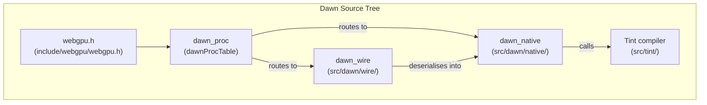
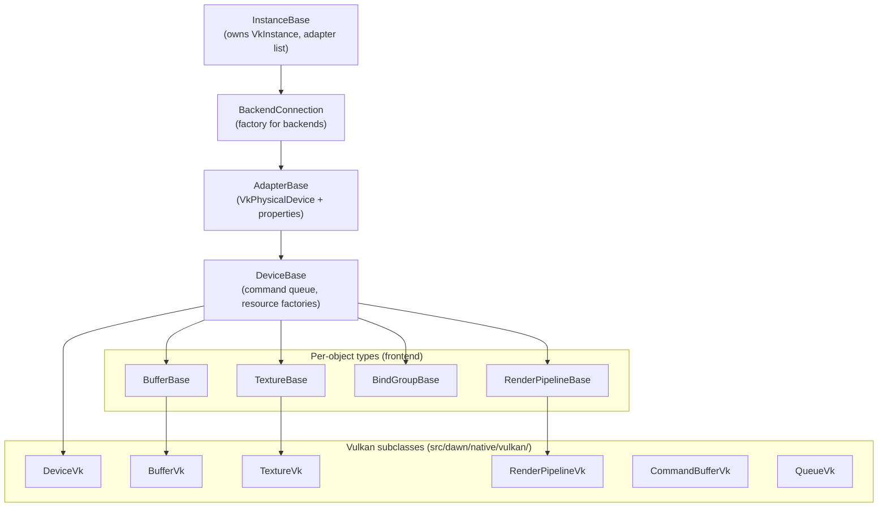
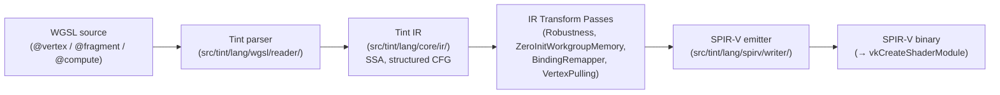
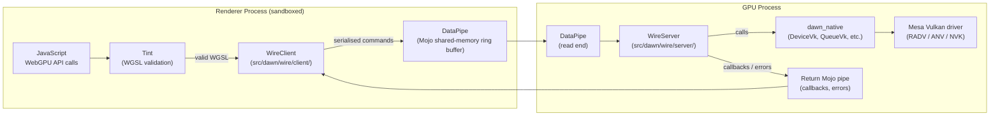
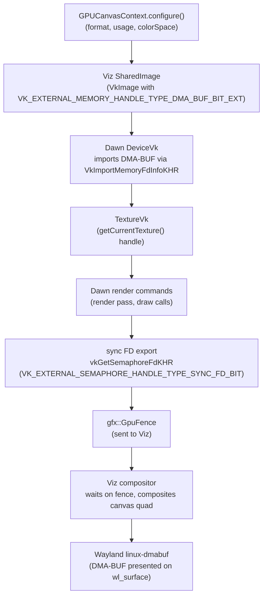

# Chapter 35: Dawn and WebGPU

**Part X — The Browser Rendering Stack**

**Audiences targeted:** Browser and web platform engineers who need to understand how WebGPU JavaScript calls propagate through Chrome's GPU process boundary into Mesa's Vulkan drivers; graphics application developers who want to understand the overhead of the browser context relative to native Vulkan and the implications for performance-sensitive workloads.

---

## Table of Contents

1. [WebGPU and Dawn: The Big Picture](#1-webgpu-and-dawn-the-big-picture)
2. [Dawn's Layered Architecture](#2-dawns-layered-architecture)
3. [The Vulkan Backend in Depth](#3-the-vulkan-backend-in-depth)
4. [Tint: The WGSL Compiler](#4-tint-the-wgsl-compiler)
5. [The DawnWire IPC Protocol](#5-the-dawnwire-ipc-protocol)
6. [Memory Management and Buffer Mapping](#6-memory-management-and-buffer-mapping)
7. [WebGPU Canvas Presentation](#7-webgpu-canvas-presentation)
8. [Adapter Enumeration and Feature Detection on Linux](#8-adapter-enumeration-and-feature-detection-on-linux)
9. [Integrations](#9-integrations)
10. [References](#10-references)

---

## 1. WebGPU and Dawn: The Big Picture

**WebGPU** is the successor to **WebGL** and represents a clean break from the stateful, implicit-synchronisation model that **WebGL** (and **OpenGL** beneath it) inherited from the 1990s. Where **WebGL** approximates the **OpenGL** 2.0 era, **WebGPU**'s design deliberately mirrors the explicit GPU APIs that emerged in the 2010s — **Vulkan**, **Metal**, and **Direct3D 12**. Resources are explicitly allocated, pipelines are compiled objects rather than accumulated state, shader interfaces are declared via typed descriptor sets, and buffer mapping is an asynchronous contract rather than a blocking stall. The goal is to give web content access to the GPU with predictable performance, no hidden driver-side synchronisation, and a portable surface that a single implementation can translate faithfully to each platform's native API.

**Dawn** is Google's open-source C++ implementation of the **WebGPU** API. It is the implementation used in **Chrome** on all platforms, and it also ships as a standalone library for native C++ applications that want to write portable GPU code without **Vulkan**-specific idioms. The Dawn source repository lives at `https://dawn.googlesource.com/dawn` (mirrored at `https://github.com/google/dawn`). Dawn's high-level source organisation is:

- **`include/webgpu/`** — public C headers implementing the **`webgpu.h`** surface (the file is **`include/webgpu/webgpu.h`**); these match the **WebGPU** IDL one-to-one and are now considered stable as of Chrome 141's adoption of the standardised **`webgpu.h`**
- **`src/dawn/native/`** — the C++ implementation; **`dawn_native`** is the largest library; it contains the frontend (validation, state tracking) and backends (**Vulkan**, **D3D12**, **Metal**, **OpenGL**)
- **`src/dawn/wire/`** — **`dawn_wire`**; the client/server serialisation layer that bridges the sandboxed renderer process to the GPU process in **Chrome**
- **`src/tint/`** — **Tint**, the **WGSL**-to-**SPIR-V**/**MSL**/**HLSL** compiler; previously a separate repository, now integrated directly into the Dawn tree
- **`src/dawn/tests/`** — end-to-end GPU tests (exercising the full stack through **Mesa**), unit tests, and the **WebGPU CTS** integration

A fourth thin library, **`dawn_proc`**, provides runtime flexibility by exposing a **`dawnProcTable`** function pointer table. Applications and **Chrome**'s GPU process use this table rather than directly calling **`dawn_native`** or **`dawn_wire`** symbols, which allows the implementation to be switched at runtime — important for **Chrome**'s ability to run **Dawn** natively in the GPU process or wired across a **Mojo** pipe from the renderer.



Dawn's relationship to **`wgpu-native`** (used by **Firefox**) is worth understanding. Both implement the same **WebGPU** specification and both expose the same **`webgpu.h`** C header, which reached a stable 1.0 definition in 2024. The two codebases are entirely separate: **Dawn** is C++, **`wgpu-native`** is Rust (built on the **`wgpu`** library from the **gfx-rs** project). They share the specification and the conformance test suite (the **WebGPU CTS**) but have divergent internal architectures and pass rate histories. This chapter focuses exclusively on **Dawn** and **Chrome**'s usage of it. As of 2025–2026, **Firefox** ships **WebGPU** by default on Windows (Firefox 141) and macOS (Firefox 145 on Apple Silicon), with Linux shipping in Nightly. **Chrome** has been shipping **WebGPU** on Linux with a driver-specific allow-list rollout since 2024, gating on known-good **Mesa** driver versions to avoid triggering bugs in older **Vulkan** implementations.

The **WebGPU** specification is maintained by the W3C GPU for the Web Working Group at `https://www.w3.org/TR/webgpu/`. The companion **WGSL** shader language specification is at `https://www.w3.org/TR/WGSL/`. **Dawn** tracks the specification closely, with divergences tracked as `dawn:` Crbug issues. **WebGPU** is not a low-level API like raw **Vulkan**; it deliberately omits features with unclear safety or portability (sparse resources, sub-allocator hints, most vendor extensions) but exposes enough of the modern GPU programming model to make high-performance applications, ML inference workloads, and AAA-quality rendering viable in a web context.

The rest of this chapter examines **Dawn**'s internals in depth. Section 2 describes **Dawn**'s layered architecture: the public **`webgpu.h`** API layer with its code-generated **`dawn.json`** scaffolding, the **`dawn::native`** implementation with its reference-counted object hierarchy (**`InstanceBase`**, **`AdapterBase`**, **`DeviceBase`**), the **`dawn::wire`** layer with **`WireClient`** and **`WireServer`**, and the **`GPUDevice.lost`** error and device-loss model. Section 3 dives into the **Vulkan** backend: **`DeviceVk`** initialisation (extension enumeration including **`VK_KHR_external_memory_fd`**, **`VK_KHR_external_semaphore_fd`**, **`VK_KHR_timeline_semaphore`**, and **`VK_EXT_descriptor_indexing`**; queue family selection; **`VkDevice`** creation via **`vkCreateDevice`**; **Vulkan Memory Allocator** (**VMA**) setup), **`RenderPipelineVk`** translation of **`GPURenderPipelineDescriptor`** to **`VkGraphicsPipelineCreateInfo`** with optional **`VK_KHR_dynamic_rendering`**, **`BindGroupVk`** and descriptor management via **`VkDescriptorSetLayout`** and **`VkDescriptorSet`**, **`CommandBufferVk`** render pass recording, and **`QueueVk`** submission with timeline semaphore synchronisation via **`vkQueueSubmit2`**. Section 4 covers **Tint**, the **WGSL** compiler: the recursive-descent parser in **`src/tint/lang/wgsl/reader/`**, the two-generation architecture transitioning from an AST-based pipeline to the high-level **SSA** Tint **IR** in **`src/tint/lang/core/ir/`**, transform passes including **Robustness** (bounds-checking for security), **ZeroInitWorkgroupMemory**, **BindingRemapper**, and **VertexPulling**, **SPIR-V** emission via **`src/tint/lang/spirv/writer/`** feeding **`vkCreateShaderModule`** with optional **SPIRV-Tools** validation and optimisation, **`VkPipelineCache`**-backed shader caching, and **WGSL** as a security boundary preventing malicious shader source from reaching GPU drivers. Section 5 explains the **DawnWire IPC** protocol: why **Chrome**'s sandboxed renderer process cannot call **DRM** ioctls directly, the **`WireClient`**/**`WireServer`** command serialisation over a **Mojo** shared-memory **`DataPipe`**, the client-side integer object handle model with its two-layer validation, asynchronous callbacks for **`buffer.mapAsync()`**, **`createRenderPipelineAsync()`**, and **`createComputePipelineAsync()`**, and the **`wgpuQueueSubmit`** flush point. Section 6 addresses memory management and buffer mapping: **`BufferVk`** wrapping **`VkBuffer`** and **`VmaAllocation`** with **`GPUBufferUsage`**-to-**`VkBufferUsageFlags`** mapping, **`GPUBuffer.mapAsync`** staging through **`HOST_VISIBLE`** memory and **`vmaMapMemory`**, the **Chrome** shared-memory path using **`mojo::SharedMemoryRegion`** and **`VkImportMemoryFdInfoKHR`** for zero-copy **`buffer.getMappedRange()`**, the **`UploadRingBuffer`** used by **`writeBuffer`** and **`writeTexture`**, and per-subresource barrier tracking in **`TextureVk`** via **`SubresourceStorage<T>`**. Section 7 covers **WebGPU** canvas presentation: **`GPUCanvasContext`** configuration, **Viz** **`SharedImage`** backing via **`VkImage`** with **`VK_EXTERNAL_MEMORY_HANDLE_TYPE_DMA_BUF_BIT_EXT`**, the **`getCurrentTexture()`** lend/return ownership cycle, sync **FD** export via **`vkGetSemaphoreFdKHR`** with **`VK_EXTERNAL_SEMAPHORE_HANDLE_TYPE_SYNC_FD_BIT`** delivering a **`gfx::GpuFence`** to the **Viz** compositor, zero-copy scanout via **Wayland** **`linux-dmabuf`**, and colour space conversion handling for **`display-p3`** canvases. Section 8 describes adapter enumeration and feature detection on Linux: **`navigator.gpu.requestAdapter()`** triggering **`vkEnumeratePhysicalDevices`** via **`InstanceBase::EnumerateAdapters`**, **`powerPreference`**-guided physical device selection between **ANV** (Intel integrated) and **RADV**/**NVK** (discrete) adapters, **`gpu_driver_bug_list.json`** blocklist gating, **`GPUAdapter.requestDevice()`** feature negotiation mapping **`GPUFeatureName`** strings to **Vulkan** device extensions and features, **`GPUSupportedLimits`** clamping to prevent GPU fingerprinting, **`GPUAdapterInfo`** coarsening, and resource sharing constraints on multi-GPU systems via **`VK_KHR_external_memory_fd`**.

---

## 2. Dawn's Layered Architecture

Understanding Dawn's internal structure is essential for interpreting performance profiles and debugging issues that cross the renderer/GPU process boundary.

### The Public API Layer

The public API surface is the set of C functions and structs declared in `include/webgpu/webgpu.h` (formerly generated from the WebGPU IDL, now aligned with the standardised `webgpu.h` produced by the `webgpu-native/webgpu-headers` project). WebGPU object handles are opaque pointer-sized integers — `WGPUBuffer`, `WGPUTexture`, `WGPURenderPipeline`, and so on. Callers never dereference these handles; all operations go through typed functions like `wgpuBufferMapAsync` or `wgpuRenderPassEncoderDraw`. This design is intentional: it enables the proc-table dispatch mechanism and makes the handles trivially serialisable for DawnWire (described in Section 5).

The code generation infrastructure is central to Dawn's maintainability. The file `dawn.json` (and `dawn_wire.json` for wire-specific metadata) describes the entire WebGPU API in a structured format. A Python code generator (`dawn_json_generator.py`) runs at build time to produce C headers, C++ wrapper classes, DawnWire command structures, and serialisation/deserialisation logic. When a new WebGPU method is added to the spec, adding it to `dawn.json` causes all of this boilerplate to be regenerated automatically.

### The Native Layer

`dawn::native` implements every WebGPU object as a reference-counted C++ class. The base class hierarchy places generic logic in the frontend:

- `InstanceBase` — the top-level singleton; owns the list of registered adapters; responsible for `VkInstance` creation on Vulkan
- `AdapterBase` — represents a physical GPU; holds `VkPhysicalDevice` and the enumerated device properties
- `DeviceBase` — the WebGPU device; owns the command queue, resource factories, and the error state machine
- `BufferBase`, `TextureBase`, `BindGroupBase`, `RenderPipelineBase`, etc. — one per WebGPU object type

Each object uses an internal `ResultOrError<T>` type (analogous to `std::expected`) for error propagation. Methods that can fail return `ResultOrError<OwnedRef<T>>`. The frontend's validation functions check preconditions against the WebGPU spec (alignment constraints, valid enum values, usage flag compatibility) and return validation errors, which are then asynchronously delivered to the application via the device error callback registered with `wgpuDeviceSetUncapturedErrorCallback`. The explicit separation of validation from execution means that a application receiving a validation error knows exactly which API call was incorrect, without the ambiguity of an OpenGL `glGetError` accumulated across multiple calls.

Backend-specific subclasses in `src/dawn/native/vulkan/` override the virtual methods with Vulkan implementations: `DeviceVk`, `BufferVk`, `TextureVk`, `RenderPipelineVk`, `BindGroupVk`, `CommandBufferVk`, and `QueueVk`. The `BackendConnection` abstract class is the factory through which `InstanceBase` registers and instantiates backends; on Linux only the Vulkan backend is enabled in production builds (the OpenGL backend exists for testing and for platforms without Vulkan).



### The Wire Layer and Proc Dispatch

`dawn::wire` provides a client (`WireClient`) and a server (`WireServer`) that together implement the DawnWire IPC protocol. Applications that use Dawn through the wire layer (as Chrome does) call the same `webgpu.h` functions; `dawn_proc` routes these to `WireClient` rather than `dawn::native`. The `WireClient` serialises each call into a command buffer; the `WireServer`, running in the GPU process, deserialises commands and calls `dawn::native`. This is described in full in Section 5.

### Error Handling and Device Loss

`GPUDevice.lost` is a JavaScript Promise that resolves with a `GPUDeviceLostInfo` when the device is unrecoverably lost — GPU reset, driver crash, or explicit `device.destroy()`. In Dawn's implementation, device loss is detected by `VkResult` values of `VK_ERROR_DEVICE_LOST` or `VK_ERROR_OUT_OF_DATE_KHR` propagating up through the Vulkan backend. `DeviceVk` sets an internal flag `mCompletedSerial == UINT64_MAX` as the sentinel for loss, which causes all subsequent operations to return `WGPUBufferMapAsyncStatus_DeviceLost` or equivalent. The wire layer delivers this across the IPC boundary as a `DeviceLostCallback` wire message, causing `WireClient` to resolve the JavaScript Promise.

---

## 3. The Vulkan Backend in Depth

On Linux, the Vulkan backend is the sole production backend. Its architecture closely mirrors what a native Vulkan application would write, with Dawn providing the state-tracking and serialisation layer on top.

### DeviceVk Initialisation

`DeviceVk::Initialize` (in `src/dawn/native/vulkan/DeviceVk.cpp`) performs the following sequence after receiving a `VkPhysicalDevice` from the adapter:

1. **Extension enumeration**: Dawn queries `vkEnumerateDeviceExtensionProperties` and builds a set of available extensions. Required extensions for the Vulkan backend include `VK_KHR_external_memory_fd`, `VK_KHR_external_semaphore_fd`, `VK_KHR_timeline_semaphore`, and `VK_EXT_descriptor_indexing`. The first two enable the Linux-specific GPU memory and synchronisation sharing mechanisms needed for canvas presentation (Section 7). Timeline semaphores replace the fences-and-binary-semaphores synchronisation model with a monotonically-increasing counter per queue. `VK_EXT_descriptor_indexing` enables unbounded descriptor arrays used by some WebGPU bind group layouts.

2. **Queue family selection**: Dawn searches for a queue family where `(queueFlags & (VK_QUEUE_GRAPHICS_BIT | VK_QUEUE_COMPUTE_BIT)) == (VK_QUEUE_GRAPHICS_BIT | VK_QUEUE_COMPUTE_BIT)`. Since the Vulkan spec guarantees that graphics and compute queues implicitly support transfer, a single universal queue family covers all WebGPU workloads. One queue at priority 0.0 is created; separate async compute queues are not currently used in Chrome's Dawn configuration.

3. **`VkDevice` creation**: `vkCreateDevice` is called with the resolved extension list and a `VkPhysicalDeviceFeatures2` chain that enables required and optional device features conditional on extension availability.

4. **Function pointer loading**: `VulkanFunctions::LoadDeviceProcs` loads all device-level function pointers using `vkGetDeviceProcAddr`. Dawn never uses global function pointers to allow multiple physical devices in the same process.

5. **Memory allocator setup**: Dawn uses the Vulkan Memory Allocator (VMA) library (`https://github.com/GPUOpen-LibrariesAndSDKs/VulkanMemoryAllocator`) via a `MutexProtected<ResourceMemoryAllocator>` wrapper. The heap block size is configurable via `DawnDeviceAllocatorControl` descriptors but defaults to a value tuned for the system's VRAM size.

6. **Service object initialisation**: `RenderPassCache`, `FramebufferCache`, `DescriptorSetAllocator`, and `ExternalSemaphoreService` are created. The external semaphore service handles Linux-specific fd-based semaphore import/export (`VK_EXTERNAL_SEMAPHORE_HANDLE_TYPE_OPAQUE_FD_BIT` and `VK_EXTERNAL_SEMAPHORE_HANDLE_TYPE_SYNC_FD_BIT`).

Timeline semaphores are required on the Vulkan backend since `VK_KHR_timeline_semaphore` was promoted to Vulkan 1.2. On Mesa, this has been universally supported since Mesa 20.3 (released December 2020) combined with kernel 5.10. Older Mesa versions are excluded from Chrome's WebGPU allow-list for this reason.

### RenderPipelineVk

`RenderPipelineVk::InitializeImpl` in `src/dawn/native/vulkan/RenderPipelineVk.cpp` translates a `GPURenderPipelineDescriptor` into a `VkGraphicsPipelineCreateInfo` structure. This is one of the cleanest translations in Dawn's Vulkan backend because WebGPU's pipeline model is intentionally aligned with Vulkan's:

```cpp
// src/dawn/native/vulkan/RenderPipelineVk.cpp:InitializeImpl (simplified)
VkGraphicsPipelineCreateInfo createInfo = {};
createInfo.stageCount = shaderStageCount;
createInfo.pStages    = shaderStages;
createInfo.pVertexInputState   = &vertexInputState;
createInfo.pInputAssemblyState = &inputAssemblyState;
createInfo.pViewportState      = &viewportState;
createInfo.pRasterizationState = &rasterisationState;
createInfo.pMultisampleState   = &multisampleState;
createInfo.pDepthStencilState  = &depthStencilState;
createInfo.pColorBlendState    = &colorBlendState;
createInfo.layout              = pipelineLayout->GetHandle();
```

WebGPU's explicit design means Dawn knows the complete pipeline state at creation time — vertex attribute formats, blend operations, depth/stencil operations, and WGSL shader code are all fixed before `createRenderPipeline` returns. There is no analog to OpenGL's or WebGL's late-binding state mutation after a pipeline is nominally "ready". This eliminates the shader variant explosion that ANGLE faces when translating WebGL 2 to Vulkan: ANGLE must track which OpenGL state combinations actually get used and compile separate pipeline variants per combination, whereas Dawn compiles exactly the pipeline the application requested.

Two code paths exist in `RenderPipelineVk` for render pass compatibility. When the device supports `VK_KHR_dynamic_rendering`, Dawn uses `VkPipelineRenderingCreateInfoKHR` to specify colour and depth attachment formats directly on the pipeline, avoiding the `VkRenderPass` object entirely. On older Vulkan implementations without dynamic rendering, Dawn queries its `RenderPassCache` to obtain a compatible `VkRenderPass` for the pipeline's attachment configuration.

### BindGroupVk and Descriptor Management

`GPUBindGroupLayout` maps one-to-one to a `VkDescriptorSetLayout`. `GPUBindGroup` maps to a `VkDescriptorSet` allocated from `DescriptorSetAllocator`. Dawn's allocator maintains one `VkDescriptorPool` per distinct layout, sized to hold a configurable number of sets before a new pool is created. When a bind group is destroyed, its descriptor set is returned to the pool for reuse rather than triggering a `vkFreeDescriptorSets` call, which would require the `VK_DESCRIPTOR_POOL_CREATE_FREE_DESCRIPTOR_SET_BIT` flag and introduce fragmentation.

`BindGroupVk::Create` in `src/dawn/native/vulkan/BindGroupVk.cpp` populates the descriptor set with `vkUpdateDescriptorSets` immediately on creation. Because WebGPU bind groups are immutable once created, Dawn never needs to update a descriptor set after this initial write — a significant simplification compared to a dynamic-binding OpenGL or WebGL model.

### CommandEncoderVk and Render Pass Recording

`CommandBufferVk::RecordRenderPass` in `src/dawn/native/vulkan/CommandBufferVk.cpp` is the entry point for recording a render pass into a `VkCommandBuffer`. The process is:

1. Begin the render pass with `vkCmdBeginRenderPass` (or `vkCmdBeginRenderingKHR` in dynamic rendering mode), supplying `VkClearValue`s from the `GPURenderPassDescriptor`'s `loadOp`.
2. Set viewport and scissor state via `vkCmdSetViewport` / `vkCmdSetScissor`.
3. For each draw call recorded by the `GPURenderPassEncoder`, emit the corresponding Vulkan command: `vkCmdDraw`, `vkCmdDrawIndexed`, `vkCmdDrawIndirect`, or `vkCmdDrawIndexedIndirect`.
4. Bind descriptor sets as needed with `vkCmdBindDescriptorSets`.
5. End the pass with `vkCmdEndRenderPass` or `vkCmdEndRenderingKHR`.

All commands within a single `GPUCommandEncoder` are recorded into a single `VkCommandBuffer`. The `GPUCommandBuffer` returned by `commandEncoder.finish()` is an immutable snapshot — the underlying `VkCommandBuffer` is recorded and closed, ready for submission.

### Queue Submission and Timeline Semaphore Synchronisation

`QueueVk::SubmitImpl` submits a `VkCommandBuffer` to the universal queue via `vkQueueSubmit2`. Each submission signals a timeline semaphore at a monotonically increasing serial number — Dawn's `mLastSubmittedSerial`. Subsequent submissions that depend on the output of a previous one (for example, a readback that needs to wait for rendering to complete) add a `VkSemaphoreSubmitInfo` waiting on the previous serial value. This models WebGPU's strict serial execution semantics within a single `GPUQueue` — all submits to a queue execute in order, with the timeline semaphore providing the proof of ordering that Vulkan requires.

Cross-submission texture layout transitions are handled by Dawn's `TextureVk` state tracker. Each `TextureVk` maintains a per-subresource (mip level × array layer) record of the last `VkImageLayout` and `VkAccessFlags` known to have been applied. At submission time, Dawn inserts `vkCmdPipelineBarrier` calls to transition resources from their current state to the layout required by the upcoming commands. Within a single `CommandEncoder`, the validation layer verifies that the application has not requested conflicting usages of the same texture in the same pass.

---

## 4. Tint: The WGSL Compiler

Tint is the compiler that translates WGSL (WebGPU Shading Language) source code into SPIR-V for the Vulkan backend, MSL for Metal, and HLSL for D3D12. It lives in `src/tint/` within the Dawn repository. Understanding Tint is essential for understanding the shader compilation latency visible in WebGPU applications and the security boundary that prevents malicious shader code from reaching GPU drivers.

### WGSL and the Tint Parser

WGSL is a statically typed, single-assignment shader language designed to be safe, efficient, and easy to validate. Its grammar and semantics are fully specified at `https://www.w3.org/TR/WGSL/`. WGSL programs declare explicit `@group` and `@binding` annotations on uniforms, storage buffers, and textures; explicit entry points (`@vertex`, `@fragment`, `@compute`); and explicit workgroup sizes for compute shaders.

The Tint parser in `src/tint/lang/wgsl/reader/` is a hand-written recursive-descent parser. It produces a `wgsl::Program` that packages the AST and semantic information (resolved types, variable declarations, call graph) together.

### The Tint IR: A Two-Generation Architecture

Tint has undergone a major architectural transition over 2022–2025 that web platform engineers should be aware of. The original architecture used an AST-based representation throughout: the parser produced an AST, a sequence of AST transform passes modified it, and backend code generators walked the transformed AST to produce SPIR-V, MSL, or HLSL. While correct, AST transforms are expensive — they repeatedly walk and reconstruct tree nodes — and the frontend/backend coupling made adding new features difficult.

The second-generation architecture introduces a high-level SSA Intermediate Representation: the Tint IR, in `src/tint/lang/core/ir/`. The IR uses a structured control flow graph (no arbitrary `goto`; loops and conditionals are explicit block structures), enabling safe transformations without the bookkeeping needed to maintain valid WGSL at every intermediate step. An IR instruction references IR values (SSA values); blocks form a dominance tree; functions are first-class IR values.

As of Chrome 141 (2025), the transition to the IR is complete for all backends:

- All AST transformations have been deleted and replaced with IR transformations.
- All backend code generators (SPIR-V, MSL, HLSL) operate on the Tint IR rather than the AST.
- The SPIR-V input path (used to read SPIR-V into Tint for cross-compilation purposes) was converted to emit IR directly rather than going through an AST representation.

The performance impact is significant. On some platforms the transition delivered up to a seven times speedup in shader compilation, primarily because IR transformations do a single linear pass over SSA values rather than recursive tree traversal with node reconstruction.



### Transform Passes

Between WGSL parsing and SPIR-V emission, Tint applies a sequence of IR transform passes. The most significant for the Vulkan backend are:

**Robustness** (`src/tint/lang/core/ir/transform/robustness.cc`): The WebGPU specification mandates that out-of-bounds accesses to arrays, storage buffers, and texture coordinates must not cause undefined behaviour — they must return zero (for reads) or be silently discarded (for writes). The Robustness transform inserts bounds checks around every array index and buffer access. This is a critical security boundary: a malicious web page cannot craft shader code that reads arbitrary GPU memory by specifying a computed out-of-bounds index. The cost is measurable — bounds checks add ALU instructions to every array access — but integer range analysis (being progressively rolled out in Chrome 2025–2026) can eliminate many of these checks statically when the compiler can prove the access is in-bounds.

**ZeroInitWorkgroupMemory** (`src/tint/lang/core/ir/transform/`): Workgroup-scope variables in WGSL must be zero-initialised at the start of each compute shader invocation, per the spec. This prevents workgroup memory from leaking information between compute dispatches from different web origins. The transform adds a sequence of stores to zero at the beginning of each compute entry point, guarded by `invocation_id == 0` to avoid redundant stores from all invocations.

**BindingRemapper**: WGSL shaders declare resources with `@group(g) @binding(b)` annotations. Dawn's Vulkan backend may need to remap these to different descriptor set and binding numbers — for example, when the bind group layout requires moving resources to avoid descriptor set indexing gaps or when internal per-device toggles adjust the layout. The BindingRemapper transform performs this remapping before SPIR-V emission so that the emitted SPIR-V uses the final Vulkan descriptor coordinates.

**VertexPulling** (optional): This transform converts vertex input attributes declared via `@location(n)` into manual `textureLoad`-style buffer reads. When enabled, it removes Vulkan's pipeline vertex input state entirely, reading vertex data through storage buffers instead. This can improve compatibility on GPUs or drivers where the vertex attribute format support is incomplete, at the cost of slightly higher vertex shader complexity.

### SPIR-V Emission

The SPIR-V emitter in `src/tint/lang/spirv/writer/` walks the Tint IR and produces SPIR-V binary. It uses a `Builder` class to construct the SPIR-V module with correct module-level decorations, type declarations, variable declarations, and instruction sequences. The emitted SPIR-V is consumed directly by `vkCreateShaderModule` — there is no intermediate text format.

Tint links against SPIRV-Tools (`https://github.com/KhronosGroup/SPIRV-Tools`) for two purposes. First, `spirv-val` validates the emitted SPIR-V against the SPIR-V specification in debug builds — this catches bugs in the emitter before they reach the driver. Second, `spirv-opt` can apply optimisation passes (dead code elimination, scalar replacement of aggregates, common subexpression elimination) to the emitted SPIR-V before it is handed to `vkCreateShaderModule`. Whether `spirv-opt` runs depends on Dawn's optimisation level toggle.

As of Chrome 141, Tint also takes advantage of SPIR-V 1.4 features on Android and ChromeOS (and, progressively, on Linux). SPIR-V 1.4 relaxations allow more efficient code generation in several scenarios, particularly around structured control flow and interface variables.

### Shader Caching

`dawn::native::ShaderModuleBase` caches the compiled SPIR-V keyed on a hash of the WGSL source plus the transform options applied. On a cache hit, the WGSL source is not re-parsed and the transform pipeline is not re-run. At the Vulkan pipeline level, Dawn serialises `VkPipelineCache` data to disk using the Dawn blob cache mechanism, so that on subsequent browser launches the driver's pipeline compilation step (NIR lowering, ACO backend — see Ch14 and Ch15) is also skipped. Together, these two caches mean that after the first page visit, subsequent visits typically avoid both WGSL compilation and driver shader compilation entirely.

### WGSL as a Security Boundary

Tint's parser and validator run in the renderer process, before any shader source crosses the Mojo IPC pipe into the GPU process. If WGSL is syntactically or semantically invalid, Tint rejects it in the renderer and no bytes reach the GPU process or the Vulkan driver. This is fundamentally different from the WebGL model, where GLSL source crosses the process boundary and must be validated by the GPU driver — a process that has historically produced exploitable driver bugs in response to crafted shader input. With WebGPU, the GPU driver receives valid, Tint-validated SPIR-V: a much smaller attack surface.

---

## 5. The DawnWire IPC Protocol

DawnWire is the serialisation layer that allows WebGPU API calls made in Chrome's sandboxed renderer process to be executed by `dawn::native` running in the GPU process. It is one of the two GPU IPC protocols that Chrome maintains — the other being the older GPU Command Buffer used for WebGL and Skia rasterisation.

### Why the Process Boundary Exists

Chrome's renderer processes run in a sandbox that denies direct GPU access. GPU APIs such as Vulkan require `ioctl` calls to DRM character devices, memory mapping of GPU-visible memory, and privileged kernel interfaces that are blocked by the renderer's seccomp-BPF filter. The GPU process runs with looser restrictions and holds the Vulkan device. Every WebGPU operation in JavaScript must therefore cross this boundary.

### Architecture: WireClient and WireServer

`dawn::wire::WireClient` is instantiated in the renderer process. It receives the same `webgpu.h` function calls that a native Dawn application would make, because `dawn_proc` routes calls to it. For each call, `WireClient` serialises the arguments into a command structure and appends it to a `DataPipe` — a Mojo shared-memory ring buffer. `dawn::wire::WireServer` runs in the GPU process, reading from the same `DataPipe`, deserialising each command, and calling the corresponding `dawn::native` function. Return values and asynchronous callbacks travel in the reverse direction via a separate Mojo message pipe.

The source files are structured to mirror the `webgpu.h` API. `src/dawn/wire/client/` contains per-object client-side handlers (e.g., `Device.cpp`, `Buffer.cpp`, `RenderPipeline.cpp`). `src/dawn/wire/server/` contains the corresponding server-side dispatch functions. Both client and server source files are largely generated from `dawn_wire.json` by the code generator, with hand-written additions for complex cases like buffer mapping.



### Command Serialisation

Each WebGPU method call is serialised into a fixed-size header (containing the command ID, generated from the WebGPU IDL at build time) followed by a variable-length payload containing the method's arguments. Object handles appear in the payload as integer IDs, not as pointers. The serialised command is written to the client's `DataPipe` buffer using a zero-copy approach where possible: for commands with small payloads (draw calls, pipeline state changes), the entire command fits in the ring buffer slot; for commands with large payloads (shader WGSL source, initial buffer data), the payload may be written via a separate shared-memory segment.

### Object Handle Model

Client-side WebGPU objects are thin wrappers holding a 32-bit integer ID. Object IDs are allocated by the client, not the server, to avoid a round-trip per object creation: the client picks the next ID in a per-type monotonically increasing counter, sends the creation command with the new ID, and immediately returns the opaque handle to JavaScript. The GPU process's `WireServer` maintains a map from these IDs to the actual `dawn::native` objects.

ID allocation being client-side has an important security implication: the client can reference an ID that does not yet correspond to a server-side object. Dawn handles this by duplicating validation on both sides. The `WireClient` performs lightweight validation (object existence in the client-side ID map, basic type checks, enum range validation) before serialising any command. The `WireServer` performs full `dawn::native` validation on the server side. The two-layer validation model means that obvious programming errors are caught in the renderer process (providing fast error feedback to JavaScript), while the GPU process remains the authoritative validator.

### Error Handling Across the Wire

Validation errors raised by `dawn::native` on the server side are bundled into asynchronous callback messages and sent back to the renderer via the return Mojo pipe. `WireClient` receives them and delivers them to JavaScript as `GPUValidationError` or `GPUOutOfMemoryError` events via the device's uncaptured error callback. `GPUDevice.lost` is handled specially: a `DeviceLostCallback` message from the server causes the client to mark the device as lost and resolve the `GPUDevice.lost` Promise, which in turn allows JavaScript to clean up WebGPU resources and optionally recreate the device.

### Return Values and Asynchronous Creation

WebGPU methods that create objects (such as `device.createBuffer()`) return an opaque handle synchronously. Because the client allocated the ID, there is no round-trip: the returned handle is valid from the caller's perspective immediately, even though the actual `VkBuffer` is created asynchronously in the GPU process. Methods that need a real result from the GPU (such as `buffer.mapAsync()` which needs to know when GPU memory is accessible from the CPU) use a future/callback model: the client sends the command, the server processes it asynchronously, and sends a callback message when the result is available.

`createRenderPipelineAsync` and `createComputePipelineAsync` follow this pattern for pipeline compilation: the server-side dispatch offloads `vkCreateGraphicsPipelines` or `vkCreateComputePipelines` to a worker thread, allowing other commands to continue processing while the driver compiles the pipeline. The completion callback notifies the renderer process when the pipeline is ready.

### Flushing

WebGPU commands accumulate in the client's `DataPipe` buffer. A `wgpuQueueSubmit` call is the natural flush point — after serialising the submit command, `WireClient` flushes the pipe, delivering accumulated commands to the GPU process. In Chrome's Mojo integration, the `DataPipe` is a shared memory region; the GPU process event loop is woken via a Mojo signal to process the new commands synchronously before returning control.

---

## 6. Memory Management and Buffer Mapping

### BufferVk and VMA Integration

Each `BufferVk` wraps a `VkBuffer` and a `VmaAllocation`. The mapping from `GPUBufferUsage` flags to `VkBufferUsageFlags` is direct: `VERTEX` becomes `VK_BUFFER_USAGE_VERTEX_BUFFER_BIT`, `INDEX` becomes `VK_BUFFER_USAGE_INDEX_BUFFER_BIT`, `STORAGE` becomes `VK_BUFFER_USAGE_STORAGE_BUFFER_BIT | VK_BUFFER_USAGE_SHADER_DEVICE_ADDRESS_BIT` (when buffer addresses are supported), and `MAP_READ | MAP_WRITE | COPY_DST` is combined for staging buffers. Device-local buffers (those without `MAP_READ` or `MAP_WRITE`) use `VMA_MEMORY_USAGE_GPU_ONLY`, directing VMA to allocate from `DEVICE_LOCAL` memory.

VMA is configured with `VMA_ALLOCATOR_CREATE_BUFFER_DEVICE_ADDRESS_BIT` if the Vulkan device supports `VkPhysicalDeviceBufferDeviceAddressFeatures::bufferDeviceAddress`. Large textures receive dedicated allocations (`VMA_ALLOCATION_CREATE_DEDICATED_MEMORY_BIT`) to avoid fragmentation in the general-purpose pools. Small buffers of similar sizes are grouped into pools of matching usage types to reduce VMA overhead.

### GPUBuffer.mapAsync for Reads

When JavaScript calls `buffer.mapAsync(GPUMapMode.READ)`, Dawn must make device-local GPU memory accessible to the CPU. The implementation creates a staging `VkBuffer` with `HOST_VISIBLE | HOST_COHERENT` memory, records a `vkCmdCopyBuffer` from the device-local buffer to the staging buffer in a new command buffer, submits that command buffer, and then waits for the corresponding timeline semaphore value. When the semaphore signals, Dawn calls `vmaMapMemory` on the staging buffer's allocation to obtain a CPU pointer. In the wire layer, this CPU pointer is communicated back to the renderer process via a shared memory region.

### The Shared Memory Path in Chrome

Chrome's integration with DawnWire optimises the `mapAsync` path using Mojo shared memory. Instead of allocating a staging buffer inside `dawn::native`, the GPU process allocates a `mojo::SharedMemoryRegion`, creates a `VkBuffer` backed by that region's memory (via `VkImportMemoryFdInfoKHR` on Linux), performs the copy into it, and signals the renderer process when the copy is complete. The renderer process maps the same shared memory region as the `ArrayBuffer` that JavaScript sees. The result is that `buffer.getMappedRange()` in JavaScript returns a zero-copy view of the actual mapped GPU memory — no additional copy between the GPU process and the renderer.

For `MAP_WRITE` buffers, the flow is symmetric: the shared memory region is mapped in the renderer, JavaScript writes into it, the renderer sends a signal to the GPU process, which then copies from the shared buffer to the device-local buffer as part of the next `queue.submit()`.

### writeBuffer and writeTexture

`writeBuffer` and `writeTexture` are the WebGPU synchronous upload helpers. Internally, Dawn uses an `UploadRingBuffer` — a ring buffer of `HOST_VISIBLE` memory allocated from VMA — to batch small uploads. JavaScript data is copied into a slot in the ring buffer; at `queue.submit()` time, Dawn records `vkCmdCopyBuffer` or `vkCmdCopyBufferToImage` commands to move the data from the ring buffer slot to the destination resource. The ring buffer is advanced by the submission serial so that slots are not reused while in-flight commands are pending.

### Texture Memory

`TextureVk` allocates its `VkImage` via `vmaCreateImage`. Dawn's internal `SubresourceStorage<T>` template tracks the state (layout and access flags) for each subresource — every combination of mip level and array layer — independently. This granular tracking is necessary because WebGPU allows uploading to individual mip levels while simultaneously rendering to others, requiring per-subresource barriers rather than whole-image transitions.

---

## 7. WebGPU Canvas Presentation

### Canvas Configuration

The canvas entry point for WebGPU is `GPUCanvasContext`, obtained by calling `canvas.getContext('webgpu')`. The `configure()` call specifies the pixel format (`bgra8unorm` is the most common on Linux), usage flags (typically `RENDER_ATTACHMENT`), alpha mode, and colour space. In Chrome, `configure()` triggers the Viz compositor service to allocate a `SharedImage` backing store for this canvas: a GPU-side texture that is jointly owned by Dawn and Viz.

### SharedImage and VkImage Sharing

Viz's `SharedImage` for a WebGPU canvas is backed by a `VkImage` created with `VK_EXTERNAL_MEMORY_HANDLE_TYPE_DMA_BUF_BIT_EXT`. The DMA-BUF file descriptor representing this image is shared between the Viz GPU task runner and the Dawn `DeviceVk`. Dawn imports the DMA-BUF using `VkImportMemoryFdInfoKHR` with `VK_EXTERNAL_MEMORY_HANDLE_TYPE_DMA_BUF_BIT_EXT`, obtaining a `VkDeviceMemory` that refers to the same underlying GEM buffer object. This memory import is the mechanism described in Ch4 (DMA-BUF and GBM) applied at the WebGPU layer.

### getCurrentTexture and the Lend/Return Cycle

`GPUCanvasContext.getCurrentTexture()` returns a `GPUTexture` wrapping the imported `VkImage`. Ownership semantics follow a lend/return model: Viz lends the image to Dawn for the duration of one frame. Dawn treats the image as a normal `TextureVk` for the purposes of bind groups, render pass attachments, and barrier tracking. When the frame is complete — either because `context.present()` has been called or because the current texture has been dropped — Dawn releases the `VkImage` back to Viz.

### Sync FD Export

The release is accompanied by a `VkSemaphore` signal. Dawn exports this semaphore as a sync FD via `vkGetSemaphoreFdKHR` with `VK_EXTERNAL_SEMAPHORE_HANDLE_TYPE_SYNC_FD_BIT`. The sync FD is sent to Viz as a `gfx::GpuFence`. Viz imports it and waits on the fence before compositing the canvas quad onto the display, ensuring that the compositor never reads pixels that Dawn has not yet finished writing. This use of `VK_KHR_external_semaphore_fd` is what makes zero-copy WebGPU canvas presentation possible on Linux: the GPU does the rendering, signals a fence, and the compositor waits on that fence — without any CPU involvement and without copying the image.

The canvas texture is delivered to the display via the same Wayland `linux-dmabuf` path described in Ch20 and Ch36. Viz presents the DMA-BUF to the Wayland compositor as a buffer attachment on a `wl_surface`, allowing the hardware display controller to scan out directly from the GPU allocation if the DMA-BUF format and modifier are supported by the display pipeline.



### Colour Space Handling

`GPUCanvasContext.configure()` accepts a `colorSpace` field (`"srgb"` or `"display-p3"` being the two WebGPU-defined values). If the canvas colour space differs from the compositor's working colour space, Dawn inserts a colour-space conversion blit as the final step before releasing the image to Viz. This blit applies a colour transform matrix in a full-screen fragment shader, similar to the tone-mapping passes described in the compositing literature. For the common case where both the canvas and the compositor use sRGB, no conversion pass is needed.

---

## 8. Adapter Enumeration and Feature Detection on Linux

### requestAdapter and Physical Device Selection

The JavaScript entry point `navigator.gpu.requestAdapter(options)` triggers `InstanceBase::EnumerateAdapters` in `dawn::native`, which calls `vkEnumeratePhysicalDevices` and constructs one `AdapterBase` (specifically `PhysicalDeviceVk`) per `VkPhysicalDevice`. The adapter is returned to JavaScript as a `GPUAdapter` through the DawnWire.

The `powerPreference` option influences which physical device is returned when multiple GPUs are present. `"low-power"` preference causes Dawn to prefer an integrated GPU (`VkPhysicalDeviceType::VK_PHYSICAL_DEVICE_TYPE_INTEGRATED_GPU`) over a discrete one. `"high-performance"` prefers a discrete GPU. When neither preference is specified, Dawn uses heuristics based on device type and driver name.

On Linux laptops with both an Intel integrated GPU (handled by Mesa's ANV driver) and an AMD or NVIDIA discrete GPU (handled by RADV or NVK/proprietary), Chrome may have additional constraints: the GPU blocklist (`gpu_driver_bug_list.json` in the Chromium source) can force WebGPU to use a specific adapter or disable it entirely if the adapter's driver version is known to produce incorrect results or security vulnerabilities.

### requestDevice and Feature Negotiation

`GPUAdapter.requestDevice(descriptor)` creates the `VkDevice`. The descriptor specifies `requiredFeatures` (a list of `GPUFeatureName` strings that the application needs) and `requiredLimits` (minimum values for `GPUSupportedLimits` properties). Dawn validates `requiredFeatures` against the adapter's supported Vulkan extensions and device features:

| WebGPU Feature Name | Vulkan Requirement |
|---|---|
| `"texture-compression-bc"` | `VkPhysicalDeviceFeatures::textureCompressionBC` |
| `"texture-compression-etc2"` | `VkPhysicalDeviceFeatures::textureCompressionETC2` |
| `"timestamp-query"` | `VkPhysicalDeviceLimits::timestampComputeAndGraphics == VK_TRUE` (and `timestampPeriod > 0`) |
| `"indirect-first-instance"` | `VkPhysicalDeviceFeatures::drawIndirectFirstInstance` |
| `"shader-f16"` | `VK_KHR_shader_float16_int8` |
| `"bgra8unorm-storage"` | `VK_KHR_portability_subset` absence + format support |
| `"rg11b10ufloat-renderable"` | Format capability query for `VK_FORMAT_B10G11R11_UFLOAT_PACK32` |

If any `requiredFeature` is not available, `requestDevice()` rejects with a `TypeError`, allowing the application to detect the capability gap and fall back gracefully.

### GPUSupportedLimits and Fingerprinting Mitigations

`GPUSupportedLimits` exposes properties such as `maxTextureDimension2D`, `maxBindGroups`, `maxUniformBufferBindingSize`, and so on. The WebGPU specification defines minimum guaranteed values for each limit (the "baseline" tier). Dawn clamps each reported limit to `min(VulkanDeviceLimit, WebGPUMaximum)` rather than reporting the raw Vulkan limit. This prevents applications from using limit enumeration as a fingerprinting vector to identify the specific GPU model: a GTX 1080 and an RX 6700 XT may both report `maxTextureDimension2D = 32768` even if one supports 65536 natively.

`GPUAdapterInfo` exposes `vendor`, `architecture`, `device`, and `description` strings. These are populated from `VkPhysicalDeviceProperties` (vendor ID, device ID, device name). However, they are deliberately coarsened: the vendor field reports a string like `"intel"` or `"amd"` rather than a vendor ID, and the architecture field reports the GPU family rather than a precise model identifier. Applications must opt in to seeing `GPUAdapterInfo` via a permissions policy, providing an additional consent gate.

### Multi-GPU Systems

On a system with both integrated and discrete GPU, Dawn creates two adapters. `navigator.gpu.requestAdapter({powerPreference: "low-power"})` returns the integrated adapter; `{powerPreference: "high-performance"}` returns the discrete. If a script calls `requestAdapter()` twice with different preferences, it may receive two `GPUDevice` objects backed by different `VkDevice`s on different physical devices. Sharing resources between them requires the `VK_KHR_external_memory_fd` path, which Dawn supports for canvas texture sharing but not yet for general cross-device buffer sharing in the WebGPU API.

Chrome's GPU process lifetime is per-renderer-process (in some configurations) or shared across renderers (in others); device loss on one renderer's WebGPU device does not automatically propagate to another renderer using a different adapter.

---

## 9. Integrations

This chapter connects to several other chapters in the book:

**Chapter 33 — Chromium GPU Architecture**: DawnWire's `WireClient` and `WireServer` run over the Mojo IPC infrastructure described there. The GPU process lifecycle (initialisation, crash recovery, device loss) directly affects WebGPU's `GPUDevice.lost` Promise. The `GpuChannelHost` established in Ch33 is the transport over which DawnWire's `DataPipe` is multiplexed.

**Chapter 34 — ANGLE and WebGL**: ANGLE and Dawn are parallel stacks serving WebGL and WebGPU respectively from the same GPU process. Both call into the same Mesa Vulkan drivers (RADV, ANV, NVK) on Linux. The key contrast is that ANGLE must translate OpenGL's implicit-state model to Vulkan with all the variant explosion this entails, while Dawn's explicit model makes the Vulkan mapping nearly direct. The two stacks share the GPU process's Vulkan device context but maintain entirely separate command streams.

**Chapter 18 — Mesa Vulkan Drivers (RADV, ANV, NVK)**: Dawn's Vulkan backend is a client of Mesa's Vulkan implementation. Pipeline caching interactions (the serialised `VkPipelineCache` that Dawn writes to disk) pass through Mesa's driver-side pipeline caching. Memory allocation via VMA calls into Mesa's `vkAllocateMemory` implementation, which interacts with the DRM memory manager described in Ch4.

**Chapter 14 — NIR and the Mesa Shader Compiler**: SPIR-V emitted by Tint enters Mesa's SPIR-V front end (the `spirv_to_nir` translator), which produces NIR. The NIR pipeline described in Ch14 processes Dawn's output identically to native Vulkan SPIR-V — there is no WebGPU-specific fast path in Mesa's shader compiler.

**Chapter 15 — ACO**: For AMD GPUs, the NIR produced from Dawn's Tint-emitted SPIR-V is lowered by ACO to GCN/RDNA ISA. The pipeline cache serialisation that Dawn performs at the `VkPipelineCache` level corresponds to the serialised ACO binary described in Ch15.

**Chapter 4 — DMA-BUF and GBM**: Canvas texture sharing between Dawn and Viz (Section 7) uses `VK_EXT_external_memory_dma_buf` to import and export DMA-BUF file descriptors. The kernel-level mechanisms — `drm_prime_fd_to_handle`, DMA-BUF fd sharing, GBM allocations — are described in Ch4.

**Chapter 20 — Wayland and linux-dmabuf**: Canvas frames exported by Viz as DMA-BUFs are delivered to the Wayland compositor via the `linux-dmabuf` protocol extension described in Ch20. WebGPU rendering thus follows the same zero-copy scanout path as Wayland-native applications.

**Chapter 25 — GPU Compute**: WebGPU compute shaders (`@compute` entry points, `GPUComputePipeline`, `queue.submit` with `GPUComputePassEncoder`) use the same Vulkan compute queue and the same Mesa NIR/ACO shader compilation path as native Vulkan compute. The absence of a render pass overhead makes WebGPU compute particularly well-suited to ML inference workloads running in the browser.

**Chapter 30 — Debugging**: Dawn includes a `DAWN_CAPTURE_REPLAY` mechanism for capturing WebGPU API traces. Captured traces can be replayed against any compliant WebGPU implementation, making them useful for reproducing rendering bugs without a full browser environment. The Vulkan validation layers described in Ch30 can be enabled beneath Dawn's Vulkan backend for driver-level debugging.

**Chapter 31 — Conformance**: The WebGPU CTS (Conformance Test Suite at `https://github.com/gpuweb/cts`) runs on every Dawn commit in Chromium CI and tests the full stack from JavaScript API through DawnWire, `dawn::native`, Tint SPIR-V output, Mesa's shader compiler, and driver execution. The CTS is the primary conformance gate for both Dawn and `wgpu-native`.

**Chapter 36 — Viz and the Compositor**: Section 7 of this chapter describes how WebGPU canvas frames reach the Viz compositor. Ch36 covers the full compositor architecture, including how Viz schedules frames, handles surface aggregation, and delivers the final composited frame to the display.

---

## 10. References

1. Dawn source repository: https://dawn.googlesource.com/dawn

2. Dawn GitHub mirror: https://github.com/google/dawn

3. Dawn architecture overview (`docs/dawn/overview.md`): https://github.com/ArthurSonzogni/dawn/blob/main/docs/dawn/overview.md

4. WebGPU specification (W3C TR): https://www.w3.org/TR/webgpu/

5. WGSL specification (W3C TR): https://www.w3.org/TR/WGSL/

6. Chrome Developer — Chrome ships WebGPU: https://developer.chrome.com/blog/webgpu-release

7. What's New in WebGPU (Chrome 141) — Tint IR completion, SPIR-V 1.4, integer range analysis: https://developer.chrome.com/blog/new-in-webgpu-141

8. Chrome WebGPU overview (Chrome for Developers): https://developer.chrome.com/docs/web-platform/webgpu/overview

9. Chromium GPU security research — WebGPU technical report: https://chromium.googlesource.com/chromium/src/+/main/docs/security/research/graphics/webgpu_technical_report.md

10. DawnWire example (minimal client/server demo): https://github.com/rsms/dawn-wire-example

11. `VK_KHR_timeline_semaphore` specification: https://registry.khronos.org/vulkan/specs/latest/man/html/VK_KHR_timeline_semaphore.html

12. `VK_KHR_external_memory_fd` specification: https://registry.khronos.org/vulkan/specs/latest/man/html/VK_KHR_external_memory_fd.html

13. `VK_KHR_external_semaphore_fd` specification: https://registry.khronos.org/vulkan/specs/latest/man/html/VK_KHR_external_semaphore_fd.html

14. `VK_EXT_external_memory_dma_buf` specification: https://registry.khronos.org/vulkan/specs/latest/man/html/VK_EXT_external_memory_dma_buf.html

15. Vulkan Memory Allocator (VMA): https://github.com/GPUOpen-LibrariesAndSDKs/VulkanMemoryAllocator

16. VMA documentation: https://gpuopen-librariesandsdks.github.io/VulkanMemoryAllocator/html/

17. SPIRV-Tools repository: https://github.com/KhronosGroup/SPIRV-Tools

18. WebGPU Conformance Test Suite (CTS): https://github.com/gpuweb/cts

19. wgpu (Rust WebGPU implementation used by Firefox): https://github.com/gfx-rs/wgpu

20. WebGPU browser support status (2026): https://webo360solutions.com/blog/webgpu-browser-support/

21. Dawn backend architecture (DeepWiki): https://deepwiki.com/google/dawn/6.1-backend-architecture

22. WebGPU compute for ML inference — surma.dev: https://surma.dev/things/webgpu/

23. dawn.googlesource.com overview: https://dawn.googlesource.com/dawn/+/refs/heads/chromium-gpu-experimental/README.md

---

*Copyright © 2026 jreuben11. Licensed under [CC BY 4.0](https://creativecommons.org/licenses/by/4.0/).*
