# Chapter 36: The Chromium Compositor — CC and Viz

**Part X — The Browser Rendering Stack**

**Audiences**: Browser and web platform engineers who need to understand how web content becomes pixels on a Linux display; systems developers tracing the path from a Blink paint record through a GPU raster worker, across process boundaries, into the Wayland compositor, and ultimately to a KMS hardware plane.

---

## Table of Contents

1. [Why Two Compositors? The CC/Viz Split](#1-why-two-compositors-the-ccviz-split)
2. [Layer Trees and Property Trees in CC](#2-layer-trees-and-property-trees-in-cc)
3. [Tile Rasterisation and the Raster Worker Pool](#3-tile-rasterisation-and-the-raster-worker-pool)
4. [The Compositor Frame: Serialising Renderer Output](#4-the-compositor-frame-serialising-renderer-output)
5. [Viz Surface Aggregation and the Display Compositor](#5-viz-surface-aggregation-and-the-display-compositor)
6. [SharedImage: Cross-Process GPU Texture Sharing](#6-sharedimage-cross-process-gpu-texture-sharing)
7. [Presenting on Wayland: The Ozone/Wayland Backend](#7-presenting-on-wayland-the-ozonewayland-backend)
8. [BeginFrame, Vsync, and Frame Pacing](#8-beginframe-vsync-and-frame-pacing)
9. [Overlay Candidate Selection and Promotion](#9-overlay-candidate-selection-and-promotion)
10. [Integrations](#10-integrations)
11. [References](#references)

---

## 1. Why Two Compositors? The CC/Viz Split

A naïve browser implementation renders the complete visual output of each tab by replaying its paint operations into a single GPU surface and presenting that surface to the display. This works at low resolution and low frame rates, but it breaks down immediately when the page grows complex. Scrolling a long page requires repainting every pixel, even those that have not changed. Running a CSS opacity animation at 60 fps requires re-executing layout and paint for every frame, even though the animation changes only one number. The single-surface model also has no way to combine the browser's own UI chrome, multiple tab contents, embedded iframes from separate security origins, and hardware video frames without either copying all their pixels into one surface or accepting tearing between independently-composited surfaces.

Chromium's answer is a two-stage compositing architecture that separates *what to draw* from *how to put it on screen*.

The first stage is **CC**, the content compositor. Despite the confusing name (it stands for "Chrome Compositor", a historical artefact), CC runs inside each renderer process and each browser-UI process. CC consumes the paint output of **Blink** and organises it into a layer tree — a hierarchical description of independently animatable visual elements. Each element that might move independently (a scrollable div, a canvas, a CSS-transformed element, a video frame) becomes a **`cc::Layer`**. CC tracks **CSS** transforms, opacity, clip regions, and scroll offsets as per-layer properties. When only a layer's transform changes — as happens every frame during a smooth scroll — CC can recompose the visible result without any repaint at all. Scrolling redraws zero pixels; it simply re-evaluates which layers are visible and how they are positioned.

The layer tree contains several concrete layer subtypes. **`cc::PictureLayer`** holds serialised **Skia** drawing commands (**`cc::PaintRecord`**) produced by **Blink**'s paint system and is tiled for on-demand rasterisation. **`cc::TextureLayer`** holds a reference to an existing GPU texture (used for **WebGL**, **WebGPU**, and canvas elements), identified by a **`gpu::Mailbox`** handle. **`cc::SolidColorLayer`** emits a **`viz::SolidColorDrawQuad`** requiring no texture. **`cc::SurfaceLayer`** embeds another renderer's output by **`viz::SurfaceId`**, enabling cross-origin iframes and browser-UI frames to appear within a parent compositor frame.

Rather than storing transforms and effects directly on layers, CC uses **property trees**: the **`cc::TransformTree`** tracks CSS transforms and scroll offsets, the **`cc::ClipTree`** tracks overflow and clip-path regions, the **`cc::EffectTree`** tracks CSS opacity and filters, and the **`cc::ScrollTree`** tracks scrollable area bounds and offsets. Property trees make dirty-tracking efficient: when an animation updates one node, only that subtree's layers need recomposition.

The second stage is **Viz**, the display service. Viz runs inside the **GPU process** and is responsible for taking frames submitted by every renderer and combining them into the single image that will be presented on the physical display. Before **Viz** existed, each renderer had its own compositor that rendered directly into a shared **OpenGL** surface belonging to the browser process. This worked but had serious problems: the browser-process UI thread blocked during display updates, multi-process iframes were impossible to composite without copying their contents, and hardware video overlay required ad-hoc hacks. **Viz**, introduced as the "Out-Of-Process Display Compositor" (**OOP-D**), moves all aggregation into the GPU process. Frame aggregation happens alongside GPU command submission, so there is no cross-process copy of the final composited image. Each renderer submits a serialised **`viz::CompositorFrame`** — a pure data structure describing what to draw — containing a **`viz::RenderPassList`** of **`viz::DrawQuad`** objects and a **`viz::TransferableResourceList`** of GPU textures referenced by **`gpu::Mailbox`** and **`gpu::SyncToken`**. **Viz** decides how to combine those frames and issue the actual GPU commands.

Frame production relies on tile rasterisation: **`cc::TileManager`** partitions each **`cc::PictureLayer`** into a sparse grid of tiles and assigns them priority (**NOW**, **SOON**, **EVENTUALLY**) relative to the viewport. In the legacy **CPU raster** path, tiles are rendered into bitmaps via **Skia**'s software renderer and uploaded via **`glTexImage2D`**. The current default is **Out-Of-Process GPU Raster** (**OOP-R**), implemented by **`cc::GpuRasterBufferProvider`**, which sends serialised **`PaintOpBuffer`** structures over **Mojo** IPC to the GPU process where **SkiaGanesh** (**ANGLE**/**OpenGL ES**) or **SkiaGraphite** (**Vulkan**) rasterises them directly into a **`gpu::SharedImage`** texture. GPU memory for tiles is budgeted by **`cc::TileManager::AssignGpuMemoryToTiles`**.

Cross-process GPU texture sharing is handled by **`gpu::SharedImage`**, managed by **`gpu::SharedImageManager`**. On Linux, the primary backing type is **`gpu::OzoneImageBacking`**, which allocates **GBM** buffer objects (**`gbm_bo_create`**), exports them as **DMA-BUF** file descriptors, and provides representations for **GL**, **Vulkan** (**`VK_EXT_external_memory_dma_buf`**), and direct hardware scanout. **`gpu::SyncToken`** objects carry fence synchronisation across process and API boundaries; **`VkSemaphore`** handles exported via **`VK_KHR_external_semaphore_fd`** bridge **ANGLE** and **Vulkan** contexts.

**Viz** aggregates frames via **`viz::SurfaceAggregator`**, which performs a depth-first traversal of the **`viz::SurfaceManager`**'s registry, resolving **`viz::SurfaceDrawQuad`** references recursively into a flat **`viz::AggregatedFrame`**. Damage tracking computes the union of per-surface damage rectangles, enabling **partial buffer updates** via **`wl_surface::damage_buffer`**. The per-display singleton **`viz::Display`** drives rendering via **`viz::SkiaRenderer`** (backed by **SkiaGanesh** or **SkiaGraphite**) and submits the rendered buffer to the platform output.

On Linux with **Wayland**, presentation is handled by **`ui::GbmSurfacelessWayland`** in the **Ozone/Wayland** backend. It manages a pool of **`gfx::NativePixmapDmaBuf`** buffers wrapped as **`zwp_linux_dmabuf_v1`** **Wayland** buffer objects, performing double/triple buffering with **`wl_surface::attach`**, **`wl_surface::damage_buffer`**, and **`wl_surface::commit`**. Explicit fence synchronisation uses the **`linux-drm-syncobj-v1`** Wayland protocol or **`EGL_KHR_fence_sync`** fallback. The **`wp_presentation`** protocol delivers precise scanout timestamps that feed the **`viz::BeginFrameSource`**.

Frame pacing is driven by **`viz::BeginFrameSource`**, which delivers **`viz::BeginFrameArgs`** (frame time, deadline, interval) to all renderer sinks. On **Variable Refresh Rate** (**VRR**) displays, the **`BeginFrameSource`** adapts the refresh interval to match content readiness. **`viz::FrameTimingTracker`** measures end-to-end input latency from event timestamp to **`wp_presentation`** scanout time.

Finally, **`viz::OverlayProcessor`** evaluates the aggregated frame for hardware overlay promotion, running strategies including **`viz::OverlayStrategyFullscreen`**, **`viz::OverlayStrategySingleOnTop`**, and **`viz::OverlayStrategyUnderlay`**. Promoted quads — particularly **VA-API**-decoded video frames in **NV12** or **P010** format — bypass GPU blending and go directly to **KMS** hardware planes via **Wayland** subsurfaces (**`wl_subsurface`**) backed by **`zwp_linux_dmabuf_v1`**. The **`wp_viewport`** protocol handles scaling and cropping. Overlay activity can be inspected via **`chrome://gpu`** and **`chrome://tracing`** with the **`cc`** and **`viz`** trace categories; raw **Wayland** protocol traffic is visible via **`WAYLAND_DEBUG=1`**.

The CC/Viz split also enables the **two-thread CC model**: **Blink** builds and modifies the layer tree on the renderer's main thread, while CC runs its animation loop and submits frames to Viz on a separate compositor thread. This means that CSS animations, scroll physics, and touch gesture responses can run at full frame rate even when the main thread is stalled on a long JavaScript task. The two threads communicate through a carefully orchestrated *commit* operation that atomically copies the main-thread layer tree state to the compositor thread via **`cc::ProxyMain`** and **`cc::ProxyImpl`**.

This separation of concerns — repaint avoidance in **CC**, aggregation and display in **Viz** — is the architectural foundation upon which all of Chrome's graphics performance is built.

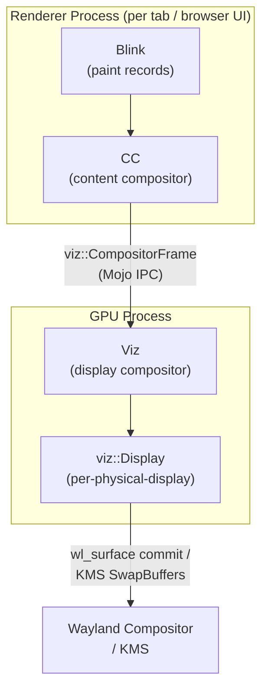

---

## 2. Layer Trees and Property Trees in CC

### The Layer Tree Data Model

CC maintains two parallel representations of the layer tree: the *main-thread tree*, consisting of `cc::Layer` objects (reference-counted, owned by `cc::LayerTreeHost`), and the *impl-thread trees*, consisting of `cc::LayerImpl` objects. The impl side has up to three trees simultaneously:

- **Active tree**: the tree that was most recently committed and activated; used for compositing and drawing.
- **Pending tree**: the staging area for the current commit; tiles are rasterised against this tree before it is promoted.
- **Recycle tree**: a cached copy of the previous pending tree, reused to reduce allocation churn.

`cc::LayerTreeHost` is the main-thread API; embedders (Blink's `WebLayerTreeView`, or the browser-UI compositor) call methods on it to add, remove, and modify layers. `cc::LayerTreeHostImpl` is the impl-side counterpart; it owns the active and pending trees and is the object that drives frame submission on the compositor thread.

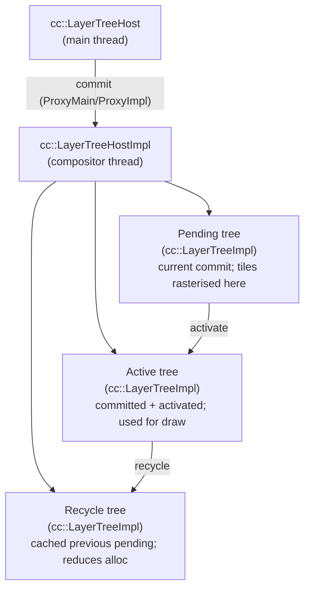

### Layer Types

The concrete `cc::Layer` subtypes correspond to the different kinds of content that web pages contain:

**`cc::PictureLayer`** holds a `cc::PaintRecord` (a serialised sequence of Skia drawing commands) produced by Blink's paint system. The layer content is divided into tiles that are rasterised on demand. `PictureLayer` is by far the most common layer type; most HTML content, text, and CSS backgrounds become `PictureLayer` instances.

**`cc::TextureLayer`** holds a reference to an existing GPU texture. Plugins, WebGL canvases, WebGPU canvases, and canvas elements with `willReadFrequently=false` all use `TextureLayer`. The texture is identified by a `gpu::Mailbox` (a 16-byte opaque handle) and a `gpu::SyncToken` that signals when the texture is ready for reading.

**`cc::SolidColorLayer`** is an optimisation for content that is a single solid colour. It emits a `SolidColorDrawQuad` in the compositor frame, which requires no GPU texture and no rasterisation.

**`cc::SurfaceLayer`** embeds an entire other renderer's visual output by `viz::SurfaceId`. Cross-origin iframes, `<iframe>` elements that run in a separate renderer process, and the browser-UI frame all appear to their parent renderer as `SurfaceLayer` instances. The compositor frame emitted by the parent contains a `SurfaceDrawQuad` that Viz resolves at aggregation time.

### Property Trees

Early versions of CC stored transforms, clips, and effects directly on `cc::Layer` objects, traversing ancestors to compute the full transform for each layer. This was correct but O(n) in the depth of the tree, and it made it hard to determine which layers needed to be recomposed after an animation updated a single property. Chromium replaced this model with **property trees**, introduced around 2015–2016.

There are four property trees, each stored as a separate tree of nodes indexed by integer IDs:

**Transform tree** (`cc::TransformTree`): Each `TransformNode` stores a local CSS transform, a 2D scroll offset, and a perspective projection. The tree mirrors the CSS stacking context hierarchy. During a scroll animation, only the relevant `TransformNode`'s offset changes; CC can re-evaluate all layers that reference that node (and its descendants) in O(affected nodes) time.

**Clip tree** (`cc::ClipTree`): Each `ClipNode` stores an axis-aligned clip rectangle (from `overflow:hidden`, `clip-path`, or iframe embedding). The compositor intersects clip nodes along the path to root to compute each layer's effective clip region.

**Effect tree** (`cc::EffectTree`): Each `EffectNode` stores CSS opacity, CSS filters (`blur()`, `brightness()`, etc.), backdrop-filter, and blend mode. When an opacity animation changes an `EffectNode`, only that subtree's composited output needs to be re-evaluated.

**Scroll tree** (`cc::ScrollTree`): Each `ScrollNode` stores the scrollable area bounds, scroll offsets (both the current value and the target for smooth-scrolling), and the associated layer ID. Input events on the compositor thread update `ScrollNode` offsets directly, without touching the main thread, which is what makes scroll feel instantaneous even when JavaScript is running.

Each `cc::LayerImpl` stores integer indices into all four property trees rather than pointers to ancestor layers. This makes the dependency structure explicit and enables efficient dirty-tracking: when an animation updates a `TransformNode`, CC marks that node and its subtree dirty, and only those layers participate in the next composition pass.

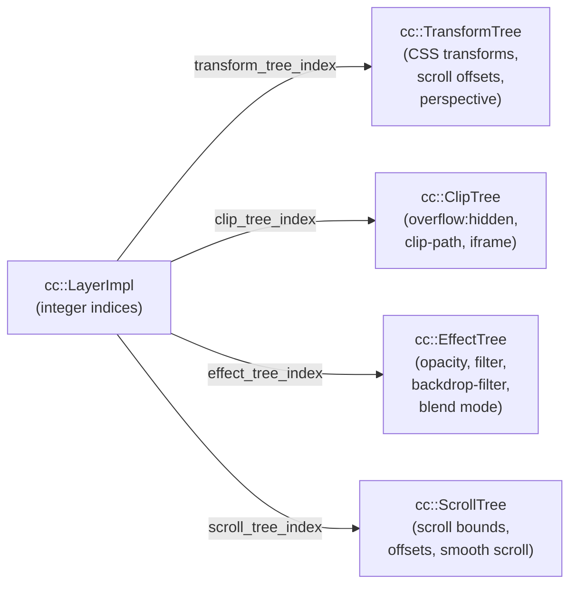

### The Commit: Copying State to the Impl Thread

The commit is the atomic operation that transfers the current main-thread state to the compositor thread. The sequence is:

1. Blink or the browser-UI embedder modifies `cc::Layer` objects and calls `SetNeedsCommit` on the `cc::LayerTreeHost`.
2. The CC scheduler issues a `BeginMainFrame` request to the main thread, carrying the `BeginFrameArgs` (frame time, deadline, interval) from the display.
3. The main thread runs Blink's rendering pipeline — style, layout, paint — updating the `cc::Layer` tree with new `PaintRecord`s and property tree changes.
4. `cc::ProxyMain` blocks the main thread and signals the compositor thread via a mutex.
5. `cc::ProxyImpl` on the compositor thread executes the commit: it copies the layer tree structure and all property trees from the main-thread representation into a new pending tree (`cc::LayerTreeImpl`).
6. The mutex is released; the main thread resumes immediately, free to start the next frame's Blink pipeline while the compositor thread rasterises the pending tree.

The key invariant is that the main thread never waits for rasterisation or GPU submission. It blocks only during the commit copy itself (typically a few milliseconds), then continues. This is the core mechanism that allows JavaScript on the main thread and GPU raster on the impl thread to pipeline in parallel.

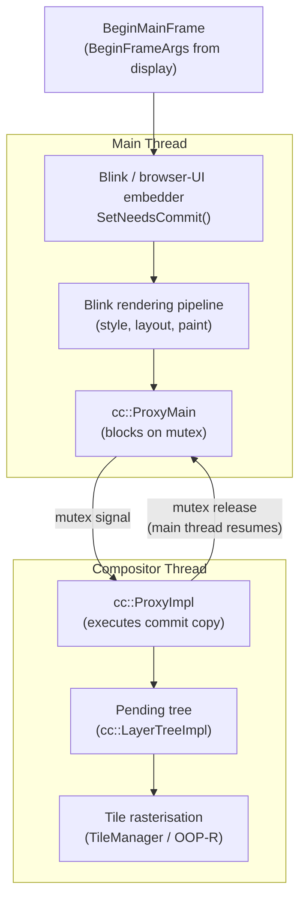

---

## 3. Tile Rasterisation and the Raster Worker Pool

### Tiling and Tile Priority

`cc::PictureLayer` content is not rasterised as a single monolithic texture. Instead, each layer's content area is partitioned into a sparse grid of **tiles**, typically 256×256 pixels for software raster and viewport-width × quarter-viewport-height for GPU raster. Tiles at the edge of the content area may be smaller. Multiple *tilings* of the same layer exist simultaneously at different scales to support pinch-zoom: when the user pinches in, tiles at a higher-resolution scale become relevant.

`cc::TileManager` assigns each tile a priority class based on its relationship to the viewport:

- **NOW**: the tile intersects the current viewport and must be rasterised before the next frame is drawn.
- **SOON**: the tile is outside but within a small prepaint margin; it will likely become visible in the next few frames due to scroll velocity.
- **EVENTUALLY**: all other tiles; rasterised speculatively in background.

Priority assignment happens on the compositor thread after each activation. The `TileManager` also tracks the pending tree's tile requirements separately from the active tree's, allowing it to prioritise activating a new commit without evicting tiles that the current frame still needs.

### GPU Memory Budget

`cc::TileManager::AssignGpuMemoryToTiles` (`cc/tiles/tile_manager.cc`) is the memory budget arbiter. It iterates tiles in priority order (NOW → SOON → EVENTUALLY) and assigns them GPU memory from a fixed budget. If the budget is exceeded, lower-priority tiles are evicted: EVENTUALLY tiles are evicted first, then SOON, but NOW tiles (visible this frame) are never evicted. The memory budget can be configured with `--gpu-memory-buffer-compositor-resources` and is dynamically reduced under memory pressure via Chrome's `MemoryPressureMonitor`.

### CPU Raster (Legacy Path)

In the software raster path, each raster task calls `cc::RasterSource::PlaybackToCanvas`, which replays the layer's `PaintRecord` into a `SkBitmap` using Skia's software renderer. The resulting bitmap is uploaded to a GPU texture via the GL command buffer (`glTexImage2D` or `glTexSubImage2D`). This path is the historical default and remains the fallback when GPU raster is unavailable.

### Out-Of-Process GPU Raster (OOP-R)

Out-of-process raster (OOP-R) is the current default in Chrome on Linux. Instead of rasterising tiles on the renderer's CPU and uploading bitmaps, OOP-R sends the paint commands themselves — as serialised Skia `SkPicture` (or `PaintOpBuffer`) structures — over the Mojo GPU command channel to the GPU process. The GPU process replays them using Skia's GPU backend (either `SkiaGanesh` on ANGLE or `SkiaGraphite` on Vulkan), directly into a GPU texture stored as a SharedImage (see Section 6).

The advantage over CPU raster is significant: Skia drawing operations that would be slow on the CPU (large blurs, complex paths, image scaling) execute on the GPU at hardware speed, and the result is already in GPU memory as a texture — no upload step is needed.

The key class is `cc::GpuRasterBufferProvider`, which creates `cc::RasterBufferImpl` objects representing individual tile raster tasks. Each `RasterBufferImpl` holds a reference to a SharedImage mailbox identifying the GPU texture that will hold the rasterised tile. The `cc::RasterTaskImpl::RunOnWorkerThread` method serialises the `PaintRecord` and sends it to the GPU process via a `cc::RasterInterface`, which is ultimately an IPC channel backed by ANGLE or Vulkan on the GPU side.

The OOP-R path also supports **image decode acceleration**: large JPEG and WebP images are decoded off the critical path by a separate pool of image decode workers, with the decoded image stored as a SharedImage that raster tasks can reference.

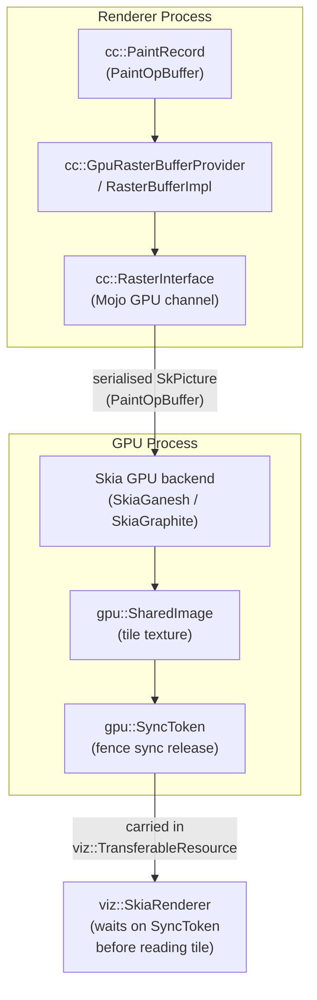

### Synchronisation Between Raster and Compositor

When a raster task completes in the GPU process, it inserts a `gpu::SyncToken` into the command buffer. The compositor thread on the renderer side waits on this sync token before using the tile texture in a compositor frame, ensuring that the GPU has finished writing the pixel data before the texture is read by the display compositor. The sync token mechanism (described in detail in Section 6) is what allows the raster workers and the display compositor to work in parallel without data races.

---

## 4. The Compositor Frame: Serialising Renderer Output

### The CompositorFrame Data Structure

Once tiles are rasterised and the active tree is ready to draw, CC constructs a `viz::CompositorFrame` — the serialisable snapshot of the renderer's complete visual output for one frame. The `CompositorFrame` is a pure data structure with no live GPU handles; all GPU resources are referenced by opaque identifiers (mailbox tokens) that Viz uses to look up the actual textures in its own process.

A `CompositorFrame` contains two main lists:

**`viz::RenderPassList`**: an ordered list of `viz::RenderPass` objects. Each `RenderPass` has a `RenderPassId`, an output rectangle, and a list of `viz::DrawQuad` objects. The last `RenderPass` in the list is always the root pass, whose output is the final image for the surface. Additional passes are created when CSS effects (`filter`, `backdrop-filter`, `mix-blend-mode`, `will-change: transform`) require rendering a group of elements into an intermediate buffer before applying the effect.

**`viz::TransferableResourceList`**: the list of GPU textures that the renderer is handing to Viz for use during this frame. Each `viz::TransferableResource` contains a `gpu::Mailbox` (the SharedImage identifier), a `gpu::SyncToken` (the fence the consumer must wait on), size and format metadata, and a flag indicating whether this is a software bitmap or a GPU texture.

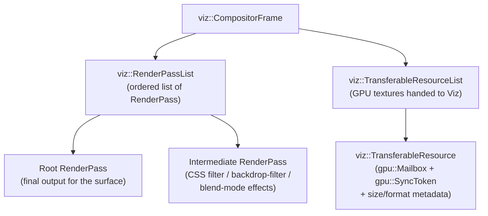

### DrawQuad Types

The `viz::DrawQuad` type hierarchy is the heart of the compositor frame. Each quad represents one rectangular visual element with its position, transform, clip, and content reference:

**`viz::TextureDrawQuad`** is the workhorse quad type. It references a GPU texture by mailbox and draws it at a given position in the render pass coordinate space. Rasterised `PictureLayer` tiles, WebGL canvas frames, WebGPU canvas frames, and decoded video frames all become `TextureDrawQuad` instances.

**`viz::SolidColorDrawQuad`** draws a solid-colour rectangle. No GPU texture is required; the renderer records only the colour value and the rectangle bounds.

**`viz::RenderPassDrawQuad`** draws the output of another `RenderPass` in the same `CompositorFrame`. This is the quad type used for CSS `filter`, `opacity` compositing layers, and `backdrop-filter` — effects that require all contributing layers to be drawn into an intermediate texture first.

**`viz::SurfaceDrawQuad`** embeds another renderer's `CompositorFrame` by `viz::SurfaceId`. When a `cc::SurfaceLayer` (representing a cross-origin iframe or another process's UI) is drawn, its quad is a `SurfaceDrawQuad`. Viz resolves these references recursively during aggregation (Section 5).

**`viz::VideoHoleDrawQuad`** is a placeholder used in the hardware video overlay path. The quad marks the position and size of the video, but contains no texture data; the actual video buffer is submitted separately as an overlay candidate (Section 9).

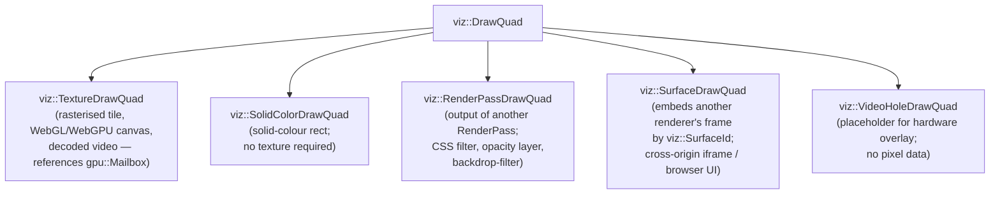

### Frame Submission

The renderer submits the `CompositorFrame` to Viz by calling `viz::CompositorFrameSink::SubmitCompositorFrame`. On Linux, this is a Mojo IPC call to the `viz::CompositorFrameSinkImpl` in the GPU process. With the call, ownership of the transferred resources passes to Viz; the renderer must not use those SharedImage mailboxes until Viz returns them via a `ReclaimResources` callback.

Each submitted frame carries a `viz::FrameToken` — a monotonically increasing integer that identifies the frame. The browser uses `FrameToken` for scroll synchronisation (ensuring that scroll position in the renderer and the browser's UI compositor are consistent in the same displayed frame) and for computing end-to-end latency metrics.

---

## 5. Viz Surface Aggregation and the Display Compositor

### Surfaces and the SurfaceManager

Viz organises its inputs around `viz::Surface` objects, each identified by a `viz::SurfaceId`. A `SurfaceId` consists of a `FrameSinkId` (identifying the submitting client — a renderer, the browser UI, or a plugin) and a `LocalSurfaceId` (identifying a specific viewport size/orientation, incremented on resize). A `viz::Surface` is the server-side holder of the most recently submitted `CompositorFrame` for that `SurfaceId`, plus a queue of pending frames. Viz retains the previous frame until the new one is ready, so there is always a frame to display even during slow renders.

The `viz::SurfaceManager` maintains the registry of all live surfaces. It handles the notification logic when a surface receives a new frame, waking up the display scheduler to trigger aggregation.

### SurfaceAggregator: Recursive Frame Merging

`viz::SurfaceAggregator` (`components/viz/service/display/surface_aggregator.cc`) is the central algorithm of Viz. When the display requests a new frame, `SurfaceAggregator::Aggregate` is called with the root surface ID (the surface representing the entire browser window or the display's root layer).

The aggregator performs a depth-first traversal of the surface embedding tree. Starting from the root `CompositorFrame`, it processes each `RenderPass` and each `DrawQuad`. When it encounters a `SurfaceDrawQuad`, it recursively looks up the referenced surface's most recent eligible frame, unwraps its `RenderPassList`, and splices those render passes into the output, renaming `RenderPassId`s to avoid collisions. The result is a single flat `viz::AggregatedFrame` — a merged `RenderPassList` with no remaining `SurfaceDrawQuad` references.

Cycle detection is implemented: if a surface embedding loop is ever detected (which should not happen in practice but could result from bugs in the embedding protocol), the aggregator skips the problematic reference rather than looping indefinitely.

The aggregator also handles the case where a referenced surface has not yet received its first frame — it substitutes a solid-colour quad of the expected size (typically white or the layer's background colour) to avoid visual holes.

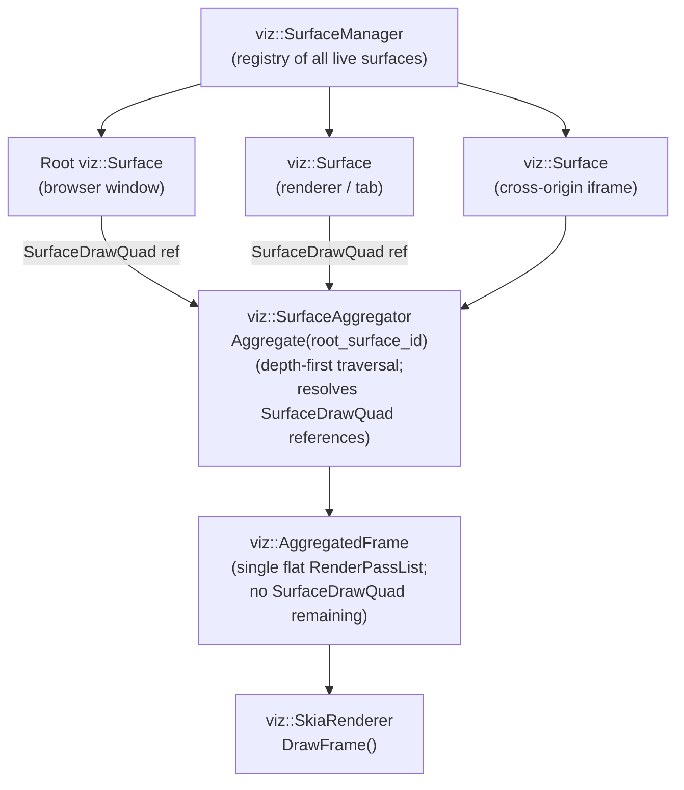

### Damage Tracking

`SurfaceAggregator` computes a **damage rectangle** — the union of the regions that have actually changed since the previous frame — across all surfaces. Each submitted `CompositorFrame` declares its own damage rectangle (the set of quads that changed from the previous frame for that surface). The aggregator unions these per-surface damage rectangles into a display-level damage region.

This damage information is consumed by the `viz::OutputSurface` implementation to perform **partial buffer updates**: on Wayland, the `wl_surface::damage_buffer` call marks only the changed region; on some compositors, this allows the display hardware to avoid scanning out the entire buffer.

### viz::Display and the Rendering Backend

`viz::Display` is the per-physical-display singleton in Viz. It owns the `viz::OutputSurface` (the platform-specific handle to the actual display output) and the `viz::Renderer` (the GPU rendering backend).

The current GPU renderer is `viz::SkiaRenderer` (`components/viz/service/display/skia_renderer.cc`). It replaced the legacy `viz::GLRenderer` (which issued raw ANGLE/OpenGL ES calls) and is built on top of Skia's GPU backends — either Skia Ganesh (ANGLE/OpenGL ES) or Skia Graphite (Vulkan, described in Chapter 37). For each `DrawQuad` in the aggregated frame, `SkiaRenderer::DrawQuad` selects the appropriate Skia draw call: `SkCanvas::drawImageRect` for `TextureDrawQuad`, `SkCanvas::drawRect` for `SolidColorDrawQuad`, and so on.

`viz::GLRenderer`, the legacy backend, is deprecated and being removed. New code should target `viz::SkiaRenderer` exclusively.

The per-frame entry point is `viz::Display::DrawAndSwap`. It is called by the `BeginFrameSource` when the display is ready for a new frame. The sequence is:

1. `viz::SurfaceAggregator::Aggregate` produces the `AggregatedFrame`.
2. `viz::SkiaRenderer::DrawFrame` records Skia draw commands for all quads, using Skia's Deferred Display List (DDL) mechanism to allow parallel GPU command generation.
3. `viz::OutputSurface::SwapBuffers` submits the rendered buffer to the Wayland compositor or KMS.

---

## 6. SharedImage: Cross-Process GPU Texture Sharing

### The Problem SharedImage Solves

Chrome's multi-process architecture means that GPU textures must cross process boundaries. A rasterised tile is produced in the GPU process (via OOP-R) and consumed by Viz (also in the GPU process, but in a different command buffer context). A WebGL canvas texture is produced by ANGLE in the renderer's GPU channel and consumed by Viz's SkiaRenderer. A VA-API-decoded video frame is produced in the GPU process's video decode pipeline and consumed by the overlay system. In all these cases, the same GPU memory backing needs to be accessible from multiple contexts and APIs without copying.

`gpu::SharedImage` is Chromium's unified abstraction for this: a named, shared GPU resource — typically a GPU texture or a DMA-BUF-backed buffer — that multiple parties can access via opaque mailbox handles.

### SharedImageManager and Backing Stores

`gpu::SharedImageManager` is the per-GPU-process singleton (`gpu/command_buffer/service/shared_image/shared_image_manager.cc`). It owns all `gpu::SharedImageBacking` objects and is responsible for allocating backing stores, handing out representations to clients, and destroying backings when all references are dropped.

The backing store type determines the physical memory layout and which APIs can access it. On Linux, the important backing types are:

**`gpu::OzoneImageBacking`** (formerly `SharedImageBackingOzone`, `gpu/command_buffer/service/shared_image/ozone_image_backing.cc`): backed by a `gfx::NativePixmapDmaBuf`. The backing calls into the GBM (Generic Buffer Management) library via `gbm_bo_create` to allocate a scanout-capable buffer object, then exports it as a DMA-BUF file descriptor via `gbm_bo_get_fd`. This backing can produce:
- A `GLTextureImageRepresentation` for GL compositing via ANGLE.
- A `VulkanImageRepresentation` for Vulkan compositing, by importing the DMA-BUF into a `VkImage` via `VK_EXT_external_memory_dma_buf`.
- An `OverlayImageRepresentation` for direct hardware scanout without any GPU copy.

**`gpu::AngleVulkanImageBacking`**: a `VkImage` accessible via both Vulkan and ANGLE. Used on the Vulkan-primary path where Skia Graphite (Ch37) requires Vulkan access but ANGLE also needs GL-compatible access for legacy content.

**`gpu::GLTextureImageBacking`**: a plain `GLuint` texture object. Used on older GL-only paths and in unit tests where DMA-BUF or Vulkan interop is unavailable.

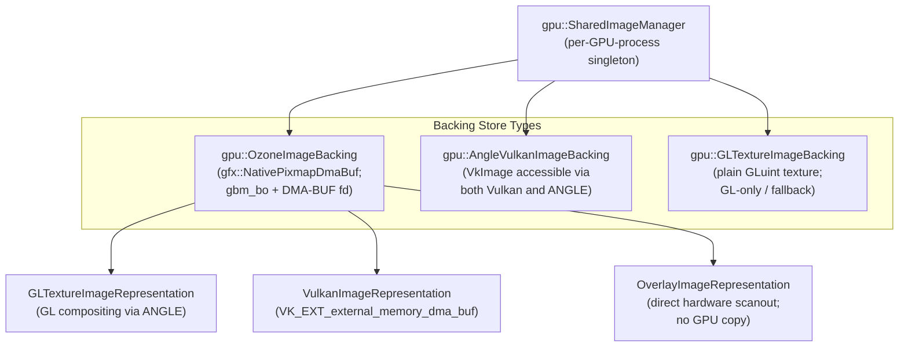

### Mailboxes and Representations

Clients reference SharedImages through a **`gpu::Mailbox`** — a 16-byte random identifier. Mailboxes are allocated by `SharedImageManager::CreateSharedImage` and passed between processes via Mojo IPC as plain byte arrays. In the GPU process, a client holding a mailbox calls `SharedImageManager::ProduceSkia`, `ProduceGL`, or `ProduceVulkan` to obtain a `gpu::SharedImageRepresentation` — a typed, RAII wrapper that gives API-specific access (a `sk_sp<SkImage>`, a `GLuint`, or a `VkImage`) while holding a reference to the underlying backing.

The representation system enforces single-writer semantics: a backing in `WRITE` state cannot have concurrent readers, and vice versa. The `gpu::SharedImageRepresentation::BeginAccess` / `EndAccess` protocol controls these state transitions.

### SyncTokens and GPU Synchronisation

When the producer of a SharedImage finishes writing — for example, after OOP-R tile rasterisation completes — it calls `gpu::CommandBufferHelper::GenerateFenceSyncRelease` to insert a fence sync into its command buffer and returns the resulting `gpu::SyncToken` (a tuple of namespace, command-buffer ID, and fence release count) to the caller.

The consumer receives this `SyncToken` (carried in the `viz::TransferableResource`) and calls `gpu::SyncPointManager::Wait` before accessing the texture. `SyncPointManager` enqueues the consumer's continuation until `SyncPointClientState::ReleaseFenceSync` fires for that token. This produces a directed wait edge in the GPU scheduler's dependency graph without stalling any CPU thread.

For cross-API synchronisation — for example, when an `AngleVulkanImageBacking` must transition from ANGLE (GL) access to Vulkan access — a `VkSemaphore` is exported as a Linux sync fd via `VK_KHR_external_semaphore_fd`. ANGLE inserts a GL fence sync that signals this semaphore, and the Vulkan queue submission includes a `vkWaitSemaphores` on the imported handle. This ensures that the Vulkan queue does not start reading a VkImage until ANGLE's GL commands have finished writing it.

---

## 7. Presenting on Wayland: The Ozone/Wayland Backend

### GbmSurfacelessWayland

On Linux with Wayland, the GPU-side surface implementation is `ui::GbmSurfacelessWayland` (`ui/ozone/platform/wayland/gpu/gbm_surfaceless_wayland.h`), which inherits from `gl::Presenter` and `WaylandSurfaceGpu`. It uses surfaceless drawing — drawing and display happen directly through `gfx::NativePixmapDmaBuf` buffers — and manages a pool of presentation buffers. Each buffer in the pool is a `gfx::NativePixmapDmaBuf` — a GBM buffer object whose DMA-BUF file descriptor has been wrapped in a `zwp_linux_dmabuf_v1_buffer` Wayland buffer handle. Viz reaches the platform via `viz::OutputSurface` → `SkiaOutputSurfaceImpl` → `SkiaOutputDeviceBufferQueue`, which delegates buffer presentation to `GbmSurfacelessWayland`.

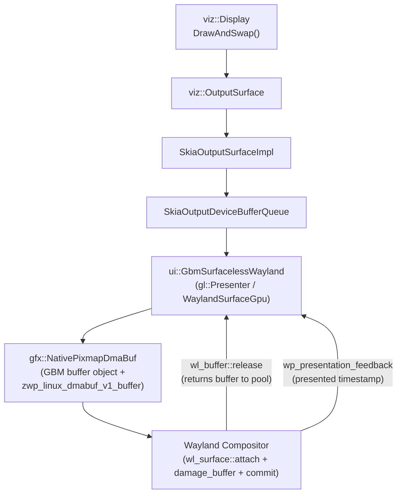

### Double/Triple Buffering

`GbmSurfacelessWayland` maintains a pool of two or three `wl_buffer` objects. The pool size depends on the compositor's feedback: if the Wayland compositor's `wp_presentation_feedback` event signals that a buffer release was delayed (because the compositor held it across a vsync), the pool grows to three to avoid pipeline stalls.

When `DrawAndSwap` is called:
1. The renderer picks the next buffer from the pool (the one most recently returned by the Wayland compositor via `wl_buffer::release`).
2. Viz renders the `AggregatedFrame` into that buffer via `SkiaRenderer`.
3. `GbmSurfacelessWayland::Present` calls `wl_surface::attach(buffer, 0, 0)` and `wl_surface::damage_buffer(x, y, w, h)` (marking only the damaged region), then `wl_surface::commit`.

The Wayland compositor receives the commit, scans out the new buffer at the next vblank, then sends `wl_buffer::release` when the previous buffer is no longer needed. `GbmSurfacelessWayland` catches this release event and returns the buffer to the pool.

### linux-dmabuf Buffer Allocation

Each buffer is allocated via `gbm_bo_create` with the `GBM_BO_USE_RENDERING | GBM_BO_USE_SCANOUT` flags to ensure the buffer is both renderable by the GPU and scannable by KMS if the Wayland compositor decides to promote it to a hardware plane. The DRM format modifier (Chapter 4) used for the allocation is negotiated with the Wayland compositor via the `zwp_linux_dmabuf_v1::get_surface_feedback` extension: Chrome queries which modifiers the compositor supports for the chosen format (typically `GBM_FORMAT_XRGB8888` or `GBM_FORMAT_ARGB8888`) and picks the first common modifier.

### Explicit Fence Synchronisation

When `VK_KHR_external_semaphore_fd` is available, Chrome exports a `VkSemaphore` as a Linux sync fd after Viz finishes GPU rendering. This sync fd is attached to the `wl_surface` commit via the `linux-drm-syncobj-v1` Wayland protocol (when available) or via the `EGL_KHR_fence_sync` extension's sync fd export as a fallback. The Wayland compositor waits on this fence before presenting the buffer to the display, ensuring the GPU has completed rendering before the compositor scans out the buffer. Without this, tearing or corruption could occur if the compositor's display pipeline reads the buffer while the GPU is still writing it.

Chrome's adoption of `linux-drm-syncobj-v1` was ongoing as of early 2026; the previous default was the implicit synchronisation path via `dma_fence` kernel objects, which does not require an explicit protocol but has higher latency overhead.

### wp_presentation Feedback

After each commit, `GbmSurfacelessWayland` subscribes to `wp_presentation_feedback` events via the `wp_presentation` protocol (Chapter 20). The feedback's `presented` event carries the exact timestamp (in CLOCK_MONOTONIC nanoseconds) when the buffer was scanned out by the display controller. This timestamp feeds directly into the `viz::BeginFrameSource` (Section 8) as the reference point for the next frame's phase alignment.

---

## 8. BeginFrame, Vsync, and Frame Pacing

### BeginFrameSource

`viz::BeginFrameSource` is the abstract driver of the entire frame production pipeline. Concretely, on Wayland, the implementation is `viz::ExternalBeginFrameSource` backed by timing events from `wp_presentation` feedback and Wayland frame callbacks (`wl_surface::frame`). On direct KMS (via Ozone's DRM backend), the source is driven by DRM vblank events received via `drmWaitVBlank` or the KMS atomic commit's out-fence timestamp.

The `BeginFrameSource` delivers `viz::BeginFrameArgs` objects to all registered `viz::BeginFrameObserver` instances. A `BeginFrameArgs` carries three critical timestamps:
- `frame_time`: the expected start of the display's refresh interval for this frame.
- `deadline`: the latest time by which the compositor frame must be submitted to make the current vsync.
- `interval`: the vsync period (e.g., 16.67 ms for 60 Hz, 8.33 ms for 120 Hz).

### BeginFrame Propagation

Viz distributes `BeginFrame` signals to all `viz::CompositorFrameSink` instances — one per renderer, one for the browser UI, one for each plugin frame. Each sink forwards the `BeginFrame` to the corresponding renderer's CC impl thread, which wakes up and:

1. Runs `cc::LayerTreeHostImpl::BeginMainFrame` to apply any pending animation ticks to the property trees.
2. Checks whether all visible tiles have been rasterised; if so, generates and submits a `CompositorFrame`.
3. If key tiles are missing, waits up to the frame deadline before submitting with the best available tile state (possibly with checkerboarding for unrasterised regions).

The deadline mechanism is critical for latency: if a renderer submits early (before the deadline), the display compositor waits the remaining time before calling `DrawAndSwap`. If a renderer misses the deadline, Viz draws with the previous frame from that renderer's surface — the "held-back frame" — rather than stalling the entire display.

### FrameTimingTracker and Latency

`viz::FrameTimingTracker` records per-frame timestamps at each stage of the pipeline: `BeginFrame` issue time, `CompositorFrame` submission time, `DrawAndSwap` time, and the `wp_presentation` feedback timestamp when the buffer was actually displayed. The difference between the input event timestamp and the `wp_presentation` display timestamp is the **end-to-end input latency**, which Chrome exposes via the `PerformanceObserver` API (`event` entry type) and reports internally to the `cc::FrameRateCounter`.

### Adaptive Vsync (VRR)

On displays with Variable Refresh Rate (VRR, described in Chapter 3), the `BeginFrameArgs::interval` is not fixed. The `BeginFrameSource` implementation queries the current display refresh rate from the Wayland compositor (via `wp_presentation` feedback's `refresh` field, or via the DRM VRR atomic property on the direct KMS path). When a renderer submits a frame earlier than the maximum refresh interval, Viz can trigger a display refresh at that earlier time rather than waiting for the next fixed-rate interval. This is what enables the "adaptive" behaviour of VRR: the display refreshes exactly when new content is ready, minimising latency without burning power on unnecessary redraws.

The `viz::Display::SetPreferredFrameInterval` API allows Chrome's scheduling layer to advise the BeginFrame source about the target frame rate, enabling power-saving strategies (e.g., 30 Hz for a page with no animations, 90 Hz for a WebXR scene).

---

## 9. Overlay Candidate Selection and Promotion

### What Overlay Promotion Means

On modern display hardware, the display controller (described in Chapter 2) has multiple independent hardware planes that can each display a separate buffer without any GPU blending. Normally, Viz composites all quads into a single framebuffer via GPU rendering and then presents that framebuffer to the display. Overlay promotion means that instead of blending a particular quad into the composite framebuffer, Viz sends that quad's underlying buffer directly to a KMS hardware plane (or a Wayland compositor overlay), bypassing the GPU blend entirely.

The power savings are substantial: a GPU blend pass for a full-screen video at 4K resolution requires the GPU to read every pixel of the video texture and write every pixel of the framebuffer. Promoting the video to an overlay eliminates both memory bandwidth and GPU active time for that operation. On a video playback workload on a typical laptop, overlay promotion can reduce GPU power consumption by 30–50%.

### Overlay Candidate Detection

`viz::OverlayCandidate` (`components/viz/service/display/overlay_candidate.h`) represents a quad that the overlay system is considering for promotion. Not all quads are eligible; a candidate must satisfy:

- **Single texture**: the quad is a `TextureDrawQuad` backed by a single `gpu::Mailbox`.
- **Axis-aligned or supported transform**: arbitrary 3D transforms cannot be expressed as hardware plane transformations; only rotations by multiples of 90° and simple translations/scales are typically supported.
- **Supported pixel format**: the hardware plane must support the quad's format. For video, this is typically `NV12` (YUV 4:2:0 semi-planar) or `P010` (10-bit variant).
- **No alpha blending with other layers**: a plane that is blended with content from another plane (alpha compositing) requires hardware alpha-blending support, which not all planes provide.

### The Overlay Strategy Pipeline

`viz::OverlayProcessor` evaluates the `AggregatedFrame` after `SurfaceAggregator` produces it, running a sequence of overlay strategy objects:

**`viz::OverlayStrategyFullscreen`**: if the entire display is covered by a single `TextureDrawQuad`, promote it to the primary plane. This is the case for fullscreen video and fullscreen games; it enables a completely GPU-free display pipeline.

**`viz::OverlayStrategySingleOnTop`** (`components/viz/service/display/overlay_strategy_single_on_top.cc`): promotes one quad to an overlay plane on top of the composited framebuffer. Used for cursor compositing and for video that floats above all other content.

**`viz::OverlayStrategyUnderlay`**: promotes one quad to a plane *underneath* the composited framebuffer, with a transparent hole punched in the framebuffer at that position. This is the typical path for `<video>` elements: the video occupies the underlay plane, and the framebuffer plane contains the rest of the page with a transparent rectangle cut out over the video position. The `VideoHoleDrawQuad` in the renderer's `CompositorFrame` communicates to Viz that this hole should be punched.

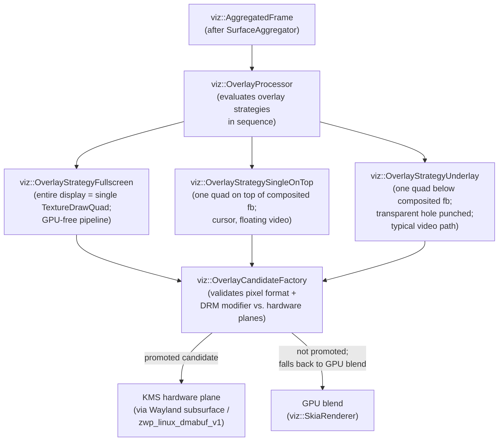

`viz::OverlayStrategyFullscreenSupported` and `viz::OverlayStrategyUnderlay::TryOverlay` perform the final validation step: they query `viz::OverlayCandidateFactory` to confirm that the candidate's pixel format and DRM format modifier are supported by the available hardware planes. The modifier negotiation was described in Section 7; the same DMA-BUF buffer allocated with scanout-compatible modifiers for Wayland presentation is also suitable for overlay promotion.

### The Wayland Overlay Path

On Wayland, Chrome does not interact with KMS directly; it submits overlay candidates to the Wayland compositor, which makes its own decision about hardware plane assignment. Chrome represents each overlay candidate as a separate `wl_surface`, attached as a subsurface (`wl_subsurface`) of the main window surface. Each subsurface carries its own DMA-BUF buffer via `zwp_linux_dmabuf_v1`. The Wayland compositor (Mutter, KWin, wlroots-based compositors) then queries its own hardware overlay capabilities and, if a free hardware plane is available, assigns the subsurface to it.

The `wp_viewport` protocol allows Chrome to specify scaling and cropping of the overlay buffer, which is essential for video that must be scaled to fit the `<video>` element's CSS dimensions.

### Hardware Video via VA-API

The most practically important overlay promotion case is hardware-accelerated video. When Chrome uses VA-API (Chapter 26) to decode a video stream, each decoded frame is a DMA-BUF buffer allocated by the VA-API driver with the appropriate format and modifier for hardware display. The decoded frame is wrapped as a SharedImage with `OzoneImageBacking`, which provides an `OverlayImageRepresentation`. When Viz evaluates the `VideoHoleDrawQuad` produced by the renderer, `OverlayProcessor` retrieves the decoded frame's buffer via the `OverlayImageRepresentation` and submits it as a Wayland subsurface overlay candidate.

If the Wayland compositor successfully assigns the video buffer to a hardware plane, the video plays with zero GPU involvement in the rendering path: VA-API writes decoded pixels directly to a DMA-BUF, which is handed to the display controller's scan-out hardware. The only CPU activity is the decoding invocation and the Wayland protocol messages.

### Power and Performance Measurement

The `chrome://gpu` page reports whether overlay promotion is active for the current page. The `cc` and `viz` categories in `chrome://tracing` provide per-frame overlay decision traces, showing which quads were promoted, which strategy applied, and whether the promotion was accepted by the platform. For debugging on Linux, the `WAYLAND_DEBUG=1` environment variable shows the raw Wayland protocol traffic, including the subsurface attachment messages that carry overlay candidates.

---

## Roadmap

### Near-term (6–12 months)

- **Skia Graphite as the default raster backend on Linux**: Graphite (Skia's Vulkan-native, multi-threaded rasterisation backend) has been shipping as the default on macOS and ChromeOS; the remaining work is hardening the Linux/Vulkan path and retiring the Ganesh/ANGLE fallback for GPU raster. The transition eliminates one GL→Vulkan translation layer in the OOP-R pipeline. [Source](https://blog.google/chromium/introducing-skia-graphite-chromes/)
- **GPU compute-based path rasterisation in Graphite**: The Chrome Graphics team has described plans for GPU compute shaders to handle path fill and stroke rasterisation, improving over the current MSAA and CPU-fallback approaches for complex SVG and Canvas2D paths. [Source](https://www.phoronix.com/news/Chromium-Skia-Graphite)
- **Removal of legacy `linux-explicit-synchronization-unstable-v1` support**: Now that `linux-drm-syncobj-v1` explicit-sync support has landed in Chrome, the older protocol code is marked for removal. This consolidates the Wayland fence-sync path to a single modern implementation. [Source](https://www.phoronix.com/news/Google-Chrome-linux-drm-syncobj)
- **ANGLE native Wayland backend stabilisation**: ANGLE merged Wayland support in mid-2025; near-term work focuses on stabilising the path and enabling Chromium Embedded Framework (CEF) applications to run GPU-accelerated on Wayland without XWayland. [Source](https://www.phoronix.com/news/ANGLE-Merges-Wayland)

### Medium-term (1–3 years)

- **Delegated compositing on desktop Linux**: Delegated compositing — where Viz pushes individual draw quads as separate `wl_surface` objects for the Wayland compositor to arrange into hardware planes — is currently limited to ChromeOS (LaCrOS/Exo). Extending it to desktop Wayland compositors (Mutter, KWin) requires those compositors to implement the full set of required protocols (`linux-drm-syncobj-v1`, `wp_viewport`, `wp_alpha-modifer`, and others). This is an active area of Igalia and Google collaboration. [Source](https://archive.fosdem.org/2024/events/attachments/fosdem-2024-3177-delegated-compositing-utilizing-wayland-protocols-for-chromium-on-chromeos/slides/22799/Delegated_Compositing_b3OqHfM.pdf)
- **Reduced GPU memory via shared tile pools**: The Graphite architecture enables a shared GPU tile cache across multiple renderer processes, reducing per-tab VRAM usage for common background and text tiles. This requires changes to `cc::TileManager` and the SharedImage allocator to support cross-process tile reuse. Note: needs verification of current status in upstream tracking.
- **VRR-aware frame pacing improvements**: `viz::BeginFrameSource` currently adapts to Variable Refresh Rate displays reactively; planned work includes predictive frame pacing that can pre-emptively vary the refresh interval based on estimated render time, reducing unnecessary latency on VRR panels. Note: needs verification of specific upstream issue.
- **Improved overlay promotion for HDR content**: As HDR display support matures in the Linux stack (DRM HDR metadata, Wayland `color-management-v1` protocol), Viz's `OverlayProcessor` needs to evaluate HDR format quads (e.g., `P010`, `BT2020_PQ`) and pass correct HDR metadata through the Wayland overlay submission path. [Source](https://www.chromium.org/developers/design-documents/aura/graphics-architecture/)

### Long-term

- **Full Vulkan rendering path without ANGLE**: The current Graphite-on-Vulkan path in Chrome still routes some operations through ANGLE for compatibility. The long-term architectural goal is a pure Vulkan raster and compositing path in which Graphite, SharedImage, and Viz all speak Vulkan natively, eliminating all GL translation overhead. [Source](https://developer.chrome.com/docs/chromium/renderingng-architecture)
- **CC/Viz unification or further decomposition**: The two-compositor split (CC in the renderer process, Viz in the GPU process) was designed for the multi-process security model of the 2010s. Future work may either merge the two (reducing IPC overhead for single-process embeddings) or decompose Viz further to support display-server-as-service scenarios where the OS compositor absorbs the display compositor role entirely.
- **WebGPU-native compositing**: As WebGPU (`wgpu`/Dawn) matures, there is an architectural direction toward allowing WebGPU canvases and WebGPU-rendered content to bypass the SharedImage/Mailbox indirection and instead present directly via `GPUCanvasContext.present()` to a Wayland surface, reducing copy and synchronisation overhead for GPU-heavy web applications. Note: needs verification against upstream Dawn/Chromium design docs.

---

## 10. Integrations

### Forward References

**Chapter 37 — Skia**: `viz::SkiaRenderer` delegates all GPU drawing to Skia. Chapter 37 covers Skia Ganesh and Graphite — the two GPU backends — in depth, including how Skia's Deferred Display List (DDL) mechanism maps to Vulkan `VkCommandBuffer` recording and how Graphite's tile cache interacts with Viz's damage tracking.

### Backward References

**Chapter 2 — KMS and DRM Hardware Planes**: Overlay promotion in Viz maps directly to KMS hardware plane assignment. The plane capabilities, format constraints, and DRM format modifier negotiation described in Chapter 2 are the hardware contracts that determine which quads can be promoted.

**Chapter 3 — VRR and DRM Properties**: Adaptive vsync in the `BeginFrameSource` relies on the DRM VRR atomic property and the display controller's ability to vary the refresh interval. Chapter 3 describes the kernel-side mechanisms.

**Chapter 4 — DRM Format Modifiers**: Buffer allocation for overlay-eligible SharedImages requires DRM format modifiers that the display hardware understands. The modifier negotiation between Viz, GBM, and the Wayland compositor is the runtime expression of the modifier framework described in Chapter 4.

**Chapter 20 — Wayland Protocols (linux-dmabuf, wp_presentation)**: Viz's entire Wayland submission path — buffer allocation, dmabuf import, presentation-time feedback — depends on the protocols described in Chapter 20. The `linux-drm-syncobj-v1` protocol for explicit fence synchronisation is also introduced there.

**Chapter 22 — Production Compositors (Mutter, KWin)**: When Viz submits frames and overlay candidates to the Wayland compositor, it is exercising the same Wayland protocols that application compositors use when submitting to a Wayland server. Chapter 22 describes how Mutter and KWin implement the compositor side of these protocols.

**Chapter 26 — VA-API**: Hardware video decode produces DMA-BUF frames that flow through the SharedImage system to Viz's overlay pipeline. The VA-API decoder, the SharedImage backing, and the Viz overlay path form a single zero-copy chain from network packet to display hardware.

**Chapter 33 — Chromium GPU Architecture**: The OOP-D architecture — GPU process, command buffers, Mojo IPC — is introduced in Chapter 33. This chapter fills in the full detail of the compositing layers that sit on top of that foundation.

**Chapter 34 — ANGLE**: GPU raster uses ANGLE for Skia-on-GL; `AngleVulkanImageBacking` bridges ANGLE and Vulkan for cross-API texture access. Chapter 34 describes how ANGLE translates GL calls to Vulkan or Metal.

**Chapter 35 — Dawn and WebGPU**: WebGPU canvas textures produced by Dawn are wrapped as SharedImages with `AngleVulkanImageBacking` or `OzoneImageBacking` and flow into Viz as `TextureDrawQuad` instances via `cc::TextureLayer`. Chapter 35 describes the production side of this path.

**Chapter 30 — Debugging and Tracing**: `chrome://tracing` with the `cc` and `viz` trace categories is the primary debugging tool for compositor performance. Tile raster latency, frame submission timing, overlay decisions, and dropped frames are all visible in these traces.

---

## References

1. Chromium compositor thread architecture design document: [https://www.chromium.org/developers/design-documents/compositor-thread-architecture/](https://www.chromium.org/developers/design-documents/compositor-thread-architecture/)

2. CC layer tree — "How cc Works" documentation: [https://chromium.googlesource.com/chromium/src/+/lkgr/docs/how_cc_works.md](https://chromium.googlesource.com/chromium/src/+/lkgr/docs/how_cc_works.md)

3. CC README — component overview and glossary: [https://chromium.googlesource.com/chromium/src/+/HEAD/cc/README.md](https://chromium.googlesource.com/chromium/src/+/HEAD/cc/README.md)

4. Chromium "Life of a Frame" document: [https://chromium.googlesource.com/chromium/src/+/HEAD/docs/life_of_a_frame.md](https://chromium.googlesource.com/chromium/src/+/HEAD/docs/life_of_a_frame.md)

5. Surfaces design document: [https://www.chromium.org/developers/design-documents/chromium-graphics/surfaces/](https://www.chromium.org/developers/design-documents/chromium-graphics/surfaces/)

6. GPU accelerated compositing in Chrome: [https://www.chromium.org/developers/design-documents/gpu-accelerated-compositing-in-chrome/](https://www.chromium.org/developers/design-documents/gpu-accelerated-compositing-in-chrome/)

7. RenderingNG architecture (Chrome for Developers): [https://developer.chrome.com/docs/chromium/renderingng-architecture](https://developer.chrome.com/docs/chromium/renderingng-architecture)

8. Chromium sync token internals: [https://chromium.googlesource.com/chromium/src/+/refs/heads/main/docs/gpu/sync_token_internals.md](https://chromium.googlesource.com/chromium/src/+/refs/heads/main/docs/gpu/sync_token_internals.md)

9. Chromium Viz service/display source: [https://source.chromium.org/chromium/chromium/src/+/main:components/viz/service/display/](https://source.chromium.org/chromium/chromium/src/+/main:components/viz/service/display/)

10. Chromium CC trees source: [https://source.chromium.org/chromium/chromium/src/+/main:cc/trees/](https://source.chromium.org/chromium/chromium/src/+/main:cc/trees/)

11. Chromium Ozone Wayland GPU source: [https://source.chromium.org/chromium/chromium/src/+/main:ui/ozone/platform/wayland/gpu/](https://source.chromium.org/chromium/chromium/src/+/main:ui/ozone/platform/wayland/gpu/)

12. Chromium Presentation Layer Architecture (Khronos): [https://www.khronos.org/vulkan/chrome-video/chromium_presentation_layer.html](https://www.khronos.org/vulkan/chrome-video/chromium_presentation_layer.html)

13. `wp_presentation` Wayland protocol XML: [https://gitlab.freedesktop.org/wayland/wayland-protocols/-/blob/main/stable/presentation-time/presentation-time.xml](https://gitlab.freedesktop.org/wayland/wayland-protocols/-/blob/main/stable/presentation-time/presentation-time.xml)

14. `zwp_linux_dmabuf_v1` Wayland protocol XML: [https://gitlab.freedesktop.org/wayland/wayland-protocols/-/blob/main/unstable/linux-dmabuf/linux-dmabuf-unstable-v1.xml](https://gitlab.freedesktop.org/wayland/wayland-protocols/-/blob/main/unstable/linux-dmabuf/linux-dmabuf-unstable-v1.xml)

15. GPU Rasterization guide (Chromium): [https://www.chromium.org/developers/design-documents/chromium-graphics/how-to-get-gpu-rasterization/](https://www.chromium.org/developers/design-documents/chromium-graphics/how-to-get-gpu-rasterization/)

---

*Copyright © 2026 jreuben11. Licensed under [CC BY 4.0](https://creativecommons.org/licenses/by/4.0/).*
