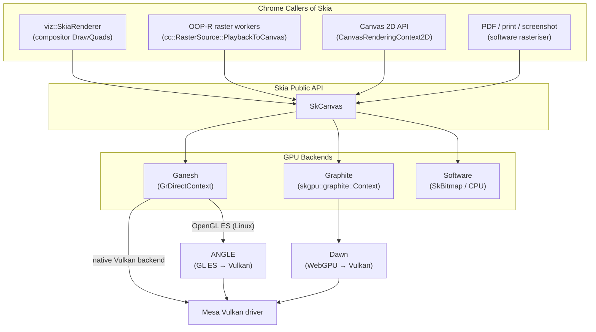
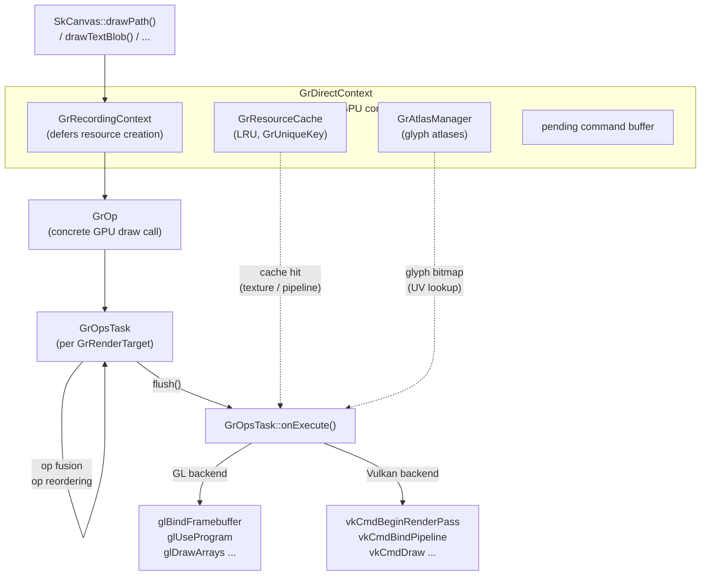
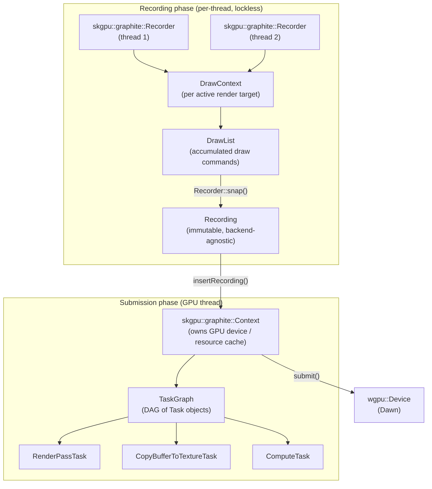
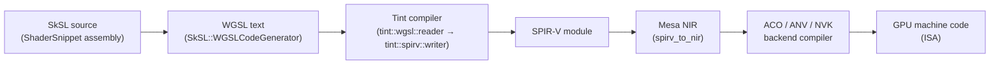
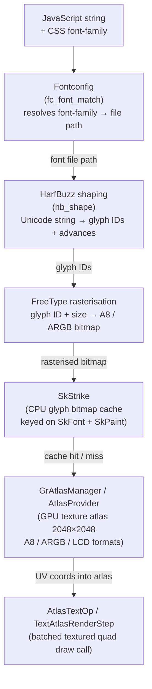
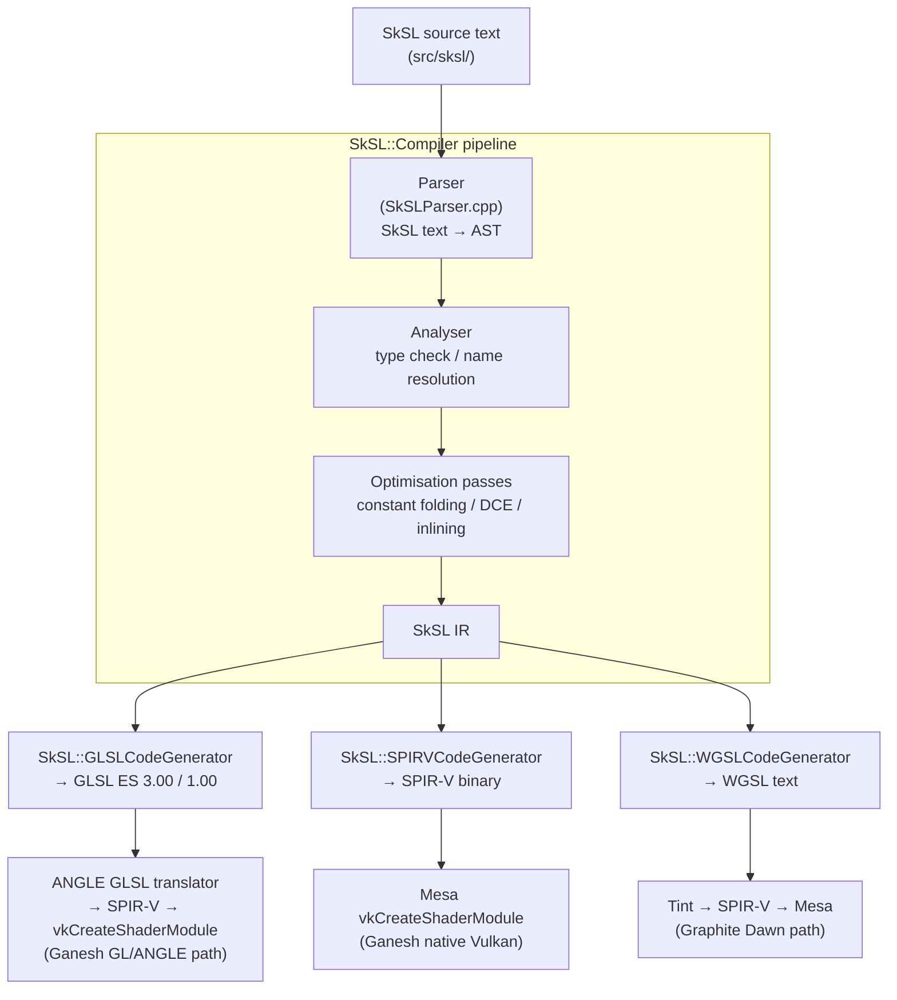

# Chapter 37: Skia and 2D Rendering

**Part**: X — The Browser Rendering Stack
**Audiences**: Browser and web platform engineers who need to understand where Skia sits in Chrome's rendering pipeline and how to attribute 2D rasterisation performance problems; graphics application and systems developers who want to understand how GPU-accelerated 2D graphics is implemented at a level that informs their own rendering engine design.

---

## Table of Contents

1. [Skia's Role in Chrome's Rendering Pipeline](#1-skias-role-in-chromes-rendering-pipeline)
2. [SkiaGanesh: The Mature GPU-Accelerated Backend](#2-skiaganesh-the-mature-gpu-accelerated-backend)
3. [SkiaGraphite: The New GPU Architecture](#3-skiagraphite-the-new-gpu-architecture)
4. [The Ganesh-to-Graphite Transition in Chrome](#4-the-ganesh-to-graphite-transition-in-chrome)
5. [Text Rendering on Linux: FreeType, HarfBuzz, and Glyph Atlases](#5-text-rendering-on-linux-freetype-harfbuzz-and-glyph-atlases)
6. [CSS Filter Effects: Blur, Drop-Shadow, and Colour Matrix](#6-css-filter-effects-blur-drop-shadow-and-colour-matrix)
7. [Canvas 2D API Implementation](#7-canvas-2d-api-implementation)
8. [Skia's Shader Compilation Model](#8-skias-shader-compilation-model)
9. [SkSL and the Skia Shader Language](#9-sksl-and-the-skia-shader-language)
10. [Graphite — Skia's GPU-First Architecture in Depth](#10-graphite--skias-gpu-first-architecture-in-depth)
11. [Canvas 2D IPC Path in Chromium](#11-canvas-2d-ipc-path-in-chromium)
12. [Canvas Context Types: 2D, WebGL, WebGPU, and OffscreenCanvas](#12-canvas-context-types-2d-webgl-webgpu-and-offscreencanvas)
13. [Text Rendering Pipeline in Depth](#13-text-rendering-pipeline-in-depth)
14. [Linux-Specific Backend Notes](#14-linux-specific-backend-notes)
15. [Integrations](#15-integrations)
16. [References](#references)

---

## 1. Skia's Role in Chrome's Rendering Pipeline

Beneath every web page's rounded corners, text run, gradient fill, drop shadow, and `<canvas>` animation lies **Skia**: an open-source 2D vector graphics library that serves as **Chrome**'s rasterisation engine. **Skia** provides the fundamental drawing abstractions — **SkCanvas**, **SkPaint**, **SkPath**, **SkImage**, and **SkSurface** — and two GPU-accelerated backends that translate those abstractions into real GPU work. Its source repository lives at `https://skia.googlesource.com/skia` and it is used not only by **Chrome** but by **Android**'s graphics stack, **Flutter**, and many other projects. [1]

Within **Chrome**, **Skia** is called from at least four distinct contexts. First, **viz::SkiaRenderer** (covered in Chapter 36) uses an **SkCanvas** to draw **DrawQuad**s into the compositor back buffer during the display compositor's frame production. Second, **Blink**'s paint system invokes **Skia** to rasterise tile content captured in **cc::PictureLayer** objects: the **cc::RasterSource::PlaybackToCanvas** method replays a recorded **SkPicture** onto an **SkCanvas** backed by the tile's GPU texture, a path that runs in the GPU process under Out-of-Process Rasterisation (**OOP-R**). Third, the HTML Canvas 2D API (**CanvasRenderingContext2D**) directly calls **SkCanvas** methods in response to JavaScript drawing commands. Fourth, PDF generation, print rasterisation, and screenshot capture all use **Skia**'s software rasteriser. The GPU-accelerated paths — the first three callers — are the focus of this chapter.

**Skia** currently offers two GPU backends. **Ganesh** is the original backend, first introduced around 2011 and maintained continuously since. It supports **OpenGL** (including **OpenGL ES**), **Vulkan**, and **Metal**, and remains the stable production path in **Chrome** on Linux as of mid-2026. **Graphite** is the new backend, designed from first principles around explicit GPU APIs. It targets **Vulkan**, **Metal**, **Direct3D 12**, and — most importantly for **Chrome** — **Dawn**, the cross-platform **WebGPU** implementation described in Chapter 35. **Graphite** shipped as the default backend on Apple Silicon Macs in 2025 and is progressing towards Linux and Windows. The chapter covers the **Ganesh** architecture (its **GrDirectContext**, **GrResourceCache**, **GrOpsTask**, and op fusion/reordering optimisations), the **Graphite** architecture (its **skgpu::graphite::Recorder**, **skgpu::graphite::Context**, **TaskGraph**, **DrawPass**, and pipeline pre-compilation model), and the ongoing transition between the two backends in **Chrome**.

On Linux, **Ganesh** runs in **Chrome** through **ANGLE** (Chapter 34): **Ganesh** issues **OpenGL ES** calls that **ANGLE** translates to **Vulkan** commands delivered to the **Mesa** Vulkan driver. **Ganesh** also has a native **Vulkan** backend that bypasses **ANGLE**, but **Chrome** on Linux has historically used the **ANGLE**-mediated GL path. **Graphite** on Linux uses **Dawn** as its GPU abstraction, producing **WebGPU** API calls that **Dawn** translates to **Vulkan**, again consumed by the **Mesa** driver.

Text rendering in **Chrome** traverses a six-stage pipeline: **Fontconfig** resolves **CSS** `font-family` names to file paths, **HarfBuzz** shapes Unicode strings into glyph IDs and advances (via **hb_shape()**), **FreeType** rasterises glyph outlines into **A8** or **ARGB** bitmaps, **SkStrike** caches those bitmaps on the CPU, the **GrAtlasManager** (in **Ganesh**) or **AtlasProvider** (in **Graphite**) packs them into GPU texture atlases, and finally **AtlasTextOp** / **TextAtlasRenderStep** batches all glyphs in a **SkTextBlob** into a single GPU draw call. The chapter examines each of these stages and explains why **Chrome** on **Wayland** defaults to grayscale antialiasing rather than **LCD** subpixel rendering.

**CSS** filter effects — `blur()`, `drop-shadow()`, `brightness()`, `contrast()`, `saturate()`, `hue-rotate()`, and `backdrop-filter` — are implemented via **Skia**'s **SkImageFilter** DAG. **SkBlurImageFilter** executes a two-pass separable Gaussian convolution on the GPU; **SkDropShadowImageFilter** adds an offset blurred copy below the source; colour-adjusting filters map to **SkColorMatrix** values applied in a single fragment shader pass. The `backdrop-filter` case is architecturally distinct and forces compositor layer promotion via a **vkCmdCopyImage** of the background before the filtered render pass.

The **HTML** `<canvas>` 2D API (**CanvasRenderingContext2D**) maps directly onto **SkCanvas**: `fillRect` calls **SkCanvas::drawRect()**, `stroke()` on a **Path2D** calls **SkCanvas::drawPath()**, `fillText` calls **SkCanvas::drawTextBlob()**, and `drawImage` can take a zero-copy path via **EGL** image import (**eglCreateImageKHR** with **EGL_LINUX_DMA_BUF_EXT**) for **VA-API** DMA-BUF video frames. The chapter also covers **getImageData** / **putImageData** GPU→CPU readback costs (**vkCmdCopyImageToBuffer**), **Path2D** tessellation via **GrTessellationPathRenderer** / **TessellateFillsRenderStep**, and **OffscreenCanvas** zero-copy ownership transfer via **SharedImage**.

Rather than hand-writing **GLSL** or **SPIR-V** shaders, **Skia** uses **SkSL** — the Skia Shading Language — as an intermediate representation compiled by **SkSL::Compiler** to the target platform's language at runtime or at pipeline pre-compilation time. The **SkSL::GLSLCodeGenerator** emits **GLSL ES** for the **ANGLE** path; **SkSL::SPIRVCodeGenerator** emits **SPIR-V** for the native **Vulkan** path; **SkSL::WGSLCodeGenerator** emits **WGSL** for the **Graphite**/**Dawn** path. Complex paint effects are assembled from modular **ShaderSnippet** units keyed by a **PipelineKey** in the **ShaderCodeDictionary**, enabling **Graphite**'s pre-compilation of all anticipated pipeline variants via **PrecompileContext::precompile()** before the first frame is drawn.



Software **Skia** — **SkCanvas** backed by a CPU **SkBitmap** with no GPU backend — still handles print rendering, PDF output, and certain offscreen operations where a GPU context is unavailable. It is not the focus of this chapter, but it is worth noting that **Skia**'s software rasteriser is the same codebase; only the destination surface changes.

---

## 2. SkiaGanesh: The Mature GPU-Accelerated Backend

Ganesh's architecture organises GPU resources around a central object called `GrDirectContext`. Defined in `include/gpu/GrDirectContext.h`, this object owns the connection to the underlying GPU API (an OpenGL context or a Vulkan logical device), the GPU resource cache (`GrResourceCache`), the glyph atlas manager, and the pending command buffer. There is one `GrDirectContext` per GPU context, and in Chrome's GPU process it is shared between the compositor and the OOP-R raster workers.

`GrDirectContext::flush()` and `GrDirectContext::submit()` are the two-phase submission mechanism. `flush()` converts accumulated draw operations into GPU API objects (for GL, a sequence of `glDraw*` calls; for Vulkan, a populated `VkCommandBuffer`) but does not send them to the GPU. `submit()` then sends the flushed work for execution. The split matters because it allows the GPU thread to flush work from multiple sources — tile raster, compositor draw — before a single submit, amortising the driver submission overhead. [2]

The surface abstraction above the GPU framebuffer is `GrSurface`, which can be either a `GrTexture` (a texture that can be sampled) or a `GrRenderTarget` (a surface that can be drawn into). Most drawing targets are `GrRenderTarget`; a surface that serves dual purpose is a `GrTextureRenderTarget`. When Chrome creates a composited tile, it allocates a `GrRenderTarget` backed by a GPU texture; when Skia draws into that tile, the `GrRenderTarget` is the destination. An `SkSurface` is the public API wrapper: calling `SkSurface::MakeRenderTarget(grContext, ...)` returns an `SkSurface` backed by a `GrRenderTarget`.

**Resource caching.** `GrResourceCache` holds GPU-side resources (textures, render targets, buffers, pipeline state objects) keyed by a `GrUniqueKey`. It uses an LRU eviction policy with a configurable byte budget; the default in Chrome is several hundred megabytes. The cache serves two purposes: avoiding redundant texture uploads (an image that has already been uploaded to the GPU is retrieved from cache on subsequent draws) and reusing render targets (a tile whose contents must be repainted can reuse its existing GPU texture). Cache hits for glyph atlas entries are particularly valuable because FreeType rasterisation is CPU-expensive; a cache hit replaces a FreeType call with a simple UV lookup. [2]

**The draw pipeline.** When Blink calls `SkCanvas::drawPath(path, paint)`, Ganesh executes the following chain of transformations. The `SkCanvas` records the operation onto a `GrRecordingContext`, a lightweight context that defers resource creation until flush time. The path and paint state are analysed to determine whether the path can be rendered by direct tessellation, by the stencil-and-cover approach, or by looking up an existing mask in the path atlas. The selected rendering strategy creates a `GrOp` — a concrete, self-contained GPU draw call — and adds it to a `GrOpsTask`.

A `GrOpsTask` is Ganesh's analogue of a Vulkan render pass. It targets a single `GrRenderTarget` and accumulates `GrOp` objects until flush time. Ganesh applies two optimisations during accumulation: **op fusion** merges two adjacent ops that draw the same kind of geometry with the same GPU state into a single multi-draw op; **op reordering** permutes ops within the task to minimise GPU state changes (e.g., all textured rects drawn before all solid-colour rects, avoiding texture unit rebinding). The reorder respects paint-order semantics: ops that overlap cannot be reordered past each other without checking for alpha coverage.

When `GrDirectContext::flush()` runs, it iterates the pending `GrOpsTask`s in dependency order, calling `GrOpsTask::onExecute()` for each. For the GL backend (via ANGLE), this emits `glBindFramebuffer`, `glUseProgram`, `glUniform*`, `glDrawArrays`, and `glDrawElements` calls. For the Vulkan backend, it emits `vkCmdBeginRenderPass`, `vkCmdBindPipeline`, `vkCmdBindDescriptorSets`, `vkCmdDraw`, and `vkCmdEndRenderPass` sequences into a `VkCommandBuffer`.



**Shader management in Ganesh.** Ganesh generates GPU shaders lazily: the first time a particular combination of paint effects and geometry type is encountered, Ganesh assembles the SkSL shader program for that combination and compiles it. On subsequent encounters the compiled program is retrieved from the pipeline cache. This lazy compilation is a known source of first-draw stutter, and it is the primary motivation for Graphite's design (Section 3). The pipeline cache is serialised to disk between sessions so that warm starts avoid recompilation.

**Ganesh's Vulkan backend.** When configured for Vulkan — either via the native Vulkan backend or via ANGLE-on-Vulkan — Ganesh manages a pool of `VkDescriptorPool`s for per-draw descriptor set allocation, a `VkRenderPass` cache keyed on attachment format and load/store ops, and a pipeline state object cache keyed on the SkSL program hash. The `vkCreateGraphicsPipeline` call happens at cache-miss time and is the expensive operation that Graphite eliminates through pre-compilation.

---

## 3. SkiaGraphite: The New GPU Architecture

Graphite was designed to address structural limitations in Ganesh's architecture that had accumulated over fifteen years of development. Ganesh conflates two conceptually distinct phases: *recording* (converting high-level drawing commands into GPU-independent draw descriptions) and *submission* (translating those descriptions into backend API calls and sending them to the GPU). In Ganesh both phases happen on the same thread, holding the same `GrDirectContext`. This coupling makes parallelism difficult and forces shader compilation to happen at submission time, when the user is waiting for a rendered frame.

Graphite's design separates recording from submission into distinct objects with distinct threading guarantees.

**`skgpu::graphite::Recorder`** is the recording object. It is analogous in role to `GrRecordingContext` in Ganesh but is a first-class object, not a lightweight wrapper. A `Recorder` owns a `DrawContext` for each active render target, each of which accumulates a `DrawList` of draw commands with their associated paint state. Multiple `Recorder`s can live on different threads and record in parallel without locking, because each owns entirely independent state. When recording is complete, the `Recorder::snap()` method converts the accumulated `DrawList`s into an immutable `Recording` object and resets the recorder for the next frame. The `Recording` is a backend-agnostic description of all GPU work needed to produce the frame.

**`skgpu::graphite::Context`** is the GPU submission object. It owns the connection to the GPU device (via Dawn's `wgpu::Device` on Linux/Chrome), the resource cache, and the submission queue. It takes a completed `Recording` (produced by any `Recorder` from any thread) and calls `Context::insertRecording()` followed by `Context::submit()` to execute it. The separation means that `Recording` objects produced on worker threads can be submitted on a dedicated GPU thread without any recording work happening on that thread.

**`skgpu::graphite::TaskGraph` and `Task`.** Inside a `Recording`, work is structured as a directed acyclic graph of `Task` objects. Each `Task` represents a GPU operation: a `RenderPassTask` draws geometry into a texture, a `CopyBufferToTextureTask` uploads pixel data to a GPU texture, a `ComputeTask` dispatches a compute shader, and so on. The `TaskGraph` executor walks the dependency edges of this DAG and submits tasks in an order that satisfies all dependencies, ensuring that, for example, a blur filter's input texture is fully rendered before the blur pass reads it. This explicit dependency model is a natural fit for both Vulkan (which requires explicit pipeline barriers between passes) and Dawn (which uses WebGPU's automatic resource tracking). [3]



**`skgpu::graphite::DrawPass`** is the Graphite equivalent of Ganesh's `GrOpsTask`. It targets a single `skgpu::graphite::TextureProxy` and batches draw commands into GPU-level draw calls. Unlike Ganesh, where ops are generated one at a time and potentially reordered after the fact, Graphite's `DrawList` already has all draw commands for a render target before the `DrawPass` is built. This foreknowledge enables a sorting pass that groups draws by pipeline key — the key that encodes the combination of geometry type, blend mode, and paint effects — minimising pipeline state changes without any runtime state tracking.

**Pipeline pre-compilation.** The most architecturally significant feature of Graphite is its pre-compilation model. In Graphite, every possible GPU pipeline is identified by a `PipelineKey`, which is a compact representation of the combination of geometry (fill, stroke, tessellated path, text glyph quad, image rect) and paint (blend mode, colour filter, image filter, shader). The `ShaderCodeDictionary` maintains a registry of all `ShaderSnippet` units — modular SkSL functions that implement one piece of a paint effect — and can generate a complete SkSL program for any `PipelineKey` by composing the relevant snippets.

Before the first frame is drawn, `skgpu::graphite::PrecompileContext::precompile()` takes a list of `PaintOptions` objects (which encode anticipated paint effect combinations) and compiles all GPU pipelines for those combinations eagerly. In Chrome's implementation, the browser maintains a list of `PaintOptions` that covers common CSS effects — linear gradient fills, box shadow blurs, solid-colour rects, text glyph draws — and compiles all N pipelines at startup. N is on the order of hundreds to a few thousand, not millions; the key insight is that paint effects compose multiplicatively in theory but only polynomially in practice, because real web pages use a bounded set of effect combinations.

The result is that `Recording::insertRecording()` never blocks for shader compilation: every pipeline needed by the recording was already compiled at startup. This eliminates the first-draw stutter that plagued Ganesh-backed Chrome for years, where visiting a page with a novel CSS effect (e.g., a backdrop blur plus a colour matrix filter) could cause a multi-millisecond hitch while `vkCreateGraphicsPipeline` executed.

Additionally, Graphite supports serialising previously compiled pipeline keys via the `ContextOptions::PipelineCallback` mechanism. A running Chrome instance can log which pipeline keys it used during a session and pass them to the next session's pre-compilation list, progressively building a warm cache.

**The Dawn backend for Graphite.** The Graphite Dawn backend maps Graphite GPU objects to Dawn WebGPU objects: `DawnGraphicsPipeline` wraps a `wgpu::RenderPipeline`, `DawnCommandBuffer` wraps a `wgpu::CommandEncoder`, and `DawnTexture` wraps a `wgpu::Texture`. The SkSL shader generation produces WGSL source code (via `SkSL::WGSLCodeGenerator`) which is consumed by the Tint compiler (Chapter 35) and ultimately compiled to SPIR-V by Tint and then to GPU machine code by the Mesa Vulkan driver's ACO or similar backend compiler. The shader path is therefore: **SkSL → WGSL → Tint → SPIR-V → Mesa NIR → ACO → GPU machine code**, with each step described in detail in Chapters 35, 14, and 15 respectively. [4]



**2D depth testing.** Graphite introduces an optional 2D depth buffer technique: it assigns monotonically increasing z-values to draw commands in painter's order and enables a depth test on opaque primitives. An opaque draw at z=N occludes all earlier draws that contribute to the same pixels, so the GPU's early-z rejection can skip fragments that would be overdrawn. This reduces overdraw on complex pages significantly without changing the visible result. The technique is analogous to how 3D renderers use depth testing, but applied to a 2D scene with the depth values encoding temporal order rather than physical depth.

---

## 4. The Ganesh-to-Graphite Transition in Chrome

Chrome's migration from Ganesh to Graphite is one of the largest rendering-stack changes in the browser's history. The two backends coexist in the codebase and are selected at runtime by a feature flag. Blink's paint system and `viz::SkiaRenderer` are written against the `SkCanvas` public API, which is fully backend-agnostic; switching the backend requires only changing how the underlying `GrDirectContext` or `skgpu::graphite::Recorder` is created at startup.

In 2025, Google shipped Graphite as the default backend on Apple Silicon Macs, where it delivered approximately a 15% improvement in Motionmark 1.3 scores and measurable improvements in Interaction to Next Paint (INP) and Largest Contentful Paint (LCP) metrics. The improvements come from a combination of pre-compiled pipelines (eliminating first-draw shader hitches), lower overdraw (via 2D depth testing), and better utilisation of the multi-core GPU command encoding that modern APIs support. [5]

On Linux, as of mid-2026, Ganesh remains the stable production path. The Graphite Dawn backend is under active experimentation and can be enabled with `--enable-features=SkiaGraphite` on the command line or via `chrome://flags/#skia-graphite`. The Linux path uses Dawn over Vulkan, meaning the Mesa Vulkan driver handles all GPU execution. Shader compilation overhead on the first visit to novel CSS effects is expected to improve substantially once Graphite ships on Linux.

The migration strategy involves a compatibility matrix: every Ganesh feature must be replicated in Graphite before the flag can be set to enabled-by-default on each platform. Known compatibility gaps as of the transition period included certain advanced path effect combinations (e.g., animated vector effects with custom clip paths), some GPU image filter chains, and a subset of `SkPicture` serialisation edge cases. These gaps are tracked in the Skia issue tracker and resolved incrementally before each platform transition.

The feature flag controls which of two code paths is taken in Chrome's `viz::SkiaOutputSurface`: the Ganesh path creates a `GrDirectContext` and uses it throughout the compositor process lifetime; the Graphite path creates a `skgpu::graphite::Context` backed by a Dawn device and a pool of `skgpu::graphite::Recorder` objects (one per raster worker thread).

**OOP-R and SkPicture.** When Out-of-Process Rasterisation is enabled (the default in modern Chrome), Blink serialises tile paint commands as `cc::DisplayItemList` objects (which are internally backed by `SkPicture` data) and transmits them to the GPU process via IPC. The GPU process's raster worker threads replay these display lists onto an `SkCanvas` backed by either a Ganesh `GrRenderTarget` or a Graphite `DrawContext`. This means Skia effectively runs in two processes simultaneously: in the renderer process to record `SkPicture`s, and in the GPU process to replay them. This split is transparent to the `SkCanvas` API but critical to understand when attributing rasterisation CPU time: `chrome://tracing` with the `cc.debug.raster_task` category shows raster tasks in the GPU process, not the renderer.

---

## 5. Text Rendering on Linux: FreeType, HarfBuzz, and Glyph Atlases

Text rendering in a modern browser involves a pipeline of six distinct subsystems before a glyph reaches the GPU. Understanding each layer is essential for diagnosing text rendering quality issues and performance regressions.



**JavaScript string to glyph IDs: HarfBuzz shaping.** The first step after Blink's layout system has determined which text runs exist at which positions is shaping: converting a Unicode string with a chosen font and script/language context into a sequence of glyph IDs with advance widths and positioning offsets. Chrome uses HarfBuzz for this step, sourced from `third_party/harfbuzz-ng/`. HarfBuzz implements the OpenType specification's GSUB (glyph substitution) and GPOS (glyph positioning) tables, handling complex scripts like Arabic (bidirectional, contextual shaping), Devanagari (matras and conjunct consonants), and Hebrew (bidirectional with cantillation marks) correctly. The shaping call — `hb_shape(font, buffer, features, num_features)` — runs on Blink's main thread and produces an `hb_glyph_info_t` array of glyph IDs plus an `hb_glyph_position_t` array of advances and offsets. In the Blink source, this call is wrapped in `third_party/blink/renderer/platform/fonts/shaping/harfbuzz_shaper.cc`'s `HarfBuzzShaper::Shape()` method. [6]

**Glyph IDs to bitmaps: FreeType rasterisation.** Given a glyph ID, a font face, and a pixel size, FreeType converts the glyph's outline (a set of quadratic or cubic Bezier curves from the font file's `glyf` or `CFF` table) into a rasterised bitmap. Chrome ships its own FreeType build in `third_party/freetype/`. The rasterisation uses FreeType's autohinter on Linux (not Microsoft's ClearType hinting algorithm, which is patent-encumbered, and not Apple's TrueType native hinting). On high-DPI displays (device pixel ratio above approximately 1.5), hinting is disabled entirely, because at high pixel density the subpixel geometry of hinting introduces more artefacts than it cures. The output is an 8-bit grayscale bitmap (A8 format) for monochrome fonts or an ARGB bitmap for colour emoji. [7]

**Font file resolution: Fontconfig.** Before FreeType can rasterise anything, Chrome must translate a CSS `font-family` name (e.g., `"Noto Sans"`) to a font file path and face index. On Linux, this is done through fontconfig, the system font configuration library. Fontconfig reads `/etc/fonts/fonts.conf` (and included files) plus the user override at `~/.config/fontconfig/fonts.conf`, builds a sorted list of installed font families and their properties, and responds to pattern-matching queries with a ranked list of matching fonts. Chrome calls `fc_font_match()` (via Skia's FreeType port in `src/ports/SkFontMgr_fontconfig.cpp`) to resolve each CSS font-family to a file path, then opens that file with FreeType. The fontconfig cache (typically at `/var/cache/fontconfig/`) must be valid; a stale cache can cause incorrect font substitution. [8]

**Glyph cache: `SkStrike`.** Once FreeType has produced a rasterised glyph bitmap, it is stored in a `SkStrike` — Skia's per-font-and-size glyph cache. A `SkStrike` is keyed on the combination of `SkFont` (typeface, size, scale transform) and `SkPaint` (antialiasing mode, hinting level). A cache hit means no FreeType call is needed; the bitmap is already available in CPU memory and can be uploaded to the GPU atlas directly. `SkStrike` is a CPU-side cache; its contents are rasterised glyph bitmaps in CPU memory, not GPU textures.

**GPU glyph atlas: `GrAtlasManager` / `AtlasProvider`.** Skia maintains a set of GPU texture atlases where rasterised glyph bitmaps are packed. In Ganesh, this is managed by `GrAtlasManager` (defined in `src/gpu/ganesh/text/GrAtlasManager.cpp`). In Graphite, the equivalent is `skgpu::graphite::AtlasProvider`. Each atlas is a large GPU texture — typically 2048×2048 pixels — into which individual glyph bitmaps are packed using a shelf-packing algorithm. Skia maintains three atlas formats: A8 (8-bit grayscale alpha, for standard antialiased glyphs), ARGB (32-bit colour, for colour emoji and COLRv1 colour vector fonts), and LCD (24-bit RGB, for subpixel antialiased glyphs on opaque backgrounds). When a glyph is needed that is not in the atlas, the glyph bitmap is first rasterised (via FreeType, or retrieved from `SkStrike`) and then uploaded to the atlas via a GPU texture copy.

**GPU draw call: `AtlasTextOp` / `TextAtlasRenderStep`.** In Ganesh, text drawn via `SkCanvas::drawTextBlob()` results in the creation of an `AtlasTextOp` (defined in `src/gpu/ganesh/ops/AtlasTextOp.cpp`; formerly called `GrAtlasTextOp` before Skia's renaming to drop the `Gr` class prefix). This op represents a single GPU draw call that renders all glyphs in a `SkTextBlob` that share the same atlas and the same paint state. Each glyph is encoded as a textured quad: four vertices with UV coordinates into the glyph atlas texture and XY positions computed from the shaping advances. All quads for the entire text blob are batched into a single `glDrawElements` (GL) or `vkCmdDrawIndexed` (Vulkan) call, making text drawing very efficient: a paragraph of 500 characters is typically one GPU draw call. In Graphite, the equivalent is `TextAtlasRenderStep`, which follows the same quad-batching approach within a `DrawPass`.

**Subpixel rendering on Linux.** A common question from web developers on Linux is why text in Chrome appears less crisp than in Firefox or native GTK applications when examined closely. The answer is Chrome's deliberate choice to use grayscale antialiasing (A8) rather than LCD subpixel antialiasing (RGB subpixel, where each pixel is treated as three independently controllable sub-pixels) when rendering text on Wayland.

The reason is geometric: LCD subpixel antialiasing requires knowledge of whether the red sub-pixel is on the left or the right of the green and blue sub-pixels (the sub-pixel order). On X11 this is available via the `Xft.rgba` resource. On Wayland, the compositor composites the browser window's contents onto an arbitrary background; if the compositor blends the window with alpha (e.g., because the window has rounded corners or a transparency effect), the RGB sub-pixel pattern in the text will be blended with whatever background colour is present. This produces visible colour fringing that is worse than grayscale antialiasing. Chrome therefore defaults to grayscale on Wayland. LCD text is available when Skia knows the text is drawn onto an opaque, solid-colour background — specifically, when the `SkSurfaceProps::kUseDeviceIndependentFonts_Flag` is not set and the surface's alpha type is `kOpaque_SkAlphaType`. For most compositor-managed Wayland windows, this condition is not met.

Developers who prefer LCD antialiasing can investigate `--enable-font-antialiasing` (an experimental flag) or disable Wayland mode to fall back to XWayland, which restores X11 font configuration. The design document `src/core/SkRasterPipeline.cpp` and the commentary in Skia's "raster tragedy" design document discuss the full history of these trade-offs. [9]

**COLRv1 and colour emoji.** Standard colour emoji in Chrome uses FreeType's CBDT/CBLC (bitmap colour) or SBIX table support, producing ARGB bitmaps stored in the colour atlas. The newer COLRv1 format (colour vector fonts with paint graphs) is supported by FreeType via `FT_ColorRoot` structures and allows system emoji fonts to use vector paths with gradients and blend modes. Skia handles COLRv1 glyphs by walking the paint graph and issuing Skia drawing calls for each paint node (filled path, linear gradient, etc.), resulting in vector-quality emoji at any resolution. The Noto Color Emoji font distributed with many Linux distributions has been updated to use COLRv1 entries.

---

## 6. CSS Filter Effects: Blur, Drop-Shadow, and Colour Matrix

CSS filters map directly to Skia's `SkImageFilter` graph. When Blink's paint system processes an element with a CSS `filter` property, it creates an `SkImageFilter` node for each filter function and chains them into a DAG. This DAG is passed to `SkCanvas::saveLayer()` along with the element's bounding rectangle, causing Skia to render the element into an offscreen surface and then apply the filter chain to produce the final output.

**`SkImageFilter`.** An `SkImageFilter` is an abstract node in a filter DAG. Each node takes one or more input `SkImage`s (which may themselves be the outputs of other filter nodes) and produces an output `SkImage`. In the GPU path, each filter node corresponds to one or more GPU render passes. The filter graph is evaluated lazily at flush time: Skia walks the DAG bottom-up, rendering each node's inputs before the node itself. [10]

**Gaussian blur: `SkBlurImageFilter`.** The `blur()` CSS filter maps to `SkImageFilters::Blur(sigmaX, sigmaY, ...)`, which internally creates an `SkBlurImageFilter`. In the GPU path (Ganesh or Graphite), the blur is implemented as a separable Gaussian convolution: a horizontal pass applies a 1D Gaussian kernel in the X direction, and a vertical pass applies the same kernel in the Y direction. Each pass is a GPU fragment shader draw: the shader reads from the input texture with multiple texture fetches offset along the blur direction and weights them by the Gaussian coefficients. For large blur radii (sigmaX > approximately 4 pixels), Skia approximates the Gaussian by three successive box filter passes, which reduces the number of texture fetches from O(sigma) to O(1) (three fixed-radius passes) at the cost of a small approximation error that is visually imperceptible.

The two-pass structure means a `blur(20px)` on a 1000×500 element requires two full-element render passes. The first pass reads each pixel from the input texture with approximately 2×(3×sigma) = 120 texture fetches and writes to a temporary texture; the second pass repeats in the perpendicular direction. This is expensive for large elements, which is why Chrome's heuristics promote elements with large blur radii onto their own `cc::Layer` — the blur is applied once to the layer texture and the result is composited without rerunning the blur on every scroll frame.

**Drop shadow: `SkDropShadowImageFilter`.** The `drop-shadow()` CSS filter maps to `SkImageFilters::DropShadow(dx, dy, sigmaX, sigmaY, color, ...)`. It is implemented as: (1) render the source element, (2) render a blurred, colour-tinted copy of the source at an offset, (3) composite the shadow copy under the original. Step 2 is itself a Gaussian blur as described above. The total GPU cost is the blur plus two compositing passes.

**Colour matrix filters: `SkColorFilter`.** The CSS filter functions `brightness()`, `contrast()`, `saturate()`, `hue-rotate()`, `sepia()`, `grayscale()`, and `invert()` are all equivalent to 4×5 colour matrix transformations on each pixel's RGBA values. (The matrices are defined in the SVG Filter Effects specification.) Skia represents these as `SkColorMatrix` values and packs them into a `SkColorFilter`. In the GPU path, the colour matrix is passed as a 20-element uniform array to a fragment shader that multiplies the pixel colour vector by the matrix. Because the transformation is per-pixel with no pixel-to-pixel dependencies, it is very efficient on a GPU: a `brightness(2)` on a 1920×1080 element is a single render pass with a trivially short fragment shader and costs on the order of one millisecond. Multiple colour matrix filters in sequence are automatically folded together by Skia into a single matrix multiplication, so `brightness(1.2) contrast(1.1) saturate(0.8)` compiles to one GPU pass rather than three. [10]

**`backdrop-filter` vs. `filter`.** The CSS `filter` property operates on an element's own rendered content. The `backdrop-filter` property blurs (or otherwise transforms) what is *behind* the element — the compositor back buffer. This distinction has significant implementation consequences.

`backdrop-filter` requires reading from the current framebuffer to obtain the background pixels, then applying the filter, then compositing the filtered background under the element's content. In a Vulkan render pass, reading from the render pass's own colour attachment requires an input attachment (a special `VkDescriptorType::eInputAttachment` that allows a fragment shader to read the pixel at the current sample position). In practice, Chrome implements `backdrop-filter` by forcing the backdrop-filtered element onto its own compositor layer, issuing a `vkCmdCopyImage` (or equivalent) to capture the background into a separate texture before the render pass that draws the element, and using that captured texture as the blur input. This is why `backdrop-filter` in Chrome forces composited layer promotion — visible in DevTools as `[Compositing Reasons] backdrop-filter` — and why overusing `backdrop-filter` on many elements on a page is an expensive antipattern. [11]

**Performance cliff and layer promotion.** Chrome's compositor (Chapter 36) uses a set of heuristics to decide whether to promote a `cc::PictureLayer` to a composited GPU layer. Elements with CSS `filter` that includes expensive operations (blur with sigma > 2px, `drop-shadow`, `backdrop-filter`) are strong candidates for promotion. Once promoted, the filter is applied once to the layer's GPU texture and the result is cached; scrolling the page does not re-run the filter, it merely repositions the already-filtered texture. The cost is higher GPU memory usage (each promoted layer requires its own texture allocation). The tradeoff is exposed in the Layer panel of Chrome DevTools.

---

## 7. Canvas 2D API Implementation

The HTML `<canvas>` element's 2D rendering context (`CanvasRenderingContext2D`) is implemented in Blink and maps directly onto Skia. Every method in the Canvas 2D specification has a corresponding Skia call.

**The backing surface.** The canvas element has a backing `SkSurface`. If GPU acceleration is available (the canvas is large enough to justify GPU overhead and a GPU context exists), the surface is backed by a `SharedImage` GPU texture allocated in the GPU process, as described in Chapter 36. The `SkSurface` wraps a `GrRenderTarget` (Ganesh) or a `skgpu::graphite::TextureProxy` (Graphite) pointing to this shared texture. Drawing commands issued by JavaScript are recorded into the `GrDirectContext` or Graphite `Recorder` and flushed to the GPU on demand.

If GPU acceleration is unavailable — for example, when the canvas is too small (Chrome uses a threshold of approximately 256×256 pixels), when GPU context creation has failed, or when the `willReadFrequently` hint is set on `getContext('2d', {willReadFrequently: true})` — the canvas falls back to a CPU `SkBitmap`. This eliminates the overhead of GPU texture allocation and GPU→CPU readbacks for canvases that are primarily used for pixel manipulation.

**Draw calls.** `ctx.fillRect(x, y, w, h)` calls `SkCanvas::drawRect()`. `ctx.stroke()` on a `Path2D` calls `SkCanvas::drawPath()` with the `SkPaint` configured for stroke mode. `ctx.fillText(text, x, y)` calls `SkCanvas::drawTextBlob()` with a `SkTextBlob` constructed from a HarfBuzz-shaped glyph run. `ctx.drawImage(img, x, y)` calls `SkCanvas::drawImage()`. Each call is recorded into the current `GrDirectContext` and does not immediately cause a GPU draw; the actual GPU work is deferred until the next flush.

**`drawImage` from video.** When a video element is passed to `ctx.drawImage(videoElement, ...)`, Chrome attempts a zero-copy path: if the video frame is a DMA-BUF-backed GPU texture (the typical case for hardware-decoded VA-API video, described in Chapter 26), Chrome imports it into Skia as an `SkImage` via EGL image import (`eglCreateImageKHR` with `EGL_LINUX_DMA_BUF_EXT`). This avoids any CPU pixel copy; the video frame texture is sampled directly by Skia's fragment shader when the `drawImage` is executed. For software-decoded video frames (CPU memory), a CPU→GPU texture upload is required, which is more expensive.

**`getImageData` and `putImageData`.** These methods provide synchronous CPU access to the canvas pixel buffer. `getImageData` requires a GPU→CPU readback: the GPU must finish all pending rendering to the canvas texture, then the pixel data must be copied from GPU memory to a CPU-accessible buffer. In Vulkan terms, this is a `vkCmdCopyImageToBuffer` into a host-visible buffer, followed by a pipeline barrier and a fence wait. This is an inherently expensive operation — typically 1–5 milliseconds for a full-HD canvas — because the GPU pipeline must be drained. Developers who call `getImageData` inside a `requestAnimationFrame` loop cause severe frame-rate drops; the performance guidance is to use `OffscreenCanvas` with a worker and transfer ImageBitmap objects to avoid synchronous readbacks on the main thread.

**`Path2D` and `SkPath`.** The `Path2D` API object in Blink is a thin wrapper over an `SkPath`. Methods like `path.moveTo()`, `path.lineTo()`, `path.bezierCurveTo()`, and `path.arc()` directly populate an `SkPathBuilder`. Complex paths (Bezier curves, polygon fills) are tessellated by Skia's GPU tessellation system at draw time: in Ganesh, `GrTessellationPathRenderer` converts the `SkPath` into a tessellated triangle mesh using a GPU tessellation shader; in Graphite, `TessellateStrokesRenderStep` and `TessellateFillsRenderStep` perform the equivalent tessellation. The tessellation shaders themselves are SkSL programs compiled by the pipeline pre-compilation system.

**OffscreenCanvas and workers.** `OffscreenCanvas` allows canvas 2D rendering to happen in a Web Worker, off the main thread. When an `OffscreenCanvas` is created with a 2D context in a worker, Blink creates an `SkSurface` in the worker's GPU context. The worker's `Recorder` (Graphite) or `GrDirectContext` (Ganesh) is separate from the main thread's. When the worker calls `canvas.transferToImageBitmap()`, the GPU texture handle backing the canvas surface is transferred to the main thread as an `ImageBitmap` without any pixel copy: ownership of the `SharedImage` moves from the worker to the main thread, where it can be drawn into a `<canvas>` on the page or composited directly. This zero-copy ownership transfer is the mechanism that makes `OffscreenCanvas` animations efficient.

---

## 8. Skia's Shader Compilation Model

Skia does not hand-write one GLSL or SPIR-V shader per effect. Instead, it uses **SkSL** — the Skia Shading Language — as an intermediate representation that is compiled to the target platform's shader language at runtime (or, in Graphite, at pipeline pre-compilation time). This architecture allows Skia to support GL, Vulkan, Metal, and Dawn from a single shader codebase.

**SkSL as a language.** SkSL is syntactically close to GLSL but is a distinct language with Skia-specific built-in variables (`sk_FragColor`, `sk_Position`, `sk_FragCoord`), Skia-specific type names (`half`, `float2`, `float3x3`), and Skia-specific capability queries (`sk_Caps.floatIs32Bits`). SkSL source files live in `src/sksl/` in the Skia repository, and the compiler entry point is `SkSL::Compiler`, defined in `src/sksl/SkSLCompiler.cpp`. The compiler accepts SkSL source text and produces an internal IR (intermediate representation) that is then emitted as the target language. [12]

**The SkSL compiler pipeline.** `SkSL::Compiler` operates in several stages. First, the parser (`src/sksl/SkSLParser.cpp`) converts SkSL source to an abstract syntax tree. Second, the analyser checks types, resolves names, and validates control flow. Third, a set of optimisation passes runs on the IR: constant folding eliminates expressions like `1.0 * x` → `x`; dead code elimination removes unreachable branches; function inlining replaces short function calls with their bodies to reduce call overhead. Fourth, the code generator for the target language emits the final shader text or binary.



**GLSL emission.** `SkSL::GLSLCodeGenerator` (in `src/sksl/codegen/SkSLGLSLCodeGenerator.cpp`) walks the IR and emits GLSL compatible with the target GL version. For Ganesh's GL backend (running via ANGLE on Linux), this emits GLSL ES 3.00 or GLSL ES 1.00 depending on the driver's capabilities. The emitted GLSL is compiled by ANGLE's GLSL → SPIR-V compiler (`src/compiler/translator/`) and the result is fed to the Vulkan driver via `vkCreateShaderModule`.

**SPIR-V emission.** `SkSL::SPIRVCodeGenerator` (in `src/sksl/codegen/SkSLSPIRVCodeGenerator.cpp`) emits SPIR-V binary directly from the IR, without going through glslang or any third-party SPIR-V assembler. Ganesh's native Vulkan backend uses this path: SkSL → SPIR-V → `vkCreateShaderModule` → Mesa Vulkan driver. The SPIR-V output is a valid SPIR-V module that the Mesa driver's SPIRV-to-NIR translator (`src/compiler/spirv/spirv_to_nir.c`) processes into NIR, which is then compiled to GPU machine code by ACO (for RADV), the Intel NIR backend (for ANV), or the NVIDIA NVK backend, as described in Chapters 14 and 15.

**WGSL emission.** `SkSL::WGSLCodeGenerator` (in `src/sksl/codegen/SkSLWGSLCodeGenerator.cpp`) emits WGSL source for the Graphite Dawn backend. The WGSL is then consumed by the Tint compiler (Chapter 35): Tint validates and optimises the WGSL, then emits SPIR-V. That SPIR-V is processed by the Mesa Vulkan driver through the same NIR/ACO pipeline. The full shader chain is: **SkSL source → `SkSL::WGSLCodeGenerator` → WGSL text → Tint `tint::wgsl::reader` → Tint IR → `tint::spirv::writer` → SPIR-V → Mesa `spirv_to_nir` → NIR → ACO → ISA**. This is three compiler passes (SkSL, Tint, Mesa), each adding its own compile-time cost. Graphite's pre-compilation model is essential for making this chain acceptable: all three passes run at pipeline pre-compilation time, not at draw time.

**Shader program assembly for complex effects.** Consider a `SkCanvas::drawPath()` call with a paint that has a linear gradient shader and a colour matrix filter. Skia does not have a monolithic shader for "gradient fill with colour matrix". Instead, `ShaderCodeDictionary` assembles an SkSL program from two `ShaderSnippet` units: the gradient snippet (which computes the gradient colour from position) and the colour matrix snippet (which applies the 4×5 matrix to the output of the gradient). The assembled SkSL program is keyed on the `PipelineKey` that encodes this combination, compiled once, and cached. The next time the same combination appears, the cached pipeline is used without recompilation.

The number of distinct `PipelineKey`s is bounded by the combinatorial product of independent effect dimensions. In Graphite's model, paint effects compose in a tree: a root node can be a blend mode (of which there are ~30), each child can be a colour shader or image shader (dozens of variants), and so on. In practice, Graphite groups effect variants into "coverage" sets and limits the total pipeline count to something manageable at startup. The SkSL code generator handles the assembly mechanically; the cost of producing the SkSL text itself is negligible compared to the GLSL/SPIR-V/WGSL compilation.

**Pipeline caching on disk.** Skia serialises compiled GPU pipelines to a disk cache between sessions. For Ganesh Vulkan, this is a serialised `VkPipelineCache` object, written to the Chrome profile directory. For Graphite Dawn, Dawn's `wgpu::Device::GetCachedAdapterInfo` and pipeline serialisation hooks are used. On a warm start, previously compiled pipelines are loaded from the disk cache, and only newly encountered `PipelineKey`s require full compilation. The disk cache is keyed on a hash of the SkSL program text plus the GPU driver version; a driver update invalidates the cache and forces recompilation.

**Shader warm-up.** Chrome maintains a list of common CSS effect `PaintOptions` — the combinations of paint effects most frequently encountered on real web pages — and warms up Graphite's pipeline cache during browser idle time using these. The warm-up runs asynchronously on a background thread: `PrecompileContext::precompile()` is called with the common `PaintOptions`, the resulting pipelines are compiled and stored in the in-process cache, and the work is done before the user navigates to a page that needs those effects. This progressive warm-up strategy reduces the need for the disk cache to be populated; a fresh Chrome install will warm up during the first idle period rather than incurring compilation stutter on the first page load.

---

## Roadmap

### Near-term (6–12 months)

- **Graphite rollout to Linux and Windows in Chrome.** Skia Graphite shipped as the default backend on Apple Silicon Macs in 2025 and is actively expanding to Linux and Windows. On Linux, Graphite uses the Dawn Vulkan backend; the rollout is gated on conformance (`dm` test parity) and stability data from field trials. [Source](https://blog.chromium.org/2025/07/introducing-skia-graphite-chromes.html)
- **GPU compute-based path rasterisation.** Graphite's design includes a compute-shader path renderer to replace the stencil-and-cover and tessellation approaches used in Ganesh — eliminating the geometry shader dependency and enabling faster coverage mask generation, particularly for complex SVG paths. [Source](https://www.phoronix.com/news/Chromium-Skia-Graphite)
- **Ganesh maintenance mode begins.** Skia's Ganesh backend is entering maintenance mode as active development shifts to Graphite. Ganesh will continue to receive security fixes and critical bug fixes for non-Chrome consumers (Flutter, Android), but new GPU features are being implemented only in Graphite. [Source](https://groups.google.com/g/skia-discuss/c/Pd92csb5o4o)
- **SkSL language improvements.** The SkSL compiler continues to receive improvements to type coverage and operator support (e.g., `uvec2`/`uvec3`/`uvec4`, vector/matrix `++`/`--` operators) to close the gap with GLSL and WGSL expressiveness. Note: specific upcoming SkSL features beyond compiler parity are tracked at `https://bugs.chromium.org/p/skia` but no public milestone list is maintained.
- **SkiaSharp and skiko Graphite bindings.** Third-party Skia bindings (SkiaSharp for .NET, skiko for JetBrains compose-multiplatform) are implementing Graphite support to follow Chrome's backend transition. [Source](https://github.com/mono/SkiaSharp/issues/3962)

### Medium-term (1–3 years)

- **Full Ganesh deprecation.** Once Graphite reaches feature parity with Ganesh across all Chrome-supported platforms (Linux, Windows, ChromeOS, Android, iOS, macOS), Google plans to remove Ganesh from the Skia codebase, significantly reducing binary size and maintenance burden. Note: no firm deprecation date has been announced publicly.
- **Automatic multithreaded rasterisation.** Graphite's `Recorder`/`Context` split was designed from the outset to allow multiple CPU threads to record draw commands in parallel, then submit them to a single GPU context. Full exploitation of this architecture in Chrome's OOP-R tile raster workers is a medium-term goal. [Source](https://deepwiki.com/google/skia/4-graphite:-next-generation-gpu-backend)
- **Reduced GPU memory via depth-tested overdraw elimination.** Graphite's 2D/3D depth buffer integration allows the GPU to discard occluded fragments before the fragment shader runs, reducing both bandwidth and memory pressure. This is a meaningful win for complex CSS backgrounds and stacked `<canvas>` layers. [Source](https://blog.chromium.org/2025/07/introducing-skia-graphite-chromes.html)
- **Flutter Impeller convergence.** Flutter's own GPU rendering layer (Impeller) is built on similar design principles to Graphite and shares some SkSL/SPIR-V infrastructure. A longer-term direction discussed in the Skia community is converging Impeller and Graphite so Flutter on Linux uses the same GPU backend as Chrome. Note: needs verification against current Flutter roadmap.

### Long-term

- **Dawn/WebGPU as the universal abstraction.** Graphite's Dawn backend positions Skia to consume GPU features through the WebGPU API exclusively, enabling single-codebase support across Vulkan, Metal, D3D12, and future GPU APIs — eliminating the need for per-API Skia backends. [Source](https://shopify.engineering/webgpu-skia-web-graphics)
- **ML-accelerated rasterisation.** Exploratory work exists (primarily in the Android context) on using GPU compute shaders or NPU/ML accelerators for font hinting, subpixel rendering, and path coverage estimation. No concrete Skia implementation exists as of mid-2026; this remains an area of research interest.
- **Deprecation of SkSL GLSL emission.** As the ANGLE GL-ES path is retired in Chrome (replaced by Dawn Vulkan), the `SkSL::GLSLCodeGenerator` code path becomes redundant. Long-term, the SkSL compiler may drop GLSL emission entirely, leaving only SPIR-V and WGSL as output targets. Note: needs verification.

---

## 9. SkSL and the Skia Shader Language

Section 8 described SkSL as the compilation hub through which Skia's internal paint effects are turned into GPU shaders. This section completes that picture by examining SkSL as a developer-facing language: its syntax, its runtime effect system (`SkRuntimeEffect`), its use in CSS effects, and the full compiler pipeline from SkSL source to backend output.

**SkSL as a language.** SkSL is syntactically close to GLSL but is a distinct language with Skia-specific concerns baked in from the start. Variable types use modern, unambiguous names: `float2` instead of `vec2`, `float3x3` instead of `mat3`, `half` for mediump-precision floats, and `int2` instead of `ivec2`. Built-in varyings use `sk_` prefixes (`sk_FragColor`, `sk_Position`, `sk_FragCoord`) that the backends map to the appropriate GLSL or WGSL equivalents. GPU capability queries are expressed as `sk_Caps.floatIs32Bits` or `sk_Caps.integerSupport`, allowing the compiler to choose code paths at compile time depending on the backend's actual capabilities. SkSL also allows `uniform shader childShader;` declarations so that a shader can evaluate another `SkShader` (such as a gradient or image shader) at any UV coordinate by calling `childShader.eval(xy)` — a higher-level abstraction than GLSL's `texture()` sampler calls. The SkSL source tree lives in `src/sksl/` in the Skia repository; the compiler entry point is `SkSL::Compiler` defined in `src/sksl/SkSLCompiler.cpp`. [Source](https://skia.org/docs/user/sksl/)

**The SkSL compiler pipeline.** `SkSL::Compiler::convertProgram()` drives the compilation in four main stages. First, `SkSLParser` (in `src/sksl/SkSLParser.cpp`) converts SkSL source text into a typed abstract syntax tree. Second, the analyser resolves names, checks types, validates control flow, and rejects illegal constructs such as recursion or dynamic array indexing. Third, a set of IR-level optimisation passes run: constant folding replaces `1.0 * x` with `x` and evaluates constant-valued `if` conditions at compile time; dead code elimination removes branches and variables that can never affect the output; function inlining substitutes short function bodies at call sites to reduce per-call overhead in fragment shaders, where function call overhead can be significant on some GPU architectures. Fourth, one of three code generators converts the optimised IR to the target backend: `SkSL::GLSLCodeGenerator` (in `src/sksl/codegen/SkSLGLSLCodeGenerator.cpp`) emits GLSL ES 3.00 or GLSL ES 1.00; `SkSL::SPIRVCodeGenerator` (in `src/sksl/codegen/SkSLSPIRVCodeGenerator.cpp`) emits SPIR-V binary directly; and `SkSL::WGSLCodeGenerator` (in `src/sksl/codegen/SkSLWGSLCodeGenerator.cpp`) emits WGSL text for the Dawn/Graphite path. An MSL (Metal Shading Language) backend also exists for the Apple platforms. [Source](https://github.com/google/skia/blob/main/src/sksl/README.md)

**`SkRuntimeEffect`: embedding custom shaders in the paint pipeline.** SkSL is not only used internally by Skia. The `SkRuntimeEffect` API (declared in `include/effects/SkRuntimeEffect.h`) allows application code to write a custom SkSL fragment shader and attach it to an `SkPaint` as an `SkShader`, `SkColorFilter`, or `SkBlender`. Chrome uses this mechanism to implement CSS `backdrop-filter: blur()`, CSS `mix-blend-mode` compositing effects, and certain WebGL compositing post-processing effects that require a custom colour transformation. The creation call is:

```cpp
// Create a runtime effect from SkSL source
SkRuntimeEffect::Result result = SkRuntimeEffect::MakeForShader(SkString(R"(
    // A radial gradient effect: smooth falloff from centre to edge
    uniform float2 u_centre;   // centre in local coordinates
    uniform float  u_radius;   // radius in local units
    uniform vec4   u_inner;    // inner colour (premultiplied)
    uniform vec4   u_outer;    // outer colour (premultiplied)

    half4 main(float2 xy) {
        float dist = distance(xy, u_centre);
        float t    = clamp(dist / u_radius, 0.0, 1.0);
        return half4(mix(u_inner, u_outer, t));
    }
)"));

if (!result.effect) {
    // Compilation failed; result.errorText contains the error message
    SkDebugf("SkSL error: %s\n", result.errorText.c_str());
    return;
}
sk_sp<SkRuntimeEffect> effect = std::move(result.effect);

// Pack uniform data into a byte buffer in the order declared in the SkSL
sk_sp<SkData> uniforms = SkData::MakeUninitialized(effect->uniformSize());
float* u = static_cast<float*>(uniforms->writable_data());
u[0] = 256.0f; u[1] = 256.0f;  // u_centre
u[2] = 200.0f;                  // u_radius
// u_inner = opaque white, u_outer = transparent black (premultiplied)
u[3]=1.f; u[4]=1.f; u[5]=1.f; u[6]=1.f;
u[7]=0.f; u[8]=0.f; u[9]=0.f; u[10]=0.f;

// Create the shader and attach it to a paint
sk_sp<SkShader> shader = effect->makeShader(std::move(uniforms),
                                             /*children=*/ nullptr,
                                             /*childCount=*/ 0);
SkPaint paint;
paint.setShader(std::move(shader));
canvas->drawRect(SkRect::MakeWH(512, 512), paint);
```
[Source: `include/effects/SkRuntimeEffect.h`](https://skia.googlesource.com/skia/+/refs/heads/main/include/effects/SkRuntimeEffect.h)

The `SkRuntimeEffect::Result` struct holds the compiled effect and any error text. The `makeShader()` call binds uniform data and any child shaders (e.g., an image shader or gradient that the custom SkSL will sample via `childShader.eval(xy)`) and returns an `SkShader` usable in any `SkPaint`. Uniform values are passed as a raw byte buffer in the order they are declared in the SkSL source; `effect->uniformSize()` returns the total buffer size.

For CSS backdrop-filter blur, Chrome constructs an `SkRuntimeEffect` from an SkSL shader that samples a texture containing the captured background pixels and applies a Gaussian-weighted average of neighbouring samples. The effect is created once per distinct blur radius and cached so that CSS animations that modify `filter: blur(Npx)` across multiple N values compile at most a handful of runtime effects rather than one per frame.

**SkRuntimeEffect for `SkColorFilter` and `SkBlender`.** The same API offers `MakeForColorFilter(SkString sksl)` for shaders with the entry point `half4 main(half4 inColor)` and `MakeForBlender(SkString sksl)` for shaders with the entry point `half4 main(half4 src, half4 dst)`. CSS `mix-blend-mode: multiply` and similar blend modes are implemented via `SkBlender`s, some of which are expressed as `SkRuntimeEffect`-backed custom blenders to support unusual compositing operations not covered by Skia's built-in Porter-Duff blenders. [Source](https://skia.org/docs/user/sksl/)

---

## 10. Graphite — Skia's GPU-First Architecture in Depth

Section 3 gave a broad overview of Graphite's recording/submission split and its `TaskGraph`. This section examines the concrete data structures inside `src/gpu/graphite/` that make Graphite's performance claims possible, with particular attention to the atlas subsystems and task types that are relevant to the Linux/Chrome deployment.

**The recording model in detail.** An `skgpu::graphite::Recorder` (declared in `include/gpu/graphite/Recorder.h`, implemented in `src/gpu/graphite/Recorder.cpp`) is the object that a CPU thread uses to record drawing commands. It is intentionally *not* thread-safe in itself; the design intention is that each CPU thread owns its own `Recorder`. Inside a `Recorder`, each active render target is represented by a `DrawContext` which accumulates a `DrawList` — a flat, ordered list of draw commands tagged with paint state and geometry information. When `Recorder::snap()` is called at frame-end, the `Recorder` hands ownership of its accumulated `DrawList`s to the `Context` as an immutable `Recording` object and resets itself to empty. [Source](https://skia.googlesource.com/skia/+/refs/heads/main/src/gpu/graphite/)

The `Recording` object is a complete, backend-agnostic description of all GPU work required for one frame. It contains references to all `TextureProxy` inputs and outputs, all `Buffer` uploads, all pipeline keys, and the ordered `TaskList` of `Task` objects to execute. A `Recording` is self-contained enough to be passed to any `Context` that shares the same `SharedContext` (GPU device state), enabling future work where multiple `Recorder`-produced `Recording`s from different CPU threads are submitted to a single GPU queue in dependency order.

**The task graph.** The `Recording`'s task list is a directed acyclic graph of `skgpu::graphite::Task` subclasses defined in `src/gpu/graphite/task/`. The concrete task types as of mid-2026 are:

- **`RenderPassTask`** — issues a full GPU render pass drawing geometry into a `TextureProxy`; wraps one or more `DrawPass` objects;
- **`UploadTask`** — copies CPU pixel data into a GPU texture (used for glyph atlas updates and CPU-decoded image uploads);
- **`CopyTask`** — copies one GPU texture region into another (used for `backdrop-filter` background capture);
- **`ComputeTask`** — dispatches a compute shader (used by `ComputePathAtlas` for GPU-side path coverage rasterisation);
- **`DrawTask`** — a higher-level wrapper that contains sub-tasks for complex draw pipelines (e.g., a blur that needs a render pass plus a copy plus another render pass);
- **`SynchronizeToCpuTask`** — inserts a readback barrier for `getImageData`-style pixel readbacks;
- **`ClearBuffersTask`** — zeroes vertex or uniform buffers in preparation for the next recording.

The `TaskGraph` executor in `Context::insertRecording()` walks the `TaskList`, resolves dependency edges between tasks (a `RenderPassTask` that reads from a `TextureProxy` that another task writes to must run after it), and records all tasks into a single GPU command buffer via the backend's command encoder. For the Dawn backend (used on Linux/Graphite), this means calling `wgpu::CommandEncoder` methods in dependency order. [Source: `src/gpu/graphite/task/`](https://skia.googlesource.com/skia/+/refs/heads/main/src/gpu/graphite/task/)

**The `GlyphAtlas` and `TextAtlasManager`.** Graphite's text subsystem lives in `src/gpu/graphite/text/`. The central object is `TextAtlasManager` (in `src/gpu/graphite/text/TextAtlasManager.h`). It manages a set of `DrawAtlas` objects — one per pixel format needed for glyphs: `kAlpha_8_SkColorType` for greyscale antialiased glyphs, `kRGBA_8888_SkColorType` for colour emoji, and optionally a separate format for LCD subpixel rendering. Each `DrawAtlas` is a GPU texture (a `TextureProxy`) of fixed size (typically 2048×2048 pixels) partitioned into rows by a shelf-packing algorithm. The individual glyph bitmap is an `AtlasLocator` record: a small struct containing the atlas texture index and the `(u0, v0, u1, v1)` UV rectangle within the atlas where the glyph was placed.

When `TextAtlasManager::addGlyphToBitmap()` is called for a new glyph, it checks whether the glyph's CPU-side bitmap (obtained via Skia's `SkStrikeCache` and ultimately from FreeType) fits in the current row of the active atlas. If it does not fit, a new shelf is started; if no more shelf space exists, an `UploadTask` is submitted for all pending glyph uploads, the atlas is evicted via LRU, and a new atlas texture generation begins. Eviction invalidates all draw calls that referenced the evicted atlas page, requiring their `DrawPass` to be rebuilt, but this is rare in practice for stable pages with a small glyph set. [Source: `src/gpu/graphite/text/TextAtlasManager.h`](https://skia.googlesource.com/skia/+/refs/heads/main/src/gpu/graphite/text/)

**The `PathAtlas` system.** Skia Graphite provides two strategies for rasterising path coverage masks (alpha masks for anti-aliased path fills and strokes), selectable at runtime based on hardware capabilities:

- **`RasterPathAtlas`** (in `src/gpu/graphite/RasterPathAtlas.cpp`): rasterises path coverage entirely on the CPU using Skia's software rasteriser, then uploads the resulting alpha mask into a GPU atlas texture via an `UploadTask`. This approach works on all hardware and produces identical results to software Skia, but uses CPU time for rasterisation.
- **`ComputePathAtlas`** (in `src/gpu/graphite/ComputePathAtlas.cpp`): dispatches a compute shader (`ComputeTask`) that fills the atlas texture entirely on the GPU. The GPU-side rasteriser computes winding numbers or coverage samples per path segment and writes alpha values into the atlas texture. This avoids the CPU → GPU upload cost entirely and is significantly faster for complex paths at high resolutions, but requires compute-capable hardware (all modern Vulkan GPUs support this). [Source: `src/gpu/graphite/PathAtlas.h`](https://skia.googlesource.com/skia/+/refs/heads/main/src/gpu/graphite/PathAtlas.h)

The choice between the two is made in `Device::choosePathAtlas()` based on `skgpu::graphite::Caps::computePathAtlasSupport()`. On Linux with a Vulkan-capable Mesa driver, `ComputePathAtlas` is preferred.

**Contrast with Ganesh's immediate-mode approach.** In Ganesh, `GrOpsTask::onExecute()` calls into the GPU backend immediately at flush time, with no opportunity to globally reorder across all active render targets. Graphite's deferred model — where all `DrawList`s for all render targets are finalised before any `DrawPass` is built — enables global sort by pipeline key across the entire frame, reducing pipeline state switches substantially. The Graphite `DrawPass` builder can look at all draws in a `DrawList`, sort them by `PipelineKey`, and then emit a series of GPU draw calls with minimal pipeline rebinding. This is the concrete mechanism that delivered the 15% Motionmark improvement on Apple Silicon. [Source](https://blog.chromium.org/2025/07/introducing-skia-graphite-chromes.html)

---

## 11. Canvas 2D IPC Path in Chromium

When a web page runs `<canvas>` JavaScript, it might seem that the drawing commands simply call into Skia directly. The reality for GPU-accelerated canvases is considerably more involved, because Chrome separates the renderer process (where JavaScript runs) from the GPU process (where GPU work is submitted). This section traces the path from a JavaScript `ctx.fillRect()` call to a GPU draw command, covering both the same-process path and the serialised cross-process path.

**Same-process canvas (direct Skia call).** For a canvas element in the main document that is small enough to be accelerated but does not need cross-process isolation, Blink's `CanvasRenderingContext2D` calls `SkCanvas` methods directly. The `SkCanvas` is backed by a GPU-resident `SkSurface` that wraps a `SharedImage` texture allocated in the GPU process. The IPC boundary is crossed only at `CanvasRenderingContext2D::commit()` time (or when the compositor needs to sample the canvas texture), not at every draw call. Individual `SkCanvas` operations — `drawRect`, `drawPath`, `drawTextBlob`, `drawImage` — accumulate in the Skia recording layer and are batched into GPU draw calls when the `GrDirectContext` (Ganesh) or `Recorder` (Graphite) is flushed.

**OffscreenCanvas and `PaintOpBuffer` serialisation.** The situation is fundamentally different for `OffscreenCanvas` objects transferred to a Web Worker, and for OOP-R (Out-of-Process Rasterisation) tile painting. In both cases, drawing commands are generated in one process but must be replayed in another. Chromium solves this with `cc::PaintOpBuffer` — a reimplementation of Skia's `SkLiteDL` that stores `PaintOp` records sequentially in a flat `char[]` buffer aligned to 8 bytes. Each `PaintOp` is a compact binary encoding of one Skia canvas operation: a `DrawRectOp` encodes an `SkRect` and an `SkPaint`; a `DrawTextBlobOp` encodes an `SkTextBlob` plus position; a `SaveLayerOp` encodes an `SkRect` and filter flags. The set of ops mirrors the `SkCanvas` API 1:1. [Source: Chromium source `cc/paint/paint_op_buffer.h`](https://chromium.googlesource.com/chromium/src/+/master/cc/paint/)

When an `OffscreenCanvas` 2D context in a worker calls `ctx.fillText("hello", 10, 10)`, Blink records a `DrawTextBlobOp` into the worker's `PaintOpBuffer`. When `canvas.commit()` is called in the worker, the `PaintOpBuffer` is serialised as a binary blob and sent via Mojo IPC to the GPU process's raster worker thread. In the GPU process, `cc::PlaybackParams` drives `PaintOpBuffer::Playback()`, which iterates the ops and calls the corresponding `SkCanvas` methods — `canvas->drawTextBlob(blob, x, y, paint)`, etc. — on the GPU-backed `SkSurface`. [Source: Chromium `cc/paint/paint_op_buffer.cc`](https://chromium.googlesource.com/chromium/src/+/master/cc/paint/)

**OOP-R tile rasterisation.** OOP-R (enabled by default in Chrome since M82) extends the same `PaintOpBuffer` serialisation to all tile rasterisation. Blink's paint system records each tile's content as a `cc::DisplayItemList` — a `PaintOpBuffer` with additional spatial index metadata. The `DisplayItemList` is serialised over Mojo IPC to the GPU process, where a pool of raster worker threads replay it onto the tile's GPU texture using Skia. This means CPU-expensive `SkCanvas` calls — tessellating a complex `Path2D`, rasterising a COLRv1 emoji, uploading an image — all happen in the GPU process, not in the renderer process, freeing the renderer's main thread for JavaScript execution.

**Hardware-accelerated canvas and `gpu::Mailbox`.** When the GPU compositor handles a `<canvas>` element, the canvas's backing texture must enter the compositor's layer tree. Skia draws into a GPU-backed `SkSurface` (wrapping either a Ganesh `GrRenderTarget` or a Graphite `TextureProxy`). When the canvas is ready to be composited, Chrome calls `CanvasResourceProvider::ProduceCanvasResource()`, which produces a `gpu::Mailbox` — a small cross-process token that identifies the GPU texture. The compositor's `viz::TextureDrawQuad` references this mailbox, causing `viz::SkiaRenderer` to sample the canvas texture during compositing without any pixel copy. The mailbox system is also how `OffscreenCanvas::transferToImageBitmap()` achieves zero-copy transfer: the `Mailbox` is transmitted to the main thread, which wraps it in an `ImageBitmap` whose internal `SkImage` references the same underlying GPU texture.

---

## 12. Canvas Context Types: 2D, WebGL, WebGPU, and OffscreenCanvas

`HTMLCanvasElement` is a single DOM element that exposes four distinct GPU contexts through `getContext()`. Each has a different rendering model, process architecture, thread model, and performance profile. Choosing the wrong context for a workload is one of the most common sources of browser rendering inefficiency.

### 12.1 Context Acquisition

```js
const canvas = document.createElement('canvas');
canvas.width = 1920; canvas.height = 1080;

// 2D: immediate-mode drawing API backed by Skia
const ctx2d = canvas.getContext('2d', { alpha: false });

// WebGL2: stateful OpenGL ES 3.0, backed by ANGLE on Vulkan on Linux
const gl = canvas.getContext('webgl2', { antialias: true, powerPreference: 'high-performance' });

// WebGPU: explicit GPU API backed by Dawn on Vulkan on Linux
const gpu = canvas.getContext('webgpu');
const adapter = await navigator.gpu.requestAdapter({ powerPreference: 'high-performance' });
const device  = await adapter.requestDevice();
gpu.configure({ device, format: navigator.gpu.getPreferredCanvasFormat(), alphaMode: 'opaque' });

// OffscreenCanvas: detach rendering to a Worker thread
const offscreen = canvas.transferControlToOffscreen();
worker.postMessage({ canvas: offscreen }, [offscreen]);
// In the worker: const ctx = offscreen.getContext('2d') / 'webgl2' / 'webgpu'
```

Once a context is acquired, the canvas is **locked** to that context type for its lifetime. Calling `getContext('webgpu')` on a canvas that already has a `2d` context returns `null`.

### 12.2 CanvasRenderingContext2D

**Backing implementation**: Skia `SkCanvas` — either Ganesh (ANGLE/GL path) or Graphite (Dawn/Vulkan path).

**Programming model**: Immediate-mode state machine. The context carries a mutable current transform, fill style, clip region, and compositing mode that apply to all subsequent drawing operations. Every call to `fillRect`, `stroke`, `drawImage`, or `fillText` records a Skia operation; Skia batches these into GPU draw calls at flush time.

**Shader path**: SkSL → GLSL ES (Ganesh/ANGLE path) → ANGLE SPIR-V → Mesa NIR → ISA; or SkSL → WGSL (Graphite/Dawn path) → Tint → SPIR-V → Mesa NIR → ISA.

**Key performance characteristics**:
- `fillRect`, `strokePath`, `fillText`: low overhead, heavily batched by Skia's `GrOpsTask`
- `drawImage(video, ...)`: can be zero-copy via DMA-BUF import (§13) when the video frame is a hardware-decoded DMA-BUF
- `getImageData()`: **expensive** — triggers a GPU→CPU readback (`vkCmdCopyImageToBuffer` + fence wait); avoid in hot paths
- `save()`/`restore()` with nested clips: each clip level may add an intermediate framebuffer (opacity layer); minimise nesting depth

**Best for**: 2D charts, data visualisation overlays, image compositing, UI, text. Not suited to 3D or per-frame `getImageData` workflows.

### 12.3 WebGLRenderingContext / WebGL2RenderingContext

**Backing implementation**: ANGLE — Chrome's OpenGL ES 2.0/3.0 implementation that translates to Vulkan on Linux (Ch34).

**Programming model**: Stateful GL state machine. The application manages vertex buffers, textures, framebuffers, shader programs, and uniform state explicitly. Each draw call records a `DrawArrays` or `DrawElements` command; ANGLE serialises these into a Vulkan command buffer in the GPU process.

**IPC model**: The renderer process serialises GL calls into a command buffer (the GPU channel command buffer, Ch33) and sends them to the GPU process's passthrough command decoder, which forwards them to ANGLE. Unlike Canvas 2D, GL calls cross the process boundary immediately rather than being batched in a `PaintOpBuffer`.

**Shader path**: GLSL ES source → ANGLE frontend parser → ANGLE SPIR-V emitter (`OutputSPIRV`) → `vkCreateShaderModule` → Mesa `spirv_to_nir` → NIR → ISA. First-draw stutter from synchronous `vkCreateGraphicsPipelines` is the primary performance hazard.

**WebGL2 additions**: Uniform Buffer Objects (`gl.UNIFORM_BUFFER`), transform feedback (GPU→GPU compute without a compute shader), instanced drawing (`drawArraysInstanced`), multiple render targets, 3D textures, `gl.TEXTURE_2D_ARRAY`. These close most of the gap with native OpenGL 3.3.

**Best for**: 3D scenes with complex vertex shaders, particle systems, legacy WebGL codebases, workloads that benefit from transform feedback for GPU-side computation.

### 12.4 GPUCanvasContext (WebGPU)

**Backing implementation**: Dawn — Chrome's explicit GPU library backed by its Vulkan backend on Linux (Ch35).

**Programming model**: Explicit — the application creates pipeline objects, bind groups, command encoders, and render/compute passes. Synchronisation is explicit via the `GPUQueue.submit()` → promise model; the JavaScript timeline and GPU timeline are tracked separately.

**IPC model**: The renderer process encodes WebGPU commands via DawnWire (`WireClient`), which serialises them into Mojo `DataPipe` chunks. The GPU process's `WireServer` deserialises and forwards to `dawn::native`, which builds real `VkCommandBuffer`s and submits to Mesa. Each `queue.submit()` triggers one IPC flush.

**Canvas integration**: `GPUCanvasContext.getCurrentTexture()` returns a `GPUTexture` wrapping a `VkImage` pre-registered with the Viz compositor as a `gpu::SharedImage` backed by `VK_EXTERNAL_MEMORY_HANDLE_TYPE_DMA_BUF_BIT_EXT`. After `queue.submit()` and the frame's GPU work completes, `gpu.present()` (called implicitly at the end of the task) signals Viz that the texture is ready. The compositor samples it at zero copy.

**Shader path**: WGSL source → Tint WGSL reader → Tint IR → Tint SPIR-V writer → `vkCreateShaderModule` → Mesa `spirv_to_nir` → NIR → ISA.

**Best for**: high-performance 3D (game engines, Babylon.js, Three.js WebGPU renderer), ML inference (`GPUComputePipeline` with subgroup operations), custom post-processing pipelines, any workload requiring multi-pass rendering with explicit resource lifetimes.

### 12.5 OffscreenCanvas

`OffscreenCanvas` is not a new context type but a **thread-transfer mechanism** that decouples canvas rendering from the main document thread:

```js
// Main thread: create canvas, transfer to worker
const canvas = document.getElementById('game');
const offscreen = canvas.transferControlToOffscreen();
const worker = new Worker('renderer.js');
worker.postMessage({ canvas: offscreen }, [offscreen]);

// renderer.js worker: own the canvas context without blocking the main thread
self.onmessage = ({ data: { canvas } }) => {
    const ctx = canvas.getContext('2d');           // or 'webgl2' / 'webgpu'
    function frame() {
        ctx.clearRect(0, 0, canvas.width, canvas.height);
        // ... draw ...
        requestAnimationFrame(frame);              // Worker-side rAF
    }
    requestAnimationFrame(frame);
};
```

Once transferred, the `HTMLCanvasElement` on the main thread becomes a **proxy**: its display is driven by the worker's rendering without any main-thread involvement. The main thread cannot call `getContext()` on the original canvas after transfer.

**IPC paths by context type in a worker**:
- **2D**: `PaintOpBuffer` records drawing ops in the worker; `canvas.commit()` serialises the buffer to the GPU process via Mojo; OOP-R raster workers replay it onto the SharedImage texture.
- **WebGL2**: GL command buffer is serialised from the worker's renderer-side encoder directly to the GPU process; functionally identical to main-thread WebGL but without blocking the JS main thread.
- **WebGPU**: DawnWire serialisation from the worker's `WireClient` is identical to the main-thread path; the worker owns the `GPUDevice` and submits work independently.

**Commit semantics**: For 2D contexts, `offscreenCanvas.commit()` explicitly signals that the frame is ready for compositing. For WebGL2 and WebGPU, the browser manages compositing automatically after each `queue.submit()` / `gl.commit()`.

### 12.6 Shared Currency: gpu::SharedImage

All four contexts produce frames as `gpu::SharedImage` textures — cross-process tokens (identified by `gpu::Mailbox`) that let the Viz compositor sample canvas content without pixel copying:

| Context | SharedImage production mechanism |
|---|---|
| `CanvasRenderingContext2D` | `CanvasResourceProvider::ProduceCanvasResource()` → `gpu::Mailbox` |
| `WebGLRenderingContext` | `OffscreenSurfaceVk::present()` → exported `VkImage` → `gpu::Mailbox` |
| `GPUCanvasContext` | `getCurrentTexture()` returns a pre-registered `VkImage` SharedImage |
| `OffscreenCanvas commit()` | Serialises the backing SharedImage mailbox to the compositor via Mojo |

The Viz `TextureDrawQuad` references the mailbox; `viz::SkiaRenderer` samples the texture at composite time with zero copy regardless of which context produced it.

### 12.7 createImageBitmap: Async Decode for Any Context

`createImageBitmap(source, options)` provides an asynchronous decode pathway whose result is usable across all four context types:

```js
const bitmap = await createImageBitmap(avifBlob, {
    resizeWidth: 512, resizeHeight: 512,
    colorSpaceConversion: 'none',  // preserve embedded ICC profile
});

ctx2d.drawImage(bitmap, 0, 0);                                      // Canvas 2D
gl.texImage2D(gl.TEXTURE_2D, 0, gl.RGBA, gl.RGBA, gl.UNSIGNED_BYTE, bitmap); // WebGL
const tex = device.importExternalTexture({ source: bitmap });        // WebGPU
```

Chrome routes `createImageBitmap` through `ImageBitmapLoader` in the renderer process: the image is decoded to a CPU `SkBitmap` via Skia's codec layer (libjpeg-turbo, libpng, libwebp, libavif), then uploaded asynchronously to a GPU-backed SharedImage. The resulting `ImageBitmap` is a zero-copy GPU texture handle. On close, the `ImageBitmap` releases the SharedImage reference.

### 12.8 Context Selection Guide

| Requirement | Best context |
|---|---|
| 2D charts, text, image compositing | `CanvasRenderingContext2D` |
| 3D scene with existing WebGL codebase | `WebGLRenderingContext` / `WebGL2RenderingContext` |
| High-performance 3D, ML inference, explicit GPU control | `GPUCanvasContext` (WebGPU) |
| Non-blocking background rendering | Any context via `OffscreenCanvas` |
| Video frame processing (AR effects, transcoding) | WebGPU + `importExternalTexture` from `VideoFrame` |
| Legacy GL compute (transform feedback) | `WebGL2RenderingContext` |
| Async image decode into GPU texture | `createImageBitmap()` → any context |

---

## 13. Text Rendering Pipeline in Depth

Section 5 described the six-stage text pipeline from an architectural perspective. This section examines the pipeline from the perspective of the data structures that cross stage boundaries, with particular attention to the cross-process glyph cache (`SkStrikeServer`/`SkStrikeClient`) that OOP-R introduces.

**`SkFont` to `SkGlyphRunList`.** After HarfBuzz shaping produces a sequence of `(glyphID, advance, offset)` tuples, Blink constructs a `SkTextBlob` by calling `SkTextBlobBuilder::allocRunPosH()` for each shaped run. Each run contains the glyph IDs, X positions, and a shared Y baseline. When `SkCanvas::drawTextBlob()` is called, Skia internally converts the `SkTextBlob` into an `SkGlyphRunList` — a transient list of `SkGlyphRun` objects, each of which pairs glyph IDs with their positions and a fully resolved `SkFont`. The `SkGlyphRunList` is the fundamental unit of text work that the rest of the text subsystem operates on; it is never persisted between frames.

**Cross-process glyph lookup: `SkStrikeServer` and `SkStrikeClient`.** In OOP-R, the renderer process holds an `SkStrikeServer` and the GPU process holds the corresponding `SkStrikeClient`. When the renderer records a text draw op into a `PaintOpBuffer`, it does not embed glyph bitmaps — the bitmaps are potentially large and often already cached in the GPU process. Instead, the renderer calls `SkStrikeServer::serializeTypeface()` for any typeface referenced by the text run, producing a compact serialised description of the typeface's glyph metrics. When the GPU-process raster worker deserialises the `PaintOpBuffer` and encounters the text op, its `SkStrikeClient` resolves glyph metric requests against its own local `SkStrikeCache`. If a glyph is not in the GPU-process cache, the `SkStrikeClient` calls back to the renderer process's `SkStrikeServer` to fetch the metrics and bitmaps — a round-trip that is amortised over many frames because glyphs are aggressively cached. [Source: `skia/tests/SkRemoteGlyphCacheTest.cpp`](https://github.com/google/skia/blob/main/tests/SkRemoteGlyphCacheTest.cpp)

**`SkStrike` and FreeType rasterisation.** In the GPU process, a cache miss triggers a call through `SkTypeface::getScalerContext()` into Skia's FreeType port (`src/ports/SkFontScalerContext_freetype.cpp`). This calls `FT_Load_Glyph()` with the appropriate load flags: `FT_LOAD_NO_HINTING` at high DPI, `FT_LOAD_TARGET_NORMAL` with the autohinter at standard DPI, or `FT_LOAD_TARGET_LCD` for LCD-subpixel rendering (only when the surface is known to be opaque, as discussed in Section 5). The `FT_GlyphSlot` bitmap is then converted to a Skia `SkMask` and stored in the `SkStrike`. The rasterisation step is entirely CPU-bound; its cost per glyph is dominated by the number of Bezier curve segments in the glyph outline, which for CJK ideographs can be 50–200 segments, versus 10–30 segments for Latin glyphs.

**COLRv1 colour fonts on Linux.** Noto Color Emoji and other system emoji fonts distributed with recent Linux distributions (Ubuntu 22.04 and later, Fedora 37 and later) include COLRv1 tables that encode glyphs as paint graphs: trees of operations (filled path with solid colour, linear gradient, radial gradient, sweep gradient, group with blend mode). Skia supports COLRv1 through `SkTypeface_FreeType::onGetCOLRv1()`, which walks the font's `COLR` table (via FreeType's `FT_Get_Color_Glyph_Paint()` API added in FreeType 2.11) and calls back into Skia drawing operations. The result is that COLRv1 emoji are rasterised as vectors, producing crisp, scale-independent output at any size — in contrast to CBDT/CBLC bitmap emoji, which pixelate above their stored bitmap resolution.

**LCD subpixel rendering on Linux: the Wayland constraint.** Chrome on Linux uses `SkPixelGeometry::kRGB_H_SkPixelGeometry` (red left, green centre, blue right) for LCD-subpixel rendering when the following conditions hold: the rendering surface has `kOpaque_SkAlphaType`, the surface properties do *not* have `kUseDeviceIndependentFonts_Flag` set, and the display is X11 (or XWayland) with `Xft.rgba = rgb` in the X resources. On a native Wayland surface, Chrome cannot guarantee opacity (the compositor may blend the window against any arbitrary background) and therefore forces `kUnknown_SkPixelGeometry`, which disables LCD rendering and falls back to greyscale A8 antialiasing. The rendering quality difference is visible on 96 DPI displays but imperceptible on 192 DPI (HiDPI) displays, which is why this constraint matters less as HiDPI becomes ubiquitous. [Source: `src/core/SkSurfaceProps.h`](https://skia.googlesource.com/skia/+/refs/heads/main/include/core/SkSurfaceProps.h)

---

## 14. Linux-Specific Backend Notes

**The ANGLE-on-Vulkan path for Ganesh.** Chrome on Linux has historically run Skia Ganesh through ANGLE, rather than using Ganesh's native Vulkan backend. The reason is pragmatic: ANGLE provides a well-tested, Chrome-maintained OpenGL ES implementation that abstracts over driver differences, and Ganesh's GL backend is significantly more mature and better tested than its native Vulkan backend. In this path, `GrGLGpu` (the Ganesh GL backend, in `src/gpu/ganesh/gl/GrGLGpu.cpp`) emits OpenGL ES draw calls — `glBindFramebuffer`, `glUseProgram`, `glDrawArrays` — which ANGLE's `GLESContext` captures and translates to Vulkan command buffer calls, which it then submits to the Mesa Vulkan driver. SkSL shaders are emitted as GLSL ES 3.00 by `SkSL::GLSLCodeGenerator`, compiled by ANGLE's built-in GLSL translator to SPIR-V, and passed to `vkCreateShaderModule`. The extra GLSL→SPIR-V translation step adds compile-time latency but has negligible runtime cost once the pipeline is compiled.

**The Dawn-on-Vulkan path for Graphite.** On Linux with the Graphite feature flag enabled, Skia uses the Dawn Vulkan backend: the `DawnBackendContext` in `src/gpu/graphite/dawn/DawnBackendContext.h` holds a `wgpu::Device` created by Dawn's Vulkan backend (`src/dawn/native/vulkan/`). Graphite's Dawn adapter objects (`DawnGraphicsPipeline`, `DawnCommandBuffer`, `DawnTexture`) wrap the corresponding Dawn WebGPU objects. SkSL shaders are emitted as WGSL by `SkSL::WGSLCodeGenerator`, compiled by Tint's WGSL reader into Tint's IR, then emitted as SPIR-V by Tint's SPIR-V writer, and finally consumed by `vkCreateShaderModule` in the Mesa Vulkan driver. The shader compilation chain is therefore: SkSL compiler → WGSL text → Tint WGSL reader → Tint IR → Tint SPIR-V writer → SPIR-V → Mesa `spirv_to_nir` → NIR → ACO/ANV/NVK. This three-stage chain (SkSL, Tint, Mesa) is why Graphite's pre-compilation of all expected pipeline variants at startup is essential for eliminating first-draw stutter.

**DMA-BUF import for zero-copy video compositing.** On Linux, hardware-decoded video frames produced by VA-API (see Chapter 26) are typically held as DMA-BUF file descriptors rather than in CPU-accessible memory. Skia can import these DMA-BUF-backed buffers as GPU-side `SkImage` objects for zero-copy compositing. The mechanism differs between the Ganesh and Graphite paths:

For **Ganesh on Vulkan**, Chrome creates a `VkImage` from the DMA-BUF using the `VK_EXT_external_memory_dma_buf` and `VK_KHR_external_memory_fd` extensions: `vkCreateImage` with a `VkExternalMemoryImageCreateInfo` specifying `VK_EXTERNAL_MEMORY_HANDLE_TYPE_DMA_BUF_BIT_EXT`, then `vkAllocateMemory` with a `VkImportMemoryFdInfoKHR` specifying the DMA-BUF file descriptor. The resulting `VkImage` is wrapped in a `GrVkImageInfo` struct and used to create an `SkImage` via `SkImage::MakeFromAHardwareBuffer`-equivalent Vulkan APIs. Skia then samples this `SkImage` in a canvas `drawImage()` call using the imported `VkImage` directly as a texture, with no CPU copy. [Source: Skia Vulkan docs](https://skia.org/docs/user/special/vulkan/)

For **Graphite on Dawn**, the path is slightly more complex: Dawn exposes `wgpu::SharedTextureMemory` — a WebGPU extension for importing external GPU memory — with a DMA-BUF specialisation (`wgpu::SharedTextureMemoryDmaBufDescriptor`). Chrome creates a `wgpu::SharedTextureMemory` from the video frame's DMA-BUF fd and then creates a `wgpu::Texture` from it, which Graphite wraps as a `DawnTexture` and presents to Skia as an `SkImage` backed by an external `TextureProxy`. The resulting `SkImage` can be drawn with `SkCanvas::drawImage()` as normal, and the compositor's layer tree can reference it directly through the `SharedImage` mailbox system.

> Note: The `wgpu::SharedTextureMemory` DMA-BUF path in Dawn is an experimental WebGPU extension (`WGPUFeature::SharedTextureMemoryDmaBuf`) that is not yet part of the core WebGPU specification. Its availability on any given Linux system depends on the Dawn version shipped with Chrome and on driver support for `VK_EXT_external_memory_dma_buf`. Verify against `dawn/src/dawn/native/vulkan/SharedTextureMemoryVk.cpp` for the current implementation status.

**ANGLE vs. native Vulkan: the long-term direction.** The Chrome graphics team has stated publicly that ANGLE will remain the GL-ES provider for Ganesh on Linux through the Ganesh maintenance period, but that Graphite-on-Dawn-on-Vulkan is the long-term target for all platforms. ANGLE's GL-ES layer will eventually be removed from the Chrome rendering stack as Graphite becomes the sole GPU backend, leaving the shader path purely SkSL → WGSL → Tint → SPIR-V → Mesa. This consolidation reduces the number of shader compilation steps and eliminates the Ganesh GL→Vulkan translation overhead in ANGLE.

---

## 15. Integrations

This chapter is the final content chapter of Part X and draws together threads from throughout the book.

**Chapter 34 (ANGLE).** SkiaGanesh's primary GPU path on Linux in Chrome runs through ANGLE: Ganesh emits OpenGL ES draw calls that ANGLE's frontend converts to Vulkan, then passes to the Mesa Vulkan driver. The full stack is `GrGpu::draw()` → `GrGLGpu` → ANGLE GL ES → ANGLE Vulkan translator → Mesa Vulkan driver. SkSL shaders emitted as GLSL ES by `SkSL::GLSLCodeGenerator` are compiled by ANGLE's GLSL translator to SPIR-V before being passed to `vkCreateShaderModule`.

**Chapter 35 (Dawn and WebGPU).** SkiaGraphite uses Dawn as its GPU abstraction. All Graphite GPU objects (`DawnGraphicsPipeline`, `DawnCommandBuffer`, `DawnTexture`) wrap Dawn WebGPU objects. SkSL shaders for Graphite are emitted as WGSL and compiled by Tint (the WGSL compiler that Dawn uses). The shader pipeline described in Chapter 35 — Tint → SPIR-V → Mesa NIR → ACO — handles every shader Graphite generates.

**Chapter 36 (The Chromium Compositor).** `viz::SkiaRenderer` calls `SkCanvas` to draw compositor `DrawQuad`s into the display compositor's output surface. Blink's tile raster uses Skia via OOP-R to rasterise `SkPicture` display lists into tile GPU textures. The `SharedImage` infrastructure described in Chapter 36 is the mechanism by which canvas backing textures, video frame textures, and tile textures are allocated and shared between the renderer and GPU processes.

**Chapters 14 and 15 (NIR and ACO).** SkSL shaders — whether emitted as GLSL (via ANGLE), as SPIR-V (Ganesh Vulkan), or as WGSL (Graphite Dawn → Tint → SPIR-V) — all arrive at the Mesa Vulkan driver as SPIR-V modules. Mesa's `spirv_to_nir` translator converts them to NIR, and from NIR, driver-specific backends (ACO for RADV, the Intel NIR backend for ANV, NVK's backend) compile to ISA. Every blur, gradient, and glyph atlas lookup shader written in SkSL is ultimately compiled and run by the same ACO scheduler that compiles native Vulkan shaders.

**Chapter 18 (Mesa Vulkan drivers).** Skia's SPIR-V shaders are consumed by RADV, ANV, and NVK through identical interfaces to native Vulkan application shaders. The pipeline cache that Skia serialises to disk is a `VkPipelineCache` blob, subject to the same driver version invalidation rules as any Vulkan application's cache.

**Chapter 26 (Hardware Video).** The canvas `drawImage(videoElement)` zero-copy path depends on VA-API DMA-BUF video frames being importable into Skia as `SkImage`s via EGL image import. The DMA-BUF frame produced by the VA-API decoder (described in Chapter 26) is the same buffer that Skia samples from in its `drawImage` fragment shader.

**Chapter 22 (Production Compositors).** Mutter and KWin use Cairo for their 2D rendering needs (window decorations, panel UI) rather than Skia. Cairo on Linux renders through either its GL backend (via EGL) or its image backend (CPU rasterisation). The text rendering stack for Cairo is Pango + FreeType + Fontconfig — the same FreeType and Fontconfig that Chrome uses, but without HarfBuzz shaping (Cairo delegates shaping to Pango, which calls HarfBuzz internally). The comparison highlights that Chrome's investment in Skia's GPU acceleration is domain-specific to browser rendering; desktop compositors with simpler rendering needs operate comfortably with Cairo's simpler GPU model.

**Chapters 30 and 31 (Debugging and Conformance).** Key debugging tools for Skia: `SK_DUMP_FLAGS` dumps the `SkPicture` command stream; `GR_GL_LOG_CALLS=1` logs every GL call Ganesh makes; `chrome://tracing` with the `skia` category records per-operation GPU timing. Skia has its own test suite: the `dm` ("drawing manager") tool runs rendering conformance tests against expected bitmaps, and `nanobench` measures per-operation performance. The Graphite migration is gated on `dm` producing matching output for all test cases across both backends.

---

## References

1. Skia source repository — `https://skia.googlesource.com/skia`

2. Skia Ganesh GPU backend — `include/gpu/GrDirectContext.h` and `src/gpu/ganesh/GrDirectContext.cpp` in the Skia repository; API documentation at `https://api.skia.org/classGrDirectContext.html`

3. Skia Graphite architecture — DeepWiki/Google Skia, "Graphite: Next-Generation GPU Backend" — `https://deepwiki.com/google/skia/4-graphite:-next-generation-gpu-backend`

4. SkSL shader language — Skia source `src/sksl/README.md`; SkSL code generators at `src/sksl/codegen/` (SkSLGLSLCodeGenerator.cpp, SkSLSPIRVCodeGenerator.cpp, SkSLWGSLCodeGenerator.cpp); user documentation at `https://skia.org/docs/user/sksl/`

5. Introducing Skia Graphite in Chrome — Chromium Blog, July 2025 — `https://blog.chromium.org/2025/07/introducing-skia-graphite-chromes.html`

6. HarfBuzz text shaping — HarfBuzz documentation at `https://harfbuzz.github.io/`; Blink integration at `third_party/blink/renderer/platform/fonts/shaping/harfbuzz_shaper.cc`

7. FreeType rasterisation — FreeType documentation at `https://freetype.org/freetype2/docs/documentation.html`; Skia FreeType port at `src/ports/SkFontScalerContext_freetype.cpp`

8. Fontconfig — user documentation at `https://www.freedesktop.org/software/fontconfig/fontconfig-user.html`; Skia Fontconfig backend at `src/ports/SkFontMgr_fontconfig.cpp`

9. Skia text rendering and antialiasing — "The Raster Tragedy in Skia" design document — `https://skia.org/docs/dev/design/raster_tragedy/`

10. `SkImageFilter` API — `https://api.skia.org/classSkImageFilter.html`; `SkImageFilters` factory at `https://api.skia.org/classSkImageFilters.html`; source in `src/effects/imagefilters/`

11. CSS `backdrop-filter` implementation — W3C Filter Effects Module Level 2, `https://drafts.fxtf.org/filter-effects-2/#BackdropFilterProperty`; Chromium rendering design documents at `https://www.chromium.org/developers/design-documents/gpu-accelerated-compositing-in-chrome/`

12. SkSL compiler source — `src/sksl/SkSLCompiler.cpp`; SPIR-V codegen at `src/sksl/codegen/SkSLSPIRVCodeGenerator.cpp`; WGSL codegen at `src/sksl/codegen/SkSLWGSLCodeGenerator.cpp`; GLSL codegen at `src/sksl/codegen/SkSLGLSLCodeGenerator.cpp` — all in `https://skia.googlesource.com/skia`

13. Skia Graphite design document — `https://docs.google.com/document/d/1zJfFMDMSKqiGG4IqFVaRrZZLBVWY7OyFRJMfpODo7QA/`

14. Chrome canvas 2D acceleration — `https://developer.chrome.com/blog/canvas2d/`

15. W3C HTML Canvas 2D specification — `https://html.spec.whatwg.org/multipage/canvas.html`

16. RenderingNG architecture — `https://developer.chrome.com/docs/chromium/renderingng-architecture`

17. Multithreaded rasterisation in Chrome — `https://www.chromium.org/developers/design-documents/impl-side-painting/`

18. Google Phoronix: "Google Developing Skia Graphite For Faster Chrome" — `https://www.phoronix.com/news/Chromium-Skia-Graphite`

---

*Copyright © 2026 jreuben11. Licensed under [CC BY 4.0](https://creativecommons.org/licenses/by/4.0/).*
