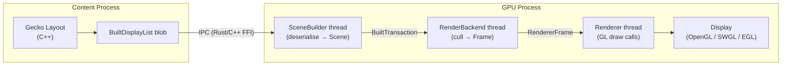
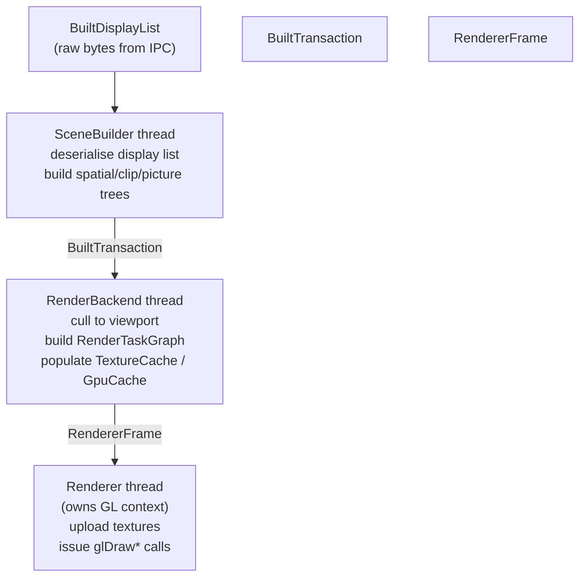
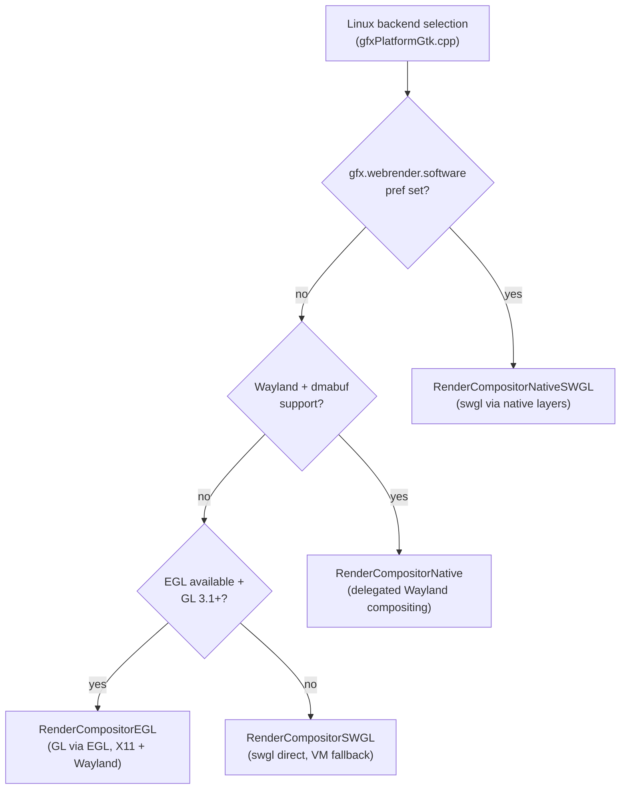
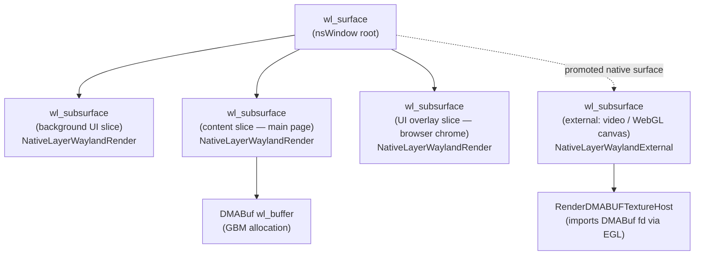
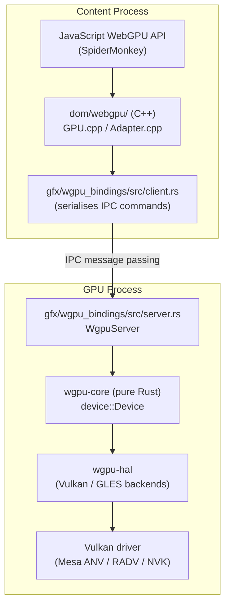
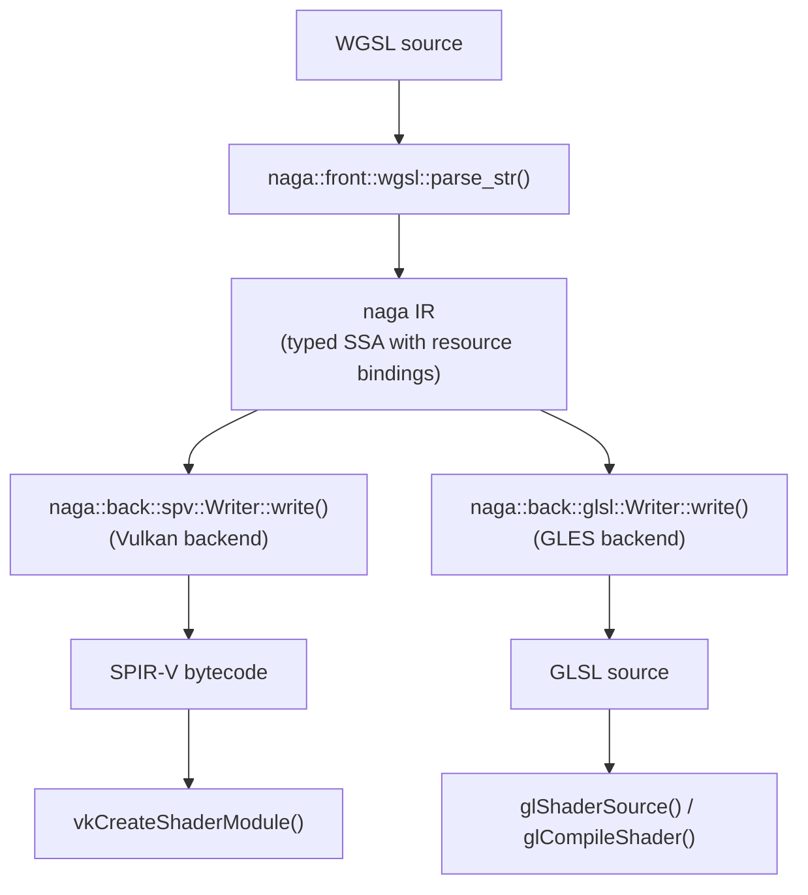
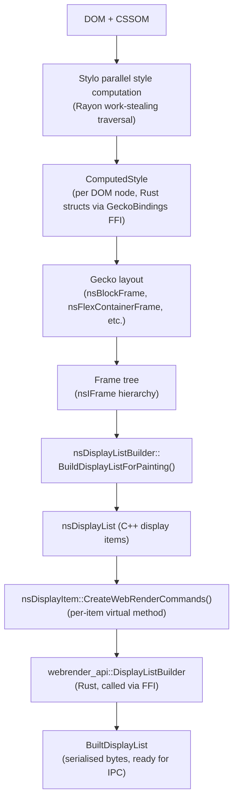
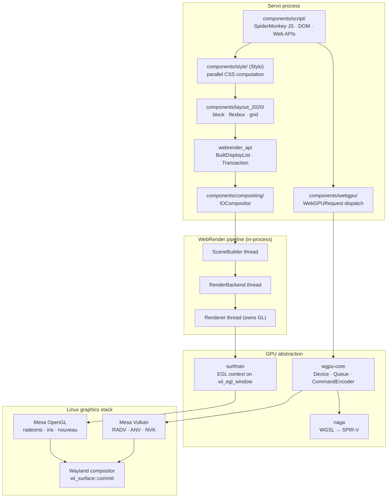

# Chapter 52: Firefox and WebRender

This chapter targets **browser and web platform engineers** who need to understand how Firefox renders web content using its GPU-accelerated WebRender engine, and **graphics application developers** who want to understand how a production Rust graphics stack integrates OpenGL, Wayland, and WebGPU on Linux. It covers the full pipeline from CSS computed styles through display list serialization, render-graph execution, picture caching, software fallback, Wayland native-layer compositing, and Gecko's wgpu-based WebGPU implementation.

## Table of Contents

- [Firefox Rendering Architecture vs Chromium](#firefox-rendering-architecture-vs-chromium)
  - [The Fundamental Design Divergence](#the-fundamental-design-divergence)
  - [Why GPU Compositing Moved Into WebRender](#why-gpu-compositing-moved-into-webrender)
  - [Strategic Outlook: Which Architecture Wins, and Will They Converge?](#strategic-outlook-which-architecture-wins-and-will-they-converge)
- [WebRender: Crate Layout and Display List Wire Format](#webrender-crate-layout-and-display-list-wire-format)
- [WebRender Render Graph](#webrender-render-graph)
- [Picture Caching](#picture-caching)
- [WebRender Backends on Linux](#webrender-backends-on-linux)
- [WebRender and Wayland](#webrender-and-wayland)
- [Gecko WebGPU: wgpu-core and naga](#gecko-webgpu-wgpu-core-and-naga)
- [Stylo: Parallel CSS Layout Engine](#stylo-parallel-css-layout-engine)
- [Servo: The Rust Browser Engine](#servo-the-rust-browser-engine)
- [Integrations](#integrations)

---

## Firefox Rendering Architecture vs Chromium

### The Fundamental Design Divergence

Chromium and Firefox share a broad goal — render web content efficiently on GPU hardware — but they arrived at that goal via architecturally distinct paths that are still visible in the code today.

Chromium's rendering model, as covered in (Ch33) and (Ch36), is built around a **tile-raster pipeline** managed by the **cc** (Chromium Compositor) library. The renderer process paints content into software raster tiles using **Skia** (Ch37), which are then uploaded as GPU textures and assembled by the compositor process using a Directed Acyclic Graph (**DAG**) of layers. The compositor process maintains a separate thread that can animate transform and opacity changes without touching the paint thread, but any change that requires repaint — a color animation on a non-composited element, for example — must route back through **Skia** rasterisation. This creates the well-known "paint invalidation" problem where apparently simple CSS animations can trigger expensive CPU rasterisation.

Firefox's approach, embodied in **WebRender**, discards the paint/composite boundary entirely. Rather than rasterising page content to CPU-side tiles and uploading them to the GPU, **WebRender** treats web page rendering as a retained-mode 3D scene submission. The page's visual representation is a **display list** — a high-level, declarative description of rectangles, images, text runs, borders, shadows, and clip regions — which is submitted to the GPU process and compiled into batched draw calls each frame. The GPU redraws every primitive every frame, much as a game engine redraws its scene, relying on GPU parallelism rather than CPU-side invalidation bookkeeping to make this efficient.

This chapter covers the full architecture of Firefox's GPU rendering pipeline. The **gfx/wr/** Cargo workspace contains **WebRender**'s crate layout, including **webrender**, **webrender_api**, **wr_glyph_rasterizer**, **swgl**, and the **wrench** test harness. The **BuiltDisplayList** wire format — serialised using the **peek-poke** zero-copy crate — carries a flat byte stream of **DisplayItem** variants (rectangles, text, borders, images, gradients, clip chains, stacking contexts) and a spatial tree across the content/GPU process **IPC** boundary. The **RenderBackend** thread constructs a **RenderTaskGraph** — a **DAG** of **RenderTask** nodes covering **PictureTask**, **VerticalBlurTask**, **HorizontalBlurTask**, **CacheMaskTask**, **BlitTask**, **BorderRenderTask**, and **SVGFENodeTask** — and populates the **TextureCache** (a set of **RGBA8** and **A8** atlas arrays for glyphs, images, and alpha masks) and the **GpuCache** (a floating-point **RGBA32F** texture acting as a structured uniform store). Primitives are sorted into **RenderPass** objects and issued as **glDrawArraysInstanced** batches, targeting approximately 100 draw calls per frame. An **interning** system using **Interner<T>** and **InternHandle<T>** avoids reprocessing unchanged primitives across frames by transmitting only delta updates.

The **PictureCache** system partitions the scene into slices and fixed-size tiles — content tiles at **2048×512 px** and UI tiles at **128×128 px** — with per-tile invalidation driven by **TileCacheInstance** quadtree dependency tracking. Primitives that change every frame (video, **WebGL** canvases) can be promoted to a **native compositor surface**, bypassing the tile texture budget entirely.

On Linux, **WebRender** supports three rendering backends selected by **gfxPlatformGtk.cpp**: the hardware **GL backend** (using the **gleam** crate's `dyn Gl` trait over an **EGL** context, requiring **OpenGL 3.1** or **OpenGL ES 3.0**), the **swgl** software rasteriser (a **SIMD**-vectorised C++ implementation transpiled from **GLSL** via **glsl-to-cxx**, with **SSE2**/**AVX2**/**NEON** paths), and the **RenderCompositorNative** delegated-compositing path. The pref **gfx.webrender.software** forces **swgl**; the compositors are selected via **RenderCompositorEGL**, **RenderCompositorNative**, **RenderCompositorNativeSWGL**, and **RenderCompositorSWGL**.

When running on **Wayland** with **linux-dmabuf-unstable-v1** support, Firefox uses **RenderCompositorNativeLayer** delegated compositing: each picture cache slice becomes a separate **wl_subsurface** managed by **NativeLayerWayland**. External images (video, **WebGL**) are handled by **NativeLayerWaylandExternal** using **zwp_linux_dmabuf_v1** to wrap **DMABuf** file descriptors as **wl_buffer** objects, imported via **EGL_EXT_image_dma_buf_import** by **RenderDMABUFTextureHost**. Frame timing uses the **wp_presentation** protocol to feed hardware-clock timestamps into the **VsyncSource**. Subsurfaces operate in synchronised mode to achieve atomic frame commits; stacking order is managed via **wl_subsurface_place_above** and **wl_subsurface_place_below**.

Gecko's **WebGPU** implementation uses **wgpu-core** (pure Rust) and **wgpu-hal** rather than Chrome's **Dawn** (C++). The content-process **dom/webgpu/** layer (backing **GPUDevice**, **GPUCommandEncoder**, **GPURenderPipeline**) serialises commands over **IPC** to a **WgpuServer** in the GPU process, which executes them against a **wgpu-core** device. **WGSL** shaders are compiled by the **naga** crate through a **naga IR** (typed SSA) representation into **SPIR-V** (via `naga::back::spv::Writer`) for the **Vulkan** backend or **GLSL** (via `naga::back::glsl::Writer`) for the **GLES** backend. The **wgpu** **Vulkan** backend uses the **ash** crate and reaches hardware through **Mesa** drivers (**ANV**, **RADV**, **NVK**). Canvas output is shared with **WebRender** via **DMABuf** through **SharedTextureDMABuf**, presented by **NativeLayerWaylandExternal**. Firefox first shipped **WebGPU** enabled by default in **Firefox 141** (July 2025).

**Stylo** (Quantum CSS) integrates Servo's Rust `style` crate into **Gecko** for parallel **CSS** computation using **Rayon** work-stealing traversal. Selectors are matched with a per-thread Bloom filter and cascaded values written into reference-counted **style structs** (**Font**, **Color**, **Background**, **Border**, **Transform**, etc.) shared across DOM nodes. The **GeckoBindings** **FFI** layer in **layout/style/GeckoBindings.cpp** bridges Rust to **Gecko**'s C++ DOM. Computed styles flow through the **nsIFrame** layout tree to **nsDisplayListBuilder::BuildDisplayListForPainting()**, where each **nsDisplayItem** subclass overrides **CreateWebRenderCommands()** to push **DisplayItem** entries into a **webrender_api::DisplayListBuilder** and produce the **BuiltDisplayList** for **IPC** transmission.

[Source: Mozilla Hacks — The whole web at maximum FPS](https://hacks.mozilla.org/2017/10/the-whole-web-at-maximum-fps-how-webrender-gets-rid-of-jank/)

The table below distils the key architectural differences between the two pipelines across GPU API, compositing strategy, process model, and platform integration. These differences have concrete consequences for performance characteristics, driver interaction, and the ease of adopting new GPU features on Linux.

| Attribute | Firefox WebRender | Chromium (Skia/Ganesh + CC + Viz) |
|---|---|---|
| Retained-mode vs immediate | Retained (display list diffing, picture caching) | Retained (layer tree) + immediate GPU submission (Viz) |
| 2D rasterisation | WebRender GPU path (rectangle primitives; no CPU raster) | Skia Ganesh (OpenGL/Vulkan) + optional SkiaRenderer |
| Compositing architecture | WebRender handles both 2D and compositing in one pass | Split: CC (layer tree) → Viz (display compositor, separate process) |
| GPU API on Linux | Vulkan (primary 2026); OpenGL fallback | Vulkan (SkiaGraphite 2025+); OpenGL (legacy Ganesh); ANGLE |
| Shader language | GLSL (WebRender rect shaders) | GLSL/SkSL (Skia shaders) |
| CSS/animation GPU offload | Compositor thread + APZ (async pan-zoom) | Compositor thread + impl-side painting |
| WebGPU implementation | wgpu-core (Rust, naga shader compiler) | Dawn (C++, Tint shader compiler) |
| Process model | Parent process (main) + GPU process | Browser + Renderer + GPU process (tri-process) |
| Tile management | Picture caching (sub-tree invalidation) | Tile-based rasterisation (CC tiling) |
| Linux Wayland status | Native Wayland (firefox-wayland, 2020+) | Native Wayland (--ozone-platform=wayland, stable 2022+) |

### Why GPU Compositing Moved Into WebRender

Earlier versions of Firefox used a system very similar to Chromium's: layers were painted by the CPU and composited by a GPU process. The distinction between painting layers (the content process) and compositing them (the GPU process) created a sharp performance cliff. Compositing was fast and jank-free at 60 fps; painting was expensive and would drop frames.

When the Mozilla graphics team designed **WebRender** (originally a **Servo** project, later integrated into **Gecko**), they chose to collapse the paint/composite distinction. Instead of maintaining a parallel compositor that manages a tree of pre-painted textures, **WebRender** itself is the compositor. It receives the display list, decides how to render each item, and submits everything as a single coherent set of GPU draw calls.

This design has several consequences visible in the thread model. In Chromium, the compositor runs on its own thread and animates transform/opacity independently of the renderer. In Firefox, the **RenderBackend** thread does both scene preparation and the frame-building that determines GPU commands. There is no separate "compositor thread" that executes transform animations — instead, the rendering system handles the full pipeline each frame. [Source: Firefox Rendering Overview](https://firefox-source-docs.mozilla.org/gfx/RenderingOverview.html)

### Strategic Outlook: Which Architecture Wins, and Will They Converge?

**WebRender's bet is architecturally sounder for where the web is heading.** The tile-raster model made sense in 2010 when pages were primarily static document content and CPU rasterisation was the only practical path for complex CSS layout. Treating the page as a retained scene submitted to the GPU each frame is the natural fit for hardware with tens of thousands of parallel shader threads; the GPU draws 10 million textured quads per frame in a game engine, and a complex web page has perhaps 10,000 — a trivial workload by comparison. The Chromium team has implicitly acknowledged this by building **Skia Graphite**, which replaces Skia Ganesh's stateful GL model with a task-graph-based GPU backend built on **Dawn/WebGPU** — moving Skia's rendering model structurally closer to WebRender's scene-graph approach. Graphite's `TaskGraph`, `DrawPass`, and `Recorder` abstractions parallel WebRender's `RenderTaskGraph`, `RenderPass`, and `SceneBuilder` directly.

**Where Chromium's model retains an advantage.** The CC tile-raster pipeline is not simply legacy overhead — it is load-bearing for Chrome's multi-renderer architecture. Chrome spawns one renderer process per site isolation group; each renderer has its own CC instance managing its own tile budget independently. A renderer that is scrolled offscreen can drop its tile budget without affecting others. WebRender's picture-caching system (`PictureCache`, `TileCacheInstance`) is Gecko's answer to this, but it operates within a single content process rather than across multiple isolated renderer sandboxes. For pages with very large static regions and small dynamic elements — a long document with a single animated counter, for example — CC's tile invalidation model can be more CPU-efficient than WebRender redrawing the full primitive list each frame. Chrome's `--process-per-site-instance` security model also gains structural support from having per-renderer CC instances with independent GPU memory budgets.

**Convergence at the GPU API layer; divergence at the architecture layer.** The two stacks are converging where it matters least for the rendering model and diverging where it matters most:

*Converging:*
- Both targeting **Vulkan** as the primary GPU API on Linux (Skia Graphite + Dawn on Chrome; wgpu-hal on Firefox)
- Both compiling shaders to **SPIR-V** via the Mesa NIR pipeline ultimately (Tint → SPIR-V → Mesa for Chrome; naga → SPIR-V → Mesa for Firefox)
- Both using **linux-dmabuf** / `zwp_linux_dmabuf_v1` for zero-copy Wayland surface submission
- Both adopting **explicit GPU synchronisation** (`VK_KHR_external_semaphore_fd`, `wp_linux_drm_syncobj_v1`)
- Both implementing **WebGPU** to the same W3C specification

*Not converging:*
- The **tile-raster vs. display-list** rendering model — this is the core architectural decision; reversing it in either browser would be a ground-up rewrite
- **Dawn (C++) vs. wgpu (Rust)** — independent implementations of the same WebGPU spec, serving different language ecosystems; wgpu is also used by Bevy and Servo, making it a Rust-native GPU stack; Dawn is Chrome-maintained and the reference implementation for the specification
- **Tint vs. naga** — independent WGSL compilers that sometimes diverge in validation stringency, causing edge-case WebGPU content to behave differently across browsers
- **Process model** — Chrome's tri-process browser/renderer/GPU split vs. Firefox's parent/GPU split; these reflect different sandboxing philosophies and are not moving toward each other

**The wgpu/naga ecosystem effect.** The fact that **wgpu** is used by both Firefox and the Rust game engine ecosystem (Bevy, Rend3, Winit's GPU examples) and that Servo shares wgpu with Firefox creates a broader community of contributors and users than Dawn's more Chrome-centric development model. This is meaningful for long-term sustainability: WebRender's Rust GPU stack benefits from improvements made for game workloads, not just browser workloads. Conversely, Dawn benefits from Google's engineering scale and from being the shipping WebGPU implementation in the highest-market-share browser, making it the de facto reference for WebGPU specification development.

**Practical conclusion.** The two rendering architectures will remain parallel implementations of the web platform indefinitely — the architectural choices are too deeply embedded in each codebase to unwind. The competitive pressure from Chrome's market dominance is the principal force acting on Firefox's architecture decisions, not any technical desire to converge. WebRender's rendering model is more elegant and more GPU-appropriate; Chrome's process isolation model and staffing scale give it durability. For Linux graphics stack engineers, the meaningful takeaway is that both browsers exercise the same Mesa Vulkan drivers, the same DMA-BUF zero-copy paths, and the same Wayland protocols — the stack beneath them is common even if the rendering logic above it is not.

Firefox uses a multi-process architecture that maps roughly to this pipeline:

```text
Content Process                   GPU Process
─────────────────                 ─────────────────────────
Gecko Layout (C++)                 SceneBuilder thread
  ↓ BuiltDisplayList blob           ↓ Scene (deserialized)
  ──── IPC (Rust/C++ FFI) ────→    RenderBackend thread
                                     ↓ Frame (culled+batched)
                                    Renderer thread
                                     ↓ OpenGL / SWGL / EGL
                                    Display
```



The **BuiltDisplayList** blob crosses the content/GPU process boundary as raw bytes. On the GPU side, Rust code in **webrender** deserialises it into a **Scene**, which is then culled to a **Frame** for the current viewport, and finally submitted as GL draw calls by the **Renderer** thread.

---

## WebRender: Crate Layout and Display List Wire Format

### gfx/wr/ Directory Structure

WebRender lives under `gfx/wr/` in mozilla-central and is structured as a Cargo workspace containing several crates:

```text
gfx/wr/
├── webrender/           # Core rendering engine (~200 KLOC Rust)
│   ├── src/
│   │   ├── render_backend.rs      # RenderBackend thread
│   │   ├── renderer/              # GL device, Renderer thread
│   │   │   ├── mod.rs             # Main Renderer
│   │   │   ├── composite.rs       # Compositor state
│   │   │   ├── gpu_buffer.rs      # GpuCache implementation
│   │   │   ├── shade.rs           # Shader management
│   │   │   └── upload.rs          # Texture uploads
│   │   ├── picture.rs             # PictureCache, TileCacheInstance
│   │   ├── render_task.rs         # RenderTask, RenderTaskKind
│   │   ├── render_task_graph.rs   # RenderTaskGraph, DAG builder
│   │   ├── texture_cache.rs       # TextureCache, glyph/image atlas
│   │   └── ...
│   └── res/                       # GLSL shaders
├── webrender_api/       # Public API types (display items, transactions)
│   └── src/
│       ├── display_item.rs        # DisplayItem enum
│       ├── display_list.rs        # BuiltDisplayList, serialization
│       └── ...
├── wr_glyph_rasterizer/ # FreeType/HarfBuzz glyph rasterization
├── swgl/                # Software GL rasteriser (SIMD)
│   └── src/
│       ├── gl.cc                  # OpenGL entry points
│       ├── rasterize.h            # SIMD rasterisation pipeline
│       ├── composite.h            # Compositing operations
│       ├── blend.h                # Blending operations
│       └── texture.h              # Texture management
├── webrender_build/     # Shader preprocessing, build utilities
└── wrench/              # Test harness and debugging tool
```

[Source: Searchfox gfx/wr/ directory](https://searchfox.org/mozilla-central/source/gfx/wr/)

### BuiltDisplayList Wire Format

The display list that crosses the IPC boundary is a `BuiltDisplayList`, defined in `gfx/wr/webrender_api/src/display_list.rs`:

```rust
// gfx/wr/webrender_api/src/display_list.rs
pub struct BuiltDisplayList {
    payload: DisplayListPayload,
    descriptor: BuiltDisplayListDescriptor,
}

pub struct DisplayListPayload {
    pub items_data: Vec<u8>,   // serialised DisplayItem stream
    pub spatial_tree: Vec<u8>, // serialised SpatialTreeItem stream
}

pub struct BuiltDisplayListDescriptor {
    gecko_display_list_type: GeckoDisplayListType,
    builder_start_time: u64,
    builder_finish_time: u64,
    send_start_time: u64,
    total_clip_nodes: usize,
    total_spatial_nodes: usize,
}
```

Serialization uses the **peek-poke** crate, a zero-copy binary format that works by memcpy-ing struct bytes directly into a `Vec<u8>`. This is intentionally not serde — the goal is minimal overhead at the IPC boundary, not schema-stable interchange.

```rust
// gfx/wr/webrender_api/src/display_list.rs
// Zero-copy typed slice view into the raw byte buffer
pub struct ItemRange<'a, T> {
    bytes: &'a [u8],
    _boo: PhantomData<T>,
}
```

Items are laid out sequentially: a `DisplayItem` header followed immediately by its auxiliary data (glyph instances for text, gradient stops for gradients). A "red zone" — a run of zero bytes at least as large as the largest possible `DisplayItem` — is appended after the last item so that the deserializer can peek ahead without bounds checking on every iteration.

### DisplayItem Types

The `DisplayItem` enum in `gfx/wr/webrender_api/src/display_item.rs` covers all primitives that Gecko's layout engine can emit:

```rust
// gfx/wr/webrender_api/src/display_item.rs (simplified)
pub enum DisplayItem {
    // Content primitives
    Rectangle(RectangleDisplayItem),
    Text(TextDisplayItem),
    Line(LineDisplayItem),
    Border(BorderDisplayItem),
    BoxShadow(BoxShadowDisplayItem),
    Gradient(GradientDisplayItem),
    RadialGradient(RadialGradientDisplayItem),
    ConicGradient(ConicGradientDisplayItem),
    Image(ImageDisplayItem),
    RepeatingImage(RepeatingImageDisplayItem),
    YuvImage(YuvImageDisplayItem),
    BackdropFilter(BackdropFilterDisplayItem),
    PushShadow(PushShadowDisplayItem),
    // Clipping
    RectClip(RectClipDisplayItem),
    RoundedRectClip(RoundedRectClipDisplayItem),
    ImageMaskClip(ImageMaskClipDisplayItem),
    ClipChain(ClipChainItem),
    // Structural / stacking context
    Iframe(IframeDisplayItem),
    PushReferenceFrame(ReferenceFrameDisplayItem),
    PopReferenceFrame,
    PushStackingContext(PushStackingContextDisplayItem),
    PopStackingContext,
    PopAllShadows,
    // Auxiliary data carriers
    SetGradientStops,
    SetFilterOps,
    SetFilterData,
    SetPoints,
}
```

Every item carrying geometry shares a `CommonItemProperties` that bundles the clip rect, clip chain ID, and spatial node ID — avoiding repetition in each variant.

### CSS Property Mapping to Display Items

Gecko's layout engine (`nsDisplayList.cpp` in C++) maps CSS properties to `DisplayItem` variants following rules like:

| CSS Property / Element | DisplayItem Variant |
|---|---|
| `background-color` | `Rectangle` |
| `border` (normal, solid/dashed) | `Border` with `BorderDetails::Normal` |
| `border-image` | `Border` with `BorderDetails::NinePatch` |
| `box-shadow` | `BoxShadow` |
| `text` rendered content | `Text` + auxiliary `GlyphInstance` array |
| ``, CSS `background-image` | `Image` or `RepeatingImage` |
| `<video>`, `<canvas>` (WebGL) | `YuvImage` or external image via compositor |
| `backdrop-filter` | `BackdropFilter` |
| CSS transforms | `PushReferenceFrame` / `PopReferenceFrame` |
| `z-index` stacking contexts | `PushStackingContext` / `PopStackingContext` |
| `overflow: scroll` scroll frame | `SpatialTreeItem::ScrollFrame` in spatial tree |

[Source: Searchfox nsDisplayList.cpp](https://searchfox.org/mozilla-central/source/layout/painting/nsDisplayList.cpp)

### RenderBackend Thread Model

Once the `BuiltDisplayList` arrives in the GPU process, it enters a pipeline driven by three dedicated threads:

**SceneBuilder thread** receives the raw display list blob and deserialises it into a `Scene` — a hierarchical representation containing the spatial tree (scroll frames, reference frames, sticky frames), clip tree, and picture tree. Building the scene is expensive and is done asynchronously so that the previous frame can still be rendered while a new scene is being prepared.

**RenderBackend thread** receives completed `BuiltTransaction` messages from the SceneBuilder. For each frame, it culls the scene to the visible viewport, resolves picture caching decisions, builds the `RenderTaskGraph`, populates the `TextureCache` and `GpuCache`, and produces a `RendererFrame` ready for GPU submission.

**Renderer thread** holds exclusive ownership of the OpenGL context and executes the draw calls. It receives `RendererFrame` from the RenderBackend via a channel, uploads any pending texture data, and issues the final GL calls.

The key invariant: **only the Renderer thread ever calls into the GL driver**. This avoids multi-threaded GL context issues and keeps the backend threads free of driver dependencies.



[Source: Searchfox webrender/src/renderer/mod.rs](https://searchfox.org/mozilla-central/source/gfx/wr/webrender/src/renderer/mod.rs)

---

## WebRender Render Graph

### RenderTask and RenderTaskKind

The render graph is a DAG of `RenderTask` nodes built by the `RenderBackend` each frame. Each task represents a single GPU operation that writes to an offscreen surface, with explicit dependencies on other tasks that must complete first.

```rust
// gfx/wr/webrender/src/render_task.rs
pub struct RenderTask {
    pub location: RenderTaskLocation,  // where to render: dynamic or static surface
    pub children: TaskDependencies,    // indices of prerequisite tasks
    pub kind: RenderTaskKind,
    pub sub_tasks: SubTaskRange,
    pub free_after: PassId,            // when to return surface to pool
    pub render_on: PassId,             // which pass executes this task
    pub uv_rect_handle: GpuBufferAddress,
    pub cache_handle: Option<RenderTaskCacheEntryHandle>,
    pub uv_rect_kind: UvRectKind,
}

pub enum RenderTaskKind {
    Picture(PictureTask),        // main scene primitives
    CacheMask(CacheMaskTask),    // complex clip masks
    ClipRegion(ClipRegionTask),  // clip geometry
    VerticalBlur(BlurTask),      // two-pass Gaussian blur (pass 1)
    HorizontalBlur(BlurTask),    // two-pass Gaussian blur (pass 2)
    Scaling(ScalingTask),        // mipmap downscaling for filter effects
    Blit(BlitTask),              // direct surface copy
    Border(BorderRenderTask),    // complex border rasterisation
    LineDecoration(LineDecorationTask),
    SVGFENode(SVGFENodeTask),    // SVG filter effect graph nodes
    TileComposite(TileCompositeTask),
    Prim(PrimTask),
    Image(ImageTask),
    Cached(CachedTask),
    Empty,
}
```

[Source: Searchfox webrender/src/render_task.rs](https://searchfox.org/mozilla-central/source/gfx/wr/webrender/src/render_task.rs)

### PictureTask for Effects

`PictureTask` is the central kind: it renders a sub-tree of display primitives into an offscreen surface. When a CSS stacking context has `opacity`, `filter`, `mix-blend-mode`, or `isolation: isolate`, the subtree is rendered into a `PictureTask` surface first, and then composited onto the parent surface with the appropriate effect.

For a CSS blur filter, the task graph looks like:

```text
PictureTask (render content to intermediate surface)
    └─ HorizontalBlurTask (blur the picture horizontally)
           └─ VerticalBlurTask (blur the result vertically)
                  └─ TileCompositeTask (composite final tile)
```

This multi-pass structure means each blur kernel only needs to be O(radius) rather than O(radius²), the classic two-pass separable Gaussian optimisation.

### TextureCache for Glyphs and Images

The `TextureCache` (in `gfx/wr/webrender/src/texture_cache.rs`) manages a set of GPU texture arrays, sub-divided into atlases. The cache is accessed on the RenderBackend thread and produces upload commands for the Renderer thread.

The cache maintains separate atlas pools for different content types:

| Budget Type | Format | Use |
|---|---|---|
| `SharedColor8Linear` | RGBA8 | Images requiring bilinear filtering |
| `SharedColor8Nearest` | RGBA8 | Pixel-art images, favicons |
| `SharedColor8Glyphs` | RGBA8 | Colour emoji, subpixel AA glyphs |
| `SharedAlpha8` | A8 | Greyscale alpha masks |
| `SharedAlpha8Glyphs` | A8 | Greyscale text glyphs (separated for batching) |
| `SharedAlpha16` | R16 | High-precision alpha masks |
| `Standalone` | various | Large items that don't fit in shared atlases |

Glyphs have a dedicated atlas (`SharedAlpha8Glyphs` / `SharedColor8Glyphs`) rather than sharing space with images. This allows the text shader to bind a single known texture rather than dealing with atlas indirection in the hot path.

Eviction uses an LRU strategy capped at 32 evictions per frame to bound jank on frames that would otherwise trigger large-scale cache churn. Entries carry a `WeakFreeListHandle` — if the handle is empty (the slot was evicted), the caller re-uploads the data.

### GpuCache for Per-Draw-Call Uniforms

Rather than issuing individual uniform uploads before every draw call, WebRender uses a `GpuCache` — a floating-point RGBA texture (typically RGBA32F) that acts as a structured uniform store. Each primitive, border, gradient, and render task UV rectangle is written into the GPU cache as one or more 4-float "blocks".

```text
GpuCache texture layout:
┌──────────────────────────────────────────────────────────┐
│ Row 0: [prim_rect xywh] [clip_rect xywh] [color rgba] …  │
│ Row 1: [gradient_stop color] [gradient_stop offset] …    │
│ Row N: ...                                                │
└──────────────────────────────────────────────────────────┘
```

Shaders sample the GpuCache texture with integer coordinates derived from a `GpuBufferAddress` stored per-primitive. This turns what would be N uniform-set calls into a single texture bind and per-instance attribute fetch, dramatically reducing CPU-side driver overhead when batching thousands of primitives.

[Source: Searchfox webrender/src/renderer/gpu_buffer.rs](https://searchfox.org/mozilla-central/source/gfx/wr/webrender/src/renderer/gpu_buffer.rs)

### RenderPassList and Batching

The `RenderTaskGraph` builder performs a topological sort of the task DAG to produce an ordered list of `RenderPass` objects. Each pass contains tasks that can execute in parallel (no mutual dependencies), and tasks within a pass are sorted and batched by shader type to minimise pipeline state changes.

WebRender targets approximately 100 draw calls per frame for a typical web page, even with thousands of visible primitives. Batching works by:

1. Sorting primitives by shader (e.g., all `ps_text_run` calls together, all `ps_border_corner` together).
2. Packing instance data for each batch into a GPU vertex buffer uploaded at frame start.
3. Issuing a single `glDrawArraysInstanced` (or equivalent) per batch.

### Scene vs. Frame: Asynchronous Pipeline Stages

A key design choice is the strict separation between **scene building** and **frame building**:

A **Scene** is the structural representation of a display list. It contains the deserialized primitive data, the spatial tree (scroll frames, reference frames, sticky frames), the clip tree, and all interned resources. Building a scene is potentially slow (it involves deserializing the display list, resolving interning deltas, and building the picture tree), so it is done asynchronously on the SceneBuilder thread. The previous scene remains active for rendering while the new one is being built.

A **Frame** is what is actually sent to the GPU. It represents the scene culled and resolved for the current viewport, with all picture cache decisions made, the RenderTaskGraph compiled, and GPU data staged. A frame is built from a scene by the RenderBackend thread each time the display is refreshed. Multiple frames can be rendered from a single scene (e.g., during a CSS transform animation where only transform values change, not document structure).

```text
SceneBuilder thread:                RenderBackend thread:
  parse BuiltDisplayList               receive BuiltTransaction
  build spatial tree                   cull scene to viewport
  resolve interning deltas             build RenderTaskGraph
  construct picture tree               populate TextureCache/GpuCache
  → send BuiltTransaction →            → send RendererFrame →
                                   Renderer thread:
                                       upload textures
                                       issue GL draw calls
```



```mermaid
graph LR
    subgraph "SceneBuilder thread (async)"
        S1["parse BuiltDisplayList"]
        S2["build spatial tree"]
        S3["resolve interning deltas"]
        S4["construct picture tree"]
        S1 --> S2 --> S3 --> S4
    end
    subgraph "RenderBackend thread (per frame)"
        R1["receive BuiltTransaction"]
        R2["cull scene to viewport"]
        R3["build RenderTaskGraph"]
        R4["populate TextureCache / GpuCache"]
        R1 --> R2 --> R3 --> R4
    end
    subgraph "Renderer thread (GL owner)"
        G1["upload textures"]
        G2["issue GL draw calls"]
        G1 --> G2
    end
    S4 -- "BuiltTransaction" --> R1
    R4 -- "RendererFrame" --> G1
```

[Source: Searchfox webrender/src/scene_builder_thread.rs](https://searchfox.org/mozilla-central/source/gfx/wr/webrender/src/scene_builder_thread.rs)

### Primitive Interning

WebRender uses an **interning system** to avoid reprocessing unchanged primitives across frames. When a primitive (rectangle, border, text run, image) appears in successive display lists with identical parameters, it is interned: the SceneBuilder assigns it a stable `InternHandle<T>` and stores its data in an `Interner<T>`. The frame builder receives only a delta — the set of changed primitives — rather than the full primitive list.

```rust
// gfx/wr/webrender/src/intern.rs (schematic)

// SceneBuilder side: hashes primitive key → stable slot
pub struct Interner<I: Internable> {
    items: FastHashMap<I::Key, ItemDetails<I>>,
    free_list: FreeList<I::StoreData, I::Marker>,
    // ...
}

// FrameBuilder side: indexed by InternHandle for fast access
pub struct DataStore<I: Internable> {
    items: FreeList<I::StoreData, I::Marker>,
}

// Incremental update from Interner → DataStore each scene build
pub struct UpdateList<S> {
    pub insertions: Vec<Insertion<S>>,
    pub removals: Vec<FreeListHandle<S>>,
}
```

The interning epoch system ensures garbage collection: items unused for ten or more epochs are evicted from the data store, freeing their free-list slots. This means that primitives that scroll off-screen and stay off-screen for ten frames are cleaned up automatically, while primitives that scroll in and out within ten frames avoid the allocation/free churn.

This design is particularly valuable for long pages. A Wikipedia article with hundreds of paragraphs will have most paragraphs off-screen at any given time. Without interning, each scroll event would re-process the entire display list. With interning, only the primitives whose bounding rectangles changed (due to font metrics changing, for example) are re-interned; everything else gets a lightweight handle lookup.

[Source: Searchfox webrender/src/intern.rs](https://searchfox.org/mozilla-central/source/gfx/wr/webrender/src/intern.rs)

---

## Picture Caching

### Motivation

Even with batching, redrawing every primitive every frame is expensive when most of the page is static. A typical web page scroll involves changing only the scroll offset while the page content itself is unchanged. Picture caching addresses this by caching rendered tiles as GPU textures across frames.

### PictureCache Architecture

The `PictureCache` system partitions the scene into a small number of **slices** — typically a content slice for the main page content, a UI slice for browser chrome, and additional slices for iframes or scroll-independent elements. Each time the display list builder encounters a new scroll root, a new slice boundary is created, up to a maximum of eight slices.

Each slice is subdivided into fixed-size **tiles**:

- **Content tiles**: 2048×512 pixels — wide to fit typical horizontal page content.
- **UI tiles**: 128×128 pixels — smaller because the browser UI changes more frequently at finer granularity.

Tiles exist in one of two states: **cached** (backed by a GPU texture holding rasterised content) or **clear** (a solid-colour optimisation where no texture is needed, just a clear rect during compositing).

[Source: Searchfox webrender/src/picture.rs — PictureCache documentation comments](https://searchfox.org/mozilla-central/source/gfx/wr/webrender/src/picture.rs)

### TileCacheInstance and Invalidation

Each slice has a `TileCacheInstance` which tracks:

```rust
// gfx/wr/webrender/src/picture.rs (simplified)
pub struct TileCacheInstance {
    pub spatial_node_index: SpatialNodeIndex,
    pub tile_rect: TileRect,
    pub dirty_region: DirtyRegion,

    // Dependency tracking for invalidation
    pub opacity_bindings: FastHashMap<PropertyBindingId, OpacityBindingInfo>,
    pub color_bindings: FastHashMap<PropertyBindingId, ColorBindingInfo>,

    pub current_tile_size: DeviceIntSize,
    pub invalidate_all_tiles: bool,

    // Compositor surface cache
    pub external_native_surface_cache: FastHashMap<ExternalNativeSurfaceKey, ExternalNativeSurface>,
}
```

The invalidation model uses a **quadtree of primitive dependencies** per tile. Each tile's quadtree node stores an index buffer of the primitive instances whose bounding rectangles overlap that tile. On each frame, the system compares the current frame's primitives with the previous frame's snapshot across multiple categories:

- **Primitive bounding rectangles** — did any visible rect move or resize?
- **Clip regions** — did any clip change shape?
- **Image resource keys** — did any image change content?
- **Opacity/color bindings** — did any `opacity` or CSS color animate?
- **Transform matrices** — did any scroll offset or CSS transform change?

Only tiles that detect a changed dependency are marked dirty. The dirty tile's quadtree produces a **per-tile dirty rect** — the union of invalidated leaf AABBs — which becomes the scissor rectangle for that tile's re-render pass. Tiles that are not dirty use their cached GPU texture directly.

This allows a page with one animating spinner to redraw only the four or five tiles that contain the spinner, while the rest of the page composites from the GPU texture cache at near-zero cost.

### Native Compositor Surface Optimisation

For primitives that change every frame — video elements, WebGL canvases, hardware overlays — allocating them into the tile texture cache would cause their tiles to be invalidated every frame. Instead, WebRender can promote such a primitive to a **native compositor surface**: a `wl_surface` (on Wayland) or platform equivalent managed entirely outside the tile texture budget. The compositor presents this surface directly as an underlay or overlay without blending through WebRender's tile compositing pass.

The `external_native_surface_cache` in `TileCacheInstance` maps `ExternalNativeSurfaceKey → ExternalNativeSurface`, reusing the platform surface object across frames as long as the primitive's geometry is stable.

---

## WebRender Backends on Linux

### GL Backend: webrender_gl and gleam

WebRender's primary hardware-accelerated backend on Linux is its **GL backend**, implemented in `gfx/wr/webrender/src/device/gl.rs`. It uses [**gleam**](https://crates.io/crates/gleam), a Rust crate that wraps raw OpenGL function pointers with a safe, `dyn Gl` trait interface.

The shader version is determined at startup based on what the GL driver reports:

```rust
// gfx/wr/webrender/src/device/gl.rs
fn get_shader_version(gl: &dyn gl::Gl) -> ShaderVersion {
    match gl.get_type() {
        gl::GlType::Gl   => ShaderVersion::Gl,   // desktop GL ≥ 3.1
        gl::GlType::Gles => ShaderVersion::Gles, // GLES ≥ 3.0
    }
}
```

On Linux the GL context is typically created via EGL (see `RenderCompositorEGL`). WebRender requires at minimum OpenGL 3.1 (desktop) or OpenGL ES 3.0 (mobile/embedded). If hardware satisfies this, the GL backend is selected.

**Note: There is no in-tree Vulkan rendering backend for WebRender itself.** Historical discussions and external experiments exist, but the production WebRender rendering device is strictly GL/GLES. Vulkan surfaces Linux only through the separate wgpu/WebGPU path described below.

### swgl: Software WebRender GL

**swgl** (Software WebGL, pronounced "swigle") is WebRender's SIMD-accelerated software rasteriser. It implements the same `dyn gl::Gl` trait as the hardware GL backend, so WebRender sees a single abstract interface regardless of whether real GL or swgl is behind it.

swgl was created to allow WebRender to run on systems that lack the required hardware GL support — virtual machines, old GPUs, headless CI environments, and Linux installations with mesa software renderers like llvmpipe.

The rasteriser is implemented mostly in C++ with SIMD intrinsics:

```text
gfx/wr/swgl/src/
├── gl.cc            # OpenGL entry points and state machine
├── rasterize.h      # Core scanline rasteriser with SIMD vectorisation
├── composite.h      # Compositing and blending of tile surfaces
├── blend.h          # Porter-Duff blend mode implementations
├── texture.h        # Texture sampling (bilinear, nearest, YUV)
├── glsl.h           # GLSL → C++ shader transpilation headers
└── vector_type.h    # SIMD vector types (wraps __m128, __m256, NEON)
```

The `glsl-to-cxx` tool in the workspace transpiles WebRender's GLSL shaders to C++ functions at build time. At runtime, swgl calls these C++ shader functions directly rather than issuing GPU commands. The SIMD vector types abstract over x86 SSE2/AVX2 and ARM NEON, with AVX2 paths gated on CPUID checks.

[Source: Bugzilla — SWGL AVX2 support investigation](https://bugzilla.mozilla.org/show_bug.cgi?id=1708743)

### Backend Selection Logic

Firefox's Gecko layer selects the WebRender backend in `gfx/webrender_bindings/RenderCompositor*.cpp`:

```text
gfx/webrender_bindings/
├── RenderCompositorEGL.cpp         # GL via EGL (primary on Linux X11 + Wayland)
├── RenderCompositorNative.cpp      # GL via native layers (Wayland delegated compositing)
├── RenderCompositorNativeSWGL.cpp  # swgl via native layers
├── RenderCompositorSWGL.cpp        # swgl direct (VM fallback)
├── RenderCompositorOGL.cpp         # GL via GLX (legacy X11)
└── RenderCompositorANGLE.cpp       # ANGLE (Windows / macOS Metal)
```

The selection logic in `gfxPlatform.cpp` and `gfxPlatformGtk.cpp` on Linux follows these rules (simplified):

1. If `gfx.webrender.software` pref is set, use swgl.
2. If Wayland with dmabuf support: use `RenderCompositorNative` (delegated Wayland compositing).
3. If EGL is available and GPU has GL 3.1+: use `RenderCompositorEGL`.
4. Otherwise fall back to `RenderCompositorSWGL`.



[Source: Bugzilla — Investigate RenderCompositorNativeSWGL correctness](https://bugzilla.mozilla.org/show_bug.cgi?id=1647946)

---

## WebRender and Wayland

### RenderCompositorNativeLayer Abstraction

When running on Wayland with a compositor that supports `linux-dmabuf-unstable-v1`, Firefox uses **delegated compositing**: instead of blending all WebRender tiles into a single wl_surface and presenting it, each picture cache slice is presented as a separate `wl_subsurface`. The Wayland compositor merges them, potentially using hardware overlays for scanout — bypassing the X/GLES compositing overhead entirely.

This is managed through the `RenderCompositorNativeLayer` class hierarchy in `gfx/webrender_bindings/` and the corresponding `NativeLayer*` classes in `gfx/layers/`.

### NativeLayerWayland

`NativeLayerWayland` (declared in `gfx/layers/NativeLayerWayland.h`) manages a tree of Wayland subsurfaces corresponding to WebRender's picture cache slices. The root layer is the `nsWindow`'s `wl_surface`; child layers are `wl_subsurface` objects arranged in a stack.

```text
wl_surface (nsWindow root)
  ├── wl_subsurface (background UI slice)
  ├── wl_subsurface (content slice — main page)
  │     └── [DMABuf wl_buffer from GBM allocation]
  └── wl_subsurface (UI overlay slice — browser chrome)
```

The class has two concrete subclasses:

**`NativeLayerWaylandRender`** — for picture cache tiles rendered by WebRender itself (GL or swgl). Provides `NextSurfaceAsDrawTarget()` to get a drawing surface from a pool, then `CommitFrontBufferToScreenLocked()` to attach the completed buffer to the `wl_subsurface` and commit.

**`NativeLayerWaylandExternal`** — for external images (video, WebGL) backed by `DMABuf` surfaces. The texture host `wr::RenderDMABUFTextureHost` imports a DMABuf file descriptor, wraps it as a `wl_buffer` using `linux-dmabuf-unstable-v1`, and attaches it to the subsurface. The root layer caches a `WaylandBufferDMABUFHolder` array to reuse `wl_buffer` objects across frames without repeated protocol round-trips.



[Source: Searchfox gfx/layers/NativeLayerWayland.h](https://searchfox.org/mozilla-central/source/gfx/layers/NativeLayerWayland.h)

### linux-dmabuf Surface Submission

The DMABuf path for external surfaces follows this sequence each frame:

```text
1. WebRender resolves an ExternalImage → calls into Gecko via ExternalImageHandler
2. RenderDMABUFTextureHost::Lock() imports the DMABuf fd via EGL_EXT_image_dma_buf_import
3. NativeLayerWaylandExternal::SetTextureHost() stores the new texture host
4. CommitFrontBufferToScreenLocked():
      a. BorrowExternalBuffer() looks up or creates a wl_buffer from the DMABuf handle
         using zwp_linux_dmabuf_v1_create_params + .add() for each plane + .create()
      b. wl_surface_attach(subsurface_wl_surface, wl_buffer, 0, 0)
      c. wl_subsurface_set_desync() if needed
      d. wl_surface_commit(subsurface)
5. Parent surface commit propagates child commits atomically
```

The DRM modifier negotiation (linear vs. tiled vs. compressed formats) happens at surface creation time. Firefox queries the Wayland compositor's supported formats and modifiers via `zwp_linux_dmabuf_v1` feedback, then selects the optimal GBM allocation format shared across all child surfaces on the same monitor.

[Source: Searchfox widget/gtk/wayland/linux-dmabuf-unstable-v1-client-protocol.h](https://searchfox.org/mozilla-central/source/widget/gtk/wayland/linux-dmabuf-unstable-v1-client-protocol.h)

### wp_presentation Feedback and Frame Timing

WebRender uses frame timing information to synchronise animation scheduling with the display's actual refresh cycle. On Wayland, this comes from the `wp_presentation` protocol (also known as `presentation-time`).

After each frame commit, Firefox registers a `wp_presentation_feedback` listener on the committed surface. The compositor replies with:

- `presented` — the frame was displayed, with hardware clock timestamp, refresh interval, and sequence number.
- `discarded` — the frame was not presented (e.g., surface was off-screen).

WebRender's Wayland compositor path (`NativeLayerWayland`) routes these callbacks through a `VSyncCallbackHandler()` that feeds timestamps into the VsyncSource. The VsyncSource signals the RenderBackend with the next predicted vsync time, allowing animation timers to be scheduled accurately without polling. This is the Wayland equivalent of the `DRM_IOCTL_WAIT_VBLANK` path used on X11/DRM.

**Note: As of the time of writing, the wp_presentation feedback integration in NativeLayerWayland has a "TODO: Presentation feedback" comment in the source, indicating partial implementation status. The vsync callback path is functional, but full presentation statistics (flags, refresh interval) may not be fully wired.**

### Subsurface Synchronisation

Wayland subsurfaces operate in either **synchronised** or **desynchronised** mode. In synchronised mode, commits to a child subsurface are held until the parent surface is also committed — all children and the parent become visible atomically. In desynchronised mode, each subsurface commits independently.

Firefox uses synchronised mode for its picture cache slices: since multiple slices must appear as a coherent frame, atomic commit is essential to avoid visual tearing between slices. The NativeLayerWayland code notes this explicitly: "Child layer wl_subsurface already requested next frame callback and we need to commit to root surface too as we're in wl_subsurface synced mode." The root surface commit acts as the frame boundary.

For external surfaces (video, WebGL canvas promoted to native compositor surface), desynchronised mode may be appropriate since these surfaces have their own update cadence independent of the page layout. The choice between synced and desynced is made per-layer based on whether the layer requires coordination with the rest of the frame.

### Stacking Order Management

Wayland's `wl_subsurface` protocol provides relative positioning via `wl_subsurface_place_above` and `wl_subsurface_place_below`. Firefox's `NativeLayerWayland::PlaceAbove()` uses these to maintain the correct Z-order of picture cache slices — background content below, UI chrome above.

This is more complex than it appears because the Z-order must match WebRender's compositing order exactly. If a video element is promoted to a native surface, it must sit above the background content slice but below any UI overlay slice. WebRender's composite state tracks the layer order and applies it via the NativeLayer API, which translates to the appropriate `wl_subsurface_place_above/below` calls on each commit cycle.

---

## Gecko WebGPU: wgpu-core and naga

### Architecture Overview

Gecko's WebGPU implementation diverges from Chrome's in a fundamental way: where Chrome uses **Dawn** (a C++ WebGPU implementation maintained by the Chromium team, see Ch35), Firefox uses **wgpu** — a cross-platform GPU abstraction library written entirely in Rust by the `gfx-rs` community, now also adopted by Mozilla.

The relationship between Gecko and wgpu follows a client/server split across the content/GPU process boundary:

```text
Content Process                    GPU Process
────────────────────               ────────────────────────────────
dom/webgpu/ (C++)                  gfx/wgpu_bindings/src/ (Rust)
  JavaScript WebGPU API               server.rs — wgpu-core device
  ↓ IPC serialised commands           command.rs — encoder
  ──── message passing ─────→         client.rs — bridge to C++
                                       ↓ wgpu-core (pure Rust)
                                       ↓ wgpu-hal (Vulkan/GLES/Metal)
                                       ↓ Vulkan driver (Mesa ANV/RADV)
```



[Source: Searchfox gfx/wgpu_bindings/](https://searchfox.org/mozilla-central/source/gfx/wgpu_bindings/)

### wgpu-core and the Rust/C++ Bridge

`gfx/wgpu_bindings/` contains a thin Rust shim between wgpu-core and Firefox's C++ infrastructure. It uses `cbindgen` to generate C-compatible headers (`wgpu.h`) from the Rust public API, enabling the C++ `dom/webgpu/` layer to call into Rust without unsafe FFI boilerplate spread throughout the codebase.

```rust
// gfx/wgpu_bindings/src/server.rs (schematic)
// The server owns the wgpu Device and processes commands arriving from
// the content process via serialised IPC messages.
pub struct WgpuServer {
    device: wgpu_core::device::Device<A>,  // A = wgpu backend type
    // ...
}
```

The server-side code runs on the GPU process thread. Commands (pipeline creation, buffer writes, render pass encoding, queue submits) arrive as serialised messages from `dom/webgpu/` and are executed against the wgpu-core device.

### wgpu Vulkan Backend on Linux vs Dawn

On Linux, wgpu uses its **Vulkan backend** (via wgpu-hal) as the primary graphics backend for WebGPU. This is architecturally parallel to how Dawn also uses Vulkan on Linux, but the implementation is entirely separate:

| Aspect | Firefox / wgpu | Chrome / Dawn |
|---|---|---|
| Language | Rust | C++ |
| Vulkan binding | `ash` crate (safe Vulkan bindings) | Native Vulkan headers |
| WGSL compilation | `naga` crate | Tint (C++) |
| Backend abstraction | wgpu-hal | Dawn's backend layer |
| Shader IR | naga IR | Tint IR |
| Maintainer | gfx-rs community + Mozilla | Chromium/Google |

wgpu also has a GLES backend (`wgpu-hal/src/gles/`) for devices without Vulkan support, and this path additionally allows wgpu to run within a WebGL2 context when targeting the web — enabling wgpu-based applications to target multiple platforms from a single codebase.

[Source: wgpu GitHub](https://github.com/gfx-rs/wgpu)

### WGSL Compilation via naga

Firefox compiles WGSL shaders using **naga**, the shader translation library that forms the core of wgpu's shader pipeline. naga's compilation path on Linux is:

```text
WGSL source
    ↓ naga::front::wgsl::parse_str()
naga IR (typed SSA with resource bindings)
    ↓ naga::back::spv::Writer::write()    [for Vulkan backend]
    │  naga::back::glsl::Writer::write()  [for GLES backend]
    ↓
SPIR-V bytecode                          GLSL source
    ↓ vkCreateShaderModule()              ↓ glShaderSource() / glCompileShader()
```



This contrasts with Chrome's Dawn/Tint path where WGSL is compiled by the Tint C++ library into SPIR-V or MSL. The naga and Tint implementations are independently developed but must both conform to the [WebGPU WGSL specification](https://www.w3.org/TR/WGSL/). They sometimes differ in validation stringency and error messages, which can cause content that works in one browser to fail in the other during edge cases — a known WebGPU interop concern.

[Source: Mozilla Hacks — Firefox WebGPU enabled](https://en.ubunlog.com/Firefox-joins-the-new-generation-of-web-graphics.-WebGPU-comes-to-Linux-and-other-platforms/)

### dom/webgpu: The JavaScript-to-Rust Bridge

The `dom/webgpu/` directory contains Firefox's JavaScript-facing WebGPU implementation — the C++ code that backs the `GPUDevice`, `GPUCommandEncoder`, `GPURenderPipeline`, and related Web IDL interfaces. When JavaScript calls `navigator.gpu.requestAdapter()`, the call flows:

```text
JavaScript (SpiderMonkey JS engine)
    ↓
dom/webgpu/GPU.cpp — GPU::RequestAdapter()
    ↓ nsIGlobalObject, promises
dom/webgpu/Adapter.cpp — Adapter::RequestDevice()
    ↓ IPC serialisation to GPU process
gfx/wgpu_bindings/src/client.rs — WebGPU client
    ↓ message channel
gfx/wgpu_bindings/src/server.rs — WgpuServer
    ↓ wgpu-core API
wgpu-core device::Device<Vulkan>
```

The `client.rs` side serialises WebGPU commands (buffer writes, draw calls, pipeline creation) into messages. The `server.rs` side, running in the GPU process, deserialises and executes them against a real `wgpu-core::Device`. This separation means WebGPU commands are validated on the content-process side (by the `dom/webgpu/` layer) before being sent to the GPU process, and then validated again by wgpu-core — providing defence in depth against malicious content.

Platform-specific texture sharing for WebGPU canvas output uses different mechanisms per OS. On Linux, `dom/webgpu/SharedTexture*.cpp` uses `DMABuf` (`SharedTextureDMABuf`) to share the GPU buffer between the WebGPU device and WebRender's composition pass — the same DMABuf mechanism used by the native layer compositor. This allows WebGPU canvas output to be presented via `NativeLayerWaylandExternal` without a CPU-side readback.

[Source: Searchfox dom/webgpu/](https://searchfox.org/mozilla-central/source/dom/webgpu/)

### Firefox WebGPU Enablement Status

Firefox first shipped WebGPU enabled by default in **Firefox 141** (July 2025), with Windows support preceding Linux. On Linux, the implementation reaches the GPU through wgpu's Vulkan backend with Mesa drivers (ANV for Intel, RADV for AMD, NVK for NVIDIA — see Ch10). The wgpu GLES path acts as a fallback for systems without Vulkan.

A notable consequence of using wgpu as the WebGPU backend is that Mozilla contributes to wgpu's development as a stakeholder, influencing its feature roadmap for Linux Vulkan support, GLES fallback robustness, and naga WGSL correctness. This differs from Chrome's relationship with Dawn, where the WebGPU implementation is primarily in-house and vendor-controlled.

[Source: WebGPU browser support overview 2026](https://webo360solutions.com/blog/webgpu-browser-support/)

---

## Stylo: Parallel CSS Layout Engine

### Servo's Style Crate in Gecko

**Stylo** (also branded as Quantum CSS) is the integration of Servo's `style` crate into Firefox's Gecko engine. Rather than maintaining a separate CSS implementation, the Mozilla Servo and Gecko teams shared the Rust `style` crate — the same Rust code that runs in both the Servo standalone browser and in Firefox.

Stylo shipped in Firefox 57 (November 2017) and has been the production CSS engine ever since. The key architectural insight is that CSS style computation — parsing stylesheets, matching selectors, computing cascaded values, resolving inherited values — is embarrassingly parallel across a large DOM tree. Each DOM subtree can have its style computed independently once the parent's computed style is known.

[Source: Inside a super fast CSS engine — Mozilla Hacks](https://hacks.mozilla.org/2017/08/inside-a-super-fast-css-engine-quantum-css-aka-stylo/)

### Parallel Style Computation

Stylo drives its parallelism using Rayon, Rust's data-parallel library (which also underlies WebRender's scene-building parallelism). The DOM tree is traversed in parallel work-stealing fashion:

```rust
// Conceptual Stylo parallel traversal (from servo/stylo)
fn style_subtree_parallel(node: Node, parent_style: &ComputedStyle) {
    let matched_rules = selector_match(node.element(), &stylesheet_set);
    let computed = cascade(matched_rules, parent_style);
    node.set_computed_style(computed);

    // Children can be styled in parallel once parent computed style is set
    rayon::scope(|s| {
        for child in node.children() {
            s.spawn(|_| style_subtree_parallel(child, &computed));
        }
    });
}
```

The Bloom filter used for descendant selector matching (`has_css_bloom_filter_property_set`) is a per-thread data structure so threads don't contend on it.

[Source: Stylo hacking guide — servo/servo wiki](https://github.com/servo/servo/wiki/Stylo-hacking-guide)

### GeckoBindings FFI Layer

Stylo's Rust `style` crate calls into Gecko C++ via a carefully designed FFI layer in `layout/style/GeckoBindings.cpp`. This bidirectional interface handles:

- **DOM node queries** from Rust to C++ (`Gecko_GetNodeData`, `Gecko_GetStyleContext`)
- **Property storage** — writing computed CSS property structs back to Gecko's `ComputedStyle` objects
- **Resource loading** — fetching fonts, images referenced by CSS
- **Pseudo-element resolution** — handling `::before`, `::after`, `:hover` etc.

The FFI functions are generated using Mako templates that produce both the Rust declarations and C++ stubs from a single source of truth, avoiding manual synchronisation.

### From Computed Style to DisplayItem

The path from Stylo's computed style to a `DisplayItem` in the `BuiltDisplayList` runs through Gecko's layout engine:

```text
DOM + CSSOM
    ↓ Stylo parallel style computation
ComputedStyle (per DOM node, Rust structs exposed via FFI)
    ↓ Gecko layout (nsBlockFrame, nsFlexContainerFrame, etc.)
Frame tree (nsIFrame hierarchy)
    ↓ nsDisplayListBuilder::BuildDisplayListForPainting()
nsDisplayList (C++ display items)
    ↓ nsDisplayItem::CreateWebRenderCommands() [per-item virtual method]
webrender_api::DisplayListBuilder (Rust, called via FFI)
    ↓ builder.push_rect() / push_text() / push_border() etc.
BuiltDisplayList (serialised bytes, ready for IPC)
```



Each concrete `nsDisplayItem` subclass overrides `CreateWebRenderCommands()` to translate its CSS properties into one or more `DisplayItem` pushes. For example:

```cpp
// layout/painting/nsDisplayList.cpp (schematic)
void nsDisplayBackgroundColor::CreateWebRenderCommands(
    wr::DisplayListBuilder& aBuilder, ...) {
    wr::LayoutRect bounds = NSRectToLayoutRect(mBounds);
    wr::ColorF color = ToColorF(mColor);
    aBuilder.push_rect(bounds, bounds, /* clip */ ..., color);
}
```

This is where the CSS `background-color` property becomes a `DisplayItem::Rectangle` in the wire format.

[Source: Searchfox layout/painting/nsDisplayList.cpp](https://searchfox.org/mozilla-central/source/layout/painting/nsDisplayList.cpp)

### Style Structs and Sharing

Stylo organises computed CSS properties into **style structs** — groups of related properties like `Font`, `Color`, `Background`, `Border`, `Position`, `Text`. A `ComputedStyle` is a handle to a set of style struct pointers.

Style structs are immutable and reference-counted. When a parent and child element share the same value for all properties in an inherited struct, they share the same struct pointer — no allocation, no duplication. This **style struct sharing** reduces the memory cost of storing computed styles for large DOMs substantially.

When a CSS animation changes a property that lives in the `Transform` struct, only elements that share that `Transform` struct need to be updated — Stylo's change-tracking propagates invalidations at struct granularity.

---

## Servo: The Rust Browser Engine

Servo is Mozilla Research's experimental browser engine written entirely in Rust, first announced in 2012 as a research project into parallelised, memory-safe browser architecture. It is not a rewrite of Gecko — it is a separate codebase — yet its influence on Firefox is decisive: **WebRender**, **Stylo**, and the `wgpu`/`naga` shader stack all originated in Servo before being integrated into production Firefox. Since 2023 Servo has operated under the **Linux Foundation** (via the Joint Development Foundation), independent of Mozilla, and has become a production-quality embedded browser engine. Understanding Servo's architecture closes the circle on everything this chapter covers: WebRender, wgpu, and Stylo are not just Firefox technologies — they are Servo technologies that Firefox adopted.

### Historical lineage: what Servo gave Firefox

| Contribution | Servo origin | Firefox landing |
|---|---|---|
| **WebRender** | 2014 — compositor research in Servo | Firefox 55 (partial) → Firefox 67 (all content) |
| **Stylo** | Servo `style` crate, parallel CSS | Firefox 57 (Quantum CSS) |
| **wgpu / naga** | `gfx-rs` community, adopted by Servo first | Firefox 141 WebGPU default (Windows) |
| **peek-poke** (zero-copy IPC serialisation) | Servo webrender crate | Used in `gfx/wr/` in mozilla-central |

WebRender continues to live in both trees. The canonical Servo copy is in `servo/servo`; the Firefox copy is in `mozilla-central/gfx/wr/`. They diverge in implementation details but share the same `webrender_api` public interface, and bug fixes are periodically upstreamed between them. [Source: servo/webrender original repo](https://github.com/servo/webrender)

### Cargo workspace layout

The `servo/servo` repository is a single Cargo workspace:

```text
servo/
├── components/
│   ├── servo/          # public embedder API — servo::Servo<Window>
│   ├── layout_2020/    # block, flexbox, grid layout (Rust)
│   ├── script/         # DOM, SpiderMonkey JS bindings, Web APIs
│   ├── style/          # Stylo CSS engine (shared source with Firefox)
│   ├── compositing/    # IOCompositor — drives WebRender
│   ├── canvas/         # HTML5 Canvas 2D
│   ├── webgpu/         # WebGPU API bindings → wgpu-core
│   ├── net/            # Networking (HTTP, TLS, DNS)
│   └── media/          # Media decoding (GStreamer integration)
├── ports/
│   ├── servoshell/     # Desktop embedding via winit
│   └── android/        # Android port
└── support/
    └── crown/          # Custom JS tracer for Servo DOM GC
```

[Source: servo/servo repository](https://github.com/servo/servo)

### The Embedder API

Servo exposes embedding through the `servo::Servo<Window>` generic type. Any windowing system that implements `WindowMethods` — supplying a `RenderingContext`, an event sink, clipboard, and IME access — can host a Servo instance.

```rust
// components/servo/src/lib.rs (schematic)
pub struct Servo<Window: WindowMethods + 'static> {
    compositor: IOCompositor<Window>,
    // constellation is Servo's multi-process coordinator equivalent
    constellation: Sender<ConstellationMsg>,
}

pub trait WindowMethods {
    fn get_rendering_context(&self) -> RenderingContext;
    fn make_gl_context_current(&self);
    fn present(&self, token: ServoDisplay);
    // ... clipboard, IME, resize, hidpi scale ...
}
```

`RenderingContext` wraps either a hardware-accelerated EGL/GL surface or a software fallback, provided by the **`surfman`** crate — Servo's cross-platform OpenGL surface management library. `servoshell` implements `WindowMethods` using **winit** for window creation and event dispatch. [Source: surfman crate](https://github.com/servo/surfman)

### Servo on Linux: winit and Wayland

`servoshell` uses **winit** for cross-platform window and event management. On Wayland, winit's backend is built on `wayland-client` (via the Smithay client toolkit). The rendering path:

```text
winit::EventLoop (Wayland backend via smithay-client-toolkit)
    │  Window::new() → wl_surface + wl_egl_window
    ▼
surfman::Context (EGL context on wl_egl_window)
    │
    ▼
WebRender Renderer thread (GL backend)
    │  gleam dyn Gl trait over surfman EGL context
    │  glDrawArraysInstanced (same batching path as in Firefox)
    ▼
Mesa OpenGL driver (radeonsi · iris · nouveau …)
    │
    ▼
wl_surface::commit → Wayland compositor
```

A key difference from Firefox: Servo currently presents its content via a **single `wl_surface`** backed by an EGL context, rather than Firefox's hierarchy of `wl_subsurface` objects for picture-cache slices (Section 5). Delegated compositing and DMABuf-based native layers are tracked as future improvements. [Source: Servo Wayland tracking issue #29711](https://github.com/servo/servo/issues/29711)

### WebRender instantiation in Servo

Servo drives WebRender through the same `webrender_api` public crate that Firefox uses. The `components/compositing/` crate holds `IOCompositor`, which owns the WebRender instances:

```rust
// components/compositing/compositor.rs (schematic)
pub struct IOCompositor<Window: WindowMethods> {
    window: Rc<Window>,
    webrender: webrender::Renderer,          // owns the GL context
    webrender_api: webrender::RenderApi,     // submit BuiltDisplayList updates
    webrender_document: webrender::DocumentId,
    async_font_context: AsyncFontContext,    // FreeType + HarfBuzz glyph rasteriser
}
```

`IOCompositor` receives `ConstellationMsg` from Servo's constellation thread — the coordinator that manages browsing contexts and inter-frame communication — and calls `webrender_api.send_transaction()` to push new `BuiltDisplayList` blobs through the SceneBuilder → RenderBackend → Renderer pipeline. The three-thread model described in Section 2 of this chapter is identical to Firefox's.

### WebGPU in Servo: wgpu-core and naga

Servo's `components/webgpu/` crate implements the WebGPU Web IDL surface using `wgpu-core` and `naga`, the same crates as Firefox. The integration model:

```text
SpiderMonkey JS (components/script/)
    ↓  Web IDL bindings (script thread)
components/webgpu/WebGPURequest enum
    ↓  message channel to background thread
wgpu-core::Device (Vulkan backend via wgpu-hal / ash)
    ↓  vkCmd*
Mesa Vulkan driver (RADV / ANV / NVK)
```

```rust
// components/webgpu/lib.rs (schematic)
pub enum WebGPURequest {
    CreateBuffer        { device_id, buffer_id, descriptor },
    CreateShaderModule  { device_id, program_id, module: naga::Module },
    RunComputePass      { command_encoder_id, compute_pass },
    SwapChainPresent    { external_id, image_key, document_id },
    // ...
}
```

Completed WebGPU textures are shared with WebRender via `webrender_api::ExternalImageId` and an `ExternalImageHandler` callback — the same mechanism Firefox uses for its `SharedTextureDMABuf`. On Linux the shared handle is a DMABuf fd exported from wgpu's Vulkan memory and imported via `EGL_EXT_image_dma_buf_import`. [Source: Servo WebGPU tracking issue #28186](https://github.com/servo/servo/issues/28186)

The WGSL shader compilation path is identical to Firefox's (Section 6): `naga::front::wgsl::parse_str()` → naga IR → `naga::back::spv::Writer` → SPIR-V → `vkCreateShaderModule`. The naga IR representation and SPIR-V code generation are shared by both engines.

### Stylo source relationship

`components/style/` in `servo/servo` is the canonical upstream Stylo source. Firefox's copy lives in `servo/components/style/` within `mozilla-central` and is kept in sync through a periodic upstreaming process (using the `moz-phab` tool and a Phabricator review queue). The Servo tree's style crate leads on some CSS features in specification flux; mozilla-central's copy leads on Gecko-specific extensions (e.g., `-moz-` prefixed properties, `::part()` pseudo-element handling for Web Components in Gecko's frame tree).

The structural difference: in Servo, the `style` crate communicates with Servo's DOM via Rust traits compiled together. In Gecko, it communicates via the `GeckoBindings` FFI layer in `layout/style/GeckoBindings.cpp` — a layer of C-compatible function pointers that exists only in mozilla-central, not in the Servo source tree.

### Current capabilities and Linux status (mid-2026)

| Feature | Status |
|---|---|
| CSS 2.1 block layout | Substantially complete |
| Flexbox | Substantially complete |
| CSS Grid | Substantially complete (actively developed) |
| CSS animations / transitions | Partial |
| Shadow DOM / Web Components | Partial |
| HTML5 Canvas 2D | Working (`components/canvas/`) |
| WebGL | Working (EGL context via surfman) |
| WebGPU | Working (wgpu-core, Vulkan/GLES backends) |
| WebAssembly | Working (via SpiderMonkey mozjs crate) |
| Media (video) | Limited (GStreamer integration, in progress) |
| Accessibility | Partial (in progress 2026) |
| Wayland native layers | Not yet — single wl_surface |

The primary development platform in 2026 is Linux (Wayland and X11), with macOS as a close second. Servo rendering on Linux reaches Mesa OpenGL or Mesa Vulkan (via wgpu) through the same driver paths covered throughout this book.

[Source: Servo 2025 in review](https://servo.org/blog/2026/01/31/servo-in-2025/)



---

## Roadmap

### Near-term (6–12 months)

- **WebGPU enabled by default on Linux and macOS**: Firefox 141 (July 2025) shipped WebGPU on Windows via wgpu-core; Mozilla's graphics team has indicated Linux and macOS enablement is targeted for subsequent releases, with Firefox 147 (January 2026) already expanding WebGPU to Apple Silicon. Full Linux enablement by default is expected in mid-2026. [Source: Shipping WebGPU on Windows in Firefox 141 — Mozilla GFX Blog](https://mozillagfx.wordpress.com/2025/07/15/shipping-webgpu-on-windows-in-firefox-141/)
- **Vulkan rendering path for WebRender (bug 1735699)**: A Bugzilla tracking bug exists to enable Vulkan as a primary rendering backend in WebRender itself (distinct from wgpu's Vulkan usage for WebGPU). The bug received activity through late 2025. [Source: Bugzilla #1735699 — Enable Vulkan rendering in Firefox/WebRender](https://bugzilla.mozilla.org/show_bug.cgi?id=1735699)
- **Naga WGSL specification compliance catch-up**: The `naga` shader compiler continues to track the evolving WGSL working draft. Planned near-term work includes 16-bit integer types (`i16`/`u16` via `Features::SHADER_I16`) and pointer/reference semantics alignment. [Source: wgpu/CHANGELOG.md](https://github.com/gfx-rs/wgpu/blob/trunk/CHANGELOG.md)
- **Zero-copy video path on AMD (Linux)**: Firefox 147 introduced zero-copy video decoding for AMD GPUs; expanding this DMABuf-based path to Intel and Nvidia on Linux is tracked as a follow-on item. [Source: Firefox 147 — WebPRONews](https://www.webpronews.com/firefox-147-released-webgpu-support-enhanced-security-and-more/)
- **wgpu 26.x update in Gecko**: The wgpu crate vendored in mozilla-central is periodically rebased against upstream (`wgpu update` meta-bugs e.g. bug 1879284); the next rebase cycle will pull naga 26.x HLSL-to-WGSL translation support. [Source: Bugzilla #1879284 — wgpu update](https://bugzilla.mozilla.org/show_bug.cgi?id=1879284)

### Medium-term (1–3 years)

- **WebGPU 2.0 features in Gecko**: The W3C GPUWeb working group is developing WebGPU 2.0 extensions including 64-bit integer atomics, ray-tracing query support, and bindless resources. Gecko's wgpu-core path will track these as they stabilise in the specification. [Source: WebGPU Implementation Status — gpuweb/gpuweb wiki](https://github.com/gpuweb/gpuweb/wiki/Implementation-Status)
- **WebRender Vulkan backend full deployment**: Moving WebRender's draw-call submission from OpenGL/EGL to Vulkan would allow explicit memory management, timeline semaphores for frame pacing, and native DRM format modifiers without EGL extension negotiation. The architecture requires porting the `gleam`-based `dyn Gl` abstraction to a Vulkan surface (Note: needs verification — no committed timeline is public beyond the open tracking bug).
- **Android WebGPU (wgpu on OpenGL ES / Vulkan)**: Mozilla has stated 2026 Android graphics work is planned; this includes bringing wgpu-based WebGPU to Firefox for Android via the `wgpu-hal` Vulkan/GLES backend. [Source: Firefox 147 release coverage — It's FOSS](https://itsfoss.com/news/firefox-webgpu-support/)
- **Picture-cache tile budget expansion and HDR support**: As displays with HDR output become common on Linux (via the KMS HDR path in the kernel), WebRender's picture-cache tile format (`RGBA8`) will need to adopt `RGBA16F` or `RGB10A2` targets to carry wide-gamut content without banding. Note: needs verification — no public RFC has landed.
- **Stylo integration with CSS Houdini layout/paint worklets**: Servo's style engine roadmap includes partial Houdini Paint API support; how this integrates with WebRender's display-list model and whether it lands in Gecko is subject to ongoing W3C standardisation.

### Long-term

- **Unified wgpu render path for WebRender primitives**: An architectural direction discussed informally in the Mozilla graphics team is whether WebRender's own primitive batching (currently OpenGL draw calls) could be re-expressed as wgpu render passes, unifying the rendering stack under a single GPU abstraction and eliminating the dual OpenGL/wgpu code paths. (Note: needs verification — speculative direction, no public design document confirmed.)
- **Parallel display-list building across Stylo workers**: Currently `nsDisplayListBuilder` is single-threaded despite Stylo's parallel CSS engine. Future work may allow display-list emission to be parallelised across layout threads, reducing the frame-building latency that can dominate on complex pages.
- **Full Wayland explicit-sync integration**: The `linux-drm-syncobj-v1` Wayland protocol (merged in Wayland 1.22) enables GPU timeline synchronisation without CPU readback. WebRender's frame-submission path would benefit from adopting explicit sync to eliminate stalls between EGL rendering and wl_surface commits, particularly for external DMABuf surfaces. [Source: Wayland linux-drm-syncobj-v1 protocol](https://gitlab.freedesktop.org/wayland/wayland-protocols)

---

## Integrations

This chapter connects to several other parts of the book:

**Mesa OpenGL (Ch19)** — WebRender's GL backend runs on top of Mesa's OpenGL implementation (mesa/i965, iris, radeonsi, etc.) via EGL. The `get_shader_version` function in `device/gl.rs` adapts WebRender's GLSL shaders to the GL version Mesa exposes. swgl bypasses Mesa entirely, but falls back to Mesa llvmpipe on systems where a hardware driver is unavailable.

**Mesa Vulkan (Ch18)** — wgpu's Vulkan backend on Linux reaches hardware through Mesa's Vulkan drivers (ANV, RADV, NVK, Turnip). The `wgpu-hal` Vulkan instance creation path is essentially the same as any other Vulkan application: `vkCreateInstance` → `vkEnumeratePhysicalDevices` → `vkCreateDevice`, with Mesa providing the implementation.

**FreeType and HarfBuzz (Ch47)** — The `wr_glyph_rasterizer` crate (part of the `gfx/wr/` workspace) calls into FreeType for glyph rasterisation and HarfBuzz for text shaping. Shaped glyph instances (Unicode codepoint → GlyphID → rendered alpha mask) are stored in the TextureCache's `SharedAlpha8Glyphs` atlas and sampled by WebRender's `ps_text_run` shader.

**Wayland linux-dmabuf (Ch20)** — NativeLayerWayland's external surface path (`NativeLayerWaylandExternal`) uses `zwp_linux_dmabuf_v1` to wrap DMABuf file descriptors as `wl_buffer` objects. The DRM modifier negotiation described in Ch20 applies directly: Firefox queries preferred modifiers at startup and allocates GBM buffers accordingly.

**Chrome's Dawn (Ch35)** — Gecko's wgpu/naga path is architecturally parallel to Chrome's Dawn/Tint path. Both implement the WebGPU spec atop Vulkan on Linux, but they are independent implementations with different validation behaviour. The `naga` WGSL compiler and the `Tint` WGSL compiler both target SPIR-V output but are separate codebases. WebGPU content that stresses edge cases in the WGSL validator may behave differently in Firefox vs Chrome.

**Servo (this chapter, Servo section)** — Servo is the upstream source for WebRender, Stylo, and wgpu integration. The `webrender_api` crate used by both Servo and Gecko is the same public interface; the `components/style/` Stylo source is the upstream of mozilla-central's copy. Servo's architecture on Linux (surfman EGL → Mesa GL; wgpu-core → Mesa Vulkan) represents the same stack as Firefox without Firefox's native-layer compositing complexity. Servo's issue tracker and blog are the canonical sources for Wayland delegated compositing and WebGPU progress outside the Firefox release train.

**Bevy game engine (Ch40)** — wgpu is not a Firefox-specific technology. The Bevy game engine uses the same `wgpu` crate (with the same naga shader compiler and the same Vulkan/GLES backends) as its rendering foundation. This means that Bevy applications on Linux share the same wgpu-hal Vulkan instance machinery, the same naga SPIR-V code generation, and many of the same Mesa driver code paths as Firefox's WebGPU. Driver bugs or wgpu-hal quirks found in one context are often reproducible in the other.

**The Rust GPU Ecosystem: ash, wgpu, naga, and Bevy (Ch152)** — This chapter covers Firefox's *use* of wgpu-core, wgpu-hal, ash, and naga. For the internals of these crates — the `hal::Api` trait design, wgpu-hal Vulkan backend implementation, naga's typed-SSA IR module structure, ash's instance/device extension loading pattern, and how to contribute to these projects — see Chapter 152, which treats the Rust GPU ecosystem as a first-class subject. Ch152 also covers gpu-allocator, vulkano, rust-gpu, erupt, cuTile-rs, and cudarc, giving a complete picture of the Rust GPU library landscape that wgpu and naga inhabit.

---

*Sources consulted for this chapter:*

- [Firefox Rendering Overview — Firefox Source Docs](https://firefox-source-docs.mozilla.org/gfx/RenderingOverview.html)
- [The whole web at maximum FPS: How WebRender gets rid of jank — Mozilla Hacks](https://hacks.mozilla.org/2017/10/the-whole-web-at-maximum-fps-how-webrender-gets-rid-of-jank/)
- [Introduction to WebRender Part 1 — Mozilla GFX Blog](https://mozillagfx.wordpress.com/2017/09/21/introduction-to-webrender-part-1-browsers-today/)
- [Inside a super fast CSS engine: Quantum CSS — Mozilla Hacks](https://hacks.mozilla.org/2017/08/inside-a-super-fast-css-engine-quantum-css-aka-stylo/)
- [Searchfox: gfx/wr/ directory](https://searchfox.org/mozilla-central/source/gfx/wr/)
- [Searchfox: webrender_api/src/display_item.rs](https://searchfox.org/mozilla-central/source/gfx/wr/webrender_api/src/display_item.rs)
- [Searchfox: webrender_api/src/display_list.rs](https://searchfox.org/mozilla-central/source/gfx/wr/webrender_api/src/display_list.rs)
- [Searchfox: webrender/src/render_task.rs](https://searchfox.org/mozilla-central/source/gfx/wr/webrender/src/render_task.rs)
- [Searchfox: gfx/layers/NativeLayerWayland.h](https://searchfox.org/mozilla-central/source/gfx/layers/NativeLayerWayland.h)
- [Searchfox: gfx/wgpu_bindings/](https://searchfox.org/mozilla-central/source/gfx/wgpu_bindings/)
- [wgpu GitHub repository](https://github.com/gfx-rs/wgpu)
- [TileCacheInstance API docs — doc.servo.org](https://doc.servo.org/webrender/picture/struct.TileCacheInstance.html)
- [Picture caching PR — servo/webrender#3379](https://github.com/servo/webrender/pull/3379)
- [Stylo hacking guide — servo/servo wiki](https://github.com/servo/servo/wiki/Stylo-hacking-guide)

---

*Copyright © 2026 jreuben11. Licensed under [CC BY 4.0](https://creativecommons.org/licenses/by/4.0/).*
