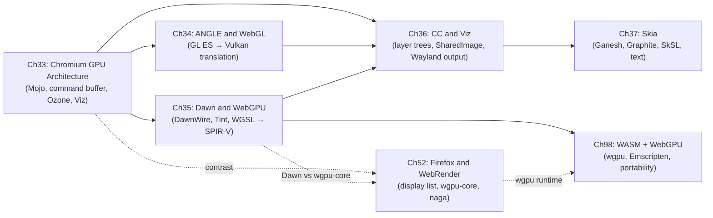

# Part X — The Browser Rendering Stack

The layers examined in Parts I–IX — **DRM**, **KMS**, **GEM**, **Mesa**, **Vulkan**, **Wayland**, and the display compositor — form the foundation on which web browsers must build. A browser tab is not a native application; it executes untrusted, sandboxed code that cannot directly open **`/dev/dri/renderD128`**, call **`vkCreateDevice`**, or issue **Wayland** protocol messages. This part explains how Chromium and Firefox solve that problem: how they isolate GPU access behind process boundaries, translate legacy **OpenGL ES** and modern **WebGPU** APIs across those boundaries, rasterise and composite every pixel of web content, and ultimately deliver frames to the **Wayland** compositor through the same **DMA-BUF** and **linux-dmabuf-unstable-v1** mechanisms the rest of the graphics stack uses. This layer exists because the web's security model and cross-platform portability requirements impose constraints that make direct driver access impossible, and because the scale of a full browser — millions of concurrent DOM nodes, CSS animations, video frames, canvas workloads, and WebGPU compute shaders — demands a rendering architecture qualitatively different from any native application.

## Chapters in This Part

**Chapter 33 — Chromium's Multi-Process GPU Architecture** establishes the architectural foundation for all subsequent Chromium chapters. It explains how Chrome separates rendering into a sandboxed **renderer process** (running **Blink**), a privileged **GPU process** (holding all hardware contexts), and a **browser process** (owning **DRM** device nodes and the **Wayland** connection). Readers learn how the **Mojo** IPC framework and the **GPU command buffer** ring-buffer protocol ferry serialised GPU commands across process boundaries, how the **Ozone** platform abstraction decouples Chrome from specific display backends, and how the **`seccomp-BPF`** sandbox enforces the renderer's isolation. The chapter also introduces **Viz** — the **`viz::DisplayCompositor`** running inside the GPU process — and the **OOP-D** (Out-of-Process Display Compositor) architecture that underpins the rest of the part.

**Chapter 34 — ANGLE and WebGL** traces the path from a JavaScript **WebGL** call to a **Mesa** Vulkan driver. **ANGLE** (Almost Native Graphics Layer Engine) is Chrome's own **OpenGL ES** implementation, used instead of the system **Mesa** GL driver to guarantee conformance and insulate the browser from distribution-level driver variation. The chapter examines ANGLE's two-level object model (**`egl::Display`**/**`rx::DisplayVk`**, **`egl::Context`**/**`rx::ContextVk`**), the translation of **OpenGL ES** stateful rendering into **Vulkan** pipeline objects via **`GraphicsPipelineDesc`**, the three-stage **GLSL ES** to **SPIR-V** shader translation pipeline, zero-copy **DMA-BUF** surface sharing, and the synchronisation machinery that preserves OpenGL's implicit ordering in an explicit **Vulkan** model.

**Chapter 35 — Dawn and WebGPU** covers Chrome's implementation of the **WebGPU** API. Unlike **WebGL**, **WebGPU** was designed to mirror explicit GPU APIs from the start; **Dawn** exposes that model through the **`webgpu.h`** C surface, a layered architecture of **`dawn_native`** (validation and backends), **`dawn_wire`** (IPC serialisation), and the **Tint** **WGSL**-to-**SPIR-V** compiler. Readers learn how **`DawnWire`** serialises **WebGPU** commands over a **Mojo** **`DataPipe`**, how **`DeviceVk`** manages **`VkDevice`** creation, timeline semaphore synchronisation, and **VMA** memory allocation, and how **WebGPU** canvas frames are shared with **Viz** as **`gpu::SharedImage`** objects backed by **`VkImage`** with **`VK_EXTERNAL_MEMORY_HANDLE_TYPE_DMA_BUF_BIT_EXT`**.

**Chapter 36 — The Chromium Compositor: CC and Viz** explains the two-stage compositing architecture that separates *what to draw* (managed by **CC** in each renderer process) from *how to display it* (managed by **Viz** in the GPU process). The chapter covers the **`cc::Layer`** tree and **property trees** (**`cc::TransformTree`**, **`cc::EffectTree`**), tile rasterisation via **OOP-R** using **Skia Ganesh** or **Skia Graphite**, cross-process GPU texture sharing via **`gpu::SharedImage`** and **`gpu::Mailbox`**, **`viz::SurfaceAggregator`** frame aggregation, and final presentation to **Wayland** via **`zwp_linux_dmabuf_v1`**, **`wl_surface::commit`**, and hardware overlay promotion through **`viz::OverlayProcessor`**.

**Chapter 37 — Skia: 2D Rendering at Browser Scale** covers the 2D rasterisation library that underpins Chrome's tile rasterisation, compositor drawing, HTML **`<canvas>`**, CSS filters, and text rendering. It examines the mature **Ganesh** backend (**`GrDirectContext`**, **`GrResourceCache`**, **`GrOpsTask`**) and the next-generation **Graphite** backend (**`skgpu::graphite::Recorder`**, **`TaskGraph`**, **`DrawPass`**), the six-stage text pipeline from **Fontconfig** through **HarfBuzz**, **FreeType**, and **`GrAtlasManager`**, the **SkImageFilter** DAG for CSS effects, and **SkSL** — Skia's own shading language — which is compiled at runtime to **GLSL ES**, **SPIR-V**, or **WGSL** depending on the active backend.

**Chapter 52 — Firefox and WebRender** provides an architecturally contrasting view. Where Chrome tile-rasterises with **Skia** and composites separately, Firefox's **WebRender** collapses the paint/composite boundary entirely: the page is submitted as a high-level **display list** that is compiled each frame into batched **`glDrawArraysInstanced`** calls, much like a game scene. Readers see the **`gfx/wr/`** Cargo workspace, the **`BuiltDisplayList`** **IPC** wire format, **`RenderTaskGraph`** construction, **PictureCache** tile invalidation, **Wayland** native-layer compositing via **`NativeLayerWayland`** and **`zwp_linux_dmabuf_v1`**, and Gecko's **WebGPU** implementation built on **`wgpu-core`** and the **naga** shader compiler rather than Chrome's **Dawn**.

**Chapter 146 — WebCodecs and Browser Hardware Acceleration** explains how the **WebCodecs API** (`VideoEncoder`, `VideoDecoder`, `VideoFrame`) exposes hardware-accelerated codec access to JavaScript without going through a full media pipeline. The chapter covers the Chrome implementation's path from `VideoFrame` GPU texture through `VideoDecoderCore` → `MojoVideoDecoder` → `VideoDecoderMixin` → **VA-API** or **Vulkan Video** decode; zero-copy `VideoFrame` export as a `GPUTexture` via `importExternalTexture`; the Firefox **MediaDataDecoder** equivalent; and the Wasm binding layer (`libwebcodecs`, `wasm-bindgen`). It also covers `AudioDecoder`/`AudioEncoder` PCM paths, the `EncodedVideoChunk` container model, and real-world use cases including WebRTC pre-processing, in-browser transcoding, and ML model inference on decoded frames.

**Chapter 147 — Chrome and Firefox Hardware Video Decode via VA-API** provides a deep dive into how both browsers negotiate hardware decode at the OS level. The chapter traces Chrome's `VaapiVideoDecodeAccelerator` → `vaapi_utils` → `libva` → **Mesa radeonsi/iris** VA driver path, the `--enable-features=VaapiVideoDecoder` flag history and the 2022 enablement decision, GPU sandbox considerations (the GPU process must hold the `renderD` open FD), the Firefox equivalent through **ffmpeg** `hwaccel=vaapi` and the Gecko `PDMFactory` → `FFVPX` → `VA-API` chain, and differences in how Chromium and Gecko handle `VASurface`-to-`EGLImage` import for rendering decoded frames without a CPU round-trip.

**Chapter 168 — WebNN: The Web Neural Network API** covers the W3C Machine Learning Working Group's WebNN specification and its implementation status as of 2026. It documents the full API surface: `navigator.ml.createContext()`, `MLGraphBuilder` operator graph (conv2d, matmul, gemm, relu, softmax), `MLTensor` buffer management, and the `dispatch()` execution path. The chapter traces the Chromium implementation: `services/webnn/` browser-process backend, XNNPACK CPU path (the only active path on Linux — there is no GPU-accelerated WebNN backend via Dawn on Linux), and the origin trial status (Chrome 146). Firefox's `rustnn` proof-of-concept is documented with its content-process isolation limitation. The chapter explains the NPU backend landscape (Intel OpenVINO, Qualcomm HTP, AMD XDNA) and why the `deviceType` option was removed from the spec in September 2024.

**Chapter 98 — WebAssembly and WebGPU as a Deployment Target** closes the part by stepping outside the browser's internal implementation and examining the stack from an application developer's perspective. It covers how Rust code using **wgpu** or C++ code using **Emscripten** and **emdawnwebgpu** can compile to a **WebAssembly** module that dispatches to the browser's **WebGPU** implementation, which itself maps to **Mesa** Vulkan drivers on Linux. The chapter addresses **`wasm-bindgen`** JavaScript interop, **WGSL** shader portability, **WASM SIMD** for CPU-side computation, and real-world use cases ranging from ML inference to portable game engines like **Bevy** and **Godot 4**.

## Servo: Mozilla's Parallel Browser Engine

**Servo** is Mozilla's experimental browser engine written entirely in Rust — architecturally distinct from Firefox's **Gecko** engine, though they share some components. Servo is not a new version of Firefox; it is a parallel research and production engine exploring what a memory-safe, parallelised browser engine looks like at the architecture level.

Key components of the Servo stack relevant to this book's scope:

**CSS layout and styling (Stylo):** Servo developed **Stylo**, a parallel CSS style system written in Rust that performs style resolution across DOM nodes concurrently using Rayon work-stealing. Stylo was upstreamed into Gecko in Firefox 57 (Quantum), meaning Servo's CSS engine already ships in Firefox. Servo's own layout engine (currently in active development as of 2026) provides block layout, flexbox, and the emerging CSS grid implementation.

**WebRender compositor:** Servo uses **WebRender** for compositing — the same scene-graph-based GPU compositor that Chapter 52 covers as Firefox's primary compositor since Firefox 67. In Servo, WebRender is instantiated via the **Servo embedder API** rather than the Firefox frontend. This means Servo shares the display-list-to-GPU rendering path, the `wgpu`-backed WebGPU implementation, and the `naga` shader compiler with Firefox, while differing in the HTML parsing, layout, and DOM layers above them.

**WebGPU via wgpu:** Servo's WebGPU implementation is built on **`wgpu-core`** — the same Rust crate that underlies Firefox's WebGPU (Chapter 52). On Linux, `wgpu-core` targets the Vulkan backend via `wgpu-hal`, dispatching through Mesa Vulkan drivers (RADV, ANV, NVK). The shader compiler is **naga**, Servo/Firefox's pure-Rust WGSL/GLSL/SPIR-V translation library — the Rust counterpart to Chrome's **Tint** (Chapter 35).

**Servo Embedder API:** Servo exposes an **Embedder API** (`servo::Servo<Window>`) that allows applications to embed the engine without the full browser chrome, similar to CEF (Chromium Embedded Framework). This API is used by projects embedding Servo in kiosks, HMDs, and experimental platforms. The Linux embedding path uses Winit (cross-platform window abstraction) with the Wayland backend for surface management.

**Current status (2026):** Servo development was transferred to the **Linux Foundation** (via the Joint Development Foundation) in 2023, with active development continuing independently of Mozilla. As of mid-2026, Servo implements a substantial portion of CSS2.1 and CSS3 and is capable of rendering real-world web pages. It is not a drop-in Firefox replacement but is significant as the only production-quality browser engine component entirely written in memory-safe Rust — and as the proving ground for the `wgpu`/`naga`/WebRender stack that Firefox now uses in production.

**Relevance to this part:** Servo is not covered as a dedicated chapter because its Linux GPU pipeline (Wayland surface → WebRender display list → wgpu Vulkan → Mesa RADV/ANV) is effectively the same as Firefox's pipeline (Chapter 52). The architectural contrast between Servo's full-Rust approach and Chrome's C++ + Mojo IPC approach illuminates the design-space of browser GPU architectures.

## How the Chapters Interrelate

Chapter 33 is the mandatory entry point for the Chromium chapters. It defines the vocabulary — **GPU process**, **Mojo**, **GPU command buffer**, **Ozone**, **Viz**, **`seccomp-BPF`** sandbox — that every subsequent chapter assumes. Readers who skip it will find Chapters 34–37 opaque.

Chapters 34 and 35 build directly on Chapter 33's IPC architecture but are largely independent of each other: **ANGLE** (Ch34) handles **WebGL** and sits on the **passthrough command decoder** path, while **Dawn** (Ch35) handles **WebGPU** and uses the **DawnWire** serialisation path. Both ultimately submit **Vulkan** commands to **Mesa** Vulkan drivers. Readers interested primarily in **WebGL** can read 33 → 34; readers focused on **WebGPU** can read 33 → 35.

Chapter 36 draws on all three preceding chapters. **CC** uses **`gpu::SharedImage`** textures that are backed by **ANGLE** (Ch34) or **Dawn** (Ch35) contexts; **Viz** aggregates frames and presents them via the **Ozone/Wayland** backend described in the same chapter. **Skia** (Ch37) is the rasterisation engine invoked by **OOP-R** (introduced in Ch36), so Chapter 37 is best read after Chapter 36 to understand which **Skia** callers exist and why. The **`viz::SkiaRenderer`**, **`cc::RasterSource`**, and **`CanvasRenderingContext2D`** callers each make sense only in the context established by Chapter 36.

Chapter 52 (Firefox/WebRender) is deliberately placed after the Chromium arc (Ch33–37) so that readers can appreciate the architectural contrast. It references the Chromium design explicitly in its opening section, and readers who have worked through Chapters 33–37 will recognise the tradeoffs being made in WebRender's design. Chapter 52 also introduces **`wgpu-core`** and **naga**, which are the Rust counterparts to **Dawn** and **Tint**; reading Chapter 35 first sharpens the comparison.

Chapter 98 is the part's capstone. It presupposes understanding of **WebGPU** (Ch35), the concept of the browser GPU sandbox (Ch33), and the **Mesa** Vulkan backend (covered in Parts III–V). It ties the browser stack back to native Linux development, showing how the same GPU hardware and the same **Mesa** drivers underlie both a native **wgpu** binary and an in-browser **WebAssembly** deployment. The chapter also connects forward to the portability themes revisited in Parts XVI–XVIII.

Across all seven chapters, three technical threads recur. First, **DMA-BUF** and **`zwp_linux_dmabuf_v1`** appear in every chapter as the mechanism for zero-copy buffer sharing across process boundaries and API contexts. Second, **explicit synchronisation** — **`VkSemaphore`**, timeline semaphores, sync FDs, **`VK_KHR_external_semaphore_fd`** — is the solution every chapter reaches for when crossing process or API boundaries. Third, the **Mesa** Vulkan driver stack (**RADV**, **ANV**, **NVK**) is the common destination that all of Chrome's and Firefox's API translation layers ultimately target.

## Prerequisites and What Comes Next

Readers should be comfortable with the **DRM**/**KMS** subsystem (Part I), **GEM** buffer management and **DMA-BUF** (Parts I–II), the **Mesa** Vulkan driver architecture (Parts III–V), and **Wayland** compositor protocols including **`zwp_linux_dmabuf_v1`** and **`wp_presentation`** (Part VII). Familiarity with **Vulkan** fundamentals — **`VkDevice`**, **`VkCommandBuffer`**, pipeline objects, descriptor sets, and synchronisation primitives — is assumed throughout. Part X builds directly on Part IX (the Wayland compositor stack), and its output layer — frames submitted to the Wayland compositor — is the same surface Part IX describes from the compositor side. Parts XVI–XVIII (Intel stack, AMD ecosystem, and rendering abstractions) revisit the **Mesa** driver paths that **ANGLE**, **Dawn**, and **wgpu** traverse on their way to the hardware, and Part IX's coverage of explicit GPU synchronisation protocols underlies the fence-passing machinery examined in Chapters 34–36.

---
