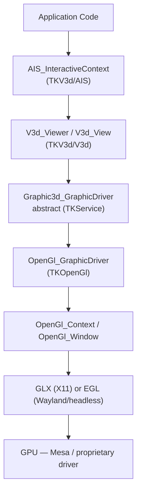
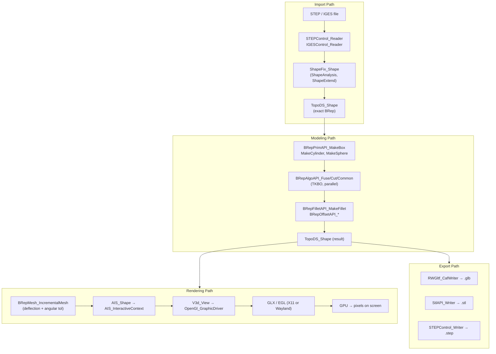

# Chapter 176: OpenCASCADE Technology — The BRep Kernel and 3D Visualization Stack

**Target audiences:** Graphics application developers building CAD/CAE tools on Linux; systems developers integrating 3D geometry processing into applications; engineers working with FreeCAD internals or STEP/IGES data pipelines.

---

## Table of Contents

1. [Why OCCT Matters for the Linux Graphics Stack](#1-why-occt-matters-for-the-linux-graphics-stack)
2. [Architecture: Six Modules](#2-architecture-six-modules)
3. [Topology and Geometry: The BRep Model](#3-topology-and-geometry-the-brep-model)
   - 3.1 [Topology vs. Geometry — The Core Distinction](#31-topology-vs-geometry--the-core-distinction)
   - 3.2 [TopoDS_Shape and the Shape Hierarchy](#32-topods_shape-and-the-shape-hierarchy)
   - 3.3 [BRep_Builder: Attaching Geometry to Topology](#33-brep_builder-attaching-geometry-to-topology)
   - 3.4 [BRepBuilderAPI: Higher-Level Construction](#34-brepbuilderapi-higher-level-construction)
4. [Modeling Algorithms](#4-modeling-algorithms)
   - 4.1 [Boolean Operations (CSG)](#41-boolean-operations-csg)
   - 4.2 [Primitives: BRepPrimAPI](#42-primitives-breppprimapi)
   - 4.3 [Fillets, Chamfers, and Offsets](#43-fillets-chamfers-and-offsets)
   - 4.4 [Mesh Generation: BRepMesh](#44-mesh-generation-brepmesh)
5. [Visualization: V3d, AIS, and the OpenGL Driver](#5-visualization-v3d-ais-and-the-opengl-driver)
   - 5.1 [Stack Overview](#51-stack-overview)
   - 5.2 [V3d_Viewer and V3d_View](#52-v3d_viewer-and-v3d_view)
   - 5.3 [AIS_InteractiveContext and AIS_Shape](#53-ais_interactivecontext-and-ais_shape)
   - 5.4 [OpenGl_GraphicDriver: X11/GLX and EGL/Wayland](#54-opengl_graphicdriver-x11glx-and-eglwayland)
   - 5.5 [Shader-Based Rendering and PBR](#55-shader-based-rendering-and-pbr)
   - 5.6 [Selection and BVH Picking](#56-selection-and-bvh-picking)
   - 5.7 [Vulkan: Current Status](#57-vulkan-current-status)
6. [Data Exchange](#6-data-exchange)
   - 6.1 [STEP](#61-step)
   - 6.2 [IGES and STL](#62-iges-and-stl)
   - 6.3 [glTF 2.0](#63-gltf-20)
   - 6.4 [OBJ and PLY](#64-obj-and-ply)
   - 6.5 [XDE: Extended Data Framework](#65-xde-extended-data-framework)
7. [OCAF: The Application Framework](#7-ocaf-the-application-framework)
8. [FreeCAD: OCCT as a CAD Kernel](#8-freecad-occt-as-a-cad-kernel)
9. [Building and Packaging on Linux](#9-building-and-packaging-on-linux)
   - 9.1 [CMake Build](#91-cmake-build)
   - 9.2 [Distribution Packages](#92-distribution-packages)
   - 9.3 [Linking](#93-linking)
10. [Pipeline Comparison Diagram](#10-pipeline-comparison-diagram)
- [GPU-Accelerated Shape Analysis](#gpu-accelerated-shape-analysis)
11. [Integrations](#11-integrations)

---

## 1. Why OCCT Matters for the Linux Graphics Stack

OpenCASCADE Technology (OCCT) is the open-source C++ framework that powers most serious Linux CAD applications. FreeCAD, Salome, Code_Aster pre-processor, and dozens of smaller engineering tools all rely on it as their geometric kernel. Understanding OCCT is essential for anyone writing a 3D engineering application, importing STEP/IGES geometry into a graphics pipeline, or studying how CAD-grade precision intersects with GPU rendering.

OCCT is not a game engine. Its design goals differ sharply from Vulkan-oriented renderers like Bevy (Ch40), Godot (Ch41), or Unreal Engine (Ch97):

- **Exact geometry matters.** OCCT stores shapes as mathematical B-spline curves and NURBS surfaces — not as triangles. Triangulation (meshing) is a separate, optional step taken only for rendering or export.
- **Topology matters.** A solid in OCCT is a directed graph of faces, edges, and vertices carrying adjacency and orientation. Boolean operations (union, intersection, cut) operate on this graph, not on triangle soups.
- **Data exchange matters.** Engineering CAD formats — STEP, IGES — encode the full BRep graph with tolerances. Importing them faithfully requires the full OCCT stack.

The current stable release is **OCCT 8.0.0p1** (released 17 June 2026), which moved from C++11/14 to a mandatory **C++17** baseline and reorganised the source tree into six clearly delimited module directories. [Source: [OCCT 8.0.0 Release](https://github.com/Open-Cascade-SAS/OCCT/releases/tag/V8_0_0); `adm/cmake/version.cmake` sets `OCC_VERSION_MAJOR=8`]

The rendering backend remains **OpenGL 3.2+ core profile** (`TKOpenGl`). A Vulkan prototype exists (tracker issue #30631) but has not merged into mainline as of 8.0.0p1.

---

## 2. Architecture: Six Modules

OCCT 8.0.0 reorganised its historically flat `src/` layout into six module directories. Each module maps to one or more CMake `BUILD_MODULE_*` flags and a set of toolkit libraries (`TK*`).

```
src/
  FoundationClasses/   # TKernel, TKMath
  ModelingData/        # TKBRep, TKG2d, TKG3d, TKGeomBase
  ModelingAlgorithms/  # TKBO, TKFillet, TKPrim, TKOffset, TKMesh, TKTopAlgo, ...
  Visualization/       # TKOpenGl, TKOpenGles, TKV3d, TKService
  DataExchange/        # TKDESTEP, TKDEIGES, TKDEGLTF, TKDEOBJ, TKDESTL, ...
  ApplicationFramework/ # TKCAF, TKLCAF, TKXCAF, TKBin, TKXml, ...
```

**Foundation Classes** (`TKernel`, `TKMath`) provide the runtime: `Standard_Transient` (OCCT's reference-counted base class — the equivalent of a smart pointer base), `Handle<T>` (intrusive reference count, analogous to `std::shared_ptr` but with less overhead), `NCollection_List`/`NCollection_Map`/`NCollection_Array1` (generic containers), `OSD` (OS abstraction: files, signals, threads), `Message` (progress indication, warnings, errors), and `gp` — the geometric primitives package containing `gp_Pnt`, `gp_Vec`, `gp_Dir`, `gp_Ax1`, `gp_Ax2`, `gp_Trsf` (transformation), `gp_Lin`, `gp_Pln`, `gp_Circ`. [Source: `src/FoundationClasses/TKernel/Standard/Standard_Transient.hxx`; `src/FoundationClasses/TKMath/gp/gp_Pnt.hxx`]

**Modeling Data** provides the BRep data structures and the mathematical description of curves and surfaces. `TKBRep` contains `TopoDS`, `BRep`, `BRepAdaptor`, `BRepTools`; `TKG3d` contains `Geom` (3D curves and surfaces); `TKG2d` contains `Geom2d` (2D curves in parametric space of a surface).

**Modeling Algorithms** is the largest module. The key toolkits:
- `TKBO` — Boolean operations (`BRepAlgoAPI_Fuse`, `BRepAlgoAPI_Cut`, `BRepAlgoAPI_Common`)
- `TKPrim` — solid primitives (`BRepPrimAPI_MakeBox`, `MakeCylinder`, `MakeSphere`)
- `TKFillet` — edge filleting and chamfering (`BRepFilletAPI_MakeFillet`)
- `TKOffset` — offset surfaces, thick solids, pipe sweeps (`BRepOffsetAPI_*`)
- `TKMesh` — triangulation (`BRepMesh_IncrementalMesh`)
- `TKShHealing` — shape healing (`ShapeFix`, `ShapeAnalysis`) — critical for imported geometry

**Visualization** is covered in detail in §5. **Data Exchange** in §6. **Application Framework** in §7.

---

## 3. Topology and Geometry: The BRep Model

### 3.1 Topology vs. Geometry — The Core Distinction

OCCT rigorously separates two concerns that triangle-based engines conflate:

**Topology** describes *how* shapes connect and contain each other — with no coordinate information. A face bounds a shell; a wire bounds a face; an edge bounds a wire; a vertex terminates an edge. These relationships and their orientations are topology.

**Geometry** describes *where* shapes are — the actual mathematical objects. A face carries a `Geom_Surface`; an edge carries a `Geom_Curve`; a vertex carries a `gp_Pnt`.

The **BRep** (Boundary Representation) bridge layer (`TKBRep`) stores geometry on topological shapes:
- `BRep_TFace` stores a `Handle<Geom_Surface>` plus the face's U/V parameter range
- `BRep_TEdge` stores a `Handle<Geom_Curve>` (3D curve) plus per-face `Handle<Geom2d_Curve>` pcurves (parameter-space curves)
- `BRep_TVertex` stores a `gp_Pnt` and a tolerance

Tolerances are a first-class concept. Every vertex, edge, and face carries a tolerance value in millimetres, and OCCT enforces the invariant: `Tol(Vertex) >= Tol(Edge) >= Tol(Face)`. When importing from IGES or STEP, healing algorithms (`ShapeFix`) re-establish this invariant for geometry that violates it.

### 3.2 TopoDS_Shape and the Shape Hierarchy

`TopoDS_Shape` is the universal handle for any topological entity. [Source: `src/ModelingData/TKBRep/TopoDS/TopoDS_Shape.hxx`]

```cpp
class TopoDS_Shape
{
public:
  bool IsNull() const;
  TopAbs_ShapeEnum ShapeType() const;  // returns shape type from TShape
  const TopLoc_Location& Location() const;
  void Location(const TopLoc_Location& theLoc, const bool theRaiseExc = false);
  TopAbs_Orientation Orientation() const;

  bool IsPartner(const TopoDS_Shape&) const; // same TShape, any loc/orient
  bool IsSame(const TopoDS_Shape&)   const; // same TShape + same location
  bool IsEqual(const TopoDS_Shape&)  const; // same TShape + loc + orientation

  TopoDS_Shape Located(const TopLoc_Location&) const;  // new instance
  TopoDS_Shape Reversed() const;

private:
  Handle<TopoDS_TShape>  myTShape;   // ref-counted immutable geometry/topo data
  TopLoc_Location        myLocation; // placement (a product of gp_Trsf)
  TopAbs_Orientation     myOrient;   // FORWARD / REVERSED / INTERNAL / EXTERNAL
};
```

The `myTShape` pointer is **shared across all instances that are partners**. Copying a `TopoDS_Shape` is cheap: it increments the `TShape` reference count and copies two small stack objects. Placing the same face in two different positions (for assembly) simply gives two `TopoDS_Face` objects with the same `myTShape` but different `myLocation`.

The shape type enum `TopAbs_ShapeEnum` defines the partial order of shape types:

```
COMPOUND > COMPSOLID > SOLID > SHELL > FACE > WIRE > EDGE > VERTEX > SHAPE
```

Each type has a corresponding `TopoDS` subclass: `TopoDS_Vertex`, `TopoDS_Edge`, `TopoDS_Wire`, `TopoDS_Face`, `TopoDS_Shell`, `TopoDS_Solid`, `TopoDS_CompSolid`, `TopoDS_Compound`. These are type-safe casts — the same data as `TopoDS_Shape` with downcast protection via `TopAbs_ShapeEnum` checks.

**Traversal:** For direct children, `TopoDS_Iterator` iterates over a shape's sub-shapes. For recursive traversal filtered by type (e.g., all faces in a compound), `TopExp_Explorer` does a depth-first walk:

```cpp
// Collect all faces from a compound or solid
TopExp_Explorer ex(myShape, TopAbs_FACE);
for (; ex.More(); ex.Next()) {
    const TopoDS_Face& face = TopoDS::Face(ex.Current());
    // process face ...
}
```

For retrieving all edges or vertices from a compound along with their containing parents: `TopExp::MapShapesAndAncestors(shape, subType, parentType, map)`.

### 3.3 BRep_Builder: Attaching Geometry to Topology

`BRep_Builder` inherits from `TopoDS_Builder` (which creates empty topological shapes and adds sub-shapes) and adds methods to attach geometry and tolerances. [Source: `src/ModelingData/TKBRep/BRep/BRep_Builder.hxx`]

```cpp
class BRep_Builder : public TopoDS_Builder {
public:
  // Create a face from a surface + tolerance
  void MakeFace(TopoDS_Face& F,
                const Handle<Geom_Surface>& S,
                const double Tol) const;

  // Planar face convenience constructor
  void MakeFace(TopoDS_Face& F,
                const Handle<Geom_Surface>& S,
                const gp_Pln& P,
                const double Tol) const;

  // Attach 3D curve to edge
  void UpdateEdge(const TopoDS_Edge& E,
                  const Handle<Geom_Curve>& C,
                  const double Tol) const;

  // Attach 2D parameter-space curve (pcurve) to edge on a face
  void UpdateEdge(const TopoDS_Edge& E,
                  const Handle<Geom2d_Curve>& C,
                  const TopoDS_Face& F,
                  const double Tol) const;

  // Vertex from 3D point + tolerance
  void MakeVertex(TopoDS_Vertex& V,
                  const gp_Pnt& P,
                  const double Tol) const;

  // Attach triangulation to face (for rendering only)
  void MakeFace(TopoDS_Face& theFace,
                const Handle<Poly_Triangulation>& theTriangulation) const;
};
```

`BRep_Builder` is the low-level primitive for constructing BRep shapes from scratch — used internally by `BRepBuilderAPI_*` and by importers. Application code rarely calls it directly.

### 3.4 BRepBuilderAPI: Higher-Level Construction

The `BRepBuilderAPI` package provides checked, error-reporting wrappers. All derive from `BRepBuilderAPI_MakeShape`:

- **`BRepBuilderAPI_MakeEdge`** — from two vertices, a curve and parameter range, a line, a circle, etc.
- **`BRepBuilderAPI_MakeFace`** — from a surface + outer wire, or from a planar wire directly
- **`BRepBuilderAPI_MakeWire`** — from ordered edges with automatic gap stitching
- **`BRepBuilderAPI_MakeSolid`** — from one or more shells
- **`BRepBuilderAPI_Sewing`** — knits open shells by identifying and merging free edges within a tolerance

Error checking follows a consistent pattern: after calling `Build()` (or the converting constructor), call `IsDone()` / `Error()` to inspect the result. The builder also tracks shape history (`Modified()`, `Generated()`, `IsDeleted()`) — essential for parametric modelling where downstream operations must track sub-shapes through upstream changes.

---

## 4. Modeling Algorithms

### 4.1 Boolean Operations (CSG)

The Boolean operation framework lives in toolkit `TKBO`, package `BRepAlgoAPI`. [Source: `src/ModelingAlgorithms/TKBO/BRepAlgoAPI/BRepAlgoAPI_BooleanOperation.hxx`]

OCCT's Boolean engine accepts *lists* of shapes for both arguments and tools, enabling multi-body operations in a single pass:

```cpp
#include <BRepAlgoAPI_Fuse.hxx>
#include <NCollection_List.hxx>

BRepAlgoAPI_Fuse aFuse;

NCollection_List<TopoDS_Shape> aArgs, aTools;
aArgs.Append(boxShape);
aTools.Append(cylinderShape);
aTools.Append(sphereShape);

aFuse.SetArguments(aArgs);
aFuse.SetTools(aTools);
aFuse.SetRunParallel(true);   // use OCCT's internal thread pool

aFuse.Build();
if (!aFuse.IsDone()) {
    aFuse.DumpErrors(std::cerr);
    return;
}
TopoDS_Shape result = aFuse.Shape();
```

The three main derived classes are `BRepAlgoAPI_Fuse` (union), `BRepAlgoAPI_Cut` (subtraction), and `BRepAlgoAPI_Common` (intersection). `BRepAlgoAPI_Section` computes the intersection wire/edges. `BRepAlgoAPI_Splitter` splits one set of shapes by another without discarding any material.

**Parallel execution.** `BOPAlgo_Options` (the base of all `BOPAlgo_*` algorithms) provides two levels of parallelism control:

```cpp
// Per-instance: run this operation with internal thread pool
algo.SetRunParallel(true);

// Global: all subsequent BOPAlgo operations use parallel mode
BOPAlgo_Options::SetParallelMode(true);
```

Internally OCCT uses its own `OSD_ThreadPool` (not OpenMP, though `USE_OPENMP=ON` at cmake time enables an OpenMP backend for `BRepMesh`). The thread pool size defaults to the number of logical processors. [Source: `src/FoundationClasses/TKernel/OSD/OSD_ThreadPool.hxx`]

**Shape history** is maintained after Boolean ops: `aFuse.Modified(originalFace)` returns the face(s) in the result that correspond to `originalFace` from an argument. This is used by parametric modelling tools to re-attach fillets, chamfers, or named features after re-execution.

### 4.2 Primitives: BRepPrimAPI

Toolkit `TKPrim`, package `BRepPrimAPI`, provides solid primitives as immediate one-liner constructions. [Source: `src/ModelingAlgorithms/TKPrim/BRepPrimAPI/BRepPrimAPI_MakeBox.hxx`]

```cpp
// Box: corner at origin, dimensions dx × dy × dz
BRepPrimAPI_MakeBox box(100.0, 50.0, 30.0);
TopoDS_Solid solid = box.Solid();

// Box with explicit corner point
BRepPrimAPI_MakeBox box2(gp_Pnt(10, 10, 0), 80.0, 40.0, 25.0);

// Box aligned to a custom axis system
BRepPrimAPI_MakeBox box3(gp_Ax2(gp_Pnt(0,0,0), gp_Dir(0,0,1)), 50, 50, 50);

// Individual faces accessible
TopoDS_Face top   = box.TopFace();
TopoDS_Face bot   = box.BottomFace();
TopoDS_Face front = box.FrontFace();

// Sphere
BRepPrimAPI_MakeSphere sphere(gp_Pnt(0,0,0), 25.0);  // centre + radius

// Partial sphere (wedge in longitude): 120° sector
BRepPrimAPI_MakeSphere partialSphere(25.0, 2.0 * M_PI / 3.0);

// Cylinder: radius 10, height 40
BRepPrimAPI_MakeCylinder cyl(10.0, 40.0);

// Cone: bottom radius 15, top radius 5, height 30
BRepPrimAPI_MakeCone cone(15.0, 5.0, 30.0);
```

For sweeps: `BRepPrimAPI_MakePrism(profile, direction)` extrudes a wire/face linearly; `BRepPrimAPI_MakeRevol(profile, axis, angle)` revolves it.

### 4.3 Fillets, Chamfers, and Offsets

Toolkit `TKFillet`, `BRepFilletAPI_MakeFillet` rounds sharp edges with a constant or variable radius. [Source: `src/ModelingAlgorithms/TKFillet/BRepFilletAPI/BRepFilletAPI_MakeFillet.hxx`]

```cpp
BRepAlgoAPI_Fuse fuse(boxShape, cylinderShape);
TopoDS_Shape merged = fuse.Shape();

// Fillet all edges in the fused result
BRepFilletAPI_MakeFillet fillet(merged);

// Collect all edges
TopExp_Explorer edgeEx(merged, TopAbs_EDGE);
for (; edgeEx.More(); edgeEx.Next()) {
    fillet.Add(3.0, TopoDS::Edge(edgeEx.Current()));  // 3mm radius
}

fillet.Build();
TopoDS_Shape rounded = fillet.Shape();
```

Variable-radius fillets are supported by passing two radii (`Add(R1, R2, edge)`) or a `Law_Function` for a continuously varying profile. `BRepFilletAPI_MakeChamfer` follows the same API for chamfers instead of rounds.

Offset operations in toolkit `TKOffset`:

```cpp
// Hollow solid: remove a face, offset the remaining shell inward by 2mm
Handle<TopTools_ListOfShape> facesToRemove = new TopTools_ListOfShape();
facesToRemove->Append(topFace);

BRepOffsetAPI_MakeThickSolid thickener;
thickener.MakeThickSolidByJoin(solid, *facesToRemove, -2.0, 1e-3);
thickener.Build();
TopoDS_Shape shell = thickener.Shape();

// Pipe sweep: extrude a circular profile along a curved wire spine
BRepOffsetAPI_MakePipe pipe(spineWire, circleProfile);
TopoDS_Shape tube = pipe.Shape();
```

### 4.4 Mesh Generation: BRepMesh

Before OpenGL rendering or STL export, the exact BRep must be triangulated. Toolkit `TKMesh`, class `BRepMesh_IncrementalMesh`. [Source: `src/ModelingAlgorithms/TKMesh/BRepMesh/BRepMesh_IncrementalMesh.hxx`]

```cpp
#include <BRepMesh_IncrementalMesh.hxx>
#include <BRep_Tool.hxx>
#include <Poly_Triangulation.hxx>

// Deflection controls triangle density:
// - Linear deflection: max chord deviation from true surface (mm)
// - Angular deflection: max angle deviation (radians)
BRepMesh_IncrementalMesh mesher(shape, 0.1, false, 0.5);
mesher.Perform();

// Retrieve per-face triangulation
TopExp_Explorer fex(shape, TopAbs_FACE);
for (; fex.More(); fex.Next()) {
    const TopoDS_Face& face = TopoDS::Face(fex.Current());
    TopLoc_Location loc;
    Handle<Poly_Triangulation> tri = BRep_Tool::Triangulation(face, loc);
    if (tri.IsNull()) continue;

    int nNodes = tri->NbNodes();
    int nTris  = tri->NbTriangles();

    // Access node coordinates (1-indexed)
    for (int i = 1; i <= nNodes; i++) {
        gp_Pnt pt = tri->Node(i).Transformed(loc.IsIdentity() ? gp_Trsf() : loc);
        // pt.X(), pt.Y(), pt.Z()
    }

    // Access triangles (1-indexed node indices)
    for (int t = 1; t <= nTris; t++) {
        int n1, n2, n3;
        tri->Triangle(t).Get(n1, n2, n3);
        // vertex indices for GPU upload
    }
}
```

The triangulation is stored on the `TopoDS_Face` as a `Poly_Triangulation` and persists until the shape is destroyed or `BRepTools::Clean(shape)` is called. Calling `BRepMesh_IncrementalMesh` again with a finer deflection replaces it. `USE_OPENMP=ON` at cmake time enables OpenMP parallelism for meshing across faces.

---

## 5. Visualization: V3d, AIS, and the OpenGL Driver

### 5.1 Stack Overview

OCCT's visualization stack is layered as follows:



The `Graphic3d_GraphicDriver` abstract interface decouples the upper layers from the rendering backend. `OpenGl_GraphicDriver` is the only shipped concrete implementation in mainline OCCT 8.0.0. A Direct3D host (`TKD3DHost`, Windows-only) and an OpenGL ES backend (`TKOpenGles`) also exist. The Vulkan backend is a tracker prototype only (§5.7).

### 5.2 V3d_Viewer and V3d_View

`V3d_Viewer` owns the graphical driver and the set of lights and views. [Source: `src/Visualization/TKV3d/V3d/V3d_Viewer.hxx`]

```cpp
#include <V3d_Viewer.hxx>
#include <OpenGl_GraphicDriver.hxx>
#include <Aspect_DisplayConnection.hxx>

// X11 path
Handle<Aspect_DisplayConnection> disp = new Aspect_DisplayConnection();
Handle<OpenGl_GraphicDriver> driver = new OpenGl_GraphicDriver(disp);
Handle<V3d_Viewer> viewer = new V3d_Viewer(driver);

// Default ambient light
viewer->SetDefaultLights();

// Create a view associated with a native window
Handle<V3d_View> view = viewer->CreateView();
view->SetWindow(myAspectWindow);   // Aspect_Window wrapping X Window or EGLSurface
view->SetBackgroundColor(Quantity_NOC_BLACK);
view->SetProj(V3d_XposYposZpos);  // isometric viewpoint
view->FitAll(0.01, false);        // fit all shapes with 1% margin
view->Redraw();
```

Camera control is via `V3d_View`: `Rotate(ax, ay)`, `Pan(dx, dy)`, `Zoom(factor)`, `SetEye(x,y,z)`, `SetAt(x,y,z)`, `SetUp(x,y,z)`. The camera model supports perspective and orthographic projections (`V3d_PERSPECTIVE` / `V3d_ORTHOGRAPHIC`).

### 5.3 AIS_InteractiveContext and AIS_Shape

`AIS_InteractiveContext` is the main application-level interface for displaying and selecting shapes. [Source: `src/Visualization/TKV3d/AIS/AIS_InteractiveContext.hxx`]

```cpp
Handle<AIS_InteractiveContext> ctx = new AIS_InteractiveContext(viewer);

// Display a shape in shaded mode
Handle<AIS_Shape> aisBox = new AIS_Shape(boxShape);
ctx->Display(aisBox, AIS_Shaded, 0, false); // mode=shaded, selmode=0, no update

// Set colour
ctx->SetColor(aisBox, Quantity_NOC_CYAN1, false);
ctx->SetMaterial(aisBox, Graphic3d_NameOfMaterial_Brass, false);
ctx->SetTransparency(aisBox, 0.5, false);

// Force update
ctx->UpdateCurrentViewer();
```

**Selection modes** are integers:
- `0` — whole shape
- `1` — vertex
- `2` — edge
- `4` — face

Activating sub-shape selection:
```cpp
ctx->Activate(aisBox, 4);   // activate face selection
// ...after mouse move event...
ctx->MoveTo(xPix, yPix, view, true);
ctx->Select(true);
for (ctx->InitSelected(); ctx->MoreSelected(); ctx->NextSelected()) {
    Handle<AIS_InteractiveObject> obj = ctx->SelectedInteractive();
    TopoDS_Shape sel = ctx->SelectedShape();  // sub-shape if in face/edge/vertex mode
}
```

`AIS_Shape` automatically uses the `Poly_Triangulation` stored on faces for shaded display. If the shape has not been meshed, OCCT automatically meshes it at a default deflection (controlled by `Prs3d_Drawer`). For display quality control, set the drawer's `DeviationCoefficient` on the `AIS_Shape` before displaying.

The `AIS_InteractiveObject` hierarchy provides specialised interactive objects: `AIS_ColoredShape` (per-sub-shape colours), `AIS_TexturedShape` (texture mapping via `Image_Texture`), `PrsDim_AngleDimension`, `PrsDim_LengthDimension`, `AIS_Plane`, `AIS_Axis`, `AIS_Point`.

### 5.4 OpenGl_GraphicDriver: X11/GLX and EGL/Wayland

`OpenGl_GraphicDriver` is constructed with an `Aspect_DisplayConnection` (wrapping an X11 `Display*`) on Linux. [Source: `src/Visualization/TKOpenGl/OpenGl/OpenGl_GraphicDriver.hxx`]

```cpp
class OpenGl_GraphicDriver : public Graphic3d_GraphicDriver {
public:
  // X11/GLX: theDisp must point to the X server connection
  OpenGl_GraphicDriver(const Handle<Aspect_DisplayConnection>& theDisp,
                       const bool theToInitialize = true);

  // EGL path: call after construction to use an existing EGL context
  // theEglDisplay: EGLDisplay (opaque ptr)
  // theEglContext: EGLContext (opaque ptr)
  // theEglConfig:  EGLConfig  (opaque ptr)
  bool InitEglContext(Aspect_Display          theEglDisplay,
                      Aspect_RenderingContext  theEglContext,
                      void*                   theEglConfig);

  // Access the shared OpenGL context
  const Handle<OpenGl_Context>& GetSharedContext(bool theBound = false) const;

  // VSync
  bool IsVerticalSync() const override;
  void SetVerticalSync(bool theToEnable) override;
};
```

**X11/GLX path:** `Aspect_DisplayConnection` opens an Xlib connection. `Xw_Window` (`src/Visualization/TKService/Xw/Xw_Window.hxx`) wraps an X `Window` handle. `OpenGl_GraphicDriver` uses GLX to create OpenGL contexts and surfaces.

**EGL/Wayland path:** The application creates an EGLDisplay from the Wayland compositor's display, sets up an EGLContext, then passes them to `InitEglContext()`. The `Aspect_NeutralWindow` or a custom `Aspect_Window` subclass wraps a `wl_egl_window`. This is how OCCT integrates into Wayland compositors — the EGL surface is owned externally; OCCT attaches to it without managing the Wayland protocol itself.

**Offscreen rendering (headless):** Pass `EGL_NO_DISPLAY` acquired via `eglGetPlatformDisplay(EGL_PLATFORM_SURFACELESS_MESA, ...)` or use `EGL_EXT_platform_device`. The `Aspect_NeutralWindow` with a zero-sized window handles this. This is how FreeCAD's headless rendering and OCCT-based CI pipelines operate on servers without a display.

The `OpenGl_Context` class (`src/Visualization/TKOpenGl/OpenGl/OpenGl_Context.hxx`) wraps the actual GL context, exposes extension presence flags, and manages state caching for shader programs (`OpenGl_ShaderManager`), textures (`OpenGl_Texture`), and framebuffers (`OpenGl_FrameBuffer`).

### 5.5 Shader-Based Rendering and PBR

Since OCCT 7.4.0, all rendering is shader-based (no fixed-function pipeline). OCCT ships its own GLSL shaders (stored in `src/Visualization/TKOpenGl/OpenGl/Shaders/`):

- `PhongShading.fs` — Blinn-Phong fragment shader (default for `AIS_Shaded`)
- `PBRShading.fs` — PBR metallic/roughness shader (introduced in OCCT 7.5.0)
- `WireframeShading.vs/fs` — wireframe pass
- `ShadowMap.vs/fs` — shadow mapping (soft shadows via PCF)

PBR materials are enabled by setting `Graphic3d_PBRMaterial` on a shape's `Graphic3d_Aspects`:

```cpp
Handle<Graphic3d_Aspects> aspects = new Graphic3d_Aspects();
Graphic3d_PBRMaterial pbr;
pbr.SetMetallic(0.8f);
pbr.SetRoughness(0.2f);
pbr.SetAlbedo(Quantity_Color(0.7, 0.2, 0.1, Quantity_TOC_sRGB));
aspects->SetFrontMaterial(Graphic3d_MaterialAspect(pbr));
aisShape->SetAspects(aspects);
```

Z-layering in `V3d_Viewer` controls rendering order: `Graphic3d_ZLayerId_Default`, `Graphic3d_ZLayerId_Top`, `Graphic3d_ZLayerId_Topmost`. Custom layers can be inserted before or after any existing layer, enabling depth-independent highlighting overlays (e.g., always-on-top wireframe edges).

### 5.6 Selection and BVH Picking

OCCT's selection subsystem uses a BVH (Bounding Volume Hierarchy) for efficient mouse picking. Package `Select3D` and `SelectMgr` in toolkit `TKV3d`. [Source: `src/Visualization/TKV3d/SelectMgr/SelectMgr_ViewerSelector.hxx`]

Each `AIS_InteractiveObject` registers selectable entities (`Select3D_SensitiveFace`, `Select3D_SensitiveEdge`, `Select3D_SensitivePoint`) with the `SelectMgr_SelectionManager`. On `MoveTo(xPix, yPix, view)`, the viewer selector builds or reuses a `BVH_Tree` over all registered entities, transforms the screen pixel to a view frustum, and traverses the BVH for intersection. The closest intersected entity wins.

The BVH package in `TKMath` provides: `BVH_Tree<Standard_Real, 3>` (the data structure), `BVH_BinnedBuilder` (SAH quality builder), `BVH_LinearBuilder` (Morton-code builder for large sets), and `BVH_Traverse` traversal templates. The same BVH infrastructure accelerates Boolean operation intersection tests in `TKBO`.

### 5.7 Vulkan: Current Status

As of OCCT 8.0.0p1 (June 2026), **there is no shipped Vulkan backend**. The toolkit list under `Visualization/` contains `TKOpenGl`, `TKOpenGles`, `TKService`, `TKV3d`, `TKMeshVS`, and `TKD3DHost` — no Vulkan toolkit. A prototype was tracked in OCCT's Mantis tracker as [issue #30631](https://tracker.dev.opencascade.org/view.php?id=30631), titled "Visualization — Vulkan graphic driver prototype", but this has not merged into mainline.

All GPU rendering in OCCT currently goes through `OpenGl_GraphicDriver`, using OpenGL 3.2+ core profile (minimum) up to 4.5 with extensions. Applications that require Vulkan for their own rendering (e.g., using RADV or ANV via Mesa) must handle OCCT geometry on a separate OpenGL context and composite manually, or wait for the Vulkan driver to mature.

---

## 6. Data Exchange

### 6.1 STEP

STEP (ISO 10303) is the primary interchange format for industrial CAD. OCCT's `TKDESTEP` toolkit provides `STEPControl_Reader` and `STEPControl_Writer`. [Source: `src/DataExchange/TKDESTEP/STEPControl/STEPControl_Reader.hxx`]

```cpp
#include <STEPControl_Reader.hxx>
#include <STEPControl_Writer.hxx>

// Reading
STEPControl_Reader reader;
IFSelect_ReturnStatus status = reader.ReadFile("part.step");
if (status != IFSelect_RetDone) {
    std::cerr << "STEP read failed\n";
    return;
}
reader.TransferRoots();    // transfer all root entities
TopoDS_Shape shape = reader.OneShape();  // merged result

// Writing
STEPControl_Writer writer;
writer.Transfer(shape, STEPControl_AsIs);  // preserve original BRep type
writer.Write("output.step");
```

The `STEPControl_StepModelType` enum controls how the shape is written: `STEPControl_AsIs` preserves the BRep type, `STEPControl_ManifoldSolidBrep` forces manifold solid BRep, `STEPControl_FacetedBrep` outputs a faceted (triangulated) solid.

For assemblies with metadata — part names, colours, layers — use `STEPCAFControl_Reader` / `STEPCAFControl_Writer` which populate an XDE `TDocStd_Document`:

```cpp
#include <STEPCAFControl_Reader.hxx>
#include <TDocStd_Document.hxx>
#include <XCAFDoc_DocumentTool.hxx>
#include <XCAFDoc_ShapeTool.hxx>
#include <XCAFDoc_ColorTool.hxx>

Handle<TDocStd_Document> doc = new TDocStd_Document("XmlXCAF");
STEPCAFControl_Reader cafReader;
cafReader.SetColorMode(true);
cafReader.SetNameMode(true);
cafReader.SetLayerMode(true);
cafReader.ReadFile("assembly.step");
cafReader.Transfer(doc);

Handle<XCAFDoc_ShapeTool> shapeTool = XCAFDoc_DocumentTool::ShapeTool(doc->Main());
Handle<XCAFDoc_ColorTool> colorTool = XCAFDoc_DocumentTool::ColorTool(doc->Main());
```

OCCT 8.0.0 delivers a **75% improvement** in STEP read throughput compared to 7.7.x, achieved by parallelising the entity-mapping pass.

### 6.2 IGES and STL

`IGESControl_Reader` / `IGESControl_Writer` (toolkit `TKDEIGES`) mirror the STEP API exactly. IGES (ANSI Y14.26) is an older format with weaker tolerance semantics; imported IGES geometry almost always requires healing via `ShapeFix_Shape`.

```cpp
#include <StlAPI_Writer.hxx>
// Mesh first:
BRepMesh_IncrementalMesh(shape, 0.05);  // 0.05mm deflection
StlAPI_Writer stlWriter;
stlWriter.Write(shape, "output.stl");

// Read STL back as triangulated faces:
#include <StlAPI_Reader.hxx>
TopoDS_Shape stlShape;
StlAPI_Reader().Read(stlShape, "input.stl");
```

STL export always triangulates; a tolerance of 0.01–0.1mm is typical for 3D printing workflows.

### 6.3 glTF 2.0

`RWGltf_CafWriter` / `RWGltf_CafReader` (toolkit `TKDEGLTF`) were introduced in **OCCT 7.5.0** (February 2021). [Source: `src/DataExchange/TKDEGLTF/RWGltf/RWGltf_CafWriter.hxx`]

```cpp
#include <RWGltf_CafWriter.hxx>

// false = text .gltf ; true = binary .glb
RWGltf_CafWriter writer("model.glb", true);

// Coordinate system: OCCT uses Z-up; glTF 2.0 uses Y-up
// Set the converter to flip axes automatically
writer.ChangeCoordinateSystemConverter().SetInputLengthUnit(0.001);  // mm → m
writer.ChangeCoordinateSystemConverter().SetInputCoordSystem(
    RWMesh_CoordinateSystem_Zup);

writer.Perform(doc, Message_ProgressRange());
```

The writer tessellates BRep faces automatically at the deflection set in the document's `Prs3d_Drawer`. OCCT 7.7.0 added Draco mesh compression support for `.glb` output. The glTF writer is particularly useful for exporting CAD models into web viewers or real-time engines.

Reading glTF back into OCCT:

```cpp
#include <RWGltf_CafReader.hxx>

Handle<TDocStd_Document> doc = new TDocStd_Document("XmlXCAF");
RWGltf_CafReader reader;
reader.SetDocument(doc);
reader.SetSystemLengthUnit(0.001);  // convert glTF metres to mm
reader.Perform("scene.glb", Message_ProgressRange());
```

Note: glTF stores triangles only — there is no BRep. The read result is a `TopoDS_Compound` of faces with only `Poly_Triangulation` attached (no `Geom_Surface`). Boolean operations on imported glTF geometry require re-fitting surfaces, which OCCT does not do automatically.

### 6.4 OBJ and PLY

`RWObj_CafReader` (toolkit `TKDEOBJ`, since OCCT 7.4.0) and `RWPly_CafWriter`/`RWPly_CafReader` (toolkit `TKDEPLY`) follow the same `RWMesh_CafReader` pattern. They produce triangulated `TopoDS_Compound` shapes in an XDE document, similar to glTF import.

### 6.5 XDE: Extended Data Framework

XDE (`TKXCAF`) extends OCAF with CAD-specific attributes for assembly management:

- **`XCAFDoc_ShapeTool`** — manages the shape/assembly tree: `IsAssembly(label)`, `IsComponent(label)`, `GetComponents(asmLabel, components)`, `AddShape(shape)`, `GetShape(label)`
- **`XCAFDoc_ColorTool`** — per-shape and per-face colours: `SetColor(label, color, XCAFDoc_ColorGen)`
- **`XCAFDoc_LayerTool`** — layer names and per-shape layer assignments
- **`XCAFDoc_MaterialTool`** — material density and name for FEA pre-processing

XDE labels form a hierarchy: the root at `doc->Main()` contains a shape tool root, under which shapes and assemblies are nested with `TDF_Label` paths like `0:1:1:1`. Assembly references use `TNaming_NamedShape` to share a `TopoDS_Shape` across multiple instances with different `TopLoc_Location` transformations.

---

## 7. OCAF: The Application Framework

OCAF (`TKCAF`, `TKLCAF`) provides undo/redo, persistence, and parametric dependency tracking for CAD applications.

Key abstractions:

```cpp
#include <TDocStd_Application.hxx>
#include <TDocStd_Document.hxx>
#include <TDF_Label.hxx>
#include <TDataStd_Name.hxx>
#include <TNaming_NamedShape.hxx>
#include <BinDrivers.hxx>   // binary persistence

// Create application and document
Handle<TDocStd_Application> app = new TDocStd_Application();
BinDrivers::DefineFormat(app);  // register binary format

Handle<TDocStd_Document> doc;
app->NewDocument("BinXCAF", doc);
doc->SetUndoLimit(20);

// Add a shape at a label
TDF_Label shapeLabel = TDF_TagSource::NewChild(doc->Main());
TNaming_Builder builder(shapeLabel);
builder.Generated(boxShape);  // marks boxShape as generated at this label
TDataStd_Name::Set(shapeLabel, "MyBox");

// Undo/redo
doc->NewCommand();   // begin command (opens undo frame)
// ... modify document ...
doc->CommitCommand();
doc->Undo();         // undo one command
doc->Redo();

// Save to binary .cbf file
app->SaveAs(doc, "model.cbf");
```

OCAF persistence uses **deltas** — only the attributes that changed in a command are serialised for undo/redo. Binary format (`TKBin`) is compact and fast; XML format (`TKXml`) is human-readable and useful for debugging. The `.cbf` extension is convention for binary XCAF documents; `.xbf` or `.xml` for XML.

FreeCAD does not use OCAF. Its own `App::Document` system provides undo/redo and persistence independently, using OCCT only for geometry (`TopoDS_Shape` inside `Part::TopoShape`). This is a deliberate architectural choice: FreeCAD's property system and document model predate OCAF adoption and are more tightly integrated with Python scripting.

---

## 8. FreeCAD: OCCT as a CAD Kernel

FreeCAD is the largest open-source CAD application on Linux and the most prominent consumer of OCCT. Its Part workbench (`src/Mod/Part/`) is essentially a Python-scriptable wrapper around OCCT BRep operations.

```
FreeCAD/
  src/Mod/Part/App/
    TopoShape.h           # wraps TopoDS_Shape with FreeCAD property integration
    TopoShapeEx.h         # extended TopoShape with topological naming
    PartFeature.h         # base class for all Part features
    PrimitiveFeature.h    # Box, Cylinder, Sphere, etc.
    Boolean.h             # Fuse, Cut, Common features
    FilletFeature.h       # Fillet, Chamfer
    ...
```

`Part::TopoShape` ([Source: FreeCAD `src/Mod/Part/App/TopoShape.h`]) wraps a `TopoDS_Shape` as a public member and adds:
- Serialisation via the FreeCAD `PropertyContainer` mechanism
- A Python-accessible `__toPythonOCC__()` / `__fromPythonOCC__()` interface for exchange with PythonOCC (`pythonocc-core`)
- Topological naming (TNaming-inspired) to identify sub-shapes after parametric regeneration

`Part::Feature` is the base of all parametric solid features. Its `Shape` property is a `PropertyTopoShape` that triggers document recompute when the shape changes. Parametric dependency — e.g., "a Fillet depends on a Boolean Fuse which depends on a Box" — is managed by FreeCAD's `App::Document` DAG, not by OCAF.

For Linux integration, FreeCAD uses OCCT's `OpenGl_GraphicDriver` indirectly through its own `Gui::View3DInventorViewer` (a `Quarter` / `Coin3D` based viewer), which bypasses OCCT's AIS layer entirely. FreeCAD renders its own scene using Coin3D (OpenInventor) and calls OCCT only for geometry computation — a significant architectural divergence from pure OCCT AIS applications. The newer FreeCAD 1.0 releases are migrating parts of the viewer toward direct OCCT AIS integration.

Python scripting via FreeCAD's Part module:

```python
import FreeCAD, Part

# Create a box using OCCT under the hood
box = Part.makeBox(100, 50, 30)  # returns Part.TopoShape wrapping TopoDS_Shape

# CSG
cyl  = Part.makeCylinder(15, 60)
fuse = box.fuse(cyl)   # calls BRepAlgoAPI_Fuse internally
cut  = box.cut(cyl)    # calls BRepAlgoAPI_Cut internally

# Export to STEP
Part.export([fuse], "/tmp/result.step")  # calls STEPControl_Writer
```

---

## 9. Building and Packaging on Linux

### 9.1 CMake Build

OCCT 8.0.0 requires CMake 3.10+ and a C++17 compiler (GCC 7+ or Clang 5+). [Source: `CMakeLists.txt` root, `adm/cmake/version.cmake`]

```bash
git clone https://github.com/Open-Cascade-SAS/OCCT.git
cd OCCT && mkdir build && cd build

cmake .. \
  -DCMAKE_BUILD_TYPE=Release \
  -DINSTALL_DIR=/usr/local/occt \
  -DBUILD_MODULE_FoundationClasses=ON \
  -DBUILD_MODULE_ModelingData=ON \
  -DBUILD_MODULE_ModelingAlgorithms=ON \
  -DBUILD_MODULE_Visualization=ON \
  -DBUILD_MODULE_DataExchange=ON \
  -DBUILD_MODULE_ApplicationFramework=ON \
  -DUSE_OPENGL=ON \
  -DUSE_GLES2=OFF \
  -DUSE_VTK=OFF \          # OFF by default in 8.0.0 (was ON in some 7.x configs)
  -DUSE_OPENMP=ON \        # enables OpenMP for BRepMesh parallel triangulation
  -DBUILD_DOC_Overview=OFF # skip Doxygen build

make -j$(nproc)
make install
```

**Key 8.0.0 change:** `USE_VTK` is now `OFF` by default. The VTK integration (`TKIVtk`) is still available but must be explicitly requested.

Dependencies (Ubuntu 24.04): `libx11-dev`, `libxext-dev`, `libgl-dev`, `libegl-dev`, `libgles2-mesa-dev`, `libfreetype-dev`, `libfontconfig-dev`, `libtbb-dev` (for `OSD_ThreadPool` on some configs).

### 9.2 Distribution Packages

**Ubuntu/Debian** (Ubuntu 24.04 Noble Numbat): OCCT packages are split per module under the `opencascade` source package. [Source: [Ubuntu packages](https://packages.ubuntu.com)]

```bash
sudo apt install \
  libocct-foundation-dev \        # TKernel, TKMath → Standard, NCollection, gp, BVH
  libocct-modeling-data-dev \     # TKBRep, TKG2d, TKG3d → TopoDS, BRep, Geom
  libocct-modeling-algorithms-dev \ # TKBO, TKFillet, TKPrim, TKOffset, TKMesh
  libocct-visualization-dev \     # TKOpenGl, TKV3d, TKService → AIS, V3d, OpenGl_*
  libocct-data-exchange-dev \     # TKDESTEP, TKDEIGES, TKDEGLTF, TKDEOBJ, TKDESTL
  libocct-ocaf-dev                # TKCAF, TKXCAF, TKLCAF, TKBin, TKXml
```

Note: there is no single `occt-dev` package. Runtime libraries are versioned: `libocct-foundation-7.8` (Ubuntu 24.04 ships OCCT 7.8.x; 8.0.x packages may lag by one release cycle).

**Fedora/RHEL** (single package): [Source: [Fedora packages](https://packages.fedoraproject.org)]

```bash
sudo dnf install opencascade-devel
```

### 9.3 Linking

With the CMake `find_package` approach:

```cmake
find_package(OpenCASCADE REQUIRED
  COMPONENTS TKernel TKMath TKBRep TKG2d TKG3d TKGeomBase TKGeomAlgo
             TKTopAlgo TKBO TKBool TKPrim TKFillet TKOffset TKMesh TKShHealing
             TKOpenGl TKService TKV3d
             TKDESTEP TKDEIGES TKDEGLTF TKDEOBJ TKDESTL
             TKCAF TKXCAF TKLCAF)

target_include_directories(MyApp PRIVATE ${OpenCASCADE_INCLUDE_DIR})
target_link_libraries(MyApp PRIVATE ${OpenCASCADE_LIBRARIES})
```

Manual library names map to toolkit names: `libTKernel.so`, `libTKBRep.so`, `libTKBO.so`, `libTKOpenGl.so`, `libTKV3d.so`, `libTKDESTEP.so`, `libTKDEGLTF.so`, `libTKCAF.so`, etc.

---

## 10. Pipeline Comparison Diagram

The following diagram shows the four primary data-flow paths through OCCT on Linux:



---

## GPU-Accelerated Shape Analysis

OCCT provides CPU-side geometric analysis through its `BRepGProp` (global properties — volume, surface area, inertia), `BRepExtrema` (distance and proximity queries), and `ShapeAnalysis` (topology and geometry validation) modules. These operate on the exact BRep representation and are authoritative, but they are sequential and can be slow on large assemblies. For large assemblies, point clouds, or real-time inspection workflows, many of these computations can be moved to the GPU. The algorithms below operate on the tessellated mesh output of `BRepMesh_IncrementalMesh` (§4.4) or on point clouds derived from scanned geometry, using Vulkan compute shaders or CUDA. They trade the exactness of the BRep kernel for interactive throughput and dense per-vertex feedback.

### Per-Vertex Curvature on GPU

Principal curvatures, mean curvature, and Gaussian curvature at each vertex can be computed in a compute shader using the cotangent-weight discrete Laplace–Beltrami operator. For each vertex `v`, the mean curvature normal is:

```
H(v) = (1 / 2A) · Σ (cot αᵢⱼ + cot βᵢⱼ)(vⱼ − v)
```

where `A` is the Voronoi area, `αᵢⱼ` and `βᵢⱼ` are the angles opposite the shared edge in the two adjacent triangles, and the sum is over one-ring neighbors. Each vertex's one-ring neighbors are stored in a CSR adjacency buffer (a flat neighbor-index array plus a per-vertex offset table) in a storage buffer. A compute dispatch with one workgroup per vertex evaluates this formula in parallel. Output is a per-vertex `float2` (mean, Gaussian) or `float4` (two principal curvatures plus principal directions) buffer, visualized as a false-color overlay in the AIS display.

```glsl
// Mean-curvature normal accumulation over the one-ring (Vulkan compute)
uint v = gl_GlobalInvocationID.x;
vec3 Hn = vec3(0.0);
float area = 0.0;
for (uint e = offset[v]; e < offset[v + 1u]; ++e) {
    uint j = nbr[e];
    float w = cotAlpha[e] + cotBeta[e];       // precomputed cotangent weights
    Hn   += 0.5 * w * (pos[j].xyz - pos[v].xyz);
    area += voronoiArea[e];
}
curvature[v] = vec2(length(Hn) / area, gaussianFromAngleDeficit[v]);
```

The Gaussian term derives from the angle deficit `(2π − Σθ) / A` accumulated in the same pass. This per-vertex curvature is the core operation for wall-thickness heat maps, draft-angle visualization, and curvature-guided mesh simplification.

### Heat Method for Geodesic Distance

Geodesic distance from a source vertex set to all other vertices on a mesh is a key primitive for shape analysis, parameterization, and segmentation. The heat method reduces it to two GPU-friendly sparse linear solves:

1. **Heat step:** solve `(M − t·L) u = u₀` for heat flow `u`, where `M` is the mass matrix, `L` is the cotangent Laplacian, `t` is a time step (typically the squared mean edge length), and `u₀` is 1 at source vertices and 0 elsewhere.
2. **Divergence + Poisson:** normalize the gradient of `u` to obtain a unit vector field `X`, then solve `L·φ = ∇·X` for the distance function `φ`.

Both solves are sparse symmetric positive-definite (SPD) systems. On the GPU they map to conjugate-gradient (CG) iterations, with sparse matrix–vector products computed in a compute shader over the same CSR adjacency structure used for curvature. The CSR matrix for a typical mesh of 100k triangles fits comfortably in GPU memory. Convergence typically requires 50–200 CG iterations. Because both solves reuse the factored or preconditioned Laplacian, changing the source set only re-runs the cheap right-hand-side assembly, making interactive "distance-from-picked-point" queries practical.

### GPU-Accelerated RANSAC for Primitive Segmentation

Point clouds or dense mesh samples can be segmented into analytic primitives (planes, cylinders, spheres, cones) using GPU RANSAC. The algorithm has three stages:

1. **Hypothesis generation:** each GPU thread samples a minimal point set (3 points for a plane, 5 for a cylinder), fits a primitive hypothesis, and stores it in a shared buffer.
2. **Inlier scoring:** a second pass scores each hypothesis against all points in parallel — each thread checks whether its assigned point lies within distance `ε` of the hypothesis and atomically increments that hypothesis's inlier count.
3. **Selection and refinement:** the hypothesis with the most inliers is selected, and a least-squares refinement over its inliers produces the final primitive parameters.

Stage 2 is embarrassingly parallel and constitutes over 90% of runtime; the GPU executes thousands of hypothesis scores simultaneously. A single Vulkan compute dispatch over `(num_hypotheses × num_points / 64)` workgroups completes in milliseconds for a 500k-point cloud. This is the core of reverse-engineering pipelines: scan a machined part → RANSAC → labeled planar/cylindrical faces → reconstruct BRep topology in OCCT via `BRepBuilderAPI` from the fitted analytic surfaces.

### BVH Ray Queries for Inspection Analysis

With `VK_KHR_ray_query`, any Vulkan compute shader can trace rays against a `VkAccelerationStructureKHR` built over the tessellated OCCT mesh. This enables several inspection primitives, each a single compute dispatch:

- **Wall thickness:** from each surface point, cast a ray along the inward normal; the hit distance is the local wall thickness. A thickness heat map is a single compute dispatch.
- **Draft-angle check:** cast rays along the mold-pull direction; the angle between the hit normal and the pull direction is the local draft angle. Faces below the minimum draft threshold are flagged.
- **Accessibility analysis:** cast rays from candidate tool positions to surface points to identify regions that cannot be reached by a cutting tool of a given radius.
- **Inside/outside classification:** for point clouds, cast multiple rays per point in random directions; the parity of intersection counts determines interior versus exterior.

```glsl
// Wall thickness via ray query (Vulkan compute)
rayQueryEXT rq;
rayQueryInitializeEXT(rq, accelStruct, gl_RayFlagsOpaqueEXT,
    0xFF, origin, 0.001, -normal, maxDist);
rayQueryProceedEXT(rq);
float thickness = rayQueryGetIntersectionTEXT(rq, true);
```

These GPU analysis stages complement OCCT's CPU-side `BRepGProp` and `ShapeAnalysis` modules: OCCT provides exact geometric results on the BRep, while the GPU stages provide real-time approximate analysis on tessellated or point-cloud representations, with visual feedback suitable for interactive inspection workflows.

---

## Roadmap

### Near-term (6–12 months)

- **Post-8.0.0 patch releases and migration tooling:** Following the OCCT 8.0.0 release (June 2026), the OCCT3D team (Capgemini Engineering) is focused on patch stability, automated migration scripts for external projects upgrading from 7.x, and closing remaining regressions identified during the release candidates. [Source: [OCCT 8.0.0 planned for Q1 2026](https://dev.opencascade.org/content/occt-800-planned-q1-2026-performance-stability-and-support-services)]
- **STEP reader throughput improvements:** The 8.0.0 release already delivered up to 75% STEP read-speed gains versus 7.7; the next cycle targets similar improvements to IGES and XCAF-heavy assemblies through continued profiling and parallelism. [Source: [OCCT3D long-term vision](https://occt3d.com/performance-stability-long-term-vision-occt-8-0-0-arriving-q1-2026/)]
- **Boolean operations robustness:** The TKBO parallel Boolean solver continues to receive robustness fixes for degenerate geometry (near-tangent faces, zero-thickness walls). Open tracker issues target reduced failure rates on real-world STEP imports without ShapeFix intervention. [Source: [OCCT MantisBT roadmap](https://tracker.dev.opencascade.org/roadmap_page.php)]
- **WebAssembly / OpenCascade.js compatibility:** Community-maintained `opencascade.js` exposes OCCT compiled to WASM for browser-side CAD; known issues with `BRepAlgoAPI_BooleanOperation` under WASM multithreading (Emscripten pthreads) are tracked upstream. [Source: [OpenCascade.js project](https://ocjs.org/); [OCCT WASM multithreading forum thread](https://dev.opencascade.org/content/webassembly-whit-multithreadingbrepalgoapibooleanoperation-fail)]
- **macOS / Metal path for TKOpenGl:** The deprecation of OpenGL on macOS 10.14+ has prompted ongoing discussion about an alternative rendering backend for Mac deployments. Near-term mitigation is EGL via ANGLE (OpenGL ES → Metal); a native Metal driver remains under evaluation. [Source: [Future of OpenGL on Macs — OCCT forum](https://dev.opencascade.org/content/future-opengl-macs)]

### Medium-term (1–3 years)

- **Vulkan rendering backend (`TKVulkan`):** Tracker issue #30631 tracks an experimental Vulkan driver. The prototype covers swapchain setup and basic geometry submission but has not merged into mainline as of 8.0.0p1. A production-quality Vulkan path requires porting OCCT's GLSL shader library (PBR, OIT, shadow maps) to SPIR-V and restructuring the resource-manager lifecycle around `vkDescriptorSet`. This is acknowledged as a multi-year effort. Note: needs verification of current issue status post-8.0.0.
- **Improved BRepMesh parallelism:** The `BRepMesh_IncrementalMesh` engine is single-threaded per shape; a parallel-per-face design is under discussion for large assembly meshing. Expected to land in a 8.x minor or 9.0 release. Note: needs verification.
- **XDE assembly performance and lazy loading:** XCAF-based large assemblies (thousands of components) are memory-heavy at open time; lazy-loading of sub-shapes and incremental XDE attribute read is a recurring forum request. The 8.0.0 STEP reader gains are partly motivated by this use-case. [Source: [OCCT3D roadmap announcement](https://occt3d.com/performance-stability-long-term-vision-occt-8-0-0-arriving-q1-2026/)]
- **Expanded glTF support:** `RWGltf_CafWriter` already handles KHR_draco_mesh_compression (since 7.7.0); planned additions include KHR_materials_unlit, EXT_mesh_gpu_instancing (for large assemblies with repeated components), and round-trip preservation of XCAF layer/colour attributes in glTF extras. Note: needs verification of specific extension targets.
- **FreeCAD 1.x / OCCT 8.x co-migration:** FreeCAD's move from OCCT 7.7 to 8.0 is gated on API breakage in `TopoDS`, `BRep_Builder`, and `STEPControl`; the FreeCAD community is coordinating with the OCCT3D team on a migration timeline. [Source: [OCCT3D patch migration announcement](https://occt3d.com/important-announcement-occt-8-0-release-and-patch-migration-process/)]

### Long-term

- **Full Vulkan-primary rendering with ray-tracing:** OCCT's BVH infrastructure (`BVH_Tree`, `BVH_Builder`) already powers CPU-side selection picking; a long-term goal is to expose this BVH to a Vulkan ray-tracing pipeline (VK_KHR_ray_tracing_pipeline) for ambient occlusion and shadow generation in engineering visualisation. This would bring OCCT closer to offline-rendering quality without requiring an external renderer.
- **Native WebGPU backend:** As WebGPU matures in browsers and via `wgpu` on the desktop, a WebGPU rendering driver for OCCT would allow WASM deployments to use GPU-accelerated rendering without the OpenGL ES / ANGLE indirection. The `occt.js` community has expressed interest; no official OCCT3D commitment exists as of mid-2026. Note: needs verification.
- **Exact Boolean operations via certified arithmetic:** Research prototypes (outside OCCT) demonstrate BRep Boolean operations with certified floating-point arithmetic (interval arithmetic + symbolic perturbation). Integrating such a solver into TKBO would eliminate the tolerance-related failures that currently require ShapeFix post-processing, at the cost of higher runtime complexity.
- **Parametric constraint solver integration:** OCCT has never shipped a constraint solver (the kind that drives sketch-based modelling in SolidWorks or FreeCAD's Sketcher). Long-term architectural discussions on the OCCT forum consider whether a first-party solver could be integrated with OCAF to enable history-based parametric models natively, rather than delegating to application-layer solvers.

---

## 11. Integrations

- **Ch12 (Mesa Loader and Dispatch):** `OpenGl_GraphicDriver` targets the Mesa OpenGL ICD (`libGL.so`) or a proprietary OpenGL driver. OCCT negotiates OpenGL 3.2+ core profile via GLX or EGL — the same path described in Ch12's dispatch table.

- **Ch20 (Wayland Protocol Fundamentals):** OCCT's EGL path (`InitEglContext`) attaches to a `wl_egl_window`. The compositor must support `zwp_linux_dmabuf_v1` if OCCT uses DMA-BUF textures; for standard EGL rendering OCCT uses only the `wl_surface` + EGL surface idiom described in Ch20.

- **Ch24 (Vulkan and EGL for Application Developers):** OCCT uses EGL for headless and Wayland rendering. Applications that also use Vulkan for their own rendering must manage separate GL and VK contexts; Ch24's section on EGL context sharing is directly relevant.

- **Ch26 (Hardware Video):** Applications combining OCCT visualization with video overlays (e.g., a CAD tool displaying a camera feed on a design surface) must manage EGL context sharing between OCCT's `OpenGl_GraphicDriver` and VA-API decode paths.

- **Ch42 (Blender GPU):** Blender's geometry kernel and OCCT share conceptual architecture — both separate exact geometry from mesh representation — but Blender uses its own BMesh + Depsgraph stack rather than OCCT. FreeCAD can import Blender meshes as STL for OCCT post-processing.

- **Ch64 (glTF 2.0):** OCCT's `RWGltf_CafWriter`/`RWGltf_CafReader` (since 7.5.0) produce and consume the same glTF 2.0 format described in Ch64, including the mesh compression extension (KHR_draco_mesh_compression, since 7.7.0). Ch64's discussion of glTF coordinate conventions (Y-up, metres) is why OCCT's `RWMesh_CoordinateSystemConverter` is necessary.

- **Ch77 (Shader Toolchain):** OCCT ships its own GLSL shaders in `src/Visualization/TKOpenGl/OpenGl/Shaders/`. These are compiled at runtime via `glCompileShader`. The PBR shaders (since 7.5.0) implement the GGX BRDF model standard in the industry and described in Ch77's material system section.

- **Ch107 (Headless Rendering):** OCCT headless rendering via EGL `EGL_EXT_platform_device` is the approach used by CI pipelines running OCCT-based tools on servers. `Aspect_NeutralWindow` with a surface-less EGL configuration enables offscreen rendering to `OpenGl_FrameBuffer` without any display hardware.

- **Ch113 (CGAL and Computational Geometry):** CGAL and OCCT occupy adjacent but distinct niches. CGAL's `Exact_predicates_inexact_constructions_kernel` offers Boolean operations on polygon meshes and triangulations with exact arithmetic. OCCT's `TKBO` operates on exact BRep B-spline geometry. For workflows requiring triangulated mesh repair before OCCT BRep reconstruction, CGAL Polygon Mesh Processing and OCCT `ShapeFix` are complementary.

- **Ch150 (EGL Architecture and DMA-BUF):** OCCT's EGL integration uses `EGLSurface` backed by a `wl_egl_window` or a pbuffer. DMA-BUF texture import (`EGL_EXT_image_dma_buf_import`) is not directly used by OCCT's own rendering, but an application compositing OCCT output with VA-API decoded frames or camera captures will use the DMA-BUF paths described in Ch150.

---

*Copyright © 2026 jreuben11. Licensed under [CC BY 4.0](https://creativecommons.org/licenses/by/4.0/).*
