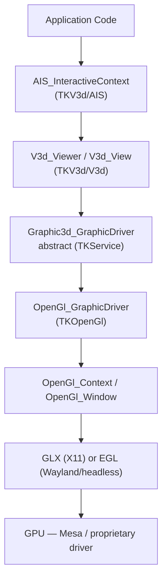
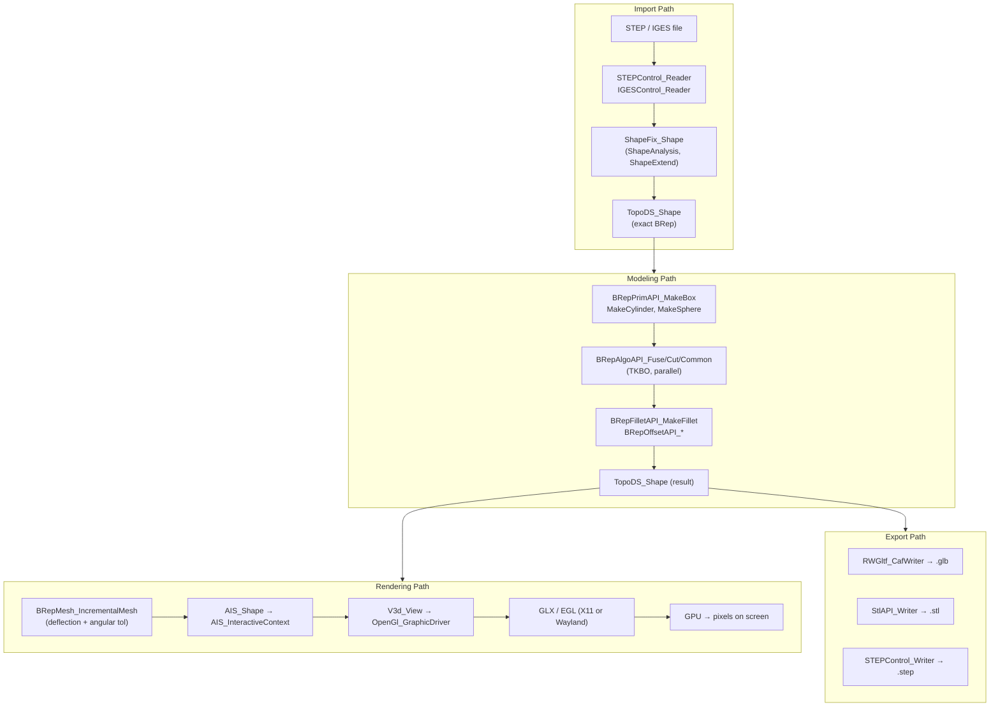

# Chapter 176: OpenCASCADE Technology — The BRep Kernel and 3D Visualization Stack

**Target audiences:** Graphics application developers building CAD/CAE tools on Linux; systems developers integrating 3D geometry processing into applications; engineers working with FreeCAD internals or STEP/IGES data pipelines.

---

## Table of Contents

1. [Why OCCT Matters for the Linux Graphics Stack](#1-why-occt-matters-for-the-linux-graphics-stack)
   - [1.1 What is OpenCASCADE Technology (OCCT)?](#11-what-is-opencascade-technology-occt)
   - [1.2 What is Boundary Representation (BRep)?](#12-what-is-boundary-representation-brep)
   - [1.3 What is NURBS and B-Spline Geometry?](#13-what-is-nurbs-and-b-spline-geometry)
2. [Architecture: Seven Modules](#2-architecture-seven-modules)
3. [Topology and Geometry: The BRep Model](#3-topology-and-geometry-the-brep-model)
   - 3.1 [Topology vs. Geometry — The Core Distinction](#31-topology-vs-geometry--the-core-distinction)
   - 3.2 [TopoDS_Shape and the Shape Hierarchy](#32-topods_shape-and-the-shape-hierarchy)
   - 3.3 [BRep_Builder: Attaching Geometry to Topology](#33-brep_builder-attaching-geometry-to-topology)
   - 3.4 [BRepBuilderAPI: Higher-Level Construction](#34-brepbuilderapi-higher-level-construction)
4. [Modeling Algorithms](#4-modeling-algorithms)
   - 4.1 [Boolean Operations (CSG)](#41-boolean-operations-csg)
   - 4.2 [Primitives: BRepPrimAPI](#42-primitives-breppprimapi)
   - 4.3 [Fillets, Chamfers, and Offsets](#43-fillets-chamfers-and-offsets)
   - 4.4 [Mesh Generation: BRepMesh](#44-mesh-generation-brepmesh)
5. [Visualization: V3d, AIS, and the OpenGL Driver](#5-visualization-v3d-ais-and-the-opengl-driver)
   - 5.1 [Stack Overview](#51-stack-overview)
   - 5.2 [V3d_Viewer and V3d_View](#52-v3d_viewer-and-v3d_view)
   - 5.3 [AIS_InteractiveContext and AIS_Shape](#53-ais_interactivecontext-and-ais_shape)
   - 5.4 [OpenGl_GraphicDriver: X11/GLX and EGL/Wayland](#54-opengl_graphicdriver-x11glx-and-eglwayland)
   - 5.5 [Shader-Based Rendering and PBR](#55-shader-based-rendering-and-pbr)
   - 5.6 [Selection and BVH Picking](#56-selection-and-bvh-picking)
   - 5.7 [Vulkan: Current Status](#57-vulkan-current-status)
   - 5.8 [VTK Bridge (TKIVtk)](#58-vtk-bridge-tkivtk)
6. [Data Exchange](#6-data-exchange)
   - 6.1 [STEP](#61-step)
   - 6.2 [IGES and STL](#62-iges-and-stl)
   - 6.3 [glTF 2.0](#63-gltf-20)
   - 6.4 [OBJ and PLY](#64-obj-and-ply)
   - 6.5 [XDE: Extended Data Framework](#65-xde-extended-data-framework)
   - 6.6 [PMI and GD&T in AP242](#66-pmi-and-gdt-in-ap242)
7. [OCAF: The Application Framework](#7-ocaf-the-application-framework)
8. [FreeCAD: OCCT as a CAD Kernel](#8-freecad-occt-as-a-cad-kernel)
9. [Salome: A CAE Platform Built on OCCT](#9-salome-a-cae-platform-built-on-occt)
10. [DRAW: The Interactive Test Harness and Tcl Console](#10-draw-the-interactive-test-harness-and-tcl-console)
11. [OCCT Alternatives and Higher-Level Abstractions](#11-occt-alternatives-and-higher-level-abstractions)
    - 11.1 [CodeCAD: Code-First Solid Modeling as a Paradigm](#111-codecad-code-first-solid-modeling-as-a-paradigm)
    - 11.2 [Rust-Native and Constraint-Solver Alternatives](#112-rust-native-and-constraint-solver-alternatives)
    - 11.3 [SolveSpace](#113-solvespace)
    - 11.4 [Python Bindings and Frameworks Built on OCCT](#114-python-bindings-and-frameworks-built-on-occt)
    - 11.5 [Web and WebAssembly Frameworks Built on OCCT](#115-web-and-webassembly-frameworks-built-on-occt)
    - 11.6 [AI-Assisted and Generative CAD](#116-ai-assisted-and-generative-cad)
    - 11.7 [Commercial B-Rep Kernels: Parasolid, ACIS, and C3D Toolkit](#117-commercial-b-rep-kernels-parasolid-acis-and-c3d-toolkit)
12. [Building and Packaging on Linux](#12-building-and-packaging-on-linux)
    - 12.1 [CMake Build](#121-cmake-build)
    - 12.2 [Distribution Packages](#122-distribution-packages)
    - 12.3 [Linking](#123-linking)
13. [Pipeline Comparison Diagram](#13-pipeline-comparison-diagram)
- [GPU-Accelerated Shape Analysis](#gpu-accelerated-shape-analysis)
14. [Integrations](#14-integrations)

---

## 1. Why OCCT Matters for the Linux Graphics Stack

OpenCASCADE Technology (OCCT) is the open-source C++ framework that powers most serious Linux CAD applications. FreeCAD, Salome, Code_Aster pre-processor, and dozens of smaller engineering tools all rely on it as their geometric kernel. Understanding OCCT is essential for anyone writing a 3D engineering application, importing STEP/IGES geometry into a graphics pipeline, or studying how CAD-grade precision intersects with GPU rendering.

OCCT is not a game engine. Its design goals differ sharply from Vulkan-oriented renderers like Bevy (Ch40), Godot (Ch41), or Unreal Engine (Ch97):

- **Exact geometry matters.** OCCT stores shapes as mathematical B-spline curves and NURBS surfaces — not as triangles. Triangulation (meshing) is a separate, optional step taken only for rendering or export.
- **Topology matters.** A solid in OCCT is a directed graph of faces, edges, and vertices carrying adjacency and orientation. Boolean operations (union, intersection, cut) operate on this graph, not on triangle soups.
- **Data exchange matters.** Engineering CAD formats — STEP, IGES — encode the full BRep graph with tolerances. Importing them faithfully requires the full OCCT stack.

The current stable release is **OCCT 8.0.0p1** (released 17 June 2026), which moved from C++11/14 to a mandatory **C++17** baseline and reorganised the source tree into seven clearly delimited module directories — six of them the core geometry/visualization/data-exchange stack this chapter is built around, plus a seventh, `Draw` (§10), that builds an interactive Tcl test console rather than runtime library code. [Source: [OCCT 8.0.0 Release](https://github.com/Open-Cascade-SAS/OCCT/releases/tag/V8_0_0); `adm/cmake/version.cmake` sets `OCC_VERSION_MAJOR=8`]

The rendering backend remains **OpenGL 3.2+ core profile** (`TKOpenGl`). A Vulkan prototype exists (tracker issue #30631) but has not merged into mainline as of 8.0.0p1.

### 1.1 What is OpenCASCADE Technology (OCCT)?

OpenCASCADE Technology (OCCT) is an open-source C++ library providing a complete framework for 3D geometric modeling, visualization, and data exchange. Unlike game-engine renderers that operate on triangle meshes, OCCT represents shapes using exact mathematical geometry — B-spline curves, NURBS surfaces, and boundary representation solids. This distinction makes OCCT the preferred foundation for engineering CAD and CAE applications where dimensional accuracy, manufacturing tolerances, and format fidelity to standards such as STEP and IGES are non-negotiable.

On Linux, OCCT integrates with the graphics stack through its `TKOpenGl` visualization driver, which targets an OpenGL 3.2+ core profile and supports both X11/GLX and EGL/Wayland window systems. Its CMake build system produces a set of modular toolkit libraries (`TK*`) that applications link selectively. Those toolkits are organized into seven functional areas — Foundation Classes, Modeling Data, Modeling Algorithms, Visualization, Data Exchange, Application Framework, and Draw — each corresponding to a source directory in OCCT 8.0.0's C++17-based tree. The first six ship runtime libraries applications link against; Draw is the odd one out, building an interactive Tcl console (§10) used for OCCT's own regression testing rather than a library any downstream application links. Applications including FreeCAD, Salome, and Code_Aster use OCCT as their geometric kernel, operating on exact solid models that are triangulated only at render time or for export.

### 1.2 What is Boundary Representation (BRep)?

Boundary Representation (BRep) is a solid modeling paradigm that defines a 3D shape by its enclosing boundary — the set of faces, edges, and vertices that bound a volume — together with their topological connectivity and orientations. Rather than storing a filled volume or a pre-triangulated mesh, a BRep solid stores the directed graph of its bounding faces and the way those faces meet at edges and vertices.

In OCCT, the BRep layer bridges two rigorously separated concerns. Topology records how shapes connect — which face belongs to which shell, which wire bounds which face, which edge terminates at which vertex — without storing any coordinate data. Geometry then attaches mathematical objects to those topological entities: a `Geom_Surface` to a face, a `Geom_Curve` to an edge, a `gp_Pnt` to a vertex. Tolerances in millimetres accompany each geometric entity and obey a strict hierarchy: vertex tolerance must be greater than or equal to edge tolerance, which must be greater than or equal to face tolerance.

This design allows boolean operations — union, intersection, cut — to work on the exact boundary graph rather than on triangle approximations, preserving sub-millimetre accuracy through complex sequences of modeling operations. BRep data serializes faithfully into STEP or IGES format without lossy triangulation, which is why CAD interchange formats are built around BRep rather than mesh representations.

### 1.3 What is NURBS and B-Spline Geometry?

NURBS (Non-Uniform Rational B-Splines) and B-spline curves and surfaces are the mathematical primitives OCCT uses to represent geometry exactly. A B-spline curve is defined by a sequence of control points, a knot vector, and a polynomial degree; the curve traces a smooth path through space influenced by those control points without necessarily interpolating them. NURBS extends B-splines with a rational (weighted) formulation that allows exact representation of conic sections — circles, ellipses, hyperbolas — that polynomial splines can only approximate.

In the Geom package (`TKG3d`), OCCT provides `Geom_BSplineCurve`, `Geom_BSplineSurface`, `Geom_BezierCurve`, and `Geom_BezierSurface`. Analytical primitives — lines, circles, planes, cylinders, cones, toruses, spheres — appear as separate classes (`Geom_Line`, `Geom_Circle`, `Geom_Plane`, and so on) and can be converted to B-spline form when downstream algorithms require a uniform representation.

NURBS surfaces are the standard geometric primitive in STEP and IGES files. When OCCT reads a STEP file it reconstructs `Geom_BSplineSurface` objects from the encoded control points and knot vectors, then attaches those surfaces to `TopoDS_Face` topology. At render or export time, `BRepMesh_IncrementalMesh` discretizes the parametric surfaces into triangle approximations with a user-specified chord deviation, bridging the exact BRep world and the rasterization pipeline.

---

## 2. Architecture: Seven Modules

OCCT 8.0.0 reorganised its historically flat `src/` layout into seven module directories. Each module maps to one or more CMake `BUILD_MODULE_*` flags and a set of toolkit libraries (`TK*`).

```
src/
  FoundationClasses/   # TKernel, TKMath
  ModelingData/        # TKBRep, TKG2d, TKG3d, TKGeomBase
  ModelingAlgorithms/  # TKBO, TKFillet, TKPrim, TKOffset, TKMesh, TKTopAlgo, ...
  Visualization/       # TKOpenGl, TKOpenGles, TKV3d, TKService
  DataExchange/        # TKDESTEP, TKDEIGES, TKDEGLTF, TKDEOBJ, TKDESTL, ...
  ApplicationFramework/ # TKCAF, TKLCAF, TKXCAF, TKBin, TKXml, ...
  Draw/                # TKDraw, TKTopTest, TKViewerTest, TKDCAF, ... (§10)
```

**Foundation Classes** (`TKernel`, `TKMath`) provide the runtime: `Standard_Transient` (OCCT's reference-counted base class — the equivalent of a smart pointer base), `Handle<T>` (intrusive reference count, analogous to `std::shared_ptr` but with less overhead), `NCollection_List`/`NCollection_Map`/`NCollection_Array1` (generic containers), `OSD` (OS abstraction: files, signals, threads), `Message` (progress indication, warnings, errors), and `gp` — the geometric primitives package containing `gp_Pnt`, `gp_Vec`, `gp_Dir`, `gp_Ax1`, `gp_Ax2`, `gp_Trsf` (transformation), `gp_Lin`, `gp_Pln`, `gp_Circ`. [Source: `src/FoundationClasses/TKernel/Standard/Standard_Transient.hxx`; `src/FoundationClasses/TKMath/gp/gp_Pnt.hxx`]

**Modeling Data** provides the BRep data structures and the mathematical description of curves and surfaces. `TKBRep` contains `TopoDS`, `BRep`, `BRepAdaptor`, `BRepTools`; `TKG3d` contains `Geom` (3D curves and surfaces); `TKG2d` contains `Geom2d` (2D curves in parametric space of a surface).

**Modeling Algorithms** is the largest module. The key toolkits:
- `TKBO` — Boolean operations (`BRepAlgoAPI_Fuse`, `BRepAlgoAPI_Cut`, `BRepAlgoAPI_Common`)
- `TKPrim` — solid primitives (`BRepPrimAPI_MakeBox`, `MakeCylinder`, `MakeSphere`)
- `TKFillet` — edge filleting and chamfering (`BRepFilletAPI_MakeFillet`)
- `TKOffset` — offset surfaces, thick solids, pipe sweeps (`BRepOffsetAPI_*`)
- `TKMesh` — triangulation (`BRepMesh_IncrementalMesh`)
- `TKShHealing` — shape healing (`ShapeFix`, `ShapeAnalysis`) — critical for imported geometry

**Visualization** is covered in detail in §5. **Data Exchange** in §6. **Application Framework** in §7. **Draw** — the seventh module, built only when `BUILD_MODULE_Draw=ON` — is covered in §10; it ships no library any downstream application links against, which is why it's easy to miss in a module count that focuses on runtime toolkits.

---

## 3. Topology and Geometry: The BRep Model

### 3.1 Topology vs. Geometry — The Core Distinction

OCCT rigorously separates two concerns that triangle-based engines conflate:

**Topology** describes *how* shapes connect and contain each other — with no coordinate information. A face bounds a shell; a wire bounds a face; an edge bounds a wire; a vertex terminates an edge. These relationships and their orientations are topology.

**Geometry** describes *where* shapes are — the actual mathematical objects. A face carries a `Geom_Surface`; an edge carries a `Geom_Curve`; a vertex carries a `gp_Pnt`.

The **BRep** (Boundary Representation) bridge layer (`TKBRep`) stores geometry on topological shapes:
- `BRep_TFace` stores a `Handle<Geom_Surface>` plus the face's U/V parameter range
- `BRep_TEdge` stores a `Handle<Geom_Curve>` (3D curve) plus per-face `Handle<Geom2d_Curve>` pcurves (parameter-space curves)
- `BRep_TVertex` stores a `gp_Pnt` and a tolerance

Tolerances are a first-class concept. Every vertex, edge, and face carries a tolerance value in millimetres, and OCCT enforces the invariant: `Tol(Vertex) >= Tol(Edge) >= Tol(Face)`. When importing from IGES or STEP, healing algorithms (`ShapeFix`) re-establish this invariant for geometry that violates it.

### 3.2 TopoDS_Shape and the Shape Hierarchy

`TopoDS_Shape` is the universal handle for any topological entity. [Source: `src/ModelingData/TKBRep/TopoDS/TopoDS_Shape.hxx`]

```cpp
class TopoDS_Shape
{
public:
  bool IsNull() const;
  TopAbs_ShapeEnum ShapeType() const;  // returns shape type from TShape
  const TopLoc_Location& Location() const;
  void Location(const TopLoc_Location& theLoc, const bool theRaiseExc = false);
  TopAbs_Orientation Orientation() const;

  bool IsPartner(const TopoDS_Shape&) const; // same TShape, any loc/orient
  bool IsSame(const TopoDS_Shape&)   const; // same TShape + same location
  bool IsEqual(const TopoDS_Shape&)  const; // same TShape + loc + orientation

  TopoDS_Shape Located(const TopLoc_Location&) const;  // new instance
  TopoDS_Shape Reversed() const;

private:
  Handle<TopoDS_TShape>  myTShape;   // ref-counted immutable geometry/topo data
  TopLoc_Location        myLocation; // placement (a product of gp_Trsf)
  TopAbs_Orientation     myOrient;   // FORWARD / REVERSED / INTERNAL / EXTERNAL
};
```

The `myTShape` pointer is **shared across all instances that are partners**. Copying a `TopoDS_Shape` is cheap: it increments the `TShape` reference count and copies two small stack objects. Placing the same face in two different positions (for assembly) simply gives two `TopoDS_Face` objects with the same `myTShape` but different `myLocation`.

The shape type enum `TopAbs_ShapeEnum` defines the partial order of shape types:

```
COMPOUND > COMPSOLID > SOLID > SHELL > FACE > WIRE > EDGE > VERTEX > SHAPE
```

Each type has a corresponding `TopoDS` subclass: `TopoDS_Vertex`, `TopoDS_Edge`, `TopoDS_Wire`, `TopoDS_Face`, `TopoDS_Shell`, `TopoDS_Solid`, `TopoDS_CompSolid`, `TopoDS_Compound`. These are type-safe casts — the same data as `TopoDS_Shape` with downcast protection via `TopAbs_ShapeEnum` checks.

**Traversal:** For direct children, `TopoDS_Iterator` iterates over a shape's sub-shapes. For recursive traversal filtered by type (e.g., all faces in a compound), `TopExp_Explorer` does a depth-first walk:

```cpp
// Collect all faces from a compound or solid
TopExp_Explorer ex(myShape, TopAbs_FACE);
for (; ex.More(); ex.Next()) {
    const TopoDS_Face& face = TopoDS::Face(ex.Current());
    // process face ...
}
```

For retrieving all edges or vertices from a compound along with their containing parents: `TopExp::MapShapesAndAncestors(shape, subType, parentType, map)`.

### 3.3 BRep_Builder: Attaching Geometry to Topology

`BRep_Builder` inherits from `TopoDS_Builder` (which creates empty topological shapes and adds sub-shapes) and adds methods to attach geometry and tolerances. [Source: `src/ModelingData/TKBRep/BRep/BRep_Builder.hxx`]

```cpp
class BRep_Builder : public TopoDS_Builder {
public:
  // Create a face from a surface + tolerance
  void MakeFace(TopoDS_Face& F,
                const Handle<Geom_Surface>& S,
                const double Tol) const;

  // Planar face convenience constructor
  void MakeFace(TopoDS_Face& F,
                const Handle<Geom_Surface>& S,
                const gp_Pln& P,
                const double Tol) const;

  // Attach 3D curve to edge
  void UpdateEdge(const TopoDS_Edge& E,
                  const Handle<Geom_Curve>& C,
                  const double Tol) const;

  // Attach 2D parameter-space curve (pcurve) to edge on a face
  void UpdateEdge(const TopoDS_Edge& E,
                  const Handle<Geom2d_Curve>& C,
                  const TopoDS_Face& F,
                  const double Tol) const;

  // Vertex from 3D point + tolerance
  void MakeVertex(TopoDS_Vertex& V,
                  const gp_Pnt& P,
                  const double Tol) const;

  // Attach triangulation to face (for rendering only)
  void MakeFace(TopoDS_Face& theFace,
                const Handle<Poly_Triangulation>& theTriangulation) const;
};
```

`BRep_Builder` is the low-level primitive for constructing BRep shapes from scratch — used internally by `BRepBuilderAPI_*` and by importers. Application code rarely calls it directly.

### 3.4 BRepBuilderAPI: Higher-Level Construction

The `BRepBuilderAPI` package provides checked, error-reporting wrappers. All derive from `BRepBuilderAPI_MakeShape`:

- **`BRepBuilderAPI_MakeEdge`** — from two vertices, a curve and parameter range, a line, a circle, etc.
- **`BRepBuilderAPI_MakeFace`** — from a surface + outer wire, or from a planar wire directly
- **`BRepBuilderAPI_MakeWire`** — from ordered edges with automatic gap stitching
- **`BRepBuilderAPI_MakeSolid`** — from one or more shells
- **`BRepBuilderAPI_Sewing`** — knits open shells by identifying and merging free edges within a tolerance

Error checking follows a consistent pattern: after calling `Build()` (or the converting constructor), call `IsDone()` / `Error()` to inspect the result. The builder also tracks shape history (`Modified()`, `Generated()`, `IsDeleted()`) — essential for parametric modelling where downstream operations must track sub-shapes through upstream changes.

---

## 4. Modeling Algorithms

### 4.1 Boolean Operations (CSG)

The Boolean operation framework lives in toolkit `TKBO`, package `BRepAlgoAPI`. [Source: `src/ModelingAlgorithms/TKBO/BRepAlgoAPI/BRepAlgoAPI_BooleanOperation.hxx`]

OCCT's Boolean engine accepts *lists* of shapes for both arguments and tools, enabling multi-body operations in a single pass:

```cpp
#include <BRepAlgoAPI_Fuse.hxx>
#include <NCollection_List.hxx>

BRepAlgoAPI_Fuse aFuse;

NCollection_List<TopoDS_Shape> aArgs, aTools;
aArgs.Append(boxShape);
aTools.Append(cylinderShape);
aTools.Append(sphereShape);

aFuse.SetArguments(aArgs);
aFuse.SetTools(aTools);
aFuse.SetRunParallel(true);   // use OCCT's internal thread pool

aFuse.Build();
if (!aFuse.IsDone()) {
    aFuse.DumpErrors(std::cerr);
    return;
}
TopoDS_Shape result = aFuse.Shape();
```

The three main derived classes are `BRepAlgoAPI_Fuse` (union), `BRepAlgoAPI_Cut` (subtraction), and `BRepAlgoAPI_Common` (intersection). `BRepAlgoAPI_Section` computes the intersection wire/edges. `BRepAlgoAPI_Splitter` splits one set of shapes by another without discarding any material.

**Parallel execution.** `BOPAlgo_Options` (the base of all `BOPAlgo_*` algorithms) provides two levels of parallelism control:

```cpp
// Per-instance: run this operation with internal thread pool
algo.SetRunParallel(true);

// Global: all subsequent BOPAlgo operations use parallel mode
BOPAlgo_Options::SetParallelMode(true);
```

Internally OCCT uses its own `OSD_ThreadPool` (not OpenMP, though `USE_OPENMP=ON` at cmake time enables an OpenMP backend for `BRepMesh`). The thread pool size defaults to the number of logical processors. [Source: `src/FoundationClasses/TKernel/OSD/OSD_ThreadPool.hxx`]

**Shape history** is maintained after Boolean ops: `aFuse.Modified(originalFace)` returns the face(s) in the result that correspond to `originalFace` from an argument. This is used by parametric modelling tools to re-attach fillets, chamfers, or named features after re-execution.

### 4.2 Primitives: BRepPrimAPI

Toolkit `TKPrim`, package `BRepPrimAPI`, provides solid primitives as immediate one-liner constructions. [Source: `src/ModelingAlgorithms/TKPrim/BRepPrimAPI/BRepPrimAPI_MakeBox.hxx`]

```cpp
// Box: corner at origin, dimensions dx × dy × dz
BRepPrimAPI_MakeBox box(100.0, 50.0, 30.0);
TopoDS_Solid solid = box.Solid();

// Box with explicit corner point
BRepPrimAPI_MakeBox box2(gp_Pnt(10, 10, 0), 80.0, 40.0, 25.0);

// Box aligned to a custom axis system
BRepPrimAPI_MakeBox box3(gp_Ax2(gp_Pnt(0,0,0), gp_Dir(0,0,1)), 50, 50, 50);

// Individual faces accessible
TopoDS_Face top   = box.TopFace();
TopoDS_Face bot   = box.BottomFace();
TopoDS_Face front = box.FrontFace();

// Sphere
BRepPrimAPI_MakeSphere sphere(gp_Pnt(0,0,0), 25.0);  // centre + radius

// Partial sphere (wedge in longitude): 120° sector
BRepPrimAPI_MakeSphere partialSphere(25.0, 2.0 * M_PI / 3.0);

// Cylinder: radius 10, height 40
BRepPrimAPI_MakeCylinder cyl(10.0, 40.0);

// Cone: bottom radius 15, top radius 5, height 30
BRepPrimAPI_MakeCone cone(15.0, 5.0, 30.0);
```

For sweeps: `BRepPrimAPI_MakePrism(profile, direction)` extrudes a wire/face linearly; `BRepPrimAPI_MakeRevol(profile, axis, angle)` revolves it.

### 4.3 Fillets, Chamfers, and Offsets

Before the API: what these operations actually construct, geometrically, is worth spelling out, because the hard part of implementing them is never the easy case shown in a tutorial — it's the corner where three filleted edges meet.

**Fillets as rolling-ball/rolling-circle blends.** A constant-radius edge fillet is the surface swept by a circle of radius *R* rolling along the edge while staying tangent to both adjacent faces — equivalently, every point on the fillet surface is at distance *R* from an implicit "spine" curve offset inward from the edge. This is why fillets are computed, not merely drawn: the blend surface's cross-section is only literally circular when both adjacent faces are planar; against a curved face (a fillet on the edge where a cylinder meets a plane, say) the rolling-ball construction still holds, but the resulting blend surface is a general swept surface, not a torus patch. The critical difficulty is **vertex blending** — where three or more filleted edges converge at a corner, the individual rolling-ball surfaces do not simply meet at a shared boundary; OCCT's fillet algorithm has to solve for a corner "cap" surface that blends all the incoming fillet surfaces together with tangent (G1) continuity. Practitioners on the OCCT forum repeatedly trace `BRepFilletAPI_MakeFillet::Build()` failures on real-world models back to exactly this corner-solving step rather than to the per-edge sweep itself [Source](https://dev.opencascade.org/content/brepfilletapimakefillet-fillet-failed); a robust CAD kernel spends a correspondingly large share of its fillet code on these corner cases rather than on the single-edge case the name describes. **Variable-radius fillets** replace the constant *R* with a radius that varies along the spine (typically as a linear or Hermite-interpolated function of arc length), which turns even a single filleted edge from a swept-circle problem into a swept-varying-conic problem, compounding the corner-blending problem further.

**Chamfers as flat bevels, not curved blends.** A chamfer replaces a sharp edge with a single flat (usually planar) face at a specified offset from each adjacent face, rather than a rounded transition — geometrically simpler than a fillet in the two-face case (the chamfer face is just a ruled surface between two offset curves), but it inherits the same vertex-blending difficulty at corners where multiple chamfered edges converge, since OCCT still has to construct a consistent corner cap. Chamfers are parameterized either symmetrically (equal offset distance from both faces) or asymmetrically (two independent distances, or one distance plus an angle) — real machined parts nearly always specify chamfers by distance-and-angle because that maps directly to a chamfering tool's geometry, not by two distances.

**Continuity, not just contact.** CAD surfaces are usually described by how smoothly they join a neighbor: **G0** (positional continuity — surfaces touch, tangents can be discontinuous, producing a visible crease), **G1** (tangent-plane continuity — no crease, but curvature can jump, visible as a highlight-line kink under specular lighting), and **G2** (curvature continuity — used for Class-A surfacing where reflections must flow smoothly, e.g. automotive body panels). OCCT encodes exactly this ladder as the `GeomAbs_Shape` enum (`GeomAbs_C0`, `GeomAbs_G1`, `GeomAbs_C1`, `GeomAbs_G2`, `GeomAbs_C2`, ... up to `GeomAbs_CN`), distinguishing geometric continuity (G*n* — a reparametrization exists that makes the join C*n*) from the stricter parametric continuity (C*n* — the derivatives already agree without reparametrization). [Source: `src/FoundationClasses/TKMath/GeomAbs/GeomAbs_Shape.hxx`] A fillet is normally constructed to be G1 with both adjacent faces (tangent, no crease); a chamfer's flat face is deliberately only G0 with its neighbors, since a chamfer is meant to look like a flat cut, not a smoothed transition. This G0/G1/G2 vocabulary recurs throughout NURBS surface modeling (§1.3) — a fillet is, in effect, a purpose-built G1-continuous blend surface generator, and understanding it that way explains both why it's harder than a chamfer and why "just increase the radius slightly" sometimes turns a failing fillet into a succeeding one: a larger radius gives the corner-blend solver more room to find a valid G1 cap.

**Offsets: uniform distance, not scaling.** An offset surface or shape moves every point of the input a constant distance along its local normal — distinct from a scale transform, which moves points proportionally to their distance from a center. Offsetting is straightforward for a single convex face but becomes ill-posed wherever the offset distance exceeds the local radius of curvature: offsetting a concave region inward by more than its radius causes the offset surface to self-intersect — self-intersection is a well-documented hazard of NURBS offset and sweep operations generally, not an OCCT-specific quirk [Source](https://dl.acm.org/doi/full/10.1145/3727620) — and detecting/trimming it is exactly what `BRepOffsetAPI_MakeThickSolid` (below) has to do when hollowing out a shape with tight internal fillets. OCCT's own modeling-algorithms guide documents `BRepOffsetAPI_MakeThickSolid`'s shelling operator as rounding or intersecting adjacent faces along their edges depending on local convexity for precisely this reason. [Source](https://dev.opencascade.org/doc/overview/html/occt_user_guides__modeling_algos.html)

Toolkit `TKFillet`, `BRepFilletAPI_MakeFillet` rounds sharp edges with a constant or variable radius. [Source: `src/ModelingAlgorithms/TKFillet/BRepFilletAPI/BRepFilletAPI_MakeFillet.hxx`]

```cpp
BRepAlgoAPI_Fuse fuse(boxShape, cylinderShape);
TopoDS_Shape merged = fuse.Shape();

// Fillet all edges in the fused result
BRepFilletAPI_MakeFillet fillet(merged);

// Collect all edges
TopExp_Explorer edgeEx(merged, TopAbs_EDGE);
for (; edgeEx.More(); edgeEx.Next()) {
    fillet.Add(3.0, TopoDS::Edge(edgeEx.Current()));  // 3mm radius
}

fillet.Build();
TopoDS_Shape rounded = fillet.Shape();
```

Variable-radius fillets are supported by passing two radii (`Add(R1, R2, edge)`) or a `Law_Function` for a continuously varying profile. `BRepFilletAPI_MakeChamfer` follows the same API for chamfers instead of rounds.

Offset operations in toolkit `TKOffset`:

```cpp
// Hollow solid: remove a face, offset the remaining shell inward by 2mm
Handle<TopTools_ListOfShape> facesToRemove = new TopTools_ListOfShape();
facesToRemove->Append(topFace);

BRepOffsetAPI_MakeThickSolid thickener;
thickener.MakeThickSolidByJoin(solid, *facesToRemove, -2.0, 1e-3);
thickener.Build();
TopoDS_Shape shell = thickener.Shape();

// Pipe sweep: extrude a circular profile along a curved wire spine
BRepOffsetAPI_MakePipe pipe(spineWire, circleProfile);
TopoDS_Shape tube = pipe.Shape();
```

### 4.4 Mesh Generation: BRepMesh

Before OpenGL rendering or STL export, the exact BRep must be triangulated. Toolkit `TKMesh`, class `BRepMesh_IncrementalMesh`. [Source: `src/ModelingAlgorithms/TKMesh/BRepMesh/BRepMesh_IncrementalMesh.hxx`]

```cpp
#include <BRepMesh_IncrementalMesh.hxx>
#include <BRep_Tool.hxx>
#include <Poly_Triangulation.hxx>

// Deflection controls triangle density:
// - Linear deflection: max chord deviation from true surface (mm)
// - Angular deflection: max angle deviation (radians)
BRepMesh_IncrementalMesh mesher(shape, 0.1, false, 0.5);
mesher.Perform();

// Retrieve per-face triangulation
TopExp_Explorer fex(shape, TopAbs_FACE);
for (; fex.More(); fex.Next()) {
    const TopoDS_Face& face = TopoDS::Face(fex.Current());
    TopLoc_Location loc;
    Handle<Poly_Triangulation> tri = BRep_Tool::Triangulation(face, loc);
    if (tri.IsNull()) continue;

    int nNodes = tri->NbNodes();
    int nTris  = tri->NbTriangles();

    // Access node coordinates (1-indexed)
    for (int i = 1; i <= nNodes; i++) {
        gp_Pnt pt = tri->Node(i).Transformed(loc.IsIdentity() ? gp_Trsf() : loc);
        // pt.X(), pt.Y(), pt.Z()
    }

    // Access triangles (1-indexed node indices)
    for (int t = 1; t <= nTris; t++) {
        int n1, n2, n3;
        tri->Triangle(t).Get(n1, n2, n3);
        // vertex indices for GPU upload
    }
}
```

The triangulation is stored on the `TopoDS_Face` as a `Poly_Triangulation` and persists until the shape is destroyed or `BRepTools::Clean(shape)` is called. Calling `BRepMesh_IncrementalMesh` again with a finer deflection replaces it. `USE_OPENMP=ON` at cmake time enables OpenMP parallelism for meshing across faces.

---

## 5. Visualization: V3d, AIS, and the OpenGL Driver

### 5.1 Stack Overview

OCCT's visualization stack is layered as follows:


```mermaid
flowchart TD
    App["Application Code"]
    AIS["AIS_InteractiveContext\n(TKV3d/AIS)"]
    V3d["V3d_Viewer / V3d_View\n(TKV3d/V3d)"]
    Gd["Graphic3d_GraphicDriver\nabstract (TKService)"]
    OGl["OpenGl_GraphicDriver\n(TKOpenGl)"]
    OGlCtx["OpenGl_Context / OpenGl_Window"]
    Platform["GLX (X11) or EGL (Wayland/headless)"]
    GPU["GPU — Mesa / proprietary driver"]

    App --> AIS --> V3d --> Gd --> OGl --> OGlCtx --> Platform --> GPU
```

The `Graphic3d_GraphicDriver` abstract interface decouples the upper layers from the rendering backend. `OpenGl_GraphicDriver` is the only shipped concrete implementation in mainline OCCT 8.0.0. A Direct3D host (`TKD3DHost`, Windows-only) and an OpenGL ES backend (`TKOpenGles`) also exist. The Vulkan backend is a tracker prototype only (§5.7).

### 5.2 V3d_Viewer and V3d_View

`V3d_Viewer` owns the graphical driver and the set of lights and views. [Source: `src/Visualization/TKV3d/V3d/V3d_Viewer.hxx`]

```cpp
#include <V3d_Viewer.hxx>
#include <OpenGl_GraphicDriver.hxx>
#include <Aspect_DisplayConnection.hxx>

// X11 path
Handle<Aspect_DisplayConnection> disp = new Aspect_DisplayConnection();
Handle<OpenGl_GraphicDriver> driver = new OpenGl_GraphicDriver(disp);
Handle<V3d_Viewer> viewer = new V3d_Viewer(driver);

// Default ambient light
viewer->SetDefaultLights();

// Create a view associated with a native window
Handle<V3d_View> view = viewer->CreateView();
view->SetWindow(myAspectWindow);   // Aspect_Window wrapping X Window or EGLSurface
view->SetBackgroundColor(Quantity_NOC_BLACK);
view->SetProj(V3d_XposYposZpos);  // isometric viewpoint
view->FitAll(0.01, false);        // fit all shapes with 1% margin
view->Redraw();
```

Camera control is via `V3d_View`: `Rotate(ax, ay)`, `Pan(dx, dy)`, `Zoom(factor)`, `SetEye(x,y,z)`, `SetAt(x,y,z)`, `SetUp(x,y,z)`. The camera model supports perspective and orthographic projections (`V3d_PERSPECTIVE` / `V3d_ORTHOGRAPHIC`).

### 5.3 AIS_InteractiveContext and AIS_Shape

`AIS_InteractiveContext` is the main application-level interface for displaying and selecting shapes. [Source: `src/Visualization/TKV3d/AIS/AIS_InteractiveContext.hxx`]

```cpp
Handle<AIS_InteractiveContext> ctx = new AIS_InteractiveContext(viewer);

// Display a shape in shaded mode
Handle<AIS_Shape> aisBox = new AIS_Shape(boxShape);
ctx->Display(aisBox, AIS_Shaded, 0, false); // mode=shaded, selmode=0, no update

// Set colour
ctx->SetColor(aisBox, Quantity_NOC_CYAN1, false);
ctx->SetMaterial(aisBox, Graphic3d_NameOfMaterial_Brass, false);
ctx->SetTransparency(aisBox, 0.5, false);

// Force update
ctx->UpdateCurrentViewer();
```

**Selection modes** are integers:
- `0` — whole shape
- `1` — vertex
- `2` — edge
- `4` — face

Activating sub-shape selection:
```cpp
ctx->Activate(aisBox, 4);   // activate face selection
// ...after mouse move event...
ctx->MoveTo(xPix, yPix, view, true);
ctx->Select(true);
for (ctx->InitSelected(); ctx->MoreSelected(); ctx->NextSelected()) {
    Handle<AIS_InteractiveObject> obj = ctx->SelectedInteractive();
    TopoDS_Shape sel = ctx->SelectedShape();  // sub-shape if in face/edge/vertex mode
}
```

`AIS_Shape` automatically uses the `Poly_Triangulation` stored on faces for shaded display. If the shape has not been meshed, OCCT automatically meshes it at a default deflection (controlled by `Prs3d_Drawer`). For display quality control, set the drawer's `DeviationCoefficient` on the `AIS_Shape` before displaying.

The `AIS_InteractiveObject` hierarchy provides specialised interactive objects: `AIS_ColoredShape` (per-sub-shape colours), `AIS_TexturedShape` (texture mapping via `Image_Texture`), `PrsDim_AngleDimension`, `PrsDim_LengthDimension`, `AIS_Plane`, `AIS_Axis`, `AIS_Point`.

### 5.4 OpenGl_GraphicDriver: X11/GLX and EGL/Wayland

`OpenGl_GraphicDriver` is constructed with an `Aspect_DisplayConnection` (wrapping an X11 `Display*`) on Linux. [Source: `src/Visualization/TKOpenGl/OpenGl/OpenGl_GraphicDriver.hxx`]

```cpp
class OpenGl_GraphicDriver : public Graphic3d_GraphicDriver {
public:
  // X11/GLX: theDisp must point to the X server connection
  OpenGl_GraphicDriver(const Handle<Aspect_DisplayConnection>& theDisp,
                       const bool theToInitialize = true);

  // EGL path: call after construction to use an existing EGL context
  // theEglDisplay: EGLDisplay (opaque ptr)
  // theEglContext: EGLContext (opaque ptr)
  // theEglConfig:  EGLConfig  (opaque ptr)
  bool InitEglContext(Aspect_Display          theEglDisplay,
                      Aspect_RenderingContext  theEglContext,
                      void*                   theEglConfig);

  // Access the shared OpenGL context
  const Handle<OpenGl_Context>& GetSharedContext(bool theBound = false) const;

  // VSync
  bool IsVerticalSync() const override;
  void SetVerticalSync(bool theToEnable) override;
};
```

**X11/GLX path:** `Aspect_DisplayConnection` opens an Xlib connection. `Xw_Window` (`src/Visualization/TKService/Xw/Xw_Window.hxx`) wraps an X `Window` handle. `OpenGl_GraphicDriver` uses GLX to create OpenGL contexts and surfaces.

**EGL/Wayland path:** The application creates an EGLDisplay from the Wayland compositor's display, sets up an EGLContext, then passes them to `InitEglContext()`. The `Aspect_NeutralWindow` or a custom `Aspect_Window` subclass wraps a `wl_egl_window`. This is how OCCT integrates into Wayland compositors — the EGL surface is owned externally; OCCT attaches to it without managing the Wayland protocol itself.

**Offscreen rendering (headless):** Pass `EGL_NO_DISPLAY` acquired via `eglGetPlatformDisplay(EGL_PLATFORM_SURFACELESS_MESA, ...)` or use `EGL_EXT_platform_device`. The `Aspect_NeutralWindow` with a zero-sized window handles this. This is how FreeCAD's headless rendering and OCCT-based CI pipelines operate on servers without a display.

The `OpenGl_Context` class (`src/Visualization/TKOpenGl/OpenGl/OpenGl_Context.hxx`) wraps the actual GL context, exposes extension presence flags, and manages state caching for shader programs (`OpenGl_ShaderManager`), textures (`OpenGl_Texture`), and framebuffers (`OpenGl_FrameBuffer`).

### 5.5 Shader-Based Rendering and PBR

Since OCCT 7.4.0, all rendering is shader-based (no fixed-function pipeline). OCCT ships its own GLSL shaders (stored in `src/Visualization/TKOpenGl/OpenGl/Shaders/`):

- `PhongShading.fs` — Blinn-Phong fragment shader (default for `AIS_Shaded`)
- `PBRShading.fs` — PBR metallic/roughness shader (introduced in OCCT 7.5.0)
- `WireframeShading.vs/fs` — wireframe pass
- `ShadowMap.vs/fs` — shadow mapping (soft shadows via PCF)

PBR materials are enabled by setting `Graphic3d_PBRMaterial` on a shape's `Graphic3d_Aspects`:

```cpp
Handle<Graphic3d_Aspects> aspects = new Graphic3d_Aspects();
Graphic3d_PBRMaterial pbr;
pbr.SetMetallic(0.8f);
pbr.SetRoughness(0.2f);
pbr.SetAlbedo(Quantity_Color(0.7, 0.2, 0.1, Quantity_TOC_sRGB));
aspects->SetFrontMaterial(Graphic3d_MaterialAspect(pbr));
aisShape->SetAspects(aspects);
```

Z-layering in `V3d_Viewer` controls rendering order: `Graphic3d_ZLayerId_Default`, `Graphic3d_ZLayerId_Top`, `Graphic3d_ZLayerId_Topmost`. Custom layers can be inserted before or after any existing layer, enabling depth-independent highlighting overlays (e.g., always-on-top wireframe edges).

### 5.6 Selection and BVH Picking

OCCT's selection subsystem uses a BVH (Bounding Volume Hierarchy) for efficient mouse picking. Package `Select3D` and `SelectMgr` in toolkit `TKV3d`. [Source: `src/Visualization/TKV3d/SelectMgr/SelectMgr_ViewerSelector.hxx`]

Each `AIS_InteractiveObject` registers selectable entities (`Select3D_SensitiveFace`, `Select3D_SensitiveEdge`, `Select3D_SensitivePoint`) with the `SelectMgr_SelectionManager`. On `MoveTo(xPix, yPix, view)`, the viewer selector builds or reuses a `BVH_Tree` over all registered entities, transforms the screen pixel to a view frustum, and traverses the BVH for intersection. The closest intersected entity wins.

The BVH package in `TKMath` provides: `BVH_Tree<Standard_Real, 3>` (the data structure), `BVH_BinnedBuilder` (SAH quality builder), `BVH_LinearBuilder` (Morton-code builder for large sets), and `BVH_Traverse` traversal templates. The same BVH infrastructure accelerates Boolean operation intersection tests in `TKBO`.

### 5.7 Vulkan: Current Status

As of OCCT 8.0.0p1 (June 2026), **there is no shipped Vulkan backend**. The toolkit list under `Visualization/` contains `TKOpenGl`, `TKOpenGles`, `TKService`, `TKV3d`, `TKMeshVS`, and `TKD3DHost` — no Vulkan toolkit. A prototype was tracked in OCCT's Mantis tracker as [issue #30631](https://tracker.dev.opencascade.org/view.php?id=30631), titled "Visualization — Vulkan graphic driver prototype", but this has not merged into mainline.

All GPU rendering in OCCT currently goes through `OpenGl_GraphicDriver`, using OpenGL 3.2+ core profile (minimum) up to 4.5 with extensions. Applications that require Vulkan for their own rendering (e.g., using RADV or ANV via Mesa) must handle OCCT geometry on a separate OpenGL context and composite manually, or wait for the Vulkan driver to mature.

### 5.8 VTK Bridge (TKIVtk)

§12.1's build listing shows `USE_VTK=OFF` as an 8.0.0 default without explaining what that flag actually builds. It builds **VIS** (Vtk Integration Services) — a one-directional bridge, packaged as toolkit `TKIVtk`, that converts an OCCT shape into VTK actors for display inside `vtkRenderWindow`-based applications. It exists because some downstream tools (Salome's Mesh module among them, §9) standardize their 3D viewer on VTK rather than on OCCT's own `V3d`/AIS stack (§5.1–§5.3), and need a supported way to hand VTK a picture of an OCCT `TopoDS_Shape` without reimplementing tessellation and picking from scratch.

TKIVtk is organized into four packages, split cleanly along which side of the OCCT/VTK boundary each one faces:

- **`IVtk`** — toolkit-agnostic interfaces (`IVtk_IShape`, `IVtk_IShapeData`, `IVtk_IShapeMesher`) that the OCCT-side and VTK-side implementations both satisfy, keeping the bridge's core free of a hard dependency on either library's concrete types.
- **`IVtkOCC`** — the OCCT-side implementation: `IVtkOCC_Shape` wraps a `TopoDS_Shape` behind the `IVtk_IShape` interface, and `IVtkOCC_ShapeMesher` drives OCCT's own tessellation (the same `BRepMesh`-family machinery §4.4 covers) to produce mesh data VTK can consume — the bridge does not reimplement triangulation, it reuses OCCT's.
- **`IVtkVTK`** — the VTK-side implementation: `IVtkVTK_ShapeData` holds the resulting mesh as a `vtkPolyData`-compatible structure, with sub-shape IDs preserved as VTK cell data so a picked VTK cell can be mapped back to the originating `TopoDS_Face` or `TopoDS_Edge`.
- **`IVtkTools`** — glue classes for embedding the bridge in a real VTK pipeline: `IVtkTools_ShapeDataSource` is a `vtkPolyDataAlgorithm` source that can sit directly in a `vtkRenderer`'s pipeline, and `IVtkTools_ShapePicker` adapts VTK's picking machinery to resolve OCCT sub-shapes.

A separate toolkit, `TKIVtkDraw`, layers DRAW commands (`IVtkDraw_HighlightAndSelectionPipeline`, `IVtkDraw_Interactor`) on top of `TKIVtk` so the bridge can be exercised interactively from the DRAW console (§10) without writing a full VTK application — useful for isolating whether a rendering problem is in OCCT's tessellation or in the downstream VTK pipeline.

The data flow is strictly one-directional: `TopoDS_Shape → IVtkOCC_ShapeMesher → IVtkVTK_ShapeData → vtkPolyData`. Nothing in `BRepMesh_IncrementalMesh` (§4.4) or the core BRep data structures (§3) depends on VTK; a build with `USE_VTK=OFF` omits `TKIVtk`/`TKIVtkDraw` entirely and every other toolkit compiles and links exactly as before. `USE_VTK` has defaulted to `OFF` since OCCT 8.0.0, so applications that want the bridge — including a Salome build — must request it explicitly at configure time.

**Salome's actual viewer split.** It's tempting to assume an OCCT application with a VTK dependency uses VTK for all its 3D display, but Salome's own module boundaries argue against that: the **Geometry** module (GEOM, §9) defaults to Salome's **OCC 3D Viewer** — built on OCCT's native `V3d`/AIS stack, not on `TKIVtk` — while only the **Mesh** module (SMESH, §9) defaults to the **VTK 3D Viewer**, because mesh data (produced by external meshers like NETGEN, not by `BRepMesh_IncrementalMesh`) is already VTK's native domain. `TKIVtk` is one available bridge for getting an OCCT BRep shape onto a VTK canvas when an application's viewer architecture calls for it — not evidence that VTK has displaced OCCT's own viewer wherever both libraries appear in the same address space. [Source: `src/Visualization/TKIVtk/` toolkit layout, OCCT 8.0.0 source tree]

---

## 6. Data Exchange

### 6.1 STEP

STEP (ISO 10303) is the primary interchange format for industrial CAD. OCCT's `TKDESTEP` toolkit provides `STEPControl_Reader` and `STEPControl_Writer`. [Source: `src/DataExchange/TKDESTEP/STEPControl/STEPControl_Reader.hxx`]

```cpp
#include <STEPControl_Reader.hxx>
#include <STEPControl_Writer.hxx>

// Reading
STEPControl_Reader reader;
IFSelect_ReturnStatus status = reader.ReadFile("part.step");
if (status != IFSelect_RetDone) {
    std::cerr << "STEP read failed\n";
    return;
}
reader.TransferRoots();    // transfer all root entities
TopoDS_Shape shape = reader.OneShape();  // merged result

// Writing
STEPControl_Writer writer;
writer.Transfer(shape, STEPControl_AsIs);  // preserve original BRep type
writer.Write("output.step");
```

The `STEPControl_StepModelType` enum controls how the shape is written: `STEPControl_AsIs` preserves the BRep type, `STEPControl_ManifoldSolidBrep` forces manifold solid BRep, `STEPControl_FacetedBrep` outputs a faceted (triangulated) solid.

For assemblies with metadata — part names, colours, layers — use `STEPCAFControl_Reader` / `STEPCAFControl_Writer` which populate an XDE `TDocStd_Document`:

```cpp
#include <STEPCAFControl_Reader.hxx>
#include <TDocStd_Document.hxx>
#include <XCAFDoc_DocumentTool.hxx>
#include <XCAFDoc_ShapeTool.hxx>
#include <XCAFDoc_ColorTool.hxx>

Handle<TDocStd_Document> doc = new TDocStd_Document("XmlXCAF");
STEPCAFControl_Reader cafReader;
cafReader.SetColorMode(true);
cafReader.SetNameMode(true);
cafReader.SetLayerMode(true);
cafReader.ReadFile("assembly.step");
cafReader.Transfer(doc);

Handle<XCAFDoc_ShapeTool> shapeTool = XCAFDoc_DocumentTool::ShapeTool(doc->Main());
Handle<XCAFDoc_ColorTool> colorTool = XCAFDoc_DocumentTool::ColorTool(doc->Main());
```

OCCT 8.0.0 delivers a **75% improvement** in STEP read throughput compared to 7.7.x, achieved by parallelising the entity-mapping pass.

**What a STEP file actually looks like.** STEP (formally ISO 10303-21, "Clear Text Encoding of the Exchange Structure") is plain ASCII: a `HEADER` section describing the file and which EXPRESS schema (the application protocol — `AUTOMOTIVE_DESIGN` for AP214, or the newer combined `AP242MANAGEDMODELBASED3DENGINEERINGMIMLF` schema) governs the entities that follow, then a `DATA` section that is a flat list of numbered entity instances (`#10`, `#11`, ...) referencing each other by number rather than by nesting — a `PRODUCT_DEFINITION` points at a `PRODUCT_DEFINITION_FORMATION` which points at a `PRODUCT`, and so on:

```step
ISO-10303-21;
HEADER;
FILE_DESCRIPTION(
/* description */ ('A minimal AP214 example with a single part'),
/* implementation_level */ '2;1');
FILE_NAME(
/* name */ 'demo',
/* time_stamp */ '2003-12-27T11:57:53',
/* author */ ('CAD Vendor Example Author'),
/* organization */ ('Example CAD Software Vendor'),
/* preprocessor_version */ ' ',
/* originating_system */ 'IDA-STEP',
/* authorization */ ' ');
FILE_SCHEMA (('AUTOMOTIVE_DESIGN { 1 0 10303 214 2 1 1}'));
ENDSEC;
DATA;
#10=ORGANIZATION('O0001','Example CAD Software Vendor','company');
#11=PRODUCT_DEFINITION_CONTEXT('part definition',#12,'manufacturing');
#12=APPLICATION_CONTEXT('mechanical design');
#13=APPLICATION_PROTOCOL_DEFINITION('','automotive_design',2003,#12);
#14=PRODUCT_DEFINITION('0',$,#15,#11);
#15=PRODUCT_DEFINITION_FORMATION('1',$,#16);
#16=PRODUCT('A0001','Test Part 1','',(#18));
ENDSEC;
END-ISO-10303-21;
```

[Source](https://en.wikipedia.org/wiki/ISO_10303-21) A file exported by `STEPControl_Writer` follows exactly this shape but with thousands of entity lines — every `TopoDS_Face` becomes a chain of `ADVANCED_FACE` → `FACE_OUTER_BOUND` → `EDGE_LOOP` → `ORIENTED_EDGE` → `EDGE_CURVE` entities pointing down to `CARTESIAN_POINT`, `DIRECTION`, and `B_SPLINE_SURFACE_WITH_KNOTS` entities — which is why `reader.TransferRoots()` (above) has real interpretive work to do: it is walking exactly this reference graph and reconstructing a `TopoDS_Shape` from it, not merely deserializing a blob.

### 6.2 IGES and STL

`IGESControl_Reader` / `IGESControl_Writer` (toolkit `TKDEIGES`) mirror the STEP API exactly. IGES (ANSI Y14.26) is an older format with weaker tolerance semantics; imported IGES geometry almost always requires healing via `ShapeFix_Shape`.

**IGES's fixed-column layout.** Unlike STEP's free-form entity list, IGES is a strict 80-column-per-line format split into five sections identified by a letter in column 73: Start (`S`, free-text comments), Global (`G`, sending application, units, drafting standard), Directory Entry (`D`, two 80-column lines per entity — 20 right-justified 8-character fields recording entity type, form, line-font, and pointers into Parameter Data), Parameter Data (`P`, the entity's actual numeric parameters, comma-separated with a trailing semicolon), and Terminate (`T`, record counts for the other four sections). Columns 74–80 of every line hold a monotonically increasing sequence number *within that section* — so a directory-entry error is reported as, e.g., "bad value at D0000042" rather than a byte offset. [Source](https://docs.fileformat.com/cad/iges/) [Source](https://paulbourke.net/dataformats/iges/IGES.pdf) Real IGES files rarely need to be read by eye — `IGESControl_Reader` handles the column parsing — but the fixed layout explains why IGES tooling is comparatively unforgiving of hand-edited files, and why the format has no equivalent of STEP's readable header comments outside the free-form Start section.

```cpp
#include <StlAPI_Writer.hxx>
// Mesh first:
BRepMesh_IncrementalMesh(shape, 0.05);  // 0.05mm deflection
StlAPI_Writer stlWriter;
stlWriter.Write(shape, "output.stl");

// Read STL back as triangulated faces:
#include <StlAPI_Reader.hxx>
TopoDS_Shape stlShape;
StlAPI_Reader().Read(stlShape, "input.stl");
```

STL export always triangulates; a tolerance of 0.01–0.1mm is typical for 3D printing workflows. STL carries no topology and no units — just a flat, unindexed list of triangles, each restated with its own three vertices and outward normal, which is why the format compresses so poorly and why adjacent triangles duplicate every shared-edge vertex:

```text
solid output
  facet normal 0.0 0.0 1.0
    outer loop
      vertex 0.0 0.0 10.0
      vertex 10.0 0.0 10.0
      vertex 10.0 10.0 10.0
    endloop
  endfacet
  facet normal 0.0 0.0 1.0
    outer loop
      vertex 0.0 0.0 10.0
      vertex 10.0 10.0 10.0
      vertex 0.0 10.0 10.0
    endloop
  endfacet
endsolid output
```

The binary STL variant replaces this ASCII text with an 80-byte header, a 4-byte triangle count, and 50 bytes per triangle (12 floats for normal + 3 vertices, plus a 2-byte "attribute byte count" most tools leave zero) — an order of magnitude smaller for the same mesh. `StlAPI_Writer::ASCIIMode()` defaults to `true` (ASCII output as shown above); call `stlWriter.ASCIIMode() = false` before `Write()` to get the compact binary form instead. [Source: `src/StlAPI/StlAPI_Writer.hxx`]

### 6.3 glTF 2.0

`RWGltf_CafWriter` / `RWGltf_CafReader` (toolkit `TKDEGLTF`) were introduced in **OCCT 7.5.0** (February 2021). [Source: `src/DataExchange/TKDEGLTF/RWGltf/RWGltf_CafWriter.hxx`]

```cpp
#include <RWGltf_CafWriter.hxx>

// false = text .gltf ; true = binary .glb
RWGltf_CafWriter writer("model.glb", true);

// Coordinate system: OCCT uses Z-up; glTF 2.0 uses Y-up
// Set the converter to flip axes automatically
writer.ChangeCoordinateSystemConverter().SetInputLengthUnit(0.001);  // mm → m
writer.ChangeCoordinateSystemConverter().SetInputCoordSystem(
    RWMesh_CoordinateSystem_Zup);

writer.Perform(doc, Message_ProgressRange());
```

The writer tessellates BRep faces automatically at the deflection set in the document's `Prs3d_Drawer`. OCCT 7.7.0 added Draco mesh compression support for `.glb` output. The glTF writer is particularly useful for exporting CAD models into web viewers or real-time engines.

Reading glTF back into OCCT:

```cpp
#include <RWGltf_CafReader.hxx>

Handle<TDocStd_Document> doc = new TDocStd_Document("XmlXCAF");
RWGltf_CafReader reader;
reader.SetDocument(doc);
reader.SetSystemLengthUnit(0.001);  // convert glTF metres to mm
reader.Perform("scene.glb", Message_ProgressRange());
```

Note: glTF stores triangles only — there is no BRep. The read result is a `TopoDS_Compound` of faces with only `Poly_Triangulation` attached (no `Geom_Surface`). Boolean operations on imported glTF geometry require re-fitting surfaces, which OCCT does not do automatically.

**What the .gltf JSON looks like.** Unlike STEP/IGES, glTF is not CAD-native — it's a scene-graph interchange format built around a small JSON document plus binary buffers, and `RWGltf_CafWriter` maps OCCT's XDE assembly tree onto glTF's `nodes`/`meshes`/`accessors` structure rather than onto any B-rep concept:

```json
{
  "asset": { "version": "2.0", "generator": "Open CASCADE Technology 7.8.0 [dev.opencascade.org]" },
  "scene": 0,
  "scenes": [ { "nodes": [0] } ],
  "nodes": [ { "mesh": 0, "name": "Part1" } ],
  "meshes": [ {
    "primitives": [ {
      "attributes": { "POSITION": 0, "NORMAL": 1 },
      "indices": 2,
      "mode": 4
    } ]
  } ],
  "accessors": [
    { "bufferView": 0, "componentType": 5126, "count": 24, "type": "VEC3" },
    { "bufferView": 1, "componentType": 5126, "count": 24, "type": "VEC3" },
    { "bufferView": 2, "componentType": 5123, "count": 36, "type": "SCALAR" }
  ],
  "buffers": [ { "uri": "model.bin", "byteLength": 1152 } ]
}
```

[Source](https://registry.khronos.org/glTF/specs/2.0/glTF-2.0.html) [Source: `src/DataExchange/TKDEGLTF/RWGltf/RWGltf_CafWriter.cxx`] The triangle vertex/normal/index data itself never appears in this JSON — it lives in the referenced binary buffer (`model.bin`, or embedded directly in a `.glb`), which is why glTF round-trips triangulated meshes so efficiently but, as the paragraph above notes, cannot carry the exact surfaces `RWGltf_CafWriter`'s BRep input started from.

### 6.4 OBJ and PLY

`RWObj_CafReader` (toolkit `TKDEOBJ`, since OCCT 7.4.0) and `RWPly_CafWriter`/`RWPly_CafReader` (toolkit `TKDEPLY`) follow the same `RWMesh_CafReader` pattern. They produce triangulated `TopoDS_Compound` shapes in an XDE document, similar to glTF import.

Both formats are plain text and, unlike glTF, human-editable without tooling — one reason they remain common as a lowest-common-denominator mesh interchange despite predating glTF by decades. OBJ lists vertices, texture coordinates, and normals as top-level records, then faces as 1-indexed references into those lists:

```text
v 0.0 0.0 10.0
v 10.0 0.0 10.0
v 10.0 10.0 10.0
v 0.0 10.0 10.0
vn 0.0 0.0 1.0
f 1//1 2//1 3//1
f 1//1 3//1 4//1
```

PLY instead states its element counts and per-vertex property layout explicitly in a header before any data, which lets a reader allocate buffers up front rather than growing them as it parses — the tradeoff OBJ's simpler, count-free syntax does not offer:

```text
ply
format ascii 1.0
element vertex 4
property float x
property float y
property float z
element face 2
property list uchar int vertex_indices
end_header
0.0 0.0 10.0
10.0 0.0 10.0
10.0 10.0 10.0
0.0 10.0 10.0
3 0 1 2
3 0 2 3
```

Neither format has any concept of an assembly hierarchy on its own — `RWObj_CafReader`/`RWPly_CafReader` synthesize a single flat XDE document node per imported file, which is why multi-part OBJ/PLY assemblies typically arrive in OCCT as one large compound rather than the labeled component tree a STEP or glTF assembly import produces.

### 6.5 XDE: Extended Data Framework

XDE (`TKXCAF`) extends OCAF with CAD-specific attributes for assembly management:

- **`XCAFDoc_ShapeTool`** — manages the shape/assembly tree: `IsAssembly(label)`, `IsComponent(label)`, `GetComponents(asmLabel, components)`, `AddShape(shape)`, `GetShape(label)`
- **`XCAFDoc_ColorTool`** — per-shape and per-face colours: `SetColor(label, color, XCAFDoc_ColorGen)`
- **`XCAFDoc_LayerTool`** — layer names and per-shape layer assignments
- **`XCAFDoc_MaterialTool`** — material density and name for FEA pre-processing

XDE labels form a hierarchy: the root at `doc->Main()` contains a shape tool root, under which shapes and assemblies are nested with `TDF_Label` paths like `0:1:1:1`. Assembly references use `TNaming_NamedShape` to share a `TopoDS_Shape` across multiple instances with different `TopLoc_Location` transformations.

### 6.6 PMI and GD&T in AP242

§6.1 introduced AP242's schema name (`AP242MANAGEDMODELBASED3DENGINEERINGMIMLF`) without explaining its headline feature over AP214: **PMI** (Product Manufacturing Information) — dimensions, geometric tolerances, and datums per ASME Y14.5 / ISO 1101, attached directly to BRep faces and edges as an alternative to a 2D drawing. AP242 formally is ISO 10303-242, "Managed Model Based 3D Engineering," and its CAx-IF/MBX-IF Recommended Practices define **two parallel PMI representations** carried in the same file: a *semantic* representation (structured entities an application can query programmatically — "this face pair has a 0.05mm parallelism tolerance") and a *tessellated* representation (pre-rendered graphical annotation geometry — the same tolerance frame as it should look on screen), so a receiving system can use whichever it supports. [Source: CAx-IF/MBX-IF "Recommended Practices for PMI (AP242)" v4.0](https://www.mbx-if.org/home/wp-content/uploads/2024/05/rec_pracs_pmi_v40.pdf)

XDE represents semantic PMI with its own family of classes and attributes alongside `XCAFDoc_ShapeTool`/`ColorTool`/`LayerTool` (§6.5), stored under XDE label `0.1.4`:

```
src/DataExchange/TKXCAF/
  XCAFDoc/
    XCAFDoc_Dimension.hxx        # a single dimension attribute on a label
    XCAFDoc_GeomTolerance.hxx    # a single geometric-tolerance attribute
    XCAFDoc_Datum.hxx            # a datum feature reference
    XCAFDoc_DimTol.hxx           # shared base for dimension/tolerance data
    XCAFDoc_DimTolTool.hxx       # manager class — the GD&T analog of XCAFDoc_ShapeTool
  XCAFDimTolObjects/
    XCAFDimTolObjects_DimensionObject.hxx     # dimension value, type, modifiers
    XCAFDimTolObjects_GeomToleranceObject.hxx # tolerance zone, type, value
    XCAFDimTolObjects_DatumObject.hxx         # datum label and target
    XCAFDimTolObjects_Tool.hxx
```

[Source: OCCT GitHub source tree, `src/DataExchange/TKXCAF/XCAFDoc/` and `.../XCAFDimTolObjects/`](https://github.com/Open-Cascade-SAS/OCCT/tree/master/src/DataExchange/TKXCAF) `XCAFDoc_DimTolTool` plays the same role for GD&T that `XCAFDoc_ShapeTool` plays for shapes: it's the entry point an application calls to enumerate, add, or query dimensions, tolerances, and datums on a document, via methods like `AddDimension()`/`AddGeomTolerance()`/`AddDatum()` — so an application can author PMI from scratch in OCAF, not merely inspect PMI imported from an existing STEP file. Tessellated (human-readable) PMI presentation shapes are retrieved separately via `XCAFDoc_DimTolTool::GetGDTPresentations(...)`. Both representations round-trip through `STEPCAFControl_Reader`/`Writer` (§6.1) alongside the shape, color, and layer data those classes already transfer.

**Maturity note.** Basic GD&T infrastructure (`XCAFDoc_DimTolTool`, `XCAFDoc_Datum`) predates OCCT 7.x, but semantic-PMI name translation from STEP into XCAF was still being extended as late as the 7.3.0 release notes, and FreeCAD's own PMI-workbench design work treats **OCCT 7.6** as the practical minimum for reliable semantic PMI import via the `XCAFDimTolObjects` enums. [Source: FreeCAD PMI Workbench issue #29772](https://github.com/FreeCAD/FreeCAD/issues/29772) Note: needs verification — the exact OCCT release that first introduced semantic PMI reading could not be pinned down from available release notes. A concrete current limitation, per the same FreeCAD source: as of OCCT 8.0, **export** of AP242 drawing Views is not supported, though import is.

**Why this matters beyond geometry exchange.** PMI is squarely a metrology and quality-control feature, not a modeling one — Open Cascade's own positioning for it is aggregating PMI from STEP AP242, JT, and proprietary CAD sources into a single queryable source of truth for automated inspection against ISO 1101:2012 / ISO 16792:2015, rather than for constructing shapes. [Source: Open Cascade PMI/Metrology use case](https://www.opencascade.com/use_cases/mastering-product-manufacturing-information-pmi-data-for-metrology-and-quality-control/) An application receiving an AP242 file with PMI can, in principle, drive a CMM (coordinate measuring machine) inspection plan directly from the semantic tolerance data XDE exposes, without a human re-reading a drawing.

---

## 7. OCAF: The Application Framework

OCAF (`TKCAF`, `TKLCAF`) provides undo/redo, persistence, and parametric dependency tracking for CAD applications.

Key abstractions:

```cpp
#include <TDocStd_Application.hxx>
#include <TDocStd_Document.hxx>
#include <TDF_Label.hxx>
#include <TDataStd_Name.hxx>
#include <TNaming_NamedShape.hxx>
#include <BinDrivers.hxx>   // binary persistence

// Create application and document
Handle<TDocStd_Application> app = new TDocStd_Application();
BinDrivers::DefineFormat(app);  // register binary format

Handle<TDocStd_Document> doc;
app->NewDocument("BinXCAF", doc);
doc->SetUndoLimit(20);

// Add a shape at a label
TDF_Label shapeLabel = TDF_TagSource::NewChild(doc->Main());
TNaming_Builder builder(shapeLabel);
builder.Generated(boxShape);  // marks boxShape as generated at this label
TDataStd_Name::Set(shapeLabel, "MyBox");

// Undo/redo
doc->NewCommand();   // begin command (opens undo frame)
// ... modify document ...
doc->CommitCommand();
doc->Undo();         // undo one command
doc->Redo();

// Save to binary .cbf file
app->SaveAs(doc, "model.cbf");
```

OCAF persistence uses **deltas** — only the attributes that changed in a command are serialised for undo/redo. Binary format (`TKBin`) is compact and fast; XML format (`TKXml`) is human-readable and useful for debugging. The `.cbf` extension is convention for binary XCAF documents; `.xbf` or `.xml` for XML.

FreeCAD does not use OCAF. Its own `App::Document` system provides undo/redo and persistence independently, using OCCT only for geometry (`TopoDS_Shape` inside `Part::TopoShape`). This is a deliberate architectural choice: FreeCAD's property system and document model predate OCAF adoption and are more tightly integrated with Python scripting.

---

## 8. FreeCAD: OCCT as a CAD Kernel

FreeCAD is the largest open-source CAD application on Linux and the most prominent consumer of OCCT. Its Part workbench (`src/Mod/Part/`) is essentially a Python-scriptable wrapper around OCCT BRep operations.

```
FreeCAD/
  src/Mod/Part/App/
    TopoShape.h           # wraps TopoDS_Shape with FreeCAD property integration
    TopoShapeEx.h         # extended TopoShape with topological naming
    PartFeature.h         # base class for all Part features
    PrimitiveFeature.h    # Box, Cylinder, Sphere, etc.
    Boolean.h             # Fuse, Cut, Common features
    FilletFeature.h       # Fillet, Chamfer
    ...
```

`Part::TopoShape` ([Source: FreeCAD `src/Mod/Part/App/TopoShape.h`]) wraps a `TopoDS_Shape` as a public member and adds:
- Serialisation via the FreeCAD `PropertyContainer` mechanism
- A Python-accessible `__toPythonOCC__()` / `__fromPythonOCC__()` interface for exchange with PythonOCC (`pythonocc-core`)
- Topological naming (TNaming-inspired) to identify sub-shapes after parametric regeneration

`Part::Feature` is the base of all parametric solid features. Its `Shape` property is a `PropertyTopoShape` that triggers document recompute when the shape changes. Parametric dependency — e.g., "a Fillet depends on a Boolean Fuse which depends on a Box" — is managed by FreeCAD's `App::Document` DAG, not by OCAF.

For Linux integration, FreeCAD uses OCCT's `OpenGl_GraphicDriver` indirectly through its own `Gui::View3DInventorViewer` (a `Quarter` / `Coin3D` based viewer), which bypasses OCCT's AIS layer entirely. FreeCAD renders its own scene using Coin3D (OpenInventor) and calls OCCT only for geometry computation — a significant architectural divergence from pure OCCT AIS applications. The newer FreeCAD 1.0 releases are migrating parts of the viewer toward direct OCCT AIS integration.

Python scripting via FreeCAD's Part module:

```python
import FreeCAD, Part

# Create a box using OCCT under the hood
box = Part.makeBox(100, 50, 30)  # returns Part.TopoShape wrapping TopoDS_Shape

# CSG
cyl  = Part.makeCylinder(15, 60)
fuse = box.fuse(cyl)   # calls BRepAlgoAPI_Fuse internally
cut  = box.cut(cyl)    # calls BRepAlgoAPI_Cut internally

# Export to STEP
Part.export([fuse], "/tmp/result.step")  # calls STEPControl_Writer
```

---

## 9. Salome: A CAE Platform Built on OCCT

§1 named Salome, alongside FreeCAD, as a major consumer of OCCT — but unlike FreeCAD, which deliberately avoids OCAF (§7), Salome is a CORBA-component platform where geometry is one module among several feeding a simulation pipeline, and its use of OCCT reflects that broader scope.

**Architecture: components, not a monolith.** Salome is built as a set of independently versioned CORBA components communicating through a shared study document, rather than as a single application binary. The modules most relevant to OCCT are:

- **GEOM** — the geometry module, and the one that maps most directly onto what FreeCAD's Part workbench does with OCCT (§8). Unlike FreeCAD's `Part::TopoShape`, GEOM builds its parametric model *on top of* OCAF: `GEOM_Engine` drives construction through `GEOM_Function` objects attached to a `TDocStd_Document`, with `TFunction_Driver` implementations replaying each construction step — the same OCAF undo/redo and persistence machinery §7 describes, applied to CAD history the way OCAF's design intends and FreeCAD's own architecture explicitly declines to use.
- **SHAPER** — a newer, more modern parametric modeler built on OCCT, developed to eventually supersede GEOM's older Python-macro-recording workflow with a feature-tree UI closer to what FreeCAD or a commercial parametric CAD package offers.
- **SMESH** — the meshing module. This is the clearest architectural divergence from OCCT's own tools: rather than using `BRepMesh_IncrementalMesh` (§4.4) — which produces a display-quality triangulation, not an FEA-quality mesh — SMESH wraps external mesh generators. `NETGENPlugin_Mesher` constructs a `netgen::OCCGeometry` directly from OCCT BRep data and hands it to NETGEN's own volume-meshing algorithms; Gmsh and MeshGems plugins follow the same pattern. OCCT's role in SMESH is supplying exact BRep geometry as meshing input, not doing the meshing itself.

**Two viewers, not one.** Salome ships both an **OCC 3D Viewer**, built on OCCT's native `V3d`/AIS stack (§5.1–§5.3), and a **VTK 3D Viewer**, built on the `TKIVtk` bridge (§5.8). The default is per-module, not global: GEOM defaults to the OCC Viewer, since geometry is exact BRep and OCCT's own viewer displays it directly; SMESH defaults to the VTK Viewer, since mesh data arrives already in a VTK-friendly form from NETGEN/Gmsh/MeshGems. A Salome session can have both viewers open on the same study simultaneously.

**Document model.** Salome's study document (`SalomeApp_Study`, built on `LightApp_Study`) is the container every module's data attaches to — analogous in role to XDE's `TDocStd_Document` (§6.5) but scoped to an entire multi-module simulation study (geometry, mesh, and downstream solver setup) rather than to a single CAD assembly.

**Licensing and the Code_Aster/Code_Saturne relationship.** Salome itself is LGPL v2.1 — the same license family as OCCT (§1). §1 also names Code_Aster as an OCCT consumer; the connection runs through Salome, not directly: Code_Aster (structural mechanics) and Code_Saturne (CFD) are separate, independently developed GPL solvers that consume Salome-prepared geometry and meshes as input. "Salome-Meca" bundles Salome with Code_Aster for convenience, but the solvers themselves have no direct OCCT dependency — they consume SMESH's mesh output, several steps removed from the BRep geometry OCCT produced.

---

## 10. DRAW: The Interactive Test Harness and Tcl Console

§2's module list includes `Draw` as the seventh, non-runtime module: rather than building a `TK*` library other applications link, `BUILD_MODULE_Draw=ON` builds **DRAWEXE**, an interactive Tcl interpreter console that exposes OCCT's own modeling, visualization, and data-exchange APIs as Tcl commands. It exists primarily so OCCT's own developers — and, by extension, anyone debugging OCCT-level geometry problems without writing a C++ test harness — can construct shapes, run algorithms, and inspect results interactively, one command at a time.

**Toolkit layout.** DRAW's functionality is split across several toolkits, each adding a family of commands to the base interpreter:

- **`TKDraw`** — the interpreter core itself: `Draw_Interpretor` (the Tcl command dispatcher) and `Draw_Appli` (application bootstrap), plus 3D-viewer plumbing shared by every DRAW command family.
- **`TKTopTest`** — general modeling commands: primitive construction (`box`, `pcylinder`, `psphere`), Boolean operations (`bfuse`, `bcut`, `bcommon`), and shape inspection (`whatis`, `dump`).
- **`TKViewerTest`** — 3D viewer commands: `vinit` (open a view), `vdisplay` (show a shape), `vfit` (fit view to content), `vsetdispmode` (shaded/wireframe).
- **`TKDCAF`** — OCAF commands, for exercising `TDocStd_Document`/`TDF_Label` (§7) interactively.
- **`TKIVtkDraw`** — VTK-bridge commands (§5.8), for exercising `TKIVtk` without writing a VTK application.
- **`TKOpenGlTest` / `TKOpenGlesTest`** — low-level OpenGL/OpenGL ES driver diagnostics.
- **`TKQADraw`** — quality-assurance-specific test commands.
- **`TKTObjDRAW`**, **`TKXSDRAW*`** family — commands for OCCT's TObj framework and its various data-exchange readers/writers (STEP, IGES, etc.), letting a STEP import be driven and inspected from the console rather than a compiled reader program.

**A representative session.** DRAW's command style favors short, composable verbs over the C++ API's long class names — closer to a shell than to a scripted API binding:

```tcl
pload MODELING VISUALIZATION
box b 10 20 30
pcylinder c 5 40
bfuse result b c
vinit
vdisplay result
vfit
vsetdispmode result 1
whatis result
dump result
```

`pload` loads the command families a session needs (here, modeling primitives/Booleans and the viewer) rather than registering every DRAW command unconditionally. Note: needs verification — the exact set of `pload` aliases (e.g. whether `MODELING` maps to a fixed toolkit list or is itself DEFAULT-derived) is not confirmed against current source; the commands and workflow shape above are accurate, but exact `pload`/`bfuse` argument forms should be checked against `docs/user_guides/test_harness/` for a given OCCT release before being copied verbatim into a script.

**Regression testing.** DRAW is not only an interactive console — it is the execution engine for OCCT's own test suite. OCCT's regression tests are `.tcl` scripts (organized under `tests/` in the source tree) run non-interactively through `DRAWEXE`, each script building geometry, running an algorithm, and asserting on the result — the same commands shown above, scripted rather than typed. Demo scripts distributed alongside OCCT (e.g. `resources/samples/tcl/bottle.tcl`, the canonical "build a bottle with a Boolean-fused body and a filleted neck" tutorial model) use the identical command vocabulary, making DRAW simultaneously OCCT's test harness, its interactive debugger, and its own teaching tool for newcomers to the modeling API.

---

## 11. OCCT Alternatives and Higher-Level Abstractions

OCCT is not the only open-source geometric kernel on Linux, and it is rarely consumed directly by end users — most people who touch B-rep CAD do so through a scripting layer, a browser tab, or an application (like SolveSpace) that solves a problem OCCT itself does not address. This section surveys four adjacent parts of the ecosystem: the code-first paradigm that CadQuery, build123d, and OpenSCAD all belong to; kernels written to compete with or wrap OCCT from Rust; a standalone constraint-based CAD tool that uses no OCCT code at all; and the scripting/web layers that make OCCT itself easier to drive — plus, closing the section, the commercial B-rep kernels OCCT competes with directly.

### 11.1 CodeCAD: Code-First Solid Modeling as a Paradigm

Before surveying individual tools, it's worth naming the pattern several of them share: "Code-CAD" (also written CodeCAD) describes software that lets a user define a 3D CAD model *entirely* as source code — the model's shape is a program's output, not a sequence of mouse-driven sketch-and-extrude operations recorded behind the scenes — with a viewport that re-renders whenever the code changes. A community-curated survey of the space defines it plainly: "software that allows you to define 3D CAD models with code," explicitly distinguishing Code-CAD tools from general-purpose 3D geometry libraries by their "opinionated abstractions for quickly developing mechanical parts." [Source](https://github.com/Irev-Dev/curated-code-cad) **OpenSCAD** ([Source](https://openscad.org/)) is the paradigm's acknowledged originator and is still referred to as "the OG" in that same survey — first released in February 2010 [Source](https://en.wikipedia.org/wiki/OpenSCAD), built on CGAL for exact Boolean operations on its own CSG/mesh representation (not a B-rep kernel), with a small declarative language (`difference() { cube(10); translate([5,5,5]) sphere(6); }`) that predates CadQuery, build123d, and every other tool this chapter covers by roughly a decade.

Code-CAD splits along the same kernel-representation axis this chapter has already covered for OCCT itself: **B-rep tools** — CadQuery, build123d, CascadeStudio, pythonocc-core (§11.4–11.5, below) — get exact NURBS surfaces and reliable STEP export by wrapping OCCT or an equivalent kernel; **mesh/CSG tools** — OpenSCAD, and the more recent **Manifold** ([Source](https://github.com/elalish/manifold), a fast, geometrically robust mesh-Boolean library increasingly used as an OpenSCAD backend) — trade exact surfaces for simpler, more predictable Boolean robustness on triangulated geometry; and a third, less common category represents shapes **implicitly** as signed-distance functions evaluated at query points rather than as an explicit boundary at all — **libfive** ([Source](https://libfive.com/), a solid-modeling library with its own Lisp-based scripting language), the unrelated **Curv** ([Source](https://github.com/curv3d/curv), a separate language for mathematical art that also compiles down to SDFs), and **sdfx** (Go) are examples — which sidesteps B-rep/mesh Boolean robustness problems entirely at the cost of needing a final meshing (marching-cubes-family) pass before the result can be exported to STL or 3D-printed. [Source](https://github.com/Irev-Dev/curated-code-cad) The appeal cutting across all three representations is the same: parametric models fall out "almost by default" from writing a program rather than a click history, and the resulting scripts version-control, diff, and code-review like any other source file — a property no mouse-driven sketch-and-extrude history in a conventional CAD GUI can match as cleanly. [Source](https://learn.cadhub.xyz/blog/curated-code-cad/)

### 11.2 Rust-Native and Constraint-Solver Alternatives

None of the Rust-ecosystem projects below are "a Rust OpenCascade" in the same sense — they split into bindings around the real OCCT and kernels that reimplement B-rep/NURBS from scratch, with materially different maturity trade-offs.

**opencascade-rs** ([Source](https://github.com/bschwind/opencascade-rs), LGPL-2.1, package `opencascade` 0.2.0 on crates.io) wraps the actual C++ OCCT via `cxx.rs` bindings rather than reimplementing it — the stated goal is "ergonomic Rust code" for defining 3D models suitable for 3D printing or machining, with fillets, chamfers, lofts, surface filling, pipes, extrusions, revolutions, and STEP/STL/SVG/DXF/KiCAD import-export. Because it links the real kernel, it inherits OCCT's actual Boolean and STEP-import maturity — the Rust layer only replaces the C++ API surface, not the underlying geometry math. It ships an experimental viewer built on `wgpu` (the same crate ch40 covers for Bevy) for interactively inspecting STEP files and example models, with a stated future direction of loading Rust model code compiled to WASM for faster iteration. [Source](https://crates.io/crates/opencascade/0.2.0/dependencies)

**truck** ([Source](https://github.com/ricosjp/truck), Apache-2.0) is the genuinely Rust-native alternative: an independent B-rep/NURBS kernel with no OCCT dependency, split into small composable crates — `truck-geometry` (knot vectors, B-splines, NURBS), `truck-topology` (the same vertex/edge/wire/face/shell/solid hierarchy §3.2 describes for `TopoDS_Shape`), `truck-modeling` (integrated geometry+topology construction, published on crates.io as `truck-modeling` 0.6.0), `truck-shapeops` (Boolean operations), and `truck-platform`/`truck-rendimpl` (visualization on `wgpu`), plus a `truck-js` WASM wrapper. Its README states the goal directly: "re-implement the B-rep with NURBS" using memory-safe Rust "to eliminate core dumped for CPU-derived processes." It makes no claim of feature parity with OCCT's Boolean robustness or STEP-import coverage — this is a from-scratch kernel measured in single-digit years of development, not OCCT's multi-decade one. (Note: the bare crate name `truck` on crates.io is an unrelated, unmaintained package from 2020 — the real kernel is consumed through the `truck-*` crates above.) [Source](https://crates.io/crates/truck-modeling)

**monstertruck** ([Source](https://github.com/virtualritz/monstertruck), Apache-2.0, v0.3.3, published 2026-08-05) is a hard fork of truck rather than a from-scratch project — its own README explains the fork as a response to slow-moving upstream PR review, treating truck as "a patch queue" that it hand-ports commits from with attribution while diverging independently. It adds offset geometry, assembly STEP output, a rewritten fillet engine, and T-spline support, and renames the crate family `truck-*` → `monstertruck-*`. It is the more actively developed of the two as of this writing, but — being a very recent fork — should be treated as an experimentation target, not a stable dependency. [Source](https://docs.rs/monstertruck)

**fornjot** ([Source](https://github.com/hannobraun/fornjot)) is worth naming explicitly as a dead end, since it still surfaces in search results and older Hacker News discussions: an early-stage Rust B-rep kernel aimed at dependable, code-first mechanical CAD, archived 2026-06-19 with its own README stating plainly: "This project has been shut down. Its goals were never reached."

None of the four projects above ship a constraint solver — the kind that drives sketch-based parametric design in SolidWorks or FreeCAD's Sketcher. That gap is architectural, not incidental: as this chapter's Roadmap notes, OCCT itself "has never shipped a constraint solver," leaving history-based parametric modeling to be built at the application layer (FreeCAD bundles its own `PlaneGCS`-family solver for exactly this reason). The most prominent open-source project built around a constraint solver as its core, rather than as an add-on, is covered next.

### 11.3 SolveSpace

**SolveSpace** ([Source](https://github.com/solvespace/solvespace), GPLv3, latest release v3.2, 2026-03-27) inverts OCCT's architecture: where OCCT is an exact B-rep/NURBS kernel that has never had a constraint solver, SolveSpace is a constraint solver first, with just enough surrounding modeling capability (extrudes, revolves, helixes, and Boolean union/difference/intersection) to produce real 3D solids from constrained 2D sketches. It uses no OCCT code.

Its solver — isolable as a standalone library, `libslvs`, decoupled from the GUI — takes a sketch's entities (points, lines, arcs, circles, and the constraints between them: tangent, perpendicular, parallel, equal-length, symmetric, dimensional) and treats satisfying all constraints simultaneously as a system of nonlinear equations, solved by Newton-Raphson iteration; a later optimization pass moved the linear-algebra step onto the Eigen library and raised the maximum solvable unknowns from 1024 to 2048. [Source](https://github.com/solvespace/solvespace/blob/master/CHANGELOG.md) This is precisely the constraint-solving layer FreeCAD's Sketcher workbench implements independently of OCCT/OCAF — SolveSpace demonstrates the same capability as a complete, standalone application rather than a library embedded inside a larger OCCT-based tool. Solid modeling output — including STEP and STL export for CAM — is a comparatively thin layer on top of the solved sketch geometry, not the architectural center of the program the way `TopoDS_Shape` is for OCCT.

### 11.4 Python Bindings and Frameworks Built on OCCT

A large share of real-world OCCT usage happens through a scripting layer rather than direct C++ `BRepBuilderAPI` calls, and Python is where that layer is most mature. `pythonocc-core` ([Source](https://github.com/tpaviot/pythonocc-core)) is the older, direct binding, exposing nearly all of OCCT's C++ classes to Python 1:1 — FreeCAD's own `TopoShape` already interoperates with it via a `__toPythonOCC__()`/`__fromPythonOCC__()` bridge (§8).

More recent tooling centers on **OCP** ([Source](https://github.com/CadQuery/OCP)), a narrower Python wrapper maintained by the CadQuery project specifically to back CadQuery and its sibling, rather than exposing the entire OCCT surface. **CadQuery** ([Source](https://cadquery.readthedocs.io/en/latest/intro.html)) builds on OCP a fluent, jQuery-style method-chaining API for parametric solid modeling in plain Python — GUI-less by design, with STEP/STL/AMF/3MF export, and separate tools (`CQ-editor`, `jupyter-cadquery`) for visualization. **build123d** ([Source](https://build123d.readthedocs.io/en/stable/tips.html)) is CadQuery's more recent sibling on the same OCP foundation, trading CadQuery's method-chaining for Python context managers (`with BuildPart() as p:`); because both wrap the same underlying OCP objects, models can be passed between the two. build123d also has an experimental `OCP.wasm` build that runs the same Python-authored models in a browser — the bridge into the web layer below. [Source](https://github.com/CadQuery/cadquery/discussions/1876) Both CadQuery and build123d are, in the terms §11.1 lays out, B-rep-representation Code-CAD tools — the same paradigm OpenSCAD pioneered, but with OCCT's exact NURBS kernel underneath instead of OpenSCAD's CGAL-based mesh CSG.

### 11.5 Web and WebAssembly Frameworks Built on OCCT

The same fluent, code-first abstraction pattern §11.4 covers for Python recurs independently in the JavaScript/WASM ecosystem, by a different technical route. `opencascade.js` ([Source](https://ocjs.org/)) takes a different route to the browser than build123d's OCP.wasm — it compiles the actual C++ OCCT toolkit to WebAssembly via Emscripten, exposing OCCT's own classes (a selectable subset, since binding all of OCCT would bloat the WASM payload) directly to JavaScript, runnable "in browsers, on your server, or on pretty much any device that supports WebAssembly."

It is the foundation for a small cluster of browser-native CAD tools: **CascadeStudio** ([Source](https://github.com/zalo/CascadeStudio)), a live-scripted CAD kernel and IDE running entirely client-side, with primitives, CSG, revolves, sweeps, fillets, STEP/IGES/STL import-export, and even an OpenSCAD-to-JavaScript transpiler; and **replicad** ([Source](https://github.com/sgenoud/replicad), MIT), a JS/TS library — "the library to build browser based 3D models with code" — whose own documentation states it took its fluent API design directly from "cadquery and cascade studio." replicad is, in effect, CadQuery's abstraction pattern reimplemented for the JavaScript/WASM stack rather than Python. Other `opencascade.js`-based projects in the same niche include ArchiYou, BitByBit, and Polygonjs. [Source](https://ocjs.org/docs/about)

This Emscripten-to-WASM pattern — compiling a native C++ geometry or graphics library so it runs client-side — is architecturally the same technique Ch98 covers for Vulkan/WebGPU deployment targets, applied here to a CAD kernel instead of a rendering API.

### 11.6 AI-Assisted and Generative CAD

Two distinct AI-integration patterns exist for OCCT-based tooling, and they're worth keeping apart: LLMs that write code against the same CadQuery/build123d/OCP stack §11.4 describes, and Model Context Protocol (MCP) servers that expose an existing OCCT-based application's own scripting API as agent-callable tools.

**Text-to-CAD as code generation.** Because CadQuery and build123d (§11.4, above) already express solid modeling as declarative Python rather than a sequence of mouse clicks, the natural way to point an LLM at parametric CAD is to have it write CadQuery/build123d source directly, then execute that code against the real OCP/OCCT kernel to get an exact, editable B-rep result rather than a mesh. Text-to-CadQuery demonstrated this by fine-tuning LLMs on a corpus of 170K paired (text description, CadQuery script) examples, with accuracy improving consistently with model scale. [Source](https://ar5iv.labs.arxiv.org/html/2505.06507) The approach is now benchmarked directly: CADGenBench scores submissions on geometric accuracy, topology correctness, and CAD validity, and requires the emitted model to be well-formed, watertight, and manifold — an automatic zero otherwise — accepting any backend (build123d, Fusion, Onshape, SolidWorks) so long as it produces a real solid. [Source](https://github.com/huggingface/cadgenbench) Text2CAD-Bench narrows the same evaluation to parametric CAD specifically, with 600 human-curated examples spanning four complexity levels from primitive geometry to real-world part topology. [Source](https://arxiv.org/abs/2605.18430) Ch176a surveys this Text-to-CAD research landscape in much greater depth, beyond the OCCT-specific tooling this section covers.

**MCP servers as the agent-facing layer.** MCP servers wrap an OCCT-based tool's existing scripting API as tool calls an LLM agent can invoke directly, closing the loop between "write code" and "see the result." `build123d-mcp` (Apache-2.0) exposes build123d as a persistent session an agent can drive — creating models, rendering PNG/SVG/DXF previews, measuring volume/area/bounding box, detecting features like holes and countersinks, and validating printability — and reports a concrete effect on benchmark performance: adding it to an existing model on the CADGenBench leaderboard raised that model's score from 0.360 to 0.457 and CAD validity from 88% to 100%, because tool-verified geometry catches the non-manifold and non-watertight failures a blind code-generation pass cannot. [Source](https://github.com/pzfreo/build123d-mcp) `cadquery-mcp-server` provides the equivalent generation-and-verification loop for CadQuery. [Source](https://github.com/rishigundakaram/cadquery-mcp-server) For FreeCAD (§8, above) rather than the bare CadQuery/build123d libraries, several independent MCP servers (`neka-nat/freecad-mcp`, MIT, among others) expose FreeCAD's own document/object API directly — letting an assistant create and edit `TopoShape`-backed objects, run Boolean operations, execute arbitrary Python inside FreeCAD, and capture a viewport screenshot to visually check its own work before proceeding. That last step marks a design pattern distinct from Text-to-CAD's one-shot code generation: the agent iterates against a live document rather than generating a script once. [Source](https://github.com/neka-nat/freecad-mcp)

**OCCT itself as an LLM tool target.** `opencascade.js` (§11.5, above) is now explicitly positioned this way by at least one community WASM binding, which advertises TypeScript bindings across OCCT's class surface running "in a browser tab, a Node CLI, or an LLM tool call" — the same WASM deployment already covered in §11.5 doubling as the sandboxed execution environment an agent's generated OCCT calls run inside, with no separate native build step. [Source](https://opencascade-js.vercel.app/)

**What is not built on OCCT.** Zoo (formerly KittyCAD)'s Text-to-CAD and Zoo Design Studio are worth naming here precisely because they are easy to mistake for part of this ecosystem, and are not: Zoo's Design API runs on its own from-scratch, GPU-native geometry engine (built for Vulkan, not OpenGL/OCCT), with the open-source Zoo Design Studio / `modeling-app` client (MIT license) streaming rendered frames from that remote engine over WebSockets rather than embedding OCCT or any OCCT-derived kernel. [Source](https://github.com/kittycad/modeling-app) Every other tool in this subsection — Text-to-CadQuery, build123d-mcp, the FreeCAD MCP servers, opencascade.js — ultimately bottoms out in OCCT's own B-rep kernel; Zoo's stack is a parallel, independent one.

This section's LLM/MCP pattern is the CAD-kernel analog of Ch244's coverage of Blender MCP and Claude Code integration — both wrap an existing, mature scripting API (`bpy` there, CadQuery/build123d/FreeCAD's Python API here) behind agent-callable tools rather than training a model to emit raw geometry.

### 11.7 Commercial B-Rep Kernels: Parasolid, ACIS, and C3D Toolkit

Every alternative surveyed so far in this section is open-source. It's worth closing with the reminder that OCCT is not competing only against Code-CAD scripts and hobbyist kernels — the mainstream mechanical CAD industry runs almost entirely on a small number of **commercial** B-rep kernels, and OCCT is the only widely-used **open-source** kernel in that same category (exact NURBS BRep, STEP-grade tolerancing, professional Boolean robustness).

- **Parasolid** (Siemens Digital Industries Software) traces back to Shape Data Ltd.'s original kernel of the late 1980s, later acquired through EDS/Unigraphics and consolidated under Siemens PLM. It underlies Siemens NX and Solid Edge, and — notably — is also licensed by Siemens's own competitor Dassault Systèmes as the geometry kernel inside SolidWorks, making Parasolid the closest thing the industry has to a shared substrate beneath otherwise-competing CAD products.
- **ACIS** (Spatial Corporation, a Dassault Systèmes subsidiary) originated at Three-Space Ltd./Spatial Technology Inc. around 1989. Its most consequential fork came in 2001–2002, when Autodesk licensed and then forked ACIS into its own **ShapeManager** kernel — which is what actually underlies **AutoCAD** and Autodesk Inventor today, not a live ACIS dependency. This makes AutoCAD, by a wide measure the best-known CAD brand among the kernels discussed here, an ACIS-lineage product rather than a fifth kernel of its own: its geometry engine descends from ACIS but has been independently maintained by Autodesk for two decades. ACIS was also forked a second time into CoCreate SolidDesigner, later PTC Creo Elements/Direct; current ACIS licensees include IronCAD.
- **C3D Toolkit** (C3D Labs, an ASCON subsidiary) is the youngest of the three and the only one with meaningful ties to the Linux/open ecosystem's newer entrants: it originated in 1995 as ASCON's in-house kernel for KOMPAS-3D, and was spun off and opened for third-party licensing only in 2012 — decades after Parasolid and ACIS had already established their commercial licensee bases.

All three are proprietary, licensed-per-seat SDKs — there is no source availability comparable to OCCT's LGPL-2.1-with-exception (§1). That license difference, more than any specific feature gap, is why OCCT rather than any commercial kernel underlies FreeCAD (§8), Salome (§9), and the entire Code-CAD/Python/WASM ecosystem this section surveys: an open-source application cannot ship a Parasolid or ACIS dependency, but can ship OCCT.

License is not the only difference, though. A dedicated technical comparison of OCCT against ACIS — [*Comparing Open Cascade Kernel with ACIS Modeler*](https://quaoar.su/files/papers/cascade/ACIS_OCCT_comparison_v2.0.pdf) (Quaoar Studio LLC; v1.0 2014, revised v2.0 December 2023, author Sergey Slyadnev, who also develops the OCCT-based feature-recognition SDK Analysis Situs) — together with OCCT's own developer forum, documents a handful of capability gaps that are acknowledged rather than merely inferred:

- **Feature recognition.** Given a seed face and a target feature type (hole, pocket, boss, fillet chain), returning the set of faces that define that feature is a standard ACIS capability that core OCCT does not provide; the Quaoar comparison scores OCCT "not available" on this axis. [Source](https://quaoar.su/files/papers/cascade/ACIS_OCCT_comparison_v2.0.pdf) OCCT's own ecosystem confirms the gap by working around it rather than closing it: Analysis Situs is a *separate* open-source SDK built on top of the OCCT kernel specifically to add "the algorithmic infrastructure to recognize features from 'dumb' B-rep geometry" ([Source](https://analysissitus.org/features/features_feature-recognition-framework.html)), and Open Cascade SAS itself sells "CAD Processor" as a commercial add-on product providing hole/pocket detection and fillet-chain recognition on top of the free OCCT platform ([Source](https://www.opencascade.com/products/cad-processor/)) — feature recognition is monetized as an extension, not shipped in the open-source kernel.
- **Direct/synchronous modeling.** OCCT has no built-in equivalent to ACIS's Local Operations or Siemens Synchronous Technology — push/pull face editing that locally re-solves adjacent geometry. Asked about this directly on the OCCT developer forum, an OCCT team member confirmed: "What you are describing is a set of direct modeling features (push/pull, face tweaking, etc.) which are not readily available in OpenCascade," with Boolean operations against local prismatic solids offered as the only built-in workaround. [Source](https://dev.opencascade.org/content/concept-changing-shapes-after-their-creation) In practice this forces applications to approximate the effect: Shapr3D, which was originally built on OCCT, implemented its push/pull tool as a Boolean fuse rather than true face-local editing. [Source](https://analysis-situs.medium.com/push-pull-for-the-poor-1b7401e33905)
- **Sheet-metal modeling.** Bend/unfold/K-factor sheet-metal operations are not part of OCCT itself — the Quaoar comparison explicitly excludes sheet-metal processing from its scope as "a commercial package (API extension) by OCC that [is] not provided in open source." [Source](https://quaoar.su/files/papers/cascade/ACIS_OCCT_comparison_v2.0.pdf) FreeCAD's Sheet Metal Workbench builds unfold/bend logic entirely at the application layer atop generic OCCT Boolean and offset primitives, and its own documentation warns the Unfold tool "has some limitations, and will fail in certain complex situations," including a "frequent case of crash" when cuts cross hinge faces. [Source](https://github.com/FreeCAD/FreeCAD-documentation/blob/main/wiki/SheetMetal_Workbench.md) That workbench also inherits FreeCAD's topological-naming problem — face indices assigned by OCCT can shift across edits, silently reattaching a later bend feature to the wrong face — which FreeCAD's documentation attributes directly to "the way internal FreeCAD routines handle updates of geometrical shapes created with the OCCT kernel." [Source](https://github.com/FreeCAD/FreeCAD-documentation/blob/main/wiki/Topological_naming_problem.md)
- **Boolean-operation parallelism, opt-in and partial.** `BOPAlgo` (TKBO) supports a parallel execution mode (`SetRunParallel()` / `brunparallel` in DRAW) added incrementally from OCCT 6.7.1 (parallel interference detection) through 6.8.0 (broader BOP parallelization) — but it is **disabled by default**, and a forum thread on OCCT multithreading reports internal mutex contention in memory allocation as a remaining bottleneck under parallel load. [Source](https://github.com/Open-Cascade-SAS/OCCT/wiki/boolean_operations) [Source](https://dev.opencascade.org/content/parallelizing-bops) [Source](https://dev.opencascade.org/content/occt-run-separate-threads-multithreading-too-slow) No source comparing this against Parasolid's or ACIS's own Boolean-parallelism maturity could be found; the comparison stops at OCCT's own documented opt-in default and mutex caveat.
- **Narrower advanced-surfacing and topology vocabulary.** The Quaoar comparison's own conclusions list, verbatim, "the robustness of OpenCascade leaves much better to be desired" as an acknowledged (if unquantified) weakness relative to ACIS, and note that OCCT "does not provide an alternative to the cellular topology of ACIS and remains limited with traditional B-rep (there is no API related to voxelization, mesh-based modeling, cellular structures, etc.)." [Source](https://quaoar.su/files/papers/cascade/ACIS_OCCT_comparison_v2.0.pdf) The same document scores OCCT "not available" for procedural (Laws-based) curves and surfaces and for dedicated point-cloud/reverse-engineering tooling, both present in ACIS. An older OPEN CASCADE company blog post corroborates the surfacing gap independently, noting OCCT's procedural-surface set lacks ACIS's variable-blend/net/skin/tube/law surfaces and Parasolid's rolling-ball blends with surface supports, since OCCT's surface types track the STEP ISO 10303-42 standard rather than each vendor's extensions. [Source](https://opencascade.blogspot.com/2010/10/data-model-highlights-parasolid-acis.html)

These gaps compound the Roadmap's own acknowledgment (below) that OCCT has never shipped a first-party parametric constraint solver — feature recognition, direct editing, and constraint solving are exactly the trio of capabilities that let a commercial MCAD system treat a model as an editable design history rather than a fixed B-rep. Note: needs verification — large-assembly/production-scale performance relative to Parasolid or ACIS is frequently claimed informally on the OCCT forum (viewer stalls on large STL/mesh loads, degraded performance with high primitive counts, XCAF overhead on large assemblies) but no quantitative, sourced benchmark against a commercial kernel exists; this section deliberately omits performance as a confirmed gap rather than assert an unverified comparison.

---

## 12. Building and Packaging on Linux

### 12.1 CMake Build

OCCT 8.0.0 requires CMake 3.10+ and a C++17 compiler (GCC 7+ or Clang 5+). [Source: `CMakeLists.txt` root, `adm/cmake/version.cmake`]

```bash
git clone https://github.com/Open-Cascade-SAS/OCCT.git
cd OCCT && mkdir build && cd build

cmake .. \
  -DCMAKE_BUILD_TYPE=Release \
  -DINSTALL_DIR=/usr/local/occt \
  -DBUILD_MODULE_FoundationClasses=ON \
  -DBUILD_MODULE_ModelingData=ON \
  -DBUILD_MODULE_ModelingAlgorithms=ON \
  -DBUILD_MODULE_Visualization=ON \
  -DBUILD_MODULE_DataExchange=ON \
  -DBUILD_MODULE_ApplicationFramework=ON \
  -DUSE_OPENGL=ON \
  -DUSE_GLES2=OFF \
  -DUSE_VTK=OFF \          # OFF by default in 8.0.0 (was ON in some 7.x configs)
  -DUSE_OPENMP=ON \        # enables OpenMP for BRepMesh parallel triangulation
  -DBUILD_DOC_Overview=OFF # skip Doxygen build

make -j$(nproc)
make install
```

**Key 8.0.0 change:** `USE_VTK` is now `OFF` by default. The VTK integration (`TKIVtk`) is still available but must be explicitly requested.

Dependencies (Ubuntu 24.04): `libx11-dev`, `libxext-dev`, `libgl-dev`, `libegl-dev`, `libgles2-mesa-dev`, `libfreetype-dev`, `libfontconfig-dev`, `libtbb-dev` (for `OSD_ThreadPool` on some configs).

### 12.2 Distribution Packages

**Ubuntu/Debian** (Ubuntu 24.04 Noble Numbat): OCCT packages are split per module under the `opencascade` source package. [Source: [Ubuntu packages](https://packages.ubuntu.com)]

```bash
sudo apt install \
  libocct-foundation-dev \        # TKernel, TKMath → Standard, NCollection, gp, BVH
  libocct-modeling-data-dev \     # TKBRep, TKG2d, TKG3d → TopoDS, BRep, Geom
  libocct-modeling-algorithms-dev \ # TKBO, TKFillet, TKPrim, TKOffset, TKMesh
  libocct-visualization-dev \     # TKOpenGl, TKV3d, TKService → AIS, V3d, OpenGl_*
  libocct-data-exchange-dev \     # TKDESTEP, TKDEIGES, TKDEGLTF, TKDEOBJ, TKDESTL
  libocct-ocaf-dev                # TKCAF, TKXCAF, TKLCAF, TKBin, TKXml
```

Note: there is no single `occt-dev` package. Runtime libraries are versioned: `libocct-foundation-7.8` (Ubuntu 24.04 ships OCCT 7.8.x; 8.0.x packages may lag by one release cycle).

**Fedora/RHEL** (single package): [Source: [Fedora packages](https://packages.fedoraproject.org)]

```bash
sudo dnf install opencascade-devel
```

### 12.3 Linking

With the CMake `find_package` approach:

```cmake
find_package(OpenCASCADE REQUIRED
  COMPONENTS TKernel TKMath TKBRep TKG2d TKG3d TKGeomBase TKGeomAlgo
             TKTopAlgo TKBO TKBool TKPrim TKFillet TKOffset TKMesh TKShHealing
             TKOpenGl TKService TKV3d
             TKDESTEP TKDEIGES TKDEGLTF TKDEOBJ TKDESTL
             TKCAF TKXCAF TKLCAF)

target_include_directories(MyApp PRIVATE ${OpenCASCADE_INCLUDE_DIR})
target_link_libraries(MyApp PRIVATE ${OpenCASCADE_LIBRARIES})
```

Manual library names map to toolkit names: `libTKernel.so`, `libTKBRep.so`, `libTKBO.so`, `libTKOpenGl.so`, `libTKV3d.so`, `libTKDESTEP.so`, `libTKDEGLTF.so`, `libTKCAF.so`, etc.

---

## 13. Pipeline Comparison Diagram

The following diagram shows the four primary data-flow paths through OCCT on Linux:


```mermaid
flowchart TD
    subgraph Import["Import Path"]
        STEP["STEP / IGES file"]
        STEPReader["STEPControl_Reader\nIGESControl_Reader"]
        Heal["ShapeFix_Shape\n(ShapeAnalysis, ShapeExtend)"]
        BRep["TopoDS_Shape\n(exact BRep)"]
        STEP --> STEPReader --> Heal --> BRep
    end

    subgraph Algo["Modeling Path"]
        Prim["BRepPrimAPI_MakeBox\nMakeCylinder, MakeSphere"]
        Bool["BRepAlgoAPI_Fuse/Cut/Common\n(TKBO, parallel)"]
        Fill["BRepFilletAPI_MakeFillet\nBRepOffsetAPI_*"]
        Shape2["TopoDS_Shape (result)"]
        Prim --> Bool --> Fill --> Shape2
    end

    subgraph Render["Rendering Path"]
        Mesh["BRepMesh_IncrementalMesh\n(deflection + angular tol)"]
        AIS["AIS_Shape → AIS_InteractiveContext"]
        V3d["V3d_View → OpenGl_GraphicDriver"]
        GLX["GLX / EGL (X11 or Wayland)"]
        Pixels["GPU → pixels on screen"]
        Mesh --> AIS --> V3d --> GLX --> Pixels
    end

    subgraph Export["Export Path"]
        gltf["RWGltf_CafWriter → .glb"]
        stlEx["StlAPI_Writer → .stl"]
        stepEx["STEPControl_Writer → .step"]
    end

    BRep --> Algo
    Shape2 --> Render
    Shape2 --> Export
```

---

## GPU-Accelerated Shape Analysis

OCCT provides CPU-side geometric analysis through its `BRepGProp` (global properties — volume, surface area, inertia), `BRepExtrema` (distance and proximity queries), and `ShapeAnalysis` (topology and geometry validation) modules. These operate on the exact BRep representation and are authoritative, but they are sequential and can be slow on large assemblies. For large assemblies, point clouds, or real-time inspection workflows, many of these computations can be moved to the GPU. The algorithms below operate on the tessellated mesh output of `BRepMesh_IncrementalMesh` (§4.4) or on point clouds derived from scanned geometry, using Vulkan compute shaders or CUDA. They trade the exactness of the BRep kernel for interactive throughput and dense per-vertex feedback.

### Per-Vertex Curvature on GPU

Principal curvatures, mean curvature, and Gaussian curvature at each vertex can be computed in a compute shader using the cotangent-weight discrete Laplace–Beltrami operator. For each vertex `v`, the mean curvature normal is:

```
H(v) = (1 / 2A) · Σ (cot αᵢⱼ + cot βᵢⱼ)(vⱼ − v)
```

where `A` is the Voronoi area, `αᵢⱼ` and `βᵢⱼ` are the angles opposite the shared edge in the two adjacent triangles, and the sum is over one-ring neighbors. Each vertex's one-ring neighbors are stored in a CSR adjacency buffer (a flat neighbor-index array plus a per-vertex offset table) in a storage buffer. A compute dispatch with one workgroup per vertex evaluates this formula in parallel. Output is a per-vertex `float2` (mean, Gaussian) or `float4` (two principal curvatures plus principal directions) buffer, visualized as a false-color overlay in the AIS display.

```glsl
// Mean-curvature normal accumulation over the one-ring (Vulkan compute)
uint v = gl_GlobalInvocationID.x;
vec3 Hn = vec3(0.0);
float area = 0.0;
for (uint e = offset[v]; e < offset[v + 1u]; ++e) {
    uint j = nbr[e];
    float w = cotAlpha[e] + cotBeta[e];       // precomputed cotangent weights
    Hn   += 0.5 * w * (pos[j].xyz - pos[v].xyz);
    area += voronoiArea[e];
}
curvature[v] = vec2(length(Hn) / area, gaussianFromAngleDeficit[v]);
```

The Gaussian term derives from the angle deficit `(2π − Σθ) / A` accumulated in the same pass. This per-vertex curvature is the core operation for wall-thickness heat maps, draft-angle visualization, and curvature-guided mesh simplification.

### Heat Method for Geodesic Distance

Geodesic distance from a source vertex set to all other vertices on a mesh is a key primitive for shape analysis, parameterization, and segmentation. The heat method reduces it to two GPU-friendly sparse linear solves:

1. **Heat step:** solve `(M − t·L) u = u₀` for heat flow `u`, where `M` is the mass matrix, `L` is the cotangent Laplacian, `t` is a time step (typically the squared mean edge length), and `u₀` is 1 at source vertices and 0 elsewhere.
2. **Divergence + Poisson:** normalize the gradient of `u` to obtain a unit vector field `X`, then solve `L·φ = ∇·X` for the distance function `φ`.

Both solves are sparse symmetric positive-definite (SPD) systems. On the GPU they map to conjugate-gradient (CG) iterations, with sparse matrix–vector products computed in a compute shader over the same CSR adjacency structure used for curvature. The CSR matrix for a typical mesh of 100k triangles fits comfortably in GPU memory. Convergence typically requires 50–200 CG iterations. Because both solves reuse the factored or preconditioned Laplacian, changing the source set only re-runs the cheap right-hand-side assembly, making interactive "distance-from-picked-point" queries practical.

### GPU-Accelerated RANSAC for Primitive Segmentation

Point clouds or dense mesh samples can be segmented into analytic primitives (planes, cylinders, spheres, cones) using GPU RANSAC. The algorithm has three stages:

1. **Hypothesis generation:** each GPU thread samples a minimal point set (3 points for a plane, 5 for a cylinder), fits a primitive hypothesis, and stores it in a shared buffer.
2. **Inlier scoring:** a second pass scores each hypothesis against all points in parallel — each thread checks whether its assigned point lies within distance `ε` of the hypothesis and atomically increments that hypothesis's inlier count.
3. **Selection and refinement:** the hypothesis with the most inliers is selected, and a least-squares refinement over its inliers produces the final primitive parameters.

Stage 2 is embarrassingly parallel and constitutes over 90% of runtime; the GPU executes thousands of hypothesis scores simultaneously. A single Vulkan compute dispatch over `(num_hypotheses × num_points / 64)` workgroups completes in milliseconds for a 500k-point cloud. This is the core of reverse-engineering pipelines: scan a machined part → RANSAC → labeled planar/cylindrical faces → reconstruct BRep topology in OCCT via `BRepBuilderAPI` from the fitted analytic surfaces.

### BVH Ray Queries for Inspection Analysis

With `VK_KHR_ray_query`, any Vulkan compute shader can trace rays against a `VkAccelerationStructureKHR` built over the tessellated OCCT mesh. This enables several inspection primitives, each a single compute dispatch:

- **Wall thickness:** from each surface point, cast a ray along the inward normal; the hit distance is the local wall thickness. A thickness heat map is a single compute dispatch.
- **Draft-angle check:** cast rays along the mold-pull direction; the angle between the hit normal and the pull direction is the local draft angle. Faces below the minimum draft threshold are flagged.
- **Accessibility analysis:** cast rays from candidate tool positions to surface points to identify regions that cannot be reached by a cutting tool of a given radius.
- **Inside/outside classification:** for point clouds, cast multiple rays per point in random directions; the parity of intersection counts determines interior versus exterior.

```glsl
// Wall thickness via ray query (Vulkan compute)
rayQueryEXT rq;
rayQueryInitializeEXT(rq, accelStruct, gl_RayFlagsOpaqueEXT,
    0xFF, origin, 0.001, -normal, maxDist);
rayQueryProceedEXT(rq);
float thickness = rayQueryGetIntersectionTEXT(rq, true);
```

These GPU analysis stages complement OCCT's CPU-side `BRepGProp` and `ShapeAnalysis` modules: OCCT provides exact geometric results on the BRep, while the GPU stages provide real-time approximate analysis on tessellated or point-cloud representations, with visual feedback suitable for interactive inspection workflows.

---

## Roadmap

### Near-term (6–12 months)

- **Post-8.0.0 patch releases and migration tooling:** Following the OCCT 8.0.0 release (June 2026), the OCCT3D team (Capgemini Engineering) is focused on patch stability, automated migration scripts for external projects upgrading from 7.x, and closing remaining regressions identified during the release candidates. [Source: [OCCT 8.0.0 planned for Q1 2026](https://dev.opencascade.org/content/occt-800-planned-q1-2026-performance-stability-and-support-services)]
- **STEP reader throughput improvements:** The 8.0.0 release already delivered up to 75% STEP read-speed gains versus 7.7; the next cycle targets similar improvements to IGES and XCAF-heavy assemblies through continued profiling and parallelism. [Source: [OCCT3D long-term vision](https://occt3d.com/performance-stability-long-term-vision-occt-8-0-0-arriving-q1-2026/)]
- **Boolean operations robustness:** The TKBO parallel Boolean solver continues to receive robustness fixes for degenerate geometry (near-tangent faces, zero-thickness walls). Open tracker issues target reduced failure rates on real-world STEP imports without ShapeFix intervention. [Source: [OCCT MantisBT roadmap](https://tracker.dev.opencascade.org/roadmap_page.php)]
- **WebAssembly / OpenCascade.js compatibility:** Community-maintained `opencascade.js` exposes OCCT compiled to WASM for browser-side CAD; known issues with `BRepAlgoAPI_BooleanOperation` under WASM multithreading (Emscripten pthreads) are tracked upstream. [Source: [OpenCascade.js project](https://ocjs.org/); [OCCT WASM multithreading forum thread](https://dev.opencascade.org/content/webassembly-whit-multithreadingbrepalgoapibooleanoperation-fail)]
- **macOS / Metal path for TKOpenGl:** The deprecation of OpenGL on macOS 10.14+ has prompted ongoing discussion about an alternative rendering backend for Mac deployments. Near-term mitigation is EGL via ANGLE (OpenGL ES → Metal); a native Metal driver remains under evaluation. [Source: [Future of OpenGL on Macs — OCCT forum](https://dev.opencascade.org/content/future-opengl-macs)]

### Medium-term (1–3 years)

- **Vulkan rendering backend (`TKVulkan`):** Tracker issue #30631 tracks an experimental Vulkan driver. The prototype covers swapchain setup and basic geometry submission but has not merged into mainline as of 8.0.0p1. A production-quality Vulkan path requires porting OCCT's GLSL shader library (PBR, OIT, shadow maps) to SPIR-V and restructuring the resource-manager lifecycle around `vkDescriptorSet`. This is acknowledged as a multi-year effort. Note: needs verification of current issue status post-8.0.0.
- **Improved BRepMesh parallelism:** The `BRepMesh_IncrementalMesh` engine is single-threaded per shape; a parallel-per-face design is under discussion for large assembly meshing. Expected to land in a 8.x minor or 9.0 release. Note: needs verification.
- **XDE assembly performance and lazy loading:** XCAF-based large assemblies (thousands of components) are memory-heavy at open time; lazy-loading of sub-shapes and incremental XDE attribute read is a recurring forum request. The 8.0.0 STEP reader gains are partly motivated by this use-case. [Source: [OCCT3D roadmap announcement](https://occt3d.com/performance-stability-long-term-vision-occt-8-0-0-arriving-q1-2026/)]
- **Expanded glTF support:** `RWGltf_CafWriter` already handles KHR_draco_mesh_compression (since 7.7.0); planned additions include KHR_materials_unlit, EXT_mesh_gpu_instancing (for large assemblies with repeated components), and round-trip preservation of XCAF layer/colour attributes in glTF extras. Note: needs verification of specific extension targets.
- **FreeCAD 1.x / OCCT 8.x co-migration:** FreeCAD's move from OCCT 7.7 to 8.0 is gated on API breakage in `TopoDS`, `BRep_Builder`, and `STEPControl`; the FreeCAD community is coordinating with the OCCT3D team on a migration timeline. [Source: [OCCT3D patch migration announcement](https://occt3d.com/important-announcement-occt-8-0-release-and-patch-migration-process/)]

### Long-term

- **Full Vulkan-primary rendering with ray-tracing:** OCCT's BVH infrastructure (`BVH_Tree`, `BVH_Builder`) already powers CPU-side selection picking; a long-term goal is to expose this BVH to a Vulkan ray-tracing pipeline (VK_KHR_ray_tracing_pipeline) for ambient occlusion and shadow generation in engineering visualisation. This would bring OCCT closer to offline-rendering quality without requiring an external renderer.
- **Native WebGPU backend:** As WebGPU matures in browsers and via `wgpu` on the desktop, a WebGPU rendering driver for OCCT would allow WASM deployments to use GPU-accelerated rendering without the OpenGL ES / ANGLE indirection. The `occt.js` community has expressed interest; no official OCCT3D commitment exists as of mid-2026. Note: needs verification.
- **Exact Boolean operations via certified arithmetic:** Research prototypes (outside OCCT) demonstrate BRep Boolean operations with certified floating-point arithmetic (interval arithmetic + symbolic perturbation). Integrating such a solver into TKBO would eliminate the tolerance-related failures that currently require ShapeFix post-processing, at the cost of higher runtime complexity.
- **Parametric constraint solver integration:** OCCT has never shipped a constraint solver (the kind that drives sketch-based modelling in SolidWorks or FreeCAD's Sketcher). Long-term architectural discussions on the OCCT forum consider whether a first-party solver could be integrated with OCAF to enable history-based parametric models natively, rather than delegating to application-layer solvers.

---

## 14. Integrations

- **Ch12 (Mesa Loader and Dispatch):** `OpenGl_GraphicDriver` targets the Mesa OpenGL ICD (`libGL.so`) or a proprietary OpenGL driver. OCCT negotiates OpenGL 3.2+ core profile via GLX or EGL — the same path described in Ch12's dispatch table.

- **Ch20 (Wayland Protocol Fundamentals):** OCCT's EGL path (`InitEglContext`) attaches to a `wl_egl_window`. The compositor must support `zwp_linux_dmabuf_v1` if OCCT uses DMA-BUF textures; for standard EGL rendering OCCT uses only the `wl_surface` + EGL surface idiom described in Ch20.

- **Ch24 (Vulkan and EGL for Application Developers):** OCCT uses EGL for headless and Wayland rendering. Applications that also use Vulkan for their own rendering must manage separate GL and VK contexts; Ch24's section on EGL context sharing is directly relevant.

- **Ch26 (Hardware Video):** Applications combining OCCT visualization with video overlays (e.g., a CAD tool displaying a camera feed on a design surface) must manage EGL context sharing between OCCT's `OpenGl_GraphicDriver` and VA-API decode paths.

- **Ch40 (Bevy and wgpu):** §11.2's `opencascade-rs` and `truck` are the two Rust CAD kernels most likely to appear alongside Bevy in a Rust application — both `opencascade-rs`'s experimental viewer and `truck-platform`/`truck-rendimpl` render through `wgpu`, the same abstraction layer Ch40 covers, making a Bevy scene a plausible visualization front end for either kernel's output.

- **Ch42 (Blender GPU):** Blender's geometry kernel and OCCT share conceptual architecture — both separate exact geometry from mesh representation — but Blender uses its own BMesh + Depsgraph stack rather than OCCT. FreeCAD can import Blender meshes as STL for OCCT post-processing.

- **Ch64 (glTF 2.0):** OCCT's `RWGltf_CafWriter`/`RWGltf_CafReader` (since 7.5.0) produce and consume the same glTF 2.0 format described in Ch64, including the mesh compression extension (KHR_draco_mesh_compression, since 7.7.0). Ch64's discussion of glTF coordinate conventions (Y-up, metres) is why OCCT's `RWMesh_CoordinateSystemConverter` is necessary.

- **Ch77 (Shader Toolchain):** OCCT ships its own GLSL shaders in `src/Visualization/TKOpenGl/OpenGl/Shaders/`. These are compiled at runtime via `glCompileShader`. The PBR shaders (since 7.5.0) implement the GGX BRDF model standard in the industry and described in Ch77's material system section.

- **Ch107 (Headless Rendering):** OCCT headless rendering via EGL `EGL_EXT_platform_device` is the approach used by CI pipelines running OCCT-based tools on servers. `Aspect_NeutralWindow` with a surface-less EGL configuration enables offscreen rendering to `OpenGl_FrameBuffer` without any display hardware.

- **Ch113 (CGAL and Computational Geometry):** CGAL and OCCT occupy adjacent but distinct niches. CGAL's `Exact_predicates_inexact_constructions_kernel` offers Boolean operations on polygon meshes and triangulations with exact arithmetic. OCCT's `TKBO` operates on exact BRep B-spline geometry. For workflows requiring triangulated mesh repair before OCCT BRep reconstruction, CGAL Polygon Mesh Processing and OCCT `ShapeFix` are complementary.

- **Ch150 (EGL Architecture and DMA-BUF):** OCCT's EGL integration uses `EGLSurface` backed by a `wl_egl_window` or a pbuffer. DMA-BUF texture import (`EGL_EXT_image_dma_buf_import`) is not directly used by OCCT's own rendering, but an application compositing OCCT output with VA-API decoded frames or camera captures will use the DMA-BUF paths described in Ch150.

- **Ch98 (WebAssembly and WebGPU as a Deployment Target):** §11.5's `opencascade.js` applies the same Emscripten-to-WASM compilation pattern Ch98 covers for rendering APIs to a geometry kernel instead — the actual C++ OCCT toolkit runs client-side, with CascadeStudio and replicad as application-layer consumers of the resulting WASM module.

- **Ch124 (Local LLM Inference on Linux):** §11.6's Text-to-CAD code-generation approach and the MCP servers driving CadQuery/build123d/FreeCAD are model-agnostic — they call whatever LLM the MCP client is configured with, including a locally served model along the lines Ch124 describes, rather than requiring a specific cloud provider.

- **Ch244 (AI-Driven 3D Creation — Blender MCP, Claude Code, and Generative Tools):** §11.6's OCCT-ecosystem MCP servers (`build123d-mcp`, `cadquery-mcp-server`, the FreeCAD MCP servers) are the CAD-kernel counterpart to Ch244's Blender MCP integration — both patterns wrap a mature, pre-existing Python scripting API (`bpy` vs. CadQuery/build123d/FreeCAD's own API) behind agent-callable tools rather than training a model to emit geometry directly.

---

*Copyright © 2026 jreuben11. Licensed under [CC BY 4.0](https://creativecommons.org/licenses/by/4.0/).*
