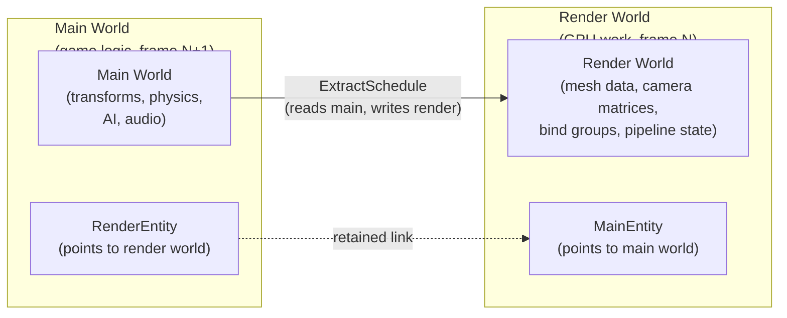
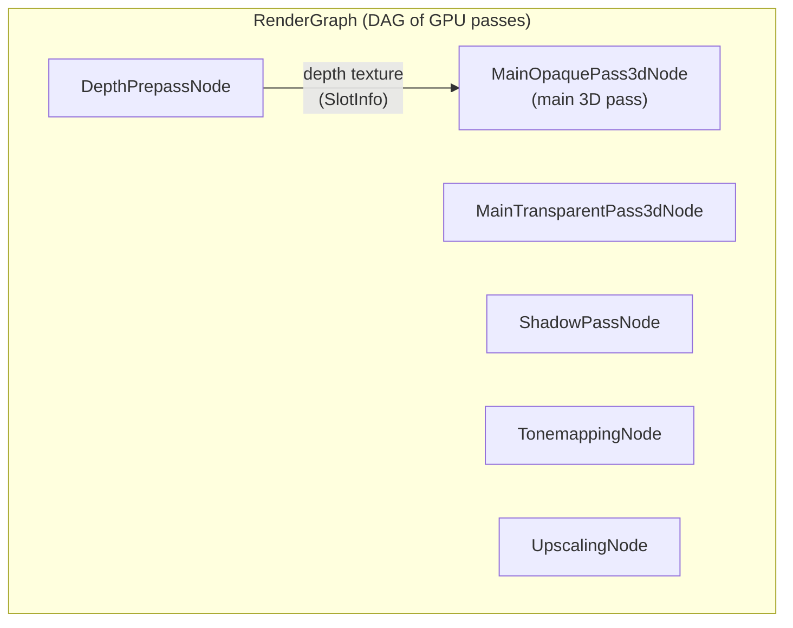
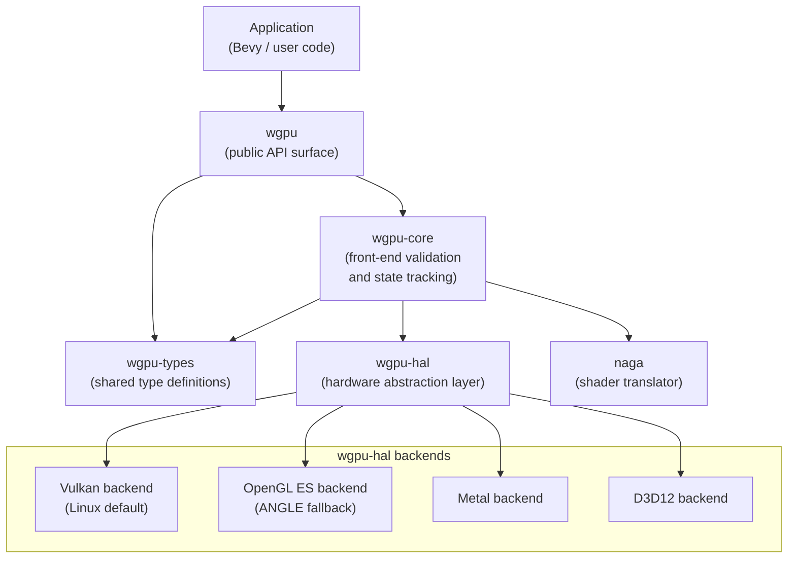
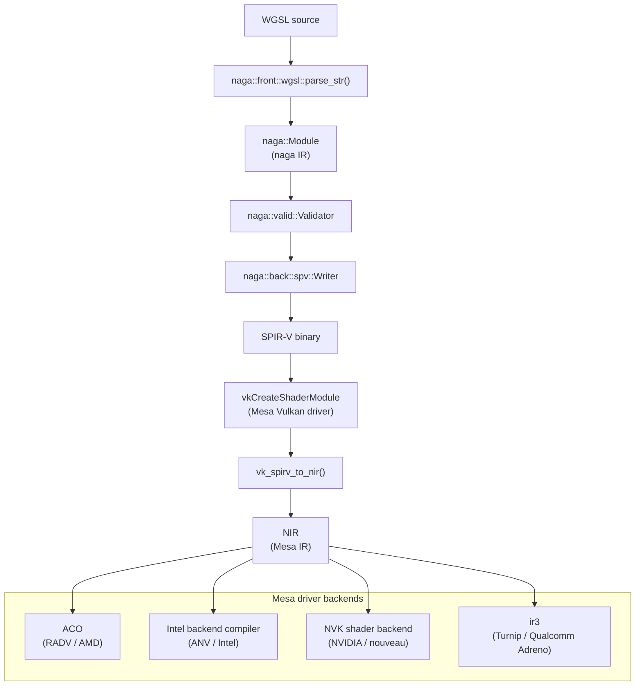
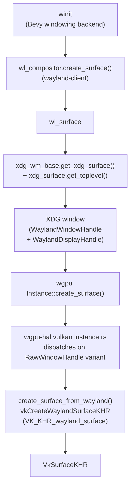

# Chapter 40: Bevy and wgpu — A Rust-Native Vulkan Client

> **Part**: Part XI — Engine and Creative Tool Internals
> **Audience**: Graphics application developers — primarily Rust game and application developers who want to understand how Bevy and wgpu map onto the Linux graphics stack; also systems developers who want a worked example of a complete Vulkan client written in Rust
> **Status**: First draft — 2026-06-06

## Table of Contents

- [Overview](#overview)
- [1. Bevy Rendering Architecture: ECS, Render World, Render Graph](#1-bevy-rendering-architecture-ecs-render-world-render-graph)
- [2. wgpu: The GPU Abstraction Layer](#2-wgpu-the-gpu-abstraction-layer)
- [3. Shader Pipeline: WGSL → naga → SPIR-V → Mesa NIR](#3-shader-pipeline-wgsl--naga--spir-v--mesa-nir)
- [4. Linux Window Integration: winit, Wayland, and EGL](#4-linux-window-integration-winit-wayland-and-egl)
- [5. Buffer and Memory Management](#5-buffer-and-memory-management)
- [6. Compute in Bevy](#6-compute-in-bevy)
- [7. Unreal Engine 5 and Unity: The Closed-Source Counterpoints](#7-unreal-engine-5-and-unity-the-closed-source-counterpoints)
- [Integrations](#integrations)
- [References](#references)

---

## Overview

**Bevy** is a data-driven game engine written entirely in Rust, using **wgpu** as its GPU abstraction layer. On Linux, **wgpu**'s **Vulkan** backend makes **Bevy** the most direct analogue in the game-engine space to **Dawn**, the **WebGPU** browser implementation covered in Chapter 35: both are Rust-language GPU clients that emit **SPIR-V** from an intermediate representation (**wgpu** uses **naga**, **Dawn** uses **Tint**) and drive **Mesa** Vulkan drivers for execution. The full stack from **Bevy** application code to **Mesa** **RADV**, **ANV**, or **NVK** and then to the **DRM** kernel subsystem follows a path this book has traced repeatedly; the contribution of this chapter is to show it from the engine's perspective, with concrete code paths through **wgpu**, **naga**, **winit**, and the **Wayland** surface-creation chain.

Section 1 covers **Bevy**'s rendering architecture:

- **Entity-Component-System (ECS)** — entities are numeric identifiers, components are plain data, and systems are query-and-transform functions operating on a **World**
- **Dual-world model** — a **Main World** holds simulation state and a **Render World** is dedicated to GPU command recording, connected by the **ExtractSchedule** extract phase
- **Retained entity model** (Bevy 0.15) — tracked via **MainEntity** and **RenderEntity** components, eliminating archetype-rebuild overhead
- **Render schedule** — ordered system sets: **PrepareAssets**, **Queue**, **PhaseSort**, **Prepare**, **Render**, and **Cleanup**
- **RenderGraph** — a directed acyclic graph whose nodes (**MainOpaquePass3dNode**, **DepthPrepassNode**, **ShadowPassNode**, **TonemappingNode**, **UpscalingNode**, and others) communicate via **SlotInfo** texture handles; the **RenderQueue** submits all commands through a single **vkQueueSubmit** call per frame

Section 2 examines **wgpu**: the cross-platform **WebGPU**-subset GPU API that provides **Bevy** with a safe Rust interface. The section covers:

- **Backend targets** — **Vulkan**, **Metal**, **D3D12**, and **OpenGL ES** (via **ANGLE**)
- **wgpu monorepo crates** — **wgpu**, **wgpu-core**, **wgpu-hal**, **wgpu-types**, and **naga**
- **Vulkan backend internals** (`wgpu-hal/src/vulkan/`) — adapter enumeration via **vkGetPhysicalDeviceProperties2**, device creation requiring **VK_KHR_swapchain**, **VK_KHR_dynamic_rendering**, and **VK_KHR_timeline_semaphore**, and the **ash** Rust bindings generated from the Khronos **vk.xml** specification
- **wgpu resource model** — **wgpu::Buffer**, **wgpu::Texture**, **wgpu::BindGroup**, **wgpu::RenderPipeline**, **wgpu::CommandEncoder**, and queue submission via **vkQueueSubmit** with timeline semaphore signaling

Section 3 traces the shader pipeline from **WGSL** (WebGPU Shading Language) through **naga**'s IR to **SPIR-V** and into **Mesa NIR** via **vk_spirv_to_nir()**:

- **naga::front::wgsl::parse_str()** — parses **WGSL** source into a **naga::Module**
- **naga::valid::Validator** — checks **WebGPU** compliance
- **naga::back::spv::Writer** — emits a minimal **SPIR-V** binary
- **Mesa driver compilers** — **RADV** via **ACO**, **ANV** via the Intel backend compiler, **NVK** via the **NVK** shader backend, **Turnip** via **ir3** for Qualcomm **Adreno** hardware
- The section compares **naga** with **Tint** and explains how both are opaque **SPIR-V** producers from **Mesa**'s perspective

Section 4 covers **Linux** window integration:

- **winit** — delegates surface creation to **Wayland** (via **wayland-client**, **wl_compositor**, **wl_surface**, **xdg_wm_base**, and **VK_KHR_wayland_surface** through **vkCreateWaylandSurfaceKHR**) or **X11**
- **EGL fallback** — via **EGL_KHR_platform_wayland** and **wl_egl_window**
- **Explicit synchronisation** — via **wp_linux_drm_syncobj_v1** and **VK_EXT_external_semaphore_fd** (wgpu issue #8996); **vulkan::Queue::add_signal_semaphore** landed in wgpu v25, **add_wait_semaphore** queued for v30
- **Swapchain management** — via **VK_KHR_swapchain** and **wgpu::SurfaceConfiguration**, including **Wayland**'s **currentExtent** behaviour and present mode mappings

Section 5 covers buffer and memory management:

- **wgpu::Buffer / VkBuffer** — staging buffer upload patterns using **wgpu::BufferUsages**, asynchronous CPU mapping via **buffer.map_async()**
- **gpu-allocator** — a pure-Rust sub-allocator managing large **VkDeviceMemory** blocks using **MemoryLocation** flags (**GpuOnly**, **CpuToGpu**, **GpuToCpu**) with attention to **bufferImageGranularity** alignment
- **DMA-BUF interop** — via **VK_KHR_external_memory_fd** and **vulkan::Device::texture_from_dmabuf_fd()**, enabling buffer import from sources such as **VA-API** video decoders
- **bevy_asset** staging pipeline and GPU mipmap generation via a **WGSL** compute shader

Section 6 covers compute in **Bevy**:

- **WGSL compute shaders** — authored with `@compute` and `@workgroup_size`
- **wgpu compute pipelines** — created via **wgpu::ComputePipelineDescriptor** and **vkCreateComputePipelines**, dispatched via **dispatch_workgroups()** / **vkCmdDispatch**
- **RenderGraph integration** — via a **ComputeNode** implementing the **Node** trait; **PipelineCache** deferred compilation prevents frame hitches
- **Use cases** — GPU particle simulation, procedural mesh generation, and physics solvers; compilation follows the same **naga** → **SPIR-V** → **NIR** → **ACO**/**LLVM** route as graphics shaders

Section 7 addresses **Unreal Engine 5** and **Unity** as closed-source counterpoints:

- **UE5** — uses a **Rendering Hardware Interface** (**RHI**) in **C++**, compiles **HLSL** shaders to **SPIR-V** via **DXC** (DirectX Shader Compiler), and supports **Nanite** virtualised geometry (using **VK_EXT_mesh_shader** for hardware mesh shading) and **Lumen** global illumination on Linux
- **Unity** — compiles **ShaderLab** / **HLSL** to **SPIR-V** via **HLSLcc** or **DXC**, supports **URP** and **HDRP** on Linux, and includes the **Burst** compiler (an **LLVM**-based ahead-of-time compiler for **DOTS** C# jobs) as a CPU compute tool separate from the **Vulkan** stack
- Both engines enter **Mesa** as **SPIR-V** via **vk_spirv_to_nir()**, making them identical to **Bevy** from the driver's perspective

The chapter is primarily aimed at graphics application developers working in Rust who want to understand what happens below **wgpu::Device::create_render_pipeline()**, and at systems developers seeking a worked example of how a production **Vulkan** client manages its entire lifecycle — from adapter enumeration through shader compilation to swapchain presentation — without writing a single line of C. Readers should be comfortable with Rust's ownership model, familiar with **Vulkan** concepts (logical device, descriptor sets, pipeline stages, queue submission), and ideally will have read Chapters 14, 15, 18, and 24 before this one.

---

## 1. Bevy Rendering Architecture: ECS, Render World, Render Graph

### The Entity-Component-System Foundation

Bevy's design is built around the Entity-Component-System (ECS) pattern, a data-oriented architecture in which entities are lightweight numeric identifiers, components are plain data attached to entities, and systems are functions that query and transform component data. The `World` is the container that holds all entities, components, and resources for a given application. [Source](https://bevyengine.org/learn/)

Unlike traditional object-oriented engine designs — where a `Renderable` interface is implemented by objects that know how to draw themselves — Bevy's ECS keeps rendering data and rendering logic strictly separated. A mesh asset, a camera transform, and a material are all just components on entities; the systems that produce GPU commands read those components and emit wgpu API calls without holding references back into the game objects that generated them.

### The Dual-World Architecture

Bevy separates rendering from game logic using two distinct `World` instances that live in the same process:

- **Main World**: holds all game state — transforms, physics bodies, AI state, audio sources, application logic. This is where user-written systems run.
- **Render World**: a second `World` that exists solely for GPU work. It holds extracted copies of whatever the renderer needs: mesh vertex data, camera matrices, light uniforms, bind groups, and pipeline state.

The separation exists to enable pipelined rendering: when `PipelinedRenderingPlugin` is active, the main world processes frame N+1 on one CPU thread while the render world is still recording GPU commands for frame N on another. The two worlds have their own entity ID spaces and synchronise through the Extract phase at frame boundaries. [Source](https://deepwiki.com/bevyengine/bevy/5.1-render-pipeline-architecture)

As of Bevy 0.15, the render world moved from an *immediate-mode* model (every render entity was destroyed and recreated each frame) to a *retained* model. Render-world entities now persist across frames. Synchronisation is tracked through complementary components: render-world entities carry a `MainEntity` component referencing their main-world counterpart, and main-world entities carry a `RenderEntity` pointing back. This eliminates the archetype-rebuild overhead that clearing the render world every frame imposed and substantially reduces per-frame CPU work for scenes with stable content. [Source](https://bevy.org/news/bevy-0-15/)



### The Extract Phase

The `ExtractSchedule` is the synchronisation point between the two worlds. Systems that run in `ExtractSchedule` read from the main world and write extracted data into the render world. The canonical mechanism is the `ExtractComponent` trait:

```rust
// crates/bevy_render/src/extract_component.rs
// Trait definition for components that sync from main world → render world
pub trait ExtractComponent<F = ()>: SyncComponent<F> {
    type QueryData: ReadOnlyQueryData;
    type QueryFilter: QueryFilter;
    type Out: Bundle<Effect: NoBundleEffect>;

    fn extract_component(item: QueryItem<'_, '_, Self::QueryData>)
        -> Option<Self::Out>;
}

// The system that processes all synced entities each frame
fn extract_components<C: ExtractComponent<F>, F>(
    mut commands: Commands,
    mut previous_len: Local<usize>,
    query: Extract<Query<(RenderEntity, C::QueryData), C::QueryFilter>>,
)
```

The `Extract<Q>` wrapper makes a query read from the *main* world even though the system runs inside the render app — it is the mechanism by which the two worlds share a read reference at extraction time. Systems batch-insert extracted components using `commands.try_insert_batch(values)`. When extraction returns `None`, the corresponding component is removed from the render entity, keeping the two worlds in sync when game objects disappear.

Extract should stay minimal: it copies data, not computes it. Heavy mesh or texture processing happens later in the `PrepareAssets` stage, which runs entirely inside the render world after extraction is complete.

### The Render Schedule

Inside the `RenderApp` sub-application, the `Render` schedule advances through an ordered sequence of system sets:

| System Set | Responsibility |
|---|---|
| `ExtractCommands` | Apply deferred structural changes from the extract phase |
| `PrepareAssets` | Convert `Handle<T>` assets into GPU-resident representations |
| `PrepareMeshes` | Upload vertex and index buffers to GPU memory |
| `CreateViews` | Allocate shadow map views, reflection capture views |
| `Specialize` | Create pipeline variants keyed to mesh attributes and material parameters |
| `PrepareViews` | Allocate per-view textures, compute view uniforms |
| `Queue` | Insert drawable items into render phases with associated draw functions |
| `PhaseSort` | Sort opaque items front-to-back, transparent items back-to-front |
| `Prepare` | Create bind groups, write per-object uniforms to GPU buffers |
| `Render` | Execute the RenderGraph — record and submit GPU commands |
| `Cleanup` | Release per-frame scratch resources |

The `Render` system set is where the `RenderGraph` runs. Frame-to-frame persistent data lives in resources; per-frame ephemeral data is rebuilt in `Prepare` and released in `Cleanup`.

### The RenderGraph

The `RenderGraph` is Bevy's directed acyclic graph of GPU work. Each node in the graph is a `Node` implementation representing a single GPU pass — a render pass, a compute dispatch, or a sub-graph. Nodes communicate via `SlotInfo` — typed handles for textures and bind groups passed along directed edges, allowing a depth pre-pass node to hand its depth texture to the main 3D pass node through the graph's slot mechanism.

Built-in nodes include `MainOpaquePass3dNode`, `MainTransparentPass3dNode`, `DepthPrepassNode`, `ShadowPassNode`, `TonemappingNode`, and `UpscalingNode`. Custom nodes can be registered and inserted at arbitrary positions in the graph to add pre-processing or post-processing passes without forking Bevy's core rendering code.



Graph execution is driven by the `render_system` function, which runs the `RenderGraph` schedule. Node implementations record wgpu command encoders in `Render` system set systems and submit them through `RenderQueue::submit`:

```rust
// crates/bevy_render/src/renderer/mod.rs
// Simplified form of the render system showing graph execution and submission
pub fn render_system(world: &mut World, ...) {
    // Execute graph nodes — each records into a wgpu::CommandEncoder
    world.run_schedule(RenderGraph);

    // Collect finalisation commands (screenshots, readbacks)
    let mut encoder =
        render_device.create_command_encoder(
            &wgpu::CommandEncoderDescriptor::default()
        );
    submit_screenshot_commands(world, &mut encoder);
    submit_readback_commands(world, &mut encoder);

    // Submit: maps to vkQueueSubmit with a timeline semaphore signal
    let render_queue = world.resource::<RenderQueue>();
    render_queue.submit([encoder.finish()]);
}
```

The `RenderQueue` is a thin wrapper around `wgpu::Queue`. The submit call is the only point where CPU-recorded commands cross to the GPU; everything before it is deferred command recording that has no effect on hardware until this call.

### What This Architecture Achieves

The architectural payoff is that rendering is a pure data transformation: the ECS world feeds in, GPU commands come out. There is no hidden state in renderer objects, no callbacks into game logic during GPU recording, and no aliasing between simulation state and GPU resources during a frame. This maps directly onto wgpu's stateless command recording model, which also records into an encoder with no persistent draw-call state. The ECS and the WebGPU-subset API share the same compositional philosophy.

---

## 2. wgpu: The GPU Abstraction Layer

### What wgpu Is

wgpu is a cross-platform GPU API written in Rust that implements the WebGPU specification subset plus native extensions. [Source](https://github.com/gfx-rs/wgpu) It does not thin-wrap a single native API; it provides its own abstraction over Vulkan, Metal, D3D12, OpenGL ES (via ANGLE), and WebGL2, with a single `wgpu::` API surface that compiles to any of those backends. On Linux, the Vulkan backend is the default and recommended path. The OpenGL ES backend via ANGLE/EGL is available as a fallback for hardware or drivers that do not expose a usable Vulkan implementation.

wgpu is developed in the `gfx-rs/wgpu` monorepo on GitHub. [Source](https://github.com/gfx-rs/wgpu) The main crates are:

- `wgpu` — the public API surface; `wgpu::Device`, `wgpu::Queue`, `wgpu::Buffer`, etc.
- `wgpu-core` — the front-end validation and state tracking that maps `wgpu::` calls to `wgpu-hal::` calls
- `wgpu-hal` — the hardware abstraction layer; one backend module per API
- `wgpu-types` — shared type definitions used across all layers
- `naga` — the shader translator (covered in section 3)



### Backend Selection on Linux

`wgpu::Instance` is constructed with a set of `Backends` flags:

```rust
// Application entry point — standard instance creation on Linux
let instance = wgpu::Instance::new(&wgpu::InstanceDescriptor {
    backends: wgpu::Backends::VULKAN,  // or Backends::all() for auto
    ..Default::default()
});
```

`Backends::all()` selects Vulkan when available; the environment variable `WGPU_BACKEND=vulkan` forces Vulkan explicitly, and `WGPU_BACKEND=gl` forces the OpenGL ES fallback. Adapter enumeration via `instance.enumerate_adapters(backends)` returns all usable GPUs; Bevy's default adapter selection prefers the first discrete GPU. [Source](https://docs.rs/wgpu/)

### The Vulkan Backend Internals

The Vulkan backend lives under `wgpu-hal/src/vulkan/`. Its files correspond directly to the Vulkan object hierarchy:

| File | Contents |
|---|---|
| `instance.rs` | `vk::Instance` creation, surface creation per platform |
| `adapter.rs` | Physical device enumeration, extension and feature queries |
| `device.rs` | Logical device, pipeline cache, buffer/texture/sampler creation |
| `command.rs` | Command buffer recording, render and compute pass wrappers |
| `descriptor.rs` | Descriptor pool and set management |
| `conv.rs` | Conversion between `wgpu` types and Vulkan types |
| `semaphore_list.rs` | Timeline semaphore management for queue synchronisation |
| `drm.rs` | Linux DRM integration (DMA-buf import/export) |
| `swapchain/` | Swapchain creation and present-mode management |

**Ash bindings.** All Vulkan calls go through the `ash` crate, which provides Rust bindings generated mechanically from the Khronos `vk.xml` specification file. [Source](https://github.com/ash-rs/ash) `ash` exposes the full Vulkan API as unsafe Rust functions; wgpu-hal wraps these in safe abstractions. The dependency on the XML-derived bindings means that when Khronos adds a new extension, ash gains a typed binding for it as soon as the XML is updated, and wgpu can call the new entrypoint without manually writing FFI stubs.

**Adapter creation.** `expose_adapter()` in `adapter.rs` inspects a `vk::PhysicalDevice` via `vkGetPhysicalDeviceProperties2` and `vkGetPhysicalDeviceFeatures2`, using Vulkan 1.1 chained `pNext` structures to query extension-specific capabilities in a single call. It returns an `ExposedAdapter` that describes device name, vendor ID, driver version, and the set of wgpu features and downlevel flags the physical device supports:

```rust
// wgpu-hal/src/vulkan/adapter.rs
// Physical device inspection: queries properties, features, and extensions
pub fn expose_adapter(
    &self,
    phd: vk::PhysicalDevice,
) -> Option<crate::ExposedAdapter<super::Api>> {
    // Populates PhysicalDeviceProperties (ext chain) and
    // PhysicalDeviceFeatures (ext chain) via vkGetPhysicalDeviceProperties2
    let caps = self.shared.inspect(phd);
    // Maps vendor ID, device type, driver info → adapter metadata
    // Maps Vulkan features + extensions → wgpu::Features bitflags
    // ...
}
```

**Device creation and required extensions.** `get_required_extensions()` builds the list of device extensions conditioned on API version and requested features. The always-required extension is `VK_KHR_swapchain`. Dynamic rendering (`VK_KHR_dynamic_rendering`) is used for render pass execution. Timeline semaphores (`VK_KHR_timeline_semaphore`, promoted to core in Vulkan 1.2) underlie all queue synchronisation. Other extensions are requested based on feature flags: `VK_KHR_external_semaphore_fd` for external semaphore export/import, `VK_KHR_external_memory_fd` for DMA-buf interop (section 5), and extension-specific features as promoted in Vulkan 1.3.

The adapter also exposes a lower-level escape hatch since wgpu v26: `vulkan::Adapter::open_with_callback` allows applications to modify the device creation `pNext` chain and extension list before `vkCreateDevice` is called. This supports advanced interop scenarios — for example, enabling NVIDIA-specific extensions or Vulkan Video extensions that wgpu does not natively expose. [Source](https://github.com/gfx-rs/wgpu/releases)

### The wgpu Resource Model

wgpu's public resource types — `wgpu::Buffer`, `wgpu::Texture`, `wgpu::BindGroup`, `wgpu::RenderPipeline` — are safe Rust wrappers whose lifetimes are managed through reference counting (`Arc` internally). They cannot be used after the `wgpu::Device` that created them is dropped, and they are submitted to the GPU through the `wgpu::Queue` interface, not through direct handle manipulation.

Command recording uses `wgpu::CommandEncoder`, which wraps a Vulkan command buffer. The encoder is obtained from the device, render and compute passes are opened and closed on it, and `encoder.finish()` seals it into a `wgpu::CommandBuffer`. Submission:

```rust
// wgpu API: command recording and submission
// Internally: vkAllocateCommandBuffers → vkBeginCommandBuffer → ...
//             → vkEndCommandBuffer → vkQueueSubmit
let encoder = device.create_command_encoder(&wgpu::CommandEncoderDescriptor::default());
// ... record render/compute passes ...
let command_buffer = encoder.finish();
queue.submit([command_buffer]);  // → vkQueueSubmit with timeline semaphore signal
```

`queue.submit()` maps to `vkQueueSubmit`, signaling a timeline semaphore upon completion. The timeline semaphore is the primitive that wgpu uses for all CPU–GPU synchronisation: its monotonically-increasing counter replaces the per-submission fence model of Vulkan 1.0.

The Vulkan backend incrementally extends external-semaphore interop. wgpu v25.0.0 (PR #6813) added `vulkan::Queue::add_signal_semaphore`, allowing a Vulkan semaphore allocated outside wgpu to be signaled upon `queue.submit()` — enabling external GPU consumers (CUDA, OpenCL, D3D12) to wait on wgpu work without a CPU stall. The symmetric operation `vulkan::Queue::add_wait_semaphore` / `remove_wait_semaphore` — allowing wgpu to wait on semaphores signaled by external producers — was merged in PR #9461 and is queued for v30 (unreleased as of mid-2026). This is covered in section 4. [Source](https://github.com/gfx-rs/wgpu/blob/trunk/CHANGELOG.md)

---

## 3. Shader Pipeline: WGSL → naga → SPIR-V → Mesa NIR

### WGSL: The Shader Language

WGSL (WebGPU Shading Language) is the primary shader language consumed by wgpu. [Source](https://gpuweb.github.io/gpuweb/wgsl/) It is statically typed, memory-safe (no pointer arithmetic, no undefined behaviour), and designed specifically for the WebGPU resource model. Resources — uniform buffers, storage buffers, textures, samplers — are declared as `@group(N) @binding(N)` variables. There are no implicit globals; all hardware resources are explicit. A minimal vertex and fragment shader pair:

```wgsl
// Example WGSL: vertex + fragment shader for textured geometry
// Declare uniform buffer at group 0, binding 0
struct Matrices {
    model_view_proj: mat4x4<f32>,
}
@group(0) @binding(0) var<uniform> matrices: Matrices;

// Declare texture and sampler
@group(0) @binding(1) var base_color_texture: texture_2d<f32>;
@group(0) @binding(2) var base_color_sampler: sampler;

struct VertexOutput {
    @builtin(position) clip_position: vec4<f32>,
    @location(0)       uv:            vec2<f32>,
}

@vertex
fn vs_main(@location(0) position: vec3<f32>,
           @location(1) uv:       vec2<f32>) -> VertexOutput {
    var out: VertexOutput;
    out.clip_position = matrices.model_view_proj * vec4<f32>(position, 1.0);
    out.uv = uv;
    return out;
}

@fragment
fn fs_main(in: VertexOutput) -> @location(0) vec4<f32> {
    return textureSample(base_color_texture, base_color_sampler, in.uv);
}
```

WGSL is not a "simpler" or "less capable" language than GLSL. It covers the full range of compute, vertex, fragment, and (via native extensions) mesh shader workloads. The constraint that all resource accesses are explicit, and that the language forbids unsynchronised mutable aliasing, makes WGSL particularly amenable to offline validation — which is precisely the role that naga plays.

### naga: The Shader Translation Framework

naga is a Rust library for shader translation. [Source](https://github.com/gfx-rs/wgpu) It is developed as part of the wgpu monorepo and is also used independently by Firefox's WebGPU implementation. naga defines its own module IR: a graph-based intermediate representation with an explicit module structure containing types, constants, global variables, functions, and entry points. This IR occupies a similar conceptual space to SPIR-V's module format but is structured for manipulation and validation in Rust rather than for direct hardware consumption.

**Front ends:** WGSL parser (primary), SPIR-V parser, GLSL parser (for compatibility paths). The WGSL parser is the most heavily tested and is the primary production path for wgpu.

**Back ends:** SPIR-V emitter (for Vulkan), GLSL emitter (for the OpenGL ES fallback), MSL emitter (for Metal), HLSL emitter (for D3D12). Each back end targets the specific constraints of its destination API — the SPIR-V back end emits only the capabilities required by the shader; the GLSL back end handles the layout differences between GLSL 4.50 and GLSL ES 3.10.

**Validation:** naga validates shaders for WebGPU compliance before translation. This is not optional in the wgpu path; a shader that fails validation cannot be used to create a pipeline. The validation step catches semantic errors — incorrect storage-class usage, unsupported built-ins, type mismatches — before the SPIR-V blob is submitted to the Vulkan driver, preventing driver-specific validation failures that would otherwise surface as opaque `VK_ERROR_INITIALIZATION_FAILED` results.

### WGSL → naga IR

`naga::front::wgsl::parse_str()` parses WGSL source text into a `naga::Module`. [Source](https://docs.rs/naga/latest/naga/front/wgsl/) The function performs lexing, parsing, type resolution, function call graph construction, and built-in resolution in a single pass. The resulting `Module` is a complete, self-contained IR representation: all types are resolved to their concrete definitions, all identifiers are resolved to their declarations, and all entry points are annotated with their shader stage and workgroup size (for compute).

```rust
// Direct use of naga's WGSL front end (used internally by wgpu)
// naga/src/front/wgsl/mod.rs
let source = include_str!("my_shader.wgsl");
let module: naga::Module = naga::front::wgsl::parse_str(source)
    .expect("WGSL parse failed");

// Validate for WebGPU compliance
let info = naga::valid::Validator::new(
    naga::valid::ValidationFlags::all(),
    naga::valid::Capabilities::all(),
)
.validate(&module)
.expect("naga validation failed");
```

The `Validator` checks the module against the WebGPU specification's restrictions on storage classes, built-in variables, image formats, and numeric types. Validation failures are returned as structured `naga::WithSpan<ValidationError>` values that include source-location information, enabling wgpu to map validation errors back to specific WGSL source lines.

### naga IR → SPIR-V

`naga::back::spv::Writer` translates the validated `naga::Module` into a SPIR-V binary word stream. [Source](https://docs.rs/naga/latest/naga/back/spv/) The translation is guided by an `Options` struct that controls, among other things:

- `lang_version`: the target SPIR-V version (`(1, 3)` for Vulkan 1.1, `(1, 5)` for Vulkan 1.2)
- `capabilities`: the SPIR-V capability set to emit (naga derives the minimal required set from the shader's content)
- `zero_initialize_workgroup_memory`: whether to emit initialisation for workgroup-memory variables (required for WebGPU compliance)
- `binding_map`: optional remapping of `@group`/`@binding` pairs for backend-specific layouts

Capability annotation is a key correctness property: naga emits `OpCapability` only for capabilities that the shader actually exercises. A vertex shader that uses no 64-bit floats will not emit `Float64`. This matters for Mesa Vulkan drivers, which perform capability verification during `vkCreateShaderModule`; an unnecessarily broad capability set can trigger validation errors on stricter implementations.

The emitted SPIR-V is spec-compliant and passes `spirv-val` validation. [Source](https://github.com/gfx-rs/wgpu) SPIR-V extensions required by the shader — for example, `SPV_KHR_storage_buffer_storage_class` for storage buffers, `SPV_KHR_variable_pointers` when needed — are emitted only when the corresponding features are present in the shader.

### SPIR-V → Mesa NIR: The Kernel Connection

The SPIR-V blob produced by naga enters the Mesa Vulkan driver as the `pCode` member of `VkShaderModuleCreateInfo` passed to `vkCreateShaderModule`. From there, Mesa's `vk_spirv_to_nir()` function parses it into NIR — the compiler IR described in depth in Chapter 14. This is the identical path that any other SPIR-V producer follows: glslang-compiled GLSL, DXC-compiled HLSL, Tint-compiled WGSL (Chapter 35), or hand-authored SPIR-V all enter Mesa NIR through the same front end. From naga's perspective, the Vulkan driver is a black box that accepts SPIR-V; from Mesa's perspective, naga is just another SPIR-V producer, no different from glslang or Tint in terms of the IR format it emits.

From NIR, compilation proceeds through the standard Mesa pipeline covered in Chapters 14 and 15:

- **RADV (AMD Vulkan)**: NIR → ACO (Chapter 15) — the AMD compiler backend that replaced LLVM as RADV's primary backend; ACO's optimisations (dead-code elimination, register allocation, instruction scheduling) apply equally to WGSL-originated NIR.
- **ANV (Intel Vulkan)**: NIR → Intel backend compiler (IGC or the ANV-integrated backend).
- **NVK (NVIDIA Vulkan, nouveau)**: NIR → NVK's shader backend.
- **Turnip (Qualcomm Adreno Vulkan)**: NIR → Qualcomm ISA via `ir3`.



The naga→SPIR-V→NIR path makes wgpu a first-class NIR consumer. WGSL is not a "simpler" path into the GPU — it is an equally rigorous entry point into the same compilation pipeline that native Vulkan applications use.

### Comparison with Dawn/Tint

naga and Tint (Dawn's shader translator, Chapter 35) occupy the same architectural position: they both translate a high-level shading language into SPIR-V for Mesa consumption. The key differences:

- naga is pure Rust; Tint is C++.
- naga targets the WebGPU subset of WGSL and native wgpu extensions; Tint implements the full WebGPU specification.
- Both validate before emitting SPIR-V, but their validation logic and error messages differ.
- naga's IR is a Rust enum/struct tree; Tint's AST/IR is a C++ class hierarchy.
- From Mesa's perspective, both are opaque SPIR-V sources — the same `vk_spirv_to_nir()` entry point handles both without distinction.

The practical consequence for Bevy is that its shader validation happens in Rust before any GPU driver interaction. Type errors, binding mismatches, and unsupported operations are caught at pipeline creation time with Rust-structured diagnostics, not as opaque driver errors deep in a validation layer.

---

## 4. Linux Window Integration: winit, Wayland, and EGL

### winit: Bevy's Windowing Backend

Bevy delegates all window and surface creation to `winit`, a cross-platform window creation library. [Source](https://github.com/rust-windowing/winit) On Linux, winit supports both X11 and Wayland. As of Bevy 0.18, X11 support is compiled in by default and Wayland support is enabled via a Cargo feature flag:

```toml
# Cargo.toml — enabling native Wayland support in Bevy
[dependencies]
bevy = { version = "0.18", features = ["wayland"] }
```

When both backends are compiled in, the runtime choice can be forced via an environment variable: `WINIT_UNIX_BACKEND=wayland` or `WINIT_UNIX_BACKEND=x11`. Without the `wayland` feature, Bevy on a Wayland compositor runs through XWayland — the X11 compatibility layer. This produces functional output but loses native Wayland optimisations: the XWayland path goes through the X11 compositing chain, adding a buffer copy and losing access to Wayland's explicit synchronisation protocol. [Source](https://bevy-cheatbook.github.io/platforms/linux.html)

### Native Wayland Surface Creation

When the Wayland backend is selected, winit creates a native `wl_surface` through the `wayland-client` library:

1. `wl_compositor.create_surface()` → `wl_surface` handle
2. `xdg_wm_base.get_xdg_surface()` + `xdg_surface.get_toplevel()` → XDG window

winit then returns a platform-specific `RawWindowHandle` and `RawDisplayHandle` from the `raw-window-handle` crate:



```rust
// winit Wayland surface: raw handle extraction
// winit/src/platform/wayland.rs (simplified)
// RawWindowHandle::Wayland contains the wl_surface pointer
// RawDisplayHandle::Wayland contains the wl_display pointer
//
// The handle types are defined in the `raw-window-handle` crate:
//   WaylandWindowHandle  { surface: NonNull<c_void> }  ← *wl_surface
//   WaylandDisplayHandle { display: NonNull<c_void> }  ← *wl_display
```

wgpu receives these handles through its `create_surface()` API. In `wgpu-hal/src/vulkan/instance.rs`, the dispatch matches on the handle variant:

```rust
// wgpu-hal/src/vulkan/instance.rs
// Surface creation: dispatches on RawWindowHandle variant to the
// platform-specific Vulkan surface extension
fn create_surface(
    &self,
    display_handle: raw_window_handle::RawDisplayHandle,
    window_handle: raw_window_handle::RawWindowHandle,
) -> Result<super::Surface, crate::InstanceError> {
    match (window_handle, display_handle) {
        (Rwh::Wayland(handle), Rdh::Wayland(display)) => {
            self.create_surface_from_wayland(
                display.display.as_ptr(),
                handle.surface.as_ptr(),
            )
        }
        // ... other platforms ...
    }
}

fn create_surface_from_wayland(
    &self,
    display: *mut vk::wl_display,
    surface: *mut vk::wl_surface,
) -> Result<super::Surface, crate::InstanceError> {
    // Validate VK_KHR_wayland_surface is present in enabled extensions
    let wayland_loader =
        khr::wayland_surface::Instance::new(&self.shared.entry, &self.shared.raw);
    let create_info = vk::WaylandSurfaceCreateInfoKHR::default()
        .display(display)
        .surface(surface);
    // vkCreateWaylandSurfaceKHR → VkSurfaceKHR
    let vk_surface = unsafe {
        wayland_loader.create_wayland_surface(&create_info, None)?
    };
    create_surface_from_vk_surface_khr(vk_surface)
}
```

The `VK_KHR_wayland_surface` instance extension must have been requested at `vkCreateInstance` time; wgpu's instance creation checks for it during adapter enumeration and fails gracefully if unavailable, falling back to the X11 surface extension.

### EGL Surface Path

When the OpenGL ES fallback backend is active (`WGPU_BACKEND=gl`), wgpu creates an EGL context on Wayland using the `EGL_KHR_platform_wayland` extension (Chapter 24). A `wl_egl_window` is created over the `wl_surface`, and an EGL surface is created via `eglCreateWindowSurface()`. This path is functionally equivalent but bypasses the Vulkan stack entirely; Bevy uses it as a last resort for hardware or drivers that cannot present a usable Vulkan adapter.

### Explicit Synchronisation on Wayland

Explicit synchronisation allows the Wayland compositor to know precisely when a client's GPU rendering is complete before using the buffer for composition — replacing the implicit synchronisation that previously required the compositor to guess or conservatively stall. On Linux, the `wp_linux_drm_syncobj_v1` Wayland protocol implements this using DRM synchronisation objects (Chapter 3, Chapter 20).

The Vulkan-side mechanism for a client to participate in compositor explicit sync is `VK_EXT_external_semaphore_fd`: the client exports a sync file descriptor from a Vulkan timeline semaphore that signals when rendering is complete, then passes that fd to the compositor.

wgpu's path toward this has proceeded incrementally. The signal-side primitive — `vulkan::Queue::add_signal_semaphore`, which signals an external `vk::Semaphore` upon `queue.submit()` — landed in wgpu v25.0.0 (PR #6813). The symmetric wait-side primitive — `vulkan::Queue::add_wait_semaphore` / `remove_wait_semaphore`, which inserts an external semaphore into the submission wait-set — was merged in PR #9461 and is queued for v30 (unreleased as of mid-2026). These primitives allow external GPU work producers (CUDA, OpenCL) and consumers to synchronise with wgpu command submission without CPU-side blocking. Full turnkey WSI explicit-sync — the path where wgpu automatically participates in `wp_linux_drm_syncobj_v1` on a Wayland surface — was in active development as of early 2026 (tracked in wgpu issue #8996). [Source](https://github.com/gfx-rs/wgpu/blob/trunk/CHANGELOG.md)

**Note: verify against current wgpu source.** The exact API surface and whether compositor explicit sync is enabled by default or requires a feature flag had not stabilised as of the research for this chapter. Check `CHANGELOG.md` in the wgpu repository for the current status of the WSI explicit-sync path. [Source](https://github.com/gfx-rs/wgpu/issues/8996)

### Swapchain Management

wgpu maps presentation to `VK_KHR_swapchain`. The public API:

```rust
// wgpu swapchain configuration on Linux/Wayland
let surface_caps = surface.get_capabilities(&adapter);
surface.configure(&device, &wgpu::SurfaceConfiguration {
    usage:        wgpu::TextureUsages::RENDER_ATTACHMENT,
    format:       surface_caps.formats[0],  // typically Bgra8UnormSrgb on Linux
    width:        window_size.width,
    height:       window_size.height,
    present_mode: wgpu::PresentMode::Fifo,  // → VK_PRESENT_MODE_FIFO_KHR
    alpha_mode:   wgpu::CompositeAlphaMode::Opaque,
    view_formats: vec![],
    desired_maximum_frame_latency: 2,
});
```

Under `VK_KHR_wayland_surface`, `vkGetPhysicalDeviceSurfaceCapabilitiesKHR` returns `currentExtent = {0xFFFFFFFF, 0xFFFFFFFF}`, meaning the application controls the swapchain dimensions — unlike X11, where the extent matches the window's current pixel dimensions. This is the standard Wayland swapchain behaviour described in Chapter 24: the Wayland compositor does not resize the swapchain; the client must recreate it in response to `configure` events from the compositor.

Present modes map directly to Vulkan: `PresentMode::Fifo` → `VK_PRESENT_MODE_FIFO_KHR` (vsync, always available), `PresentMode::Mailbox` → `VK_PRESENT_MODE_MAILBOX_KHR` (triple buffering, driver-dependent), `PresentMode::Immediate` → `VK_PRESENT_MODE_IMMEDIATE_KHR` (uncapped, tearing).

---

## 5. Buffer and Memory Management

### wgpu Buffer Model

`wgpu::Buffer` wraps a `VkBuffer` bound to a sub-allocation from a managed `VkDeviceMemory` block. The usage flags visible at the API level map directly to Vulkan:

| wgpu `BufferUsages` | Vulkan `VkBufferUsageFlags` |
|---|---|
| `VERTEX` | `VK_BUFFER_USAGE_VERTEX_BUFFER_BIT` |
| `INDEX` | `VK_BUFFER_USAGE_INDEX_BUFFER_BIT` |
| `UNIFORM` | `VK_BUFFER_USAGE_UNIFORM_BUFFER_BIT` |
| `STORAGE` | `VK_BUFFER_USAGE_STORAGE_BUFFER_BIT` |
| `COPY_SRC` | `VK_BUFFER_USAGE_TRANSFER_SRC_BIT` |
| `COPY_DST` | `VK_BUFFER_USAGE_TRANSFER_DST_BIT` |
| `MAP_READ` | host-visible memory type required |
| `MAP_WRITE` | host-visible memory type required |

Buffers with `MAP_READ` or `MAP_WRITE` require host-visible memory. wgpu exposes asynchronous mapping via `buffer.map_async(mode, range, callback)` — the buffer cannot be used by the GPU while it is mapped, and the callback fires when the GPU has finished using it and the CPU mapping is safe.

Staging buffers — CPU-visible buffers used as transfer intermediaries — are the standard upload pattern:

```rust
// Staging buffer pattern for GPU upload
let staging = device.create_buffer_init(&wgpu::util::BufferInitDescriptor {
    label: Some("staging"),
    contents: &cpu_data,
    usage: wgpu::BufferUsages::COPY_SRC,
});
let gpu_buffer = device.create_buffer(&wgpu::BufferDescriptor {
    label: Some("vertex_buffer"),
    size: byte_size,
    usage: wgpu::BufferUsages::VERTEX | wgpu::BufferUsages::COPY_DST,
    mapped_at_creation: false,
});
// Copy in a command encoder: records vkCmdCopyBuffer
encoder.copy_buffer_to_buffer(&staging, 0, &gpu_buffer, 0, byte_size);
```

### gpu-allocator: The Vulkan Memory Allocator

wgpu's Vulkan backend does not call `vkAllocateMemory` once per buffer — that would exhaust the per-device allocation limit, which is 4096 on many implementations. Instead, it uses the `gpu-allocator` crate ([Source](https://github.com/Traverse-Research/gpu-allocator)), a pure-Rust VMA-equivalent that manages large `VkDeviceMemory` blocks and sub-allocates from them.

`gpu-allocator` implements a free-list allocator with linear and non-linear (tiled) allocation paths. The distinction matters because Vulkan requires a minimum alignment (`bufferImageGranularity`) between linear resources (buffers, linear images) and non-linear resources (optimal-tiling images) within the same memory block. `gpu-allocator` handles this granularity automatically.

Memory location maps to Vulkan memory property flags:

| `gpu_allocator::MemoryLocation` | Vulkan properties |
|---|---|
| `GpuOnly` | `DEVICE_LOCAL` |
| `CpuToGpu` | `HOST_VISIBLE | HOST_COHERENT` (or `DEVICE_LOCAL | HOST_VISIBLE` on BAR) |
| `GpuToCpu` | `HOST_VISIBLE | HOST_CACHED` |

The `create_buffer` path in `wgpu-hal/src/vulkan/device.rs` maps wgpu buffer usage flags to the appropriate `MemoryLocation` and delegates to `gpu-allocator`:

```rust
// wgpu-hal/src/vulkan/device.rs
// Buffer creation: usage flags → memory location → gpu-allocator call
unsafe fn create_buffer(
    &self,
    desc: &crate::BufferDescriptor,
) -> Result<super::Buffer, crate::DeviceError> {
    // Determine memory location from access pattern
    let location = match (is_cpu_read, is_cpu_write) {
        (true, true)   => gpu_allocator::MemoryLocation::CpuToGpu,
        (true, false)  => gpu_allocator::MemoryLocation::GpuToCpu,
        (false, true)  => gpu_allocator::MemoryLocation::CpuToGpu,
        (false, false) => gpu_allocator::MemoryLocation::GpuOnly,
    };

    // Sub-allocate from an existing VkDeviceMemory block
    // valid_ash_memory_types masks out unsupported memory types
    let allocation = self.mem_allocator.lock()
        .allocate(&gpu_allocator::vulkan::AllocationCreateDesc {
            name,
            requirements: vk::MemoryRequirements {
                memory_type_bits: requirements.memory_type_bits
                    & self.valid_ash_memory_types,
                ..requirements
            },
            location,
            linear: true,   // buffers are always linear
            allocation_scheme:
                gpu_allocator::vulkan::AllocationScheme::GpuAllocatorManaged,
        })?;
    // Bind VkBuffer to the sub-allocation
    device.bind_buffer_memory(vk_buffer, allocation.memory(), allocation.offset())?;
    // ...
}
```

The `valid_ash_memory_types` bitmask filters out memory type indices that ash reports as unsupported on the current physical device, preventing allocation from incompatible memory heaps.

As of wgpu v28, the Vulkan backend migrated from `gpu-alloc` (an older Rust allocator) to `gpu-allocator`, unifying with the behaviour of the D3D12 backend and gaining access to allocator diagnostics via `Device::generate_allocator_report`. [Source](https://github.com/gfx-rs/wgpu/releases)

### DMA-BUF Interop

DMA-BUF interop — importing a DRM buffer from an external source (such as a VA-API video decoder) as a wgpu texture — requires the `VK_KHR_external_memory_fd` Vulkan extension. The Vulkan backend exposes `vulkan::Device::texture_from_dmabuf_fd()`, gated behind the `VULKAN_EXTERNAL_MEMORY_FD` and `VULKAN_EXTERNAL_MEMORY_DMA_BUF` feature flags, added in PR #9412 and queued for v30 (unreleased as of mid-2026). [Source](https://github.com/gfx-rs/wgpu/blob/trunk/CHANGELOG.md) This allows an application to import a DMA-BUF file descriptor, obtained for example from a VA-API video decoder (Chapter 26) or a V4L2 capture device, as a `wgpu::Texture` that the GPU can sample from.

Applications needing DMA-BUF interop before this lands can use the lower-level `unsafe` wgpu-hal API to construct a texture from an external `vk::Image`, bypassing the public wgpu API but retaining wgpu's command recording model.

### Bevy Asset Loading and GPU Upload

Bevy's asset system (`bevy_asset`) loads image files on a thread pool. Once loaded, the image data is uploaded to GPU memory in the render world's `PrepareAssets` stage via a staging buffer, as described above. Mipmaps are generated via a GPU compute pass — a WGSL compute shader samples the previous mip level and writes the downsampled result — avoiding the CPU overhead of software mipmap generation for large assets.

---

## 6. Compute in Bevy

### wgpu Compute Pipelines

A compute workload in wgpu starts with a WGSL shader using the `@compute` attribute and `@workgroup_size` to specify thread group dimensions:

```wgsl
// WGSL compute shader: particle position integration
// Dispatched from Bevy's ComputeNode via dispatch_workgroups(N/64, 1, 1)

struct Particle {
    position: vec3<f32>,
    velocity: vec3<f32>,
}

@group(0) @binding(0) var<storage, read_write> particles: array<Particle>;
@group(0) @binding(1) var<uniform> delta_time: f32;

@compute @workgroup_size(64, 1, 1)
fn cs_main(@builtin(global_invocation_id) gid: vec3<u32>) {
    let idx = gid.x;
    if idx >= arrayLength(&particles) { return; }
    particles[idx].position += particles[idx].velocity * delta_time;
}
```

The pipeline is created once and cached:

```rust
// wgpu compute pipeline creation from WGSL shader module
let shader = device.create_shader_module(wgpu::ShaderModuleDescriptor {
    label: Some("particle_cs"),
    source: wgpu::ShaderSource::Wgsl(include_str!("particle.wgsl").into()),
});
let compute_pipeline = device.create_compute_pipeline(&wgpu::ComputePipelineDescriptor {
    label: Some("particle_simulate"),
    layout: Some(&pipeline_layout),
    module: &shader,
    entry_point: Some("cs_main"),
    compilation_options: Default::default(),
    cache: None,
});
```

`device.create_shader_module()` triggers the naga→SPIR-V path described in section 3: the WGSL is parsed, validated, translated to SPIR-V, and passed to `vkCreateShaderModule`. `device.create_compute_pipeline()` calls `vkCreateComputePipelines`, which on RADV invokes `vk_spirv_to_nir()` and the ACO compiler to produce the final ISA binary.

Dispatch is straightforward:

```rust
// Compute dispatch: records vkCmdDispatch
let mut compute_pass = encoder.begin_compute_pass(&wgpu::ComputePassDescriptor {
    label: Some("particle_simulate_pass"),
    timestamp_writes: None,
});
compute_pass.set_pipeline(&compute_pipeline);
compute_pass.set_bind_group(0, &bind_group, &[]);
compute_pass.dispatch_workgroups(particle_count / 64, 1, 1);
drop(compute_pass); // ends the pass, closing vkCmdDispatch sequence
```

`dispatch_workgroups(x, y, z)` maps directly to `vkCmdDispatch(cmd, x, y, z)`. The workgroup dimensions specified in `@workgroup_size(64, 1, 1)` in WGSL appear in the SPIR-V as `LocalSize` execution mode decorations on the entry point; the driver uses these to schedule thread groups on the GPU's compute units (Chapter 25).

### Bevy Compute Integration

In the Bevy render graph, compute work is encapsulated in a `ComputeNode` that implements the `Node` trait:

```rust
// crates/bevy_render/src/render_graph/node.rs (conceptual pattern)
// A compute node that dispatches particle simulation before the main render pass
impl Node for ParticleSimulateNode {
    fn run(
        &self,
        graph: &mut RenderGraphContext,
        render_context: &mut RenderContext,
        world: &World,
    ) -> Result<(), NodeRunError> {
        let pipeline_cache = world.resource::<PipelineCache>();
        let compute_pipeline = pipeline_cache
            .get_compute_pipeline(self.pipeline_id)
            .ok_or(NodeRunError::InputSlotError(...))?;

        let mut compute_pass = render_context
            .command_encoder()
            .begin_compute_pass(&wgpu::ComputePassDescriptor::default());

        compute_pass.set_pipeline(compute_pipeline);
        compute_pass.set_bind_group(0, &self.bind_group, &[]);
        compute_pass.dispatch_workgroups(self.workgroup_count, 1, 1);
        Ok(())
    }
}
```

The `PipelineCache` manages pipeline compilation asynchronously. When `dispatch_workgroups` is first called and the pipeline is still compiling, the node skips execution for that frame rather than blocking. This deferred compilation model prevents frame hitches on first encounter of a shader.

Common use cases for Bevy compute nodes include GPU particle simulation, procedural mesh generation (height maps, signed-distance fields), physics solvers (spring-mass systems), and post-process effects that do not fit neatly into a render pass model.

### WGSL Compute → NIR/ACO

The compilation path for a WGSL compute shader is identical to a graphics shader: `parse_str()` → `naga::Module` → `naga::back::spv::Writer` → SPIR-V binary → `vkCreateShaderModule` → `vk_spirv_to_nir()` → NIR → ACO/LLVM. The Vulkan compute queue is used for dispatch, as described in Chapter 25. ACO's instruction selection and register allocation treat compute ISA exactly as graphics ISA; the thread group dimensions influence occupancy calculations but the compiler pipeline is the same.

---

## 7. Unreal Engine 5 and Unity: The Closed-Source Counterpoints

Part XI covers a wide spectrum of engines and creative tools, from fully open-source Rust-native projects to proprietary cross-platform engines ported to Linux. The table below provides a consolidated comparison of each engine or tool covered in Part XI across the dimensions most relevant to Linux graphics stack integration: rendering API, shader language, Wayland support, open-source status, implementation language, Linux-nativeness, and primary use case. All engines listed below ultimately reach Mesa Vulkan drivers as SPIR-V via `vk_spirv_to_nir()`, regardless of their source language or abstraction layer.

| Engine / Tool | Rendering API (Linux) | Shader language | Wayland (2026) | Open source | Language | Linux-native? | Primary use case |
|---|---|---|---|---|---|---|---|
| Bevy 0.15+ | wgpu → Vulkan (primary) | WGSL + naga | Yes (winit Wayland backend) | Yes (MIT/Apache 2.0) | Rust | Yes (designed for Linux) | Game dev; Rust ecosystem |
| Godot 4.x | Vulkan (RenderingDevice) + OpenGL fallback | GDShader (GLSL-like) → SPIR-V | Yes (DisplayServer Wayland) | Yes (MIT) | C++ / GDScript | Yes | 2D/3D games; indie; education |
| Blender (EEVEE Next / Cycles) | Vulkan (EEVEE Next); OpenGL (legacy EEVEE); CUDA/HIP/Metal (Cycles) | GLSL / MSL / CUDA / HIP | Yes (GHOST Wayland) | Yes (GPL) | C/C++ | Yes | 3D DCC; rendering; VFX |
| Unreal Engine 5 | Vulkan RHI (primary on Linux) | HLSL (compiled to SPIR-V via DXC) | Partial (experimental) | No (Source Available) | C++ | Ported (macOS/Windows primary) | AAA games; arch viz; simulation |
| Unity 6 | Vulkan (primary) | HLSL (ShaderLab) | Partial | No (proprietary) | C# / C++ | Ported | Cross-platform games; XR |
| Filament (Google) | Vulkan + OpenGL ES | GLSL (Filament material language) | Yes (via EGL) | Yes (Apache 2.0) | C++ | Yes (designed cross-platform) | Mobile/desktop PBR rendering; Android primary |
| bgfx | Vulkan + OpenGL + Metal + DX | GLSL/HLSL → shaderc | Yes (via SDL/GLFW) | Yes (BSD) | C++ | Yes | Cross-platform abstraction; retro/indie |

### Why These Are Addressed Briefly

Unreal Engine 5 and Unity are the two most widely deployed game engines on Linux, and they are significant Mesa Vulkan clients — their workloads are visible in Mesa CI test suites and their RADV-specific bug reports appear regularly in Mesa's GitLab tracker. The reason they receive a section rather than a full chapter is that their rendering internals on Linux are not auditable at the source level. Claims about their architecture must be anchored to public documentation, conference talks, and in UE5's case the EULA-restricted source release. Neither engine permits the level of code-path tracing that Bevy, Godot, or Blender enable.

### Unreal Engine 5 on Linux

UE5's rendering backend is structured around the **Rendering Hardware Interface (RHI)**, a C++ abstraction layer that sits above Vulkan, D3D12, and Metal. The Vulkan RHI lives in `Engine/Source/Runtime/VulkanRHI/` in the UE5 source tree (available under Epic's EULA). Key types include `FVulkanCommandListContext` for command recording and `FVulkanDescriptorSetArray` for descriptor management.

**Shader compilation: DXC + SPIR-V.** UE5 shaders are written in a Unreal-flavoured HLSL. During the cook/shader compilation step, the DirectX Shader Compiler (DXC) [Source](https://github.com/microsoft/DirectXShaderCompiler) translates HLSL to SPIR-V using its SPIR-V backend. The resulting SPIR-V is cached as pre-cooked shader data and submitted to Mesa's Vulkan driver at runtime via `vkCreateShaderModule`. This means UE5 shaders on Linux follow the identical SPIR-V → `vk_spirv_to_nir()` → ACO/LLVM path described throughout this book — UE5 is not a special case in Mesa's eyes, just another SPIR-V producer. [Source](https://forums.unrealengine.com/t/lumen-and-nanite-in-ue5-on-linux/1271448)

**Nanite on Linux.** Nanite, UE5's virtualised geometry system, has a Vulkan path. The software rasteriser component (Nanite's primary rasterisation path for micro-polygons) runs as a compute shader. The mesh shader acceleration path, which uses `VK_EXT_mesh_shader` for hardware mesh shading, requires a GPU and driver that expose that extension. [Source](https://www.gamingonlinux.com/2022/04/unreal-engine-5-has-officially-launched-lots-of-linux-and-vulkan-improvements/) On Linux, RADV and ANV both support `VK_EXT_mesh_shader` on hardware that provides the capability.

**Lumen on Linux.** Lumen's global illumination on Linux uses the software ray tracing path; hardware ray tracing (which requires `VK_KHR_ray_tracing_pipeline`) is available on AMD hardware via RADV, but its status on Linux in UE5 at any given release version should be verified against current Epic release notes.

**What is not auditable.** UE5's memory management internals (the RHI allocator, PSO caching strategy, queue submission batching) are not exposed in the documentation. The EULA source gives the call sites but not the policy. Statements about how UE5 performs memory suballocation on Linux or its timeline semaphore usage are not supportable from public sources.

### Unity on Linux

Unity's Vulkan backend is functional on Linux for both the Universal Render Pipeline (URP) and the High Definition Render Pipeline (HDRP). Unity's ShaderLab material language compiles down to HLSL; the HLSL is then compiled to SPIR-V via one of two toolchains:

- **HLSLcc** ([Source](https://github.com/Unity-Technologies/HLSLcc)): Unity Technologies' in-house DirectX bytecode cross-compiler. It accepts compiled DXBC bytecode and translates it to GLSL, GLSL ES, or SPIR-V-compatible GLSL. It is the traditional Unity shader path and is open source, though its Vulkan output goes through an additional SPIR-V assembly step.
- **DXC** via `#pragma use_dxc`: for shader model 6+ features (wave intrinsics, 64-bit types, mesh shaders), Unity can invoke DXC directly to produce SPIR-V. This is the modern path for HDRP and advanced effects.

In either case, the output is SPIR-V that enters Mesa NIR through the standard `vk_spirv_to_nir()` path. From Mesa's perspective, Unity is another SPIR-V producer, identical to Bevy or UE5.

**DOTS and Burst.** Unity's Data-Oriented Technology Stack (DOTS) includes the Burst compiler, an LLVM-based ahead-of-time compiler for C# jobs. Burst compiles to native x86 or ARM code and is a CPU compute tool; it is entirely separate from GPU compute and has no interaction with the Vulkan stack.

**What is not auditable.** Unity's rendering internals — its descriptor set management, pipeline caching, present mode selection, memory allocator — are wholly proprietary. The HLSLcc source describes the shader translation path, but the runtime rendering infrastructure is not open source. Claims about Unity's specific Vulkan behaviour on Linux beyond what the public documentation states are not supportable.

### The Broader Picture

UE5 and Unity are significant data points for Mesa driver development: their diverse, production-scale workloads exercise corners of the SPIR-V spec and Vulkan feature set that synthetic benchmarks miss. RADV developers have cited UE5-specific shader patterns when optimising ACO's instruction selection, and NVK gained early correctness fixes from Unity workloads. The fact that both engines reach Mesa as SPIR-V means that improvements to `vk_spirv_to_nir()`, ACO, and the NIR optimisation passes described in Chapters 14 and 15 benefit all three engines — Bevy, UE5, and Unity — without any engine-specific code in Mesa.

---

## Roadmap

### Near-term (6–12 months)

- **Bevy 0.18 Solari ray-tracing integration**: Solari, Bevy's real-time ray-traced global illumination system, debuted experimentally in Bevy 0.17 and is being hardened for wider use in 0.18. It depends on wgpu's `EXPERIMENTAL_RAY_QUERY` feature flag, which maps to `VK_KHR_ray_query` on Vulkan. The path from WGSL `@compute` shaders with ray-query built-ins through naga → SPIR-V → RADV/ANV/NVK is the same naga pipeline documented in Section 3; Solari makes it load-bearing for production lighting. [Source](https://jms55.github.io/posts/2025-09-20-solari-bevy-0-17/)

- **wgpu explicit Wayland sync completion**: The `add_signal_semaphore` half of `wp_linux_drm_syncobj_v1` explicit synchronisation landed in wgpu v25 (PR #6813); `add_wait_semaphore` / `remove_wait_semaphore` are queued for v30. Once both halves land, Bevy on Wayland compositors with explicit-sync support (KDE Plasma 6+, GNOME 47+) will eliminate implicit fence round-trips that currently add latency on NVIDIA. [Source](https://github.com/gfx-rs/wgpu/issues/8996)

- **Bindless resource promotion from experimental**: Bevy 0.16 introduced bindless textures via a *material allocator* that supplies resources as arrays instead of per-object CPU binds, using wgpu `binding_array` (maps to `VK_EXT_descriptor_indexing`). WGSL front-end enforcement of an `enable wgpu_binding_array;` directive (issue #8875) is the remaining specification gap; once resolved, bindless will graduate from experimental to stable. [Source](https://github.com/gfx-rs/wgpu/issues/8875)

- **Mesh-shader support in wgpu/naga**: A comprehensive tracking issue (#7197) covers adding mesh and task shader stages to the naga IR, WGSL front-end `@mesh` and `@task` built-ins, Vulkan back-end emission via `VK_EXT_mesh_shader`, and limits/validation. UE5's Nanite already exercises `VK_EXT_mesh_shader` on Linux; wgpu mesh shaders would bring the same hardware path to Bevy's virtual-geometry work. [Source](https://github.com/gfx-rs/wgpu/issues/7197)

- **Hardware ray tracing stable API in wgpu v28+**: wgpu v28 introduced a documented hardware ray-tracing API (acceleration structures, ray-gen/closest-hit/miss shader stages); the API is subject to change but usable behind `Features::EXPERIMENTAL_RAY_TRACING_ACCELERATION_STRUCTURE`. Stabilisation is expected once the WebGPU working group ratifies a ray-tracing extension. [Source](https://zenn.dev/kokutoupan/articles/eefc517ac4210d?locale=en)

### Medium-term (1–3 years)

- **Bevy OpenXR integration**: Community experiments connect Bevy's ECS render world to OpenXR session management (covered in Chapter 39). The `bevy_openxr` crate wraps Monado or the SteamVR runtime via wgpu's Vulkan backend, sharing swapchain images with the XR compositor through `VK_KHR_external_memory_fd`. Upstream Bevy has not yet merged first-party XR support; the medium-term goal is a `bevy_xr` working group proposal similar to the `bevy_editor` roadmap. [Source](https://bevyengine.github.io/bevy_editor_prototypes/roadmap.html)

- **Bevy editor stable release**: The `bevy_editor_prototypes` repository tracks a full scene editor built with Bevy's own UI stack (Bevy UI + Bevy Feathers widgets, introduced in Bevy 0.17). The editor is itself a Bevy application driven by the same wgpu/Vulkan render path as game projects; its completion marks Bevy's transition from framework to full engine. [Source](https://bevyengine.github.io/bevy_editor_prototypes/roadmap.html)

- **DLSS/FSR/XeSS upscaling integration**: DLSS support landed in Bevy 0.17 for NVIDIA RTX; AMD FidelityFX Super Resolution (FSR) and Intel XeSS are natural follow-ons. These require vendor SDK integration at the wgpu or Bevy plugin layer and — for DLSS on Linux — depend on the open-source NVK Vulkan driver (Chapter 10) exposing the necessary `VK_NVX_*` extensions. Note: needs verification for exact extension requirements on NVK.

- **wgpu subgroup and 64-bit type support**: Mesh shaders and ray-tracing pipelines in wgpu are currently blocked partly by naga's lack of `subgroupBarrier` and wave-intrinsic built-ins. The WebGPU working group's `subgroups` extension proposal and `f64`/`i64` WGSL extensions are expected to land in naga once the spec stabilises, unlocking compute-heavy workloads such as physics solvers and GPU pathfinding on Bevy. Note: needs verification for current naga subgroup issue status.

- **DMA-BUF texture import stable API**: `vulkan::Device::texture_from_dmabuf_fd()` (tracked in wgpu v30 milestone) will provide a stable wgpu API for importing externally produced buffers — from VA-API video decoders or camera capture — directly into Bevy textures without a CPU-side copy. This closes the loop between Bevy and the V4L2/VA-API stack covered in Chapters 28–29. [Source](https://github.com/gfx-rs/wgpu/issues/8996)

### Long-term

- **WebGPU ray-tracing specification ratification**: The Khronos WebGPU working group and GPU for the Web W3C group are discussing a first-class ray-tracing extension to the WebGPU spec. Once ratified, naga will gain a stable, spec-compliant path from WGSL ray-generation/intersection shaders through SPIR-V to `VK_KHR_ray_tracing_pipeline` — enabling Bevy Solari to compile for browser targets alongside native Linux. Note: needs verification for current working group timeline.

- **Rust-native GPU driver collaboration**: As NVK (Chapter 10) and Nova (Chapter 10) mature, the Rust-language theme connecting Bevy, wgpu, naga, and the driver layer may eventually enable direct safe-Rust calls across what today is a C FFI boundary. Long-term proposals in the Rust GPU working group (`rust-gpu`, `wgsl-to-spirv`) explore using Rust as the shading language itself, eliminating the WGSL→naga→SPIR-V detour for native targets.

- **Bevy as a reference WebGPU workload**: Because Bevy's shaders are expressed in WGSL and validated by naga against the WebGPU spec, a future Bevy renderer could run unmodified in a browser via WebAssembly and WebGPU. Achieving feature parity (ray tracing, bindless, mesh shaders) between the native Vulkan path and the browser path depends on each feature clearing the W3C standardisation process — a multi-year horizon that aligns Bevy's development roadmap with the WebGPU standard's evolution. [Source](https://bevy.org/news/bevy-webgpu/)

---

## Integrations

**Chapter 14 (NIR — Mesa's Intermediate Representation)**: The SPIR-V emitted by naga enters Mesa NIR via `vk_spirv_to_nir()` — the same front end that processes SPIR-V from glslang, DXC, and Tint. The NIR optimisation passes, lowering steps, and driver-specific back ends described in Chapter 14 apply identically to WGSL-originated shaders. From NIR's perspective, naga is simply another SPIR-V producer.

**Chapter 15 (ACO — RADV's Shader Compiler)**: On RADV (AMD Vulkan), every Bevy shader compiled through naga→SPIR-V→NIR is subsequently compiled by ACO. The instruction selection, register allocation, and scheduling optimisations described in Chapter 15 apply equally to WGSL-originated NIR. The naga→ACO path is not special-cased in any way.

**Chapter 18 (Mesa Vulkan Drivers — RADV, ANV, NVK)**: wgpu is a client of RADV, ANV, NVK, and Turnip. Adapter selection, pipeline caching, descriptor set management, and memory heap queries described in Chapter 18 are precisely what wgpu's Vulkan backend exercises during device creation and pipeline compilation.

**Chapter 20 (Wayland Fundamentals)**: winit's native Wayland integration uses `xdg-shell` for window management and, via DMA-BUF import (`vulkan::Device::texture_from_dmabuf_fd()`, queued for wgpu v30), `linux-dmabuf-v1` for buffer sharing. The swapchain buffer flow — GPU renders into a `VkImage`, present calls `vkQueuePresentKHR`, the compositor receives the buffer — follows the Wayland presentation model described in Chapter 20.

**Chapter 24 (Vulkan and EGL Surface Integration)**: The swapchain creation, present modes, `currentExtent` behaviour on Wayland (`{0xFFFFFFFF, 0xFFFFFFFF}`), and explicit sync model described in Chapter 24 are precisely what wgpu's Vulkan backend implements. This chapter applies those concepts from the Rust/wgpu client side.

**Chapter 25 (GPU Compute and CUDA)**: Bevy compute nodes dispatch workloads through the same Vulkan compute queue described in Chapter 25. WGSL compute shaders follow the naga→SPIR-V→NIR path described in section 3 of this chapter, producing ISA code through ACO or LLVM for execution on the GPU's compute units. The Vulkan compute pipeline model is identical whether the source language is GLSL, HLSL, or WGSL.

**Chapter 35 (Dawn and WebGPU in Chromium)**: naga and Tint are architectural peers — both are shader translators that parse a high-level shading language, validate it against the WebGPU spec, and emit SPIR-V for Mesa consumption. Dawn and wgpu are architectural siblings implementing the WebGPU API for browser and native contexts respectively. Both ultimately call `vkCreateShaderModule` with SPIR-V that was validated by a Rust or C++ IR library before leaving the client.

**Chapter 10 (NVK and the Open NVIDIA Vulkan Driver)**: The Rust theme unites these chapters. Bevy, wgpu, and naga demonstrate what a fully Rust-native application stack looks like above the driver layer: ECS extraction, safe command encoding, and statically-validated shaders. NVK and Nova (Chapter 10) demonstrate the same Rust-first philosophy within the driver and kernel layers respectively. The two meet at the Vulkan API boundary, where naga's SPIR-V is consumed by NVK's `vk_spirv_to_nir()` implementation written in C with Rust components.

---

## References

1. [wgpu repository — gfx-rs/wgpu](https://github.com/gfx-rs/wgpu) — Primary source for wgpu-hal Vulkan backend, instance/adapter/device creation, and changelog

2. [naga documentation — docs.rs](https://docs.rs/naga/latest/naga/) — API reference for `naga::front::wgsl`, `naga::back::spv::Writer`, and `naga::valid::Validator`

3. [Bevy repository — bevyengine/bevy](https://github.com/bevyengine/bevy) — Source for ECS architecture, render world, extract phase, and render graph implementation

4. [winit repository — rust-windowing/winit](https://github.com/rust-windowing/winit) — Cross-platform window creation library; Wayland and X11 backends for Linux

5. [wgpu Vulkan backend source — wgpu-hal/src/vulkan](https://github.com/gfx-rs/wgpu/tree/trunk/wgpu-hal/src/vulkan) — Instance, adapter, device, command recording, and DRM integration

6. [naga SPIR-V back end — naga/back/spv](https://docs.rs/naga/latest/naga/back/spv/index.html) — Writer, Options, WriterFlags, PipelineOptions type documentation

7. [gpu-allocator — Traverse-Research/gpu-allocator](https://github.com/Traverse-Research/gpu-allocator) — Pure-Rust GPU memory allocator for Vulkan, D3D12, and Metal; Vulkan suballocation strategy

8. [Bevy Render Architecture — Unofficial Bevy Cheat Book](https://bevy-cheatbook.github.io/gpu/intro.html) — High-level overview of Bevy's pipelined rendering, extract phase, and render graph

9. [Bevy Render Stages — Unofficial Bevy Cheat Book](https://bevy-cheatbook.github.io/gpu/stages.html) — Extract, Prepare, Queue, PhaseSort, Render, Cleanup stage descriptions

10. [Bevy Linux Platform — Unofficial Bevy Cheat Book](https://bevy-cheatbook.github.io/platforms/linux.html) — Wayland feature flag, X11/Wayland runtime selection, GPU requirements

11. [Bevy Render Pipeline Architecture — DeepWiki](https://deepwiki.com/bevyengine/bevy/5.1-render-pipeline-architecture) — Detailed breakdown of RenderPlugin, dual-world architecture, and PipelineCache

12. [Bevy 0.15 release notes](https://bevy.org/news/bevy-0-15/) — Retained render world, MainEntity/RenderEntity components, performance improvements

13. [wgpu v22.0.0 release notes](https://github.com/gfx-rs/wgpu/releases/tag/v22.0.0) — Major version milestone (renamed from 0.x series); Arc-based resource tracking, submit performance improvements

14. [WebGPU Shading Language specification — gpuweb.github.io](https://gpuweb.github.io/gpuweb/wgsl/) — Authoritative WGSL language specification

15. [WebGPU specification — gpuweb.github.io](https://gpuweb.github.io/gpuweb/) — WebGPU API specification; wgpu implements its subset

16. [ash — ash-rs/ash](https://github.com/ash-rs/ash) — Rust Vulkan bindings generated from vk.xml; wgpu's Vulkan FFI layer

17. [wgpu explicit sync issue #8996](https://github.com/gfx-rs/wgpu/issues/8996) — Wayland compositor explicit sync tracking issue; `add_signal_semaphore` landed v25 (PR #6813), `add_wait_semaphore` / `remove_wait_semaphore` queued for v30 (PR #9461)

18. [Lumen and Nanite on Linux — Unreal Engine forums](https://forums.unrealengine.com/t/lumen-and-nanite-in-ue5-on-linux/1271448) — Community documentation of UE5 rendering features on the Vulkan path

19. [Unreal Engine 5 launch — GamingOnLinux](https://www.gamingonlinux.com/2022/04/unreal-engine-5-has-officially-launched-lots-of-linux-and-vulkan-improvements/) — Coverage of UE5's Nanite mesh shader path and Vulkan improvements at launch

20. [DirectX Shader Compiler — microsoft/DirectXShaderCompiler](https://github.com/microsoft/DirectXShaderCompiler) — DXC SPIR-V backend; used by UE5 and Unity (via `#pragma use_dxc`) for HLSL→SPIR-V on Linux

21. [HLSLcc — Unity-Technologies/HLSLcc](https://github.com/Unity-Technologies/HLSLcc) — Unity's DirectX bytecode cross-compiler; generates GLSL/Vulkan output for all Unity platforms

22. [Explicit Sync in Wayland — Xaver's blog](https://zamundaaa.github.io/wayland/2024/04/05/explicit-sync.html) — Technical explanation of the wp_linux_drm_syncobj_v1 protocol and adoption across Mesa, Mutter, and NVIDIA

23. [Bevy 0.18 release notes](https://bevy.org/news/bevy-0-18/) — Latest major Bevy release as of writing (early 2026), including rendering pipeline improvements

---

*Copyright © 2026 jreuben11. Licensed under [CC BY 4.0](https://creativecommons.org/licenses/by/4.0/).*
