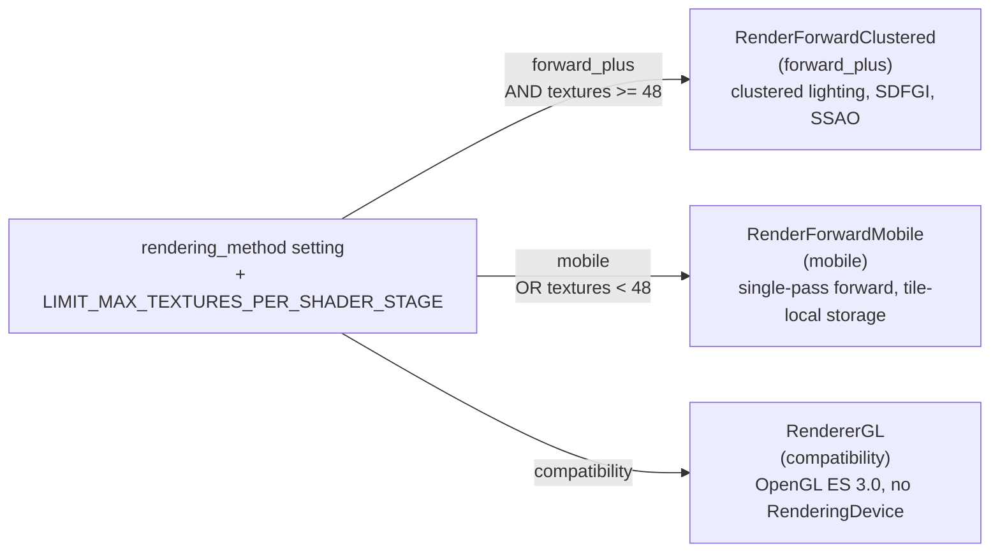
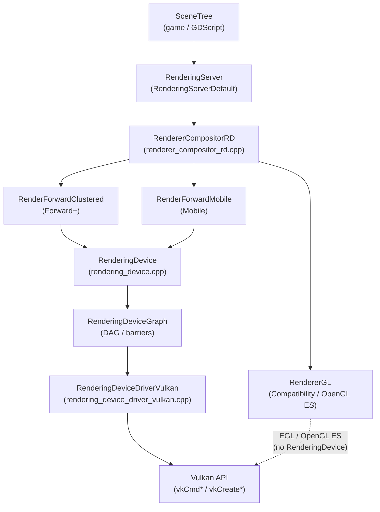
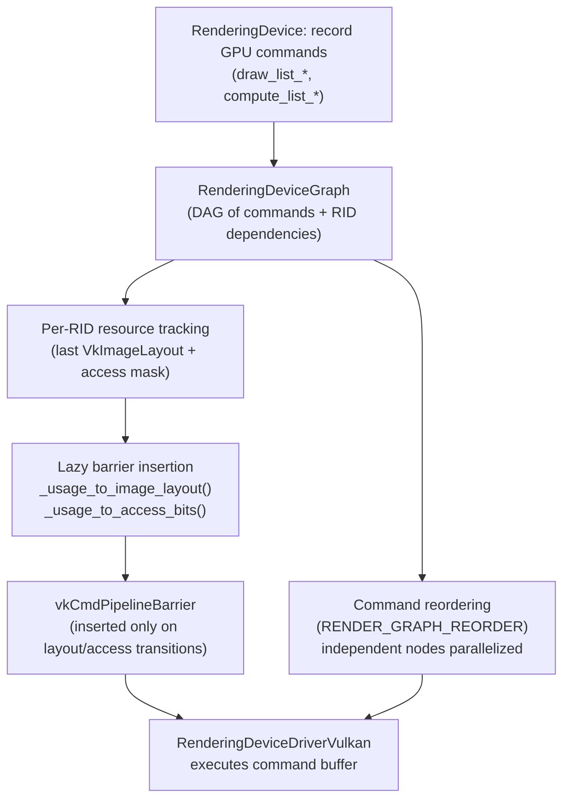
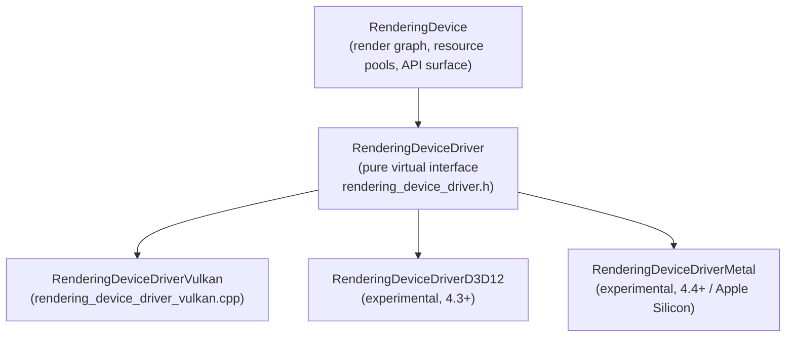
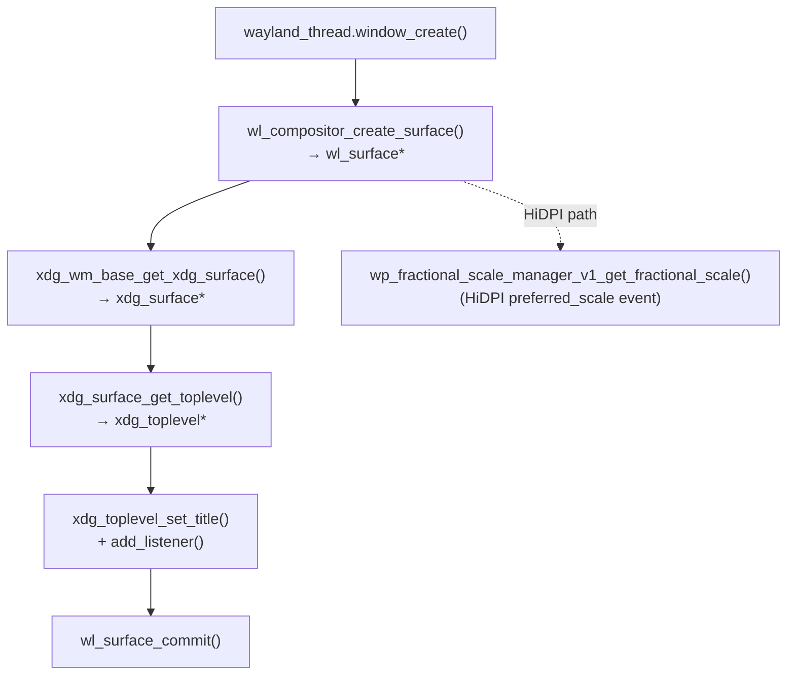
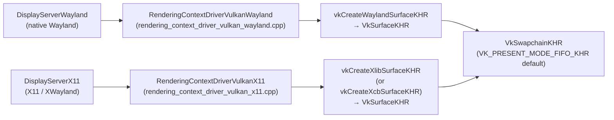

# Chapter 41: Godot 4 — RenderingDevice and the Explicit Vulkan Path

> **Part**: Part XI — Engine and Creative Tool Internals
> **Audience**: Graphics application developers and systems developers — specifically Godot engine contributors who want to understand how Godot 4's rendering architecture maps onto the Linux graphics stack, and C++/Vulkan developers who want a reference for how a production game engine constructs an explicit GPU command pipeline from scratch.
> **Status**: First draft — 2026-06-06

---

Godot 4 represents a ground-up rearchitecting of Godot's renderer around an explicit GPU command API called `RenderingDevice`. Unlike Godot 3's OpenGL-first design, Godot 4 uses Vulkan as its primary path for both its Forward+ (clustered forward) and Mobile rendering pipelines, with OpenGL ES retained only as the "Compatibility" fallback renderer. This makes Godot 4 an instructive reference for how a production game engine constructs a Vulkan pipeline from scratch, without the abstraction layers — `wgpu`, ANGLE, bgfx — that insulate other engine clients from Vulkan's explicit model. The chapter also examines Godot's native Wayland `DisplayServer` implementation (introduced in 4.3) as a concrete case study of Wayland surface creation feeding directly into `vkCreateWaylandSurfaceKHR`. All source references are pinned to the Godot 4.4 release tag.

## Table of Contents

- [1. Godot 4 Rendering Architecture Overview](#1-godot-4-rendering-architecture-overview)
- [2. The RenderingDevice API](#2-the-renderingdevice-api)
- [3. RenderingDeviceDriverVulkan: The Vulkan Backend](#3-renderingdevicedrivervulkan-the-vulkan-backend)
- [4. Shader Compilation: GDShader → GLSL → SPIR-V → Mesa NIR](#4-shader-compilation-gdshader--glsl--spir-v--mesa-nir)
- [5. Wayland and X11 Window Creation: DisplayServer](#5-wayland-and-x11-window-creation-displayserver)
- [6. Memory Management: Buffers, Textures, and Staging](#6-memory-management-buffers-textures-and-staging)
- [7. Compute and GPU Particles](#7-compute-and-gpu-particles)
- [8. Testing, CI, and Conformance](#8-testing-ci-and-conformance)
- [Integrations](#integrations)
- [References](#references)

---

## 1. Godot 4 Rendering Architecture Overview

Godot 4's rendering stack is organized as a sequence of descending abstraction layers that ultimately issue **Vulkan** commands to the driver. Understanding where each layer begins and ends is essential before examining any individual subsystem.

### The Top-Level API: RenderingServer

**RenderingServer** (formerly **VisualServer** in Godot 3) is the public interface that the **SceneTree** and **GDScript**/C++ game code use to manage every rendered entity: meshes, lights, viewports, materials, particles, and environment parameters. It is deliberately thread-safe — game threads can queue commands to **RenderingServer** from any thread, and the server dispatches them from its own rendering thread or inline, depending on the threading model configured at startup.

**RenderingServerDefault** is the concrete implementation of **RenderingServer**. Its `_init()` method calls the factory function **RendererCompositor::create()** to instantiate the active renderer. The factory pointer **RendererCompositor::_create_func** is registered by the platform-specific initialization code based on the `--rendering-driver` command-line argument or the project's `rendering/renderer/rendering_method` setting. [Source](https://github.com/godotengine/godot/blob/4.4/servers/rendering/rendering_server_default.cpp)

### The Three Renderer Paths

Godot 4.4 exposes three renderer paths, each targeting different hardware capability tiers:

- **Forward+ (`forward_plus`)**: The primary desktop renderer. Implemented by **RenderForwardClustered**, it uses a clustered forward lighting model in which a compute shader divides the view frustum into a 3D grid and assigns lights to cells; fragment shaders then look up only the lights in their cell. The pass sequence includes a depth pre-pass, optional normal/roughness **GBuffer** passes for deferred lighting effects, shadow map rendering, and post-processing (**SSAO**, **SSIL**, **SSR**, glow, volumetric fog). This renderer requires at least 48 samplers per shader stage, which it queries via **RD::LIMIT_MAX_TEXTURES_PER_SHADER_STAGE** at runtime. It also drives **SDFGI** (Signed Distance Field Global Illumination) via a series of compute dispatches writing and reading 3D textures. [Source](https://github.com/godotengine/godot/blob/4.4/servers/rendering/renderer_rd/renderer_compositor_rd.cpp)

- **Mobile (`mobile`)**: Implemented by **RenderForwardMobile**. A single-pass forward renderer without the clustered grid, designed for tile-based **GPU** architectures. It uses **R10G10B10A2_UNORM** textures instead of **RGBA16F** to reduce bandwidth, and structures render passes to exploit tile-local storage. The compositor selects **RenderForwardMobile** when the rendering method is set to `"mobile"` or when the device exposes fewer than 48 samplers per stage. Both **RenderForwardClustered** and **RenderForwardMobile** inherit from **RendererSceneRenderRD**, which provides common scene management, environment, and **GI** infrastructure. [Source](https://github.com/godotengine/godot/blob/4.4/servers/rendering/renderer_rd/renderer_compositor_rd.cpp)

- **Compatibility**: Implemented by **RendererGL**, which wraps **OpenGL ES** 3.0. This path does not use **RenderingDevice** at all; it calls **OpenGL** directly via an **EGL** context. It targets hardware that lacks **Vulkan** support, **CI** runners using software rasterizers, and embedded platforms.

The compositor selection at startup:

```cpp
// servers/rendering/renderer_rd/renderer_compositor_rd.cpp
// RendererCompositorRD constructor — renderer selection
String rendering_method = OS::get_singleton()->get_current_rendering_method();
uint64_t textures_per_stage =
    RD::get_singleton()->limit_get(RD::LIMIT_MAX_TEXTURES_PER_SHADER_STAGE);

if (rendering_method == "mobile" || textures_per_stage < 48) {
    scene = memnew(RendererSceneRenderImplementation::RenderForwardMobile());
} else if (rendering_method == "forward_plus") {
    scene = memnew(RendererSceneRenderImplementation::RenderForwardClustered());
}
```



### What RenderingDevice Is — and Is Not

**RenderingDevice** (commonly abbreviated **RD** in Godot source) sits beneath both **RenderForwardClustered** and **RenderForwardMobile**. It is Godot's own internal **GPU** command abstraction — not a third-party library like **wgpu**, **bgfx**, or **Diligent Engine**. Unlike those libraries, **RD** does not aim to be a stable plugin-facing API; it is Godot's internal boundary above the graphics driver.

Every **GPU** resource in the **RD** path — buffers, textures, shaders, pipelines, uniform sets — is represented as a **RID** (Resource ID) opaque handle. The **RID** type is an integer handle backed by a free-list allocator inside **RenderingDevice**; the actual **Vulkan** objects live in a hash map keyed by **RID** inside the driver backend. [Source](https://docs.godotengine.org/en/4.4/classes/class_renderingdevice.html)

The layering is therefore: **SceneTree** → **RenderingServer** → **RendererCompositorRD** → **RenderForwardClustered** / **RenderForwardMobile** → **RenderingDevice** → **RenderingDeviceDriverVulkan** → **Vulkan** API.



As of Godot 4.4, **RenderingDevice** is also accessible from **GDExtension** (Godot's C **ABI** plugin system), enabling custom render passes written in C++ or Rust plugins without forking the engine. [Source](https://docs.godotengine.org/en/4.4/tutorials/rendering/using_compute_shaders.html)

The **RenderingDevice** API (Section 2) exposes resource management functions — **buffer_create()**, **texture_create()**, **shader_create_from_spirv()**, **render_pipeline_create()**, **compute_pipeline_create()**, and **uniform_set_create()** — all returning **RID** handles that must be explicitly freed with **RD::free_rid()**. Draw commands are bracketed by **draw_list_begin()** / **draw_list_end()**, mirroring **Vulkan** render pass recording; compute dispatches use **compute_list_begin()** / **compute_list_end()** with **compute_list_dispatch_threads()**. Barrier management is handled by **RenderingDeviceGraph** (introduced in Godot 4.3), a **DAG** that tracks per-**RID** **VkImageLayout** and access mask state and inserts **vkCmdPipelineBarrier** calls lazily using **_usage_to_image_layout()** and **_usage_to_access_bits()**, controlled by the **RENDER_GRAPH_REORDER** and **RENDER_GRAPH_FULL_BARRIERS** compile-time flags.

The concrete **Vulkan** backend, **RenderingDeviceDriverVulkan** (Section 3, **drivers/vulkan/rendering_device_driver_vulkan.cpp**), implements the abstract **RenderingDeviceDriver** interface alongside the experimental **RenderingDeviceDriverD3D12** and **RenderingDeviceDriverMetal** backends. It wraps every **RD** resource type in private structs — **BufferInfo** (**VkBuffer** + **VmaAllocation**), **TextureInfo** (**VkImage** + **VkImageView**), **ShaderInfo** (**VkShaderModule** array + **VkPipelineLayout**), **UniformSetInfo** (**VkDescriptorSet**) — and uses traditional **vkCreateRenderPass** / **vkCmdBeginRenderPass** render passes rather than **VK_KHR_dynamic_rendering**. The **VkInstance** and **VkPhysicalDevice** lifecycle is managed by **RenderingContextDriverVulkan**, which targets **Vulkan** 1.2 and includes driver-specific workarounds such as the compute-after-draw crash on **Adreno 6xx** GPUs below driver version 512.503.0. Swapchain management uses **VK_PRESENT_MODE_FIFO_KHR** by default, recreating the **VkSwapchainKHR** on **VK_ERROR_OUT_OF_DATE_KHR** via **_update_swap_chain()**; on **Wayland** the surface is created with **vkCreateWaylandSurfaceKHR**, on **X11** with **vkCreateXlibSurfaceKHR** or **vkCreateXcbSurfaceKHR**.

Shader compilation (Section 4) passes **GDShader** source through **ShaderLanguage::parse()** to an **AST**, then **ShaderCompilerRD::compile()** to **GLSL** (`#version 450`), then **glslang::GlslangToSpv()** (bundled in **thirdparty/glslang/**) to **SPIR-V** bytecode, which **vkCreateShaderModule** submits to the **Mesa** driver where **vk_spirv_to_nir()** translates it to **NIR** for backend code generation (**ACO** on **RADV**, **ANV**'s **Xe**-based path, **NVK**). A two-level cache avoids recompilation: Godot's own **ShaderRD** cache (stored under `user://shader_cache/` in the **GDSC** format, optionally compressed with **zstd**) and **Mesa**'s disk shader cache at **$HOME/.cache/mesa_shader_cache/**.

Window system integration (Section 5) is handled by **DisplayServer**. The native **Wayland** backend (**DisplayServerWayland**, introduced in Godot 4.3) is implemented across **platform/linuxbsd/wayland/** files including **display_server_wayland.cpp**, **wayland_thread.cpp**, **rendering_context_driver_vulkan_wayland.cpp**, and **egl_manager_wayland.cpp**. Protocol binding occurs in **_wl_registry_on_global()**, negotiating **wl_compositor**, **xdg_wm_base**, **wp_fractional_scale_manager_v1**, **wp_viewporter**, **zwp_relative_pointer_manager_v1**, and **zwp_pointer_constraints_v1**. The **xdg-shell** window creation sequence proceeds through **wl_compositor_create_surface()** → **xdg_wm_base_get_xdg_surface()** → **xdg_surface_get_toplevel()** → **wl_surface_commit()**, with **HiDPI** scaling provided by **wp_fractional_scale_manager_v1**. The **wl_surface** pointer is passed to **RenderingContextDriverVulkanWayland::surface_create()** which calls **vkCreateWaylandSurfaceKHR**. The **X11** backend (**DisplayServerX11**) uses **VkXlibSurfaceCreateInfoKHR** / **vkCreateXlibSurfaceKHR** and handles **XWayland** transparently. Input handling covers **wl_seat** keyboard/pointer, **zwp_relative_pointer_manager_v1** for relative mouse motion, **zwp_pointer_constraints_v1** for pointer locking, and keyboard mapping via **libxkbcommon**. The Compatibility renderer's **EGL** path uses **EGLManagerWayland** with **EGL_KHR_platform_wayland**.

Memory management (Section 6) uses **VMA** (**vk_mem_alloc.h**, bundled in **thirdparty/vma/**), initialized in **_initialize_allocator()** with small allocations (≤4096 bytes) routed through per-memory-type **VmaPool** objects managed in **small_allocs_pools** using **VMA_POOL_CREATE_LINEAR_ALGORITHM_BIT**. Buffer and texture uploads follow a staging pattern: **RD::buffer_update()** records a **vkCmdCopyBuffer** from a host-visible staging buffer allocated with **VMA_ALLOCATION_CREATE_HOST_ACCESS_SEQUENTIAL_WRITE_BIT**; texture uploads use **vkCmdCopyBufferToImage** with layout transitions from **VK_IMAGE_LAYOUT_UNDEFINED** to **VK_IMAGE_LAYOUT_TRANSFER_DST_OPTIMAL**, with mipmap generation via **vkCmdBlitImage** or compute shaders. Texture format selection queries **vkGetPhysicalDeviceFormatProperties()** and prefers **BCn** (**DXT1**, **DXT5**, **BC7**) on desktop and **ETC2**/**ASTC** on mobile. Notably, Godot 4.4 does not use **VK_EXT_image_drm_format_modifier** or **VK_KHR_external_memory_fd** for **DMA-BUF** / **GEM** interop, meaning video frames from **VideoStreamPlayer** traverse the CPU–GPU bus on every frame rather than using zero-copy paths.

The compute pipeline (Section 7) follows the same **RID**-based dispatch pattern with **compute_pipeline_create()**, **compute_list_bind_compute_pipeline()**, and **compute_list_dispatch_threads()** mapping to **vkCmdDispatch**. **GPUParticles3D** and **GPUParticles2D** run entirely on the GPU via the particle simulation compute shader at **servers/rendering/renderer_rd/shaders/particles.glsl** (workgroup size **local_size_x = 64**), dispatched from **ParticlesStorage::_particles_process()** in **particles_storage.cpp**. **SDFGI** (Signed Distance Field Global Illumination) in the Forward+ renderer drives a cascade of compute passes for voxelization, jump-flood SDF generation, and probe update via **_render_sdfgi()** in **RendererSceneRenderRD**.

Testing and debugging (Section 8) rely on headless CI using **DisplayServerDummy** and **RendererDummy** for logic tests; the Compatibility renderer runs on **Mesa** **llvmpipe** (software rasterizer), while the **Vulkan**/**RD** path uses **lavapipe** or real GPU hardware on self-hosted runners. Debugging is supported via **Vulkan Validation Layers** (**VK_LAYER_KHRONOS_validation**) routed through Godot's logger with the **VK_EXT_debug_utils** callback, and **RenderDoc** capture enabled by **p_breadcrumb** labels on **draw_list_begin()** and **_set_object_name()** in **RenderingDeviceDriverVulkan**. Driver-specific workarounds for **Mesa** regressions — including **RADV** descriptor set aliasing and **AMD** **RDNA2** image layout transitions — are tracked inline with comments.

---

## 2. The RenderingDevice API

`RenderingDevice` provides an explicit GPU command API whose design maps closely onto Vulkan concepts without fully hiding them. The following subsections describe the major operation groups, using the Godot 4.4 class reference as the authoritative source. [Source](https://docs.godotengine.org/en/4.4/classes/class_renderingdevice.html)

### Resource Management

All resource creation functions return `RID` handles. Resources must be explicitly freed via `RD::free_rid()` — there is no automatic lifetime tracking analogous to Rust's `Arc` model:

```cpp
// servers/rendering/rendering_device.h — resource creation signatures (simplified)
// Actual signatures may include additional overloads; see source for full declarations
RID buffer_create(uint32_t p_size_bytes, BitField<BufferUsageBits> p_usage,
                  Vector<uint8_t> p_data = Vector<uint8_t>());

RID texture_create(const TextureFormat &p_format,
                   const TextureView &p_view,
                   Vector<Vector<uint8_t>> p_data = {});

RID shader_create_from_spirv(const Vector<ShaderStageSPIRVData> &p_spirv,
                              const String &p_shader_name = "");

RID render_pipeline_create(RID p_shader, FramebufferFormatID p_framebuffer_format,
                           VertexFormatID p_vertex_format,
                           RenderPrimitive p_render_primitive,
                           const PipelineRasterizationState &p_rasterization_state,
                           const PipelineMultisampleState &p_multisample_state,
                           const PipelineDepthStencilState &p_depth_stencil_state,
                           const PipelineColorBlendState &p_blend_state,
                           BitField<PipelineDynamicStateFlags> p_dynamic_state_flags,
                           uint32_t p_for_render_pass, uint32_t p_view_count);

RID compute_pipeline_create(RID p_shader,
                             const Vector<PipelineSpecializationConstant> &p_constants);

RID framebuffer_create(const Vector<RID> &p_texture_attachments,
                       FramebufferFormatID p_format_check = INVALID_ID,
                       uint32_t p_view_count = 1);

RID uniform_set_create(const Vector<Uniform> &p_uniforms,
                       RID p_shader, uint32_t p_shader_set);
```

The `shader_create_from_spirv()` function is the sole shader input path for the RD/Vulkan backend — GDShader is first transpiled to GLSL, then compiled to SPIR-V, and only SPIR-V is accepted here (Section 4). [Source](https://docs.godotengine.org/en/4.4/classes/class_renderingdevice.html#class-renderingdevice-method-shader-create-from-spirv)

### The Draw List Model

Draw lists correspond to Vulkan render passes. A draw list is opened with `draw_list_begin()`, which specifies a framebuffer, clear values, and a scissor region. Commands are recorded inside the list. `draw_list_end()` closes the list and schedules submission:

```cpp
// servers/rendering/rendering_device.h
// Draw list API — maps to vkCmdBeginRenderPass / recording / vkCmdEndRenderPass
DrawListID draw_list_begin(RID p_framebuffer,
                           BitField<DrawFlags> p_draw_flags = DRAW_DEFAULT_ALL,
                           const Vector<Color> &p_clear_color_values = {},
                           float p_clear_depth_value = 1.0f,
                           uint32_t p_clear_stencil_value = 0,
                           const Rect2 &p_region = Rect2(),
                           uint32_t p_breadcrumb = 0);

void draw_list_bind_render_pipeline(DrawListID p_list, RID p_render_pipeline);
void draw_list_bind_uniform_set(DrawListID p_list, RID p_uniform_set,
                                uint32_t p_index);
void draw_list_bind_vertex_array(DrawListID p_list, RID p_vertex_array);
void draw_list_bind_index_array(DrawListID p_list, RID p_index_array);
void draw_list_set_push_constant(DrawListID p_list, const void *p_data,
                                 uint32_t p_data_size);
void draw_list_draw(DrawListID p_list, bool p_use_indices,
                    uint32_t p_instances = 1,
                    uint32_t p_procedural_vertices = 0);
void draw_list_end();
```

The `p_breadcrumb` parameter on `draw_list_begin()` is a debug hint — a user-defined tag passed to `vkCmdDebugMarkerBeginEXT` (or its `VK_EXT_debug_utils` equivalent) for RenderDoc capture labels and GPU crash breadcrumb tracking. [Source](https://github.com/godotengine/godot/blob/4.4/servers/rendering/rendering_device.h)

### The Compute List Model

Compute lists follow the same bracketing pattern:

```cpp
// servers/rendering/rendering_device.h
ComputeListID compute_list_begin();
void compute_list_bind_compute_pipeline(ComputeListID p_list, RID p_pipeline);
void compute_list_bind_uniform_set(ComputeListID p_list, RID p_uniform_set,
                                   uint32_t p_index);
void compute_list_set_push_constant(ComputeListID p_list, const void *p_data,
                                    uint32_t p_data_size);
void compute_list_dispatch(ComputeListID p_list, uint32_t p_x_groups,
                           uint32_t p_y_groups, uint32_t p_z_groups);
void compute_list_dispatch_threads(ComputeListID p_list,
                                   uint32_t p_x_threads,
                                   uint32_t p_y_threads,
                                   uint32_t p_z_threads);
void compute_list_add_barrier(ComputeListID p_list);
void compute_list_end();
```

`compute_list_dispatch_threads()` is a convenience wrapper that divides thread counts by workgroup size; the underlying call is still `vkCmdDispatch` via the driver. `compute_list_add_barrier()` inserts a `vkCmdPipelineBarrier` within the compute pass — useful when a two-pass compute algorithm reads the output of the previous dispatch. [Source](https://github.com/godotengine/godot/blob/4.4/servers/rendering/rendering_device.h)

### Barrier Management and the Render Graph

`RD::barrier()` inserts a full pipeline barrier between render operations:

```cpp
// servers/rendering/rendering_device.h
void barrier(BitField<BarrierMask> p_from = BARRIER_MASK_ALL_BARRIERS,
             BitField<BarrierMask> p_to   = BARRIER_MASK_ALL_BARRIERS);
```

Godot 4.3 introduced `RenderingDeviceGraph` (`servers/rendering/rendering_device_graph.cpp`), a directed acyclic graph (DAG) that records all GPU operations and their resource dependencies before executing them. The graph performs two key optimizations:

1. **Command reordering** (`RENDER_GRAPH_REORDER 1`): Independent commands with no shared resources are reordered to improve GPU parallelism.
2. **Lazy barrier generation** (`RENDER_GRAPH_FULL_BARRIERS 0`): Rather than placing a full barrier between every command, the graph inserts barriers only when usage transitions actually occur — for example, when a texture transitions from `SHADER_READ_ONLY_OPTIMAL` to `COLOR_ATTACHMENT_OPTIMAL`. The helper functions `_usage_to_image_layout()` and `_usage_to_access_bits()` map RD resource usage flags to the Vulkan layout and access bitmasks needed by `vkCmdPipelineBarrier`.

Resource tracking operates at the level of `RID` handles. When the render graph processes a recorded frame, it walks the DAG in topological order, tracking the last-known Vulkan image layout and access mask for each texture. Whenever a command requires a texture in a different layout or with different access than its current state, the graph inserts a `vkCmdPipelineBarrier` call at the correct point — never before the resource is actually needed, and never after it is modified. This lazy approach produces significantly fewer barriers than a naive "barrier between every pass" approach, which is important for GPUs whose pipeline barrier implementation has non-trivial overhead.

The compile-time flag `RENDER_GRAPH_FULL_BARRIERS` overrides the lazy mode and inserts full pipeline barriers everywhere, useful for debugging barrier-related GPU hangs or validation layer errors. [Source](https://github.com/godotengine/godot/blob/4.4/servers/rendering/rendering_device_graph.cpp)



Prior to the render graph (Godot 4.0–4.2), barrier insertion was manual: every `RendererSceneRenderRD` pass that wrote a texture called `RD::barrier()` explicitly afterward. The render graph eliminated most of these hand-placed barriers, reducing both barrier count and the risk of missing barriers causing GPU read-after-write hazards.

---

## 3. RenderingDeviceDriverVulkan: The Vulkan Backend

`RenderingDeviceDriverVulkan` is the concrete Vulkan implementation of the abstract `RenderingDeviceDriver` interface. The file is at `drivers/vulkan/rendering_device_driver_vulkan.cpp` (6043 lines in Godot 4.4) — one of the largest single source files in the engine. [Source](https://github.com/godotengine/godot/blob/4.4/drivers/vulkan/rendering_device_driver_vulkan.cpp)

This architecture reflects the Godot 4.3 refactor that split the earlier monolithic `RenderingDeviceVulkan` into a common `RenderingDevice` (which drives the render graph, resource pools, and API surface), an abstract `RenderingDeviceDriver` (defining the pure virtual interface for backend operations), and `RenderingDeviceDriverVulkan` (the Vulkan implementation). The same pattern accommodates the Direct3D 12 backend (experimental in 4.3) and the Metal backend (experimental in 4.4 for Apple Silicon).



### Vulkan Object Mapping

Every RD resource type has a corresponding private `struct` inside `RenderingDeviceDriverVulkan` that wraps the Vulkan object and its VMA allocation:

| RD Resource | Vulkan Objects | Internal Struct |
|---|---|---|
| `RID` buffer | `VkBuffer`, `VmaAllocation`, optional `VkBufferView` | `BufferInfo` |
| `RID` texture | `VkImage`, `VkImageView`, `VmaAllocation` | `TextureInfo` |
| `RID` shader | `VkShaderModule[]`, `VkPipelineLayout`, descriptor set layouts | `ShaderInfo` |
| `RID` render pipeline | `VkPipeline`, `VkPipelineLayout` | (inherits pipeline layout from shader) |
| `RID` uniform set | `VkDescriptorSet`, `VkDescriptorPool` ref | `UniformSetInfo` |
| `RID` framebuffer | `VkFramebuffer`, `VkRenderPass`, attachment list | `Framebuffer` |

The class declaration:

```cpp
// drivers/vulkan/rendering_device_driver_vulkan.h
class RenderingDeviceDriverVulkan : public RenderingDeviceDriver {
    VkDevice                    vk_device           = VK_NULL_HANDLE;
    VkPhysicalDevice            physical_device     = VK_NULL_HANDLE;
    VmaAllocator                allocator           = VK_NULL_HANDLE;
    RenderingContextDriverVulkan *context_driver    = nullptr;

    VkPhysicalDeviceProperties  physical_device_properties = {};
    VkPhysicalDeviceFeatures    physical_device_features   = {};

    // Small allocation pools keyed by memory type index
    HashMap<uint32_t, VmaPool>  small_allocs_pools;
    VmaPool _find_or_create_small_allocs_pool(uint32_t p_mem_type_index);

    // Per-layout descriptor pools for linear (frame-scoped) allocations
    HashMap<..., VkDescriptorPool> linear_descriptor_set_pools;
    // ...
};
```

### Render Pass Creation

Godot 4.4 uses traditional Vulkan render passes (`vkCreateRenderPass`/`vkCmdBeginRenderPass`), not the extension `VK_KHR_dynamic_rendering`. The abstract driver interface defines:

```cpp
// servers/rendering/rendering_device_driver.h
virtual RenderPassID render_pass_create(
    VectorView<Attachment> p_attachments,
    VectorView<Subpass> p_subpasses,
    VectorView<SubpassDependency> p_subpass_dependencies,
    uint32_t p_view_count) = 0;

virtual void command_begin_render_pass(
    CommandBufferID p_cmd_buffer,
    RenderPassID p_render_pass,
    FramebufferID p_framebuffer,
    CommandBufferType p_cmd_buffer_type,
    const Rect2i &p_rect,
    VectorView<RenderPassClearValue> p_clear_values) = 0;

virtual void command_end_render_pass(CommandBufferID p_cmd_buffer) = 0;
```

The Vulkan implementation of `render_pass_create()` calls `_create_render_pass()`, which wraps either `vkCreateRenderPass2KHR` (when the extension is available) or the base `vkCreateRenderPass` with format conversions. The choice of traditional render passes over dynamic rendering has one functional advantage for the Mobile renderer: the `VkSubpassDescription` model allows expressing tile-local memory dependencies (sub-pass merging for framebuffer fetch) that `VK_KHR_dynamic_rendering` alone does not provide in its base form — making render passes the appropriate choice for targeting tile-based mobile GPUs. [Source](https://github.com/godotengine/godot/blob/4.4/drivers/vulkan/rendering_device_driver_vulkan.cpp)

### Buffer Creation and VMA Integration

Buffer creation calls `vkCreateBuffer` and then allocates memory through VMA:

```cpp
// drivers/vulkan/rendering_device_driver_vulkan.cpp
// RenderingDeviceDriverVulkan::buffer_create() — simplified
RDD::BufferID RenderingDeviceDriverVulkan::buffer_create(
        uint64_t p_size,
        BitField<BufferUsageBits> p_usage,
        MemoryAllocationType p_allocation_type) {

    VkBufferCreateInfo buf_ci = {};
    buf_ci.sType = VK_STRUCTURE_TYPE_BUFFER_CREATE_INFO;
    buf_ci.size  = p_size;
    buf_ci.usage = _buffer_usage_to_vk(p_usage);

    VmaAllocationCreateInfo alloc_ci = {};
    alloc_ci.usage = VMA_MEMORY_USAGE_AUTO;

    // Source (staging) buffers: sequential CPU write access
    if (p_allocation_type == MEMORY_ALLOCATION_TYPE_CPU) {
        alloc_ci.flags =
            VMA_ALLOCATION_CREATE_HOST_ACCESS_SEQUENTIAL_WRITE_BIT |
            VMA_ALLOCATION_CREATE_MAPPED_BIT;
    }

    VkBuffer  vk_buffer  = VK_NULL_HANDLE;
    VmaAllocation alloc  = VK_NULL_HANDLE;
    vmaCreateBuffer(allocator, &buf_ci, &alloc_ci, &vk_buffer, &alloc, nullptr);

    BufferInfo info;
    info.vk_buffer  = vk_buffer;
    info.allocation = alloc;
    info.size       = p_size;
    // Store in free-list; return RID handle
    return BufferID(buffer_owner.make_rid(info));
}
```

[Source](https://github.com/godotengine/godot/blob/4.4/drivers/vulkan/rendering_device_driver_vulkan.cpp)

### Render Pass Command Recording

The command-level API — `command_begin_render_pass`, draw commands, and `command_end_render_pass` — maps directly onto `vkCmdBeginRenderPass`, `vkCmdDraw`/`vkCmdDrawIndexed`, and `vkCmdEndRenderPass`:

```cpp
// drivers/vulkan/rendering_device_driver_vulkan.cpp
// command_begin_render_pass — simplified to show Vulkan calls
void RenderingDeviceDriverVulkan::command_begin_render_pass(
        CommandBufferID p_cmd_buffer,
        RenderPassID p_render_pass,
        FramebufferID p_framebuffer,
        CommandBufferType p_cmd_buffer_type,
        const Rect2i &p_rect,
        VectorView<RenderPassClearValue> p_clear_values) {

    VkCommandBuffer vk_cmd = _get_vk_command_buffer(p_cmd_buffer);

    // Build VkRenderPassBeginInfo from RID-resolved objects
    VkRenderPassBeginInfo rp_begin = {};
    rp_begin.sType       = VK_STRUCTURE_TYPE_RENDER_PASS_BEGIN_INFO;
    rp_begin.renderPass  = _render_pass_from_id(p_render_pass);
    rp_begin.framebuffer = _framebuffer_from_id(p_framebuffer);
    rp_begin.renderArea  = { {p_rect.position.x, p_rect.position.y},
                              {(uint32_t)p_rect.size.x, (uint32_t)p_rect.size.y} };
    // ... populate clear values ...

    VkSubpassContents contents = (p_cmd_buffer_type == COMMAND_BUFFER_TYPE_SECONDARY)
        ? VK_SUBPASS_CONTENTS_SECONDARY_COMMAND_BUFFERS
        : VK_SUBPASS_CONTENTS_INLINE;

    vkCmdBeginRenderPass(vk_cmd, &rp_begin, contents);
}
```

The `p_cmd_buffer_type` parameter reflects Godot's support for secondary command buffers: `RenderForwardClustered` can record draw lists into secondary command buffers on separate threads, then submit them all via `vkCmdExecuteCommands` on the primary buffer, enabling CPU-side parallel draw list recording for large scenes. [Source](https://github.com/godotengine/godot/blob/4.4/drivers/vulkan/rendering_device_driver_vulkan.cpp)

### Vulkan Context and Minimum Version

`RenderingContextDriverVulkan` manages the `VkInstance`, `VkPhysicalDevice` enumeration, and surface creation. During instance initialization, it sets the API version in `VkApplicationInfo` to Vulkan 1.2 on supporting platforms (with a note in the code that 1.0 is used on older loaders to avoid validation warnings). Physical device selection applies driver-specific workarounds — notably a workaround for compute-after-draw crashes on Adreno 6xx GPUs below driver version 512.503.0. Required device extensions include `VK_KHR_SWAPCHAIN_EXTENSION_NAME`; the driver selects additional optional extensions based on what the device exposes. [Source](https://github.com/godotengine/godot/blob/4.4/drivers/vulkan/rendering_context_driver_vulkan.cpp)

### Swapchain Management

On Wayland, the swapchain surface is created via `vkCreateWaylandSurfaceKHR` (see Section 5). On X11, `VK_KHR_xlib_surface` or `VK_KHR_xcb_surface` is used. Swapchain creation uses `VK_PRESENT_MODE_FIFO_KHR` as the default (vsync), with `VK_PRESENT_MODE_MAILBOX_KHR` as a low-latency option when requested.

Swapchain acquisition and presentation follow the standard Vulkan frame loop. Swapchain recreation on window resize is triggered by the `VK_ERROR_OUT_OF_DATE_KHR` error returned from `vkAcquireNextImageKHR`:

```cpp
// drivers/vulkan/rendering_context_driver_vulkan.cpp — simplified swapchain loop
// Per-frame: acquire image, render, present
VkResult result = vkAcquireNextImageKHR(
    vk_device, swap_chain.vk_swapchain, UINT64_MAX,
    image_acquired_semaphore, VK_NULL_HANDLE, &image_index);

if (result == VK_ERROR_OUT_OF_DATE_KHR || result == VK_SUBOPTIMAL_KHR) {
    // Signal resize: destroy swapchain, recreate with new extent
    _update_swap_chain(&swap_chain);
    return; // skip frame, retry next tick
}

// ... record and submit command buffer ...

VkPresentInfoKHR present_info = {};
present_info.sType              = VK_STRUCTURE_TYPE_PRESENT_INFO_KHR;
present_info.waitSemaphoreCount = 1;
present_info.pWaitSemaphores    = &render_complete_semaphore;
present_info.swapchainCount     = 1;
present_info.pSwapchains        = &swap_chain.vk_swapchain;
present_info.pImageIndices      = &image_index;
vkQueuePresentKHR(present_queue, &present_info);
```

`_update_swap_chain()` calls `vkCreateSwapchainKHR` passing the old swapchain handle in `oldSwapchain` (allowing the driver to reuse backing memory), then re-creates the `VkImageView` and `VkFramebuffer` objects for each swapchain image. [Source](https://github.com/godotengine/godot/blob/4.4/drivers/vulkan/rendering_context_driver_vulkan.cpp)

---

## 4. Shader Compilation: GDShader → GLSL → SPIR-V → Mesa NIR

Godot exposes `GDShader`, a GLSL-like domain-specific language, to game developers. Internally this undergoes a two-stage transpilation before it reaches the GPU.

### GDShader Syntax and Semantics

A GDShader file opens with a `shader_type` declaration that determines its processing stage context:

```glsl
// Example: spatial shader for a textured PBR material
shader_type spatial;

uniform sampler2D albedo_texture : source_color;
uniform float metallic_factor : hint_range(0.0, 1.0) = 0.0;

void fragment() {
    ALBEDO = texture(albedo_texture, UV).rgb;
    METALLIC = metallic_factor;
    ROUGHNESS = 0.5;
}
```

The available shader types are `spatial` (3D scene), `canvas_item` (2D), `particles` (GPU particle simulation), `sky`, and `fog`. The built-ins (`ALBEDO`, `METALLIC`, `UV`, `VERTEX`, `NORMAL`, `LIGHT_VERTEX`, etc.) are resolved by the compiler during transpilation into GLSL qualified variables with the appropriate `layout(location = ...)` or UBO bindings.

Hint annotations on uniforms (`source_color`, `hint_range(...)`, `filter_nearest`) are Godot inspector metadata; they are stripped during compilation and do not appear in the generated GLSL.

### The Transpilation Pipeline

The compilation path from GDShader to a `VkShaderModule` involves four distinct components:

**Stage 1 — Parse**: `ShaderLanguage::parse()` takes the GDShader source string and produces an AST. The parser validates all built-in names, type checks expressions, and records the uniform list with their hint metadata. [Source](https://github.com/godotengine/godot/blob/4.4/servers/rendering/shader_language.cpp)

**Stage 2 — Transpile to GLSL**: `ShaderCompilerRD::compile()` walks the AST and emits GLSL with Vulkan-compatible resource qualifiers. Uniforms become UBO members or `layout(set=X, binding=Y) uniform sampler2D ...` declarations. Built-in varying variables become `layout(location=N)` vertex outputs and fragment inputs. The compiler emits `#version 450` at the head of every generated GLSL file — it is unconditionally targeting GLSL 4.50 / SPIR-V 1.0. [Source](https://github.com/godotengine/godot/blob/4.4/servers/rendering/shader_compiler.cpp)

**Stage 3 — GLSL to SPIR-V**: The generated GLSL string is passed to the `glslang` C++ library (bundled in `thirdparty/glslang/`) via `RD::get_singleton()->shader_compile_spirv_from_source()`. Internally this calls `glslang::GlslangToSpv()`, which compiles the GLSL through glslang's intermediate representation to SPIR-V bytecode. [Source](https://github.com/godotengine/godot/blob/4.4/servers/rendering/renderer_rd/shader_rd.cpp)

The `ShaderRD` class orchestrates this for engine-internal shaders. The `_compile_variant()` method shows the full chain:

```cpp
// servers/rendering/renderer_rd/shader_rd.cpp
// _compile_variant() — simplified to show the compilation chain
void ShaderRD::_compile_variant(uint32_t p_variant, CompileData p_data) {
    // Stage 1: assemble GLSL from template chunks + custom code
    StringBuilder vertex_code, fragment_code, compute_code;
    _build_variant_code(vertex_code, p_variant, p_data.version, vertex_stage);
    _build_variant_code(fragment_code, p_variant, p_data.version, fragment_stage);

    // Stage 2: compile GLSL to SPIR-V via glslang
    Vector<uint8_t> vert_spirv = RD::get_singleton()->shader_compile_spirv_from_source(
        RD::SHADER_STAGE_VERTEX, vertex_code.as_string(),
        RD::SHADER_LANGUAGE_GLSL, &error);
    Vector<uint8_t> frag_spirv = RD::get_singleton()->shader_compile_spirv_from_source(
        RD::SHADER_STAGE_FRAGMENT, fragment_code.as_string(),
        RD::SHADER_LANGUAGE_GLSL, &error);

    // Stage 3: compile SPIR-V to GPU binary (calls vkCreateShaderModule internally)
    Vector<uint8_t> shader_binary = RD::get_singleton()->
        shader_compile_binary_from_spirv(stages, name);

    // Stage 4: create the shader RID from the binary
    p_data.version->variants[p_variant] =
        RD::get_singleton()->shader_create_from_bytecode_with_samplers(
            shader_binary, p_data.version->variants[p_variant], immutable_samplers);
}
```

[Source](https://github.com/godotengine/godot/blob/4.4/servers/rendering/renderer_rd/shader_rd.cpp)

```mermaid
graph LR
    GDS["GDShader source\n(.gdshader)"]
    PARSE["ShaderLanguage::parse()\n→ AST"]
    TRANSPILE["ShaderCompilerRD::compile()\n→ GLSL (#version 450)"]
    GLSLANG["glslang::GlslangToSpv()\n(thirdparty/glslang)\n→ SPIR-V bytecode"]
    SPIRV["SPIR-V"]
    VKM["vkCreateShaderModule\n(RenderingDeviceDriverVulkan)"]
    NIR["vk_spirv_to_nir()\n(Mesa driver backend)\n→ NIR IR"]
    GPU["GPU ISA\n(ACO / ANV / NVK backend)"]

    GDS --> PARSE
    PARSE --> TRANSPILE
    TRANSPILE --> GLSLANG
    GLSLANG --> SPIRV
    SPIRV --> VKM
    VKM --> NIR
    NIR --> GPU
```



**Stage 4 — SPIR-V enters Mesa**: `RD::shader_create_from_spirv()` (which calls into `RenderingDeviceDriverVulkan`) submits the SPIR-V to `vkCreateShaderModule`. The Vulkan driver (RADV, ANV, NVK, Turnip, or any other Mesa backend) caches the SPIR-V internally; the actual translation to NIR happens during pipeline creation (`vkCreateGraphicsPipelines` or `vkCreateComputePipelines`). Mesa's `vk_spirv_to_nir()` translates the SPIR-V to the NIR intermediate representation (Chapter 14), after which each driver's backend applies its optimization and code generation passes — ACO on RADV, the Xe-based path on Intel ANV, NVK's own backend.

The SPIR-V that Godot produces via glslang is standard Vulkan SPIR-V. From Mesa's perspective, a Godot shader is indistinguishable from any other Vulkan client's shader.

### Shader Caching

Godot implements a two-level shader cache to avoid recompilation across sessions:

**Level 1 — Godot's own cache**: `ShaderRD::_load_from_cache()` and `_save_to_cache()` store SPIR-V binaries and pipeline cache objects in the user data directory (`user://shader_cache/`, configurable via project settings). Cache filenames are derived from a SHA-256 hash of the shader source and variant flags. The cache file format uses the `"GDSC"` magic header at version 3. When a cached entry is found, `RD::shader_create_from_bytecode_with_samplers()` bypasses glslang entirely. Cache compression is optional (`use_zstd_compression` project setting). [Source](https://github.com/godotengine/godot/blob/4.4/servers/rendering/renderer_rd/renderer_compositor_rd.cpp)

**Level 2 — Mesa's disk cache**: Below Godot's cache, Mesa's own disk shader cache at `$HOME/.cache/mesa_shader_cache/` caches the driver-backend compilation result (ACO assembly, ISA bytes, etc.). This cache is Mesa-managed and keyed by a hash of the NIR program and driver version; Godot has no visibility into it. Together the two caches mean that in the steady state — a project loaded on the same machine with the same Mesa version — shader compilation is effectively zero-cost.

---

## 5. Wayland and X11 Window Creation: DisplayServer

`DisplayServer` is Godot's platform abstraction for window creation, input events, clipboard, and cursor management. On Linux/BSD, two backends are available: `DisplayServerX11` (for X11 and XWayland) and `DisplayServerWayland` (for native Wayland, introduced in Godot 4.3). [Source](https://github.com/godotengine/godot/blob/4.4/platform/linuxbsd/wayland/)

### DisplayServerWayland Architecture

`DisplayServerWayland` is implemented across several files in `platform/linuxbsd/wayland/`:

- `display_server_wayland.cpp` / `.h` — main display server logic, window management API
- `wayland_thread.cpp` / `.h` — Wayland event loop and protocol state, runs on a dedicated thread
- `rendering_context_driver_vulkan_wayland.cpp` / `.h` — `vkCreateWaylandSurfaceKHR` call
- `egl_manager_wayland.cpp` / `.h` — EGL context for the Compatibility (OpenGL) renderer
- `key_mapping_xkb.cpp` / `.h` — keyboard input mapping via libxkbcommon
- `dynwrappers/` — dynamically-loaded wrappers for `libwayland-client.so`

Rather than linking against `libwayland-client` at build time, Godot loads it at runtime through the `dynwrappers/` generated code. This allows the same binary to run on systems without Wayland libraries, falling back to X11.

### Protocol Binding

The Wayland protocol binding occurs in `WaylandThread::_wl_registry_on_global()`. The function handles each global advertised by the compositor, binding the protocols Godot requires:

```cpp
// platform/linuxbsd/wayland/wayland_thread.cpp
// _wl_registry_on_global() — selected bindings
static void _wl_registry_on_global(void *data, struct wl_registry *wl_registry,
        uint32_t name, const char *interface, uint32_t version) {

    RegistryState *registry = (RegistryState *)data;

    if (strcmp(interface, wl_compositor_interface.name) == 0) {
        registry->wl_compositor = (struct wl_compositor *)
            wl_registry_bind(wl_registry, name, &wl_compositor_interface,
                             CLAMP((int)version, 1, 6));
    } else if (strcmp(interface, xdg_wm_base_interface.name) == 0) {
        registry->xdg_wm_base = (struct xdg_wm_base *)
            wl_registry_bind(wl_registry, name, &xdg_wm_base_interface,
                             CLAMP((int)version, 1, 6));
        xdg_wm_base_add_listener(registry->xdg_wm_base, &xdg_wm_base_listener, data);
    } else if (strcmp(interface, zwp_relative_pointer_manager_v1_interface.name) == 0) {
        registry->zwp_relative_pointer_manager =
            (struct zwp_relative_pointer_manager_v1 *)
            wl_registry_bind(wl_registry, name,
                             &zwp_relative_pointer_manager_v1_interface, 1);
    } else if (strcmp(interface, zwp_pointer_constraints_v1_interface.name) == 0) {
        registry->zwp_pointer_constraints =
            (struct zwp_pointer_constraints_v1 *)
            wl_registry_bind(wl_registry, name,
                             &zwp_pointer_constraints_v1_interface, 1);
    } else if (strcmp(interface, wp_fractional_scale_manager_v1_interface.name) == 0) {
        registry->wp_fractional_scale_manager =
            (struct wp_fractional_scale_manager_v1 *)
            wl_registry_bind(wl_registry, name,
                             &wp_fractional_scale_manager_v1_interface, 1);
    } else if (strcmp(interface, wp_viewporter_interface.name) == 0) {
        registry->wp_viewporter = (struct wp_viewporter *)
            wl_registry_bind(wl_registry, name, &wp_viewporter_interface, 1);
    }
    // ... wl_output, wl_seat, wl_shm, zxdg_decoration_manager, etc.
}
```

[Source](https://github.com/godotengine/godot/blob/4.4/platform/linuxbsd/wayland/wayland_thread.cpp)

### Window Creation Sequence

Window creation proceeds through the xdg-shell protocol stack. `wayland_thread.window_create()` calls:

1. `wl_compositor_create_surface(registry->wl_compositor)` → `wl_surface *`
2. `xdg_wm_base_get_xdg_surface(registry->xdg_wm_base, wl_surface)` → `xdg_surface *`
3. `xdg_surface_get_toplevel(xdg_surface)` → `xdg_toplevel *`
4. `xdg_toplevel_set_title()`, `xdg_toplevel_add_listener()` for configure/close events
5. `wl_surface_commit()` to signal readiness

For HiDPI and fractional scaling, `wp_fractional_scale_manager_v1_get_fractional_scale(fractional_scale_manager, wl_surface)` attaches a fractional scale object that delivers the display's effective scale factor (as a fixed-point multiple of 120) via its `preferred_scale` event.



### Vulkan Surface Creation

The `wl_surface` pointer is extracted from the Wayland thread's window state and passed to the Vulkan rendering context via a platform data structure:

```cpp
// platform/linuxbsd/wayland/display_server_wayland.cpp
// _show_window() — simplified bridge to Vulkan context
WindowData &wd = windows[p_id];
wayland_thread.window_create(wd.id, p_rect.size.x, p_rect.size.y);

// Bridge Wayland surface to Vulkan
WaylandPlatformData wpd;
wpd.surface = wayland_thread.window_get_wl_surface(wd.id);
wpd.display = wayland_thread.get_wl_display();
rendering_context->window_create(wd.id, &wpd);
```

And in `rendering_context_driver_vulkan_wayland.cpp`:

```cpp
// platform/linuxbsd/wayland/rendering_context_driver_vulkan_wayland.cpp
// surface_create() — vkCreateWaylandSurfaceKHR bridge
RenderingContextDriver::SurfaceID
RenderingContextDriverVulkanWayland::surface_create(
        const WindowPlatformData *p_platform_data) {

    const WaylandPlatformData *wpd =
        (const WaylandPlatformData *)p_platform_data;

    VkWaylandSurfaceCreateInfoKHR create_info = {};
    create_info.sType   = VK_STRUCTURE_TYPE_WAYLAND_SURFACE_CREATE_INFO_KHR;
    create_info.display = wpd->display;
    create_info.surface = wpd->surface;

    VkSurfaceKHR vk_surface = VK_NULL_HANDLE;
    VkResult err = vkCreateWaylandSurfaceKHR(
        instance_get(), &create_info,
        get_allocation_callbacks(VK_OBJECT_TYPE_SURFACE_KHR),
        &vk_surface);
    ERR_FAIL_COND_V(err != VK_SUCCESS, SurfaceID());

    Surface *surface = memnew(Surface);
    surface->vk_surface = vk_surface;
    return SurfaceID(surface_owner.make_rid(surface));
}
```

[Source](https://github.com/godotengine/godot/blob/4.4/platform/linuxbsd/wayland/rendering_context_driver_vulkan_wayland.cpp)



### DisplayServerX11 and XWayland

`DisplayServerX11` remains the default backend on most desktop Linux distributions where an X server is present (directly or as XWayland inside a Wayland session). Its Vulkan surface uses `VK_KHR_xlib_surface` or `VK_KHR_xcb_surface`, selected at instance creation time based on which extension the driver exposes. The surface creation call in `rendering_context_driver_vulkan_x11.cpp` follows the same `surface_create()` / `WindowPlatformData` pattern as the Wayland path, substituting `VkXlibSurfaceCreateInfoKHR` / `vkCreateXlibSurfaceKHR` (or the XCB equivalent):

```cpp
// platform/linuxbsd/x11/rendering_context_driver_vulkan_x11.cpp
// Simplified: Xlib surface creation path
VkXlibSurfaceCreateInfoKHR create_info = {};
create_info.sType  = VK_STRUCTURE_TYPE_XLIB_SURFACE_CREATE_INFO_KHR;
create_info.dpy    = x11_platform_data->display;
create_info.window = x11_platform_data->window;
vkCreateXlibSurfaceKHR(instance_get(), &create_info,
                        get_allocation_callbacks(VK_OBJECT_TYPE_SURFACE_KHR),
                        &vk_surface);
```

Under XWayland, the `wl_surface` backing the X window is managed by XWayland; Godot uses the Xlib surface path transparently in this case, because it is communicating with the X11 protocol — the fact that XWayland wraps a Wayland compositor underneath is invisible to the application. True native Wayland (Godot's `DisplayServerWayland`) bypasses XWayland entirely. The two paths result in the same final Vulkan swapchain and rendering device; only the WSI surface creation call differs.

`DisplayServerX11` also handles clipboard via ICCCM/EWMH selections, drag-and-drop via the `XDND` protocol, and IME input via XIM or IBus, none of which have equivalents in `DisplayServerWayland`'s current implementation. [Source](https://github.com/godotengine/godot/blob/4.4/platform/linuxbsd/x11/)

### EGL for the Compatibility Renderer

When the Compatibility (OpenGL ES) renderer is selected, `EGLManagerWayland` creates an EGL context following the `EGL_KHR_platform_wayland` path described in Chapter 24: `eglGetPlatformDisplayEXT(EGL_PLATFORM_WAYLAND_KHR, wl_display, nullptr)` → `eglChooseConfig()` → `wl_egl_window_create(wl_surface, width, height)` → `eglCreateWindowSurface()`. The EGL surface and the Wayland surface are independent of the Vulkan surface created above; only one is active at a time depending on the chosen renderer.

### Input Protocols

Godot's Wayland input implementation handles:

- `wl_seat.get_keyboard()` and `wl_seat.get_pointer()` for keyboard and mouse events
- `zwp_relative_pointer_manager_v1` for relative mouse motion (required for first-person camera modes)
- `zwp_pointer_constraints_v1` for pointer locking (`lock_pointer`) and confinement (`confine_pointer`)
- `zwp_pointer_gestures_v1` for pinch and pan gesture events

Keyboard handling delegates to libxkbcommon via `key_mapping_xkb.cpp` for Unicode key mapping and modifier state. Tablet input (from `zwp_tablet_manager_v2`) and IME text protocol (`zwp_text_input_v3`) support status should be verified against the Godot 4.4 source; these are under active development. Note: verify against Godot 4.4 source for the current completeness of these protocol implementations.

---

## 6. Memory Management: Buffers, Textures, and Staging

### VMA Integration

Godot initializes VMA in `RenderingDeviceDriverVulkan::_initialize_allocator()`:

```cpp
// drivers/vulkan/rendering_device_driver_vulkan.cpp
// _initialize_allocator() — VmaAllocator setup
Error RenderingDeviceDriverVulkan::_initialize_allocator() {
    VmaAllocatorCreateInfo allocator_info = {};
    allocator_info.physicalDevice = physical_device;
    allocator_info.device         = vk_device;
    allocator_info.instance       = context_driver->instance_get();

    // Link VMA to Vulkan function pointers (supports Vulkan 1.1+ promoted functions)
    VmaVulkanFunctions vma_vulkan_functions = {};
    vma_vulkan_functions.vkGetInstanceProcAddr = &vkGetInstanceProcAddr;
    vma_vulkan_functions.vkGetDeviceProcAddr   = &vkGetDeviceProcAddr;
    allocator_info.pVulkanFunctions = &vma_vulkan_functions;

    return vmaCreateAllocator(&allocator_info, &allocator) == VK_SUCCESS
        ? OK : ERR_CANT_CREATE;
}
```

Small allocations (≤4096 bytes) are routed through per-memory-type `VmaPool` objects managed in `small_allocs_pools`. The rationale is VMA fragmentation reduction: small objects packed into dedicated pools avoid the overhead of tracking sub-allocations in VMA's primary allocator. The pool is lazily created on first use for a given memory type index:

```cpp
// drivers/vulkan/rendering_device_driver_vulkan.cpp
// _find_or_create_small_allocs_pool() — simplified
VmaPool RenderingDeviceDriverVulkan::_find_or_create_small_allocs_pool(
        uint32_t p_mem_type_index) {

    HashMap<uint32_t, VmaPool>::Iterator it =
        small_allocs_pools.find(p_mem_type_index);
    if (it != small_allocs_pools.end()) {
        return it->value;
    }

    VmaPoolCreateInfo pool_ci = {};
    pool_ci.memoryTypeIndex    = p_mem_type_index;
    pool_ci.flags              = VMA_POOL_CREATE_LINEAR_ALGORITHM_BIT;
    pool_ci.blockSize          = 0;   // use VMA default
    pool_ci.minBlockCount      = 0;
    pool_ci.maxBlockCount      = 0;   // unlimited

    VmaPool pool = VK_NULL_HANDLE;
    vmaCreatePool(allocator, &pool_ci, &pool);
    small_allocs_pools[p_mem_type_index] = pool;
    return pool;
}
```

[Source](https://github.com/godotengine/godot/blob/4.4/drivers/vulkan/rendering_device_driver_vulkan.cpp)

The VMA library is bundled in `thirdparty/vma/include/vk_mem_alloc.h`. Note: verify the exact VMA version bundled with Godot 4.4 against the `thirdparty/vma/` directory in the repository.

Frame-level descriptor sets (used for per-draw uniforms that change every frame) use a separate linear descriptor pool allocation strategy. Rather than returning individual descriptor sets to the pool, Godot resets entire pools at frame start, which avoids the per-set deallocation overhead. This is the `linear_descriptor_set_pools` path in `RenderingDeviceDriverVulkan`, as opposed to the `descriptor_pool_groups` used for longer-lived sets. Note: verify the exact descriptor pool management strategy against the 4.4 source.

### Staging Buffer Uploads

Buffer data uploads follow the standard Vulkan staging pattern. When game code calls `RD::buffer_update()`, the `RenderingDeviceGraph` records the upload operation. At execute time, the driver writes to a host-visible staging buffer allocated with `VMA_ALLOCATION_CREATE_HOST_ACCESS_SEQUENTIAL_WRITE_BIT | VMA_ALLOCATION_CREATE_MAPPED_BIT`, then records a `vkCmdCopyBuffer` into the frame command buffer. The staging allocation is per-frame and is returned to VMA at frame start:

```cpp
// drivers/vulkan/rendering_device_driver_vulkan.cpp
// command_copy_buffer() — called by the render graph for CPU->GPU buffer uploads (simplified)
void RenderingDeviceDriverVulkan::command_copy_buffer(
        CommandBufferID p_cmd_buffer,
        BufferID p_src_buffer,
        BufferID p_dst_buffer,
        VectorView<BufferCopyRegion> p_regions) {

    VkCommandBuffer vk_cmd = _get_vk_command_buffer(p_cmd_buffer);
    const BufferInfo &src  = buffer_owner.get_or_null(p_src_buffer);
    const BufferInfo &dst  = buffer_owner.get_or_null(p_dst_buffer);

    // Convert RD regions to VkBufferCopy
    Vector<VkBufferCopy> vk_regions;
    for (uint32_t i = 0; i < p_regions.size(); i++) {
        VkBufferCopy r;
        r.srcOffset = p_regions[i].src_offset;
        r.dstOffset = p_regions[i].dst_offset;
        r.size      = p_regions[i].size;
        vk_regions.push_back(r);
    }

    vkCmdCopyBuffer(vk_cmd, src.vk_buffer, dst.vk_buffer,
                    vk_regions.size(), vk_regions.ptr());
}
```

### Texture Uploads and Mipmap Generation

Texture uploads follow the same staging path: `RD::texture_update()` writes texel data to a staging buffer and records `vkCmdCopyBufferToImage` with the appropriate `VkBufferImageCopy` region. Image layout transitions (from `VK_IMAGE_LAYOUT_UNDEFINED` to `VK_IMAGE_LAYOUT_TRANSFER_DST_OPTIMAL` before upload, then to `VK_IMAGE_LAYOUT_SHADER_READ_ONLY_OPTIMAL` after) are inserted by the render graph's barrier logic.

Mipmap generation on upload uses `vkCmdBlitImage`: the full-resolution level is uploaded first, then a series of half-resolution blits generate the mip chain. For compute-generated textures (such as SDFGI volumes), mipmaps may be generated by a compute shader dispatched from the render graph.

### Format Negotiation

Godot queries `vkGetPhysicalDeviceFormatProperties()` during device initialization to determine which texture formats the device supports for optimal tiling. Compressed texture format selection follows this priority:

- Desktop: BCn (DXT1, DXT5, BC7) when `VK_FORMAT_FEATURE_SAMPLED_IMAGE_BIT` is supported for `VK_FORMAT_BC7_UNORM_BLOCK`
- Mobile: ETC2 and ASTC when BC support is absent

### DMA-BUF and GEM Interop

Godot 4.4 does not use `VK_EXT_image_drm_format_modifier` or `VK_KHR_external_memory_fd` for DMA-BUF sharing with display compositors or video decoders. The `VideoStreamPlayer` node performs CPU-side format conversion before uploading decoded frame data to a GPU texture via the staging path — there is no zero-copy DMA-BUF pipeline for video as of Godot 4.4. This is a notable gap relative to the kernel's GEM/DMA-BUF framework described in Chapter 2: for video-intensive applications, this means decoded frames traverse the CPU-GPU bus on every frame, which can be a significant bottleneck at high resolution.

DRM format modifier integration would enable the compositor to scan out Godot-rendered framebuffers with optimal tiling without a copy. This feature is not in Godot's extension list for 4.4; it is an area of future work. Note: verify this against Godot's extension enumeration in the 4.4 source.

---

## 7. Compute and GPU Particles

### The Compute Pipeline

Godot's compute interface follows the same `RID`-based pattern as graphics:

```cpp
// Compute pipeline creation and dispatch
RID pipeline = RD::get_singleton()->compute_pipeline_create(
    compute_shader_rid, /* specialization constants */ {});

ComputeListID cl = RD::get_singleton()->compute_list_begin();

RD::get_singleton()->compute_list_bind_compute_pipeline(cl, pipeline);
RD::get_singleton()->compute_list_bind_uniform_set(cl, uniform_set_rid, 0);
RD::get_singleton()->compute_list_set_push_constant(cl, &push_data,
                                                     sizeof(push_data));
RD::get_singleton()->compute_list_dispatch_threads(cl,
    thread_count_x, thread_count_y, thread_count_z);

RD::get_singleton()->compute_list_end();
```

`compute_list_dispatch_threads()` divides the thread counts by the workgroup size declared in the shader's `layout(local_size_x = ...)` qualifier, computing the appropriate dispatch group counts before calling `vkCmdDispatch` via the driver. [Source](https://github.com/godotengine/godot/blob/4.4/servers/rendering/rendering_device.h)

### GPU Particle Simulation

Godot's particle system (`GPUParticles3D`, `GPUParticles2D`) runs entirely on the GPU. The simulation compute shader is at `servers/rendering/renderer_rd/shaders/particles.glsl`:

```glsl
// servers/rendering/renderer_rd/shaders/particles.glsl
// Workgroup size and buffer layout
#version 450

layout(local_size_x = 64, local_size_y = 1, local_size_z = 1) in;

// Per-particle data buffer (set 1, binding 1)
layout(set = 1, binding = 1, std430) restrict buffer ParticleBuffer {
    // Each particle: 16-float transform, 3-float velocity, active flag,
    // 4-float color, 4-float custom user data
    ParticleData particles[];
};

// Per-frame simulation parameters (set 1, binding 0)
layout(set = 1, binding = 0, std140) uniform FrameHistory { ... };

// Material uniforms (set 3, binding 0+)
// 3D SDF textures for collision (set 2, binding 0–6)

void main() {
    uint particle_index = gl_GlobalInvocationID.x;
    // Bounds check, trail handling, emission phase check ...
    // Apply velocity, attractor forces, collision detection ...
    // Custom code injection point: #CODE : PROCESS
}
```

Each particle is represented in a storage buffer by a `ParticleData` struct containing: a 4×4 float transform matrix (64 bytes), a 3-float velocity (12 bytes), a uint active flag (4 bytes), 4-float color (16 bytes), and 4-float custom data (16 bytes) — 112 bytes minimum before any alignment padding. Note: verify the exact struct layout against `ParticleData` in `particles.glsl` for the Godot 4.4 definition. The dispatch in `ParticlesStorage::_particles_process()` uses `compute_list_dispatch_threads()` with `process_amount` as the thread count, where `process_amount` equals `particles->amount` (or divided by trail count for trail-enabled systems):

```cpp
// servers/rendering/renderer_rd/storage_rd/particles_storage.cpp
// _particles_process() — compute dispatch
RD::ComputeListID compute_list = RD::get_singleton()->compute_list_begin();

RD::get_singleton()->compute_list_bind_compute_pipeline(compute_list,
    m->shader_data->pipeline);
RD::get_singleton()->compute_list_bind_uniform_set(compute_list,
    particles_shader.base_uniform_set, BASE_UNIFORM_SET);
RD::get_singleton()->compute_list_bind_uniform_set(compute_list,
    p_particles->particles_material_uniform_set, MATERIAL_UNIFORM_SET);
RD::get_singleton()->compute_list_bind_uniform_set(compute_list,
    p_particles->collision_textures_uniform_set, COLLISION_TEXTURTES_UNIFORM_SET);
RD::get_singleton()->compute_list_set_push_constant(compute_list,
    &push_constant, sizeof(ParticlesShader::PushConstant));

if (p_particles->trails_enabled && p_particles->trail_bind_poses.size() > 1) {
    RD::get_singleton()->compute_list_dispatch_threads(compute_list,
        process_amount / p_particles->trail_bind_poses.size(), 1, 1);
    RD::get_singleton()->compute_list_add_barrier(compute_list);
    push_constant.trail_pass = true;
    RD::get_singleton()->compute_list_set_push_constant(compute_list,
        &push_constant, sizeof(ParticlesShader::PushConstant));
    RD::get_singleton()->compute_list_dispatch_threads(compute_list,
        process_amount - p_particles->amount, 1, 1);
} else {
    RD::get_singleton()->compute_list_dispatch_threads(compute_list,
        process_amount, 1, 1);
}

RD::get_singleton()->compute_list_end();
```

[Source](https://github.com/godotengine/godot/blob/4.4/servers/rendering/renderer_rd/storage_rd/particles_storage.cpp)

The trail case is notable: it requires two dispatches with a `compute_list_add_barrier()` between them, because the second pass reads the output written by the first. The barrier maps to `vkCmdPipelineBarrier` with `VK_PIPELINE_STAGE_COMPUTE_SHADER_BIT` on both sides.

### SDFGI Compute

Signed Distance Field Global Illumination (SDFGI) is Godot 4's real-time global illumination system for the Forward+ renderer. It represents scene geometry as a cascade of 3D voxel grids and traces signed distance fields to approximate indirect lighting. The implementation consists of a series of compute dispatches over 3D textures:

1. **Voxelization pass**: Scene geometry is rasterized into a voxel grid by a specialized render pass.
2. **SDF generation**: A jump-flood algorithm computes signed distances via iterated compute dispatches, each halving the jump stride.
3. **Probe update**: The GI probes sample the SDF and lighting to update radiance caches.
4. **Probe application**: The forward shading pass samples probe caches to add indirect diffuse and specular contributions.

All SDF passes use `compute_list_dispatch_threads()` operating on 3D texture extents. The `_render_sdfgi()` virtual method in `RendererSceneRenderRD` orchestrates the cascade updates. [Source](https://github.com/godotengine/godot/blob/4.4/servers/rendering/renderer_rd/renderer_scene_render_rd.cpp)

---

## 8. Testing, CI, and Conformance

### Godot's CI Infrastructure

Godot's continuous integration runs on GitHub Actions. The majority of tests run headlessly using `--headless` mode, which selects `DisplayServerDummy` (no window system) and `RendererDummy` (no GPU). This allows functional testing of game logic, scene loading, scripting, and resource management without any GPU dependency.

Rendering tests that exercise the actual GPU path are more limited in public CI. The Compatibility (OpenGL) renderer runs on Mesa llvmpipe (a software rasterizer) on standard GitHub Actions runners, validating 2D rendering, shader compilation, and basic 3D without requiring GPU hardware. The Vulkan/RD path (`forward_plus` or `mobile`) is tested on self-hosted runners with actual GPU hardware or Mesa's lavapipe Vulkan software rasterizer. Note: verify the exact CI configuration against Godot's `.github/workflows/` for current GPU runner availability.

### Relationship to Mesa Driver Quality

Godot's Vulkan backend exercises Mesa drivers in ways that expose real driver bugs. Because Godot's shader workload is different from the synthetic tests in the Vulkan CTS (dEQP-VK), Godot-specific regression reports on the Mesa bug tracker are a meaningful signal for driver quality. Godot-found Mesa bugs that have been reported and fixed include edge cases in descriptor set aliasing, image layout transition edge cases on AMD RDNA2, and fence-related synchronization bugs.

Godot's Vulkan backend uses traditional render passes throughout in 4.4, as confirmed by the abstract `render_pass_create` / `command_begin_render_pass` / `command_end_render_pass` interface and the `vkCreateRenderPass2KHR` call in `_create_render_pass()`. `VK_KHR_dynamic_rendering` is not used in the Vulkan backend as of 4.4 — a critical distinction when evaluating which Mesa extensions are load-bearing for Godot compatibility.

Minimum Vulkan coverage for the Godot 4 RD path is determined by what the driver exposes; Godot's context driver tries Vulkan 1.2 first but falls back to 1.0 on older loaders. The effective minimum for the full Forward+ feature set (particularly `VK_KHR_multiview` for XR and `VK_KHR_create_renderpass2` for the render pass 2 path) is Vulkan 1.1 with the relevant promoted extensions. Note: verify specific minimum extension requirements against Godot 4.4's `_initialize_device_extensions()` in the Vulkan driver. [Source](https://github.com/godotengine/godot/blob/4.4/drivers/vulkan/rendering_context_driver_vulkan.cpp)

### Debugging Tools

**Vulkan Validation Layers**: Enable by running Godot with `VK_INSTANCE_LAYERS=VK_LAYER_KHRONOS_validation godot --rendering-method forward_plus`. The validation layer messages are routed through Godot's logger via the `VK_EXT_debug_utils` callback registered during instance creation.

**RenderDoc capture**: The `p_breadcrumb` parameter on `draw_list_begin()` and the corresponding `_set_object_name()` helper in `RenderingDeviceDriverVulkan` inject `VK_EXT_debug_utils` marker labels into the command stream. When running under RenderDoc, these labels appear as named pass groups in the event browser, corresponding to Godot's logical rendering passes (depth pre-pass, shadow maps, opaque forward pass, etc.). [Source](https://github.com/godotengine/godot/blob/4.4/drivers/vulkan/rendering_device_driver_vulkan.cpp)

**Driver-specific workarounds**: Known Mesa driver bugs that require Godot-side workarounds are tracked in `RenderingDeviceDriverVulkan` with comments identifying the affected driver and version. The Adreno 6xx compute-after-draw crash workaround is one documented example; others can be found by searching the file for workaround comments.

---

## Integrations

**Chapter 14 (NIR)**: The SPIR-V that Godot's glslang compilation produces enters Mesa NIR via `vk_spirv_to_nir()` identically to any other Vulkan client. Chapter 14's description of the SPIR-V front end and the NIR passes that normalize the IR applies without qualification to Godot's shaders. The `#version 450` GLSL that Godot's `ShaderCompilerRD` emits targets SPIR-V 1.0, which is the baseline input format for all Mesa Vulkan drivers.

**Chapter 18 (Mesa Vulkan Drivers)**: `RenderingDeviceDriverVulkan` is a direct client of RADV, ANV, NVK, Turnip, and any other Mesa Vulkan driver the user has installed. Godot's extension requirements — specifically `VK_KHR_create_renderpass2`, `VK_KHR_multiview`, and the VMA function pointer requirements — constrain the minimum Mesa version for full Godot 4 Forward+ support. RADV's known quality regressions and NVK's Turing dependency on Nouveau GSP-RM (Chapter 9) both affect Godot users on those drivers.

**Chapter 20 (Wayland Fundamentals)**: `DisplayServerWayland` implements `xdg-shell` (window creation and lifecycle), `wp_fractional_scale_v1` (HiDPI scaling), `zwp_relative_pointer_manager_v1` and `zwp_pointer_constraints_v1` (mouse capture for first-person games), and `zwp_pointer_gestures_v1` — the same set of Wayland extension protocols covered in Chapter 20. The registry-binding pattern in `_wl_registry_on_global()` is the canonical model for how any Wayland client negotiates protocol availability.

**Chapter 24 (Vulkan and EGL)**: The Compatibility renderer's EGL path through `EGLManagerWayland` follows `EGL_KHR_platform_wayland` as described in Chapter 24 — `eglGetPlatformDisplayEXT(EGL_PLATFORM_WAYLAND_KHR, ...)` → `wl_egl_window` → `eglCreateWindowSurface()`. The Vulkan swapchain path uses `VK_PRESENT_MODE_FIFO_KHR` as the default, matching the synchronization model discussed in that chapter. The two paths are mutually exclusive: only one `DisplayServer` backend and one renderer are active per process.

**Chapter 25 (GPU Compute)**: Godot's GPU particles and SDFGI use exactly the dispatch model described in Chapter 25. `compute_list_dispatch_threads()` computes group counts and calls `vkCmdDispatch`. The barrier between the two particle trail passes (`compute_list_add_barrier()`) corresponds to the `VK_PIPELINE_STAGE_COMPUTE_SHADER_BIT` → `VK_PIPELINE_STAGE_COMPUTE_SHADER_BIT` barrier discussed in Chapter 25's coverage of intra-compute synchronization.

**Chapter 31 (Conformance Testing)**: Godot's Vulkan CI on Mesa/lavapipe and real GPU hardware exercises the same driver code paths that dEQP-VK tests, but from a different angle — application-level shader workloads rather than synthetic conformance micro-tests. Mesa driver regressions are sometimes first reported via Godot's test suite before appearing in dEQP runs, making Godot an informal upstream conformance signal for Mesa contributors.

**Chapter 35 (Dawn/WebGPU)**: Both Godot and Dawn use VMA for Vulkan memory management (Chapter 35 covers Dawn's VMA usage). The two engines represent different positions on the abstraction spectrum: Dawn abstracts Vulkan, Metal, D3D12, and OpenGL under a single WebGPU API, while Godot's RD is Vulkan-first with other backends as additions. Both converge on VMA as the memory allocator of choice, reflecting VMA's de facto standard status in the Vulkan ecosystem.

---

## References

1. [Godot 4.4 RenderingDevice class reference](https://docs.godotengine.org/en/4.4/classes/class_renderingdevice.html) — Authoritative API documentation for all `RenderingDevice` methods, enums, and constants

2. [Godot Engine source repository, tag 4.4](https://github.com/godotengine/godot/tree/4.4) — Primary source for all code examples and file paths cited in this chapter

3. [Godot renderer_rd source tree](https://github.com/godotengine/godot/tree/4.4/servers/rendering/renderer_rd) — `ShaderRD`, `RendererSceneRenderRD`, `RenderForwardClustered`, `RenderForwardMobile`, and storage subsystems

4. [drivers/vulkan/rendering_device_driver_vulkan.cpp](https://github.com/godotengine/godot/blob/4.4/drivers/vulkan/rendering_device_driver_vulkan.cpp) — The 6043-line Vulkan backend implementation

5. [drivers/vulkan/rendering_context_driver_vulkan.cpp](https://github.com/godotengine/godot/blob/4.4/drivers/vulkan/rendering_context_driver_vulkan.cpp) — Instance creation, physical device selection, swapchain management

6. [platform/linuxbsd/wayland/](https://github.com/godotengine/godot/tree/4.4/platform/linuxbsd/wayland) — DisplayServerWayland, WaylandThread, and Vulkan/EGL Wayland context drivers

7. [Godot internal rendering architecture documentation](https://docs.godotengine.org/en/4.4/contributing/development/core_and_modules/internal_rendering_architecture.html) — Official developer guide to the rendering stack, Forward+/Mobile/Compatibility paths

8. [Godot renderer overview documentation](https://docs.godotengine.org/en/stable/tutorials/rendering/renderers.html) — User-facing explanation of renderer selection and capability requirements

9. [Godot Wayland PR #57025](https://github.com/godotengine/godot/pull/57025) — The original native Wayland DisplayServer implementation pull request

10. [servers/rendering/renderer_rd/storage_rd/particles_storage.cpp](https://github.com/godotengine/godot/blob/4.4/servers/rendering/renderer_rd/storage_rd/particles_storage.cpp) — GPU particle simulation compute dispatch

11. [servers/rendering/renderer_rd/shaders/particles.glsl](https://github.com/godotengine/godot/blob/4.4/servers/rendering/renderer_rd/shaders/particles.glsl) — Particle simulation compute shader (local_size_x=64 workgroup)

12. [servers/rendering/rendering_device_graph.cpp](https://github.com/godotengine/godot/blob/4.4/servers/rendering/rendering_device_graph.cpp) — Render graph DAG, barrier optimization, resource tracking

13. [VMA (Vulkan Memory Allocator)](https://github.com/GPUOpen-LibrariesAndSDKs/VulkanMemoryAllocator) — AMD's open-source Vulkan memory allocator library used by Godot

14. [glslang (GLSL → SPIR-V compiler)](https://github.com/KhronosGroup/glslang) — Khronos reference GLSL compiler used in Godot's shader compilation path

15. [Godot 4.3 development snapshot blog post](https://godotengine.org/article/dev-snapshot-godot-4-3-dev-3/) — Announcement of native Wayland support in Godot 4.3

16. [servers/rendering/renderer_rd/renderer_compositor_rd.cpp](https://github.com/godotengine/godot/blob/4.4/servers/rendering/renderer_rd/renderer_compositor_rd.cpp) — RendererCompositorRD constructor: renderer selection, shader cache init

17. [servers/rendering/rendering_device_driver.h](https://github.com/godotengine/godot/blob/4.4/servers/rendering/rendering_device_driver.h) — Abstract driver interface including `render_pass_create`, `command_begin_render_pass`, `RenderPassID`

18. [platform/linuxbsd/wayland/wayland_thread.cpp](https://github.com/godotengine/godot/blob/4.4/platform/linuxbsd/wayland/wayland_thread.cpp) — Wayland protocol registry binding, `_wl_registry_on_global()`

19. [Using compute shaders in Godot 4 (tutorial)](https://docs.godotengine.org/en/4.4/tutorials/rendering/using_compute_shaders.html) — Official guide to RenderingDevice compute from GDExtension

20. [servers/rendering/renderer_rd/shader_rd.cpp](https://github.com/godotengine/godot/blob/4.4/servers/rendering/renderer_rd/shader_rd.cpp) — `ShaderRD::_compile_variant()`, shader caching via `"GDSC"` format, glslang invocation
