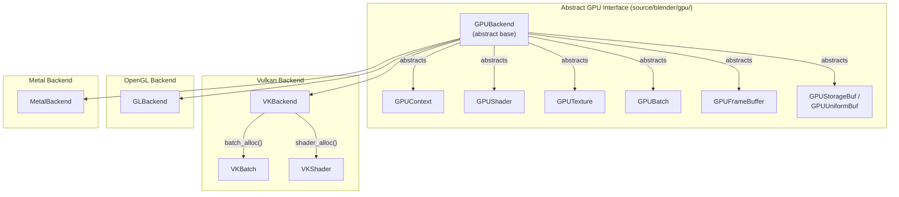
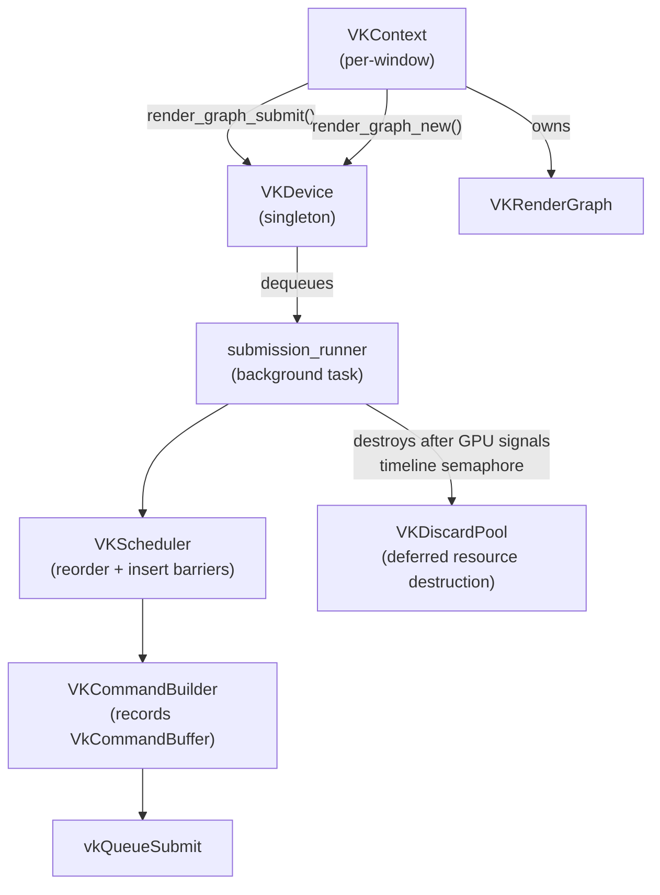
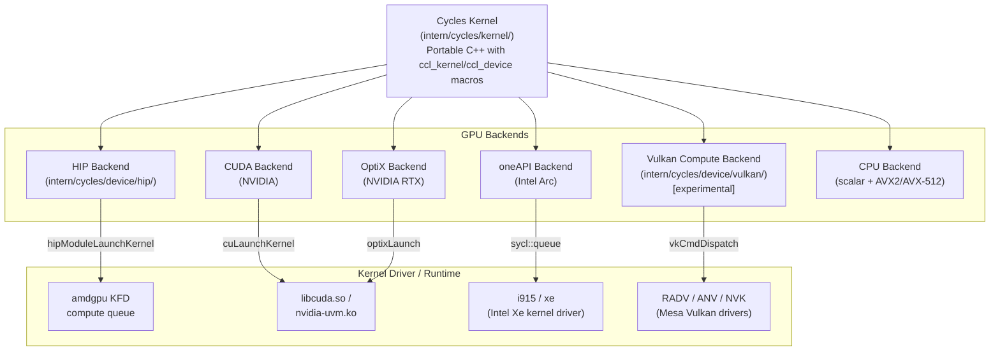
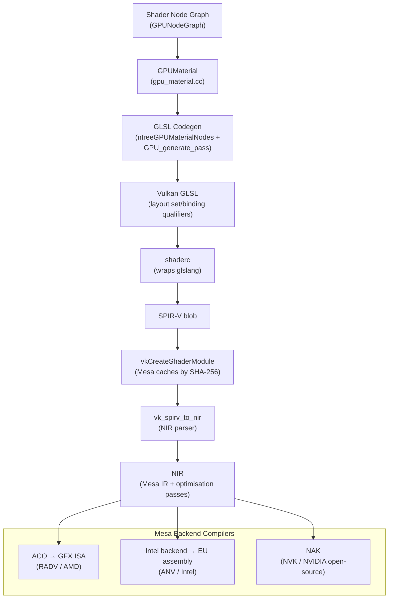
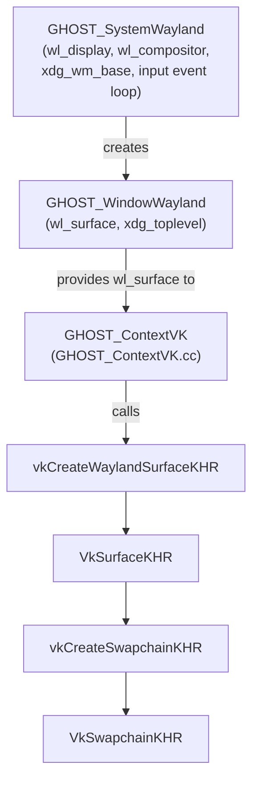
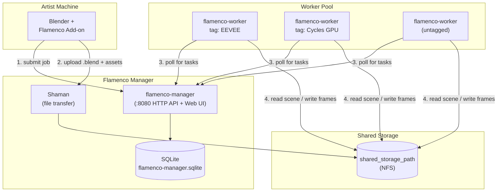
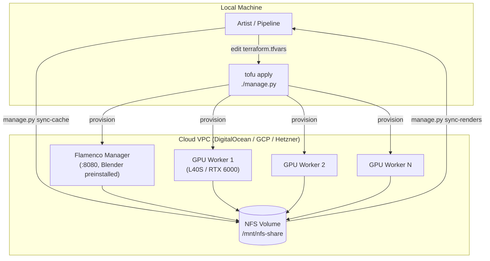
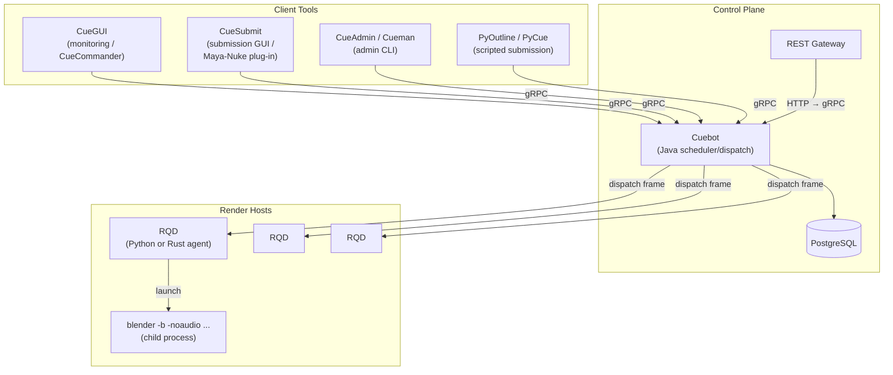
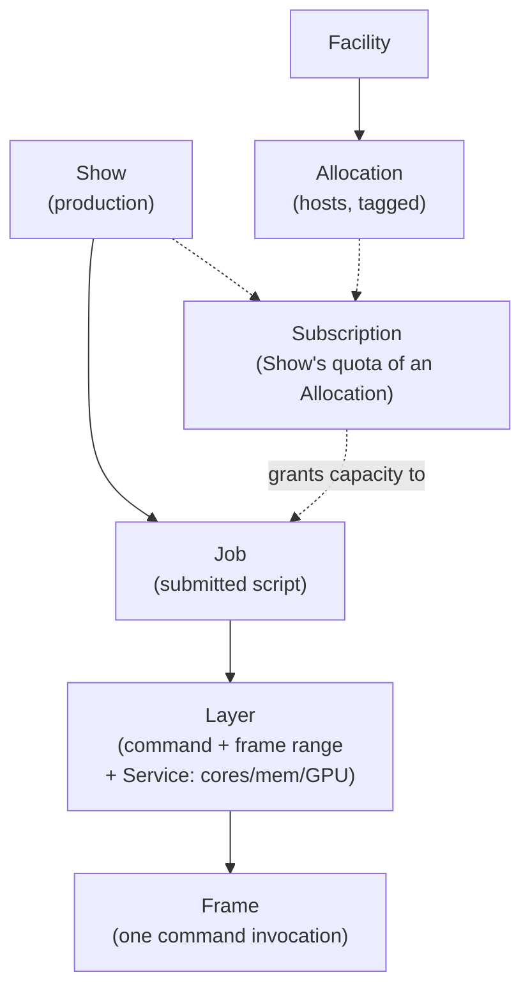

# Chapter 42: Blender — Cycles, EEVEE Next, and GPU Compute on Linux

> **Part**: Part XI — Engine and Creative Tool Internals
> **Audience**: Graphics application developers — Blender add-on developers, technical artists, and rendering engineers who want to understand Blender's GPU rendering internals; systems developers interested in how a major open-source creative suite interacts with Mesa, ROCm, and the Linux compute ecosystem
> **Status**: First draft — 2026-06-06

Blender is unique among the tools examined in this part: it is the only major open-source 3D creation suite, and its GPU rendering story encompasses more of the Linux stack than any other application in the book. EEVEE Next — the Vulkan-based rewrite that shipped as the production renderer in Blender 4.2 LTS and reached stable parity with the OpenGL path in Blender 4.5 LTS — is a full deferred PBR renderer that exercises Mesa's Vulkan drivers directly. The Cycles path tracer provides a multi-backend compute story spanning:

- **HIP** — AMD/ROCm
- **CUDA/OptiX** — NVIDIA
- **oneAPI** — Intel Arc
- **Vulkan compute** — experimental portable backend

Readers who have worked through the kernel driver chapters (Parts I–III), the Mesa internals (Parts IV–V), and the GPU compute chapter (Chapter 25) will find Blender an unusually instructive integration point where those layers converge in a production workload.

---

## Table of Contents

- [1. GPU Rendering in Blender: Architecture Overview](#1-gpu-rendering-in-blender-architecture-overview)
  - [1.4 What is Cycles?](#14-what-is-cycles)
  - [1.5 What is EEVEE?](#15-what-is-eevee)
  - [1.6 What is GPU Compute in the Context of Rendering?](#16-what-is-gpu-compute-in-the-context-of-rendering)
  - [1.7 What is PBR?](#17-what-is-pbr)
  - [1.8 What is a BVH?](#18-what-is-a-bvh)
  - [1.9 EEVEE vs Cycles: Choosing an Engine](#19-eevee-vs-cycles-choosing-an-engine)
  - [1.10 What is the DNA/RNA System?](#110-what-is-the-dnarna-system)
- [2. EEVEE Next: The Vulkan Rewrite](#2-eevee-next-the-vulkan-rewrite)
- [3. Cycles GPU Backend: Multi-Backend Compute Architecture](#3-cycles-gpu-backend-multi-backend-compute-architecture)
- [4. GLSL/SPIR-V Shader Compilation in Blender](#4-glslspir-v-shader-compilation-in-blender)
- [5. OpenColorIO Integration and Color Management](#5-opencolorio-integration-and-color-management)
- [6. Viewport Rendering: GHOST, Wayland, and GPU Memory](#6-viewport-rendering-ghost-wayland-and-gpu-memory)
- [7. Cycles as a GPU Compute Workload: Performance Characteristics](#7-cycles-as-a-gpu-compute-workload-performance-characteristics)
- [8. Debugging Blender GPU Issues on Linux](#8-debugging-blender-gpu-issues-on-linux)
- [9. Distributed Rendering: Flamenco and Render Farms on Linux](#9-distributed-rendering-flamenco-and-render-farms-on-linux)
- [Roadmap](#roadmap)
- [Integrations](#integrations)
- [References](#references)

---

## 1. GPU Rendering in Blender: Architecture Overview

Blender exposes two GPU rendering engines and a rich GPU-accelerated viewport, all built on top of a common hardware abstraction layer. Understanding that abstraction layer is the prerequisite for everything else in this chapter.

### 1.1 The Two Renderers

**EEVEE** (historically "EEVEE Next" during development, simply "EEVEE" in 4.2+) is a real-time deferred **PBR** renderer designed for interactive use and fast final renders where photorealism can be traded for speed. It processes each frame through a structured sequence of **Vulkan** render passes — **G-buffer** fill, clustered lighting, volumetrics, shadow maps, screen-space effects — and presents the result to the viewport or outputs it to disk. Since Blender 4.2 LTS its underlying GPU implementation is **Vulkan**-first; the **OpenGL** path has been the fallback. [Source](https://code.blender.org/2024/06/blender-4-2-the-start-of-the-lts-era/)

**Cycles** is a physically-based Monte Carlo path tracer. It uses GPU compute to parallelise ray-scene intersections and shade each sample point; renders converge to a noise-free image as sample counts accumulate. Cycles does not use EEVEE's rasterisation pipeline at all — it dispatches compute workloads through five different backends (**HIP**, **CUDA**, **OptiX**, **oneAPI**, **Vulkan** compute) that map to different vendor APIs and ultimately to different kernel-mode drivers. CPU rendering via multi-architecture **SIMD** C++ (**AVX2**/**AVX-512**) is always available as a fallback, and third-party libraries **Embree** (for **BVH** building) and **Open Image Denoise** (**OIDN**) are integrated for CPU-side acceleration. [Source](https://developer.blender.org/docs/handbook/building_blender/cycles_gpu_binaries/)

Both renderers share the same scene data model — `Mesh`, `Material`, `Light`, `Object` — expressed through Blender's **DNA**/**RNA** system. The difference is entirely in how that scene data is transformed into pixels.

### 1.2 The GPUBackend Abstraction

Blender's internal GPU abstraction lives in **`source/blender/gpu/`**. The central class is **`GPUBackend`**, an abstract base that the rest of the GPU module uses exclusively; the **`VKBackend`** (**Vulkan**), **`GLBackend`** (**OpenGL**), and **`MetalBackend`** (macOS) subclasses each implement the full interface. [Source](https://projects.blender.org/blender/blender/src/branch/main/source/blender/gpu)

The abstraction surface provided by **`GPUBackend`** covers:

- **`GPUContext`** — per-window GPU state; wraps a **`VkDevice`**/**`EGLContext`** handle
- **`GPUShader`** — compiled shader program; wraps a compiled **GLSL**/**SPIR-V** program
- **`GPUTexture`** — GPU image; wraps **`VkImage`** or `GLuint`
- **`GPUBatch`** — draw call descriptor; vertex buffers + index buffer + shader
- **`GPUFrameBuffer`** — render target; wraps a set of **`VkImage`** attachments or an **FBO**
- **`GPUStorageBuf`** / **`GPUUniformBuf`** — buffer objects; wrap **`VkBuffer`** allocations

Factory methods on **`VKBackend`** construct the **Vulkan**-specific subclasses: `batch_alloc()` returns a **`VKBatch`**, `shader_alloc()` returns a **`VKShader`**, and so on. This means that code in **EEVEE** or the viewport calls **`GPUShader::bind()`** without knowing whether the current backend is **Vulkan** or **OpenGL**.

Section 2 examines the **`VKBackend`** internals in detail, including the **`VKDevice`** singleton (which wraps the **`VkInstance`**, **`VkPhysicalDevice`**, **`VkDevice`**, and **`VkQueue`** handles and sets up the **Vulkan Memory Allocator** (**VMA**) pool), the per-window **`VKContext`**, and the **`VKRenderGraph`** — a deferred command-recording architecture introduced in Blender 4.3 that decouples draw call submission from **`VkCommandBuffer`** recording via a background `submission_runner` task, **`VKScheduler`**, and **`VKCommandBuilder`**. **`VKDiscardPool`** provides deferred resource destruction keyed on timeline semaphore values.

Section 2 also covers **EEVEE**'s render pass structure under **`VK_KHR_dynamic_rendering`**: the **G-buffer** fill pass, clustered lighting (with a **`VkImage3D`** cluster map), virtual shadow map tilemap architecture (replacing the legacy cascade/cubemap system with a shared shadow atlas managed entirely on the GPU), froxel-based volumetrics, and screen-space post-processing effects (bloom, ambient occlusion, depth-of-field, motion blur). Required **Vulkan** extensions and driver minimum versions (**RADV**/**ANV** on **Mesa 25.3+**, **NVIDIA** driver 550+) are documented via **`VKBackend::missing_capabilities_get()`**.

Section 3 covers **Cycles**' multi-backend compute architecture. The path-tracing kernel in **`intern/cycles/kernel/`** is written in portable C++ annotated with macros (`ccl_kernel`, `ccl_device`, `ccl_global`) that abstract over the calling conventions of each target. The **HIP** backend (**`intern/cycles/device/hip/`**) targets **AMD**/**ROCm** via **`hipModuleLoadData()`**, **`hipModuleGetFunction()`**, and **`hipModuleLaunchKernel()`** dispatching to the **`amdgpu`** **KFD** compute queue; supported architectures span **GFX1010** through **GFX12** (**RDNA 4**). The **CUDA** backend compiles to **PTX** via **`nvcc`** and dispatches via **`cuLaunchKernel()`** through `libcuda.so` and `nvidia-uvm.ko`. The **OptiX** backend leverages **NVIDIA** **RT Cores** for hardware **BVH** traversal via **`optixLaunch()`**, providing a 30–60% throughput advantage on ray-divergent scenes. The **oneAPI** backend uses **Intel**'s **SYCL**-based API compiled with **`icpx`** to **Intel GPU SPIR-V**, dispatched via **`sycl::queue`** to the **Xe** kernel driver. The experimental **Vulkan** compute backend (**`intern/cycles/device/vulkan/`**) uses **`VkComputePipeline`** objects and **`vkCmdDispatch`** for portability across any **Vulkan 1.2**-capable **Mesa** driver. The **CPU** fallback compiles the kernel multiple times for **scalar**, **AVX2**, and **AVX-512** widths.

Section 4 covers shader compilation: **EEVEE** generates **GLSL** programmatically from the shader node graph via **`GPUMaterial`**, **`GPUNodeGraph`**, **`ntreeGPUMaterialNodes()`**, and **`GPU_generate_pass()`**. For non-material shaders, the **`GPUShaderCreateInfo`** system (**`gpu_shader_create_info.hh`**) declaratively defines binding layouts. **GLSL** is compiled to **SPIR-V** using **shaderc** (wrapping **glslang**) in **`vk_shader.cc`**, then passed to **Mesa** via **`vkCreateShaderModule()`**. **Mesa** runs **`vk_spirv_to_nir()`** and the full **NIR** optimisation pipeline before **ACO** (on **RADV**), the Intel backend (on **ANV**), or **NAK** (on **NVK**) produce the final machine code. Two caching layers apply: Blender's own **SPIR-V** cache under **`~/.cache/blender/`** and **Mesa**'s disk shader cache in **`~/.cache/mesa_shader_cache_db/`**.

Section 5 covers **OpenColorIO** (**OCIO**) integration: Blender uses **OCIO** for all rendering, compositing, and display color management, mapping between scene-linear, **sRGB**, **Filmic**, and **ACES** color spaces via **1D** and **3D LUT** textures. For interactive display, **`OCIO::GpuShaderDesc`** generates **GLSL** snippets that are compiled through **`GPUBackend`** and bound to **`VkImage`** **LUT** textures uploaded via **VMA** staging buffers. The **OCIO** environment variable selects the active configuration. The relationship to the **KMS** **`DEGAMMA_LUT`** / **`CTM`** / **`GAMMA_LUT`** display pipeline and the open **`wp_color_management_v1`** **Wayland** protocol gap are also discussed.

Section 6 covers viewport rendering via **GHOST** (Generic Handy Operating System Toolkit), Blender's platform-independent windowing abstraction. **`GHOST_SystemWayland`** manages the **`wl_display`**, **`wl_compositor`**, **`xdg_wm_base`**, and input event loop; **`GHOST_WindowWayland`** creates the **`wl_surface`** and **`xdg_toplevel`**. **`GHOST_ContextVK`** calls **`vkCreateWaylandSurfaceKHR()`** to create the **`VkSurfaceKHR`** and manages the **`VkSwapchainKHR`**. Frame synchronisation uses per-frame **`VkFence`** and **`VkSemaphore`** objects in a double-buffered rotation. GPU memory for the viewport covers **`VkBuffer`** uploads for scene geometry tracked by **`BatchCache`**, texture atlases managed by **`VKTexturePool`**, and per-frame uniform buffer uploads via the **`VKDiscardPool`**.

Section 7 analyses **Cycles** as a GPU compute workload: **BVH** traversal is memory-bandwidth-bound on most production scenes due to random pointer-chasing into scene geometry; complex procedural materials shift the workload toward compute-bound. **Wave32** vs. **Wave64** execution modes on **AMD RDNA** are discussed, along with backend performance comparisons on Linux for **RDNA 3**/**4** via **HIP**/**ROCm**, **NVIDIA RTX** via **OptiX** (with **Ada Lovelace** 96 MB L2 on the **RTX 4090**), **Intel Arc Battlemage** (**B580**, **B770**) via **oneAPI**, and the CPU path. Benchmark data from [opendata.blender.org](https://opendata.blender.org/) and Linux-specific issues (**Nouveau** reclocking, **ROCm** version pinning, **Wayland** color output) are covered.

Section 8 covers debugging and profiling: environment variables including **`GPU_BACKEND`**, **`CYCLES_DEVICE`**, **`MESA_VK_ABORT_ON_DEVICE_LOSS`**, **`VK_INSTANCE_LAYERS`** (**`VK_LAYER_KHRONOS_validation`**), **`AMD_DEBUG`**, **`MESA_LOADER_DRIVER_OVERRIDE`**, and **`OCIO`**; command-line flags **`--debug-gpu`**, **`--debug-cycles`**, and **`--debug-gpu-mem`**; **RenderDoc** integration via **`VK_EXT_debug_utils`** markers; **AMD Radeon GPU Profiler** (**RGP**) and **Radeon Developer Panel** (**RDP**) for **SQTT** captures; **NVIDIA Nsight Systems** for combined **CUDA**/**Vulkan** profiling; and **Intel GPA Frame Analyzer** for **Arc** hardware.



### 1.3 Vulkan Status in Blender 4.5 LTS

In Blender 4.5 LTS, the **Vulkan** backend reached feature parity with **OpenGL** — GPU subdivision, **OpenXR**, **USD**/**Hydra** workflows, and all **EEVEE** effects are implemented on both paths. However, **OpenGL** remains the **default** backend. **Vulkan** is opt-in via *Preferences → System → Graphics API*. The reasons are practical: the **Vulkan** path requires all scene textures to fit simultaneously in GPU memory (whereas **OpenGL** can spill to streaming), imposes a performance regression on very large meshes (>100 million vertices), and exhibits higher memory usage under certain workloads. The Blender development team indicated that Blender 5.0 would likewise not default to **Vulkan** until these constraints are resolved. [Source](https://www.phoronix.com/news/Blender-5.0-Vulkan-OpenGL-RAM)

Minimum hardware for the **Vulkan** path:
- **Vulkan 1.2**, with **`VK_KHR_dynamic_rendering`**, **`VK_KHR_timeline_semaphore`**, **`VK_EXT_extended_dynamic_state`**, and **`VK_KHR_synchronization2`**
- **NVIDIA**: driver 550+ (nvidia-open or proprietary)
- **AMD**/**Intel**: **Mesa 25.3+** (**RADV** for **AMD**, **ANV** for **Intel**)

These requirements are documented in **`VKBackend::missing_capabilities_get()`** which filters unsuitable hardware before device initialisation proceeds. [Source](https://projects.blender.org/blender/blender/src/branch/main/source/blender/gpu/vulkan/vk_backend.cc)

### 1.4 What is Cycles?

Cycles is Blender's physically-based Monte Carlo path tracer. Path tracing is a rendering algorithm that simulates the physical propagation of light through a scene: rays are cast from the camera through each pixel, bounce off surfaces according to physically-based scattering models (BRDFs and BTDFs), and accumulate radiance from light sources encountered along each path. Because each ray path is an independent random sample of the rendering equation, the algorithm is trivially parallel at the ray level — making it a natural GPU compute workload. Rendering converges to a noise-free image as the number of accumulated samples per pixel increases.

On Linux, Cycles dispatches compute workloads through five vendor-specific backends: HIP for AMD GPUs via the ROCm stack, CUDA and OptiX for NVIDIA via `libcuda.so` and the proprietary driver, oneAPI for Intel Arc via the SYCL compiler, and an experimental Vulkan compute backend for cross-driver portability. The kernel source in `intern/cycles/kernel/` is written in portable C++ annotated with macros (`ccl_kernel`, `ccl_device`, `ccl_global`) that abstract over each backend's calling convention; the same C++ is compiled by `hipcc`, `nvcc`, `icpx`, or `glslc` depending on the target. Section 3 examines all five backends in depth, including the kernel-mode driver paths each traverses.

### 1.5 What is EEVEE?

EEVEE is Blender's real-time rasterization-based renderer, designed for interactive viewport feedback and fast final renders where physical accuracy can be traded for speed. Since Blender 4.2 LTS the renderer runs exclusively on the Vulkan backend — the earlier OpenGL implementation from Blender 3.x was retired and replaced by the Vulkan rewrite developed under the name EEVEE Next.

EEVEE uses deferred shading: geometry is rasterized into a G-buffer (depth, normals, albedo, and packed roughness/metallic/occlusion values) in a first pass, and lighting is accumulated in subsequent passes that read those attachments. This structure decouples geometric complexity from lighting complexity, allowing many light sources to be evaluated per fragment without re-rasterizing scene geometry. Additional passes implement clustered lighting (via a `VkImage3D` frustum grid), a virtual shadow map tilemap (a GPU-resident shadow atlas with demand-paged tiles), froxel-based volumetrics, and screen-space post-processing effects — all implemented as Vulkan compute dispatches or `VK_KHR_dynamic_rendering` render passes through Blender's `VKRenderGraph` system.

EEVEE does not simulate global illumination by tracing rays; it approximates indirect lighting through screen-space and probe-based techniques. This makes it orders of magnitude faster than Cycles for interactive work, at the cost of physical accuracy in scenes with complex indirect light transport.

### 1.6 What is GPU Compute in the Context of Rendering?

GPU compute, in the context of Blender, refers to dispatching general-purpose parallel workloads to GPU hardware using compute APIs rather than the fixed rasterization pipeline. While EEVEE primarily uses rasterization (with compute shaders for auxiliary passes such as lighting culling and volumetrics), Cycles is entirely a compute workload: every kernel dispatch — BVH intersection, surface shading, path sampling, and denoising — is submitted via the GPU's compute queue, not the graphics queue.

On Linux this maps to distinct kernel subsystems. AMD GPUs expose a compute command queue through the `amdgpu` Kernel Fusion Driver (KFD); HIP's `hipModuleLaunchKernel()` targets it. NVIDIA GPUs are reached via `nvidia-uvm.ko` and `libcuda.so` as the userspace interface to the GPU compute units. Intel Arc hardware is addressed through the `i915` or `xe` kernel driver's compute engine. In each case, the compute dispatch bypasses vertex processing and rasterization hardware entirely, sending kernel code directly to the programmable shader processors — Compute Units on AMD, Streaming Multiprocessors on NVIDIA, Execution Units on Intel — via the appropriate hardware command ring.

This distinction matters for performance analysis: Cycles behaves as a memory-bandwidth-bound high-performance compute workload on scenes dominated by BVH traversal (random pointer-chasing through acceleration structures) and shifts toward compute-bound behavior on scenes with complex procedural materials. It responds to tuning levers — wave size, L2 cache capacity, memory bandwidth — that differ from those that govern rasterization workloads. Section 7 analyses these characteristics per backend on current Linux hardware.

### 1.7 What is PBR?

Physically-based rendering (PBR) is a shading approach that parameterizes materials using measurable, energy-conserving quantities — surface color, metallic response, roughness, index of refraction — rather than the ad-hoc ambient/diffuse/specular coefficients of earlier shading models. Because the underlying reflectance model conserves energy and is grounded in real optical behavior, a PBR material looks approximately correct across a wide range of lighting environments instead of needing to be hand-tuned per scene.

Blender exposes PBR through a single shared shader node, the **Principled BSDF**, used identically by both Cycles and EEVEE. As of the current Blender manual (verified against the 4.2, 4.5, and 5.0/latest manual builds), the node is described as being "based on the **OpenPBR Surface** shading model, and provides parameters compatible with similar PBR shaders found in other software, such as the Disney and Standard Surface models" — a broader framing than the node's original basis in Disney's 2012 "principled" BRDF. [Source](https://docs.blender.org/manual/en/latest/render/shader_nodes/shader/principled.html) Its top-level inputs are **Base Color**, **Roughness**, **Metallic**, **IOR**, **Alpha**, and **Normal**, with additional layered parameter groups for **Diffuse**, **Subsurface**, **Specular** (an **IOR Level** and **Tint** control — the node's older "Specular"/"Specular Tint" naming was reworked in the Blender 4.0 "Principled v2" overhaul), **Transmission**, **Coat**, **Sheen**, and **Emission**. [Source](https://docs.blender.org/manual/en/latest/render/shader_nodes/shader/principled.html)

For specular reflection, the node evaluates a microfacet distribution — either **GGX** or **Multiscatter GGX**, which accounts for light bouncing between multiple microfacets and avoids the energy loss (visible as excessive darkening at high roughness) that plain single-scatter GGX exhibits. Multiscatter GGX became the default distribution as part of the Blender 4.0 Principled v2 overhaul. [Source](https://projects.blender.org/blender/blender/issues/99447)

Cycles and EEVEE evaluate the same Principled BSDF definition through entirely different mechanisms. Cycles evaluates it exactly, via unbiased stochastic importance sampling during path tracing — each ray bounce samples the BSDF according to its distribution, and the result converges to the correct answer as samples accumulate. EEVEE cannot afford stochastic sampling at real-time rates, so it evaluates the same node through precomputed lookup tables and probe-convolution approximations — for light-probe prefiltering specifically, EEVEE-Next convolves using a spherical-Gaussian-based technique rather than the classic prefiltered-GGX environment map used by some real-time renderers — tuned so the real-time result visually matches Cycles' ground truth. [Source](https://developer.blender.org/docs/features/eevee/) Note: needs verification — the precise mathematical content of EEVEE's internal BxDF lookup table, and whether Linearly Transformed Cosines are used for area-light integration, could not be confirmed against a primary Blender source at time of writing.

A separate, still-open effort tracks adding a first-class **OpenPBR** node to Blender (distinct from Principled BSDF merely *describing itself* as OpenPBR-based). As of mid-2026 this remains an active, unshipped development issue; full unification of the two node concepts has been discussed as a possible Blender 6.0-or-later change, not a near-term one. [Source](https://projects.blender.org/blender/blender/issues/156437)

### 1.8 What is a BVH?

A bounding volume hierarchy (BVH) is a tree of nested bounding boxes built over scene geometry to accelerate ray-scene intersection tests. Each internal node stores an axis-aligned bounding box (AABB) enclosing all primitives beneath it; leaf nodes store the actual triangles. When a ray is tested against the tree, any node whose bounding box the ray misses lets the traversal skip the entire subtree beneath it, avoiding a brute-force test against every triangle in the scene. [Source](https://pbr-book.org/4ed/Primitives_and_Intersection_Acceleration/Bounding_Volume_Hierarchies) For a well-balanced hierarchy this reduces the expected cost of a ray query from linear in the primitive count to roughly logarithmic — though this is an average-case property of a well-constructed tree, not a guaranteed worst-case bound; a poorly balanced BVH degrades toward linear traversal cost.

Cycles' own developer documentation describes a **two-level BVH**: a per-object (per-mesh) BVH over each object's triangles, plus a top-level BVH over object instances that lets the same mesh BVH be reused across many instanced copies without rebuilding it. This is conceptually similar to — though independently named from — the bottom-level/top-level acceleration structure split (BLAS/TLAS) used by hardware ray-tracing APIs such as Vulkan RT and DXR. [Source](https://developer.blender.org/docs/features/cycles/bvh/) Cycles' own software BVH builder constructs this hierarchy using a surface area heuristic (SAH) with spatial splits; where Cycles instead relies on Intel's **Embree** library — for CPU rendering and for Intel GPU rendering via oneAPI — Embree provides its own independent SAH-based builders, including a high-quality spatial-split SAH builder and a faster Morton-code builder for interactive use. [Source](https://developer.blender.org/docs/features/cycles/bvh/) [Source](https://github.com/RenderKit/embree/blob/master/README.md)

Hardware-accelerated BVH traversal is not limited to a single vendor: NVIDIA's **OptiX** backend builds and traverses the BVH via dedicated RT Cores through the OptiX API (not Cycles' own builder), and AMD's **HIPRT** and Apple's **MetalRT** backends provide equivalent hardware-RT-capable BVH paths on their respective platforms. Cycles' own software "Custom" BVH builder and traverser remain the fallback for any device that has no dedicated hardware-RT or Embree path available. [Source](https://developer.blender.org/docs/features/cycles/bvh/) Note: needs verification — Cycles' own device documentation lists CPU, CUDA, OptiX, HIP, oneAPI, and Metal as supported devices; the "experimental Vulkan compute" backend referenced elsewhere in this chapter was not found in that list and its current backend/BVH status should be re-checked against the Blender release in use.

BVH traversal's performance characteristics on GPUs follow from its access pattern: descending the tree means following pointers to child nodes scattered through memory, which — on large production scenes whose BVH exceeds GPU cache capacity — tends to make traversal a memory-bandwidth-bound operation rather than a compute-bound one. This general principle is well established in GPU ray-tracing architecture literature; Section 7 discusses it in the specific context of Cycles' Linux performance characteristics. Note: needs verification of any specific quantitative memory-bandwidth or cache-miss figures for Cycles' BVH traversal — a frequently cited academic source on this could not be accessed to confirm exact numbers at time of writing.

### 1.9 EEVEE vs Cycles: Choosing an Engine

EEVEE and Cycles are, and are planned to remain, two distinct rendering engines rather than converging into one. When Blender's Render & Cycles and Eevee & Viewport teams were folded into a single Rendering module in 2021, the module reorganisation was explicitly organisational, not a signal of an engine merger: "Note that Cycles and Eevee remain separate renderers. We will [continue to] work together to ensure feature compatibility." [Source](https://code.blender.org/2021/02/render-modules-update/) Blender's own Vulkan documentation is equally explicit that the Vulkan backend will never carry Cycles' workload: "It doesn't (and isn't planned or viable to) use Vulkan for running Cycles" — Vulkan's scope is the `gpu` module (UI, viewport, EEVEE), not Cycles' compute dispatch. [Source](https://developer.blender.org/docs/features/gpu/vulkan/) No newer Blender source proposing an engine merger was found at time of writing; treat "separate indefinitely" as the current state of public information, not a permanent guarantee.

The practical choice between them follows from what each engine trades away:

| | EEVEE | Cycles |
|---|---|---|
| Rendering approach | Rasterization + screen-space/probe-based approximations | Unbiased Monte Carlo path tracing |
| Global illumination | Approximated (screen-space ray tracing since EEVEE Next, light probes, no full path-traced GI) | Physically accurate, converges with sample count |
| Interactivity | Real-time viewport feedback | Progressive refinement; final frames are typically minutes, not milliseconds |
| Feature ceiling | Closing gaps steadily (see below) but still screen-space-approximate | Superset — every EEVEE-visible effect has a Cycles equivalent, plus volumetric caustics, SSS accuracy, and unlimited light bounces |
| Light linking | Supported via the EEVEE Shading panel, with one gap: emissive mesh objects only support light linking under Cycles; Grease Pencil objects support it under neither engine | Supported, including emissive mesh objects |
| Farm/batch suitability | Used for fast preview or stylized final renders where turnaround matters more than physical accuracy | The default choice for VFX-grade or photorealistic farm rendering |

[Source](https://docs.blender.org/manual/en/latest/render/lights/light_linking.html)

EEVEE Next (shipped as the production EEVEE in Blender 4.2 LTS) narrowed the practical gap considerably: screen-space ray tracing now applies to all BSDFs rather than a limited BSDF count, the visible-light limit rose to 4096, subsurface scattering and volumetrics were rewritten, and Virtual Shadow Maps replaced the old cascade/cubemap shadow system — bringing EEVEE's UI and feature surface noticeably closer to Cycles'. [Source](https://developer.blender.org/docs/release_notes/4.2/eevee/) The remaining gap is architectural rather than incidental: EEVEE is a screen-space/probe-based approximation by design, so scenes depending on accurate multi-bounce indirect light transport, caustics, or unlimited light bounces still require Cycles regardless of how far EEVEE's feature parity advances.

In practice: prototype lookdev, previsualisation, and turnaround-sensitive stylized final renders lean toward EEVEE; VFX compositing plates, photorealistic product/architectural renders, and anything destined for a render farm (Section 9) default to Cycles.

### 1.10 What is the DNA/RNA System?

Blender's scene data is described by two cooperating but distinct systems, both referenced throughout this chapter as the source of the `Mesh`, `Material`, `Light`, and `Object` structures that feed the GPU pipeline.

**DNA** is Blender's low-level, versioned binary struct layer, implemented under `source/blender/makesdna/`. Every `.blend` file embeds "Structure DNA" (SDNA) — a full binary description of the exact C struct layouts used to write that file. When Blender loads a file, it compares the file's embedded SDNA against the SDNA of the currently running build and, where struct layouts have diverged, runs versioning/conversion code to migrate old data forward. This mechanism is what gives `.blend` files their long-lived backward (and substantial forward) compatibility rather than requiring a fixed on-disk format. [Source](https://developer.blender.org/docs/features/core/dna/)

**RNA** is the reflection and property-access layer built on top of (but, per Blender's own documentation, no longer strictly bound to) DNA. Definitions compiled by `makesrna` from `rna_*.cc` source files generate runtime property structs with getters/setters, UI metadata (ranges, units, tooltips), update callbacks that notify the dependency graph and UI of changes, and the override/animation-driver metadata that Blender's animation and library-override systems rely on. Most of the Python `bpy` API is itself generated from RNA definitions rather than hand-written. Blender's own documentation is explicit that RNA has outgrown its original role: "While RNA was originally designed to wrap and extend DNA-defined data, it has since evolved into a more general-purpose runtime data definition system... independent of DNA." [Source](https://developer.blender.org/docs/features/core/rna/)

The relationship, then, is layered rather than one merely wrapping the other: DNA is the on-disk storage and versioning contract, while RNA is the runtime introspection and access layer that Python scripting, the UI system, and the dependency graph all consume — increasingly as its own general-purpose system rather than a thin shim over DNA. Note: needs verification — a specific claim that the GPU/`draw` module reads scene data through RNA property access versus reading DNA structs directly (and how the dependency graph's Shading component specifically invalidates `GPUMaterial` caches) could not be confirmed against primary Blender source at time of writing; treat any such mechanism as unconfirmed until checked against `source/blender/draw/` and `source/blender/depsgraph/`.

---

## 2. EEVEE Next: The Vulkan Rewrite

EEVEE Next is the name used during development for the Vulkan-based rewrite of the original OpenGL EEVEE renderer. It shipped as the production EEVEE engine in Blender 4.2 LTS (where it simply became "EEVEE") and has been the only EEVEE implementation since. The OpenGL EEVEE from Blender 3.x was retired. [Source](https://code.blender.org/2024/06/blender-4-2-the-start-of-the-lts-era/)

### 2.1 VKBackend Architecture

`VKBackend` implements `GPUBackend` and serves as the factory for the full set of Vulkan GPU objects. Its class structure, verified against `source/blender/gpu/vulkan/vk_backend.cc`, includes:

```cpp
/* Source: source/blender/gpu/vulkan/vk_backend.cc
 * VKBackend is the Vulkan implementation of GPUBackend.
 * platform_init() is called once at startup; it validates hardware capabilities,
 * initialises the VKDevice singleton, and sets the platform info string.
 */
class VKBackend : public GPUBackend {
 public:
  void platform_init() override;
  void platform_init(const VKDevice &device);
  void platform_exit() override;

  /* Factory methods returning Vulkan-specific GPU object subclasses */
  GPUBatch      *batch_alloc() override;
  GPUShader     *shader_alloc(const char *name) override;
  GPUTexture    *texture_alloc(const char *name) override;
  GPUVertBuf    *vertbuf_alloc() override;
  GPUUniformBuf *uniformbuf_alloc(size_t size, const char *name) override;
  GPUStorageBuf *storagebuf_alloc(size_t size, GPUUsageType use, const char *name) override;

  /* Capability query: returns non-empty string if Vulkan is unusable on this device */
  static std::string missing_capabilities_get(
      const VkInstance vk_instance,
      const VkPhysicalDevice vk_physical_device);

  /* Global singleton accessors */
  static VKBackend &get();
  static bool is_supported();
};
```

Note: these signatures are verified against the Blender main branch as of 2026; verify against Blender 4.5 source for precise parameter lists.

**`VKDevice`** is a singleton that wraps the Vulkan logical device and global resources. Its `init(GHOST_IContext *ghost_context)` method retrieves the `VkInstance`, `VkPhysicalDevice`, `VkDevice`, and `VkQueue` handles from the GHOST windowing context, initialises `VkPhysicalDeviceProperties`, `VkPhysicalDeviceFeatures`, and `VkPhysicalDeviceMemoryProperties`, then sets up the Vulkan Memory Allocator (VMA) pool. The `VkQueue` uses timeline semaphores (`vk_timeline_semaphore_`) for all cross-frame synchronisation. [Source](https://projects.blender.org/blender/blender/src/branch/main/source/blender/gpu/vulkan/vk_device.cc)

**`VKContext`** is a per-window GPU state object. Each Blender window has one `VKContext` that owns a `VKRenderGraph` and maintains the per-window swapchain state through `GHOST_ContextVK`. The context delegates GPU work to `VKDevice` via `device.render_graph_submit()` and `device.render_graph_new()`.

**`VKRenderGraph`** — introduced in Blender 4.3 — decouples command recording from submission. EEVEE and the viewport add render nodes to the graph (draw calls, compute dispatches, buffer copies, image layout transitions) without recording `VkCommandBuffer` objects directly. A background `submission_runner` task dequeues submitted render graphs, runs `VKScheduler` to reorder operations and insert pipeline barriers, then invokes `VKCommandBuilder` to produce the actual `VkCommandBuffer` before calling `vkQueueSubmit`. [Source](https://developer.blender.org/docs/features/gpu/vulkan/render_graph/)

**`VKDiscardPool`** implements deferred resource destruction. When a `VKTexture` or `VKBuffer` is freed, it is moved into the discard pool tagged with the current timeline semaphore value; the background runner physically destroys the resource once the GPU signals that timeline value, eliminating races between CPU-side free and in-flight GPU use.



**VMA integration**: All `VkBuffer` and `VkImage` allocations go through VMA. The backend uses `VMA_MEMORY_USAGE_AUTO_PREFER_HOST` with `VMA_ALLOCATION_CREATE_HOST_ACCESS_SEQUENTIAL_WRITE_BIT` for staging buffers, and `VMA_MEMORY_USAGE_AUTO` (GPU-preferred) for scene geometry and textures. [Source](https://github.com/GPUOpen-LibrariesAndSDKs/VulkanMemoryAllocator)

### 2.2 EEVEE Render Pass Structure

EEVEE Next uses `VK_KHR_dynamic_rendering` throughout — there are no static `VkRenderPass` objects. Each rendering phase calls `vkCmdBeginRendering()` with `VkRenderingAttachmentInfo` structures describing the colour and depth/stencil attachments for that phase.

**G-Buffer pass**: Renders geometry into multiple `VkImage` attachments simultaneously:
- Depth (`VK_FORMAT_D32_SFLOAT`)
- Normal vectors (screen-space normals in a half-float attachment)
- Albedo (surface colour before lighting)
- Packed roughness/metallic/occlusion

The G-buffer pass operates as a deferred shading stage: geometry is rasterised once, surface properties stored, and lighting applied in a subsequent pass that reads the G-buffer textures via descriptor set bindings.

**Clustered lighting pass**: A compute shader subdivides the view frustum into a 3D grid of clusters (a `VkImage3D` cluster map). For each cluster, it determines which lights — point, spot, area, directional — contribute, stores light indices into a `VkStorageBuffer`. The subsequent light accumulation pass reads the cluster map to avoid iterating all lights per fragment.

**Virtual shadow maps**: EEVEE Next replaces the legacy cascade/cubemap system with a **virtual shadow map tilemap** architecture — one of its headline rendering advances over EEVEE Legacy. The system maintains a single shared shadow atlas (`VkImage` texture atlas in GPU memory) whose tiles are allocated and updated on demand per visible surface and volume. Each shadow caster maps to a conceptual virtual texture (per cube face for local lights; per clipmap or cascade level for directional lights), but all share the same physical memory pool. The page allocation and update logic runs entirely on the GPU via compute shaders with no CPU synchronisation, driven by visibility queries each frame. Directional lights use a clipmap distribution (or cascade distribution for distant receivers), and local lights use cubemap projections with mipmap-based LOD adapted to receiver distance. [Source](https://projects.blender.org/blender/blender/commit/a0f52400890)

**Volumetric pass**: Froxel-based volumetrics via compute shaders. The view frustum is divided into a 3D froxel grid; a compute shader integrates participating media density and light scattering per froxel. The result is a `VkImage3D` sampled during the lighting accumulation.

**Screen-space effects**: Bloom, ambient occlusion, depth-of-field, and motion blur are implemented as post-processing compute shaders consuming and producing `VkImage` attachments. Each dispatches a `vkCmdDispatch` through the render graph system.

### 2.3 Required Vulkan Extensions and Driver Versions

The `VKBackend::missing_capabilities_get()` function validates against the following requirements as of Blender 4.5:

- `VK_KHR_dynamic_rendering` — no render pass objects; required for EEVEE's pass structure
- `VK_KHR_timeline_semaphore` — cross-frame GPU synchronisation in `VKDevice`
- `VK_KHR_synchronization2` — pipeline barrier API used throughout `VKCommandBuilder`
- `VK_EXT_extended_dynamic_state` — dynamic state for viewport, scissor, blend in draw calls
- `VK_EXT_vertex_input_dynamic_state` — avoids pipeline explosion for varying vertex formats
- `VK_KHR_maintenance4` — required for various layout operations
- `VK_EXT_host_image_copy` — async texture upload without staging buffer round-trips (where supported)

The driver version checks in `platform_init()` reject known-broken driver versions: Intel drivers below 101.2140, NVIDIA drivers below 550, and certain Qualcomm driver revisions. On Linux these translate to: NVIDIA requires driver 550+ (nvidia-open or proprietary); AMD and Intel require Mesa 25.3+.

---

## 3. Cycles GPU Backend: Multi-Backend Compute Architecture

Cycles shares no code with EEVEE at the GPU level. Where EEVEE uses the `GPUBackend` rasterisation abstraction, Cycles implements its own compute dispatch layer with backend-specific implementations that directly call vendor compute APIs.

### 3.1 Kernel Architecture

The Cycles path-tracing kernel lives in `intern/cycles/kernel/`. It is written in a portable C++ dialect annotated with macros (`ccl_kernel`, `ccl_device`, `ccl_global`) that abstract over the calling conventions and address space qualifiers of each target:

- `__global__` for CUDA PTX
- `__device__` for HIP
- `sycl::device` attributes for oneAPI SYCL
- standard C++ (multi-arch SIMD via AVX2/AVX-512 intrinsics) for CPU

The same kernel files compile to each target through backend-specific build steps invoked during Blender's CMake build. At render time each backend loads its pre-compiled binary and dispatches it to the GPU. [Source](https://developer.blender.org/docs/handbook/building_blender/cycles_gpu_binaries/)



### 3.2 HIP Backend (AMD/ROCm)

The HIP (Heterogeneous Interface for Portability) backend targets AMD GPUs via ROCm. The source lives in `intern/cycles/device/hip/`.

**Kernel compilation**: Cycles ships pre-compiled HIP fat binaries for supported GPU architectures (GFX1010, GFX1030, GFX1100, GFX1201, etc.). The `HIPDevice::compile_kernel()` method can also compile locally using `hipcc` (the HIP compiler, based on LLVM/ROCm) with `--offload-arch=` architecture flags if the pre-compiled binary is absent or the GPU architecture is newer than those included. [Source](https://github.com/blender/cycles/blob/main/src/device/hip/device_impl.cpp)

**Module loading and kernel access**: At render initialisation, `hipModuleLoadData()` loads the fat binary into GPU memory. Individual kernel functions are retrieved from the loaded module with `hipModuleGetFunction()`, which populates `HIPDeviceKernel` structures (one per logical kernel):

```cpp
/* Source: intern/cycles/device/hip/kernel.cpp
 * Loads a single kernel function from a pre-loaded HIP module.
 * hipModuleGetFunction() retrieves the function handle by name,
 * then hipFuncSetCacheConfig() configures L1/shared memory balance.
 */
bool HIPDeviceKernels::load_kernel(HIPDevice *device,
                                   hipModule_t hip_module,
                                   const DeviceKernel kernel)
{
  const char *name = device_kernel_as_string(kernel);
  hipFunction_t func = nullptr;
  hip_assert(hipModuleGetFunction(&func, hip_module, name));
  hip_assert(hipFuncSetCacheConfig(func, hipFuncCachePreferL1));
  kernels_[kernel].function = func;
  return func != nullptr;
}
```

Note: verify exact parameter names against Blender 4.5 source at `intern/cycles/device/hip/kernel.cpp`.

**Kernel dispatch**: Actual dispatch is handled by `HIPDeviceQueue`, which wraps `hipModuleLaunchKernel()`. The dispatch path for a path-tracing tile looks approximately as follows:

```cpp
/* Source: intern/cycles/device/hip/queue.cpp (approximate structure)
 * hipModuleLaunchKernel dispatches the kernel to the amdgpu KFD compute queue.
 * grid_size and block_size are computed from tile dimensions and SIMD width.
 * Note: verify exact signature and flag usage against Blender 4.5 source.
 */
void HIPDeviceQueue::enqueue(DeviceKernel kernel,
                              const int work_size,
                              DeviceKernelArguments const &args)
{
  const HIPDeviceKernel &k = device_->kernels().get(kernel);
  /* Compute optimal launch configuration */
  int min_blocks, threads_per_block;
  hip_assert(hipModuleOccupancyMaxPotentialBlockSize(
      &min_blocks, &threads_per_block, k.function, 0, 0));
  int grid = divide_up(work_size, threads_per_block);

  hip_assert(hipModuleLaunchKernel(
      k.function,
      grid, 1, 1,          /* grid dimensions */
      threads_per_block, 1, 1,  /* block dimensions */
      0,                   /* shared memory bytes */
      hip_stream_,         /* HIP stream */
      const_cast<void **>(args.values),
      nullptr));           /* extra args (unused) */
}
```

The `hipModuleLaunchKernel` call submits the compute work to the amdgpu kernel driver's KFD (Kernel Fusion Driver) compute queue. This is the same `amdgpu_kfd` interface described in Chapter 5, Section 3 — Cycles' HIP backend and Mesa's compute stack share the same kernel driver entry point.

**Supported hardware**: Cycles' HIP backend supports GCN4 and later. As of Blender 4.4, the ROCm SDK was updated to version 6.2.4, with GFX12 (RDNA 4, RX 9000 series) support introduced in ROCm 6.3.1. [Source](https://projects.blender.org/blender/blender/issues/131976)

**ROCm version pinning**: Blender's HIP backend may require a specific ROCm version. Check the Blender 4.5 system requirements at time of use; mismatched ROCm and Blender versions frequently cause `hipModuleLoadData` failures.

### 3.3 CUDA and OptiX Backend (NVIDIA)

For NVIDIA GPUs, Cycles provides two backends that both rely on the proprietary NVIDIA userspace stack.

**CUDA backend**: `nvcc` compiles the kernel to PTX (NVIDIA's virtual ISA). Cycles ships pre-compiled PTX binaries for common NVIDIA architectures (compute capability 3.0 through 9.0). At render time `cuModuleLoad()` (or `cuModuleLoadData()` for in-memory PTX) loads the binary; the CUDA JIT compiler in `libcuda.so` produces final GPU machine code if the compute capability does not exactly match a pre-compiled binary. `cuLaunchKernel()` dispatches individual tiles with a grid of thread blocks sized to the tile dimensions. This path uses NVIDIA's proprietary `libcuda.so` and the `nvidia-uvm.ko` kernel module for unified memory management; it bypasses Mesa and NVK entirely.

**OptiX backend**: For RTX-class hardware (Turing and later), Cycles uses NVIDIA's OptiX ray-tracing API for hardware-accelerated BVH traversal. The path-tracing intersection kernel is compiled with `optixProgramGroupCreate()` into callable shader programs; `optixLaunch()` dispatches work through the pipeline, which schedules BVH traversal on NVIDIA's dedicated RT Core units. The RT Cores perform closest-hit and any-hit intersection tests without occupying CUDA shader cores, allowing shader evaluation to proceed in parallel. For complex outdoor scenes with high ray divergence — where many rays travel to distant geometry — OptiX provides a 30–60% throughput advantage over the pure CUDA path on the same hardware.

Cycles also ships HIP-RT for AMD (the HIP equivalent of OptiX's hardware ray tracing), which targets the RT accelerators in RDNA 3+ hardware and provides a similar advantage on ray-divergent scenes.

Like CUDA, OptiX requires the proprietary NVIDIA driver stack and does not interact with Mesa. When the nvidia-open kernel module is used with NVK for EEVEE rendering, Cycles still falls back to CUDA/OptiX via `libcuda.so` for compute — the two stacks coexist on the same system.

Neither the CUDA nor OptiX path is relevant to the Mesa/ROCm Linux stack; they are documented here for completeness because many Linux production setups use NVIDIA hardware.

### 3.4 oneAPI Backend (Intel Arc)

Cycles' oneAPI backend uses Intel's SYCL-based heterogeneous compute API targeting Intel Arc (Alchemist/Battlemage) GPUs. The kernel is compiled with `icpx` (Intel's SYCL compiler) to Intel GPU SPIR-V. At render time, `sycl::queue` objects dispatch work to the Xe kernel driver (`i915` or `xe`, covered in Chapter 5). The oneAPI backend requires Intel's oneAPI Base Toolkit installed on the host.

Performance on Intel Arc hardware has improved significantly with each driver release; current numbers should be verified at [opendata.blender.org](https://opendata.blender.org/).

### 3.5 Vulkan Compute Backend (Experimental)

Cycles has an experimental Vulkan compute backend (`intern/cycles/device/vulkan/`) that uses `VkComputePipeline` objects to dispatch the path-tracing kernel compiled to SPIR-V. The significant advantage is portability: any Vulkan 1.2-capable Mesa driver (RADV, ANV, NVK) can run Cycles without requiring HIP or CUDA runtimes. The disadvantage is performance: as of Blender 4.5 the Vulkan compute backend is measurably slower than the HIP and CUDA paths on equivalent hardware and is not recommended for production renders. Development is ongoing.

> **Note**: verify the current experimental status of the Vulkan compute backend against Blender 4.5 release notes; this area evolves rapidly.

### 3.6 CPU Fallback

The Cycles CPU backend does not use ISPC. The kernel is written as standard C++ and compiled multiple times for different SIMD widths: a scalar fallback, and AVX2/AVX-512 variants. At startup, `CPUKernels` registers both variants using the `KERNEL_FUNCTIONS` macro; at render time, `CPUDevice::thread_render()` selects the widest available variant by querying CPUID and invoking the matching function pointer. ISPC is used by some of Blender's dependencies (Intel Embree for BVH building, Open Image Denoise) but not by the Cycles path-tracing kernel itself. [Source](https://github.com/blender/cycles/blob/main/src/device/cpu/kernel.cpp)

CPU rendering is always available regardless of GPU drivers and is useful for small test renders or systems without supported GPUs.

---

## 4. GLSL/SPIR-V Shader Compilation in Blender

EEVEE does not use hand-authored GLSL files for most of its shaders. Instead, Blender generates GLSL programmatically from the node graph, then compiles it to SPIR-V using shaderc, feeds the SPIR-V to Mesa via `vkCreateShaderModule`, and relies on Mesa's NIR pipeline for the final machine code.



### 4.1 GLSL Code Generation from the Node Graph

Blender's shader node graph — the visual editor that artists use to build PBR materials — compiles to GLSL through a dedicated code generation layer. The key insight is that Blender does not interpret the node graph at render time; it compiles the graph to a static GLSL program that represents the material's entire shading logic. Two materials that have structurally identical node graphs (same node types and connections, different parameter values) may share the same compiled `GPUPass` and differ only in their uniform buffer contents.

**`GPUMaterial`** represents a compiled material. Its source is a `GPUNodeGraph` — an intermediate representation of Blender's shader node tree (the material editor graph). The compilation sequence, verified against `source/blender/gpu/intern/gpu_material.cc`:

1. `GPU_material_from_nodetree()` searches the material cache by UUID and engine type. On a cache miss it calls `ntreeGPUMaterialNodes()` to walk the node tree and build the `GPUNodeGraph`.
2. `GPU_generate_pass()` invokes a codegen callback that traverses the `GPUNodeGraph` and emits GLSL function calls, one per active node. Each shader node type (`ShaderNodeBsdfPrincipled`, `ShaderNodeTexImage`, etc.) has a corresponding GLSL function in `source/blender/gpu/shaders/material/gpu_shader_material_*.glsl`.
3. The generated GLSL is a complete, self-contained Vulkan GLSL file using `layout(set=X, binding=Y)` qualifiers. Descriptor set assignments follow the convention established in `gpu_shader_create_info.hh`.
4. An optimised variant (`optimized_pass`) bakes dynamic uniform values as compile-time constants for materials where the values do not change per-frame.

```cpp
/* Source: source/blender/gpu/intern/gpu_material.cc (simplified)
 * GPU_material_from_nodetree: converts a Blender node tree to a compiled GPUMaterial.
 * ntreeGPUMaterialNodes traverses the node tree and builds the GPUNodeGraph.
 * GPU_generate_pass calls the codegen callback to produce GLSL source.
 */
GPUMaterial *GPU_material_from_nodetree(Scene *scene,
                                         Material *ma,
                                         bNodeTree *ntree,
                                         ListBase *gpumaterials,
                                         const char *name,
                                         uint64_t shader_uuid,
                                         bool is_volume_shader,
                                         bool is_lookdev,
                                         GPUMaterialEvalCallbackFn callback)
{
  /* Search the per-object material cache by UUID and engine type */
  GPUMaterial *mat = gpu_material_cache_find(gpumaterials, shader_uuid);
  if (mat != nullptr) {
    return mat;
  }
  /* Build the node graph: inlines reroutes and mutes, evaluates subgraphs */
  ntreeGPUMaterialNodes(ntree, mat, &mat->has_surface_output, &mat->has_volume_output);
  /* Generate the GPU pass (compiled GLSL + VkShaderModule) */
  mat->pass = GPU_generate_pass(mat, &mat->graph, callback, false);
  /* ... optimised variant and cache insertion omitted */
  return mat;
}
```

### 4.2 GPUShaderCreateInfo: Static Shader Definitions

For non-material shaders (EEVEE's built-in G-buffer fill, shadow map, clustered lighting compute, volumetric compute), Blender uses the `gpu_shader_create_info` system. A shader definition is created in C++ using a builder API:

```cpp
/* Source: source/blender/gpu/intern/gpu_shader_create_info.cc (illustrative)
 * GPUShaderCreateInfo declares the binding layout for a shader stage.
 * The backend generates Vulkan-compatible GLSL with layout(set=X, binding=Y)
 * qualifiers from these declarations.
 * Note: verify exact API against Blender 4.5 source.
 */
GPU_SHADER_CREATE_INFO(eevee_gbuffer_fill)
    .vertex_in(0, Type::VEC3, "pos")
    .vertex_in(1, Type::VEC3, "nor")
    .vertex_in(2, Type::VEC2, "uv")
    .uniform_buf(0, "ObjectMatrices", "matrices")
    .sampler(1, ImageType::FLOAT_2D, "albedo_tex")
    .fragment_out(0, Type::VEC4, "out_normal")
    .fragment_out(1, Type::VEC4, "out_albedo")
    .fragment_out(2, Type::VEC4, "out_material")
    .vertex_source("eevee_gbuffer_vert.glsl")
    .fragment_source("eevee_gbuffer_frag.glsl")
    .do_static_compilation(true);
```

Each `GPU_SHADER_CREATE_INFO` definition is registered at startup. When a `GPUShader` is first needed, the backend generates the binding qualifiers from the info struct and prepends them to the GLSL source before compilation.

### 4.3 GLSL to SPIR-V: shaderc

Blender compiles GLSL to SPIR-V using **shaderc** (Google's GLSL compiler library, which wraps glslang and SPIRV-Tools). The compilation is implemented in `source/blender/gpu/vulkan/vk_shader.cc`. The key path, verified against the source:

```cpp
/* Source: source/blender/gpu/vulkan/vk_shader.cc
 * build_shader_module: compiles GLSL source (potentially multiple files)
 * to SPIR-V using shaderc, stores result in VKShaderModule.
 * shaderc_shader_kind selects the pipeline stage
 * (shaderc_vertex_shader, shaderc_fragment_shader, shaderc_compute_shader).
 */
void build_shader_module(MutableSpan<StringRefNull> sources,
                         shaderc_shader_kind stage,
                         VKShaderModule &r_shader_module)
{
  /* Retrieve per-device GLSL patches (version string, extension enables) */
  const std::string &patch = VKDevice::get().glsl_patch_get(stage);
  /* Combine patch + per-stage source files into unified text */
  std::string combined = combine_sources(patch, sources);
  /* Invoke shaderc to produce SPIR-V binary */
  VKShaderCompiler::compile_module(combined, stage, r_shader_module);
  r_shader_module.finalize();
}
```

For each pipeline stage (vertex, geometry, fragment, compute), the stage-specific methods — `vertex_shader_from_glsl()`, `fragment_shader_from_glsl()`, `compute_shader_from_glsl()` — call `build_shader_module()` with the appropriate `shaderc_shader_kind`. The per-device GLSL patch prepends the GLSL version (`#version 450`), required extension enables (`#extension GL_EXT_buffer_reference2 : enable`, etc.), and any workarounds for driver-specific behaviour.

> **Note**: The exact contents of `VKShaderCompiler::compile_module()` and `VKShaderModule::finalize()` should be verified against Blender 4.5 source at `source/blender/gpu/vulkan/vk_shader.cc`.

### 4.4 SPIR-V to Mesa NIR

From the point that Blender calls `vkCreateShaderModule()`, the compilation path is standard Mesa:

1. `vkCreateShaderModule()` — Mesa caches the SPIR-V blob keyed by its SHA-256 hash.
2. `vkCreateGraphicsPipelines()` or `vkCreateComputePipelines()` — triggers `vk_spirv_to_nir()` which runs the SPIR-V parser and produces NIR (Mesa's intermediate representation, covered in Chapter 14).
3. NIR optimisation passes run: dead-code elimination, algebraic simplification, vectorisation, loop unrolling.
4. On **RADV** (AMD): the NIR lowering pipeline feeds ACO (the register allocator/code generator described in Chapter 18), which produces GFX ISA binary.
5. On **ANV** (Intel): NIR feeds the Intel backend compiler → EU (Execution Unit) assembly.
6. On **NVK** (NVIDIA open-source Vulkan): NIR feeds the NAK compiler.

### 4.5 Shader Caching

Two layers of caching apply:

**Blender's shader cache**: Stores SPIR-V blobs keyed by shader hash in `~/.cache/blender/4.x/shaders/`. On subsequent launches, matching shaders skip the GLSL generation and shaderc compilation steps.

**Mesa's disk shader cache**: Stores the backend-compiled machine code (ACO GFX ISA, EU assembly) in `~/.cache/mesa_shader_cache_db/`. On first launch after a Mesa update all shaders recompile; on subsequent launches with the same Mesa version the compiled binaries load directly.

The combination means a first-launch shader compilation pause (often several seconds for a complex scene) followed by near-instant loads on subsequent runs. Both caches are keyed on content hashes, so changing the scene node graph or updating drivers correctly invalidates stale entries.

---

## 5. OpenColorIO Integration and Color Management

Blender uses OpenColorIO (OCIO) as its color management framework for all rendering, compositing, and display operations. Understanding how OCIO intersects with the GPU pipeline bridges the application-level color story to the KMS display pipeline described in Chapter 3.

### 5.1 What OpenColorIO Does in Blender

OCIO manages the relationship between color spaces across Blender's internal pipeline:

- **Scene-linear**: all internal rendering (EEVEE, Cycles) produces scene-linear floating-point values where linear light arithmetic holds
- **sRGB/Filmic/ACES**: display-referred transforms applied before output to viewport or file
- **LUTs** (Look-Up Tables): arbitrary color transforms stored as 1D or 3D textures; OCIO interprets them as spline or tetrahedral interpolation kernels

Blender ships an OCIO configuration in `datafiles/colormanagement/`. The active configuration can be overridden via the `OCIO` environment variable, which is how facilities with custom color pipelines integrate Blender into their pipeline. [Source](https://opencolorio.readthedocs.io/)

### 5.2 GPU Color Transforms

For interactive display (viewport, rendered preview), executing OCIO transforms on the CPU for every displayed frame is too slow. OCIO provides a GPU path: `OCIO::GpuShaderDesc` generates a GLSL snippet that encodes the transform. Blender wraps this snippet in a full shader program and compiles it through the `GPUBackend`.

The GPU LUT textures (3D `VkImage` objects for 3D LUTs, `VkImage` arrays for 1D) are uploaded once via VMA staging buffers and bound to the color-transform shader as sampled images. The GLSL snippet generated by OCIO references these textures by name; Blender's GLSL wrapper provides the `layout(binding=N) uniform sampler3D lut_texture` declarations.

The GPU color transform path in Blender's source is implemented in `source/blender/imbuf/intern/colormanagement_gpu.cc` (note: verify file path against Blender 4.5 source — the exact file split may differ). The OCIO GPU shader descriptor is used as follows:

```cpp
/* Source: source/blender/imbuf/intern/colormanagement_gpu.cc (approximate)
 * colormanagement_make_display_space_shader: builds a GPU shader that applies
 * the OCIO display-referred transform to a scene-linear input image.
 * OCIO::GpuShaderDesc generates GLSL; Blender wraps it in a GPUShader.
 * Note: verify exact function name and OCIO API version against Blender 4.5 source.
 */
GPUShader *colormanagement_make_display_space_shader(
    const ColorManagedViewSettings *view_settings,
    const ColorManagedDisplaySettings *display_settings)
{
  OCIO::ConstProcessorRcPtr processor = get_display_processor(
      view_settings, display_settings);
  OCIO::ConstGPUProcessorRcPtr gpu_processor =
      processor->getDefaultGPUProcessor();

  OCIO::GpuShaderDescRcPtr shader_desc = OCIO::GpuShaderDesc::CreateShaderDesc();
  shader_desc->setLanguage(OCIO::GPU_LANGUAGE_GLSL_4_0);
  shader_desc->setFunctionName("OCIO_to_display");
  gpu_processor->extractGpuShaderInfo(shader_desc);

  /* LUT textures: upload via GPUTexture API (backed by VkImage on Vulkan) */
  upload_lut_textures(shader_desc);

  /* Wrap the OCIO GLSL snippet in a full fragment shader and compile */
  return GPU_shader_create_from_info_name("colormanagement_display");
}
```

### 5.3 Relationship to the KMS Color Pipeline

The display-referred color space that OCIO produces — typically sRGB (gamma 2.2) for standard monitors, or scene-linear HDR-PQ for HDR10 displays — is what arrives at the Wayland compositor and ultimately at the KMS pipeline. The KMS `DEGAMMA_LUT` / `CTM` / `GAMMA_LUT` pipeline described in Chapter 3 operates downstream of this output.

For standard sRGB: OCIO applies the sRGB transfer function; Blender outputs an sRGB-encoded surface. The compositor may apply additional CTM operations (to correct for monitor calibration) via the `GAMMA_LUT` KMS property, but Blender does not control that path.

For HDR displays: OCIO's Filmic or ACES tone mapping is applied in scene-linear space, then the PQ (Perceptual Quantizer) EOTF is applied to produce HDR10-encoded values. Whether these values are correctly interpreted by the compositor depends on the compositor's support for the `wp_color_management_v1` Wayland protocol (Chapter 3, Section 4).

**A current limitation**: as of Blender 4.5, Blender does not consume the `wp_color_management_v1` Wayland protocol. It manages all color transforms internally and outputs calibrated values to the compositor as a standard surface. HDR display support therefore depends on the compositor's handling of Blender's output rather than on a shared protocol negotiation. This is a genuine integration gap; the color management working group (Chapter 3) has discussed this but Blender has not yet adopted the protocol. [Source](https://opencolorio.readthedocs.io/)

---

## 6. Viewport Rendering: GHOST, Wayland, and GPU Memory

Blender's interactive viewport is a full Vulkan rendering surface — not a simple widget. Every interactive frame executes the same GPU objects (shaders, buffers, command graph) as a final EEVEE render, though typically at lower sample counts and with some effects disabled.

### 6.1 GHOST: Blender's Windowing System

**GHOST** (Generic Handy Operating System Toolkit) is Blender's platform-independent windowing abstraction. On Linux, two GHOST backends are relevant: `GHOST_SystemWayland` (preferred since Blender 3.6) and `GHOST_SystemX11`.

`GHOST_SystemWayland` manages the Wayland connection: `wl_display`, `wl_compositor`, `xdg_wm_base`, `wl_keyboard`, `wl_pointer`, and the input event loop. `GHOST_WindowWayland` creates the `wl_surface` and `xdg_toplevel` for each Blender window. Fractional display scaling is handled via `wp_fractional_scale_v1`; high-DPI rendering is negotiated through `wl_output` scale factors.

For Vulkan rendering, the Wayland `wl_surface` is passed to `GHOST_ContextVK` (implemented in `intern/ghost/intern/GHOST_ContextVK.cc`), which calls `vkCreateWaylandSurfaceKHR()` to create the `VkSurfaceKHR`. The swapchain is subsequently created on this surface via `vkCreateSwapchainKHR`. [Source](https://developer.blender.org/T93031)



```cpp
/* Source: intern/ghost/intern/GHOST_ContextVK.cc (structural outline)
 * Wayland Vulkan surface creation path.
 * WITH_GHOST_WAYLAND guards the Wayland-specific path.
 * The wl_surface is provided by GHOST_WindowWayland.
 * Note: verify exact struct name and field layout against Blender 4.5 source.
 */
#ifdef WITH_GHOST_WAYLAND
#  include <vulkan/vulkan_wayland.h>

VkResult GHOST_ContextVK::create_surface_wayland(wl_display *display,
                                                   wl_surface *surface)
{
  VkWaylandSurfaceCreateInfoKHR surface_info = {};
  surface_info.sType    = VK_STRUCTURE_TYPE_WAYLAND_SURFACE_CREATE_INFO_KHR;
  surface_info.display  = display;
  surface_info.surface  = surface;
  return vkCreateWaylandSurfaceKHR(vk_instance_, &surface_info, nullptr, &vk_surface_);
}
#endif /* WITH_GHOST_WAYLAND */
```

A known architectural constraint: Wayland does not expose its own windowing management API to applications (unlike X11 with `XResizeWindow`). GHOST_ContextVK therefore cannot detect swapchain dimension changes from the Wayland side; it compares `wayland_window_info_` dimensions against the active swapchain extents before each present and recreates the swapchain manually when a mismatch is detected.

### 6.2 Frame Synchronisation in GHOST_ContextVK

`GHOST_ContextVK` manages per-frame synchronisation via `GHOST_Frame` structures. Each frame holds:

- `submission_fence` (`VkFence`): signalled when the GPU finishes executing the submitted command buffer for that frame
- `acquire_semaphore` (`VkSemaphore`): coordinates `vkAcquireNextImageKHR` with the first command buffer submission

The frame rotation strategy: before beginning frame N, GHOST waits on the `submission_fence` of frame N−2 (a double-buffered rotation), ensuring CPU frame preparation does not overrun GPU execution. Discarded resources from frame N−2 are then physically destroyed.

In `VKContext`, frame presentation flows through `swap_buffer_draw_handler()`, which adds a final image blit node to the render graph, calls `flush_render_graph()`, and passes presentation semaphores to `vkQueuePresentKHR`. The submission runner background task then executes the graph and signals the present semaphore.

### 6.3 GPU Memory for the Viewport

Scene geometry (vertex and index buffers) is uploaded to VMA-allocated `VkBuffer` objects (`VMA_MEMORY_USAGE_AUTO`, GPU-preferred) on first display. Vertex data for the active mesh is tracked by Blender's `BatchCache`; when geometry changes, a staging buffer (`VMA_MEMORY_USAGE_AUTO_PREFER_HOST`) is allocated, the new vertex data copied in, and a `VkBufferCopy` operation queued in the render graph.

Texture atlases for material thumbnails and image datablocks are packed into large `VkImage` objects managed by the `VKTexturePool`. The pool caches recently released `VkImage` handles by format and size, reducing VMA allocation frequency during interactive scrubbing.

Object data (model matrices, material parameters, light positions) is uploaded per-frame via uniform buffers. A small staging buffer is allocated each frame, written with the updated transforms, and the data copied to the device-local uniform buffer via the render graph. The `VKDiscardPool` destroys the staging buffer after the GPU finishes reading it.

---

## 7. Cycles as a GPU Compute Workload: Performance Characteristics

Cycles occupies a different part of the GPU performance envelope from rasterisation renderers. Understanding its workload characteristics helps diagnose performance issues on Linux systems.

### 7.1 Workload Profile

Cycles is **memory-bandwidth-bound** on most production scenes. The dominant operation — BVH (Bounding Volume Hierarchy) traversal — makes random pointer-chasing accesses into scene geometry, far exceeding GPU L2/L3 cache capacity on scenes with millions of triangles. Each BVH node traversal may require fetching a cache line from GDDR6/HBM that has not been accessed recently.

Simple scenes with complex procedural materials shift toward **compute-bound** behaviour, where shader arithmetic (BSDF evaluation, procedural texture generation) dominates over memory access.

**Wave32 vs. Wave64**: AMD RDNA architecture supports both Wave32 and Wave64 execution modes. ACO compiles Cycles' HIP shaders targeting Wave32 by default on RDNA, which reduces register pressure and improves shader occupancy on the smaller wavefront. NVIDIA's Volta+ architecture also benefits from Wave32 (formerly CUDA warp size is 32 throughout, but OptiX's traversal units are optimised for it).

### 7.2 Backend Performance Comparison on Linux

The following characterisation is based on publicly available benchmark data from [opendata.blender.org](https://opendata.blender.org/) using the Classroom, Junkshop, and Monster reference scenes. Numbers vary significantly by driver version; always verify against current data.

**AMD RDNA 3/4 via HIP (ROCm)**: Competitive with NVIDIA RTX at equivalent price/TDP on most interior scenes. Memory-bandwidth advantage of HBM-equipped cards (MI300X, etc.) is decisive on large exterior scenes with dense geometry. RDNA 4 (RX 9000 series) achieves parity or better with similarly-priced RTX 4000-class Blender benchmarks on interior scenes. RDNA 3 (RX 7000 series) benefits significantly from Wave32 mode in ACO. [Source](https://opendata.blender.org/)

**NVIDIA RTX via OptiX**: Hardware BVH traversal (RT Cores) provides 30–60% throughput advantage over HIP on complex outdoor scenes with high ray-divergence. RTX cards with larger L2 caches (Ada Lovelace 96 MB on RTX 4090) reduce the memory-bandwidth bottleneck on large scenes. The CUDA path without OptiX is broadly comparable to HIP on same-generation hardware.

**Intel Arc via oneAPI**: Performance has improved substantially with each Arc driver generation. Arc Battlemage (B580, B770) performs competitively for its price bracket on interior scenes but trails NVIDIA and AMD top-tier cards on outdoor scenes with complex BVH traversal. Always check the Intel GPU driver version and oneAPI SDK version against Blender's compatibility matrix before expecting consistent results.

**CPU (multi-arch SIMD C++)**: Viable for small renders and testing. Typically 10–50× slower than GPU for production scenes, depending on CPU core count, AVX-512 support, and scene complexity. Multi-socket systems with high memory bandwidth (Intel Xeon, AMD EPYC) narrow the gap for memory-bound scenes.

The most reliable source for current comparative numbers is the Blender Benchmark project. Community-submitted results include Mesa version, kernel version, and driver version alongside render time, making it possible to track driver regression and improvement over time — which is especially valuable for the Mesa/RADV path where performance has changed significantly across Mesa minor versions.

### 7.3 Linux-Specific Issues

**Nouveau**: Without the nvidia-open driver and GSP-RM support (Chapter 9), NVIDIA GPU performance under Nouveau is insufficient for production Cycles rendering — reclocking does not work on Turing/Ampere without GSP-RM, capping the GPU at a low idle frequency. On Turing+ hardware with nvidia-open and GSP-RM, NVK provides functional GPU rendering for EEVEE via Vulkan, but Cycles' GPU backends (CUDA, OptiX) require the proprietary `libcuda.so` regardless of which kernel module is active. NVK does not implement a CUDA compatibility layer. Rusticl (Mesa's OpenCL frontend to NIR/ACO) can in principle be used for OpenCL compute on NVK, but Cycles does not use OpenCL on NVIDIA hardware in Blender 4.5.

**ROCm version pinning**: Blender's HIP backend is often tested against specific ROCm minor versions. The `intern/cycles/device/hip/device_impl.cpp` module loading path calls `hipModuleLoadData()` with a fat binary compiled for a specific HIP target; mismatched runtime HIP library versions produce cryptic load errors. Check Blender release notes for the supported ROCm version for Blender 4.5.

**Wayland color output**: Blender's Cycles output is color-managed via OCIO before display, producing correct color values for the configured display profile. Full HDR10 output to HDR-capable displays requires compositor support for the appropriate Wayland color management protocol — see Section 5.3.

---

## 8. Debugging Blender GPU Issues on Linux

Blender exposes a mature set of debugging interfaces that integrate directly with the Mesa and ROCm tooling described in earlier chapters.

### 8.1 Environment Variables

The following environment variables affect Blender's GPU behaviour:

| Variable | Effect |
|----------|--------|
| `GPU_BACKEND=vulkan` | Force `VKBackend` regardless of Preferences setting |
| `GPU_BACKEND=opengl` | Force `GLBackend` |
| `CYCLES_DEVICE=HIP` | Force Cycles to use the HIP backend |
| `CYCLES_DEVICE=CUDA` | Force Cycles CUDA |
| `CYCLES_DEVICE=OPTIX` | Force Cycles OptiX |
| `CYCLES_DEVICE=ONEAPI` | Force Cycles oneAPI |
| `MESA_VK_ABORT_ON_DEVICE_LOSS=1` | Crash immediately on `VK_ERROR_DEVICE_LOST` — produces a stack trace instead of silent corruption |
| `MESA_LOADER_DRIVER_OVERRIDE=radeonsi` | Force Mesa OpenGL driver (bypasses RADV for the GL fallback path) |
| `VK_INSTANCE_LAYERS=VK_LAYER_KHRONOS_validation` | Enable Vulkan validation layers; produces detailed error messages for invalid API usage |
| `AMD_DEBUG=info` | Print RADV device information on startup |
| `OCIO` | Override OCIO configuration path |

### 8.2 Blender Command-Line Diagnostics

```bash
# Source: blender --help output; verified against Blender 4.5

# Print GPU device info, driver version, Vulkan version, and backend at startup
blender --debug-gpu

# Enable Cycles kernel compilation and dispatch timing output
blender --debug-cycles

# Print all GPU memory allocation and deallocation events
blender --debug-gpu-mem

# Use Help → System Information in the UI for a structured report
# including GPU device name, driver version, VRAM, Vulkan API version
```

`--debug-gpu` activates `VK_EXT_debug_utils` message routing through the Khronos validation layer callback, printing validation errors and warnings to the terminal. This is the first tool to reach for when EEVEE produces incorrect output or crashes.

### 8.3 RenderDoc Integration

Blender injects `vkCmdBeginDebugUtilsLabelEXT` / `vkCmdEndDebugUtilsLabelEXT` markers that label EEVEE's render passes in RenderDoc's event timeline. Capturing a frame:

```bash
# Source: RenderDoc documentation; requires renderdoc installed
# Launches Blender with RenderDoc injection
renderdoccmd capture --wait-for-exit blender

# Alternatively, attach RenderDoc GUI to a running Blender process
# and trigger a capture via the RenderDoc overlay (F12 by default)
```

In the RenderDoc capture, EEVEE's passes appear as labelled groups: `Shadow Pass`, `G-Buffer Fill`, `Clustered Lighting`, `Volumetric Scatter`, `Composite`, etc. Inspecting individual draw calls within each pass shows the bound `VkPipeline`, descriptor set contents, and the SPIR-V/NIR intermediate representation if Mesa debug extensions are enabled.

### 8.4 Profiling GPU Renders

**AMD — Radeon GPU Profiler (RGP)**: Captures SQTT (Shader Queue Timeline Trace) traces that show per-wavefront execution for Cycles HIP dispatches and EEVEE Vulkan draw calls in a single capture. Blender's render graph submit path flows through the same `VkQueue` that RGP attaches to. On Linux, RGP capture is triggered via the **Radeon Developer Panel** (RDP): launch RDP, connect to the local machine, then launch Blender through RDP's application launcher. RDP injects the SQTT capture hooks into the process and forwards captures to RGP. Alternatively, RenderDoc's RGP interop mode can export a `.rgp` file from within a RenderDoc capture session. [Source](https://gpuopen.com/rgp/)

```bash
# Source: AMD Radeon Developer Panel documentation
# Launch Blender via RDP for SQTT capture (Linux)
# 1. Start the Radeon Developer Panel: RadeonDeveloperPanel
# 2. In RDP, add Blender as a profiling target and click "Start application"
# 3. Trigger a capture from the RDP UI; the result opens in RGP
# Note: RGP_ENABLE=1 is not a supported env var for RADV capture.
```

**NVIDIA — Nsight Systems**: Profiles both CUDA (Cycles) and Vulkan (EEVEE) in a single timeline. Requires the proprietary NVIDIA driver.

**Intel — Intel GPA Frame Analyzer**: Profiles EEVEE Vulkan and Cycles oneAPI workloads on Intel Arc hardware.

### 8.5 Common Linux-Specific Issues and Diagnostics

**`VK_ERROR_DEVICE_LOST` on render**: Set `MESA_VK_ABORT_ON_DEVICE_LOSS=1` and `VK_INSTANCE_LAYERS=VK_LAYER_KHRONOS_validation` to get a stack trace and validation output. Most `DEVICE_LOST` issues on AMD trace to a bug in a specific RADV version; check Blender's issue tracker for your Mesa version.

**EEVEE renders black on AMD with RADV**: Check RADV version (`VK_LOADER_DEBUG=all blender 2>&1 | grep radv`). Known-broken ACO code paths on specific shader patterns have occurred between Mesa minor versions; updating Mesa to the latest stable resolves most cases.

**HIP `hipModuleLoadData` failure**: Indicates ROCm version mismatch. Check `rocminfo` for the installed HIP version and compare against Blender's required version in its release notes.

**Shader compilation stall on first launch**: Expected behaviour — both Blender's SPIR-V cache and Mesa's disk shader cache are cold. The stall scales with scene complexity and shader count. Subsequent launches use the warm caches. Do not interrupt Blender during this phase; interrupting can corrupt the disk cache.

---

## 9. Distributed Rendering: Flamenco and Render Farms on Linux

Everything in this chapter so far describes a single machine rendering a single frame. Production use of Cycles in particular — where a physically accurate final frame can take minutes per frame at high sample counts — routinely requires spreading a render across many machines. Blender's official, open-source answer to this is Flamenco.

### 9.1 Flamenco Architecture

Flamenco follows a Manager/Worker model exposed over an OpenAPI-described HTTP interface. A single **Manager** process holds the job queue and serves an API that **Worker** processes poll for tasks; a "Blender render" job type splits a render (by frame or frame-chunk) into individual tasks that Workers pick up, execute via a headless Blender invocation, and report back to the Manager. [Source](https://flamenco.blender.org/faq/) This is a substantially simpler architecture than large VFX-studio farm managers — Flamenco's own documentation positions it explicitly as the lightweight alternative to systems like OpenCue, aimed at small studios and individual artists rather than large render farms with complex scheduling requirements.



### 9.2 Configuration and Usage on Linux

Flamenco ships as a standalone Go binary archive rather than a distro package: each release download (e.g. `flamenco-3.9.3-linux-amd64.tar.gz`) contains **two separate executables**, `flamenco-manager` and `flamenco-worker`, plus the Manager's embedded web UI and a Blender add-on ZIP baked into the Manager binary at build time. [Source](https://flamenco.blender.org/download/) [Source](https://flamenco.blender.org/development/building/)

**Installing on Linux.** There is no package-manager path (no `apt`/Flatpak/Snap package) — installation is download, extract, and run:

```bash
# On the Manager machine:
curl -LO https://flamenco.blender.org/downloads/flamenco-3.9.3-linux-amd64.tar.gz
tar xzf flamenco-3.9.3-linux-amd64.tar.gz
cd flamenco-3.9.3-linux-amd64
./flamenco-manager          # first run opens the Setup Assistant in a browser

# On each Worker machine (repeat the download/extract, then):
./flamenco-worker           # auto-discovers the Manager, or use -manager <url>
```
[Source](https://flamenco.blender.org/download/)

The quickstart lays out the full bring-up sequence this way: download Flamenco onto every machine; create a directory on shared storage (e.g. a NAS) reachable at the *same path* from every machine; install Blender at the same path on every render machine; run `flamenco-manager` on whichever machine will coordinate the farm and step through its Setup Assistant, pointing it at the shared storage and Blender path; download the bundled Blender add-on from a link in the Manager's web UI and install it into each artist's Blender; save the `.blend` file into the shared storage; then render via the Flamenco panel in Blender's Output Properties. [Source](https://flamenco.blender.org/usage/quickstart/) The quickstart's own manager-side command is exactly the bare `flamenco-manager` invocation shown above, with no flags — the browser-based Setup Assistant only appears the first time it finds no `flamenco-manager.yaml` next to the executable.

**Manager configuration file.** Once generated (by the Setup Assistant, or by hand), `flamenco-manager.yaml` looks like this — the documented example, reproduced verbatim (the docs note it is illustrative, not an exhaustive field reference: `database_check_period` and `mqtt.client.clientID` are documented separately but not shown here):

```yaml
# flamenco-manager.yaml

_meta:
  version: 3

# Core settings
manager_name: Flamenco Manager
database: flamenco-manager.sqlite
listen: :8080
autodiscoverable: true

# Storage
local_manager_storage_path: ./flamenco-manager-storage
shared_storage_path: /path/to/storage
shaman:
  enabled: true
  garbageCollect:
    period: 24h
    maxAge: 744h

# Timeout & Failures
task_timeout: 10m
worker_timeout: 1m
blocklist_threshold: 3
task_fail_after_softfail_count: 3

# Variables
variables:
  blender:
    values:
      - platform: linux
        value: blender
      - platform: windows
        value: blender
      - platform: darwin
        value: blender
  blenderArgs:
    values:
      - platform: all
        value: -b -y

# MQTT Configuration
mqtt:
  client:
    broker: 'tcp://mqttserver.local:1883'
    username: 'username'
    password: 'your-password-here'
    topic_prefix: flamenco
```
[Source](https://flamenco.blender.org/usage/manager-configuration/)

`listen` is the single `host:port` the Manager binds — it serves the web UI, the REST API, and file submission via Flamenco's Shaman file-transfer system, all on one port. `shared_storage_path` is the render-output and `.blend`-file directory shared with every Worker; `local_manager_storage_path` holds Manager-only logs and preview renders that Workers never need. Flamenco explicitly requires `shared_storage_path` to be a real, synchronously-consistent shared filesystem (e.g. NFS) reachable at the same path by the Manager and every Worker — cloud sync tools such as Syncthing or Dropbox are explicitly called out as unsupported, since Flamenco assumes a written file is immediately visible to every other machine. [Source](https://flamenco.blender.org/usage/shared-storage/)

**Worker configuration file.** `flamenco-worker.yaml` can be copied verbatim across every Worker machine:

```yaml
manager_url: http://flamenco.local:8080/
task_types: [blender, ffmpeg, file-management, misc]
restart_exit_code: 47

# Optional advanced option, available on Linux only:
oom_score_adjust: 500
```
[Source](https://flamenco.blender.org/usage/worker-configuration/)

`task_types` declares which kinds of task that Worker will accept. Per-Worker identity and credentials live separately, in an auto-generated `flamenco-worker-credentials.yaml` and a local SQLite database (under `$HOME/.local/share/flamenco` on Linux) that admins aren't meant to hand-edit. [Source](https://flamenco.blender.org/usage/worker-configuration/) If `manager_url` is left blank, a Worker auto-discovers its Manager on the local network (server-side, this requires `autodiscoverable: true` in the Manager's YAML above); otherwise the URL is set explicitly, either in this file or on the command line.

**Running the Worker as a systemd service.** Flamenco's own documentation gives a verbatim systemd unit for keeping a Worker alive and letting it restart itself in place (e.g. after a self-update):

```ini
[Unit]
Description=Flamenco Worker connecting to Manager on localhost
Documentation=https://localhost:8080/
After=network.target

[Service]
Type=simple
CPUSchedulingPolicy=idle
Nice=19

WorkingDirectory=/home/flamenco
# Tell the Worker that it should exit with status code 47 in order to restart.
ExecStart=/home/flamenco/flamenco-worker -manager http://localhost:8080/ -restart-exit-code 47

User=flamenco
Group=flamenco

# Make systemd restart the service on exit code 47, as well as
# 'failure' codes (such as hard crashes).
RestartForceExitStatus=47
Restart=on-failure

EnvironmentFile=-/etc/default/locale

[Install]
WantedBy=multi-user.target
```
[Source](https://flamenco.blender.org/usage/worker-actions/)

`CPUSchedulingPolicy=idle` and `Nice=19` are worth flagging for a render-node deployment specifically: they tell the Linux scheduler to only run the Worker process itself when nothing else needs the CPU, so it doesn't compete with the headless Blender render process it launches as a child. Note: needs verification — the upstream docs are internally inconsistent about this flag's exact name: the systemd unit above spells it `-restart-exit-code`, while a nearby paragraph on the same page spells it `-restart-exit-status`, and the YAML key is `restart_exit_code`; the Flamenco Go source itself was not reachable to resolve which spelling the binary actually accepts, so treat this as an upstream documentation inconsistency rather than a resolved fact, and verify against `flamenco-worker -help` output before scripting around it.

**Routing jobs to specific machines: tags, not automatic GPU detection.** Flamenco's actual mechanism for steering work toward particular hardware is manually-assigned **worker tags**, assigned per-Worker entirely through the Manager's web interface rather than a config file or CLI command: a job carries at most one tag (or none), and a tagged job is only offered to Workers carrying that same tag, while an untagged job goes to any Worker. [Source](https://flamenco.blender.org/usage/worker-configuration/tags/) Tags are free-form admin-chosen strings — Blender Studio's own documentation examples use names like `EEVEE`, `Cycles`, and `Cycles GPU` — and Flamenco has no built-in awareness of what a tag is "for"; the docs are explicit that "Flamenco doesn't know what you want to use the tags for." [Source](https://flamenco.blender.org/usage/worker-configuration/tags/) This confirms the point in §9.1 concretely: tags are a coarse, manually-maintained pool-routing mechanism, not automatic GPU-capability detection — actual device selection still happens inside each machine's own Blender configuration, and (contrast with §9.6) there is no quantitative resource field like OpenCue's `minGpuMemory` to express "route this to a worker with at least N GB of VRAM free."

**Multi-GPU nodes, more precisely.** Blender's device-ordering across multiple identical GPUs is not guaranteed stable enough to pin reliably from Blender's own render preferences alone, so Flamenco's FAQ recommends a more involved workaround than a single shared Blender install: run **one separate Blender installation per GPU**, each pinned to its specific card using the GPU vendor's own selection tooling (rather than relying solely on Blender's preferences panel), and start one Flamenco Worker per Blender install, with each Worker's `$PATH` pointing at its own dedicated Blender binary. [Source](https://flamenco.blender.org/faq/) A single-GPU-per-machine node is simpler — there, plain Blender render preferences are sufficient, and one Worker per machine is all that's needed.

**Submitting and monitoring jobs.** Artists submit renders from inside Blender itself via the bundled add-on, downloaded from a link in the Manager's own web UI and configured with the Manager's URL; once installed, it adds a Flamenco panel to Blender's Output Properties tab. [Source](https://flamenco.blender.org/usage/quickstart/) Flamenco's built-in "Simple Blender Render" job type exposes:

- `Frames` (string, required) — e.g. `'47'`, `'1-30'`, `'3, 5-10, 47-327'`, or the scene's own range
- `Chunk Size` (integer, default `1`) — frames rendered per Worker task
- `Render Output Root` (string, required) — base output directory
- `Add Path Components` (integer, default `0`) — path segments from the `.blend` file's own location appended to the output root
- `Render Output Path` — computed, non-editable, derived from the two settings above

[Source](https://flamenco.blender.org/usage/job-types/builtin/) A separate built-in "Single Image Render" job type tiles a single frame across Workers instead of chunking by frame, adding `Tile Size X`/`Tile Size Y` (pixels, default `64` each) and a single `Frame` field in place of the frame-range string. Job and task progress, logs, and Worker administration (tags, sleep schedules) are all handled through the Manager's own embedded web interface on the configured `listen` port — Flamenco does not require a separate monitoring tool. [Source](https://flamenco.blender.org/usage/manager-configuration/) [Source](https://flamenco.blender.org/usage/jobs-tasks-commands/)

### 9.3 GPU-Aware Dispatch on Linux

A detail worth flagging for anyone deploying Flamenco on Linux GPU hardware, distinct from the tag-based routing above: **Flamenco itself has no concept of automatic per-worker GPU device detection or selection**. Which Cycles device (CPU, HIP, CUDA, OptiX, oneAPI) a Worker renders with is determined entirely by that machine's own Blender configuration, set up before the Worker process starts — Flamenco does not expose a job-level "use this GPU" parameter, only the coarse worker-tag mechanism described in §9.2. [Source](https://flamenco.blender.org/faq/) Note: needs verification — community-maintained third-party job types reportedly exist to make OptiX/Cycles device selection more explicit at the job level, but a specific, currently maintained project could not be confirmed at time of writing.

### 9.4 Flamenco's REST API and Generated Clients

Everything the Manager's web UI, the Blender add-on, and the Worker binary do is itself a client of one HTTP API: Flamenco Manager is controlled through an API defined by an OpenAPI 3 specification, checked into the source tree at `pkg/api/flamenco-openapi.yaml`, and explorable live via the "API" link in the top-right corner of the Manager's own web interface. [Source](https://flamenco.blender.org/development/flamenco-api/) There is no separate hand-written REST layer to keep in sync — Go, Python, and JavaScript client libraries are all generated from that one YAML file, and are the actual libraries used respectively by the Worker binary, the Blender add-on, and the web frontend, so the same operations documented here are what those components call internally rather than a parallel "public API" surface. [Source](https://flamenco.blender.org/development/flamenco-api/)

The specification groups operations by tag (`meta`, `jobs`, `workers`, …); each operation's `operationId` becomes the generated function name, e.g. `getVersion` under the `meta` tag:

```yaml
# pkg/api/flamenco-openapi.yaml
paths:
  /api/v3/version:
    get:
      summary: Get the Flamenco version of this Manager
      operationId: getVersion
      tags: [meta]
      responses:
        "200":
          content:
            application/json:
              schema: { $ref: "#/components/schemas/FlamencoVersion" }
```
[Source](https://flamenco.blender.org/development/flamenco-api/)

```python
from flamenco.manager import ApiClient, Configuration
from flamenco.manager.apis import MetaApi

configuration = Configuration(host="http://localhost:8080")
api_client = ApiClient(configuration)
meta_api = MetaApi(api_client)
version = meta_api.get_version()
print(f"Found {version.name} version {version.version}")
```
[Source](https://flamenco.blender.org/development/flamenco-api/)

Job submission — the operation the Blender add-on calls when an artist clicks "Submit" — is `POST /api/v3/jobs`, taking a `SubmittedJob` body and returning the compiled `Job` (Flamenco expands the job into individual tasks server-side, driven by the job type's own compiler script; see §9.2's built-in job types):

```bash
curl -X POST http://localhost:8080/api/v3/jobs \
  -H "Content-Type: application/json" \
  -d '{
    "name": "3D render",
    "type": "simple-blender-render",
    "priority": 50,
    "submitter_platform": "linux",
    "settings": {
      "blendfile": "/render/sf/jobs/scene123.blend",
      "render_output_root": "/render/sf/frames/scene123",
      "render_output_path": "/render/sf/frames/scene123/render/######",
      "frames": "1-10",
      "chunk_size": 3,
      "fps": 24,
      "format": "PNG"
    }
  }'
```
[Source](https://projects.blender.org/studio/flamenco/raw/branch/main/pkg/api/flamenco-openapi.yaml)

`worker_tag` on that same body is the API-level hook for the tag-based routing described in §9.2 — set it to a tag ID to restrict the job to Workers carrying that tag, or omit it to let any Worker pick it up. Unlike OpenCue's REST Gateway (§9.6), Flamenco Manager's API has no separate authentication layer of its own — it is designed to sit behind the same trust boundary as `shared_storage_path`, i.e. a private network or an operator-provided reverse proxy, and does not issue or require bearer tokens. Note: needs verification — no Kubernetes manifests, Helm chart, or container-orchestration guidance for Flamenco Manager/Worker could be found in either the main Flamenco repository or its documentation site; both binaries are designed and documented purely as bare-metal/VM systemd services (§9.2) with a required POSIX-consistent shared filesystem, and Flamenco Orchestra's own cloud tooling (§9.5) deploys them the same way onto plain cloud VMs rather than onto Kubernetes.

### 9.5 Cloud Deployment: Flamenco Orchestra

**Motivation.** Blender Studio's own blog explains the problem Flamenco Orchestra solves in concrete production terms: "the final weeks of production are always intense. Shots are locked, lighting is finalized, and suddenly we need to render thousands of frames at full quality. Our in-house render farm handles daily work well, but during these crunch periods, we often need to scale up quickly." Rather than provision permanent hardware that sits idle most of the year, the studio turns to cloud compute for these bursts. [Source](https://studio.blender.org/blog/scaling-render-power-with-flamenco-orchestra/) Note: needs verification — the blog does not name a specific open-movie production as the motivating case; treat "an open movie at Blender Studio" as the only framing given.

**Repository layout.** Flamenco Orchestra (`projects.blender.org/studio/flamenco-orchestra`, GPLv3) is not one deployment but three independent OpenTofu (the open-source Terraform fork) configurations, one per cloud provider, each with its own subdirectory, `README.md`, `variables.tf`, `terraform.tfvars.example`, and `manage.py`: [Source](https://projects.blender.org/studio/flamenco-orchestra)

| Directory | Provider | Worker type | Rendering |
|---|---|---|---|
| `do/` | DigitalOcean | GPU (L40S / RTX 6000) | OptiX / CUDA |
| `gcp/` | Google Cloud | CPU (Spot VMs) | Cycles CPU |
| `hz/` | Hetzner Cloud | CPU (ARM64 / x86) | Cycles CPU |

All three deploy the same logical topology inside a provider VPC: a Manager droplet/instance exporting NFS-backed shared storage at `/mnt/nfs-share`, and N Worker nodes mounting that same path — satisfying Flamenco's shared-storage requirement (§9.2) entirely within the cloud farm. [Source](https://projects.blender.org/studio/flamenco-orchestra)

**Installing the local toolchain.** Orchestra itself installs nothing on your machine beyond the OpenTofu CLI and an SSH key — the actual Manager/Worker software is installed remotely by each provider's cloud-init scripts when `tofu apply` runs:

```bash
# OpenTofu (Linux: see opentofu.org/docs/intro/install for distro packages;
# the upstream README's own example targets macOS via Homebrew)
brew install opentofu
tofu version

# SSH key, if you don't already have one
ssh-keygen -t ed25519 -C "your_email@example.com"

# Clone the repository and enter the provider directory you want
git clone https://projects.blender.org/studio/flamenco-orchestra.git
cd flamenco-orchestra/do        # or gcp/ or hz/
```
[Source](https://projects.blender.org/studio/flamenco-orchestra/raw/branch/main/README.md) Note: needs verification — the README's own OpenTofu install snippet is macOS-specific (`brew install opentofu`); no Linux-specific install command is given in the repository docs themselves, so a Linux user should follow OpenTofu's own installation docs (a static binary download, or distro packages on some distributions) rather than assume Homebrew is available.



**Configuring a deployment: `terraform.tfvars`.** Each provider directory ships a `terraform.tfvars.example` to copy and edit. The DigitalOcean example, reproduced verbatim:

```hcl
# Region where resources will be created
# Available regions: nyc1, nyc3, sfo3, sgp1, lon1, fra1, tor1, blr1, etc.
region = "nyc3"

# Project name (used for resource naming)
project_name = "flamenco-orchestra"

# SSH key configuration
ssh_key_name        = "flamenco-key"
ssh_public_key_path = "~/.ssh/id_rsa.pub"

# NFS server configuration
nfs_server_size = "s-2vcpu-4gb"  # 2 vCPUs, 4GB RAM
nfs_volume_size = 2048            # 2TB in GB

# GPU workers configuration
gpu_worker_count = 5
gpu_worker_size  = "gd-gpu-l40s-1"  # NVIDIA L40S

# Security: Restrict SSH access to your IP address
# Replace 0.0.0.0/0 with your IP for better security (e.g., "1.2.3.4/32")
allowed_ssh_sources = ["0.0.0.0/0"]

# Security: Restrict http access to some IP addresses
allowed_web_sources = ["0.0.0.0/0"]
```
[Source](https://projects.blender.org/studio/flamenco-orchestra/raw/branch/main/do/terraform.tfvars.example)

`do_token` (the DigitalOcean API token) is deliberately commented out of the example file — it is meant to be supplied via the `DIGITALOCEAN_TOKEN` environment variable rather than committed to `terraform.tfvars`. State storage credentials for DigitalOcean Spaces (the S3-compatible backend `tofu init` uses to store `.tfstate` remotely) are loaded from a separate, gitignored `.env.local`:

```bash
cat > .env.local << 'EOF'
export AWS_ACCESS_KEY_ID="your-spaces-access-key"
export AWS_SECRET_ACCESS_KEY="your-spaces-secret-key"
EOF
source .env.local
```
[Source](https://projects.blender.org/studio/flamenco-orchestra/raw/branch/main/do/README.md)

**Deploying and tearing down: raw OpenTofu.** Bring-up and teardown go through `tofu` directly, not a wrapper script:

```bash
source .env.local        # Spaces credentials for the state backend
tofu init                # download providers, configure remote state
tofu plan                # preview what will be created
tofu apply                # provision Manager + NFS volume + GPU workers

tofu output               # list connection info (IPs, URLs)
$(tofu output -raw ssh_connection_flamenco_manager)   # SSH into the Manager
open $(tofu output -raw flamenco_manager_url)         # open the web UI

tofu destroy               # tear everything down (irreversible — backs up render output first)
```
[Source](https://projects.blender.org/studio/flamenco-orchestra/raw/branch/main/do/README.md)

Exposing the Manager's port 8080 and SSH's port 22 directly to `0.0.0.0/0` (the tfvars example default) is explicitly flagged in the docs as unsafe for anything beyond a quick test; the recommended production alternative is an SSH tunnel rather than opening the web UI publicly:

```bash
ssh -L 8080:localhost:8080 root@<manager-ip>
# then open http://localhost:8080 locally
```
[Source](https://projects.blender.org/studio/flamenco-orchestra/raw/branch/main/README.md)

**Day-to-day operations: `manage.py`.** Once `tofu apply` has provisioned infrastructure, `manage.py` is a thin `argparse` CLI (confirmed by reading `do/manage.py` directly) that wraps `tofu` and `rsync`/`ssh` calls with Flamenco-specific defaults, rather than being a Flamenco API client itself:

```
./manage.py [-y|--yes] <command> [args]

  status                          tofu output (IPs, URLs)
  list                            list all droplets and their IPs
  ssh <manager|N>                 ssh root@<ip> for the Manager or worker N
  apply {firewall,all}            tofu apply -target=... (or full apply)
  destroy {workers,manager,all}   tofu destroy -target=... (or full destroy)
  recreate {workers,manager,all}  destroy then apply for that resource
  sync-cache <path> [-n] [--ip]   rsync local dir -> manager:/mnt/nfs-share/caches/shots/
  sync-renders <path> [-n] [--ip] rsync manager:/mnt/nfs-share/render/ -> local dir
  update-blender <url> [--ip]     ssh in, wget + untar a new Blender build over NFS
```
[Source](https://projects.blender.org/studio/flamenco-orchestra/raw/branch/main/do/manage.py)

For example, pulling finished frames down and pushing a new shot's assets up:

```bash
./manage.py sync-renders ~/renders --dry-run   # preview, no changes made
./manage.py sync-renders ~/renders             # rsync -avz --ignore-existing from NFS
./manage.py sync-cache ~/projects/shot_010     # rsync -avz up to the shared cache
./manage.py update-blender https://download.blender.org/release/Blender5.0/blender-5.0.0-linux-x64.tar.xz
```
[Source](https://projects.blender.org/studio/flamenco-orchestra/raw/branch/main/do/manage.py)

Note: needs verification — the DigitalOcean `README.md`'s own usage examples call these as standalone scripts, `./sync-renders.sh ~/renders` and `./update-blender.sh <url>`, which do not match the actual `manage.py` subcommand names read directly from source (`sync-renders`/`update-blender` as arguments to one script, not separate `.sh` files); this looks like stale documentation in the upstream repo rather than a second, undocumented set of scripts, but no `.sh` files of those names were found alongside `manage.py`. Treat the `./manage.py <subcommand>` form shown above, taken from the argparse source itself, as authoritative.

**Scaling is manual, not autoscaled.** There is no queue-depth or idle-timeout logic anywhere in `manage.py` or the `.tf` files: growing or shrinking the farm means editing `gpu_worker_count` (or the equivalent CPU-worker variable in `gcp/`/`hz/`) in `terraform.tfvars` and re-running `tofu apply`, which lets OpenTofu diff the desired count against what's deployed and add or remove droplets accordingly. `./manage.py recreate workers -y` is the scripted shortcut for "destroy all workers, then reapply" when a clean rebuild is wanted instead of an incremental resize. A third-party contributor porting this tooling to Azure explicitly raised automated worker autoscaling as a *missing, requested* feature on Blender Studio's own devtalk forum — confirming it is not something Orchestra already does. [Source](https://devtalk.blender.org/t/added-azure-support-to-flamenco-orchestra-via-pr/45053)

**Storage stays inside the cloud farm.** Rather than solving live shared storage between on-prem and cloud machines, Orchestra sidesteps the problem: each deployment is "a standalone Flamenco instance in the cloud (complete with its own Manager and Workers)... The cloud-based farm operates independently, so there's no complex integration with our local infrastructure. When rendering is done, it can be dismantled." [Source](https://studio.blender.org/blog/scaling-render-power-with-flamenco-orchestra/) The `sync-cache`/`sync-renders` `manage.py` subcommands above are the only bridge in or out.

**Troubleshooting on the deployed nodes.** Because Workers are ordinary systemd-managed Linux VMs under a `flamenco-worker.service` unit (§9.2's systemd example is exactly what the cloud-init scripts install), the DigitalOcean README's troubleshooting steps are the same `systemctl`/`journalctl` commands used for any on-prem Worker, plus cloud-init and NFS-specific checks:

```bash
# Cloud-init progress after first boot
cloud-init status --wait
tail -f /var/log/cloud-init-output.log

# Worker not connecting to the Manager
systemctl status flamenco-worker
journalctl -u flamenco-worker -f
systemctl restart flamenco-worker

# NFS mount problems
showmount -e localhost                          # on the Manager
nc -zv <manager-private-ip> 2049                 # on a Worker

# GPU not detected (DigitalOcean GPU droplets)
nvidia-smi
cat /var/log/cloud-init-gpu.log
```
[Source](https://projects.blender.org/studio/flamenco-orchestra/raw/branch/main/do/README.md)

**Instance types and cost.** The per-provider READMEs document concrete instance choices and self-reported cost estimates (explicitly dated, not guaranteed current): DigitalOcean's GPU path uses `gd-gpu-l40s-1` (NVIDIA L40S, ~$2.23/hr, ~$1,600/mo) or `gd-gpu-rtx6000-1` (NVIDIA RTX 6000, ~$1.34/hr, ~$960/mo) droplets for OptiX-accelerated Cycles rendering, alongside a small always-on `s-4vcpu-8gb` Manager droplet (~$0.06/hr, ~$48/mo) and per-GB NFS volume storage (~$0.10/GB/mo); GCP's CPU path defaults to `e2-standard-8` Spot/preemptible VMs (60–90% savings over on-demand, with the caveat that GCP can preempt a Spot VM with 30 seconds' notice), recommending `n2-highcpu-16` or `c3-highcpu-22` for production use; Hetzner Cloud's CPU path spans `cpx21` through `cpx51` (x86) and `cax21`/`cax41` (ARM64) shapes, priced from roughly €0.007/hr up to €0.039/hr. [Source](https://projects.blender.org/studio/flamenco-orchestra/raw/branch/main/do/README.md) All three provider configs pin a specific Blender release at cloud-init time, updated later via `manage.py update-blender <url>` without rebuilding the VM.

**Status.** Flamenco Orchestra is a real, currently maintained, community-open project rather than a one-off internal script or a polished general product — Blender Studio's own framing is "this configuration works for our needs," and the README explicitly invites outside contributions (documentation, additional cloud providers, cost/performance optimization, security hardening). [Source](https://studio.blender.org/blog/scaling-render-power-with-flamenco-orchestra/) External contribution is already happening: a third party ported the GCP module to Azure and reported success with CPU workers on Blender Studio's forum. Note: needs verification — that Azure port had not landed in the repository's `main` branch (only `do/`, `gcp/`, and `hz/` directories were present) at time of writing, so Azure should be described as proposed/in-review, not shipped. [Source](https://devtalk.blender.org/t/added-azure-support-to-flamenco-orchestra-via-pr/45053)

### 9.6 OpenCue

Where Flamenco is Blender's own lightweight answer to render-farm management, OpenCue is the render manager used by large VFX/animation studios, and understanding it clarifies exactly what Flamenco deliberately leaves out.

**Origin and governance.** OpenCue originated at Sony Pictures Imageworks as an evolution of Sony's internal queuing system, "Cue 3," used in production "over the past 15 years to schedule and manage tens of thousands of shots over hundreds of projects (over 150,000 simultaneous cores run so far)" before Sony and Google Cloud open-sourced it. [Source](https://www.aswf.io/news/openexr-and-opencue-join-aswf/) It is now hosted by the Academy Software Foundation (ASWF) alongside OpenEXR; newly accepted ASWF projects start in incubation and later graduate to full adoption. [Source](https://www.aswf.io/news/openexr-and-opencue-join-aswf/) Note: needs verification — OpenCue's current exact ASWF maturity stage (incubation vs. graduated) could not be confirmed directly at time of writing.

**Architecture.** OpenCue's components are more numerous and more separated than Flamenco's two-binary model: **Cuebot** is the central Java scheduler/dispatch server (a typical deployment runs a single shared Cuebot instance, clusterable for scale), backed by **PostgreSQL** for all job/host/state data. [Source](https://docs.opencue.io/docs/concepts/opencue-overview/) **RQD** (Render Queue Daemon) is the per-render-host agent, communicating with Cuebot over gRPC. The original, longer-standing implementation is Python (installable via `pip install opencue-rqd`), but OpenCue's own current deployment guide explicitly labels it **deprecated** and recommends the newer Rust reimplementation ("openrqd") instead, citing improved performance and resource efficiency — a correction worth calling out since the Python package remaining on PyPI could otherwise read as the recommended path. [Source](https://docs.opencue.io/docs/getting-started/deploying-rqd/) [Source](https://docs.opencue.io/docs/reference/rust-rqd/) Around this core sit several separate client tools: **CueGUI** (job monitoring/admin, including a "CueCommander" host-management view), **CueSubmit** (a Qt/PySide2 job-submission app, standalone or embedded as a plug-in inside Maya/Nuke), **CueAdmin** and **Cueman** (admin CLIs), **PyCue** (the Python gRPC client API), **PyOutline** (a Python library for programmatically building job specifications), and an optional REST Gateway that translates HTTP calls to gRPC for non-Python clients. [Source](https://docs.opencue.io/docs/concepts/opencue-overview/)



**Job model and multi-tenant scheduling.** OpenCue's job hierarchy is **Show → Job → Layer → Frame**: a Show groups all work for a production; a Job is a collection of Layers submitted as one script; a Layer holds a frame range and the command to run; a Frame is one concrete command invocation. [Source](https://www.opencue.io/docs/concepts/glossary/) Farm-sharing across productions is handled by **Allocations** (groups of render hosts tied to a facility and a tag), **Subscriptions** (which associate a Show with one or more Allocations, effectively granting that show a quota/slice of shared farm capacity), and **Tags** (assigned to both hosts and layers — a layer's frames only dispatch to a host sharing that tag). [Source](https://www.opencue.io/docs/concepts/glossary/) This Show/Subscription/Allocation layer is the piece Flamenco has no equivalent of at all — Flamenco assumes one farm serving one pool of work, not a shared facility partitioned by quota across simultaneous productions.



**GPU-aware scheduling — the key contrast with Flamenco's tags.** Resource requirements (cores, memory, and GPU) are declared per Layer via a **Service** object, and OpenCue's Service model exposes genuinely quantitative GPU fields, not just a routing tag:

```json
"minGpus": 0,
"maxGpus": 0,
"minGpuMemory": 0,
"minCores": 1,
"maxCores": 8,
"minMemory": 4294967296,
"tags": ["nuke", "comp"],
"threadable": true
```
[Source](https://docs.opencue.io/docs/reference/rest-api-reference/)

CueGUI's host/frame monitoring surfaces matching live GPU accounting per host — `reserved_gpus`, `num_gpus`, `max_gpu_memory`, `used_gpu_memory`, `reserved_gpu_memory` — alongside the equivalent CPU-core and RAM stats it has always tracked. [Source](https://docs.opencue.io/docs/reference/cuecommander-technical-reference/) This is a materially more granular model than Flamenco's worker tags (§9.2): Flamenco can only route a job to *a* worker carrying the right tag, with no quantitative accounting of how much GPU memory that worker has free; OpenCue can express "this layer needs at least one GPU with at least this much memory" as a first-class scheduling constraint, alongside CPU/RAM, and Cuebot tracks per-host reservation state for it. Note: needs verification — the exact dispatcher-level algorithm for how Cuebot packs or oversubscribes concurrent frames against `minGpuMemory` was not confirmed from primary documentation; treat the claim as "the resource fields and per-host accounting exist and are exposed," not as a verified description of the scheduler's internal bin-packing logic.

**Blender integration is native-but-thin, not DIY-only.** CueSubmit's standalone GUI ships a dedicated Blender job type — its source builds the render invocation directly (`blender -b -noaudio <file> ...` with output path/format fields from the submission form), so submitting an existing `.blend` file from outside Blender requires no custom code. [Source](https://github.com/AcademySoftwareFoundation/OpenCue/blob/master/cuesubmit/cuesubmit/Submission.py) What OpenCue does *not* ship is an in-Blender addon: CueSubmit's PySide2 plug-in mode is documented only for Maya and Nuke, with no Blender entry, [Source](https://github.com/AcademySoftwareFoundation/opencue.io/blob/master/content/docs/Getting%20started/installing-cuesubmit.md) and OpenCue's own DCC-integration tutorial's Blender example is a custom operator/panel that an artist writes themselves, calling into PyOutline's `outline.cuerun.launch()` to build and submit the job from inside Blender's UI. [Source](https://docs.opencue.io/docs/tutorials/dcc-integration/) In practice: submitting a finished file needs no coding via CueSubmit; a "Render → Submit to OpenCue" button *inside* Blender is something a studio's pipeline team builds itself, the same way most in-house Maya/Nuke-adjacent submission buttons are pipeline-specific rather than shipped by OpenCue.

**The REST Gateway: HTTP/JSON access to the gRPC API.** PyCue and PyOutline talk gRPC directly, but everything else that isn't Python — CueWeb, custom dashboards, CI pipelines, curl — goes through the REST Gateway, a Go service built on `grpc-gateway` that auto-generates one REST endpoint per gRPC method from OpenCue's own `.proto` definitions. [Source](https://github.com/AcademySoftwareFoundation/OpenCue/blob/master/rest_gateway/README.md) Every interface Cuebot exposes over gRPC — Show, Job, Frame, Layer, Group, Host, Owner, Proc, Deed, Allocation, Facility, Filter, Subscription, Limit, Service, and more — gets a matching REST interface, following one routing pattern:

```
POST /{interface}.{Interface}Interface/{Method}
```

All requests require a JWT bearer token (HMAC SHA256), which the gateway operator mints locally — there is no login endpoint, just a shared `JWT_SECRET`:

```python
# Minting a token the gateway will accept (HS256, matches JWT_SECRET)
import base64, hmac, hashlib, json, time

def create_jwt_token(secret, user_id, expiry_hours=1):
    header = {"alg": "HS256", "typ": "JWT"}
    payload = {"sub": user_id, "exp": int(time.time()) + expiry_hours * 3600}
    h = base64.urlsafe_b64encode(json.dumps(header).encode()).decode().rstrip("=")
    p = base64.urlsafe_b64encode(json.dumps(payload).encode()).decode().rstrip("=")
    sig = base64.urlsafe_b64encode(
        hmac.new(secret.encode(), f"{h}.{p}".encode(), hashlib.sha256).digest()
    ).decode().rstrip("=")
    return f"{h}.{p}.{sig}"

token = create_jwt_token("your-secret-key", "user123")
```
[Source](https://github.com/AcademySoftwareFoundation/OpenCue/blob/master/rest_gateway/README.md)

```bash
curl -X POST http://localhost:8448/show.ShowInterface/FindShow \
  -H "Authorization: Bearer $JWT_TOKEN" \
  -H "Content-Type: application/json" \
  -d '{"name": "testing"}'

curl -X POST http://localhost:8448/job.JobInterface/GetJobs \
  -H "Authorization: Bearer $JWT_TOKEN" \
  -H "Content-Type: application/json" \
  -d '{"r": {"show": {"name": "testing"}}}'
```
[Source](https://github.com/AcademySoftwareFoundation/OpenCue/blob/master/rest_gateway/README.md)

Kill/Pause/Resume/Retry/Kill-frame/Lock-host and the multi-tenant Allocation/Subscription/Limit management from §9.6's job-model diagram are all reachable the same way — the gateway is a full mirror of the gRPC surface, not a read-only subset. Deploying it is a separate container from Cuebot and RQD; the project's own README ships a raw Kubernetes `Deployment`/`Service` manifest rather than a Helm chart:

```yaml
apiVersion: apps/v1
kind: Deployment
metadata:
  name: opencue-rest-gateway
spec:
  replicas: 3
  selector:
    matchLabels: { app: opencue-rest-gateway }
  template:
    metadata:
      labels: { app: opencue-rest-gateway }
    spec:
      containers:
      - name: gateway
        image: opencue-rest-gateway:latest
        ports: [{ containerPort: 8448 }]
        env:
        - { name: CUEBOT_ENDPOINT, value: "opencue-cuebot:8443" }
        - name: JWT_SECRET
          valueFrom:
            secretKeyRef: { name: opencue-secrets, key: jwt-secret }
        livenessProbe:
          tcpSocket: { port: 8448 }   # all HTTP endpoints require auth, so a plain HTTP probe can't be used
---
apiVersion: v1
kind: Service
metadata:
  name: opencue-rest-gateway
spec:
  selector: { app: opencue-rest-gateway }
  ports: [{ port: 8448, targetPort: 8448 }]
  type: ClusterIP
```
[Source](https://github.com/AcademySoftwareFoundation/OpenCue/blob/master/rest_gateway/README.md)

This manifest only covers the REST Gateway container itself, and it assumes an already-reachable `opencue-cuebot:8443`. Correction to an earlier draft of this section: OpenCue's Kubernetes story is not absent, just uneven across components — the docs site carries an equally detailed Kubernetes deployment guide for **CueWeb** (the web frontend), with its own `Deployment`, `Service`, `Secret`, `Ingress` with TLS/cert-manager annotations, and a `HorizontalPodAutoscaler`. [Source](https://docs.opencue.io/docs/getting-started/deploying-cueweb/) What's genuinely missing, confirmed by an empty [Artifact Hub search](https://artifacthub.io/packages/search?ts_query_web=opencue) for any published chart, is (a) an official Helm chart tying any of these manifests together, and (b) Kubernetes-specific guidance for **Cuebot and RQD themselves** — the docs pages for both (linked below) cover only Docker containers, a bare JRE/JAR, or `pip install`, with Kubernetes mentioned nowhere on either page. A studio wanting the whole stack (Postgres, Cuebot, RQD, REST Gateway, CueWeb) on Kubernetes has real per-component manifests to start from for two of the five pieces, but has to write Cuebot's and RQD's own manifests and wire the set together itself.

**Installing on Linux: the sandbox.** For local development and testing, the OpenCue repository ships a Docker Compose sandbox that runs PostgreSQL, Cuebot, and RQD each in their own container. [Source](https://github.com/AcademySoftwareFoundation/OpenCue/blob/master/docker-compose.yml) The documented bring-up, reproduced verbatim, requires Python 3.7+, pip, Docker, and Docker Compose v2+ already installed:

```bash
# Prepare the host
sudo gpasswd -a $USER docker        # log out/in afterward
mkdir -p /tmp/rqd/logs /tmp/rqd/shots

git clone https://github.com/AcademySoftwareFoundation/OpenCue.git
cd OpenCue

# Build and start the sandbox (PostgreSQL + Cuebot + RQD)
docker build -t opencue/cuebot -f cuebot/Dockerfile .
docker compose up                    # keep this terminal running

# In a second terminal: install the Python client tools from source
cd OpenCue
python3 -m venv sandbox-venv
source sandbox-venv/bin/activate
sandbox/install-client-sources.sh    # installs PyCue, PyOutline, cueadmin,
                                      # cueman, cuesubmit, cuegui

# Verify
cueadmin -lh                         # lists the sandbox render host
cuesubmit &                          # submit a test job through the GUI
cuegui &                             # monitor it

# Tear down
docker compose --profile all down    # stop and remove containers
docker compose --profile all down -v # also remove DB/Prometheus/Grafana volumes
rm -rf sandbox-venv
```
[Source](https://docs.opencue.io/docs/quick-starts/quick-start-linux/)

**Installing on Linux: production.** A real deployment separates the three roles onto (at minimum) a database host, a Cuebot host (6 GB RAM minimum, low-latency link to PostgreSQL), and one RQD install per render node. Cuebot has three install paths — a pre-built Docker image, a self-built Docker image, or a plain JRE running the released JAR — the pre-built path being the fewest steps:

```bash
export DB_NAME=cuebot_local
export DB_USER=cuebot
export DB_PASS=<changeme>
export DB_HOST_IN_DOCKER=<IP address of the database host>
export CUE_FS_ROOT="$HOME/opencue-demo"   # shared/NFS render-asset root
mkdir -p "$CUE_FS_ROOT"

docker pull opencue/cuebot
docker run -td --name cuebot -p 8080:8080 -p 8443:8443 opencue/cuebot \
  --datasource.cue-data-source.jdbc-url=jdbc:postgresql://$DB_HOST_IN_DOCKER/$DB_NAME \
  --datasource.cue-data-source.username=$DB_USER \
  --datasource.cue-data-source.password=$DB_PASS \
  --log.frame-log-root.default_os="${CUE_FS_ROOT}/logs"
```
[Source](https://docs.opencue.io/docs/getting-started/deploying-cuebot/)

RQD then goes on every render host, pointed at that Cuebot instance. Following the current guidance to prefer Rust RQD:

```bash
export CUEBOT_HOSTNAME=<hostname or IP of the Cuebot host>

# Recommended: build and run Rust RQD from source
docker build -t opencue/rqd -f rust/Dockerfile.rqd rust/
docker run -td --name rqd01 \
  --env OPENRQD__GRPC__CUEBOT_ENDPOINTS=${CUEBOT_HOSTNAME}:8443 \
  --volume "${CUE_FS_ROOT}:${CUE_FS_ROOT}" \
  --add-host host.docker.internal:host-gateway \
  opencue/rqd

# Bare-metal alternative: pip install (Python RQD; deprecated but still published)
pip install opencue-rqd
rqd
```
[Source](https://docs.opencue.io/docs/getting-started/deploying-rqd/) Note: needs verification — no official ASWF-maintained Helm chart for OpenCue exists (confirmed via an empty [Artifact Hub search](https://artifacthub.io/packages/search?ts_query_web=opencue)), and neither Cuebot's nor RQD's own deployment docs mention Kubernetes at all — unlike CueWeb and the REST Gateway (above), which do have sourced per-component Kubernetes manifests. Treat container-orchestrated Cuebot/RQD deployment as something a studio assembles itself from these Docker images, not an out-of-the-box artifact.

### 9.7 Feature Comparison: Flamenco, OpenCue, and Deadline

Flamenco is Blender's dominant *official* render-farm story, but it is not the only tool in use. Larger VFX pipelines that already run OpenCue (§9.6) or commercial farm managers (chiefly Thinkbox Deadline) integrate Cycles/EEVEE renders as just another job type in those existing systems rather than adopting Flamenco. At the smaller end, hobbyist and small-studio setups frequently build custom SSH- or script-based dispatch across a handful of machines instead of running a full Manager/Worker deployment. Note: needs verification — this characterization of the smaller-scale landscape is based on community discussion rather than a primary architecture document, and should not be read as a comprehensive survey of every tool in use.

Deadline itself is a moving target worth pinning down precisely before comparing it: AWS acquired Thinkbox in 2022, and **AWS Thinkbox Deadline 10** — the traditional self-hosted Repository/Database/RCS/Worker product — entered **maintenance mode on November 7, 2025** (security and critical fixes only, no new features). [Source](https://docs.thinkboxsoftware.com/products/deadline/10.4/1_User%20Manual/manual/maintenance-mode-faq.html) [Source](https://www.cgchannel.com/2025/10/aws-to-put-deadline-into-maintenance-mode-next-month/) Active development has moved to **AWS Deadline Cloud**, a separate, architecturally distinct, fully managed cloud service (no repository, database, or license server to self-host) that entered preview in April 2024. [Source](https://docs.aws.amazon.com/deadline-cloud/latest/userguide/what-is-deadline-cloud.html) [Source](https://aws.amazon.com/about-aws/whats-new/2024/04/announcing-aws-deadline-cloud) AWS provides a concept-mapping migration guide between the two rather than describing Deadline Cloud as "Deadline 10 in the cloud." [Source](https://docs.aws.amazon.com/deadline-cloud/latest/developerguide/migrate-from-deadline-10.html) The table below therefore lists Deadline 10 and Deadline Cloud as separate columns.

| | **Flamenco** | **OpenCue** | **Deadline 10** (maintenance mode) | **Deadline Cloud** |
|---|---|---|---|---|
| **Governance** | Official Blender project (Blender Foundation) | Academy Software Foundation (originated at Sony Pictures Imageworks) | AWS Thinkbox — legacy, security fixes only | AWS — actively developed |
| **Core components** | Manager + Worker (two binaries) | Cuebot (Java scheduler) + PostgreSQL + RQD (per-host agent) | Repository (shared FS) + MongoDB Database + Workers connect directly and self-select jobs (decentralized); optional RCS, Pulse, License Forwarder | Farm → Queue → Fleet → Worker; fleets are AWS-managed EC2 or customer-managed compute registered to the service |
| **Job submission API** | OpenAPI 3 spec (`flamenco-openapi.yaml`); generated Go/Python/JS clients (§9.4) | gRPC (PyCue) plus an HTTP REST Gateway with JWT auth (§9.6) | Standalone Python API wrapping a RESTful HTTP Web Service (`deadlinewebservice`, port 8081) [Source](https://docs.thinkboxsoftware.com/products/deadline/latest/1_User%20Manual/manual/standalone-python.html) | CLI (`pip install deadline`) and Python client library over Open Job Description (OpenJD) job bundles [Source](https://github.com/aws-deadline/deadline-cloud) |
| **GPU-aware dispatch** | Coarse worker tags only — no quantitative GPU accounting (§9.2, §9.3) | First-class `minGpuMemory`/GPU-count scheduling constraints, per-host accounting (§9.6) | Worker-side "Override GPU Affinity"; not auto-detected — depends on each application plugin implementing it [Source](https://docs.thinkboxsoftware.com/products/deadline/10.4/1_User%20Manual/manual/worker-config.html) | Service-managed fleets with min/max GPU-count constraints on named NVIDIA instance families (G4dn/G5/G6/Gr6/G6e) [Source](https://aws.amazon.com/about-aws/whats-new/2024/11/aws-deadline-cloud-gpu-accelerated-ec2-instance-types) |
| **Kubernetes / Helm** | None found anywhere (§9.4) | REST Gateway and CueWeb have real per-component manifests; no official Helm chart (§9.6) | None found — only unofficial community Docker threads | Docker officially supported, but only as EC2-hosted container images for service-managed fleets deployed via CloudFormation, not Kubernetes [Source](https://github.com/aws-deadline/deadline-cloud-worker-agent) |
| **Licensing / cost** | Free, open source (GPL-3.0) [Source](https://projects.blender.org/studio/flamenco/raw/branch/main/LICENSE) | Free, open source (Apache-2.0) [Source](https://github.com/AcademySoftwareFoundation/OpenCue/blob/master/LICENSE) | Free since August 2022 for ≤2 Workers; per-OS license fee beyond that [Source](https://aws.amazon.com/blogs/media/aws-thinkbox-products-now-available-free-of-charge/) | Pay-as-you-go by fleet type, instance size, and job duration [Source](https://aws.amazon.com/deadline-cloud/pricing/) |
| **Linux support** | Native, primary platform | Native, primary platform | Cross-platform: Repository, RCS, and Worker all support Linux [Source](https://docs.thinkboxsoftware.com/products/deadline/10.4/1_User%20Manual/manual/overview.html) | Worker agent supports Linux (Amazon Linux 2/2023); no macOS |

The practical read for a Linux-based Blender pipeline: Flamenco and OpenCue remain the two options with a genuine, current, self-hostable Linux story. Deadline 10 still runs on Linux and is free for small deployments, but AWS is not investing further engineering in it; a studio adopting Deadline today is implicitly adopting Deadline Cloud's fully managed, AWS-hosted model rather than a self-hosted Linux farm.

### 9.8 AI World Models and Render Farm Integration

"AI world models" — generative systems that predict or synthesize visual, spatial, and physical environment state directly (as distinct from LLMs, which operate on text/token sequences) — are an adjacent GPU-compute trend to the render farms described above. Examples in production or research use as of 2026 include Google DeepMind's Genie/Genie 2, NVIDIA's Cosmos world foundation models, World Labs' Marble, and Wayve's driving world models. This section examines where that trend does and does not currently intersect with render-farm orchestration software.

**Synthetic data generation at render-farm scale.** The clearest, best-documented intersection is NVIDIA's own stack, not a connection to Flamenco or OpenCue. NVIDIA's **Cosmos** world foundation models, announced at CES 2025 and substantially expanded in March 2025 with Cosmos Transfer/Predict/Reason and a NeMo Curator-based data pipeline, generate "photoreal, physics-based synthetic data" for training and evaluating robotics and autonomous-vehicle perception models from Omniverse-authored 3D scenes; named early adopters include 1X, Figure AI, Uber, Skild AI, and XPeng. [Source](https://nvidianews.nvidia.com/news/nvidia-launches-cosmos-world-foundation-model-platform-to-accelerate-physical-ai-development) [Source](https://nvidianews.nvidia.com/news/nvidia-announces-major-release-of-cosmos-world-foundation-models-and-physical-ai-data-tools) [Source](https://www.nvidia.com/en-us/ai/cosmos/) At GTC 2026 NVIDIA packaged this into an open **Physical AI Data Factory Blueprint** — Curate (Cosmos Curator) → Augment (Cosmos Transfer) → Evaluate (Cosmos Evaluator) — orchestrated by **OSMO**, an open-sourced, Kubernetes-native job scheduler with priority queues and GPU pool borrowing/preemption. [Source](https://nvidianews.nvidia.com/news/nvidia-announces-open-physical-ai-data-factory-blueprint-to-accelerate-robotics-vision-ai-agents-and-autonomous-vehicle-development) [Source](https://github.com/NVIDIA/OSMO) OSMO is the closest real analog in this space to a render-farm dispatcher's job queue and worker-fleet model, applied to Physical AI data generation rather than to Cycles/EEVEE frames — Isaac Sim and Omniverse Replicator generate the underlying labeled RGB/depth/segmentation data that Cosmos then extends into photoreal synthetic variants. [Source](https://developer.nvidia.com/blog/build-custom-synthetic-data-generation-pipelines-with-omniverse-replicator/) Separately, NVIDIA's own **Omniverse Farm** — an infrastructure-agnostic orchestration layer distributing Omniverse jobs across workstations, bare metal, VMs, or Kubernetes — is a directly-named render/compute farm product, though it dispatches conventional Omniverse rendering and simulation jobs rather than Cosmos world-model generation specifically. [Source](https://docs.omniverse.nvidia.com/farm/latest/guides/render_with_moviecapture.html)

**Hybrid GPU scheduling for ML jobs alongside rendering.** AWS Deadline Cloud (§9.7) added support, announced January 15, 2026, for submitting Foundry Nuke **CopyCat** machine-learning training jobs directly to a Deadline Cloud farm/queue, running alongside conventional render jobs and visible in the same monitoring interface. [Source](https://aws.amazon.com/about-aws/whats-new/2026/01/aws-deadline-cloud-machine-learning-training) [Source](https://docs.aws.amazon.com/deadline-cloud/latest/userguide/foundry-nuke.html) This is a real, sourced example of a render-farm orchestrator scheduling ML training as a first-class job type — but CopyCat trains small, per-shot models (color matching, deblurring), not world models, so it should not be read as evidence of world-model training on Deadline Cloud. Deadline Cloud's own documentation more broadly describes the service as orchestrating workloads "from 3D rendering and VFX to scientific simulations, financial modeling, machine learning model training, and data processing." [Source](https://docs.aws.amazon.com/deadline-cloud/latest/userguide/what-is-deadline-cloud.html)

**What is not documented.** No named, direct integration exists between Flamenco, OpenCue, or Deadline and any specific world-model product (Genie, Cosmos, Marble, or otherwise) — the render-farm ecosystem and NVIDIA's Physical-AI/OSMO ecosystem currently run on separate orchestration stacks. Neither Flamenco's nor OpenCue's documentation mentions ML training or world-model workloads as a job type. Note: needs verification — no production case study could be found of a generative world model being used to preview a shot before committing it to path-traced rendering on a farm; the closest artifact is *PrevizWhiz*, a CHI 2026 academic paper combining rough 3D scenes with 2D generative image/video models for stylized previews, which is a research prototype rather than a documented studio workflow and has no described connection to render-farm dispatch. [Source](https://arxiv.org/abs/2602.03838) Treat "world models replacing or gating path-traced previz" as a forward-looking, unconfirmed idea rather than current practice.

### 9.9 OpenEXR: The Render-Output Interchange Format

Every render-farm system described in this section (§9.1-§9.7) exists to dispatch frames across machines and collect the results back onto shared storage — but it says nothing about what format those frames arrive in. In practice, that format is almost always **OpenEXR** (`.exr`). OpenEXR originated at Industrial Light & Magic as ILM's professional VFX image format and is now governed, like OpenCue (§9.6), by the **Academy Software Foundation**, under a BSD-3-Clause license. [Source](https://github.com/AcademySoftwareFoundation/openexr) It stores high-dynamic-range, scene-linear pixel data — typically as 16-bit float ("half") per channel, though 32-bit float is supported — with **arbitrary channel sets** rather than a fixed RGBA layout, and offers several lossless and visually-lossless compression schemes tuned for float data: PIZ, ZIP, PXR24, DWAA, DWAB, and B44. [Source](https://github.com/AcademySoftwareFoundation/openexr) It additionally supports deep compositing data and multi-part/multi-layer images, which is the specific capability that connects it to Blender's render-pass output.

**Why render passes need OpenEXR specifically.** EEVEE Next's render-pass structure (§2.2) and Cycles' AOV (arbitrary output variable) system can output far more than a beauty (combined RGBA) image per frame — normals, cryptomatte object/material/asset mattes, denoising data, depth, and per-lightgroup passes are all separate channels of the same frame. Blender's Output Properties expose two distinct EXR file-format choices: plain **OpenEXR**, which writes only the Combined channel, and **OpenEXR MultiLayer**, which is required to write render passes and Cryptomatte as additional channels within a single file rather than as separate images. [Source](https://projects.blender.org/blender/blender/issues/88049) Bit depth is independently configurable as Half (16-bit) or Full (32-bit) float, but this choice is not uniform across all passes: Cryptomatte data must be stored losslessly at 32-bit to remain usable for downstream matte extraction, and Blender forces full-float precision for Cryptomatte and Z-depth passes regardless of the file-wide Half/Full setting, mirroring the same reasoning that keeps motion-vector and position passes at full float rather than half. [Source](https://projects.blender.org/blender/blender/issues/88049)

```python
# Configuring multilayer EXR output for a render-pass-heavy Cycles/EEVEE farm job
# (bpy.types.RenderSettings / bpy.types.ImageFormatSettings)
scene = bpy.context.scene
scene.render.image_settings.file_format = 'OPEN_EXR_MULTILAYER'  # required for AOVs/Cryptomatte
scene.render.image_settings.color_depth = '16'                   # Half float for beauty/lighting passes
scene.render.image_settings.exr_codec = 'ZIP'                    # lossless; DWAA for smaller lossy output
```
*Source: [Blender Python API — `bpy.types.ImageFormatSettings`](https://docs.blender.org/api/current/bpy.types.ImageFormatSettings.html); property values confirmed against community EXR configuration examples.* [Source](https://artisticrender.com/how-and-why-to-use-exr-in-blender/)

**Where this fits the farm pipeline.** A Flamenco or OpenCue job (§9.1-§9.6) that renders a shot writes one multilayer EXR per frame to the shared storage path each system requires (§9.5's `sync-renders` step is one concrete example of moving these files off a cloud worker); a compositor — Blender's own node-based compositor, or an external tool such as Nuke — then reads the AOVs back out of that same file for grading, cryptomatte-driven isolation, and denoising, without the farm orchestrator itself needing any awareness of the image format it is shuttling around. OpenEXR is therefore the interchange format that sits underneath, and is orthogonal to, every render-farm and color-management topic in this section and in §5.

---

## Roadmap

### Near-term (6–12 months)

- **Vulkan by default in Blender 5.1**: Blender 5.1 (released March 2026) enabled Vulkan as the default graphics API, completing the multi-year migration from OpenGL. The release also adds a Vulkan texture pool to reduce peak GPU memory consumption — the primary blocker for the earlier 5.0 default switch. [Source](https://www.phoronix.com/news/Blender-5.1-Vulkan-Default)
- **Cycles texture cache in Blender 5.2 LTS**: A long-requested Cycles feature that streams high-resolution textures from disk rather than requiring all textures to fit simultaneously in GPU VRAM; expected to ship in Blender 5.2 LTS (July 2026). Significantly reduces memory pressure on scenes with many 4K+ textures, at a minor rendering throughput cost. [Source](https://code.blender.org/2026/05/cycles-texture-cache/)
- **AMD HIP-RT ray-tracing enabled by default**: Blender 5.1 enables AMD hardware ray-tracing (HIP-RT) in Cycles by default on supported RDNA 2+ hardware, delivering throughput improvements on ray-divergent scenes comparable to NVIDIA OptiX. [Source](https://www.phoronix.com/news/Blender-5.1-Released)
- **ROCm 7 runtime update for Cycles**: Blender 5.2 LTS is planned to migrate Cycles' HIP backend to the ROCm 7 runtime, aligning with the current AMD ROCm release series and adding support for newer GFX12 (RDNA 4) derivatives. [Source](https://www.blender.org/development/projects-to-look-forward-to-in-2026/)
- **EEVEE planar reflections and glass material improvements**: Blender 5.1 adds improved planar reflections and glossy reflection/refraction support in EEVEE, closing feature-parity gaps with the pre-Vulkan EEVEE 3.x that have been tracked since the EEVEE Next rewrite shipped. [Source](https://www.cgchannel.com/2026/02/see-the-2026-blender-development-roadmap/)

### Medium-term (1–3 years)

- **EEVEE shader compilation optimisation**: Blender developers have identified first-launch SPIR-V compilation stalls (cold SPIR-V and Mesa disk-cache on new scenes) as a significant UX problem. Planned work includes pre-caching common shader permutations at install time and investigating Vulkan pipeline caching strategies to reduce stall duration on large production scenes. [Source](https://code.blender.org/roadmap/)
- **Vulkan and OpenXR interoperability**: The Blender 2026 roadmap lists XR improvements tied to the Vulkan backend — notably, `VK_KHR_external_memory` and `VK_KHR_external_semaphore` wiring required for direct Vulkan→OpenXR frame submission through Monado, removing the intermediate blit present on the XR path today. [Source](https://www.blender.org/development/projects-to-look-forward-to-in-2026/)
- **Cycles light transport and complex scene handling**: Once the texture-cache and HIP-RT milestones land, the Cycles team's stated next area is improved light transport (MIS strategies, better caustic handling) and scalability for scenes with millions of instances, targeting the same workloads currently bottlenecked by BVH memory bandwidth. [Source](https://devtalk.blender.org/t/2026-04-28-render-cycles-meeting/45113)
- **External render engine API modernisation**: The Blender developer team is investigating improvements to the render engine API — the interface third-party renderers such as LuxCore and Radeon ProRender use — to better expose Vulkan objects and GPU memory handles, reducing the overhead of cross-API interop in external renderer integrations. [Source](https://code.blender.org/roadmap/)
- **Sequencer GPU acceleration**: GPU-accelerated effects processing in the Video Sequencer is listed in the 2026 roadmap, extending the `GPUBackend` abstraction to compositor and sequencer effect workloads beyond rendering. Note: needs verification of final implementation scope.

### Long-term

- **Full deprecation of the OpenGL backend**: Now that Vulkan is the default in 5.1, the OpenGL path (`GLBackend`) is expected to enter a maintenance-only phase and eventually be removed. The removal timeline is undecided; the OpenGL path is retained for legacy GPU hardware that lacks Vulkan 1.2 support. [Source](https://developer.blender.org/docs/features/gpu/vulkan/)
- **Cycles Vulkan compute backend promotion from experimental**: The Vulkan compute path in `intern/cycles/device/vulkan/` is currently experimental. Long-term it is intended as the portable compute backend for hardware that supports Vulkan but not HIP, CUDA, or oneAPI — including future RISC-V GPU targets and embedded Linux devices with Vulkan drivers (e.g., Raspberry Pi 5 with `v3dv`). Note: needs verification of timeline.
- **GPU-accelerated compositing pipeline**: The existing CPU-bound compositor is a known bottleneck for VFX pipelines. A GPU compositing path using Vulkan compute dispatches through `GPUStorageBuf` and shader nodes is under exploratory discussion; this would complement the GPU sequencer work and complete the GPU acceleration story across all Blender pipeline stages. Note: needs verification of implementation details.

### Blender Lab: Experimental GPU Rendering Projects

Separate from the numbered release roadmap above, Blender Lab is Blender's incubator track for exploratory projects; Blender's own framing is explicit that Lab work carries no release commitment: "Lab activities are initially not part of the current Blender roadmap, and do not have a release timeline or target." [Source](https://www.blender.org/lab/) Two current Lab projects are directly relevant to this chapter's subject matter:

- **Volume Rendering** (In Progress) — described as making unbiased volume rendering research practical for GPUs and production rendering. This maps to the open pull request implementing unbiased Cycles volume rendering via a global Volume Octree and weighted delta tracking. [Source](https://www.blender.org/lab/) [Source](https://projects.blender.org/blender/blender/pulls/128389)
- **Light Transport** (Planned) — aims to integrate advanced light transport methods into Cycles and make them GPU-friendly, targeting the same rendering-quality territory (better multi-bounce and caustic handling) referenced in the medium-term light-transport item above, but as exploratory Lab research rather than a scheduled feature. [Source](https://www.blender.org/lab/)

Because Lab projects have no committed timeline, treat both as directional signals of where Cycles' GPU rendering quality is headed rather than features to plan around.

---

## Integrations

**Chapter 3 (Advanced Display Features and Color Management)**: OCIO's GPU color transforms (Section 5) produce display-referred output that aligns with the KMS color pipeline (`DEGAMMA_LUT` / `CTM` / `GAMMA_LUT`) described in Chapter 3. The `wp_color_management_v1` Wayland protocol gap noted in Section 5.3 is the currently open boundary between Blender's application-side color management and the kernel-side display color pipeline. Understanding both sides requires reading Chapters 3 and 40 together.

**Chapter 5 (AMD, Intel, and x86 GPU Drivers)**: Cycles' HIP backend (Section 3.2) dispatches to `amdgpu_kfd` — the same KFD compute queue described in Chapter 5, Section 3. The oneAPI backend targets the Intel Xe/i915 kernel driver covered in Chapter 5, Section 2. EEVEE's Vulkan path targets the same kernel driver as any other Vulkan application on Linux.

**Chapter 9 (GSP-RM, Firmware, and the nvidia-open Connection)**: NVIDIA GPU rendering in Blender splits between EEVEE (Vulkan, works with NVK + nvidia-open, does not require proprietary userspace) and Cycles (CUDA/OptiX, requires proprietary `libcuda.so` regardless of kernel module). GSP-RM ensures correct GPU initialisation and reclocking for both paths on Turing+ hardware. Performance without reclocking (pre-GSP-RM Nouveau) would render both EEVEE and Cycles effectively unusable.

**Chapter 14 (NIR: Mesa's Middle-End Compiler)**: Every EEVEE shader, once compiled to SPIR-V by shaderc, passes through `vk_spirv_to_nir()` and the full NIR optimisation pipeline. The ACO and backend LLVM compilations that follow are the same passes described in Chapter 14. Blender's GLSL generation layer is Blender-specific; from SPIR-V inward, EEVEE is an ordinary Vulkan client.

**Chapter 18 (Mesa Vulkan Drivers — RADV and ANV)**: EEVEE's hardware requirements (Mesa 25.3+ for RADV) are a consumer-visible benchmark of RADV's feature completeness. The `VK_KHR_dynamic_rendering`, `VK_KHR_synchronization2`, and `VK_EXT_extended_dynamic_state` requirements described in Section 2.3 are all RADV features covered in Chapter 18. EEVEE's render graph is a demanding client of these extensions.

**Chapter 19 (OpenGL Compatibility Drivers)**: Blender's OpenGL fallback path (`GLBackend`) uses radeonsi on AMD, iris on Intel, and the NVIDIA proprietary GL driver. The EGL context creation path is the same across the GL and Vulkan backends. Chapter 19's coverage of EGL and `eglCreateContext` applies directly to Blender's OpenGL path.

**Chapter 24 (Vulkan and EGL on Linux)**: Blender's GHOST Wayland surface creation (Section 6.1) — `vkCreateWaylandSurfaceKHR()`, swapchain management, `vkQueuePresentKHR()` — follows exactly the pattern described in Chapter 24. GHOST wraps these APIs but the underlying Vulkan WSI calls are identical to any other Vulkan-on-Wayland application.

**Chapter 25 (GPU Compute on Linux)**: Cycles' HIP, CUDA, and Vulkan compute backends (Section 3) are large-scale production users of the compute stack described in Chapter 25. The `hipModuleLaunchKernel` dispatch path, KFD queue management, and ROCm HAL interaction described in Chapter 25 are the same mechanisms Cycles exercises at render time.

**Chapter 30 (Debugging and Profiling GPU Work)**: RenderDoc captures of EEVEE render passes (Section 8.3), `VK_LAYER_KHRONOS_validation` message analysis (Section 8.1), and Radeon GPU Profiler traces of Cycles HIP dispatches (Section 8.4) are all applications of the debugging techniques described in Chapter 30. Blender's built-in debug markers make it an unusually legible target for GPU profiling tools.

---

## References

1. [Blender Source Repository](https://projects.blender.org/blender/blender) — Authoritative source for `source/blender/gpu/`, `intern/cycles/`, `intern/ghost/` and all source examples cited in this chapter

2. [Blender GPU Module Source](https://projects.blender.org/blender/blender/src/branch/main/source/blender/gpu) — `GPUBackend`, `VKBackend`, `VKDevice`, `VKContext`, `VKShader`, `VKRenderGraph` implementations

3. [Blender 4.2 LTS — Start of the LTS Era](https://code.blender.org/2024/06/blender-4-2-the-start-of-the-lts-era/) — EEVEE Next (Vulkan rewrite) promoted to production renderer; OpenGL EEVEE retired

4. [Blender 4.5 LTS Vulkan Backend Reaches Stable — 9to5Linux](https://9to5linux.com/blender-4-5-lts-open-source-3d-graphics-app-makes-the-vulkan-backend-stable) — Vulkan parity with OpenGL; GPU subdivision, OpenXR, USD/Hydra features added

5. [Blender 4.5 LTS Released — Phoronix](https://www.phoronix.com/news/Blender-4.5-LTS-Released) — Release coverage including Vulkan limitations (100M-vertex meshes, memory constraints) and Wayland improvements

6. [Blender 5.0 Vulkan/OpenGL Default Decision — Phoronix](https://www.phoronix.com/news/Blender-5.0-Vulkan-OpenGL-RAM) — OpenGL remaining default due to Vulkan memory consumption issues; technical rationale

7. [Blender Vulkan Backend Developer Documentation](https://julianeisel.github.io/devdocs/eevee_and_viewport/gpu/vulkan/) — Architecture overview of buffers, pipelines, descriptor sets, and command buffer model

8. [Blender Vulkan Render Graph Documentation](https://developer.blender.org/docs/features/gpu/vulkan/render_graph/) — `VKRenderGraph`, `VKScheduler`, `VKCommandBuilder` design; deferred command recording rationale

9. [Blender Cycles HIP Backend Source — GitHub](https://github.com/blender/cycles/blob/main/src/device/hip/device_impl.cpp) — `HIPDevice` implementation; `hipModuleLoadData`, `compile_kernel`, context management

10. [Blender Cycles HIP Kernel Loading — GitHub](https://github.com/blender/cycles/blob/main/src/device/hip/kernel.cpp) — `HIPDeviceKernels::load_kernel`, `hipModuleGetFunction`, cache configuration

11. [Cycles HIP ROCm Update — Blender Issue #131976](https://projects.blender.org/blender/blender/issues/131976) — ROCm 6.2.4 update for Blender 4.4; GFX12 (RDNA 4) support in ROCm 6.3.1

12. [Blender Cycles GPU Binaries — Developer Handbook](https://developer.blender.org/docs/handbook/building_blender/cycles_gpu_binaries/) — Build-time GPU binary compilation for HIP, CUDA, oneAPI; architecture support matrix

13. [Blender Open Benchmark Data](https://opendata.blender.org/) — Community GPU/CPU benchmark results for Cycles; Classroom, Junkshop, Monster reference scenes

14. [OpenColorIO Documentation](https://opencolorio.readthedocs.io/) — OCIO GPU shader path, `GpuShaderDesc`, LUT texture formats, GLSL generation

15. [GHOST Vulkan Backend API — Blender T93031](https://developer.blender.org/T93031) — Design task for `GHOST_ContextVK`; platform support matrix including Wayland, X11, Win32

16. [Vulkan Wayland Windowing — Blender Pull #113007](https://projects.blender.org/blender/blender/pulls/113007) — Fix for Wayland Vulkan WSI crash; `vkCreateWaylandSurfaceKHR` integration details

17. [Vulkan Memory Allocator (VMA)](https://github.com/GPUOpen-LibrariesAndSDKs/VulkanMemoryAllocator) — VMA library used by Blender's `VKDevice` for all `VkBuffer` and `VkImage` allocations

18. [shaderc — Google's GLSL Compiler Library](https://github.com/google/shaderc) — Blender uses shaderc (wrapping glslang) to compile GLSL to SPIR-V in `vk_shader.cc`

19. [Blender GLSL Cross Compilation Documentation](https://developer.blender.org/docs/features/gpu/glsl_cross_compilation/) — `GPUShaderCreateInfo` system; GLSL preprocessing and intermediate language; backend-specific GLSL emission

20. [Radeon GPU Profiler (RGP)](https://gpuopen.com/rgp/) — AMD profiling tool supporting both EEVEE Vulkan and Cycles HIP captures from Blender; Linux capture via Radeon Developer Panel

21. [Cycles CPU Kernel Dispatch — GitHub](https://github.com/blender/cycles/blob/main/src/device/cpu/kernel.cpp) — `CPUKernels` constructor; macro-based multi-arch dispatch (scalar, AVX2) without ISPC; ISPC used only in Embree/OIDN dependencies, not in the path-tracing kernel

22. [EEVEE-Next: Virtual Shadow Map Initial Implementation](https://projects.blender.org/blender/blender/commit/a0f52400890) — Commit introducing tilemap-based virtual shadow atlas replacing legacy cascade/cubemap system

23. [Blender Manual — Principled BSDF](https://docs.blender.org/manual/en/latest/render/shader_nodes/shader/principled.html) — Current parameter layout (Base Color, Roughness, Metallic, IOR, layered Specular/Subsurface/Transmission/Coat/Sheen groups); OpenPBR Surface basis statement; GGX/Multiscatter GGX distribution options

24. [Blender Issue #99447 — Principled v2 BSDF](https://projects.blender.org/blender/blender/issues/99447) — Blender 4.0 Principled BSDF overhaul; Multiscatter GGX made default distribution; Specular/Specular Tint renamed to IOR Level/Tint

25. [Blender Issue #156437 — OpenPBR Support](https://projects.blender.org/blender/blender/issues/156437) — Open tracking issue for a first-class OpenPBR node, distinct from Principled BSDF's OpenPBR-based description

26. [Blender Issue #145127 — OpenPBR Compatibility](https://projects.blender.org/blender/blender/issues/145127) — Predecessor issue discussing potential Principled BSDF/OpenPBR node unification, tentatively floated for Blender 6.0 or later

27. [Blender Developer Docs — EEVEE](https://developer.blender.org/docs/features/eevee/) — EEVEE's design goal of matching Cycles shading results in real time

28. [Blender Pull #118354 — EEVEE-Next Sphere Light-Probe Convolution](https://projects.blender.org/blender/blender/pulls/118354) — Spherical-Gaussian-based light-probe prefiltering used as the non-ray-traced specular fallback

29. [pbrt Book, 4th Edition — Bounding Volume Hierarchies](https://pbr-book.org/4ed/Primitives_and_Intersection_Acceleration/Bounding_Volume_Hierarchies) — General BVH construction and traversal theory; AABB tree structure and subtree-skipping mechanism

30. [Blender Developer Docs — Cycles BVH](https://developer.blender.org/docs/features/cycles/bvh/) — Cycles' own two-level BVH terminology (per-object BVH + top-level instance BVH); custom SAH/spatial-split builder; per-backend hardware-RT vs. software BVH breakdown (OptiX, HIPRT, MetalRT, Embree, Custom)

31. [Embree README — RenderKit](https://github.com/RenderKit/embree/blob/master/README.md) — Embree's SAH-based BVH builders (high-quality spatial-split SAH, standard SAH, fast Morton builder) and `RTC_BUILD_QUALITY` build modes

32. [Blender Developer Docs — Cycles Devices](https://developer.blender.org/docs/features/cycles/devices/) — Current Cycles device list (CPU, CUDA, OptiX, HIP, oneAPI, Metal, Multi)

33. [Blender Render Modules Update — code.blender.org](https://code.blender.org/2021/02/render-modules-update/) — Confirms Render & Cycles and Eevee & Viewport teams merged organisationally into one Rendering module while the two engines remain separate

34. [Blender Developer Docs — Vulkan](https://developer.blender.org/docs/features/gpu/vulkan/) — States Vulkan is not planned or viable as a Cycles compute backend; Vulkan's scope is the `gpu` module (UI, viewport, EEVEE)

35. [Blender Manual — Light Linking](https://docs.blender.org/manual/en/latest/render/lights/light_linking.html) — Light linking supported in both EEVEE and Cycles shading panels; emissive mesh object and Grease Pencil support caveats

36. [Blender 4.2 Release Notes — EEVEE](https://developer.blender.org/docs/release_notes/4.2/eevee/) — EEVEE Next feature set: screen-space ray tracing for all BSDFs, 4096 visible light limit, Virtual Shadow Maps, rewritten SSS/volumetrics

37. [Blender Developer Docs — DNA](https://developer.blender.org/docs/features/core/dna/) — Structure DNA (SDNA) binary struct description embedded in `.blend` files; versioning/conversion on load

38. [Blender Developer Docs — RNA](https://developer.blender.org/docs/features/core/rna/) — RNA reflection/property-access layer generated by `makesrna`; explicit statement that RNA has evolved beyond being a DNA wrapper

39. [Blender Lab](https://www.blender.org/lab/) — Incubator track listing, including the Volume Rendering (In Progress) and Light Transport (Planned) GPU-rendering projects; explicit no-roadmap-commitment framing

40. [Blender Pull #128389 — WIP: Cycles Unbiased Volume Rendering](https://projects.blender.org/blender/blender/pulls/128389) — Global Volume Octree and weighted delta tracking implementation underlying the Blender Lab Volume Rendering project

41. [Flamenco FAQ](https://flamenco.blender.org/faq/) — Manager/Worker architecture; confirms no automatic per-worker GPU device selection; documented multi-GPU workaround of separate Blender installs pinned via vendor GPU-selection tooling, one Worker per install

42. [Scaling Render Power with Flamenco Orchestra — Blender Studio](https://studio.blender.org/blog/scaling-render-power-with-flamenco-orchestra/) — Cloud deployment pattern using Python and OpenTofu across Hetzner/DigitalOcean/GCP; GPU instances for OptiX, CPU spot instances for Cycles CPU rendering

43. [Flamenco Download](https://flamenco.blender.org/download/) — Standalone binary distribution; separate `flamenco-manager`/`flamenco-worker` executables; bundled Blender add-on

44. [Flamenco Manager Configuration](https://flamenco.blender.org/usage/manager-configuration/) — `flamenco-manager.yaml`, Setup Assistant, `listen`/`shared_storage_path`/`database` settings, embedded web UI

45. [Flamenco Worker Configuration](https://flamenco.blender.org/usage/worker-configuration/) — `flamenco-worker.yaml`, `task_types`, Manager auto-discovery vs. explicit `manager_url`

46. [Flamenco Worker Tags](https://flamenco.blender.org/usage/worker-configuration/tags/) — Manual per-Worker tag assignment as the job-routing mechanism, distinct from automatic GPU detection

47. [Flamenco Shared Storage](https://flamenco.blender.org/usage/shared-storage/) — Requirement for a synchronously consistent shared filesystem between Manager and Workers; cloud-sync tools explicitly unsupported

48. [Flamenco Built-in Job Types](https://flamenco.blender.org/usage/job-types/builtin/) — "Simple Blender Render" job settings: Frames, Chunk Size, Render Output Root

49. [ASWF — OpenEXR and OpenCue join ASWF](https://www.aswf.io/news/openexr-and-opencue-join-aswf/) — OpenCue's origin at Sony Pictures Imageworks/Google Cloud and ASWF governance

50. [OpenCue Overview — docs.opencue.io](https://docs.opencue.io/docs/concepts/opencue-overview/) — Cuebot/RQD/PostgreSQL architecture; CueGUI, CueSubmit, CueAdmin, PyCue, PyOutline, REST Gateway

51. [OpenCue Glossary](https://www.opencue.io/docs/concepts/glossary/) — Show/Job/Layer/Frame job model; Allocation/Subscription/Facility/Tag/Service definitions

52. [OpenCue REST API Reference](https://docs.opencue.io/docs/reference/rest-api-reference/) — Service object's minGpus/maxGpus/minGpuMemory resource fields

53. [OpenCue CueCommander Technical Reference](https://docs.opencue.io/docs/reference/cuecommander-technical-reference/) — Per-host GPU reservation/usage stats surfaced in CueGUI

54. [OpenCue — Deploying RQD](https://docs.opencue.io/docs/getting-started/deploying-rqd/) — Native pip/virtualenv RQD installation on render hosts

55. [OpenCue — Rust RQD Reference](https://docs.opencue.io/docs/reference/rust-rqd/) — "openrqd" Rust reimplementation, protocol-compatible with Cuebot

56. [OpenCue — DCC Integration Tutorial](https://docs.opencue.io/docs/tutorials/dcc-integration/) — Custom Blender operator pattern using PyOutline's `outline.cuerun.launch()`

57. [OpenCue — Installing CueSubmit](https://github.com/AcademySoftwareFoundation/opencue.io/blob/master/content/docs/Getting%20started/installing-cuesubmit.md) — CueSubmit's PySide2 plug-in mode documented for Maya/Nuke only

58. [OpenCue — cuesubmit/Submission.py](https://github.com/AcademySoftwareFoundation/OpenCue/blob/master/cuesubmit/cuesubmit/Submission.py) — Built-in Blender job-type command construction in CueSubmit's standalone GUI

59. [OpenCue — docker-compose.yml](https://github.com/AcademySoftwareFoundation/OpenCue/blob/master/docker-compose.yml) — Local sandbox deployment: PostgreSQL, Cuebot, RQD containers

60. [Flamenco Orchestra repository](https://projects.blender.org/studio/flamenco-orchestra) — GPLv3 OpenTofu/Python tooling; per-provider manage.py subcommands, sync-cache/sync-renders storage model, instance-type and cost tables

61. [devtalk.blender.org — Added Azure support to Flamenco Orchestra via PR](https://devtalk.blender.org/t/added-azure-support-to-flamenco-orchestra-via-pr/45053) — Confirms no built-in autoscaling in Orchestra; unmerged third-party Azure port

62. [Flamenco — Worker Actions](https://flamenco.blender.org/usage/worker-actions/) — Verbatim systemd unit for running `flamenco-worker` as a service; documents (and inconsistently spells) the `-restart-exit-code`/`-restart-exit-status` restart mechanism

63. [Flamenco Orchestra — DigitalOcean README](https://projects.blender.org/studio/flamenco-orchestra/raw/branch/main/do/README.md) — Verbatim quickstart, `tofu`/SSH-tunnel/troubleshooting commands, and dated cost table for the DigitalOcean GPU module

64. [Flamenco Orchestra — DigitalOcean terraform.tfvars.example](https://projects.blender.org/studio/flamenco-orchestra/raw/branch/main/do/terraform.tfvars.example) — Verbatim example Terraform/OpenTofu variables file for the DigitalOcean GPU worker module

65. [Flamenco Orchestra — DigitalOcean manage.py](https://projects.blender.org/studio/flamenco-orchestra/raw/branch/main/do/manage.py) — Source of the actual `argparse` CLI (`status`/`list`/`ssh`/`apply`/`destroy`/`recreate`/`sync-cache`/`sync-renders`/`update-blender`); confirms no autoscaling logic and a README/script-name discrepancy

66. [Flamenco — Quickstart](https://flamenco.blender.org/usage/quickstart/) — Full end-to-end bring-up sequence: shared storage, per-machine Blender install, Setup Assistant, add-on installation, submission

67. [OpenEXR repository — Academy Software Foundation](https://github.com/AcademySoftwareFoundation/openexr) — ILM origin, ASWF governance, BSD-3-Clause license, half-float/arbitrary channels, PIZ/ZIP/PXR24/DWAA/DWAB/B44 compression, deep and multi-part/multi-layer data

68. [Blender Issue #88049 — Cryptomatte EXR Output Bit Depth](https://projects.blender.org/blender/blender/issues/88049) — OpenEXR MultiLayer requirement for render passes/Cryptomatte; forced 32-bit precision for Cryptomatte and Z-depth regardless of file-wide Half/Full setting

69. [Blender Python API — `bpy.types.ImageFormatSettings`](https://docs.blender.org/api/current/bpy.types.ImageFormatSettings.html) — `file_format`, `color_depth`, `exr_codec` properties for EXR output configuration

67. [OpenCue — Quick start for Linux](https://docs.opencue.io/docs/quick-starts/quick-start-linux/) — Verbatim Docker Compose sandbox bring-up; client-tool virtualenv install via `sandbox/install-client-sources.sh`; `cueadmin`/`cuesubmit`/`cuegui` verification steps

68. [OpenCue — Deploying Cuebot](https://docs.opencue.io/docs/getting-started/deploying-cuebot/) — Production Cuebot install options (pre-built Docker image, self-built image, bare JRE + JAR) with verbatim `docker run` invocation

69. [OpenCue — Deploying RQD](https://docs.opencue.io/docs/getting-started/deploying-rqd/) — Confirms Python RQD is deprecated in favor of Rust RQD; verbatim `docker build`/`docker run`/`pip install opencue-rqd` install paths

70. [Flamenco — Flamenco API](https://flamenco.blender.org/development/flamenco-api/) — OpenAPI 3 specification at `pkg/api/flamenco-openapi.yaml`; generated Go/Python/JavaScript clients used by the Worker, Blender add-on, and web frontend respectively

71. [Flamenco — flamenco-openapi.yaml (raw source)](https://projects.blender.org/studio/flamenco/raw/branch/main/pkg/api/flamenco-openapi.yaml) — `POST /api/v3/jobs` (`submitJob`) request/response schema; `SubmittedJob` fields including `worker_tag`

72. [OpenCue — REST Gateway README](https://github.com/AcademySoftwareFoundation/OpenCue/blob/master/rest_gateway/README.md) — grpc-gateway architecture, JWT token minting, full interface-to-endpoint mapping, and example Kubernetes `Deployment`/`Service` manifest (no Helm chart)

73. [OpenCue — Deploying CueWeb](https://docs.opencue.io/docs/getting-started/deploying-cueweb/) — Full Kubernetes deployment guide for the CueWeb frontend: `Deployment`/`Service`/`Secret` manifests, Ingress with TLS/cert-manager annotations, `HorizontalPodAutoscaler`, and fluent-bit ConfigMap-based log aggregation

74. [AWS Thinkbox Deadline 10 — Maintenance Mode FAQ](https://docs.thinkboxsoftware.com/products/deadline/10.4/1_User%20Manual/manual/maintenance-mode-faq.html) — Deadline 10 entered maintenance mode November 7, 2025: security/critical fixes only, no new features

75. [CG Channel — AWS to Put Deadline into Maintenance Mode](https://www.cgchannel.com/2025/10/aws-to-put-deadline-into-maintenance-mode-next-month/) — Independent trade-press confirmation of the Deadline 10 maintenance-mode transition and shift toward AWS Deadline Cloud

76. [AWS — What is Deadline Cloud](https://docs.aws.amazon.com/deadline-cloud/latest/userguide/what-is-deadline-cloud.html) — Deadline Cloud architecture (Farm/Queue/Fleet/Worker), fully managed service model, and stated workload scope beyond rendering (ML training, simulation, data processing)

77. [AWS — Announcing AWS Deadline Cloud](https://aws.amazon.com/about-aws/whats-new/2024/04/announcing-aws-deadline-cloud) — Deadline Cloud preview launch, April 2024

78. [AWS — Migrate from Deadline 10](https://docs.aws.amazon.com/deadline-cloud/latest/developerguide/migrate-from-deadline-10.html) — AWS's own concept-mapping guide, confirming Deadline Cloud is an architecturally distinct product rather than a hosted version of Deadline 10

79. [AWS Thinkbox Deadline — Standalone Python API](https://docs.thinkboxsoftware.com/products/deadline/latest/1_User%20Manual/manual/standalone-python.html) — Deadline 10's Python API as a wrapper around the RESTful `deadlinewebservice` HTTP service (default port 8081)

80. [aws-deadline/deadline-cloud (GitHub)](https://github.com/aws-deadline/deadline-cloud) — Deadline Cloud CLI (`pip install deadline`) and Python client library over Open Job Description (OpenJD) job bundles

81. [AWS Thinkbox Deadline 10 — Worker Configuration](https://docs.thinkboxsoftware.com/products/deadline/10.4/1_User%20Manual/manual/worker-config.html) — GPU affinity override at the Worker level; not auto-detected, depends on per-application plugin support

82. [AWS — Deadline Cloud GPU-Accelerated EC2 Instance Types](https://aws.amazon.com/about-aws/whats-new/2024/11/aws-deadline-cloud-gpu-accelerated-ec2-instance-types) — Service-managed fleets on NVIDIA G4dn/G5/G6/Gr6/G6e instance families with configurable min/max GPU count

83. [aws-deadline/deadline-cloud-worker-agent (GitHub)](https://github.com/aws-deadline/deadline-cloud-worker-agent) — Worker agent platform support (Linux Amazon Linux 2/2023, Windows Server 2022; no macOS) and Docker/CloudFormation container deployment path

84. [AWS Thinkbox — Products Now Available Free of Charge](https://aws.amazon.com/blogs/media/aws-thinkbox-products-now-available-free-of-charge/) — Deadline 10 made free for ≤2 Workers, August 2022

85. [AWS Deadline Cloud Pricing](https://aws.amazon.com/deadline-cloud/pricing/) — Pay-as-you-go pricing by fleet type, instance size, and job duration

86. [NVIDIA Newsroom — Cosmos World Foundation Model Platform Launch](https://nvidianews.nvidia.com/news/nvidia-launches-cosmos-world-foundation-model-platform-to-accelerate-physical-ai-development) — Cosmos announcement, CES 2025; synthetic physics-based data generation for robotics/AV perception model training

87. [NVIDIA Newsroom — Major Release of Cosmos World Foundation Models](https://nvidianews.nvidia.com/news/nvidia-announces-major-release-of-cosmos-world-foundation-models-and-physical-ai-data-tools) — Cosmos Transfer/Predict/Reason and NeMo Curator-based data pipeline, March 2025

88. [NVIDIA — Cosmos Product Page](https://www.nvidia.com/en-us/ai/cosmos/) — Named early adopters (1X, Figure AI, Uber, Skild AI, XPeng) generating synthetic training data from Omniverse-authored scenes

89. [NVIDIA Newsroom — Open Physical AI Data Factory Blueprint](https://nvidianews.nvidia.com/news/nvidia-announces-open-physical-ai-data-factory-blueprint-to-accelerate-robotics-vision-ai-agents-and-autonomous-vehicle-development) — GTC 2026; Curate/Augment/Evaluate pipeline (Cosmos Curator/Transfer/Evaluator) orchestrated by OSMO

90. [NVIDIA/OSMO (GitHub)](https://github.com/NVIDIA/OSMO) — Open-sourced, Kubernetes-native job scheduler for Physical AI workloads: priority queues, GPU pool borrowing/preemption across heterogeneous compute

91. [NVIDIA Developer Blog — Custom Synthetic Data Generation Pipelines with Omniverse Replicator](https://developer.nvidia.com/blog/build-custom-synthetic-data-generation-pipelines-with-omniverse-replicator/) — Isaac Sim/Omniverse Replicator as the labeled RGB/depth/segmentation data source underlying Cosmos-based augmentation

92. [NVIDIA Omniverse Farm Documentation](https://docs.omniverse.nvidia.com/farm/latest/guides/render_with_moviecapture.html) — Infrastructure-agnostic orchestration layer distributing Omniverse jobs across workstations, bare metal, VMs, or Kubernetes

93. [AWS — Deadline Cloud Support for Machine Learning Training](https://aws.amazon.com/about-aws/whats-new/2026/01/aws-deadline-cloud-machine-learning-training) — Foundry Nuke CopyCat ML training jobs submitted to a Deadline Cloud farm/queue alongside conventional render jobs, announced January 15, 2026

94. [AWS Deadline Cloud — Foundry Nuke Documentation](https://docs.aws.amazon.com/deadline-cloud/latest/userguide/foundry-nuke.html) — CopyCat job submission details; per-shot ML model training (color, deblur), not a world model

95. [PrevizWhiz (arXiv 2602.03838)](https://arxiv.org/abs/2602.03838) — CHI 2026 academic paper combining rough 3D scenes with 2D generative image/video models for stylized previz; a research prototype, not a documented production render-farm workflow

96. [Flamenco Repository — LICENSE](https://projects.blender.org/studio/flamenco/raw/branch/main/LICENSE) — GPLv3

97. [OpenCue Repository — LICENSE](https://github.com/AcademySoftwareFoundation/OpenCue/blob/master/LICENSE) — Apache License 2.0

---

*Copyright © 2026 jreuben11. Licensed under [CC BY 4.0](https://creativecommons.org/licenses/by/4.0/).*
