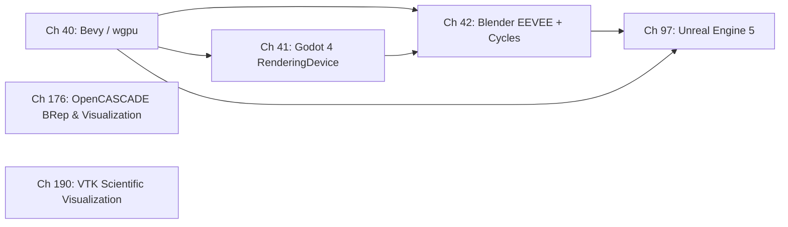

# Part XI — Engines and Creative Tools

By the time a frame reaches a game engine or creative suite, it has already traversed the kernel **DRM** subsystem, been scheduled by a **Mesa** Vulkan driver, and been handed to a **Wayland** compositor for presentation. Part XI examines that moment from the application's side: how engines and creative tools structure their own rendering abstractions, issue **Vulkan** (or compute) commands, compile shaders, manage GPU memory, and integrate with the windowing stack. Each tool in this part represents a distinct point on the spectrum from safe, opinionated abstraction to raw, explicit GPU control — and each makes different tradeoffs that are only legible once the stack below is understood.

## Chapters in This Part

**Chapter 40 — Bevy and wgpu: Rust-Native Game Development** traces the full path from a **Bevy** application written in Rust down to **Mesa** Vulkan drivers, using **wgpu** as the GPU abstraction layer and **naga** as the shader compiler. The reader learns how **Bevy**'s dual-world **ECS** architecture separates simulation from GPU command recording, how **wgpu-hal**'s **Vulkan** backend maps **wgpu** resource types onto **VkBuffer**, **VkImage**, and **VkPipeline** objects, and how **WGSL** shaders reach **Mesa NIR** via **naga**'s IR and a **SPIR-V** intermediate. Chapter 40 is the most Rust-centric chapter in the book and the closest open-source analogue to a browser **WebGPU** client.

**Chapter 41 — Godot 4 RenderingDevice** examines Godot 4's explicit GPU command layer, **RenderingDevice**, which wraps **Vulkan** without an intermediate abstraction library. Where Chapter 40 uses **wgpu** to insulate the application from **Vulkan** details, Godot 4's **RenderingDeviceDriverVulkan** calls the **Vulkan** API directly, making it an instructive reference for how a production engine constructs pipeline state objects, descriptor sets, and command buffers from scratch. The chapter also covers Godot's native **Wayland** **DisplayServer** introduced in 4.3, the shader path from **GDShader** through **GLSL** to **SPIR-V** via **glslang**, and both the **Forward+** clustered renderer and the **Mobile** single-pass renderer.

**Chapter 42 — Blender GPU: Cycles and EEVEE** addresses the widest GPU surface of any tool in the part. **EEVEE Next** (production in Blender 4.2 LTS) is a full deferred **PBR** renderer built on **VKBackend** and the **VKRenderGraph** deferred-command architecture, exercising **VK_KHR_dynamic_rendering** and the **Vulkan Memory Allocator** (**VMA**). The **Cycles** path tracer sits alongside it with a separate multi-backend compute architecture spanning **HIP** (**ROCm**), **CUDA**/**OptiX**, **oneAPI**, and an experimental **Vulkan** compute path, making Blender unique in this part as the only tool that simultaneously drives rasterisation renderers and heterogeneous compute stacks. The reader also sees how **OpenColorIO** integrates with GPU color management and how Blender's **GHOST** windowing layer connects to **Wayland**.

**Chapter 176 — OpenCASCADE Technology: The BRep Kernel and 3D Visualization Stack** covers the open-source C++ framework that underpins most serious Linux CAD applications, including FreeCAD, Salome, and Code_Aster. The chapter explains OCCT's **BRep** model — exact B-spline/NURBS geometry attached to a directed topology graph of faces, edges, and vertices — and contrasts it with the triangle-soup model used by game engines. It covers the six OCCT modules, the **BRepBuilderAPI** / **BRepPrimAPI** construction APIs, Boolean CSG operations (`BRepAlgoAPI_Fuse/Cut/Common`), the **BRepMesh** incremental mesher (new in OCCT 8.0), and the **V3d / AIS / TKOpenGl** visualization stack including its EGL/Wayland backend and PBR shader pipeline. Data exchange covers STEP, IGES, glTF 2.0, and the **XDE** extended data framework for assembly metadata. A dedicated section examines FreeCAD's use of OCCT as its geometric kernel and Part design workbench. The Vulkan backend prototype (tracker issue #30631) is documented as not yet merged in OCCT 8.0.0p1 (June 2026).

**Chapter 190 — VTK: Scientific Visualization on the Linux Graphics Stack** covers the Visualization Toolkit — the C++ library underpinning ParaView, 3D Slicer, and countless scientific applications. The chapter explains VTK's pipeline-based architecture (vtkAlgorithm sources, filters, and mappers), its data model (vtkPolyData, vtkUnstructuredGrid, vtkImageData), and its rendering backends on Linux: OpenGL via vtkXOpenGLRenderWindow or vtkEGLRenderWindow (for headless/Wayland), OSMesa for software rendering in containers, and the experimental vtkVulkanRenderer introduced in VTK 9.2. It covers GPU volume rendering via vtkGPUVolumeRayCastMapper and GLSL ray-cast shaders, **VTK-m** GPU-accelerated filters (Marching Cubes, Gradient, Streamlines) with CUDA and HIP/ROCm backends, parallel rendering for HPC clusters using IceT image compositing, and **ParaView**'s client-server architecture for rendering on remote compute nodes. A practical section addresses headless deployment in Kubernetes with NVIDIA EGL or OSMesa, and browser-based visualization via the **trame** Python web framework.

**Chapter 97 — Unreal Engine 5 on Linux** covers the most technically ambitious closed-source engine. **UE5**'s **Rendering Hardware Interface** (**RHI**) abstracts over **Vulkan**, **D3D12**, and **Metal** in C++; the Linux path compiles **HLSL** shaders to **SPIR-V** via **DXC** (DirectX Shader Compiler) and submits them to **Mesa** through the standard **vk_spirv_to_nir()** path. The chapter covers **Nanite** virtualised geometry (which uses **VK_EXT_mesh_shader** and software rasterisation on **Mesa**), **Lumen** global illumination (hardware ray tracing on **RDNA2**/**RTX**, software fallback on **Mesa**), **Niagara** GPU particles, and the practical reality of shipping for the **Steam Deck** via **SteamOS 3** and **Gamescope**.

## How the Chapters Interrelate

The four chapters form a deliberate progression in abstraction depth and engine complexity, but they share a common substrate: all four ultimately enter **Mesa** as **SPIR-V** through **vkCreateShaderModule()** and **vk_spirv_to_nir()**, meaning that Chapters 14–18 (Mesa architecture and Vulkan driver internals) are the shared foundation for every chapter here.

Chapter 40 (**Bevy/wgpu**) is the recommended entry point. It introduces the concepts that recur throughout the part — GPU resource lifetimes, command encoding, shader IR compilation, **Wayland** surface creation via **VK_KHR_wayland_surface**, swapchain management, and timeline semaphore synchronisation — using a fully open-source, auditable stack. Because **wgpu** and **naga** are independent crates, the chapter also shows how GPU abstraction can be layered without the engine owning the abstraction.

Chapter 41 (**Godot 4**) builds directly on Chapter 40's conceptual vocabulary but strips the **wgpu** mediation layer away. Readers who understand how **wgpu-hal** maps a **wgpu::RenderPipeline** onto **vkCreateGraphicsPipelines** will immediately recognise the analogous logic in **RenderingDeviceDriverVulkan**, but now expressed as raw **Vulkan** calls. The contrast between Godot's manual descriptor-set management and **wgpu**'s bind-group model is a central pedagogical thread. Chapter 41's **GDShader** → **GLSL** → **SPIR-V** shader path via **glslang** parallels Chapter 40's **WGSL** → **naga** → **SPIR-V** path; together they show that **Mesa** is equally agnostic to the source language as long as the output is valid **SPIR-V**.

Chapter 42 (**Blender**) is best read after both Chapters 40 and 41, because **EEVEE**'s **VKBackend** and **VKRenderGraph** draw on patterns introduced in both. The **Cycles** multi-backend section additionally requires familiarity with GPU compute concepts from Chapter 25 (OpenCL/ROCm/CUDA) and the **KFD** kernel driver path from Chapter 12. The two renderers within Blender — **EEVEE** (rasterisation) and **Cycles** (compute) — are the only case in this part where a single application drives both a full graphics pipeline and heterogeneous compute kernels, so Chapter 42 uniquely ties together threads from Parts IV, V, and VII.

Chapter 97 (**UE5**) is deliberately placed after the three open-source engines: it is the most complex engine and the only closed-source one. Many of its internal mechanisms are versions of patterns already seen — **RHI** is an abstraction analogous to **wgpu-hal** or **RenderingDevice**; **Nanite**'s software rasteriser dispatches **vkCmdDispatch** calls the reader has already seen in Blender and Bevy's compute sections. Chapter 97 also intersects Part VIII (Chapter 78 on **Gamescope** and **Steam Deck**), which covers the compositor that hosts **UE5** game builds in **SteamOS 3**. For the D3D-to-Vulkan translation layer used by game engines porting their D3D content to Linux, see Chapter 104 (DXVK and VKD3D-Proton) in Part VIII.

The shared themes that run through all four chapters are: (1) the **SPIR-V** contract as the universal handshake with **Mesa**; (2) **VK_KHR_wayland_surface** / **xdg_wm_base** as the windowing integration point; (3) GPU memory management strategies — **gpu-allocator**, **VMA**, manual **VkDeviceMemory** pools; (4) shader caching, whether through **wgpu**'s pipeline cache, **Mesa**'s **`~/.cache/mesa_shader_cache_db/`**, Blender's own **SPIR-V** disk cache, or **DXVK**'s state cache.

## Prerequisites and What Comes Next

Readers should have worked through at least Part I (**DRM/KMS kernel internals**), Parts IV–V (**Mesa architecture and Vulkan driver internals**), and Part VI (**display and compositor stack**) before beginning this part; Chapter 25 (**GPU compute**) is additionally required before Chapter 42's **Cycles** sections. Chapter 28 (**gaming compatibility layer overview**) and Chapter 104 (**DXVK and VKD3D-Proton**, Part VIII) together provide the Windows-compatibility translation context. Part XIII (performance analysis and profiling) builds directly on this part, applying profiling tools to the engines and rendering pipelines examined here.

---
