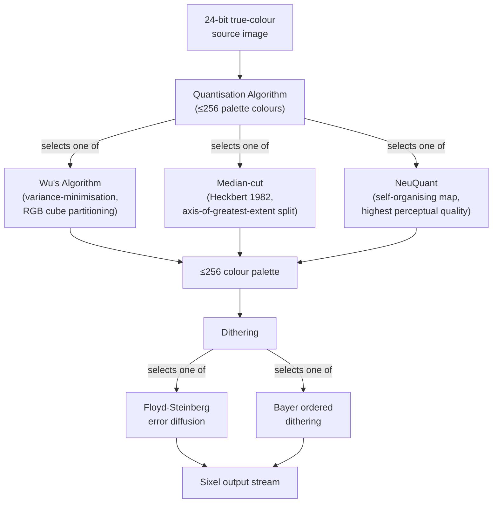
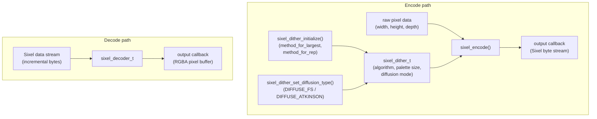
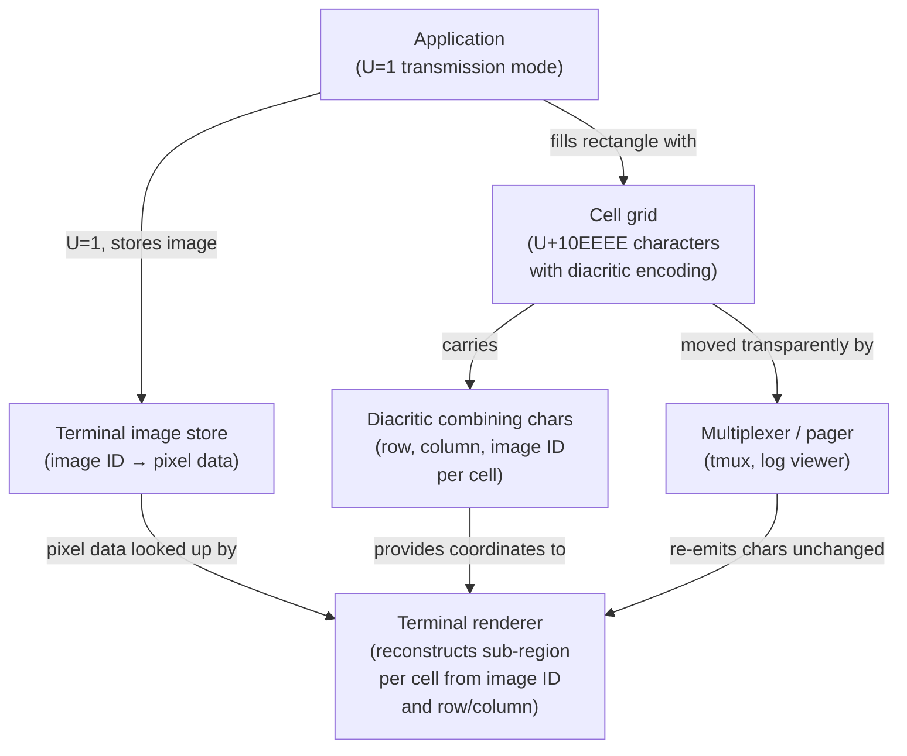
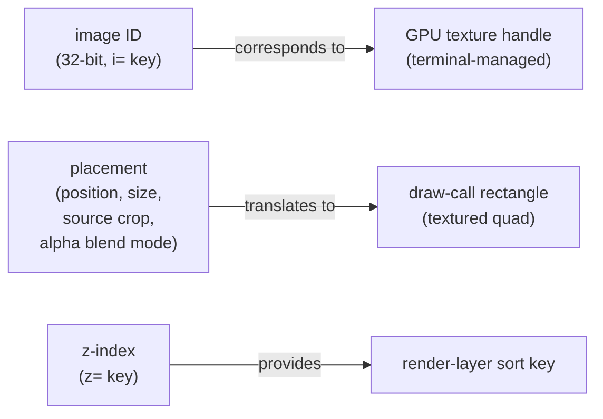
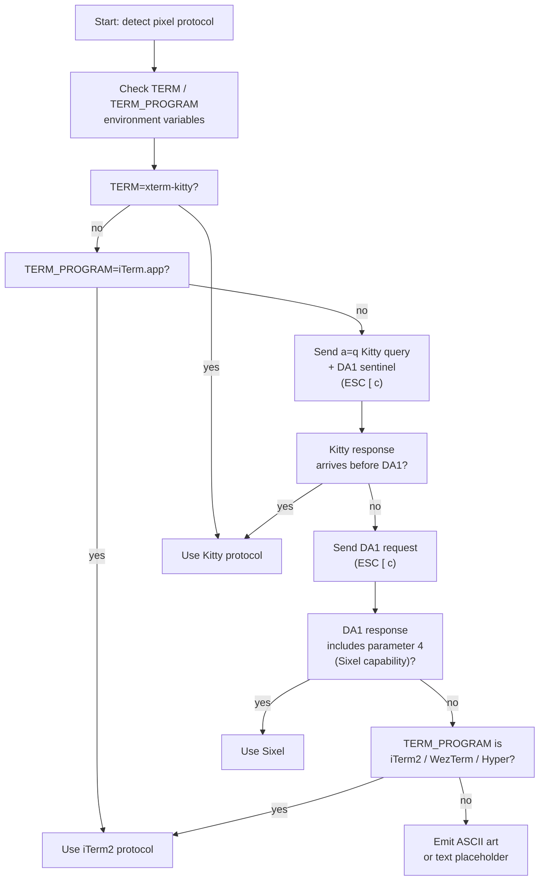

# Chapter 43: Terminal Pixel Protocols — Sixel, Kitty, and iTerm2

**Part XII — Terminal Graphics**

**Audiences targeted:** Terminal and TUI developers who need to understand the encoding mechanics and implementation complexity of pixel protocols; graphics application developers who want to understand how pixel data encoded in VT escape sequences ultimately becomes GPU texture data in a modern accelerated terminal. Readers are assumed to have covered Parts I–VI of this book; DRM, KMS, Mesa internals, Wayland protocol design, and compositor architecture are referenced but not re-explained here. Chapter 44 covers what happens to the image data once the terminal has decoded it; Chapter 45 covers how the resulting GPU framebuffer reaches the KMS scanout path.

---

## Table of Contents

1. [The Pixel-in-Terminal Problem](#1-the-pixel-in-terminal-problem)
2. [Sixel: The DEC Heritage](#2-sixel-the-dec-heritage)
3. [Kitty Graphics Protocol: Stateful, Chunked, GPU-Ready](#3-kitty-graphics-protocol-stateful-chunked-gpu-ready)
4. [iTerm2 Inline Images Protocol: Simplicity and Portability](#4-iterm2-inline-images-protocol-simplicity-and-portability)
5. [Protocol Comparison and Selection Guide](#5-protocol-comparison-and-selection-guide)
   - [Bandwidth Analysis](#bandwidth-analysis)
   - [Feature Matrix](#feature-matrix)
   - [Terminal Support Matrix](#terminal-support-matrix)
   - [Protocol Detection Strategies](#protocol-detection-strategies)
   - [Selection Guidance](#selection-guidance)
   - [The Standardisation Landscape: Fragmentation by Pragmatism](#the-standardisation-landscape-fragmentation-by-pragmatism)
6. [Terminal Multiplexers and Pixel Protocol Passthrough](#6-terminal-multiplexers-and-pixel-protocol-passthrough)
7. [Integrations](#7-integrations)
8. [References](#8-references)

---

## 1. The Pixel-in-Terminal Problem

A terminal emulator is, at its core, a two-dimensional array of character cells. Each cell has fixed dimensions determined by the current font metrics — typically 8–16 pixels wide and 16–24 pixels tall — and every glyph rendered into the terminal is aligned to this grid. The grid model descends directly from the hardware terminals of the 1970s, where video memory was organised as rows of character codes and attribute bytes. Modern GPU-accelerated terminals such as **kitty**, **WezTerm**, and **Ghostty** still maintain this abstraction: their data model is a two-dimensional array of cells carrying **Unicode** codepoints, colour attributes, and rendering flags, and their render loop converts that array into a GPU scene every frame.

This structure is a constraint on how pixel graphics can be expressed, but it is not a prohibition. The constraint forces pixel data to be transmitted as an ancillary data stream, distinct from the character cell stream, using escape sequences that the terminal intercepts and interprets out-of-band from ordinary text. The terminal must then decide where in the cell grid the image belongs, how many cells it occupies, and how to synchronise that image with the cell grid as text scrolls. These are non-trivial problems, and different protocol designs have made different trade-offs between encoding simplicity, bandwidth efficiency, GPU friendliness, and multiplexer compatibility.

The historical context matters for understanding why three separate protocols co-exist today. Digital Equipment Corporation shipped the **VT240** in 1984 and the **VT340** in 1987, both supporting a graphics mode called **ReGIS** (Remote Graphic Instruction Set) and a companion bitmap encoding called **Sixel**. The **VT340** had an 800×480 pixel framebuffer addressable in a 16-colour palette, and **Sixel** was the mechanism for loading raster images into it over a serial connection. Sixel survived into the **xterm** lineage, was revived by **mlterm** in the early 2000s, and experienced a renaissance in the 2010s as terminal emulators became capable of rendering it at practical speeds. The **xterm** implementation remains the reference for the modern **Sixel** dialect, documented exhaustively in the xterm control sequences reference [Source](https://invisible-island.net/xterm/ctlseqs/ctlseqs.html).

The **Sixel** protocol encodes pixel data as **DCS** (Device Control String) escape sequences introduced by `ESC P` and terminated by the String Terminator **ST** (`ESC \`). The **DCS** initiator carries three parameters controlling aspect ratio, background mode (**P2**), and grid size, followed by the `q` discriminator. Within the data stream, the **DECGRA** raster attribute command (`"`) pre-declares image dimensions and pixel aspect ratio, enabling the terminal to pre-allocate the image buffer and avoid dynamic growth during decode. Colour is managed through a palette of up to 256 numbered registers defined with **RGB** or **HLS** values using the `#` command. Because **Sixel** is palette-indexed, any 24-bit true-colour source image must pass through a colour quantisation pipeline before encoding. The three dominant quantisation algorithms are **Wu's algorithm** (variance-minimisation, **RGB** cube partitioning), **median-cut** (Heckbert 1982), and **NeuQuant** (self-organising map, highest perceptual quality). After palette selection, dithering — either **Floyd-Steinberg** error diffusion or **Bayer** ordered dithering — distributes quantisation error spatially. The open-source reference implementation is **libsixel**, whose `sixel_encode()` function accepts raw pixel data and a `sixel_dither_t` context, and whose streaming decode path feeds a `sixel_decoder_t` object. **Sixel** support as of 2025–2026 spans **xterm**, **foot**, **mlterm**, and **WezTerm**, with hardware and firmware terminals including the **VT340** and certain embedded system consoles. Its structural limitations — the 256-colour ceiling, absence of an alpha transparency channel, high bandwidth verbosity, and scrollback synchronisation complexity — are intrinsic to the palette-indexed model and cannot be resolved within the protocol.

The second protocol, the **Kitty Graphics Protocol**, was designed from scratch by Kovid Goyal, the author of the **kitty** terminal emulator, and first shipped around 2017. It was designed with explicit awareness of modern GPU rendering pipelines: the protocol provides image IDs, server-side image persistence, sub-image cropping, **z-index** layering, and a **Unicode** placeholder mechanism that allows images to move with text. The protocol specification is maintained at [Source](https://sw.kovidgoyal.net/kitty/graphics-protocol/) and has been adopted by several GPU-accelerated terminals. The **Kitty Graphics Protocol** uses **APC** (Application Program Command) escape sequences (`ESC _ G … ESC \`) rather than **OSC**, chosen because **APC** strings pass silently through terminals that do not implement the protocol. The `f` key selects the pixel format (`f=24` for raw **RGB**, `f=32` for **RGBA**, `f=100` for **PNG**); the `o` key enables **zlib** compression (`o=z`); and the `t` key selects the transmission medium (`t=d` for inline base64, `t=f` for file path, `t=s` for **POSIX** shared memory via `/dev/shm`, the most efficient zero-copy path for same-machine clients). Large images are split into multiple chunks controlled by the `m` key, with each chunk being a complete **APC** sequence. Image persistence is managed through 32-bit image IDs (`i` key) that allow a single uploaded image to be displayed at multiple positions without retransmission; deletion is performed with `a=d` using `d=I`, `d=C`, `d=Z`, or `d=a` scopes. The placement system uses `c`/`r` for cell dimensions, `X`/`Y` for sub-cell pixel offsets, `x`/`y`/`w`/`h` for source-rectangle cropping, and the `z` key for render-layer ordering. The **Unicode placeholder** mechanism uses the private-use codepoint **U+10EEEE** with diacritic combining characters encoding row, column, and image ID per cell, enabling images to move correctly through multiplexers like **tmux** that manipulate the cell buffer without understanding the graphics protocol. Relative placements via the `P` and `Q` keys enable parent-child position tracking. Animation is supported through the `a=f` frame data action and the `a=a` animation control action, which configures inter-frame gaps, compositing mode, and loop state. Feature detection uses the `a=q` query action paired with a **DA1** sentinel request (`ESC [ c`). From the GPU rendering perspective, each image ID maps to a GPU texture handle and each placement maps to a textured quad draw call, making the protocol a scene graph serialisation format.

The third protocol, **iTerm2 Inline Images**, originated as a macOS-specific extension in the **iTerm2** terminal emulator. Its design is deliberately minimal — a single stateless **OSC 1337** escape sequence carrying a base64-encoded image file — and its portability advantage is that it requires almost no terminal-side state management. It has been adopted by **WezTerm** on Linux, **Hyper**, and partially by **Konsole**. The `File=` parameter block controls display width and height (in cells, pixels, or percentage), aspect ratio preservation, and inline display mode. **iTerm2** version 3.5 introduced a multipart transmission mechanism (`MultipartFile=`, `FilePart=`, `FileEnd`) designed to work around legacy multiplexer limits on **OSC** sequence lengths. The protocol's statelessness — no image IDs, no server-side store, no placements, no deletion commands — makes it trivially safe across disconnection and reconnection and transparent to multiplexers, at the cost of lacking animation, **z-index** layering, source-crop, and server-side deduplication.

The reason three protocols exist is partly historical accident and partly genuine design conflict. **Sixel** has the widest hardware and firmware support, including embedded systems and **SSH** sessions to legacy servers that will never be updated. **Kitty**'s protocol has capabilities that **Sixel** simply cannot express — true-colour **RGBA**, animation, **z-indexing**, server-side deduplication — but it requires meaningful terminal-side state management that stateless multiplexers like **tmux** cannot transparently proxy. **iTerm2** finds a middle ground: it is richer than **Sixel** (true-colour, transparency) but simpler than **Kitty** (no server-side state, no image IDs). Application developers writing **TUI** tools, image viewers, or data visualisation libraries must understand all three to target the broadest terminal population.

Chapter 5 of this chapter provides a structured comparison across these three protocols: a bandwidth analysis for a representative 640×480 photograph, a feature matrix covering true-colour, alpha transparency, animation, **z-index** layering, source-crop, server-side deduplication, and multiplexer transparency, and a terminal support matrix covering **xterm**, **foot**, **kitty**, **WezTerm**, **Ghostty**, **mlterm**, **Konsole**, **VTE**, and **Hyper**. Protocol detection strategies are discussed in detail: the primary **Device Attributes** (**DA1**) request (`ESC [ c` / `CSI c`) with parameter `4` advertising **Sixel** support, **DECRQM** for querying **DECSDM** Mode 80, the **Kitty** `a=q` query, and environment variables such as `TERM` and `TERM_PROGRAM`. Selection guidance covers the use of **Kitty** for GPU-accelerated local terminals, **Sixel** for maximum compatibility including hardware serial terminals, and **iTerm2** for macOS-ecosystem and stateless SSH scenarios. The standardisation landscape — including the **Good Image Protocol** (**DCS**-framed, proposed by the **Contour** terminal's Christian Parpart), the **freedesktop.org** terminal working group (**terminal-wg**), and the Unicode block character approximation approach used by tools such as **chafa** and **notcurses** (Braille patterns **U+2800–U+28FF**, half-block characters **U+2580–U+259F**, and sextant characters **U+1FB00–U+1FB3B**) — is examined in the context of the ecosystem's fragmentation by pragmatism.

---

## 2. Sixel: The DEC Heritage

### VT340 Hardware Design and the Sixel Unit

The DEC VT340 drove an 800×480 pixel monochrome or 4-bit colour display. Colour mode supported 16 simultaneously displayable colours chosen from a palette of up to 256 entries, each defined in either HLS or RGB colour space. The firmware contained a DCS (Device Control String) handler that recognised a Sixel data stream and rendered it into a dedicated pixel buffer separate from the character cell raster. The pixel buffer could be scrolled independently and had its own cursor position. [Source](https://www.vt100.net/docs/vt3xx-gp/chapter14.html)

The Sixel unit is the fundamental encoding atom. A single Sixel character encodes six vertically-stacked pixels as a 6-bit bitmask added to the ASCII value 63 (0x3F), producing printable ASCII characters in the range `?` (0x3F) to `~` (0x7E). Bit 0 of the mask is the topmost pixel; bit 5 is the bottommost. A character value of `?` (mask 0b000000) represents six transparent or background pixels; `~` (mask 0b111111) represents six fully-set pixels in the current foreground colour. Images are transmitted row-by-row in horizontal bands six pixels tall, each band being a sequence of Sixel characters. The height of the full image is thus always a multiple of six unless padding is explicitly handled, and the width is the number of Sixel characters per band. To build an image taller than six pixels, the encoder transmits successive bands with a graphics newline (`-` character, ASCII 45) between them.

### DCS Initiator Syntax and Parameters

A Sixel stream is introduced by the DCS (Device Control String) initiator sequence. In 7-bit environments this is `ESC P`; in 8-bit environments it is the single C1 control character DCS (0x90). The full initiator form is:

```
ESC P P1 ; P2 ; P3 q
```

The final character `q` identifies the body as Sixel data rather than another DCS sub-protocol. The three parameters are optional and default to zero:

**P1** (aspect ratio): Controls the ratio of vertical to horizontal pixels per Sixel unit. The mapping is: values 0 or 1 select 2:1 (two vertical pixels per horizontal pixel); value 2 selects 5:1 (intended for 60 dpi hardcopy output); values 3 or 4 select 3:1; values 5 or 6 select 2:1; and values 7, 8, or 9 select 1:1 square pixels. The DEC documentation notes that this field is provided for compatibility with existing Digital software and that new applications should set P1 to 0 and use the DECGRA raster attribute command instead. Most modern terminal emulators ignore P1 entirely and render at 1:1 regardless, but the field must be present syntactically. [Source](https://www.vt100.net/docs/vt3xx-gp/chapter14.html)

**P2** (background mode): This parameter controls how pixels that are not explicitly set in any band are rendered. Value 0 or 2 causes unset pixels to be filled with the current background colour register (register 0), making the image opaque. Value 1 causes unset pixels to remain at whatever colour was beneath them, producing transparency. The default (0) is opaque. [Source](https://www.vt100.net/docs/vt3xx-gp/chapter14.html)

**P3** (grid size): Specifies the pixel grid size in centimetres (a legacy field for hardcopy devices). Terminal emulators universally ignore this field.

The DCS string is terminated by the String Terminator `ST`, which in 7-bit form is `ESC \` (two bytes). The full Sixel transmission therefore has the structure `ESC P <params> q <sixel-data> ESC \`.

### DECGRA Raster Attributes

Within the Sixel data stream, before the first band of Sixel characters, an encoder should transmit a DECGRA (DEC Raster Attribute) command to pre-declare the image dimensions. DECGRA uses the `"` character and accepts four parameters:

```
" Pan ; Pad ; Ph ; Pv
```

`Pan` and `Pad` together specify the pixel aspect ratio as a numerator/denominator pair (e.g., `"1;1` for square pixels). `Ph` is the image width in pixels and `Pv` is the image height in pixels. These two values do not impose a hard limit on the data that follows — an encoder may transmit more Sixel data than declared — but they enable the terminal to pre-allocate the image buffer and, when P2 is 0 or 2, to pre-clear the declared region to the background colour. A decoder encountering DECGRA before any Sixel data can also use it to avoid dynamic buffer growth during decode. This is the distinction between Level 1 Sixel (no raster attributes, decoder must grow the buffer dynamically as each new band arrives) and Level 2 Sixel (raster attributes present, pre-allocated buffer, all dimensions known before the first band). [Source](https://www.vt100.net/docs/vt3xx-gp/chapter14.html)

### Colour Registers and Palette Management

Sixel colour is managed through a palette of numbered registers. The `#` command selects or defines a register. Used alone with a single number (`#n`), it selects register `n` as the current drawing colour. Used with additional parameters, it defines the colour assigned to that register. RGB definition takes the form `#n;2;r;g;b` where `r`, `g`, `b` are integers in the range 0–100 (percentage of full intensity, not 8-bit values). HLS definition takes the form `#n;1;h;l;s` where `h` is hue in degrees (0–360), `l` is lightness (0–100), and `s` is saturation (0–100).

The original VT340 supported 16 colour registers simultaneously, though the firmware palette could be extended by defining and redefining registers between bands. Modern terminal implementations following the xterm Sixel extension support up to 256 registers, controlled by the X resource `XTerm*numColorRegisters: 256` in xterm [Source](https://invisible-island.net/xterm/ctlseqs/ctlseqs.html). The foot terminal and mlterm both support 256 registers. The 256-register ceiling is the most significant technical limitation of Sixel for photographic content: 24-bit source images must be quantized to at most 256 palette entries before encoding, and this quantisation introduces visible colour banding on photographs, smooth gradients, and natural scenes.

### Colour Quantisation Pipeline

Because Sixel requires palette-indexed colour, any encoder processing a 24-bit true-colour source image must run a colour quantisation algorithm to reduce the colour space to at most 256 representative colours. Three algorithms dominate in practice.



Wu's algorithm (Xiaolin Wu, 1992) partitions the RGB colour cube using a variance-minimisation strategy. The cube is recursively split along the axis of highest variance until the desired number of regions is reached; each region's representative colour is its variance-weighted centroid. Wu's algorithm is fast and produces high-quality results because it minimises the mean squared error of the quantisation, which is perceptually well-correlated with human colour discrimination. It is the algorithm used by libsixel for its default quality level.

Median-cut (Heckbert, 1982) partitions the colour space by finding the axis of greatest extent in a region and splitting at the median along that axis. It is simpler to implement than Wu's method and runs faster on small colour sets, but produces slightly lower quality results because it does not weight regions by population. Median-cut is suitable for simple graphics and diagrams where the colour distribution is already sparse.

Neural-network quantisation (NeuQuant, Dekker, 1994) trains a self-organising map on the image's pixel population. It achieves the highest perceptual quality at the cost of significantly higher CPU time per image, making it appropriate for batch offline processing but not for interactive or real-time image display.

After palette selection, dithering is applied to distribute quantisation error spatially. Floyd-Steinberg error diffusion propagates the quantisation error of each pixel to its right and lower neighbours, producing smooth transitions at the cost of spatial correlation artefacts (worm-like patterns in areas of uniform colour). Bayer ordered dithering uses a threshold matrix to produce a regular patterned appearance that is less spatially correlated but introduces a visible halftone structure at small palette sizes. At 256 colours, Floyd-Steinberg is generally preferred for photographs; Bayer dithering is preferable for sharp-edged illustrations where the pattern is less visible.

### libsixel

The reference Sixel implementation in open source is libsixel [Source](https://github.com/libsixel/libsixel). Its encoding API operates in two modes: a batch API that takes a pixel buffer, quantises it, and writes the complete Sixel stream to an output function; and a streaming API that processes one input row at a time, suitable for progressive image loading or very large images. The core encode function, `sixel_encode`, accepts a pointer to raw pixel data, width, height, depth (bytes per pixel), and an output callback. Quantisation is handled through a separate `sixel_dither_t` object that encapsulates the algorithm choice, palette size, and dithering mode. The quantisation algorithm is selected at context-creation time via `sixel_dither_initialize(dither, pixels, width, height, quality_mode, method_for_largest, method_for_rep, method_for_diffuse, ...)`, where `method_for_largest` (e.g. `LARGE_NORM`, `LARGE_LUM`) and `method_for_rep` (e.g. `REP_CENTER_BOX`, `REP_AVERAGE_COLORS`) together determine how the colour palette is built from the image histogram. There is no setter function on an already-initialised dither object for the quantisation algorithm; it must be selected at initialisation time. The dithering/diffusion type applied after quantisation can be changed separately via `sixel_dither_set_diffusion_type(dither, diffusion_type)`, accepting constants such as `DIFFUSE_FS` (Floyd-Steinberg) or `DIFFUSE_ATKINSON`.

The decode path in libsixel uses a `sixel_decoder_t` object together with a callback-driven parser. The caller creates a decoder context, registers output and error callbacks, and feeds data incrementally. The decoder calls the output callback once per decoded image with the resulting RGBA pixel buffer. This streaming design allows decoding while bytes are still arriving over a network connection, which is important for interactive rendering. The foot terminal emulator integrates this directly in `src/sixel.c` and `src/sixel.h` [Source](https://codeberg.org/dnkl/foot).



### Modern Terminal Support and Limitations

Sixel support as of 2025–2026 is available in xterm (the reference implementation, with Mode 80 DECSDM for Sixel Display Mode and Mode 8452 for sixel scrolling), foot (full support including 256 registers and scrollback via pixel-position tracking), mlterm (long-standing support, one of the earliest revivalists), and WezTerm (full support, though historically an HLS normalisation discrepancy was reported in its colour register handling). Ghostty, the new GPU-accelerated terminal from Mitchell Hashimoto, has prioritised the Kitty and iTerm2 protocols and its Sixel status was not stable as of 2026. The xfce4-terminal and Konsole have partial or in-progress Sixel support. Hardware and firmware terminals including the DEC VT340 itself, Wyse terminals, and certain embedded system consoles have Sixel support in their firmware, making it the only protocol that works on physical serial hardware.

The fundamental limitations of Sixel are structural and cannot be resolved within the protocol. The 256-colour ceiling causes visible banding on any image with more than a few hundred distinct colours; photographic content is particularly affected. There is no transparency channel: Sixel supports only opaque or background-coloured pixels, not alpha-blended pixels. The bandwidth verbosity is substantial: a 1920×1080 photographic image encoded as Sixel at 256 colours with Floyd-Steinberg dithering typically produces between three and five times as many bytes as the equivalent JPEG at similar visual quality, because each six-pixel column is encoded as a single ASCII byte plus repeat counts. The scrollback synchronisation problem is the most operationally irritating limitation: Sixel places an image at the current cursor position, and as the terminal scrolls, the terminal must track the pixel offset of that image in the scrollback buffer. Different terminals implement this with varying degrees of correctness, and all can exhibit misalignment when the terminal is resized or the scrollback limit is reached.

---

## 3. Kitty Graphics Protocol: Stateful, Chunked, GPU-Ready

### Design Goals

The Kitty Graphics Protocol was designed with two explicit objectives that differentiate it from both Sixel and iTerm2. First, it should be possible to transmit an image once and display it multiple times at different positions without retransmitting the pixel data — the terminal must maintain a server-side image store keyed by image ID, analogous to how a GPU driver maintains a texture object. Second, the placement model should map directly to GPU draw calls: an image placement is a cell-anchored rectangle with optional pixel offsets, source-crop parameters, and a z-index, which is the information needed to issue a single textured quad to the GPU with no further processing. The protocol is specified in full at [Source](https://sw.kovidgoyal.net/kitty/graphics-protocol/).

### APC Escape Framing

The Kitty protocol uses Application Program Command (APC) escape sequences, not OSC (Operating System Command). The complete frame structure is:

```
ESC _ G <key=value pairs, comma-separated> ; <base64 payload> ESC \
```

The opening `ESC _` introduces an APC string; the `G` immediately following is the Kitty-specific discriminator. Key-value pairs in the control section are separated by commas and use single-letter keys. A semicolon separates the control section from the base64-encoded payload; if there is no payload, the semicolon may be omitted. The sequence is closed by the String Terminator `ESC \`.

APC was chosen over OSC deliberately. APC strings are passed through silently by nearly all terminals that do not implement the protocol — they do not produce visible output and do not disturb the terminal state machine. OSC strings, by contrast, are sometimes intercepted or modified by intermediate terminal multiplexers. Base64 encoding of the payload ensures 7-bit cleanliness: the data traverses any SSH connection or serial link without binary corruption. The control data section uses only printable ASCII characters, so it is equally safe over 7-bit channels.

### Pixel Formats, Compression, and Transmission Media

The `f` key specifies the pixel format of the image data in the payload. `f=24` means raw 24-bit RGB (three bytes per pixel, row-major, top-to-bottom); `f=32` means 32-bit RGBA (four bytes per pixel, straight/non-premultiplied alpha; alpha compositing is performed by the terminal renderer — the Kitty protocol specification does not mandate premultiplied alpha, and implementations should treat the alpha channel as straight alpha; consult the authoritative specification at [Source](https://sw.kovidgoyal.net/kitty/graphics-protocol/) for any format clarifications); `f=100` means PNG (the payload is a complete PNG file, and the terminal extracts dimensions and format from the PNG header itself). The PNG format is the most bandwidth-efficient for photographic content, since PNG applies DEFLATE compression to filtered pixel data. For simple graphics or programmatically generated images, raw `f=32` with zlib compression (described next) is often more convenient because it avoids the overhead of a PNG encoder on the client.

The `o` key specifies optional compression. `o=z` instructs the terminal that the decoded base64 data is RFC 1950 zlib-compressed and must be inflated before pixel interpretation. The distinction between `f=100` and `f=32,o=z` is that PNG carries its own internal DEFLATE framing with filter predictors per row, while `f=32,o=z` wraps raw RGBA pixels in a flat zlib stream with no row filtering. Typical zlib compression ratios on natural images are 3:1 to 10:1 for pixels with low spatial frequency. For highly complex images, the ratio approaches 1:1 and the compression overhead is not justified.

The `t` key controls how the terminal acquires the pixel data. `t=d` (direct) embeds the data inline in the escape sequence payload; `t=f` provides a path to a regular file that the terminal reads; `t=t` provides a path to a temporary file that the terminal reads and then deletes; `t=s` provides the name of a POSIX shared memory object (`/dev/shm/<name>`) that the terminal maps directly without a copy. The `t=s` shared memory path is the most efficient transmission mode for same-machine clients because the pixel data traverses no I/O path at all — the application allocates a POSIX shm object, writes pixel data into it, and sends only the name over the escape sequence. The terminal maps the object, uploads to GPU, and releases the mapping. This is conceptually related to the `wl_shm` buffer passing described in Chapter 45 and to the DMA-BUF zero-copy infrastructure described in Chapter 4, though POSIX shm operates at a higher abstraction level and does not involve DRM buffer objects.

### Chunked Transfer

The `m` key controls multi-chunk transmission. Because escape sequences are transmitted as byte streams, very large images must be split into multiple chunks to avoid blocking the terminal's escape sequence parser or overflowing intermediate buffers in multiplexers. Each chunk is a complete APC escape sequence. All chunks except the last carry `m=1`; the final chunk carries `m=0` to signal completion. The protocol documentation recommends chunks of 4096 bytes of base64-encoded data, which decodes to 3072 bytes of raw data. The base64 chunk length must be a multiple of four bytes (to avoid split codepoints at chunk boundaries) except for the final chunk. The terminal accumulates chunk data until it receives `m=0`, then performs decompression (if `o=z`) and pixel interpretation on the complete buffer.

### Image Persistence and Identifiers

Every image transmitted to the terminal may be assigned a 32-bit image ID via the `i` key. Once transmitted, the image remains stored in the terminal's image store until explicitly deleted. This enables a single image to be displayed at multiple positions simultaneously, or hidden and re-displayed without retransmission. The terminal may also assign IDs automatically if the client requests it via the `I` key (capital I), in which case the terminal responds with the assigned ID.

Deletion is performed with `a=d` (action = delete). The scope of deletion is controlled by further key-value pairs: `d=I` deletes all images with the given `i` value; `d=C` deletes all images whose placements overlap the given cell coordinates; `d=Z` deletes all images with z-index in a given range; and `d=a` (or `d=A`) deletes all stored images. This granular deletion model is important for applications that cycle through large numbers of images, such as image viewers or video players, to prevent unbounded growth of the terminal's image store.

### Placement System

A placement specifies where and how a stored image (or a newly transmitted image) appears on screen. Placements are also identified by IDs (`p` key), allowing multiple independent placements of the same image to be managed separately. The full placement parameter set is:

The `c` and `r` keys specify the width and height of the on-screen rectangle in terminal cells. If both are omitted, the image is scaled to fill as many cells as needed to represent its native pixel dimensions given the cell pixel dimensions. The `X` and `Y` keys (capital) specify sub-cell pixel offsets within the top-left cell of the placement, allowing precise pixel-level positioning rather than cell-grid alignment. The `x`, `y`, `w`, `h` keys (lowercase) specify a source rectangle within the stored image: only the sub-image from pixel (`x`, `y`) with width `w` and height `h` is displayed. This cropping capability is not available in either Sixel or iTerm2 at the protocol level and is particularly useful for sprite sheets or tiled image maps.

The `z` key specifies the z-index for layer ordering. Negative z-index values place the image behind the text layer, allowing background images or sparklines to appear beneath terminal text. Positive values place the image above text. A z-index of zero places the image at the same layer as text, with rendering order determined by arrival order. Multiple images at the same z-index and overlapping position blend in transmission order with alpha compositing. [Source](https://sw.kovidgoyal.net/kitty/graphics-protocol/)

### Unicode Placeholder Mechanism

The most architecturally significant feature of the Kitty protocol for multiplexer compatibility is the Unicode placeholder mechanism. The private-use codepoint U+10EEEE is designated as an image cell marker. When an application uses the Unicode placeholder transmission mode (`U=1`), the terminal renders the image by filling its cell rectangle with U+10EEEE characters. Each such character carries diacritic combining characters that encode the row position, column position, and image ID of the cell. The terminal renders U+10EEEE characters as the corresponding pixel region of the stored image rather than as a glyph.

The consequence of this design is that an image placement behaves identically to ordinary text from the perspective of any software that manipulates the terminal's character buffer without understanding the graphics protocol. When tmux inserts or deletes lines, scrolls the viewport, or reshuffles cell content between panes, the U+10EEEE characters move with the text flow. Because the row/column/image-ID information is encoded in the characters themselves, the terminal can reconstruct the correct image sub-region for each character cell wherever it ends up. Applications that receive terminal content as a character stream and re-emit it (pagers, log viewers, multiplexers) transparently proxy image content without implementing any part of the graphics protocol. The practical limitation of this mechanism is that not all multiplexers handle the diacritic encoding correctly, and some strip combining characters from private-use codepoints, breaking the row/column metadata. [Source](https://sw.kovidgoyal.net/kitty/graphics-protocol/)



### Relative Placements and Animation

The `P` and `Q` keys introduce relative (parent-child) placement relationships. A child placement specifies its position relative to a parent placement ID. When the parent placement moves (because a redraw repositions it), child placements track accordingly. This is useful for annotation overlays, image legends, and compound image objects.

Animation support is provided through a dedicated action set. `a=f` (frame data action) transmits a single animation frame's pixel data and stores it as part of an animation sequence associated with an existing image ID. `a=a` (animation control action) manages playback: it selects the active frame, configures the inter-frame gap in milliseconds (via the `z` key, where negative values indicate a gapless frame), specifies per-frame background RGBA colour for compositing, sets the compositing mode (replace vs. alpha blend with the previous frame), and controls the loop state via the `s` key (1 = stop, 2 = loading mode, 3 = looping). `a=T` is a combined transmit-and-display action for non-animated images. The terminal drives animation playback at its own refresh rate, advancing frames according to the configured gaps. Animation loops can be configured with a finite or infinite repeat count. Neither Sixel nor iTerm2 supports animation at the protocol level, making this a unique capability of the Kitty protocol. [Source](https://sw.kovidgoyal.net/kitty/graphics-protocol/)

### Feature Detection and GPU Mapping

Feature detection uses `a=q` (query action) sent with any pixel format command. A terminal implementing the protocol responds with a status APC escape sequence. The recommended detection approach is to send the `a=q` query followed immediately by a primary Device Attributes (DA1) request (`ESC [ c`); if the graphics query response arrives before the DA1 response, the Kitty protocol is supported. If only the DA1 response arrives, it is not. This sentinel technique works because both sequences travel the same I/O path and the terminal processes them in order. The `q=1` key suppresses the terminal's normal status response (for bulk operations where per-chunk ACKs would create overhead), and `q=2` suppresses error responses as well.

From the GPU rendering perspective, the Kitty protocol is essentially a scene graph serialisation format embedded in an escape sequence stream. Each image ID corresponds to a GPU texture handle managed by the terminal. Each placement corresponds to a draw-call rectangle: position, size, source crop, and alpha blend mode are all known at placement time and can be translated directly to a textured quad draw call with no further analysis. The z-index provides a sort key for render-layer ordering. When a terminal processes a Kitty protocol stream, it is building the same data structure that a game engine builds when loading a sprite set: a texture atlas keyed by ID, a list of draw commands each referencing a texture and specifying on-screen position and source crop, and a depth/layer ordering for overlapping elements. Chapter 44 describes how kitty's OpenGL renderer translates this data structure into GPU calls.



---

## 4. iTerm2 Inline Images Protocol: Simplicity and Portability

### Origin and Adoption

The iTerm2 Inline Images Protocol was introduced in the iTerm2 terminal emulator for macOS as a pragmatic extension for displaying images in the terminal without the encoding complexity of Sixel. Its reference documentation is at [Source](https://iterm2.com/documentation-images.html). Outside of macOS, the protocol has been adopted by WezTerm (full support, documented at [Source](https://wezfurlong.org/wezterm/imgcat.html)), Hyper, and Konsole (partial support). The `imgcat` utility distributed with iTerm2 and ported to other platforms serves as a practical test case for compatibility.

### Escape Sequence and Parameters

The iTerm2 protocol uses OSC (Operating System Command) 1337, the same OSC number that iTerm2 uses for its proprietary extensions. The complete sequence is:

```
ESC ] 1337 ; File= [parameters] : <base64-encoded image data> BEL
```

The `File=` keyword introduces a semicolon-separated (internally) parameter list, followed by a colon and the base64-encoded payload. The sequence is closed by BEL (0x07) rather than the String Terminator `ESC \`; both terminators are accepted by most implementations. The parameter list includes:

| Parameter | Values | Default | Meaning |
|-----------|--------|---------|---------|
| `name` | base64 string | — | Filename hint (informational only) |
| `size` | integer | — | Byte size of the decoded data (integrity hint) |
| `width` | Ncells, Npx, N%, auto | auto | Display width |
| `height` | Ncells, Npx, N%, auto | auto | Display height |
| `inline` | 0 or 1 | 0 | 1 = display inline; 0 = download only |
| `preserveAspectRatio` | 0 or 1 | 1 | Scale to fit while preserving aspect ratio |

WezTerm adds a `doNotMoveCursor` extension parameter that prevents the cursor from advancing below the image, useful for inline widgets that must not consume cell rows.

The payload is a complete image file — PNG, JPEG, GIF, BMP, or any format the terminal's image decoder understands — base64-encoded without chunking. The protocol relies entirely on the image format's own internal compression (DEFLATE in PNG, DCT in JPEG), rather than providing protocol-level compression. This is a deliberate simplicity trade-off: the terminal does not need to implement a decompressor as part of the escape sequence parser; it just hands the decoded bytes to whatever image decoder it has.

### Statelessness and Its Consequences

The defining characteristic of the iTerm2 protocol is its statelessness. There are no image IDs, no server-side image stores, no placements, and no deletion commands. Each escape sequence is a complete, atomic image delivery: the terminal decodes it, displays it at the current cursor position occupying the declared cell rectangle, and forgets about it. If the same image needs to be displayed a second time, the full base64 payload must be retransmitted.

This statelessness has three important consequences. First, it makes the protocol trivially safe across disconnection and reconnection: there is no server-side state to become inconsistent if the terminal is closed and reopened, or if an SSH session is interrupted and resumed. Second, it is compatible with multiplexers like tmux that pass through escape sequences without understanding them, because a stateless sequence cannot have broken state. Third, it limits the protocol's capabilities: there is no mechanism for animation, z-index layering, or source-crop, because all three require server-side state tracking.

### Multipart Transmission

iTerm2 version 3.5 introduced a multipart transmission mechanism for large images in constrained environments. The sequence `MultipartFile=...` initiates a multipart session, `FilePart=...` transmits a chunk, and `FileEnd` closes the session. This was designed to work around legacy tmux's 256-byte-per-line limit on OSC sequence lengths, which precluded sending large images as single sequences. Modern tmux and most multiplexers have removed or raised this limit (to 1 MiB in practice), making the multipart mechanism less necessary but still supported for compatibility.

### Feature Gap Relative to Kitty

The iTerm2 protocol cannot express several capabilities that Kitty supports. There is no animation: each image is a static frame. There is no z-indexing: all images render at the same layer as the cursor position, and there is no mechanism to render behind text. There is no source-crop: the entire image file is decoded and scaled to the declared dimensions. There is no server-side deduplication: the same image data must be retransmitted for each display occurrence. For simple use cases — showing a chart generated by a data pipeline, displaying a preview thumbnail, or rendering a system monitoring sparkline — none of these limitations are relevant. For complex image-intensive TUI applications, image viewers, or animated displays, Kitty's additional capabilities are necessary. [Source](https://iterm2.com/documentation-images.html)

---

## 5. Protocol Comparison and Selection Guide

### Bandwidth Analysis

The bandwidth cost of each protocol can be estimated for a representative test case: a 640×480 photograph transmitted over a network link.

Sixel encodes the image after quantising to 256 colours. Each six-pixel column becomes one ASCII byte, so the raw Sixel data volume before any compression is approximately `ceil(480/6) × 640 = 80 × 640 = 51,200` bytes for the pixel data alone, plus colour register definitions and escape sequence overhead. For photographic content with Floyd-Steinberg dithering applied, the byte count is typically 3–5× that of an equivalent JPEG at similar perceived quality, because Sixel provides no entropy coding or spatial prediction. Run-length encoding (the `!n` repeat syntax in Sixel) helps for simple graphics with large uniform regions but does not compress photographic content significantly.

The Kitty protocol with `f=100` (PNG payload) or `f=32,o=z` (zlib-compressed RGBA) transmits data at approximately the size of the original image file: a PNG for a 640×480 photograph is typically 200–400 KB, and after base64 encoding (a 4:3 expansion) the escape sequence is 267–533 KB. For the same photograph, a JPEG at quality 80 might be 50–80 KB, producing a Kitty sequence of 67–107 KB. The `t=s` shared memory path for local display eliminates the escape sequence overhead entirely, as only the POSIX shm name traverses the VT stream.

The iTerm2 protocol transmits the image file as-is in base64, producing the same byte volume as the Kitty `f=100` path without compression: approximately equal to the original file size after base64 expansion. There is no protocol-level deduplication or compression overhead reduction compared to Kitty's PNG path.

### Feature Matrix

The following table summarises protocol capabilities as of 2025–2026:

| Feature | Sixel | Kitty | iTerm2 |
|---------|-------|-------|--------|
| True-colour | No (≤256 palette) | Yes (32-bit RGBA) | Yes (image format) |
| Alpha transparency | No | Yes (RGBA) | Yes (PNG alpha) |
| Animation | No | Yes | No |
| Z-index layering | No | Yes | No |
| Source-rectangle crop | No | Yes | No |
| Server-side deduplication | No | Yes (image IDs) | No |
| GPU-native ID mapping | No | Yes | No |
| Multiplexer transparency | Partial | Via Unicode placeholder | Yes (stateless) |
| Protocol-level compression | No | Yes (zlib) | No |
| SSH over legacy transports | Yes | Yes (base64) | Yes |
| Hardware terminal support | Yes (firmware) | No | No |

### Terminal Support Matrix

As of 2025–2026, the major terminal emulators support the protocols as follows. xterm supports Sixel comprehensively (256 registers, Mode 80 DECSDM, Mode 8452 scrolling Sixel). foot supports Sixel with 256 registers and correct scrollback tracking, and does not support Kitty or iTerm2. kitty supports its own protocol (as the reference implementation) and has basic Sixel support. WezTerm supports all three protocols with full feature coverage for Kitty and iTerm2 and complete Sixel support [Source](https://wezfurlong.org/wezterm/imgcat.html). Ghostty supports Kitty (as the primary protocol) and iTerm2, with Sixel support in an indeterminate state as of 2026. mlterm supports Sixel comprehensively and has partial Kitty support. Konsole has partial Sixel and partial iTerm2 support. VTE (the GNOME terminal library, powering GNOME Terminal and Tilix) has Sixel support via `vte_terminal_set_enable_sixel()` (requires `-Dsixel=true` at build time). Hyper supports iTerm2.

### Protocol Detection Strategies

A robust image display library must probe for protocol support before sending pixels, because sending an unsupported protocol sequence to a terminal that does not recognise it typically results in garbage text output. Three detection mechanisms are available.

The primary Device Attributes request (`ESC [ c`, or `CSI c`) causes the terminal to respond with a capability list. Parameter `4` in the response list indicates Sixel graphics support; other parameters encode terminal class and optional features. The secondary DA request (`ESC [ > c`) returns terminal name, version, and patch level but not feature capabilities — some tools use it for terminal identification heuristics (WezTerm includes its name, for example) as a complement to the primary DA capability query, but it is not a reliable Sixel probe on its own.

Sixel support is advertised in the primary Device Attributes (DA1) response (`ESC [ c` or `CSI c`). A terminal supporting Sixel includes the parameter value `4` in its DA1 response string — for example, a VT240-compatible terminal might respond `ESC [ ? 62 ; 4 c` to indicate a level-2 terminal with Sixel graphics. [Source](https://invisible-island.net/xterm/ctlseqs/ctlseqs.html) The DECRQM command can additionally query Mode 80 (DECSDM, Sixel Display Mode) to determine whether Sixel rendering is currently enabled on terminals that support it as a switchable mode.

The Kitty protocol includes a native feature detection mechanism: send `a=q` (query action) with a minimal image command followed by a DA1 request. If the terminal responds to the graphics query before the DA1 response, the Kitty protocol is supported. If only the DA1 response arrives, it is not. This is the most reliable detection method for Kitty support and is described in the protocol specification [Source](https://sw.kovidgoyal.net/kitty/graphics-protocol/).

Practical image display tools such as `wezterm imgcat` and `timg` implement a multi-protocol detection stack: probe for Kitty first (most capable), fall back to iTerm2 (widely supported, stateless), and finally fall back to Sixel (maximum compatibility). The libsixel library itself does not perform protocol detection — it is a pure Sixel encode/decode library — but it can be used as the Sixel backend in a multi-protocol detection framework.

### Selection Guidance

For maximum compatibility across the broadest range of terminals, including embedded system consoles, hardware serial terminals, legacy SSH servers, and any terminal for which only xterm-like behaviour is documented, Sixel is the only viable option. The colour fidelity is poor for photographic content, but for simple graphics, charts, and diagrams with a small natural colour count (fewer than 32 colours), Sixel at 256 registers produces acceptable output.

For GPU-accelerated terminals running locally or over a low-latency connection, the Kitty protocol is the correct choice. Its image persistence model reduces repeated bandwidth for any application that redraws the same images frequently (image viewers, dashboard TUIs), and its z-indexing and animation capabilities are not available elsewhere. For applications running inside tmux or over high-latency SSH connections, the Unicode placeholder mechanism is the recommended approach to ensure image positions remain correct as the multiplexer manipulates the scrollback buffer.

For macOS-ecosystem tools, tools that must work reliably in iTerm2 without detecting the specific terminal, or tools that operate over SSH and tmux in environments where Kitty protocol support cannot be assumed, the iTerm2 protocol is the practical choice. Its statelessness eliminates reconnection and resync problems entirely, and its adoption by WezTerm means it covers the two most widely-used GPU terminals on macOS and Linux.

A detection algorithm for a production image display library should:

1. Check for the `TERM` and `TERM_PROGRAM` environment variables. `TERM_PROGRAM=iTerm.app` identifies iTerm2 definitively; `TERM=xterm-kitty` identifies kitty.
2. Send an `a=q` Kitty query and wait briefly for a response, then send DA1 as a synchronisation sentinel. If the Kitty response arrives first, use Kitty.
3. Send a DA1 request (`ESC [ c`) and check whether the response includes parameter `4` (Sixel graphics capability). If present, use Sixel as a fallback.
4. Fall back to iTerm2 for any terminal that reports `TERM_PROGRAM` as a known iTerm2/WezTerm/Hyper value.
5. If no probe succeeds, emit ASCII art or a text placeholder.



### The Standardisation Landscape: Fragmentation by Pragmatism

The co-existence of three protocols without a clear winner is not an oversight — it is the outcome of the terminal ecosystem's approach to innovation: ship something that works, gain adoption, and hope the ecosystem converges. The result, as of 2026, is that Kitty and iTerm2 became de facto standards through popularity rather than through any standards process.

The most sustained formal effort to define a cross-vendor Sixel successor is the **Good Image Protocol**, proposed in 2020 by Christian Parpart, author of the Contour terminal emulator [Source](https://github.com/contour-terminal/terminal-good-image-protocol). The protocol addresses Sixel's core deficiencies: it uses simpler DCS-framed sequences (`DCS u` for upload, `DCS r` for render, `DCS s` for upload-and-render, `DCS d` for delete), separates image upload from placement in the same way Kitty does, supports full RGBA pixel data, and advertises support via DA1 response code 90. Unlike Kitty's APC framing, the Good Image Protocol's DCS framing is closer to the Sixel lineage, which was a deliberate choice to ease adoption in terminals already implementing Sixel. However, after six years of development the protocol remains in alpha, with Contour as its sole known implementer and no consensus from the broader terminal ecosystem. The [freedesktop.org terminal working group](https://gitlab.freedesktop.org/groups/terminal-wg) discussed it in issue #26 (2020), but reached no formal resolution.

The terminal working group (terminal-wg) itself is the body most positioned to drive standardisation, having been established at freedesktop.org in 2018. Its `specifications` repository hosts active discussion on protocol extensions including unified capability advertisement — a problem that has been open since issue #35 (2019). The core difficulty is terminal capability detection: as described in the detection section above, there is no single authoritative mechanism for a client application to discover which graphics protocols a given terminal supports. Each protocol uses ad-hoc detection (environment variables, DA1 parameter 4 for Sixel, Kitty's `a=q` query), and the terminal-wg discussions on a unified capability advertisement mechanism (issue #49, 2023) remain unresolved as of 2026. The working group also contains no formal IETF, ECMA, or ISO standardisation process — it operates by rough consensus among terminal maintainers, and that consensus has been difficult to form on graphics protocols given the divergent design philosophies of Sixel (palette-indexed, hardware-legacy), Kitty (GPU-native, stateful), and iTerm2 (stateless, simple).

A parallel track that avoids the escape-sequence framing problem entirely is text-mode pixel approximation using Unicode block characters. Tools such as **chafa** [Source](https://github.com/hpjansson/chafa) and the **notcurses** TUI library [Source](https://github.com/dankamongmen/notcurses) render images using Unicode block elements (U+2580–U+259F, half-block characters), Braille patterns (U+2800–U+28FF, 2×4 pixel cells), and the sextant characters introduced in Unicode 13 (U+1FB00–U+1FB3B, six-pixel cells that provide 64 combinations per character position). These approaches require no terminal-specific protocol support — any terminal that renders Unicode correctly can display them — but the effective resolution is constrained by the cell grid: a 16×32 pixel font gives approximately 8×5 "pixels" per character using sextants, or 2×4 sub-cell resolution using Braille. For photographic content the result is obviously low-fidelity, but for charts, sparklines, and iconographic elements in TUI applications these techniques are widely used precisely because they work everywhere. Chafa in particular implements a protocol-aware detection stack: it will use Sixel, Kitty, or iTerm2 if the terminal supports them, and falls back gracefully to Unicode approximation otherwise.

The practical conclusion for application authors is that the three-protocol landscape described in this chapter is stable and unlikely to be displaced by a new standard in the near term. The Good Image Protocol remains a candidate for future convergence but has not achieved the adoption threshold that would make it a safe primary target. Building against Kitty for capable GPU terminals and Sixel for compatibility, with Unicode block fallback for the remainder, is the strategy that current tooling (wezterm-imgcat, timg, chafa) has converged on independently.

The three protocols differ not only in feature set but also in the fundamental assumptions they make about the terminal's role in the rendering pipeline: Sixel treats the terminal as a palette-indexed framebuffer inherited from 1987 hardware, Kitty treats the terminal as a GPU scene-graph consumer that persists texture objects and issues draw calls, and iTerm2 treats the terminal as a stateless image decoder whose only job is to position a decoded file at the cursor. These architectural differences are not superficial — they determine which applications are natural fits for each protocol and explain why no single protocol has displaced the others. The table below provides a concise side-by-side comparison of the key attributes across all three protocols to guide protocol selection and inform terminal implementors.

| Attribute | Sixel | Kitty Graphics Protocol | iTerm2 Inline Images |
|-----------|-------|------------------------|---------------------|
| Origin | DEC VT340 (1987) | Kovid Goyal / kitty (2018) | iTerm2 macOS team (2014) |
| Encoding | Base64 of palette-indexed 6-pixel-tall bands | Base64 of raw pixels (or file path / shared memory) | Base64 of PNG/JPEG/GIF/etc. |
| Colour depth | Up to 256 colours (palette) | Full 24-bit + alpha (RGBA) | Full 24-bit (limited by image format) |
| Animation | Via multiple frames (DCS sequences) | Yes (animation frames in protocol) | GIF passthrough only |
| Transparency / alpha | No | Yes (RGBA) | Format-dependent (PNG alpha) |
| Placement model | Inline (character cell stream) | Inline + virtual image placements (id-based, z-order) | Inline only |
| Shared memory / zero-copy | No | Yes (SHM path on Unix; avoids Base64 overhead) | No |
| Delete / update | No | Yes (delete by ID; in-place update) | No |
| Terminal support breadth | Widest (xterm, foot, VTE, WezTerm, many libsixel clients) | Growing (kitty, WezTerm, Ghostty, foot planned) | Limited (iTerm2, WezTerm, some others) |
| Cursor movement after image | Moves to end of sixel region | Configurable (leave cursor position flexible) | Moves below image |
| GPU path potential | None (CPU decode to sixel bands) | High (raw pixel data; GPU upload direct) | Low (must decode image format first) |

---

## 6. Terminal Multiplexers and Pixel Protocol Passthrough

**Audiences targeted:** Terminal and TUI developers who need to ship image-capable applications that work reliably inside tmux, zellij, and GNU Screen; and terminal emulator developers who must understand the architectural constraints that multiplexers impose on the pixel protocol layer.

### The Multiplexer Problem

When a user runs a terminal application inside a multiplexer such as **tmux**, **zellij**, or **GNU Screen**, the multiplexer inserts itself between the application's PTY and the actual terminal emulator displayed on screen. The arrangement is a PTY-on-PTY chain: the outer terminal emulator opens a PTY master, the multiplexer attaches as the slave, and each multiplexer pane opens another PTY master whose slave is the user's shell and applications. Every byte the application writes to its PTY slave travels up to the multiplexer, which parses the escape sequence stream, updates its own internal cell grid, and then re-emits escape sequences to the outer terminal to reflect the change.

This is an architectural constraint, not a bug. The multiplexer must intercept and re-emit sequences because its core features — detach/reattach, split panes, window switching, scrollback buffer management — all depend on knowing the current screen state. A multiplexer that simply forwarded all bytes blindly to the outer terminal would have no way to know which cells belong to which pane, how to redraw the screen after reattach, or how to implement its scrollback buffer.

The consequence for pixel protocols is that any escape sequence the multiplexer does not understand is either silently discarded or treated as an error. A DCS Sixel stream sent from an application inside tmux disappears because tmux does not know how to store binary pixel data in its cell grid model or how to re-emit it to the outer terminal correctly. This is the fundamental reason pixel graphics are difficult inside multiplexers.

### The tmux Cell-Grid Model and Why Sixel Disappears

tmux represents the screen state of each pane as a virtual cell grid. The relevant data structures are `struct grid` and `struct grid_cell` in `tmux.h` [Source](https://github.com/tmux/tmux/blob/master/tmux.h). Each `grid_cell` stores a Unicode codepoint, foreground and background colour, and attribute flags; there is no field for raw pixel data or image references. When tmux processes output from a pane, it calls its escape sequence parser, which updates the appropriate `grid_cell` entries for recognised sequences (cursor movement, SGR colour attributes, character writes) and discards anything it does not recognise.

A Sixel DCS stream is not representable in a `grid_cell` array. tmux has no way to store the image and no way to re-emit it to the outer terminal when it needs to redraw the pane — for example, after a window switch, a pane resize, or reattach. The practical result is that Sixel sequences sent to a pane inside tmux are silently dropped: the image never appears, and no error is reported.

tmux 3.3 introduced an option that allows an exception to this discard policy. With `set -g allow-passthrough on` in `~/.tmux.conf`, tmux enables a DCS passthrough mechanism (described in the next section). Without this option, Sixel images sent inside any tmux version prior to 3.3 — and inside 3.3+ with the default configuration — disappear silently. [Source](https://raw.githubusercontent.com/tmux/tmux/3.4/CHANGES)

```bash
# ~/.tmux.conf — enable DCS passthrough for sixel and iTerm2 images (tmux 3.3+)
set -g allow-passthrough on
```

### The DCS Passthrough Mechanism

tmux 3.3 added a DCS passthrough facility: any DCS sequence that tmux receives from the pane and does not recognise as an internal tmux control sequence is relayed unmodified to the outer terminal, provided passthrough is enabled. The passthrough is triggered by wrapping an inner DCS sequence inside an outer DCS string of the form:

```
ESC P tmux; <inner-sequence-with-ESC-doubled> ESC \
```

In 7-bit form, the outer DCS initiator is `\033P`, the identifier string is `tmux;`, the inner sequence follows with every `ESC` byte (`\033`) doubled to `\033\033`, and the outer sequence is closed by the String Terminator `\033\`. For example, to pass through a Sixel stream (`ESC P ... ESC \`) from inside tmux to the outer terminal, an application must send:

```
\033Ptmux;\033\033P<sixel-params>q<sixel-data>\033\033\\\033\
```

The ESC-doubling requirement exists because the tmux DCS parser must be able to unambiguously find the outer `\033\` terminator even though the inner sequence may itself contain `\033` bytes. Without doubling, the first `\033\` in the inner sequence would be interpreted as the outer terminator, truncating the passthrough stream.

Similarly, to pass through an iTerm2 `OSC 1337` image sequence:

```
\033Ptmux;\033\033]1337;File=<params>:<base64>\007\033\
```

The practical consequence of this mechanism is that applications which want to work both inside and outside tmux must detect whether they are running inside tmux (by checking `$TMUX` or `$TERM_PROGRAM`), and if so, wrap their pixel-protocol sequences in the `DCS tmux;` envelope with ESC-doubling applied. Tools such as `imgcat` from iTerm2 and `wezterm imgcat` implement this detection and wrapping automatically. [Source](https://github.com/tmux/tmux/issues/1502)

```bash
# Detect tmux and wrap a sixel stream accordingly
if [ -n "$TMUX" ]; then
    # inside tmux: wrap sixel in DCS Ptmux passthrough with ESC doubling
    magick input.png sixel:- | sed 's/\x1b/\x1b\x1b/g' \
        | printf '\x1bPtmux;%s\x1b\\' "$(cat)"
else
    magick input.png sixel:-
fi
```

> Note: The `sed` ESC-doubling approach processes the full image buffer in memory; for large images, a streaming C implementation that doubles ESC bytes on the fly is preferable to avoid memory pressure.

### Kitty Protocol: Unicode Placeholders as a Multiplexer Solution

The Kitty Graphics Protocol addressed the multiplexer problem at the design level rather than through a wrapping mechanism. As described in [Section 3](#3-kitty-graphics-protocol-stateful-chunked-gpu-ready), the Unicode placeholder mechanism uses the private-use codepoint **U+10EEEE** as an image cell marker, with diacritic combining characters encoding the row, column, and image ID for each cell. These diacritics cause the U+10EEEE characters to carry all the information needed for the terminal to reconstruct the correct image sub-region at each cell position, wherever those characters end up.

From a multiplexer's perspective, a Kitty image placed via the Unicode placeholder mechanism looks identical to a sequence of ordinary Unicode characters: the characters have codepoints, they have combining characters attached, and they occupy cells in the grid. When tmux processes these characters, it stores them in `grid_cell` entries exactly as it would any other Unicode text with combining marks. When tmux redraws a pane — on reattach, on window switch, on resize — it re-emits those cells to the outer terminal. The outer terminal, recognising U+10EEEE, looks up the image ID in its image store and renders the corresponding pixel sub-region for each cell.

This is the architectural reason the Kitty protocol's Unicode placeholder design differs fundamentally from Sixel and iTerm2: it was specifically engineered so that images survive the multiplexer cell grid round-trip without requiring either ESC-doubling or DCS passthrough. The trade-off is that the image data itself must be transmitted once before the placeholder characters are sent — the application issues the image upload directly to the outer terminal (using the `t=d` or `t=f` transmission path), then writes the placeholder characters to the PTY in the normal way. [Source](https://sw.kovidgoyal.net/kitty/graphics-protocol/)

In practice, some multiplexers strip combining characters from private-use codepoints, which breaks the row/column metadata encoded in the diacritics. The Kitty protocol specification documents this risk and recommends that application developers test placeholder rendering explicitly under each multiplexer they target.

### zellij: Passthrough Aspirations and Current Limitations

zellij is a Rust-based multiplexer that uses a different internal architecture from tmux, with a plugin system and layout management built around a tile-based pane model. Like tmux, zellij maintains its own cell grid for each pane and re-emits cell content to the outer terminal.

As of 2026, zellij does not implement a working pixel-protocol passthrough mechanism. Active feature requests exist — notably issues #371 (Sixel support), #2814 (Kitty Graphics Protocol), and #4500 (passthrough for Kitty graphics) on the zellij GitHub repository [Source](https://github.com/zellij-org/zellij/issues/4500) — but none had been merged into a release. zellij's existing Sixel handling is partial: there is enough parser awareness to prevent Sixel sequences from corrupting the cell grid, but images do not appear in panes. The Kitty Graphics Protocol is completely unimplemented.

The zellij configuration language (KDL) does not expose a passthrough configuration option equivalent to tmux's `allow-passthrough`. Users who require pixel graphics inside a multiplexer and cannot switch to tmux should use WezTerm's built-in multiplexer (described in the next section) or accept that image display is unavailable within zellij panes.

> Note: The zellij project is actively developed and the passthrough situation may have changed after this chapter was written. Check the current zellij changelog and the issue tracker at [https://github.com/zellij-org/zellij](https://github.com/zellij-org/zellij) for the latest status.

GNU Screen, the oldest of the three multiplexers, discards all escape sequences it does not recognise and has no DCS passthrough mechanism. Sixel, Kitty, and iTerm2 images all fail silently inside a Screen session.

### WezTerm's Built-in Multiplexer: Avoiding the Problem Entirely

WezTerm takes a fundamentally different approach to multiplexing. Its multiplexer (`wezterm-mux`) runs as a daemon process inside the WezTerm process itself rather than as an independent program that wraps a PTY. The wezterm-mux daemon maintains its own representation of pane state, but because it runs inside WezTerm (or a WezTerm daemon on a remote host), it has full awareness of all image protocol state: it stores pixel data in its own image cache, associates images with their placement coordinates, and handles all three protocols (Sixel, Kitty, iTerm2) natively. [Source](https://wezterm.org/multiplexing.html)

When using WezTerm's local multiplexer (tabs and panes inside a single WezTerm window), pixel protocol images simply work — there is no intermediate process that can discard the sequences, because WezTerm is both the multiplexer and the terminal renderer. The image data goes directly from the pane's PTY into WezTerm's image cache and then into the GPU render pipeline described in Chapter 44.

For remote sessions, WezTerm provides two connection mechanisms. `wezterm connect <domain>` connects to a wezterm-mux daemon already running on a remote host (typically configured in `wezterm.lua` as a `unix` or `tls` domain). `wezterm ssh <host>` opens an SSH session to the remote host and attempts to spawn a wezterm-mux daemon there, then connects to it. In both cases, the remote daemon handles image protocol sequences from remote applications, and WezTerm's local renderer displays them — the images survive the connection because the multiplexer has full image awareness on both ends. [Source](https://wezterm.org/ssh.html)

The limitation of this architecture is that it requires WezTerm on the remote host in addition to the local machine. A WezTerm user SSH-ing into a server that has only tmux and xterm installed gets no image benefits from the WezTerm mux architecture — they fall back to the standard PTY-on-PTY chain with all its constraints.

### Testing Multiplexer Compatibility

Terminal emulator developers adding pixel protocol support, and application developers shipping image-capable TUI tools, need a practical test procedure for verifying multiplexer behaviour. The following checks cover the common scenarios.

**Detecting the multiplexer environment.** The `$TMUX` environment variable is set by tmux to a socket path and session information when running inside a tmux session; its presence is the most reliable tmux indicator. `$TERM_PROGRAM` is set to `tmux` by some tmux versions. Inside zellij, `$ZELLIJ` is set to a session ID. Applications should check these variables before deciding whether to apply DCS passthrough wrapping.

**Querying tmux passthrough support.** `tmux info` (or `tmux display-message -p "#{allow-passthrough}"`) reports the current value of the `allow-passthrough` option. If the output is `on`, DCS passthrough is enabled. If the tmux version pre-dates 3.3, the option does not exist and passthrough is unavailable.

**Smoke-testing Sixel passthrough.** The ImageMagick `magick` command (formerly `convert`) can generate a minimal Sixel stream and write it to stdout, which serves as a quick live test of the full passthrough chain:

```bash
# Quick Sixel smoke test — works both inside and outside tmux
# (requires ImageMagick and a Sixel-capable outer terminal)
magick -size 64x64 gradient:blue-red sixel:-
```

Inside tmux with `allow-passthrough on`, this command should display a small blue-to-red gradient rectangle in the pane. If nothing appears, the outer terminal does not support Sixel, or `allow-passthrough` is off.

**Verifying the `TERM` variable.** Inside tmux the `$TERM` variable is typically set to `tmux-256color` or `screen-256color`, which affects what capabilities terminal-detection code discovers. Some image display tools check for `xterm-256color` specifically and refuse to attempt pixel output when they see `tmux-256color`. A permissive detection strategy checks `$TMUX` or `$ZELLIJ` first and then applies the appropriate passthrough policy regardless of `$TERM`.

**Kitty Unicode placeholder test.** To verify that a multiplexer correctly passes through Kitty Unicode placeholder cells, the `kitty +kitten icat --transfer-mode=file` command (using the file transmission path to bypass shared memory limitations) writes a test image using placeholders. If the image displays correctly inside the multiplexer, placeholder round-trip through the cell grid is working. If cells display as garbled text or missing characters, the multiplexer is stripping combining characters from U+10EEEE codepoints.

---

## 7. Integrations

**Chapter 44 — Terminal GPU Rendering Architectures**: The pixel data decoded by all three protocols described in this chapter ultimately becomes a GPU texture object managed by the terminal's rendering engine. Chapter 44 describes how kitty's OpenGL renderer maps Kitty protocol image IDs to `glTexImage2D`-managed textures, how WezTerm's wgpu path handles the same data, and how the terminal's single-pass compositing loop renders both glyph quads and image quads in z-index order in a single draw call. The protocol-level ID, placement, and z-index abstractions described here correspond directly to the texture handles, draw-call rectangles, and render-layer sort keys in the GPU render loop.

**Chapter 45 — Terminal Integration with the Compositor Stack**: Once the terminal has rendered glyph and image content into its GPU framebuffer, that framebuffer is delivered to the Wayland compositor as a `wl_surface` backed by a DMA-BUF buffer via the `linux-dmabuf` protocol extension. Chapter 45 covers the full path from the terminal's `eglSwapBuffers` call to the compositor's KMS scanout, including format modifier negotiation, release synchronisation via timeline sync objects, and the conditions under which the compositor may promote the terminal's buffer directly to a KMS overlay plane for zero-copy scanout. The pixel protocols described in this chapter are the entry point for image data; Ch45 describes its exit point.

**Chapter 3 — KMS Colour Management**: Sixel colour quantisation is a low-fidelity analogue of the colour pipeline that KMS and the compositor manage for display output. The KMS colour management infrastructure (colour LUTs, CTM matrices, HDR metadata) described in Chapter 3 operates on framebuffers with full floating-point or 10-bit-per-channel colour depth. Sixel's 256-colour palette quantisation achieves approximately 6–8 bits of effective colour resolution per channel, roughly equivalent to the precision of a 6-bit display. The dithering algorithms (Floyd-Steinberg, Bayer) applied to compensate for Sixel's coarse quantisation are the same mathematical techniques applied at the display panel level for dithering 10-bit framebuffers on 8-bit panels. Understanding the KMS colour pipeline provides the theoretical context for why Sixel's colour fidelity limitations are difficult to overcome without abandoning the palette-indexed model.

**Chapter 20 — Wayland Protocol Design**: The Kitty Graphics Protocol's design philosophy — named object IDs, server-side resource persistence, explicit lifetime management via delete operations — is structurally parallel to the Wayland object model described in Chapter 20. A Kitty image ID is a protocol-level handle to a terminal-side resource, just as a `wl_buffer` ID is a protocol-level handle to a compositor-side buffer. The Kitty placement ID is analogous to the `wl_surface` ID: a placement is a visible projection of an image resource, just as a surface is a visible projection of a buffer. The Kitty delete action `a=d` mirrors the `wl_buffer.destroy` or `wl_surface.destroy` Wayland requests. This parallel is not coincidental: both protocols were designed by authors who understood that efficient client-server graphics requires named server-side objects with explicit lifecycle.

**Chapter 4 — DMA-BUF and Memory Sharing**: The Kitty protocol's `t=s` shared memory transmission mode (`t=s`, POSIX shm object path) is a userspace analogue of the DMA-BUF zero-copy buffer sharing described in Chapter 4. Both mechanisms allow pixel data to be transferred from producer to consumer without any copy: the producer (application writing the shm object; GPU driver exporting a DMA-BUF fd) places data in memory once, and the consumer (terminal reading the shm mapping; compositor importing the DMA-BUF) reads it directly. The difference is that POSIX shm is a general-purpose OS mechanism without GPU awareness, while DMA-BUF is a kernel-level mechanism integrated with the DRM memory manager and GPU IOMMU. For same-machine image display, `t=s` achieves zero-copy delivery from application to terminal; the subsequent GPU upload via the terminal's render loop is where the DMA-BUF mechanisms of Chapter 4 take over.

---

## 8. References

1. Kitty Graphics Protocol specification: https://sw.kovidgoyal.net/kitty/graphics-protocol/

2. xterm control sequences (Sixel): https://invisible-island.net/xterm/ctlseqs/ctlseqs.html

3. libsixel: https://github.com/libsixel/libsixel

4. foot terminal (Sixel source in src/sixel.c, src/sixel.h): https://codeberg.org/dnkl/foot

5. iTerm2 Inline Images documentation: https://iterm2.com/documentation-images.html

6. WezTerm image protocol documentation: https://wezfurlong.org/wezterm/imgcat.html

7. DEC VT340 Sixel graphics reference (VT3xx Programmer Reference Manual, Chapter 14): https://www.vt100.net/docs/vt3xx-gp/chapter14.html

8. Good Image Protocol (Contour terminal, Christian Parpart): https://github.com/contour-terminal/terminal-good-image-protocol

9. freedesktop.org terminal working group: https://gitlab.freedesktop.org/groups/terminal-wg

10. chafa (Unicode block/Braille/sextant image renderer): https://github.com/hpjansson/chafa

11. notcurses (TUI library with Unicode graphics support): https://github.com/dankamongmen/notcurses

---

*Copyright © 2026 jreuben11. Licensed under [CC BY 4.0](https://creativecommons.org/licenses/by/4.0/).*
