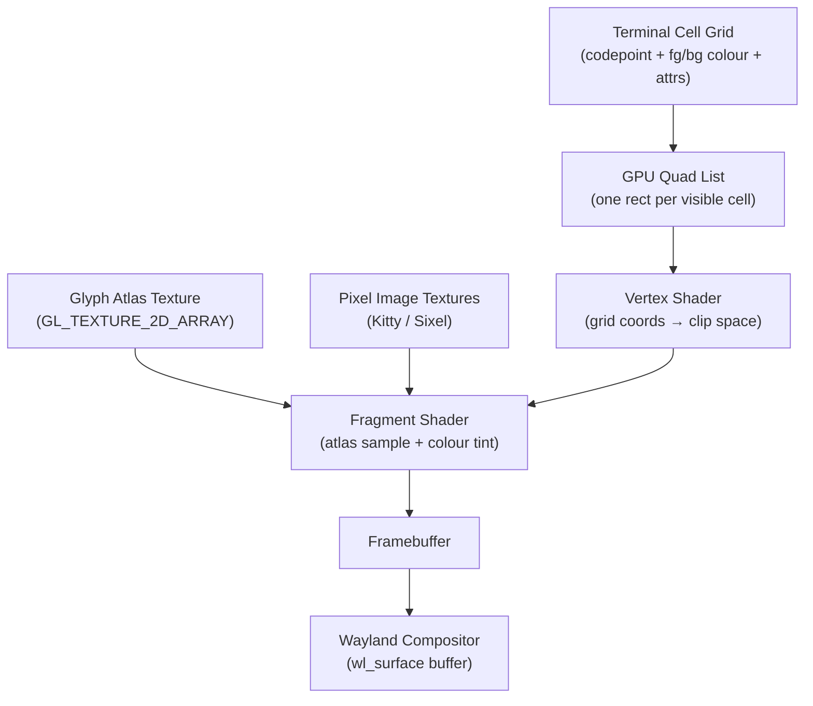
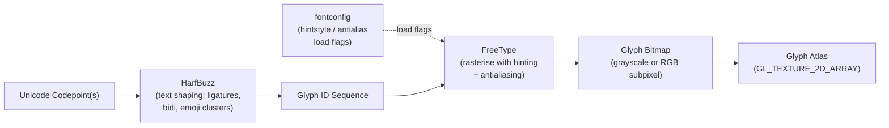
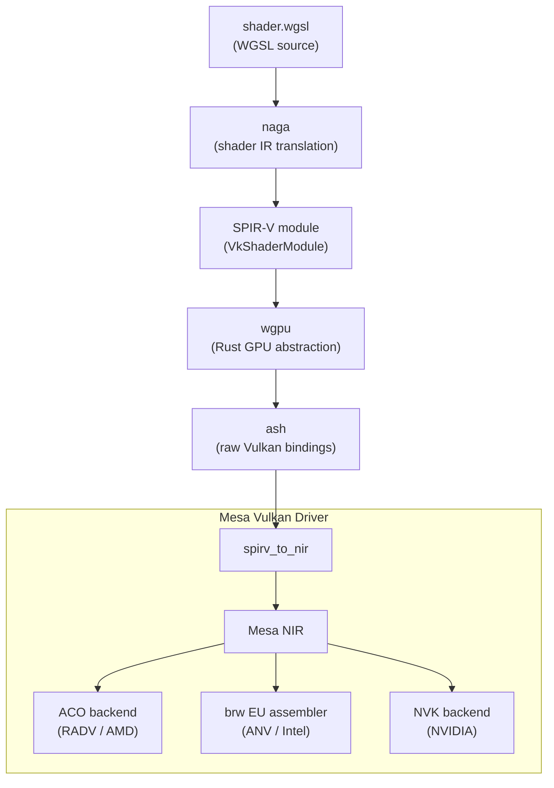
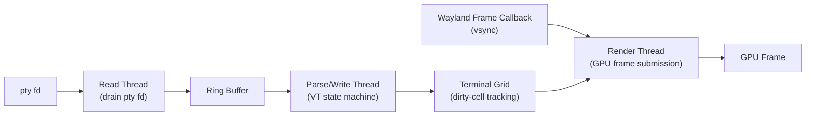
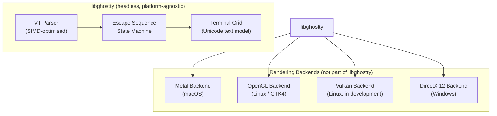
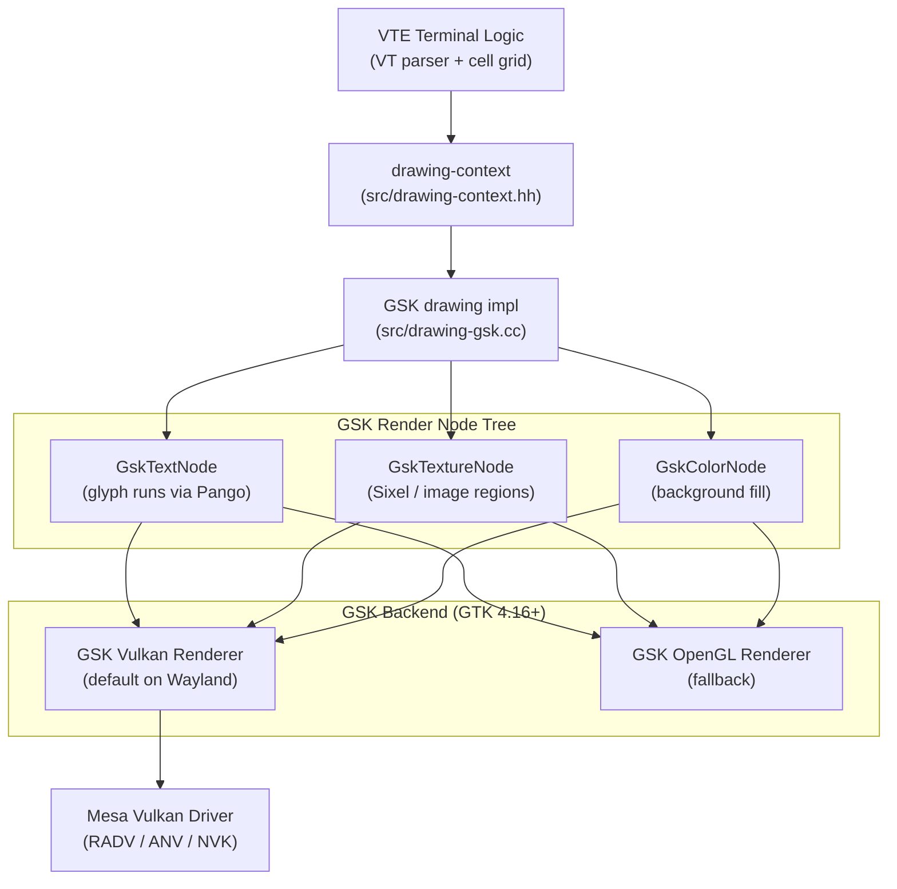
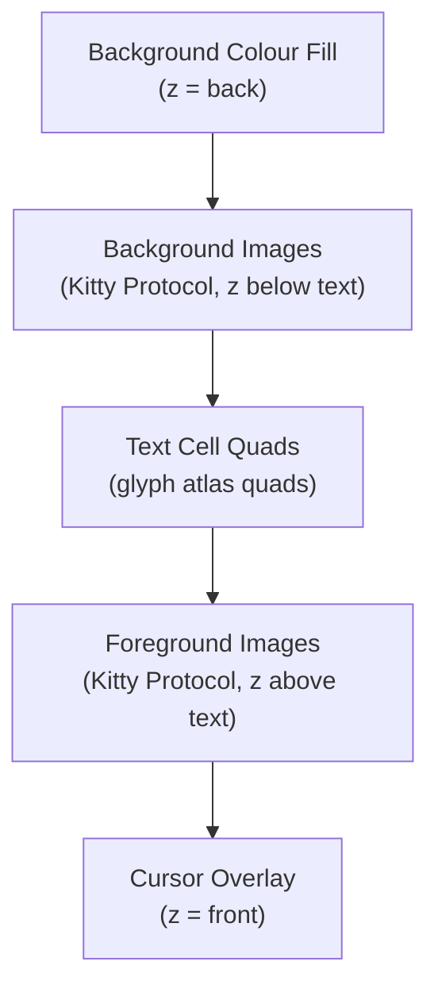

# Chapter 44: Terminal GPU Rendering Architectures

> **Part**: Part XII — Terminal Graphics
> **Audience**: Terminal developers building GPU-accelerated renderers; graphics application developers who want to understand how a character-cell grid is rendered efficiently on modern GPUs.
> **Status**: First draft — 2026-06-12

## Table of Contents

- [Overview](#overview)
- [1. Why GPU Acceleration Matters for Terminals](#1-why-gpu-acceleration-matters-for-terminals)
- [2. Glyph Atlas Fundamentals](#2-glyph-atlas-fundamentals)
- [3. kitty: Mature OpenGL Renderer](#3-kitty-mature-opengl-renderer)
  - [Rendering the Grid: Vertex Attributes vs. the Fullscreen Quad Approach](#rendering-the-grid-vertex-attributes-vs-the-fullscreen-quad-approach)
- [4. Alacritty: Minimal OpenGL, Latency Optimised](#4-alacritty-minimal-opengl-latency-optimised)
- [5. WezTerm: wgpu Multi-Backend Architecture](#5-wezterm-wgpu-multi-backend-architecture)
- [6. Ghostty and libghostty: Zig-Native, Platform-Optimised](#6-ghostty-and-libghostty-zig-native-platform-optimised)
  - [The Vulkan Renderer: SSBO and Indirect Draw Calls](#the-vulkan-renderer-ssbo-and-indirect-draw-calls)
- [7. foot: CPU-Side Software Rendering](#7-foot-cpu-side-software-rendering)
- [7.5 wl_shm vs. EGL: The CPU-to-GPU Copy Trade-off](#75-wl_shm-vs-egl-the-cpu-to-gpu-copy-trade-off)
- [8. VTE: GTK4 Transition and Sixel Support](#8-vte-gtk4-transition-and-sixel-support)
- [9. Compositing Pipeline: Text and Pixel Graphics Together](#9-compositing-pipeline-text-and-pixel-graphics-together)
- [10. Damage Tracking and Partial Updates](#10-damage-tracking-and-partial-updates)
- [11. VSync, Frame Pacing, and the Presentation Time Protocol](#11-vsync-frame-pacing-and-the-presentation-time-protocol)
- [12. Fractional Scaling and HiDPI Rendering](#12-fractional-scaling-and-hidpi-rendering)
- [Terminal Renderer Comparison](#terminal-renderer-comparison)
- [Integrations](#integrations)
- [References](#references)

---

## Overview

This chapter examines how modern terminal emulators map the conceptually simple character-cell grid onto a GPU rendering pipeline. The problem is richer than it first appears — a terminal must:

- Handle arbitrary Unicode text with bidirectional runs, ligature sequences, emoji clusters, and combining characters
- Render pixel graphics (**Sixel**, **Kitty Graphics Protocol**, **iTerm2**) composited beneath or within the text
- Track dirty cells to avoid redrawing static content every frame
- Achieve the low input-to-visual latency that makes a terminal feel responsive

Meeting all these goals simultaneously, across hardware from an embedded **ARM** board to a high-refresh desktop GPU, has driven the community to develop a variety of rendering architectures.

The chapter is aimed at two overlapping audiences. Terminal developers who are building or extending a GPU-accelerated renderer will find concrete source references and design trade-off analysis for the dominant implementations — **kitty**, **Alacritty**, **WezTerm**, **Ghostty**, **foot**, and **VTE**. Graphics application developers who are already familiar with **Vulkan** and **OpenGL** from Parts IV–VI of this book will recognise the glyph atlas, atlas eviction, and premultiplied-alpha compositing patterns as instances of more general GPU techniques applied to a character-cell domain. Readers are assumed to have absorbed Parts I–VI (**DRM**, **KMS**, GPU drivers, **Mesa**, **Wayland**, compositors) and Chapter 43 (the **Sixel**, **Kitty Graphics Protocol**, and **iTerm2** wire formats); those protocols are referenced here for context but not re-explained.

Section 2 establishes the glyph atlas as the shared foundation underlying every GPU terminal renderer. The path from a **Unicode** codepoint to a cached GPU bitmap passes through **HarfBuzz** (text shaping: ligatures, bidirectional runs, emoji clusters) and **FreeType** (rasterisation with hinting and antialiasing, controlled by **fontconfig** load flags such as **FT_LOAD_TARGET_LCD** for subpixel rendering). The rasterised bitmaps are packed into a **GL_TEXTURE_2D_ARRAY** using a skyline bin-packing algorithm; the **glTexSubImage3D** API uploads individual glyphs to specific layers. Cache misses trigger **LRU** eviction using per-slot frame counters, with the physical layer limit exposed via **GL_MAX_ARRAY_TEXTURE_LAYERS** and **VkPhysicalDeviceLimits.maxImageArrayLayers**. Grayscale glyphs (A8 single-channel) and colour emoji (BGRA four-channel) live in separate atlas textures so that neither wastes memory or requires format-switching.

- **Section 3 (kitty)** — mature **OpenGL** renderer, whose glyph cache lives in **kitty/glyph-cache.c** and shader programs in **kitty/shaders.py**. Image textures from the **Kitty Graphics Protocol** are managed in **kitty/graphics.c** using an **LRU** cache of **GL** texture handles. The `GPUCell` struct carries `sprite_idx`, `fg`, `bg`, `decoration_fg`, and `attrs` fields that the vertex shader reads directly as **OpenGL** vertex attributes.
- **Section 4 (Alacritty)** — minimal **OpenGL** design, implemented in Rust under **alacritty/src/renderer/**, with a 2D **GL_TEXTURE_2D** atlas and a multi-threaded architecture separating input polling, **VT** parsing, and rendering to achieve low input-to-photon latency; **Alacritty** deliberately omits image protocol support.
- **Section 5 (WezTerm)** — **wgpu** multi-backend architecture, in which **WGSL** shaders are translated to **SPIR-V** by **naga** and handed to **Mesa**'s **Vulkan** driver (**RADV**, **ANV**, **NVK**) via **ash**; WezTerm supports **Sixel**, the **Kitty Graphics Protocol**, and **iTerm2** using a **wgpu::Buffer** staging path, with a known **HLS** colour-mapping deviation from the **DEC VT340** specification.

Section 6 covers **Ghostty** and **libghostty**. **Ghostty**'s **SIMD**-optimised **VT** parser scans the byte stream using **SSE4.2**, **AVX2**, and **NEON** intrinsics. The multi-threaded architecture separates a read thread, a parse/write thread, and a render thread communicating via a ring buffer, with the render thread woken by a **Wayland** frame callback. Rendering backends include **Metal** on macOS, **OpenGL** (via **GTK4**) on Linux with shaders under **src/renderer/shaders/glsl/**, and a **Vulkan** backend in development. **Ghostty**'s glyph atlas system in **src/font/Atlas.zig** maintains separate **Grayscale**, **BGR** (subpixel), and **BGRA** (colour emoji) atlases packed with a square-texture bin-packer derived from "A Thousand Ways to Pack the Bin". **libghostty** exposes the headless **VT** emulation core (parser, state machine, terminal grid) as an embeddable C/Zig shared library independent of any rendering backend.

Section 7 covers **foot**, which performs all rendering on the CPU and uploads results via **wl_shm**, avoiding any **OpenGL** or **Vulkan** dependency. The **footd** server-daemon architecture amortises font-loading cost across multiple windows. **Sixel** decoding (**foot/sixel.c**) fills the CPU framebuffer directly. **foot** supports the **wp_fractional_scale_v1** Wayland protocol extension for non-integer DPI scaling, implemented entirely in software.

Section 8 covers **VTE**, the **GTK** terminal widget, whose GTK4 port (VTE 0.76, GNOME 46) replaced the **Cairo**/**Pango** rendering path with **GTK**'s **GSK** scene-graph layer (**src/drawing-gsk.cc**). With **GTK 4.16**, the default **GSK** backend on **Wayland** became the **Vulkan** renderer, routing **GskTextNode**, **GskTextureNode**, and **GskColorNode** render nodes through **Mesa**'s **Vulkan** drivers. **VTE** also added **Sixel** support via a dedicated **src/sixel-context.cc** decoder, exposed through **vte_terminal_set_enable_sixel()** and enabled at build time with the **-Dsixel=true** **Meson** option.

Section 9 analyses the compositing pipeline that interleaves text and pixel graphics. Sections 10–12 cover the three Wayland-protocol concerns that determine whether a GPU terminal feels fluid on modern multi-monitor, high-refresh, mixed-DPI desktops:

- **Damage tracking and partial updates** (Section 10)
- **VSync and frame pacing** via `wp_presentation_time_v1` (Section 11)
- **Fractional scaling** via `wp_fractional_scale_v1` (Section 12)

---

## 1. Why GPU Acceleration Matters for Terminals

A terminal emulator has two conceptually separate concerns that the rendering architecture must serve simultaneously: parsing and processing the byte stream arriving from the pseudoterminal, and presenting the resulting character-cell state to the screen at a rate that feels responsive. In the CPU-era designs that dominated through the 2010s — xterm, GNOME Terminal backed by VTE/Cairo, rxvt — rendering consisted of asking a 2D drawing library (Cairo, Xlib GC, or direct Xrender) to rasterise each visible cell on every frame. Even with dirty-tracking to limit redraws, the bottleneck was twofold: rasterising glyphs is expensive on the CPU, and uploading a freshly rasterised 1920×1080 RGBA texture to the display server is a large bus transfer. On a typical desktop of that era these constraints produced hard ceilings of 20–30 frames per second under moderate output load, and noticeable smearing when scrolling or when a program was producing dense output.

GPU acceleration changes the economics of both costs. The glyph rasterisation work happens once per unique glyph and the resulting bitmaps are stored in a texture atlas resident in VRAM; subsequent frames for the same glyph are free, because the fragment shader samples from cached GPU memory rather than re-running FreeType. The per-frame draw cost is a vertex-buffer upload (a handful of kilobytes for a typical 80×24 or 200×50 terminal) and a single draw call whose work scales only with the number of changed cells, not with the total surface area. This combination routinely lifts frame rates to 60 Hz or 120 Hz even on modest integrated GPUs, and reduces the input-to-visual latency from 10–30 ms in the CPU path to 1–5 ms in the GPU path.

The basic model underlying every GPU terminal renderer covered in this chapter is the same. The terminal state machine maintains a grid of cells, each carrying a Unicode codepoint (or a cluster index for multi-codepoint graphemes), a foreground colour, a background colour, and attribute flags (bold, italic, underline, etc.). At render time this grid is mapped to a flat list of GPU quads — one rectangle per visible cell, positioned by row and column, with UV coordinates into a glyph atlas texture. A vertex shader transforms grid coordinates to clip space; a fragment shader samples the glyph bitmap from the atlas and composites it over the background colour using the foreground colour as a tint. The framebuffer produced by this pass is then presented to the Wayland compositor as a surface buffer, following the `wl_surface` and `xdg_toplevel` paths covered in Chapter 20.

Pixel graphics complicate but do not fundamentally alter this model. Images uploaded via the Kitty Graphics Protocol or decoded from a Sixel stream are stored as separate GPU textures and composited into the same render pass at appropriate z-indices, either behind or in front of text cells depending on the application's intent.



---

## 2. Glyph Atlas Fundamentals

Every GPU terminal renderer must solve the same core problem: the Unicode repertoire is enormous, but any given terminal session uses only a small subset of it, and that subset can be predicted poorly in advance. The glyph atlas is the data structure that caches the solution — a GPU texture into which rasterised glyph bitmaps are packed, so that the fragment shader can sample any rendered glyph without a round-trip to the CPU.

### From Codepoint to Glyph Bitmap

The path from a Unicode codepoint to a rasterised bitmap passes through two libraries that are now standard infrastructure across all terminal renderers. HarfBuzz performs text shaping: it groups a run of codepoints in the same font and script into a sequence of glyph IDs, resolving ligatures (so that `fi` in a ligature font maps to a single glyph rather than two), handling directional runs in bidirectional text via the Unicode Bidirectional Algorithm, and clustering emoji sequences and combining characters into single rendering units. [Source](https://harfbuzz.github.io/) FreeType then rasterises the individual glyph IDs produced by HarfBuzz, applying hinting and antialiasing as configured by fontconfig. The fontconfig `hintstyle` and `antialias` settings propagate into FreeType's load flags: `FT_LOAD_TARGET_LCD` for horizontal subpixel rendering on RGB-stripe LCD panels, `FT_LOAD_TARGET_LCD_V` for vertical stripes, and `FT_LOAD_TARGET_NORMAL` for grayscale antialiasing. These are not just quality parameters — they affect the pixel footprint of the rasterised bitmap and therefore the atlas slot allocation logic.



Subpixel rendering via `FT_LOAD_TARGET_LCD` produces a bitmap three times as wide as a grayscale bitmap for the same glyph, because each colour channel is rendered independently against the subpixel geometry of the LCD panel. The terminal must upload this as an RGB texture (or a three-channel region of a larger atlas) and use a fragment shader that applies per-channel alpha blending rather than a single coverage value. Gamma-correct blending matters here: compositing should occur in linear-light space, not in sRGB space, because sRGB values are not additive. The terminal computes the blend in linear space — either by treating the atlas texture as `GL_SRGB8_ALPHA8` and enabling automatic sRGB decode, or by performing the `pow(v, 2.2)` linearisation manually in the shader — and then encodes the result back to sRGB for the framebuffer. Terminals that skip this step exhibit fringe artefacts, visible as colour fringing or uneven stroke weight at small font sizes.

### Separate Atlases for Grayscale and Colour Emoji

A critical architectural decision is whether to store all glyphs in a single atlas texture or to maintain separate atlases for different pixel formats. The dominant modern approach, exemplified by Ghostty's `src/font/Atlas.zig`, is to maintain three distinct atlas types:

| Atlas type | Pixel format | Bytes per texel | Purpose |
|---|---|---|---|
| Grayscale | 8-bit single channel | 1 | Standard text, box-drawing, UI symbols |
| BGR | 24-bit three-channel | 3 | FreeType LCD subpixel antialiased glyphs |
| BGRA | 32-bit four-channel | 4 | Colour emoji (e.g. Noto Color Emoji), image data |

[Source](https://deepwiki.com/ghostty-org/ghostty/5.5.3-glyph-rendering-and-atlases)

Keeping grayscale text glyphs in a single-channel `GL_RED` (or `GL_R8`) texture rather than an RGBA texture reduces GPU memory consumption by a factor of four for the common case of monochrome text. Colour emoji require a full BGRA texture because their pixels encode arbitrary RGB colours with alpha transparency. Mixing the two in the same atlas would require either wasting three bytes per grayscale texel or downgrading emoji to grayscale — neither is acceptable. The fragment shader selects which atlas to sample based on a per-instance flag indicating whether the glyph is coloured. A secondary benefit of the separation is that the grayscale atlas can use simple `GL_RED` swizzle masking to fill the RGB channels identically for the foreground colour tint, while the BGRA atlas path uses the glyph's embedded RGB values directly.

### Atlas Packing and the 3D Texture Array

A 2D texture atlas is the simplest possible organisation: a single large texture into which glyph bitmaps are packed using a bin-packing algorithm such as skyline or guillotine. [Source](https://www.freedesktop.org/wiki/Software/HarfBuzz/) The skyline algorithm maintains a height profile of the texture and inserts new rectangles at the lowest point above which the rectangle fits; it gives good packing density for glyph bitmaps, which tend to be narrow and similar in height within a single font and size. Ghostty's `Atlas.zig` implements a **square texture bin-packer** derived from "A Thousand Ways to Pack the Bin" — a node-based algorithm that tracks available space as a list of `Node` rectangles and searches them by width and height for the optimal fit. Atomic counters (`modified` and `resized`, lines 42–51 of `src/font/Atlas.zig`) signal the renderer that the GPU texture needs uploading only when the atlas contents have actually changed. [Source](https://deepwiki.com/ghostty-org/ghostty/5.5.3-glyph-rendering-and-atlases)

However, a 2D atlas has a hard size limit — typically 4096×4096 or 8192×8192 pixels, as bounded by `GL_MAX_TEXTURE_SIZE` — and when it fills, the renderer must either evict glyphs or allocate a second atlas texture, requiring the fragment shader to sample from multiple textures or restructure the draw call.

The 3D texture array (`GL_TEXTURE_2D_ARRAY`) offers a cleaner solution that several terminals have adopted. Each layer of the array is a 2D atlas of fixed dimensions; when one layer fills, a new layer is appended without disturbing the texture coordinates of glyphs already packed in earlier layers. The OpenGL API for growing the atlas is `glTexSubImage3D`, which uploads pixel data to a sub-region of a specific layer; adding a new layer requires `glTexImage3D` with the new depth count, which unfortunately requires re-specifying all layers on implementations that do not support `ARB_texture_storage` — a limitation that drives terminals toward allocating array layers in larger increments rather than one at a time. [Source](https://registry.khronos.org/OpenGL-Refpages/gl4/html/glTexSubImage3D.xhtml) The physical limit on the number of array layers is exposed via `GL_MAX_ARRAY_TEXTURE_LAYERS` (OpenGL) or `VkPhysicalDeviceLimits.maxImageArrayLayers` (Vulkan), and typically reaches 2048 on modern hardware — well beyond what any terminal session will exhaust.

Inserting a single glyph bitmap into an existing atlas layer follows this pattern:

```c
// kitty/glyph-cache.c — uploading a rasterised glyph into the 3D atlas
// atlas_tex is a GL_TEXTURE_2D_ARRAY previously allocated with glTexImage3D.
glBindTexture(GL_TEXTURE_2D_ARRAY, atlas_tex);
glTexSubImage3D(
    GL_TEXTURE_2D_ARRAY,
    0,             /* mip level */
    slot_x,        /* xoffset into layer */
    slot_y,        /* yoffset into layer */
    layer_index,   /* z = layer index */
    glyph_width,
    glyph_height,
    1,             /* depth = 1 (one layer) */
    GL_RED,        /* grayscale coverage channel */
    GL_UNSIGNED_BYTE,
    ft_bitmap->buffer
);
```

The corresponding fragment shader samples the atlas with a `vec3` coordinate where the z component selects the layer:

```glsl
// kitty/cell_fragment.glsl (simplified)
// atlas is a sampler2DArray bound to GL_TEXTURE_2D_ARRAY
uniform sampler2DArray atlas;
in vec3 atlas_uv;      // (u, v, layer_index)
in vec4 fg_color;
in vec4 bg_color;

void main() {
    float coverage = texture(atlas, atlas_uv).r;
    frag_color = mix(bg_color, fg_color, coverage);
}
```

### Cache Miss Path and Eviction

When a glyph is first encountered, the renderer calls FreeType to rasterise it, then packs the resulting bitmap into the atlas via `glTexSubImage3D` or an equivalent buffer upload. If the atlas has no free space, the renderer must evict an existing entry. The standard policy is LRU (Least Recently Used): each atlas slot carries a frame counter updated on every frame in which the glyph appears; when space is needed, the slot with the oldest frame counter is selected for eviction and its coordinates are reused. The corresponding entry in the CPU-side glyph map is invalidated, and the next render cycle that needs the evicted glyph will re-rasterise it. In practice, for typical interactive terminal usage the hot working set (the glyphs that appear in the visible viewport) fits comfortably in a single atlas layer, and eviction is rare. It becomes relevant during operations like `cat` of a file with extremely diverse Unicode content, or emoji-heavy output.

kitty's `SharedGrid` (the thread-safe glyph cache shared across render frames) uses a two-level cache with `std.Thread.RwLock`-style semantics: a shared lock suffices for cache hits, while an exclusive lock is taken only on cache miss when a new glyph must be rasterised and inserted. This design allows the render thread to look up most glyphs without blocking the parse thread that may be updating the terminal grid simultaneously.

---

## 3. kitty: Mature OpenGL Renderer

kitty is the oldest of the GPU-first terminal emulators still in active development, first released in 2017 by Kovid Goyal. Its deliberate choice to build on OpenGL rather than Vulkan was made consciously: at the time of the initial design, Vulkan driver quality and application developer tooling were immature enough that the additional complexity was not warranted, and the OpenGL path has remained because it covers all hardware — including older Intel iGPUs and ARM Mali chips — without the driver quality concerns that still occasionally surface with Vulkan. [Source](https://github.com/kovidgoyal/kitty)

### The GPU Cell Data Structure

kitty's terminal grid is stored as parallel arrays of `CPUCell` and `GPUCell` records, one pair of arrays per row. `CPUCell` holds character content, layout metadata, and raw Unicode codepoint data needed by the VT parser and HarfBuzz shaper. `GPUCell` holds only the rendering artefacts needed by the vertex shader — it is the CPU-to-GPU contract for the renderer. [Source](https://deepwiki.com/kovidgoyal/kitty/2.5-terminal-buffer-data-structures)

```c
// kitty/screen.h (simplified) — GPUCell holds only rendering data
typedef struct GPUCell {
    sprite_index  sprite_idx[2];   // (x, y) position in the sprite texture atlas
    color_type    fg;              // Foreground color (ARGB packed uint32)
    color_type    bg;              // Background color (ARGB packed uint32)
    color_type    decoration_fg;   // Underline / strikethrough color
    CellAttrs     attrs;           // bold, italic, reverse, strike, dim, blink, mark
} GPUCell;
```

The `sprite_idx` pair encodes the (x, y) tile position of the glyph within the sprite atlas (kitty uses "sprite" as its term for an atlas slot). Every field of `GPUCell` is bound as an OpenGL vertex attribute, so the vertex shader can read per-cell glyph coordinates and colours without any additional indirection — the GPU sees the entire terminal grid state as a single flat vertex buffer. This is the key performance property: a single `glDrawArraysInstanced` call (or equivalent) processes all visible cells in one GPU pass, with the vertex shader indexing the atlas and applying colours per instance. [Source](https://github.com/kovidgoyal/kitty/blob/master/kitty/shaders.c)

When a cell's content changes (as detected by dirty-tracking after the VT parser runs), the parse thread updates the corresponding `GPUCell` in the row array. At render time, only rows containing dirty cells are re-uploaded to the GPU vertex buffer. The clean rows are left in the existing GPU buffer unchanged, so the upload volume scales with the rate of change rather than with the total grid size.

### Rendering the Grid: Vertex Attributes vs. the Fullscreen Quad Approach

Before examining kitty's atlas in detail, it is worth addressing a conceptual split in how GPU terminal renderers map the cell grid to the GPU. Two distinct approaches appear in the literature:

**Approach A — Per-cell vertex attributes (kitty, Alacritty, Ghostty).** Each visible cell is a separate instance in the GPU draw call. A vertex buffer contains one entry per cell (or one entry per glyph quad where cells with two-codepoint ligatures produce two entries). Each entry carries the cell's grid position, atlas UV coordinates, foreground colour, background colour, and attribute flags as vertex attributes. The vertex shader positions the quad in clip space from the grid position, and the fragment shader samples the atlas using the UV coordinates. With `N` visible cells, the draw call has `N` instances and the GPU processes them independently.

**Approach B — Grid-as-texture / fullscreen quad.** The entire terminal grid is encoded into a 2D texture where each texel represents one cell — carrying the foreground colour, background colour, glyph atlas coordinates, and cell attributes packed into the texture's channels. A single fullscreen quad (two triangles covering the entire terminal surface) is drawn. The fragment shader, invoked once per output pixel, computes which cell that pixel falls in, reads the cell data from the grid texture, samples the atlas at the UV coordinates stored in that cell, and composites the glyph colour over the background. This is the approach used by **Zutty** (which uses an OpenGL compute shader instead of a fragment shader) and is described in detail in the Zutty implementation notes. [Source](https://tomscii.sig7.se/2020/11/How-Zutty-works)

kitty uses Approach A. Each `GPUCell` is a vertex attribute entry. The draw call is instanced over all visible cells, not a fullscreen quad. The practical difference: Approach A scales with the number of changed cells (the vertex buffer only needs updating for dirty cells), while Approach B scales with the output resolution (the grid texture must be re-uploaded whenever any cell changes, and the fragment shader runs for every screen pixel rather than once per glyph instance). For kitty's design goals — interactive responsiveness and support for large terminals — Approach A's per-cell granularity is the better fit. Approach B is simpler to implement but less cache-efficient for large resolutions, since the fragment shader must read from the grid texture for every output pixel even when it falls in an unchanged cell.

The distinction matters for partial updates: with Approach A, kitty updates only the `GPUCell` entries for dirty rows and re-uploads those vertex buffer regions; with Approach B, a single changed cell requires re-uploading the entire cell grid texture (unless partial texture updates via `glTexSubImage2D` are used per changed cell, at which point the approaches converge). [Source](https://github.com/kovidgoyal/kitty/blob/master/kitty/shaders.c)

### The OpenGL Glyph Atlas

kitty's OpenGL infrastructure lives in `kitty/gl.c`, with shader programs defined in `kitty/shaders.py` and compiled at runtime. The glyph cache is implemented in `kitty/glyph-cache.c`, and the Kitty Graphics Protocol image handling in `kitty/graphics.c`. The atlas is a 3D texture array, with each layer sized to hold a fixed grid of cell bitmaps determined at startup from the font metrics. When the renderer encounters a glyph it has not seen before, it rasterises the glyph via FreeType (with HarfBuzz shaping applied for multi-codepoint clusters) and uploads the bitmap to the next available slot in the current atlas layer via `glTexSubImage3D`. If the current layer is full, a new layer is appended. The atlas layer count grows dynamically; kitty has configurable limits via `kitty.conf`, and the eviction policy removes LRU glyphs when the configured maximum is reached.

### The Cell Fragment Shader

kitty's cell fragment shader in `kitty/cell_fragment.glsl` is more sophisticated than the simplified example in Section 2, handling multiple rendering modes and gamma correction. [Source](https://github.com/kovidgoyal/kitty/blob/master/kitty/cell_fragment.glsl) The shader accepts per-frame uniforms including `text_contrast`, `text_gamma_adjustment`, and `effective_background_premul`. Sprite data is loaded via `texture(sprites, sprite_pos)`. The key compositing logic applies per-channel contrast adjustment:

```glsl
// kitty/cell_fragment.glsl — excerpt showing gamma-corrected text compositing
// sprites is a sampler2DArray; sprite_pos.z selects the atlas layer.
vec4 text_fg = texture(sprites, sprite_pos);

// Apply color tinting: colored emoji use their own RGB; grayscale glyphs
// use the cell foreground color tinted by the coverage value.
vec3 fg_rgb = mix(cell_foreground.rgb, text_fg.rgb, colored_sprite);

// Gamma adjustment for text contrast against the background luminance.
// over_luminance and under_luminance are computed from the background color.
float gamma_scaled = (1.0 - over_luminance + under_luminance) * text_gamma_scaling;
float alpha = text_fg.a * gamma_scaled;

// Final premultiplied-alpha composite over background.
frag_color = vec4(fg_rgb * alpha, alpha)
             + effective_background_premul * (1.0 - alpha);
```

The `colored_sprite` flag distinguishes grayscale glyphs (where `.r` is coverage) from BGRA colour emoji (where `.rgb` carries the glyph's own colour). This per-fragment branch is free of performance concern because terminal renders are fragment-bound only during atlas misses; the typical case (cached glyphs at interactive speed) is vertex-bound.

### Image Handling and the Kitty Graphics Protocol

Pixel images uploaded via the Kitty Graphics Protocol (described in Chapter 43) are managed separately from the glyph atlas. Each image is assigned a unique texture object, allocated via `glGenTextures` and uploaded via `glTexImage2D`. The implementation in `kitty/graphics.c` maintains an LRU cache of GPU texture handles keyed by the image ID assigned at upload time. When GPU memory pressure is detected — kitty infers this by tracking the total allocated image texture memory against a configurable threshold — the LRU image textures are evicted and their GPU handles released. The `graphics_delay` parameter in `kitty.conf` controls how long kitty waits for an image upload before rendering the frame, allowing large images to be decoded and uploaded without tearing.

### Render Loop and Latency

kitty renders on a dedicated thread separate from the input polling and VT parsing thread. The render thread is signalled when the terminal state changes and produces a frame by recording draw calls and calling `eglSwapBuffers`. The target frame time is 1/refresh_rate, and double-buffering via EGL ensures that the display server (Wayland compositor) sees a complete frame atomically. The separation of input polling from rendering means that keystroke-to-output latency is dominated by pty round-trip time rather than frame timing, which is the correct trade-off. The use of a single render pass — all glyph quads and image rectangles are sorted by z-index and submitted in one `glDrawArrays` call — minimises driver overhead and keeps the GPU side of the latency budget small.

---

## 4. Alacritty: Minimal OpenGL, Latency Optimised

Alacritty entered the scene in 2017 (open-sourced in January of that year) with an explicit mission statement: to be the fastest terminal emulator, measured by input-to-render latency, through disciplined architecture rather than heroic optimisation. [Source](https://github.com/alacritty/alacritty) The approach was to implement a minimal GPU-accelerated terminal that validated the multi-threaded, atlas-based rendering model at scale, without the additional complexity of image protocols, GPU effects, or scripting.

### Architecture and Atlas

Alacritty is written in Rust and uses OpenGL through its own thin abstraction layer. The renderer source lives in `alacritty/src/renderer/`, with `text/mod.rs` as the entry point and `text/atlas.rs` implementing the glyph atlas. The atlas is a 2D texture (`GL_TEXTURE_2D`) rather than a 3D array, with a single texture per glyph cell size. The `text/glyph_cache.rs` module manages the CPU-side map from (glyph ID, font size) to atlas coordinates. [Source](https://github.com/alacritty/alacritty/tree/master/alacritty/src/renderer)

The vertex format records screen-space position, UV coordinates into the atlas, and foreground/background colour per quad. The shader programs (`text/glsl3.rs` and `text/gles2.rs` selecting the appropriate GLSL version) are compiled once at startup and the program object is reused across all frames. The fragment shader for grayscale antialiasing multiplies the foreground colour by the coverage sample from the atlas; the LCD subpixel path applies per-channel blending as described in Section 2.

### The Latency Focus

Alacritty's primary contribution to the field was empirical proof that the multi-threaded architecture — separate threads for input polling, VT parsing, and rendering — adds negligible latency on top of the display's frame clock in a practical terminal emulator. Input events are polled via `winit`'s event loop, queued to the VT parser thread, and the parser's output updates the terminal grid in a lock-protected shared state. The render thread reads the grid state at each vsync signal (via `eglSwapBuffers` frame-clock driven wakeup) and submits a GPU frame. The render thread does not wait for the parser; it takes a snapshot of whatever grid state is available at the frame boundary. This means that under burst I/O the displayed content may lag behind the pty output by up to one frame, but keystroke response is never gated by rendering work. Total input-to-photon latency remains bounded primarily by the display frame period (approximately 8 ms at 120 Hz, 16 ms at 60 Hz) rather than by any overhead introduced by the terminal renderer itself.

Alacritty deliberately excludes image protocol support. The Kitty Graphics Protocol, Sixel, and iTerm2 are all absent from the codebase, and this is an explicit design choice rather than an oversight — adding image rendering would require z-ordering, texture management, and a more complex render pass, all of which would increase the surface area of the renderer that could introduce latency regressions. The result is a renderer whose entire code path from grid snapshot to `eglSwapBuffers` can be read and understood in an afternoon, which has made Alacritty a valuable reference for developers building their own GPU terminal renderers.

---

## 5. WezTerm: wgpu Multi-Backend Architecture

WezTerm takes the opposite design stance from Alacritty: maximum feature breadth across all platforms from a single Rust codebase, at the cost of additional abstraction overhead. [Source](https://github.com/wez/wezterm) The GPU abstraction layer is wgpu, the same library used by Bevy (Chapter 40) and structurally analogous to Dawn (Chapter 35): a Rust-native GPU API that maps to Vulkan on Linux, Metal on macOS, DirectX 12 on Windows, and WebGPU in browsers, with an OpenGL ES fallback for hardware that supports none of those.

### wgpu on Linux and the Mesa Pipeline

On Linux, wgpu selects its Vulkan backend through ash (the raw Vulkan bindings crate), targeting whatever Mesa Vulkan driver the system provides — RADV for AMD, ANV for Intel, NVK for NVIDIA on open-kernel systems. WezTerm's shaders are authored in WGSL and compiled via naga, wgpu's shader intermediate representation; naga translates WGSL to SPIR-V, which is then handed to the Mesa driver as a `VkShaderModule`. From that point, the Mesa NIR pipeline (Chapter 14) and the driver's backend compiler — ACO for RADV (Chapter 15), Intel's `brw` EU assembler backend for ANV — take over, compiling the SPIR-V to native GPU ISA.



This is structurally identical to the path that Bevy's WGSL shaders take. The shader sources live in `wezterm-gui/src/shader.wgsl` along with per-draw-call GLSL shaders `glyph-vertex.glsl` and `glyph-frag.glsl` that are used via the OpenGL fallback path. [Source](https://github.com/wez/wezterm/tree/main/wezterm-gui/src)

The rendering state machine is implemented in `wezterm-gui/src/renderstate.rs`, which owns the wgpu `Device`, the glyph atlas pipeline, and the per-frame vertex buffer population logic. The atlas itself is a 2D texture array managed via wgpu's `Texture` abstraction; on the Vulkan backend this compiles to a `VkImage` with `VK_IMAGE_TYPE_2D` and an array layer count that grows as needed.

### Image Protocol Support

WezTerm supports all three major pixel graphics protocols — Sixel, Kitty Graphics Protocol, and iTerm2 — making it the most protocol-complete terminal in widespread use. All three follow the same GPU path: the CPU decodes the incoming protocol stream into a raw RGBA pixel buffer, and wgpu uploads this buffer to a GPU texture via a staging buffer (`wgpu::Buffer` with `COPY_SRC` usage, mapped for writing, then copied to a `wgpu::Texture`). The texture is then bound as a resource in the fragment shader for the image rendering pass. The `wezterm-gui/src/glyphcache.rs` module manages the atlas and image texture cache collectively, with eviction triggered when the total GPU texture memory tracked by WezTerm's allocator exceeds a configurable threshold.

Sixel images are decoded before GPU upload by a Sixel parser that handles the DCS parameter string, colour register assignments, and the sixel data body. The parser maps colour registers to 24-bit RGB values, supporting both RGB and HLS colour specifications. The HLS path contains a known implementation difference from the DEC VT340 specification: WezTerm maps hue values using the conventional artistic RGB colour wheel (red at 0°, green at 120°, blue at 240°), whereas the DEC specification defines the primary hues as blue at 0°, red at 120°, and green at 240°. This causes sixel images that use HLS colour specification — rather than the more common RGB mode — to display with an incorrect hue rotation relative to other conforming terminals such as mlterm. [Source](https://github.com/wezterm/wezterm/issues/775) This is a Sixel decoder bug, not a Mesa driver issue; the GPU renders exactly what the CPU decoder produces.

### Performance Characteristics

WezTerm on Linux with the Vulkan backend achieves frame rates in the 60–90 Hz range on typical desktop hardware, as reported by users in the project's issue tracker. The wgpu abstraction layer adds some overhead compared to direct Vulkan or direct OpenGL — primarily in the form of additional state validation and the naga shader compilation step at pipeline creation time. On identical hardware, terminals using direct OpenGL (kitty) or a Zig-native renderer (Ghostty) tend to achieve somewhat lower frame times, though the difference is rarely perceptible in interactive use. The main user-visible cost of the abstraction is startup time: pipeline compilation via naga and Mesa's shader compiler takes measurably longer for WezTerm than for terminals that precompile simpler GLSL shaders.

---

## 6. Ghostty and libghostty: Zig-Native, Platform-Optimised

Ghostty, released in December 2024 by Mitchell Hashimoto, makes different trade-offs from all of the preceding terminals. [Source](https://github.com/ghostty-org/ghostty) The primary implementation language is Zig (approximately 79% of the codebase by line count, with the remainder split between Swift for the macOS native UI layer and C for system library bindings). The design philosophy emphasises platform-native rendering on each target: Metal on macOS, OpenGL on Linux (with a Vulkan renderer under active development as of 2026), and DirectX 12 on Windows.

### VT Parser and Multi-threaded Architecture

Ghostty's most distinctive systems property relative to other GPU terminals is its SIMD-optimised VT parser. The parser scans the incoming byte stream for ANSI/VT escape sequence boundaries using SIMD intrinsics — SSE4.2 on x86-64 systems that support it, AVX2 where available, and NEON equivalents on AArch64. The critical observation that enables this is that VT sequences begin and end with byte values drawn from a small set (`ESC` = 0x1B, `CSI` introducer 0x9B, BEL 0x07, etc.) that can be tested against a SIMD vector of up to 32 bytes in a single instruction, scanning the buffer 16 or 32 bytes at a time rather than one byte at a time. For interactive terminal use the difference is immaterial — input arrives in small chunks — but when `cat`-ing a large file over SSH or piping dense output from a build system, the parser can process the entire stream faster than the GPU can render the result, keeping the pty buffer draining and avoiding input stalls.

The thread architecture separates three concerns: a read thread that drains the pty file descriptor into a ring buffer, a parse/write thread that runs the VT state machine over the ring buffer contents and updates the terminal grid, and a render thread that snapshots the grid and submits GPU frames. This is similar to Alacritty's model but with an explicit ring buffer between the read and parse stages, allowing the pty reader to work at full I/O speed without being gated by the VT parser. The render thread is woken by a Wayland frame callback (on Linux) or a platform-equivalent vsync signal and reads only the cells that the parse thread has marked as dirty since the previous render.



### Ghostty's Glyph Atlas Architecture

Ghostty's atlas implementation in `src/font/Atlas.zig` maintains three separate atlas instances distinguished by pixel format — Grayscale (1-byte), BGR (3-byte for subpixel), and BGRA (4-byte for colour emoji) — as described in Section 2 above. The bin-packing uses a node-based square-texture algorithm that tracks available space as a list of `Node` rectangles and selects placement by width and height. Atomic counters `modified` and `resized` (lines 42–51 of `src/font/Atlas.zig`) allow the renderer to check efficiently whether any atlas content has changed since the last GPU upload, avoiding redundant `glTexSubImage2D` calls on frames where no new glyphs were needed. [Source](https://deepwiki.com/ghostty-org/ghostty/5.5.3-glyph-rendering-and-atlases)

The font system's `SharedGrid` provides a thread-safe two-level glyph cache: shared read locks for cache hits (the common case), exclusive write locks only on cache misses when FreeType must rasterise a new glyph. This locking strategy allows the render thread and the parse thread to access the font cache concurrently without contention on every lookup. Platform-specific face implementations live in `src/font/face/freetype.zig` (Linux/BSD) and `src/font/face/coretext.zig` (macOS), with a web canvas path for WASM targets.

A noteworthy feature is Ghostty's Nerd Font constraint system: `nerd_font_codegen.py` extracts alignment rules for thousands of Nerd Font codepoints and generates `nerd_font_attributes.zig`, ensuring that icon glyphs align correctly across different base font metrics (size, baseline, advance width) without manual per-font tweaking.

### GPU Cell Buffer and Instanced Rendering

The Ghostty rendering pipeline uses **instanced rendering** to draw the entire terminal grid in a single GPU draw call. The `Contents` struct in `src/renderer/cell.zig` manages per-frame glyph buffers, with `fg_rows` storing foreground text and attribute data organized by terminal row. [Source](https://deepwiki.com/ghostty-org/ghostty/5.3-rendering-pipeline-and-shaders)

Each glyph is represented as a 32-byte `CellText` instance with the following fields:

```zig
// src/renderer/cell.zig (Ghostty) — approximate layout of CellText instance data
const CellText = extern struct {
    glyph_pos: [2]u32,       // atlas (x, y) coordinates
    bearing: [2]i32,         // FreeType bearing (horizontal/vertical offset)
    grid_pos: [2]u32,        // terminal grid column and row
    color: [4]u8,            // RGBA text color
    mode: u8,                // flags: color glyph, contrast adjust, cursor highlight
    _pad: [3]u8,
};
```

Per-frame global state (the projection matrix, cell dimensions, grid geometry columns × rows, grid padding with per-edge values, cursor position and color, background color, and colour space flags) is uploaded as a uniform buffer shared across all instances in the frame. The `Buffer(T)` generic in `src/renderer/` manages GPU memory with automatic 2×-size growth when capacity is exceeded, avoiding per-frame reallocation while keeping GPU memory use proportional to actual terminal grid size.

The frame rendering sequence executes multiple specialised passes:
1. Background cell pass — fills background colour rectangles for all cells
2. Text/glyph pass — instanced draw of all visible glyphs from the atlas
3. Cursor pass — renders the cursor shape at the current position
4. Post-processing pass — applies any user-configured custom shaders

Each pass uses a distinct shader pipeline but shares the same uniform buffer, so projection and grid geometry are uploaded once per frame regardless of pass count. [Source](https://deepwiki.com/ghostty-org/ghostty/5.3-rendering-pipeline-and-shaders)

### The Vulkan Renderer: SSBO and Indirect Draw Calls

While Ghostty's primary Linux renderer as of mid-2026 is OpenGL 4.3 via GTK's GDK GL context, the Vulkan renderer under development in `src/renderer/Vulkan.zig` takes a fundamentally different approach to GPU data layout that is worth examining in detail, as it represents the direction the ecosystem is moving.

The Vulkan renderer replaces the OpenGL vertex-buffer model with a **Shader Storage Buffer Object (SSBO)** layout. An SSBO is a Vulkan `VkBuffer` bound with `VK_DESCRIPTOR_TYPE_STORAGE_BUFFER`, readable and writable from any shader stage, whose size is not subject to the small per-binding limits of uniform buffers (`maxUniformBufferRange` is 64 KB on many implementations, far too small for a terminal grid). An SSBO can accommodate the entire terminal grid's cell data regardless of terminal dimensions, with a typical 200×50 grid requiring 200 × 50 × 32 bytes = 320 KB — well within SSBO limits but outside UBO limits.

The conceptual layout maps one struct per terminal cell into the SSBO:

```glsl
// Ghostty Vulkan renderer — SSBO layout (illustrative; src/renderer/shaders/vulkan/)
// VkBuffer bound as VK_DESCRIPTOR_TYPE_STORAGE_BUFFER
struct CellData {
    uvec2 glyph_pos;      // atlas (x, y) position in pixels
    ivec2 bearing;         // FreeType horizontal and vertical bearing
    uvec2 grid_pos;        // column and row in the terminal grid
    uint  fg_color;        // packed RGBA foreground colour
    uint  mode_flags;      // bit flags: colored_glyph, cursor, wide_cell
};

layout(std430, binding = 0) readonly buffer CellBuffer {
    CellData cells[];
};
```

The vertex shader indexes the SSBO using `gl_InstanceIndex` (OpenGL) or `SV_InstanceID` (HLSL/WGSL) to retrieve the cell data for each instance. A single `vkCmdDrawIndirect` or `vkCmdDrawIndexedIndirect` call dispatches all visible cells, with the draw parameters (instance count, base instance) written into a `VkBuffer` by the CPU immediately before the draw call. Because the CPU has already updated the SSBO with the current frame's cell data, the GPU can consume the draw parameters and process all instances in one submission without round-tripping back to the CPU for per-instance parameters. [Source](https://registry.khronos.org/vulkan/specs/latest/man/html/vkCmdDrawIndirect.html)

The SSBO approach offers two advantages over vertex buffers for terminal rendering. First, **large sparse updates**: the CPU can write only the cells that changed (those flagged dirty by the VT parser) into the SSBO using `vkCmdUpdateBuffer` or a staging transfer, without re-uploading the full grid. Second, **simpler compute integration**: a compute shader can post-process or filter the SSBO contents (for example, applying text contrast or blending cursor highlights) without a separate render pass, because the SSBO is readable and writable from compute stages. The OpenGL renderer must perform equivalent operations in the fragment shader or via additional draw passes.

The GTK4 GDK GL context used by the current OpenGL renderer provides EGL integration automatically: `gdk_gl_context_make_current()` binds the context created by GTK's EGL or GLX backend, and frame submission goes through `gdk_gl_context_flush()` which calls `eglSwapBuffers` internally. The Vulkan renderer bypasses GTK's rendering entirely and communicates with the Wayland compositor directly via `wl_surface` and a Vulkan swapchain (`VkSwapchainKHR`), created with `VK_KHR_wayland_surface`. This eliminates one layer of abstraction and allows Ghostty to use `VK_EXT_present_timing` for sub-millisecond frame scheduling when available. [Source](https://registry.khronos.org/vulkan/specs/latest/man/html/VkSwapchainKHR.html)

### Platform Rendering Backends

On macOS, Ghostty uses Metal via a Swift interoperability layer. The Metal backend achieves approximately 120 FPS on Apple Silicon at approximately 45 MB RSS for a typical session, according to the project's own benchmarks. The glyph atlas is a 3D texture array (a `MTLTextureDescriptor` with `textureType = MTLTextureType2DArray`) and the shaders in `src/renderer/shaders/shaders.metal` handle glyph sampling and image compositing in a single render pass. Triple-buffering is used on the Metal backend to ensure the GPU can work on frame N+1 while the CPU prepares frame N+2.

On Linux, Ghostty requires OpenGL 4.3 or later (for compute shader support used in some rendering passes). It uses runtime GLSL compilation with an sRGB framebuffer for linear-space blending. The OpenGL renderer sources live in `src/renderer/OpenGL.zig` and `src/renderer/opengl/`, with shaders in `src/renderer/shaders/glsl/`. The cell shader (`cell_text.v.glsl`, `cell_text.f.glsl`) handles the same glyph atlas sampling and colour tinting pattern as kitty, while the image shader (`image.v.glsl`, `image.f.glsl`) handles compositing pixel graphics. Background images are supported via `bg_image.v.glsl` / `bg_image.f.glsl`. A Vulkan backend for Linux is under active development; readers should check the repository's `src/renderer/` directory for current status, as this was not yet merged to the main branch as of mid-2026. [Source](https://github.com/ghostty-org/ghostty/tree/main/src/renderer)

### libghostty: The Headless Emulation Core

Ghostty is architected so that the VT parser and terminal state machine are cleanly separated from the rendering layer. This separation is exposed publicly as libghostty, a C/Zig shared library that provides the emulation core — the VT parser, the terminal grid, the escape sequence state machine, and the Unicode text model — as an embeddable component. The rendering backends are explicitly not part of libghostty; the library is headless and platform-agnostic.



The public API is documented at [libghostty.tip.ghostty.org](https://libghostty.tip.ghostty.org) and exposes C-compatible types and function signatures, allowing embedding in applications that are not written in Zig. The primary intended use cases are editors and IDEs that want to embed a terminal pane, browser extensions, and compositors that want a built-in terminal without depending on a full terminal emulator binary. As of mid-2026, the libghostty API is not yet considered stable or versioned; the project documentation notes that the API may change without notice until a 1.0 release is declared. The library builds for macOS, Linux, Windows, and WASM targets via Zig's cross-compilation infrastructure.

---

## 7. foot: CPU-Side Software Rendering

foot is a Wayland-native terminal emulator written in C that makes the opposite bet from every other emulator in this chapter: it deliberately avoids GPU dependency, performing all glyph rasterisation and compositing on the CPU and uploading the result to the Wayland compositor via `wl_shm`. [Source](https://codeberg.org/dnkl/foot) This is not a legacy choice but a deliberate design stance: foot's author prioritised predictable behaviour across all hardware (including systems without a functioning GPU driver), minimal RSS, and correct operation over remote connections where a GPU may not be available.

### Server-Daemon Architecture

foot ships with a server daemon, `footd`, that allows multiple terminal windows to share a single process. The shared process retains a single FreeType library instance and a single glyph cache in memory, amortising the startup cost of font loading across all windows. A typical foot window consumes approximately 30–50 MB RSS; by comparison, a GPU terminal running the OpenGL stack typically requires 60–100 MB for the OpenGL context and atlas textures alone. For users who open many terminal windows simultaneously, the footd model can represent a meaningful memory saving.

### Software Rendering Pipeline and wl_shm

The rendering pipeline, implemented in `foot/render.c`, is straightforward: for each changed cell, call FreeType to rasterise (or look up a cached rasterisation) the glyph and blit it into a 32-bit RGBA software framebuffer at the correct row-column position. Damage tracking records which rows or rectangular regions have been modified since the last frame; only those regions are written into the framebuffer on each render cycle. When the frame is complete, foot calls `wl_surface_damage_buffer` to inform the compositor of the changed region and `wl_surface_commit` to present the buffer.

The compositor receives a `wl_buffer` backed by a `wl_shm_pool` — a file-descriptor-backed shared memory region — and the GPU (if present) DMAs the data from that region into a texture for display. The GPU involvement, if any, is entirely on the compositor side; foot itself never calls an OpenGL or Vulkan function. The wl_shm path here is architecturally identical to the CPU-upload path used by any non-GPU Wayland client. Chapter 20 describes the `wl_shm_pool`, `wl_buffer`, and `wl_surface_damage_buffer` protocol sequences that foot uses; foot is the most prominent example in this part of the book of a deliberate, production-quality application that stays entirely in this path.

The performance tradeoff is concrete: `wl_shm` costs a CPU-to-GPU copy every frame, because the compositor must transfer the shared memory contents into a GPU-accessible texture before scanout. An EGL terminal like kitty avoids this copy entirely — the framebuffer is already in GPU memory after `eglSwapBuffers`. For a terminal that changes slowly (a shell prompt, a text editor with occasional cursor movement), the copy cost is paid at most at 60 Hz and is typically a few hundred microseconds on a modern CPU, making it imperceptible. For a terminal under burst I/O load (continuous output from a build tool), the copy adds a bounded constant overhead per frame regardless of content size, since foot tracks damage to the byte level and passes only the dirty rectangle(s) to the compositor rather than the entire surface.

### Sixel in the Software Path

Sixel images are decoded by foot's internal Sixel decoder (`foot/sixel.c`), which processes the DCS data stream, interprets colour register assignments, and fills the software framebuffer rows with pixel data. The decoder operates entirely on CPU memory: it produces RGBA pixel data at the correct grid position in the framebuffer buffer, where it will be overdrawn by text cells rendered above it. There is no GPU texture allocation for Sixel images; the compositing with text occurs naturally in the CPU framebuffer as a simple paint-order operation (background cells first, then Sixel pixels, then text glyphs). This is considerably simpler than the GPU z-ordering model described in Section 9, at the cost of slightly more CPU work per pixel during Sixel decode.

### Fractional Scaling and Performance

foot supports the `wp_fractional_scale_v1` Wayland protocol extension, which allows the compositor to request a non-integer scale factor (for example, 1.5× on a 144 DPI display). [Source](https://gitlab.freedesktop.org/wayland/wayland-protocols) foot responds by rasterising glyphs at the correct DPI-scaled pixel size and rendering its framebuffer at the fractional-scaled resolution, allowing text to appear at the correct physical size without the blurriness of nearest-neighbour upscaling. This is achieved entirely in software with no GPU involvement. Frame rates for foot under normal interactive use are 50–60 FPS; during bulk scroll or large resize operations they can drop to 20–30 FPS as the CPU must rasterise and blit a large number of cells. Input latency is in the 5–10 ms range, driven primarily by the Wayland frame-clock commit cycle rather than by rendering cost, making it competitive with GPU terminals in terms of the latency most users will perceive.

---

## 7.5 wl_shm vs. EGL: The CPU-to-GPU Copy Trade-off

The architectural divide between foot (which uses `wl_shm`) and kitty, Ghostty, Alacritty, and WezTerm (which use EGL or Vulkan swapchains) is worth examining in detail, because the performance implications are more nuanced than a simple "GPU is always faster" summary would suggest.

### The CPU-to-GPU Copy in the wl_shm Path

When a Wayland client attaches a `wl_shm`-backed buffer to a surface, the buffer lives in ordinary shared memory — a file descriptor backed by `memfd_create` or `/dev/shm`. The compositor, upon receiving a `wl_surface_commit`, must make this data available to the GPU for compositing. On a typical desktop compositor (weston, KWin, Mutter), the GPU import path works as follows:

1. The compositor creates a `wl_drm` or `linux_dmabuf` texture from the shared memory contents. For `wl_shm` specifically, this requires a CPU-to-GPU copy, because shared memory is not directly accessible as a GPU texture on most hardware.
2. The compositor uploads the shared memory contents into a GPU texture via `glTexSubImage2D` (on GL-based compositors) or `vkCmdCopyBufferToImage` (on Vulkan compositors), copying bytes from CPU-accessible RAM to GPU VRAM.
3. The GPU texture is then composited with other surfaces in the compositor's render pass.

The copy cost is bounded by: `surface_damage_area × bytes_per_pixel × (memory_bandwidth_cost)`. At 1920×1080 with a full-surface damage update and 4 bytes per pixel, this is approximately 8 MB per frame. On a system with 40 GB/s memory bandwidth (typical DDR5), the copy takes roughly 200 µs in ideal conditions. In practice, cache effects, contention, and per-pixel compositor blending operations mean the real cost is higher — typically 1–3 ms for a full-surface `wl_shm` update on integrated graphics. [Source](https://wayland-book.com/surfaces-in-depth.html)

However, foot's damage tracking changes this calculation significantly. foot uses `wl_surface_damage_buffer` to communicate only the changed rows to the compositor, and the compositor copies only those rectangles. For a typical interactive terminal session — a shell prompt with occasional command output — the damage per frame is:

- **Idle**: zero damage (no commit is made; the compositor skips the copy entirely)
- **Cursor blink**: one cell row, typically 8×20 pixels — negligible
- **Single line of output**: one row, typically 1920×20 pixels — about 150 KB, or under 10 µs copy time

Only during sustained bulk output (a `yes` loop, a large `cat`, a scrolling build log) does foot approach the worst-case per-frame copy cost. And in those cases, at 60 Hz, the copy represents at most 3 ms of a 16.7 ms frame budget — comparable to the GPU rendering overhead of a GPU terminal at the same output rate.

### The EGL Path: Zero-Copy but Context Overhead

An EGL terminal like kitty renders directly into a GPU-managed framebuffer. The rendering pipeline is:

1. `eglMakeCurrent` — bind the EGL context and surface
2. OpenGL draw calls — render glyph quads from the atlas into the framebuffer (stays entirely in GPU memory)
3. `eglSwapBuffers` — swap back-buffer to front; the Wayland EGL platform implementation posts the GPU buffer directly to the `wl_surface` as a `dmabuf`-backed `wl_buffer`

The key difference: the rendered framebuffer never leaves the GPU. The compositor receives a `linux_dmabuf` buffer whose backing storage is a GPU texture allocated by Mesa's EGL implementation. No CPU-to-GPU copy occurs. The compositor's compositing pass samples directly from this texture.

```c
// EGL rendering loop — zero CPU-to-GPU copy for the framebuffer
eglMakeCurrent(display, egl_surface, egl_surface, egl_context);

// All rendering stays in GPU memory
glBindFramebuffer(GL_FRAMEBUFFER, 0);  // default FBO = the EGL surface
render_terminal_frame();               // glyph atlas sampling, colour tinting

// eglSwapBuffers posts the GPU texture directly to Wayland as dmabuf
eglSwapBuffers(display, egl_surface);
```

The overhead EGL does incur: context switching (`eglMakeCurrent`) takes 10–100 µs depending on driver, especially on first call after an idle period that allowed the GPU context to be deprioritised. For a terminal that renders 60 frames per second with rich content, this is amortised to negligibility. For a terminal that renders one frame every 5 seconds (a shell prompt), the `eglMakeCurrent` overhead per frame can exceed the rendering work itself.

### When wl_shm Is the Right Choice

foot's author documented the reasoning for choosing `wl_shm` explicitly: the goal is a correct, lightweight, zero-GPU-dependency terminal for Wayland. [Source](https://codeberg.org/dnkl/foot) The concrete benefits:

**No GPU driver dependency.** A system with a broken, absent, or sandboxed GPU driver — remote SSH session, container environment, Raspberry Pi with a poor Mesa build — can still run foot correctly. GPU terminals fail silently or produce corrupted output when the GPU context is unavailable.

**Lower RSS at idle.** A GPU terminal holds its EGL context, OpenGL textures, and atlas buffers in memory regardless of whether the terminal is visible or rendering. foot's `footd` server amortises font-loading cost but otherwise allocates no GPU resources. The actual RAM difference at idle is roughly 60–100 MB (GPU terminal with OpenGL context) vs. 30–50 MB (foot) per terminal instance.

**Simpler damage accounting.** With `wl_shm`, damage tracking maps directly to `memcpy` bounds; there is no need to manage EGL buffer age, double-buffering state, or GPU fence synchronisation. The implementation in `foot/render.c` reflects this simplicity: the damage logic is a straightforward bitfield of dirty rows, and the render call is a loop over those rows.

### When GPU Rendering Dominates

The wl_shm model shows its limits at high update rates. Under sustained output at display refresh rate (60 or 120 Hz) with large terminal windows (say 4K at 200% scale), the per-frame CPU-to-GPU copy approaches 5–10 MB. At 120 Hz this is 600 MB/s to 1.2 GB/s — measurable memory bus pressure that reduces headroom for other tasks. A GPU terminal under the same conditions avoids this copy entirely; the GPU's internal memory bandwidth (200–600 GB/s on modern discrete GPUs) handles the atlas sampling and blending without memory bus impact.

The practical threshold: for terminals larger than approximately 2560×1440 at 120 Hz with continuous full-screen output, a GPU terminal's zero-copy EGL path is strictly better than `wl_shm`. Below this threshold — which covers the vast majority of real terminal use — the difference is imperceptible, and foot's simplicity and reliability advantages are the dominant factors.

| Scenario | wl_shm (foot) | EGL (kitty, Ghostty) |
|---|---|---|
| Idle terminal | Zero GPU/CPU cost | Context maintenance overhead |
| Single line of output at 60 Hz | ~150 KB copy per frame | Same framebuffer area rendered |
| Full-screen scroll at 60 Hz | ~8 MB copy per frame | Zero-copy; GPU-internal only |
| Full-screen 4K at 120 Hz | ~32 MB/frame copy load | Near-zero marginal cost |
| GPU driver absent / broken | Works correctly | Fails at context creation |
| Remote SSH / container | Works (no GPU required) | Requires GPU or software fallback |
| Memory usage per instance | 30–50 MB | 60–120 MB (with GPU context) |

---

## 8. VTE: GTK4 Transition and Sixel Support

VTE (Virtual Terminal Emulator) occupies a different position in the ecosystem from the standalone terminals discussed above: it is a GTK widget, not a terminal emulator application, providing terminal emulation functionality for embedding in GTK-based applications. GNOME Terminal, Tilix, Gedit's built-in terminal, and several other GNOME ecosystem applications use VTE as their rendering backend. [Source](https://gitlab.gnome.org/GNOME/vte)

### From Cairo to GTK4 and GSK

Under GTK3, VTE performed all glyph rasterisation via Pango and Cairo, uploading a freshly-rendered surface to the display server on every frame in which any cell changed. This is the classic CPU-rasterisation model, and it produced the same 20–30 FPS ceiling under heavy output load that characterised xterm and other Cairo-based terminals. The rendering backend was correct and well-tested but computationally expensive.

The GTK4 port, landing in VTE 0.76 (part of the GNOME 46 release cycle in early 2024), replaced the Cairo backend with GTK's Scene Graph (GSK). GSK is GTK4's retained-mode rendering layer, which expresses the UI as a tree of render nodes — `GskTextureNode` for pixel images, `GskTextNode` for glyphs via Pango, `GskColorNode` for solid rectangles — and delegates the actual rasterisation to one of several backends. With GTK 4.16 (September 2024), the default GSK backend on Wayland became the Vulkan renderer, replacing the previous NGL (Next Generation) OpenGL renderer as the default. [Source](https://blog.gtk.org/2024/) This means that a VTE-based terminal running on a Wayland desktop with GTK 4.16+ will have its render nodes executed by the GSK Vulkan backend, using Mesa's Vulkan drivers (Chapter 18) for GPU execution — even though neither VTE nor the application that embeds it has written a single line of Vulkan code.

VTE 0.76 also replaced the scrollback buffer's compression algorithm, switching from zlib to lz4. The change was motivated by lz4's significantly faster decompression speed: when a user scrolls back through a large scrollback buffer, the bottleneck is decompressing stored line data, and lz4's decoder runs at multiple GB/s on modern CPUs versus the few hundred MB/s achievable with zlib. [Source](https://gitlab.gnome.org/GNOME/vte)

The drawing-context abstraction that mediates between VTE's terminal logic and its rendering backend is defined in `src/drawing-context.hh` and `src/drawing-context.cc`, with the GSK-specific implementation in `src/drawing-gsk.cc` and `src/drawing-gsk.hh`. The GSK implementation maps VTE's internal draw commands to GSK render node construction, which GTK then submits to the active backend (Vulkan or OpenGL) for GPU execution.



### Sixel Support

VTE added Sixel support through the addition of a dedicated Sixel context (`src/sixel-context.cc` / `src/sixel-context.hh`), which implements the DCS Sixel data stream decoder. The decoded pixel data is wrapped in a GSK texture node (`GskTextureNode`) with a `GdkTexture` holding the RGBA pixel data; GSK is then responsible for uploading this to the GPU and compositing it at the correct position in the terminal surface.

The Sixel API is controlled at the widget level by `vte_terminal_set_enable_sixel()`, which is part of the public VTE API for GTK4. [Source](https://gnome.pages.gitlab.gnome.org/vte/gtk4/method.Terminal.set_enable_sixel.html) At build time, Sixel support must be explicitly enabled with the `-Dsixel=true` Meson build option; it is not compiled in by default. Downstream distributions vary in whether they enable this flag: as of mid-2026, Fedora enables Sixel in its VTE builds, while some other distributions do not. GNOME Terminal, which embeds VTE, exposes a Compatibility settings toggle for Sixel Images when the Sixel-enabled VTE is present, but Sixel display is still off by default there. This layered opt-in reflects the fact that Sixel can interact poorly with some applications that produce DCS sequences for non-image purposes.

---

## Terminal Renderer Comparison

The six terminals covered in this chapter represent a wide spectrum of design choices: GPU API selection, implementation language, pixel-protocol support, and latency strategy all vary significantly. The table below summarises the key dimensions for quick cross-reference; subsequent sections describe the compositing implications of each approach in detail.

| Terminal | GPU API | Implementation language | Pixel protocols | Wayland-native | Sixel | Kitty protocol | Latency optimisation | Primary strength |
|---|---|---|---|---|---|---|---|---|
| kitty | OpenGL 3.3 (custom renderer) | Python (config/plugins) + C (core) | Kitty Graphics Protocol (inventor) | Yes | Yes | Yes (inventor) | Repaint batching, sync output protocol | Feature richness; pixel protocol innovation |
| Alacritty | OpenGL (via glutin/winit) | Rust | None | Yes | No | No | Minimal pipeline; V-sync accurate | Raw latency; simplicity; correctness |
| WezTerm | wgpu (Vulkan/Metal/DX12/GL) | Rust | Kitty, iTerm2 (partial), Sixel | Yes | Yes | Yes | Frame-paced; GPU compute for shaping | Cross-platform; multiplexer built-in; wgpu portability |
| Ghostty | OpenGL 4.3+ (Metal on macOS) via libghostty | Zig | Kitty Graphics Protocol | Yes | No (planned) | Yes | Low-latency VBO streaming; platform-native | Zig-native; libghostty embeddable library design |
| foot | CPU software rendering (pixman) | C | Sixel | Yes (Wayland-only) | Yes | No | Damage-aware partial redraws | Zero GPU dependency; pure Wayland; lightweight |
| VTE (GNOME Terminal, Tilix, etc.) | OpenGL via GTK4/GSK | C (GObject) | Sixel (VTE 0.70+) | Yes (GTK4 Wayland) | Yes | No | GTK4 frame clock integration | GNOME ecosystem; accessibility; GTK widget embedding |

---

## 9. Compositing Pipeline: Text and Pixel Graphics Together

The most architecturally interesting problem in GPU terminal rendering is not the glyph atlas itself but the compositing of glyph quads and pixel image rectangles into a coherent framebuffer, in the correct paint order, without visible artefacts at the boundaries between text and image regions.

### Z-Ordering and Premultiplied Alpha

The standard approach is to assign a z-index to every draw element — glyph quad, image rectangle, background colour rectangle, cursor overlay — and sort them back-to-front before submitting to the GPU. With premultiplied alpha blending (where the RGB channels of a pixel already incorporate the alpha factor), back-to-front compositing using `ONE, ONE_MINUS_SRC_ALPHA` blend factors is exact: each element correctly covers the pixels behind it in proportion to its coverage value. The choice of premultiplied alpha is important: naive non-premultiplied blending with `SRC_ALPHA, ONE_MINUS_SRC_ALPHA` produces dark fringe artefacts around subpixel-antialiased glyphs, because the RGB components near a glyph edge carry values close to zero before alpha scaling, and the residual darkness compounds with the background. Premultiplied storage ensures the RGB values are already scaled, so the blend is algebraically clean.

Setting up the correct blend state for premultiplied alpha compositing requires a single OpenGL call before any terminal draw:

```c
// Correct blend equation for premultiplied alpha (used by kitty and Ghostty).
// Source RGB channels already contain alpha-scaled values; ONE preserves them.
// ONE_MINUS_SRC_ALPHA attenuates whatever is already in the framebuffer.
glBlendFunc(GL_ONE, GL_ONE_MINUS_SRC_ALPHA);
glEnable(GL_BLEND);
```

This contrasts with the incorrect (but common) choice of `GL_SRC_ALPHA, GL_ONE_MINUS_SRC_ALPHA`, which double-multiplies the alpha for non-premultiplied sources but is wrong for premultiplied ones and introduces the dark-fringe artefact at glyph edges.

Practical z-index assignments vary by terminal. In kitty, the ordering from back to front is: background colour fill, background images (uploaded via the Kitty Graphics Protocol with a z-index below the text grid), text cell quads, foreground images (z-index above text), and the cursor. This allows applications like `btop++` to render a background graph or image beneath its text interface, a use case the Kitty Graphics Protocol explicitly targets. The cursor is always in front, ensuring it is visible regardless of what is displayed in the cell below it.



### Single-Pass vs. Multi-Pass Rendering

kitty achieves the entire compositing pipeline in a single OpenGL render pass by sorting all draw elements on the CPU into a single vertex buffer before submitting the draw call. The GPU processes the buffer in order, and the blend equation handles the compositing. This minimises driver overhead: a single `glDrawArrays` call (or at most a small handful if texture binding must change between the glyph atlas and an image texture) suffices for the entire frame.

VTE's GSK-based path is structurally different. GSK builds a tree of render nodes — one `GskTextNode` per run of text (using Pango for layout), one `GskTextureNode` per Sixel or image region, one `GskColorNode` per background fill — and then the GSK Vulkan backend decomposes this tree into one or more Vulkan render passes. The decomposition may produce multiple GPU passes depending on node types and their blend requirements. This multi-node, potentially multi-pass structure is more flexible (it handles arbitrary GTK widget content alongside the terminal text) but requires the GSK backend to make good decisions about pass merging to avoid redundant GPU round-trips. GTK 4.16's GSK Vulkan renderer, which is the same backend used for all GTK4 widget rendering (Chapter 39), includes optimisations for common node patterns including runs of consecutive text nodes that can be batched into a single Vulkan draw.

### Damage Tracking in the Compositing Pass

All GPU terminals implement damage tracking: only cells that changed since the last frame are included in the vertex buffer for the next frame's draw call. In practice this means that a static terminal — one showing a shell prompt, for example — requires an almost empty draw call each frame (only the cursor blink, if enabled, changes), consuming negligible GPU bandwidth. During bulk output, such as a build system printing hundreds of lines per second, damage tracking is less helpful because nearly every cell changes every frame; this is precisely the case where the GPU atlas approach pays off because glyph rasterisation cost is amortised.

The GPU memory budget for the atlas is configurable in both kitty and Ghostty. Administrators managing shared systems with many simultaneous terminal users can lower the atlas size limit to reduce per-terminal GPU memory consumption at the cost of more frequent glyph eviction. The physical upper bound is `GL_MAX_ARRAY_TEXTURE_LAYERS` for the OpenGL 3D texture array, which is at least 256 on any OpenGL 3.0-capable implementation and 2048 or more on current hardware, providing ample headroom for the largest atlas configurations used in practice.

---

## 10. Damage Tracking and Partial Updates

Damage tracking is the mechanism by which a Wayland client communicates to the compositor exactly which pixels changed since the last submitted frame. Without damage information the compositor must assume the entire surface changed and recomposite the full area on every frame, wasting GPU bandwidth. With precise damage rectangles the compositor can limit its blending work to the changed regions.

### wl_surface.damage_buffer vs. wl_surface.damage

The Wayland protocol provides two requests for signalling surface damage. The older `wl_surface.damage` request takes coordinates in **surface-local coordinates** — the logical pixel space before any buffer scale or transform is applied. The newer `wl_surface.damage_buffer` (added in wl_surface version 4) takes coordinates in **buffer coordinates** — the native pixel space of the attached `wl_buffer`. [Source](https://wayland-book.com/surfaces-in-depth/damaging-surfaces.html)

```c
// wl_surface.damage — surface-local coordinates (deprecated for new clients)
wl_surface_damage(surface,
    x_surface, y_surface,
    width_surface, height_surface);

// wl_surface.damage_buffer — buffer coordinates (preferred for all new clients)
wl_surface_damage_buffer(surface,
    x_buffer, y_buffer,
    width_buffer, height_buffer);
```

The key practical difference: when a client uses HiDPI scaling (buffer scale = 2) or `wp_viewport`, the buffer and surface coordinate spaces diverge. `wl_surface.damage_buffer` is always correct because it refers directly to the pixels in the attached buffer; the compositor converts to output coordinates internally. New clients should always use `wl_surface.damage_buffer`. [Source](https://wayland-devel.freedesktop.narkive.com/T6hqU0ZH/patch-v2-protocol-prefer-wl-surface-damage-buffer) foot uses `wl_surface_damage_buffer` for all damage reporting, matching buffer pixels directly.

### Frame Damage vs. Buffer Damage

There is an important conceptual distinction between the two types of damage relevant to double-buffered rendering. **Frame damage** is the set of pixels that changed since the previous displayed frame — what the client tracks internally when comparing the current terminal state to the last rendered state. **Buffer damage** is the set of pixels that need to be redrawn in the current *render buffer* before it can be presented — which, with double buffering, includes changes from the two most recent frames (since the render buffer was last used two frames ago, it still contains content from that earlier frame).

For terminals this means: if rows 3–5 changed in frame N and rows 7–9 changed in frame N-1, the buffer damage for frame N+1 (assuming double buffering with buffer reuse) must include both sets of rows, not just the most recently changed ones. [Source](https://emersion.fr/blog/2019/intro-to-damage-tracking/)

### EGL_EXT_buffer_age for Partial Swaps

The `EGL_EXT_buffer_age` extension provides the mechanism for computing buffer damage accurately. When a client calls `eglQuerySurface(display, surface, EGL_BUFFER_AGE_EXT, &age)` after `eglSwapBuffers`, the driver returns the number of frames elapsed since the current back buffer was last presented. For a simple double-buffered EGL surface, `age` is typically 2. The client accumulates frame-damage rectangles for the last `age` frames and unions them to produce the correct buffer-damage region for the current render. [Source](https://registry.khronos.org/EGL/extensions/EXT/EGL_EXT_buffer_age.txt)

```c
// EGL_EXT_buffer_age partial swap — compute buffer damage from frame history
EGLint age = 0;
eglQuerySurface(display, surface, EGL_BUFFER_AGE_EXT, &age);

// accumulate damage from the last 'age' frames
DamageRect buffer_damage = union_last_n_frame_damages(age);

// render only the damaged region
render_damaged_cells(buffer_damage);

// inform EGL of the damage before swap (EGL_KHR_swap_buffers_with_damage)
EGLint damage_rects[] = {
    buffer_damage.x, buffer_damage.y,
    buffer_damage.width, buffer_damage.height
};
eglSwapBuffersWithDamageKHR(display, surface, damage_rects, 1);
```

kitty uses `EGL_EXT_buffer_age` on EGL surfaces that expose it, allowing it to submit partial swap regions rather than full-surface swaps, reducing compositor bandwidth on large monitors when only a fraction of the terminal content is changing.

### Per-Terminal Damage Strategies

The terminals in this chapter implement damage tracking with different granularities:

- **kitty**: tracks modified cells individually. The `GPUCell` dirty flag (set by the VT parser when a cell changes) allows the renderer to build a minimal set of vertex quads per frame covering only changed cells. Damage rectangles submitted to the compositor are the bounding boxes of changed cells mapped to buffer coordinates.
- **foot**: tracks damaged rows as a bitfield (one bit per row). Row-level granularity is a reasonable compromise: most terminal output fills complete rows (shell commands, build output), and row-level tracking avoids per-cell overhead while still limiting damage to the changed portion of the grid. The bitfield is cleared after each `wl_surface_commit`. [Source](https://codeberg.org/dnkl/foot)
- **Ghostty**: the `Contents` struct in `src/renderer/cell.zig` organises per-frame glyph data by row (`fg_rows`), allowing rows to be skipped entirely when submitting the instanced draw call if no cells in that row changed. The Wayland damage rectangle corresponds to the union of all changed-row bounding boxes.

The "Swiss Cheese Problem" — where damage tracking produces many small disjoint rectangles that collectively cost more to process than a single large rectangle would — is mitigated by most terminals bounding their damage submission to a small number of rectangles per frame and merging adjacent ones. The complexity of optimal damage aggregation rarely justifies itself for terminals, since most changes are either localized to the current scroll region (contiguous rows at the bottom) or span the entire visible area (full screen clear / scroll).

---

## 11. VSync, Frame Pacing, and the Presentation Time Protocol

A GPU terminal that renders at peak speed regardless of whether the compositor has consumed the previous frame wastes CPU and GPU resources and can produce tearing or dropped frames. The Wayland ecosystem provides two complementary mechanisms for well-behaved frame pacing: `wl_surface.frame` callbacks for basic vsync, and `wp_presentation_time_v1` for precise timing feedback.

### wl_surface.frame Callbacks

The simplest form of render pacing uses Wayland's built-in `wl_surface.frame` callback. Before calling `wl_surface_commit`, the client requests a frame callback:

```c
// Wayland frame callback — event-driven rendering loop
struct wl_callback *cb = wl_surface_frame(surface);
wl_callback_add_listener(cb, &frame_callback_listener, state);
wl_surface_commit(surface);
// ... event loop runs ...

static void frame_done(void *data, struct wl_callback *cb, uint32_t time_ms) {
    wl_callback_destroy(cb);
    // request the next frame callback before rendering
    struct wl_callback *next_cb = wl_surface_frame(surface);
    wl_callback_add_listener(next_cb, &frame_callback_listener, data);
    // render and commit
    render_frame(data);
    wl_surface_commit(surface);
}
```

The compositor sends the `done` event (with a millisecond timestamp) when it is ready for the client's next frame — typically aligned to the display's vertical retrace. [Source](https://wayland-book.com/surfaces-in-depth/frame-callbacks.html) A terminal that responds only to frame callbacks achieves two desirable properties: it never submits frames faster than the compositor can consume them (preventing buffer starvation), and it automatically pauses rendering when the surface is hidden or minimised (because the compositor stops sending `done` events for invisible surfaces). foot uses this model: it submits a frame only when both the `wl_callback.done` event has arrived and the terminal state has actually changed. When the terminal is idle (showing a static shell prompt), no frames are submitted at all — the compositor's frame callback is requested but never fires because no content change triggers a commit. This "render on demand" approach reduces power consumption significantly on battery-powered systems compared to a timer-driven 60 Hz render loop.

### wp_presentation_time_v1: Precise Timing Feedback

For applications that need sub-frame precision — video players, audio-visual synchronisation, or terminals implementing variable-refresh-rate scheduling — the `wp_presentation_time_v1` protocol provides per-frame timing feedback. [Source](https://wayland.app/protocols/presentation-time)

The protocol works through two interfaces. `wp_presentation` (the global singleton) provides a `feedback` request that associates a `wp_presentation_feedback` object with a specific surface commit:

```c
// Requesting presentation feedback for a specific commit
struct wp_presentation_feedback *fb =
    wp_presentation_feedback(presentation, surface);
wp_presentation_feedback_add_listener(fb, &feedback_listener, state);
wl_surface_commit(surface);  // the commit this feedback tracks
```

The `wp_presentation_feedback` object delivers one of two events:
- **`presented`**: the content update was displayed, with fields `tv_sec_hi`, `tv_sec_lo`, `tv_nsec` (timestamp when content first appeared on screen), `refresh` (nanoseconds until the next refresh, for predicting future vblanks), `seq_hi`, `seq_lo` (the output's vertical retrace counter), and `flags` (bitfield: `vsync` if synchronized to a vblank, `hw_clock` if a hardware timestamp was used).
- **`discarded`**: the content update was superseded by a later commit before being displayed (e.g. the client submitted two frames in one refresh interval).

```c
// wp_presentation_feedback.presented — handling timing data
static void feedback_presented(void *data,
    struct wp_presentation_feedback *fb,
    uint32_t tv_sec_hi, uint32_t tv_sec_lo, uint32_t tv_nsec,
    uint32_t refresh_ns, uint32_t seq_hi, uint32_t seq_lo,
    uint32_t flags)
{
    wp_presentation_feedback_destroy(fb);

    // Reconstruct presentation timestamp
    uint64_t tv_sec = ((uint64_t)tv_sec_hi << 32) | tv_sec_lo;
    struct timespec presented = { .tv_sec = tv_sec, .tv_nsec = tv_nsec };

    // refresh_ns gives the period to the next vblank — use for scheduling
    uint64_t next_vblank_ns = timespec_to_ns(&presented) + refresh_ns;

    schedule_next_render_at(data, next_vblank_ns);
}
```

A terminal using `wp_presentation_time_v1` can schedule its next render pass to complete just before the predicted next vblank, minimising input-to-photon latency while avoiding missed frames. The `flags` bitfield reveals whether the compositor was able to synchronize the presentation to a hardware vblank (`WP_PRESENTATION_FEEDBACK_KIND_VSYNC`), which indicates tearing-free display.

### Event-Driven vs. Timer-Driven Rendering

The two common approaches to terminal render scheduling differ significantly in their CPU and power consumption characteristics:

**Event-driven rendering** (foot, kitty in idle state): the terminal submits a frame only when the terminal state has changed AND the compositor has signalled readiness via a `wl_callback.done` event. The render loop is entirely reactive. In steady state (no output), zero frames are submitted and the compositor's frame callback queue is never activated. CPU wakes from this path are dominated by pty I/O events, not by timer interrupts. This is optimal for battery life.

**Timer-driven rendering** (a naive implementation): the terminal schedules a render callback at a fixed interval (e.g. 60 Hz via `timerfd` or `wl_event_loop_add_timer`) and submits a frame every interval regardless of whether content changed. This wastes GPU bandwidth on unchanged frames, prevents the display subsystem from entering low-power states, and is strictly inferior to the event-driven model for terminals, which are inherently idle most of the time.

kitty's render loop is event-driven by default: it only renders when the terminal state changes (flagged by the parse thread setting dirty bits), and it limits the rate by aligning renders to `wl_callback.done` or EGL vsync signals. During periods of rapid output (streaming build logs) it can render at the full display refresh rate; during idle periods it renders at zero Hz. Ghostty follows the same model, with the render thread explicitly gated on the Wayland frame callback rather than a periodic timer.

---

## 12. Fractional Scaling and HiDPI Rendering

Modern Linux desktops routinely combine monitors at different physical pixel densities — a 4K display at 200% DPI alongside a 1080p display at 100%, or a 2560×1440 panel at 125% or 150%. The `wp_fractional_scale_v1` Wayland protocol extension, stabilised in Wayland Protocols 1.31, allows compositors to request non-integer scale factors from clients. [Source](https://news.itsfoss.com/wayland-protocols-fractional-scaling/)

### How wp_fractional_scale_v1 Works

A client obtains its surface's fractional scale through the `preferred_scale` event on a `wp_fractional_scale_v1` object bound to its surface via the `wp_fractional_scale_manager_v1` global:

```c
// Binding wp_fractional_scale_v1 to a surface
struct wp_fractional_scale_v1 *frac_scale =
    wp_fractional_scale_manager_v1_get_fractional_scale(frac_scale_mgr, surface);
wp_fractional_scale_v1_add_listener(frac_scale, &frac_scale_listener, state);

// preferred_scale event — scale is the numerator with denominator 120
static void preferred_scale(void *data,
    struct wp_fractional_scale_v1 *obj,
    uint32_t scale_120)
{
    // e.g. scale_120 = 180 means 180/120 = 1.5x
    double scale = (double)scale_120 / 120.0;
    resize_surface_for_scale(data, scale);
}
```

The scale value is the numerator of a fraction with denominator 120. A 1.5× scale is represented as 180 (180/120 = 1.5); a 1.25× scale as 150 (150/120 = 1.25). The client computes the buffer size by multiplying logical surface dimensions by the scale factor and rounding up: `buffer_width = ceil(logical_width * scale)`. The `wl_surface` buffer scale is kept at 1; instead, a `wp_viewport` object sets the destination rectangle to the logical (unscaled) size, and the compositor handles the fractional mapping from buffer pixels to output pixels. [Source](https://wayland.app/protocols/fractional-scale-v1)

```c
// Buffer geometry for wp_fractional_scale_v1
// logical surface size: 800 x 600
// scale: 1.5x (scale_120 = 180)
int buffer_w = (int)ceil(800 * 1.5);  // = 1200
int buffer_h = (int)ceil(600 * 1.5);  // = 900

// Attach a buffer of 1200 x 900 pixels
// Set wp_viewport destination to the logical size
wp_viewport_set_destination(viewport, 800, 600);
// wl_surface buffer_scale remains 1
wl_surface_set_buffer_scale(surface, 1);
```

### Glyph Rasterisation at Fractional Scales

The fractional scale introduces a subtle challenge for glyph rendering: glyph bitmaps must be rasterised at a DPI that is not an integer multiple of the nominal font size. For a terminal configured with 12pt text at 96 DPI on a 1.5× scaled surface, the physical pixel size for each glyph is `12 * 1.5 = 18pt at 96 DPI` physical pixels — which is fine — but the advance width and bearing values from FreeType may not align precisely to whole pixel boundaries at the fractional scale.

**Subpixel rendering at fractional scales** is problematic. FreeType's `FT_LOAD_TARGET_LCD` mode assumes that the rendered glyph lands at whole-pixel boundaries on the physical display, so that R, G, B subpixels are correctly addressed by the RGB-striped rendering. At a fractional scale, the sub-pixel alignment is not guaranteed — the glyph origin in the output buffer may be at a fractional pixel position, and the compositor's scaling step from the buffer to the display may further displace the subpixels. The practical consequence is that LCD subpixel rendering often looks *worse* at fractional scales than grayscale antialiasing: the subpixel fringes become misaligned and produce colour artifacts. Terminals should switch to grayscale antialiasing (`FT_LOAD_TARGET_NORMAL`) when a fractional scale is in effect, unless they have verified that their specific scale factor produces integer pixel boundaries for the fonts and sizes in use.

**Grayscale rendering at fractional scales** avoids the subpixel alignment problem because it uses only per-pixel coverage without colour-channel separation. The coverage value is accurate regardless of whether the glyph origin falls at a fractional pixel position. Most terminals default to grayscale antialiasing under fractional scaling; Alacritty exposes a font rendering configuration option that allows users to override this for specific scale factors. [Source](https://github.com/alacritty/alacritty/issues/6973)

### GPU Terminal HiDPI: Physical vs. Logical Pixels

GPU terminals must correctly manage two coordinate spaces: **logical pixels** (the unit reported by the Wayland compositor and used for layout) and **physical pixels** (the actual buffer texels that map to hardware pixels). The OpenGL viewport, vertex buffer positions, and atlas glyph dimensions must all be computed in physical pixels, while the cell grid dimensions (columns × rows) are computed from logical pixel dimensions and the logical font metrics.

For kitty, the transition between coordinate spaces occurs at the `glViewport` call, which must specify physical pixel dimensions, and in the orthographic projection matrix passed to the vertex shader. At 1.5× fractional scale on a 800×600 logical surface, kitty's OpenGL viewport is `glViewport(0, 0, 1200, 900)` and the projection matrix maps grid column–row coordinates to clip space using the 1200×900 physical resolution. The glyph atlas slots are sized in physical pixels (so a 12pt font at 1.5× scale stores 18px-high bitmaps in the atlas), while the vertex buffer uses physical-pixel positions for each cell rectangle. The cell dimension in logical pixels is computed once at startup and recomputed on scale change events (`preferred_scale`).

foot handles HiDPI entirely in the CPU path. Its software framebuffer is allocated at physical pixel dimensions (e.g. 1200×900 for a 1.5× scaled 800×600 surface), FreeType is called at the physical DPI to rasterise glyphs at the correct pixel height, and the framebuffer is presented via `wl_shm` at the physical resolution with `wp_viewport` mapping it back to the logical size. This is exactly the same computation a GPU terminal performs, just without the OpenGL indirection.

### Glyph Cache Invalidation on Scale Change

When the compositor sends a new `preferred_scale` value (e.g. when the user moves the terminal window from a 100% monitor to a 150% monitor), the terminal must discard all cached glyph bitmaps. The atlas slots were sized for the previous scale's physical pixel dimensions, and the FreeType bitmaps were rasterised at the previous DPI. Simply rescaling the existing atlas bitmaps with a GPU sampler would produce blurry glyphs. The correct procedure is:

1. Receive `preferred_scale` event with new scale value.
2. Flush the glyph atlas (invalidate all slots or allocate a fresh atlas texture).
3. Recompute cell dimensions in physical pixels from logical font metrics and the new scale.
4. Re-rasterise all visible glyphs via FreeType at the new DPI.
5. Upload new bitmaps to the atlas and rebuild the vertex buffer.

This is a relatively expensive operation, but it happens only when the surface moves between monitors with different scales — which occurs at most a few times per user session in practice. Terminals can optimise by maintaining separate atlas caches per scale factor (so that moving back to the original monitor does not require re-rasterisation), at the cost of higher atlas memory when multiple scales are in use.

---

## Integrations

The glyph atlas shader programs in each terminal follow a path through the Mesa stack that should be familiar from earlier parts of this book. kitty's GLSL cell and glyph shaders (`kitty/shaders.py` generates these at runtime) are compiled by Mesa's GLSL frontend, converted to Mesa NIR (Chapter 14), and handed to the driver's backend compiler — ACO for RADV (Chapter 15) or Intel's EU assembler for ANV. Ghostty's OpenGL GLSL shaders under `src/renderer/shaders/glsl/` follow the same route.

WezTerm's shader path via wgpu is structurally identical to Bevy's (Chapter 40) and Dawn's (Chapter 35): WGSL (or GLSL for the OpenGL fallback) is translated to SPIR-V by naga, and the SPIR-V module is handed to Mesa's Vulkan driver as a `VkShaderModule`. Mesa then converts SPIR-V to NIR internally (`spirv_to_nir` in `src/compiler/spirv/`) before the same NIR-to-ISA backend pipeline that processes any other Vulkan client's shaders.

libghostty's VT parser is architecturally related to VTE's internal parser: both maintain a VT state machine over a byte stream and update a terminal grid, and both are designed to be embedded rather than to own the window or GPU context. A Wayland compositor building a built-in terminal widget could embed libghostty for the emulation core (handling VT sequences, grid state, Unicode, SIMD-fast parsing) and provide its own rendering layer, an integration pattern analogous to how VTE is embedded in GTK applications.

GTK4 VTE uses the same GSK Vulkan rendering backend as all other GTK4 widgets described in Chapter 39. The `GskTextureNode` that wraps a decoded Sixel image and the `GskRoundedClipNode` used for terminal cell clipping are the same render node types used by GTK4's button and scroll-view widgets; the only VTE-specific code is in the terminal emulation layer and the render-node construction that maps terminal state to GSK nodes.

HarfBuzz text shaping is shared infrastructure across the entire Linux graphics ecosystem. The same HarfBuzz library that terminal emulators call for ligature detection and emoji cluster handling is used by Pango (and therefore by GTK3/VTE's Cairo path and GTK4's text rendering), by Skia for Chrome's text rasterisation (Chapter 37), and by FreeType-based renderers across the platform. Terminals are HarfBuzz users at the same level of the stack as browser engines, not at a lower level.

The `wl_shm` path used by foot is the same shared-memory buffer upload path used by any Wayland client that does not use GPU rendering — XWayland for X11 clients (Chapter 23), Wayland clients on hardware without GPU drivers, and software renderers such as Mesa's LLVMpipe (Chapter 17) in its software-fallback mode. Chapter 20 describes the `wl_shm_pool`, `wl_buffer`, and `wl_surface_damage_buffer` protocol sequences that foot uses; foot is the highest-profile example in this part of the book of a deliberate, production-quality application that stays entirely in this path.

The damage tracking protocol described in Section 10 (`wl_surface.damage_buffer`, `EGL_EXT_buffer_age`, `EGL_KHR_swap_buffers_with_damage`) is used across all EGL-based Wayland clients, not only terminals. The same buffer-age loop appears in Chromium's EGL swap path (Chapter 35), weston's GL renderer, and any application that uses Mesa's EGL implementation directly. The Wayland Book's coverage of damaging surfaces provides the canonical reference for the protocol mechanics. [Source](https://wayland-book.com/surfaces-in-depth/damaging-surfaces.html)

The `wp_presentation_time_v1` and `wp_fractional_scale_v1` protocols are part of the `wayland-protocols` repository and are implemented in the Smithay compositor toolkit, mpv (for video frame scheduling), and an increasing number of EGL clients. [Source](https://gitlab.freedesktop.org/wayland/wayland-protocols) The `wp_fractional_scale_v1` interaction with `wp_viewport` is the same mechanism used by SDL2, Qt 6.5+, and GTK4 for their non-integer-DPI rendering paths; a terminal implementing this protocol is following the same pattern as the major GUI toolkits.

---

## References

1. Kovid Goyal, *kitty terminal emulator* — source repository including `kitty/gl.c`, `kitty/shaders.py`, `kitty/glyph-cache.c`, `kitty/graphics.c`, `kitty/cell_fragment.glsl`: [https://github.com/kovidgoyal/kitty](https://github.com/kovidgoyal/kitty)

2. kitty `cell_fragment.glsl` — fragment shader source: [https://github.com/kovidgoyal/kitty/blob/master/kitty/cell_fragment.glsl](https://github.com/kovidgoyal/kitty/blob/master/kitty/cell_fragment.glsl)

3. kitty `shaders.c` — shader compilation and management: [https://github.com/kovidgoyal/kitty/blob/master/kitty/shaders.c](https://github.com/kovidgoyal/kitty/blob/master/kitty/shaders.c)

4. kitty terminal buffer data structures (DeepWiki analysis): [https://deepwiki.com/kovidgoyal/kitty/2.5-terminal-buffer-data-structures](https://deepwiki.com/kovidgoyal/kitty/2.5-terminal-buffer-data-structures)

5. Alacritty contributors, *alacritty* — renderer source under `alacritty/src/renderer/`: [https://github.com/alacritty/alacritty](https://github.com/alacritty/alacritty)

6. Alacritty issue #6973, *Fonts not updated after Wayland (fractional) scale changes*: [https://github.com/alacritty/alacritty/issues/6973](https://github.com/alacritty/alacritty/issues/6973)

7. Wez Furlong, *WezTerm* — `wezterm-gui/src/renderstate.rs`, `wezterm-gui/src/glyphcache.rs`, `wezterm-gui/src/shader.wgsl`: [https://github.com/wez/wezterm](https://github.com/wez/wezterm)

8. WezTerm issue #775, *[sixel] incorrect handling of HLS colors*: [https://github.com/wezterm/wezterm/issues/775](https://github.com/wezterm/wezterm/issues/775)

9. Mitchell Hashimoto, *Ghostty* — `src/renderer/OpenGL.zig`, `src/renderer/Metal.zig`, `src/renderer/cell.zig`, `src/font/Atlas.zig`, `src/renderer/shaders/`, `src/apprt/gtk/`: [https://github.com/ghostty-org/ghostty](https://github.com/ghostty-org/ghostty)

10. Ghostty rendering system — cell rendering and shaders (DeepWiki): [https://deepwiki.com/ghostty-org/ghostty/5.3-rendering-pipeline-and-shaders](https://deepwiki.com/ghostty-org/ghostty/5.3-rendering-pipeline-and-shaders)

11. Ghostty glyph rendering and atlases (DeepWiki): [https://deepwiki.com/ghostty-org/ghostty/5.5.3-glyph-rendering-and-atlases](https://deepwiki.com/ghostty-org/ghostty/5.5.3-glyph-rendering-and-atlases)

12. *libghostty API documentation*: [https://libghostty.tip.ghostty.org](https://libghostty.tip.ghostty.org)

13. Daniel Eklöf, *foot terminal emulator* — `foot/render.c`, `foot/sixel.c`, `foot/wayland.c`: [https://codeberg.org/dnkl/foot](https://codeberg.org/dnkl/foot)

14. GNOME VTE project — `src/sixel-context.cc`, `src/drawing-context.hh`, `src/drawing-gsk.cc`: [https://gitlab.gnome.org/GNOME/vte](https://gitlab.gnome.org/GNOME/vte)

15. GNOME VTE GTK4 API reference, `vte_terminal_set_enable_sixel`: [https://gnome.pages.gitlab.gnome.org/vte/gtk4/method.Terminal.set_enable_sixel.html](https://gnome.pages.gitlab.gnome.org/vte/gtk4/method.Terminal.set_enable_sixel.html)

16. GNOME Blog, *GTK 4.16 Released With Vulkan GSK Renderer By Default On Wayland* (September 2024): [https://blog.gtk.org/2024/](https://blog.gtk.org/2024/)

17. HarfBuzz text shaping library documentation: [https://harfbuzz.github.io/](https://harfbuzz.github.io/)

18. OpenGL Reference, `glTexSubImage3D`: [https://registry.khronos.org/OpenGL-Refpages/gl4/html/glTexSubImage3D.xhtml](https://registry.khronos.org/OpenGL-Refpages/gl4/html/glTexSubImage3D.xhtml)

19. Wayland protocols repository (including `wp_fractional_scale_v1`, `wp_presentation_time_v1`): [https://gitlab.freedesktop.org/wayland/wayland-protocols](https://gitlab.freedesktop.org/wayland/wayland-protocols)

20. Wayland protocol — `wp_fractional_scale_v1` reference: [https://wayland.app/protocols/fractional-scale-v1](https://wayland.app/protocols/fractional-scale-v1)

21. Wayland protocol — `wp_presentation_time_v1` reference: [https://wayland.app/protocols/presentation-time](https://wayland.app/protocols/presentation-time)

22. Wayland Book — *Frame Callbacks*: [https://wayland-book.com/surfaces-in-depth/frame-callbacks.html](https://wayland-book.com/surfaces-in-depth/frame-callbacks.html)

23. Wayland Book — *Damaging Surfaces*: [https://wayland-book.com/surfaces-in-depth/damaging-surfaces.html](https://wayland-book.com/surfaces-in-depth/damaging-surfaces.html)

24. Simon Ser (emersion), *Introduction to damage tracking* (2019): [https://emersion.fr/blog/2019/intro-to-damage-tracking/](https://emersion.fr/blog/2019/intro-to-damage-tracking/)

25. Khronos EGL registry, `EGL_EXT_buffer_age`: [https://registry.khronos.org/EGL/extensions/EXT/EGL_EXT_buffer_age.txt](https://registry.khronos.org/EGL/extensions/EXT/EGL_EXT_buffer_age.txt)

26. Mozilla bug 1590586, *Use EGL_EXT_buffer_age + EGL_EXT_swap_buffers_with_damage for partial present*: [https://bugzilla.mozilla.org/show_bug.cgi?id=1590586](https://bugzilla.mozilla.org/show_bug.cgi?id=1590586)

27. *Wayland Protocols 1.31 Release Adds Fractional Scaling Support* (itsfoss.com): [https://news.itsfoss.com/wayland-protocols-fractional-scaling/](https://news.itsfoss.com/wayland-protocols-fractional-scaling/)

28. Tomasz Patejko, *How Zutty works: Rendering a terminal with an OpenGL Compute Shader* (2020): [https://tomscii.sig7.se/2020/11/How-Zutty-works](https://tomscii.sig7.se/2020/11/How-Zutty-works)

29. wgpu project (Rust GPU abstraction used by WezTerm and Bevy): [https://github.com/gfx-rs/wgpu](https://github.com/gfx-rs/wgpu)

30. naga shader IR (WGSL → SPIR-V translation, used by wgpu): [https://github.com/gfx-rs/wgpu/tree/trunk/naga](https://github.com/gfx-rs/wgpu/tree/trunk/naga)

31. Wayland protocol `wl_surface.damage_buffer` (prefer over `wl_surface.damage`): [https://wayland-devel.freedesktop.narkive.com/T6hqU0ZH/patch-v2-protocol-prefer-wl-surface-damage-buffer](https://wayland-devel.freedesktop.narkive.com/T6hqU0ZH/patch-v2-protocol-prefer-wl-surface-damage-buffer)

32. Vulkan specification, `vkCmdDrawIndirect` — indirect draw calls from GPU-side buffers: [https://registry.khronos.org/vulkan/specs/latest/man/html/vkCmdDrawIndirect.html](https://registry.khronos.org/vulkan/specs/latest/man/html/vkCmdDrawIndirect.html)

33. Vulkan specification, `VkSwapchainKHR` — Vulkan swapchain and Wayland surface integration: [https://registry.khronos.org/vulkan/specs/latest/man/html/VkSwapchainKHR.html](https://registry.khronos.org/vulkan/specs/latest/man/html/VkSwapchainKHR.html)

34. Wayland Book — *Surfaces in depth* (wl_shm pools, buffer upload, damage): [https://wayland-book.com/surfaces-in-depth.html](https://wayland-book.com/surfaces-in-depth.html)

---

## Roadmap

### Near-term (6–12 months)
- Ghostty's Vulkan backend for Linux is expected to land on the main branch; it will replace the GTK4/OpenGL path as the preferred Linux renderer, removing the GTK4 runtime dependency and allowing lower-latency frame submission via `VK_EXT_present_timing`. [Source](https://github.com/ghostty-org/ghostty/tree/main/src/renderer)
- Sixel support in Ghostty is under active development and is expected to reach users in an upcoming release, making Ghostty the only terminal with both SIMD-optimised VT parsing and full pixel-protocol breadth (Kitty Graphics Protocol + Sixel). [Source](https://github.com/ghostty-org/ghostty/issues)
- libghostty's C API is tracking toward a stabilised 1.0 ABI; once declared stable, editors and compositors embedding it can depend on a versioned interface without tracking Ghostty main-branch churn. [Source](https://libghostty.tip.ghostty.org)
- GTK 4.18 is expected to bring further GSK Vulkan renderer optimisations, including improved render-node batching for consecutive `GskTextNode` runs, reducing the number of Vulkan draw calls VTE-based terminals issue per frame. [Source](https://blog.gtk.org/2024/)

### Medium-term (1–3 years)
- Alacritty's maintainers have discussed a Vulkan rendering backend (via `ash` or `wgpu`) to replace the current OpenGL renderer; this would eliminate the last OpenGL dependency in a codebase that already treats GPU rendering as a latency-critical path, and would open the door to `VK_EXT_present_timing` for more accurate frame scheduling.
- wgpu is expected to expose WebGPU compute shaders to terminal applications; WezTerm could use a compute shader for text shaping and atlas packing rather than the current CPU-driven skyline bin-packing, moving glyph cache management partially onto the GPU and freeing a CPU thread.
- The `wp_commit_timing_v1` and `wp_fifo_v1` Wayland protocol extensions (in the wayland-protocols staging area as of 2026) will allow terminals to submit frames with explicit presentation timestamps, enabling more precise input-to-photon scheduling for terminals like kitty and Ghostty that already separate parse and render threads.
- VTE and GNOME Terminal are expected to enable Sixel by default in a future GNOME release once the Sixel context decoder has accumulated sufficient compatibility testing; the current opt-in build flag (`-Dsixel=true`) and widget-level toggle are interim measures.

### Long-term
- As Wayland compositors gain support for direct scanout of terminal-sized surfaces (via `DRM_FORMAT_MOD_LINEAR` scanout for fullscreen terminal windows), GPU terminals may be able to bypass the compositor's compositing pass entirely for fullscreen use, reducing the display pipeline latency to KMS pageflip timing rather than compositor commit timing.
- A unified pixel-graphics protocol that merges the Kitty Graphics Protocol's virtual placement model with Sixel's ubiquity is a recurring topic on the terminal-wg mailing list; standardisation through the Wayland protocols repository or a freedesktop.org specification would allow terminals to implement a single GPU upload path rather than maintaining separate decoders for each protocol.
- SIMD-accelerated VT parsing, pioneered by Ghostty, is likely to be adopted by VTE and other terminals as AVX-512 and NEON SVE become more widely available; a shared parsing library (analogous to how FreeType and HarfBuzz are shared) would allow the ecosystem to consolidate this work rather than each terminal re-implementing it.

---

*Copyright © 2026 jreuben11. Licensed under [CC BY 4.0](https://creativecommons.org/licenses/by/4.0/).*
