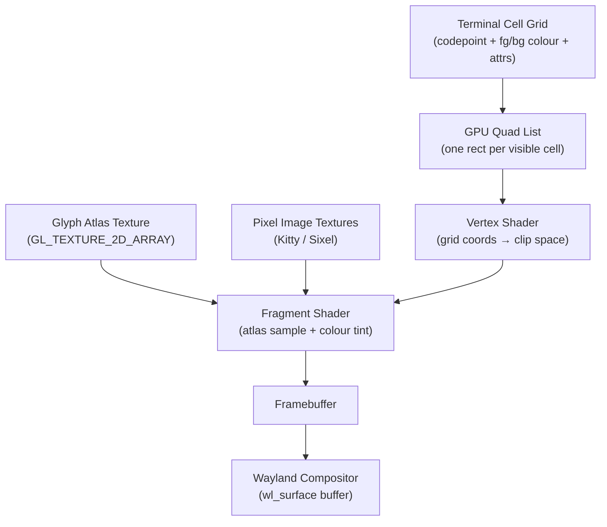
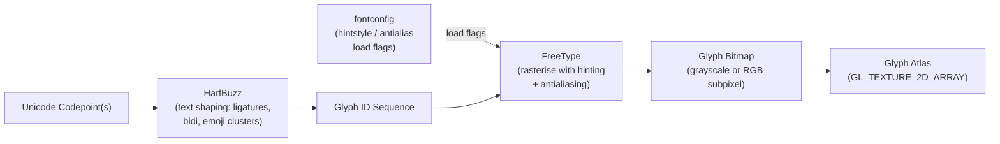
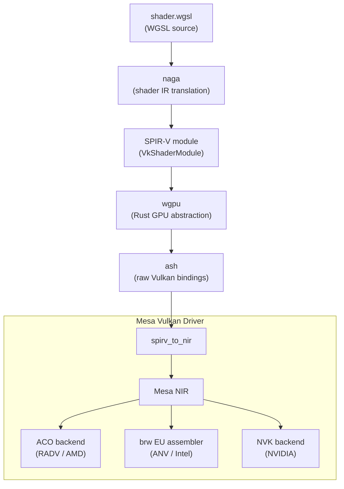
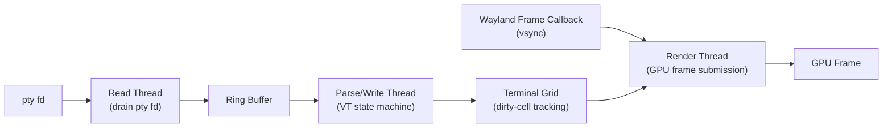
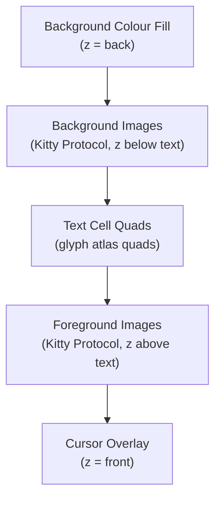

# Chapter 44: Terminal GPU Rendering Architectures

> **Part**: Part XII — Terminal Graphics
> **Audience**: Terminal developers building GPU-accelerated renderers; graphics application developers who want to understand how a character-cell grid is rendered efficiently on modern GPUs.
> **Status**: First draft — 2026-06-12

## Table of Contents

- [Overview](#overview)
- [1. Why GPU Acceleration Matters for Terminals](#1-why-gpu-acceleration-matters-for-terminals)
- [2. Glyph Atlas Fundamentals](#2-glyph-atlas-fundamentals)
- [3. kitty: Mature OpenGL Renderer](#3-kitty-mature-opengl-renderer)
- [4. Alacritty: Minimal OpenGL, Latency Optimised](#4-alacritty-minimal-opengl-latency-optimised)
- [5. WezTerm: wgpu Multi-Backend Architecture](#5-wezterm-wgpu-multi-backend-architecture)
- [6. Ghostty and libghostty: Zig-Native, Platform-Optimised](#6-ghostty-and-libghostty-zig-native-platform-optimised)
- [7. foot: CPU-Side Software Rendering](#7-foot-cpu-side-software-rendering)
- [8. VTE: GTK4 Transition and Sixel Support](#8-vte-gtk4-transition-and-sixel-support)
- [9. Compositing Pipeline: Text and Pixel Graphics Together](#9-compositing-pipeline-text-and-pixel-graphics-together)
- [Integrations](#integrations)
- [References](#references)

---

## Overview

This chapter examines how modern terminal emulators map the conceptually simple character-cell grid onto a GPU rendering pipeline. The problem is richer than it first appears: a terminal must handle arbitrary Unicode text with bidirectional runs, ligature sequences, emoji clusters, and combining characters; render pixel graphics (**Sixel**, **Kitty Graphics Protocol**, **iTerm2**) composited beneath or within the text; track dirty cells to avoid redrawing static content every frame; and achieve the low input-to-visual latency that makes a terminal feel responsive. Meeting all these goals simultaneously, across hardware from an embedded **ARM** board to a high-refresh desktop GPU, has driven the community to develop a variety of rendering architectures.

The chapter is aimed at two overlapping audiences. Terminal developers who are building or extending a GPU-accelerated renderer will find concrete source references and design trade-off analysis for the dominant implementations — **kitty**, **Alacritty**, **WezTerm**, **Ghostty**, **foot**, and **VTE**. Graphics application developers who are already familiar with **Vulkan** and **OpenGL** from Parts IV–VI of this book will recognise the glyph atlas, atlas eviction, and premultiplied-alpha compositing patterns as instances of more general GPU techniques applied to a character-cell domain. Readers are assumed to have absorbed Parts I–VI (**DRM**, **KMS**, GPU drivers, **Mesa**, **Wayland**, compositors) and Chapter 43 (the **Sixel**, **Kitty Graphics Protocol**, and **iTerm2** wire formats); those protocols are referenced here for context but not re-explained.

Section 2 establishes the glyph atlas as the shared foundation underlying every GPU terminal renderer. The path from a **Unicode** codepoint to a cached GPU bitmap passes through **HarfBuzz** (text shaping: ligatures, bidirectional runs, emoji clusters) and **FreeType** (rasterisation with hinting and antialiasing, controlled by **fontconfig** load flags such as **FT_LOAD_TARGET_LCD** for subpixel rendering). The rasterised bitmaps are packed into a **GL_TEXTURE_2D_ARRAY** using a skyline bin-packing algorithm; the **glTexSubImage3D** API uploads individual glyphs to specific layers. Cache misses trigger **LRU** eviction using per-slot frame counters, with the physical layer limit exposed via **GL_MAX_ARRAY_TEXTURE_LAYERS** and **VkPhysicalDeviceLimits.maxImageArrayLayers**.

Section 3 covers **kitty**'s mature **OpenGL** renderer, whose glyph cache lives in **kitty/glyph-cache.c** and shader programs in **kitty/shaders.py**. Image textures from the **Kitty Graphics Protocol** are managed in **kitty/graphics.c** using an **LRU** cache of **GL** texture handles. Section 4 covers **Alacritty**'s minimal **OpenGL** design, implemented in Rust under **alacritty/src/renderer/**, with a 2D **GL_TEXTURE_2D** atlas and a multi-threaded architecture separating input polling, **VT** parsing, and rendering to achieve low input-to-photon latency; **Alacritty** deliberately omits image protocol support. Section 5 covers **WezTerm**'s **wgpu** multi-backend architecture, in which **WGSL** shaders are translated to **SPIR-V** by **naga** and handed to **Mesa**'s **Vulkan** driver (**RADV**, **ANV**, **NVK**) via **ash**; WezTerm supports **Sixel**, the **Kitty Graphics Protocol**, and **iTerm2** using a **wgpu::Buffer** staging path, with a known **HLS** colour-mapping deviation from the **DEC VT340** specification.

Section 6 covers **Ghostty** and **libghostty**. **Ghostty**'s **SIMD**-optimised **VT** parser scans the byte stream using **SSE4.2**, **AVX2**, and **NEON** intrinsics. The multi-threaded architecture separates a read thread, a parse/write thread, and a render thread communicating via a ring buffer, with the render thread woken by a **Wayland** frame callback. Rendering backends include **Metal** on macOS, **OpenGL** (via **GTK4**) on Linux with shaders under **src/renderer/shaders/glsl/**, and a **Vulkan** backend in development. **libghostty** exposes the headless **VT** emulation core (parser, state machine, terminal grid) as an embeddable C/Zig shared library independent of any rendering backend.

Section 7 covers **foot**, which performs all rendering on the CPU and uploads results via **wl_shm**, avoiding any **OpenGL** or **Vulkan** dependency. The **footd** server-daemon architecture amortises font-loading cost across multiple windows. **Sixel** decoding (**foot/sixel.c**) fills the CPU framebuffer directly. **foot** supports the **wp_fractional_scale_v1** Wayland protocol extension for non-integer DPI scaling, implemented entirely in software.

Section 8 covers **VTE**, the **GTK** terminal widget, whose GTK4 port (VTE 0.76, GNOME 46) replaced the **Cairo**/**Pango** rendering path with **GTK**'s **GSK** scene-graph layer (**src/drawing-gsk.cc**). With **GTK 4.16**, the default **GSK** backend on **Wayland** became the **Vulkan** renderer, routing **GskTextNode**, **GskTextureNode**, and **GskColorNode** render nodes through **Mesa**'s **Vulkan** drivers. **VTE** also added **Sixel** support via a dedicated **src/sixel-context.cc** decoder, exposed through **vte_terminal_set_enable_sixel()** and enabled at build time with the **-Dsixel=true** **Meson** option.

Section 9 analyses the compositing pipeline that interleaves text and pixel graphics. The correct blend equation for premultiplied alpha uses **GL_ONE, GL_ONE_MINUS_SRC_ALPHA**; skipping gamma-correct blending in linear-light space causes dark fringe artefacts. **kitty** achieves compositing in a single **glDrawArrays** call by sorting all draw elements — background fill, background images, text cell quads, foreground images, cursor — into one vertex buffer on the CPU. **VTE**'s **GSK**-based path builds a tree of render nodes that the **GSK Vulkan** backend decomposes into **Vulkan** render passes. All GPU terminals implement damage tracking so that only changed cells are included in each frame's draw call, keeping GPU bandwidth near zero for static terminal content.

---

## 1. Why GPU Acceleration Matters for Terminals

A terminal emulator has two conceptually separate concerns that the rendering architecture must serve simultaneously: parsing and processing the byte stream arriving from the pseudoterminal, and presenting the resulting character-cell state to the screen at a rate that feels responsive. In the CPU-era designs that dominated through the 2010s — xterm, GNOME Terminal backed by VTE/Cairo, rxvt — rendering consisted of asking a 2D drawing library (Cairo, Xlib GC, or direct Xrender) to rasterise each visible cell on every frame. Even with dirty-tracking to limit redraws, the bottleneck was twofold: rasterising glyphs is expensive on the CPU, and uploading a freshly rasterised 1920×1080 RGBA texture to the display server is a large bus transfer. On a typical desktop of that era these constraints produced hard ceilings of 20–30 frames per second under moderate output load, and noticeable smearing when scrolling or when a program was producing dense output.

GPU acceleration changes the economics of both costs. The glyph rasterisation work happens once per unique glyph and the resulting bitmaps are stored in a texture atlas resident in VRAM; subsequent frames for the same glyph are free, because the fragment shader samples from cached GPU memory rather than re-running FreeType. The per-frame draw cost is a vertex-buffer upload (a handful of kilobytes for a typical 80×24 or 200×50 terminal) and a single draw call whose work scales only with the number of changed cells, not with the total surface area. This combination routinely lifts frame rates to 60 Hz or 120 Hz even on modest integrated GPUs, and reduces the input-to-visual latency from 10–30 ms in the CPU path to 1–5 ms in the GPU path.

The basic model underlying every GPU terminal renderer covered in this chapter is the same. The terminal state machine maintains a grid of cells, each carrying a Unicode codepoint (or a cluster index for multi-codepoint graphemes), a foreground colour, a background colour, and attribute flags (bold, italic, underline, etc.). At render time this grid is mapped to a flat list of GPU quads — one rectangle per visible cell, positioned by row and column, with UV coordinates into a glyph atlas texture. A vertex shader transforms grid coordinates to clip space; a fragment shader samples the glyph bitmap from the atlas and composites it over the background colour using the foreground colour as a tint. The framebuffer produced by this pass is then presented to the Wayland compositor as a surface buffer, following the `wl_surface` and `xdg_toplevel` paths covered in Chapter 20.

Pixel graphics complicate but do not fundamentally alter this model. Images uploaded via the Kitty Graphics Protocol or decoded from a Sixel stream are stored as separate GPU textures and composited into the same render pass at appropriate z-indices, either behind or in front of text cells depending on the application's intent.



---

## 2. Glyph Atlas Fundamentals

Every GPU terminal renderer must solve the same core problem: the Unicode repertoire is enormous, but any given terminal session uses only a small subset of it, and that subset can be predicted poorly in advance. The glyph atlas is the data structure that caches the solution — a GPU texture into which rasterised glyph bitmaps are packed, so that the fragment shader can sample any rendered glyph without a round-trip to the CPU.

### From Codepoint to Glyph Bitmap

The path from a Unicode codepoint to a rasterised bitmap passes through two libraries that are now standard infrastructure across all terminal renderers. HarfBuzz performs text shaping: it groups a run of codepoints in the same font and script into a sequence of glyph IDs, resolving ligatures (so that `fi` in a ligature font maps to a single glyph rather than two), handling directional runs in bidirectional text via the Unicode Bidirectional Algorithm, and clustering emoji sequences and combining characters into single rendering units. [Source](https://harfbuzz.github.io/) FreeType then rasterises the individual glyph IDs produced by HarfBuzz, applying hinting and antialiasing as configured by fontconfig. The fontconfig `hintstyle` and `antialias` settings propagate into FreeType's load flags: `FT_LOAD_TARGET_LCD` for horizontal subpixel rendering on RGB-stripe LCD panels, `FT_LOAD_TARGET_LCD_V` for vertical stripes, and `FT_LOAD_TARGET_NORMAL` for grayscale antialiasing. These are not just quality parameters — they affect the pixel footprint of the rasterised bitmap and therefore the atlas slot allocation logic.



Subpixel rendering via `FT_LOAD_TARGET_LCD` produces a bitmap three times as wide as a grayscale bitmap for the same glyph, because each colour channel is rendered independently against the subpixel geometry of the LCD panel. The terminal must upload this as an RGB texture (or a three-channel region of a larger atlas) and use a fragment shader that applies per-channel alpha blending rather than a single coverage value. Gamma-correct blending matters here: compositing should occur in linear-light space, not in sRGB space, because sRGB values are not additive. The terminal computes the blend in linear space — either by treating the atlas texture as `GL_SRGB8_ALPHA8` and enabling automatic sRGB decode, or by performing the `pow(v, 2.2)` linearisation manually in the shader — and then encodes the result back to sRGB for the framebuffer. Terminals that skip this step exhibit fringe artefacts, visible as colour fringing or uneven stroke weight at small font sizes.

### Atlas Packing and the 3D Texture Array

A 2D texture atlas is the simplest possible organisation: a single large texture into which glyph bitmaps are packed using a bin-packing algorithm such as skyline or guillotine. [Source](https://www.freedesktop.org/wiki/Software/HarfBuzz/) The skyline algorithm maintains a height profile of the texture and inserts new rectangles at the lowest point above which the rectangle fits; it gives good packing density for glyph bitmaps, which tend to be narrow and similar in height within a single font and size. However, a 2D atlas has a hard size limit — typically 4096×4096 or 8192×8192 pixels, as bounded by `GL_MAX_TEXTURE_SIZE` — and when it fills, the renderer must either evict glyphs or allocate a second atlas texture, requiring the fragment shader to sample from multiple textures or restructure the draw call.

The 3D texture array (`GL_TEXTURE_2D_ARRAY`) offers a cleaner solution that several terminals have adopted. Each layer of the array is a 2D atlas of fixed dimensions; when one layer fills, a new layer is appended without disturbing the texture coordinates of glyphs already packed in earlier layers. The OpenGL API for growing the atlas is `glTexSubImage3D`, which uploads pixel data to a sub-region of a specific layer; adding a new layer requires `glTexImage3D` with the new depth count, which unfortunately requires re-specifying all layers on implementations that do not support `ARB_texture_storage` — a limitation that drives terminals toward allocating array layers in larger increments rather than one at a time. [Source](https://registry.khronos.org/OpenGL-Refpages/gl4/html/glTexSubImage3D.xhtml) The physical limit on the number of array layers is exposed via `GL_MAX_ARRAY_TEXTURE_LAYERS` (OpenGL) or `VkPhysicalDeviceLimits.maxImageArrayLayers` (Vulkan), and typically reaches 2048 on modern hardware — well beyond what any terminal session will exhaust.

Inserting a single glyph bitmap into an existing atlas layer follows this pattern:

```c
// kitty/glyph-cache.c — uploading a rasterised glyph into the 3D atlas
// atlas_tex is a GL_TEXTURE_2D_ARRAY previously allocated with glTexImage3D.
glBindTexture(GL_TEXTURE_2D_ARRAY, atlas_tex);
glTexSubImage3D(
    GL_TEXTURE_2D_ARRAY,
    0,             /* mip level */
    slot_x,        /* xoffset into layer */
    slot_y,        /* yoffset into layer */
    layer_index,   /* z = layer index */
    glyph_width,
    glyph_height,
    1,             /* depth = 1 (one layer) */
    GL_RED,        /* grayscale coverage channel */
    GL_UNSIGNED_BYTE,
    ft_bitmap->buffer
);
```

The corresponding fragment shader samples the atlas with a `vec3` coordinate where the z component selects the layer:

```glsl
// kitty/cell_fragment.glsl (simplified)
// atlas is a sampler2DArray bound to GL_TEXTURE_2D_ARRAY
uniform sampler2DArray atlas;
in vec3 atlas_uv;      // (u, v, layer_index)
in vec4 fg_color;
in vec4 bg_color;

void main() {
    float coverage = texture(atlas, atlas_uv).r;
    frag_color = mix(bg_color, fg_color, coverage);
}
```

### Cache Miss Path and Eviction

When a glyph is first encountered, the renderer calls FreeType to rasterise it, then packs the resulting bitmap into the atlas via `glTexSubImage3D` or an equivalent buffer upload. If the atlas has no free space, the renderer must evict an existing entry. The standard policy is LRU (Least Recently Used): each atlas slot carries a frame counter updated on every frame in which the glyph appears; when space is needed, the slot with the oldest frame counter is selected for eviction and its coordinates are reused. The corresponding entry in the CPU-side glyph map is invalidated, and the next render cycle that needs the evicted glyph will re-rasterise it. In practice, for typical interactive terminal usage the hot working set (the glyphs that appear in the visible viewport) fits comfortably in a single atlas layer, and eviction is rare. It becomes relevant during operations like `cat` of a file with extremely diverse Unicode content, or emoji-heavy output.

---

## 3. kitty: Mature OpenGL Renderer

kitty is the oldest of the GPU-first terminal emulators still in active development, first released in 2017 by Kovid Goyal. Its deliberate choice to build on OpenGL rather than Vulkan was made consciously: at the time of the initial design, Vulkan driver quality and application developer tooling were immature enough that the additional complexity was not warranted, and the OpenGL path has remained because it covers all hardware — including older Intel iGPUs and ARM Mali chips — without the driver quality concerns that still occasionally surface with Vulkan. [Source](https://github.com/kovidgoyal/kitty)

### The OpenGL Glyph Atlas

kitty's OpenGL infrastructure lives in `kitty/gl.c`, with shader programs defined in `kitty/shaders.py` and compiled at runtime. The glyph cache is implemented in `kitty/glyph-cache.c`, and the Kitty Graphics Protocol image handling in `kitty/graphics.c`. The atlas is a 3D texture array, with each layer sized to hold a fixed grid of cell bitmaps determined at startup from the font metrics. When the renderer encounters a glyph it has not seen before, it rasterises the glyph via FreeType (with HarfBuzz shaping applied for multi-codepoint clusters) and uploads the bitmap to the next available slot in the current atlas layer via `glTexSubImage3D`. If the current layer is full, a new layer is appended. The atlas layer count grows dynamically; kitty has configurable limits via `kitty.conf`, and the eviction policy removes LRU glyphs when the configured maximum is reached.

The vertex buffer for a frame holds one quad per visible cell. Each quad encodes the cell's screen-space rectangle, the UV coordinates of its glyph in the atlas, the atlas layer index (the z-coordinate of the 3D texture lookup), the foreground colour, and the background colour. The cell vertex shader transforms grid positions to clip space using a simple orthographic projection; the cell fragment shader fetches the glyph coverage value from the atlas with `texture(atlas, vec3(u, v, layer))` and applies it as the alpha for foreground colour over background colour. Subpixel rendering is handled in a variant shader that fetches three separate coverage values for the R, G, and B channels and applies per-channel blending.

### Image Handling and the Kitty Graphics Protocol

Pixel images uploaded via the Kitty Graphics Protocol (described in Chapter 43) are managed separately from the glyph atlas. Each image is assigned a unique texture object, allocated via `glGenTextures` and uploaded via `glTexImage2D`. The implementation in `kitty/graphics.c` maintains an LRU cache of GPU texture handles keyed by the image ID assigned at upload time. When GPU memory pressure is detected — kitty infers this by tracking the total allocated image texture memory against a configurable threshold — the LRU image textures are evicted and their GPU handles released. The `graphics_delay` parameter in `kitty.conf` controls how long kitty waits for an image upload before rendering the frame, allowing large images to be decoded and uploaded without tearing.

### Render Loop and Latency

kitty renders on a dedicated thread separate from the input polling and VT parsing thread. The render thread is signalled when the terminal state changes and produces a frame by recording draw calls and calling `eglSwapBuffers`. The target frame time is 1/refresh_rate, and double-buffering via EGL ensures that the display server (Wayland compositor) sees a complete frame atomically. The separation of input polling from rendering means that keystroke-to-output latency is dominated by pty round-trip time rather than frame timing, which is the correct trade-off. The use of a single render pass — all glyph quads and image rectangles are sorted by z-index and submitted in one `glDrawArrays` call — minimises driver overhead and keeps the GPU side of the latency budget small.

---

## 4. Alacritty: Minimal OpenGL, Latency Optimised

Alacritty entered the scene in 2017 (open-sourced in January of that year) with an explicit mission statement: to be the fastest terminal emulator, measured by input-to-render latency, through disciplined architecture rather than heroic optimisation. [Source](https://github.com/alacritty/alacritty) The approach was to implement a minimal GPU-accelerated terminal that validated the multi-threaded, atlas-based rendering model at scale, without the additional complexity of image protocols, GPU effects, or scripting.

### Architecture and Atlas

Alacritty is written in Rust and uses OpenGL through its own thin abstraction layer. The renderer source lives in `alacritty/src/renderer/`, with `text/mod.rs` as the entry point and `text/atlas.rs` implementing the glyph atlas. The atlas is a 2D texture (`GL_TEXTURE_2D`) rather than a 3D array, with a single texture per glyph cell size. The `text/glyph_cache.rs` module manages the CPU-side map from (glyph ID, font size) to atlas coordinates. [Source](https://github.com/alacritty/alacritty/tree/master/alacritty/src/renderer)

The vertex format records screen-space position, UV coordinates into the atlas, and foreground/background colour per quad. The shader programs (`text/glsl3.rs` and `text/gles2.rs` selecting the appropriate GLSL version) are compiled once at startup and the program object is reused across all frames. The fragment shader for grayscale antialiasing multiplies the foreground colour by the coverage sample from the atlas; the LCD subpixel path applies per-channel blending as described in Section 2.

### The Latency Focus

Alacritty's primary contribution to the field was empirical proof that the multi-threaded architecture — separate threads for input polling, VT parsing, and rendering — adds negligible latency on top of the display's frame clock in a practical terminal emulator. Input events are polled via `winit`'s event loop, queued to the VT parser thread, and the parser's output updates the terminal grid in a lock-protected shared state. The render thread reads the grid state at each vsync signal (via `eglSwapBuffers` frame-clock driven wakeup) and submits a GPU frame. The render thread does not wait for the parser; it takes a snapshot of whatever grid state is available at the frame boundary. This means that under burst I/O the displayed content may lag behind the pty output by up to one frame, but keystroke response is never gated by rendering work. Total input-to-photon latency remains bounded primarily by the display frame period (approximately 8 ms at 120 Hz, 16 ms at 60 Hz) rather than by any overhead introduced by the terminal renderer itself.

Alacritty deliberately excludes image protocol support. The Kitty Graphics Protocol, Sixel, and iTerm2 are all absent from the codebase, and this is an explicit design choice rather than an oversight — adding image rendering would require z-ordering, texture management, and a more complex render pass, all of which would increase the surface area of the renderer that could introduce latency regressions. The result is a renderer whose entire code path from grid snapshot to `eglSwapBuffers` can be read and understood in an afternoon, which has made Alacritty a valuable reference for developers building their own GPU terminal renderers.

---

## 5. WezTerm: wgpu Multi-Backend Architecture

WezTerm takes the opposite design stance from Alacritty: maximum feature breadth across all platforms from a single Rust codebase, at the cost of additional abstraction overhead. [Source](https://github.com/wez/wezterm) The GPU abstraction layer is wgpu, the same library used by Bevy (Chapter 40) and structurally analogous to Dawn (Chapter 35): a Rust-native GPU API that maps to Vulkan on Linux, Metal on macOS, DirectX 12 on Windows, and WebGPU in browsers, with an OpenGL ES fallback for hardware that supports none of those.

### wgpu on Linux and the Mesa Pipeline

On Linux, wgpu selects its Vulkan backend through ash (the raw Vulkan bindings crate), targeting whatever Mesa Vulkan driver the system provides — RADV for AMD, ANV for Intel, NVK for NVIDIA on open-kernel systems. WezTerm's shaders are authored in WGSL and compiled via naga, wgpu's shader intermediate representation; naga translates WGSL to SPIR-V, which is then handed to the Mesa driver as a `VkShaderModule`. From that point, the Mesa NIR pipeline (Chapter 14) and the driver's backend compiler — ACO for RADV (Chapter 15), Intel's `brw` EU assembler backend for ANV — take over, compiling the SPIR-V to native GPU ISA.



This is structurally identical to the path that Bevy's WGSL shaders take. The shader sources live in `wezterm-gui/src/shader.wgsl` along with per-draw-call GLSL shaders `glyph-vertex.glsl` and `glyph-frag.glsl` that are used via the OpenGL fallback path. [Source](https://github.com/wez/wezterm/tree/main/wezterm-gui/src)

The rendering state machine is implemented in `wezterm-gui/src/renderstate.rs`, which owns the wgpu `Device`, the glyph atlas pipeline, and the per-frame vertex buffer population logic. The atlas itself is a 2D texture array managed via wgpu's `Texture` abstraction; on the Vulkan backend this compiles to a `VkImage` with `VK_IMAGE_TYPE_2D` and an array layer count that grows as needed.

### Image Protocol Support

WezTerm supports all three major pixel graphics protocols — Sixel, Kitty Graphics Protocol, and iTerm2 — making it the most protocol-complete terminal in widespread use. All three follow the same GPU path: the CPU decodes the incoming protocol stream into a raw RGBA pixel buffer, and wgpu uploads this buffer to a GPU texture via a staging buffer (`wgpu::Buffer` with `COPY_SRC` usage, mapped for writing, then copied to a `wgpu::Texture`). The texture is then bound as a resource in the fragment shader for the image rendering pass. The `wezterm-gui/src/glyphcache.rs` module manages the atlas and image texture cache collectively, with eviction triggered when the total GPU texture memory tracked by WezTerm's allocator exceeds a configurable threshold.

Sixel images are decoded before GPU upload by a Sixel parser that handles the DCS parameter string, colour register assignments, and the sixel data body. The parser maps colour registers to 24-bit RGB values, supporting both RGB and HLS colour specifications. The HLS path contains a known implementation difference from the DEC VT340 specification: WezTerm maps hue values using the conventional artistic RGB colour wheel (red at 0°, green at 120°, blue at 240°), whereas the DEC specification defines the primary hues as blue at 0°, red at 120°, and green at 240°. This causes sixel images that use HLS colour specification — rather than the more common RGB mode — to display with an incorrect hue rotation relative to other conforming terminals such as mlterm. [Source](https://github.com/wezterm/wezterm/issues/775) This is a Sixel decoder bug, not a Mesa driver issue; the GPU renders exactly what the CPU decoder produces.

### Performance Characteristics

WezTerm on Linux with the Vulkan backend achieves frame rates in the 60–90 Hz range on typical desktop hardware, as reported by users in the project's issue tracker. The wgpu abstraction layer adds some overhead compared to direct Vulkan or direct OpenGL — primarily in the form of additional state validation and the naga shader compilation step at pipeline creation time. On identical hardware, terminals using direct OpenGL (kitty) or a Zig-native renderer (Ghostty) tend to achieve somewhat lower frame times, though the difference is rarely perceptible in interactive use. The main user-visible cost of the abstraction is startup time: pipeline compilation via naga and Mesa's shader compiler takes measurably longer for WezTerm than for terminals that precompile simpler GLSL shaders.

---

## 6. Ghostty and libghostty: Zig-Native, Platform-Optimised

Ghostty, released in December 2024 by Mitchell Hashimoto, makes different trade-offs from all of the preceding terminals. [Source](https://github.com/ghostty-org/ghostty) The primary implementation language is Zig (approximately 79% of the codebase by line count, with the remainder split between Swift for the macOS native UI layer and C for system library bindings). The design philosophy emphasises platform-native rendering on each target: Metal on macOS, OpenGL on Linux (with a Vulkan renderer under active development as of 2026), and DirectX 12 on Windows.

### VT Parser and Multi-threaded Architecture

Ghostty's most distinctive systems property relative to other GPU terminals is its SIMD-optimised VT parser. The parser scans the incoming byte stream for ANSI/VT escape sequence boundaries using SIMD intrinsics — SSE4.2 on x86-64 systems that support it, AVX2 where available, and NEON equivalents on AArch64. The critical observation that enables this is that VT sequences begin and end with byte values drawn from a small set (`ESC` = 0x1B, `CSI` introducer 0x9B, BEL 0x07, etc.) that can be tested against a SIMD vector of up to 32 bytes in a single instruction, scanning the buffer 16 or 32 bytes at a time rather than one byte at a time. For interactive terminal use the difference is immaterial — input arrives in small chunks — but when `cat`-ing a large file over SSH or piping dense output from a build system, the parser can process the entire stream faster than the GPU can render the result, keeping the pty buffer draining and avoiding input stalls.

The thread architecture separates three concerns: a read thread that drains the pty file descriptor into a ring buffer, a parse/write thread that runs the VT state machine over the ring buffer contents and updates the terminal grid, and a render thread that snapshots the grid and submits GPU frames. This is similar to Alacritty's model but with an explicit ring buffer between the read and parse stages, allowing the pty reader to work at full I/O speed without being gated by the VT parser. The render thread is woken by a Wayland frame callback (on Linux) or a platform-equivalent vsync signal and reads only the cells that the parse thread has marked as dirty since the previous render.



### Platform Rendering Backends

On macOS, Ghostty uses Metal via a Swift interoperability layer. The Metal backend achieves approximately 120 FPS on Apple Silicon at approximately 45 MB RSS for a typical session, according to the project's own benchmarks. The glyph atlas is a 3D texture array (a `MTLTextureDescriptor` with `textureType = MTLTextureType2DArray`) and the shaders in `src/renderer/shaders/shaders.metal` handle glyph sampling and image compositing in a single render pass.

On Linux, Ghostty uses OpenGL via the GTK4 application runtime (`src/apprt/gtk/`). The OpenGL renderer sources live in `src/renderer/OpenGL.zig` and `src/renderer/opengl/`, with shaders in `src/renderer/shaders/glsl/`. The cell shader (`cell_text.v.glsl`, `cell_text.f.glsl`) handles the same glyph atlas sampling and colour tinting pattern as kitty, while the image shader (`image.v.glsl`, `image.f.glsl`) handles compositing pixel graphics. Background images are supported via `bg_image.v.glsl` / `bg_image.f.glsl`. A Vulkan backend for Linux is under active development; readers should check the repository's `src/renderer/` directory for current status, as this was not yet merged to the main branch as of mid-2026. [Source](https://github.com/ghostty-org/ghostty/tree/main/src/renderer)

### libghostty: The Headless Emulation Core

Ghostty is architected so that the VT parser and terminal state machine are cleanly separated from the rendering layer. This separation is exposed publicly as libghostty, a C/Zig shared library that provides the emulation core — the VT parser, the terminal grid, the escape sequence state machine, and the Unicode text model — as an embeddable component. The rendering backends are explicitly not part of libghostty; the library is headless and platform-agnostic.

```mermaid
graph TD
    subgraph "libghostty (headless, platform-agnostic)"
        VTParser["VT Parser\n(SIMD-optimised)"]
        StateMachine["Escape Sequence\nState Machine"]
        TermGrid["Terminal Grid\n(Unicode text model)"]
    end

    subgraph "Rendering Backends (not part of libghostty)"
        Metal["Metal Backend\n(macOS)"]
        OGL["OpenGL Backend\n(Linux / GTK4)"]
        Vulkan["Vulkan Backend\n(Linux, in development)"]
        DX12["DirectX 12 Backend\n(Windows)"]
    end

    libghostty --> Metal
    libghostty --> OGL
    libghostty --> Vulkan
    libghostty --> DX12

    VTParser --> StateMachine
    StateMachine --> TermGrid
``` The public API is documented at [libghostty.tip.ghostty.org](https://libghostty.tip.ghostty.org) and exposes C-compatible types and function signatures, allowing embedding in applications that are not written in Zig. The primary intended use cases are editors and IDEs that want to embed a terminal pane, browser extensions, and compositors that want a built-in terminal without depending on a full terminal emulator binary. As of mid-2026, the libghostty API is not yet considered stable or versioned; the project documentation notes that the API may change without notice until a 1.0 release is declared. The library builds for macOS, Linux, Windows, and WASM targets via Zig's cross-compilation infrastructure.

---

## 7. foot: CPU-Side Software Rendering

foot is a Wayland-native terminal emulator written in C that makes the opposite bet from every other emulator in this chapter: it deliberately avoids GPU dependency, performing all glyph rasterisation and compositing on the CPU and uploading the result to the Wayland compositor via `wl_shm`. [Source](https://codeberg.org/dnkl/foot) This is not a legacy choice but a deliberate design stance: foot's author prioritised predictable behaviour across all hardware (including systems without a functioning GPU driver), minimal RSS, and correct operation over remote connections where a GPU may not be available.

### Server-Daemon Architecture

foot ships with a server daemon, `footd`, that allows multiple terminal windows to share a single process. The shared process retains a single FreeType library instance and a single glyph cache in memory, amortising the startup cost of font loading across all windows. A typical foot window consumes approximately 30–50 MB RSS; by comparison, a GPU terminal running the OpenGL stack typically requires 60–100 MB for the OpenGL context and atlas textures alone. For users who open many terminal windows simultaneously, the footd model can represent a meaningful memory saving.

### Software Rendering Pipeline

The rendering pipeline, implemented in `foot/render.c`, is straightforward: for each changed cell, call FreeType to rasterise (or look up a cached rasterisation) the glyph and blit it into a 32-bit RGBA software framebuffer at the correct row-column position. Damage tracking records which rows or rectangular regions have been modified since the last frame; only those regions are written into the framebuffer on each render cycle. When the frame is complete, foot calls `wl_surface_damage_buffer` to inform the compositor of the changed region and `wl_surface_commit` to present the buffer. The compositor receives a `wl_buffer` backed by a `wl_shm_pool` — a file-descriptor-backed shared memory region — and the GPU (if present) DMAs the data from that region into a texture for display. The GPU involvement, if any, is entirely on the compositor side; foot itself never calls an OpenGL or Vulkan function.

The `wl_shm` path here is architecturally identical to the CPU-upload path used by any non-GPU Wayland client. Chapter 20 describes the `wl_shm` protocol mechanics; Chapter 21 describes how wlroots compositors handle `wl_shm` surfaces. foot is the most prominent example in this part of the book of a Wayland client that remains entirely in this software path by design.

### Sixel in the Software Path

Sixel images are decoded by foot's internal Sixel decoder (`foot/sixel.c`), which processes the DCS data stream, interprets colour register assignments, and fills the software framebuffer rows with pixel data. The decoder operates entirely on CPU memory: it produces RGBA pixel data at the correct grid position in the framebuffer buffer, where it will be overdrawn by text cells rendered above it. There is no GPU texture allocation for Sixel images; the compositing with text occurs naturally in the CPU framebuffer as a simple paint-order operation (background cells first, then Sixel pixels, then text glyphs). This is considerably simpler than the GPU z-ordering model described in Section 9, at the cost of slightly more CPU work per pixel during Sixel decode.

### Fractional Scaling and Performance

foot supports the `wp_fractional_scale_v1` Wayland protocol extension, which allows the compositor to request a non-integer scale factor (for example, 1.5× on a 144 DPI display). [Source](https://gitlab.freedesktop.org/wayland/wayland-protocols) foot responds by rasterising glyphs at the correct DPI-scaled pixel size and rendering its framebuffer at the fractional-scaled resolution, allowing text to appear at the correct physical size without the blurriness of nearest-neighbour upscaling. This is achieved entirely in software with no GPU involvement. Frame rates for foot under normal interactive use are 50–60 FPS; during bulk scroll or large resize operations they can drop to 20–30 FPS as the CPU must rasterise and blit a large number of cells. Input latency is in the 5–10 ms range, driven primarily by the Wayland frame-clock commit cycle rather than by rendering cost, making it competitive with GPU terminals in terms of the latency most users will perceive.

---

## 8. VTE: GTK4 Transition and Sixel Support

VTE (Virtual Terminal Emulator) occupies a different position in the ecosystem from the standalone terminals discussed above: it is a GTK widget, not a terminal emulator application, providing terminal emulation functionality for embedding in GTK-based applications. GNOME Terminal, Tilix, Gedit's built-in terminal, and several other GNOME ecosystem applications use VTE as their rendering backend. [Source](https://gitlab.gnome.org/GNOME/vte)

### From Cairo to GTK4 and GSK

Under GTK3, VTE performed all glyph rasterisation via Pango and Cairo, uploading a freshly-rendered surface to the display server on every frame in which any cell changed. This is the classic CPU-rasterisation model, and it produced the same 20–30 FPS ceiling under heavy output load that characterised xterm and other Cairo-based terminals. The rendering backend was correct and well-tested but computationally expensive.

The GTK4 port, landing in VTE 0.76 (part of the GNOME 46 release cycle in early 2024), replaced the Cairo backend with GTK's Scene Graph (GSK). GSK is GTK4's retained-mode rendering layer, which expresses the UI as a tree of render nodes — `GskTextureNode` for pixel images, `GskTextNode` for glyphs via Pango, `GskColorNode` for solid rectangles — and delegates the actual rasterisation to one of several backends. With GTK 4.16 (September 2024), the default GSK backend on Wayland became the Vulkan renderer, replacing the previous NGL (Next Generation) OpenGL renderer as the default. [Source](https://blog.gtk.org/2024/) This means that a VTE-based terminal running on a Wayland desktop with GTK 4.16+ will have its render nodes executed by the GSK Vulkan backend, using Mesa's Vulkan drivers (Chapter 18) for GPU execution — even though neither VTE nor the application that embeds it has written a single line of Vulkan code.

VTE 0.76 also replaced the scrollback buffer's compression algorithm, switching from zlib to lz4. The change was motivated by lz4's significantly faster decompression speed: when a user scrolls back through a large scrollback buffer, the bottleneck is decompressing stored line data, and lz4's decoder runs at multiple GB/s on modern CPUs versus the few hundred MB/s achievable with zlib. [Source](https://gitlab.gnome.org/GNOME/vte)

The drawing-context abstraction that mediates between VTE's terminal logic and its rendering backend is defined in `src/drawing-context.hh` and `src/drawing-context.cc`, with the GSK-specific implementation in `src/drawing-gsk.cc` and `src/drawing-gsk.hh`. The GSK implementation maps VTE's internal draw commands to GSK render node construction, which GTK then submits to the active backend (Vulkan or OpenGL) for GPU execution.

```mermaid
graph TD
    VTELogic["VTE Terminal Logic\n(VT parser + cell grid)"]
    DrawCtx["drawing-context\n(src/drawing-context.hh)"]
    DrawGSK["GSK drawing impl\n(src/drawing-gsk.cc)"]

    subgraph "GSK Render Node Tree"
        TextNode["GskTextNode\n(glyph runs via Pango)"]
        TexNode["GskTextureNode\n(Sixel / image regions)"]
        ColorNode["GskColorNode\n(background fill)"]
    end

    subgraph "GSK Backend (GTK 4.16+)"
        VKBackend["GSK Vulkan Renderer\n(default on Wayland)"]
        OGLBackend["GSK OpenGL Renderer\n(fallback)"]
    end

    MesaVK["Mesa Vulkan Driver\n(RADV / ANV / NVK)"]

    VTELogic --> DrawCtx
    DrawCtx --> DrawGSK
    DrawGSK --> TextNode
    DrawGSK --> TexNode
    DrawGSK --> ColorNode
    TextNode --> VKBackend
    TexNode --> VKBackend
    ColorNode --> VKBackend
    TextNode --> OGLBackend
    TexNode --> OGLBackend
    ColorNode --> OGLBackend
    VKBackend --> MesaVK
```

### Sixel Support

VTE added Sixel support through the addition of a dedicated Sixel context (`src/sixel-context.cc` / `src/sixel-context.hh`), which implements the DCS Sixel data stream decoder. The decoded pixel data is wrapped in a GSK texture node (`GskTextureNode`) with a `GdkTexture` holding the RGBA pixel data; GSK is then responsible for uploading this to the GPU and compositing it at the correct position in the terminal surface.

The Sixel API is controlled at the widget level by `vte_terminal_set_enable_sixel()`, which is part of the public VTE API for GTK4. [Source](https://gnome.pages.gitlab.gnome.org/vte/gtk4/method.Terminal.set_enable_sixel.html) At build time, Sixel support must be explicitly enabled with the `-Dsixel=true` Meson build option; it is not compiled in by default. Downstream distributions vary in whether they enable this flag: as of mid-2026, Fedora enables Sixel in its VTE builds, while some other distributions do not. GNOME Terminal, which embeds VTE, exposes a Compatibility settings toggle for Sixel Images when the Sixel-enabled VTE is present, but Sixel display is still off by default there. This layered opt-in reflects the fact that Sixel can interact poorly with some applications that produce DCS sequences for non-image purposes.

---

## 9. Compositing Pipeline: Text and Pixel Graphics Together

The most architecturally interesting problem in GPU terminal rendering is not the glyph atlas itself but the compositing of glyph quads and pixel image rectangles into a coherent framebuffer, in the correct paint order, without visible artefacts at the boundaries between text and image regions.

### Z-Ordering and Premultiplied Alpha

The standard approach is to assign a z-index to every draw element — glyph quad, image rectangle, background colour rectangle, cursor overlay — and sort them back-to-front before submitting to the GPU. With premultiplied alpha blending (where the RGB channels of a pixel already incorporate the alpha factor), back-to-front compositing using `ONE, ONE_MINUS_SRC_ALPHA` blend factors is exact: each element correctly covers the pixels behind it in proportion to its coverage value. The choice of premultiplied alpha is important: naive non-premultiplied blending with `SRC_ALPHA, ONE_MINUS_SRC_ALPHA` produces dark fringe artefacts around subpixel-antialiased glyphs, because the RGB components near a glyph edge carry values close to zero before alpha scaling, and the residual darkness compounds with the background. Premultiplied storage ensures the RGB values are already scaled, so the blend is algebraically clean.

Setting up the correct blend state for premultiplied alpha compositing requires a single OpenGL call before any terminal draw:

```c
// Correct blend equation for premultiplied alpha (used by kitty and Ghostty).
// Source RGB channels already contain alpha-scaled values; ONE preserves them.
// ONE_MINUS_SRC_ALPHA attenuates whatever is already in the framebuffer.
glBlendFunc(GL_ONE, GL_ONE_MINUS_SRC_ALPHA);
glEnable(GL_BLEND);
```

This contrasts with the incorrect (but common) choice of `GL_SRC_ALPHA, GL_ONE_MINUS_SRC_ALPHA`, which double-multiplies the alpha for non-premultiplied sources but is wrong for premultiplied ones and introduces the dark-fringe artefact at glyph edges.

Practical z-index assignments vary by terminal. In kitty, the ordering from back to front is: background colour fill, background images (uploaded via the Kitty Graphics Protocol with a z-index below the text grid), text cell quads, foreground images (z-index above text), and the cursor. This allows applications like `btop++` to render a background graph or image beneath its text interface, a use case the Kitty Graphics Protocol explicitly targets. The cursor is always in front, ensuring it is visible regardless of what is displayed in the cell below it.



### Single-Pass vs. Multi-Pass Rendering

kitty achieves the entire compositing pipeline in a single OpenGL render pass by sorting all draw elements on the CPU into a single vertex buffer before submitting the draw call. The GPU processes the buffer in order, and the blend equation handles the compositing. This minimises driver overhead: a single `glDrawArrays` call (or at most a small handful if texture binding must change between the glyph atlas and an image texture) suffices for the entire frame.

VTE's GSK-based path is structurally different. GSK builds a tree of render nodes — one `GskTextNode` per run of text (using Pango for layout), one `GskTextureNode` per Sixel or image region, one `GskColorNode` per background fill — and then the GSK Vulkan backend decomposes this tree into one or more Vulkan render passes. The decomposition may produce multiple GPU passes depending on node types and their blend requirements. This multi-node, potentially multi-pass structure is more flexible (it handles arbitrary GTK widget content alongside the terminal text) but requires the GSK backend to make good decisions about pass merging to avoid redundant GPU round-trips. GTK 4.16's GSK Vulkan renderer, which is the same backend used for all GTK4 widget rendering (Chapter 39), includes optimisations for common node patterns including runs of consecutive text nodes that can be batched into a single Vulkan draw.

### Damage Tracking

All GPU terminals implement damage tracking: only cells that changed since the last frame are included in the vertex buffer for the next frame's draw call. In practice this means that a static terminal — one showing a shell prompt, for example — requires an almost empty draw call each frame (only the cursor blink, if enabled, changes), consuming negligible GPU bandwidth. During bulk output, such as a build system printing hundreds of lines per second, damage tracking is less helpful because nearly every cell changes every frame; this is precisely the case where the GPU atlas approach pays off because glyph rasterisation cost is amortised.

The GPU memory budget for the atlas is configurable in both kitty and Ghostty. Administrators managing shared systems with many simultaneous terminal users can lower the atlas size limit to reduce per-terminal GPU memory consumption at the cost of more frequent glyph eviction. The physical upper bound is `GL_MAX_ARRAY_TEXTURE_LAYERS` for the OpenGL 3D texture array, which is at least 256 on any OpenGL 3.0-capable implementation and 2048 or more on current hardware, providing ample headroom for the largest atlas configurations used in practice.

---

## Integrations

The glyph atlas shader programs in each terminal follow a path through the Mesa stack that should be familiar from earlier parts of this book. kitty's GLSL cell and glyph shaders (`kitty/shaders.py` generates these at runtime) are compiled by Mesa's GLSL frontend, converted to Mesa NIR (Chapter 14), and handed to the driver's backend compiler — ACO for RADV (Chapter 15) or Intel's EU assembler for ANV. Ghostty's OpenGL GLSL shaders under `src/renderer/shaders/glsl/` follow the same route.

WezTerm's shader path via wgpu is structurally identical to Bevy's (Chapter 40) and Dawn's (Chapter 35): WGSL (or GLSL for the OpenGL fallback) is translated to SPIR-V by naga, and the SPIR-V module is handed to Mesa's Vulkan driver as a `VkShaderModule`. Mesa then converts SPIR-V to NIR internally (`spirv_to_nir` in `src/compiler/spirv/`) before the same NIR-to-ISA backend pipeline that processes any other Vulkan client's shaders.

libghostty's VT parser is architecturally related to VTE's internal parser: both maintain a VT state machine over a byte stream and update a terminal grid, and both are designed to be embedded rather than to own the window or GPU context. A Wayland compositor building a built-in terminal widget could embed libghostty for the emulation core (handling VT sequences, grid state, Unicode, SIMD-fast parsing) and provide its own rendering layer, an integration pattern analogous to how VTE is embedded in GTK applications.

GTK4 VTE uses the same GSK Vulkan rendering backend as all other GTK4 widgets described in Chapter 39. The `GskTextureNode` that wraps a decoded Sixel image and the `GskRoundedClipNode` used for terminal cell clipping are the same render node types used by GTK4's button and scroll-view widgets; the only VTE-specific code is in the terminal emulation layer and the render-node construction that maps terminal state to GSK nodes.

HarfBuzz text shaping is shared infrastructure across the entire Linux graphics ecosystem. The same HarfBuzz library that terminal emulators call for ligature detection and emoji cluster handling is used by Pango (and therefore by GTK3/VTE's Cairo path and GTK4's text rendering), by Skia for Chrome's text rasterisation (Chapter 37), and by FreeType-based renderers across the platform. Terminals are HarfBuzz users at the same level of the stack as browser engines, not at a lower level.

The `wl_shm` path used by foot is the same shared-memory buffer upload path used by any Wayland client that does not use GPU rendering — XWayland for X11 clients (Chapter 23), Wayland clients on hardware without GPU drivers, and software renderers such as Mesa's LLVMpipe (Chapter 17) in its software-fallback mode. Chapter 20 describes the `wl_shm_pool`, `wl_buffer`, and `wl_surface_damage_buffer` protocol sequences that foot uses; foot is the highest-profile example in this part of the book of a deliberate, production-quality application that stays entirely in this path.

---

## References

1. Kovid Goyal, *kitty terminal emulator* — source repository including `kitty/gl.c`, `kitty/shaders.py`, `kitty/glyph-cache.c`, `kitty/graphics.c`: [https://github.com/kovidgoyal/kitty](https://github.com/kovidgoyal/kitty)

2. Alacritty contributors, *alacritty* — renderer source under `alacritty/src/renderer/`: [https://github.com/alacritty/alacritty](https://github.com/alacritty/alacritty)

3. Wez Furlong, *WezTerm* — `wezterm-gui/src/renderstate.rs`, `wezterm-gui/src/glyphcache.rs`, `wezterm-gui/src/shader.wgsl`: [https://github.com/wez/wezterm](https://github.com/wez/wezterm)

4. WezTerm issue #775, *[sixel] incorrect handling of HLS colors*: [https://github.com/wezterm/wezterm/issues/775](https://github.com/wezterm/wezterm/issues/775)

5. Mitchell Hashimoto, *Ghostty* — `src/renderer/OpenGL.zig`, `src/renderer/Metal.zig`, `src/renderer/opengl/`, `src/renderer/metal/`, `src/renderer/shaders/`, `src/apprt/gtk/`: [https://github.com/ghostty-org/ghostty](https://github.com/ghostty-org/ghostty)

6. *libghostty API documentation*: [https://libghostty.tip.ghostty.org](https://libghostty.tip.ghostty.org)

7. Daniel Eklöf, *foot terminal emulator* — `foot/render.c`, `foot/sixel.c`, `foot/wayland.c`: [https://codeberg.org/dnkl/foot](https://codeberg.org/dnkl/foot)

8. GNOME VTE project — `src/sixel-context.cc`, `src/drawing-context.hh`, `src/drawing-gsk.cc`: [https://gitlab.gnome.org/GNOME/vte](https://gitlab.gnome.org/GNOME/vte)

9. GNOME VTE GTK4 API reference, `vte_terminal_set_enable_sixel`: [https://gnome.pages.gitlab.gnome.org/vte/gtk4/method.Terminal.set_enable_sixel.html](https://gnome.pages.gitlab.gnome.org/vte/gtk4/method.Terminal.set_enable_sixel.html)

10. GNOME Blog, *GTK 4.16 Released With Vulkan GSK Renderer By Default On Wayland* (September 2024): [https://blog.gtk.org/2024/](https://blog.gtk.org/2024/)

11. Phoronix, *GTK 4.16 Released With Vulkan GSK Renderer By Default On Wayland*: [https://www.phoronix.com/news/GTK-4.16-Released](https://www.phoronix.com/news/GTK-4.16-Released)

12. HarfBuzz text shaping library documentation: [https://harfbuzz.github.io/](https://harfbuzz.github.io/)

13. OpenGL Reference, `glTexSubImage3D`: [https://registry.khronos.org/OpenGL-Refpages/gl4/html/glTexSubImage3D.xhtml](https://registry.khronos.org/OpenGL-Refpages/gl4/html/glTexSubImage3D.xhtml)

14. Wayland protocols repository (including `wp_fractional_scale_v1`): [https://gitlab.freedesktop.org/wayland/wayland-protocols](https://gitlab.freedesktop.org/wayland/wayland-protocols)

15. wgpu project (Rust GPU abstraction used by WezTerm and Bevy): [https://github.com/gfx-rs/wgpu](https://github.com/gfx-rs/wgpu)

16. naga shader IR (WGSL → SPIR-V translation, used by wgpu): [https://github.com/gfx-rs/wgpu/tree/trunk/naga](https://github.com/gfx-rs/wgpu/tree/trunk/naga)
