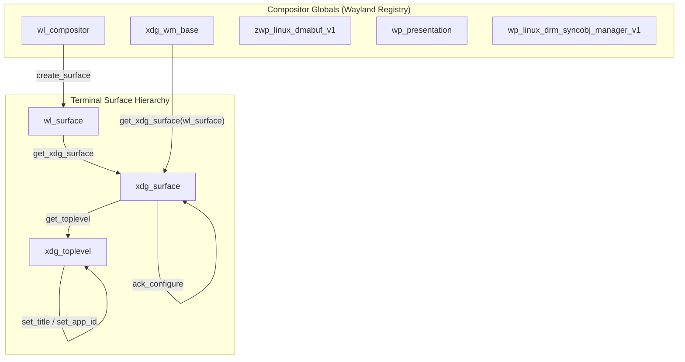
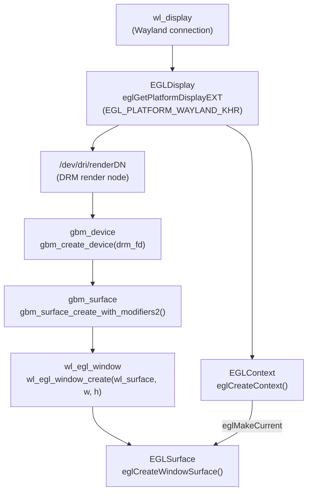
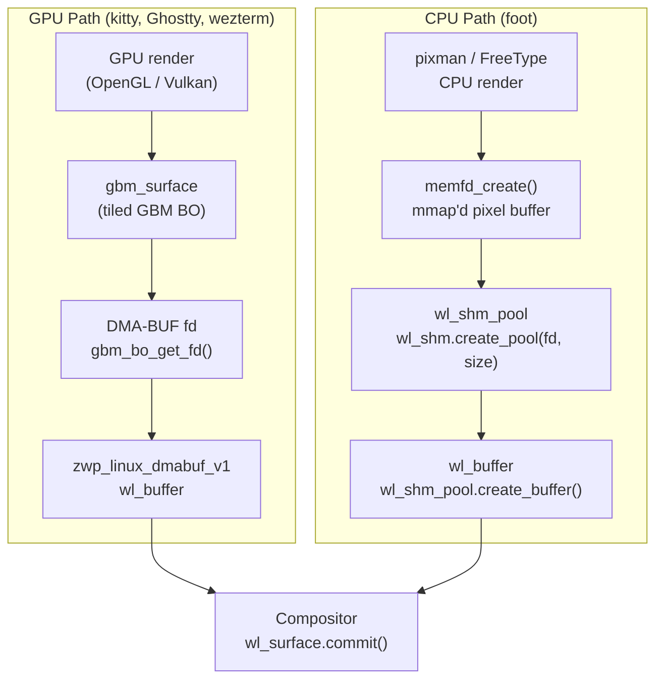

# Chapter 45: Terminal Integration with the Compositor Stack

> **Part**: Part XII — Terminal Graphics
> **Audiences**: Systems and driver developers who want to trace pixel data from a terminal VT escape sequence through to physical display scanout; terminal developers integrating with Wayland.
> **Status**: First draft — 2026-06-12

---

## Table of Contents

1. [The Terminal as a Wayland Client](#1-the-terminal-as-a-wayland-client)
2. [EGL Context Acquisition and GBM Buffer Allocation](#2-egl-context-acquisition-and-gbm-buffer-allocation)
3. [DRM Format Modifier Negotiation](#3-drm-format-modifier-negotiation)
4. [GPU Rendering and DMA-BUF Submission](#4-gpu-rendering-and-dma-buf-submission)
5. [CPU-Path Terminals and wl_shm](#5-cpu-path-terminals-and-wl_shm)
6. [Explicit Synchronisation: wp_linux_drm_syncobj](#6-explicit-synchronisation-wp_linux_drm_syncobj)
7. [Compositor-Side Processing](#7-compositor-side-processing)
8. [KMS Atomic Commit: Terminal Pixels to the Display](#8-kms-atomic-commit-terminal-pixels-to-the-display)
9. [Damage Tracking: Buffer Coordinates and Dirty-Cell Bitfields](#9-damage-tracking-buffer-coordinates-and-dirty-cell-bitfields)
10. [VSync and Presentation Timing: wp_presentation_time_v1](#10-vsync-and-presentation-timing-wp_presentation_time_v1)
11. [Fractional Scaling: wp_fractional_scale_v1](#11-fractional-scaling-wp_fractional_scale_v1)
12. [Multiplexer APC Passthrough for Kitty Graphics](#12-multiplexer-apc-passthrough-for-kitty-graphics)
13. [GPU Atlas Management in GPU-Rendered Terminals](#13-gpu-atlas-management-in-gpu-rendered-terminals)
14. [Colour Space, HDR, and Terminal Graphics](#14-colour-space-hdr-and-terminal-graphics)
15. [Security Model](#15-security-model)
- [Integrations](#integrations)
- [References](#references)

---

## Overview

A GPU-accelerated terminal emulator is, from the perspective of the **Wayland** compositor, an ordinary client: it allocates a **wl_surface**, renders into GPU memory, submits that memory as a **DMA-BUF**-backed **wl_buffer**, and waits for release. The machinery it relies upon — **GBM** surface allocation, **EGL** context setup, **DRM** format modifier negotiation, explicit synchronisation timelines via **wp_linux_drm_syncobj_manager_v1**, **KMS** plane promotion, and presentation-feedback timing via **wp_presentation** — is the same machinery used by any other **Wayland** client, from a game engine to a **Vulkan** widget toolkit. What makes terminal integration interesting is the combination of constraints that distinguish terminals from those other clients: they are text-heavy with small, irregular damage rectangles; they host decoded pixel images from **Sixel**, **Kitty**, and **iTerm2** protocols that arrive asynchronously and have no natural GPU lifetime; they must behave correctly under sandboxing with restricted device access; and they are often the first client visible on screen after the compositor starts, making latency and reliability paramount.

This chapter traces the full path of a frame of terminal output from the GPU render call down to the display engine's scanout, grounding each protocol and kernel mechanism in the concrete implementation choices that modern terminals make. The first four sections cover the Wayland client lifecycle and GPU buffer submission path. Section 5 covers the CPU-path alternative used by foot. Section 6 addresses explicit synchronisation. Sections 7–8 cover the compositor and KMS sides. Sections 9–13 expand into the five topics most critical for practical terminal implementation: precise damage reporting, presentation timing for smooth scrolling, fractional HiDPI scaling, Kitty graphics multiplexer passthrough, and GPU glyph atlas management. Sections 14–15 address colour space and the security model.

The reader is assumed to have completed Parts I–VI: the **DRM** subsystem and **KMS** pipeline (Chapters 1–2), **GBM** and **DMA-BUF** memory management (Chapter 4), **Wayland** protocol fundamentals and the **linux-dmabuf** and explicit-sync extensions (Chapter 20), compositor internals (Chapters 21–22), and terminal GPU rendering architectures (Chapter 44). This chapter does not re-explain those foundations; it shows how they compose.

---

## 1. The Terminal as a Wayland Client

At the Wayland protocol level, a GPU-accelerated terminal is indistinguishable from any other `wl_surface` client. The compositor's registry delivers the same set of globals — `wl_compositor`, `xdg_wm_base`, `zwp_linux_dmabuf_v1`, `wp_presentation`, and (on recent compositors) `wp_linux_drm_syncobj_manager_v1` — regardless of whether the connecting client is a game, a browser, or a terminal emulator. The terminal binds these globals exactly as any other application would.

Window management for a terminal window follows the xdg-shell protocol. After creating a `wl_surface` with `wl_compositor.create_surface`, the terminal wraps it in an `xdg_surface` via `xdg_wm_base.get_xdg_surface`, then assigns the `xdg_toplevel` role with `xdg_surface.get_toplevel`. The `xdg_toplevel` interface carries the window title (`xdg_toplevel.set_title`) and application identifier (`xdg_toplevel.set_app_id`), both of which compositors use for task-switching UI, icon association, and window-rule matching. The `set_app_id` value for well-known terminals — `foot`, `kitty`, `ghostty`, `wezterm` — follows the reverse-DNS convention (`org.codeberg.dnkl.foot`, `net.kovidgoyal.kitty`, and so on) and compositors use it to apply per-application placement rules [Source](https://wayland.app/protocols/xdg-shell).

The configure–resize cycle is the mechanism by which the compositor instructs the terminal to change its surface dimensions. The compositor emits `xdg_surface.configure` (containing `xdg_toplevel.configure` with the new width and height), to which the terminal must respond with `xdg_surface.ack_configure` and then commit a buffer at the new size before the next configure is sent. This is not merely advisory — committing a buffer whose dimensions do not match the acknowledged configuration is a protocol error. For GPU terminals this configure event triggers a full buffer reallocation: the existing GBM surface and EGL window must be destroyed and recreated at the new dimensions, because GBM surfaces are fixed-size objects. The sequence is `wl_egl_window_resize()` for EGL-managed windows or an explicit `gbm_surface_create_with_modifiers2()` call for terminals that manage their GBM device directly [Source](https://cgit.freedesktop.org/mesa/mesa/commit/?id=268e12c605341eedfda22bdbbf623aa123a290e8).



Terminals that support multiple windows — the kitty tabbed-window model and foot's server-daemon architecture — share a single Wayland connection and a single EGL display across all their windows. Each window gets its own `wl_surface` and its own `xdg_toplevel`, but the `EGLDisplay` obtained from `eglGetPlatformDisplayEXT(EGL_PLATFORM_WAYLAND_KHR, wl_display, ...)` is initialised once and reused. Per-window rendering state lives in individual `EGLContext` and `EGLSurface` objects, which are per-thread or multiplexed with `eglMakeCurrent`. This architecture reduces the overhead of DRM node enumeration and driver initialisation to a one-time cost at startup rather than paying it for every new tab.

---

## 2. EGL Context Acquisition and GBM Buffer Allocation

The first substantive interaction with the GPU stack occurs when the terminal calls `eglGetPlatformDisplayEXT(EGL_PLATFORM_WAYLAND_KHR, wl_display, attribs)`. This is the Mesa EGL entry point for Wayland clients [Source](https://gitlab.freedesktop.org/mesa/mesa/-/blob/main/src/egl/drivers/dri2/platform_wayland.c). Internally, Mesa's Wayland platform code enumerates the available EGL devices — those are DRM devices exposed via the `EGL_EXT_device_enumeration` extension — selects one based on the Wayland compositor's advertised DRM device node (which the compositor communicates via the `wl_drm` or `zwp_linux_dmabuf_v1` protocol), and opens the corresponding `/dev/dri/renderDN` node. The render node carries no DRM master privilege (see Chapter 1) and is accessible without root. Mesa opens it, initialises the driver stack, and returns an opaque `EGLDisplay` handle.

EGL configuration selection follows the standard `eglChooseConfig` path with constraints appropriate for a terminal window. The required attributes are `EGL_SURFACE_TYPE = EGL_WINDOW_BIT`, selecting a renderable window surface rather than a pbuffer or pixmap, and `EGL_RENDERABLE_TYPE` set to `EGL_OPENGL_BIT` for OpenGL contexts or `EGL_OPENGL_ES3_BIT` for ES3. Terminals that support a transparent background (the "background opacity" or "blur behind" feature common to kitty and Alacritty with compositor support) must request an alpha channel: `EGL_ALPHA_SIZE = 8`. This is not cosmetic — an EGL config without alpha cannot back a `wl_surface` that the compositor is expected to blend against the wallpaper. Without it, the terminal's background will be opaque regardless of the configured opacity value. Colour depth selection follows from the display's preferred format; most terminals request `EGL_RED_SIZE = 8`, `EGL_GREEN_SIZE = 8`, `EGL_BLUE_SIZE = 8` for 24-bit colour.

For terminals that use the Mesa EGL path directly (kitty, Ghostty, most GPU-accelerated terminals), the Wayland-specific EGL window object bridges the `EGLSurface` API to the Wayland protocol. The terminal calls `wl_egl_window_create(wl_surface, width, height)` to obtain a `wl_egl_window` handle, and then `eglCreateWindowSurface(display, config, wl_egl_window, NULL)` to create the surface. Mesa's platform_wayland.c implementation allocates a GBM surface internally at this point: it calls `gbm_surface_create_with_modifiers2()` with the width, height, format (typically `GBM_FORMAT_ARGB8888` or `GBM_FORMAT_XRGB8888`), the modifier list negotiated from `zwp_linux_dmabuf_v1`, and usage flags including `GBM_BO_USE_RENDERING | GBM_BO_USE_SCANOUT`. The GBM device was opened from the DRM render node selected during display initialisation. The terminal does not see any of this — it is encapsulated inside Mesa [Source](https://gitlab.freedesktop.org/mesa/mesa/-/blob/main/src/egl/drivers/dri2/platform_wayland.c).

Some terminals bypass the Mesa EGL surface management and drive the GBM device themselves. The foot terminal exemplifies the CPU-path approach (covered in Section 5), but GPU terminals wishing explicit control over modifier selection may also take a direct GBM path. In that case the terminal opens a DRM render node directly — typically by finding the device node advertised in the compositor's `zwp_linux_dmabuf_v1` feedback, which is the compositor's preferred render device — calls `gbm_create_device(drm_fd)`, and then `gbm_surface_create_with_modifiers2(gbm_dev, width, height, format, modifiers, count, GBM_BO_USE_RENDERING | GBM_BO_USE_SCANOUT)`. The modifier list comes from the compositor's dmabuf feedback, discussed in the next section. The resulting `gbm_surface` is backed by a pool of GBM buffer objects that Mesa or another OpenGL implementation can render into.



Double-buffering — maintaining two GBM buffer objects in flight — is the standard configuration for terminal rendering. After `eglSwapBuffers`, Mesa dequeues a buffer from the GBM surface's pool and queues its content for submission to the compositor. The previously displayed buffer is held by the compositor until it emits a `wl_buffer.release` event, which signals that the compositor has finished reading and the terminal may reuse the buffer. The terminal's render loop must not attempt to render into a buffer that is still held by the compositor; failing to respect `wl_buffer.release` events leads to visible tearing or protocol errors. Some terminals opt for a three-buffer configuration — three GBM BOs and three `wl_buffer` handles — which allows rendering to begin on the third buffer while the compositor still holds the first two, reducing frame latency on compositors that hold buffers across multiple vertical blank intervals.

---

## 3. DRM Format Modifier Negotiation

Format modifiers are 64-bit values that encode the tiling layout, compression scheme, and auxiliary metadata structure of a GPU buffer. The Linux kernel defines them in `include/uapi/drm/drm_fourcc.h` and vendor-specific headers. A buffer's modifier is not a rendering detail — it is a hardware constraint that determines which physical memory layout the GPU's texture sampling units and the display engine's scan-out circuitry can read. A buffer allocated with the wrong modifier for a given display plane must be copied or reformatted by the compositor before it can reach the display, defeating the purpose of DMA-BUF buffer sharing entirely.

The modifiers most relevant to terminal rendering are:

- `DRM_FORMAT_MOD_LINEAR` (`0`): row-major layout; universally supported for rendering and sampling but not zero-copy-scanout on modern discrete GPUs with tiled memory controllers.
- `I915_FORMAT_MOD_X_TILED` and `I915_FORMAT_MOD_Y_TILED`: Intel legacy tile formats; Y-tiled is the native scanout format for Intel Gen 9–12 display engines and can be promoted to a KMS plane.
- `I915_FORMAT_MOD_4_TILED`: Intel Xe/Alchemist tile 4 format used by the DG2 and later iGPU display engines.
- `AMD_FMT_MOD_DCC` variants: AMD's Display Compression (DCC) tile formats; the display engine on RDNA2 and later hardware can scan out DCC-compressed buffers directly, reducing memory bandwidth.
- `DRM_FORMAT_MOD_NVIDIA_BLOCK_LINEAR_2D(...)`: NVIDIA block-linear format family; the display engine on Turing and later hardware can scan out these buffers directly when the block height exponent matches what the display hardware requires.

The significance for terminals is direct: if the terminal's GBM surface is allocated with a modifier that the compositor's KMS backend can assign to a primary or overlay plane, the compositor can perform a zero-copy plane promotion — handing the terminal's buffer directly to the display engine without any intermediate GPU render pass. If the modifier is incompatible, the compositor must sample the terminal's buffer as a texture and re-render it into its own output framebuffer. The performance difference is significant: plane promotion eliminates a full GPU render pass that would otherwise consume GPU memory bandwidth and introduce latency.

The negotiation mechanism is the `zwp_linux_dmabuf_v1` protocol extension. In its older versions (up to version 3), the compositor emits `zwp_linux_dmabuf_v1.modifier` events at bind time, one event per supported (format, modifier) pair. The terminal collects these, intersects them with the modifiers its GBM/EGL stack supports, and uses the intersection when creating its GBM surface. Version 4 of the protocol introduced the feedback mechanism via `zwp_linux_dmabuf_feedback_v1`, which supersedes the per-modifier event flood [Source](https://gitlab.freedesktop.org/wayland/wayland-protocols/-/blob/main/unstable/linux-dmabuf/linux-dmabuf-unstable-v1.xml). The feedback object provides a structured view of the compositor's DRM device capabilities organised into tranches. Each tranche names a target device (by DRM device node major/minor), a set of (format, modifier) pairs supported by that device for the surface's intended use, and a set of flags indicating whether buffers in that tranche can be promoted to scan-out.

The `zwp_linux_dmabuf_v1` listener setup in C follows a pattern shared by virtually all Wayland clients that use DMA-BUF. The listener handles the format table (delivered as a shared memory file descriptor) and per-tranche events:

```c
/* zwp_linux_dmabuf_feedback_v1 listener — typical terminal client pattern.
 * Based on the pattern used in weston/clients/simple-dmabuf-feedback.c
 * and Mesa src/egl/drivers/dri2/platform_wayland.c */

static void dmabuf_feedback_format_table(
    void *data,
    struct zwp_linux_dmabuf_feedback_v1 *feedback,
    int32_t fd,
    uint32_t size)
{
    struct terminal_dmabuf_state *state = data;
    /* Map the shared format table into our address space */
    state->format_table = mmap(NULL, size, PROT_READ, MAP_PRIVATE, fd, 0);
    state->format_table_count = size / sizeof(struct drm_format_modifier_pair);
    close(fd);
}

static void dmabuf_feedback_tranche_target_device(
    void *data,
    struct zwp_linux_dmabuf_feedback_v1 *feedback,
    struct wl_array *device)
{
    struct terminal_dmabuf_state *state = data;
    /* Extract the dev_t of the target DRM device for this tranche */
    memcpy(&state->current_tranche_device, device->data, sizeof(dev_t));
}

static void dmabuf_feedback_tranche_flags(
    void *data,
    struct zwp_linux_dmabuf_feedback_v1 *feedback,
    uint32_t flags)
{
    struct terminal_dmabuf_state *state = data;
    /* ZWP_LINUX_DMABUF_FEEDBACK_V1_TRANCHE_FLAGS_SCANOUT = 1 */
    state->current_tranche_scanout =
        (flags & ZWP_LINUX_DMABUF_FEEDBACK_V1_TRANCHE_FLAGS_SCANOUT) != 0;
}

static void dmabuf_feedback_tranche_formats(
    void *data,
    struct zwp_linux_dmabuf_feedback_v1 *feedback,
    struct wl_array *indices)
{
    struct terminal_dmabuf_state *state = data;
    uint16_t *idx;
    wl_array_for_each(idx, indices) {
        /* Each index is an offset into the shared format table */
        struct drm_format_modifier_pair *pair =
            &state->format_table[*idx];
        terminal_add_modifier(state,
            pair->format, pair->modifier,
            state->current_tranche_scanout);
    }
}

static void dmabuf_feedback_tranche_done(
    void *data,
    struct zwp_linux_dmabuf_feedback_v1 *feedback)
{
    /* Tranche complete; reset per-tranche state */
    struct terminal_dmabuf_state *state = data;
    state->current_tranche_scanout = false;
}

static const struct zwp_linux_dmabuf_feedback_v1_listener
    dmabuf_feedback_listener = {
    .format_table       = dmabuf_feedback_format_table,
    .main_device        = dmabuf_feedback_main_device,   /* omitted for brevity */
    .tranche_target_device = dmabuf_feedback_tranche_target_device,
    .tranche_flags      = dmabuf_feedback_tranche_flags,
    .tranche_formats    = dmabuf_feedback_tranche_formats,
    .tranche_done       = dmabuf_feedback_tranche_done,
    .done               = dmabuf_feedback_done,           /* omitted for brevity */
};
```

The `format_table` is a shared memory table delivered earlier in the feedback sequence; the indices in the `tranche_formats` event are offsets into that table. This design sends the bulk data once via shared memory and uses compact index arrays for the per-surface customisation, avoiding the O(N) event storm of the older per-modifier approach [Source](https://wayland.app/protocols/linux-dmabuf-v1).

Terminals must handle the case where the intersection of compositor-supported and render-device-supported modifiers is empty — for instance, when the terminal is running on a render device different from the compositor's display device. In that situation the correct fallback is `DRM_FORMAT_MOD_LINEAR`, which every compositor and every DRM driver supports for buffer import, even if it does not enable zero-copy scan-out. The terminal allocates a linear buffer, renders into it, and accepts that the compositor will have to copy it during composition.

---

## 4. GPU Rendering and DMA-BUF Submission

With an EGL context active and a GBM surface allocated with appropriate modifiers, the terminal's per-frame render loop follows a fixed sequence. The loop begins by calling `eglMakeCurrent(display, surface, surface, context)` to bind the render target, followed by the GPU draw calls that constitute the terminal frame: glyph quad submission, image texture compositing (for Kitty or Sixel decoded images, as covered in Chapter 44), background rectangle fills, and cursor rendering. These are ordinary OpenGL or Vulkan commands and have no Wayland-specific content at this stage.

Once the draw commands are complete, `eglSwapBuffers(display, surface)` triggers Mesa's Wayland WSI to post the frame. Inside Mesa's `platform_wayland.c`, `dri2_swap_buffers_with_damage_ext` calls `gbm_surface_lock_front_buffer()` to obtain the GBM buffer object that was just rendered into, then calls `gbm_bo_get_fd()` (or the multi-plane variant `gbm_bo_get_fd_for_plane()`) to export the buffer as a DMA-BUF file descriptor [Source](https://gitlab.freedesktop.org/mesa/mesa/-/blob/main/src/egl/drivers/dri2/platform_wayland.c). This DMA-BUF fd represents the GPU buffer — it carries the rendered pixel data in GPU-native tiling — and is the object that will be sent to the compositor over the Wayland socket.

Mesa then builds a `zwp_linux_dmabuf_v1` buffer submission. It calls `zwp_linux_dmabuf_v1.create_params` to obtain a `zwp_linux_buffer_params_v1` object, then `zwp_linux_buffer_params_v1.add(fd, plane_index, offset, stride, modifier_hi, modifier_lo)` for each plane of the buffer. For single-plane formats like `ARGB8888` there is only one `add` call. For multi-plane YUV formats (not typical for terminal output but possible for hardware-decoded images in Kitty protocol) there would be multiple planes. Finally, `zwp_linux_buffer_params_v1.create_immed(width, height, format, flags)` produces a `wl_buffer` handle synchronously [Source](https://gitlab.freedesktop.org/wayland/wayland-protocols/-/blob/main/unstable/linux-dmabuf/linux-dmabuf-unstable-v1.xml). This `wl_buffer` is the compositor-visible representation of the terminal's current frame.

The surface commit sequence follows immediately. The terminal calls `wl_surface.attach(wl_buffer, 0, 0)` to associate the new buffer with the surface, then `wl_surface.damage_buffer(x, y, w, h)` for each dirty rectangle. Accurate damage reporting is covered in depth in Section 9. The commit is finalised with `wl_surface.commit()`, which atomically makes the new buffer current, applies the damage, and advances the surface's pending state to active [Source](https://wayland-book.com/).

```mermaid
graph LR
    GPU["GPU draw calls\n(OpenGL / Vulkan)"]
    SWAP["eglSwapBuffers()"]
    LOCK["gbm_surface_lock_front_buffer()"]
    FDEXP["gbm_bo_get_fd()\n(DMA-BUF fd)"]
    PARAMS["zwp_linux_buffer_params_v1\n.add(fd, plane, offset, stride, modifier)"]
    WLBuf["wl_buffer\n.create_immed(w, h, format)"]
    ATTACH["wl_surface.attach(wl_buffer)"]
    DAMAGE["wl_surface.damage_buffer(x, y, w, h)"]
    COMMIT["wl_surface.commit()"]

    GPU --> SWAP
    SWAP --> LOCK
    LOCK --> FDEXP
    FDEXP --> PARAMS
    PARAMS --> WLBuf
    WLBuf --> ATTACH
    ATTACH --> DAMAGE
    DAMAGE --> COMMIT
```



On the compositor side, the commit event triggers buffer import. The compositor receives the `zwp_linux_dmabuf_v1` parameters, extracts the DMA-BUF fd, and imports the buffer into its own GPU context. Under Mesa-based compositors (wlroots, Mutter using EGL), this import is done via `eglCreateImageKHR(display, EGL_NO_CONTEXT, EGL_LINUX_DMA_BUF_EXT, NULL, attribs)` where the attribute list encodes the fd, format, modifier, width, height, stride, and offset. Under Vulkan-based compositors (KWin with KWin-VK backend, Mutter on GNOME 47+), the import path uses `VkImportMemoryFdInfoKHR` with memory property flags set to allow external memory access, paired with a `VkImage` created with `VK_EXTERNAL_MEMORY_HANDLE_TYPE_DMA_BUF_BIT_EXT`. In both cases, the kernel's DMA-BUF framework manages the reference counting: the compositor's import increments the reference count on the underlying GEM object; the compositor releases it when it emits `wl_buffer.release`.

---

## 5. CPU-Path Terminals and wl_shm

Not every terminal uses GPU rendering. foot, the Wayland-native terminal authored by Daniel Eklöf, uses CPU-side FreeType and pixman rendering, submitting its frames over the `wl_shm` shared memory protocol rather than DMA-BUF. This path is architecturally simpler and intentionally so: foot trades GPU performance for predictability, lower memory consumption, and freedom from Mesa dependencies, making it an ideal choice for embedded systems, SSH-forwarded sessions over UNIX sockets, and minimal container environments.

The `wl_shm` path begins with `memfd_create("foot-render", MFD_CLOEXEC | MFD_ALLOW_SEALING)`, which creates an anonymous file in the kernel's memory filesystem. The file is sized to hold the pixel buffer: `ftruncate(fd, width * height * 4)`. The terminal then calls `mmap(NULL, size, PROT_READ | PROT_WRITE, MAP_SHARED, fd, 0)` to obtain a CPU-writable pointer into that memory, draws the frame with pixman (filling glyph bitmaps, background rectangles, and any decoded Sixel image data), and then submits the buffer to the compositor via the Wayland protocol. The protocol calls are `wl_shm.create_pool(fd, size)` to register the memfd as a shared memory pool, and `wl_shm_pool.create_buffer(offset, width, height, stride, format)` to create a `wl_buffer` pointing at the pixel data [Source](https://wayland-book.com/). The format is typically `WL_SHM_FORMAT_ARGB8888` or `WL_SHM_FORMAT_XRGB8888`; stride is `width * 4`.

foot's double-buffer implementation maintains two `wl_shm_pool` buffers — allocated from the same underlying memfd by varying the offset parameter — so that one buffer can be in-flight with the compositor (holding the previous frame) while the other is being rendered into (the current frame). This is the canonical wl_shm double-buffering approach described in the Wayland Book [Source](https://wayland-book.com/surfaces/shared-memory.html). For a 1920×1080 window with 4 bytes per pixel and two buffers, the memfd is sized at `1920 * 1080 * 4 * 2 = 16,588,800` bytes. foot additionally tracks damage at cell granularity and passes the dirty rectangle list to `wl_surface.damage_buffer`, so the compositor only uploads the changed portion of the pixel buffer rather than the entire surface.



The compositor imports this buffer fundamentally differently from a DMA-BUF buffer. Since there is no GPU memory backing the `wl_shm` buffer, the compositor must perform a CPU-to-GPU texture upload before it can composite the terminal surface. Under an EGL-based compositor, this upload is `glTexSubImage2D(GL_TEXTURE_2D, 0, x, y, w, h, GL_BGRA_EXT, GL_UNSIGNED_BYTE, pixels)` for the damaged regions; under Vulkan, `vkCmdCopyBufferToImage` with a staging buffer. This upload consumes CPU memory bandwidth and GPU command-stream time.

An important recent development changes this picture. The **udmabuf** Linux driver (`drivers/dma-buf/udmabuf.c`) can wrap a `memfd`-allocated region in a DMA-BUF file descriptor, making it accessible to the GPU without an intermediate copy. KDE's KWin compositor began using this mechanism in 2026 to avoid blocking the main thread on `glTexSubImage2D` calls: instead of uploading pixels synchronously, KWin uses udmabuf to import the shared memory buffer directly as a DMA-BUF and instructs the GPU to read from the mapped pages. This reduced KWin's CPU usage during scrolling from 80–90% of one core down to approximately 20% [Source](https://zamundaaa.github.io/wayland/2026/05/06/making-wl-shm-fast.html). The udmabuf approach requires buffers to be page-aligned and stride to satisfy GPU driver requirements, adding roughly 1.6% memory overhead for typical HiDPI buffer sizes. Terminal emulators that use `wl_shm` benefit from this compositor-side optimisation transparently, without any change to their own code.

Because the pixel data lives in shared memory rather than GPU memory, zero-copy KMS plane promotion is structurally impossible on the `wl_shm` path. The display engine cannot read from a CPU-allocated anonymous file; it requires a buffer in GPU-accessible memory with a DRM-compatible format modifier. The compositor always performs a full composition of wl_shm surfaces into its output framebuffer. For foot this is an acceptable trade-off given its use cases. It is worth noting that foot does support DMA-BUF output in certain configurations via libdrm-backed pixel buffers, but its primary and most-tested path remains wl_shm.

The appropriate contexts for the wl_shm path extend beyond foot. Any terminal running inside an SSH-forwarded Wayland socket (via `wayland-proxy` or `ssh -W` with a Wayland UNIX socket forward) is effectively running on a remote machine without GPU access; wl_shm is the only feasible path. Terminals built for embedded targets with strict dependency constraints, or terminals designed to run inside containers with no `/dev/dri` access, similarly benefit from the wl_shm path's elimination of the Mesa dependency chain.

---

## 6. Explicit Synchronisation: wp_linux_drm_syncobj

GPU command buffers are asynchronous: when `eglSwapBuffers` returns on the CPU, the GPU may still be executing the render commands that produce the terminal's frame. A naïve submission model would race — the compositor might import and begin scanning out a buffer whose pixels are not yet finalised by the GPU. The solution is synchronisation fence signalling, and the history of how Linux arrived at the current explicit-sync protocol is directly relevant to terminal developers.

The traditional approach on the Linux DMA-BUF stack is implicit fencing: the kernel's DMA-BUF framework attaches a `dma_fence` to every buffer object, and drivers that read the buffer wait on that fence automatically. Mesa on AMD and Intel hardware attaches the completion fence to the GBM BO after `eglSwapBuffers`; when the compositor imports the DMA-BUF and passes it to its own rendering pipeline, the GPU's dependency tracking ensures that the compositor's reads do not begin until the terminal's writes are complete. This implicit model works transparently and requires no application-level fence management.

The problem with implicit fencing became acute with NVIDIA hardware under the proprietary driver architecture. NVIDIA's display stack routes command submission through the GSP (GPU System Processor) firmware, which manages the GPU's execution queue independently of the kernel's DRM fence infrastructure. Because the GSP firmware does not expose DRM sync object timelines, the kernel has no mechanism to attach an implicit fence to a buffer submitted through the NVIDIA driver; the compositor cannot determine whether the GPU has finished writing a buffer by inspecting its DMA-BUF fence state. The result on NVIDIA with Wayland was visible graphical corruption — the compositor would begin compositing partially-written buffers — that affected every Wayland client, including terminals, on NVIDIA hardware for years [Source](https://news.itsfoss.com/explicit-sync-wayland/).

The resolution was to move fence signalling out of the kernel's implicit DMA-BUF mechanism and into an explicit Wayland protocol: `wp_linux_drm_syncobj_manager_v1`, the global interface of the `linux-drm-syncobj-v1` protocol introduced in wayland-protocols 1.34 [Source](https://gitlab.freedesktop.org/wayland/wayland-protocols/-/blob/main/staging/linux-drm-syncobj/linux-drm-syncobj-v1.xml). NVIDIA shipped explicit sync support in their 555.42 driver series in May 2024, and the major compositor ecosystems landed it concurrently: GNOME's Mutter gained it in GNOME 46.1, KDE Plasma's KWin in Plasma 6.1, and wlroots landed support that was shipped in wlroots 0.19.0 and downstream compositors including Sway 1.11 [Source](https://www.gamingonlinux.com/2024/05/nvidia-555-42-02-beta-driver-out-bringing-wayland-explicit-sync/). Mesa 24.1 added the client-side implementation. As of 2026, explicit sync is the standard synchronisation mechanism for Wayland clients on NVIDIA hardware, and is supported (though not strictly required) on AMD and Intel hardware where implicit fencing also works.

The kernel-side building block is the DRM synchronisation object, `drm_syncobj`, created via `DRM_IOCTL_SYNCOBJ_CREATE`. A timeline syncobj augments this with a monotonically increasing 64-bit sequence counter: each GPU submission can be associated with a timeline point, and the syncobj signals when that point is reached. The terminal's render loop submits its GPU commands with an associated timeline point N, and the Wayland commit carries that point as the acquire fence. The protocol interaction looks like this:

```c
/* Terminal-side explicit sync setup — schematic based on
 * wp_linux_drm_syncobj protocol usage in Mesa/wlroots */

/* Create a DRM timeline syncobj for this surface */
uint32_t syncobj_handle;
struct drm_syncobj_create create = { .flags = DRM_SYNCOBJ_CREATE_SIGNALED };
ioctl(drm_fd, DRM_IOCTL_SYNCOBJ_CREATE, &create);
syncobj_handle = create.handle;

/* Export the syncobj as a file descriptor for Wayland import */
struct drm_syncobj_handle export = {
    .handle = syncobj_handle,
    .flags  = DRM_SYNCOBJ_HANDLE_TO_FD_FLAGS_EXPORT_SYNC_FILE,
    .fd     = -1,
};
ioctl(drm_fd, DRM_IOCTL_SYNCOBJ_HANDLE_TO_FD, &export);

/* Import the timeline into Wayland */
wp_linux_drm_syncobj_manager_v1_import_timeline(syncobj_mgr,
    wl_display, drm_fd);  /* → wp_linux_drm_syncobj_timeline_v1 */

/* Before each commit, set acquire and release points */
wp_linux_drm_syncobj_surface_v1_set_acquire_point(
    syncobj_surface, timeline, acquire_point);
wp_linux_drm_syncobj_surface_v1_set_release_point(
    syncobj_surface, timeline, release_point);
wl_surface_commit(surface);
```

The acquire point tells the compositor at which timeline value the GPU will have finished writing the buffer; the compositor must wait for this point before reading the buffer in its own pipeline. The release point is the converse: the compositor signals this timeline value when it has finished reading the buffer, at which time the terminal may safely reuse the buffer for the next frame [Source](https://gitlab.freedesktop.org/wayland/wayland-protocols/-/blob/main/staging/linux-drm-syncobj/linux-drm-syncobj-v1.xml). The protocol covers both directions of ownership transfer, eliminating the TOCTOU race that plagued implicit fencing on NVIDIA. On AMD and Intel hardware the same protocol works with the kernel's DRM fence infrastructure, and implementations may choose to use it for consistency even where implicit fencing would suffice.

---

## 7. Compositor-Side Processing

When a terminal commit arrives at the compositor, the compositor does not immediately act on it. Wayland's commit model is double-buffered: the commit atomically moves the pending state (new buffer, new damage, new sync points) into the surface's current state, which the compositor will consume at the next composition cycle. The compositor accumulates pending commits from all clients, merges their damage regions, and makes one decision per output refresh cycle about what to draw.

Damage merging is the first operation in the compositor's per-frame path. The compositor maintains an output-level accumulated damage region, typically represented as a pixman region or a list of rectangles. Each committed surface contributes its per-surface damage (the rectangles the terminal reported via `wl_surface.damage_buffer`), transformed from surface coordinates to output coordinates by the surface's output transform and scale. For a terminal that reported damage only on its bottom three lines of text, the output damage region will cover only that strip of the terminal's screen-space footprint; the rest of the output is not re-rendered.

Buffer import, for DMA-BUF-backed terminal buffers, is performed once per unique `wl_buffer` handle. The compositor creates an EGL image or Vulkan external image when it first sees a buffer handle, and reuses that image on subsequent frames if the same buffer is re-submitted. Given that most terminals operate in double-buffer mode with two rotating buffer handles, the compositor imports at most two images per terminal window and simply re-binds the appropriate one each frame. The format modifier encoded in the DMA-BUF attributes tells the compositor's shader or Vulkan image layout how the tiled memory is laid out; the GPU hardware performs any detiling transparently during texture sampling.

Plane promotion — direct assignment of the terminal's buffer to a KMS plane without compositor re-rendering — requires a conjunction of conditions that are moderately restrictive in practice. The terminal's buffer must carry a modifier that is compatible with the KMS plane's capabilities (advertised by the `IN_FORMATS` plane property, which lists all (format, modifier) pairs the plane accepts for scan-out). The terminal's surface must not have any compositor effects applied to it: no blur, no rounding, no transparency composite, no colour management transform beyond the identity. The surface must cover exactly one output and its geometry must align with the plane. Finally, the compositor's backend must implement plane promotion; wlroots' DRM backend does so through its atomic plane assignment algorithm, KWin does so for primary planes in certain configurations, and Mutter has partial support as of GNOME 47 [Source](https://gitlab.freedesktop.org/wlroots/wlroots/-/blob/master/backend/drm/).

When plane promotion succeeds, the terminal's GBM buffer object is assigned directly as the `FB_ID` of a KMS plane. The compositor constructs a DRM framebuffer object with `DRM_IOCTL_MODE_ADDFB2` (carrying the format, modifier, and per-plane pitches), assigns it to the plane's `FB_ID` property, and includes it in the atomic commit. From the display engine's perspective, the terminal is a first-class scan-out client. Compositor compositing overhead for that surface drops to zero.

When plane promotion is not possible — due to a modifier mismatch, applied compositor effects, or a compositor that simply does not implement plane assignment — the fallback path is straightforward: the compositor samples the terminal's buffer as a GPU texture in its own render pass. The terminal's DMA-BUF-backed `EGLImage` is bound as a `GL_TEXTURE_2D` (or a `VkImage` in a Vulkan command buffer) and the compositor renders a textured quad covering the terminal's screen-space footprint. The pixel data still travels from the terminal's GPU memory to the display without a CPU copy, but it passes through an additional GPU render pass.

---

## 8. KMS Atomic Commit: Terminal Pixels to the Display

The final stage in the frame path is the KMS atomic commit, which moves the compositor's output framebuffer (or the directly-promoted terminal buffer) from GPU memory to the display engine's scan-out engine. This is the domain of Chapter 2, so this section focuses on the properties and timing relevant to terminal frame delivery rather than the atomic commit mechanism itself.

The compositor assembles a property set for each plane involved in the frame, using `drmModeAtomicAddProperty` from libdrm to build the request [Source](https://gitlab.freedesktop.org/mesa/drm/-/blob/main/xf86drmMode.c). For each plane the critical properties are:

- `FB_ID`: the DRM framebuffer object whose pixel data the plane will scan out.
- `CRTC_ID`: the display pipeline this plane is attached to.
- `SRC_X`, `SRC_Y`, `SRC_W`, `SRC_H`: the source crop within the framebuffer, expressed as 16.16 fixed-point values. For a full-screen terminal with no cropping these will be `(0, 0, width << 16, height << 16)`.
- `CRTC_X`, `CRTC_Y`, `CRTC_W`, `CRTC_H`: the destination rectangle on the CRTC output surface, in integer pixels.
- `IN_FENCE_FD`: an optional sync file file descriptor for non-blocking atomic commits that carry explicit fences. When set, the display engine waits for the fence to signal before beginning scan-out of the new framebuffer, avoiding visual corruption during concurrent GPU access.

The commit is submitted with `drmModeAtomicCommit(fd, req, DRM_MODE_ATOMIC_NONBLOCK | DRM_MODE_PAGE_FLIP_EVENT, data)`. The `NONBLOCK` flag allows the compositor to return immediately and begin preparing the next frame rather than blocking until the next vertical blank [Source](https://gitlab.freedesktop.org/mesa/drm/-/blob/main/xf86drmMode.c). The `PAGE_FLIP_EVENT` flag requests a `DRM_EVENT_FLIP_COMPLETE` notification, which the compositor receives via `drmHandleEvent` when the display engine has latched the new framebuffer at vertical blank.

At the vertical blank interval, the display engine begins reading the plane's framebuffer. The pixel data travels from GPU memory (or system memory for linear framebuffers on integrated GPUs) through the display pipeline: plane blending orders overlapping planes by their `zpos` property, the degamma LUT linearises the pixel values (if configured), the colour transformation matrix (CTM) applies any colour space conversion, and the output gamma LUT maps the linear values to the display's electro-optical transfer function before the signal is encoded and driven out the connector [Source](https://www.kernel.org/doc/html/latest/gpu/).

---

## 9. Damage Tracking: Buffer Coordinates and Dirty-Cell Bitfields

Damage tracking is one of the highest-leverage optimisations available to a terminal renderer. A terminal displaying an active shell prompt changes at most a handful of cells per frame — the cursor blink, a character typed, a single line appended by a command's output. Reporting the entire surface as damaged every frame forces the compositor to re-composite the full surface area, consuming memory bandwidth proportional to the terminal's pixel count rather than to the number of changed cells. For a 4K terminal window the difference is three orders of magnitude.

### 9.1 `wl_surface.damage` vs. `wl_surface.damage_buffer`

Wayland defines two requests for reporting per-frame damage:

- **`wl_surface.damage(x, y, width, height)`**: Damage in **surface-local coordinates** — the coordinate system of the surface before any buffer scale or viewport transform is applied. This was the original damage request introduced in the core Wayland protocol.
- **`wl_surface.damage_buffer(x, y, width, height)`**: Damage in **buffer coordinates** — the raw pixel coordinate space of the attached `wl_buffer`. Introduced in Wayland 1.10 [Source](https://wayland.freedesktop.org/docs/html/apa.html).

The `damage_buffer` request is the correct choice for almost all modern terminal implementations, for two reasons. First, when fractional scaling is in use (via `wp_fractional_scale_v1` and `wp_viewport`, covered in Section 11), the relationship between surface-local coordinates and buffer pixels is non-integer. A damage rectangle expressed in surface-local coordinates must be expanded to encompass all possibly-touched buffer pixels after applying the fractional scale, which is error-prone and may over-report. Expressing damage directly in buffer coordinates avoids this conversion. Second, when `EGL_EXT_buffer_age` is in use to implement partial rendering (rendering only into the portions of the buffer that changed), damage is naturally computed in buffer coordinates and forwarding it without transformation is correct.

The `damage` request is deprecated as a consequence. The Wayland protocol specification explicitly states that `damage_buffer` should be preferred [Source](https://wayland-client-d.dpldocs.info/wayland.client.protocol.wl_surface_damage_buffer.html). Terminals that still use `wl_surface.damage` should migrate; compositors must accept both for backwards compatibility but need only apply one coordinate transformation path for damage accumulated across the frame.

Because many terminals use double-buffering, there is a subtlety: the `damage_buffer` rectangles for a given commit describe what changed **relative to what was previously shown in this buffer**, not relative to the buffer that was shown in the immediately preceding frame. With double-buffering, the previously displayed content of buffer A is from two frames ago (buffer B was shown in the intervening frame). This means the damage for buffer A on its current submission must cover everything that changed since buffer A was last used — accumulating over two frames of changes, not one. This is the buffer-age model: if `EGL_EXT_buffer_age` reports an age of 2, the terminal must union the damage from frame N and frame N-1 before calling `wl_surface.damage_buffer` [Source](https://emersion.fr/blog/2019/intro-to-damage-tracking/).

### 9.2 The Dirty-Cell Bitfield Approach

GPU terminals organise their display area as a grid of character cells. Each cell is a fixed-width-by-height rectangle of pixels (e.g., 8×16 or 12×24 pixels depending on the font metric). The most natural way to track which cells changed since the last frame is a **bitfield** — one bit per cell in the grid. At the start of each frame the terminal marks cells as dirty when they are updated by terminal emulation processing (character write, colour change, attribute change, cursor move). At the end of frame N−1, the renderer reads the dirty bitfield, computes the union of dirty cell bounding boxes, and uses those rectangles as the `wl_surface.damage_buffer` regions for frame N.

A straightforward implementation allocates a flat `uint64_t` array of length `ceil(cols * rows / 64)` bits. Individual cells are marked dirty by setting bit `row * cols + col`. At submission time the renderer scans the bitfield and emits one damage rectangle per contiguous run of dirty bits in a row, optionally merging adjacent rows. For a 200-column terminal the bitfield for one row fits in four `uint64_t` words; scanning it takes approximately four clock cycles with popcount instructions. A 50-row terminal's full bitfield is 200 bytes — negligible memory overhead.

The key optimisation is to keep two bitfields — one for each buffer in the double-buffer pool — and union them before reporting damage. Because each buffer was independently rendered two frames ago, the compositor's uploaded texture for buffer A must encompass everything that changed in either frame N-1 (which became visible in buffer B) or frame N-2 (when buffer A was last visible). Without the union, the terminal may under-report damage and the compositor will display stale pixels in regions that changed between frames.

```c
/* Simplified dirty-cell bitfield for a GPU terminal double-buffer scheme.
 * Inspired by the approach used in wlterm and similar GPU terminal renderers. */

#define CELLS_PER_WORD 64
struct terminal_damage {
    uint32_t cols, rows;
    /* Two bitfields: one per buffer in double-buffer pool */
    uint64_t *dirty[2];
    /* Buffer age of the currently-being-rendered buffer */
    int current_buf;
};

static void mark_cell_dirty(struct terminal_damage *dmg, int col, int row) {
    int idx = row * dmg->cols + col;
    dmg->dirty[dmg->current_buf][idx / CELLS_PER_WORD] |=
        (1ULL << (idx % CELLS_PER_WORD));
}

/* Compute the union of dirty regions across both buffers for damage_buffer */
static void flush_damage(struct terminal_damage *dmg,
                          struct wl_surface *surface,
                          int cell_w, int cell_h)
{
    int other_buf = 1 - dmg->current_buf;
    int n = (dmg->cols * dmg->rows + CELLS_PER_WORD - 1) / CELLS_PER_WORD;
    for (int w = 0; w < n; w++) {
        uint64_t bits = dmg->dirty[0][w] | dmg->dirty[1][w];
        while (bits) {
            int bit = __builtin_ctzll(bits);
            int cell_idx = w * CELLS_PER_WORD + bit;
            int col = cell_idx % dmg->cols;
            int row = cell_idx / dmg->cols;
            wl_surface_damage_buffer(surface,
                col * cell_w, row * cell_h, cell_w, cell_h);
            bits &= bits - 1; /* clear lowest set bit */
        }
    }
    /* Clear only the current buffer's bitfield for the next frame */
    memset(dmg->dirty[dmg->current_buf], 0,
           n * sizeof(uint64_t));
    dmg->current_buf = other_buf;
}
```

In practice, GPU terminals such as Ghostty and kitty use more sophisticated structures that merge contiguous dirty runs into larger rectangles (to reduce the number of damage protocol calls) and handle full-screen dirty events by emitting a single damage rectangle covering the entire surface. The bitfield approach above illustrates the conceptual structure; production implementations may use a row-based run-length encoding or a tile-based quadtree for large surfaces.

---

## 10. VSync and Presentation Timing: wp_presentation_time_v1

Frame timing is a perpetual challenge for terminal renderers. Without coordination with the compositor's vertical blank cycle, a terminal may submit frames at arbitrary times — sometimes ahead of the next vblank (wasting a frame slot), sometimes behind (causing a visible stutter). The `wp_presentation_time_v1` protocol — the stable `presentation-time` extension from wayland-protocols [Source](https://wayland.app/protocols/presentation-time) — provides the feedback loop that allows a terminal to measure when its frames actually appeared on screen and adjust its render cadence accordingly.

### 10.1 Protocol Structure

The `wp_presentation` global (bound at registry-bind time) exposes two requests:

- **`destroy`**: releases the interface without affecting existing feedback objects.
- **`feedback(wl_surface)`**: creates a `wp_presentation_feedback` object for the surface's next committed content. The feedback object is associated with the surface commit that occurs while it is pending.

The compositor emits one `clock_id` event on the `wp_presentation` interface at bind time, identifying the POSIX `clockid_t` whose timestamps the `presented` events will use. Typically this is `CLOCK_MONOTONIC` or `CLOCK_REALTIME`; terminals should call `clock_gettime(clock_id, ...)` with the advertised clock when computing latency.

The `wp_presentation_feedback` object receives one of two terminal events:

- **`presented(tv_sec_hi, tv_sec_lo, tv_nsec, refresh, seq_hi, seq_lo, flags)`**: The content was displayed. The timestamp is the moment the first pixel of the committed buffer appeared on the display (typically the falling edge of the vblank). `refresh` is the display's current refresh period in nanoseconds (the reciprocal of the current Hz). `seq_hi:seq_lo` is a 64-bit vblank sequence counter compatible with `GLX_OML_sync_control`. `flags` is a bitfield: `VSYNC (0x1)` — synchronized without tearing; `HW_CLOCK (0x2)` — hardware-measured timestamp; `HW_COMPLETION (0x4)` — hardware signalled presentation start; `ZERO_COPY (0x8)` — buffer displayed without compositing (i.e., via plane promotion).
- **`discarded`**: The content was superseded by a later commit before it was displayed. The terminal should not advance its frame-timing model on discarded events.

### 10.2 Smooth Scrolling and the FIFO vs. Mailbox Model

When a terminal drives smooth pixel-scrolling (animating the scroll offset by fractional-cell increments over multiple frames, rather than jumping by whole lines), frame pacing is critical. If the terminal submits multiple scroll-frames faster than the compositor can display them, the compositor will queue them in its surface buffer backlog and display them at different vblank intervals, causing perceivable judder or dropped-scroll-frames.

The standard solution is **FIFO pacing**: the terminal renders one frame, calls `wp_presentation.feedback(surface)` before committing it, and waits for the `presented` event before beginning the next frame. The `refresh` value in the `presented` event tells the terminal the current vblank period:

```c
/* Simplified FIFO presentation-timing loop for a terminal smooth-scroll animation.
 * Based on the wp_presentation protocol as documented at
 * https://wayland.app/protocols/presentation-time */

static void feedback_presented(
    void *data,
    struct wp_presentation_feedback *feedback,
    uint32_t tv_sec_hi, uint32_t tv_sec_lo, uint32_t tv_nsec,
    uint32_t refresh,   /* nanoseconds per frame */
    uint32_t seq_hi, uint32_t seq_lo,
    uint32_t flags)
{
    struct terminal_scroll_state *state = data;

    /* Compute the actual presentation timestamp */
    uint64_t tv_sec = ((uint64_t)tv_sec_hi << 32) | tv_sec_lo;
    uint64_t presented_ns = tv_sec * 1000000000ULL + tv_nsec;

    /* Detect missed frames: a jump of more than 1 in the sequence counter */
    uint64_t seq = ((uint64_t)seq_hi << 32) | seq_lo;
    if (seq > state->last_seq + 1)
        state->missed_frames += (seq - state->last_seq - 1);
    state->last_seq = seq;

    /* Store refresh period for next frame's deadline calculation */
    state->refresh_ns = refresh;
    state->last_presented_ns = presented_ns;

    /* Unblock the scroll animation to render the next frame */
    state->frame_ready = true;

    wp_presentation_feedback_destroy(feedback);
}

static void feedback_discarded(
    void *data,
    struct wp_presentation_feedback *feedback)
{
    /* Frame was superseded; do not advance animation state */
    wp_presentation_feedback_destroy(feedback);
}

static const struct wp_presentation_feedback_listener feedback_listener = {
    .sync_output = NULL,  /* optional; tells us which output presented */
    .presented   = feedback_presented,
    .discarded   = feedback_discarded,
};
```

With FIFO pacing, the terminal's throughput is bounded by the display's refresh rate: at 60 Hz it renders exactly 60 frames per second; at 144 Hz, 144. This is correct for smooth-scroll animation but may be unnecessarily restrictive for a terminal that only needs to render when content changes — in that case the `wl_surface.frame` callback (which fires at the next vblank after a commit) is sufficient and simpler.

**Mailbox** (or immediate) mode would allow the terminal to submit frames faster than the vblank rate, with the compositor dropping all but the most recent. This eliminates input-to-display latency at the cost of wasted GPU work. Terminals do not benefit from mailbox mode because their render times are short and they benefit more from predictable frame cadence than from minimum latency.

The `ZERO_COPY` flag in the `presented` event's flags field is directly useful to terminal developers: it confirms whether a given frame was delivered via plane promotion. A terminal monitoring this flag can detect when a compositor effect (e.g., a user enabling window blur) reverts the path from zero-copy to composited, at which point the terminal may wish to log a performance event or adjust its frame budget estimate.

### 10.3 VRR and the Variable Refresh Interval

For variable-refresh-rate displays (via VRR or FreeSync), the `refresh` field in the `presented` event varies between the minimum and maximum refresh interval of the display. A terminal that paces itself on the `presented` timestamp automatically adapts to the variable rate without any VRR-specific code. This is one of the compelling advantages of the `wp_presentation` feedback model over the older `wl_surface.frame` callback, which provides a timestamp but not the refresh duration.

For a 144 Hz VRR display with a 48–144 Hz range, the `refresh` field will be in the range 6,944,444–20,833,333 nanoseconds per frame. A terminal that drives smooth scrolling at 144 FPS will have its frame budget halved when the compositor switches to 72 Hz (e.g., due to power-saving policies), and the `presented` events will reflect this automatically.

---

## 11. Fractional Scaling: wp_fractional_scale_v1

HiDPI displays at non-integer scaling factors — 1.5×, 1.25×, 1.75× — are common on modern laptop hardware, particularly 2560×1600 panels on 13–14 inch displays where 2× is too large and 1× is too small. The integer buffer scale mechanism (`wl_surface.set_buffer_scale`) cannot express 1.5× and requires clients to pick 1× or 2×. The `wp_fractional_scale_v1` protocol (introduced in wayland-protocols 1.31 [Source](https://news.itsfoss.com/wayland-protocols-fractional-scaling/), supported in wlroots since 0.17 and GNOME since 44) provides the correct mechanism.

### 11.1 Protocol Structure

The `wp_fractional_scale_manager_v1` global creates a `wp_fractional_scale_v1` object per surface via `get_fractional_scale(wl_surface)`. The object emits one event:

- **`preferred_scale(scale)`**: An unsigned integer representing the compositor's preferred rendering scale for this surface. The scale is a numerator with a denominator of 120: `preferred_scale = 180` means 180/120 = 1.5×; `preferred_scale = 150` means 1.25×.

The client responds to `preferred_scale` by:
1. Creating a `wp_viewport` object for the surface (via `wp_viewporter.get_viewport(wl_surface)`).
2. Setting the viewport destination to the surface's logical size: `wp_viewport.set_destination(logical_w, logical_h)`.
3. Allocating and rendering into a buffer of physical pixels: `buffer_w = round(logical_w * scale / 120.0)`, `buffer_h = round(logical_h * scale / 120.0)`.
4. Keeping `wl_surface.set_buffer_scale` at its default (1) — the viewport handles the scale transform.

For a 100×50 logical-pixel surface at 1.5× scale, the buffer is 150×75 pixels, and the viewport destination is 100×50 [Source](https://wayland.app/protocols/fractional-scale-v1).

### 11.2 Terminal Cell Geometry at Fractional Scale

For a terminal, the logical surface dimensions are `cols * cell_logical_w` by `rows * cell_logical_h`. At fractional scale, the buffer dimensions are `round(logical_w * scale / 120)` pixels wide. The individual cell boundaries in buffer coordinates are `round(col * cell_logical_w * scale / 120)` — and here the fractional scale creates the **fuzzy-pixel problem**.

Consider a font with a logical cell width of 9 pixels and a 1.5× scale factor. The cells in buffer coordinates are 9 × 1.5 = 13.5 pixels wide — not an integer. The terminal must decide how to round: some cells will be 13 pixels wide and others 14. If the rendering engine places cell boundaries at `floor(col * 13.5)` and `ceil(col * 13.5)` alternately, adjacent cells may share a sub-pixel boundary where a 1-pixel-wide cell border drawn at a logical pixel corresponds to a buffer pixel that is also shared between two adjacent cells' rendering passes. The result can be a sub-pixel-bright or sub-pixel-dark line between cells that appears as a faint grid artifact, visible on some displays.

The correct strategy is to calculate cell boundaries cumulatively — always computing `round(col * cell_w_logical * scale / 120)` rather than `col * round(cell_w_logical * scale / 120)` — so that rounding errors do not accumulate across the grid. This ensures that the total buffer width is exactly `round(cols * cell_w_logical * scale / 120)` pixels, matching the allocated buffer, and that cells are tightly packed without sub-pixel gaps.

foot's implementation of `wp_fractional_scale_v1` (merged in foot 1.18, June 2024) follows this cumulative approach for cell width and height calculations [Source](https://codeberg.org/dnkl/foot/pulls/1006). Ghostty on Linux uses the same cumulative rounding model for its OpenGL cell renderer.

```c
/* Cumulative cell boundary calculation for a terminal at fractional scale.
 * scale_120 is the wp_fractional_scale_v1 preferred_scale value (e.g. 180 for 1.5×).
 * cell_w_logical, cell_h_logical are the cell dimensions in logical pixels. */
static void compute_cell_boundaries(
    int cols, int rows,
    int cell_w_logical, int cell_h_logical,
    uint32_t scale_120,
    int *x_boundaries, /* out: array of length cols+1 */
    int *y_boundaries) /* out: array of length rows+1 */
{
    x_boundaries[0] = 0;
    for (int col = 1; col <= cols; col++) {
        x_boundaries[col] =
            (int)round((double)col * cell_w_logical * scale_120 / 120.0);
    }
    y_boundaries[0] = 0;
    for (int row = 1; row <= rows; row++) {
        y_boundaries[row] =
            (int)round((double)row * cell_h_logical * scale_120 / 120.0);
    }
}
```

The per-cell width becomes `x_boundaries[col+1] - x_boundaries[col]`, which varies by ±1 pixel across the grid but whose sum equals the total buffer width exactly. This eliminates the cumulative rounding error that would otherwise cause the rightmost cells to be clipped.

### 11.3 Damage Reporting at Fractional Scale

At fractional scale, damage rectangles in `wl_surface.damage_buffer` are expressed in buffer pixels (not logical pixels), so the terminal must convert dirty-cell bounds from cumulative buffer coordinates rather than from logical-pixel arithmetic. Using the `x_boundaries` and `y_boundaries` arrays above, the damage rectangle for cell `(col, row)` is:

```c
wl_surface_damage_buffer(surface,
    x_boundaries[col], y_boundaries[row],
    x_boundaries[col+1] - x_boundaries[col],
    y_boundaries[row+1] - y_boundaries[row]);
```

This correctly handles the ±1 pixel width variation without over- or under-reporting damage.

---

## 12. Multiplexer APC Passthrough for Kitty Graphics

Terminal multiplexers — tmux and zellij being the two dominant Linux implementations — interpose between the application's PTY and the terminal emulator. They parse all output from applications, maintaining their own virtual screen state for each pane, and re-emit the terminal data to the outer terminal emulator. This interposition is what allows multiplexers to reattach sessions, split panes, and reflow output across terminal resizes. It is also what makes inline image protocols difficult.

### 12.1 APC Sequences and Why Multiplexers Must Handle Them

The Kitty graphics protocol encodes all image operations in **APC (Application Program Command)** escape sequences: `ESC _ G <control-data> ; <payload> ESC \`. The APC opener is `0x9F` in 8-bit encoding or `ESC _` (0x1B 0x5F) in 7-bit encoding; the string terminator is `ST` (`ESC \`, 0x1B 0x5C). Most terminal emulators that do not implement Kitty graphics silently discard APC sequences, which is why the protocol was designed around APC rather than OSC or DCS — the silent-discard behaviour is safe [Source](https://sw.kovidgoyal.net/kitty/graphics-protocol/).

A multiplexer that parses its input stream will encounter these APC sequences as part of the application's output. There are two strategies:

1. **Discard**: The multiplexer silently discards all APC sequences. This is what tmux does by default when `allow-passthrough off` is set. Applications inside the multiplexer cannot display inline images.
2. **Passthrough via DCS**: The multiplexer wraps the APC sequence in a DCS (Device Control String) passthrough sequence that the outer terminal is expected to forward to the display. tmux supports this when `allow-passthrough on` is set in `tmux.conf`. The DCS passthrough format is: `ESC P <tmux-args> ; <original-APC-content> ESC \`. The outer terminal (e.g., kitty or Ghostty) unwraps the DCS and processes the embedded APC sequence.

To emit a Kitty graphics sequence through tmux passthrough, the application must explicitly wrap it:

```bash
# Sending a Kitty graphics APC sequence through tmux DCS passthrough.
# The inner APC sequence is:  ESC _ G f=100,a=T,q=1;<base64-data> ESC \
# The DCS wrapper is:         ESC P tmux ; <inner-sequence> ESC \
# Each ESC in the inner sequence must be doubled (\e → \e\e) for DCS passthrough.
printf '\ePtmux;\e\e_Gf=100,a=T,q=1;%s\e\e\\\e\\' "$(base64 -w0 < image.png)"
```

The doubling of `ESC` characters (`\e` → `\e\e`) is required because DCS passthrough uses a single `ESC \` as its own terminator, and any `ESC` in the payload would prematurely end the DCS string. The outer terminal strips the DCS wrapper and reduces the doubled `ESC` sequences back to single `ESC` before processing the inner APC.

### 12.2 Image ID Rewriting and the Virtual Terminal ID Problem

The fundamental challenge for multiplexers that want to render Kitty images natively (rather than passing through to the outer terminal) is **image coordinate space**. The Kitty protocol places images at absolute terminal coordinates — specifically, at the cursor position at the time of the placement command. When a multiplexer has multiple panes, each pane occupies a sub-rectangle of the outer terminal's cell grid. A Kitty placement at cursor position (row 5, col 0) inside a pane that starts at outer-terminal row 10 must be remapped to outer-terminal row 15.

The more fundamental problem is **image ID persistence across reattach**. Kitty image IDs (the `i=` parameter) are 32-bit integers that identify images within a single terminal session. When a multiplexer client reattaches to a session, the outer terminal emulator has changed — the image data that was uploaded in the previous session is no longer in the new terminal's memory. The multiplexer must either re-upload all images (which requires storing their pixel data) or use the **image number** (`I=` parameter) combined with a roundtrip query to check whether the image is still cached.

### 12.3 Unicode Placeholder Mode: The Multiplexer-Safe Approach

The solution that makes Kitty graphics work reliably through multiplexers is the **Unicode placeholder** mechanism (originally proposed in kovidgoyal/kitty discussion #4021 [Source](https://github.com/kovidgoyal/kitty/discussions/4021)). Instead of placing an image at absolute pixel coordinates, the application:

1. Uploads the image with the standard APC command, obtaining an image ID.
2. Fills the cells the image should occupy with the Unicode character U+10EEEE (a character from the Supplementary Private Use Area-B).
3. Encodes the row and column within the image using Unicode combining diacritics (combining class 230) as code-point modifiers on U+10EEEE.
4. Encodes the image ID using the foreground colour attribute and the placement ID using the underline colour attribute.

When the terminal emulator (kitty, Ghostty, WezTerm) encounters a U+10EEEE cell with the appropriate combining diacritics and colour attributes, it looks up the image by its encoded ID and renders the corresponding image sub-region (row, column of the image) into that cell's pixel area. Because the placement is tied to cell content rather than absolute cursor coordinates, the multiplexer can freely scroll, resize, and reflow the pane's content — the image cells move with the text, and the terminal emulator re-renders them in the correct cells.

This approach requires only that the multiplexer correctly pass through the APC image upload sequence (for the initial pixel data) and faithfully preserve the U+10EEEE cells with their combining diacritics and colour attributes when forwarding output to the outer terminal. Multiplexers that support these two conditions can be transparent to Kitty graphics without implementing any image rendering themselves.

zellij, as of 2026, supports Sixel passthrough but does not yet implement native Kitty graphics rendering. The feature request tracking this is issue #2814 [Source](https://github.com/zellij-org/zellij/issues/2814). tmux added experimental Kitty graphics support on the `ta/kitty-img` branch (issue #4902), but the feature has not yet been merged to trunk as of mid-2026 [Source](https://github.com/tmux/tmux/issues/4902).

---

## 13. GPU Atlas Management in GPU-Rendered Terminals

GPU-accelerated terminals — kitty, Ghostty, WezTerm, Alacritty — render glyphs by uploading rasterized bitmaps into one or more GPU textures called **glyph atlases**, and then drawing textured quads for each cell. The glyph atlas is the central data structure bridging the CPU-side font rendering pipeline (FreeType, Harfbuzz) and the GPU-side shader pipeline.

### 13.1 Atlas Layout and Format

The typical glyph atlas is a square RGBA texture, commonly 4096×4096 pixels on modern GPUs, though some implementations start smaller and grow on demand. The 4096×4096 size is chosen because it is the minimum `GL_MAX_TEXTURE_SIZE` guaranteed by OpenGL 4.3 and supported universally on all modern desktop and laptop GPUs. For a terminal with a 12×24 cell size, a single 4096×4096 atlas can hold approximately `(4096/12) * (4096/24) ≈ 58,000` glyph bitmaps — far more than any realistic terminal session encounters.

Ghostty uses three atlas formats to optimise memory: `.grayscale` (1 byte per pixel) for monochrome glyphs (most Latin text, CJK, symbols), `.bgr` (3 bytes per pixel) for subpixel-antialiased glyphs (on displays where subpixel rendering is appropriate), and `.bgra` (4 bytes per pixel) for colour emojis and Kitty graphics image tiles [Source](https://deepwiki.com/ghostty-org/ghostty/5.5.3-glyph-rendering-and-atlases). Maintaining separate atlases for these three formats avoids the overhead of a 4-byte texture for the 90%+ of glyphs that are monochrome.

### 13.2 Bin-Packing Algorithm

The atlas is managed as a 2D bin-packing problem: allocate a rectangular region for each glyph bitmap such that regions do not overlap. Ghostty's `Atlas` implementation uses a **shelf-based best-fit** algorithm derived from the "A Thousand Ways to Pack the Bin" approach [Source](https://deepwiki.com/ghostty-org/ghostty/5.5.3-glyph-rendering-and-atlases): the atlas is divided into horizontal shelves, each shelf's height equal to the tallest glyph placed on it, and new glyphs are placed on the shelf that has the smallest vertical waste for the glyph's height. New shelves are opened when no existing shelf has sufficient horizontal space.

Alternative algorithms used in other terminal and browser rendering engines include:

- **Skyline bin packer** (used by Firefox WebRender / etagere): tracks the "skyline" of occupied space as a piecewise-constant step function, fitting new rectangles into the lowest available gap. More complex but achieves better packing efficiency for variable-height glyphs.
- **Guillotine packer**: recursively subdivides free space with axis-aligned cuts. Simple to implement but prone to fragmentation.
- **Power-of-two shelf packer** (used by Microsoft Terminal's AtlasEngine): glyphs are rounded up to the nearest power-of-two dimensions before packing, simplifying reuse but wasting memory for glyphs whose natural dimensions are not near a power of two.

### 13.3 LRU Eviction

When the atlas is full, the terminal must evict glyphs to make room for new ones. The standard policy is **LRU (Least Recently Used) eviction**: maintain a linked list (or a generation counter) that tracks the access order of glyph atlas entries. When space is needed for a new glyph, evict the entry whose last access was furthest in the past.

Microsoft Terminal's AtlasEngine implements LRU by maintaining a hashmap from glyph key to atlas tile, augmented with a doubly-linked LRU list. When a tile is accessed, it is moved to the front of the LRU list; when eviction is needed, the tail of the list is freed [Source](https://github.com/microsoft/terminal/pull/13458). Ghostty tracks atlas modifications with atomic counters (`modified` and `resized`) that signal the renderer thread when GPU texture uploads are required — when a glyph is evicted and a new glyph placed in its region, the `modified` counter increments and the renderer re-uploads the affected sub-region of the atlas texture on the next frame.

Eviction granularity matters. Evicting individual glyph entries and uploading the vacated cells with new glyph bitmaps via `glTexSubImage2D` is efficient for sparse updates. Some terminals prefer a coarser strategy: when the atlas reaches a fill threshold (e.g., 90%), clear the entire atlas and re-upload only the glyphs that will be needed for the current frame. This "atlas reset" approach trades a one-frame upload spike for the simplicity of never needing to track individual entry ages.

### 13.4 GLSL Fragment Shader: Atlas UV Lookup

The glyph rendering pipeline in a GPU terminal consists of a vertex shader that positions glyph quads in screen space and a fragment shader that samples the atlas texture. A simplified GLSL fragment shader for the glyph pass:

```glsl
/* Simplified GLSL fragment shader for GPU terminal glyph rendering.
 * Loosely based on the cell_text fragment shader in Ghostty's OpenGL renderer
 * (src/renderer/opengl/shaders/cell_text.f.glsl) and the approach described
 * in Warp's glyph atlas blog post (https://www.warp.dev/blog/adventures-text-rendering-kerning-glyph-atlases). */

#version 430 core

/* Atlas texture: RGBA, single atlas with all glyph formats packed */
uniform sampler2D u_atlas;

/* Per-glyph instance data (passed from vertex shader) */
in vec2 v_atlas_uv;          /* UV coordinate of glyph's top-left corner in atlas */
in vec2 v_atlas_uv_size;     /* UV size of the glyph region in atlas */
in vec4 v_text_color;        /* RGBA foreground color from terminal cell attributes */
in float v_is_color_glyph;   /* 1.0 if color emoji (BGRA atlas), 0.0 if grayscale */

out vec4 frag_color;

void main() {
    /* Compute the atlas UV for this fragment by scaling v_atlas_uv_size
     * by the position within the glyph quad (gl_FragCoord-derived).
     * gl_PointCoord or an interpolated per-vertex UV would appear here
     * in a real implementation; simplified to v_atlas_uv for clarity. */
    vec2 uv = v_atlas_uv + v_atlas_uv_size * /* normalised position in quad */
              vec2(gl_FragCoord.x, gl_FragCoord.y); /* placeholder */

    vec4 texel = texture(u_atlas, uv);

    if (v_is_color_glyph > 0.5) {
        /* Color emoji: use texel color directly, modulate alpha by glyph alpha */
        frag_color = texel;
    } else {
        /* Grayscale glyph: texel.r is the glyph mask (0=transparent, 1=opaque).
         * Modulate the foreground color's alpha by the glyph mask. */
        frag_color = v_text_color * vec4(1.0, 1.0, 1.0, texel.r);
    }
}
```

In a production terminal renderer, the per-glyph vertex data is uploaded as an instance buffer (one entry per visible cell), and the vertex shader computes the corner UVs from the atlas coordinates stored in the instance data. The fragment shader samples the atlas at the interpolated UV and multiplies the glyph mask by the foreground colour. Background rendering is typically a separate pass that fills cell rectangles with background colours before the glyph pass.

The UV coordinates stored in the atlas entry are normalised to [0,1] over the atlas texture dimensions: if a glyph is placed at atlas pixel `(x, y)` with size `(w, h)` in a 4096×4096 atlas, the UV is `(x/4096, y/4096)` and the UV size is `(w/4096, h/4096)`. The vertex shader receives these as per-instance data and emits them as interpolated varyings to the fragment shader.

Ghostty's renderer uses instanced rendering — a single draw call for all cells via `glDrawArraysInstanced` (OpenGL) — rather than issuing one draw call per cell. The instance buffer contains the cell data (atlas UV, foreground colour, grid position) for all `cols × rows` cells, uploaded via `glBufferSubData` only for dirty cells when the damage bitfield (Section 9) indicates changes. This reduces CPU-GPU driver overhead dramatically for large terminal grids [Source](https://deepwiki.com/ghostty-org/ghostty/5-rendering-system).

---

## 14. Colour Space, HDR, and Terminal Graphics

All three terminal pixel protocols — Sixel, Kitty, and iTerm2 — implicitly assume sRGB encoded pixel data. There is no in-band colour space signalling in any of them: the Kitty graphics protocol transmits raw pixel bytes and assumes the receiver will treat them as sRGB; Sixel's palette entries are RGB triplets with no colour space annotation; iTerm2's inline image specification likewise carries no ICC metadata. The terminal decoder (Chapter 43) is responsible for converting raw bytes into GPU texture data, and does so without any colour space transformation. The assumption of sRGB is ubiquitous and unspoken.

This assumption interacts with the compositor's colour management pipeline in a subtle way. If the display's colour profile is sRGB and the compositor is operating in an SDR configuration, there is no issue: sRGB in, sRGB displayed. The problem emerges on HDR-capable displays or when the user has configured a wide-gamut profile. The `wp_color_management_v1` protocol (described in Chapter 3) allows compositors to advertise the display's colour capabilities and clients to declare the colour space of their surface. When the compositor is in HDR mode and a terminal surface lacks a colour management declaration, the compositor must make an assumption — typically that the surface content is sRGB — and apply a tone-mapping pass to place the sRGB content into the display's colour volume. For text and monochrome UI elements this is usually correct and invisible. For decoded pixel images in Kitty or Sixel format, tone-mapping can shift saturated colours subtly or alter perceived brightness.

The `wp_color_management_v1` protocol is not yet widely adopted by terminal emulators as of 2026. Terminals could declare their surface as sRGB (the `WP_COLOR_MANAGER_V1_PRIMARIES_SRGB` / `WP_COLOR_MANAGER_V1_TRANSFER_FUNCTION_SRGB` combination), which would allow an HDR compositor to apply the correct sRGB-to-HDR tone-mapping curve. This declaration would be correct for text rendering and for images whose colour space the terminal assumes to be sRGB. For images with embedded ICC profiles (which neither Kitty nor Sixel currently carry), the correct handling would require the terminal to advertise the image's actual colour space, which is not expressible in the current protocol extensions without custom metadata.

Looking ahead, a possible Kitty protocol extension — carrying an `o=hdr` placement flag alongside a colour volume descriptor — would allow the terminal to signal to the compositor that a particular pixel image should be treated as HDR content, analogous to how VA-API video surfaces advertise HDR10 metadata via `wl_surface` presentation feedback hooks (Chapter 26). This is speculative as of 2026 and has not been proposed in any Kitty protocol discussion.

The practical guidance for terminal developers on HDR-capable systems is: declare the surface's colour space as sRGB using `wp_color_management_v1` if the compositor supports it and the terminal targets GNOME 47+ or KDE Plasma 6.1+. Ensure that the terminal's background colour is rendered in the same colour space as the rest of the surface to avoid perceptible banding at the text–background boundary that can appear when the compositor's tone-mapping is applied non-uniformly.

---

## 15. Security Model

Terminal emulators occupy an interesting position in the GPU security model introduced in Chapter 1. A terminal holds a DRM render node file descriptor — typically `/dev/dri/renderD128` — which grants access to the GPU's compute and memory allocation capabilities but carries no display ownership. The terminal cannot reconfigure KMS planes, cannot flip display ownership, and cannot read another client's pixel data through the DRM interface. Its security surface is identical to that of any other EGL application: it can exhaust GPU memory, submit malformed command buffers (which the driver's command validator will reject), and access its own allocated GPU buffers. It cannot escape to privileged display operations.

The DMA-BUF buffer submitted to the compositor is mediated by the kernel's DMA-BUF framework. The compositor receives a file descriptor referencing a GEM buffer object owned by the terminal's DRM context. It can read from that buffer (after the acquire fence signals), but it cannot write to it without a separate mechanism and cannot escalate its own privileges through it. The buffer's contents are entirely under the terminal's control, which means a malicious Sixel or Kitty payload could produce arbitrary pixel data in the terminal's window — but that is intentional: the terminal is the content renderer. What a malformed payload cannot do is escape the Wayland socket boundary or influence the compositor's memory space. The compositor's DMA-BUF import is a reference-counted file descriptor exchange; no data is copied from the terminal's process into the compositor's heap.

Sandboxed terminal environments introduce additional constraints. A Flatpak-packaged terminal requires the `--device=dri` permission grant to access DRM render nodes; without it, `/dev/dri/renderDN` is not accessible from within the sandbox, and the terminal must fall back to the wl_shm path or fail to start. The `--device=dri` grant is coarse — it permits all DRM render nodes — and the `xdg-desktop-portal` infrastructure (Chapter 23) does not currently provide a finer-grained DRM access portal. Terminal developers shipping via Flatpak should document this requirement and test both the GPU-accelerated and wl_shm fallback code paths [Source](https://gitlab.freedesktop.org/wayland/wayland-protocols/-/blob/main/staging/linux-drm-syncobj/linux-drm-syncobj-v1.xml).

The Kitty graphics protocol's shared-memory transmission mode (`t=s`, using `shm_open`/`mmap`) deserves attention in sandboxed contexts. POSIX shared memory is created as a named object in `/dev/shm/` and requires the process to have access to that filesystem namespace. Flatpak sandboxes restrict `/dev/shm` access by default in stricter configurations. Terminals running in such environments may receive malformed or truncated image data if the `shm_open` call fails silently, leading to rendering artefacts rather than a clean error. Terminal implementations should detect this failure and fall back to the file (`t=f`) or direct (`t=d`) transmission modes, which pass data over the PTY pipe rather than through shared memory. PipeWire-based screen capture of terminal content (Chapter 38) is handled through the `xdg-desktop-portal` screen-share portal and does not require the terminal to take any special action — the compositor provides the captured stream from its own composited output, and the terminal's rendering path is transparent to the capture mechanism.

---

## Integrations

This chapter is the concrete application layer for mechanisms described throughout Parts I–VI and Part XII:

**Chapter 1** (DRM Architecture and render nodes): The terminal's DRM render node fd (`/dev/dri/renderDN`) is the foundation of its GPU access. The privilege separation described there — render nodes grant GPU compute without display ownership — is what makes terminal GPU rendering safe inside a multi-client compositor model.

**Chapter 2** (KMS: The Display Pipeline): The KMS atomic commit properties described in Section 8 — `FB_ID`, `CRTC_ID`, `SRC_*`, `CRTC_*`, `IN_FENCE_FD`, `IN_FORMATS` — are covered fully in that chapter. Plane promotion, the zero-copy path for terminal buffers, depends on the `IN_FORMATS` property's (format, modifier) table.

**Chapter 3** (Advanced Display Features): The `wp_color_management_v1` protocol discussed in Section 14, VRR/FreeSync interaction with `wp_presentation` in Section 10, and the HDR surface signalling opportunity for Kitty graphics all originate in the mechanisms described there.

**Chapter 4** (GPU Memory Management and GBM/DMA-BUF): GBM device creation, `gbm_surface_create_with_modifiers2`, DMA-BUF fd export via `gbm_bo_get_fd`, and format modifier semantics are the direct substrate of Sections 2–4.

**Chapter 20** (Wayland Protocol Fundamentals): The `zwp_linux_dmabuf_v1` buffer submission path (Section 4), `zwp_linux_dmabuf_feedback_v1` modifier negotiation (Section 3), `wp_presentation` feedback timing (Section 10), and the full `wp_linux_drm_syncobj` explicit sync protocol (Section 6) are introduced in that chapter. This chapter shows all of them in the specific terminal context.

**Chapters 21–22** (wlroots and Production Compositors): The compositor-side buffer import, damage accumulation, plane promotion decision logic, and KMS commit described in Sections 7–8 are implemented in the wlroots DRM backend and the Mutter/KWin composition loops covered there.

**Chapter 23** (Legacy and Sandboxed App Support): Flatpak `--device=dri` grants, the xdg-desktop-portal DRM access model, and the security constraints on sandboxed terminals in Section 15 are rooted in the portal architecture described there.

**Chapter 26** (Hardware Video): The HDR metadata model used by VA-API video surfaces — `wl_surface` colour space advertising — is the analogue that a future Kitty HDR extension would replicate (Section 14).

**Chapter 38** (PipeWire and the Video Session Layer): Screen capture of terminal content via the xdg-desktop-portal screen-share portal (Section 15) uses the PipeWire session layer described there.

**Chapter 44** (Terminal GPU Rendering Architectures): The glyph atlas construction, image texture management, and damage tracking techniques described in Sections 9 and 13 are the operations that produce the GPU commands consumed at the start of Section 4's render loop.

---

## References

- Mesa EGL Wayland WSI implementation: [src/egl/drivers/dri2/platform_wayland.c](https://gitlab.freedesktop.org/mesa/mesa/-/blob/main/src/egl/drivers/dri2/platform_wayland.c)
- `zwp_linux_dmabuf_v1` protocol XML (linux-dmabuf-unstable-v1): [wayland-protocols linux-dmabuf](https://gitlab.freedesktop.org/wayland/wayland-protocols/-/blob/main/unstable/linux-dmabuf/linux-dmabuf-unstable-v1.xml)
- `linux-drm-syncobj-v1` protocol XML (staging): [linux-drm-syncobj-v1](https://gitlab.freedesktop.org/wayland/wayland-protocols/-/blob/main/staging/linux-drm-syncobj/linux-drm-syncobj-v1.xml)
- wlroots DRM backend: [backend/drm/](https://gitlab.freedesktop.org/wlroots/wlroots/-/blob/master/backend/drm/)
- libdrm atomic commit API (`xf86drmMode.c`): [mesa/drm xf86drmMode.c](https://gitlab.freedesktop.org/mesa/drm/-/blob/main/xf86drmMode.c)
- The Wayland Book (linux-dmabuf and wl_shm): [wayland-book.com](https://wayland-book.com/)
- `gbm_surface_create_with_modifiers2` commit: [Mesa commit 268e12c](https://cgit.freedesktop.org/mesa/mesa/commit/?id=268e12c605341eedfda22bdbbf623aa123a290e8)
- Wayland Explorer — linux-drm-syncobj-v1 protocol: [wayland.app/protocols/linux-drm-syncobj-v1](https://wayland.app/protocols/linux-drm-syncobj-v1)
- Wayland Explorer — linux-dmabuf-v1 protocol: [wayland.app/protocols/linux-dmabuf-v1](https://wayland.app/protocols/linux-dmabuf-v1)
- NVIDIA 555 explicit sync on Wayland announcement: [GamingOnLinux](https://www.gamingonlinux.com/2024/05/nvidia-555-42-02-beta-driver-out-bringing-wayland-explicit-sync/)
- Explicit sync background (itsfoss.com): [Explicit Sync in Wayland](https://news.itsfoss.com/explicit-sync-wayland/)
- Sway 1.11 explicit sync: [9to5Linux — Sway 1.11](https://9to5linux.com/sway-1-11-tiling-wayland-compositor-adds-support-for-explicit-synchronization)
- Linux kernel GPU documentation: [kernel.org GPU docs](https://www.kernel.org/doc/html/latest/gpu/)
- xdg-shell protocol (xdg_toplevel): [wayland.app/protocols/xdg-shell](https://wayland.app/protocols/xdg-shell)
- wp_presentation_time protocol: [wayland.app/protocols/presentation-time](https://wayland.app/protocols/presentation-time)
- wp_fractional_scale_v1 protocol: [wayland.app/protocols/fractional-scale-v1](https://wayland.app/protocols/fractional-scale-v1)
- wayland-protocols 1.31 fractional scaling support: [itsfoss.com](https://news.itsfoss.com/wayland-protocols-fractional-scaling/)
- foot terminal — fractional scale WIP PR #1006: [codeberg.org/dnkl/foot/pulls/1006](https://codeberg.org/dnkl/foot/pulls/1006)
- Introduction to damage tracking (emersion blog): [emersion.fr](https://emersion.fr/blog/2019/intro-to-damage-tracking/)
- wl_surface.damage_buffer documentation: [wayland-client-d.dpldocs.info](https://wayland-client-d.dpldocs.info/wayland.client.protocol.wl_surface_damage_buffer.html)
- Making wl_shm fast (udmabuf, KWin): [zamundaaa.github.io](https://zamundaaa.github.io/wayland/2026/05/06/making-wl-shm-fast.html)
- Kitty graphics protocol specification: [sw.kovidgoyal.net/kitty/graphics-protocol/](https://sw.kovidgoyal.net/kitty/graphics-protocol/)
- Kitty Unicode placeholder approach (discussion #4021): [github.com/kovidgoyal/kitty/discussions/4021](https://github.com/kovidgoyal/kitty/discussions/4021)
- tmux Kitty image protocol issue #4902: [github.com/tmux/tmux/issues/4902](https://github.com/tmux/tmux/issues/4902)
- zellij Kitty graphics feature request #2814: [github.com/zellij-org/zellij/issues/2814](https://github.com/zellij-org/zellij/issues/2814)
- Ghostty rendering system (DeepWiki): [deepwiki.com/ghostty-org/ghostty/5-rendering-system](https://deepwiki.com/ghostty-org/ghostty/5-rendering-system)
- Ghostty glyph atlas (DeepWiki): [deepwiki.com/ghostty-org/ghostty/5.5.3-glyph-rendering-and-atlases](https://deepwiki.com/ghostty-org/ghostty/5.5.3-glyph-rendering-and-atlases)
- Microsoft Terminal AtlasEngine LRU PR #13458: [github.com/microsoft/terminal/pull/13458](https://github.com/microsoft/terminal/pull/13458)
- Warp terminal glyph atlas and kerning: [warp.dev/blog/adventures-text-rendering-kerning-glyph-atlases](https://www.warp.dev/blog/adventures-text-rendering-kerning-glyph-atlases)
- etagere (WebRender atlas allocator): [nical.github.io](https://nical.github.io/posts/etagere.html)

## Roadmap

### Near-term (6–12 months)
- The `wp_color_management_v1` protocol is approaching stable status in wayland-protocols, and adoption by kitty and Ghostty to declare surfaces as sRGB is expected to follow, resolving the HDR compositor tone-mapping ambiguity for decoded Sixel and Kitty images.
- The `zwp_linux_dmabuf_v1` protocol is being superseded by the `wp_linux_dmabuf_v1` stable extension; terminals will need to add a dual-path implementation that binds the stable interface when available and falls back to the unstable version on older compositors.
- wlroots is actively expanding its plane promotion heuristics in the DRM backend to handle more overlay-plane configurations, which will increase the fraction of terminal windows eligible for zero-copy scan-out without compositor GPU re-rendering.
- Flatpak's `xdg-desktop-portal` is under active discussion for a finer-grained DRM render node access portal (a step beyond the coarse `--device=dri` grant), which would allow sandboxed terminals to receive GPU access without exposing all render nodes.
- tmux's experimental Kitty graphics support (`ta/kitty-img` branch) is expected to progress toward mainline merge as the Unicode placeholder placement mode matures.

### Medium-term (1–3 years)
- A formal HDR extension to the Kitty graphics protocol — carrying a colour volume descriptor alongside each image placement — is a plausible near-medium-term development as HDR-capable Wayland desktops become the default configuration on consumer hardware; terminals would then use `wp_color_management_v1` to signal per-image colour spaces to the compositor.
- The `wp_presentation` v2 protocol is expected to add explicit support for per-plane presentation timestamps, allowing terminals on VRR displays to receive per-frame actual refresh intervals with higher precision and enabling sub-frame damage scheduling aligned to the display's true scanout window.
- Wider adoption of Vulkan WSI (`VK_KHR_wayland_surface`) as a primary rendering path in GPU-accelerated terminals (replacing EGL/OpenGL) is underway in projects such as Ghostty and foot's experimental GPU branch, driven by explicit sync being a first-class Vulkan concept and by the richer query interface that `VkPhysicalDeviceExternalImageFormatInfo` provides for DMA-BUF modifier selection.
- Kernel DMA-BUF heaps (`/dev/dma_heap/`) are gaining traction as a device-agnostic allocation path for CPU-path terminals on embedded SoCs, potentially replacing `memfd_create` + `wl_shm` with heap-allocated buffers that the display engine can scan out directly without a CPU-to-GPU upload.
- zellij is expected to implement Kitty graphics passthrough (issue #2814) as the protocol's Unicode placeholder mode becomes the standard approach, enabling terminal multiplexer users to display inline images without configuration changes.

### Long-term
- As the Wayland protocol stabilises around a content-type and colour-space signalling framework, terminals may gain the ability to mark individual sub-surface regions (e.g., embedded Kitty images) with distinct colour spaces, enabling compositors to apply per-region tone-mapping rather than treating the entire terminal surface as a single sRGB slab.
- The long-term trajectory of KMS plane assignment points toward the compositor exposing a richer overlay-plane API to clients, analogous to Android's `SurfaceFlinger` layers, where a terminal could request dedicated scan-out planes for its background, text, and image layers separately — reducing compositing latency to near-zero for the common case of a full-screen terminal session.
- Display engine direct-scan-out of compressed DRM modifiers (AMD DCC, Intel Tile4 CCS, NVIDIA block-linear) is expected to become a universal requirement in GPU driver certification paths, making zero-copy terminal plane promotion the default rather than an opportunistic optimisation on all major Linux GPU vendors.
- GPU atlas management will likely shift toward **sparse resident textures** (OpenGL `ARB_sparse_texture`, Vulkan `VK_EXT_image_2D_view_of_3d`) for very large terminal grids, allowing glyph atlas pages to be committed and decommitted from GPU memory on demand without requiring contiguous physical allocation of the full 4096×4096 region.

---

*Copyright © 2026 jreuben11. Licensed under [CC BY 4.0](https://creativecommons.org/licenses/by/4.0/).*
