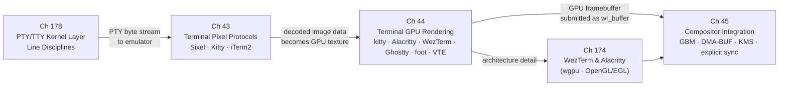

# Part XII — Terminal Graphics

Terminal emulators occupy an unusual position in the Linux graphics stack: they are simultaneously text-processing engines descended from 1970s hardware terminals and first-class **Wayland** clients that drive modern GPU render pipelines. This part examines how the character-cell abstraction that defines a terminal's data model has been extended to carry pixel graphics, how GPU-accelerated terminals translate that model into efficient **OpenGL** and **Vulkan** draw calls, and how the resulting framebuffer traverses the same **GBM**, **DMA-BUF**, **KMS**, and compositor machinery that every other graphical client uses. Terminal graphics is not a specialised niche layered atop the stack; it is the stack, viewed through the lens of an application that must coexist with a rigid, character-aligned data model inherited from serial hardware.

## Chapters in This Part

**Chapter 178 — The PTY/TTY Kernel Layer and Line Disciplines** is the kernel foundation for the part. It covers the `tty_struct` / `tty_driver` / `tty_operations` object model, the PTY architecture (master/slave, `/dev/ptmx`, `devpts` filesystem, PTY lifecycle), the **N_TTY** line discipline in depth (cooked vs. raw mode, echo, erase, signal generation), `termios` settings (`ICANON`, `ISIG`, `ECHO`, `VMIN`/`VTIME`), the `TIOCSWINSZ` ioctl and **SIGWINCH** chain, `openpty()` / `forkpty()` terminal emulator startup, PTY buffer sizing and throughput limits, and how terminal multiplexers (tmux, zellij) chain PTY pairs. Readers learn the kernel path that every keystroke and every byte of output traverses before reaching the terminal emulator.

**Chapter 43 — Terminal Pixel Protocols: Sixel, Kitty, and iTerm2** establishes the wire-level encoding layer: how pixel data is serialised into **VT** escape sequences, transmitted across a pseudoterminal, and decoded by the terminal emulator. It covers the **DCS**-framed **Sixel** protocol inherited from the **DEC VT340**, the **APC**-framed **Kitty Graphics Protocol** with its stateful image IDs, server-side persistence, **Unicode** placeholder mechanism, and animation support, and the stateless **OSC 1337** **iTerm2 Inline Images** format. Readers will learn the trade-offs each protocol makes across bandwidth, colour depth, alpha transparency, multiplexer compatibility, and GPU readiness, and will gain practical protocol-detection strategies for applications that must target multiple terminals.

**Chapter 44 — Terminal GPU Rendering Architectures** moves from the wire format to the render pipeline, explaining how modern terminal emulators — **kitty**, **Alacritty**, **WezTerm**, **Ghostty**, **foot**, and **VTE** — map the character-cell grid onto GPU draw calls. It covers the shared foundation of the **HarfBuzz**/**FreeType** glyph atlas stored as a **GL_TEXTURE_2D_ARRAY**, then examines how each terminal diverges: **kitty**'s mature **OpenGL** renderer, **Alacritty**'s latency-optimised multi-threaded design, **WezTerm**'s **wgpu**/**WGSL**/**naga** cross-backend architecture, **Ghostty**'s **SIMD**-optimised **VT** parser and **libghostty** embeddable core, **foot**'s CPU-only **wl_shm** path, and **VTE**'s migration to the **GSK** scene-graph with a **Vulkan** backend. Readers will understand how pixel images decoded from the Chapter 43 protocols are composited with text in a single render pass using premultiplied alpha.

**Chapter 45 — Terminal Integration with the Compositor Stack** closes the loop by tracing how the GPU framebuffer produced by a terminal reaches physical display scanout. It covers **EGL** context acquisition, **GBM** buffer allocation via **gbm_surface_create_with_modifiers2()**, **DRM** format modifier negotiation through **zwp_linux_dmabuf_feedback_v1**, the GPU render loop from **eglSwapBuffers()** to **wl_surface.commit()**, the CPU path taken by **foot** via **wl_shm**, explicit synchronisation using **wp_linux_drm_syncobj_manager_v1**, compositor-side plane promotion, **KMS** atomic commit, colour management under **wp_color_management_v1**, and the security boundary enforced by **DRM** render nodes. This chapter requires familiarity with all preceding chapters in the part; it is the integration chapter that shows how every layer composes.

**Chapter 174 — WezTerm and Alacritty: GPU Terminal Rendering Architectures** extends the Chapter 44 survey with dedicated architectural treatment of two widely-used terminals. **WezTerm** (`wezterm-gui` + `termwiz` + `wezterm-mux`) is examined through its **wgpu** GPU backend: `wgpu::Surface` → Mesa Vulkan (RADV/ANV) → kernel DRM; the HarfBuzz+FreeType2 glyph atlas uploaded to `wgpu::Texture`; ligature shaping; built-in tmux-compatible multiplexer via the `wezterm-mux` crate. **Alacritty** is examined through its OpenGL/EGL renderer: instanced cell rendering via the `gl` crate (not `glow`), the `crossfont` FreeType2 rasterisation library, and the multi-atlas architecture where `AtlasInsertError::Full` appends a new atlas rather than evicting existing glyphs. The chapter includes a comparative table across WezTerm, Alacritty, Kitty, and Ghostty for GPU API, multiplexer, Sixel support, Kitty Protocol support, and IME.

## Key Concepts

### Virtual Terminals and Pseudoterminals

**VT (Virtual Terminal)** is the character-cell abstraction underlying all terminal emulators: a grid of columns × rows, where each cell holds a Unicode code point plus colour and attribute metadata (bold, italic, underline, reverse video). The VT model is controlled by **escape sequences** — byte sequences beginning with ESC (`\x1b`) — that move the cursor, set colours (SGR/Select Graphic Rendition: `ESC[<n>m`), and trigger mode changes. The "VT100/VT220" designation refers to DEC hardware terminals; their escape sequence conventions became the de facto standard, later formalised in the ECMA-48 and ISO 6429 standards that all modern terminal emulators implement.

A **pseudoterminal (PTY)** is a software device pair: a **master** (opened via `/dev/ptmx`) and a **slave** (appearing as `/dev/pts/N` in the `devpts` filesystem). The terminal emulator holds the master end and reads/writes raw bytes; the shell or program running inside holds the slave end and sees a tty device with full line discipline support. `openpty()` / `forkpty()` are the standard POSIX library functions for allocating a PTY pair and launching a child process in it. PTY throughput is a practical performance concern — pushing large pixel graphics data through a PTY bottlenecks on the line discipline's byte-processing rate.

### Pixel Protocol Concepts

**Sixel** is DEC's 1980s pixel graphics standard using **DCS (Device Control String)** escape sequences. A Sixel stream looks like:

```
ESC P <Ps>;<Ps>;<Ps> q <sixel data> ST
```

where `ESC P` introduces the DCS and `ST` (String Terminator, `ESC \`) ends it. The core encoding: each column in a **Sixel band** (a 6-pixel-tall horizontal strip) is encoded as a single printable ASCII character: the pixel bitmask of that column (6 bits → values 0–63) plus 63 gives an ASCII printable character (offset 63 maps to `?`, which encodes the "all 6 pixels lit" column). Each character `#N;2;R;G;B` introduces a colour definition; `#N` selects a colour for subsequent pixels. The full DCS parameter string (`P1;P2;P3`) includes aspect ratio, background, and grid size settings.

**DECSDM mode 80** (DEC private mode 80, set via `ESC[?80h`, reset via `ESC[?80l`) controls Sixel scrolling behaviour. When **set** (mode 80 on), Sixel images scroll: after the image is drawn, the cursor moves below it and the terminal scrolls normally. When **reset** (mode 80 off, the DEC default), images are drawn at the current cursor position in-place without advancing the cursor, and subsequent text may overwrite the image. Most modern terminal emulators implement mode 80-set (scrolling) by default.

**APC sequences (Application Program Command)** use the escape `ESC _ <data> ST`. The **Kitty Graphics Protocol** uses APC to transmit image data and commands because APC is passed through by most terminal multiplexers (tmux/zellij forward unrecognised APC sequences unmodified), making it more multiplexer-compatible than DCS. A typical Kitty APC chunk:

```
ESC _ G a=t,f=32,s=100,v=100,i=1 ; <base64-encoded RGBA chunk> ST
```

where `a=t` means action=transmit, `f=32` means format=RGBA, `s`/`v` are pixel dimensions, and `i` is the **image ID**.

**Image IDs** are 32-bit integers in the Kitty Graphics Protocol that identify images stored in the terminal's server-side image store. Once an image is transmitted (chunked over multiple APC sequences), it persists server-side until explicitly deleted (`a=d,i=<id>`). The client can redisplay the image at any cell position without retransmitting pixel data — only the image ID and placement parameters are needed. This is the key GPU-architecture advantage of the Kitty protocol: large images are uploaded once to GPU texture memory and can be displayed at multiple locations with minimal bandwidth.

**DCS parameters** in the Sixel DCS header (`ESC P <P1>;<P2>;<P3> q`) are:
- `P1` (pixel aspect ratio): 1 = 2:1 (default), 2 = 5:1, 7/8 = 1:1 (square pixels, most useful today)
- `P2` (background colour): 0 = background unchanged, 1 = background is colour 0, 2 = background unchanged (same as 0)
- `P3` (horizontal grid size): pixels per cell horizontally, typically 0 (default 10)

**OSC 1337 payloads (iTerm2 Inline Images Protocol)** use Operating System Command escape sequences:

```
ESC ] 1337 ; File=<options> : <base64-encoded file data> BEL
```

Key options: `inline=1` (display inline, required), `width=N`, `height=N`, `preserveAspectRatio=0/1`. Unlike Kitty, OSC 1337 is stateless — there are no persistent server-side image IDs; each display requires retransmitting the full image data. The format supports PNG, JPEG, GIF, and other image formats (the terminal decodes from file format, not raw RGBA). OSC 1337 is supported by iTerm2, WezTerm, Hyper, and a growing list of terminals, but not by Kitty (which uses its own APC-based protocol).

## How the Chapters Interrelate

The five chapters form a dependency structure where Chapter 178 is the kernel foundation, Chapter 43 is the protocol layer, and Chapter 45 is the compositor integration capstone.

Chapter 43 is the required starting point. It defines the vocabulary — image IDs, **APC** sequences, **DCS** parameters, **Sixel** bands, **OSC 1337** payloads — that Chapter 44 references when describing how decoded image data is turned into **GL** texture handles and **wgpu::Buffer** staging uploads. A reader who skips Chapter 43 will encounter unexplained references to protocol-specific fields (the `t=s` shared-memory transmission mode, the `f=32` **RGBA** pixel format key, the **DECSDM** mode 80 query) and will not appreciate why the **Kitty Graphics Protocol**'s server-side image persistence has GPU-architecture implications while **Sixel** and **iTerm2** do not.

Chapter 44 is the bridge between the escape-sequence layer and the **Wayland** client layer. Its analysis of glyph atlas design, dirty-cell tracking, and compositing pipelines provides the concrete rendering context that Chapter 45 builds on: when Chapter 45 discusses **DMA-BUF** submission and **KMS** plane promotion, the reader must already understand what data the terminal is submitting and why the format modifier matters for zero-copy scan-out. The contrast between **foot**'s CPU-only **wl_shm** path and the GPU terminals' **EGL**/**GBM** paths, introduced structurally in Chapter 44, becomes technically precise in Chapter 45.

Chapter 45 presupposes both predecessors and is the integration point where the terminal-specific knowledge assembled in Chapters 43 and 44 meets the book-wide **DRM**/**KMS**/**Wayland** foundations from Parts I–VI. Several threads run through all three chapters and tie the part together: the question of where in the stack image data is decoded and who owns the resulting GPU resource; the compositing ordering problem (pixel image behind or in front of text cells) solved at the wire level in Chapter 43, the render-pass level in Chapter 44, and the **KMS** plane level in Chapter 45; and the security constraints that the **Kitty** protocol's **shm_open** transmission mode introduces and that **DRM** render nodes and **Flatpak** sandboxing must accommodate.



## Prerequisites and What Comes Next

Readers should have covered Parts I–VI before entering this part: the **DRM** subsystem and **KMS** pipeline (Chapters 1–2), **GBM** and **DMA-BUF** memory management (Chapter 4), **Mesa** internals (Chapters 5–9), **Wayland** protocol design and the **linux-dmabuf** and explicit-sync extensions (Chapter 20), and compositor architecture (Chapters 21–22); those foundations are referenced throughout but not re-explained. Part XIII (Browser Graphics) and Part XIV (Application APIs) build on the **Wayland** client and **EGL**/**Vulkan** patterns established here, and the explicit-synchronisation and colour-management threads opened in Chapter 45 resurface in the **HDR** and **VRR** material of Part VI.

---
