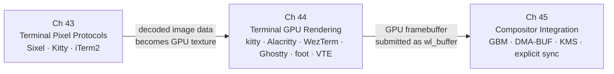

# Part XII — Terminal Graphics

Terminal emulators occupy an unusual position in the Linux graphics stack: they are simultaneously text-processing engines descended from 1970s hardware terminals and first-class **Wayland** clients that drive modern GPU render pipelines. This part examines how the character-cell abstraction that defines a terminal's data model has been extended to carry pixel graphics, how GPU-accelerated terminals translate that model into efficient **OpenGL** and **Vulkan** draw calls, and how the resulting framebuffer traverses the same **GBM**, **DMA-BUF**, **KMS**, and compositor machinery that every other graphical client uses. Terminal graphics is not a specialised niche layered atop the stack; it is the stack, viewed through the lens of an application that must coexist with a rigid, character-aligned data model inherited from serial hardware.

## Chapters in This Part

**Chapter 43 — Terminal Pixel Protocols: Sixel, Kitty, and iTerm2** establishes the wire-level encoding layer: how pixel data is serialised into **VT** escape sequences, transmitted across a pseudoterminal, and decoded by the terminal emulator. It covers the **DCS**-framed **Sixel** protocol inherited from the **DEC VT340**, the **APC**-framed **Kitty Graphics Protocol** with its stateful image IDs, server-side persistence, **Unicode** placeholder mechanism, and animation support, and the stateless **OSC 1337** **iTerm2 Inline Images** format. Readers will learn the trade-offs each protocol makes across bandwidth, colour depth, alpha transparency, multiplexer compatibility, and GPU readiness, and will gain practical protocol-detection strategies for applications that must target multiple terminals.

**Chapter 44 — Terminal GPU Rendering Architectures** moves from the wire format to the render pipeline, explaining how modern terminal emulators — **kitty**, **Alacritty**, **WezTerm**, **Ghostty**, **foot**, and **VTE** — map the character-cell grid onto GPU draw calls. It covers the shared foundation of the **HarfBuzz**/**FreeType** glyph atlas stored as a **GL_TEXTURE_2D_ARRAY**, then examines how each terminal diverges: **kitty**'s mature **OpenGL** renderer, **Alacritty**'s latency-optimised multi-threaded design, **WezTerm**'s **wgpu**/**WGSL**/**naga** cross-backend architecture, **Ghostty**'s **SIMD**-optimised **VT** parser and **libghostty** embeddable core, **foot**'s CPU-only **wl_shm** path, and **VTE**'s migration to the **GSK** scene-graph with a **Vulkan** backend. Readers will understand how pixel images decoded from the Chapter 43 protocols are composited with text in a single render pass using premultiplied alpha.

**Chapter 45 — Terminal Integration with the Compositor Stack** closes the loop by tracing how the GPU framebuffer produced by a terminal reaches physical display scanout. It covers **EGL** context acquisition, **GBM** buffer allocation via **gbm_surface_create_with_modifiers2()**, **DRM** format modifier negotiation through **zwp_linux_dmabuf_feedback_v1**, the GPU render loop from **eglSwapBuffers()** to **wl_surface.commit()**, the CPU path taken by **foot** via **wl_shm**, explicit synchronisation using **wp_linux_drm_syncobj_manager_v1**, compositor-side plane promotion, **KMS** atomic commit, colour management under **wp_color_management_v1**, and the security boundary enforced by **DRM** render nodes. This chapter requires familiarity with all preceding chapters in the part; it is the integration chapter that shows how every layer composes.

## How the Chapters Interrelate

The three chapters form a strict dependency chain that mirrors the data path a pixel image follows from application to display.

Chapter 43 is the required starting point. It defines the vocabulary — image IDs, **APC** sequences, **DCS** parameters, **Sixel** bands, **OSC 1337** payloads — that Chapter 44 references when describing how decoded image data is turned into **GL** texture handles and **wgpu::Buffer** staging uploads. A reader who skips Chapter 43 will encounter unexplained references to protocol-specific fields (the `t=s` shared-memory transmission mode, the `f=32` **RGBA** pixel format key, the **DECSDM** mode 80 query) and will not appreciate why the **Kitty Graphics Protocol**'s server-side image persistence has GPU-architecture implications while **Sixel** and **iTerm2** do not.

Chapter 44 is the bridge between the escape-sequence layer and the **Wayland** client layer. Its analysis of glyph atlas design, dirty-cell tracking, and compositing pipelines provides the concrete rendering context that Chapter 45 builds on: when Chapter 45 discusses **DMA-BUF** submission and **KMS** plane promotion, the reader must already understand what data the terminal is submitting and why the format modifier matters for zero-copy scan-out. The contrast between **foot**'s CPU-only **wl_shm** path and the GPU terminals' **EGL**/**GBM** paths, introduced structurally in Chapter 44, becomes technically precise in Chapter 45.

Chapter 45 presupposes both predecessors and is the integration point where the terminal-specific knowledge assembled in Chapters 43 and 44 meets the book-wide **DRM**/**KMS**/**Wayland** foundations from Parts I–VI. Several threads run through all three chapters and tie the part together: the question of where in the stack image data is decoded and who owns the resulting GPU resource; the compositing ordering problem (pixel image behind or in front of text cells) solved at the wire level in Chapter 43, the render-pass level in Chapter 44, and the **KMS** plane level in Chapter 45; and the security constraints that the **Kitty** protocol's **shm_open** transmission mode introduces and that **DRM** render nodes and **Flatpak** sandboxing must accommodate.

## Prerequisites and What Comes Next

Readers should have covered Parts I–VI before entering this part: the **DRM** subsystem and **KMS** pipeline (Chapters 1–2), **GBM** and **DMA-BUF** memory management (Chapter 4), **Mesa** internals (Chapters 5–9), **Wayland** protocol design and the **linux-dmabuf** and explicit-sync extensions (Chapter 20), and compositor architecture (Chapters 21–22); those foundations are referenced throughout but not re-explained. Part XIII (Browser Graphics) and Part XIV (Application APIs) build on the **Wayland** client and **EGL**/**Vulkan** patterns established here, and the explicit-synchronisation and colour-management threads opened in Chapter 45 resurface in the **HDR** and **VRR** material of Part VI.

---
