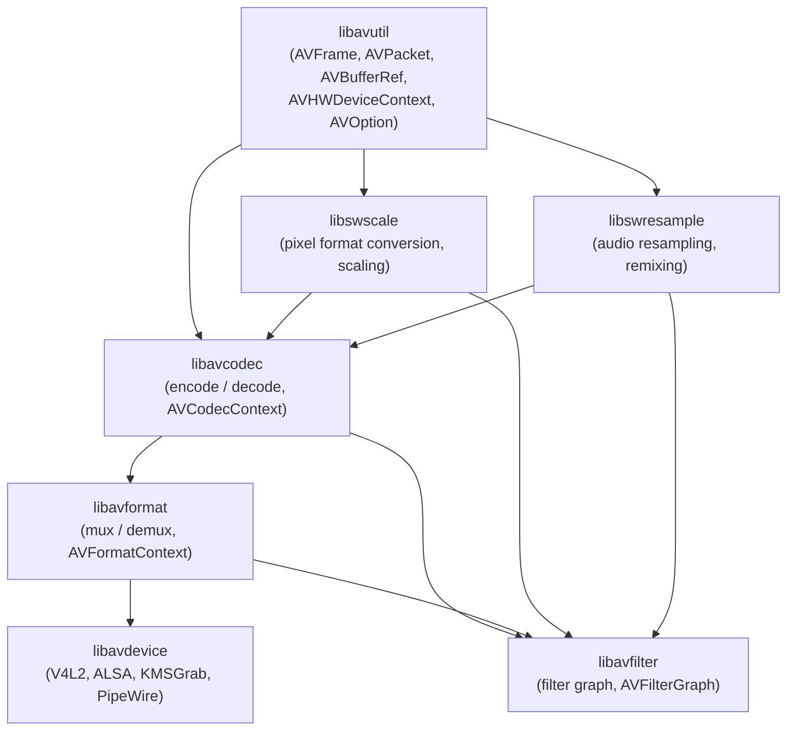
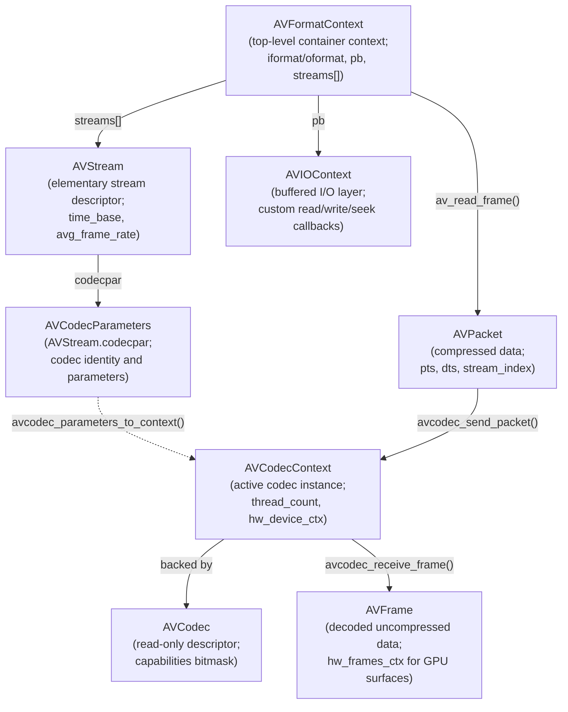
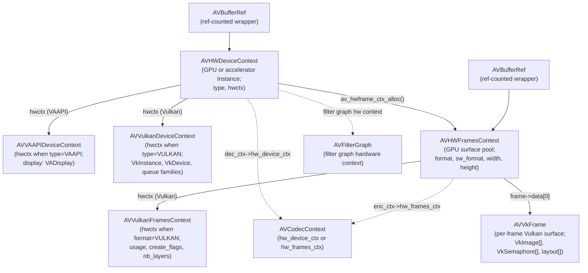
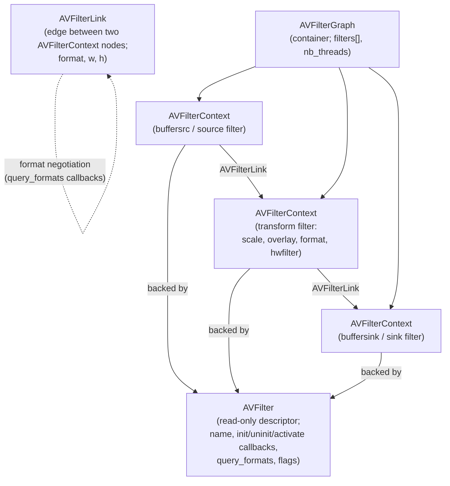
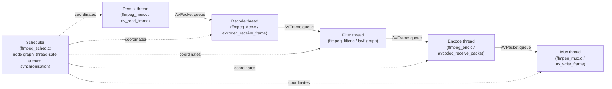
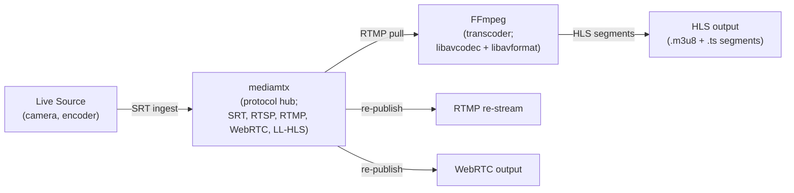

# Chapter 57: FFmpeg Architecture and Programming

> **Part**: Part XIII — Video Streaming on Linux
>
> **Audience**: Graphics application developers and systems developers integrating video pipelines; backend engineers building GPU-accelerated transcoding, streaming, or analytics systems.
>
> **Status**: First draft — 2026-06-15

---

## Table of Contents

1. [Overview](#1-overview)
2. [Library Architecture](#2-library-architecture)
   - [The Seven Libraries](#21-the-seven-libraries)
   - [Versioning and API Stability](#22-versioning-and-api-stability)
3. [Core Data Structures and Lifecycles](#3-core-data-structures-and-lifecycles)
   - [AVFormatContext and AVStream](#31-avformatcontext-and-avstream)
   - [AVCodecContext and AVCodec](#32-avcodeccontext-and-avcodec)
   - [AVPacket and AVFrame: Reference-Counted Buffers](#33-avpacket-and-avframe-reference-counted-buffers)
4. [Demuxing and Decoding](#4-demuxing-and-decoding)
   - [The Demux Pipeline](#41-the-demux-pipeline)
   - [The Send/Receive API](#42-the-sendreceive-api)
5. [Hardware Acceleration](#5-hardware-acceleration)
   - [AVHWDeviceContext and AVHWFramesContext](#51-avhwdevicecontext-and-avhwframescontext)
   - [VAAPI: Linux-Native GPU Decode and Encode](#52-vaapi-linux-native-gpu-decode-and-encode)
   - [Vulkan hwaccel and AVVkFrame](#53-vulkan-hwaccel-and-avvkframe)
   - [VDPAU: Legacy NVIDIA Decode](#54-vdpau-legacy-nvidia-decode)
6. [The lavfi Filter Graph](#6-the-lavfi-filter-graph)
   - [Core Filter Structures](#61-core-filter-structures)
   - [Building and Running a Filter Graph](#62-building-and-running-a-filter-graph)
   - [GPU Filter Chains vs CPU Filters](#63-gpu-filter-chains-vs-cpu-filters)
7. [Encoding Pipeline](#7-encoding-pipeline)
   - [Rate Control Modes](#71-rate-control-modes)
   - [GOP Structure and B-Frame Distance](#72-gop-structure-and-b-frame-distance)
   - [Hardware Encoders](#73-hardware-encoders)
8. [The FFmpeg CLI Architecture](#8-the-ffmpeg-cli-architecture)
   - [fftools Structure and the Scheduler](#81-fftools-structure-and-the-scheduler)
   - [Stream Mapping and Option Parsing](#82-stream-mapping-and-option-parsing)
   - [The AVOption System](#83-the-avoption-system)
9. [Streaming Protocols](#9-streaming-protocols)
   - [RTMP](#91-rtmp)
   - [RTSP](#92-rtsp)
   - [SRT](#93-srt)
   - [HLS](#94-hls)
   - [MPEG-DASH](#95-mpeg-dash)
   - [Open Streaming Servers: SRS and mediamtx](#96-open-streaming-servers-srs-and-mediamtx)
10. [Custom AVCodec and AVFilter Implementations](#10-custom-avcodec-and-avfilter-implementations)
    - [In-Tree Codec Registration](#101-in-tree-codec-registration)
    - [Minimal Decoder Skeleton](#102-minimal-decoder-skeleton)
    - [Custom Filter Implementation](#103-custom-filter-implementation)
    - [Out-of-Tree Extensions: The Practical Reality](#104-out-of-tree-extensions-the-practical-reality)
11. [Threading Model](#11-threading-model)
12. [libavdevice: Linux Device I/O](#12-libavdevice-linux-device-io)
13. [Integrations](#13-integrations)
14. [References](#14-references)

---

## 1. Overview

FFmpeg is the central multimedia framework of the Linux graphics stack. Every GPU-accelerated transcoding pipeline, HLS packager, RTMP ingest server, and hardware-decoded video player on Linux eventually reaches into one of its seven libraries. This chapter covers FFmpeg at an architectural level suitable for engineers who need to embed it as a library, extend it with custom codecs or filters, or integrate it with the hardware acceleration layers discussed in previous chapters.

The chapter assumes familiarity with VA-API (Chapter 26), Vulkan (Chapter 24 — Vulkan and EGL for Application Developers), and Vulkan Video (Chapter 50) — those APIs appear here as hwaccel back ends without re-explanation of their internals. Codec algorithms (DCT, motion estimation, AV1 superblocks) are the subject of Chapter 60; this chapter treats codecs as black boxes accessed through the `libavcodec` API. GStreamer (Chapter 58) wraps FFmpeg codecs via the `gst-libav` plugin and is covered separately.

Readers will learn: how the seven FFmpeg libraries relate to each other and to the hardware acceleration stack; the `AVFormatContext` → `AVStream` → `AVCodecContext` → `AVFrame` lifecycle with correct reference-counting discipline; how to enable VAAPI and Vulkan hwaccel paths with zero-copy DMA-BUF frame sharing; how `libavfilter` builds a directed graph of processing nodes including GPU-resident filter chains; how to implement a minimal in-tree codec or filter; and how to package encoded streams into HLS, DASH, RTMP, SRT, and RTSP.

Versions covered: FFmpeg 7.0 "Dijkstra" (April 2024), 7.1 LTS (September 2024), and 8.0 "Huffman" (August 2025). The 8.0 release is the largest in project history and introduces Vulkan compute codecs (FFv1, ProRes RAW, VP9, AV1) that run on any Vulkan 1.3 implementation without hardware-specific video decode queues.

---

## 2. Library Architecture

### 2.1 The Seven Libraries

FFmpeg organises its functionality into a layered dependency graph of seven libraries. Understanding the dependency order is essential when linking: each library may only depend on libraries below it.

```text
libavfilter ────────────────────────────────────────────┐
libavformat ──────────────────────────────────────────┐ │
libavdevice ─────────────────────────────────────┐   │ │
libavcodec ────────────────────────────────────┐  │   │ │
libswresample ────────────────────────────┐    │  │   │ │
libswscale ─────────────────────────┐     │    │  │   │ │
                                    └──┬──┴────┴──┴───┴─┘
                                    libavutil (foundation)
```



**libavutil** provides the foundation that no other library may bypass: `AVFrame`, `AVPacket`, the buffer reference-counting model (`AVBufferRef`), `AVRational`, `AVDictionary`, `AVChannelLayout`, the logging subsystem (`av_log`, `AVClass`), the `AVOption` generic configuration system, hardware context types (`AVHWDeviceContext`, `AVHWFramesContext`), and all pixel-format enumerations. Every other library depends on libavutil but never on each other except through the defined ordering above. [Source: FFmpeg core libraries overview](https://deepwiki.com/FFmpeg/FFmpeg/3-core-libraries)

**libavcodec** implements encoding and decoding. It contains the `AVCodecContext` (the active codec instance), bitstream filter infrastructure (`AVBSFContext`), and hundreds of codec implementations — software decoders for H.264, HEVC, AV1, VP9, and FFv1, plus hardware codec wrappers for VAAPI, Vulkan Video, CUDA/NVDEC, and NVENC.

**libavformat** handles container I/O: muxing (writing) and demuxing (reading) MP4, Matroska, MPEG-TS, FLV, WebM, and dozens of other containers. It also implements streaming protocols (HTTP, RTMP, RTSP, HLS, DASH, SRT) through `AVIOContext`, a unified buffered I/O layer that accepts user-supplied read/write/seek callbacks for in-memory or network I/O.

**libavdevice** extends libavformat with device-based sources and sinks: Video4Linux2 (`v4l2`), ALSA, X11Grab, KMSGrab, and PipeWire, all presented through the same `AVFormatContext` interface.

**libavfilter** implements a directed graph of processing nodes. Frames flow from source filters (`buffersrc`) through transform filters (`scale`, `overlay`, `format`, hardware filters) to sink filters (`buffersink`). The graph engine handles format negotiation, memory management, and optional slice-threaded execution.

**libswscale** provides pixel format conversion and image scaling — YUV↔RGB, planar↔packed, any resolution to any resolution — using SIMD-accelerated code for x86 (SSE2, AVX2) and ARM (NEON). [Source: swscale.h](https://github.com/FFmpeg/FFmpeg/blob/master/libswscale/swscale.h)

**libswresample** provides audio sample format conversion, rate conversion, and channel remixing with a simple `SwrContext` API analogous to `SwsContext`.

### 2.2 Versioning and API Stability

Libraries use MAJOR.MINOR.MICRO versioning; micro versions begin at 100 to distinguish from third-party semantic versioning. Within a major version, the API and ABI are backward-compatible. Deprecated APIs are guarded by `FF_API_*` macros and removed at the next major version boundary. The complete history of API changes is in `doc/APIchanges` in the FFmpeg source tree. [Source: FFmpeg doxygen trunk](https://ffmpeg.org/doxygen/trunk/)

FFmpeg 7.0 removed all APIs deprecated before 6.0 and mandates a C11-compliant compiler. The old bitmask-based channel layout API was fully replaced by `AVChannelLayout`. FFmpeg 8.0 introduced libavutil 60.32.100 and libavcodec 62.x.

---

## 3. Core Data Structures and Lifecycles

### 3.1 AVFormatContext and AVStream



`AVFormatContext` is the top-level context for a media file or stream, used both for reading (demuxing) and writing (muxing). [Source: avformat.h](https://github.com/FFmpeg/FFmpeg/blob/master/libavformat/avformat.h)

```c
// libavformat/avformat.h — AVFormatContext (abbreviated)
typedef struct AVFormatContext {
    const AVInputFormat  *iformat;   // demuxing only
    const AVOutputFormat *oformat;   // muxing only
    AVIOContext          *pb;        // buffered I/O context
    unsigned int          nb_streams;
    AVStream            **streams;   // array of stream descriptors
    char                 *url;       // heap-allocated input/output URL
    int64_t               start_time;  // in AV_TIME_BASE (microseconds)
    int64_t               duration;
    int64_t               bit_rate;
    AVDictionary         *metadata;
} AVFormatContext;

// Input lifecycle:
AVFormatContext *ctx = NULL;
avformat_open_input(&ctx, "input.mp4", NULL, NULL); // allocates ctx
avformat_find_stream_info(ctx, NULL);               // probes stream params
// ... use ctx ...
avformat_close_input(&ctx);                         // frees and NULLs ctx

// Output lifecycle:
AVFormatContext *out_ctx;
avformat_alloc_output_context2(&out_ctx, NULL, "mp4", "output.mp4");
// ... configure streams, write ...
avformat_free_context(out_ctx);
```

`AVStream` represents one elementary stream (video, audio, subtitle). The critical field is `codecpar` (`AVCodecParameters`), which replaced the old `AVStream.codec` (removed in FFmpeg 4.0). To decode a stream, copy codecpar into a new `AVCodecContext` with `avcodec_parameters_to_context()`. [Source: avformat.h](https://github.com/FFmpeg/FFmpeg/blob/master/libavformat/avformat.h)

```c
// libavformat/avformat.h — AVStream (abbreviated)
typedef struct AVStream {
    int               index;       // position in AVFormatContext.streams[]
    AVCodecParameters *codecpar;   // codec identity and parameters
    AVRational        time_base;   // pts/dts units for this stream
    int64_t           duration;    // in time_base units
    AVRational        avg_frame_rate;
    AVDictionary     *metadata;
} AVStream;
```

### 3.2 AVCodecContext and AVCodec

`AVCodecContext` holds the configuration and runtime state for a single active codec instance. It is always backed by a specific `AVCodec` descriptor. [Source: avcodec.h](https://github.com/FFmpeg/FFmpeg/blob/master/libavcodec/avcodec.h)

```c
// libavcodec/avcodec.h — lifecycle
const AVCodec *dec = avcodec_find_decoder(AV_CODEC_ID_H264);
// OR by name for hardware codecs:
const AVCodec *enc = avcodec_find_encoder_by_name("hevc_vaapi");

AVCodecContext *ctx = avcodec_alloc_context3(dec);
avcodec_parameters_to_context(ctx, stream->codecpar); // copy stream params

// Hardware context attachment (before open):
ctx->hw_device_ctx = av_buffer_ref(hw_device_ctx_ref);

// Open; codec allocates internal state and starts worker threads
AVDictionary *opts = NULL;
av_dict_set(&opts, "preset", "fast", 0);
avcodec_open2(ctx, dec, &opts);
av_dict_free(&opts);

// Flush on seek:
avcodec_flush_buffers(ctx);

avcodec_free_context(&ctx);
```

The `AVCodec` struct (`const AVCodec *`) is the public read-only descriptor. Its `capabilities` field (bitmask of `AV_CODEC_CAP_*`) declares what threading modes the codec supports, whether it can emit hardware frames, etc. Internally FFmpeg uses a larger `FFCodec` struct in `libavcodec/codec_internal.h` that adds callbacks; this is not a stable public API.

### 3.3 AVPacket and AVFrame: Reference-Counted Buffers

`AVPacket` carries compressed data (typically one encoded video frame or a few audio frames). `AVFrame` carries decoded (uncompressed) data. Both participate in FFmpeg's reference-counting model: when `buf[0] != NULL`, the underlying memory is reference-counted and multiple packets or frames can share it. [Source: frame.h](https://github.com/FFmpeg/FFmpeg/blob/master/libavutil/frame.h)

```c
// libavutil/frame.h — reference-counting discipline
AVFrame *frame = av_frame_alloc();
av_frame_get_buffer(frame, 0);  // allocate data planes with alignment

AVFrame *ref = av_frame_alloc();
av_frame_ref(ref, frame);       // increment ref count; shares pixel data
av_frame_unref(frame);          // decrement; buffer freed when count reaches 0
av_frame_free(&ref);            // decrement + free struct

// AVPacket:
AVPacket *pkt = av_packet_alloc();
// pkt->data, pkt->size — compressed bytes
// pkt->pts, pkt->dts, pkt->duration — in AVStream.time_base
av_packet_unref(pkt);   // release data reference; safe to reuse struct
av_packet_free(&pkt);   // release reference + free struct
```

For hardware frames, `frame->hw_frames_ctx` points to the `AVHWFramesContext` that manages the GPU surface pool. When `frame->format == AV_PIX_FMT_VAAPI` or `AV_PIX_FMT_VULKAN`, `frame->data[0]` is a surface handle, not a CPU pointer. [Source: libavutil core utilities](https://deepwiki.com/FFmpeg/FFmpeg/3.1-libavutil-core-utilities)

---

## 4. Demuxing and Decoding

### 4.1 The Demux Pipeline

The canonical decode pipeline follows six steps: open → probe → find stream → open codec → read packets → decode. [Source: lavf decoding group](https://ffmpeg.org/doxygen/trunk/group__lavf__decoding.html)

```c
// Full demux + decode skeleton
AVFormatContext *fmt_ctx = NULL;
const AVCodec   *dec;
AVPacket        *pkt   = av_packet_alloc();
AVFrame         *frame = av_frame_alloc();

// Step 1-2: open and probe
avformat_open_input(&fmt_ctx, "input.mp4", NULL, NULL);
avformat_find_stream_info(fmt_ctx, NULL);

// Step 3: find best video stream (also retrieves matching decoder)
int vid_idx = av_find_best_stream(fmt_ctx, AVMEDIA_TYPE_VIDEO,
                                   -1, -1, &dec, 0);

// Step 4: open codec
AVCodecContext *dec_ctx = avcodec_alloc_context3(dec);
avcodec_parameters_to_context(dec_ctx,
    fmt_ctx->streams[vid_idx]->codecpar);
avcodec_open2(dec_ctx, dec, NULL);

// Step 5: packet read loop
while (av_read_frame(fmt_ctx, pkt) >= 0) {
    if (pkt->stream_index == vid_idx) {
        avcodec_send_packet(dec_ctx, pkt); // Step 6 (send side)
        int ret;
        while ((ret = avcodec_receive_frame(dec_ctx, frame)) == 0) {
            // frame is ready — process it
            av_frame_unref(frame);
        }
        // ret == AVERROR(EAGAIN): need more packets; ret == AVERROR_EOF: done
    }
    av_packet_unref(pkt);
}
// Flush: drain buffered frames
avcodec_send_packet(dec_ctx, NULL);
while (avcodec_receive_frame(dec_ctx, frame) == 0) { /* drain */ }

av_packet_free(&pkt);
av_frame_free(&frame);
avcodec_free_context(&dec_ctx);
avformat_close_input(&fmt_ctx);
```

`avformat_seek_file()` provides bounded seeking with `min_ts`/`ts`/`max_ts` parameters; after seeking, call `avcodec_flush_buffers()` to clear the codec's internal DPB (decoder picture buffer).

### 4.2 The Send/Receive API

The send/receive API (introduced in FFmpeg 3.1, now the only supported path) decouples input submission from output retrieval. This is architecturally necessary because: B-frame reordering causes the encoder to emit packets in a different order than frames were submitted; hardware pipelines have multi-frame GPU queues; audio codecs may buffer partial frames until a full codec frame is available. [Source: encoding and decoding APIs](https://deepwiki.com/FFmpeg/FFmpeg/5.1.2-encoding-and-decoding-apis)

```c
// Decoder: avcodec_send_packet + avcodec_receive_frame
// Returns: 0=OK, AVERROR(EAGAIN)=need more input, AVERROR_EOF=drained

// Encoder: avcodec_send_frame + avcodec_receive_packet
avcodec_send_frame(enc_ctx, frame);         // NULL frame triggers flush
while (avcodec_receive_packet(enc_ctx, pkt) == 0) {
    // write pkt to muxer
    av_packet_unref(pkt);
}
```

Both pairs use EAGAIN/EOF semantics identically: EAGAIN means the other side must be called first; EOF means the codec is fully drained after a NULL submission.

---

## 5. Hardware Acceleration

### 5.1 AVHWDeviceContext and AVHWFramesContext



FFmpeg models hardware accelerators through two reference-counted context types: `AVHWDeviceContext` (represents a GPU or accelerator instance) and `AVHWFramesContext` (manages a pool of GPU surfaces). Both are heap-allocated with `av_buffer_ref`-counted wrappers for safe sharing across codec and filter graph components. [Source: hardware context system](https://deepwiki.com/FFmpeg/FFmpeg/7.1-hardware-context-system) | [Source: AVHWDeviceContext doxygen](https://ffmpeg.org/doxygen/trunk/structAVHWDeviceContext.html)

```c
// libavutil/hwcontext.h — device context creation (convenience path)
AVBufferRef *hw_device_ctx = NULL;
av_hwdevice_ctx_create(&hw_device_ctx,
    AV_HWDEVICE_TYPE_VAAPI,
    "/dev/dri/renderD128",   // device node; NULL for system default
    NULL, 0);

// Attach to decoder before avcodec_open2:
dec_ctx->hw_device_ctx = av_buffer_ref(hw_device_ctx);

// Manual creation (fine-grained control):
AVBufferRef *ref = av_hwdevice_ctx_alloc(AV_HWDEVICE_TYPE_VAAPI);
AVHWDeviceContext *dev = (AVHWDeviceContext *)ref->data;
AVVAAPIDeviceContext *vaapi = dev->hwctx;   // device-type-specific struct
vaapi->display = my_va_display;
av_hwdevice_ctx_init(ref);
```

`AVHWFramesContext` manages the GPU surface pool used by a codec or filter. The codec allocates frames from this pool during `avcodec_open2` if `enc_ctx->hw_frames_ctx` is set:

```c
// libavutil/hwcontext.h — frames context setup for VAAPI encoding
AVBufferRef *hw_frames_ref = av_hwframe_ctx_alloc(hw_device_ctx);
AVHWFramesContext *frames  = (AVHWFramesContext *)hw_frames_ref->data;
frames->format             = AV_PIX_FMT_VAAPI;
frames->sw_format          = AV_PIX_FMT_NV12;
frames->width              = 1920;
frames->height             = 1080;
frames->initial_pool_size  = 20;
av_hwframe_ctx_init(hw_frames_ref);
enc_ctx->hw_frames_ctx = av_buffer_ref(hw_frames_ref);
av_buffer_unref(&hw_frames_ref);   // encoder holds its own reference
```

To discover which hardware configurations a codec supports, iterate `avcodec_get_hw_config()`:

```c
// libavcodec/avcodec.h — AVCodecHWConfig enumeration
for (int i = 0; ; i++) {
    const AVCodecHWConfig *cfg = avcodec_get_hw_config(codec, i);
    if (!cfg) break;
    if (cfg->methods & AV_CODEC_HW_CONFIG_METHOD_HW_DEVICE_CTX
        && cfg->device_type == AV_HWDEVICE_TYPE_VAAPI) {
        hw_pix_fmt = cfg->pix_fmt;  // AV_PIX_FMT_VAAPI
        break;
    }
}
```

### 5.2 VAAPI: Linux-Native GPU Decode and Encode

VA-API (Video Acceleration API) is a Linux-specific open API backed by Intel, AMD, and other Mesa drivers. Its FFmpeg integration uses `AV_HWDEVICE_TYPE_VAAPI` and `AV_PIX_FMT_VAAPI`. See Chapter 26 for the VA-API internals; this section covers the FFmpeg wrapper layer.

The key decode pattern uses a `get_format` callback to select the hardware pixel format when the codec negotiates output: [Source: hw_decode.c example](https://ffmpeg.org/doxygen/4.0/hw_decode_8c-example.html)

```c
// doc/examples/hw_decode.c — hardware format negotiation callback
static enum AVPixelFormat hw_pix_fmt;

static enum AVPixelFormat get_hw_format(AVCodecContext *ctx,
                                         const enum AVPixelFormat *pix_fmts)
{
    for (const enum AVPixelFormat *p = pix_fmts; *p != -1; p++)
        if (*p == hw_pix_fmt)
            return *p;
    fprintf(stderr, "No HW surface format found; falling back to SW\n");
    return AV_PIX_FMT_NONE;
}

// Attach before avcodec_open2:
dec_ctx->hw_device_ctx = av_buffer_ref(hw_device_ctx);
dec_ctx->get_format    = get_hw_format;
```

After receiving a `frame` with `frame->format == AV_PIX_FMT_VAAPI`, transfer to CPU memory for processing or display:

```c
AVFrame *sw_frame = av_frame_alloc();
av_hwframe_transfer_data(sw_frame, hw_frame, 0); // GPU → CPU; allocates sw_frame data
// sw_frame->data[0..2] are now accessible CPU pointers (NV12 planes)
av_frame_free(&sw_frame);
```

For VAAPI encoding, set `enc_ctx->pix_fmt = AV_PIX_FMT_VAAPI`, attach an `hw_frames_ctx`, then upload CPU NV12 frames before submitting: [Source: vaapi_encode.c example](https://ffmpeg.org/doxygen/trunk/doc_2examples_2vaapi__encode_8c_source.html)

```c
// doc/examples/vaapi_encode.c — per-frame upload
AVFrame *hw_frame = av_frame_alloc();
av_hwframe_get_buffer(enc_ctx->hw_frames_ctx, hw_frame, 0);
av_hwframe_transfer_data(hw_frame, sw_frame, 0); // CPU → GPU
avcodec_send_frame(enc_ctx, hw_frame);
av_frame_free(&hw_frame);
```

From the command line, VAAPI encode requires uploading via the `hwupload` filter:

```bash
# ffmpeg CLI — VAAPI decode-transcode-encode pipeline
ffmpeg -hwaccel vaapi \
       -hwaccel_device /dev/dri/renderD128 \
       -hwaccel_output_format vaapi \
       -i input.mp4 \
       -c:v hevc_vaapi -b:v 5M output.mp4

# Software input → VAAPI encode:
ffmpeg -i input.yuv \
       -vf 'format=nv12,hwupload' \
       -c:v h264_vaapi output.h264
```

Available VAAPI encoders: `h264_vaapi`, `hevc_vaapi`, `av1_vaapi`, `vp9_vaapi`, `vp8_vaapi`, `mjpeg_vaapi`, `mpeg2_vaapi`. [Source: FFmpeg HWAccelIntro](https://trac.ffmpeg.org/wiki/HWAccelIntro)

### 5.3 Vulkan hwaccel and AVVkFrame

FFmpeg's Vulkan hwaccel path (introduced in 4.3, extended in 7.1 and 8.0) uses `AV_HWDEVICE_TYPE_VULKAN` and `AV_PIX_FMT_VULKAN`. See Chapter 50 for Vulkan Video internals. [Source: hwcontext_vulkan.h](https://github.com/FFmpeg/FFmpeg/blob/master/libavutil/hwcontext_vulkan.h) | [Source: AVVkFrame doxygen](https://ffmpeg.org/doxygen/trunk/structAVVkFrame.html)

`AVVkFrame` is the per-frame Vulkan surface descriptor accessible via `frame->data[0]`:

```c
// libavutil/hwcontext_vulkan.h — AVVkFrame (abbreviated)
typedef struct AVVkFrame {
    VkImage           img   [AV_NUM_DATA_POINTERS]; // one VkImage per plane
    VkImageTiling     tiling;
    VkDeviceMemory    mem   [AV_NUM_DATA_POINTERS];
    VkMemoryPropertyFlagBits flags;
    // Per-plane synchronisation (timeline semaphores):
    VkSemaphore       sem      [AV_NUM_DATA_POINTERS];
    uint64_t          sem_value[AV_NUM_DATA_POINTERS]; // current value; wait before access
    VkAccessFlagBits  access  [AV_NUM_DATA_POINTERS]; // current access mask
    VkImageLayout     layout  [AV_NUM_DATA_POINTERS]; // current layout
    uint32_t          queue_family[AV_NUM_DATA_POINTERS];
} AVVkFrame;
```

`AVVulkanFramesContext` is the Vulkan-specific extension of `AVHWFramesContext` (the `hwctx` field when `format == AV_PIX_FMT_VULKAN`). It controls how the surface pool is allocated and how frames are shared with external Vulkan consumers. [Source: hwcontext_vulkan.h](https://github.com/FFmpeg/FFmpeg/blob/master/libavutil/hwcontext_vulkan.h)

```c
// libavutil/hwcontext_vulkan.h — AVVulkanFramesContext (abbreviated)
typedef struct AVVulkanFramesContext {
    // Optional: caller-supplied allocator (NULL = FFmpeg internal)
    const AVVulkanDeviceQueueFamilyProperties *qf;
    // Image usage flags applied to all frames in the pool:
    VkImageUsageFlags  usage;
    // Additional tiling/creation flags:
    VkImageCreateFlags create_flags;
    // Number of layers per image (for multiview/stereoscopic frames):
    int nb_layers;
    // Aspect mask(s) to use for image views:
    VkImageAspectFlags aspect;
} AVVulkanFramesContext;
```

When constructing a Vulkan frames context for encoding or for sharing frames with an external renderer, populate `AVVulkanFramesContext` before calling `av_hwframe_ctx_init()`:

```c
// Creating a Vulkan frames context for zero-copy sharing
AVBufferRef *hw_frames_ref = av_hwframe_ctx_alloc(hw_device_ctx);
AVHWFramesContext       *frames_ctx = (AVHWFramesContext *)hw_frames_ref->data;
AVVulkanFramesContext   *vk_frames  = frames_ctx->hwctx;

frames_ctx->format    = AV_PIX_FMT_VULKAN;
frames_ctx->sw_format = AV_PIX_FMT_NV12;
frames_ctx->width     = 1920;
frames_ctx->height    = 1080;
frames_ctx->initial_pool_size = 8;

// Allow the images to be sampled by an external renderer:
vk_frames->usage = VK_IMAGE_USAGE_SAMPLED_BIT
                 | VK_IMAGE_USAGE_VIDEO_DECODE_DST_BIT_KHR
                 | VK_IMAGE_USAGE_TRANSFER_SRC_BIT;

av_hwframe_ctx_init(hw_frames_ref);
dec_ctx->hw_frames_ctx = av_buffer_ref(hw_frames_ref);
av_buffer_unref(&hw_frames_ref);
```

`AVVulkanFramesContext` is distinct from `AVVkFrame`: the frames context is a pool-level descriptor (one per codec or filter), whereas `AVVkFrame` is the per-frame surface handle obtained from `frame->data[0]` after a decode. The frames context controls creation-time parameters; `AVVkFrame` carries per-frame synchronisation state.

When an external Vulkan renderer (e.g. a Wayland compositor or a game engine) wants to consume a decoded frame without copying it, it must:
1. Obtain `AVVkFrame *vkf = (AVVkFrame *)frame->data[0]`
2. Submit a queue wait on `vkf->sem[0]` at value `vkf->sem_value[0]`
3. Issue the required image layout transition from `vkf->layout[0]` to the desired layout
4. Use `vkf->img[0]` in the render pass
5. Signal `vkf->sem[0]` to value `vkf->sem_value[0] + 1` and update `vkf->sem_value[0]`

This zero-copy path is the FFmpeg realisation of the Vulkan Video pipeline described in Chapter 50. [Source: Maister's Vulkan blog](https://themaister.net/blog/2023/01/05/vulkan-video-shenanigans-ffmpeg-radv-integration-experiments/)

FFmpeg 8.0 introduced **Vulkan compute codecs** — codec implementations using Vulkan compute shaders rather than Vulkan Video fixed-function hardware queues. These work on any Vulkan 1.3 implementation, including drivers that do not implement `VK_KHR_video_decode_queue`:

```bash
# Vulkan compute codecs (FFmpeg 8.0+) — no hardware video queue required
ffmpeg -init_hw_device vulkan=vk:0 \
       -c:v ffv1_vulkan -i input.mkv \
       -c:v av1_vulkan output.mkv

# Vulkan Video decode with GPU filter chain (FFmpeg 7.1+)
ffmpeg -init_hw_device vulkan=vk:0 \
       -hwaccel vulkan -hwaccel_output_format vulkan \
       -i input.mp4 \
       -vf 'scale_vulkan=1280:720' \
       -c:v hevc_vulkan output.mp4
```
[Source: FFmpeg 8.0 release notes](https://9to5linux.com/ffmpeg-8-0-huffman-released-with-av1-vulkan-encoder-vvc-va-api-decoding)

The `AVVulkanDeviceContext` (the `hwctx` field of `AVHWDeviceContext` when `type == AV_HWDEVICE_TYPE_VULKAN`) exposes `VkInstance inst`, `VkPhysicalDevice phys_dev`, `VkDevice act_dev`, queue family assignments, and memory allocator callbacks, allowing applications that already manage a Vulkan device to share it with FFmpeg by populating these fields before calling `av_hwdevice_ctx_init()`.

### 5.4 VDPAU: Legacy NVIDIA Decode

VDPAU (Video Decode and Presentation API for Unix) is NVIDIA's legacy Linux hardware decode API, predating VA-API's adoption as the common interface. FFmpeg supports it via `AV_HWDEVICE_TYPE_VDPAU` and `AV_PIX_FMT_VDPAU`. Several VDPAU-specific allocator functions were deprecated in March 2024 (superseded by `av_vdpau_bind_context()`). For new code targeting NVIDIA hardware on Linux, prefer CUDA/NVDEC (`AV_HWDEVICE_TYPE_CUDA`) or Vulkan hwaccel, which provide better integration with CUDA and Vulkan interop paths described in Chapter 25. VDPAU support is maintained for compatibility with existing deployments. [Source: HWAccelIntro wiki](https://trac.ffmpeg.org/wiki/HWAccelIntro)

---

## 6. The lavfi Filter Graph

### 6.1 Core Filter Structures



`libavfilter` implements a directed graph where `AVFilterContext` nodes are connected by `AVFilterLink` edges. Each filter type is described by a read-only `AVFilter` descriptor that declares its input/output pads and callback functions. [Source: avfilter.h](https://github.com/FFmpeg/FFmpeg/blob/master/libavfilter/avfilter.h)

```c
// libavfilter/avfilter.h — AVFilter descriptor (abbreviated)
typedef struct AVFilter {
    const char        *name;
    const char        *description;
    int                nb_inputs;
    int                nb_outputs;
    const AVClass     *priv_class;      // AVOption class for filter options
    int                flags;           // AVFILTER_FLAG_SLICE_THREADS, etc.
    int                priv_size;       // bytes to allocate for private data

    int  (*init)   (AVFilterContext *ctx);
    void (*uninit) (AVFilterContext *ctx);
    int  (*activate)(AVFilterContext *ctx); // process one step
    // Format negotiation (union of several strategies):
    union {
        int (*query_func)(AVFilterContext *);
        const enum AVPixelFormat  *pixels_list;
        enum AVPixelFormat         pix_fmt;
    };
} AVFilter;
```

`AVFILTER_FLAG_SLICE_THREADS` allows the graph engine to split frames into horizontal slices and process them concurrently. `AVFILTER_FLAG_HWDEVICE` signals that the filter can operate on hardware-resident frames.

`AVFilterGraph` is the container:

```c
typedef struct AVFilterGraph {
    AVFilterContext **filters;
    unsigned          nb_filters;
    int               nb_threads;   // 0 = auto
} AVFilterGraph;
```

### 6.2 Building and Running a Filter Graph

The high-level parse path accepts the same filter graph string syntax used on the FFmpeg command line. The key distinction between `avfilter_graph_parse_ptr` and `avfilter_graph_parse2` (both named in the plan) is how unlinked pads are handled: `avfilter_graph_parse_ptr` takes in/out parameters for `AVFilterInOut` lists (the caller pre-allocates them and populates them with the endpoint contexts, then the function links them); `avfilter_graph_parse2` *returns* the unlinked inputs and outputs, so the caller deals with them afterwards — useful when constructing complex graphs where the connection points are discovered dynamically. [Source: libavfilter graphparser](https://ffmpeg.org/doxygen/0.11/graphparser_8c.html)

```c
// libavfilter/avfilter.h — building a scale+format graph
AVFilterGraph   *graph  = avfilter_graph_alloc();
AVFilterContext *src_ctx, *sink_ctx;

// Create endpoints
char src_args[256];
snprintf(src_args, sizeof(src_args),
    "video_size=%dx%d:pix_fmt=%d:time_base=%d/%d:pixel_aspect=%d/%d",
    width, height, AV_PIX_FMT_YUV420P, tb.num, tb.den, 1, 1);
avfilter_graph_create_filter(&src_ctx,
    avfilter_get_by_name("buffer"), "in", src_args, NULL, graph);
avfilter_graph_create_filter(&sink_ctx,
    avfilter_get_by_name("buffersink"), "out", NULL, NULL, graph);

// avfilter_graph_parse_ptr: caller provides populated AVFilterInOut
AVFilterInOut *inputs  = avfilter_inout_alloc();
AVFilterInOut *outputs = avfilter_inout_alloc();
outputs->name = av_strdup("in");  outputs->filter_ctx = src_ctx;  outputs->pad_idx = 0;
inputs->name  = av_strdup("out"); inputs->filter_ctx  = sink_ctx; inputs->pad_idx  = 0;
avfilter_graph_parse_ptr(graph, "scale=1280:720,format=yuv420p",
                          &inputs, &outputs, NULL);
avfilter_graph_config(graph, NULL);  // format negotiation + validation
avfilter_inout_free(&inputs);
avfilter_inout_free(&outputs);

// avfilter_graph_parse2: graph returns unlinked pads for caller to connect
// AVFilterInOut *ins = NULL, *outs = NULL;
// avfilter_graph_parse2(graph, "scale=1280:720", &ins, &outs);
// caller then inspects ins/outs and links them to src_ctx / sink_ctx

// Data flow
av_buffersrc_add_frame_flags(src_ctx, in_frame, AV_BUFFERSRC_FLAG_KEEP_REF);
while (av_buffersink_get_frame(sink_ctx, out_frame) >= 0) {
    // out_frame has been scaled and converted
    av_frame_unref(out_frame);
}

avfilter_graph_free(&graph);
```

Complex filter graph syntax uses `;` to separate filter chains and `[label]` to name inter-chain connections:

```bash
# Four-input mosaic filtergraph (CLI -filter_complex)
[0:0]pad=iw*2:ih*2[a];
[1:0]negate[b];
[2:0]hflip[c];
[3:0]edgedetect[d];
[a][b]overlay=w[x];
[x][c]overlay=0:h[y];
[y][d]overlay=w:h
```
[Source: FFmpeg filtering guide](https://trac.ffmpeg.org/wiki/FilteringGuide)

### 6.3 GPU Filter Chains vs CPU Filters

Hardware filter chains keep frames GPU-resident across multiple processing steps, avoiding round-trip copies through CPU memory. Each GPU-acceleration backend provides its own filter set. The key GPU filter families:

**CUDA filters** (for NVIDIA pipelines): `scale_cuda`, `yadif_cuda` (deinterlace), `thumbnail_cuda`, `hwupload_cuda`, `hwdownload`. Require `AV_HWDEVICE_TYPE_CUDA` device context on the filter graph.

**VAAPI filters**: `scale_vaapi`, `deinterlace_vaapi`, `denoise_vaapi`, `sharpness_vaapi`, `procamp_vaapi`, `hwupload`, `hwdownload`. Backed by `libva` postprocessing (`VAProcPipelineParameterBuffer`).

**Vulkan filters** (FFmpeg 7.0+): `scale_vulkan`, `avgblur_vulkan`, `chromaber_vulkan`, `flip_vulkan`, `hflip_vulkan`, `nlmeans_vulkan`, `overlay_vulkan`, `pad_vulkan`, `xfade_vulkan`. Implemented as Vulkan compute shader dispatches.

When mixing GPU and CPU filters in a single graph, `hwdownload` and `hwupload` filters handle the transitions. The graph engine automatically negotiates formats at each `AVFilterLink` boundary via `query_formats` callbacks.

---

## 7. Encoding Pipeline

### 7.1 Rate Control Modes

Encoder rate control is configured through `AVCodecContext` fields and per-encoder `AVOption` values:

| Mode | Configuration | Use case |
|---|---|---|
| **CRF** (constant rate factor) | `av_opt_set_int(ctx, "crf", 23, 0)` | VoD; quality-driven, variable bitrate |
| **CBR** (constant bitrate) | `ctx->bit_rate = ctx->rc_max_rate = ctx->rc_min_rate = 4000000` | Live streaming; predictable bandwidth |
| **VBR** (variable bitrate) | `ctx->bit_rate = 4000000; ctx->rc_max_rate = 6000000` | VoD; efficiency with peak bound |
| **CQP** (constant QP) | `av_opt_set_int(ctx, "qp", 28, 0)` | Hardware encoders; fast, no lookahead |

For hardware encoders (VAAPI, NVENC, AMF), rate control is often specified through codec-private AVOptions rather than generic fields, because fixed-function hardware implements its own control loops. Always check which options a hardware encoder accepts at runtime with `ffmpeg -h encoder=hevc_vaapi`.

### 7.2 GOP Structure and B-Frame Distance

GOP structure affects both compression efficiency and seek granularity:

```c
// libavcodec/avcodec.h — GOP and B-frame configuration
ctx->gop_size    = 60;   // keyframe every 60 frames (~2 s at 30 fps)
ctx->max_b_frames = 2;   // two B-frames between reference frames (IBBBP...)
ctx->keyint_min  = 25;   // minimum keyframe interval (software x264/x265)
```

For live streaming, set `ctx->gop_size` to a multiple of the segment duration (e.g. 48 for 2-second segments at 24 fps) and ensure `ctx->max_b_frames = 0` for the lowest latency. Streaming protocols including RTMP and HLS require segment boundaries to align with IDR frames.

### 7.3 Hardware Encoders

FFmpeg names hardware encoders `<codec>_<api>`. The major Linux-relevant ones:

| Encoder | API | Notes |
|---|---|---|
| `h264_vaapi` | VA-API | Intel, AMD, some ARM SoC |
| `hevc_vaapi` | VA-API | Intel Gen 9+, AMD VCE |
| `av1_vaapi` | VA-API | Intel Arc, AMD RDNA3+ |
| `vp9_vaapi` | VA-API | Intel Gen 11+ |
| `h264_nvenc` | NVENC/CUDA | NVIDIA Kepler+ |
| `hevc_nvenc` | NVENC/CUDA | NVIDIA Maxwell+ |
| `av1_nvenc` | NVENC/CUDA | NVIDIA Ada Lovelace+ |
| `h264_amf` | AMD AMF | AMD GCN+ via ROCm |
| `hevc_amf` | AMD AMF | AMD GCN+ |
| `av1_amf` | AMD AMF | AMD RDNA2+ |
| `h264_vulkan` | Vulkan Video | FFmpeg 7.1+; driver-dependent |
| `hevc_vulkan` | Vulkan Video | FFmpeg 7.1+ |
| `av1_vulkan` | Vulkan compute | FFmpeg 8.0+ |

The Vulkan H.264 and HEVC encoders introduced in FFmpeg 7.1 were the first Vulkan hwaccel encoders in the codebase. They use `VkVideoEncodeH264SessionParametersCreateInfoKHR` / `VkVideoEncodeH264PictureInfoKHR` and the CBS (Coded Bitstream) APIs (`ff_cbs_*`) for NAL unit assembly. [Source: FFmpeg 7.1 release](https://jbkempf.com/blog/2024/ffmpeg-7.1.0/) | [Source: h264_vulkan patchwork](https://patchwork.ffmpeg.org/project/ffmpeg/patch/20240909103759.371919-2-dev@lynne.ee/)

### 7.4 NVIDIA Video Codec SDK: Direct NVENC/NVDEC Access

FFmpeg's `h264_nvenc`, `hevc_nvenc`, and `av1_nvenc` encoders (§7.3) wrap NVIDIA's **Video Codec SDK** — but they expose only the subset of encoder options reachable through FFmpeg's AVOption layer. Pipelines requiring fine-grained control over lookahead depth, AQ (Adaptive Quantisation) tuning, multi-pass encoding, or B-frame reference pattern optimisation must use the Video Codec SDK's C++ API directly. [Source: NVIDIA Video Codec SDK 12 documentation](https://docs.nvidia.com/video-technologies/video-codec-sdk/12.2/nvenc-video-encoder-api-prog-guide/)

The SDK ships as a header-only package (`nvEncodeAPI.h`, `cuviddec.h`) with no `.lib` or `.so` dependency at build time — the actual implementation is inside `libnvidia-encode.so` and `libnvcuvid.so`, which are shipped with the NVIDIA driver (not the CUDA toolkit). This means SDK consumers link against the driver libraries at runtime:

```bash
# On Ubuntu 24.04 with proprietary driver installed:
ls /usr/lib/x86_64-linux-gnu/libnvidia-encode.so.1   # NVENC
ls /usr/lib/x86_64-linux-gnu/libnvcuvid.so.1          # NVDEC
```

**NVENC API pattern:**

```cpp
#include "nvEncodeAPI.h"

// 1. Load the NVENC factory function at runtime
void* hinstLib = dlopen("libnvidia-encode.so.1", RTLD_LAZY);
auto NvEncodeAPICreateInstance = (NVENCSTATUS(*)(NV_ENCODE_API_FUNCTION_LIST*))
    dlsym(hinstLib, "NvEncodeAPICreateInstance");

NV_ENCODE_API_FUNCTION_LIST nvenc = { NV_ENCODE_API_FUNCTION_LIST_VER };
NvEncodeAPICreateInstance(&nvenc);

// 2. Open an encode session tied to a CUDA device
NV_ENC_OPEN_ENCODE_SESSION_EX_PARAMS sessionParams = {};
sessionParams.version    = NV_ENC_OPEN_ENCODE_SESSION_EX_PARAMS_VER;
sessionParams.deviceType = NV_ENC_DEVICE_TYPE_CUDA;
sessionParams.device     = (void*)myCudaContext;  // CUcontext
sessionParams.apiVersion = NVENCAPI_VERSION;
void* hEncoder = nullptr;
nvenc.nvEncOpenEncodeSessionEx(&sessionParams, &hEncoder);

// 3. Query capabilities and select preset
NV_ENC_CAPS_PARAM capsParam = { NV_ENC_CAPS_PARAM_VER };
capsParam.capsToQuery = NV_ENC_CAPS_SUPPORT_LOOKAHEAD;
int lookaheadSupported = 0;
nvenc.nvEncGetEncodeCaps(hEncoder, NV_ENC_CODEC_H264_GUID,
                         &capsParam, &lookaheadSupported);

// 4. Initialise the encoder
NV_ENC_INITIALIZE_PARAMS initParams = { NV_ENC_INITIALIZE_PARAMS_VER };
initParams.encodeGUID            = NV_ENC_CODEC_H264_GUID;
initParams.presetGUID            = NV_ENC_PRESET_P4_GUID;  // P1 (fastest) … P7 (best)
initParams.encodeWidth           = 1920;
initParams.encodeHeight          = 1080;
initParams.darWidth              = 1920;
initParams.darHeight             = 1080;
initParams.frameRateNum          = 60;
initParams.frameRateDen          = 1;
initParams.enableEncodeAsync     = 1;   // async mode: overlap encode + copy
initParams.enablePTD             = 1;   // picture type decision by SDK

NV_ENC_CONFIG encConfig = { NV_ENC_CONFIG_VER };
// Apply preset defaults
NV_ENC_PRESET_CONFIG presetConfig = { NV_ENC_PRESET_CONFIG_VER,
                                       { NV_ENC_CONFIG_VER } };
nvenc.nvEncGetEncodePresetConfigEx(hEncoder, NV_ENC_CODEC_H264_GUID,
    NV_ENC_PRESET_P4_GUID, NV_ENC_TUNING_INFO_LOW_LATENCY, &presetConfig);
encConfig = presetConfig.presetCfg;

// Override: enable 2-pass lookahead for quality
encConfig.rcParams.rateControlMode  = NV_ENC_PARAMS_RC_CBR;
encConfig.rcParams.averageBitRate   = 4000000;   // 4 Mbps
encConfig.rcParams.vbvBufferSize    = 4000000;
encConfig.rcParams.vbvInitialDelay  = 2000000;
encConfig.rcParams.enableLookahead  = 1;
encConfig.rcParams.lookaheadDepth   = 32;        // frames of lookahead
encConfig.rcParams.enableAQ         = 1;         // temporal AQ
encConfig.rcParams.aqStrength       = 8;         // 1 (weakest) … 15 (strongest)

initParams.encodeConfig = &encConfig;
nvenc.nvEncInitializeEncoder(hEncoder, &initParams);
```

**NVDEC API (cuviddec.h):** The NVDEC path uses `cuvidCreateDecoder` and `cuvidDecodePicture`. NVDEC is a fixed-function hardware decoder (H.264, HEVC, AV1, VP9, VC1, MPEG-2/4) that feeds decoded frames as `CUVIDPARSERDISPINFO` structures into a `CUvideoctxlock`-protected CUDA surface. The decoded surface can be directly imported into Vulkan via `VK_KHR_external_memory` for zero-copy GPU rendering pipelines — this is the `AVHWDeviceType AV_HWDEVICE_TYPE_CUDA` path that FFmpeg uses internally for `h264_cuvid` decode.

```cpp
// NVDEC decoder creation
CUVIDDECODECREATEINFO decodeInfo = {};
decodeInfo.CodecType        = cudaVideoCodec_H264;
decodeInfo.ChromaFormat     = cudaVideoChromaFormat_420;
decodeInfo.OutputFormat     = cudaVideoSurfaceFormat_NV12;
decodeInfo.DeinterlaceMode  = cudaVideoDeinterlaceMode_Weave;
decodeInfo.ulWidth          = 1920;
decodeInfo.ulHeight         = 1080;
decodeInfo.ulNumDecodeSurfaces = 8;   // DPB size
decodeInfo.ulNumOutputSurfaces  = 2;
decodeInfo.vidLock           = videoCtxLock;  // CUvideoctxlock
CUvideodecoder decoder = nullptr;
cuvidCreateDecoder(&decoder, &decodeInfo);
```

**When to use the SDK directly vs. FFmpeg.** For most streaming and transcoding use cases, FFmpeg's `h264_nvenc` / `h264_cuvid` wrappers provide sufficient control and are the correct choice. The Video Codec SDK direct path is appropriate when: (a) building a broadcast ingest or real-time encoding appliance where latency < 10 ms is required and every encoder parameter must be tuned; (b) implementing CUDA-resident encode-decode pipelines where frames never leave GPU memory (zero-copy NVDEC → CUDA processing → NVENC transcode); or (c) integrating with OBS's native NVENC plugin, which uses the SDK directly for sub-frame latency and NVENC async mode. [Source: NVIDIA Video Codec SDK samples, github.com/NVIDIA/video-codec-sdk](https://github.com/NVIDIA/video-codec-sdk)

---

## 8. The FFmpeg CLI Architecture

### 8.1 fftools Structure and the Scheduler

The `fftools/` directory contains the CLI programs (`ffmpeg`, `ffprobe`, `ffplay`) and their shared infrastructure. Understanding this architecture matters for anyone debugging complex pipeline issues or contributing CLI features. [Source: FFmpeg CLI tools](https://deepwiki.com/FFmpeg/FFmpeg/4-command-line-tools)

```text
fftools/
├── ffmpeg.c          # main() and top-level event loop
├── ffmpeg_opt.c      # option parsing, input/output context setup
├── ffmpeg_sched.c    # Scheduler: multi-threaded data-flow coordination
├── ffmpeg_dec.c      # decoder thread management
├── ffmpeg_enc.c      # encoder thread management
├── ffmpeg_filter.c   # filter graph thread management
├── ffmpeg_mux.c      # muxer thread management
├── cmdutils.c/h      # shared option infrastructure (OptionDef, etc.)
├── ffprobe.c
├── ffplay.c
└── textformat/
    graphprint.c      # filtergraph → Mermaid diagram export
```

FFmpeg 7.0 introduced the `Scheduler` — described at the time as "one of the most complex refactorings of the FFmpeg CLI in decades" — which replaced the previous single-threaded dispatch loop with a true multi-threaded pipeline. Each processing stage now runs in its own thread, with thread-safe queues between nodes: [Source: Phoronix CLI multithreading](https://www.phoronix.com/news/FFmpeg-CLI-MT-Merged)

```text
Demux thread → Decode thread → Filter thread → Encode thread → Mux thread
                    ↕                ↕               ↕
                        Scheduler (node graph, queues, synchronisation)
```



All five stages overlap in time: while the muxer is writing packet N, the encoder is encoding frame N+1, the filter is processing frame N+2, the decoder is decoding packet N+3, and the demuxer is reading packet N+4. This pipelined parallelism was previously only available at the library API level; the CLI now exposes the same throughput.

### 8.2 Stream Mapping and Option Parsing

The `-map` option controls which streams are included in the output:

```bash
# Take first video and first audio from input 0:
ffmpeg -i input.mp4 -map 0:v:0 -map 0:a:0 output.mp4

# Negative map: include all except second audio:
ffmpeg -i input.mp4 -map 0 -map -0:a:1 output.mp4

# Map filter graph output pad:
ffmpeg -i input.mp4 -filter_complex "[0:v]scale=1280:720[v]" \
       -map "[v]" output.mp4
```

Stream specifiers attach per-stream options to specific streams. The specifier syntax is appended after the option name with a colon: `-c:v libx264` applies to all video streams; `-c:a:0 aac` applies to the first audio stream; `-b:v:1 2M` applies to the second video stream. [Source: option parsing](https://deepwiki.com/FFmpeg/FFmpeg/4.1.2-option-parsing-and-stream-mapping)

Internally, options are parsed through `OptionDef` descriptors with `OPT_FLAG_PERSTREAM` routing them to `SpecifierOptList` structures for lazy per-stream matching:

```c
// fftools/cmdutils.h — OptionDef (abbreviated)
typedef struct OptionDef {
    const char  *name;
    int          flags;         // OPT_TYPE_*, OPT_FLAG_PERSTREAM, etc.
    union {
        void   *dst_ptr;
        int   (*func_arg)(void *, const char *, const char *);
    };
    const char  *help;
    const char  *argname;
} OptionDef;
```

Codec copy mode (`-c copy` or `-c:v copy`) bypasses both decode and encode stages, passing compressed packets directly from the demuxer to the muxer. This is the correct tool for container remuxing without quality loss; it requires compatible codec-container combinations (e.g. H.264 Annex B → MPEG-TS, or H.264 with AVCC framing → MP4).

### 8.3 The AVOption System

The AVOption system provides reflection-capable, string-driven configuration for all FFmpeg components. Any struct that has an `AVClass *` as its first field and whose class declares an `option` array participates in the system. [Source: AVOptions documentation](https://ffmpeg.org/doxygen/trunk/group__avoptions.html)

```c
// Setting options via string (search through children recursively):
av_opt_set(codec_ctx, "preset", "fast", AV_OPT_SEARCH_CHILDREN);
av_opt_set_int(codec_ctx, "b", 4000000, 0);

// Passing options to avcodec_open2 via dictionary:
AVDictionary *opts = NULL;
av_dict_set(&opts, "crf",    "23",       0);
av_dict_set(&opts, "preset", "veryfast", 0);
avcodec_open2(ctx, codec, &opts);
// Unknown options remain in opts after open2 — check and warn:
if (av_dict_count(opts))
    av_log(NULL, AV_LOG_WARNING, "Unrecognised options: %s\n",
           av_dict_get(opts, "", NULL, AV_DICT_IGNORE_SUFFIX)->key);
av_dict_free(&opts);
```

Custom filters and codecs declare their options as a static `const AVOption[]` array (see Section 10).

---

## 9. Streaming Protocols

### 9.1 RTMP

RTMP (Real-Time Messaging Protocol) is implemented natively in `libavformat/rtmp*.c` using FLV as the container over TCP. It remains the dominant ingest protocol for live streaming platforms (YouTube Live, Twitch, Facebook Live). [Source: RTMP streaming tutorial](https://ottverse.com/rtmp-streaming-using-ffmpeg-tutorial/)

```bash
# Push a live stream to an RTMP server
ffmpeg -re -i input.mp4 \
  -c:v libx264 -preset veryfast -b:v 4500k \
  -maxrate 5000k -bufsize 10000k \
  -c:a aac -b:a 160k -ar 44100 \
  -g 60 \
  -f flv rtmp://ingest.server.example/live/streamkey
```

The `-re` flag paces the input to its natural frame rate, emulating a live source when the input is a file. The `-g 60` flag sets the keyframe interval (GOP size); CDN ingest requires IDR frames at regular intervals for segment alignment. RTMPS (RTMP over TLS) uses port 443. URL structure: `rtmp://[host]:[port]/[app]/[streamkey]`.

### 9.2 RTSP

RTSP (Real-Time Streaming Protocol, RFC 2326) is the dominant protocol for IP cameras and network video recorders. FFmpeg acts as either an RTSP client (demuxer) or server (via `rtsp` muxer). Key options:

```bash
# Receive RTSP stream with TCP transport (avoids UDP packet loss):
ffmpeg -rtsp_transport tcp -i rtsp://camera.local/stream1 \
       -c copy output.mp4

# Re-stream from RTSP to RTMP:
ffmpeg -rtsp_transport tcp -i rtsp://camera.local/stream1 \
       -c:v libx264 -preset ultrafast -b:v 2M \
       -c:a aac -f flv rtmp://server/live/key
```

For low-latency RTSP receive, set `-fflags nobuffer -flags low_delay -strict experimental`. RTSP over TCP avoids the UDP datagram loss that can corrupt NALU boundaries in H.264 streams.

### 9.3 SRT

SRT (Secure Reliable Transport) is a modern open-source protocol designed for low-latency live streaming over unreliable public internet links. It provides ARQ (Automatic Repeat reQuest) retransmission, encryption (AES-128/256), and configurable latency. FFmpeg integrates SRT via the `libsrt` external library. [Source: SRT cookbook](https://srtlab.github.io/srt-cookbook/apps/ffmpeg.html) | [Source: FFmpeg protocols](https://ffmpeg.org/ffmpeg-protocols.html)

```bash
# SRT ingest (caller mode — connect to SRS or mediamtx server):
ffmpeg -re -i input.mp4 \
  -c:v libx264 -preset veryfast -b:v 4M \
  -c:a aac \
  -f mpegts 'srt://server:9000?mode=caller&latency=120000'

# SRT receive (listener mode — wait for push):
ffmpeg -i 'srt://0.0.0.0:9000?mode=listener&latency=120000' \
       -c copy output.mp4
```

The `latency` option is specified in **microseconds** (note: different from the SRT library's native milliseconds). The default is 120,000 µs (120 ms), which should be at least 2.5× the round-trip time. The `mode` option is `caller` (connect), `listener` (accept), or `rendezvous` (peer-to-peer). MPEG-TS (`-f mpegts`) is the recommended container for SRT. [Source: Vajracast SRT guide](https://vajracast.com/blog/srt-streaming-ffmpeg-guide/)

### 9.4 HLS

HLS (HTTP Live Streaming) segments the stream into `.ts` or `.m4s` files served over plain HTTP. It is the dominant adaptive bitrate format for browser and mobile delivery. [Source: HLS packaging tutorial](https://ottverse.com/hls-packaging-using-ffmpeg-live-vod/)

Key HLS muxer options:

| Option | Description |
|---|---|
| `hls_time N` | Target segment duration in seconds (default: 2) |
| `hls_playlist_type vod\|event` | `vod` appends `#EXT-X-ENDLIST`; `event` does not remove segments |
| `hls_list_size N` | Live playlist window size (0 = unlimited/VOD) |
| `hls_segment_type mpegts\|fmp4` | Container format for segments |
| `hls_flags delete_segments` | Remove expired segments from disk (live) |
| `hls_flags independent_segments` | Add `#EXT-X-INDEPENDENT-SEGMENTS` tag |
| `master_pl_name name` | Master (variant) playlist filename |
| `var_stream_map "v:0,a:0 v:1,a:1"` | Map stream groups to variant playlists |

Multi-bitrate adaptive streaming ladder:

```bash
# Multi-bitrate HLS with shared audio
ffmpeg -i input.mp4 \
  -filter_complex "[0:v]split=3[v1][v2][v3];
                   [v2]scale=1280:720[v2s];
                   [v3]scale=640:360[v3s]" \
  -map "[v1]"  -c:v:0 libx264 -b:v:0 5M -g 48 -keyint_min 48 \
  -map "[v2s]" -c:v:1 libx264 -b:v:1 2M -g 48 -keyint_min 48 \
  -map "[v3s]" -c:v:2 libx264 -b:v:2 800k -g 48 -keyint_min 48 \
  -map 0:a     -c:a aac -b:a 128k \
  -f hls \
  -hls_time 2 \
  -hls_playlist_type vod \
  -hls_flags independent_segments \
  -hls_segment_filename "seg_%v_%03d.ts" \
  -master_pl_name master.m3u8 \
  -var_stream_map "v:0,a:0 v:1,a:1 v:2,a:2" \
  variant_%v.m3u8
```

Low-latency HLS (LL-HLS) for live streaming:

```bash
ffmpeg -i rtmp://ingest/live/key \
  -c:v libx264 -preset veryfast -b:v 3M -g 30 \
  -f hls \
  -hls_time 1 \
  -hls_list_size 6 \
  -hls_flags delete_segments+independent_segments \
  -hls_segment_filename "seg%03d.ts" \
  live.m3u8
```

**Segment muxer (`-f segment`) for HLS packaging**: The `hls` muxer is purpose-built for HLS playlists and segment management, but the lower-level `segment` muxer (`-f segment`) provides more flexible file splitting that is commonly used to produce the raw `.ts` or `.m4s` segment files when an external packager manages the playlist. Unlike the `hls` muxer, `segment` writes no playlist — it only splits the output into fixed-duration files based on IDR boundaries or wall-clock time. This is useful in pipeline architectures where a separate packager (such as Shaka Packager or Bento4's `mp4dash`) consumes the raw segments and generates both HLS and DASH manifests from a single encode pass:

```bash
# segment muxer — raw .ts segment files, no playlist
ffmpeg -i input.mp4 \
  -c:v libx264 -b:v 3M -g 48 -keyint_min 48 \
  -c:a aac -b:a 128k \
  -f segment \
  -segment_time 2 \
  -segment_list_type flat \
  -reset_timestamps 1 \
  "seg%04d.ts"

# segment muxer with fMP4 output (CMAF-compatible segments):
ffmpeg -i input.mp4 \
  -c:v libx264 -b:v 3M -g 48 \
  -c:a aac -b:a 128k \
  -f segment \
  -segment_time 4 \
  -segment_format mp4 \
  -reset_timestamps 1 \
  "seg%04d.m4s"
```

Key `segment` muxer options: `-segment_time N` (target segment duration in seconds), `-segment_format` (container format for segments: `mpegts`, `mp4`, `webm`), `-reset_timestamps 1` (reset PTS/DTS to 0 at each segment boundary, required for correct HLS TS segments), and `-break_non_keyframes 0` (default: cut only on keyframe boundaries). [Source: FFmpeg segment muxer documentation](https://ffmpeg.org/ffmpeg-formats.html#segment_002c-stream_005fsegment_002c-ssegment)

### 9.5 MPEG-DASH

DASH (Dynamic Adaptive Streaming over HTTP) uses an `.mpd` XML manifest and `.m4s` fMP4 segments. It is the companion format to HLS on platforms targeting HTML5 Media Source Extensions:

```bash
ffmpeg -i input.mp4 \
  -map 0:v -map 0:a \
  -c:v libx264 -b:v 3000k \
  -c:a aac -b:a 128k \
  -f dash \
  -seg_duration 4 \
  -use_template 1 -use_timeline 1 \
  -init_seg_name 'init-$RepresentationID$.m4s' \
  -media_seg_name 'chunk-$RepresentationID$-$Number%05d$.m4s' \
  manifest.mpd
```

CMAF (Common Media Application Format) allows segment reuse between HLS and DASH: use `-hls_segment_type fmp4` for HLS alongside DASH output to generate a single segment set served by both manifest types.

### 9.6 Open Streaming Servers: SRS and mediamtx

Two open-source streaming servers are commonly deployed alongside FFmpeg on Linux:

**SRS (Simple Realtime Server)** is a C++ server supporting RTMP, WebRTC, HLS, HTTP-FLV, SRT, and MPEG-DASH. It is designed for high-concurrency live streaming and is commonly used as the RTMP ingest endpoint that FFmpeg pushes to. [Source: SRS GitHub](https://github.com/ossrs/srs/releases)

**mediamtx** (formerly rtsp-simple-server) is a Go single-binary server supporting SRT, WebRTC, RTSP, RTMP, LL-HLS, and MPEG-TS. Its zero-dependency deployment model (no interpreter, single executable) makes it practical for embedded Linux and container deployments. [Source: mediamtx GitHub](https://github.com/bluenviron/mediamtx)

A common architecture pairs FFmpeg as the transcoder with mediamtx as the protocol hub:



```bash
# mediamtx receiving SRT, re-publishing as RTMP and HLS
# (mediamtx.yml configuration excerpt)
# paths:
#   live:
#     source: srt://0.0.0.0:9000?mode=listener

# FFmpeg pulling from mediamtx RTMP and creating HLS:
ffmpeg -i rtmp://localhost/live/stream \
       -c:v libx264 -preset veryfast -b:v 3M \
       -f hls -hls_time 2 -hls_list_size 5 \
       -hls_flags delete_segments \
       /var/www/html/live/stream.m3u8
```

---

## 10. Custom AVCodec and AVFilter Implementations

### 10.1 In-Tree Codec Registration

Adding a codec to FFmpeg requires modifying several files in the source tree. There is no stable out-of-tree plugin ABI for dynamically loaded codecs or filters: the mailing list has discussed runtime-loadable filters, but the prerequisite (making the private filter API public with guaranteed ABI stability) has not been implemented as of FFmpeg 8.0. [Source: FFmpeg-devel brainstorming thread](https://www.mail-archive.com/ffmpeg-devel@ffmpeg.org/msg178386.html)

The in-tree registration path:

1. Add `AV_CODEC_ID_MYCODEC` to the `AVCodecID` enum in `libavcodec/codec_id.h`
2. Add a descriptor to `libavcodec/codec_desc.c`
3. Create `libavcodec/mycodec.c` with the `FFCodec` struct
4. Add `extern const FFCodec ff_mycodec_decoder;` to `libavcodec/allcodecs.c`
5. Add to `libavcodec/Makefile`:

```makefile
OBJS-$(CONFIG_MYCODEC_DECODER) += mycodec.o
```

6. Add to `libavcodec/version.h` if the codec requires an API bump.

The `FFCodec` struct (declared in `libavcodec/codec_internal.h`, not a public header) wraps the public `AVCodec` with private callbacks. It is populated with designated initialisers:

```c
// libavcodec/codec_internal.h — FFCodec (for in-tree codec implementors only)
typedef struct FFCodec {
    AVCodec p;          // public interface; MUST be first
    int     priv_data_size;
    int (*init) (AVCodecContext *);
    int (*close)(AVCodecContext *);
    union {
        int (*decode)(AVCodecContext *, AVFrame *, int *got_frame,
                      const AVPacket *);
        int (*receive_frame)(AVCodecContext *, AVFrame *); // modern async API
    };
    union {
        int (*encode)(AVCodecContext *, AVPacket *, const AVFrame *, int *);
        int (*receive_packet)(AVCodecContext *, AVPacket *); // modern async API
    };
    int (*flush)(AVCodecContext *);
} FFCodec;
```

### 10.2 Minimal Decoder Skeleton

```c
// libavcodec/mycodec.c — minimal video decoder skeleton
#include "libavcodec/avcodec.h"
#include "libavcodec/codec_internal.h"
#include "libavcodec/decode.h"

typedef struct MyCodecContext {
    AVClass  *av_class;   // MUST be first; used by AVOption
    int       threshold;
    uint8_t  *state_buf;
} MyCodecContext;

static const AVOption mycodec_options[] = {
    { "threshold", "decode threshold",
      offsetof(MyCodecContext, threshold), AV_OPT_TYPE_INT,
      {.i64 = 128}, 0, 255, AV_OPT_FLAG_VIDEO_PARAM | AV_OPT_FLAG_DECODING_PARAM },
    { NULL }
};
AVCODEC_DEFINE_CLASS(mycodec);

static int mycodec_init(AVCodecContext *avctx)
{
    MyCodecContext *s = avctx->priv_data;
    s->state_buf = av_malloc(4096);
    return s->state_buf ? 0 : AVERROR(ENOMEM);
}

static int mycodec_close(AVCodecContext *avctx)
{
    MyCodecContext *s = avctx->priv_data;
    av_freep(&s->state_buf);
    return 0;
}

static int mycodec_decode(AVCodecContext *avctx, AVFrame *frame,
                           int *got_frame, const AVPacket *pkt)
{
    int ret = ff_get_buffer(avctx, frame, 0); // allocate output buffer
    if (ret < 0)
        return ret;
    // Decode pkt->data[0..pkt->size-1] into frame->data[0..2]
    // (implementation-specific parsing here)
    *got_frame = 1;
    return pkt->size; // return bytes consumed
}

const FFCodec ff_mycodec_decoder = {
    .p.name         = "mycodec",
    CODEC_LONG_NAME("My Custom Codec"),
    .p.type         = AVMEDIA_TYPE_VIDEO,
    .p.id           = AV_CODEC_ID_MYCODEC,
    .p.capabilities = AV_CODEC_CAP_DR1, // supports direct rendering (ff_get_buffer)
    .p.pix_fmts     = (const enum AVPixelFormat[]) {
                          AV_PIX_FMT_YUV420P, AV_PIX_FMT_NONE },
    .p.priv_class   = &mycodec_class,
    .priv_data_size = sizeof(MyCodecContext),
    .init           = mycodec_init,
    .close          = mycodec_close,
    FF_CODEC_DECODE_CB(mycodec_decode),
};
```

[Source: FFmpeg codec HOWTO](https://wiki.multimedia.cx/index.php/FFmpeg_codec_HOWTO) | [Source: libavcodec architecture](https://deepwiki.com/FFmpeg/FFmpeg/3.2-libavcodec-codec-library)

### 10.3 Custom Filter Implementation

```c
// libavfilter/vf_myfilter.c — minimal video filter
#include "libavfilter/avfilter.h"
#include "libavfilter/filters.h"
#include "libavfilter/video.h"

typedef struct MyFilterContext {
    const AVClass *class;   // MUST be first
    int            strength;
} MyFilterContext;

static const AVOption myfilter_options[] = {
    { "strength", "effect strength",
      offsetof(MyFilterContext, strength), AV_OPT_TYPE_INT,
      {.i64 = 10}, 0, 100, AV_OPT_FLAG_FILTERING_PARAM | AV_OPT_FLAG_VIDEO_PARAM },
    { NULL }
};
AVFILTER_DEFINE_CLASS(myfilter);

static int filter_frame(AVFilterLink *inlink, AVFrame *frame)
{
    AVFilterContext  *ctx = inlink->dst;
    MyFilterContext   *s  = ctx->priv;
    // Process frame->data[0..2] in-place (or allocate new frame with
    // ff_filter_frame_clone/av_frame_clone and modify clone)
    return ff_filter_frame(ctx->outputs[0], frame);
}

static int config_input(AVFilterLink *inlink)
{
    // Called once after format negotiation; set up state using
    // inlink->format, inlink->w, inlink->h
    return 0;
}

static const AVFilterPad myfilter_inputs[] = {
    { .name         = "default",
      .type         = AVMEDIA_TYPE_VIDEO,
      .filter_frame = filter_frame,
      .config_props = config_input },
};

const AVFilter ff_vf_myfilter = {
    .name        = "myfilter",
    FILTER_DESCRIPTION("My custom video filter"),
    .priv_size   = sizeof(MyFilterContext),
    .priv_class  = &myfilter_class,
    FILTER_INPUTS(myfilter_inputs),
    FILTER_OUTPUTS(ff_video_default_filterpad),
    FILTER_PIXFMTS(AV_PIX_FMT_YUV420P, AV_PIX_FMT_NONE),
};
```

Register in `libavfilter/allfilters.c`:
```c
extern const AVFilter ff_vf_myfilter;
```
And in `libavfilter/Makefile`:
```makefile
OBJS-$(CONFIG_MYFILTER_FILTER) += vf_myfilter.o
```

### 10.4 Out-of-Tree Extensions: The Practical Reality

Because FFmpeg has no stable plugin ABI, the practical options for out-of-tree codec or filter integration are:

1. **Fork and patch**: maintain a fork with custom codec/filter files added to `allcodecs.c` / `allfilters.c`. This is the approach used by commercial embedding projects.
2. **Self-registering linker pull**: in FFmpeg 4.0 and later, the explicit `avfilter_register()` function was removed entirely. Filters and codecs are self-registering: the linker pulls in a filter's `AVFilter` struct via a reference from `allfilters.c`, and the registration table is built at static initialisation time. There is no runtime registration call available in any supported FFmpeg version. Out-of-tree filters must therefore be added to `allfilters.c` at compile time (option 1 above) or wrapped in an external framework.
3. **Bitstream filters as a lighter alternative**: `AVBSFContext` (bitstream filter) has a simpler interface for transforms on compressed data and is somewhat easier to maintain out-of-tree, though it shares the same registration model.
4. **GStreamer plugin wrapping FFmpeg**: for truly modular deployment, write a GStreamer element (Chapter 58) that internally calls libavcodec, then deploy it as a standard GStreamer plugin with full `gst-plugin` Meson integration and `plugin_init` symbol export.

---

## 11. Threading Model

FFmpeg's within-codec threading model is controlled by `AVCodecContext.thread_type` (bitmask of `FF_THREAD_FRAME` and `FF_THREAD_SLICE`) and `AVCodecContext.thread_count`. [Source: FFmpeg multithreading documentation](https://github.com/FFmpeg/FFmpeg/blob/master/doc/multithreading.txt)

**Slice threading** (`FF_THREAD_SLICE`) parallelises work within a single frame. The codec splits the frame into horizontal slices and dispatches them via `avctx->execute2()`:

```c
// Within a codec's decode function — dispatching slice work
ctx->execute2(ctx, decode_slice_cb, slice_data_array, NULL, nb_slices);
// FFmpeg dispatches each slice to a pool worker thread
```

No output latency is introduced. Codecs declare support with `AV_CODEC_CAP_SLICE_THREADS`. Used for MPEG-2, H.264 (slice-parallel), VP9 (tile-parallel), and others.

**Frame threading** (`FF_THREAD_FRAME`) decodes multiple consecutive frames concurrently, introducing N-1 frame latency for N threads. Codecs must satisfy stricter constraints: complete pictures per packet, no cross-frame state that escapes the reference picture buffer, and use of `ff_progress_frame_await()` / `ff_progress_frame_report()` before reading and after writing reference frame data. Codecs declare support with `AV_CODEC_CAP_FRAME_THREADS`. Used for H.264, HEVC, AV1.

Hardware accelerators that require serialised GPU command submission use `hwaccel_mutex` to prevent concurrent access from frame threads.

**CLI-level threading** (FFmpeg 7.0+): the Scheduler described in Section 8.1 provides pipeline parallelism across processing stages. Within each stage, the above within-codec models apply independently.

libswscale exposes thread parallelism via `sws_scale_frame()` (the modern replacement for `sws_scale()`) which internally splits the scaling work across a configured number of threads when the `SWS_THREAD_SAFE` flag is set.

---

## 12. libavdevice: Linux Device I/O

libavdevice exposes hardware input and output devices as virtual `AVInputFormat` / `AVOutputFormat` implementations, making them indistinguishable from file-based formats at the API level.

**Video4Linux2 (V4L2)** — direct camera and capture card input:

```bash
# List available formats on /dev/video0:
ffmpeg -f v4l2 -list_formats all -i /dev/video0

# Capture at 30 fps with MJPEG hardware compression:
ffmpeg -f v4l2 -framerate 30 -video_size 1280x720 \
       -input_format mjpeg -i /dev/video0 \
       -c:v libx264 -preset ultrafast output.mp4
```

[Source: FFmpeg devices documentation](https://ffmpeg.org/ffmpeg-devices.html)

**ALSA** — Linux audio capture:

```bash
# Combined V4L2 video + ALSA audio:
ffmpeg -f v4l2 -i /dev/video0 \
       -f alsa -i hw:0,0 \
       -c:v libx264 -c:a aac output.mp4
```

**X11Grab** — X11 desktop capture:

```bash
ffmpeg -f x11grab -framerate 25 -video_size 1920x1080 \
       -i "$DISPLAY+0,0" \
       -c:v libx264 -preset ultrafast screen.mp4
```

**Wayland / KMS capture**: Wayland does not allow direct framebuffer access. Options are `kmsgrab` (root-only DRM framebuffer capture), `libcamera` source (for camera devices on embedded Linux), or PipeWire-based desktop portal capture:

```bash
# KMS framebuffer capture (requires root or CAP_SYS_ADMIN):
ffmpeg -f kmsgrab -i - \
       -vf 'hwmap=derive_device=vaapi,hwdownload,format=bgr0' \
       screen.mp4
```

**Custom AVIOContext** — for in-memory or custom storage backends, supply a user-owned buffer and callbacks:

```c
// libavformat/avio.h — custom I/O for in-memory demuxing
static int my_read(void *opaque, uint8_t *buf, int size)
{
    MyBuffer *b = opaque;
    int n = FFMIN(size, b->end - b->pos);
    memcpy(buf, b->pos, n);
    b->pos += n;
    return n ? n : AVERROR_EOF;
}

unsigned char *io_buf = av_malloc(IO_BUF_SIZE);
AVIOContext *avio = avio_alloc_context(io_buf, IO_BUF_SIZE,
    0,                      // write_flag: 0 = read
    &my_buffer,             // opaque
    my_read, NULL, my_seek);

AVFormatContext *fmt = avformat_alloc_context();
fmt->pb = avio;
avformat_open_input(&fmt, NULL, NULL, NULL); // URL=NULL uses fmt->pb
```

---

## 13. Integrations

**Chapter 50 — Vulkan Video**: The `AVVkFrame` objects that FFmpeg's Vulkan hwaccel decoder produces are exactly the Vulkan Video output surfaces described in Chapter 50. The Vulkan Video decode path (`VkVideoDecodeH264PictureInfoKHR`, the DPB management, timeline semaphore synchronisation) is the same in both chapters — FFmpeg's `libavcodec/vulkan_video.c` is the consumer of the Vulkan Video KHR extension stack.

**Chapter 26 — VA-API**: FFmpeg's `h264_vaapi`, `hevc_vaapi`, and `av1_vaapi` encoders and corresponding decoders use the `libva` stack directly. `AVVAAPIDeviceContext.display` is a `VADisplay` handle obtained from the same `vaGetDisplay()` call described in Chapter 26. Zero-copy DMA-BUF frame sharing between VA-API surfaces and Vulkan uses `VK_EXT_external_memory_dma_buf` and the `AVHWFramesContext` interop helpers.

**Chapter 58 — GStreamer**: The `gst-libav` plugin (a standalone GStreamer module maintained in its own git repository at `https://gitlab.freedesktop.org/gstreamer/gst-libav`, separate from gst-plugins-good and gst-plugins-bad) wraps libavcodec encoders and decoders as GStreamer elements (`avdec_h264`, `avenc_aac`, etc.) using `GstVideoDecoder` / `GstVideoEncoder` base classes. Any custom codec added in-tree to FFmpeg becomes immediately accessible to the GStreamer ecosystem via `gst-libav` without additional GStreamer plugin code.

**Chapter 59 — NVIDIA DeepStream**: DeepStream's `Gst-NvDec` and `Gst-NvEnc` elements use NVIDIA's proprietary NVDEC/NVENC APIs rather than going through FFmpeg, but `NvBufSurface` can be imported into FFmpeg's CUDA hwaccel path via `av_hwframe_map()` for transcoding stages in mixed-framework pipelines.

**Chapter 66 — NVIDIA CUDA/NVENC**: FFmpeg's `h264_nvenc`, `hevc_nvenc`, and `av1_nvenc` encoders are the primary FFmpeg path into NVIDIA's hardware encoding silicon. They use CUDA context management (`AV_HWDEVICE_TYPE_CUDA`) and the NVENC SDK via `libavcodec/nvenc.c`. Rate control and GOP configuration in FFmpeg translates directly to NVENC encoder parameters.

**Chapter 60 — Codec Algorithms**: Every software decoder in libavcodec — `h264`, `hevc`, `av1`, `vp9`, `ffv1` — implements the algorithms described in Chapter 60: DCT-based intra prediction, motion-compensated inter prediction, entropy decoding (CABAC/CAVLC/ANS), and in-loop filters. The `libavcodec` decoder for a given format is the practical realisation of that chapter's theory.

---

## 14. References

1. [FFmpeg GitHub repository](https://github.com/FFmpeg/FFmpeg)
2. [FFmpeg doxygen trunk](https://ffmpeg.org/doxygen/trunk/)
3. [HWAccelIntro wiki](https://trac.ffmpeg.org/wiki/HWAccelIntro)
4. [FFmpeg core libraries overview — DeepWiki](https://deepwiki.com/FFmpeg/FFmpeg/3-core-libraries)
5. [libavcodec architecture — DeepWiki](https://deepwiki.com/FFmpeg/FFmpeg/3.2-libavcodec-codec-library)
6. [libavutil core utilities — DeepWiki](https://deepwiki.com/FFmpeg/FFmpeg/3.1-libavutil-core-utilities)
7. [Hardware context system — DeepWiki](https://deepwiki.com/FFmpeg/FFmpeg/7.1-hardware-context-system)
8. [FFmpeg CLI tools — DeepWiki](https://deepwiki.com/FFmpeg/FFmpeg/4-command-line-tools)
9. [Option parsing and stream mapping — DeepWiki](https://deepwiki.com/FFmpeg/FFmpeg/4.1.2-option-parsing-and-stream-mapping)
10. [Encoding and decoding APIs — DeepWiki](https://deepwiki.com/FFmpeg/FFmpeg/5.1.2-encoding-and-decoding-apis)
11. [AVHWDeviceContext doxygen](https://ffmpeg.org/doxygen/trunk/structAVHWDeviceContext.html)
12. [AVVkFrame doxygen](https://ffmpeg.org/doxygen/trunk/structAVVkFrame.html)
13. [hwcontext_vulkan.h — GitHub](https://github.com/FFmpeg/FFmpeg/blob/master/libavutil/hwcontext_vulkan.h)
14. [avcodec.h — GitHub](https://github.com/FFmpeg/FFmpeg/blob/master/libavcodec/avcodec.h)
15. [avformat.h — GitHub](https://github.com/FFmpeg/FFmpeg/blob/master/libavformat/avformat.h)
16. [avfilter.h — GitHub](https://github.com/FFmpeg/FFmpeg/blob/master/libavfilter/avfilter.h)
17. [avio.h — GitHub](https://github.com/FFmpeg/FFmpeg/blob/master/libavformat/avio.h)
18. [swscale.h — GitHub](https://github.com/FFmpeg/FFmpeg/blob/master/libswscale/swscale.h)
19. [frame.h — GitHub](https://github.com/FFmpeg/FFmpeg/blob/master/libavutil/frame.h)
20. [FFmpeg multithreading documentation — GitHub](https://github.com/FFmpeg/FFmpeg/blob/master/doc/multithreading.txt)
21. [hw_decode.c example — FFmpeg doxygen](https://ffmpeg.org/doxygen/4.0/hw_decode_8c-example.html)
22. [vaapi_encode.c example — FFmpeg doxygen](https://ffmpeg.org/doxygen/trunk/doc_2examples_2vaapi__encode_8c_source.html)
23. [FFmpeg codec HOWTO — multimedia.cx](https://wiki.multimedia.cx/index.php/FFmpeg_codec_HOWTO)
24. [Maister's Vulkan/FFmpeg blog post](https://themaister.net/blog/2023/01/05/vulkan-video-shenanigans-ffmpeg-radv-integration-experiments/)
25. [h264_vulkan encoder patchwork](https://patchwork.ffmpeg.org/project/ffmpeg/patch/20240909103759.371919-2-dev@lynne.ee/)
26. [FFmpeg 7.1 release notes — JB Kempf blog](https://jbkempf.com/blog/2024/ffmpeg-7.1.0/)
27. [FFmpeg 8.0 "Huffman" release — 9to5Linux](https://9to5linux.com/ffmpeg-8-0-huffman-released-with-av1-vulkan-encoder-vvc-va-api-decoding)
28. [FFmpeg 7.0 "Dijkstra" — LWN](https://lwn.net/Articles/968565/)
29. [FFmpeg CLI multithreading — Phoronix](https://www.phoronix.com/news/FFmpeg-CLI-MT-Merged)
30. [AVOptions system documentation](https://ffmpeg.org/doxygen/trunk/group__avoptions.html)
31. [avfilter_graph_parse graphparser — FFmpeg doxygen 0.11](https://ffmpeg.org/doxygen/0.11/graphparser_8c.html)
32. [HLS packaging tutorial — OTTVerse](https://ottverse.com/hls-packaging-using-ffmpeg-live-vod/)
33. [RTMP streaming guide — OTTVerse](https://ottverse.com/rtmp-streaming-using-ffmpeg-tutorial/)
34. [SRT cookbook for FFmpeg](https://srtlab.github.io/srt-cookbook/apps/ffmpeg.html)
35. [FFmpeg protocols documentation](https://ffmpeg.org/ffmpeg-protocols.html)
36. [SRT streaming FFmpeg guide — Vajracast](https://vajracast.com/blog/srt-streaming-ffmpeg-guide/)
37. [FFmpeg devices documentation](https://ffmpeg.org/ffmpeg-devices.html)
38. [FFmpeg filtering guide — trac](https://trac.ffmpeg.org/wiki/FilteringGuide)
39. [FFmpeg out-of-tree filters discussion — ffmpeg-devel mailing list](https://www.mail-archive.com/ffmpeg-devel@ffmpeg.org/msg178386.html)
40. [mediamtx GitHub — bluenviron](https://github.com/bluenviron/mediamtx)
41. [SRS streaming server releases — ossrs](https://github.com/ossrs/srs/releases)
42. [Rendi FFmpeg 8.0 Vulkan compute analysis](https://www.rendi.dev/blog/ffmpeg-8-0-part-3-failed-attempts-to-use-vulkan-for-av1-encoding-vp9-decoding)
