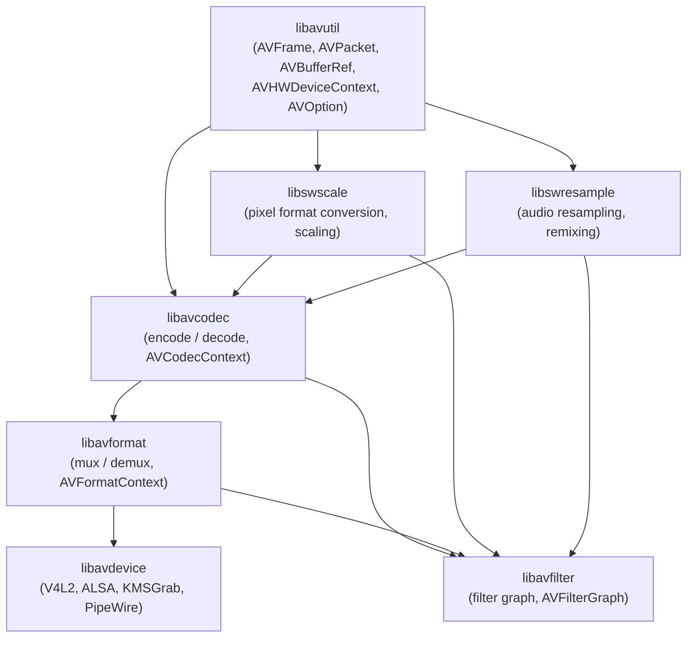
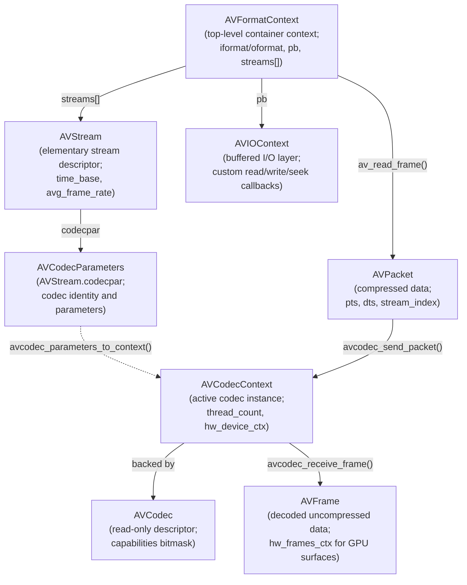
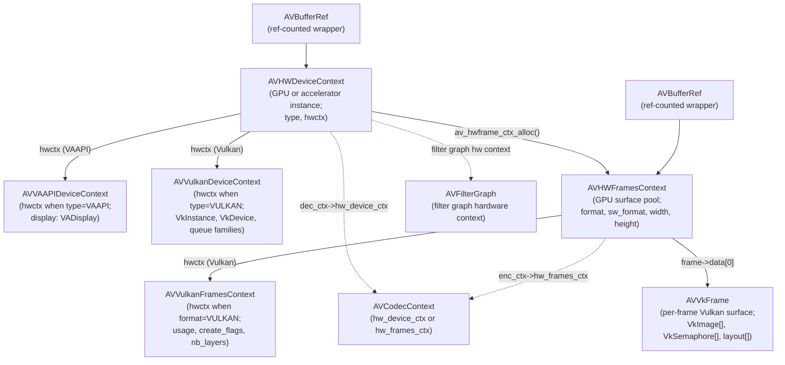
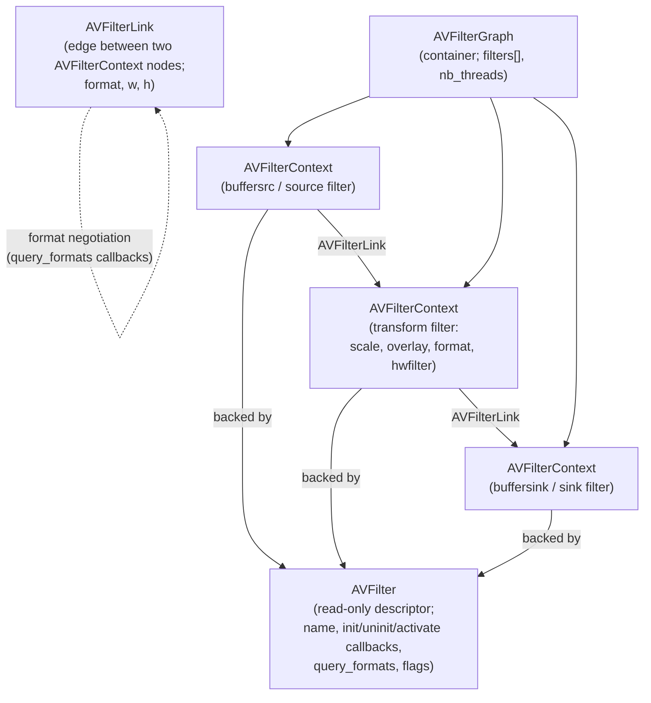
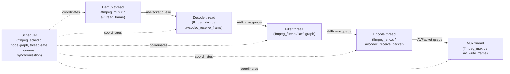
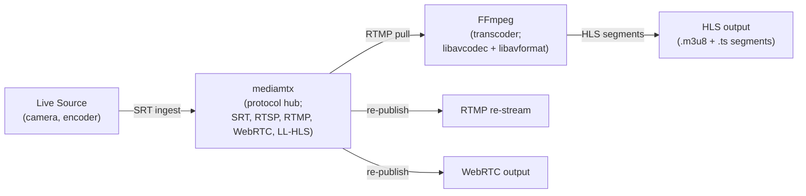

# Chapter 57: FFmpeg Architecture and Programming

> **Part**: Part XIII — Video Streaming on Linux
>
> **Audience**: Graphics application developers and systems developers integrating video pipelines; backend engineers building GPU-accelerated transcoding, streaming, or analytics systems.
>
> **Status**: First draft — 2026-06-15

---

## Table of Contents

1. [Overview](#1-overview)
2. [Library Architecture](#2-library-architecture)
   - [The Seven Libraries](#21-the-seven-libraries)
   - [Versioning and API Stability](#22-versioning-and-api-stability)
3. [Core Data Structures and Lifecycles](#3-core-data-structures-and-lifecycles)
   - [AVFormatContext and AVStream](#31-avformatcontext-and-avstream)
   - [AVCodecContext and AVCodec](#32-avcodeccontext-and-avcodec)
   - [AVPacket and AVFrame: Reference-Counted Buffers](#33-avpacket-and-avframe-reference-counted-buffers)
4. [Demuxing and Decoding](#4-demuxing-and-decoding)
   - [The Demux Pipeline](#41-the-demux-pipeline)
   - [The Send/Receive API](#42-the-sendreceive-api)
5. [Hardware Acceleration](#5-hardware-acceleration)
   - [AVHWDeviceContext and AVHWFramesContext](#51-avhwdevicecontext-and-avhwframescontext)
   - [VAAPI: Linux-Native GPU Decode and Encode](#52-vaapi-linux-native-gpu-decode-and-encode)
   - [Vulkan hwaccel and AVVkFrame](#53-vulkan-hwaccel-and-avvkframe)
   - [VDPAU: Legacy NVIDIA Decode](#54-vdpau-legacy-nvidia-decode)
6. [The lavfi Filter Graph](#6-the-lavfi-filter-graph)
   - [Core Filter Structures](#61-core-filter-structures)
   - [Building and Running a Filter Graph](#62-building-and-running-a-filter-graph)
   - [GPU Filter Chains vs CPU Filters](#63-gpu-filter-chains-vs-cpu-filters)
7. [Encoding Pipeline](#7-encoding-pipeline)
   - [Rate Control Modes](#71-rate-control-modes)
   - [GOP Structure and B-Frame Distance](#72-gop-structure-and-b-frame-distance)
   - [Hardware Encoders](#73-hardware-encoders)
8. [The FFmpeg CLI Architecture](#8-the-ffmpeg-cli-architecture)
   - [fftools Structure and the Scheduler](#81-fftools-structure-and-the-scheduler)
   - [Stream Mapping and Option Parsing](#82-stream-mapping-and-option-parsing)
   - [The AVOption System](#83-the-avoption-system)
9. [Streaming Protocols](#9-streaming-protocols)
   - [RTMP](#91-rtmp)
   - [RTSP](#92-rtsp)
   - [SRT](#93-srt)
   - [HLS](#94-hls)
   - [MPEG-DASH](#95-mpeg-dash)
   - [Open Streaming Servers: SRS and mediamtx](#96-open-streaming-servers-srs-and-mediamtx)
10. [Custom AVCodec and AVFilter Implementations](#10-custom-avcodec-and-avfilter-implementations)
    - [In-Tree Codec Registration](#101-in-tree-codec-registration)
    - [Minimal Decoder Skeleton](#102-minimal-decoder-skeleton)
    - [Custom Filter Implementation](#103-custom-filter-implementation)
    - [Out-of-Tree Extensions: The Practical Reality](#104-out-of-tree-extensions-the-practical-reality)
11. [Threading Model](#11-threading-model)
12. [libavdevice: Linux Device I/O](#12-libavdevice-linux-device-io)
13. [FFmpeg CLI Usage Reference](#13-ffmpeg-cli-usage-reference)
    - [ffprobe: Inspection and Analysis](#131-ffprobe-inspection-and-analysis)
    - [Container Remuxing (No Re-encode)](#132-container-remuxing-no-re-encode)
    - [Video Transcoding Recipes](#133-video-transcoding-recipes)
    - [Two-Pass Encoding](#134-two-pass-encoding)
    - [Hardware-Accelerated Encoding on Linux](#135-hardware-accelerated-encoding-on-linux)
    - [Audio Handling](#136-audio-handling)
    - [Video Filter Recipes](#137-video-filter-recipes)
    - [Complex Filter Graphs](#138-complex-filter-graphs)
    - [Frame Extraction and Thumbnails](#139-frame-extraction-and-thumbnails)
    - [Concatenation and Splitting](#1310-concatenation-and-splitting)
    - [Linux Screen and Desktop Recording](#1311-linux-screen-and-desktop-recording)
    - [Subtitle Handling](#1312-subtitle-handling)
    - [Metadata and Cover Art](#1313-metadata-and-cover-art)
    - [Adaptive Bitrate Streaming Output](#1314-adaptive-bitrate-streaming-output)
    - [Batch Processing Patterns](#1315-batch-processing-patterns)
    - [Common Pitfalls and Diagnostics](#1316-common-pitfalls-and-diagnostics)
14. [Integrations](#14-integrations)
15. [References](#15-references)

---

## 1. Overview

**FFmpeg** is the central multimedia framework of the Linux graphics stack. Every **GPU**-accelerated transcoding pipeline, **HLS** packager, **RTMP** ingest server, and hardware-decoded video player on Linux eventually reaches into one of its seven libraries. This chapter covers **FFmpeg** at an architectural level suitable for engineers who need to embed it as a library, extend it with custom codecs or filters, or integrate it with the hardware acceleration layers discussed in previous chapters.

The chapter assumes familiarity with **VA-API** (Chapter 26), **Vulkan** (Chapter 24 — Vulkan and EGL for Application Developers), and **Vulkan Video** (Chapter 50) — those APIs appear here as hwaccel back ends without re-explanation of their internals. Codec algorithms (**DCT**, motion estimation, **AV1** superblocks) are the subject of Chapter 60; this chapter treats codecs as black boxes accessed through the **libavcodec** API. **GStreamer** (Chapter 58) wraps **FFmpeg** codecs via the **gst-libav** plugin and is covered separately.

The seven libraries form a layered dependency graph with defined versioning and **API** stability guarantees:

- **libavutil**
- **libavcodec**
- **libavformat**
- **libavdevice**
- **libavfilter**
- **libswscale**
- **libswresample**

Their **MAJOR.MINOR.MICRO** version scheme, the `FF_API_*` deprecation guards, and the breaking changes introduced in **FFmpeg** 7.0 and 8.0 are covered in the library architecture section.

Readers will learn:

- how the seven **FFmpeg** libraries relate to each other and to the hardware acceleration stack
- the **AVFormatContext** → **AVStream** → **AVCodecContext** → **AVFrame** lifecycle, including the **AVPacket** and **AVFrame** reference-counted buffer model (**AVBufferRef**) with correct `av_frame_ref()` / `av_packet_unref()` discipline
- the six-step demux pipeline anchored by `av_read_frame()` and the send/receive API (`avcodec_send_packet()` / `avcodec_receive_frame()`, `avcodec_send_frame()` / `avcodec_receive_packet()`)
- how to enable **VAAPI** and **Vulkan** hwaccel paths through **AVHWDeviceContext** and **AVHWFramesContext** with zero-copy **DMA-BUF** frame sharing, including the per-frame **AVVkFrame** structure and its timeline-semaphore synchronisation protocol
- the legacy **VDPAU** path for **NVIDIA** hardware
- how **libavfilter** builds a directed graph of **AVFilterContext** nodes connected by **AVFilterLink** edges, including **GPU**-resident filter chains for **CUDA**, **VAAPI**, and **Vulkan** compute backends versus **CPU** filters with `hwupload` / `hwdownload` transitions
- how to configure encoder rate control modes (**CRF**, **CBR**, **VBR**, **CQP**) and **GOP** structure including **B-frame** distance for both live streaming and **VoD**
- the hardware encoder matrix covering `h264_vaapi`, `hevc_nvenc`, `av1_amf`, `h264_vulkan`, and others
- direct **NVIDIA Video Codec SDK** access via **NVENC** (`nvEncodeAPI.h`) and **NVDEC** (`cuviddec.h`) for sub-frame-latency pipelines
- how to implement a minimal in-tree codec (the **FFCodec** struct in `libavcodec/codec_internal.h`) or a custom **lavfi** filter (the **AVFilter** descriptor with `query_formats`, `init`, and `activate` callbacks), and why out-of-tree extensions require forking or an external framework such as **GStreamer**
- **FFmpeg**'s within-codec threading model (**FF_THREAD_SLICE**, **FF_THREAD_FRAME**) and the CLI-level **Scheduler** pipeline introduced in **FFmpeg** 7.0
- **libavdevice** Linux device sources — **V4L2**, **ALSA**, **X11Grab**, **KMSGrab**, and **PipeWire** — plus the custom **AVIOContext** callback interface for in-memory or network I/O
- how to package encoded streams into **HLS**, **MPEG-DASH**, **RTMP**, **SRT**, and **RTSP** using open streaming servers such as **SRS** and **mediamtx**

The chapter closes with a comprehensive **FFmpeg** CLI usage reference covering:

- **ffprobe** inspection
- container remuxing (`-c copy`)
- software and hardware-accelerated transcoding recipes (**H.264**/**x264**, **HEVC**/**x265**, **AV1**/**SVT-AV1**/**libaom**, **VP9**)
- two-pass encoding with **VBV** buffer constraints
- **VAAPI**/**NVENC**/**QSV**/**AMF** CLI flags
- audio handling (**AAC**, **Opus**, **FLAC**, `loudnorm`)
- **lavfi** video filter recipes
- complex `filter_complex` graph patterns
- frame extraction and thumbnail generation
- concatenation and splitting (concat demuxer, `segment` muxer)
- Linux screen and desktop recording (**x11grab**, **kmsgrab**, **PipeWire**)
- subtitle handling (**SRT**, **ASS**, **PGS**)
- metadata and cover art embedding
- adaptive bitrate streaming output
- batch processing patterns
- common pitfalls with diagnostic commands

Versions covered: **FFmpeg** 7.0 "Dijkstra" (April 2024), 7.1 **LTS** (September 2024), and 8.0 "Huffman" (August 2025). The 8.0 release is the largest in project history and introduces **Vulkan** compute codecs (**FFv1**, **ProRes RAW**, **VP9**, **AV1**) that run on any **Vulkan** 1.3 implementation without hardware-specific video decode queues.

Part XIII covers three multimedia frameworks that together span virtually every Linux video pipeline use case. While all three can drive **VA-API**, **NVDEC/NVENC**, and **V4L2** hardware acceleration, they differ fundamentally in architecture, language ecosystem, and the domains they optimise for. Choosing the right framework avoids costly rewrites: **FFmpeg** excels at single-file transcoding and CI/CD scripting, **GStreamer** at long-running daemon pipelines and **WebRTC**, and **NVIDIA DeepStream** at GPU-only video analytics backed by **TensorRT**. The table below summarises the key axes of comparison.

| **Framework** | **Architecture** | **Hardware accel path** | **Language / bindings** | **Streaming protocols** | **ML/inference integration** | **Licence** | **Best for** |
|---|---|---|---|---|---|---|---|
| **FFmpeg** | Library + CLI (procedural; lavf/lavc/lavfi pipeline) | VA-API, VDPAU, NVDEC/NVENC, V4L2, VideoToolbox, QSV | C (libav\*); bindings in Python (ffmpeg-python), Go, Rust | HLS, DASH, RTMP, RTP/RTSP, SRT, RIST | Limited (scale\_cuda filter; ONNX via DNN module) | LGPL 2.1 / GPL 2 (some parts) | Swiss-army tool; transcoding; single-file scripts; CI/CD |
| **GStreamer** | Element pipeline graph; caps negotiation; GLib/GObject | gst-vaapi, nvcodec (NVDEC/NVENC), v4l2codecs, qsvh264enc | C (GLib/GObject); Python (gi), Rust (gstreamer-rs), Java | HLS, DASH, RTP/RTSP, WebRTC (webrtcbin), SRT | gst-inference (OpenVINO/TF); onnxruntime plugin | LGPL 2.1 | Daemon/service pipelines; WebRTC; complex multi-source graphs |
| **NVIDIA DeepStream 7.x** | GStreamer-based analytics pipeline; NvDsBuffer metadata | NVDEC (primary), CUDA, TensorRT | C/C++ (plugin API); Python (pyds); GStreamer native | RTSP, Kafka, MQTT, HTTP | First-class TensorRT integration; Triton inference server | Proprietary (free download) | NVIDIA-only video analytics; smart cities; industrial AI |

---

## 2. Library Architecture

### 2.1 The Seven Libraries

FFmpeg organises its functionality into a layered dependency graph of seven libraries. Understanding the dependency order is essential when linking: each library may only depend on libraries below it.

```text
libavfilter ────────────────────────────────────────────┐
libavformat ──────────────────────────────────────────┐ │
libavdevice ─────────────────────────────────────┐   │ │
libavcodec ────────────────────────────────────┐  │   │ │
libswresample ────────────────────────────┐    │  │   │ │
libswscale ─────────────────────────┐     │    │  │   │ │
                                    └──┬──┴────┴──┴───┴─┘
                                    libavutil (foundation)
```



**libavutil** provides the foundation that no other library may bypass: `AVFrame`, `AVPacket`, the buffer reference-counting model (`AVBufferRef`), `AVRational`, `AVDictionary`, `AVChannelLayout`, the logging subsystem (`av_log`, `AVClass`), the `AVOption` generic configuration system, hardware context types (`AVHWDeviceContext`, `AVHWFramesContext`), and all pixel-format enumerations. Every other library depends on libavutil but never on each other except through the defined ordering above. [Source: FFmpeg core libraries overview](https://deepwiki.com/FFmpeg/FFmpeg/3-core-libraries)

**libavcodec** implements encoding and decoding. It contains the `AVCodecContext` (the active codec instance), bitstream filter infrastructure (`AVBSFContext`), and hundreds of codec implementations — software decoders for H.264, HEVC, AV1, VP9, and FFv1, plus hardware codec wrappers for VAAPI, Vulkan Video, CUDA/NVDEC, and NVENC.

**libavformat** handles container I/O: muxing (writing) and demuxing (reading) MP4, Matroska, MPEG-TS, FLV, WebM, and dozens of other containers. It also implements streaming protocols (HTTP, RTMP, RTSP, HLS, DASH, SRT) through `AVIOContext`, a unified buffered I/O layer that accepts user-supplied read/write/seek callbacks for in-memory or network I/O.

**libavdevice** extends libavformat with device-based sources and sinks: Video4Linux2 (`v4l2`), ALSA, X11Grab, KMSGrab, and PipeWire, all presented through the same `AVFormatContext` interface.

**libavfilter** implements a directed graph of processing nodes. Frames flow from source filters (`buffersrc`) through transform filters (`scale`, `overlay`, `format`, hardware filters) to sink filters (`buffersink`). The graph engine handles format negotiation, memory management, and optional slice-threaded execution.

**libswscale** provides pixel format conversion and image scaling — YUV↔RGB, planar↔packed, any resolution to any resolution — using SIMD-accelerated code for x86 (SSE2, AVX2) and ARM (NEON). [Source: swscale.h](https://github.com/FFmpeg/FFmpeg/blob/master/libswscale/swscale.h)

**libswresample** provides audio sample format conversion, rate conversion, and channel remixing with a simple `SwrContext` API analogous to `SwsContext`.

### 2.2 Versioning and API Stability

Libraries use MAJOR.MINOR.MICRO versioning; micro versions begin at 100 to distinguish from third-party semantic versioning. Within a major version, the API and ABI are backward-compatible. Deprecated APIs are guarded by `FF_API_*` macros and removed at the next major version boundary. The complete history of API changes is in `doc/APIchanges` in the FFmpeg source tree. [Source: FFmpeg doxygen trunk](https://ffmpeg.org/doxygen/trunk/)

FFmpeg 7.0 removed all APIs deprecated before 6.0 and mandates a C11-compliant compiler. The old bitmask-based channel layout API was fully replaced by `AVChannelLayout`. FFmpeg 8.0 introduced libavutil 60.32.100 and libavcodec 62.x.

---

## 3. Core Data Structures and Lifecycles

### 3.1 AVFormatContext and AVStream



`AVFormatContext` is the top-level context for a media file or stream, used both for reading (demuxing) and writing (muxing). [Source: avformat.h](https://github.com/FFmpeg/FFmpeg/blob/master/libavformat/avformat.h)

```c
// libavformat/avformat.h — AVFormatContext (abbreviated)
typedef struct AVFormatContext {
    const AVInputFormat  *iformat;   // demuxing only
    const AVOutputFormat *oformat;   // muxing only
    AVIOContext          *pb;        // buffered I/O context
    unsigned int          nb_streams;
    AVStream            **streams;   // array of stream descriptors
    char                 *url;       // heap-allocated input/output URL
    int64_t               start_time;  // in AV_TIME_BASE (microseconds)
    int64_t               duration;
    int64_t               bit_rate;
    AVDictionary         *metadata;
} AVFormatContext;

// Input lifecycle:
AVFormatContext *ctx = NULL;
avformat_open_input(&ctx, "input.mp4", NULL, NULL); // allocates ctx
avformat_find_stream_info(ctx, NULL);               // probes stream params
// ... use ctx ...
avformat_close_input(&ctx);                         // frees and NULLs ctx

// Output lifecycle:
AVFormatContext *out_ctx;
avformat_alloc_output_context2(&out_ctx, NULL, "mp4", "output.mp4");
// ... configure streams, write ...
avformat_free_context(out_ctx);
```

`AVStream` represents one elementary stream (video, audio, subtitle). The critical field is `codecpar` (`AVCodecParameters`), which replaced the old `AVStream.codec` (removed in FFmpeg 4.0). To decode a stream, copy codecpar into a new `AVCodecContext` with `avcodec_parameters_to_context()`. [Source: avformat.h](https://github.com/FFmpeg/FFmpeg/blob/master/libavformat/avformat.h)

```c
// libavformat/avformat.h — AVStream (abbreviated)
typedef struct AVStream {
    int               index;       // position in AVFormatContext.streams[]
    AVCodecParameters *codecpar;   // codec identity and parameters
    AVRational        time_base;   // pts/dts units for this stream
    int64_t           duration;    // in time_base units
    AVRational        avg_frame_rate;
    AVDictionary     *metadata;
} AVStream;
```

### 3.2 AVCodecContext and AVCodec

`AVCodecContext` holds the configuration and runtime state for a single active codec instance. It is always backed by a specific `AVCodec` descriptor. [Source: avcodec.h](https://github.com/FFmpeg/FFmpeg/blob/master/libavcodec/avcodec.h)

```c
// libavcodec/avcodec.h — lifecycle
const AVCodec *dec = avcodec_find_decoder(AV_CODEC_ID_H264);
// OR by name for hardware codecs:
const AVCodec *enc = avcodec_find_encoder_by_name("hevc_vaapi");

AVCodecContext *ctx = avcodec_alloc_context3(dec);
avcodec_parameters_to_context(ctx, stream->codecpar); // copy stream params

// Hardware context attachment (before open):
ctx->hw_device_ctx = av_buffer_ref(hw_device_ctx_ref);

// Open; codec allocates internal state and starts worker threads
AVDictionary *opts = NULL;
av_dict_set(&opts, "preset", "fast", 0);
avcodec_open2(ctx, dec, &opts);
av_dict_free(&opts);

// Flush on seek:
avcodec_flush_buffers(ctx);

avcodec_free_context(&ctx);
```

The `AVCodec` struct (`const AVCodec *`) is the public read-only descriptor. Its `capabilities` field (bitmask of `AV_CODEC_CAP_*`) declares what threading modes the codec supports, whether it can emit hardware frames, etc. Internally FFmpeg uses a larger `FFCodec` struct in `libavcodec/codec_internal.h` that adds callbacks; this is not a stable public API.

### 3.3 AVPacket and AVFrame: Reference-Counted Buffers

`AVPacket` carries compressed data (typically one encoded video frame or a few audio frames). `AVFrame` carries decoded (uncompressed) data. Both participate in FFmpeg's reference-counting model: when `buf[0] != NULL`, the underlying memory is reference-counted and multiple packets or frames can share it. [Source: frame.h](https://github.com/FFmpeg/FFmpeg/blob/master/libavutil/frame.h)

```c
// libavutil/frame.h — reference-counting discipline
AVFrame *frame = av_frame_alloc();
av_frame_get_buffer(frame, 0);  // allocate data planes with alignment

AVFrame *ref = av_frame_alloc();
av_frame_ref(ref, frame);       // increment ref count; shares pixel data
av_frame_unref(frame);          // decrement; buffer freed when count reaches 0
av_frame_free(&ref);            // decrement + free struct

// AVPacket:
AVPacket *pkt = av_packet_alloc();
// pkt->data, pkt->size — compressed bytes
// pkt->pts, pkt->dts, pkt->duration — in AVStream.time_base
av_packet_unref(pkt);   // release data reference; safe to reuse struct
av_packet_free(&pkt);   // release reference + free struct
```

For hardware frames, `frame->hw_frames_ctx` points to the `AVHWFramesContext` that manages the GPU surface pool. When `frame->format == AV_PIX_FMT_VAAPI` or `AV_PIX_FMT_VULKAN`, `frame->data[0]` is a surface handle, not a CPU pointer. [Source: libavutil core utilities](https://deepwiki.com/FFmpeg/FFmpeg/3.1-libavutil-core-utilities)

---

## 4. Demuxing and Decoding

### 4.1 The Demux Pipeline

The canonical decode pipeline follows six steps: open → probe → find stream → open codec → read packets → decode. [Source: lavf decoding group](https://ffmpeg.org/doxygen/trunk/group__lavf__decoding.html)

```c
// Full demux + decode skeleton
AVFormatContext *fmt_ctx = NULL;
const AVCodec   *dec;
AVPacket        *pkt   = av_packet_alloc();
AVFrame         *frame = av_frame_alloc();

// Step 1-2: open and probe
avformat_open_input(&fmt_ctx, "input.mp4", NULL, NULL);
avformat_find_stream_info(fmt_ctx, NULL);

// Step 3: find best video stream (also retrieves matching decoder)
int vid_idx = av_find_best_stream(fmt_ctx, AVMEDIA_TYPE_VIDEO,
                                   -1, -1, &dec, 0);

// Step 4: open codec
AVCodecContext *dec_ctx = avcodec_alloc_context3(dec);
avcodec_parameters_to_context(dec_ctx,
    fmt_ctx->streams[vid_idx]->codecpar);
avcodec_open2(dec_ctx, dec, NULL);

// Step 5: packet read loop
while (av_read_frame(fmt_ctx, pkt) >= 0) {
    if (pkt->stream_index == vid_idx) {
        avcodec_send_packet(dec_ctx, pkt); // Step 6 (send side)
        int ret;
        while ((ret = avcodec_receive_frame(dec_ctx, frame)) == 0) {
            // frame is ready — process it
            av_frame_unref(frame);
        }
        // ret == AVERROR(EAGAIN): need more packets; ret == AVERROR_EOF: done
    }
    av_packet_unref(pkt);
}
// Flush: drain buffered frames
avcodec_send_packet(dec_ctx, NULL);
while (avcodec_receive_frame(dec_ctx, frame) == 0) { /* drain */ }

av_packet_free(&pkt);
av_frame_free(&frame);
avcodec_free_context(&dec_ctx);
avformat_close_input(&fmt_ctx);
```

`avformat_seek_file()` provides bounded seeking with `min_ts`/`ts`/`max_ts` parameters; after seeking, call `avcodec_flush_buffers()` to clear the codec's internal DPB (decoder picture buffer).

### 4.2 The Send/Receive API

The send/receive API (introduced in FFmpeg 3.1, now the only supported path) decouples input submission from output retrieval. This is architecturally necessary because: B-frame reordering causes the encoder to emit packets in a different order than frames were submitted; hardware pipelines have multi-frame GPU queues; audio codecs may buffer partial frames until a full codec frame is available. [Source: encoding and decoding APIs](https://deepwiki.com/FFmpeg/FFmpeg/5.1.2-encoding-and-decoding-apis)

```c
// Decoder: avcodec_send_packet + avcodec_receive_frame
// Returns: 0=OK, AVERROR(EAGAIN)=need more input, AVERROR_EOF=drained

// Encoder: avcodec_send_frame + avcodec_receive_packet
avcodec_send_frame(enc_ctx, frame);         // NULL frame triggers flush
while (avcodec_receive_packet(enc_ctx, pkt) == 0) {
    // write pkt to muxer
    av_packet_unref(pkt);
}
```

Both pairs use EAGAIN/EOF semantics identically: EAGAIN means the other side must be called first; EOF means the codec is fully drained after a NULL submission.

---

## 5. Hardware Acceleration

### 5.1 AVHWDeviceContext and AVHWFramesContext



FFmpeg models hardware accelerators through two reference-counted context types: `AVHWDeviceContext` (represents a GPU or accelerator instance) and `AVHWFramesContext` (manages a pool of GPU surfaces). Both are heap-allocated with `av_buffer_ref`-counted wrappers for safe sharing across codec and filter graph components. [Source: hardware context system](https://deepwiki.com/FFmpeg/FFmpeg/7.1-hardware-context-system) | [Source: AVHWDeviceContext doxygen](https://ffmpeg.org/doxygen/trunk/structAVHWDeviceContext.html)

```c
// libavutil/hwcontext.h — device context creation (convenience path)
AVBufferRef *hw_device_ctx = NULL;
av_hwdevice_ctx_create(&hw_device_ctx,
    AV_HWDEVICE_TYPE_VAAPI,
    "/dev/dri/renderD128",   // device node; NULL for system default
    NULL, 0);

// Attach to decoder before avcodec_open2:
dec_ctx->hw_device_ctx = av_buffer_ref(hw_device_ctx);

// Manual creation (fine-grained control):
AVBufferRef *ref = av_hwdevice_ctx_alloc(AV_HWDEVICE_TYPE_VAAPI);
AVHWDeviceContext *dev = (AVHWDeviceContext *)ref->data;
AVVAAPIDeviceContext *vaapi = dev->hwctx;   // device-type-specific struct
vaapi->display = my_va_display;
av_hwdevice_ctx_init(ref);
```

`AVHWFramesContext` manages the GPU surface pool used by a codec or filter. The codec allocates frames from this pool during `avcodec_open2` if `enc_ctx->hw_frames_ctx` is set:

```c
// libavutil/hwcontext.h — frames context setup for VAAPI encoding
AVBufferRef *hw_frames_ref = av_hwframe_ctx_alloc(hw_device_ctx);
AVHWFramesContext *frames  = (AVHWFramesContext *)hw_frames_ref->data;
frames->format             = AV_PIX_FMT_VAAPI;
frames->sw_format          = AV_PIX_FMT_NV12;
frames->width              = 1920;
frames->height             = 1080;
frames->initial_pool_size  = 20;
av_hwframe_ctx_init(hw_frames_ref);
enc_ctx->hw_frames_ctx = av_buffer_ref(hw_frames_ref);
av_buffer_unref(&hw_frames_ref);   // encoder holds its own reference
```

To discover which hardware configurations a codec supports, iterate `avcodec_get_hw_config()`:

```c
// libavcodec/avcodec.h — AVCodecHWConfig enumeration
for (int i = 0; ; i++) {
    const AVCodecHWConfig *cfg = avcodec_get_hw_config(codec, i);
    if (!cfg) break;
    if (cfg->methods & AV_CODEC_HW_CONFIG_METHOD_HW_DEVICE_CTX
        && cfg->device_type == AV_HWDEVICE_TYPE_VAAPI) {
        hw_pix_fmt = cfg->pix_fmt;  // AV_PIX_FMT_VAAPI
        break;
    }
}
```

### 5.2 VAAPI: Linux-Native GPU Decode and Encode

VA-API (Video Acceleration API) is a Linux-specific open API backed by Intel, AMD, and other Mesa drivers. Its FFmpeg integration uses `AV_HWDEVICE_TYPE_VAAPI` and `AV_PIX_FMT_VAAPI`. See Chapter 26 for the VA-API internals; this section covers the FFmpeg wrapper layer.

The key decode pattern uses a `get_format` callback to select the hardware pixel format when the codec negotiates output: [Source: hw_decode.c example](https://ffmpeg.org/doxygen/4.0/hw_decode_8c-example.html)

```c
// doc/examples/hw_decode.c — hardware format negotiation callback
static enum AVPixelFormat hw_pix_fmt;

static enum AVPixelFormat get_hw_format(AVCodecContext *ctx,
                                         const enum AVPixelFormat *pix_fmts)
{
    for (const enum AVPixelFormat *p = pix_fmts; *p != -1; p++)
        if (*p == hw_pix_fmt)
            return *p;
    fprintf(stderr, "No HW surface format found; falling back to SW\n");
    return AV_PIX_FMT_NONE;
}

// Attach before avcodec_open2:
dec_ctx->hw_device_ctx = av_buffer_ref(hw_device_ctx);
dec_ctx->get_format    = get_hw_format;
```

After receiving a `frame` with `frame->format == AV_PIX_FMT_VAAPI`, transfer to CPU memory for processing or display:

```c
AVFrame *sw_frame = av_frame_alloc();
av_hwframe_transfer_data(sw_frame, hw_frame, 0); // GPU → CPU; allocates sw_frame data
// sw_frame->data[0..2] are now accessible CPU pointers (NV12 planes)
av_frame_free(&sw_frame);
```

For VAAPI encoding, set `enc_ctx->pix_fmt = AV_PIX_FMT_VAAPI`, attach an `hw_frames_ctx`, then upload CPU NV12 frames before submitting: [Source: vaapi_encode.c example](https://ffmpeg.org/doxygen/trunk/doc_2examples_2vaapi__encode_8c_source.html)

```c
// doc/examples/vaapi_encode.c — per-frame upload
AVFrame *hw_frame = av_frame_alloc();
av_hwframe_get_buffer(enc_ctx->hw_frames_ctx, hw_frame, 0);
av_hwframe_transfer_data(hw_frame, sw_frame, 0); // CPU → GPU
avcodec_send_frame(enc_ctx, hw_frame);
av_frame_free(&hw_frame);
```

From the command line, VAAPI encode requires uploading via the `hwupload` filter:

```bash
# ffmpeg CLI — VAAPI decode-transcode-encode pipeline
ffmpeg -hwaccel vaapi \
       -hwaccel_device /dev/dri/renderD128 \
       -hwaccel_output_format vaapi \
       -i input.mp4 \
       -c:v hevc_vaapi -b:v 5M output.mp4

# Software input → VAAPI encode:
ffmpeg -i input.yuv \
       -vf 'format=nv12,hwupload' \
       -c:v h264_vaapi output.h264
```

Available VAAPI encoders: `h264_vaapi`, `hevc_vaapi`, `av1_vaapi`, `vp9_vaapi`, `vp8_vaapi`, `mjpeg_vaapi`, `mpeg2_vaapi`. [Source: FFmpeg HWAccelIntro](https://trac.ffmpeg.org/wiki/HWAccelIntro)

### 5.3 Vulkan hwaccel and AVVkFrame

FFmpeg's Vulkan hwaccel path (introduced in 4.3, extended in 7.1 and 8.0) uses `AV_HWDEVICE_TYPE_VULKAN` and `AV_PIX_FMT_VULKAN`. See Chapter 50 for Vulkan Video internals. [Source: hwcontext_vulkan.h](https://github.com/FFmpeg/FFmpeg/blob/master/libavutil/hwcontext_vulkan.h) | [Source: AVVkFrame doxygen](https://ffmpeg.org/doxygen/trunk/structAVVkFrame.html)

`AVVkFrame` is the per-frame Vulkan surface descriptor accessible via `frame->data[0]`:

```c
// libavutil/hwcontext_vulkan.h — AVVkFrame (abbreviated)
typedef struct AVVkFrame {
    VkImage           img   [AV_NUM_DATA_POINTERS]; // one VkImage per plane
    VkImageTiling     tiling;
    VkDeviceMemory    mem   [AV_NUM_DATA_POINTERS];
    VkMemoryPropertyFlagBits flags;
    // Per-plane synchronisation (timeline semaphores):
    VkSemaphore       sem      [AV_NUM_DATA_POINTERS];
    uint64_t          sem_value[AV_NUM_DATA_POINTERS]; // current value; wait before access
    VkAccessFlagBits  access  [AV_NUM_DATA_POINTERS]; // current access mask
    VkImageLayout     layout  [AV_NUM_DATA_POINTERS]; // current layout
    uint32_t          queue_family[AV_NUM_DATA_POINTERS];
} AVVkFrame;
```

`AVVulkanFramesContext` is the Vulkan-specific extension of `AVHWFramesContext` (the `hwctx` field when `format == AV_PIX_FMT_VULKAN`). It controls how the surface pool is allocated and how frames are shared with external Vulkan consumers. [Source: hwcontext_vulkan.h](https://github.com/FFmpeg/FFmpeg/blob/master/libavutil/hwcontext_vulkan.h)

```c
// libavutil/hwcontext_vulkan.h — AVVulkanFramesContext (abbreviated)
typedef struct AVVulkanFramesContext {
    // Optional: caller-supplied allocator (NULL = FFmpeg internal)
    const AVVulkanDeviceQueueFamilyProperties *qf;
    // Image usage flags applied to all frames in the pool:
    VkImageUsageFlags  usage;
    // Additional tiling/creation flags:
    VkImageCreateFlags create_flags;
    // Number of layers per image (for multiview/stereoscopic frames):
    int nb_layers;
    // Aspect mask(s) to use for image views:
    VkImageAspectFlags aspect;
} AVVulkanFramesContext;
```

When constructing a Vulkan frames context for encoding or for sharing frames with an external renderer, populate `AVVulkanFramesContext` before calling `av_hwframe_ctx_init()`:

```c
// Creating a Vulkan frames context for zero-copy sharing
AVBufferRef *hw_frames_ref = av_hwframe_ctx_alloc(hw_device_ctx);
AVHWFramesContext       *frames_ctx = (AVHWFramesContext *)hw_frames_ref->data;
AVVulkanFramesContext   *vk_frames  = frames_ctx->hwctx;

frames_ctx->format    = AV_PIX_FMT_VULKAN;
frames_ctx->sw_format = AV_PIX_FMT_NV12;
frames_ctx->width     = 1920;
frames_ctx->height    = 1080;
frames_ctx->initial_pool_size = 8;

// Allow the images to be sampled by an external renderer:
vk_frames->usage = VK_IMAGE_USAGE_SAMPLED_BIT
                 | VK_IMAGE_USAGE_VIDEO_DECODE_DST_BIT_KHR
                 | VK_IMAGE_USAGE_TRANSFER_SRC_BIT;

av_hwframe_ctx_init(hw_frames_ref);
dec_ctx->hw_frames_ctx = av_buffer_ref(hw_frames_ref);
av_buffer_unref(&hw_frames_ref);
```

`AVVulkanFramesContext` is distinct from `AVVkFrame`: the frames context is a pool-level descriptor (one per codec or filter), whereas `AVVkFrame` is the per-frame surface handle obtained from `frame->data[0]` after a decode. The frames context controls creation-time parameters; `AVVkFrame` carries per-frame synchronisation state.

When an external Vulkan renderer (e.g. a Wayland compositor or a game engine) wants to consume a decoded frame without copying it, it must:
1. Obtain `AVVkFrame *vkf = (AVVkFrame *)frame->data[0]`
2. Submit a queue wait on `vkf->sem[0]` at value `vkf->sem_value[0]`
3. Issue the required image layout transition from `vkf->layout[0]` to the desired layout
4. Use `vkf->img[0]` in the render pass
5. Signal `vkf->sem[0]` to value `vkf->sem_value[0] + 1` and update `vkf->sem_value[0]`

This zero-copy path is the FFmpeg realisation of the Vulkan Video pipeline described in Chapter 50. [Source: Maister's Vulkan blog](https://themaister.net/blog/2023/01/05/vulkan-video-shenanigans-ffmpeg-radv-integration-experiments/)

FFmpeg 8.0 introduced **Vulkan compute codecs** — codec implementations using Vulkan compute shaders rather than Vulkan Video fixed-function hardware queues. These work on any Vulkan 1.3 implementation, including drivers that do not implement `VK_KHR_video_decode_queue`:

```bash
# Vulkan compute codecs (FFmpeg 8.0+) — no hardware video queue required
ffmpeg -init_hw_device vulkan=vk:0 \
       -c:v ffv1_vulkan -i input.mkv \
       -c:v av1_vulkan output.mkv

# Vulkan Video decode with GPU filter chain (FFmpeg 7.1+)
ffmpeg -init_hw_device vulkan=vk:0 \
       -hwaccel vulkan -hwaccel_output_format vulkan \
       -i input.mp4 \
       -vf 'scale_vulkan=1280:720' \
       -c:v hevc_vulkan output.mp4
```
[Source: FFmpeg 8.0 release notes](https://9to5linux.com/ffmpeg-8-0-huffman-released-with-av1-vulkan-encoder-vvc-va-api-decoding)

The `AVVulkanDeviceContext` (the `hwctx` field of `AVHWDeviceContext` when `type == AV_HWDEVICE_TYPE_VULKAN`) exposes `VkInstance inst`, `VkPhysicalDevice phys_dev`, `VkDevice act_dev`, queue family assignments, and memory allocator callbacks, allowing applications that already manage a Vulkan device to share it with FFmpeg by populating these fields before calling `av_hwdevice_ctx_init()`.

### 5.4 VDPAU: Legacy NVIDIA Decode

VDPAU (Video Decode and Presentation API for Unix) is NVIDIA's legacy Linux hardware decode API, predating VA-API's adoption as the common interface. FFmpeg supports it via `AV_HWDEVICE_TYPE_VDPAU` and `AV_PIX_FMT_VDPAU`. Several VDPAU-specific allocator functions were deprecated in March 2024 (superseded by `av_vdpau_bind_context()`). For new code targeting NVIDIA hardware on Linux, prefer CUDA/NVDEC (`AV_HWDEVICE_TYPE_CUDA`) or Vulkan hwaccel, which provide better integration with CUDA and Vulkan interop paths described in Chapter 25. VDPAU support is maintained for compatibility with existing deployments. [Source: HWAccelIntro wiki](https://trac.ffmpeg.org/wiki/HWAccelIntro)

---

## 6. The lavfi Filter Graph

### 6.1 Core Filter Structures



`libavfilter` implements a directed graph where `AVFilterContext` nodes are connected by `AVFilterLink` edges. Each filter type is described by a read-only `AVFilter` descriptor that declares its input/output pads and callback functions. [Source: avfilter.h](https://github.com/FFmpeg/FFmpeg/blob/master/libavfilter/avfilter.h)

```c
// libavfilter/avfilter.h — AVFilter descriptor (abbreviated)
typedef struct AVFilter {
    const char        *name;
    const char        *description;
    int                nb_inputs;
    int                nb_outputs;
    const AVClass     *priv_class;      // AVOption class for filter options
    int                flags;           // AVFILTER_FLAG_SLICE_THREADS, etc.
    int                priv_size;       // bytes to allocate for private data

    int  (*init)   (AVFilterContext *ctx);
    void (*uninit) (AVFilterContext *ctx);
    int  (*activate)(AVFilterContext *ctx); // process one step
    // Format negotiation (union of several strategies):
    union {
        int (*query_func)(AVFilterContext *);
        const enum AVPixelFormat  *pixels_list;
        enum AVPixelFormat         pix_fmt;
    };
} AVFilter;
```

`AVFILTER_FLAG_SLICE_THREADS` allows the graph engine to split frames into horizontal slices and process them concurrently. `AVFILTER_FLAG_HWDEVICE` signals that the filter can operate on hardware-resident frames.

`AVFilterGraph` is the container:

```c
typedef struct AVFilterGraph {
    AVFilterContext **filters;
    unsigned          nb_filters;
    int               nb_threads;   // 0 = auto
} AVFilterGraph;
```

### 6.2 Building and Running a Filter Graph

The high-level parse path accepts the same filter graph string syntax used on the FFmpeg command line. The key distinction between `avfilter_graph_parse_ptr` and `avfilter_graph_parse2` (both named in the plan) is how unlinked pads are handled: `avfilter_graph_parse_ptr` takes in/out parameters for `AVFilterInOut` lists (the caller pre-allocates them and populates them with the endpoint contexts, then the function links them); `avfilter_graph_parse2` *returns* the unlinked inputs and outputs, so the caller deals with them afterwards — useful when constructing complex graphs where the connection points are discovered dynamically. [Source: libavfilter graphparser](https://ffmpeg.org/doxygen/0.11/graphparser_8c.html)

```c
// libavfilter/avfilter.h — building a scale+format graph
AVFilterGraph   *graph  = avfilter_graph_alloc();
AVFilterContext *src_ctx, *sink_ctx;

// Create endpoints
char src_args[256];
snprintf(src_args, sizeof(src_args),
    "video_size=%dx%d:pix_fmt=%d:time_base=%d/%d:pixel_aspect=%d/%d",
    width, height, AV_PIX_FMT_YUV420P, tb.num, tb.den, 1, 1);
avfilter_graph_create_filter(&src_ctx,
    avfilter_get_by_name("buffer"), "in", src_args, NULL, graph);
avfilter_graph_create_filter(&sink_ctx,
    avfilter_get_by_name("buffersink"), "out", NULL, NULL, graph);

// avfilter_graph_parse_ptr: caller provides populated AVFilterInOut
AVFilterInOut *inputs  = avfilter_inout_alloc();
AVFilterInOut *outputs = avfilter_inout_alloc();
outputs->name = av_strdup("in");  outputs->filter_ctx = src_ctx;  outputs->pad_idx = 0;
inputs->name  = av_strdup("out"); inputs->filter_ctx  = sink_ctx; inputs->pad_idx  = 0;
avfilter_graph_parse_ptr(graph, "scale=1280:720,format=yuv420p",
                          &inputs, &outputs, NULL);
avfilter_graph_config(graph, NULL);  // format negotiation + validation
avfilter_inout_free(&inputs);
avfilter_inout_free(&outputs);

// avfilter_graph_parse2: graph returns unlinked pads for caller to connect
// AVFilterInOut *ins = NULL, *outs = NULL;
// avfilter_graph_parse2(graph, "scale=1280:720", &ins, &outs);
// caller then inspects ins/outs and links them to src_ctx / sink_ctx

// Data flow
av_buffersrc_add_frame_flags(src_ctx, in_frame, AV_BUFFERSRC_FLAG_KEEP_REF);
while (av_buffersink_get_frame(sink_ctx, out_frame) >= 0) {
    // out_frame has been scaled and converted
    av_frame_unref(out_frame);
}

avfilter_graph_free(&graph);
```

Complex filter graph syntax uses `;` to separate filter chains and `[label]` to name inter-chain connections:

```bash
# Four-input mosaic filtergraph (CLI -filter_complex)
[0:0]pad=iw*2:ih*2[a];
[1:0]negate[b];
[2:0]hflip[c];
[3:0]edgedetect[d];
[a][b]overlay=w[x];
[x][c]overlay=0:h[y];
[y][d]overlay=w:h
```
[Source: FFmpeg filtering guide](https://trac.ffmpeg.org/wiki/FilteringGuide)

### 6.3 GPU Filter Chains vs CPU Filters

Hardware filter chains keep frames GPU-resident across multiple processing steps, avoiding round-trip copies through CPU memory. Each GPU-acceleration backend provides its own filter set. The key GPU filter families:

**CUDA filters** (for NVIDIA pipelines): `scale_cuda`, `yadif_cuda` (deinterlace), `thumbnail_cuda`, `hwupload_cuda`, `hwdownload`. Require `AV_HWDEVICE_TYPE_CUDA` device context on the filter graph.

**VAAPI filters**: `scale_vaapi`, `deinterlace_vaapi`, `denoise_vaapi`, `sharpness_vaapi`, `procamp_vaapi`, `hwupload`, `hwdownload`. Backed by `libva` postprocessing (`VAProcPipelineParameterBuffer`).

**Vulkan filters** (FFmpeg 7.0+): `scale_vulkan`, `avgblur_vulkan`, `chromaber_vulkan`, `flip_vulkan`, `hflip_vulkan`, `nlmeans_vulkan`, `overlay_vulkan`, `pad_vulkan`, `xfade_vulkan`. Implemented as Vulkan compute shader dispatches.

When mixing GPU and CPU filters in a single graph, `hwdownload` and `hwupload` filters handle the transitions. The graph engine automatically negotiates formats at each `AVFilterLink` boundary via `query_formats` callbacks.

---

## 7. Encoding Pipeline

### 7.1 Rate Control Modes

Encoder rate control is configured through `AVCodecContext` fields and per-encoder `AVOption` values:

| Mode | Configuration | Use case |
|---|---|---|
| **CRF** (constant rate factor) | `av_opt_set_int(ctx, "crf", 23, 0)` | VoD; quality-driven, variable bitrate |
| **CBR** (constant bitrate) | `ctx->bit_rate = ctx->rc_max_rate = ctx->rc_min_rate = 4000000` | Live streaming; predictable bandwidth |
| **VBR** (variable bitrate) | `ctx->bit_rate = 4000000; ctx->rc_max_rate = 6000000` | VoD; efficiency with peak bound |
| **CQP** (constant QP) | `av_opt_set_int(ctx, "qp", 28, 0)` | Hardware encoders; fast, no lookahead |

For hardware encoders (VAAPI, NVENC, AMF), rate control is often specified through codec-private AVOptions rather than generic fields, because fixed-function hardware implements its own control loops. Always check which options a hardware encoder accepts at runtime with `ffmpeg -h encoder=hevc_vaapi`.

### 7.2 GOP Structure and B-Frame Distance

GOP structure affects both compression efficiency and seek granularity:

```c
// libavcodec/avcodec.h — GOP and B-frame configuration
ctx->gop_size    = 60;   // keyframe every 60 frames (~2 s at 30 fps)
ctx->max_b_frames = 2;   // two B-frames between reference frames (IBBBP...)
ctx->keyint_min  = 25;   // minimum keyframe interval (software x264/x265)
```

For live streaming, set `ctx->gop_size` to a multiple of the segment duration (e.g. 48 for 2-second segments at 24 fps) and ensure `ctx->max_b_frames = 0` for the lowest latency. Streaming protocols including RTMP and HLS require segment boundaries to align with IDR frames.

### 7.3 Hardware Encoders

FFmpeg names hardware encoders `<codec>_<api>`. The major Linux-relevant ones:

| Encoder | API | Notes |
|---|---|---|
| `h264_vaapi` | VA-API | Intel, AMD, some ARM SoC |
| `hevc_vaapi` | VA-API | Intel Gen 9+, AMD VCE |
| `av1_vaapi` | VA-API | Intel Arc, AMD RDNA3+ |
| `vp9_vaapi` | VA-API | Intel Gen 11+ |
| `h264_nvenc` | NVENC/CUDA | NVIDIA Kepler+ |
| `hevc_nvenc` | NVENC/CUDA | NVIDIA Maxwell+ |
| `av1_nvenc` | NVENC/CUDA | NVIDIA Ada Lovelace+ |
| `h264_amf` | AMD AMF | AMD GCN+ via ROCm |
| `hevc_amf` | AMD AMF | AMD GCN+ |
| `av1_amf` | AMD AMF | AMD RDNA2+ |
| `h264_vulkan` | Vulkan Video | FFmpeg 7.1+; driver-dependent |
| `hevc_vulkan` | Vulkan Video | FFmpeg 7.1+ |
| `av1_vulkan` | Vulkan compute | FFmpeg 8.0+ |

The Vulkan H.264 and HEVC encoders introduced in FFmpeg 7.1 were the first Vulkan hwaccel encoders in the codebase. They use `VkVideoEncodeH264SessionParametersCreateInfoKHR` / `VkVideoEncodeH264PictureInfoKHR` and the CBS (Coded Bitstream) APIs (`ff_cbs_*`) for NAL unit assembly. [Source: FFmpeg 7.1 release](https://jbkempf.com/blog/2024/ffmpeg-7.1.0/) | [Source: h264_vulkan patchwork](https://patchwork.ffmpeg.org/project/ffmpeg/patch/20240909103759.371919-2-dev@lynne.ee/)

### 7.4 NVIDIA Video Codec SDK: Direct NVENC/NVDEC Access

FFmpeg's `h264_nvenc`, `hevc_nvenc`, and `av1_nvenc` encoders (§7.3) wrap NVIDIA's **Video Codec SDK** — but they expose only the subset of encoder options reachable through FFmpeg's AVOption layer. Pipelines requiring fine-grained control over lookahead depth, AQ (Adaptive Quantisation) tuning, multi-pass encoding, or B-frame reference pattern optimisation must use the Video Codec SDK's C++ API directly. [Source: NVIDIA Video Codec SDK 12 documentation](https://docs.nvidia.com/video-technologies/video-codec-sdk/12.2/nvenc-video-encoder-api-prog-guide/)

The SDK ships as a header-only package (`nvEncodeAPI.h`, `cuviddec.h`) with no `.lib` or `.so` dependency at build time — the actual implementation is inside `libnvidia-encode.so` and `libnvcuvid.so`, which are shipped with the NVIDIA driver (not the CUDA toolkit). This means SDK consumers link against the driver libraries at runtime:

```bash
# On Ubuntu 24.04 with proprietary driver installed:
ls /usr/lib/x86_64-linux-gnu/libnvidia-encode.so.1   # NVENC
ls /usr/lib/x86_64-linux-gnu/libnvcuvid.so.1          # NVDEC
```

**NVENC API pattern:**

```cpp
#include "nvEncodeAPI.h"

// 1. Load the NVENC factory function at runtime
void* hinstLib = dlopen("libnvidia-encode.so.1", RTLD_LAZY);
auto NvEncodeAPICreateInstance = (NVENCSTATUS(*)(NV_ENCODE_API_FUNCTION_LIST*))
    dlsym(hinstLib, "NvEncodeAPICreateInstance");

NV_ENCODE_API_FUNCTION_LIST nvenc = { NV_ENCODE_API_FUNCTION_LIST_VER };
NvEncodeAPICreateInstance(&nvenc);

// 2. Open an encode session tied to a CUDA device
NV_ENC_OPEN_ENCODE_SESSION_EX_PARAMS sessionParams = {};
sessionParams.version    = NV_ENC_OPEN_ENCODE_SESSION_EX_PARAMS_VER;
sessionParams.deviceType = NV_ENC_DEVICE_TYPE_CUDA;
sessionParams.device     = (void*)myCudaContext;  // CUcontext
sessionParams.apiVersion = NVENCAPI_VERSION;
void* hEncoder = nullptr;
nvenc.nvEncOpenEncodeSessionEx(&sessionParams, &hEncoder);

// 3. Query capabilities and select preset
NV_ENC_CAPS_PARAM capsParam = { NV_ENC_CAPS_PARAM_VER };
capsParam.capsToQuery = NV_ENC_CAPS_SUPPORT_LOOKAHEAD;
int lookaheadSupported = 0;
nvenc.nvEncGetEncodeCaps(hEncoder, NV_ENC_CODEC_H264_GUID,
                         &capsParam, &lookaheadSupported);

// 4. Initialise the encoder
NV_ENC_INITIALIZE_PARAMS initParams = { NV_ENC_INITIALIZE_PARAMS_VER };
initParams.encodeGUID            = NV_ENC_CODEC_H264_GUID;
initParams.presetGUID            = NV_ENC_PRESET_P4_GUID;  // P1 (fastest) … P7 (best)
initParams.encodeWidth           = 1920;
initParams.encodeHeight          = 1080;
initParams.darWidth              = 1920;
initParams.darHeight             = 1080;
initParams.frameRateNum          = 60;
initParams.frameRateDen          = 1;
initParams.enableEncodeAsync     = 1;   // async mode: overlap encode + copy
initParams.enablePTD             = 1;   // picture type decision by SDK

NV_ENC_CONFIG encConfig = { NV_ENC_CONFIG_VER };
// Apply preset defaults
NV_ENC_PRESET_CONFIG presetConfig = { NV_ENC_PRESET_CONFIG_VER,
                                       { NV_ENC_CONFIG_VER } };
nvenc.nvEncGetEncodePresetConfigEx(hEncoder, NV_ENC_CODEC_H264_GUID,
    NV_ENC_PRESET_P4_GUID, NV_ENC_TUNING_INFO_LOW_LATENCY, &presetConfig);
encConfig = presetConfig.presetCfg;

// Override: enable 2-pass lookahead for quality
encConfig.rcParams.rateControlMode  = NV_ENC_PARAMS_RC_CBR;
encConfig.rcParams.averageBitRate   = 4000000;   // 4 Mbps
encConfig.rcParams.vbvBufferSize    = 4000000;
encConfig.rcParams.vbvInitialDelay  = 2000000;
encConfig.rcParams.enableLookahead  = 1;
encConfig.rcParams.lookaheadDepth   = 32;        // frames of lookahead
encConfig.rcParams.enableAQ         = 1;         // temporal AQ
encConfig.rcParams.aqStrength       = 8;         // 1 (weakest) … 15 (strongest)

initParams.encodeConfig = &encConfig;
nvenc.nvEncInitializeEncoder(hEncoder, &initParams);
```

**NVDEC API (cuviddec.h):** The NVDEC path uses `cuvidCreateDecoder` and `cuvidDecodePicture`. NVDEC is a fixed-function hardware decoder (H.264, HEVC, AV1, VP9, VC1, MPEG-2/4) that feeds decoded frames as `CUVIDPARSERDISPINFO` structures into a `CUvideoctxlock`-protected CUDA surface. The decoded surface can be directly imported into Vulkan via `VK_KHR_external_memory` for zero-copy GPU rendering pipelines — this is the `AVHWDeviceType AV_HWDEVICE_TYPE_CUDA` path that FFmpeg uses internally for `h264_cuvid` decode.

```cpp
// NVDEC decoder creation
CUVIDDECODECREATEINFO decodeInfo = {};
decodeInfo.CodecType        = cudaVideoCodec_H264;
decodeInfo.ChromaFormat     = cudaVideoChromaFormat_420;
decodeInfo.OutputFormat     = cudaVideoSurfaceFormat_NV12;
decodeInfo.DeinterlaceMode  = cudaVideoDeinterlaceMode_Weave;
decodeInfo.ulWidth          = 1920;
decodeInfo.ulHeight         = 1080;
decodeInfo.ulNumDecodeSurfaces = 8;   // DPB size
decodeInfo.ulNumOutputSurfaces  = 2;
decodeInfo.vidLock           = videoCtxLock;  // CUvideoctxlock
CUvideodecoder decoder = nullptr;
cuvidCreateDecoder(&decoder, &decodeInfo);
```

**When to use the SDK directly vs. FFmpeg.** For most streaming and transcoding use cases, FFmpeg's `h264_nvenc` / `h264_cuvid` wrappers provide sufficient control and are the correct choice. The Video Codec SDK direct path is appropriate when: (a) building a broadcast ingest or real-time encoding appliance where latency < 10 ms is required and every encoder parameter must be tuned; (b) implementing CUDA-resident encode-decode pipelines where frames never leave GPU memory (zero-copy NVDEC → CUDA processing → NVENC transcode); or (c) integrating with OBS's native NVENC plugin, which uses the SDK directly for sub-frame latency and NVENC async mode. [Source: NVIDIA Video Codec SDK samples, github.com/NVIDIA/video-codec-sdk](https://github.com/NVIDIA/video-codec-sdk)

---

## 8. The FFmpeg CLI Architecture

### 8.1 fftools Structure and the Scheduler

The `fftools/` directory contains the CLI programs (`ffmpeg`, `ffprobe`, `ffplay`) and their shared infrastructure. Understanding this architecture matters for anyone debugging complex pipeline issues or contributing CLI features. [Source: FFmpeg CLI tools](https://deepwiki.com/FFmpeg/FFmpeg/4-command-line-tools)

```text
fftools/
├── ffmpeg.c          # main() and top-level event loop
├── ffmpeg_opt.c      # option parsing, input/output context setup
├── ffmpeg_sched.c    # Scheduler: multi-threaded data-flow coordination
├── ffmpeg_dec.c      # decoder thread management
├── ffmpeg_enc.c      # encoder thread management
├── ffmpeg_filter.c   # filter graph thread management
├── ffmpeg_mux.c      # muxer thread management
├── cmdutils.c/h      # shared option infrastructure (OptionDef, etc.)
├── ffprobe.c
├── ffplay.c
└── textformat/
    graphprint.c      # filtergraph → Mermaid diagram export
```

FFmpeg 7.0 introduced the `Scheduler` — described at the time as "one of the most complex refactorings of the FFmpeg CLI in decades" — which replaced the previous single-threaded dispatch loop with a true multi-threaded pipeline. Each processing stage now runs in its own thread, with thread-safe queues between nodes: [Source: Phoronix CLI multithreading](https://www.phoronix.com/news/FFmpeg-CLI-MT-Merged)

```text
Demux thread → Decode thread → Filter thread → Encode thread → Mux thread
                    ↕                ↕               ↕
                        Scheduler (node graph, queues, synchronisation)
```



All five stages overlap in time: while the muxer is writing packet N, the encoder is encoding frame N+1, the filter is processing frame N+2, the decoder is decoding packet N+3, and the demuxer is reading packet N+4. This pipelined parallelism was previously only available at the library API level; the CLI now exposes the same throughput.

### 8.2 Stream Mapping and Option Parsing

The `-map` option controls which streams are included in the output:

```bash
# Take first video and first audio from input 0:
ffmpeg -i input.mp4 -map 0:v:0 -map 0:a:0 output.mp4

# Negative map: include all except second audio:
ffmpeg -i input.mp4 -map 0 -map -0:a:1 output.mp4

# Map filter graph output pad:
ffmpeg -i input.mp4 -filter_complex "[0:v]scale=1280:720[v]" \
       -map "[v]" output.mp4
```

Stream specifiers attach per-stream options to specific streams. The specifier syntax is appended after the option name with a colon: `-c:v libx264` applies to all video streams; `-c:a:0 aac` applies to the first audio stream; `-b:v:1 2M` applies to the second video stream. [Source: option parsing](https://deepwiki.com/FFmpeg/FFmpeg/4.1.2-option-parsing-and-stream-mapping)

Internally, options are parsed through `OptionDef` descriptors with `OPT_FLAG_PERSTREAM` routing them to `SpecifierOptList` structures for lazy per-stream matching:

```c
// fftools/cmdutils.h — OptionDef (abbreviated)
typedef struct OptionDef {
    const char  *name;
    int          flags;         // OPT_TYPE_*, OPT_FLAG_PERSTREAM, etc.
    union {
        void   *dst_ptr;
        int   (*func_arg)(void *, const char *, const char *);
    };
    const char  *help;
    const char  *argname;
} OptionDef;
```

Codec copy mode (`-c copy` or `-c:v copy`) bypasses both decode and encode stages, passing compressed packets directly from the demuxer to the muxer. This is the correct tool for container remuxing without quality loss; it requires compatible codec-container combinations (e.g. H.264 Annex B → MPEG-TS, or H.264 with AVCC framing → MP4).

### 8.3 The AVOption System

The AVOption system provides reflection-capable, string-driven configuration for all FFmpeg components. Any struct that has an `AVClass *` as its first field and whose class declares an `option` array participates in the system. [Source: AVOptions documentation](https://ffmpeg.org/doxygen/trunk/group__avoptions.html)

```c
// Setting options via string (search through children recursively):
av_opt_set(codec_ctx, "preset", "fast", AV_OPT_SEARCH_CHILDREN);
av_opt_set_int(codec_ctx, "b", 4000000, 0);

// Passing options to avcodec_open2 via dictionary:
AVDictionary *opts = NULL;
av_dict_set(&opts, "crf",    "23",       0);
av_dict_set(&opts, "preset", "veryfast", 0);
avcodec_open2(ctx, codec, &opts);
// Unknown options remain in opts after open2 — check and warn:
if (av_dict_count(opts))
    av_log(NULL, AV_LOG_WARNING, "Unrecognised options: %s\n",
           av_dict_get(opts, "", NULL, AV_DICT_IGNORE_SUFFIX)->key);
av_dict_free(&opts);
```

Custom filters and codecs declare their options as a static `const AVOption[]` array (see Section 10).

---

## 9. Streaming Protocols

### 9.1 RTMP

RTMP (Real-Time Messaging Protocol) is implemented natively in `libavformat/rtmp*.c` using FLV as the container over TCP. It remains the dominant ingest protocol for live streaming platforms (YouTube Live, Twitch, Facebook Live). [Source: RTMP streaming tutorial](https://ottverse.com/rtmp-streaming-using-ffmpeg-tutorial/)

```bash
# Push a live stream to an RTMP server
ffmpeg -re -i input.mp4 \
  -c:v libx264 -preset veryfast -b:v 4500k \
  -maxrate 5000k -bufsize 10000k \
  -c:a aac -b:a 160k -ar 44100 \
  -g 60 \
  -f flv rtmp://ingest.server.example/live/streamkey
```

The `-re` flag paces the input to its natural frame rate, emulating a live source when the input is a file. The `-g 60` flag sets the keyframe interval (GOP size); CDN ingest requires IDR frames at regular intervals for segment alignment. RTMPS (RTMP over TLS) uses port 443. URL structure: `rtmp://[host]:[port]/[app]/[streamkey]`.

### 9.2 RTSP

RTSP (Real-Time Streaming Protocol, RFC 2326) is the dominant protocol for IP cameras and network video recorders. FFmpeg acts as either an RTSP client (demuxer) or server (via `rtsp` muxer). Key options:

```bash
# Receive RTSP stream with TCP transport (avoids UDP packet loss):
ffmpeg -rtsp_transport tcp -i rtsp://camera.local/stream1 \
       -c copy output.mp4

# Re-stream from RTSP to RTMP:
ffmpeg -rtsp_transport tcp -i rtsp://camera.local/stream1 \
       -c:v libx264 -preset ultrafast -b:v 2M \
       -c:a aac -f flv rtmp://server/live/key
```

For low-latency RTSP receive, set `-fflags nobuffer -flags low_delay -strict experimental`. RTSP over TCP avoids the UDP datagram loss that can corrupt NALU boundaries in H.264 streams.

### 9.3 SRT

SRT (Secure Reliable Transport) is a modern open-source protocol designed for low-latency live streaming over unreliable public internet links. It provides ARQ (Automatic Repeat reQuest) retransmission, encryption (AES-128/256), and configurable latency. FFmpeg integrates SRT via the `libsrt` external library. [Source: SRT cookbook](https://srtlab.github.io/srt-cookbook/apps/ffmpeg.html) | [Source: FFmpeg protocols](https://ffmpeg.org/ffmpeg-protocols.html)

```bash
# SRT ingest (caller mode — connect to SRS or mediamtx server):
ffmpeg -re -i input.mp4 \
  -c:v libx264 -preset veryfast -b:v 4M \
  -c:a aac \
  -f mpegts 'srt://server:9000?mode=caller&latency=120000'

# SRT receive (listener mode — wait for push):
ffmpeg -i 'srt://0.0.0.0:9000?mode=listener&latency=120000' \
       -c copy output.mp4
```

The `latency` option is specified in **microseconds** (note: different from the SRT library's native milliseconds). The default is 120,000 µs (120 ms), which should be at least 2.5× the round-trip time. The `mode` option is `caller` (connect), `listener` (accept), or `rendezvous` (peer-to-peer). MPEG-TS (`-f mpegts`) is the recommended container for SRT. [Source: Vajracast SRT guide](https://vajracast.com/blog/srt-streaming-ffmpeg-guide/)

### 9.4 HLS

HLS (HTTP Live Streaming) segments the stream into `.ts` or `.m4s` files served over plain HTTP. It is the dominant adaptive bitrate format for browser and mobile delivery. [Source: HLS packaging tutorial](https://ottverse.com/hls-packaging-using-ffmpeg-live-vod/)

Key HLS muxer options:

| Option | Description |
|---|---|
| `hls_time N` | Target segment duration in seconds (default: 2) |
| `hls_playlist_type vod\|event` | `vod` appends `#EXT-X-ENDLIST`; `event` does not remove segments |
| `hls_list_size N` | Live playlist window size (0 = unlimited/VOD) |
| `hls_segment_type mpegts\|fmp4` | Container format for segments |
| `hls_flags delete_segments` | Remove expired segments from disk (live) |
| `hls_flags independent_segments` | Add `#EXT-X-INDEPENDENT-SEGMENTS` tag |
| `master_pl_name name` | Master (variant) playlist filename |
| `var_stream_map "v:0,a:0 v:1,a:1"` | Map stream groups to variant playlists |

Multi-bitrate adaptive streaming ladder:

```bash
# Multi-bitrate HLS with shared audio
ffmpeg -i input.mp4 \
  -filter_complex "[0:v]split=3[v1][v2][v3];
                   [v2]scale=1280:720[v2s];
                   [v3]scale=640:360[v3s]" \
  -map "[v1]"  -c:v:0 libx264 -b:v:0 5M -g 48 -keyint_min 48 \
  -map "[v2s]" -c:v:1 libx264 -b:v:1 2M -g 48 -keyint_min 48 \
  -map "[v3s]" -c:v:2 libx264 -b:v:2 800k -g 48 -keyint_min 48 \
  -map 0:a     -c:a aac -b:a 128k \
  -f hls \
  -hls_time 2 \
  -hls_playlist_type vod \
  -hls_flags independent_segments \
  -hls_segment_filename "seg_%v_%03d.ts" \
  -master_pl_name master.m3u8 \
  -var_stream_map "v:0,a:0 v:1,a:1 v:2,a:2" \
  variant_%v.m3u8
```

Low-latency HLS (LL-HLS) for live streaming:

```bash
ffmpeg -i rtmp://ingest/live/key \
  -c:v libx264 -preset veryfast -b:v 3M -g 30 \
  -f hls \
  -hls_time 1 \
  -hls_list_size 6 \
  -hls_flags delete_segments+independent_segments \
  -hls_segment_filename "seg%03d.ts" \
  live.m3u8
```

**Segment muxer (`-f segment`) for HLS packaging**: The `hls` muxer is purpose-built for HLS playlists and segment management, but the lower-level `segment` muxer (`-f segment`) provides more flexible file splitting that is commonly used to produce the raw `.ts` or `.m4s` segment files when an external packager manages the playlist. Unlike the `hls` muxer, `segment` writes no playlist — it only splits the output into fixed-duration files based on IDR boundaries or wall-clock time. This is useful in pipeline architectures where a separate packager (such as Shaka Packager or Bento4's `mp4dash`) consumes the raw segments and generates both HLS and DASH manifests from a single encode pass:

```bash
# segment muxer — raw .ts segment files, no playlist
ffmpeg -i input.mp4 \
  -c:v libx264 -b:v 3M -g 48 -keyint_min 48 \
  -c:a aac -b:a 128k \
  -f segment \
  -segment_time 2 \
  -segment_list_type flat \
  -reset_timestamps 1 \
  "seg%04d.ts"

# segment muxer with fMP4 output (CMAF-compatible segments):
ffmpeg -i input.mp4 \
  -c:v libx264 -b:v 3M -g 48 \
  -c:a aac -b:a 128k \
  -f segment \
  -segment_time 4 \
  -segment_format mp4 \
  -reset_timestamps 1 \
  "seg%04d.m4s"
```

Key `segment` muxer options: `-segment_time N` (target segment duration in seconds), `-segment_format` (container format for segments: `mpegts`, `mp4`, `webm`), `-reset_timestamps 1` (reset PTS/DTS to 0 at each segment boundary, required for correct HLS TS segments), and `-break_non_keyframes 0` (default: cut only on keyframe boundaries). [Source: FFmpeg segment muxer documentation](https://ffmpeg.org/ffmpeg-formats.html#segment_002c-stream_005fsegment_002c-ssegment)

### 9.5 MPEG-DASH

DASH (Dynamic Adaptive Streaming over HTTP) uses an `.mpd` XML manifest and `.m4s` fMP4 segments. It is the companion format to HLS on platforms targeting HTML5 Media Source Extensions:

```bash
ffmpeg -i input.mp4 \
  -map 0:v -map 0:a \
  -c:v libx264 -b:v 3000k \
  -c:a aac -b:a 128k \
  -f dash \
  -seg_duration 4 \
  -use_template 1 -use_timeline 1 \
  -init_seg_name 'init-$RepresentationID$.m4s' \
  -media_seg_name 'chunk-$RepresentationID$-$Number%05d$.m4s' \
  manifest.mpd
```

CMAF (Common Media Application Format) allows segment reuse between HLS and DASH: use `-hls_segment_type fmp4` for HLS alongside DASH output to generate a single segment set served by both manifest types.

### 9.6 Open Streaming Servers: SRS and mediamtx

Two open-source streaming servers are commonly deployed alongside FFmpeg on Linux:

**SRS (Simple Realtime Server)** is a C++ server supporting RTMP, WebRTC, HLS, HTTP-FLV, SRT, and MPEG-DASH. It is designed for high-concurrency live streaming and is commonly used as the RTMP ingest endpoint that FFmpeg pushes to. [Source: SRS GitHub](https://github.com/ossrs/srs/releases)

**mediamtx** (formerly rtsp-simple-server) is a Go single-binary server supporting SRT, WebRTC, RTSP, RTMP, LL-HLS, and MPEG-TS. Its zero-dependency deployment model (no interpreter, single executable) makes it practical for embedded Linux and container deployments. [Source: mediamtx GitHub](https://github.com/bluenviron/mediamtx)

A common architecture pairs FFmpeg as the transcoder with mediamtx as the protocol hub:



```bash
# mediamtx receiving SRT, re-publishing as RTMP and HLS
# (mediamtx.yml configuration excerpt)
# paths:
#   live:
#     source: srt://0.0.0.0:9000?mode=listener

# FFmpeg pulling from mediamtx RTMP and creating HLS:
ffmpeg -i rtmp://localhost/live/stream \
       -c:v libx264 -preset veryfast -b:v 3M \
       -f hls -hls_time 2 -hls_list_size 5 \
       -hls_flags delete_segments \
       /var/www/html/live/stream.m3u8
```

---

## 10. Custom AVCodec and AVFilter Implementations

### 10.1 In-Tree Codec Registration

Adding a codec to FFmpeg requires modifying several files in the source tree. There is no stable out-of-tree plugin ABI for dynamically loaded codecs or filters: the mailing list has discussed runtime-loadable filters, but the prerequisite (making the private filter API public with guaranteed ABI stability) has not been implemented as of FFmpeg 8.0. [Source: FFmpeg-devel brainstorming thread](https://www.mail-archive.com/ffmpeg-devel@ffmpeg.org/msg178386.html)

The in-tree registration path:

1. Add `AV_CODEC_ID_MYCODEC` to the `AVCodecID` enum in `libavcodec/codec_id.h`
2. Add a descriptor to `libavcodec/codec_desc.c`
3. Create `libavcodec/mycodec.c` with the `FFCodec` struct
4. Add `extern const FFCodec ff_mycodec_decoder;` to `libavcodec/allcodecs.c`
5. Add to `libavcodec/Makefile`:

```makefile
OBJS-$(CONFIG_MYCODEC_DECODER) += mycodec.o
```

6. Add to `libavcodec/version.h` if the codec requires an API bump.

The `FFCodec` struct (declared in `libavcodec/codec_internal.h`, not a public header) wraps the public `AVCodec` with private callbacks. It is populated with designated initialisers:

```c
// libavcodec/codec_internal.h — FFCodec (for in-tree codec implementors only)
typedef struct FFCodec {
    AVCodec p;          // public interface; MUST be first
    int     priv_data_size;
    int (*init) (AVCodecContext *);
    int (*close)(AVCodecContext *);
    union {
        int (*decode)(AVCodecContext *, AVFrame *, int *got_frame,
                      const AVPacket *);
        int (*receive_frame)(AVCodecContext *, AVFrame *); // modern async API
    };
    union {
        int (*encode)(AVCodecContext *, AVPacket *, const AVFrame *, int *);
        int (*receive_packet)(AVCodecContext *, AVPacket *); // modern async API
    };
    int (*flush)(AVCodecContext *);
} FFCodec;
```

### 10.2 Minimal Decoder Skeleton

```c
// libavcodec/mycodec.c — minimal video decoder skeleton
#include "libavcodec/avcodec.h"
#include "libavcodec/codec_internal.h"
#include "libavcodec/decode.h"

typedef struct MyCodecContext {
    AVClass  *av_class;   // MUST be first; used by AVOption
    int       threshold;
    uint8_t  *state_buf;
} MyCodecContext;

static const AVOption mycodec_options[] = {
    { "threshold", "decode threshold",
      offsetof(MyCodecContext, threshold), AV_OPT_TYPE_INT,
      {.i64 = 128}, 0, 255, AV_OPT_FLAG_VIDEO_PARAM | AV_OPT_FLAG_DECODING_PARAM },
    { NULL }
};
AVCODEC_DEFINE_CLASS(mycodec);

static int mycodec_init(AVCodecContext *avctx)
{
    MyCodecContext *s = avctx->priv_data;
    s->state_buf = av_malloc(4096);
    return s->state_buf ? 0 : AVERROR(ENOMEM);
}

static int mycodec_close(AVCodecContext *avctx)
{
    MyCodecContext *s = avctx->priv_data;
    av_freep(&s->state_buf);
    return 0;
}

static int mycodec_decode(AVCodecContext *avctx, AVFrame *frame,
                           int *got_frame, const AVPacket *pkt)
{
    int ret = ff_get_buffer(avctx, frame, 0); // allocate output buffer
    if (ret < 0)
        return ret;
    // Decode pkt->data[0..pkt->size-1] into frame->data[0..2]
    // (implementation-specific parsing here)
    *got_frame = 1;
    return pkt->size; // return bytes consumed
}

const FFCodec ff_mycodec_decoder = {
    .p.name         = "mycodec",
    CODEC_LONG_NAME("My Custom Codec"),
    .p.type         = AVMEDIA_TYPE_VIDEO,
    .p.id           = AV_CODEC_ID_MYCODEC,
    .p.capabilities = AV_CODEC_CAP_DR1, // supports direct rendering (ff_get_buffer)
    .p.pix_fmts     = (const enum AVPixelFormat[]) {
                          AV_PIX_FMT_YUV420P, AV_PIX_FMT_NONE },
    .p.priv_class   = &mycodec_class,
    .priv_data_size = sizeof(MyCodecContext),
    .init           = mycodec_init,
    .close          = mycodec_close,
    FF_CODEC_DECODE_CB(mycodec_decode),
};
```

[Source: FFmpeg codec HOWTO](https://wiki.multimedia.cx/index.php/FFmpeg_codec_HOWTO) | [Source: libavcodec architecture](https://deepwiki.com/FFmpeg/FFmpeg/3.2-libavcodec-codec-library)

### 10.3 Custom Filter Implementation

```c
// libavfilter/vf_myfilter.c — minimal video filter
#include "libavfilter/avfilter.h"
#include "libavfilter/filters.h"
#include "libavfilter/video.h"

typedef struct MyFilterContext {
    const AVClass *class;   // MUST be first
    int            strength;
} MyFilterContext;

static const AVOption myfilter_options[] = {
    { "strength", "effect strength",
      offsetof(MyFilterContext, strength), AV_OPT_TYPE_INT,
      {.i64 = 10}, 0, 100, AV_OPT_FLAG_FILTERING_PARAM | AV_OPT_FLAG_VIDEO_PARAM },
    { NULL }
};
AVFILTER_DEFINE_CLASS(myfilter);

static int filter_frame(AVFilterLink *inlink, AVFrame *frame)
{
    AVFilterContext  *ctx = inlink->dst;
    MyFilterContext   *s  = ctx->priv;
    // Process frame->data[0..2] in-place (or allocate new frame with
    // ff_filter_frame_clone/av_frame_clone and modify clone)
    return ff_filter_frame(ctx->outputs[0], frame);
}

static int config_input(AVFilterLink *inlink)
{
    // Called once after format negotiation; set up state using
    // inlink->format, inlink->w, inlink->h
    return 0;
}

static const AVFilterPad myfilter_inputs[] = {
    { .name         = "default",
      .type         = AVMEDIA_TYPE_VIDEO,
      .filter_frame = filter_frame,
      .config_props = config_input },
};

const AVFilter ff_vf_myfilter = {
    .name        = "myfilter",
    FILTER_DESCRIPTION("My custom video filter"),
    .priv_size   = sizeof(MyFilterContext),
    .priv_class  = &myfilter_class,
    FILTER_INPUTS(myfilter_inputs),
    FILTER_OUTPUTS(ff_video_default_filterpad),
    FILTER_PIXFMTS(AV_PIX_FMT_YUV420P, AV_PIX_FMT_NONE),
};
```

Register in `libavfilter/allfilters.c`:
```c
extern const AVFilter ff_vf_myfilter;
```
And in `libavfilter/Makefile`:
```makefile
OBJS-$(CONFIG_MYFILTER_FILTER) += vf_myfilter.o
```

### 10.4 Out-of-Tree Extensions: The Practical Reality

Because FFmpeg has no stable plugin ABI, the practical options for out-of-tree codec or filter integration are:

1. **Fork and patch**: maintain a fork with custom codec/filter files added to `allcodecs.c` / `allfilters.c`. This is the approach used by commercial embedding projects.
2. **Self-registering linker pull**: in FFmpeg 4.0 and later, the explicit `avfilter_register()` function was removed entirely. Filters and codecs are self-registering: the linker pulls in a filter's `AVFilter` struct via a reference from `allfilters.c`, and the registration table is built at static initialisation time. There is no runtime registration call available in any supported FFmpeg version. Out-of-tree filters must therefore be added to `allfilters.c` at compile time (option 1 above) or wrapped in an external framework.
3. **Bitstream filters as a lighter alternative**: `AVBSFContext` (bitstream filter) has a simpler interface for transforms on compressed data and is somewhat easier to maintain out-of-tree, though it shares the same registration model.
4. **GStreamer plugin wrapping FFmpeg**: for truly modular deployment, write a GStreamer element (Chapter 58) that internally calls libavcodec, then deploy it as a standard GStreamer plugin with full `gst-plugin` Meson integration and `plugin_init` symbol export.

---

## 11. Threading Model

FFmpeg's within-codec threading model is controlled by `AVCodecContext.thread_type` (bitmask of `FF_THREAD_FRAME` and `FF_THREAD_SLICE`) and `AVCodecContext.thread_count`. [Source: FFmpeg multithreading documentation](https://github.com/FFmpeg/FFmpeg/blob/master/doc/multithreading.txt)

**Slice threading** (`FF_THREAD_SLICE`) parallelises work within a single frame. The codec splits the frame into horizontal slices and dispatches them via `avctx->execute2()`:

```c
// Within a codec's decode function — dispatching slice work
ctx->execute2(ctx, decode_slice_cb, slice_data_array, NULL, nb_slices);
// FFmpeg dispatches each slice to a pool worker thread
```

No output latency is introduced. Codecs declare support with `AV_CODEC_CAP_SLICE_THREADS`. Used for MPEG-2, H.264 (slice-parallel), VP9 (tile-parallel), and others.

**Frame threading** (`FF_THREAD_FRAME`) decodes multiple consecutive frames concurrently, introducing N-1 frame latency for N threads. Codecs must satisfy stricter constraints: complete pictures per packet, no cross-frame state that escapes the reference picture buffer, and use of `ff_progress_frame_await()` / `ff_progress_frame_report()` before reading and after writing reference frame data. Codecs declare support with `AV_CODEC_CAP_FRAME_THREADS`. Used for H.264, HEVC, AV1.

Hardware accelerators that require serialised GPU command submission use `hwaccel_mutex` to prevent concurrent access from frame threads.

**CLI-level threading** (FFmpeg 7.0+): the Scheduler described in Section 8.1 provides pipeline parallelism across processing stages. Within each stage, the above within-codec models apply independently.

libswscale exposes thread parallelism via `sws_scale_frame()` (the modern replacement for `sws_scale()`) which internally splits the scaling work across a configured number of threads when the `SWS_THREAD_SAFE` flag is set.

---

## 12. libavdevice: Linux Device I/O

libavdevice exposes hardware input and output devices as virtual `AVInputFormat` / `AVOutputFormat` implementations, making them indistinguishable from file-based formats at the API level.

**Video4Linux2 (V4L2)** — direct camera and capture card input:

```bash
# List available formats on /dev/video0:
ffmpeg -f v4l2 -list_formats all -i /dev/video0

# Capture at 30 fps with MJPEG hardware compression:
ffmpeg -f v4l2 -framerate 30 -video_size 1280x720 \
       -input_format mjpeg -i /dev/video0 \
       -c:v libx264 -preset ultrafast output.mp4
```

[Source: FFmpeg devices documentation](https://ffmpeg.org/ffmpeg-devices.html)

**ALSA** — Linux audio capture:

```bash
# Combined V4L2 video + ALSA audio:
ffmpeg -f v4l2 -i /dev/video0 \
       -f alsa -i hw:0,0 \
       -c:v libx264 -c:a aac output.mp4
```

**X11Grab** — X11 desktop capture:

```bash
ffmpeg -f x11grab -framerate 25 -video_size 1920x1080 \
       -i "$DISPLAY+0,0" \
       -c:v libx264 -preset ultrafast screen.mp4
```

**Wayland / KMS capture**: Wayland does not allow direct framebuffer access. Options are `kmsgrab` (root-only DRM framebuffer capture), `libcamera` source (for camera devices on embedded Linux), or PipeWire-based desktop portal capture:

```bash
# KMS framebuffer capture (requires root or CAP_SYS_ADMIN):
ffmpeg -f kmsgrab -i - \
       -vf 'hwmap=derive_device=vaapi,hwdownload,format=bgr0' \
       screen.mp4
```

**Custom AVIOContext** — for in-memory or custom storage backends, supply a user-owned buffer and callbacks:

```c
// libavformat/avio.h — custom I/O for in-memory demuxing
static int my_read(void *opaque, uint8_t *buf, int size)
{
    MyBuffer *b = opaque;
    int n = FFMIN(size, b->end - b->pos);
    memcpy(buf, b->pos, n);
    b->pos += n;
    return n ? n : AVERROR_EOF;
}

unsigned char *io_buf = av_malloc(IO_BUF_SIZE);
AVIOContext *avio = avio_alloc_context(io_buf, IO_BUF_SIZE,
    0,                      // write_flag: 0 = read
    &my_buffer,             // opaque
    my_read, NULL, my_seek);

AVFormatContext *fmt = avformat_alloc_context();
fmt->pb = avio;
avformat_open_input(&fmt, NULL, NULL, NULL); // URL=NULL uses fmt->pb
```

---

## 13. FFmpeg CLI Usage Reference

The preceding sections cover FFmpeg's internal architecture. This section is a practical cookbook of verified CLI recipes for the most common real-world tasks. All commands target FFmpeg 7.x/8.x on Linux. [Source: FFmpeg documentation](https://ffmpeg.org/ffmpeg.html)

---

### 13.1 ffprobe: Inspection and Analysis

`ffprobe` is the diagnostic front-end for `libavformat` and `libavcodec`. It reads container metadata and optionally decodes streams to report per-frame data.

```bash
# Human-readable summary of streams and format
ffprobe -v error -show_streams -show_format -pretty input.mkv

# JSON output — machine-parseable, useful in scripts
ffprobe -v error -print_format json -show_streams -show_format input.mp4 | jq .

# Show only video stream properties
ffprobe -v error -select_streams v:0 \
        -show_entries stream=codec_name,width,height,r_frame_rate,bit_rate \
        -print_format json input.mp4

# Show packet timestamps (PTS/DTS/size) — useful for sync debugging
ffprobe -v error -show_packets -select_streams v:0 input.mp4 | head -80

# Show per-frame metadata including pict_type (I/P/B) and pkt_size
ffprobe -v error -show_frames -select_streams v:0 \
        -show_entries frame=pict_type,pkt_pts_time,pkt_size \
        -print_format csv input.mp4 > frame_types.csv

# Detect scene changes (outputs timestamps where score > 0.4)
ffprobe -v error -show_frames -select_streams v:0 \
        -show_entries frame=pkt_pts_time,tags:lavfi.scene_score \
        -f lavfi "movie=input.mp4,select=gt(scene\,0.4)" 2>/dev/null

# Duration in seconds (no extra output)
ffprobe -v error -show_entries format=duration -of default=noprint_wrappers=1:nokey=1 input.mp4

# Pixel format and color space
ffprobe -v error -select_streams v:0 \
        -show_entries stream=pix_fmt,color_space,color_transfer,color_primaries \
        -print_format json input.mp4

# Count audio streams and list codecs
ffprobe -v error -select_streams a \
        -show_entries stream=index,codec_name,channel_layout,sample_rate \
        -print_format json input.mkv

# List subtitle tracks
ffprobe -v error -select_streams s \
        -show_entries stream=index,codec_name,tags:language \
        -print_format json input.mkv

# Check for B-frames (useful before stream copying to MPEG-TS)
ffprobe -v error -select_streams v:0 \
        -show_entries stream=has_b_frames -of default=nokey=1:noprint_wrappers=1 input.mp4
```

`ffprobe -formats` lists all muxers/demuxers; `ffprobe -codecs` lists all codecs with flags (D=decodable, E=encodable, V/A/S=video/audio/subtitle). `ffprobe -filters` lists all lavfi filters with their I/O pad types. [Source: ffprobe documentation](https://ffmpeg.org/ffprobe.html)

---

### 13.2 Container Remuxing (No Re-encode)

Remuxing changes the container without touching compressed data. Use `-c copy` to bypass all decode/encode stages. [Source: FFmpeg wiki — Seeking](https://trac.ffmpeg.org/wiki/Seeking)

```bash
# MP4 → MKV (common: MKV supports more codecs and subtitle formats)
ffmpeg -i input.mp4 -c copy output.mkv

# MKV → MP4 (important: ensure H.264 is in AVCC framing, not Annex B)
ffmpeg -i input.mkv -c copy -movflags +faststart output.mp4

# MKV → MPEG-TS (transport stream for broadcast/IPTV delivery)
# Note: B-frames require -bsf:v h264_mp4toannexb when the source is MP4-framed H.264
ffmpeg -i input.mkv -c copy -bsf:v h264_mp4toannexb output.ts

# MP4 → TS with bitstream filter for H.264
ffmpeg -i input.mp4 -c copy -bsf:v h264_mp4toannexb -f mpegts output.ts

# HEVC MP4 → TS
ffmpeg -i input.mp4 -c copy -bsf:v hevc_mp4toannexb -f mpegts output.ts

# Extract a time range without re-encoding (fast; may not be frame-accurate)
ffmpeg -ss 00:01:30 -i input.mp4 -to 00:03:00 -c copy segment.mp4

# Frame-accurate cut (re-encodes a GOP at the in-point; accurate at out-point)
ffmpeg -i input.mp4 -ss 00:01:30 -to 00:03:00 -c:v libx264 -c:a copy -crf 18 segment.mp4

# Trim and add -avoid_negative_ts to fix timestamp issues in cuts
ffmpeg -ss 00:01:30 -i input.mp4 -t 90 -c copy -avoid_negative_ts make_zero output.mp4

# Add -movflags +faststart to move the moov atom to the front (required for web streaming)
ffmpeg -i input.mp4 -c copy -movflags +faststart output_web.mp4

# Extract audio track only
ffmpeg -i input.mkv -vn -c:a copy audio.aac

# Extract video track only (no audio)
ffmpeg -i input.mkv -an -c:v copy video.h264

# Strip all subtitles
ffmpeg -i input.mkv -c copy -sn nosubs.mkv

# Strip metadata
ffmpeg -i input.mp4 -c copy -map_metadata -1 no_metadata.mp4
```

---

### 13.3 Video Transcoding Recipes

#### H.264 (x264) — Constant Rate Factor (CRF)

CRF is the recommended mode for archiving/mastering: a single quality value, no bitrate target, variable file size. CRF 18 is near-visually lossless for most content; CRF 23 is the default (acceptable quality); CRF 28 is aggressive compression. [Source: FFmpeg H.264 encoding guide](https://trac.ffmpeg.org/wiki/Encode/H.264)

```bash
# Standard CRF encode — good quality, reasonable file size
ffmpeg -i input.mp4 -c:v libx264 -crf 23 -preset medium -c:a copy output.mp4

# High quality archival (slower encode, smaller file than -preset fast at same CRF)
ffmpeg -i input.mp4 -c:v libx264 -crf 18 -preset slow \
       -profile:v high -level:v 4.2 \
       -pix_fmt yuv420p \
       -c:a aac -b:a 192k output.mp4

# Web-optimised: fast decode, broad device compatibility
ffmpeg -i input.mp4 -c:v libx264 -crf 23 -preset fast \
       -profile:v high -level:v 4.0 \
       -movflags +faststart \
       -pix_fmt yuv420p \
       -c:a aac -b:a 128k output_web.mp4

# Force 30 fps output (useful when source is variable-framerate screen capture)
ffmpeg -i input.mp4 -c:v libx264 -crf 23 -preset medium \
       -r 30 -vsync cfr output.mp4

# Tune for animation (disables film-grain noise; better PSNR for flat regions)
ffmpeg -i input.mp4 -c:v libx264 -crf 20 -preset slow -tune animation output.mp4

# Tune for screen content (reduces ringing on text/UI)
ffmpeg -i input.mkv -c:v libx264 -crf 20 -tune stillimage output.mkv
```

#### H.265 / HEVC (x265)

HEVC typically achieves the same perceptual quality as H.264 at roughly half the bitrate, at the cost of 3–5× higher encode CPU time. CRF scale: 28 is roughly equivalent to x264 CRF 23. [Source: FFmpeg H.265 encoding guide](https://trac.ffmpeg.org/wiki/Encode/H.265)

```bash
# HEVC CRF encode
ffmpeg -i input.mp4 -c:v libx265 -crf 28 -preset medium \
       -tag:v hvc1 \
       -c:a aac -b:a 192k output_hevc.mp4

# HEVC with HDR passthrough (preserving BT.2020/PQ colour metadata)
ffmpeg -i input_hdr.mkv \
       -c:v libx265 -crf 22 -preset slow \
       -x265-params "hdr-opt=1:repeat-headers=1:colorprim=bt2020:transfer=smpte2084:colormatrix=bt2020nc" \
       -pix_fmt yuv420p10le \
       -c:a copy output_hdr.mkv

# 10-bit HEVC (better quality for HDR content; supported on modern devices)
ffmpeg -i input.mp4 -c:v libx265 -crf 24 -preset medium \
       -pix_fmt yuv420p10le output_10bit.mkv
```

#### AV1 (libaom-av1, SVT-AV1, rav1e)

AV1 offers ~30–40% bitrate saving over HEVC at the same quality. Encode speed varies dramatically by encoder. SVT-AV1 is the fastest software AV1 encoder. [Source: FFmpeg AV1 guide](https://trac.ffmpeg.org/wiki/Encode/AV1)

```bash
# libaom-av1 — slow but highest quality (good for archival, painful for daily use)
ffmpeg -i input.mp4 -c:v libaom-av1 -crf 30 -b:v 0 \
       -cpu-used 4 \
       -row-mt 1 \
       -tiles 2x2 \
       -c:a libopus -b:a 128k output_av1.mkv

# SVT-AV1 — fast, production-ready, recommended for AV1 transcoding
ffmpeg -i input.mp4 -c:v libsvtav1 -crf 30 -preset 7 \
       -svtav1-params "tune=0:film-grain=8" \
       -c:a libopus -b:a 128k output_svtav1.mkv

# rav1e — alternative encoder (often slower than SVT-AV1, use if SVT-AV1 unavailable)
ffmpeg -i input.mp4 -c:v librav1e -crf 80 -speed 6 \
       -c:a copy output_rav1e.mkv

# AV1 with WebM container (for web delivery without browser HEVC issues)
ffmpeg -i input.mp4 -c:v libsvtav1 -crf 32 -preset 6 \
       -c:a libopus -b:a 96k output.webm
```

#### VP9

VP9 is widely supported in browsers, produces smaller files than H.264, and is faster to encode than AV1. [Source: FFmpeg VP9 guide](https://trac.ffmpeg.org/wiki/Encode/VP9)

```bash
# VP9 two-pass (recommended; single-pass quality is inconsistent)
ffmpeg -i input.mp4 -c:v libvpx-vp9 -b:v 2M -pass 1 -an -f null /dev/null && \
ffmpeg -i input.mp4 -c:v libvpx-vp9 -b:v 2M -pass 2 \
       -c:a libopus -b:a 128k output.webm

# VP9 CRF/constrained quality (faster than two-pass)
ffmpeg -i input.mp4 -c:v libvpx-vp9 -crf 33 -b:v 0 \
       -deadline good -cpu-used 2 \
       -c:a libopus -b:a 128k output_cq.webm

# VP9 with row-based multithreading (major speedup on multi-core)
ffmpeg -i input.mp4 -c:v libvpx-vp9 -crf 33 -b:v 0 \
       -row-mt 1 -threads 8 \
       -c:a libopus output.webm
```

---

### 13.4 Two-Pass Encoding

Two-pass encoding runs the encode twice: pass 1 analyses the content and writes a `ffmpeg2pass-0.log` stats file; pass 2 reads that file to distribute bits optimally. Use this when you need a precise target file size or CBR/VBR bitrate, not just quality.

```bash
# H.264 two-pass at 4 Mbps average
ffmpeg -i input.mp4 -c:v libx264 -b:v 4M -pass 1 -an -f null /dev/null
ffmpeg -i input.mp4 -c:v libx264 -b:v 4M -pass 2 -c:a aac -b:a 192k output_2pass.mp4

# HEVC two-pass
ffmpeg -i input.mp4 -c:v libx265 -b:v 3M -x265-params pass=1 -an -f null /dev/null
ffmpeg -i input.mp4 -c:v libx265 -b:v 3M -x265-params pass=2 -c:a copy output_2pass_hevc.mp4

# Constrained bitrate with VBV buffer (essential for streaming; prevents buffer underrun)
# VBV maxrate = peak allowed bitrate; bufsize = VBV buffer size (1–2× maxrate is typical)
ffmpeg -i input.mp4 -c:v libx264 -b:v 3M -maxrate 3.5M -bufsize 6M \
       -pass 1 -an -f null /dev/null
ffmpeg -i input.mp4 -c:v libx264 -b:v 3M -maxrate 3.5M -bufsize 6M \
       -pass 2 -c:a aac -b:a 128k output_streaming.mp4
```

---

### 13.5 Hardware-Accelerated Encoding on Linux

See §5 for the library-level API. The CLI flags translate directly from those concepts. [Source: FFmpeg HWAccelIntro](https://trac.ffmpeg.org/wiki/HWAccelIntro)

#### VAAPI (Intel/AMD — open-source driver stack)

```bash
# Full VAAPI transcode: software decode → VAAPI encode
ffmpeg -vaapi_device /dev/dri/renderD128 \
       -i input.mp4 \
       -vf "format=nv12,hwupload" \
       -c:v h264_vaapi -qp 22 \
       -c:a copy output_vaapi.mp4

# VAAPI zero-copy: VAAPI decode + VAAPI encode (stays on GPU the whole time)
ffmpeg -hwaccel vaapi -hwaccel_output_format vaapi \
       -vaapi_device /dev/dri/renderD128 \
       -i input.h264 \
       -c:v h264_vaapi -qp 22 \
       -c:a copy output_vaapi_zerocopy.mp4

# HEVC VAAPI encode
ffmpeg -vaapi_device /dev/dri/renderD128 \
       -i input.mp4 \
       -vf "format=nv12,hwupload" \
       -c:v hevc_vaapi -qp 24 \
       -c:a copy output_hevc_vaapi.mp4

# VAAPI encode with CBR and VBV (for live streaming)
ffmpeg -vaapi_device /dev/dri/renderD128 \
       -i input.mp4 \
       -vf "format=nv12,hwupload" \
       -c:v h264_vaapi -rc_mode CBR -b:v 4M -maxrate 4M -bufsize 8M \
       -c:a aac -b:a 128k output_cbr_vaapi.mp4

# AV1 VAAPI encode (requires Mesa/Intel driver with AV1 encode support)
ffmpeg -vaapi_device /dev/dri/renderD128 \
       -i input.mp4 \
       -vf "format=nv12,hwupload" \
       -c:v av1_vaapi -qp 28 \
       -c:a libopus -b:a 96k output_av1_vaapi.mkv
```

#### NVENC (NVIDIA proprietary driver)

```bash
# H.264 NVENC — CQ (constant quality, closest NVENC equivalent to CRF)
ffmpeg -hwaccel cuda -hwaccel_output_format cuda \
       -i input.mp4 \
       -c:v h264_nvenc -rc vbr -cq 23 -preset p5 \
       -b:v 0 -maxrate 8M -bufsize 16M \
       -c:a copy output_nvenc.mp4

# HEVC NVENC
ffmpeg -hwaccel cuda -hwaccel_output_format cuda \
       -i input.mp4 \
       -c:v hevc_nvenc -rc vbr -cq 28 -preset p5 \
       -tag:v hvc1 \
       -c:a copy output_nvenc_hevc.mp4

# AV1 NVENC (Ada Lovelace / RTX 40-series and newer)
ffmpeg -hwaccel cuda -hwaccel_output_format cuda \
       -i input.mp4 \
       -c:v av1_nvenc -cq 35 -preset p5 \
       -c:a libopus -b:a 128k output_nvenc_av1.mkv

# NVENC with CUDA scale (stay on GPU for decode + scale + encode)
ffmpeg -hwaccel cuda -hwaccel_output_format cuda \
       -i input_4k.mp4 \
       -vf "scale_cuda=1920:1080" \
       -c:v h264_nvenc -rc vbr -cq 23 -preset p4 \
       -c:a copy output_1080p_nvenc.mp4

# NVENC CBR for streaming (low-latency preset)
ffmpeg -hwaccel cuda -hwaccel_output_format cuda \
       -i input.mp4 \
       -c:v h264_nvenc -rc cbr -b:v 6M -maxrate 6M -bufsize 6M \
       -preset llhq -tune ll \
       -c:a aac -b:a 192k output_ll_nvenc.mp4
```

#### QSV (Intel Quick Sync Video)

```bash
# H.264 QSV
ffmpeg -hwaccel qsv -hwaccel_output_format qsv \
       -c:v h264_qsv -i input.h264 \
       -c:v h264_qsv -global_quality 23 \
       -c:a copy output_qsv.mp4

# HEVC QSV
ffmpeg -init_hw_device qsv=hw \
       -filter_hw_device hw \
       -i input.mp4 \
       -vf "hwupload=extra_hw_frames=64,format=qsv" \
       -c:v hevc_qsv -global_quality 24 \
       -c:a copy output_qsv_hevc.mp4
```

#### AMF (AMD proprietary — discrete GPU)

```bash
# H.264 AMF (requires AMD proprietary driver or ROCm on supported hardware)
ffmpeg -hwaccel d3d11va \
       -i input.mp4 \
       -c:v h264_amf -quality speed -rc cqp -qp_i 22 -qp_p 24 -qp_b 28 \
       -c:a copy output_amf.mp4
```

---

### 13.6 Audio Handling

```bash
# Transcode audio codec: AC-3 → AAC
ffmpeg -i input.mkv -c:v copy -c:a aac -b:a 192k output.mkv

# Transcode to Opus (best quality-per-bit at low bitrates)
ffmpeg -i input.mp4 -c:v copy -c:a libopus -b:a 96k output.mkv

# Transcode to FLAC (lossless)
ffmpeg -i input.wav -c:a flac output.flac

# Downmix 5.1 surround to stereo
ffmpeg -i input.mkv -c:v copy \
       -c:a aac -ac 2 -b:a 192k output_stereo.mkv

# Extract audio to WAV (for offline processing)
ffmpeg -i input.mp4 -vn -c:a pcm_s16le output.wav

# Normalise audio loudness to EBU R128 (-23 LUFS target, standard for broadcast)
# (requires ffmpeg built with loudnorm filter)
ffmpeg -i input.mp4 \
       -af "loudnorm=I=-23:TP=-1.5:LRA=11:print_format=summary" \
       -c:v copy output_normalised.mp4

# Two-pass loudnorm: first pass measures actual loudness
ffmpeg -i input.mp4 -af loudnorm=print_format=json -f null /dev/null 2>&1 | tail -12
# Then insert measured values into second pass:
ffmpeg -i input.mp4 \
       -af "loudnorm=I=-23:TP=-1.5:LRA=11:measured_I=-18.5:measured_TP=-0.3:measured_LRA=9.2:measured_thresh=-29.0:offset=0.5:linear=true" \
       -c:v copy output_normalised_2pass.mp4

# Mix two audio streams (e.g., commentary + original)
ffmpeg -i main.mp4 -i commentary.mp3 \
       -filter_complex "[0:a][1:a]amerge=inputs=2,pan=stereo|FL<FL0+FL1|FR<FR0+FR1[a]" \
       -map 0:v -map "[a]" -c:v copy -c:a aac -b:a 192k output_mixed.mp4

# Delay audio by 200 ms (fix A/V sync)
ffmpeg -i input.mp4 -af "adelay=200|200" -c:v copy output_delayed.mp4

# Speed up audio (no pitch change) using atempo
# atempo range is 0.5–2.0; chain filters for values outside range
ffmpeg -i input.mp4 -filter_complex "[0:a]atempo=1.5[a]" \
       -map 0:v -map "[a]" -c:v copy output_fast.mp4

# Change sample rate
ffmpeg -i input.wav -ar 44100 output_44k.wav

# Set channel layout explicitly
ffmpeg -i input.wav -ac 2 -channel_layout stereo output.wav
```

---

### 13.7 Video Filter Recipes

Filters are applied via `-vf` (simple filter chain) or `-filter_complex` (graph with multiple inputs/outputs). [Source: FFmpeg Filtering Guide](https://trac.ffmpeg.org/wiki/FilteringGuide)

```bash
# Scale to 1280×720, preserving aspect ratio with black bars (pad)
ffmpeg -i input.mp4 -vf "scale=1280:720:force_original_aspect_ratio=decrease,\
pad=1280:720:(ow-iw)/2:(oh-ih)/2" -c:a copy output_720p.mp4

# Scale to 1920×1080 using lanczos (highest quality downscale)
ffmpeg -i input.mp4 -vf "scale=1920:1080:flags=lanczos" -c:a copy output_1080p.mp4

# Crop to 16:9 from a 4:3 source (centre crop)
ffmpeg -i input.mp4 -vf "crop=iw:iw*9/16:(ow-iw)/2:(oh-iw*9/16)/2" output.mp4

# Crop a specific region: 400×300 at offset (100, 50)
ffmpeg -i input.mp4 -vf "crop=400:300:100:50" output.mp4

# Rotate 90° clockwise (e.g., correct portrait phone video)
ffmpeg -i input.mp4 -vf "transpose=1" -c:a copy output.mp4
# 0=90° CCW+vflip  1=90° CW  2=90° CCW  3=90° CW+vflip

# Flip horizontally
ffmpeg -i input.mp4 -vf "hflip" output.mp4

# Deinterlace with yadif (motion-adaptive, best quality, slow)
ffmpeg -i input_interlaced.mp4 -vf "yadif=mode=1" -c:a copy output.mp4
# mode=0: output one frame per frame; mode=1: output one frame per field (doubles fps)

# Deinterlace with bwdif (better than yadif for broadcast content)
ffmpeg -i input.mp4 -vf "bwdif" output.mp4

# Convert 60fps to 24fps (cinema framerate) with frame blending
ffmpeg -i input_60fps.mp4 -vf "minterpolate=fps=24:mi_mode=blend" output_24fps.mp4

# Add logo watermark (overlay PNG at top-right, 10px from edge)
ffmpeg -i input.mp4 -i logo.png \
       -filter_complex "overlay=W-w-10:10" \
       -c:a copy output_watermark.mp4

# Fade in (first 30 frames) and fade out (last 30 frames)
# First determine total frame count, then:
ffmpeg -i input.mp4 \
       -vf "fade=type=in:start_frame=0:nb_frames=30,\
            fade=type=out:start_frame=<LAST_FRAME-30>:nb_frames=30" \
       output.mp4

# Draw text timestamp overlay
ffmpeg -i input.mp4 \
       -vf "drawtext=fontfile=/usr/share/fonts/truetype/dejavu/DejaVuSans.ttf:\
            text='%{pts\\:hms}':fontcolor=white:fontsize=24:box=1:\
            boxcolor=black@0.5:x=10:y=10" \
       output_timestamp.mp4

# Denoise with hqdn3d (spatial+temporal; good for noisy camera footage)
ffmpeg -i input.mp4 -vf "hqdn3d=4:3:6:4.5" -c:a copy output_denoised.mp4

# Sharpen
ffmpeg -i input.mp4 -vf "unsharp=5:5:1.5:5:5:0" output_sharp.mp4

# Convert SDR (bt.709) to a neutral colour matrix
ffmpeg -i input.mp4 \
       -vf "colormatrix=bt709:bt601" \
       -c:a copy output.mp4

# Reduce video speed to 50% (half speed)
ffmpeg -i input.mp4 -vf "setpts=2.0*PTS" -af "atempo=0.5" output_slow.mp4

# Speed up video to 200% (double speed)
ffmpeg -i input.mp4 -vf "setpts=0.5*PTS" -af "atempo=2.0" output_fast.mp4

# Stack two videos side by side (same height required)
ffmpeg -i left.mp4 -i right.mp4 \
       -filter_complex "hstack=inputs=2" \
       output_sbs.mp4

# Stack two videos vertically
ffmpeg -i top.mp4 -i bottom.mp4 \
       -filter_complex "vstack=inputs=2" \
       output_stacked.mp4

# Picture-in-picture: overlay small video in corner
ffmpeg -i main.mp4 -i pip.mp4 \
       -filter_complex "[1:v]scale=320:180[pip];[0:v][pip]overlay=W-w-10:H-h-10" \
       -c:a copy output_pip.mp4
```

---

### 13.8 Complex Filter Graphs

`-filter_complex` enables multiple inputs and multiple outputs — the full lavfi graph DSL. [Source: FFmpeg filtergraph syntax](https://ffmpeg.org/ffmpeg-filters.html#Filtering-Guide)

```bash
# Blend two video streams (50/50 mix)
ffmpeg -i video1.mp4 -i video2.mp4 \
       -filter_complex "[0:v][1:v]blend=all_mode=average[v]" \
       -map "[v]" -c:v libx264 -crf 23 output_blend.mp4

# Crossfade between two clips (2-second crossfade, clips must be same resolution)
# Clip1 total duration: 10s. Crossfade starts at t=8s.
ffmpeg -i clip1.mp4 -i clip2.mp4 \
       -filter_complex \
       "[0:v]trim=0:10,setpts=PTS-STARTPTS[v0]; \
        [1:v]trim=0:10,setpts=PTS-STARTPTS[v1]; \
        [v0][v1]xfade=transition=fade:duration=2:offset=8[v]; \
        [0:a][1:a]acrossfade=d=2[a]" \
       -map "[v]" -map "[a]" \
       -c:v libx264 -crf 23 -c:a aac output_xfade.mp4

# Split video: produce two outputs simultaneously (saves a decode pass)
ffmpeg -i input.mp4 \
       -filter_complex "[0:v]split=2[v1][v2]" \
       -map "[v1]" -c:v libx264 -crf 23 output_high.mp4 \
       -map "[v2]" -c:v libx264 -crf 30 output_low.mp4

# Generate per-frame PSNR/SSIM quality metrics (compare encode to source)
ffmpeg -i original.mp4 -i encoded.mp4 \
       -filter_complex "psnr;[0:v][1:v]ssim" \
       -f null /dev/null 2>&1 | grep -E "PSNR|SSIM"

# Subtitle burn-in + scale in one graph pass (single decode)
ffmpeg -i input.mkv -i subs.srt \
       -filter_complex "[0:v][1:s]overlay,scale=1280:720[v]" \
       -map "[v]" -map 0:a \
       -c:v libx264 -crf 23 -c:a copy output.mp4

# Multi-source mosaic (2×2 grid from 4 inputs)
ffmpeg -i in0.mp4 -i in1.mp4 -i in2.mp4 -i in3.mp4 \
       -filter_complex \
       "[0:v]scale=640:360[v0]; \
        [1:v]scale=640:360[v1]; \
        [2:v]scale=640:360[v2]; \
        [3:v]scale=640:360[v3]; \
        [v0][v1]hstack[top]; \
        [v2][v3]hstack[bot]; \
        [top][bot]vstack[v]" \
       -map "[v]" -c:v libx264 -crf 23 mosaic.mp4
```

---

### 13.9 Frame Extraction and Thumbnails

```bash
# Extract a single frame at a specific time
ffmpeg -ss 00:01:23 -i input.mp4 -vframes 1 -q:v 2 thumbnail.jpg

# Extract one frame every second
ffmpeg -i input.mp4 -vf "fps=1" frames/frame_%04d.jpg

# Extract one frame every 10 seconds
ffmpeg -i input.mp4 -vf "fps=1/10" thumbs/thumb_%04d.jpg

# Extract keyframes only (I-frames) — fast, no inter-frame decode needed
ffmpeg -i input.mp4 \
       -vf "select='eq(pict_type,I)'" \
       -vsync vfr keyframes/kf_%04d.png

# Extract the best frame near scene changes (scene detection)
ffmpeg -i input.mp4 \
       -vf "select='gt(scene,0.4)',showinfo" \
       -vsync vfr scene_frames/scene_%04d.jpg 2>&1 | grep pts_time

# Create an animated GIF (optimised palette)
ffmpeg -i input.mp4 -ss 00:00:05 -t 3 \
       -vf "fps=15,scale=480:-1:flags=lanczos,split[s0][s1];[s0]palettegen[p];[s1][p]paletteuse" \
       output.gif

# Create WebP animation (better compression than GIF)
ffmpeg -i input.mp4 -ss 00:00:05 -t 3 \
       -vf "fps=15,scale=480:-1" \
       -c:v libwebp -lossless 0 -quality 80 -loop 0 \
       output.webp

# Create a video thumbnail sprite sheet (tile 5×5 frames, 160×90 each)
ffmpeg -i input.mp4 \
       -vf "fps=1/30,scale=160:90,tile=5x5" \
       -frames:v 1 -q:v 2 sprite.jpg
```

---

### 13.10 Concatenation and Splitting

#### Concatenation with the concat demuxer (no re-encode)

```bash
# Create a file list
cat > filelist.txt <<'EOF'
file '/path/to/clip1.mp4'
file '/path/to/clip2.mp4'
file '/path/to/clip3.mp4'
EOF

# Concatenate (stream copy — requires identical codec/resolution/framerate in all clips)
ffmpeg -f concat -safe 0 -i filelist.txt -c copy output.mp4
```

#### Concatenation with re-encode (handles mismatched parameters)

```bash
ffmpeg -i clip1.mp4 -i clip2.mp4 -i clip3.mp4 \
       -filter_complex \
       "[0:v][0:a][1:v][1:a][2:v][2:a]concat=n=3:v=1:a=1[v][a]" \
       -map "[v]" -map "[a]" \
       -c:v libx264 -crf 23 -c:a aac output.mp4
```

#### Segment muxer (split output into fixed-size segments)

```bash
# Split into 10-second HLS-like segments
ffmpeg -i input.mp4 \
       -c copy \
       -f segment -segment_time 10 \
       -reset_timestamps 1 \
       output_%03d.mp4

# Split on keyframes only (segment_time is a minimum, not exact)
ffmpeg -i input.mp4 \
       -c copy \
       -f segment -segment_time 10 \
       -segment_format_options "movflags=+faststart" \
       -reset_timestamps 1 -break_non_keyframes 0 \
       output_%03d.mp4
```

#### Split by chapter markers

```bash
# Extract chapter list from mkv
ffprobe -v error -show_chapters -print_format json input.mkv | \
  jq -r '.chapters[] | "ffmpeg -i input.mkv -ss \(.start_time) -to \(.end_time) -c copy chapter_\(.id).mkv"' | bash
```

---

### 13.11 Linux Screen and Desktop Recording

#### X11 (Xorg session)

```bash
# Record full screen at 30fps using x11grab
ffmpeg -f x11grab -r 30 -s 1920x1080 -i :0.0 \
       -c:v libx264 -crf 23 -preset ultrafast \
       screen_record.mkv

# Record a specific region: 800×600 starting at offset 100,100
ffmpeg -f x11grab -r 30 -s 800x600 -i :0.0+100,100 \
       -c:v libx264 -crf 20 region_record.mkv

# Include cursor in X11 recording
ffmpeg -f x11grab -r 30 -s 1920x1080 -draw_mouse 1 -i :0.0 \
       -c:v libx264 -crf 23 screen_with_cursor.mkv

# Record X11 + PulseAudio microphone simultaneously
ffmpeg -f x11grab -r 30 -s 1920x1080 -i :0.0 \
       -f pulse -i default \
       -c:v libx264 -crf 23 -preset veryfast \
       -c:a aac -b:a 128k \
       screen_audio.mkv
```

#### KMS/DRM framebuffer (Wayland or no compositor — requires CAP_SYS_RAWIO or `video` group)

```bash
# kmsgrab captures the KMS scanout buffer — works on Wayland and bare DRM
ffmpeg -device /dev/dri/card0 -f kmsgrab -i - \
       -vf "hwmap=derive_device=vaapi,scale_vaapi=1920:1080,hwdownload,format=bgr0" \
       -c:v libx264 -crf 23 kms_record.mkv

# VAAPI-accelerated KMS capture and encode (fully zero-copy on Intel/AMD)
ffmpeg -device /dev/dri/card0 -f kmsgrab -i - \
       -vf "hwmap=derive_device=vaapi,scale_vaapi=w=1920:h=1080" \
       -c:v h264_vaapi -qp 22 kms_vaapi.mp4
```

#### Wayland via PipeWire (compositor-independent, works on GNOME/KDE)

```bash
# Use the xdg-desktop-portal ScreenCast path via PipeWire
# (The portal gives you a PipeWire node ID; substitute it for <node_id>)
ffmpeg -f lavfi -i "pipewire=fd=<pipewire_fd>:stream_node_id=<node_id>" \
       -c:v libx264 -crf 23 wayland_record.mkv

# With wf-recorder (wraps pipewire portal automatically — simpler for scripting)
# wf-recorder is a separate tool: https://github.com/ammen99/wf-recorder
wf-recorder -f output.mp4 --codec h264_vaapi

# With PulseAudio/PipeWire audio capture alongside screen
ffmpeg -f pulse -i alsa_output.pci.analog-stereo.monitor \
       -f lavfi -i "pipewire=fd=<fd>:stream_node_id=<node_id>" \
       -c:v libx264 -crf 23 -c:a aac -b:a 128k wayland_audio.mkv
```

---

### 13.12 Subtitle Handling

```bash
# Extract subtitle track to SRT (text subtitles)
ffmpeg -i input.mkv -map 0:s:0 -c:s srt output.srt

# Extract PGS (Blu-ray bitmap subtitles) — no conversion, raw stream
ffmpeg -i input.mkv -map 0:s:0 -c:s copy output.sup

# Soft-mux (embed) SRT subtitles into MKV
ffmpeg -i input.mp4 -i subs.srt \
       -c copy -c:s srt \
       output_with_subs.mkv

# Hard-burn subtitles into video (no separate track; always visible)
# Requires libass and a fonts directory
ffmpeg -i input.mkv \
       -vf "subtitles=input.mkv:stream_index=0:force_style='FontName=DejaVu Sans,FontSize=24'" \
       -c:v libx264 -crf 23 -c:a copy output_burned.mp4

# Burn external SRT file (offset by 1 second for sync correction)
ffmpeg -i input.mp4 -i subs.srt \
       -filter_complex "[0:v]subtitles=subs.srt:charenc=UTF-8[v]" \
       -map "[v]" -map 0:a \
       -c:v libx264 -crf 23 -c:a copy output_srt_burned.mp4

# Convert SRT to ASS (Advanced SubStation Alpha — richer formatting)
ffmpeg -i input.srt output.ass

# Add subtitle delay (shift all cues by 2.5 seconds)
ffmpeg -itsoffset 2.5 -i subs.srt -c:s copy shifted_subs.srt

# Force subtitle stream as default
ffmpeg -i input.mkv -c copy -disposition:s:0 default output.mkv
```

---

### 13.13 Metadata and Cover Art

```bash
# Set common metadata tags
ffmpeg -i input.mp4 \
       -metadata title="My Video" \
       -metadata artist="Author Name" \
       -metadata year="2026" \
       -metadata comment="Produced with FFmpeg" \
       -c copy output.mp4

# Copy metadata from one file to another
ffmpeg -i source_with_meta.mp4 -i bare_video.mp4 \
       -map 1 -map_metadata 0 -c copy output.mp4

# Strip all metadata
ffmpeg -i input.mp4 -map_metadata -1 -c copy no_meta.mp4

# Add cover art to MP4 (MJPEG stream attached as video track)
ffmpeg -i input.mp4 -i cover.jpg \
       -map 0 -map 1 \
       -c copy \
       -disposition:v:1 attached_pic \
       output_with_cover.mp4

# Add cover art to MP3/AAC audio
ffmpeg -i input.mp3 -i cover.jpg \
       -map 0:a -map 1:v \
       -c:a copy -c:v mjpeg \
       -disposition:v attached_pic \
       output.mp3

# Read embedded cover art
ffmpeg -i input.mp3 -an -vcodec copy cover_out.jpg

# Set chapter markers (from a chapter file)
# chapters.txt format:
# ;FFMETADATA1
# [CHAPTER]
# TIMEBASE=1/1000
# START=0
# END=60000
# title=Introduction
ffmpeg -i input.mp4 -i chapters.txt \
       -map_metadata 1 -codec copy output_chapters.mp4
```

---

### 13.14 Adaptive Bitrate Streaming Output

See §9 for protocol internals. These are the most common packaging patterns. [Source: FFmpeg HLS packaging](https://trac.ffmpeg.org/wiki/Creating%20multiple%20outputs%20with%20FFmpeg)

```bash
# HLS: single rendition
ffmpeg -i input.mp4 \
       -c:v libx264 -crf 23 -preset fast -g 48 -keyint_min 48 -sc_threshold 0 \
       -c:a aac -b:a 128k \
       -f hls -hls_time 6 -hls_playlist_type vod \
       -hls_segment_filename "hls/seg_%03d.ts" \
       hls/index.m3u8

# HLS: multi-bitrate ladder (1080p + 720p + 480p in one ffmpeg call)
ffmpeg -i input.mp4 \
       -filter_complex \
       "[0:v]split=3[v1][v2][v3]; \
        [v1]scale=1920:1080[1080p]; \
        [v2]scale=1280:720[720p]; \
        [v3]scale=854:480[480p]" \
       -map "[1080p]" -c:v:0 libx264 -b:v:0 5M -preset fast \
       -map "[720p]"  -c:v:1 libx264 -b:v:1 2.5M -preset fast \
       -map "[480p]"  -c:v:2 libx264 -b:v:2 1M -preset fast \
       -map 0:a -c:a aac -b:a 128k \
       -f hls -hls_time 6 -hls_playlist_type vod \
       -master_pl_name master.m3u8 \
       -hls_segment_filename "hls/%v/seg_%03d.ts" \
       -var_stream_map "v:0,a:0 v:1,a:0 v:2,a:0" \
       "hls/%v/index.m3u8"

# DASH packaging
ffmpeg -i input.mp4 \
       -c:v libx264 -b:v 3M -g 48 -keyint_min 48 -sc_threshold 0 \
       -c:a aac -b:a 128k \
       -f dash -seg_duration 6 -use_timeline 1 -use_template 1 \
       output.mpd

# RTMP push to streaming server
ffmpeg -re -i input.mp4 \
       -c:v libx264 -b:v 4M -maxrate 4M -bufsize 8M \
       -preset veryfast -g 60 \
       -c:a aac -b:a 160k \
       -f flv rtmp://stream.example.com/live/streamkey

# SRT output
ffmpeg -re -i input.mp4 \
       -c:v libx264 -b:v 4M -maxrate 4M -bufsize 8M \
       -preset veryfast -g 60 \
       -c:a aac -b:a 128k \
       -f mpegts "srt://0.0.0.0:9000?mode=listener&latency=200000"
```

---

### 13.15 Batch Processing Patterns

```bash
# Transcode all MKV files in a directory to MP4 (serial)
for f in *.mkv; do
  ffmpeg -i "$f" -c:v libx264 -crf 23 -preset fast -c:a aac "${f%.mkv}.mp4"
done

# Parallel transcode using GNU parallel (4 jobs at a time)
ls *.mkv | parallel -j4 'ffmpeg -i {} -c:v libx264 -crf 23 -c:a aac {.}.mp4'

# Batch thumbnail extraction (one frame per file)
for f in *.mp4; do
  ffmpeg -ss 00:00:05 -i "$f" -vframes 1 -q:v 2 "thumbs/${f%.mp4}.jpg"
done

# Losslessly rotate all portrait videos (set rotate metadata; no re-encode)
for f in *.mp4; do
  rot=$(ffprobe -v error -select_streams v:0 \
        -show_entries stream_tags=rotate \
        -of default=noprint_wrappers=1:nokey=1 "$f")
  if [ "$rot" = "90" ]; then
    ffmpeg -i "$f" -c copy -metadata:s:v rotate=0 "fixed_$f"
  fi
done

# Check all files for streams that will need re-encoding before MPEG-TS copy
for f in *.mp4; do
  codec=$(ffprobe -v error -select_streams v:0 \
          -show_entries stream=codec_name -of default=nokey=1:noprint_wrappers=1 "$f")
  echo "$f: $codec"
done

# Generate side-by-side quality comparison (source vs encode) for all files
for f in *.mp4; do
  ffmpeg -i "$f" -c:v libx264 -crf 28 "enc_$f"
  ffmpeg -i "$f" -i "enc_$f" \
         -filter_complex "psnr=stats_file=${f%.mp4}_psnr.log" \
         -f null /dev/null
done

# Watch a directory and transcode new files as they arrive (inotifywait)
inotifywait -m -e close_write --format '%f' . | while read FILE; do
  [[ "$FILE" == *.mkv ]] && \
  ffmpeg -i "$FILE" -c:v libx264 -crf 23 -c:a aac "${FILE%.mkv}.mp4"
done
```

---

### 13.16 Common Pitfalls and Diagnostics

| Problem | Diagnosis | Fix |
|---|---|---|
| A/V out of sync after cut | PTS are not reset at the cut point | Add `-avoid_negative_ts make_zero` or `-reset_timestamps 1` |
| `moov atom not found` error | moov atom is at end of file (streaming-unfriendly) | Add `-movflags +faststart` to the encode command |
| Green frame at start of video | Decoder received B-frame before its reference I/P-frame | Use `-bsf:v h264_mp4toannexb` when converting MP4→TS |
| Audio/video length mismatch | Audio and video finish at different times | Add `-shortest` to stop at the shorter stream's end |
| CRF encode produces huge file | Source has very high motion / noise that CRF must preserve | Add `-tune film` or lower CRF; pre-denoise with `hqdn3d` |
| `codec not currently supported in container` | Codec is incompatible with the output format | Change output format or transcode to a compatible codec |
| VAAPI device not found | `/dev/dri/renderD128` doesn't exist or lacks permissions | `ls -la /dev/dri/`; add user to `render` group (`sudo usermod -aG render $USER`) |
| NVENC `out of sessions` error | NVIDIA consumer drivers limit to 3 concurrent NVENC sessions | Use `nvidia-smi -pm 1` to enable persistence mode; driver may cap sessions |
| `DTS out of order` warnings | Source file has disordered DTS (common in screen captures) | Add `-copytb 0` or use `setpts=PTS` filter to fix timestamps |
| Filter `scale` produces uneven dimensions | Output dimensions must be divisible by 2 for yuv420p | Use `scale=1280:trunc(ih*dar/2)*2` or `scale=1280:-2` |

```bash
# Diagnose A/V sync issues: compare audio and video timestamps
ffprobe -v error -show_packets -select_streams v:0 input.mp4 | grep pts_time | head
ffprobe -v error -show_packets -select_streams a:0 input.mp4 | grep pts_time | head

# Check if a file is truly playable end-to-end (decode all frames, report errors)
ffmpeg -v error -i input.mp4 -f null /dev/null

# Show real-time encode stats while running (default behaviour)
# Suppress progress (useful in scripts)
ffmpeg -nostats -loglevel error -i input.mp4 -c:v libx264 output.mp4

# Benchmark: measure CPU time and real time of an encode
time ffmpeg -benchmark -i input.mp4 -c:v libx264 -crf 23 /dev/null

# Enable verbose logging for hardware decode
ffmpeg -loglevel debug -hwaccel vaapi -i input.mp4 -f null /dev/null 2>&1 | grep vaapi
```

---

## 14. Integrations

**Chapter 50 — Vulkan Video**: The `AVVkFrame` objects that FFmpeg's Vulkan hwaccel decoder produces are exactly the Vulkan Video output surfaces described in Chapter 50. The Vulkan Video decode path (`VkVideoDecodeH264PictureInfoKHR`, the DPB management, timeline semaphore synchronisation) is the same in both chapters — FFmpeg's `libavcodec/vulkan_video.c` is the consumer of the Vulkan Video KHR extension stack.

**Chapter 26 — VA-API**: FFmpeg's `h264_vaapi`, `hevc_vaapi`, and `av1_vaapi` encoders and corresponding decoders use the `libva` stack directly. `AVVAAPIDeviceContext.display` is a `VADisplay` handle obtained from the same `vaGetDisplay()` call described in Chapter 26. Zero-copy DMA-BUF frame sharing between VA-API surfaces and Vulkan uses `VK_EXT_external_memory_dma_buf` and the `AVHWFramesContext` interop helpers.

**Chapter 58 — GStreamer**: The `gst-libav` plugin (a standalone GStreamer module maintained in its own git repository at `https://gitlab.freedesktop.org/gstreamer/gst-libav`, separate from gst-plugins-good and gst-plugins-bad) wraps libavcodec encoders and decoders as GStreamer elements (`avdec_h264`, `avenc_aac`, etc.) using `GstVideoDecoder` / `GstVideoEncoder` base classes. Any custom codec added in-tree to FFmpeg becomes immediately accessible to the GStreamer ecosystem via `gst-libav` without additional GStreamer plugin code.

**Chapter 59 — NVIDIA DeepStream**: DeepStream's `Gst-NvDec` and `Gst-NvEnc` elements use NVIDIA's proprietary NVDEC/NVENC APIs rather than going through FFmpeg, but `NvBufSurface` can be imported into FFmpeg's CUDA hwaccel path via `av_hwframe_map()` for transcoding stages in mixed-framework pipelines.

**Chapter 66 — NVIDIA CUDA/NVENC**: FFmpeg's `h264_nvenc`, `hevc_nvenc`, and `av1_nvenc` encoders are the primary FFmpeg path into NVIDIA's hardware encoding silicon. They use CUDA context management (`AV_HWDEVICE_TYPE_CUDA`) and the NVENC SDK via `libavcodec/nvenc.c`. Rate control and GOP configuration in FFmpeg translates directly to NVENC encoder parameters.

**Chapter 60 — Codec Algorithms**: Every software decoder in libavcodec — `h264`, `hevc`, `av1`, `vp9`, `ffv1` — implements the algorithms described in Chapter 60: DCT-based intra prediction, motion-compensated inter prediction, entropy decoding (CABAC/CAVLC/ANS), and in-loop filters. The `libavcodec` decoder for a given format is the practical realisation of that chapter's theory.

---

## 15. References

1. [FFmpeg GitHub repository](https://github.com/FFmpeg/FFmpeg)
2. [FFmpeg doxygen trunk](https://ffmpeg.org/doxygen/trunk/)
3. [HWAccelIntro wiki](https://trac.ffmpeg.org/wiki/HWAccelIntro)
4. [FFmpeg core libraries overview — DeepWiki](https://deepwiki.com/FFmpeg/FFmpeg/3-core-libraries)
5. [libavcodec architecture — DeepWiki](https://deepwiki.com/FFmpeg/FFmpeg/3.2-libavcodec-codec-library)
6. [libavutil core utilities — DeepWiki](https://deepwiki.com/FFmpeg/FFmpeg/3.1-libavutil-core-utilities)
7. [Hardware context system — DeepWiki](https://deepwiki.com/FFmpeg/FFmpeg/7.1-hardware-context-system)
8. [FFmpeg CLI tools — DeepWiki](https://deepwiki.com/FFmpeg/FFmpeg/4-command-line-tools)
9. [Option parsing and stream mapping — DeepWiki](https://deepwiki.com/FFmpeg/FFmpeg/4.1.2-option-parsing-and-stream-mapping)
10. [Encoding and decoding APIs — DeepWiki](https://deepwiki.com/FFmpeg/FFmpeg/5.1.2-encoding-and-decoding-apis)
11. [AVHWDeviceContext doxygen](https://ffmpeg.org/doxygen/trunk/structAVHWDeviceContext.html)
12. [AVVkFrame doxygen](https://ffmpeg.org/doxygen/trunk/structAVVkFrame.html)
13. [hwcontext_vulkan.h — GitHub](https://github.com/FFmpeg/FFmpeg/blob/master/libavutil/hwcontext_vulkan.h)
14. [avcodec.h — GitHub](https://github.com/FFmpeg/FFmpeg/blob/master/libavcodec/avcodec.h)
15. [avformat.h — GitHub](https://github.com/FFmpeg/FFmpeg/blob/master/libavformat/avformat.h)
16. [avfilter.h — GitHub](https://github.com/FFmpeg/FFmpeg/blob/master/libavfilter/avfilter.h)
17. [avio.h — GitHub](https://github.com/FFmpeg/FFmpeg/blob/master/libavformat/avio.h)
18. [swscale.h — GitHub](https://github.com/FFmpeg/FFmpeg/blob/master/libswscale/swscale.h)
19. [frame.h — GitHub](https://github.com/FFmpeg/FFmpeg/blob/master/libavutil/frame.h)
20. [FFmpeg multithreading documentation — GitHub](https://github.com/FFmpeg/FFmpeg/blob/master/doc/multithreading.txt)
21. [hw_decode.c example — FFmpeg doxygen](https://ffmpeg.org/doxygen/4.0/hw_decode_8c-example.html)
22. [vaapi_encode.c example — FFmpeg doxygen](https://ffmpeg.org/doxygen/trunk/doc_2examples_2vaapi__encode_8c_source.html)
23. [FFmpeg codec HOWTO — multimedia.cx](https://wiki.multimedia.cx/index.php/FFmpeg_codec_HOWTO)
24. [Maister's Vulkan/FFmpeg blog post](https://themaister.net/blog/2023/01/05/vulkan-video-shenanigans-ffmpeg-radv-integration-experiments/)
25. [h264_vulkan encoder patchwork](https://patchwork.ffmpeg.org/project/ffmpeg/patch/20240909103759.371919-2-dev@lynne.ee/)
26. [FFmpeg 7.1 release notes — JB Kempf blog](https://jbkempf.com/blog/2024/ffmpeg-7.1.0/)
27. [FFmpeg 8.0 "Huffman" release — 9to5Linux](https://9to5linux.com/ffmpeg-8-0-huffman-released-with-av1-vulkan-encoder-vvc-va-api-decoding)
28. [FFmpeg 7.0 "Dijkstra" — LWN](https://lwn.net/Articles/968565/)
29. [FFmpeg CLI multithreading — Phoronix](https://www.phoronix.com/news/FFmpeg-CLI-MT-Merged)
30. [AVOptions system documentation](https://ffmpeg.org/doxygen/trunk/group__avoptions.html)
31. [avfilter_graph_parse graphparser — FFmpeg doxygen 0.11](https://ffmpeg.org/doxygen/0.11/graphparser_8c.html)
32. [HLS packaging tutorial — OTTVerse](https://ottverse.com/hls-packaging-using-ffmpeg-live-vod/)
33. [RTMP streaming guide — OTTVerse](https://ottverse.com/rtmp-streaming-using-ffmpeg-tutorial/)
34. [SRT cookbook for FFmpeg](https://srtlab.github.io/srt-cookbook/apps/ffmpeg.html)
35. [FFmpeg protocols documentation](https://ffmpeg.org/ffmpeg-protocols.html)
36. [SRT streaming FFmpeg guide — Vajracast](https://vajracast.com/blog/srt-streaming-ffmpeg-guide/)
37. [FFmpeg devices documentation](https://ffmpeg.org/ffmpeg-devices.html)
38. [FFmpeg filtering guide — trac](https://trac.ffmpeg.org/wiki/FilteringGuide)
39. [FFmpeg out-of-tree filters discussion — ffmpeg-devel mailing list](https://www.mail-archive.com/ffmpeg-devel@ffmpeg.org/msg178386.html)
40. [mediamtx GitHub — bluenviron](https://github.com/bluenviron/mediamtx)
41. [SRS streaming server releases — ossrs](https://github.com/ossrs/srs/releases)
42. [Rendi FFmpeg 8.0 Vulkan compute analysis](https://www.rendi.dev/blog/ffmpeg-8-0-part-3-failed-attempts-to-use-vulkan-for-av1-encoding-vp9-decoding)

## Roadmap

### Near-term (6–12 months)
- FFmpeg 8.1 is expected to stabilise the Vulkan compute codec suite (FFv1, VP9, AV1, ProRes RAW) introduced in 8.0 by flushing out remaining driver compatibility issues and expanding `av1_vulkan` to production quality with full rate-control support.
- The `swscale` library is undergoing a multi-year rewrite (`libswscale2`) that landed its first output-format pass in 8.0; near-term work targets SIMD-accelerated chroma subsampling paths and full AVX-512 support for the new fast-path API (`sws_scale_frame()`).
- VVC (H.266) software decode via `libvvdec` and encode via `libvvenc` are actively being upstreamed to FFmpeg's main branch following the codec's patent licensing improvements, with initial CLI support (`-c:v libvvdec`) expected in the 8.x series.
- The PipeWire `libavdevice` source is receiving screen-capture negotiation improvements to integrate cleanly with the xdg-desktop-portal ScreenCast API, removing the need for manual PipeWire node IDs on GNOME and KDE Wayland sessions.

### Medium-term (1–3 years)
- The ffmpeg-devel mailing list's long-running discussion on a stable out-of-tree filter/codec plugin ABI is expected to produce a loadable plugin interface anchored to a public subset of `AVFilter`; this would allow GPU vendors and codec implementors to ship binary plugins without forking FFmpeg.
- AV1 hardware encode via `av1_vaapi` (Intel Arc and AMD RDNA3+) and `av1_nvenc` (Ada Lovelace+) is projected to reach broad deployment parity with H.264 VAAPI encode as GPU driver support matures and the Mesa `iHD` and `RadeonSI` VA-API back ends complete their AV1 encode paths.
- The FFmpeg Scheduler (introduced in 7.0) is expected to gain dynamic graph reconfiguration — the ability to attach or detach filter graph branches and encoder instances at runtime without tearing down the entire pipeline — enabling live-stream rendition ladder changes without output interruption.
- EVC (Essential Video Coding, MPEG-5 Part 1) decode and encode wrappers are in early prototype stages on the mailing list; production support will follow standardisation of open-source `libxeve` (encoder) and `libxevd` (decoder) as their patent covenants are clarified.

### Long-term
- As Vulkan Video's `VK_KHR_video_encode_av1` extension becomes universally supported across AMD, Intel, and NVIDIA drivers, FFmpeg's `av1_vulkan` compute codec is expected to transition to a hardware-assisted hybrid path — using fixed-function AV1 encode units where available and falling back to Vulkan compute shaders on implementations that lack them, all under a single `AVCodec` descriptor.
- The broader adoption of CMAF (Common Media Application Format) and Low-Latency DASH is likely to motivate a unified FFmpeg ABR muxer that generates both HLS and DASH manifests from a single mux pass with a shared fMP4 segment pool, replacing the current dual-muxer pattern.
- Neural-network-based video coding (NNVC) and AI-assisted in-loop filters (super-resolution upscale, perceptual rate control) are actively researched in the codec community; FFmpeg's DNN module (`libavfilter/dnn/`) is positioned as the integration layer once a stable inference backend (ONNX Runtime, OpenVINO) with GPU acceleration achieves sufficient performance to be practical in a transcode pipeline.

---

*Copyright © 2026 jreuben11. Licensed under [CC BY 4.0](https://creativecommons.org/licenses/by/4.0/).*
