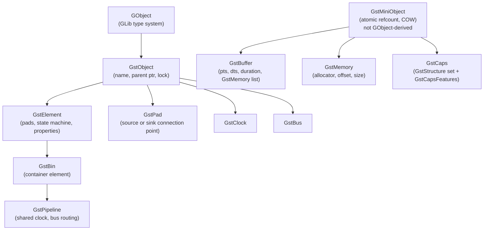
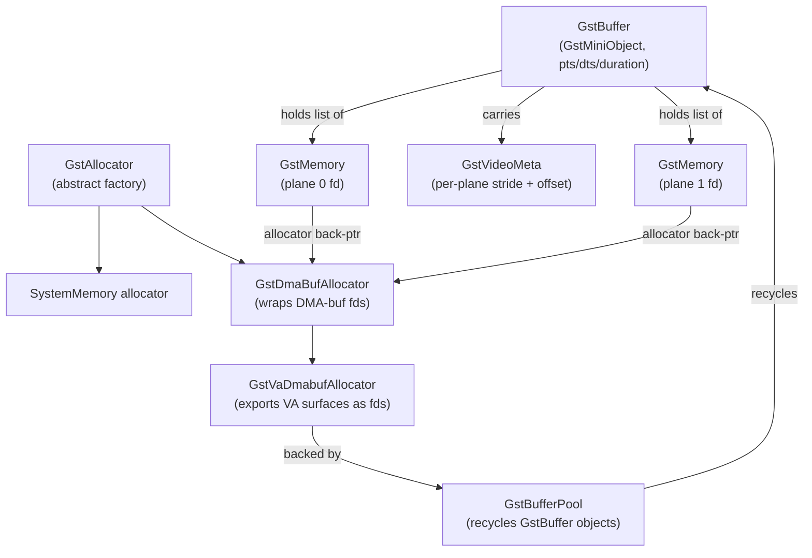
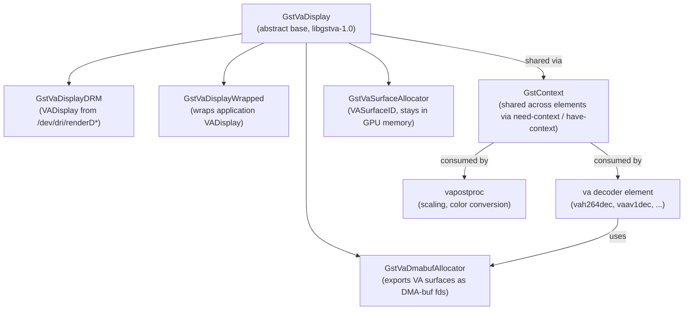
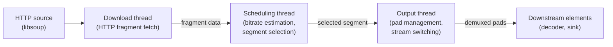
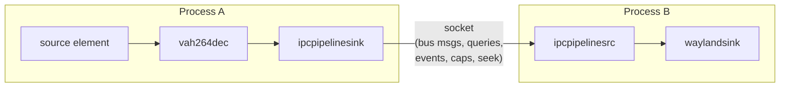
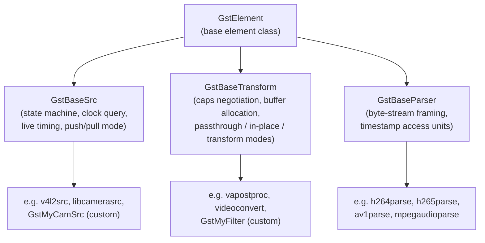

# Chapter 58: GStreamer: Pipeline-Based Multimedia

> **Part**: Part XIII — Video Streaming on Linux
> **Audience**: Graphics application developers integrating GStreamer pipelines
> **Status**: First draft — 2026-06-15

---

## Table of Contents

1. [Overview](#overview)
2. [Object Model: GLib Types, GstElement, GstPad, GstCaps, GstBuffer, GstPipeline](#object-model)
3. [Pipeline Construction Patterns](#pipeline-construction-patterns)
4. [The GstBuffer Memory Model](#the-gstbuffer-memory-model)
5. [VA-API Elements: The `va` Plugin and gstreamer-vaapi Migration](#va-api-elements)
6. [V4L2 Elements: Capture, Stateless Decode, and libcamera](#v4l2-elements)
7. [Clock and Synchronisation](#clock-and-synchronisation)
8. [Inter-Process Pipelines](#inter-process-pipelines)
9. [Writing GStreamer Plugins](#writing-gstreamer-plugins)
10. [Debugging and Profiling](#debugging-and-profiling)
11. [Integrations](#integrations)
12. [References](#references)

---

## Overview

**GStreamer** is a pipeline-based multimedia framework built on **GLib**'s object system. Its architecture mirrors the broader Linux graphics stack philosophy — composable elements that communicate through negotiated capability contracts, with explicit memory ownership rules and pluggable hardware back-ends. This chapter treats **GStreamer** as a graphics-stack citizen: the entry point for hardware-accelerated video decode via **VA-API** and **V4L2**, the bridge to **Vulkan Video** consumers, and the **IPC** layer between camera capture and display composition.

Readers who have worked through the earlier chapters already understand the **DRM/KMS** display stack (Chapter 5), **VA-API** hardware decode (Chapter 26), **PipeWire**'s **SPA** graph model (Chapter 38), and **Vulkan Video** decode queues (Chapter 50). This chapter shows how **GStreamer** glues those components together — from the **GstBuffer** memory model and **DMABuf** zero-copy paths, through the **`va`** plugin that replaced **gstreamer-vaapi** in **GStreamer 1.28**, to writing custom plugin elements in C or Rust.

The chapter opens with the **GStreamer** object model: the **GLib**/**GObject** type system underpins every framework type, with **GstObject** adding names, parent pointers, and locking, while the lightweight **GstMiniObject** base (not **GObject**-derived) provides atomic reference counting and copy-on-write semantics for high-frequency data-plane types. Built on these foundations are **GstElement** (the atom of pipeline computation, with its four-state machine), **GstPad** (typed connection points carrying source or sink roles), **GstCaps** (negotiated format descriptors built from **GstStructure** sets and **GstCapsFeatures** annotations), **GstPipeline** (a specialised **GstBin** managing a shared clock), and **GstBus** (the asynchronous message channel back to the application).

Pipeline construction is covered via two complementary APIs — **`gst_element_factory_make()`** for programmatic builds and **`gst_parse_launch()`** / **`gst-launch-1.0`** for string-based prototyping — together with the **`pad-added`** signal pattern for demuxers such as **`qtdemux`** and **`matroskademux`** that create output pads dynamically. High-level autoplugging elements **`decodebin3`**, **`parsebin`**, and **`uridecodebin3`** handle format detection and stream switching without manual decoder wiring. The **`capsfilter`** element enforces capability pinning between neighbouring elements.

The **GstBuffer** memory model covers the full allocation hierarchy: **GstBuffer** (carrying **`pts`**, **`dts`**, **`duration`**, and a list of **GstMemory** blocks) flows through the copy-on-write gate **`gst_buffer_make_writable()`**; **GstMemory** blocks are created by a **GstAllocator** — either the built-in **`SystemMemory`** allocator or **GstDmaBufAllocator** wrapping **DMA-buf** file descriptors. **GstBufferPool** recycles buffers to eliminate per-frame allocation overhead; the **`GST_QUERY_ALLOCATION`** mechanism lets sinks propose pools upstream for true zero-copy. **GstVideoMeta** encodes per-plane strides and offsets for multi-planar formats such as **NV12**, allowing **Wayland** sinks and **EGL** importers to consume **DMABuf** frames without any **CPU** touch. **GstVideoInfoDmaDrm** (added in GStreamer 1.24) pairs a **GstVideoInfo** with a **DRM** fourcc and modifier for **DRM-modifier**-aware negotiation.

The **VA-API** elements section documents the removal of **gstreamer-vaapi** (deprecated in GStreamer 1.26, fully removed in 1.28) and the complete migration to the **`va`** plugin in **gst-plugins-bad**. The shared **`libgstva-1.0`** library provides **GstVaDisplay** (with **GstVaDisplayDRM** and **GstVaDisplayWrapped** specialisations), **GstVaSurfaceAllocator**, and **GstVaDmabufAllocator**; multiple elements share a single display instance via **GstContext** negotiation. Available **`va`** plugin elements include decoders (**`vah264dec`**, **`vah265dec`**, **`vaav1dec`**, **`vavp9dec`**, **`vah266dec`**), encoders (**`vah264enc`**, **`vah265enc`**, **`vaav1enc`**), and post-processing elements (**`vapostproc`**, **`vadeinterlace`**, **`vacompositor`**).

The **V4L2** elements section covers **`v4l2src`** for camera capture with its **`dmabuf-export`** and **`mmap`** **`io-mode`** options; the **`v4l2codecs`** plugin for **Linux** stateless hardware decoders (**`v4l2slh264dec`**, **`v4l2slh265dec`**, **`v4l2slav1dec`**, and the new stateful **`v4l2av1dec`**); **`v4l2convert`** for **M2M**-accelerated format conversion; and **`libcamerasrc`** from **gst-plugins-libcamera** for cameras managed by the **libcamera** stack. Adaptive streaming is handled by the redesigned **AdaptiveDemux2** architecture powering **`dashdemux2`**, **`hlsdemux2`**, and **`mssdemux2`**, with **libsoup** handling HTTP fragment download.

Clock and synchronisation covers **GStreamer**'s three time domains — **clock time**, **running time**, and **stream time** (mapped through **GstSegment**) — buffer timestamp fields **`pts`**/**`dts`**/**`duration`**, clock election policy (favouring audio sink clocks for file playback), **live source** semantics with **`min-latency`** reporting via **`GST_QUERY_LATENCY`**, and elastic buffering with **`queue2`**.

Inter-process pipeline patterns include **GstNet** (**`GstNetTimeProvider`** / **`GstNetClientClock`**) for **PTP**-like network clock distribution; **`fdsrc`** / **`fdsink`** for Unix file descriptor byte streams; **`ipcpipelinesrc`** / **`ipcpipelinesink`** for full **GStreamer** protocol forwarding across process boundaries; and **`pipewiresrc`** / **`pipewiresink`** for integration with the **PipeWire** session graph (honouring **Flatpak** portal access control).

Plugin authoring is anchored on three base classes from **`libgstreamer-base-1.0`**: **`GstBaseSrc`** for source elements (state machine, live timing, push/pull scheduling), **`GstBaseTransform`** for filter elements (caps negotiation, passthrough, in-place, and separate-buffer transform modes), and **`GstBaseParser`** for byte-stream framers (used by **`h264parse`**, **`h265parse`**, **`av1parse`**). The preferred build system is **Meson** using the **`gst-plugin`** helper. Safe **Rust** bindings are provided by the **`gstreamer-rs`** crate (v0.25) with the **`BaseTransformImpl`** trait and **`glib::object_subclass`** macro; production **Rust** plugins ship in **`gst-plugins-rs`**. **`AppSrc`** and **`AppSink`** bridge arbitrary application data into and out of a running pipeline.

Debugging and profiling tools covered include the **`GST_DEBUG`** environment variable (category/level filtering), **`GST_DEBUG_CATEGORY_STATIC`** for per-plugin categories, **`gst-inspect-1.0`** for element introspection, **`gst-launch-1.0`** verbose negotiation output, **`GST_DEBUG_DUMP_DOT_DIR`** and **`GST_DEBUG_BIN_TO_DOT_FILE()`** for pipeline graph export, the **`dots`** tracer with **`gst-dots-viewer`** (introduced in GStreamer 1.26), structured **`GST_TRACERS`** probes (**`latency`**, **`leaks`**, **`rusage`**), and the **GstShark** extension writing **CTF** trace data readable by **Babeltrace** and **TraceCompass**. The chapter closes with GStreamer 1.28 changes most relevant to Linux graphics developers, including the new **AMD HIP** plugin (**`hipupload`**, **`hipdownload`**, **`hipconvert`**), the **`udmabuf`** zero-copy uploader path, and **Vulkan Video** AV1/VP9 decode and H.264 encode improvements.

By the end of this chapter you will be able to:

- Construct and introspect **GStreamer** pipelines programmatically and with **`gst-launch-1.0`**
- Understand refcounting and copy-on-write semantics for **`GstBuffer`** and **`GstMemory`**
- Configure **DMABuf** zero-copy paths between hardware decoders and **Wayland** sinks
- Use the current **`va`** plugin elements and understand what changed from **gstreamer-vaapi**
- Write a conformant **`GstBaseTransform`** filter plugin, including caps negotiation
- Profile and debug pipelines with **`GST_DEBUG`**, **`GST_TRACERS`**, and dot-graph export

**GStreamer** version coverage: **1.28** (released January 2026) is the current stable series, and all element names, API signatures, and deprecations reflect that release unless otherwise noted.

---

## Object Model

GStreamer's type system rests on **GLib/GObject**. Every GStreamer object inherits ultimately from `GObject`, gaining property introspection, signal emission, and reference counting. The library adds two refinements above that foundation.

### GstObject and GstMiniObject

`GstObject` extends `GObject` with a name, a parent pointer (enabling the parent-child tree of a pipeline), and a lock for thread safety. All elements, pads, clocks, and buses derive from `GstObject`.

For the data-plane types that must be allocated and freed at extremely high frequency — buffers, memory blocks, events, queries, and caps — GStreamer uses `GstMiniObject`, a *separate* lightweight base that does **not** inherit from GObject. `GstMiniObject` provides:

- Atomic reference counting via `gst_mini_object_ref()` / `gst_mini_object_unref()`
- **Copy-on-write** semantics: an object is writable only when `refcount == 1`, tested with `gst_mini_object_is_writable()`
- Optional copy and dispose hooks (`GstMiniObjectCopyFunction`, `GstMiniObjectDisposeFunction`)

[Source](https://gstreamer.freedesktop.org/documentation/gstreamer/gstminiobject.html)



The consequence for element developers: before modifying a `GstBuffer` received from upstream, always call `gst_buffer_make_writable()`. If the refcount is already 1, it returns the same pointer; otherwise it performs a deep copy. Failing to do so corrupts shared data in tee'd pipelines.

### GstElement

`GstElement` is the atom of pipeline computation. It owns zero or more pads, implements a state machine, and may expose GObject properties for configuration. [Source](https://gstreamer.freedesktop.org/documentation/gstreamer/gstelement.html)

The state machine defines four states and their allowed transitions:

```text
GST_STATE_NULL ──► GST_STATE_READY ──► GST_STATE_PAUSED ──► GST_STATE_PLAYING
                   (alloc resources)    (open devices,          (start clock,
                                         preroll)                stream data)
```

```c
/* gstreamer/gstelement.h */
GstStateChangeReturn gst_element_set_state (GstElement *element, GstState state);
GstStateChangeReturn gst_element_get_state (GstElement *element,
                                             GstState   *state,
                                             GstState   *pending,
                                             GstClockTime timeout);
```

`GST_STATE_CHANGE_ASYNC` is returned when the transition is not yet complete — common for sinks waiting for the first buffer (preroll). Applications must await `GST_MESSAGE_ASYNC_DONE` on the bus before polling state.

### GstPad

`GstPad` is a connection point on an element. Source pads push data; sink pads receive it. [Source](https://gstreamer.freedesktop.org/documentation/gstreamer/gstpad.html)

```c
/* Creation from a static template (the common pattern in plugins): */
GstPad *gst_pad_new_from_static_template (GstStaticPadTemplate *templ,
                                           const gchar          *name);

/* Linking pads between elements: */
gboolean gst_element_link          (GstElement *src,  GstElement *dest);
gboolean gst_element_link_filtered (GstElement *src,  GstElement *dest,
                                     GstCaps    *filter);
gboolean gst_element_link_pads     (GstElement *src,  const gchar *srcpadname,
                                     GstElement *dest, const gchar *destpadname);
```

Pads can be *static* (always present), *sometimes* (created and destroyed on demand — the demuxer case), or *request* (created when explicitly requested). Dynamic pad creation drives the `pad-added` signal pattern described in the next section.

### GstCaps

`GstCaps` is a refcounted set of `GstStructure` objects describing accepted media formats. Each structure is tagged with optional `GstCapsFeatures` to annotate memory type. [Source](https://gstreamer.freedesktop.org/documentation/gstreamer/gstcaps.html)

```c
/* Creating simple caps: */
GstCaps *caps = gst_caps_new_simple ("video/x-raw",
    "format",    G_TYPE_STRING,        "NV12",
    "width",     G_TYPE_INT,           1920,
    "height",    G_TYPE_INT,           1080,
    "framerate", GST_TYPE_FRACTION,    30, 1,
    NULL);

/* DMABuf-annotated caps (hardware decoder output): */
GstCaps *dma_caps = gst_caps_new_simple ("video/x-raw",
    "format", G_TYPE_STRING, "DMA_DRM",
    NULL);
GstCapsFeatures *feat = gst_caps_features_new ("memory:DMABuf", NULL);
gst_caps_set_features (dma_caps, 0, feat);

/* Intersection and fixation: */
GstCaps *result  = gst_caps_intersect (producer_caps, consumer_caps);
GstCaps *fixed   = gst_caps_fixate (result);   /* narrows to one concrete format */
gboolean is_fixd = gst_caps_is_fixed (fixed);
```

The `memory:DMABuf` caps feature signals that buffer memory lives in DMA-buf file descriptors. The `memory:VAMemory` feature signals VA surface memory that stays on-GPU. For DRM-modifier-aware negotiation (required since GStreamer 1.24), the format field must be `"DMA_DRM"` and a `drm-format` field of the form `"FOURCC:0xMODIFIER"` encodes the exact tiling layout:

```text
video/x-raw(memory:DMABuf)
  format     = DMA_DRM
  drm-format = NV12:0x0100000000000002
  width      = [ 1, 4096 ]
  height     = [ 1, 4096 ]
```

[Source](https://blogs.igalia.com/vjaquez/dmabuf-modifier-negotiation-in-gstreamer/)

`GstVideoInfoDmaDrm` (added in 1.24) wraps a `GstVideoInfo` with the DRM fourcc and modifier:

```c
/* gst-plugins-base/gst-libs/gst/video/video-info-dma-drm.h */
GstVideoInfoDmaDrm *drm = gst_video_info_dma_drm_new_from_caps (caps);
/* drm->drm_fourcc: DRM_FORMAT_NV12 */
/* drm->drm_modifier: I915_FORMAT_MOD_X_TILED */
GstCaps *back = gst_video_info_dma_drm_to_caps (drm);
```

[Source](https://gstreamer.freedesktop.org/documentation/video/video-info-dma-drm.html)

### GstPipeline and GstBus

`GstPipeline` is a specialised `GstBin` — a container element that manages a shared clock and routes bus messages. [Source](https://gstreamer.freedesktop.org/documentation/gstreamer/gstpipeline.html)

```c
GstElement *pipeline = gst_pipeline_new ("my-pipeline");
GstBus     *bus      = gst_pipeline_get_bus (GST_PIPELINE (pipeline));

/* Synchronous message wait (blocking): */
GstMessage *msg = gst_bus_timed_pop_filtered (bus, GST_CLOCK_TIME_NONE,
    GST_MESSAGE_ERROR | GST_MESSAGE_EOS);

/* Asynchronous GLib main-loop watch: */
guint watch_id = gst_bus_add_watch (bus, G_PRIORITY_DEFAULT,
                                     my_bus_callback, NULL);
```

[Source](https://gstreamer.freedesktop.org/documentation/gstreamer/gstbus.html)

---

## Pipeline Construction Patterns

### gst_element_factory_make vs. gst_parse_launch

Two primary APIs construct pipelines:

```c
/* Programmatic — explicit, safe for production: */
GstElement *dec = gst_element_factory_make ("vah264dec", "decoder");
if (!dec) {
    g_printerr ("vah264dec not available\n");
    return;
}
g_object_set (dec, "device-path", "/dev/dri/renderD128", NULL);

/* String-based — convenient for prototyping: */
GError *err = NULL;
GstElement *pipeline = gst_parse_launch (
    "filesrc location=in.mp4 ! decodebin3 ! autovideosink", &err);
if (err) { g_printerr ("%s\n", err->message); g_error_free (err); }
```

`gst_parse_launch` uses the same element-description language as `gst-launch-1.0`. It is suitable for early-stage development; in production, prefer `gst_element_factory_make` so errors are caught at startup rather than at parse time.

### Programmatic Element Linking

```c
GstElement *pipeline = gst_pipeline_new ("decode-play");
GstElement *src      = gst_element_factory_make ("filesrc",      "src");
GstElement *demux    = gst_element_factory_make ("qtdemux",      "demux");
GstElement *parse    = gst_element_factory_make ("h264parse",    "parse");
GstElement *dec      = gst_element_factory_make ("vah264dec",    "dec");
GstElement *sink     = gst_element_factory_make ("waylandsink",  "sink");

gst_bin_add_many (GST_BIN (pipeline), src, demux, parse, dec, sink, NULL);

/* Link elements with fixed topology: */
gst_element_link (src, demux);
/* demux has dynamic pads — linked in pad-added callback */
gst_element_link (parse, dec);

/* Pin caps on the hardware decoder output: */
GstCaps *dma_caps = gst_caps_from_string (
    "video/x-raw(memory:DMABuf), format=DMA_DRM");
gst_element_link_filtered (dec, sink, dma_caps);
gst_caps_unref (dma_caps);
```

`gst_element_link_filtered` inserts a `capsfilter` element between the two named elements; it is equivalent to writing `dec ! "video/x-raw(memory:DMABuf)" ! sink` in the launch syntax.

### Dynamic Pads: pad-added Signal

Demuxers — `qtdemux`, `matroskademux`, `dashdemux2` — create output pads only after parsing the container header. The `pad-added` signal fires when a new pad becomes available:

```c
static void on_pad_added (GstElement *demux, GstPad *pad, GstElement *parse)
{
    /* Guard against audio/subtitle pads we don't want: */
    GstCaps       *caps  = gst_pad_get_current_caps (pad);
    GstStructure  *s     = gst_caps_get_structure (caps, 0);
    if (!g_str_has_prefix (gst_structure_get_name (s), "video/x-h264")) {
        gst_caps_unref (caps);
        return;
    }
    gst_caps_unref (caps);

    GstPad *sink_pad = gst_element_get_static_pad (parse, "sink");
    if (!gst_pad_is_linked (sink_pad))
        gst_pad_link (pad, sink_pad);
    gst_object_unref (sink_pad);
}

/* Registration: */
g_signal_connect (demux, "pad-added", G_CALLBACK (on_pad_added), parse);
```

### decodebin3, parsebin, and uridecodebin3

For general-purpose playback, `decodebin3` replaces the older `decodebin2` (GStreamer ≥ 1.10). It manages a pool of reusable decoder elements, supports stream-switching without pipeline reconstruction, and drives `GstStreamCollection` events for multi-stream selection.

`parsebin` performs format detection and bitstream parsing but stops before decoding — useful when the application wants to demux and parse but supply its own decoders.

`uridecodebin3` composes `urisourcebin`, `parsebin`, and `decodebin3` into a single element that accepts a URI and emits decoded PCM/raw-video pads:

```bash
# Equivalent gst-launch command:
gst-launch-1.0 uridecodebin3 uri=file:///path/to/video.mp4 ! autovideosink
```

### capsfilter for Capability Pinning

`capsfilter` passes buffers only if their caps satisfy a specified filter, forcing negotiation to a particular format. It is the element-graph equivalent of `gst_element_link_filtered`:

```bash
# Force NV12 DMABuf between decoder and sink:
gst-launch-1.0 filesrc location=h264.mp4 ! h264parse ! vah264dec \
  ! 'video/x-raw(memory:DMABuf),format=DMA_DRM' ! waylandsink
```

---

## The GstBuffer Memory Model

### GstBuffer Structure

`GstBuffer` is the atomic data unit in a GStreamer pipeline. It inherits from `GstMiniObject` and carries timing metadata alongside one or more `GstMemory` blocks. [Source](https://gstreamer.freedesktop.org/documentation/gstreamer/gstbuffer.html)

```c
/* gstreamer/gstbuffer.h (simplified) */
struct _GstBuffer {
  GstMiniObject  mini_object;  /* parent — refcount, flags, COW */
  GstBufferPool *pool;         /* owning pool; NULL for standalone buffers */
  GstClockTime   pts;          /* presentation timestamp, GST_CLOCK_TIME_NONE if unknown */
  GstClockTime   dts;          /* decode timestamp */
  GstClockTime   duration;     /* buffer duration in nanoseconds */
  guint64        offset;       /* media-domain offset (e.g. frame number for video) */
  guint64        offset_end;   /* end offset */
};
```

Key allocation functions:

```c
/* Allocate with system memory: */
GstBuffer *buf = gst_buffer_new_allocate (NULL, frame_size, NULL);

/* Wrap a pre-existing allocation (caller owns memory until unref): */
GstBuffer *buf = gst_buffer_new_wrapped (ptr, size);

/* Safe copy of existing memory: */
GstBuffer *buf = gst_buffer_new_memdup (ptr, size);

/* Copy-on-write gate (mandatory before modifying received buffers): */
buf = gst_buffer_make_writable (buf);  /* returns same ptr if refcount==1 */
```

### GstMemory: The Memory Block Abstraction

A `GstBuffer` holds an ordered list of `GstMemory` objects. For a multi-plane YUV frame decoded to DMABuf, each plane's file descriptor is a separate `GstMemory`. [Source](https://gstreamer.freedesktop.org/documentation/gstreamer/gstmemory.html)

```c
/* gstreamer/gstmemory.h */
struct _GstMemory {
  GstMiniObject  mini_object;
  GstAllocator  *allocator;   /* back-pointer to creating allocator */
  GstMemory     *parent;      /* parent if this is a sub-region */
  gsize          maxsize;     /* total capacity of allocation */
  gsize          align;       /* alignment bitmask */
  gsize          offset;      /* byte offset of valid region start */
  gsize          size;        /* byte count of valid region */
};

/* Mapping for CPU access: */
struct _GstMapInfo {
  GstMemory   *memory;   /* which block was mapped */
  GstMapFlags  flags;    /* GST_MAP_READ, GST_MAP_WRITE, or both */
  guint8      *data;     /* CPU-accessible pointer */
  gsize        size;     /* valid bytes */
  gsize        maxsize;  /* total mapped capacity */
};

gboolean gst_memory_map   (GstMemory *mem, GstMapInfo *info, GstMapFlags flags);
void     gst_memory_unmap (GstMemory *mem, GstMapInfo *info);
```

DMABuf `GstMemory` objects carry `GST_MEMORY_FLAG_NOT_MAPPABLE` — they cannot be mapped through the standard `gst_memory_map` path. The raw DRM buffer fd (retrieved via `gst_dmabuf_memory_get_fd()`) must be mmap'd directly when CPU access is needed, typically only in software-fallback paths.

### GstAllocator and GstDmaBufAllocator



```c
/* gstreamer/gstallocator.h */
GstAllocator *gst_allocator_find (const gchar *name);
/* Built-in names: "SystemMemory", "dmabuf" */

/* gst-plugins-base/gst/allocators/gstdmabuf.h */
GstAllocator *gst_dmabuf_allocator_new  (void);
/* Wrap an existing file descriptor (takes no ownership of fd): */
GstMemory    *gst_dmabuf_allocator_alloc (GstAllocator *allocator,
                                           gint fd, gsize size);
/* Query the fd from a DMABuf GstMemory: */
gint          gst_dmabuf_memory_get_fd   (GstMemory *mem);
```

[Source](https://gstreamer.freedesktop.org/documentation/allocators/gstdmabuf.html)

### GstBufferPool and ALLOCATION Query

Buffer pools eliminate per-frame allocation overhead by recycling `GstBuffer` objects. Hardware decoder elements create a `GstVaDmabufAllocator`-backed pool, pre-allocate a fixed number of VA surfaces, and return each decoded frame as a pool buffer. When downstream unrefs the buffer, it auto-returns to the pool.

```c
/* Plugin allocate_output_buffer / propose_allocation pattern: */
GstBufferPool *pool   = gst_buffer_pool_new ();
GstStructure  *config = gst_buffer_pool_get_config (pool);

gst_buffer_pool_config_set_params    (config, caps, buf_size, 4, 16);
gst_buffer_pool_config_set_allocator (config, dmabuf_alloc, NULL);
gst_buffer_pool_config_add_option    (config, GST_BUFFER_POOL_OPTION_VIDEO_META);

gst_buffer_pool_set_config (pool, config);   /* config is consumed */
gst_buffer_pool_set_active (pool, TRUE);

GstBuffer *buf = NULL;
gst_buffer_pool_acquire_buffer (pool, &buf, NULL);
/* ... fill buf ... */
gst_buffer_pool_release_buffer (pool, buf);  /* or just gst_buffer_unref */
```

The `GST_QUERY_ALLOCATION` mechanism (dispatched by a sink element upstream before streaming begins) lets the decoder propose its own pool to the source element, enabling true zero-copy: the source allocates directly into VA surfaces. [Source](https://gstreamer.freedesktop.org/documentation/plugin-development/advanced/allocation.html)

### GstVideoMeta: Stride and Offset Without CPU Mapping

Multi-planar formats like NV12 have stride and offset values that differ from the byte-sequential layout implied by `width * bytes_per_pixel`. `GstVideoMeta` encodes per-plane stride and offset directly on the buffer, allowing downstream elements to read layout without CPU-mapping the DMABuf:

```c
/* gst-plugins-base/gst-libs/gst/video/gstvideometa.h */
GstVideoMeta *gst_buffer_add_video_meta_full (GstBuffer *buffer,
    GstVideoFrameFlags flags, GstVideoFormat format,
    guint width, guint height, guint n_planes,
    gsize offset[GST_VIDEO_MAX_PLANES],
    gint  stride[GST_VIDEO_MAX_PLANES]);

/* Per-plane CPU map (works even for DMABuf when needed): */
gboolean gst_video_meta_map   (GstVideoMeta *meta, guint plane,
                                GstMapInfo *info, gpointer *data,
                                gint *stride, GstMapFlags flags);
void     gst_video_meta_unmap (GstVideoMeta *meta, guint plane,
                                GstMapInfo *info);
```

[Source](https://gstreamer.freedesktop.org/documentation/video/gstvideometa.html)

For Wayland sinks and OpenGL upload elements that import DMABuf via `wl_drm` or `zwp_linux_dmabuf`, the stride and offset from `GstVideoMeta` are passed directly into the Wayland protocol message or EGL import call without any CPU touch of the pixel data.

### DMABuf Zero-Copy Pipeline

A fully zero-copy decode-to-display path looks like:

```text
v4l2src (dmabuf-io-mode)          vah264dec
       │ DMABuf fd (capture)            │ DMABuf fd (decoded frame)
       ▼                                ▼
  GstVaDmabufAllocator         GstVaDmabufAllocator
       │ memory:DMABuf, DMA_DRM caps    │
       └────────────────────────────────► waylandsink
                                          (wl_buffer import via zwp_linux_dmabuf)
```

Both elements negotiate `drm-format` during caps negotiation. If modifiers are incompatible, `vapostproc` is inserted automatically by autoplugging to re-tile.

---

## VA-API Elements

### gstreamer-vaapi is Gone

**GStreamer 1.26** deprecated gstreamer-vaapi and demoted its encoder elements to rank `NONE`. **GStreamer 1.28** removed the gstreamer-vaapi repository from the monorepo entirely. [Source](https://gstreamer.freedesktop.org/releases/1.28/) Applications still referencing `vaapih264dec`, `vaapih265dec`, or `vaapipostproc` will fail to load elements.

The replacement is the **`va` plugin** in gst-plugins-bad, first introduced in GStreamer 1.18 as a proof-of-concept and now the only supported VA-API interface.

### Migration Table

| Removed (gstreamer-vaapi) | Replacement (va plugin) |
|---|---|
| `vaapih264dec` | `vah264dec` |
| `vaapih265dec` | `vah265dec` |
| `vaapiav1dec` | `vaav1dec` |
| `vaapivp8dec` | `vavp8dec` |
| `vaapivp9dec` | `vavp9dec` |
| `vaapimpeg2dec` | `vampeg2dec` |
| `vaapijpegdec` | `vajpegdec` |
| `vaapih264enc` | `vah264enc` |
| `vaapih265enc` | `vah265enc` |
| `vaapipostproc` | `vapostproc` |
| `vaapisink` | `waylandsink` / `autovideosink` |

### GstVa Library Architecture

The shared library `libgstva-1.0` (moved from gst-plugins-bad internals to a proper install target in GStreamer 1.22) provides:

- **`GstVaDisplay`** — abstract base for VA display connections
  - `GstVaDisplayDRM` — creates `VADisplay` from a `/dev/dri/renderD*` fd
  - `GstVaDisplayWrapped` — wraps an application-provided `VADisplay` (for X11/Wayland apps that manage their own display connection)
- **`GstVaSurfaceAllocator`** — wraps `VASurfaceID`; one `GstMemory` per buffer, stays in GPU memory
- **`GstVaDmabufAllocator`** — exports VA surfaces as DMA-buf fds for cross-element sharing

Multiple elements on the same GPU share a single `GstVaDisplay` instance through **GstContext** negotiation.



When pipeline enters `GST_STATE_READY`, elements broadcast a `need-context` bus message; another element (or the application) responds with `have-context` carrying the display object. Multi-GPU pipelines distinguish devices using the `device-path` property:

```c
/* Route a specific decode element to /dev/dri/renderD129 (second GPU): */
g_object_set (dec, "device-path", "/dev/dri/renderD129", NULL);
/* The element is also registered as "varenderD129h264dec" in gst-inspect output */
```

[Source](https://blogs.igalia.com/vjaquez/gstva-library-in-gstreamer-1-22-and-some-new-features-in-1-24/)

### Available va Plugin Elements (1.28)

**Decoders:** `vah264dec`, `vah265dec`, `vaav1dec`, `vavp8dec`, `vavp9dec`, `vampeg2dec`, `vajpegdec`, `vah266dec` (H.266/VVC, added in 1.26)

**Encoders:** `vah264enc`, `vah264lpenc` (low-power path), `vah265enc`, `vah265lpenc`, `vaav1enc`, `vajpegenc`, `vavp8enc` (added in 1.26), `vavp9enc`

**Post-processing:** `vapostproc` (scaling, color conversion, deinterlacing), `vadeinterlace`, `vacompositor`

All decoders run at `GST_RANK_PRIMARY + 1`, so they win autoplugging over software decoders (`avdec_h264` at `PRIMARY`). The decoder sink pad accepts a compressed bitstream; the src pad emits `video/x-raw(memory:VAMemory)` or, when exported for Wayland, `video/x-raw(memory:DMABuf)` with `format=DMA_DRM`.

### Hardware Decode Pipeline Examples

```bash
# VA H.264 decode to Wayland with DMABuf zero-copy:
gst-launch-1.0 filesrc location=input.h264 ! h264parse ! vah264dec \
  ! 'video/x-raw(memory:DMABuf)' ! waylandsink

# VA AV1 decode with postprocessing (scale to 1280×720):
gst-launch-1.0 filesrc location=input.mp4 ! qtdemux ! av1parse \
  ! vaav1dec ! vapostproc width=1280 height=720 \
  ! 'video/x-raw(memory:DMABuf)' ! waylandsink

# VA H.264 encode from V4L2 capture (V4L2 DMABuf → VA encode):
gst-launch-1.0 v4l2src device=/dev/video0 io-mode=dmabuf \
  ! 'video/x-raw,format=NV12,width=1920,height=1080,framerate=30/1' \
  ! vah264enc ! h264parse ! mp4mux ! filesink location=out.mp4
```

---

## V4L2 Elements

### v4l2src: Camera Capture

`v4l2src` is the primary element for V4L2 capture devices. The `io-mode` property controls the memory transfer method:

| io-mode value | Description |
|---|---|
| `auto` (default) | Framework selects best available |
| `mmap` | `VIDIOC_REQBUFS` with `V4L2_MEMORY_MMAP` |
| `userptr` | `V4L2_MEMORY_USERPTR` |
| `dmabuf` | `V4L2_MEMORY_DMABUF` — import fds from allocator |
| `dmabuf-export` | Export V4L2 mmap buffers as DMA-buf fds to downstream |

```bash
# Capture NV12 from /dev/video0 and encode:
gst-launch-1.0 v4l2src device=/dev/video0 io-mode=dmabuf-export \
  ! 'video/x-raw,format=NV12,width=1920,height=1080,framerate=30/1' \
  ! vah264enc ! filesink location=capture.h264
```

### v4l2codecs: Stateless Kernel Decoders

The `v4l2codecs` plugin in gst-plugins-bad implements elements for Linux's V4L2 stateless decoder drivers (see Chapter 26 for the kernel-side V4L2 request API). "Stateless" means the element is responsible for bitstream parsing, reference frame tracking, and passing complete per-slice metadata to the kernel driver; the hardware accelerates only the CABAC/entropy decoding and MC (motion compensation). [Source](https://gstreamer.freedesktop.org/documentation/v4l2codecs/index.html)

The `sl` infix in element names denotes stateless:

| Element | Codec |
|---|---|
| `v4l2slh264dec` | H.264 / AVC |
| `v4l2slh265dec` | H.265 / HEVC |
| `v4l2slav1dec` | AV1 |
| `v4l2slvp8dec` | VP8 |
| `v4l2slvp9dec` | VP9 |
| `v4l2slmpeg2dec` | MPEG-2 |

GStreamer 1.28 added `v4l2av1dec` (stateful AV1) and improved `v4l2slav1dec` for inter-frame resolution changes. These elements output DMA-buf buffers with DRM modifier caps negotiated against downstream consumers.

The device node for v4l2codecs elements is typically `/dev/video*` (different from the `/dev/media*` topology used by libcamera). Users need `video` group membership or appropriate udev rules.

### v4l2convert: Format Negotiation

`v4l2convert` performs colorspace and format conversion using V4L2's `M2M` (mem-to-mem) interface if available on the platform, otherwise falling back to CPU. It appears automatically during autoplugging when input and output formats differ:

```bash
gst-launch-1.0 v4l2src ! v4l2convert ! video/x-raw,format=BGRx ! autovideosink
```

### libcamerasrc: libcamera Integration

`libcamerasrc` (from the `gst-plugins-libcamera` package, maintained in the libcamera repository) exposes libcamera cameras as a GStreamer source element. It handles the libcamera request/buffer lifecycle internally and presents DMABuf-backed buffers to downstream elements (see Chapter 26 for libcamera internals):

```bash
# Capture from libcamera-managed device:
gst-launch-1.0 libcamerasrc ! 'video/x-raw,format=NV12,width=1920,height=1080' \
  ! vah264enc ! filesink location=libcamera.h264
```

The `camera-name` property selects among multiple libcamera-enumerated devices.

### Adaptive Streaming: dashdemux2 and hlsdemux2

GStreamer 1.22 introduced `AdaptiveDemux2`, a redesigned adaptive bitrate architecture using three threads: a download thread (HTTP fragment fetch via libsoup), a scheduling thread (bitrate estimation and segment selection), and an output thread (pad management and stream switching). [Source](https://gstreamer.freedesktop.org/documentation/additional/design/adaptive-demuxer.html)



Current elements: `dashdemux2`, `hlsdemux2`, `mssdemux2`. These replace the older `dashdemux`, `hlsdemux`, `mssdemux` (which are still present but not recommended).

```bash
gst-launch-1.0 uridecodebin3 uri=https://example.com/stream.mpd ! autovideosink
# uridecodebin3 automatically selects dashdemux2 for .mpd URIs
```

Stream selection at the application level:

```c
/* Select specific tracks from a multi-language stream: */
GList *ids = g_list_append (NULL, (gpointer)"video/0");
ids         = g_list_append (ids,  (gpointer)"audio/en/0");
GstEvent *sel = gst_event_new_select_streams (ids);
gst_element_send_event (pipeline, sel);
g_list_free (ids);
```

---

## Clock and Synchronisation

### Time Domains

GStreamer distinguishes three time domains: [Source](https://gstreamer.freedesktop.org/documentation/gstreamer/gstclock.html)

- **Clock time** — monotonic wall-clock; `gst_clock_get_time (clock)` returns nanoseconds since an arbitrary epoch
- **Running time** — `clock_time − base_time`; zero when the pipeline transitions to PLAYING; used for AV sync decisions
- **Stream time** — running time mapped through the current `GstSegment`; represents the actual media playback position shown to the user (0..duration)

```c
/* GstSegment conversion: */
/* gstreamer/gstsegment.h */
GstClockTime gst_segment_to_running_time (const GstSegment *seg,
                                           GstFormat format,
                                           GstClockTime position);
GstClockTime gst_segment_to_stream_time  (const GstSegment *seg,
                                           GstFormat format,
                                           GstClockTime pos);
```

[Source](https://gstreamer.freedesktop.org/documentation/gstreamer/gstsegment.html)

### Buffer Timestamps

Every buffer carries `pts` (presentation timestamp), `dts` (decode timestamp), and `duration`, all in nanoseconds (`GstClockTime = guint64`). `GST_CLOCK_TIME_NONE` (`G_MAXUINT64`) signals "unknown". For live camera sources, timestamp at capture time:

```c
GstClockTime now  = gst_clock_get_time (gst_element_get_clock (src));
GstClockTime base = gst_element_get_base_time (src);
GST_BUFFER_PTS (buf)      = now - base;
GST_BUFFER_DURATION (buf) = GST_SECOND / framerate;
```

Sink elements block in `gst_base_sink_wait_clock()` until the buffer's running-time PTS arrives before rendering.

### Clock Election

When a pipeline enters PLAYING, `GstPipeline` runs a clock election among its elements. Elements can provide clocks (source elements, audio sinks); the pipeline selects the highest-priority provider. For live pipelines with a camera source, the system clock is typically elected. For file playback, the audio sink clock (derived from the audio device's sample rate) is preferred for drift-free AV sync.

### Live Sources, min-latency, and Queues

Live sources set `is-live = TRUE` and report `min-latency` / `max-latency` through a `GST_QUERY_LATENCY` response. The pipeline sums latencies across all elements to compute total pipeline latency, which determines how far the base_time is adjusted to allow the first buffer to arrive before its PTS.

`queue2` provides elastic buffering between threads (e.g., between a network source and a decoder) and optionally implements leaky-bucket behavior for real-time pipelines:

```bash
# Leaky queue for real-time preview (drop oldest frames if decoder is slow):
gst-launch-1.0 v4l2src ! queue max-size-buffers=2 leaky=downstream \
  ! vah264enc ! rtph264pay ! udpsink host=192.168.1.1 port=5000
```

`gst_base_src_set_live (GST_BASE_SRC (src), TRUE)` is the call plugin authors use in `GstBaseSrc::start()` to declare live behavior.

---

## Inter-Process Pipelines

### GstNet: Network Clock Synchronisation

`GstNetTimeProvider` and `GstNetClientClock` implement PTP-like network clock distribution over UDP. A primary machine publishes its pipeline clock; secondary machines synchronise to it before playing synchronized content:

```c
/* Primary: */
GstNetTimeProvider *prov = gst_net_time_provider_new (
    gst_pipeline_get_clock (GST_PIPELINE (pipeline)), "0.0.0.0", 5637);

/* Secondary: */
GstClock *net_clock = gst_net_client_clock_new ("net_clock", "192.168.1.100",
                                                  5637, 0);
gst_pipeline_use_clock (GST_PIPELINE (pipeline), net_clock);
```

### fdsrc / fdsink

`fdsrc` and `fdsink` pass data over Unix file descriptors — anonymous pipes or sockets. They are the simplest IPC primitive and work well for single-stream byte streams:

```bash
# Split encoding across two processes:
gst-launch-1.0 v4l2src ! 'video/x-raw,format=NV12' ! fdsink fd=1 | \
  gst-launch-1.0 fdsrc fd=0 ! 'video/x-raw,format=NV12' ! vah264enc ! filesink location=out.h264
```

### ipcpipelinesrc / ipcpipelinesink

`ipcpipelinesrc` and `ipcpipelinesink` (from gst-plugins-bad) implement a higher-level IPC mechanism that preserves GStreamer's bus message, query, and event protocol across processes. State changes, caps negotiation, and seek events are serialised and forwarded. This is appropriate when two cooperating GStreamer applications need to function as a single logical pipeline:



### PipeWire: pipewiresrc / pipewiresink

PipeWire's SPA (Simple Plugin API) node model maps cleanly to `GstElement` concepts — both use capability negotiation and typed buffer passing. The `pipewiresrc` and `pipewiresink` elements bridge GStreamer pipelines to the PipeWire graph (Chapter 38):

```bash
# Capture from PipeWire (camera routed through PipeWire):
gst-launch-1.0 pipewiresrc ! videoconvert ! autovideosink

# Playback into PipeWire (video sink):
gst-launch-1.0 filesrc location=video.mp4 ! decodebin3 \
  ! videoconvert ! pipewiresink
```

`pipewiresrc` honours PipeWire's access control (Flatpak portal, screen-sharing permissions) transparently, making it the preferred camera source for Flatpak-sandboxed applications.

---

## Writing GStreamer Plugins

### GstBaseSrc, GstBaseTransform, GstBaseParser

The base class library (`libgstreamer-base-1.0`) provides three scaffolding classes:

- **`GstBaseSrc`** — for source elements; handles state machine, clock query, live timing, and the pull/push mode split
- **`GstBaseTransform`** — for filter elements transforming one buffer to one buffer
- **`GstBaseParser`** — for bytestream parsers that frame raw data into timestamped access units



### GstBaseSrc in Detail

`GstBaseSrc` implements the state machine transitions, scheduling loop, and latency query machinery for source elements. The plugin author overrides a small set of virtual methods: [Source](https://gstreamer.freedesktop.org/documentation/base/gstbasesrc.html)

```c
/* gstreamer-base/gst/base/gstbasesrc.h — key virtual methods */
struct _GstBaseSrcClass {
  GstElementClass parent_class;

  /* Return the caps this source can produce (given a filter): */
  GstCaps      *(*get_caps)    (GstBaseSrc *src, GstCaps *filter);
  /* Accept or reject the negotiated caps: */
  gboolean      (*set_caps)    (GstBaseSrc *src, GstCaps *caps);

  /* Called once in READY state: open hardware, allocate resources */
  gboolean      (*start)       (GstBaseSrc *src);
  /* Called in NULL state: close hardware, free resources */
  gboolean      (*stop)        (GstBaseSrc *src);

  /* Return total size/duration (for pull-mode and seeking): */
  gboolean      (*get_size)    (GstBaseSrc *src, guint64 *size);
  gboolean      (*is_seekable) (GstBaseSrc *src);

  /* PUSH MODE: create and fill a new buffer (most sources use this): */
  GstFlowReturn (*create)      (GstBaseSrc *src, guint64 offset,
                                  guint length, GstBuffer **buf);
  /* PULL MODE alternative: fill a caller-provided buffer: */
  GstFlowReturn (*fill)        (GstBaseSrc *src, guint64 offset,
                                  guint length, GstBuffer *buf);

  /* Query and event overrides: */
  gboolean      (*query)       (GstBaseSrc *src, GstQuery *query);
  gboolean      (*event)       (GstBaseSrc *src, GstEvent *event);
};
```

A minimal live camera source skeleton:

```c
/* my_cam_src.c — GstBaseSrc subclass for a hypothetical capture device */

static gboolean
gst_my_cam_src_start (GstBaseSrc *bsrc)
{
  GstMyCamSrc *self = GST_MY_CAM_SRC (bsrc);

  self->fd = open ("/dev/video0", O_RDWR);
  if (self->fd < 0) {
    GST_ELEMENT_ERROR (self, RESOURCE, OPEN_READ,
        ("Cannot open /dev/video0: %s", g_strerror (errno)), (NULL));
    return FALSE;
  }

  /* Declare this as a live source: downstream will NOT buffer-preroll */
  gst_base_src_set_live (bsrc, TRUE);
  /* Report minimum latency (one frame at 30fps): */
  gst_base_src_set_latency (bsrc, GST_SECOND / 30, GST_SECOND / 30);
  /* Push mode (default; pull mode requires seekable sources): */
  gst_base_src_set_format (bsrc, GST_FORMAT_TIME);
  return TRUE;
}

static GstFlowReturn
gst_my_cam_src_create (GstBaseSrc *bsrc, guint64 offset,
                         guint length, GstBuffer **buf)
{
  GstMyCamSrc  *self = GST_MY_CAM_SRC (bsrc);
  GstBuffer    *out;
  GstMapInfo    map;

  out = gst_buffer_new_allocate (NULL, self->frame_size, NULL);
  gst_buffer_map (out, &map, GST_MAP_WRITE);
  /* read(self->fd, map.data, map.size); — simplified */
  gst_buffer_unmap (out, &map);

  /* Timestamp from the pipeline clock: */
  GstClockTime now  = gst_clock_get_time (gst_element_get_clock (GST_ELEMENT (self)));
  GstClockTime base = gst_element_get_base_time (GST_ELEMENT (self));
  GST_BUFFER_PTS (out)      = (now > base) ? (now - base) : 0;
  GST_BUFFER_DURATION (out) = GST_SECOND / self->framerate;

  *buf = out;
  return GST_FLOW_OK;
}
```

`gst_base_src_set_live()` triggers several downstream behaviors: the pipeline will not attempt to preroll (block waiting for the first buffer), the latency query will be answered with the values set via `gst_base_src_set_latency()`, and `min-latency` will be added to the pipeline's base_time so that the first buffer arrives before its PTS deadline.

### GstBaseParser in Detail

`GstBaseParser` (the C base class; exposed in Rust as `BaseParseImpl`) handles the byte-framing problem: consuming an arbitrary-length byte stream and emitting access units with timestamps and sync-word markers. Concrete examples of `GstBaseParser` subclasses in GStreamer include `h264parse`, `h265parse`, `av1parse`, and `mpegaudioparse`.

Key virtual methods:

```c
/* gstreamer-base/gst/base/gstbaseparse.h */
struct _GstBaseParseClass {
  GstElementClass parent_class;

  /* Called on state transitions — open/close codec context: */
  gboolean      (*start) (GstBaseParse *parse);
  gboolean      (*stop)  (GstBaseParse *parse);

  /* Called to negotiate output caps: */
  gboolean      (*set_sink_caps) (GstBaseParse *parse, GstCaps *caps);

  /* REQUIRED: scan `frame->buffer` for a complete access unit.
   * Set frame->out_buffer (or leave NULL to use frame->buffer).
   * Set *skipsize to number of bytes to discard before next call.
   * Return GST_FLOW_OK when a complete frame is found. */
  GstFlowReturn (*handle_frame) (GstBaseParse *parse,
                                   GstBaseParseFrame *frame,
                                   gint *skipsize);

  /* Optional: convert between time and byte position for seeking: */
  gboolean      (*convert) (GstBaseParse *parse, GstFormat src_format,
                              gint64 src_value, GstFormat dest_format,
                              gint64 *dest_value);
};
```

The framework calls `handle_frame` with progressively larger adapter chunks until the plugin signals it has found a complete frame. The plugin sets `frame->out_buffer` to the framed access unit and calls `gst_base_parse_finish_frame()`:

```c
static GstFlowReturn
my_parser_handle_frame (GstBaseParse *parse, GstBaseParseFrame *frame,
                          gint *skipsize)
{
  GstBuffer *buf = frame->buffer;
  GstMapInfo map;
  gst_buffer_map (buf, &map, GST_MAP_READ);

  /* Search for start code 0x000001 or 0x00000001: */
  gint frame_sz = find_next_start_code (map.data, map.size);
  gst_buffer_unmap (buf, &map);

  if (frame_sz < 0) {
    /* Need more data — request minimum useful chunk */
    *skipsize = 0;
    return GST_FLOW_OK;
  }

  /* Set the frame size and let the base class extract it: */
  return gst_base_parse_finish_frame (parse, frame, frame_sz);
}
```

### Meson gst-plugin Build Helper

The preferred build system for GStreamer plugins is Meson. The `gst-plugin` template provided by GStreamer's `meson.build` helpers simplifies the shared-library and install-dir configuration:

```python
# meson.build
project('my-gst-plugin', 'c', version: '1.0',
        default_options: ['warning_level=2'])

gst_dep      = dependency('gstreamer-1.0',       version: '>= 1.24')
gstbase_dep  = dependency('gstreamer-base-1.0',  version: '>= 1.24')
gstvideo_dep = dependency('gstreamer-video-1.0', version: '>= 1.24')

plugin_sources = ['my_video_filter.c']

shared_library('gstmyfilter',
    plugin_sources,
    dependencies: [gst_dep, gstbase_dep, gstvideo_dep],
    install: true,
    install_dir: get_option('libdir') / 'gstreamer-1.0',
    name_prefix: 'lib',
    c_args: ['-DGST_USE_UNSTABLE_API'],
)
```

The `install_dir` must be a directory on `GST_PLUGIN_PATH` or the system's default `$(prefix)/lib/gstreamer-1.0`. Run `gst-inspect-1.0 my-filter` after install to verify the element is visible.

### GstBaseTransform in Detail

`GstBaseTransform` manages pad creation, caps negotiation boilerplate, and buffer allocation, leaving only the transform logic to the plugin author. [Source](https://gstreamer.freedesktop.org/documentation/base/gstbasetransform.html)

Virtual method table (relevant subset):

```c
/* gstreamer-base/gst/base/gstbasetransform.h */
struct _GstBaseTransformClass {
  GstElementClass parent_class;

  /* Caps negotiation */
  GstCaps      *(*transform_caps) (GstBaseTransform *trans,
                                    GstPadDirection dir,
                                    GstCaps *caps, GstCaps *filter);
  GstCaps      *(*fixate_caps)    (GstBaseTransform *trans,
                                    GstPadDirection dir,
                                    GstCaps *caps, GstCaps *othercaps);
  gboolean      (*set_caps)       (GstBaseTransform *trans,
                                    GstCaps *incaps, GstCaps *outcaps);
  gboolean      (*accept_caps)    (GstBaseTransform *trans,
                                    GstPadDirection dir, GstCaps *caps);

  /* Buffer size calculation (required for transform mode): */
  gsize         (*get_unit_size)  (GstBaseTransform *trans, GstCaps *caps);

  /* Output buffer allocation (override to pool or DMABuf): */
  GstFlowReturn (*prepare_output_buffer) (GstBaseTransform *trans,
                                           GstBuffer *input,
                                           GstBuffer **outbuf);

  /* EITHER implement transform (separate in/out) OR transform_ip (in-place): */
  GstFlowReturn (*transform)    (GstBaseTransform *trans,
                                  GstBuffer *inbuf, GstBuffer *outbuf);
  GstFlowReturn (*transform_ip) (GstBaseTransform *trans, GstBuffer *buf);

  /* Lifecycle: */
  gboolean      (*start)  (GstBaseTransform *trans);
  gboolean      (*stop)   (GstBaseTransform *trans);
  gboolean      (*sink_event) (GstBaseTransform *trans, GstEvent *event);
  gboolean      (*src_event)  (GstBaseTransform *trans, GstEvent *event);
};
```

Operational modes:

1. **Passthrough** (`passthrough_on_same_caps = TRUE`): when incaps == outcaps, buffers are passed unmodified. Transform still fires if `transform_ip_on_passthrough` is TRUE.
2. **In-place** (`transform_ip`): the element modifies the buffer it received. Requires the buffer to be writable; `GstBaseTransform` enforces this.
3. **Separate transform** (`transform`): framework allocates output buffer (via `prepare_output_buffer`), calls `transform` with both.

After reconfiguration (e.g., resolution change mid-stream), call `gst_base_transform_reconfigure_src()` to force downstream caps re-negotiation.

### Complete In-Place Filter Plugin

```c
/* my_video_filter.c — compile against gstreamer-1.0, gstreamer-base-1.0,
   gstreamer-video-1.0; install to $(GST_PLUGIN_PATH)/libgstmyfilter.so */

#include <gst/gst.h>
#include <gst/base/gstbasetransform.h>
#include <gst/video/video.h>

#define GST_TYPE_MY_FILTER (gst_my_filter_get_type())
G_DECLARE_FINAL_TYPE (GstMyFilter, gst_my_filter,
                       GST, MY_FILTER, GstBaseTransform)

struct _GstMyFilter {
  GstBaseTransform parent;
  GstVideoInfo     video_info;
};

G_DEFINE_TYPE (GstMyFilter, gst_my_filter, GST_TYPE_BASE_TRANSFORM);
GST_ELEMENT_REGISTER_DEFINE (my_filter, "my-filter",
                              GST_RANK_NONE, GST_TYPE_MY_FILTER);

static GstStaticPadTemplate sink_tmpl = GST_STATIC_PAD_TEMPLATE ("sink",
    GST_PAD_SINK, GST_PAD_ALWAYS,
    GST_STATIC_CAPS ("video/x-raw, format=(string)BGRx"));

static GstStaticPadTemplate src_tmpl = GST_STATIC_PAD_TEMPLATE ("src",
    GST_PAD_SRC, GST_PAD_ALWAYS,
    GST_STATIC_CAPS ("video/x-raw, format=(string)BGRx"));

/* Called once caps are negotiated (before first buffer): */
static gboolean
gst_my_filter_set_caps (GstBaseTransform *trans,
                         GstCaps *incaps, GstCaps *outcaps)
{
  GstMyFilter *self = GST_MY_FILTER (trans);
  return gst_video_info_from_caps (&self->video_info, incaps);
}

/* In-place transform: modify buf directly */
static GstFlowReturn
gst_my_filter_transform_ip (GstBaseTransform *trans, GstBuffer *buf)
{
  GstMyFilter   *self = GST_MY_FILTER (trans);
  GstVideoFrame  frame;

  if (!gst_video_frame_map (&frame, &self->video_info, buf, GST_MAP_READWRITE))
    return GST_FLOW_ERROR;

  /* Access pixels: frame.data[0], stride: GST_VIDEO_FRAME_PLANE_STRIDE(&frame, 0) */
  guint8 *pixels = (guint8 *) GST_VIDEO_FRAME_PLANE_DATA (&frame, 0);
  gint    stride = GST_VIDEO_FRAME_PLANE_STRIDE (&frame, 0);
  gint    width  = GST_VIDEO_FRAME_WIDTH (&frame);
  gint    height = GST_VIDEO_FRAME_HEIGHT (&frame);

  /* Example: invert green channel (BGRx layout) */
  for (gint y = 0; y < height; y++) {
    guint8 *row = pixels + y * stride;
    for (gint x = 0; x < width; x++)
      row[x * 4 + 1] ^= 0xFF;   /* G byte in BGRx */
  }

  gst_video_frame_unmap (&frame);
  return GST_FLOW_OK;
}

static void
gst_my_filter_class_init (GstMyFilterClass *klass)
{
  GstElementClass       *el  = GST_ELEMENT_CLASS (klass);
  GstBaseTransformClass *bt  = GST_BASE_TRANSFORM_CLASS (klass);

  gst_element_class_add_static_pad_template (el, &sink_tmpl);
  gst_element_class_add_static_pad_template (el, &src_tmpl);
  gst_element_class_set_static_metadata (el,
      "My Video Filter", "Filter/Video",
      "Example in-place BGRx filter", "Author <author@example.com>");

  bt->set_caps      = gst_my_filter_set_caps;
  bt->transform_ip  = gst_my_filter_transform_ip;
}

static void gst_my_filter_init (GstMyFilter *self) { }

static gboolean
plugin_init (GstPlugin *plugin)
{
  return GST_ELEMENT_REGISTER (my_filter, plugin);
}

GST_PLUGIN_DEFINE (
    GST_VERSION_MAJOR, GST_VERSION_MINOR,
    my_filter, "My in-place video filter plugin",
    plugin_init, "1.0", "LGPL", "MyProject", "https://example.com/")
```

Build with Meson (preferred) or directly with pkg-config:

```bash
# Direct compilation:
gcc -Wall -fPIC \
  $(pkg-config --cflags gstreamer-1.0 gstreamer-base-1.0 gstreamer-video-1.0) \
  -c -o my_filter.o my_video_filter.c
gcc -shared -o libgstmyfilter.so my_filter.o \
  $(pkg-config --libs gstreamer-1.0 gstreamer-base-1.0 gstreamer-video-1.0)

# Install and test:
export GST_PLUGIN_PATH=$PWD
gst-inspect-1.0 my-filter
gst-launch-1.0 videotestsrc ! my-filter ! autovideosink
```

The Meson `gst-plugin` helper (from `gstreamer.wrap` or the system install) integrates this into a larger project build system. [Source](https://gstreamer.freedesktop.org/documentation/plugin-development/basics/boiler.html?gi-language=c)

### Rust Plugin Development

The `gstreamer-rs` crate (v0.25.2, dual MIT/Apache-2.0) provides safe Rust bindings matching the C API shape. The `gst-plugins-rs` repository contains production Rust plugins that shipped in GStreamer 1.28 (>35% of new code in that release). [Source](https://github.com/GStreamer/gstreamer-rs) [Source](https://github.com/GStreamer/gst-plugins-rs)

A Rust `GstBaseTransform` subclass uses the `gst::glib::object_subclass` macro and implements the `BaseTransformImpl` trait from `gst_base::subclass`:

```rust
// Cargo.toml: gstreamer = "0.25", gstreamer-base = "0.25", gstreamer-video = "0.25"

use gst::glib;
use gst::subclass::prelude::*;
use gst_base::subclass::prelude::*;
use gst_video::VideoInfo;

#[derive(Default)]
pub struct MyFilter {
    video_info: std::sync::Mutex<Option<VideoInfo>>,
}

#[glib::object_subclass]
impl ObjectSubclass for MyFilter {
    const NAME: &'static str = "GstMyFilter";
    type Type = super::MyFilter;
    type ParentType = gst_base::BaseTransform;
}

impl ObjectImpl for MyFilter {}
impl GstObjectImpl for MyFilter {}
impl ElementImpl for MyFilter {
    fn metadata() -> Option<&'static gst::subclass::ElementMetadata> {
        static METADATA: std::sync::OnceLock<gst::subclass::ElementMetadata> =
            std::sync::OnceLock::new();
        Some(METADATA.get_or_init(|| {
            gst::subclass::ElementMetadata::new(
                "My Rust Filter", "Filter/Video",
                "Example Rust in-place filter", "Author <author@example.com>",
            )
        }))
    }
    fn pad_templates() -> &'static [gst::PadTemplate] { &[] /* simplified */ }
}

impl BaseTransformImpl for MyFilter {
    const MODE: gst_base::subclass::BaseTransformMode =
        gst_base::subclass::BaseTransformMode::AlwaysInPlace;
    const PASSTHROUGH_ON_SAME_CAPS: bool = false;
    const TRANSFORM_IP_ON_PASSTHROUGH: bool = false;

    fn transform_ip(
        &self, buf: &mut gst::BufferRef,
    ) -> Result<gst::FlowSuccess, gst::FlowError> {
        let info = self.video_info.lock().unwrap();
        let info = info.as_ref().ok_or(gst::FlowError::NotNegotiated)?;
        let mut frame = gst_video::VideoFrameRef::from_buffer_ref_writable(buf, info)
            .map_err(|_| gst::FlowError::Error)?;
        /* Operate on frame planes ... */
        Ok(gst::FlowSuccess::Ok)
    }
}
```

### AppSrc and AppSink: Application Integration

When an application needs to inject raw data into or extract it from a pipeline:

```c
/* AppSrc — inject frames: */
GstElement *appsrc = gst_element_factory_make ("appsrc", "src");
GstCaps    *caps   = gst_caps_new_simple ("video/x-raw",
    "format", G_TYPE_STRING, "RGB",
    "width",  G_TYPE_INT,    640,
    "height", G_TYPE_INT,    480,
    "framerate", GST_TYPE_FRACTION, 30, 1, NULL);
g_object_set (appsrc,
    "caps",        caps,
    "stream-type", 0,    /* GST_APP_STREAM_TYPE_STREAM */
    "format",      GST_FORMAT_TIME,
    "is-live",     TRUE,
    NULL);
gst_caps_unref (caps);

/* Push: appsrc takes ownership of buf */
GstFlowReturn ret = gst_app_src_push_buffer (GST_APP_SRC (appsrc), buf);

/* AppSink — extract frames: */
GstElement *appsink = gst_element_factory_make ("appsink", "sink");
g_object_set (appsink,
    "emit-signals", TRUE,
    "max-buffers",  1,
    "drop",         TRUE,  /* drop old frames rather than block */
    NULL);

static GstFlowReturn on_new_sample (GstElement *sink, gpointer data) {
    GstSample  *sample = gst_app_sink_pull_sample (GST_APP_SINK (sink));
    GstBuffer  *buf    = gst_sample_get_buffer (sample);
    GstMapInfo  map;
    gst_buffer_map (buf, &map, GST_MAP_READ);
    /* process map.data[0..map.size-1] */
    gst_buffer_unmap (buf, &map);
    gst_sample_unref (sample);
    return GST_FLOW_OK;
}
g_signal_connect (appsink, "new-sample", G_CALLBACK (on_new_sample), NULL);
```

[Source](https://gstreamer.freedesktop.org/documentation/tutorials/basic/short-cutting-the-pipeline.html)

---

## Debugging and Profiling

### GST_DEBUG: Category and Level

`GST_DEBUG` is a comma-separated list of `[category:]level` pairs. Wildcards (`*`) match category prefixes. [Source](https://gstreamer.freedesktop.org/documentation/tutorials/basic/debugging-tools.html)

| Level | Name | Meaning |
|---|---|---|
| 0 | none | Silent |
| 1 | ERROR | Fatal errors |
| 2 | WARNING | Non-fatal problems |
| 3 | FIXME | Known incomplete paths |
| 4 | INFO | Important lifecycle events |
| 5 | DEBUG | General diagnostics |
| 6 | LOG | Per-buffer events |
| 7 | TRACE | Refcount operations |
| 9 | MEMDUMP | Raw memory dumps |

```bash
# Caps and pad negotiation at DEBUG level:
GST_DEBUG=2,GST_CAPS:5,GST_PADS:5 gst-launch-1.0 ...

# VA decoder at LOG level (per-frame decode events):
GST_DEBUG=3,vah264dec:6 gst-launch-1.0 ...

# Wildcard for all VA elements:
GST_DEBUG="2,va*:5" gst-launch-1.0 ...
```

Debug line format:
```text
0:00:00.123456789  12345  0x7f...ab INFO  vah264dec gstvah264dec.c:456:..:<vah264dec0> message
│ timestamp        │PID   │thread   │lvl  │category  │source location    │object    │text
```

### Custom Debug Categories in Plugins

```c
GST_DEBUG_CATEGORY_STATIC (gst_my_filter_debug);
#define GST_CAT_DEFAULT gst_my_filter_debug

/* In plugin_init or class_init: */
GST_DEBUG_CATEGORY_INIT (gst_my_filter_debug,
    "myfilter", 0, "My video filter debug category");

/* Usage in element code: */
GST_DEBUG_OBJECT (self, "Processing frame PTS=%" GST_TIME_FORMAT,
                   GST_TIME_ARGS (GST_BUFFER_PTS (buf)));
```

### gst-inspect-1.0

```bash
# List all elements in the va plugin:
gst-inspect-1.0 va

# Show full capability information for vah264dec:
gst-inspect-1.0 vah264dec

# Check whether a specific element is available (--exists requires a full element name):
gst-inspect-1.0 --exists vaav1dec

# To search for elements matching a substring, use grep instead:
gst-inspect-1.0 | grep h264
```

### gst-launch-1.0 Verbose Negotiation Output

```bash
# -v prints caps events as they are negotiated:
gst-launch-1.0 -v filesrc location=test.h264 ! h264parse ! vah264dec ! waylandsink 2>&1 \
  | grep -E "(caps|CAPS)"
```

### Pipeline Graph Export: GST_DEBUG_DUMP_DOT_DIR

```bash
export GST_DEBUG_DUMP_DOT_DIR=/tmp/gst-dots
gst-launch-1.0 filesrc location=test.mp4 ! decodebin3 ! autovideosink
# .dot files appear on each state change

# Convert to PNG:
dot -Tpng /tmp/gst-dots/*.dot -o pipeline.png
```

From code:

```c
/* gstreamer/gstdebugutils.h */
GST_DEBUG_BIN_TO_DOT_FILE (GST_BIN (pipeline),
    GST_DEBUG_GRAPH_SHOW_ALL, "pipeline-playing");
GST_DEBUG_BIN_TO_DOT_FILE_WITH_TS (GST_BIN (pipeline),
    GST_DEBUG_GRAPH_SHOW_ALL | GST_DEBUG_GRAPH_SHOW_CAPS_DETAILS,
    "pipeline-ts");
```

[Source](https://gstreamer.freedesktop.org/documentation/gstreamer/debugutils.html)

**New in GStreamer 1.26/1.28:** The `dots` tracer (`GST_TRACERS=dots`) automatically dumps `.dot` files on every state change without requiring `GST_DEBUG_DUMP_DOT_DIR` to be set. The `gst-dots-viewer` tool (shipped May 2025 alongside 1.26) monitors a directory and renders live pipeline graphs in a browser window, enabling interactive exploration of complex multi-branch pipelines. [Source](https://blogs.gnome.org/tsaunier/2025/05/16/gst-dots-viewer-a-new-tool-for-gstreamer-pipeline-visualization/)

### GST_TRACERS: Structured Performance Instrumentation

```bash
# Per-element latency measurement:
GST_TRACERS="latency(flags=pipeline+element)" GST_DEBUG="GST_TRACER:7" \
  gst-launch-1.0 ...

# Detect GstObject / GstMiniObject leaks:
GST_TRACERS="leaks" GST_DEBUG="GST_TRACER:7" gst-launch-1.0 ...

# CPU and memory usage per element:
GST_TRACERS="rusage" GST_DEBUG="GST_TRACER:7" gst-launch-1.0 ...

# Automatic dot graph dumps on state changes:
GST_TRACERS="dots" gst-launch-1.0 ...

# Combined:
GST_TRACERS="latency;rusage;leaks" GST_DEBUG="GST_TRACER:7" gst-launch-1.0 ...
```

[Source](https://gstreamer.freedesktop.org/documentation/gstreamer/gsttracerrecord.html)

**GstShark** (maintained by Collabora) extends the tracer framework with additional probes: `cpuusage`, `proctime`, `framerate`, `interlatency`, `scheduletime`, `bitrate`, `queue_level`, and `buffer`. GstShark writes trace events to CTF format readable by Babeltrace and TraceCompass. [Source](https://developer.ridgerun.com/wiki/index.php/GstShark_-_InterLatency_tracer)

### GStreamer 1.28 Key Changes for Linux Graphics Developers

- **gstreamer-vaapi removed**: All references to `vaapi*` element names must be updated to the `va` plugin equivalents (see migration table above). [Source](https://gstreamer.freedesktop.org/releases/1.28/)
- **Vulkan Video AV1/VP9 decode, H.264 encode**: Pad template caps are now generated dynamically at runtime based on GPU capability query rather than being hardcoded in the element.
- **AMD HIP plugin**: `hipupload`, `hipdownload`, `hipconvert`, `hipscale`, `hipcompositor` for AMD (and NVIDIA) GPU memory management outside the VA-API path.
- **udmabuf uploader**: Zero-copy path from CPU-based decoders to Wayland display via `udmabuf` (Linux 5.6+). Eliminates the mmap+upload step for software decoders feeding Wayland.
- **V4L2 stateful AV1**: `v4l2av1dec` for platforms where the kernel driver maintains AV1 state (SoC hardware decoders).

---

## Integrations

**Chapter 57 — FFmpeg/libav:** `gst-libav` wraps libavcodec software codecs as GStreamer elements (`avdec_h264`, `avenc_h264`, etc.). The `va` plugin hardware decoders win autoplugging over `avdec_h264` due to higher rank. When hardware acceleration is unavailable, `decodebin3` falls back automatically to `avdec_h264`.

**Chapter 5 / Chapter 26 — amdgpu, i915, VA-API drivers:** The `va` plugin elements (`vah264dec`, `vah265dec`, etc.) call libva which dispatches to the Mesa VA-API driver (Chapter 26). On AMD systems that driver is `mesa/src/gallium/frontends/va/`; on Intel, `intel-media-driver` or `intel-vaapi-driver`. The DRM render node (`/dev/dri/renderD128`) opened by `GstVaDisplayDRM` is the same device node described in Chapter 5.

**Chapter 26 — V4L2 kernel path:** `v4l2src` and the `v4l2codecs` stateless decoders exercise the V4L2 M2M kernel path. `libcamerasrc` drives libcamera, which internally uses V4L2 media-controller topology (Chapter 26).

**Chapter 38 — PipeWire:** PipeWire's SPA node model is conceptually analogous to `GstElement`. `pipewiresrc` and `pipewiresink` bridge GStreamer pipelines to the PipeWire session manager. PipeWire's access control and portal integration (screen-sharing, camera access) are transparent to GStreamer elements using these elements.

**Chapter 50 — Vulkan Video:** The Vulkan Video plugin in gst-plugins-bad (`vulkanvideodec`, `vulkanvideoencode`) uses the VkQueue-level decode path described in Chapter 50. In GStreamer 1.28, AV1 and VP9 decoding and H.264 encoding are available. Buffers flow between the Vulkan Video decoder and downstream Vulkan-based renderers without crossing the CPU.

**Chapter 59 — NVIDIA DeepStream:** DeepStream is a proprietary GStreamer plugin set that extends the infrastructure described here. `NvBufSurface` is a CUDA-managed DMA-buf-compatible buffer type analogous to `GstVaDmabufAllocator` output. DeepStream's `Gst-NvInfer`, `Gst-NvStreammux`, and `Gst-NvVideoConvert` are all `GstBaseTransform` or `GstBaseVideoTransform` subclasses following the plugin architecture described in this chapter.

**Chapter 60 — Video Compression Algorithms:** The mathematical models (DCT, motion estimation, rate control) described in Chapter 60 are implemented in the hardware blocks that VA-API and V4L2 codecs accelerate. `gst-libav` wraps the software implementations (`libavcodec`). Codec configuration exposed as GObject properties on encoder elements (`vah264enc`'s `bitrate`, `rate-control`, `keyframe-period`) maps to the rate-control algorithms described there.

---

## References

1. [GStreamer 1.26 Release Notes](https://gstreamer.freedesktop.org/releases/1.26/)
2. [GStreamer 1.28 Release Notes](https://gstreamer.freedesktop.org/releases/1.28/)
3. [GstMiniObject API](https://gstreamer.freedesktop.org/documentation/gstreamer/gstminiobject.html)
4. [GstBuffer API](https://gstreamer.freedesktop.org/documentation/gstreamer/gstbuffer.html)
5. [GstMemory API](https://gstreamer.freedesktop.org/documentation/gstreamer/gstmemory.html)
6. [GstCaps API](https://gstreamer.freedesktop.org/documentation/gstreamer/gstcaps.html)
7. [GstPad API](https://gstreamer.freedesktop.org/documentation/gstreamer/gstpad.html)
8. [GstElement API](https://gstreamer.freedesktop.org/documentation/gstreamer/gstelement.html)
9. [GstPipeline API](https://gstreamer.freedesktop.org/documentation/gstreamer/gstpipeline.html)
10. [GstBus API](https://gstreamer.freedesktop.org/documentation/gstreamer/gstbus.html)
11. [GstClock API](https://gstreamer.freedesktop.org/documentation/gstreamer/gstclock.html)
12. [GstSegment API](https://gstreamer.freedesktop.org/documentation/gstreamer/gstsegment.html)
13. [GstBaseTransform API](https://gstreamer.freedesktop.org/documentation/base/gstbasetransform.html)
14. [DMABuf Design Document](https://gstreamer.freedesktop.org/documentation/additional/design/dmabuf.html)
15. [DMABuf Modifier Negotiation — Igalia blog](https://blogs.igalia.com/vjaquez/dmabuf-modifier-negotiation-in-gstreamer/)
16. [GstVideoInfoDmaDrm API](https://gstreamer.freedesktop.org/documentation/video/video-info-dma-drm.html)
17. [GstVideoMeta API](https://gstreamer.freedesktop.org/documentation/video/gstvideometa.html)
18. [GstDmaBufAllocator API](https://gstreamer.freedesktop.org/documentation/allocators/gstdmabuf.html)
19. [Memory Allocation — propose/decide_allocation](https://gstreamer.freedesktop.org/documentation/plugin-development/advanced/allocation.html)
20. [va Plugin Documentation](https://gstreamer.freedesktop.org/documentation/va/index.html)
21. [vah264dec Element Reference](https://gstreamer.freedesktop.org/documentation/va/vah264dec.html)
22. [GstVa Library — Igalia blog](https://blogs.igalia.com/vjaquez/gstva-library-in-gstreamer-1-22-and-some-new-features-in-1-24/)
23. [v4l2codecs Plugin Documentation](https://gstreamer.freedesktop.org/documentation/v4l2codecs/index.html)
24. [AdaptiveDemux2 Design](https://gstreamer.freedesktop.org/documentation/additional/design/adaptive-demuxer.html)
25. [Plugin Development Boilerplate](https://gstreamer.freedesktop.org/documentation/plugin-development/basics/boiler.html?gi-language=c)
26. [gst-launch-1.0 Reference](https://gstreamer.freedesktop.org/documentation/tools/gst-launch.html)
27. [Debugging Tools Tutorial](https://gstreamer.freedesktop.org/documentation/tutorials/basic/debugging-tools.html)
28. [Debugging Utilities API (GST_DEBUG_BIN_TO_DOT_FILE)](https://gstreamer.freedesktop.org/documentation/gstreamer/debugutils.html)
29. [GStreamer Environment Variables](https://gstreamer.freedesktop.org/documentation/gstreamer/running.html)
30. [GstTracerRecord API](https://gstreamer.freedesktop.org/documentation/gstreamer/gsttracerrecord.html)
31. [GstShark InterLatency Tracer — RidgeRun](https://developer.ridgerun.com/wiki/index.php/GstShark_-_InterLatency_tracer)
32. [AppSrc/AppSink Tutorial](https://gstreamer.freedesktop.org/documentation/tutorials/basic/short-cutting-the-pipeline.html)
33. [Hardware Accelerated Video Decoding Tutorial](https://gstreamer.freedesktop.org/documentation/tutorials/playback/hardware-accelerated-video-decoding.html)
34. [gst-dots-viewer announcement (May 2025)](https://blogs.gnome.org/tsaunier/2025/05/16/gst-dots-viewer-a-new-tool-for-gstreamer-pipeline-visualization/)
35. [gstreamer-rs Rust crate (docs.rs)](https://docs.rs/gstreamer/latest/gstreamer/)
36. [gst-plugins-rs repository](https://github.com/GStreamer/gst-plugins-rs)
37. [gstreamer-rs repository](https://github.com/GStreamer/gstreamer-rs)

## Roadmap

### Near-term (6–12 months)
- **GStreamer 1.30 release**: The next stable cycle is expected to land H.266/VVC encode elements in the `va` plugin (`vah266enc`) alongside expanded V4L2 stateless VVC decode support via `v4l2slvvc dec`, mirroring kernel driver work already merged in Linux 6.10+.
- **Vulkan Video encoder stabilisation**: The `vulkanvideoencode` element for H.265 and AV1 encoding (in gst-plugins-bad) is under active review; patches adding rate-control negotiation via `VkVideoEncodeRateControlInfoKHR` are expected to merge during the 1.29 development cycle.
- **`gst-dots-viewer` integration with GST_TRACERS**: Work is in progress to have the `latency` and `rusage` tracers emit structured data consumable directly by `gst-dots-viewer`, providing live per-element performance overlays without a separate Babeltrace pipeline.
- **libcamerasrc DMABuf modifier negotiation**: The `gst-plugins-libcamera` element is being updated to emit `GstVideoInfoDmaDrm`-annotated caps and negotiate DRM modifiers with downstream VA-API and Wayland sinks, closing the last zero-copy gap on ISP-attached camera platforms.

### Medium-term (1–3 years)
- **Full Rust plugin migration in gst-plugins-bad**: The GStreamer project has stated a goal of rewriting latency-sensitive and security-critical parsing elements (container demuxers, bitstream parsers) in Rust using `gstreamer-rs`; `qtdemux` and `matroskademux` Rust rewrites are tracked in the gst-plugins-rs issue tracker.
- **PipeWire-native video path**: As PipeWire gains a dedicated video session manager role (replacing the camera portal model), `pipewiresrc` and `pipewiresink` are expected to expose DRM-modifier negotiation and buffer-pool sharing directly with the compositor, eliminating intermediate `videoconvert` hops in Wayland desktop capture pipelines.
- **AdaptiveDemux2 low-latency DASH (LL-DASH) support**: The `dashdemux2` scheduling thread is being extended with chunk-transfer-encoding fragment download and `UTCTiming` element support required for CMAF-based low-latency DASH streams, targeting broadcast and cloud-gaming use cases.
- **`va` plugin Wayland display backend**: An ongoing effort to add `GstVaDisplayWayland` (complementing `GstVaDisplayDRM` and `GstVaDisplayWrapped`) would allow VA-API elements to run inside a Wayland compositor process without a separate DRM render node file descriptor, simplifying Flatpak sandbox permissions.

### Long-term
- **Unified hardware buffer type**: Longer-term discussions on the GStreamer mailing list propose merging `GstVaDmabufAllocator`, `GstVulkanMemory`, and `NvBufSurface`-style CUDA allocators under a single `GstHwMemory` abstraction with a common zero-copy import/export API, reducing the per-vendor adapter code that each sink and filter element currently duplicates.
- **AI/ML inference integration**: As hardware NPUs (Neural Processing Units) become first-class Linux devices exposed via the IOCTL-based IRIS/NPU kernel interface, GStreamer is expected to gain `GstNpuAllocator` and inference base-class elements analogous to `GstBaseTransform`, allowing AI pre/post-processing to sit inline in decode-to-display pipelines without CPU round-trips.

---

*Copyright © 2026 jreuben11. Licensed under [CC BY 4.0](https://creativecommons.org/licenses/by/4.0/).*
