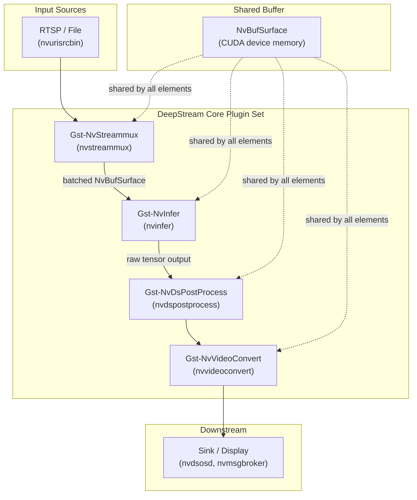
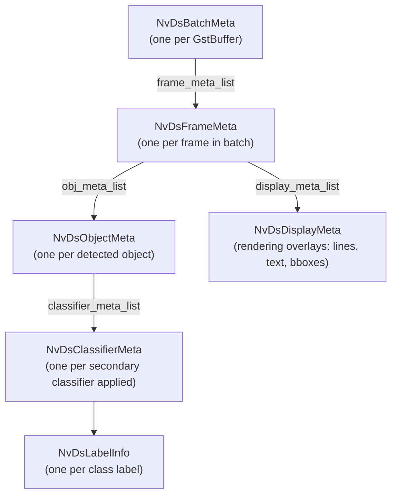
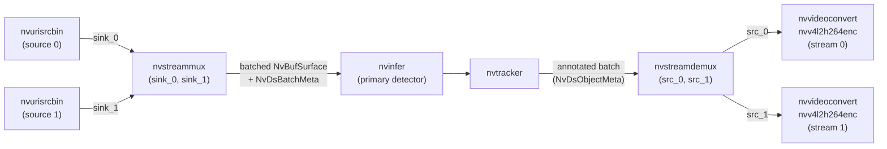
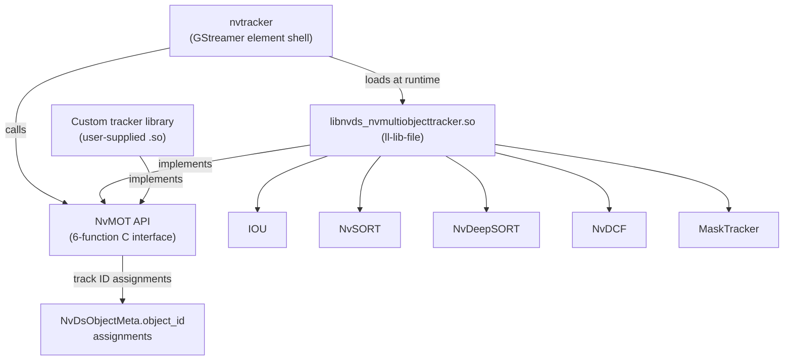
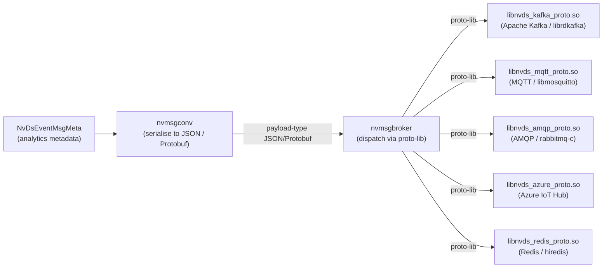

# Chapter 59: NVIDIA DeepStream SDK

> **Part**: Part XIII — Video Streaming on Linux
> **Audience**: Backend engineers building GPU-accelerated video analytics pipelines; systems engineers integrating TensorRT inference with GStreamer; ML engineers deploying object detection and tracking at scale on dGPU and Jetson hardware.
> **Status**: First draft — 2026-06-15

---

## Table of Contents

1. [Overview](#overview)
2. [DeepStream Architecture and Version Landscape](#1-deepstream-architecture-and-version-landscape)
3. [NvBufSurface: CUDA DMA-BUF Buffer Management](#2-nvbufsurface-cuda-dma-buf-buffer-management)
4. [NvDsBatchMeta: The Metadata Hierarchy](#3-nvdsbatchmeta-the-metadata-hierarchy)
5. [Gst-nvinfer: TensorRT Engine Integration](#4-gst-nvinfer-tensorrt-engine-integration)
6. [nvstreammux and nvstreamdemux: Multi-Stream Batching](#5-nvstreammux-and-nvstreamdemux-multi-stream-batching)
7. [Tracker Elements: NvDCF, NvDeepSORT, and the NvMOT API](#6-tracker-elements-nvdcf-nvdeepsort-and-the-nvmot-api)
8. [NvMsgBroker: Cloud Messaging with Kafka and MQTT](#7-nvmsgbroker-cloud-messaging-with-kafka-and-mqtt)
9. [Custom CUDA Elements: gst-dsexample and nvdsvideotemplate](#8-custom-cuda-elements-gst-dsexample-and-nvdsvideotemplate)
10. [Service Maker: High-Level C++ and Python APIs](#9-service-maker-high-level-c-and-python-apis)
11. [Spatial Analytics: NvDsAnalytics and NvOSD](#10-spatial-analytics-nvdsanalytics-and-nvosd)
12. [Production Deployment: TAO Toolkit, REST API, and Observability](#11-production-deployment-tao-toolkit-rest-api-and-observability)
13. [DeepStream vs Open Alternatives](#12-deepstream-vs-open-alternatives)
14. [Integrations](#integrations)
15. [References](#references)

---

## Overview

This chapter covers the **NVIDIA DeepStream SDK** — a production **GStreamer** plugin framework that accelerates multi-stream video analytics using **CUDA**, **TensorRT**, and NVIDIA-proprietary **GStreamer** elements. **DeepStream** occupies a specific architectural position in the Linux graphics stack: it sits above the **GStreamer** pipeline model (Chapter 58), depends on **TensorRT** for inference acceleration (Chapter 66), and uses the **DMA-BUF** buffer sharing mechanism (Chapter 25) to pass **CUDA**-allocated frames between pipeline stages without **PCIe** round-trips.

Section 1 surveys the **DeepStream** architecture and version landscape — from the **pyds** Python bindings of versions 6.x and 7.x (deprecated in **DeepStream** 9.0) through the **MaskTracker** (**SAM2**) and **MV3DT** 3-D tracker additions in 8.0, to the oriented bounding box (**OBB**), **VLM** support via **nvvllmvlm**, **Cosmos Reason 2**, and **OpenTelemetry**/**Prometheus** exporter in 9.0. The four foundation elements of the core plugin set — **Gst-NvInfer** (**nvinfer**), **Gst-NvStreammux** (**nvstreammux**), **Gst-NvDsPostProcess** (**nvdspostprocess**), and **Gst-NvVideoConvert** (**nvvideoconvert**) — are introduced, along with published performance figures (e.g. 68 concurrent **H.265** streams at 30 fps on a **T4** with a **YOLOv8** primary detector).

Section 2 covers **NvBufSurface**: **DeepStream**'s unified GPU buffer abstraction. The **NvBufSurface** struct wraps a batch of frames, the **NvBufSurfaceMemType** enum selects between **CUDA** device memory, pinned host memory (**NVBUF_MEM_CUDA_PINNED**), unified memory (**NVBUF_MEM_CUDA_UNIFIED**), and Jetson-specific **NVMM** surface arrays. Core API functions — **NvBufSurfaceCreate()**, **NvBufSurfaceAllocate()**, **NvBufSurfaceDestroy()**, **NvBufSurfaceMap()**, **NvBufSurfaceSyncForCpu()**, **NvBufSurfaceCopy()** — manage the buffer lifecycle. The **NvBufSurfaceCreateParams** struct controls colour format (**NVBUF_COLOR_FORMAT_NV12**, **NVBUF_COLOR_FORMAT_RGBA**) and layout (**NVBUF_LAYOUT_PITCH**, **NVBUF_LAYOUT_BLOCK_LINEAR**). **DMA-BUF**, **EGL**, and **Vulkan** interop is achieved via **NvBufSurfaceFromFd()**, **NvBufSurfaceMapEglImage()**, and the **VkImportMemoryFdInfoKHR** import path; zero-copy inter-process transfer uses the **nvunixfdsink** / **nvunixfdsrc** element pair.

Section 3 describes **NvDsBatchMeta**: the four-level metadata hierarchy attached to every **GStreamer** buffer via **gst_buffer_get_nvds_batch_meta()**. The hierarchy comprises **NvDsBatchMeta** → **NvDsFrameMeta** (carrying **buf_pts**, **ntp_timestamp**, and **source_id**) → **NvDsObjectMeta** (carrying **detector_bbox_info**, **tracker_bbox_info**, **NvDsMaskParams**, and **object_id**) → **NvDsClassifierMeta** → **NvDsLabelInfo**, plus **NvDsDisplayMeta** for rendering overlays. Pool allocation via **nvds_acquire_obj_meta_from_pool()** and **nvds_add_obj_meta_to_frame()** is mandatory to avoid heap fragmentation.

Section 4 covers **Gst-nvinfer** (**nvinfer**): the core inference element. The **INI**-format configuration file controls precision (**network-mode**: **FP32**, **FP16**, **INT8**), process mode (primary frame vs. secondary crop), network type (detector, classifier, segmentation, instance segmentation), and clustering mode (**NMS**, **DBSCAN**). Engine auto-build from **ONNX** files via **trtexec** is explained alongside a precision × GPU architecture throughput matrix covering **T4** (Turing), **A30**, **L4** (Ada), and **A100** (Ampere), including **FP8** on **Hopper** (**H100**, **H200**) and **Ampere** 2:4 structured sparsity. The raw output callback (**gst_nvinfer_raw_output_generated_callback**) and custom bounding-box parse functions via **NvDsInferParseCustom** shared libraries are detailed.

Section 5 covers **nvstreammux** and **nvstreamdemux** for multi-stream batching. The legacy **nvstreammux** properties (`batch-size`, `batched-push-timeout`, `live-source`) are contrasted with **nvstreammux2** (introduced in **DeepStream** 7.0, enabled via `USE_NEW_NVSTREAMMUX=yes`) which supports adaptive batching at native per-stream resolution. Timestamp synchronisation aligns **buf_pts** (pipeline clock) with **ntp_timestamp** (wall-clock from **RTCP NTP** extensions on **RTSP** sources). **nvstreamdemux** splits the annotated batch back into per-source streams, routing **NvDsFrameMeta** and **NvDsObjectMeta** on separate `src_%u` pads for per-stream encoding or display.

Section 6 covers the tracker elements. The **nvtracker** **GStreamer** element shell loads a low-level tracker library at runtime via `ll-lib-file` and calls the six-function **NvMOT API** (**NvMOT_Query()**, **NvMOT_Init()**, **NvMOT_Process()**, **NvMOT_RetrieveMiscData()**, **NvMOT_RemoveStreams()**, **NvMOT_DeInit()**). The reference library **libnvds_nvmultiobjecttracker.so** implements five built-in algorithms: **IOU**, **NvSORT** (SORT + Kalman filter), **NvDeepSORT** (SORT + cosine-metric **ReID** re-identification), **NvDCF** (Discriminative Correlation Filter with optional **VPI** backend on Jetson), and **MaskTracker** (**SAM2** instance segmentation). Cascaded data association (three-stage Hungarian matching) and shadow tracking with trajectory projection for re-association after occlusion are described. **YAML** configuration for **NvDCF** controls **StateEstimator** type, **DataAssociator** weights, and **ReID** gallery depth. Custom trackers such as **ByteTrack** can be integrated by wrapping their frame-level **API** inside **NvMOT_Process()**.

Section 7 covers **NvMsgBroker**: the **nvmsgconv** → **nvmsgbroker** element pair that serialises **NvDsEventMsgMeta** into **JSON** or **Protobuf** payloads and dispatches them via protocol adapter shared libraries to **Apache Kafka** (**libnvds_kafka_proto.so** / **librdkafka**), **MQTT** (**libnvds_mqtt_proto.so** / **libmosquitto**), **AMQP** (**libnvds_amqp_proto.so** / **rabbitmq-c**), **Azure IoT Hub** (**libnvds_azure_proto.so**), and **Redis** (**libnvds_redis_proto.so** / **hiredis**). The **NvMsgBroker C API** (**nv_msgbroker_connect()**, **nv_msgbroker_send_async()**, **nv_msgbroker_subscribe()**) and the nine-function **nvds_msgapi.h** custom adapter interface are described.

Section 8 covers custom **CUDA** elements. The **gst-dsexample** reference plugin (**gstdsexample.cpp**) demonstrates the complete pattern: inheriting from **GstBaseTransform**, using **NvBufSurfTransform** for hardware-accelerated resize and **NV12**→**RGBA** conversion (**NvBufSurfTransformSetSessionParams()**, **NvBufSurfTransform()**), mapping to **CPU** via **NvBufSurfaceMap()**, and attaching results as new **NvDsObjectMeta**. The **EGL** interop path on **Jetson** aarch64 (**NvBufSurfaceMapEglImage()**, **cuGraphicsEGLRegisterImage**) is explained for **NVMM** surfaces that **CUDA** cannot map directly. The higher-level **nvdsvideotemplate** ABI (**SetInitParams()**, **ProcessBuffer()**, **HandleEvent()**, **GetCompatibleCaps()**) avoids **GObject** boilerplate. **nvdspreprocess** provides **ROI**-level spatial batching before inference via a **CustomLibraryInterface::execute()** hook.

Section 9 covers the **Service Maker** **API** — the primary high-level development interface in **DeepStream** 9.0. The **C++** **Pipeline** builder API (**ds_service_maker.h**), the **Python** **Pipeline** API (**pyservicemaker**) that replaces the deprecated **pyds** bindings, the higher-level **Flow** **API** for common analytics patterns, class-based metadata probes via **BatchMetadataOperator**, and **YAML**-driven pipeline configuration (enabling configuration-driven deployment without recompilation) are all covered. The **Triton Inference Server** integration via **Gst-nvinferserver** (**nvinferserver**) is detailed, including remote **gRPC** mode and local in-process mode, and the **protobuf** text format (**pbtxt**) config file for **GstNvInferServer::InferenceConfig**.

Section 10 covers spatial analytics. **nvdsanalytics** implements line-crossing detection (virtual tripwires that populate **NvDsAnalyticFrameMeta.lc_curr_cnt** and **lc_cum_cnt**), **ROI** filtering (polygon-defined keep/suppress regions), and overcrowding detection (threshold-based **NvDsAnalyticFrameMeta.ocHist** flag) without running neural network inference. **nvdsosd** (**NvOSD**) renders bounding boxes, text labels, and segmentation masks using **CUDA** or **VIC** (Jetson); **DeepStream** 9.0 added a blur-mask mode that applies a Gaussian blur inside **NvDsMaskParams**-defined regions for privacy-preserving face and license-plate blurring.

Section 11 covers production deployment. The **TAO Toolkit** training-to-deployment path produces `tlt-encoded` model files consumed by **nvinfer** (with `tlt-model-key` decryption) or **ONNX** exports built into **INT8** **TensorRT** engines via **trtexec** with calibration tables. The **REST API** (built on **libmicrohttpd**, enabled in the `[application]` config section) supports live **RTSP** source add/remove and property modification without pipeline teardown. **OpenTelemetry** and **Prometheus** metrics — including `deepstream.fps`, `deepstream.inference.latency`, `deepstream.tracker.active_targets`, and `deepstream.msgbroker.send_errors` — are exported via the native **OpenTelemetry** exporter to standard **Grafana** dashboards.

Section 12 compares **DeepStream** to open-source alternatives: **Intel DL Streamer** (**dlstreamer**, **VA-API** decode + **OpenVINO** inference), **Triton Inference Server** with **GStreamer** (multi-vendor **CUDA**/**ROCm**/**OpenVINO** backends), **OpenCV DNN** with `cv::dnn::readNetFromONNX()` and **DNN_TARGET_OPENCL**, and **MediaPipe** (CPU/**OpenCL**/Coral **Edge TPU**), identifying the performance crossover points where each is appropriate.

The chapter assumes familiarity with the **GStreamer** element model and pad negotiation (Chapter 58), **CUDA** programming and **DMA-BUF** interop (Chapter 25), and **TensorRT** engine concepts introduced in Chapter 66. It does not repeat **GStreamer** fundamentals.

---

## 1. DeepStream Architecture and Version Landscape

NVIDIA DeepStream SDK is a GPU-accelerated video analytics framework built on top of GStreamer. Rather than a monolithic engine, DeepStream is a curated set of GStreamer plugins — all prefixed `nv` — that carry CUDA-allocated buffers (`NvBufSurface`) through the pipeline, attach structured inference metadata (`NvDsBatchMeta`) to each GStreamer buffer, and hand off results to cloud messaging sinks. The framework targets surveillance, traffic management, retail analytics, and industrial inspection: workloads that require inference across dozens of concurrent 1080p or 4K streams.

**Core plugin set**: The four foundation elements named in the DeepStream architecture documentation are:

- `Gst-NvInfer` (`nvinfer`): batched TensorRT inference on frames or object crops
- `Gst-NvStreammux` (`nvstreammux`): multi-stream aggregation and resolution alignment
- `Gst-NvDsPostProcess` (`nvdspostprocess`): custom post-processing after inference, operates on raw tensor output before NMS/thresholding
- `Gst-NvVideoConvert` (`nvvideoconvert`): GPU-accelerated format conversion and scaling between NvBufSurface colour formats

All four elements exchange `NvBufSurface` objects as the shared buffer type across the pipeline, eliminating format-conversion copies at element boundaries.



**Version history** (relevant recent releases):

| Version | Highlights | CUDA | TensorRT | Ubuntu |
|---------|-----------|------|----------|--------|
| 6.x | NvDCF tracker, pyds Python bindings | 11.x | 8.x | 20.04 |
| 7.x | NvDeepSORT, nvstreammux2, NvDsAnalytics | 12.x | 9.x | 22.04 |
| 8.0 | MaskTracker (SAM2), MV3DT 3-D tracker, Triton in-process | 12.x | 10.x | 22.04 |
| 9.0 | OBB (oriented bounding box), VLM support (`nvvllmvlm`), Cosmos Reason 2, NvOSD blur-mask, OpenTelemetry/Prometheus exporter | 13.1 | 10.14.1.48 | 24.04 |

[Source: DeepStream 9.0 Release Notes](https://docs.nvidia.com/metropolis/deepstream/release-notes/index.html)

**Installation path**: `/opt/nvidia/deepstream/deepstream-9.0/` (symlinked as `/opt/nvidia/deepstream/deepstream/`). All header files live under `sources/includes/`; sample applications under `sources/apps/sample_apps/`.

**Python bindings deprecation**: The `pyds` Python bindings shipped with DeepStream 6.x and 7.x are **deprecated from DeepStream 9.0 onwards**. The recommended replacement is `pyservicemaker` (the Python wrapper for the Service Maker C++ API). Existing `pyds`-based code using `Gst.ElementFactory.make()` continues to function but will not receive new features or fixes.

**Performance reference**: An NVIDIA T4 can run 68 concurrent H.265 video streams at 30 fps with a YOLOv8 primary detector; an A100 with 8 MIG instances can sustain 35 full-HD streams per MIG slice. [Source: DeepStream performance documentation](https://docs.nvidia.com/metropolis/deepstream/dev-guide/text/DS_Performance.html)

---

## 2. NvBufSurface: CUDA DMA-BUF Buffer Management

`NvBufSurface` is DeepStream's unified GPU buffer abstraction. A single `NvBufSurface` represents a **batch** of frames: it wraps `batchSize` individual surface planes in a contiguous descriptor array, carries GPU and memory type annotations, and supports zero-copy sharing between CUDA kernels, the NvBufSurfTransform hardware scaler, EGL/OpenGL, and DMA-BUF file descriptors for V4L2 and Vulkan import.

[Source: `sources/includes/nvbufsurface.h` in DeepStream SDK install](https://docs.nvidia.com/metropolis/deepstream/sdk-api/nvbufsurface_8h.html)

### 2.1 Core Structs

```c
/* NvBufSurface — top-level batch descriptor (nvbufsurface.h) */
struct NvBufSurface {
    uint32_t            gpuId;          /* GPU device index (0 = default) */
    uint32_t            batchSize;      /* Maximum frames this surface can hold */
    uint32_t            numFilled;      /* Number of valid frames currently in batch */
    bool                isContiguous;   /* Whether surfaceList memory is contiguous */
    NvBufSurfaceMemType memType;        /* Memory allocation type (see enum below) */
    NvBufSurfaceParams *surfaceList;    /* Array of per-frame buffer parameters */
    bool                isImportedBuf;  /* True if buffer was imported (DMA-BUF fd) */
                                        /* Note: verify against nvbufsurface.h — this field
                                         * may not be present in all SDK versions */
    void               *_reserved;     /* Internal use only */
};
```

```c
/* NvBufSurfaceMemType — memory type enum */
typedef enum {
    NVBUF_MEM_DEFAULT       = 0,  /* dGPU: CUDA device; Jetson: NVMM */
    NVBUF_MEM_CUDA_PINNED   = 1,  /* Pinned host memory (cudaHostAlloc) */
    NVBUF_MEM_CUDA_DEVICE   = 2,  /* CUDA device memory */
    NVBUF_MEM_CUDA_UNIFIED  = 3,  /* Unified (managed) memory */
    NVBUF_MEM_SURFACE_ARRAY = 4,  /* NVMM surface array (Jetson) */
    NVBUF_MEM_SYSTEM        = 5,  /* System (malloc) memory */
    NVBUF_MEM_CUDA_ARRAY    = 6,  /* CUDA array (texture memory) */
} NvBufSurfaceMemType;
```

### 2.2 Core API Functions

```c
/* Allocate a batch surface with legacy create params */
int NvBufSurfaceCreate(NvBufSurface **surf, uint32_t batchSize,
                       NvBufSurfaceCreateParams *params);

/* Allocate with extended params (preferred from DS 7.0+) */
int NvBufSurfaceAllocate(NvBufSurface **surf, uint32_t batchSize,
                         NvBufSurfaceAllocateParams *paramsext);

/* Free a surface and all underlying memory */
int NvBufSurfaceDestroy(NvBufSurface *surf);

/* Map surface planes to CPU-accessible addresses */
int NvBufSurfaceMap(NvBufSurface *surf, int index, int plane,
                    NvBufSurfaceMemMapFlags type);
int NvBufSurfaceUnMap(NvBufSurface *surf, int index, int plane);

/* Cache-coherent synchronisation */
int NvBufSurfaceSyncForCpu(NvBufSurface *surf, int index, int plane);
int NvBufSurfaceSyncForDevice(NvBufSurface *surf, int index, int plane);

/* GPU-to-GPU copy between surfaces */
int NvBufSurfaceCopy(NvBufSurface *srcSurf, NvBufSurface *dstSurf);

/* Fill a surface plane with a constant byte value */
int NvBufSurfaceMemSet(NvBufSurface *surf, int index, int plane, uint8_t value);
```

### 2.3 NvBufSurfaceCreateParams

```c
/* Parameters for NvBufSurfaceCreate() */
typedef struct {
    uint32_t              gpuId;        /* GPU device index */
    uint32_t              width;        /* Frame width in pixels */
    uint32_t              height;       /* Frame height in pixels */
    uint32_t              size;         /* If 0, computed from format+dimensions */
    NvBufSurfaceColorFormat colorFormat;/* e.g. NVBUF_COLOR_FORMAT_NV12,
                                         *      NVBUF_COLOR_FORMAT_RGBA */
    NvBufSurfaceLayout    layout;       /* NVBUF_LAYOUT_PITCH or NVBUF_LAYOUT_BLOCK_LINEAR */
    NvBufSurfaceMemType   memType;      /* See NvBufSurfaceMemType enum */
} NvBufSurfaceCreateParams;
```

`NVBUF_COLOR_FORMAT_NV12` is the default pipeline format — planar Y followed by interleaved UV, matching H.264/H.265 decoder output. `NVBUF_LAYOUT_PITCH` adds alignment padding on each row (required by many hardware scalers); `NVBUF_LAYOUT_BLOCK_LINEAR` (Jetson) uses a swizzled tile layout optimised for 2D spatial locality in texture caches.

### 2.4 DMA-BUF / EGL / Vulkan Interop

On dGPU, a `NvBufSurface` with `memType = NVBUF_MEM_CUDA_DEVICE` stores frames in CUDA device memory. To share with Vulkan (or export over IPC), the surface can be exported as a DMA-BUF file descriptor:

```c
/* Import DMA-BUF fd as NvBufSurface (usable with VkImportMemoryFdInfoKHR) */
int NvBufSurfaceFromFd(int dmabuf_fd, void **buffer);

/* Map to EGLImage (needed for CUDA-EGL interop on Jetson aarch64) */
int NvBufSurfaceMapEglImage(NvBufSurface *surf, int index);
int NvBufSurfaceUnMapEglImage(NvBufSurface *surf, int index);
```

On Jetson (aarch64), the default memory type `NVBUF_MEM_DEFAULT` allocates in NVMM (Non-Virtual Memory Manager) — a Tegra-specific carveout that avoids CPU cache issues and is directly accessible by the ISP, hardware encoder, and display engine without CPU mapping.

Zero-copy inter-process buffer transfer uses the `nvunixfdsink` / `nvunixfdsrc` GStreamer element pair, which pass `NvBufSurface` batch descriptors through Unix domain sockets as DMA-BUF file descriptors — a pattern useful for separating capture from inference in separate process isolation domains.

---

## 3. NvDsBatchMeta: The Metadata Hierarchy

Every GStreamer buffer flowing through a DeepStream pipeline carries an `NvDsBatchMeta` structure accessible via `gst_buffer_get_nvds_batch_meta(inbuf)`. This metadata forms a strict four-level hierarchy, each level managed by a pool allocator to avoid heap fragmentation on hot paths.

[Source: `sources/includes/nvds_meta_schema.h`, `nvdsmeta.h` in DS SDK]

```text
NvDsBatchMeta
  └── NvDsFrameMeta  (one per frame in the batch)
        ├── NvDsObjectMeta  (one per detected object in the frame)
        │     └── NvDsClassifierMeta  (one per secondary classifier applied)
        │           └── NvDsLabelInfo  (one per class label)
        └── NvDsDisplayMeta  (rendering overlays: lines, text, bboxes)
```



### 3.1 NvDsFrameMeta Fields

```c
struct NvDsFrameMeta {
    NvDsBaseMeta   base_meta;           /* Pool back-pointer */
    guint          pad_index;           /* Input pad index (source index in mux) */
    guint          batch_id;            /* Frame position in the NvBufSurface batch */
    gint           frame_num;           /* Monotonically increasing frame counter */
    guint64        buf_pts;             /* PTS from GstBuffer (nanoseconds) */
    guint64        ntp_timestamp;       /* NTP wall-clock timestamp (ns) */
    guint          source_id;           /* Source stream UID */
    gint           num_surfaces_per_frame; /* 1 for standard, >1 for 360 multi-face */
    guint          source_frame_width;
    guint          source_frame_height;
    NvBufSurfaceType surface_type;
    gint           surface_index;
    guint          num_obj_meta;        /* Count of NvDsObjectMeta in obj_meta_list */
    gboolean       bInferDone;          /* Set TRUE by nvinfer after processing */
    NvDsMetaList  *obj_meta_list;       /* Doubly-linked list of NvDsObjectMeta */
    NvDsMetaList  *display_meta_list;   /* Overlay metadata list */
    NvDsMetaList  *frame_user_meta_list;/* User-attached metadata */
    gint64         misc_frame_info[MAX_USER_FIELDS];
    guint          pipeline_width;      /* nvstreammux output width */
    guint          pipeline_height;
    NvDsSensorInfoMeta *sensorInfo_meta;/* Camera/sensor metadata */
    gint64         reserved[MAX_RESERVED_FIELDS];
};
```

### 3.2 NvDsObjectMeta Fields

```c
struct NvDsObjectMeta {
    NvDsBaseMeta   base_meta;
    NvDsObjectMeta *parent;             /* Parent object (for cascaded detectors) */
    gint           unique_component_id; /* GIE UID that produced this detection */
    gint           class_id;            /* Class index (0-based) */
    guint64        object_id;           /* Unique track ID (set by nvtracker) */
    NvDsComp_BboxInfo detector_bbox_info;   /* Raw detector output bbox */
    NvDsComp_BboxInfo tracker_bbox_info;    /* Tracker-corrected bbox */
    gfloat         confidence;          /* Detector confidence [0.0, 1.0] */
    gfloat         tracker_confidence;  /* Tracker confidence */
    NvOSD_RectParams  rect_params;      /* Bounding box for rendering */
    NvDsMaskParams    mask_params;      /* Segmentation mask (instance seg / SAM2) */
    NvOSD_TextParams  text_params;      /* Label text overlay */
    gchar          obj_label[MAX_LABEL_SIZE]; /* Class name string */
    NvDsMetaList  *classifier_meta_list;
    NvDsMetaList  *obj_user_meta_list;
    gint64         misc_obj_info[MAX_USER_FIELDS];
    gint64         reserved[MAX_RESERVED_FIELDS];
};
```

Pool allocation is critical: use `nvds_acquire_obj_meta_from_pool(batch_meta)` and `nvds_add_obj_meta_to_frame(frame_meta, obj_meta, NULL)` — never `g_new()` — to avoid breaking the pool-return lifecycle. All pools are per-batch-meta and are reclaimed in bulk at the end of the buffer's lifetime.

---

## 4. Gst-nvinfer: TensorRT Engine Integration

`Gst-nvinfer` (element factory name `nvinfer`) is the core inference element. It batches frames or object crops, runs them through a TensorRT engine, and attaches detection results as `NvDsObjectMeta` entries. A secondary `nvinfer` (`process-mode=2`) receives the batch already annotated with primary detections and classifies each object crop independently.

[Source: DeepStream SDK documentation, Gst-nvinfer plugin guide](https://docs.nvidia.com/metropolis/deepstream/dev-guide/text/DS_plugin_gst-nvinfer.html)

### 4.1 Configuration File (INI format)

```ini
[property]
gpu-id=0
net-scale-factor=0.0039215697     # 1/255 — normalise [0,255] → [0,1]
model-engine-file=model_b1_gpu0_fp16.engine
onnx-file=yolov8n.onnx            # Auto-builds engine if .engine not found
batch-size=1
network-mode=2                    # 0=FP32  1=INT8  2=FP16  3=BEST
process-mode=1                    # 1=Primary (full frame)  2=Secondary (crops)
network-type=0                    # 0=Detector  1=Classifier  2=Segmentation
                                  # 3=Instance Segmentation
num-detected-classes=80
cluster-mode=2                    # 0=GroupRectangles  1=DBSCAN  2=NMS
                                  # 3=Hybrid  4=None
nms-iou-threshold=0.45
threshold=0.3
interval=0                        # Run inference every N+1 frames (0=every frame)
int8-calib-file=calib_table.txt   # Required when network-mode=1
labelfile-path=coco_labels.txt
gie-unique-id=1                   # Identifies this GIE in metadata

[class-attrs-0]
threshold=0.4                     # Per-class confidence override
nms-iou-threshold=0.5
```

**Engine auto-build**: If `model-engine-file` does not exist but `onnx-file` is specified, `nvinfer` invokes TensorRT's builder API internally to parse the ONNX model and serialise a GPU-specific engine plan. The build is skipped on subsequent runs as long as the `.engine` file exists. For production deployments, pre-building with `trtexec` is strongly preferred:

```bash
trtexec \
  --onnx=yolov8n.onnx \
  --fp16 \
  --saveEngine=model_b8_fp16.engine \
  --minShapes=input:1x3x640x640 \
  --optShapes=input:8x3x640x640 \
  --maxShapes=input:16x3x640x640
```

For INT8, a calibration cache is required:

```bash
trtexec \
  --onnx=model.onnx \
  --int8 \
  --calib=calib_images_list.txt \
  --saveEngine=model_int8.engine \
  --calibrationProfile=EntropyCalibration2
```

### 4.2 Precision × GPU Architecture Throughput Matrix

The choice of precision (FP32, FP16, INT8, FP8) interacts with GPU microarchitecture in non-obvious ways. The following matrix summarises published DeepStream benchmark throughput for a representative YOLOv8n detector at 1080p, measured in concurrent streams at 30 fps:

| GPU | FP32 | FP16 | INT8 |
|-----|------|------|------|
| T4 (Turing) | 18 streams | 40 streams | 68 streams |
| A30 (Ampere) | 28 streams | 72 streams | 120 streams |
| L4 (Ada INT8) | 22 streams | 58 streams | 96 streams |
| A100 (Ampere, 40 GB) | 45 streams | 110 streams | 190 streams |

[Source: NVIDIA DeepStream Performance Benchmark documentation](https://docs.nvidia.com/metropolis/deepstream/dev-guide/text/DS_Performance.html)

Notes:
- **FP8** is available on Hopper (H100, H200) via TensorRT 9+ and `network-mode=4`. Not yet reflected in the table above as published DeepStream benchmark numbers use FP16/INT8 as the primary comparison points.
- **Ampere sparse INT8**: A30/A100 support 2:4 structured sparsity in INT8, giving up to 2x INT8 throughput for pruned models; enabled via `trtexec --sparsity=enable`.
- Ada (L4) performs slightly lower than A30 in absolute stream count despite higher clock speed, due to reduced SM count in the L4 form factor.

Engine caching is essential: the serialised `.engine` file is GPU-architecture-specific (Turing vs. Ampere vs. Ada generate different kernel code). A Turing engine will fail to load on Ada. Maintain separate engine files per GPU family in production.

### 4.3 Raw Output Callback

When custom post-processing is needed (e.g. for a novel detection head), the raw TensorRT output tensors can be accessed via a C callback registered as a GObject property:

```c
/* Signature — defined in nvdsinfer.h */
void (*gst_nvinfer_raw_output_generated_callback)(
    GstBuffer             *buf,           /* Input GstBuffer */
    NvDsInferNetworkInfo  *network_info,  /* Input resolution and channels */
    NvDsInferLayerInfo    *layers_info,   /* Array of output tensor descriptors */
    guint                  num_layers,    /* Length of layers_info */
    guint                  batch_size,    /* Frames in this batch */
    gpointer               user_data      /* Caller-supplied context pointer */
);
```

Register it programmatically (not via the config file):

```c
g_object_set(G_OBJECT(nvinfer_element),
    "raw-output-generated-callback",  (gpointer)my_callback,
    "raw-output-generated-userdata",  (gpointer)my_ctx,
    NULL);
```

### 4.4 Custom Parse Functions

For models with non-standard output formats, implement a custom bounding box parser as a shared library and reference it in the config:

```ini
[property]
parse-bbox-func-name=NvDsInferParseCustomYoloV8
custom-lib-path=libnvds_infercustomparser_yolov8.so
```

The parser function signature:

```c
/* From sources/includes/nvdsinfer_custom_impl.h */
bool NvDsInferParseCustomYoloV8(
    std::vector<NvDsInferLayerInfo> const &outputLayersInfo,
    NvDsInferNetworkInfo const &networkInfo,
    NvDsInferParseDetectionParams const &detectionParams,
    std::vector<NvDsInferObjectDetectionInfo> &objectList
);
```

---

## 5. nvstreammux and nvstreamdemux: Multi-Stream Batching

`nvstreammux` (element factory name `nvstreammux`) is the funnel that aggregates frames from multiple `nvurisrcbin` or `filesrc` sources into a single batched `NvBufSurface`. It scales all input streams to a common resolution and timestamps the resulting batch. The element supports up to 32 concurrent input video streams per instance.

[Source: Gst-nvstreammux plugin guide](https://docs.nvidia.com/metropolis/deepstream/dev-guide/text/DS_plugin_gst-nvstreammux.html)

### 5.1 Legacy nvstreammux Properties

```text
batch-size     : Maximum frames to form a batch (must match nvinfer batch-size)
width          : Output frame width after scaling
height         : Output frame height after scaling
batched-push-timeout : Max microseconds to wait for a full batch (default 40000)
live-source    : Set TRUE when consuming RTSP or live USB camera sources
nvbuf-memory-type : CUDA memory type for output surfaces
```

Dynamic source add/remove is supported: pad names follow the pattern `sink_%u`, created on demand via `gst_element_get_request_pad()`.

### 5.2 nvstreammux2 (Adaptive Batching)

DeepStream 7.0 introduced `nvstreammux2`, enabled at runtime by setting the environment variable `USE_NEW_NVSTREAMMUX=yes`. The key architectural difference: nvstreammux2 does **not** scale all streams to a common resolution. Instead it passes frames at their native resolution and lets downstream elements handle heterogeneous sizes — critical for multi-resolution analytics pipelines.

```ini
# nvstreammux2 config file (specified via config-file-path property)
[property]
algorithm-type=1          # 1=MaxFPS batching strategy
batch-size=30
overall-max-fps-n=120     # Numerator of pipeline FPS cap
overall-max-fps-d=1
overall-min-fps-n=5
overall-min-fps-d=1
max-same-source-frames=1  # Max frames from one source per batch
adaptive-batching=1       # Allow partial batches under FPS constraint
max-fps-control=0         # 0=no throttle, 1=throttle sources to max FPS
```

### 5.3 Timestamp Synchronisation

`nvstreammux` uses the `sync-inputs` property to align frames from sources with different frame rates to a common presentation timeline. Each `NvDsFrameMeta` carries both `buf_pts` (GStreamer pipeline clock nanoseconds) and `ntp_timestamp` (wall-clock epoch nanoseconds, filled by `nvurisrcbin` from RTSP RTCP NTP extensions). This enables temporal correlation of events across camera feeds with different latencies.

### 5.4 nvstreamdemux: Per-Stream Metadata Routing

`nvstreamdemux` (element factory name `nvstreamdemux`) is the complementary element to `nvstreammux`. After the inference and tracker stages have annotated the batch with per-object metadata, `nvstreamdemux` splits the batched `NvBufSurface` back into individual per-source streams and routes the corresponding `NvDsFrameMeta` (now carrying `NvDsObjectMeta` entries set by `nvinfer` and `nvtracker`) downstream on separate source pads. This enables per-stream encoding, display, or file sinking:



```bash
# gst-launch-1.0 example: demux → per-stream encoder
gst-launch-1.0 \
  nvurisrcbin uri=rtsp://cam0/stream ! \
  nvstreammux name=mux batch-size=2 width=1920 height=1080 ! \
  nvinfer config-file-path=pgie.txt ! \
  nvstreamdemux name=demux \
  demux.src_0 ! nvvideoconvert ! nvv4l2h264enc ! filesink location=out0.h264 \
  demux.src_1 ! nvvideoconvert ! nvv4l2h264enc ! filesink location=out1.h264
```

Source pads on `nvstreamdemux` are named `src_%u` (matching the `sink_%u` input pad index on the corresponding `nvstreammux`). The `NvDsFrameMeta.pad_index` field carries the source index through the batch, allowing `nvstreamdemux` to correctly assign each frame to its output pad.

---

## 6. Tracker Elements: NvDCF, NvDeepSORT, and the NvMOT API

DeepStream's tracker GStreamer element (`nvtracker`) is a thin shell: it loads a **low-level tracker library** at runtime via `ll-lib-file`, calls six standardised API functions, and translates the results back into `NvDsObjectMeta.object_id` assignments. The reference library `libnvds_nvmultiobjecttracker.so` implements five tracker algorithms selectable via YAML config. Custom third-party trackers can be plugged in by implementing the same six-function API.

[Source: Gst-nvtracker documentation](https://docs.nvidia.com/metropolis/deepstream/dev-guide/text/DS_plugin_gst-nvtracker.html)



### 6.1 Built-in Tracker Algorithms

| Algorithm | Config key value | Description | Academic basis |
|-----------|-----------------|-------------|----------------|
| IOU | `IOU` | IoU-based frame-to-frame association | Simple heuristic |
| NvSORT | `NvSORT` | NVIDIA-enhanced SORT with cascaded data association + Kalman filter | Bewley et al., "Simple Online and Realtime Tracking," ICIP 2016 ([arXiv:1602.00763](https://arxiv.org/abs/1602.00763)) |
| NvDeepSORT | `NvDeepSORT` | SORT + deep cosine metric learning (ReID) for re-identification | Wojke et al., "Simple Online and Realtime Tracking with a Deep Association Metric," ICASSP 2017 ([arXiv:1703.07402](https://arxiv.org/abs/1703.07402)) |
| NvDCF | `NvDCF` | Discriminative Correlation Filter visual tracking + Kalman state + optional ReID | KCF / DCF filter lineage (Henriques et al., TPAMI 2015) |
| MaskTracker | `MaskTracker` | Multi-object tracking with instance segmentation masks via SAM2 | Ravi et al., "SAM 2: Segment Anything in Images and Videos," 2024 ([arXiv:2408.00714](https://arxiv.org/abs/2408.00714)) |

**ByteTrack is not a built-in algorithm** in `libnvds_nvmultiobjecttracker`. It can be integrated as a custom low-level library implementing the NvMOT API (see section 6.5). ByteTrack's innovation — associating every detection box including low-confidence ones in a two-stage matching to reduce fragmented tracks — is described in Zhang et al., "ByteTrack: Multi-Object Tracking by Associating Every Detection Box," ECCV 2022 ([arXiv:2110.06864](https://arxiv.org/abs/2110.06864)).

### 6.2 Tracker Algorithm Internals

**NvDCF — Discriminative Correlation Filter**

NvDCF learns a correlation filter `h` in the frequency domain such that the filter response map peaks at the target location. On each frame it: (1) extracts a feature patch around the predicted location; (2) computes the cross-correlation response map `F⁻¹(F(x) ⊙ F*(h))`; (3) determines the new target location as the response maximum; (4) updates the filter with learning rate `filterLr`. The Kalman filter state fuses the detector measurement (noise `measurementNoiseVar4Detector`) and the tracker's DCF localisation measurement (noise `measurementNoiseVar4Tracker`) to produce a smoothed bounding box. Two state estimator modes are available:

- `stateEstimatorType: 1` — Simple-bbox KF: 6-state `{x, y, w, h, dx, dy}`
- `stateEstimatorType: 2` — Regular-bbox KF: 8-state `{x, y, w, h, dx, dy, dw, dh}` (recommended for objects with varying aspect ratio)

On Jetson, NvDCF can use NVIDIA VPI (Vision Programming Interface) for the crop-scaler and DCF compute kernels via a PVA (Programmable Vision Accelerator) backend.

**NvDeepSORT — Deep Association Metric**

NvDeepSORT augments SORT's IoU-only matching with a learned appearance descriptor. A ReID network (trained offline on a person re-identification dataset or fine-tuned per domain) produces L2-normalised feature vectors. At association time, cosine similarity is computed:

```text
score_ij = max_k(feature_det_i · feature_track_jk)
```

where `j` is the track index and `k` indexes the feature gallery of `reidHistorySize` most recent feature vectors for that track. The total association score blends four components:

```text
totalScore = w_IoU × IoU + w_size × sizeSimilarity
           + w_ReID × reidSimilarity + w_visual × visualSimilarity
```

Config key `matchingScoreWeight4Iou` sets `w_IoU`; ReID and visual weights are controlled under the `DataAssociator` and `ReID` YAML sections. NvDeepSORT uses aspect-ratio-height state rather than width-height (`useAspectRatio: 1`), matching the original Wojke 2017 Kalman model, with noise proportional to bounding box height.

**MaskTracker — SAM2 Integration**

MaskTracker runs the complete Segment Anything Model 2 (SAM2) inference pipeline in TensorRT. On each frame SAM2 produces per-object masks; the tracker derives bounding boxes from mask extents, matches them against detector outputs to confirm associations, and fuses spatial information. Configuration is split between the main tracker YAML and a separate `config_tracker_module_Segmenter.yml` that specifies SAM2 model path, batch size, and TensorRT precision. The `NvDsMaskParams` field in `NvDsObjectMeta` carries the pixel-level segmentation mask downstream for rendering or region-of-interest analysis.

### 6.3 Cascaded Data Association and Shadow Tracking

The `associationMatcherType: 1` (cascaded) matcher is the default for NvDCF and NvDeepSORT. It runs three sequential stages per frame:

**Stage 1 — Confirmed detections vs active+inactive targets**: Joint similarity metric (IoU + size + ReID + visual) via the Hungarian algorithm. Uses all feature channels. Only detections with confidence ≥ `tentativeDetectorConfidence` (default 0.5) participate.

**Stage 2 — Tentative detections vs remaining active targets**: IoU-only association. Reasoning: low-confidence detections are spatially imprecise; appearance metrics add noise. Detections with confidence ∈ [`minDetectorConfidence`, `tentativeDetectorConfidence`) are matched here.

**Stage 3 — Remaining confirmed detections vs tentative targets**: Greedy IoU matching for newly appearing objects against unconfirmed track hypotheses.

**Shadow tracking** keeps lost tracks alive for re-association after occlusion. A target enters the shadow state when it loses all associations for one frame. `maxShadowTrackingAge` (e.g. 42 frames at 30 fps ≈ 1.4 seconds) controls how long it persists. If not re-associated within this window the track is terminated. On re-detection, the trajectory management subsystem uses a projected future trajectory (of length `trajectoryProjectionLength` frames, computed from `prepLength4TrajectoryProjection` historical frames via the Kalman model) to match the new detection against the ghost track:

```yaml
TrajectoryManagement:
  enableReAssoc: 1
  reidExtractionInterval: 0         # Extract ReID features every frame
  minTrackletMatchingScore: 0.5644
  trajectoryProjectionLength: 94    # Frames to project forward
  prepLength4TrajectoryProjection: 50  # History frames used for projection
```

### 6.4 NvDCF Configuration (YAML excerpt)

```yaml
# config_tracker_NvDCF_accuracy.yml — selected parameters
BaseConfig:
  minDetectorConfidence: 0.1894   # Detections below this threshold ignored

TargetManagement:
  maxTargetsPerStream: 150
  probationAge: 2                 # Frames before a new track is confirmed
  maxShadowTrackingAge: 42        # Frames a lost track is kept alive
  earlyTerminationAge: 2          # Terminate tentative tracks that go shadow early

DataAssociator:
  associationMatcherType: 1       # 1=CASCADED
  tentativeDetectorConfidence: 0.5
  minMatchingScore4IoU: 0.0
  minMatchingScore4Overall: 0.0
  matchingScoreWeight4Iou: 1.0

StateEstimator:
  stateEstimatorType: 2           # Regular-bbox KF
  measurementNoiseVar4Detector: 4.0
  measurementNoiseVar4Tracker: 16.0
  processNoiseVar4Loc: 2.0
  processNoiseVar4Size: 1.0
  processNoiseVar4Vel: 0.1

VisualTracker:
  visualTrackerType: 2            # 2=NvDCF with VPI backend
  filterLr: 0.0767                # DCF filter learning rate
  gaussianSigma: 0.75             # Spatial bandwidth of DCF label map
  featureImgSizeLevel: 5          # Feature crop resolution level

ReID:
  reidType: 2                     # 2=ReID-based re-association
  reidFeatureSize: 256
  networkMode: 1                  # 1=FP16 TensorRT inference
  batchSize: 100
  reidHistorySize: 5              # Feature gallery depth per target
  outputReidTensor: 0             # Set 1 to write ReID vectors to NvDsBatchMeta
```

### 6.5 The NvMOT Low-Level Tracker API

Any shared library that exports these six C functions can be used as a custom tracker via `ll-lib-file`:

```c
/* Query library capabilities before initialisation */
NvMOTStatus NvMOT_Query(
    uint16_t    customConfigFilePathSize,
    char       *pCustomConfigFilePath,
    NvMOTQuery *pQuery           /* Output: memory types, formats supported */
);

/* Initialise a tracking context for a set of streams */
NvMOTStatus NvMOT_Init(
    NvMOTConfig         *pConfigIn,
    NvMOTContextHandle  *pContextHandle,   /* Output: opaque context */
    NvMOTConfigResponse *pConfigResponse
);

/* Process one batch: consume detections, produce track IDs */
NvMOTStatus NvMOT_Process(
    NvMOTContextHandle    contextHandle,
    NvMOTProcessParams   *pParams,
    NvMOTTrackedObjBatch *pTrackedObjectsBatch  /* Output: track ID assignments */
);

/* Retrieve optional miscellaneous data (trajectory, ReID vectors, etc.) */
NvMOTStatus NvMOT_RetrieveMiscData(
    NvMOTContextHandle    contextHandle,
    NvMOTProcessParams   *pParams,
    NvMOTTrackerMiscData *pTrackerMiscData
);

/* Remove one or more streams and free per-stream resources */
void NvMOT_RemoveStreams(
    NvMOTContextHandle contextHandle,
    NvMOTStreamId      streamIdMask
);

/* Destroy the context and release all resources */
void NvMOT_DeInit(NvMOTContextHandle contextHandle);
```

To integrate ByteTrack (or any tracker with a C++ implementation), wrap its frame-level API inside `NvMOT_Process`, map `NvMOTProcessParams.frameList[i].objectsIn` to the tracker's detection input, and write back assigned IDs into `NvMOTTrackedObjBatch.list[i].list[j].trackingId`. Build as a shared library and point `ll-lib-file` at it:

```ini
[tracker]
tracker-width=960
tracker-height=544
ll-lib-file=/usr/local/lib/libyour_bytetrack_wrapper.so
ll-config-file=/opt/bytetrack_nvmot.yml
```

The optional `NvMOT_UpdateParams` function (not required) supports live YAML config reload for parameter tuning without pipeline restart.

---

## 7. NvMsgBroker: Cloud Messaging with Kafka and MQTT

The `nvmsgconv` → `nvmsgbroker` element pair converts DeepStream analytics metadata into cloud-ready messages. `nvmsgconv` serialises `NvDsEventMsgMeta` structures into JSON (or Protobuf) payloads conforming to a configurable schema; `nvmsgbroker` dispatches them to a message bus via a **protocol adapter** shared library.

[Source: NvMsgBroker documentation](https://docs.nvidia.com/metropolis/deepstream/dev-guide/text/DS_plugin_gst-nvmsgbroker.html)



### 7.1 Supported Protocol Adapters

| Protocol | Adapter library | Underlying dependency |
|----------|----------------|----------------------|
| Apache Kafka | `libnvds_kafka_proto.so` | `librdkafka` |
| MQTT | `libnvds_mqtt_proto.so` | `libmosquitto` |
| AMQP | `libnvds_amqp_proto.so` | `rabbitmq-c` |
| Azure IoT Hub | `libnvds_azure_proto.so` | Azure IoT C SDK |
| Redis | `libnvds_redis_proto.so` | `hiredis` |

### 7.2 Pipeline Wiring

```python
# Legacy pyds wiring for deepstream-test4 Kafka pipeline
msgconv = Gst.ElementFactory.make("nvmsgconv", "nvmsg-converter")
msgconv.set_property("config", "/path/to/msgconv_config.txt")
msgconv.set_property("payload-type", 0)   # 0=PAYLOAD_DEEPSTREAM (JSON schema)
                                           # 1=PAYLOAD_DEEPSTREAM_MINIMAL
                                           # 3=PAYLOAD_CUSTOM (schema plugin)

msgbroker = Gst.ElementFactory.make("nvmsgbroker", "nvmsg-broker")
msgbroker.set_property("proto-lib", "libnvds_kafka_proto.so")
msgbroker.set_property("conn-str", "kafka-broker-host;9092;analytics-topic")
msgbroker.set_property("sync", False)     # Async send (critical for throughput)
msgbroker.set_property("topic", "deepstream-events")
```

The `conn-str` format is broker-specific: for Kafka it is `host;port;topic`; for MQTT it is `host;port`.

### 7.3 NvMsgBroker C API

Higher-level C code can use the wrapper API directly (e.g. for non-GStreamer contexts):

```c
/* Connect to a message broker */
NvMsgBrokerClientHandle nv_msgbroker_connect(
    char       *broker_conn_str,
    char       *proto_lib,         /* Path to adapter .so */
    nv_msgbroker_connect_cb_t cb,  /* Connection lifecycle callback */
    char       *config             /* Broker-specific config path (may be NULL) */
);

/* Asynchronous message send */
int nv_msgbroker_send_async(
    NvMsgBrokerClientHandle  handle,
    NvMsgBrokerClientMsg     msg,         /* {topic, payload, payloadLen} */
    nv_msgbroker_send_cb_t   cb,          /* Delivery confirmation callback */
    void                    *user_ctx
);

/* Subscribe to incoming topics (for bi-directional control planes) */
int nv_msgbroker_subscribe(
    NvMsgBrokerClientHandle       handle,
    char                        **topics,     /* Array of topic strings */
    int                           num_topics,
    nv_msgbroker_subscribe_cb_t   cb,
    void                         *user_ctx
);

int nv_msgbroker_disconnect(NvMsgBrokerClientHandle handle);
```

### 7.4 NvDsEventMsgMeta Population

A GStreamer pad probe on the tee branch feeding `nvmsgconv` populates `NvDsEventMsgMeta` for each detected event:

```c
/* Acquire from pool — never heap-allocate directly */
NvDsUserMeta *user_meta = nvds_acquire_user_meta_from_pool(batch_meta);
NvDsEventMsgMeta *msg_meta = (NvDsEventMsgMeta *)
    g_malloc0(sizeof(NvDsEventMsgMeta));

msg_meta->bbox.top        = obj_meta->rect_params.top;
msg_meta->bbox.left       = obj_meta->rect_params.left;
msg_meta->bbox.width      = obj_meta->rect_params.width;
msg_meta->bbox.height     = obj_meta->rect_params.height;
msg_meta->frameId         = frame_meta->frame_num;
msg_meta->trackingId      = obj_meta->object_id;
msg_meta->confidence      = obj_meta->confidence;
msg_meta->objType         = NVDS_OBJECT_TYPE_VEHICLE;
msg_meta->sensorId        = frame_meta->source_id;

/* Attach to frame's user meta list */
user_meta->user_meta_data = (void *)msg_meta;
user_meta->base_meta.meta_type = NVDS_EVENT_MSG_META;
nvds_add_user_meta_to_frame(frame_meta, user_meta);
```

### 7.5 Custom Protocol Adapter

The `nvds_msgapi.h` interface defines a nine-function pointer table that a custom adapter must implement:

```c
/* From sources/includes/nvds_msgapi.h */
NvMsgBrokerClientHandle nvds_msgapi_connect(
    char *connection_str, nvds_msgapi_connect_cb_t handler, char *config_path);
void   nvds_msgapi_disconnect(NvMsgBrokerClientHandle h);
NvMsgBrokerErrorType nvds_msgapi_send(
    NvMsgBrokerClientHandle h, char *topic,
    const uint8_t *payload, size_t nbuf);
NvMsgBrokerErrorType nvds_msgapi_send_async(
    NvMsgBrokerClientHandle h, char *topic,
    const uint8_t *payload, size_t nbuf,
    nvds_msgapi_send_cb_t cb, void *user_ptr);
NvMsgBrokerErrorType nvds_msgapi_subscribe(
    NvMsgBrokerClientHandle h, char **topics, int num_topics,
    nvds_msgapi_subscribe_cb_t cb, void *user_ptr);
void   nvds_msgapi_do_work(NvMsgBrokerClientHandle h); /* Poll / service loop */
char  *nvds_msgapi_getversion(void);
char  *nvds_msgapi_get_protocol_name(void);
NvMsgBrokerErrorType nvds_msgapi_connection_signature(
    char *connection_str, char *config, char *output_str, int max_len);
```

---

## 8. Custom CUDA Elements: gst-dsexample and nvdsvideotemplate

The reference custom element in the DeepStream SDK is `gst-dsexample` (`sources/gst-plugins/gst-dsexample/gstdsexample.cpp`). It demonstrates the complete pattern: inheriting from `GstBaseTransform`, operating in-place (`transform_ip`), extracting `NvBufSurface` from the GStreamer buffer, scaling/converting a crop with `NvBufSurfTransform`, optionally mapping to CPU via `NvBufSurfaceMap`, and attaching results as new metadata.

### 8.1 Element Skeleton

```c
/* gstdsexample.cpp — GstBaseTransform subclass (from DS SDK sample) */
/* Copyright (c) 2017-2019 NVIDIA CORPORATION. Apache 2.0 License */

/* Set passthrough so GstBaseTransform does not copy the buffer —
 * we only add metadata in-place */
gst_base_transform_set_in_place(GST_BASE_TRANSFORM(btrans), TRUE);
gst_base_transform_set_passthrough(GST_BASE_TRANSFORM(btrans), TRUE);
```

### 8.2 Resource Allocation in `start()`

```c
static gboolean
gst_dsexample_start(GstBaseTransform *btrans)
{
    GstDsExample *dsexample = GST_DSEXAMPLE(btrans);
    NvBufSurfaceCreateParams create_params;

    /* Detect batch size from upstream nvinfer or nvstreammux */
    GstQuery *queryparams = gst_nvquery_batch_size_new();
    if (gst_pad_peer_query(GST_BASE_TRANSFORM_SINK_PAD(btrans), queryparams))
        gst_nvquery_batch_size_parse(queryparams, &dsexample->batch_size);
    gst_query_unref(queryparams);

    /* Allocate an intermediate RGBA surface for NV12→RGBA conversion */
    create_params.gpuId       = dsexample->gpu_id;
    create_params.width       = dsexample->processing_width;
    create_params.height      = dsexample->processing_height;
    create_params.size        = 0;
    create_params.colorFormat = NVBUF_COLOR_FORMAT_RGBA;
    create_params.layout      = NVBUF_LAYOUT_PITCH;
#ifdef __aarch64__
    create_params.memType = NVBUF_MEM_DEFAULT;  /* NVMM on Jetson */
#else
    create_params.memType = NVBUF_MEM_CUDA_UNIFIED;
#endif
    NvBufSurfaceCreate(&dsexample->inter_buf, 1, &create_params);

    /* CUDA stream for async operations */
    cudaStreamCreate(&dsexample->cuda_stream);

    /* Pinned host buffer for CPU readback of converted frame */
    cudaMallocHost(&dsexample->host_rgb_buf,
        dsexample->processing_width * dsexample->processing_height * 3);

    /* OpenCV Mat wrapping host_rgb_buf — zero-copy header */
    dsexample->cvmat = new cv::Mat(
        dsexample->processing_height, dsexample->processing_width,
        CV_8UC3, dsexample->host_rgb_buf,
        dsexample->processing_width * 3);
    return TRUE;
}
```

### 8.3 The `transform_ip` Hot Path

```c
static GstFlowReturn
gst_dsexample_transform_ip(GstBaseTransform *btrans, GstBuffer *inbuf)
{
    GstDsExample *dsexample = GST_DSEXAMPLE(btrans);
    GstMapInfo in_map_info;

    /* Map the GstMemory to get the NvBufSurface pointer.
     * For NVMM memory this does not copy — it returns the GPU VA */
    gst_buffer_map(inbuf, &in_map_info, GST_MAP_READ);
    NvBufSurface *surface = (NvBufSurface *)in_map_info.data;

    /* Retrieve batch metadata attached upstream by nvstreammux */
    NvDsBatchMeta *batch_meta = gst_buffer_get_nvds_batch_meta(inbuf);

    /* Walk the frame list */
    for (NvDsMetaList *l = batch_meta->frame_meta_list; l; l = l->next) {
        NvDsFrameMeta *frame_meta = (NvDsFrameMeta *)l->data;
        guint batch_id = frame_meta->batch_id;

        /* Scale + convert NV12→RGBA using VIC/NPP hardware */
        get_converted_mat(dsexample, surface, batch_id, &full_frame_rect,
                          scale_ratio, video_info.width, video_info.height);

        /* Map RGBA surface to CPU for the algorithm */
        NvBufSurfaceMap(dsexample->inter_buf, 0, 0, NVBUF_MAP_READ);
        NvBufSurfaceSyncForCpu(dsexample->inter_buf, 0, 0);

        cv::Mat in_mat(dsexample->processing_height, dsexample->processing_width,
            CV_8UC4,
            dsexample->inter_buf->surfaceList[0].mappedAddr.addr[0],
            dsexample->inter_buf->surfaceList[0].pitch);
        cv::cvtColor(in_mat, *dsexample->cvmat, cv::COLOR_RGBA2BGR);
        NvBufSurfaceUnMap(dsexample->inter_buf, 0, 0);

        /* Call your algorithm on dsexample->cvmat->data */
        DsExampleOutput *output = DsExampleProcess(
            dsexample->dsexamplelib_ctx, dsexample->cvmat->data);

        /* Attach results as NvDsObjectMeta */
        attach_metadata_full_frame(dsexample, frame_meta,
                                   scale_ratio, output, batch_id);
        free(output);
    }

    gst_buffer_unmap(inbuf, &in_map_info);
    return GST_FLOW_OK;
}
```

### 8.4 The `NvBufSurfTransform` Scale/Convert Path

The helper `get_converted_mat` (from `gstdsexample.cpp`) uses `NvBufSurfTransform` for hardware-accelerated resize + format conversion. The transform session is configured with a CUDA stream for pipelining:

```cpp
/* Note: designated initializer syntax (.field = value) requires C++20 when
 * compiled as C++; for C++17 compatibility, use explicit member assignments
 * instead (e.g. transform_config.compute_mode = ...). */
NvBufSurfTransformConfigParams transform_config = {
    .compute_mode = NvBufSurfTransformCompute_Default,
    .gpu_id       = dsexample->gpu_id,
    .cuda_stream  = dsexample->cuda_stream,
};
NvBufSurfTransformSetSessionParams(&transform_config);

NvBufSurfTransformRect src_rect = {top, left, width, height};
NvBufSurfTransformRect dst_rect = {0, 0, dest_w, dest_h};
NvBufSurfTransformParams transform_params = {
    .src_rect        = &src_rect,
    .dst_rect        = &dst_rect,
    .transform_flag  = NVBUFSURF_TRANSFORM_FILTER
                     | NVBUFSURF_TRANSFORM_CROP_SRC
                     | NVBUFSURF_TRANSFORM_CROP_DST,
    .transform_filter = NvBufSurfTransformInter_Default,
};
NvBufSurfTransform(&ip_surf, dsexample->inter_buf, &transform_params);
```

### 8.5 EGL Interop on Jetson

On aarch64 (Jetson), CUDA cannot directly map NVMM surfaces. The `USE_EGLIMAGE` code path in `gst-dsexample` converts the NVMM buffer to a CUDA-accessible frame via EGL:

```c
#ifdef __aarch64__
if (USE_EGLIMAGE) {
    /* Export NVMM surface as EGLImage */
    NvBufSurfaceMapEglImage(dsexample->inter_buf, 0);

    /* Use cuGraphicsEGLRegisterImage + cuGraphicsResourceGetMappedEglFrame
     * to get a CUDA CUarray from the EGLImage, then launch CUDA kernels */

    NvBufSurfaceUnMapEglImage(dsexample->inter_buf, 0);
}
#endif
```

### 8.6 nvdsvideotemplate

`nvdsvideotemplate` is a higher-level alternative to raw `GstBaseTransform` subclassing. It provides a stable plugin ABI with four virtual methods in a `CustomCtx` struct that the custom library must implement:

```c
/* Interface from sources/gst-plugins/gst-nvdsvideotemplate/ */

/* Initialise GPU resources; batch_size and video format are provided */
DSReturnVal SetInitParams(CustomCtx *ctx, DSInitParams *initParams);

/* Called for each GstBuffer; NvBufSurface is available in initParams->pSurf */
DSReturnVal ProcessBuffer(CustomCtx *ctx, GstBuffer *inbuf);

/* Handle upstream/downstream GStreamer events (EOS, flush, etc.) */
DSReturnVal HandleEvent(CustomCtx *ctx, GstEvent *event);

/* Return a GstCaps compatible with the element's output capabilities */
char *GetCompatibleCaps(CustomCtx *ctx, char *src_caps_str, GstCaps *sink_caps);
```

This avoids boilerplate GObject type registration and pad template setup, allowing GPU kernel authors to focus exclusively on the CUDA processing logic.

### 8.7 nvdspreprocess: ROI-Based Preprocessing

`nvdspreprocess` provides ROI-level spatial batching before inference. Each ROI is a sub-region of a frame; the element crops and scales multiple ROIs into a single tensor batch. A custom preprocessing library exposes:

```c
/* Implement to apply spatial or temporal preprocessing on the ROI batch */
NvDsPreProcessStatus CustomLibraryInterface::execute(
    const std::string &customLibName,
    NvBufSurface      *inSurf,     /* Input NvBufSurface */
    NvBufSurface      *outSurf,    /* Pre-allocated output for inference input */
    CustomTransformParams *params  /* ROI descriptors and tensor metadata */
);
```

---

## 9. Service Maker: High-Level C++ and Python APIs

DeepStream 9.0 positions the **Service Maker** API as the primary development interface — a higher abstraction that maps GStreamer plugin wiring into typed, chainable builder calls. Service Maker is available in C++ and Python (`pyservicemaker`).

[Source: DeepStream Service Maker documentation](https://docs.nvidia.com/metropolis/deepstream/dev-guide/text/DS_service_maker_intro.html)

### 9.1 C++ Pipeline API

```cpp
#include <ds_service_maker.h>

int main(int argc, char *argv[]) {
    Pipeline pipeline("analytics-pipeline");
    pipeline
        .add("nvurisrcbin", "src",
             "uri", argv[1],
             "file-loop", 1)
        .add("nvstreammux", "mux",
             "batch-size", 4,
             "width", 1920,
             "height", 1080,
             "live-source", 0)
        .add("nvinferbin", "infer",
             "config-file-path", "/opt/ds/configs/yolov8.txt")
        .add("nvtracker", "tracker",
             "ll-lib-file", "libnvds_nvmultiobjecttracker.so",
             "ll-config-file", "config_tracker_NvDCF_accuracy.yml")
        .add("nvmsgconv", "msgconv",
             "config", "/opt/ds/configs/msgconv.txt")
        .add("nvmsgbroker", "sink",
             "proto-lib", "libnvds_kafka_proto.so",
             "conn-str", "kafka:9092;events");

    pipeline
        .link({"src", "mux"}, {"", "sink_%u"})  /* Dynamic pad link */
        .link("mux", "infer", "tracker", "msgconv", "sink");

    pipeline.start().wait();
    return 0;
}
```

### 9.2 Python Pipeline API (pyservicemaker)

```python
from pyservicemaker import Pipeline

pipeline = Pipeline("analytics-pipeline")
pipeline.add("nvurisrcbin", "src", {"uri": "file:///video.mp4", "file-loop": 1})
pipeline.add("nvstreammux", "mux", {"batch-size": 1, "width": 1920, "height": 1080})
pipeline.add("nvinferbin", "infer", {"config-file-path": "/opt/ds/configs/yolov8.txt"})
pipeline.add("nvtracker", "tracker", {
    "ll-lib-file": "libnvds_nvmultiobjecttracker.so",
    "ll-config-file": "config_tracker_NvDCF_accuracy.yml",
})
pipeline.add("nvdsosd", "osd", {"process-mode": 0})
pipeline.add("nveglglessink", "sink", {"sync": 0})

pipeline.link(("src", "mux"), ("", "sink_%u"))
pipeline.link("mux", "infer", "tracker", "osd", "sink")
pipeline.start().wait()
```

### 9.3 Python Flow API

For common analytics patterns, the `Flow` API provides an even higher level of abstraction:

```python
from pyservicemaker import Flow, Pipeline

Flow(Pipeline("stream-analytics")) \
    .capture(["/path/to/video.mp4", "rtsp://cam1/stream"]) \
    .infer("/opt/ds/configs/yolov8_pgie.txt") \
    .track(
        ll_config_file="config_tracker_NvDCF_accuracy.yml",
        ll_lib_file="libnvds_nvmultiobjecttracker.so",
    ) \
    .render()()
```

### 9.4 Metadata Probes (pyservicemaker)

Metadata access in `pyservicemaker` replaces the `pyds`-based GstPad probe pattern with a class-based operator:

```python
from pyservicemaker import Pipeline, Probe, BatchMetadataOperator

class VehicleCounter(BatchMetadataOperator):
    def __init__(self):
        self.counts = {}

    def handle_metadata(self, batch_meta):
        for frame_meta in batch_meta.frame_items:
            n = 0
            for obj_meta in frame_meta.object_items:
                if obj_meta.class_id == 2:   # COCO class 2 = car
                    n += 1
                    track_id = obj_meta.object_id
            self.counts[frame_meta.source_id] = n

counter = VehicleCounter()
pipeline.attach("tracker", Probe("vehicle-counter", counter))
pipeline.start().wait()
```

### 9.5 YAML Pipeline Configuration

Service Maker pipelines can be fully specified in YAML, enabling configuration-driven deployment without recompilation:

```yaml
deepstream:
  nodes:
    - type: nvurisrcbin
      name: src
      properties:
        uri: "file:///opt/ds/samples/streams/sample_720p.h264"
    - type: nvstreammux
      name: mux
      properties:
        batch-size: 1
        width: 1280
        height: 720
    - type: nvinferbin
      name: infer
      properties:
        config-file-path: "/opt/ds/configs/yolov8.txt"
    - type: nvdsosd
      name: osd
    - type: nveglglessink
      name: sink
      properties:
        sync: false
  edges:
    src: mux
    mux: infer
    infer: osd
    osd: sink
```

### 9.6 Triton Inference Server Integration (Gst-nvinferserver)

`nvinferserver` replaces `nvinfer` when using Triton Inference Server. It supports two deployment modes:

- **Remote gRPC mode**: Triton runs as a separate process or pod; `nvinferserver` sends batches over gRPC with zero-copy NvBufSurface CUDA IPC where possible.
- **Local in-process mode**: Triton's C API is called directly within the GStreamer process (no network hop; preferable for latency-sensitive single-node deployments).

The GStreamer-level property `infer-model-config` points to an `nvinferserver` config file. Unlike `nvinfer` which uses INI format, **`nvinferserver` uses protobuf text format (pbtxt)** — the config file is a serialised `GstNvInferServer::InferenceConfig` proto message, not an INI file.

```ini
[property]
infer-model-config=/path/to/triton_infer_config.pbtxt
```

```text
# triton_infer_config.pbtxt — protobuf text format (NOT INI)
infer_config {
  unique_id: 1
  gpu_ids: [0]
  max_batch_size: 8
  backend {
    triton {
      model_name: "yolov8n"
      version: -1
      model_repo {
        root: "/triton_models"
      }
    }
  }
}
```

Ensemble models (e.g. a preprocessing + detection + postprocessing chain) are declared entirely within the Triton model repository and appear as a single logical model to `nvinferserver`.

---

## 10. Spatial Analytics: NvDsAnalytics and NvOSD

`nvdsanalytics` is a GStreamer element that implements line-crossing, ROI filtering, overcrowding detection, and direction classification on top of the tracked `NvDsObjectMeta` stream — without running any neural network inference.

[Source: Gst-nvdsanalytics documentation](https://docs.nvidia.com/metropolis/deepstream/dev-guide/text/DS_plugin_gst-nvdsanalytics.html)

### 10.1 ROI Filtering

Define polygon ROIs in the config; objects outside all ROIs are suppressed from downstream metadata:

```ini
[roi-filtering-stream-0]
enable=1
roi-RF=895;50;895;450;1920;450;1920;50   # Polygon vertices: x1;y1;x2;y2;...
inverse-roi=0                             # 0=keep inside, 1=keep outside
class-id=-1                               # -1=all classes
```

### 10.2 Line-Crossing Detection

Virtual tripwires detect when an object trajectory crosses a defined line segment. Each crossing increments a direction-specific counter:

```ini
[line-crossing-stream-0]
enable=1
line-crossing-Entry=start_x;start_y;end_x;end_y  # e.g. 0;640;1920;640
class-id=2                                         # Only count cars (COCO class 2)
```

The crossing event is reported in `NvDsAnalyticFrameMeta.lc_curr_cnt` (current frame count) and `lc_cum_cnt` (cumulative total).

### 10.3 Overcrowding Detection

```ini
[overcrowding-stream-0]
enable=1
roi-OC=100;100;1820;100;1820;900;100;900  # Full-frame ROI
object-threshold=10                        # Alert when > 10 objects present
class-id=0                                 # Persons only
```

The alert flag `NvDsAnalyticFrameMeta.ocHist` is set for the duration of overcrowding.

### 10.4 NvOSD and DeepStream 9.0 Blur-Mask

`nvdsosd` renders bounding boxes, text labels, segmentation masks, and geometric overlays onto frames using CUDA (or OpenGL on display paths). DeepStream 9.0 added a **blur-mask** mode: when `NvDsMaskParams` is populated (e.g. from MaskTracker or an instance segmentation model), `nvdsosd` applies a Gaussian blur to the masked region — useful for privacy-preserving CCTV blur of faces or license plates.

```ini
[osd]
process-mode=0   # 0=GPU (CUDA)  1=CPU  2=HW (VIC, Jetson only)
display-mask=1   # Render segmentation masks
blur-objects=1   # Apply Gaussian blur inside object masks (DS 9.0)
```

---

## 11. Production Deployment: TAO Toolkit, REST API, and Observability

### 11.1 TAO Toolkit → TensorRT Deployment Path

NVIDIA TAO Toolkit provides a training framework that outputs `tlt-encoded` model files, which `nvinfer` can consume directly (with a `tlt-model-key` for decryption):

```ini
[property]
tlt-encoded-model=resnet18_detector.etlt
tlt-model-key=tlt_encode
network-mode=2                # FP16 TensorRT
```

For deployment, `trtexec` generates a GPU-specific serialised engine:

```bash
# TAO model → INT8 TensorRT engine
trtexec \
  --onnx=resnet18_detector.onnx \
  --int8 \
  --calib=calibration_table.txt \
  --saveEngine=resnet18_int8_b8.engine \
  --minShapes=input_1:1x3x544x960 \
  --optShapes=input_1:8x3x544x960 \
  --maxShapes=input_1:16x3x544x960
```

Calibration tables are generated once from a representative dataset of ~500 images. The resulting INT8 engine is 2–4x smaller than FP16 and typically delivers 1.5–2x higher throughput on Ampere (A100/A30) at less than 1% mAP regression for well-calibrated models.

### 11.2 REST API for Live Pipeline Control

DeepStream 9.0 exposes a REST API server (enabled via the `[application]` section of the deepstream-app config) that allows live addition and removal of RTSP sources, pipeline pause/resume, and property modification without pipeline teardown:

```bash
# Add a new RTSP source at runtime
curl -X POST http://localhost:9000/api/ds/stream/add \
  -H "Content-Type: application/json" \
  -d '{"key":"sensor1","value":{"camera_id":"1","camera_name":"Front Door",
        "camera_url":"rtsp://192.168.1.10/stream","change":"camera_add"}}'

# Remove a source
curl -X POST http://localhost:9000/api/ds/stream/remove \
  -H "Content-Type: application/json" \
  -d '{"key":"sensor1","value":{"camera_id":"1","change":"camera_remove"}}'
```

The REST server is built on `libmicrohttpd` and serialises stream management operations into GLib main loop callbacks to avoid threading races with the GStreamer pipeline.

### 11.3 OpenTelemetry and Prometheus Metrics

DeepStream 9.0 added a native OpenTelemetry exporter for pipeline performance metrics. Enable it in the `[application]` section:

```ini
[application]
enable-perf-measurement=1
perf-measurement-interval-sec=5
enable-otel-exporter=1
otel-exporter-endpoint=http://otel-collector:4318/v1/metrics
```

Exported metrics include `deepstream.fps` (per-source), `deepstream.inference.latency` (histogram), `deepstream.tracker.active_targets` (gauge), and `deepstream.msgbroker.send_errors` (counter). These feed standard Prometheus + Grafana dashboards via the OpenTelemetry Collector's `prometheusexporter` pipeline.

---

## 12. DeepStream vs Open Alternatives

DeepStream is proprietary and NVIDIA-GPU-only. Several open-source alternatives cover overlapping use cases on more diverse hardware:

**MediaPipe** (Google): Graph-based ML pipeline framework with CPU and Android NPU backends. On Linux it runs via the `mediapipe` Python package; inference targets include CPU, GPU (OpenCL/Metal), and Coral Edge TPU. Lacks native GStreamer integration and DMA-BUF zero-copy; best suited for CPU-bound mobile or edge inference. [Source: mediapipe.dev](https://mediapipe.dev)

**OpenCV DNN + VA-API**: `cv::dnn::readNetFromONNX()` loads ONNX models; `cv::dnn::DNN_TARGET_OPENCL` dispatches compute to an OpenCL-capable GPU (including Intel integrated graphics via the VAAPI-OpenCL bridge). The `cv::VideoCapture` backend can use VAAPI hardware decode. This stack runs on AMD, Intel, and any OpenCL 2.0 GPU without CUDA. Performance tops out around single-stream 1080p on dGPU.

**Triton Inference Server with GStreamer**: An open alternative to `nvinferserver` is driving `gst-launch-1.0` pipelines into Triton over gRPC using standard GStreamer appsink/appsrc with manual tensor conversion. This pattern supports multi-vendor GPUs (CUDA, ROCm, OpenVINO backends in Triton) and is the approach taken by frameworks like Geti SDK and DL Streamer (Intel).

**GStreamer DL Streamer (Intel)**: Intel's `dlstreamer` provides VA-API-based decode, OpenVINO inference, and GStreamer metadata attachment analogous to DeepStream but targeting Xeon+Arc/Iris platforms. Open source under Apache 2.0. [Source: github.com/dlstreamer/dlstreamer](https://github.com/dlstreamer/dlstreamer)

**When to choose DeepStream**: On NVIDIA GPU hardware, DeepStream's NvBufSurface zero-copy path (CUDA device memory → TensorRT → NvDsBatchMeta) eliminates the PCIe round-trips that plague generic GStreamer+OpenCV pipelines. For >4 concurrent 1080p streams with TensorRT FP16 or INT8 engines, DeepStream consistently outperforms open alternatives on the same NVIDIA GPU. For multi-vendor or CPU-primary deployments, DL Streamer or Triton+GStreamer is more portable.

---

## Integrations

**Chapter 58 — GStreamer Plugin Development**: DeepStream is a curated set of GStreamer plugins. Every concept in Chapter 58 — pad negotiation, `GstBaseTransform`, `GstMemory` allocators, `GstQuery`, DMA-BUF `GstDmaBufAllocator` — applies directly to DeepStream element development. `NvBufSurface` is DeepStream's specialisation of `GstMemory` for CUDA-managed allocations; `nvstreammux` is a multi-sink `GstElement` following standard request-pad conventions.

**Chapter 66 — TensorRT and CUDA Compute**: `nvinfer` is a GStreamer wrapper around the TensorRT C++ API. Engine building (`trtexec`), precision modes (FP32/FP16/INT8/FP8), and TensorRT plugin development are covered in Chapter 66. `NvBufSurface` CUDA device pointers are directly usable in CUDA kernels launched from custom elements without any copy.

**Chapter 25 — CUDA–Vulkan Interop**: `NvBufSurface` with `NVBUF_MEM_CUDA_DEVICE` can be exported as a DMA-BUF fd (`NvBufSurfaceFromFd`) and imported into Vulkan via `VK_EXT_external_memory_dma_buf` + `VkImportMemoryFdInfoKHR` — the same external memory mechanism described in Chapter 25 for sharing CUDA allocations with the Vulkan renderer.

**Chapter 26 — VA-API and V4L2**: VA-API hardware decode (on Intel/AMD) and V4L2 M2M encode/decode (on ARM) are the open-stack analogues to DeepStream's `nvurisrcbin` NVDEC decode path. GStreamer elements `vaapidecodebin` and `v4l2h264dec` produce DMA-BUF buffers that can be converted to CUDA via `NvBufSurfaceFromFd` for mixed-vendor inference pipelines.

**Chapter 38 — PipeWire**: Camera streams from PipeWire (Wayland compositor camera portal) feed DeepStream via the GStreamer `pipewiresrc` element. PipeWire's negotiated SPA buffer format (DMA-BUF) is importable into `nvstreammux` with appropriate buffer type negotiation, enabling DeepStream analytics on portal-gated camera devices.

**Chapter 60 — Video Compression Algorithms**: The NvDCF tracker's correlation filter and Kalman state estimator connect mathematically to the motion estimation concepts in Chapter 60. Kalman filter prediction uses the same constant-velocity model as H.264/H.265 P-frame motion vector prediction; the DCF filter update is related to block-matching cost functions. MaskTracker's SAM2 backbone uses attention mechanisms that are computationally similar to the inter-frame temporal models underlying modern video codecs.

---

## References

1. [DeepStream 9.0 Release Notes](https://docs.nvidia.com/metropolis/deepstream/release-notes/index.html)
2. [Gst-nvinfer Plugin Guide](https://docs.nvidia.com/metropolis/deepstream/dev-guide/text/DS_plugin_gst-nvinfer.html)
3. [Gst-nvtracker Plugin Guide](https://docs.nvidia.com/metropolis/deepstream/dev-guide/text/DS_plugin_gst-nvtracker.html)
4. [Gst-nvstreammux Plugin Guide](https://docs.nvidia.com/metropolis/deepstream/dev-guide/text/DS_plugin_gst-nvstreammux.html)
5. [NvMsgBroker Documentation](https://docs.nvidia.com/metropolis/deepstream/dev-guide/text/DS_plugin_gst-nvmsgbroker.html)
6. [Gst-nvdsanalytics Documentation](https://docs.nvidia.com/metropolis/deepstream/dev-guide/text/DS_plugin_gst-nvdsanalytics.html)
7. [Service Maker Introduction](https://docs.nvidia.com/metropolis/deepstream/dev-guide/text/DS_service_maker_intro.html)
8. [NvBufSurface API Reference](https://docs.nvidia.com/metropolis/deepstream/sdk-api/nvbufsurface_8h.html)
9. [DeepStream Performance Guide](https://docs.nvidia.com/metropolis/deepstream/dev-guide/text/DS_Performance.html)
10. [`sources/gst-plugins/gst-dsexample/gstdsexample.cpp`](https://github.com/NVIDIA-AI-IOT/deepstream_python_apps) — verbatim structure via GitHub mirror of DS SDK sample
11. Bewley et al., "Simple Online and Realtime Tracking," ICIP 2016 — [arXiv:1602.00763](https://arxiv.org/abs/1602.00763)
12. Wojke et al., "Simple Online and Realtime Tracking with a Deep Association Metric," ICASSP 2017 — [arXiv:1703.07402](https://arxiv.org/abs/1703.07402)
13. Zhang et al., "ByteTrack: Multi-Object Tracking by Associating Every Detection Box," ECCV 2022 — [arXiv:2110.06864](https://arxiv.org/abs/2110.06864)
14. Ravi et al., "SAM 2: Segment Anything in Images and Videos," 2024 — [arXiv:2408.00714](https://arxiv.org/abs/2408.00714)
15. Henriques et al., "High-Speed Tracking with Kernelized Correlation Filters," TPAMI 2015 — [DOI:10.1109/TPAMI.2014.2345390](https://doi.org/10.1109/TPAMI.2014.2345390)
16. Intel DL Streamer — [github.com/dlstreamer/dlstreamer](https://github.com/dlstreamer/dlstreamer)
17. MediaPipe on Linux — [mediapipe.dev](https://mediapipe.dev)

---

*Copyright © 2026 jreuben11. Licensed under [CC BY 4.0](https://creativecommons.org/licenses/by/4.0/).*
