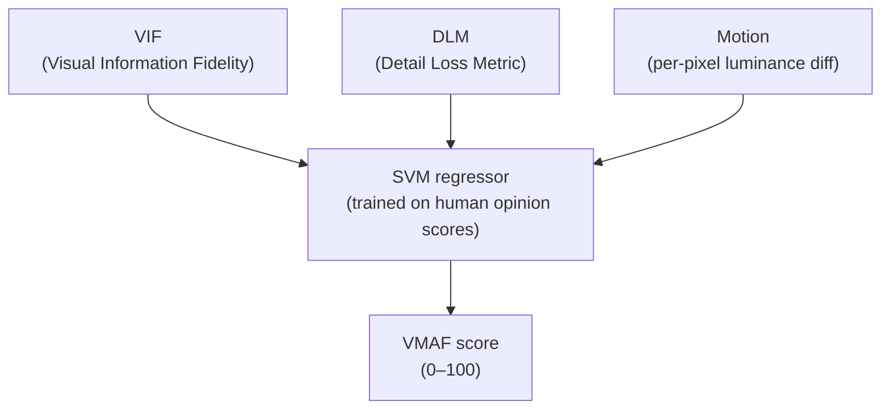
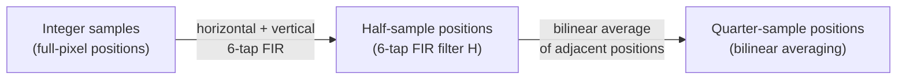
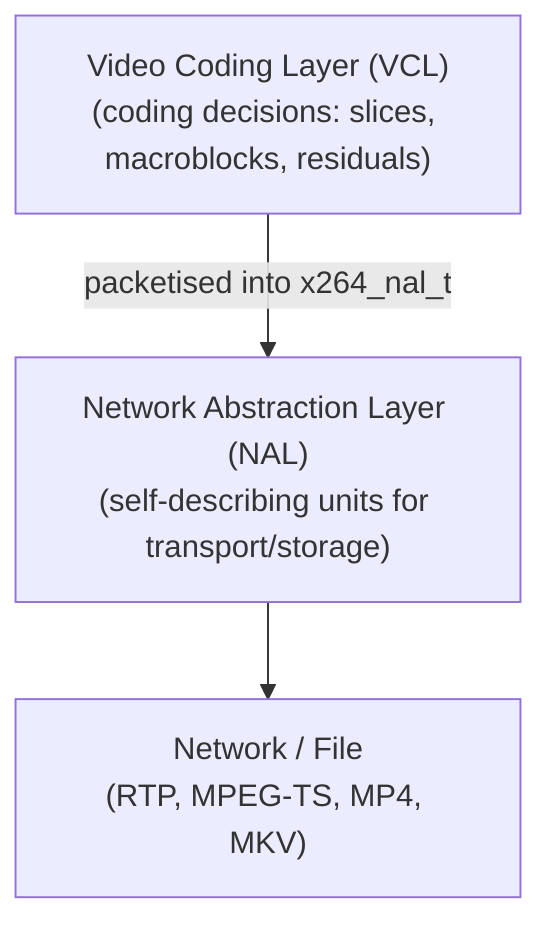
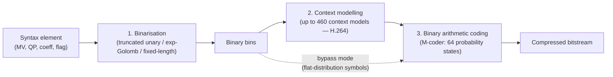
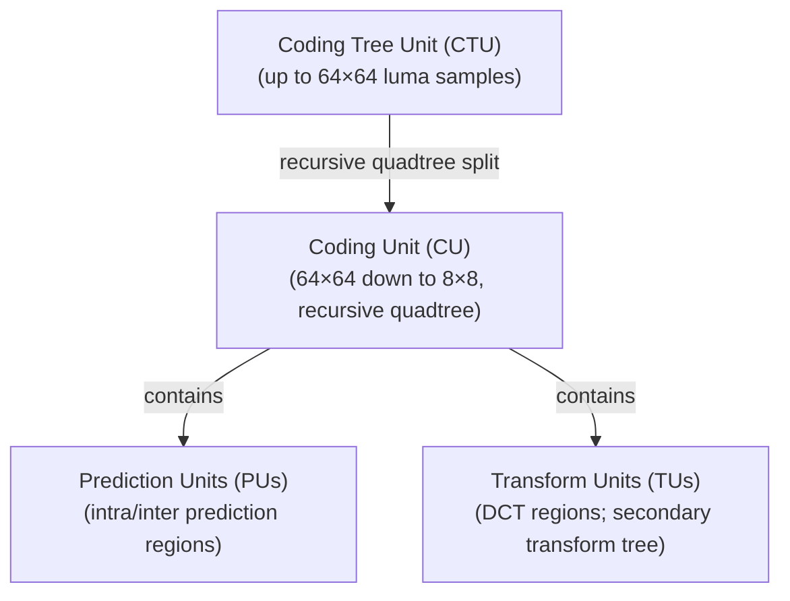
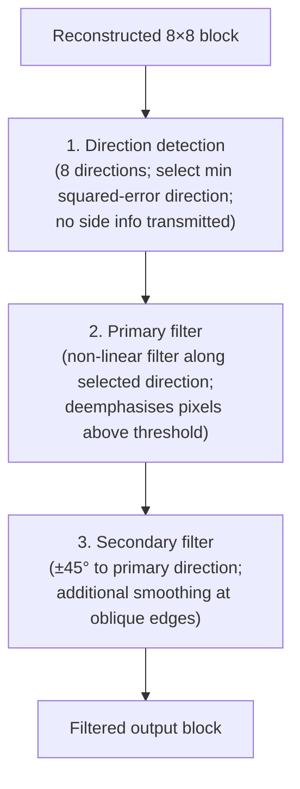
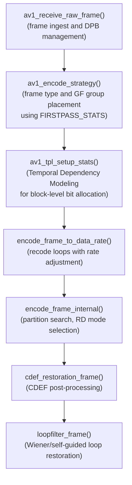
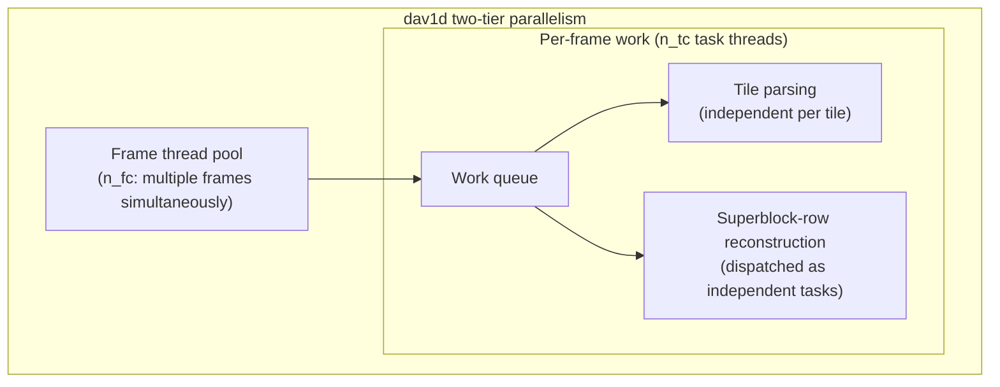
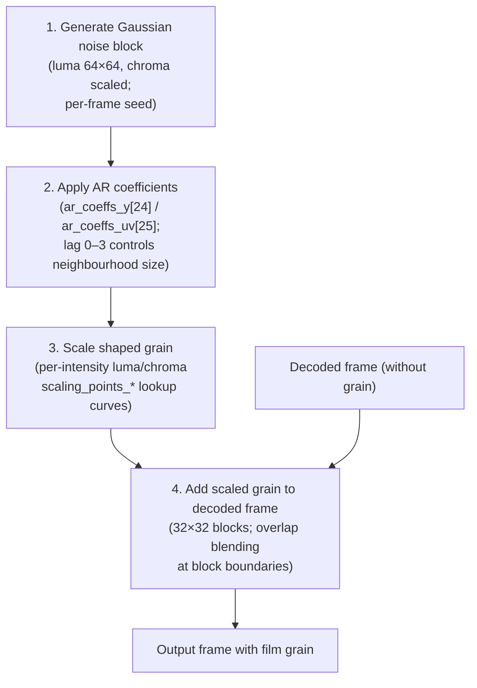

# Chapter 60: Video Compression Algorithms: DCT, Motion Estimation, and Modern Codecs

> **Part**: Part XIII — Video Streaming on Linux
> **Audience**: Graphics application developers; systems developers
> **Status**: First draft — 2026-06-15

---

## Table of Contents

1. [Overview](#overview)
2. [The Compression Duality: Intra vs. Inter Redundancy and Quality Metrics](#the-compression-duality)
3. [Discrete Cosine Transform: Energy Compaction and Entropy Coding](#dct-energy-compaction)
4. [Motion Estimation and Compensation](#motion-estimation)
5. [H.264/AVC: NAL Units, SPS/PPS, Deblocking, and CABAC](#h264-avc)
6. [H.265/HEVC: CTU Hierarchy, CABAC, and Loop Filters](#h265-hevc)
7. [AV1: Superblocks, ANS, and In-Loop Filters](#av1)
8. [VVC/H.266: Affine Motion, SBT, GPM, and VVdeC](#vvc-h266)
9. [GPU Acceleration: Wavefront Decode and Film Grain Synthesis](#gpu-acceleration)
10. [Rate Control: CBR, VBR, CRF, and Hardware Encoders](#rate-control)
11. [Integrations](#integrations)
12. [References](#references)

---

## Overview

This chapter covers the mathematical and algorithmic foundations of block-based video compression — the layer beneath every hardware-accelerated decode path, every codec API, and every streaming pipeline on Linux. Readers who have worked through Chapter 26 (**VA-API**) and Chapter 50 (**Vulkan Video**) will have encountered the data structures these codecs generate; this chapter explains what those structures mean and how the compression machinery behind them works.

The chapter begins with the compression duality between intra-frame spatial redundancy and inter-frame temporal redundancy, establishing the **rate–distortion (R-D)** trade-off and the Lagrangian cost function that governs every encoder mode decision. Quality is measured through **PSNR**, **SSIM**, and **VMAF** — the **libvmaf** library and **FFmpeg**'s `-vf vmaf` filter make **VMAF** scriptable on Linux — with each metric capturing a different aspect of perceptual fidelity.

The transform coding foundation and inter-prediction building blocks covered include:

- **2D DCT** (Discrete Cosine Transform) — energy compaction property, integer **DCT** approximations, zigzag scan coefficient ordering, and quantisation matrices for luma vs. chroma channels
- **MJPEG** (Motion JPEG) — per-frame **JPEG** intra-only compression with four per-frame **Huffman** tables; still common in webcams and capture cards
- **Motion estimation** — block-matching fast-search algorithms (**Diamond Search**, **Hexagonal Search (HEX)**, and **EPZS (Enhanced Predictive Zonal Search)**), half-pixel and quarter-pixel (**qpel**) sub-pixel interpolation via **6-tap FIR** filters, and eighth-pixel multi-filter interpolation in **AV1**
- **Decoded Picture Buffer (DPB)**, **memory management control operations (MMCO)**, and **B-frame** DTS/PTS reordering — the inter-prediction foundation

The chapter is organised around four codec generations:

- **H.264/AVC** — covers the **NAL** unit architecture, **Sequence Parameter Set (SPS)** and **Picture Parameter Set (PPS)** parsing, slice header fields, the in-loop **deblocking filter** with Boundary Strength (**Bs**) logic, and both **CAVLC** and **CABAC** entropy coding. The **x264** encoder API (**x264_encoder_open()**, **x264_encoder_encode()**, **x264_nal_t**) and **Macroblock-Tree (MB-Tree)** lookahead rate control are demonstrated with working code.
- **H.265/HEVC** — introduces the **Coding Tree Unit (CTU)** / **Coding Unit (CU)** / **Prediction Unit (PU)** / **Transform Unit (TU)** quadtree hierarchy, 35 intra prediction modes, the extended 1,000-model **HEVC CABAC** context set, **Sample Adaptive Offset (SAO)** edge and band offset filtering, and the **x265** encoder API (**x265_encoder_open()**, **x265_encoder_encode()**) with **WPP (Wavefront Parallel Processing)**, frame-level threading, and **CU-Tree**.
- **AV1** — brings 128×128 **superblock** recursive partitioning, 71 intra prediction modes, compound inter prediction, **warped motion**, **OBMC**, **palette mode** for screen content, **ANS (Asymmetric Numeral Systems)** / **MSAC** entropy coding, the **CDEF (Constrained Directional Enhancement Filter)** de-ringing filter, and the **Loop Restoration Filter** (**Wiener** and **self-guided** modes). The **libaom** encoder API (**aom_codec_enc_config_default()**, **aom_codec_enc_cfg_t**) and the **rav1e** Rust encoder (**Context**, **EncoderConfig**, **crav1e** C **FFI**) are shown, alongside the encoder ecosystem (**SVT-AV1**, **dav1d**).
- **VVC/H.266** — covers **affine motion compensation** (4-parameter and 6-parameter models), **Subblock Transform (SBT)**, **Geometric Partition Mode (GPM)** with 64 partition geometries, a compression efficiency comparison (**BD-rate** vs. **HEVC** and **AV1**), and the open-source **VVdeC** / **VVenC** implementations from Fraunhofer **HHI**.

The GPU acceleration section covers:

- **Tile and WPP wavefront parallelism** — ties the theoretical models to the parallel decode paths exposed by **VA-API** and **Vulkan Video**, and tabulates hardware codec support across **VA-API**, **NVDEC**/**NVENC**, **VDPAU**, **AMF**, and **Vulkan Video**
- **NVIDIA Ada Lovelace (RTX 40xx)** — dual-**NVENC** **AV1** encoding with **Split Frame Encoding**
- **AV1 film grain synthesis** — the auto-regressive (**AR**) model, **Dav1dFilmGrainData**, **dav1d**'s **AVX2**/**AVX-512**/**NEON** SIMD grain paths, and GPU-side synthesis via **VA-API**'s `VAFilmGrainStructAV1` and **Vulkan Video**'s `VkVideoDecodeAV1PictureInfoKHR`

The rate control section covers:

- **CBR** — constant bitrate with **VBV** buffer management
- **VBR** — including **FFmpeg** two-pass and **libaom** **Temporal Dependency Modeling (TDM)**
- **CRF** / **Capped CRF** — quality-based rate control
- **Psychovisual optimisation** — **psy-rd** and **AQ mode**
- **AMD AMF** hardware rate control modes — **CQP**, **CBR**, **PCVBR**, **LCVBR**, **QVBR**, **HQ-VBR**, **HQ-CBR** — accessible via **FFmpeg**'s `h264_amf`/`hevc_amf`/`av1_amf` encoders
- **Intel Quick Sync** (**oneVPL** / **MSDK**) rate control — **CBR**, **VBR**, **ICQ**, **LA-VBR**, **LA-ICQ**, **CQP** — via the `iHD` **VA-API** driver and `h264_qsv`/`hevc_qsv`/`av1_qsv` **FFmpeg** encoders

These sections ground the discussion in what **AMD AMF** and **Intel Quick Sync** actually implement in silicon, and connect to the **NVENC** and **AMF** deep-dives in Chapters 66 and 68.

### Codec Selection Guide

Before reading the algorithmic detail, the table below answers the practical question: **which codec should I choose for a given use case?**

| Use case | Recommended codec | Rationale |
|---|---|---|
| **Maximum compatibility** (legacy devices, CDN, unknown player) | H.264 | Universal hardware decode support; every device, browser, and streaming platform since 2008 |
| **Broadcast / live streaming to mixed audiences** | H.264 (primary) + H.265 (HLS alt) | H.264 for broad reach; H.265 HLS track for Apple devices with hardware decode |
| **VOD at scale, bandwidth is expensive** | AV1 | ~35% smaller files than H.264 at same quality; royalty-free; hardware decode on RTX 30xx+, AMD RX 6000+, Intel Arc, and all modern mobile SoCs |
| **High-quality archival / mastering** | H.265 or AV1 | Both far exceed H.264 quality-per-bit; H.265 has faster software encoding; AV1 has better long-term royalty position |
| **Low-latency live encode (OBS, streaming)** | H.264 (hardware) | Fastest hardware encode path on all GPUs; AV1 hardware encode (NVENC/RDNA3+) is viable for RTX 40xx/RX 7000+ |
| **Videoconferencing / WebRTC** | H.264 + VP8/VP9 fallback | Both are universally supported in browsers; AV1 in WebRTC is maturing (Chrome 113+, Firefox 113+) |
| **Browser video (web delivery)** | AV1 + H.264 fallback | AV1 supported in Chrome, Firefox, Edge, Safari 17+; H.264 as `<source>` fallback |
| **HDR / 4K streaming (Netflix, YouTube)** | AV1 (preferred) or H.265 | Both support 10-bit, HDR10, Dolby Vision; YouTube uses VP9/AV1; Netflix uses H.265/AV1 |
| **Screen content / UI recording** | AV1 | Palette mode and screen content tools give 2–4× better quality on flat UI regions than H.264/H.265 |
| **Cutting-edge quality, decode hardware available** | VVC/H.266 | ~40% better than HEVC, ~20% better than AV1 at equal quality; hardware decode limited to Snapdragon 8 Gen 3+ as of 2026 |
| **GPU pipeline, zero-copy encode** | AV1 or H.265 via Vulkan Video | Keep encode inside the same `VkDevice` as rendering; RTX 40xx has dual AV1 NVENC engines |
| **Mobile / embedded, power-constrained** | H.264 Baseline or H.265 Main | Broadest SoC hardware decode acceleration; AV1 decode power-efficient on hardware (not software) |
| **Software-only encode (no GPU)** | SVT-AV1 or x265 | SVT-AV1 is the fastest software AV1 encoder; x265 is faster than libaom at comparable quality |

**Key trade-offs in brief:**
- **Compatibility vs. efficiency**: H.264 wins compatibility; AV1 wins efficiency. H.265 sits in the middle but carries patent licensing concerns for software encoders.
- **Encoding speed**: H.264 >> H.265 > VP9 ≈ AV1 (hardware); software AV1 (libaom) is 5–10× slower than x265. SVT-AV1 narrows the gap significantly.
- **Royalties**: AV1, VP9, and VVC (under the MFI pool) are royalty-free for most uses; H.264 and H.265 carry MPEG-LA patent pools that affect commercial software encoders.
- **Hardware decode coverage** (desktop Linux, mid-2026): H.264 = universal; H.265 = near-universal (Mesa 23+, all NVIDIA, Intel); AV1 = RTX 30xx+/RDNA2+/Arc/Tiger Lake+; VVC = no desktop GPU support yet.

---

## The Compression Duality: Intra vs. Inter Redundancy and Quality Metrics {#the-compression-duality}

Modern block-based video codecs exploit two orthogonal sources of redundancy.

**Intra-frame (spatial) redundancy** arises because adjacent pixels within a single frame are highly correlated. Smooth regions, gradients, and repeating textures occupy far less information than their raw pixel representation suggests. All codecs remove this redundancy via transform coding — applying a frequency-domain transform (DCT or its relatives), quantising the resulting coefficients, and entropy coding the sparse coefficient vector.

**Inter-frame (temporal) redundancy** arises because successive frames of natural video are nearly identical. An object moving across the frame occupies the same pixels as the previous frame, displaced slightly. Inter prediction finds these displaced copies in reference frames, signals the displacement as a motion vector, and codes only the residual difference. For typical broadcast content, inter prediction achieves 70–90% of the bitrate saving; DCT and entropy coding together account for the remainder.

The **rate–distortion (R-D) trade-off** governs both. Every quantisation step, motion vector search range, and transform size selection is a point on the rate–distortion curve: reducing bits (rate) necessarily increases reconstruction error (distortion). Encoder optimisation — in x264, libaom, and all others — amounts to minimising a Lagrangian cost function:

```text
J = D + λ · R
```

where D is distortion (mean squared error or similar), R is bitrate in bits, and λ is a Lagrange multiplier derived from the current QP target. Mode decisions (intra vs. inter, block size, transform type) are all selected by minimising J.

### Quality Metrics

**PSNR (Peak Signal-to-Noise Ratio)** measures mean squared error between reference and reconstructed frame, expressed in dB. It is fast to compute and hardware-friendly but poorly correlated with subjective quality — two frames with identical PSNR can differ dramatically in perceptual sharpness.

**SSIM (Structural Similarity Index Measure)** models the human visual system's sensitivity to luminance, contrast, and structural correlation rather than absolute pixel error. SSIM scores range 0–1 (1 = identical). Images with the same PSNR can differ by 0.05–0.1 in SSIM, making SSIM a markedly more useful optimisation target for perceptual coding. [Source](https://www.researchgate.net/publication/220931731_Image_quality_metrics_PSNR_vs_SSIM)

**VMAF (Video Multimethod Assessment Fusion)**, developed by Netflix, fuses three elementary metrics via a Support Vector Machine (SVM) regressor trained on human opinion scores: [Source](https://netflixtechblog.com/toward-a-practical-perceptual-video-quality-metric-653f208b9652)

- **VIF (Visual Information Fidelity)**: measures the mutual information between reference and distorted wavelet subbands, capturing detail preservation across four spatial scales.
- **DLM (Detail Loss Metric)**: separately quantifies detail loss (affecting content visibility) from redundant impairment (distracting but not hiding content), including only DLM in the VMAF feature vector.
- **Motion**: the average absolute per-pixel luminance difference between successive frames — a simple temporal feature that adjusts the quality model for high-motion content.

VMAF scores range 0–100. Netflix targets VMAF 93–95 for premium delivery. The `libvmaf` library and FFmpeg's `-vf vmaf` filter make VMAF scriptable on Linux for codec comparison and per-title encoding. [Source](https://github.com/Netflix/vmaf)



---

## Discrete Cosine Transform: Energy Compaction and Entropy Coding {#dct-energy-compaction}

### 2D DCT and Energy Compaction

The 2D DCT transforms an N×N block of spatial pixel values into N×N frequency coefficients. Applied separably — first across rows, then across columns — it is computationally equivalent to two passes of the 1D DCT-II. For an 8×8 block f(x, y), the forward 2D DCT-II produces:

```text
F(u, v) = (2/N) · C(u) · C(v) · Σ_x Σ_y f(x,y) · cos((2x+1)uπ/2N) · cos((2y+1)vπ/2N)
```

where C(0) = 1/√2 and C(k) = 1 for k > 0. [Source](https://www.hindawi.com/journals/jece/2013/834793/)

The critical property is **energy compaction**: natural image statistics concentrate visual energy in the low-frequency (top-left) DCT coefficients, while high-frequency texture and noise coefficients are small and become zero after quantisation. After quantisation, a single 64-element vector from a busy 8×8 block may have only 6–10 non-zero entries; a flat background block may have only the DC term (F(0,0)) non-zero.

All practical codecs use **integer DCT** approximations (Types II and IV) to keep arithmetic in integer registers. Codec-specific transform sizes differ:

| Codec | Transform Sizes |
|---|---|
| H.264 | 4×4 (all profiles), 8×8 (High profile only) |
| H.265/HEVC | 4×4, 8×8, 16×16, 32×32 |
| AV1 | 4–64 point, DCT-2, ADST-4/8, DST-4/7, Identity |
| VVC/H.266 | 4–64 point, plus MTS (Multiple Transform Selection) |

Larger transforms achieve better compaction for smooth regions; smaller transforms localise ringing artifacts. [Source](https://www.hindawi.com/journals/jece/2013/834793/)

### Zigzag Scan and Coefficient Ordering

After forward transform, the 2D coefficient block is serialised into a 1D vector by zigzag scanning — starting at the DC coefficient (0, 0) and traversing diagonally, ending at the highest-frequency corner (N-1, N-1). This ordering ensures that the significant low-frequency coefficients appear early in the vector, followed by a long run of zeros that entropy coders compress efficiently.

AV1 uses three scan orders (zigzag, column, row) chosen adaptively based on transform type. Rectangular transforms use the column scan when height > width, favouring vertical energy; the row scan when width > height. [Source](https://en.wikipedia.org/wiki/Context-adaptive_variable-length_coding)

### Quantisation Matrices: Luma vs. Chroma

Each DCT coefficient is divided by a quantisation step size from a **quantisation matrix** (also called quantisation table in JPEG/MJPEG) and rounded to an integer. The standard JPEG luminance quantisation matrix allocates small step sizes to low-frequency coefficients (preserving visible detail) and large step sizes to high-frequency coefficients (discarding imperceptible fine texture). The chrominance quantisation matrix uses uniformly larger step sizes, exploiting the human visual system's reduced acuity for colour detail.

In H.264 and HEVC, the quantisation step size is controlled by the **quantisation parameter (QP)**. A QP increment of 6 doubles the quantisation step size, approximately halving the bit budget per block. The rate-distortion Lagrange multiplier is:

```text
λ ≈ k · 2^((QP - 12) / 3)
```
[Source](https://www.frontiersin.org/journals/signal-processing/articles/10.3389/frsip.2023.1205104/full)

### MJPEG and Huffman Coding

Motion JPEG (MJPEG) applies JPEG intra-only compression to each frame independently — no inter prediction. It remains common in webcams, capture cards, and professional production workflows. Four Huffman tables are defined per JPEG frame:

- Luma DC coefficients
- Luma AC coefficients
- Chroma DC coefficients
- Chroma AC coefficients

The AC run-length symbols `(run_length, value)` are entropy-coded with these tables: `run_length` counts consecutive zero coefficients preceding the non-zero value. The EOB (End of Block) symbol signals that all remaining coefficients are zero. Separately-tuned luma and chroma tables exploit the different coefficient statistics of Y vs. Cb/Cr. [Source](https://yasoob.me/posts/understanding-and-writing-jpeg-decoder-in-python/)

---

## Motion Estimation and Compensation {#motion-estimation}

### Block Matching and Fast Search Algorithms

Inter-frame prediction finds a displaced region in one or more reference frames that best approximates the current block. The displacement is signalled as a **motion vector (MV)**. The naïve approach — exhaustive search over all candidate displacements within a search window — is O(W²) in window width W, which is prohibitive at real-time rates.

**Diamond Search (DIA)** tests a small diamond-shaped set of candidates centred on the predictor MV, iterating until the minimum-cost candidate is at the centre. Fast but suboptimal for large motion.

**Hexagonal Search (HEX)** (x264 default) replaces the diamond with a hexagonal pattern. The larger coverage per iteration gives better results than diamond on typical content with minimal extra cost.

**EPZS (Enhanced Predictive Zonal Search)** — the algorithm embedded in the H.264 JVT reference software — improves on diamond search by maintaining a set of predictors from spatially and temporally adjacent blocks, using the strongest predictor as the initial search point. It refines with an adaptive threshold: search terminates early when the current-best SAD drops below a content-adaptive threshold. EPZS achieves near-exhaustive quality at a fraction of the cost. [Source](https://www.researchgate.net/publication/2491226_Enhanced_Predictive_Zonal_Search_for_Single_and_Multiple_Frame_Motion_Estimation)

x264 provides five search algorithms via `i_me_method`:

```c
/* x264.h — motion estimation method constants */
#define X264_ME_DIA  0   /* Diamond — fastest, lowest quality */
#define X264_ME_HEX  1   /* Hexagon — default; good balance */
#define X264_ME_UMH  2   /* Uneven Multi-Hexagon — for slow presets */
#define X264_ME_ESA  3   /* Exhaustive Search — near-optimal, slow */
#define X264_ME_TESA 4   /* Hadamard ESA — best quality */
```
[Source](https://github.com/mstorsjo/x264/blob/master/x264.h)

### Sub-pixel Interpolation

Full-pixel block matching is insufficient for broadcast-quality prediction. H.264 implements **half-pixel and quarter-pixel (qpel)** interpolation in two steps:



1. **Half-sample positions** are generated by a **6-tap FIR filter** applied horizontally and vertically:
   ```text
   H = (-1, 5, 20, 20, 5, -1) / 32
   ```
   Applied horizontally first, then vertically (or vice versa) with the same kernel, producing all half-sample positions on a 2× grid.

2. **Quarter-sample positions** are computed by bilinear averaging of adjacent integer and half-sample values. [Source](https://www.researchgate.net/publication/224057971_Reverse_Sub-Pixel_Block_Matching_Applications_within_H264_and_Analysis_of_Limitations)

AV1 extends to **eighth-pixel** interpolation and supports multiple filter types per block (8-tap regular, 8-tap sharp, 8-tap smooth, bilinear), with the filter type signalled per block or inherited from the frame header.

### Reference Picture Buffer and DPB Management

The **Decoded Picture Buffer (DPB)** holds reference frames available for inter prediction. H.264 supports up to 16 reference frames per list; AV1 maintains 8 reference frame slots (ref0–ref7). The encoder selects which frames to retain and signals removals via **memory management control operations (MMCO)** in H.264, or via the `ref_frame_idx` signalling in AV1.

Reference frame management directly impacts decoder buffer requirements. A 1080p AV1 stream with 8 10-bit reference frames requires approximately 8 × (1920 × 1080 × 1.5 bytes) ≈ 23.7 MB of DPB storage, which hardware decoders must allocate from video memory. This connects directly to the `VkVideoSessionParametersKHR` and DPB image view allocation described in Chapter 50.

### B-Frame Prediction and Decoding vs. Presentation Order

**Bidirectional (B) frames** interpolate from both a past and a future reference frame, achieving substantially better prediction for interpolated motion. Because B-frames reference future frames, the encoder must reorder frames for encoding:

- **Presentation order (POC — Picture Order Count)**: the order frames appear on screen (I, P, B, B, P, B, B, ...)
- **Decoding order (DTS — Decoding Timestamp)**: the order frames appear in the bitstream (I, P, P, B, B, P, B, B, ...)

Muxers and players buffer decoded frames and reorder them for display using PTS (Presentation Timestamp) from the container. FFmpeg handles DTS/PTS reordering internally within `libavcodec`; mpv's display synchronisation handles display timing. Applications that consume raw NAL units directly must implement DTS/PTS reordering themselves.

---

## H.264/AVC: NAL Units, SPS/PPS, Deblocking, and CABAC {#h264-avc}

### NAL Unit Architecture

H.264 separates the Video Coding Layer (VCL) from the Network Abstraction Layer (NAL). The VCL contains actual coding decisions; the NAL packetises them into self-describing units for network transport or file storage.



The x264 API exposes NAL units via `x264_nal_t`:

```c
/* x264.h — NAL unit descriptor */
typedef struct {
    int i_ref_idc;      /* nal_priority_e — importance level */
    int i_type;         /* nal_unit_type_e: 7=SPS, 8=PPS, 5=IDR slice, 1=non-IDR */
    int b_long_startcode;
    int i_first_mb;     /* First macroblock index in slice */
    int i_last_mb;
    int i_payload;      /* Payload size in bytes */
    uint8_t *p_payload; /* NAL-encapsulated data */
    int i_padding;
} x264_nal_t;
```
[Source](https://github.com/mstorsjo/x264/blob/master/x264.h)

### Sequence Parameter Set (SPS) and Picture Parameter Set (PPS)

Before the first video slice, the encoder emits SPS (NAL type 7) then PPS (NAL type 8). Key SPS fields:

| Field | Meaning |
|---|---|
| `profile_idc` | Codec profile: 66=Baseline, 77=Main, 100=High |
| `level_idc` | Decoder tier: 41 = 1080p30 hardware requirement |
| `log2_max_frame_num_minus4` | Frame number wrap period |
| `pic_width_in_mbs_minus1` | Frame width in 16×16 macroblocks |
| `frame_mbs_only_flag` | 1 = progressive only (no interlace) |
| `direct_8x8_inference_flag` | Controls 8×8 block motion vector derivation |

[Source](https://www.cardinalpeak.com/blog/the-h-264-sequence-parameter-set)

Profile/level constraints directly control hardware decoder capability requirements. Level 4.1 (1080p30 at ≤50 Mbit/s) is the standard hardware compatibility target; Level 5.2 covers 4K60. Baseline profile excludes CABAC and B-frames, making it suitable for video conferencing where decoder complexity matters.

### Slice Header

Each H.264 VCL slice begins with a slice header that inherits global parameters from the active SPS/PPS and overrides per-slice signalling. Key slice header fields relevant to hardware decoders and VA-API:

| Field | Bit size | Semantics |
|---|---|---|
| `slice_type` | ue(v) | 0–4: P, B, I, SP, SI (mod 5 gives same type); constrains prediction mode for all MBs in slice |
| `frame_num` | SPS-derived | Rolling counter of reference frames; modulo `MaxFrameNum` (from `log2_max_frame_num_minus4`). Used by the DPB to detect gaps and derive short-term reference picture indices. Wraps at `MaxFrameNum = 2^(log2_max_frame_num_minus4 + 4)` |
| `pic_order_cnt_lsb` | SPS-derived | Low-order bits of Picture Order Count (POC); combined with POC cycle tracking to derive the full POC value that determines presentation order. Distinct from `frame_num`: two B-frames sandwiched between P-frames share the same `frame_num` range but have different POC values |
| `num_ref_idx_l0_active_minus1` | ue(v) | Overrides the PPS default to specify how many reference frames from List 0 (past) are active for this slice. Values 0–15; actual active count = this field + 1. List 1 has an equivalent field for B-slices |
| `disable_deblocking_filter_idc` | ue(v) | 0 = deblocking enabled; 1 = disabled; 2 = disabled at slice boundaries only (allows WPP-style parallel decode) |

The slice header is parsed by `VAPictureParameterBufferH264` consumers — field `frame_num` maps to `VAPictureParameterBufferH264::frame_num`, and `pic_order_cnt_lsb` is used to derive `CurrPic.TopFieldOrderCnt`. Hardware decoders expose these parsed slice header values through VA-API's `VASliceParameterBufferH264`, which carries `slice_type`, `num_ref_idx_l0_active_minus1`, and reference list overrides. [Source](https://www.cardinalpeak.com/blog/the-h-264-sequence-parameter-set)

### In-Loop Deblocking Filter

The H.264 deblocking filter processes 4×4 block boundaries within the decoded frame, reducing blocking artifacts from independent block quantisation. The algorithm proceeds per macroblock:

1. Filter 4 **vertical** 4-sample edges of the luma component (removing horizontal blocking)
2. Filter 4 **horizontal** 4-sample edges of the luma component
3. Filter 2 vertical + 2 horizontal edges per chroma component

**Boundary Strength (Bs)** governs filter aggressiveness:
- Bs = 4: macroblock boundary, either side intra-coded — strongest filtering
- Bs = 3: intra-coded block, not macroblock boundary
- Bs = 2: either side contains coded residual coefficients
- Bs = 1: motion vectors differ by ≥ 1 pel, or different reference frames
- Bs = 0: no filtering

Chroma Bs values are copied from the corresponding luma Bs — no independent chroma strength calculation. Luma filtering modifies up to 3 samples on each side of the boundary (p0, p1, p2 and q0, q1, q2); chroma filtering modifies only p0 and q0. [Source](https://en.wikipedia.org/wiki/Deblocking_filter)

### CAVLC Entropy Coding

**Context-Adaptive Variable-Length Coding (CAVLC)** is the entropy coding scheme for H.264 Baseline and Main profiles (as an alternative to CABAC). It operates on the quantised, zigzag-scanned coefficient vector for each 4×4 residual block. [Source](https://en.wikipedia.org/wiki/Context-adaptive_variable-length_coding)

**Run-level coding**: CAVLC encodes the coefficient vector in two conceptual passes:
1. **Trailing ones and total coefficients** (`coeff_token`): jointly codes `TotalCoeff` (total non-zero coefficients, 0–16) and `TrailingOnes` (count of ±1 coefficients at the high-frequency end of the zigzag scan, capped at 3). The `coeff_token` VLC table is selected based on the `nC` (number of coefficients) context derived from the `TotalCoeff` values of the left and above 4×4 blocks — the "context-adaptive" aspect of CAVLC. Four table variants (VLC0–VLC3) cover low to high non-zero density.
2. **Level values** (`level_prefix` / `level_suffix`): after signalling the trailing ±1 signs, the remaining non-zero coefficient magnitudes are coded from highest to lowest frequency. The VLC table for each level adapts as larger magnitudes are encountered: starting with VLC1, the suffix length increases each time a magnitude is too large for the current table, so CAVLC automatically assigns fewer bits to blocks dominated by small residuals and more bits where large coefficients persist.
3. **Run-before and total_zeros**: `total_zeros` codes the total count of zero coefficients before the last non-zero coefficient. `run_before` then codes, for each non-zero coefficient (from highest to lowest zigzag position), how many zeros precede it — using context tables that depend on how many zeros remain to be placed.

CAVLC achieves approximately 9–14% worse compression than CABAC but is significantly simpler to implement in hardware, requiring only VLC table lookups rather than arithmetic state tracking. It remains the mandatory entropy coder for H.264 Baseline profile and is commonly encountered in mobile and WebRTC paths. [Source](https://en.wikipedia.org/wiki/Context-adaptive_variable-length_coding)

### CABAC Entropy Coding

Context-Adaptive Binary Arithmetic Coding (CABAC) is available in H.264 Main and High profiles, mandatory in HEVC. It provides 9–14% bitrate savings over CAVLC (H.264 Baseline's variable-length coding scheme). [Source](https://en.wikipedia.org/wiki/Context-adaptive_binary_arithmetic_coding)

The three-stage CABAC pipeline:



1. **Binarisation**: Non-binary syntax elements (MVs, QP, coefficients) are mapped to binary "bins" using truncated unary, exp-Golomb (k=0..n), or fixed-length codes.

2. **Context modelling**: Each bin is assigned one of up to 460 context models (H.264). The model chosen depends on the values of neighbouring coded elements — e.g., the `coded_block_flag` of the left and above macroblocks influences the current block's coefficient flags. CABAC adapts probability estimates after coding each symbol, making it progressively more accurate for local content statistics. [Source](https://www.hhi.fraunhofer.de/en/departments/vca/research-groups/video-coding-technologies/research-topics/past-research-topics/context-based-adaptive-binary-arithmetic-coding-cabac.html)

3. **Binary arithmetic coding (M-coder)**: Maintains an interval [Low, Low+Range]. For each bin, the range is split proportionally to the current probability estimate. The M-coder uses 64 discrete probability states with precomputed next-state tables, avoiding multiplications. "Bypass mode" bins (flat-distribution symbols) skip context modelling for throughput.

### x264 Encoder API

```c
/* x264.h — encoder lifecycle */
x264_param_t p;
x264_param_default(&p);
x264_param_default_preset(&p, "medium", NULL);
x264_param_apply_profile(&p, "high");

/* Rate control */
p.rc.i_rc_method   = X264_RC_CRF;       /* Constant Rate Factor */
p.rc.f_rf_constant = 18.0f;              /* Quality target (lower = better quality) */
p.rc.i_vbv_max_bitrate = 50000;          /* kbps ceiling for streaming */
p.rc.i_vbv_buffer_size = 62500;          /* kbps VBV buffer */

/* Motion estimation */
p.analyse.i_me_method    = X264_ME_HEX;  /* Hexagonal search */
p.analyse.i_me_range     = 16;            /* Search window in pixels */
p.analyse.i_subpel_refine = 7;           /* Sub-pixel quality 0–11 */
p.analyse.b_transform_8x8 = 1;           /* Enable 8×8 DCT (High profile) */
p.analyse.i_trellis       = 1;           /* Trellis RD quantisation */
p.rc.b_mb_tree            = 1;           /* Macroblock-tree lookahead rate control */
p.rc.i_lookahead          = 60;          /* Lookahead depth (up to 250) */

x264_t *enc = x264_encoder_open(&p);

x264_nal_t *nals;
int nal_count;
x264_picture_t pic_in, pic_out;
/* Encode one frame: */
x264_encoder_encode(enc, &nals, &nal_count, &pic_in, &pic_out);

/* Flush delayed frames: */
while (x264_encoder_delayed_frames(enc))
    x264_encoder_encode(enc, &nals, &nal_count, NULL, &pic_out);

x264_encoder_close(enc);
```
[Source](https://github.com/mstorsjo/x264/blob/master/x264.h)

**Macroblock-Tree (MB-Tree)**: A lookahead algorithm that propagates future-frame importance backwards through the GOP structure, enabling 10–12% BD-rate improvement. Each macroblock receives a "propagation cost" weight proportional to how much it contributes to future B/P frames; QP offsets are assigned accordingly. [Source](https://ieeexplore.ieee.org/document/10116456/)

---

## H.265/HEVC: CTU Hierarchy, CABAC, and Loop Filters {#h265-hevc}

### Coding Tree Unit (CTU) and Quadtree Hierarchy

HEVC replaces H.264's fixed 16×16 macroblock with a flexible **Coding Tree Unit (CTU)** of up to 64×64 luma samples. Within each CTU, a recursive quadtree partitions the space into **Coding Units (CUs)**, from 64×64 down to 8×8. Each CU contains:

- **Prediction Units (PUs)**: one or more regions for intra/inter prediction
- **Transform Units (TUs)**: one or more regions for DCT — can be recursively split via a secondary transform tree

This three-level hierarchy (CTU → CU → PU/TU) enables fine-grained adaptation to image content: large smooth areas use 64×64 CUs for efficient prediction, while complex edges use 8×8 CUs for precise localisation. [Source](https://pmc.ncbi.nlm.nih.gov/articles/PMC8575300/)



HEVC defines **35 intra prediction modes**: 1 planar (for gradually varying content), 1 DC (flat fill), and 33 directional modes at angles from 0° (vertical) to 135° (horizontal + all diagonals). Compared to H.264's 9 modes, HEVC's 35 modes improve intra coding efficiency by approximately 15% on texture content. [Source](https://jivp-eurasipjournals.springeropen.com/articles/10.1186/s13640-017-0237-7)

### HEVC CABAC: Extended Context Model

HEVC uses CABAC with an expanded context model relative to H.264. HEVC CABAC has approximately 1,000 context models (vs. 460 in H.264), covering the larger CU/TU/PU structure. Importantly, HEVC CABAC resets all context models at the start of each slice (and at tile boundaries), enabling parallel decoding of tiles and WPP rows without context propagation dependencies.

### Sample Adaptive Offset (SAO)

SAO is an in-loop filter applied per CTB after deblocking, correcting systematic bias from quantisation. Two modes:

**Edge Offset (EO)**: Compares each sample against two directional neighbours (horizontal, vertical, 135°, or 45°). The sample falls into one of five gradient categories (two valley, one flat, two peak), and a signed offset in [−7, +7] is added. EO targets ringing near edges.

**Band Offset (BO)**: Classifies each sample by its amplitude band (luma 0–255 divided into 32 bands of 8 intensity values each). Four consecutive bands receive non-zero offsets while the remainder pass through. BO targets banding artifacts in smooth gradients.

SAO parameters (`sao_type_idx`, four offsets) are signalled per CTB. Merge flags (`sao_merge_left_flag`, `sao_merge_up_flag`) reduce overhead by inheriting parameters from neighbouring CTBs. SAO recovers 1–2 dB PSNR at approximately 2–3% additional encoding time. [Source](https://onlinelibrary.wiley.com/doi/10.1155/2022/1144179)

### x265 API and Parallelism

```c
/* x265.h — encoder lifecycle */
x265_param *param = x265_param_alloc();
x265_param_default_preset(param, "medium", NULL);
x265_param_apply_profile(param, "main10");

/* Encoder open */
x265_encoder *enc = x265_encoder_open(param);

/* Emit VPS/SPS/PPS headers */
x265_nal *nals;
uint32_t nal_count;
x265_encoder_headers(enc, &nals, &nal_count);

/* Encode loop */
x265_picture pic_in, pic_out;
x265_picture_init(param, &pic_in);
x265_encoder_encode(enc, &nals, &nal_count, &pic_in, &pic_out);

x265_encoder_close(enc);
x265_param_free(param);
```
[Source](https://x265.readthedocs.io/en/master/api.html)

**WPP (Wavefront Parallel Processing)**: Each CTU row is encoded in parallel, constrained so each row stays at least two CTUs behind the row above it to ensure above-right reference samples are available. The CABAC entropy state is transferred from the 2nd CTU of each row to the 1st CTU of the row below, maintaining context accuracy across rows. WPP compression loss is under 1% and achieves 30–50% of theoretical core-count speedup (limited by wavefront stall at the start of each frame). [Source](https://x265.readthedocs.io/en/master/threading.html)

**Frame-level threading** processes multiple frames simultaneously. With 1080p content (17 CTU rows of 64×64), frame threading achieves better core utilisation than WPP alone. Thread pool sizes auto-detect: >32 cores → 6–8 frame threads; ≥8 cores → 3 frame threads.

**CU-Tree**: x265's equivalent of x264's MB-Tree — propagates future inter-prediction importance backwards through the lookahead to assign per-CU QP offsets, improving perceptual quality at equivalent bitrate.

---

## AV1: Superblocks, ANS, and In-Loop Filters {#av1}

### Superblock Structure and Partition Tree

AV1's largest coding unit is a **superblock** of 128×128 (default) or 64×64 pixels, recursively partitioned using an extended quadtree that includes non-square splits: rectangular 2:1/1:2, T-shaped (3 sub-partitions), and asymmetric partitions. The minimum coding block size is 4×4.

AV1 exposes substantially more mode complexity than HEVC:
- **71 intra prediction modes**: 8 nominal directional angles × 7 fine-grained angle variants (= 56 directional), plus DC, PAETH, SMOOTH, SMOOTH_V, SMOOTH_H, and chroma-from-luma (CfL). [Source](https://cnn-av1-intra-encoder.readthedocs.io/en/latest/aom_av1.html)
- **Compound inter prediction**: blends two reference frames with various weighting masks (wedge, diff-weighted, inter-intra), creating 12,768 compound inter modes.
- **Warped motion**: global affine warp model signalled per frame; local per-block warp derived from neighbouring motion vectors.
- **Overlapped Block Motion Compensation (OBMC)**: borrows motion vectors from neighbouring blocks to smooth prediction boundaries without transmitting additional MV data.
- **16 separable 2-D transform combinations** at 19 size scales: DCT-DCT, ADST-DCT, DCT-ADST, ADST-ADST, FLIPADST variants, and identity transforms.

The resulting ~45 million encoding choices per 8×8 block make exhaustive RD search impossible; libaom uses fast heuristics and learned pruning classifiers to navigate the decision space. [Source](https://aomedia.googlesource.com/aom/+/refs/heads/main/doc/dev_guide/av1_encoder.dox)

### Palette Mode

AV1 supports **palette mode** for coding flat-colour or screen-content regions. The encoder signals a palette of up to 8 colours and a colour-map array assigning each pixel in the block to one palette entry. Palette mode achieves near-lossless compression of synthetic content (text, UI, diagrams) at a fraction of the bitrate of DCT-based prediction.

### ANS Entropy Coding

AV1 uses **Multi-Symbol Arithmetic Coding** via a variant of **Asymmetric Numeral Systems (ANS)**, introduced by Jarosław Duda. Unlike CABAC's binary arithmetic coding, ANS operates on multi-symbol alphabets (M ∈ [2, 14] symbols per coding step), reducing the number of coding operations per coefficient. [Source](https://en.wikipedia.org/wiki/Asymmetric_numeral_systems)

The **MSAC (Multi-Symbol Arithmetic Coder)** variant in AV1 maintains context models per symbol position rather than per frame, achieving tighter local adaptation. The mathematical core: encoding symbol s with probability p_s into state x produces x' ≈ x/p_s, so log₂(x') ≈ log₂(x) + log₂(1/p_s) — exactly the information content of symbol s is added to the codeword.

Key libaom coefficient coding entry points:
- `av1_write_coeffs_txb()` — main encoding function for a transform block
- `av1_optimize_txb()` — post-quantisation trellis optimisation for optimal R-D trade-off
- `av1_cost_coeffs_txb()` — entropy cost estimation used during mode decision
[Source](https://aomedia.googlesource.com/aom/+/refs/heads/main/doc/dev_guide/av1_encoder.dox)

### CDEF In-Loop Filter

**CDEF (Constrained Directional Enhancement Filter)** is AV1's de-ringing filter, operating on 8×8 blocks. For each block:



1. **Direction detection**: searches all 8 possible directions by computing squared error between each pixel and the directional average; selects the direction with minimum total error. No direction side information is transmitted — the decoder recomputes it identically from reconstructed pixels.
2. **Primary filter**: runs along the selected direction; applies a non-linear filter that deemphasises pixels differing more than a threshold from the centre (preventing over-filtering at genuine edges).
3. **Secondary filter**: runs at ±45° to the primary direction, providing additional smoothing at oblique edges.

Per-superblock primary and secondary filter strengths (4 bits each) are signalled. Decoder overhead is approximately 3–10% depending on configuration, at approximately 5.875 additions and 1.9375 multiplications per pixel. [Source](https://hacks.mozilla.org/2018/06/av1-next-generation-video-the-constrained-directional-enhancement-filter/)

### Loop Restoration Filter

Applied after CDEF, the Loop Restoration Filter operates on Loop Restoration Units (LRUs) of 64×64, 128×128, or 256×256 pixels. Each LRU independently selects one of three modes:

- **Bypass**: no filtering
- **Wiener filter**: 7×7 separable filter with encoder-derived coefficients transmitted in the bitstream. Symmetric and normalised to reduce signalling cost; achieves 0.3–0.8 dB PSNR gain on typical content.
- **Self-guided filter**: generates two denoised versions of the LRU using mean and gradient of a surrounding window, then combines them with the unfiltered sample via a transmitted linear formula. Effective on grain and high-frequency texture. [Source](https://github.com/BlueSwordM/SVT-AV1/blob/master/Docs/Appendix-Restoration-Filter.md)

### libaom Encoder API

```c
/* libaom — aom/aom_encoder.h, aom/aomcx.h */
aom_codec_enc_cfg_t cfg;
aom_codec_enc_config_default(aom_codec_av1_cx(), &cfg, AOM_USAGE_GOOD_QUALITY);

cfg.g_w = 1920;
cfg.g_h = 1080;
cfg.g_bit_depth        = AOM_BITS_10;
cfg.g_input_bit_depth  = 10;
cfg.g_timebase.num     = 1;
cfg.g_timebase.den     = 30;          /* 30 fps */
cfg.g_threads          = 8;
cfg.g_lag_in_frames    = 48;          /* lookahead depth */
cfg.rc_end_usage       = AOM_VBR;     /* AOM_CBR for real-time, AOM_CQ for quality floor */
cfg.rc_target_bitrate  = 4000;        /* kbps */
cfg.rc_min_quantizer   = 0;
cfg.rc_max_quantizer   = 63;
cfg.kf_mode            = AOM_KF_AUTO;
cfg.kf_max_dist        = 240;

/* Real-time mode: g_usage=AOM_USAGE_REALTIME, g_lag_in_frames=0, g_pass=0, cpu-used=5..8 */
```
[Source](https://docs.rs/libaom-sys/0.8.0/libaom_sys/struct.aom_codec_enc_cfg.html)

The libaom encoding pipeline internal call sequence:



1. `av1_receive_raw_frame()` — frame ingest and DPB management
2. `av1_encode_strategy()` — frame type and GF group placement using `FIRSTPASS_STATS`
3. `av1_tpl_setup_stats()` — Temporal Dependency Modeling for block-level bit allocation
4. `encode_frame_to_data_rate()` — recode loops with rate adjustment
5. `encode_frame_internal()` — partition search, RD mode selection
6. `cdef_restoration_frame()` — CDEF post-processing
7. `loopfilter_frame()` — Wiener/self-guided loop restoration

### rav1e AV1 Encoder (Rust)

rav1e is an AV1 encoder written in Rust (21.6% Rust, 78.2% Assembly for SIMD paths). It targets cases where libaom's speed is insufficient and SVT-AV1's memory footprint is too large. [Source](https://github.com/xiph/rav1e)

```rust
// rav1e 0.8.x — src/api/context.rs
use rav1e::prelude::*;

let mut enc = EncoderConfig::with_speed_preset(6); // speed 0 (slowest) to 10 (fastest)
enc.width = 1920;
enc.height = 1080;
enc.bit_depth = 10;
enc.quantizer = 100;              // base quantiser 0-255
enc.min_key_frame_interval = 12;
enc.max_key_frame_interval = 240;
enc.tile_cols = 2;
enc.tile_rows = 1;
enc.low_latency = false;          // false = allow B-frame reordering

let cfg = Config { enc, threads: 8 };
let mut ctx: Context<u16> = cfg.new_context()?; // u8 for 8-bit, u16 for 10-bit

loop {
    match ctx.receive_packet() {
        Ok(pkt) => { /* write pkt.data to output */ }
        Err(EncoderStatus::NeedMoreData) => {
            let frame = ctx.new_frame();
            // fill frame planes from raw video data...
            ctx.send_frame(frame)?;
        }
        Err(EncoderStatus::LimitReached) => break,
        Err(e) => return Err(e.into()),
    }
}
```
[Source](https://docs.rs/rav1e/latest/rav1e/struct.Context.html)

The **C API (crav1e)** exposes rav1e for FFI integration with C-based pipelines like FFmpeg:

```c
/* crav1e.h — C FFI surface for rav1e */
RaConfig *rav1e_config_default(void);
int       rav1e_config_parse(RaConfig *cfg, const char *key, const char *value);
/* keys: "quantizer" (0-255), "speed" (0-10), "tune" (psnr|psychovisual) */

RaContext *rav1e_context_new(const RaConfig *cfg);
RaFrame   *rav1e_frame_new(const RaContext *ctx);
void       rav1e_frame_fill_plane(RaFrame *frame, int plane,
                                   const uint8_t *data, size_t len,
                                   ptrdiff_t stride, int bytewidth);

RaEncoderStatus rav1e_send_frame(RaContext *ctx, RaFrame *frame);
RaEncoderStatus rav1e_receive_packet(RaContext *ctx, RaPacket **packet);
void            rav1e_packet_unref(RaPacket *pkt);
```
[Source](https://gist.github.com/lu-zero/12e09d0271074ef0a17891ede47f9c8f)

rav1e uses approximately 25% of the RAM of SVT-AV1 at equivalent settings, making it suitable for memory-constrained server environments. Speed preset 6 is the typical production balance; speed 0 is near-reference quality; speed 10 approaches real-time. [Source](https://catskull.net/libaom-vs-svtav1-vs-rav1e-2025.html)

### AV1 Encoder Ecosystem

| Encoder | Language | Best Use Case |
|---|---|---|
| **libaom** | C + Assembly | Reference compliance; maximum quality at low speed |
| **SVT-AV1** | C + Assembly | Production streaming (Netflix, Intel); fastest at equal quality |
| **rav1e** | Rust + Assembly | Memory-constrained; safety-critical pipelines |

**dav1d** (VideoLAN + FFmpeg project) is the de facto standard AV1 software decoder, shipped in VLC, FFmpeg, mpv, Firefox, Chrome, Safari, Android, and Windows. dav1d 1.4 "Road Runner" (February 2024) added RISC-V and LoongArch support, new AVX-512 optimisations, and achieves 2–4× the throughput of the libaom reference decoder in multi-threaded mode. [Source](https://www.phoronix.com/news/dav1d-1.4-AV1-Decoder)

---

## VVC/H.266: Affine Motion, SBT, GPM, and VVdeC {#vvc-h266}

H.266/VVC (Versatile Video Coding), standardised by ITU-T and ISO/IEC in 2020, achieves approximately 40–50% bitrate reduction over HEVC at equivalent perceptual quality — and 10–15% over AV1 at 4K resolution — at the cost of substantially higher encoding and decoding complexity. [Source](https://antmedia.io/versatile-video-coding-vvc-h266-codec-guide/)

### Affine Motion Compensation

Classical translational motion compensation models only 2D translation (2 degrees of freedom). VVC introduces **affine motion compensation** to handle rotation, zoom, and shear — the motion patterns that arise when a camera pans or when non-rigid objects move. [Source](https://ottverse.com/affine-motion-estimation-compensation-in-vvc/)

VVC implements two affine models:

**4-parameter (similarity) model** — translation + rotation + isotropic scaling. Controlled by two control point motion vectors (top-left and top-right corners of the block). Each 4×4 luma sub-block receives a derived motion vector:

```text
mv_x(x, y) = (mvA_x · (W - x) + mvB_x · x) / W
mv_y(x, y) = (mvA_y · (W - x) + mvB_y · x) / W + (mvB_x - mvA_x) · y / W
```

where mvA and mvB are the control point vectors and W is block width.

**6-parameter (affine) model** — extends to include aspect ratio and shear, controlled by three control point vectors (top-left, top-right, bottom-left). Provides the full affine transformation space at higher signalling cost.

Rather than computing a per-pixel motion vector (which would require full affine interpolation), VVC divides the prediction block into a grid of 4×4 luma sub-blocks and applies conventional 2D translational motion compensation per sub-block using the derived sub-block MV — a practical compromise between accuracy and hardware feasibility.

**Affine Merge Mode**: generates up to 5 control-point MV candidates from spatial neighbours, selecting the best without transmitting MV differences. **Affine AMVP Mode**: signals differences between current block vectors and up to 2 predictor candidates.

### Subblock Transform (SBT)

In VVC, **Subblock Transform (SBT)** allows an inter-predicted CU to code the transform residual in only a sub-region of the prediction residual, setting the remaining sub-region to zero in the bitstream. Two SBT split types:

- **SBT-V (vertical split)**: the CU is split vertically; the residual TU covers either the left or right half (2:2 split) or one-quarter (1:3 or 3:1 split).
- **SBT-H (horizontal split)**: the CU is split horizontally; the residual TU covers the top or bottom sub-region.

SBT is beneficial when the prediction is very accurate in one sub-region but leaves a residual in the other. Signalling `sbt_flag` and `sbt_quad_flag` in the bitstream selects the split type and active subblock. The inactive subblock is coded with zero residual, reducing entropy cost when prediction errors are localised. [Source](https://ieeexplore.ieee.org/document/10849134/)

### Geometric Partition Mode (GPM)

VVC's **Geometric Partition Mode (GPM)** divides a CU along a non-rectangular boundary — a diagonal or angular straight line — creating two independently motion-compensated sub-regions. GPM supports 64 partition geometries for each eligible CU size (width and height both in [8, 64], excluding 8×64 and 64×8). Each sub-region uses uni-prediction (one reference frame), and the two sub-regions are blended at the partition boundary using a smooth weight transition to avoid visible seams. [Source](https://www.researchgate.net/publication/346082256_Geometric_Partitioning_Mode_in_Versatile_Video_Coding_Algorithm_Review_and_Analysis)

GPM is especially effective for occlusion boundaries, where an object edge crosses a block at an arbitrary angle — scenarios where axis-aligned block splits fail to isolate the two independently moving regions. At typical broadcast bitrates, GPM contributes approximately 0.5–1.0% BD-rate gain.

### VVC vs. HEVC and AV1: Compression Efficiency and Complexity

From Fraunhofer HHI testing (VVenC vs. HM reference and libaom):

| Codec | BD-Rate vs. H.264 | BD-Rate vs. HEVC | Encoding Complexity vs. HEVC |
|---|---|---|---|
| H.265/HEVC | −53% | — | 1× |
| AV1 (libaom) | −63% | ~−15% | ~5–10× |
| H.266/VVC (VTM) | −78% | ~−40% | ~100× |
| H.266/VVC (VVenC) | ~−55–65% | ~−20–30% | ~2–5× |

[Source](https://www.researchgate.net/publication/384538845_The_efficiency_of_HEVCH265_AV1_and_VVCH266_in_terms_of_performance_compression_and_video_content)

VVC encoding at VTM reference software speed is approximately 100× slower than HEVC HM, making practical deployment dependent on optimised implementations.

### VVdeC and VVenC: Open-Source VVC on Linux

**VVdeC** (Fraunhofer Versatile Video Decoder) and **VVenC** (Fraunhofer Versatile Video Encoder) are Fraunhofer HHI's open-source VVC implementations, available on GitHub under the BSD 3-Clause licence. [Source](https://github.com/fraunhoferhhi/vvdec) [Source](https://github.com/fraunhoferhhi/vvenc)

VVdeC implements all features of the VVC Main10 profile and targets:
- **Platforms**: Windows (Win32/x64), Linux (x86, x86_64, armv7, aarch64), macOS, Android, WebAssembly
- **Multi-threading**: frame-level and tile-level parallelism, auto-tuned thread pool
- **SIMD**: x86 SSE4/AVX2/AVX-512, ARM NEON, LoongArch optimisations

VVenC provides five presets (`fastest`, `fast`, `medium`, `slow`, `slower`) that trade encoding time for quality. At `fastest`, VVenC achieves 20–2,400× speedup over VTM reference software depending on resolution and content. VVenC 1.14 (January 2026) added further SIMD optimisations for x86. [Source](https://www.hhi.fraunhofer.de/en/departments/vca/technologies-and-solutions/h266-vvc/fraunhofer-versatile-video-encoder-vvenc.html)

Build on Linux:

```bash
# Build VVdeC
git clone https://github.com/fraunhoferhhi/vvdec.git
cd vvdec && mkdir build && cd build
cmake .. -DCMAKE_BUILD_TYPE=Release
make -j$(nproc)

# Build VVenC
git clone https://github.com/fraunhoferhhi/vvenc.git
cd vvenc && mkdir build && cd build
cmake .. -DCMAKE_BUILD_TYPE=Release
make -j$(nproc)

# Encode with VVenC (medium preset, 10-bit, CRF-like quality mode):
vvencapp -i input.yuv --size 1920x1080 --format yuv420_10 \
         --preset medium --qp 32 -o output.vvc

# Decode with VVdeC:
vvdecapp -b output.vvc -o decoded.yuv
```

> **Note**: As of 2026, hardware VVC decoding is available on select mobile SoCs (Qualcomm Snapdragon 8 Gen 3) but not widely supported on desktop GPUs. VA-API and Vulkan Video extensions for VVC hardware decode are under active standardisation.

---

## GPU Acceleration: Wavefront Decode and Film Grain Synthesis {#gpu-acceleration}

### Tile and Wavefront Parallelism Models

Both HEVC and AV1 define in-bitstream parallelism enabling hardware decoders to use multiple compute units simultaneously.

**Tiles** are rectangular, independently entropy-coded regions. Each tile resets the CABAC context at its boundary, allowing N tiles to be decoded on N cores with zero inter-tile communication. A 1920×1080 HEVC stream with 4×2 tile layout (8 tiles) achieves ~6–7× multi-core speedup. Tile encoding incurs a 1–2% quality penalty from lost cross-boundary prediction.

**WPP (Wavefront Parallel Processing)**: Each CTU row is decoded in parallel, offset by 2 CTUs from the row above. CABAC state is forwarded from the 2nd CTU of row N to the 1st CTU of row N+1, maintaining context continuity. WPP compression loss is under 1% but achieves only 30–50% of theoretical speedup due to wavefront stall at the start of each row. [Source](https://x265.readthedocs.io/en/master/threading.html)

AV1 achieves real-time decode parallelism primarily via tiles. The **dav1d** decoder implements a two-tier model:



- **Frame-level parallelism** (`n_fc`): multiple frames decoded simultaneously via frame thread pool
- **Task-level parallelism** (`n_tc`): within each frame, tile parsing and superblock-row reconstruction are dispatched as independent tasks via a work queue
[Source](https://deepwiki.com/videolan/dav1d)

These parallelism models map directly to GPU compute queue dispatch. In Vulkan Video (Ch50), tile boundaries correspond to independently submittable `VkVideoDecodeInfoKHR` operations on separate compute queue submissions. The `VkVideoDecodeAV1PictureInfoKHR` structure carries the AV1 frame header fields (tile group offsets, loop filter parameters, CDEF strengths, loop restoration parameters) that a GPU VVC/AV1 decode engine needs to reconstruct the in-loop filter pipeline.

### Hardware Video Acceleration APIs on Linux

| API | Vendor | H.264 | H.265 | AV1 Decode | AV1 Encode |
|---|---|---|---|---|---|
| **VA-API** | Intel, AMD Mesa | Y | Y | Gen12+/RDNA2+ | Arc/RDNA3+ |
| **NVDEC/NVENC** | NVIDIA | Y | Y | RTX30+ | RTX40+ |
| **VDPAU** | NVIDIA/AMD (deprecated) | Y | Y | N | N |
| **AMF** | AMD | Y | Y | RDNA2+ | RDNA3+ |
| **Vulkan Video** | Khronos cross-vendor | Y | Y | Y | In progress |

FFmpeg 8.0 (2025) added AV1 Vulkan Video encoding, enabling fully GPU-pipeline decode-filter-encode workflows via Vulkan frames. [Source](https://alternativeto.net/news/2025/8/ffmpeg-8-0-launches-with-av1-vulkan-encoding-and-enhanced-security-defaults/)

### NVIDIA Ada Lovelace AV1 Hardware Specifics

NVIDIA Ada Lovelace (RTX 4000 series) introduced dual AV1 NVENC engines per GPU:
- Up to 3 NVENC encoders + 4 NVDEC decoders per GPU
- Maximum 8K60 10-bit AV1 and HEVC encoding
- **Split Frame Encoding**: divides each frame into two halves, encoding them in parallel across two NVENC units. Automatically enabled for the fastest presets (p1–p2); disabled for quality-optimised presets where full-frame motion analysis is required.
- 10-bit H.264, 10-bit HEVC, 8-bit and 10-bit AV1 all supported
[Source](https://developer.nvidia.com/blog/improving-video-quality-and-performance-with-av1-and-nvidia-ada-lovelace-architecture/)

AV1 hardware support matrix:
- **NVIDIA Ampere (RTX 30xx)**: AV1 hardware decode only
- **NVIDIA Ada (RTX 40xx)**: AV1 hardware encode + decode
- **AMD RDNA2 (RX 6000, except RX 6500 XT)**: AV1 hardware decode
- **AMD RDNA3 (RX 7000)**: AV1 hardware decode + encode
- **Intel Arc (Alchemist/DG2) and Xe (Gen12)**: AV1 hardware decode + encode
[Source](https://hothardware.com/news/av1-codec-support-and-importance-explained)

### AV1 Film Grain Synthesis

AV1 includes a **film grain synthesis** mechanism in the bitstream: the encoder strips film grain from the source before compression (achieving better quantisation of smooth content) and signals grain synthesis parameters in the frame header via the `film_grain_params()` syntax. The decoder regenerates statistically equivalent grain post-decode, preserving the visual character of cinematic content.

The synthesis model is an **auto-regressive (AR) process**:



1. Generate a Gaussian noise block (luma 64×64, chroma scaled) using a per-frame seed.
2. Apply AR coefficients `ar_coeffs_y[24]` and `ar_coeffs_uv[25]` (with lag 0–3 controlling the neighbourhood size) to shape the noise spectrum to match the source grain texture.
3. Scale the shaped grain by the per-intensity luma/chroma scaling lookup curves `scaling_points_*`.
4. Add scaled grain to the decoded frame in 32×32 blocks, with overlap blending at block boundaries to prevent visible seams.

The `Dav1dFilmGrainData` structure carries these parameters:

```c
/* dav1d/include/dav1d/picture.h */
typedef struct Dav1dFilmGrainData {
    unsigned seed;
    int num_y_points;                    /* Luma scaling points */
    uint8_t y_points[14][2];             /* {value, scaling} pairs */
    int chroma_scaling_from_luma;
    int num_uv_points[2];
    uint8_t uv_points[2][10][2];
    int scaling_shift;
    int ar_coeff_lag;                    /* 0-3: controls AR window */
    int8_t ar_coeffs_y[24];
    int8_t ar_coeffs_uv[2][25];
    int ar_coeff_shift;
    int grain_scale_shift;
    int uv_mult[2], uv_luma_mult[2], uv_offset[2];
    int overlap_flag;
    int clip_to_restricted_range;
} Dav1dFilmGrainData;
```
[Source](https://deepwiki.com/videolan/dav1d/6.1-film-grain-synthesis)

The dav1d SIMD implementations process film grain synthesis in two phases via a `Dav1dFilmGrainDSPContext` function pointer table: `dav1d_prep_grain()` pre-generates the grain template and scaling lookup tables; `dav1d_apply_grain_row()` applies grain in 32×32 blocks per row, dispatching to AVX2, AVX-512, or NEON implementations depending on the host CPU. The AVX-512 path processes 32 pixels per loop using `vpdpwssd` dot products and mask registers for boundary overlap blending. [Source](https://deepwiki.com/videolan/dav1d/6.1-film-grain-synthesis)

GPU-side film grain synthesis (bypassing CPU) is supported in hardware on platforms with dedicated film grain engines (NVIDIA Ada NVDEC, Intel Xe) via VA-API's `VAFilmGrainStructAV1` and Vulkan Video's `VkVideoDecodeAV1PictureInfoKHR::filmGrain` fields. For software decode paths (dav1d), GPU film grain synthesis is under development as a post-decode compute pass, targeting streams that lack hardware decode support.

---

## Rate Control: CBR, VBR, CRF, and Hardware Encoders {#rate-control}

Rate control governs bit allocation to meet a target bitrate or quality level. The choice of rate control mode — and the encoder's lookahead depth — is one of the highest-impact tuning decisions in a streaming pipeline.

### CBR (Constant Bitrate)

CBR fixes the output bitrate regardless of content complexity, implemented via a **VBV (Video Buffer Verifier)** model. The encoder must keep the hypothetical channel buffer within bounds: the buffer fills at the fixed channel bitrate and drains at the variable decode rate. Simple scenes receive more bits than necessary; complex scenes may degrade.

CBR is preferred for live streaming and real-time communication (WebRTC) where constant bitrate matches network capacity. In x264:

```bash
# x264 CBR for live streaming
x264 --bitrate 4000 --vbv-maxrate 4000 --vbv-bufsize 4000 \
     --nal-hrd cbr --tune zerolatency -o output.mp4 input.yuv
```

### VBR (Variable Bitrate)

VBR allocates bits based on scene complexity — more bits for fast motion, fewer for static shots. Two-pass VBR achieves the best quality-for-size by analysing content statistics in pass 1, then optimally distributing bits in pass 2. [Source](https://www.forasoft.com/learn/video-encoding/articles/rate-control-cbr-vbr-crf)

```bash
# x264 two-pass VBR
x264 --pass 1 --bitrate 4000 --stats x264.log -o /dev/null input.yuv
x264 --pass 2 --bitrate 4000 --stats x264.log -o output.mp4 input.yuv
```

In libaom, VBR rate control integrates with **Temporal Dependency Modeling (TDM)** via `av1_tpl_setup_stats()`, which builds a block-level dependency graph across the GF (golden frame) group to weight bit allocation toward blocks with high propagation influence. The GF group structure is managed by `calculate_gf_length()`, `define_gf_group()`, and `find_next_key_frame()` (scene-change detection).

### CRF (Constant Rate Factor)

CRF is a quality-based mode that fixes a perceptual quality target and allows bitrate to vary freely. CRF 0 = lossless; CRF 51 = maximum compression. Typical archival settings: x264 CRF 15–20 (High profile), x265 CRF 20–28. [Source](https://ottverse.com/what-is-cbr-vbr-crf-capped-crf-rate-control-explained/)

CRF is implemented internally by maintaining a constant average QP with adjustments for scene complexity. **Capped CRF** adds a VBV ceiling, preventing excessive bitrate spikes for streaming while preserving quality in simple content.

### Psychovisual Optimisation

x264's `psy-rd` parameter adds perceptual sharpening to preserve texture detail that PSNR ignores. Typical values: 0.60–0.90 for animation, 0.95–1.10 for live action. AQ mode 3 distributes bits across blocks in a scene-aware fashion; higher strength (0.60–0.85) aids grain and dither preservation. [Source](https://silentaperture.gitlab.io/mdbook-guide/encoding/x264.html)

### AMD AMF Hardware Rate Control

AMD's AMF (Advanced Media Framework) implements rate control entirely in the GPU's VCE/VCN fixed-function encode engine. Supported modes on Linux via Mesa/VA-API or the `amf` FFmpeg encoder:

| Mode | Description |
|---|---|
| **CQP** | Constant QP (0–51 for AVC/HEVC; 0–255 for AV1); variable bitrate |
| **CBR** | Constant bitrate with coded picture buffer (CPB) enforcement; `ENFORCE_HRD` |
| **PCVBR** | Peak-constrained VBR: variable within a `PEAK_BITRATE` ceiling |
| **LCVBR** | Latency-constrained VBR: 1.1–3 frame VBV buffer for near-CBR with lower latency |
| **QVBR** | Quality-VBR: quality target via `QVBR_QUALITY_LEVEL` (1–51, default 23) |
| **HQ-VBR** | High-quality VBR using scene saliency and buffer status |
| **HQ-CBR** | High-quality CBR with perceptual quality optimisation |

[Source](https://github.com/GPUOpen-LibrariesAndSDKs/AMF/wiki/Rate-Control-Methods)

AMF rate control runs in silicon without CPU involvement, targeting sub-millisecond encode latency for streaming applications. On Linux, AMF is accessible via FFmpeg's `-c:v h264_amf` / `hevc_amf` / `av1_amf` encoders (via the Mesa-based AMF runtime) or directly through the RADV Vulkan Video path.

### Intel Quick Sync (MSDK/oneVPL) Hardware Rate Control

Intel Quick Sync Video — available on all Intel CPUs with integrated graphics since Sandy Bridge (2011) — exposes hardware rate control through the Intel Media SDK (MSDK, now superseded by oneVPL). On Linux, Quick Sync is accessible via the `iHD` VA-API driver and FFmpeg's `h264_qsv` / `hevc_qsv` / `av1_qsv` encoders. [Source](https://en.wikipedia.org/wiki/Intel_Quick_Sync_Video)

Quick Sync rate control modes accessible via VA-API/oneVPL:
- **CBR** — constant bitrate; suitable for live streaming
- **VBR** — variable bitrate with peak constraint
- **ICQ (Intelligent Constant Quality)** — quality-based rate control analogous to CRF, with `ICQQuality` parameter (1–51)
- **LA-VBR / LA-ICQ** — lookahead-enhanced VBR/ICQ modes that buffer up to 100 frames for better bit distribution (hardware-side lookahead running on EU compute units)
- **CQP** — constant QP for testing

The hardware lookahead (LA) modes perform motion analysis in fixed-function silicon before rate decisions, achieving near-two-pass quality without the 2× encode time of software two-pass.

---

## Integrations {#integrations}

The algorithms described in this chapter are the mathematical substrate of every hardware-accelerated video path on Linux:

**Chapter 26 (VA-API)**: VA-API decode structures — `VAPictureParameterBufferH264`, `VAPictureParameterBufferHEVC`, `VAPictureParameterBufferAV1` — carry the SPS/PPS fields, DPB slot assignments, and loop filter parameters that the hardware decoder reconstructs. Understanding the SPS field semantics (Section 5 of this chapter) is essential for correctly populating VA-API decode parameters.

**Chapter 50 (Vulkan Video)**: `VkVideoDecodeH264PictureInfoKHR`, `VkVideoDecodeH265PictureInfoKHR`, and `VkVideoDecodeAV1PictureInfoKHR` map one-to-one to the frame header structures described here. The CDEF strengths, loop restoration coefficients (Section 7), and film grain parameters (Section 9) all appear as fields in these Vulkan Video structures.

**Chapter 57 (FFmpeg)**: FFmpeg's `libavcodec` wraps software codec implementations (x264 via `libx264`, x265 via `libx265`, libaom via `libaom-av1`, rav1e via `librav1e`) and hardware encoders (via VA-API, NVENC, AMF, Quick Sync) under a unified `AVCodecContext` API. Rate control parameters described in Section 10 map directly to `avcodec_open2()` options.

**Chapter 58 (GStreamer)**: GStreamer's `gst-libav` plugin wraps `libavcodec` for software codec access; `vaapih264enc`, `vaapih265enc`, and `vaapijpegenc` target VA-API hardware paths. The DCT and motion estimation described in Sections 3–4 run inside these software elements.

**Chapter 66 (NVENC deep-dive)**: NVIDIA's NVENC implements motion estimation, rate control, and transform coding in fixed-function silicon on all GeForce/Quadro/Data Centre GPUs. The Split Frame Encoding and dual-encoder AV1 features described in Section 9 of this chapter are covered in depth in Chapter 66.

**Chapter 68 (AMD AMF deep-dive)**: AMD's AMF rate control modes (Section 10) and RDNA2+ AV1 hardware decode/encode are explored in full detail in Chapter 68, including the Mesa-based AMF runtime and RadeonSI VCN integration.

---

## References {#references}

1. Hindawi Journal of Electrical and Computer Engineering — DCT basis functions and energy compaction: https://www.hindawi.com/journals/jece/2013/834793/
2. Netflix Technology Blog — VMAF perceptual quality metric: https://netflixtechblog.com/toward-a-practical-perceptual-video-quality-metric-653f208b9652
3. Wang et al. — Image quality metrics PSNR vs. SSIM: https://www.researchgate.net/publication/220931731_Image_quality_metrics_PSNR_vs_SSIM
4. Netflix/vmaf GitHub repository: https://github.com/Netflix/vmaf
5. Frontiers in Signal Processing — Rate-distortion Lagrangian in video coding: https://www.frontiersin.org/journals/signal-processing/articles/10.3389/frsip.2023.1205104/full
6. Wikipedia — Context-adaptive variable-length coding (zigzag scan): https://en.wikipedia.org/wiki/Context-adaptive_variable-length_coding
7. Yasoob Khalid — JPEG DCT, Huffman tables, zigzag scan: https://yasoob.me/posts/understanding-and-writing-jpeg-decoder-in-python/
8. Zampoglou et al. — Reverse sub-pixel block matching in H.264: https://www.researchgate.net/publication/224057971_Reverse_Sub-Pixel_Block_Matching_Applications_within_H264_and_Analysis_of_Limitations
9. Tourapis — Enhanced Predictive Zonal Search (EPZS): https://www.researchgate.net/publication/2491226_Enhanced_Predictive_Zonal_Search_for_Single_and_Multiple_Frame_Motion_Estimation
10. x264 source API header: https://github.com/mstorsjo/x264/blob/master/x264.h
11. Cardinal Peak — H.264 Sequence Parameter Set reference: https://www.cardinalpeak.com/blog/the-h-264-sequence-parameter-set
12. Wikipedia — Deblocking filter (H.264 boundary strength): https://en.wikipedia.org/wiki/Deblocking_filter
13. Wikipedia — Context-adaptive binary arithmetic coding (CABAC): https://en.wikipedia.org/wiki/Context-adaptive_binary_arithmetic_coding
14. Fraunhofer HHI — CABAC research: https://www.hhi.fraunhofer.de/en/departments/vca/research-groups/video-coding-technologies/research-topics/past-research-topics/context-based-adaptive-binary-arithmetic-coding-cabac.html
15. IEEE Xplore — MB-Tree macroblock rate control: https://ieeexplore.ieee.org/document/10116456/
16. x265 API documentation: https://x265.readthedocs.io/en/master/api.html
17. x265 threading documentation: https://x265.readthedocs.io/en/master/threading.html
18. PMC / NCBI — HEVC CTU quadtree hierarchy: https://pmc.ncbi.nlm.nih.gov/articles/PMC8575300/
19. EURASIP Journal — HEVC 35 intra prediction modes: https://jivp-eurasipjournals.springeropen.com/articles/10.1186/s13640-017-0237-7
20. Wiley — Sample Adaptive Offset in HEVC: https://onlinelibrary.wiley.com/doi/10.1155/2022/1144179
21. libaom encoder developer guide: https://aomedia.googlesource.com/aom/+/refs/heads/main/doc/dev_guide/av1_encoder.dox
22. libaom-sys aom_codec_enc_cfg_t: https://docs.rs/libaom-sys/0.8.0/libaom_sys/struct.aom_codec_enc_cfg.html
23. ReadTheDocs — AV1 intra prediction modes: https://cnn-av1-intra-encoder.readthedocs.io/en/latest/aom_av1.html
24. Wikipedia — Asymmetric Numeral Systems (ANS): https://en.wikipedia.org/wiki/Asymmetric_numeral_systems
25. Mozilla Hacks — CDEF constrained directional enhancement filter: https://hacks.mozilla.org/2018/06/av1-next-generation-video-the-constrained-directional-enhancement-filter/
26. SVT-AV1 Loop Restoration Filter appendix: https://github.com/BlueSwordM/SVT-AV1/blob/master/Docs/Appendix-Restoration-Filter.md
27. rav1e GitHub repository: https://github.com/xiph/rav1e
28. rav1e Context API docs: https://docs.rs/rav1e/latest/rav1e/struct.Context.html
29. rav1e C API (crav1e) usage guide: https://gist.github.com/lu-zero/12e09d0271074ef0a17891ede47f9c8f
30. catskull.net — libaom vs SVT-AV1 vs rav1e benchmark 2025: https://catskull.net/libaom-vs-svtav1-vs-rav1e-2025.html
31. dav1d 1.4 release — Phoronix: https://www.phoronix.com/news/dav1d-1.4-AV1-Decoder
32. DeepWiki — dav1d film grain synthesis: https://deepwiki.com/videolan/dav1d/6.1-film-grain-synthesis
33. Alliance for Open Media — AV1 film grain synthesis specification: http://aomedia.org/blog%20posts/new-film-grain-synthesis-specification-now-available/
34. AntMedia — VVC/H.266 codec guide: https://antmedia.io/versatile-video-coding-vvc-h266-codec-guide/
35. OTTverse — VVC affine motion compensation: https://ottverse.com/affine-motion-estimation-compensation-in-vvc/
36. IEEE — Subblock transform (SBT) in VVC: https://ieeexplore.ieee.org/document/10849134/
37. ResearchGate — GPM in VVC: https://www.researchgate.net/publication/346082256_Geometric_Partitioning_Mode_in_Versatile_Video_Coding_Algorithm_Review_and_Analysis
38. ResearchGate — VVC/AV1/HEVC efficiency comparison: https://www.researchgate.net/publication/384538845_The_efficiency_of_HEVCH265_AV1_and_VVCH266_in_terms_of_performance_compression_and_video_content
39. Fraunhofer VVdeC GitHub: https://github.com/fraunhoferhhi/vvdec
40. Fraunhofer VVenC GitHub: https://github.com/fraunhoferhhi/vvenc
41. Fraunhofer HHI — VVenC encoder: https://www.hhi.fraunhofer.de/en/departments/vca/technologies-and-solutions/h266-vvc/fraunhofer-versatile-video-encoder-vvenc.html
42. DeepWiki — dav1d decoder architecture: https://deepwiki.com/videolan/dav1d
43. FFmpeg 8.0 AV1 Vulkan encoding: https://alternativeto.net/news/2025/8/ffmpeg-8-0-launches-with-av1-vulkan-encoding-and-enhanced-security-defaults/
44. NVIDIA Ada Lovelace AV1 encode: https://developer.nvidia.com/blog/improving-video-quality-and-performance-with-av1-and-nvidia-ada-lovelace-architecture/
45. HotHardware — AV1 hardware support matrix: https://hothardware.com/news/av1-codec-support-and-importance-explained
46. AMD AMF Rate Control Methods wiki: https://github.com/GPUOpen-LibrariesAndSDKs/AMF/wiki/Rate-Control-Methods
47. Wikipedia — Intel Quick Sync Video: https://en.wikipedia.org/wiki/Intel_Quick_Sync_Video
48. OTTverse — CBR, VBR, CRF, capped-CRF explained: https://ottverse.com/what-is-cbr-vbr-crf-capped-crf-rate-control-explained/
49. ForaSoft — Rate control CBR/VBR/CRF: https://www.forasoft.com/learn/video-encoding/articles/rate-control-cbr-vbr-crf
50. Silent Aperture — x264 psychovisual settings guide: https://silentaperture.gitlab.io/mdbook-guide/encoding/x264.html
51. Springer — libaom encoding complexity analysis: https://link.springer.com/article/10.1007/s11554-023-01308-5

## Roadmap

### Near-term (6–12 months)
- VA-API and Vulkan Video extensions for VVC/H.266 hardware decode are advancing through the Khronos standardisation process; draft VVC Vulkan Video profiles are expected to reach provisional status, with early hardware support appearing on Qualcomm and Intel Arc successors.
- SVT-AV1 continues rapid iteration: planned improvements to the temporal dependency model and multi-tile threading are targeted to close the remaining quality gap with libaom's slowest presets while maintaining real-time throughput on server hardware.
- dav1d 1.5+ is expected to land further AVX-512 VNNI and SVE2 (ARM Scalable Vector Extension) optimisations, targeting sub-real-time 8K AV1 decode on high-end workstation and mobile SoCs.
- NVIDIA Blackwell (RTX 50xx) and AMD RDNA4 GPUs are shipping with expanded AV1 encode quality modes; FFmpeg and GStreamer hardware encoder plugins are being updated to expose new rate-control capabilities and 10-bit HDR encode paths via NVENC and AMF.

### Medium-term (1–3 years)
- EVC (Essential Video Coding, MPEG-5 Part 1) and LC-EVC (Low Complexity Enhancement Video Coding, MPEG-5 Part 2) are gaining traction in broadcast and streaming deployments where VVC licensing complexity is a barrier; VA-API EVC decode support is expected to arrive in Intel and AMD Mesa drivers within this window.
- AV2, the Alliance for Open Media's successor to AV1, is in early specification work; architectural decisions around neural-network-based in-loop filters and learned entropy coding are being evaluated alongside the traditional block-transform pipeline, with reference encoder experiments published via the AOM research codebase.
- Hardware VVC decode is expected to become mainstream on desktop discrete GPUs (AMD, Intel, NVIDIA) as the standardisation and patent licensing situation settles; VVdeC and VVenC will gain SIMD paths for ARM SVE2 and RISC-V Vector extension, broadening server and edge deployment.
- Vulkan Video AV1 encode (currently in progress in the Khronos extension registry) is expected to reach final extension status, enabling fully cross-vendor GPU encode pipelines without vendor-specific APIs.

### Long-term
- Neural video codecs — architectures that replace the DCT/motion-estimation pipeline with learned latent representations — are transitioning from research to standardisation; MPEG's Video Coding for Machines (VCM) and the emerging Neural Image/Video Compression (NIC/NVC) standards may introduce hybrid block-transform plus neural post-filter modes that hardware GPUs can accelerate via tensor core operations.
- The rate-distortion optimisation landscape is likely to shift toward perceptual loss functions trained on large-scale human opinion data (VMAF-style) as the primary encoder objective, replacing PSNR-oriented Lagrangian optimisation in production encoders like SVT-AV1 and x265.
- Unified hardware codec engines integrating fixed-function block-transform decode with programmable neural post-processing (denoising, super-resolution, grain synthesis) are on roadmaps from NVIDIA, Intel, and AMD; future VA-API and Vulkan Video extensions will need to expose these hybrid pipelines as first-class decode targets.

---

*Copyright © 2026 jreuben11. Licensed under [CC BY 4.0](https://creativecommons.org/licenses/by/4.0/).*
