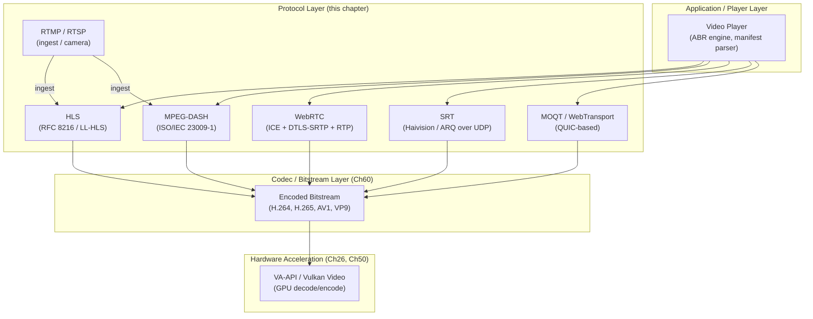
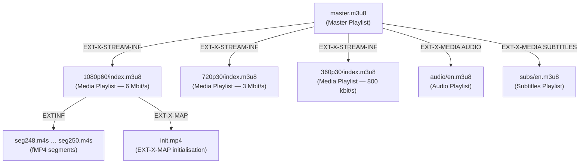
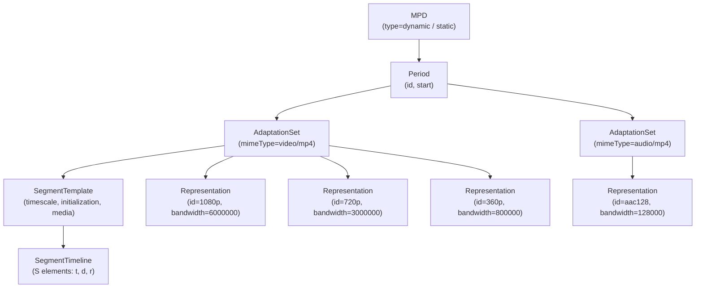
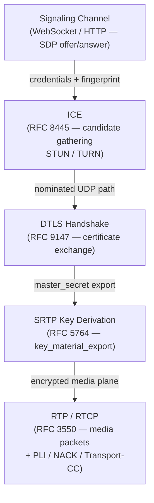
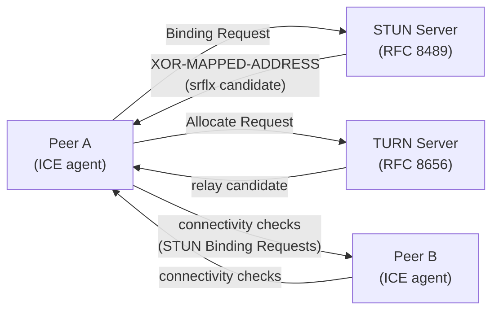
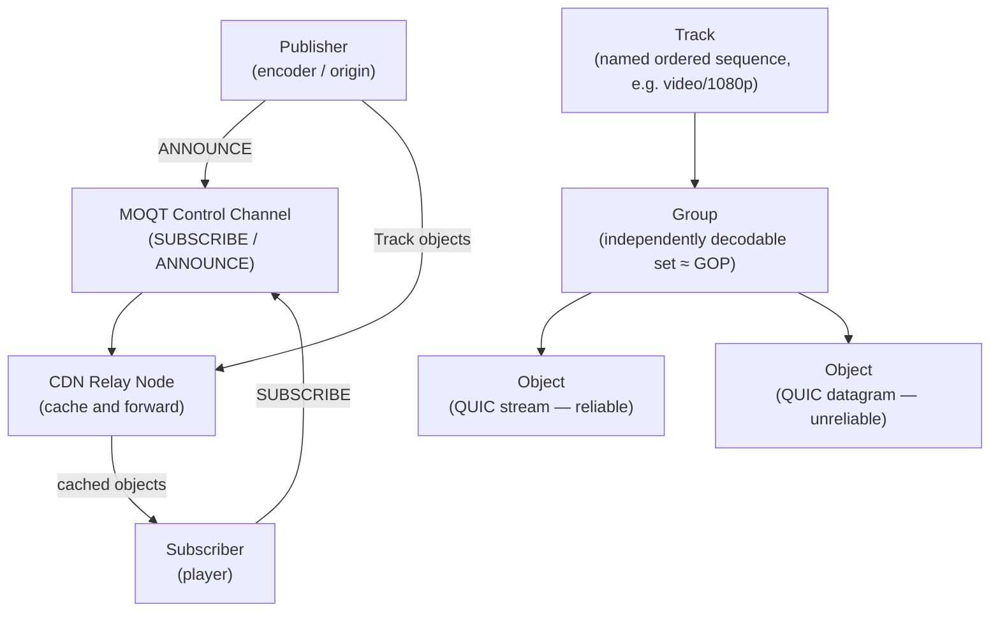
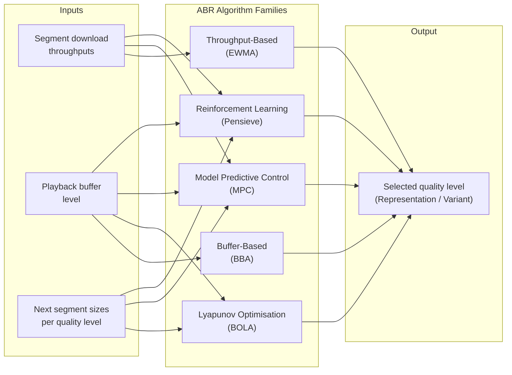
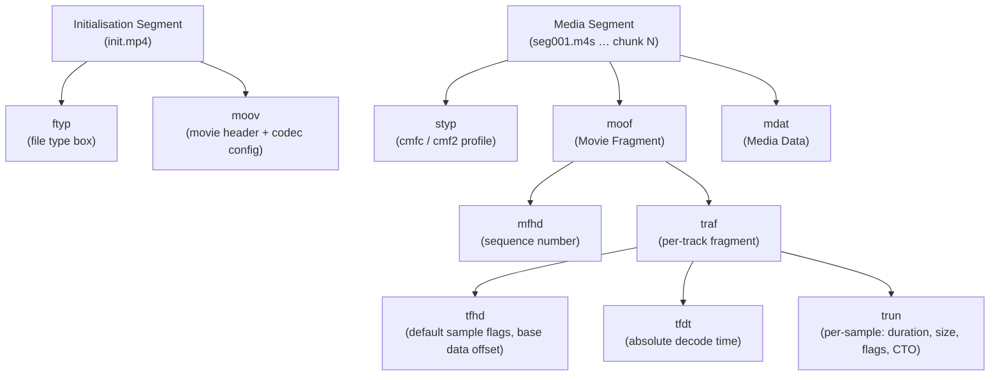

# Chapter 60b: Video Streaming Protocols and Adaptive Bitrate Delivery

> **Part**: Part XIII — Video Streaming on Linux
> **Audience**: Graphics application developers and systems developers building streaming pipelines; backend engineers designing CDN delivery or real-time communication systems.
> **Status**: First draft — 2026-06-16

---

## Table of Contents

1. [Overview](#1-overview)
2. [HLS: HTTP Live Streaming](#2-hls-http-live-streaming)
   - 2.1 [Playlist Grammar: Master and Media Manifests](#21-playlist-grammar-master-and-media-manifests)
   - 2.2 [Segment Containers: MPEG-2 TS vs fMP4/CMAF](#22-segment-containers-mpeg-2-ts-vs-fmp4cmaf)
   - 2.3 [Low-Latency HLS (LL-HLS)](#23-low-latency-hls-ll-hls)
   - 2.4 [FFmpeg HLS Muxer](#24-ffmpeg-hls-muxer)
3. [MPEG-DASH](#3-mpeg-dash)
   - 3.1 [MPD Anatomy](#31-mpd-anatomy)
   - 3.2 [Segment Addressing Modes](#32-segment-addressing-modes)
   - 3.3 [CMAF and Low-Latency DASH](#33-cmaf-and-low-latency-dash)
   - 3.4 [DASH-IF Interoperability Points](#34-dash-if-interoperability-points)
4. [WebRTC: Real-Time Peer Communication](#4-webrtc-real-time-peer-communication)
   - 4.1 [Signaling and Session Description Protocol](#41-signaling-and-session-description-protocol)
   - 4.2 [ICE: STUN, TURN, and Candidate Gathering](#42-ice-stun-turn-and-candidate-gathering)
   - 4.3 [DTLS-SRTP Media Plane](#43-dtls-srtp-media-plane)
   - 4.4 [RTP/RTCP: Transport and Control](#44-rtprtcp-transport-and-control)
   - 4.5 [GStreamer webrtcbin and Linux Integration](#45-gstreamer-webrtcbin-and-linux-integration)
5. [SRT: Secure Reliable Transport](#5-srt-secure-reliable-transport)
   - 5.1 [Protocol Architecture and Handshake](#51-protocol-architecture-and-handshake)
   - 5.2 [ARQ and Latency Budget](#52-arq-and-latency-budget)
   - 5.3 [libsrt on Linux](#53-libsrt-on-linux)
6. [QUIC-Based Media Transport](#6-quic-based-media-transport)
   - 6.1 [WebTransport](#61-webtransport)
   - 6.2 [Media Over QUIC Transport (MOQT)](#62-media-over-quic-transport-moqt)
7. [RTSP and RTMP](#7-rtsp-and-rtmp)
8. [Adaptive Bitrate Algorithms](#8-adaptive-bitrate-algorithms)
   - 8.1 [Throughput-Based Estimation (EWMA)](#81-throughput-based-estimation-ewma)
   - 8.2 [Buffer-Based Rate Adaptation (BBA)](#82-buffer-based-rate-adaptation-bba)
   - 8.3 [BOLA: Lyapunov Optimisation](#83-bola-lyapunov-optimisation)
   - 8.4 [MPC: Model Predictive Control](#84-mpc-model-predictive-control)
   - 8.5 [Pensieve: Reinforcement Learning ABR](#85-pensieve-reinforcement-learning-abr)
9. [Segment Packaging and CMAF Chunking](#9-segment-packaging-and-cmaf-chunking)
10. [CDN Delivery Strategies](#10-cdn-delivery-strategies)
11. [Linux Streaming Server Landscape](#11-linux-streaming-server-landscape)
12. [Integrations](#12-integrations)
13. [References](#13-references)

---

## 1. Overview

This chapter focuses on the protocol layer and adaptation algorithms that sit above the codec layer (Chapter 60) and the hardware acceleration paths (Chapters 26, 50). Chapter 57 (**FFmpeg**) touches on streaming protocols from a library-integration perspective — how to write an **HLS** muxer invocation or open an **RTMP** URL. This chapter goes deeper: what the protocols themselves specify, how adaptive bitrate algorithms decide which quality level to request next, and how low-latency variants (**LL-HLS**, **LL-DASH**, **MOQT**) reduce glass-to-glass latency from tens of seconds to sub-second.

The chapter targets engineers who need to design or debug a streaming delivery system on Linux:
- packaging live content from **FFmpeg** or **GStreamer** into **HLS**/**DASH**
- tuning **ABR** for low-latency live sports
- building **WebRTC**-based low-latency paths
- evaluating whether **SRT** or **QUIC** is the right transport for a broadcast ingest link

**HLS** (**HTTP Live Streaming**, **RFC 8216**) is covered first: its two-tier playlist grammar (**master playlist** and **media playlist** in **M3U8** format), the choice of segment containers (**MPEG-2 TS** vs. **fMP4**/**CMAF**), the **LL-HLS** extension that uses sub-segment **parts** and **`#EXT-X-PRELOAD-HINT`** to reach 2–4 second latency, and practical packaging using the **FFmpeg** `hls` muxer with `-hls_segment_type fmp4`.

**MPEG-DASH** (**ISO/IEC 23009-1**) follows: the **MPD** (**Media Presentation Description**) XML hierarchy of `Period`, `AdaptationSet`, `Representation`, and `SegmentTemplate`; the three segment addressing modes (`$Number$`-based, `$Time$`-based with **`SegmentTimeline`**, and **`SegmentList`**); **CMAF** (**Common Media Application Format**, **ISO 23000-19**) chunked transfer for **Low-Latency DASH**; and **DASH-IF** interoperability points including **CENC** (**Common Encryption**) and live profile constraints.

**WebRTC** (**RFC 8825**) provides sub-second peer-to-peer and SFU-routed delivery. The chapter covers the full signaling stack: **SDP** (**Session Description Protocol**, **RFC 8866**) offer/answer exchange; **ICE** (**Interactive Connectivity Establishment**, **RFC 8445**) candidate gathering using **STUN** (**RFC 8489**) and **TURN** (**RFC 8656**); the **DTLS-SRTP** media plane (**RFC 5764**, **RFC 9147**) for key derivation; **RTP**/**RTCP** (**RFC 3550**) transport with **PLI**, **NACK**, **REMB**, and **Transport-CC** feedback; and Linux integration via **GStreamer** `webrtcbin` (`gst-plugins-bad`) together with **Pion** and **mediasoup** **SFU** implementations.

**SRT** (**Secure Reliable Transport**), developed by **Haivision** and hosted at `github.com/Haivision/srt`, targets broadcast contribution links. Covered topics include its **UDT**-derived protocol architecture and four-way handshake (`HSREQ`/`HSRSP`/`KMREQ`/`KMRSP`), **ARQ** (**Automatic Repeat reQuest**) with a configurable `SRTO_LATENCY` budget, **AES-128/256** encryption, and deployment using **libsrt** (`libsrt-dev`) with **FFmpeg** (`--enable-libsrt`), **GStreamer** `srtsrc`/`srtsink`, and **MediaMTX**.

**QUIC**-based media transport (**RFC 9000**) encompasses two emerging standards: **WebTransport** (W3C/IETF), which exposes **QUIC** streams and datagrams to browser **JavaScript** for low-latency **fMP4**/**CMAF** chunk delivery; and **MOQT** (**Media Over QUIC Transport**, `draft-ietf-moq-transport`) for CDN-scalable live streaming with a **Track**/**Group**/**Object** data model using reliable **QUIC** streams or unreliable **QUIC** datagrams. Linux **QUIC** libraries include **quiche** (Cloudflare), **msquic** (Microsoft), and **aioquic** (Python).

**RTSP** (**RFC 7826**) and **RTMP** (Adobe) are covered as legacy and ingest protocols: **RTSP**/**RTP** for **IP** cameras and **NVR** equipment (implemented in **GStreamer** via `gst-rtsp-server` and in **FFmpeg**), and **RTMP**/**RTMPS** as the dominant live ingest protocol used by **OBS**, **FFmpeg**, and hardware encoders feeding platforms such as YouTube Live and Twitch, with **SRS**, **nginx-rtmp**, and **MediaMTX** as primary Linux implementations.

The **adaptive bitrate** (**ABR**) section surveys the five major algorithm families implemented in players today: throughput-based estimation using **EWMA** (**Exponentially Weighted Moving Average**); buffer-based rate adaptation (**BBA**); **BOLA** (**Buffer Occupancy based Lyapunov Algorithm**), implemented in **dash.js** and **Shaka Player**; **MPC** (**Model Predictive Control**) with harmonic-mean throughput prediction; and **Pensieve**, a reinforcement-learning policy network trained to maximise **QoE** (**Quality of Experience**).

Segment packaging digs into the **CMAF** box structure — `ftyp`, `moov`, `moof`, `mdat`, `tfdt`, `trun` — and explains how **HTTP/1.1** chunked transfer encoding (**`Transfer-Encoding: chunked`**) is used in **LL-DASH** to stream `moof`+`mdat` pairs to the **CDN** edge before a segment closes. CDN delivery strategy covers segment cache headers, origin shielding, manifest rewriting for multi-CDN failover, **HTTP/3** (**QUIC**) at the edge, and **`sidx`**-box-based byte-range seeking. The chapter closes with a survey of the Linux streaming server landscape: **SRS**, **MediaMTX**, **nginx-rtmp**, **OvenMediaEngine**, **Wowza**, and **Ant Media Server**, including the emerging **WHIP**/**WHEP** (**RFC 9725**) standard for **HTTP**-based **WebRTC** ingest and egress signaling.

**Scope boundaries**: codec internals (Ch60), hardware decode (Ch26, Ch50), **GStreamer** plugin architecture (Ch58), **FFmpeg** library API (Ch57), and **PipeWire** screen capture (Ch38) are out of scope here. This chapter treats encoded bitstreams as opaque input.



---

## 2. HLS: HTTP Live Streaming

HLS was developed by Apple and standardised as RFC 8216 (August 2017) for HTTP-based adaptive streaming. The client downloads a text-format playlist (M3U8), then sequentially fetches media segments referenced in that playlist. The server is a plain HTTP server; no streaming-specific server logic is required beyond correct `Cache-Control` headers.

### 2.1 Playlist Grammar: Master and Media Manifests

An HLS deployment exposes two playlist types:



**Master playlist** (`master.m3u8`): lists all available renditions (video bitrate variants, audio tracks, subtitle tracks) without itself containing segment URLs.

```m3u8
#EXTM3U
#EXT-X-VERSION:7

#EXT-X-STREAM-INF:BANDWIDTH=6000000,RESOLUTION=1920x1080,CODECS="avc1.640028,mp4a.40.2",FRAME-RATE=60
1080p60/index.m3u8

#EXT-X-STREAM-INF:BANDWIDTH=3000000,RESOLUTION=1280x720,CODECS="avc1.4d0028,mp4a.40.2",FRAME-RATE=30
720p30/index.m3u8

#EXT-X-STREAM-INF:BANDWIDTH=800000,RESOLUTION=640x360,CODECS="avc1.42e01e,mp4a.40.2",FRAME-RATE=30
360p30/index.m3u8

#EXT-X-MEDIA:TYPE=AUDIO,GROUP-ID="aac",NAME="English",DEFAULT=YES,URI="audio/en.m3u8"
#EXT-X-MEDIA:TYPE=SUBTITLES,GROUP-ID="subs",NAME="English",DEFAULT=NO,URI="subs/en.m3u8"
```

`BANDWIDTH` is the peak bitrate in bits per second; clients select the highest rendition whose bandwidth fits within the available network capacity. `CODECS` encodes the exact codec profile using RFC 6381 codec parameter strings — the `avc1.640028` format encodes profile (`64` = High), constraint flags (`00`), and level (`28` = 4.0) as hex bytes. [Source: RFC 8216 §4.3.4.2](https://datatracker.ietf.org/doc/html/rfc8216#section-4.3.4.2)

**Media playlist** (`index.m3u8`): the sequence of segment URLs for one rendition. The key tags are:

| Tag | Meaning |
|-----|---------|
| `#EXT-X-TARGETDURATION` | Maximum segment duration in whole seconds; clients use this for polling interval |
| `#EXT-X-MEDIA-SEQUENCE` | Sequence number of the first segment; increments as segments expire from the live window |
| `#EXT-X-KEY` | Encryption method (`AES-128`, `SAMPLE-AES`, or `NONE`) and key URI |
| `#EXTINF:<duration>,` | Segment duration (float); precedes each `#EXT-X-PART` or `SEGURI` line |
| `#EXT-X-ENDLIST` | Marks a VOD playlist; absent for live streams |
| `#EXT-X-DISCONTINUITY` | Timestamps reset; used after ad splicing or stream switches |

```m3u8
#EXTM3U
#EXT-X-VERSION:7
#EXT-X-TARGETDURATION:6
#EXT-X-MEDIA-SEQUENCE:248

#EXTINF:6.000,
seg248.m4s
#EXTINF:6.000,
seg249.m4s
#EXTINF:6.000,
seg250.m4s
```

For live streams, clients poll the playlist URL repeatedly. The recommended polling interval is one-half the `#EXT-X-TARGETDURATION`. [Source: RFC 8216 §6.3.4](https://datatracker.ietf.org/doc/html/rfc8216#section-6.3.4)

### 2.2 Segment Containers: MPEG-2 TS vs fMP4/CMAF

HLS originally mandated MPEG-2 Transport Stream (TS) segments. HLS version 6 (2016) added support for fragmented MP4 (fMP4) segments, and version 7 introduced `#EXT-X-MAP` to point to the fMP4 initialisation segment:

```m3u8
#EXT-X-VERSION:7
#EXT-X-MAP:URI="init.mp4"

#EXTINF:6.000,
seg001.m4s
```

fMP4 segments (`*.m4s`) are structureless ISO BMFF fragments containing `moof` (Movie Fragment) and `mdat` (Media Data) boxes. The `init.mp4` carries `ftyp`, `moov`, and codec-specific boxes (`avcC`, `hvcC`, `av1C`) but no media data. This structure is identical to what MPEG-DASH uses, enabling **CMAF** (Common Media Application Format, ISO 23000-19) — a single set of fMP4 media files deliverable via both HLS and DASH manifests, halving CDN storage.

MPEG-2 TS segments remain mandatory only for HLS legacy compatibility with very old Apple devices (pre-iOS 10). New deployments should use fMP4 exclusively.

### 2.3 Low-Latency HLS (LL-HLS)

Standard HLS latency (time from capture to first play) is typically 2–3 segment durations plus buffering — for 6-second segments, that is 15–20 seconds glass-to-glass. Apple's LL-HLS extension (incorporated into RFC 8216 bis) reduces this to approximately 2–4 seconds by introducing **parts** — sub-segment chunks (typically 200–333 ms) delivered while the parent segment is still accumulating. [Source: Apple WWDC 2019 Session 502](https://developer.apple.com/videos/play/wwdc2019/502/)

Key LL-HLS tags:

**`#EXT-X-PART-INF`** — declares the minimum part duration (must be ≤ one-fifth of `#EXT-X-TARGETDURATION`):
```m3u8
#EXT-X-PART-INF:PART-TARGET=0.334
```

**`#EXT-X-PART`** — inline part declarations interspersed with `#EXTINF` segment declarations:
```m3u8
#EXT-X-PART:DURATION=0.333,URI="seg251.0.m4s"
#EXT-X-PART:DURATION=0.333,URI="seg251.1.m4s"
#EXT-X-PART:DURATION=0.334,URI="seg251.2.m4s",INDEPENDENT=YES
#EXTINF:1.000,
seg251.m4s
```

`INDEPENDENT=YES` marks parts that begin on an IDR frame, allowing clients to seek into the stream mid-part.

**`#EXT-X-PRELOAD-HINT`** — tells the client the URL of the next part that has not yet been published, enabling HTTP/2 server push or long-poll fetch before the part is ready:
```m3u8
#EXT-X-PRELOAD-HINT:TYPE=PART,URI="seg252.0.m4s"
```

**`#EXT-X-SERVER-CONTROL`** — enables can-block reload and can-skip-until features:
```m3u8
#EXT-X-SERVER-CONTROL:CAN-BLOCK-RELOAD=YES,CAN-SKIP-UNTIL=18.0,HOLD-BACK=1.5,PART-HOLD-BACK=0.5
```

`CAN-BLOCK-RELOAD=YES` allows the client to append `_HLS_msn=<seq>&_HLS_part=<idx>` to the playlist URL, causing the server to hold the response until that part is available — replacing polling with efficient long-poll without HTTP/2 server push. `CAN-SKIP-UNTIL=18.0` allows the client to request a delta playlist with `_HLS_skip=YES`, omitting segments older than 18 seconds from the response and reducing bandwidth for frequent playlist refreshes. [Source: draft-pantos-hls-rfc8216bis §4.4.5.3](https://datatracker.ietf.org/doc/html/draft-pantos-hls-rfc8216bis)

### 2.4 FFmpeg HLS Muxer

The FFmpeg `hls` muxer (libavformat) writes both the playlist and segment files. Critical options:

```bash
ffmpeg -i input.mp4 \
  -c:v libx265 -preset fast -crf 22 \
  -c:a aac -b:a 128k \
  -f hls \
  -hls_time 6 \
  -hls_segment_type fmp4 \
  -hls_flags independent_segments+delete_segments \
  -hls_list_size 10 \
  -hls_fmp4_init_filename init.mp4 \
  -hls_segment_filename 'seg%05d.m4s' \
  output.m3u8
```

`-hls_segment_type fmp4` selects CMAF-compatible fragmented MP4 output. `-hls_flags delete_segments` removes expired segments from disk. For LL-HLS, FFmpeg 7.0 added `-hls_flags low_latency` which enables part generation via `-hls_part_time 0.334`. [Source: FFmpeg hls muxer docs](https://ffmpeg.org/ffmpeg-formats.html#hls-2)

---

## 3. MPEG-DASH

MPEG-DASH (Dynamic Adaptive Streaming over HTTP) is standardised as ISO/IEC 23009-1 (5th edition, 2022). It is codec-agnostic and CDN-agnostic; the only requirement is an HTTP(S) server. Where HLS uses a plain-text M3U8 format, DASH uses an XML Media Presentation Description (MPD).

### 3.1 MPD Anatomy

The MPD hierarchy is: `MPD` → `Period` → `AdaptationSet` → `Representation` → segments.



```xml
<?xml version="1.0" encoding="UTF-8"?>
<MPD xmlns="urn:mpeg:dash:schema:mpd:2011"
     type="dynamic"
     availabilityStartTime="2026-06-16T10:00:00Z"
     minimumUpdatePeriod="PT2S"
     timeShiftBufferDepth="PT30S"
     minBufferTime="PT1.5S"
     profiles="urn:mpeg:dash:profile:isoff-live:2011">

  <Period id="1" start="PT0S">

    <!-- Video AdaptationSet -->
    <AdaptationSet mimeType="video/mp4" codecs="avc1.640028"
                   frameRate="60" startWithSAP="1"
                   segmentAlignment="true">
      <SegmentTemplate timescale="90000"
                       initialization="$RepresentationID$/init.mp4"
                       media="$RepresentationID$/$Number$.m4s"
                       startNumber="1">
        <SegmentTimeline>
          <S t="0" d="540000" r="99"/>   <!-- 100 × 6s segments -->
        </SegmentTimeline>
      </SegmentTemplate>

      <Representation id="1080p" bandwidth="6000000"
                      width="1920" height="1080"/>
      <Representation id="720p"  bandwidth="3000000"
                      width="1280" height="720"/>
      <Representation id="360p"  bandwidth="800000"
                      width="640"  height="360"/>
    </AdaptationSet>

    <!-- Audio AdaptationSet -->
    <AdaptationSet mimeType="audio/mp4" codecs="mp4a.40.2"
                   lang="en" segmentAlignment="true">
      <SegmentTemplate timescale="44100"
                       initialization="audio/init.mp4"
                       media="audio/$Number$.m4s"
                       startNumber="1">
        <SegmentTimeline>
          <S t="0" d="264600" r="99"/>  <!-- 100 × 6s at 44.1 kHz -->
        </SegmentTimeline>
      </SegmentTemplate>
      <Representation id="aac128" bandwidth="128000"/>
    </AdaptationSet>

  </Period>
</MPD>
```

`type="dynamic"` signals a live stream; `type="static"` is VOD. `minimumUpdatePeriod` tells clients how often to re-fetch the MPD. `timeShiftBufferDepth` defines the DVR window — the duration of the past that remains available for time-shifted playback. [Source: ISO/IEC 23009-1:2022 §5.3](https://www.iso.org/standard/83314.html)

### 3.2 Segment Addressing Modes

DASH offers three addressing modes in `SegmentTemplate`:

**`$Number$`-based**: segments numbered sequentially; the client computes the segment URL from the number and a start number. Simple, but requires synchronised clocks if the server generates new segments on a schedule.

**`$Time$`-based** (with `SegmentTimeline`): each `<S t="timestamp" d="duration" r="repeat"/>` element encodes the presentation timestamp of each segment. Handles variable-duration segments (common with live encoding) and timeline discontinuities without client-side inference. The recommended mode for live. [Source: DASH-IF Implementation Guidelines §3.3](https://dashif.org/docs/IOP-Guidelines/DASH-IF-IOP-Part4-v5.0.0.pdf)

**`SegmentList`**: explicit URL list; no URL template. Used for on-demand content with irregular segment sizes; not suitable for live.

### 3.3 CMAF and Low-Latency DASH

CMAF (ISO 23000-19) standardises the fMP4 segment format so that the same byte sequence serves both HLS and DASH. A CMAF chunk is a partial segment published to the origin before the segment is complete — the same concept as an LL-HLS part. Low-Latency DASH (CTE — Chunked Transfer Encoding delivery) uses HTTP `Transfer-Encoding: chunked` to stream CMAF chunks from the origin to the CDN edge as they are produced, without waiting for the segment to close. The CDN edge relays each HTTP response chunk to clients immediately, achieving 1–3 second end-to-end latency.

Key configuration:
- Segment duration: 2–4 seconds (shorter than standard DASH's 4–6 s)
- Chunk duration: 100–500 ms (one or a few video GOPs)
- `availabilityTimeOffset` in the MPD signals that segments are available before their nominal start time, allowing clients to request and start downloading chunks early
- `availabilityTimeComplete="false"` on `SegmentTemplate` explicitly marks that segment files are not yet complete

### 3.4 DASH-IF Interoperability Points

The DASH Industry Forum publishes interoperability guidelines (IOP) that constrain the open DASH standard to practical deployment profiles. Key IOP points relevant to Linux deployments:

- **Live profile** (`urn:mpeg:dash:profile:isoff-live:2011`): mandatory for all live services; uses `SegmentTemplate` with `$Time$` or `$Number$`, no `SegmentList`.
- **Common Encryption (CENC)**: `cenc:pssh` elements inside `ContentProtection` carry DRM system-specific PSSH boxes; DRM-agnostic CENC encryption means a single encrypted segment works with Widevine, PlayReady, and FairPlay simultaneously.
- **Trick modes**: `AdaptationSet` with `startWithSAP="1"` and `maxFrameRate` for I-frame-only trick play representations.

---

## 4. WebRTC: Real-Time Peer Communication

WebRTC (Web Real-Time Communications) targets sub-second latency by sending encoded media directly between peers (or through a media server) using UDP-based RTP rather than HTTP. [Source: RFC 8825 — Overview of the Web Real-Time Communications (WebRTC)](https://datatracker.ietf.org/doc/html/rfc8825)



### 4.1 Signaling and Session Description Protocol

WebRTC is transport-agnostic for signaling: the application exchanges **Session Description Protocol** (SDP, RFC 8866) offers and answers out-of-band (via WebSocket, HTTP, or any channel). SDP describes the media capabilities and transport parameters each peer will use:

```sdp
v=0
o=- 1234567890 2 IN IP4 127.0.0.1
s=-
t=0 0
a=group:BUNDLE 0 1
a=msid-semantic: WMS

m=video 9 UDP/TLS/RTP/SAVPF 96
c=IN IP4 0.0.0.0
a=rtcp:9 IN IP4 0.0.0.0
a=ice-ufrag:Xb4k
a=ice-pwd:XXXXXXXXXXXXXXXXXXXXXXXX
a=fingerprint:sha-256 AA:BB:CC:...
a=setup:actpass
a=mid:0
a=sendrecv
a=rtcp-mux
a=rtpmap:96 H264/90000
a=fmtp:96 level-asymmetry-allowed=1;packetization-mode=1;profile-level-id=42e01f
a=ssrc:11223344 cname:stream1
```

The `m=` line specifies the media type, port (9 for bundled), transport (`UDP/TLS/RTP/SAVPF` = Secure Authenticated VP RTP with Feedback), and payload types. `a=fingerprint` is the DTLS certificate fingerprint used for key exchange. `a=ice-ufrag`/`a=ice-pwd` seed the ICE connectivity check credentials. [Source: RFC 8866 §5](https://datatracker.ietf.org/doc/html/rfc8866)

### 4.2 ICE: STUN, TURN, and Candidate Gathering

ICE (Interactive Connectivity Establishment, RFC 8445) discovers network paths between peers behind NATs and firewalls. Each peer gathers **candidates** — network address/port pairs — of three types:

- **Host candidates**: local interface addresses (typically multiple, one per NIC)
- **Server Reflexive (srflx) candidates**: the public IP:port as seen by a STUN server (RFC 8489) outside the NAT; obtained by sending a `Binding Request` to a STUN server and reading the `XOR-MAPPED-ADDRESS` in the response
- **Relayed (relay) candidates**: a TURN server (RFC 8656) allocates a UDP relay address for peers that cannot communicate directly



```text
STUN binding check (to stun.example.com:3478):
  STUN Binding Request  →  STUN server
  STUN Binding Response ←  XOR-MAPPED-ADDRESS: 203.0.113.5:56789
Candidate: typ srflx raddr 192.168.1.100 rport 56789 addr 203.0.113.5 port 56789
```

Candidates are exchanged via SDP (or as Trickle ICE incremental updates). The ICE agent performs **connectivity checks** — STUN Binding Requests over each candidate pair — and selects the highest-priority working pair using the ICE priority formula. TURN relay is the last resort for symmetric NATs. [Source: RFC 8445 §5](https://datatracker.ietf.org/doc/html/rfc8445)

### 4.3 DTLS-SRTP Media Plane

Once ICE nominates a candidate pair, DTLS (Datagram TLS, RFC 9147) runs over the UDP path to establish an encrypted channel and key material. The DTLS-SRTP profile (RFC 5764) derives SRTP (Secure RTP) keying material from the DTLS handshake `master_secret` via the SRTP `key_material_export` function, without wrapping actual RTP inside DTLS records — DTLS is used only for the handshake, not for packet-by-packet encryption overhead.

```text
UDP socket
  └─ DTLS handshake (ClientHello / ServerHello / Certificate / Finished)
       └─ SRTP key derivation:
            master_key  (from DTLS export)   → AES-128-CM for RTP payload
            master_salt (from DTLS export)   → nonce construction
       └─ SRTCP key derivation (for RTCP)
```

The DTLS certificate fingerprint carried in SDP prevents MITM attacks: each peer verifies that the DTLS certificate received during the handshake matches the fingerprint offered in SDP. [Source: RFC 5764 §4.2](https://datatracker.ietf.org/doc/html/rfc5764)

### 4.4 RTP/RTCP: Transport and Control

**RTP** (RFC 3550) carries timestamped, sequenced media packets over UDP. The RTP fixed header:

```text
 0                   1                   2                   3
 0 1 2 3 4 5 6 7 8 9 0 1 2 3 4 5 6 7 8 9 0 1 2 3 4 5 6 7 8 9 0 1
+-+-+-+-+-+-+-+-+-+-+-+-+-+-+-+-+-+-+-+-+-+-+-+-+-+-+-+-+-+-+-+-+
|V=2|P|X|  CC   |M|     PT      |       sequence number         |
+-+-+-+-+-+-+-+-+-+-+-+-+-+-+-+-+-+-+-+-+-+-+-+-+-+-+-+-+-+-+-+-+
|                           timestamp                           |
+-+-+-+-+-+-+-+-+-+-+-+-+-+-+-+-+-+-+-+-+-+-+-+-+-+-+-+-+-+-+-+-+
|           synchronization source (SSRC) identifier           |
+-+-+-+-+-+-+-+-+-+-+-+-+-+-+-+-+-+-+-+-+-+-+-+-+-+-+-+-+-+-+-+-+
```

The `timestamp` clock rate is payload-type-specific: 90,000 Hz for video (so a 30 fps frame advances the timestamp by 3,000), 48,000 Hz for Opus audio. The `M` bit marks the last packet of a video frame. `PT` (payload type) is negotiated in SDP; dynamic payload types 96–127 are used for codecs not assigned a static PT.

H.264 packetisation (RFC 6184) uses three modes:
- **Single NAL unit**: one RTP packet per NALU; `PT=96`, first byte is the NAL header
- **STAP-A**: aggregates multiple small NALUs into one RTP packet (e.g., SPS + PPS)
- **FU-A** (Fragmentation Unit): splits large NALUs across multiple RTP packets; crucial for MTU compliance

**RTCP** (RTP Control Protocol) runs alongside RTP, typically on the next UDP port (RTP port + 1), or multiplexed via `a=rtcp-mux`. RTCP carries periodic Sender Reports (SR) and Receiver Reports (RR) with loss fraction, jitter, and round-trip time measurements. Critical feedback extensions used by WebRTC:

- **PLI** (Picture Loss Indication, RFC 4585): receiver requests a keyframe because it lost reference frames; sender must generate an IDR immediately
- **NACK** (Negative Acknowledgement, RFC 4585): receiver requests retransmission of specific sequence numbers; effective only when RTT is short enough (< half the inter-frame interval)
- **REMB** (Receiver Estimated Maximum Bitrate): Google extension for bandwidth estimation feedback from the receiver to the sender
- **Transport-CC** (Transport-wide Congestion Control, RFC 9143): per-packet acknowledgement with arrival timestamps, enabling sender-side bandwidth estimation algorithms (GoogCC)

### 4.5 GStreamer webrtcbin and Linux Integration

`webrtcbin` is GStreamer's WebRTC element (`gst-plugins-bad ≥ 1.16`), implementing ICE, DTLS-SRTP, and RTP/RTCP natively. A minimal receive pipeline:

```python
import gi
gi.require_version('Gst', '1.0')
gi.require_version('GstWebRTC', '1.0')
from gi.repository import Gst, GstWebRTC

Gst.init(None)
pipe = Gst.parse_launch("""
    webrtcbin name=recv bundle-policy=max-bundle
    recv. ! rtph264depay ! h264parse ! vaapih264dec ! autovideosink
""")
recv = pipe.get_by_name('recv')

def on_negotiation_needed(el):
    promise = Gst.Promise.new_with_change_func(on_offer_created, el, None)
    el.emit('create-offer', None, promise)

recv.connect('on-negotiation-needed', on_negotiation_needed)
pipe.set_state(Gst.State.PLAYING)
```

`vaapih264dec` connects `webrtcbin` directly into the VA-API hardware decode path described in Ch26, enabling zero-copy RTP → GPU decode without CPU involvement beyond RTP depayloading. [Source: GStreamer webrtcbin documentation](https://gstreamer.freedesktop.org/documentation/webrtc/index.html)

For server-side media routing on Linux, **Pion** (Go WebRTC library) and **mediasoup** (Node.js SFU) are common choices for Selective Forwarding Units (SFUs) that relay individual participant streams to other participants without transcoding. GStreamer's `webrtcbin` can serve as both producer (capture → encode → RTP) and consumer (RTP → decode → display) in such architectures.

---

## 5. SRT: Secure Reliable Transport

SRT (Secure Reliable Transport) is an open-source protocol developed by Haivision, standardised by the SRT Alliance, and hosted at [github.com/Haivision/srt](https://github.com/Haivision/srt). SRT targets broadcast ingest and contribution links — scenarios where UDP packet loss must be recovered while maintaining low latency, unlike TCP which recovers loss but may buffer-bloat the pipeline.

### 5.1 Protocol Architecture and Handshake

SRT is a profile of **UDT** (UDP-based Data Transfer) with security and timing extensions. It runs over UDP; a four-way handshake (`HSREQ`/`HSRSP` + `KMREQ`/`KMRSP`) establishes connection parameters and AES-128/256 encryption keys:

```text
Caller                         Listener
  ──── Induction HSREQ ────────►
  ◄─── Induction HSRSP ─────────
  ──── Conclusion HSREQ (KMREQ) ►  (encryption key exchange)
  ◄─── Conclusion HSRSP (KMRSP) ─
  ─── Media data (MPEG-2 TS) ───►
```

SRT supports three connection modes:
- **Caller/Listener**: analogous to TCP client/server; the listener opens a fixed UDP port
- **Rendezvous**: both sides simultaneously call each other (for NAT traversal without a relay)
- **Group** (since libsrt 1.5): link bonding — multiple UDP paths carrying redundant or load-balanced streams

### 5.2 ARQ and Latency Budget

SRT uses **ARQ** (Automatic Repeat reQuest) with a configurable latency budget (`SRTO_LATENCY`, default 120 ms). The receiver buffers arriving packets for `latency` milliseconds before delivering them to the application; during this window, it can request retransmission of lost packets via NAK (Negative Acknowledgement) messages. If a packet has not been recovered within the latency budget, it is dropped and a gap is delivered — behaviour identical to RTMP or HLS only if the encoder marks the lost packet's frame as non-reference.

The latency budget must be set to at least 4× the one-way network RTT to allow time for: sender receives NAK, sender retransmits packet, receiver receives retransmission. For intercontinental links (RTT ≈ 150 ms), a 600 ms minimum budget is required; for local network ingest (RTT < 1 ms), 20–40 ms is typical.

```c
// libsrt: set 200 ms latency budget on both sides
srt_setsockopt(sock, 0, SRTO_LATENCY,     &(int){200}, sizeof(int));
srt_setsockopt(sock, 0, SRTO_RCVLATENCY,  &(int){200}, sizeof(int));
srt_setsockopt(sock, 0, SRTO_PEERLATENCY, &(int){200}, sizeof(int));
// Enable AES-128 encryption
srt_setsockopt(sock, 0, SRTO_PASSPHRASE, "MySecretKey32CharMin!", 21);
srt_setsockopt(sock, 0, SRTO_PBKEYLEN, &(int){16}, sizeof(int)); // 128-bit
```

[Source: SRT API reference §SRTO_LATENCY](https://github.com/Haivision/srt/blob/master/docs/API/API-socket-options.md#srto_latency)

### 5.3 libsrt on Linux

libsrt ships as `libsrt-dev` in Debian/Ubuntu (≥ 22.04 ships libsrt 1.5). FFmpeg links against libsrt when built with `--enable-libsrt`:

```bash
# SRT listener receiving MPEG-2 TS from a broadcast encoder
ffmpeg -i 'srt://0.0.0.0:9000?mode=listener&latency=120000' \
       -c copy output.mp4

# SRT caller pushing to an ingest point
ffmpeg -re -i input.mp4 -c copy \
       -f mpegts 'srt://ingest.example.com:9000?latency=200000&passphrase=key'
```

GStreamer uses `srtsrc` and `srtsink` from `gst-plugins-bad`. MediaMTX (formerly rtsp-simple-server) natively supports SRT as both input and output protocol. [Source: MediaMTX SRT docs](https://github.com/bluenviron/mediamtx#source-typessrt)

---

## 6. QUIC-Based Media Transport

QUIC (RFC 9000) provides reliable, ordered streams and unreliable datagrams over UDP, with 0-RTT connection establishment and built-in TLS 1.3 encryption. Its multiplexed stream model avoids TCP's head-of-line blocking — a retransmitted packet on one stream does not stall independent streams. These properties make QUIC attractive for media delivery where multiple concurrent video/audio tracks, metadata, and control messages would otherwise compete on a single TCP connection.

### 6.1 WebTransport

**WebTransport** (W3C / IETF draft) exposes QUIC streams and datagrams to browser JavaScript applications. For server-to-browser streaming, WebTransport enables sub-100 ms delivery of media chunks that CMAF+HTTP/2 cannot achieve due to HTTP stream semantics. A server implementing WebTransport over HTTP/3 can push fMP4 CMAF chunks to the browser via unidirectional QUIC streams, replacing the HLS/DASH segment-fetch model with a push model while retaining the CMAF segment structure. [Source: W3C WebTransport API](https://www.w3.org/TR/webtransport/)

Linux implementations: `quiche` (Cloudflare) and `msquic` (Microsoft) provide QUIC libraries with WebTransport support; `aioquic` (Python) is commonly used in research implementations.

### 6.2 Media Over QUIC Transport (MOQT)

**MOQT** (Media Over QUIC Transport, IETF working group draft `draft-ietf-moq-transport`) is an application protocol running over QUIC targeted at latencies between WebRTC (< 500 ms) and HLS/DASH (> 5 s). MOQT is designed for CDN-integrated live streaming — unlike WebRTC which requires a relay SFU per viewer, MOQT CDN relay nodes can cache and forward MOQT objects to many subscribers without full mesh connectivity.

MOQT's data model:

```
Track      — a named, ordered sequence of objects (e.g., "video/1080p")
  Group    — a set of objects that can be decoded independently (≈ GOP)
    Object — the smallest unit of delivery (≈ CMAF chunk or RTP packet)
```



A publisher announces tracks via a SUBSCRIBE-style control channel. Subscribers express interest; relay nodes cache objects and forward them. Object delivery uses QUIC streams (reliable) or QUIC datagrams (unreliable, for real-time audio where retransmission is useless past the playout deadline).

As of mid-2026, MOQT is in IETF Last Call (`draft-ietf-moq-transport-12`). Cloudflare, Meta, and Apple have published prototype implementations. FFmpeg and GStreamer MOQT support is still experimental. [Source: IETF MOQ Charter](https://datatracker.ietf.org/wg/moq/about/)

---

## 7. RTSP and RTMP

**RTSP** (Real Time Streaming Protocol, RFC 7826) is a control protocol for media servers — it negotiates media sessions, issues play/pause/seek commands over TCP, and transports media via separate RTP/UDP or interleaved RTP-over-TCP streams. RTSP remains ubiquitous in IP cameras (ONVIF mandates RTSP/RTP), NVRs, and broadcast equipment, but is largely absent from browser-facing video delivery. On Linux, `gst-rtsp-server` provides a GStreamer-based RTSP server implementation; FFmpeg implements RTSP both as a client (`-i rtsp://...`) and server (`-f rtsp rtsp://localhost:8554/live`).

**RTMP** (Real-Time Messaging Protocol) was developed by Macromedia (now Adobe) for Flash Player delivery. Post-Flash, RTMP persists almost exclusively as a **streaming ingest protocol**: OBS, FFmpeg, and hardware encoders push live streams to ingest points (YouTube Live, Twitch, Wowza) via RTMP, which the ingest server then transcodes and packages into HLS/DASH for delivery. RTMP uses TCP, which provides reliable delivery but can introduce head-of-line blocking latency under congestion. **RTMPS** (RTMP over TLS) is now required by major platforms for ingest. The Adobe RTMP specification is publicly available; SRS, nginx-rtmp, and MediaMTX are the primary open-source Linux implementations.

---

## 8. Adaptive Bitrate Algorithms

Adaptive bitrate (ABR) streaming selects among available quality levels (representations/variants) based on current network conditions to maximise quality while preventing rebuffering. The ABR algorithm runs in the video player on the client. This section surveys the major algorithm families.



### 8.1 Throughput-Based Estimation (EWMA)

The simplest ABR approach estimates available bandwidth from recent download throughputs using an Exponentially Weighted Moving Average:

```
throughput_est[t] = α × measured_throughput[t] + (1 - α) × throughput_est[t-1]
```

A typical value is α = 0.8 (heavy weight on recent measurement). The player selects the highest bitrate representation whose bitrate is below `safety_factor × throughput_est`, where `safety_factor` ≈ 0.8–0.9.

Weaknesses: measured throughput during a segment download is the average over the download, not the instantaneous rate at decision time. Short high-bandwidth bursts followed by congestion cause overestimates. The algorithm is aggressive and causes frequent quality oscillations in variable networks. [Source: Huang et al., "A buffer-based approach to rate adaptation", SIGCOMM 2014](https://dl.acm.org/doi/10.1145/2619239.2626296)

### 8.2 Buffer-Based Rate Adaptation (BBA)

BBA ignores throughput estimates entirely and uses the current playback buffer level as the sole signal. The intuition: if the buffer is large, the player can afford to request higher quality; if the buffer is small, it should back off to avoid starvation.

BBA defines two thresholds, `buf_lo` and `buf_hi`, and a rate map from buffer level to bitrate:

```
if buffer < buf_lo:  select lowest bitrate
if buffer > buf_hi:  select highest bitrate
else:                interpolate linearly between bitrates
```

BBA avoids the throughput estimation problem entirely and achieves significantly lower rebuffering rates than pure throughput-based algorithms under bursty network conditions. However, it is slow to respond to sudden network improvements — the buffer must grow before quality increases. [Source: Huang et al., SIGCOMM 2014]

### 8.3 BOLA: Lyapunov Optimisation

BOLA (Buffer Occupancy based Lyapunov Algorithm) formulates ABR as an online utility maximisation problem, using Lyapunov drift-plus-penalty control theory to derive an optimal closed-form decision rule. [Source: Spiteri et al., "BOLA: Near-Optimal Bitrate Adaptation for Online Videos", IEEE/ACM ToN 2020](https://arxiv.org/abs/1601.06748)

The utility function assigns a value `v_m` to each bitrate level `m` (typically the log of the bitrate). BOLA maximises the time-averaged quality while keeping the buffer within bounds, by selecting at each segment the bitrate `m*` that maximises:

```
Δ(m) = (V × v_m - buffer_level) / segment_size_m
```

where `V` is a parameter trading off quality vs. buffer stability (larger V = higher quality, more rebuffering risk). BOLA is implemented in the **dash.js** reference DASH player and the **Shaka Player** (Google), and is available as an option in FFmpeg's DASH demuxer. It provably achieves near-optimal quality for any network trace without requiring bandwidth prediction. [Source: Shaka Player BOLA implementation](https://github.com/shaka-project/shaka-player)

### 8.4 MPC: Model Predictive Control

MPC (Model Predictive Control for Adaptive Bitrate Video Streaming) uses a bandwidth predictor to estimate throughput over the next `K` segments, then solves a finite-horizon optimisation for the best quality sequence given predicted bandwidth, buffer, and smoothness objectives: [Source: Yin et al., "A Control-Theoretic Approach for Dynamic Adaptive Video Streaming over HTTP", SIGCOMM 2015](https://dl.acm.org/doi/10.1145/2785956.2787486)

```
maximise:  Σ [q(t) - λ|q(t) - q(t-1)| - μ·rebuffer(t) - ν·tail_q]
subject to: buffer dynamics, bandwidth constraints
```

where `q(t)` is the quality level (log bitrate) of segment `t`, `λ` penalises quality switches, `μ` penalises rebuffering, and `ν` penalises smooth buffer drainage at the end of the lookahead window. MPC uses a harmonic-mean throughput predictor to estimate future bandwidth from the last `K=5` measured download rates.

MPC consistently outperforms both throughput-based and buffer-based approaches in QoE (Quality of Experience) metrics, at the cost of the optimisation solve at each segment. For a horizon of 5 segments and 6 quality levels, the exhaustive search is 6^5 = 7,776 combinations — fast enough for real-time use.

### 8.5 Pensieve: Reinforcement Learning ABR

Pensieve (2017) trains a neural network to make ABR decisions using reinforcement learning, with a reward function that incorporates video quality, quality switches, and rebuffering time. [Source: Mao et al., "Real World Performance of Adaptive Bitrate Algorithms", SIGCOMM 2017](https://dl.acm.org/doi/10.1145/3098822.3098843)

The state fed to the policy network at each decision step includes:
- Last 8 segment download throughputs
- Last 8 download times
- Buffer level
- Current bitrate
- Next segment sizes for each quality level

The policy network (3-layer fully connected, ~30K parameters) outputs a softmax distribution over bitrate choices; the action with the highest probability is selected. Pensieve demonstrates that learned policies can discover non-obvious strategies (e.g., temporarily downloading lower quality to grow the buffer before a predicted bandwidth drop) that rule-based algorithms miss.

On Linux, the Pensieve inference model can run as a sidecar process alongside a DASH client, with the player querying the model via a local socket at each segment boundary. Production deployment requires retraining on network traces representative of the target audience's ISP mix.

---

## 9. Segment Packaging and CMAF Chunking

A CMAF segment file contains an initialisation segment (`ftyp` + `moov`) and one or more media segments (`moof` + `mdat` pairs). The `styp` box inside each chunk identifies the CMAF profile: `cmfc` for CMAF chunked segments, `cmf2` for image sequences.



The `moof` box contains per-track fragment headers:
```
moof
  mfhd  (sequence number)
  traf  (per-track fragment)
    tfhd  (default sample flags, base data offset)
    tfdt  (decode time — absolute, not delta from movie header)
    trun  (per-sample table: duration, size, flags, CTO)
```

`tfdt` using absolute decode times (rather than the `elst`-relative timestamps in non-fragmented MP4) is critical for low-latency DASH: the server publishes chunks as they are produced, and the CDN must correctly compute presentation timestamps without the full `moov` context.

For LL-DASH chunked transfer, the origin server sends each `moof`+`mdat` pair as an HTTP/1.1 chunk immediately after encoding, while the HTTP response for the full segment remains open:

```http
HTTP/1.1 200 OK
Content-Type: video/mp4
Transfer-Encoding: chunked

1a00\r\n
<bytes of moof+mdat for chunk 1>\r\n
1b20\r\n
<bytes of moof+mdat for chunk 2>\r\n
...
0\r\n\r\n   (when segment closes)
```

The CDN edge must be configured to disable response buffering — nginx requires `proxy_buffering off` and `X-Accel-Buffering: no` on the origin response; for AWS CloudFront, the origin must set `Cache-Control: no-store` during the open segment window. [Source: DASH-IF Low-Latency Guidelines](https://dashif.org/docs/CR-Low-Latency-Live-r8.pdf)

---

## 10. CDN Delivery Strategies

**Segment caching**: Completed HLS/DASH segments are immutable — they never change once written. Set `Cache-Control: max-age=31536000, immutable` on segment files. Manifests are volatile for live streams; set `Cache-Control: max-age=1, s-maxage=1` on M3U8 and MPD responses to allow CDN edge caching for one second while ensuring staleness expires quickly.

**Origin shielding**: Deploy a CDN shield (mid-tier cache) between the encoding origin and the CDN edge PoPs. The shield collapses the large number of simultaneous manifest and segment fetches from edge nodes into a small number of requests to the origin. For LL-DASH chunked transfer, the shield must forward HTTP chunked responses without buffering — verify with `X-Accel-Buffering: no` propagation.

**Manifest rewriting**: For multi-CDN failover, a manifest rewriter service sits between the player and origin, dynamically substituting CDN hostname prefixes in segment URLs based on real-time CDN health checks. The player sees a single manifest URL; segment URLs are rewritten to route to the healthy CDN.

**QUIC at the edge**: Deploying HTTP/3 (QUIC) between player and CDN edge reduces segment fetch latency on high-loss networks (mobile) by eliminating TCP retransmission head-of-line blocking. Major CDNs (Cloudflare, AWS, Fastly) support HTTP/3 at the edge; origin communication typically remains HTTP/2.

**Byte-range requests**: For long VOD segments, players may fetch only the first IDR frame of a segment (via byte-range `Range: bytes=0-sidx_end`) using the `sidx` (Segment Index) box to locate keyframe positions. This enables rapid seeking without downloading full segments.

---

## 11. Linux Streaming Server Landscape

| Server | Protocol Focus | Language | Notable Feature |
|--------|---------------|----------|-----------------|
| **SRS** (Simple Realtime Server) | RTMP, HLS, DASH, WebRTC, SRT | C++ | SFU + origin in one binary; co-routine model |
| **MediaMTX** (rtsp-simple-server) | RTSP, RTMP, HLS, WebRTC, SRT, WHIP/WHEP | Go | Zero-config; supports all ingest/output protocols |
| **nginx-rtmp** | RTMP ingest → HLS/DASH | C (nginx module) | Production-proven; requires nginx rebuild |
| **OvenMediaEngine** | WebRTC (WHIP/WHEP), CMAF, RTMP | C++ | Sub-second latency; hardware encode support |
| **Wowza Streaming Engine** | RTMP, HLS, DASH, WebRTC | Java | Commercial; deep format support |
| **Ant Media Server** | WebRTC (SFU), HLS, DASH | Java | Adaptive bitrate WebRTC via WHIP |

**WHIP/WHEP** (WebRTC-HTTP Ingestion/Egress Protocol, RFC 9725 / draft-ietf-wish-whep) standardises the HTTP signaling exchange for WebRTC publishing and playback — replacing ad-hoc WebSocket signaling with a simple HTTP POST for offer/answer and DELETE for teardown. MediaMTX and OvenMediaEngine implement WHIP/WHEP, enabling OBS 30 (which added native WHIP output) to publish sub-second-latency streams to a browser audience without a separate SFU. [Source: RFC 9725](https://datatracker.ietf.org/doc/rfc9725/)

**GStreamer as a server**: `gst-rtsp-server` (C library) builds a fully-featured RTSP server from GStreamer pipelines. For WHIP/WHEP, GStreamer's `whipsink` and `whepsrc` elements (added in 1.22) provide direct integration.

---

## 12. Integrations

- **Chapter 57 (FFmpeg)**: The FFmpeg `hls`, `dash`, `rtmp`, `srt`, and RTSP muxers/demuxers implement all protocols covered here at the API level; this chapter provides the protocol-layer foundation for understanding what FFmpeg is doing internally.
- **Chapter 58 (GStreamer)**: `hlssink2`, `dashsink`, `webrtcbin`, `srtsink`/`srtsrc`, and `whipsink` are GStreamer elements implementing the protocols here; the GStreamer `adaptivedemux2` element implements a configurable ABR engine over HLS and DASH.
- **Chapter 59 (DeepStream)**: DeepStream pipelines ingest video from RTSP/RTMP/SRT camera sources via `nvurisrcbin`; the analytics output is packaged and delivered using the messaging protocols described here.
- **Chapter 60 (Video Codecs)**: All protocols carry codec-compressed streams; the segment sizes and keyframe intervals that ABR algorithms reason about are direct consequences of encoder rate control and GOP structure described in Ch60.
- **Chapter 26 (VA-API) and Chapter 50 (Vulkan Video)**: Hardware-decoded frames from GPU accelerated pipelines are the downstream consumers of the segment streams delivered by the protocols here; zero-copy DMA-BUF paths from GStreamer's `webrtcbin` to `vaapih264dec` exemplify the full stack.
- **Chapter 38 (PipeWire)**: PipeWire can act as a source (`pipewiresrc`) feeding GStreamer streaming pipelines for screen-capture streaming via WebRTC or HLS.

---

## 13. References

1. [RFC 8216 — HTTP Live Streaming (Apple/IETF)](https://datatracker.ietf.org/doc/html/rfc8216)
2. [draft-pantos-hls-rfc8216bis — LL-HLS extensions](https://datatracker.ietf.org/doc/html/draft-pantos-hls-rfc8216bis)
3. [ISO/IEC 23009-1:2022 — MPEG-DASH](https://www.iso.org/standard/83314.html)
4. [DASH-IF Interoperability Points v5.0](https://dashif.org/docs/IOP-Guidelines/DASH-IF-IOP-Part4-v5.0.0.pdf)
5. [DASH-IF Low-Latency Live Streaming Guidelines r8](https://dashif.org/docs/CR-Low-Latency-Live-r8.pdf)
6. [RFC 8825 — WebRTC Overview](https://datatracker.ietf.org/doc/html/rfc8825)
7. [RFC 8445 — Interactive Connectivity Establishment (ICE)](https://datatracker.ietf.org/doc/html/rfc8445)
8. [RFC 5764 — DTLS Extension to Establish Keys for SRTP](https://datatracker.ietf.org/doc/html/rfc5764)
9. [RFC 3550 — RTP: A Transport Protocol for Real-Time Applications](https://datatracker.ietf.org/doc/html/rfc3550)
10. [GStreamer webrtcbin documentation](https://gstreamer.freedesktop.org/documentation/webrtc/index.html)
11. [SRT Alliance — Protocol Technical Overview](https://github.com/Haivision/srt/blob/master/docs/features/live-streaming.md)
12. [draft-ietf-moq-transport-12 — Media Over QUIC Transport](https://datatracker.ietf.org/doc/html/draft-ietf-moq-transport)
13. [W3C WebTransport API](https://www.w3.org/TR/webtransport/)
14. [Huang et al., "A Buffer-Based Approach to Rate Adaptation", SIGCOMM 2014](https://dl.acm.org/doi/10.1145/2619239.2626296)
15. [Spiteri et al., "BOLA: Near-Optimal Bitrate Adaptation for Online Videos", IEEE/ACM ToN 2020](https://arxiv.org/abs/1601.06748)
16. [Yin et al., "A Control-Theoretic Approach for Dynamic Adaptive Video Streaming", SIGCOMM 2015](https://dl.acm.org/doi/10.1145/2785956.2787486)
17. [Mao et al., "Neural Adaptive Video Streaming with Pensieve", SIGCOMM 2017](https://dl.acm.org/doi/10.1145/3098822.3098843)
18. [RFC 9725 — WebRTC-HTTP Ingestion Protocol (WHIP)](https://datatracker.ietf.org/doc/rfc9725/)
19. [MediaMTX SRT documentation](https://github.com/bluenviron/mediamtx)
20. [FFmpeg HLS muxer documentation](https://ffmpeg.org/ffmpeg-formats.html#hls-2)

## Roadmap

### Near-term (6–12 months)
- MOQT (`draft-ietf-moq-transport`) is in IETF Last Call and expected to reach RFC status; FFmpeg and GStreamer experimental MOQT plugins are maturing toward stable API surface.
- LL-HLS support in FFmpeg (`-hls_flags low_latency`) is being hardened for production use, with fixes to part-file generation and `#EXT-X-PRELOAD-HINT` accuracy landing in the FFmpeg 7.x series.
- WHIP (RFC 9725) adoption is accelerating: OBS 30 shipped native WHIP output, and MediaMTX, OvenMediaEngine, and GStreamer `whipsink`/`whepsrc` elements are receiving interoperability fixes targeting sub-200 ms end-to-end latency.
- The SRT Alliance is finalising SRT 1.6 with improved group (link-bonding) semantics and better integration with GStreamer `srtsrc`/`srtsink` for multi-path broadcast contribution.

### Medium-term (1–3 years)
- MOQT CDN relay deployment will enable a unified latency continuum (50 ms–30 s) under one protocol, likely displacing WebRTC SFU meshes for large-audience live events where per-viewer full-mesh connectivity is impractical.
- WebTransport over HTTP/3 will reach broad browser support and replace long-poll LL-HLS as the preferred delivery mechanism for sub-second adaptive streaming, with CMAF chunks pushed via QUIC unidirectional streams.
- ABR algorithm research is converging on hybrid learned/model-predictive approaches: production players (Shaka, dash.js) are expected to ship lightweight neural ABR policies (Pensieve successors) as optional backends, trained on operator-specific network trace datasets.
- CMAF Common Encryption (CENC) with multi-DRM (Widevine L1 + FairPlay) will become the baseline for all HLS/DASH deployments as Apple mandates fMP4 across all platforms.

### Long-term
- QUIC may eventually subsume both SRT and WebRTC's transport layer: a unified QUIC-native broadcast stack (MOQT for distribution, WebTransport for the last mile) could eliminate the protocol proliferation between ingest (SRT/RTMP), CDN (HLS/DASH), and real-time (WebRTC) tiers.
- ML-based bandwidth prediction integrated directly into the CDN edge (rather than the client player) may shift ABR decision-making server-side, reducing quality oscillation at the cost of centralising network intelligence.
- End-to-end hardware offload of the packaging pipeline — GPU-encoded CMAF chunks written directly to NVMe via RDMA and served over QUIC without CPU involvement — is a plausible direction as GPU-direct storage and P2P DMA capabilities mature in the Linux kernel DMA-BUF and io_uring stacks.

---

*Copyright © 2026 jreuben11. Licensed under [CC BY 4.0](https://creativecommons.org/licenses/by/4.0/).*
