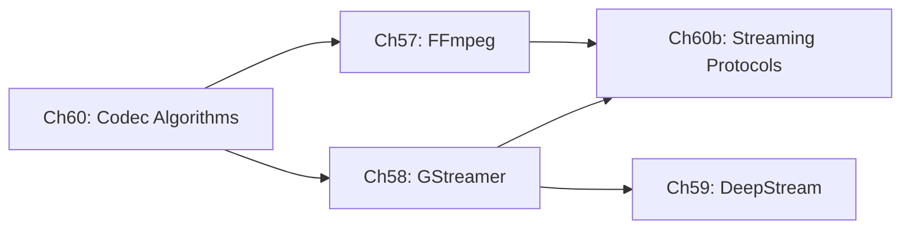

# Part XIII — Video Streaming on Linux

Video streaming occupies the layer of the Linux graphics stack that sits directly above hardware-accelerated codec paths — above the **VA-API** decode surfaces explored in Part V and the **Vulkan Video** queues introduced in Part X — and connects those low-level GPU resources to application-facing pipeline frameworks, adaptive delivery protocols, and AI-driven analytics systems. This part exists because the gap between "a decoded **AVFrame** in GPU memory" and "a live broadcast reaching millions of viewers" is not bridged by the kernel or the compositor alone: it requires codec algorithms, multimedia frameworks, streaming protocols, and orchestration SDKs that understand both the graphics stack below and the network above.

## Chapters in This Part

**Chapter 142 — V4L2 and the Linux Media Subsystem** establishes the kernel-level foundation for this part. It covers the **Video4Linux2 (V4L2)** subsystem architecture — `v4l2_device`, `video_device`, `vb2_queue` buffer management — and the **Media Controller API** that models complex ISP pipelines as directed graphs of pads and links. The chapter traces the capture path from sensor interrupt through **MIPI CSI-2** to **DMA-BUF** output, explains **V4L2 stateless decode** (`v4l2-codec2`, `V4L2_BUF_TYPE_VIDEO_CAPTURE_MPLANE`) as an alternative to VA-API on ARM SoCs, documents **V4L2 M2M** (memory-to-memory) devices for hardware-accelerated format conversion and scaling, covers **VB2** zero-copy via `V4L2_MEMORY_DMABUF` import/export with GBM/KMS, and surveys the **in-kernel ISP drivers** (`rkisp1`, `sun6i-csi`, `imx-media`). It is the prerequisite for understanding the V4L2 elements in Chapters 57 and 58 and for the embedded camera pipelines in Part XIX.

**Chapter 57 — FFmpeg Architecture, Programming, and CLI Reference** is the entry point for the part. It covers **libavformat**, **libavcodec**, **libavfilter**, **libswscale**, and the other five libraries that compose **FFmpeg**, walking through the core data structures (**AVFormatContext**, **AVCodecContext**, **AVPacket**, **AVFrame**) and the **send/receive** codec API. The chapter gives equal weight to GPU acceleration via **AVHWDeviceContext**, **VA-API**, **Vulkan hwaccel**, and **VDPAU**; to the **lavfi** filter-graph model; and to a practical CLI reference covering remuxing, transcoding, two-pass encoding, and hardware-accelerated pipelines. It also covers streaming protocol integration (**RTMP**, **RTSP**, **SRT**, **HLS**, **DASH**) from **FFmpeg**'s perspective and explains how to write custom **AVCodec** and **AVFilter** implementations.

**Chapter 58 — GStreamer: Pipeline-Based Multimedia** moves from a library API to a full pipeline framework built on **GLib**'s object system. The chapter explains the **GstElement** / **GstPad** / **GstCaps** object model, the **GstBuffer** memory hierarchy with **DMABuf** zero-copy paths and **GstVideoInfoDmaDrm** modifier-aware negotiation, and the **`va`** plugin that replaced **gstreamer-vaapi** in **GStreamer 1.28**. It also covers **V4L2** capture and stateless decode elements, adaptive streaming via **AdaptiveDemux2**, inter-process pipeline patterns including **PipeWire** integration, and plugin authoring in both C and Rust. Where Chapter 57 shows how to call **FFmpeg** APIs, Chapter 58 shows how to compose reusable pipeline elements that negotiate formats and share GPU buffers at runtime.

**Chapter 59 — NVIDIA DeepStream SDK** specialises Chapter 58's **GStreamer** foundation for multi-stream AI video analytics. It covers the **NvBufSurface** GPU buffer abstraction and its **CUDA**, **NVMM**, and **DMA-BUF** interop paths; the four-level **NvDsBatchMeta** metadata hierarchy; **Gst-nvinfer** and **TensorRT** engine integration; multi-stream batching via **nvstreammux**; object tracking via the **NvMOT API** (including **NvDCF**, **NvDeepSORT**, and **MaskTracker**/**SAM2**); cloud messaging with **NvMsgBroker**; and the **Service Maker** high-level C++ and Python APIs introduced in **DeepStream 9.0**. This chapter is the only one in the part that requires NVIDIA hardware and is self-contained enough to be read independently by ML engineers who already know **GStreamer**.

**Chapter 60 — Video Codec Algorithms and Implementations** steps back from frameworks and protocols to explain the mathematical foundations: the **2D DCT**, block-based motion estimation (Diamond, Hexagonal, and EPZS searches), sub-pixel interpolation, and **Decoded Picture Buffer (DPB)** management. It then traces four codec generations — **H.264/AVC**, **H.265/HEVC**, **AV1**, and **VVC/H.266** — explaining the entropy coders (**CABAC**, **ANS/MSAC**), in-loop filters (**deblocking**, **SAO**, **CDEF**, **Loop Restoration**), and encoder APIs (**x264**, **x265**, **libaom**, **rav1e**, **SVT-AV1**). This chapter is the theoretical anchor of the part: readers who want to understand why a given **VA-API** surface has the layout it does, or why **AV1** film-grain synthesis requires a separate GPU pass, will find the answers here.

**Chapter 60b — Video Streaming Protocols** addresses the network delivery layer that sits above the codec and framework layers. It covers **HLS** (**RFC 8216**) playlist grammar and **Low-Latency HLS** partial segments; **MPEG-DASH** **MPD** structure and **CMAF** chunked transfer for **LL-DASH**; **WebRTC** from **SDP** offer/answer through **ICE**/**STUN**/**TURN** to **DTLS-SRTP** and **RTP/RTCP** feedback loops, with **GStreamer** `webrtcbin` as the Linux integration point; **SRT** ARQ and latency budgeting via **libsrt**; and emerging **QUIC**-based transports (**WebTransport**, **MOQT**). The chapter also compares adaptive bitrate algorithms — throughput-based **EWMA**, buffer-based **BBA**, Lyapunov-optimal **BOLA**, model-predictive **MPC**, and reinforcement-learning **Pensieve** — grounding each in what a Linux packaging stack built on **FFmpeg** or **GStreamer** actually implements.

## How the Chapters Interrelate

**Chapter 60** is the conceptual prerequisite for all other chapters in the part. Its treatment of **NAL** unit structure, **DPB** management, **B-frame** DTS/PTS reordering, and rate-control theory directly informs the encoder and decoder configuration sections in Chapter 57 and the **VA-API** and **V4L2** element discussions in Chapter 58. Readers who already work professionally with **H.264** or **AV1** may skim Chapter 60 and return to specific sections on demand.

**Chapter 57** and **Chapter 58** are parallel rather than sequential: they cover the same hardware acceleration back-ends (**VA-API**, **Vulkan**, **V4L2**) through different programming models, and cross-reference each other frequently. Chapter 57's treatment of the **FFmpeg** `hls` and `dash` muxers provides the packaging half of Chapter 60b's delivery picture; Chapter 58's **AdaptiveDemux2** and `webrtcbin` provide the playback half. Neither chapter 57 nor 58 depends on the other, but reading both rewards the reader with a complete view of where **GStreamer** element negotiation and **FFmpeg** filter-graph topology make different architectural trade-offs.

**Chapter 60b** draws on both Chapter 57 (for **HLS**/**DASH** muxer configuration and **SRT**/**RTMP** protocol handling) and Chapter 58 (for `webrtcbin`, `hlsdemux2`, and `dashdemux2`). It also references Chapter 60's codec concepts when explaining how segment boundaries align with **IDR** frames and how **AV1**'s **temporal scalability** layers map onto **DASH** **AdaptationSet** groups.

**Chapter 59** sits to the side of this chain. It requires Chapter 58 as a prerequisite (the **GstBaseTransform** element model and **DMABuf** buffer sharing are assumed) and references Chapter 60's codec material implicitly through **TensorRT** input format requirements. It does not depend on Chapter 60b, but readers building end-to-end live-analytics pipelines will want to read Chapter 60b afterward to understand how annotated streams are packaged and delivered.

The shared data structures binding the part together are **DMA-BUF** file descriptors (flowing from kernel **V4L2** and **DRM** through every layer), **NV12** and **P010** planar frame layouts (the common output of every hardware decoder), and the **GOP** structure concepts from Chapter 60 (whose **IDR** boundaries govern segment cuts in Chapter 60b and batch boundaries in Chapter 59).

## Prerequisites and What Comes Next

Readers should arrive having read Part V (**VA-API** and hardware video acceleration, particularly Chapters 26 and 27) and Part X (**Vulkan Video** decode and encode, Chapter 50); familiarity with **DMA-BUF** buffer sharing (Chapter 25) and the **V4L2** capture subsystem (Chapter 12) is also assumed. The chapters in Part XIII build directly toward Part XIV (**AI and Compute on Linux**), which extends the **TensorRT** and **CUDA** concepts introduced in Chapter 59, and toward Part XV (**Browser and Web Platform**), which consumes the **WebRTC** and **WebCodecs** delivery infrastructure covered in Chapter 60b.

---
