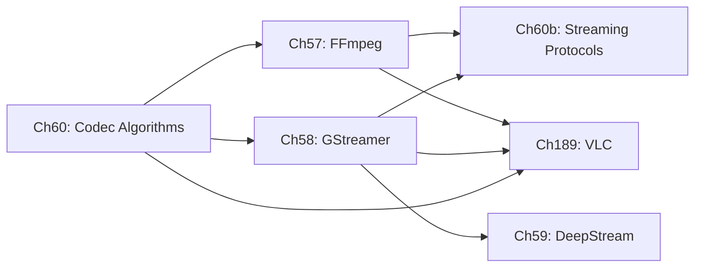

# Part XIII — Video Streaming on Linux

Video streaming occupies the layer of the Linux graphics stack that sits directly above hardware-accelerated codec paths — above the **VA-API** decode surfaces explored in Part V and the **Vulkan Video** queues introduced in Part X — and connects those low-level GPU resources to application-facing pipeline frameworks, adaptive delivery protocols, and AI-driven analytics systems. This part exists because the gap between "a decoded **AVFrame** in GPU memory" and "a live broadcast reaching millions of viewers" is not bridged by the kernel or the compositor alone: it requires codec algorithms, multimedia frameworks, streaming protocols, and orchestration SDKs that understand both the graphics stack below and the network above.

## Chapters in This Part

**Chapter 142 — V4L2 and the Linux Media Subsystem** establishes the kernel-level foundation for this part. It covers the **Video4Linux2 (V4L2)** subsystem architecture — `v4l2_device`, `video_device`, `vb2_queue` buffer management — and the **Media Controller API** that models complex ISP pipelines as directed graphs of pads and links. The chapter traces the capture path from sensor interrupt through **MIPI CSI-2** to **DMA-BUF** output, explains **V4L2 stateless decode** (`v4l2-codec2`, `V4L2_BUF_TYPE_VIDEO_CAPTURE_MPLANE`) as an alternative to VA-API on ARM SoCs, documents **V4L2 M2M** (memory-to-memory) devices for hardware-accelerated format conversion and scaling, covers **VB2** zero-copy via `V4L2_MEMORY_DMABUF` import/export with GBM/KMS, and surveys the **in-kernel ISP drivers** (`rkisp1`, `sun6i-csi`, `imx-media`). It is the prerequisite for understanding the V4L2 elements in Chapters 57 and 58 and for the embedded camera pipelines in Part XIX.

**Chapter 57 — FFmpeg Architecture, Programming, and CLI Reference** is the entry point for the part. It covers **libavformat**, **libavcodec**, **libavfilter**, **libswscale**, and the other five libraries that compose **FFmpeg**, walking through the core data structures (**AVFormatContext**, **AVCodecContext**, **AVPacket**, **AVFrame**) and the **send/receive** codec API. The chapter gives equal weight to GPU acceleration via **AVHWDeviceContext**, **VA-API**, **Vulkan hwaccel**, and **VDPAU**; to the **lavfi** filter-graph model; and to a practical CLI reference covering remuxing, transcoding, two-pass encoding, and hardware-accelerated pipelines. It also covers streaming protocol integration (**RTMP**, **RTSP**, **SRT**, **HLS**, **DASH**) from **FFmpeg**'s perspective and explains how to write custom **AVCodec** and **AVFilter** implementations.

**Chapter 58 — GStreamer: Pipeline-Based Multimedia** moves from a library API to a full pipeline framework built on **GLib**'s object system. The chapter explains the **GstElement** / **GstPad** / **GstCaps** object model, the **GstBuffer** memory hierarchy with **DMABuf** zero-copy paths and **GstVideoInfoDmaDrm** modifier-aware negotiation, and the **`va`** plugin that replaced **gstreamer-vaapi** in **GStreamer 1.28**. It also covers **V4L2** capture and stateless decode elements, adaptive streaming via **AdaptiveDemux2**, inter-process pipeline patterns including **PipeWire** integration, and plugin authoring in both C and Rust. Where Chapter 57 shows how to call **FFmpeg** APIs, Chapter 58 shows how to compose reusable pipeline elements that negotiate formats and share GPU buffers at runtime.

**Chapter 59 — NVIDIA DeepStream SDK** specialises Chapter 58's **GStreamer** foundation for multi-stream AI video analytics. It covers the **NvBufSurface** GPU buffer abstraction and its **CUDA**, **NVMM**, and **DMA-BUF** interop paths; the four-level **NvDsBatchMeta** metadata hierarchy; **Gst-nvinfer** and **TensorRT** engine integration; multi-stream batching via **nvstreammux**; object tracking via the **NvMOT API** (including **NvDCF**, **NvDeepSORT**, and **MaskTracker**/**SAM2**); cloud messaging with **NvMsgBroker**; and the **Service Maker** high-level C++ and Python APIs introduced in **DeepStream 9.0**. This chapter is the only one in the part that requires NVIDIA hardware and is self-contained enough to be read independently by ML engineers who already know **GStreamer**.

**Chapter 60 — Video Codec Algorithms and Implementations** steps back from frameworks and protocols to explain the mathematical foundations: the **2D DCT**, block-based motion estimation (Diamond, Hexagonal, and EPZS searches), sub-pixel interpolation, and **Decoded Picture Buffer (DPB)** management. It then traces four codec generations — **H.264/AVC**, **H.265/HEVC**, **AV1**, and **VVC/H.266** — explaining the entropy coders (**CABAC**, **ANS/MSAC**), in-loop filters (**deblocking**, **SAO**, **CDEF**, **Loop Restoration**), and encoder APIs (**x264**, **x265**, **libaom**, **rav1e**, **SVT-AV1**). This chapter is the theoretical anchor of the part: readers who want to understand why a given **VA-API** surface has the layout it does, or why **AV1** film-grain synthesis requires a separate GPU pass, will find the answers here.

**Chapter 189 — VLC Media Player: Architecture, GPU Acceleration, and the Linux Graphics Stack** examines VLC's plugin-based architecture from the perspective of the GPU and display pipeline. The chapter covers the module bank scoring system, the demux → decoder → vout pipeline, VA-API hardware decode via the `vaapi` codec plugin and zero-copy DMA-BUF surface export, V4L2 M2M decode for embedded platforms, the Wayland zero-copy video output (zwp_linux_dmabuf_v1 buffer import from VASurfaces), the OpenGL/EGL renderer using EGLImage interop, the new Vulkan renderer in VLC 4.0 with VK_EXT_external_memory_dma_buf format modifier import, libplacebo HDR tone mapping via Vulkan compute, PipeWire and PulseAudio audio output, HDMI passthrough for AC3/DTS/TrueHD, and VLC's transcoding and streaming (`--sout`) pipeline with VA-API hardware encode. The chapter positions VLC alongside FFmpeg (Ch57) and GStreamer (Ch58) to show where a self-contained media player differs architecturally from a framework or library.

**Chapter 60b — Video Streaming Protocols** addresses the network delivery layer that sits above the codec and framework layers. It covers **HLS** (**RFC 8216**) playlist grammar and **Low-Latency HLS** partial segments; **MPEG-DASH** **MPD** structure and **CMAF** chunked transfer for **LL-DASH**; **WebRTC** from **SDP** offer/answer through **ICE**/**STUN**/**TURN** to **DTLS-SRTP** and **RTP/RTCP** feedback loops, with **GStreamer** `webrtcbin` as the Linux integration point; **SRT** ARQ and latency budgeting via **libsrt**; and emerging **QUIC**-based transports (**WebTransport**, **MOQT**). The chapter also compares adaptive bitrate algorithms — throughput-based **EWMA**, buffer-based **BBA**, Lyapunov-optimal **BOLA**, model-predictive **MPC**, and reinforcement-learning **Pensieve** — grounding each in what a Linux packaging stack built on **FFmpeg** or **GStreamer** actually implements.

## Key Concepts

### Camera Capture: MIPI CSI-2, VB2, and ISP

**MIPI CSI-2 (Camera Serial Interface 2)** is the physical interface from image sensor to SoC. It uses 2 or 4 DPHY or CPHY lanes carrying compressed differential serial data. The sensor transmits RAW Bayer or YUV frames at up to several Gbps per lane. The CSI-2 receiver inside the SoC is a DMA engine that writes frames into memory via the IOMMU; V4L2 models this as a `v4l2_subdev` linked into a media controller graph.

**VB2 (videobuf2)** is the kernel framework for DMA buffer management in V4L2 drivers. It handles the mechanics of `VIDIOC_REQBUFS`, `VIDIOC_QBUF`/`VIDIOC_DQBUF`, and memory type selection (MMAP, USERPTR, DMABUF). For zero-copy GPU pipelines, buffers are allocated as GBM objects, exported as DMA-BUF file descriptors, and imported into V4L2 via `V4L2_MEMORY_DMABUF` — the same buffer flows directly from camera capture to GPU texture without a CPU copy.

**ISP (Image Signal Processor)** is the dedicated hardware pipeline between the RAW Bayer sensor output and a displayable frame. ISP stages include: demosaicing (converting Bayer CFA patterns to RGB), auto-white balance (AWB), auto-exposure (AE), noise reduction (NR), and lens shading correction. On-SoC ISPs (Rockchip RKISP1, Allwinner sun6i, NXP i.MX) are modelled as V4L2 sub-devices in the media controller graph. ISP tuning (AWB/AE gains, noise reduction parameters) is typically vendor-proprietary.

### Codec Workflows: Remuxing, Transcoding, Two-Pass Encoding

**Remuxing** is repackaging a media stream into a different container format without re-encoding the elementary streams. Example: `ffmpeg -i input.mkv -c copy output.mp4` copies H.264 video and AAC audio bitstreams unchanged into an MP4 container. Zero quality loss, very fast.

**Transcoding** is decode → re-encode to a different codec, resolution, or bitrate. Example: `ffmpeg -i input.h264 -c:v libx265 output.hevc` decodes H.264 and re-encodes to HEVC. Requires both a decoder and encoder; quality and bitrate tradeoffs apply.

**Two-pass encoding** runs the encoder twice: pass 1 analyses the content and writes statistics; pass 2 uses those statistics for optimal bit allocation. The result is better quality at a given bitrate compared to single-pass VBR (Variable Bit Rate), because the encoder knows future scene complexity in advance. Used for file-output encoding where latency is irrelevant; not usable for live streaming.

### Streaming Protocols

**RTMP (Real-Time Messaging Protocol)** is a TCP-based protocol originally developed by Adobe for Flash streaming. RTMP uses a persistent connection and multiplexes audio, video, and data channels. Despite Flash's death, RTMP remains the dominant **ingest** protocol for live streaming (Twitch, YouTube, Facebook Live all accept RTMP ingest) due to its low-latency properties and wide encoder support (OBS, FFmpeg).

**RTSP (Real-Time Streaming Protocol)** is a signaling protocol (like HTTP for media control) that negotiates media session setup; the actual media is transported via **RTP** over UDP or TCP. RTSP is used by IP cameras, CCTV systems, and traditional broadcast equipment. It is rarely used for internet delivery — HLS/DASH are preferred there.

**SRT (Secure Reliable Transport)** is a UDP-based low-latency transport protocol with ARQ (Automatic Repeat Request) and AES encryption. SRT is designed for unreliable networks: it maintains a live stream at configurable latency (typically 120–500 ms) by retransmitting lost packets within the latency budget. SRT is increasingly used for contribution links (venue → production) and as a streaming ingest alternative to RTMP.

**HLS (HTTP Live Streaming)** segments media into `.ts` (MPEG-TS) or `.fmp4` (Fragmented MP4) files and publishes a `.m3u8` playlist file. Clients poll or long-poll the playlist, downloading new segments as they appear. Standard HLS has ~6–30 s latency; **Low-Latency HLS** (Apple, 2019) uses partial segments and HTTP/2 push to achieve ~2–5 s latency.

**DASH (Dynamic Adaptive Streaming over HTTP)** uses an XML manifest (**MPD — Media Presentation Description**) describing available AdaptationSets (video bitrate ladders), Representations (individual quality levels), and SegmentTemplate URLs. **CMAF (Common Media Application Format)** is the fMP4 fragment format used for both HLS and DASH segments, enabling segment sharing between the two protocols. DASH + CMAF is the dominant standard for large-scale VOD and live streaming (Netflix, Amazon Prime, Disney+).

**WebRTC** uses **SDP (Session Description Protocol)** for offer/answer negotiation of codec capabilities, IP/port candidates, and transport parameters. **ICE (Interactive Connectivity Establishment)** with **STUN** (Session Traversal Utilities for NAT) and **TURN** (Traversal Using Relays around NAT) performs NAT traversal. Media is encrypted via **DTLS-SRTP** (Datagram TLS-keyed SRTP). The real-time transport uses **RTP** for media and **RTCP** for feedback (NACK, PLI, REMB/TWCC for bandwidth estimation).

### Codec Fundamentals

**NAL (Network Abstraction Layer)** units are the packetization layer for H.264 and H.265 bitstreams. Each NAL unit carries a header byte specifying the unit type (SPS, PPS, IDR slice, non-IDR P/B slice, SEI) and the payload. NAL units are delimited by start codes (`00 00 01` or `00 00 00 01`) in Annex B format (used in MPEG-TS) or by length prefixes in AVCC/HVCC format (used in MP4/ISOBMFF).

**IDR (Instantaneous Decoder Refresh)** is a keyframe in H.264/H.265 that resets all decoder state, including the **DPB (Decoded Picture Buffer)** of reference frames. A decoder can start decoding from an IDR without any prior context. Segment boundaries in HLS/DASH must align to IDR frames so that a player switching to a new segment can decode immediately. IDR frames are typically ~10× larger than P-frames at the same quality.

**GOP (Group of Pictures)** is the sequence of frames from one IDR to the next: IDR → P → P → B → B → P → ... The GOP length (keyframe interval) determines seek latency and segment boundary frequency. A 2-second GOP at 30 fps = 60 frames between keyframes. Shorter GOPs enable more frequent seek points and segment cuts but increase average bitrate.

**DPB (Decoded Picture Buffer)** is the decoder's list of reference frames held in memory for inter-prediction. H.264/H.265 P-frames and B-frames reference earlier (or later for B-frames) decoded frames in the DPB. DPB size is bounded by the codec level (H.264 level 4.1 = max 12 reference frames). GPU hardware decoders allocate DPB surfaces as `VASurface` or `VkImage` objects that remain referenced until they slide out of the DPB window.

**B-frame DTS/PTS:** B-frames are bidirectionally predicted — they can reference both past and future frames. This means they must be **decoded** out of display order. The **DTS (Decode Timestamp)** indicates when the decoder should consume the frame; the **PTS (Presentation Timestamp)** indicates when it should be displayed. For a B-frame sequence `I P B B P`, the decode order might be `I P P B B` but the display order is `I B B P P`. The DTS/PTS delta equals the decoder delay introduced by B-frames; a player must buffer decoded frames and reorder by PTS before display.

**Planar frame layout** describes how YCbCr/YUV pixel data is arranged in memory:
- **NV12**: Y plane (full resolution) + interleaved UV plane (half resolution): the most common 8-bit 4:2:0 layout for VA-API/V4L2 hardware decoders
- **P010**: 10-bit NV12 equivalent (MSB-packed 16-bit values for each sample): used for HDR H.265/AV1 decode
- **I420 (YU12)**: Y plane + separate U plane + separate V plane, each plane contiguous: common in software codecs but avoided in GPU pipelines due to U/V plane separate allocation

### Adaptive Bitrate Algorithms

**BOLA (Buffer-Occupancy-Based Lyapunov Algorithm)** selects the next segment quality level based on the current playback buffer occupancy using a Lyapunov utility function. BOLA provides provably optimal average bitrate subject to a rebuffering constraint, without requiring bandwidth estimation. Used in DASH.js reference player.

**BBA (Buffer-Based Adaptation)** selects quality purely based on buffer level thresholds (e.g. buffer < 10 s → lowest quality, buffer > 30 s → highest quality). Simple, robust to bandwidth estimation errors, but slower to adapt to sudden bandwidth changes.

**EWMA (Exponentially Weighted Moving Average)** is the classic throughput-based ABR algorithm: bandwidth estimate = α × latest_throughput + (1-α) × previous_estimate. Fast to implement but sensitive to bandwidth variability; smoothing factor α trades responsiveness for stability.

**MPC (Model Predictive Control)** ABR formulates quality selection as an optimisation problem over a horizon of future segments, predicting bandwidth with EWMA and maximising a combined utility function of bitrate, rebuffering, and quality smoothness. Used in Netflix's BBA2.

**ARQ (Automatic Repeat reQuest)** is SRT's packet loss recovery mechanism: the sender maintains a packet history buffer; the receiver sends NAK for missing packets; the sender retransmits within the configured latency budget (`SRTO_LATENCY`). If a packet cannot be retransmitted within the budget, it is dropped (SRT degrades gracefully under extreme loss rather than stalling).

### Entropy Coders and In-Loop Filters

**CABAC (Context-Adaptive Binary Arithmetic Coding)** is H.264/H.265's entropy coder. It encodes syntax elements (motion vectors, transform coefficients, prediction flags) as binary sequences using context-adapted probability models, achieving ~10–15% better compression than CAVLC at comparable quality. CABAC decoding is sequential and inherently serial, which is why H.264/H.265 decoder hardware devotes significant area to CABAC engines.

**ANS (Asymmetric Numeral Systems)** is AV1's entropy coder (specifically the rANS variant used in the DAALA/AOM codec research). ANS is faster for software implementations than arithmetic coding and is more amenable to SIMD optimisation; it is part of what makes AV1 software decode faster than HEVC at similar compression.

**In-loop filters** are applied to reconstructed frames *inside* the encode/decode loop, before those frames enter the DPB as references. They reduce blocking artefacts and ringing that degrade reference frame quality and propagate through inter-prediction:
- **Deblocking filter** (H.264/H.265/AV1): smooths block boundaries by detecting and softening sharp edges along 4×4/8×8/64×64 block boundaries
- **SAO (Sample Adaptive Offset)** (H.265): adds per-CTU offset tables to reduce banding and ringing artefacts
- **CDEF (Constrained Directional Enhancement Filter)** (AV1): directional filter that enhances edges without blurring
- **Loop Restoration** (AV1): Wiener filter + self-guided filter applied in larger 64×64 or 256×256 tiles to recover fine texture detail

## How the Chapters Interrelate

**Chapter 60** is the conceptual prerequisite for all other chapters in the part. Its treatment of **NAL** unit structure, **DPB** management, **B-frame** DTS/PTS reordering, and rate-control theory directly informs the encoder and decoder configuration sections in Chapter 57 and the **VA-API** and **V4L2** element discussions in Chapter 58. Readers who already work professionally with **H.264** or **AV1** may skim Chapter 60 and return to specific sections on demand.

**Chapter 57** and **Chapter 58** are parallel rather than sequential: they cover the same hardware acceleration back-ends (**VA-API**, **Vulkan**, **V4L2**) through different programming models, and cross-reference each other frequently. Chapter 57's treatment of the **FFmpeg** `hls` and `dash` muxers provides the packaging half of Chapter 60b's delivery picture; Chapter 58's **AdaptiveDemux2** and `webrtcbin` provide the playback half. Neither chapter 57 nor 58 depends on the other, but reading both rewards the reader with a complete view of where **GStreamer** element negotiation and **FFmpeg** filter-graph topology make different architectural trade-offs.

**Chapter 60b** draws on both Chapter 57 (for **HLS**/**DASH** muxer configuration and **SRT**/**RTMP** protocol handling) and Chapter 58 (for `webrtcbin`, `hlsdemux2`, and `dashdemux2`). It also references Chapter 60's codec concepts when explaining how segment boundaries align with **IDR** frames and how **AV1**'s **temporal scalability** layers map onto **DASH** **AdaptationSet** groups.

**Chapter 59** sits to the side of this chain. It requires Chapter 58 as a prerequisite (the **GstBaseTransform** element model and **DMABuf** buffer sharing are assumed) and references Chapter 60's codec material implicitly through **TensorRT** input format requirements. It does not depend on Chapter 60b, but readers building end-to-end live-analytics pipelines will want to read Chapter 60b afterward to understand how annotated streams are packaged and delivered.

The shared data structures binding the part together are **DMA-BUF** file descriptors (flowing from kernel **V4L2** and **DRM** through every layer), **NV12** and **P010** planar frame layouts (the common output of every hardware decoder), and the **GOP** structure concepts from Chapter 60 (whose **IDR** boundaries govern segment cuts in Chapter 60b and batch boundaries in Chapter 59).

## Prerequisites and What Comes Next

Readers should arrive having read Part V (**VA-API** and hardware video acceleration, particularly Chapters 26 and 27) and Part X (**Vulkan Video** decode and encode, Chapter 50); familiarity with **DMA-BUF** buffer sharing (Chapter 25) and the **V4L2** capture subsystem (Chapter 12) is also assumed. The chapters in Part XIII build directly toward Part XIV (**AI and Compute on Linux**), which extends the **TensorRT** and **CUDA** concepts introduced in Chapter 59, and toward Part XV (**Browser and Web Platform**), which consumes the **WebRTC** and **WebCodecs** delivery infrastructure covered in Chapter 60b.

---

## Part Roadmap Summary

*Synthesised from the Roadmap sections of this part's chapters.*

### Near-term (6–12 months)

- **VVC/H.266 codec support landing across the stack**: AV1 stateless V4L2 controls are stabilising in kernel 6.8–6.9 (Ch142), while VVC VA-API and Vulkan Video profiles approach provisional Khronos status (Ch60); FFmpeg is actively upstreaming `libvvdec`/`libvvenc` wrappers (Ch57), and GStreamer's `va` plugin is targeting `vah266enc` in the 1.30 cycle (Ch58).
- **AV1 hardware encode maturation**: NVIDIA Blackwell and AMD RDNA4 ship expanded AV1 encode quality modes (Ch60); FFmpeg's `av1_vaapi` and `av1_nvenc` paths are being updated alongside Mesa's `iHD` and `RadeonSI` back-ends (Ch57). AV1 hardware decode on RTX 40-series via the VA-API bridge is also expected to stabilise in VLC (Ch189).
- **Low-latency streaming protocol hardening**: MOQT (`draft-ietf-moq-transport`) is in IETF Last Call and nearing RFC status; LL-HLS production fixes are landing in the FFmpeg 7.x series; WHIP (RFC 9725) interoperability improves across OBS, MediaMTX, and GStreamer `whipsink`/`whepsrc` (Ch60b); SRT 1.6 finalises link-bonding semantics (Ch60b).
- **Zero-copy DMA-BUF gaps closing**: The `linux-drm-syncobj-v1` explicit sync path in VLC's Wayland output is being finalised for Mutter 48+/KWin 6.4+ (Ch189); `libcamerasrc` DMABuf modifier negotiation with `GstVideoInfoDmaDrm` caps is under active development (Ch58); the rp1-cfe driver (kernel 6.12) gains DMA-BUF fence integration with PiSP (Ch142).
- **DeepStream and tooling updates**: DeepStream 10.0 extends VLM inference to LLaVA-NeXT/InternVL; `nvstreammux2` adaptive batching becomes the default; FP8 TensorRT support (`nvinfer` `network-mode=4`) arrives for Hopper hardware (Ch59). PipeWire `libavdevice` screen-capture negotiation improves for Wayland xdg-desktop-portal sessions (Ch57). VLC 4.0 stable is approaching with its Qt6 UI and Vulkan renderer (Ch189).

### Medium-term (1–3 years)

- **Rust adoption in GStreamer and safety-critical parsing**: The GStreamer project is rewriting latency-sensitive container demuxers (`qtdemux`, `matroskademux`) in Rust via `gstreamer-rs`; `gst-plugins-bad` elements are progressively migrating to `gst-plugins-good` as V4L2 API coverage matures (Ch58, Ch142).
- **Unified hardware buffer abstraction**: Discussions on the GStreamer mailing list propose a single `GstHwMemory` abstraction merging `GstVaDmabufAllocator`, `GstVulkanMemory`, and `NvBufSurface`-style CUDA allocators (Ch58). The `V4L2_MEMORY_DMABUF` import path is expected to adopt DMA-heap (`/dev/dma_heap/`) as the preferred allocator shared with display and GPU subsystems (Ch142). FFmpeg's Scheduler gains dynamic graph reconfiguration for live-stream rendition changes (Ch57).
- **Vulkan Video becoming the universal encode path**: `VK_KHR_video_encode_av1` is expected to reach final extension status, enabling cross-vendor GPU encode without vendor-specific APIs (Ch60). FFmpeg's `av1_vulkan` is projected to transition to a hardware-assisted hybrid path once the extension is universally supported (Ch57). VLC may add a native Vulkan decode-to-display pipeline removing the VA-API hand-off (Ch189).
- **Adaptive and low-latency delivery evolution**: MOQT CDN relay deployment will enable a unified 50 ms–30 s latency continuum, likely displacing WebRTC SFU meshes for large audiences (Ch60b). WebTransport over HTTP/3 will replace long-poll LL-HLS as the preferred sub-second ABR delivery mechanism (Ch60b). CMAF Common Encryption with multi-DRM will become the baseline for all HLS/DASH deployments (Ch60b).
- **AI inference integrated inline with decode pipelines**: DeepStream's Cosmos world-model integration adds scene-level semantic annotations alongside per-object `NvDsBatchMeta` (Ch59). GStreamer is expected to gain `GstNpuAllocator` and inference base-class elements for on-chip NPU inference (Ch58). `nvdsanalytics` will gain neural-network-backed anomaly detection replacing rule-based thresholds (Ch59).
- **V4L2 explicit synchronisation and libcamera sandboxing**: The long-pending "fences for V4L2" series using `sync_file` fds is expected to be revived and merged, enabling V4L2 buffers to carry DRM-fence in/out-fences consumed by KMS and Wayland compositors (Ch142). libcamera's IPA sandboxing will evolve to Seccomp-based process isolation with a defined ABI for binary vendor IPA modules (Ch142).

### Long-term

- **Neural and learned video coding**: Neural video codecs replacing the DCT/motion-estimation pipeline with learned latent representations are transitioning from research toward standardisation (MPEG VCM, NIC/NVC) (Ch60). FFmpeg's DNN module (`libavfilter/dnn/`) is positioned as the integration layer for ONNX Runtime and OpenVINO GPU-accelerated inference in transcode pipelines (Ch57). Unified hardware codec engines combining fixed-function block-transform decode with programmable neural post-processing (super-resolution, grain synthesis) will require new VA-API and Vulkan Video extension surfaces (Ch60).
- **QUIC-native broadcast stack consolidating transport tiers**: QUIC may eventually subsume both SRT and WebRTC's transport layer, unifying ingest (SRT/RTMP), CDN (HLS/DASH), and real-time (WebRTC) under MOQT for distribution and WebTransport for the last mile (Ch60b). End-to-end hardware offload of the packaging pipeline — GPU-encoded CMAF chunks written directly to NVMe via RDMA and served over QUIC without CPU involvement — is a plausible direction as GPU-direct storage and io_uring capabilities mature (Ch60b).
- **Media controller extended to ML and next-generation camera interfaces**: The media controller topology model may grow to express ISP-attached NPU inference nodes as first-class entities on automotive SoCs (Ch142). MIPI CSI-3 and GMSL3/FPD-Link IV camera serialiser standards will require new link-type extensions to the V4L2 async notifier and subdev routing models (Ch142). Long-term unification of V4L2 stateless codec controls with structurally identical Vulkan Video SPS/PPS metadata could produce a shared userspace parsing layer serving both hardware paths (Ch142).
- **DeepStream redesigned around graph-native metadata and privacy-preserving analytics**: DeepStream's `NvDsBatchMeta` linked-list hierarchy is likely to be replaced by a typed tensor graph compatible with the MLCommons streaming inference API, with `nvinferserver` subsuming `nvinfer` under a single YAML-configured inference abstraction (Ch59). Privacy-preserving analytics — federated learning of tracker ReID galleries and on-device differential-privacy noise injection — is a long-horizon goal aligned with EU AI Act compliance for public-space deployments (Ch59).

---

*Copyright © 2026 jreuben11. Licensed under [CC BY 4.0](https://creativecommons.org/licenses/by/4.0/).*
