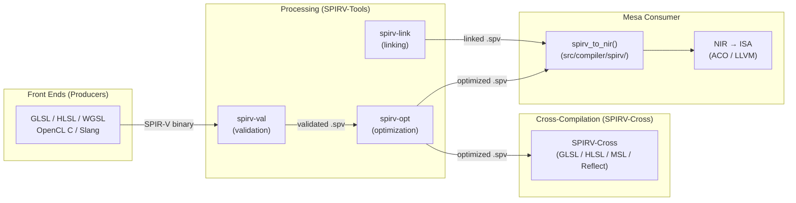
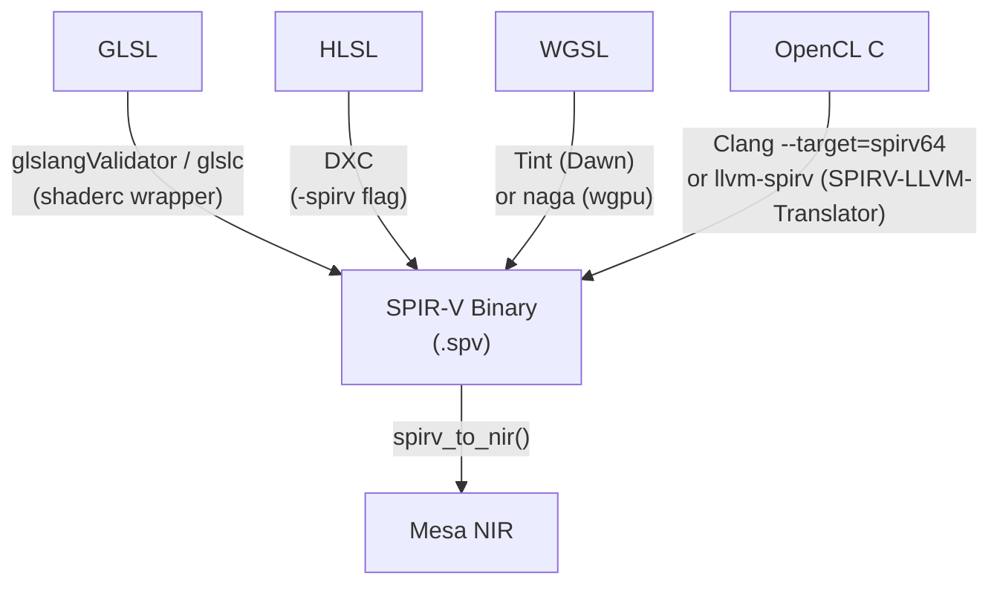
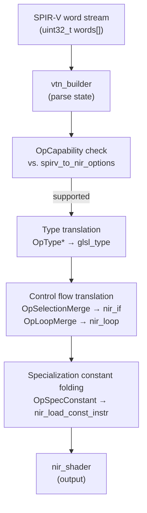
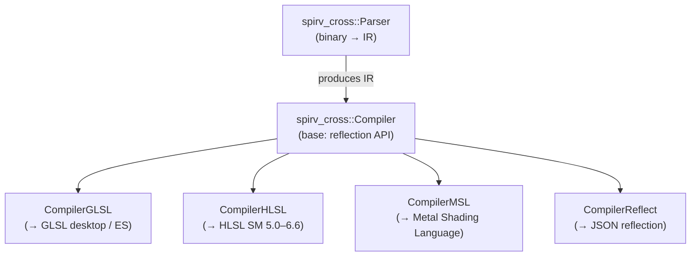
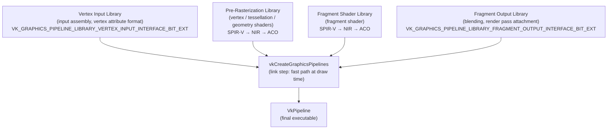

# Chapter 61: SPIR-V Ecosystem in Depth

> **Part**: Part XIV — Khronos Extended Ecosystem
> **Audience**: Graphics application developers and advanced readers familiar with Vulkan, shader compilation, and Mesa internals
> **Status**: First draft — 2026-06-15

---

## Table of Contents

1. [Overview](#overview)
2. [SPIR-V Module Structure](#1-spir-v-module-structure)
   - [Binary Header](#11-binary-header)
   - [Instruction Word Encoding](#12-instruction-word-encoding)
   - [Type System](#13-type-system)
   - [ID Namespace and Forward References](#14-id-namespace-and-forward-references)
   - [Logical Layout: Mandatory Section Ordering](#15-logical-layout-mandatory-section-ordering)
   - [1.6 What is SPIR-V?](#16-what-is-spir-v)
   - [1.7 What is SPIRV-Tools?](#17-what-is-spirv-tools)
   - [1.8 What is SPIRV-Cross?](#18-what-is-spirv-cross)
3. [Capabilities and the Extension Mechanism](#2-capabilities-and-the-extension-mechanism)
   - [OpCapability](#21-opcapability)
   - [OpExtension](#22-opextension)
   - [OpExtInstImport and Extended Instruction Sets](#23-opextinstimport-and-extended-instruction-sets)
   - [NonSemantic Extended Instruction Sets](#24-nonsemantic-extended-instruction-sets)
4. [SPIR-V Front Ends](#3-spir-v-front-ends)
   - [GLSL to SPIR-V via glslang](#31-glsl-to-spir-v-via-glslang)
   - [HLSL to SPIR-V via DXC](#32-hlsl-to-spir-v-via-dxc)
   - [WGSL to SPIR-V via Tint and naga](#33-wgsl-to-spir-v-via-tint-and-naga)
   - [OpenCL C to SPIR-V via Clang and LLVM](#34-opencl-c-to-spir-v-via-clang-and-llvm)
   - [SPIR-V to NIR in Mesa: Capability Mapping and Lowering](#35-spir-v-to-nir-in-mesa-capability-mapping-and-lowering)
5. [SPIRV-Tools in Depth](#4-spirv-tools-in-depth)
   - [Command-Line Tools](#41-command-line-tools)
   - [C API](#42-c-api)
   - [C++ Optimizer and Linker API](#43-c-optimizer-and-linker-api)
6. [spirv-opt Pass Analysis](#5-spirv-opt-pass-analysis)
   - [Pass Categories and When Each Helps](#51-pass-categories-and-when-each-helps)
   - [Interaction with Mesa NIR Lowering](#52-interaction-with-mesa-nir-lowering)
   - [Benchmarking spirv-opt vs. ACO Compile Time](#53-benchmarking-spirv-opt-vs-aco-compile-time)
7. [SPIRV-Cross: Cross-Compilation and Reflection](#6-spirv-cross-cross-compilation-and-reflection)
   - [Architecture and Targets](#61-architecture-and-targets)
   - [Reflection API](#62-reflection-api)
   - [Usage in ANGLE, DXVK, and MoltenVK](#63-usage-in-angle-dxvk-and-moltenVK)
8. [SPIR-V Debugging](#7-spir-v-debugging)
   - [NonSemantic.Shader.DebugInfo.100](#71-nonsemanticshaderdebuginfo100)
   - [NonSemantic.DebugPrintf](#72-nonsemanticdebugprintf)
   - [OpLine and VK_EXT_debug_utils Source Correlation](#73-opline-and-vk_ext_debug_utils-source-correlation)
   - [spirv-val Error Taxonomy](#74-spirv-val-error-taxonomy)
9. [Shader Compilation Pipeline Performance](#8-shader-compilation-pipeline-performance)
   - [Offline vs. Online Compilation](#81-offline-vs-online-compilation)
   - [Specialization Constants](#82-specialization-constants)
   - [VkPipelineCache and SPIR-V Module Caching](#83-vkpipelinecache-and-spir-v-module-caching)
   - [VK_EXT_graphics_pipeline_library for Partial SPIR-V Reuse](#84-vk_ext_graphics_pipeline_library-for-partial-spir-v-reuse)
10. [Integrations](#integrations)
11. [References](#references)

---

## Overview

**SPIR-V** is the intermediate shader language that connects every high-level shading language — **GLSL**, **HLSL**, **WGSL**, **OpenCL C**, and **Slang** — to every **GPU** driver back end on Linux. Since **Vulkan**'s 2016 launch it has served as the mandatory binary format for **Vulkan** shader modules; it is also the exchange format between **Mesa** front ends and **Mesa**'s internal **NIR** compiler **IR**. This chapter dissects the **SPIR-V** ecosystem from first principles.

The chapter opens with the binary module structure (Section 1): a **SPIR-V** module is a flat stream of 32-bit words beginning with a five-word fixed header encoding a magic number, version, generator magic, ID bound, and reserved schema field. Each instruction packs its opcode and word count into a single 32-bit word (bits 15:0 and 31:16 respectively), making the binary walkable without an opcode table. The module's static type system is declared via **OpType\*** instructions, all assigned result IDs in a module-global flat ID namespace:

- **Scalar types** — **OpTypeInt**, **OpTypeFloat**, **OpTypeBool**
- **Composite types** — **OpTypeVector**, **OpTypeMatrix**, **OpTypeArray**, **OpTypeRuntimeArray**, **OpTypeStruct**
- **Image and sampler types** — **OpTypeImage**, **OpTypeSampler**, **OpTypeSampledImage**
- **Pointer types** — **OpTypePointer**
- **Function types** — **OpTypeFunction**

The **SPIR-V** specification mandates a strict section ordering: **OpCapability** declarations, **OpExtension** strings, **OpExtInstImport** imports, **OpMemoryModel**, **OpEntryPoint**, **OpExecutionMode**, debug instructions, name instructions, **OpModuleProcessed**, annotation instructions, type/constant/global-variable declarations, and finally function definitions.

Section 2 covers the capability and extension mechanism. **OpCapability** declarations gate every instruction, built-in variable, decoration, and storage class behind named capabilities:

- **Shader**, **Geometry**, **Tessellation** — core pipeline stage capabilities
- **Float16**, **Float64** — extended precision arithmetic
- **PhysicalStorageBufferAddresses** — raw GPU buffer device address access
- **VulkanMemoryModel** — explicit memory ordering semantics
- **RayTracingKHR** — hardware ray tracing
- **MeshShadingEXT** — mesh and task shader stages
- **CooperativeMatrixKHR** — cooperative matrix operations for ML workloads

**OpExtension** declarations gate additional **SPIR-V** extensions:

- **SPV_KHR_non_semantic_info** — ignorable metadata embedding
- **SPV_KHR_physical_storage_buffer** — buffer device address support
- **SPV_EXT_shader_atomic_float_add** — atomic floating-point add operations
- **SPV_KHR_ray_tracing** — ray tracing instructions

**OpExtInstImport** imports extended instruction sets:

- **GLSL.std.450** — the standard math library (`Sin`, `Cos`, `Sqrt`, `Normalize`, and 65 more instructions) for the Graphics execution model
- **OpenCL.std** — the standard math library for the Kernel execution model

The **NonSemantic** extended instruction set family, introduced by **SPV_KHR_non_semantic_info**, allows tools to embed ignorable metadata:

- **NonSemantic.Shader.DebugInfo.100** — source-level debug information (covered in Section 7)
- **NonSemantic.DebugPrintf** — standardized `printf`-like shader debugging mechanism

Section 3 surveys the front ends that produce **SPIR-V**:

- **glslang** (`glslangValidator`) — the reference **GLSL** front end; the **shaderc** wrapper `glslc` adds a GCC-style interface
- **DXC** (DirectXShaderCompiler) — compiles **HLSL** to **SPIR-V** via its **SPIR-V** backend based on **Clang** and **LLVM**; consumed by **DXVK** and **VKD3D-Proton**
- **Tint** (**Dawn**'s shader compiler) — compiles **WGSL** to **SPIR-V**
- **naga** (**wgpu**'s Rust shader compiler) — compiles **WGSL** to **SPIR-V**; also used by **Bevy** through its **wgpu** dependency
- **Clang** targeting `spirv64-unknown-unknown` — compiles **OpenCL C** to **SPIR-V** directly since **LLVM** 15; the older **SPIRV-LLVM-Translator** (`llvm-spirv`) path remains important for Intel's **compute-runtime**

Mesa's **SPIR-V** consumer lives in `src/compiler/spirv/` with **spirv_to_nir()** as the entry point; it performs capability mapping against **spirv_to_nir_options**, translates **OpType\*** to **glsl_type** objects, maps **SPIR-V** structured control flow (**OpSelectionMerge**, **OpLoopMerge**) to **nir_if** and **nir_loop** nodes, and folds **OpSpecConstant** values from the **nir_spirv_specialization** array into **nir_load_const_instr** nodes.

Section 4 covers **SPIRV-Tools** in depth. The command-line toolkit includes:

- **spirv-as** — assembles text-format SPIR-V to binary
- **spirv-dis** — disassembles binary SPIR-V to text
- **spirv-val** — validates a SPIR-V module
- **spirv-opt** — applies optimization passes
- **spirv-link** — links separately compiled modules
- **spirv-cfg** — exports a GraphViz control-flow graph
- **spirv-reduce** — produces a minimal reproduction case

The C API (header `libspirv.h`) exposes:

- **spvContextCreate()** — creates a validation/processing context
- **spvTextToBinary()** — assembles text to binary
- **spvBinaryToText()** — disassembles binary to text
- **spvValidateBinary()** — validates a binary module
- **spvBinaryParse()** — zero-copy callback-based binary walker

The C++ API provides:

- **spvtools::Optimizer** — with **RegisterPerformancePasses()**, **RegisterSizePasses()**, and **RegisterLegalizationPasses()** presets
- **spvtools::Linker** — links separately compiled modules
- **spvtools::Context** — owns the SPIR-V target environment

Section 5 analyses **spirv-opt** passes in depth:

- **Inlining** — `--inline-entry-points-exhaustive` (cf. **nir_inline_functions()**)
- **SSA rewrite** — `--ssa-rewrite` (cf. **nir_lower_vars_to_ssa()**)
- **Dead code elimination** — `--eliminate-dead-code-aggressive`, `--eliminate-dead-branches`, `--eliminate-dead-functions` (cf. **nir_opt_dce()**)
- **Loop optimization** — `--loop-unroll`, `--loop-invariant-code-motion`, `--loop-peeling`
- **Scalar replacement** — `--scalar-replacement`
- **Specialization constant folding** — `--freeze-spec-const`, `--fold-spec-const-op-composite`
- **Memory model upgrade** — `--upgrade-memory-model`

The section maps each pass to its **NIR** equivalent in **Mesa** to identify which passes are redundant when the consumer is **RADV** or another Mesa **Vulkan** driver, and benchmarks **spirv-opt** preprocessing against **ACO** compile time.

Section 6 covers **SPIRV-Cross**, which parses **SPIR-V** and cross-compiles it to:

- **GLSL** (desktop and ES)
- **HLSL** (SM 5.0–6.6)
- **MSL** (Metal Shading Language)
- **JSON reflection**

The class hierarchy is **spirv_cross::Parser** → **spirv_cross::Compiler** (base reflection API) → **CompilerGLSL**, **CompilerHLSL**, **CompilerMSL**, **CompilerReflect**. The reflection API (via **get_shader_resources()**, **get_decoration()**, **get_type()**, **build_combined_image_samplers()**) enables runtime descriptor layout discovery. **SPIRV-Cross** is used by:

- **ANGLE** — for its **SPIR-V** → **GLSL** cross-compilation path
- **DXVK** — for extracting binding metadata from **DXC**-generated **SPIR-V**
- **MoltenVK** — as its sole shader translation layer to **MSL**

Section 7 covers **SPIR-V** debugging:

- **NonSemantic.Shader.DebugInfo.100** — embeds **DWARF**-compatible source locations via **DebugSource**, **DebugCompilationUnit**, **DebugFunction**, **DebugLine**, **DebugLocalVariable**, and **DebugValue**
- **NonSemantic.DebugPrintf** — provides `printf`-style output intercepted by **VK_EXT_debug_printf** and routed through the **VK_EXT_debug_utils** messenger
- **OpLine** — provides core source correlation consumed by tools such as **RenderDoc**
- **spirv-val error taxonomy** — covers structural/layout errors, capability and extension errors, semantic errors, and **CFG** errors

Section 8 addresses shader compilation pipeline performance:

- **Offline vs. online compilation** — trade-offs between build-time **GLSL**/HLSL → **SPIR-V** with **spirv-opt** (zero runtime cost) and online compilation via **shaderc** / **libshaderc** (10–500 ms latency)
- **Specialization constants** (**OpSpecConstant**, **VkSpecializationInfo**) — for producing optimally specialized pipeline variants
- **VkPipelineCache** — backed by **Mesa**'s disk cache at `~/.cache/mesa_shader_cache/`, keyed by **BLAKE3** hash of pipeline state, for eliminating repeated **SPIR-V** → **ISA** compilation
- **VK_EXT_graphics_pipeline_library** (**GPL**) — splits a pipeline into four independently compiled library stages to reduce first-use compile stalls; adopted by **DXVK** 2.0 and supported through **RADV**'s **ACO** backend

Readers who have worked through earlier chapters on **Mesa** **NIR** (Chapter 14) and **ACO** (Chapter 15) will recognise many of the data structures described here from the inside; this chapter provides the complementary view from the producer side. Graphics application developers who use **Vulkan** will learn enough about **SPIR-V** internals to interpret validator errors, apply the right optimizer passes, and make informed decisions about offline vs. online compilation. Browser and compute platform engineers who consume **SPIR-V** from **Tint** (Chapter 35) or **naga** (Chapter 40) will understand how those producers' output interacts with downstream tooling.



After reading this chapter you will be able to: walk a **SPIR-V** binary by hand; interpret every error class that **spirv-val** can emit; use the **SPIRV-Tools** C++ API to run the optimizer programmatically; use **SPIRV-Cross** to extract descriptor reflection data; understand which **spirv-opt** passes overlap with **Mesa** **NIR** work and should be skipped; and reason about the performance trade-offs between offline compilation, specialization constants, and pipeline caching.

---

## 1. SPIR-V Module Structure

### 1.1 Binary Header

A SPIR-V module is a flat, linear stream of 32-bit words in host byte order. SPIR-V itself carries no endianness indicator beyond the magic number: if the first word is `0x07230203` the stream is in host byte order; if it is `0x03022307` the stream is byte-swapped and a consumer must swap every word before parsing. The first five words form a fixed header. [Source: SPIR-V Specification](https://registry.khronos.org/SPIR-V/specs/unified1/SPIRV.html)

| Word | Field | Value |
|------|-------|-------|
| 0 | Magic | `0x07230203` |
| 1 | Version | `0x00MMmm00`: byte 2 = major, byte 1 = minor. SPIR-V 1.6 = `0x00010600` |
| 2 | Generator magic | High 16 bits = tool vendor ID, low 16 bits = tool version. glslang = 8; DXC = 6; Tint = 24; naga = 28 |
| 3 | Bound | One greater than the largest result ID in the module. Drivers may pre-allocate an ID table of this size. |
| 4 | Instruction schema | Reserved; must be 0. |

The current SPIR-V specification is **SPIR-V 1.6 Revision 7**, released 2026-03-12. SPIR-V 1.6 was standardized in December 2021 alongside Vulkan 1.3. It added `OpTerminateInvocation` as a replacement for `OpKill` and promoted several KHR extensions to core. A Vulkan 1.4 implementation must accept SPIR-V 1.0 through 1.6. [Source: Khronos SPIR-V landing page](https://www.khronos.org/spirv/)

> **Clarification**: `OpEmitMeshTasksEXT` and `OpSetMeshOutputsEXT` are **not** part of SPIR-V 1.6 core. They are defined by the `SPV_EXT_mesh_shader` SPIR-V extension, which must be declared with `OpExtension "SPV_EXT_mesh_shader"` in any module that uses them. The corresponding Vulkan extension is `VK_EXT_mesh_shader`. The `MeshShadingEXT` capability (Section 2.1) also requires this extension declaration alongside the capability. [Source: SPV_EXT_mesh_shader specification](https://github.com/KhronosGroup/SPIRV-Registry/blob/main/extensions/EXT/SPV_EXT_mesh_shader.asciidoc)

```cpp
// spirv.hpp — canonical version constants
// Source: SPIRV-Headers/include/spirv/unified1/spirv.hpp
static const uint32_t MagicNumber = 0x07230203u;
static const uint32_t Version     = 0x00010600u;  // SPIR-V 1.6
// Note: spirv.hpp encodes Revision = 1u in its header constants;
// "Revision 7" refers to the specification document revision, not this field.
```

[Source: SPIRV-Headers spirv.hpp](https://github.com/KhronosGroup/SPIRV-Headers/blob/main/include/spirv/unified1/spirv.hpp)

### 1.2 Instruction Word Encoding

Every instruction begins with a single 32-bit word that encodes two fields:

- **Bits 15:0** — opcode number (identifies the instruction type)
- **Bits 31:16** — word count (total words in this instruction, including the first word)

This two-field encoding makes module walking possible without an opcode table:

```c
// Walk a SPIR-V binary without decoding instruction semantics
// Source pattern from SPIRV-Guide/chapters/parsing_instructions.md
uint32_t offset = 5;  // skip the 5-word header
while (offset < wordCount) {
    uint32_t first   = pCode[offset];
    uint32_t opcode  = first & 0x0000ffffu;
    uint32_t length  = first >> 16;
    // pCode[offset .. offset+length-1] is the full instruction
    offset += length;
}
```

A practical use case: patching a descriptor binding number at load time without a full SPIR-V parser:

```c
// Rewrite a binding decoration in-place
// opcode == spv::OpDecorate (32), word[1] = target ID,
// word[2] = Decoration (33 = Binding), word[3] = value
if (opcode == spv::OpDecorate &&
    pCode[offset + 2] == spv::DecorationBinding) {
    pCode[offset + 3] = newBinding;
}
```

[Source: SPIRV-Guide parsing instructions](https://github.com/KhronosGroup/SPIRV-Guide/blob/main/chapters/parsing_instructions.md)

### 1.3 Type System

SPIR-V has a rich static type system. All types are declared with `OpType*` instructions in the type/constant/global-variable section of the module and assigned result IDs used wherever the type is referenced.

**Scalar types:**
- `OpTypeBool` — boolean; only usable in register (not in memory without a layout)
- `OpTypeInt <width> <signedness>` — e.g., `%uint = OpTypeInt 32 0`, `%int = OpTypeInt 32 1`, `%short = OpTypeInt 16 1`
- `OpTypeFloat <width>` — 16, 32, or 64 bits

**Composite types:**
- `OpTypeVector %scalar <count>` — e.g., `%v4f = OpTypeVector %float 4`; count must be 2–4 unless `Vector16` capability is declared
- `OpTypeMatrix %column_type <count>` — column-major matrix; requires `Matrix` capability
- `OpTypeArray %element_type %length` — fixed-size array; length must be a constant
- `OpTypeRuntimeArray %element_type` — variable-length array for SSBOs; requires `RuntimeDescriptorArray` capability with descriptor indexing
- `OpTypeStruct %member_type...` — aggregate; members may be decorated with `Offset`, `MatrixStride`, `RowMajor`, `ColMajor`, `NonWritable`, etc.

**Image and sampler types:**
- `OpTypeImage %sampled_type <Dim> <Depth> <Arrayed> <MS> <Sampled> <Format> [<AccessQualifier>]` — the Dim field encodes 1D/2D/3D/Cube/Rect/Buffer/SubpassData
- `OpTypeSampler` — opaque sampler handle; cannot be stored in composite (pre-Vulkan descriptor indexing)
- `OpTypeSampledImage %image_type` — GLSL-style combined image+sampler

**Pointer types:**
- `OpTypePointer <StorageClass> %type` — storage class encodes where the pointee lives: `UniformConstant`, `Input`, `Output`, `Workgroup`, `CrossWorkgroup`, `Private`, `Function`, `Generic`, `PushConstant`, `AtomicCounter`, `Image`, `StorageBuffer`, `PhysicalStorageBuffer` (requires the KHR extension)

**Function type:**
- `OpTypeFunction %return_type %param_type...` — used in `OpFunction`

Each type declaration is referenced by ID everywhere that type is needed; the ID namespace is flat and module-scoped.

### 1.4 ID Namespace and Forward References

Every instruction that produces a result is assigned a unique 32-bit result ID (`%id`). The ID namespace is module-global and flat: an ID assigned by any instruction in any function can be referenced from anywhere else in the module. Forward references (using an ID before its defining instruction) are permitted in a limited set of places specified by the spec — most importantly, function declarations may appear before their bodies, and `OpTypeForwardPointer` allows recursive struct types. The `Bound` header word must be set to one greater than the largest ID used, giving drivers a way to pre-allocate a table without scanning the module. `spirv-opt --compact-ids` renumbers all IDs to a compact range starting at 1, shrinking the bound and reducing driver table sizes.

[Source: SPIR-V Specification §2.3](https://registry.khronos.org/SPIR-V/specs/unified1/SPIRV.html)

### 1.5 Logical Layout: Mandatory Section Ordering

The SPIR-V specification mandates that module sections appear in this strict order:

1. `OpCapability` — all capability declarations
2. `OpExtension` — all extension name strings
3. `OpExtInstImport` — extended instruction set imports
4. `OpMemoryModel` — exactly one; addressing model and memory model
5. `OpEntryPoint` — one per shader entry point; names execution model, function ID, entry-point name, and interface variable IDs
6. `OpExecutionMode` / `OpExecutionModeId` — per-entry-point modes
7. Debug instructions: `OpString`, `OpSource`, `OpSourceContinued`, `OpSourceExtension`
8. Name instructions: `OpName`, `OpMemberName`
9. `OpModuleProcessed` — tool-chain processing markers
10. Annotation instructions: `OpDecorate`, `OpMemberDecorate`, `OpDecorationGroup`
11. Type, constant, and global-variable declarations
12. Function definitions

A minimal valid compute shader skeleton:

```spirv
; SPIR-V
; Version: 1.6
; Generator: glslang Reference Front End; 11
; Bound: 6
; Schema: 0
               OpCapability Shader
          %1 = OpExtInstImport "GLSL.std.450"
               OpMemoryModel Logical GLSL450
               OpEntryPoint GLCompute %main "main"
               OpExecutionMode %main LocalSize 64 1 1
       %void = OpTypeVoid
   %voidfunc = OpTypeFunction %void
       %main = OpFunction %void None %voidfunc
      %entry = OpLabel
               OpReturn
               OpFunctionEnd
```

[Source: SPIR-V assembly syntax reference](https://android.googlesource.com/platform/external/shaderc/spirv-tools/+/HEAD/syntax.md)

### 1.6 What is SPIR-V?

SPIR-V (Standard Portable Intermediate Representation — Vulkan) is a binary intermediate language for parallel compute and graphics shading, standardized by the Khronos Group. The format was designed to be consumed directly by GPU drivers as the mandatory shader input for Vulkan, eliminating driver-side high-level language compilers and the correctness divergences that accompanied them. SPIR-V encodes a shader program as a flat stream of 32-bit words in Static Single Assignment (SSA) form with a rich static type system, explicit control flow, and a capability-gating mechanism that restricts which instructions a module may use. Every Vulkan implementation since Vulkan 1.0 (2016) must accept SPIR-V as its shader input; Vulkan 1.3 mandated SPIR-V 1.5, and Vulkan 1.4 mandates SPIR-V 1.6. The format also serves as the exchange representation between Mesa's language front ends and its internal NIR compiler IR: `spirv_to_nir()` in `src/compiler/spirv/` translates SPIR-V to NIR before backend-specific compilation by ACO or LLVM. Outside Vulkan, SPIR-V is the shader format for OpenCL 2.2 and later. The binary structure — a fixed five-word header followed by variably-sized instructions each prefixed with opcode and word count — is designed to be parseable and walkable with no external tables, enabling efficient in-driver preprocessing and patching. [Source: SPIR-V Specification](https://registry.khronos.org/SPIR-V/specs/unified1/SPIRV.html)

### 1.7 What is SPIRV-Tools?

SPIRV-Tools is the Khronos-hosted open-source reference implementation of the SPIR-V toolchain, providing validation, optimization, assembly, disassembly, linking, and reduction of SPIR-V modules. The library and command-line tools are maintained in the `KhronosGroup/SPIRV-Tools` repository and are a required dependency of Mesa, glslang, DXC, and most Vulkan SDKs. The core library exposes a C API through `libspirv.h` and a C++ API through `spirv-tools/optimizer.hpp`; both operate on SPIR-V binary represented as arrays of `uint32_t` and carry a target-environment context such as `SPV_ENV_VULKAN_1_3` that governs which capabilities and extensions are valid. The command-line suite includes `spirv-val` for validation, `spirv-as` and `spirv-dis` for round-tripping between binary and human-readable text assembly, `spirv-opt` for applying optimization and legalization passes, `spirv-link` for linking separately compiled modules, `spirv-cfg` for exporting control-flow graphs as GraphViz dot files, and `spirv-reduce` for minimizing failing test cases to minimal reproducers. In the Linux graphics stack, SPIRV-Tools validation is run at offline build time in CI pipelines for shader libraries and at validation layer time via the Khronos Vulkan validation layer; `spirv-opt` is invoked by offline pipeline compilation tools and shader compilation pipelines to reduce module size or improve specialization-constant folding before driver ingestion. Sections 4 and 5 of this chapter cover the C++ API and optimization passes in depth. [Source: KhronosGroup/SPIRV-Tools](https://github.com/KhronosGroup/SPIRV-Tools)

### 1.8 What is SPIRV-Cross?

SPIRV-Cross is an open-source library that parses SPIR-V modules and cross-compiles them to other shading languages: GLSL (desktop and ES), HLSL (shader model 5.0 through 6.6), and MSL (Metal Shading Language). Beyond cross-compilation, it provides a reflection API that extracts descriptor binding metadata, push constant layouts, and resource types from a SPIR-V module at runtime without requiring the original high-level source. The library is structured around a class hierarchy rooted at `spirv_cross::Compiler`, with derived classes `CompilerGLSL`, `CompilerHLSL`, `CompilerMSL`, and `CompilerReflect`. Methods such as `get_shader_resources()`, `get_decoration()`, `get_type()`, and `build_combined_image_samplers()` enable engine frameworks to build descriptor set layouts at runtime by interrogating shader modules rather than maintaining separate reflection metadata files. In the Linux graphics stack, SPIRV-Cross is used by ANGLE for its SPIR-V to GLSL cross-compilation path when targeting OpenGL ES backends, by DXVK for extracting binding metadata from DXC-compiled SPIR-V, and by MoltenVK as its primary shader translation layer to MSL. The library accepts SPIR-V 1.0 through 1.6 and handles most graphics-stage and compute-stage capabilities defined in the core specification. Section 6 of this chapter covers SPIRV-Cross architecture, reflection API usage, and integration patterns in detail. [Source: KhronosGroup/SPIRV-Cross](https://github.com/KhronosGroup/SPIRV-Cross)

---

## 2. Capabilities and the Extension Mechanism

### 2.1 OpCapability

`OpCapability <Capability>` declares that the module requires a capability from the `Capability` enum. Every instruction, built-in variable, decoration, storage class, addressing model, and memory model is gated behind one or more capabilities. A validator rejects a module if an instruction is used whose required capability is not declared.

Key capabilities:
- `Shader` — the baseline for Vulkan graphics and compute (implies `Matrix`)
- `Kernel` — the OpenCL kernel execution model
- `Geometry`, `Tessellation` — geometry and tessellation shader stages
- `Float16`, `Float64`, `Int8`, `Int16`, `Int64` — extended numeric types
- `StorageBuffer16BitAccess` / `StorageBuffer8BitAccess` — 16/8-bit I/O in storage buffers (Vulkan 1.1+)
- `PhysicalStorageBufferAddresses` — physical pointer addresses via `SPV_KHR_physical_storage_buffer`
- `VulkanMemoryModel` — explicit Vulkan acquire/release semantics (stricter than GLSL450)
- `RayTracingKHR` — ray generation, intersection, any-hit, closest-hit, miss, callable shaders
- `MeshShadingEXT` — mesh and task shaders
- `CooperativeMatrixKHR` — subgroup-scoped matrix multiply-accumulate

Vulkan requires a minimum baseline of: `Matrix`, `Shader`, `InputAttachment`, `Sampled1D`, `Image1D`, `SampledBuffer`, `ImageBuffer`, `ImageQuery`, `DerivativeControl`. [Source: Vulkan SPIR-V environment appendix](https://docs.vulkan.org/spec/latest/appendices/spirvenv.html)

### 2.2 OpExtension

`OpExtension "name"` declares a SPIR-V extension required by the module, identified by a name string. Unlike Vulkan extensions, SPIR-V extensions gate additional instructions, decorations, or built-ins. Common extensions:

- `"SPV_KHR_non_semantic_info"` — allows NonSemantic extended instruction sets
- `"SPV_KHR_physical_storage_buffer"` — physical pointer types; enables the `PhysicalStorageBuffer` storage class
- `"SPV_EXT_shader_atomic_float_add"` — floating-point atomic add
- `"SPV_KHR_cooperative_matrix"` — cooperative matrix operations
- `"SPV_KHR_vulkan_memory_model"` — acquire/release memory ordering
- `"SPV_KHR_ray_tracing"` — standardized ray tracing model

### 2.3 OpExtInstImport and Extended Instruction Sets

`%id = OpExtInstImport "name"` imports an extended instruction set, assigning it an ID. Extended instructions are called with `OpExtInst %type %result %set-id <instruction-number> %operands...`.

**GLSL.std.450** is the standard math library for graphics shaders, defining 69 instructions including:

| ID | Instruction | ID | Instruction |
|----|-------------|----|----|
| 13 | `Sin` | 14 | `Cos` |
| 15 | `Tan` | 26 | `Pow` |
| 27 | `Exp` | 28 | `Log` |
| 31 | `Sqrt` | 32 | `InverseSqrt` |
| 43 | `Cross` | 66 | `Normalize` |
| 58 | `FMin` / 59 `UMin` / 60 `SMin` | 70 | `Reflect` |

Usage:
```spirv
%glsl   = OpExtInstImport "GLSL.std.450"
; later:
%sinVal = OpExtInst %float %glsl Sin %angle     ; instruction 13
%sqrtV  = OpExtInst %float %glsl Sqrt %value    ; instruction 31
```

**OpenCL.std** defines the OpenCL built-in library for the Kernel execution model.

[Source: SPIRV-Guide extended instruction sets](https://github.com/KhronosGroup/SPIRV-Guide/blob/main/chapters/extended_instruction_sets.md)

### 2.4 NonSemantic Extended Instruction Sets

NonSemantic instructions are an extension mechanism introduced with `SPV_KHR_non_semantic_info`. They are tagged such that any consumer that does not recognise them can safely ignore them without affecting correctness. Two families matter most:

**NonSemantic.Shader.DebugInfo.100** — Vulkan shader source-level debug information. See Section 7.1.

**NonSemantic.DebugPrintf** — a standardized `printf`-like mechanism for shader debugging. It replaces vendor-specific approaches:

```spirv
OpExtension "SPV_KHR_non_semantic_info"
%printf = OpExtInstImport "NonSemantic.DebugPrintf"

; DebugPrintf instruction: set=printf, instruction=1 (DebugPrintf)
; operands: format-string-ID, value...
%fmt = OpString "thread %d value %f\n"
OpExtInst %void %printf DebugPrintf %fmt %threadId %val
```

`VK_EXT_debug_printf` (the Vulkan layer) intercepts DebugPrintf instructions at pipeline creation time and routes output to the debug callback registered with `VK_EXT_debug_utils`. The Vulkan Validation Layers include a `debugPrintf` GPU-assisted validation mode that implements this. Unlike `printf` in OpenCL, NonSemantic.DebugPrintf output is asynchronous and only available after a queue submit completes; the maximum message length is driver-defined (typically 1024 bytes). [Source: Khronos Vulkan-Samples DebugPrintf](https://github.com/KhronosGroup/Vulkan-Samples/tree/main/samples/extensions/debug_printf)

---

## 3. SPIR-V Front Ends



### 3.1 GLSL to SPIR-V via glslang

`glslangValidator` (from the Khronos `glslang` repository) is the reference GLSL front end and most widely used SPIR-V producer. It performs GLSL lexing, parsing, AST construction, semantic analysis, and direct AST-to-SPIR-V emission without an intermediate IR.

```bash
# Auto-detect stage from file extension (.vert/.frag/.comp/.geom/.tesc/.tese)
glslangValidator -V shader.vert -o vert.spv
glslangValidator -V shader.frag -o frag.spv
glslangValidator -V shader.comp -o comp.spv

# Target SPIR-V 1.6 for Vulkan 1.3+
glslangValidator -V --target-env spirv1.6 shader.frag -o frag.spv

# Size-optimized (enables basic spirv-opt passes internally)
glslangValidator -V -Os shader.frag -o frag.spv

# Human-readable SPIR-V text output
glslangValidator -H shader.frag

# Preprocessor defines and HLSL input
glslangValidator -V -DDEBUG -DSAMPLES=4 shader.frag -o frag.spv
glslangValidator -V -D -S frag hlsl_shader.hlsl -o frag.spv
```

Internally, glslang calls into SPIRV-Tools via its `SpirvToolsTransform()` function (`SPIRV/SpvTools.cpp`) to run the optimizer when `-Os` or `-O` is requested. The `glslc` driver from the `shaderc` project wraps glslang with a GCC-style command-line interface: [Source: glslangValidator man page](https://manpages.ubuntu.com/manpages/focal/en/man1/glslangValidator.1.html)

```bash
# glslc: compile to SPIR-V binary
glslc -c shader.vert -o vert.spv

# SPIR-V assembly output
glslc -S shader.frag -o frag.spvasm

# Explicit Vulkan + SPIR-V version targeting
glslc -c --target-env=vulkan1.3 --target-spv=spv1.6 shader.frag -o out.spv

# Generate dependency files for build systems
glslc -c -MD -MF shader.d shader.vert -o shader.spv
```

glslc version defaults: Vulkan 1.0 → SPIR-V 1.0; Vulkan 1.1 → SPIR-V 1.3; Vulkan 1.2 → SPIR-V 1.5; Vulkan 1.3 → SPIR-V 1.6. [Source: glslc man page](https://man.archlinux.org/man/extra/shaderc/glslc.1.en)

### 3.2 HLSL to SPIR-V via DXC

DirectXShaderCompiler (DXC) compiles HLSL source to DXIL (Direct3D Intermediate Language) or to SPIR-V. The SPIR-V backend in DXC is maintained as an open-source component based on Clang and LLVM, with a specialized code-generation path targeting SPIR-V rather than DXIL.

```bash
# Compile HLSL vertex shader to SPIR-V
dxc -spirv -T vs_6_0 -E VSMain shader.hlsl -Fo vs.spv

# Fragment shader, SPIR-V 1.6, Vulkan 1.3 semantics
dxc -spirv -T ps_6_6 -E PSMain -fspv-target-env=vulkan1.3 shader.hlsl -Fo ps.spv

# Compute shader with NonSemantic debug info
dxc -spirv -T cs_6_6 -E CSMain \
    -fspv-extension=SPV_KHR_non_semantic_info \
    -fspv-debug=vulkan-with-source \
    compute.hlsl -Fo cs.spv

# HLSL wave intrinsics (subgroup operations)
dxc -spirv -T cs_6_0 -E CSMain -fspv-reflect wave.hlsl -Fo wave.spv
```

DXC's SPIR-V backend is consumed by DXVK (for translating D3D11 HLSL shaders) and VKD3D-Proton (for D3D12 HLSL). These translation layers compile HLSL to SPIR-V at draw time; the resulting SPIR-V enters the Mesa SPIR-V-to-NIR pipeline just like any Vulkan application's shader (see Chapter 28). [Source: DXC GitHub](https://github.com/microsoft/DirectXShaderCompiler)

### 3.3 WGSL to SPIR-V via Tint and naga

**Tint** (Dawn's shader compiler, Chapter 35) compiles WGSL to SPIR-V as one of its multiple backend targets. The SPIR-V output from Tint is validated by SPIRV-Tools before submission to Vulkan. Dawn also applies SPIRV-Tools optimizer passes to the output before passing it to the driver — specifically the legalization and performance passes.

**naga** (wgpu's shader compiler, used by Bevy via wgpu; Chapter 40) is a Rust shader compiler that accepts WGSL, GLSL, and SPIR-V as input and emits SPIR-V, GLSL, HLSL, and MSL. naga is part of the wgpu project — Bevy does not own naga directly but uses it through its wgpu dependency. The naga → SPIR-V path is used by wgpu's Vulkan backend, which Bevy targets. naga produces correct but not heavily optimized SPIR-V; wgpu optionally runs `spirv-opt` passes before submission. [Source: naga GitHub](https://github.com/gfx-rs/naga)

### 3.4 OpenCL C to SPIR-V via Clang and LLVM

Since LLVM 15, upstream LLVM includes a SPIR-V backend. The target triples are `spirv32-unknown-unknown`, `spirv64-unknown-unknown`, and `spirv64-unknown-vulkan1.3`:

```bash
# OpenCL C directly to SPIR-V via Clang's SPIR-V backend
clang --target=spirv64 kernel.cl -o kernel.spv

# Specific SPIR-V version
clang --target=spirv64v1.5 kernel.cl -o kernel.spv

# Vulkan compute target
clang --target=spirv64-unknown-vulkan1.3 kernel.cl -o kernel.spv

# Via llc from LLVM IR
llc -mtriple=spirv64-unknown-unknown input.ll -o output.spv

# Enable specific SPIR-V extensions
llc -O1 --spirv-ext=+SPV_KHR_non_semantic_info input.ll -o out.spv
```

The older path uses the **SPIRV-LLVM-Translator** (`llvm-spirv`), which remains important for Intel's OpenCL implementation (compute-runtime):

```bash
# Step 1: LLVM bitcode from OpenCL C
clang -target spir64-unknown-unknown -c -emit-llvm kernel.cl -o kernel.bc

# Step 2: SPIR-V from LLVM bitcode
llvm-spirv kernel.bc -o kernel.spv

# Reverse: SPIR-V back to LLVM IR (for inspection)
llvm-spirv -r kernel.spv -o kernel.bc
```

[Source: LLVM SPIR-V backend usage](https://llvm.org/docs/SPIRVUsage.html), [Source: SPIRV-LLVM-Translator README](https://github.com/KhronosGroup/SPIRV-LLVM-Translator/blob/main/README.md)

### 3.5 SPIR-V to NIR in Mesa: Capability Mapping and Lowering

Mesa's SPIR-V consumer lives in `src/compiler/spirv/`, with `spirv_to_nir.c` as the entry point. Every Mesa Vulkan driver — RADV (AMD), ANV (Intel), NVK (NVIDIA), Turnip (Qualcomm) — begins pipeline compilation with:

```c
/* Source: src/compiler/spirv/spirv_to_nir.c */
nir_shader *
spirv_to_nir(const uint32_t *words, size_t word_count,
             struct nir_spirv_specialization *spec, unsigned num_spec,
             gl_shader_stage stage,
             const struct spirv_to_nir_options *options,
             const nir_shader_compiler_options *nir_options);
```

The `spirv_to_nir_options` struct communicates which SPIR-V capabilities and extensions the driver supports, robustness requirements (whether to emit bounds-check code around buffer accesses when `VK_EXT_robustness2` is enabled), and physical-address handling flags. The parser builds a `vtn_builder` that holds parse state through a single pass over the SPIR-V word stream.



**Capability mapping**: Each `OpCapability` declaration is checked against the driver's declared support set in `spirv_to_nir_options`. Unsupported capabilities cause `spirv_to_nir()` to fail before translation begins. Capabilities map to NIR features: `Shader` enables the graphics execution model; `PhysicalStorageBufferAddresses` enables `nir_var_mem_global` storage class; `VulkanMemoryModel` enables NIR memory barrier semantic lowering that maps to Vulkan's explicit acquire/release model. [Source: Mesa spirv_to_nir.c](https://gitlab.freedesktop.org/mesa/mesa/-/blob/main/src/compiler/spirv/spirv_to_nir.c)

**Type translation**: SPIR-V `OpType*` instructions translate to `glsl_type` objects. `OpTypeFloat 32` → `glsl_type::float_type`; `OpTypeVector %float 4` → `glsl_type::vec4_type`; `OpTypePointer UniformConstant %sampler` → `nir_variable` with mode `nir_var_uniform`. `OpTypeStruct` becomes a `glsl_type` named struct; the struct member offsets are carried as SPIR-V `Offset` decorations and preserved through the NIR type.

**Control flow translation**: SPIR-V structured control flow maps directly to NIR structured control flow. `OpBranchConditional` driving a `OpSelectionMerge` merge block becomes `nir_if`; `OpBranch` driving a `OpLoopMerge` block becomes `nir_loop`. The `OpLoopMerge` / `OpSelectionMerge` headers carry the merge block IDs that tell the NIR translator where each structured region ends.

**Specialization constants**: `OpSpecConstant` instructions with matching IDs in the `nir_spirv_specialization` array are folded into `nir_load_const_instr` nodes. Unspecialized constants become `nir_intrinsic_load_constant` which later passes can fold. This is how `VkSpecializationInfo` values are applied to NIR at the translation stage.

**Redundant NIR passes**: Because `spirv_to_nir()` performs local algebraic simplification as it translates, and because RADV immediately runs `radv_optimize_nir()` (which applies DCE, constant folding, and algebraic simplification passes) before passing NIR to ACO, running `spirv-opt` passes that duplicate this work — such as `--eliminate-dead-code-aggressive` or `--ssa-rewrite` — offers diminishing returns on RADV. See Section 5.2.

---

## 4. SPIRV-Tools in Depth

SPIRV-Tools is the Khronos reference implementation for SPIR-V processing. The current version is **v2026.2**, released 2026-04-24. It provides assembler, disassembler, validator, optimizer, linker, reducer, and fuzzer. Build requirements: CMake 3.17+, Python 3, C++17. [Source: SPIRV-Tools GitHub](https://github.com/KhronosGroup/SPIRV-Tools)

```bash
git clone https://github.com/KhronosGroup/SPIRV-Tools
cd SPIRV-Tools && mkdir build && cd build
cmake -DCMAKE_BUILD_TYPE=Release ..
cmake --build . --parallel $(nproc)
```

### 4.1 Command-Line Tools

**spirv-as** — assemble text (`.spvasm`) to binary (`.spv`):
```bash
spirv-as shader.spvasm -o shader.spv
spirv-as --target-env vulkan1.3 shader.spvasm -o shader.spv
```

**spirv-dis** — disassemble binary to human-readable text:
```bash
spirv-dis shader.spv                      # to stdout (ANSI color on terminals)
spirv-dis shader.spv -o shader.spvasm     # to file
spirv-dis --raw-id shader.spv             # use numeric %1/%2 IDs not %name
```

**spirv-val** — validate against specification rules:
```bash
spirv-val shader.spv
spirv-val --target-env vulkan1.3 shader.spv
# Returns 0 on success; non-zero with error location on failure
```

**spirv-opt** — multi-pass optimizer (see Section 5 for pass analysis):
```bash
spirv-opt -O  shader.spv -o opt.spv       # performance preset
spirv-opt -Os shader.spv -o small.spv    # size preset
spirv-opt --target-env vulkan1.3 -Os shader.spv -o out.spv
```

**spirv-link** — link separately compiled SPIR-V modules:
```bash
spirv-link a.spv b.spv -o linked.spv           # executable (no exports retained)
spirv-link --create-library a.spv b.spv -o lib.spv   # library (exports kept)
```

For linking to work, exported symbols must carry the `LinkageAttributes` decoration: `OpDecorate %func LinkageAttributes "funcName" Export`; imports use `Import`.

**spirv-cfg** — emit a GraphViz control flow graph:
```bash
spirv-cfg shader.spv | dot -Tpng -o cfg.png
```

**spirv-reduce** — reduce a failing module to a minimal reproduction case; useful when filing driver bugs.

### 4.2 C API

Header: `include/spirv-tools/libspirv.h`. The C API provides ABI stability:

```c
// Source: SPIRV-Tools/include/spirv-tools/libspirv.h

// Context lifecycle
spv_context spvContextCreate(spv_target_env env);
void        spvContextDestroy(spv_context ctx);

// Assemble text to binary
spv_result_t spvTextToBinary(spv_context ctx,
    const char* text, size_t length,
    spv_binary* binary, spv_diagnostic* diag);

// Disassemble binary to text
spv_result_t spvBinaryToText(spv_context ctx,
    const uint32_t* binary, size_t wordCount,
    uint32_t options,          // SPV_BINARY_TO_TEXT_OPTION_*
    spv_text* text, spv_diagnostic* diag);

// Validate binary
spv_result_t spvValidateBinary(spv_context ctx,
    const uint32_t* words, size_t numWords, spv_diagnostic* diag);

// Walk binary with callbacks (zero-copy parser)
spv_result_t spvBinaryParse(spv_context ctx, void* user_data,
    const uint32_t* words, size_t numWords,
    spv_parsed_header_fn_t    parse_header,
    spv_parsed_instruction_fn_t parse_instruction,
    spv_diagnostic* diag);

void spvDiagnosticDestroy(spv_diagnostic diag);
```

`spv_target_env` covers `SPV_ENV_UNIVERSAL_1_0` through `SPV_ENV_UNIVERSAL_1_6`, `SPV_ENV_VULKAN_1_0` through `SPV_ENV_VULKAN_1_4`, `SPV_ENV_OPENCL_1_2`, `SPV_ENV_OPENCL_2_2`, and WebGPU variants. Return codes: `SPV_SUCCESS (0)`, `SPV_ERROR_INVALID_BINARY`, `SPV_ERROR_INVALID_CFG`, `SPV_ERROR_INVALID_CAPABILITY`, `SPV_ERROR_INVALID_LAYOUT`.

[Source: SPIRV-Tools libspirv.h](https://github.com/KhronosGroup/SPIRV-Tools/blob/main/include/spirv-tools/libspirv.h)

### 4.3 C++ Optimizer and Linker API

Three C++ classes in the `spvtools` namespace provide the main workflow:

**Optimizer** (`include/spirv-tools/optimizer.hpp`):

```cpp
// Source: SPIRV-Tools/include/spirv-tools/optimizer.hpp (usage pattern)
spvtools::Optimizer optimizer(SPV_ENV_VULKAN_1_3);
optimizer.SetMessageConsumer([](spv_message_level_t, const char*,
    const spv_position_t&, const char* msg) {
    fprintf(stderr, "spirv-opt: %s\n", msg);
});

// Individual pass registration:
optimizer.RegisterPass(spvtools::CreateStripDebugInfoPass());
optimizer.RegisterPass(spvtools::CreateDeadBranchElimPass());
optimizer.RegisterPass(spvtools::CreateMergeReturnPass());
optimizer.RegisterPass(spvtools::CreateInlineExhaustivePass());
optimizer.RegisterPass(spvtools::CreateAggressiveDCEPass());
optimizer.RegisterPass(spvtools::CreateSSARewritePass());
optimizer.RegisterPass(spvtools::CreateRedundancyEliminationPass());
optimizer.RegisterPass(spvtools::CreateCFGCleanupPass());

// Or use presets matching -O / -Os / -Olegalize:
optimizer.RegisterPerformancePasses(/*preserve_interface=*/false);
// optimizer.RegisterSizePasses();
// optimizer.RegisterLegalizationPasses();  // for HLSL-sourced SPIR-V

std::vector<uint32_t> spirv = load_spirv("shader.spv");
spvtools::OptimizerOptions opt_opts;
optimizer.Run(spirv.data(), spirv.size(), &spirv, opt_opts);
```

This is the same sequence used in glslang's `SpirvToolsTransform()` function. [Source: glslang SpvTools.cpp](https://github.com/KhronosGroup/glslang/blob/main/SPIRV/SpvTools.cpp)

**Linker** (`include/spirv-tools/linker.hpp`):

```cpp
// Source: SPIRV-Tools/include/spirv-tools/linker.hpp
spvtools::LinkerOptions opts;
opts.SetCreateLibrary(false);      // false = executable, true = library
opts.SetVerifyIds(true);
opts.SetUseHighestVersion(true);   // adopt highest SPIR-V version among inputs

spvtools::Context context(SPV_ENV_VULKAN_1_3);
std::vector<uint32_t> linked;
spvtools::Link(context,
    {moduleA_words, moduleB_words},
    &linked, opts);
```

---

## 5. spirv-opt Pass Analysis

### 5.1 Pass Categories and When Each Helps

Understanding which passes help and which hurt is necessary for building an effective offline optimization pipeline. The passes fall into categories with distinct cost/benefit profiles:

**Inlining** (`--inline-entry-points-exhaustive`): Inlines all function calls reachable from entry points. This is the most critical pass to run first — many other passes (DCE, scalar replacement, SSA rewrite) only become effective after the call graph is collapsed to a single function. Cost: can cause code-size explosion for deeply nested utility functions. When to skip: if the driver's NIR front end calls `nir_inline_functions()` anyway (all Mesa Vulkan drivers do), this pass duplicates work and inflates SPIR-V binary size without benefit.

**SSA rewrite** (`--ssa-rewrite`): Promotes loads and stores through local variables to SSA values, enabling downstream constant propagation and DCE. Cost: low; run after inlining.

**Dead code elimination** (`--eliminate-dead-code-aggressive`, `--eliminate-dead-branches`, `--eliminate-dead-functions`): Removes instructions not on any path from entry to output. `--eliminate-dead-branches` converts constant-condition branches to unconditional ones; useful when specialization constants have been frozen (see `--freeze-spec-const`). Cost: negligible.

**Loop optimization** (`--loop-unroll`, `--loop-invariant-code-motion`, `--loop-peeling`): Loop unrolling is the highest-risk pass. For loops with large trip counts it produces code-size explosions that overwhelm both the SPIR-V binary size budget and the driver's instruction-selection pass. Restrict unrolling to loops explicitly tagged with the GLSL `unroll` hint (which glslang encodes as `LoopControl Unroll` in the `OpLoopMerge`). Loop invariant code motion (LICM) is safe and commonly beneficial: it hoists redundant loads and address computations out of hot loops.

**Scalar replacement** (`--scalar-replacement[=<n>]`): Replaces aggregate variables with scalar elements, enabling register allocation to avoid memory traffic. Beneficial for composite struct accesses; the `<n>` limit prevents combinatorial explosion on large arrays.

**Specialization constant folding** (`--freeze-spec-const`, `--fold-spec-const-op-composite`, `--set-spec-const-default-value`): When specialization constants are known at build time (e.g., a fixed workgroup size), these passes fold them to constants and enable DCE of dead branches. This is the primary mechanism for producing a series of optimally specialized pipeline variants from a single source shader.

```bash
# Offline specialization: set spec constant 0 = 16, constant 1 = 0 (false)
spirv-opt --set-spec-const-default-value="0:16 1:0" \
          --freeze-spec-const \
          --fold-spec-const-op-composite \
          --eliminate-dead-branches \
          shader.spv -o specialized.spv
```

**Memory model upgrade** (`--upgrade-memory-model`): Upgrades `OpMemoryModel Logical GLSL450` to `Logical VulkanKHR`, enabling strict Vulkan acquire/release ordering. Required when emitting shaders for the Vulkan memory model extension. Cost: may expose driver bugs in VulkanKHR-model handling.

### 5.2 Interaction with Mesa NIR Lowering

Several `spirv-opt` passes duplicate work that Mesa's NIR pipeline performs, making them redundant when the consumer is a Mesa driver. Understanding this overlap avoids wasted compilation time in offline build pipelines:

| spirv-opt pass | NIR equivalent | Redundant for Mesa? |
|---|---|---|
| `--eliminate-dead-code-aggressive` | `nir_opt_dce()` in `radv_optimize_nir()` | Yes — RADV runs DCE on NIR immediately after `spirv_to_nir()` |
| `--ssa-rewrite` | `nir_lower_vars_to_ssa()` | Partially — NIR SSA promotion happens post-translation |
| `--inline-entry-points-exhaustive` | `nir_inline_functions()` | Yes — Mesa inlines immediately post-translation |
| `--scalar-replacement` | `nir_opt_shrink_vectors()`, `nir_lower_ssa_defs_to_regs_pass()` | Partially — NIR has equivalent passes |
| `--eliminate-dead-branches` | `nir_opt_dead_cf()` | Yes |
| `--freeze-spec-const` + `--fold-spec-const-op-composite` | `spirv_to_nir()` folding via `nir_spirv_specialization` | Yes — specialization constants are folded at NIR translation |
| `--loop-unroll` | `nir_loop_unroll()` | No — NIR loop unrolling is distinct and operates at a later stage |

The passes that provide net benefit even for Mesa targets are those that reduce SPIR-V binary size before it enters the driver (reducing parsing overhead) and those that expose optimization opportunities not covered by NIR. The size presets (`-Os`) are generally safe and beneficial; the performance preset (`-O`) should be evaluated per-driver because it enables inlining and loop transformations that may conflict with NIR passes. [Source: Mesa spirv_to_nir.c and RADV radv_shader.c](https://gitlab.freedesktop.org/mesa/mesa/-/blob/main/src/amd/vulkan/radv_shader.c)

### 5.3 Benchmarking spirv-opt vs. ACO Compile Time

ACO's design goal was 2–10× faster shader compilation compared to LLVM. Phoronix measurements at the ACO 2019 introduction confirmed 2–5× improvements on typical DXVK workloads. Running `spirv-opt` preprocessing does not help ACO's compile time — ACO's bottleneck is instruction selection and linear-scan register allocation on NIR, not SPIR-V parsing. Adding `spirv-opt` to an offline build pipeline adds 5–50 ms per shader depending on pass set and shader size; this cost is amortized to zero at runtime if done at build time.

The relevant trade-off is: running spirv-opt at build time to reduce NIR parse complexity vs. relying on ACO to handle complex NIR efficiently. For DXVK and VKD3D-Proton, which compile SPIR-V at runtime, `spirv-opt` cannot be run offline; for application developers with control over their shader pipeline, offline optimization remains worthwhile primarily for binary size reduction (60%+ reduction commonly achievable) rather than ACO compile time. [Source: Chapter 15 (ACO), Phoronix RADV ACO benchmark](https://www.phoronix.com/review/radv-aco-okt)

---

## 6. SPIRV-Cross: Cross-Compilation and Reflection

### 6.1 Architecture and Targets

SPIRV-Cross parses SPIR-V and translates it to other shading languages. Supported output targets: GLSL (desktop and ES), HLSL (DirectX SM 5.0–6.6), MSL (Metal Shading Language), and JSON reflection. The C++ backend has been deprecated. [Source: SPIRV-Cross GitHub](https://github.com/KhronosGroup/SPIRV-Cross)

The class hierarchy: `spirv_cross::Parser` (binary → IR); `spirv_cross::Compiler` (base, provides reflection); `CompilerGLSL`, `CompilerHLSL`, `CompilerMSL`, `CompilerReflect`.



```cpp
// Source: SPIRV-Cross, spirv_cross/spirv_glsl.hpp (usage pattern)
// When installed system-wide or via CMake find_package, headers live under
// the spirv_cross/ subdirectory prefix.
#include "spirv_cross/spirv_cross.hpp"
#include "spirv_cross/spirv_glsl.hpp"

std::vector<uint32_t> spirv = load_spirv("shader.spv");
spirv_cross::CompilerGLSL glsl(std::move(spirv));

spirv_cross::CompilerGLSL::Options opts;
opts.version = 450;
opts.es = false;
opts.flatten_multidimensional_arrays = true;
glsl.set_common_options(opts);

std::string source = glsl.compile();
```

Command-line:
```bash
spirv-cross shader.spv --glsl --version 450 --output shader.glsl
spirv-cross shader.spv --hlsl --shader-model 60 --output shader.hlsl
spirv-cross shader.spv --msl --msl-version 30000 --output shader.metal
spirv-cross shader.spv --reflect --output reflection.json
spirv-cross shader.spv --dump-resources   # quick reflection to stdout
```

[Source: SPIRV-Cross man page](https://manpages.ubuntu.com/manpages/jammy/man1/spirv-cross.1.html)

### 6.2 Reflection API

The reflection API enables runtime descriptor layout discovery without parsing SPIR-V manually:

```cpp
// Source: SPIRV-Cross, Reflection API user guide
spirv_cross::Compiler comp(std::move(spirv));

spirv_cross::ShaderResources res = comp.get_shader_resources();
// ShaderResources fields: uniform_buffers, storage_buffers, stage_inputs,
// stage_outputs, subpass_inputs, storage_images, sampled_images,
// atomic_counters, push_constant_buffers, separate_images, separate_samplers

// Enumerate sampled images and extract binding info:
for (const auto& resource : res.sampled_images) {
    uint32_t set     = comp.get_decoration(resource.id,
                           spv::DecorationDescriptorSet);
    uint32_t binding = comp.get_decoration(resource.id,
                           spv::DecorationBinding);
    printf("  %s: set=%u binding=%u\n",
           resource.name.c_str(), set, binding);
}

// UBO layout inspection:
const spirv_cross::SPIRType& ubo_type =
    comp.get_type(res.uniform_buffers[0].base_type_id);
size_t ubo_size = comp.get_declared_struct_size(ubo_type);
for (uint32_t i = 0; i < ubo_type.member_types.size(); i++) {
    size_t offset = comp.type_struct_member_offset(ubo_type, i);
    size_t stride = comp.type_struct_member_array_stride(ubo_type, i);
    const std::string& name = comp.get_member_name(ubo_type.self, i);
}

// Only active (statically used) resources:
auto active = comp.get_active_interface_variables();
spirv_cross::ShaderResources active_res = comp.get_shader_resources(active);

// Specialization constants:
auto consts = comp.get_specialization_constants();
```

**Combined image-sampler lowering** (`build_combined_image_samplers`): GLSL combined-image-samplers (`sampler2D`) are represented in SPIR-V as separate `OpTypeSampler` + `OpTypeImage` objects with a `OpSampledImage` instruction combining them at use. When cross-compiling to GLSL 330 or ESSL (which require combined samplers), SPIRV-Cross must synthesize combined image-sampler variables:

```cpp
// Source: SPIRV-Cross spirv_cross.hpp
comp.build_combined_image_samplers();
// After this call, the module contains combined image-sampler variables
// that can be compiled to GLSL sampler2D uniforms.
for (auto& remap : comp.get_combined_image_samplers()) {
    comp.set_name(remap.combined_id, "SPIRV_Cross_Combined_" +
        comp.get_name(remap.image_id) + comp.get_name(remap.sampler_id));
}
```

[Source: SPIRV-Cross Reflection API user guide](https://github.com/KhronosGroup/SPIRV-Cross/wiki/Reflection-API-user-guide)

### 6.3 Usage in ANGLE, DXVK, and MoltenVK

**ANGLE** (Chapter 34) uses SPIRV-Cross as the final step in its GLSL ES → SPIR-V → GLSL (desktop) translation chain. When ANGLE targets a desktop OpenGL backend, it compiles the WebGL GLSL ES shader to SPIR-V using its internal Khronos translator, then uses SPIRV-Cross (or its own TranslatorSPIRV) to produce desktop GLSL. The `build_combined_image_samplers()` call is critical here because WebGL/GLSL ES uses combined samplers but desktop GLSL 4.x with the Vulkan backend uses separate image+sampler objects.

**DXVK** (Chapter 28) uses SPIRV-Cross for generating SPIR-V reflection information in its shader pipeline. DXVK's primary SPIR-V producer is DXC (for HLSL sources) but SPIRV-Cross's reflection API is used to extract binding metadata during pipeline compilation, enabling DXVK to construct `VkDescriptorSetLayout` objects from shader introspection rather than static metadata.

**MoltenVK** (Vulkan on macOS/iOS) uses SPIRV-Cross's MSL backend as its sole shader translation layer: every Vulkan shader submitted to MoltenVK is cross-compiled to Metal Shading Language via SPIRV-Cross before being handed to the Metal runtime. MoltenVK is arguably SPIRV-Cross's most production-critical deployment and has driven significant improvements to the MSL backend's correctness over the years.

---

## 7. SPIR-V Debugging

### 7.1 NonSemantic.Shader.DebugInfo.100

This extended instruction set provides Vulkan-specific counterpart to `OpenCL.DebugInfo.100`, embedding DWARF-compatible source location and variable binding information in SPIR-V modules while remaining safely ignorable by tools that don't understand it. It requires `OpExtension "SPV_KHR_non_semantic_info"`.

Key instructions:
- `DebugSource %file [%text]` — declares a source file; optional `%text` embeds the source content as a string
- `DebugSourceContinued %continuation` — continues a source string that exceeded the `OpString` length limit
- `DebugCompilationUnit %version %dwarfVersion %source %language` — top-level compilation unit
- `DebugFunction %name %type %source %line %col %scope %linkageName %flags %line` — function declaration
- `DebugLine %source %lineStart %lineEnd %colStart %colEnd` — source location for subsequent instructions
- `DebugLocalVariable %name %type %source %line %col %scope %flags [%argNumber]` — local variable declaration
- `DebugValue %localVar %value %expression [%indexes...]` — SSA value bound to a source variable

```spirv
; Source: NonSemantic.Shader.DebugInfo.100 spec
OpCapability Shader
OpExtension "SPV_KHR_non_semantic_info"
%dbg    = OpExtInstImport "NonSemantic.Shader.DebugInfo.100"
OpMemoryModel Logical GLSL450
OpEntryPoint GLCompute %main "main"

%file   = OpString "shader.comp"
%src    = OpExtInst %void %dbg DebugSource %file
%cu     = OpExtInst %void %dbg DebugCompilationUnit %uint_1 %uint_4 %src %lang_glsl

; Associate source line 2, columns 4–6 with subsequent instructions:
%ln2    = OpConstant %uint 2
%col4   = OpConstant %uint 4
%col6   = OpConstant %uint 6
        OpExtInst %void %dbg DebugLine %src %ln2 %ln2 %col4 %col6
```

Compiler flags for generating NonSemantic debug info:

| Tool | Flag | Output |
|------|------|--------|
| `glslangValidator` | `-gV` | NonSemantic.Shader.DebugInfo.100 without embedded source |
| `glslangValidator` | `-gVS` | NonSemantic.Shader.DebugInfo.100 with embedded source text |
| `glslc` (shaderc) | `-g` | Source-level debug info |
| `dxc` | `-fspv-extension=SPV_KHR_non_semantic_info -fspv-debug=vulkan-with-source` | Full debug with source |
| `slangc` | `-g2` | Standard debug info |

[Source: SPIRV-Guide shader debug info](https://github.com/KhronosGroup/SPIRV-Guide/blob/main/chapters/shader_debug_info.md)

### 7.2 NonSemantic.DebugPrintf

As described in Section 2.4, NonSemantic.DebugPrintf provides a standardized `printf` mechanism. Usage in GLSL:

```glsl
// Requires GL_EXT_debug_printf extension
#extension GL_EXT_debug_printf : enable
void main() {
    debugPrintfEXT("Thread %d: value = %f\n", gl_GlobalInvocationID.x, someValue);
}
```

When compiled with `-g` or the `GL_EXT_debug_printf` extension, glslc emits `NonSemantic.DebugPrintf` instructions. The Vulkan Validation Layers intercept these at `vkCreateShaderModule` time (in GPU-assisted validation mode) and patch them with instrumentation that collects output after submit. Messages appear through the `VK_EXT_debug_utils` messenger callback. Performance cost: approximately 10–20% overhead per printf-instrumented dispatch due to output buffer writes. [Source: Vulkan Validation Layers GPU-AV](https://github.com/KhronosGroup/Vulkan-ValidationLayers/blob/main/docs/gpu_av.md)

### 7.3 OpLine and VK_EXT_debug_utils Source Correlation

`OpLine %file %line %col` attaches a source location to the subsequent instructions. Unlike NonSemantic.Shader.DebugInfo.100, `OpLine` is a core SPIR-V instruction (not a NonSemantic extended instruction) and is always preserved. Tools such as RenderDoc use `OpLine` for source-level shader debugging:

1. RenderDoc captures a frame and identifies the failing draw call.
2. It extracts the `VkShaderModule` binary from the capture.
3. It disassembles the SPIR-V with `spirv-dis` and correlates each instruction's `OpLine` to the source text stored in accompanying `OpString` declarations.
4. The source view in RenderDoc shows per-line hit counts and register state.

`VK_EXT_debug_utils` provides debug labels (`vkCmdBeginDebugUtilsLabelEXT`) and object naming (`vkSetDebugUtilsObjectNameEXT`) that tag `VkShaderModule` objects with human-readable names. RenderDoc and NVIDIA Nsight display these names in their object lists, making correlation between a SPIR-V disassembly and the application code straightforward. [Source: Vulkan EXT_debug_utils specification](https://registry.khronos.org/vulkan/specs/latest/man/html/VK_EXT_debug_utils.html)

### 7.4 spirv-val Error Taxonomy

`spirv-val` reports errors with a section reference into the SPIR-V specification. Error categories fall into three broad classes:

**Structural / layout errors**: The module's section ordering violates the spec. Example: `error: Opcode OpFunction appears in the global scope before all type declarations`. These indicate a bug in the producing tool, not in the shader logic.

**Capability and extension errors**: An instruction is used without the corresponding `OpCapability` or `OpExtension`. Example: `error: Operand 2 of OpDecorate requires capability Shader`. These arise when a front end emits a newer instruction than the target SPIR-V version/environment supports. Fix: add `--target-env vulkan1.3` to the validator to match the application's target.

**Semantic errors**: Decoration, type, or instruction combination is invalid. Examples:
- `error: ID <n> is used as a result type but is not a type instruction` — forward reference error; an ID that should be a type was used before being declared
- `error: Function call parameter type mismatch` — type mismatch in function arguments; common with HLSL-sourced SPIR-V where DXC may generate non-standard casts
- `error: Result type of OpCompositeExtract is <t1> but the resolved type is <t2>` — type mismatch in composite access; can occur after a broken optimization pass modifies types inconsistently

**CFG errors**: Control flow graph violations. Example: `error: Block <n> has no predecessor in its structured CFG but is not the first block of a function or a merge block`. These indicate that a code transformation broke structured control flow.

Running `spirv-val` is the mandatory first debugging step when a driver rejects a SPIR-V module with `VK_ERROR_INVALID_SHADER_NV` or an undefined error at `vkCreateGraphicsPipelines`. The validator's error messages reference SPIR-V spec section numbers precisely, making them actionable even without knowing the spec by heart.

---

## 8. Shader Compilation Pipeline Performance

### 8.1 Offline vs. Online Compilation

Vulkan requires SPIR-V as the input to `vkCreateShaderModule`. Whether GLSL/HLSL is compiled to SPIR-V at build time (offline) or at application runtime (online) has significant performance consequences.

**Offline compilation** (preferred):
```bash
# Build-time pipeline: GLSL → SPIR-V → optimized SPIR-V
glslc -c --target-env=vulkan1.3 shader.frag -o unopt.spv
spirv-opt -Os unopt.spv -o opt.spv
# Optional: strip debug if not shipping RenderDoc-captureable builds
spirv-opt --strip-debug opt.spv -o final.spv
```

Advantages: zero compilation cost at runtime; full optimizer budget without per-frame timing pressure; validated binary can be checked by CI. Binary size reduction: 60%+ reduction routinely achievable with `-Os`. [Source: LunarG SPIR-V size reduction guide](https://www.lunarg.com/reduce-spir-v-binary-file-sizes/)

**Online (runtime) compilation**: The application calls a library (glslang, shaderc) at runtime to compile GLSL → SPIR-V, then calls `vkCreateShaderModule`. Typical costs: glslang compilation 10–100 ms per shader; driver SPIR-V → ISA compilation 50–500 ms (highly driver-dependent). Total pipeline creation stall is visible as frame hitches. Used in: WebGL (browsers compile GLSL at page load), dynamic shader generation for procedural renderers.

```c
// Online compilation via shaderc (libshaderc API)
shaderc_compiler_t compiler = shaderc_compiler_initialize();
shaderc_compile_options_t opts = shaderc_compile_options_initialize();
shaderc_compile_options_set_target_env(opts,
    shaderc_target_env_vulkan, shaderc_env_version_vulkan_1_3);

shaderc_compilation_result_t result = shaderc_compile_into_spv(
    compiler, glsl_source, strlen(glsl_source),
    shaderc_glsl_fragment_shader, "shader.frag", "main", opts);

if (shaderc_result_get_compilation_status(result) ==
    shaderc_compilation_status_success) {
    const uint32_t* spv = (const uint32_t*)shaderc_result_get_bytes(result);
    size_t          len = shaderc_result_get_length(result);
    // create VkShaderModule from spv/len
}
```

### 8.2 Specialization Constants

Specialization constants enable per-pipeline constant values to be set at `vkCreateGraphicsPipelines` time rather than at GLSL compilation time, allowing loop unrolling and constant propagation at ISA-generation time.

GLSL source:
```glsl
layout(constant_id = 0) const int   NUM_SAMPLES  = 64;
layout(constant_id = 1) const bool  ENABLE_SHADOWS = true;
layout(constant_id = 2) const float THRESHOLD    = 0.5;
```

SPIR-V encoding:
```spirv
OpDecorate %num_samples   SpecId 0
OpDecorate %enable_shadows SpecId 1
OpDecorate %threshold     SpecId 2
%num_samples    = OpSpecConstant     %int   64
%enable_shadows = OpSpecConstantTrue %bool
%threshold      = OpSpecConstant     %float 0.5
```

Vulkan override at pipeline creation:
```c
int32_t samples = 16;
VkSpecializationMapEntry entry = {
    .constantID = 0, .offset = 0, .size = sizeof(int32_t)
};
VkSpecializationInfo spec_info = {
    .mapEntryCount = 1,
    .pMapEntries   = &entry,
    .dataSize      = sizeof(int32_t),
    .pData         = &samples,
};
VkPipelineShaderStageCreateInfo stage = {
    .sType  = VK_STRUCTURE_TYPE_PIPELINE_SHADER_STAGE_CREATE_INFO,
    .stage  = VK_SHADER_STAGE_COMPUTE_BIT,
    .module = shader_module,
    .pName  = "main",
    .pSpecializationInfo = &spec_info,
};
```

In Mesa, specialization constants are applied inside `spirv_to_nir()`: the `nir_spirv_specialization` array passed to the function contains the override values; `OpSpecConstant` with a matching constant ID is folded to a `nir_load_const_instr`. This means the specialization value is visible to all subsequent NIR optimization passes — DCE can remove dead branches, loop unrolling can unroll fixed-count loops, and constant propagation can eliminate multiplications by known constants. Performance improvement of 10–20% has been reported for SSAO shaders with spec-constant workgroup sizes vs. dynamic uniforms, primarily from loop unrolling. [Source: Igalia specialization constants blog](https://blogs.igalia.com/itoral/2018/03/20/improving-shader-performance-with-vulkans-specialization-constants/)

### 8.3 VkPipelineCache and SPIR-V Module Caching

`VkPipelineCache` stores compiled pipeline ISA binaries keyed by a hash of the pipeline state. When an application provides a non-empty pipeline cache at `vkCreateGraphicsPipelines`, the driver checks the cache before running the SPIR-V → ISA compilation step; a cache hit reduces compilation to a deserialization operation (typically < 1 ms vs. 50–500 ms for full compilation).

Mesa implements `VkPipelineCache` in the Vulkan common layer (`src/vulkan/runtime/vk_pipeline_cache.c`). The cache is keyed using BLAKE3 over the descriptor set layout hash, SPIR-V binary hash, and driver compiler options. The SPIR-V binary is not cached — only the final ISA binary is stored. This means that `spirv-opt` preprocessing, if it changes the SPIR-V binary, also changes the cache key and invalidates any existing cache entry. Changing the binary between runs (e.g., by varying optimization flags) therefore destroys cache locality; offline optimization pipelines should fix their `spirv-opt` flag set across builds. [Source: Mesa vk_pipeline_cache.c, Chapter 16 (Mesa Vulkan Common)]

The Mesa disk cache (`src/util/disk_cache.c`) backs the pipeline cache to persistent storage in `~/.cache/mesa_shader_cache/` by default, keyed by a hash of the GPU device ID, driver version, and pipeline state. On subsequent application launches, ISA binaries are loaded from disk, providing warm-cache compilation latency for already-seen shaders.

### 8.4 VK_EXT_graphics_pipeline_library for Partial SPIR-V Reuse

`VK_EXT_graphics_pipeline_library` (GPL) allows a Vulkan pipeline to be split into four independently compiled library stages:
1. Vertex input library (input assembly, vertex attribute format)
2. Pre-rasterization library (vertex, tessellation, geometry shaders)
3. Fragment shader library (fragment shader itself)
4. Fragment output library (blending, render pass attachment)



Libraries 2 and 3 contain the SPIR-V compilation steps. By compiling them independently and early (before the full pipeline state is known), applications reduce the critical-path compilation latency at draw time:

```c
// Pre-rasterization library creation (SPIR-V → ISA for vertex shader)
// Source pattern from VK_EXT_graphics_pipeline_library spec
VkGraphicsPipelineLibraryCreateInfoEXT lib_info = {
    .sType = VK_STRUCTURE_TYPE_GRAPHICS_PIPELINE_LIBRARY_CREATE_INFO_EXT,
    .flags = VK_GRAPHICS_PIPELINE_LIBRARY_PRE_RASTERIZATION_SHADERS_BIT_EXT,
};
VkGraphicsPipelineCreateInfo ci = {
    .sType  = VK_STRUCTURE_TYPE_GRAPHICS_PIPELINE_CREATE_INFO,
    .pNext  = &lib_info,
    .flags  = VK_PIPELINE_CREATE_LIBRARY_BIT_KHR,
    // .pStages contains only the vertex shader stage
};
VkPipeline vtx_lib;
vkCreateGraphicsPipelines(device, cache, 1, &ci, NULL, &vtx_lib);

// Link pre-built libraries at draw time (fast path)
VkPipelineLibraryCreateInfoKHR link_info = {
    .sType        = VK_STRUCTURE_TYPE_PIPELINE_LIBRARY_CREATE_INFO_KHR,
    .libraryCount = 4,
    .pLibraries   = libs,
};
VkGraphicsPipelineCreateInfo final_ci = {
    .sType = VK_STRUCTURE_TYPE_GRAPHICS_PIPELINE_CREATE_INFO,
    .pNext = &link_info,
    .flags = 0,
};
VkPipeline pipeline;
vkCreateGraphicsPipelines(device, cache, 1, &final_ci, NULL, &pipeline);
```

DXVK 2.0 adopted GPL to eliminate the compile-time stall from first-use pipeline creation (see Chapter 28). ACO supports GPL compilation through RADV's `VK_EXT_graphics_pipeline_library` path, where pre-rasterization and fragment libraries are compiled early with a partially-known ACO IR; link-time ACO emits the final binary with the full pipeline state. The SPIR-V → NIR → ACO compilation for each library stage happens independently, so the SPIR-V binary for the vertex shader is compiled to NIR before the fragment shader's SPIR-V is even provided. [Source: VK_EXT_graphics_pipeline_library specification](https://registry.khronos.org/vulkan/specs/latest/man/html/VK_EXT_graphics_pipeline_library.html)

---

## Integrations

SPIR-V is the lingua franca connecting every front end to every back end described in this book. The connections are pervasive:

**Chapter 14 (NIR Shader IR)**: Mesa's `spirv_to_nir()` function is the primary SPIR-V consumer in the Linux graphics stack. The capability mapping, type translation, specialization constant folding, and robustness checking described in Section 3.5 all occur in `src/compiler/spirv/spirv_to_nir.c`. Every Mesa Vulkan driver begins shader compilation there.

**Chapter 15 (ACO Compiler)**: ACO receives NIR that has already passed through `spirv_to_nir()` and RADV's NIR lowering pipeline. The spirv-opt passes that are redundant for RADV (Section 5.2) are those whose work RADV's `radv_optimize_nir()` and ACO perform themselves. The ACO compile-time advantage discussed in Chapter 15 is the context for understanding why offline spirv-opt preprocessing adds little benefit to an ACO-targeted pipeline.

**Chapter 28 (DXVK and VKD3D-Proton)**: DXC (Section 3.2) is DXVK's SPIR-V producer. DXVK's pipeline cache (Section 8.3) and its adoption of `VK_EXT_graphics_pipeline_library` (Section 8.4) are the runtime-compilation performance mitigations described here in detail. DXVK uses SPIRV-Cross reflection to extract binding metadata from DXC-generated SPIR-V (Section 6.3).

**Chapter 30 (RenderDoc and Shader Debugging)**: `OpLine` source correlation (Section 7.3) and `VK_EXT_debug_utils` naming are the mechanisms by which RenderDoc provides source-level shader debugging. NonSemantic.Shader.DebugInfo.100 (Section 7.1) is the richer alternative when tools support it.

**Chapter 31 (Conformance Testing)**: `spirv-val` (Section 4.1, 7.4) is the mandatory first diagnostic step before submitting a test failure to the Vulkan CTS. CTS failures that produce a malformed SPIR-V module are trivially diagnosed by validator output.

**Chapter 34 (ANGLE and WebGL)**: ANGLE uses SPIRV-Cross (Section 6) as its SPIR-V → GLSL cross-compilation back end. The `build_combined_image_samplers()` call (Section 6.2) is essential for ANGLE's desktop GLSL backend. SPIRV-Tools optimizer is run by ANGLE's Vulkan backend to preprocess shaders before driver submission.

**Chapter 35 (Dawn and WebGPU)**: Tint (Section 3.3) compiles WGSL to SPIR-V; Dawn then runs SPIRV-Tools optimizer passes on the Tint output before submitting to the Vulkan driver. Dawn's offline compilation pipeline is a direct application of the build-time workflow in Section 8.1.

**Chapter 40 (naga and wgpu)**: naga (Section 3.3) is the Rust-native alternative to Tint, producing SPIR-V for wgpu's Vulkan backend. wgpu optionally runs spirv-opt on naga's output. Bevy's shader pipeline routes through naga on the wgpu path.

---

## References

1. [SPIR-V Specification (unified1, HTML)](https://registry.khronos.org/SPIR-V/specs/unified1/SPIRV.html)
2. [Khronos SPIR-V landing page](https://www.khronos.org/spirv/)
3. [SPIRV-Headers — spirv.hpp](https://github.com/KhronosGroup/SPIRV-Headers/blob/main/include/spirv/unified1/spirv.hpp)
4. [SPIRV-Guide — parsing instructions](https://github.com/KhronosGroup/SPIRV-Guide/blob/main/chapters/parsing_instructions.md)
5. [SPIRV-Guide — extended instruction sets](https://github.com/KhronosGroup/SPIRV-Guide/blob/main/chapters/extended_instruction_sets.md)
6. [SPIRV-Guide — entry and execution](https://github.com/KhronosGroup/SPIRV-Guide/blob/main/chapters/entry_execution.md)
7. [SPIRV-Guide — shader debug info](https://github.com/KhronosGroup/SPIRV-Guide/blob/main/chapters/shader_debug_info.md)
8. [SPIR-V assembly syntax reference](https://android.googlesource.com/platform/external/shaderc/spirv-tools/+/HEAD/syntax.md)
9. [Vulkan SPIR-V environment appendix](https://docs.vulkan.org/spec/latest/appendices/spirvenv.html)
10. [SPIRV-Tools GitHub](https://github.com/KhronosGroup/SPIRV-Tools)
11. [SPIRV-Tools — libspirv.h (C API)](https://github.com/KhronosGroup/SPIRV-Tools/blob/main/include/spirv-tools/libspirv.h)
12. [SPIRV-Tools — optimizer.hpp (C++ API)](https://github.com/KhronosGroup/SPIRV-Tools/blob/main/include/spirv-tools/optimizer.hpp)
13. [SPIRV-Tools — linker.hpp](https://github.com/KhronosGroup/SPIRV-Tools/blob/main/include/spirv-tools/linker.hpp)
14. [SPIRV-Cross GitHub](https://github.com/KhronosGroup/SPIRV-Cross)
15. [SPIRV-Cross — Reflection API user guide](https://github.com/KhronosGroup/SPIRV-Cross/wiki/Reflection-API-user-guide)
16. [SPIRV-Cross man page (Ubuntu)](https://manpages.ubuntu.com/manpages/jammy/man1/spirv-cross.1.html)
17. [SPIRV-Reflect GitHub](https://github.com/KhronosGroup/SPIRV-Reflect)
18. [glslang — SpvTools.cpp (optimizer integration)](https://github.com/KhronosGroup/glslang/blob/main/SPIRV/SpvTools.cpp)
19. [glslangValidator man page (Ubuntu)](https://manpages.ubuntu.com/manpages/focal/en/man1/glslangValidator.1.html)
20. [glslc man page (Arch Linux)](https://man.archlinux.org/man/extra/shaderc/glslc.1.en)
21. [DirectXShaderCompiler (DXC) GitHub](https://github.com/microsoft/DirectXShaderCompiler)
22. [naga GitHub (Rust shader compiler)](https://github.com/gfx-rs/naga)
23. [LLVM SPIR-V backend usage](https://llvm.org/docs/SPIRVUsage.html)
24. [SPIRV-LLVM-Translator README](https://github.com/KhronosGroup/SPIRV-LLVM-Translator/blob/main/README.md)
25. [Mesa — spirv_to_nir.c (SPIR-V front end)](https://gitlab.freedesktop.org/mesa/mesa/-/blob/main/src/compiler/spirv/spirv_to_nir.c)
26. [Mesa — SPIR-V front end directory](https://gitlab.freedesktop.org/mesa/mesa/-/tree/main/src/compiler/spirv)
27. [Mesa — radv_shader.c (RADV compilation entry point)](https://gitlab.freedesktop.org/mesa/mesa/-/blob/main/src/amd/vulkan/radv_shader.c)
28. [NonSemantic.Shader.DebugInfo.100 specification](https://github.khronos.org/SPIRV-Registry/nonsemantic/NonSemantic.Shader.DebugInfo.100.html)
29. [Khronos Vulkan-Samples — DebugPrintf](https://github.com/KhronosGroup/Vulkan-Samples/tree/main/samples/extensions/debug_printf)
30. [Vulkan Validation Layers — GPU-AV (DebugPrintf)](https://github.com/KhronosGroup/Vulkan-ValidationLayers/blob/main/docs/gpu_av.md)
31. [VK_EXT_debug_utils specification](https://registry.khronos.org/vulkan/specs/latest/man/html/VK_EXT_debug_utils.html)
32. [VK_EXT_graphics_pipeline_library specification](https://registry.khronos.org/vulkan/specs/latest/man/html/VK_EXT_graphics_pipeline_library.html)
33. [LunarG — Reducing SPIR-V binary file sizes](https://www.lunarg.com/reduce-spir-v-binary-file-sizes/)
34. [Igalia — Improving shader performance with specialization constants](https://blogs.igalia.com/itoral/2018/03/20/improving-shader-performance-with-vulkans-specialization-constants/)
35. [Phoronix — RADV ACO performance benchmark (Mesa 19.3)](https://www.phoronix.com/review/radv-aco-okt)
36. [AnKi 3D Engine — Parsing and rewriting SPIR-V](https://anki3d.org/parsing-and-rewriting-spir-v/)
37. [SPV_KHR_cooperative_matrix specification](https://github.khronos.org/SPIRV-Registry/extensions/KHR/SPV_KHR_cooperative_matrix.html)

## Roadmap

### Near-term (6–12 months)
- SPIR-V 1.7 is expected to be standardized alongside Vulkan 1.4 maintenance releases, promoting several KHR cooperative-matrix and ray-tracing extensions to core and adding `OpTerminateRayKHR` semantics refinements already in the SPIR-V registry.
- The SPIRV-Tools optimizer is gaining a new MLIR-based optimization tier (`spirv-opt --mlir-backend`) under active development in the Khronos working group, targeting more aggressive loop and memory access transformations than the current single-pass SPIR-V IR allows.
- `SPV_KHR_untyped_pointers`, already merged into the SPIRV-Registry, is expected to ship in drivers and be required by upcoming HLSL SM 6.8 → SPIR-V mapping in DXC, removing the need for `OpTypePointer` proliferation in compute shaders.
- naga is actively adding a SPIR-V 1.6 emission mode, closing the gap with Tint's WGSL-to-SPIR-V output and enabling wgpu-based applications to target Vulkan 1.3 features such as `VK_KHR_synchronization2` and inline uniform blocks.

### Medium-term (1–3 years)
- Khronos is scoping a `SPV_KHR_shader_execution_reordering` (SER) extension to allow GPU work-graph schedulers to reorder shader invocations, a feature already exposed in HLSL SM 6.9 and DirectX Agility SDK that requires a SPIR-V equivalent for Vulkan ray-tracing pipelines.
- The SPIR-V WorkGraph execution model is under discussion to bring DirectX Work Graphs semantics to Vulkan, enabling GPU-driven dispatch graphs without CPU round-trips; glslang and DXC SPIR-V backends are expected to emit the new `TaskGraphAMDX` (AMDX extension, in-driver today) or a standardized KHR successor.
- SPIRV-Cross MSL backend is expected to gain full support for SPIR-V 1.6 cooperative-matrix instructions as Metal 4 (WWDC 2026 announcement) introduces native matrix acceleration, closing the MoltenVK gap for ML workloads that currently require Metal Performance Shaders detours.
- Mesa's `spirv_to_nir()` will likely absorb more SPIR-V capability surface directly, reducing the need for SPIRV-Tools preprocessing by handling physical-storage-buffer pointer arithmetic, cooperative-matrix lowering, and ray-query in the translator rather than via separate NIR lowering passes.

### Long-term
- A binary-stable, versioned SPIR-V container format (analogous to DXIL's signed container) is a long-standing discussion point in the Khronos Vulkan working group; if adopted it would allow IHVs to cache and redistribute pre-compiled ISA without application involvement while tying the binary to a specific driver ABI.
- As Vulkan's shader object extension (`VK_EXT_shader_object`) matures, the need to serialize SPIR-V through `VkPipelineCache` may diminish in favour of driver-managed shader binary caches, shifting the SPIR-V ecosystem's role from a pipeline compilation input to a persistent interchange format stored once and compiled lazily on first device contact.

---

*Copyright © 2026 jreuben11. Licensed under [CC BY 4.0](https://creativecommons.org/licenses/by/4.0/).*
