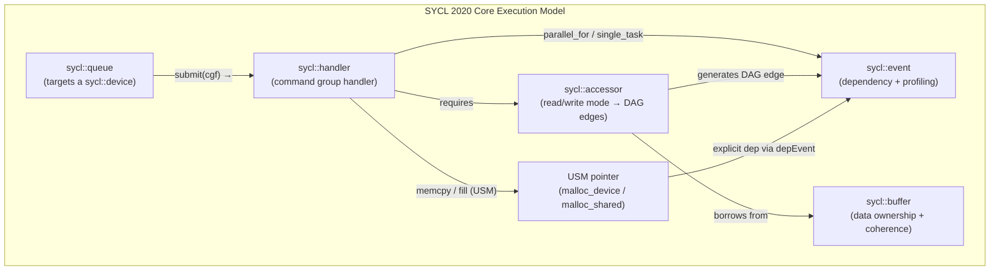
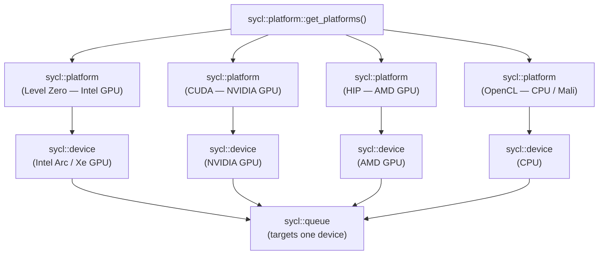
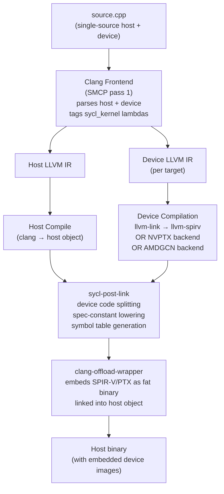
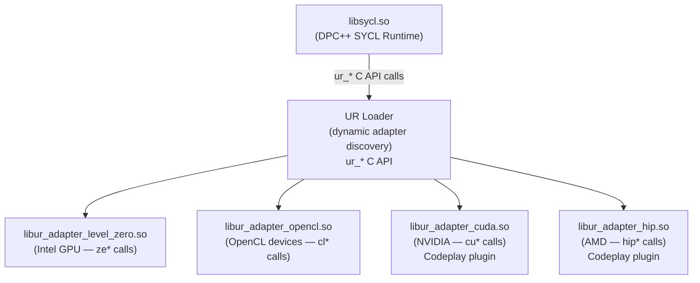
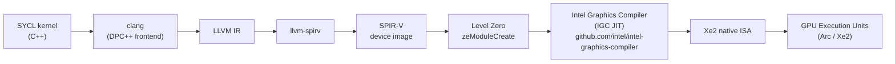
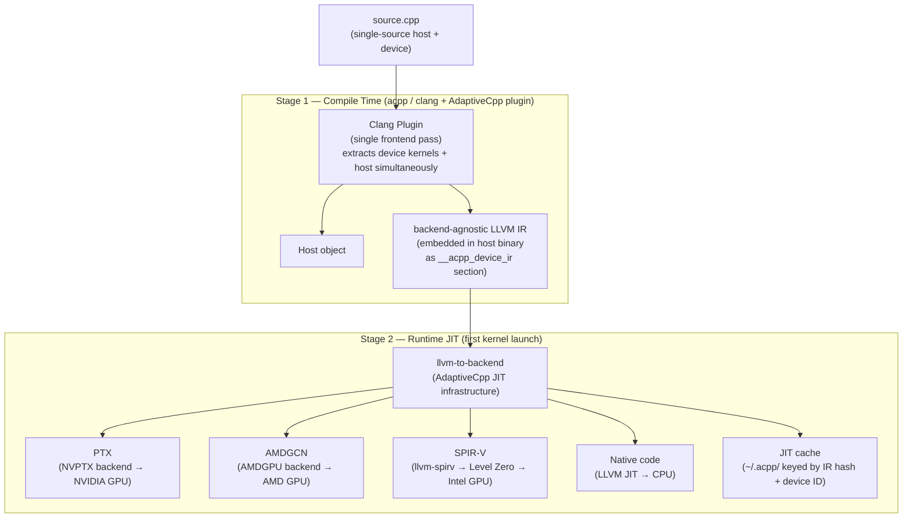
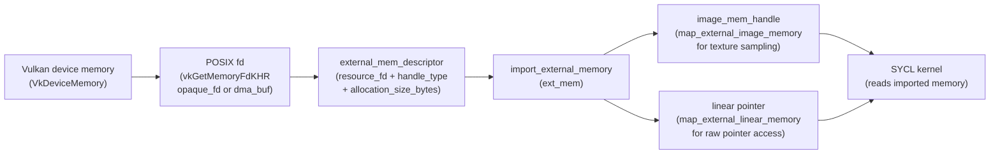

# Chapter 62: SYCL 2020 and Portable Heterogeneous Compute

> **Part**: Part XIV — Khronos Extended Ecosystem
> **Audience**: Graphics application developers and systems developers
> **Status**: First draft — 2026-06-15

---

## Table of Contents

1. [Overview](#1-overview)
2. [SYCL 2020 Programming Model: Queues, Buffers, Accessors, Events](#2-sycl-2020-programming-model-queues-buffers-accessors-events)
   - 2.1 [The `sycl::queue` Class](#21-the-syclqueue-class)
   - 2.2 [The `sycl::handler` Command Group Handler](#22-the-syclhandler-command-group-handler)
   - 2.3 [Buffers and Accessors](#23-buffers-and-accessors)
   - 2.4 [Host and Local Accessors](#24-host-and-local-accessors)
   - 2.5 [Events and Synchronisation](#25-events-and-synchronisation)
3. [Kernel Dispatch: `parallel_for`, ND-Range, and Group Algorithms](#3-kernel-dispatch-parallel_for-nd-range-and-group-algorithms)
   - 3.1 [Basic and ND-Range Dispatch](#31-basic-and-nd-range-dispatch)
   - 3.2 [Local Memory and Work-Group Barriers](#32-local-memory-and-work-group-barriers)
   - 3.3 [Group Algorithms Library](#33-group-algorithms-library)
   - 3.4 [Sub-Groups: SYCL Warps](#34-sub-groups-sycl-warps)
   - 3.5 [Built-in Parallel Reductions](#35-built-in-parallel-reductions)
4. [Unified Shared Memory (USM)](#4-unified-shared-memory-usm)
   - 4.1 [USM Allocation Types and APIs](#41-usm-allocation-types-and-apis)
   - 4.2 [Explicit Migration: `malloc_device`](#42-explicit-migration-malloc_device)
   - 4.3 [Implicit Migration: `malloc_shared`](#43-implicit-migration-malloc_shared)
   - 4.4 [USM vs. Buffer/Accessor Ownership Semantics](#44-usm-vs-bufferaccessor-ownership-semantics)
5. [Specialisation Constants and `sycl::kernel_bundle`](#5-specialisation-constants-and-syclkernel_bundle)
6. [Device Selection and the Platform/Device Model](#6-device-selection-and-the-platformdevice-model)
7. [Intel oneAPI DPC++: Compiler Architecture and Linux Path](#7-intel-oneapi-dpc-compiler-architecture-and-linux-path)
   - 7.1 [SMCP Compilation Pipeline](#71-smcp-compilation-pipeline)
   - 7.2 [Unified Runtime and Backend Adapters](#72-unified-runtime-and-backend-adapters)
   - 7.3 [Intel Graphics Compiler (IGC) and the Xe/Arc Path](#73-intel-graphics-compiler-igc-and-the-xearc-path)
   - 7.4 [Cross-Device Targets: CUDA and ROCm via DPC++](#74-cross-device-targets-cuda-and-rocm-via-dpc)
8. [AdaptiveCpp: Community SYCL and SSCP Architecture](#8-adaptivecpp-community-sycl-and-sscp-architecture)
   - 8.1 [Naming History and Current Release](#81-naming-history-and-current-release)
   - 8.2 [SSCP: Single-Source, Single Compiler Pass](#82-sscp-single-source-single-compiler-pass)
   - 8.3 [Online Kernel Fusion](#83-online-kernel-fusion)
   - 8.4 [Performance vs. DPC++ on AMD and NVIDIA](#84-performance-vs-dpc-on-amd-and-nvidia)
9. [SYCL–Vulkan and OpenCL Interoperability](#9-syclvulkan-and-opencl-interoperability)
   - 9.1 [`sycl_ext_oneapi_bindless_images` and External Memory Import](#91-sycl_ext_oneapi_bindless_images-and-external-memory-import)
   - 9.2 [External Semaphore Synchronisation](#92-external-semaphore-synchronisation)
   - 9.3 [When to Prefer Native Vulkan Compute vs. SYCL](#93-when-to-prefer-native-vulkan-compute-vs-sycl)
10. [Migration from CUDA to SYCL: `dpct` / SYCLomatic](#10-migration-from-cuda-to-sycl-dpct--syclomatic)
    - 10.1 [Migration Workflow](#101-migration-workflow)
    - 10.2 [CUDA-to-SYCL Programming Model Mapping](#102-cuda-to-sycl-programming-model-mapping)
    - 10.3 [Productivity Cost vs. Portability Gain](#103-productivity-cost-vs-portability-gain)
11. [Integrations](#11-integrations)
12. [References](#12-references)

---

## 1. Overview

This chapter targets graphics application developers who need portable heterogeneous compute across Intel, AMD, and NVIDIA GPUs on Linux without committing to a vendor-specific API, and systems developers who need to understand how SYCL kernels traverse the stack from high-level C++ through compilers, runtimes, and kernel drivers.

SYCL 2020 is the current Khronos ratified standard (Revision 11) for single-source, heterogeneous C++17 programming. Unlike OpenCL's split-source model — where kernel code lives in a separate string or `.cl` file — SYCL embeds device kernels directly in host C++ as lambda expressions. The compiler then extracts and compiles these lambdas for the target device while the host sees only the surrounding C++ types. The result is a programming model that integrates naturally with C++ templates, standard algorithms, and existing build systems while delivering close-to-native performance on diverse GPU architectures.

Readers of this chapter should be familiar with: LLVM compilation pipelines (relevant sections appear in Chapter 61 on SPIR-V tools), the AMDGPU LLVM backend (Chapter 48 on ROCm/HIP), Intel's Level Zero runtime (Chapter 25 on compute APIs), and the DRM GPU scheduler (Chapter 4). This chapter focuses on the SYCL-specific layer that sits above those runtimes.

What you will learn:

- The SYCL 2020 core abstractions — `queue`, `buffer`, `accessor`, `event` — and how the task-DAG execution model differs from explicit synchronisation
- When to use Unified Shared Memory (USM) versus the buffer/accessor model, and the page-migration overhead trade-off on discrete GPUs
- How DPC++ (`icpx`) transforms a single `.cpp` source into SPIR-V for Intel, PTX for NVIDIA, and AMDGCN for AMD, and how the Intel Graphics Compiler (IGC) finishes the translation to native Xe ISA
- How AdaptiveCpp's single-pass SSCP architecture differs architecturally from DPC++'s multi-pass approach and what it enables (online kernel fusion, JIT-time specialisation)
- The `sycl_ext_oneapi_bindless_images` extension for importing Vulkan DMA-BUF memory handles into SYCL — the SYCL equivalent of CUDA–Vulkan interop covered in Chapter 25
- How Intel's `dpct` / SYCLomatic tool handles 90–95% of CUDA-to-SYCL migration automatically and where the remaining semantic gaps fall

---

## 2. SYCL 2020 Programming Model: Queues, Buffers, Accessors, Events

SYCL 2020 defines a host–device execution model built around three axes: where work executes (`sycl::queue` targeting a `sycl::device`), how data is owned and transferred (`sycl::buffer` + `sycl::accessor` or USM), and how operations are ordered (`sycl::event` and implicit DAG edges from accessor modes).



The specification is available at [registry.khronos.org/SYCL/specs/sycl-2020/html/sycl-2020.html](https://registry.khronos.org/SYCL/specs/sycl-2020/html/sycl-2020.html). The normative source in AsciiDoc is maintained at [github.com/KhronosGroup/SYCL-Docs](https://github.com/KhronosGroup/SYCL-Docs/blob/SYCL-2020/master/adoc/chapters/programming_interface.adoc). The Khronos reference guide PDF is at [khronos.org/files/sycl/sycl-2020-reference-guide.pdf](https://www.khronos.org/files/sycl/sycl-2020-reference-guide.pdf).

Major advances in SYCL 2020 over the predecessor SYCL 1.2.1 include: Unified Shared Memory (USM) as a first-class feature, built-in parallel reductions via `sycl::reduction()`, the group algorithms library (`reduce_over_group`, `inclusive_scan_over_group`, etc.), sub-group support promoted to core, specialisation constants (`sycl::specialization_id`), `sycl::local_accessor` and `sycl::host_accessor` as distinct types, class template argument deduction (CTAD) for all major types, and queue shortcut methods returning `sycl::event` directly. [Source: Khronos SYCL 2020 announcement](https://www.khronos.org/news/press/khronos-releases-sycl-2020-final-specification)

### 2.1 The `sycl::queue` Class

The queue is the central submission point for all asynchronous work. It targets a single device and carries optional properties. [Source: SYCL Reference — queue](https://github.khronos.org/SYCL_Reference/iface/queue.html)

```cpp
// sycl/queue.hpp — representative constructors (SYCL 2020 spec Rev 11)

// Default device (determined by default_selector_v)
explicit sycl::queue(const sycl::property_list& propList = {});
explicit sycl::queue(const sycl::async_handler& asyncHandler,
                     const sycl::property_list& propList = {});

// Device selector (e.g. gpu_selector_v, cpu_selector_v, aspect_selector)
template <typename DeviceSelector>
explicit sycl::queue(const DeviceSelector& deviceSelector,
                     const sycl::property_list& propList = {});

// Explicit device
explicit sycl::queue(const sycl::device& syclDevice,
                     const sycl::property_list& propList = {});

// Context + device selector or explicit device
template <typename DeviceSelector>
explicit sycl::queue(const sycl::context& syclContext,
                     const DeviceSelector& deviceSelector,
                     const sycl::property_list& propList = {});
```

**Queue properties** are the primary knobs for execution ordering and profiling:

```cpp
namespace sycl::property::queue {
  class enable_profiling { public: enable_profiling(); };
  class in_order         { public: in_order(); };
}
```

By default, SYCL queues are **out-of-order**: the runtime builds a task DAG from the read/write modes of accessors in each submitted command group and executes commands in any order consistent with the DAG. This matches Vulkan's semaphore-based dependency model (see Chapter 25) but differs from CUDA's default stream, which serialises everything. With `property::queue::in_order`, every submitted command implicitly depends on the previous one; `is_in_order()` queries this at runtime.

**Core submission** takes a callable receiving `sycl::handler&`:

```cpp
// queue.hpp — submit method
template <typename T>
sycl::event sycl::queue::submit(T cgf);

// Optional fallback queue for devices that cannot execute the command group
template <typename T>
sycl::event sycl::queue::submit(T cgf, sycl::queue& secondaryQueue);
```

**Shortcut methods** (new in SYCL 2020) bypass the explicit `submit` + command group for common operations. All accept optional `sycl::event depEvent` or `const std::vector<sycl::event>& depEvents` parameters:

```cpp
// queue.hpp — shortcut methods (SYCL 2020 addition)
template <typename KernelName, typename KernelType>
sycl::event sycl::queue::single_task(const KernelType& kernelFunc);

template <typename KernelName, int Dimensions, typename... Rest>
sycl::event sycl::queue::parallel_for(sycl::range<Dimensions> numWorkItems,
                                       Rest&&... rest);

template <typename KernelName, int Dimensions, typename... Rest>
sycl::event sycl::queue::parallel_for(sycl::nd_range<Dimensions> executionRange,
                                       Rest&&... rest);

sycl::event sycl::queue::memcpy(void* dest, const void* src, size_t numBytes);
sycl::event sycl::queue::memcpy(void* dest, const void* src, size_t numBytes,
                                  sycl::event depEvent);

template <typename T>
sycl::event sycl::queue::fill(void* ptr, const T& pattern, size_t count);

sycl::event sycl::queue::prefetch(void* ptr, size_t numBytes);
sycl::event sycl::queue::mem_advise(void* ptr, size_t numBytes, int advice);
void sycl::queue::wait();
void sycl::queue::wait_and_throw();
sycl::device sycl::queue::get_device() const;
sycl::context sycl::queue::get_context() const;
bool sycl::queue::is_in_order() const;
```

### 2.2 The `sycl::handler` Command Group Handler

The handler is passed into the command group function object and declares the actions of that group — it cannot outlive the command group submission. [Source: SYCL Reference — handler](https://github.khronos.org/SYCL_Reference/iface/command-group-handler.html)

```cpp
// sycl/handler.hpp — kernel invocation methods

// Single work-item
template <typename KernelName, typename KernelType>
void sycl::handler::single_task(const KernelType& kernelFunc);

// Basic data-parallel: lambda receives sycl::item<N>
template <typename KernelName, int Dimensions, typename... Rest>
void sycl::handler::parallel_for(sycl::range<Dimensions> numWorkItems,
                                  Rest&&... rest);

// ND-range data-parallel: lambda receives sycl::nd_item<N>
template <typename KernelName, int Dimensions, typename... Rest>
void sycl::handler::parallel_for(sycl::nd_range<Dimensions> executionRange,
                                  Rest&&... rest);

// Explicit event dependency within a command group
void sycl::handler::depends_on(sycl::event depEvent);
void sycl::handler::depends_on(const std::vector<sycl::event>& depEvents);

// USM-based memory operations within a command group
void sycl::handler::memcpy(void* dest, const void* src, size_t numBytes);
void sycl::handler::memset(void* ptr, int value, size_t numBytes);

template <typename T>
void sycl::handler::fill(void* ptr, const T& pattern, size_t count);

// Kernel bundle selection for AOT/specialised kernels
template <typename KernelName>
void sycl::handler::use_kernel_bundle(
    const sycl::kernel_bundle<sycl::bundle_state::executable>& execBundle);
```

### 2.3 Buffers and Accessors

`sycl::buffer<T, Dimensions, AllocatorT>` owns or references host data and manages coherence across host and device through accessor lifetimes. The central invariant: writes from kernel functions are only guaranteed to be visible in host memory when the buffer goes out of scope **or** when a `host_accessor` is constructed that covers the same data. Either event constitutes an implicit synchronisation point.

```cpp
// sycl/buffer.hpp — primary constructors

// Uninitialised device-side storage; no host data associated
sycl::buffer<float, 1> A{sycl::range<1>{N}};

// Borrow host pointer; buffer does not own the storage
sycl::buffer<float, 1> B{h_B.data(), sycl::range<1>{N}};

// Shared ownership via shared_ptr
sycl::buffer<float, 1> C{std::make_shared<float[]>(N), sycl::range<1>{N}};

// Iterator pair (1D only; type deduced)
sycl::buffer D{h_data.begin(), h_data.end()};
```

`sycl::accessor<DataT, Dimensions, AccessMode, AccessTarget>` encodes intent — read, write, or read-write — and generates DAG edges that the runtime uses for scheduling. SYCL 2020 adds class template argument deduction (CTAD) so parameters are usually inferred from context:

```cpp
// Using CTAD and access mode tags (SYCL 2020 style)
sycl::buffer<double, 1> A{sycl::range<1>{N}};

Q.submit([&](sycl::handler& cgh) {
    // CTAD infers DataT=double, Dimensions=1, mode=read_write
    sycl::accessor aA{A, cgh};

    // read_only tag: mode deduced as access_mode::read
    sycl::accessor aB{A, cgh, sycl::read_only};

    // write_only + no_init: runtime skips host-to-device transfer
    sycl::accessor aC{A, cgh, sycl::write_only, sycl::no_init};

    cgh.parallel_for(sycl::range<1>{N}, [=](sycl::id<1> i) {
        aA[i] = aB[i] + 1.0;
    });
});
```

The `no_init` property is significant for performance: it tells the runtime that the kernel will overwrite every element before reading, so the current host contents need not be transferred to the device. On discrete GPUs with PCIe bandwidth as the bottleneck (see the BabelStream discussion in Chapter 48), this can halve the memory traffic for write-only kernels.

**Access mode tags** available in the `sycl` namespace as inline constants: `read_only`, `write_only`, `read_write`. The now-deprecated `access::mode::atomic` from SYCL 1.2.1 is replaced by `sycl::atomic_ref<T>` in SYCL 2020.

### 2.4 Host and Local Accessors

`sycl::host_accessor<DataT, Dimensions, AccessMode>` is constructed outside a command group and forces synchronisation. It blocks the calling thread until all pending device writes to the covered buffer region complete:

```cpp
// sycl/host_accessor.hpp
// Constructed after Q.wait() or implicitly forces synchronisation
sycl::host_accessor result{A};             // read_write — blocks, then gives host access
sycl::host_accessor result{A, sycl::read_only};  // cheaper: only waits for pending writers
```

`sycl::local_accessor<DataT, Dimensions>` allocates per-work-group shared memory — the SYCL analogue of OpenCL `__local` or CUDA `__shared__`. It must be created inside a command group handler and can only be used with `nd_range` kernels. [Source: SYCL Reference — local_accessor](https://github.khronos.org/SYCL_Reference/iface/local_accessor.html)

```cpp
// sycl/local_accessor.hpp
// Constructor
sycl::local_accessor<int, 1> local_mem{sycl::range<1>{workGroupSize}, cgh};

// Usage inside nd_range kernel
Q.submit([&](sycl::handler& h) {
    sycl::local_accessor<float, 1> scratch{sycl::range<1>{256}, h};

    h.parallel_for(sycl::nd_range<1>{{4096}, {256}},
        [=](sycl::nd_item<1> item) {
            size_t lid = item.get_local_id(0);
            scratch[lid] = item.get_global_id(0) * 0.5f;
            sycl::group_barrier(item.get_group());
            // All 256 scratch slots now visible to every work-item in the group
            float sum = scratch[(lid + 1) % 256] + scratch[(lid + 255) % 256];
            // ...
        });
});
```

[Source: ENCCS sycl-workshop buffers-accessors](https://enccs.github.io/sycl-workshop/buffers-accessors/)

### 2.5 Events and Synchronisation

`sycl::event` is returned by every queue submission and shortcut method. Its primary use is dependency chaining between command groups or between a command group and a host-side wait. Profiling requires the queue to carry `property::queue::enable_profiling`:

```cpp
sycl::queue Q{sycl::gpu_selector_v,
              {sycl::property::queue::enable_profiling{}}};

auto e = Q.submit([&](sycl::handler& cgh) {
    cgh.parallel_for(sycl::range<1>{N}, [=](sycl::id<1> i) { /* ... */ });
});
e.wait();

// Profiling timestamps — uint64_t nanoseconds in the backend's timebase
auto t_submit = e.get_profiling_info<sycl::info::event_profiling::command_submit>();
auto t_start  = e.get_profiling_info<sycl::info::event_profiling::command_start>();
auto t_end    = e.get_profiling_info<sycl::info::event_profiling::command_end>();

float queue_overhead_us = (t_start - t_submit) / 1e3f;
float kernel_exec_us    = (t_end   - t_start)  / 1e3f;
```

Three profiling queries correspond to three lifecycle stages: `command_submit` records when the command group function was enqueued to the runtime, `command_start` records when the device actually began executing, and `command_end` records completion. The gap between `command_submit` and `command_start` captures scheduling and driver overhead — the SYCL equivalent of the GPU submission latency visible in Vulkan timestamp queries (Chapter 25). [Source: ENCCS sycl-workshop profiling](https://enccs.github.io/sycl-workshop/profiling/)

---

## 3. Kernel Dispatch: `parallel_for`, ND-Range, and Group Algorithms

### 3.1 Basic and ND-Range Dispatch

SYCL 2020 provides three kernel dispatch forms:

```cpp
// single_task: one work-item; useful for host-device data-structure initialisation
Q.single_task<class Init>([=]() { /* runs once on device */ });

// Basic data-parallel: each item receives sycl::item<N> (global ID + global range)
Q.parallel_for<class Saxpy>(sycl::range<1>{N}, [=](sycl::id<1> i) {
    d_C[i] = alpha * d_A[i] + d_B[i];
});

// ND-range: explicit work-group decomposition; item is sycl::nd_item<N>
// nd_range<N>(global_range, local_range) — local_range must divide global_range
Q.parallel_for<class Matmul>(
    sycl::nd_range<2>{{M, N}, {TileSize, TileSize}},
    [=](sycl::nd_item<2> item) {
        size_t row = item.get_global_id(0);
        size_t col = item.get_global_id(1);
        size_t lid_r = item.get_local_id(0);
        size_t lid_c = item.get_local_id(1);
        // ...
    });
```

The `sycl::nd_item<N>` exposes both global and local IDs, plus access to the enclosing `sycl::group<N>` and `sycl::sub_group` objects. `sycl::range<N>` is N-dimensional extents; `sycl::id<N>` is N-dimensional index; `sycl::nd_range<N>` pairs global and local ranges. Dimension indices in SYCL follow row-major convention: index 0 is the slowest-varying dimension (rows), index `N-1` the fastest (columns) — the reverse of CUDA's `threadIdx.x/y/z` convention, which is a common migration bug (see Section 10).

### 3.2 Local Memory and Work-Group Barriers

Work-group-level shared memory is allocated via `sycl::local_accessor` (Section 2.4). Synchronisation within a work-group uses `sycl::group_barrier`:

```cpp
// sycl/group_barrier.hpp (SYCL 2020 spec Rev 11)
// Synchronises all work-items in group g
// Requires: all work-items in g must reach the barrier
template <typename Group>
void sycl::group_barrier(Group g,
                          sycl::memory_scope fenceScope =
                              Group::fence_scope);
```

`memory_scope` determines the memory fence strength: `work_group`, `sub_group`, `device`, or `system`. For typical local-memory producer-consumer patterns, the default (work-group scope) is correct. Sub-group barriers (`sycl::group_barrier(item.get_sub_group())`) are cheaper but synchronise only the sub-group's lanes.

Note: The exact template instantiation for `group_barrier` with both `sycl::group<N>` and `sycl::sub_group` should be verified against SYCL 2020 spec Rev 11, Section 4.17. The signature above matches the pattern documented in the BabelStream 2020 port and the ENCCS workshop materials. [Source: BabelStream SYCL 2020 port](http://uob-hpc.github.io/2021/02/09/SYCL-2020.html)

### 3.3 Group Algorithms Library

SYCL 2020 promotes group algorithms from an extension to the core specification. These functions operate collectively over all work-items in a group or sub-group; each work-item calls the function with its local contribution, and all receive the result. [Source: SYCL Reference — group algorithms](https://github.khronos.org/SYCL_Reference/iface/group-algorithms-library.html)

```cpp
// sycl/group_algorithm.hpp — collective reduction over a work-group
template <typename Group, typename T, typename BinaryOperation>
T sycl::reduce_over_group(Group g, T x, BinaryOperation binary_op);

// With explicit identity (for non-standard combiners)
template <typename Group, typename V, typename T, typename BinaryOperation>
T sycl::reduce_over_group(Group g, V x, T init, BinaryOperation binary_op);

// Inclusive and exclusive prefix scans
template <typename Group, typename T, typename BinaryOperation>
T sycl::inclusive_scan_over_group(Group g, T x, BinaryOperation binary_op);

template <typename Group, typename T, typename BinaryOperation>
T sycl::exclusive_scan_over_group(Group g, T x, BinaryOperation binary_op);

// Joint reduction: all work-items cooperate over a pointer range [first, last)
template <typename Group, typename Ptr, typename BinaryOperation>
typename std::iterator_traits<Ptr>::value_type
sycl::joint_reduce(Group g, Ptr first, Ptr last, BinaryOperation binary_op);

// Predicate queries
template <typename Group>
bool sycl::any_of_group(Group g, bool pred);

template <typename Group>
bool sycl::all_of_group(Group g, bool pred);

template <typename Group>
bool sycl::none_of_group(Group g, bool pred);

// Broadcast: work-item local_linear_id sends its value to every other work-item in the group
// SYCL 2020 spec Rev 11, Section 4.17.3
template <typename Group, typename T>
T sycl::group_broadcast(Group g, T x, typename Group::id_type local_id);

// Overload with scalar linear ID (convenience form)
template <typename Group, typename T>
T sycl::group_broadcast(Group g, T x,
                        typename Group::linear_id_type linear_local_id);
```

`sycl::group_broadcast` allows a designated sender work-item to share a value with every work-item in the same group. It is functionally equivalent to CUDA's `__shfl_sync` with a fixed source lane for the entire block. Like the other group algorithms it works identically over `sycl::group<N>` (work-group scope) and `sycl::sub_group` (sub-group scope), and it implicitly includes a group barrier. A typical use case is distributing a scalar computed by the group leader (linear ID 0) to all members:

```cpp
float leader_val;
if (item.get_local_linear_id() == 0)
    leader_val = compute_leader_value();
// Broadcast from work-item 0 to all work-items in the group
float shared_val = sycl::group_broadcast(item.get_group(), leader_val, 0);
```

[Source: SYCL 2020 spec Rev 11, Section 4.17.3 — group broadcast](https://registry.khronos.org/SYCL/specs/sycl-2020/html/sycl-2020.html#_group_broadcast)

All of these functions implicitly include a group barrier. They work identically whether `Group` is `sycl::group<N>` (work-group scope) or `sycl::sub_group` (sub-group scope). This uniform interface is a key ergonomic win over CUDA's separate `__reduce_*` intrinsics and cooperative groups API.

### 3.4 Sub-Groups: SYCL Warps

Sub-groups are subdivisions of a work-group that execute with SIMD scheduling guarantees — the SYCL equivalent of CUDA warps (32 lanes on NVIDIA) or Intel's SIMD16/SIMD32 EU execution units. Access them through `nd_item::get_sub_group()`:

```cpp
sycl::sub_group sg = item.get_sub_group();

uint32_t sg_id     = sg.get_group_id()[0];        // sub-group index within work-group
uint32_t sg_lid    = sg.get_local_id()[0];         // lane index within sub-group
uint32_t sg_size   = sg.get_local_range()[0];      // actual sub-group width (e.g. 32)
uint32_t sg_max    = sg.get_max_local_range()[0];  // maximum for this device

// Sub-group shuffle operations
// select_from_group: broadcast from a specific lane
T result = sycl::select_from_group(sg, value, source_lane_id);

// Shuffle with XOR mask (equivalent to CUDA's __shfl_xor_sync)
T result = sycl::permute_group_by_xor(sg, value, mask);

// Shift operations (with 0-fill at boundaries)
T result = sycl::shift_group_left(sg, value, delta);
T result = sycl::shift_group_right(sg, value, delta);
```

[Source: ENCCS sycl-workshop sub-groups](https://enccs.github.io/sycl-workshop/sub-groups/) | [Source: Intel sub-groups and SIMD vectorization](https://www.intel.com/content/www/us/en/docs/oneapi/optimization-guide-gpu/2023-0/sub-groups-and-simd-vectorization.html)

The sub-group width is hardware-determined and device-dependent. Intel Xe GPUs typically expose SIMD8, SIMD16, and SIMD32 sub-group sizes; NVIDIA GPUs have a fixed warp size of 32; AMD wavefront size is 64 (RDNA can use wave32 mode). Query preferred and supported sizes at device query time via `sycl::info::kernel_device_specific::max_sub_group_size` and `compiled_sub_group_size`.

### 3.5 Built-in Parallel Reductions

SYCL 2020 eliminates the need to hand-code tree reductions. The `sycl::reduction()` factory returns an opaque reducer that `parallel_for` recognises and implements efficiently using sub-group and work-group hardware operations where available. [Source: SYCL Reference — reduction variables](https://github.khronos.org/SYCL_Reference/iface/reduction-variables.html)

```cpp
// Predefined combiners with known identities (SYCL 2020 spec Rev 11, table 4.106):
// sycl::plus<T>      → identity: 0
// sycl::multiplies<T>→ identity: 1
// sycl::bit_and<T>   → identity: ~T(0)
// sycl::bit_or<T>    → identity: 0
// sycl::minimum<T>   → identity: numeric_limits<T>::max()
// sycl::maximum<T>   → identity: numeric_limits<T>::lowest()

// BabelStream dot-product using sycl::reduction (from BabelStream upstream)
// Source: http://uob-hpc.github.io/2021/02/09/SYCL-2020.html
template <class T>
T SYCLStream<T>::dot() {
    queue->submit([&](sycl::handler& cgh) {
        sycl::accessor ka{d_a, cgh, sycl::read_only};
        sycl::accessor kb{d_b, cgh, sycl::read_only};

        // d_sum is a sycl::buffer<T, 1> with one element
        cgh.parallel_for(
            sycl::range<1>{array_size},
            sycl::reduction(d_sum, cgh, std::plus<T>(),
                            sycl::property::reduction::initialize_to_identity),
            [=](sycl::id<1> idx, auto& sum) {
                sum += ka[idx] * kb[idx];
            });
    });
    sycl::host_accessor result{d_sum, sycl::read_only};
    return result[0];
}
```

The `initialize_to_identity` property (SYCL 2020 addition) initialises the output variable to the combiner's identity element before accumulation, avoiding a separate memset. The runtime is free to use any combination of sub-group reductions, work-group shared memory tree reductions, and atomic operations to implement this efficiently — on Intel Xe GPUs, DPC++ lowers `sycl::plus<float>` reduction to native SIMD horizontal-add instructions; on AMD RDNA2 via AdaptiveCpp, it maps to `v_add_f32` wavefront reductions.

---

## 4. Unified Shared Memory (USM)

USM is the largest new feature in SYCL 2020 and the most significant break from OpenCL's buffer model. It provides three allocation types backed by a unified virtual address space (UVA), allowing device pointers to be passed directly as kernel arguments without wrapping them in `sycl::buffer`. [Source: ENCCS sycl-workshop USM](https://enccs.github.io/sycl-workshop/unified-shared-memory/)

### 4.1 USM Allocation Types and APIs

| Type | Host readable | Device accessible | Auto-migrate | Typical use |
|------|--------------|-------------------|--------------|-------------|
| `malloc_device` | No (without explicit copy) | Yes | No | Large GPU-resident buffers |
| `malloc_host` | Yes | Yes (via PCIe, slow) | No | Streaming upload/download |
| `malloc_shared` | Yes | Yes | Yes (runtime-managed) | Prototyping, small/irregular data |

USM is only available on devices that advertise the capability; query before use:

```cpp
bool can_device = dev.has(sycl::aspect::usm_device_allocations);
bool can_host   = dev.has(sycl::aspect::usm_host_allocations);
bool can_shared = dev.has(sycl::aspect::usm_shared_allocations);
```

Allocation functions come in untyped C-style and typed C++ variants:

```cpp
// sycl/usm.hpp — typed allocators (SYCL 2020 spec Rev 11)
template <typename T>
T* sycl::malloc_device(size_t count, const sycl::queue& syclQueue,
                        const sycl::property_list& propList = {});
template <typename T>
T* sycl::malloc_host  (size_t count, const sycl::queue& syclQueue,
                        const sycl::property_list& propList = {});
template <typename T>
T* sycl::malloc_shared(size_t count, const sycl::queue& syclQueue,
                        const sycl::property_list& propList = {});

// Deallocation — pass the same context used for allocation
void sycl::free(void* ptr, const sycl::queue& syclQueue);
void sycl::free(void* ptr, const sycl::context& syclContext);

// Pointer type introspection
sycl::usm::alloc sycl::get_pointer_type(const void* ptr,
                                          const sycl::context& ctxt);
// Returns: usm::alloc::host | ::device | ::shared | ::unknown
sycl::device sycl::get_pointer_device(const void* ptr,
                                        const sycl::context& ctxt);
```

### 4.2 Explicit Migration: `malloc_device`

`malloc_device` allocates memory visible only to the device. The programmer manages transfers explicitly via `queue::memcpy`, which the runtime maps to the backend's DMA engine (Level Zero `zeCommandListAppendMemoryCopy`, CUDA `cudaMemcpyAsync`, HIP `hipMemcpyAsync`):

```cpp
float* d_A = sycl::malloc_device<float>(N, Q);
float* d_B = sycl::malloc_device<float>(N, Q);

// Upload phase — async, chained with events
auto e_upload_A = Q.memcpy(d_A, h_A.data(), N * sizeof(float));
auto e_upload_B = Q.memcpy(d_B, h_B.data(), N * sizeof(float));

// Compute — explicit dependency via depEvents
auto e_compute = Q.parallel_for<class VectorAdd>(
    sycl::range<1>{N},
    {e_upload_A, e_upload_B},  // depends on both uploads
    [=](sycl::id<1> i) { d_A[i] += d_B[i]; });

// Download phase — depends on compute
auto e_download = Q.memcpy(h_A.data(), d_A, N * sizeof(float), e_compute);
e_download.wait();

sycl::free(d_A, Q);
sycl::free(d_B, Q);
```

This explicit pattern matches the CUDA `cudaMemcpyAsync` workflow and is appropriate for large, regularly accessed buffers where the programmer wants full control over transfer scheduling and PCIe bandwidth utilisation.

### 4.3 Implicit Migration: `malloc_shared`

`malloc_shared` allocates memory in the UVA and lets the runtime migrate pages between host and device on demand. On Intel integrated graphics, the migration is handled by the i915/Xe kernel driver using kernel-side page-fault handling (the same HMM infrastructure discussed in Chapter 5). On discrete NVIDIA and AMD GPUs, PCIe page-migration has measurable overhead:

```cpp
float* data = sycl::malloc_shared<float>(N, Q);

// Initialise on host — no explicit copy needed
for (int i = 0; i < N; ++i) data[i] = static_cast<float>(i);

// Runtime migrates pages to device as needed (triggered at first device access)
Q.parallel_for<class Scale>(sycl::range<1>{N}, [=](sycl::id<1> i) {
    data[i] *= 2.0f;
}).wait();

// Access on host — runtime migrates pages back
for (int i = 0; i < N; ++i) assert(data[i] == 2.0f * i);

sycl::free(data, Q);
```

The `Q.prefetch(ptr, bytes)` shortcut hints to the runtime to proactively migrate pages to the device before the next kernel launch — the SYCL equivalent of `cudaMemPrefetchAsync`. `Q.mem_advise(ptr, bytes, hint)` propagates usage hints to the driver, mapping to `cudaMemAdvise`/`zeUSMHint` under the hood.

### 4.4 USM vs. Buffer/Accessor Ownership Semantics

The buffer/accessor model's automatic DAG construction and host-synchronisation-on-destruction are powerful but constrain programming style: buffers cannot outlive their accessors, and accessing data between kernel submissions requires either a `host_accessor` or explicit `queue::wait()`. USM trades these guarantees for pointer semantics, requiring the programmer to manage lifetimes and synchronisation explicitly.

A practical guideline for existing codebases porting from CUDA: use `malloc_device` with explicit `memcpy` for correctness-first porting, then profile PCIe bandwidth and consider `malloc_shared` for workloads with irregular access patterns that are hard to pipeline manually. For new SYCL code, the buffer/accessor model's implicit dependency tracking eliminates entire classes of race conditions and is preferable when the data access pattern is regular and expressible in terms of accessor read/write modes.

---

## 5. Specialisation Constants and `sycl::kernel_bundle`

Specialisation constants allow runtime-determined values to be treated as compile-time constants during JIT compilation. The JIT compiler (IGC for Intel, NVPTX backend for CUDA, the AMDGPU backend for ROCm) can constant-fold branches, dead-strip code paths, and propagate the value through arithmetic — behaviour that is impossible with ordinary `const T` variables passed as kernel arguments. [Source: SYCL Reference — specialization constants](https://github.khronos.org/SYCL_Reference/iface/specialization-constants.html)

```cpp
// Global scope — declare specialisation constant IDs
const sycl::specialization_id<float> coeff_id;
const sycl::specialization_id<int>   block_size_id{256};  // default value = 256

// Set before kernel launch; value is baked into the JIT-compiled binary
Q.submit([&](sycl::handler& cgh) {
    cgh.set_specialization_constant<coeff_id>(runtime_coeff);
    cgh.set_specialization_constant<block_size_id>(actual_block_size);

    cgh.parallel_for<class SpecKernel>(sycl::range<1>{N},
        [=](sycl::id<1> i, sycl::kernel_handler kh) {
            float c   = kh.get_specialization_constant<coeff_id>();
            int   bsz = kh.get_specialization_constant<block_size_id>();
            // 'c' and 'bsz' are compile-time constants from JIT's perspective
        });
});
```

In DPC++, specialisation constants lower to SPIR-V `OpSpecConstant` / `OpDecorate SpecId` instructions. The Level Zero or OpenCL driver then specialises them at JIT link time when `kernel_bundle` is finalised. This is the SYCL-level interface to the SPIR-V specialisation constant mechanism described in Chapter 61. [Source: oneAPI DPC++ specialization constants design](https://intel.github.io/llvm/design/SYCL2020-SpecializationConstants.html)

`sycl::kernel_bundle` provides explicit control over the compile/link lifecycle of device code:

```cpp
// Obtain an input-state bundle (contains SPIR-V or device IR)
auto input_bundle =
    sycl::get_kernel_bundle<sycl::bundle_state::input>(Q.get_context());

// Set specialisation constant values on the bundle before JIT
input_bundle.set_specialization_constant<coeff_id>(3.14f);

// Compile and link (JIT happens here for SPIR-V targets)
auto exec_bundle = sycl::build(input_bundle);

// Use the pre-compiled bundle for subsequent kernel launches
Q.submit([&](sycl::handler& cgh) {
    cgh.use_kernel_bundle(exec_bundle);
    cgh.parallel_for<class SpecKernel>(sycl::range<1>{N},
        [=](sycl::id<1> i, sycl::kernel_handler kh) { /* ... */ });
});
```

For ahead-of-time (AOT) compilation scenarios — where the binary is distributed without a JIT compiler on the target system — `sycl::kernel_bundle` in `bundle_state::executable` contains pre-compiled native ISA. The DPC++ AOT flow (`icpx -fsycl-targets=spir64_gen -Xsycl-target-backend "-device skl"`) produces this at build time for a specific GPU generation.

`if constexpr` combined with the `__SYCL_DEVICE_ONLY__` macro enables backend-specific optimisation paths in a portable source:

```cpp
inline float fast_rsqrt(float x) {
#ifdef __SYCL_DEVICE_ONLY__
    // On Intel GPU this maps to the native rsqrt instruction
    return sycl::native::rsqrt(x);
#else
    return 1.0f / std::sqrt(x);
#endif
}
```

---

## 6. Device Selection and the Platform/Device Model

SYCL 2020 exposes a two-level hierarchy: `sycl::platform` (bound to a backend — Level Zero, OpenCL, CUDA, or HIP) and `sycl::device` (a physical GPU, CPU, or accelerator within that platform). [Source: SYCL Reference — device selectors](https://github.khronos.org/SYCL_Reference/iface/device-selector.html)



```cpp
// Built-in selectors — function objects in SYCL 2020 (no longer virtual base classes)
sycl::queue Q_default{sycl::default_selector_v};
sycl::queue Q_gpu    {sycl::gpu_selector_v};
sycl::queue Q_cpu    {sycl::cpu_selector_v};
sycl::queue Q_accel  {sycl::accelerator_selector_v};

// Aspect selector — requires specific hardware capabilities
sycl::queue Q_fp64   {sycl::aspect_selector(sycl::aspect::fp64,
                                             sycl::aspect::usm_shared_allocations)};

// Custom selector: return a score; highest wins, negative means reject
sycl::queue Q_custom {[](const sycl::device& dev) -> int {
    if (!dev.is_gpu()) return -1;
    if (dev.get_info<sycl::info::device::vendor_id>() == 0x8086) return 100; // Intel
    return 50;
}};
```

Enumeration of all available devices across all backends:

```cpp
// Platform and device enumeration
for (auto& plat : sycl::platform::get_platforms()) {
    std::cout << "Platform: "
              << plat.get_info<sycl::info::platform::name>() << "\n";

    for (auto& dev : plat.get_devices()) {
        std::cout << "  Device: "
                  << dev.get_info<sycl::info::device::name>() << "\n";

        bool has_fp64    = dev.has(sycl::aspect::fp64);
        bool has_usm_sh  = dev.has(sycl::aspect::usm_shared_allocations);
        bool is_gpu      = dev.is_gpu();
        uint32_t cu_count = dev.get_info<sycl::info::device::max_compute_units>();
        size_t   local_sz = dev.get_info<sycl::info::device::max_work_group_size>();
    }
}
```

The `SYCL_DEVICE_FILTER` environment variable (DPC++ extension) restricts which devices the runtime discovers. For example:

```bash
# Restrict to first Intel GPU via Level Zero
SYCL_DEVICE_FILTER=level_zero:gpu:0 ./my_app

# Use OpenCL backend for all available CPUs
SYCL_DEVICE_FILTER=opencl:cpu ./my_app
```

[Source: Intel device discovery with SYCL](https://www.intel.com/content/www/us/en/developer/articles/technical/device-discovery-with-sycl.html)

---

## 7. Intel oneAPI DPC++: Compiler Architecture and Linux Path

Intel's open-source SYCL implementation, DPC++ (Data Parallel C++), is maintained as the `sycl` branch of Intel's LLVM fork at [github.com/intel/llvm](https://github.com/intel/llvm/tree/sycl). The proprietary `icpx` compiler shipping in Intel oneAPI Base Toolkit is built from this open-source codebase. Documentation lives at [intel.github.io/llvm](https://intel.github.io/llvm/). The current release is **Intel oneAPI DPC++/C++ Compiler 2026.0**, optimised for Clearwater Forest, Wildcat Lake, and Xe2 (Arc B-series) architectures. [Source: Intel oneAPI DPC++ 2026.0 release notes](https://www.intel.com/content/www/us/en/developer/articles/release-notes/oneapi-dpcpp/2026.html)

### 7.1 SMCP Compilation Pipeline

DPC++ implements a **single-source, multiple-compiler-passes (SMCP)** model. The same `.cpp` file is compiled multiple times — once for the host and once per device target. [Source: DPC++ compiler and runtime design](https://github.com/intel/llvm/blob/sycl/sycl/doc/design/CompilerAndRuntimeDesign.md)

The pipeline for a typical Linux build (`icpx -fsycl source.cpp`):

```text
source.cpp
    │
    ▼
┌──────────────────────────────────────────┐
│  Clang Frontend (SMCP pass 1)            │
│  • Parses both host and device code      │
│  • Tags device lambdas with sycl_kernel  │
│  • Generates integration header          │
│  • Outlines device sections to LLVM IR   │
└──────────────────────────────────────────┘
    │              │
    ▼ host IR      ▼ device IR (per target)
┌─────────┐   ┌────────────────────────────┐
│ Host    │   │  Device Compilation        │
│ Compile │   │  Clang → LLVM IR           │
│         │   │  → llvm-link (merge)       │
│         │   │  → llvm-spirv (SPIR-V)     │
│         │   │    OR NVPTX backend (PTX)  │
│         │   │    OR AMDGCN backend       │
└─────────┘   └────────────────────────────┘
    │               │
    ▼               ▼
┌────────────────────────────────────────────┐
│  sycl-post-link                            │
│  • device code splitting (per_kernel, etc) │
│  • specialisation constant lowering        │
│  • symbol table generation                 │
└────────────────────────────────────────────┘
    │
    ▼
┌────────────────────────────────────────────┐
│  clang-offload-wrapper                     │
│  • embeds device SPIR-V/PTX as fat binary  │
│  • linked into host object                 │
└────────────────────────────────────────────┘
    │
    ▼
Host binary (with embedded device images)
```



Key compilation flags:

```bash
# Basic build — JIT to SPIR-V, compiled by IGC at runtime on Intel GPU
icpx -fsycl source.cpp -o app

# AOT for NVIDIA CUDA (embeds PTX, compiled by NVPTX backend)
icpx -fsycl -fsycl-targets=nvptx64-nvidia-cuda source.cpp

# AOT for AMD ROCm HIP (embeds AMDGCN IR)
icpx -fsycl -fsycl-targets=amdgcn-amd-amdhsa source.cpp

# AOT for specific Intel GPU generation (offline; no JIT at runtime)
icpx -fsycl -fsycl-targets=spir64_gen source.cpp \
     -Xsycl-target-backend "-device skl"          # Skylake

# Split device code per kernel (reduces binary size, enables per-kernel JIT caching)
icpx -fsycl -fsycl-device-code-split=per_kernel source.cpp
```

### 7.2 Unified Runtime and Backend Adapters

The **Unified Runtime (UR)** is the abstraction layer between the DPC++ runtime and backend-specific runtimes, replacing the earlier Plugin Interface (PI) from DPC++ 2023 onwards. [Source: DPC++ Unified Runtime design](https://intel.github.io/llvm/design/UnifiedRuntime.html)

```text
┌─────────────────────────────────────────────┐
│  DPC++ SYCL Runtime (libsycl.so)            │
└─────────────────────────────────────────────┘
         │ ur_* C API calls
         ▼
┌─────────────────────────────────────────────┐
│  UR Loader (dynamic adapter discovery)      │
└─────────────────────────────────────────────┘
    │               │               │
    ▼               ▼               ▼
libur_adapter_   libur_adapter_  libur_adapter_
level_zero.so    opencl.so       cuda.so / hip.so
(Intel GPU)      (OpenCL devs)   (Codeplay plugin)
```



The UR API uses a `ur_*` function prefix (e.g., `urDeviceGet`, `urQueueCreate`, `urKernelCreate`, `urEnqueueKernelLaunch`). Each adapter translates these to the backend-specific calls: Level Zero `ze*`, OpenCL `cl*`, CUDA `cu*`, or HIP `hip*`. The DPC++ 2026.0 release ships with a refactored L0 v2 adapter enabling Xe2/Arc B-series by default.

### 7.3 Intel Graphics Compiler (IGC) and the Xe/Arc Path

When DPC++ targets Intel GPUs via the Level Zero backend, SPIR-V device images are passed to the **Intel Graphics Compiler (IGC)** at runtime (JIT) or at build time (AOT). IGC is a separate open-source compiler at [github.com/intel/intel-graphics-compiler](https://github.com/intel/intel-graphics-compiler), current version **v2.34.4** (as of May 2026). [Source: IGC GitHub](https://github.com/intel/intel-graphics-compiler)

IGC is LLVM-based and supports Gen9, Gen11, Gen12, Xe (DG2/Arc A-series), and Xe2 (Arc B-series) architectures. It accepts SPIR-V or LLVM IR and produces native EU (Execution Unit) ISA. The translation chain connects this chapter to Chapter 4 (GPU Memory Management) and Chapter 25 (Level Zero runtime): Level Zero calls IGC at device-program-create time, which produces a binary loaded directly into the EU shader processors.

The SYCL-to-native-ISA path for an Intel Arc GPU is therefore:

```text
SYCL kernel (C++) → clang → LLVM IR → llvm-spirv → SPIR-V
    → Level Zero zeModuleCreate → IGC JIT → Xe2 native ISA → GPU EUs
```



### 7.4 Cross-Device Targets: CUDA and ROCm via DPC++

For CUDA targets, DPC++ inserts `libdevice.bc` (NVIDIA's math library bitcode) and `libspirv.bc` at the LLVM-link stage before passing the combined IR to the NVPTX backend. The output is PTX, assembled to cubin by `ptxas`, and packaged as a CUDA fatbin embedded in the host binary. At runtime the DPC++ UR CUDA adapter (`libur_adapter_cuda.so`) loads the fatbin via `cuModuleLoadData`.

For AMD ROCm targets, the pipeline uses the AMDGCN backend (Chapter 48 describes this backend in the context of ROCm/HIP directly). DPC++ adds Codeplay's `libur_adapter_hip.so` which wraps HIP runtime calls. The SYCL kernel therefore traverses the same AMDGPU LLVM backend as a native HIP kernel — the portability is achieved by sharing the backend, not by emulation.

---

## 8. AdaptiveCpp: Community SYCL and SSCP Architecture

### 8.1 Naming History and Current Release

The project has been renamed twice: **hipSYCL** (2018) → **Open SYCL** (2022) → **AdaptiveCpp** (2023). Archived documentation at `adaptivecpp.github.io/hipsycl/` refers to the same project. The active repository is [github.com/AdaptiveCpp/AdaptiveCpp](https://github.com/AdaptiveCpp/AdaptiveCpp); the driver is `acpp`. [Source: AdaptiveCpp releases](https://github.com/AdaptiveCpp/AdaptiveCpp/releases)

**Current release: AdaptiveCpp 25.10.0** (November 2025). Notable features:
- `acpp --acpp-deploy` for "compile once, ship to all" cross-device binary distribution across NVIDIA, AMD, Intel, and CPU
- Stdpar Multi-Queue Scheduling (MQS): first stdpar compiler to automatically leverage multiple GPU devices
- `ACPP_ALLOCATION_TRACKING` enabled by default, giving over 50% performance improvement on some workloads
- KHR SYCL extension support; ROCm 7 and CUDA 13 backends

Earlier milestone **AdaptiveCpp 24.06.0** introduced `sycl::specialized<T>` — the first SYCL implementation to support JIT-time specialisation semantics — and `ACPP_ADAPTIVITY_LEVEL` for progressive JIT reoptimisation. **AdaptiveCpp 24.10.0** completed SYCL 2020 group algorithms across all backends via the generic JIT compiler and introduced `AdaptiveCpp_jit::compile_if` for runtime hardware reflection. **AdaptiveCpp 25.02.0** added Portable CUDA (PCUDA): recompiling existing `__global__`-annotated CUDA code to run on any AdaptiveCpp backend without source modification — a key portability story distinct from SYCLomatic's source-transformation approach.

### 8.2 SSCP: Single-Source, Single Compiler Pass

AdaptiveCpp is the only SYCL implementation to use a **single-source, single compiler pass (SSCP)** model. All other SYCL compilers (DPC++, triSYCL, ComputeCpp) parse the source code at least twice — once per target device plus once for the host. AdaptiveCpp parses once for both host and all devices simultaneously. [Source: SSCP generic design](https://adaptivecpp.github.io/hipsycl/sscp/compiler/generic-sscp/) | [Source: AdaptiveCpp compilation model](https://adaptivecpp.github.io/AdaptiveCpp/compilation/)

**Stage 1 — compile-time** (with `acpp` or `clang` + AdaptiveCpp plugin, requiring Clang 14+):

The Clang plugin intercepts device-annotated code during the single frontend pass. Device kernels and device functions are extracted simultaneously with host compilation and stored as **backend-agnostic LLVM IR** embedded directly in the host binary (`__acpp_device_ir` section). No GPU-specific headers, no separate device compilation subprocess, no multiple frontend invocations.

**Stage 2 — runtime JIT** (at first kernel launch):

AdaptiveCpp's `llvm-to-backend` infrastructure JIT-lowers the embedded LLVM IR to the target format for the detected device:



| Target | JIT output | Mechanism |
|--------|-----------|-----------|
| NVIDIA GPU | PTX | NVPTX LLVM backend |
| AMD GPU | AMDGCN | AMDGPU LLVM backend (38 architectures) |
| Intel GPU | SPIR-V | `llvm-spirv` → Level Zero |
| CPU | Native code | LLVM JIT (x86, ARM, any LLVM-supported ISA) |
| Apple GPU | MSL (experimental) | Metal Shading Language backend |

This is not additional overhead on top of what GPU drivers already do: NVIDIA drivers already JIT PTX to native SASS; Intel drivers already JIT SPIR-V to Xe ISA. AdaptiveCpp's JIT adds only the LLVM IR → PTX/SPIR-V step, which benchmarks show costs approximately 15% over host-only compilation — compared to greater than 2× overhead from compiling for three AMD GPU architectures with the prior multi-pass approach.

The JIT output is cached (in `~/.acpp/` by default, keyed by LLVM IR hash + device ID) so subsequent runs with the same binary on the same GPU pay zero JIT cost.

**Supported compilation flows (acpp 25.10.0):**

| Flow | Description |
|------|-------------|
| `generic` (default) | SSCP — single-pass compile, JIT via `llvm-to-backend` |
| `cuda.integrated-multipass` | Clang's native CUDA driver, multi-pass |
| `cuda.explicit-multipass` | `acpp` driver, separate device+host passes |
| `hip.integrated-multipass` | Clang's native HIP driver |
| `omp.library-only` | AdaptiveCpp as library; third-party OpenMP compiler |
| `omp.accelerated` | CPU with clang plugin; vectorised nd_range loops |
| `cuda-nvcxx` | NVIDIA's nvc++ compiler for CUDA GPU targeting |

On Linux, the `acpp` driver uses `dlopen` to load backend libraries at runtime (`libcuda.so`, `libamdhip64.so`, `libze_loader.so`), so the same binary runs on whichever backend libraries are installed. The `ACPP_ADAPTIVITY_LEVEL` environment variable (0–3) controls how aggressively the runtime re-optimises kernels across successive launches based on observed access patterns.

[Source: ACM paper on JIT adaptivity](https://dl.acm.org/doi/10.1145/3731125.3731127)

#### `__acpp_backend_builtin` Intrinsics for Native HIP/CUDA Interoperability

When the generic SSCP JIT is insufficient — for example when calling architecture-specific intrinsics or mixing SYCL with hand-written PTX/GCN assembly — AdaptiveCpp exposes `__acpp_backend_builtin` to pass through backend-native function calls directly from SYCL device code. These intrinsics bypass the LLVM IR abstraction layer and embed backend-specific semantics at the call site. [Source: AdaptiveCpp backend builtins documentation](https://adaptivecpp.github.io/AdaptiveCpp/compilation/)

```cpp
// acpp/extensions/backend_builtin.hpp
// Declare a native CUDA/HIP intrinsic callable from SYCL device code
// The name must resolve in the target backend's device headers

// Example: call the CUDA __ballot_sync warp intrinsic from SYCL sub-group code
// (only valid when compiling for CUDA targets)
#ifdef __ACPP_ENABLE_CUDA_TARGET__
#include <acpp/extensions/backend_builtin.hpp>

__acpp_backend_builtin unsigned int __ballot_sync(unsigned int mask, int predicate);

sycl::queue Q;
Q.parallel_for(sycl::nd_range<1>{{1024}, {32}},
    [=](sycl::nd_item<1> item) {
        sycl::sub_group sg = item.get_sub_group();
        int pred = (sg.get_local_id()[0] % 2 == 0) ? 1 : 0;
        // Direct CUDA warp-level ballot — only on CUDA/HIP backend
        unsigned int ballot = __acpp_backend_builtin __ballot_sync(0xFFFFFFFF, pred);
    });
#endif
```

`__acpp_backend_builtin` enables drop-in use of HIP intrinsics (`__ballot`, `__fma_rz`, wavefront-level GCN opcodes) and CUDA intrinsics (`__ldg`, `__funnelshift_l`) from within an otherwise portable SYCL kernel. The intrinsic is only compiled when the corresponding backend is active; wrapping in `#ifdef __ACPP_ENABLE_CUDA_TARGET__` / `#ifdef __ACPP_ENABLE_HIP_TARGET__` guards ensures portability. This mechanism is distinct from AdaptiveCpp's Portable CUDA (PCUDA) feature (Section 8.1), which targets source-level `__global__` reuse, not per-intrinsic injection.

### 8.3 Online Kernel Fusion

Because all kernels in an AdaptiveCpp binary share the same LLVM IR representation, the runtime can **fuse multiple submitted kernels** into a single device kernel before execution. This eliminates intermediate global memory round-trips between kernels — a critical optimisation for memory-bandwidth-bound workloads like element-wise operation chains. [Source: ACM paper on kernel fusion](https://dl.acm.org/doi/10.1145/3571284)

Kernel fusion is exposed via a SYCL extension API and is transparent to the programmer: when kernels are marked for fusion, the AdaptiveCpp JIT compiler performs inlining and global-memory-read elimination across the combined LLVM IR, producing a single dispatch that reads input data once and writes output once. The fusion infrastructure was introduced in AdaptiveCpp 22.x and matured through the 24.x series.

### 8.4 Performance vs. DPC++ on AMD and NVIDIA

On AMD RDNA hardware, AdaptiveCpp targets the same AMDGPU LLVM backend as native HIP (Chapter 48). Direct comparisons on BabelStream and SYCL-Bench 2020 show AdaptiveCpp within 5% of native HIP throughput on AMD hardware, while DPC++'s ROCm support (via the Codeplay HIP adapter) historically lagged by 10–15% due to adapter overhead. On Intel Xe hardware both compilers use the same Level Zero + IGC path, with performance parity on memory-bandwidth-bound kernels. On NVIDIA, AdaptiveCpp's JIT-generated PTX matches or slightly trails natively compiled CUDA due to the extra IR lowering step, while DPC++ (with the Codeplay CUDA adapter) shows similar results.

The performance characterisation is sensitive to kernel type: compute-bound kernels are less affected by backend overhead than memory-bandwidth-bound kernels, where the driver-level memory subsystem dominates.

---

## 9. SYCL–Vulkan and OpenCL Interoperability

### 9.1 `sycl_ext_oneapi_bindless_images` and External Memory Import

The plan.md outline mentions `cl_khr_external_memory` — this is the OpenCL extension that Level Zero and OpenCL adapters implement *under the hood*. At the SYCL programming level, the correct surface is **`sycl_ext_oneapi_bindless_images`** (macro `SYCL_EXT_ONEAPI_BINDLESS_IMAGES`), an experimental Codeplay/Intel extension maintained in the `intel/llvm` repository. Supported backends: CUDA, HIP, Level Zero. [Source: sycl_ext_oneapi_bindless_images spec](https://github.com/intel/llvm/blob/sycl/sycl/doc/extensions/experimental/sycl_ext_oneapi_bindless_images.asciidoc) | [Source: Codeplay bindless images blog](https://codeplay.com/portal/blogs/2025/02/11/sycl-bindless-images) | [Source: IWOCL 2025 Brawley talk](https://www.iwocl.org/wp-content/uploads/iwocl-2025-duncan-brawley-sycl-interoperability.pdf)

On Linux, Vulkan exportable memory is shared with SYCL via POSIX file descriptors:

- `VK_EXTERNAL_MEMORY_HANDLE_TYPE_OPAQUE_FD_BIT` → `external_mem_handle_type::opaque_fd` + `resource_fd`
- `VK_EXTERNAL_MEMORY_HANDLE_TYPE_DMA_BUF_BIT_EXT` → `external_mem_handle_type::dma_buf` + `resource_fd`



The DMA-BUF path is especially important for Wayland compositing scenarios: a buffer exported as a DMA-BUF from a Vulkan device can be imported into SYCL for compute post-processing without copying across PCIe. The kernel mechanism is the same one used for CUDA–Vulkan interop (Chapter 25) and for Wayland DMA-BUF sharing between compositor and clients (Chapter 20).

```cpp
// Namespace: sycl::ext::oneapi::experimental
// (experimental — API may change between extension revisions)

namespace exp = sycl::ext::oneapi::experimental;

// --- Step 1: Describe the external Vulkan memory handle ---
exp::external_mem_descriptor<exp::resource_fd> mem_desc{
    {vulkan_fd},                         // POSIX fd from vkGetMemoryFdKHR
    exp::external_mem_handle_type::opaque_fd,
    allocation_size_bytes
};

// --- Step 2: Import into SYCL ---
exp::external_mem ext_mem = exp::import_external_memory(mem_desc, Q);

// --- Step 3a: Map to image memory (for texture sampling) ---
exp::image_descriptor img_desc{
    {width, height}, sycl::image_format::r32b32g32a32_sfloat
};
exp::image_mem_handle img_mem =
    exp::map_external_image_memory(ext_mem, img_desc, Q);

// --- Step 3b: Map to linear memory (for raw pointer access) ---
void* linear_ptr = exp::map_external_linear_memory(ext_mem, size, 0, Q);

// --- Cleanup ---
exp::release_external_memory(ext_mem, Q);
```

Before calling import, check device support:

```cpp
bool supports_import =
    dev.has(sycl::aspect::ext_oneapi_external_memory_import);
bool supports_bindless =
    dev.has(sycl::aspect::ext_oneapi_bindless_images);

// More granular: query specific handle types
bool supports_opaque_fd =
    exp::supports_importing_handle_type(
        exp::external_mem_handle_type::opaque_fd, dev);
```

### 9.2 External Semaphore Synchronisation

Cross-API GPU–GPU synchronisation requires importing Vulkan semaphore handles into SYCL. For Vulkan binary semaphores, use `external_semaphore_handle_type::opaque_fd`; for Vulkan timeline semaphores (`VkSemaphoreTypeTimeline`), use `external_semaphore_handle_type::timeline_fd`. Timeline semaphores are the correct primitive for fine-grained SYCL–Vulkan synchronisation at the work-item level, equivalent to the timeline semaphore path described in Chapter 25.

The SYCL queue must be created with both `property::queue::in_order` and `sycl::ext::intel::property::queue::immediate_command_list` for timeline semaphore support on Level Zero.

```cpp
// Import Vulkan semaphore handle as SYCL external semaphore
exp::external_semaphore_descriptor<exp::resource_fd> sem_desc{
    {vulkan_sem_fd},
    exp::external_semaphore_handle_type::opaque_fd
};
exp::external_semaphore ext_sem = exp::import_external_semaphore(sem_desc, Q);

// Within a command group, wait for Vulkan to signal before SYCL executes
Q.submit([&](sycl::handler& cgh) {
    cgh.ext_oneapi_wait_external_semaphore(ext_sem);
    cgh.parallel_for<class PostProcess>(sycl::range<2>{height, width},
        [=](sycl::id<2> idx) { /* process imported image data */ });
});
```

### 9.3 When to Prefer Native Vulkan Compute vs. SYCL

The cross-API synchronisation overhead is non-trivial: each `ext_oneapi_wait_external_semaphore` maps to a Level Zero or CUDA wait operation that stalls the command queue until the GPU-side signal arrives. For workloads where the Vulkan render pass and the SYCL compute pass are tightly coupled (e.g., rendering then processing each frame), the synchronisation cost dominates for lightweight compute shaders. Native Vulkan compute shaders (Chapter 25) avoid this overhead entirely by running in the same queue context.

SYCL portability justifies the interop overhead when:
- The compute algorithm is complex enough that the JIT optimisation benefit (specialisation constants, kernel fusion) outweighs synchronisation cost
- The compute workload runs on a different physical device than the Vulkan renderer (e.g., Vulkan on iGPU, SYCL on dGPU — a topology common in Intel Arc laptop configurations)
- The team maintains a SYCL codebase shared across AMD/NVIDIA/Intel targets and does not want per-vendor Vulkan compute shaders

---

## 10. Migration from CUDA to SYCL: `dpct` / SYCLomatic

Intel open-sourced its CUDA migration tool as **SYCLomatic** in May 2022. The open-source project lives at [github.com/oneapi-src/SYCLomatic](https://github.com/oneapi-src/SYCLomatic); the proprietary `dpct` (Data Parallel C++ Compatibility Tool, alias `c2s`) bundled in oneAPI Base Toolkit 2025.0+ is effectively the same codebase. [Source: SYCLomatic documentation](https://oneapi-src.github.io/SYCLomatic/dev_guide/index.html)

### 10.1 Migration Workflow

```bash
# Step 1: Capture build commands using intercept-build (Bear-compatible)
cd my_cuda_project
mkdir build && cd build
intercept-build cmake ..
intercept-build make   # or ninja

# Step 2: Run SYCLomatic/dpct
dpct -p=compile_commands.json \
     --in-root=..             \
     --out-root=dpct_output   \
     ../src/vector_add.cu

# Output: dpct_output/src/vector_add.dp.cpp
# Diagnostics: DPCT1xxx comment markers for items needing manual review
```

On Linux, CUDA headers must be present at `/usr/local/cuda/include` or specified via `--cuda-include-path`. The `intercept-build` wrapper is compatible with Bear (the Build EAR tool) for generating `compile_commands.json`. [Source: SYCLomatic get started](https://oneapi-src.github.io/SYCLomatic/get_started/index.html)

**Migration rate**: 90–95% of CUDA code is migrated automatically. Remaining issues are marked with `DPCT1xxx` diagnostic comments (range DPCT1000–DPCT1137) — for example, `DPCT1009` marks CUDA error-handling patterns that need manual adjustment, and `DPCT1007` marks functions that have no SYCL equivalent.

The `dpct` namespace helper library (in `include/dpct/`) provides functions that smooth over remaining gaps after migration. Key helpers:

```cpp
// dpct/dpct.hpp — migration helpers (not for use in new SYCL code)
sycl::device dpct::get_current_device();
sycl::queue&  dpct::get_default_queue();
sycl::device dpct::get_device(unsigned int id);
sycl::context dpct::get_default_context();
```

[Source: DPCT namespace reference](https://oneapi-src.github.io/SYCLomatic/dev_guide/reference/dpct-namespace-reference.html)

### 10.2 CUDA-to-SYCL Programming Model Mapping

The following correspondences are from the SYCLomatic programming model comparison documentation. [Source: CUDA vs. SYCL programming model comparison](https://oneapi-src.github.io/SYCLomatic/dev_guide/reference/compare-prog-models.html)

| CUDA concept | SYCL equivalent | Notes |
|-------------|----------------|-------|
| thread | work-item | |
| warp | sub-group | Size is hardware-dependent |
| block | work-group | |
| grid | ND-range | |
| `threadIdx.x/y/z` | `nd_item.get_local_id(2/1/0)` | **Axis reversed: CUDA x → SYCL index 2** |
| `blockIdx.x/y/z` | `nd_item.get_group(2/1/0)` | Axis reversed |
| `blockDim.x/y/z` | `nd_item.get_local_range().get(2/1/0)` | Axis reversed |
| `gridDim.x/y/z` | `nd_item.get_group_range(2/1/0)` | Axis reversed |
| `warpSize` | `nd_item.get_sub_group().get_local_range().get(0)` | |
| `cudaMalloc` | `sycl::malloc_device` | |
| `cudaMallocHost` | `sycl::malloc_host` | |
| `cudaMallocManaged` | `sycl::malloc_shared` | |
| `cudaMemcpy` | `sycl::queue::memcpy` | |
| `cudaMemPrefetchAsync` | `sycl::queue::prefetch` | |
| `cudaMemAdvise` | `sycl::queue::mem_advise` | |
| `cudaFree` | `sycl::free` | |
| `__shared__` | `sycl::local_accessor<T>` | |
| `__syncthreads()` | `sycl::group_barrier(item.get_group())` | |
| `__syncwarp()` | `sycl::group_barrier(item.get_sub_group())` | |
| `__threadfence_block()` | `sycl::atomic_fence(..., memory_scope::work_group)` | |
| `__shfl_sync(mask, val, srcLane)` | `sycl::select_from_group(sg, val, srcLane)` | |
| `__shfl_xor_sync(mask, val, mask2)` | `sycl::permute_group_by_xor(sg, val, mask2)` | |
| `cudaStreamCreate()` | `sycl::queue` constructor | |
| `cudaStreamSynchronize()` | `sycl::queue::wait()` | |
| `cudaEventRecord()` | Submit with profiling-enabled queue, use `sycl::event` | |
| `cudaGetDeviceCount()` | `sycl::device::get_devices().size()` | |

**Critical axis reversal**: CUDA's rightmost dimension (z in `threadIdx.z`) maps to SYCL's **leftmost** dimension index (0 in `nd_item.get_local_id(0)`). This is the most common source of subtle bugs in migrated code — kernels appear to function correctly on 1D workloads but produce wrong results on 2D or 3D ND-ranges. SYCLomatic handles the reversal automatically, but any CUDA indexing logic that is hand-translated needs careful attention.

### 10.3 Productivity Cost vs. Portability Gain

The CUDA-to-SYCL migration investment makes sense when:

1. **Multi-vendor deployment**: The application must run on Intel or AMD hardware, not only NVIDIA. DPC++ or AdaptiveCpp can then compile the same source for all three vendor stacks without maintaining parallel CUDA/HIP/OpenCL implementations.

2. **CUDA cooperative groups absence**: SYCL 2020 does not yet have a direct analogue to CUDA cooperative groups (grid-level synchronisation and multi-block reductions). Kernels that rely on `__syncthreads()` at block level migrate cleanly; those using `grid.sync()` require algorithmic restructuring.

3. **Warp-shuffle replacement**: The mapping from `__shfl_sync` to `sycl::select_from_group`/`permute_group_by_xor` is correct but loses the explicit mask parameter — SYCL sub-group operations implicitly operate over the full sub-group. Applications relying on non-convergent warp shuffles (active-lane masks diverging from the full warp) need verification.

4. **CUDA libraries replacement**: `cublas`, `cufft`, `curand`, `cudnn` have no direct SYCL equivalents in the standard. Intel's oneAPI Math Kernel Library (oneMKL) provides BLAS/FFT/RNG interfaces on Level Zero; AMD's rocBLAS/rocFFT are accessible from AdaptiveCpp via the HIP backend. Applications heavy in library usage may find the portability benefit partially offset by per-vendor library differences.

For greenfield projects on Linux targeting multiple GPU vendors, SYCL 2020 via DPC++ or AdaptiveCpp is a credible first-class choice. For mature CUDA codebases with deep library dependencies, SYCLomatic automates the source transformation but the library ecosystem gap requires case-by-case assessment.

---

## 11. Integrations

**Chapter 25 — Vulkan and Level Zero compute**: SYCL on Intel GPUs routes through Level Zero; the Unified Runtime's `libur_adapter_level_zero.so` wraps the same `ze*` calls described in Chapter 25. DMA-BUF external memory interop (Section 9.1) uses the same kernel buffer-sharing mechanism as CUDA–Vulkan interop in Chapter 25.

**Chapter 48 — ROCm and HIP**: Both AdaptiveCpp and DPC++ compile SYCL kernels through the same AMDGPU LLVM backend that compiles native HIP kernels. SYCL portability on AMD hardware therefore inherits the AMDGPU backend optimisation work described in Chapter 48, including wavefront scheduling and CDNA memory hierarchy behaviour.

**Chapter 5 — GPU memory management**: USM `malloc_shared` on Intel integrated graphics uses the Xe kernel driver's page-fault infrastructure; on discrete NVIDIA GPUs, `cudaMallocManaged` (the CUDA equivalent) uses the HMM (Heterogeneous Memory Management) kernel infrastructure. Both are discussed in Chapter 5.

**Chapter 4 — DRM GPU scheduler**: `sycl::queue` submission priority maps at the driver level to the DRM GPU scheduler priority queues described in Chapter 4. An in-order SYCL queue corresponds to a single DRM context submission channel with implicit serialisation.

> **Note**: SYCL 2020 does not define a standard queue-priority property. `property::queue::enable_profiling` enables timestamp profiling (Section 2.5) and has no effect on scheduling priority. Vendor-specific extensions (e.g., `sycl::ext::intel::property::queue::priority_normal/low/high`) provide priority hints on DPC++, but these are not portable across implementations.

**Chapter 42 — Blender Cycles oneAPI backend**: Blender Cycles' Intel GPU render path is a SYCL consumer of the Level Zero path described in Section 7. The oneAPI backend in Blender Cycles 4.x uses DPC++ `icpx` to compile Cycles' kernel library for Intel Xe GPUs, making it a production user of the specialisation constant and `kernel_bundle` features described in Section 5.

**Chapter 61 — SPIR-V tools**: DPC++ emits SPIR-V device images that are validated by `spirv-val`, optimised by `spirv-opt`, and inspected by `spirv-cross` — the tools described in Chapter 61. SYCL specialisation constants lower to SPIR-V `OpSpecConstant`, directly connecting the SYCL 2020 API to the SPIR-V binary format.

**Chapter 6 and Chapter 19 — ARM Mali**: The SYCL OpenCL backend (via `libur_adapter_opencl.so`) enables SYCL workloads on ARM Mali GPUs that expose an OpenCL 2.0+ implementation. This path does not require USM shared allocations (Mali typically implements USM host allocations only) but enables SYCL's buffer/accessor model on the Mali compute queue.

---

## 12. References

1. [Khronos SYCL 2020 Specification Revision 11](https://registry.khronos.org/SYCL/specs/sycl-2020/html/sycl-2020.html)
2. [Khronos SYCL 2020 PDF](https://registry.khronos.org/SYCL/specs/sycl-2020/pdf/sycl-2020.pdf)
3. [Khronos SYCL 2020 Reference Guide (PDF)](https://www.khronos.org/files/sycl/sycl-2020-reference-guide.pdf)
4. [KhronosGroup/SYCL-Docs — programming_interface.adoc](https://github.com/KhronosGroup/SYCL-Docs/blob/SYCL-2020/master/adoc/chapters/programming_interface.adoc)
5. [Khronos SYCL 2020 Final Specification announcement](https://www.khronos.org/news/press/khronos-releases-sycl-2020-final-specification)
6. [SYCL Reference — queue](https://github.khronos.org/SYCL_Reference/iface/queue.html)
7. [SYCL Reference — handler](https://github.khronos.org/SYCL_Reference/iface/command-group-handler.html)
8. [SYCL Reference — local_accessor](https://github.khronos.org/SYCL_Reference/iface/local_accessor.html)
9. [SYCL Reference — group algorithms library](https://github.khronos.org/SYCL_Reference/iface/group-algorithms-library.html)
10. [SYCL Reference — reduction variables](https://github.khronos.org/SYCL_Reference/iface/reduction-variables.html)
11. [SYCL Reference — specialization constants](https://github.khronos.org/SYCL_Reference/iface/specialization-constants.html)
12. [SYCL Reference — device selectors](https://github.khronos.org/SYCL_Reference/iface/device-selector.html)
13. [ENCCS sycl-workshop: buffers and accessors](https://enccs.github.io/sycl-workshop/buffers-accessors/)
14. [ENCCS sycl-workshop: unified shared memory](https://enccs.github.io/sycl-workshop/unified-shared-memory/)
15. [ENCCS sycl-workshop: sub-groups](https://enccs.github.io/sycl-workshop/sub-groups/)
16. [ENCCS sycl-workshop: profiling](https://enccs.github.io/sycl-workshop/profiling/)
17. [BabelStream SYCL 2020 port analysis (University of Bristol HPC)](http://uob-hpc.github.io/2021/02/09/SYCL-2020.html)
18. [Intel oneAPI DPC++/C++ Compiler 2026.0 Release Notes](https://www.intel.com/content/www/us/en/developer/articles/release-notes/oneapi-dpcpp/2026.html)
19. [Intel oneAPI DPC++/C++ Compiler 2025.x Release Notes](https://www.intel.com/content/www/us/en/developer/articles/release-notes/oneapi-dpcpp/2025.html)
20. [intel/llvm sycl branch](https://github.com/intel/llvm/tree/sycl)
21. [DPC++ Compiler and Runtime Design](https://github.com/intel/llvm/blob/sycl/sycl/doc/design/CompilerAndRuntimeDesign.md)
22. [DPC++ Unified Runtime Design](https://intel.github.io/llvm/design/UnifiedRuntime.html)
23. [DPC++ Specialization Constants Design](https://intel.github.io/llvm/design/SYCL2020-SpecializationConstants.html)
24. [Intel Graphics Compiler (IGC) GitHub](https://github.com/intel/intel-graphics-compiler)
25. [Intel device discovery with SYCL](https://www.intel.com/content/www/us/en/developer/articles/technical/device-discovery-with-sycl.html)
26. [Intel Sub-Groups and SIMD Vectorization optimization guide](https://www.intel.com/content/www/us/en/docs/oneapi/optimization-guide-gpu/2023-0/sub-groups-and-simd-vectorization.html)
27. [AdaptiveCpp GitHub repository](https://github.com/AdaptiveCpp/AdaptiveCpp)
28. [AdaptiveCpp releases](https://github.com/AdaptiveCpp/AdaptiveCpp/releases)
29. [AdaptiveCpp compilation model](https://adaptivecpp.github.io/AdaptiveCpp/compilation/)
30. [AdaptiveCpp SSCP generic design](https://adaptivecpp.github.io/hipsycl/sscp/compiler/generic-sscp/)
31. [AdaptiveCpp 24.06 release (Phoronix coverage)](https://www.phoronix.com/news/AdaptiveCpp-24.06-Released)
32. [ACM paper: Online adaptive compilation and kernel fusion (AdaptiveCpp)](https://dl.acm.org/doi/10.1145/3731125.3731127)
33. [ACM paper: User-Driven Online Kernel Fusion for SYCL](https://dl.acm.org/doi/10.1145/3571284)
34. [sycl_ext_oneapi_bindless_images specification (intel/llvm)](https://github.com/intel/llvm/blob/sycl/sycl/doc/extensions/experimental/sycl_ext_oneapi_bindless_images.asciidoc)
35. [Codeplay bindless images blog post (February 2025)](https://codeplay.com/portal/blogs/2025/02/11/sycl-bindless-images)
36. [IWOCL 2025: Duncan Brawley — SYCL Interoperability](https://www.iwocl.org/wp-content/uploads/iwocl-2025-duncan-brawley-sycl-interoperability.pdf)
37. [SYCLomatic documentation index](https://oneapi-src.github.io/SYCLomatic/dev_guide/index.html)
38. [SYCLomatic get started guide](https://oneapi-src.github.io/SYCLomatic/get_started/index.html)
39. [DPCT namespace reference](https://oneapi-src.github.io/SYCLomatic/dev_guide/reference/dpct-namespace-reference.html)
40. [CUDA vs. SYCL programming model comparison (SYCLomatic docs)](https://oneapi-src.github.io/SYCLomatic/dev_guide/reference/compare-prog-models.html)
