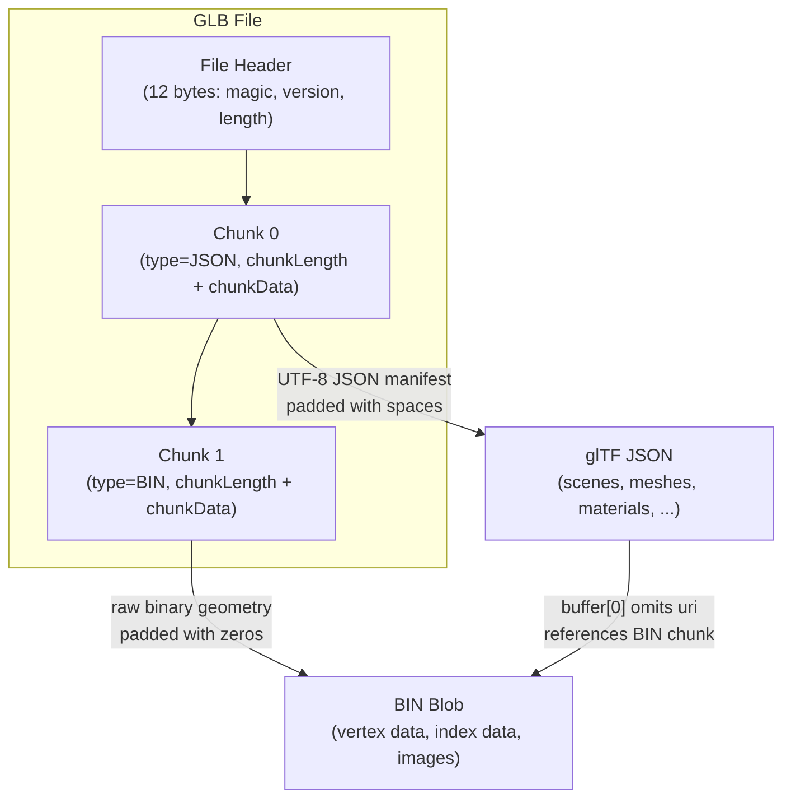
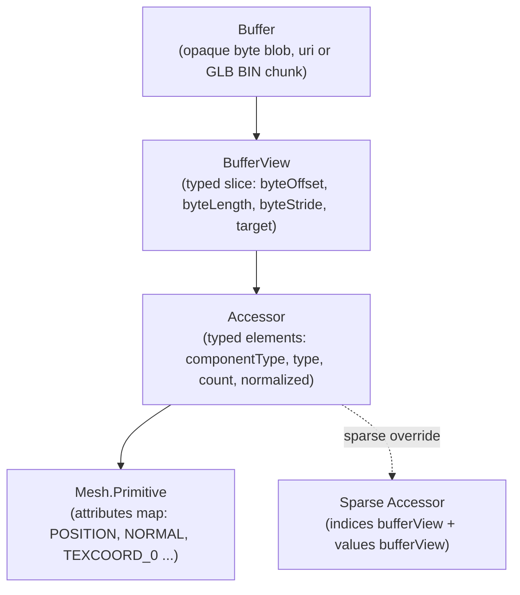
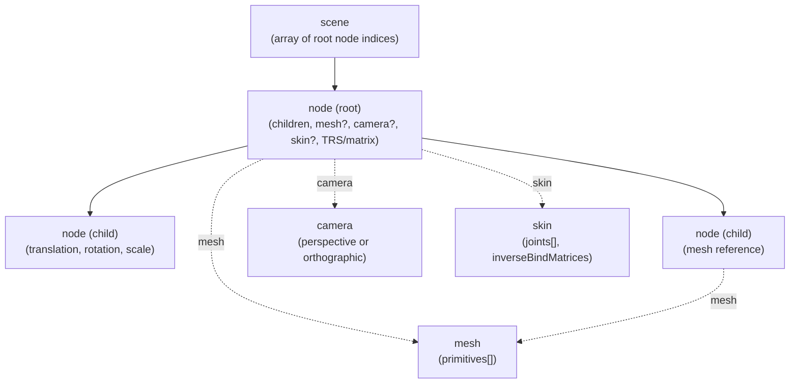
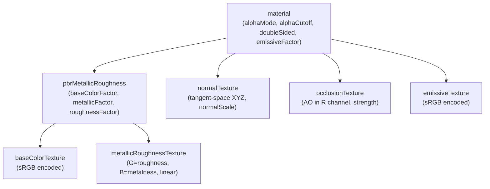
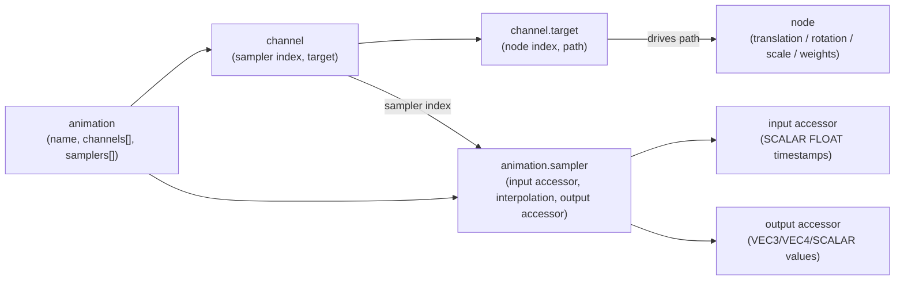
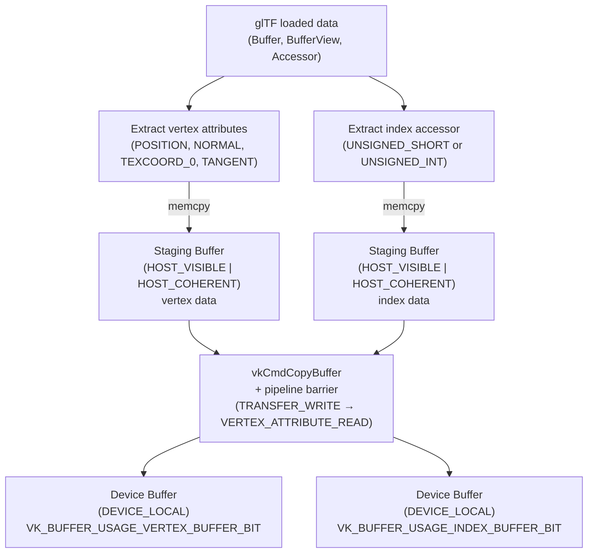
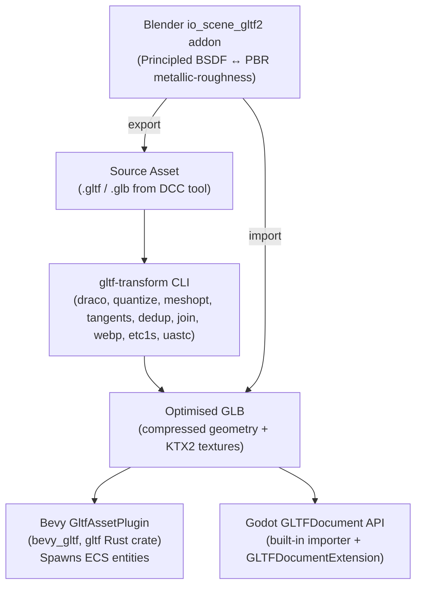

# Chapter 64: glTF 2.0 — The 3D Asset Pipeline Standard

> **Part**: Part XIV — Khronos Extended Ecosystem
> **Audience**: Graphics application developers building 3D asset pipelines
> **Status**: First draft — 2026-06-15

---

## Table of Contents

1. [Overview](#overview)
2. [The glTF 2.0 File Formats: JSON Manifest and GLB Envelope](#2-the-gltf-20-file-formats-json-manifest-and-glb-envelope)
3. [The JSON→GPU Memory Hierarchy: Core Schema Objects](#3-the-jsongpu-memory-hierarchy-core-schema-objects)
   - 3.0 [The Top-Level `asset` Object](#30-the-top-level-asset-object)
   - 3.1 [Buffer and BufferView](#31-buffer-and-bufferview)
   - 3.2 [Accessor: Typed Views into Binary Data](#32-accessor-typed-views-into-binary-data)
   - 3.3 [Mesh and Primitive: Vertex Layout and Topology](#33-mesh-and-primitive-vertex-layout-and-topology)
   - 3.4 [Scene, Node, and the Transform Hierarchy](#34-scene-node-and-the-transform-hierarchy)
   - 3.5 [Camera Objects](#35-camera-objects)
4. [PBR Metallic-Roughness Material Model](#4-pbr-metallic-roughness-material-model)
   - 4.1 [Material Object Fields](#41-material-object-fields)
   - 4.2 [pbrMetallicRoughness Object](#42-pbrmetallicroughness-object)
   - 4.3 [BRDF Algorithm](#43-brdf-algorithm)
   - 4.4 [Normal Mapping, Tangent Space, and MikkTSpace](#44-normal-mapping-tangent-space-and-mikktspace)
   - 4.5 [Texture and Sampler Objects](#45-texture-and-sampler-objects)
5. [Animation and Skinning](#5-animation-and-skinning)
   - 5.1 [Animation Channels and Samplers](#51-animation-channels-and-samplers)
   - 5.2 [Linear Blend Skinning](#52-linear-blend-skinning)
   - 5.3 [Morph Targets](#53-morph-targets)
6. [Official Khronos Extensions](#6-official-khronos-extensions)
   - 6.1 [KHR_draco_mesh_compression](#61-khr_draco_mesh_compression)
   - 6.2 [KHR_mesh_quantization](#62-khr_mesh_quantization)
   - 6.3 [KHR_texture_transform](#63-khr_texture_transform)
   - 6.4 [KHR_materials_transmission and KHR_materials_volume](#64-khr_materials_transmission-and-khr_materials_volume)
   - 6.5 [KHR_materials_unlit and KHR_materials_emissive_strength](#65-khr_materials_unlit-and-khr_materials_emissive_strength)
   - 6.6 [EXT_meshopt_compression](#66-ext_meshopt_compression)
7. [Loading with tinygltf (C++ Header-Only)](#7-loading-with-tinygltf-c-header-only)
8. [Loading with cgltf (C99 Zero-Copy)](#8-loading-with-cgltf-c99-zero-copy)
9. [glTF on the Vulkan Upload Path](#9-gltf-on-the-vulkan-upload-path)
10. [glTF in Engines and the gltf-transform Pipeline](#10-gltf-in-engines-and-the-gltf-transform-pipeline)
    - 10.1 [Bevy's GltfAssetPlugin](#101-bevys-gltfassetplugin)
    - 10.2 [Godot's GLTFDocument API](#102-godots-gltfdocument-api)
    - 10.3 [Blender's glTF Import/Export Addon](#103-blenders-gltf-importexport-addon)
    - 10.4 [gltf-transform CLI for Pre-Processing](#104-gltf-transform-cli-for-pre-processing)
11. [glTF 3.0 Roadmap](#11-gltf-30-roadmap)
12. [Integrations](#integrations)
13. [References](#references)

---

## Overview

glTF 2.0 (GL Transmission Format, version 2) is the Khronos Group's open standard for runtime-efficient delivery and interchange of 3D assets. Where formats like FBX or OBJ were designed primarily for DCC tool interchange, glTF is explicitly designed for the GPU upload path: its binary layout maps directly to WebGL, OpenGL ES, and Vulkan buffer objects, its material model corresponds to physically-based rendering as implemented in real-time engines, and its extension mechanism allows layering of lossless and lossy compression without breaking older renderers.

This chapter is aimed at developers who need to build or maintain production 3D asset pipelines on Linux — integrating asset loading into Vulkan-based renderers, shipping compressed assets to web and embedded targets, and connecting to the Bevy, Godot, and Blender ecosystems. The chapter assumes familiarity with Vulkan buffers and pipelines (Chapters 24–25) and with shader compilation (Chapter 61).

Readers of this chapter will learn:

- The complete glTF 2.0 schema from buffers to materials, including the precise binary alignment rules that govern the JSON→GPU memory path.
- How the PBR metallic-roughness BRDF is specified, what each texture channel carries, and how it maps to fragment shader uniforms and descriptor sets.
- The major Khronos extensions: Draco mesh compression, mesh quantization, texture transforms, and the PBR extension family (transmission, volume, unlit, emissive strength).
- How to use the two dominant C/C++ loaders — tinygltf (header-only C++) and cgltf (C99 zero-copy) — with enough API detail to write a production loader without referencing additional documentation.
- The Vulkan upload path: staging buffers, vertex and index `VkBuffer` creation, and descriptor set binding for PBR maps.
- How Bevy, Godot, and Blender consume glTF natively, and how `gltf-transform` pre-processes assets in a CI pipeline.
- The glTF 3.0 roadmap as of mid-2026.

---

## 2. The glTF 2.0 File Formats: JSON Manifest and GLB Envelope

glTF 2.0 was finalised in June 2017 and is standardised as ISO/IEC 12113:2022. The specification is maintained at the Khronos registry. [Source](https://registry.khronos.org/glTF/specs/2.0/glTF-2.0.html) Schema files live in the KhronosGroup/glTF repository. [Source](https://github.com/KhronosGroup/glTF/tree/main/specification/2.0/schema)

Two concrete file forms exist:

- **`.gltf`** — a UTF-8 JSON file that may reference external `.bin` binary buffers and image files via URI. Suitable for human-readable authoring and tooling pipelines where the constituent files can be inspected independently.
- **`.glb`** — a self-contained binary container that packs the JSON manifest, binary geometry/animation data, and optionally embedded images into a single file. Preferred for runtime delivery.

### GLB Binary Container Layout

The GLB format is a sequence of 32-bit-aligned chunks preceded by a 12-byte file header:

```text
Offset  Size  Field
0       4     magic = 0x46546C67 ("glTF" in little-endian ASCII)
4       4     version = 2 (uint32, little-endian)
8       4     length = total file size in bytes (uint32, little-endian)
```

After the header, chunks are laid out consecutively. Each chunk begins with an 8-byte header:

```text
Offset  Size  Field
0       4     chunkLength = data length in bytes (uint32, excludes this header)
4       4     chunkType (uint32)
8       N     chunkData
```

Chunk types: [Source](https://github.com/KhronosGroup/glTF/blob/988b8c220a4ac11be611d8cf429a894db224f8d5/specification/2.0/GLB_FORMAT.md)

| Value | ASCII | Meaning |
|-------|-------|---------|
| `0x4E4F534A` | `JSON` | Mandatory, must be chunk 0; padded to 4-byte boundary with trailing spaces (0x20) |
| `0x004E4942` | `BIN\0` | Optional, must be chunk 1 if present; padded with zeros; referenced by the first buffer that omits `uri` |

Every chunk's start and end must be 4-byte aligned. Chunk data for JSON is padded with spaces, for BIN with zero bytes, to reach the required alignment.



---

## 3. The JSON→GPU Memory Hierarchy: Core Schema Objects

A glTF file defines a hierarchy that maps cleanly to GPU memory: `Buffer` → `BufferView` → `Accessor` → `Mesh.Primitive`. Understanding the binary layout rules at each level is essential for writing correct, high-performance loaders.



### 3.0 The Top-Level `asset` Object

Every valid glTF 2.0 file must contain a top-level `asset` object. It is the only required top-level field in the spec and carries metadata about the file's origin:

```json
{
  "asset": {
    "version":    "2.0",
    "generator":  "Blender 4.2.0 glTF 2.0 exporter",
    "copyright":  "2026 jreuben11",
    "minVersion": "2.0"
  }
}
```

| Field | Type | Required | Description |
|-------|------|----------|-------------|
| `version` | string | **Yes** | glTF spec version the file targets; must be `"2.0"` for glTF 2.0 files |
| `generator` | string | No | Free-text name of the tool that produced the file; useful for debugging exporter-specific quirks |
| `copyright` | string | No | Free-text copyright notice |
| `minVersion` | string | No | The minimum spec version a loader must support; if present and higher than the loader's supported version, loading should be rejected |

[Source](https://github.com/KhronosGroup/glTF/blob/main/specification/2.0/schema/asset.schema.json)

Loaders should reject any file where `asset.version`'s major number is greater than 2 (future incompatible versions) or is absent. The `generator` string is conventionally inspected by debugging tools and validators (e.g. `gltf-transform inspect` prints it) to attribute exporter-specific workarounds. It must not affect rendering semantics.

### 3.1 Buffer and BufferView

A `buffer` is an opaque byte blob:

```json
{
  "buffers": [
    { "uri": "scene.bin", "byteLength": 524288 }
  ]
}
```

The `uri` field is either a relative file path or a base64-encoded data URI (`data:application/octet-stream;base64,...`). In a GLB, the first buffer may omit `uri` entirely — it refers to the BIN chunk. [Source](https://github.com/KhronosGroup/glTF/tree/main/specification/2.0/schema)

A `bufferView` is a typed slice of a buffer:

| Field | Type | Constraints | Description |
|-------|------|-------------|-------------|
| `buffer` | glTFid | required | Index into `buffers` array |
| `byteOffset` | integer | ≥ 0, default 0 | Byte offset from buffer start |
| `byteLength` | integer | ≥ 1, required | Number of bytes in this slice |
| `byteStride` | integer | 4–252, multiple of 4 | Vertex stride; required when multiple accessors share this bufferView |
| `target` | integer | 34962 or 34963 | GPU buffer type hint: 34962 = `ARRAY_BUFFER` (vertex data), 34963 = `ELEMENT_ARRAY_BUFFER` (index data) |

[Source](https://github.com/KhronosGroup/glTF/blob/main/specification/2.0/schema/bufferView.schema.json)

The `target` field is a hint to loaders that are managing GPU buffer types (e.g., WebGL). On Vulkan, all buffers are created with `VK_BUFFER_USAGE_VERTEX_BUFFER_BIT` or `VK_BUFFER_USAGE_INDEX_BUFFER_BIT` according to how the accessor is used in a primitive (see Section 9).

### 3.2 Accessor: Typed Views into Binary Data

An accessor describes how to interpret bytes in a bufferView as typed elements:

| Field | Type | Constraints | Description |
|-------|------|-------------|-------------|
| `bufferView` | integer | optional | Index into `bufferViews`; if omitted, accessor reads as zero |
| `byteOffset` | integer | ≥ 0, default 0 | Must be a multiple of `componentType` size |
| `componentType` | integer | required | Scalar element type code (see table) |
| `normalized` | boolean | default false | Convert integer → float via normalisation formula |
| `count` | integer | ≥ 1, required | Number of typed elements |
| `type` | string | required | Element shape: `SCALAR`, `VEC2`, `VEC3`, `VEC4`, `MAT2`, `MAT3`, `MAT4` |
| `min` | number[] | 1–16 elements | Per-component minimum values |
| `max` | number[] | 1–16 elements | Per-component maximum values |
| `sparse` | object | optional | Sparse storage override (see below) |

[Source](https://github.com/KhronosGroup/glTF/blob/main/specification/2.0/schema/accessor.schema.json)

**componentType codes:**

| Code | C type | Bytes |
|------|--------|-------|
| 5120 | `int8_t` | 1 |
| 5121 | `uint8_t` | 1 |
| 5122 | `int16_t` | 2 |
| 5123 | `uint16_t` | 2 |
| 5125 | `uint32_t` | 4 |
| 5126 | `float` | 4 |

`UNSIGNED_INT` (5125) is restricted to mesh index buffers; it must not appear as a vertex attribute component type. MAT2/MAT3/MAT4 are column-major.

**Alignment rules**: The byte offset of an accessor into its bufferView, plus the bufferView's own byte offset into the buffer, must be divisible by the `componentType` size. Violations are a validation error. [Source](https://github.com/KhronosGroup/glTF-Tutorials/blob/main/gltfTutorial/gltfTutorial_005_BuffersBufferViewsAccessors.md)

**Interleaved layouts**: Multiple accessors may share one bufferView when `byteStride` is set on the bufferView. Element `i` of accessor A starts at `bufferView.byteOffset + A.byteOffset + i * bufferView.byteStride`. The stride must be large enough to accommodate all attributes packed into the view. This is the layout that maps directly to `VkVertexInputBindingDescription.stride` in Vulkan (see Section 9).

**Sparse accessors**: The `sparse` sub-object provides compact storage for a small number of modified elements within an otherwise-dense (possibly zero-filled) accessor. It carries:

```json
"sparse": {
  "count": 16,
  "indices": { "bufferView": 3, "byteOffset": 0, "componentType": 5123 },
  "values":  { "bufferView": 4, "byteOffset": 0 }
}
```

The `indices.bufferView` contains `count` sorted integer indices identifying which elements are overridden. The `values.bufferView` contains the replacement values for those elements. [Source](https://github.com/KhronosGroup/glTF-Tutorials/blob/main/gltfTutorial/gltfTutorial_005_BuffersBufferViewsAccessors.md) Sparse accessors are used extensively for morph target deltas (Section 5.3) where only a small fraction of vertices are displaced.

### 3.3 Mesh and Primitive: Vertex Layout and Topology

A mesh is an array of primitives, each describing one draw call:

```json
{
  "meshes": [{
    "name": "Cube",
    "primitives": [{
      "attributes": {
        "POSITION":   1,
        "NORMAL":     2,
        "TEXCOORD_0": 3,
        "TANGENT":    4
      },
      "indices":  0,
      "material": 0,
      "mode":     4
    }],
    "weights": [0.0, 0.0]
  }]
}
```

The `attributes` field maps semantic names to accessor indices. The `indices` field names an accessor of type `SCALAR` with `componentType` `UNSIGNED_SHORT` (5123) or `UNSIGNED_INT` (5125), corresponding to `VK_INDEX_TYPE_UINT16` and `VK_INDEX_TYPE_UINT32` respectively.

**Topology mode values**: 0 = POINTS, 1 = LINES, 2 = LINE_LOOP, 3 = LINE_STRIP, 4 = TRIANGLES (default), 5 = TRIANGLE_STRIP, 6 = TRIANGLE_FAN. `KHR_draco_mesh_compression` only supports TRIANGLES and TRIANGLE_STRIP.

**Standard attribute semantics and required accessor types:** [Source](https://registry.khronos.org/glTF/specs/2.0/glTF-2.0.html)

| Semantic | Accessor Type | Component Type(s) | Notes |
|----------|---------------|-------------------|-------|
| `POSITION` | VEC3 | FLOAT | Required for all primitives |
| `NORMAL` | VEC3 | FLOAT | Must be unit-length; used for normal mapping |
| `TANGENT` | VEC4 | FLOAT | W = ±1.0 (handedness); required for MikkTSpace normal maps |
| `TEXCOORD_0`, `TEXCOORD_1`, … | VEC2 | FLOAT or UNSIGNED_BYTE (norm) or UNSIGNED_SHORT (norm) | Zero-based consecutive suffix |
| `COLOR_0` | VEC3 or VEC4 | FLOAT or UNSIGNED_BYTE (norm) or UNSIGNED_SHORT (norm) | VEC3 implies alpha = 1.0 |
| `JOINTS_0` | VEC4 | UNSIGNED_BYTE or UNSIGNED_SHORT | Bone indices for skeletal animation |
| `WEIGHTS_0` | VEC4 | FLOAT or UNSIGNED_BYTE (norm) or UNSIGNED_SHORT (norm) | Must sum to 1.0 per vertex |

[Source](https://github.com/KhronosGroup/glTF/blob/main/specification/2.0/schema/mesh.primitive.schema.json)

The `_0` suffix on `TEXCOORD`, `COLOR`, `JOINTS`, and `WEIGHTS` semantics is zero-based; `TEXCOORD_1`, `JOINTS_1`, and `WEIGHTS_1` are valid for multi-set skinning and texture coordinates.

### 3.4 Scene, Node, and the Transform Hierarchy

The scene graph is a **strict tree** — no shared-parent DAG. Each `scene` names an array of root node indices. Nodes may carry a mesh, camera, skin, and/or child nodes:

```json
{
  "scenes": [{ "nodes": [0] }],
  "nodes": [
    { "children": [1, 2], "mesh": 0, "name": "Root" },
    { "translation": [1.0, 0.0, 0.0], "rotation": [0.0, 0.0, 0.0, 1.0], "scale": [1.0, 1.0, 1.0] }
  ]
}
```

Node transform fields: [Source](https://github.com/KhronosGroup/glTF/blob/main/specification/2.0/schema/node.schema.json)

| Field | Type | Notes |
|-------|------|-------|
| `matrix` | number[16] | Column-major 4×4; mutually exclusive with TRS |
| `translation` | number[3] | Default [0,0,0] |
| `rotation` | number[4] | (x,y,z,w) unit quaternion; component range [-1,1]; default [0,0,0,1] |
| `scale` | number[3] | Default [1,1,1] |
| `children` | glTFid[] | At least 1 if present; values must be unique |
| `skin` | glTFid | Requires `mesh`; all joints must be in the same scene |
| `weights` | number[] | Morph target weights for the referenced mesh |

TRS composition: `localMatrix = T × R × S` (scale first, then rotate, then translate). Nodes targeted by animation must use the TRS fields, not `matrix`, because animation channels drive individual TRS components. The world transform of a node is accumulated by traversing from the root to that node and multiplying local matrices along the path. glTF uses a right-handed, Y-up coordinate system.



### 3.5 Camera Objects

glTF 2.0 defines camera objects that can be attached to scene nodes via the `camera` field on a node. A camera node provides projection parameters; the view transform comes from the node's world matrix. [Source](https://github.com/KhronosGroup/glTF/blob/main/specification/2.0/schema/camera.schema.json)

```json
{
  "cameras": [
    {
      "name": "MainCamera",
      "type": "perspective",
      "perspective": {
        "yfov":        0.6981317,
        "aspectRatio": 1.7777778,
        "znear":       0.01,
        "zfar":        1000.0
      }
    },
    {
      "name": "OrthoCamera",
      "type": "orthographic",
      "orthographic": {
        "xmag":  10.0,
        "ymag":  10.0,
        "znear": 0.01,
        "zfar":  1000.0
      }
    }
  ]
}
```

**`type`** is either `"perspective"` or `"orthographic"`. The two sub-objects are mutually exclusive.

**Perspective camera fields:**

| Field | Type | Required | Description |
|-------|------|----------|-------------|
| `yfov` | number | Yes | Vertical field of view in radians; must be > 0 and < π |
| `aspectRatio` | number | No | Width / height ratio; if omitted the renderer should use the viewport aspect ratio |
| `znear` | number | Yes | Distance to near clipping plane; must be > 0 |
| `zfar` | number | No | Distance to far clipping plane; if omitted, an infinite projection matrix is used |

**Orthographic camera fields:**

| Field | Type | Required | Description |
|-------|------|----------|-------------|
| `xmag` | number | Yes | Half-width of the orthographic view volume in world units |
| `ymag` | number | Yes | Half-height of the orthographic view volume in world units |
| `znear` | number | Yes | Distance to near clipping plane |
| `zfar` | number | Yes | Distance to far clipping plane; must be > `znear` |

To attach a camera to a node, set the node's `camera` field to the index into the `cameras` array:

```json
{ "nodes": [{ "camera": 0, "translation": [0.0, 1.0, 5.0] }] }
```

Most real-time renderers ignore glTF cameras in favour of their own runtime camera controllers, but tools (Blender, Godot) and path tracers (Blender Cycles, Mitsuba) can use them for scene-defined render viewpoints. The `zfar` field may be omitted for perspective cameras to generate an infinite far plane, which avoids precision artifacts in reverse-Z depth buffer configurations.

---

## 4. PBR Metallic-Roughness Material Model

### 4.1 Material Object Fields

The `material` object at the top level of the JSON describes a physically-based surface. [Source](https://github.com/KhronosGroup/glTF/blob/main/specification/2.0/schema/material.schema.json)

| Field | Type | Default | Description |
|-------|------|---------|-------------|
| `pbrMetallicRoughness` | object | — | Core PBR parameter block |
| `normalTexture` | normalTextureInfo | — | Tangent-space normal map (RGB = XYZ in [0,1] space → decoded to [-1,1]) |
| `occlusionTexture` | occlusionTextureInfo | — | Ambient occlusion; AO value in the R channel |
| `emissiveTexture` | textureInfo | — | sRGB-encoded emissive colour |
| `emissiveFactor` | number[3] | [0,0,0] | Linear multiplier for emissive colour; clamped to [0,1] in core spec |
| `alphaMode` | string | `"OPAQUE"` | `"OPAQUE"`, `"MASK"`, or `"BLEND"` |
| `alphaCutoff` | number | 0.5 | Fragment discard threshold for `"MASK"` mode |
| `doubleSided` | boolean | false | Disables backface culling; requires two normals in shading |

For `"MASK"` alpha mode: fragments where `baseColor.a < alphaCutoff` are discarded. For `"BLEND"`: the fragment is composited with premultiplied-alpha blending; backface rendering order is undefined unless `doubleSided` is true.



### 4.2 pbrMetallicRoughness Object

[Source](https://github.com/KhronosGroup/glTF/blob/main/specification/2.0/schema/material.pbrMetallicRoughness.schema.json)

| Field | Type | Default | Description |
|-------|------|---------|-------------|
| `baseColorFactor` | number[4] (RGBA) | [1,1,1,1] | Linear-space multiplier; alpha is pre-multiplied into the BRDF |
| `baseColorTexture` | textureInfo | — | sRGB-encoded colour; linear alpha (used for `"BLEND"` and `"MASK"`) |
| `metallicFactor` | number [0,1] | 1.0 | Blends between dielectric and metallic BRDF |
| `roughnessFactor` | number [0,1] | 1.0 | Perceptual roughness (α = roughness²) |
| `metallicRoughnessTexture` | textureInfo | — | **G channel = roughness, B channel = metalness** (both linear); R channel unused |

The `baseColorTexture` is stored in sRGB space and must be converted to linear before multiplication with `baseColorFactor`. The `metallicRoughnessTexture` is always linear; no sRGB conversion should be applied.

### 4.3 BRDF Algorithm

The glTF 2.0 reference BRDF is a linear blend of a metallic and a dielectric lobe, driven by the `metallicFactor` parameter: [Source](https://registry.khronos.org/glTF/specs/2.0/glTF-2.0.html)

```text
material_brdf = mix(
  dielectric_brdf(base_color, roughness, ior=1.5),
  metallic_brdf(base_color, roughness),
  metallic
)
```

The dielectric BRDF uses a layered Fresnel structure over a Cook-Torrance specular lobe and a Lambertian diffuse base:

```text
dielectric_brdf =
  fresnel_mix(
    ior   = 1.5,
    base  = diffuse_brdf(baseColor),
    layer = specular_brdf(alpha = roughness * roughness)
  )
```

The `fresnel_mix` function computes the weight using the Schlick approximation with `F0 = ((ior-1)/(ior+1))^2 = 0.04` for `ior=1.5` (common dielectric). The specular lobe uses the Trowbridge-Reitz (GGX) normal distribution function. The `metallic_brdf` uses only the specular lobe with `F0 = base_color` (metals have coloured reflections).

In a Vulkan fragment shader, the typical uniform layout for one material draw call:

```glsl
// Fragment shader material UBO
// (example structure; adapt to your descriptor set layout)
layout(set = 1, binding = 0) uniform MaterialParams {
    vec4  baseColorFactor;
    float metallicFactor;
    float roughnessFactor;
    float normalScale;
    float occlusionStrength;
    vec3  emissiveFactor;
    int   alphaMode;        // 0=OPAQUE, 1=MASK, 2=BLEND
    float alphaCutoff;
    int   doubleSided;
} material;

layout(set = 1, binding = 1) uniform sampler2D baseColorTex;
layout(set = 1, binding = 2) uniform sampler2D metallicRoughnessTex;
layout(set = 1, binding = 3) uniform sampler2D normalTex;
layout(set = 1, binding = 4) uniform sampler2D occlusionTex;
layout(set = 1, binding = 5) uniform sampler2D emissiveTex;
```

### 4.4 Normal Mapping, Tangent Space, and MikkTSpace

The glTF 2.0 specification mandates **MikkTSpace** as the reference tangent generation algorithm for any tool that bakes normal maps or generates TANGENT accessors. [Source](https://registry.khronos.org/glTF/specs/2.0/glTF-2.0.html) The bitangent is reconstructed in the shader as:

```glsl
// Reconstruct bitangent from normal and tangent
vec3 N = normalize(fragNormal);
vec3 T = normalize(fragTangent.xyz);
vec3 B = cross(N, T) * fragTangent.w;   // tangent.w = ±1.0 (handedness)
mat3 TBN = mat3(T, B, N);

// Transform tangent-space normal from texture
vec3 mapN = texture(normalTex, uv).xyz * 2.0 - 1.0;
mapN.xy  *= material.normalScale;
vec3 worldN = normalize(TBN * mapN);
```

If no TANGENT attribute is present in the primitive, loaders should generate tangents using MikkTSpace at load time (as `gltf-transform tangents` does). Mismatched tangent-generation algorithms cause visible shading seams at UV island boundaries.

### 4.5 Texture and Sampler Objects

A `texture` references an `image` (URI or base64 data or bufferView for embedded images) and a `sampler`. Sampler filter and wrap mode values use OpenGL ES 2.0 constants: [Source](https://github.com/KhronosGroup/glTF/blob/main/specification/2.0/schema/sampler.schema.json)

| Constant | Value | Applicable to |
|----------|-------|---------------|
| NEAREST | 9728 | magFilter, minFilter |
| LINEAR | 9729 | magFilter, minFilter |
| NEAREST_MIPMAP_NEAREST | 9984 | minFilter only |
| LINEAR_MIPMAP_NEAREST | 9985 | minFilter only |
| NEAREST_MIPMAP_LINEAR | 9986 | minFilter only |
| LINEAR_MIPMAP_LINEAR | 9987 | minFilter only |
| CLAMP_TO_EDGE | 33071 | wrapS, wrapT |
| MIRRORED_REPEAT | 33648 | wrapS, wrapT |
| REPEAT | 10497 | wrapS, wrapT (default) |

On Vulkan, these map directly to `VkSamplerCreateInfo` fields: `magFilter`, `minFilter` → `VkFilter`; mipmap filter modes → `VkSamplerMipmapMode`; wrap modes → `VkSamplerAddressMode`.

---

## 5. Animation and Skinning

### 5.1 Animation Channels and Samplers

```json
{
  "animations": [{
    "name": "Walk",
    "channels": [{
      "sampler": 0,
      "target": { "node": 2, "path": "rotation" }
    }],
    "samplers": [{
      "input":         10,
      "interpolation": "LINEAR",
      "output":        11
    }]
  }]
}
```



`target.path` values: `"translation"`, `"rotation"`, `"scale"`, `"weights"` (morph target blend weights). [Source](https://github.com/KhronosGroup/glTF/blob/main/specification/2.0/schema/animation.channel.target.schema.json)

Sampler `interpolation` values: [Source](https://github.com/KhronosGroup/glTF/blob/main/specification/2.0/schema/animation.sampler.schema.json)

| Value | Semantics |
|-------|-----------|
| `"LINEAR"` | Linear interpolation; for rotation channels, spherical linear interpolation (slerp) SHOULD be used |
| `"STEP"` | Constant; value stays at the previous keyframe until the next timestamp |
| `"CUBICSPLINE"` | Hermite cubic spline; `output` has 3× elements as `input`: per keyframe (in-tangent, value, out-tangent) |

The `input` accessor is always `SCALAR` FLOAT with strictly increasing timestamps in seconds. The `output` accessor element type depends on `path`: VEC3 for translation/scale, VEC4 unit quaternion for rotation, SCALAR array for weights. For `"CUBICSPLINE"`, the value at keyframe `i` is at `output[3*i + 1]`; `output[3*i]` is the in-tangent and `output[3*i + 2]` is the out-tangent.

### 5.2 Linear Blend Skinning

```json
{
  "skins": [{
    "name":                "Armature",
    "inverseBindMatrices": 5,
    "joints":              [1, 2, 3, 4]
  }]
}
```

The `inverseBindMatrices` accessor is type MAT4 FLOAT with one entry per joint in the `joints` array. These matrices transform from mesh object space to the joint's local space at the bind pose. The per-frame joint matrix is: [Source](https://registry.khronos.org/glTF/specs/2.0/glTF-2.0.html)

```text
jointMatrix[i] = globalJointTransform[joints[i]] * inverseBindMatrix[i]
```

where `globalJointTransform[joints[i]]` is the world matrix of the joint node (accumulated from root as in Section 3.4). The vertex shader:

```glsl
// Vertex shader — linear blend skinning
// joints and weights are per-vertex attributes (JOINTS_0, WEIGHTS_0)
mat4 skinMatrix =
    weights.x * jointMatrices[joints.x] +
    weights.y * jointMatrices[joints.y] +
    weights.z * jointMatrices[joints.z] +
    weights.w * jointMatrices[joints.w];

vec4 skinnedPosition = skinMatrix * vec4(inPosition, 1.0);
vec3 skinnedNormal   = normalize(mat3(skinMatrix) * inNormal);
```

`jointMatrices` is typically stored in a uniform buffer indexed by joint index. When `JOINTS_0` uses `UNSIGNED_BYTE` component type (up to 256 joints), the indices must be read as unsigned integers even in GLSL.

### 5.3 Morph Targets

Morph targets store per-vertex displacements as additional accessor arrays on the primitive's `targets` list:

```json
"primitives": [{
  "attributes": { "POSITION": 1 },
  "targets": [
    { "POSITION": 2 },
    { "POSITION": 3 }
  ]
}],
"weights": [0.5, 0.5]
```

Accessors 2 and 3 contain VEC3 FLOAT displacement values. The final position is:

```text
finalPosition = basePosition + sum_i(weights[i] * targetDisplacement[i])
```

Sparse accessors are ideal for morph targets — only displaced vertices need stored values; all other indices read as zero. [Source](https://github.com/KhronosGroup/glTF-Tutorials/blob/main/gltfTutorial/gltfTutorial_017_SimpleMorphTarget.md) Animation channel `path = "weights"` drives the blend weights at runtime.

---

## 6. Official Khronos Extensions

The glTF extension system uses `extensionsUsed` (informational; renderer may ignore) and `extensionsRequired` (renderer must support to render correctly) at the top level. Any JSON object can carry an `extensions` key containing per-extension properties.

### 6.1 KHR_draco_mesh_compression

[Source](https://github.com/KhronosGroup/glTF/blob/main/extensions/2.0/Khronos/KHR_draco_mesh_compression/README.md)

This extension replaces per-attribute accessors with a single Draco-compressed blob per primitive. It must appear in `extensionsRequired` since there is no meaningful uncompressed fallback. The primitive extension JSON:

```json
"extensions": {
  "KHR_draco_mesh_compression": {
    "bufferView": 5,
    "attributes": {
      "POSITION":   0,
      "NORMAL":     1,
      "TEXCOORD_0": 2
    }
  }
}
```

The `bufferView` index points to the raw Draco bitstream. The `attributes` map names each semantic to its Draco attribute ID within the compressed data. The primitive still carries `attributes` and `indices` in the uncompressed form for non-supporting renderers, but supporting decoders must use the Draco bitstream exclusively.

**Restrictions**: Only `TRIANGLES` (mode 4) and `TRIANGLE_STRIP` (mode 5) primitives are supported. Draco reorders vertices for entropy coding, so the decoded vertex count may differ from the original.

**Draco decode workflow** (C++, Google Draco v1.5.7, released January 17, 2024):

```cpp
// File: draco_decode_example.cpp
// Requires: draco/compression/decode.h (Google Draco >= 1.5.0)
#include "draco/compression/decode.h"

// data: pointer to KHR_draco_mesh_compression bufferView bytes
// size: byte length of that bufferView
std::unique_ptr<draco::Mesh> DecodeDracoMesh(
    const uint8_t* data, size_t size)
{
    draco::DecoderBuffer buf;
    buf.Init(reinterpret_cast<const char*>(data), size);

    draco::Decoder decoder;
    auto statusor = decoder.DecodeMeshFromBuffer(&buf);
    if (!statusor.ok()) {
        throw std::runtime_error(statusor.status().error_msg());
    }
    return std::move(statusor).value();
}

// Read POSITION attribute after decoding
void ExtractPositions(const draco::Mesh& mesh, std::vector<float>& out) {
    const draco::PointAttribute* pos =
        mesh.GetNamedAttribute(draco::GeometryAttribute::POSITION);
    out.resize(mesh.num_points() * 3);
    for (draco::PointIndex vi(0); vi < mesh.num_points(); ++vi) {
        pos->GetMappedValue(vi, &out[vi.value() * 3]);
    }
}
```

[Source](https://github.com/google/draco)

For geometry-heavy models, Draco can reduce file size by up to 95% compared to uncompressed FLOAT accessors. The tradeoff is CPU decode time (typically 5–50 ms per mesh on modern hardware) and the requirement to fully decode before GPU upload.

### 6.2 KHR_mesh_quantization

[Source](https://github.com/KhronosGroup/glTF/blob/main/extensions/2.0/Khronos/KHR_mesh_quantization/README.md)

This extension permits non-FLOAT component types for mesh vertex attributes, enabling 50–70% smaller vertex buffers without lossy compression. It must appear in `extensionsRequired`.

**Allowed component type additions per attribute:**

| Attribute | Added Types | Normalization |
|-----------|-------------|---------------|
| `POSITION` (VEC3) | BYTE, UNSIGNED_BYTE, SHORT, UNSIGNED_SHORT | Optional |
| `NORMAL` (VEC3) | BYTE norm, SHORT norm | Must be normalized |
| `TANGENT` (VEC4) | BYTE norm, SHORT norm | Must be normalized |
| `TEXCOORD_n` (VEC2) | BYTE, UNSIGNED_BYTE, SHORT, UNSIGNED_SHORT | Optional |

**Dequantization formulas** (applied in the vertex shader or at load time):

| Stored type | Float reconstruction |
|-------------|---------------------|
| BYTE (signed, normalized) | `f = max(c / 127.0, -1.0)` |
| UNSIGNED_BYTE (normalized) | `f = c / 255.0` |
| SHORT (signed, normalized) | `f = max(c / 32767.0, -1.0)` |
| UNSIGNED_SHORT (normalized) | `f = c / 65535.0` |

Storage savings at full precision: a 16-bit SHORT POSITION uses 6 bytes per vertex vs. 12 bytes for FLOAT; an 8-bit BYTE NORMAL uses 3 bytes vs. 12 bytes. The specification handles dequantization scale/offset through node transform matrices (for non-skinned meshes) and `inverseBindMatrices` (for skinned meshes).

In GLSL, quantized attributes are declared as `in int` or `in uint` and converted in the vertex shader:

```glsl
// Example: POSITION quantized as UNSIGNED_SHORT (non-normalized)
layout(location = 0) in uvec3 inPositionQ;

void main() {
    // Dequantize: scale/bias from node transform matrix handles world space
    vec3 position = vec3(inPositionQ) / 65535.0;
    gl_Position = mvp * vec4(position, 1.0);
}
```

### 6.3 KHR_texture_transform

This extension adds UV scale, rotation, and offset for atlas animation and multi-UV packing:

```json
"baseColorTexture": {
  "index": 0,
  "extensions": {
    "KHR_texture_transform": {
      "offset":   [0.0, 0.0],
      "rotation": 0.0,
      "scale":    [1.0, 1.0],
      "texCoord": 0
    }
  }
}
```

`rotation` is in radians, counter-clockwise. The transform is applied as: `uv' = rotation_matrix * scale * uv + offset`. This allows one UV set to address multiple atlas regions by applying different transforms per texture. The optional `texCoord` field overrides the texture info's `texCoord` index for this specific transform.

### 6.4 KHR_materials_transmission and KHR_materials_volume

**KHR_materials_transmission** models thin-surface optical transmittance for glass panels, clear plastic, and water surfaces — materials that transmit light through an infinitely thin sheet. [Source](https://github.com/KhronosGroup/glTF/blob/main/extensions/2.0/Khronos/KHR_materials_transmission/README.md)

| Property | Type | Default | Description |
|----------|------|---------|-------------|
| `transmissionFactor` | number | 0.0 | Fraction of light transmitted through the surface |
| `transmissionTexture` | textureInfo | — | Per-texel transmission in R channel; multiplied by `transmissionFactor` |

The modified BRDF inserts a specular BTDF (bidirectional transmission distribution function) into the dielectric lobe's diffuse layer:

```text
dielectric_brdf =
  fresnel_mix(
    ior = 1.5,
    base = mix(
      diffuse_brdf(baseColor),
      specular_btdf(alpha = roughness²) * baseColor,
      transmission),
    layer = specular_brdf(alpha = roughness²))
```

Key notes: `baseColor` tints transmitted light (coloured glass effect); `roughness` blurs the transmission via microfacet BTDF; `metallic = 1.0` fully suppresses transmission; `alphaMode` should remain `"OPAQUE"` because transmittance is already physically modelled.

**KHR_materials_volume** adds volumetric parameters for thick refractive solids: `thicknessFactor` (object-space thickness in metres), `thicknessTexture`, `attenuationDistance` (mean free path), and `attenuationColor` (what white light becomes after travelling one attenuation distance). Real-time renderers use baked thickness textures; path tracers measure actual intersection depth. [Source](https://www.khronos.org/blog/using-the-new-gltf-extensions-volume-index-of-refraction-and-specular)

**KHR_materials_ior** adds a single `ior` scalar (default 1.5) that modifies F0: `F0 = ((ior-1)/(ior+1))^2`. This connects to the Fresnel behaviour used by `KHR_materials_transmission`. [Source](https://www.khronos.org/blog/using-the-new-gltf-extensions-volume-index-of-refraction-and-specular)

### 6.5 KHR_materials_unlit and KHR_materials_emissive_strength

**KHR_materials_unlit** marks a material as using no lighting calculations — the base colour is rendered directly as output. Used for UI elements, baked-lighting assets, and reference renders. It has no additional parameters; its presence as a key in `extensions` is the signal.

**KHR_materials_emissive_strength** adds an `emissiveStrength` scalar multiplier that overrides the core spec's implicit clamp of `emissiveFactor` to [0,1]: [Source](https://github.com/KhronosGroup/glTF/tree/main/extensions/2.0/Khronos/KHR_materials_emissive_strength)

```json
"extensions": {
  "KHR_materials_emissive_strength": {
    "emissiveStrength": 10.0
  }
}
```

Values > 1.0 are used for HDR rendering and bloom effects. The final emissive term is `emissiveFactor * emissiveStrength * emissiveTexture.rgb`.

### 6.6 EXT_meshopt_compression

`EXT_meshopt_compression` uses the meshoptimizer library's compression format to reduce buffer size while optimising vertex cache and overdraw simultaneously. Unlike Draco, meshopt compression is lossless and can be applied to any bufferView (not just triangle mesh attributes). The compressed data is stored in a bufferView with a `filter` (for attribute data, e.g., `"OCTAHEDRAL"` for normals) and a `mode` (`"ATTRIBUTES"`, `"TRIANGLES"`, or `"INDICES"`). `gltf-transform meshopt` applies this automatically. Decoding is done via `meshopt_decodeVertexBuffer` / `meshopt_decodeIndexBuffer` from the meshoptimizer C++ library before GPU upload.

---

## 7. Loading with tinygltf (C++ Header-Only)

tinygltf is a single-header C++ library for loading and saving glTF 2.0 files. Current stable version is v2.9.x; v3.0.0 was released March 23, 2026, with a C POD struct API and arena-based memory management. The v2 branch is in maintenance mode with sunset planned after mid-2026. [Source](https://github.com/syoyo/tinygltf)

**Integration** — copy four files into your project and define the implementation macro in exactly one translation unit:

```cpp
// gltf_loader.cpp — define exactly once
#define TINYGLTF_IMPLEMENTATION
#define STB_IMAGE_IMPLEMENTATION
#define STB_IMAGE_WRITE_IMPLEMENTATION
#include "tiny_gltf.h"
```

Required files: `tiny_gltf.h`, `json.hpp` (nlohmann/json), `stb_image.h`, `stb_image_write.h`.

**Loading API:**

```cpp
// Load a glTF or GLB file from disk
// Returns true on success; err/warn contain diagnostic strings.
bool tinygltf::TinyGLTF::LoadASCIIFromFile(
    Model*             model,
    std::string*       err,
    std::string*       warn,
    const std::string& filename,
    unsigned int       check_sections = REQUIRE_VERSION);

bool tinygltf::TinyGLTF::LoadBinaryFromFile(
    Model*             model,
    std::string*       err,
    std::string*       warn,
    const std::string& filename,
    unsigned int       check_sections = REQUIRE_VERSION);

bool tinygltf::TinyGLTF::LoadBinaryFromMemory(
    Model*              model,
    std::string*        err,
    std::string*        warn,
    const unsigned char* bytes,
    unsigned int         length,
    const std::string&   base_dir,
    unsigned int         check_sections = REQUIRE_VERSION);

bool tinygltf::TinyGLTF::WriteGltfSceneToFile(
    const Model*       model,
    const std::string& filename,
    bool embedImages,
    bool embedBuffers,
    bool prettyPrint,
    bool writeBinary);
```

[Source](https://github.com/syoyo/tinygltf)

**Usage pattern:**

```cpp
// Load and iterate mesh primitives (tinygltf v2)
// Adapted from SaschaWillems/Vulkan gltfscenerendering.cpp
tinygltf::Model    model;
tinygltf::TinyGLTF loader;
std::string err, warn;

bool ok = loader.LoadBinaryFromFile(&model, &err, &warn, "scene.glb");
if (!warn.empty()) std::cerr << "glTF warning: " << warn << "\n";
if (!ok)           throw std::runtime_error("glTF load failed: " + err);

for (const auto& mesh : model.meshes) {
    for (const auto& prim : mesh.primitives) {
        // --- POSITION ---
        const auto& posAcc  = model.accessors[prim.attributes.at("POSITION")];
        const auto& posView = model.bufferViews[posAcc.bufferView];
        const float* positions = reinterpret_cast<const float*>(
            &model.buffers[posView.buffer].data[
                posAcc.byteOffset + posView.byteOffset]);

        for (size_t v = 0; v < posAcc.count; ++v) {
            // positions[v*3 + 0/1/2] = x/y/z (assuming tightly packed FLOAT)
        }

        // --- Material ---
        if (prim.material >= 0) {
            const auto& mat = model.materials[prim.material];
            float metallic  = (float)mat.pbrMetallicRoughness.metallicFactor;
            float roughness = (float)mat.pbrMetallicRoughness.roughnessFactor;
            // mat.pbrMetallicRoughness.baseColorTexture.index -> texture index
        }
    }
}
```

[Source](https://github.com/SaschaWillems/Vulkan/blob/master/examples/gltfscenerendering/gltfscenerendering.cpp)

**Key tinygltf v2 constants** (defined in `tiny_gltf.h`):

```cpp
// Component types (match glTF spec codes)
TINYGLTF_COMPONENT_TYPE_BYTE           = 5120
TINYGLTF_COMPONENT_TYPE_UNSIGNED_BYTE  = 5121
TINYGLTF_COMPONENT_TYPE_SHORT          = 5122
TINYGLTF_COMPONENT_TYPE_UNSIGNED_SHORT = 5123
TINYGLTF_COMPONENT_TYPE_UNSIGNED_INT   = 5125
TINYGLTF_COMPONENT_TYPE_FLOAT          = 5126

// Accessor types
TINYGLTF_TYPE_SCALAR = 65
TINYGLTF_TYPE_VEC2   = 2
TINYGLTF_TYPE_VEC3   = 3
TINYGLTF_TYPE_VEC4   = 4
TINYGLTF_TYPE_MAT4   = 36

// Primitive modes
TINYGLTF_MODE_POINTS    = 0
TINYGLTF_MODE_LINE      = 1
TINYGLTF_MODE_TRIANGLES = 4

// Texture wrap modes
TINYGLTF_TEXTURE_WRAP_REPEAT        = 10497
TINYGLTF_TEXTURE_WRAP_CLAMP_TO_EDGE = 33071
```

[Source](https://raw.githubusercontent.com/syoyo/tinygltf/master/tiny_gltf.h)

**Custom image loading hook** for KTX2 textures (see Chapter 63): `loader.SetImageLoader` accepts a callback of type `bool(Image*, const int, std::string*, std::string*, int, int, const unsigned char*, int, void*)`. In the callback, detect the `image.mimeType == "image/ktx2"` case and invoke the KTX2 decoder instead of stb_image.

**tinygltf v3.0.0 changes**: The new `tiny_gltf_v3.h` header exposes pure C POD structs with no STL containers in the public API, arena-based memory management (all data freed with a single `tg3_model_free()` call), and structured error reporting via a `tg3_error_stack` linked list. This dramatically improves embedding in performance-critical engines that avoid STL allocations in hot paths. [Source](https://github.com/syoyo/tinygltf/releases)

---

## 8. Loading with cgltf (C99 Zero-Copy)

cgltf is a single-file C99 library that takes a zero-copy approach: after parsing, accessor data is accessible via direct pointer arithmetic into the mapped buffer file, with no intermediate allocation. Current stable version: v1.15 (released February 9, 2025). [Source](https://github.com/jkuhlmann/cgltf)

**Integration** — copy `cgltf.h` and define the implementation macro in one translation unit:

```c
/* cgltf_impl.c — define exactly once */
#define CGLTF_IMPLEMENTATION
#include "cgltf.h"
```

**Complete load workflow:**

```c
/* cgltf full loading workflow */
cgltf_options options = {0};   /* zero-init: cgltf_file_type_invalid = auto-detect */
cgltf_data*   data    = NULL;
cgltf_result  result;

/* Step 1: parse JSON and record buffer views */
result = cgltf_parse_file(&options, "scene.gltf", &data);
if (result != cgltf_result_success) { /* handle error */ }

/* Step 2: open external .bin files / decode base64 URIs */
result = cgltf_load_buffers(&options, data, "scene.gltf");
if (result != cgltf_result_success) { /* handle error */ }

/* Step 3: optional spec conformance check */
result = cgltf_validate(data);
if (result != cgltf_result_success) { /* handle error */ }

/* ... use data ... */

cgltf_free(data);
```

`cgltf_result` codes include: `cgltf_result_success`, `cgltf_result_data_too_short`, `cgltf_result_invalid_json`, `cgltf_result_invalid_gltf`, `cgltf_result_file_not_found`, `cgltf_result_out_of_memory`, `cgltf_result_legacy_gltf`. [Source](https://github.com/jkuhlmann/cgltf)

**Key struct definitions** (cgltf.h v1.15):

```c
/* cgltf.h — selected struct definitions */
typedef struct cgltf_accessor {
    char*                  name;
    cgltf_component_type   component_type;   /* r_8, r_8u, r_16, r_16u, r_32u, r_32f */
    cgltf_bool             normalized;
    cgltf_type             type;             /* scalar, vec2, vec3, vec4, mat2, mat3, mat4 */
    cgltf_size             offset;           /* byte offset into buffer_view */
    cgltf_size             count;
    cgltf_size             stride;           /* accounts for interleaved packing */
    cgltf_buffer_view*     buffer_view;
    cgltf_bool             has_min;
    cgltf_float            min[16];
    cgltf_bool             has_max;
    cgltf_float            max[16];
    cgltf_bool             is_sparse;
    cgltf_accessor_sparse  sparse;
} cgltf_accessor;

typedef struct cgltf_primitive {
    cgltf_primitive_type    type;              /* points, lines, triangles, ... */
    cgltf_accessor*         indices;
    cgltf_material*         material;
    cgltf_attribute*        attributes;
    cgltf_size              attributes_count;
    cgltf_morph_target*     targets;
    cgltf_size              targets_count;
    cgltf_bool              has_draco_mesh_compression;
    cgltf_draco_mesh_compression draco_mesh_compression;
} cgltf_primitive;

typedef struct cgltf_pbr_metallic_roughness {
    cgltf_texture_view  base_color_texture;
    cgltf_texture_view  metallic_roughness_texture;
    cgltf_float         base_color_factor[4];
    cgltf_float         metallic_factor;
    cgltf_float         roughness_factor;
} cgltf_pbr_metallic_roughness;
```

[Source](https://raw.githubusercontent.com/jkuhlmann/cgltf/master/cgltf.h)

**Zero-copy direct accessor access:**

```c
/* Direct pointer access for POSITION VEC3 FLOAT (zero-copy) */
for (cgltf_size m = 0; m < data->meshes_count; ++m) {
    cgltf_mesh* mesh = &data->meshes[m];
    for (cgltf_size p = 0; p < mesh->primitives_count; ++p) {
        cgltf_primitive* prim = &mesh->primitives[p];
        for (cgltf_size a = 0; a < prim->attributes_count; ++a) {
            cgltf_attribute* attr = &prim->attributes[a];
            if (attr->type == cgltf_attribute_type_position) {
                cgltf_accessor* acc = attr->data;
                /* buffer_view->data is set after cgltf_load_buffers */
                const float* pos =
                    (const float*)((const char*)acc->buffer_view->data
                                   + acc->offset);
                for (cgltf_size v = 0; v < acc->count; ++v) {
                    float x = pos[0], y = pos[1], z = pos[2];
                    /* advance by stride to handle interleaved layouts */
                    pos = (const float*)((const char*)pos + acc->stride);
                }
            }
        }
    }
}
```

**Safe element-at-a-time access** (handles sparse, normalisation, any component type):

```c
/* cgltf_accessor_read_float — safe single-element access */
cgltf_bool cgltf_accessor_read_float(
    const cgltf_accessor* accessor,
    cgltf_size             index,
    cgltf_float*           out,
    cgltf_size             element_size);   /* number of floats in out[] */

/* cgltf_accessor_unpack_floats — unpack all elements */
cgltf_size cgltf_accessor_unpack_floats(
    const cgltf_accessor* accessor,
    cgltf_float*           out,
    cgltf_size             float_count);    /* returns floats written */

/* Node transform utilities */
void cgltf_node_transform_local(const cgltf_node* node, cgltf_float* out_matrix);
void cgltf_node_transform_world(const cgltf_node* node, cgltf_float* out_matrix);
```

[Source](https://raw.githubusercontent.com/jkuhlmann/cgltf/master/cgltf.h)

**cgltf vs. tinygltf ergonomics**: cgltf is the better choice for embedded and real-time use cases where heap allocations must be minimal and buffer data must be accessed without copying. Its C99 API makes it straightforward to use from C, C++, Zig, Rust (via FFI), and other languages. tinygltf's C++ API is more ergonomic for tools and editors where STL container overhead is acceptable. For pure throughput on large scenes, **fastgltf** (C++17, SIMD-accelerated JSON parsing via simdjson) is reported to be ~24× faster than tinygltf and ~5× faster than cgltf on base64-heavy workloads. [Source](https://fastgltf.readthedocs.io/v0.7.x/overview.html)

---

## 9. glTF on the Vulkan Upload Path

This section describes the standard pattern for translating loaded glTF data into Vulkan GPU resources. It assumes the reader is familiar with Vulkan buffer creation and command recording from Chapter 24.



### Vertex and Index Buffer Creation

```cpp
// gltf_vulkan_upload.cpp — adapted from SaschaWillems/Vulkan
// Source: https://github.com/SaschaWillems/Vulkan/blob/master/examples/gltfscenerendering/gltfscenerendering.cpp

struct Vertex {
    glm::vec4 pos;      // POSITION + padding
    glm::vec3 normal;   // NORMAL
    glm::vec2 uv;       // TEXCOORD_0
    glm::vec4 tangent;  // TANGENT (w = handedness)
};

std::vector<Vertex>   vertexBuffer;
std::vector<uint32_t> indexBuffer;

// --- Extract POSITION ---
const tinygltf::Accessor&   posAcc  = model.accessors[prim.attributes.at("POSITION")];
const tinygltf::BufferView& posView = model.bufferViews[posAcc.bufferView];
const float* posData = reinterpret_cast<const float*>(
    &model.buffers[posView.buffer].data[posAcc.byteOffset + posView.byteOffset]);

// --- Extract NORMAL (may be absent) ---
const float* normData = nullptr;
if (prim.attributes.count("NORMAL")) {
    const auto& normAcc  = model.accessors[prim.attributes.at("NORMAL")];
    const auto& normView = model.bufferViews[normAcc.bufferView];
    normData = reinterpret_cast<const float*>(
        &model.buffers[normView.buffer].data[normAcc.byteOffset + normView.byteOffset]);
}

for (size_t v = 0; v < posAcc.count; ++v) {
    Vertex vert{};
    vert.pos    = glm::vec4(glm::make_vec3(&posData[v * 3]), 1.0f);
    vert.normal = normData
        ? glm::normalize(glm::make_vec3(&normData[v * 3]))
        : glm::vec3(0.0f);
    // Similarly for uv and tangent...
    vertexBuffer.push_back(vert);
}
```

### Staging Upload

glTF geometry data is host-visible after loading. A staging buffer copies it to device-local memory:

```cpp
// Create HOST_VISIBLE|HOST_COHERENT staging buffer, map, memcpy
VkDeviceSize vtxSize = vertexBuffer.size() * sizeof(Vertex);
VkDeviceSize idxSize = indexBuffer.size()  * sizeof(uint32_t);

// (Create and map stagingVertexBuf and stagingIndexBuf — standard VMA/raw Vulkan pattern)
memcpy(stagingVertexMapped, vertexBuffer.data(), vtxSize);
memcpy(stagingIndexMapped,  indexBuffer.data(),  idxSize);

// Record copy commands
VkBufferCopy vtxRegion = { .size = vtxSize };
VkBufferCopy idxRegion = { .size = idxSize };
vkCmdCopyBuffer(cmd, stagingVertexBuf, deviceVertexBuf, 1, &vtxRegion);
vkCmdCopyBuffer(cmd, stagingIndexBuf,  deviceIndexBuf,  1, &idxRegion);

// Pipeline barrier before vertex input reads
VkBufferMemoryBarrier barriers[2] = {
    { /* srcAccess = TRANSFER_WRITE, dstAccess = VERTEX_ATTRIBUTE_READ,
         srcStage  = TRANSFER,       dstStage  = VERTEX_INPUT */ },
    { /* same for index buffer */ },
};
vkCmdPipelineBarrier(cmd, VK_PIPELINE_STAGE_TRANSFER_BIT,
    VK_PIPELINE_STAGE_VERTEX_INPUT_BIT, 0, 0, nullptr, 2, barriers, 0, nullptr);
```

### Vertex Input Description

Map glTF attribute semantics to Vulkan pipeline vertex input state:

```cpp
// VkVertexInputAttributeDescription for the Vertex struct above
std::vector<VkVertexInputAttributeDescription> attrs = {
    { 0, 0, VK_FORMAT_R32G32B32A32_SFLOAT, offsetof(Vertex, pos)     },
    { 1, 0, VK_FORMAT_R32G32B32_SFLOAT,    offsetof(Vertex, normal)  },
    { 2, 0, VK_FORMAT_R32G32B32_SFLOAT,    offsetof(Vertex, uv)      },
    { 3, 0, VK_FORMAT_R32G32B32A32_SFLOAT, offsetof(Vertex, tangent) },
};
VkVertexInputBindingDescription binding = {
    0, sizeof(Vertex), VK_VERTEX_INPUT_RATE_VERTEX
};
```

The index buffer type maps from the glTF accessor's `componentType`:

```cpp
VkIndexType idxType = (idxAcc.componentType == TINYGLTF_COMPONENT_TYPE_UNSIGNED_INT)
    ? VK_INDEX_TYPE_UINT32
    : VK_INDEX_TYPE_UINT16;
vkCmdBindIndexBuffer(cmd, deviceIndexBuf, 0, idxType);
```

### Pipeline Specialisation for Alpha Modes

Because `"OPAQUE"` and `"BLEND"` materials require different Vulkan pipeline states (blending enabled/disabled, depth write enabled/disabled), the typical approach is to maintain two or more `VkPipeline` objects per material type and switch between them per draw call. Specialisation constants can control the `alphaCutoff` value within the fragment shader for `"MASK"` mode, avoiding a separate pipeline:

```cpp
// Specialisation constant for alphaCutoff in MASK mode
VkSpecializationMapEntry entry = { 0, 0, sizeof(float) };
float alphaCutoffValue = (float)mat.alphaCutoff;
VkSpecializationInfo specInfo = { 1, &entry, sizeof(float), &alphaCutoffValue };
```

### Modern Bindless Upload (Device Address Approach)

Modern Vulkan renderers (such as vk-gltf-viewer) avoid vertex input entirely by using buffer device addresses: [Source](https://deepwiki.com/stripe2933/vk-gltf-viewer/7.1-buffer-management-and-vertex-attributes)

```glsl
// Vertex shader — pull vertex data via buffer device address
layout(push_constant) uniform PushConstants {
    uint64_t positionBufferAddress;
    uint64_t normalBufferAddress;
    // ...
} pc;

// Read position directly from buffer device address
vec3 position = Positions(pc.positionBufferAddress).data[gl_VertexIndex];
```

This requires `VK_BUFFER_USAGE_SHADER_DEVICE_ADDRESS_BIT | VK_BUFFER_USAGE_STORAGE_BUFFER_BIT` on the buffer, and the `bufferDeviceAddress` Vulkan 1.2 feature.

---

## 10. glTF in Engines and the gltf-transform Pipeline



### 10.1 Bevy's GltfAssetPlugin

Bevy (Chapter 40) treats glTF as its primary 3D scene import format via `GltfAssetPlugin` (enabled by default in `DefaultPlugins`). The loader is implemented in `bevy_gltf` and uses the `gltf` Rust crate as its underlying parser. It supports:

- All core glTF 2.0 geometry, materials, animations, and skins.
- Extensions: `KHR_lights_punctual` (point/spot/directional lights), `KHR_materials_transmission`, `KHR_materials_unlit`, `KHR_texture_transform`.
- Spawning a glTF scene into the ECS via `SceneBundle { scene: asset_server.load("model.glb#Scene0") }`.
- Named mesh/animation access: `model.glb#Mesh0/Primitive0`, `model.glb#Animation0`.

The `GltfAssetPlugin` uses Bevy's asset server streaming, so large models load asynchronously without blocking the render thread.

### 10.2 Godot's GLTFDocument API

Godot (Chapter 41) exposes glTF import through its built-in importer and via the scripting-accessible `GLTFDocument` class, which allows programmatic round-trip import/export:

```gdscript
# Godot 4 — programmatic glTF import
var doc = GLTFDocument.new()
var state = GLTFState.new()
doc.append_from_file("model.glb", state)
var scene = doc.generate_scene(state)
add_child(scene)
```

Extensions supported by Godot's importer include `KHR_lights_punctual`, `KHR_materials_pbrSpecularGlossiness` (converted on import to metallic-roughness), `KHR_texture_transform`, `OMI_physics_body`, and `OMI_physics_shape`. The `GLTFDocumentExtension` interface allows GDExtension plugins to add custom extension handling.

### 10.3 Blender's glTF Import/Export Addon

Blender (Chapter 42) ships a built-in glTF 2.0 addon (`io_scene_gltf2`) maintained by Khronos. It maps Blender's Principled BSDF node to glTF PBR parameters:

| Blender BSDF socket | glTF field |
|---------------------|-----------|
| Base Color | `baseColorFactor` / `baseColorTexture` |
| Metallic | `metallicFactor` / `metallicRoughnessTexture` (B) |
| Roughness | `roughnessFactor` / `metallicRoughnessTexture` (G) |
| Normal Map | `normalTexture` |
| Emission Color × Emission Strength | `emissiveFactor` × `KHR_materials_emissive_strength` |
| Transmission | `KHR_materials_transmission.transmissionFactor` |
| IOR | `KHR_materials_ior.ior` |
| Specular | `KHR_materials_specular.specularFactor` |

On export, the addon bakes procedural textures to image files and computes MikkTSpace tangents. On import, it reconstructs Blender material node trees from the glTF material parameters. The addon supports DRACO compression via an optional `draco` Python module.

### 10.4 gltf-transform CLI for Pre-Processing

`gltf-transform` is a Node.js SDK and CLI tool for non-destructive glTF processing. It abstracts `BufferView` management entirely — views are reconstituted at export time with optimal interleaved layout. [Source](https://gltf-transform.dev/)

**Installation:**

```bash
npm install --global @gltf-transform/cli
# Or for programmatic use:
npm install --save @gltf-transform/core @gltf-transform/extensions @gltf-transform/functions
```

**Key CLI operations:** [Source](https://gltf-transform.dev/cli)

```bash
# Inspect and validate
gltf-transform inspect model.glb
gltf-transform validate model.glb

# Full optimization pipeline (Draco + WebP textures)
gltf-transform optimize input.glb output.glb \
    --compress draco \
    --texture-compress webp

# Individual geometry operations
gltf-transform draco    input.glb output.glb          # Draco compression
gltf-transform quantize input.glb output.glb          # KHR_mesh_quantization
gltf-transform meshopt  input.glb output.glb          # EXT_meshopt_compression
gltf-transform simplify input.glb output.glb          # mesh decimation
gltf-transform weld     input.glb output.glb          # vertex welding
gltf-transform reorder  input.glb output.glb          # vertex cache optimisation
gltf-transform tangents input.glb output.glb          # MikkTSpace tangent generation

# Scene graph operations
gltf-transform flatten  input.glb output.glb          # flatten node hierarchy
gltf-transform join     input.glb output.glb          # merge draw calls
gltf-transform dedup    input.glb output.glb          # deduplicate accessors/textures

# Texture operations
gltf-transform resize   input.glb output.glb --width 1024 --height 1024
gltf-transform webp     input.glb output.glb
gltf-transform etc1s    input.glb output.glb          # KTX2 Basis ETC1S (Ch63)
gltf-transform uastc    input.glb output.glb          # KTX2 Basis UASTC (Ch63)

# Material conversions
gltf-transform metalrough input.glb output.glb        # specular-gloss → metallic-rough
```

The `etc1s` and `uastc` commands produce KTX2 files with Basis Universal compressed textures (Chapter 63), reducing GPU texture memory consumption on platforms that support `VK_KHR_texture_compression_astc_ldr` or `VK_IMG_format_pvrtc`.

**Programmatic API (TypeScript/JavaScript):**

```typescript
// gltf-transform Document API example
import { Document, NodeIO } from '@gltf-transform/core';
import { draco } from '@gltf-transform/functions';
import { KHRONOS_EXTENSIONS } from '@gltf-transform/extensions';
import draco3d from 'draco3dgltf';

const io = new NodeIO().registerExtensions(KHRONOS_EXTENSIONS);
const document = await io.read('input.glb');

// Apply Draco compression
await document.transform(
    draco({ encoderModule: await draco3d.createEncoderModule() })
);

await io.write('output.glb', document);
```

Properties in the Document API are object references rather than integer indices. `Buffer`, `BufferView`, `Accessor`, `Mesh`, `Primitive`, `Material`, `Texture`, `Node`, and `Scene` are all first-class typed objects with `get`/`set` methods. This avoids index-slippage bugs common when manipulating raw JSON.

---

## 11. glTF 3.0 Roadmap

As of mid-2026, the glTF 3.0 specification is under active development by the Khronos 3D Formats Working Group. Key directions:

**MaterialX integration**: glTF 3.0 is expected to adopt MaterialX 1.39 as the procedural material description layer, replacing the fixed-function PBR model with a node-graph system. MaterialX is already used in OpenUSD (Chapter 69) and AOUSD Core 1.0. This will allow glTF to represent subsurface scattering, hair, cloth, and other complex material models that the metallic-roughness BRDF cannot express.

**Physics and audio metadata**: Draft extensions `OMI_physics_body` and `OMI_physics_shape` (originally for Godot) and `KHR_audio_emitter` are candidate extensions for glTF 3.0's core extension set, formalising scene-level physics and spatial audio metadata.

**Spatial audio**: `KHR_audio_emitter` defines point/global audio sources and reverb zones, enabling game engines to load audio placement directly from the asset rather than recreating it in the engine editor.

**EXT_meshopt_compression status**: The meshoptimizer-based compression extension continues to gain adoption as a lossless alternative to Draco. It is expected to be promoted to a KHR extension before or with glTF 3.0.

**Instancing**: `EXT_mesh_gpu_instancing` (already widely adopted) provides per-instance transform arrays, allowing a single mesh to be rendered at thousands of positions with a single draw call. This is expected to be formalised in glTF 3.0.

Note: The glTF 3.0 specification had not been finalised as of the writing of this chapter (2026-06-15). The above reflects publicly stated roadmap directions from the Khronos working group; specific API details may change.

---

## Integrations

**Chapter 24 — Vulkan Buffer Management**: glTF vertex and index buffer data is uploaded to Vulkan via staging buffers and `vkCmdCopyBuffer` as described in Section 9. The accessor binary layout, alignment constraints, and `byteStride` map directly to `VkBuffer` offsets and `VkVertexInputBindingDescription.stride`.

**Chapter 25 — Vulkan Descriptor Sets and Pipeline Layouts**: The five PBR texture maps (base colour, metallic-roughness, normal, occlusion, emissive) and the material uniform buffer occupy a descriptor set whose layout is determined by the material model described in Section 4. Multiple `VkPipeline` objects handle the OPAQUE/MASK/BLEND alpha modes.

**Chapter 40 — Bevy**: Bevy's `GltfAssetPlugin` and `SceneLoader` consume glTF 2.0 as the primary 3D asset format. The `bevy_gltf` crate maps glTF nodes to Bevy ECS entities and components.

**Chapter 41 — Godot**: Godot's built-in glTF importer and scripting-accessible `GLTFDocument` API handle the same format, with `GLTFDocumentExtension` for custom extension support.

**Chapter 42 — Blender**: Blender exports to glTF for runtime delivery via `io_scene_gltf2`, mapping Principled BSDF to metallic-roughness. `gltf-transform` is commonly used in CI pipelines downstream of Blender export.

**Chapter 60 — Block Compression and DCT**: The Draco geometry codec (`KHR_draco_mesh_compression`) uses connectivity-based entropy coding and attribute compression conceptually related to the DCT and entropy coding techniques in JPEG/video. Draco attribute compression for normals uses octahedral encoding similar to the oct-normal schemes used in GPU texture compression.

**Chapter 63 — KTX2 and Basis Universal**: The `gltf-transform etc1s` and `gltf-transform uastc` commands transcode glTF textures to KTX2 containers with Basis Universal supercompression, as described in Chapter 63. The tinygltf image loading hook enables custom KTX2 decoding at asset load time.

**Chapter 69 — OpenUSD and MaterialX**: The glTF 3.0 roadmap's MaterialX integration connects the two Khronos/AOUSD material description standards. OpenUSD already supports glTF import/export via USD plugins. The `mdl_material` and `UsdShadeMaterial` schemas cover overlapping material semantics.

---

## References

1. glTF 2.0 Specification (Khronos Registry): https://registry.khronos.org/glTF/specs/2.0/glTF-2.0.html
2. KhronosGroup/glTF — Schema JSON files: https://github.com/KhronosGroup/glTF/tree/main/specification/2.0/schema
3. GLB Format specification: https://github.com/KhronosGroup/glTF/blob/988b8c220a4ac11be611d8cf429a894db224f8d5/specification/2.0/GLB_FORMAT.md
4. bufferView.schema.json: https://github.com/KhronosGroup/glTF/blob/main/specification/2.0/schema/bufferView.schema.json
5. accessor.schema.json: https://github.com/KhronosGroup/glTF/blob/main/specification/2.0/schema/accessor.schema.json
6. mesh.primitive.schema.json: https://github.com/KhronosGroup/glTF/blob/main/specification/2.0/schema/mesh.primitive.schema.json
7. node.schema.json: https://github.com/KhronosGroup/glTF/blob/main/specification/2.0/schema/node.schema.json
8. material.schema.json: https://github.com/KhronosGroup/glTF/blob/main/specification/2.0/schema/material.schema.json
9. material.pbrMetallicRoughness.schema.json: https://github.com/KhronosGroup/glTF/blob/main/specification/2.0/schema/material.pbrMetallicRoughness.schema.json
10. sampler.schema.json: https://github.com/KhronosGroup/glTF/blob/main/specification/2.0/schema/sampler.schema.json
11. animation.channel.target.schema.json: https://github.com/KhronosGroup/glTF/blob/main/specification/2.0/schema/animation.channel.target.schema.json
12. animation.sampler.schema.json: https://github.com/KhronosGroup/glTF/blob/main/specification/2.0/schema/animation.sampler.schema.json
13. glTF Tutorial — Buffers, BufferViews, Accessors: https://github.com/KhronosGroup/glTF-Tutorials/blob/main/gltfTutorial/gltfTutorial_005_BuffersBufferViewsAccessors.md
14. glTF Tutorial — Simple Morph Target: https://github.com/KhronosGroup/glTF-Tutorials/blob/main/gltfTutorial/gltfTutorial_017_SimpleMorphTarget.md
15. KHR_draco_mesh_compression README: https://github.com/KhronosGroup/glTF/blob/main/extensions/2.0/Khronos/KHR_draco_mesh_compression/README.md
16. KHR_mesh_quantization README: https://github.com/KhronosGroup/glTF/blob/main/extensions/2.0/Khronos/KHR_mesh_quantization/README.md
17. KHR_materials_transmission README: https://github.com/KhronosGroup/glTF/blob/main/extensions/2.0/Khronos/KHR_materials_transmission/README.md
18. KHR_materials_emissive_strength: https://github.com/KhronosGroup/glTF/tree/main/extensions/2.0/Khronos/KHR_materials_emissive_strength
19. Khronos blog — Volume, IOR, and Specular extensions: https://www.khronos.org/blog/using-the-new-gltf-extensions-volume-index-of-refraction-and-specular
20. tinygltf — syoyo/tinygltf: https://github.com/syoyo/tinygltf
21. tinygltf header (tiny_gltf.h): https://raw.githubusercontent.com/syoyo/tinygltf/master/tiny_gltf.h
22. cgltf v1.15 — jkuhlmann/cgltf: https://github.com/jkuhlmann/cgltf
23. cgltf header (cgltf.h): https://raw.githubusercontent.com/jkuhlmann/cgltf/master/cgltf.h
24. fastgltf v0.7.2 documentation: https://fastgltf.readthedocs.io/v0.7.x/overview.html
25. Google Draco v1.5.7: https://github.com/google/draco
26. SaschaWillems Vulkan — gltfscenerendering.cpp: https://github.com/SaschaWillems/Vulkan/blob/master/examples/gltfscenerendering/gltfscenerendering.cpp
27. vkguide.dev — Loading glTF Meshes: https://vkguide.dev/docs/new_chapter_3/loading_meshes/
28. vk-gltf-viewer — buffer management: https://deepwiki.com/stripe2933/vk-gltf-viewer/7.1-buffer-management-and-vertex-attributes
29. gltf-transform CLI reference: https://gltf-transform.dev/cli
30. gltf-transform concepts: https://gltf-transform.dev/concepts
31. asset.schema.json: https://github.com/KhronosGroup/glTF/blob/main/specification/2.0/schema/asset.schema.json
32. camera.schema.json: https://github.com/KhronosGroup/glTF/blob/main/specification/2.0/schema/camera.schema.json
