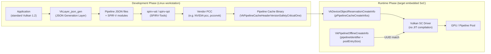
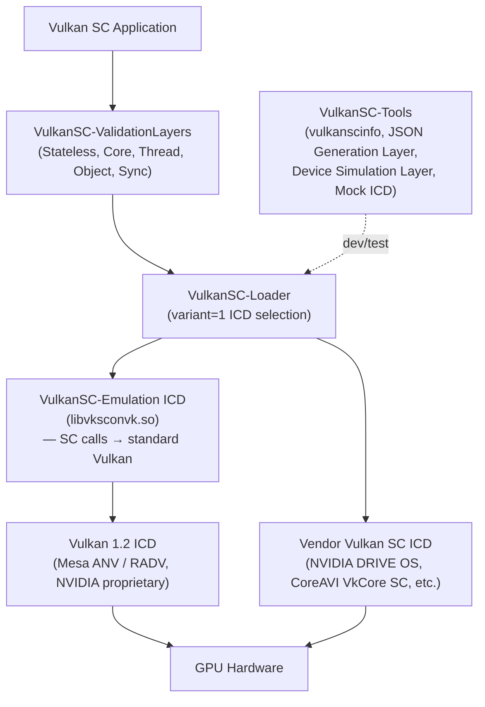
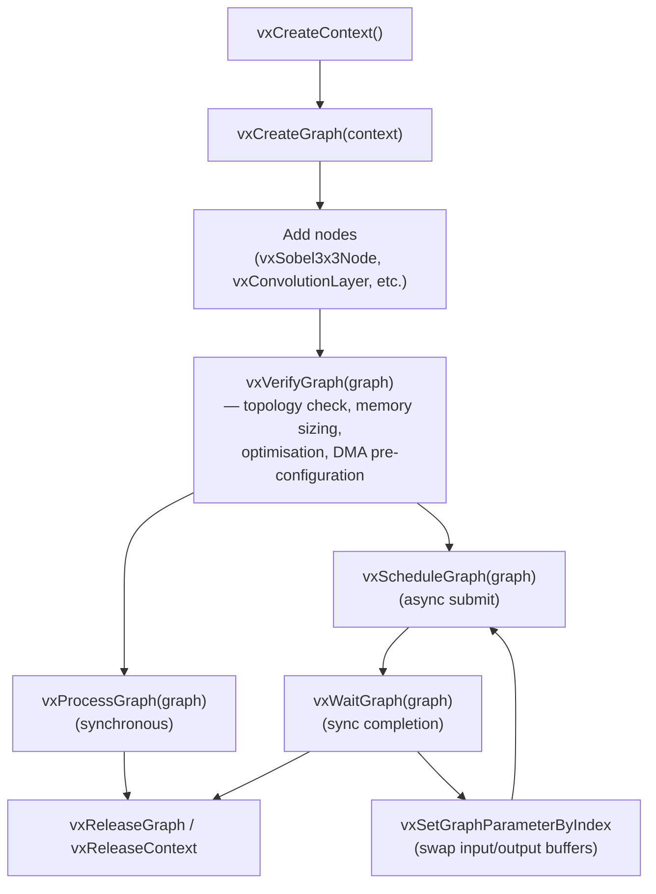
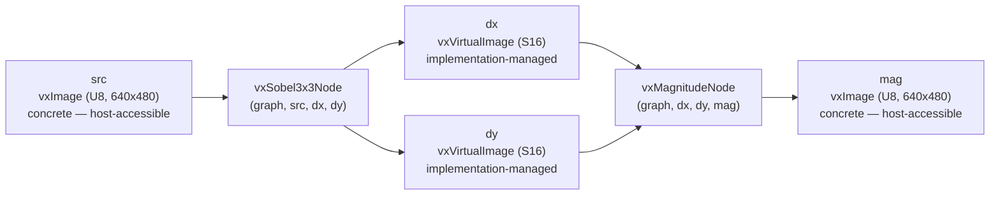
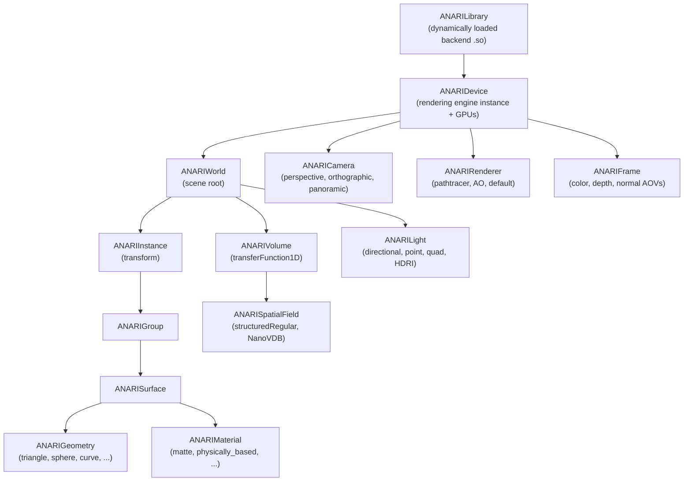

# Chapter 65: Vulkan Safety Critical and OpenVX

> **Part**: Part XIV — Khronos Extended Ecosystem
> **Audience**: Embedded and safety-critical systems engineers; automotive, avionics, and industrial GPU software developers
> **Status**: First draft — 2026-06-15

---

## Table of Contents

1. [Overview](#overview)
2. [Vulkan SC 1.0 Design Rationale: The Safety Imperative](#1-vulkan-sc-10-design-rationale-the-safety-imperative)
   - 1.1 [Why Standard Vulkan Cannot Be Safety-Certified](#11-why-standard-vulkan-cannot-be-safety-certified)
   - 1.2 [Version Variant Encoding and Naming Conventions](#12-version-variant-encoding-and-naming-conventions)
   - 1.3 [Three Design Pillars: Streamlined, Deterministic, Robust](#13-three-design-pillars-streamlined-deterministic-robust)
   - 1.4 [Safety Certification Targets](#14-safety-certification-targets)
3. [Key Vulkan SC Restrictions and Static Resource Model](#2-key-vulkan-sc-restrictions-and-static-resource-model)
   - 2.1 [VkDeviceObjectReservationCreateInfo — Pre-Declared Resource Counts](#21-vkdeviceobjectreservationcreateinfo--pre-declared-resource-counts)
   - 2.2 [VkPipelinePoolSize and Pipeline Memory Budgets](#22-vkpipelinepoolsize-and-pipeline-memory-budgets)
   - 2.3 [VkCommandPoolMemoryReservationCreateInfo](#23-vkcommandpoolmemoryreservationcreateinfo)
   - 2.4 [Removed Features and Eliminated Undefined Behaviours](#24-removed-features-and-eliminated-undefined-behaviours)
4. [The Offline Pipeline Compilation Toolchain](#3-the-offline-pipeline-compilation-toolchain)
   - 3.1 [Development Phase: JSON Generation Layer and SPIR-V Validation](#31-development-phase-json-generation-layer-and-spir-v-validation)
   - 3.2 [Pipeline Cache Compiler (PCC)](#32-pipeline-cache-compiler-pcc)
   - 3.3 [Pipeline Cache Binary Format](#33-pipeline-cache-binary-format)
   - 3.4 [Runtime Phase: VkPipelineOfflineCreateInfo](#34-runtime-phase-vkpipelineofflinecreateinfo)
   - 3.5 [Certification Burden Shift to the Build System](#35-certification-burden-shift-to-the-build-system)
5. [Fault Handling and Robustness](#4-fault-handling-and-robustness)
   - 4.1 [VkFaultCallbackInfo — Registration at Device Creation](#41-vkfaultcallbackinfo--registration-at-device-creation)
   - 4.2 [VK_EXT_device_fault — Post-Mortem Diagnostics](#42-vk_ext_device_fault--post-mortem-diagnostics)
   - 4.3 [VK_EXT_robustness2 and VK_EXT_pipeline_robustness](#43-vk_ext_robustness2-and-vk_ext_pipeline_robustness)
   - 4.4 [VK_KHR_object_refresh — Single Event Upset Protection](#44-vk_khr_object_refresh--single-event-upset-protection)
6. [Vulkan SC on Linux: Drivers, SDK, and Deployment](#5-vulkan-sc-on-linux-drivers-sdk-and-deployment)
   - 5.1 [Vulkan SC SDK Components](#51-vulkan-sc-sdk-components)
   - 5.2 [Emulation ICD Setup](#52-emulation-icd-setup)
   - 5.3 [SoC Vendor Landscape](#53-soc-vendor-landscape)
   - 5.4 [Conformance Test Suite (VkSC-CTS)](#54-conformance-test-suite-vksc-cts)
7. [OpenVX 1.3 Graph API](#6-openvx-13-graph-api)
   - 6.1 [Graph Lifecycle and Core Functions](#61-graph-lifecycle-and-core-functions)
   - 6.2 [Data Objects: Images, Tensors, and Arrays](#62-data-objects-images-tensors-and-arrays)
   - 6.3 [Built-in Vision Kernels](#63-built-in-vision-kernels)
   - 6.4 [Example Graph: Edge-Magnitude Pipeline](#64-example-graph-edge-magnitude-pipeline)
   - 6.5 [vxVerifyGraph for Offline Graph Optimisation](#65-vxverifygraph-for-offline-graph-optimisation)
8. [OpenVX Neural Network Extension and NNEF](#7-openvx-neural-network-extension-and-nnef)
   - 7.1 [Neural Network Layer Nodes (vx_khr_nn 1.3)](#71-neural-network-layer-nodes-vx_khr_nn-13)
   - 7.2 [NNEF 1.0: Portable Neural Network Serialisation](#72-nnef-10-portable-neural-network-serialisation)
   - 7.3 [NNEF-to-OpenVX Integration](#73-nnef-to-openvx-integration)
9. [OpenVX on Linux: Implementations and Python Bindings](#8-openvx-on-linux-implementations-and-python-bindings)
   - 8.1 [AMD MIVisionX](#81-amd-mivisionx)
   - 8.2 [Texas Instruments TIOVX](#82-texas-instruments-tiovx)
   - 8.3 [Khronos Sample Implementation and PyVX](#83-khronos-sample-implementation-and-pyvx)
   - 8.4 [Arm Mali: Vendor-Optimised OpenVX on Embedded GPUs](#84-arm-mali-vendor-optimised-openvx-on-embedded-gpus)
10. [ANARI 1.0 — Scientific Rendering API](#9-anari-10--scientific-rendering-api)
    - 9.1 [Design Philosophy and Object Hierarchy](#91-design-philosophy-and-object-hierarchy)
    - 9.2 [Core API: Parameters, Commits, Frames](#92-core-api-parameters-commits-frames)
    - 9.3 [Geometry, Volumes, and Backends](#93-geometry-volumes-and-backends)
    - 9.4 [ANARI SDK on Linux](#94-anari-sdk-on-linux)
11. [Integrations](#integrations)
12. [References](#references)

---

## Overview

This chapter covers three **Khronos** standards that extend the GPU ecosystem into domains beyond interactive graphics: **Vulkan SC** 1.0 for certified embedded systems, **OpenVX** 1.3 for classical computer vision pipelines, and **ANARI** 1.0 for scientific rendering. Each targets a distinct audience and use-case profile, yet all three interact with the underlying **DRM**/**Mesa**/**Vulkan** stack described in earlier chapters.

**Vulkan SC** addresses a fundamental mismatch between GPU programming flexibility and functional-safety requirements. Automotive head-unit displays, fly-by-wire flight display systems, and medical imaging workstations must demonstrate that their software cannot enter undefined states. Standard **Vulkan**, with its runtime shader compilation, dynamic memory growth, and rich undefined-behaviour surface, cannot satisfy **ISO 26262**, **DO-178C**, **IEC 61508**, or **IEC 62304** certification without substantial restriction. **Vulkan SC** is that restriction codified as a specification. The API encodes its identity through a distinct version variant field in the **VKSC_API_VERSION_1_0** macro, signalling the **VulkanSC-Loader** to select a safety-critical **ICD**. Its design is organised around three pillars — streamlined (removing features that require runtime state), deterministic (pre-declared static memory pools and mandatory offline compilation), and robust (every previously undefined situation produces a defined error or fault notification) — together enabling certification at the highest integrity levels (**ASIL D**, **DAL A**, **SIL 3**).

The static resource model is expressed through **VkDeviceObjectReservationCreateInfo**, a mandatory **pNext** extension to **VkDeviceCreateInfo** that pre-declares every object count and pipeline pool tier so the driver allocates a single fixed memory region at device creation time. Pipeline memory budgets are partitioned into fixed-size tiers via **VkPipelinePoolSize**, and command pool storage is pre-reserved via **VkCommandPoolMemoryReservationCreateInfo**, with consumption queryable at runtime through **vkGetCommandPoolMemoryConsumption**. Features that prevent static analysis — including **vkCreateShaderModule**, sparse resources, descriptor update templates, and **vkFreeMemory** mid-lifecycle — are removed entirely, and undefined behaviour is replaced by defined error returns (**VK_ERROR_VALIDATION_FAILED**) or fault callbacks.

All shaders are compiled offline by a vendor **Pipeline Cache Compiler** (**PCC**) — such as **NVIDIA**'s **pcc** tool for **DRIVE AGX Orin** (**ga10b**) and **Xavier** (**gv11b**) — or the Khronos mock compiler **pcconvk** from the **VulkanSC-Emulation** repository. The development workflow begins with the **JSON Generation Layer** (**VkLayer_json_gen**) intercepting standard **Vulkan 1.2** pipeline creation calls, after which **spirv-val** and **spirv-opt** from **SPIRV-Tools** validate and optimise the **SPIR-V** modules. The **PCC** produces a binary cache with the **VkPipelineCacheHeaderVersionSafetyCriticalOne** header, and at runtime **VkPipelineOfflineCreateInfo** references each pipeline by **UUID**; a mismatch returns the deterministic **VK_ERROR_NO_PIPELINE_MATCH** rather than undefined behaviour.

Fault handling is mandatory and pre-allocated: **VkFaultCallbackInfo** registered in **VkDeviceCreateInfo** delivers real-time fault notifications through **PFN_vkFaultCallbackFunction** using caller-supplied **VkFaultData** storage (no dynamic allocation in the callback path). **VK_EXT_device_fault** — mandatory in **Vulkan SC** — provides structured post-mortem diagnostics after **VK_ERROR_DEVICE_LOST**, including GPU program counter, access type, and a vendor binary blob. **VK_EXT_robustness2** and **VK_EXT_pipeline_robustness** provide formal out-of-bounds access guarantees (**robustBufferAccess2**, **robustImageAccess2**, **nullDescriptor**), and **VK_KHR_object_refresh** protects against single-event upsets (**SEU**) in avionics and space applications by restoring device objects from **VK_MEMORY_HEAP_SEU_SAFE_BIT** redundant copies via **vkCmdRefreshObjectsKHR**.

The **Vulkan SC SDK** on Linux (maintained by **Khronos** and **RasterGrid**) includes **VulkanSC-Headers**, **VulkanSC-Loader**, **VulkanSC-ValidationLayers** (Stateless, Core, Thread, Object, Sync), and **VulkanSC-Tools** (including **vulkanscinfo** and the **Device Simulation Layer**). The **VulkanSC-Emulation** package provides **libvksconvk.so**, an emulation **ICD** that translates **Vulkan SC** calls to standard **Vulkan 1.2** for desktop Linux development. Conformant and in-development **Vulkan SC** implementations include **CoreAVI VkCore SC** (targeting **Imagination PowerVR** and **Arm Mali-G78AE** at **DO-178C DAL A**), **NVIDIA DRIVE OS 6.0+** (targeting **ISO 26262 ASIL D** on **ga10b**/**gv11b**), **NXP i.MX 9**, and **Qualcomm SA8195P** (**Adreno 685**). Conformance is verified by the **VkSC-CTS** — a fork of the standard **Vulkan CTS** adapted for **Vulkan SC** feature sets and resource-reservation semantics.

**OpenVX** provides a graph-based compute model for classical computer vision — **VX_KERNEL_SOBEL_3x3** gradients, **VX_KERNEL_GAUSSIAN_PYRAMID**, **VX_KERNEL_HARRIS_CORNERS**, **VX_KERNEL_OPTICAL_FLOW_PYR_LK** — on heterogeneous hardware without requiring the application developer to manage GPU command buffers directly. It occupies a niche between **OpenCL** compute dispatches (too low level for vision pipelines) and deep learning inference frameworks (too neural-network-specific for classical algorithms). The core graph **API** centres on **vxCreateGraph**, **vxVerifyGraph** (the optimisation and memory-sizing point), **vxProcessGraph** (synchronous), and **vxScheduleGraph**/**vxWaitGraph** (asynchronous). Data objects include **vx_image** (concrete or virtual), **vx_tensor** (N-dimensional, with Q-format fixed-point support for **INT8**/**INT16**), and arrays. Over 60 built-in vision kernels are available, from **VX_KERNEL_CANNY_EDGE_DETECTOR** and **VX_KERNEL_FAST_CORNERS** to **VX_KERNEL_HOG_CELLS** and **VX_KERNEL_REMAP** for lens-distortion correction.

The **OpenVX Neural Network Extension** (**vx_khr_nn** 1.3) adds layer-oriented tensor nodes — **vxConvolutionLayer**, **vxFullyConnectedLayer**, **vxPoolingLayer**, **vxActivationLayer**, **vxSoftmaxLayer**, and **vxNormalizationLayer** — enabling mixed classical/neural pipelines in a single **vx_graph**. The **NNEF** 1.0 (**Neural Network Exchange Format**, current stable **1.0.4**) provides portable model serialisation complementary to **ONNX**; models are imported into **OpenVX** via **vxImportKernelFromURL** using the **vx_khr_import_kernel** extension. The **NNEF-Tools** repository supports conversion from **TensorFlow**, **ONNX**, and **TensorFlow Lite**. The AMD **OpenVX Model Compiler** converts **NNEF**/**ONNX**/**Caffe** models through **AMD NNIR** to C source calling **OpenVX** directly, and **amd_migraphx** wraps **MIGraphX** as an **OpenVX** kernel.

Linux **OpenVX** implementations covered include **AMD MIVisionX** (built on **ROCm**, **MIOpen**, **HIP**, **OpenCL**, and **AMD VCN** video hardware), **Texas Instruments TIOVX** (routing nodes to heterogeneous **TDA4x** targets including **C7x DSP**/**MMA**, **VPAC**, **DMPAC**, and **Arm Cortex-A72**), the **KhronosGroup/OpenVX-sample-impl** CPU reference implementation, **PyVX** Python bindings for prototyping, and the **Arm Compute Library** (**ACL**) providing **Mali** GPU acceleration via **OpenCL** with **NEON** intrinsics.

**ANARI** occupies the scientific visualisation niche: a high-level scene-description-based rendering **API** that lets **VTK**, **ParaView**, and custom scientific applications submit geometry, volume fields, and lights to physically based renderers (**Intel OSPRay**, **NVIDIA VisRTX**, **Blender Cycles**) without writing a single shader. The object hierarchy (ANARILibrary → **ANARIDevice** → **ANARIWorld** → **ANARIInstance**/**ANARIGroup**/**ANARISurface**/**ANARIVolume**/**ANARILight** plus **ANARICamera**, **ANARIRenderer**, **ANARIFrame**) is manipulated through a uniform **anariSetParameter**/**anariCommitParameters** interface, with frames rendered via **anariRenderFrame** and read back via **anariMapFrame**. Geometry types include triangles, quads, spheres, cylinders, and curves; **ANARI 1.1** adds **NanoVDB** volume support and the **KHR_GEOMETRY_ISOSURFACE** extension. Backends selectable via the **ANARI_LIBRARY** environment variable include the reference **helide** (CPU **Embree**), **ospray** (CPU **AVX-512** path tracing), **visrtx** (**OptiX**/**CUDA** GPU path tracing), **barney** (multi-GPU distributed), and **cycles** (**Blender Cycles**). The **ANARI SDK** (v0.11.0) includes the **helium** Device Implementation Library for backend authors, a validation/debug layer, and the **hdAnari** **OpenUSD Hydra** render delegate enabling **UsdView**, **Houdini**, and the **vtkAnariRenderingPlugin** in **ParaView** to use any **ANARI** backend for path-traced scientific rendering.

Readers should be familiar with **Vulkan 1.2**/**1.3** concepts (pipelines, render passes, descriptor sets, **SPIR-V**) from Chapters 24–25, **SPIRV-Tools** from Chapter 61, and the **Vulkan CTS** from Chapter 31.

---

## 1. Vulkan SC 1.0 Design Rationale: The Safety Imperative

### 1.1 Why Standard Vulkan Cannot Be Safety-Certified

Standard Vulkan's design optimises for performance and flexibility. Three properties make it incompatible with functional-safety certification:

**Runtime flexibility in execution paths.** `vkCreateGraphicsPipelines` and `vkCreateComputePipelines` compile SPIR-V to GPU machine code at runtime using vendor driver heuristics. The generated code is not deterministically reproducible and is not observable at certification time. Safety standards require that every instruction that can execute on safety-critical hardware is validated before deployment.

**Dynamic memory allocation.** The Vulkan driver allocates and grows internal data structures throughout the application lifetime in response to API calls. On a certified system, the maximum memory footprint must be provable from static analysis. A driver that calls `malloc` in response to a `vkCreateDescriptorSet` call makes that analysis impossible.

**Undefined behaviour.** The Vulkan specification lists hundreds of valid-usage rules whose violation produces undefined behaviour. On general-purpose systems this is acceptable because validation layers catch misuse during development. On a certified system, undefined behaviour cannot be permitted in any code path that reaches production — including the driver.

Vulkan SC 1.0, released March 1, 2022, addresses all three issues. [Source](https://www.khronos.org/news/press/khronos-releases-vulkan-safety-critical-1.0-specification-to-deliver-safety-critical-graphics-compute) It is derived from Vulkan 1.2 (the maintenance revision is 1.0.21, based on Vulkan 1.2.344), not Vulkan 1.3, because the additional features introduced in 1.3 increased the required certification scope without commensurate safety benefit.

### 1.2 Version Variant Encoding and Naming Conventions

Vulkan encodes API versions as a 32-bit integer with variant in bits 31–29, major in bits 28–22, minor in bits 21–12, and patch in bits 11–0. Standard Vulkan uses variant 0. Vulkan SC uses **variant 1**. The macro `VK_API_VERSION_VARIANT(version)` extracts this field. [Source](https://www.khronos.org/blog/vulkan-sc-overview)

```c
// vksc_platform.h (VulkanSC-Headers)
// Vulkan SC version macro — encodes variant=1 in upper 3 bits
#define VKSC_API_VERSION_1_0 VK_MAKE_API_VERSION(1, 1, 0, 0)

// At instance creation:
VkApplicationInfo appInfo = {
    .sType              = VK_STRUCTURE_TYPE_APPLICATION_INFO,
    .apiVersion         = VKSC_API_VERSION_1_0,  // variant=1 signals SC loader
};
```

The ICD loader uses the variant field to verify that a Vulkan SC application does not accidentally load a non-SC driver (which would have mismatched behaviour guarantees). Function symbols in Vulkan SC headers retain the `vk` prefix — there is no `vksc_` naming convention for most entry points. The `VK_SC_10_*` feature set name appears in extension queries and conformance test suite identifiers.

### 1.3 Three Design Pillars: Streamlined, Deterministic, Robust

**Streamlined.** Features that require runtime state are removed. Shader modules are eliminated: `vkCreateShaderModule` does not exist in Vulkan SC. Sparse resources (sparse binding, sparse residency), descriptor update templates, `vkFreeMemory`, `vkTrimCommandPool`, and pipeline cache merge operations are all absent. Command pool reset with `VK_COMMAND_POOL_RESET_RELEASE_RESOURCES_BIT` is forbidden. The `deviceDestroyFreesMemory` device property declares whether object memory is reclaimed at device destruction — the only reclamation point on a certified system. [Source](https://www.khronos.org/blog/vulkan-sc-overview)

**Deterministic.** All pipelines are compiled offline (see Section 3). Static memory pools replace dynamic allocation (see Section 2). The Vulkan Memory Model — optional in Vulkan 1.2 via `VK_KHR_vulkan_memory_model` — is promoted to mandatory in Vulkan SC, ensuring that shader memory access ordering is formally specified.

**Robust.** Undefined behaviour is replaced by defined error returns or fault notifications. Any command that ordinarily has no return value but detects a validation error raises a `VK_ERROR_VALIDATION_FAILED` fault through the fault callback mechanism. Ignored parameters are eliminated — every field of every struct is either used or explicitly reserved.

### 1.4 Safety Certification Targets

| Standard | Domain | Highest Level |
|---|---|---|
| ISO 26262 | Road vehicles (automotive) | ASIL D |
| RTCA DO-178C / EASA ED-12C | Airborne software | DAL A |
| IEC 61508 | Industrial functional safety | SIL 3 |
| IEC 62304 | Medical device software | Class C |

Vulkan SC itself is not certified — only complete systems (application + driver + hardware + safety manual) can receive certification. The specification enables certification by removing the barriers listed in Section 1.1. Vendors publish **safety manuals** that document where input validation occurs in the stack, what fault categories are detected, and which usage restrictions the application must observe. The AUTOSAR–Khronos memorandum of understanding (April 2022) extended collaboration to automotive software architecture standards. [Source](https://www.khronos.org/news/press/khronos-releases-vulkan-safety-critical-1.0-specification-to-deliver-safety-critical-graphics-compute)

---

## 2. Key Vulkan SC Restrictions and Static Resource Model

### 2.1 VkDeviceObjectReservationCreateInfo — Pre-Declared Resource Counts

This structure is **mandatory** in the `pNext` chain of `VkDeviceCreateInfo`. Omitting it causes `vkCreateDevice` to return `VK_ERROR_INITIALIZATION_FAILED`. Its purpose is to declare every object count and memory pool size upfront, so the driver allocates a single fixed-size memory region at device creation time. [Source](https://registry.khronos.org/VulkanSC/specs/1.0-extensions/man/html/VkDeviceObjectReservationCreateInfo.html)

```c
// vulkan_sc_core.h — VkDeviceObjectReservationCreateInfo (abbreviated)
// Full member list in registry.khronos.org/VulkanSC/specs/1.0-extensions/html/vkspec.html
typedef struct VkDeviceObjectReservationCreateInfo {
    VkStructureType                  sType;
    const void*                      pNext;

    // Pipeline cache inputs (embedded at device creation)
    uint32_t                         pipelineCacheCreateInfoCount;
    const VkPipelineCacheCreateInfo* pPipelineCacheCreateInfos;

    // Pipeline memory pool size buckets
    uint32_t                         pipelinePoolSizeCount;
    const VkPipelinePoolSize*        pPipelinePoolSizes;

    // Per-object-type maximum simultaneous counts
    uint32_t    semaphoreRequestCount;
    uint32_t    commandBufferRequestCount;  // permanently counted, even after free
    uint32_t    fenceRequestCount;
    uint32_t    deviceMemoryRequestCount;
    uint32_t    bufferRequestCount;
    uint32_t    imageRequestCount;
    uint32_t    eventRequestCount;
    uint32_t    queryPoolRequestCount;
    uint32_t    bufferViewRequestCount;
    uint32_t    imageViewRequestCount;
    uint32_t    layeredImageViewRequestCount;
    uint32_t    pipelineCacheRequestCount;
    uint32_t    pipelineLayoutRequestCount;
    uint32_t    renderPassRequestCount;
    uint32_t    graphicsPipelineRequestCount;
    uint32_t    computePipelineRequestCount;
    uint32_t    descriptorSetLayoutRequestCount;
    uint32_t    samplerRequestCount;
    uint32_t    descriptorPoolRequestCount;
    uint32_t    descriptorSetRequestCount;
    // ... additional sub-allocation size members (see spec Section 4.3)
} VkDeviceObjectReservationCreateInfo;
```

The `commandBufferRequestCount` field is particularly significant: command buffers freed via `vkFreeCommandBuffers` do not reduce this count. It accumulates monotonically against the device-wide limit. This makes command buffer budgeting a design-time activity that belongs in the system's memory analysis document.

At certification time, the total memory required by the driver is bounded by the sum of:
- `sizeof(driver_object_type_i) * requestCount_i` for each object type
- Pipeline pool sizes (Section 2.2)
- Command pool reserved sizes (Section 2.3)

This bound appears in the safety manual and is verified against the platform's available memory before system integration approval.

### 2.2 VkPipelinePoolSize and Pipeline Memory Budgets

Pipeline binary storage is partitioned into fixed-size buckets. The `VkPipelinePoolSize` structure declares one bucket tier: [Source](https://www.khronos.org/blog/vulkan-sc-overview)

```c
// vulkan_sc_core.h
typedef struct VkPipelinePoolSize {
    VkStructureType    sType;
    const void*        pNext;
    VkDeviceSize       poolEntrySize;   // byte size of each entry in this tier
    uint32_t           poolEntryCount;  // number of entries in this tier
} VkPipelinePoolSize;
```

Each pipeline creation call specifies `VkPipelineOfflineCreateInfo::poolEntrySize` to select which tier it loads from. If a pipeline requires 48 KB of GPU code and the nearest tier is 64 KB, 16 KB is wasted — but the system is memory-safe. Vendor tools such as NVIDIA's `pcinfo` analyse an offline pipeline cache and recommend optimal `poolEntrySize`/`poolEntryCount` values for the set of pipelines in the application.

A typical multi-tier configuration for an automotive head-unit:

```c
// Example pool configuration for 3 pipeline complexity tiers
VkPipelinePoolSize poolSizes[3] = {
    { VK_STRUCTURE_TYPE_PIPELINE_POOL_SIZE, NULL,
      .poolEntrySize = 32 * 1024,   // 32 KB: simple 2D UI shaders
      .poolEntryCount = 64 },
    { VK_STRUCTURE_TYPE_PIPELINE_POOL_SIZE, NULL,
      .poolEntrySize = 256 * 1024,  // 256 KB: surround-view camera shaders
      .poolEntryCount = 16 },
    { VK_STRUCTURE_TYPE_PIPELINE_POOL_SIZE, NULL,
      .poolEntrySize = 1024 * 1024, // 1 MB: path-finding visualisation compute
      .poolEntryCount = 4 },
};
```

### 2.3 VkCommandPoolMemoryReservationCreateInfo

Command pools must also be pre-sized via a `pNext` extension:

```c
// vulkan_sc_core.h
typedef struct VkCommandPoolMemoryReservationCreateInfo {
    VkStructureType    sType;
    const void*        pNext;
    VkDeviceSize       commandPoolReservedSize;      // total bytes for all command buffers in pool
    uint32_t           commandPoolMaxCommandBuffers;  // permanent count against device limit
} VkCommandPoolMemoryReservationCreateInfo;
```

After command pool creation, the application can query actual consumption:

```c
// vkGetCommandPoolMemoryConsumption — Vulkan SC 1.0
// Returns deterministic byte-level breakdown for certification verification
VkCommandPoolMemoryConsumption consumption = {
    .sType = VK_STRUCTURE_TYPE_COMMAND_POOL_MEMORY_CONSUMPTION,
};
vkGetCommandPoolMemoryConsumption(
    device,
    commandPool,
    commandBuffer,  // NULL for pool-level query
    &consumption);
// consumption.commandPoolAllocated: bytes reserved in pool
// consumption.commandPoolReservedSize: per-pool reserved size from create info
// consumption.commandBufferAllocated: bytes consumed by the specific command buffer
```

This query is the primary mechanism for worst-case execution time (WCET) analysis of command recording: the application records commands in a test harness and verifies that `commandBufferAllocated` never exceeds the reserved size under all operating conditions.

### 2.4 Removed Features and Eliminated Undefined Behaviours

The following Vulkan 1.2 features are absent from Vulkan SC 1.0:

| Removed Feature | Reason |
|---|---|
| `vkCreateShaderModule` | Requires runtime SPIR-V parsing |
| Sparse memory (`VK_BUFFER_CREATE_SPARSE_BINDING_BIT`, etc.) | Non-deterministic page-fault behaviour |
| Descriptor update templates | Runtime structural flexibility |
| `vkFreeMemory` mid-lifecycle | Dynamic deallocation |
| `vkTrimCommandPool` | Size uncertainty |
| `vkMergePipelineCaches` | Post-deployment pipeline modification |
| `VK_NULL_HANDLE` aliasing | Implicit state dependencies |
| `VK_COMMAND_POOL_RESET_RELEASE_RESOURCES_BIT` | Memory reclamation uncertainty |

Rather than producing undefined behaviour, Vulkan SC specifies a fault for every previously-undefined situation. Commands without return values raise `VK_FAULT_TYPE_INVALID_API_USAGE` through the fault callback (Section 4.1). Commands with return values return `VK_ERROR_VALIDATION_FAILED`. This completeness is what enables IEC 61508 SIL analysis — every code path has a defined outcome.

---

## 3. The Offline Pipeline Compilation Toolchain

The offline toolchain has two phases: a **development phase** on a standard Linux workstation and a **runtime phase** on the target embedded system. The development phase produces a vendor-compiled binary pipeline cache; the runtime phase loads that cache with no further compilation.



### 3.1 Development Phase: JSON Generation Layer and SPIR-V Validation

Development begins with the **JSON Generation Layer** (`VkLayer_json_gen`), a Vulkan layer that intercepts standard Vulkan 1.2 pipeline creation calls and serialises each pipeline's state plus all referenced SPIR-V modules as JSON files:

```bash
# Shell session on development workstation (standard Vulkan, not SC)
export VK_LAYER_PATH=/opt/vulkansc-sdk/share/vulkansc/explicit_layer.d
export VK_LOADER_LAYERS_ENABLE=VK_LAYER_KHRONOS_json_gen
# JSON_GEN_OUTPUT_DIR defaults to cwd
export JSON_GEN_OUTPUT_DIR=/build/pipelines

# Run the application — JSON files accumulate as pipelines are created
./my_adas_application --generate-pipelines

ls /build/pipelines/
# pipeline_0a3f2b1c.json  pipeline_1e7d8a4f.json  ...
```

Before passing SPIR-V to the vendor PCC, validate it with the SPIRV-Tools suite (see Chapter 61):

```bash
# Validate each SPIR-V module for correctness and SC constraints
spirv-val --target-env vulkan1.2 shader.vert.spv
spirv-val --target-env vulkan1.2 shader.frag.spv

# Optional: optimise for smaller binary / faster compilation
spirv-opt -O shader.vert.spv -o shader.vert.opt.spv
```

### 3.2 Pipeline Cache Compiler (PCC)

The PCC is a vendor-provided offline tool that takes the JSON pipeline descriptions and SPIR-V modules and produces a platform-specific binary pipeline cache. Each hardware vendor ships their own PCC alongside their Vulkan SC driver.

**NVIDIA DRIVE OS PCC** (for automotive SoCs): [Source](https://developer.nvidia.com/docs/drive/drive-os/6.0.10/public/drive-os-linux-sdk/common/topics/graphics_content/ThePipelineCacheCompilerPCCTool210.html)

```bash
# NVIDIA PCC for DRIVE AGX Orin (Ampere, ga10b chip)
pcc -chip ga10b \
    -path /build/pipelines/ \
    -out /build/pipeline_cache_orin.bin

# For DRIVE AGX Xavier (Volta, gv11b chip)
pcc -chip gv11b \
    -path /build/pipelines/ \
    -out /build/pipeline_cache_xavier.bin

# Generate C/C++-embeddable hex dump for ROM embedding
pcc -chip ga10b -path /build/pipelines/ -hex -out pipeline_cache.h
```

**Khronos Emulation Layer Mock PCC** (`pcconvk`) — for development and testing on desktop Linux without target hardware:

```bash
# pcconvk from VulkanSC-Emulation repository
# Produces portable (device-independent) cache embedding SPIR-V + JSON
pcconvk --path /build/pipelines/ --out /build/pipeline_cache_portable.bin
```

The mock PCC cache embeds SPIR-V and JSON as debug metadata; the emulation ICD performs JIT compilation internally when loading such a cache. Production PCCs for specific hardware compile to GPU machine code that the driver loads without further compilation.

### 3.3 Pipeline Cache Binary Format

The binary cache has a standardised header and index, defined in the Vulkan SC specification: [Source](https://registry.khronos.org/VulkanSC/specs/1.0-extensions/man/html/VkPipelineCacheSafetyCriticalIndexEntry.html)

```c
// vulkan_sc_core.h — Pipeline cache header for safety-critical one format
typedef struct VkPipelineCacheHeaderVersionSafetyCriticalOne {
    uint32_t                       headerSize;
    VkPipelineCacheHeaderVersion   headerVersion;
    // headerVersion == VK_PIPELINE_CACHE_HEADER_VERSION_SAFETY_CRITICAL_ONE
    uint32_t                       vendorID;
    uint32_t                       deviceID;
    uint8_t                        pipelineCacheUUID[VK_UUID_SIZE];
    uint32_t                       pipelineIndexCount;
    uint32_t                       pipelineIndexStride;
    uint64_t                       pipelineIndexOffset;  // byte offset into file
} VkPipelineCacheHeaderVersionSafetyCriticalOne;

// One entry per pipeline in the index array
typedef struct VkPipelineCacheSafetyCriticalIndexEntry {
    uint8_t     pipelineIdentifier[VK_UUID_SIZE]; // matches VkPipelineOfflineCreateInfo
    uint64_t    pipelineMemorySize;               // bytes required from pipeline pool
    uint64_t    jsonSize;                         // optional JSON debug info (0 if omitted)
    uint64_t    jsonOffset;
    uint32_t    stageIndexCount;
    uint32_t    stageIndexStride;
    uint64_t    stageIndexOffset;                 // byte offset to per-stage entries
} VkPipelineCacheSafetyCriticalIndexEntry;
```

The `pipelineMemorySize` field directly determines which `VkPipelinePoolSize` tier to allocate from. The PCC tool guarantees that `pipelineMemorySize` is accurate for the target hardware, removing the guesswork from pool configuration.

### 3.4 Runtime Phase: VkPipelineOfflineCreateInfo

At runtime the binary is embedded in `VkPipelineCacheCreateInfo.pInitialData` and passed through `VkDeviceObjectReservationCreateInfo`. Each `vkCreateGraphicsPipelines` or `vkCreateComputePipelines` call must include `VkPipelineOfflineCreateInfo` in its `pNext` chain:

```c
// vulkan_sc_core.h
typedef struct VkPipelineOfflineCreateInfo {
    VkStructureType    sType;
    const void*        pNext;
    uint8_t            pipelineIdentifier[VK_UUID_SIZE];  // must match cache index entry
    VkDeviceSize       poolEntrySize;  // selects which pool tier to load from
} VkPipelineOfflineCreateInfo;

// Runtime pipeline creation — no SPIR-V, no compilation
VkPipelineOfflineCreateInfo offlineInfo = {
    .sType              = VK_STRUCTURE_TYPE_PIPELINE_OFFLINE_CREATE_INFO,
    .pipelineIdentifier = { /* UUID from JSON Generation Layer output */ },
    .poolEntrySize      = 256 * 1024,  // must match a declared pool tier
};

VkGraphicsPipelineCreateInfo pipelineCI = {
    .sType  = VK_STRUCTURE_TYPE_GRAPHICS_PIPELINE_CREATE_INFO,
    .pNext  = &offlineInfo,
    // No .pStages with SPIR-V — the cache binary contains compiled code
    .stageCount = 0,
    .pStages    = NULL,
    // ... render pass, layout, etc.
};

VkResult result = vkCreateGraphicsPipelines(
    device, pipelineCache, 1, &pipelineCI, NULL, &pipeline);
// Returns VK_ERROR_NO_PIPELINE_MATCH if UUID not in cache
```

If the UUID does not match any cache entry, `vkCreateGraphicsPipelines` returns `VK_ERROR_NO_PIPELINE_MATCH`. This is a deterministic, recoverable error — not undefined behaviour. The application's fault handler (Section 4.1) can respond with a safe-state transition.

### 3.5 Certification Burden Shift to the Build System

By moving compilation offline, Vulkan SC shifts the certification burden from the runtime driver to the build system. The vendor PCC is a deterministic, repeatable tool producing a binary that is hash-verified before flashing to the target ECU. Certification authorities can:

1. Inspect the JSON pipeline descriptions as high-level representations.
2. Verify the SPIR-V against a formal shader specification (SPIRV-Tools `spirv-val`).
3. Audit the PCC binary output against the vendor's safety manual.
4. CRC-check the pipeline cache binary at boot and refuse to start if integrity fails.

The **driver** on the target hardware performs no compilation — it merely maps pipeline cache entries into GPU memory. This transformation is vastly simpler to certify than a JIT compiler.

---

## 4. Fault Handling and Robustness

### 4.1 VkFaultCallbackInfo — Registration at Device Creation

Vulkan SC introduces a mandatory fault reporting mechanism operating at two levels: real-time callbacks for critical faults and polled queries for non-critical accumulation. The callback is registered in the `pNext` chain of `VkDeviceCreateInfo`: [Source](https://www.khronos.org/blog/vulkan-sc-overview)

```c
// vulkan_sc_core.h — VkFaultCallbackInfo and VkFaultData

typedef struct VkFaultData {
    VkStructureType    sType;
    void*              pNext;       // vendor-specific extension chain
    VkFaultLevel       faultLevel;  // VK_FAULT_LEVEL_CRITICAL / WARNING / NONE
    VkFaultType        faultType;   // see enum below
} VkFaultData;

// VkFaultType values (selected):
// VK_FAULT_TYPE_INVALID_API_USAGE     — validation failure in void-return command
// VK_FAULT_TYPE_COMMAND_BUFFER_FULL   — command pool memory exhausted
// VK_FAULT_TYPE_PHYSICAL_DEVICE       — device loss / hardware fault
// VK_FAULT_TYPE_INVALID_API_USAGE
// VK_FAULT_TYPE_INITIALIZATION_FAILED — device creation subset failure

typedef void (VKAPI_PTR *PFN_vkFaultCallbackFunction)(
    VkBool32          unrecordedFaults, // TRUE if queue was full and faults were dropped
    uint32_t          faultCount,
    const VkFaultData* pFaults);

typedef struct VkFaultCallbackInfo {
    VkStructureType              sType;
    const void*                  pNext;
    uint32_t                     faultCount;
    VkFaultData*                 pFaults;            // caller-pre-allocated array
    PFN_vkFaultCallbackFunction  pfnFaultCallback;
} VkFaultCallbackInfo;

// Registration — place in VkDeviceCreateInfo.pNext chain
VkFaultData faultStorage[32] = {};   // pre-allocated, no malloc in callback
VkFaultCallbackInfo faultInfo = {
    .sType              = VK_STRUCTURE_TYPE_FAULT_CALLBACK_INFO,
    .faultCount         = 32,
    .pFaults            = faultStorage,
    .pfnFaultCallback   = myFaultHandler,
};
```

The `faultCount` / `pFaults` pair uses pre-allocated storage — the driver never allocates memory inside the fault callback path. `unrecordedFaults` being `VK_TRUE` indicates the fault queue overflowed; the system must treat this as a critical event equivalent to device loss.

Poll-based query for non-real-time fault auditing:

```c
// vkGetFaultData — poll for accumulated faults
// Safety note: alloca() is inappropriate here — it can cause a stack overflow
// with no error return if faultCount is large, which is unacceptable in
// safety-critical code. Use a pre-allocated static array with a bounded
// capacity, and clamp faultCount before the retrieval call (the API returns
// VK_INCOMPLETE if more faults exist than the buffer can hold).
#define MAX_FAULT_ENTRIES 64
static VkFaultData faultBuffer[MAX_FAULT_ENTRIES];

uint32_t faultCount = MAX_FAULT_ENTRIES;  // capacity, not a count query
VkBool32 unrecordedFaults = VK_FALSE;
vkGetFaultData(device,
               VK_FAULT_QUERY_BEHAVIOR_GET_AND_CLEAR_ALL_FAULTS,
               &unrecordedFaults,
               &faultCount,
               faultBuffer);
```

### 4.2 VK_EXT_device_fault — Post-Mortem Diagnostics

`VK_EXT_device_fault` is mandatory in Vulkan SC and optional in standard Vulkan (added in Vulkan 1.3.230). It provides structured post-mortem diagnostic information after a `VK_ERROR_DEVICE_LOST` event. [Source](https://docs.vulkan.org/features/latest/features/proposals/VK_EXT_device_fault.html)

```c
// Standard two-call pattern: count then retrieve
VkDeviceFaultCountsEXT counts = {
    .sType = VK_STRUCTURE_TYPE_DEVICE_FAULT_COUNTS_EXT,
};
vkGetDeviceFaultInfoEXT(device, &counts, NULL);

VkDeviceFaultAddressInfoEXT *addrInfos =
    malloc(sizeof(*addrInfos) * counts.addressInfoCount);
VkDeviceFaultVendorInfoEXT *vendorInfos =
    malloc(sizeof(*vendorInfos) * counts.vendorInfoCount);
void *vendorBinary = malloc(counts.vendorBinarySize);

VkDeviceFaultInfoEXT info = {
    .sType              = VK_STRUCTURE_TYPE_DEVICE_FAULT_INFO_EXT,
    .pAddressInfos      = addrInfos,
    .pVendorInfos       = vendorInfos,
    .pVendorBinaryData  = vendorBinary,
};
vkGetDeviceFaultInfoEXT(device, &counts, &info);

// Compute precise fault address range from hardware-precision-bounded report
for (uint32_t i = 0; i < counts.addressInfoCount; i++) {
    VkDeviceAddress addr  = addrInfos[i].reportedAddress;
    VkDeviceSize    prec  = addrInfos[i].addressPrecision;  // power of two
    VkDeviceAddress lower = addr & ~(prec - 1);
    VkDeviceAddress upper = addr |  (prec - 1);
    fprintf(stderr, "Fault[%u] type=%d addr=[0x%lx, 0x%lx]\n",
            i, addrInfos[i].addressType, lower, upper);
}
```

`VkDeviceFaultAddressTypeEXT` values include `READ_INVALID_EXT`, `WRITE_INVALID_EXT`, `EXECUTE_INVALID_EXT`, and three instruction-pointer variants (`UNKNOWN_EXT`, `INVALID_EXT`, `FAULT_EXT`). The vendor binary blob starts with `VkDeviceFaultVendorBinaryHeaderVersionOneEXT` (containing `headerSize`, `headerVersion`, `vendorID`, `deviceID`, `driverVersion`, `pipelineCacheUUID`, and application name offsets) followed by vendor-specific data requiring vendor crash-analysis tools to interpret.

Compared to standard Vulkan's `VK_ERROR_DEVICE_LOST`, which provides only an error code, `VK_EXT_device_fault` gives the GPU program counter, memory access type, the offending virtual address range, and an opaque vendor binary that crash tooling (such as NVIDIA's Nsight Graphics crash forensics) can decode into a shader source location.

### 4.3 VK_EXT_robustness2 and VK_EXT_pipeline_robustness

Out-of-bounds memory access is a leading source of undefined behaviour in GPU programs. Two extensions provide formal guarantees:

**`VK_EXT_robustness2`** extends the base `VkPhysicalDeviceRobustnessFeaturesEXT` with:
- `robustBufferAccess2` — out-of-bounds buffer reads return 0; writes are discarded. No GPU hang.
- `robustImageAccess2` — out-of-bounds image reads return (0, 0, 0, 1) or (0, 0, 0, 0) depending on format. No undefined texel.
- `nullDescriptor` — reading from a null descriptor returns zeros instead of faulting.

**`VK_EXT_pipeline_robustness`** allows per-pipeline robustness settings (rather than device-global), reducing performance overhead on pipelines that are already bounds-safe by construction.

In Vulkan SC, robustness requirements are documented per-implementation in the safety manual. ASIL D systems typically require `robustBufferAccess2` on all pipelines touching safety-relevant data paths.

### 4.4 VK_KHR_object_refresh — Single Event Upset Protection

Single event upsets (SEUs) — cosmic-ray or radiation-induced bit-flips — are a concern in avionics, space, and high-reliability automotive systems. Some GPU objects (notably `VkPipeline`) store data in device memory that is not backed by a `VkDeviceMemory` allocation and therefore cannot be refreshed via normal memory management. [Source](https://www.khronos.org/blog/vulkan-sc-overview)

The `VK_KHR_object_refresh` extension (Vulkan SC only) addresses this:

```c
// Query which object types support refresh
uint32_t typeCount = 0;
vkGetPhysicalDeviceRefreshableObjectTypesKHR(physicalDevice, &typeCount, NULL);

VkObjectType *refreshableTypes = malloc(sizeof(VkObjectType) * typeCount);
vkGetPhysicalDeviceRefreshableObjectTypesKHR(
    physicalDevice, &typeCount, refreshableTypes);
// Typically includes VK_OBJECT_TYPE_PIPELINE, VK_OBJECT_TYPE_DEVICE_MEMORY

// Record a refresh command into a command buffer
VkRefreshObjectKHR objects[2] = {
    { .objectType = VK_OBJECT_TYPE_PIPELINE, .objectHandle = (uint64_t)pipeline },
    { .objectType = VK_OBJECT_TYPE_PIPELINE, .objectHandle = (uint64_t)computePipeline },
};
VkRefreshObjectListKHR refreshList = {
    .sType       = VK_STRUCTURE_TYPE_REFRESH_OBJECT_LIST_KHR,
    .objectCount = 2,
    .pObjects    = objects,
};
vkCmdRefreshObjectsKHR(commandBuffer, &refreshList);
// Synchronised as a transfer write — barriers required
```

Implementations store a SEU-safe redundant copy on a memory heap with `VK_MEMORY_HEAP_SEU_SAFE_BIT` (a Vulkan SC extension to `VkMemoryHeapFlagBits`). The refresh operation re-loads device memory from that copy, restoring bit-correct content. The operation is treated as a **transfer write** for synchronisation purposes — subsequent accesses must be preceded by a pipeline barrier with `VK_ACCESS_TRANSFER_WRITE_BIT` as the `srcAccessMask`.

Refresh cadence is determined by the system's SEU rate budget (calculated from orbit altitude, inclination, and device radiation tolerance) and is typically periodic (e.g., once per second in LEO).

---

## 5. Vulkan SC on Linux: Drivers, SDK, and Deployment

### 5.1 Vulkan SC SDK Components

The Vulkan SC 1.0.21 SDK (latest release: May 2026) is maintained by the Khronos Group and RasterGrid. It is a unified Linux/Windows package providing: [Source](https://www.khronos.org/news/tags/tag/vulkansc)

| Component | Description |
|---|---|
| `VulkanSC-Headers` | API headers; combined with standard Vulkan headers via `vulkan_sc_core.h` |
| `VulkanSC-Loader` | ICD loader supporting both SC and standard Vulkan ICDs on the same system |
| `VulkanSC-ValidationLayers` | Five layers: Stateless, Core, Thread, Object, Sync |
| `VulkanSC-Tools` | `vulkanscinfo` (device query), Mock ICD, Device Simulation Layer, JSON Generation Layer |
| `VulkanSC-Emulation` | Emulation ICD (`libvksconvk.so`) + Mock PCC (`pcconvk`) |

The validation layers are critical for development: they verify that `VkDeviceObjectReservationCreateInfo` counts are not exceeded, that no removed features are used, and that pipeline identifiers match cache entries. They produce structured JSON diagnostic output for integration with CI/CD pipelines.



### 5.2 Emulation ICD Setup

The emulation ICD allows Vulkan SC applications to run on any desktop Linux with a Vulkan 1.2 driver supporting the Vulkan Memory Model. It translates Vulkan SC calls to standard Vulkan calls with minimal overhead. [Source](https://www.rastergrid.com/blog/gpu-tech/2025/02/the-vulkan-sc-emulation-driver-stack/)

```bash
# Environment setup for the VulkanSC emulation ICD
export LD_LIBRARY_PATH=/opt/vulkansc-sdk/lib:$LD_LIBRARY_PATH
export VK_DRIVER_FILES=/opt/vulkansc-sdk/share/vulkansc/icd.d/vksconvk.json

# Key tuning variables
export VKSC_EMULATION_DEBUG=warn              # error/warn/info/debug
export VKSC_EMULATION_RECYCLE_PIPELINE_MEMORY=1  # enable recyclePipelineMemory property
export VKSC_EMULATION_MAX_LOGICAL_DEVICES=8  # cap logical device count (default 65536)
export VKSC_EMULATION_DISPLAYS=2             # emulated display count (default 4)

# Optionally layer the Vulkan SC validation layers on top
export VK_LOADER_LAYERS_ENABLE=VK_LAYER_KHRONOS_validation

./my_vulkansc_application
```

The emulation ICD emulates `VK_KHR_display` by mapping virtual displays to X11 windows (or Wayland surfaces), allowing display-path testing without embedded hardware. It requires an existing Vulkan 1.2 ICD on the system (Mesa ANV for Intel, RADV for AMD, or NVIDIA proprietary). [Source](https://www.rastergrid.com/blog/gpu-tech/2025/02/the-vulkan-sc-emulation-driver-stack/)

### 5.3 SoC Vendor Landscape

As of 2025–2026, conformant and in-development Vulkan SC implementations on Linux-based embedded platforms:

| Vendor / Product | SoC | Certification Target | RTOS Support |
|---|---|---|---|
| **CoreAVI VkCore SC** | Imagination PowerVR, Arm Mali-G78AE | DO-178C DAL A | QNX, VxWorks, INTEGRITY, LynxOS |
| **NVIDIA DRIVE OS 6.0+** | DRIVE AGX Orin (ga10b), Xavier (gv11b) | ISO 26262 ASIL D | AGL, QNX |
| **NXP i.MX 9** | Arm Cortex-A55 + GPU | IEC 62304 | Automotive Linux, Zephyr |
| **TI Jacinto (TDA4x)** | C7x DSP + MMA (no VulkanSC; uses OpenVX) | ISO 26262 | RTOS + Linux coprocessor |
| **Qualcomm SA8195P** | Adreno 685 | ISO 26262 ASIL D | Android Auto |

The Arm Mali-G78AE is notable as the first GPU with **hardware AEC (Automotive Enhanced Confidence)** lock-step redundancy for ISO 26262 ASIL D — the GPU core itself runs in a dual-redundant configuration, comparing results cycle-by-cycle and asserting a safety error output on mismatch.

Jetson Linux uses the same NVIDIA ga10b hardware as DRIVE AGX Orin but is **not safety-certified** — the Jetson platform is for prototyping and simulation.

### 5.4 Conformance Test Suite (VkSC-CTS)

The Vulkan SC Conformance Test Suite (VkSC-CTS) is a fork of the standard Vulkan CTS (see Chapter 31) adapted for Vulkan SC feature sets. It covers:

- Static resource reservation (`VkDeviceObjectReservationCreateInfo` boundary conditions)
- Offline pipeline cache loading and UUID matching
- Fault callback invocation under forced error conditions
- `VK_KHR_object_refresh` correctness
- All mandatory extensions (including `VK_EXT_device_fault`, `VK_EXT_robustness2`)
- The VK_SC_10_* feature set completeness

Implementations must pass the CTS before Khronos adopts them into the conformant products list. The validation layers in the Vulkan SC SDK provide pre-CTS checking in development environments.

---

## 6. OpenVX 1.3 Graph API

OpenVX is a Khronos open standard for accelerating computer-vision workloads on heterogeneous hardware (CPUs, DSPs, GPUs, dedicated vision accelerators) via a directed-acyclic graph execution model. Version 1.3 (current, 2022) merged the neural network extension into the base specification and added the Feature Set conformance framework. [Source](https://registry.khronos.org/OpenVX/specs/1.3/html/OpenVX_Specification_1_3.html)

Unlike Vulkan compute (Chapter 25), OpenVX hides command buffer management, synchronisation, and memory layout. The application describes **what** the graph computes (nodes and their connections); the implementation decides **how** to schedule and execute it. This enables vision accelerators with fundamentally different execution models (e.g., TI's MMA co-processors, Arm's Mali computer-vision extensions) to present a unified API.

### 6.1 Graph Lifecycle and Core Functions

```c
// VX/vx_api.h — Core graph API (OpenVX 1.3)
// Source: https://github.com/rgiduthuri/openvx_tutorial/blob/master/tutorial_exercises/include/VX/vx_api.h

// Context: global state, host-side
vx_context vxCreateContext(void);
vx_status  vxReleaseContext(vx_context *context);

// Graph: DAG of nodes
VX_API_ENTRY vx_graph VX_API_CALL vxCreateGraph(vx_context context);
VX_API_ENTRY vx_status VX_API_CALL vxReleaseGraph(vx_graph *graph);

// Verification: validates topology, type compatibility, memory requirements
VX_API_ENTRY vx_status VX_API_CALL vxVerifyGraph(vx_graph graph);

// Execution: synchronous (blocks until complete) and asynchronous
VX_API_ENTRY vx_status VX_API_CALL vxProcessGraph(vx_graph graph);
VX_API_ENTRY vx_status VX_API_CALL vxScheduleGraph(vx_graph graph);
VX_API_ENTRY vx_status VX_API_CALL vxWaitGraph(vx_graph graph);

// Graph-level parameters (expose inputs/outputs for repeated execution)
VX_API_ENTRY vx_status VX_API_CALL vxAddParameterToGraph(
    vx_graph graph, vx_parameter parameter);
VX_API_ENTRY vx_status VX_API_CALL vxSetGraphParameterByIndex(
    vx_graph graph, vx_uint32 index, vx_reference value);

// Query and attribute access
VX_API_ENTRY vx_status VX_API_CALL vxQueryGraph(
    vx_graph graph, vx_enum attribute, void *ptr, vx_size size);
VX_API_ENTRY vx_status VX_API_CALL vxSetGraphAttribute(
    vx_graph graph, vx_enum attribute, const void *ptr, vx_size size);
```

The graph lifecycle follows a strict sequence: Create → add nodes → `vxVerifyGraph` → repeated `vxProcessGraph` or `vxScheduleGraph/vxWaitGraph` → `vxReleaseGraph`. `vxProcessGraph` implicitly calls `vxVerifyGraph` on the first invocation if verification has not yet occurred.



`vxScheduleGraph` + `vxWaitGraph` decouple submission from completion, allowing the CPU to perform other work (frame decode, sensor processing) while the GPU/DSP executes the graph. The `vxSetGraphParameterByIndex` call can update input images between executions without rebuilding the graph — enabling ping-pong buffer patterns.

### 6.2 Data Objects: Images, Tensors, and Arrays

```c
// VX/vx_api.h — Image and tensor object API

// Host-accessible image
VX_API_ENTRY vx_image VX_API_CALL vxCreateImage(
    vx_context context,
    vx_uint32 width, vx_uint32 height,
    vx_df_image color);  // VX_DF_IMAGE_U8, RGB, NV12, IYUV, S16, etc.

// Virtual image: intermediate data, not accessible from host; layout decided by impl
VX_API_ENTRY vx_image VX_API_CALL vxCreateVirtualImage(
    vx_graph graph,
    vx_uint32 width, vx_uint32 height,
    vx_df_image color);  // 0,0 = impl chooses size; VX_DF_IMAGE_VIRT = impl chooses format

// Map a rectangle of an image for host access
VX_API_ENTRY vx_status VX_API_CALL vxMapImagePatch(
    vx_image image,
    const vx_rectangle_t *rect,
    vx_uint32 plane_index,
    vx_map_id *map_id,
    vx_imagepatch_addressing_t *addr,  // stride_x, stride_y, step_x, step_y
    void **ptr,
    vx_enum usage,    // VX_READ_ONLY, VX_WRITE_ONLY, VX_READ_AND_WRITE
    vx_enum mem_type, // VX_MEMORY_TYPE_HOST or implementation-defined
    vx_uint32 flags);

VX_API_ENTRY vx_status VX_API_CALL vxUnmapImagePatch(
    vx_image image, vx_map_id map_id);

// Tensor (N-dimensional, for neural network nodes)
VX_API_ENTRY vx_tensor VX_API_CALL vxCreateTensor(
    vx_context context,
    vx_size number_of_dims,
    const vx_size *dims,
    vx_enum data_type,          // VX_TYPE_FLOAT32, INT8, UINT8, INT16, FLOAT16, INT32
    vx_int8 fixed_point_position);  // Q-format: 8 with INT16 = Q7.8 (7 int, 8 frac bits)

// Map a sub-view of a tensor for host access
VX_API_ENTRY vx_status VX_API_CALL vxMapTensorPatch(
    vx_tensor tensor,
    vx_size number_of_dims,
    const vx_size *view_start,
    const vx_size *view_end,
    vx_map_id *map_id,
    vx_size *stride,         // per-dimension byte stride
    void **ptr,
    vx_enum usage,
    vx_enum mem_type);

VX_API_ENTRY vx_status VX_API_CALL vxUnmapTensorPatch(
    vx_tensor tensor, vx_map_id map_id);
```

The `fixed_point_position` parameter encodes Q-format fixed-point arithmetic for `VX_TYPE_INT8` and `VX_TYPE_INT16` tensors. A `fixed_point_position` of 8 with `VX_TYPE_INT16` gives Q7.8 format: 7 integer bits plus 8 fractional bits, with a scale factor of 1/256. This matches the precision profile of many 8-bit quantised inference models when dequantised for classical vision post-processing.

### 6.3 Built-in Vision Kernels

OpenVX 1.3 defines over 60 built-in kernels accessible via `vxGetKernelByEnum(context, VX_KERNEL_*)` or by string names in the `"org.khronos.openvx.*"` namespace. A subset with automotive and industrial relevance:

| Kernel Enum | Description | Use Case |
|---|---|---|
| `VX_KERNEL_SOBEL_3x3` | 3×3 Sobel gradient (Gx, Gy) | Lane-line detection |
| `VX_KERNEL_CANNY_EDGE_DETECTOR` | Canny multi-stage edge detector | Object boundary extraction |
| `VX_KERNEL_HARRIS_CORNERS` | Harris corner detector | Feature tracking |
| `VX_KERNEL_FAST_CORNERS` | FAST feature detector | Real-time feature matching |
| `VX_KERNEL_OPTICAL_FLOW_PYR_LK` | Lucas-Kanade optical flow | Ego-motion estimation |
| `VX_KERNEL_GAUSSIAN_PYRAMID` | Gaussian pyramid (multi-scale) | Scale-space analysis |
| `VX_KERNEL_LAPLACIAN_PYRAMID` | Laplacian pyramid | Multi-scale image fusion |
| `VX_KERNEL_REMAP` | Pixel remapping via LUT | Lens distortion correction |
| `VX_KERNEL_COLOR_CONVERT` | Colour space conversion | Camera NV12 → RGB |
| `VX_KERNEL_SCALE_IMAGE` | Image scaling | Multi-resolution processing |
| `VX_KERNEL_HISTOGRAM` | Histogram computation | Exposure analysis |
| `VX_KERNEL_EQUALIZE_HISTOGRAM` | Histogram equalisation | Low-contrast enhancement |
| `VX_KERNEL_THRESHOLD` | Binary/range threshold | ROI masking |
| `VX_KERNEL_DILATE_3x3` | 3×3 binary dilation | Morphological processing |
| `VX_KERNEL_ERODE_3x3` | 3×3 binary erosion | Noise removal |
| `VX_KERNEL_ABSDIFF` | Absolute difference | Frame differencing |
| `VX_KERNEL_MAGNITUDE` | Gradient magnitude | Edge strength |
| `VX_KERNEL_PHASE` | Gradient phase angle | Edge orientation |
| `VX_KERNEL_HOG_CELLS` | Histogram of Oriented Gradients | Pedestrian detection |
| `VX_KERNEL_NON_MAX_SUPPRESSION` | Non-maximum suppression | Peak feature selection |

Nodes are instantiated via convenience functions such as `vxSobel3x3Node(graph, input, dx, dy)` or the generic `vxCreateNodeByStructure`. Nodes are automatically linked by the shared data objects they reference — if node A writes to `dx` and node B reads from `dx`, they are topologically ordered without explicit dependency declarations.

### 6.4 Example Graph: Edge-Magnitude Pipeline

This graph computes gradient magnitude via Sobel filtering, using virtual intermediate images to allow the implementation to choose optimal memory layouts:



```c
// Based on OpenVX CTS test_graph.c
// Source: https://github.com/KhronosGroup/OpenVX-cts/blob/openvx_1.3/test_conformance/test_graph.c

vx_context context = vxCreateContext();
if (vxGetStatus((vx_reference)context) != VX_SUCCESS)
    handle_error("vxCreateContext failed");

vx_graph graph = vxCreateGraph(context);

// Concrete images: host-accessible
vx_image src = vxCreateImage(context, 640, 480, VX_DF_IMAGE_U8);
vx_image mag = vxCreateImage(context, 640, 480, VX_DF_IMAGE_U8);

// Virtual images: intermediate results, implementation-managed layout
// Width/height=0,0 means the node infers the dimensions
vx_image dx  = vxCreateVirtualImage(graph, 0, 0, VX_DF_IMAGE_S16);
vx_image dy  = vxCreateVirtualImage(graph, 0, 0, VX_DF_IMAGE_S16);

// Nodes are linked by shared data references (dx, dy)
vx_node n_sobel = vxSobel3x3Node(graph, src, dx, dy);
vx_node n_mag   = vxMagnitudeNode(graph, dx, dy, mag);

// Verify: checks topology, type compatibility, memory sizing
vx_status status = vxVerifyGraph(graph);
if (status != VX_SUCCESS)
    handle_error("vxVerifyGraph failed");

// Load input frame
load_camera_frame(src);

// Execute synchronously (blocks until GPU/DSP complete)
vxProcessGraph(graph);

// Read back magnitude image
inspect_image(mag);

// Cleanup
vxReleaseNode(&n_sobel);
vxReleaseNode(&n_mag);
vxReleaseImage(&src);
vxReleaseImage(&mag);
vxReleaseGraph(&graph);
vxReleaseContext(&context);
```

For repeated execution (camera frame pipeline at 30 Hz), expose `src` and `mag` as graph parameters and call `vxSetGraphParameterByIndex` to swap in the next frame's buffer:

```c
// Expose graph input and output as parameters
vxAddParameterToGraph(graph, vxGetParameterByIndex(n_sobel, 0)); // src = param 0
vxAddParameterToGraph(graph, vxGetParameterByIndex(n_mag,   2)); // mag = param 1

// Per-frame execution with buffer swap
for (;;) {
    vx_image new_src = get_next_camera_frame();
    vx_image new_mag = get_output_buffer();

    vxSetGraphParameterByIndex(graph, 0, (vx_reference)new_src);
    vxSetGraphParameterByIndex(graph, 1, (vx_reference)new_mag);

    vxScheduleGraph(graph);          // async submit
    process_imu_data();              // CPU work while GPU runs
    vxWaitGraph(graph);              // synchronise
    display_frame(new_mag);
}
```

### 6.5 vxVerifyGraph for Offline Graph Optimisation

`vxVerifyGraph` is not merely a validation step — implementations use it as the optimisation point. At verification time, the runtime can:

- Fuse adjacent element-wise nodes (e.g., `vxAddNode` + `vxThresholdNode`) into a single GPU kernel
- Tile nodes for cache efficiency on DSPs
- Assign virtual image layouts to match hardware accelerator expectations (e.g., tile-swizzled for PowerVR Rogue)
- Pre-compute static coefficients (Gaussian kernel weights, remap LUTs)
- Reserve scratch memory for optical flow pyramid buffers

On TI's TIOVX, `vxVerifyGraph` pre-allocates all DMA descriptors and configures the EDMA channels used by the C66x DSP nodes. Subsequent `vxProcessGraph` calls execute with zero dynamic allocation.

This design mirrors Vulkan SC's philosophy: move work from the critical path to the certified build/verification phase.

---

## 7. OpenVX Neural Network Extension and NNEF

### 7.1 Neural Network Layer Nodes (vx_khr_nn 1.3)

The `vx_khr_nn` extension (version 1.3, part of the OpenVX 1.3 base spec under the Neural Network Feature Set) adds layer-oriented nodes operating on tensor objects: [Source](https://registry.khronos.org/OpenVX/extensions/vx_khr_nn/1.3/html/vx_khr_nn_1_3.html)

```c
// VX/vx_khr_nn.h — Neural network layer nodes (OpenVX NN extension 1.3)

// Convolution layer (2D)
vx_node vxConvolutionLayer(
    vx_graph graph,
    vx_tensor inputs,     // [batch, in_h, in_w, in_channels]
    vx_tensor weights,    // [out_channels, k_h, k_w, in_channels]
    vx_tensor biases,     // [out_channels] or NULL
    const vx_nn_convolution_params_t *convolution_params,
    vx_size size_of_convolution_params,
    vx_tensor outputs);   // [batch, out_h, out_w, out_channels]

// Fully connected (dense) layer
vx_node vxFullyConnectedLayer(
    vx_graph graph,
    vx_tensor inputs,       // [batch, in_features]
    vx_tensor weights,      // [out_features, in_features]
    vx_tensor biases,       // [out_features] or NULL
    vx_enum overflow_policy,   // VX_CONVERT_POLICY_WRAP or SATURATE
    vx_enum rounding_policy,   // VX_ROUND_POLICY_TO_ZERO or TO_NEAREST_EVEN
    vx_tensor outputs);

// Pooling layer (max or average)
vx_node vxPoolingLayer(
    vx_graph graph,
    vx_tensor inputs,
    vx_enum pooling_type,          // VX_NN_POOLING_MAX or VX_NN_POOLING_AVG
    vx_size pooling_size_x,
    vx_size pooling_size_y,
    vx_size pooling_padding_x,
    vx_size pooling_padding_y,
    vx_enum rounding_policy,
    vx_tensor outputs);

// Activation function layer
vx_node vxActivationLayer(
    vx_graph graph,
    vx_tensor inputs,
    vx_enum function,    // VX_NN_ACTIVATION_RELU, LOGISTIC, HYPERBOLIC_TAN, BRELU, SOFTRELU, ABS, SQUARE, SQRT, LINEAR
    vx_float32 a, vx_float32 b,   // function-specific parameters
    vx_tensor outputs);

// Softmax (for classification output)
vx_node vxSoftmaxLayer(
    vx_graph graph,
    vx_tensor inputs,
    vx_tensor outputs);

// Local Response Normalisation
vx_node vxNormalizationLayer(
    vx_graph graph,
    vx_tensor inputs,
    vx_enum type,              // VX_NN_NORMALIZATION_SAME_MAP, VX_NN_NORMALIZATION_ACROSS_MAPS
    vx_size normalization_size,
    vx_float32 alpha,
    vx_float32 beta,
    vx_tensor outputs);
```

The `vx_nn_convolution_params_t` structure specifies padding (`pad_x`, `pad_y`), stride (`stride_x`, `stride_y`), dilation, rounding policy, and overflow policy. Grouped convolution is expressed through the `groups` field (added in the OpenVX 1.3 revision).

OpenVX neural network graphs can combine classical vision nodes (Canny, optical flow) with neural network layer nodes in the same graph. This is the primary architectural advantage over ONNX Runtime (which is inference-only) for mixed classical/neural pipelines in ADAS systems.

### 7.2 NNEF 1.0: Portable Neural Network Serialisation

NNEF (Neural Network Exchange Format) 1.0 was released December 2017; current stable is **1.0.4** (June 2021). Version 2.0 is in development. NNEF allows training frameworks to export and inference engines to import neural network models in a portable, hardware-independent format, complementary to ONNX (which targets inference orchestration rather than low-level operation semantics). [Source](https://www.khronos.org/nnef)

A model is a directory containing:
- `graph.nnef` — human-readable, Python-like structure file defining operations
- `*.dat` binary files — parameter tensors in NNEF binary format (row-major, IEEE 754)

```nnef
# graph.nnef — NNEF 1.0.4 model fragment (MobileNet-style)
# Format: version declaration + graph definition
version 1.0;

graph MobileNet( input ) -> ( output )
{
    input = external(shape = [1,3,224,224]);

    conv1_w = variable(shape = [32,3,3,3],  label = 'conv1/weights');
    conv1_b = variable(shape = [1,32,1,1],  label = 'conv1/bias');
    conv1   = conv(input, conv1_w, conv1_b,
                   padding = [(1,1),(1,1)],
                   stride  = [2,2]);
    relu1   = relu(conv1);

    # Depthwise-separable block (abbreviated)
    dw1_w   = variable(shape = [32,1,3,3],  label = 'dw1/weights');
    dw1     = conv(relu1, dw1_w,
                   groups = 32,  # depthwise
                   padding = [(1,1),(1,1)]);
    relu_dw = relu(dw1);

    # ... (remaining layers) ...

    output  = softmax(logits, axes = [1]);
}
```

Framework converters in the [KhronosGroup/NNEF-Tools](https://github.com/KhronosGroup/NNEF-Tools) repository support:

```bash
# Convert TensorFlow SavedModel to NNEF
python tf_to_nnef.py --input-model /models/mobilenet_v2.pb \
                     --output-model /nnef/mobilenet_v2/

# Convert ONNX to NNEF (bidirectional)
python onnx_to_nnef.py mobilenet_v2.onnx -o mobilenet_v2_nnef/
python nnef_to_onnx.py mobilenet_v2_nnef/ -o mobilenet_v2_back.onnx

# Convert TensorFlow Lite
python tflite_to_nnef.py model.tflite -o model_nnef/
```

NNEF's design goal is completeness of operation semantics — each NNEF operation has a normative mathematical definition that an implementation must reproduce exactly. This contrasts with ONNX, where operator semantics are defined per-opset version and numerical precision is frequently underspecified.

### 7.3 NNEF-to-OpenVX Integration

The `vx_khr_import_kernel` extension (OpenVX 1.3) imports an NNEF model as an OpenVX kernel: [Source](https://registry.khronos.org/OpenVX/extensions/vx_khr_import_kernel/1.3/html/vx_khr_import_kernel_1_3.html)

```c
// VX/vx_khr_import_kernel.h
VX_API_ENTRY vx_kernel VX_API_CALL vxImportKernelFromURL(
    vx_context context,
    vx_enum    type,      // VX_IMPORT_TYPE_NNEF (0x1) or vendor-defined
    const vx_char *url);  // "file:///models/mobilenet_v2_nnef/" or vendor URI scheme

// Import and instantiate as a single graph node
vx_kernel nnef_kernel = vxImportKernelFromURL(
    context,
    VX_IMPORT_TYPE_NNEF,
    "file:///models/mobilenet_v2_nnef/");

vx_node inference_node = vxCreateNodeByStructure(
    graph, nnef_kernel,
    params, num_params);
```

This enables a mixed classical/neural pipeline where optical flow nodes (classical) and classification nodes (NNEF-imported neural network) coexist in the same `vx_graph`, scheduled and optimised together by the OpenVX runtime.

The AMD **OpenVX Model Compiler** (`kiritigowda/OpenVX-Model-Compiler`) takes this further: it converts NNEF/ONNX/Caffe models through an intermediate AMD NNIR representation, applies graph-level optimisations, and generates C source code that calls OpenVX API directly. The three-stage pipeline (format → NNIR → optimise → generate) produces a `libannmodule.so` deployable without Python or a training framework. [Source](https://github.com/kiritigowda/OpenVX-Model-Compiler)

For pure inference on AMD hardware, `amd_migraphx` (part of MIVisionX) wraps MIGraphX — AMD's production inference engine — as an OpenVX kernel, enabling GPU-accelerated inference within an OpenVX graph without the model-compiler code-generation step.

---

## 8. OpenVX on Linux: Implementations and Python Bindings

### 8.1 AMD MIVisionX

MIVisionX is AMD's open-source OpenVX 1.3 implementation for CPUs and ROCm-capable GPUs. [Source](https://rocmdocs.amd.com/projects/MIVisionX/en/latest/) It decomposes into modular extensions:

| Module | Provides |
|---|---|
| `amd_openvx` | Core OpenVX 1.3 implementation (CPU + OpenCL/HIP backend) |
| `amd_nn` | Neural network kernels built on MIOpen (convolution, batch norm, pooling, activations) |
| `amd_migraphx` | MIGraphX-based inference integration (ONNX, NNEF import) |
| `amd_rpp` | ROCm Performance Primitives as OpenVX kernels (image processing, augmentation) |
| `amd_opencv` | OpenCV 4.x functions as OpenVX nodes |
| `amd_media` | Video encode/decode kernels (AMD VCN hardware) |

```bash
# Build and install MIVisionX on ROCm 6.x / Ubuntu 22.04
cmake -DCMAKE_BUILD_TYPE=Release \
      -DROCM_PATH=/opt/rocm \
      -DWITH_MIOPEN=ON \
      -DWITH_MIGRAPHX=ON \
      ../MIVisionX
make -j$(nproc)
sudo make install

# Verify OpenVX conformance
./runvx --help
./runvx --graph edge_detection.gdf
```

OpenVX Graph Description Files (`.gdf`) are a text format supported by AMD's `runvx` tool for scripted testing, comparable to Vulkan's VkLayer_json_gen output but at the vision-graph level.

### 8.2 Texas Instruments TIOVX

TIOVX is TI's OpenVX 1.1-conformant (partial 1.3) implementation targeting the TDA4x ADAS SoC family (TDA4VM, TDA4VH, TDA4AL). [Source](https://software-dl.ti.com/jacinto7/esd/processor-sdk-rtos-jacinto7/latest/exports/docs/tiovx/docs/user_guide/)

The TDA4x SoC integrates:
- Arm Cortex-A72 (Linux) + Cortex-R5F (RTOS) multicore system
- C7x DSP + MMA (Matrix Multiplication Accelerator)
- Hardware accelerators: VPAC (image signal processor), DMPAC (dense optical flow/stereo depth)

TIOVX routes OpenVX nodes to these heterogeneous targets at `vxVerifyGraph` time:
- `VX_KERNEL_OPTICAL_FLOW_PYR_LK` → DMPAC hardware accelerator
- `VX_KERNEL_GAUSSIAN_PYRAMID`, `VX_KERNEL_COLOR_CONVERT` → VPAC
- Neural network nodes (`vxConvolutionLayer`) → C7x DSP + MMA
- General-purpose nodes → Arm Cortex-A72

TIOVX uses a memory allocator backed by physically contiguous buffers (Linux `ion` or DMA-BUF heap) shared between the Cortex-A72 Linux host and the DSP/accelerator co-processors via RPMSG. The graph's virtual images never cross the PCIe bus — all processing occurs on-SoC.

TI uses OpenVX (not Vulkan SC) as its primary ADAS safety API because the TDA4x's vision accelerator hardware is not a programmable GPU and cannot host a Vulkan SC driver. OpenVX's hardware-neutral graph model accommodates fixed-function vision accelerators that Vulkan SC cannot.

### 8.3 Khronos Sample Implementation and PyVX

The `KhronosGroup/OpenVX-sample-impl` reference implementation is the authoritative correctness reference. It passes the OpenVX 1.3 CTS (`OpenVX-cts` repository) on x86-64 Linux using CPU execution. It is not performance-optimised — its value is correctness for validating new implementations and testing application portability.

```bash
# Build Khronos sample implementation and run CTS
git clone https://github.com/KhronosGroup/OpenVX-sample-impl
cmake -DCMAKE_BUILD_TYPE=Release -DOPENVX_CONFORMANCE_VISION=ON \
      -DOPENVX_CONFORMANCE_NEURAL_NETWORKS=ON ../OpenVX-sample-impl
make -j$(nproc)

# Run conformance test suite
cd bin && ./vx_test_conformance --filter=Graph*
```

**PyVX** provides Python bindings for OpenVX, enabling rapid prototyping:

```python
# PyVX — Python OpenVX bindings for prototyping
# Source: https://github.com/hakanardo/pyvx (community project)
import pyvx.cts as vx

ctx   = vx.createContext()
graph = vx.createGraph(ctx)
src   = vx.createImage(ctx, 640, 480, vx.df_image.U8)
mag   = vx.createImage(ctx, 640, 480, vx.df_image.U8)
dx    = vx.createVirtualImage(graph, 0, 0, vx.df_image.S16)
dy    = vx.createVirtualImage(graph, 0, 0, vx.df_image.S16)

vx.Sobel3x3Node(graph, src, dx, dy)
vx.MagnitudeNode(graph, dx, dy, mag)

vx.verifyGraph(graph)
vx.processGraph(graph)
```

PyVX is used for algorithm prototyping before porting to C/C++ OpenVX or reimplementing as Vulkan compute shaders for platforms without a hardware OpenVX driver.

### 8.4 Arm Mali: Vendor-Optimised OpenVX on Embedded GPUs

Arm targets the OpenVX use-case on Mali GPUs through the **Arm Compute Library** (ACL), an open-source (MIT-licensed) collection of computer vision and machine-learning functions optimised for Arm Cortex-A CPUs and Mali GPUs via NEON intrinsics and OpenCL compute. [Source](https://github.com/ARM-software/ComputeLibrary)

ACL implements the OpenVX 1.1 vision kernel subset — Sobel, Canny, Harris corners, optical flow, histogram, thresholding, and morphological operations — dispatched on Mali GPUs through OpenCL kernels compiled at runtime with the Mali OpenCL DDK. The OpenCL back-end requires Mali DDK r8p0 or later and uses the `-cl-arm-non-uniform-work-group-size` flag to exploit Mali's tile-based execution model efficiently.

```bash
# Build Arm Compute Library with OpenCL back-end for Mali (AArch64)
scons arch=arm64-v8a os=linux opencl=1 embed_kernels=1 \
      build=native -j$(nproc)
# Produces libarm_compute.a and libarm_compute_core.a
```

ACL is not listed on the Khronos OpenVX conformant-products page as a certified OpenVX implementation — it provides a functional subset rather than a full conformant stack. For production automotive and safety deployments on Mali-based SoCs (such as those in the Arm Mali-G78AE used by CoreAVI's VkCore SC product, Section 5.3), vendors typically build on ACL primitives and add hardware-specific kernel scheduling via Mali's proprietary DDK.

> **Note:** A fully conformant OpenVX 1.3 driver for Mali GPUs backed by the Panfrost/Panthor open-source stack (Linux 6.10+) does not exist as of mid-2026. Developers targeting open-source Mali stacks for vision pipelines typically use OpenCL kernels directly (via the Panfrost OpenCL back-end in Mesa) or route through Vulkan compute shaders. Needs verification against future upstream Mesa and Khronos conformance filings.

---

## 9. ANARI 1.0 — Scientific Rendering API

### 9.1 Design Philosophy and Object Hierarchy

ANARI (Analytic Rendering Interface) 1.0 was finalised August 2023 by Khronos. ANARI 1.1 reached feature freeze August 7, 2025, adding NanoVDB volume support and unstructured spatial fields. [Source](https://www.khronos.org/anari/)

ANARI is intentionally high-level relative to Vulkan: applications describe a scene (geometry, lights, materials, camera) and submit it for rendering without writing shaders or managing GPU pipelines. Rendering backends (OSPRay, VisRTX, Blender Cycles) handle GPU resource management. This portability is the primary value for VTK/ParaView-style scientific applications that run on clusters ranging from laptop CPUs to multi-GPU render farms.

The object hierarchy reflects high-level scene composition:

```text
ANARILibrary              ← dynamically loaded backend (.so)
  └── ANARIDevice         ← rendering engine instance + GPU(s)
        ├── ANARIWorld    ← scene root
        │     ├── ANARIInstance[] → ANARIGroup → ANARISurface[]
        │     │         ANARISurface = ANARIGeometry + ANARIMaterial
        │     ├── ANARIVolume[]   ← scalar field + transfer function
        │     └── ANARILight[]    ← directional, point, quad, HDRI
        ├── ANARICamera   ← perspective, orthographic, panoramic
        ├── ANARIRenderer ← rendering algorithm (pathtracer, AO, etc.)
        └── ANARIFrame    ← rendered output (color, depth, normal AOVs)
```



### 9.2 Core API: Parameters, Commits, Frames

All ANARI objects use the same generic parameter interface — no per-object-type setter functions: [Source](https://github.com/KhronosGroup/ANARI-SDK/blob/next_release/examples/simple/anariTutorial.c)

```c
// anari/anari.h — Core ANARI 1.0 API (abbreviated)

// Backend loading and device creation
ANARILibrary anariLoadLibrary(
    const char *name,                    // "ospray", "visrtx", "helide", "cycles"
    ANARIStatusCallback statusCallback,  // error/warning reporting callback
    const void *userPtr);

ANARIDevice anariNewDevice(ANARILibrary lib, const char *type); // "default"

// Generic parameter setter — works for all object types
void anariSetParameter(
    ANARIDevice dev,
    ANARIObject obj,
    const char *name,
    ANARIDataType type,
    const void *value);  // pointer to value (scalar, vector, or object handle)

// Must call after modifying parameters before next frame
void anariCommitParameters(ANARIDevice dev, ANARIObject obj);

// Typed constructors
ANARICamera   anariNewCamera  (ANARIDevice, const char *type); // "perspective"
ANARIGeometry anariNewGeometry(ANARIDevice, const char *type); // "triangle", "sphere"
ANARIMaterial anariNewMaterial(ANARIDevice, const char *type); // "matte", "physically_based"
ANARISurface  anariNewSurface (ANARIDevice);
ANARIGroup    anariNewGroup   (ANARIDevice);
ANARIInstance anariNewInstance(ANARIDevice, const char *type); // "transform"
ANARIWorld    anariNewWorld   (ANARIDevice);
ANARILight    anariNewLight   (ANARIDevice, const char *type); // "directional", "point"
ANARIRenderer anariNewRenderer(ANARIDevice, const char *type); // "pathtracer", "default"
ANARIFrame    anariNewFrame   (ANARIDevice);
ANARIArray1D  anariNewArray1D (ANARIDevice,
                               const void *appMem,
                               ANARIMemoryDeleter deleter,  // NULL = ANARI copies
                               void *userPtr,
                               ANARIDataType elementType,
                               uint64_t numItems);

// Rendering
void  anariRenderFrame(ANARIDevice, ANARIFrame);
int   anariFrameReady (ANARIDevice, ANARIFrame, ANARIWaitMask); // 0=poll,1=wait
void *anariMapFrame   (ANARIDevice, ANARIFrame,
                       const char *channel,   // "channel.color", "channel.depth", "channel.normal"
                       uint32_t *width, uint32_t *height,
                       ANARIDataType *pixelType);  // ANARI_FLOAT32_VEC4, FLOAT32, etc.
void  anariUnmapFrame (ANARIDevice, ANARIFrame, const char *channel);
void  anariRelease    (ANARIDevice, ANARIObject);
```

A minimal scene setup in C:

```c
// anari/anariTutorial.c — abbreviated triangle scene
// Source: https://github.com/KhronosGroup/ANARI-SDK/blob/next_release/examples/simple/anariTutorial.c

ANARILibrary lib = anariLoadLibrary("helide", statusCb, NULL);
ANARIDevice  dev = anariNewDevice(lib, "default");
anariCommitParameters(dev, (ANARIObject)dev);

// Triangle geometry (two triangles = quad)
float vertices[] = { -1,-1,0,  1,-1,0,  1,1,0,  -1,1,0 };
uint32_t indices[] = { 0,1,2,  0,2,3 };

ANARIArray1D posArray = anariNewArray1D(dev, vertices, NULL, NULL,
                                       ANARI_FLOAT32_VEC3, 4);
ANARIArray1D idxArray = anariNewArray1D(dev, indices,  NULL, NULL,
                                       ANARI_UINT32_VEC3, 2);

ANARIGeometry geom = anariNewGeometry(dev, "triangle");
anariSetParameter(dev, geom, "vertex.position", ANARI_ARRAY1D, &posArray);
anariSetParameter(dev, geom, "primitive.index", ANARI_ARRAY1D, &idxArray);
anariCommitParameters(dev, geom);

ANARIMaterial mat = anariNewMaterial(dev, "matte");
float color[] = {0.2f, 0.6f, 0.9f};
anariSetParameter(dev, mat, "color", ANARI_FLOAT32_VEC3, color);
anariCommitParameters(dev, mat);

ANARISurface surf = anariNewSurface(dev);
anariSetParameter(dev, surf, "geometry", ANARI_GEOMETRY, &geom);
anariSetParameter(dev, surf, "material", ANARI_MATERIAL, &mat);
anariCommitParameters(dev, surf);

// ... (group, instance, world, camera, renderer setup) ...

// Render
ANARIFrame frame = anariNewFrame(dev);
uint32_t frameSize[] = {1920, 1080};
anariSetParameter(dev, frame, "size",           ANARI_UINT32_VEC2,  frameSize);
anariSetParameter(dev, frame, "channel.color",  ANARI_DATA_TYPE,
                  &(ANARIDataType){ANARI_FLOAT32_VEC4});
anariCommitParameters(dev, frame);

anariRenderFrame(dev, frame);
anariFrameReady(dev, frame, ANARI_WAIT);

uint32_t w, h;
ANARIDataType pixType;
float *pixels = (float *)anariMapFrame(dev, frame, "channel.color", &w, &h, &pixType);
write_exr("output.exr", pixels, w, h);
anariUnmapFrame(dev, frame, "channel.color");
```

### 9.3 Geometry, Volumes, and Backends

**Geometry types** in ANARI 1.0: [Source](https://github.com/KhronosGroup/ANARI-SDK/blob/main/README.md)

| Type string | Use case |
|---|---|
| `"triangle"` | Indexed triangle mesh (molecular surfaces, terrain, meshes) |
| `"quad"` | Quad mesh (subdivision surfaces, structured grids) |
| `"sphere"` | Imposter spheres (molecular vis, particle systems) |
| `"cylinder"` | Cylinder segments (molecular bonds, tubes) |
| `"curve"` | Parametric curves (hair, streamlines) |

ANARI 1.1 adds the `KHR_GEOMETRY_ISOSURFACE` extension, which introduces an `"isosurface"` geometry type (created via `anariNewGeometry(dev, "isosurface")`), enabling direct rendering of implicit surfaces defined by constant isovalue thresholds within a spatial field. ANARI 1.1 also adds `NanoVDB` spatial field support. [Source](https://registry.khronos.org/ANARI/specs/1.1/ANARI-1.1.html)

**Volume rendering** for scientific scalar fields (density, temperature, velocity magnitude):

```c
// Structured regular grid volume (CT scan, CFD result)
ANARISpatialField field = anariNewSpatialField(dev, "structuredRegular");
float origin[]  = {0.f, 0.f, 0.f};
float spacing[] = {0.5f, 0.5f, 0.5f};  // voxel size in world units
anariSetParameter(dev, field, "origin",  ANARI_FLOAT32_VEC3, origin);
anariSetParameter(dev, field, "spacing", ANARI_FLOAT32_VEC3, spacing);
anariSetParameter(dev, field, "data",    ANARI_ARRAY3D, &densityArray);
anariCommitParameters(dev, field);

ANARIVolume vol = anariNewVolume(dev, "transferFunction1D");
anariSetParameter(dev, vol, "field",   ANARI_SPATIAL_FIELD, &field);
anariSetParameter(dev, vol, "color",   ANARI_ARRAY1D, &colorTFArray);    // vec3 per sample
anariSetParameter(dev, vol, "opacity", ANARI_ARRAY1D, &opacityTFArray);  // float per sample
float valueRange[] = {0.f, 1.f};
anariSetParameter(dev, vol, "valueRange", ANARI_FLOAT32_BOX1, valueRange);
anariCommitParameters(dev, vol);
```

**Backend implementations on Linux**: [Source](https://github.com/KhronosGroup/ANARI-SDK/blob/main/README.md)

| Backend name | Provided by | Renderer | GPU/CPU |
|---|---|---|---|
| `helide` | KhronosGroup/ANARI-SDK | Embree CPU ray tracing | CPU |
| `ospray` | Intel oneAPI Rendering Toolkit | OSPRay path tracing + AO | CPU (AVX2/AVX-512) |
| `visrtx` | NVIDIA | OptiX/CUDA GPU path tracing | NVIDIA GPU |
| `barney` | Open source (MPI distributed) | Multi-GPU distributed | N×GPU |
| `visionaray` | DLR (German Aerospace Center) | CPU/GPU hybrid | CPU + GPU |
| `cycles` | Blender Foundation | Blender Cycles renderer | CPU + GPU |

Backend selection via environment variable or explicit library name:

```bash
# Select OSPRay backend via environment
ANARI_LIBRARY=ospray ./my_scientific_viz

# Debug/validation layer wraps any backend (no code changes)
ANARI_DEBUG_WRAPPED_LIBRARY=helide ANARI_LIBRARY=debug ./my_app
# The debug layer validates all parameter types and commit ordering
```

### 9.4 ANARI SDK on Linux

The ANARI SDK (v0.11.0) provides the complete toolchain: [Source](https://www.khronos.org/blog/khronos-releases-new-anari-sdk-updates-hackathon-results)

```text
ANARI-SDK/
├── src/anari/          # Front-end library (anari.h implementation)
├── src/helium/         # Device Implementation Library (DIL)
│                       # — base class for backend implementors
├── src/helide/         # Reference Embree implementation (correctness reference)
├── src/debug/          # Validation/debug layer
├── src/trace/          # Call tracing and replay for debugging
├── examples/simple/    # anariTutorial.c, anariTutorialDebug.c
├── tests/              # CTS conformance tests
└── hdAnari/            # OpenUSD Hydra render delegate plugin
```

The **Hydra render delegate** (`hdAnari`) integrates ANARI into the OpenUSD ecosystem (see Chapter 69). This allows Hydra-based applications (Houdini, UsdView, custom DCC tools) to use ANARI backends for path-traced rendering without changing the application's scene representation. The delegate translates `UsdGeomMesh`, `UsdLuxSphereLight`, `UsdShadeMaterial` to ANARI objects at render time.

```bash
# Build ANARI SDK with Helide and OSPRay backends, plus Hydra delegate
cmake -DANARI_BUILD_HELIDE_DEVICE=ON \
      -Dospray_DIR=/opt/oneapi/ospray/lib/cmake/ospray \
      -DANARI_BUILD_HDANARI_PLUGIN=ON \
      ../ANARI-SDK
make -j$(nproc)
sudo make install

# Set Hydra delegate in UsdView
USD_RENDERER=ANARI usdview scene.usda
```

For ParaView integration, the `vtkAnariRenderingPlugin` (part of VTK 9.3+) exposes ANARI as a ParaView rendering backend, enabling photorealistic path tracing for scientific datasets with a renderer switch in the GUI.

---

## Integrations

**Chapter 61 (SPIRV-Tools)** — Vulkan SC's offline pipeline toolchain uses `spirv-val` and `spirv-opt` from SPIRV-Tools for SPIR-V validation and optimisation before the vendor PCC processes shader modules. The offline compilation model depends on SPIRV-Tools correctness guarantees as a prerequisite for certification.

**Chapter 31 (Vulkan CTS)** — VkSC-CTS is a fork of the standard Vulkan CTS described in Chapter 31, adapted for Vulkan SC feature sets and resource-reservation semantics. The test infrastructure (deqp framework, GPU test execution model) is shared.

**Chapter 6 (ARM Mali Driver)** — OpenVX nodes on ARM SoCs interact with Mali GPU drivers. Mali-G78AE implements `VK_MEMORY_HEAP_SEU_SAFE_BIT` for hardware ASIL D support. The Mali OpenVX kernel (in ARM's Compute Library) dispatches via the same DRM/GEM submission path described for Mali Vulkan.

**Chapter 25 (Mesa Compute / Vulkan)** — NNEF inference can run via `rusticl` (OpenCL on Gallium pipe drivers, Chapter 25), translating OpenVX NN extension nodes to Gallium compute shaders on AMD and Intel hardware without a vendor OpenVX driver.

**Chapter 42 (Blender)** — ANARI's `cycles` backend uses the Blender Cycles renderer. The `hdAnari` Hydra delegate enables USD-described scientific scenes to render through Cycles. The Blender Cycles OptiX path (Chapter 67) is accessible through the `visrtx` ANARI backend.

**Chapter 67 (OptiX)** — ANARI's `visrtx` backend uses OptiX/CUDA as its rendering engine. The ANARI abstraction layer insulates scientific applications from OptiX API changes while providing hardware-accelerated ray tracing on NVIDIA GPUs.

**Chapter 30 (GPU Security)** — Vulkan SC's fault-handling model (`VK_EXT_device_fault`, `VkFaultCallbackInfo`) connects directly to the GPU security and isolation discussion in Chapter 30. The structured fault reporting mechanism provides the primitives needed to implement containment responses (safe-state transitions, watchdog resets) when GPU faults are detected in mixed-criticality systems.

**Chapter 69 (NVIDIA Omniverse / OpenUSD)** — The `hdAnari` Hydra delegate provides an open ANARI-based alternative to the NVIDIA-proprietary RTX render delegate. Both implement the `HdRenderDelegate` abstraction and can render the same USD scene, making ANARI an important interoperability point for USD-based scientific workflows that must run on non-NVIDIA hardware.

---

## References

1. [Khronos Releases Vulkan Safety Critical 1.0 Specification — Press Release (March 2022)](https://www.khronos.org/news/press/khronos-releases-vulkan-safety-critical-1.0-specification-to-deliver-safety-critical-graphics-compute)
2. [Vulkan SC Overview Blog — Khronos](https://www.khronos.org/blog/vulkan-sc-overview)
3. [Vulkan SC 1.0 Specification — Khronos Registry](https://registry.khronos.org/VulkanSC/specs/1.0-extensions/html/vkspec.html)
4. [VkDeviceObjectReservationCreateInfo — Vulkan SC Man Page](https://registry.khronos.org/VulkanSC/specs/1.0-extensions/man/html/VkDeviceObjectReservationCreateInfo.html)
5. [VkPipelineCacheSafetyCriticalIndexEntry — Vulkan SC Man Page](https://registry.khronos.org/VulkanSC/specs/1.0-extensions/man/html/VkPipelineCacheSafetyCriticalIndexEntry.html)
6. [VK_KHR_object_refresh — Vulkan SC Man Page](https://registry.khronos.org/VulkanSC/specs/1.0-extensions/man/html/VK_KHR_object_refresh.html)
7. [VK_EXT_device_fault — Vulkan Feature Proposal](https://docs.vulkan.org/features/latest/features/proposals/VK_EXT_device_fault.html)
8. [NVIDIA DRIVE OS PCC Tool Documentation](https://developer.nvidia.com/docs/drive/drive-os/6.0.10/public/drive-os-linux-sdk/common/topics/graphics_content/ThePipelineCacheCompilerPCCTool210.html)
9. [The Vulkan SC Emulation Driver Stack — RasterGrid (February 2025)](https://www.rastergrid.com/blog/gpu-tech/2025/02/the-vulkan-sc-emulation-driver-stack/)
10. [Behind the Scenes: The Vulkan SC Ecosystem — RasterGrid (July 2024)](https://www.rastergrid.com/blog/projects/2024/07/behind-the-scenes-the-vulkan-sc-ecosystem/)
11. [Vulkan SC SDK News Archive — Khronos](https://www.khronos.org/news/tags/tag/vulkansc)
12. [VulkanSC-Emulation Mock PCC README — GitHub](https://github.com/KhronosGroup/VulkanSC-Emulation/blob/main/pcc/README.md)
13. [VulkanSC-Emulation ICD README — GitHub](https://github.com/KhronosGroup/VulkanSC-Emulation/blob/main/icd/README.md)
14. [OpenVX 1.3 Specification — Khronos Registry](https://registry.khronos.org/OpenVX/specs/1.3/html/OpenVX_Specification_1_3.html)
15. [OpenVX NN Extension 1.3 — Khronos Registry](https://registry.khronos.org/OpenVX/extensions/vx_khr_nn/1.3/html/vx_khr_nn_1_3.html)
16. [OpenVX Kernel Import Extension 1.3 — Khronos Registry](https://registry.khronos.org/OpenVX/extensions/vx_khr_import_kernel/1.3/html/vx_khr_import_kernel_1_3.html)
17. [OpenVX Feature Set Definitions 1.1 — Khronos Registry](https://registry.khronos.org/OpenVX/specs/1.3/vx_khr_feature_sets/1.1/html/vx_khr_feature_sets_1_1.html)
18. [OpenVX CTS test_graph.c — KhronosGroup GitHub](https://github.com/KhronosGroup/OpenVX-cts/blob/openvx_1.3/test_conformance/test_graph.c)
19. [OpenVX vx_api.h (Tutorial Repository)](https://github.com/rgiduthuri/openvx_tutorial/blob/master/tutorial_exercises/include/VX/vx_api.h)
20. [OpenVX Tensor API — Khronos Registry](https://registry.khronos.org/OpenVX/specs/1.2/html/d7/d0f/group__group__object__tensor.html)
21. [NNEF Homepage — Khronos](https://www.khronos.org/nnef)
22. [NNEF-Tools — KhronosGroup GitHub](https://github.com/KhronosGroup/NNEF-Tools)
23. [OpenVX Model Compiler — AMD (kiritigowda GitHub)](https://github.com/kiritigowda/OpenVX-Model-Compiler)
24. [MIVisionX Documentation — ROCm](https://rocmdocs.amd.com/projects/MIVisionX/en/latest/)
25. [TIOVX User Guide — Texas Instruments](https://software-dl.ti.com/jacinto7/esd/processor-sdk-rtos-jacinto7/latest/exports/docs/tiovx/docs/user_guide/)
26. [ANARI Homepage — Khronos](https://www.khronos.org/anari/)
27. [ANARI SDK README — KhronosGroup GitHub](https://github.com/KhronosGroup/ANARI-SDK/blob/main/README.md)
28. [ANARI Tutorial C Source — KhronosGroup GitHub](https://github.com/KhronosGroup/ANARI-SDK/blob/next_release/examples/simple/anariTutorial.c)
29. [Khronos Releases New ANARI SDK Updates — Blog](https://www.khronos.org/blog/khronos-releases-new-anari-sdk-updates-hackathon-results)
30. [CoreAVI VkCore SC Robotics Article — Robotics 24/7](https://www.robotics247.com/article/coreavi_enables_safe_robotics_designs_newly_ratified_vulkan_sc_api)

---

*Copyright © 2026 jreuben11. Licensed under [CC BY 4.0](https://creativecommons.org/licenses/by/4.0/).*

## Roadmap

### Near-term (6–12 months)
- Vulkan SC 1.0.22+ maintenance releases are expected to align with Vulkan 1.2 errata and to expand the VkSC-CTS coverage for `VK_KHR_object_refresh` edge cases, reducing integration risk for avionics vendors targeting DO-178C DAL A.
- Khronos and RasterGrid are tracking additional SoC vendor conformance submissions (expected from Renesas R-Car and STMicroelectronics Stellar-E series) as automotive software-defined-vehicle platforms proliferate.
- OpenVX 2.0 specification work has been announced; near-term progress is expected on the graph partitioning extension that allows a single `vx_graph` to span heterogeneous SoC subsystems (CPU, DSP, and dedicated NPU) with compiler-defined tile boundaries.
- ANARI 1.1 ratification (reached feature freeze August 2025) is expected to produce a formal release and updated SDK in the near term, enabling `KHR_GEOMETRY_ISOSURFACE` and NanoVDB volumes for production ParaView and VTK deployments.

### Medium-term (1–3 years)
- Vulkan SC 2.0 based on Vulkan 1.3 is a stated Khronos goal; the challenge is scoping which 1.3 features (dynamic rendering, synchronisation2, format features) can be included without expanding the certifiable footprint — the working group is evaluating each extension individually.
- NNEF 2.0 is in active development (post-1.0.4) with goals including dynamic shapes, transformer attention operators, and tighter ONNX round-trip fidelity, targeting deployment on embedded NPUs alongside OpenVX graphs.
- Open-source Vulkan SC ICD development (e.g., a Mesa-based SC layer similar to the emulation ICD, but targeting bare-metal Linux on Arm Cortex-A platforms) is a plausible community project as more automotive SOCs run mainline Linux with open-source GPU stacks.
- ANARI backends are expected to gain multi-GPU and CPU+GPU hybrid rendering support as the `barney` distributed backend matures, enabling in-situ scientific visualisation on HPC clusters without a proprietary compositing layer.

### Long-term
- Convergence of Vulkan SC and Zephyr RTOS is a long-horizon goal for ultra-low-power ASIL-certified microcontroller-class GPUs (sub-10W embedded systems), where the current SDK model assumes a POSIX-capable OS; Khronos has not yet published a roadmap for bare-metal profiles.
- OpenVX's relevance depends on how dedicated NPU architectures (Arm Ethos-U, RISC-V ML extensions) evolve; if NPUs adopt Vulkan SC compute as their programming model, OpenVX may converge toward a thin scheduling layer over vendor compute kernels rather than remaining a standalone API.
- ANARI's integration with the emerging OpenUSD Hydra 2.0 scene index API (replacing the Sprim/Rprim model) will determine its long-term role in scientific DCC pipelines; a first-class `HdAnari` Hydra 2.0 delegate is needed to keep pace with USD ecosystem evolution in Houdini and Pixar's usdview.
