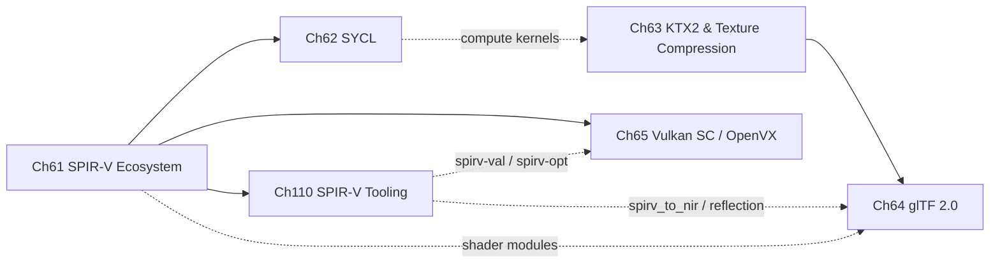

# Part XIV — The Khronos Extended Ecosystem

The **Khronos Group** is the standards body that defines most of the open APIs sitting between Linux GPU drivers and application code: **Vulkan**, **OpenGL**, **OpenCL**, **OpenXR**, and a constellation of supporting standards for shader intermediate representation, asset interchange, compute portability, and safety-critical deployment. Parts III through XIII of this book examined individual driver stacks, display protocols, and rendering APIs largely in isolation. Part XIV zooms out to the cross-cutting layer of Khronos-ratified standards that tie those pieces together: the binary shader format that every Vulkan driver must consume, the texture and geometry interchange formats that every GPU-accelerated asset pipeline must handle, the portable heterogeneous compute abstraction layered above **OpenCL** and **Level Zero**, and the safety-certified and domain-specific API variants needed for automotive and vision workloads. Taken together, these chapters describe the connective tissue of the modern GPU software ecosystem on Linux.

## Chapters in This Part

**Chapter 61 — The SPIR-V Ecosystem** provides the foundational technical reference for **SPIR-V**, the Khronos binary intermediate representation that serves as the mandatory shader exchange format for **Vulkan** and the optional exchange format for **OpenCL 2.1+**. The chapter dissects the binary module structure word by word, maps every front-end language (**GLSL**, **HLSL**, **WGSL**, **OpenCL C**) to its **SPIR-V** compiler path, and then covers the **SPIRV-Tools** suite (**spirv-as**, **spirv-dis**, **spirv-val**, **spirv-opt**) and **SPIRV-Cross** for reflection and cross-compilation. Readers will understand exactly how a **GLSL** source file becomes a **VkShaderModule** and how **Mesa**'s **NIR** lowering pipeline consumes **SPIR-V** at driver level.

**Chapter 62 — SYCL: Heterogeneous Computing with Modern C++** covers the **SYCL 2020** single-source C++ programming model for portable GPU compute across **Intel**, **AMD**, and **NVIDIA** hardware on Linux. The chapter explains the **sycl::queue**, buffer/accessor ownership model, **Unified Shared Memory (USM)**, and kernel dispatch, then goes deep on two major Linux implementations: **Intel oneAPI DPC++** with its **SMCP** compilation pipeline and **Unified Runtime** backend adapters, and **AdaptiveCpp** (formerly **hipSYCL**) with its **SSCP** single-pass architecture. Unlike Chapter 61's focus on static shader IR, this chapter is about dynamic runtime-compiled compute kernels and the middleware that maps them to **Level Zero**, **ROCm**, and **CUDA** simultaneously.

**Chapter 63 — KTX2 and GPU Texture Compression** covers the full texture-asset pipeline from GPU hardware block-compression formats through the **Basis Universal** supercompression codec to the **KTX2** container format and the **libktx** C API. Readers learn how to encode artist content offline with **basisu** or the **ktx** CLI, how to transcode at runtime to the best native format the target GPU supports (**BC7**, **ASTC**, **ETC2**), and how to upload the result directly to **Vulkan** via **ktxVulkanTexture**. The tight integration with **glTF 2.0** via **KHR_texture_basisu** is also detailed, anticipating Chapter 64.

**Chapter 64 — glTF 2.0: The 3D Asset Pipeline Standard** is the comprehensive guide to **glTF 2.0**, the Khronos runtime-efficient 3D asset format. It explains the full schema — **Buffer**, **BufferView**, **Accessor**, **Mesh**, **Primitive**, **Node**, **Scene**, **Animation**, and **Skin** objects — and the **PBR metallic-roughness** material model with its **BRDF** formulation. The chapter covers loading with **tinygltf** and **cgltf**, the **Vulkan** upload path from **glTF** accessors to **VkBuffer**/**VkImage**, official Khronos extensions (**KHR_draco_mesh_compression**, **KHR_texture_basisu**, **EXT_meshopt_compression**), and integration with **Bevy**, **Godot**, **Blender**, and **gltf-transform**. Where Chapter 63 handles textures, this chapter handles the geometry and scene-graph side of the same asset pipeline.

**Chapter 65 — Vulkan SC, OpenVX, and Safety-Critical Graphics** covers three Khronos standards oriented toward non-consumer workloads. **Vulkan SC 1.0** is a safety-deterministic variant of Vulkan targeting **ISO 26262**, **DO-178C**, and **IEC 61508** certification: this chapter explains its static resource reservation model, offline pipeline compilation toolchain, fault callback and robustness infrastructure, and the Linux driver/emulation-ICD landscape. **OpenVX 1.3** is the declarative graph API for embedded computer-vision workloads, with coverage of its kernel library, tensor model, neural-network extension (**vx_khr_nn**), and **NNEF** integration. **ANARI 1.0**, the scientific ray-tracing rendering API, closes the chapter. This chapter is the most specialised in the part and assumes deep familiarity with standard Vulkan from Parts IV–V.

**Chapter 110 — SPIR-V Tooling** is the practical companion to Chapter 61's format-level reference. Where Chapter 61 explains *what* **SPIR-V** is and how it fits into the Mesa driver pipeline, this chapter explains *how to work with it at the tool level*. It covers the full **SPIRV-Tools** suite (**spirv-as**, **spirv-dis**, **spirv-val**, **spirv-opt**, **spirv-link**, **spirv-reduce**) with worked CLI examples; **SPIRV-Cross** for transpiling **SPIR-V** modules back to **GLSL**, **HLSL**, or **MSL** and for programmatic resource reflection; **spirv-reflect** for lightweight pipeline-layout introspection at engine runtime; and the front-end compiler paths (**glslang**, **DXC**, **Tint**, **clang/LLVM-SPIRV**) that feed into the toolchain. The chapter also covers **Mesa**'s `spirv_to_nir` ingestion layer, extended instruction sets for ray tracing and mesh shading, and shader debugging workflows that depend on **SPIR-V**'s debug information extensions. Engine authors, driver developers, and anyone who needs to audit, transform, or cross-compile **SPIR-V** binaries will find this chapter the most directly actionable in the part.

## How the Chapters Interrelate

**Chapter 61** is the keystone of the part. **SPIR-V** is the shared intermediate format consumed by the Vulkan driver in every subsequent chapter: **Vulkan SC** pipelines (Chapter 65) are compiled offline from **SPIR-V** modules validated by **spirv-val**; **SYCL** kernels (Chapter 62) are lowered to **SPIR-V** by the **DPC++** compiler before being ingested by **Level Zero** or the **Vulkan** backend; **glTF** renderers (Chapter 64) load **SPIR-V** shader modules for their **PBR** material pass. Chapter 61 should be read before Chapters 62 and 65 in particular.

**Chapter 110** complements Chapter 61 directly: Chapter 61 establishes the binary format and its role in the driver pipeline, while Chapter 110 equips readers with the day-to-day toolchain — how to assemble, disassemble, validate, optimise, transpile, and reflect on **SPIR-V** modules in practice. The two chapters are best read in sequence (Ch61 then Ch110), and Chapter 110 also reinforces the **Vulkan SC** offline compilation story in Chapter 65 (validation via **spirv-val**, optimisation passes via **spirv-opt**) and the shader introspection patterns useful when building **glTF** renderers in Chapter 64.

Chapters 63 and 64 form a self-contained asset-pipeline pair. **KTX2** textures (Chapter 63) are referenced directly from **glTF** assets via the **KHR_texture_basisu** extension (Chapter 64); the upload paths in both chapters converge on the same **Vulkan** staging-buffer and image-layout-transition idioms. Readers building a **Vulkan** renderer that loads **glTF** scenes should read Chapter 63 before Chapter 64 because the texture-upload infrastructure is introduced there first.

Chapter 62 stands largely independently of Chapters 63–64 but depends on Chapter 61 for the **SPIR-V** compilation pipeline underlying **DPC++** and **AdaptiveCpp**. Chapter 65 likewise depends on Chapter 61 for the **SPIR-V** validation and offline compilation concepts central to **Vulkan SC**'s certification story; Chapter 110 deepens both by providing the concrete tool invocations.

A thematic thread running through all six chapters is the **offline vs. online compilation** axis. **SPIR-V** (Ch61) formalises the IR boundary; **SPIR-V Tooling** (Ch110) provides the workbench for operating on that IR; **SYCL** (Ch62) performs just-in-time kernel compilation against that IR; **KTX2** (Ch63) performs offline transcoding so that runtime paths are trivial; **glTF** (Ch64) defers pipeline creation to asset load time; **Vulkan SC** (Ch65) pushes all compilation entirely offline and forbids runtime shader compilation altogether. Reading across the chapters in order exposes a consistent progression from flexible online compilation toward fully static, certifiable deployment.

## Prerequisites and What Comes Next

Readers should have completed Parts III–V (the **DRM** and **Mesa** stack, **Vulkan** internals) and ideally Part VII (compute APIs including **OpenCL** and **Level Zero**) before tackling this part; Chapter 61 in particular assumes familiarity with **Mesa**'s **NIR** IR, and Chapter 65 assumes fluency with core **Vulkan** objects. Part XV (GPU machine learning and inference acceleration) builds directly on Chapter 62's **SYCL** foundations and on the **OpenVX** neural-network material in Chapter 65, while Part XVI's coverage of vendor-specific Intel and AMD toolchains references the **DPC++** and **ROCm**/**HIP** compiler paths introduced here.

---
