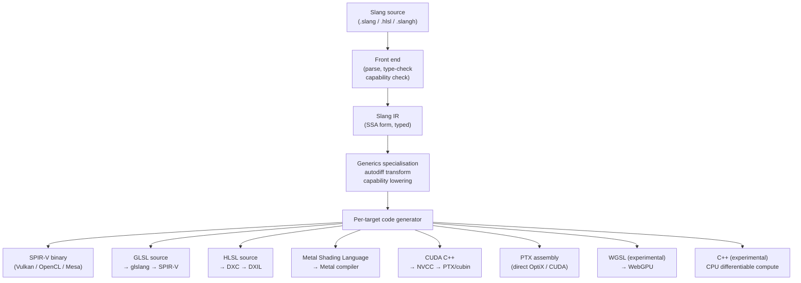
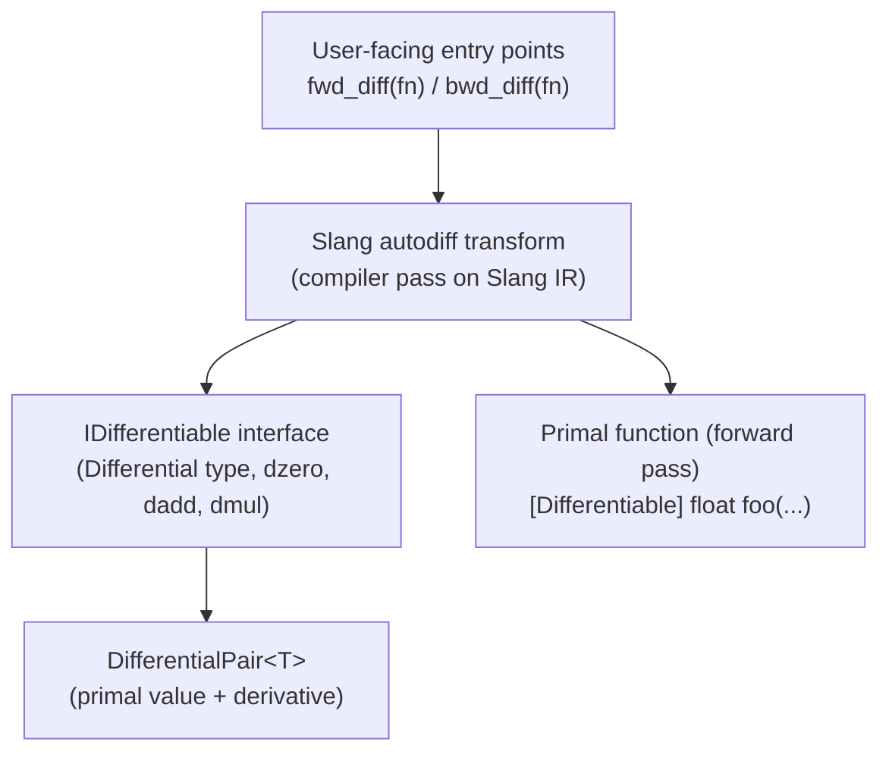
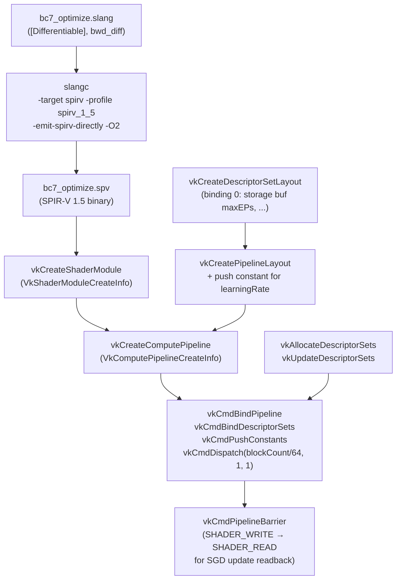

# Chapter 117: Slang — Differentiable Shading Language

> **Part**: Part XV — The NVIDIA Proprietary and Hybrid Stack
> **Audience**: Graphics application developers, shader engineers, neural rendering researchers
> **Status**: First draft — 2026-06-19

---

## Table of Contents

1. [Overview](#1-overview)
2. [Language Foundations: Slang as HLSL Superset](#2-language-foundations-slang-as-hlsl-superset)
   - 2.1 [Generics and Interfaces](#21-generics-and-interfaces)
   - 2.2 [Associated Types](#22-associated-types)
   - 2.3 [Module System and Separate Compilation](#23-module-system-and-separate-compilation)
   - 2.4 [Capability System](#24-capability-system)
3. [Compilation Targets on Linux](#3-compilation-targets-on-linux)
   - 3.1 [SPIR-V for Vulkan](#31-spir-v-for-vulkan)
   - 3.2 [CUDA and PTX](#32-cuda-and-ptx)
   - 3.3 [CPU C++ Target](#33-cpu-c-target)
   - 3.4 [The `slangc` Command-Line Compiler](#34-the-slangc-command-line-compiler)
4. [The Programmatic Compilation API](#4-the-programmatic-compilation-api)
   - 4.1 [Session and Target Configuration](#41-session-and-target-configuration)
   - 4.2 [Module Loading, Linking, and Code Extraction](#42-module-loading-linking-and-code-extraction)
   - 4.3 [Reflection](#43-reflection)
5. [The GFX Abstraction Layer and slang-rhi](#5-the-gfx-abstraction-layer-and-slang-rhi)
6. [Differentiable Programming Model](#6-differentiable-programming-model)
   - 6.1 [The `IDifferentiable` Interface](#61-the-idifferentiable-interface)
   - 6.2 [The `[Differentiable]` Attribute](#62-the-differentiable-attribute)
   - 6.3 [`DifferentialPair<T>` and the `no_diff` Keyword](#63-differentialpair-and-the-no_diff-keyword)
7. [Forward and Reverse Mode Differentiation](#7-forward-and-reverse-mode-differentiation)
   - 7.1 [Forward Mode: `fwd_diff`](#71-forward-mode-fwd_diff)
   - 7.2 [Reverse Mode: `bwd_diff`](#72-reverse-mode-bwd_diff)
   - 7.3 [Custom Derivative Overrides](#73-custom-derivative-overrides)
   - 7.4 [Loop Differentiation and Higher-Order Derivatives](#74-loop-differentiation-and-higher-order-derivatives)
   - 7.5 [Global Buffer Gradients](#75-global-buffer-gradients)
8. [Cooperative Vectors: Neural Inference in Shaders](#8-cooperative-vectors-neural-inference-in-shaders)
9. [Neural Rendering Use Cases](#9-neural-rendering-use-cases)
   - 9.1 [Differentiable Texture Compression](#91-differentiable-texture-compression)
   - 9.2 [NeRF Shader Training Loops](#92-nerf-shader-training-loops)
   - 9.3 [Neural BRDF Fitting](#93-neural-brdf-fitting)
10. [Slang → SPIR-V on Linux: Full Vulkan Pipeline Walkthrough](#10-slang--spir-v-on-linux-full-vulkan-pipeline-walkthrough)
11. [Falcor Research Renderer](#11-falcor-research-renderer)
    - 11.1 [Architecture and Shader Authoring Workflow](#111-architecture-and-shader-authoring-workflow)
    - 11.2 [Differentiable BC7 Compression Case Study](#112-differentiable-bc7-compression-case-study)
12. [NeuralVDB, Omniverse, and NVIDIA Production Use](#12-neuralvdb-omniverse-and-nvidia-production-use)
13. [SlangPy: Python and PyTorch Integration](#13-slangpy-python-and-pytorch-integration)
14. [Slang + Vulkan as a Substrate for Differentiable World Model Rendering](#14-slang--vulkan-as-a-substrate-for-differentiable-world-model-rendering)
    - 14.1 [The World Model Training Pipeline](#141-the-world-model-training-pipeline)
    - 14.2 [The Differentiable Visual Decoder in Slang](#142-the-differentiable-visual-decoder-in-slang)
    - 14.3 [The SlangPy Training Loop](#143-the-slangpy-training-loop)
    - 14.4 [Inference on Vulkan: Real-Time World Model Rollout](#144-inference-on-vulkan-real-time-world-model-rollout)
    - 14.5 [NVIDIA Cosmos: A Production World Model on the Slang Stack](#145-nvidia-cosmos-a-production-world-model-on-the-slang-stack)
15. [Comparison with GLSL, WGSL, HLSL, and MDL](#15-comparison-with-glsl-wgsl-hlsl-and-mdl)
16. [Building Slang from Source on Linux](#16-building-slang-from-source-on-linux)
    - 16.1 [Prerequisites and Source Checkout](#161-prerequisites-and-source-checkout)
    - 16.2 [CMake Configuration and Build](#162-cmake-configuration-and-build)
    - 16.3 [CMake Integration in Downstream Projects](#163-cmake-integration-in-downstream-projects)
    - 16.4 [Distribution Packages and Vulkan SDK](#164-distribution-packages-and-vulkan-sdk)
17. [Integrations](#17-integrations)

---

## 1. Overview

Slang is an open-source shading language and compiler that extends HLSL with three capabilities absent from every other GPU shading language in active use:

- **Generics and interface system** — a real, fully type-checked generic and interface system operating on Slang IR
- **Module system** — a structured module system for separate compilation using `import` and pre-compiled `.slang-module` binaries
- **Automatic differentiation (AD)** — first-class autodiff support for computing gradients through shader functions

The last of these is what makes Slang unusual enough to warrant a dedicated chapter: the ability to annotate an existing shader function with `[Differentiable]`, then call `bwd_diff(fn)` to obtain a GPU kernel that computes the gradient of that function with respect to all its differentiable inputs — without writing the backward pass by hand.

This capability unlocks a class of workloads previously requiring specialised frameworks:

- **Inverse rendering** — recovering scene parameters from observed images
- **Differentiable texture encoding** — optimising compressed texture parameters against rendered output
- **Neural BRDF fitting** — learning material reflectance from measured data
- **On-device training of neural radiance fields**

All of these use the same forward-rendering shaders that already exist in a production renderer, augmented with autodiff annotations.

**Governance.** Slang originated in NVIDIA Research (2017–2018), grew through Falcor and the SLANG.D differentiable extension (SIGGRAPH Asia 2023), and transferred to multi-vendor governance under the **Khronos Slang Initiative** on 21 November 2024. [Source](https://www.khronos.org/news/press/khronos-group-launches-slang-initiative-hosting-open-source-compiler-contributed-by-nvidia) The project is Apache 2.0 licensed at [`github.com/shader-slang/slang`](https://github.com/shader-slang/slang). Supporting members at the governance launch included Adobe, Autodesk, id Software, Igalia, and Valve. In January 2026, the Academy Software Foundation announced that MaterialX added a dedicated Slang shader generator (MaterialXGenSlang), bringing Slang into the USD/MaterialX pipeline used at Pixar and Lucasfilm. [Source](https://www.aswf.io/blog/materialx-adds-support-for-slang-shader-generation/)

**Primary audiences for this chapter:**
- Shader engineers migrating existing HLSL/GLSL pipelines to a modern, typed language
- Graphics application developers adding differentiable rendering to a Vulkan renderer
- Research engineers training neural rendering models that run partly on the GPU shader side

**Relationship to other chapters.** Chapter 69 §7 introduced Slang briefly in the context of the Omniverse RTX Renderer and SlangPy. Chapter 70 §6 showed the `NeuralNetwork<>` template and `VK_NV_cooperative_vector` through the RTXNS SDK lens. This chapter covers the Slang language, compiler, and autodiff semantics in depth. Readers are assumed to be familiar with:

- **SPIR-V** (Chapter 24)
- **Vulkan pipeline objects** (Chapters 24–25)
- **CUDA streams** (Chapter 66)

---

## 2. Language Foundations: Slang as HLSL Superset

Slang is a strict superset of HLSL: virtually all valid HLSL compiles under `slangc` with minimal or no modification. The additions are not syntactic sugar but structural language mechanisms that change what is expressible at the type level.

### 2.1 Generics and Interfaces

HLSL's templating is preprocessor-level; Slang's generics operate on an SSA-form intermediate representation (Slang IR) that is fully type-checked before code generation. This eliminates a class of errors that appear only when a template is instantiated.

Interfaces declare an API contract. A generic function constrained to an interface is type-safe and produces clear error messages at the call site rather than inside the instantiation:

```slang
// File: material_interface.slang
// Defines a typed contract for physically-based material evaluation

interface IMaterial {
    /// Evaluate the reflectance given half-vector H and normal N.
    float3 evalBRDF(float3 H, float3 N, float3 V, float3 L);

    /// Sample a direction from the material's importance distribution.
    float3 sampleDirection(float3 N, float2 u);
}

// A concrete implementation: GGX microfacet BRDF
struct GGXMaterial : IMaterial {
    float roughness;  // perceptual roughness (alpha = roughness^2)
    float3 F0;        // Fresnel at normal incidence

    float3 evalBRDF(float3 H, float3 N, float3 V, float3 L) {
        float alpha  = roughness * roughness;
        float NdotH  = max(dot(N, H), 0.0);
        float NdotL  = max(dot(N, L), 0.0);
        float NdotV  = max(dot(N, V), 0.0);
        // GGX distribution (Trowbridge-Reitz)
        float alpha2 = alpha * alpha;
        float denom  = (NdotH * NdotH) * (alpha2 - 1.0) + 1.0;
        float D      = alpha2 / (3.14159 * denom * denom);
        // Schlick Fresnel
        float3 F     = F0 + (1.0 - F0) * pow(1.0 - max(dot(H, V), 0.0), 5.0);
        // Smith geometry (approximate)
        float k      = (roughness + 1.0) * (roughness + 1.0) / 8.0;
        float G      = (NdotV / (NdotV * (1.0 - k) + k)) *
                       (NdotL / (NdotL * (1.0 - k) + k));
        return (D * F * G) / (4.0 * NdotV * NdotL + 0.001);
    }

    float3 sampleDirection(float3 N, float2 u) {
        // GGX importance sampling (not shown in full)
        return N; // placeholder
    }
}

// Generic path tracer step — works for any IMaterial implementation
[Differentiable]
float3 evalDirect<T : IMaterial>(T material, float3 N, float3 V, float3 L) {
    float3 H = normalize(V + L);
    return material.evalBRDF(H, N, V, L) * max(dot(N, L), 0.0);
}
```

At compile time, `evalDirect<GGXMaterial>` is specialised into concrete code; a second implementation such as `LambertMaterial` generates a distinct specialisation. No virtual dispatch occurs at runtime. [Source](https://shader-slang.org/slang/user-guide/)

### 2.2 Associated Types

Associated types allow an interface to declare that an implementation must provide a named type, not just methods. This is essential for the autodiff system (§6) and for material systems where the "tangent space" type differs per material:

```slang
interface IShape {
    /// The type used to measure this shape (e.g., float for 2D, float3 for 3D)
    associatedtype Measurement;

    Measurement area();
    Measurement perimeter();
}

struct Circle : IShape {
    typealias Measurement = float;
    float radius;
    float area()      { return 3.14159 * radius * radius; }
    float perimeter() { return 2.0 * 3.14159 * radius; }
}

struct Box3D : IShape {
    typealias Measurement = float3;
    float3 dims;
    float3 area()      { return 2.0 * float3(dims.y*dims.z, dims.x*dims.z, dims.x*dims.y); }
    float3 perimeter() { return 4.0 * (dims.x + dims.y + dims.z); } // edge length vector
}
```

The `IDifferentiable` interface (§6.1) uses associated types to declare the `Differential` type for each differentiable data type.

### 2.3 Module System and Separate Compilation

Slang's `import` statement loads a named module, supporting offline IR compilation and incremental rebuilds. A module is a `.slang` file or a pre-compiled `.slang-module` binary:

```slang
// File: scene_geometry.slang — exported module
export struct Vertex {
    float3 position;
    float3 normal;
    float2 uv;
}

export float3 interpolateBarycentric(Vertex v0, Vertex v1, Vertex v2, float2 bary) {
    float3 b = float3(bary.x, bary.y, 1.0 - bary.x - bary.y);
    return b.x * v0.position + b.y * v1.position + b.z * v2.position;
}
```

```slang
// File: path_tracer.slang — consuming module
import scene_geometry;      // Slang module (not a preprocessor include)
import material_interface;  // from §2.1
import Scene.Raster;        // Falcor-style namespaced import

[shader("compute")]
[numthreads(8, 8, 1)]
void pathTraceMain(uint3 threadId : SV_DispatchThreadID) {
    Vertex v = fetchVertex(threadId.x);
    // Use imported types directly
}
```

Pre-compiling to Slang IR speeds up large shader compilations:

```bash
# Compile module to Slang IR (.slang-module) at build time
slangc scene_geometry.slang -target slang-ir -o scene_geometry.slang-module

# Use the pre-compiled module in a downstream compile
slangc path_tracer.slang -target spirv -entry pathTraceMain \
    -stage compute -I. -o path_tracer.spv
```

### 2.4 Capability System

The capability system is Slang's mechanism for cross-platform feature gating. Capabilities are hierarchical sets of GPU features; a target profile activates a set, and the compiler enforces at type-check time that only features available on the target are used:

```slang
// ray_tracing.slang
// This function requires Vulkan ray query capability.
// Slang type-checks that the target declares this capability before specialising.
[require(spirv_1_4)]
[require(GL_EXT_ray_query)]
float3 traceRay(RaytracingAccelerationStructure accel, RayDesc ray) {
    RayQuery<RAY_FLAG_NONE> q;
    q.TraceRayInline(accel, RAY_FLAG_NONE, 0xFF, ray);
    q.Proceed();
    return q.CommittedRayT() < 1e30 ? float3(1, 0, 0) : float3(0, 0, 0);
}
```

Attempting to use `traceRay` in a `glsl_450` target is a type error, not a runtime crash. This makes it safe to author shaders that compile to multiple backends from the same source. [Source](https://shader-slang.org/slang/user-guide/compiling)

---

## 3. Compilation Targets on Linux

Slang's compiler (`slangc`) emits to a broad set of output formats from a single source language. The compilation pipeline is:



On Linux, the three targets of primary interest are SPIR-V (for Vulkan), PTX/CUDA (for NVIDIA compute and OptiX), and CPU C++ (for scalar debugging of autodiff logic).

### 3.1 SPIR-V for Vulkan

SPIR-V is the native production target for Linux Vulkan workloads. Slang ships its own SPIR-V code generator (`-emit-spirv-directly`, the default since v2025.x), which bypasses the GLSL roundtrip and preserves Slang IR semantics more accurately.

| `-target` flag | SPIR-V version range | Notes |
|---|---|---|
| `spirv` | 1.3–1.6 (via `-profile`) | Stable; primary Vulkan path |
| `spirv_1_0`–`spirv_1_2` | 1.0–1.2 | Experimental; older device support |
| `glsl` + downstream glslang | 1.0–1.5 | `-emit-spirv-via-glsl` path; slower |

SPIR-V version control is via the profile flag: `-profile spirv_1_5` emits SPIR-V 1.5 constructs such as `OpEntryPoint` with `OpExecutionModeId`. For Vulkan 1.3 with full dynamic rendering support, `spirv_1_6` is appropriate.

Slang decorations that map to SPIR-V constructs:

```slang
// Vulkan-specific binding annotations (SPIR-V decorations)

[[vk::binding(0, 0)]]          // Descriptor binding 0 in set 0
Texture2D<float4>    gAlbedo;

[[vk::binding(1, 0)]]
SamplerState         gSampler;

[[vk::binding(0, 1)]]          // Descriptor binding 0 in set 1 (new set)
RWStructuredBuffer<float4> gOutput;

// Push constant block
[[vk::push_constant]]
struct PushConstants {
    float4x4 viewProj;
    float    time;
} gPC;

// Specialisation constant
[vk::constant_id(0)]
const int gNumSamples = 4;     // default 4; overridable at pipeline creation

// Vertex input / fragment output locations
struct VSInput {
    [[vk::location(0)]] float3 inPosition : POSITION;
    [[vk::location(1)]] float2 inUV       : TEXCOORD0;
}

struct FSOutput {
    [[vk::location(0)]] float4 outColor : SV_TARGET;
    [[vk::location(1)]] [[vk::index(1)]] float4 outColor1 : SV_TARGET1; // dual-source blend
}
```

`ParameterBlock<T>` is Slang's mechanism for grouping descriptors into a dedicated descriptor set, replacing the need to manually partition binding registers:

```slang
// scene_params.slang
struct SceneData {
    float4x4              model;
    Texture2D<float4>     albedoMap;
    SamplerState          linearSampler;
    StructuredBuffer<Light> lights;
}

// Slang allocates a new descriptor set for each ParameterBlock instantiation
ParameterBlock<SceneData> gScene;
```

### 3.2 CUDA and PTX

Slang compiles to CUDA C++ or directly to PTX via its CUDA backend. This path is required for:
- OptiX shader programs (closest-hit, any-hit, callable programs) — see Chapter 67
- RTXNS/RTXNTC shader integration (Chapter 70)
- Differentiable rendering training kernels that share autodiff logic with CPU-side optimisers

The CUDA target generates standard CUDA C++ that is then compiled by NVCC. PTX can be generated directly:

```bash
# CUDA C++ output
slangc differentiable_renderer.slang \
    -target cuda \
    -entry pathTraceMain \
    -stage compute \
    -o differentiable_renderer.cu

# PTX output (for runtime loading via cuModuleLoadData)
slangc differentiable_renderer.slang \
    -target ptx \
    -entry pathTraceMain \
    -stage compute \
    -DOPTIX_PATH=/usr/local/optix \
    -o differentiable_renderer.ptx
```

### 3.3 CPU C++ Target

The CPU C++ target compiles Slang shader code to a scalar C++ function callable from the host. This is primarily used for:

1. Validating autodiff logic: the same differentiable Slang function can run on CPU with a reference scalar implementation, then on GPU via SPIR-V, ensuring gradient correctness before committing to a training run.
2. Offline parameter estimation tasks where GPU parallelism is less important than iteration speed.

```bash
slangc material.slang -target cpp -entry evalBRDF -stage compute -o material.cpp
# The generated .cpp links against slang-prelude.h in the Slang include directory
```

### 3.4 The `slangc` Command-Line Compiler

`slangc` is the reference command-line frontend. Its most important flags for Linux development are:

```bash
# Core compilation
slangc <source.slang>           \
    -target spirv               \   # output format
    -profile spirv_1_5          \   # SPIR-V version
    -entry <entryPointName>     \   # function name of entry point
    -stage compute              \   # vertex | pixel | compute | raygen | ...
    -o <output.spv>             \   # output path

# Input control
    -D<MACRO>[=<value>]         \   # preprocessor define
    -I<search_path>             \   # import / include search path

# SPIR-V quality and debug
    -emit-spirv-directly        \   # native SPIR-V backend (default)
    -g2                         \   # NonSemantic.Shader.DebugInfo.100 for RenderDoc
    -O2                         \   # optimisation level (0–3)
    -fvk-use-scalar-layout      \   # scalar buffer layout (std430 without padding)
    -fvk-use-entrypoint-name    \   # preserve entry point name (not renamed to "main")

# Vulkan-specific resource mapping
    -fvk-b-shift 1 0            \   # shift 'b' register space 0 bindings by 1
    -fvk-bind-globals 0 127     \   # place $Globals cbuffer at set 0, binding 127

# Capabilities (SPIR-V extensions)
    -capability vk_mem_model    \   # enable VK_KHR_vulkan_memory_model
    -capability SPV_EXT_demote_to_helper_invocation   # discard → OpDemoteToHelperInvocation

# Downstream tool argument passthrough
    -Xdxc /O3                   \   # pass /O3 to DXC when targeting HLSL/DXIL
    -Xglslang --target-env vulkan1.3   # pass args to glslang when -emit-spirv-via-glsl
```

[Source: slangc user guide, compiling](https://shader-slang.org/slang/user-guide/compiling)

---

## 4. The Programmatic Compilation API

For production integration, applications use Slang's C++ API (`slang.h`) rather than shelling out to `slangc`. The API supports incremental compilation, thread-safe parallel code generation after linking, and deep reflection.

### 4.1 Session and Target Configuration

```cpp
// File: slang_compile_helper.cpp
// Demonstrates the full Slang programmatic compilation pipeline for SPIR-V output.
// Links against: slang::slang (CMake target), headers from <slang/slang.h>

#include <slang/slang.h>
#include <slang/slang-com-ptr.h>

// 1. Create a global session — one per process, thread-safe to share
Slang::ComPtr<slang::IGlobalSession> globalSession;
{
    slang::GlobalSessionDesc desc = {};
    // desc.enableGLSL = true;  // opt-in GLSL compatibility module
    if (SLANG_FAILED(slang::createGlobalSession(&desc, globalSession.writeRef()))) {
        // handle error
    }
}

// 2. Configure the target (SPIR-V for Vulkan 1.3)
slang::TargetDesc targetDesc = {};
targetDesc.format  = SLANG_SPIRV;
targetDesc.profile = globalSession->findProfile("spirv_1_5");
// Optional: set optimisation level for this target
targetDesc.optimizationLevel = SLANG_OPTIMIZATION_LEVEL_DEFAULT;

// 3. Configure the session (compiler instance)
slang::SessionDesc sessionDesc = {};
sessionDesc.targets     = &targetDesc;
sessionDesc.targetCount = 1;
// Search paths for import statements
const char* searchPaths[] = { "./shaders", "./shaders/common" };
sessionDesc.searchPaths     = searchPaths;
sessionDesc.searchPathCount = 2;

Slang::ComPtr<slang::ISession> session;
if (SLANG_FAILED(globalSession->createSession(sessionDesc, session.writeRef()))) {
    // handle error
}
```

### 4.2 Module Loading, Linking, and Code Extraction

```cpp
// 4. Load the Slang module (compiles the .slang file to Slang IR)
Slang::ComPtr<ISlangBlob> diagnostics;
Slang::ComPtr<slang::IModule> module(
    session->loadModule("path_tracer", diagnostics.writeRef()));
if (!module) {
    // Print diagnostics: (const char*)diagnostics->getBufferPointer()
    return;
}

// 5. Find the entry point by name
Slang::ComPtr<slang::IEntryPoint> entryPoint;
if (SLANG_FAILED(module->findEntryPointByName("pathTraceMain",
                                               entryPoint.writeRef()))) {
    return;
}

// 6. Compose the program (module + entry point)
slang::IComponentType* components[] = { module, entryPoint };
Slang::ComPtr<slang::IComponentType> program;
if (SLANG_FAILED(session->createCompositeComponentType(
        components, 2, program.writeRef(), diagnostics.writeRef()))) {
    return;
}

// 7. Link — resolves cross-module references, specialises generics
Slang::ComPtr<slang::IComponentType> linkedProgram;
if (SLANG_FAILED(program->link(linkedProgram.writeRef(), diagnostics.writeRef()))) {
    return;
}

// 8. Extract SPIR-V blob for entry point 0, target 0
// getEntryPointCode() is safe to call concurrently from multiple threads
// on the same linkedProgram after link() completes.
Slang::ComPtr<slang::IBlob> kernelBlob;
if (SLANG_FAILED(linkedProgram->getEntryPointCode(
        /*entryPointIndex=*/0,
        /*targetIndex=*/0,
        kernelBlob.writeRef(),
        diagnostics.writeRef()))) {
    return;
}

// Pass the SPIR-V blob to Vulkan
VkShaderModuleCreateInfo smci{};
smci.sType    = VK_STRUCTURE_TYPE_SHADER_MODULE_CREATE_INFO;
smci.codeSize = kernelBlob->getBufferSize();
smci.pCode    = reinterpret_cast<const uint32_t*>(kernelBlob->getBufferPointer());
VkShaderModule shaderModule;
vkCreateShaderModule(device, &smci, nullptr, &shaderModule);
```

**Threading model.** Global session creation is internally thread-safe. Front-end work (module loading, type-checking, linking) is not thread-safe within a single session — use one session per thread, or serialise calls. After `link()` completes, `getEntryPointCode()`, `getTargetCode()`, and `getTargetMetadata()` are safe for concurrent calls from multiple threads on the same linked program. This allows a thread pool to extract code for many entry points simultaneously.

### 4.3 Reflection

After linking, the reflection API provides the complete parameter layout:

```cpp
// Get the program layout for target 0
slang::ProgramLayout* layout = linkedProgram->getLayout(/*targetIndex=*/0);

// Iterate global parameters
for (int i = 0; i < layout->getParameterCount(); ++i) {
    slang::VariableLayoutReflection* param = layout->getParameterByIndex(i);
    const char* name    = param->getName();
    unsigned binding    = param->getBindingIndex();
    unsigned bindingSet = param->getBindingSpace();
    slang::TypeLayoutReflection* type = param->getTypeLayout();
    // Use to drive descriptor set allocation without hardcoding register numbers
}
```

Reflection eliminates the need to manually declare binding numbers in both the shader and the host code — a common source of bugs in large HLSL codebases. [Source](https://shader-slang.org/slang/user-guide/)

---

## 5. The GFX Abstraction Layer and slang-rhi

Slang ships a cross-API graphics abstraction to make its sample applications portable across Vulkan, D3D12, Metal, WebGPU, CUDA, and CPU. Two generations exist:

| Library | Status | Backends | Notes |
|---|---|---|---|
| `gfx` / `slang-gfx` | Deprecated | D3D11, D3D12, OpenGL, Vulkan, CUDA, CPU | Original sample framework |
| `slang-rhi` | Recommended | Vulkan, D3D12, Metal, WebGPU (WGPU), D3D11 | Redesigned API; use for new code |

[Source: Slang community discussion on slang-rhi](https://github.com/shader-slang/slang/discussions/6802)

`slang-rhi` exposes a device-level abstraction. On Linux, the Vulkan backend (`DeviceType::Vulkan`) is the production path:

```cpp
#include <slang-rhi/slang-rhi.h>

// Create a Vulkan device via slang-rhi
rhi::IDevice::Desc deviceDesc = {};
deviceDesc.deviceType = rhi::DeviceType::Vulkan;

Slang::ComPtr<rhi::IDevice> rhiDevice;
rhi::getRHI()->createDevice(deviceDesc, rhiDevice.writeRef());

// slang-rhi consumes Slang reflection to bind shader parameters by name,
// removing the need to track binding indices manually.
Slang::ComPtr<rhi::IShaderProgram> program;
rhiDevice->createProgram(
    { .slangGlobalSession = globalSession.get(),
      .linkingStyle = rhi::LinkingStyle::SingleFile,
      .entryPointNames = {"pathTraceMain"},
      .entryPointCount = 1 },
    program.writeRef());
```

For teams building their own Vulkan renderer rather than using slang-rhi, the programmatic API in §4 is the integration point: extract a SPIR-V blob and pass it to `vkCreateShaderModule`.

---

## 6. Differentiable Programming Model

The differentiable programming model in Slang is layered. At the bottom, the `IDifferentiable` interface defines what it means for a type to have a derivative. Above that, the `[Differentiable]` attribute instructs the Slang compiler to generate derivative transforms for a function. At the call site, `fwd_diff` and `bwd_diff` materialize the forward- and reverse-mode Jacobian transforms.



### 6.1 The `IDifferentiable` Interface

`IDifferentiable` is a built-in Slang interface. Any type that implements it can participate in automatic differentiation. Slang auto-synthesises the implementation for structs whose all fields are themselves differentiable:

```slang
// IDifferentiable (from Slang standard library — simplified)
interface IDifferentiable {
    /// The type of the derivative ("tangent space")
    associatedtype Differential : IDifferentiable
        where Differential.Differential == Differential;

    /// Zero derivative
    static Differential dzero();

    /// Add two derivatives
    static Differential dadd(Differential a, Differential b);

    /// Multiply derivative by a scalar (for chain rule)
    static Differential dmul<S : __BuiltinRealType>(S s, Differential d);
}
```

[Source](https://docs.shader-slang.org/en/stable/external/core-module-reference/interfaces/idifferentiable-01/index.html)

**Built-in differentiable types:** `float`, `double`, `half`, and all vector and matrix types thereof (`float2`, `float3x3`, etc.), plus arrays and tuples of differentiable types.

**Auto-synthesised struct differentiation:**

```slang
// Slang auto-synthesises IDifferentiable for this struct.
// The Differential type has the same field names with each field's Differential type.
struct MaterialParams : IDifferentiable {
    float  roughness;  // Differential: float
    float3 baseColor;  // Differential: float3
}
// Auto-generated:
// struct MaterialParams.Differential : IDifferentiable {
//     float roughness;
//     float3 baseColor;
// }
```

When auto-synthesis is insufficient (e.g., the struct contains internal cached values that should not be differentiated), you can provide explicit implementations:

```slang
struct CachedBRDF : IDifferentiable {
    typealias Differential = CachedBRDFGrad;

    float  roughness;
    float3 F0;
    no_diff float precomputedLUT; // not in Differential — see §6.3

    static CachedBRDFGrad dzero() { return { 0.0, float3(0) }; }
    static CachedBRDFGrad dadd(CachedBRDFGrad a, CachedBRDFGrad b) {
        return { a.roughness + b.roughness, a.F0 + b.F0 };
    }
    static CachedBRDFGrad dmul<S : __BuiltinRealType>(S s, CachedBRDFGrad d) {
        return { s * d.roughness, s * d.F0 };
    }
}

struct CachedBRDFGrad : IDifferentiable {
    typealias Differential = CachedBRDFGrad;
    float  roughness;
    float3 F0;
    static CachedBRDFGrad dzero() { return { 0.0, float3(0) }; }
    static CachedBRDFGrad dadd(CachedBRDFGrad a, CachedBRDFGrad b) {
        return { a.roughness + b.roughness, a.F0 + b.F0 };
    }
    static CachedBRDFGrad dmul<S : __BuiltinRealType>(S s, CachedBRDFGrad d) {
        return { s * d.roughness, s * d.F0 };
    }
}
```

### 6.2 The `[Differentiable]` Attribute

`[Differentiable]` on a function instructs the Slang compiler to make that function differentiable. The function body must use only differentiable operations or explicitly `no_diff`-marked non-differentiable subexpressions:

```slang
// File: brdf_loss.slang
// Demonstrates [Differentiable] on a multi-stage function chain.

[Differentiable]
float3 evalGGX(float roughness, float3 F0, float3 H, float3 N, float3 V, float3 L) {
    float alpha  = roughness * roughness;
    float NdotH  = saturate(dot(N, H));
    float NdotV  = saturate(dot(N, V));
    float NdotL  = saturate(dot(N, L));
    float VdotH  = saturate(dot(V, H));

    float alpha2 = alpha * alpha;
    float denom  = NdotH * NdotH * (alpha2 - 1.0f) + 1.0f;
    float D      = alpha2 / (3.14159f * denom * denom + 1e-7f);

    float3 F     = F0 + (1.0f - F0) * pow(max(1.0f - VdotH, 0.0f), 5.0f);

    float k  = (roughness + 1.0f) * (roughness + 1.0f) * 0.125f;
    float G1v = NdotV / (NdotV * (1.0f - k) + k + 1e-7f);
    float G1l = NdotL / (NdotL * (1.0f - k) + k + 1e-7f);
    float G   = G1v * G1l;

    return (D * F * G) / (4.0f * NdotV * NdotL + 1e-7f);
}

[Differentiable]
float mseLoss(float3 predicted, no_diff float3 target) {
    float3 d = predicted - target;
    return dot(d, d) / 3.0f;
}

[Differentiable]
float brdfFitLoss(float roughness, float3 F0,
                  no_diff float3 H, no_diff float3 N,
                  no_diff float3 V, no_diff float3 L,
                  no_diff float3 measuredBRDF) {
    float3 predicted = evalGGX(roughness, F0, H, N, V, L);
    return mseLoss(predicted, measuredBRDF);
}
```

### 6.3 `DifferentialPair<T>` and the `no_diff` Keyword

`DifferentialPair<T>` packages a primal value with its derivative:

```slang
// Construct a pair with given primal and derivative
DifferentialPair<float>  dp = diffPair(1.5f, 0.0f); // primal=1.5, d/dx=0
DifferentialPair<float3> dv = diffPair(float3(1,0,0), float3(0,1,0));

// Access
float  primal = dp.p;  // or dp.getPrimal()
float  deriv  = dp.d;  // or dp.getDifferential()
```

`no_diff` marks a parameter, return value, or struct member as non-differentiable. Assigning a differentiable value to a `no_diff` location without calling `detach()` is a compile-time error:

```slang
[Differentiable]
float myFunc(float x, no_diff float scale) {
    // 'scale' is treated as a constant from the differentiator's perspective
    return x * x * scale;
}

// Correct: detach() explicitly drops gradient tracking
float y = detach(someExpr) * 2.0;
```

`no_diff` on struct members excludes them from the `Differential` type (see `CachedBRDF.precomputedLUT` above), which reduces the size of gradient buffers.

---

## 7. Forward and Reverse Mode Differentiation

Slang supports both classical modes of automatic differentiation. Forward mode (Jacobian-vector product) is efficient when the number of inputs is small. Reverse mode (vector-Jacobian product) is efficient when the number of outputs is small — the usual case in machine learning, where the output is a scalar loss.

### 7.1 Forward Mode: `fwd_diff`

`fwd_diff(f)` returns a callable whose signature replaces each differentiable `in` parameter of type `T` with `DifferentialPair<T>` and each differentiable return value `R` with `DifferentialPair<R>`. Running the result propagates a single "seed" direction (the derivative component of the input pairs) through the function to produce the directional derivative of the output.

```slang
[Differentiable]
float2 foo(float a, float b) {
    return float2(a * b * b, a * a);
}

void testForwardMode() {
    // Compute df/da — seed a=1 (d/da=1.0), b=2.4 (d/db=0.0)
    DifferentialPair<float> dp_a = diffPair(1.0f, 1.0f);  // da = 1 (seed direction)
    DifferentialPair<float> dp_b = diffPair(2.4f, 0.0f);  // db = 0 (not differentiating wrt b)

    DifferentialPair<float2> result = fwd_diff(foo)(dp_a, dp_b);
    float2 primal = result.p;  // foo(1.0, 2.4)  = (5.76, 1.0)
    float2 dda    = result.d;  // d(foo)/da      = (2.4^2, 2.0) = (5.76, 2.0)
}
```

**Signature transform rules for `fwd_diff(f)`:**
- Differentiable `in` parameter `T` → `DifferentialPair<T>`
- `IDifferentiablePtrType` parameter `P` → `DifferentialPtrPair<P>`
- `no_diff` parameter `T` → unchanged `T`
- Differentiable return type `R` → `DifferentialPair<R>`

[Source: autodiff user guide](https://shader-slang.org/slang/user-guide/autodiff.html)

### 7.2 Reverse Mode: `bwd_diff`

`bwd_diff(f)` returns a `void` callable that propagates an upstream gradient (loss derivative with respect to the function's output) backward through all differentiable inputs simultaneously. This is far more efficient than running `fwd_diff` once per input when there are many inputs:

```slang
void testReverseMode() {
    // Initial primal values; zero-initialise gradient accumulators
    DifferentialPair<float> dp_a = diffPair(1.0f, 0.0f);
    DifferentialPair<float> dp_b = diffPair(2.4f, 0.0f);

    // Upstream gradient: loss gradient w.r.t. foo's output.
    // If loss = sum(foo(a,b)), then dL/d(foo) = float2(1, 1)
    float2 dL_dout = float2(1.0f, 1.0f);

    // Run the backward pass — modifies dp_a.d and dp_b.d in place
    bwd_diff(foo)(dp_a, dp_b, dL_dout);

    float dL_da = dp_a.d;  // dL/da = 1*b^2 + 1*2a = 5.76 + 2.0 = 7.76
    float dL_db = dp_b.d;  // dL/db = 1*2ab = 4.8
}
```

**Signature transform rules for `bwd_diff(f)` (the rules that trip most newcomers):**
- Returns `void`
- Differentiable `in T` parameter → `inout DifferentialPair<T>` (gradient accumulated into `.d`)
- Differentiable `out T` parameter → `in T.Differential` (receives upstream gradient)
- Differentiable `inout T` parameter → `inout DifferentialPair<T>`
- Differentiable return value `R` → becomes a final `in R.Differential` parameter

The backward pass generated by Slang implements the adjoint method: it replays (or re-checkpoints) the forward computation to recover intermediate values, then propagates gradients in reverse using the chain rule. [Source: SLANG.D paper](https://dl.acm.org/doi/10.1145/3618353)

### 7.3 Custom Derivative Overrides

For functions whose bodies are inaccessible (hardware intrinsics, black-box library calls) or whose naive autodiff derivative is numerically unstable, Slang provides custom derivative override attributes.

**Forward derivative override:**

```slang
// Declare a custom forward derivative for the sin intrinsic
DifferentialPair<float> sin_fwd(DifferentialPair<float> dpx) {
    float x  = dpx.p;
    float dx = dpx.d;
    return DifferentialPair<float>(sin(x), cos(x) * dx);  // d/dx sin(x) = cos(x)
}

[ForwardDerivative(sin_fwd)]
float sin(float x);  // declaration — body is the hardware intrinsic
```

**Backward derivative override:**

```slang
void sin_bwd(inout DifferentialPair<float> dpx, float dresult) {
    dpx = DifferentialPair<float>(dpx.p, cos(dpx.p) * dresult);
}

[BackwardDerivative(sin_bwd)]
float sin(float x);
```

**Alternative direction — attach from the derivative function side** (useful when the primal is in a library header you cannot modify):

```slang
float square(float x, float y) { return x * x + y * y; }

[BackwardDerivativeOf(square)]
void bwd_square(inout DifferentialPair<float> x_pair,
                inout DifferentialPair<float> y_pair,
                float dOut) {
    x_pair = diffPair(x_pair.p, 2.0f * x_pair.p * dOut);
    y_pair = diffPair(y_pair.p, 2.0f * y_pair.p * dOut);
}

[ForwardDerivativeOf(square)]
DifferentialPair<float> fwd_square(DifferentialPair<float> x,
                                   DifferentialPair<float> y) {
    return diffPair(square(x.p, y.p),
                    2.0f * (x.p * x.d + y.p * y.d));
}
```

Additional override attributes:
- `[TreatAsDifferentiable]`: marks a non-differentiable function as satisfying differentiability, generating zero derivatives. Use for logging, counter increments, or other side-effect-only functions that should be invisible to the differentiator.
- `[PrimalSubstitute(fn)]`: provides a differentiable reference implementation for a non-differentiable function without accessible body.
- `[NoDiffThis]`: excludes the implicit `this` parameter from differentiation in member methods.

[Source: autodiff user guide §custom derivatives](https://shader-slang.org/slang/user-guide/autodiff.html)

### 7.4 Loop Differentiation and Higher-Order Derivatives

Loops with dynamic bounds require an explicit `[MaxIters(N)]` annotation so the Slang compiler can allocate a finite adjoint stack:

```slang
[Differentiable]
float sumFirst(float x, int N) {
    float result = 0.0f;
    [MaxIters(64)]                 // tell the backward pass to allocate for up to 64 iterations
    for (int i = 0; i < N; i++) {
        result += x * float(i);    // sum of i * x, i = 0..N-1
    }
    return result;
}
// bwd_diff(sumFirst) computes dL/dx = sum(i, i=0..N-1) = N*(N-1)/2
```

`[ForceUnroll]` is an alternative when N is a compile-time constant: the loop is fully unrolled before derivative generation, producing a flat sequence of operations.

**Higher-order derivatives.** Forward-over-forward nesting gives second derivatives:

```slang
// Second derivative: d²/dx² of sin(x)
var d2sin = fwd_diff(fwd_diff(sin));
// d2sin(diffPair(diffPair(x, 1.0), diffPair(1.0, 0.0)))
// → d²sin/dx² at x = -sin(x)
```

Nesting `bwd_diff` multiple times is not supported. For higher-order reverse-mode differentiation, use layered forward passes: compute the first derivative in forward mode, then differentiate that in reverse mode.

### 7.5 Global Buffer Gradients

Shader memory accessed through `StructuredBuffer` / `RWStructuredBuffer` is not automatically differentiable because buffers are, from the type system's perspective, opaque memory. Custom backward overrides bridge this gap:

```slang
// File: buffer_autodiff.slang
// Pattern for differentiating through StructuredBuffer reads.

RWStructuredBuffer<float>  g_weights;      // primal weight buffer (read)
RWStructuredBuffer<float>  g_weightGrads;  // gradient accumulation buffer (write)

// Primal: read a weight
float readWeight(int idx) {
    return g_weights[idx];
}

// Backward: accumulate gradient into g_weightGrads
[BackwardDerivativeOf(readWeight)]
void readWeight_bwd(int idx, float dOut) {
    // atomic add for thread safety in a parallel shader
    InterlockedAdd(g_weightGrads[idx], dOut);
}

// The differentiable consumer
[Differentiable]
float computeOutput(int weightIdx, float input) {
    float w = readWeight(weightIdx);       // custom bwd is invoked by bwd_diff
    return w * input * input;
}
```

In the backward kernel generated by `bwd_diff(computeOutput)`, calls to `readWeight` are intercepted by `readWeight_bwd`, which writes gradient contributions into `g_weightGrads`. This pattern is the foundation of differentiable neural texture representations. [Source: autodiff tutorial](https://docs.shader-slang.org/en/stable/auto-diff-tutorial-1.html)

---

## 8. Cooperative Vectors: Neural Inference in Shaders

Slang added experimental support for **Cooperative Vectors** in January 2025, based on the `SPV_NV_cooperative_vector` SPIR-V extension and the corresponding `VK_NV_cooperative_vector` Vulkan extension. [Source](https://shader-slang.org/blog/2025/01/30/coop-vec-available/)

Hardware requirement: NVIDIA RTX 20XX (Turing) or newer, NVIDIA driver ≥ 572.16 on Linux.

Cooperative vectors are opaque SIMD-across-subgroup types that map matrix-vector multiplications onto NVIDIA Tensor Cores. The key insight is that a cooperative vector computes `y = Wx + b` across the full subgroup cooperatively, achieving 2–4× throughput over a scalar for-loop over the weight matrix.

```slang
// File: mlp_inference.slang
// Demonstrates Cooperative Vector usage for a two-hidden-layer MLP.
// Requires: -profile spirv_1_5 -capability SPV_NV_cooperative_vector

import CoopVecNV;  // Slang cooperative vector prelude

static const int kInputDim  = 32;
static const int kHiddenDim = 64;
static const int kOutputDim = 3;

// Network weight buffers (packed per-layer, row-major)
StructuredBuffer<float16_t> gW0;   // kHiddenDim × kInputDim
StructuredBuffer<float16_t> gB0;   // kHiddenDim
StructuredBuffer<float16_t> gW1;   // kHiddenDim × kHiddenDim
StructuredBuffer<float16_t> gB1;   // kHiddenDim
StructuredBuffer<float16_t> gW2;   // kOutputDim × kHiddenDim
StructuredBuffer<float16_t> gB2;   // kOutputDim

float3 mlpInfer(CoopVec<float16_t, kInputDim> input) {
    // Layer 0: hidden0 = ReLU(W0 * input + B0)
    var h0 = coopVecMatMul<float16_t, kHiddenDim, kInputDim>(
        input,
        CoopVecComponentType.Float16,
        gW0,
        CoopVecMatrixLayout.RowMajor,
        /*transpose=*/false,
        /*matrixOffset=*/0,
        /*matrixStride=*/kInputDim
    );
    // Bias add and activation (element-wise across the vector)
    for (uint i = 0; i < kHiddenDim; i++) {
        h0[i] = max(h0[i] + gB0[i], (float16_t)0.0);  // ReLU
    }

    // Layer 1: hidden1 = ReLU(W1 * hidden0 + B1)
    var h1 = coopVecMatMul<float16_t, kHiddenDim, kHiddenDim>(
        h0,
        CoopVecComponentType.Float16,
        gW1,
        CoopVecMatrixLayout.RowMajor,
        /*transpose=*/false,
        /*matrixOffset=*/0,
        /*matrixStride=*/kHiddenDim
    );
    for (uint i = 0; i < kHiddenDim; i++) {
        h1[i] = max(h1[i] + gB1[i], (float16_t)0.0);
    }

    // Output layer: out = W2 * hidden1 + B2  (no activation)
    var out = coopVecMatMul<float16_t, kOutputDim, kHiddenDim>(
        h1,
        CoopVecComponentType.Float16,
        gW2,
        CoopVecMatrixLayout.RowMajor,
        /*transpose=*/false,
        /*matrixOffset=*/0,
        /*matrixStride=*/kHiddenDim
    );
    return float3((float)out[0] + (float)gB2[0],
                  (float)out[1] + (float)gB2[1],
                  (float)out[2] + (float)gB2[2]);
}

[shader("compute")]
[numthreads(32, 1, 1)]  // one subgroup per work group
void inferenceMain(uint3 threadId : SV_DispatchThreadID,
                   StructuredBuffer<float16_t> gInputFeatures,
                   RWStructuredBuffer<float>   gOutput)
{
    uint idx = threadId.x;

    // Load input features from memory into a cooperative vector
    CoopVec<float16_t, kInputDim> inputVec =
        coopVecLoad<kInputDim, float16_t>(gInputFeatures, idx * kInputDim);

    float3 result = mlpInfer(inputVec);

    // Only lane 0 writes (cooperative vectors broadcast result across lanes)
    if (WaveGetLaneIndex() == 0) {
        gOutput[idx * 3 + 0] = result.x;
        gOutput[idx * 3 + 1] = result.y;
        gOutput[idx * 3 + 2] = result.z;
    }
}
```

The RTXNS SDK (Chapter 70 §6) wraps this pattern into a `NeuralNetwork<inputW, hiddenW, outputW, layers, Activation>` template. On RTX 4090 hardware, neural texture decompression using cooperative vectors achieves up to **4× speedup** over equivalent DP4a instruction approaches. [Source: RTXNS repository](https://github.com/NVIDIA-RTX/RTXNS)

The SIGGRAPH 2025 neural shading course provides complete training and inference examples combining `[Differentiable]` (for training) with `CoopVec<>` (for inference), demonstrating multi-resolution hash encoding, latent texture training, and frequency encoding. [Source](https://github.com/shader-slang/neural-shading-s25)

---

## 9. Neural Rendering Use Cases

### 9.1 Differentiable Texture Compression

The most immediately practical autodiff application in production rendering is optimising texture compression block parameters against the actual rendered output rather than against the raw texel values. The key insight is that BC7 block decoding is a piecewise-linear function of the block's endpoint and weight parameters — it is differentiable almost everywhere, and `[Differentiable]` exposes the gradient.

```slang
// File: bc7_optimize.slang
// Differentiable BC7 block decoder for endpoint optimisation.
// Reference: SLANG.D paper §6.1; Falcor BC7 differentiable encoder.

[Differentiable]
float4 decodeBC7Texel(
    float4 maxEndpoint,    // upper colour endpoint (differentiable parameter)
    float4 minEndpoint,    // lower colour endpoint (differentiable parameter)
    no_diff float weight)  // 3-bit quantised weight (non-differentiable; discrete)
{
    // Linear interpolation between endpoints using the quantised weight
    float t = weight / 7.0f;  // BC7 mode 1 uses 3-bit weights → [0, 1/7 .. 1]
    return lerp(minEndpoint, maxEndpoint, t);
}

[Differentiable]
float blockMSE(
    float4 maxEP, float4 minEP,
    no_diff float4 targets[16],    // reference texels (ground truth)
    no_diff float  weights[16])    // quantised interpolation weights (fixed discrete choice)
{
    float loss = 0.0f;
    [MaxIters(16)]
    for (int i = 0; i < 16; i++) {
        float4 decoded = decodeBC7Texel(maxEP, minEP, weights[i]);
        float4 diff    = decoded - targets[i];
        loss += dot(diff, diff);
    }
    return loss / 16.0f;
}

[shader("compute")]
[numthreads(64, 1, 1)]
void optimizeBlockKernel(
    uint3 threadId                   : SV_DispatchThreadID,
    RWStructuredBuffer<float4> maxEPs,      // inout endpoints (to be optimised)
    RWStructuredBuffer<float4> minEPs,
    StructuredBuffer<float4>   targets,     // reference texels (16 per block)
    StructuredBuffer<float>    weights,     // discrete interpolation weights
    RWStructuredBuffer<float4> maxEPGrads,  // gradient output buffers
    RWStructuredBuffer<float4> minEPGrads,
    float                      learningRate)
{
    uint blockIdx = threadId.x;
    float4 maxEP = maxEPs[blockIdx];
    float4 minEP = minEPs[blockIdx];

    // Gather targets and weights for this block
    float4 blockTargets[16];
    float  blockWeights[16];
    [ForceUnroll]
    for (int i = 0; i < 16; i++) {
        blockTargets[i] = targets[blockIdx * 16 + i];
        blockWeights[i] = weights[blockIdx * 16 + i];
    }

    // Compute gradients via backward-mode autodiff
    var dp_maxEP = diffPair(maxEP, float4(0));
    var dp_minEP = diffPair(minEP, float4(0));

    bwd_diff(blockMSE)(dp_maxEP, dp_minEP, blockTargets, blockWeights, 1.0f);

    // Gradient descent update
    maxEPs[blockIdx] = maxEP - learningRate * dp_maxEP.d;
    minEPs[blockIdx] = minEP - learningRate * dp_minEP.d;

    // Optionally write gradient magnitudes for adaptive learning rate
    maxEPGrads[blockIdx] = dp_maxEP.d;
    minEPGrads[blockIdx] = dp_minEP.d;
}
```

Falcor's BC7 texture encoder, written in this style, achieves **400 4K textures per second** (6.5 GTexel/s) on RTX 4090 by running gradient descent on block endpoints entirely on GPU. [Source: SLANG.D paper §6.1](https://dl.acm.org/doi/10.1145/3618353)

### 9.2 NeRF Shader Training Loops

A differentiable path tracer trains a NeRF-style implicit representation by comparing rendered pixels to ground-truth images. The volumetric rendering integral is approximated by ray marching; the density and colour at each sample point come from a neural network (or multi-resolution hash encoding). The entire forward pass must be differentiable with respect to the network weights.

Without autodiff, a GLSL compute shader implements only the forward render; the backward pass requires a separate hand-written companion shader of comparable size, kept manually in sync with every architecture change:

```glsl
// File: nerf_forward.comp
// GLSL forward-only volumetric ray march.
// Without GLSL autodiff, training requires a separate backward.comp
// that manually implements the adjoint of every operation below.
#version 450

layout(local_size_x = 64, local_size_y = 1, local_size_z = 1) in;

layout(set = 0, binding = 0, std430) readonly  buffer WeightBuf { float weights[]; };
layout(set = 0, binding = 1, std430) writeonly buffer PixelBuf  { vec4  pixels[];  };

layout(push_constant) uniform PC {
    uint  imageWidth;
    uint  imageHeight;
    int   nSamples;
    float tMin;
    float tMax;
} pc;

// Tiny MLP: 4 inputs (xyz + bias) -> 4 outputs; 4 fully-connected layers.
// Production NeRF networks use 256-unit hidden layers with positional encoding;
// the weight-indexing pattern scales identically.
vec4 queryMLP(vec3 pos) {
    float h[4];
    h[0] = pos.x;  h[1] = pos.y;  h[2] = pos.z;  h[3] = 1.0;
    for (int l = 0; l < 4; l++) {
        float acc[4];
        for (int o = 0; o < 4; o++) {
            acc[o] = 0.0;
            for (int i = 0; i < 4; i++)
                acc[o] += weights[l * 20 + o * 4 + i] * h[i];
            acc[o] += weights[l * 20 + 16 + o];  // bias term
            acc[o]  = max(acc[o], 0.0);           // ReLU activation
        }
        h[0] = acc[0];  h[1] = acc[1];  h[2] = acc[2];  h[3] = acc[3];
    }
    return vec4(h[0], h[1], h[2], max(h[3], 0.0));  // (rgb, sigma)
}

void main() {
    uint idx = gl_GlobalInvocationID.x;
    if (idx >= pc.imageWidth * pc.imageHeight) return;

    // Reconstruct ray from pixel index (pinhole camera)
    vec3 rayOrigin = vec3(0.0, 0.0, 3.0);
    vec3 rayDir    = normalize(vec3(
        float(idx % pc.imageWidth)  / float(pc.imageWidth)  - 0.5,
        float(idx / pc.imageWidth)  / float(pc.imageHeight) - 0.5,
        -1.0));

    // Forward-only volume render — no gradient tracking possible in GLSL
    vec3  color         = vec3(0.0);
    float transmittance = 1.0;
    float stepSize      = (pc.tMax - pc.tMin) / float(pc.nSamples);

    for (int i = 0; i < pc.nSamples; i++) {
        float t    = pc.tMin + float(i) * stepSize;
        vec3  pt   = rayOrigin + t * rayDir;
        vec4  rgba = queryMLP(pt);
        float alpha = 1.0 - exp(-rgba.w * stepSize);
        color         += transmittance * alpha * rgba.xyz;
        transmittance *= (1.0 - alpha);
    }

    pixels[idx] = vec4(color, 1.0);
    // Training: a separate backward.comp must mirror every loop above in
    // adjoint form, computing d(MSE)/d(weights[i]) for each parameter.
    // Any change to queryMLP (depth, activation, encoding) must also be
    // replicated by hand in the backward shader to keep gradients correct.
}
```

**GLSL→Slang:** In GLSL, computing weight gradients requires a separate backward compute shader that manually derives and implements the adjoint of every `queryMLP` loop — a hand-written artifact of comparable size that must stay in sync with the forward shader across every architecture change. In the Slang version below, `queryNeRF` abstracts the same MLP body; adding `[Differentiable]` to `renderRay` and `pixelLoss`, then calling `bwd_diff(pixelLoss)`, generates the full backward pass automatically, so any change to network depth, activation, or encoding propagates to the gradient computation for free.

The equivalent differentiable training loop in Slang:

```slang
// File: nerf_train.slang  (simplified conceptual example)
// Full implementation: Falcor/Source/RenderPasses/FalcorNeRF/

// Compact differentiable MLP for density/colour prediction
struct NeRFMLP : IDifferentiable {
    float weights[256];   // packed weights (32 hidden units × 4 layers × 2 outputs)
    typealias Differential = NeRFMLP; // weights are the differentiable parameters
    static NeRFMLP dzero()    { NeRFMLP m; for (int i=0;i<256;i++) m.weights[i]=0; return m; }
    static NeRFMLP dadd(NeRFMLP a, NeRFMLP b) {
        NeRFMLP r;
        for (int i = 0; i < 256; i++) r.weights[i] = a.weights[i] + b.weights[i];
        return r;
    }
    static NeRFMLP dmul<S:__BuiltinRealType>(S s, NeRFMLP d) {
        NeRFMLP r;
        for (int i = 0; i < 256; i++) r.weights[i] = (float)s * d.weights[i];
        return r;
    }
}

[Differentiable]
float4 queryNeRF(NeRFMLP net, float3 pos, float3 dir) {
    // Forward pass through the MLP (simplified; production uses hash encoding)
    float h[32];
    // ... MLP evaluation using net.weights ...
    // returns float4(rgb, sigma)
    return float4(0, 0, 0, 0); // placeholder
}

[Differentiable]
float3 renderRay(NeRFMLP net, no_diff Ray ray, no_diff int nSamples) {
    float3 color = float3(0);
    float  transmittance = 1.0f;

    [MaxIters(128)]
    for (int i = 0; i < nSamples; i++) {
        float  t    = ray.tMin + (ray.tMax - ray.tMin) * (float(i) / float(nSamples));
        float3 pos  = ray.origin + t * ray.direction;
        float4 rgba = queryNeRF(net, pos, ray.direction);
        float  alpha = 1.0f - exp(-rgba.w * (ray.tMax / float(nSamples)));
        color += transmittance * alpha * rgba.xyz;
        transmittance *= (1.0f - alpha);
    }
    return color;
}

[Differentiable]
float pixelLoss(NeRFMLP net, no_diff Ray ray, no_diff float3 gtColor, no_diff int nSamples) {
    float3 rendered = renderRay(net, ray, nSamples);
    float3 diff     = rendered - gtColor;
    return dot(diff, diff);
}
```

The backward pass via `bwd_diff(pixelLoss)` produces gradients with respect to every weight in `net`. In practice, the SLANG.D paper demonstrated converting a Direct3D-based path tracer to a fully differentiable renderer by adding autodiff annotations to existing code, **reusing over 5,000 lines** of existing Slang shader code. [Source](https://dl.acm.org/doi/10.1145/3618353)

### 9.3 Neural BRDF Fitting

Neural BRDF fitting represents a material's reflectance function as a small MLP, training on measured BRDF data (e.g., MERL/MIT datasets) or physically-based reference renders. The training loss compares the MLP's predictions against the reference:

```slang
// File: brdf_fit_train.slang
// Trains a compact MLP to approximate a measured BRDF using Slang autodiff.

// The neural BRDF network: 3 inputs (roughness, phi_d, theta_h) → 3 outputs (RGB)
// Weight storage is separate from the struct; passed as buffer pointer via custom bwd.
RWStructuredBuffer<float> gNetWeights;
RWStructuredBuffer<float> gNetGrads;

[Differentiable]
float3 evalNeuralBRDF(float3 angles) {
    // Custom backward reads gradient from gNetGrads (pattern from §7.5)
    // For brevity, this is shown as a black-box with custom derivative.
    float3 out = float3(0);
    // ... MLP eval reading from gNetWeights ...
    return out;
}

[Differentiable]
float brdfDataLoss(float3 angles, no_diff float3 measuredRGB) {
    float3 predicted = evalNeuralBRDF(angles);
    float3 d         = predicted - measuredRGB;
    return dot(d, d);
}

[shader("compute")]
[numthreads(64, 1, 1)]
void trainBRDFKernel(uint3 tid : SV_DispatchThreadID,
                     StructuredBuffer<float3> gAngles,
                     StructuredBuffer<float3> gMeasured,
                     uint                     batchSize)
{
    if (tid.x >= batchSize) return;
    float3 angles      = gAngles[tid.x];
    float3 measuredRGB = gMeasured[tid.x];

    // bwd_diff: angles are differentiable (for regularisation),
    // but primary gradient flows to gNetGrads via the custom backward
    var dp_angles = diffPair(angles, float3(0));
    bwd_diff(brdfDataLoss)(dp_angles, measuredRGB, 1.0f);
}
```

After training, the fitted neural BRDF replaces an analytic GGX model with a network that captures measured angular dependencies not captured by the parametric form.

---

## 10. Slang → SPIR-V on Linux: Full Vulkan Pipeline Walkthrough

This section assembles the pieces from §§3–4 into a complete, runnable Vulkan compute dispatch that trains texture endpoints using the BC7 optimizer from §9.1.



**Step 1 — Offline shader compilation (in the build system):**

```bash
# In CMakeLists.txt, add a custom command:
# cmake
add_custom_command(
    OUTPUT  ${CMAKE_BINARY_DIR}/shaders/bc7_optimize.spv
    COMMAND slangc
            ${CMAKE_SOURCE_DIR}/shaders/bc7_optimize.slang
            -target spirv
            -profile spirv_1_5
            -entry optimizeBlockKernel
            -stage compute
            -emit-spirv-directly
            -O2
            -fvk-use-scalar-layout
            -o ${CMAKE_BINARY_DIR}/shaders/bc7_optimize.spv
    DEPENDS ${CMAKE_SOURCE_DIR}/shaders/bc7_optimize.slang
)
```

**Step 2 — Vulkan pipeline creation (C++):**

```cpp
// File: bc7_optimizer.cpp

// Load the SPIR-V blob
std::vector<uint32_t> spirvCode = loadSPIRV("bc7_optimize.spv");

// Create shader module
VkShaderModuleCreateInfo smci{VK_STRUCTURE_TYPE_SHADER_MODULE_CREATE_INFO};
smci.codeSize = spirvCode.size() * sizeof(uint32_t);
smci.pCode    = spirvCode.data();
VkShaderModule shaderModule;
VK_CHECK(vkCreateShaderModule(device, &smci, nullptr, &shaderModule));

// Descriptor set layout: 6 storage buffers + 1 push constant
// Bindings match [[vk::binding(N, 0)]] annotations in the Slang source
VkDescriptorSetLayoutBinding bindings[6] = {};
for (int i = 0; i < 6; i++) {
    bindings[i].binding         = i;
    bindings[i].descriptorType  = VK_DESCRIPTOR_TYPE_STORAGE_BUFFER;
    bindings[i].descriptorCount = 1;
    bindings[i].stageFlags      = VK_SHADER_STAGE_COMPUTE_BIT;
}
VkDescriptorSetLayoutCreateInfo dslci{VK_STRUCTURE_TYPE_DESCRIPTOR_SET_LAYOUT_CREATE_INFO};
dslci.bindingCount = 6;
dslci.pBindings    = bindings;
VkDescriptorSetLayout dsl;
VK_CHECK(vkCreateDescriptorSetLayout(device, &dslci, nullptr, &dsl));

// Push constant: learningRate (float)
VkPushConstantRange pcRange{};
pcRange.stageFlags = VK_SHADER_STAGE_COMPUTE_BIT;
pcRange.offset     = 0;
pcRange.size       = sizeof(float);

VkPipelineLayoutCreateInfo plci{VK_STRUCTURE_TYPE_PIPELINE_LAYOUT_CREATE_INFO};
plci.setLayoutCount         = 1;
plci.pSetLayouts            = &dsl;
plci.pushConstantRangeCount = 1;
plci.pPushConstantRanges    = &pcRange;
VkPipelineLayout pipelineLayout;
VK_CHECK(vkCreatePipelineLayout(device, &plci, nullptr, &pipelineLayout));

// Compute pipeline
VkComputePipelineCreateInfo cpci{VK_STRUCTURE_TYPE_COMPUTE_PIPELINE_CREATE_INFO};
cpci.stage.sType  = VK_STRUCTURE_TYPE_PIPELINE_SHADER_STAGE_CREATE_INFO;
cpci.stage.stage  = VK_SHADER_STAGE_COMPUTE_BIT;
cpci.stage.module = shaderModule;
cpci.stage.pName  = "optimizeBlockKernel";  // matches -fvk-use-entrypoint-name
cpci.layout       = pipelineLayout;
VkPipeline computePipeline;
VK_CHECK(vkCreateComputePipelines(device, VK_NULL_HANDLE, 1, &cpci, nullptr, &computePipeline));

// Dispatch one training step for nBlocks blocks
void dispatchTrainStep(VkCommandBuffer cmd, uint32_t nBlocks, float lr) {
    vkCmdBindPipeline(cmd, VK_PIPELINE_BIND_POINT_COMPUTE, computePipeline);
    vkCmdBindDescriptorSets(cmd, VK_PIPELINE_BIND_POINT_COMPUTE,
                            pipelineLayout, 0, 1, &descriptorSet, 0, nullptr);
    vkCmdPushConstants(cmd, pipelineLayout, VK_SHADER_STAGE_COMPUTE_BIT,
                       0, sizeof(float), &lr);
    // 64 threads per group (matching [numthreads(64, 1, 1)])
    vkCmdDispatch(cmd, (nBlocks + 63) / 64, 1, 1);
    // Barrier so next read of maxEPs sees updated values
    VkMemoryBarrier mb{VK_STRUCTURE_TYPE_MEMORY_BARRIER};
    mb.srcAccessMask = VK_ACCESS_SHADER_WRITE_BIT;
    mb.dstAccessMask = VK_ACCESS_SHADER_READ_BIT;
    vkCmdPipelineBarrier(cmd,
        VK_PIPELINE_STAGE_COMPUTE_SHADER_BIT,
        VK_PIPELINE_STAGE_COMPUTE_SHADER_BIT,
        0, 1, &mb, 0, nullptr, 0, nullptr);
}
```

---

## 11. Falcor Research Renderer

### 11.1 Architecture and Shader Authoring Workflow

Falcor is NVIDIA's real-time rendering research framework and the primary production consumer of Slang. Every shader in Falcor is written in Slang. [Source](https://github.com/NVIDIAGameWorks/Falcor)

```
Falcor/
├── Source/
│   ├── Core/
│   │   ├── API/          ← Vulkan / D3D12 abstraction (Device, Buffer, Texture)
│   │   └── Program/      ← ProgramManager: slangc wrapper, hot-reload
│   ├── RenderGraph/      ← Frame graph: RenderPass, RenderGraph, RenderPassLibrary
│   ├── Scene/
│   │   ├── Scene.h       ← Scene container; exposed to Slang via import Scene.Scene
│   │   └── Raster/       ← Rasterisation utilities: Scene.Raster import
│   └── RenderPasses/
│       ├── PathTracer/   ← Reference path tracer (ReSTIR-compatible)
│       └── FalcorNeRF/   ← Differentiable NeRF training
├── Tools/
│   └── FalcorTest/       ← Conformance tests
└── docs/
    └── tutorials/
        └── 04-writing-shaders.md
```

Falcor uses Slang's module system for scene data access. A typical entry point looks like:

```slang
// File: Source/RenderPasses/PathTracer/PathTracer.slang (abbreviated)
import Scene.Raster;             // Falcor's rasterisation scene module
import Scene.Raytracing;         // Ray tracing scene bindings
import Utils.Color.ColorHelpers; // Tone mapping, colour space conversion
import PathState;                // Per-path state struct

[shader("raygeneration")]
void rayGen()
{
    uint2 pixel = DispatchRaysIndex().xy;
    PathState path = PathState.create(pixel);
    // ... trace primary ray, accumulate ...
    gOutputColor[pixel] = float4(path.L, 1.0);
}
```

Falcor's `ProgramManager` wraps the Slang session API from §4, adding:
- **Hot-reload**: `inotify` watchers detect `.slang` file changes and recompile affected programs without restarting the application.
- **Shader cache**: Slang IR is cached to disk; only changed modules are recompiled.
- **Parameter binding**: `mpVars["perFrameCB"]["gColor"] = float4(...)` uses Slang reflection to resolve bindings by name, eliminating the need to hardcode register numbers.

Falcor file extensions: `.slang` (main shader), `.slangh` (header/utility module, not an entry point), `.hlsl`, `.hlsli` (HLSL compatibility; compiled by Slang with HLSL semantics).

### 11.2 Differentiable BC7 Compression Case Study

The SLANG.D paper's primary case study was a differentiable BC7 texture encoder in Falcor. Starting from Falcor's existing rasterisation path, the team:

1. Marked the BC7 block decoder `[Differentiable]` (identical to §9.1 above).
2. Wrote a per-block MSE loss that compares decoded texels against the source image.
3. Added an SGD optimiser loop that runs `bwd_diff(blockMSE)` for a fixed number of iterations.
4. Connected the optimizer to the existing rasterisation pipeline so gradient descent runs on GPU in a single-pass compute dispatch.

Result: **400 4K textures per second** on RTX 4090, compared to ~10 textures per second for CPU-side ISPC-optimised BC7 encoders. Quality (measured in PSNR) exceeds the ISPC encoder because gradient descent on endpoints optimises the metric directly rather than approximating it. [Source: SLANG.D paper §6.1](https://dl.acm.org/doi/10.1145/3618353)

**Critical engineering detail:** The discrete weight selection in BC7 (3-bit quantised interpolation factors) breaks differentiability. The SLANG.D solution uses a two-stage approach: run `bwd_diff` with the currently selected discrete weights treated as `no_diff` constants to optimise the continuous endpoint positions, then re-quantise the weights at the end of each outer iteration using the updated endpoints. This alternating-optimisation scheme converges rapidly because the loss landscape for endpoints is smooth given fixed weights.

---

## 12. NeuralVDB, Omniverse, and NVIDIA Production Use

**Omniverse and the RTX Renderer.** NVIDIA Omniverse's RTX Renderer uses Slang for shader authoring throughout its path-tracing mode. Material Definition Language (MDL) materials are compiled to OptiX callable programs via MDL Core; as of 2026, MaterialX materials can additionally generate Slang source via `MaterialXGenSlang`, which then compiles to PTX. Chapter 69 covers the Omniverse architecture in depth; this section focuses on the Slang-specific production details.

**NeuralVDB and fVDB.** NeuralVDB (SIGGRAPH 2022, arXiv:2208.04448) compresses sparse OpenVDB volumes into hierarchical neural networks, achieving up to 100× memory reduction. The confirmed production use of Slang differentiable shading for volumetric neural rendering is through the NVIDIA fVDB framework ([developer.nvidia.com/fVDB](https://developer.nvidia.com/fVDB)), which combines OpenVDB's sparse data structure with deep learning operators for training differentiable volume representations. NeuralVDB predates the SLANG.D autodiff work; it uses CUDA kernels rather than Slang shaders for the training pass.

**nvdiffrec.** NVIDIA's `nvdiffrec` inverse rendering library ([github.com/NVlabs/nvdiffrec](https://github.com/NVlabs/nvdiffrec)) jointly optimises mesh geometry, materials, and environment lighting from multi-view images. Its differentiable rasteriser and material shaders were rewritten in Slang to use the autodiff system, enabling end-to-end gradient flow from pixel loss through the rasterisation pipeline to scene parameters.

**DLSS training pipeline.** NVIDIA's internal DLSS training pipeline uses Slang for the shader-side components of the training loss computation, as noted in the NVIDIA differentiable Slang blog. [Source](https://developer.nvidia.com/blog/differentiable-slang-a-shading-language-for-renderers-that-learn/) Specific architectural details are proprietary.

**MaterialX integration (January 2026).** The Academy Software Foundation announced that MaterialX added Slang shader generation support. [Source](https://www.aswf.io/blog/materialx-adds-support-for-slang-shader-generation/) This means a USD stage with MaterialX material assignments can now emit Slang rather than targeting GLSL, HLSL, MSL, and WGSL independently. Slang's cross-target compilation then handles the platform matrix from a single source, reducing the MaterialX shader generation matrix from four separate backends to one.

**OptiX 9 and Cooperative Vectors.** OptiX 9.0 (February 2025) introduced Cooperative Vectors as the primary mechanism for embedding small MLP networks inside ray tracing shader programs. The RTXNS and RTXNTC SDKs (Chapter 70) both use Slang for their cooperative vector implementations, and OptiX 9 callable programs can be authored in Slang targeting PTX. Chapter 67 covers the OptiX pipeline; Chapter 70 covers RTXNS/RTXNTC integration.

---

## 13. SlangPy: Python and PyTorch Integration

SlangPy exposes Slang GPU kernels directly to Python with zero C++ wrapper code, supporting Vulkan, D3D12, Metal, and CUDA backends. PyTorch tensors are detected automatically and passed as GPU buffer bindings.

```bash
pip install slangpy
```

[Source: SlangPy documentation](https://slangpy.shader-slang.org/)

```python
# File: examples/train_texture.py
# Demonstrates SlangPy: Slang shader called from Python with gradient flow.

import torch
import slangpy

# Create a SlangPy device (Vulkan backend on Linux)
device = slangpy.create_device(type=slangpy.DeviceType.Vulkan)

# Load a Slang module — compiles bc7_optimize.slang on first call,
# caches Slang IR for subsequent runs
module = device.load_module("shaders/bc7_optimize.slang")

# Get a callable object for the differentiable function
# SlangPy reflects the Slang parameter layout automatically
computeLoss = module["blockMSE"]

# Example: 1000 BC7 blocks, float4 endpoints
maxEPs = torch.randn(1000, 4, device="cuda", requires_grad=True)
minEPs = torch.randn(1000, 4, device="cuda", requires_grad=True)
targets = torch.rand(1000, 16, 4, device="cuda")   # reference texels
weights = (torch.rand(1000, 16) * 7).int().float()  # quantised weights

# Forward pass: SlangPy maps PyTorch tensors to Slang buffer bindings
loss = computeLoss(maxEPs, minEPs, targets, weights)

# Backward pass: SlangPy calls bwd_diff(blockMSE) generated by Slang autodiff,
# integrating the Slang gradient computation with torch.autograd
loss.sum().backward()

# Standard PyTorch optimizer step
optimizer = torch.optim.Adam([maxEPs, minEPs], lr=0.001)
optimizer.step()
```

SlangPy's backward pass integration does not use `torch.autograd.Function` wrappers around CPU-side gradient accumulation. Instead, the Slang backward kernel runs entirely on GPU, writing gradients directly into the tensor's `.grad` buffer. This eliminates the GPU→CPU→GPU round-trip that custom PyTorch CUDA extensions typically incur, achieving up to **10× training speedup** over equivalent PyTorch operations. [Source](https://shader-slang.org/machine-learning/)

The predecessor `slang-torch` library ([github.com/shader-slang/slang-torch](https://github.com/shader-slang/slang-torch)) is superseded by SlangPy. All new integrations should use SlangPy directly.

---

## 14. Slang + Vulkan as a Substrate for Differentiable World Model Rendering

**World models** are AI systems that learn a probabilistic model of how an environment evolves over time — given a current visual observation and an action, the model predicts what the agent will observe next. Recent systems include:

- **GAIA-1** (Wayve, 2023) — video generation world model for autonomous driving trained on dashcam footage
- **DreamerV3** — latent recurrent state-space model with a differentiable pixel decoder, achieving human-level play across 150 tasks
- **DIAMOND** (ICLR 2024) — diffusion world model playing Atari from pixels; rendering IS the world model forward pass
- **Genie 2** (Google DeepMind, 2024) — interactive 3D environment generation from a single image
- **Cosmos** (NVIDIA, January 2025) — world foundation model for physical AI (robotics, autonomous vehicles), trained on video token sequences

The Linux graphics stack is directly relevant because world models that use **neural radiance field** or **3D Gaussian splatting** decoders — or that render predicted future states into image space to compute a visual training loss — require a differentiable rendering path. Slang's autodiff (§6–7) provides that path; Vulkan provides the GPU-portable runtime substrate for both training and inference.

### 14.1 The World Model Training Pipeline

A world model with a visual rendering component has two interleaved phases:

**Training** (offline, requires gradients):
1. Encode observations (video frames) into a latent representation **z**.
2. Advance the latent state through the dynamics core (RNN, transformer, or diffusion model): **z_{t+1} = f(z_t, a_t)**.
3. Decode the predicted latent back into pixel space using a **differentiable renderer**.
4. Compute a pixel-space or perceptual loss against ground-truth future frames.
5. Backpropagate gradients through all steps — including through the renderer into **z** and into the dynamics model weights.

**Inference** (real-time, no gradients):
1. Encode the current observation.
2. Step the dynamics model.
3. Render the predicted next frame — fast, deterministic, no gradient tracking.

Slang addresses step 3 of training (the differentiable renderer) and step 3 of inference (the lean forward-only GPU renderer). Vulkan's compute queues and `VK_KHR_timeline_semaphore` (Chapter 148) coordinate the two phases without CPU synchronisation in the hot path.

### 14.2 The Differentiable Visual Decoder in Slang

The visual decoder maps a latent vector **z** into image space. In a NeRF-based world model this is a volumetric ray-march whose density and colour fields are conditioned on **z**. The forward pass follows the pattern from §9.2, with one addition: gradients must flow back through **z** into the dynamics model:

```slang
// File: world_model_decoder.slang
// Differentiable visual decoder: latent z → rendered pixel colour.
// Gradients flow through z back to the dynamics model; through netWeights
// to the decoder MLP via the custom backward pattern from §7.5.

[Differentiable]
float3 decodeLatentToColor(
    no_diff float3              rayOrigin,
    no_diff float3              rayDir,
    no_diff int                 nSamples,
    float[]                     z,           // latent state — differentiable
    RWStructuredBuffer<float>   netWeights,  // decoder MLP weights (custom bwd)
    RWStructuredBuffer<float>   netGrads)    // gradient accumulation buffer
{
    float3 accColor      = float3(0, 0, 0);
    float  transmittance = 1.0f;

    [MaxIters(128)]
    for (int i = 0; i < nSamples; i++) {
        float  t   = 0.1f + float(i) * (4.0f / float(nSamples));
        float3 pt  = rayOrigin + t * rayDir;

        // MLP conditioned on spatial position + latent z
        float4 rgba  = queryConditionedMLP(pt, z, netWeights, netGrads);
        float  alpha = 1.0f - exp(-max(rgba.w, 0.0f) * (4.0f / float(nSamples)));

        accColor      += transmittance * alpha * rgba.xyz;
        transmittance *= (1.0f - alpha);
    }
    return accColor;
}

[Differentiable]
float worldModelPixelLoss(
    no_diff float3              rayOrigin,
    no_diff float3              rayDir,
    no_diff int                 nSamples,
    float[]                     z,
    RWStructuredBuffer<float>   netWeights,
    RWStructuredBuffer<float>   netGrads,
    no_diff float3              gtColor)     // ground-truth future frame pixel
{
    float3 pred = decodeLatentToColor(rayOrigin, rayDir, nSamples, z, netWeights, netGrads);
    float3 diff = pred - gtColor;
    return dot(diff, diff);
}
```

The backward pass via `bwd_diff(worldModelPixelLoss)` produces two gradient signals simultaneously:
- **`dL/dz`** — gradient of pixel loss w.r.t. the latent state, flowing back through the dynamics model optimizer
- **`dL/d(netWeights)`** — gradient w.r.t. decoder MLP weights, written atomically into `netGrads` via the §7.5 custom backward pattern

This dual gradient flow — from pixel loss back into both the scene representation network and the temporal dynamics model — is what makes differentiable rendering essential for end-to-end world model training.

### 14.3 The SlangPy Training Loop

In practice the dynamics model (RNN, transformer, or diffusion) is a PyTorch module, while the differentiable renderer is a Slang kernel invoked via SlangPy. The two interact through the latent tensor `z_pred`:

```python
# File: world_model_train.py
# Training loop for a world model with a Slang differentiable visual decoder.

import torch
import slangpy

slang_device = slangpy.create_device(type=slangpy.DeviceType.Vulkan)
module       = slang_device.load_module("shaders/world_model_decoder.slang")
decode_fn    = module["worldModelPixelLoss"]

dynamics_model = WorldModelDynamics(latent_dim=256).cuda()
optimizer      = torch.optim.Adam(dynamics_model.parameters(), lr=1e-4)

for batch in dataloader:
    obs, actions, future_frames = batch   # all on GPU

    # 1. Encode observations → initial latent (PyTorch)
    z = dynamics_model.encode(obs)           # [B, 256], requires_grad=True

    # 2. Step dynamics model forward (PyTorch autograd graph)
    z_pred = dynamics_model.step(z, actions) # [B, 256]

    # 3. Differentiable rendering via Slang.
    #    SlangPy maps z_pred (a CUDA/Vulkan tensor) into the Slang kernel.
    #    bwd_diff(worldModelPixelLoss) runs on GPU, writing dL/dz into
    #    z_pred.grad and dL/dWeights into net_grads_buf — no CPU round-trip.
    ray_origins, ray_dirs = generate_rays(B, device="cuda")
    loss = decode_fn(ray_origins, ray_dirs, 64, z_pred,
                     net_weights_buf, net_grads_buf, future_frames)

    # 4. Backward: PyTorch handles the dynamics; Slang handles the renderer.
    #    Gradients join at z_pred — seamless cross-boundary gradient flow.
    loss.sum().backward()
    optimizer.step()
    optimizer.zero_grad()
```

The critical property is that `z_pred.grad` is populated by the Slang backward kernel without a GPU→CPU→GPU round-trip. PyTorch's autograd continues the backward pass through `dynamics_model.step()` using `z_pred.grad` as the upstream gradient — the boundary between the PyTorch graph and the Slang autodiff graph is invisible to the training loop.

### 14.4 Inference on Vulkan: Real-Time World Model Rollout

During inference (game playing, autonomous driving simulation, real-time robotics), the world model predicts future frames at interactive rates. The Slang decoder runs as a plain Vulkan compute dispatch — no gradient tracking, no PyTorch dependency:

```
┌─────────────────────┐   VkSubmitInfo      ┌───────────────────────────────┐
│  Dynamics model     │ ──────────────────► │  Vulkan compute               │
│  (PyTorch / ONNX /  │  timeline semaphore │  vkCmdDispatch(               │
│   TensorRT)         │  signals step N     │    world_model_decoder.spv)   │
└─────────────────────┘                     │  Forward-only — bwd_diff NOT  │
         ▲                                  │  called in inference path     │
         │  z_{t+1}                         └───────────────────────────────┘
         └──────────────────────────────────────────────────────────────────┘
```

The same Slang source compiles to two SPIR-V binaries via a specialisation constant:

```slang
// Compile-time switch: training builds include gradient code,
// inference builds dead-code-eliminate it entirely.
[vk::constant_id(0)]
const bool kTrainingMode = false;

[Differentiable]
float4 queryConditionedMLP(float3 pt, float[] z,
                           RWStructuredBuffer<float> weights,
                           RWStructuredBuffer<float> grads) {
    float4 result = evalMLP(pt, z, weights);

    // In inference mode (kTrainingMode == false), the compiler removes all
    // code paths reachable only through bwd_diff — the grads buffer is
    // neither declared as an output nor written, and the shader is lean.
    return result;
}
```

Build system:

```bash
# Training variant — autodiff code included
slangc world_model_decoder.slang -target spirv -profile spirv_1_5  \
    -entry worldModelPixelLoss -stage compute                        \
    -DKTRAINING_MODE=1 -O2 -o world_model_train.spv

# Inference variant — gradient paths dead-code-eliminated
slangc world_model_decoder.slang -target spirv -profile spirv_1_5  \
    -entry decodeLatentToColor -stage compute                        \
    -DKTRAINING_MODE=0 -O3 -o world_model_infer.spv
```

The inference SPIR-V is typically 30–50% smaller than the training SPIR-V because the adjoint computation, intermediate buffer writes, and `[MaxIters]` stack allocations are absent. This makes inference deployment on embedded GPU hardware (Jetson Orin, Intel Meteor Lake integrated GPU) practical.

### 14.5 NVIDIA Cosmos: A Production World Model on the Slang Stack

NVIDIA Cosmos (announced January 2025, arXiv:2501.12392) is a world foundation model for physical AI — autonomous vehicles, robotics, and industrial digital twins. [Source](https://github.com/NVIDIA/Cosmos) Its architecture:

- **Video tokeniser** — spatial-temporal autoencoder compressing raw video into discrete tokens
- **World model transformer** — predicts future token sequences conditioned on text or action embeddings
- **Decoder** — maps predicted tokens back to pixel space via a learned upsampling network

The decoder's visual loss during training is computed through a differentiable rendering pipeline. NVIDIA's production stack for Cosmos uses Slang for shader-side components of the visual loss, cooperative matrix operations (equivalent to `VK_KHR_cooperative_matrix` but via CUDA) for the MLP layers inside the decoder, and NCCL for gradient synchronisation across thousands of A100/H100 GPUs.

**Vulkan deployment path.** For inference on Linux without CUDA — robotics simulators, edge deployment, non-NVIDIA hardware — the Cosmos decoder can target the Vulkan compute path. The same Slang decoder source compiles to SPIR-V with `VK_KHR_cooperative_matrix` for MLP inference (replacing the CUDA cooperative matrix intrinsics), making Cosmos inference accessible on AMD RDNA 3 (`radeonsi`/RADV) and Intel Xe2 (ANV) via the standard Mesa Vulkan drivers.

**Architectural tension.** Cosmos's training loop is tightly coupled to CUDA and PyTorch's `torch.distributed`; the Slang/Vulkan path covers only the inference decoder, not the full training pipeline. This mirrors a general pattern: world model training infrastructure is CUDA-first; Vulkan is the portability layer that makes trained model inference run anywhere a Vulkan 1.3 + `VK_KHR_cooperative_matrix` driver is available.

---

## 15. Comparison with GLSL, WGSL, HLSL, and MDL

| Feature | Slang | GLSL | HLSL | WGSL | MDL |
|---|---|---|---|---|---|
| Auto-differentiation | fwd + bwd | None | None | None | None |
| Generics / interfaces | Yes (Rust-style) | None | Limited (via macros) | Limited | None |
| Module system | `import` (offline IR) | `#include` only | Partial | `import` | Yes |
| SPIR-V target | Native (direct) | Via glslang | Via DXC | Native | None |
| HLSL superset | Yes | No | — | No | No |
| CPU execution | Yes (C++ target) | No | No | No | Limited |
| PyTorch binding | SlangPy | None | None | None | None |
| Cooperative vectors | Yes (experimental) | No | Yes (D3D12 only) | No | No |
| Primary purpose | General GPU + AD | GPU graphics | GPU graphics | WebGPU | Material desc. |
| Governance | Khronos | Khronos | Microsoft | W3C | NVIDIA |

**vs. GLSL.** GLSL is the lingua franca of the Mesa pipeline (Chapter 14) and the default shading language for Vulkan via glslang. Its advantages are ubiquity and zero additional toolchain dependencies. Its structural limitations — no generics, no module system, no autodiff — make large-scale shader codebase maintenance painful, driving the creation of home-grown macro and code-generation layers in most production engines. Slang can target GLSL as an intermediate and provides a GLSL compatibility module that makes GLSL built-ins and parameter binding syntax available in Slang source.

**vs. HLSL.** Slang is a strict superset of HLSL: existing HLSL source typically recompiles with `slangc` unchanged. The practical differences appear at scale: HLSL lacks real generics (it has templates, but they expand at a syntactic level), a module system (only `#include`), and autodiff. DXC (DirectX Shader Compiler) handles HLSL→DXIL on Windows; Slang handles HLSL→anything-else, including SPIR-V for Vulkan.

**vs. WGSL.** WGSL is the shading language of WebGPU (Chapter 35). Slang can target WGSL (experimental backend), meaning Slang shaders could eventually reach WebGPU-on-Linux. WGSL has a limited generic type system but no autodiff. The performance properties of the WGSL backend are not yet production-grade (2026).

**vs. MDL (Material Definition Language).** MDL is a declarative material description standard for describing the optical properties of surfaces, not a general shading language. The programmer does not write lighting algorithms in MDL; they describe material parameters, and the renderer maps those to its lighting model. Slang operates one level below MDL in the stack — it is the language in which the MDL compiler's output (OptiX callable programs) is ultimately expressed, and (since January 2026) MaterialX can now generate Slang directly. They address different layers of the rendering pipeline and are complementary, not competitive.

---

## 16. Building Slang from Source on Linux

### 16.1 Prerequisites and Source Checkout

```bash
# System requirements:
# - CMake ≥ 3.22 (3.26 preferred)
# - GCC ≥ 11.4 or Clang ≥ 17.0 (C++17 required)
# - Ninja (recommended build backend)
# - Python 3 (for build tooling scripts)
# - Optional: CUDA Toolkit 12.x (for -target cuda/-target ptx)
# - Optional: OptiX SDK 9.x (for SLANG_ENABLE_OPTIX)

# Install prerequisites on Ubuntu 24.04
sudo apt install build-essential cmake ninja-build python3 git

# Clone with submodules (SPIRV-Tools, glslang, and others in ./external)
git clone https://github.com/shader-slang/slang --recursive
cd slang

# Fetch tags — required for versioned library filenames
# (e.g., libslang-compiler.so.0.2025.21)
git fetch origin 'refs/tags/*:refs/tags/*'
```

The submodule tree includes:
- `external/spirv-tools`: SPIRV-Tools (`spirv-val`, `spirv-opt`)
- `external/glslang`: glslang (for the `-emit-spirv-via-glsl` path)
- `external/lz4`, `external/miniz`: required for static linking

### 16.2 CMake Configuration and Build

The fastest path is the bundled workflow preset:

```bash
# Release build using the bundled preset (single command)
cmake --workflow --preset release
# Outputs: ./build/release/bin/slangc, ./build/release/lib/libslang.so.*
```

Manual configuration for fine-grained control:

```bash
cmake -B build/release \
    -G Ninja \
    -DCMAKE_BUILD_TYPE=Release \
    -DSLANG_SLANG_LLVM_FLAVOR=FETCH_BINARY_IF_POSSIBLE \
    -DSLANG_ENABLE_SLANG_GLSLANG=ON \
    -DSLANG_ENABLE_CUDA=OFF \
    -DSLANG_ENABLE_OPTIX=OFF \
    -DSLANG_USE_SCCACHE=ON \
    -DSLANG_LIB_TYPE=SHARED \
    -DCMAKE_INSTALL_PREFIX=/usr/local

cmake --build build/release --config Release -j$(nproc)
sudo cmake --install build/release
```

Key CMake options:

| Option | Default | Purpose |
|---|---|---|
| `SLANG_SLANG_LLVM_FLAVOR` | `FETCH_BINARY_IF_POSSIBLE` | LLVM integration: `USE_SYSTEM_LLVM` for system LLVM 21.1, `DISABLE` to skip CPU target entirely |
| `SLANG_ENABLE_SLANG_GLSLANG` | `TRUE` | Build with glslang; enables `-emit-spirv-via-glsl` |
| `SLANG_ENABLE_CUDA` | OFF | CUDA/PTX target support; requires CUDA Toolkit |
| `SLANG_ENABLE_OPTIX` | OFF | OptiX PTX target; requires OptiX SDK |
| `SLANG_USE_SCCACHE` | OFF | Compiler caching (significantly faster incremental rebuilds) |
| `SLANG_LIB_TYPE` | SHARED | `STATIC` for embedding Slang in a single executable |
| `SLANG_ENABLE_ASAN` | OFF | Address sanitizer for debugging the compiler itself |
| `SLANG_ENABLE_XLIB` | OFF | Build windowed Linux examples (requires X11 dev headers) |

**Library naming (v2025.21+).** Linux shared libraries use versioned filenames:
```
libslang.so             → libslang.so.0 → libslang.so.0.2025.21
libslang-compiler.so    → libslang-compiler.so.0 → libslang-compiler.so.0.2025.21
```
The unversioned symlinks (`libslang.so`) are maintained through end of 2026. [Source: building docs](https://docs.shader-slang.org/en/latest/external/slang/docs/building.html)

**Static linking.** Link against:
```
libslang-compiler.a  libcompiler-core.a  libcore.a  miniz.a  lz4.a
```
Static builds are appropriate for self-contained Slang-as-compiler-plugin use cases (e.g., embedding `slangc` in a build system plugin). For runtime shader compilation in a game engine, the shared library is preferred.

### 16.3 CMake Integration in Downstream Projects

After `cmake --install`, Slang generates a `SlangConfig.cmake` that makes `find_package(slang)` work:

```cmake
# CMakeLists.txt for a downstream project using Slang
cmake_minimum_required(VERSION 3.24)
project(neural_renderer LANGUAGES CXX)

set(CMAKE_CXX_STANDARD 17)

# Find Slang (installed from source or from the Vulkan SDK)
find_package(slang REQUIRED
    PATHS /usr/local/lib/cmake/slang  # source install
          $ENV{VULKAN_SDK}/lib/cmake/slang  # Vulkan SDK install
    NO_DEFAULT_PATH)

add_executable(neural_renderer
    src/main.cpp
    src/bc7_optimizer.cpp
    src/slang_session.cpp)

target_link_libraries(neural_renderer PRIVATE slang::slang)

# Compile Slang shaders to SPIR-V at build time
find_program(SLANGC slangc REQUIRED)

add_custom_target(shaders ALL
    COMMAND ${SLANGC}
        ${CMAKE_SOURCE_DIR}/shaders/bc7_optimize.slang
        -target spirv -profile spirv_1_5
        -entry optimizeBlockKernel -stage compute
        -emit-spirv-directly -O2
        -o ${CMAKE_BINARY_DIR}/shaders/bc7_optimize.spv
    DEPENDS ${CMAKE_SOURCE_DIR}/shaders/bc7_optimize.slang
    COMMENT "Compiling Slang shaders to SPIR-V")

add_dependencies(neural_renderer shaders)
```

### 16.4 Distribution Packages and Vulkan SDK

Slang is available without a source build via several distribution mechanisms:

| Source | Package | Notes |
|---|---|---|
| Vulkan SDK | Bundled since v1.3.296.0+ | `VULKAN_SDK/bin/slangc`, `VULKAN_SDK/lib/libslang.so` |
| vcpkg | `vcpkg install shader-slang` | Cross-platform; tracks GitHub releases |
| AUR (Arch Linux) | `shader-slang-bin`, `shader-slang` | Binary and source packages |
| PyPI | `pip install slangpy` | SlangPy with bundled Slang (no separate install) |
| GitHub Releases | Tagged binaries | `shader-slang/slang/releases`; Linux `.tar.gz` |

The Vulkan SDK distribution is the lowest-friction path for teams already using the Vulkan SDK on Linux: `slangc` and the shared library are present in the same SDK tree as `glslangValidator`, `spirv-cross`, and `spirv-val`.

**Developer tooling.** The `slangd` language server is built alongside `slangc` and implements the Language Server Protocol. The VS Code "Slang" extension configures `slangd` automatically, providing IntelliSense, hover documentation, go-to-definition across modules, and inline error diagnostics. For debugging SPIR-V output, RenderDoc (Chapter 30) accepts Slang's `NonSemantic.Shader.DebugInfo.100` decorations emitted by `-g2`. [Source: user guide §tooling](https://shader-slang.org/slang/user-guide/)

---

## 17. Integrations

**Chapter 24 — SPIR-V and the Vulkan Shader Interface.** Slang's primary production output is SPIR-V. All SPIR-V Vulkan decorations discussed in Chapter 24 (`OpDecorate Binding`, `OpDecorate Location`, `OpDecorate DescriptorSet`, `OpExecutionMode LocalSize`) are generated by `slangc` from the corresponding Slang annotations (`[[vk::binding]]`, `[[vk::location]]`, `[numthreads]`). The SPIR-V capabilities used by Slang's cooperative vector backend (`SPV_NV_cooperative_vector`) are a superset of the capabilities discussed in Chapter 24.

**Chapter 28 — Windows Compatibility (DXVK, VKD3D).** Slang is an HLSL superset and compiles to DXIL via DXC or to SPIR-V directly. DXVK and VKD3D-Proton translate DirectX titles' DXBC/DXIL shaders to SPIR-V (Chapter 28); Slang's HLSL-compatible surface means shader code written for Slang compiles without modification on the Windows D3D12 path as well as the Linux Vulkan path. This is one of the arguments for adopting Slang over HLSL in cross-platform rendering pipelines.

**Chapter 67 — OptiX 9.** Slang's PTX output target is consumed by OptiX 9. Slang shaders can be authored for `[shader("closesthit")]` and `[shader("raygen")]` entry points, compiled to PTX via `slangc -target ptx`, and loaded as `OptixModule` objects. The cooperative vectors discussed in §8 of this chapter are the same hardware mechanism as OptiX 9's neural shader capability described in Chapter 67 §8.

**Chapter 70 — RTX Kit.** RTXNS v1.3 exposes `NeuralNetwork<>` as a Slang-native template that compiles to cooperative vector SPIR-V via `slangc`. RTXNTC's neural texture decompression shader is authored in Slang. Chapter 70 §6 covers the integration from the SDK perspective; this chapter provides the underlying Slang language and compiler context.

**Chapter 69 — NVIDIA Omniverse and OpenUSD.** Chapter 69 §7 introduced Slang's autodiff and SlangPy in the context of the Omniverse RTX Renderer. MaterialX's new Slang shader generator (§12 above) means that USD scenes with MaterialX materials can now emit Slang source for their surface shaders, enabling the autodiff system to be applied to material parameter optimisation within a full Hydra-based rendering pipeline.

**Chapter 77 — Shader Toolchain.** The Slang compiler occupies a distinct position in the Linux shader toolchain: upstream of SPIR-V (alongside glslang and DXC) but below the Mesa NIR layer. Chapter 77 covers the full glslang → SPIR-V → Mesa NIR pipeline; Slang's SPIR-V output enters the same Mesa pipeline at the `VkCreateShaderModule` boundary and is consumed identically by RADV, ANV, and NVK. The chapter on shader toolchain covers the diagnostic path (`spirv-val`, `spirv-dis`) that applies equally to Slang-emitted SPIR-V.

**Chapter 115 — NeRFStudio and Neural Scene Representations.** The neural rendering use cases in §9.2 of this chapter (differentiable volume rendering, NeRF training kernels) intersect with the NeRFStudio ecosystem covered in Chapter 115. NeRFStudio's training infrastructure uses PyTorch; the shader-side component of a hybrid NeRF renderer (ray march in a Vulkan compute shader, gradient flowing back through the volume sampling into PyTorch-managed network weights) is exactly the SlangPy integration pattern described in §13 of this chapter.

---

*Copyright © 2026 jreuben11. Licensed under [CC BY 4.0](https://creativecommons.org/licenses/by/4.0/).*

## Roadmap

### Near-term (6–12 months)
- The Khronos Slang Initiative is actively standardising the `[Differentiable]` attribute and `bwd_diff`/`fwd_diff` intrinsics into a formal Slang language specification, with the goal of enabling alternative compiler implementations beyond the reference `slangc` backend.
- The `VK_NV_cooperative_vector` Vulkan extension is progressing toward a multi-vendor `VK_KHR_cooperative_vector` specification, and Slang's `CoopVec<>` type is expected to track the KHR variant once ratified, extending hardware support beyond NVIDIA RTX to AMD RDNA 4 and Intel Xe2 architectures.
- The `slangd` language server (LSP) is receiving improved diagnostics for autodiff errors — currently, mismatches in `IDifferentiable` implementations surface as cryptic IR-level messages; the near-term roadmap targets source-location-accurate error reporting for all `[Differentiable]` annotation failures.
- SlangPy's PyTorch integration is being extended to support `torch.compile` (TorchDynamo) traces that span Slang kernels, enabling mixed Python/Slang training loops to be compiled end-to-end by a single optimising compiler pass.

### Medium-term (1–3 years)
- The WGSL emission backend, currently experimental, is targeted for production readiness to allow Slang's differentiable shaders to run inside WebGPU compute workloads in the browser, enabling gradient-based material optimisation in web-based rendering tools.
- Khronos is expected to advance Slang's module system toward a cross-vendor binary module format (analogous to LLVM bitcode), enabling shader library vendors to ship pre-compiled Slang IR that links against downstream renderers without exposing source code.
- Higher-order reverse-mode differentiation (i.e., `bwd_diff(bwd_diff(f))`) is a stated Slang research goal; the compiler IR currently requires forward-over-reverse composition as a workaround, and the medium-term plan is to support fully nested reverse passes, enabling second-order optimisers (L-BFGS, natural gradient) over GPU shader parameters.
- The `slang-rhi` hardware abstraction layer is expected to gain a Vulkan video extensions backend, enabling differentiable rendering pipelines that include hardware video decode as a non-differentiable source of input frames (using the `no_diff` pattern) for training video-based neural material models.

### Long-term
- As Slang's Khronos governance matures, the expectation is that major game engines (Unreal Engine, Unity, Godot) will adopt Slang as a first-class shading language target alongside or replacing HLSL, eventually making the `[Differentiable]` annotation available to engine-level material authors without requiring bespoke research renderer infrastructure.
- The convergence of Slang's autodiff system with hardware-accelerated sparse tensor operations (analogous to NVIDIA's `cuSPARSE` but expressed as Slang-level types) could enable differentiable sparse scene representations — NeuralVDB-style volumes, 3D Gaussian splats — to be trained entirely within the rasterisation pipeline without round-tripping through CUDA.
- Long-term adoption of `VK_KHR_cooperative_vector` across all discrete and integrated GPU vendors would make Slang's `CoopVec<>`-based MLP inference a portable, API-agnostic primitive for in-shader neural computation, potentially displacing vendor-specific tensor intrinsics as the standard mechanism for neural rendering in production renderers.
