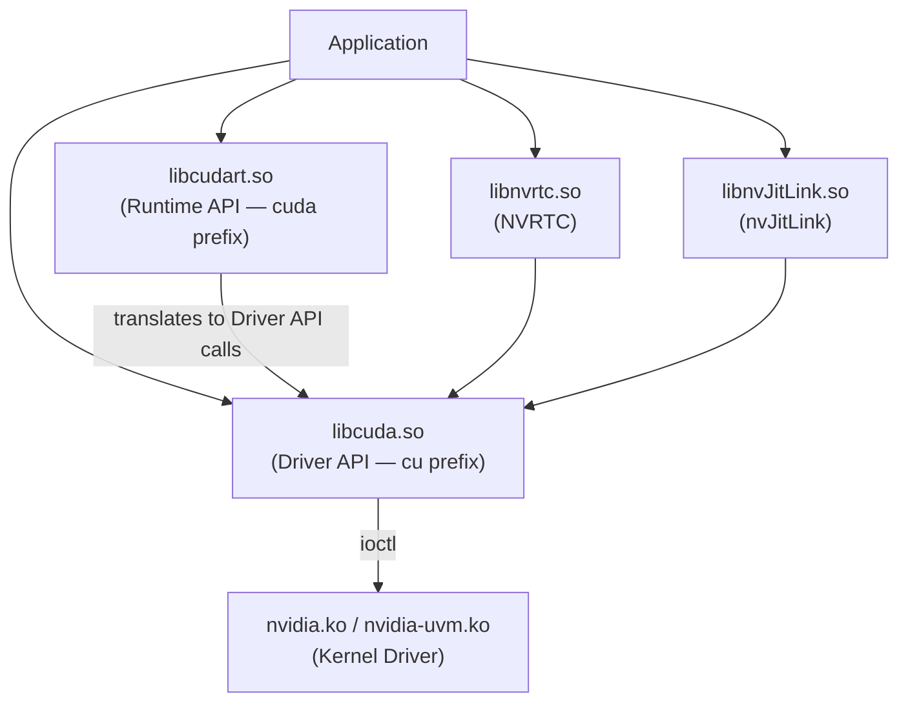
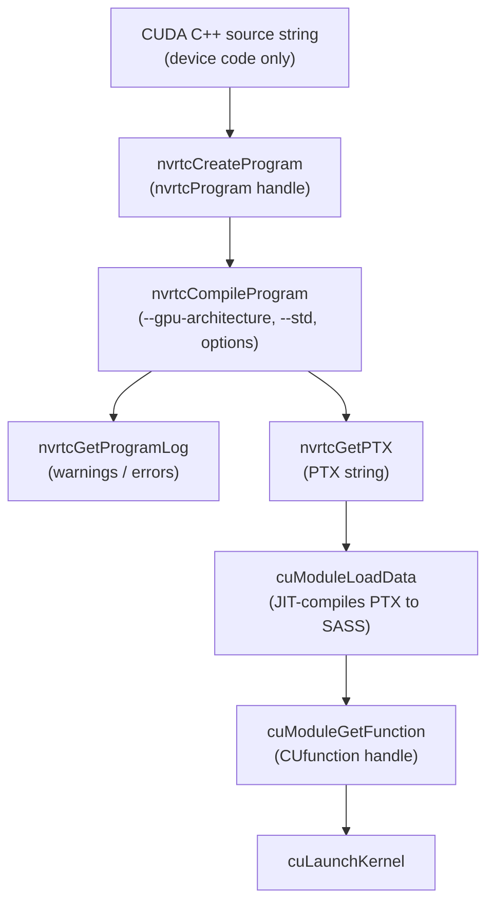
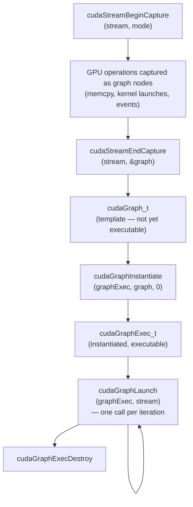
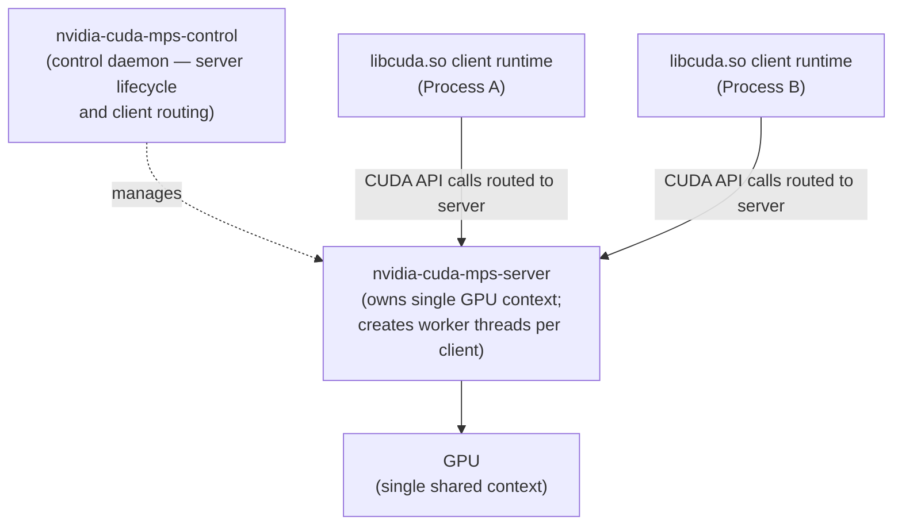

# Chapter 66: CUDA Runtime, Streams, and NVRTC

> **Part**: Part XV — NVIDIA Proprietary Graphics Stack
> **Audience**: Systems developers and ML engineers using NVIDIA on Linux
> **Status**: First draft — 2026-06-15

---

## Table of Contents

1. [Overview](#overview)
2. [CUDA Library Layering: Driver API vs. Runtime API](#1-cuda-library-layering-driver-api-vs-runtime-api)
3. [CUDA Streams: Ordered GPU Work Queues](#2-cuda-streams-ordered-gpu-work-queues)
4. [CUDA Events: Asynchronous Timing and Synchronization](#3-cuda-events-asynchronous-timing-and-synchronization)
5. [Memory Model: Device, Pinned, Unified, and Stream-Ordered](#4-memory-model-device-pinned-unified-and-stream-ordered)
6. [NVRTC: Runtime Compilation of CUDA C++ to PTX](#5-nvrtc-runtime-compilation-of-cuda-c-to-ptx)
7. [CUDA Graphs: Capturing and Replaying GPU Work](#6-cuda-graphs-capturing-and-replaying-gpu-work)
8. [Multi-Process Service (MPS) and MIG Partitioning](#7-multi-process-service-mps-and-mig-partitioning)
9. [NVML: GPU Monitoring API](#8-nvml-gpu-monitoring-api)
10. [CUDA on Linux: Kernel Interfaces and Diagnostic Paths](#9-cuda-on-linux-kernel-interfaces-and-diagnostic-paths)
10. [CCCL: CUDA Core Compute Libraries](#10-cccl-cuda-core-compute-libraries)
11. [Tile-Based CUDA: cuda-tile and Tilus](#11-tile-based-cuda-cuda-tile-and-tilus)
12. [NVSHMEM: GPU-Side One-Sided Communication](#12-nvshmem-gpu-side-one-sided-communication)
13. [cuDNN: Deep Learning Primitives](#13-cudnn-deep-learning-primitives)
14. [cuBLAS: GPU BLAS and cublasLt](#14-cublas-gpu-blas-and-cublaslt)
15. [CUTLASS: C++ Template GEMM Library](#15-cutlass-c-template-gemm-library)
16. [cuSPARSE and cuSPARSELt: Sparse Linear Algebra](#16-cusparse-and-cusparselt-sparse-linear-algebra)
17. [cuFFT: GPU Fast Fourier Transform](#17-cufft-gpu-fast-fourier-transform)
18. [NCCL: GPU Collective Communications](#18-nccl-gpu-collective-communications)
19. [cuRAND: GPU Random Number Generation](#19-curand-gpu-random-number-generation)
20. [cuSolver: GPU Linear Solvers](#20-cusolver-gpu-linear-solvers)
21. [Integrations](#integrations)
22. [References](#references)

---

## Overview

This chapter examines the **CUDA** software stack as it operates on Linux: from the layered shared libraries that expose the **Driver API** and **Runtime API**, through streams and events as the fundamental concurrency and synchronization primitives, to **NVRTC** for runtime kernel compilation and **CUDA Graphs** for eliminating CPU dispatch overhead in iterative workloads. It then covers the operational concerns that matter most on production Linux systems:

- **MPS** and **MIG** — multi-tenant GPU sharing
- **NVML** — GPU monitoring
- **procfs**/**debugfs** — runtime diagnostic interfaces exposed by the **nvidia** kernel modules

Sections 10–12 cover higher-level CUDA programming models:

- **CCCL** (Thrust, CUB, libcu++) — unified CUDA core compute libraries
- **cuda-tile** / **Tilus** — tile-based CUDA abstractions
- **NVSHMEM** — GPU-side one-sided communication

Sections 13–20 cover the major CUDA compute libraries that every ML and scientific computing stack depends on:

- **cuDNN** — deep learning primitives
- **cuBLAS** — GPU BLAS and cublasLt
- **CUTLASS** — C++ template GEMM library
- **cuSPARSE**/**cuSPARSELt** — sparse linear algebra
- **cuFFT** — GPU Fast Fourier Transform
- **NCCL** — GPU collective communications
- **cuRAND** — GPU random number generation
- **cuSolver** — GPU linear solvers

Section 1 maps the library layering: **`libcuda.so`** (the **Driver API**, installed with the graphics driver) versus **`libcudart.so`** (the **Runtime API**, part of the **CUDA Toolkit**), how version compatibility is enforced, and the error **`CUDA_ERROR_INVALID_PTX`** that arises when the **PTX ISA** level emitted by **nvcc** exceeds what the installed driver's JIT understands. It covers loading **PTX** and **CUBIN** objects at runtime via **`cuModuleLoadData()`** and the newer context-independent **`CUlibrary`** API (**`cuLibraryLoadData()`**), as well as the primary context model (**`cuDevicePrimaryCtxRetain()`**) and the **Green Contexts** intra-process SM-partitioning alternative introduced in **CUDA 12.4**. Section 1.5 covers **ptxas** — NVIDIA's proprietary PTX-to-SASS assembler — including CLI flags (`--gpu-name`, `--maxrregcount`, `--opt-level`), `--verbose` per-kernel register/shared-memory accounting, occupancy analysis, and **`cuobjdump`**/**`nvdisasm`** for inspecting generated SASS output.

Section 2 covers **CUDA streams** as ordered GPU work queues. It explains the **null stream** (stream 0) and its implicit barrier semantics — the most common source of unintentional serialization — and the **`cudaStreamNonBlocking`** flag that opts a stream out of those barriers. Stream creation flags, priority levels (**`cudaStreamCreateWithPriority()`**), and stream IDs (**`cudaStreamGetId()`**) are detailed, along with cross-stream synchronization using **`cudaStreamWaitEvent()`**, and host-function callbacks via **`cudaLaunchHostFunc()`** (the preferred replacement for the deprecated **`cudaStreamAddCallback()`**). The DRM GPU scheduler analogy maps **CUDA** stream priorities to **`drm_gpu_scheduler`** priority run-queues.

Section 3 covers **CUDA events** — GPU-side timestamps used for asynchronous timing, cross-stream synchronization, and **IPC** synchronization across OS process boundaries. Event creation flags including **`cudaEventBlockingSync`**, **`cudaEventDisableTiming`**, and **`cudaEventInterprocess`** are explained, as is the canonical kernel timing pattern using **`cudaEventRecord()`** and **`cudaEventElapsedTime()`**. **IPC events** (Linux only, requiring **UVA**) allow GPU-side synchronization across processes via **`cudaIpcGetEventHandle()`** and **`cudaIpcOpenEventHandle()`** without CPU involvement.

Section 4 details the **CUDA** memory model across four allocation kinds: device memory (**`cudaMalloc()`**/**`cudaFree()`**), pinned (page-locked) host memory (**`cudaMallocHost()`**, **`cudaHostAlloc()`**, **`cudaHostRegister()`**) for DMA-capable async transfers via **`cudaMemcpyAsync()`**, **Unified Memory** (**`cudaMallocManaged()`**) backed by **HMM** (Heterogeneous Memory Management) on Linux kernel ≥ 6.1.24 with the **Open Kernel Modules**, and the stream-ordered allocator (**`cudaMallocAsync()`**/**`cudaFreeAsync()`**, **CUDA 11.2+**) that eliminates the implicit global barrier of synchronous allocation. A **CUDA 13.0** breaking change to **`cudaMemAdvise()`** and **`cudaMemPrefetchAsync()`** — switching the device parameter from `int` to **`cudaMemLocation`** — is documented with the resulting compiler error.

Section 5 covers **NVRTC** (**`libnvrtc.so`**, **`nvrtc.h`**): runtime compilation of device-side **CUDA C++** source strings to **PTX** via **`nvrtcCreateProgram()`**, **`nvrtcCompileProgram()`**, **`nvrtcGetPTX()`**, and **`nvrtcGetLoweredName()`** for C++ template name mangling. Compiler options including **`--gpu-architecture`**, **`--use_fast_math`**, **`--maxrregcount`**, **`--device-c`**, and **`--dlto`** (for LTO) are covered, along with **CUDA 13.3** bundled header support (**`nvrtcInstallBundledHeaders()`**) that enables **Toolkit**-free deployment. Section 5 also covers **nvJitLink** (**`libnvJitLink.so`**) for link-time optimization across multiple separately-compiled **PTX** or **LTO IR** objects at runtime.

Section 6 covers **CUDA Graphs** (**`cudaGraph_t`**, **`cudaGraphExec_t`**): capturing GPU work via **`cudaStreamBeginCapture()`**/**`cudaStreamEndCapture()`**, instantiating with **`cudaGraphInstantiate()`**, and relaunching with a single **`cudaGraphLaunch()`** call. Parameter update paths — per-node (**`cudaGraphExecKernelNodeSetParams()`**) and whole-graph (**`cudaGraphExecUpdate()`**) — avoid reinstantiation when topology is stable. Manual graph construction via **`cudaGraphAddKernelNode()`** and **`cudaGraphAddMemcpyNode()`** supports topologies that cannot be captured. **Conditional nodes** (**CUDA 12.4+**, **`cudaGraphCondTypeWhile`**; **CUDA 12.8** added IF-ELSE and SWITCH) enable on-device branching and looping without returning to the CPU.

Section 7 covers multi-tenant GPU sharing: time-sliced contexts (context-switch overhead, kernel-granularity preemption on **Pascal** and later), the **CUDA Multi-Process Service** (**`nvidia-cuda-mps-control`**, **`nvidia-cuda-mps-server`**) which replaces per-process contexts with a shared server context enabling concurrent kernel execution on **Volta** and later, and Linux **MPS** configuration via **`CUDA_MPS_PIPE_DIRECTORY`**, **`CUDA_MPS_ACTIVE_THREAD_PERCENTAGE`**, and the **CUDA 13.1** static partitioning mode. **MIG** (Multi-Instance GPU, **Ampere** and later) partitions the GPU into up to 7 hardware-isolated **GPU Instances** with dedicated SM slices, **L2** cache, and **DRAM** controllers, targeted via **`CUDA_VISIBLE_DEVICES=MIG-<uuid>`**. A comparison table and decision guide cover when to choose each strategy.

Section 8 covers **NVML** (**`libnvidia-ml.so`**, **`nvml.h`**) — the C API underlying **`nvidia-smi`** — for monitoring SM utilization, memory bandwidth, temperature, power draw, and clock frequencies via **`nvmlDeviceGetUtilizationRates()`**, **`nvmlDeviceGetMemoryInfo()`**, **`nvmlDeviceGetPowerUsage()`**, and **`nvmlDeviceGetClockInfo()`**. Per-process utilization sampling via **`nvmlDeviceGetProcessesUtilizationInfo()`** and fine-grained **GPM** (GPU Performance Monitoring) metrics on **Hopper** (**H100**) and later via **`nvmlGpmSampleGet()`** and **`nvmlGpmMetricsGet()`** are also covered.

Section 9 covers the Linux kernel interfaces: **DKMS** (`dkms autoinstall`) management of **`nvidia.ko`**, **`nvidia-uvm.ko`**, **`nvidia-modeset.ko`**, and **`nvidia-drm.ko`** across kernel updates, and the source-available **Open Kernel Modules** (`NVIDIA/open-gpu-kernel-modules`) required for **HMM** support on **Turing** and later. Runtime diagnostics via the stable **`/proc/driver/nvidia/`** procfs interface (driver version, per-GPU state, **RTD3** power management status) and the driver-version-specific **`/sys/kernel/debug/nvidia/`** **debugfs** subtree (enabled by **`CONFIG_DEBUG_FS`**) are documented, including the diagnostic sequence for **`CUDA_ERROR_NO_DEVICE`** failures after kernel updates.

Section 10 covers **CCCL** (CUDA Core Compute Libraries, unified in CUDA 12.4): **Thrust** provides STL-style GPU algorithms (`thrust::sort`, `thrust::reduce`, `thrust::transform_reduce`) with execution policies that dispatch to streams; **CUB** provides low-level block-wide and warp-wide collectives (`cub::BlockScan`, `cub::DeviceRadixSort`, `cub::WarpReduce`) used internally by Thrust and by custom kernels requiring cooperative primitives; **libcu++** provides a CUDA-compatible C++ standard library including `cuda::atomic`, `cuda::std::mdspan`, and `cuda::barrier` for heterogeneous synchronization.

Section 11 covers tile-based CUDA abstractions: **cuda-tile** is an NVIDIA-research MLIR dialect that compiles tile-level matrix operations to PTX/SASS, automatically selecting `wgmma.mma_async` (Hopper) or `wmma` (Ampere) tensor core instructions without hand-written warp-cooperative code; **Tilus** is a companion tile-level kernel language with Python syntax, similar in intent to Triton but targeting NVIDIA's own MLIR compiler stack. A comparison table maps the abstraction and compilation paths of CUTLASS, Triton, and cuda-tile/Tilus.

Section 12 covers **NVSHMEM**: an implementation of the OpenSHMEM one-sided communication model for NVIDIA GPUs. NVSHMEM allocates a **symmetric heap** — a memory region mapped at the same virtual address across all participating GPUs — and provides GPU-kernel-callable `nvshmem_float_put`/`nvshmem_float_get` primitives that transfer data to remote GPU memory via NVLink p2p (same node) or InfiniBand GPUDirect RDMA (across nodes), without returning to the CPU. NVSHMEM vs. NCCL and vs. MPI is clarified: NVSHMEM is for fine-grained one-sided operations from within a kernel; NCCL is for bulk collective operations; MPI is CPU-mediated.

Section 13 covers **cuDNN** (CUDA Deep Neural Network library): the handle/stream lifecycle, tensor descriptor creation (`cudnnSetTensor4dDescriptor`, NCHW vs. NHWC layout), convolution workflow (filter descriptor, `cudnnFindConvolutionForwardAlgorithm` with EXHAUSTIVE vs. HEURISTIC search, workspace allocation, `CUDNN_TENSOR_OP_MATH` for TF32), batch normalization, pooling, and activation fused ops, and the **cuDNN v9 Graph API** (`cudnnGraph_t`, `cudnn_frontend`) that expresses fused operation graphs including Flash Attention SDPA. A comparison table maps cuDNN to AMD's **MIOpen** equivalent APIs.

Section 14 covers **cuBLAS**: NVIDIA's GPU implementation of the BLAS (Basic Linear Algebra Subprograms) standard. Handle lifecycle, the column-major transpose convention (`CUBLAS_OP_T` swap trick), `cublasSgemm` for single-precision GEMM, `cublasGemmEx` with `CUBLAS_COMPUTE_32F_FAST_TF32` (Ampere Tensor Core) and `CUBLAS_COMPUTE_32F_FAST_16F` / FP8 (Hopper), `cublasLt` for lightweight GEMM with custom epilogues (RELU_BIAS, GELU_BIAS, DRELU, BGRADA) via `cublasLtMatmulDescSetAttribute`, and `cublasGemmStridedBatchedEx` for multi-head attention batched GEMM are all detailed. A comparison covers **rocBLAS** and **hipBLASLt** API equivalence.

Section 15 covers **CUTLASS** 3.x: NVIDIA's C++ template GEMM library. The **CuTe** layout algebra (`Layout<Shape,Stride>`, `Tensor`, `Copy_Atom`, `MMA_Atom`, `tiled_divide`) is explained as the algebraic foundation for expressing tile shapes and strides. CUTLASS 3.x's `CollectiveMainloop` + `CollectiveEpilogue` + `GemmUniversalAdapter` architecture is shown with a Hopper `sm_90a` wgmma example. **StreamK** work decomposition — which eliminates the fixed-shape wave quantisation inefficiency of data-parallel GEMM — is compared to standard grid decomposition. A three-way table contrasts CUTLASS, cuBLAS, and Triton on abstraction level, flexibility, and use cases.

Section 16 covers **cuSPARSE** and **cuSPARSELt**: CUDA's sparse linear algebra libraries. The five sparse matrix formats (COO, CSR, CSC, BSR, blocked ELL) are tabulated with their memory layout and use cases. The generic SpMM API (`cusparseCreateSpMat`, `cusparseCreateDnMat`, `cusparseSpMM`) is shown for sparse-dense matrix multiply with explicit buffer sizing and execution phases. **cuSPARSELt** extends this to NVIDIA's **2:4 structured sparsity** format (two non-zeros per four-element group): the prune–compress–matmul pipeline (`cusparseLtSpMMAPrune`, `cusparseLtSpMMACompress`, `cusparseLtMatmul`) delivers up to 2× Ampere Sparse Tensor Core throughput for inference. AMD equivalents **rocSPARSE** and **hipSPARSELt** are compared.

Section 17 covers **cuFFT**: NVIDIA's GPU Fast Fourier Transform library. Plan creation (`cufftPlan1d`, `cufftPlan2d`, `cufftPlan3d`, `cufftPlanMany` for batched/strided), the six transform types (C2C, C2R, R2C, Z2Z, Z2D, D2Z) with Hermitian symmetry halving R2C storage, batched FFT for simultaneous multi-channel transforms, and the convolution-via-FFT pattern (R2C forward, pointwise multiply, C2R inverse) are all covered. **rocFFT** (AMD) and **vkFFT** (cross-vendor, Vulkan/CUDA/OpenCL) are compared.

Section 18 covers **NCCL** (NVIDIA Collective Communications Library): the library underlying distributed training. Communicator initialization via `ncclCommInitAll` (single-node) and `ncclGetUniqueId`/`ncclCommInitRank` (multi-node) is shown. The five collective operations — `ncclAllReduce`, `ncclBroadcast`, `ncclReduce`, `ncclAllGather`, `ncclReduceScatter` — are documented as non-blocking stream-enqueued operations. The **ring-allreduce** algorithm (ReduceScatter phase followed by AllGather phase, achieving ~100% bus utilization at large message sizes) is explained, along with the switch to **tree-allreduce** for small tensors. Transport selection (NVLink, PCIe p2p, InfiniBand) and the `ncclGroupStart`/`ncclGroupEnd` API for fusing multiple collectives are covered. **RCCL** (AMD's drop-in replacement) is compared.

Section 19 covers **cuRAND**: CUDA's GPU random number generation library. The host API (`curandCreateGenerator`, `curandGenerateUniform`, `curandGenerateNormal`) and generator types (XORWOW, MRG32k3a, Philox4_32_10, MT19937, Sobol32) are detailed, with **Philox4_32_10** recommended for ML workloads due to its statistical quality and GPU-throughput characteristics. The device API (`curandStatePhilox4_32_10_t`, `curand_init` with unique sequence-per-thread, `curand_uniform`) enables in-kernel RNG, demonstrated with a fused dropout mask generation kernel that avoids a separate mask allocation. **rocRAND** (AMD) is compared.

Section 20 covers **cuSolver**: NVIDIA's GPU dense and sparse linear solver library. The three sub-libraries are mapped: **cusolverDN** (dense factorisation — LU, SVD, Cholesky — via the three-step bufferSize→malloc→execute pattern), the **64-bit generic DN API** (`cusolverDnXgetrf`/`cusolverDnXgetrs`, CUDA 11+, avoiding 32-bit integer overflow for large matrices), **cusolverSP** (sparse direct solve via QR factorisation on host-memory CSR matrices), and **cusolverRF** (refactorisation for sequences of matrices with fixed sparsity pattern). **rocSOLVER** (AMD) gaps (no sparse or refactorisation sub-libraries) are noted.

Readers of this chapter should already be comfortable with the Linux graphics stack at the depth covered in earlier parts: **DRM** scheduling (Ch4), the **nvidia** kernel module and **open-gpu-kernel-modules** (Ch9), **Vulkan** queue and synchronization model (Ch25), and container-level **CUDA** device exposure (Ch55). The goal here is not a **CUDA** tutorial but a precise map of how the **CUDA** programming model is realized in the Linux kernel driver and userspace libraries, with emphasis on the interfaces, version constraints, and Linux-specific behaviours that trap experienced practitioners.

---

## 1. CUDA Library Layering: Driver API vs. Runtime API

### 1.1 libcuda.so and libcudart.so

The CUDA userspace stack on Linux is split across two shared libraries with distinct ownership and version cycles.

**`libcuda.so`** — the CUDA Driver API — is installed as part of the NVIDIA graphics driver package, not the CUDA Toolkit. It lives on the standard dynamic linker path (`/usr/lib/x86_64-linux-gnu/libcuda.so.1` on Ubuntu, symlinked from the versioned name). Its header is `cuda.h`. Driver API functions carry the `cu` prefix: `cuInit`, `cuCtxCreate`, `cuModuleLoadData`, `cuLaunchKernel`.

**`libcudart.so`** — the CUDA Runtime API — is installed as part of the CUDA Toolkit. It translates every Runtime call into one or more Driver API calls which `libcuda.so` dispatches into the kernel driver (`nvidia.ko` / `nvidia-uvm.ko`). Its C++ header is `cuda_runtime.h`; the C-compatible header is `cuda_runtime_api.h`. Runtime API functions carry the `cuda` prefix: `cudaEventCreate`, `cudaLaunchKernel`, `cudaMalloc`.

Both APIs are feature-equivalent for common use. The Driver API additionally exposes explicit context (`CUcontext`) and module management primitives used by NVRTC, nvJitLink, and plugin frameworks that need to load compiled kernels into a running process without a full Toolkit dependency.



### 1.2 Version Compatibility and CUDA_ERROR_INVALID_PTX

The driver API version installed on a system must be greater than or equal to the runtime API version the application was built against. This is enforced by CUDA's forward-compatibility layer (`libcuda.so` exposes a compatibility interface for toolkit versions newer than the driver, within limits documented per-major-version).

When a PTX binary is loaded via `cuModuleLoadData()`, the driver JIT-compiles it to native SASS for the installed GPU. This succeeds only if the driver's JIT understands the PTX ISA version embedded in the module. If an application was compiled with a newer nvcc that emits `ptx7.8` directives but the installed driver only understands up to `ptx7.4`, the driver returns `CUDA_ERROR_INVALID_PTX`. The error message in userspace libraries is typically the unhelpful string "a PTX JIT compilation failed." The underlying cause is always a toolkit/driver version mismatch: `nvcc --ptx-version` shows what ISA level nvcc targets; `nvidia-smi` shows the driver version which implies the maximum supported PTX ISA. [Source: NVIDIA developer forums thread on CUDA_UNSUPPORTED_PTX_VERSION][1]

### 1.3 Loading PTX and CUBIN via the Driver API

The classic module-based path:

```c
// file: driver_load_ptx_example.c
// Loads PTX text compiled by NVRTC; launches kernel without full Toolkit dependency.
#include <cuda.h>

CUdevice   dev;
CUcontext  ctx;
CUmodule   mod;
CUfunction fn;

cuInit(0);
cuDeviceGet(&dev, 0);
cuCtxCreate(&ctx, 0, dev);

// ptx: null-terminated PTX string from NVRTC or offline nvcc --ptx
cuModuleLoadData(&mod, ptx);          // JIT-compiles to SASS for current GPU
cuModuleGetFunction(&fn, mod, "saxpy"); // retrieve by mangled name
cuLaunchKernel(fn, gridX, 1, 1, blockX, 1, 1, sharedMem, stream, args, NULL);
cuCtxSynchronize();
cuModuleUnload(mod);
cuCtxDestroy(ctx);
```

[Source: CUDA Driver API — 3.3 The CUDA Driver API][2]

CUDA 12.0 introduced a parallel **library API** that is context-independent: a `CUlibrary` handle is loaded once and the driver automatically propagates the compiled code into each `CUcontext` as it is created or destroyed, removing the need for per-context module management in multi-context applications:

```c
// file: driver_library_api_example.c — CUDA 12.0+ context-independent loading
CUlibrary lib;
CUkernel  kernel;
CUfunction fn;

cuLibraryLoadData(&lib, ptx, NULL, NULL, 0, NULL, NULL, 0);
cuLibraryGetKernel(&kernel, lib, "saxpy");
cuKernelGetFunction(&fn, kernel);   // obtains a CUfunction for current context
cuLaunchKernel(fn, gridX, 1, 1, blockX, 1, 1, 0, stream, args, NULL);
```

[Source: CUDA Driver API — 6.12 Library Management][3]

The library API is preferred for frameworks that create and destroy CUDA contexts dynamically (e.g., multi-tenant inference servers). The module API remains appropriate for short-lived tools and NVRTC-driven compilation pipelines where a single context is sufficient.

### 1.4 Context and the Primary Context Model

Every CUDA process automatically acquires the **primary context** for each device it uses. The Runtime internally calls `cuDevicePrimaryCtxRetain()`. Code mixing Driver and Runtime API calls must retrieve the primary context via `cuDevicePrimaryCtxRetain()` and activate it with `cuCtxSetCurrent()` before making Driver API calls; otherwise the Driver operates on a separate context and unified memory and peer access APIs are unavailable.

The CUDA programming guide explicitly discourages multiple `CUcontext` objects per device per process: the GPU scheduler must time-slice between contexts even within the same process, degrading throughput. Green Contexts (CUDA 12.4+, `cudaGreenCtxCreate`) provide an intra-process SM-partitioning alternative without multi-context overhead.

### 1.5 ptxas: The PTX-to-SASS Assembler

**ptxas** is NVIDIA's proprietary offline assembler that translates **PTX** (Parallel Thread eXecution) virtual ISA bytecode into native GPU machine code — **SASS** (Shader ASSembly). It ships as part of the CUDA Toolkit (`$(CUDA_HOME)/bin/ptxas`) and is invoked by `nvcc` as the final compilation step. It is also the component that the Driver API's JIT path (`cuModuleLoadData`) calls on-the-fly for PTX loaded at runtime, subject to the driver's supported PTX ISA level.

#### CLI Usage

```bash
# Offline PTX → CUBIN (native GPU binary)
ptxas --gpu-name sm_90a kernel.ptx -o kernel.cubin

# Cap register usage for occupancy tuning; excess registers spill to local memory
ptxas --gpu-name sm_90a --maxrregcount 64 kernel.ptx -o kernel.cubin

# Disable optimisation (debug only)
ptxas --gpu-name sm_90a --opt-level 0 kernel.ptx -o kernel.cubin

# Print per-kernel resource usage to stderr
ptxas --gpu-name sm_90a --verbose kernel.ptx -o kernel.cubin 2>&1
```

The `--gpu-name` flag selects the target architecture (`sm_80` Ampere, `sm_90` Hopper base, `sm_90a` Hopper with wgmma/TMA extensions). The `a` suffix is required for Hopper's warp-group matrix multiply-accumulate (`wgmma.mma_async`) and Tensor Memory Accelerator instructions; `sm_90` alone does not enable those extensions.

#### --verbose Output: Register and Shared Memory Accounting

`--verbose` emits per-kernel resource accounting to stderr. This output is the primary source of truth for occupancy analysis:

```
ptxas info    : 0 bytes gmem
ptxas info    : Compiling entry function 'myKernel' for 'sm_90a'
ptxas info    : Function properties for myKernel
ptxas         :     0 bytes stack frame, 0 bytes spill stores, 0 bytes spill loads
ptxas info    : Used 32 registers, 16384 bytes smem, 400 bytes cmem[0], 8 bytes cmem[2]
```

| Field | Meaning |
|---|---|
| registers | Per-thread register count; directly limits warps-per-SM |
| smem | Static shared memory bytes per block |
| stack frame | Stack depth for device function calls; non-zero signals recursion or large local arrays |
| spill stores / loads | Registers overflowed to local memory (L1-cached but slower than registers) |
| cmem[N] | Constant memory bank N usage |

Non-zero spill stores/loads are the most actionable signal: ptxas ran out of registers and spilled to local memory, increasing latency. The remedy is reducing live variables in the kernel, restructuring loops to shorten live ranges, or tuning `--maxrregcount` to force deterministic spilling while restructuring.

#### --maxrregcount and Occupancy

Register count per thread determines the maximum number of warps simultaneously resident on an SM:

```
// Ampere SM (sm_80): 65536 registers total, 1024 max threads/block
//   32 regs/thread  →  65536 / 32 = 2048 threads = 2 blocks of 1024  (full occupancy)
//   64 regs/thread  →  65536 / 64 = 1024 threads = 1 block            (50% occupancy)
//  128 regs/thread  →  65536 / 128 = 512 threads = half a block       (25% occupancy)
```

`--maxrregcount=N` caps per-thread register usage; ptxas introduces spill code to meet the cap. Setting it too low amplifies spill traffic; setting it too high reduces SM-level parallelism. The runtime occupancy API `cudaOccupancyMaxActiveBlocksPerMultiprocessor()` computes theoretical occupancy from register count, shared memory usage, and block dimensions.

#### Inspecting SASS Output

Two NVIDIA tools inspect the compiled CUBIN:

```bash
# Disassemble CUBIN to human-readable SASS
cuobjdump --dump-sass kernel.cubin

# Full SASS with source-line correlation (requires nvcc --generate-line-info)
nvdisasm -c kernel.cubin

# Extract embedded PTX from a compiled executable or .a static library
cuobjdump --dump-ptx application
```

SASS is architecture-specific: `sm_90a` SASS is not portable to `sm_80`. Reading SASS is reserved for cases where `--verbose` spill accounting reveals unexpected register pressure and instruction-level analysis is required to isolate the cause.

#### Why ptxas is Proprietary

ptxas encapsulates NVIDIA's occupancy-critical register allocator and instruction scheduler — the core of what makes NVIDIA throughput performance competitive. NVIDIA ships it as a closed binary with the Toolkit rather than as open-source. This is the direct motivation for **NAK** (the Nouveau Shader Compiler, Ch10b), which emits SASS directly from its own LLVM-based backend, bypassing ptxas entirely. The open LLVM NVPTX backend produces valid PTX, but downstream scheduling in ptxas remains proprietary. See also Ch91 §11 for the structural tension between the open MLIR/LLVM PTX stack and the closed ptxas assembler.

[Source: CUDA Toolkit Documentation — ptxas options](https://docs.nvidia.com/cuda/cuda-compiler-driver-nvcc/index.html#ptxas-options)
[Source: cuobjdump documentation](https://docs.nvidia.com/cuda/cuda-binary-utilities/index.html)

---

## 2. CUDA Streams: Ordered GPU Work Queues

### 2.1 The Default Stream and Implicit Barriers

A CUDA stream is an ordered queue of GPU operations. Work within a stream executes in issue order; work across streams may execute concurrently, subject to hardware resource availability and explicit synchronization.

Stream 0 — the **null stream** or **default stream** — is a synchronization barrier. Any non-blocking operation issued to stream 0 implicitly synchronizes with every other default stream in the process: before stream 0 operations execute, all previously-issued work on all other streams completes; after stream 0 operations complete, subsequent work on all other streams may proceed. This implicit barrier is the largest source of unintentional serialization in CUDA codebases.

### 2.2 Creating and Destroying Streams

```c
// file: stream_create_example.c — paraphrased from CUDA RT API 13.3 docs
#include <cuda_runtime.h>

cudaStream_t stream;

// Default: synchronizes with the null stream (cudaStreamDefault = 0)
cudaStreamCreate(&stream);

// Non-blocking: no implicit synchronization with null stream
cudaStreamCreateWithFlags(&stream, cudaStreamNonBlocking);

// With priority: lower integer = higher priority
int leastPri, greatestPri;
cudaDeviceGetStreamPriorityRange(&leastPri, &greatestPri);
// On current hardware: greatestPriority = -1, leastPriority = 0
cudaStreamCreateWithPriority(&stream, cudaStreamNonBlocking, greatestPri);

// Query stream ID (CUDA 12.0+)
unsigned long long streamId;
cudaStreamGetId(stream, &streamId);

// Destroy: does NOT wait for in-flight work; GPU ops complete asynchronously
cudaStreamDestroy(stream);
```

[Source: CUDA RT API — Stream Management][4]

### 2.3 Cross-Stream Synchronization

The canonical inter-stream dependency uses events as lightweight GPU-side timestamps:

```c
// file: cross_stream_sync_example.c
cudaEvent_t event;
cudaEventCreateWithFlags(&event, cudaEventDisableTiming); // no timestamp overhead

// Stream A issues work, then records event
myKernelA<<<grid, block, 0, streamA>>>(d_in, d_mid);
cudaEventRecord(event, streamA);

// Stream B waits for the event before proceeding — no host involvement
cudaStreamWaitEvent(streamB, event, 0);
myKernelB<<<grid, block, 0, streamB>>>(d_mid, d_out);
```

`cudaStreamWaitEvent` inserts a GPU-side dependency: stream B will not begin any subsequently-enqueued work until the event recorded in stream A has been reached. This is purely asynchronous from the host's perspective — no blocking, no CPU spinwait.

### 2.4 Stream Priority and the DRM Scheduler Analogy

CUDA stream priority is the CUDA user-space analogue of the DRM GPU scheduler priority described in Ch4. Just as `drm_gpu_scheduler` maintains multiple priority run-queues (high, normal, low, kernel) that the GuC or firmware scheduler drains in priority order, CUDA streams with different priorities feed priority queues in the NVIDIA GPU hardware scheduler. On NVIDIA hardware, two priority levels are typically exposed (greatestPriority and leastPriority). The driver maps streams to the hardware work queues that correspond to those levels. Pending work in higher-priority streams preempts lower-priority streams at kernel granularity on Pascal and later architectures (not mid-warp).

Key difference from DRM: DRM priority is typically fixed at queue-creation time and maps to VkQueue priority (`VK_EXT_global_priority`); on Intel and AMD open-source drivers, these priorities flow through `VK_EXT_global_priority` all the way to the DRM scheduler entity. CUDA stream priority is per-stream, per-process, and set entirely in user space — the CUDA driver communicates the priority to the kernel module (`nvidia.ko`) via ioctl when creating the hardware channel, rather than through a kernel scheduler policy. The `sched_ext` BPF-programmable scheduler framework (Linux 6.15) applies to CPU scheduling only; GPU work scheduling is controlled by the hardware's own command processor and remains outside its scope. The conceptual mapping is:
- DRM `DRM_SCHED_PRIORITY_HIGH` → CUDA `greatestPriority` (-1 on current hardware)
- DRM `DRM_SCHED_PRIORITY_NORMAL` → CUDA `leastPriority` (0 on current hardware)

### 2.5 Host-Function Callbacks in Streams

```c
// file: stream_host_func_example.c
// cudaLaunchHostFunc: preferred over deprecated cudaStreamAddCallback
typedef void (*cudaHostFn_t)(void *userData);

void myCallback(void *data) {
    // Safe to call non-CUDA APIs here; cannot call CUDA synchronization APIs
    printf("GPU work complete, iteration %d\n", *(int *)data);
}

cudaLaunchHostFunc(stream, myCallback, &iteration);
```

`cudaLaunchHostFunc` (CUDA 10.0+) runs a host function inline in the stream after all preceding GPU operations complete. Unlike the deprecated `cudaStreamAddCallback`, it does not prevent the stream from making further GPU-side progress while the callback runs. The restriction on calling CUDA synchronization APIs (`cudaStreamSynchronize`, `cudaEventSynchronize`) from within the callback still applies.

---

## 3. CUDA Events: Asynchronous Timing and Synchronization

Events are GPU-side timestamps that can be recorded into streams and queried or synchronized from the host. They are the primitive underlying `cudaStreamWaitEvent` cross-stream synchronization, IPC synchronization, and kernel timing.

### 3.1 Creation Flags

```c
// file: event_create_example.c — paraphrased from CUDA RT API 13.3 docs
cudaEvent_t event;

// Standard event: default spin/block behavior on cudaEventSynchronize
cudaEventCreate(&event);

// Non-busy-wait: CPU blocks (sleeps) during synchronize, lower CPU utilization
cudaEventCreateWithFlags(&event, cudaEventBlockingSync);

// No timestamp: lower overhead, required for IPC events
cudaEventCreateWithFlags(&event, cudaEventDisableTiming);

// IPC-capable (Linux only): combine with DisableTiming
cudaEventCreateWithFlags(&event, cudaEventInterprocess | cudaEventDisableTiming);
```

### 3.2 Recording and Timing

```c
// file: event_timing_pattern.c — canonical kernel timing pattern
cudaEvent_t start, stop;
cudaEventCreate(&start);
cudaEventCreate(&stop);

cudaEventRecord(start, stream);
myKernel<<<grid, block, 0, stream>>>(args...);
cudaEventRecord(stop, stream);

cudaEventSynchronize(stop);   // blocks host until stop event is reached

float ms;
cudaEventElapsedTime(&ms, start, stop);
// Resolution: approximately 0.5 µs on current hardware

cudaEventDestroy(start);
cudaEventDestroy(stop);
```

`cudaEventRecord` with `cudaEventRecordExternal` flag (CUDA 11.x+) creates an external event node during stream capture for CUDA Graphs — discussed in Section 6.

### 3.3 IPC Events (Linux Only)

IPC events allow GPU-side synchronization across OS process boundaries without CPU involvement. They require `cudaEventInterprocess | cudaEventDisableTiming` at creation and Unified Virtual Addressing (compute capability ≥ 2.0). The event handle is an opaque struct that can be transmitted via a Unix domain socket or shared memory segment:

```c
// file: ipc_event_example.c — Linux only; requires UVA (CC >= 2.0)
// Process A (producer):
cudaIpcEventHandle_t handle;
cudaIpcGetEventHandle(&handle, event);
// Transmit handle to process B via socket/shmem

// Process B (consumer):
cudaEvent_t remoteEvent;
cudaIpcOpenEventHandle(&remoteEvent, handle);
cudaStreamWaitEvent(localStream, remoteEvent, 0);
// localStream will not proceed past this point until process A records remoteEvent
```

[Source: CUDA Programming Guide — Inter-Process Communication][5]

"The CUDA IPC API is only currently supported on Linux." [Source: NVIDIA CUDA Programming Guide][5]

---

## 4. Memory Model: Device, Pinned, Unified, and Stream-Ordered

### 4.1 Device Memory

```c
// file: device_memory_example.c — paraphrased from CUDA RT API 13.3
void *devPtr;
cudaMalloc(&devPtr, size);       // synchronous: host blocks until allocation complete
cudaMemset(devPtr, 0, size);
cudaMemcpy(host, devPtr, size, cudaMemcpyDeviceToHost);  // synchronous transfer
cudaFree(devPtr);                // synchronous: host blocks
```

`cudaMalloc` and `cudaFree` serialize against all preceding GPU work in the process — they behave like a global barrier. For performance-sensitive code, replace them with the stream-ordered allocator described in Section 4.4.

### 4.2 Pinned (Page-Locked) Host Memory

```c
// file: pinned_memory_example.c
void *hostPtr;
cudaMallocHost(&hostPtr, size);               // page-locked allocation

// Variant with flags:
cudaHostAlloc(&hostPtr, size,
    cudaHostAllocPortable |    // accessible from all CUDA contexts in process
    cudaHostAllocWriteCombined // faster for GPU reads, slower for CPU writes
);

// Async transfer over stream (DMA, no CPU involvement during transfer):
cudaMemcpyAsync(devPtr, hostPtr, size, cudaMemcpyHostToDevice, stream);

cudaFreeHost(hostPtr);
```

Pinned memory enables the PCIe DMA engine to transfer directly between host RAM and GPU VRAM without a staging copy through kernel bounce buffers. `cudaMemcpyAsync` over a non-blocking stream with pinned memory is the standard pattern for overlapping H2D transfers with compute on a different stream. For existing allocations (e.g., from `malloc`), `cudaHostRegister`/`cudaHostUnregister` pins and unpins pages in-place.

### 4.3 Unified Memory and HMM

```c
// file: unified_memory_example.c
void *ptr;
cudaMallocManaged(&ptr, size, cudaMemAttachGlobal);

// Prefetch to GPU device 0 before kernel launch (CUDA 13.x v2 signature)
cudaMemLocation loc;
loc.type = cudaMemLocationTypeDevice;
loc.id   = 0;
cudaMemPrefetchAsync(ptr, size, loc, 0 /*flags*/, stream);

// Advise: data read far more often than written; system may replicate pages
cudaMemAdvise(ptr, size, cudaMemAdviseSetReadMostly, loc);
// Advise: prefer residency at device 0
cudaMemAdvise(ptr, size, cudaMemAdviseSetPreferredLocation, loc);

cudaFree(ptr);
```

**BREAKING CHANGE — CUDA 13.0**: `cudaMemAdvise` and `cudaMemPrefetchAsync` changed their device parameter from `int deviceId` to `cudaMemLocation` (an internally renamed `_v2` signature). Code written for CUDA ≤ 12.x using bare `int deviceId` fails to compile under CUDA 13.1+ with:

```text
error: no suitable constructor exists to convert from "int" to "cudaMemLocation"
```

[Source: NVIDIA Developer Forum — cudaMemPrefetchAsync compilation error with CUDA 13.1][6]

**Unified Memory on Linux with HMM.** NVIDIA's HMM (Heterogeneous Memory Management) support, available when using the Open Kernel Modules (driver ≥ 535) on Linux kernel ≥ 6.1.24, enables GPU access to all system-allocated memory (`malloc`, `mmap`) without requiring `cudaMallocManaged`. The GPU MMU mirrors host page tables; a GPU page fault triggers the Linux kernel's HMM migration engine which moves the physical page to GPU memory. Requirements: compute capability ≥ 7.5 (Turing); Open Kernel Modules; Linux ≥ 6.1.24 (stable) or ≥ 6.3 (upstream). This is the same HMM kernel infrastructure shared with amdgpu SVM (Ch5). Query addressing mode:

```bash
# Check HMM / UVA addressing mode
nvidia-smi -q | grep -i "Addressing Mode"
```

On Linux with HMM or compute capability ≥ 6.0, unified memory allocations can exceed GPU VRAM capacity; the driver pages out GPU data to host memory under pressure, enabling out-of-core GPU algorithms. [Source: NVIDIA Blog — Simplifying GPU Application Development with HMM][7]

**Comparison table — page migration mechanisms:**

| System | Coherence | Page-table model | Oversubscription |
|--------|-----------|-----------------|------------------|
| Discrete GPU + Linux HMM | Software | Separate, mirrored via HMM | Yes (CC ≥ 6.0) |
| Grace Hopper NVLink-C2C | Hardware | Unified | Yes |
| Windows (any) | Software | Separate | Limited (CC < 6.0: none) |

### 4.4 Stream-Ordered Memory Allocator (CUDA 11.2+)

The stream-ordered allocator eliminates the implicit global synchronization of `cudaMalloc`/`cudaFree`:

```c
// file: stream_ordered_alloc_example.c — requires cudaDevAttrMemoryPoolsSupported
cudaMemPool_t pool;
cudaMemPoolProps props = {};
props.allocType     = cudaMemAllocationTypePinned;
props.location.type = cudaMemLocationTypeDevice;
props.location.id   = 0;
cudaMemPoolCreate(&pool, &props);

// Prevent pool from releasing physical memory back to OS between iterations:
uint64_t threshold = UINT64_MAX;
cudaMemPoolSetAttribute(pool, cudaMemPoolAttrReleaseThreshold, &threshold);

void *ptr;
// Allocation is ordered after prior work in stream:
cudaMallocFromPoolAsync(&ptr, size, pool, stream);
myKernel<<<grid, block, 0, stream>>>(ptr);
// Free is ordered before subsequent allocations can reuse this memory:
cudaFreeAsync(ptr, stream);

cudaStreamSynchronize(stream);
cudaMemPoolDestroy(pool);
```

[Source: CUDA Programming Guide — Stream-Ordered Memory Allocation][8]

A device-default pool is available via `cudaMallocAsync`/`cudaFreeAsync` without explicit pool creation. Cross-stream reuse of freed memory requires either explicit event-based ordering or enabling `cudaMemPoolReuseFollowEventDependencies`.

---

## 5. NVRTC: Runtime Compilation of CUDA C++ to PTX

NVRTC (NVIDIA Runtime Compilation) compiles device-side CUDA C++ source strings into PTX or CUBIN at application runtime. It ships as `libnvrtc.so` with header `nvrtc.h`. NVRTC accepts device code only — no `__host__` functions, no `#include <stdio.h>` in global scope — and is distinct from `nvcc`, which handles full translation units mixing host and device code.



### 5.1 Core API

```c
// file: nvrtc_core_api_example.c — signatures from NVRTC 13.3 docs (confirmed)
#include <nvrtc.h>

nvrtcProgram prog;

// Create a program from a source string
nvrtcCreateProgram(
    &prog,
    src,            // CUDA C++ source string (device code only)
    "saxpy.cu",     // name for diagnostic messages
    0,              // numHeaders
    NULL,           // header source strings
    NULL            // header names
);

// Register C++ template instantiations before compilation
nvrtcAddNameExpression(prog, "saxpy<float>");

// Compile with options
const char *opts[] = {
    "--gpu-architecture=compute_86",  // PTX for sm_86 family
    "--std=c++17",
    "--use_fast_math"
};
nvrtcResult res = nvrtcCompileProgram(prog, 3, opts);

// Always retrieve log (warnings appear even on success)
size_t logSize;
nvrtcGetProgramLogSize(prog, &logSize);
char *log = malloc(logSize);
nvrtcGetProgramLog(prog, log);
if (res != NVRTC_SUCCESS) {
    fprintf(stderr, "NVRTC compile error:\n%s\n", log);
    exit(1);
}
free(log);

// Get PTX
size_t ptxSize;
nvrtcGetPTXSize(prog, &ptxSize);
char *ptx = malloc(ptxSize);
nvrtcGetPTX(prog, ptx);  // null-terminated PTX string

// Get lowered (mangled) name for the template instantiation
const char *loweredName;
nvrtcGetLoweredName(prog, "saxpy<float>", &loweredName);

nvrtcDestroyProgram(&prog);

// Load via Driver API (no full Toolkit dependency)
CUmodule mod;
CUfunction fn;
cuModuleLoadData(&mod, ptx);
cuModuleGetFunction(&fn, mod, loweredName);
free(ptx);
```

[Source: NVRTC 13.3 Documentation][9]

### 5.2 Compiler Options

Architecture targets: `--gpu-architecture=compute_75` through `compute_121` for PTX; `--gpu-architecture=sm_75` for device-specific CUBIN.

C++ standards supported (CUDA 13.3): `--std=c++03`, `c++11`, `c++14`, `c++17`, `c++20`, `c++23`. The `c++23` flag is new in CUDA 13.3 and enables C++23 language features in device code. [Source: CUDA 13.3 Release Notes][10]

Key flags:
- `--use_fast_math`: enables flush-to-zero, reciprocal approximations, and other precision trade-offs
- `--maxrregcount=<N>`: cap register usage per thread (increases occupancy at the cost of spills)
- `--device-c`: relocatable device code (required for multi-TU link with nvJitLink)
- `--dlto`: generate LTO IR for nvJitLink link-time optimization
- `-G`: device-side debug info (disables optimizations)
- `-lineinfo`: source-level line information (compatible with optimization)

### 5.3 Bundled Headers (CUDA 13.3)

Previously, NVRTC required the user to point `-I` flags at a full CUDA Toolkit installation to access CUDA C++ and CCCL (CUDA C++ Core Libraries) headers. CUDA 13.3 adds bundled header support:

```c
// file: nvrtc_bundled_headers.c — CUDA 13.3+
// Extract bundled headers to a temp directory once at startup.
// Signature: nvrtcResult nvrtcInstallBundledHeaders(const char *installPath,
//                                                   unsigned int flags,
//                                                   const char **errorLog)
const char *errLog = NULL;
nvrtcResult res = nvrtcInstallBundledHeaders(
    "/tmp/nvrtc_headers",              // destination directory (created if absent)
    NVRTC_INSTALL_HEADERS_SKIP_IF_EXISTS,  // skip if already installed (default)
    &errLog                            // optional error detail on failure
);
if (res != NVRTC_SUCCESS) {
    fprintf(stderr, "bundled headers install failed: %s\n",
            errLog ? errLog : nvrtcGetErrorString(res));
}

// Compile with -I pointing to the extracted paths:
const char *opts[] = {
    "--gpu-architecture=compute_90",
    "--std=c++20",
    "-I/tmp/nvrtc_headers",
    "-I/tmp/nvrtc_headers/cccl"  // CCCL sub-tree (thrust, cub, libcudacxx)
};
```

A convenience compiler flag `--use-bundled-headers=<dir>` combines the install call and the `-I` additions in one step — pass it as an option to `nvrtcCompileProgram` and NVRTC extracts and includes the headers automatically. This enables header-only Toolkit deployment: distribute `libnvrtc.so` (which bundles the headers) and applications can compile CUDA C++ kernels without a separate Toolkit install. [Source: CUDA 13.3 Release Notes][10] [Source: NVRTC 13.3 Documentation — Bundled Headers][9]

### 5.4 PTX to cubin via nvJitLink

For production deployments with multiple separately-compiled kernel libraries, nvJitLink (CUDA 12.0+) links multiple GPU code objects at runtime with LTO across them:

```c
// file: nvjitlink_lto_example.c — paraphrased from nvJitLink 13.3 docs
#include <nvJitLink.h>

// Compile each kernel TU with --dlto to get LTO IR:
// nvrtcGetLTOIR(prog, ltoIR);  nvrtcGetLTOIRSize(prog, &ltoIRSize);

nvJitLinkHandle handle;
const char *options[] = {"-arch=sm_90", "-O3"};
nvJitLinkCreate(&handle, 2, options);

// Add each LTO IR blob:
nvJitLinkAddData(handle, NVJITLINK_INPUT_LTOIR, ltoIR1, size1, "kernel_a");
nvJitLinkAddData(handle, NVJITLINK_INPUT_LTOIR, ltoIR2, size2, "kernel_b");

nvJitLinkComplete(handle);  // performs LTO across all inputs

size_t cubinSize;
nvJitLinkGetLinkedCubinSize(handle, &cubinSize);
char *cubin = malloc(cubinSize);
nvJitLinkGetLinkedCubin(handle, cubin);

// Load the linked cubin via Driver API:
CUmodule mod;
cuModuleLoadData(&mod, cubin);
```

[Source: nvJitLink 13.3 Documentation][11]

OptiX 9 uses NVRTC as its kernel compilation path: shader programs are C++ source strings compiled via `nvrtcCreateProgram` to PTX, which OptiX then translates into `OptixModule` objects. See Ch67 for the OptiX-specific compilation pipeline.

---

## 6. CUDA Graphs: Capturing and Replaying GPU Work

CUDA Graphs capture a sequence of GPU operations into a directed acyclic graph (DAG) that can be instantiated and relaunched with a single API call, eliminating the repeated CPU dispatch overhead of individual stream submissions. For iterative workloads — ML training loops, physics simulation, iterative solvers — graphs reduce per-iteration CPU cost from microseconds-per-launch to a single `cudaGraphLaunch` call. [Source: CUDA Programming Guide — CUDA Graphs][12]



### 6.1 Stream Capture

```c
// file: graph_stream_capture_example.c — paraphrased from CUDA RT API 13.3
cudaGraph_t     graph;
cudaGraphExec_t graphExec;

// Begin capture on a non-blocking stream
// cudaStreamCaptureModeGlobal: any uncaptured CUDA API call from any thread = error
cudaStreamBeginCapture(stream, cudaStreamCaptureModeGlobal);

// All operations issued to stream (and streams joined via cudaStreamWaitEvent)
// are captured as graph nodes — not executed yet
cudaMemcpyAsync(d_in, h_in, size, cudaMemcpyHostToDevice, stream);
myKernel<<<grid, block, sharedMem, stream>>>(d_in, d_out);
cudaMemcpyAsync(h_out, d_out, size, cudaMemcpyDeviceToHost, stream);

cudaStreamEndCapture(stream, &graph);  // returns the captured graph

// Instantiate once
cudaGraphInstantiate(&graphExec, graph, 0);
cudaGraphDestroy(graph);  // template no longer needed after instantiation

// Launch N times — single API call per iteration
for (int i = 0; i < N; i++) {
    updateHostInputs(h_in);
    cudaGraphLaunch(graphExec, stream);
    cudaStreamSynchronize(stream);
}

cudaGraphExecDestroy(graphExec);
```

For capture modes: `cudaStreamCaptureModeGlobal` is the safe default — any CUDA API call from any thread that is not captured generates an error. `cudaStreamCaptureModeThreadLocal` allows uncaptured work on other threads concurrently. Use `cudaStreamBeginCaptureToGraph` (available since CUDA 12.x; signature: `cudaStreamBeginCaptureToGraph(stream, graph, dependencies, dependencyData, numDependencies, mode)`) to capture into an existing graph with specified node dependencies, enabling incremental graph construction — unlike `cudaStreamBeginCapture` which always creates a new graph.

### 6.2 Updating Graph Parameters Without Reinstantiation

Two update paths exist with different granularities:

**Per-node update** (`cudaGraphExecKernelNodeSetParams`): updates a single kernel node's launch parameters (grid dimensions, block dimensions, shared memory, kernel arguments) in-place on the instantiated graph. Topology is unchanged:

```c
// file: graph_node_update_example.c — CUDA 11.2+
cudaKernelNodeParams newParams = {
    .func           = (void*)myKernel,
    .gridDim        = {newGridX, 1, 1},
    .blockDim       = {blockX, 1, 1},
    .sharedMemBytes = sharedMem,
    .kernelParams   = newArgs,
    .extra          = NULL
};
cudaGraphExecKernelNodeSetParams(graphExec, kernelNode, &newParams);
```

**Whole-graph update** (`cudaGraphExecUpdate`): takes a new `cudaGraph_t` with the same topology as the instantiated graph and updates all node parameters at once. If the topology has changed (different number of nodes, different edge structure), the update fails and the caller must destroy and reinstantiate. This is useful when the capture loop produces a new graph each iteration (e.g., dynamic batch sizes) but the topology is stable:

```c
// file: graph_exec_update_example.c — CUDA 11.2+
cudaGraphExecUpdateResultInfo updateResult;
cudaError_t err = cudaGraphExecUpdate(graphExec, newGraph, &updateResult);
if (err != cudaSuccess) {
    // Topology changed; reinstantiate
    cudaGraphExecDestroy(graphExec);
    cudaGraphInstantiate(&graphExec, newGraph, 0);
}
```

### 6.3 Manual Graph Construction

For topology that cannot be captured from a stream (e.g., conditionally included nodes), build the graph programmatically:

```c
// file: graph_manual_build_example.c
cudaGraph_t graph;
cudaGraphCreate(&graph, 0);

cudaGraphNode_t memcpyNode, kernelNode;
cudaMemcpy3DParms memcpyParams = { /* ... */ };
cudaGraphAddMemcpyNode(&memcpyNode, graph, NULL, 0, &memcpyParams);

cudaKernelNodeParams kernelParams = { /* func, grid, block, args... */ };
cudaGraphAddKernelNode(&kernelNode, graph, &memcpyNode, 1, &kernelParams);
// Second argument array carries node dependencies (topological edges)
```

### 6.4 Conditional Nodes (CUDA 12.4+)

Conditional nodes enable on-device branching and looping without returning to the CPU. The device kernel sets a condition variable; the graph node uses it to decide whether to execute a subgraph:

```c
// file: graph_conditional_example.c — CUDA 12.4+; enhanced IF-ELSE/SWITCH in 12.8
cudaGraphConditionalHandle condHandle;
cudaGraphConditionalHandleCreate(&condHandle, graph,
    0 /*defaultValue*/, 0 /*flags*/);

cudaGraphNodeParams cParams = {};
cParams.type                   = cudaGraphNodeTypeConditional;
cParams.conditional.handle     = condHandle;
cParams.conditional.type       = cudaGraphCondTypeWhile;  // loop
cParams.conditional.size       = 1;  // 1 subgraph body; 2=IF-ELSE, N=SWITCH
cudaGraphAddNode(&condNode, graph, deps, numDeps, &cParams);
```

In a device kernel (the "condition setter"), before returning:
```c
// device code — sets loop-continue condition
__device__ void updateCondition(cudaGraphConditionalHandle h, bool cont) {
    cudaGraphSetConditional(h, cont ? 1u : 0u);
}
```

CUDA 12.8 added IF-ELSE (size=2, body[0] for true, body[1] for false) and SWITCH (size=N, selects body[conditionValue]) variants, primarily targeting Blackwell. [Source: NVIDIA Blog — Dynamic Control Flow in CUDA Graphs][13]

**Thread safety note**: "Graph objects are not thread-safe." Concurrent modification of the same `cudaGraph_t` from multiple threads requires external synchronization.

---

## 7. Multi-Process Service (MPS) and MIG Partitioning

### 7.1 GPU Sharing Without MPS: Time-Sliced Contexts

Without any partitioning mechanism, each OS process that initializes CUDA acquires its own GPU context. The GPU hardware time-slices between contexts via preemptive context switching at kernel granularity (Pascal+) or block granularity (pre-Pascal). Context switches are expensive: the driver must save and restore the full GPU state. On a system with eight concurrent ML inference processes, seven processes are idle (context-switched out) at any moment.

### 7.2 MPS Architecture

The CUDA Multi-Process Service replaces per-process contexts with a shared server context. Three components:

1. **`nvidia-cuda-mps-control`** — control daemon managing server lifecycle and client routing; ensures at most one server per GPU per user account
2. **`nvidia-cuda-mps-server`** — owns the single GPU context; creates worker threads for each client; mediates shared scheduling resources
3. **`libcuda.so` client runtime** — transparent to the application; CUDA API calls route to the server instead of the driver directly

On Volta (sm_70) and later, MPS enables truly concurrent kernel execution from multiple client processes in the same GPU context. On pre-Volta, MPS still reduces context-switch overhead but does not enable hardware-level spatial sharing.



### 7.3 Linux MPS Configuration

```bash
# file: mps_setup.sh — Linux only; requires 64-bit; CC >= 3.5 with UVA

# Set exclusive compute mode (required pre-Ampere; enforces single MPS server)
sudo nvidia-smi -i 0 -c EXCLUSIVE_PROCESS

# Configure pipe and log directories (unique per node in cluster deployments)
export CUDA_VISIBLE_DEVICES=0
export CUDA_MPS_PIPE_DIRECTORY=/tmp/nvidia-mps
export CUDA_MPS_LOG_DIRECTORY=/tmp/nvidia-log

# Start the control daemon (background)
nvidia-cuda-mps-control -d

# Verify: running CUDA processes show "M+C" in Type column of nvidia-smi

# Per-client SM limits (set before the client process starts):
export CUDA_MPS_ACTIVE_THREAD_PERCENTAGE=25  # limit client to 25% of SMs

# Shutdown gracefully
echo quit | nvidia-cuda-mps-control
```

[Source: NVIDIA MPS Documentation][14]

Pipes and sockets reside in `CUDA_MPS_PIPE_DIRECTORY`. On multi-node clusters, set a node-unique path (e.g., incorporate `$(hostname)`) to prevent cross-node socket collisions.

**Fault isolation (Volta+)**: If a client faults (illegal memory access, timeout), the server isolates the fault to that client. The server returns to `ACTIVE` state once faulting clients disconnect, without terminating other clients' work. On pre-Volta, a client fault terminates the server and all clients.

**CUDA 13.1 static partitioning**: `nvidia-cuda-mps-control -d -S` starts the server in static partitioning mode. Each client must declare its SM partition at launch via `CUDA_MPS_SM_PARTITION`. This gives deterministic isolation guarantees comparable to MIG for software-partitioned workloads.

**Limitations for interactive graphics**: MPS is incompatible with OpenGL and Vulkan rendering contexts. A process using MPS cannot simultaneously perform CUDA-Vulkan interop (Ch25 external memory) from the same GPU. MPS is a compute-only multiplexing mechanism.

### 7.4 MIG: Multi-Instance GPU (Ampere and Later)

MIG partitions the physical GPU into up to 7 **GPU Instances (GI)**, each with dedicated hardware slices of SMs, L2 cache, DRAM controllers, and PCIe bandwidth. Unlike MPS, which shares all internal GPU resources among clients, each MIG instance has physically isolated memory paths:

| Property | Time-slicing | MPS | MIG |
|----------|-------------|-----|-----|
| Isolation | None (context switch) | SM partitioning only | Full physical isolation |
| Memory isolation | None | Logical (no hardware isolation) | Dedicated DRAM + L2 slices |
| QoS guarantees | None | Throughput hint only | Hard bandwidth guarantees |
| Multi-tenant security | None | Limited (shared context) | Strong (separate instances) |
| Graphics API support | Yes | No | No (compute only) |
| Hardware support | All | CC ≥ 3.5 | Ampere A100, A30; Hopper H100, H200; Blackwell |

Configuration:

```bash
# Enable MIG mode on device 0 (requires driver ≥ 450; Ampere+ hardware)
sudo nvidia-smi -i 0 --mig-enable
sudo reboot  # MIG mode change requires reboot on some systems

# Create a 3g.40gb GPU instance on A100-40GB (half the GPU)
sudo nvidia-smi mig -cgi 3g.40gb -C
# -C flag automatically creates the corresponding Compute Instance

# List MIG instances
nvidia-smi mig -lgi
```

[Source: NVIDIA MIG User Guide][15]

Profile names encode the SM fraction and memory: `1g.10gb` = 1/7th SMs, 10 GB DRAM; `7g.80gb` = full A100 80 GB in a single instance. Applications target a MIG instance by setting `CUDA_VISIBLE_DEVICES=MIG-<uuid>`.

MIG does not support Vulkan or OpenGL graphics. In Kubernetes GPU node deployments (Ch55), MIG instances appear as individual `nvidia.com/gpu: 1` resources per instance, allowing the scheduler to allocate sub-GPU fractions to pods. The NVIDIA Container Toolkit configures the device files exposed per container, mapping MIG instance UUIDs to isolated device nodes. [Source: NVIDIA Container Toolkit, Ch55][16]

### 7.5 Choosing Between Time-Slicing, MPS, and MIG

- **Latency-sensitive inference, homogeneous workloads**: MPS — reduces context-switch overhead with concurrent kernel execution; SM limits prevent a single client from starving others.
- **Security-sensitive multi-tenant ML cloud deployments**: MIG — hardware-enforced memory isolation prevents any cross-tenant data leakage; hard bandwidth guarantees enable SLA compliance.
- **Interactive + compute mixed workloads (rendering + CUDA)**: Time-slicing — only mode compatible with graphics APIs.
- **Single-node training on large models**: None of the above — use the full GPU with a single process.

---

## 8. NVML: GPU Monitoring API

NVML (NVIDIA Management Library) is the C API underlying `nvidia-smi`. On Linux it installs as `libnvidia-ml.so` on the standard library path with the driver. The header is `nvml.h`. NVML is thread-safe; multiple threads may call NVML functions concurrently.

### 8.1 Core Monitoring Functions

```c
// file: nvml_monitor_example.c — paraphrased from NVML API Reference R610 (May 2026)
#include <nvml.h>

nvmlDevice_t dev;
nvmlInit();
nvmlDeviceGetHandleByIndex(0, &dev);

// SM utilization % and memory bandwidth utilization %
nvmlUtilization_t util;
nvmlDeviceGetUtilizationRates(dev, &util);
printf("GPU: %u%%  MEM BW: %u%%\n", util.gpu, util.memory);

// Memory: total, used, free (bytes)
nvmlMemory_t mem;
nvmlDeviceGetMemoryInfo(dev, &mem);
printf("Used: %llu MB / Total: %llu MB\n",
       mem.used >> 20, mem.total >> 20);

// Temperature (degrees Celsius)
unsigned int temp;
nvmlDeviceGetTemperature(dev, NVML_TEMPERATURE_GPU, &temp);

// Power draw (milliwatts)
unsigned int power;
nvmlDeviceGetPowerUsage(dev, &power);
printf("Power: %.2f W\n", power / 1000.0);

// Clock frequencies (MHz)
unsigned int smClk, memClk;
nvmlDeviceGetClockInfo(dev, NVML_CLOCK_SM,  &smClk);
nvmlDeviceGetClockInfo(dev, NVML_CLOCK_MEM, &memClk);

nvmlShutdown();
```

[Source: NVML API Reference R610][17]

### 8.2 Per-Process Utilization

```c
// file: nvml_per_process_example.c
nvmlProcessesUtilizationInfo_t info;
nvmlDeviceGetProcessesUtilizationInfo(dev, &info);
// info.processSamplesCount contains per-PID utilization samples
// Each sample: pid, smUtil, memUtil, encUtil, decUtil
```

### 8.3 Hopper+ GPM Metrics

Hopper (H100) and later GPUs expose fine-grained performance metrics via the GPU Performance Monitoring (GPM) API, a subset of which is accessible through NVML:

```c
// file: nvml_gpm_example.c — Hopper (CC 9.0) and later
nvmlGpmSample_t sample1, sample2;
nvmlGpmSampleAlloc(&sample1);
nvmlGpmSampleAlloc(&sample2);
nvmlGpmSampleGet(dev, sample1);
// ... time passes, GPU work runs ...
nvmlGpmSampleGet(dev, sample2);

nvmlGpmMetricsGet_t metricsGet = {};
metricsGet.version         = nvmlGpmMetricsGet_v1;
metricsGet.numMetrics      = 1;
metricsGet.sample1         = sample1;
metricsGet.sample2         = sample2;
metricsGet.metrics[0].metricId = NVML_GPM_METRIC_SM_OCCUPANCY;
nvmlGpmMetricsGet(&metricsGet);
printf("SM Occupancy: %.2f%%\n", metricsGet.metrics[0].value);

nvmlGpmSampleFree(sample1);
nvmlGpmSampleFree(sample2);
```

### 8.4 Compilation

```bash
# Link against libnvidia-ml.so (installed with the NVIDIA driver, not the Toolkit)
gcc -o monitor monitor.c \
    -I/usr/local/cuda/include \
    -lnvidia-ml
```

`libnvidia-ml.so` is version-locked to the driver: a given `nvidia-smi` binary calls NVML functions in the `libnvidia-ml.so` that ships with the same driver version. CUDA 13.3 NVML additions include `nvmlDeviceGetRemappedRows_v2` (reports inactive row remapping) and Dynamic Boost support for Grace Blackwell (GB200/GB300). [Source: CUDA 13.3 Release Notes][10]

---

## 9. CUDA on Linux: Kernel Interfaces and Diagnostic Paths

### 9.1 DKMS and the Open Kernel Modules

The NVIDIA kernel module stack (Ch9) consists of `nvidia.ko` (core driver), `nvidia-uvm.ko` (Unified Memory / HMM), `nvidia-modeset.ko` (modesetting), and `nvidia-drm.ko` (DRM integration). On most Linux distributions, these are managed via DKMS (Dynamic Kernel Module Support): `dkms install -m nvidia -v <version>` rebuilds the modules for a new kernel. The Open Kernel Modules (`NVIDIA/open-gpu-kernel-modules` on GitHub) are source-available replacements for `nvidia.ko` and `nvidia-uvm.ko`, required for HMM support (Section 4.3) and supporting Turing (sm_75) and later. Older GPUs (Kepler, Maxwell, Pascal) require the proprietary closed-source modules.

When a kernel update breaks the DKMS build (common on rolling-release distributions), CUDA applications fail at driver initialization with `CUDA_ERROR_NO_DEVICE`. The diagnostic sequence is:

```bash
# Verify module load
lsmod | grep nvidia
dmesg | grep -i nvidia  # look for module load errors

# Rebuild modules for current kernel
sudo dkms autoinstall

# Verify CUDA device visibility
nvidia-smi
```

### 9.2 /proc/driver/nvidia Diagnostic Interface

The NVIDIA driver exposes a procfs interface for runtime diagnostics:

```text
/proc/driver/nvidia/version
    — driver revision and GNU C compiler version used to build the module

/proc/driver/nvidia/warnings/
    — text files containing warning messages about host kernel configuration
      (e.g., IOMMU conflicts, PCIe ACS policy)

/proc/driver/nvidia/gpus/<domain>:<bus>:<device>.<function>/information
    — model name, IRQ assignment, BIOS version, driver state
    — populated after GPU initialization; some fields available pre-init

/proc/driver/nvidia/gpus/<domain>:<bus>:<device>.<function>/power
    — runtime D3 (RTD3) power management status
    — shows current power state, constraint sources
```

[Source: NVIDIA /proc Interface Documentation, driver 535.98][18]

```bash
# Read driver version
cat /proc/driver/nvidia/version

# List all detected GPUs
ls /proc/driver/nvidia/gpus/

# Check a specific GPU's state (PCI address format: domain:bus:device.function)
cat /proc/driver/nvidia/gpus/0000:01:00.0/information
```

The `warnings` directory is particularly useful for diagnosing subtle configuration issues that cause non-obvious CUDA failures: IOMMU passthrough misconfiguration causes `cudaMemcpy` to fail silently with DMA errors logged here.

### 9.3 /sys/kernel/debug/nvidia (debugfs)

The NVIDIA driver mounts a debugfs subtree at `/sys/kernel/debug/nvidia/` when the kernel is built with `CONFIG_DEBUG_FS=y`. This interface is driver-version-specific and explicitly not a stable ABI — entries, names, and formats change across driver major versions.

```bash
# Ensure debugfs is mounted (on most systemd distros it is auto-mounted)
mount | grep debugfs
# If absent: sudo mount -t debugfs none /sys/kernel/debug

# Explore what the installed driver version exposes:
ls /sys/kernel/debug/nvidia/
```

> **Note: needs verification** — The specific subdirectory names and file paths within `/sys/kernel/debug/nvidia/` are not documented in the public NVIDIA driver release notes or in the procfs interface documentation ([Source: NVIDIA /proc Interface Documentation][18]). The entries that exist depend on the driver version (proprietary vs. Open Kernel Modules), the kernel configuration, and which subsystems are active. Key areas to explore include per-GPU PCI device directories (named by PCI address), and the `nvidia-uvm` module's subtree which is known to contain Unified Memory page-fault accounting data useful for diagnosing `cudaMallocManaged` performance pathologies — but exact paths should be verified against the running driver by inspection. Do not rely on any path documented in third-party guides; always `ls` the live tree on the target system before scripting against it.

The `/proc/driver/nvidia/` paths described in Section 9.2 are the NVIDIA-documented stable diagnostic interface; prefer those over debugfs for any production monitoring or automated tooling.

---

## 10. CCCL: CUDA Core Compute Libraries

CCCL (CUDA Core Compute Libraries, [github.com/NVIDIA/cccl](https://github.com/NVIDIA/cccl), 2400+ stars) is NVIDIA's 2024 unification of three previously separate header-only libraries — **Thrust** (GPU algorithm library), **CUB** (low-level CUDA block/warp primitives), and **libcu++** (CUDA C++ standard library) — into a single repository and versioning scheme. Starting with CUDA 12.4, CCCL ships as the canonical source for all three.

### Thrust: GPU Algorithm Library

Thrust provides STL-style algorithms that dispatch to CUDA automatically. All algorithms accept execution policies (`thrust::device`, `thrust::host`, `thrust::cuda::par_on(stream)`) and work with raw CUDA pointers or `thrust::device_vector`.

```cpp
#include <thrust/device_vector.h>
#include <thrust/sort.h>
#include <thrust/reduce.h>
#include <thrust/transform_reduce.h>
#include <thrust/functional.h>

thrust::device_vector<float> d_data(1 << 24);
thrust::fill(d_data.begin(), d_data.end(), 1.0f);

/* Parallel sort on the default CUDA stream */
thrust::sort(thrust::device, d_data.begin(), d_data.end());

/* Parallel reduce (sum) */
float total = thrust::reduce(thrust::device, d_data.begin(), d_data.end(),
                              0.0f, thrust::plus<float>());

/* transform_reduce: compute L2 norm */
float l2 = std::sqrt(
    thrust::transform_reduce(thrust::device,
                              d_data.begin(), d_data.end(),
                              [] __device__ (float x) { return x * x; },
                              0.0f, thrust::plus<float>()));

/* Execute on a specific CUDA stream */
cudaStream_t stream;
cudaStreamCreate(&stream);
thrust::sort(thrust::cuda::par_on(stream), d_data.begin(), d_data.end());
```

### CUB: Block and Warp Primitives

CUB provides the lowest-level GPU primitives — block-wide and warp-wide collectives — that Thrust is built on. These are the building blocks for custom GPU kernels requiring scan, reduce, or sort within a thread block.

```cpp
#include <cub/cub.cuh>

/* Block-wide inclusive prefix sum */
__global__ void block_scan_kernel(float *data, float *out, int n) {
    typedef cub::BlockScan<float, 256> BlockScan;
    __shared__ typename BlockScan::TempStorage temp;

    int   tid = threadIdx.x + blockIdx.x * blockDim.x;
    float val = (tid < n) ? data[tid] : 0.0f;

    float prefix;
    BlockScan(temp).InclusiveSum(val, prefix);
    if (tid < n) out[tid] = prefix;
}

/* Device-wide radix sort */
void *d_temp = nullptr;
size_t temp_bytes = 0;
cub::DeviceRadixSort::SortKeys(d_temp, temp_bytes, d_keys_in, d_keys_out, N);
cudaMalloc(&d_temp, temp_bytes);
cub::DeviceRadixSort::SortKeys(d_temp, temp_bytes, d_keys_in, d_keys_out, N);
```

### libcu++: CUDA C++ Standard Library

libcu++ provides C++17 standard library types usable from both device and host code: `cuda::atomic`, `cuda::mutex`, `cuda::pipeline`, `cuda::mdspan`.

```cpp
#include <cuda/atomic>
#include <cuda/std/mdspan>

/* Atomic operations with memory ordering (works in device kernels) */
__global__ void atomic_kernel(cuda::atomic<int, cuda::thread_scope_device> *counter) {
    counter->fetch_add(1, cuda::memory_order_relaxed);
}

/* mdspan: non-owning multidimensional array view (C++23 backport) */
cuda::std::mdspan<float, cuda::std::dextents<int, 2>> mat(d_ptr, rows, cols);
```

```bash
/* CCCL is header-only; included in CUDA 12.4+ */
git clone --recursive https://github.com/NVIDIA/cccl
# Headers available at $CUDA_HOME/include/thrust, cub, cuda/
```

[Source: CCCL GitHub](https://github.com/NVIDIA/cccl)
[Source: CCCL documentation](https://nvidia.github.io/cccl/)

---

## 11. Tile-Based CUDA: cuda-tile and Tilus

**cuda-tile** ([github.com/NVIDIA/cuda-tile](https://github.com/NVIDIA/cuda-tile), 990+ stars) and **Tilus** ([github.com/NVIDIA/tilus](https://github.com/NVIDIA/tilus), 488+ stars) represent NVIDIA's research into next-generation GPU programming abstractions above the CUDA thread/warp/block model. Both are built around the concept of a **tile** — a 2D or higher-dimensional data block operated on collectively by tensor-core-equipped threads.

### cuda-tile: MLIR-Based Tile IR

cuda-tile is an MLIR dialect that compiles high-level tile-level operations directly to PTX/SASS, eliminating the manual warp-cooperative matrix instructions (`wmma`, `mma.sync`, `wgmma`) that developers must write today for tensor core access.

```python
import cutile

@cutile.kernel
def matmul(A: cutile.Tile[128, 64, cutile.f16],
           B: cutile.Tile[64, 128, cutile.f16],
           C: cutile.Tile[128, 128, cutile.f32]):
    # Lowered to wgmma.mma_async (Hopper) or wmma (Ampere) automatically
    C += A @ B

matmul.launch(grid=(M//128, N//128), A=d_A, B=d_B, C=d_C)
```

### Tilus: Tile-Level Kernel Language

Tilus expresses GPU kernels at the tile abstraction level (similar in intent to Triton, but integrated with NVIDIA's compiler stack):

```python
import tilus

@tilus.kernel
def attention_tile(Q: tilus.Tile[SEQ, HEAD_DIM],
                   K: tilus.Tile[SEQ, HEAD_DIM],
                   V: tilus.Tile[SEQ, HEAD_DIM],
                   out: tilus.Tile[SEQ, HEAD_DIM]):
    scale   = 1.0 / tilus.sqrt(HEAD_DIM)
    scores  = Q @ K.T * scale       # Tensor-core MMA
    weights = tilus.softmax(scores)  # Warp-level softmax
    out[:]  = weights @ V            # Tensor-core MMA
```

| Feature | CUTLASS | Triton | cuda-tile / Tilus |
|---------|---------|--------|--------------------|
| Abstraction level | C++ template library | Python tile language | MLIR tile IR + language |
| Compiler | nvcc template instantiation | LLVM Triton backend | MLIR → LLVM → PTX |
| Tensor core access | Manual `mma.sync` templates | Auto via tile ops | Auto via tile IR |
| Status | Stable (NVIDIA) | Stable (OpenAI) | Research (NVIDIA) |

[Source: cuda-tile GitHub](https://github.com/NVIDIA/cuda-tile)
[Source: Tilus GitHub](https://github.com/NVIDIA/tilus)

---

## 12. NVSHMEM: GPU-Side One-Sided Communication

**NVSHMEM** ([developer.nvidia.com/nvshmem](https://developer.nvidia.com/nvshmem), 550+ stars) implements the OpenSHMEM programming model for NVIDIA GPUs, enabling GPU kernels to perform one-sided `put`/`get` operations into the memory of remote GPUs — on the same node (via NVLink or PCIe p2p) or across nodes (via InfiniBand with GPUDirect RDMA) — without returning to the CPU.

This is distinct from NCCL (collective communication) and MPI (CPU-mediated point-to-point): NVSHMEM allows a single CUDA thread within a kernel to push data to another GPU's symmetric memory without synchronising the entire warp or launching a separate transfer kernel.

### Symmetric Heap and API

NVSHMEM allocates a **symmetric heap** — a memory region mapped at the same virtual address on all participating GPUs. Each PE (processing element / GPU) can address any other PE's symmetric heap using offset arithmetic (local p2p access) or through put/get operations (remote nodes).

```cpp
#include <nvshmem.h>
#include <nvshmemx.h>

int main() {
    nvshmem_init();
    int my_pe = nvshmem_my_pe();
    int n_pes  = nvshmem_n_pes();

    /* Allocate symmetric heap memory (same VA on all PEs) */
    float *sym_buf = (float *)nvshmem_malloc(N * sizeof(float));

    my_nvshmem_kernel<<<grid, block>>>(sym_buf, my_pe, n_pes);
    cudaDeviceSynchronize();

    nvshmem_free(sym_buf);
    nvshmem_finalize();
}
```

```cpp
/* CUDA kernel using NVSHMEM put/get from within GPU threads */
__global__ void my_nvshmem_kernel(float *buf, int my_pe, int n_pes) {
    int tid     = blockIdx.x * blockDim.x + threadIdx.x;
    int next_pe = (my_pe + 1) % n_pes;

    /* One-sided put: write local element into next PE's symmetric buffer */
    nvshmem_float_put(&buf[tid], &buf[tid], 1, next_pe);

    /* Barrier: wait for all puts to complete */
    nvshmem_barrier_all();

    /* One-sided get: read from previous PE */
    int prev_pe = (my_pe - 1 + n_pes) % n_pes;
    float remote_val;
    nvshmem_float_get(&remote_val, &buf[tid], 1, prev_pe);
}
```

### NVSHMEM vs. NCCL

| Feature | NCCL | NVSHMEM |
|---------|------|---------|
| Initiator | CPU launches collective | GPU thread calls put/get |
| Granularity | Full-warp / all-reduce | Per-thread one-sided |
| Pattern | Collective (all PEs participate) | Point-to-point (any two PEs) |
| Topology | NVLink, IB, RoCE | NVLink, PCIe p2p, IB |
| Use case | DNN gradient sync | Stencil, BLAS panel algorithms |
| Latency | ~2–5 μs per collective | < 1 μs (on-node NVLink) |

[Source: NVSHMEM developer documentation](https://developer.nvidia.com/nvshmem)
[Source: NVSHMEM GitHub](https://github.com/NVIDIA/nvshmem)

---

## 13. cuDNN: Deep Learning Primitives

cuDNN (CUDA Deep Neural Network library) is NVIDIA's closed-source library of GPU-accelerated primitives for deep learning: convolution, pooling, normalization, activation, softmax, attention, and RNN cells. It ships as `libcudnn.so` and `libcudnn_ops.so` / `libcudnn_cnn.so` / `libcudnn_adv.so` (split into sub-libraries since cuDNN 8). PyTorch, TensorFlow, JAX (via XLA), and ONNX Runtime all call cuDNN for their compute-intensive operations rather than hand-writing GPU kernels. [Source: cuDNN documentation](https://docs.nvidia.com/deeplearning/cudnn/latest/)

### 13.1 Handle and Tensor Descriptors

Every cuDNN call requires a `cudnnHandle_t` bound to a CUDA stream. Tensor shapes and layouts are expressed as `cudnnTensorDescriptor_t` objects.

```c
// file: cudnn_handle_setup.c — cuDNN 9.x API (confirmed against cuDNN 9.6 docs)
#include <cudnn.h>

cudnnHandle_t handle;
cudnnCreate(&handle);
cudnnSetStream(handle, stream);  // bind to a non-default stream

// 4D tensor: NCHW layout — batch=1, channels=64, H=56, W=56
cudnnTensorDescriptor_t xDesc;
cudnnCreateTensorDescriptor(&xDesc);
cudnnSetTensor4dDescriptor(
    xDesc,
    CUDNN_TENSOR_NCHW,   // layout
    CUDNN_DATA_FLOAT,    // data type
    1, 64, 56, 56        // N, C, H, W
);

// ... use xDesc in conv/pool/norm calls ...

cudnnDestroyTensorDescriptor(xDesc);
cudnnDestroy(handle);
```

The handle carries CUDA context state and an internal workspace allocator. One handle per CUDA stream is the standard pattern; sharing a handle across threads requires external locking.

### 13.2 Convolution: Descriptor, Algorithm Search, Execution

Convolution in cuDNN involves four descriptors (input tensor, filter, convolution parameters, output tensor) and an explicit algorithm selection step that benchmarks candidate implementations.

```c
// file: cudnn_conv_example.c — cuDNN 9.x (v9 frontend equivalent shown in §13.4)
cudnnFilterDescriptor_t wDesc;
cudnnCreateFilterDescriptor(&wDesc);
// Filter: 128 output channels, 64 input channels, 3×3 kernel, NCHW
cudnnSetFilter4dDescriptor(wDesc, CUDNN_DATA_FLOAT, CUDNN_TENSOR_NCHW,
                            128, 64, 3, 3);

cudnnConvolutionDescriptor_t convDesc;
cudnnCreateConvolutionDescriptor(&convDesc);
// padding=1, stride=1, dilation=1, cross-correlation (not convolution)
cudnnSetConvolution2dDescriptor(convDesc,
    1, 1,   // pad_h, pad_w
    1, 1,   // stride_h, stride_w
    1, 1,   // dilation_h, dilation_w
    CUDNN_CROSS_CORRELATION,
    CUDNN_DATA_FLOAT);
// Enable Tensor Core math (TF32 on Ampere, FP16 accumulation on Volta+)
cudnnSetConvolutionMathType(convDesc, CUDNN_TENSOR_OP_MATH);

// Output tensor descriptor — cudnnGetConvolution2dForwardOutputDim fills N,C,H,W
cudnnTensorDescriptor_t yDesc;
cudnnCreateTensorDescriptor(&yDesc);
int n, c, h, w;
cudnnGetConvolution2dForwardOutputDim(convDesc, xDesc, wDesc, &n, &c, &h, &w);
cudnnSetTensor4dDescriptor(yDesc, CUDNN_TENSOR_NCHW, CUDNN_DATA_FLOAT, n,c,h,w);

// Algorithm search: HEURISTIC is fast; EXHAUSTIVE benchmarks all candidates
int returnedAlgoCount;
cudnnConvolutionFwdAlgoPerf_t perfResults[8];
cudnnFindConvolutionForwardAlgorithm(
    handle, xDesc, wDesc, convDesc, yDesc,
    8,                      // requested algo count
    &returnedAlgoCount,
    perfResults);           // sorted by time; [0] is fastest
cudnnConvolutionFwdAlgo_t algo = perfResults[0].algo;

// Workspace: cuDNN may need temporary GPU memory for the chosen algorithm
size_t workspaceBytes;
cudnnGetConvolutionForwardWorkspaceSize(
    handle, xDesc, wDesc, convDesc, yDesc, algo, &workspaceBytes);
void *workspace;
cudaMalloc(&workspace, workspaceBytes);

float alpha = 1.0f, beta = 0.0f;
cudnnConvolutionForward(
    handle, &alpha,
    xDesc, x_gpu,      // input
    wDesc, w_gpu,      // filter weights
    convDesc, algo,
    workspace, workspaceBytes,
    &beta,
    yDesc, y_gpu);     // output
```

`CUDNN_TENSOR_OP_MATH` enables Tensor Core acceleration. On Ampere and later, cuDNN uses TF32 (10-bit mantissa) for FP32 inputs by default when Tensor Core math is enabled; `CUDNN_DEFAULT_MATH` falls back to IEEE FP32 CUDA cores.

### 13.3 Batch Normalization, Pooling, and Activation

```c
// Batch normalization — per-channel scale/bias learned parameters
cudnnBatchNormalizationForwardTraining(
    handle,
    CUDNN_BATCHNORM_SPATIAL,    // mode: per-channel (spatial) or per-activation
    &alpha, &beta,
    xDesc, x_gpu,               // input
    xDesc, y_gpu,               // output (same shape)
    bnScaleBiasMeanVarDesc,     // 1×C×1×1 descriptor for scale/bias/mean/var
    bnScale_gpu, bnBias_gpu,
    0.1,                        // exponential average factor for running stats
    runningMean_gpu, runningVar_gpu,
    1e-5,                       // epsilon for numerical stability
    savedMean_gpu, savedInvVariance_gpu);  // saved for backward pass

// Max pooling — 2×2 kernel, stride 2
cudnnPoolingDescriptor_t poolDesc;
cudnnCreatePoolingDescriptor(&poolDesc);
cudnnSetPooling2dDescriptor(poolDesc, CUDNN_POOLING_MAX, CUDNN_NOT_PROPAGATE_NAN,
                             2, 2, 0, 0, 2, 2);  // window, padding, stride
cudnnPoolingForward(handle, poolDesc, &alpha, xDesc, x_gpu, &beta, yDesc, y_gpu);

// Activation — fused ReLU (avoids a separate kernel launch)
cudnnActivationDescriptor_t actDesc;
cudnnCreateActivationDescriptor(&actDesc);
cudnnSetActivationDescriptor(actDesc, CUDNN_ACTIVATION_RELU, CUDNN_NOT_PROPAGATE_NAN, 0.0);
cudnnActivationForward(handle, actDesc, &alpha, xDesc, x_gpu, &beta, xDesc, y_gpu);
```

In practice, PyTorch and TensorFlow fuse convolution + bias-add + activation into a single cuDNN call via `cudnnConvolutionBiasActivationForward`, avoiding three separate kernel launches.

### 13.4 cuDNN v9 Graph API

cuDNN 9 introduced a declarative graph frontend (`cudnnGraph_t`) that replaces the per-operation imperative API with a computation graph that cuDNN can optimise holistically — fusing operations, selecting layouts, and caching compiled engines across calls with the same graph topology. This is the preferred API for new code.

```c
// file: cudnn_graph_flash_attention.c — cuDNN 9.x Graph API (paraphrased)
// Source: https://docs.nvidia.com/deeplearning/cudnn/latest/api/cudnn-graph-library.html

cudnnHandle_t handle;
cudnnCreate(&handle);

// Build a graph for Flash Attention: Q*K^T / sqrt(d) → softmax → *V
cudnn_frontend::graph::Graph graph;
graph.set_io_data_type(cudnn_frontend::DataType_t::HALF)
     .set_intermediate_data_type(cudnn_frontend::DataType_t::FLOAT)
     .set_compute_data_type(cudnn_frontend::DataType_t::FLOAT);

// Add Q, K, V as virtual tensors (layout: [batch, heads, seq, d_head])
auto Q = graph.tensor(cudnn_frontend::graph::Tensor_attributes()
    .set_name("Q").set_dim({B, H, S, D}).set_stride({H*S*D, S*D, D, 1}));
auto K = graph.tensor(...);
auto V = graph.tensor(...);

// SDPA (Scaled Dot Product Attention) fused op
auto [O, softmax_stats] = graph.scaled_dot_product_flash_attention(
    Q, K, V,
    cudnn_frontend::graph::SDPA_attributes()
        .set_name("flash_attention")
        .set_is_inference(true)   // false = training, saves softmax_stats for bwd
        .set_attn_scale(1.0f / sqrtf(D)));

O->set_output(true).set_dim({B, H, S, D});

// Validate graph, select kernel, build execution plan
graph.validate();
graph.build_operation_graph(handle);
graph.create_execution_plans({cudnn_frontend::HeurMode_t::A});
graph.build_plans(handle, cudnn_frontend::BuildPlanPolicy_t::HEURISTICS_CHOICE);

// Execute (workspace allocated once per graph)
graph.execute(handle, variant_pack, workspace_ptr);
```

The Flash Attention fused op (`scaled_dot_product_flash_attention`) is the cuDNN 9 equivalent of the manually-blocked FlashAttention-2 algorithm: it performs the full QKV attention in a single kernel without materialising the full S×S attention matrix, matching FlashAttention-3 performance on Hopper.

### 13.5 cuDNN vs. MIOpen (AMD)

AMD's [MIOpen](https://github.com/ROCm/MIOpen) (`libMIOpen.so`) provides the same primitive set as cuDNN and is used by PyTorch-ROCm and TensorFlow-ROCm as a drop-in functional replacement. The API is structurally parallel but not binary-compatible:

| cuDNN | MIOpen | Notes |
|-------|--------|-------|
| `cudnnHandle_t` | `miopenHandle_t` | Stream-bound handle |
| `cudnnTensorDescriptor_t` | `miopenTensorDescriptor_t` | Same NCHW/NHWC layouts |
| `cudnnConvolutionForward` | `miopenConvolutionForward` | Same descriptor pattern |
| `cudnnFindConvolutionForwardAlgorithm` | `miopenFindConvolutionForwardAlgorithm` | Benchmarks Winograd, FFT, direct |
| `CUDNN_TENSOR_OP_MATH` | automatic on CDNA2+ | MIOpen uses MFMA implicitly |
| cuDNN Graph API | not yet available | MIOpen has no graph frontend (2026) |
| Flash Attention fused | `miopenFusedFlashAttention` (ROCm 6.2+) | CDNA3 MI300X only at launch |

[Source: cuDNN 9.6 API docs](https://docs.nvidia.com/deeplearning/cudnn/latest/) [Source: MIOpen GitHub](https://github.com/ROCm/MIOpen)

---

## 14. cuBLAS: GPU BLAS and cublasLt

cuBLAS (`libcublas.so`) is NVIDIA's GPU-accelerated implementation of the Basic Linear Algebra Subprograms (BLAS) standard. It is the primary GEMM backend for PyTorch, TensorFlow, and JAX on CUDA: a `torch.nn.Linear` forward pass on CUDA ultimately calls `cublasGemmEx` or `cublasLtMatmul`. [Source: cuBLAS documentation](https://docs.nvidia.com/cuda/cublas/index.html)

### 14.1 Handle Lifecycle and Level-3 BLAS

```c
// file: cublas_sgemm_example.c — cuBLAS 12.x API
#include <cublas_v2.h>

cublasHandle_t handle;
cublasCreate(&handle);
cublasSetStream(handle, stream);  // all calls execute on this stream

// C = alpha * A*B + beta * C  (column-major; cuBLAS follows Fortran convention)
// For row-major A[M×K] * B[K×N]: swap A/B and M/N (transpose trick)
float alpha = 1.0f, beta = 0.0f;
cublasSgemm(handle,
    CUBLAS_OP_N, CUBLAS_OP_N,  // no transpose
    N, M, K,                    // note: swapped for row-major
    &alpha,
    d_B, N,    // "A" in column-major = B in row-major
    d_A, K,    // "B" in column-major = A in row-major
    &beta,
    d_C, N);   // output

cublasDestroy(handle);
```

### 14.2 cublasGemmEx: Mixed-Precision and Tensor Core Control

`cublasGemmEx` extends `cublasSgemm` with explicit type arguments, enabling mixed-precision GEMM (FP16 inputs, FP32 accumulation) and Tensor Core acceleration:

```c
// file: cublas_gemmex_example.c — cuBLAS 12.x
// FP16 inputs, FP32 accumulation, TF32 Tensor Cores (Ampere+)
cublasGemmEx(handle,
    CUBLAS_OP_N, CUBLAS_OP_N,
    N, M, K,
    &alpha,
    d_B, CUDA_R_16F, N,        // B matrix in FP16
    d_A, CUDA_R_16F, K,        // A matrix in FP16
    &beta,
    d_C, CUDA_R_32F, N,        // C (output) in FP32
    CUBLAS_COMPUTE_32F,        // accumulate in FP32
    CUBLAS_GEMM_DEFAULT_TENSOR_OP);  // use Tensor Cores

// FP8 inputs (Hopper H100/H200 — Ada limited support)
// Requires CUDA 12.0+ and sm_90+ target
cublasGemmEx(handle,
    CUBLAS_OP_N, CUBLAS_OP_N,
    N, M, K,
    &alpha,
    d_B, CUDA_R_8F_E4M3, N,   // B in FP8 E4M3 format
    d_A, CUDA_R_8F_E4M3, K,   // A in FP8 E4M3 format
    &beta,
    d_C, CUDA_R_32F, N,
    CUBLAS_COMPUTE_32F,
    CUBLAS_GEMM_DEFAULT_TENSOR_OP);
```

Compute type options and their Tensor Core behaviour:

| `CUBLAS_COMPUTE_*` | Accumulator | Tensor Core mode |
|--------------------|-------------|-----------------|
| `32F` | FP32 | None (CUDA cores) |
| `32F_FAST_TF32` | TF32 (10-bit mantissa) | Ampere+ wmma |
| `16F` | FP16 | Volta+ hmma |
| `32F` with FP16 inputs | FP32 | Volta+ hmma, FP32 accumulate |
| `32F` with FP8 inputs | FP32 | Hopper wgmma |

### 14.3 cublasLt: Lightweight API with Custom Epilogues

cublasLt (`libcublasLt.so`, header `cublasLt.h`) is the modern replacement for the legacy Level-3 API. Its key advantage is **epilogue fusion**: bias addition, activation functions (ReLU, GELU, sigmoid), and auxiliary outputs (drelu mask for backward pass) are fused into the final GEMM output write, eliminating separate kernel launches.

```c
// file: cublaslt_matmul_bias_relu.c — cuBLAS 12.x cublasLt API
#include <cublasLt.h>

cublasLtHandle_t ltHandle;
cublasLtCreate(&ltHandle);

// Matmul operation descriptor
cublasLtMatmulDesc_t operationDesc;
cublasLtMatmulDescCreate(&operationDesc, CUBLAS_COMPUTE_32F, CUDA_R_32F);

// Fuse bias + ReLU into the GEMM epilogue
cublasLtEpilogue_t epilogue = CUBLASLT_EPILOGUE_RELU_BIAS;
cublasLtMatmulDescSetAttribute(operationDesc,
    CUBLASLT_MATMUL_DESC_EPILOGUE, &epilogue, sizeof(epilogue));
// Bias vector pointer (length = N, applied per output column)
cublasLtMatmulDescSetAttribute(operationDesc,
    CUBLASLT_MATMUL_DESC_BIAS_POINTER, &d_bias, sizeof(d_bias));

// Matrix layout descriptors (row-major = CUBLASLT_ORDER_ROW)
cublasLtMatrixLayout_t layoutA, layoutB, layoutC;
cublasLtMatrixLayoutCreate(&layoutA, CUDA_R_16F, M, K, K);  // A: M×K FP16
cublasLtMatrixLayoutCreate(&layoutB, CUDA_R_16F, K, N, N);  // B: K×N FP16
cublasLtMatrixLayoutCreate(&layoutC, CUDA_R_32F, M, N, N);  // C: M×N FP32

// Algorithm selection: heuristic picks fastest for this shape
cublasLtMatmulHeuristicResult_t heuristicResult;
cublasLtMatmulAlgoGetHeuristic(ltHandle, operationDesc,
    layoutA, layoutB, layoutC, layoutC,
    &preference, 1, &heuristicResult, &returnedResults);

// Execute
cublasLtMatmul(ltHandle, operationDesc,
    &alpha, d_A, layoutA, d_B, layoutB,
    &beta,  d_C, layoutC, d_C, layoutC,
    &heuristicResult.algo,
    workspace, workspaceSize, stream);

cublasLtMatrixLayoutDestroy(layoutA);
cublasLtMatrixLayoutDestroy(layoutB);
cublasLtMatrixLayoutDestroy(layoutC);
cublasLtMatmulDescDestroy(operationDesc);
cublasLtDestroy(ltHandle);
```

Available epilogue fusions in cuBLAS 12.x:

| Epilogue flag | Operation | Use case |
|---------------|-----------|----------|
| `CUBLASLT_EPILOGUE_DEFAULT` | C = α·A·B + β·C | Standard GEMM |
| `CUBLASLT_EPILOGUE_BIAS` | + bias vector | Linear layer bias |
| `CUBLASLT_EPILOGUE_RELU` | max(0, C) | Conv + ReLU |
| `CUBLASLT_EPILOGUE_RELU_BIAS` | max(0, C + bias) | Linear + ReLU |
| `CUBLASLT_EPILOGUE_GELU` | GELU(C) | Transformer FFN |
| `CUBLASLT_EPILOGUE_GELU_BIAS` | GELU(C + bias) | Transformer FFN |
| `CUBLASLT_EPILOGUE_DRELU` | ReLU backward mask | Training backward |
| `CUBLASLT_EPILOGUE_BGRADA` | Gradient w.r.t. A | Training backward |

### 14.4 Batched GEMM

For transformer attention heads (multiple independent GEMMs of the same shape), `cublasGemmStridedBatchedEx` executes them in a single API call:

```c
// batchCount attention heads: each Q[SEQ × D_HEAD] * K^T[D_HEAD × SEQ]
cublasGemmStridedBatchedEx(handle,
    CUBLAS_OP_T, CUBLAS_OP_N,
    SEQ, SEQ, D_HEAD,
    &scale,
    d_K, CUDA_R_16F, D_HEAD, SEQ * D_HEAD,  // K, stride per batch
    d_Q, CUDA_R_16F, D_HEAD, SEQ * D_HEAD,  // Q, stride per batch
    &beta,
    d_scores, CUDA_R_32F, SEQ, SEQ * SEQ,   // output scores
    CUBLAS_COMPUTE_32F,
    CUBLAS_GEMM_DEFAULT_TENSOR_OP,
    NUM_HEADS);                               // batch count
```

### 14.5 cuBLAS vs. AMD rocBLAS / hipBLASLt

AMD's ROCm BLAS libraries are the functional counterparts:

| cuBLAS | AMD equivalent | Notes |
|--------|---------------|-------|
| `libcublas.so` | `librocblas.so` | Same Level-1/2/3 BLAS API shape |
| `cublasGemmEx` | `rocblas_gemm_ex` | Identical signature structure |
| `libcublasLt.so` | `libhipblaslt.so` | hipBLASLt: epilogue fusion, FP8 on MI300X |
| `CUBLASLT_EPILOGUE_*` | `HIPBLASLT_EPILOGUE_*` | Same epilogue enum names |
| `cublasGemmStridedBatchedEx` | `rocblas_gemm_strided_batched_ex` | Same batched pattern |
| Tensor Cores (wmma/wgmma) | MFMA / WMMA on CDNA/RDNA | Architecture-specific |

[Source: cuBLAS 12.x API reference](https://docs.nvidia.com/cuda/cublas/index.html) [Source: rocBLAS documentation](https://rocblas.readthedocs.io/)

---

## 15. CUTLASS: C++ Template GEMM Library

CUTLASS (CUDA Templates for Linear Algebra Subroutines and Solvers, [github.com/NVIDIA/cutlass](https://github.com/NVIDIA/cutlass)) is NVIDIA's open-source C++ template library implementing high-performance GEMM and convolution directly in CUDA device code. Unlike cuBLAS (a black-box library), CUTLASS exposes the full tiling hierarchy so that custom epilogues, non-standard data layouts, and novel accumulation strategies can be composed without leaving the template framework. cuBLAS internally uses CUTLASS kernels for many of its implementations. [Source: CUTLASS GitHub](https://github.com/NVIDIA/cutlass)

### 15.1 Architecture: CUTLASS 3.x and CuTe

CUTLASS 3.0 (2023) introduced **CuTe** — a sub-library for expressing GPU tensor layouts and copy/MMA operations as composable algebraic types. CuTe replaces CUTLASS 2.x's ad-hoc `TensorRef` and `Layout` structs with a unified `Layout<Shape, Stride>` type that the compiler can reason about statically.

```
CUTLASS 3.x layer hierarchy:
  Device API (cutlass::gemm::device::GemmUniversalAdapter)
    └─ Kernel layer (cutlass::gemm::kernel::GemmUniversal)
         ├─ CollectiveMainloop   ← tiled MMA + shared memory pipeline
         └─ CollectiveEpilogue   ← output write + bias/activation fusion
              └─ ThreadEpilogue  ← per-thread output computation

CuTe primitives:
  Layout<Shape, Stride>  — describes how a logical tensor maps to memory
  Tensor<Engine, Layout> — a typed view over a pointer + layout
  Copy_Atom<Op, T>       — one ldmatrix / stmatrix / async copy operation
  MMA_Atom<Op, T>        — one wmma / mma.sync / wgmma operation
```

**CuTe layout algebra** enables statically-checked tiling. A 128×64 tile of FP16 with NHWC stride is expressed and manipulated entirely at compile time:

```cpp
// file: cute_layout_example.cpp — CUTLASS 3.5 / CuTe API
#include <cute/tensor.hpp>
using namespace cute;

// Layout: shape (128, 64), stride (64, 1) — row-major
auto layout = make_layout(make_shape(Int<128>{}, Int<64>{}),
                          make_stride(Int<64>{}, Int<1>{}));

// Tile into 16×8 sub-tiles (matches wgmma atom on Hopper)
auto tiled = tiled_divide(layout, make_tile(Int<16>{}, Int<8>{}));
// tiled: shape ((8, 8), (16, 8)) — 8×8 tiles of 16×8 each
```

### 15.2 CUTLASS 3.x GEMM: CollectiveMainloop and Epilogue

A complete CUTLASS 3.x GEMM kernel is built by composing a `CollectiveMainloop` (the tiled MMA loop) with a `CollectiveEpilogue` (the output write, with optional fusions), then wrapping both in `GemmUniversal`:

```cpp
// file: cutlass3_gemm_fp16_bias.cpp — CUTLASS 3.5, sm_90a (Hopper)
#include <cutlass/gemm/device/gemm_universal_adapter.h>
#include <cutlass/gemm/collective/collective_builder.hpp>
#include <cutlass/epilogue/collective/collective_builder.hpp>

using ElementA = cutlass::half_t;       // FP16
using ElementB = cutlass::half_t;       // FP16
using ElementC = float;                 // FP32 output
using ElementAccumulator = float;       // FP32 accumulation

// Mainloop: Hopper wgmma, 128×128×64 tile, 2-stage pipeline
using CollectiveMainloop = typename cutlass::gemm::collective::CollectiveBuilder<
    cutlass::arch::Sm90,                    // target architecture
    cutlass::arch::OpClassTensorOp,         // wgmma tensor op
    ElementA, cutlass::layout::RowMajor,
    ElementB, cutlass::layout::ColumnMajor,
    ElementAccumulator,
    cutlass::gemm::collective::StageCountAutoCarveout<sizeof(SharedStorage)>,
    cutlass::gemm::collective::KernelScheduleAuto
>::CollectiveOp;

// Epilogue: bias + ReLU fusion
using CollectiveEpilogue = typename cutlass::epilogue::collective::CollectiveBuilder<
    cutlass::arch::Sm90,
    cutlass::arch::OpClassTensorOp,
    cutlass::gemm::GemmShape<128, 128, 64>,
    cutlass::epilogue::thread::LinearCombinationRelu<
        ElementC,
        128 / cutlass::sizeof_bits<ElementC>::value,
        ElementAccumulator, ElementAccumulator>
>::CollectiveOp;

// Compose into a kernel
using GemmKernel = cutlass::gemm::kernel::GemmUniversal<
    cutlass::gemm::ArrayProblemShape<ElementA, ElementB, ElementC, ElementC>,
    CollectiveMainloop,
    CollectiveEpilogue>;

using Gemm = cutlass::gemm::device::GemmUniversalAdapter<GemmKernel>;

// Launch
Gemm gemm_op;
Gemm::Arguments args{
    cutlass::gemm::GemmUniversalMode::kGemm,
    {M, N, K},
    {d_A, lda, d_B, ldb},
    {{alpha, beta}, d_C, ldc, d_D, ldd}
};
gemm_op.initialize(args, workspace);
gemm_op.run(stream);
```

### 15.3 StreamK Work Decomposition

CUTLASS 3.x introduces **StreamK**, an alternative to the standard data-parallel tile assignment. Standard GEMM assigns each output tile to exactly one threadblock; StreamK allows threadblocks to collaboratively compute across multiple output tiles, achieving near-perfect GPU utilisation even for shapes where the number of tiles is not a multiple of the SM count.

```cpp
// Enable StreamK: replace GemmUniversalMode::kGemm with kStreamK
Gemm::Arguments args{
    cutlass::gemm::GemmUniversalMode::kStreamK,  // ← StreamK
    {M, N, K},
    ...
};
```

StreamK is particularly valuable for inference batch sizes where M is small (1–32), causing standard tiling to leave many SMs idle. For training (large M), data-parallel tiling is generally faster.

### 15.4 CUTLASS vs. cuBLAS vs. Triton

| | cuBLAS / cublasLt | CUTLASS 3.x | Triton |
|---|---|---|---|
| Interface | C API, opaque kernels | C++ templates, composable | Python DSL |
| Custom epilogues | Yes (fixed set) | Yes (arbitrary C++ lambda) | Yes (Python) |
| Custom data types | No | Yes (define `ElementA/B/C`) | Partial (via tl.load) |
| Algorithm selection | Heuristic / exhaustive search | Compile-time template | Auto-tune at runtime |
| Non-standard layouts | Limited | Yes (CuTe Layout algebra) | Limited |
| StreamK | No | Yes | No |
| AMD support | rocBLAS / hipBLASLt | Partial (CK library) | Yes (Triton-ROCm) |
| Compile time | Seconds (library call) | Minutes (template instantiation) | Seconds (JIT) |
| Typical use | Inference, production | Custom kernels, research | Fused attention, activations |

cuBLAS uses CUTLASS kernels internally for many shapes — particularly Hopper `wgmma`-based tiles — so the distinction is primarily about whether the programmer needs to customise the kernel body. For standard GEMM, cuBLAS is simpler; for custom epilogues or non-standard types, CUTLASS is the right tool.

[Source: CUTLASS 3.5 documentation](https://github.com/NVIDIA/cutlass/blob/main/media/docs/cute/00_quickstart.md) [Source: CUTLASS StreamK](https://github.com/NVIDIA/cutlass/blob/main/examples/47_ampere_gemm_universal_streamk/)

---

## 16. cuSPARSE and cuSPARSELt: Sparse Linear Algebra

cuSPARSE (`libcusparse.so`) provides GPU-accelerated sparse linear algebra: sparse-dense matrix multiply (SpMM), sparse-sparse multiply (SpGEMM), triangular solve, and format conversion. cuSPARSELt (`libcusparseLt.so`) is a separate library targeting **2:4 structured sparsity** — NVIDIA's hardware-accelerated sparse format on Ampere and later. [Source: cuSPARSE documentation](https://docs.nvidia.com/cuda/cusparse/index.html) [Source: cuSPARSELt documentation](https://docs.nvidia.com/cuda/cusparselt/index.html)

### 16.1 Sparse Matrix Formats

cuSPARSE operates on three primary storage formats:

| Format | Description | Best for |
|--------|-------------|----------|
| CSR (Compressed Sparse Row) | row pointers + column indices + values | SpMM, SpGEMM, triangular solve |
| COO (Coordinate) | (row, col, value) triples | Format conversion, input ingestion |
| BSR (Block Sparse Row) | CSR of dense sub-blocks | Structured sparsity, register blocking |
| CSC (Compressed Sparse Column) | column-major CSR | Column-access patterns |

### 16.2 SpMM: Sparse-Dense Matrix Multiply

The generic SpMM API (`cusparseSpMM`) uses opaque descriptor objects and dispatches to the best algorithm for the given sparsity pattern and GPU architecture:

```c
// file: cusparse_spmm_example.c — cuSPARSE 12.x generic API
#include <cusparse.h>

cusparseHandle_t handle;
cusparseCreate(&handle);
cusparseSetStream(handle, stream);

// Create sparse matrix descriptor (CSR format)
cusparseSpMatDescr_t matA;
cusparseCreateCsr(
    &matA,
    M, K, nnz,               // rows, cols, non-zero count
    d_csrRowPtr,             // row offsets (length M+1, int32)
    d_csrColInd,             // column indices (length nnz, int32)
    d_csrValues,             // values (length nnz, float)
    CUSPARSE_INDEX_32I,      // row pointer type
    CUSPARSE_INDEX_32I,      // column index type
    CUSPARSE_INDEX_BASE_ZERO,
    CUDA_R_32F);             // value type

// Dense B and C descriptors (row-major)
cusparseDnMatDescr_t matB, matC;
cusparseCreateDnMat(&matB, K, N, N, d_B, CUDA_R_32F, CUSPARSE_ORDER_ROW);
cusparseCreateDnMat(&matC, M, N, N, d_C, CUDA_R_32F, CUSPARSE_ORDER_ROW);

// Query workspace size, then execute: C = alpha*A*B + beta*C
size_t bufferSize;
cusparseSpMM_bufferSize(handle,
    CUSPARSE_OPERATION_NON_TRANSPOSE,
    CUSPARSE_OPERATION_NON_TRANSPOSE,
    &alpha, matA, matB, &beta, matC,
    CUDA_R_32F, CUSPARSE_SPMM_ALG_DEFAULT, &bufferSize);

void *buffer;
cudaMalloc(&buffer, bufferSize);

cusparseSpMM(handle,
    CUSPARSE_OPERATION_NON_TRANSPOSE,
    CUSPARSE_OPERATION_NON_TRANSPOSE,
    &alpha, matA, matB, &beta, matC,
    CUDA_R_32F, CUSPARSE_SPMM_ALG_DEFAULT, buffer);

cusparseDestroySpMat(matA);
cusparseDestroyDnMat(matB);
cusparseDestroyDnMat(matC);
cusparseDestroy(handle);
```

### 16.3 cuSPARSELt: 2:4 Structured Sparsity

2:4 structured sparsity enforces that **at most 2 of every 4 consecutive values** in each row are non-zero. The Ampere Sparse Tensor Core executes such matrices at **2× the throughput** of a dense GEMM of the same shape, by compressing the weight matrix to 50% of its original size and using dedicated hardware to decompress during the MMA operation.

This is the hardware basis for NVIDIA's pruned LLM inference: a transformer weight matrix pruned to 2:4 sparsity executes at the same latency as a dense matrix of half the parameter count.

```c
// file: cusparselt_matmul.c — cuSPARSELt 0.6 API
#include <cusparseLt.h>

cusparseLtHandle_t handle;
cusparseLtInit(&handle);

// Describe the sparse weight matrix A (M×K, FP16, 2:4 structured)
cusparseLtMatDescriptor_t matA, matB, matC;
cusparseLtStructuredDescriptorInit(&handle, &matA, M, K, K,
    16,                          // alignment in elements
    CUDA_R_16F,
    CUSPARSE_ORDER_ROW,
    CUSPARSELT_SPARSITY_50_PERCENT);  // 2:4 sparsity

cusparseLtDenseDescriptorInit(&handle, &matB, K, N, N, 16, CUDA_R_16F,
    CUSPARSE_ORDER_ROW);
cusparseLtDenseDescriptorInit(&handle, &matC, M, N, N, 16, CUDA_R_16F,
    CUSPARSE_ORDER_ROW);

// Matmul plan
cusparseLtMatmulDescriptor_t matmulDesc;
cusparseLtMatmulDescriptorInit(&handle, &matmulDesc,
    CUSPARSE_OPERATION_NON_TRANSPOSE,
    CUSPARSE_OPERATION_NON_TRANSPOSE,
    &matA, &matB, &matC, &matC,
    CUSPARSE_COMPUTE_16F);

// Prune A to 2:4 pattern (offline, done once after training)
cusparseLtSpMMAPrune(&handle, &matmulDesc, d_A, d_A_pruned,
    CUSPARSELT_PRUNE_SPMMA_TILE, stream);

// Compress pruned A → sparse representation (50% smaller)
size_t compressedSize;
cusparseLtSpMMACompressedSize(&handle, &matmulDesc, &compressedSize);
cudaMalloc(&d_A_compressed, compressedSize);
cusparseLtSpMMACompress(&handle, &matmulDesc, d_A_pruned,
    d_A_compressed, stream);

// Algorithm selection
cusparseLtMatmulAlgSelectionInit(&handle, &algSel, &matmulDesc,
    CUSPARSELT_MATMUL_ALG_DEFAULT);

// Plan and execute
cusparseLtMatmulPlanInit(&handle, &plan, &matmulDesc, &algSel);
cusparseLtMatmul(&handle, &plan, &alpha, d_A_compressed, d_B,
    &beta, d_C, d_C, workspace, &stream, 1);
```

The pruning step (`cusparseLtSpMMAPrune`) is performed once after training and the compressed representation stored. At inference time, only the compressed form and the index metadata are loaded, halving weight memory bandwidth.

### 16.4 cuSPARSE vs. AMD rocSPARSE / hipSPARSELt

| cuSPARSE | AMD equivalent | Notes |
|----------|---------------|-------|
| `libcusparse.so` | `librocspase.so` | CSR/COO/BSR SpMM, SpGEMM |
| `cusparseSpMM` | `rocsparse_spmm` | Generic descriptor API |
| `libcusparseLt.so` | `libhipsparselt.so` | 2:4 sparsity on CDNA3 (MI300X) |
| `CUSPARSELT_SPARSITY_50_PERCENT` | `HIPSPARSELT_SPARSITY_50_PERCENT` | Same 2:4 hardware model |

[Source: cuSPARSE 12.x API reference](https://docs.nvidia.com/cuda/cusparse/index.html) [Source: rocSPARSE documentation](https://rocm.docs.amd.com/projects/rocSPARSE/)

---

## 17. cuFFT: GPU Fast Fourier Transform

cuFFT (`libcufft.so`) computes 1D, 2D, and 3D discrete Fourier transforms (DFT) and their inverses on the GPU. It is used for convolution via the convolution theorem (multiply in frequency domain, avoiding O(N²) spatial convolution), spectral analysis, PDE solvers, and signal processing workloads. [Source: cuFFT documentation](https://docs.nvidia.com/cuda/cufft/index.html)

### 17.1 Plan Creation and Execution

cuFFT uses a **plan** object that captures the transform dimensions and selects the optimal internal algorithm (Cooley-Tukey radix-2/4/8, Bluestein for non-power-of-2 sizes, mixed-radix). Plans are expensive to create and should be cached and reused.

```c
// file: cufft_1d_c2c_example.c — cuFFT 11.x API
#include <cufft.h>

int N = 1024;

// Create a 1D complex-to-complex plan
cufftHandle plan;
cufftPlan1d(&plan, N, CUFFT_C2C, 1);  // size, transform type, batch

// Bind to a stream (all execution goes through this stream)
cufftSetStream(plan, stream);

// Forward FFT: CUFFT_FORWARD = -1, CUFFT_INVERSE = +1
cufftExecC2C(plan, d_signal, d_spectrum, CUFFT_FORWARD);

// Inverse FFT (result is un-normalized: divide by N after)
cufftExecC2C(plan, d_spectrum, d_signal_out, CUFFT_INVERSE);
// Scale: signal_out[i] /= N  (cuFFT does not normalize automatically)

cufftDestroy(plan);
```

### 17.2 Transform Types

| cuFFT type | Input → Output | Use case |
|------------|----------------|----------|
| `CUFFT_C2C` | complex → complex | General DFT / IDFT |
| `CUFFT_R2C` | real → complex | Real signal forward FFT (output is N/2+1 complex values) |
| `CUFFT_C2R` | complex → real | Inverse of R2C (input is N/2+1 complex) |
| `CUFFT_Z2Z` | double complex → double complex | Double-precision DFT |
| `CUFFT_D2Z` | double real → double complex | Double-precision R2C |
| `CUFFT_Z2D` | double complex → double real | Double-precision C2R |

`R2C`/`C2R` exploit Hermitian symmetry to halve storage and roughly halve compute vs `C2C`.

### 17.3 Batched and Multi-Dimensional FFT

`cufftPlanMany` handles batched 1D/2D/3D transforms with arbitrary stride and embed parameters — essential for processing multiple signals or image channels independently:

```c
// file: cufft_batched_r2c.c — batch of 32 independent R2C FFTs
int rank = 1;            // 1D transform
int n[] = {1024};        // transform size
int inembed[] = {1024};  // input storage dimensions
int onembed[] = {513};   // output storage (N/2+1 complex values)
int istride = 1, idist = 1024;   // input: contiguous, stride 1024 between batches
int ostride = 1, odist = 513;    // output: contiguous, stride 513 between batches
int batchSize = 32;

cufftHandle plan;
cufftPlanMany(&plan, rank, n,
    inembed, istride, idist,
    onembed, ostride, odist,
    CUFFT_R2C, batchSize);

cufftSetStream(plan, stream);
cufftExecR2C(plan, d_real_input, d_complex_output);
```

For 2D FFT of images (e.g., convolution in frequency domain):

```c
// 2D FFT of an H×W image batch
cufftPlan2d(&plan, H, W, CUFFT_C2C);
cufftExecC2C(plan, d_image, d_spectrum, CUFFT_FORWARD);
// pointwise multiply with filter spectrum: d_spectrum[i] *= d_filter[i]
cufftExecC2C(plan, d_spectrum, d_convolved, CUFFT_INVERSE);
// normalize: divide by H*W
```

### 17.4 cuFFT vs. AMD rocFFT

| cuFFT | AMD rocFFT | Notes |
|-------|-----------|-------|
| `libcufft.so` | `librocfft.so` | 1D/2D/3D, R2C/C2C/C2R |
| `cufftPlan1d` | `rocfft_plan_create` | rocFFT uses explicit description objects |
| `cufftPlanMany` | `rocfft_plan_create` + strides | Same batched capability |
| `cufftSetStream` | `rocfft_execution_info_set_stream` | Stream association |
| Auto radix selection | Auto radix selection | Both handle non-power-of-2 via Bluestein |
| `vkFFT` (third-party) | `vkFFT` (third-party) | Vulkan/HIP/CUDA portable FFT library |

**vkFFT** ([github.com/DTolm/VkFFT](https://github.com/DTolm/VkFFT)) is a cross-vendor alternative that targets Vulkan compute shaders, CUDA, HIP, and OpenCL from a single implementation — relevant for the open-source Linux graphics stack since it requires no proprietary CUDA libraries.

[Source: cuFFT 11.x API reference](https://docs.nvidia.com/cuda/cufft/index.html) [Source: rocFFT documentation](https://rocm.docs.amd.com/projects/rocFFT/) [Source: vkFFT GitHub](https://github.com/DTolm/VkFFT)

---

## 18. NCCL: GPU Collective Communications

NCCL (NVIDIA Collective Communications Library, pronounced "Nickel") is the multi-GPU and multi-node communication library underpinning distributed deep learning training on CUDA. Every `torch.distributed` all-reduce in PyTorch and `tf.distribute.Strategy` in TensorFlow ultimately calls NCCL on NVIDIA hardware. It ships as `libnccl.so` and is MIT-licensed. [Source: NCCL GitHub](https://github.com/NVIDIA/nccl) [Source: NCCL documentation](https://docs.nvidia.com/deeplearning/nccl/user-guide/docs/index.html)

### 18.1 Communicator Initialization

A **communicator** (`ncclComm_t`) represents a group of GPUs participating in collective operations. Each GPU in the group has a rank (0 to nranks-1). There are two initialization paths: single-process (all GPUs in one process) and multi-process (one process per GPU, coordinated via an out-of-band mechanism).

```c
// file: nccl_init_single_process.c — NCCL 2.x API
#include <nccl.h>

int nGPUs = 4;
ncclComm_t comms[4];
int devs[4] = {0, 1, 2, 3};

// Single-process: initialize all communicators at once
ncclCommInitAll(comms, nGPUs, devs);

// Multi-process (one MPI rank per GPU):
// Step 1: rank 0 generates a unique ID and broadcasts it out-of-band (via MPI)
ncclUniqueId id;
if (myRank == 0) ncclGetUniqueId(&id);
MPI_Bcast(&id, sizeof(id), MPI_BYTE, 0, MPI_COMM_WORLD);

// Step 2: each rank creates its communicator
ncclComm_t comm;
cudaSetDevice(myRank);
ncclCommInitRank(&comm, nRanks, id, myRank);
```

The `ncclUniqueId` acts as a rendezvous token — all ranks that share an ID join the same communicator. In practice, PyTorch's `torch.distributed.init_process_group(backend='nccl')` handles ID exchange internally via its `Store` abstraction (TCP, file, or etcd).

### 18.2 Collective Operations

NCCL implements the standard collective communication primitives. All operations are **non-blocking**: they enqueue work onto a CUDA stream and return immediately. Multiple collectives on the same stream execute in order; collectives on different streams can overlap.

```c
// All operations share the same signature pattern:
// nccl<Op>(sendbuf, recvbuf, count, datatype, [op/root], comm, stream)

float *d_send, *d_recv;
size_t count = 1024 * 1024;  // 1M float32 elements per GPU

// AllReduce: sum across all GPUs, result on all GPUs
// Canonical use: gradient synchronization in data-parallel training
ncclAllReduce(d_send, d_recv, count, ncclFloat, ncclSum, comm, stream);

// Broadcast: rank 0 sends its buffer to all other ranks
ncclBroadcast(d_send, d_recv, count, ncclFloat, 0 /*root*/, comm, stream);

// Reduce: all ranks contribute, result only on root rank
ncclReduce(d_send, d_recv, count, ncclFloat, ncclSum, 0 /*root*/, comm, stream);

// AllGather: each rank contributes count elements, all receive nranks*count
// recvbuf must be nranks*count elements; rank r's data lands at recvbuf[r*count]
ncclAllGather(d_send, d_recv, count, ncclFloat, comm, stream);

// ReduceScatter: reduce across ranks, scatter result (ZeRO optimizer stage 2/3)
// Each rank receives 1/nranks of the reduced result
ncclReduceScatter(d_send, d_recv, count/nranks, ncclFloat, ncclSum, comm, stream);
```

Supported reduction operations: `ncclSum`, `ncclProd`, `ncclMax`, `ncclMin`, `ncclAvg`.
Supported data types: `ncclFloat16`, `ncclBFloat16`, `ncclFloat`, `ncclDouble`, `ncclInt32`, `ncclInt64`, `ncclUint8`.

### 18.3 Ring-AllReduce Algorithm

NCCL's default AllReduce for large tensors uses the **ring-allreduce** algorithm, which achieves near-optimal bandwidth utilization regardless of the number of GPUs:

```
4-GPU ring topology (NVLink or PCIe):
  GPU0 → GPU1 → GPU2 → GPU3 → GPU0

Phase 1 — ReduceScatter (nGPUs-1 steps):
  Each GPU sends 1/nGPUs of its buffer to the next GPU in the ring,
  accumulating partial sums. After nGPUs-1 steps, each GPU holds
  the fully reduced result for 1/nGPUs of the tensor.

Phase 2 — AllGather (nGPUs-1 steps):
  Each GPU forwards its fully-reduced chunk around the ring.
  After nGPUs-1 steps, all GPUs have the complete reduced tensor.

Total data sent per GPU: 2 × (nGPUs-1)/nGPUs × tensor_size ≈ 2 × tensor_size
Bus bandwidth utilization: (nGPUs-1)/nGPUs → approaches 100% for large nGPUs
```

For small tensors (< ~1 MB), NCCL switches to a **tree-allreduce** algorithm that minimises latency at the cost of bandwidth efficiency. NCCL selects the algorithm automatically based on tensor size and topology.

### 18.4 Transport Selection: NVLink, PCIe, InfiniBand

NCCL probes the GPU interconnect topology at communicator init time and selects the fastest available transport:

| Transport | Mechanism | Bandwidth (H100 SXM) |
|-----------|-----------|---------------------|
| NVLink 4.0 (intra-node) | Direct GPU memory access | 900 GB/s bidirectional |
| NVLink 5.0 (GB200 NVL72) | NVSwitch fabric | 1800 GB/s bidirectional |
| PCIe p2p (intra-node) | GPU peer-to-peer DMA | ~64 GB/s bidirectional |
| InfiniBand + GPUDirect RDMA | NIC DMA directly from GPU VRAM | ~400 Gb/s (NDR) |
| Ethernet (fallback) | TCP/IP via CPU copy | ~100 Gb/s |

NCCL environment variables for topology control and debugging:

```bash
# Show NCCL's topology detection and algorithm selection
NCCL_DEBUG=INFO NCCL_DEBUG_SUBSYS=INIT,GRAPH ./train.py

# Disable NVLink (force PCIe, useful for testing)
NCCL_P2P_DISABLE=1 ./train.py

# Set GPUDirect RDMA level (0=disabled, 3=full intra-node + inter-node)
NCCL_NET_GDR_LEVEL=3 ./train.py

# Pin NCCL to specific network interface
NCCL_SOCKET_IFNAME=ib0 ./train.py

# Override protocol selection (LL=low-latency, LL128, Simple)
NCCL_PROTO=Simple ./train.py
```

### 18.5 NCCL Groups: Fusing Multiple Collectives

`ncclGroupStart` / `ncclGroupEnd` fuse multiple independent collectives into a single kernel launch, eliminating per-collective synchronization overhead. This is essential for large model parallelism where tensor-parallel AllReduces run on disjoint communicators simultaneously:

```c
// Fuse two independent AllReduces (e.g., two tensor-parallel shards)
// Without grouping: two separate kernel launches with implicit barrier between
// With grouping: single fused launch, both proceed concurrently
ncclGroupStart();
ncclAllReduce(d_buf0, d_buf0, count, ncclFloat, ncclSum, comm0, stream0);
ncclAllReduce(d_buf1, d_buf1, count, ncclFloat, ncclSum, comm1, stream1);
ncclGroupEnd();
```

### 18.6 RCCL: AMD's Drop-In Replacement

AMD's **RCCL** (ROCm Communication Collectives Library, [github.com/ROCm/rccl](https://github.com/ROCm/rccl)) provides an API-identical replacement for NCCL targeting AMD GPUs via HIP. PyTorch uses `backend='nccl'` on both CUDA and ROCm — the dispatch is transparent.

| NCCL | RCCL | Notes |
|------|------|-------|
| `libnccl.so` | `librccl.so` | Drop-in ABI compatible |
| NVLink transport | Infinity Fabric / xGMI | CDNA3: 896 GB/s MI300X |
| `ncclCommInitRank` | `ncclCommInitRank` | Identical API |
| `ncclAllReduce` | `ncclAllReduce` | Identical API |
| GPUDirect RDMA | ROCm-aware MPI / RDMA | Via `HSA_ENABLE_SDMA` |
| `NCCL_DEBUG` | `NCCL_DEBUG` | Same env vars |

[Source: NCCL 2.x user guide](https://docs.nvidia.com/deeplearning/nccl/user-guide/docs/) [Source: RCCL GitHub](https://github.com/ROCm/rccl)

---

## 19. cuRAND: GPU Random Number Generation

cuRAND (`libcurand.so`) generates pseudo-random and quasi-random numbers directly on the GPU, avoiding the CPU→GPU transfer that host-side RNG requires. It is used for Monte Carlo sampling (path tracing, financial simulation), dropout mask generation during training, stochastic rounding in quantisation-aware training, and data augmentation kernels. [Source: cuRAND documentation](https://docs.nvidia.com/cuda/curand/index.html)

### 19.1 Host API: Generator Lifecycle and Output

The host API creates a generator object, seeds it, and fills device buffers:

```c
// file: curand_host_api.c — cuRAND 10.x host API
#include <curand.h>

curandGenerator_t gen;

// XORWOW: fast, good statistical quality, default choice
curandCreateGenerator(&gen, CURAND_RNG_PSEUDO_XORWOW);
curandSetPseudoRandomGeneratorSeed(gen, 42ULL);
curandSetStream(gen, stream);  // all generation on this stream

// Fill device buffer with uniform floats in (0, 1]
float *d_uniform;
cudaMalloc(&d_uniform, N * sizeof(float));
curandGenerateUniform(gen, d_uniform, N);

// Fill with standard normal (mean=0, stddev=1) via Box-Muller
float *d_normal;
cudaMalloc(&d_normal, N * sizeof(float));
curandGenerateNormal(gen, d_normal, N, 0.0f /*mean*/, 1.0f /*stddev*/);

// Log-normal: exp(mean + stddev * normal)
curandGenerateLogNormal(gen, d_normal, N, 0.0f, 1.0f);

// 32-bit integers (raw random bits)
unsigned int *d_bits;
cudaMalloc(&d_bits, N * sizeof(unsigned int));
curandGenerate(gen, d_bits, N);

curandDestroyGenerator(gen);
```

### 19.2 Generator Types

cuRAND provides both pseudo-random (statistically uniform, reproducible from a seed) and quasi-random (low-discrepancy, better coverage of sample space) generators:

| Generator constant | Type | Algorithm | Use case |
|-------------------|------|-----------|----------|
| `CURAND_RNG_PSEUDO_XORWOW` | Pseudo | XORWOW | Default; fast, period 2^190 |
| `CURAND_RNG_PSEUDO_MRG32K3A` | Pseudo | MRG32k3a | Longer period, multiple independent streams |
| `CURAND_RNG_PSEUDO_PHILOX4_32_10` | Pseudo | Philox 4×32-10 | Counter-based; parallel-friendly, no state |
| `CURAND_RNG_PSEUDO_MT19937` | Pseudo | Mersenne Twister | Long period 2^19937; slower |
| `CURAND_RNG_QUASI_SOBOL32` | Quasi | Sobol | Low-discrepancy; Monte Carlo variance reduction |
| `CURAND_RNG_QUASI_SCRAMBLED_SOBOL32` | Quasi | Scrambled Sobol | Sobol with randomisation for unbiasedness |

**Philox** is the preferred choice for ML training workloads: it is a counter-based generator with no per-thread state, making it trivially parallelisable across warp lanes and reproducible given (seed, counter) — exactly what dropout and stochastic rounding require.

### 19.3 Device API: In-Kernel Generation

The device API allows each CUDA thread to generate random numbers independently inside a kernel, avoiding the intermediate buffer allocation of the host API:

```c
// file: curand_device_dropout.cu — cuRAND device API
#include <curand_kernel.h>

__global__ void dropout_kernel(
    const float *__restrict__ input,
    float       *__restrict__ output,
    float        keep_prob,
    unsigned long long seed,
    int          N)
{
    int idx = blockIdx.x * blockDim.x + threadIdx.x;
    if (idx >= N) return;

    // Each thread initialises its own Philox state from (seed, sequence, offset)
    curandStatePhilox4_32_10_t state;
    curand_init(seed,
                idx,    // sequence: unique per thread → independent streams
                0,      // offset within sequence
                &state);

    // Generate a uniform float and apply dropout mask
    float u = curand_uniform(&state);
    output[idx] = (u < keep_prob) ? (input[idx] / keep_prob) : 0.0f;
}

// Launch: one thread per element
dropout_kernel<<<(N+255)/256, 256>>>(d_in, d_out, 0.8f, seed, N);
```

Device API state types and their trade-offs:

| State type | Size (bytes) | Speed | Notes |
|-----------|-------------|-------|-------|
| `curandStatePhilox4_32_10_t` | 48 | Fastest | Counter-based, generates 4 values/call |
| `curandStateXORWOW_t` | 48 | Fast | XORWOW, same as host default |
| `curandStateMRG32k3a_t` | 72 | Moderate | Multiple independent sub-streams |
| `curandStateSobol32_t` | 16 | Fast | Quasi-random, per-dimension |

The per-thread `curand_init` cost is significant — it is amortised by generating many samples per thread or by storing/restoring state across kernel launches for iterative workloads (e.g., storing `curandStatePhilox4_32_10_t` arrays in device memory across training steps).

### 19.4 cuRAND vs. AMD rocRAND

AMD's **rocRAND** ([github.com/ROCm/rocRAND](https://github.com/ROCm/rocRAND)) is an API-identical replacement:

| cuRAND | rocRAND | Notes |
|--------|---------|-------|
| `libcurand.so` | `librocrand.so` | Drop-in compatible |
| `curandCreateGenerator` | `rocrand_create_generator` | Same generator constants |
| `CURAND_RNG_PSEUDO_PHILOX4_32_10` | `ROCRAND_RNG_PSEUDO_PHILOX4_32_10` | Same algorithm |
| `curandStatePhilox4_32_10_t` | `rocrand_state_philox4_32_10` | Device state type |
| `curand_uniform` | `rocrand_uniform` | Device API function |

[Source: cuRAND 10.x API reference](https://docs.nvidia.com/cuda/curand/index.html) [Source: rocRAND GitHub](https://github.com/ROCm/rocRAND)

---

## 20. cuSolver: GPU Linear Solvers

cuSolver (`libcusolver.so`) provides GPU-accelerated dense and sparse linear algebra solvers: LU, QR, Cholesky, and SVD factorisation on dense matrices (cusolverDN); sparse direct solvers (cusolverSP); and sparse matrix refactorisation for iteratively-changing systems (cusolverRF). Use cases include physics simulation (implicit time integration, finite element assembly), PCA and least-squares in ML, and camera pose estimation in photogrammetry. [Source: cuSolver documentation](https://docs.nvidia.com/cuda/cusolver/index.html)

### 20.1 Three Sub-Libraries

| Sub-library | Header | Use case |
|------------|--------|----------|
| cusolverDN | `cusolverDn.h` | Dense LU, QR, Cholesky, SVD, eigendecomposition |
| cusolverSP | `cusolverSp.h` | Sparse direct solve (QR, Cholesky via cuSPARSE CSR) |
| cusolverRF | `cusolverRf.h` | Sparse refactorisation — same sparsity pattern, changing values |

All three share a single handle type (`cusolverDnHandle_t`, `cusolverSpHandle_t`, `cusolverRfHandle_t`) bound to a CUDA stream via `cusolverDnSetStream`.

### 20.2 cusolverDN: Dense Factorisation

The dense sub-library follows a consistent three-step pattern for every factorisation: query workspace size, allocate workspace, execute.

**LU factorisation and solve** (`cusolverDnSgetrf` / `cusolverDnSgetrs`):

```c
// file: cusolver_lu_solve.c — cuSolver 11.x dense API
#include <cusolverDn.h>

cusolverDnHandle_t handle;
cusolverDnCreate(&handle);
cusolverDnSetStream(handle, stream);

// A is M×M, b is M×NRHS (column-major, in-place factorisation)
int M = 1024, NRHS = 1;

// Step 1: query workspace
int lwork;
cusolverDnSgetrf_bufferSize(handle, M, M, d_A, M, &lwork);

// Step 2: allocate workspace and pivot array
float *d_workspace;
int   *d_pivot, *d_info;
cudaMalloc(&d_workspace, lwork * sizeof(float));
cudaMalloc(&d_pivot, M * sizeof(int));
cudaMalloc(&d_info, sizeof(int));

// Step 3: LU factorisation — d_A overwritten with L and U factors
cusolverDnSgetrf(handle, M, M, d_A, M, d_workspace, d_pivot, d_info);

// Step 4: solve A*x = b using the computed L,U factors
// d_b overwritten with solution x
cusolverDnSgetrs(handle, CUBLAS_OP_N, M, NRHS, d_A, M, d_pivot, d_b, M, d_info);

cusolverDnDestroy(handle);
```

**SVD** (`cusolverDnSgesvd`) — used for PCA, pseudoinverse, rank estimation:

```c
// Compute A = U * S * V^T  for M×N matrix A
signed char jobu = 'A';   // compute all M columns of U
signed char jobvt = 'A';  // compute all N rows of V^T

int lwork_svd;
cusolverDnSgesvd_bufferSize(handle, M, N, &lwork_svd);
cudaMalloc(&d_workspace, lwork_svd * sizeof(float));

// d_S: min(M,N) singular values (descending)
// d_U: M×M left singular vectors
// d_VT: N×N right singular vectors (transposed)
cusolverDnSgesvd(handle, jobu, jobvt, M, N,
    d_A, M,           // input matrix (overwritten)
    d_S,              // singular values
    d_U, M,           // left singular vectors
    d_VT, N,          // right singular vectors (transposed)
    d_workspace, lwork_svd,
    NULL,             // rwork (only needed for complex)
    d_info);
```

**Cholesky factorisation** (`cusolverDnSpotrf`) — for symmetric positive definite systems (normal equations, covariance matrices):

```c
// A must be symmetric positive definite; CUBLAS_FILL_MODE_LOWER reads lower triangle
cusolverDnSpotrf_bufferSize(handle, CUBLAS_FILL_MODE_LOWER, N, d_A, N, &lwork);
cudaMalloc(&d_workspace, lwork * sizeof(float));
cusolverDnSpotrf(handle, CUBLAS_FILL_MODE_LOWER, N, d_A, N, d_workspace, lwork, d_info);
// Solve A*x = b
cusolverDnSpotrs(handle, CUBLAS_FILL_MODE_LOWER, N, NRHS, d_A, N, d_b, N, d_info);
```

### 20.3 cusolverDN Generic API (CUDA 11+)

The generic (`Dn`) API (CUDA 11+) adds 64-bit index support, mixed precision, and a unified interface for all factorisations:

```c
// Generic LU via cusolverDnXgetrf (64-bit indices, FP64)
cusolverDnParams_t params;
cusolverDnCreateParams(&params);

size_t workspaceInBytesOnDevice, workspaceInBytesOnHost;
cusolverDnXgetrf_bufferSize(handle, params, M, M,
    CUDA_R_64F, d_A, M, CUDA_R_64F,
    &workspaceInBytesOnDevice, &workspaceInBytesOnHost);

void *d_work, *h_work;
cudaMalloc(&d_work, workspaceInBytesOnDevice);
h_work = malloc(workspaceInBytesOnHost);

cusolverDnXgetrf(handle, params, M, M,
    CUDA_R_64F, d_A, M, d_pivot,
    CUDA_R_64F, d_work, workspaceInBytesOnDevice,
    h_work, workspaceInBytesOnHost, d_info);
```

### 20.4 cusolverSP: Sparse Direct Solve

The sparse sub-library solves `A*x = b` where A is in CSR format — useful when the system matrix is large but sparse (FEM stiffness matrices, graph Laplacians):

```c
// file: cusolver_sparse_qr.c — cuSolverSP sparse QR solve
#include <cusolverSp.h>

cusolverSpHandle_t spHandle;
cusolverSpCreate(&spHandle);

cusparseMatDescr_t descr;
cusparseCreateMatDescr(&descr);
cusparseSetMatType(descr, CUSPARSE_MATRIX_TYPE_GENERAL);
cusparseSetMatIndexBase(descr, CUSPARSE_INDEX_BASE_ZERO);

int singularity;  // -1 if non-singular, otherwise index of first zero pivot

// Least-squares solve: min ||A*x - b||_2  for overdetermined A (M > N)
// Uses QR decomposition of CSR sparse matrix
cusolverSpScsrlsqvqrHost(spHandle,
    M, N, nnz,
    descr,
    h_csrValues, h_csrRowPtr, h_csrColInd,  // CSR on host (SP works on host)
    h_b,          // right-hand side
    1e-6f,        // tolerance for rank detection
    &rankA,       // computed rank
    h_x,          // solution
    h_p,          // row/column permutation
    &min_norm);   // ||A*x - b||
```

Note: cusolverSP operates on **host memory** (the `Host` suffix) for most operations — it uses the CPU for symbolic analysis and GPU for numeric factorisation.

### 20.5 cuSolver vs. AMD rocSOLVER

AMD's **rocSOLVER** ([github.com/ROCm/rocSOLVER](https://github.com/ROCm/rocSOLVER)) provides the dense factorisation API:

| cuSolver | rocSOLVER | Notes |
|----------|----------|-------|
| `cusolverDnSgetrf` | `rocsolver_sgetrf` | LU factorisation |
| `cusolverDnSgesvd` | `rocsolver_sgesvd` | SVD |
| `cusolverDnSpotrf` | `rocsolver_spotrf` | Cholesky |
| `cusolverDnSgetrs` | `rocsolver_sgetrs` | Triangular solve after LU |
| cusolverSP (sparse) | rocSOLVER + rocSPARSE | No unified sparse solver API |
| cusolverRF (refactor) | Not available | rocSOLVER gap as of ROCm 6.x |

[Source: cuSolver 11.x API reference](https://docs.nvidia.com/cuda/cusolver/index.html) [Source: rocSOLVER documentation](https://rocm.docs.amd.com/projects/rocSOLVER/)

---

## Integrations

**Ch4 — DRM Scheduling**: CUDA stream priorities are the user-space analogue of DRM GPU scheduler priority queues. Both map user-supplied priority levels to hardware work queues; the preemption semantics (kernel-granularity on Pascal/Ampere, like Pascal-era DRM) are structurally equivalent. See Section 2.4.

**Ch5 — amdgpu SVM and HMM**: CUDA Unified Memory uses the same Linux HMM (Heterogeneous Memory Management) kernel infrastructure as amdgpu's SVM (System Virtual Memory) support. The migration paths, page-fault handling, and oversubscription model are the same kernel subsystem; the driver-side policy differs. See Section 4.3.

**Ch9 — NVIDIA Kernel Modules**: The CUDA Driver API (`libcuda.so`) dispatches all work into `nvidia.ko` and `nvidia-uvm.ko` via ioctl. HMM requires the Open Kernel Modules (driver ≥ 535). DKMS management of module builds is the Linux-level mechanism that keeps the kernel-user boundary operational across kernel updates. See Section 9.1.

**Ch25 — CUDA–Vulkan Interop**: CUDA streams are the compute analogue of Vulkan queues: both are ordered GPU work submission channels with priority levels and cross-channel synchronization via timeline primitives (CUDA events vs. Vulkan timeline semaphores). CUDA external memory (`cudaImportExternalMemory`, `cudaExternalMemoryHandleType_OpaqueFd`) and external semaphore (`cudaImportExternalSemaphore`) use the memory and synchronization primitives described in this chapter — device allocations, events — to share GPU buffers and timeline semaphores with Vulkan. MPS is incompatible with CUDA-Vulkan interop.

**Ch48 — ROCm/HIP**: HIP provides a portable alternative to the CUDA Runtime API at the programming model level, mapping `hipStream_t` to CUDA streams, `hipEvent_t` to CUDA events, and `hipMalloc` to `cudaMalloc`. The underlying ROCm runtime communicates with `amdgpu` in the same pattern that `libcudart.so` communicates with `nvidia.ko`.

**Ch55 — NVIDIA Container Toolkit**: The Container Toolkit controls which `/dev/nvidia*` device files and CUDA driver libraries are injected into containers. MIG instance UUIDs map to isolated device nodes per pod. NVML runs inside containers using the injected `libnvidia-ml.so` to monitor per-container GPU utilization.

**Ch67 — OptiX 9**: OptiX wraps a CUDA context (`OptixDeviceContext`). Shader programs compile via NVRTC (`nvrtcCreateProgram` → PTX → `optixModuleCreate`) — the same pipeline described in Section 5. Cooperative Vectors use `cudaMalloc`-allocated weight matrices. See Ch67 for the OptiX-specific build and launch model.

**Ch68 — DLSS 4 and Neural Rendering**: Gaussian Splatting training and inference run on the CUDA compute model (streams, events, managed memory) described in this chapter. The NGX SDK evaluates DLSS features as CUDA kernel dispatches managed through the Runtime API. See Ch68 for the NGX API surface.

---

## References

1. NVIDIA Developer Forum — "cudaMemPrefetchAsync compilation error with CUDA 13.1 on RTX 5070 Ti: no suitable constructor exists to convert from int to cudaMemLocation": https://forums.developer.nvidia.com/t/cudamemprefetchasync-compilation-error-with-cuda-13-1-on-rtx-5070-ti-no-suitable-constructor-exists-to-convert-from-int-to-cudamemlocation/357462

2. NVIDIA CUDA Programming Guide — 3.3 The CUDA Driver API: https://docs.nvidia.com/cuda/cuda-programming-guide/03-advanced/driver-api.html

3. NVIDIA CUDA Driver API — 6.12 Library Management: https://docs.nvidia.com/cuda/cuda-driver-api/group__CUDA__LIBRARY.html

4. NVIDIA CUDA Runtime API — Stream Management: https://docs.nvidia.com/cuda/cuda-runtime-api/group__CUDART__STREAM.html

5. NVIDIA CUDA Programming Guide — Inter-Process Communication: https://docs.nvidia.com/cuda/cuda-programming-guide/04-special-topics/inter-process-communication.html

6. NVIDIA Developer Forum — cudaMemPrefetchAsync v2 API signature change: https://forums.developer.nvidia.com/t/cudamemprefetchasync-compilation-error-with-cuda-13-1-on-rtx-5070-ti-no-suitable-constructor-exists-to-convert-from-int-to-cudamemlocation/357462

7. NVIDIA Blog — Simplifying GPU Application Development with Heterogeneous Memory Management: https://developer.nvidia.com/blog/simplifying-gpu-application-development-with-heterogeneous-memory-management

8. NVIDIA CUDA Programming Guide — Stream-Ordered Memory Allocation: https://docs.nvidia.com/cuda/cuda-programming-guide/04-special-topics/stream-ordered-memory-allocation.html

9. NVIDIA NVRTC 13.3 Documentation: https://docs.nvidia.com/cuda/nvrtc/index.html

10. NVIDIA CUDA Toolkit 13.3 Release Notes: https://docs.nvidia.com/cuda/cuda-toolkit-release-notes/index.html

11. NVIDIA nvJitLink 13.3 Documentation: https://docs.nvidia.com/cuda/nvjitlink/index.html

12. NVIDIA CUDA Programming Guide — CUDA Graphs: https://docs.nvidia.com/cuda/cuda-programming-guide/04-special-topics/cuda-graphs.html

13. NVIDIA Developer Blog — Dynamic Control Flow in CUDA Graphs with Conditional Nodes: https://developer.nvidia.com/blog/dynamic-control-flow-in-cuda-graphs-with-conditional-nodes

14. NVIDIA MPS Documentation: https://docs.nvidia.com/deploy/mps/index.html

15. NVIDIA MIG User Guide: https://docs.nvidia.com/datacenter/tesla/mig-user-guide/

16. NVIDIA Container Toolkit (referenced in Ch55): https://docs.nvidia.com/datacenter/cloud-native/container-toolkit/

17. NVIDIA NVML API Reference R610: https://docs.nvidia.com/deploy/nvml-api/

18. NVIDIA Driver /proc Interface Documentation (driver 535.98): https://download.nvidia.com/XFree86/Linux-x86_64/535.98/README/procinterface.html

19. NVIDIA CUDA Runtime API — CUDA Graphs: https://docs.nvidia.com/cuda/cuda-runtime-api/group__CUDART__GRAPH.html

20. NVIDIA CUDA Runtime API — Memory Management: https://docs.nvidia.com/cuda/cuda-runtime-api/group__CUDART__MEMORY.html

21. NVIDIA CUDA Programming Guide — Unified Memory: https://docs.nvidia.com/cuda/cuda-programming-guide/04-special-topics/unified-memory.html

22. Linux Kernel HMM Documentation: https://www.kernel.org/doc/html/v5.0/vm/hmm.html

23. CUDA Context-Independent Module Loading (NVIDIA Technical Blog): https://developer.nvidia.com/blog/cuda-context-independent-module-loading/

24. nebuly-ai/nos — GPU partitioning modes comparison (MPS vs MIG): https://nebuly-ai.github.io/nos/dynamic-gpu-partitioning/partitioning-modes-comparison/

## Roadmap

### Near-term (6–12 months)
- CUDA 13.x will extend Green Contexts (`cudaGreenCtxCreate`) to expose finer-grained SM partitioning on Blackwell (GB200/GB300), enabling intra-process resource isolation without MIG overhead on multi-tenant inference nodes.
- The Open Kernel Modules are expected to drop the last remaining closed-source firmware blobs for Hopper and Blackwell, completing the transition to a fully source-available driver stack on modern NVIDIA hardware.
- NVRTC bundled header support (introduced in CUDA 13.3) will be extended to cover additional CCCL components (Thrust 2.x, CUB, libcu++) so that Toolkit-free deployment is practical for production ML inference workloads.
- CUDA Graphs conditional node types (IF-ELSE, SWITCH, WHILE, introduced in CUDA 12.4–12.8) are expected to receive performance tuning for Blackwell's new command processor, reducing the overhead of on-device branching in training loops.

### Medium-term (1–3 years)
- Grace Blackwell (GB200) NVLink-C2C unified addressing will expand HMM semantics to hardware-coherent CPU-GPU shared memory, removing the need for explicit `cudaMallocManaged` prefetch and migrate calls in many workloads.
- MIG is expected to gain support for time-shared GPU Instances on Blackwell and successors, blending MIG's hardware isolation with MPS-style temporal multiplexing for bursty workloads that do not warrant a full MIG slice.
- The CUDA stream and graph APIs are likely to absorb concepts from the emerging Khronos Vulkan `VK_KHR_video_queue` and `VK_KHR_synchronization2` models, enabling tighter CUDA-Vulkan interop timelines in media and rendering pipelines without round-tripping through CPU synchronization.
- NVML's GPU Performance Monitoring (GPM) API is expected to be extended to Blackwell's new tensor core and NVLink telemetry counters, enabling finer-grained per-operation profiling through `nvmlGpmMetricsGet`.

### Long-term
- As NVIDIA's open-source Nouveau/NVK Mesa driver (Ch10) matures for compute workloads, a community-maintained open alternative to `libcuda.so` (building on the GSP firmware interface) may emerge, enabling CUDA-compatible compute dispatch from non-proprietary driver stacks on Turing and later hardware.
- The boundary between CUDA streams and Vulkan queues is likely to converge further; a unified GPU timeline abstraction shared across compute and graphics — analogous to how `sched_ext` provides a unified CPU scheduling extension point — would simplify mixed compute/render pipelines and reduce synchronization overhead across the API boundary.

---

*Copyright © 2026 jreuben11. Licensed under [CC BY 4.0](https://creativecommons.org/licenses/by/4.0/).*
