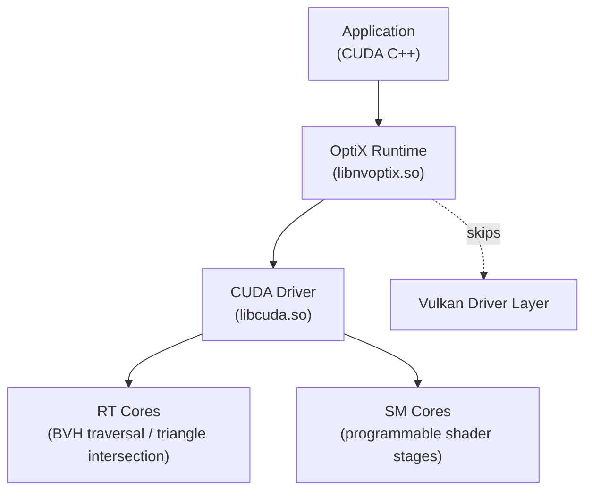
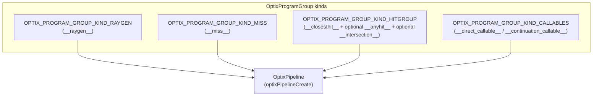
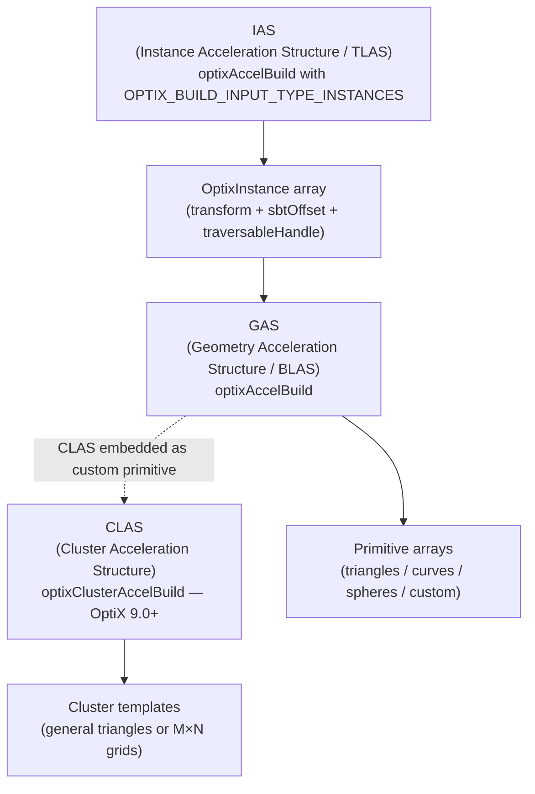
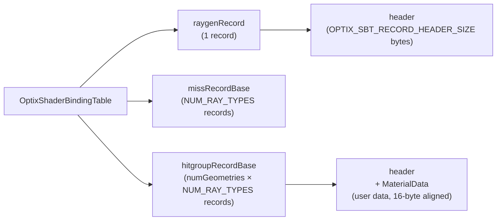
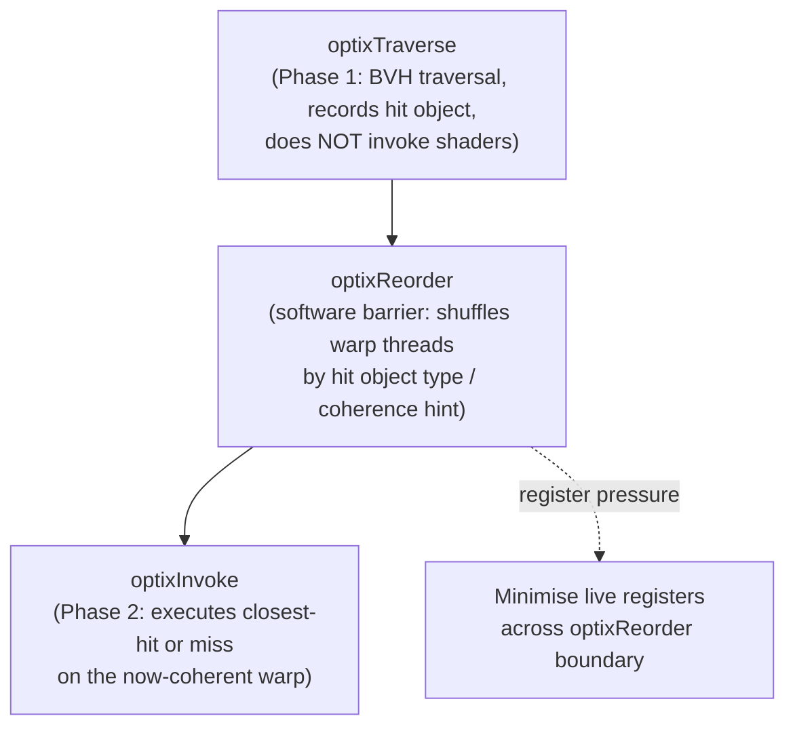
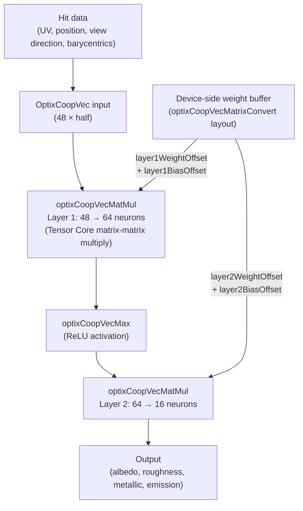
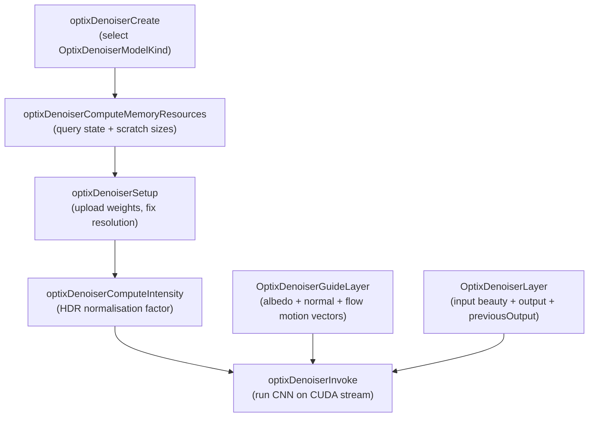
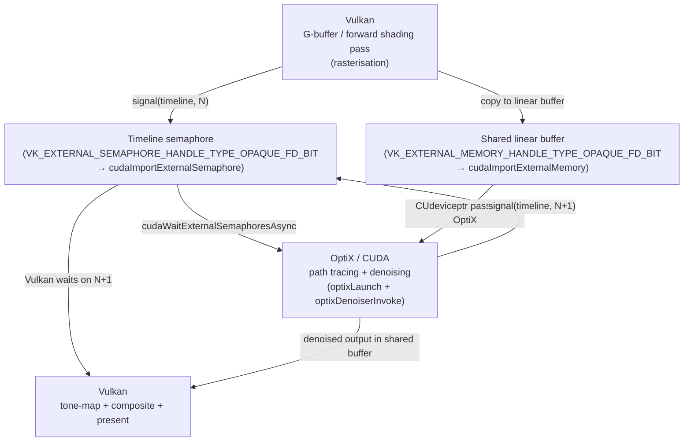

# Chapter 67: OptiX 9 — NVIDIA's Ray Tracing Framework

> **Part**: Part XV — NVIDIA Proprietary Graphics Stack
> **Audience**: Graphics application developers using NVIDIA on Linux
> **Status**: First draft — 2026-06-15

---

## Table of Contents

1. [Overview](#1-overview)
2. [OptiX Programming Model and Version History](#2-optix-programming-model-and-version-history)
3. [Device Context and Initialisation](#3-device-context-and-initialisation)
4. [Shader Compilation Pipeline: NVRTC → PTX / OptiX-IR → Module](#4-shader-compilation-pipeline-nvrtc--ptx--optix-ir--module)
   - 4.1 [NVRTC Compilation](#41-nvrtc-compilation)
   - 4.2 [Module Creation](#42-module-creation)
   - 4.3 [Compilation Caching (OptiX 9.1)](#43-compilation-caching-optix-91)
5. [Shader Types and Program Groups](#5-shader-types-and-program-groups)
6. [Pipeline Creation and Stack Sizing](#6-pipeline-creation-and-stack-sizing)
7. [Acceleration Structures: BVH, GAS, IAS, and CLAS](#7-acceleration-structures-bvh-gas-ias-and-clas)
   - 7.1 [Geometry Acceleration Structure (GAS)](#71-geometry-acceleration-structure-gas)
   - 7.2 [Instance Acceleration Structure (IAS) — the TLAS](#72-instance-acceleration-structure-ias--the-tlas)
   - 7.3 [Cluster Acceleration Structures — CLAS (OptiX 9.0, RTX MegaGeometry)](#73-cluster-acceleration-structures--clas-optix-90-rtx-megageometry)
   - 7.4 [BVH Refitting for Animated Meshes](#74-bvh-refitting-for-animated-meshes)
8. [Shader Binding Table (SBT)](#8-shader-binding-table-sbt)
9. [Ray Launch and Device Entry Points](#9-ray-launch-and-device-entry-points)
10. [Shader Execution Reordering (SER)](#10-shader-execution-reordering-ser)
11. [Primitive Types](#11-primitive-types)
12. [Cooperative Vectors — Neural Shaders on Tensor Cores](#12-cooperative-vectors--neural-shaders-on-tensor-cores)
13. [The OptiX Denoiser](#13-the-optix-denoiser)
14. [Vulkan / CUDA Interoperability for Hybrid Pipelines](#14-vulkan--cuda-interoperability-for-hybrid-pipelines)
15. [Blender Cycles and OptiX on Linux](#15-blender-cycles-and-optix-on-linux)
16. [Linux Build and Development Workflow](#16-linux-build-and-development-workflow)
17. [Deprecations and Migration Notes (OptiX 9.x)](#17-deprecations-and-migration-notes-optix-9x)
18. [Integrations](#18-integrations)
19. [References](#19-references)

---

## 1. Overview

This chapter targets graphics application developers who want to use NVIDIA's OptiX ray tracing framework on Linux — particularly those building path tracers, offline renderers, scientific visualisation tools, or hybrid rasterisation/ray tracing pipelines. Readers are assumed to be familiar with CUDA (Ch66), Vulkan fundamentals (Ch24–Ch25), and hardware ray tracing concepts as introduced through `VK_KHR_ray_tracing_pipeline` (Ch56).

OptiX occupies the tier above CUDA: it provides an application-level framework that manages BVH construction and traversal, maps programmable shader types onto the RT cores, drives the AI denoiser, and (since version 9.0) exposes tensor-core neural shaders through the Cooperative Vectors API. Unlike Vulkan KHR ray tracing, OptiX is NVIDIA-only and ships as a runtime SDK linked against the proprietary driver's ray tracing runtime, giving it direct access to hardware features before they are standardised.

By the end of this chapter, the reader will understand:

- How to initialise OptiX on a CUDA context and query device capabilities
- How the NVRTC → PTX/OptiX-IR → `OptixModule` → `OptixPipeline` compilation chain works
- The role of each shader type and how program groups compose into a pipeline
- How to build geometry and instance acceleration structures, including the OptiX 9.0 Clusters (MegaGeometry) API for massive dynamic meshes
- How the Shader Binding Table maps traversal outcomes to shader invocations
- How Shader Execution Reordering (SER) reduces warp divergence
- How Cooperative Vectors run neural networks inside shader programs
- How to use the OptiX AI denoiser with AOV guide layers and temporal stability
- How to share GPU buffers between Vulkan and OptiX via CUDA external memory APIs
- How Blender Cycles integrates OptiX on Linux

---

## 2. OptiX Programming Model and Version History

OptiX exposes hardware ray tracing as a programmable pipeline that layers on top of a CUDA device context. All OptiX computation executes in the CUDA programming model — OptiX adds the acceleration structure management, BVH traversal scheduling, and shader dispatch logic on top. From the hardware perspective, OptiX dispatches a CUDA launch grid where each thread is a ray; the RT cores perform BVH traversal and triangle intersection, while SM cores run the programmable shader stages.

The comparison to Vulkan KHR ray tracing (Ch56) is instructive: both use the same five-stage pipeline model (ray generation → traversal → intersection/any-hit → closest-hit/miss), and both BVH types produce hardware-traversable data structures over the same Turing RT-core hardware. OptiX, however, skips the Vulkan driver layer entirely and communicates with the RT hardware through the CUDA driver, enabling lower latency pipeline changes and access to pre-standardisation features such as Cooperative Vectors and the Clusters API.



**Version timeline:**

| Version | Date | Key additions | Min driver |
|---------|------|---------------|------------|
| OptiX 8.0 | August 2023 | Shader Execution Reordering (SER), fully async demand loading | R535 |
| OptiX 8.1 | October 2024 | Instance structure memory optimisations, denoiser quality improvements, `optixGetGASPointerFromHandle` | R555 |
| OptiX 9.0 | January 2025 | Blackwell/RTX 50-series support, Clusters API (MegaGeometry), Cooperative Vectors, hardware LSS curves on Blackwell, Rocaps software intersector, DMM API removed | R570 |
| OptiX 9.1 | November 2025 | ARM support, SER extensions, configurable compilation cache, module creation cancellation, OptiX 6 dropped | R590 |

[Source: OptiX 9.0 release forum](https://forums.developer.nvidia.com/t/optix-9-0-release/322842); [Source: OptiX 9.1 news](https://en.gamegpu.com/news/zhelezo/nvidia-optix-9-1-dostupna-dlya-zagruzki-podderzhka-arm-shader-execution-reordering-i-novye-api)

**Hardware support matrix:** Turing (RTX 20xx), Ampere (RTX 30xx / A-series), Ada Lovelace (RTX 40xx), Blackwell (RTX 50xx). Maxwell and Volta are not supported in OptiX 9. The Clusters API is supported on Ampere and later. [Source: Clusters on Ampere forum](https://forums.developer.nvidia.com/t/is-optix-9-clusters-api-supported-on-ampere/333524)

**SDK distribution:** OptiX ships as a headers-only package. Since OptiX 9.1, the public repository [github.com/NVIDIA/optix-dev](https://github.com/NVIDIA/optix-dev) contains the complete header tree. The full SDK with samples is downloaded separately from the NVIDIA Developer portal after account login. Companion repositories include `NVIDIA/OptiX_Apps` (sample applications covering OptiX 7.0–9.1), `NVIDIA/optix-subd` (Clusters/MegaGeometry reference), and `NVIDIA/optix-toolkit` (CMake integration helpers and demand-loading library). [Source: optix-dev](https://github.com/NVIDIA/optix-dev)

---

## 3. Device Context and Initialisation

OptiX binds to an existing CUDA context. Every OptiX object (module, pipeline, acceleration structure) is owned by an `OptixDeviceContext`. For multi-GPU rendering, one context per GPU is created, each owning its own pipelines and acceleration structures.

```c
/* host: optix_init.cpp — device context creation */
#include <optix.h>
#include <optix_function_table_definition.h>  // defines global function table

// Force CUDA runtime initialisation on the current GPU
cudaFree(0);

// Load the OptiX function table from the installed driver
OPTIX_CHECK(optixInit());

OptixDeviceContextOptions options = {};
options.logCallbackFunction = &myLogCallback;   // receives char* log messages
options.logCallbackLevel    = 4;                // 4 = verbose

// Pass 0 to bind to the current CUDA context (set by cudaSetDevice earlier)
CUcontext cuCtx = 0;
OptixDeviceContext context;
OPTIX_CHECK(optixDeviceContextCreate(cuCtx, &options, &context));

// Query capabilities
int serSupported = 0, coopVecSupported = 0;
OPTIX_CHECK(optixDeviceContextGetProperty(context,
    OPTIX_DEVICE_PROPERTY_SHADER_EXECUTION_REORDERING,
    &serSupported, sizeof(int)));
OPTIX_CHECK(optixDeviceContextGetProperty(context,
    OPTIX_DEVICE_PROPERTY_COOP_VEC,
    &coopVecSupported, sizeof(int)));
```

`optixInit()` dynamically loads the OptiX function table from the NVIDIA driver shared library (`libnvoptix.so` on Linux). It must be called before any other OptiX API. The `optixDeviceContextCreate` call validates that the GPU and driver version satisfy the minimum requirements for the SDK version in use. [Source: OptiX getting started blog](https://developer.nvidia.com/blog/how-to-get-started-with-optix-7/)

---

## 4. Shader Compilation Pipeline: NVRTC → PTX / OptiX-IR → Module

OptiX shaders are written in CUDA C++ annotated with OptiX entry-point prefixes (`__raygen__`, `__closesthit__`, etc.). The compilation path described in Ch66 for NVRTC applies here in full; OptiX adds its own IR format and module creation layer on top.


### 4.1 NVRTC Compilation

NVRTC compiles CUDA/OptiX source strings at application startup, producing either PTX (text) or OptiX-IR (binary). OptiX-IR, generated with `--optix-ir`, is NVIDIA-internal and not compatible with `ptxas`; it is the preferred output because it eliminates an additional compilation step inside the driver.

```c
/* host: shader_compile.cpp — NVRTC → OptiX-IR */
#include <nvrtc.h>

nvrtcProgram prog;
nvrtcCreateProgram(
    &prog,
    cuSourceCode,       // const char*: the .cu shader source
    "material.cu",      // program name (used in error messages)
    numHeaders,         // embedded headers (e.g. OptiX SDK headers)
    headerSources,
    headerNames
);

const char* opts[] = {
    "--optix-ir",                           // preferred: emit OptiX-IR
    "-arch=compute_89",                     // Ada Lovelace (sm_89)
    "--use_fast_math",
    "-I/opt/optix9.1/include",
    "-I/usr/local/cuda-12.6/include",
    "-DNDEBUG"
};
nvrtcResult result = nvrtcCompileProgram(prog, 6, opts);
if (result != NVRTC_SUCCESS) {
    size_t logSize;
    nvrtcGetProgramLogSize(prog, &logSize);
    char* log = new char[logSize];
    nvrtcGetProgramLog(prog, log);
    // ... report log ...
}

// Retrieve OptiX-IR
size_t irSize;
nvrtcGetOptiXIRSize(prog, &irSize);
char* irData = new char[irSize];
nvrtcGetOptiXIR(prog, irData);
nvrtcDestroyProgram(&prog);
```

The `--optix-ir` flag is mutually exclusive with `-dlto` (link-time optimisation). PTX can still be used by replacing `--optix-ir` with `nvrtcGetPTX`/`nvrtcGetPTXSize`; however NVIDIA recommends OptiX-IR for new projects as it allows the driver to skip PTX → SASS compilation. [Source: NVRTC documentation](https://docs.nvidia.com/cuda/nvrtc/index.html)

### 4.2 Module Creation

An `OptixModule` packages one or more compiled shader entry points and is the unit of linking into a pipeline. The `OptixPipelineCompileOptions` struct must be filled consistently for all modules and the pipeline — mismatches produce driver-level errors.

```c
/* host: module_create.cpp — OptixModule from OptiX-IR */
OptixModuleCompileOptions moduleOpts = {};
moduleOpts.maxRegisterCount = OPTIX_COMPILE_DEFAULT_MAX_REGISTER_COUNT;
moduleOpts.optLevel         = OPTIX_COMPILE_OPTIMIZATION_DEFAULT;
moduleOpts.debugLevel       = OPTIX_COMPILE_DEBUG_LEVEL_NONE;
// OptiX 9.0+: OPTIX_COMPILE_OPTIMIZATION_LEVEL_0/1/2/3 also valid

OptixPipelineCompileOptions pipelineOpts = {};
pipelineOpts.usesMotionBlur        = 0;
pipelineOpts.traversableGraphFlags =
    OPTIX_TRAVERSABLE_GRAPH_FLAG_ALLOW_SINGLE_GAS;  // or ALLOW_ANY for multi-level
pipelineOpts.numPayloadValues      = 3;   // 32-bit words passed through optixTrace
pipelineOpts.numAttributeValues    = 2;   // words from intersection shader
pipelineOpts.exceptionFlags        = OPTIX_EXCEPTION_FLAG_NONE;
pipelineOpts.pipelineLaunchParamsVariableName = "params"; // must match __constant__

char log[4096];
size_t logSize = sizeof(log);
OptixModule module;
OPTIX_CHECK(optixModuleCreate(
    context,
    &moduleOpts,
    &pipelineOpts,
    irData, irSize,          // or ptx, ptxLen for PTX path
    log, &logSize,
    &module
));
```

For parallel CPU-side compilation of large shader libraries, `optixModuleCreateWithTasks()` (introduced OptiX 8.0) decomposes module creation into independent `OptixTask` objects executable across multiple CPU threads. OptiX 9.1 adds `optixTaskExecute` cancellation, allowing applications to abort stalled compilations. [Source: module compilation forum](https://forums.developer.nvidia.com/t/how-does-optix-code-compilation-work/218678/2)

### 4.3 Compilation Caching (OptiX 9.1)

OptiX 9.1 introduces a dedicated compilation cache API. The cache stores intermediate results for `OptixProgramGroup` and `OptixPipeline` objects and is shared across `OptixDeviceContext` instances with internal thread-safe access. On subsequent application runs with the same shader source (and matching device/driver version), cached data is reused, significantly reducing startup time for applications with large shader libraries.

The cache is configured via `OptixDeviceContextOptions` fields added in 9.1; refer to the OptiX 9.1 Programming Guide for the `optixDeviceContextSetCacheEnabled`, `optixDeviceContextSetCacheLocation`, and related API calls. [Source: OptiX 9.1 changelog](https://en.gamegpu.com/news/zhelezo/nvidia-optix-9-1-dostupna-dlya-zagruzki-podderzhka-arm-shader-execution-reordering-i-novye-api)

---

## 5. Shader Types and Program Groups

OptiX 9 defines six shader types. Their roles map closely to the Vulkan KHR ray tracing stages (Ch56): ray generation, intersection, any-hit, closest-hit, miss, and callable shaders. The callable variant is further split into direct callables (no recursive trace allowed) and continuation callables (may invoke `optixTrace`/`optixTraverse`).

| Shader type | CUDA annotation | Stage role | Analogous Vulkan stage |
|-------------|-----------------|------------|------------------------|
| Ray generation | `__raygen__` | Launch entry; generates primary rays via `optixTrace`/`optixTraverse` | `VK_SHADER_STAGE_RAYGEN_BIT_KHR` |
| Intersection | `__intersection__` | Custom primitive hit test; calls `optixReportIntersection` | `VK_SHADER_STAGE_INTERSECTION_BIT_KHR` |
| Any-hit | `__anyhit__` | Runs on every candidate hit; transparency and alpha testing | `VK_SHADER_STAGE_ANY_HIT_BIT_KHR` |
| Closest-hit | `__closesthit__` | Runs on nearest confirmed intersection; surface shading | `VK_SHADER_STAGE_CLOSEST_HIT_BIT_KHR` |
| Miss | `__miss__` | Runs when the ray hits nothing; background / IBL | `VK_SHADER_STAGE_MISS_BIT_KHR` |
| Direct callable | `__direct_callable__` | Subroutine callable from any shader; cannot call `optixTrace` | `VK_SHADER_STAGE_CALLABLE_BIT_KHR` |
| Continuation callable | `__continuation_callable__` | Like direct callable but may call `optixTrace`/`optixTraverse` | `VK_SHADER_STAGE_CALLABLE_BIT_KHR` |

Shaders are packaged into `OptixProgramGroup` objects before pipeline linking. The diagram below shows how shader types combine into the three program group kinds recognised by OptiX:



```c
/* host: program_groups.cpp — raygen and hitgroup PG creation */
OptixProgramGroupOptions pgOptions = {};

// Ray generation group
OptixProgramGroupDesc raygenDesc = {};
raygenDesc.kind                     = OPTIX_PROGRAM_GROUP_KIND_RAYGEN;
raygenDesc.raygen.module            = module;
raygenDesc.raygen.entryFunctionName = "__raygen__primary";
OptixProgramGroup raygenPG;
OPTIX_CHECK(optixProgramGroupCreate(context, &raygenDesc, 1,
                                    &pgOptions, log, &logSize, &raygenPG));

// Hit group: closest-hit (required) + optional any-hit + optional intersection
// For triangle geometry: moduleIS = nullptr (built-in triangle intersector)
OptixProgramGroupDesc hitDesc = {};
hitDesc.kind                        = OPTIX_PROGRAM_GROUP_KIND_HITGROUP;
hitDesc.hitgroup.moduleCH           = module;
hitDesc.hitgroup.entryFunctionNameCH = "__closesthit__surface";
hitDesc.hitgroup.moduleAH           = moduleAH;   // nullptr if not needed
hitDesc.hitgroup.entryFunctionNameAH = "__anyhit__alpha";
hitDesc.hitgroup.moduleIS           = nullptr;    // nullptr → triangle built-in
hitDesc.hitgroup.entryFunctionNameIS = nullptr;
OptixProgramGroup hitgroupPG;
OPTIX_CHECK(optixProgramGroupCreate(context, &hitDesc, 1,
                                    &pgOptions, log, &logSize, &hitgroupPG));

// Miss group
OptixProgramGroupDesc missDesc = {};
missDesc.kind                   = OPTIX_PROGRAM_GROUP_KIND_MISS;
missDesc.miss.module            = module;
missDesc.miss.entryFunctionName = "__miss__sky";
OptixProgramGroup missPG;
OPTIX_CHECK(optixProgramGroupCreate(context, &missDesc, 1,
                                    &pgOptions, log, &logSize, &missPG));
```

[Source: OptiX host API program groups reference](https://raytracing-docs.nvidia.com/optix9/api/group__optix__host__api__program__groups.html)

---

## 6. Pipeline Creation and Stack Sizing

The pipeline links program groups and produces the executable state object used by `optixLaunch`. Two options structs control pipeline behaviour: `OptixPipelineCompileOptions` (shared with module creation, fixes traversal topology and payload count) and `OptixPipelineLinkOptions` (pipeline-local, fixes the maximum trace recursion depth).

```c
/* host: pipeline.cpp — pipeline creation and stack sizing */
OptixPipelineLinkOptions linkOptions = {};
linkOptions.maxTraceDepth = 2;  // primary ray + one shadow ray; higher = more stack

OptixProgramGroup allGroups[] = { raygenPG, missPG, shadowMissPG, hitgroupPG };
OptixPipeline pipeline;
OPTIX_CHECK(optixPipelineCreate(
    context,
    &pipelineOpts,         // must match options used for all modules
    &linkOptions,
    allGroups, 4,
    log, &logSize,
    &pipeline
));

// Stack sizing — must be done after pipeline creation
OptixStackSizes stackSizes = {};
for (OptixProgramGroup pg : allGroups)
    OPTIX_CHECK(optixUtilAccumulateStackSizes(pg, &stackSizes, pipeline));

uint32_t traversalDepth   = 2;   // IAS → GAS
uint32_t cssDC = 0, cssCC = 0, cssRR = 0;
OPTIX_CHECK(optixUtilComputeStackSizes(
    &stackSizes,
    linkOptions.maxTraceDepth,
    0,               // maxCCDepth (continuation callable nesting)
    0,               // maxDCDepth
    &cssRR, &cssDC, &cssCC));

OPTIX_CHECK(optixPipelineSetStackSize(
    pipeline,
    cssRR,   // direct callable stack from traversal
    cssDC,   // direct callable stack from state
    cssCC,   // continuation callable stack
    traversalDepth
));
```

Incorrect stack sizing is one of the most common sources of silent GPU faults in OptiX applications. The utility functions `optixUtilAccumulateStackSizes` and `optixUtilComputeStackSizes` (from `optix_stack_size.h`) compute conservative bounds by walking all program groups; the final call to `optixPipelineSetStackSize` communicates these to the driver. [Source: stack size forum](https://forums.developer.nvidia.com/t/stack-size-calculation-for-programgroups-rg-ex-ms-hg-with-optixutilaccumulatestacksizes/359312)

---

## 7. Acceleration Structures: BVH, GAS, IAS, and CLAS

OptiX acceleration structures are hardware BVHs stored in device memory as opaque blobs. The API distinguishes three tiers: the Geometry Acceleration Structure (GAS, analogous to Vulkan's BLAS), the Instance Acceleration Structure (IAS, analogous to the TLAS), and the Cluster Acceleration Structure (CLAS), a new tier in OptiX 9.0 for massive dynamic geometry.



### 7.1 Geometry Acceleration Structure (GAS)

A GAS covers one or more primitive arrays of a single type. Triangle meshes are the most common:

```c
/* host: gas_build.cpp — triangle GAS with compaction */
OptixAccelBuildOptions accelOpts = {};
accelOpts.buildFlags = OPTIX_BUILD_FLAG_ALLOW_COMPACTION |
                       OPTIX_BUILD_FLAG_PREFER_FAST_TRACE;
accelOpts.operation  = OPTIX_BUILD_OPERATION_BUILD;

// Describe geometry — all device pointers must be CUDA-allocated
OptixBuildInputTriangleArray triInput = {};
triInput.vertexBuffers       = &d_vertices;       // CUdeviceptr to float3[]
triInput.numVertices         = numVertices;
triInput.vertexFormat        = OPTIX_VERTEX_FORMAT_FLOAT3;
triInput.vertexStrideInBytes = sizeof(float3);
triInput.indexBuffer         = d_indices;         // CUdeviceptr to uint3[]
triInput.numIndexTriplets    = numTriangles;
triInput.indexFormat         = OPTIX_INDICES_FORMAT_UNSIGNED_INT3;
triInput.indexStrideInBytes  = sizeof(uint3);
uint32_t geomFlags           = OPTIX_GEOMETRY_FLAG_NONE;
triInput.flags               = &geomFlags;
triInput.numSbtRecords       = 1;

OptixBuildInput buildInput = {};
buildInput.type          = OPTIX_BUILD_INPUT_TYPE_TRIANGLES;
buildInput.triangleArray = triInput;

// Query memory requirements
OptixAccelBufferSizes sizes;
OPTIX_CHECK(optixAccelComputeMemoryUsage(
    context, &accelOpts, &buildInput, 1, &sizes));

CUdeviceptr d_temp, d_output;
CUDA_CHECK(cudaMalloc((void**)&d_temp,   sizes.tempSizeInBytes));
CUDA_CHECK(cudaMalloc((void**)&d_output, sizes.outputSizeInBytes));

// Emit compacted size so we can shrink the buffer afterward
OptixAccelEmitDesc emitDesc = {};
CUdeviceptr d_compactedSize;
CUDA_CHECK(cudaMalloc((void**)&d_compactedSize, sizeof(size_t)));
emitDesc.type   = OPTIX_PROPERTY_TYPE_COMPACTED_SIZE;
emitDesc.result = d_compactedSize;

OptixTraversableHandle gasHandle;
OPTIX_CHECK(optixAccelBuild(
    context, stream,
    &accelOpts,
    &buildInput, 1,
    d_temp,   sizes.tempSizeInBytes,
    d_output, sizes.outputSizeInBytes,
    &gasHandle,
    &emitDesc, 1));    // emitted properties
CUDA_CHECK(cudaStreamSynchronize(stream));

// Compact to actual size (typically 50–70% savings)
size_t compactedSize;
CUDA_CHECK(cudaMemcpy(&compactedSize, (void*)d_compactedSize,
                      sizeof(size_t), cudaMemcpyDeviceToHost));
CUdeviceptr d_compactedOutput;
CUDA_CHECK(cudaMalloc((void**)&d_compactedOutput, compactedSize));
OPTIX_CHECK(optixAccelCompact(context, stream,
    gasHandle, d_compactedOutput, compactedSize, &gasHandle));
cudaFree((void*)d_output);
```

[Source: OptiX 7 getting started blog](https://developer.nvidia.com/blog/how-to-get-started-with-optix-7/)

`OptixBuildInputType` values supported in OptiX 9:
- `OPTIX_BUILD_INPUT_TYPE_TRIANGLES` — polygon meshes
- `OPTIX_BUILD_INPUT_TYPE_CUSTOM_PRIMITIVES` — AABB-defined procedural geometry
- `OPTIX_BUILD_INPUT_TYPE_INSTANCES` — instance array (IAS)
- `OPTIX_BUILD_INPUT_TYPE_INSTANCE_POINTERS` — pointer-based instance array
- `OPTIX_BUILD_INPUT_TYPE_CURVES` — hair/fur curves (cubic B-spline, Catmull-Rom, linear)
- `OPTIX_BUILD_INPUT_TYPE_SPHERES` — analytical spheres (per-sphere center+radius)

[Source: OptiX build input struct reference](https://raytracing-docs.nvidia.com/optix9/api/struct_optix_build_input.html)

### 7.2 Instance Acceleration Structure (IAS) — the TLAS

The IAS references multiple traversable handles (GAS or nested IAS) via `OptixInstance` arrays. Each instance carries a 3×4 row-major world transform and an SBT offset:

```c
/* host: ias_build.cpp — instance array */
OptixInstance instances[NUM_OBJECTS];
for (int i = 0; i < NUM_OBJECTS; ++i) {
    memset(&instances[i], 0, sizeof(OptixInstance));
    instances[i].traversableHandle = gasHandles[i];
    instances[i].sbtOffset         = i * NUM_RAY_TYPES;
    instances[i].instanceId        = i;
    instances[i].visibilityMask    = 0xFF;
    instances[i].flags             = OPTIX_INSTANCE_FLAG_NONE;
    // 3×4 row-major transform (identity = object-to-world)
    instances[i].transform[0] = 1.f; instances[i].transform[5] = 1.f;
    instances[i].transform[10] = 1.f;
}

// Upload instance array
CUdeviceptr d_instances;
CUDA_CHECK(cudaMalloc((void**)&d_instances, NUM_OBJECTS * sizeof(OptixInstance)));
CUDA_CHECK(cudaMemcpy((void*)d_instances, instances,
                      NUM_OBJECTS * sizeof(OptixInstance), cudaMemcpyHostToDevice));

OptixBuildInputInstanceArray iasInput = {};
iasInput.instances    = d_instances;
iasInput.numInstances = NUM_OBJECTS;

OptixBuildInput iasBuildInput = {};
iasBuildInput.type          = OPTIX_BUILD_INPUT_TYPE_INSTANCES;
iasBuildInput.instanceArray = iasInput;
// ... then optixAccelComputeMemoryUsage + optixAccelBuild as for GAS
```

### 7.3 Cluster Acceleration Structures — CLAS (OptiX 9.0, RTX MegaGeometry)

The RTX MegaGeometry (Clusters) API, introduced in OptiX 9.0, addresses the fundamental scalability problem of ray tracing over tessellated or procedurally generated geometry. The challenge: a 4K subdivision surface or animated character may produce hundreds of millions of microtriangles per frame; building a GAS over all of them takes seconds, not milliseconds.

CLAS solves this by dividing geometry into clusters — contiguous groups of triangles corresponding to a tessellation patch or subdivision cage face — and building a two-level structure. Within each cluster, a lightweight BVH is built (the cluster acceleration structure proper). Across clusters, a standard GAS is built referencing the cluster AABB. Between frames only the cluster-level entries are updated for animated or displaced vertices, while cluster topology (connectivity) is unchanged. This achieves 10×–100× faster BVH updates compared to rebuilding a monolithic GAS over all microtriangles. [Source: RTX MegaGeometry blog](https://developer.nvidia.com/blog/fast-ray-tracing-of-dynamic-scenes-using-nvidia-optix-9-and-nvidia-rtx-mega-geometry/)

Two cluster template types exist:
- **General triangle templates**: arbitrary topology within the cluster; any triangle soup.
- **Grid templates**: rectangular `(M×N)` grids; smaller and faster to traverse than general templates for structured tessellation outputs such as Catmull-Clark subdivision.

Key CLAS API entry points:

```c
/* host: clas_build.cpp — conceptual sketch (simplified from optix-subd sample) */
// OptixClusterAccelBuildInput describes clusters and their triangle/vertex data.
// This is a simplification — refer to optix-subd for the full template workflow.

OptixClusterAccelBuildInput clasInput = {};
// Fill clasInput.clusters (OptixClusterAccelBuildInputClusters) or
//      clasInput.grids    (OptixClusterAccelBuildInputGrids)
// depending on template type.

OptixClusterAccelBufferSizes clasSizes;
OPTIX_CHECK(optixClusterAccelComputeMemoryUsage(context, &clasInput, &clasSizes));

CUdeviceptr d_clasTemp, d_clasOutput;
CUDA_CHECK(cudaMalloc((void**)&d_clasTemp,   clasSizes.tempSizeInBytes));
CUDA_CHECK(cudaMalloc((void**)&d_clasOutput, clasSizes.outputSizeInBytes));

OptixTraversableHandle clasHandle;
OPTIX_CHECK(optixClusterAccelBuild(
    context, stream,
    &clasInput,
    d_clasTemp,   clasSizes.tempSizeInBytes,
    d_clasOutput, clasSizes.outputSizeInBytes,
    &clasHandle));

// The resulting CLAS handle is referenced from a GAS as a custom primitive
// (not directly as a traversable — see optix-subd for the embedding pattern).
```

The reference implementation is [github.com/NVIDIA/optix-subd](https://github.com/NVIDIA/optix-subd), which demonstrates real-time Catmull-Clark subdivision surface ray tracing using CLAS on Ampere and later hardware.

On Blackwell (RTX 50xx), hardware-accelerated Linear Spherically-capped Segment (LSS) curves are added at the RT-core level, complementing CLAS with accelerated hair and fur rendering. [Source: OptiX 9.0 release forum](https://forums.developer.nvidia.com/t/optix-9-0-release/322842)

### 7.4 BVH Refitting for Animated Meshes

For meshes where only vertex positions change (topology is fixed), `OPTIX_BUILD_OPERATION_UPDATE` avoids a full rebuild by refitting the existing BVH nodes. This requires the GAS to be built with `OPTIX_BUILD_FLAG_ALLOW_UPDATE`:

```c
/* host: gas_update.cpp — BVH refit for animated mesh */
accelOpts.buildFlags = OPTIX_BUILD_FLAG_ALLOW_UPDATE |
                       OPTIX_BUILD_FLAG_PREFER_FAST_TRACE;
accelOpts.operation  = OPTIX_BUILD_OPERATION_UPDATE;  // refit, not rebuild

// Temp buffer for update must be >= sizes.tempUpdateSizeInBytes
// (queried from the original optixAccelComputeMemoryUsage call)
OPTIX_CHECK(optixAccelBuild(
    context, stream,
    &accelOpts,
    &buildInput, 1,
    d_temp, sizes.tempUpdateSizeInBytes,  // use update size, not build size
    d_output, sizes.outputSizeInBytes,    // same output buffer as original build
    &gasHandle,
    nullptr, 0));
```

Note that `ALLOW_UPDATE` and `ALLOW_COMPACTION` are mutually exclusive; compaction produces a smaller buffer that cannot be updated in place.

---

## 8. Shader Binding Table (SBT)

The SBT is the data structure that the OptiX traversal hardware uses to select and parameterise shader invocations. Each SBT record consists of a 32-byte opaque header (written by `optixSbtRecordPackHeader`) followed by arbitrary user data aligned to 16 bytes. The CPU fills the SBT; the GPU reads it during traversal.

```c
/* host: sbt.cpp — SBT construction with per-material data */
struct alignas(OPTIX_SBT_RECORD_ALIGNMENT) RaygenRecord {
    char header[OPTIX_SBT_RECORD_HEADER_SIZE];
    // No per-raygen data needed; launch params cover it
};

struct alignas(OPTIX_SBT_RECORD_ALIGNMENT) HitgroupRecord {
    char header[OPTIX_SBT_RECORD_HEADER_SIZE];
    MaterialData material;   // user-defined: textures, BSDFs, etc.
};

// Fill and upload raygen record
RaygenRecord raygenRec;
OPTIX_CHECK(optixSbtRecordPackHeader(raygenPG, &raygenRec));
CUdeviceptr d_raygenRec;
CUDA_CHECK(cudaMalloc((void**)&d_raygenRec, sizeof(RaygenRecord)));
CUDA_CHECK(cudaMemcpy((void*)d_raygenRec, &raygenRec,
                      sizeof(RaygenRecord), cudaMemcpyHostToDevice));

// Fill hitgroup records (one per geometry × ray type)
std::vector<HitgroupRecord> hitRecs(numGeometries * NUM_RAY_TYPES);
for (int g = 0; g < numGeometries; ++g) {
    for (int r = 0; r < NUM_RAY_TYPES; ++r) {
        int idx = g * NUM_RAY_TYPES + r;
        OPTIX_CHECK(optixSbtRecordPackHeader(hitgroupPGs[r], &hitRecs[idx]));
        hitRecs[idx].material = materialData[g];
    }
}
CUdeviceptr d_hitRecs;
CUDA_CHECK(cudaMalloc((void**)&d_hitRecs,
                      hitRecs.size() * sizeof(HitgroupRecord)));
CUDA_CHECK(cudaMemcpy((void*)d_hitRecs, hitRecs.data(),
                      hitRecs.size() * sizeof(HitgroupRecord),
                      cudaMemcpyHostToDevice));

// Assemble the SBT
OptixShaderBindingTable sbt = {};
sbt.raygenRecord              = d_raygenRec;
sbt.missRecordBase            = d_missRecs;
sbt.missRecordStrideInBytes   = sizeof(MissRecord);
sbt.missRecordCount           = NUM_RAY_TYPES;
sbt.hitgroupRecordBase        = d_hitRecs;
sbt.hitgroupRecordStrideInBytes = sizeof(HitgroupRecord);
sbt.hitgroupRecordCount       = numGeometries * NUM_RAY_TYPES;
```

**SBT record structure.** Each SBT record consists of a 32-byte opaque header written by `optixSbtRecordPackHeader` followed by user data. The `OptixShaderBindingTable` struct assembles raygen, miss, and hitgroup records into a single table indexed by traversal outcomes:



**Hit group indexing formula.** The hardware computes the hit record index as:

```text
HG_index = instanceSbtOffset + geometryIndex × sbtStride_rayType + rayTypeIndex
```

where `instanceSbtOffset` is the `sbtOffset` field of the `OptixInstance`, `geometryIndex` is the zero-based index of the build input within the GAS, `sbtStride_rayType` is the `sbtStride` argument passed to `optixTrace`/`optixTraverse`, and `rayTypeIndex` is the `sbtOffset` argument to `optixTrace`. [Source: SBT three ways — Will Usher](https://www.willusher.io/graphics/2019/11/20/the-sbt-three-ways/)

**SBT optimisation for large scene counts.** Naive SBT design stores one hit record per instance × ray type, scaling as O(N_instances). The optimised approach (demonstrated in the `rtigo10` sample from `NVIDIA/OptiX_Apps`) stores one record per material, and the device shader indexes into a device-side array using `optixGetInstanceId()`:

```c
/* device: closesthit.cu — optimised SBT with per-material indirect lookup */
extern "C" __global__ void __closesthit__surface() {
    // SBT record carries no per-instance data; only a pointer to shared array
    const SbtDataPointer* sbtData =
        reinterpret_cast<const SbtDataPointer*>(optixGetSBTDataPointer());
    // Use instance ID to index per-instance array on device
    const InstanceData& inst = sbtData->instanceArray[optixGetInstanceId()];
    const MaterialData& mat  = sbtData->materialArray[inst.materialIndex];
    // ... shading using mat ...
}
```

This reduces SBT memory from O(N_instances) to O(N_materials) and avoids SBT re-uploads when instance transforms change. [Source: SBT optimisation blog](https://developer.nvidia.com/blog/efficient-ray-tracing-with-nvidia-optix-shader-binding-table-optimization)

Useful SBT device intrinsics:
- `optixGetSBTDataPointer()` — pointer to the user data portion of the current hit record
- `optixGetInstanceId()` — user-assigned instance ID from `OptixInstance::instanceId`
- `optixGetInstanceIndex()` — zero-based index within the IAS
- `optixGetPrimitiveIndex()` — index of the intersected primitive within the GAS
- `optixGetSbtGASIndex()` — SBT record index within the GAS
- `optixGetGASPointerFromHandle(traversableHandle)` — raw device pointer to GAS data (added OptiX 8.1, useful for procedural texturing)

---

## 9. Ray Launch and Device Entry Points

`optixLaunch` is the host-side call that submits a 3D grid of ray generation shader invocations to the GPU via a CUDA stream:

```c
/* host: launch.cpp — optixLaunch */
// Upload launch parameters — must match pipelineLaunchParamsVariableName
LaunchParams params;
params.frameBuffer = d_framebuffer;
params.width = width; params.height = height;
params.traversable = iasHandle;
params.camera = cameraData;

CUdeviceptr d_params;
CUDA_CHECK(cudaMalloc((void**)&d_params, sizeof(LaunchParams)));
CUDA_CHECK(cudaMemcpyAsync((void*)d_params, &params, sizeof(LaunchParams),
                           cudaMemcpyHostToDevice, stream));

OPTIX_CHECK(optixLaunch(
    pipeline, stream,
    d_params, sizeof(LaunchParams),
    &sbt,
    width, height, 1          // launch grid: x=width, y=height, z=1
));
CUDA_CHECK(cudaStreamSynchronize(stream));
```

`optixLaunch` is non-blocking with respect to the CPU; it enqueues work on the CUDA stream identified by `stream`. The launch params struct is accessed on the device through the named `__constant__` variable whose name matches `pipelineLaunchParamsVariableName` — a compile-time string the driver uses to locate the symbol.

**Device-side ray generation pattern:**

```c
/* device: raygen.cu — primary ray generation */
extern "C" __global__ void __raygen__primary() {
    const uint3 idx = optixGetLaunchIndex();      // pixel coordinates
    const uint3 dim = optixGetLaunchDimensions();

    // Construct camera ray
    const float2 d = 2.f * make_float2(
        (float)idx.x / dim.x,
        (float)idx.y / dim.y) - 1.f;
    float3 origin    = params.camera.position;
    float3 direction = normalize(d.x * params.camera.right +
                                 d.y * params.camera.up +
                                 params.camera.forward);

    // Payload: 2 × 32-bit registers (encode hit colour)
    unsigned int r0 = 0, r1 = 0;
    optixTrace(
        params.traversable,
        origin, direction,
        1e-4f,               // tmin: epsilon to avoid self-intersection
        1e16f,               // tmax: far plane
        0.f,                 // rayTime: 0 = no motion blur
        OptixVisibilityMask(0xFF),
        OPTIX_RAY_FLAG_NONE,
        0,                   // sbtOffset: ray type 0 = camera rays
        NUM_RAY_TYPES,       // sbtStride
        0,                   // missSbtIndex
        r0, r1               // payload registers (up to 32 words)
    );

    // Write pixel
    const uint32_t pixelIdx = idx.y * dim.x + idx.x;
    params.frameBuffer[pixelIdx] = make_float4(
        __uint_as_float(r0),
        __uint_as_float(r1),
        0.f, 1.f);
}
```

In OptiX 9.0, `optixTrace` was removed from **direct callables** (`__direct_callable__`) only. Continuation callables (`__continuation_callable__`) retain the ability to call `optixTrace`/`optixTraverse`. Ray generation, closest-hit, miss, and intersection shaders are unaffected. Applications calling `optixTrace` from inside a direct callable must migrate to the `optixTraverse` + `optixInvoke` split (see Section 10), or restructure the call site to use a continuation callable instead. [Source: OptiX 9.0 release forum](https://forums.developer.nvidia.com/t/optix-9-0-release/322842)

---

## 10. Shader Execution Reordering (SER)

Shader Execution Reordering reduces warp divergence — the primary performance bottleneck in ray tracing where adjacent pixels may hit completely different materials, causing SM threads to execute different code paths in the same warp. SER was introduced in OptiX 8.0 and extended in 9.1.

The mechanism splits `optixTrace` into two phases: a traversal phase (`optixTraverse`) that records the "hit object" without immediately invoking the shader, and a shading phase (`optixInvoke`) that executes the shader. Between them, `optixReorder` acts as a software barrier that shuffles warp threads to maximise shader coherence — threads that will execute the same closest-hit shader end up in the same warp.



```c
/* device: raygen_ser.cu — ray generation with SER */
extern "C" __global__ void __raygen__ser() {
    unsigned int r0 = 0, r1 = 0;

    // Phase 1: traverse BVH, record hit object (does NOT invoke shaders yet)
    optixTraverse(
        params.traversable,
        origin, direction,
        tmin, tmax, 0.f,
        OptixVisibilityMask(0xFF),
        OPTIX_RAY_FLAG_NONE,
        0, NUM_RAY_TYPES, 0,   // sbtOffset, sbtStride, missSbtIndex
        r0, r1                  // payload (writable before optixReorder)
    );

    // Hint to the hardware: reorder threads by hit object type.
    // Threads hitting the same material will be co-scheduled in one warp.
    // Minimise live state across this call to reduce register pressure.
    optixReorder(
        /* coherenceHint = */ 0,  // optional: encode additional sort key bits
        /* numCoherenceBits = */ 0
    );

    // Phase 2: execute closest-hit or miss shader on the now-coherent warp
    optixInvoke(r0, r1);

    // After optixInvoke, payload holds the result from CH/miss shader
    params.frameBuffer[idx] = decodePayload(r0, r1);
}
```

Practical SER guidelines:
- Place expensive per-frame setup (camera matrix load, RNG seed init) before `optixTraverse`, not between `optixTraverse` and `optixReorder`.
- Keep the number of live registers across the `optixReorder` boundary to a minimum — each live register costs storage in the reorder buffer.
- Use the coherence hint bits to encode application-specific sort keys (e.g., material ID extracted from the hit object before reorder).
- SER is most effective for scenes with heterogeneous material distributions; for scenes with a single dominant material, the overhead may not pay off.

**Capability query:**
```c
int serSupported;
OPTIX_CHECK(optixDeviceContextGetProperty(context,
    OPTIX_DEVICE_PROPERTY_SHADER_EXECUTION_REORDERING,
    &serSupported, sizeof(int)));
```

SER requires Turing or later hardware and an R535+ driver. [Source: SER optixReorder forum](https://forums.developer.nvidia.com/t/what-does-optixreorder-reorder/319282)

---

## 11. Primitive Types

OptiX 9 supports six primitive categories:

**Triangle meshes** (`OPTIX_BUILD_INPUT_TYPE_TRIANGLES`): 16-bit or 32-bit index buffers, FLOAT3 and FLOAT2+1 vertex formats, optional 16-byte-aligned index triplets. Adding `OPTIX_BUILD_FLAG_ALLOW_RANDOM_VERTEX_ACCESS` enables `optixGetTriangleVertexData(float3 data[3])` inside closest-hit shaders for tasks such as computing barycentric-interpolated normals without storing them explicitly.

**Custom primitives** (`OPTIX_BUILD_INPUT_TYPE_CUSTOM_PRIMITIVES`): user-supplied axis-aligned bounding boxes. The `__intersection__` shader is called for each candidate and calls `optixReportIntersection(float tHit, unsigned int hitKind, ...)` to confirm a hit. This path supports implicit surfaces, signed-distance fields, heightfields, and point clouds.

**Curves** (`OPTIX_BUILD_INPUT_TYPE_CURVES`): hair and fur rendering. Segment types: linear (`OPTIX_PRIMITIVE_TYPE_ROUND_LINEAR`), quadratic B-spline, cubic B-spline, and Catmull-Rom. OptiX 9.0 adds the **Rocaps** (Round-Capped Segment = spherically-capped linear segment) software intersector, significantly faster for fine hair without a dedicated hardware path. On Blackwell, linear spherically-capped segments (LSS) gain hardware RT-core acceleration. Vertex data retrieval: `optixGetLinearCurveVertexData(float4 data[2])`.

**Spheres** (`OPTIX_BUILD_INPUT_TYPE_SPHERES`): analytical sphere intersection, introduced in OptiX 7.6. Each sphere is defined by a FLOAT3 centre and a per-sphere or uniform radius. [Source: sphere array struct reference](https://raytracing-docs.nvidia.com/optix8/api/struct_optix_build_input_sphere_array.html)

**CLAS clusters**: described in Section 7.3; accessed through `optixClusterAccelBuild` rather than `optixAccelBuild`.

---

## 12. Cooperative Vectors — Neural Shaders on Tensor Cores

Cooperative Vectors is OptiX 9.0's mechanism for executing small neural networks inside any shader program using NVIDIA Tensor Cores. The core operation is a warp-level fused matrix-vector multiply: all 32 threads in a warp simultaneously evaluate the same linear layer on different input vectors, and the system maps this to a single tensor-core matrix-matrix multiply. Successive layers with adjacent weight storage allow the compiler to eliminate inter-layer data shuffle overhead.

This enables **RTX Neural Shaders**: AI models embedded directly in the ray tracing pipeline — for example, neural texture decompression, NeRF-style material encoding, or neural SDF evaluation — without any CUDA kernel launch overhead or CPU/GPU synchronisation. [Source: neural rendering cooperative vectors blog](https://developer.nvidia.com/blog/neural-rendering-in-nvidia-optix-using-cooperative-vectors)



### 12.1 Device-side API

```c
/* device: neural_ch.cu — MLP inference in a closest-hit shader using CoopVec */
#include <optix_cooperative_vector.h>

extern "C" __global__ void __closesthit__neural_material() {
    // Build input feature vector from hit data
    // (UV coordinates, view direction, position — 48 floats packed as half)
    OptixCoopVec<half, 48> inputVec;
    half* rawInput = (half*)&inputVec;
    // ... populate rawInput from optixGetTriangleVertexData, barycentrics, etc. ...

    // Layer 1: 48 → 64 neurons, ReLU activation
    // Weights stored in device-side constant buffer; bias follows immediately
    OptixCoopVec<half, 64> hidden = optixCoopVecMatMul(
        d_weights + layer1WeightOffset,  // W: device pointer (64×48 matrix)
        inputVec,
        d_weights + layer1BiasOffset,    // b: bias vector (64 elements)
        OPTIX_COOP_VEC_ELEM_TYPE_FLOAT16,  // input element type
        OPTIX_COOP_VEC_ELEM_TYPE_FLOAT16,  // weight element type
        OPTIX_COOP_VEC_ELEM_TYPE_FLOAT16,  // output element type
        48, 64                             // input_dim, output_dim
    );

    // ReLU: elementwise max(0, x) via optixCoopVecMax
    OptixCoopVec<half, 64> zero64 = {};
    hidden = optixCoopVecMax(hidden, zero64);

    // Layer 2: 64 → 16 neurons (output: albedo RGB + roughness + metallic...)
    OptixCoopVec<half, 16> output = optixCoopVecMatMul(
        d_weights + layer2WeightOffset,
        hidden,
        d_weights + layer2BiasOffset,
        OPTIX_COOP_VEC_ELEM_TYPE_FLOAT16,
        OPTIX_COOP_VEC_ELEM_TYPE_FLOAT16,
        OPTIX_COOP_VEC_ELEM_TYPE_FLOAT16,
        64, 16
    );
    // output now holds decoded material properties for shading
}
```

Key device functions:
- `optixCoopVecMatMul(...)` — affine transform `y = W*x + b`; the fundamental MLP layer
- `optixCoopVecFFMA(v, a, b)` — fused multiply-add on cooperative vector elements
- `optixCoopVecMax(a, b)` / `optixCoopVecMin(a, b)` — elementwise operations (ReLU, clamp)
- `optixCoopVecMul(a, b)` — elementwise multiply
- `optixCoopVecReduceSumAccumulate(...)` — gradient accumulation for training passes
- `optixCoopVecOuterProductAccumulate(...)` — outer product for backward pass

Host-side weight preparation uses `optixCoopVecMatrixConvert(...)` to reformat training-time weight tensors into the hardware-optimal inference layout. This should be done offline (at load time) and stored in device memory; re-converting per frame negates performance gains. [Source: neural rendering cooperative vectors blog](https://developer.nvidia.com/blog/neural-rendering-in-nvidia-optix-using-cooperative-vectors)

### 12.1a Real-Time Neural Radiance Fields and Material NeRF

Cooperative Vectors are the enabling technology for running Neural Radiance Fields (NeRF) at interactive rates directly inside the OptiX ray tracing pipeline. A NeRF encodes a scene's volumetric radiance as a compact MLP: given a 3D position and viewing direction as inputs, it outputs density (used to composite ray-marched samples) and view-dependent RGB colour. At training time these are multi-layer perceptrons with sigmoid/ReLU activations; at inference time, Cooperative Vectors maps each MLP layer evaluation to a single tensor-core matrix-vector multiply across the warp.

**Real-time NeRF integration pattern.** The ray generation shader marches a ray through the scene in fixed-step increments. For each sample point, it packs the positional encoding (a standard sinusoidal Fourier feature vector) into an `OptixCoopVec` and evaluates the density network to decide whether to skip or accumulate the sample. Surviving samples are shaded by a separate colour network — also evaluated with `optixCoopVecMatMul` — and composited via the standard alpha-compositing recurrence. The critical advantage over a CUDA-kernel NeRF implementation is that the MLP inference is fused into the traversal loop without a separate kernel launch, eliminating the global-memory round-trip between ray marching steps.

**Material NeRF.** Beyond full scene NeRFs, Cooperative Vectors also target per-material neural representations — replacing a conventional BRDF lookup table or procedural texture with a small (2–4 layer) MLP trained to reproduce a measured or artist-authored material response. At hit time, the closest-hit shader encodes the surface position, normal, tangent frame, and view direction into an input feature vector and evaluates the material MLP using `optixCoopVecMatMul`. The output layer predicts albedo, roughness, metallic, and emission in a single pass. Because the model is evaluated per-ray (not per-pixel), it interacts correctly with ray recursion (reflections, refractions) without any image-space accumulation step.

**Weight size and quality trade-offs.** Practical real-time NeRF and material NeRF models for Cooperative Vectors are significantly smaller than offline counterparts — typically 2–4 hidden layers of 32–64 neurons per layer, using FLOAT16 weights. This keeps the per-hit register pressure manageable and allows the compiler to fuse consecutive layer evaluations. For higher-fidelity representation, hash-grid positional encoding (Instant-NGP style) pre-compresses the scene into a learnable feature grid stored in device memory, so only the shallow decoder MLP needs to be evaluated per sample — a natural fit for `optixCoopVecMatMul` with small hidden dimensions. [Source: neural rendering cooperative vectors blog](https://developer.nvidia.com/blog/neural-rendering-in-nvidia-optix-using-cooperative-vectors)

### 12.2 Compilation Considerations

Neural shader performance is sensitive to `OPTIX_COMPILE_OPTIMIZATION_LEVEL`:
- `OPTIX_COMPILE_OPTIMIZATION_DEFAULT` (O3-equivalent): full vectorisation and register fusion across consecutive `optixCoopVecMatMul` calls.
- `OPTIX_COMPILE_OPTIMIZATION_LEVEL_0`: no vectorisation; useful only for debugging.

For best performance: arrange weight matrices so that Layer N's output is immediately adjacent to Layer N+1's input in memory (enabling compiler-side elimination of inter-layer register shuffle). Use `optixReorder()` before the neural evaluation section to coalesce threads that will execute the same MLP. [Source: Dr.Jit CoopVec documentation](https://drjit.readthedocs.io/en/latest/coop_vec.html)

**Hardware and driver requirements:** All RTX devices (Turing and newer) and select server GPUs (A100). R570+ driver required. No software fallback — `OPTIX_DEVICE_PROPERTY_COOP_VEC` returns 0 on unsupported hardware and must be checked before use.

The Dr.Jit Python framework exposes Cooperative Vectors through `.CoopVec` types and `nn.matvec`, compiling to the same OptiX intrinsics. This makes Mitsuba 3 and other Dr.Jit-based renderers capable of running neural material models on RTX hardware without hand-written CUDA. [Source: Dr.Jit CoopVec documentation](https://drjit.readthedocs.io/en/latest/coop_vec.html)

---

## 13. The OptiX Denoiser

### 13.1 Architecture and Model Kinds

The OptiX AI denoiser runs a convolutional neural network trained on tens of thousands of path-traced renders. It is bundled with the NVIDIA driver (since R435) and requires no separate download; the model weights are stored in the driver binary. The denoiser runs on CUDA and uses Tensor Cores where available. [Source: OptiX denoiser overview](https://developer.nvidia.com/optix-denoiser)



The `OptixDenoiserModelKind` enum controls which network variant is used:

| Kind | Use case |
|------|----------|
| `OPTIX_DENOISER_MODEL_KIND_LDR` | Single-frame LDR — **legacy**, avoid in new code |
| `OPTIX_DENOISER_MODEL_KIND_HDR` | Single-frame HDR |
| `OPTIX_DENOISER_MODEL_KIND_AOV` | Multi-layer AOV denoising |
| `OPTIX_DENOISER_MODEL_KIND_TEMPORAL` | Temporal stability across frames (requires motion vectors) |
| `OPTIX_DENOISER_MODEL_KIND_TEMPORAL_AOV` | Temporal + AOV combined |

LDR and HDR are considered legacy. New applications should use `TEMPORAL` or `TEMPORAL_AOV` for animated content, and `AOV` for still images where AOV layers are available. [Source: denoiser AOV forum](https://forums.developer.nvidia.com/t/how-and-why-use-optixdenoiseraovtype-layer-type/275239)

### 13.2 Denoiser API Workflow

```cpp
/* host: denoiser.cpp — HDR denoiser with albedo and normal guide layers */
// 1. Create denoiser
OptixDenoiserOptions denoiserOpts = {};
// For AOV mode, set denoiserOpts.guideAlbedo/guideNormal/guideFlow flags
OptixDenoiser denoiser;
OPTIX_CHECK(optixDenoiserCreate(context,
    OPTIX_DENOISER_MODEL_KIND_TEMPORAL,
    &denoiserOpts, &denoiser));

// 2. Query memory requirements
OptixDenoiserSizes sizes;
OPTIX_CHECK(optixDenoiserComputeMemoryResources(denoiser, width, height, &sizes));

CUdeviceptr d_state, d_scratch;
CUDA_CHECK(cudaMalloc((void**)&d_state,   sizes.stateSizeInBytes));
// scratch is the max of withOverlap and withoutOverlap sizes
CUDA_CHECK(cudaMalloc((void**)&d_scratch,
    std::max(sizes.withOverlapScratchSizeInBytes,
             sizes.withoutOverlapScratchSizeInBytes)));

// 3. Set up (upload weights; must redo if resolution changes)
OPTIX_CHECK(optixDenoiserSetup(denoiser, stream,
    width, height,
    d_state, sizes.stateSizeInBytes,
    d_scratch, sizes.withoutOverlapScratchSizeInBytes));

// 4. Compute HDR intensity (normalisation factor for the denoiser)
CUdeviceptr d_hdrIntensity;
CUDA_CHECK(cudaMalloc((void**)&d_hdrIntensity, sizeof(float)));
OPTIX_CHECK(optixDenoiserComputeIntensity(denoiser, stream,
    &beautyInput,   // OptixImage2D: the noisy HDR beauty pass
    d_hdrIntensity,
    d_scratch, sizes.withoutOverlapScratchSizeInBytes));

// 5. Configure guide layers and invoke
OptixDenoiserGuideLayer guideLayer = {};
guideLayer.albedo = albedoImage;    // OptixImage2D: diffuse albedo
guideLayer.normal = normalImage;    // OptixImage2D: world-space normals
guideLayer.flow   = flowImage;      // OptixImage2D FLOAT2: motion vectors (temporal)

OptixDenoiserLayer layer = {};
layer.input          = beautyInput;
layer.output         = denoisedOutput;
layer.previousOutput = prevDenoisedOutput;  // previous denoised frame (temporal)

OptixDenoiserParams denoiserParams = {};
denoiserParams.hdrIntensity = d_hdrIntensity;
denoiserParams.blendFactor  = 0.0f;  // 0 = fully denoised; 1 = original

OPTIX_CHECK(optixDenoiserInvoke(denoiser, stream,
    &denoiserParams,
    d_state, sizes.stateSizeInBytes,
    &guideLayer,
    &layer, 1,   // layers array, count (multiple = AOV mode)
    0, 0,        // input tile offset (0,0 = full frame)
    d_scratch, sizes.withoutOverlapScratchSizeInBytes));
```

[Source: optix7course denoiser example](https://github.com/ingowald/optix7course/blob/master/example12_denoiseSeparateChannels/SampleRenderer.cpp)

### 13.3 AOV Denoising and Temporal Upscaling

AOV denoising passes multiple `OptixDenoiserLayer` entries to `optixDenoiserInvoke`. The first entry is always the beauty pass. Additional entries specify AOV types:
- `OPTIX_DENOISER_AOV_TYPE_BEAUTY` — the full path-traced radiance
- `OPTIX_DENOISER_AOV_TYPE_DIFFUSE` — diffuse lighting term
- `OPTIX_DENOISER_AOV_TYPE_SPECULAR` — specular term (critical for temporal anti-ghosting in reflections)

Separating diffuse and specular into separate AOVs and denoising each independently produces noticeably better temporal stability on mirror-like surfaces, at the cost of running the denoiser network on more buffers.

The OptiX temporal denoiser also supports 2× spatial upscaling when `outputInternalGuideLayer` and `previousOutputInternalGuideLayer` buffers (format `OPTIX_PIXEL_FORMAT_INTERNAL_GUIDE_LAYER`) are allocated at the full output resolution and passed in the guide layer struct. [Source: temporal upscaling forum](https://forums.developer.nvidia.com/t/which-method-is-used-for-optix-denoisers-upscaling-2x/259364)

**Comparison with DLSS 4 Ray Reconstruction (Ch68):** The OptiX denoiser is a lighter-weight, SDK-bundled solution with no dependency on game-engine NGX integration. DLSS Ray Reconstruction (Ch68) is a more sophisticated model trained on a wider variety of ray tracing scenarios and produces higher quality on complex lighting, but requires the full NGX SDK integration, game-engine cooperative rendering of G-buffer inputs, and a more recent driver. For offline rendering, research renderers, and scientific visualisation, the OptiX denoiser is the appropriate choice.

---

## 14. Vulkan / CUDA Interoperability for Hybrid Pipelines

A common architecture for production renderers is: Vulkan rasterises the G-buffer and forward-shading passes, OptiX/CUDA path-traces reflections or global illumination, and Vulkan tone-maps and presents. Achieving this without CPU round-trips requires sharing GPU memory between the two APIs via CUDA external memory and timeline semaphore interop.

The relevant Vulkan extensions are: `VK_KHR_external_memory`, `VK_KHR_external_memory_fd`, `VK_KHR_external_semaphore`, `VK_KHR_external_semaphore_fd`. See Ch25 for the Vulkan-side synchronisation fundamentals.



### 14.1 Buffer Sharing: Vulkan → CUDA

On Linux, Vulkan exports device memory as opaque file descriptors. CUDA imports them via `cudaImportExternalMemory`:

```c
/* host: vk_cuda_interop.cpp — Linux opaque FD memory sharing */

// --- Vulkan side: allocate with export flag ---
VkExportMemoryAllocateInfo exportInfo = {
    VK_STRUCTURE_TYPE_EXPORT_MEMORY_ALLOCATE_INFO
};
exportInfo.handleTypes = VK_EXTERNAL_MEMORY_HANDLE_TYPE_OPAQUE_FD_BIT;
// Attach exportInfo to VkMemoryAllocateInfo::pNext and allocate normally.

// Retrieve the file descriptor
VkMemoryGetFdInfoKHR fdInfo = { VK_STRUCTURE_TYPE_MEMORY_GET_FD_INFO_KHR };
fdInfo.memory    = vkMemory;
fdInfo.handleType = VK_EXTERNAL_MEMORY_HANDLE_TYPE_OPAQUE_FD_BIT;
int fd;
vkGetMemoryFdKHR(vkDevice, &fdInfo, &fd);

// --- CUDA side: import the FD ---
cudaExternalMemoryHandleDesc memDesc = {};
memDesc.type        = cudaExternalMemoryHandleTypeOpaqueFd;  // = 1 on Linux
memDesc.handle.fd   = fd;
memDesc.size        = bufferSizeBytes;
memDesc.flags       = 0;
cudaExternalMemory_t extMem;
CUDA_CHECK(cudaImportExternalMemory(&extMem, &memDesc));

// Map to a device pointer usable by OptiX
cudaExternalMemoryBufferDesc bufDesc = {};
bufDesc.offset = 0;
bufDesc.size   = bufferSizeBytes;
bufDesc.flags  = 0;
void* d_ptr;
CUDA_CHECK(cudaExternalMemoryGetMappedBuffer(&d_ptr, extMem, &bufDesc));
// d_ptr is now a CUdeviceptr that OptiX can use directly
```

[Source: Vulkan-CUDA memory interop article](https://medium.com/@mikolaj.gucki/vulkan-cuda-memory-interoperability-5442f3b43c3d); [Source: CUDA external resource interop API](https://docs.nvidia.com/cuda/cuda-runtime-api/group__CUDART__EXTRES__INTEROP.html)

**Note on image layouts:** OptiX expects linear (row-major) image buffers. Vulkan images optimised for rendering use tiled (optimal) layout. The [nvpro-samples/vk_optix_denoise](https://github.com/nvpro-samples/vk_optix_denoise) sample demonstrates the correct approach: render to a tiled Vulkan image, copy to an externally-shared linear buffer (`VK_IMAGE_LAYOUT_TRANSFER_DST_OPTIMAL` → `cudaMemcpy2DAsync`), denoise with OptiX, and copy back. Only the linear buffers need external memory handles; the tiled render targets do not.

### 14.2 GPU-GPU Synchronisation via Timeline Semaphores

```c
/* host: semaphore_sync.cpp — Vulkan timeline semaphore → CUDA stream sync */

// --- Vulkan side: create timeline semaphore with export ---
VkSemaphoreTypeCreateInfo typeInfo = {
    VK_STRUCTURE_TYPE_SEMAPHORE_TYPE_CREATE_INFO
};
typeInfo.semaphoreType  = VK_SEMAPHORE_TYPE_TIMELINE;
typeInfo.initialValue   = 0;
VkExportSemaphoreCreateInfo exportSemInfo = {
    VK_STRUCTURE_TYPE_EXPORT_SEMAPHORE_CREATE_INFO
};
exportSemInfo.handleTypes = VK_EXTERNAL_SEMAPHORE_HANDLE_TYPE_OPAQUE_FD_BIT;
// Chain typeInfo and exportSemInfo in VkSemaphoreCreateInfo::pNext and create.

VkSemaphoreGetFdInfoKHR semFdInfo = {
    VK_STRUCTURE_TYPE_SEMAPHORE_GET_FD_INFO_KHR
};
semFdInfo.handleType = VK_EXTERNAL_SEMAPHORE_HANDLE_TYPE_OPAQUE_FD_BIT;
int semFd;
vkGetSemaphoreFdKHR(vkDevice, &semFdInfo, &semFd);

// --- CUDA side: import the timeline semaphore ---
cudaExternalSemaphoreHandleDesc semDesc = {};
semDesc.type      = cudaExternalSemaphoreHandleTypeTimelineSemaphoreFd;  // = 9
semDesc.handle.fd = semFd;
cudaExternalSemaphore_t extSem;
CUDA_CHECK(cudaImportExternalSemaphore(&extSem, &semDesc));

// Per-frame synchronisation loop:
// 1. Vulkan submits G-buffer pass with signal(timeline, N)
// 2. CUDA/OptiX waits on timeline N, then runs path tracing + denoising
// 3. CUDA signals timeline N+1
// 4. Vulkan waits on timeline N+1 before compositing pass

cudaExternalSemaphoreWaitParams waitParams = {};
waitParams.params.fence.value = renderCompleteValue;
CUDA_CHECK(cudaWaitExternalSemaphoresAsync(&extSem, &waitParams, 1, cudaStream));

// --- OptiX denoiser and path tracing run here ---

cudaExternalSemaphoreSignalParams sigParams = {};
sigParams.params.fence.value = denoiseCompleteValue;
CUDA_CHECK(cudaSignalExternalSemaphoresAsync(&extSem, &sigParams, 1, cudaStream));
```

[Source: CUDA external resource interop API](https://docs.nvidia.com/cuda/cuda-runtime-api/group__CUDART__EXTRES__INTEROP.html)

This pattern achieves fully GPU-resident hybrid rendering with no CPU synchronisation cost. The CPU only submits work to both queues; GPU-GPU ordering is handled by the timeline semaphore hardware.

---

## 15. Blender Cycles and OptiX on Linux

Blender's Cycles renderer integrates OptiX as its NVIDIA GPU backend since Blender 2.90 (OptiX 7 era). The integration is instructive because it shows how a production path tracer with a high-level scene representation maps onto the OptiX API.

**Enabling OptiX in Blender:**

```bash
# Environment variable to override device selection (rarely needed; prefer Preferences UI)
CYCLES_DEVICE=OPTIX blender --background scene.blend --render-output /tmp/frame --render-frame 1
```

**Kernel compilation:** At render startup (or when scene topology changes), Cycles compiles its shader graph into CUDA/OptiX source strings and passes them through NVRTC to produce `OptixModule` objects. The compiled kernels are cached in `~/.cache/cycles/` using the compiled PTXAS/OptiX-IR binary keyed by source hash and GPU architecture. This compile-on-first-use pattern is the reason for the "compiling kernels…" delay on initial renders.

**OptiX denoiser in Blender:** Accessible via `Render Properties → Sampling → Denoising → OptiX`. In viewport mode (`Render → Viewport Render`), the denoiser runs temporally with motion vectors derived from Cycles' own velocity pass. In final render mode, Blender uses the single-frame HDR model unless Temporal Denoising is enabled in the compositor. The denoised output is an additional render pass (`Denoising Albedo`, `Denoising Normal`, `Denoising Depth`) exposed through the compositor node tree.

**Comparison with HIP-RT on AMD (Ch48):** Blender's AMD GPU path uses HIP (ROCM's CUDA-compatible compute API) with HIP-RT for ray tracing. The OptiX and HIP-RT paths share Cycles' BVH data structures and kernel source (`kernel/device/optix/` vs `kernel/device/hip/`), but diverge at the API level — OptiX uses hardware BVH traversal and the SBT mechanism, while HIP-RT uses a different BVH format. Feature parity is maintained at the render quality level; performance on equivalent hardware varies by scene complexity and lighting type.

The Blender OptiX integration source lives at `source/blender/render/intern/engine.cc` (engine invocation), `intern/cycles/device/optix/` (OptiX-specific device code), and `intern/cycles/kernel/device/optix/` (device-side kernel entry points). See Ch42 for Blender's full render architecture.

---

## 16. Linux Build and Development Workflow

### 16.1 Requirements

| Component | Minimum version | Notes |
|-----------|----------------|-------|
| NVIDIA driver | R570 (OptiX 9.0) / R590 (OptiX 9.1) | `nvidia-smi` reports driver version |
| CUDA Toolkit | 12.x | CUDA 13 also supported with optix-toolkit v1.3+ |
| GCC / Clang | GCC 11 / Clang 14 | C++17 required |
| CMake | 3.23+ | optix-toolkit CMake helpers require this |

### 16.2 SDK Setup

```bash
# Option A: headers-only from GitHub (OptiX 9.1+)
git clone https://github.com/NVIDIA/optix-dev /opt/optix9.1

# Option B: full SDK download from NVIDIA Developer portal (includes samples and denoiser libs)
# Download OptiX-9.1.0-linux64-x86_64.sh from developer.nvidia.com
chmod +x OptiX-9.1.0-linux64-x86_64.sh
./OptiX-9.1.0-linux64-x86_64.sh --prefix=/opt/optix9.1 --skip-license
```

### 16.3 CMake Configuration (OptiX_Apps Pattern)

```bash
# From the NVIDIA/OptiX_Apps repository
git clone https://github.com/NVIDIA/OptiX_Apps
cd OptiX_Apps && mkdir build && cd build

export CUDACXX=/usr/local/cuda-12.6/bin/nvcc

cmake .. \
  -DOptiX_INSTALL_DIR=/opt/optix9.1 \
  -DCMAKE_BUILD_TYPE=Release \
  -DCUDA_TOOLKIT_ROOT_DIR=/usr/local/cuda-12.6 \
  -G Ninja

ninja -j$(nproc)
```

Key CMake variables: `OptiX_INSTALL_DIR` (points to OptiX headers root), `CUDA_TOOLKIT_ROOT_DIR` (NVRTC headers and `libnvrtc.so`).

### 16.4 Using optix-toolkit

The `NVIDIA/optix-toolkit` provides CMake macros that automate SDK discovery and can download headers from `optix-dev` if no local SDK is found:

```cmake
# CMakeLists.txt — using optix-toolkit FetchContent integration
include(FetchContent)
FetchContent_Declare(optix-toolkit
  GIT_REPOSITORY https://github.com/NVIDIA/optix-toolkit.git
  GIT_TAG        v1.3.0)
FetchContent_MakeAvailable(optix-toolkit)

target_link_libraries(my_renderer PRIVATE OptiXToolkit::ShaderUtil)
```

[Source: optix-toolkit releases](https://github.com/NVIDIA/optix-toolkit/releases)

### 16.5 Driver Version Verification

```bash
# Confirm driver supports OptiX 9.0 (requires R570+)
nvidia-smi | grep "Driver Version"
# Driver Version: 575.57.08  (R575 > R570 ✓)

# Confirm CUDA toolkit version
nvcc --version
# Cuda compilation tools, release 12.6, ...

# Run the OptiX system requirements check (from SDK samples)
./optixWhitted --no-gl
```

---

## 17. Deprecations and Migration Notes (OptiX 9.x)

Applications migrating from OptiX 7.x or 8.x to OptiX 9.x should address the following breaking changes:

**1. DMM (Displaced Micro-Mesh) API removed in OptiX 9.0.** All `optixMicromapBuild`-based workflows must be replaced with the Clusters (CLAS) API (`optixClusterAccelBuild`). CLAS provides superior performance for dynamic geometry and is supported on Ampere and later. [Source: OptiX 9.0 release forum](https://forums.developer.nvidia.com/t/optix-9-0-release/322842)

**2. `optixTrace` in direct callables removed in OptiX 9.0.** Only `__direct_callable__` shaders lost the ability to call `optixTrace`; continuation callables (`__continuation_callable__`) retain this capability and may still call `optixTrace`/`optixTraverse`. Code that called `optixTrace` from inside a `__direct_callable__` must either migrate to a continuation callable or restructure the call using the `optixTraverse` + `optixReorder` + `optixInvoke` split (see Section 10), which also provides better performance due to SER.

**3. OptiX 6 and earlier not supported in OptiX 9.1.** Applications still using the OptiX 6 "host API"-based pipeline (which had a significantly different surface) must port to the OptiX 7+ programming model.

**4. `optixModuleCreateFromPTX` renamed in OptiX 7.7.** Starting in OptiX 7.7 the function was renamed to `optixModuleCreate` to reflect that it accepts both PTX and OptiX-IR input (not PTX exclusively). Any code still referencing the old name will fail to compile against OptiX 7.7 and later headers. PTX is still a valid input to `optixModuleCreate`, but OptiX-IR (generated with `--optix-ir`) is preferred for new projects.

**5. LDR/HDR denoiser models are legacy.** Replace `OPTIX_DENOISER_MODEL_KIND_LDR` / `_HDR` with `_HDR` (if no temporal data) or `_TEMPORAL` (if motion vectors are available). The LDR model in particular produces inferior results on HDR content.

**6. `maxTraceDepth` semantics in OptiX 9.** Setting `maxTraceDepth = 0` in `optixPipelineLinkOptions` disables the recursion check entirely (useful for SER-based pipelines that use `optixTraverse`/`optixInvoke` exclusively). This was not previously documented clearly; verify pipeline behaviour with the debug exception flags enabled during development.

---

## 18. Integrations

**Chapter 56 — Vulkan KHR Ray Tracing Pipeline:** OptiX's BVH semantics (GAS/IAS) are directly comparable to `VK_KHR_acceleration_structure` (BLAS/TLAS). Both map to the same RT-core hardware. The shader stages (raygen, intersection, any-hit, closest-hit, miss, callable) are identical in concept. Developers comfortable with one API can transfer mental models to the other.

**Chapter 66 — CUDA and NVRTC:** OptiX compiles shaders via NVRTC (Ch66's compilation stack) and runs all its compute in CUDA contexts. The NVRTC API, PTX semantics, and device-memory management discussed in Ch66 apply directly to OptiX shader authoring.

**Chapter 25 — Vulkan Memory and Synchronisation:** The hybrid Vulkan/OptiX pipeline (Section 14) depends on `VK_KHR_external_memory_fd`, `VK_KHR_external_semaphore_fd`, and Vulkan timeline semaphores — all covered in Ch25.

**Chapter 42 — Blender:** Blender Cycles uses OptiX as its primary NVIDIA GPU backend. The OptiX denoiser integrates directly into Cycles' compositor pipeline. Ch42 covers the Cycles renderer architecture that drives OptiX usage.

**Chapter 48 — AMD HIP-RT and ROCm:** HIP-RT is the functional AMD analogue of OptiX — a hardware ray tracing framework on top of HIP (ROCM's CUDA-compatible API). Blender Cycles and other renderers target both. Ch48 covers HIP-RT, enabling comparison of the two ecosystems.

**Chapter 68 — DLSS 4, Neural Rendering, and Frame Generation:** DLSS 4 Ray Reconstruction is a higher-quality denoiser that targets game-engine integration via NGX; OptiX Cooperative Vectors (Section 12) implement per-shader neural network inference at the same tensor-core architectural level. The two chapters together cover NVIDIA's full neural rendering toolkit.

**Chapter 28 — DXR and VKD3D-Proton:** RTX Remix (built on DXVK) reuses OptiX-powered BVH acceleration for scene remastering of legacy DX8/DX9 games. Ch28 covers VKD3D-Proton and DXR, which shares the same hardware with OptiX.

---

## 19. References

1. [NVIDIA OptiX 9.0 Release — NVIDIA Developer Forum](https://forums.developer.nvidia.com/t/optix-9-0-release/322842)
2. [NVIDIA OptiX 9.1 Release Notes — gamegpu.com](https://en.gamegpu.com/news/zhelezo/nvidia-optix-9-1-dostupna-dlya-zagruzki-podderzhka-arm-shader-execution-reordering-i-novye-api)
3. [NVIDIA OptiX 9.1 Programming Guide (November 2025)](https://raytracing-docs.nvidia.com/optix9/guide/optix_guide.251118.A4.pdf)
4. [NVIDIA OptiX 9.0 Programming Guide (January 2025)](https://raytracing-docs.nvidia.com/optix9/guide/optix_guide.250130.A4.pdf)
5. [NVIDIA OptiX 9.0 API Reference Manual](https://raytracing-docs.nvidia.com/optix9/api/OptiX_API_Reference.pdf)
6. [OptiX Host API — Program Groups Reference](https://raytracing-docs.nvidia.com/optix9/api/group__optix__host__api__program__groups.html)
7. [OptiX Build Input Struct Reference](https://raytracing-docs.nvidia.com/optix9/api/struct_optix_build_input.html)
8. [OptiX Sphere Array Build Input Reference (OptiX 8)](https://raytracing-docs.nvidia.com/optix8/api/struct_optix_build_input_sphere_array.html)
9. [How to Get Started with OptiX 7 — NVIDIA Blog](https://developer.nvidia.com/blog/how-to-get-started-with-optix-7/)
10. [Fast Ray Tracing of Dynamic Scenes Using NVIDIA OptiX 9 and RTX MegaGeometry](https://developer.nvidia.com/blog/fast-ray-tracing-of-dynamic-scenes-using-nvidia-optix-9-and-nvidia-rtx-mega-geometry/)
11. [Neural Rendering in NVIDIA OptiX Using Cooperative Vectors](https://developer.nvidia.com/blog/neural-rendering-in-nvidia-optix-using-cooperative-vectors)
12. [Efficient Ray Tracing with OptiX Shader Binding Table Optimization — NVIDIA Blog](https://developer.nvidia.com/blog/efficient-ray-tracing-with-nvidia-optix-shader-binding-table-optimization)
13. [SER: What does optixReorder do? — NVIDIA Developer Forum](https://forums.developer.nvidia.com/t/what-does-optixreorder-reorder/319282)
14. [Stack Size Calculation for OptiX Program Groups — NVIDIA Developer Forum](https://forums.developer.nvidia.com/t/stack-size-calculation-for-programgroups-rg-ex-ms-hg-with-optixutilaccumulatestacksizes/359312)
15. [OptiX Denoiser AOV Types — NVIDIA Developer Forum](https://forums.developer.nvidia.com/t/how-and-why-use-optixdenoiseraovtype-layer-type/275239)
16. [OptiX Temporal Denoiser Upscaling — NVIDIA Developer Forum](https://forums.developer.nvidia.com/t/which-method-is-used-for-optix-denoisers-upscaling-2x/259364)
17. [Clusters API on Ampere — NVIDIA Developer Forum](https://forums.developer.nvidia.com/t/is-optix-9-clusters-api-supported-on-ampere/333524)
18. [NVRTC Documentation — NVIDIA CUDA Toolkit](https://docs.nvidia.com/cuda/nvrtc/index.html)
19. [CUDA External Resource Interop API Reference](https://docs.nvidia.com/cuda/cuda-runtime-api/group__CUDART__EXTRES__INTEROP.html)
20. [Vulkan-CUDA Memory Interoperability — Mikolaj Gucki, Medium](https://medium.com/@mikolaj.gucki/vulkan-cuda-memory-interoperability-5442f3b43c3d)
21. [nvpro-samples/vk_optix_denoise — NVIDIA GitHub](https://github.com/nvpro-samples/vk_optix_denoise)
22. [NVIDIA/optix-subd — OptiX 9 Clusters Reference Sample](https://github.com/NVIDIA/optix-subd)
23. [NVIDIA/OptiX_Apps — OptiX 7.0–9.1 Sample Applications](https://github.com/NVIDIA/OptiX_Apps)
24. [NVIDIA/optix-dev — OptiX 9.1 Public Headers](https://github.com/NVIDIA/optix-dev)
25. [NVIDIA/optix-toolkit — CMake Integration and Demand Loading](https://github.com/NVIDIA/optix-toolkit/releases)
26. [How Does OptiX Compilation Work? — NVIDIA Developer Forum](https://forums.developer.nvidia.com/t/how-does-optix-code-compilation-work/218678/2)
27. [The SBT Three Ways — Will Usher](https://www.willusher.io/graphics/2019/11/20/the-sbt-three-ways/)
28. [ingowald/optix7course — Denoiser Example (SampleRenderer.cpp)](https://github.com/ingowald/optix7course/blob/master/example12_denoiseSeparateChannels/SampleRenderer.cpp)
29. [Dr.Jit Cooperative Vectors Documentation](https://drjit.readthedocs.io/en/latest/coop_vec.html)
30. [NVIDIA OptiX Denoiser Overview](https://developer.nvidia.com/optix-denoiser)
31. [OptiX Legacy Downloads Page](https://developer.nvidia.com/designworks/optix/downloads/legacy)
32. [shocker-0x15/OptiX_Utility — OptiX 9.1 C++ Wrapper](https://github.com/shocker-0x15/OptiX_Utility)

---

*Copyright © 2026 jreuben11. Licensed under [CC BY 4.0](https://creativecommons.org/licenses/by/4.0/).*
