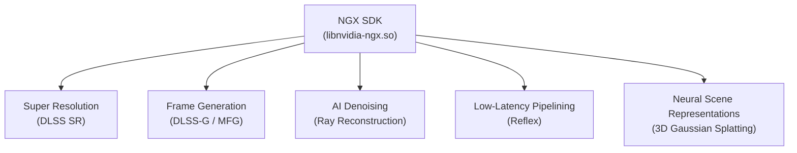
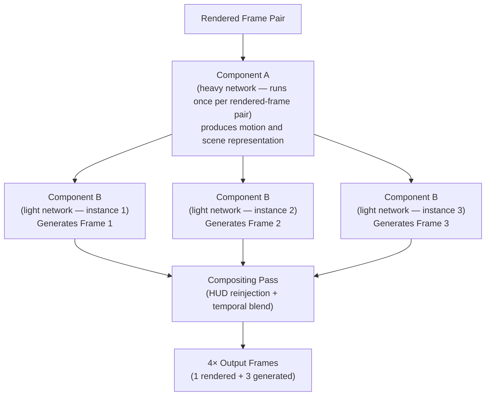
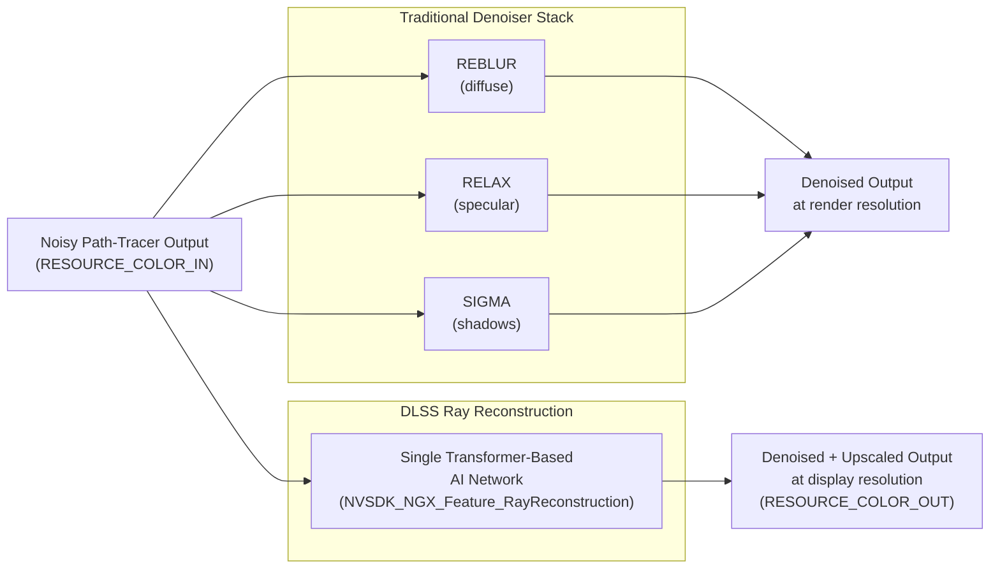
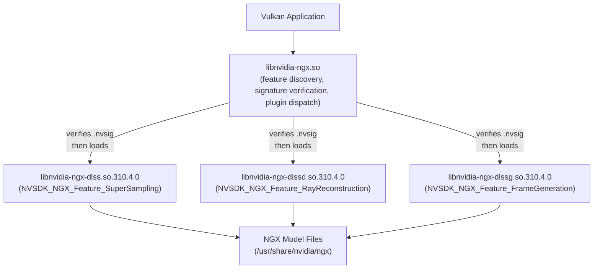
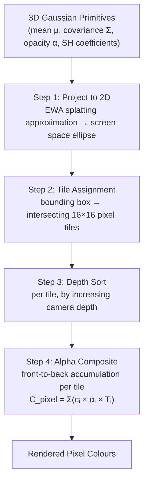
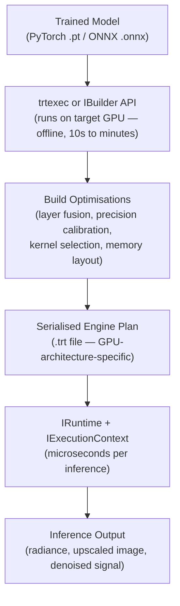

# Chapter 68: DLSS 4, Neural Rendering, and Frame Generation

> **Part**: Part XV — NVIDIA Proprietary Graphics Stack
> **Audience**: Graphics application developers and ML engineers
> **Status**: First draft — 2026-06-15

---

## Table of Contents

1. [Overview](#1-overview)
2. [DLSS Architecture Evolution: From CNN to Transformer](#2-dlss-architecture-evolution-from-cnn-to-transformer)
3. [DLSS 4 Super Resolution Internals](#3-dlss-4-super-resolution-internals)
4. [Multi Frame Generation](#4-multi-frame-generation)
5. [Ray Reconstruction](#5-ray-reconstruction)
6. [The NGX SDK API](#6-the-ngx-sdk-api)
7. [NVIDIA Reflex and LatencyFleX](#7-nvidia-reflex-and-latencyflex)
8. [3D Gaussian Splatting and Neural Scene Representations](#8-3d-gaussian-splatting-and-neural-scene-representations)
9. [OpenUSD and MaterialX in Neural Rendering](#9-openusd-and-materialx-in-neural-rendering)
10. [DLSS on Linux](#10-dlss-on-linux)
11. [Integrations](#11-integrations)
12. [References](#12-references)

---

## 1. Overview

This chapter covers the **NVIDIA** AI-rendering stack as it stood at mid-2026, treating it as an engineering topic rather than a marketing one. The stack has five interlocking pieces: super-resolution (**DLSS SR**), frame generation (**DLSS-G** / **MFG**), AI denoising (**Ray Reconstruction**), low-latency pipelining (**Reflex**), and neural scene representations (**3D Gaussian Splatting** and its variants). All five share a common runtime substrate — the **NGX SDK** — and are relevant to any **Vulkan** application developer working with **NVIDIA** hardware on Linux.

The chapter assumes you are comfortable with the **Vulkan** memory model and synchronisation primitives (Chapter 24), with the open-source **NVIDIA** kernel driver and **NVK** **Mesa** driver (Chapters 9–10), and with **CUDA** compute concepts (Chapter 66). It does not duplicate the **OptiX 9** Cooperative Vectors material found in Chapter 67. The **NGX SDK** ships as part of the binary **NVIDIA** driver; **NVK** users will find the landscape more restricted and are pointed to the relevant limitations in Section 10.



Section 2 traces the architecture evolution from **DLSS 1.0**'s game-specific **CNN** through **DLSS 2**'s temporal accumulation network to **DLSS 4**'s vision transformer (**ViT**) model running in **FP8** on **Tensor Cores**, and covers the second-generation **DLSS 4.5** transformer announced at Computex 2026 with its linear-colour-space inference and **Dynamic MFG** 6× mode.

Section 3 details **DLSS SR** internals: the temporal history buffer and self-attention mechanism that jointly evaluates all spatial positions across frames, **motion vector** integration via `NVSDK_NGX_Parameter_MotionVectorsTexture`, ghosting and artefact suppression through selective temporal attention, and the **`NVSDK_NGX_PerfQuality_Value`** quality mode preset enum that maps render-resolution scaling ratios for **DLAA**, Quality, Balanced, and Ultra Performance modes.

Section 4 covers **Multi Frame Generation** (**MFG**): the split-network design with a heavy **Component A** network amortised across generated frames and a lighter **Component B** network per generated output, the **AI optical flow** model that replaces the hardware **Optical Flow Accelerator** of **Ada Lovelace**, **Blackwell**-specific hardware requirements (**Hardware Flip Metering** and fifth-generation **Tensor Cores** with **FP4** support), the **Dynamic MFG** 6× mode of **DLSS 4.5**, and the **compositing pass** that handles **HUD** reinjection via `NVSDK_NGX_Parameter_HUDLessColor` and temporal blend stabilisation.

Section 5 covers **Ray Reconstruction** (**DLSS-RR**): the unified AI denoiser architecture that replaces the hand-tuned **REBLUR**, **RELAX**, and **SIGMA** denoiser stack with a single transformer network delivering denoised output at display resolution; the eight **G-buffer** input resources including `RESOURCE_COLOR_IN`, `RESOURCE_DIFFUSE_ALBEDO`, `RESOURCE_SPECULAR_ALBEDO`, `RESOURCE_NORMALROUGHNESS`, and `RESOURCE_SPECULAR_HITDISTANCE`; non-obvious integration requirements such as mandatory **HDR** input, **Primary Surface Replacement** (**PSR**) flag handling, and sky motion vector conventions; debugging with the `VK_NVX_raytracing_validation` extension; and the Linux delivery via `libnvidia-ngx-dlssd.so` with its driver version dependencies.

Section 6 describes the **NGX SDK** **API**: the Linux plugin model under **`libnvidia-ngx.so`** with **`.nvsig`** ELF section cryptographic verification gating `libnvidia-ngx-dlss.so`, `libnvidia-ngx-dlssd.so`, and `libnvidia-ngx-dlssg.so`; the **`__NGX_CONF_FILE`** environment variable and model file search paths under `/usr/share/nvidia/ngx`; **Vulkan** initialisation via `NVSDK_NGX_VULKAN_Init_with_ProjectID` and the `nvsdk_ngx_vk.h` entry points; feature creation with `NVSDK_NGX_VULKAN_CreateFeature1` and evaluation with `NVSDK_NGX_VULKAN_EvaluateFeature`; **`NVSDK_NGX_Resource_VK`** and **`NVSDK_NGX_ImageViewInfo_VK`** resource descriptors; and the higher-level **Streamline** open-source **C++** wrapper with `slSetTagForFrame`, `slDLSSGSetOptions`, and `slEvaluateFeature`.

Section 7 covers **NVIDIA Reflex** and **LatencyFleX**: the **CPU** render-ahead latency problem and how **Reflex** inserts a just-in-time **CPU** sleep keyed to GPU completion; the **`VK_NV_low_latency2`** **Vulkan** extension with `vkLatencySleepNV`, `vkSetLatencyMarkerNV`, and `vkGetLatencyTimingsNV`; **Reflex Frame Warp** on **RTX 50 Series** that late-stage reprojects frames to the true camera pose using an AI inpainting network; and **LatencyFleX** (Apache 2.0) as the open Linux alternative operating via the `VK_GOOGLE_display_timing` extension, **DXVK-NVAPI** translation under **Proton**, and the `low_latency_layer` vendor-agnostic **Vulkan** layer.

Section 8 covers **3D Gaussian Splatting** (**3DGS**) and neural scene representations: the differentiable Gaussian rasterisation algorithm with **EWA** splatting, tile-based alpha compositing, and **spherical harmonic** (**SH**) view-dependent colour; the **`gsplat`** **CUDA**-accelerated Python library with the `rasterization` API, low-level **CUDA** kernels (`fully_fused_projection`, `rasterize_to_pixels`, `isect_tiles`), and the `SelectiveAdam` fused optimiser; **3DGUT** (the **3D Gaussian Unscented Transform**, repository `nv-tlabs/3dgrut`) for non-pinhole camera models including fisheye, rolling-shutter, and f-theta optics; the `nvpro-samples/vk_gaussian_splatting` Vulkan sample with **VK3DGSR**, **VK3DGRT**, **VK3DGUT**, and **VK3DGHR** rendering pipelines written in **Slang**; and the challenges of integrating **3DGS** into real-time rasterisation engines — absence of a standard **G-buffer**, mesh depth-buffer occlusion, shadow casting, and analytic **LOD**.

Section 9 covers **OpenUSD** and **MaterialX** in neural rendering: the **HgiVulkan** backend that makes **Vulkan** a first-class rendering path for the **USD Storm** renderer; the **`UsdVolParticleField3DGaussianSplat`** schema introduced in **OpenUSD** 26.03 with its `positions`, `orientations`, `scales`, `opacities`, and `radiance:sphericalHarmonicsCoefficients` attributes; and **MaterialX** 1.39 with the **OpenPBR** shading model and **NVIDIA MDL** (**Material Definition Language**) integration for spectral **RTX** rendering of **`UsdShadeMaterial`**-bound scene geometry.

Section 10 covers **DLSS on Linux**: driver requirements for the proprietary **NVIDIA** driver or **`nvidia-open`** kernel module (**R550+**); feature availability diagnostics via `NVSDK_NGX_VULKAN_GetCapabilityParameters` and the `NVSDK_NGX_Result_FAIL_FeatureNotSupported` return code; **Proton** and **VKD3D-Proton** 3.0 status (including the absence of **DLSS 4 MFG** and the **DLSS Updater** workaround); experimental **NVK** **DLSS** support via `VK_NVX_binary_import` and `VK_NVX_image_view_handle`; the **DLSS2FSR** shim for **AMD** and **Intel** GPU users; and a full Linux feature support matrix.

Section 11 covers **TensorRT** inference optimisation for neural rendering: the build-then-deploy model separating offline engine building from runtime inference; the `trtexec` command-line tool and the **C++** **`IBuilder`** / **`INetworkDefinition`** / `nvonnxparser::IParser` API for converting **ONNX** models to GPU-architecture-specific **`.trt`** engine plans; runtime inference via **`ICudaEngine`**, **`IExecutionContext`**, and `enqueueV3` with **`VK_KHR_external_memory`** interop for **Vulkan** buffer sharing; and **INT8** calibration using **`IInt8EntropyCalibrator2`** for 2–4× latency reduction in denoising and upscaling networks.

---

## 2. DLSS Architecture Evolution: From CNN to Transformer

### 2.1 DLSS 1.0 to DLSS 3: The CNN Era (2018–2022)

DLSS 1.0 (Turing, 2018) applied a convolutional neural network trained to upscale a single low-resolution frame to a target resolution. The network was game-specific, required NVIDIA to train a bespoke model for each title, and produced results that were perceptually good but brittle outside its training distribution. The fundamental limitation was spatial locality: CNNs process pixels through fixed-size receptive fields, making it impossible to aggregate information from distant regions in a single pass.

DLSS 2 (Turing, 2020) solved the game-specificity problem by introducing temporal accumulation: a generalised, game-agnostic CNN ingested the current low-resolution frame alongside a temporal history buffer (several previous frames warped by motion vectors). The history buffer gave the network an effective high-resolution reference and enabled hallucination of fine detail absent from any single input frame. DLSS 2's CNN used a recurrent structure with an explicit motion-compensated blend, and ran at game-agnostic quality across all Turing and later hardware. [Source: NVIDIA DLSS overview](https://www.nvidia.com/en-us/geforce/technologies/dlss/)

DLSS 3 (Ada Lovelace, 2022) kept the temporal CNN super-resolution network from DLSS 2 and added a second network: a frame-generation component that synthesised one additional frame between each rendered pair. Frame generation required a hardware Optical Flow Accelerator present only in Ada Lovelace (RTX 40 Series) GPUs; RTX 30 and 20 Series received DLSS SR improvements but not frame generation.

### 2.2 DLSS 4: Transformer Architecture (Blackwell/Ada, CES 2025)

DLSS 4 replaced the SR CNN with a vision transformer (ViT) model. Transformers use self-attention: each output token is a weighted sum over all input tokens, where the weights are computed dynamically from the content of the inputs. This is the key property that CNNs lack — a transformer has an effectively global receptive field within each attention block, and a stack of blocks provides multi-scale hierarchical aggregation across the entire frame history.

The architectural motivation is direct: high-quality path-traced frames are dominated by specular highlights, sub-pixel geometry, and high-frequency noise patterns that span large spatial regions. A fixed-kernel CNN cannot efficiently correlate a specular reflection with the geometry that produced it six frames ago; a self-attention layer evaluating all spatial and temporal tokens jointly can. [Source: NVIDIA Research DLSS 4 Lab](https://research.nvidia.com/labs/adlr/DLSS4/)

The DLSS 4 transformer has four times the compute and twice the parameter count of the DLSS 3 CNN. It runs in FP8 precision using fifth-generation Tensor Cores on Blackwell and fourth-generation Tensor Cores on Ada. On Ada hardware, where Tensor Core throughput is lower, NVIDIA ships a smaller FP8-quantised variant that preserves the transformer architecture while fitting the available compute budget. [Source: NVIDIA GeForce News DLSS 4](https://www.nvidia.com/en-us/geforce/news/dlss4-multi-frame-generation-ai-innovations/)

The NGX SDK exposes transformer variants through the `NVSDK_NGX_DLSS_Hint_Render_Preset` enum. As of SDK 310.4:

- `NVSDK_NGX_DLSS_Hint_Render_Preset_K` — transformer default for DLAA, Balanced, and Quality modes
- `NVSDK_NGX_DLSS_Hint_Render_Preset_L` (value 12) — transformer default for Ultra Performance mode, optimised for 4K upscaling
- Presets A–E are deprecated; presets G, H, I are reserved

[Source: NVIDIA/DLSS nvsdk_ngx_defs.h on GitHub](https://github.com/NVIDIA/DLSS/blob/main/include/nvsdk_ngx_defs.h)

### 2.3 DLSS 4.5: Second-Generation Transformer (Computex 2026)

Announced at Computex 2026, DLSS 4.5 introduces a second-generation transformer model with 5× the compute of the original DLSS 4 transformer:

- Operates in **linear colour space** (the colour space in which game engines accumulate light transport) rather than the logarithmic space used by predecessor models, preserving the full dynamic range of HDR lighting without tone-mapping compression during inference
- Uses FP8 on RTX 40 and 50 Series; RTX 20/30 Series lack FP8 hardware and pay a higher inference latency penalty
- **Preset M**: new default for Performance mode on RTX 40/50; Preset L updated for Ultra Performance; Preset K recommended for RTX 20/30 users
- Processes 35% more input data and uses 20% more parameters within the same GPU time budget as the first-generation transformer

DLSS 4.5 also introduces 6× Multi Frame Generation (see Section 4.3). [Source: NVIDIA DLSS 4.5 announcement](https://www.nvidia.com/en-us/geforce/news/dlss-4-5-dynamic-multi-frame-gen-6x-2nd-gen-transformer-super-res/)

---

## 3. DLSS 4 Super Resolution Internals

### 3.1 Temporal History Buffer and Self-Attention

The DLSS 4 SR network receives a multi-frame input: the current jittered low-resolution (rendered) frame and N previous frames, each warped into the current frame's reference frame using per-pixel motion vectors from the game's G-buffer. Subpixel jitter (a Halton sequence shifted each frame) provides the additional information needed to reconstruct frequencies above the render resolution's Nyquist limit. Self-attention in the transformer jointly evaluates all spatial positions across all temporal frames, allowing the network to correlate a noisy pixel in the current frame with its stable counterpart accumulated over several frames — even when large object motion means that counterpart is spatially distant.

### 3.2 Motion Vector Integration and Temporal Alignment

Motion vectors are supplied by the application as a screen-space 2D displacement field (`NVSDK_NGX_Parameter_MotionVectorsTexture`). The network learns to identify when motion vectors are unreliable — specular highlights, screen-space reflections, translucent surfaces, UI elements — and falls back to AI-predicted correspondence for those regions. This is a direct improvement over DLSS 2's explicit blending weight, which was hand-tuned and struggled at depth discontinuities.

For correct temporal alignment, applications must supply:

- `NVSDK_NGX_Parameter_Color` — current jittered low-resolution frame (HDR or LDR)
- `NVSDK_NGX_Parameter_MotionVectors` — 2D screen-space motion vector texture
- `NVSDK_NGX_Parameter_Depth` — per-pixel depth texture (required for motion vector dilution at edges)
- `NVSDK_NGX_Parameter_ExposureTexture` — optional 1×1 texture carrying per-frame exposure scale; if absent, auto-exposure runs inside NGX

The output is `NVSDK_NGX_Parameter_Output` at the target (display) resolution.

### 3.3 Ghosting, Aliasing, and Artefact Suppression

DLSS 4's ghosting suppression comes from the transformer's ability to attend selectively to earlier frames: if a pixel is undergoing disocclusion (newly revealed as the camera moves), self-attention over the temporal sequence gives the network evidence of the colour change, and confidence for that pixel's accumulation is reduced automatically. The network is not explicitly told "this pixel is disoccluded"; it infers it from the input distribution.

Geometric edge reconstruction is improved over DLSS 3 because the transformer's multi-scale attention sees the full context of an edge across scales — the edge's orientation, its neighbours, its temporal history — rather than the limited kernel neighbourhood available to a CNN.

> **Note: needs verification.** NVIDIA does not publish the DLSS loss function or per-pixel confidence estimation mechanism. The published statements are that the model was trained with a "perceptual loss balancing PSNR and sharpness" and that "confidence estimation" is performed per-pixel, but the exact loss terms, weighting schedules, and confidence formulation are proprietary and not disclosed in public SDK documentation as of mid-2026.

### 3.4 Quality Mode Presets

The `NVSDK_NGX_PerfQuality_Value` enum maps to render-resolution scaling ratios:

```c
// nvsdk_ngx_defs.h — quality mode enum
// Source: https://github.com/NVIDIA/DLSS/blob/main/include/nvsdk_ngx_defs.h
typedef enum NVSDK_NGX_PerfQuality_Value {
    NVSDK_NGX_PerfQuality_Value_MaxPerf         = 0,  // 3× upscale (Ultra Performance)
    NVSDK_NGX_PerfQuality_Value_Balanced        = 1,  // ~1.7× upscale
    NVSDK_NGX_PerfQuality_Value_MaxQuality      = 2,  // 1.5× upscale (Quality)
    NVSDK_NGX_PerfQuality_Value_UltraPerformance= 3,  // 3× upscale (alias)
    NVSDK_NGX_PerfQuality_Value_UltraQuality    = 4,  // 1.3× upscale
    NVSDK_NGX_PerfQuality_Value_DLAA            = 5,  // 1× (native AA, no upscale)
} NVSDK_NGX_PerfQuality_Value;
```

Use `NVSDK_NGX_DLSS_GetOptimalSettingsCallback` (a `PFN_NVSDK_NGX_DLSS_GetOptimalSettingsCallback` function pointer, registered via `NVSDK_NGX_Parameter`) to retrieve the optimal render resolution for a given display resolution and quality mode rather than hardcoding the ratios above; the transformer models may use slightly different ratios than the CNN predecessors.

---

## 4. Multi Frame Generation

### 4.1 Split-Network Architecture

DLSS 4 Multi Frame Generation (MFG) generates up to three additional frames per rendered frame, yielding 4× the display frame rate from a single rendered frame. The key architectural innovation that makes this computationally feasible is a split-network design:

- **Component A** — a heavier network that runs once per rendered-frame pair, producing a rich motion and scene representation shared by all generated frames
- **Component B** — a lighter network that runs once per generated output frame, consuming the Component A representation to synthesise each individual frame

For four output frames per rendered pair, the cost is: one A pass + three B passes. The expensive A pass is amortised across all generated frames, reducing the per-frame cost compared to running a single full network three times. This design achieves approximately 1ms per generated 4K frame on RTX 5090, versus 3.25ms per generated frame for DLSS 3's single-network Frame Generation on RTX 4090. [Source: NVIDIA Research DLSS 4](https://research.nvidia.com/labs/adlr/DLSS4/)



### 4.2 AI Optical Flow

DLSS 3 Frame Generation relied on the hardware Optical Flow Accelerator in Ada Lovelace. DLSS 4 MFG replaces this with an AI optical flow model that generates a dense per-pixel motion field from consecutive rendered frames. The network learns to identify when game-engine motion vectors are reliable (rigid geometry with correct depth continuity) versus when they must be supplemented by learned correspondence (specular highlights, mirrors, translucent surfaces, UI elements that carry no geometric motion vector).

The AI optical flow does not discard the game's motion vectors; it learns to "understand and optimise" the blend between them and its own predictions. This allows MFG to produce stable generated frames in scenes that defeat purely geometric flow estimation, such as dynamic water surfaces or animated materials. [Source: NVIDIA GeForce News DLSS 4](https://www.nvidia.com/en-us/geforce/news/dlss4-multi-frame-generation-ai-innovations/)

### 4.3 Hardware Requirements: Blackwell-Specific Features

MFG is exclusive to RTX 50 Series (Blackwell) for two hardware reasons:

**Hardware Flip Metering**: Blackwell's display engine includes a dedicated unit that controls the precise timing of frame presentation to the display, reducing frame display variability by 5–10× compared to software-based frame pacing. This moves the responsibility for even frame spacing from the driver's presentation queue logic into fixed-function display hardware. Without it, generating three synthetic frames between two rendered frames produces irregular frame intervals that cause perceptible stutter even when the content is otherwise high quality.

**Fifth-Generation Tensor Cores**: Blackwell Tensor Cores offer 2.5× AI throughput versus fourth-generation (Ada), and add INT4 and FP4 precision modes. FP4 doubles throughput over FP8 while halving weight memory requirements — essential for fitting the Component A network's larger parameter set within the available inference budget. [Source: NVIDIA RTX 50 Series announcement](https://www.nvidia.com/en-us/geforce/news/rtx-50-series-graphics-cards-gpu-laptop-announcements/)

> **Note: why >4× is unstable.** NVIDIA states that generating more than three synthetic frames between rendered frames introduces stability artefacts for fast-motion content due to compounding errors in optical flow prediction and temporal accumulation. The 4× limit is a quality threshold, not a hard hardware constraint. DLSS 4.5's 6× mode approaches this limit using the more accurate second-generation transformer model, with Dynamic MFG adjusting multiplier in real time based on content velocity.

### 4.4 DLSS 4.5 Dynamic MFG (6× Mode)

DLSS 4.5 (Spring 2026, RTX 50 Series only) adds:

- **6× MFG**: synthesises five additional frames per rendered frame at peak
- **Dynamic MFG**: the multiplier shifts automatically in real time — from 2× to 6× — matched to display refresh rate (120, 144, 240+ Hz) and content velocity
- Up to 35% frame rate increase for 4K path-traced scenes versus static 4× MFG

Reported real-world multipliers range from 4.7× to 8.2× across tested titles; at peak 6× MFG, fifteen out of every sixteen pixels in the displayed stream are AI-generated. [Source: NVIDIA DLSS 4.5](https://www.nvidia.com/en-us/geforce/news/dlss-4-5-dynamic-multi-frame-gen-6x-2nd-gen-transformer-super-res/)

The feature ID in NGX for frame generation is `NVSDK_NGX_Feature_FrameGeneration = 11`. Dynamic MFG is configured through additional Streamline `sl::DLSSGOptions` fields; the multiplier selection is driver-side and not directly programmable by the application.

### 4.5 MFG Compositing Pass

After the Component B network synthesises each generated frame, MFG performs a final **compositing pass** that blends the generated frames with the rendered frames before presentation. This pass is the last step in the MFG pipeline and serves two functions:

1. **HUD and UI overlay reinjection**: Game UI elements (health bars, minimaps, crosshairs) are rendered at full frame rate and composited on top of generated frames. The application marks UI layers via `NVSDK_NGX_Parameter_HUDLessColor` — a pre-UI render target — alongside the full-colour output. MFG uses the difference to isolate and reapply the HUD at the correct per-generated-frame position, rather than interpolating HUD elements (which carry no motion vectors and would otherwise smear or double-expose).

2. **Temporal blend stabilisation**: The compositing pass applies a stability weight that blends a small fraction of the nearest rendered frame into each generated frame to suppress any residual high-frequency artefacts from the B network. The blend weight is content-adaptive — it is higher for regions with large optical flow magnitude (fast motion) and near zero for static scene regions.

The compositing pass runs entirely on the GPU display engine in Blackwell's Hardware Flip Metering path; it does not re-enter the Tensor Core inference pipeline. On Ada (DLSS 3 FG), an equivalent software compositing blit was performed in the driver's presentation queue before the frame was handed to the DWM/KMS layer. Applications using Streamline do not call the compositing pass directly; `slDLSSGSetOptions` with a valid `sl::DLSSGOptions::hudLessColor` tag is sufficient to enable the full pipeline including the composite step.

---

## 5. Ray Reconstruction

### 5.1 Unified AI Denoiser Architecture

DLSS Ray Reconstruction (DLSS-RR, introduced with Ada Lovelace) replaces the entire stack of hand-tuned spatiotemporal denoisers — REBLUR (ReBlur, for diffuse), RELAX (for specular), and SIGMA (for shadows) — with a single transformer-based AI network. Traditional denoisers operate on statistical assumptions about noise distributions and surface correlations; they require careful per-effect hand-tuning and degrade for effects outside their design assumptions (e.g., multi-bounce specular, participating media). [Source: NVIDIA AI Decoded — Ray Reconstruction](https://blogs.nvidia.com/blog/ai-decoded-ray-reconstruction/)



The RR network was trained on path-traced ground truth across a dataset five times more diverse than the dataset used for DLSS 3's denoiser integration, covering global illumination, caustics, volumetric scattering, and the full range of material types. Critically, the network also handles upscaling — its output is at display resolution — combining the previously separate denoising and SR steps into a single inference pass. When DLSS-RR is enabled, it overrides DLSS SR; the two are not combined.

### 5.2 Required G-Buffer Inputs

DLSS-RR processes eight input resources. These are set via Streamline resource tags or directly via NGX parameters:

| Resource Tag | Format | Description |
|---|---|---|
| `RESOURCE_COLOR_IN` | RGBA16F / RGBA32F | Noisy path-tracer output at render resolution (1–4 spp typical) |
| `RESOURCE_COLOR_OUT` | RGBA16F | Denoised, upscaled output at display resolution |
| `RESOURCE_DIFFUSE_ALBEDO` | RGBA8 / RGBA16F | Diffuse surface reflectance |
| `RESOURCE_SPECULAR_ALBEDO` | RGBA8 / RGBA16F | Specular reflectance integrated over hemisphere |
| `RESOURCE_NORMALROUGHNESS` | RGBA8 | Surface normals (XYZ in [−1,1]) + linear roughness in W |
| `RESOURCE_MOTIONVECTOR` | RG16F | 2D screen-space motion vectors (current → previous frame) |
| `RESOURCE_LINEARDEPTH` | R32F | Linear depth: `−(worldToView × hitPosition).z` |
| `RESOURCE_SPECULAR_HITDISTANCE` | R16F | (Optional) Primary-to-secondary hit distance |

[Source: nvpro-samples/vk_denoise_dlssrr](https://github.com/nvpro-samples/vk_denoise_dlssrr)

### 5.3 Integration Requirements and Edge Cases

Several integration requirements are non-obvious and cause silent quality degradation if violated:

**HDR mandatory**: `colorBuffersHDR` must be `sl::Boolean::eTrue`. LDR input pipelines are not supported; the network was trained on linear HDR values and will produce tonally incorrect output on LDR input.

**Normal-roughness packing**: roughness can be packed into the W channel of the normal texture (`normalRoughnessMode = ePacked`), halving the resource count for the normal + roughness pair.

**Matrix convention**: row-major matrices with row-vector left-multiplication are expected. Column-major matrices (the OpenGL/GLSL convention) must be transposed before submission.

**Primary Surface Replacement (PSR)**: for mirror-like surfaces where the path tracer records G-buffer data at the virtual world position of the reflected surface rather than the mirror surface itself, DLSS-RR must be informed via `isPSR = true`. Without this flag, temporal reprojection will be incorrect at specular reflections.

**Sky handling**: sky pixels lack geometric depth; their motion vectors should project the camera's view direction as a point at infinite distance, not screen-space zero. This prevents the sky from ghosting when the camera rotates.

### 5.4 Debugging Ray Reconstruction with VK_NVX_raytracing_validation

When integrating DLSS-RR into a path-traced Vulkan pipeline, shader or BVH defects can produce input noise patterns that the denoiser cannot recover. The `VK_NVX_raytracing_validation` extension (enabled at device creation alongside the standard RT extensions) inserts driver-level validation of ray tracing operations: it checks for degenerate triangles, out-of-bounds access in shader binding tables, invalid instance transforms, and NaN/Inf values in ray origins and directions. When a validation error is detected, the extension emits a `VK_DEBUG_UTILS_MESSAGE_TYPE_VALIDATION_BIT_EXT` message via the standard debug messenger, optionally halting execution on the offending dispatch.

Enable during development:

```c
const char *devExtensions[] = {
    VK_KHR_RAY_TRACING_PIPELINE_EXTENSION_NAME,
    VK_NVX_RAYTRACING_VALIDATION_EXTENSION_NAME,  // debug only
    /* ... */
};
```

Because DLSS-RR ingests the raw noisy path-tracer output and denoises it in a single pass, artefacts that a traditional denoiser would partially mask (such as fireflies from NaN ray hits) will be visible in DLSS-RR output and can corrupt the network's temporal accumulation across multiple frames. Running with `VK_NVX_raytracing_validation` during integration lets developers isolate these at source before attributing them to the denoiser. Disable the extension in release builds; it carries non-trivial GPU overhead.

### 5.5 DLSS-RR on Linux

On Linux, DLSS-RR is delivered as `libnvidia-ngx-dlssd.so.310.4.0`. As of SDK 310.4.0, the CUDA/OptiX entry points for DLSS-RR returned `NVSDK_NGX_Result_FAIL_FeatureNotSupported` (`0xbad00001`) on public drivers. **SDK 310.5.3** resolved this: full DLSS-RR via CUDA/OptiX on Linux became available with driver 590.44.01+ on GeForce RTX 5090. Vulkan interop (submitting VkImages to the NGX Vulkan API directly) worked in SDK 310.4.0 and remains the recommended path for pure-Vulkan applications. NVIDIA Omniverse Kit versions below 106.5.3 cannot use DLSS-RR on Linux Blackwell GPUs. [Source: NVIDIA Developer Forums, NGX DLSS-RR Linux thread](https://forums.developer.nvidia.com/t/ngx-reports-dlss-rr-as-unavailable-on-linux/353770)

The feature ID is `NVSDK_NGX_Feature_RayReconstruction = 13`.

---

## 6. The NGX SDK API

### 6.1 Linux Library Architecture

On Linux, the NGX runtime follows a plugin model:

- **Main library**: `/usr/lib/x86_64-linux-gnu/libnvidia-ngx.so` — handles feature discovery, signature verification, and plugin dispatch
- **Feature plugins**: follow the naming scheme `libnvidia-ngx-dl{feature}.so`:
  - `libnvidia-ngx-dlss.so.310.4.0` — DLSS SR (`NVSDK_NGX_Feature_SuperSampling`)
  - `libnvidia-ngx-dlssd.so.310.4.0` — DLSS RR (`NVSDK_NGX_Feature_RayReconstruction`)
  - `libnvidia-ngx-dlssg.so.310.4.0` — Frame Generation (`NVSDK_NGX_Feature_FrameGeneration`)

Each feature library carries a `.nvsig` ELF section that `libnvidia-ngx.so` verifies cryptographically before loading. This prevents replacement of NGX feature libraries with unauthorised builds — a significant constraint for open-source efforts (see Section 10). NGX is distributed as part of the binary NVIDIA display driver (since driver 450.51). [Source: NVIDIA driver README — NGX chapter](https://download.nvidia.com/XFree86/Linux-x86_64/455.38/README/ngx.html)



Model file search order on Linux:
1. `__NGX_CONF_FILE` environment variable (path to a JSON config)
2. `${XDG_CONFIG_HOME}/nvidia-ngx-config.json`
3. `/usr/share/nvidia/nvidia-ngx-config.json`

The config JSON:

```json
{
  "file_format_version": "1.0.0",
  "ngx_models_path": "/usr/share/nvidia/ngx",
  "allow_ngx_updater": false
}
```

The NGX Updater requires write access to `/usr/share/` on Linux, which is problematic on production systems and containers. Setting `allow_ngx_updater: false` and pre-populating `/usr/share/nvidia/ngx` (or overriding via `__NGX_CONF_FILE`) is the recommended approach for server deployments. [Source: NVIDIA Dev Forums NGX config](https://forums.developer.nvidia.com/t/dlss-ngx-ignores-config-on-linux-and-requires-write-access-to-usr-share/356828)

### 6.2 Vulkan Initialisation

All NGX Vulkan entry points live in `nvsdk_ngx_vk.h`. The Vulkan device must be created with the extensions NGX requires; query them before device creation:

```c
// nvsdk_ngx_vk.h — pre-device extension queries
// Source: https://github.com/NVIDIA/DLSS/blob/main/include/nvsdk_ngx_vk.h

// Query required instance extensions
NVSDK_NGX_Result NVSDK_CONV
NVSDK_NGX_VULKAN_GetFeatureInstanceExtensionRequirements(
    const NVSDK_NGX_FeatureDiscoveryInfo *FeatureDiscoveryInfo,
    uint32_t                             *OutExtensionCount,
    VkExtensionProperties               **OutExtensionProperties);

// Query required device extensions (after VkInstance creation)
NVSDK_NGX_Result NVSDK_CONV
NVSDK_NGX_VULKAN_GetFeatureDeviceExtensionRequirements(
    VkInstance                            Instance,
    VkPhysicalDevice                      PhysicalDevice,
    const NVSDK_NGX_FeatureDiscoveryInfo *FeatureDiscoveryInfo,
    uint32_t                             *OutExtensionCount,
    VkExtensionProperties               **OutExtensionProperties);
```

Commonly required extensions include `VK_KHR_timeline_semaphore` (for synchronisation across NGX evaluate calls), `VK_KHR_external_memory` (for cross-process/CUDA buffer sharing), and `VK_NV_low_latency2` (for Reflex integration). Frame Generation additionally requires `VK_NV_optical_flow` on Ada hardware (replaced by AI flow on Blackwell, but the extension may still be requested for compatibility).

Initialise NGX after device creation:

```c
// nvsdk_ngx_vk.h — initialisation with project ID (recommended form)
NVSDK_NGX_Result NVSDK_CONV NVSDK_NGX_VULKAN_Init_with_ProjectID(
    const char                      *InProjectId,       // UUID string
    NVSDK_NGX_EngineType             InEngineType,      // e.g., NVSDK_NGX_ENGINE_TYPE_CUSTOM
    const char                      *InEngineVersion,
    const wchar_t                   *InApplicationDataPath, // log/cache dir
    VkInstance                       InInstance,
    VkPhysicalDevice                 InPD,
    VkDevice                         InDevice,
    PFN_vkGetInstanceProcAddr        InGIPA,
    PFN_vkGetDeviceProcAddr          InGDPA,
    const NVSDK_NGX_FeatureCommonInfo *InFeatureInfo,   // may be NULL
    NVSDK_NGX_Version                InSDKVersion);     // NVSDK_NGX_VERSION_API_MACRO
```

### 6.3 Feature Creation and Evaluation

```c
// Create a feature handle (e.g., DLSS SR)
NVSDK_NGX_Result NVSDK_CONV NVSDK_NGX_VULKAN_CreateFeature1(
    VkDevice              InDevice,
    VkCommandBuffer       InCmdList,   // commands recorded inside
    NVSDK_NGX_Feature     InFeatureID, // e.g., NVSDK_NGX_Feature_SuperSampling
    NVSDK_NGX_Parameter  *InParameters,
    NVSDK_NGX_Handle    **OutHandle);

// Evaluate (dispatch) a feature
NVSDK_NGX_Result NVSDK_CONV NVSDK_NGX_VULKAN_EvaluateFeature(
    VkCommandBuffer         InCmdList,
    const NVSDK_NGX_Handle *InFeatureHandle,
    const NVSDK_NGX_Parameter *InParameters,
    PFN_NVSDK_NGX_ProgressCallback InCallback); // may be NULL
```

Important: **the NGX API is not thread-safe**. Applications must ensure that `EvaluateFeature` is not called concurrently with parameter modification or feature destruction from another thread.

### 6.4 Resource Descriptors

NGX Vulkan resources are wrapped in typed descriptors:

```c
// nvsdk_ngx_vk.h — image and resource descriptors
typedef struct NVSDK_NGX_ImageViewInfo_VK {
    VkImageView           ImageView;
    VkImage               Image;
    VkImageSubresourceRange SubresourceRange;
    VkFormat              Format;
    unsigned int          Width;
    unsigned int          Height;
} NVSDK_NGX_ImageViewInfo_VK;

typedef struct NVSDK_NGX_Resource_VK {
    union {
        NVSDK_NGX_ImageViewInfo_VK ImageViewInfo;
        NVSDK_NGX_BufferInfo_VK    BufferInfo;
    } Resource;
    NVSDK_NGX_Resource_VK_Type Type;
    bool                       ReadWrite;
} NVSDK_NGX_Resource_VK;
```

### 6.5 Streamline: Higher-Level Integration

Streamline is NVIDIA's open-source C++ wrapper over NGX that provides cleaner resource tagging, frame-token management, and cross-feature coordination. Most applications should prefer Streamline over raw NGX:

```cpp
// Streamline initialisation and resource tagging
// Source: https://github.com/NVIDIA-RTX/Streamline

sl::Result slInit(const sl::Preferences &pref, uint64_t sdkVersion = sl::kSDKVersion);

// Tag resources for a frame
sl::Result slSetTagForFrame(
    const sl::FrameToken    &frame,
    const sl::ViewportHandle &viewport,
    const sl::ResourceTag   *resources,
    uint32_t                 numResources,
    sl::CommandBuffer       *cmdBuffer);

// DLSS-G configuration
sl::Result slDLSSGSetOptions(const sl::ViewportHandle &vp, const sl::DLSSGOptions &opts);
sl::Result slDLSSGGetState(const sl::ViewportHandle &vp, sl::DLSSGState &state);

// Evaluate any feature
sl::Result slEvaluateFeature(
    sl::Feature              feature,
    const sl::FrameToken    &frame,
    const sl::BaseStructure **inputs,
    uint32_t                 numInputs,
    sl::CommandBuffer       *cmdBuffer);
```

Resource lifecycle flags control when Streamline copies tagged resources:

```cpp
sl::ResourceLifecycle::eOnlyValidNow      // SL copies immediately on tagging
sl::ResourceLifecycle::eValidUntilPresent // valid until swapchain present
sl::ResourceLifecycle::eValidUntilEvaluate // valid until slEvaluateFeature returns
```

[Source: Streamline ProgrammingGuideDLSS_G.md](https://github.com/NVIDIA-RTX/Streamline/blob/main/docs/ProgrammingGuideDLSS_G.md)

---

## 7. NVIDIA Reflex and LatencyFleX

### 7.1 The Latency Problem: CPU Render-Ahead

Modern GPU-driven applications typically queue multiple frames of CPU work ahead of GPU execution — the "render-ahead" depth. This buffering maximises GPU utilisation but introduces a fundamental latency floor: an input event (mouse click, key press) captured during frame N will not affect the displayed image until the CPU has finished building frame N, submitted it to the GPU command queue, and the GPU has completed rasterisation and composition. For a triple-buffered application at 60fps, this can be 50–80ms of latency before the display reflects the input.

NVIDIA Reflex addresses this by inserting a CPU sleep into the render loop at the point just before the application samples input state. The sleep duration is computed dynamically: the driver tracks when the GPU becomes idle between frames, and schedules the CPU wakeup to arrive just in time to feed the GPU a new frame without a GPU stall. The effect is that the application's GPU utilisation is unchanged, but the CPU thread is no longer racing ahead; it is coupled tightly to the GPU's actual completion cadence. This just-in-time scheduling reduces the age of the input sample captured at the start of each frame, directly reducing input-to-photon latency.

### 7.2 Vulkan API: `VK_NV_low_latency2`

The Vulkan-native surface for Reflex is the `VK_NV_low_latency2` extension (the older `VK_NV_low_latency` extension covers legacy Reflex 1 applications). Enable it at device creation:

```c
// Enable at VkDevice creation
const char *deviceExtensions[] = { "VK_NV_low_latency2", /* ... */ };
```

Then attach a `VkSwapchainLatencyCreateInfoNV` at swapchain creation to opt into driver pacing:

```c
// Attach to VkSwapchainCreateInfoKHR::pNext
VkSwapchainLatencyCreateInfoNV latencyInfo = {
    .sType = VK_STRUCTURE_TYPE_SWAPCHAIN_LATENCY_CREATE_INFO_NV,
    .latencyModeEnable = VK_TRUE,
};
```

Each frame, before sampling input state, call `vkLatencySleepNV` with a semaphore that the driver will signal when it is time to begin CPU work:

```c
VkLatencySleepInfoNV sleepInfo = {
    .sType              = VK_STRUCTURE_TYPE_LATENCY_SLEEP_INFO_NV,
    .signalSemaphore    = latencySemaphore, // VkSemaphore with timeline support
    .value              = frameIndex,       // timeline semaphore value to signal
};
vkLatencySleepNV(device, swapchain, &sleepInfo);
// Wait for semaphore (driver signals when right time to start frame CPU work)
```

Record pipeline stage timestamps for driver-side latency analysis with `vkSetLatencyMarkerNV`:

```c
VkSetLatencyMarkerInfoNV markerInfo = {
    .sType        = VK_STRUCTURE_TYPE_SET_LATENCY_MARKER_INFO_NV,
    .presentID    = frameIndex,
    .marker       = VK_LATENCY_MARKER_SIMULATION_START_NV,
};
vkSetLatencyMarkerNV(device, swapchain, &markerInfo);
// Marker values include: SIMULATION_START, SIMULATION_END,
//   RENDERSUBMIT_START, RENDERSUBMIT_END, PRESENT_START, PRESENT_END,
//   INPUT_SAMPLE, TRIGGER_FLASH, OUT_OF_BAND_RENDERSUBMIT_START, etc.
```

Retrieve per-frame latency breakdowns with `vkGetLatencyTimingsNV` (returns `VkLatencyTimingsFrameReportNV` array). [Source: VK_NV_low_latency2 Vulkan Registry](https://registry.khronos.org/vulkan/specs/1.3-extensions/man/html/VK_NV_low_latency2.html)

If using Streamline, the equivalent calls are:

```cpp
// Streamline Reflex (from ProgrammingGuideReflex.md)
sl::ReflexOptions reflexOptions{};
reflexOptions.mode = sl::ReflexMode::eLowLatency; // or eOff, eLowLatencyWithBoost
reflexOptions.frameLimitUs = targetFrameTimeUs;   // optional frame cap
slReflexSetOptions(reflexOptions);

// Each frame, before input sampling:
sl::FrameToken *currentFrame{};
slGetNewFrameToken(&currentFrame);
slReflexSleep(*currentFrame);

// Pipeline markers for analysis:
slPCLSetMarker(sl::PCLMarker::eSimulationStart, *currentFrame);
```

[Source: Streamline ProgrammingGuideReflex.md](https://github.com/NVIDIA-RTX/Streamline/blob/main/docs/ProgrammingGuideReflex.md)

### 7.3 Reflex Frame Warp

Complementary to the sleep-based latency reduction, **Reflex Frame Warp** (RTX 50 Series) performs a late-stage reprojection step: after the GPU renders a frame at a predicted camera pose, the display engine warps the frame to the true camera pose derived from the most recent input sample, just before display. Disocclusion holes introduced by the warp are filled using an AI inpainting network that uses the rendered G-buffer, historical frames, and near-future camera motion. Reported latency improvements: THE FINALS 56ms → 14ms; Avowed 114ms → 43ms (62% reduction). Frame Warp is a driver-level feature controlled via `slReflexSetOptions` and does not require additional application code beyond Reflex Low Latency integration. [Source: NVIDIA Research DLSS 4](https://research.nvidia.com/labs/adlr/DLSS4/)

### 7.4 LatencyFleX: Open Linux Alternative

LatencyFleX (Apache 2.0, developed by Tatsuyuki Ishi) implements the same just-in-time scheduling concept as Reflex without requiring NvAPI or proprietary driver support, making it functional on AMD and Intel hardware as well as NVIDIA under open drivers. [Source: LatencyFleX GitHub](https://github.com/ishitatsuyuki/LatencyFleX)

The core algorithm tracks the present queue depth via Vulkan presentation timing (the `VK_GOOGLE_display_timing` extension) and computes a sleep duration that keeps CPU work arriving at the GPU just in time — the same feedback loop that Reflex implements in firmware. The overhead introduced per frame is minimal; the principal trade-off is that LatencyFleX introduces a small amount of frame-time jitter as part of its scheduling algorithm, which is usually imperceptible given normal game-engine variance.

Linux deployment installs two components:

```bash
# Debian/Ubuntu paths
/usr/lib/x86_64-linux-gnu/liblatencyflex_layer.so     # Vulkan implicit layer
/usr/share/vulkan/implicit_layer.d/latencyflex.json   # layer manifest

# Enable for a Proton prefix
LFX=1 DXVK_NVAPI_DRIVER_VERSION=49729 %command%
```

DXVK-NVAPI (version ≥ 0.5.3) translates Reflex NvAPI calls from Windows games to LatencyFleX's Vulkan layer, so games that use Reflex natively on Windows automatically use LatencyFleX when running under Proton on Linux. Chapter 29 covers LatencyFleX configuration and MangoHud latency visualisation in depth; this chapter covers only the NVIDIA-Reflex side of the contract.

The `low_latency_layer` open Vulkan layer (2025) extends this approach, implementing both Reflex and AMD Anti-Lag 2 semantics as a GPU-vendor-agnostic Vulkan layer, further reducing dependency on proprietary driver support. [Source: Phoronix, Open Vulkan layer brings Reflex and Anti-Lag 2 to Linux](https://www.phoronix.com/news/Vulkan-1.3.266-Released)

---

## 8. 3D Gaussian Splatting and Neural Scene Representations

### 8.1 Algorithm: Differentiable Gaussian Rasterisation

3D Gaussian Splatting (3DGS), introduced by Kerbl et al. at SIGGRAPH 2023 ([arXiv:2308.04079](https://arxiv.org/abs/2308.04079)), represents a reconstructed scene as a set of N 3D Gaussian primitives. Each Gaussian carries:

- **Mean position** μ ∈ ℝ³ — world-space centre
- **Covariance matrix** Σ ∈ ℝ³ˣ³ — factored as rotation quaternion **q** ∈ ℝ⁴ and scale vector **s** ∈ ℝ³, giving Σ = R S Sᵀ Rᵀ where R = rot(**q**) and S = diag(**s**)
- **Opacity** α ∈ [0,1]
- **Spherical harmonic coefficients** for view-dependent colour (degree 0–3, up to 48 scalars per Gaussian)

Rendering follows tile-based alpha compositing:



1. Project each 3D Gaussian through the camera model to a 2D screen-space ellipse using the EWA splatting approximation
2. Compute a bounding box and assign the Gaussian to all intersecting 16×16 pixel tiles
3. Sort Gaussians per tile by increasing camera depth
4. Alpha-composite front-to-back within each tile:

```math
C_pixel = Σᵢ (cᵢ × αᵢ × Tᵢ),   Tᵢ = Πⱼ<ᵢ (1 − αⱼ)
```

Training uses differentiable rasterisation: gradients flow back through the compositing and projection steps via autograd, updating μ, **q**, **s**, α, and SH coefficients by Adam optimisation on a set of posed training images. At inference (rendering), the gradient computation is omitted; render throughput reaches 100–200+ FPS at 1080p on RTX hardware for scenes of moderate Gaussian count. [Source: gsplat mathematical supplement, arXiv:2312.02121](https://arxiv.org/abs/2312.02121)

### 8.2 gsplat: CUDA-Accelerated Library

`gsplat` (nerfstudio-project, Apache 2.0) is the primary open-source Python library for differentiable 3DGS training and inference. It provides hand-written CUDA kernels wrapped in PyTorch autograd functions. [Source: github.com/nerfstudio-project/gsplat](https://github.com/nerfstudio-project/gsplat)

```bash
# Installation
pip install gsplat
# or from source (requires CUDA 11.8–13.0, PyTorch 2.0+)
pip install git+https://github.com/nerfstudio-project/gsplat.git
```

The high-level entry point covers both training and inference:

```python
# gsplat high-level API
# Source: https://docs.gsplat.studio/main/apis/rasterization.html
from gsplat import rasterization

render_colors, render_alphas, meta = rasterization(
    means,      # [..., N, 3]    — Gaussian centers (world space)
    quats,      # [..., N, 4]    — rotation quaternions (w, x, y, z)
    scales,     # [..., N, 3]    — scale vectors
    opacities,  # [..., N]       — per-Gaussian opacity
    colors,     # [..., (C,) N, D] — RGB or SH coefficients
    viewmats,   # [..., C, 4, 4] — world-to-camera transforms
    Ks,         # [..., C, 3, 3] — camera intrinsic matrices
    width,      # int — output width in pixels
    height,     # int — output height in pixels
    near_plane=0.01,
    far_plane=1e10,
    render_mode="RGB",   # "D" for depth, "RGB+D" for both
    sh_degree=3,         # spherical harmonic degree (0 = view-independent)
    packed=True,         # sparse COO format (memory efficient)
    camera_model="pinhole",  # "ortho", "fisheye", "ftheta"
)
# render_colors: [..., C, H, W, channels]
# render_alphas: [..., C, H, W, 1]
# meta: dict — radii, means2d, depths, conics, tile intersections, etc.
```

The low-level CUDA pipeline is exposed via `gsplat.cuda._wrapper`:

```python
# Low-level CUDA kernel access
# Source: https://github.com/nerfstudio-project/gsplat/blob/main/gsplat/cuda/_wrapper.py
from gsplat.cuda._wrapper import (
    fully_fused_projection,   # project 3D Gaussians to 2D (fused kernel)
    isect_tiles,              # map Gaussians to 16×16 screen tiles
    isect_offset_encode,      # encode tile offsets for sorted access
    rasterize_to_pixels,      # alpha composite depth-sorted Gaussians per tile
    spherical_harmonics,      # evaluate SH colour at view direction
    quat_scale_to_covar_preci, # convert (q,s) to covariance + precision matrices
)
```

`fully_fused_projection` combines the covariance computation, world-to-camera transform, and 2D EWA projection into a single CUDA kernel to minimise memory bandwidth. `rasterize_to_pixels` is the inner render loop: it iterates depth-sorted Gaussians tile by tile and accumulates contributions, supporting an `absgrad` mode for absolute-value gradient tracking useful in density control during training.

gsplat v1.5.0 (May 2025) brings a 3.5× faster CUDA compilation time (4m19s → 1m22s), 25% faster rasterisation through tighter Gaussian-tile intersection testing, and the `SelectiveAdam` fused CUDA optimiser:

```python
from gsplat.optimizers import SelectiveAdam
# Masked Adam: only update parameters whose gradient mask is true
# Avoids computing and applying updates for inactive/pruned Gaussians
optimizer = SelectiveAdam(params, lr=1e-3)
```

[Source: gsplat v1.5.0 release](https://github.com/nerfstudio-project/gsplat/releases/tag/v1.5.0)

### 8.3 3DGUT: Unscented Transform for Non-Pinhole Cameras

Standard 3DGS EWA splatting assumes a pinhole camera. **3D Gaussian Unscented Transform (3DGUT)** — the algorithm name used in the CVPR 2025 (Oral) paper and NVIDIA branding; the GitHub repository is `nv-tlabs/3dgrut` — replaces the EWA approximation with the Unscented Transform to handle arbitrary camera models: fisheye lenses, rolling-shutter sensors, radial/tangential/thin-prism distortion models, and f-theta optics used in robotics and autonomous driving. [Source: nv-tlabs/3dgrut on GitHub](https://github.com/nv-tlabs/3dgrut)

gsplat 1.5 integrates 3DGUT via NVIDIA's open release (April 2025). The rendering function `rasterize_to_pixels_eval3d()` evaluates 3D Gaussians in camera space with a full distortion model passed as a parameter.

Performance comparison at 4K on RTX 5090 (NeRF Synthetic / MipNeRF360 scenes):

| Renderer | NeRF Synthetic FPS | MipNeRF360 FPS |
|---|---|---|
| 3DGUT (rasterisation) | ~846 | ~317 |
| 3DGRT (ray tracing) | ~347 | ~68 |

`nvpro-samples/vk_gaussian_splatting` implements four Vulkan rendering pipelines for Gaussian splats, written in the Slang shading language (see Chapter 69): VK3DGSR (rasterisation), VK3DGRT (ray tracing via `VK_NV_ray_tracing_linear_swept_spheres`), VK3DGUT, and VK3DGHR (hybrid). It supports GGX PBR materials and IBL lighting. [Source: nvpro-samples/vk_gaussian_splatting](https://github.com/nvpro-samples/vk_gaussian_splatting)

### 8.4 The 3DGS → Real-Time Game Engine Integration Challenge

3DGS in its basic form does not fit naturally into a rasterisation G-buffer pipeline:

- **No standard G-buffer**: Gaussians alpha-composite directly to colour; there is no per-pixel surface normal or material ID usable for shadow mapping or screen-space effects
- **No occlusion with meshes**: Gaussians are sorted and composited independently; they do not participate in depth testing against the scene depth buffer without explicit hybrid rendering
- **No shadow casting**: without a defined surface, shadow rays have no hit surface to test
- **No analytic LOD**: the standard 3DGS representation has no hierarchy; streaming and LOD require custom extensions

Hybrid renderers (such as VK3DGHR) address these by rendering the scene's mesh geometry into the depth buffer first, then compositing Gaussians only where depth testing passes, and using path-traced shadow rays (via RTX/VK_KHR_ray_tracing_pipeline) to cast shadows from Gaussians onto mesh surfaces. This remains an active research area with no single standard integration pattern as of mid-2026.

---

## 9. OpenUSD and MaterialX in Neural Rendering

### 9.1 OpenUSD HgiVulkan

OpenUSD 24.08 introduced experimental Vulkan support via HgiVulkan (the Hydra Graphics Interface Vulkan backend), a collaborative effort by Pixar, Autodesk, and Adobe. This makes Vulkan a first-class rendering backend for the USD Storm renderer alongside the production-stable OpenGL backend and Metal. Linux and Windows are the primary targets. Build with `--with-vulkan` to enable HgiVulkan; MaterialX procedural materials are supported via HgiVulkan as of this release. [Source: Khronos blog — Vulkan support in OpenUSD](https://www.khronos.org/blog/vulkan-support-added-to-openusd-and-pixars-hydra-storm-renderer)

OpenUSD v25.05 (May 2025) promoted MaterialX to version 1.39.3 and added OpenPBR shading model support. The AOUSD Core Specification 1.0, ratified on December 17, 2025 under the Alliance for OpenUSD (a Linux Foundation project), formalises schema versioning and conformance requirements for tooling that integrates with DLSS/RTX-enabled renderers. [Source: AOUSD OpenUSD v25.05 blog](https://aousd.org/blog/announcing-openusd-v25-05-key-features-and-improvements/)

### 9.2 `UsdVolParticleField3DGaussianSplat`: 3DGS in USD

OpenUSD 26.03 (March 2026) added native 3D Gaussian Splat support via a new schema:

```usda
UsdVolParticleField3DGaussianSplat
  (inherits ParticleField)
  Applied schemas:
    ParticleFieldKernelGaussianEllipsoidAPI
    ParticleFieldSphericalHarmonicsAttributeAPI

  Attributes:
    positions           float3[]  — local-space Gaussian centers
    orientations        quatf[]   — rotation quaternions
    scales              float3[]  — per-axis scale (half-widths at 1σ)
    opacities           float[]   — per-Gaussian opacity
    radiance:sphericalHarmonicsCoefficients  float[][] — SH colour
    projectionModeHint  token     — "perspective" | "tangential"
    sortingModeHint     token     — "zDepth" | "cameraDistance"
```

All arrays must be co-indexed with `positions`. The 3DGUT pipeline (the `3dgrut` repository) can export to this schema, and the Omniverse RTX renderer can consume it for path-traced rendering of Gaussian splat fields with full shadow, reflection, and refraction integration. [Source: OpenUSD ParticleField3DGaussianSplat schema docs](https://openusd.org/dev/user_guides/schemas/usdVol/ParticleField3DGaussianSplat.html); [Source: CG Channel OpenUSD 26.03](https://www.cgchannel.com/2026/03/openusd-26-03-adds-support-for-3d-gaussian-splats/)

### 9.3 MaterialX 1.39 and NVIDIA MDL

MaterialX is the procedural material description language embedded in USD assets. Version 1.39.3 (shipped with USD 25.05) added OpenPBR, which provides a more physically complete surface model than the legacy `UsdPreviewSurface`. NVIDIA's MDL (Material Definition Language) integrates with USD via the `mdl_material` schema, allowing RTX-rendered USD scenes to reference MDL materials with full spectral rendering support.

In neural rendering contexts, MaterialX serves as the interface between a scene's surface appearance description and the RTX renderer's path-tracing kernel: a `UsdShadeMaterial` bound to a `UsdGeomMesh` carries a MaterialX network that the RTX renderer evaluates to compute per-ray BSDF samples. For Gaussian splat `ParticleField` nodes, the view-dependent colour comes from the SH coefficients rather than a MaterialX network, but MaterialX materials can be applied to the mesh geometry that coexists with the splat field.

---

## 10. DLSS on Linux

### 10.1 Driver Requirements

All NGX features require the proprietary NVIDIA driver or the `nvidia-open` kernel module (R550+, see Chapter 9). NVK (the Mesa open-source Vulkan driver) does not currently ship NGX support — see Section 10.4.

### 10.2 Feature Availability and Diagnostics

NGX feature availability is reported at runtime via `NVSDK_NGX_VULKAN_GetCapabilityParameters`. If a feature is unsupported for the current driver/GPU combination, `NVSDK_NGX_VULKAN_CreateFeature1` returns:

```c
NVSDK_NGX_Result_FAIL_FeatureNotSupported = 0xbad00001
```

Common causes on Linux:
- GPU older than Turing (RTX 20 Series) — DLSS SR requires Turing tensor cores
- Ada-era GPU querying MFG — Blackwell hardware is required
- Driver version below the feature's introduction point (e.g., driver < 590.44.01 for DLSS-RR on CUDA)
- Missing NGX model files (check `__NGX_CONF_FILE` or the default `/usr/share/nvidia/ngx` path)

### 10.3 Proton and VKD3D-Proton Status

DLSS through DLSS 3 works under Steam Play/Proton on Linux via the `nvngx.dll` Wine build and DXVK-NVAPI (driver ≥ 470.42.01). Enable with:

```bash
PROTON_ENABLE_NVAPI=1 DXVK_NVAPI_DRIVER_VERSION=<version> %command%
```

For DX11 games additionally set `dxgi.nvapiHack = False` in `dxvk.conf`.

**DLSS 4** transformer models are not natively supported by VKD3D-Proton 3.0 (released 2026). VKD3D-Proton 3.0 added AMD FSR4 and Anti-Lag 2 support but DLSS 4 MFG is absent. Workaround: use the NVIDIA App to force DLSS 4 preset overrides on the Windows side, or use the **DLSS Updater** tool (≥ v3.3.0 officially supports Linux) to replace DLSS DLLs in Proton prefixes. [Source: Tom's Hardware VKD3D-Proton 3.0](https://www.tomshardware.com/video-games/pc-gaming/vulkan-to-directx-12-translation-tool-used-in-valves-proton-now-supports-amds-fsr4-and-anti-lag-while-nvidias-dlss4-remains-unsupported-fsr4-now-also-works-on-older-gpus-vkd3d-proton-v3-0-brings-other-performance-improvements)

### 10.4 NVK Driver Status

NVK (Mesa's open-source NVIDIA Vulkan driver) gained experimental DLSS support in October 2025, contributed by Autumn Ashton (Valve) in approximately three days of development. DLSS reduces to CUDA kernel dispatches requiring two vendor extensions:

- `VK_NVX_binary_import` — import CUDA binary modules (cubins) as VkShaderModule objects
- `VK_NVX_image_view_handle` — expose VkImageView handles for use as CUDA texture references

`VK_NVX_image_view_handle` merged to Mesa Git; `VK_NVX_binary_import` requires parsing CUDA binary ELF containers ("there are weirdly packed attributes spread across multiple sections" — Ashton) that contain ordinal-based and name-based metadata formats. Once parsed, the dispatch code is straightforward.

Current limitation: only DLSS cubins compiled for the exact GPU in use are supported; cross-GPU PTX-to-NIR compilation is significantly harder and not yet implemented.

Both extensions — `VK_NVX_image_view_handle` and `VK_NVX_binary_import` — merged into Mesa 26.2-devel (targeting the August 2026 stable release). DLSS is gated behind the `NVK_EXPERIMENTAL=dlss` environment variable and is not enabled by default. Enable it with:

```bash
NVK_EXPERIMENTAL=dlss %command%  # Steam launch option
```

[Source: Phoronix — NVK Vulkan Does DLSS](https://www.phoronix.com/news/Mesa-NVK-Vulkan-Does-DLSS); [Source: Mesa NVK docs](https://docs.mesa3d.org/drivers/nvk.html)

NVK is conformant for Vulkan 1.4 on Kepler through Blackwell; Mesa 25.1 makes NVK+Zink the default OpenGL driver for Turing and later. Kernel 6.6+ required.

### 10.5 DLSS-to-FSR Shims

For AMD or Intel GPU users on Linux running games that use Reflex or DLSS, the **DLSS2FSR** shim translates DLSS SR NGX calls to AMD FSR2 Vulkan calls at the DLL interception layer, using the Wine NVAPI stub. This provides functional upscaling but none of the temporal model quality of DLSS 4's transformer; the shim operates on the public FSR2 API and has no access to the DLSS network weights.

### 10.6 Linux Feature Support Matrix (mid-2026)

| Feature | Status |
|---|---|
| DLSS SR (Vulkan, native) | Full support via `libnvidia-ngx.so` + `libnvidia-ngx-dlss.so` |
| DLSS SR (Proton/VKD3D-Proton) | Through DLSS 3; DLSS 4 models need DLSS Updater ≥ 3.3.0 |
| DLSS Frame Gen DLSS-G | DLSS 3 FG via Proton; DLSS 4 MFG not in VKD3D-Proton 3.0 |
| DLSS Ray Reconstruction | Full since SDK 310.5.3 + driver 590.44.01+; requires CUDA/Vulkan interop |
| NVK DLSS (Mesa 26.2+) | Merged to Mesa 26.2 (Aug 2026); enable with `NVK_EXPERIMENTAL=dlss`; SR only, no MFG |
| NGX model management | Default `/usr/share/nvidia/ngx`; override via `__NGX_CONF_FILE` |
| DLSS Updater tool | Linux officially supported since v3.3.0 |
| Omniverse DLSS-RR | Requires Kit ≥ 106.5.3 on Blackwell GPUs |
| OpenUSD HgiVulkan | Experimental since 24.08; Linux primary target |
| gsplat (pip install) | Full Linux support; CUDA 11.8–13.0; NVIDIA GPU required |
| vk_gaussian_splatting | Linux 64-bit supported (GCC 12.2+, CMake 3.31+, CUDA 12.4+) |

---

## 11. TensorRT: Inference Optimisation for Neural Rendering

TensorRT is NVIDIA's SDK for optimising and deploying trained neural networks for GPU inference. Within the context of neural rendering — DLSS-like upscalers, custom denoisers, NeRF decoders, neural material networks — TensorRT is the tool that converts a trained PyTorch or ONNX model into a GPU-optimised engine plan (`*.trt`) that runs on the target GPU with maximum throughput and minimum latency. [Source: TensorRT 10 documentation](https://docs.nvidia.com/deeplearning/tensorrt/developer-guide/index.html)

This section covers TensorRT 10.x, the current release as of mid-2026. TensorRT 11 (announced, not yet released) will add native `torch.compile` integration and HuggingFace model import.

### 11.1 The Build-Then-Deploy Model

TensorRT separates **engine building** (slow, GPU-specific, done offline) from **inference** (fast, microsecond latency, done at runtime):



```
Trained model (PyTorch .pt / ONNX .onnx)
        │
        ▼ trtexec or IBuilder API (runs on target GPU, takes 10s–minutes)
        │  - Layer fusion (conv + BN + ReLU → single cuDNN kernel)
        │  - Precision calibration (FP32 → FP16 or INT8)
        │  - Kernel selection (picks fastest CUDA kernel per layer per GPU)
        │  - Memory layout optimisation
        ▼
Serialised engine plan (.trt file, GPU-architecture-specific)
        │
        ▼ IRuntime + IExecutionContext (microseconds per inference)
        │
Inference output (radiance, upscaled image, denoised signal, etc.)
```

Engine plans are **not portable** across GPU architectures: a plan built on RTX 4080 (Ada Lovelace) will not run on RTX 3080 (Ampere). Plans are also driver-version-sensitive; NVIDIA recommends rebuilding plans after major driver updates. In a rendering pipeline, store plans per GPU architecture + driver version and rebuild on first run if the cached plan is stale.

### 11.2 Building an Engine: trtexec and the C++ API

**`trtexec`** is the command-line engine builder and benchmarking tool:

```bash
# Convert ONNX model to TensorRT FP16 engine
trtexec \
  --onnx=denoiser.onnx \
  --saveEngine=denoiser_fp16_ada.trt \
  --fp16 \
  --inputIOFormats=fp16:chw \
  --outputIOFormats=fp16:chw \
  --workspace=4096 \           # MB of scratch memory
  --timingCacheFile=timing.cache

# INT8 calibration requires a calibration dataset
trtexec \
  --onnx=denoiser.onnx \
  --int8 \
  --calib=calibration_data.bin \
  --saveEngine=denoiser_int8_ada.trt
```

`--timingCacheFile` caches kernel timing measurements across builds — dramatically reducing rebuild time for iterative development. [Source: trtexec documentation](https://docs.nvidia.com/deeplearning/tensorrt/developer-guide/index.html#trtexec)

The **C++ API** provides programmatic engine construction for dynamic shapes and custom plugins:

```cpp
#include "NvInfer.h"
#include "NvOnnxParser.h"

// 1. Create builder and network
auto builder = std::unique_ptr<nvinfer1::IBuilder>(
    nvinfer1::createInferBuilder(gLogger));
auto network = std::unique_ptr<nvinfer1::INetworkDefinition>(
    builder->createNetworkV2(
        1U << static_cast<int>(nvinfer1::NetworkDefinitionCreationFlag::kSTRONGLY_TYPED)));

// 2. Parse ONNX model
auto parser = std::unique_ptr<nvonnxparser::IParser>(
    nvonnxparser::createParser(*network, gLogger));
parser->parseFromFile("denoiser.onnx", 
    static_cast<int>(nvinfer1::ILogger::Severity::kWARNING));

// 3. Configure build — dynamic batch, FP16
auto config = std::unique_ptr<nvinfer1::IBuilderConfig>(
    builder->createBuilderConfig());
config->setFlag(nvinfer1::BuilderFlag::kFP16);
config->setMemoryPoolLimit(nvinfer1::MemoryPoolType::kWORKSPACE, 1ULL << 30); // 1 GiB

// Optional: dynamic resolution shapes
auto profile = builder->createOptimizationProfile();
// input "noisy_rgb": [1, 3, H, W] — min/opt/max shapes
profile->setDimensions("noisy_rgb",
    nvinfer1::OptProfileSelector::kMIN, nvinfer1::Dims4{1, 3, 270, 480});
profile->setDimensions("noisy_rgb",
    nvinfer1::OptProfileSelector::kOPT, nvinfer1::Dims4{1, 3, 540, 960});
profile->setDimensions("noisy_rgb",
    nvinfer1::OptProfileSelector::kMAX, nvinfer1::Dims4{1, 3, 1080, 1920});
config->addOptimizationProfile(profile);

// 4. Build and serialise
auto serializedEngine = std::unique_ptr<nvinfer1::IHostMemory>(
    builder->buildSerializedNetwork(*network, *config));

std::ofstream engineFile("denoiser.trt", std::ios::binary);
engineFile.write(static_cast<const char*>(serializedEngine->data()),
                 serializedEngine->size());
```

### 11.3 Runtime Inference in a Vulkan Renderer

At runtime, the engine is loaded into an `ICudaEngine` and inference is dispatched via `IExecutionContext::enqueueV3`:

```cpp
// Load serialised engine
std::vector<char> engineData = readFile("denoiser.trt");
auto runtime = std::unique_ptr<nvinfer1::IRuntime>(
    nvinfer1::createInferRuntime(gLogger));
auto engine = std::unique_ptr<nvinfer1::ICudaEngine>(
    runtime->deserializeCudaEngine(engineData.data(), engineData.size()));
auto context = std::unique_ptr<nvinfer1::IExecutionContext>(
    engine->createExecutionContext());

// Set dynamic input shape for this frame
context->setInputShape("noisy_rgb", nvinfer1::Dims4{1, 3, renderH, renderW});

// Bind I/O tensors (GPU pointers — can be Vulkan-exported CUDA memory)
context->setTensorAddress("noisy_rgb",   d_noisyRgb);
context->setTensorAddress("albedo",      d_albedo);
context->setTensorAddress("normals",     d_normals);
context->setTensorAddress("denoised",    d_denoised);  // output

// Enqueue asynchronously on a CUDA stream
context->enqueueV3(cudaStream);
```

For Vulkan integration, the GPU buffers must be shared between Vulkan and CUDA using `VK_KHR_external_memory` (Chapter 25). Export the Vulkan image memory as an opaque FD, import it into CUDA as `cudaExternalMemoryHandleTypeOpaqueFd`, and use the resulting `cudaArray_t` or `CUdeviceptr` directly as TensorRT tensor addresses.

### 11.4 INT8 Calibration for Neural Renderers

INT8 quantisation reduces inference latency by 2–4× and VRAM usage by 2× compared to FP16, at the cost of reduced dynamic range. For neural rendering (denoising, upscaling), INT8 is typically safe for the hidden layers but requires FP16 for the final output layer to preserve colour accuracy.

TensorRT's `IInt8EntropyCalibrator2` collects activation statistics from a calibration dataset:

```cpp
class DenoiserCalibrator : public nvinfer1::IInt8EntropyCalibrator2 {
    int getBatchSize() const override { return 1; }
    bool getBatch(void* bindings[], const char* names[], int nbBindings) override {
        // Load a calibration frame into d_noisyRgb, d_albedo, d_normals
        // bindings[i] is the GPU pointer for names[i]
        bindings[0] = d_noisyRgb;
        bindings[1] = d_albedo;
        bindings[2] = d_normals;
        return advanceToNextFrame();  // false when dataset exhausted
    }
    // ... readCalibrationCache / writeCalibrationCache for caching stats ...
};

config->setFlag(nvinfer1::BuilderFlag::kINT8);
config->setInt8Calibrator(new DenoiserCalibrator(calibrationFrames));
```

For a typical denoiser (NRD-equivalent quality, 1080p), calibration requires 100–500 representative frames covering different lighting conditions. The calibration cache (`timing.cache`) should be regenerated whenever the model architecture or training data distribution changes.

## 12. Integrations

**Part III (nvidia-open and proprietary driver)**: All NGX features require either the proprietary NVIDIA driver or the `nvidia-open` kernel module (R550+). Chapter 9 covers the `nvidia-open` driver architecture; Chapter 10 covers NVK. The signature verification in `libnvidia-ngx.so` binds NGX tightly to the official driver stack.

**Chapter 28 (VKD3D-Proton) and Chapter 56 (Vulkan ray tracing)**: Ray Reconstruction feeds the same DXR/VKD3D-Proton ray-tracing pipeline as standard Vulkan RT. The G-buffer inputs (normals, depth, motion vectors) are the same buffers produced by a VK_KHR_ray_tracing_pipeline dispatch; DLSS-RR simply replaces the denoiser stage. VKD3D-Proton 3.0's FSR4 integration shows the same integration pattern.

**Chapter 24 (Vulkan synchronisation and external memory)**: The NGX SDK uses VkSemaphore timeline semaphores (required extension) for synchronising evaluate dispatches across the frame graph. DLSS-RR's CUDA interop path uses `VK_KHR_external_memory` to share VkImages with CUDA surface objects.

**Chapter 29 (LatencyFleX and MangoHud)**: LatencyFleX is the Linux open alternative to Reflex, implementing the same present-queue feedback loop without proprietary driver support. MangoHud's latency visualisation (`graphs=custom_Latency`) overlays the measured input-to-photon delay alongside frame time, complementing both Reflex's driver-side telemetry and LatencyFleX's user-space measurements.

**Chapter 66 (CUDA compute)**: 3DGS training and inference run entirely on CUDA; gsplat's kernels are CUDA C++ compiled with NVCC. The NVK experimental DLSS support (Section 10.4) depends on `VK_NVX_binary_import`, which exposes the same CUDA binary (cubin) format used by CUDA compute dispatches.

**Chapter 67 (OptiX 9 and Cooperative Vectors)**: The `VK_NV_cooperative_vector` extension enables per-invocation MLP inference in shader code and is used by RTX Neural Texture Compression (RTXNTC) for per-pixel texture decompression. This operates at the same conceptual level as the DLSS transformer inference — small neural networks running on Tensor Core hardware — but in the standard SIMT shader programming model rather than the NGX runtime. Chapter 67 covers this in depth.

**Chapter 69 (Omniverse and the RTX Renderer)**: The Omniverse RTX renderer is the primary consumer of the USD `ParticleField3DGaussianSplat` schema described in Section 9.2. It ingests DLSS 4 and Ray Reconstruction via the same NGX SDK surface described here, and uses the Hydra `HdRenderDelegate` abstraction (with `HdStorm` as the OpenGL fallback path). The Slang shading language used in `vk_gaussian_splatting` also underlies the RTX Renderer's shader pipeline.

---

## 12. References

1. [NVIDIA Research DLSS 4 Lab Page](https://research.nvidia.com/labs/adlr/DLSS4/)
2. [NVIDIA GeForce News — DLSS 4 Multi Frame Generation and AI Innovations](https://www.nvidia.com/en-us/geforce/news/dlss4-multi-frame-generation-ai-innovations/)
3. [NVIDIA DLSS 4.5 Announcement — Dynamic MFG, 6× Mode, Second-Gen Transformer](https://www.nvidia.com/en-us/geforce/news/dlss-4-5-dynamic-multi-frame-gen-6x-2nd-gen-transformer-super-res/)
4. [NVIDIA RTX 50 Series GPU Announcement](https://www.nvidia.com/en-us/geforce/news/rtx-50-series-graphics-cards-gpu-laptop-announcements/)
5. [NVIDIA/DLSS — nvsdk_ngx_defs.h (GitHub)](https://github.com/NVIDIA/DLSS/blob/main/include/nvsdk_ngx_defs.h)
6. [NVIDIA/DLSS — nvsdk_ngx_vk.h (GitHub)](https://github.com/NVIDIA/DLSS/blob/main/include/nvsdk_ngx_vk.h)
7. [nvpro-samples/vk_denoise_dlssrr (GitHub)](https://github.com/nvpro-samples/vk_denoise_dlssrr)
8. [NVIDIA AI Decoded — Ray Reconstruction](https://blogs.nvidia.com/blog/ai-decoded-ray-reconstruction/)
9. [NVIDIA Developer Forums — NGX DLSS-RR unavailable on Linux](https://forums.developer.nvidia.com/t/ngx-reports-dlss-rr-as-unavailable-on-linux/353770)
10. [NVIDIA-RTX/Streamline — ProgrammingGuideDLSS_G.md](https://github.com/NVIDIA-RTX/Streamline/blob/main/docs/ProgrammingGuideDLSS_G.md)
11. [NVIDIA-RTX/Streamline — ProgrammingGuideReflex.md](https://github.com/NVIDIA-RTX/Streamline/blob/main/docs/ProgrammingGuideReflex.md)
12. [Vulkan Registry — VK_NV_low_latency2](https://registry.khronos.org/vulkan/specs/1.3-extensions/man/html/VK_NV_low_latency2.html)
13. [vkSetLatencySleepModeNV Reference Page](https://docs.vulkan.org/refpages/latest/refpages/source/vkSetLatencySleepModeNV.html)
14. [LatencyFleX — GitHub (ishitatsuyuki)](https://github.com/ishitatsuyuki/LatencyFleX)
15. [Phoronix — LatencyFleX open-source Reflex alternative](https://www.phoronix.com/news/LatencyFleX-Open-Source)
16. [Phoronix — Open Vulkan layer brings Reflex and Anti-Lag 2 to Linux](https://www.phoronix.com/news/Vulkan-1.3.266-Released)
17. [nerfstudio-project/gsplat (GitHub)](https://github.com/nerfstudio-project/gsplat)
18. [gsplat rasterization API docs](https://docs.gsplat.studio/main/apis/rasterization.html)
19. [gsplat CUDA wrapper — _wrapper.py](https://github.com/nerfstudio-project/gsplat/blob/main/gsplat/cuda/_wrapper.py)
20. [gsplat v1.5.0 release notes](https://github.com/nerfstudio-project/gsplat/releases/tag/v1.5.0)
21. [nv-tlabs/3dgrut — 3DGUT (GitHub)](https://github.com/nv-tlabs/3dgrut)
22. [nvpro-samples/vk_gaussian_splatting (GitHub)](https://github.com/nvpro-samples/vk_gaussian_splatting)
23. [Kerbl et al. — 3D Gaussian Splatting for Real-Time Novel View Synthesis (arXiv:2308.04079)](https://arxiv.org/pdf/2308.04079)
24. [gsplat mathematical supplement (arXiv:2312.02121)](https://arxiv.org/abs/2312.02121)
25. [OpenUSD ParticleField3DGaussianSplat schema documentation](https://openusd.org/dev/user_guides/schemas/usdVol/ParticleField3DGaussianSplat.html)
26. [Khronos blog — Vulkan support in OpenUSD and Hydra Storm](https://www.khronos.org/blog/vulkan-support-added-to-openusd-and-pixars-hydra-storm-renderer)
27. [AOUSD blog — Announcing OpenUSD v25.05](https://aousd.org/blog/announcing-openusd-v25-05-key-features-and-improvements/)
28. [CG Channel — OpenUSD 26.03 adds 3D Gaussian Splat support](https://www.cgchannel.com/2026/03/openusd-26-03-adds-support-for-3d-gaussian-splats/)
29. [NVIDIA driver README — NGX chapter](https://download.nvidia.com/XFree86/Linux-x86_64/455.38/README/ngx.html)
30. [NVIDIA Developer Forums — NGX config on Linux](https://forums.developer.nvidia.com/t/dlss-ngx-ignores-config-on-linux-and-requires-write-access-to-usr-share/356828)
31. [Quarkslab blog — Running NVIDIA NGX SDK under Linux](https://blog.quarkslab.com/introducing-qbdl-how-to-run-the-nvidia-ngx-sdk-under-linux.html)
32. [Phoronix — NVIDIA DLSS support in progress for NVK](https://www.phoronix.com/news/NVIDIA-DLSS-NVK-Experimental)
33. [GamingOnLinux — DLSS support in NVK open-source driver](https://www.gamingonlinux.com/2025/10/nvidia-dlss-support-in-progress-for-nvk-the-open-source-vulkan-driver-for-nvidia-gpus/)
34. [Mesa NVK driver documentation](https://docs.mesa3d.org/drivers/nvk.html)
35. [Tom's Hardware — VKD3D-Proton 3.0 supports FSR4, DLSS 4 absent](https://www.tomshardware.com/video-games/pc-gaming/vulkan-to-directx-12-translation-tool-used-in-valves-proton-now-supports-amds-fsr4-and-anti-lag-while-nvidias-dlss4-remains-unsupported-fsr4-now-also-works-on-older-gpus-vkd3d-proton-v3-0-brings-other-performance-improvements)
36. [NVIDIA Omniverse Neural Rendering documentation](https://docs.omniverse.nvidia.com/materials-and-rendering/latest/neural-rendering.html)
37. [Vulkan VK_NV_cooperative_vector specification](https://docs.vulkan.org/features/latest/features/proposals/VK_NV_cooperative_vector.html)
38. [NVIDIA-RTX/RTXNTC — Neural Texture Compression (GitHub)](https://github.com/NVIDIA-RTX/RTXNTC)

---

*Copyright © 2026 jreuben11. Licensed under [CC BY 4.0](https://creativecommons.org/licenses/by/4.0/).*
