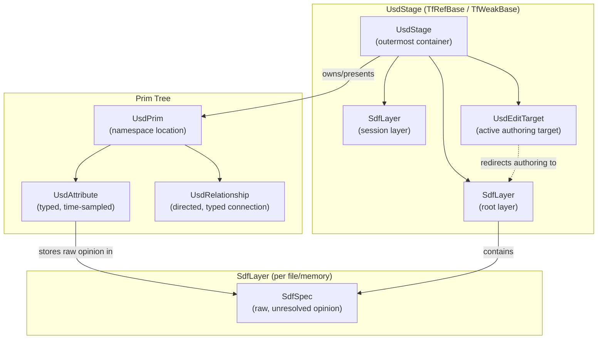
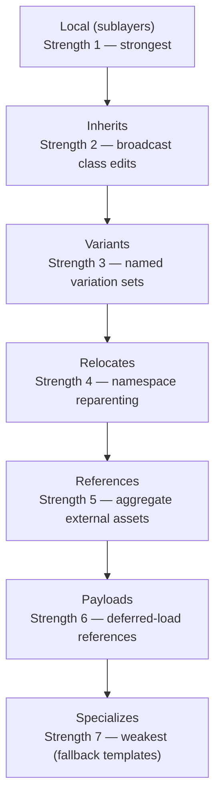
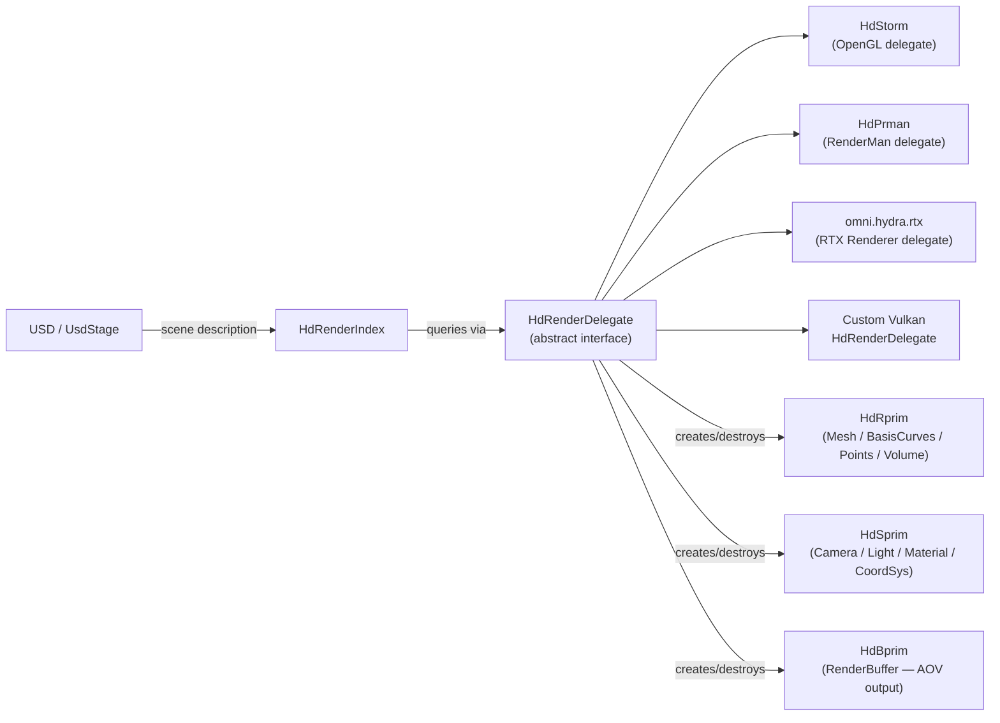
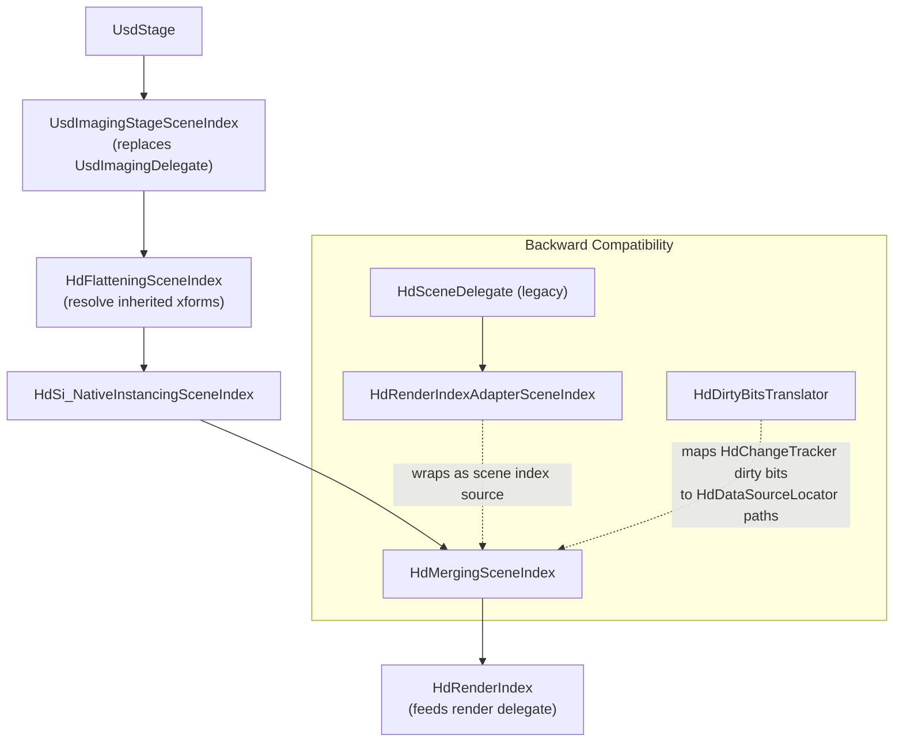
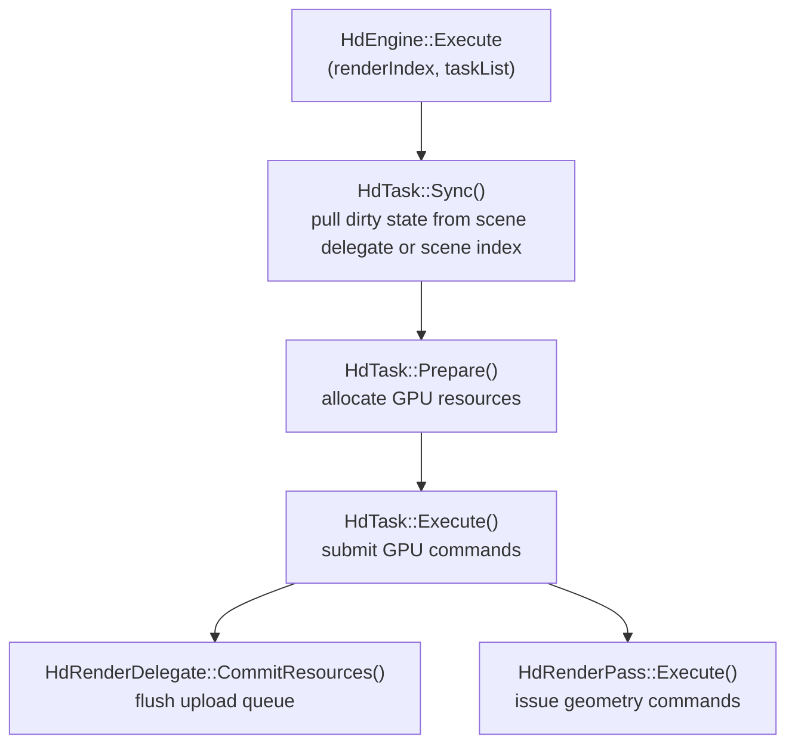
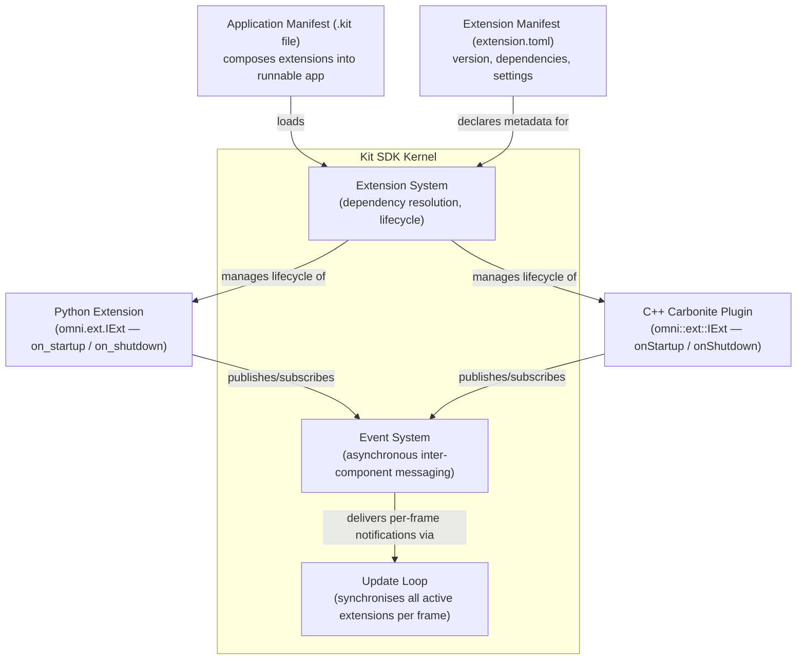
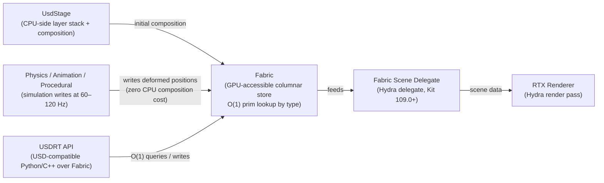
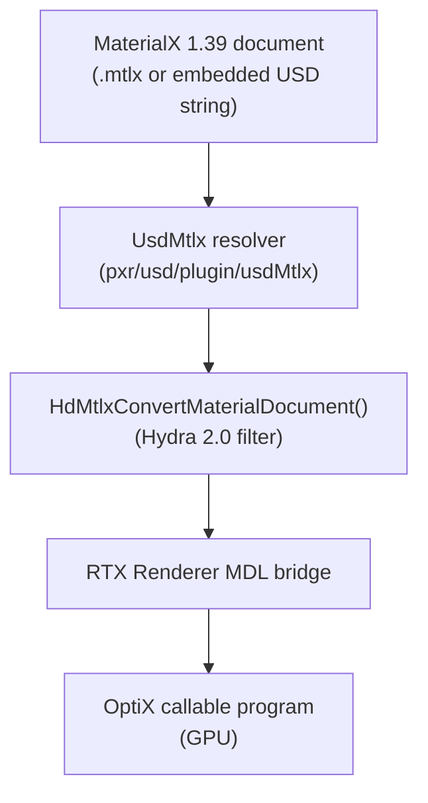
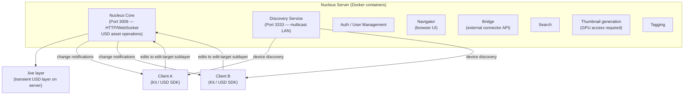
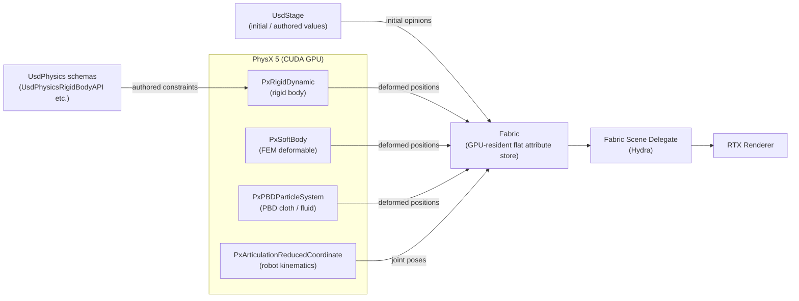

# Chapter 69: NVIDIA Omniverse, OpenUSD, and the RTX Renderer

> **Part**: Part XV — NVIDIA Proprietary Graphics Stack
> **Audience**: Graphics application developers and systems developers using NVIDIA
> **Status**: First draft — 2026-06-15

---

## Table of Contents

1. [Overview](#overview)
2. [OpenUSD Architecture: Core Abstractions](#openusd-architecture-core-abstractions)
   - 2.1 [UsdStage: The Outermost Container](#usdstage-the-outermost-container)
   - 2.2 [UsdPrim: The Primary Scenegraph Object](#usdprim-the-primary-scenegraph-object)
   - 2.3 [UsdAttribute, UsdRelationship, and the SdfLayer Model](#usdattribute-usdrelationship-and-the-sdflayer-model)
   - 2.4 [UsdGeomMesh: Polygonal and Subdivision Surfaces](#usdgeommesh-polygonal-and-subdivision-surfaces)
   - 2.5 [Schema Classes: Camera, Lights, Materials, Physics](#schema-classes-camera-lights-materials-physics)
3. [Composition Arcs and LIVERPS Strength Ordering](#composition-arcs-and-liverps-strength-ordering)
   - 3.1 [The Seven Composition Arcs](#the-seven-composition-arcs)
   - 3.2 [Python API for Composition Authoring](#python-api-for-composition-authoring)
   - 3.3 [Scenegraph Instancing](#scenegraph-instancing)
4. [AOUSD Core Specification 1.0](#aousd-core-specification-10)
   - 4.1 [Formal Standardisation Under the Linux Foundation](#formal-standardisation-under-the-linux-foundation)
   - 4.2 [OpenUSD Release Timeline and SDK 25.02](#openusd-release-timeline-and-sdk-2502)
5. [Hydra Rendering Delegate Architecture](#hydra-rendering-delegate-architecture)
   - 5.1 [HdRenderDelegate: The Core Abstraction](#hdrenderdelegate-the-core-abstraction)
   - 5.2 [Hydra 2.0: Scene Index Architecture](#hydra-20-scene-index-architecture)
   - 5.3 [HdEngine::Execute and GPU Command Submission](#hdengineexecute-and-gpu-command-submission)
   - 5.4 [Implementing a Custom Vulkan HdRenderDelegate](#implementing-a-custom-vulkan-hdrenderdelegate)
6. [Omniverse RTX Renderer Modes](#omniverse-rtx-renderer-modes)
   - 6.1 [RTX Real-Time 2.0](#rtx-real-time-20)
   - 6.2 [RTX Interactive (Path Tracing)](#rtx-interactive-path-tracing)
   - 6.3 [RTX Minimal Mode](#rtx-minimal-mode)
   - 6.4 [GPU Architecture Support Matrix](#gpu-architecture-support-matrix)
   - 6.5 [Project Zorah: RTX Path Tracing in Practice](#65-project-zorah-rtx-path-tracing-in-practice)
7. [Slang Shader Language](#slang-shader-language)
   - 7.1 [Governance, History, and Targets](#governance-history-and-targets)
   - 7.2 [Automatic Differentiation](#automatic-differentiation)
   - 7.3 [SlangPy: Python and PyTorch Integration](#slangpy-python-and-pytorch-integration)
   - 7.4 [Cooperative Vector Support](#cooperative-vector-support)
   - 7.5 [Comparison with GLSL/HLSL in Mesa Pipelines](#comparison-with-glslhlsl-in-mesa-pipelines)
8. [Multi-GPU Rendering in Omniverse](#multi-gpu-rendering-in-omniverse)
9. [Kit SDK Architecture](#kit-sdk-architecture)
   - 9.1 [Extension System and Application Manifests](#extension-system-and-application-manifests)
   - 9.2 [Python USD API](#python-usd-api)
   - 9.3 [USDRT and Fabric Scene Delegate](#usdrt-and-fabric-scene-delegate)
   - 9.4 [MDL Material Integration](#mdl-material-integration)
   - 9.5 [MaterialX 1.39 Integration with USD](#materialx-139-integration-with-usd)
10. [On-Linux Deployment](#on-linux-deployment)
    - 10.1 [Platform Requirements and Driver Versions](#platform-requirements-and-driver-versions)
    - 10.2 [Headless Rendering with Kit and Virtual Displays](#headless-rendering-with-kit-and-virtual-displays)
    - 10.3 [Container-Based Deployment via NGC](#container-based-deployment-via-ngc)
    - 10.4 [Omniverse Nucleus Architecture](#omniverse-nucleus-architecture)
    - 10.5 [Profiling with Nsight Graphics](#profiling-with-nsight-graphics)
11. [USD in Linux Graphics Pipelines Beyond Omniverse](#usd-in-linux-graphics-pipelines-beyond-omniverse)
12. [PhysX 5 and NVIDIA Warp: GPU Simulation for Rendering](#12-physx-5-and-nvidia-warp-gpu-simulation-for-rendering)
    - 12.3 [warp-nn: Neural Networks in Warp](#123-warp-nn-neural-networks-in-warp)
13. [Audio2Face-3D: Neural Facial Animation](#13-audio2face-3d-neural-facial-animation)
14. [MDL-SDK: Standalone C++ API for Material Compilation](#mdl-sdk-standalone-c-api-for-material-compilation)
15. [Integrations](#integrations)
16. [References](#references)

---

## Overview

**Universal Scene Description** (**USD**) began as Pixar's internal scene graph format for feature animation production. **NVIDIA**'s **Omniverse** platform elevated it into a real-time collaboration and simulation substrate, making **USD** the lingua franca for 3D data interchange across robotics, architecture, visual effects, and game development pipelines. The **Alliance for OpenUSD** (**AOUSD**), operating under the **Linux Foundation**, published **Core Specification 1.0** in December 2025, cementing **USD** as a cross-industry open standard.

This chapter examines the full technical stack from **USD**'s composition algebra through **NVIDIA**'s **RTX Renderer** and the **Kit SDK** extension framework, targeting graphics application developers and systems engineers who need to build, consume, or extend **USD**-based pipelines on Linux. Readers are assumed to be comfortable with:
- **C++** template metaprogramming
- **GPU** memory models (see Ch4)
- **Vulkan** rendering (see Ch18)
- The **NVIDIA** proprietary driver architecture described in Ch66 and Ch67

The chapter opens with **OpenUSD**'s core abstractions:
- **UsdStage** — the outermost scene container
- **UsdPrim** — the primary scenegraph object
- **UsdAttribute** — typed, time-sampled prim properties
- **UsdRelationship** — directed, typed connections between prims
- **SdfLayer** — the authoring model unit; raw, unresolved opinions resolved by **LIVERPS** precedence

Geometry is encoded via **UsdGeomMesh** for polygonal and subdivision surfaces, alongside schema classes for:
- Cameras: **UsdGeomCamera**
- Lights: **UsdLuxSphereLight**, **UsdLuxDomeLight**
- Materials: **UsdShadeMaterial**, **UsdShadeShader**, **UsdPreviewSurface**
- Physics: **UsdPhysicsRigidBodyAPI**, **UsdPhysicsCollisionAPI**

Composition is governed by the **LIVERPS** strength ordering — **L**ocal sublayers, **I**nherits, **V**ariants, R**e**locates, **R**eferences, **P**ayloads, and **S**pecializes — together with **scenegraph instancing** via prototype hierarchies. The **AOUSD Core Specification 1.0** standardisation process and the **OpenUSD SDK 25.02** release timeline are covered, including the quarterly cadence of features such as **WASM** support, **Hydra 2** scene index enablement, and the **UsdVolParticleField3DGaussianSplat** schema.

**Hydra**'s rendering delegate architecture decouples **USD** from backends via **HdRenderDelegate**, the abstract interface implemented by:
- **HdStorm** — OpenGL delegate
- **HdPrman** — RenderMan delegate
- **omni.hydra.rtx** — RTX Renderer delegate
- Custom **Vulkan** backends

**Hydra 2.0** replaces the pull-based **HdSceneDelegate** with a composable push-based **scene index** pipeline enabling O(1) dirty-locator invalidation:
- **UsdImagingStageSceneIndex** — translates the USD stage into a scene index
- **HdFlatteningSceneIndex** — resolves inherited transform matrices
- **HdMergingSceneIndex** — fuses multiple scene index trees

The **HdEngine::Execute** render loop drives **GPU** command submission through:
- **HdTask::Sync** — pull dirty state from scene delegate or scene index
- **HdTask::Prepare** — allocate GPU resources
- **HdTask::Execute** — submit GPU commands (including **optixLaunch()** for path tracing and **glDrawElementsIndirect** for rasterisation)
- **HdRenderDelegate::CommitResources** — flush upload queue

The chapter also details how to implement a custom **Vulkan** **HdRenderDelegate**.

The **Omniverse RTX Renderer** exposes three rendering modes:
- **RTX Real-Time 2.0** — physically based path tracing accelerated by **DLSS Ray Reconstruction**, **DLSS Super Resolution**, and **DLSS Frame Generation**
- **RTX Interactive** — progressive **Monte Carlo** path tracing with the **OptiX Denoiser** and adaptive sampling
- **RTX Minimal Mode** — rasterisation-only for **ML** training data generation at maximum throughput

A **GPU** architecture support matrix covers **Blackwell**, **Ada Lovelace**, **Ampere**, and **Turing** SM generations. **Project Zorah** demonstrates the full **RTX** path-tracing stack in practice, combining:
- **MDL** **OmniHair** and **OmniSurface** materials
- **NVIDIA** Strand Hair via **OptiX** cubic B-spline curve primitives
- **PhysX 5** cloth simulation
- **DLSS 3** for real-time 4K delivery

**Slang** is an open shading language governed by the **Khronos Group** under the **Slang Initiative**, compiling to:
- **SPIR-V** (Vulkan)
- **HLSL** (D3D)
- **GLSL** (OpenGL)
- **WGSL** (WebGPU)
- **Metal Shading Language**
- **CUDA**/**OptiX PTX**
- CPU **C++**

Its most distinctive feature is **first-class automatic differentiation** (**AD**) — unique among GPU shading languages — enabling differentiable renderers and inverse rendering via `[Differentiable]` annotations, `fwd_diff`/`bwd_diff` operators, and the **DifferentialPair\<T\>** type. **SlangPy** provides **Python** and **PyTorch** integration, allowing **PyTorch** tensors to pass directly into **Slang** kernels with gradient flow. **Cooperative vectors** (**CoopVec\<T,N\>**) map small neural-network weight-matrix multiplications onto hardware tensor cores, supporting inline neural inference inside path-tracing shaders. A comparison with **GLSL**/**HLSL** in **Mesa** pipelines shows how **Slang**'s **SPIR-V** output enables use with **RADV** and **ANV** drivers. The **Falcor** research rendering framework is built on **Slang** and provides reference implementations of **ReSTIR** and neural rendering techniques.

**Multi-GPU** rendering distributes image bands across up to 16 **RTX GPUs** via spatial frame subdivision, using **NVLink** or **PCIe** peer-to-peer **DMA** transfers managed by the **omni.gpu_foundation** extension.

The **Kit SDK** architecture is covered in depth:
- **Extension System** — dependency resolution, hot-reload, `extension.toml` manifests, `omni.ext.IExt` lifecycle
- **Event System** — asynchronous inter-component messaging
- **Update Loop** — per-frame synchronisation of all active extensions
- **Python USD API** — `pxr` namespace via **omni.usd**
- **Carbonite** — native **C++** plugins
- **Application manifests** — `.kit` files composing extensions into a runnable application

**USDRT** and the **Fabric Scene Delegate** (**FSD**) bypass **USD** composition overhead for high-frequency physics and animation writes via a **GPU**-accessible columnar store with O(1) prim lookup. **MDL** (**Material Definition Language**) materials embed in **USD** via **UsdShadeShader** with built-in templates — **OmniPBR**, **OmniGlass**, **OmniSurface**, and **OmniHair** — compiled at load time to **OptiX** callable programs via **MDL Core**. **MaterialX 1.39** introduces:
- Direct **USD** embedding
- The **UsdMtlx** schema library
- **HdMtlxConvertMaterialDocument**
- A dedicated **Slang** shader generator (**MaterialXGenSlang**)

On-Linux deployment covers:
- **Ubuntu 22.04 LTS** and **Ubuntu 24.04 LTS** platform requirements (driver **570.124.06**, **CUDA 12.8**, **Vulkan 1.3**, `VK_KHR_ray_tracing_pipeline`)
- Headless rendering via **DRM** render-only nodes (`/dev/dri/renderD128`) or **Xvfb**
- Container-based deployment via **NGC** (**NVIDIA GPU Cloud**) images using the **NVIDIA Container Toolkit**
- The **Omniverse Nucleus** collaboration server architecture (`.live` layers, **Port 3009** **HTTP/WebSocket**, **Port 3333** discovery)
- Profiling with **Nsight Graphics** and **Nsight Compute**

**USD** adoption beyond **Omniverse** is covered through:
- **Blender 4.x** — **USD** import/export (**UsdPreviewSurface** ↔ Principled **BSDF**)
- **Godot 4.x** — in-development **USD** import
- CLI tooling: **usdview** (backed by **HdStorm**), **usdchecker**, **usdcat**, and **usd-cli** (Remedy Entertainment)

Finally, the chapter covers **GPU** simulation frameworks that feed geometry into the **RTX Renderer**:
- **PhysX 5** — `PxRigidDynamic`, `PxSoftBody`, `PxPBDParticleSystem` for cloth and fluid, `PxArticulationReducedCoordinate` for robot kinematics
- **NVIDIA Warp** — Python **GPU** computing with **JIT**-compiled kernels and differentiable `wp.Tape`

Both are integrated with **USD** via the **Fabric Scene Delegate** zero-copy **DLPack** path.

By the end of this chapter, readers will understand:
- How **USD** composes scene description from multiple layers via **LIVERPS** arcs, from **UsdStage** factory methods through **SdfLayer** opinions
- The **Hydra** rendering delegate abstraction, **Hydra 2.0** scene index pipeline, and how the **RTX Renderer** implements **HdRenderDelegate**
- **Slang**'s role as a differentiable shading language, **SlangPy**/**PyTorch** integration, cooperative vectors, and its relationship to **PTX**/**SPIR-V** compilation
- Multi-GPU work distribution in **Omniverse** and the **Fabric Scene Delegate** high-frequency update path
- Practical deployment of headless **Kit** applications on Linux, including **NGC** container workflows and **Nucleus** collaboration architecture
- **PhysX 5** and **NVIDIA Warp** as GPU simulation substrates feeding the **RTX Renderer** via **Fabric**

---

## 2. OpenUSD Architecture: Core Abstractions

### 2.1 UsdStage: The Outermost Container

`UsdStage` is "the outermost container for scene description, which owns and presents composed prims as a scenegraph." [Source](https://openusd.org/release/api/class_usd_stage.html) It inherits from `TfRefBase` and `TfWeakBase`; instances are always held by `UsdStageRefPtr` (a reference-counted smart pointer, never raw pointers).

**Factory methods and lifecycle:**

```cpp
// pxr/usd/usd/stage.h — UsdStage factory methods

// Create a new stage backed by a USD file on disk
static UsdStageRefPtr CreateNew(const std::string& identifier,
                                InitialLoadSet load = LoadAll);

// In-memory stage with no backing file — useful for procedural generation
static UsdStageRefPtr CreateInMemory(InitialLoadSet load = LoadAll);
static UsdStageRefPtr CreateInMemory(const std::string& identifier,
                                     InitialLoadSet load = LoadAll);

// Open an existing file; populates the composed prim tree
static UsdStageRefPtr Open(const std::string& filePath,
                            InitialLoadSet load = LoadAll);
static UsdStageRefPtr Open(const SdfLayerHandle& rootLayer,
                            InitialLoadSet load = LoadAll);

// Open only a subset of the scene via a population mask —
// critical for streaming large scenes where most geometry is irrelevant
static UsdStageRefPtr OpenMasked(const std::string& filePath,
                                  UsdStagePopulationMask const& mask,
                                  InitialLoadSet load = LoadAll);
```

`InitialLoadSet::LoadAll` eagerly loads all payloads; `LoadNone` defers payload loading for interactive applications that need rapid initial load times with progressive detail.

**Prim authoring and traversal:**

```cpp
// Define a typed prim (e.g., "Mesh", "Camera") at a path
UsdPrim DefinePrim(const SdfPath& path,
                    const TfToken& typeName = TfToken());

// Create an over (non-defining opinion) for overrides in a stronger layer
UsdPrim OverridePrim(const SdfPath& path);

// Class prims: templates for inherits arc, prefixed with _
UsdPrim CreateClassPrim(const SdfPath& rootPrimPath);

// Traversal — returns UsdPrimRange (C++ range-for compatible)
UsdPrimRange Traverse();                                          // active, defined
UsdPrimRange Traverse(const Usd_PrimFlagsPredicate& predicate);
UsdPrimRange TraverseAll();                                       // all prims
```

**Layer stack and edit target management:**

```cpp
SdfLayerHandle GetRootLayer() const;
SdfLayerHandle GetSessionLayer() const;
SdfLayerHandleVector GetLayerStack(bool includeSessionLayers = true) const;

// SetEditTarget redirects all subsequent authoring to a specific layer
// within the layer stack — the key mechanism for non-destructive editing
const UsdEditTarget& GetEditTarget() const;
void SetEditTarget(const UsdEditTarget& editTarget);
void MuteLayer(const std::string& layerIdentifier);
```

**Serialization:**

```cpp
// Export to a different file format (e.g., .usda, .usdc, .usdz)
bool Export(const std::string& filename,
             bool addSourceFileComment = true,
             const SdfLayer::FileFormatArguments& args = {}) const;

// Flatten collapses the full layer stack into a single layer.
// All composition metadata is stripped; only resolved values remain.
// Useful for baking a scene for delivery to a renderer or exporter
// that does not support USD composition.
SdfLayerRefPtr Flatten(bool addSourceFileComment = true) const;
```

**Payload management for progressive loading:**

```cpp
// Load a subtree by loading its payload arc
UsdPrim Load(const SdfPath& path = SdfPath::AbsoluteRootPath(),
             UsdLoadPolicy policy = UsdLoadWithDescendants);

// Unload frees memory for heavy geometry not currently visible
void Unload(const SdfPath& path = SdfPath::AbsoluteRootPath());

// Atomic load+unload for LOD switching without intermediate state
void LoadAndUnload(const SdfPathSet& loadSet, const SdfPathSet& unloadSet,
                    UsdLoadPolicy policy = UsdLoadWithDescendants);
```

### 2.2 UsdPrim: The Primary Scenegraph Object

`UsdPrim` represents "a unique namespace location in a hierarchical composition on a UsdStage." [Source](https://openusd.org/release/api/class_usd_prim.html) Prims are obtained from `UsdStage` — they are lightweight handles that do not own their data.

**Composition arc accessors return Arc API objects:**

```cpp
// pxr/usd/usd/prim.h — composition arc accessors
UsdReferences   GetReferences()   const;  // aggregate external assets
UsdPayloads     GetPayloads()     const;  // deferred-load references
UsdInherits     GetInherits()     const;  // broadcast class edits
UsdSpecializes  GetSpecializes()  const;  // fallback template values
UsdVariantSets  GetVariantSets()  const;  // named variation containers
```

**State predicates:**

```cpp
bool IsActive()        const;  // false if blocked by ancestor active=false
bool IsLoaded()        const;  // payload arc has been loaded
bool IsInstanceable()  const;  // marked for prototype sharing
bool IsInstance()      const;  // is a point of the instancing system
bool IsInPrototype()   const;  // lives inside /__Prototype_N
TfToken GetTypeName()  const;  // registered schema name, e.g. "Mesh"
```

**Composition introspection via `UsdPrimCompositionQuery`:**

```cpp
// pxr/usd/usd/primCompositionQuery.h
UsdPrimCompositionQuery q(prim, UsdPrimCompositionQuery::Filter());
// Filter fields:
//   ArcTypeFilter: Reference, Payload, Inherit, Specialize, Variant, etc.
//   DependencyTypeFilter: Direct, Ancestral
//   ArcIntroducedFilter: IntroducedInRootLayerStack, etc.
auto arcs = q.GetCompositionArcs();  // ordered strongest → weakest

// Convenience static helpers:
UsdPrimCompositionQuery::GetDirectReferences(prim);
UsdPrimCompositionQuery::GetDirectInherits(prim);
```
[Source](https://openusd.org/release/api/class_usd_prim_composition_query.html)

### 2.3 UsdAttribute, UsdRelationship, and the SdfLayer Model

`UsdAttribute` represents a typed, time-sampled property of a prim. Values are stored per-time in an `SdfLayer` and resolved by the composition engine. Key operations:

```cpp
// pxr/usd/usd/attribute.h
UsdAttribute attr = prim.CreateAttribute(TfToken("myRadius"),
                                          SdfValueTypeNames->Float);

// Author a default (time-independent) value
attr.Set(1.5f);

// Author a time sample at frame 24
attr.Set(2.0f, UsdTimeCode(24.0));

// Read the composed value at a time
float radius;
attr.Get(&radius, UsdTimeCode(24.0));

// Query authored time samples in this layer stack
std::vector<double> times;
attr.GetTimeSamples(&times);
```

`UsdRelationship` encodes directed, typed connections between prims (e.g., material binding, constraint targets). Unlike attributes, relationships are not time-varying. They support target lists that compose across layers.

`SdfLayer` is the on-disk or in-memory unit of USD authoring. The authoring model is:
1. All edits go to the **edit target layer** (set on the stage via `SetEditTarget`).
2. `SdfLayer` stores raw, unresolved opinions as `SdfSpec` objects.
3. The composition engine evaluates all layer opinions according to LIVERPS precedence (see §3) to produce the composed result visible through `UsdPrim`/`UsdAttribute`.

Sublayer composition via `root.subLayerPaths` implements a classic "stronger override" model: the first entry in `subLayerPaths` is strongest. This is why VFX workflows separate `shot.usd` (shot overrides) from `asset.usd` (base model) and layer them at shot level.



### 2.4 UsdGeomMesh: Polygonal and Subdivision Surfaces

`UsdGeomMesh` encodes polygon meshes with optional subdivision properties, inheriting from `UsdGeomPointBased`. [Source: raw header](https://raw.githubusercontent.com/PixarAnimationStudios/OpenUSD/release/pxr/usd/usdGeom/mesh.h)

**Construction:**

```cpp
// pxr/usd/usdGeom/mesh.h
static UsdGeomMesh Define(const UsdStagePtr& stage, const SdfPath& path);
static UsdGeomMesh Get(const UsdStagePtr& stage, const SdfPath& path);
```

**Core topology attributes:**

```cpp
// faceVertexCounts: per-face polygon valence [3, 4, 3, ...]
UsdAttribute GetFaceVertexCountsAttr() const;
UsdAttribute CreateFaceVertexCountsAttr(VtValue const& defaultValue = VtValue(),
                                         bool writeSparsely = false) const;

// faceVertexIndices: flat list of vertex indices for all faces
UsdAttribute GetFaceVertexIndicesAttr() const;
UsdAttribute CreateFaceVertexIndicesAttr(VtValue const& defaultValue = VtValue(),
                                          bool writeSparsely = false) const;
```

**Subdivision control:**

```cpp
// subdivisionScheme: "catmullClark" (default), "loop", "bilinear", "none"
UsdAttribute GetSubdivisionSchemeAttr() const;

// interpolateBoundary: "none", "edgeOnly", "edgeAndCorner" (default)
UsdAttribute GetInterpolateBoundaryAttr() const;

// faceVaryingLinearInterpolation: "none", "cornersOnly",
// "cornersPlus1" (default), "cornersPlus2", "boundaries", "all"
UsdAttribute GetFaceVaryingLinearInterpolationAttr() const;

// Crease and corner sharpness for feature preservation
UsdAttribute GetCreaseIndicesAttr()     const;
UsdAttribute GetCreaseLengthsAttr()     const;
UsdAttribute GetCreaseSharpnessesAttr() const;
UsdAttribute GetCornerIndicesAttr()     const;
UsdAttribute GetCornerSharpnessesAttr() const;
UsdAttribute GetHoleIndicesAttr()       const;  // indices of hole faces

// Validation before export — checks index bounds and face counts
static bool ValidateTopology(const VtIntArray& faceVertexIndices,
                              const VtIntArray& faceVertexCounts,
                              size_t numPoints,
                              std::string* reason = nullptr);
```

`points` (type `VtVec3fArray`) and `normals` are inherited from `UsdGeomPointBased`. The RTX Renderer handles both polygonal (`subdivisionScheme = "none"`) and Catmull-Clark subdivided meshes natively on GPU.

### 2.5 Schema Classes: Camera, Lights, Materials, Physics

USD's schema system categorises types as:
- **IsA schemas**: prim type definitions (`UsdGeomMesh`, `UsdGeomCamera`, `UsdLuxSphereLight`)
- **Applied API schemas**: mixins added to any prim type (`UsdPhysicsRigidBodyAPI`, `UsdPhysicsCollisionAPI`)

Key schema families used in Omniverse pipelines:

| Schema | Header | Purpose |
|--------|--------|---------|
| `UsdGeomCamera` | `usdGeom/camera.h` | Perspective/orthographic camera with clipping, aperture, focus distance |
| `UsdLuxSphereLight` | `usdLux/sphereLight.h` | Physically based sphere area light |
| `UsdLuxDiskLight` | `usdLux/diskLight.h` | Disk area light |
| `UsdLuxDomeLight` | `usdLux/domeLight.h` | HDR environment dome |
| `UsdShadeMaterial` | `usdShade/material.h` | Material container with surface/displacement/volume outputs |
| `UsdShadeShader` | `usdShade/shader.h` | Shader node with typed inputs/outputs |
| `UsdPreviewSurface` | — | Interchange surface shader (Disney BRDF subset) |
| `UsdPhysicsRigidBodyAPI` | `usdPhysics/rigidBodyAPI.h` | Applied schema attaching rigid body dynamics |
| `UsdPhysicsCollisionAPI` | `usdPhysics/collisionAPI.h` | Applied schema enabling collision geometry |

The `UsdPhysicsRigidBodyAPI` pattern exemplifies applied APIs:

```cpp
// pxr/usd/usdPhysics/rigidBodyAPI.h
// Apply the rigid body mixin to any geometric prim
UsdPhysicsRigidBodyAPI api = UsdPhysicsRigidBodyAPI::Apply(prim);
api.CreateVelocityAttr().Set(GfVec3f(0.0f, 0.0f, 0.0f));
api.CreateAngularVelocityAttr().Set(GfVec3f(0.0f, 0.0f, 0.0f));
```

The `omni.physx` Kit extension reads these schemas from USD at runtime, pushes data into PhysX, ticks the simulation, and writes results back — a clean separation of physics computation from scene description authoring.

---

## 3. Composition Arcs and LIVERPS Strength Ordering

### 3.1 The Seven Composition Arcs

USD's power derives from its composition algebra: multiple layers of scene description combine via well-defined precedence rules. The mnemonic **LIVERPS** (formerly LIVRPS before the Relocates arc was formalised) describes strength ordering from strongest to weakest: [Source](https://lucascheller.github.io/VFX-UsdSurvivalGuide/pages/core/composition/livrps.html) [Source](https://docs.nvidia.com/learn-openusd/latest/creating-composition-arcs/strength-ordering/what-is-liverps.html)

| Strength | Arc | Mechanism |
|----------|-----|-----------|
| 1 (strongest) | **L**ocal (sublayers) | Direct edits in the active layer stack; supports `SdfLayerOffset` for time-shifting |
| 2 | **I**nherits | Broadcast overrides to all instances of a class prim; does not increase instance count |
| 3 | **V**ariants | Named variation sets (LOD levels, material choices) switched via a selection string |
| 4 | R**e**locates | Namespace reparenting/renaming across composition boundaries; formalised 2025 |
| 5 | **R**eferences | Aggregate external USD files or internal sub-hierarchies; supports time offset |
| 6 | **P**ayloads | Deferred-load references; identical to references for composition but loadable on demand |
| 7 (weakest) | **S**pecializes | Fallback template values overridable by all other arcs; used for material base classes |

A critical encapsulation rule applies to References and Payloads: once a file is referenced, its internal composition arcs are encapsulated. You cannot inject arcs across that encapsulation boundary — they must be authored inside the referenced file's layer stack.

Variants deserve particular attention for Omniverse workflows: the RTX Renderer can switch between `proxy` (low-polygon stand-in), `render` (full-fidelity), and custom variants at interactive rates, deferring geometry via payload arcs inside each variant.



### 3.2 Python API for Composition Authoring

```python
# Writing USD composition arcs in Python (USD SDK 25.02)
from pxr import Usd, Sdf, UsdGeom, UsdShade

stage = Usd.Stage.CreateNew("shot_001.usd")

# --- Sublayer: lighting overrides are stronger than asset base ---
root = stage.GetRootLayer()
root.subLayerPaths.append("./lighting/rig_A.usd")

# --- Reference: aggregate a car asset ---
car = stage.DefinePrim("/World/Car", "Xform")
car.GetReferences().AddReference("./assets/car_v3.usd")

# --- Payload: heavy geometry deferred until explicitly loaded ---
crowd = stage.DefinePrim("/World/Crowd", "Xform")
crowd.GetPayloads().AddPayload("./geometry/crowd_highres.usd")

# Explicitly load the payload when camera is near
stage.Load("/World/Crowd")

# --- Inherit: class prim broadcasting to all vehicle instances ---
vehicle_class = stage.CreateClassPrim("/_class_Vehicle")
UsdGeom.Xformable(vehicle_class).AddTranslateOp()
# Every prim that inherits this class gets the translate op
truck = stage.DefinePrim("/World/Truck", "Xform")
truck.GetInherits().AddInherit(vehicle_class.GetPath())

# --- Variant: LOD switching ---
asset = stage.DefinePrim("/World/Building", "Xform")
vsets = asset.GetVariantSets()
lod = vsets.AddVariantSet("modelingVariant")
for name in ["proxy", "render"]:
    lod.AddVariant(name)
lod.SetVariantSelection("render")
with lod.GetVariantEditContext():
    # Opinions authored here go into the "render" variant's layer
    UsdGeom.Mesh.Define(stage, "/World/Building/Geo")

# --- Specialize: material base template ---
base_mat = stage.DefinePrim("/Library/BaseMetal", "Material")
car_mat = stage.GetPrimAtPath("/World/Car/Material")
if car_mat:
    car_mat.GetSpecializes().AddSpecialize(base_mat.GetPath())

stage.GetRootLayer().Save()
```
[Source](https://openusd.org/release/tut_authoring_variants.html)

### 3.3 Scenegraph Instancing

Prims with identical composition configurations (same references, variants, value clips, load rules) can be marked `instanceable = true`. USD computes an "instancing key" — a hash of the composition arc set — and groups all prims sharing a key under a single prototype hierarchy named `/__Prototype_N`. [Source](https://openusd.org/release/api/_usd__page__scenegraph_instancing.html)

```cpp
// pxr/usd/usd/prim.h — instancing API
bool UsdPrim::IsInstanceable()  const;  // check flag
bool UsdPrim::IsInstance()      const;  // is a live instance
UsdPrim UsdPrim::GetPrototype() const;  // returns /__Prototype_N prim

// Stage-level: enumerate all prototype roots
std::vector<UsdPrim> UsdStage::GetPrototypes() const;

// To traverse through instance proxies (read-only structural view):
stage->Traverse(UsdTraverseInstanceProxies());
```

The RTX Renderer exploits prototypes directly: each `/__Prototype_N` geometry is tessellated once and replicated via GPU instancing, dramatically reducing BLAS build times for scenes with thousands of identical assets.

---

## 4. AOUSD Core Specification 1.0

### 4.1 Formal Standardisation Under the Linux Foundation

The Alliance for OpenUSD (AOUSD) published **Core Specification 1.0** on **December 17, 2025**, at a ceremony in San Francisco. [Source](https://aousd.org/news/core-spec-announcement/) [Source](https://www.linuxfoundation.org/press/alliance-for-openusd-announces-core-specification-1.0-the-universal-language-for-building-3d-worlds)

The specification defines:
- Foundational data models: how prims, attributes, relationships, and metadata are stored
- Core composition algorithms: LIVERPS ordering, encapsulation rules, instancing semantics
- File format requirements: `.usda` (ASCII), `.usdc` (binary crate format), `.usdz` (ZIP archive)

What Core 1.0 intentionally defers to 1.1+: animation curves, geometry schemas (meshes, curves, points), material/shading schemas, physics, and compliance test suites. The omission of geometry and shading schemas from the normative specification is significant — it means tooling can rely on the composition algebra being stable, while schema evolution continues in a separate track.

Ratifying members span the full industry: Adobe, Apple, Amazon, Autodesk, Epic Games, Foundry, Intel, Lucasfilm, Meta, NVIDIA, Pixar, PTC, SideFX, Sony, Trimble, and others. Industrial adopters include Cesium, IKEA, Siemens, Rockwell Automation, Schneider Electric — evidence that USD is escaping the VFX silo and entering AEC, manufacturing, and digital-twin use cases.

**Schema versioning guarantees post-1.0:** AOUSD has committed to backward compatibility for all core schemas validated against the 1.0 spec. This is the first explicit API stability promise in USD's history — previously, Pixar could (and did) make breaking changes between releases.

**Conformance tools** are available at `forum.aousd.org` along with sample implementations. [Source](https://forum.aousd.org/t/core-spec-1-0-is-here/2796)

### 4.2 OpenUSD Release Timeline and SDK 25.02

The OpenUSD SDK follows a quarterly release cadence:

| Version | Date | Headline Changes |
|---------|------|-----------------|
| v24.11 | Oct 2024 | Boost dependency removed; own `pxr_boost::python`; `UsdSemantics` schema for AI perception labels; `pip install usd-core` on PyPI |
| v25.02 | Feb 2025 | Wasm32/64 support; `camera`, `disableMotionBlur`, `disableDepthOfField` in render settings schema; `HdSceneIndexPlugin::_IsEnabled` virtual API |
| v25.05 | May 2025 | `UsdVolParticleField3DGaussianSplat` schema for 3DGS data; `HdsiLocatorCachingSceneIndex`; Hydra 2 scene index path enabled by default (`USDIMAGINGGL_ENGINE_ENABLE_SCENE_INDEX=1`) |
| v25.08 | Aug 2025 | OpenExec for invertible rigging; `specializes` arc reimplemented with 21% memory reduction; `HdMergingSceneIndex` optimised for large input counts; `Ndr` library removed |

[Source](https://aousd.org/blog/new-release-of-openusd-v24-11/)

For Chapter 69, the target SDK version is **25.02**, which ships with Kit 106.x. The C++ API requires a C++17-capable compiler; on Linux this means GCC 9+ or Clang 10+.

---

## 5. Hydra Rendering Delegate Architecture

### 5.1 HdRenderDelegate: The Core Abstraction

Hydra decouples scene description (USD) from rendering backends via the `HdRenderDelegate` interface. Each backend (HdStorm for OpenGL, HdPrman for RenderMan, the RTX delegate, a custom Vulkan delegate) implements this abstract class. [Source](https://openusd.org/release/api/class_hd_render_delegate.html)

```cpp
// pxr/imaging/hd/renderDelegate.h — simplified for exposition
class HdRenderDelegate {
public:
    // --- Supported prim type queries ---
    // Rprim: renderable geometry (Mesh, BasisCurves, Points, Volume)
    virtual const TfTokenVector& GetSupportedRprimTypes() const = 0;
    // Sprim: scene elements (Camera, Light, Material, CoordSys)
    virtual const TfTokenVector& GetSupportedSprimTypes() const = 0;
    // Bprim: buffer resources (RenderBuffer for AOV output)
    virtual const TfTokenVector& GetSupportedBprimTypes() const = 0;

    virtual HdResourceRegistrySharedPtr GetResourceRegistry() const = 0;

    // --- Prim lifecycle ---
    virtual HdRprim* CreateRprim(TfToken const& typeId,
                                  SdfPath const& rprimId) = 0;
    virtual void     DestroyRprim(HdRprim* rPrim) = 0;

    virtual HdSprim* CreateSprim(TfToken const& typeId,
                                  SdfPath const& sprimId) = 0;
    virtual HdSprim* CreateFallbackSprim(TfToken const& typeId) = 0;
    virtual void     DestroySprim(HdSprim* sprim) = 0;

    virtual HdBprim* CreateBprim(TfToken const& typeId,
                                  SdfPath const& bprimId) = 0;
    virtual HdBprim* CreateFallbackBprim(TfToken const& typeId) = 0;
    virtual void     DestroyBprim(HdBprim* bprim) = 0;

    // --- Render pass factory ---
    virtual HdRenderPassSharedPtr CreateRenderPass(
        HdRenderIndex* index,
        HdRprimCollection const& collection) = 0;

    // --- Synchronisation: called after all dirty prims are processed ---
    virtual void CommitResources(HdChangeTracker* tracker) = 0;

    // --- Settings: key-value store for renderer-specific parameters ---
    virtual void SetRenderSetting(TfToken const& key, VtValue const& value);
    virtual VtValue GetRenderSetting(TfToken const& key) const;

    // --- Threading control ---
    virtual bool IsPauseSupported() const;
    virtual bool Pause();
    virtual bool Resume();

    // --- AOV descriptors ---
    virtual HdAovDescriptor GetDefaultAovDescriptor(TfToken const& name) const;

    // --- Hydra 2.0 additions ---
    virtual void SetTerminalSceneIndex(
        const HdSceneIndexBaseRefPtr& terminalSceneIndex);
    virtual void Update();
    virtual bool IsParallelSyncEnabled(const TfToken& primType) const;
};
```

`HdRenderParam` is an opaque, per-delegate handle passed to every prim during sync — used to share GPU context, device handles, or any render-backend-specific state without hardcoding it into the Hydra framework.



### 5.2 Hydra 2.0: Scene Index Architecture

Hydra 1.0 used a pull-based `HdSceneDelegate` where the render index queried scene state on demand. Hydra 2.0 (shipping as default in USD 25.05) replaces this with a push-based **scene index** system, where changes propagate through a composable chain of `HdSceneIndexBase` objects. [Source](https://openusd.org/dev/api/_page__hydra__getting__started__guide.html)

**Core interface:**

```cpp
// pxr/imaging/hd/sceneIndex.h
class HdSceneIndexBase {
public:
    virtual HdSceneIndexPrim GetPrim(const SdfPath& primPath) const = 0;
    virtual SdfPathVector GetChildPrimPaths(const SdfPath& primPath) const = 0;

protected:
    // Implementations call these to notify downstream observers:
    void _SendPrimsAdded(const HdSceneIndexObserver::AddedPrimEntries& entries);
    void _SendPrimsRemoved(const HdSceneIndexObserver::RemovedPrimEntries& entries);
    void _SendPrimsDirtied(const HdSceneIndexObserver::DirtiedPrimEntries& entries);
    void _SendPrimsRenamed(const HdSceneIndexObserver::RenamedPrimEntries& entries);
};
```

Data is retrieved through `HdContainerDataSource` and `HdSampledDataSource`:

```cpp
// pxr/imaging/hd/dataSource.h
class HdSampledDataSource {
public:
    // shutterOffset: time relative to current shutter open for motion blur
    virtual VtValue GetValue(HdSampledDataSource::Time shutterOffset) = 0;

    virtual bool GetContributingSampleTimesForInterval(
        HdSampledDataSource::Time startTime,
        HdSampledDataSource::Time endTime,
        std::vector<HdSampledDataSource::Time>* outSampleTimes) = 0;
};
```

`HdDataSourceLocator` provides hierarchical attribute addressing analogous to `SdfPath` for attributes:

```cpp
// Address the orientation attribute of mesh topology:
HdDataSourceLocator loc("mesh", "meshTopology", "orientation");
```

**Filtering scene indices** compose via `HdSingleInputFilteringSceneIndexBase`:
- `HdFlatteningSceneIndex` — concatenates inherited transform matrices down the hierarchy
- `HdMergingSceneIndex` — fuses multiple scene index trees into one (for multi-USD-stage workflows)
- `HdsiLocatorCachingSceneIndex` (new in 25.05) — caches dirty-locator lookups for O(1) invalidation
- Custom filters intercept any prim type and transform its data source before the renderer sees it

**USD → Hydra 2.0 pipeline:**

```text
UsdStage
  └── UsdImagingStageSceneIndex        (replaces UsdImagingDelegate)
        └── HdFlatteningSceneIndex     (resolve inherited xforms)
              └── HdSi_NativeInstancingSceneIndex
                    └── HdMergingSceneIndex
                          └── HdRenderIndex (feeds render delegate)
```

**Backward compatibility layers** allow incremental adoption:
- `HdRenderIndexAdapterSceneIndex` — wraps a legacy `HdSceneDelegate` as a scene index source
- `HdDirtyBitsTranslator` — maps legacy `HdChangeTracker` dirty bits to `HdDataSourceLocator` paths



### 5.3 HdEngine::Execute and GPU Command Submission

The render loop from USD stage to GPU commands:

```text
HdEngine::Execute(renderIndex, taskList)
  → HdTask::Sync()        — pull dirty state from scene delegate or scene index
  → HdTask::Prepare()     — allocate GPU resources
  → HdTask::Execute()     — submit GPU commands (draw calls, ray trace dispatches)
    → HdRenderDelegate::CommitResources()  — flush upload queue
    → HdRenderPass::Execute()             — issue geometry commands
```

For the RTX delegate, `Execute()` dispatches an OptiX ray-tracing launch via `optixLaunch()` (see Ch67 for OptiX internals). For HdStorm (OpenGL), it issues `glDrawElementsIndirect` calls batched by shader state.



### 5.4 Implementing a Custom Vulkan HdRenderDelegate

For teams building their own Vulkan-based Hydra delegate (as an open alternative to the RTX renderer), the minimal implementation surface is:

```cpp
// Minimal custom Vulkan delegate skeleton
class MyVkRenderDelegate : public HdRenderDelegate {
public:
    MyVkRenderDelegate(VkDevice device, VkQueue queue)
        : _device(device), _queue(queue) {}

    const TfTokenVector& GetSupportedRprimTypes() const override {
        static TfTokenVector types = { HdPrimTypeTokens->mesh };
        return types;
    }

    HdRprim* CreateRprim(TfToken const& typeId,
                          SdfPath const& rprimId) override {
        if (typeId == HdPrimTypeTokens->mesh)
            return new MyVkMesh(rprimId, _device);
        TF_CODING_ERROR("Unsupported Rprim type: %s", typeId.GetText());
        return nullptr;
    }

    HdRenderPassSharedPtr CreateRenderPass(
        HdRenderIndex* index,
        HdRprimCollection const& collection) override {
        return std::make_shared<MyVkRenderPass>(index, collection, _device);
    }

    void CommitResources(HdChangeTracker* tracker) override {
        // Upload all dirty vertex buffers to GPU, build BVH if needed
        _UploadPendingGeometry();
    }

private:
    VkDevice _device;
    VkQueue  _queue;
    std::vector<MyVkMesh*> _pendingUploads;
    void _UploadPendingGeometry();
};
```

HdStorm (see Ch18 and Ch24) is the reference open-source OpenGL delegate. For Vulkan-specific BVH building and ray tracing integration, see how HdPrman manages scene synchronisation as an analogous multi-pass pattern.

---

## 6. Omniverse RTX Renderer Modes

The RTX Renderer is surfaced as a Hydra render delegate via the `omni.hydra.rtx` Kit extension. It "integrates NVIDIA RTX ray tracing technology into the Hydra rendering pipeline by exposing a `SceneRenderer` plugin as a USD/Hydra `RenderDelegate`." [Source](https://docs.omniverse.nvidia.com/kit/docs/omni.hydra.rtx/latest/Overview.html) [Source](https://docs.omniverse.nvidia.com/materials-and-rendering/latest/rtx-renderer.html)

### 6.1 RTX Real-Time 2.0

RTX Real-Time 2.0 is "a physically based path-tracing rendering mode leveraging the NVIDIA DLSS suite of neural rendering technologies." It targets interactive frame rates at near-photorealistic quality by caching path-traced results across frames. [Source](https://docs.omniverse.nvidia.com/materials-and-rendering/latest/rtx-renderer_rt.html)

Key parameters:
- **Max Bounces**: default 3; increasing trades performance for colour bleeding and caustic accuracy
- **Roughness Threshold**: default 0.3; surfaces with roughness below this threshold use full path tracing, coarser surfaces use cached irradiance
- **DLSS Ray Reconstruction** (DLR): mandatory in RT 2.0, not optional — it replaces the TAA/upscaling pass entirely, denoising and upscaling in a single neural network pass
- **DLSS Super Resolution**: modes — Performance (2× upscale), Balanced, Quality, Auto
- **Frame Generation** (DLSS FG): Ada Lovelace and newer only; inserts AI-generated frames between rendered frames for apparent doubling of frame rate
- **Many-light sampling**: dedicated algorithm for scenes with hundreds of area lights
- **Mesh-light sampling**: emissive geometry contributes direct illumination via dedicated sampling (disabled by default due to cost)
- **Subsurface scattering**: disabled by default
- **Firefly filtering**: per-ray-type intensity clamping to remove variance spikes

### 6.2 RTX Interactive (Path Tracing)

RTX Interactive is a progressive Monte Carlo path tracer converging toward ground-truth photorealism. [Source](https://docs.omniverse.nvidia.com/materials-and-rendering/latest/rtx-renderer_pt.html)

Configurable parameters:
- **Samples per Pixel per Frame (SPP/F)**: 1–32, default 1
- **Total Samples per Pixel**: 0 (unlimited) to 4096, default 512; rendering stops at this target
- **Max Bounces**: default 4
- **Max Specular/Transmission Bounces**: default 6 (glass and mirror chains need extra budget)
- **Adaptive Sampling**: non-uniform sample distribution guided by pixel variance — allocates more samples to high-variance regions (caustics, complex occlusion)

**OptiX Denoiser** integration provides "an order of magnitude reduction in rendering times for target image quality." Temporal mode accumulates across frames for animations; AOV denoising applies denoising to arbitrary render outputs (normals, albedo, emission). See Ch67 for the OptiX internals underlying the denoiser.

Antialiasing filter patterns: Box, Triangle, Gaussian, Uniform with configurable filter radius.

VDB volumes and Rayleigh scattering atmosphere simulation are native features — relevant for architectural visualisation and digital-twin weather simulation.

### 6.3 RTX Minimal Mode

Added in RTX Renderer 110.1, Minimal Mode is a stripped-down rasterisation-only path that disables all indirect light transport. It uses only the first distant light with hard shadows. Intended for ML training data generation workflows where image realism is secondary to throughput — a Replicator pipeline generating 100,000 synthetic frames benefits more from 10× speed than from accurate global illumination. [Source](https://docs.omniverse.nvidia.com/materials-and-rendering/latest/rtx-renderer-release-notes/110_1.html)

### 6.4 GPU Architecture Support Matrix

| GPU Architecture | Compute SM | DLSS SR | DLSS RR | Frame Gen | Linux Notes |
|---|---|---|---|---|---|
| Blackwell RTX Pro | 12.0 | Yes | Yes | Yes | DLSS RR requires Kit 106.5.3+ on Linux |
| Ada Lovelace (RTX 40xx) | 8.9 | Yes | Yes | Yes | Full feature support; DLSS RR launched with DLSS 3.5/Ada |
| Ampere RTX (RTX 30xx) | 8.6 | Yes | No | No | DLSS SR only; DLSS RR requires Ada Lovelace+ |
| Turing (RTX 20xx) | 7.5 | Yes | No | No | DLSS SR only; use OptiX denoiser for path-tracing quality |
| Hopper / A100 / A30 | HPC | No | No | No | HPC compute; no consumer DLSS |

Minimum driver for RTX Renderer 110.x: **570.124.06** (Linux), **572.61** (Windows). CUDA 12.8 required. [Source](https://docs.omniverse.nvidia.com/materials-and-rendering/latest/rtx-renderer-release-notes/110_1.html)

MDL materials (`UsdShadeShader` with MDL source asset) are the primary material format. Built-in templates: `OmniPBR`, `OmniGlass`, `OmniSurface`, `OmniHair`. `UsdPreviewSurface` is also supported as an interchange format, automatically translated to an MDL equivalent at scene load.

Gaussian splatting support was added in RTX 110.1 via the new `UsdVolParticleField3DGaussianSplat` schema (introduced in USD 25.05). 3DGS primitives now cast shadows, appear in reflections and refractions, and support motion blur — features previously requiring custom integrations.

### 6.5 Project Zorah: RTX Path Tracing in Practice

Project Zorah is NVIDIA's flagship real-time path tracing technology showcase, first revealed at GTC March 2023. It demonstrates a photorealistic CG character — an armoured fantasy warrior — rendered in real time using the full NVIDIA RTX stack: full path tracing via the Omniverse RTX Interactive renderer, MDL materials for every surface, DLSS 3 Frame Generation, and OptiX AI denoising. [Source: NVIDIA GTC 2023 — Project Zorah announcement](https://developer.nvidia.com/blog/nvidia-rtx-technology-advances-real-time-path-tracing-with-project-zorah/)

**Rendering architecture.** Zorah renders via the RTX Interactive (full path tracing) mode described in §6.2. On an RTX 4090 (Ada Lovelace), the raw path-traced output runs at approximately 1080p/30 fps with 4 samples per pixel. DLSS 3 Super Resolution upscales to 4K, and DLSS 3 Frame Generation synthesises intermediate frames, yielding an effective 4K/60+ fps delivery. The entire frame generation and super-resolution pipeline runs as DLSS NGX evaluation calls embedded in the Kit rendering loop (Ch68 §2).

**Materials: MDL OmniHair and OmniSurface.** Zorah's defining visual complexity is her hair — hundreds of thousands of guide curves rendered with NVIDIA's Strand Hair technology, using MDL `OmniHair` shader instances for physically based scattering (Marschner model: reflection R, transmission TT, and double transmission TRT lobes). The armour surfaces use `OmniSurface` with multi-layer coating (clear-coat metallic, anisotropic micro-facet base, iridescent thin-film interference). All materials are authored as MDL source assets and compiled via the MDL Core SDK to OptiX callable programs at load time (§9.4).

```
USD scene: Zorah.usd
  Xform "Zorah"
    Mesh "Body"       → UsdShadeShader OmniSurface (skin — SSS + multi-scatter)
    Mesh "Armour"     → UsdShadeShader OmniSurface (metallic + iridescent coating)
    BasisCurves "Hair"→ UsdShadeShader OmniHair    (Marschner R/TT/TRT lobes)
    Mesh "Cloth"      → UsdShadeShader OmniSurface (fabric — micro-geometry normal map)
```

**Strand Hair in OptiX.** Hair curves are represented as cubic B-spline segments; each segment is a piecewise curve primitive submitted to OptiX via `OPTIX_PRIMITIVE_TYPE_ROUND_CUBIC_BSPLINE`. Hardware curve intersection (available since Turing RT Cores) handles intersection and closest-point queries without custom intersection programs. At Zorah's hair density (~300K strands, 8 segments per strand = 2.4M curve segments), curve BVH build time on Ada is ~15 ms per frame — within budget because CLAS-style clustering is not yet applied to curves, but the hardware curve BVH uses compacted representation that fits within L2 cache at this density.

On Blackwell (RTX 50xx), hardware **LSS** (Linear Spherically-capped Segment) curves provide a faster alternative primitive type for straight-segment hair approximations, with native RT Core support rather than BVH subdivision. [Source: OptiX 9.0 release notes](https://forums.developer.nvidia.com/t/optix-9-0-release/322842)

**Cloth simulation and physics.** Zorah's cape and fabric elements are driven by NVIDIA PhysX 5 (Flex/CUDA-based position-based dynamics), integrated via the Omniverse Physics extension (`omni.physics`). The simulation runs on CUDA (Ch66) at 60 Hz, writing deformed vertex positions directly into USD `UsdGeomMesh` attributes each frame via USDRT's Fabric Scene Delegate (§9.3) — bypassing the CPU-side USD composition stack for performance.

**What Zorah demonstrates about the Linux RTX stack.** Running Project Zorah on Linux requires:
1. Omniverse Kit 106+ with the `omni.rtx.pathtracing` extension enabled
2. NVIDIA driver ≥ 570.124.06 (DLSS RR and Frame Generation require Ada/Blackwell)
3. CUDA 12.8 runtime (Ch66) for PhysX and OptiX acceleration structure builds
4. OptiX 9.x headers (Ch67) — Kit bundles its own OptiX runtime; external applications must link against the matching SDK version

In headless environments, Zorah can be rendered to disk via the Kit `--no-window` flag with an off-screen framebuffer, using the EGLDisplay/EGLSurface path described in §10.2. This is useful for cloud rendering pipelines where per-frame path-traced images are produced at scale, then assembled into video sequences via FFmpeg (Ch57).

**Note**: As of mid-2026, the Project Zorah USD scene assets and Kit application are available to NVIDIA Developer Program members as part of the Omniverse sample library. The full PhysX + path-tracing setup requires at minimum an RTX 3080 for interactive use; rendering at the originally demonstrated 4K quality requires Ada Lovelace (RTX 40xx) or Blackwell (RTX 50xx).

---

## 7. Slang Shader Language

### 7.1 Governance, History, and Targets

Slang originated from 15+ years of NVIDIA Research. On **November 21, 2024**, the Khronos Group launched the **Slang Initiative**, taking over multi-vendor governance. Slang is Apache 2.0 licensed, hosted at `github.com/shader-slang/slang`, and protected under the Khronos IP Framework. [Source](https://www.khronos.org/news/press/khronos-group-launches-slang-initiative-hosting-open-source-compiler-contributed-by-nvidia)

Current version uses date-based releases: **v2026.11** as of the writing date, with MaterialX now shipping a dedicated Slang shader generator.

**Key language features** beyond HLSL:
- **Generics and interfaces**: type-safe polymorphism without preprocessor abuse; `interface ISurface { float3 shade(float3 wo); }`
- **Modular separate compilation**: offline IR generation and linking, enabling large shader codebases with minimal recompilation
- **HLSL compatibility**: Valve compiled the entire Source 2 HLSL codebase modifying only 10 lines

**Target backends:**
- SPIR-V (Vulkan) — production use at Valve in CS2 and Dota 2
- HLSL (D3D12/D3D11)
- GLSL (OpenGL)
- WGSL (WebGPU)
- Metal Shading Language
- CUDA/OptiX — for ML and differentiable rendering (relevant for Ch67's OptiX coverage)
- CPU scalar C++ — enables CPU fallback paths from the same shader source

**Falcor**: NVIDIA's research rendering framework, built on Slang, provides production-quality implementations of path tracing, ReSTIR, and neural rendering techniques. It serves as the reference baseline for academic papers on real-time global illumination.

**Compilation to PTX:** The `slangc` compiler generates CUDA PTX via its CUDA/OptiX backend, using the same NVRTC infrastructure described in Ch66. The Slang IR (an SSA-form intermediate representation) is lowered to CUDA C++, then compiled by NVCC. This means Slang shader code can participate in the same GPU profiling workflows (Nsight Compute, see Ch67) as hand-written CUDA kernels.

### 7.2 Automatic Differentiation

Slang's most distinctive feature is **first-class automatic differentiation (AD)** — unique among GPU shading languages. This enables training neural rendering models where the forward pass is a GPU shader. [Source](https://developer.nvidia.com/blog/differentiable-slang-a-shading-language-for-renderers-that-learn/) [Source](https://docs.shader-slang.org/en/latest/external/slang/docs/user-guide/07-autodiff.html)

**Core auto-diff syntax:**

```glsl
// Slang — automatic differentiation example
// File: examples/differentiable_renderer/material.slang

// Mark a function as differentiable — Slang generates forward and
// backward derivative implementations automatically
[Differentiable]
float2 computeReflectance(float roughness, float metallic) {
    float dielectric = (1.0 - metallic) * pow(1.0 - roughness, 4.0);
    float conductor  = metallic * roughness * roughness;
    return float2(dielectric, conductor);
}

// Forward-mode derivative (Jacobian-vector product):
// DifferentialPair<T> = (primal value, tangent/derivative)
DifferentialPair<float> dp_rough = diffPair(0.5, 1.0);  // d(rough)/dt = 1
DifferentialPair<float> dp_metal = diffPair(0.8, 0.0);  // d(metal)/dt = 0
DifferentialPair<float2> result = fwd_diff(computeReflectance)(dp_rough, dp_metal);
float2 primal    = result.p;  // actual reflectance values
float2 dRefl_dt  = result.d;  // partial w.r.t. roughness

// Backward-mode derivative (vector-Jacobian product — used in training):
DifferentialPair<float> dp_r2 = diffPair(0.5);
DifferentialPair<float> dp_m2 = diffPair(0.8);
float2 dL_doutput = float2(1.0, 0.5);  // incoming gradient from loss
bwd_diff(computeReflectance)(dp_r2, dp_m2, dL_doutput);
float dL_dRoughness = dp_r2.d;  // gradient of loss w.r.t. roughness
float dL_dMetallic  = dp_m2.d;  // gradient of loss w.r.t. metallic
```

**Key AD attributes and types:**

| Symbol | Meaning |
|--------|---------|
| `[Differentiable]` | Marks a function for AD; Slang generates derivative impl |
| `[ForwardDerivative(fn)]` | Custom forward derivative implementation |
| `[BackwardDerivative(fn)]` | Custom backward derivative implementation |
| `fwd_diff(fn)` | Returns a callable computing the JVP of `fn` |
| `bwd_diff(fn)` | Returns a callable computing the VJP of `fn` |
| `DifferentialPair<T>` | Pair of (primal `.p`, differential `.d`) |
| `no_diff` | Excludes a parameter from differentiation |
| `detach(x)` | Explicitly discards the differential component |
| `IDifferentiable` | Interface required for user types to participate in AD |

**Built-in differentiable functions:** arithmetic, trigonometric (`sin`, `cos`, `tan`), exponential (`exp`, `pow`, `log`), vector (`dot`, `cross`, `normalize`), matrix (`mul`, `determinant`).

**Higher-order derivatives:** `fwd_diff(fwd_diff(sin))` computes second derivatives — useful for Hessian-based optimisers.

**Performance:** Slang's AD can achieve up to **10× speedup** over equivalent PyTorch operations by fusing forward and backward passes into a single GPU kernel, controlling gradient storage layout, and eliminating Python overhead. This is particularly impactful for inverse rendering workflows converting real-time path tracers to differentiable renderers — approximately 90% of the forward-pass shader code is reused unchanged.

**Applications in the Omniverse ecosystem:**
- Neural radiance caching (inline neural networks inside real-time path tracers)
- Neural texture compression (differentiable encoding trained on the actual renderer output)
- Inverse rendering (optimise material parameters from reference images)
- RTX Renderer research extensions via the Falcor framework

### 7.3 SlangPy: Python and PyTorch Integration

```bash
# Install SlangPy — provides Python bindings for Slang compilation and execution
pip install slangpy
```

```python
# examples/neural_material/train.py (SlangPy pattern)
import slangpy
import torch

# Compile a Slang module — returns a callable Python module
m = slangpy.loadModule("material.slang")

# Invoke a Slang kernel from Python, passing PyTorch tensors directly
# Gradients flow through the Slang backward derivative automatically
roughness = torch.tensor([0.5], requires_grad=True)
metallic  = torch.tensor([0.8], requires_grad=True)
result = m.computeReflectance(roughness, metallic)

# Standard PyTorch backward — invokes bwd_diff(computeReflectance) on GPU
loss = (result - target).pow(2).sum()
loss.backward()
# roughness.grad and metallic.grad are now populated via Slang AD
```
[Source](https://slangpy.shader-slang.org/en/latest/)

SlangPy also enables complex GPU algorithms that are difficult to express in PyTorch's SIMD model: sparse data structures, balloted-splatting for differentiable 2D Gaussian splatting (available in the SlangPy examples at `github.com/shader-slang/slangpy/tree/main/examples`).

### 7.4 Cooperative Vector Support

Slang 2025+ exposes **cooperative vectors** via the `CoopVec<T,N>` type, enabling small neural-network weight-matrix multiplication primitives that map directly to hardware tensor-core instructions. This is architecturally related to the OptiX Cooperative Vectors feature covered in Ch67 — both expose the same underlying SM tensor-core capability, with Slang providing the shading-language interface and OptiX providing the ray-tracing pipeline interface.

```glsl
// Slang 2025+ — cooperative vector small-matrix multiply
// File: examples/neural_material/nn_inference.slang
// Requires Ada Lovelace or newer GPU (SM 8.9+)

import CoopVec;

// CoopVec<T, N>: a vector of N elements of type T held cooperatively
// across a warp, enabling tensor-core MAD instructions.
// Typical use: small MLP layers (16×16, 32×32) inside shaders.

[shader("compute")]
[numthreads(32, 1, 1)]
void evalNeuralMaterial(uint3 dispatchId : SV_DispatchThreadID,
                         StructuredBuffer<float> weights,
                         RWStructuredBuffer<float> outputs)
{
    // Load an input feature vector cooperatively across the warp
    CoopVec<float16_t, 16> input = CoopVecLoad<float16_t, 16>(
        inputBuffer, dispatchId.x * 16);

    // Perform weight-matrix × input-vector using tensor cores:
    // matA is a row-major 16×16 weight matrix stored in 'weights'
    CoopVec<float16_t, 16> result = CoopVecMatMulAdd<float16_t, 16, 16>(
        weights, 0,          // weight matrix base offset
        CoopVecMatrixLayout::RowMajor,
        input,               // input vector (cooperative)
        CoopVec<float16_t, 16>(0.0h)); // bias (zero here)

    // Apply ReLU activation and store
    result = max(result, CoopVec<float16_t, 16>(0.0h));
    CoopVecStore(outputs, dispatchId.x * 16, result);
}
```
[Source](https://shader-slang.org/slang/user-guide/cooperative-vectors.html)

The `CoopVec<T,N>` primitive significantly reduces the per-thread register pressure compared to hand-unrolled matrix multiplications, and the compiler backend maps it to `mma` (matrix multiply-accumulate) PTX instructions or the equivalent SPIR-V cooperative-matrix extension (`SPV_NV_cooperative_matrix2`). In the Omniverse RTX Renderer context, cooperative vectors underpin neural texture and neural radiance-cache inference kernels embedded directly in path-tracing shaders — the same technique used in RTX Neural Shading (see Ch68).

> **Note:** Hardware support for `CoopVec` in Slang requires Ada Lovelace (SM 8.9) or Blackwell (SM 10.0+). Ampere SM 8.6 supports the OptiX cooperative-vector API for OptiX programs only; Slang's `CoopVec<>` shader path requires Ada or newer.

### 7.5 Comparison with GLSL/HLSL in Mesa Pipelines

GLSL (used in Mesa's OpenGL stack, Ch15–Ch17) and HLSL (Ch18 via SPIRV-Cross) lack several Slang features:
- No generics or interfaces — polymorphism requires preprocessor macros or virtual texture lookups
- No automatic differentiation — inverse rendering requires separate Python autograd frameworks
- No separate compilation model — whole-program compilation is the norm

Slang's SPIR-V output backend means a Slang shader can run through Mesa's RADV or ANV Vulkan drivers (Ch18, Ch24) without modification, making it a potential open alternative for the full pipeline. The Falcor framework uses this path for AMD GPU benchmarking.

---

## 8. Multi-GPU Rendering in Omniverse

The RTX Renderer supports up to 16 GPUs via multi-GPU (mGPU) mode: "Multi-GPU mode distributes the image across the GPUs while automatically balancing the workload." [Source](https://docs.omniverse.nvidia.com/materials-and-rendering/latest/rtx-renderer_mgpu.html)

**Activation and configuration:**
- Enabled by default when multiple identical NVIDIA RTX GPUs are detected
- Per-GPU VRAM cap: **48 GB** — scenes larger than this per-GPU budget are unsupported
- Mixed-GPU configurations (e.g., RTX 4090 + RTX 3090): the lower-capacity GPU limits total addressable memory
- Maximum GPU count: configurable via Carbonite setting `/renderer/multiGpu/maxGpuCount`
- Manual per-GPU weights (0.0–1.0 range) override automatic load balancing
- Low-resolution renders (<360p) auto-switch to single-GPU

**Work distribution strategy:** The image is subdivided into horizontal bands assigned to each GPU. This is analogous to the peer-to-peer DMA transfers described in Ch4 (DRM/TTM memory management) and Ch49 (CUDA peer transfers) — each GPU renders its band and the results are composited on GPU 0 before display. For path tracing specifically, pixels near band boundaries still require cross-GPU communication for shared sample accumulators.

The omni.gpu_foundation extension manages multi-device context creation, device enumeration, and memory pool allocation across all participating GPUs. NVLink high-bandwidth interconnects (where present) are used for inter-GPU buffer transfers, providing substantially higher bandwidth than PCIe — analogous to the NVLink topology used for NCCL collective operations in multi-GPU ML training (see Ch48's coverage of RCCL for the ROCm equivalent).

**Frame subdivision vs. spectral subdivision:**
- The RTX Renderer uses **spatial frame subdivision** (tiled image regions): simpler to implement, works over PCIe
- Spectral subdivision (each GPU renders different wavelength bands or sample sets) is documented in the Falcor research framework but is not the production mGPU path in Omniverse as of 110.1

**Note:** LDA (SLI) topology requires DirectX 12 and is unsupported on Vulkan. The PCIe mGPU path is the production configuration on Linux.

---

## 9. Kit SDK Architecture

### 9.1 Extension System and Application Manifests

"Everything in Kit is an extension." The Kit SDK kernel provides three subsystems: an Extension System for dependency resolution and lifecycle management, an Event System for asynchronous inter-component messaging, and an Update Loop that synchronises all active extensions per frame. [Source](https://docs.omniverse.nvidia.com/kit/docs/kit-app-template/106.5/docs/kit_sdk_overview.html)



**Extension structure** (`config/extension.toml`):

```toml
# config/extension.toml — extension manifest
[package]
version = "1.2.3"
title = "RTX Mesh LOD Manager"
description = "USD-aware LOD switching for RTX scene management"
category = "Rendering"

[core]
reloadable = true   # hot-reload supported without Kit restart
order = 0           # load order within dependency tier

# Semantic version constraints on dependencies
[dependencies]
"omni.usd"                   = {}
"omni.kit.renderer.core"     = { version = "1.0", tag = "gpu" }
"omni.hydra.rtx"             = {}
"omni.physx"                 = { optional = true }

# Platform-specific dependency (only on Linux)
"filter:platform"."linux-x86_64"."omni.linux.vulkan" = {}

[[python.module]]
name = "my_lod_manager"
path = "."

[[native.plugin]]
path = "bin/${platform}/${config}/*.plugin"

[settings]
exts."omni.hydra.rtx".renderMode = "RTXInteractive"

[[env]]
name = "MY_LIB_PATH"
value = "data"
isPath = true
append = true
```
[Source](https://docs.omniverse.nvidia.com/kit/docs/kit-manual/latest/guide/extensions_advanced.html)

Extension IDs follow `[name]-[tag]-[version]` format (e.g., `omni.hydra.rtx-gpu-1.0.3-stable.1`).

**Python extension lifecycle:**

```python
# my_lod_manager/__init__.py
import omni.ext
import omni.usd
from pxr import Usd, UsdGeom

class LodManagerExtension(omni.ext.IExt):
    def on_startup(self, ext_id: str):
        self._stage_event_sub = omni.usd.get_context().get_stage_event_stream() \
            .create_subscription_to_pop(self._on_stage_event, name="lod_manager")
        print(f"[{ext_id}] LOD Manager started")

    def on_shutdown(self):
        self._stage_event_sub = None  # unsubscribe

    def _on_stage_event(self, event):
        if event.type == int(omni.usd.StageEventType.OPENED):
            self._apply_lod_variants()

    def _apply_lod_variants(self):
        stage = omni.usd.get_context().get_stage()
        for prim in stage.Traverse():
            if prim.HasVariantSets() and prim.GetVariantSets().HasVariantSet("modelingVariant"):
                prim.GetVariantSets().GetVariantSet("modelingVariant") \
                    .SetVariantSelection("render")
```

**C++ Carbonite plugin** implements the lower-level native extension interface:

```cpp
// Carbonite plugin — stable C API boundary
// File: plugins/MyPlugin/MyPlugin.cpp
#include <carb/PluginUtils.h>
#include <omni/ext/IExt.h>

class MyPlugin : public omni::ext::IExt {
public:
    void onStartup(const char* extId) override {
        CARB_LOG_INFO("MyPlugin started: %s", extId);
    }
    void onShutdown() override {
        CARB_LOG_INFO("MyPlugin shutdown");
    }
};

CARB_PLUGIN_IMPL(MyPlugin, omni::ext::IExt)
```

**Application manifests (`.kit` files)** compose extensions into a runnable application:

```toml
# myapp.kit — headless path-tracing service
[settings]
app.name = "MyPathTracingService"
# Omit omni.kit.mainwindow for headless operation
# Including it would fail without a display

[dependencies]
"omni.usd"         = {}
"omni.hydra.rtx"   = {}
"omni.replicator.core" = {}
# No omni.kit.mainwindow — headless only
```

### 9.2 Python USD API

The Kit Python environment exposes the full USD SDK via the `pxr` namespace:

```python
# Python USD workflow inside a Kit extension
from pxr import Usd, UsdGeom, UsdShade, UsdLux, Sdf, Gf, Vt

# Open or create a stage via Kit's UsdContext
import omni.usd
context = omni.usd.get_context()
context.open_stage("/path/to/scene.usd")
stage = context.get_stage()

# Define a mesh with normals
mesh_path = Sdf.Path("/World/GroundPlane")
mesh = UsdGeom.Mesh.Define(stage, mesh_path)
mesh.CreatePointsAttr(Vt.Vec3fArray([
    Gf.Vec3f(-5, 0, -5), Gf.Vec3f(5, 0, -5),
    Gf.Vec3f(5, 0,  5),  Gf.Vec3f(-5, 0, 5)
]))
mesh.CreateFaceVertexCountsAttr(Vt.IntArray([4]))
mesh.CreateFaceVertexIndicesAttr(Vt.IntArray([0, 1, 2, 3]))
mesh.CreateNormalsAttr(Vt.Vec3fArray([Gf.Vec3f(0, 1, 0)] * 4))
mesh.SetNormalsInterpolation(UsdGeom.Tokens.vertex)
mesh.CreateSubdivisionSchemeAttr("none")

# Add a sphere light
light = UsdLux.SphereLight.Define(stage, "/World/SphereLight")
light.CreateRadiusAttr(0.5)
light.CreateIntensityAttr(50000.0)
light.CreateColorAttr(Gf.Vec3f(1.0, 0.95, 0.8))
UsdGeom.Xformable(light).AddTranslateOp().Set(Gf.Vec3f(0, 3, 0))

# Assign a material
mat = UsdShade.Material.Define(stage, "/World/Mats/Chrome")
shader = UsdShade.Shader.Define(stage, "/World/Mats/Chrome/PBR")
shader.CreateIdAttr("UsdPreviewSurface")
shader.CreateInput("metallic", Sdf.ValueTypeNames.Float).Set(1.0)
shader.CreateInput("roughness", Sdf.ValueTypeNames.Float).Set(0.05)
shader.CreateOutput("surface", Sdf.ValueTypeNames.Token)
mat.CreateSurfaceOutput().ConnectToSource(shader.GetOutput("surface"))
UsdShade.MaterialBindingAPI(mesh).Bind(mat)

stage.GetRootLayer().Save()
```

### 9.3 USDRT and Fabric Scene Delegate

For simulation-heavy workflows, writing back to USD every frame incurs composition overhead. Omniverse addresses this with two post-composition data stores: [Source](https://docs.omniverse.nvidia.com/kit/docs/usdrt.scenegraph/7.5.1/usd_fabric_usdrt.html)

**Fabric** stores post-composition scene data in a GPU-accessible columnar format. Prim lookup is O(1) via type-based bucketing rather than O(n) USD traversal. Physics simulation results, procedural geometry modifications, and animation pose evaluations write into Fabric at simulation rate without touching the USD layer stack.

**USDRT** provides a USD-compatible Python/C++ API over Fabric:

```python
# USDRT fast path — bypasses composition for high-frequency writes
import usdrt

rt_stage = usdrt.Usd.Stage.Attach(omni.usd.get_context().get_stage_id())

# O(1) query by type — critical for physics tick at 120 Hz
mesh_paths = rt_stage.GetPrimsWithTypeName("Mesh")

# Write back physics results without USD composition overhead
for path in mesh_paths:
    prim = rt_stage.GetPrimAtPath(path)
    xform = prim.GetAttribute("xformOp:translate")
    xform.Set(new_position)  # writes to Fabric, not USD layers
```

**Fabric Scene Delegate (FSD):** The production Hydra delegate in Kit 109.0+ reads from Fabric rather than USD directly, enabling the Hydra render loop to consume physics-updated positions without waiting for USD composition. As of Kit 109.0, FSD correctly handles variant switching, animation playback, mesh rendering, and prim remove+recreate in a single update cycle.



### 9.4 MDL Material Integration

MDL (Material Definition Language) materials embed in USD via `UsdShadeShader` prims with `info:implementationSource = "sourceAsset"`:

```usda
# USDA example: MDL material referencing OmniPBR
def Material "Chrome" {
    color3f inputs:base_color = (0.8, 0.8, 0.8)
    float inputs:metallic = 1.0
    float inputs:roughness = 0.05

    token outputs:mdl:surface.connect = </Chrome/MDLShader.outputs:out>
    token outputs:mdl:volume.connect  = </Chrome/MDLShader.outputs:out>

    def Shader "MDLShader" {
        uniform token info:implementationSource = "sourceAsset"
        # OmniPBR ships with Kit; path is relative to MDL search path
        uniform asset info:mdl:sourceAsset = @OmniPBR.mdl@
        uniform token info:mdl:sourceAsset:subIdentifier = "OmniPBR"

        # Parameters connect back to the Material interface
        color3f inputs:base_color.connect = </Chrome.inputs:base_color>
        float   inputs:metallic.connect   = </Chrome.inputs:metallic>
        float   inputs:roughness.connect  = </Chrome.inputs:roughness>
    }
}
```
[Source](https://docs.omniverse.nvidia.com/usd/latest/technical_reference/referencing_mdl.html)

The RTX Renderer's MDL translation layer converts MDL's intermediate representation (MDL Core) into GPU-executable OptiX callable programs at load time. `UsdPreviewSurface` materials are automatically mapped to an equivalent MDL OmniPBR configuration.

### 9.5 MaterialX 1.39 Integration with USD

**MaterialX 1.39** (released Q4 2025 under the Academy Software Foundation) introduced first-class USD interoperability: `MaterialX` documents can now be directly embedded in USD files as string-valued attributes, and the `UsdMtlx` schema library in OpenUSD 25.05+ provides native read/write support. [Source](https://materialx.org/assets/ASWF_MaterialX_open_source_contribution.pdf)

In the Omniverse RTX Renderer pipeline, MaterialX procedural materials are translated at scene-load time into the renderer's internal material representation via the following path:

```text
MaterialX 1.39 document (.mtlx or embedded USD string)
  └── UsdMtlx resolver       (pxr/usd/plugin/usdMtlx)
        └── HdMtlxConvertMaterialDocument()    (Hydra 2.0 filter)
              └── RTX Renderer MDL bridge
                    └── OptiX callable program (GPU)
```



A minimal MaterialX surface embedded in USD:

```usda
# MaterialX 1.39 shader embedded directly in a USD asset (USD 25.05+)
def Shader "StandardSurface_Copper" {
    uniform token info:id = "ND_standard_surface_surfaceshader"
    # MaterialX node definition from the Standard Surface shading model
    color3f inputs:base_color = (0.72, 0.45, 0.20)
    float   inputs:metalness = 1.0
    float   inputs:specular_roughness = 0.15
    float   inputs:coat = 0.1
    token   outputs:out
}
```

**MaterialX → RTX Renderer pipeline:** The `HdMtlxConvertMaterialDocument` utility (OpenUSD `pxr/imaging/hdMtlx`) traverses the MaterialX node graph and generates a `HdMaterialNetworkMap` — the same structure that MDL and UsdPreviewSurface materials produce. The RTX Renderer's material backend then compiles the node graph to MDL Core IR and on to OptiX callable programs. This means MaterialX `standard_surface`, `open_pbr_surface` (OpenPBR 2.0, introduced in MaterialX 1.39), and custom nodegraph-based procedurals are all first-class citizens in the Omniverse RTX Renderer without requiring an explicit MDL translation step.

**Slang shader generation for MaterialX:** MaterialX 1.39 ships a Slang shader code generator (`MaterialXGenSlang`) that emits Slang source for each surface shader. This allows MaterialX materials to target SPIR-V (Vulkan), CUDA/OptiX, and WGSL from a single `.mtlx` document — a significant advance over the previous per-backend GLSL/HLSL/MSL generators. [Source](https://www.khronos.org/news/permalink/materialx-adds-support-for-slang-shader-generation)

---

## 10. On-Linux Deployment

### 10.1 Platform Requirements and Driver Versions

Omniverse Kit 106.x officially supports **Ubuntu 22.04 LTS** and **Ubuntu 24.04 LTS** (x86_64 and aarch64). The aarch64 target is relevant for Jetson Orin-based edge deployments.

Key version floor requirements for Kit 110.x:
- NVIDIA driver: **570.124.06** minimum (Linux)
- CUDA Toolkit: **12.8**
- Vulkan: **1.3+** (required for ray tracing extensions: `VK_KHR_ray_tracing_pipeline`, `VK_KHR_acceleration_structure`)
- For Blackwell GPUs with DLSS Ray Reconstruction: Kit **106.5.3+** minimum

Known Linux-specific fixes in Kit 109.0/110.1:
- SIGSEGV in GLX/OpenGL context teardown at shutdown — fixed in 110.1
- Missing `libGLU.so.1` dependency on Ubuntu 25 preventing Iray library loading — fixed
- IOMMU-related warnings on DGX Station GB300 — fixed
- Kit App Streaming viewport streaming failures on Linux — fixed in 109.0

### 10.2 Headless Rendering with Kit and Virtual Displays

Kit supports two headless rendering paths on Linux:

**DRM render-only node (preferred):** Requires no display server. The NVIDIA driver exposes `/dev/dri/renderD128` (or similar) as a render-only DRM node. Kit detects the absence of a display and operates in offscreen mode, outputting frames to files or streaming them via WebRTC.

```bash
# Launch Kit headless — no display required
./kit/kit myapp.kit \
    --no-window \
    --allow-root \
    --/app/renderer/resolution/width=1920 \
    --/app/renderer/resolution/height=1080 \
    --/app/renderer/offscreen=true
```

**Xvfb virtual framebuffer (legacy path):** Required for extensions that probe `$DISPLAY`:

```bash
# Start virtual display (99 is arbitrary display number)
Xvfb :99 -screen 0 1920x1080x24 &
export DISPLAY=:99

# Launch Kit with virtual display
./kit/kit myapp.kit --no-window
```

The DRM render-only path is strongly preferred in container deployments — it avoids the overhead of a full X server and the complexity of managing Xvfb lifecycle. From Kit 109.0, the default headless path correctly bypasses X11 initialisation.

### 10.3 Container-Based Deployment via NGC

NVIDIA ships production-grade container images on NGC (NVIDIA GPU Cloud). [Source](https://docs.omniverse.nvidia.com/extensions/latest/ext_replicator/container_setup.html)

```bash
# Authenticate with NGC credentials
# Username: $oauthtoken; Password: <NGC API key from developer.nvidia.com>
docker login nvcr.io

# Pull the Omniverse Replicator image for synthetic data generation
docker pull nvcr.io/nvidia/omniverse-replicator:1.4.7-r1

# Pull the slim Kit kernel for custom extension deployment
docker pull nvcr.io/nvidia/omniverse/ov-kit-kernel:106.5.0
```

**Standard headless execution pattern:**

```bash
docker run --gpus all \
    --rm \
    -v /host/output:/_output/ \
    -v /host/assets:/assets/ \
    nvcr.io/nvidia/omniverse-replicator:1.4.7-r1 \
    ./startup.sh \
        --allow-root \
        --no-window \
        --/omni/replicator/script=/assets/generate_dataset.py \
        --/renderer/rtx/rendermode=PathTracing
```

**Performance note on shader caching:** The first run after pulling a container image triggers GPU shader compilation. This takes under 5 minutes on modern hardware but is lost when the container stops. For production pipelines:
1. Use a volume mount for the shader cache directory (`~/.cache/ov/Kit/106.5/` or equivalent)
2. Pre-warm images in CI by running a brief render after pull and committing the result
3. NVIDIA Container Toolkit (see Ch55) exposes the GPU to the container via `--gpus all`; this is a prerequisite, not optional

**Isaac Lab and Isaac Sim** extend this pattern for robot learning: `nvcr.io/nvidia/isaac-lab:latest` provides headless-only operation for large-scale parallel training with PhysX GPU simulation feeding directly into Fabric for Hydra rendering.

### 10.4 Omniverse Nucleus Architecture

Nucleus is "the database and collaboration engine of Omniverse" — a structured asset server that stores USD files and supports live multi-user collaboration via `.live` layers. [Source](https://docs.omniverse.nvidia.com/nucleus/latest/architecture.html)

Network topology:
- **Port 3009**: Core API (HTTP/WebSocket for USD asset operations)
- **Port 3333**: Discovery service (multicast-based device discovery on LAN)

Nucleus services: Core, Discovery, Auth/User Management, Navigator (browser UI), Bridge (external connector API), Search, Thumbnail generation, Tagging.



Live collaboration mechanism: Changes are authored into a `.live` layer (a transient USD layer on the Nucleus server). All clients subscribe to change notifications from the server. This is analogous to collaborative document editing — each user's edits land in their own edit-target layer, and the Nucleus server mediates merge order. The LIVERPS composition stack ensures that per-user overrides are stronger than the base asset by placing them in stronger sublayers.

For Linux production deployments, Nucleus runs as a set of Docker containers. The Nucleus Core service is the only component with mandatory GPU access (for thumbnail rendering); other services are CPU-only.

### 10.5 Profiling with Nsight Graphics

NVIDIA Nsight Graphics (see Ch67 for OptiX-level profiling) supports remote GPU capture from a Linux headless Kit instance to a Windows analysis workstation:

1. Enable the Nsight Graphics server in Kit: `--/app/profiling/nsightGraphics=true`
2. Connect Nsight Graphics on the analysis machine to the Kit instance's IP and port (default 19564)
3. Trigger a frame capture — Nsight serialises the entire command stream (OptiX launches, Vulkan calls, CUDA kernels) and transfers it for offline analysis

On Linux, Nsight Compute (for CUDA/OptiX kernel profiling) is the complementary tool for per-kernel roofline analysis of RTX renderer shaders.

---

## 11. USD in Linux Graphics Pipelines Beyond Omniverse

USD adoption outside NVIDIA's ecosystem is accelerating on Linux:

**Blender 4.x** ships a USD import/export addon in its core distribution. Materials are mapped via BSDF → `UsdPreviewSurface` translation: Blender's Principled BSDF maps to `UsdPreviewSurface` inputs (`metallic`, `roughness`, `baseColor`, `ior`). The Blender → USD exporter generates `.usda`/`.usdc` files compatible with Omniverse, Hydra, and usdview. See Ch42 for Blender's GPU rendering architecture.

**Godot 4.x** USD import support is in development (tracker: godotengine/godot#69985). The target is read-only import of USD scene hierarchy and geometry for game asset workflows. Material translation from `UsdPreviewSurface` to Godot's `BaseMaterial3D` is the primary technical challenge. See Ch41 for Godot's rendering architecture.

**`usdview`** is the USD SDK's built-in CLI inspector:

```bash
# Install USD SDK (no Omniverse required)
pip install usd-core

# Inspect a USD file — opens a HdStorm-rendered viewport
usdview /path/to/scene.usd

# Headless validation
usdchecker /path/to/scene.usd   # validates against schema conformance rules

# Flatten a composed scene to a single-layer file
usdcat --flatten scene.usd > scene_baked.usd
```

**`usd-cli`** (Remedy Entertainment's open tool) provides pipeline automation utilities:

```bash
# usd-cli: open-source USD pipeline automation
pip install usd-cli

# Merge multiple USD files into one
usd-cli merge layer1.usd layer2.usd -o merged.usd

# Print the full prim tree
usd-cli tree scene.usd

# Copy a subtree between stages
usd-cli copy source.usd /World/Asset target.usd /Props/Asset
```

These tools integrate into Linux CI/CD pipelines for automated asset validation — verifying `UsdGeomMesh.ValidateTopology()` compliance, checking material bindings, and confirming variant selections before promotion to Nucleus.

---

## 12. PhysX 5 and NVIDIA Warp: GPU Simulation for Rendering

GPU physics simulation and rendering are tightly coupled in Omniverse: cloth draping on a character, fluid splashing in a scene, or a robot's articulated joints all produce geometry that the RTX Renderer must render in the next frame. This section covers NVIDIA's two primary GPU simulation frameworks on Linux: **PhysX 5** (C++ rigid/deformable body simulation) and **NVIDIA Warp** (Python GPU computing for simulation scripting and geometry processing).

### 12.1 PhysX 5: GPU-Accelerated Simulation

PhysX 5.6.1 (current release, open-source Apache 2.0 at [github.com/NVIDIA-Omniverse/PhysX](https://github.com/NVIDIA-Omniverse/PhysX)) is the GPU physics engine embedded in Omniverse and widely used in game engines (Unreal Engine 5, Unity). The GPU acceleration path offloads simulation to CUDA, leaving the CPU free for game logic and rendering submission. [Source: PhysX 5 programming guide](https://nvidia-omniverse.github.io/PhysX/physx/5.6.1/docs/Index.html)

**Core simulation types:**
- **Rigid bodies** (`PxRigidDynamic`, `PxRigidStatic`): collision detection, contact resolution, joint constraints — the standard game physics pipeline
- **Soft bodies** (`PxSoftBody`): FEM (Finite Element Method) volumetric deformation; used for flesh, rubber, and organic materials
- **PBD cloth** (`PxPBDParticleSystem` with surface constraints): position-based dynamics cloth simulation; lower fidelity than FEM but suitable for real-time garment simulation
- **PBD fluids** (`PxPBDParticleSystem` with fluid SPH): smoothed particle hydrodynamics for water, blood, granular materials
- **Articulations** (`PxArticulationReducedCoordinate`): reduced-coordinate robot kinematics; used in Omniverse Isaac Sim for robot motion planning

**Linux build:**

```bash
git clone https://github.com/NVIDIA-Omniverse/PhysX --recursive
cd PhysX/physx
./generate_projects.sh linux    # generates CMake build files
cmake -B compiler/linux-release -DCMAKE_BUILD_TYPE=Release
cmake --build compiler/linux-release -j$(nproc)
```

**GPU simulation setup:**

```cpp
#include "PxPhysicsAPI.h"

// Create CUDA context manager (shared with CUDA/NVENC/OptiX)
PxCudaContextManagerDesc cudaContextManagerDesc;
cudaContextManagerDesc.ctx = myCudaContext;  // existing CUDA context
PxCudaContextManager* cudaContextManager =
    PxCreateCudaContextManager(*mFoundation, cudaContextManagerDesc);

// Create scene with GPU broadphase + solver
PxSceneDesc sceneDesc(mPhysics->getTolerancesScale());
sceneDesc.gravity       = PxVec3(0.0f, -9.81f, 0.0f);
sceneDesc.broadPhaseType = PxBroadPhaseType::eGPU;
sceneDesc.flags         |= PxSceneFlag::eENABLE_GPU_DYNAMICS;
sceneDesc.cudaContextManager = cudaContextManager;
PxScene* scene = mPhysics->createScene(sceneDesc);

// Create GPU cloth (PBD particle system)
PxPBDParticleSystem* clothSystem = mPhysics->createPBDParticleSystem(*cudaContextManager);
clothSystem->setRestOffset(0.01f);
PxPBDMaterial* clothMat = mPhysics->createPBDMaterial(
    /*friction=*/0.5f, /*damping=*/0.005f, /*adhesion=*/0.0f,
    /*viscosity=*/0.0f, /*lift=*/0.0f, /*drag=*/0.05f);
scene->addActor(*clothSystem);
```

**PhysX → USD bridge.** Omniverse exposes PhysX simulation state as USD prim attributes via `UsdPhysicsRigidBodyAPI`, `UsdPhysicsMassAPI`, and the PhysX-specific extension schemas (`PhysxSchema`):

```python
# Python USD API: add physics to a mesh prim
from pxr import UsdPhysics, PhysxSchema

prim = stage.GetPrimAtPath("/World/Cloth")
UsdPhysics.CollisionAPI.Apply(prim)
PhysxSchema.PhysxDeformableBodyAPI.Apply(prim)

# The USDRT Fabric Scene Delegate (§9.3) writes back simulation results
# to USD attributes each frame at near-zero CPU cost
```

The **USDRT Fabric Scene Delegate** (Ch69 §9.3) is the performance-critical path: PhysX writes deformed vertex positions directly into the Fabric cache (a GPU-resident flat attribute store) without going through the full USD composition stack, avoiding serialisation overhead for per-frame geometry updates.



### 12.2 NVIDIA Warp: Python GPU Computing

**NVIDIA Warp** ([github.com/NVIDIA/warp](https://github.com/NVIDIA/warp), BSD-3 license) is a Python framework for writing high-performance GPU simulation and geometry processing kernels. Unlike CUDA's C++ programming model, Warp kernels are written in a Python-like syntax and JIT-compiled to CUDA PTX at import time. [Source: Warp documentation](https://nvidia.github.io/warp/)

```bash
pip install warp-lang  # includes pre-built CUDA kernels
```

A Warp kernel for computing vertex normals from a deformed mesh:

```python
import warp as wp
import numpy as np

@wp.kernel
def compute_normals(
    positions: wp.array(dtype=wp.vec3),
    indices:   wp.array(dtype=wp.int32),
    normals:   wp.array(dtype=wp.vec3),
):
    tid = wp.tid()                      # thread index = triangle index
    i0 = indices[tid * 3 + 0]
    i1 = indices[tid * 3 + 1]
    i2 = indices[tid * 3 + 2]
    p0 = positions[i0]
    p1 = positions[i1]
    p2 = positions[i2]
    n  = wp.cross(p1 - p0, p2 - p0)   # face normal (unnormalised)
    wp.atomic_add(normals, i0, n)       # scatter to vertex normals
    wp.atomic_add(normals, i1, n)
    wp.atomic_add(normals, i2, n)

# Launch on GPU
with wp.ScopedDevice("cuda:0"):
    positions_wp = wp.array(positions_np, dtype=wp.vec3, device="cuda")
    indices_wp   = wp.array(indices_np, dtype=wp.int32, device="cuda")
    normals_wp   = wp.zeros(num_vertices, dtype=wp.vec3, device="cuda")
    wp.launch(compute_normals,
              dim=num_triangles,
              inputs=[positions_wp, indices_wp, normals_wp])
```

Warp kernels are also differentiable: the `@wp.kernel` decorator supports automatic differentiation via `wp.Tape`, making Warp suitable for gradient-based geometry optimisation (e.g., fitting a simulation to a video capture).

**Warp in Omniverse.** The Omniverse `omni.warp` extension exposes Warp as a scripting layer inside Kit applications. Simulation scripts (e.g., custom particle systems, procedural geometry deformers) are written in Python+Warp and registered as OmniGraph nodes, executing on GPU each frame via the Kit stage update callback. The **Newton** physics engine (announced GTC 2025), NVIDIA's next-generation differentiable robot physics simulator, is built on Warp as its GPU compute substrate.

**Warp ↔ USD interop.** Warp arrays can be zero-copy shared with USD Fabric via the DLPack protocol:

```python
import omni.warp
# Get a Fabric attribute as a Warp array (zero-copy, GPU memory)
positions_wp = omni.warp.from_fabric("/World/Mesh.points", dtype=wp.vec3)
wp.launch(my_deformer_kernel, dim=len(positions_wp), inputs=[positions_wp])
# Changes are immediately visible to the RTX Renderer on the next frame
```

This zero-copy path — Warp kernel writes directly into Fabric-backed GPU memory, RTX Renderer reads that memory in the same frame — is the production pattern for high-frequency simulation-driven geometry updates in Omniverse.

### 12.3 warp-nn: Neural Networks in Warp

**warp-nn** ([github.com/NVIDIA/warp-nn](https://github.com/NVIDIA/warp-nn)) extends NVIDIA Warp with neural network primitives that are natively compatible with Warp's JIT compilation and `wp.Tape` automatic differentiation. This enables neural networks to be called from within Warp simulation kernels and differentiated end-to-end alongside the physics simulation — directly useful for physics-informed neural rendering and differentiable simulation.

```python
import warp as wp
import warp.nn as wpnn

# Define a small MLP inside a Warp kernel
@wp.kernel
def neural_deformer(
    positions: wp.array(dtype=wp.vec3),
    time: float,
    net_weights: wpnn.LinearWeights,
    out_positions: wp.array(dtype=wp.vec3)
):
    tid = wp.tid()
    p = positions[tid]

    # Evaluate 2-layer MLP: input = (x, y, z, t), output = displacement (dx, dy, dz)
    x = wp.vec4(p[0], p[1], p[2], time)
    h = wpnn.linear(net_weights, 0, x)   # first layer
    h = wpnn.relu(h)
    d = wpnn.linear(net_weights, 1, h)   # second layer (displacement)

    out_positions[tid] = p + wp.vec3(d[0], d[1], d[2])

# Differentiable: gradients flow through the MLP and into net_weights
tape = wp.Tape()
with tape:
    wp.launch(neural_deformer, dim=N,
              inputs=[positions, time, weights, out_positions])
    loss = photometric_loss(out_positions, target_image)
tape.backward(loss)
# weights.grad now contains parameter gradients
optimizer.step(weights, weights.grad)
```

[Source: warp-nn GitHub](https://github.com/NVIDIA/warp-nn)
[Source: NVIDIA Warp documentation](https://nvidia.github.io/warp/)

---

## 13. Audio2Face-3D: Neural Facial Animation

**Audio2Face-3D** is part of NVIDIA ACE (Avatar Cloud Engine), a suite of microservices for real-time digital human animation. Audio2Face-3D converts a single audio waveform into a sequence of 3D facial blendshape coefficients that drive a photorealistic facial rig — enabling lip-sync, facial expression, and emotional response without per-character re-training.

### Architecture

Audio2Face-3D uses a transformer-based audio encoder paired with a facial motion decoder:

```text
Audio PCM (16 kHz mono)
    │
    ▼
Audio Encoder (transformer, trained on thousands of hours of speech)
    │
    ▼
Latent audio embedding (per-frame, ~30 fps)
    │
    ▼
Facial Motion Decoder (MLP, conditioned on audio embedding + emotion label)
    │
    ▼
52 ARKIT blendshape weights (per frame)
    │
    ▼
Character Rig (USD SkelAnimation schema / NVIDIA Omniverse)
```

### Python Inference API (NVIDIA ACE SDK)

```python
from nvidia_ace.audio2face import Audio2Face3D

# Load the pre-trained Audio2Face-3D model
a2f = Audio2Face3D.from_pretrained("nvidia/audio2face-3d-v2")

# Process audio file → blendshape coefficients
audio_path = "dialogue_take_01.wav"
result = a2f.infer(
    audio_path=audio_path,
    emotion="neutral",      # or "happy", "sad", "angry", "fearful", "surprised"
    fps=30
)

# result.blendshapes: numpy array [T, 52] — one row per frame, 52 ARKit weights
print(f"Generated {len(result.blendshapes)} frames of facial animation")

# Write as USD SkelAnimation for Omniverse
a2f.export_usd(result, output_path="facial_anim.usda",
               character_rig="digital_human.usd")
```

### Integration with Omniverse RTX

Once exported as a USD SkelAnimation, Audio2Face-3D output integrates into the Omniverse RTX Renderer via the standard USD animation pipeline:

```python
from pxr import Usd, UsdSkel

stage = Usd.Stage.Open("digital_human.usd")
skel_anim = UsdSkel.Animation.Get(stage, "/World/Character/FacialAnim")

# The RTX renderer picks up blendshape weights from UsdSkelAnimation
# automatically on each Kit frame update — no custom shader code needed
```

### Deployment: NVIDIA NIM Microservice

For real-time applications, Audio2Face-3D is packaged as an NVIDIA NIM (NVIDIA Inference Microservice) container:

```bash
# Pull and run the Audio2Face-3D NIM (requires NVIDIA NGC API key)
docker run --gpus all \
    -e NGC_API_KEY=$NGC_API_KEY \
    -p 50051:50051 \
    nvcr.io/nvidia/ace/audio2face-3d:2.0

# gRPC client sends audio, receives blendshape streams in real-time
python a2f_client.py --audio stream_audio.pcm --host localhost:50051
```

| Feature | Audio2Face-3D |
|---------|--------------|
| Input | PCM audio (16 kHz mono) |
| Output | 52 ARKit blendshape weights @ 30 fps |
| Latency (NIM) | < 50 ms for 1-second audio chunks |
| Emotion control | 7 discrete + continuous interpolation |
| Character dependency | None — rig-agnostic output |
| USD integration | UsdSkelAnimation schema |

[Source: NVIDIA ACE Audio2Face-3D documentation](https://developer.nvidia.com/ace/audio2face)
[Source: Audio2Face-3D GitHub](https://github.com/NVIDIA/Audio2Face-3D-Samples)

---

## 14. MDL-SDK: Standalone C++ API for Material Compilation

The MDL-SDK ([github.com/NVIDIA/MDL-SDK](https://github.com/NVIDIA/MDL-SDK), 528 stars) is NVIDIA's open-source C++ library for loading, compiling, and executing MDL (Material Definition Language) materials outside of Omniverse. Applications — offline renderers, standalone path tracers, Blender plugins — use it to compile MDL source into GPU-executable BSDF evaluation functions compatible with OptiX callable programs or CUDA kernels.

### C++ API

```cpp
#include <mi/mdl_sdk.h>

/* 1. Load the MDL compiler via neuray factory */
mi::base::Handle<mi::neuraylib::INeuray> neuray(
    mi_factory<mi::neuraylib::INeuray>(mi_neuray_factory));
neuray->start();

mi::base::Handle<mi::neuraylib::IMdl_compiler> compiler(
    neuray->get_api_component<mi::neuraylib::IMdl_compiler>());

/* 2. Add MDL search paths (where .mdl files live) */
compiler->add_module_path("/usr/local/share/mdl");
compiler->add_module_path("/opt/omniverse/kit/exts/.../mdl");

/* 3. Load MDL transaction and compile a module */
mi::base::Handle<mi::neuraylib::IDatabase> database(
    neuray->get_api_component<mi::neuraylib::IDatabase>());
mi::base::Handle<mi::neuraylib::IScope> scope(database->get_global_scope());
mi::base::Handle<mi::neuraylib::ITransaction> transaction(scope->create_transaction());

mi::base::Handle<mi::neuraylib::IMdl_factory> mdl_factory(
    neuray->get_api_component<mi::neuraylib::IMdl_factory>());

/* Load OmniPBR module */
compiler->load_module(transaction.get(), "::nvidia::core_definitions");
compiler->load_module(transaction.get(), "::OmniPBR");

/* 4. Create a material instance */
mi::base::Handle<const mi::neuraylib::IFunction_definition> mat_def(
    transaction->access<mi::neuraylib::IFunction_definition>(
        "mdl::OmniPBR(color,float,float,float,...)"));
mi::Sint32 result;
mi::base::Handle<mi::neuraylib::IFunction_call> mat_instance(
    mat_def->create_function_call(nullptr, &result));

/* Set base_color parameter */
mi::base::Handle<mi::neuraylib::IValue_color> base_color(
    mdl_factory->create_value_color(0.8f, 0.3f, 0.1f));
mi::base::Handle<mi::neuraylib::IExpression_constant> expr(
    mdl_factory->create_expression_constant(base_color.get()));
mi::base::Handle<mi::neuraylib::IExpression_list> args(mat_instance->get_arguments());
args->set_expression("base_color", expr.get());
transaction->store(mat_instance.get(), "my_material_instance");

/* 5. Compile to GPU-executable target code (OptiX callable) */
mi::base::Handle<mi::neuraylib::IMdl_backend> backend(
    compiler->get_backend(mi::neuraylib::IMdl_compiler::MB_CUDA_PTX));
backend->set_option("sm_version", "86");   /* sm_86 for Ampere */
backend->set_option("tex_lookup_call_mode", "direct_call");

mi::base::Handle<mi::neuraylib::ICompiled_material> compiled(
    mat_def->create_compiled_material(mat_instance.get(), nullptr, nullptr));

mi::base::Handle<const mi::neuraylib::ITarget_code> target_code(
    backend->translate_material_expression(
        transaction.get(), compiled.get(), "surface.scattering", "bsdf_eval"));

/* 6. The target_code contains PTX callable programs for BSDF evaluation */
const char *ptx = target_code->get_code();
size_t ptx_size  = target_code->get_code_size();

/* Load ptx into OptiX module as callable program for __direct_callable__bsdf_eval */

transaction->commit();
neuray->shutdown();
```

### Target Backends

| Backend constant | Output | Use case |
|-----------------|--------|----------|
| `MB_CUDA_PTX` | PTX (string) | OptiX callable programs, CUDA kernels |
| `MB_GLSL` | GLSL source | OpenGL/Vulkan renderers |
| `MB_HLSL` | HLSL source | DirectX renderers |
| `MB_LLVM_IR` | LLVM IR bitcode | Custom CPU backends |

### Build

```bash
git clone https://github.com/NVIDIA/MDL-SDK
cmake -Bbuild -S. -DCMAKE_BUILD_TYPE=Release \
      -DMDL_BUILD_EXAMPLES=ON
cmake --build build -j$(nproc)
# Examples: ./build/examples/mdl_sdk/compilation/compilation
```

[Source: MDL-SDK GitHub](https://github.com/NVIDIA/MDL-SDK)
[Source: MDL-SDK documentation](https://developer.nvidia.com/rendering-technologies/mdl-sdk)

---

## 15. Integrations

This chapter sits at the intersection of several threads developed throughout the book:

**RTX Renderer ↔ DLSS 4 (Ch68):** The RTX Renderer's Real-Time 2.0 mode depends entirely on DLSS Ray Reconstruction (mandatory) and optionally DLSS Frame Generation and Super Resolution. The GPU-side implementation of DLSS 4 on Ada/Blackwell hardware is covered in Ch68, including the neural network inference path and 4th-Gen Tensor Core operations.

**RTX Renderer ↔ OptiX denoiser (Ch67):** The RTX Interactive (path tracing) mode uses the OptiX Denoiser for temporal AOV denoising. Ch67 covers the OptiX API, SBT layout, and the AI-powered denoiser pipeline at the level of `optixDenoiserCreate` / `optixDenoiserInvoke`.

**Slang PTX compilation ↔ NVRTC infrastructure (Ch66):** The `slangc` CUDA/OptiX backend produces CUDA C++ that is then compiled via NVCC/NVRTC. Ch66's coverage of the NVIDIA proprietary driver stack and kernel module interfaces is the foundation for understanding how PTX lands on the GPU.

**Multi-GPU transfers ↔ peer DMA (Ch4, Ch49):** Omniverse's mGPU image compositing relies on PCIe peer-to-peer DMA for inter-GPU buffer transfers. Ch4 (DRM/TTM memory management) and Ch49 (CUDA peer transfers and UVA) provide the kernel-level and CUDA-level mechanisms underlying this.

**Hydra delegate ↔ Vulkan/Mesa (Ch18, Ch24):** HdStorm (the reference OpenGL/Vulkan delegate) and any custom Vulkan delegate plug into the same `HdRenderDelegate` abstraction described in this chapter. Ch18 covers the Vulkan render pipeline; Ch24 covers the ANV (Intel) and RADV (AMD) Vulkan driver implementations in Mesa.

**NCCL/NVLink ↔ ROCm RCCL (Ch48):** Omniverse multi-GPU coordination over NVLink is architecturally analogous to NCCL collective operations used in ML training — and to AMD's RCCL covered in Ch48. The inter-GPU bandwidth characteristics differ (NVLink 4.0 on Hopper: 900 GB/s bidirectional; PCIe 5.0 ×16: ~64 GB/s), which determines whether spatial frame subdivision is bottlenecked by compositing or by rendering.

**Headless containers ↔ NVIDIA Container Toolkit (Ch55):** The `--gpus all` flag and the NVIDIA Container Runtime hook described in Ch55 are prerequisites for all container-based Omniverse deployment patterns.

**Blender USD (Ch42) and Godot USD (Ch41):** Both engines consume USD assets via their import layers. Blender's Hydra viewport (Cycles/EEVEE as Hydra delegates) provides an open alternative rendering path over the same USD scene description.

---

## 16. References

1. [UsdStage API Reference — openusd.org](https://openusd.org/release/api/class_usd_stage.html)
2. [UsdPrim API Reference — openusd.org](https://openusd.org/release/api/class_usd_prim.html)
3. [UsdGeomMesh raw header — github.com/PixarAnimationStudios/OpenUSD](https://raw.githubusercontent.com/PixarAnimationStudios/OpenUSD/release/pxr/usd/usdGeom/mesh.h)
4. [UsdPrimCompositionQuery — openusd.org](https://openusd.org/release/api/class_usd_prim_composition_query.html)
5. [USD Object Model — openusd.org](https://openusd.org/release/api/_usd__page__object_model.html)
6. [USD Scenegraph Instancing — openusd.org](https://openusd.org/release/api/_usd__page__scenegraph_instancing.html)
7. [USD Variant Authoring Tutorial — openusd.org](https://openusd.org/release/tut_authoring_variants.html)
8. [LIVRPS/LIVERPS Survival Guide — lucascheller.github.io](https://lucascheller.github.io/VFX-UsdSurvivalGuide/pages/core/composition/livrps.html)
9. [NVIDIA Learn OpenUSD — LIVERPS Strength Ordering](https://docs.nvidia.com/learn-openusd/latest/creating-composition-arcs/strength-ordering/what-is-liverps.html)
10. [HdRenderDelegate API Reference — openusd.org](https://openusd.org/release/api/class_hd_render_delegate.html)
11. [Hydra 2.0 Getting Started Guide — openusd.org](https://openusd.org/dev/api/_page__hydra__getting__started__guide.html)
12. [AOUSD Core Specification 1.0 Announcement — aousd.org](https://aousd.org/news/core-spec-announcement/)
13. [AOUSD Core Spec 1.0 — Linux Foundation Press Release](https://www.linuxfoundation.org/press/alliance-for-openusd-announces-core-specification-1.0-the-universal-language-for-building-3d-worlds)
14. [AOUSD Core Spec 1.0 Forum Thread](https://forum.aousd.org/t/core-spec-1-0-is-here/2796)
15. [OpenUSD v24.11 Release Blog — aousd.org](https://aousd.org/blog/new-release-of-openusd-v24-11/)
16. [OpenUSD FAQ — openusd.org](https://openusd.org/dev/usdfaq.html)
17. [omni.hydra.rtx Extension Overview — docs.omniverse.nvidia.com](https://docs.omniverse.nvidia.com/kit/docs/omni.hydra.rtx/latest/Overview.html)
18. [RTX Renderer Overview — docs.omniverse.nvidia.com](https://docs.omniverse.nvidia.com/materials-and-rendering/latest/rtx-renderer.html)
19. [RTX Real-Time 2.0 Mode — docs.omniverse.nvidia.com](https://docs.omniverse.nvidia.com/materials-and-rendering/latest/rtx-renderer_rt.html)
20. [RTX Interactive (Path Tracing) Mode — docs.omniverse.nvidia.com](https://docs.omniverse.nvidia.com/materials-and-rendering/latest/rtx-renderer_pt.html)
21. [RTX Renderer Multi-GPU — docs.omniverse.nvidia.com](https://docs.omniverse.nvidia.com/materials-and-rendering/latest/rtx-renderer_mgpu.html)
22. [RTX Renderer 110.1 Release Notes — docs.omniverse.nvidia.com](https://docs.omniverse.nvidia.com/materials-and-rendering/latest/rtx-renderer-release-notes/110_1.html)
23. [Kit SDK Overview — docs.omniverse.nvidia.com](https://docs.omniverse.nvidia.com/kit/docs/kit-app-template/106.5/docs/kit_sdk_overview.html)
24. [Kit Extensions Advanced Guide — docs.omniverse.nvidia.com](https://docs.omniverse.nvidia.com/kit/docs/kit-manual/latest/guide/extensions_advanced.html)
25. [Referencing MDL in USD — docs.omniverse.nvidia.com](https://docs.omniverse.nvidia.com/usd/latest/technical_reference/referencing_mdl.html)
26. [USDRT: USD, Fabric, and USDRT — docs.omniverse.nvidia.com](https://docs.omniverse.nvidia.com/kit/docs/usdrt.scenegraph/7.5.1/usd_fabric_usdrt.html)
27. [Omniverse Physics Extension — docs.omniverse.nvidia.com](https://docs.omniverse.nvidia.com/extensions/latest/ext_physics.html)
28. [Omniverse Nucleus Architecture — docs.omniverse.nvidia.com](https://docs.omniverse.nvidia.com/nucleus/latest/architecture.html)
29. [Container Deployment for Replicator — docs.omniverse.nvidia.com](https://docs.omniverse.nvidia.com/extensions/latest/ext_replicator/container_setup.html)
30. [Kit 109.0 Release Notes — docs.omniverse.nvidia.com](https://docs.omniverse.nvidia.com/dev-guide/latest/release-notes/109_0.html)
31. [Khronos Slang Initiative Announcement](https://www.khronos.org/news/press/khronos-group-launches-slang-initiative-hosting-open-source-compiler-contributed-by-nvidia)
32. [Differentiable Slang — NVIDIA Developer Blog](https://developer.nvidia.com/blog/differentiable-slang-a-shading-language-for-renderers-that-learn/)
33. [Slang Auto-Differentiation User Guide — docs.shader-slang.org](https://docs.shader-slang.org/en/latest/external/slang/docs/user-guide/07-autodiff.html)
34. [SlangPy Documentation — slangpy.shader-slang.org](https://slangpy.shader-slang.org/en/latest/)
35. [Slang GitHub Releases](https://github.com/shader-slang/slang/releases)
36. [MaterialX Adds Slang Shader Generation — khronos.org](https://www.khronos.org/news/permalink/materialx-adds-support-for-slang-shader-generation)
37. [Slang Official Site — shader-slang.org](https://shader-slang.org/)
38. [NGC Kit SDK Linux — catalog.ngc.nvidia.com](https://catalog.ngc.nvidia.com/orgs/nvidia/teams/omniverse/resources/kit-sdk-linux)

## Roadmap

### Near-term (6–12 months)
- **AOUSD Core Specification 1.1** is expected to add normative geometry schemas (meshes, curves, points) and material/shading schemas that were intentionally deferred from 1.0, giving tooling vendors a stable conformance target for the full interchange pipeline.
- **OpenUSD SDK 25.11** (Q4 2025 cadence) is anticipated to ship `HdsiLocatorCachingSceneIndex` improvements and further stabilise Hydra 2.0 as the sole scene-index path, removing the legacy `HdSceneDelegate` code path from the default build.
- **Slang Initiative v2026.x** (under Khronos) is progressing work on `CoopVec<T,N>` support for Ampere SM 8.6 to narrow the feature gap with Ada, and on WGSL output quality improvements enabling Slang-authored differentiable shaders in WebGPU contexts.
- **PhysX 5.x** is tracking GPU-accelerated cloth self-collision (currently CPU-only) and improved USD `PhysxSchema` round-trip fidelity for deformable body simulation state, enabling lossless physics checkpointing to USD layers.

### Medium-term (1–3 years)
- **USD 2.0 geometry and shading schemas** (AOUSD Specification 2.0 track) are expected to formalise `UsdGeomMesh` subdivisions, `UsdLux` physical units, and a unified OpenPBR surface schema (`UsdShadeSurface`) that supersedes `UsdPreviewSurface` as the interchange standard.
- **Hydra 3.0** is expected to complete the removal of `HdRprim`/`HdSprim`/`HdBprim` prim-object lifecycle in favour of a fully data-source-driven render delegate API, where delegates consume `HdContainerDataSource` trees rather than typed prim objects — simplifying custom backend implementation significantly.
- **Fabric Scene Delegate** is expected to subsume the USD composition stack entirely for simulation-heavy workflows in Kit, exposing a USDRT-only authoring path where the USD layer stack is an archival format rather than a live runtime data store.
- **Newton physics engine** (NVIDIA, built on NVIDIA Warp) is planned as the differentiable-simulation successor to PhysX for robot learning workloads, with first-class USD schema support and zero-copy Fabric integration replacing the `PhysxSchema` USD bridge.

### Long-term
- **Universal Scene Description as an ISO standard** is a stated goal of AOUSD and the Linux Foundation following the Core 1.0 publication; a formal ISO/IEC submission would make USD mandatory for government digital-twin and defence simulation procurement.
- **Neural USD representations** — Gaussian splats, neural radiance fields, and neural signed-distance fields as first-class USD schema types (building on the `UsdVolParticleField3DGaussianSplat` schema introduced in USD 25.05) — are expected to become the primary interchange format for photorealistic asset capture pipelines, with the RTX Renderer and open Hydra delegates consuming them natively alongside traditional mesh geometry.
- **Fully differentiable RTX Renderer** via Slang's automatic differentiation applied to the entire path-tracing shader tree (material evaluation, light sampling, BVH traversal) is a long-horizon research goal demonstrated in NVIDIA Falcor; productisation in Omniverse would enable inverse rendering — optimising material and lighting parameters from reference photographs — as a first-class Kit workflow.

---

*Copyright © 2026 jreuben11. Licensed under [CC BY 4.0](https://creativecommons.org/licenses/by/4.0/).*
