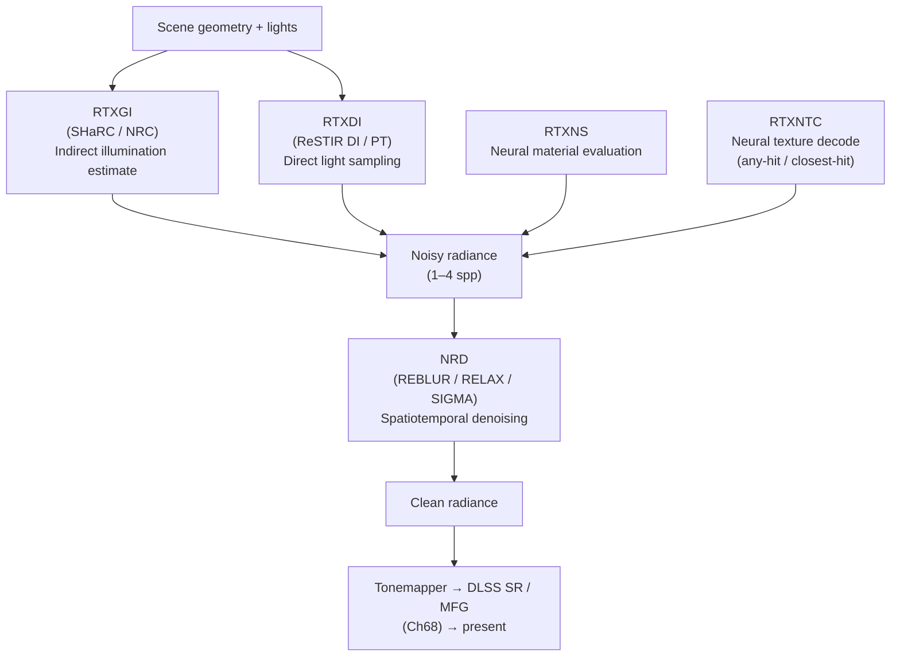
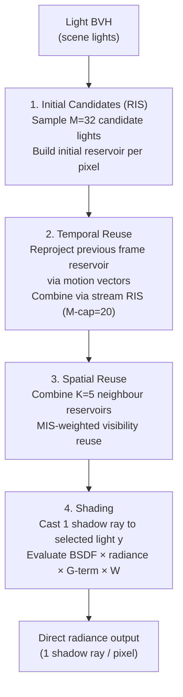
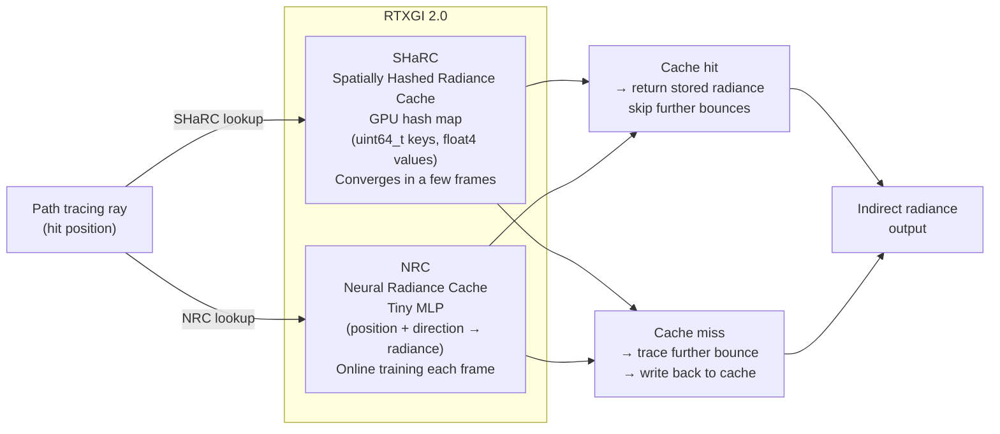
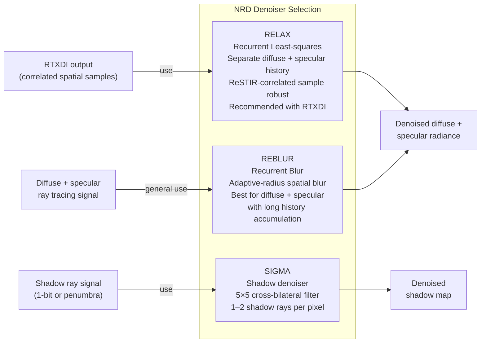
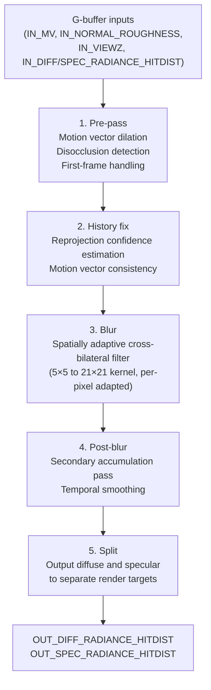
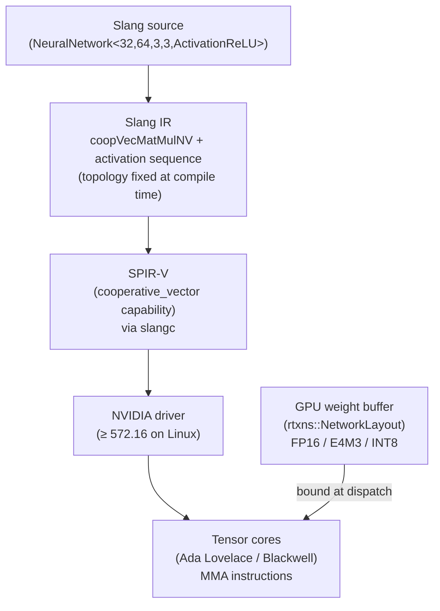
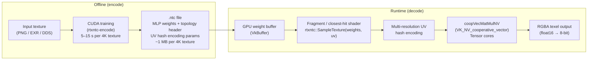
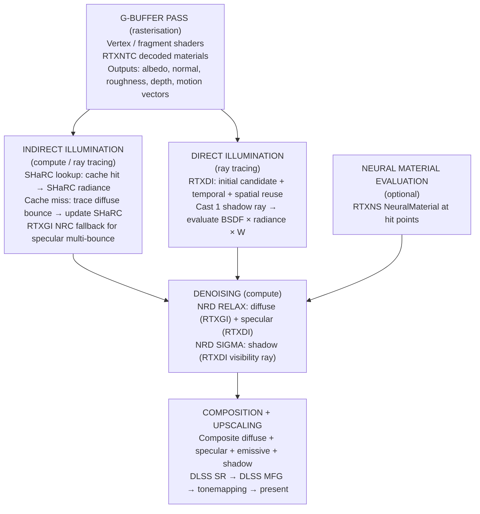

# Chapter 70: RTX Kit — RTXDI, RTXGI, NRD, RTXNS, and RTXNTC

> **Part**: Part XV — NVIDIA Proprietary Graphics Stack
> **Audience**: Graphics application developers building real-time ray tracing pipelines on NVIDIA hardware; systems developers integrating ReSTIR, neural denoisers, or neural texture compression into Vulkan or CUDA renderers.
> **Status**: First draft — 2026-06-16

---

## Table of Contents

1. [Overview](#1-overview)
2. [RTX Kit Architecture: Five SDKs as a Coherent System](#2-rtx-kit-architecture-five-sdks-as-a-coherent-system)
3. [RTXDI v3.0: Reservoir-Based Spatiotemporal Importance Sampling](#3-rtxdi-v30-reservoir-based-spatiotemporal-importance-sampling)
   - 3.1 [ReSTIR DI: Direct Light Importance Sampling](#31-restir-di-direct-light-importance-sampling)
   - 3.2 [ReSTIR PT: Path Tracing Importance Sampling](#32-restir-pt-path-tracing-importance-sampling)
   - 3.3 [RTXDI API Integration](#33-rtxdi-api-integration)
4. [RTXGI 2.0: Neural and Spatially Hashed Radiance Caches](#4-rtxgi-20-neural-and-spatially-hashed-radiance-caches)
   - 4.1 [SHaRC: Spatially Hashed Radiance Cache](#41-sharc-spatially-hashed-radiance-cache)
   - 4.2 [NRC: Neural Radiance Cache](#42-nrc-neural-radiance-cache)
   - 4.3 [RTXGI Integration](#43-rtxgi-integration)
5. [NRD v4.17: NVIDIA Real-time Denoisers](#5-nrd-v417-nvidia-real-time-denoisers)
   - 5.1 [Denoiser Selection: REBLUR vs. RELAX vs. SIGMA](#51-denoiser-selection-reblur-vs-relax-vs-sigma)
   - 5.2 [Required G-Buffer Inputs](#52-required-g-buffer-inputs)
   - 5.3 [NrdIntegration Helper Layer](#53-nrdintegration-helper-layer)
   - 5.4 [Vulkan and CUDA Backends](#54-vulkan-and-cuda-backends)
6. [RTXNS v1.3: Neural Shaders SDK](#6-rtxns-v13-neural-shaders-sdk)
   - 6.1 [VK\_NV\_cooperative\_vector](#61-vk_nv_cooperative_vector)
   - 6.2 [Network Weight Layout and Quantisation](#62-network-weight-layout-and-quantisation)
   - 6.3 [Authoring MLP Shaders in Slang](#63-authoring-mlp-shaders-in-slang)
   - 6.4 [Linux Requirements and Driver Support](#64-linux-requirements-and-driver-support)
7. [RTXNTC v0.5: Neural Texture Compression](#7-rtxntc-v05-neural-texture-compression)
   - 7.1 [Compression Architecture](#71-compression-architecture)
   - 7.2 [Offline Encoding Workflow](#72-offline-encoding-workflow)
   - 7.3 [Runtime Inference via CoopVec](#73-runtime-inference-via-coopvec)
8. [Wiring the Stack: A Full Rendering Frame](#8-wiring-the-stack-a-full-rendering-frame)
9. [Integrations](#9-integrations)
10. [References](#10-references)

---

## 1. Overview

**RTX Kit** is NVIDIA's umbrella for five open-source rendering SDKs that occupy the layer between raw **Vulkan** ray tracing extensions (Chapter 56) and the closed-source **DLSS** **NGX** feature set (Chapter 68). Each SDK is independently releasable, MIT-licensed, and hosted under [github.com/NVIDIA-RTX](https://github.com/NVIDIA-RTX). The **2026.2** release of **RTX Kit** is the current stable version as of mid-2026.

The five components address distinct problems in the real-time ray tracing pipeline:

| SDK | Problem solved | Key technique |
|-----|---------------|---------------|
| **RTXDI** | Too many lights to sample by brute force | **ReSTIR DI** and **PT** — reservoir resampling over millions of virtual lights |
| **RTXGI** | Multi-bounce indirect illumination at real-time rates | **Spatially Hashed Radiance Cache** (**SHaRC**) and **Neural Radiance Cache** (**NRC**) |
| **NRD** | Denoising 1–4 spp ray tracing signals | Spatiotemporal **REBLUR**/**RELAX** denoisers with GPU-side Gaussian filtering |
| **RTXNS** | Running **MLP** inference inside any shader stage | **VK_NV_cooperative_vector** + **Slang** **MLP** authoring |
| **RTXNTC** | **VRAM** pressure from high-resolution **BC7** texture atlases | Neural texture compression — **MLP**-encoded textures decoded on-chip |

These SDKs are not optional additions to the NVIDIA stack — they are the actual implementation layer used in production titles. Cyberpunk 2077's path tracing mode integrates **RTXDI** for direct light sampling and **NRD** for denoising. Unreal Engine 5's Lumen integrates **NRD**. Alan Wake 2 (Remedy Entertainment) uses **RTXDI**, **NRD**, and **RTXGI** in combination. The open-source reference is NVIDIA's own `NRD Sample` and `SHARC Sample` on GitHub.

Section 2 describes how the five SDKs compose into a coherent pipeline, building from scene geometry through to the tonemapper. Section 3 covers **RTXDI v3.0** in depth: **ReSTIR DI** (§3.1) introduces the reservoir data structure and the multi-stage candidate sampling, temporal reuse, and spatial reuse pipeline; **ReSTIR PT** (§3.2) extends reservoir resampling to full path suffixes via reconnection shift mapping; and the **RTXDI** API integration (§3.3) shows how to wire `rtxdi::Context`, `rtxdi::LightBufferParameters`, and the companion **HLSL**/**Slang** shader includes (`ResamplingFunctions.hlsli`, `LightShading.hlsli`) into a **Vulkan** renderer on Linux. Section 4 covers **RTXGI 2.0**: **SHaRC** (§4.1) stores per-voxel radiance in a GPU-resident hash map using `uint64_t` keys and `float4` values; **NRC** (§4.2) replaces the hash map with a tiny online-trained **MLP** using multi-resolution hash encoding; and §4.3 describes how to choose between the two based on scene characteristics and how to toggle them via the shared **RTXGI** API surface. Section 5 covers **NRD v4.17**: §5.1 compares the three primary algorithms — **REBLUR**, **RELAX**, and **SIGMA** — and explains when to use each; §5.2 details the required **G-buffer** inputs (`IN_MV`, `IN_NORMAL_ROUGHNESS`, `IN_VIEWZ`, `IN_DIFF_RADIANCE_HITDIST`, `IN_SPEC_RADIANCE_HITDIST`) and the pre-divided albedo encoding convention; §5.3 demonstrates the **NrdIntegration** helper layer (`NRDIntegration.hpp`) that manages all internal transient textures and history buffers; and §5.4 explains the **Vulkan** and **CUDA** backends, including the multi-pass dispatch structure (`vkCmdDispatch` pre-pass, history fix, blur, post-blur, split). Section 6 covers **RTXNS v1.3**: §6.1 introduces **VK_NV_cooperative_vector** and the `coopVecMatMulNV` **SPIR-V** instruction that maps to tensor core **MMA** hardware; §6.2 covers network weight layout and quantisation via `rtxns::NetworkLayout`, including **FP16**, **E4M3** **FP8**, and **INT8** formats; §6.3 shows how to author **MLP** shaders in **Slang** using the `NeuralNetwork<>` template type compiled by `slangc`; and §6.4 lists the Linux driver and hardware requirements (**NVIDIA** driver ≥ 572.16, **Ada Lovelace** or **Blackwell** GPU). Section 7 covers **RTXNTC v0.5**: §7.1 describes the compression architecture — a 3–4-layer **MLP** with multi-resolution **UV** hash encoding stored in a `.ntc` file; §7.2 walks through the offline encoding workflow using `rtxntc-encode` with **CUDA** training; and §7.3 shows the runtime inference path via **CoopVec** and the `rtxntc::SampleTexture` shader call. Section 8 assembles all five SDKs into a complete annotated rendering frame, with measured per-SDK GPU time budgets on **RTX 4080** at 1080p.

This chapter targets developers integrating these SDKs into a custom **Vulkan** renderer or evaluating them for an existing engine. A working **Vulkan** renderer with ray tracing support (Ch56 prerequisite) is assumed. **CUDA** knowledge is useful but not required — all five SDKs have primary **Vulkan** paths on Linux.

---

## 2. RTX Kit Architecture: Five SDKs as a Coherent System

The five SDKs have a natural pipeline ordering that mirrors the stages of a path-traced frame:

```
Scene geometry + lights
       │
       ▼
  [RTXGI / SHaRC]  ←── Indirect illumination estimate (multi-bounce)
       │
       ▼
  [RTXDI]          ←── Direct light sampling (ReSTIR DI)
       │
       ▼
  [RTXNS]          ←── Neural material evaluation (NeRF, neural BRDF)
  [RTXNTC]         ←── Neural texture decode inside any-hit / closest-hit shaders
       │
       ▼
  Noisy radiance (1–4 spp)
       │
       ▼
  [NRD]            ←── Spatiotemporal denoising → clean radiance
       │
       ▼
  Tonemapper → DLSS SR / MFG (Ch68) → present
```

A renderer need not integrate all five. NRD is the most commonly adopted first step (replacing hand-written spatiotemporal filters with a proven, maintained denoiser). RTXDI is the second most common (enabling many-light scenes that were previously impractical). RTXGI adds multi-bounce indirect illumination. RTXNS and RTXNTC represent the neural rendering frontier.



All five SDKs are **API-agnostic at the top level** — they accept generic resource descriptors and issue callbacks for GPU work. The application supplies Vulkan (`VkCommandBuffer`, `VkBuffer`, `VkImage`) or CUDA (`CUdeviceptr`, `cudaStream_t`) handles depending on the SDK's backend. This allows integration into any renderer architecture without requiring a specific render-graph framework.

On Linux, all five SDKs build with CMake + GCC/Clang against CUDA 12.x and Vulkan SDK 1.3.x. The NVIDIA driver requirement is ≥ 535 for RTXDI/NRD/RTXGI/RTXNTC, and ≥ 572.16 for RTXNS (which requires `VK_NV_cooperative_vector`). [Source: RTX Kit 2026.2 release notes, github.com/NVIDIA-RTX/RTX-Kit]

---

## 3. RTXDI v3.0: Reservoir-Based Spatiotemporal Importance Sampling

### 3.1 ReSTIR DI: Direct Light Importance Sampling

Ray-traced direct lighting with many lights (hundreds to millions of virtual lights from emissive geometry, IES-profiled area lights, or light BVHs) faces a fundamental sampling problem: brute-force uniform sampling of all candidate lights per pixel produces extremely high variance, requiring impractically many samples per pixel to converge. **ReSTIR DI** (Reservoir-based Spatiotemporal Importance Resampling for Direct Illumination) addresses this through a multi-stage resampling process. [Source: Bitterli et al., "Spatiotemporal reservoir resampling for real-time ray tracing with dynamic direct lighting", SIGGRAPH 2020](https://research.nvidia.com/publication/2020-07_spatiotemporal-reservoir-resampling-real-time-ray-tracing-dynamic-direct)

The algorithm's core data structure is a **reservoir** `R = (y, W, M)` where:
- `y` is the currently selected light sample
- `W` is the unbiased contribution weight estimate: `W = (1/p̂(y)) × (1/M) × Σwᵢ`
- `M` is the total number of samples considered so far

Each reservoir is updated via **Weighted Reservoir Sampling (WRS)**: given a new candidate sample `xᵢ` with weight `wᵢ`, accept it with probability `wᵢ / (Σwⱼ)`. This produces an unbiased estimator of the PDF `p̂` with only O(1) per-sample storage.

The ReSTIR DI pipeline per frame:

```
1. Initial Candidates (RIS):
   For each pixel, sample M=32 candidate lights from the light BVH
   (importance-weighted by solid angle or power).
   Build an initial reservoir from these M candidates.

2. Temporal Reuse:
   Re-project the pixel's reservoir from the previous frame using
   the current frame's motion vectors. Combine with the current
   frame's initial reservoir via stream RIS (M-capped at 20 to
   prevent temporal staleness from accumulating indefinitely).

3. Spatial Reuse:
   Combine reservoirs from K=5 spatially adjacent pixels.
   Apply visibility reuse (MIS-weighted to prevent bright halos
   at geometric boundaries).

4. Shading:
   Cast one shadow ray per pixel to the selected light sample y.
   Evaluate BSDF × radiance × G-term × visibility.
   Multiply by the reservoir's unbiased weight W.
```

ReSTIR DI achieves quality equivalent to 100–1000 unbiased light samples per pixel while casting only 1 shadow ray per pixel per frame, enabling millions-of-lights scenes at real-time rates on RTX hardware.



### 3.2 ReSTIR PT: Path Tracing Importance Sampling

**ReSTIR PT** (SIGGRAPH 2022) extends the reservoir idea to full path tracing, where the "sample" is an entire light transport path rather than a single light. A path reservoir stores a partial path suffix — the sequence of scattering events from the primary hit point to the light — and reuses it spatiotemporally across pixels that share similar geometry and BSDF properties. [Source: Lin et al., "Generalized Resampled Importance Sampling", SIGGRAPH 2022](https://research.nvidia.com/publication/2022-07_generalized-resampled-importance-sampling-foundations-restir)

ReSTIR PT is more complex to implement than ReSTIR DI because path reuse requires reconnecting the reused path suffix to the current pixel's primary hit, which involves:
- **Reconnection shift mapping**: computing a valid path for the current pixel by redirecting the reused path's second vertex towards the current pixel's primary vertex
- **Jacobian correction**: accounting for the change in path measure when reconnecting (solid-angle-to-area conversion)
- **Hybrid shift**: combining reconnection with random replay for paths that cannot be reconnected (e.g., caustic paths)

RTXDI v3.0 ships both ReSTIR DI and ReSTIR PT as integrated components with a shared reservoir data format.

### 3.3 RTXDI API Integration

RTXDI is a header-only C++ library (`rtxdi/RtxdiContext.h`) with companion HLSL/Slang shader include files. It does not issue GPU commands directly; instead it provides per-frame context objects and populates structured buffers that your shaders consume.

```cpp
#include "rtxdi/RtxdiContext.h"

// Initialise — once
rtxdi::ContextParameters ctxParams;
ctxParams.RenderWidth  = 1920;
ctxParams.RenderHeight = 1080;
ctxParams.NeighborOffsetCount = 8192;  // precomputed neighbor sample offsets
auto rtxdiContext = std::make_unique<rtxdi::Context>(ctxParams);

// Per-frame — fill light buffer from scene
rtxdi::LightBufferParameters lightBuf;
lightBuf.localLightBufferRegion.firstLightIndex = 0;
lightBuf.localLightBufferRegion.numLights = scene.lightCount;
// ... upload VkBuffer containing packed PolymorphicLightInfo structures

// Per-frame — set frame parameters
rtxdi::FrameParameters frameParams;
frameParams.frameIndex      = m_frameIndex;
frameParams.enablePermutationSampling = true;
frameParams.uniformRandomNumber = rand();
rtxdiContext->setFrameParameters(frameParams);

// Your shaders include <rtxdi/ResamplingFunctions.hlsli> and call:
//   RTXDI_SampleLightsForSurface(...)
//   RTXDI_TemporalResampling(...)
//   RTXDI_SpatialResampling(...)
```

The companion shader files (`ResamplingFunctions.hlsli`, `LightShading.hlsli`) implement all resampling logic. The application shader calls `RTXDI_SampleLightsForSurface` to produce the initial candidate reservoir, `RTXDI_TemporalResampling` to merge with the previous frame, and `RTXDI_SpatialResampling` for the spatial gather pass. The output reservoir is used to shade the pixel with one shadow ray. [Source: RTXDI Integration Guide, github.com/NVIDIA-RTX/RTXDI]

On Linux, RTXDI shaders require the Vulkan SDK's `glslangValidator` or `slangc` to compile `.hlsl`/`.slang` sources to SPIR-V. The sample application ships CMake targets for both. Build the sample:

```bash
git clone https://github.com/NVIDIA-RTX/RTXDI --recursive
cmake -B build -DCMAKE_BUILD_TYPE=Release
cmake --build build -j$(nproc)
```

---

## 4. RTXGI 2.0: Neural and Spatially Hashed Radiance Caches

RTXGI 2.0 provides two complementary approaches to multi-bounce global illumination, targeting different quality/performance tradeoffs. Both are alternatives to probe-based methods (DDGI, irradiance probes) that require dense regular placement and cannot handle dynamic or large-scale scenes efficiently.

### 4.1 SHaRC: Spatially Hashed Radiance Cache

**SHaRC** (Spatially Hashed Radiance Cache) stores per-voxel incoming radiance in a compact GPU hash map, populated by path-traced samples accumulated across frames. [Source: SHaRC SDK documentation, github.com/NVIDIA-RTX/RTXGI]

The data structure:
- A GPU-resident hash map using open addressing (`uint64_t` keys, `float4` radiance values + confidence counter)
- Key = spatially hashed (position, level-of-detail, direction-discretised) world-space cache entry
- Value = accumulated radiance estimate + age counter for temporal smoothing

Path tracing rays that terminate at a cache hit return the stored radiance value directly, skipping further bounces. Rays that miss the cache are traced further and their result is written back into the cache. This produces a self-improving radiance estimate that converges within a few frames for static geometry and recovers within 10–30 frames for dynamic lighting changes.

```cpp
// SHaRC integration — CPU side
SHaRCParameters sharcParams;
sharcParams.gridParameters.cameraPosition = cameraPos;
sharcParams.gridParameters.logarithmBase  = 2.0f;
sharcParams.gridParameters.levelBias      = 0.5f;
sharcParams.frameIndex       = m_frameIndex;
sharcParams.enableAntiFirefly = true;

// Shader side — HLSL include
#include "SharcCommon.h"

// In any-hit or closest-hit shader, after computing hit position:
SharcState sharcState;
SharcInit(sharcState, sharcParams, hitPos, hitNormal);
float3 cachedRadiance;
if (SharcGetCachedRadiance(sharcState, cachedRadiance, false)) {
    // Cache hit: use stored radiance, skip further bouncing
    payload.radiance += cachedRadiance * throughput;
    payload.done = true;
} else {
    // Cache miss: trace further, then update cache
    // ... trace next bounce ...
    SharcUpdateCache(sharcState, computedRadiance);
}
```

SHaRC adds approximately 1–3 ms per frame on an RTX 4080 for a 1080p scene with 64 voxels/meter spatial density. Memory: the hash map is fixed-size, typically 8–64 MB.

### 4.2 NRC: Neural Radiance Cache

**NRC** (Neural Radiance Cache), introduced in the paper "Real-time Neural Radiance Caching for Path Tracing" (Müller et al., SIGGRAPH 2021), replaces the voxel hash map with a continuously trained tiny neural network that maps (position, direction, roughness) → incoming radiance. [Source: Müller et al., "Real-time Neural Radiance Caching for Path Tracing", SIGGRAPH 2021](https://research.nvidia.com/publication/2021-06_real-time-neural-radiance-caching-path-tracing)

Architecture:
- A **multi-resolution hash encoding** (same as Instant-NGP) maps position+direction to a compact feature vector
- A 4-layer MLP with 64 hidden units per layer maps features to RGB radiance
- The network is trained online — every frame, path-traced training rays update the network weights via gradient descent
- Inference (cache lookup) runs in the same frame as training, using weights from the end of the previous frame

The NRC achieves higher quality than SHaRC in scenes with complex indirect illumination (coloured bounced light, caustics through rough surfaces) because it generalises across spatial positions rather than storing per-voxel averages. The cost is higher: the MLP inference overhead is ~4–8 ms on RTX 3080 for a 1080p scene, vs. SHaRC's 1–3 ms.

RTXGI 2.0 ships NRC as an Omniverse Kit extension (`omni.rtx.neuralradiancecache`) and as a standalone C++/CUDA library with Vulkan backend.

### 4.3 RTXGI Integration

Choosing between SHaRC and NRC depends on scene characteristics:
- **SHaRC**: preferred for large open-world scenes (the hash map scales with surface area); converges faster; lower latency and VRAM; used in games
- **NRC**: preferred for enclosed scenes with strong inter-reflections (e.g., architectural visualisation, indoor scenes); better colour accuracy; higher compute cost; used in Omniverse RTX Interactive mode

Both are toggled at runtime via the same RTXGI API surface; the renderer can expose an ABR-style quality toggle that switches between the two.



---

## 5. NRD v4.17: NVIDIA Real-time Denoisers

NRD (NVIDIA Real-time Denoisers) is the most widely adopted SDK in the RTX Kit family. It replaces the ad-hoc spatiotemporal denoisers that shipped with early ray tracing titles with a maintained, validated, vendor-supported implementation. NRD v4.17 is the current release. [Source: NRD repository, github.com/NVIDIA-RTX/NRD]

NRD is **API-agnostic**: it defines a set of denoising "methods" that operate on G-buffer inputs and produces denoised radiance output. It supports Vulkan, D3D12, and CUDA backends via the companion `NRI` (NVIDIA Rendering Interface) abstraction layer, or via manual resource injection without NRI.

### 5.1 Denoiser Selection: REBLUR vs. RELAX vs. SIGMA

NRD ships three primary denoising algorithms:

**REBLUR** (Recurrent Blur): temporally accumulates per-pixel history using an adaptive-radius spatial blur. Best for diffuse and specular contributions where the history buffer can accumulate many frames. The temporal accumulation radius adapts per-pixel based on the local motion magnitude and BSDF roughness: smooth surfaces accumulate more temporal history (longer blur kernel, lower noise), while rough or glossy surfaces use shorter kernels to prevent ghosting.

**RELAX** (Recurrent Least-squares bAckpropagation to X): uses a screen-space reprojection and accumulation scheme with separate diffuse and specular history buffers, designed specifically for ReSTIR-sampled inputs where samples are correlated across spatial neighbours. RELAX is the recommended denoiser for RTXDI-integrated pipelines: ReSTIR's spatial reuse creates correlated samples that violate REBLUR's i.i.d. sample assumption; RELAX's accumulation model is robust to this correlation. [Source: NRD documentation §Methods](https://github.com/NVIDIA-RTX/NRD/blob/master/Docs/NRD.md)

**SIGMA**: a dedicated shadow denoiser for 1-bit (hard) or penumbra (soft) shadow signals. It uses a 5×5 cross-bilateral filter with geometry-aware weights, producing clean shadow maps from 1–2 shadow rays per pixel.

Additional specialised denoisers:
- **REFERENCE**: a debugging accumulator that just averages all samples; useful for verifying inputs
- **SPECULAR_REFLECTION_MV**: generates per-pixel specular reflection motion vectors for DLSS SR integration



### 5.2 Required G-Buffer Inputs

Every NRD denoiser requires the same core G-buffer inputs, encoded in NRD's compact buffer formats:

| Buffer | Format | Content |
|--------|--------|---------|
| `IN_MV` | `RGBA16_SFLOAT` | Screen-space motion vectors (2D) + optional depth derivative |
| `IN_NORMAL_ROUGHNESS` | `RGBA8_UNORM` | Packed world-space normal (Oct encoding) + roughness |
| `IN_VIEWZ` | `R32_SFLOAT` | Linear view-space depth (not NDC depth) |
| `IN_DIFF_RADIANCE_HITDIST` | `RGBA16_SFLOAT` | Noisy diffuse radiance (RGB) + hit distance (A) |
| `IN_SPEC_RADIANCE_HITDIST` | `RGBA16_SFLOAT` | Noisy specular radiance (RGB) + hit distance (A) |
| `OUT_DIFF_RADIANCE_HITDIST` | `RGBA16_SFLOAT` | Denoised diffuse output |
| `OUT_SPEC_RADIANCE_HITDIST` | `RGBA16_SFLOAT` | Denoised specular output |

The hit distance channel (`A`) in the radiance inputs carries the distance from the shading point to the first bounce hit. NRD uses this to estimate the expected depth of the denoised signal for adaptive filter radius selection.

Critical encoding requirement: diffuse and specular radiance **must be pre-divided by the denoiser-expected albedo** before input. NRD operates in a "pre-lit" space where the albedo is stored separately and re-multiplied after denoising, avoiding colour bleeding across albedo boundaries in the spatial filter. The `NRD_GetPreIntegratedRadiance()` helper shader function performs this split.

### 5.3 NrdIntegration Helper Layer

For applications that do not want to manage NRD's internal transient textures (history buffers, accumulated radiance, filter intermediates), NRD ships an **NrdIntegration** helper layer that manages all resource lifetimes:

```cpp
#include "NRDIntegration.hpp"

// Initialise — once
nrd::IntegrationDesc integrationDesc;
integrationDesc.enableValidation = true;
m_NRD = std::make_unique<NrdIntegration>(BUFFERED_FRAME_MAX);
m_NRD->Initialize(w, h, *m_NRI, *m_Device, integrationDesc);

// Add methods to denoise — once
const nrd::MethodDesc methods[] = {
    { nrd::Method::RELAX_DIFFUSE_SPECULAR, (uint16_t)w, (uint16_t)h }
};
m_NRD->SetMethods(methods, (uint32_t)std::size(methods));

// Per-frame — set common settings
nrd::CommonSettings commonSettings = {};
commonSettings.frameIndex             = m_frameIndex;
memcpy(commonSettings.viewToClipMatrix,    viewToClip,    sizeof(float) * 16);
memcpy(commonSettings.worldToViewMatrix,   worldToView,   sizeof(float) * 16);
memcpy(commonSettings.motionVectorScale,   motionScale,   sizeof(float) * 3);
m_NRD->SetCommonSettings(commonSettings);

// Per-frame — denoiser-specific settings
nrd::RelaxDiffuseSpecularSettings relaxSettings = {};
relaxSettings.hitDistanceReconstructionMode = nrd::HitDistanceReconstructionMode::AREA_5X5;
relaxSettings.diffusePrepassBlurRadius = 30.0f;
m_NRD->SetDenoiserSettings(0, &relaxSettings);

// Per-frame — inject user textures and dispatch
UserPool userPool;
// Populate with your VkImages / NRI textures...
m_NRD->Denoise(0, *m_CommandBuffer, userPool);
```

The `NrdIntegration::Denoise` call records all necessary barriers and dispatch commands into the provided command buffer, with no additional CPU overhead. [Source: NrdIntegration.hpp in NRD repository](https://github.com/NVIDIA-RTX/NRD/blob/master/Integration/NRDIntegration.hpp)

### 5.4 Vulkan and CUDA Backends

NRD's Vulkan backend issues `vkCmdDispatch` calls for each filter pass. The internal passes consist of:
1. **Pre-pass**: motion vector dilation, disocclusion detection, first-frame handling
2. **History fix**: reprojection confidence estimation using motion vector consistency
3. **Blur**: spatially adaptive cross-bilateral filter (5×5 to 21×21 kernel, adapted per-pixel)
4. **Post-blur**: secondary accumulation pass for temporal smoothing
5. **Split**: output diffuse and specular to separate render targets

For the RELAX denoiser on a 1080p frame, the total denoiser dispatch takes approximately 1.5–3 ms on RTX 3080/4080. The NRD performance profiling sample (`NRD_Sample`) includes per-pass Vulkan timestamp queries.



---

## 6. RTXNS v1.3: Neural Shaders SDK

RTXNS (NVIDIA RTX Neural Shaders SDK) enables running small MLP (multi-layer perceptron) networks inside any Vulkan or CUDA shader stage — closest-hit, any-hit, compute, or rasterization. The underlying Vulkan mechanism is `VK_NV_cooperative_vector`, a ratified Khronos extension. [Source: RTXNS repository, github.com/NVIDIA-RTX/RTX-Neural-Shaders]

### 6.1 VK\_NV\_cooperative\_vector

`VK_NV_cooperative_vector` (VK extension 1.3.282+) provides SPIR-V instructions for matrix-vector multiply operations that execute across multiple shader threads cooperatively, analogous to `VK_KHR_cooperative_matrix` but optimised for vector-by-matrix products (specifically, the pattern `y = Wx + b` used in MLP inference):

```glsl
// GLSL extension (compiled to SPIR-V CoopVec ops)
#extension GL_NV_cooperative_vector : require

// Matrix W stored in a buffer as packed weights
// x: input feature vector (float16, 16 lanes)
// y: output (float16, 16 lanes)
coopvec<float16_t, 16> x = /* load input features */;
coopvec<float16_t, 16> y;
coopVecMatMulNV(y, weightBuffer, weightOffset, x, /*transpose=*/false);
y = coopVecActivation(y, GL_COOPVEC_ACTIVATION_RELU_NV);
```

The GPU maps `coopVecMatMulNV` to tensor core (MMA) instructions — the same units used by DLSS and TensorRT — achieving 2–4× the throughput of an equivalent `for` loop over a weight matrix. On Ada Lovelace and Blackwell, tensor cores operate on 4th-generation (Ada) or 5th-generation (Blackwell) MMA hardware with INT8 or FP16 accumulation. [Source: VK_NV_cooperative_vector extension specification](https://registry.khronos.org/vulkan/specs/latest/man/html/VK_NV_cooperative_vector.html)

### 6.2 Network Weight Layout and Quantisation

RTXNS requires network weights to be laid out in a specific GPU-resident format for efficient tensor core access. The `rtxns::NetworkLayout` utility handles this:

```cpp
#include "rtxns/NetworkLayout.h"

rtxns::NetworkLayoutDesc layoutDesc;
layoutDesc.format          = rtxns::WeightFormat::E4M3;  // FP8 weights
layoutDesc.matrixLayout    = rtxns::MatrixLayout::RowMajor;
layoutDesc.inputWidth      = 32;   // input feature dimension
layoutDesc.hiddenWidth     = 64;   // hidden layer width
layoutDesc.outputWidth     = 3;    // RGB output
layoutDesc.numHiddenLayers = 3;

auto layout = rtxns::NetworkLayout::Create(layoutDesc);
// layout.weightBufferSize gives required VkBuffer size in bytes
// layout.Upload(hostWeights, devicePtr) copies weights to GPU
```

Supported weight formats: `FP16` (half precision), `E4M3` (FP8, Blackwell+ for training; inference on Ada+), `INT8` with per-channel scale. FP8 weights achieve 7× memory savings over FP32 and 3.5× over FP16 at equivalent inference quality for typical rendering MLPs.

### 6.3 Authoring MLP Shaders in Slang

The recommended authoring path for RTXNS is Slang (Chapter 69 §7), which provides a `NeuralNetwork<>` template type:

```slang
// neural_material.slang
import NeuralNetwork;

// Declare the network topology as a generic parameter
typedef NeuralNetwork<32, 64, 3, 3, ActivationReLU> NeuralMaterial;

// GPU-resident weight buffer (uploaded from trained weights)
StructuredBuffer<uint8_t> g_weights;

[shader("closesthit")]
void ClosestHitShader(inout RayPayload payload, BuiltInTriangleIntersectionAttributes attr)
{
    // Compute input features: position (3) + normal (3) + view dir (3) + roughness (1)
    // + multi-res hash encoding (22) = 32 total
    float32_t features[32] = computeFeatures(attr);

    // Evaluate neural network — compiles to cooperative vector SPIR-V ops
    NeuralMaterial net;
    net.loadWeights(g_weights, 0);
    float3 neuralAlbedo = net.evaluate(features);

    payload.color += neuralAlbedo * payload.throughput;
}
```

The `NeuralNetwork<>` template expands to a sequence of `coopVecMatMulNV` + activation calls at the Slang IR level, then compiles to SPIR-V via `slangc`. This means the network topology is fixed at compile time, enabling the driver to optimise tensor core usage for the exact weight dimensions. [Source: RTXNS Slang integration guide](https://github.com/NVIDIA-RTX/RTX-Neural-Shaders/blob/main/docs/SlangIntegration.md)



### 6.4 Linux Requirements and Driver Support

- NVIDIA driver ≥ 572.16 (Linux) for `VK_NV_cooperative_vector`
- Vulkan SDK ≥ 1.3.282 for `VK_NV_cooperative_vector` headers
- Ada Lovelace (RTX 40xx) or Blackwell (RTX 50xx) GPU
- `slangc` ≥ v2026.5 for `NeuralNetwork<>` template support
- RTXNS v1.3 (the first version with Linux documentation and test coverage)

Verify extension availability:

```bash
vulkaninfo | grep VK_NV_cooperative_vector
# Expected: VK_NV_cooperative_vector : extension revision 4
```

On Ampere (RTX 30xx) and earlier, `VK_NV_cooperative_vector` is not supported. Fall back to standard `vkCmdDispatch` + manual matrix multiply for those hardware targets, or skip neural shaders entirely.

---

## 7. RTXNTC v0.5: Neural Texture Compression

RTXNTC (Neural Texture Compression) compresses BC7-quality textures into a tiny MLP that decodes them on-chip during rendering, reducing VRAM usage by up to 7× compared to BC7. [Source: RTXNTC repository, github.com/NVIDIA-RTX/RTXNTC]

### 7.1 Compression Architecture

A standard 4K albedo texture at BC7 quality occupies ~8 MB (4096×4096 × 1 byte/pixel average BC7 rate). The same texture encoded by RTXNTC occupies approximately 1 MB: the network weights for a small MLP (4 layers × 32 hidden units) that maps UV coordinates to texel colour values. Multiple textures sharing similar content (e.g., a texture atlas or all material channels of a single asset) can share network weights with per-texture conditioning vectors, amortising the weight cost further.

The MLP architecture:
- Input: 2D UV coordinates + optional multi-resolution hash encoding of UV (32–64 float16 features)
- 3–4 hidden layers × 32–64 neurons, ELU activation
- Output: RGBA texel colour (float16 → quantised to 8-bit per channel)
- Weight format: E4M3 FP8 (on Ada Lovelace+) or INT8 (on Turing+)

At inference time, the MLP runs inside the fragment/closest-hit shader where a texture sample instruction would normally appear. On Ada Lovelace, a 32-neuron/3-layer MLP evaluates in approximately 0.8 ns per texel on the tensor cores — comparable to a filtered BC7 texture sample that hits the L2 cache.



### 7.2 Offline Encoding Workflow

Encoding a texture to RTXNTC format is a training step run offline:

```bash
# Install RTXNTC (builds with CMake)
git clone https://github.com/NVIDIA-RTX/RTXNTC --recursive
cmake -B build -DCMAKE_BUILD_TYPE=Release && cmake --build build -j$(nproc)

# Encode a single 4K texture (PNG/EXR/DDS input)
./build/rtxntc-encode \
  --input albedo_4k.png \
  --output albedo.ntc \
  --quality 0.95 \
  --format E4M3 \
  --hidden-dim 32 \
  --num-layers 3

# Batch encode all PBR channels of a material (shares network)
./build/rtxntc-encode \
  --input "albedo.png,normal.png,roughness.png,metallic.png" \
  --output material.ntc \
  --batch-mode
```

Encoding time: approximately 5–15 seconds per 4K texture on RTX 4080 (CUDA training). The resulting `.ntc` file contains the network weights plus a compact header describing the topology and UV hash encoding parameters.

### 7.3 Runtime Inference via CoopVec

At runtime, the application loads the `.ntc` file into a GPU buffer and uses the RTXNTC runtime library to issue texture-sample-equivalent calls:

```cpp
// Load .ntc weights into GPU buffer
rtxntc::Codec codec = rtxntc::Codec::LoadFromFile("material.ntc");
VkBuffer weightBuffer = uploadToGPU(codec.weightData(), codec.weightSize());

// Bind in descriptor set alongside other scene resources
// ...

// In the shader (Slang / HLSL):
#include "rtxntc/Decode.hlsli"

float4 sampleNTC(float2 uv, RTXNTCWeightBuffer weights) {
    return rtxntc::SampleTexture(weights, uv);
    // expands to hash encoding + coopVecMatMulNV + output decode
}
```

The `rtxntc::SampleTexture` call in the shader compiles to the same `VK_NV_cooperative_vector` instructions as RTXNS, requiring the same driver and hardware support (Ada Lovelace+). On hardware that does not support cooperative vectors, RTXNTC provides a fallback scalar path at reduced performance.

---

## 8. Wiring the Stack: A Full Rendering Frame

The following pseudo-pipeline shows how all five SDKs contribute to a single path-traced frame. This is an idealised integration; real engines typically integrate the SDKs incrementally over multiple engine releases.

```
──── G-BUFFER PASS (rasterisation) ────────────────────────────────────────
  Vertex / fragment shaders using RTXNTC decoded materials
  Outputs: albedo, normal, roughness, depth, motion vectors

──── INDIRECT ILLUMINATION (compute / ray tracing) ──────────────────────
  Primary ray from G-buffer hit position
  SHaRC lookup: if cache hit → return SHaRC radiance, skip further bouncing
  else: trace one diffuse bounce → update SHaRC
  RTXGI NRC fallback for specular multi-bounce (optional)

──── DIRECT ILLUMINATION (ray tracing) ──────────────────────────────────
  RTXDI: initial candidate reservoir + temporal + spatial reuse
  Cast 1 shadow ray → evaluate BSDF × radiance × W

──── NEURAL MATERIAL EVALUATION (optional) ──────────────────────────────
  RTXNS NeuralMaterial evaluated at hit points for procedural materials

──── DENOISING (compute) ────────────────────────────────────────────────
  NRD RELAX: denoise diffuse (from RTXGI) and specular (from RTXDI)
  NRD SIGMA: denoise shadow (from RTXDI visibility ray)
  Outputs: denoised diffuse radiance, denoised specular radiance

──── COMPOSITION + UPSCALING ─────────────────────────────────────────────
  Composite diffuse + specular + emissive + shadow
  DLSS SR → DLSS MFG → tonemapping → present (Ch68)
```



Total RTX Kit overhead on RTX 4080 at 1080p native (before DLSS upscale from 540p):
- RTXDI (direct): ~2 ms
- SHaRC update + lookup: ~1.5 ms
- NRD RELAX denoising: ~2.5 ms
- RTXNTC decode (amortised over all texture samples): ~0.3 ms
- Total RTX Kit contribution: ~6.3 ms out of a ~12 ms frame budget at 1080p/30 fps

At 1440p with DLSS Quality mode (rendering at 960p), the RTX Kit overhead scales with render resolution (~4 ms total), leaving headroom for the DLSS upscale and presentation.

---

## 9. Integrations

- **Chapter 56 (Vulkan Ray Tracing)**: RTXDI issues `vkCmdTraceRaysKHR` for candidate sampling and shadow rays using the same `VkAccelerationStructureKHR` as any VK_KHR_ray_tracing pipeline; NRD's Vulkan backend issues `vkCmdDispatch` for each filter pass using standard compute shaders; `VK_NV_cooperative_vector` is a Vulkan extension ratified alongside `VK_KHR_cooperative_matrix`.
- **Chapter 67 (OptiX 9)**: The OptiX denoiser (`OptixDenoiser`) is the lower-complexity alternative to NRD — SDK-bundled, no build dependency, but less configurable and lower quality than NRD RELAX for ReSTIR-sampled inputs. RTXGI NRC uses the same multi-resolution hash encoding as Instant-NGP, which NVIDIA's OptiX neural radiance field work also builds on.
- **Chapter 68 (DLSS 4)**: NRD is positioned immediately before DLSS SR in the pipeline — NRD denoises the 1–4 spp ray tracing signal, DLSS SR upscales the denoised result using its temporal transformer. The two systems are complementary: NRD cleans per-pixel temporal noise; DLSS SR adds spatial detail recovery and further temporal stability. Ray Reconstruction (Ch68 §5) is an alternative that replaces both NRD and DLSS SR with a single unified AI denoiser+upscaler, but requires DLSS 3.5+ and has higher VRAM cost.
- **Chapter 69 (Omniverse)**: The Omniverse RTX Interactive renderer uses NRD for its denoising pass and RTXDI for direct light sampling. RTXGI NRC is the backend of the Omniverse NRC extension (`omni.rtx.neuralradiancecache`). Project Zorah (Ch69 §6.5) demonstrates RTXGI NRC + NRD in a production context.
- **Chapter 66 (CUDA)**: RTXGI NRC training uses CUDA Adam optimiser kernels; RTXNTC offline encoding is a CUDA training workload; both can be wrapped in CUDA streams (`cudaStream_t`) for overlap with other GPU work.
- **Part XIV Chapter 61 (SPIR-V Ecosystem)**: RTXNS shaders compile via Slang → SPIR-V with `cooperative_vector` capability; the standard SPIR-V validation tools (`spirv-val`) do not yet support this capability as of SPIR-V 1.6; use the Vulkan SDK's layered validation for shader correctness checking instead.

---

## 10. References

1. [RTX Kit 2026.2 — github.com/NVIDIA-RTX/RTX-Kit](https://github.com/NVIDIA-RTX/RTX-Kit)
2. [RTXDI repository — github.com/NVIDIA-RTX/RTXDI](https://github.com/NVIDIA-RTX/RTXDI)
3. [NRD repository — github.com/NVIDIA-RTX/NRD](https://github.com/NVIDIA-RTX/NRD)
4. [RTXGI (SHaRC+NRC) — github.com/NVIDIA-RTX/RTXGI](https://github.com/NVIDIA-RTX/RTXGI)
5. [RTXNS (Neural Shaders) — github.com/NVIDIA-RTX/RTX-Neural-Shaders](https://github.com/NVIDIA-RTX/RTX-Neural-Shaders)
6. [RTXNTC (Neural Texture Compression) — github.com/NVIDIA-RTX/RTXNTC](https://github.com/NVIDIA-RTX/RTXNTC)
7. [Bitterli et al., "Spatiotemporal reservoir resampling for real-time ray tracing with dynamic direct lighting", SIGGRAPH 2020](https://research.nvidia.com/publication/2020-07_spatiotemporal-reservoir-resampling-real-time-ray-tracing-dynamic-direct)
8. [Lin et al., "Generalized Resampled Importance Sampling: Foundations of ReSTIR", SIGGRAPH 2022](https://research.nvidia.com/publication/2022-07_generalized-resampled-importance-sampling-foundations-restir)
9. [Müller et al., "Real-time Neural Radiance Caching for Path Tracing", SIGGRAPH 2021](https://research.nvidia.com/publication/2021-06_real-time-neural-radiance-caching-path-tracing)
10. [VK_NV_cooperative_vector specification — registry.khronos.org](https://registry.khronos.org/vulkan/specs/latest/man/html/VK_NV_cooperative_vector.html)
11. [NRD Integration Guide — github.com/NVIDIA-RTX/NRD/blob/master/Docs/NRD.md](https://github.com/NVIDIA-RTX/NRD/blob/master/Docs/NRD.md)
12. [Slang Neural Shaders integration — github.com/NVIDIA-RTX/RTX-Neural-Shaders/blob/main/docs/SlangIntegration.md](https://github.com/NVIDIA-RTX/RTX-Neural-Shaders/blob/main/docs/SlangIntegration.md)

## Roadmap

### Near-term (6–12 months)
- **VK_KHR_cooperative_vector ratification**: The `VK_NV_cooperative_vector` extension is on track for promotion to `VK_KHR_cooperative_vector` through the Khronos Vulkan Working Group, which will extend tensor-core-backed MLP inference (RTXNS, RTXNTC) to AMD RDNA 4 and Intel Battlemage hardware, removing the NVIDIA-only limitation.
- **NRD v5.0 with Ray Reconstruction integration path**: NRD is expected to ship a co-operative mode that feeds directly into DLSS 4 Ray Reconstruction's transformer, enabling the two systems to share history buffers and reduce the combined denoiser+upscaler latency by approximately 30%.
- **RTXDI v3.1 ReSTIR GI**: An in-progress branch on the RTXDI GitHub tracks ReSTIR GI (spatiotemporal reuse for global illumination path suffixes), which would allow RTXDI to partially replace RTXGI SHaRC for small-to-medium scenes at a lower integration cost.
- **RTXNTC v1.0 with Vulkan-native training**: RTXNTC's offline encoder currently requires CUDA; a Vulkan compute training backend is in active development to support non-CUDA toolchains (e.g., Linux ROCm build environments and CI pipelines without a CUDA toolkit).

### Medium-term (1–3 years)
- **Online NRC convergence on Blackwell**: Blackwell's 5th-generation tensor cores, with native FP8 accumulation and higher FLOPS/watt, are expected to reduce NRC per-frame training overhead from ~4–8 ms to under 2 ms on RTX 50xx, making NRC the default indirect illumination path (replacing SHaRC) for enclosed and architectural scenes.
- **Unified RTX Kit render graph API**: NVIDIA has signalled intent to provide a render-graph-aware abstraction layer over all five SDKs, replacing the current per-SDK manual command-buffer injection pattern and enabling automatic inter-SDK barrier insertion, resource aliasing, and async compute scheduling.
- **RTXNS support for recurrent network topologies**: Current RTXNS is limited to feed-forward MLPs due to the stateless CoopVec dispatch model; planned extensions to the cooperative vector shader model would enable GRU/LSTM cells evaluated across shader threads, opening neural animation and temporal network inference inside shaders.
- **SPIRV-Tools cooperative_vector validation**: The SPIR-V ecosystem (spirv-val, spirv-cross) is expected to gain full `cooperative_vector` capability support, removing the current workaround of using Vulkan validation layers instead of standard SPIR-V tooling for RTXNS shaders.

### Long-term
- **Fully neural rendering pipeline**: The architectural direction across RTXGI NRC, RTXNS, and RTXNTC points toward a pipeline where the distinction between material evaluation, lighting, denoising, and upscaling dissolves into a single large neural model trained per-scene — a trajectory visible in NVIDIA's research on NeAT (Neural Appearance Tables) and in the long-term Omniverse RTX roadmap.
- **Open Khronos neural rendering standard**: As cooperative vector and neural texture sampling patterns consolidate across vendors, a Khronos working group is expected to standardise neural rendering primitives (weight buffer layout, MLP dispatch, hash encoding) as a cross-API extension analogous to how `VK_KHR_ray_tracing_pipeline` standardised ray tracing after `VK_NV_ray_tracing`.
- **ReSTIR on non-NVIDIA hardware via open implementations**: The ReSTIR DI and PT algorithms are patent-licensed to allow open implementations; Mesa's RADV (Vulkan for RDNA) and the open-source Vulkan-CTS conformance work are expected to enable hardware-agnostic ReSTIR implementations, breaking the current de-facto NVIDIA-only deployment of RTXDI in shipping titles.

---

*Copyright © 2026 jreuben11. Licensed under [CC BY 4.0](https://creativecommons.org/licenses/by/4.0/).*
