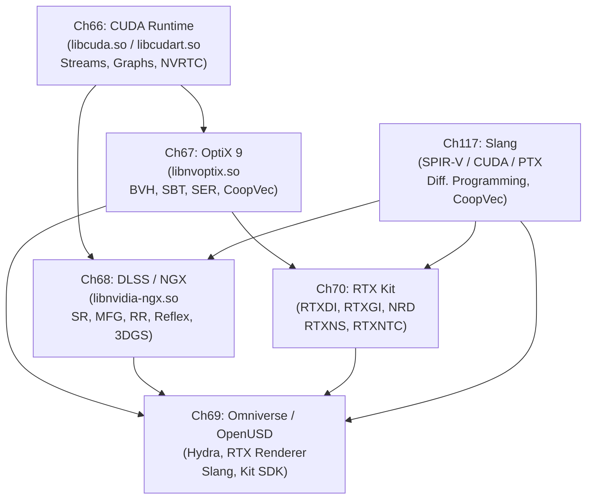

# Part XV — The NVIDIA Proprietary Graphics Stack

The preceding parts of this book traced the open-source Linux graphics stack from the **DRM** kernel subsystem through **Mesa**, **Wayland**, and the compositor layer, arriving at open Vulkan drivers such as **NVK** and **RADV**. This part descends into the closed-source tier that coexists with — and, for many workloads, depends upon — that open foundation. The NVIDIA proprietary stack is not a replacement for the Linux graphics stack; it is built on top of **`nvidia.ko`**, **`nvidia-uvm.ko`**, and **`nvidia-drm.ko`**, consuming the same **DRM** scheduler slots and **GEM** object lifetime rules, but then exposing programming models and AI-driven rendering features that have no open-source counterpart. Understanding this layer is essential for systems developers deploying GPU compute workloads, graphics engineers integrating hardware ray tracing and AI denoising into Vulkan renderers, and anyone debugging the interaction between the open and proprietary halves of the driver stack.

## Chapters in This Part

**Chapter 66 — CUDA Runtime, Streams, and NVRTC** lays the computational foundation for everything that follows. It maps the layered relationship between **`libcuda.so`** (the **Driver API**) and **`libcudart.so`** (the **Runtime API**), explains how **CUDA streams** and **CUDA events** provide concurrency and cross-process synchronisation, and details the **NVRTC** runtime compiler and **CUDA Graphs** for low-overhead GPU dispatch. It also covers the operational Linux specifics — **MPS**, **MIG**, **NVML**, and the **`/proc/driver/nvidia/`** diagnostics path — that experienced practitioners need but that CUDA tutorials typically omit. Readers will leave with a precise mental model of how CUDA programming constructs map onto kernel driver interfaces rather than a surface-level API tour.

**Chapter 67 — OptiX 9: NVIDIA's Ray Tracing Framework** moves up one level to NVIDIA's application-level ray tracing SDK, which runs entirely within a **CUDA** context. It covers the full **NVRTC** → **PTX**/**OptiX-IR** → **`OptixModule`** → **`OptixPipeline`** compilation chain, all seven shader types, **BVH** and **CLAS** acceleration structure construction, the **Shader Binding Table** (**SBT**), and the **Shader Execution Reordering** (**SER**) mechanism for reducing warp divergence. Chapter 67 also introduces **Cooperative Vectors** — neural network inference running inside shader programs via **Tensor Cores** — and explains **Vulkan**/**CUDA** interoperability for hybrid rendering pipelines. What distinguishes this chapter from the Vulkan ray tracing material in Chapter 56 is the NVIDIA-specific hardware path: **`libnvoptix.so`**, the proprietary BVH builder, the AI denoiser, and features that precede Vulkan standardisation.

**Chapter 68 — DLSS 4, Neural Rendering, and Frame Generation** covers the AI-rendering stack delivered through the **NGX SDK** (**`libnvidia-ngx.so`**): super-resolution (**DLSS SR**), multi-frame generation (**DLSS-G** / **MFG**), AI denoising (**Ray Reconstruction**), low-latency pipelining (**Reflex** and **`VK_NV_low_latency2`**), and neural scene representations including **3D Gaussian Splatting**. The chapter treats these as engineering topics, detailing the **`NVSDK_NGX_VULKAN_Init_with_ProjectID`** initialisation path, the plugin verification model (cryptographic **`.nvsig`** ELF section signatures), and the **Streamline** open-source C++ wrapper. It deliberately excludes **OptiX Cooperative Vectors** (covered in Chapter 67) and focuses instead on the inference path that is embedded in Vulkan presentation pipelines.

**Chapter 69 — NVIDIA Omniverse, OpenUSD, and the RTX Renderer** broadens the scope from real-time rendering primitives to the scene-graph and collaborative-simulation layer. It covers the **OpenUSD** core abstractions (**`UsdStage`**, **`UsdPrim`**, **`UsdAttribute`**, the **LIVERPS** composition arc ordering), the **AOUSD Core Specification 1.0** standardised under the Linux Foundation, and the **Hydra** rendering delegate architecture including **Hydra 2.0** Scene Index. The Omniverse **RTX Renderer**'s three modes (real-time, path-tracing, minimal), the **Slang** shader language with its automatic differentiation and **SlangPy** Python binding, the **Kit SDK** extension system, and headless container deployment via **NGC** are all addressed. This chapter is the only one in the part where the primary data structure — the **USD** stage — lives outside the GPU.

**Chapter 70 — The RTX Kit: RTXDI, RTXGI, NRD, RTXNS, and RTXNTC** closes the RTX SDK survey by examining the five MIT-licensed rendering SDKs that sit between raw **Vulkan** ray tracing extensions and the closed-source **NGX** feature set. **RTXDI** provides reservoir-based importance sampling (**ReSTIR DI** and **ReSTIR PT**) for scenes with millions of virtual lights. **RTXGI 2.0** delivers real-time global illumination via either a spatially hashed radiance cache (**SHaRC**) or an online-trained neural radiance cache (**NRC**). **NRD v4.17** supplies the **REBLUR**, **RELAX**, and **SIGMA** spatiotemporal denoisers consumed by nearly every production title. **RTXNS v1.3** exposes the **`VK_NV_cooperative_vector`** extension and a **Slang** `NeuralNetwork<>` template for running MLP inference inside any shader stage. **RTXNTC v0.5** compresses texture atlases into on-chip-decoded MLP networks, reducing VRAM pressure. A complete annotated rendering frame at the end of the chapter shows how all five interoperate.

**Chapter 117 — Slang: Differentiable Shading Language** examines the open-source shader language and compiler that underpins neural rendering across both the RTX Kit and Omniverse ecosystems. On Linux, **`slangc`** targets **SPIR-V** for Vulkan pipelines as a first-class output, as well as **PTX**/**CUDA** and CPU C++ — a single shader source tree that compiles to every major GPU execution environment. The chapter covers Slang's HLSL-superset type system (generics, interfaces, associated types, the capability system), the programmatic **`IGlobalSession`**/**`ISession`** compilation API with its module-link-extract model, and the **`slang-rhi`** hardware-abstraction layer. The core of the chapter is the **differentiable programming model**: the `[Differentiable]` attribute, `IDifferentiable` interface, `DifferentialPair<T>`, forward-mode `fwd_diff` and reverse-mode `bwd_diff` operators, custom derivative overrides, and global buffer gradient accumulation. It then connects that model to the **Cooperative Vectors** (`VK_NV_cooperative_vector`) path for MLP inference in shaders — the same primitive that RTXNS and OptiX Cooperative Vectors expose — and demonstrates end-to-end neural rendering use cases: differentiable texture compression (as consumed by RTXNTC), NeRF training loops, and DLSS-adjacent denoiser training. Because Slang compiles to SPIR-V, it is fully usable in any Vulkan renderer without the rest of the NVIDIA proprietary stack.

## How the Chapters Interrelate

**Chapter 66** is the strict prerequisite for every other chapter in this part. **CUDA streams**, **CUDA events**, **`cuModuleLoadData()`**, **NVRTC**, and **CUDA Graphs** are referenced without re-explanation in Chapters 67, 68, and 69. The GPU memory model — pinned host memory, **Unified Memory**, and stream-ordered allocation — underpins the zero-copy buffer sharing that Chapters 67 and 70 rely upon for **Vulkan**/**CUDA** interoperability.

**Chapter 67** (OptiX) and **Chapter 68** (DLSS/NGX) are independent of each other and can be read in either order after Chapter 66, but both feed into **Chapter 69**: the Omniverse **RTX Renderer** uses **OptiX** for its path-tracing mode and the **NGX** denoiser stack for real-time output, so readers of Chapter 69 will gain substantially more from having completed both. **Chapter 70** (RTX Kit) requires Chapter 67 for the **Cooperative Vectors** and **NVRTC** context used by **RTXNS** and **RTXNTC**, but requires only a basic understanding of the **NGX** feature set from Chapter 68 — the RTX Kit SDKs are deliberately designed to be used *before* DLSS upscaling in the rendering pipeline.

**Chapter 117** (Slang) is designed to be readable at any point after Chapter 66, but reaches its full significance when read alongside Chapters 67, 68, and 70. Its **SPIR-V** compilation target and **Vulkan**-native design mean it can be studied independently of the closed-source NGX and OptiX runtimes — readers interested only in cross-vendor differentiable shading on Vulkan can treat Chapter 117 as a standalone reference. For readers working through the full NVIDIA stack, Chapter 117 best precedes Chapter 70 (RTX Kit), because **RTXNS** and **RTXNTC** both expose their neural inference primitives through Slang `NeuralNetwork<>` templates and the `[Differentiable]` attribute. The **SlangPy** Python binding and automatic differentiation features in Chapter 117 also provide the shader-side counterpart to the NGX inference pipeline described in Chapter 68.

Thematically, the six chapters trace a single vertical slice: raw GPU work submission (**CUDA streams** and **graphs**) → programmable ray traversal and neural shader primitives (**OptiX**, **Cooperative Vectors**) → AI inference embedded in the frame pipeline (**NGX**, **DLSS**, **Ray Reconstruction**) → differentiable, cross-target shader programming (**Slang**, **SPIR-V**, **automatic differentiation**) → higher-order scene representation and rendering delegation (**OpenUSD**, **Hydra**) → production-ready rendering SDK composition (**RTX Kit**). The **Slang** shader language and **`VK_NV_cooperative_vector`** extension appear in Chapters 67, 69, 70, and 117, providing a shared vocabulary that ties the closed-source SDKs to the Vulkan-native open path.

## Prerequisites and What Comes Next

Readers should arrive at this part having covered the NVIDIA kernel module and **Open Kernel Modules** (Chapter 9), the **Vulkan** memory model and synchronisation primitives (Chapters 24–25), hardware ray tracing via **`VK_KHR_ray_tracing_pipeline`** (Chapter 56), and container-level **CUDA** device exposure (Chapter 55). Parts XVI and XVII (the Intel and AMD ecosystem chapters) return to the open-source side of the stack and are largely independent of this part, but the **NVK** Mesa driver material in Chapter 10 and the cross-vendor shader toolchain in Chapter 77 both assume familiarity with the NVIDIA hardware capabilities described here. Readers interested in the Vulkan SPIR-V toolchain context for **Slang** (Chapter 117) may also wish to consult Chapter 4 (SPIR-V and the Vulkan shader object model) before or alongside that chapter.

---
