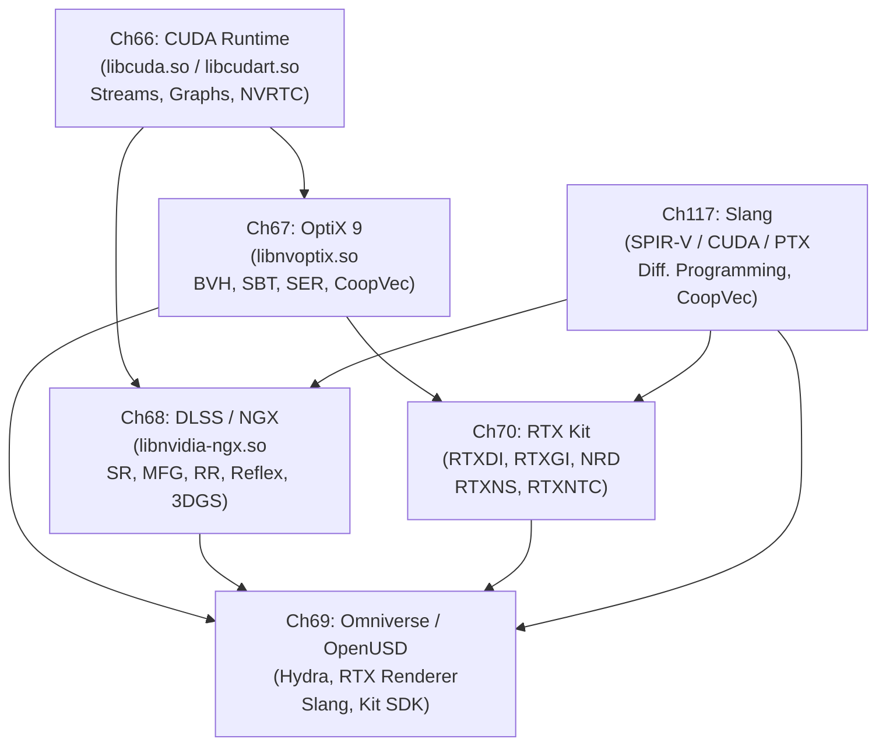

# Part XV — The NVIDIA Proprietary Graphics Stack

The preceding parts of this book traced the open-source Linux graphics stack from the **DRM** kernel subsystem through **Mesa**, **Wayland**, and the compositor layer, arriving at open Vulkan drivers such as **NVK** and **RADV**. This part descends into the closed-source tier that coexists with — and, for many workloads, depends upon — that open foundation. The NVIDIA proprietary stack is not a replacement for the Linux graphics stack; it is built on top of **`nvidia.ko`**, **`nvidia-uvm.ko`**, and **`nvidia-drm.ko`**, consuming the same **DRM** scheduler slots and **GEM** object lifetime rules, but then exposing programming models and AI-driven rendering features that have no open-source counterpart. Understanding this layer is essential for systems developers deploying GPU compute workloads, graphics engineers integrating hardware ray tracing and AI denoising into Vulkan renderers, and anyone debugging the interaction between the open and proprietary halves of the driver stack.

## Chapters in This Part

**Chapter 66 — CUDA Runtime, Streams, and NVRTC** lays the computational foundation for everything that follows. It maps the layered relationship between **`libcuda.so`** (the **Driver API**) and **`libcudart.so`** (the **Runtime API**), explains how **CUDA streams** and **CUDA events** provide concurrency and cross-process synchronisation, and details the **NVRTC** runtime compiler and **CUDA Graphs** for low-overhead GPU dispatch. It also covers the operational Linux specifics — **MPS**, **MIG**, **NVML**, and the **`/proc/driver/nvidia/`** diagnostics path — that experienced practitioners need but that CUDA tutorials typically omit. Readers will leave with a precise mental model of how CUDA programming constructs map onto kernel driver interfaces rather than a surface-level API tour.

**Chapter 67 — OptiX 9: NVIDIA's Ray Tracing Framework** moves up one level to NVIDIA's application-level ray tracing SDK, which runs entirely within a **CUDA** context. It covers the full **NVRTC** → **PTX**/**OptiX-IR** → **`OptixModule`** → **`OptixPipeline`** compilation chain, all seven shader types, **BVH** and **CLAS** acceleration structure construction, the **Shader Binding Table** (**SBT**), and the **Shader Execution Reordering** (**SER**) mechanism for reducing warp divergence. Chapter 67 also introduces **Cooperative Vectors** — neural network inference running inside shader programs via **Tensor Cores** — and explains **Vulkan**/**CUDA** interoperability for hybrid rendering pipelines. What distinguishes this chapter from the Vulkan ray tracing material in Chapter 56 is the NVIDIA-specific hardware path: **`libnvoptix.so`**, the proprietary BVH builder, the AI denoiser, and features that precede Vulkan standardisation.

**Chapter 68 — DLSS 4, Neural Rendering, and Frame Generation** covers the AI-rendering stack delivered through the **NGX SDK** (**`libnvidia-ngx.so`**): super-resolution (**DLSS SR**), multi-frame generation (**DLSS-G** / **MFG**), AI denoising (**Ray Reconstruction**), low-latency pipelining (**Reflex** and **`VK_NV_low_latency2`**), and neural scene representations including **3D Gaussian Splatting**. The chapter treats these as engineering topics, detailing the **`NVSDK_NGX_VULKAN_Init_with_ProjectID`** initialisation path, the plugin verification model (cryptographic **`.nvsig`** ELF section signatures), and the **Streamline** open-source C++ wrapper. It deliberately excludes **OptiX Cooperative Vectors** (covered in Chapter 67) and focuses instead on the inference path that is embedded in Vulkan presentation pipelines.

**Chapter 69 — NVIDIA Omniverse, OpenUSD, and the RTX Renderer** broadens the scope from real-time rendering primitives to the scene-graph and collaborative-simulation layer. It covers the **OpenUSD** core abstractions (**`UsdStage`**, **`UsdPrim`**, **`UsdAttribute`**, the **LIVERPS** composition arc ordering), the **AOUSD Core Specification 1.0** standardised under the Linux Foundation, and the **Hydra** rendering delegate architecture including **Hydra 2.0** Scene Index. The Omniverse **RTX Renderer**'s three modes (real-time, path-tracing, minimal), the **Slang** shader language with its automatic differentiation and **SlangPy** Python binding, the **Kit SDK** extension system, and headless container deployment via **NGC** are all addressed. This chapter is the only one in the part where the primary data structure — the **USD** stage — lives outside the GPU.

**Chapter 70 — The RTX Kit: RTXDI, RTXGI, NRD, RTXNS, and RTXNTC** closes the RTX SDK survey by examining the five MIT-licensed rendering SDKs that sit between raw **Vulkan** ray tracing extensions and the closed-source **NGX** feature set. **RTXDI** provides reservoir-based importance sampling (**ReSTIR DI** and **ReSTIR PT**) for scenes with millions of virtual lights. **RTXGI 2.0** delivers real-time global illumination via either a spatially hashed radiance cache (**SHaRC**) or an online-trained neural radiance cache (**NRC**). **NRD v4.17** supplies the **REBLUR**, **RELAX**, and **SIGMA** spatiotemporal denoisers consumed by nearly every production title. **RTXNS v1.3** exposes the **`VK_NV_cooperative_vector`** extension and a **Slang** `NeuralNetwork<>` template for running MLP inference inside any shader stage. **RTXNTC v0.5** compresses texture atlases into on-chip-decoded MLP networks, reducing VRAM pressure. A complete annotated rendering frame at the end of the chapter shows how all five interoperate.

**Chapter 117 — Slang: Differentiable Shading Language** examines the open-source shader language and compiler that underpins neural rendering across both the RTX Kit and Omniverse ecosystems. On Linux, **`slangc`** targets **SPIR-V** for Vulkan pipelines as a first-class output, as well as **PTX**/**CUDA** and CPU C++ — a single shader source tree that compiles to every major GPU execution environment. The chapter covers Slang's HLSL-superset type system (generics, interfaces, associated types, the capability system), the programmatic **`IGlobalSession`**/**`ISession`** compilation API with its module-link-extract model, and the **`slang-rhi`** hardware-abstraction layer. The core of the chapter is the **differentiable programming model**: the `[Differentiable]` attribute, `IDifferentiable` interface, `DifferentialPair<T>`, forward-mode `fwd_diff` and reverse-mode `bwd_diff` operators, custom derivative overrides, and global buffer gradient accumulation. It then connects that model to the **Cooperative Vectors** (`VK_NV_cooperative_vector`) path for MLP inference in shaders — the same primitive that RTXNS and OptiX Cooperative Vectors expose — and demonstrates end-to-end neural rendering use cases: differentiable texture compression (as consumed by RTXNTC), NeRF training loops, and DLSS-adjacent denoiser training. Because Slang compiles to SPIR-V, it is fully usable in any Vulkan renderer without the rest of the NVIDIA proprietary stack.

## Key Concepts

### CUDA Infrastructure: NVML and NVRTC

**NVML (NVIDIA Management Library)** is a C API (`libnvidia-ml.so`) for GPU monitoring and management. It provides per-GPU queries: clock frequencies, temperature, power draw, memory utilisation, PCIe bandwidth, ECC error counts, and per-process GPU utilisation and VRAM usage. NVML is the data source for `nvidia-smi`, MangoHud's NVIDIA metrics path, and monitoring tools like `nvtop` and Prometheus exporters. NVML accesses `/proc/driver/nvidia/` and the `nvidia-uvm.ko` module; it requires the NVIDIA proprietary driver but no GPU context.

**NVRTC (NVIDIA Runtime Compilation)** is a C API for JIT-compiling CUDA C++ to PTX at runtime. `nvrtcCompileProgram()` takes a string of CUDA source, compile options, and header sources, and produces a PTX binary that can be loaded via `cuModuleLoadData()`. NVRTC is used by OptiX (which compiles ray tracing shaders to PTX at pipeline creation time), inference runtimes (TensorRT JIT engines), and research frameworks that need to generate GPU kernels from runtime-constructed expressions.

### Ray Tracing Architecture: BVH, SBT, and SER

**BVH (Bounding Volume Hierarchy)** is the acceleration structure that enables hardware ray tracing. A BVH is a binary tree of axis-aligned bounding boxes (AABBs) wrapping scene geometry at progressively finer levels. Ray traversal hardware (RT Cores on NVIDIA Turing+) traverses the BVH hierarchy in hardware, testing the ray against AABBs and intersecting leaf-node triangles in dedicated fixed-function units, without consuming shader execution resources. The Vulkan API calls this a `VkAccelerationStructureKHR`; OptiX calls it an `OptixAccelBufferSizes` / `OptixTraversableHandle`. Top-level and bottom-level acceleration structures (TLAS/BLAS) allow instancing of reusable geometry.

**SBT (Shader Binding Table)** is the GPU buffer that maps from geometry/instance indices to shader handles and per-geometry data records. In `VK_KHR_ray_tracing_pipeline`, the SBT is divided into raygen, miss, hit group, and callable shader sections. When a ray hits a triangle in BLAS instance N, the hardware computes an offset into the SBT's hit group section to find the closest-hit and any-hit shader handles for that instance, plus any per-instance data (material parameters, texture indices). The SBT is how a ray tracer associates different shaders with different scene objects without branching in the ray generation shader.

**SER (Shader Execution Reordering)** is an Ada Lovelace hardware feature that reduces warp divergence in ray tracing. After `traceRay()` returns, different threads in the same warp may have hit different materials, triggering different shader paths — classic SIMD divergence. SER hardware can reorder the continuation of those threads across warps to group threads with the same shader together, filling warps and dramatically reducing the divergence penalty (NVIDIA reports 2–3× throughput improvement for complex scenes). SER is exposed via `reorderThread()` / `hitObjectRecord*` in the HLSL SER extension and via OptiX's implicit SER.

### Neural Rendering Features

**Cooperative Vectors** (`VK_NV_cooperative_vector` Vulkan extension, also in OptiX) allow running small MLP (multi-layer perceptron) networks inside any shader stage — not just compute shaders — using Tensor Core acceleration. A shader calls `CoopVecMulAdd()` to multiply a vector by a matrix stored in a compact `coopvec_matmul_e4m3_e4m3` layout; the Tensor Core hardware executes the matrix-vector product in a few cycles. This enables **RTXNS** (neural shading), where per-hit BRDFs or emission functions are neural networks evaluated inside closest-hit shaders.

**NGX (NVIDIA NGX SDK)** is the delivery system for NVIDIA's AI rendering features (`libnvidia-ngx.so`). Each feature is a cryptographically signed ELF plugin (`.nvsgf` / `.nvsig` signature section) verified at load time by the NGX runtime. Features include: **DLSS SR** (super-resolution), **DLSS-G / MFG** (frame generation), **Ray Reconstruction** (AI denoiser), **Reflex** (latency reduction), and **Streamline** wrapper features. NGX is initialised per-application via `NVSDK_NGX_VULKAN_Init_with_ProjectID()` and requires NVIDIA driver r555+ for DLSS 4 features.

**MFG (Multi Frame Generation)** is DLSS 3.5's capability to generate up to 3 interpolated frames for each rendered frame (on Ada Lovelace and Blackwell GPUs). Unlike DLSS-G (frame generation, 1 interpolated frame per rendered frame since Turing), MFG uses additional Optical Flow and AI interpolation passes to produce multiple intermediate frames, increasing apparent frame rate by up to 4×. Quality degrades under fast camera motion; input latency remains tied to the rendered frame rate (Reflex integration is essential for compensating perceived latency).

**RTX** is NVIDIA's platform brand combining RT Cores (hardware ray traversal), Tensor Cores (neural inference and matrix compute), and programmable shader stages into a coherent hardware + software ecosystem. "RTX" does not denote a specific architecture but appears on Turing, Ampere, Ada Lovelace, and Blackwell GPUs. The RTX platform is what enables the combination of features described in this part: ray tracing (RT Cores) + AI denoising and upscaling (Tensor Cores) + programmable shading (CUDA SMs).

**Streamline** is an open-source C++ wrapper library (Apache 2.0, `github.com/NVIDIAGameWorks/Streamline`) that abstracts the NGX and PC Latency APIs behind a common `sl::Feature` interface. It allows integrating DLSS SR, DLSS-G, Reflex, and NIS without directly linking against the closed-source `libnvidia-ngx.so`. Streamline handles NGX initialisation, feature loading, and the per-frame inputs (motion vectors, depth, colour, exposure), making it the standard integration path for Vulkan-based game engines.

### OpenUSD Composition: LIVERPS and AOUSD

**LIVERPS** is a mnemonic for the USD composition arc ordering in the Prim Index that determines which **opinion** wins when multiple layers specify a value for the same attribute. In order from highest to lowest strength:
1. **L** — Local: opinions in the layer stack of the current stage
2. **I** — Inherits: `inherits` arcs pull in a class Prim's opinions
3. **V** — Variants: `variantSet` selections resolve variant opinions
4. **E** — rEferences: `references` arcs compose external USD files
5. **R** — Payload: deferred-load `payload` arcs
6. **PS** — Specializes: the weakest arc, used for specialisation (materials inheriting from a base)

Understanding LIVERPS is essential for debugging USD scene assembly: when an attribute has an unexpected value, the LIVERPS ordering determines which layer or arc provided it.

**AOUSD (Alliance for OpenUSD)** is a Linux Foundation project (formed 2023 by Apple, Adobe, Autodesk, NVIDIA, and Pixar) that standardises the OpenUSD core specification separately from any single vendor's implementation. AOUSD maintains the USD specification document, conformance test suite, and reference implementation. The AOUSD Core Specification 1.0 is the definitive USD standard reference for Chapter 69.

### Ray Tracing Paradigms

**Ray tracing** fires rays from the camera (or light sources) into the scene and tests for geometric intersections via a BVH. Each intersection triggers a shader that evaluates material properties and spawns secondary rays (shadow, reflection, refraction). Hardware RT Cores accelerate the BVH traversal. Result: physically correct hard shadows, reflections, and refraction with O(log N) scene traversal cost.

**Ray marching** steps a ray through a volumetric scalar field (SDF, density volume, distance field) at fixed intervals or adaptive step sizes, accumulating colour and opacity. Used for rendering clouds, smoke, subsurface scattering, and implicit surfaces. Does not use BVH — steps through 3D texture samples or evaluates a mathematical SDF. Implemented in compute or fragment shaders; does not use RT Cores.

**Path tracing** is Monte Carlo integration of the light transport equation via recursive ray tracing: from the camera, rays bounce at each surface according to the BRDF (randomly sampled), accumulating light contributions until hitting a light source or exceeding max depth. Converges to ground-truth photorealistic lighting given enough samples. 1 sample/pixel = extremely noisy; 512+ samples/pixel = visually converged. AI denoisers (NRD, OptiX denoiser) allow 1–4 spp path tracing to achieve acceptable quality in real time.

### RTX SDK Components

**RTXDI (RTX Direct Illumination)** implements **ReSTIR** (Reservoir-based Spatio-Temporal Importance Resampling) for rendering direct illumination from millions of virtual lights. The algorithm: each pixel maintains a **reservoir** — a compact data structure holding a weighted candidate light sample. Each frame, new candidates are generated and existing reservoirs are updated via resampling; spatio-temporal reuse shares samples from neighboring pixels and prior frames. RTXDI achieves quality equivalent to hundreds of shadow rays per pixel with only 1–2 rays per pixel.

**Reservoir-based importance sampling** is the ReSTIR algorithm's core mechanism. A reservoir stores one selected sample and a weight. When considering a new sample, the reservoir performs weighted reservoir sampling: with probability `new_weight / (old_weight + new_weight)`, replace the selected sample. After combining many reservoirs (spatial/temporal reuse), the output is an unbiased estimator of the full integral. Reservoir operations are GPU-friendly: each pixel's reservoir fits in ~32 bytes.

**RTXGI 2.0 (RTX Global Illumination)** provides real-time indirect lighting via two radiance cache strategies:
- **SHaRC (Spatially Hashed Radiance Cache)**: a hash-grid world-space cache indexed by a spatial hash of the surface position. Each hash entry accumulates radiance contributions from path-traced rays into a running average. Hit shaders look up the cache at the secondary hit point instead of firing further rays. Compact (fixed 32 MB budget), fast, and works well for diffuse indirect lighting.
- **NRC (Neural Radiance Cache)**: an online-trained tiny MLP (8 layers, 32 neurons, `fp16`) that approximates the scene's radiance field. Trained live during rendering via `CUDA` or `VK_NV_cooperative_vector` Tensor Core inference. Adapts to dynamic scenes but requires per-scene convergence time. Higher quality than SHaRC for glossy surfaces and specular inter-reflections.

**NRD (NVIDIA Real-time Denoisers)** is a set of spatiotemporal denoising passes operating on noisy path-traced inputs (1–4 spp):
- **REBLUR**: recurrent blur denoiser using temporal reprojection and adaptive spatial radius
- **RELAX**: spatiotemporal variance-guided denoiser based on SVGF; works better for specular than REBLUR
- **SIGMA**: shadow-specific denoiser for penumbra reconstruction

All NRD passes use motion vectors and depth for reprojection across frames, accumulating samples over time to reduce variance. The signal-to-noise ratio improves approximately as √N where N is the effective temporal sample count.

**RTXNS v1.3 (RTX Neural Shaders)** exposes the `VK_NV_cooperative_vector` Vulkan extension and a Slang `NeuralNetwork<>` template for running MLP inference inside any shader stage (closest-hit, miss, rasterisation fragment, compute). A shader function annotated with `NeuralNetwork<4, 4, 2>` compiles to `CoopVecMulAdd` instructions that execute on Tensor Cores. Use cases: neural BRDFs, neural LOD, neural material appearance functions.

**RTXNTC v0.5 (RTX Neural Texture Compression)** compresses a texture atlas (potentially GB-scale) into a small MLP network (~4 MB) that, given UV coordinates, outputs the compressed texel values. The MLP is evaluated at sample time using Tensor Cores via RTXNS. This provides dramatic VRAM savings (100–1000× compression) at the cost of MLP inference overhead per texture lookup. RTXNTC requires per-texture training (offline step); inference is real-time.

**NGC (NVIDIA GPU Cloud)** is NVIDIA's container registry (`ngc.nvidia.com`) providing GPU-optimised Docker containers for deep learning (PyTorch, TensorFlow, JAX), inference (TensorRT, Triton), HPC (CUDA, cuDNN, NCCL), and NVIDIA simulation tools (Omniverse, Isaac, Modulus). NGC containers include specific CUDA, driver, cuDNN, and framework version combinations that are validated together, eliminating dependency conflicts. On Linux, NGC containers are pulled via `docker pull nvcr.io/nvidia/<container>:<version>` and require the NVIDIA Container Toolkit.

**Differentiable Shading** (via Slang) enables computing gradients through GPU shader programs — essential for neural rendering training loops. The Slang `[Differentiable]` attribute marks a function as differentiable; `fwd_diff(f)` returns the Jacobian-vector product (forward mode), `bwd_diff(f)` returns the vector-Jacobian product (reverse mode). `DifferentialPair<T>` carries a primal value and a differential value; custom `__bwd_diff` overrides allow manually specifying gradients for non-differentiable operations (texture lookups, hardware intrinsics). Differentiable shading is used in RTXNTC training (gradient descent through neural texture compression), NeRF training on GPU, and DLSS/denoiser model training where shader-in-the-loop training is needed.

**Spatiotemporal denoisers** accumulate noisy samples across frames and pixels by exploiting temporal coherence and spatial smoothness. The key mechanisms: (1) **temporal reprojection** uses motion vectors to reproject the previous frame's pixel to its current position, warping the history buffer; (2) **adaptive accumulation** weights the new frame against the history based on reprojection confidence (disocclusions, fast motion, lighting changes invalidate history); (3) **spatial filtering** blurs across pixels within a radius determined by local variance, using a bilateral weighting function that preserves sharp edges. The result allows path tracers running at 1–4 samples/pixel to produce quality comparable to 64+ spp offline rendering.

## How the Chapters Interrelate

**Chapter 66** is the strict prerequisite for every other chapter in this part. **CUDA streams**, **CUDA events**, **`cuModuleLoadData()`**, **NVRTC**, and **CUDA Graphs** are referenced without re-explanation in Chapters 67, 68, and 69. The GPU memory model — pinned host memory, **Unified Memory**, and stream-ordered allocation — underpins the zero-copy buffer sharing that Chapters 67 and 70 rely upon for **Vulkan**/**CUDA** interoperability.

**Chapter 67** (OptiX) and **Chapter 68** (DLSS/NGX) are independent of each other and can be read in either order after Chapter 66, but both feed into **Chapter 69**: the Omniverse **RTX Renderer** uses **OptiX** for its path-tracing mode and the **NGX** denoiser stack for real-time output, so readers of Chapter 69 will gain substantially more from having completed both. **Chapter 70** (RTX Kit) requires Chapter 67 for the **Cooperative Vectors** and **NVRTC** context used by **RTXNS** and **RTXNTC**, but requires only a basic understanding of the **NGX** feature set from Chapter 68 — the RTX Kit SDKs are deliberately designed to be used *before* DLSS upscaling in the rendering pipeline.

**Chapter 117** (Slang) is designed to be readable at any point after Chapter 66, but reaches its full significance when read alongside Chapters 67, 68, and 70. Its **SPIR-V** compilation target and **Vulkan**-native design mean it can be studied independently of the closed-source NGX and OptiX runtimes — readers interested only in cross-vendor differentiable shading on Vulkan can treat Chapter 117 as a standalone reference. For readers working through the full NVIDIA stack, Chapter 117 best precedes Chapter 70 (RTX Kit), because **RTXNS** and **RTXNTC** both expose their neural inference primitives through Slang `NeuralNetwork<>` templates and the `[Differentiable]` attribute. The **SlangPy** Python binding and automatic differentiation features in Chapter 117 also provide the shader-side counterpart to the NGX inference pipeline described in Chapter 68.

Thematically, the six chapters trace a single vertical slice: raw GPU work submission (**CUDA streams** and **graphs**) → programmable ray traversal and neural shader primitives (**OptiX**, **Cooperative Vectors**) → AI inference embedded in the frame pipeline (**NGX**, **DLSS**, **Ray Reconstruction**) → differentiable, cross-target shader programming (**Slang**, **SPIR-V**, **automatic differentiation**) → higher-order scene representation and rendering delegation (**OpenUSD**, **Hydra**) → production-ready rendering SDK composition (**RTX Kit**). The **Slang** shader language and **`VK_NV_cooperative_vector`** extension appear in Chapters 67, 69, 70, and 117, providing a shared vocabulary that ties the closed-source SDKs to the Vulkan-native open path.

## Prerequisites and What Comes Next

Readers should arrive at this part having covered the NVIDIA kernel module and **Open Kernel Modules** (Chapter 9), the **Vulkan** memory model and synchronisation primitives (Chapters 24–25), hardware ray tracing via **`VK_KHR_ray_tracing_pipeline`** (Chapter 56), and container-level **CUDA** device exposure (Chapter 55). Parts XVI and XVII (the Intel and AMD ecosystem chapters) return to the open-source side of the stack and are largely independent of this part, but the **NVK** Mesa driver material in Chapter 10 and the cross-vendor shader toolchain in Chapter 77 both assume familiarity with the NVIDIA hardware capabilities described here. Readers interested in the Vulkan SPIR-V toolchain context for **Slang** (Chapter 117) may also wish to consult Chapter 4 (SPIR-V and the Vulkan shader object model) before or alongside that chapter.

---

## Part Roadmap Summary

*Synthesised from the Roadmap sections of this part's chapters.*

### Near-term (6–12 months)

- **Cooperative Vectors standardisation**: `VK_NV_cooperative_vector` is progressing toward `VK_KHR_cooperative_vector` ratification across Khronos, tracked simultaneously by Slang's `CoopVec<>` type (Ch117), RTXNS (Ch70), and OptiX (Ch67). Ratification extends Tensor Core-backed MLP inference in shaders to AMD RDNA 4 and Intel Xe2, removing the current NVIDIA-only constraint.
- **NVK DLSS stabilisation and open driver advances**: Mesa 26.2's experimental `NVK_EXPERIMENTAL=dlss` DLSS support (Ch68) is expected to promote to a stable default in Mesa 26.3/27.0; simultaneously, NVIDIA's Open Kernel Modules are anticipated to shed their last closed firmware blobs on Hopper/Blackwell, completing the source-available driver transition (Ch66).
- **Denoiser and upscaler co-operation**: NRD v5.0 (Ch70) targets a co-operative mode feeding directly into DLSS 4 Ray Reconstruction, sharing history buffers and reducing combined denoiser+upscaler latency by ~30%. VKD3D-Proton is expected to receive DLSS 4 MFG support for Proton users on RTX 50 Series (Ch68).
- **RTX SDK and toolchain improvements**: RTXNTC is gaining a Vulkan-native training backend to eliminate the CUDA-only offline encoder requirement (Ch70); NVRTC bundled header support is being extended to CCCL for Toolkit-free ML inference deployment (Ch66); AOUSD Core Specification 1.1 will add normative geometry and shading schemas (Ch69); `slangd` LSP is receiving source-accurate autodiff error diagnostics (Ch117).
- **Platform broadening**: ARM/Orin support in OptiX is being actively tuned (Ch67); SlangPy is gaining `torch.compile` (TorchDynamo) span support for mixed Python/Slang training loops (Ch117); the open `low_latency_layer` Vulkan layer is expected to land in Mesa as an implicit layer delivering vendor-agnostic Reflex/Anti-Lag 2 scheduling (Ch68).

### Medium-term (1–3 years)

- **Unified GPU memory model**: Grace Blackwell (GB200) NVLink-C2C unified addressing will expand HMM semantics to hardware-coherent CPU-GPU shared memory, largely eliminating explicit `cudaMallocManaged` prefetch calls (Ch66). Blackwell's 5th-generation Tensor Cores with native FP8 accumulation are expected to reduce NRC per-frame training from 4–8 ms to under 2 ms, making neural radiance caching (RTXGI NRC) the default indirect illumination path for enclosed scenes (Ch70).
- **Cross-vendor neural rendering primitives**: `VK_NVX_binary_import` and `VK_NVX_image_view_handle` may be rationalised into vendor-agnostic extensions following the `VK_KHR_cooperative_matrix` precedent (Ch68); SPIR-V tooling (spirv-val, spirv-cross) is expected to gain full `cooperative_vector` capability support (Ch70); Slang's WGSL backend is targeting production readiness for differentiable shaders in WebGPU (Ch117).
- **Rendering pipeline integration**: NVIDIA has signalled a render-graph-aware abstraction layer over all five RTX Kit SDKs to replace per-SDK manual command-buffer injection with automatic barrier insertion and async compute scheduling (Ch70). Hydra 3.0 is expected to complete a fully data-source-driven render delegate API, removing typed prim-object lifecycle overhead (Ch69). OptiX denoising is expected to integrate a DLSS-class model directly, reducing dependency on full NGX integration (Ch67).
- **USD and scene description evolution**: AOUSD Specification 2.0 will formalise `UsdGeomMesh` subdivisions, `UsdLux` physical units, and a unified OpenPBR surface schema superseding `UsdPreviewSurface` (Ch69). The Fabric Scene Delegate in Omniverse Kit is expected to subsume the USD composition stack for simulation-heavy workflows, with Newton physics (NVIDIA Warp) as the differentiable-simulation successor to PhysX (Ch69). 3DGS is expected to receive a standardised LOD and mesh-occlusion integration specification through AOUSD and game engine middleware collaboration (Ch68).
- **Compiler and language maturity**: Khronos is expected to advance Slang's module system toward a cross-vendor binary module format for pre-compiled shader libraries (Ch117); higher-order reverse-mode differentiation (`bwd_diff(bwd_diff(f))`) is a stated Slang research goal enabling second-order optimisers over GPU shader parameters (Ch117); MIG is expected to gain time-shared GPU instances on Blackwell, blending hardware isolation with MPS-style temporal multiplexing (Ch66).

### Long-term

- **Fully neural rendering pipelines**: The convergence trajectory across RTXGI NRC, RTXNS, and RTXNTC (Ch70), OptiX Cooperative Vectors (Ch67), DLSS neural representations (Ch68), and Slang differentiable shading (Ch117) points toward a pipeline where the boundary between material evaluation, lighting, denoising, and upscaling dissolves into a single per-scene neural model — a horizon demonstrated in NVIDIA Falcor and NVIDIA's NeAT research.
- **Open Khronos neural rendering standard and ReSTIR democratisation**: As cooperative vector and neural texture sampling patterns consolidate across vendors, a Khronos working group is expected to standardise neural rendering primitives (weight buffer layout, MLP dispatch, hash encoding) as a cross-API extension — analogous to how `VK_KHR_ray_tracing_pipeline` standardised ray tracing. In parallel, ReSTIR DI/PT patent licensing is expected to enable hardware-agnostic implementations in Mesa RADV, decoupling RTXDI from NVIDIA-only deployment in shipping titles (Ch70).
- **Neural scene description as industry standard**: OpenUSD's `UsdVolParticleField3DGaussianSplat` schema and neural SDF types (Ch69) are positioned to become the primary interchange format for photorealistic asset capture alongside MaterialX; AOUSD is pursuing an ISO/IEC standardisation track for USD; Khronos is expected to fold 3DGS rendering into a future glTF extension, mirroring the PBR-material pattern (Ch68, Ch69). Slang's `CoopVec<>` adoption across all discrete and integrated GPUs would make in-shader MLP inference a portable API-agnostic primitive, potentially displacing vendor-specific tensor intrinsics across production renderers (Ch117).
- **Open compute and driver convergence**: A community-maintained open alternative to `libcuda.so` building on the GSP firmware interface may emerge as NVK (Ch10) matures for compute workloads; the boundary between CUDA streams and Vulkan queues is likely to converge toward a unified GPU timeline abstraction, simplifying mixed compute/render pipelines (Ch66). The NGX SDK's `.nvsig` cryptographic plugin model may be partially relaxed over a 3–5 year horizon, following the precedents of `nvidia-open` kernel modules and the NVK Mesa driver (Ch68).
