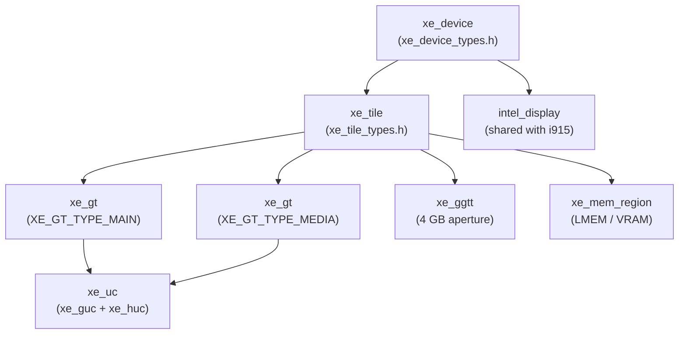
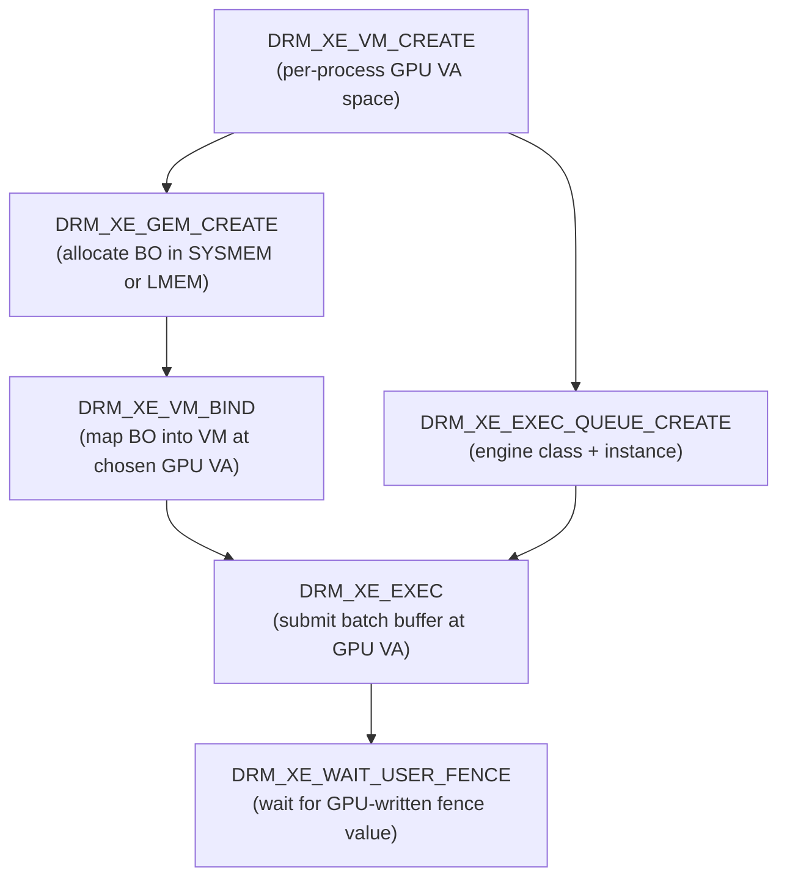
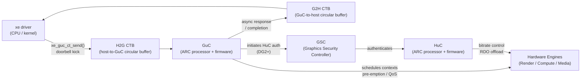
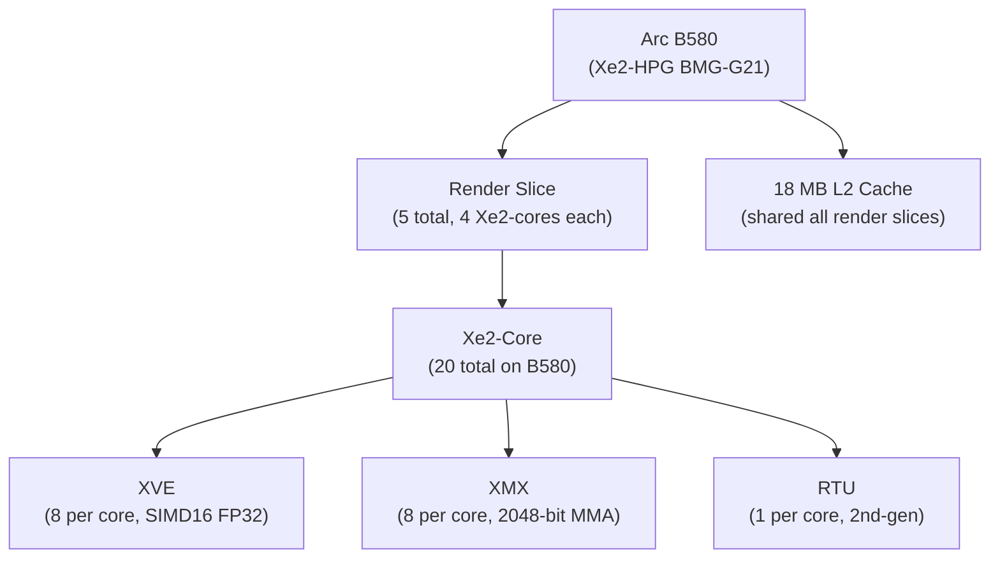
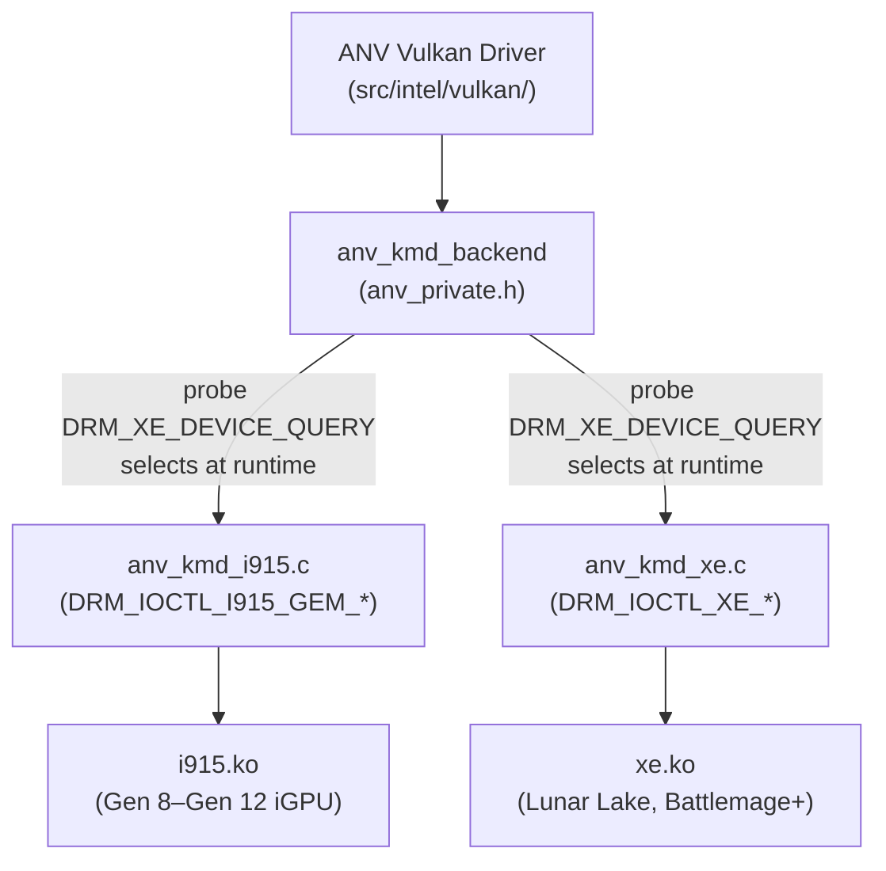
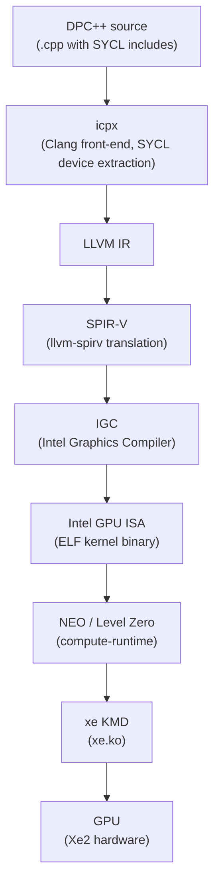
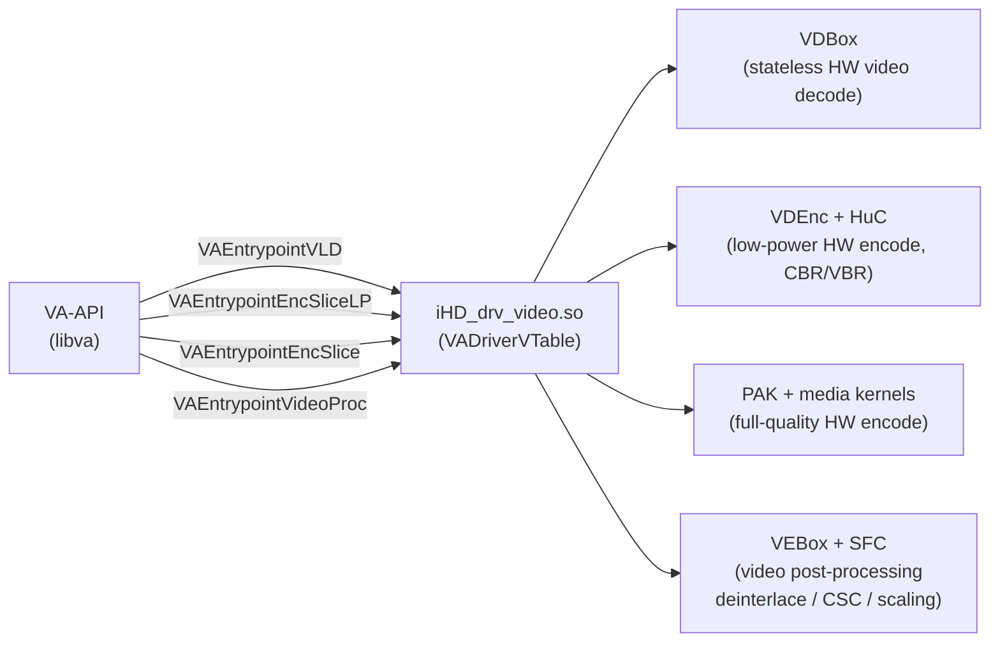

# Chapter 71: Intel Xe Kernel Driver, Arc GPU Architecture, and the Intel Open Stack

> **Part**: Part XVI — Intel Open Graphics Stack
> **Audience**: Systems and driver developers working with the Intel kernel driver (xe.ko) or porting workloads to Intel Arc; graphics application developers using ANV Vulkan on Linux; compute developers evaluating Level Zero and oneAPI DPC++ on Intel GPUs; browser and multimedia engineers integrating VA-API hardware decode/encode via the iHD media driver.
> **Status**: First draft — 2026-06-17

---

## Table of Contents

1. [Intel GPU History: From Gen Graphics to Iris to Arc](#1-intel-gpu-history-from-gen-graphics-to-iris-to-arc)
   - [1.1 What is Intel Xe?](#11-what-is-intel-xe)
   - [1.2 What is the xe.ko Kernel Driver?](#12-what-is-the-xeko-kernel-driver)
   - [1.3 What is the Intel Open Graphics Stack?](#13-what-is-the-intel-open-graphics-stack)
2. [Xe Kernel Driver Architecture (xe.ko)](#2-xe-kernel-driver-architecture-xeko)
   - 2.1 [Why i915 Was Replaced for Discrete GPUs](#21-why-i915-was-replaced-for-discrete-gpus)
   - 2.2 [Driver Design Goals and GMD Versioning](#22-driver-design-goals-and-gmd-versioning)
   - 2.3 [LMEM, GGTT, and the VM_BIND Memory Model](#23-lmem-ggtt-and-the-vm_bind-memory-model)
   - 2.4 [Core Data Structures: xe_device, xe_tile, xe_gt](#24-core-data-structures-xe_device-xe_tile-xe_gt)
   - 2.5 [uAPI: DRM Ioctls and Execution Model](#25-uapi-drm-ioctls-and-execution-model)
3. [GuC and HuC Firmware](#3-guc-and-huc-firmware)
   - 3.1 [GuC: Ring-less Command Submission via CTB](#31-guc-ring-less-command-submission-via-ctb)
   - 3.2 [HuC: Media Decode Assistance](#32-huc-media-decode-assistance)
   - 3.3 [Firmware Loading in the Xe Driver](#33-firmware-loading-in-the-xe-driver)
4. [Xe2 / Battlemage Architecture](#4-xe2--battlemage-architecture)
   - 4.1 [Xe2-HPG Microarchitecture Overview](#41-xe2-hpg-microarchitecture-overview)
   - 4.2 [Render Slice and Xe-Core Structure](#42-render-slice-and-xe-core-structure)
   - 4.3 [XMX Tensor Engines](#43-xmx-tensor-engines)
   - 4.4 [Second-Generation Ray Tracing Units](#44-second-generation-ray-tracing-units)
   - 4.5 [AV1 Hardware Encode (VDEnc)](#45-av1-hardware-encode-vdenc)
5. [Intel ANV Vulkan Driver](#5-intel-anv-vulkan-driver)
   - 5.1 [KMD Backend Abstraction](#51-kmd-backend-abstraction)
   - 5.2 [Bindless Descriptor Model](#52-bindless-descriptor-model)
   - 5.3 [Ray Tracing and BVH Building](#53-ray-tracing-and-bvh-building)
   - 5.4 [Sparse Binding](#54-sparse-binding)
   - 5.5 [Conformance Status](#55-conformance-status)
6. [Level Zero and oneAPI](#6-level-zero-and-oneapi)
   - 6.1 [Level Zero API Design](#61-level-zero-api-design)
   - 6.2 [Compute Runtime (NEO)](#62-compute-runtime-neo)
   - 6.3 [Intel oneAPI DPC++ Compiler](#63-intel-oneapi-dpc-compiler)
7. [Intel Media Driver (iHD)](#7-intel-media-driver-ihd)
   - 7.1 [Architecture: VDBox, VDEnc, VEBox, SFC](#71-architecture-vdbox-vdenc-vebox-sfc)
   - 7.2 [MDF/CM Media Kernels](#72-mdfcm-media-kernels)
   - 7.3 [AV1 Encode Path on Arc/Battlemage](#73-av1-encode-path-on-arcbattlemage)
   - 7.4 [VA-API Interface and Environment Configuration](#74-va-api-interface-and-environment-configuration)
8. [XeSS: Intel Xe Super Sampling](#8-xess-intel-xe-super-sampling)
   - 8.1 [XMX Path vs DP4a Fallback](#81-xmx-path-vs-dp4a-fallback)
   - 8.2 [XeSS-SR API: Quality Modes and Initialization](#82-xess-sr-api-quality-modes-and-initialization)
   - 8.3 [XeSS 2: Frame Generation and Low Latency](#83-xess-2-frame-generation-and-low-latency)
9. [Integration of the Intel Open Stack](#9-integration-of-the-intel-open-stack)
10. [Integrations](#10-integrations)
11. [References](#11-references)

---

## 1. Intel GPU History: From Gen Graphics to Iris to Arc

Intel has shipped integrated graphics for decades under its "Gen" numbering scheme. **Gen 6** (Sandy Bridge, 2011) introduced hardware-accelerated video decoding; **Gen 9** (Skylake, 2015) added **GuC**/**HuC** firmware co-processors and shader model 5.0; **Gen 11** (Ice Lake, 2019) doubled EU count and introduced tile-based rendering improvements. The **Xe** brand, introduced with the 11th-generation Tiger Lake launch in September 2020, marks the start of a unified GPU microarchitecture roadmap spanning the integrated-to-discrete spectrum. [Source: Intel Xe Wikipedia](https://en.wikipedia.org/wiki/Intel_Xe)

The **Xe** family branches into four sub-architectures:

| Sub-arch | Target | Products |
|---|---|---|
| **Xe-LP** (Low Power) | iGPU mainstream | Tiger Lake (11th gen), Alder Lake (12th gen) |
| **Xe-HPG** (High Perf Graphics) | Discrete gaming | Arc Alchemist A-series (2022) |
| **Xe-HP / Xe-HPC** | Data centre | Ponte Vecchio HPC GPU |
| **Xe-LPG** | iGPU premium | Meteor Lake, Arrow Lake, Lunar Lake |

**Arc Alchemist (2022)** — Intel's first consumer discrete GPU line uses **Xe-HPG** on TSMC N6. The flagship A770 carries 32 Xe-cores (4,096 shader units), 32 **RTUs** (ray-tracing units), and 16 GB **GDDR6**. Alchemist introduced hardware **AV1** decode and encode, a requirement for modern streaming workloads.

**Arc Battlemage (December 2024)** — **Xe2-HPG** on TSMC N5. The B580 carries 20 Xe2-cores on a 272 mm² die with 19.6 billion transistors. The **Xe2** core is a complete redesign: **SIMD** width doubles from **SIMD8** to native **SIMD16**, **XMX** (matrix) units run at 2,048 bits wide each, and second-generation **RTUs** add a 16 KB **BVH** element cache per unit. [Source: VideoCardz Arc B580 and B570 specs](https://www.addictivetips.com/news/intel-battlemage-arc-b580-b570-specs-features-pricing/)

The **Mesa** **OpenGL** driver **Iris** (introduced in Mesa 19.1, 2019) replaced the older i965 Gallium driver for Gen8+ hardware. **Iris** supports the Intel shader compiler backend (also called **BRW** after "Broadwell"), which is shared with the **ANV** Vulkan driver. The legacy **Crocus** driver covers Gen4–Gen7 hardware that **Iris** does not target.

This chapter covers the full Intel open graphics stack from kernel to application API:

- **Section 2 — xe.ko Kernel Driver**: examines why **xe.ko** replaced **i915** for discrete **Arc** GPUs, the **GMD** (Graphics Micro-Driver) versioning scheme, the **LMEM** local video memory and **GGTT** (Global Graphics Translation Table) memory model, the **VM_BIND**-only explicit memory management approach, the core data structures **xe_device**, **xe_tile**, and **xe_gt**, and the **DRM** ioctl **uAPI** including **DRM_XE_VM_CREATE**, **DRM_XE_GEM_CREATE**, **DRM_XE_VM_BIND**, **DRM_XE_EXEC**, and **DRM_XE_WAIT_USER_FENCE**.
- **Section 3 — GuC and HuC Firmware**: covers ring-less command submission via **CTB** (Command Transport Buffers), **HuC**-assisted bitrate control for media encode, and firmware loading into **WOPCM** (Write-Once Protected Content Memory) via the **GSC** (Graphics Security Controller).
- **Section 4 — Xe2-HPG Battlemage Architecture**: details the Render Slice → **Xe-Core** → **XVE** (Xe Vector Engine) / **XMX** hierarchy, **XMX** tensor engines supporting **FP16**, **BF16**, **INT8**, **INT4**, and **INT2** matrix multiply-accumulate, second-generation **RTUs** with per-unit **BVH** element caches, and **AV1** hardware encode via **VDEnc**.
- **Section 5 — ANV Vulkan Driver**: describes the **anv_kmd_backend** abstraction that supports both **i915** and **xe** kernel backends, the bindless descriptor model using **VK_EXT_descriptor_indexing**, ray tracing and **BVH** building implementing **VK_KHR_acceleration_structure** and **VK_KHR_ray_tracing_pipeline**, sparse binding via **DRM_XE_VM_BIND** and the **Tiled Resources Translation Table** (**TR-TT**), and **Vulkan 1.4** conformance status.
- **Section 6 — Level Zero and oneAPI**: covers the **Level Zero** object hierarchy (**zeInit**, **zeCommandQueueCreate**, **zeCommandListCreate**), the **NEO** compute runtime implementing both **Level Zero** and **OpenCL 3.0**, and the **Intel oneAPI DPC++** compiler chain from **SYCL** source through **icpx**, **LLVM IR**, **SPIR-V**, **IGC** (Intel Graphics Compiler), to Intel **GPU ISA**.
- **Section 7 — Intel Media Driver (iHD)**: examines **iHD_drv_video.so** and its **VA-API** backend, covering the **VDBox** (stateless decode), **VDEnc** (low-power encode), **VEBox** (video post-processing), and **SFC** (Scalar Format Converter) hardware engines, **MDF** (Media Development Framework) / **CM** (C for Media) GPU kernels for film grain synthesis and colour conversion, the **AV1** encode path on Arc/Battlemage, and environment configuration via **LIBVA_DRIVER_NAME** and **LIBVA_DRIVERS_PATH**.
- **Section 8 — XeSS (Xe Super Sampling)**: describes the **XMX** neural network path versus the **DP4a** fallback for non-Arc GPUs, **XeSS-SR** quality modes and the **xessVKCreateContext** / **xessVKInit** / **xessVKExecute** API, and **XeSS 2** additions including **XeSS-FG** (Frame Generation) and **XeLL** (Xe Low Latency).
- **Section 9 — Stack Integration**: presents the full Intel open stack integration diagram showing how **ANV**, **Iris**, **NEO**, **OpenCL**, and **iHD** all funnel through **xe.ko** to the **Xe2-HPG** silicon.

### 1.1 What is Intel Xe?

Intel Xe is the unified GPU microarchitecture family that Intel introduced with Tiger Lake in 2020, spanning integrated and discrete GPU products under a single design language. Before Xe, Intel's integrated graphics evolved under the "Gen" numbering scheme (Gen 6 through Gen 12), with each generation tightly coupled to a specific CPU platform and process node. Xe decoupled the graphics IP from the CPU platform and divided the product line into sub-architectures targeting distinct market segments: Xe-LP and Xe-LPG for low-power integrated graphics in mainstream and premium mobile CPUs, Xe-HPG for discrete consumer gaming GPUs (the Arc product line), Xe-HP and Xe-HPC for data-centre compute accelerators, and Xe2-HPG/Xe2-LPG for the second generation of Arc and premium integrated graphics. The Xe2 generation, shipping in Arc Battlemage (B580/B570, December 2024) and Lunar Lake iGPUs, represents a complete redesign of the shader core: SIMD width doubled from SIMD8 to native SIMD16, XMX matrix units gained INT4 and INT2 precision, and second-generation ray-tracing units added per-unit BVH caches. Within the Linux kernel, Xe-generation hardware appears under the DRM subsystem, where IP versions are encoded as integers in the xe_device.info.graphics_verx100 field (for example, 2001 for Xe2-HPG). Every section of this chapter keys code paths, driver features, and API capabilities against these version numbers, making the Xe microarchitecture the organizing concept for the entire Intel open graphics stack.

### 1.2 What is the xe.ko Kernel Driver?

The xe.ko kernel driver is the Linux DRM (Direct Rendering Manager) kernel module that manages Intel Xe-generation GPU hardware on Linux. It is located in drivers/gpu/drm/xe/ in the mainline kernel tree and exposes its user-space interface through include/uapi/drm/xe_drm.h. The driver was merged into the mainline kernel for initial platform support in Linux 6.2 and became the default driver for Lunar Lake and Battlemage in Linux 6.12. It replaces the i915 driver for discrete Arc GPUs and for Meteor Lake and later integrated platforms, while i915 remains active for Gen 9 through Gen 12 integrated graphics. Three architectural decisions distinguish xe.ko from i915: VM_BIND-only memory management, in which GPU virtual address mappings are created and destroyed via explicit bind/unbind ioctls rather than per-batch relocation lists; explicit synchronization only, where ordering between GPU operations is expressed through DRM syncobjs rather than implicit fence inference; and GuC-firmware-based command submission, where all GPU workloads are scheduled through the Graphics Micro-Controller rather than directly written to hardware ring buffers. Applications and user-space drivers interact with xe.ko by opening /dev/dri/renderD* and issuing DRM ioctls: DRM_XE_VM_CREATE establishes a GPU virtual address space, DRM_XE_GEM_CREATE allocates a buffer object, DRM_XE_VM_BIND maps it into the GPU VA space, DRM_XE_EXEC submits a command batch, and DRM_XE_WAIT_USER_FENCE blocks until the GPU signals completion. Mesa ANV, NEO, and iHD all share this single kernel interface.

### 1.3 What is the Intel Open Graphics Stack?

The Intel Open Graphics Stack is the collection of fully open-source software components that expose Intel GPU hardware to Linux applications across graphics, compute, and media workloads. It is organized in four layers that communicate through standardized interfaces. At the kernel layer, xe.ko (and i915 for older hardware) implements DRM and manages hardware resources including local video memory, command submission queues, and display output. At the user-space driver layer, three parallel stacks serve different workload classes: Mesa's ANV Vulkan driver and Iris OpenGL driver handle graphics rendering, the Intel Compute Runtime (NEO) implements Level Zero and OpenCL 3.0 for GPGPU and AI inference, and the iHD media driver (iHD_drv_video.so) exposes fixed-function video codec engines via the VA-API interface. Above these drivers sit API translation and compilation layers: ANGLE translates OpenGL ES to Vulkan, the Intel oneAPI DPC++ compiler (icpx) translates SYCL source through LLVM IR and SPIR-V to Intel GPU ISA via the Intel Graphics Compiler (IGC), and XeSS (Xe Super Sampling) provides neural-network-based upscaling using XMX matrix engines. All graphics and compute drivers share IGC as the final compilation stage that converts SPIR-V or Gen ISA assembly to hardware microcode. Every component is developed publicly: xe.ko at kernel.org, Mesa at gitlab.freedesktop.org/mesa/mesa, NEO at github.com/intel/compute-runtime, and iHD at github.com/intel/media-driver. This chapter covers each layer in sequence, from the kernel driver in Section 2 up through Vulkan, compute, media, and upscaling.

---

## 2. Xe Kernel Driver Architecture (xe.ko)

### 2.1 Why i915 Was Replaced for Discrete GPUs

The i915 driver has served Intel integrated graphics since 2003. It grew organically through Gen 2–Gen 12, accumulating per-generation workarounds, implicit memory management, implicit synchronization fences, and tightly coupled display code. When Intel re-entered the discrete GPU market with DG1 (2021) and DG2/Arc (2022), engineers needed local video memory (LMEM) support, a per-process GPU virtual address space with explicit lifetime management, and exclusive GuC-firmware-based submission — none of which could be cleanly layered onto i915 without perpetuating its legacy technical debt.

The official design rationale from the Xe merge acceptance plan reads:

> "The main motivation of Xe is to have a fresh base to work from that is unencumbered by older platforms, whilst also taking the opportunity to rearchitect our driver to increase sharing across the drm subsystem, both leveraging and allowing us to contribute more towards other shared components like TTM and drm/scheduler."
> — [Xe Merge Acceptance Plan, kernel.org/doc/html/v6.8](https://www.kernel.org/doc/html/v6.8/gpu/rfc/xe.html)

i915 remains the driver for integrated graphics on Gen 9 through Gen 12 platforms where the old implicit-sync and PPGTT (per-process GTT) model is sufficient. Xe became the default kernel driver for Lunar Lake and Battlemage in Linux 6.12 (released November 2024). [Source: Phoronix, Intel Enables Xe2 Lunar Lake & Battlemage By Default With Linux 6.12](https://www.phoronix.com/news/Linux-6.12-Intel-Xe2-Stable)

### 2.2 Driver Design Goals and GMD Versioning

Xe is built around four architectural principles that distinguish it from i915:

1. **VM_BIND-only memory management**: GPU virtual address space is controlled entirely via bind/unbind operations on GEM buffer objects. There is no per-batch relocation list; userspace mappings persist across executions and are only unmapped on explicit request.

2. **Explicit synchronization only**: The driver does not track implicit fences between BOs. Userspace expresses ordering via DRM syncobjs (`drm_syncobj`) or user-space fences; the kernel never infers ordering from BO access patterns.

3. **GuC-firmware scheduling**: All command submission goes through the Graphics Micro-Controller (GuC) rather than directly to hardware ring buffers. This enables context pre-emption, quality-of-service policies, and SR-IOV virtual function isolation.

4. **Clean uAPI by design**: The ioctl interface is versioned from the start with extension chains (`__u64 extensions` on every struct) so new fields can be added without breaking older userspace.

**GMD (Graphics Micro-Driver) versioning**: The xe driver represents each GPU's IP as a pair of version numbers. These are stored in `struct xe_device.info` as `graphics_verx100` and `media_verx100` — versions multiplied by 100 to avoid floating point. Key values from `drivers/gpu/drm/xe/xe_pci.c`: [Source: torvalds/linux xe_pci.c on GitHub](https://github.com/torvalds/linux/blob/master/drivers/gpu/drm/xe/xe_pci.c)

| IP | graphics_verx100 | Products |
|---|---|---|
| Xe-LP | 1200 | Tiger Lake, Rocket Lake, Alder Lake iGPU |
| Xe-LP+ | 1210 | DG1 |
| Xe-LPG | 1270–1271 | Meteor Lake |
| Xe2-HPG | 2001–2002 | Battlemage (BMG) |
| Xe2-LPG | 2004 | Lunar Lake |
| Xe3-LPG | 3000–3005 | Panther Lake (in development as of mid-2026) |

For platforms starting with Meteor Lake, the driver reads a hardware `GMD_ID` register at boot time rather than hard-coding graphics IP versions — this enables a single binary to support future IP revisions without a kernel update for each minor revision. [Source: drm/xe Intel GFX Driver documentation](https://docs.kernel.org/gpu/xe/index.html)

### 2.3 LMEM, GGTT, and the VM_BIND Memory Model

**LMEM (Local Memory)**: Discrete Intel GPUs (DG1, Arc A-series, Arc B-series) carry dedicated GDDR6 on-card VRAM, referred to as Local Memory (LMEM) in the xe driver. LMEM is managed via the TTM (Translation Table Manager) subsystem; xe calls `ttm_resource_manager_init()` to register an LMEM resource manager that allocates physically contiguous VRAM pages.

**GGTT (Global Graphics Translation Table)**: A single 4 GB GPU virtual address aperture shared across all contexts, used for display scanout, GuC WOPCM (Write-Once Protected Content Memory) mapping, and kernel-internal BOs. The xe driver still maintains a GGTT but restricts userspace to per-VM page tables.

**Per-process VM and VM_BIND**: Each process that opens `/dev/dri/renderD*` creates one or more GPU VMs (`DRM_XE_VM_CREATE`). BOs are created detached from any VA space (`DRM_XE_GEM_CREATE`) and mapped into the VM via `DRM_XE_VM_BIND`. Mappings persist until the VM is destroyed or an explicit `DRM_XE_VM_BIND` unbind is issued. This eliminates the per-exec relocation pass that i915 required.

Battlemage requires 64 KB alignment for scanout buffers that use lossless color compression (CCS). [Source: Tom's Hardware on Battlemage display drivers](https://www.tomshardware.com/pc-components/gpus/intel-battlemage-display-drivers-coming-soon-for-linux-functional-drivers-to-focus-on-power-efficiency-first)

### 2.4 Core Data Structures: xe_device, xe_tile, xe_gt

The three primary structures in `drivers/gpu/drm/xe/xe_device_types.h` model the hardware hierarchy: [Source: torvalds/linux xe_device_types.h](https://github.com/torvalds/linux/blob/master/drivers/gpu/drm/xe/xe_device_types.h)

```c
/* drivers/gpu/drm/xe/xe_device_types.h (simplified) */

struct xe_device {
    struct drm_device drm;
    struct intel_display *display; /* shared with i915 display code */

    struct intel_device_info {
        const char *platform_name;
        const char *graphics_name;
        const char *media_name;
        u32 graphics_verx100;   /* e.g. 2001 for Xe2-HPG */
        u32 media_verx100;      /* e.g. 2000 for Xe2-LPM */
        enum xe_platform platform;
        u8 tile_count;
        u8 gt_count;
        u8 vm_max_level;        /* 3 for 4-level paging, 4 for 5-level */
        u8 va_bits;
        /* numerous single-bit capability flags */
        u8 has_flat_ccs     : 1; /* lossless colour compression */
        u8 is_dgfx          : 1; /* discrete GPU with LMEM */
        /* ... */
    } info;

    struct xe_tile tiles[XE_MAX_TILES_PER_DEVICE];
    /* workqueues, sriov, wedge state, etc. */
};
```

**Tile vs GT distinction**: The kernel documentation is explicit about this: [Source: kernel.org Multi-tile Devices](https://docs.kernel.org/gpu/xe/xe_tile.html)

- A **tile** is a complete GPU die. Multi-tile platforms (like PVC/Ponte Vecchio for HPC) contain multiple physical GPU dice behind one PCI function. Each tile has its own MMIO space (4 MB), its own VRAM region, and its own GGTT aperture.
- A **GT (Graphics Technology block)** is the compute/media engine cluster within a tile. A tile can have one or two GTs. On Meteor Lake (MTL), a single tile exposes a render GT and a separate media GT as distinct `xe_gt` instances; `max_gt_per_tile = 2` for MTL.

```c
/* drivers/gpu/drm/xe/xe_tile_types.h (representative fields) */
struct xe_tile {
    struct xe_device *xe;
    u8 id;
    struct xe_gt *primary_gt;
    struct xe_gt *media_gt;  /* NULL if no separate media GT */
    struct xe_mem_region vram;    /* LMEM for this tile */
    struct xe_ggtt *ggtt;
};

/* drivers/gpu/drm/xe/xe_gt_types.h */
struct xe_gt {
    struct xe_tile *tile;
    struct {
        u8 id;
        enum xe_gt_type type;  /* XE_GT_TYPE_MAIN or XE_GT_TYPE_MEDIA */
    } info;
    struct xe_uc uc;   /* xe_guc + xe_huc sub-structures */
    /* engine descriptors, TLB, power management ... */
};
```

The iteration macros `for_each_tile(tile, xe, id)` and `for_each_gt(gt, xe, id)` defined in `xe_device.h` are used throughout the driver to walk all tiles and GTs without hard-coding counts.



### 2.5 uAPI: DRM Ioctls and Execution Model

The xe uAPI is declared in `include/uapi/drm/xe_drm.h`. It defines 16 ioctls (as of Linux 6.13): [Source: torvalds/linux include/uapi/drm/xe_drm.h](https://github.com/torvalds/linux/blob/master/include/uapi/drm/xe_drm.h)

```c
/* Core ioctl numbers */
#define DRM_XE_DEVICE_QUERY          0x00  /* query device caps, GT info, mem regions */
#define DRM_XE_GEM_CREATE            0x01  /* allocate a BO in SYSMEM or LMEM */
#define DRM_XE_GEM_MMAP_OFFSET       0x02  /* get CPU mmap offset for a BO */
#define DRM_XE_VM_CREATE             0x03  /* create a per-process GPU VA space */
#define DRM_XE_VM_DESTROY            0x04
#define DRM_XE_VM_BIND               0x05  /* map/unmap BOs in the VM */
#define DRM_XE_EXEC_QUEUE_CREATE     0x06  /* create a hardware execution queue */
#define DRM_XE_EXEC_QUEUE_DESTROY    0x07
#define DRM_XE_EXEC_QUEUE_GET_PROPERTY 0x08
#define DRM_XE_EXEC                  0x09  /* submit a batch buffer for execution */
#define DRM_XE_WAIT_USER_FENCE       0x0a  /* wait for a GPU-written memory value */
#define DRM_XE_OBSERVATION           0x0b  /* EU stall and performance sampling */
#define DRM_XE_MADVISE               0x0c  /* hint for BO placement (prefer LMEM/SYSMEM) */
```

A minimal submission sequence shows the difference from i915:

```c
/* Xe uAPI submission workflow */

/* 1. Create a GPU VM (per-process address space) */
struct drm_xe_vm_create vm_create = {
    .flags = DRM_XE_VM_CREATE_FLAG_SCRATCH_PAGE,
};
ioctl(fd, DRM_IOCTL_XE_VM_CREATE, &vm_create);
uint32_t vm_id = vm_create.vm_id;

/* 2. Allocate a BO in LMEM (video memory on discrete GPU) */
struct drm_xe_gem_create gem = {
    .size = 4096,
    .flags = 0,
    /* memory region mask selects LMEM vs SYSMEM */
    .placement = DRM_XE_GEM_CREATE_FLAG_DEFER_BACKING,
};
ioctl(fd, DRM_IOCTL_XE_GEM_CREATE, &gem);

/* 3. Bind the BO into the VM at a chosen GPU VA */
struct drm_xe_vm_bind bind = {
    .vm_id = vm_id,
    .num_binds = 1,
    .bind = { .obj = gem.handle, .addr = 0x1000000, .size = 4096,
              .op = DRM_XE_VM_BIND_OP_MAP },
};
ioctl(fd, DRM_IOCTL_XE_VM_BIND, &bind);

/* 4. Create an execution queue (engine class + instance) */
struct drm_xe_exec_queue_create eq = {
    .vm_id = vm_id,
    .width = 1,
    .num_placements = 1,
    .instances = { { .engine_class = DRM_XE_ENGINE_CLASS_RENDER, .engine_instance = 0 } },
};
ioctl(fd, DRM_IOCTL_XE_EXEC_QUEUE_CREATE, &eq);

/* 5. Submit a batch buffer — the GPU VA of the batch is passed directly */
struct drm_xe_exec exec = {
    .exec_queue_id = eq.exec_queue_id,
    .address       = 0x1000000,  /* GPU VA of BATCHBUFFER_START command */
    .num_syncs     = 0,
};
ioctl(fd, DRM_IOCTL_XE_EXEC, &exec);

/* 6. Wait via user-space fence (GPU writes to a mapped BO on completion) */
struct drm_xe_wait_user_fence wait = {
    .addr      = fence_gpu_va,
    .value     = 1,
    .timeout_ns = 1000000000ULL,
};
ioctl(fd, DRM_IOCTL_XE_WAIT_USER_FENCE, &wait);
```

Contrast with i915: i915 used `drm_i915_gem_execbuffer2` which required the caller to enumerate all BOs accessed by the batch (the relocation list) so the kernel could pin them and patch GPU addresses. Xe's VM_BIND model eliminates this: the GPU VA is stable for the BO's mapping lifetime.



---

## 3. GuC and HuC Firmware

### 3.1 GuC: Ring-less Command Submission via CTB

Starting with Gen 11 (Ice Lake), Intel deprecated direct ring-buffer programming in favour of GuC-managed command submission. The GuC is a small ARC (Argonaut RISC Core) processor embedded in the GPU that runs a proprietary firmware blob loaded from `linux-firmware.git` at driver probe time.

**Ring-less submission**: Rather than writing commands directly into hardware ring buffers, the xe driver communicates with GuC via **Command Transport Buffers (CTBs)**. Two CTBs are allocated in shared memory: host-to-GuC (H2G) and GuC-to-host (G2H). Each CTB is a circular buffer of 4 KB granularity aligned at 4 KB boundaries.

**GuC context scheduling**: GuC maintains a priority queue of execution contexts. The xe driver creates a `xe_exec_queue` per logical engine; GuC maps these to physical engine ports and performs pre-emptive context switching at GuC-scheduled intervals. This enables GPU time-slicing and quality-of-service enforcement across multiple processes without kernel involvement in each switch.

**Parallel submission**: The `xe_exec_queue` has a `width` field. When `width > 1`, the queue spans multiple engine instances simultaneously (e.g., all four CCS compute slices). This is used for wide compute workloads that benefit from gang scheduling — all width engines start and stop together, preventing one from blocking others. [Source: Xe Merge Acceptance Plan on GuC submission](https://www.kernel.org/doc/html/v6.8/gpu/rfc/xe.html)

```c
/* drivers/gpu/drm/xe/xe_guc_ct.c (representative CTB send path) */
int xe_guc_ct_send(struct xe_guc_ct *ct, const u32 *action,
                   u32 len, u32 g2h_len, u32 want_response)
{
    /*
     * Write the H2G message header + action words into the
     * send buffer. The GuC polls this buffer and picks up the
     * message asynchronously.
     */
    ret = ct_write(ct, action, len, fence, flags);
    /* kick the GuC doorbell register to wake it up */
    xe_guc_notify(ct_to_guc(ct));
    ...
}
```

[Source: torvalds/linux drivers/gpu/drm/xe/xe_guc_ct.c](https://github.com/torvalds/linux/blob/master/drivers/gpu/drm/xe/xe_guc_ct.c)

**GuC power conservation (SLPC)**: The driver's `xe_guc_pc.c` implements Single Loop Power Conservation, which handles render-C state management and GPU frequency requests via GuC rather than direct MMIO writes. This is required on platforms where direct freq MMIO is unavailable from the kernel driver.



### 3.2 HuC: Media Decode Assistance

The HuC (HEVC/H.265 micro-Controller, though the name now covers all media acceleration assist) is a second firmware-loaded ARC processor. Its primary functions are:

- **Bitrate control** for low-power video encoding (CBR/VBR for AVC, HEVC, VP9, AV1). Without HuC, the driver must fall back to software bitrate control.
- **Rate Distortion Optimisation (RDO)** offload for certain codec modes.

The xe driver's `xe_huc.c` loads HuC firmware and orchestrates authentication. On DG2/MTL and later, HuC firmware is loaded and authenticated by the **GSC (Graphics Security Controller)** rather than directly by the kernel driver: [Source: kernel.org Firmware docs for xe](https://docs.kernel.org/gpu/xe/xe_firmware.html)

- **Pre-DG2 platforms**: HuC uses a CSS-based firmware layout (header + uCode + RSA signature). The kernel authenticates the firmware directly.
- **DG2 and later**: HuC firmware is packaged in a GSC-based layout (Code Partition Directory with `HUCP.man` manifest and `huc_fw` binary). The GSC engine handles authentication via a PXP command; the kernel driver only initiates the GSC-loaded flow via the MEI (Management Engine Interface) modules. GSC-authenticated HuC survives GT resets, which is a significant robustness improvement.

### 3.3 Firmware Loading in the Xe Driver

The WOPCM (Write-Once Protected Content Memory) inside the GPU's shared-memory region reserves space for:

1. HuC firmware binary
2. GuC stack
3. GuC reserved area (including GGTT self-mapping)
4. Hardware context save/restore area

The driver loads firmware blobs from the host filesystem (via `request_firmware()`) and DMA-copies them into WOPCM via the GT's blitter engine before GuC/HuC authentication. The firmware filenames follow a pattern such as `xe/mtl_guc_70.bin` (Meteor Lake, GuC version 70.x). The binary files live in `linux-firmware.git`. [Source: Phoronix on Intel Panther Lake Xe3 firmware upstream](https://www.phoronix.com/news/Intel-PTL-Xe3-GuC-HuC-Firmware)

---

## 4. Xe2 / Battlemage Architecture

### 4.1 Xe2-HPG Microarchitecture Overview

Battlemage (BMG) uses the **Xe2-HPG** graphics IP (graphics_verx100 = 2001 for BMG-G21) fabricated on TSMC's N5 process node. The die measures 272 mm² and contains 19.6 billion transistors. The Arc B580 is the flagship SKU with 20 Xe2-cores and 12 GB GDDR6 on a 192-bit bus. [Source: WCCFTech Arc B580 architecture review](https://wccftech.com/review/intel-arc-b580-battlemage-graphics-card-review/2/)

Key improvement claims over Alchemist (Xe1-HPG):
- +70% performance-per-Xe-core at the same clock
- +50% performance-per-watt
- SIMD16 native width (vs SIMD8 on Alchemist), doubling throughput per clock per XVE (vector execution engine)

### 4.2 Render Slice and Xe-Core Structure

The Xe2-HPG compute hierarchy is: **Render Slice → Xe-Core → XVE / XMX**.

**Render Slice**: Contains 4 Xe2-cores plus 4 RTUs (one per Xe-core). The Arc B580's 20-core die has 5 render slices.

**Xe-Core** (single core within a render slice): [Source: HWCooling Xe2 architecture analysis](https://www.hwcooling.net/en/batttlemage-details-of-intel-xe2-gpu-architecture-analysis/)

- 8 XVE (Xe Vector Engine) units — each XVE executes 16-wide SIMD FP32 instructions
- 8 XMX (Xe Matrix Extension) engines — each 256-bit wide, working in groups
- 1 RTU (Ray Tracing Unit)
- Shared L1 data cache

With 20 Xe-cores × 8 XVEs × 16 FP32 lanes = 2,560 shader processors (FP32 ALUs) total.



**L2 cache**: The BMG-G21 die has an 18 MB last-level L2 cache shared across all render slices. Additionally, pixel color cache increased by 1/3 vs Alchemist and the HiZ/Z/Stencil cache grew 50% larger.

```
Arc B580 (Xe2-HPG BMG-G21):
┌─────────────────────────────────────────────────────────┐
│  Render Slice 0           Render Slice 1  ...  RS 4     │
│  ┌──────────┐ ┌─┐        ┌──────────┐ ┌─┐             │
│  │ Xe2-Core │ │R│        │ Xe2-Core │ │R│  (× 4 cores │
│  │ 8 XVE   │ │T│        │ 8 XVE   │ │T│   per slice) │
│  │ 8 XMX   │ │U│        │ 8 XMX   │ │U│             │
│  └──────────┘ └─┘        └──────────┘ └─┘             │
├─────────────────────────────────────────────────────────┤
│  18 MB L2 Cache (shared all render slices)             │
├─────────────────────────────────────────────────────────┤
│  Multimedia Engine × 2   │  Display Engine  │  PCIe    │
│  (AV1/HEVC/AVC encode+decode)               │  4.0×16  │
└─────────────────────────────────────────────────────────┘
Memory: 12 GB GDDR6 192-bit @ 672 GB/s
```

### 4.3 XMX Tensor Engines

The **Xe Matrix Extensions (XMX)** are Intel's equivalent to NVIDIA Tensor Cores. Each Xe2-core has 8 XMX engines. A single XMX engine can issue a 2,048-bit-wide matrix multiply-accumulate (MMA) operation per clock, supporting data types: FP16, BF16, INT8, INT4, and INT2.

Performance figures for the B580: [Source: Arc B580 specs via AddictiveTips](https://www.addictivetips.com/news/intel-battlemage-arc-b580-b570-specs-features-pricing/)

- **FP32 shader**: 13.67 TFLOPS
- **INT8 inference**: 233 TOPS (via XMX)
- **XMX throughput** (FP16): 2,048 ops/clock per engine × 160 engines = theoretical ~328 TOPS at boost

XMX operations can be co-issued with shader work from XVEs in the same Xe-core without throughput penalty — concurrent XMX + XVE issue is supported in hardware.

**Importance for XeSS**: XMX engines accelerate the temporal accumulation and upscaling passes in XeSS-SR on Arc hardware, providing roughly 5× the throughput of the DP4a fallback path. See §8.

### 4.4 Second-Generation Ray Tracing Units

Each Xe2-core includes one second-generation **RTU** (Ray Tracing Unit), for 20 RTUs total on the B580. Key improvements over Alchemist RTUs: [Source: HWCooling Xe2 architecture analysis](https://www.hwcooling.net/en/batttlemage-details-of-intel-xe2-gpu-architecture-analysis/)

- A **16 KB on-RTU BVH element cache** (new in Xe2) dramatically reduces memory traffic for BVH traversal when the BVH fits in cache.
- **Three parallel traversal pipelines** per RTU (vs two in Alchemist).
- **18 AABB (box) intersection tests per cycle** and **2 triangle intersection tests per cycle** — a 50% throughput improvement vs Alchemist.

The RTUs connect to the shader pipeline via the `RT_DISPATCH_GLOBALS` structure. ANV programs `3DSTATE_BVH_LEVEL_CACHING` to configure the per-level caching policy for the RTU's BVH cache.

### 4.5 AV1 Hardware Encode (VDEnc)

Battlemage (BMG) ships **two independent multimedia engines**, each capable of simultaneous hardware encode and decode. Codec support: H.264 (AVC), H.265 (HEVC), AV1 (including lossy compression), VP9, and XAVC-H. VVC decode is not supported in Xe2. [Source: HWCooling Xe2 architecture analysis](https://www.hwcooling.net/en/batttlemage-details-of-intel-xe2-gpu-architecture-analysis/)

AV1 encode on BMG uses the **VDEnc** (Video Decoder/Encoder) hardware unit with HuC-assisted bitrate control. The iHD media driver exposes this via `VAEntrypointEncSliceLP` (low-power, VDEnc-path) in VA-API. See §7.3 for details.

---

## 5. Intel ANV Vulkan Driver

ANV is Mesa's Vulkan driver for Intel hardware. It lives at `src/intel/vulkan/` in the Mesa tree and targets Gen 8 (Broadwell) through Xe3 (Panther Lake, in progress). As of Mesa 25.x, ANV supports Vulkan 1.4 on Xe2 (Battlemage) hardware. [Source: Phoronix Mesa 24.1 Xe KMD default](https://www.phoronix.com/news/Intel-Xe-KMD-Mesa-24.1-Default)

ANV shares the Intel compiler pipeline (`src/intel/compiler/`) with the Iris OpenGL driver. Shaders pass through NIR (Mesa's intermediate representation), then through Intel-specific lowering passes (BRW/Elk back-end for Xe LP, and Xe2 ISA changes), and are emitted as ELF-wrapped kernel binaries uploaded to the GPU.

### 5.1 KMD Backend Abstraction

When xe became the default kernel driver for Battlemage, ANV introduced a clean kernel-mode-driver (KMD) abstraction layer. The abstraction is implemented via `struct anv_kmd_backend` declared in `src/intel/vulkan/anv_private.h`: [Source: Deepwiki Mesa Vulkan Drivers Architecture](https://deepwiki.com/bminor/mesa-mesa/2-vulkan-drivers-architecture)

```c
/* src/intel/vulkan/anv_private.h (representative) */
struct anv_kmd_backend {
    int (*gem_create)(struct anv_device *device,
                      const struct intel_memory_class_instance **regions,
                      uint16_t num_regions, uint64_t size,
                      uint32_t alloc_flags, uint64_t *size_out,
                      uint32_t *handle_out);
    void (*gem_close)(struct anv_device *device, struct anv_bo *bo);
    int (*vm_bind)(struct anv_device *device,
                   struct anv_sparse_binding_data *sparse,
                   struct anv_vm_bind *binds, int num_binds);
    /* ... submit, create_exec_queue, destroy_exec_queue ... */
};
```

There are two backend implementations:
- `src/intel/vulkan/anv_kmd_i915.c` — uses legacy `DRM_IOCTL_I915_GEM_*` ioctls
- `src/intel/vulkan/anv_kmd_xe.c` — uses `DRM_IOCTL_XE_*` ioctls: `DRM_XE_VM_BIND`, `DRM_XE_EXEC`, `DRM_XE_WAIT_USER_FENCE`

At device open time ANV probes the kernel via `DRM_XE_DEVICE_QUERY` and selects the appropriate backend. Mesa 24.1 enabled the xe backend by default (the `intel-xe-kmd` Meson build option became the default). [Source: Phoronix Mesa 24.1 Intel Xe KMD default](https://www.phoronix.com/news/Intel-Xe-KMD-Mesa-24.1-Default)



With the xe backend, ANV switched to **truly asynchronous VM_BIND**: bind operations are submitted alongside GPU work rather than blocking the CPU to install mappings before submission. This improves pipelining on sparse-binding-heavy workloads.

### 5.2 Bindless Descriptor Model

ANV uses a fully bindless descriptor model, required for Vulkan 1.2's `VK_EXT_descriptor_indexing`. Descriptor data is stored as typed structs in a BO:

```c
/* src/intel/vulkan/anv_descriptor_set.c (representative layout) */
struct anv_sampled_image_descriptor {
    uint32_t image_handle;   /* bindless surface state index */
    uint32_t sampler_handle; /* bindless sampler state index */
};

struct anv_storage_image_descriptor {
    uint32_t read_write_image_handle;
    uint32_t write_only_image_handle;
};
```

The hardware binding table entry is generated at draw/dispatch emit time (in `genX_gfx_state.c`) from the in-flight descriptor set state, not at descriptor set creation. This deferred binding table generation allows efficient dynamic descriptor updates. [Source: docs.mesa3d.org ANV](https://docs.mesa3d.org/drivers/anv.html)

### 5.3 Ray Tracing and BVH Building

ANV implements `VK_KHR_acceleration_structure` and `VK_KHR_ray_tracing_pipeline` for Gen 12.5+ (DG2/Alchemist) and Xe2 hardware. BVH construction uses a compute-shader-based builder located at `src/intel/vulkan/bvh/`. The builder follows a three-phase approach: Morton-code sort of leaf primitives, bottom-up BVH construction, and SAH-based subtree optimization. This is the same general structure as RADV's BVH builder (see Chapter 76).

ANV exposes the Intel-specific BVH node format via the `VK_INTEL_shader_integer_functions2` extension which provides hardware-accelerated bit-field operations needed by the traversal shader. Ray dispatch goes through `3DPRIMITIVE` with the `GPGPU_WALKER` command on the RayTracing pipeline.

### 5.4 Sparse Binding

On i915, ANV implements sparse binding via the **Tiled Resources Translation Table (TR-TT)**, Intel Gen12+ hardware that maps 64 KB sparse tiles in the GPU VA space to either real backing memory or a null tile (unmapped access returns zero). The TR-TT path was merged in Mesa 24.0. [Source: Phoronix Intel ANV i915 Sparse Mesa 24.0](https://www.phoronix.com/news/Intel-ANV-i915-Sparse-Mesa-24.0)

On xe, sparse binding uses full `DRM_XE_VM_BIND` at the granularity required by `VkSparseImageMemoryRequirements`. The xe path shows significantly better performance for sparse-heavy workloads (e.g., sparse virtual textures) compared to the i915 TR-TT approach, because VM_BIND can update many sparse mappings in a single kernel call.

### 5.5 Conformance Status

Intel submitted ANV (with the xe kernel driver backend) for Vulkan 1.4 conformance on Arc/Xe2 hardware. The Khronos Vulkan 1.4 specification was released December 2024, and Intel indicated it would bring Vulkan 1.4 support to Intel Arc Graphics in early 2025. [Source: Khronos Vulkan 1.4 press release](https://www.khronos.org/news/press/khronos-streamlines-development-and-deployment-of-gpu-accelerated-applications-with-vulkan-1.4)

---

## 6. Level Zero and oneAPI

### 6.1 Level Zero API Design

**Level Zero** is Intel's low-level GPU compute API, analogous in scope to CUDA Driver API or HSA on AMD. It is part of the oneAPI unified programming model specification. Unlike OpenCL, Level Zero exposes direct control of command lists, synchronisation primitives, and memory placement — with no implicit resource tracking.

Core object hierarchy: [Source: Intel oneAPI Level Zero backend specification](https://www.intel.com/content/www/us/en/docs/dpcpp-cpp-compiler/developer-guide-reference/2024-0/intel-oneapi-level-zero-backend-specification.html)

```c
/* Level Zero init sequence */
#include <level_zero/ze_api.h>

/* 1. Initialise the Level Zero loader */
zeInit(ZE_INIT_FLAG_GPU_ONLY);

/* 2. Enumerate drivers (each driver covers a vendor's GPU) */
uint32_t driver_count = 0;
zeDriverGet(&driver_count, NULL);
ze_driver_handle_t *drivers = malloc(driver_count * sizeof(*drivers));
zeDriverGet(&driver_count, drivers);

/* 3. Enumerate devices on this driver */
uint32_t dev_count = 0;
zeDeviceGet(drivers[0], &dev_count, NULL);
ze_device_handle_t *devices = malloc(dev_count * sizeof(*devices));
zeDeviceGet(drivers[0], &dev_count, devices);

/* 4. Create a context (resource isolation and sharing domain) */
ze_context_handle_t context;
ze_context_desc_t ctx_desc = { .stype = ZE_STRUCTURE_TYPE_CONTEXT_DESC };
zeContextCreate(drivers[0], &ctx_desc, &context);

/* 5. Create a command queue */
ze_command_queue_handle_t queue;
ze_command_queue_desc_t queue_desc = {
    .stype    = ZE_STRUCTURE_TYPE_COMMAND_QUEUE_DESC,
    .ordinal  = 0,
    .mode     = ZE_COMMAND_QUEUE_MODE_DEFAULT,
    .priority = ZE_COMMAND_QUEUE_PRIORITY_NORMAL,
};
zeCommandQueueCreate(context, devices[0], &queue_desc, &queue);

/* 6. Create a command list (records GPU commands, reusable) */
ze_command_list_handle_t cmd_list;
ze_command_list_desc_t list_desc = {
    .stype   = ZE_STRUCTURE_TYPE_COMMAND_LIST_DESC,
    .ordinal = 0,
};
zeCommandListCreate(context, devices[0], &list_desc, &cmd_list);

/* 7. Record + submit */
zeCommandListAppendLaunchKernel(cmd_list, kernel, &group_count,
                                NULL, 0, NULL);
zeCommandListClose(cmd_list);
zeCommandQueueExecuteCommandLists(queue, 1, &cmd_list, NULL);
zeCommandQueueSynchronize(queue, UINT64_MAX);
```

Key distinctions from OpenCL: there is no implicit kernel argument handling; unified shared memory (USM) allocation via `zeMemAllocDevice/Host/Shared` replaces OpenCL buffer objects; and there is no kernel-compiled-at-runtime path (kernels are SPIR-V modules loaded from files or inline). Level Zero is the runtime target for SYCL and DPC++ kernels compiled by `icpx`.

### 6.2 Compute Runtime (NEO)

Intel's **NEO** project (`github.com/intel/compute-runtime`) implements both Level Zero and OpenCL backends on top of the xe or i915 kernel driver. The project's name no longer implies a specific API; "NEO" is shorthand for the compute runtime as a whole. [Source: intel/compute-runtime on GitHub](https://github.com/intel/compute-runtime)

The NEO architecture layers onto xe just as ANV does: it calls `DRM_XE_VM_CREATE`, `DRM_XE_GEM_CREATE`, and `DRM_XE_EXEC` to manage GPU memory and submit compute workloads. NEO supports:
- OpenCL 3.0 (ICD-loaded, accessible as `libOpenCL.so`)
- Level Zero 1.15

Legacy platforms (Gen8, Gen9, Gen11) receive support in separate `legacy1`-suffixed packages, keeping the main runtime focused on Xe and newer.

NEO links against the **IGC (Intel Graphics Compiler)** — a compiler that translates SPIR-V to Intel GPU ISA (GEN ISA for Gen9–12, or Xe2 ISA for Battlemage). IGC is also open-source at `github.com/intel/intel-graphics-compiler`.

### 6.3 Intel oneAPI DPC++ Compiler

Intel maintains a fork of LLVM at `github.com/intel/llvm` that adds SYCL (Khronos SYCL 2020) and DPC++ (Intel's SYCL extensions) front-end support. The compiler chain is:

```
DPC++ source (.cpp with SYCL includes)
         │
         ▼
icpx (Clang front-end, SYCL device-code extraction)
         │
         ▼
LLVM IR → SPIR-V translation (llvm-spirv)
         │
         ▼
SPIR-V → Intel GPU ISA (via IGC)
         │
         ▼
ELF kernel binary (embedded in executable)
         │
         ▼ (at runtime)
NEO / Level Zero → xe KMD → GPU
```

The `icpx` front-end splits host and device code at compile time. Device kernels are compiled to SPIR-V, wrapped in a fat binary, and linked into the host executable. At runtime, NEO's IGC JIT-compiles SPIR-V to the target GPU's native ISA.



---

## 7. Intel Media Driver (iHD)

The **Intel Graphics Media Driver** (iHD) is the VA-API back-end for Intel Gen 8 through Xe3 hardware. It is distributed at `github.com/intel/media-driver` under a permissive MIT+BSD license. The shared library is named `iHD_drv_video.so` and implements the `VADriverVTable` interface expected by `libva`. [Source: intel/media-driver on GitHub](https://github.com/intel/media-driver)

### 7.1 Architecture: VDBox, VDEnc, VEBox, SFC

The iHD driver maps VA-API entry points onto four categories of hardware engines:

| Engine | Function | VA-API entry point |
|---|---|---|
| **VDBox** | Stateless hardware video decode | `VAEntrypointVLD` |
| **VDEnc + HuC** | Low-power hardware encode (all bitrate modes) | `VAEntrypointEncSliceLP` |
| **PAK** (hardware) + media kernels | Full-quality hardware encode (legacy) | `VAEntrypointEncSlice` |
| **VEBox + SFC** | Hardware video post-processing (deinterlace, colour-space conversion, scaling) | `VAEntrypointVideoProc` |

On BMG, the two independent multimedia engines each contain a VDBox, a VDEnc, and a VEBox/SFC pair, allowing simultaneous encode and decode of independent streams.



### 7.2 MDF/CM Media Kernels

For processing steps that the fixed-function hardware cannot perform (film grain synthesis, some colour conversion variants, advanced deinterlacers), iHD uses **MDF (Media Development Framework)** and **CM (C for Media)** GPU kernels. These are shader programs compiled with Intel's CM compiler and uploaded as GPU binaries.

The default build (`-DENABLE_KERNELS=ON`) includes pre-compiled media kernel binaries. A **free kernel** build (`-DENABLE_NONFREE_KERNELS=OFF`) substitutes open-source shader code with some feature loss — notably AV1 film grain synthesis is not yet open source. [Source: intel/media-driver README](https://github.com/intel/media-driver/blob/master/README.md)

### 7.3 AV1 Encode Path on Arc/Battlemage

AV1 hardware encode is supported on:

| Platform | 8-bit AV1 encode | 10-bit AV1 encode |
|---|---|---|
| DG2 / Arc A-series | Encode only (no decode HW) | — |
| MTL (Meteor Lake) | Yes | Yes |
| LNL (Lunar Lake) | Yes | Yes |
| BMG (Battlemage) | Yes | Yes |
| PTL (Panther Lake) | Yes | Yes |

[Source: intel/media-driver README codec support table](https://github.com/intel/media-driver/blob/master/README.md)

The AV1 encode path in iHD follows this sequence:

1. **VACreateContext** with `VAProfileAV1Profile0` and `VAEntrypointEncSliceLP`
2. **VACreateBuffer** for `VAEncSequenceParameterBufferAV1`, `VAEncPictureParameterBufferAV1`, slice/tile parameters
3. **VABeginPicture / VARenderPicture / VAEndPicture**: iHD programs VDEnc registers for AV1 syntax element generation, submits a HuC bitrate-control command via GuC/CTB, and issues a PAK (Picture Assembly Kernel) pass for final bitstream assembly.

The HuC bitrate-control pass is crucial: AVC/HEVC/VP9/AV1 CBR and VBR modes all require HuC to be loaded and authenticated. Without HuC, the driver falls back to CQP (constant QP) mode only.

Recent iHD improvements on Xe2 (as of media-driver 24.x releases):
- AV1 Encode LUT Rounding enabled under CQP on Xe2 for improved RD quality
- Disabled VDENC rowstore caching for AV1 wide frames (width > 2048 px) on Panther Lake to avoid hardware errata

[Source: intel/media-driver releases](https://github.com/intel/media-driver/releases)

### 7.4 VA-API Interface and Environment Configuration

```bash
# Enable iHD driver (required for Arc/Xe hardware):
export LIBVA_DRIVER_NAME=iHD
export LIBVA_DRIVERS_PATH=/usr/lib/x86_64-linux-gnu/dri

# Verify hardware acceleration:
vainfo --display drm --device /dev/dri/renderD128

# Expected output on Arc B580:
# VA-API version: 1.22.0
# Driver version: Intel iHD driver for Intel(R) Gen Graphics - x.x.x
# Supported profile and entrypoints:
#   VAProfileAV1Profile0: VAEntrypointVLD
#   VAProfileAV1Profile0: VAEntrypointEncSliceLP
#   VAProfileHEVCMain: VAEntrypointVLD, VAEntrypointEncSliceLP
#   ...
```

The legacy `i965_drv_video.so` (`LIBVA_DRIVER_NAME=i965`) targets Gen 6–Gen 9 hardware only and does not support Arc. On Arc/Xe hardware, only iHD is supported.

---

## 8. XeSS: Intel Xe Super Sampling

**XeSS (Xe Super Sampling)** is Intel's temporal upscaling technology, analogous in purpose to NVIDIA DLSS and AMD FSR. The SDK is available at `github.com/intel/xess` under a developer preview licence (as of XeSS 2.1, the SDK is not open-source, though the HLSL DP4a fallback path is included in the redistributable). [Source: Phoronix Intel XeSS SDK 2.0.1](https://www.phoronix.com/news/Intel-XeSS-SDK-2.0.1)

### 8.1 XMX Path vs DP4a Fallback

XeSS operates in two hardware paths:

**XMX path (Arc / Xe2 hardware)**:
- Uses XMX matrix multiply-accumulate engines to run the temporal accumulation neural network
- On the B580: 160 XMX engines provide ~233 TOPS INT8, enabling high-quality upscaling at low latency
- Requires `VK_EXT_shader_integer_dot_product` and `VK_EXT_mutable_descriptor_type` (Vulkan path)

**DP4a fallback (any SM 6.4-capable GPU)**:
- Uses `DP4a` (Dot Product of 4 elements, Accumulate) shader instructions available on all modern GPUs (NVIDIA Turing+, AMD RDNA 1+, Intel Gen 12+)
- Implemented as HLSL shaders that run on any Vulkan/D3D12 GPU with Shader Model 6.4
- Approximately 5× lower throughput than XMX on equivalent Arc hardware; quality parity is maintained by model adaptation

The path selection is **automatic and transparent**: game developers integrate a single API; XeSS internally detects the GPU and selects the optimal path. [Source: VideoCardz XeSS quality modes](https://videocardz.com/newz/intel-xe-super-sampling-xess-to-feature-five-quality-modes-including-ultra-quality)

### 8.2 XeSS-SR API: Quality Modes and Initialization

**Quality modes** in XeSS-SR 1.x / 2.x: [Source: WCCFTech XeSS 1.3 SDK presets](https://wccftech.com/intel-xess-1-3-sdk-new-presets-scaling-factors-boost-performance-updated-xmx-dp4a-models/)

| Mode | Scale factor | Target use |
|---|---|---|
| `XESS_QUALITY_SETTING_ULTRA_PERFORMANCE` | 3.0× | Maximum performance, lower quality |
| `XESS_QUALITY_SETTING_PERFORMANCE` | 2.0× | Standard performance preset |
| `XESS_QUALITY_SETTING_BALANCED` | 1.7× | Balanced quality/performance |
| `XESS_QUALITY_SETTING_QUALITY` | 1.5× | High quality |
| `XESS_QUALITY_SETTING_ULTRA_QUALITY` | 1.3× | Near-native quality |
| `XESS_QUALITY_SETTING_ULTRA_QUALITY_PLUS` | 1.0× | Native AA / zero overhead upscale |
| `XESS_QUALITY_SETTING_NATIVE_AA` | 1.0× | Native-resolution anti-aliasing only |

**Vulkan initialization** uses `xessVKCreateContext` followed by `xessVKInit`:

```c
/* XeSS-SR Vulkan path (XeSS 2.x API) */
#include "xess/xess_vk.h"

xess_context_handle_t ctx;

/* Before vkCreateInstance: query required instance extensions */
uint32_t ext_count = 0;
xessVKGetRequiredInstanceExtensions(&ext_count, NULL);
const char **ext_names = malloc(ext_count * sizeof(char*));
xessVKGetRequiredInstanceExtensions(&ext_count, ext_names);

/* Create VkInstance and VkDevice with required extensions ... */

/* Create XeSS context bound to this Vulkan device */
xessVKCreateContext(vk_device, vk_physical_device, &ctx);

/* Initialize XeSS-SR for target resolution and quality */
xess_vk_init_params_t init_params = {
    .outputResolution     = { output_width, output_height },
    .qualitySetting       = XESS_QUALITY_SETTING_QUALITY,
    .initFlags            = XESS_INIT_FLAG_INVERTED_DEPTH
                          | XESS_INIT_FLAG_ENABLE_AUTOEXPOSURE,
    .pipelineLibraryPath  = "/usr/share/xess/",
};
xessVKInit(ctx, &init_params);

/* Per-frame execution */
xess_vk_execute_params_t exec_params = {
    .pInputColor    = &input_image_view,
    .pOutputColor   = &output_image_view,
    .pDepth         = &depth_image_view,
    .pMotionVectors = &motion_vec_image_view,
    .jitterOffsetX  = jitter_x,  /* halton sequence value */
    .jitterOffsetY  = jitter_y,
    .resetHistory   = false,
};
xessVKExecute(ctx, cmd_buffer, &exec_params);
```

[Source: Intel XeSS developer guide](https://www.intel.com/content/www/us/en/developer/articles/guide/xe-super-sampling-developer-guide.html)

**Quality preset changes are free** (no re-initialization required). Changes to resolution or other init parameters trigger a longer re-initialization internally. The SDK manages PSO compilation internally; apps pass `pipelineLibraryPath` to use pre-compiled pipeline cache when available.

### 8.3 XeSS 2: Frame Generation and Low Latency

**XeSS 2** (SDK 2.0, released March 2025) extends XeSS with three components:

- **XeSS-SR**: Super Resolution (temporal upscaling, same as XeSS 1.x but improved model)
- **XeSS-FG (Frame Generation)**: AI-driven frame interpolation using optical flow on Arc GPUs. Uses XMX engines to predict intermediate frames from consecutive rendered frames, effectively doubling reported FPS.
- **XeLL (Xe Low Latency)**: Input-latency reduction layer, analogous to NVIDIA Reflex. Coordinates CPU/GPU pacing to minimise frames-in-flight.

As of XeSS SDK 2.1.0, XeSS-FG requires an Intel Arc GPU (XMX hardware required). XeLL standalone is not supported on non-Intel GPUs. XeSS-SR (super resolution only) runs on any GPU with SM 6.4 support. [Source: intel/xess SDK 2.1.0 release](https://github.com/intel/xess/releases/tag/v2.1.0)

---

## 9. Integration of the Intel Open Stack

A complete Intel graphics and compute experience on Linux with Arc/Battlemage hardware layers as follows:

```
Application (game, compute, media, browser)
       │
       ├── Vulkan (3D/RT) ──────────────────► ANV (src/intel/vulkan/)
       │                                           │  anv_kmd_xe.c
       ├── OpenGL ──────────────────────────► Iris (src/gallium/drivers/iris/)
       │                                           │
       ├── Level Zero / SYCL DPC++ ────────► NEO compute-runtime (intel/compute-runtime)
       │                                           │
       ├── OpenCL ──────────────────────────► NEO (OpenCL ICD)
       │                                           │
       └── VA-API video decode/encode ──────► iHD (intel/media-driver)
                                                   │
                                    ┌──────────────┘
                                    ▼
                         xe.ko (drivers/gpu/drm/xe/)
                         ├─ VM_BIND memory management (TTM + xe_bo)
                         ├─ GuC firmware (xe_guc_ct.c — CTB submission)
                         ├─ HuC firmware (xe_huc.c — bitrate control)
                         └─ Display (intel_display — shared with i915)
                                    │
                          Xe2-HPG silicon (BMG-G21)
                          Xe-cores, XMX, RTUs, VDBox, VDEnc, VEBox
```

**Stack composition rules**:

1. **xe.ko is the single kernel driver** for Lunar Lake and Battlemage onwards. i915 continues to serve Alder Lake and older iGPUs.

2. **ANV and Iris auto-detect** the kernel driver backend at runtime by probing `DRM_XE_DEVICE_QUERY`. No build-time switch or environment variable is needed on distributions shipping Mesa 24.1+.

3. **NEO/compute-runtime** also auto-detects xe vs i915 and selects the appropriate KMD submission path. Level Zero and OpenCL are served by the same `compute-runtime` binary.

4. **iHD media driver** communicates with xe.ko via the same GEM/VM_BIND ioctls as ANV and NEO. HuC authentication (required for CBR/VBR encode) flows through GuC CTB.

5. **XeSS** integrates at the Vulkan command-buffer level: it receives pre-rendered low-resolution frames and outputs upscaled frames into a `VkImage`, callable from within an existing Vulkan render loop.

---

## 10. Integrations

- **Chapter 1 — DRM Architecture**: The xe driver is a first-class DRM driver implementing `drm_driver` ops. `DRM_XE_VM_BIND` is Intel's implementation of the VM_BIND pattern increasingly adopted across DRM drivers. The xe driver's use of `drm_scheduler` as a frontend for syncobj resolution is discussed in the context of the common DRM scheduler framework.

- **Chapter 4 — GPU Memory Management**: LMEM (local video memory) on Arc GPUs is managed through TTM (`ttm_resource_manager`). The VM_BIND model replacing the i915 relocation model is a key example of modern explicit GPU memory management. xe's per-tile VRAM regions and the xe_mem_region structure illustrate multi-partition VRAM management.

- **Chapter 5 — x86 GPU Drivers**: xe.ko and i915.ko coexist on the same kernel for different hardware generations. The shared `i915/display/` code compiled into both drivers is an architectural curiosity worth examining alongside i915's legacy GTT and execbuffer model.

- **Chapter 14 — NIR and the Intel BRW Compiler**: ANV and Iris share `src/intel/compiler/` — the BRW (Broadwell) back-end that loweres NIR to Intel GPU ISA. The Xe2 ISA changes (SIMD16 width, new XMX intrinsics, Xe2 instruction encoding) are handled here.

- **Chapter 16 — Mesa Vulkan Common**: ANV uses `vk_device`, `vk_physical_device`, and other common Vulkan runtime objects from `src/vulkan/runtime/`. The `anv_kmd_backend` abstraction pattern is a useful case study for how multiple kernel drivers can be supported beneath a shared Vulkan implementation.

- **Chapter 18 — Vulkan Drivers**: ANV is one of the four production-grade open-source Vulkan drivers in Mesa (alongside RADV, NVK, and Turnip). The kernel-backend abstraction, sparse binding implementation, and ray-tracing pipeline are directly comparable to equivalent RADV and NVK subsystems.

- **Chapter 24 — Vulkan/EGL and WSI**: ANV implements `VK_KHR_swapchain` via the xe/i915 GEM export+import path and DRI3/Present for Wayland/X11 WSI. The display scanout path on xe uses the shared `intel_display` code also used by i915.

- **Chapter 26 — Hardware Video Acceleration**: The iHD media driver's VDEnc AV1 encode path and HuC bitrate control are central to the Intel hardware video stack. The VA-API binding between `libva` and `iHD_drv_video.so` follows the same plugin model described there.

- **Chapter 75 — Explicit GPU Sync**: xe's exclusive reliance on explicit synchronization (`drm_syncobj`, user-space fences via `DRM_XE_WAIT_USER_FENCE`) makes it an important case study for explicit sync in the DRM ecosystem, contrasting with i915's implicit-sync legacy.

- **Chapter 76 — Modern Vulkan Extensions**: XeSS-SR and XeSS-FG use `VK_EXT_mutable_descriptor_type`, `VK_EXT_shader_integer_dot_product`, and `VK_KHR_pipeline_library` (for PSO caching). ANV's ray tracing on Xe2 uses `VK_KHR_acceleration_structure`, `VK_KHR_ray_tracing_pipeline`, and `VK_KHR_deferred_host_operations`.

- **Chapter 77 — Shader Toolchain**: The oneAPI DPC++ compiler (`icpx`) → SPIR-V → IGC → Intel GPU ISA pipeline is Intel's contribution to the open shader toolchain ecosystem alongside Mesa's NIR/BRW path. IGC is the GPU compiler used by both the open Mesa/ANV path (via `libclang_rt.builtins`) and the proprietary NEO compute stack.

---

## 11. References

- [Xe Merge Acceptance Plan — Linux Kernel docs v6.8](https://www.kernel.org/doc/html/v6.8/gpu/rfc/xe.html)
- [drm/xe Intel GFX Driver — Linux Kernel documentation](https://docs.kernel.org/gpu/xe/index.html)
- [Multi-tile Devices — xe_tile documentation](https://docs.kernel.org/gpu/xe/xe_tile.html)
- [Firmware — xe firmware loading documentation](https://docs.kernel.org/gpu/xe/xe_firmware.html)
- [torvalds/linux: include/uapi/drm/xe_drm.h](https://github.com/torvalds/linux/blob/master/include/uapi/drm/xe_drm.h)
- [torvalds/linux: drivers/gpu/drm/xe/xe_pci.c](https://github.com/torvalds/linux/blob/master/drivers/gpu/drm/xe/xe_pci.c)
- [torvalds/linux: drivers/gpu/drm/xe/xe_device_types.h](https://github.com/torvalds/linux/blob/master/drivers/gpu/drm/xe/xe_device_types.h)
- [Intel Xe Wikipedia overview](https://en.wikipedia.org/wiki/Intel_Xe)
- [Phoronix: Intel Enables Xe2 Lunar Lake & Battlemage By Default With Linux 6.12](https://www.phoronix.com/news/Linux-6.12-Intel-Xe2-Stable)
- [Phoronix: Mesa 24.1 Enables Intel Xe Kernel Driver Support By Default](https://www.phoronix.com/news/Intel-Xe-KMD-Mesa-24.1-Default)
- [WCCFTech: Arc B580 Battlemage Architecture Deep-Dive](https://wccftech.com/review/intel-arc-b580-battlemage-graphics-card-review/2/)
- [HWCooling: Details of Intel Xe2 GPU Architecture Analysis](https://www.hwcooling.net/en/batttlemage-details-of-intel-xe2-gpu-architecture-analysis/)
- [ANV — Mesa 3D Graphics Library documentation](https://docs.mesa3d.org/drivers/anv.html)
- [Phoronix: Intel ANV Sparse Binding for i915 in Mesa 24.0](https://www.phoronix.com/news/Intel-ANV-i915-Sparse-Mesa-24.0)
- [intel/compute-runtime — GitHub](https://github.com/intel/compute-runtime)
- [Intel oneAPI Level Zero Backend Specification](https://www.intel.com/content/www/us/en/docs/dpcpp-cpp-compiler/developer-guide-reference/2024-0/intel-oneapi-level-zero-backend-specification.html)
- [intel/media-driver — GitHub](https://github.com/intel/media-driver)
- [intel/xess — GitHub](https://github.com/intel/xess)
- [Intel XeSS SDK 2.1.0 release notes](https://github.com/intel/xess/releases/tag/v2.1.0)
- [Intel XeSS Developer Guide](https://www.intel.com/content/www/us/en/developer/articles/guide/xe-super-sampling-developer-guide.html)
- [WCCFTech: XeSS 1.3 SDK new presets](https://wccftech.com/intel-xess-1-3-sdk-new-presets-scaling-factors-boost-performance-updated-xmx-dp4a-models/)
- [Khronos: Vulkan 1.4 press release](https://www.khronos.org/news/press/khronos-streamlines-development-and-deployment-of-gpu-accelerated-applications-with-vulkan-1.4)
- [AddictiveTips: Intel Battlemage Arc B580 & B570 specs](https://www.addictivetips.com/news/intel-battlemage-arc-b580-b570-specs-features-pricing/)

## Roadmap

### Near-term (6–12 months)
- **Xe3 (Panther Lake) upstream stabilisation**: Xe3-LPG (graphics_verx100 3000–3005) patches are actively landing in the xe driver; expect full GuC, display, and ANV support to reach upstream in Linux 6.14–6.15 alongside the iHD and NEO compute-runtime updates for Panther Lake.
- **Xe driver SR-IOV hardening**: SR-IOV virtual function support for cloud and virtualisation deployments is under active development in xe.ko; near-term patches focus on LMEM partition management and VF-to-PF CTB communication stability under multi-tenant workloads.
- **XeSS 2.x quality model updates**: Intel's cadence of XeSS-SR and XeSS-FG model refreshes (via SDK point releases) continues; expect improved temporal stability on fast-motion scenes and lower per-frame XMX utilisation from quantisation improvements.
- **ANV Vulkan 1.4 conformance submissions for Xe3**: With Xe2 conformance complete, Intel is expected to submit Xe3/Panther Lake conformance results and enable new extensions such as `VK_KHR_video_encode_av1` in ANV on the updated xe backend.

### Medium-term (1–3 years)
- **Xe4 (Nova Lake / Celestial) architecture**: Intel's next discrete GPU generation is expected to introduce architectural changes to the Xe-core compute hierarchy; the xe driver's GMD versioning scheme (graphics_verx100) is designed to accommodate new IP versions without a driver rewrite, and new Xe4 ISA support will be integrated into IGC and the Mesa BRW/Elk compiler backend.
- **Open-source XeSS and media kernels**: Intel has stated intent to open-source XeSS-SR shader code and the remaining proprietary CM/MDF media kernels in iHD (including AV1 film grain synthesis); medium-term completion of this work would allow fully open rebuilds of both the upscaling and video encode pipelines.
- **SYCL 2020 and Level Zero alignment with Vulkan compute**: The NEO compute-runtime is tracking the Level Zero 2.x specification; closer integration between Level Zero contexts and Vulkan device memory models (interop via `VK_EXT_external_memory_host` and timeline semaphores) is a stated roadmap goal for unified AI + graphics workloads.
- **iHD VVC (H.266) decode support**: Panther Lake introduces VVC hardware decode capability; the iHD media driver will need corresponding `VAProfileVVCMain10` support once the xe/kernel-side VDBox programming interface for VVC is stabilised upstream.

### Long-term
- **Unified xe driver for all Intel GPUs**: The long-term intent is to eventually absorb the remaining i915-only platforms (Alder Lake and older integrated GPUs) into xe or a shared successor, eliminating the parallel maintenance burden; this is a multi-year effort gated on preserving feature parity for display, Wayland, and OpenGL workloads on those platforms.
- **Hardware-accelerated ray tracing on compute path**: Intel has outlined plans to expose RTU units through the Level Zero / oneAPI compute stack (not just Vulkan RT), enabling general-purpose ray-tracing workloads in SYCL programs without requiring Vulkan; this requires new Level Zero extensions and IGC compiler support for RT dispatch.
- **Heterogeneous tile scaling (multi-tile Xe for client GPUs)**: Lessons from Ponte Vecchio's multi-tile architecture may inform future client discrete GPUs; the xe driver's `xe_tile` / `xe_gt` abstraction is already designed for multi-tile configurations, positioning it to support higher-end successors to Battlemage with chiplet-style GPU dies.

---

*Copyright © 2026 jreuben11. Licensed under [CC BY 4.0](https://creativecommons.org/licenses/by/4.0/).*
