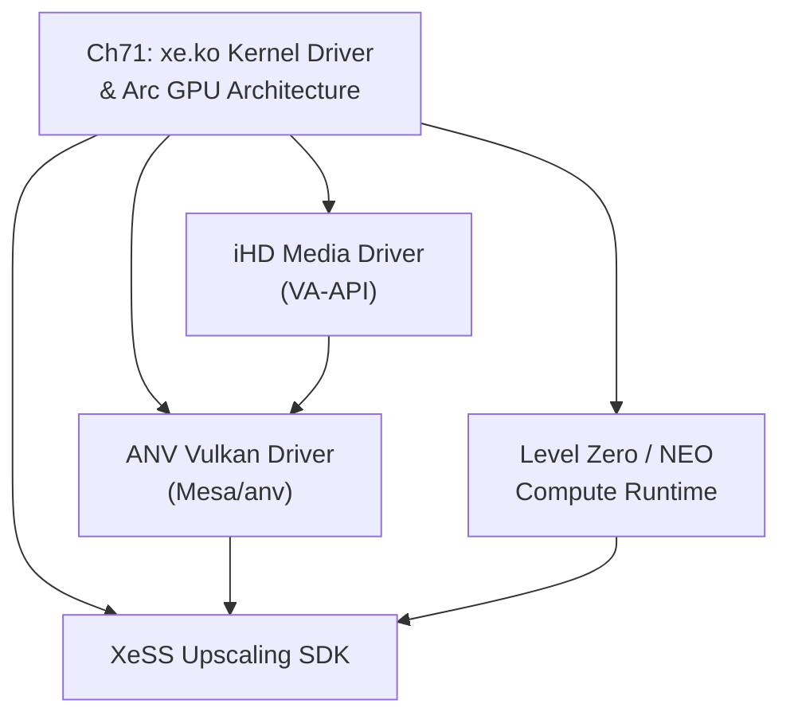

# Part XVI — The Intel Open Graphics Stack

Intel's graphics hardware occupies a unique position in the Linux ecosystem: it is simultaneously the most widely deployed GPU on Linux desktops (through integrated graphics in virtually every consumer Intel CPU) and, since 2022, a serious discrete GPU competitor through the **Arc** and **Battlemage** product lines. Part XVI examines the complete open-source software stack that Intel ships and maintains for these GPUs — from the kernel driver that manages hardware resources through the userspace Vulkan driver, compute runtime, media decode pipeline, and AI upscaling SDK. This part sits at the intersection of the kernel DRM subsystem (covered in Parts I–III) and the Mesa/Vulkan userspace layer (Parts IV–V), showing how one vendor's end-to-end open stack is assembled from kernel uAPI up to application-facing APIs.

## Chapters in This Part

**Chapter 71 — Intel Xe Kernel Driver, Arc GPU Architecture, and the Intel Open Stack** (`ch71-intel-xe-arc.md`)

This chapter is the single authoritative reference for the entire Intel open graphics stack. It traces the architectural lineage from Intel's legacy **Gen** integrated graphics and the **i915** kernel driver through the design of the new **xe.ko** kernel module, which was written from scratch to support discrete **Arc** GPUs and the multi-tile **Ponte Vecchio** data-centre accelerator. Readers learn how **xe.ko** replaces the ring-based submission model of **i915** with a modern **VM_BIND** memory model and ring-less command submission via the **GuC** co-processor's **CTB** (Command Transport Buffer) channel. The chapter then progresses upward through the stack: the **ANV** Vulkan driver in **Mesa**, Intel's parallel compute runtime (**NEO**) and **Level Zero** API, the **iHD** media driver and its **VA-API** interface for hardware video decode and encode, and finally **XeSS** (Xe Super Sampling), Intel's XMX-accelerated upscaling and frame-generation SDK. The breadth of this chapter distinguishes it from adjacent vendor chapters in Parts XVII and XVIII: Intel's stack is unusual in that every layer — kernel driver, Vulkan driver, compute runtime, media driver — is fully open source and maintained upstream.

## How the Chapters Interrelate

Part XVI contains a single chapter, so the interrelation discussion concerns the internal dependency structure within **Chapter 71** itself, which is organised as a layered stack. The natural reading order follows the hardware-to-software progression the chapter imposes: start with the **Xe2 / Battlemage** hardware microarchitecture (Xe-Core clusters, **XMX** tensor engines, second-generation ray-tracing units, **VDBox**/**VEBox** fixed-function media engines) before touching any software layer that programs those blocks.

Within the software stack, **xe.ko** is the mandatory foundation. Every other component — **ANV**, **NEO**/**Level Zero**, **iHD**, and **XeSS** — issues **DRM ioctls** against the kernel driver's uAPI and depends on the **VM_BIND** execution model, **exec_queue** abstraction, and **GuC** command-submission semantics that **xe.ko** defines. The **core data structures** — `xe_device`, `xe_tile`, `xe_gt` — appear repeatedly across the software sections as the context objects through which userspace drivers address hardware.

Above the kernel, **ANV** and **NEO/Level Zero** are largely parallel paths: **ANV** targets graphics and Vulkan compute workloads, while **NEO** targets GPGPU and SYCL/DPC++ workloads. They share the same **VM_BIND** uAPI and the same **GuC**-mediated submission queues but differ in how they manage command-buffer lifetimes and resource binding. **iHD** is a third parallel path for media decode and encode; it relies on **HuC** firmware (loaded alongside **GuC**) for bitstream-level decode assistance and exposes itself to applications through the **VA-API** interface. **XeSS** sits at the top of all three paths, optionally consuming **ANV** Vulkan commands on the graphics path or **NEO** Level Zero kernels on the compute path when **XMX** hardware acceleration is available.

The thematic thread unifying all sections is Intel's deliberate design choice to open-source every layer: **xe.ko** is upstream in **linux-next**, **ANV** lives in the main **Mesa** repository, **NEO** and **Level Zero** are Apache-licensed GitHub projects, **iHD** is GPL-licensed, and even **XeSS** ships SDK source. This makes the Intel stack the most transparent end-to-end vendor graphics stack available on Linux.

## Prerequisites and What Comes Next

Readers should be comfortable with the **DRM subsystem** fundamentals from Part I (gem objects, fence seqnos, scheduler, KMS), the **Mesa** driver architecture from Part IV (Gallium3D, **NIR**, the **radv**/**anv** Vulkan driver model), and the **VA-API** overview from Part VII before tackling Chapter 71. Part XVII (AMD Ecosystem) and Part XVIII (Rendering Abstractions) build directly on the patterns introduced here: Part XVII contrasts Intel's **xe.ko** design with AMD's **AMDGPU** kernel driver and the **RADV**/**RadeonSI** userspace drivers, while Part XVIII explores cross-vendor abstractions (**Vulkan portability**, **WebGPU**, **OpenGL** compatibility layers) that must accommodate the Intel **ANV** driver's bindless descriptor model and **VM_BIND** memory semantics.

---
