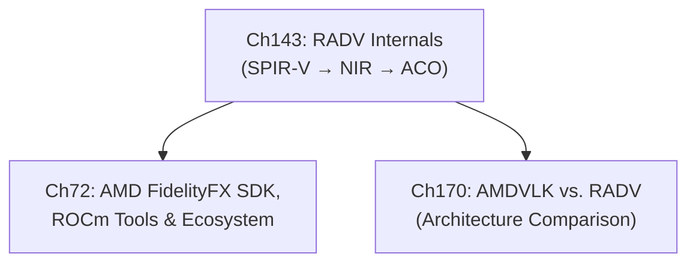

# Part XVII: The AMD Developer Ecosystem

AMD's open developer toolchain occupies a distinct tier in the Linux graphics stack: it sits above the kernel **DRM/AMDGPU** driver and the **Mesa/RADV** Vulkan driver, and below the application or game engine, providing the image-quality libraries, hardware media encoding APIs, and profiling infrastructure that turn raw GPU capability into polished, measurable performance. Where earlier parts of this book examined how the kernel allocates command buffers and how Mesa translates shader IR into hardware microcode, this part examines what AMD exposes to the developer who wants to go further — integrating AMD upscaling effects, capturing GPU traces, or visualising heap fragmentation on **RDNA** hardware. Understanding this layer is essential for anyone who ships software that targets AMD GPUs on Linux, because the **GPUOpen** initiative makes the full toolchain auditable and modifiable in ways that proprietary equivalents do not.

## Chapters in This Part

### Chapter 143 — RADV Internals: The Mesa AMD Vulkan Driver

This chapter targets **systems and driver developers** who want to understand how Mesa's AMD Vulkan driver (**RADV**) maps the Vulkan API onto GCN and RDNA hardware. It covers the RADV source tree layout (`src/amd/vulkan/`), the three-stage compiler pipeline (**SPIR-V → NIR → ACO ISA**), ACO's register allocator and instruction scheduler, the **LLVM** fallback path via `aco_compile_shader`, **radeon_winsys** as the abstraction over the `amdgpu` kernel driver, command-buffer construction and CS flushing via `radv_cs_emit_write_event_eop`, descriptor set layout and descriptor buffer management, the **MALL cache** and **GL2** coher domain flushing model on RDNA3, and how RADV's `VK_AMD_*` extensions map to kernel-side ring operations. The chapter also explains the **CTS** conformance testing process, the RADV CI pipeline, and how to build and test RADV in isolation from the rest of Mesa.

### Chapter 170 — AMDVLK vs. RADV: AMD's Two Open Vulkan Drivers

This chapter serves **graphics application developers** and **system integrators** who must choose or understand the two open-source AMD Vulkan driver stacks. It documents the architectural divergence: **AMDVLK**'s XGL → PAL → LLPC/LLVM path (four source repos: `xgl`, `pal`, `llpc`, `gpurt`) versus **RADV**'s SPIR-V → NIR → ACO path inside Mesa. The chapter traces the compiler pipeline contrast (LLVM full optimisation vs. ACO fast register allocation), extension history (seven `VK_AMD_*` extensions that AMDVLK shipped before KHR equivalents existed, including `VK_AMD_anti_lag` in July 2024), distribution packaging (RADV is the Mesa default on all major distros; `VK_ICD_FILENAMES` for selection), and the September 2025 AMDVLK discontinuation announcement. As of AMD's final release (v-2025.Q2.1), RADV is the recommended driver for all new AMD Linux development.

### Chapter 72 — AMD FidelityFX SDK, ROCm Tools, and the AMD Developer Ecosystem

This chapter is a comprehensive tour of AMD's **GPUOpen** programme and the three pillars it comprises: the **FidelityFX SDK**, the **Advanced Media Framework (AMF)**, and the **Radeon Developer Tools** suite. The reader learns how the **`FfxInterface`** abstraction decouples image-quality effects from the underlying graphics API, how **FSR 4** neural upscaling is dispatched on **RDNA 4** hardware via the **Upgradable API** (`ffx-api/`) and its **`amd_fidelityfx_loader`** shim, and how the offline **FidelityFX Shader Compiler (FFX-SC)** eliminates runtime shader compilation by pre-baking all **HLSL** and **GLSL** permutations into **SPIR-V** blobs. The chapter then pivots to the profiling toolchain — **Radeon GPU Profiler (RGP)**, **Radeon Memory Visualizer (RMV)**, and cross-vendor **RenderDoc** — explaining how each tool hooks into the **Vulkan** loader's instance and device extension layer, how **`VK_AMD_shader_info`** and the **`amdgpu_vm_bo_map`** kernel event feed their respective data streams, and how to correlate GPU timestamps with CPU timeline markers for latency attribution. What distinguishes this chapter from earlier AMD-focused material (the kernel **AMDGPU** driver in Part III and **RADV** in Part IV) is its application-side perspective: the reader builds integration code rather than reading driver internals.

## How the Chapters Interrelate

Chapter 143 (RADV Internals) is the natural prerequisite for Chapter 72: readers who understand how RADV translates Vulkan API calls into RDNA microcode and how the `amdgpu` winsys layer submits command streams will find Chapter 72's **FfxInterface** Vulkan backend and **RGP** profiling infrastructure immediately intelligible, while readers who encounter Chapter 72 first and want to understand *why* certain performance patterns emerge can use Chapter 143 as the diagnostic reference. The significance of Chapter 72 is that it is intentionally self-contained at the application layer: it functions as a capstone reference for the AMD-specific application-developer track that runs through the entire book, assembling pieces from many earlier parts into a coherent picture of what a production Linux/AMD graphics pipeline looks like end to end.

The conceptual threads that run through Chapter 72 and tie it to adjacent parts are the following. First, the **`FfxInterface`** Vulkan backend initialises a **`VkDevice`** and queries extensions in exactly the same way as any application built on **RADV** or **amdvlk** — the mechanisms from Part IV (Vulkan driver internals) apply directly. Second, **AMF**'s Linux evolution from the proprietary **amf-amdgpu-pro** shim toward open **VA-API** delegation through **Mesa Multimedia** is a concrete instance of the VA-API stack described in Part V; the chapter's treatment of **`amf::AMFFactory`**, **`AMFContext`**, and the **`AMFComponentEx`** encode pipeline becomes fully intelligible only after reading how **`libva`** and the **radeonsi** JPEG/H.264/AV1 encoder paths work. Third, the profiling tools depend on the **`VK_AMD_buffer_marker`** and **`VK_AMD_shader_info`** Vulkan extensions, whose kernel-side support lives in the **AMDGPU** command-submission path covered in Part III; **RGP**'s **SPM** (Streaming Performance Monitor) data stream flows through the same **`amdgpu_perfcounter_*`** ioctls. Fourth, **RenderDoc**'s API interception layer wraps the **Vulkan** loader using the same layer mechanism explored in Part IV, making it a practical case study in Vulkan loader architecture. These cross-cutting threads mean that a reader who has worked through Parts III, IV, and V will find Chapter 72 tying those threads together rather than introducing wholly new kernel or driver concepts.

## Prerequisites and What Comes Next

Readers should be comfortable with the **Vulkan** API at the level of command buffer recording and synchronisation (Part IV), with the Linux **VA-API** encode/decode stack (Part V), and with the **AMDGPU** kernel driver's command-submission and memory-management ioctls (Part III). Chapter 72 does not re-derive those foundations; it builds application-level integration on top of them. The material here feeds directly into Part XVIII (Rendering Abstractions), where engine-level upscaling integration patterns — including how game engines plug **FSR**, **DLSS**, and **XeSS** through a common **super-resolution** abstraction — are examined alongside **Vulkan** **render graph** frameworks that depend on precisely the kind of GPU timestamp and barrier profiling data that **RGP** produces.

---

## Part Roadmap Summary

*Synthesised from the Roadmap sections of this part's chapters.*

### Near-term (6–12 months)

- **RDNA 4 (GFX12) driver hardening**: ACO's instruction scheduler and register allocator are being tuned for RDNA 4's updated wavefront model and new dual-issue compute units; BVH8 ray tracing, dynamic VGPR allocation via `s_alloc_vgpr`, and OBB support are all being hardened under dEQP-VK conformance testing (Ch143, Ch170).
- **User-queue submission path**: The experimental `amdgpu_userq` path — which bypasses the kernel CS ioctl and reduces dispatch latency — is being finalised for RDNA 4; Mesa 26.x or 27.0 is the target landing window (Ch170).
- **Vulkan Video encode stabilisation**: `VK_KHR_video_encode_queue` and `VK_KHR_video_decode_queue` in RADV are advancing from experimental to stable across H.264, H.265, and AV1 on VCN 5.x hardware, directly enabling the AMF Linux runtime's Vulkan-based encode path without requiring the proprietary `amf-amdgpu-pro` component (Ch143, Ch72).
- **`VK_EXT_device_generated_commands` promotion**: Moving from experimental to stable status will unlock compute-shader-based indirect draw generation for DXR and mesh shader workloads in VKD3D-Proton (Ch143).
- **FSR 4 Vulkan backend and SDK effects**: Native Vulkan support in the `ffx-api` Upgradable API layer is on AMD's stated roadmap, eliminating the Wine/Proton D3D12 translation requirement for FSR 4 neural upscaling on Linux; a Frame Interpolation effect for the SDK 1.x Vulkan path is expected within 2026 (Ch72).
- **RGP RDNA 4 SQTT token decoding**: Full instruction-token decoding for RDNA 4 in the Radeon GPU Profiler, exposing WMMA (Wave Matrix Multiply-Accumulate) utilisation metrics in wavefront occupancy views (Ch72).

### Medium-term (1–3 years)

- **Full Vulkan 1.4 feature parity and bindless rendering**: Across both RADV and the now-consolidated AMD open-source stack, the targets include `VK_KHR_maintenance6`, `VK_KHR_shader_subgroup_rotate`, sparse residency graduation, and completion of the `VK_EXT_descriptor_buffer` / `VK_EXT_device_generated_commands` bindless pipeline that eliminates the traditional descriptor pool codepath and reduces per-draw CPU overhead (Ch143, Ch170).
- **ACO quality improvements for compute-heavy workloads**: SSA-based register coalescing to reduce spill/fill code in ray tracing payloads, and systematic matrix-multiply and reduction kernel improvements to match LLPC on LLM-inference workloads (llama.cpp, ExecuTorch Vulkan backend) (Ch143, Ch170).
- **`VK_AMDX_shader_enqueue` → KHR stabilisation**: AMD and Valve are collaborating on a non-`AMDX` Khronos Working Group proposal for work-graph pipelines; RADV is the expected reference Linux implementation (Ch170).
- **Open-source AMF and unified profiling tooling**: AMD's trajectory toward removing the proprietary `libamfrt64.so` component points to AMF becoming a thin shim over VA-API/GStreamer/FFmpeg; in parallel, headless CLI export of RGP pipeline stall reports and RMV fragmentation scores would enable CI/CD integration comparable to `renderdoccmd` (Ch72).
- **Brixelizer GI hardware ray tracing path**: Adding an optional RDNA 3/4 BVH-accelerated traversal variant using `vkCmdTraceRaysKHR` to substantially reduce SDF cascade trace cost (Ch72).

### Long-term

- **Unified AMD open-source driver stack**: With AMDVLK archived, the stated long-term direction is a single software stack where Vulkan (RADV), OpenGL (RadeonSI), OpenCL (rusticl), and HIP share front-ends over a common ACO or LLVM back-end; convergence of Vulkan and ROCm dispatch paths within the `amdgpu`/`amdkfd` kernel module is the architectural endpoint (Ch170, Ch143).
- **Fixed-function BVH traversal on future RDNA architectures**: RDNA 5 and beyond are expected to introduce dedicated ray tracing execution units, requiring RADV to shift from generating software traversal shader code (`radv_nir_rt_shader.c`) to programming a hardware traversal unit via new PM4 packets and `amdgpu` kernel uAPI (Ch143, Ch170).
- **FidelityFX as a system Vulkan layer and unified AMD profiling SDK**: Packaging FidelityFX effects (CAS, FSR 3/4) as an installable `VkLayer` — analogous to `vkBasalt` but with official AMD support — and consolidating RGP, RMV, and ROCm `rocprof` into a single capture format covering graphics, compute (HIP), and ML (MIGraphX) workloads (Ch72).
