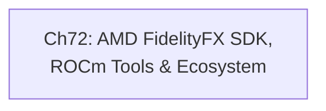

# Part XVII: The AMD Developer Ecosystem

AMD's open developer toolchain occupies a distinct tier in the Linux graphics stack: it sits above the kernel **DRM/AMDGPU** driver and the **Mesa/RADV** Vulkan driver, and below the application or game engine, providing the image-quality libraries, hardware media encoding APIs, and profiling infrastructure that turn raw GPU capability into polished, measurable performance. Where earlier parts of this book examined how the kernel allocates command buffers and how Mesa translates shader IR into hardware microcode, this part examines what AMD exposes to the developer who wants to go further — integrating AMD upscaling effects, capturing GPU traces, or visualising heap fragmentation on **RDNA** hardware. Understanding this layer is essential for anyone who ships software that targets AMD GPUs on Linux, because the **GPUOpen** initiative makes the full toolchain auditable and modifiable in ways that proprietary equivalents do not.

## Chapters in This Part

### Chapter 72 — AMD FidelityFX SDK, ROCm Tools, and the AMD Developer Ecosystem

This chapter is a comprehensive tour of AMD's **GPUOpen** programme and the three pillars it comprises: the **FidelityFX SDK**, the **Advanced Media Framework (AMF)**, and the **Radeon Developer Tools** suite. The reader learns how the **`FfxInterface`** abstraction decouples image-quality effects from the underlying graphics API, how **FSR 4** neural upscaling is dispatched on **RDNA 4** hardware via the **Upgradable API** (`ffx-api/`) and its **`amd_fidelityfx_loader`** shim, and how the offline **FidelityFX Shader Compiler (FFX-SC)** eliminates runtime shader compilation by pre-baking all **HLSL** and **GLSL** permutations into **SPIR-V** blobs. The chapter then pivots to the profiling toolchain — **Radeon GPU Profiler (RGP)**, **Radeon Memory Visualizer (RMV)**, and cross-vendor **RenderDoc** — explaining how each tool hooks into the **Vulkan** loader's instance and device extension layer, how **`VK_AMD_shader_info`** and the **`amdgpu_vm_bo_map`** kernel event feed their respective data streams, and how to correlate GPU timestamps with CPU timeline markers for latency attribution. What distinguishes this chapter from earlier AMD-focused material (the kernel **AMDGPU** driver in Part III and **RADV** in Part IV) is its application-side perspective: the reader builds integration code rather than reading driver internals.

## How the Chapters Interrelate

With only a single chapter in this part, the dependency graph is degenerate — there is no intra-part ordering problem to solve. The significance of this structure is that Chapter 72 is intentionally self-contained: it functions as a capstone reference for the AMD-specific application-developer track that runs through the entire book, assembling pieces from many earlier parts into a coherent picture of what a production Linux/AMD graphics pipeline looks like end to end.

The conceptual threads that run through Chapter 72 and tie it to adjacent parts are the following. First, the **`FfxInterface`** Vulkan backend initialises a **`VkDevice`** and queries extensions in exactly the same way as any application built on **RADV** or **amdvlk** — the mechanisms from Part IV (Vulkan driver internals) apply directly. Second, **AMF**'s Linux evolution from the proprietary **amf-amdgpu-pro** shim toward open **VA-API** delegation through **Mesa Multimedia** is a concrete instance of the VA-API stack described in Part V; the chapter's treatment of **`amf::AMFFactory`**, **`AMFContext`**, and the **`AMFComponentEx`** encode pipeline becomes fully intelligible only after reading how **`libva`** and the **radeonsi** JPEG/H.264/AV1 encoder paths work. Third, the profiling tools depend on the **`VK_AMD_buffer_marker`** and **`VK_AMD_shader_info`** Vulkan extensions, whose kernel-side support lives in the **AMDGPU** command-submission path covered in Part III; **RGP**'s **SPM** (Streaming Performance Monitor) data stream flows through the same **`amdgpu_perfcounter_*`** ioctls. Fourth, **RenderDoc**'s API interception layer wraps the **Vulkan** loader using the same layer mechanism explored in Part IV, making it a practical case study in Vulkan loader architecture. These cross-cutting threads mean that a reader who has worked through Parts III, IV, and V will find Chapter 72 tying those threads together rather than introducing wholly new kernel or driver concepts.

## Prerequisites and What Comes Next

Readers should be comfortable with the **Vulkan** API at the level of command buffer recording and synchronisation (Part IV), with the Linux **VA-API** encode/decode stack (Part V), and with the **AMDGPU** kernel driver's command-submission and memory-management ioctls (Part III). Chapter 72 does not re-derive those foundations; it builds application-level integration on top of them. The material here feeds directly into Part XVIII (Rendering Abstractions), where engine-level upscaling integration patterns — including how game engines plug **FSR**, **DLSS**, and **XeSS** through a common **super-resolution** abstraction — are examined alongside **Vulkan** **render graph** frameworks that depend on precisely the kind of GPU timestamp and barrier profiling data that **RGP** produces.

---
