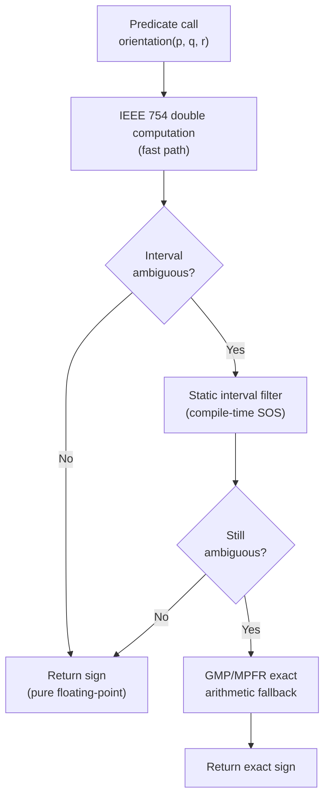

# Chapter 113: CGAL and Computational Geometry on the Linux Graphics Stack

> **Part**: Part XVIII — Rendering Abstractions
> **Audience**: Graphics application developers, DCC tool engineers, scientific visualization developers
> **Status**: First draft — 2026-06-19

---

## Table of Contents

1. [Overview: What CGAL Is and Where It Fits](#1-overview-what-cgal-is-and-where-it-fits)
2. [Exact Arithmetic Kernels: The Robustness Foundation](#2-exact-arithmetic-kernels-the-robustness-foundation)
3. [Surface_mesh and the Halfedge Data Structure](#3-surface_mesh-and-the-halfedge-data-structure)
4. [GPU Vertex Buffer Interop: The CPU–GPU Handoff Boundary](#4-gpu-vertex-buffer-interop-the-cpugpu-handoff-boundary)
5. [Boolean Operations: PMP Corefinement and Nef_polyhedron_3](#5-boolean-operations-pmp-corefinement-and-nef_polyhedron_3)
6. [Delaunay Triangulations in 2D and 3D](#6-delaunay-triangulations-in-2d-and-3d)
7. [Surface Reconstruction from Point Clouds](#7-surface-reconstruction-from-point-clouds)
8. [AABB_tree for Ray-Intersection Preprocessing](#8-aabb_tree-for-ray-intersection-preprocessing)
9. [Alpha Shapes and Convex Hull for LOD Generation](#9-alpha-shapes-and-convex-hull-for-lod-generation)
10. [3D Mesh Generation with the Mesh_3 Package](#10-3d-mesh-generation-with-the-mesh_3-package)
11. [Parallelism in CGAL: TBB Tag Dispatch, Not CUDA](#11-parallelism-in-cgal-tbb-tag-dispatch-not-cuda)
12. [Blender's Boolean Modifier: A Native Implementation, Not CGAL](#12-blenders-boolean-modifier-a-native-implementation-not-cgal)
13. [Visualization: CGAL::draw(), Qt6 OpenGL, and VTK/ParaView Integration](#13-visualization-cgaldraw-qt6-opengl-and-vtkparaview-integration)
14. [Build System Integration: CMake, apt, conda-forge, and Spack](#14-build-system-integration-cmake-apt-conda-forge-and-spack)
15. [Integrations](#15-integrations)

---

## 1. Overview: What CGAL Is and Where It Fits

CGAL (Computational Geometry Algorithms Library) is an open-source C++ library providing efficient and reliable geometric algorithms. The project's central insight, dating to its inception in the mid-1990s, is that naive floating-point geometry is catastrophically unreliable: an orientation test computed in IEEE 754 double precision can return the wrong sign, causing downstream algorithms to produce meshes with holes, inverted faces, or non-manifold topology. CGAL's answer is a combination of exact arithmetic, algorithm-level robustness proofs, and a clean kernel-parametrization model that lets callers trade precision for speed according to their needs.

**Current version**: CGAL 6.1, released October 1, 2025. CGAL 6.2 beta1 was released May 21, 2026. Since CGAL 5.0 the library is fully **header-only** — no precompilation of a shared object is needed before use. [Source](https://www.cgal.org/2025/10/01/cgal61/)

**License**: Dual-licensed: LGPL v3+ for header-only packages, GPL v3+ for some packages that contain non-trivial algorithmic IP; commercial license available from GeometryFactory. [Source](https://github.com/CGAL/cgal)

**Why a graphics book covers CGAL.** CGAL is not a GPU rendering library. It operates entirely on the CPU and generates geometry that is subsequently uploaded to the GPU. It fits into the Linux graphics stack in the following ways:

- **DCC tools** (Blender, CAD systems, mesh editing tools) use CGAL-class algorithms (their own or CGAL directly) to preprocess geometry before it enters the GPU pipeline.
- **Scientific visualization** pipelines (FEA pre-processing, medical imaging, CFD) generate tetrahedral and surface meshes in CGAL's formats, then visualize them via VTK/ParaView or custom Vulkan renderers.
- **Game and simulation asset pipelines** use CGAL for LOD generation, collision mesh simplification, and Boolean CSG operations on closed solids.
- **Ray tracers and path tracers** build BVH/AABB acceleration structures on the CPU against CGAL meshes before uploading to GPU BVH builders via `VK_KHR_acceleration_structure`.

Understanding where CGAL ends and the GPU pipeline begins is the key intellectual skill for readers of this chapter. That boundary — where a flat `std::vector<float>` leaves CGAL's property maps and enters `vkMapMemory` or `glBufferData` — is the handoff this chapter makes explicit.

**Audiences served by this chapter:**

- *Graphics application developers* building asset pipelines, mesh editors, or scientific visualization tools.
- *DCC tool engineers* integrating robust Boolean and remeshing operations into geometry processing pipelines.
- *Scientific visualization developers* connecting CGAL mesh generation to VTK/ParaView rendering.

---

## 2. Exact Arithmetic Kernels: The Robustness Foundation

All CGAL algorithms are parametrized by a **kernel** — a type bundle providing point types, vector types, and geometric predicates. Kernel choice is the most important architectural decision for any CGAL application: it governs both correctness guarantees and performance.

### 2.1 The Filtering Mechanism

CGAL's robustness model uses **floating-point interval arithmetic** as a fast filter. A predicate such as `orientation(p, q, r)` is first computed using interval arithmetic: each coordinate is replaced by a floating-point interval `[lo, hi]` that is guaranteed to contain the true value. If the interval result is unambiguously positive or negative (the interval does not contain zero), the floating-point result is returned immediately. Only when the interval straddles zero does the predicate fall back to multi-precision arithmetic via GMP or MPFR. On typical real-world geometry this fallback occurs for fewer than 5–15% of predicate evaluations.

This mechanism is encapsulated in `Filtered_kernel<K>`, defined in `<CGAL/Filtered_kernel.h>`.



### 2.2 EPICK — Exact Predicates, Inexact Constructions Kernel

```c++
#include <CGAL/Exact_predicates_inexact_constructions_kernel.h>
typedef CGAL::Exact_predicates_inexact_constructions_kernel K;
// Short alias:
typedef CGAL::Epick K;
```

- Underlying coordinate type: `double` (IEEE 754 64-bit floating-point).
- Predicates (orientation, in-circle, on-segment) are computed **exactly** via the interval filter → MPFR fallback chain.
- Constructions (new points from intersections, midpoints) are computed in **double** — may accumulate rounding error.
- **Best for**: Delaunay triangulations, convex hull, alpha shapes, mesh generation, any algorithm where only the combinatorial structure (which faces exist) matters, not the exact coordinates of constructed points.

[Source](https://github.com/CGAL/cgal/blob/master/Kernel_23/include/CGAL/Exact_predicates_inexact_constructions_kernel.h)

### 2.3 EPECK — Exact Predicates, Exact Constructions Kernel

```c++
#include <CGAL/Exact_predicates_exact_constructions_kernel.h>
typedef CGAL::Exact_predicates_exact_constructions_kernel K;
// Short alias:
typedef CGAL::Epeck K;
```

- Underlying number type: `Lazy_exact_nt<Epeck_ft>`. This stores a directed acyclic graph (DAG) of computation steps and a floating-point interval approximation. The DAG is only evaluated using GMP's `mpq_class` rational arithmetic when the interval is insufficient to resolve a predicate's sign.
- Both predicates and constructions are **exact**.
- **Required for**: `Nef_polyhedron_3` Boolean operations, `PMP::corefine_and_compute_union()` with exact output points, any algorithm where constructed intersection points become inputs to further predicates.
- Significantly slower than EPICK due to lazy evaluation overhead; on benchmarks against Boolean meshes, expect 3–10× slower depending on input complexity.

[Source](https://doc.cgal.org/latest/Kernel_23/index.html)

**Extended variants** (require LEDA or CORE library):

- `Exact_predicates_exact_constructions_kernel_with_sqrt` — adds exact square roots (needed for exact Euclidean distances).
- `Exact_predicates_exact_constructions_kernel_with_kth_root` — adds k-th roots.
- `Exact_predicates_exact_constructions_kernel_with_root_of` — adds algebraic roots of polynomials.

**Choosing a kernel**: the rule of thumb is to use EPICK until the algorithm you call demands EPECK. The documentation for each package states its kernel requirements in the "Concepts and Models" section.

---

## 3. Surface_mesh and the Halfedge Data Structure

`CGAL::Surface_mesh` is the primary modern polygon mesh class in CGAL, superseding the older `Polyhedron_3`. It implements the **halfedge** data structure: each undirected edge is represented by a pair of halfedges pointing in opposite directions, each carrying references to its target vertex, next halfedge around the face, opposite halfedge, and owning face.

```c++
#include <CGAL/Surface_mesh.h>

typedef CGAL::Exact_predicates_inexact_constructions_kernel K;
typedef CGAL::Surface_mesh<K::Point_3>  Mesh;

// Index types (32-bit integers — cache-friendly for GPU upload)
typedef Mesh::Vertex_index    vertex_descriptor;
typedef Mesh::Halfedge_index  halfedge_descriptor;
typedef Mesh::Edge_index      edge_descriptor;
typedef Mesh::Face_index      face_descriptor;

Mesh m;
auto v0 = m.add_vertex(K::Point_3(0, 0, 0));
auto v1 = m.add_vertex(K::Point_3(1, 0, 0));
auto v2 = m.add_vertex(K::Point_3(0, 1, 0));
m.add_face(v0, v1, v2);

// Property maps — generic key-value storage per mesh element
auto [color_map, created] =
    m.add_property_map<vertex_descriptor, CGAL::Color>("v:color");

// Range-based iteration
for (auto v : m.vertices()) { /* process vertex v */ }
for (auto f : m.faces())    { /* process face f  */ }

// I/O: supports .off, .obj, .ply, .stl, .vtk, .ts, .xyz
#include <CGAL/IO/polygon_mesh_io.h>
CGAL::IO::read_polygon_mesh("input.off",   m);
CGAL::IO::write_polygon_mesh("output.ply", m);
```

[Source](https://doc.cgal.org/latest/Surface_mesh/index.html)

**Storage design.** `Surface_mesh` stores elements as flat arrays indexed by `uint32_t` integers. Deletion is lazy — elements are marked invalid and compacted on demand via `m.collect_garbage()`. This design is deliberately cache-friendly and directly maps to the flat array layout expected by GPU vertex buffers.

**BGL concept compliance.** `Surface_mesh` models the Boost Graph Library concepts `MutableFaceGraph` and `FaceListGraph`. This means all CGAL algorithms that accept a `FaceGraph` — the entire `Polygon_mesh_processing` package, parameterization, segmentation, deformation — accept `Surface_mesh` without adaptation.

**Interoperability with other CGAL types.** `Polyhedron_3`, `OpenMesh`, and Eigen-backed mesh types can be adapted to the `FaceGraph` concept via the CGAL adapter headers in `<CGAL/boost/graph/graph_traits_*.h>`.

---

## 4. GPU Vertex Buffer Interop: The CPU–GPU Handoff Boundary

CGAL provides **no Vulkan or OpenGL API**. The handoff from CGAL geometry to a GPU vertex buffer is entirely application-level code written by you. This section makes that boundary explicit rather than implying a seamless integration that does not exist.

The pattern is to iterate `Surface_mesh`'s vertex property map, extract floating-point coordinates into a contiguous `std::vector<float>`, then upload that vector using your chosen GPU API.

```c++
// Collect positions into a flat float array for GPU upload
auto& point_pmap = m.points();   // returns Mesh::Property_map<vertex_descriptor, K::Point_3>&

std::vector<float> positions;
positions.reserve(3 * m.number_of_vertices());
for (auto v : m.vertices()) {
    const auto& p = point_pmap[v];
    positions.push_back(static_cast<float>(p.x()));
    positions.push_back(static_cast<float>(p.y()));
    positions.push_back(static_cast<float>(p.z()));
}

// Collect triangle indices
std::vector<uint32_t> indices;
indices.reserve(3 * m.number_of_faces());
for (auto f : m.faces()) {
    auto h = m.halfedge(f);
    // Triangulate on the fly (assumes convex or already-triangulated faces)
    indices.push_back(m.target(h).idx());
    indices.push_back(m.target(m.next(h)).idx());
    indices.push_back(m.target(m.next(m.next(h))).idx());
}

// Vulkan upload (schematic):
// VkBuffer vertexBuffer, indexBuffer;
// vkMapMemory(device, vertexMemory, 0, positions.size() * sizeof(float), 0, &data);
// memcpy(data, positions.data(), positions.size() * sizeof(float));
// vkUnmapMemory(device, vertexMemory);
```

**Normals.** PMP can compute face or vertex normals directly:

```c++
#include <CGAL/Polygon_mesh_processing/compute_normal.h>
namespace PMP = CGAL::Polygon_mesh_processing;

auto [vnormals, created] =
    m.add_property_map<vertex_descriptor, K::Vector_3>("v:normals",
                                                        CGAL::NULL_VECTOR);
PMP::compute_vertex_normals(m, vnormals);

// Then extract into your float[] the same way as positions above.
```

**Index alignment.** `Surface_mesh` guarantees that vertex indices are compact (no holes) **after** `collect_garbage()`, so `v.idx()` can be used directly as a vertex buffer index. If you have not called `collect_garbage()` after editing operations, iterate and remap explicitly.

**Format consideration.** EPECK kernels use `Lazy_exact_nt` internally, which is not directly castable to `float`. The `CGAL::to_double()` function converts any CGAL number type:

```c++
positions.push_back(static_cast<float>(CGAL::to_double(p.x())));
```

---

## 5. Boolean Operations: PMP Corefinement and Nef_polyhedron_3

Mesh Boolean operations — union, intersection, difference — are one of the most common preprocessing steps before GPU rendering. CGAL provides two routes: the modern `Polygon_mesh_processing` corefinement API and the older, more general `Nef_polyhedron_3`.

### 5.1 PMP Corefinement (Recommended Modern Path)

The corefinement API, introduced in CGAL 4.11, is the recommended path for Boolean operations on closed, non-self-intersecting manifold surfaces. It operates directly on `Surface_mesh` objects and requires the EPECK kernel for exact output point coordinates.

```c++
#include <CGAL/Exact_predicates_exact_constructions_kernel.h>
#include <CGAL/Surface_mesh.h>
#include <CGAL/Polygon_mesh_processing/corefinement.h>

typedef CGAL::Exact_predicates_exact_constructions_kernel  K;
typedef CGAL::Surface_mesh<K::Point_3>                     Mesh;
namespace PMP = CGAL::Polygon_mesh_processing;

Mesh mesh_A, mesh_B, result;
CGAL::IO::read_polygon_mesh("box.off",    mesh_A);
CGAL::IO::read_polygon_mesh("sphere.off", mesh_B);

bool ok_union  = PMP::corefine_and_compute_union(mesh_A,       mesh_B, result);
bool ok_isect  = PMP::corefine_and_compute_intersection(mesh_A, mesh_B, result);
bool ok_diff   = PMP::corefine_and_compute_difference(mesh_A,   mesh_B, result);
```

[Source](https://doc.cgal.org/latest/Polygon_mesh_processing/group__PMP__corefinement__grp.html)

The corefinement step adds intersection points to both meshes' edge/vertex sets so that the two meshes share a common boundary. The Boolean function then selects faces according to inside/outside classification. The result is a valid `Surface_mesh` that can be fed directly to the GPU upload pattern in §4.

**Preconditions**: both input meshes must be closed (no boundary edges), non-self-intersecting, and orientable. Use `PMP::does_self_intersect()` and `PMP::is_closed()` to validate inputs before calling corefinement.

### 5.2 Nef_polyhedron_3 (General Set Operations)

`Nef_polyhedron_3` represents **regularized Boolean sets** — closed regular subsets of 3D space including non-manifold configurations, open sets, and lower-dimensional features (edges, vertices) that corefinement cannot represent. It is the correct choice when inputs may be open polyhedra or when complement and symmetric difference are needed.

```c++
#include <CGAL/Exact_predicates_exact_constructions_kernel.h>
#include <CGAL/Nef_polyhedron_3.h>

typedef CGAL::Exact_predicates_exact_constructions_kernel  Kernel;
typedef CGAL::Nef_polyhedron_3<Kernel>                     Nef_polyhedron;
typedef Nef_polyhedron::Plane_3                            Plane_3;

// Construct from half-spaces (an intersection of two gives a slab)
Nef_polyhedron N1(Plane_3(1, 0, 0, -1), Nef_polyhedron::INCLUDED);
Nef_polyhedron N2(Plane_3(-1, 0, 0, -1), Nef_polyhedron::INCLUDED);
Nef_polyhedron slab = N1 * N2;   // intersection

// Operators: + (union), * (intersection), - (difference),
//            ! (complement), ^ (symmetric difference)
// In-place:  N1 += N2;  N1 -= N2;  N1 *= N2;
```

[Source](https://doc.cgal.org/latest/Nef_3/index.html) — [Boolean example](https://doc.cgal.org/latest/Nef_3/Nef_3_2set_operations_8cpp-example.html)

**When to use Nef vs PMP corefinement**:

| Criterion | PMP corefinement | Nef_polyhedron_3 |
|---|---|---|
| Input requirement | Closed, non-self-intersecting, orientable | Any closed regular set, open polyhedra |
| Output type | `Surface_mesh` (ready for GPU) | `Nef_polyhedron_3` (convert back for GPU) |
| Operations | Union, intersection, difference | All of the above + complement, symmetric difference |
| Performance | Faster | Slower; full SNC data structure |
| Non-manifold output | Not supported | Supported (edges, vertices as lower-dimensional features) |

For pipeline work where inputs are well-conditioned CAD solids, always prefer the PMP corefinement API. Nef is the right tool for constructive solid geometry (CSG) trees with complement and for inputs of unknown manifoldness.

### 5.3 The Polygon_mesh_processing Package — Additional Operations

PMP is the Swiss Army knife for surface mesh preprocessing. The table below lists operations most relevant to the graphics pipeline:

| Function | Purpose | Header suffix |
|---|---|---|
| `PMP::isotropic_remeshing()` | Edge-split/collapse/flip to target edge length | `remesh.h` |
| `PMP::smooth_mesh()` | Laplacian or shape-energy smoothing | `smooth_mesh.h` |
| `PMP::triangulate_hole()` | Fill holes (e.g., after cutting a mesh) | `triangulate_hole.h` |
| `PMP::does_self_intersect()` | Self-intersection test | `self_intersections.h` |
| `PMP::detect_sharp_edges()` | Mark crease edges by dihedral angle | `detect_features.h` |
| `PMP::compute_vertex_normals()` | Outward unit normals per vertex | `compute_normal.h` |
| `PMP::clip()` | Clip mesh by plane (faster in CGAL 6.1) | `clip.h` |
| `PMP::approximated_centroidal_Voronoi_diagram_remeshing()` | CVD-based remeshing (new in CGAL 6.1) | `remesh.h` |

[Source](https://doc.cgal.org/latest/Polygon_mesh_processing/index.html)

---

## 6. Delaunay Triangulations in 2D and 3D

The Delaunay triangulation is the foundational data structure for most of CGAL's spatial algorithms. A Delaunay triangulation of a point set is the unique triangulation maximizing the minimum angle of all triangles (in 2D) or tetrahedra (in 3D), avoiding sliver elements that plague numerical computations. Its **dual** is the Voronoi diagram.

### 6.1 2D Delaunay Triangulation

```c++
#include <CGAL/Exact_predicates_inexact_constructions_kernel.h>
#include <CGAL/Delaunay_triangulation_2.h>

typedef CGAL::Exact_predicates_inexact_constructions_kernel  K;
typedef CGAL::Delaunay_triangulation_2<K>                   DT2;
typedef DT2::Point                                          Point;
typedef DT2::Vertex_handle                                  Vertex_handle;
typedef DT2::Face_handle                                    Face_handle;

DT2 dt;

// Insert points individually or in batch (batch is faster)
std::vector<Point> pts = { Point(0,0), Point(1,0), Point(0,1), Point(1,1) };
dt.insert(pts.begin(), pts.end());

// Navigate the triangulation
for (auto fit = dt.finite_faces_begin(); fit != dt.finite_faces_end(); ++fit) {
    // fit->vertex(0), fit->vertex(1), fit->vertex(2) are the three vertices
    // fit->neighbor(i) is the face opposite vertex i
}

// Point location query: which face contains point p?
Face_handle fh = dt.locate(Point(0.5, 0.3));

// Nearest-vertex query
Vertex_handle nearest = dt.nearest_vertex(Point(0.5, 0.5));

// Voronoi dual (Delaunay edge dual = Voronoi edge):
DT2::Edge e = *dt.finite_edges_begin();
auto voronoi_segment = dt.dual(e);   // returns CGAL::Object (Segment_2 or Ray_2)
```

[Source](https://doc.cgal.org/latest/Triangulation_2/index.html)

The 2D Delaunay triangulation is used for UV unwrapping mesh generation, texture atlas packing, stippling effects, and 2D Voronoi stippling. The **Constrained Delaunay Triangulation** (`CGAL::Constrained_Delaunay_triangulation_2`) adds support for constrained edges (e.g., polygon outlines that must appear as edges), which is the input for 2D mesh generation and font triangulation.

### 6.2 3D Delaunay Triangulation

```c++
#include <CGAL/Exact_predicates_inexact_constructions_kernel.h>
#include <CGAL/Delaunay_triangulation_3.h>

typedef CGAL::Exact_predicates_inexact_constructions_kernel  K;
typedef CGAL::Delaunay_triangulation_3<K>                   DT3;
typedef DT3::Point                                          Point_3;
typedef DT3::Cell_handle                                    Cell_handle;

DT3 dt;
std::vector<Point_3> pts = { /* your point cloud */ };
dt.insert(pts.begin(), pts.end());

// Iterate over finite tetrahedra:
for (auto cit = dt.finite_cells_begin(); cit != dt.finite_cells_end(); ++cit) {
    // cit->vertex(0..3) — four vertices
    // dt.tetrahedron(cit) — returns K::Tetrahedron_3
}

// Point location in 3D
Cell_handle ch = dt.locate(Point_3(0.5, 0.5, 0.5));

// Nearest-vertex
auto nv = dt.nearest_vertex(Point_3(1, 1, 1));
```

[Source](https://doc.cgal.org/latest/Triangulation_3/index.html)

The 3D Delaunay triangulation is the foundation of:

- **Alpha shapes** (§9.1): extract the boundary of the Delaunay complex for a given radius.
- **Poisson and scale-space surface reconstruction** (§7): both build on a Delaunay triangulation of the input points.
- **Mesh_3** tetrahedral mesh generation (§10): Delaunay refinement inserts Steiner points to improve cell quality. [Source](https://doc.cgal.org/latest/Triangulation_3/index.html)

**Parallel point insertion** is supported via `CGAL::Parallel_tag` when TBB is available:

```c++
#include <CGAL/Triangulation_3.h>
typedef CGAL::Delaunay_triangulation_3<K, CGAL::Default, CGAL::Fast_location> DT3_fast;
// Parallel insertion via:
dt.insert(pts.begin(), pts.end(),  /* CGAL::Parallel_tag dispatching implicit via TBB */);
```

## 7. Surface Reconstruction from Point Clouds

Point cloud to surface mesh reconstruction is a critical step for photogrammetry pipelines, LiDAR visualization, and medical imaging before GPU rendering. CGAL offers three reconstruction approaches.

### 6.1 Point Set Processing

Before any reconstruction, raw point clouds typically require cleaning and normal estimation:

```c++
#include <CGAL/jet_estimate_normals.h>          // fit jets, estimate normals
#include <CGAL/pca_estimate_normals.h>           // PCA-based normals
#include <CGAL/mst_orient_normals.h>             // orient normals with MST
#include <CGAL/remove_outliers.h>                // statistical outlier removal
#include <CGAL/grid_simplify_point_set.h>        // grid-based downsampling
#include <CGAL/wlop_simplify_and_regularize_point_set.h>  // WLOP regularization

// TBB-parallel variants (see §11):
CGAL::jet_estimate_normals<CGAL::Parallel_if_available_tag>(
    points, 18 /* k-nearest neighbours */,
    CGAL::parameters::point_map(CGAL::First_of_pair_property_map<PointNormal>())
                      .normal_map(CGAL::Second_of_pair_property_map<PointNormal>()));

CGAL::mst_orient_normals(points, 18,
    CGAL::parameters::point_map(...)
                      .normal_map(...));
```

[Source](https://doc.cgal.org/latest/Point_set_processing_3/index.html)

Point set processing also provides rigid registration against a reference model:

```c++
CGAL::OpenGR::register_point_sets(source, target, /*params*/);      // Super4PCS global registration
CGAL::pointmatcher::register_point_sets(source, target, /*params*/); // libpointmatcher ICP refinement
```

These are optional adapters that require building with the respective third-party libraries.

### 6.2 Poisson Surface Reconstruction

Poisson reconstruction solves a Poisson equation over the input point cloud (with oriented normals) to produce an implicit indicator function, then extracts its isosurface.

```c++
#include <CGAL/Exact_predicates_inexact_constructions_kernel.h>
#include <CGAL/poisson_surface_reconstruction.h>

typedef CGAL::Exact_predicates_inexact_constructions_kernel K;
typedef std::pair<K::Point_3, K::Vector_3>                 PointNormal;

std::vector<PointNormal> points;
// ... load or compute points and oriented normals ...

CGAL::Surface_mesh<K::Point_3> output_mesh;
double avg_spacing = CGAL::compute_average_spacing<CGAL::Sequential_tag>(
    points, 6,
    CGAL::parameters::point_map(CGAL::First_of_pair_property_map<PointNormal>()));

bool ok = CGAL::poisson_surface_reconstruction_delaunay(
    points.begin(), points.end(),
    CGAL::First_of_pair_property_map<PointNormal>(),
    CGAL::Second_of_pair_property_map<PointNormal>(),
    output_mesh,
    avg_spacing);   // controls mesh density
```

[Source](https://doc.cgal.org/latest/Poisson_surface_reconstruction_3/index.html)

Internally, Poisson reconstruction (1) builds a 3D Delaunay triangulation, (2) solves the Poisson equation using **Eigen**'s sparse solver, and (3) extracts the isosurface via `make_mesh_3()`. Eigen is therefore a mandatory dependency for this package.

**Strengths**: produces watertight meshes from dense point clouds with consistent normals. **Weaknesses**: sensitive to noise and thin features; requires well-oriented normals; the isosurface is an approximation, not interpolating the points exactly.

### 6.3 Scale-Space Surface Reconstruction

For noisy or non-watertight point sets where Poisson reconstruction fails, scale-space reconstruction applies iterative smoothing (increasing scale) to the point cloud and then extracts an alpha-shape surface.

```c++
#include <CGAL/Scale_space_surface_reconstruction_3.h>
#include <CGAL/Scale_space_reconstruction_3/Jet_smoother.h>
#include <CGAL/Scale_space_reconstruction_3/Alpha_shape_mesher.h>

typedef CGAL::Exact_predicates_inexact_constructions_kernel K;
typedef CGAL::Scale_space_surface_reconstruction_3<K>       Reconstruction;

std::vector<K::Point_3> points;
// ... load points ...

Reconstruction reconstruct(points.begin(), points.end());
reconstruct.increase_scale(4);         // 4 Jet-smoothing iterations
reconstruct.reconstruct_surface();     // alpha-shape meshing step

// Access output triangles:
for (auto it = reconstruct.triangles_begin(); it != reconstruct.triangles_end(); ++it) {
    // it->vertex(0/1/2) — triangle vertices in input point set coordinates
}
```

[Source](https://doc.cgal.org/latest/Scale_space_reconstruction_3/index.html)

Alternative smoothers: `Scale_space_reconstruction_3::Weighted_PCA_smoother`. Alternative meshers: `Scale_space_reconstruction_3::Advancing_front_mesher`.

**When to use each reconstruction approach**:

| Method | Input requirement | Output | When to use |
|---|---|---|---|
| Poisson | Dense, oriented normals, near-watertight | `Surface_mesh` | Photogrammetry, structured scans |
| Scale-space | Unoriented, noisy, possibly open | Triangles | LiDAR, thin structures, noisy sensors |
| Alpha shapes (§9) | Unoriented | Simplex complex | Exploratory analysis, parameter sweeping |

---

## 8. AABB_tree for Ray-Intersection Preprocessing

The `CGAL::AABB_tree` (Axis-Aligned Bounding Box tree) provides O(log n) ray intersection and closest-point queries against a static mesh. It is the CPU-side structure that, once a mesh is ready, lets you answer ray queries for pick operations, BVH pre-validation, and offline light map baking before uploading geometry to the GPU.

```c++
#include <CGAL/AABB_tree.h>
#include <CGAL/AABB_traits_3.h>
#include <CGAL/AABB_face_graph_triangle_primitive.h>
#include <CGAL/Surface_mesh.h>
#include <CGAL/Simple_cartesian.h>

typedef CGAL::Simple_cartesian<double>                         K;
typedef CGAL::Surface_mesh<K::Point_3>                        Mesh;
typedef CGAL::AABB_face_graph_triangle_primitive<Mesh>        Primitive;
typedef CGAL::AABB_traits_3<K, Primitive>                     Traits;
typedef CGAL::AABB_tree<Traits>                               Tree;
typedef boost::optional<Tree::Intersection_and_primitive_id<K::Ray_3>::Type> OptHit;

Mesh mesh;
CGAL::IO::read_polygon_mesh("model.off", mesh);

Tree tree(faces(mesh).first, faces(mesh).second, mesh);
tree.accelerate_distance_queries();   // pre-builds internal KD-tree

// Ray intersection
K::Ray_3 ray(K::Point_3(0, 0, 10), K::Vector_3(0, 0, -1));
OptHit hit = tree.first_intersection(ray);
if (hit) {
    if (const K::Point_3* p = std::get_if<K::Point_3>(&hit->first))
        std::cout << "Hit at " << *p << "\n";
    const Mesh::face_index& fid = hit->second;   // which face was hit
}

// Closest point (for collision detection, pick snapping)
K::Point_3 query(5.0, 3.0, 0.0);
K::Point_3 closest = tree.closest_point(query);
double sq_dist = tree.squared_distance(query);

// Segment intersection test
K::Segment_3 seg(K::Point_3(-10,0,0), K::Point_3(10,0,0));
bool intersects = tree.do_intersect(seg);
```

[Source](https://doc.cgal.org/latest/AABB_tree/index.html)

**Relationship to GPU BVH.** Vulkan's `VK_KHR_acceleration_structure` builds a GPU-side BVH over `VkBuffer`-backed geometry for hardware ray tracing (see Ch61). The AABB_tree is the CPU-side equivalent. In a production asset pipeline the two coexist: `AABB_tree` for pick queries in editor tools (where GPU BVH is not available), and `VkAccelerationStructure` for real-time ray tracing in the renderer.

The AABB_tree also supports **multiple primitives** (points, segments, triangles, arbitrary objects) and arbitrary query types, making it more flexible than GPU BVH for tool-side operations.

---

## 9. Alpha Shapes and Convex Hull for LOD Generation

### 8.1 3D Alpha Shapes

Alpha shapes parameterize the "shape" of a point cloud by a radius α. At α=0 the shape degenerates to the point set itself; at α=∞ it converges to the convex hull. Intermediate values extract meaningful surface boundaries for point clouds, enabling LOD generation by decreasing α as the viewer moves farther from the object.

```c++
#include <CGAL/Exact_predicates_inexact_constructions_kernel.h>
#include <CGAL/Delaunay_triangulation_3.h>
#include <CGAL/Alpha_shape_3.h>
#include <CGAL/Alpha_shape_vertex_base_3.h>
#include <CGAL/Alpha_shape_cell_base_3.h>

typedef CGAL::Exact_predicates_inexact_constructions_kernel  K;
typedef CGAL::Alpha_shape_vertex_base_3<K>                   Vb;
typedef CGAL::Alpha_shape_cell_base_3<K>                     Fb;
typedef CGAL::Triangulation_data_structure_3<Vb, Fb>         Tds;
typedef CGAL::Delaunay_triangulation_3<K, Tds>               Triangulation_3;
typedef CGAL::Alpha_shape_3<Triangulation_3>                 Alpha_shape_3;

std::vector<K::Point_3> points;
// ... load point cloud ...

Alpha_shape_3 as(points.begin(), points.end(),
                 1000 /* alpha value */,
                 Alpha_shape_3::GENERAL);

// Classify each simplex:
// EXTERIOR — not part of the shape
// SINGULAR — on boundary with no enclosing tetrahedron
// REGULAR  — on boundary with enclosing tetrahedron
// INTERIOR — fully inside the shape
for (auto fit = as.finite_facets_begin(); fit != as.finite_facets_end(); ++fit) {
    if (as.classify(*fit) == Alpha_shape_3::REGULAR) {
        // export this triangle as a visible surface facet
    }
}

// Optimal alpha (smallest α that gives a connected shape):
auto alpha_range = as.find_optimal_alpha(1 /* number of connected components */);
as.set_alpha(*alpha_range.first);
```

[Source](https://doc.cgal.org/latest/Alpha_shapes_3/index.html)

**LOD application.** By iterating over a sequence of decreasing α values and extracting REGULAR facets at each level, a pipeline can produce a coarse-to-fine sequence of surface meshes for GPU LOD switching. The alpha shape is an exact mathematical LOD — it makes the fewest assumptions about the underlying surface.

### 8.2 3D Convex Hull

The convex hull is the degenerate case (α=∞) and the standard approach for collision proxy meshes and tight bounding volumes.

```c++
#include <CGAL/convex_hull_3.h>
#include <CGAL/Exact_predicates_inexact_constructions_kernel.h>
#include <CGAL/Surface_mesh.h>

typedef CGAL::Exact_predicates_inexact_constructions_kernel K;
typedef CGAL::Surface_mesh<K::Point_3>                     Mesh;

std::vector<K::Point_3> points = {
    K::Point_3(0,0,0), K::Point_3(1,0,0), K::Point_3(0,1,0),
    K::Point_3(0,0,1), K::Point_3(1,1,1),
};

Mesh hull;
CGAL::convex_hull_3(points.begin(), points.end(), hull);

// Dual: halfspace intersection (convert constraints → convex polytope)
#include <CGAL/Convex_hull_3/dual/halfspace_intersection_3.h>
std::vector<K::Plane_3> planes = { /* six planes of a box */ };
Mesh box;
CGAL::halfspace_intersection_3(planes.begin(), planes.end(), box,
                                boost::make_optional(K::Point_3(0,0,0)));
```

[Source](https://doc.cgal.org/latest/Convex_hull_3/index.html)

CGAL's `convex_hull_3` uses the QuickHull algorithm and produces an exact, manifold closed mesh. The result is upload-ready using the §4 pattern.

---

## 10. 3D Mesh Generation with the Mesh_3 Package

The `Mesh_3` package generates quality tetrahedral meshes using Delaunay refinement. It is the standard tool for finite element method (FEM) pre-processing in scientific visualization pipelines where the mesh is rendered (e.g., to show interior deformation fields) after computation.

```c++
#include <CGAL/Mesh_triangulation_3.h>
#include <CGAL/Mesh_complex_3_in_triangulation_3.h>
#include <CGAL/Mesh_criteria_3.h>
#include <CGAL/Labeled_mesh_domain_3.h>
#include <CGAL/make_mesh_3.h>

typedef CGAL::Exact_predicates_inexact_constructions_kernel K;
typedef CGAL::Labeled_mesh_domain_3<K>                     Mesh_domain;
typedef CGAL::Mesh_triangulation_3<Mesh_domain>::type      Tr;
typedef CGAL::Mesh_complex_3_in_triangulation_3<Tr>        C3t3;
typedef CGAL::Mesh_criteria_3<Tr>                          Mesh_criteria;
namespace params = CGAL::parameters;

// Define domain from an implicit sphere function
auto sphere_fn = [](const K::Point_3& p) -> K::FT {
    return p.x()*p.x() + p.y()*p.y() + p.z()*p.z() - 1.0;
};

auto domain = Mesh_domain::create_implicit_mesh_domain(
    sphere_fn,
    K::Sphere_3(CGAL::ORIGIN, K::FT(4)));  // bounding sphere

Mesh_criteria criteria(
    params::facet_angle(30)              // minimum facet angle (degrees)
           .facet_size(0.1)             // maximum facet edge length
           .cell_radius_edge_ratio(2.0) // Delaunay quality ratio
           .cell_size(0.1));            // maximum cell size

C3t3 c3t3 = CGAL::make_mesh_3<C3t3>(domain, criteria);

// Post-processing passes (improve quality):
CGAL::perturb_mesh_3(c3t3, domain);   // point perturbation
CGAL::exude_mesh_3(c3t3);             // sliver exudation
```

[Source](https://doc.cgal.org/latest/Mesh_3/index.html)

**CGAL 6.1 addition**: `Poisson_mesh_domain_3` integrates the Poisson reconstruction step directly into the Mesh_3 refinement pipeline, combining the point cloud → isosurface → quality mesh pipeline into a single call. [Source](https://www.cgal.org/2025/10/01/cgal61/)

**VTK export of C3t3**: The tetrahedral mesh `C3t3` is the natural input for VTK's `vtkUnstructuredGrid`, enabling visualization in ParaView (see §13):

```c++
#include <CGAL/IO/VTK.h>
CGAL::IO::write_VTU("tet_mesh.vtu", c3t3);   // VTK UnstructuredGrid
```

---

## 11. Parallelism in CGAL: TBB Tag Dispatch, Not CUDA

CGAL's concurrency model is **exclusively CPU-based** via Intel TBB (Threading Building Blocks). There is **no CUDA, OpenCL, or Vulkan compute backend** in any CGAL package. This is a foundational design decision: CGAL's algorithms rely on exact arithmetic and lazy evaluation mechanisms that have no efficient GPU implementations.

The concurrency model uses C++ tag dispatch. Functions that support parallel execution are overloaded on a concurrency tag:

```c++
#include <CGAL/tags.h>

// Sequential — always available, no TBB required
CGAL::jet_estimate_normals<CGAL::Sequential_tag>(...);

// Parallel — requires TBB; compile error if TBB not found
CGAL::jet_estimate_normals<CGAL::Parallel_tag>(...);

// Parallel if available — degrades to sequential if TBB not linked
CGAL::jet_estimate_normals<CGAL::Parallel_if_available_tag>(...);
```

[Source — Concurrency in CGAL](https://github.com/CGAL/cgal/wiki/Concurrency-in-CGAL)

**Packages with TBB parallel support** (as of CGAL 6.1):

| Package | Parallel operations |
|---|---|
| Point Set Processing | `jet_estimate_normals`, `pca_estimate_normals`, `remove_outliers`, `wlop_simplify_and_regularize_point_set`, `compute_average_spacing` |
| Mesh_3 | Delaunay refinement, mesh optimisation passes |
| Triangulation_3 | Parallel point insertion |
| Spatial Searching | `Orthogonal_k_neighbor_search` build phase |
| Surface Reconstruction | `Scale_space_surface_reconstruction_3` smoothing |

**CMake configuration for TBB**:

```cmake
find_package(TBB QUIET)

target_link_libraries(my_app CGAL::CGAL)
if(TBB_FOUND)
    target_link_libraries(my_app CGAL::TBB_support)
    target_compile_definitions(my_app PRIVATE CGAL_LINKED_WITH_TBB)
endif()
```

**Where GPU acceleration actually enters the picture.** CGAL generates geometry on the CPU. Once geometry is in a `std::vector<float>`, you upload it to the GPU and all subsequent operations (rendering, rasterization, ray tracing) are handled by Mesa Vulkan drivers (Ch18), the GPU's acceleration structure builder (`vkBuildAccelerationStructuresKHR`, Ch61), or GPGPU compute (Ch25). CGAL and the GPU pipeline are adjacent, not integrated.

---

## 12. Blender's Boolean Modifier: A Native Implementation, Not CGAL

A widespread misconception in the graphics community is that Blender uses CGAL for its boolean mesh operations. This is **incorrect**.

Blender's **Exact boolean solver** (introduced in Blender 2.91, November 2020) is a self-contained implementation based on the paper *"Mesh Arrangements for Solid Geometry"* (Zhou, Grinspun, Zorin, Jacobson, SIGGRAPH 2016). It uses GMP's `mpq_class` rational arithmetic directly within Blender's `blenlib` C library, not CGAL. The implementation lives in Blender's source tree under `source/blender/blenlib/intern/` — no CGAL headers or libraries are referenced anywhere in Blender's build system.

[Source — Blender Boolean modifier documentation](https://docs.blender.org/manual/en/latest/modeling/modifiers/generate/booleans.html) — [Source — Blender issue T67744](https://projects.blender.org/blender/blender/issues/120182)

Blender's three current boolean solvers:

| Solver | Arithmetic | Use case |
|---|---|---|
| **Float** | IEEE 754 double | Fast preview, tolerates some degenerate results |
| **Exact** | GMP `mpq_class` rational (Mesh Arrangements) | Production quality on manifold inputs |
| **Manifold** | Mixed | Fastest, manifold-only inputs |

**The third-party CGAL Boolean add-on.** There exists a commercial Blender add-on called "CGAL Boolean" (available on SuperHive Marketplace) that wraps `libigl`'s CGAL bindings as a separate Python-level add-on. This is not the built-in modifier and requires separate installation.

**What this means for DCC tool engineers.** Blender's Exact solver and CGAL's PMP corefinement are **independently derived** implementations of similar mathematical foundations (mesh arrangement + rational exact arithmetic). Both work correctly. If you are building a non-Blender DCC tool that needs Boolean operations, CGAL's corefinement API is the right choice. If you are extending Blender itself, you work with Blender's native boolean library, not CGAL.

**OpenVDB and USD.** Neither OpenVDB (DreamWorks Animation's sparse voxel library, now under ASWF) nor USD (Pixar's Universal Scene Description) depend on CGAL. OpenVDB's build dependencies are Boost, TBB, Blosc, and optionally Python. USD focuses on scene graph composition. Neither library performs the kind of geometric predicate computation that CGAL provides.

---

## 13. Visualization: CGAL::draw(), Qt6 OpenGL, and VTK/ParaView Integration

### 12.1 CGAL::draw() — One-Line Visualization

Since CGAL 4.13, a `CGAL::draw()` function exists for nearly every major data structure. It opens an interactive Qt6+OpenGL window displaying the structure with basic mouse navigation.

```c++
// One-line visualization for any supported type:
#include <CGAL/draw_surface_mesh.h>
#include <CGAL/draw_triangulation_3.h>
#include <CGAL/draw_alpha_shape_3.h>
#include <CGAL/draw_point_set_3.h>

CGAL::draw(mesh);             // Surface_mesh<K::Point_3>
CGAL::draw(dt);               // Delaunay_triangulation_3<K>
CGAL::draw(as);               // Alpha_shape_3<Triangulation_3>
CGAL::draw(point_set);        // Point_set_3<K>
```

Since CGAL 6.0 (September 2024), the viewer uses **Qt6** exclusively (Qt5 support was removed). The underlying class is `CGAL::Qt::Basic_viewer`, which inherits from `QGLViewer` (libQGLViewer). [Source](https://doc.cgal.org/latest/Basic_viewer/index.html)

**CMake configuration for draw()**:

```cmake
find_package(CGAL REQUIRED COMPONENTS Qt6)

add_executable(my_app main.cpp)
target_link_libraries(my_app
    CGAL::CGAL
    CGAL::CGAL_Basic_viewer   # pulls in Qt6; defines CGAL_USE_BASIC_VIEWER
)
```

The `CGAL::CGAL_Basic_viewer` CMake target automatically sets the `CGAL_USE_BASIC_VIEWER` preprocessor macro that guards the `#include <CGAL/draw_*.h>` headers.

**Custom Qt6 integration.** For applications with an existing Qt6 UI, `CGAL::Qt::Basic_viewer` can be embedded as a `QGLViewer` widget inside a `QMainWindow` rather than spawning a separate top-level window.

### 12.2 VTK Integration

CGAL provides VTK-format I/O through its Stream Support package. The two most relevant formats are VTU (UnstructuredGrid, for tetrahedral meshes) and VTP (PolyData, for surface meshes):

```c++
#include <CGAL/IO/VTK.h>

// Export a surface mesh to VTK PolyData
CGAL::IO::write_VTP("surface.vtp", mesh);

// Export a tetrahedral complex to VTK UnstructuredGrid
CGAL::IO::write_VTU("tet_mesh.vtu", c3t3);
```

[Source](https://doc.cgal.org/latest/Stream_support/group__PkgStreamSupportIoFuncsVTK.html)

VTK I/O requires building CGAL with VTK support (CMake option `-DCGAL_WITH_VTK=ON`). Once exported, the VTU/VTP files are loaded in ParaView for interactive visualization with full ParaView pipeline support (filters, volume rendering, scalar/vector field visualization).

### 12.3 CGAL ParaView Plugins

The `cgal-paraview-plugins` repository ([Source](https://github.com/CGAL/cgal-paraview-plugins)) provides one plugin:

**IsotropicRemeshingFilter** — wraps `PMP::isotropic_remeshing()` to accept `vtkPolyData` input and produce remeshed `vtkPolyData` output, directly inside the ParaView pipeline. Users can invoke it without writing C++ code.

**Note**: As of 2026, the plugin is restricted to ParaView 5.6 or earlier due to ParaView API changes in subsequent releases. For current ParaView versions, the recommended workflow is to export to VTP/VTU from CGAL and load in ParaView directly.

---

## 14. Build System Integration: CMake, apt, conda-forge, and Spack

### 13.1 CMake (Primary Integration Path)

Since CGAL 4.12, all CGAL packages are consumed as modern CMake targets. The full-featured configuration:

```cmake
cmake_minimum_required(VERSION 3.22)
project(cgal_graphics_pipeline CXX)

# Core CGAL (always required)
find_package(CGAL REQUIRED)

# Optional components
find_package(CGAL QUIET OPTIONAL_COMPONENTS Qt6)
find_package(TBB QUIET)
find_package(Eigen3 3.3.7 QUIET)     # required for Poisson reconstruction

add_executable(my_app main.cpp)

target_link_libraries(my_app
    CGAL::CGAL                  # header-only core + GMP/MPFR link
)

# Visualization
if(CGAL_Qt6_FOUND)
    target_link_libraries(my_app CGAL::CGAL_Basic_viewer)
endif()

# Parallelism
if(TBB_FOUND)
    target_link_libraries(my_app CGAL::TBB_support)
    target_compile_definitions(my_app PRIVATE CGAL_LINKED_WITH_TBB)
endif()

# Poisson reconstruction
if(Eigen3_FOUND)
    target_link_libraries(my_app Eigen3::Eigen)
endif()
```

[Source](https://github.com/CGAL/cgal/wiki/How-to-use-CGAL-with-CMake-or-your-own-build-system)

**Third-party dependency versions required by CGAL 6.1**:

| Dependency | Minimum version | Role |
|---|---|---|
| CMake | 3.22 | Build system |
| Boost | 1.74.0 | Smart pointers, graph abstractions, optional |
| GMP | 5.0.1 | Exact integer arithmetic |
| MPFR | 3.0.0 | Multi-precision floating-point |
| Qt6 | 6.0+ | `CGAL::draw()` visualization |
| Eigen | 3.3.7+ | Poisson reconstruction linear solver |
| TBB | any recent | Optional parallelism |
| VTK | any recent | Optional VTU/VTP I/O |

[Source](https://doc.cgal.org/latest/Manual/thirdparty.html)

### 13.2 System Package Managers

**Ubuntu/Debian apt:**

```bash
# Ubuntu 24.04 LTS (Noble): provides CGAL 5.6
sudo apt install libcgal-dev         # CGAL headers + GMP/MPFR
sudo apt install libcgal-qt6-dev     # Qt6 visualization support

# Ubuntu 25.04+ (Plucky): provides CGAL 6.0.1
sudo apt install libcgal-dev
```

[Source](https://packages.ubuntu.com/noble/libcgal-dev)

Note: Ubuntu 24.04 ships CGAL 5.6, not 6.x. For CGAL 6.1+ on Ubuntu 24.04, use conda-forge or build from source.

### 13.3 conda-forge

conda-forge provides up-to-date packages for all major platforms:

```bash
# CGAL 6.1.1 (January 2026), modern package name
conda install -c conda-forge cgal-cpp

# Older package name (CGAL 6.0.1)
conda install -c conda-forge cgal
```

Available for: `linux-64`, `linux-aarch64`, `osx-64`, `osx-arm64`, `win-64`. [Source](https://anaconda.org/conda-forge/cgal-cpp)

### 13.4 Spack

Spack is the preferred package manager for HPC and scientific visualization deployments where exact dependency control and multi-version coexistence matter:

```bash
spack install cgal                     # core CGAL
spack install cgal +qt                 # with Qt6 visualization
spack install cgal +eigen              # with Eigen (default: enabled)
spack install cgal +tbb                # with TBB parallelism
spack install cgal %gcc@13.0 +qt +tbb  # specific compiler
```

[Source](https://github.com/spack/spack/blob/develop/var/spack/repos/builtin/packages/cgal/package.py)

Spack's CGAL package supports optional dependencies: `qt`, `eigen` (default on), `tbb` (optional), `vtk` (for VTK I/O), `leda` and `core` (for extended exact kernels).

### 13.5 Additional Notable Packages

| CGAL Package | Key class | Typical graphics use |
|---|---|---|
| 2D Arrangements | `CGAL::Arrangement_on_surface_2` | 2D CSG, font outline processing |
| 2D Voronoi | `CGAL::Voronoi_diagram_2` | Scatter chart cells, Voronoi stippling |
| 2D Minkowski Sum | `CGAL::minkowski_sum_2()` | Collision envelope computation |
| 2D Straight Skeleton | `CGAL::create_interior_straight_skeleton_2()` | Architectural roof generation |
| Spatial Search (KD-tree) | `CGAL::Kd_tree`, `CGAL::Orthogonal_k_neighbor_search` | Nearest-neighbour queries in scene graphs |
| Mesh Segmentation | `CGAL::mesh_segmentation()` | Automatic UV island decomposition |
| Surface Mesh Parameterization | `Surface_mesh_parameterization::LSCM_parameterizer_3` | UV unwrapping |
| Surface Mesh Deformation | `CGAL::Surface_mesh_deformation` | Skeletal animation pre-processing |
| Delaunay Triangulation 2D | `CGAL::Delaunay_triangulation_2` | 2D mesh generation, font triangulation |

---

## 15. Integrations

This chapter is positioned in **Part XVIII — Rendering Abstractions**, which covers the CPU-side libraries that feed geometry into the GPU pipeline. CGAL is the most geometrically rigorous of these libraries. Its integrations with the rest of the book's stack are as follows.

**Mesa Vulkan drivers (Ch18) and Vulkan common infrastructure (Ch16).**
CGAL geometry exits as a `std::vector<float>` (positions, normals) and a `std::vector<uint32_t>` (indices). These are uploaded to `VkBuffer` objects via the staging-buffer pattern covered in Ch16, then consumed by RADV/ANV/NVK Vulkan drivers (Ch18) during rendering. CGAL generates the mesh; Mesa renders it.

**VMA and Vulkan ecosystem toolkit (Ch82).**
The staging-buffer upload pattern described in §4 is exactly the use case for `vmaCreateBuffer()` with `VMA_MEMORY_USAGE_AUTO_PREFER_HOST` (for the staging buffer) and `VMA_MEMORY_USAGE_AUTO_PREFER_DEVICE` (for the device-local vertex buffer). VMA eliminates the boilerplate of `VkDeviceMemory` management for the CGAL→GPU upload path.

**Ray tracing and BVH (Ch61).**
CGAL's `AABB_tree` (§8) is the CPU-side counterpart to `VkAccelerationStructure`. In an offline path tracer, CGAL computes exact intersection geometry; in a real-time renderer, the same mesh is uploaded and a GPU BVH built via `vkBuildAccelerationStructuresKHR`. The chapter on Vulkan ray tracing (Ch61) covers the GPU side of this handoff.

**Blender's Cycles renderer (Ch42).**
Cycles consumes mesh geometry exported from Blender's native boolean solver (§12), not CGAL. However, Cycles' BVH builder and AABB structures serve the same function as CGAL's `AABB_tree`. The Blender geometry nodes system is the runtime equivalent of CGAL's `Polygon_mesh_processing` operations.

**Scientific visualization via VTK/ParaView (§13, Ch57 in the book's scientific visualization coverage).**
Tetrahedral meshes produced by `Mesh_3` (§10) are exported as VTU files and loaded in ParaView for post-processing simulation result visualization. The FEM solver output (stresses, deformation fields) is layered onto the CGAL-generated mesh in the VTK pipeline.

**DMA-BUF and zero-copy GPU memory (Ch4).**
The CPU→GPU memory handoff (§4) uses `vkMapMemory`/`VkBuffer` rather than DMA-BUF for mesh geometry. However, if CGAL geometry processing results are computed on one device and rendered on another in a multi-GPU PRIME setup (Ch49), a staging path via DMA-BUF exported `VkBuffer` objects becomes relevant.

**Point cloud pipelines and VA-API/V4L2 (Ch26).**
LiDAR or structured-light camera output arrives via V4L2 or directly from a sensor SDK as a point cloud. After CGAL point set processing (§7.1) cleans and orients the cloud, the resulting surface mesh is uploaded to the GPU for rendering. The DMA-BUF capture path (Ch26) feeds the raw sensor data; CGAL processes it; the GPU renders the result.

**SDL3 GPU API (Ch81) and bgfx (Ch84).**
CGAL output meshes can be consumed by any GPU abstraction layer — the `std::vector<float>`/`std::vector<uint32_t>` pattern in §4 is API-agnostic. SDL3's `SDL_CreateGPUBuffer` and bgfx's `bgfx::createVertexBuffer` accept the same flat data as Vulkan's `vkCmdCopyBuffer`.

---

*Copyright © 2026 jreuben11. Licensed under [CC BY 4.0](https://creativecommons.org/licenses/by/4.0/).*

## Roadmap

### Near-term (6–12 months)
- CGAL 6.2 (beta released May 2026) is expected to ship stabilised support for the `Triangulations` package refactor, consolidating 2D and 3D triangulation APIs under a unified concept hierarchy to reduce code duplication and improve kernel parametrization ergonomics.
- The `Polygon_mesh_processing` package is tracking upstream issues around self-intersection repair and non-manifold handling in `corefine_and_compute_*`, with patches targeting the CGAL 6.2 release to handle a broader class of degenerate inputs without precondition failures.
- CVD-based remeshing (`PMP::approximated_centroidal_Voronoi_diagram_remeshing()`), added experimentally in CGAL 6.1, is undergoing quality and performance hardening with the goal of marking it non-experimental in CGAL 6.2.
- The `cgal-paraview-plugins` repository has open issues targeting compatibility with ParaView 5.11+; a port of the IsotropicRemeshingFilter plugin to the current ParaView VTK-m backend is under community discussion.

### Medium-term (1–3 years)
- CGAL's stated architectural goal is to deepen integration with Eigen's sparse solvers and to expose a unified "geometry processing pipeline" API that chains point-set processing, reconstruction, and remeshing steps without intermediate file I/O, reducing friction for scientific visualization pipelines.
- A GPU-offload layer for BVH queries is under long-running community discussion: while CGAL's exact-arithmetic core will remain CPU-only, there is interest in an optional path where `AABB_tree` bulk queries (ray batches, closest-point batches) can be dispatched to a Vulkan compute shader, with the CPU falling back for individual exact-arithmetic queries.
- The `Mesh_3` package is expected to gain tighter coupling with finite-element solver libraries (deal.II, FEniCS) through standardised mesh format adapters, reducing the export-to-VTU round-trip currently required before mesh data reaches those solvers.
- Support for `std::span` and C++23 ranges throughout the property map and iterator interfaces is a stated code-modernisation goal, which would make the CGAL–GPU handoff pattern in §4 expressible without explicit `reserve`/`push_back` loops.

### Long-term
- As GPU hardware gains native support for exact or interval arithmetic (e.g., via INT64 or emulated rational types in compute shaders), CGAL maintainers have discussed whether a subset of geometric predicates — specifically orientation and in-circle tests — could be offloaded to GPU compute, potentially enabling GPU-accelerated Delaunay refinement for very large point clouds.
- The long-term license trajectory of CGAL's GPL-licensed packages (Nef_polyhedron_3, certain arrangement packages) is an open governance question: GeometryFactory has indicated interest in moving more packages to LGPL to lower the barrier for commercial integration in DCC tools, which would remove the current GPL encumbrance from `Nef_polyhedron_3`-based Boolean pipelines.
- Integration with the emerging USD geometry schema for computational geometry outputs (triangulated surfaces, tetrahedral meshes) is a plausible roadmap item as USD adoption in scientific and VFX pipelines grows, potentially positioning CGAL as the computation backend for USD's procedural geometry layer.
