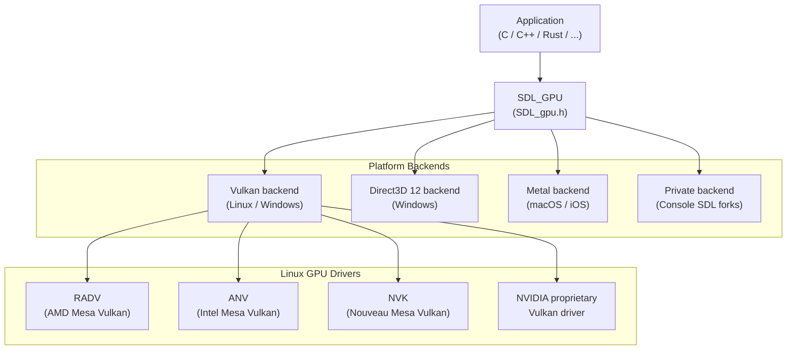
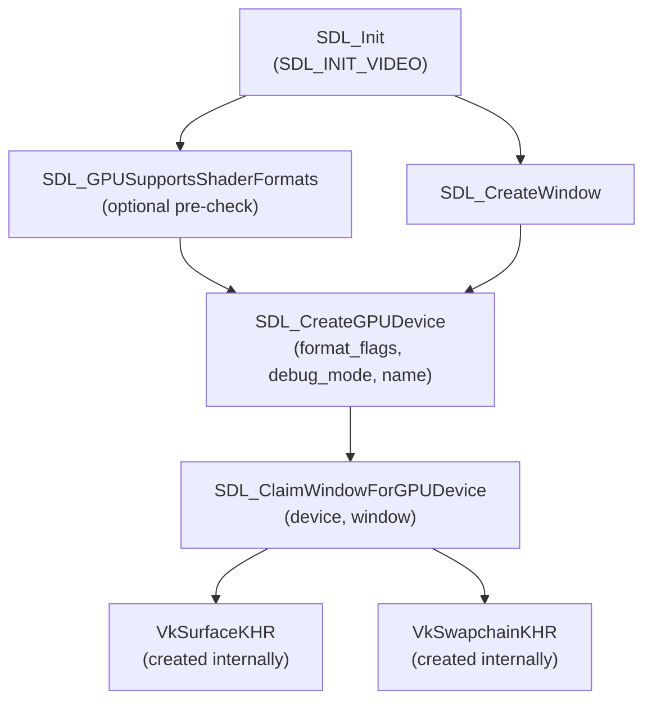
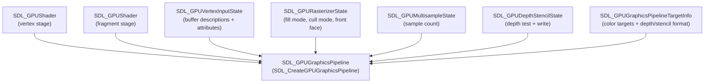
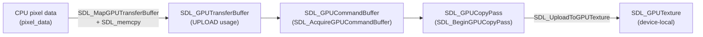
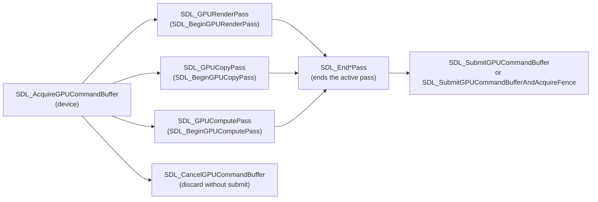
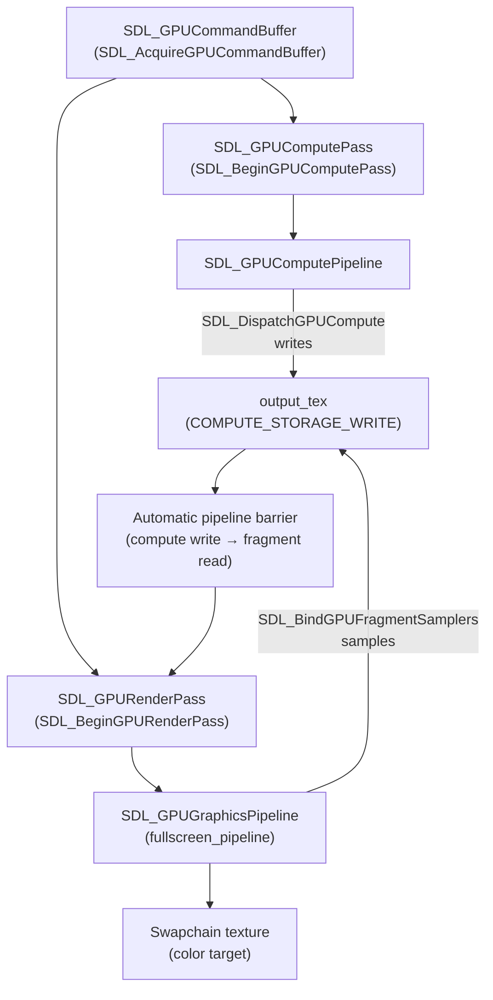
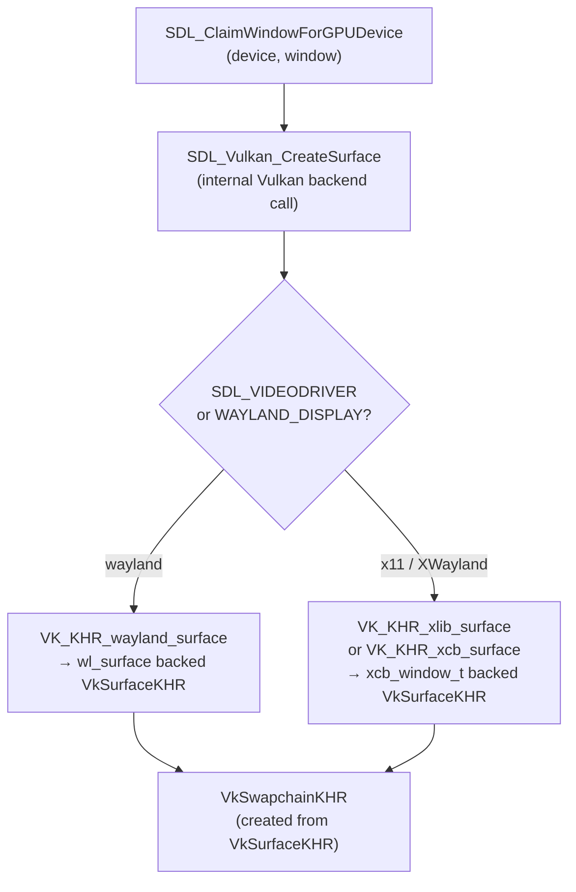

# Chapter 81 — SDL3 GPU API: A Portable High-Level GPU Abstraction

**Audiences:** Graphics application developers who want explicit GPU control without Vulkan's verbosity; game developers new to command-buffer-style APIs; browser and tool engineers who need a portable GPU surface that runs on every SDL3-supported platform.

---

## Table of Contents

1. [SDL3 and the GPU API: Filling the Gap](#1-sdl3-and-the-gpu-api-filling-the-gap)
2. [Device Creation and Backend Selection](#2-device-creation-and-backend-selection)
3. [Shaders and Pipeline State](#3-shaders-and-pipeline-state)
4. [Textures and Samplers](#4-textures-and-samplers)
5. [Buffers and Vertex Data](#5-buffers-and-vertex-data)
6. [Command Buffers and Render Passes](#6-command-buffers-and-render-passes)
7. [Compute Passes](#7-compute-passes)
8. [Swapchain and Presentation](#8-swapchain-and-presentation)
9. [Resource Lifetime and Cleanup](#9-resource-lifetime-and-cleanup)
10. [SDL_GPU vs Vulkan vs WebGPU](#10-sdl_gpu-vs-vulkan-vs-webgpu)
11. [Linux-Specific Considerations](#11-linux-specific-considerations)
12. [Integrations](#12-integrations)

---

## 1. SDL3 and the GPU API: Filling the Gap

The modern GPU API landscape offers developers two unpleasant extremes. At one end sit raw **Vulkan**, **Direct3D 12**, and **Metal**: maximally expressive, maximally verbose. A minimal **Vulkan** triangle demonstration requires roughly 800 lines of boilerplate covering instance creation, physical device enumeration, logical device setup, queue families, command pool allocation, render passes, framebuffers, descriptor set layouts, pipeline layout, the pipeline itself, and synchronization primitives. At the other end sit full game engines such as Unity and Unreal: they absorb all GPU detail but impose their own scene graph, scripting system, and asset pipeline, making them unsuitable for tools, research prototypes, or games with unusual architectures.

Between these poles there is a genuine gap: developers who want explicit command buffers—the ability to record GPU work in advance, overlap CPU and GPU, control upload timing, and drive compute workloads—but who do not want to write 200 lines of **Vulkan** to draw a texture. Existing third-party abstractions such as **bgfx** (see Chapter 84) and sokol_gfx fill part of this space, but none is integrated into a cross-platform windowing and input library that also handles audio, file I/O, and console ports.

**SDL3**, with its new GPU API (**`SDL_gpu.h`**), fills this gap by adding a first-party, **Metal**-inspired GPU layer directly to **SDL**. The history of the API traces to Ryan Gordon (icculus) and the **FNA** runtime team, who had already built a similar abstraction for the **FNA**/**MoonWorks** ecosystem. Their implementation was donated and extended, entering the **SDL3** main branch in September 2024. **SDL** 3.2.0, the first stable release including **SDL_GPU**, shipped in January 2025. [Source: Hacker News discussion on SDL3 GPU merge](https://news.ycombinator.com/item?id=41396260)

### Conceptual Position

**SDL_GPU** is a *thin wrapper* around the native GPU API on each platform:

- **Linux/BSD** → **Vulkan** (the only backend available on Linux)
- **Windows** → **Vulkan** or **Direct3D 12**
- **macOS/iOS** → **Metal**
- **Console platforms** → proprietary backends via private **SDL** forks



The API surface is inspired by **Metal** rather than **Vulkan**: resources are created once and referenced by opaque handles; command buffers are acquired, recorded, and submitted in one sequence; descriptor sets do not exist; the shader-resource binding layout is declared at pipeline-creation time via counts rather than layout objects. [Source: SDL3 GPU API header](https://github.com/libsdl-org/SDL/blob/release-3.2.14/include/SDL3/SDL_gpu.h)

### Comparison to WebGPU

**WebGPU** (Chapter 40 discusses **wgpu**, which implements the same specification) pursues similar goals from a different direction. Both APIs hide **Vulkan**'s descriptor pool and render-pass machinery. The key differences:

- **WebGPU** is specified by a W3C working group targeting browsers and **Wasm**; **SDL_GPU** is specified by **SDL** maintainers targeting native applications and consoles.
- **WebGPU** requires **WGSL** shaders; **SDL_GPU** accepts **SPIR-V**, **DXBC**/**DXIL**, **MSL**, and pre-compiled **Metallib**, letting developers re-use existing shader pipelines.
- **WebGPU** supports the full binding-group model; **SDL_GPU** uses a push-style uniform mechanism that avoids **UBO** bindings entirely for small constant data.
- **SDL_GPU** reaches console platforms that **WebGPU** will never target.

For Linux desktop application developers, **SDL_GPU** is the easiest path from "**SDL2** + **OpenGL**" to an explicit command-buffer GPU workflow.

### What SDL_GPU Does Not Provide

Being explicit about the API's scope is as important as listing its capabilities. **SDL_GPU** deliberately omits:

- **Bindless resources:** No support for **`VK_EXT_descriptor_indexing`** or descriptor arrays. Every texture and buffer must be bound at a specific slot.
- **Ray tracing:** No support for **`VK_KHR_ray_tracing_pipeline`**. This is a first-class **Vulkan** feature unavailable through any current **SDL_GPU** backend.
- **Mesh shaders:** No support for **`VK_EXT_mesh_shader`** or amplification shaders.
- **Multi-queue workloads:** **SDL_GPU** presents a single implicit queue. Applications requiring asynchronous compute queues or transfer queues must use raw **Vulkan**.
- **Explicit barriers:** **SDL_GPU** inserts barriers automatically based on the pass model (copy → compute → render). Developers who need precise barrier placement for performance optimization must step outside **SDL_GPU**.
- **Subpass and input attachments:** **SDL_GPU** render passes have no equivalent to **Vulkan** subpasses, which are required for some **TBDR** tile-based deferred rendering techniques.
- **Query objects:** Occlusion queries, timestamp queries, and pipeline statistics queries are not exposed.

This conservative scope is a deliberate design choice: the API targets the 80% of GPU usage that can be expressed portably, and does so with dramatically reduced verbosity. Developers who exhaust **SDL_GPU**'s feature set have usually gained enough understanding of the GPU model to move to raw **Vulkan** productively.

The remaining sections of this chapter walk through the full **SDL_GPU** workflow in depth. Device creation and backend selection via **`SDL_CreateGPUDevice`** and **`SDL_ClaimWindowForGPUDevice`** are covered in Section 2, including the **`SDL_GPUSupportsShaderFormats`** pre-check and the extended **`SDL_CreateGPUDeviceWithProperties`** path. Section 3 covers shaders and pipeline state: compiling **SPIR-V** bytecode into **`SDL_GPUShader`** objects via **`SDL_GPUShaderCreateInfo`**, assembling a **`SDL_GPUGraphicsPipeline`** from **`SDL_GPUVertexInputState`**, **`SDL_GPURasterizerState`**, **`SDL_GPUMultisampleState`**, **`SDL_GPUDepthStencilState`**, and **`SDL_GPUGraphicsPipelineTargetInfo`**; configuring alpha blending via **`SDL_GPUColorTargetBlendState`**; depth testing with **`SDL_GPU_TEXTUREFORMAT_D32_FLOAT`**; and pushing per-draw constants with **`SDL_PushGPUVertexUniformData`** and **`SDL_PushGPUFragmentUniformData`** instead of descriptor-set-bound **UBO**s. Section 4 addresses **`SDL_GPUTexture`** and **`SDL_GPUSampler`** creation and the staging-buffer upload workflow via **`SDL_GPUTransferBuffer`** and **`SDL_GPUCopyPass`**. Section 5 extends the same patterns to **`SDL_GPUBuffer`** objects for vertex data, index data (**`SDL_GPU_BUFFERUSAGE_INDEX`**), and **GPU**-driven indirect draw (**`SDL_GPU_BUFFERUSAGE_INDIRECT`**, **`SDL_GPUIndirectDrawCommand`**). Section 6 details the command buffer lifecycle (**`SDL_AcquireGPUCommandBuffer`**, **`SDL_SubmitGPUCommandBuffer`**, **`SDL_CancelGPUCommandBuffer`**), render pass recording with **`SDL_BeginGPURenderPass`** and **`SDL_GPUColorTargetInfo`**, viewport and scissor control via **`SDL_SetGPUViewport`** and **`SDL_SetGPUScissor`**, and GPU debug markers (**`SDL_PushGPUDebugGroup`**, **`SDL_InsertGPUDebugLabel`**) that integrate with tools such as **RenderDoc** and **Nsight** via **`VK_EXT_debug_utils`**. Section 7 covers compute passes: creating a **`SDL_GPUComputePipeline`** from a compute **SPIR-V** shader, dispatching work with **`SDL_DispatchGPUCompute`**, and mixing compute and graphics passes within a single command buffer with automatic pipeline barriers. Section 8 discusses swapchain management via **`SDL_WaitAndAcquireGPUSwapchainTexture`** and presentation modes (**`SDL_GPU_PRESENTMODE_VSYNC`**, **`SDL_GPU_PRESENTMODE_MAILBOX`**, **`SDL_GPU_PRESENTMODE_IMMEDIATE`**), including **HDR** output via **`SDL_GPUSwapchainComposition`** (**`SDL_GPU_SWAPCHAINCOMPOSITION_HDR10_ST2084`**, **`SDL_GPU_SWAPCHAINCOMPOSITION_HDR_EXTENDED_LINEAR`**). Section 9 explains resource lifetime and cleanup: the **`SDL_ReleaseGPU*`** functions, deferred destruction semantics, the `cycle` boolean for hazard-free frequent updates, and explicit **CPU**–**GPU** synchronization via **`SDL_GPUFence`** and **`SDL_WaitForGPUFences`**. Section 10 provides a structured comparison of **SDL_GPU** against raw **Vulkan** and **WebGPU**/**wgpu** across boilerplate, portability, shader formats, descriptor models, memory management, and advanced feature support. Finally, Section 11 covers Linux-specific behavior: **Vulkan** as the sole backend, surface creation choosing between **`VK_KHR_wayland_surface`** and **`VK_KHR_xlib_surface`** based on the display server, the underlying **Mesa** drivers (**RADV**, **ANV**, **NVK**) and NVIDIA proprietary, enabling **`VK_LAYER_KHRONOS_validation`** validation layers via the `debug_mode` flag, the fact that **GBM** and **EGL** are not used by the **Vulkan** backend, relevant environment variables (**`SDL_VIDEODRIVER`**, **`SDL_GPU_DRIVER`**, **`VK_INSTANCE_LAYERS`**, **`VK_ICD_FILENAMES`**), and the status of the in-progress **WebGPU**/**Emscripten** community backend.

---

## 2. Device Creation and Backend Selection

The entry point for all GPU work is `SDL_CreateGPUDevice`. It takes three arguments: a bitmask of shader formats the application can supply, a debug-mode flag, and an optional backend name string. [Source: SDL wiki, SDL_CreateGPUDevice](https://wiki.libsdl.org/SDL3/SDL_CreateGPUDevice)

```c
// include/SDL3/SDL_gpu.h — SDL 3.2.14 tag
SDL_GPUDevice *SDL_CreateGPUDevice(
    SDL_GPUShaderFormat format_flags,
    bool                debug_mode,
    const char         *name);   // NULL = SDL chooses best backend
```

The `format_flags` parameter is a bitfield:

```c
// SDL_gpu.h — shader format flags (bitmask, not enum)
#define SDL_GPU_SHADERFORMAT_INVALID   0
#define SDL_GPU_SHADERFORMAT_PRIVATE   (1u << 0)  // opaque driver-specific
#define SDL_GPU_SHADERFORMAT_SPIRV     (1u << 1)  // Vulkan SPIR-V
#define SDL_GPU_SHADERFORMAT_DXBC      (1u << 2)  // D3D shader model 5.x
#define SDL_GPU_SHADERFORMAT_DXIL      (1u << 3)  // D3D shader model 6.x
#define SDL_GPU_SHADERFORMAT_MSL       (1u << 4)  // Metal Shading Language source
#define SDL_GPU_SHADERFORMAT_METALLIB  (1u << 5)  // compiled Metal library
```

On Linux, the only backend is Vulkan, so `SDL_GPU_SHADERFORMAT_SPIRV` is the correct flag. The `name` parameter may be `"vulkan"`, `"direct3d12"`, `"metal"`, or `NULL` (SDL auto-selects). Passing `NULL` on Linux always yields the Vulkan backend.

**Querying the active driver:**

```c
// After creation, confirm which driver is active
const char *driver = SDL_GetGPUDeviceDriver(device);
// On Linux this will always be "vulkan"
SDL_Log("GPU driver: %s", driver);
```

**Attaching a window** for swapchain access requires a separate call after device creation:

```c
// Complete device + window setup for a 1280×720 window
SDL_Init(SDL_INIT_VIDEO);

SDL_Window *window = SDL_CreateWindow(
    "SDL_GPU Demo", 1280, 720,
    SDL_WINDOW_RESIZABLE);

// Request SPIR-V support; enable validation layers in debug builds
SDL_GPUDevice *device = SDL_CreateGPUDevice(
    SDL_GPU_SHADERFORMAT_SPIRV,
    true,   // debug_mode
    NULL);  // auto-select backend

if (!device) {
    SDL_Log("SDL_CreateGPUDevice failed: %s", SDL_GetError());
    return 1;
}

// Claim the window — this creates the Vulkan swapchain internally
if (!SDL_ClaimWindowForGPUDevice(device, window)) {
    SDL_Log("SDL_ClaimWindowForGPUDevice failed: %s", SDL_GetError());
    return 1;
}
```

`SDL_ClaimWindowForGPUDevice` creates the Vulkan `VkSurfaceKHR` and `VkSwapchainKHR` internally, selects a surface format compatible with the swapchain composition mode, and wires the window to the device. Multiple windows can be claimed from the same device. [Source: SDL_gpu.h, release-3.2.14](https://github.com/libsdl-org/SDL/blob/release-3.2.14/include/SDL3/SDL_gpu.h)



**Checking backend support before creation.** Use `SDL_GPUSupportsShaderFormats` to verify that a specific backend and shader format are available before committing to device creation:

```c
// Probe whether Vulkan with SPIR-V is available on this machine
if (!SDL_GPUSupportsShaderFormats(SDL_GPU_SHADERFORMAT_SPIRV, "vulkan")) {
    SDL_Log("Vulkan/SPIRV not supported on this system");
    return 1;
}
```

**Extended creation via properties** is available for advanced cases (power preference, driver hints):

```c
SDL_PropertiesID props = SDL_CreateProperties();
SDL_SetBooleanProperty(props, SDL_PROP_GPU_DEVICE_CREATE_SHADERS_SPIRV_BOOLEAN, true);
SDL_SetBooleanProperty(props, SDL_PROP_GPU_DEVICE_CREATE_DEBUGMODE_BOOLEAN, true);
SDL_SetBooleanProperty(props, SDL_PROP_GPU_DEVICE_CREATE_PREFERLOWPOWER_BOOLEAN, false);
SDL_GPUDevice *device = SDL_CreateGPUDeviceWithProperties(props);
SDL_DestroyProperties(props);
```

---

## 3. Shaders and Pipeline State

### Creating Shaders

SDL_GPU compiles shaders from bytecode or source text at device-creation time. For the Vulkan/Linux backend, SPIR-V bytecode is the format. A shader is created by filling `SDL_GPUShaderCreateInfo` and calling `SDL_CreateGPUShader`. [Source: SDL_gpu.h](https://github.com/libsdl-org/SDL/blob/release-3.2.14/include/SDL3/SDL_gpu.h)

```c
typedef struct SDL_GPUShaderCreateInfo {
    size_t             code_size;            // byte length of SPIR-V blob
    const Uint8       *code;                 // pointer to SPIR-V bytecode
    const char        *entrypoint;           // e.g. "main"
    SDL_GPUShaderFormat format;              // SDL_GPU_SHADERFORMAT_SPIRV
    SDL_GPUShaderStage  stage;               // VERTEX or FRAGMENT
    Uint32             num_samplers;         // combined image+sampler count
    Uint32             num_storage_textures; // read-only storage images
    Uint32             num_storage_buffers;  // read-only storage buffers
    Uint32             num_uniform_buffers;  // push-style uniform slots
    SDL_PropertiesID   props;               // optional, 0 for defaults
} SDL_GPUShaderCreateInfo;
```

**SPIR-V binding layout contract.** SDL_GPU enforces a fixed descriptor-set layout in SPIR-V shaders. The resource counts declared in `SDL_GPUShaderCreateInfo` must exactly match the resources bound in the SPIR-V. The set/binding assignments are:

| Shader stage | Descriptor set | Contents |
|---|---|---|
| Vertex | Set 0 | Sampled textures, then storage textures, then storage buffers |
| Vertex | Set 1 | Uniform buffers |
| Fragment | Set 2 | Sampled textures, then storage textures, then storage buffers |
| Fragment | Set 3 | Uniform buffers |

[Source: SDL wiki, SDL_CreateGPUShader](https://wiki.libsdl.org/SDL3/SDL_CreateGPUShader)

This is a critical portability contract: the same SPIR-V that runs through SDL_GPU must use these specific set/binding indices. Shader compilers (glslc, DXC) must be invoked with explicit set assignments, or a tool like `SDL_shader_tools` (a separate SDL project) can recompile high-level shader source to the correct layout.

**Example: loading a SPIR-V blob and creating vertex/fragment shaders:**

```c
// helper: read file into a malloc'd buffer
static Uint8 *load_spv(const char *path, size_t *out_size) {
    SDL_IOStream *io = SDL_IOFromFile(path, "rb");
    Sint64 size = SDL_GetIOSize(io);
    Uint8 *buf = SDL_malloc(size);
    SDL_ReadIO(io, buf, size);
    SDL_CloseIO(io);
    *out_size = (size_t)size;
    return buf;
}

size_t vert_size, frag_size;
Uint8 *vert_spv = load_spv("triangle.vert.spv", &vert_size);
Uint8 *frag_spv = load_spv("triangle.frag.spv", &frag_size);

SDL_GPUShaderCreateInfo vert_info = {
    .code_size          = vert_size,
    .code               = vert_spv,
    .entrypoint         = "main",
    .format             = SDL_GPU_SHADERFORMAT_SPIRV,
    .stage              = SDL_GPU_SHADERSTAGE_VERTEX,
    .num_samplers       = 0,
    .num_storage_textures = 0,
    .num_storage_buffers  = 0,
    .num_uniform_buffers  = 1,  // one push-style uniform slot
};
SDL_GPUShader *vert_shader = SDL_CreateGPUShader(device, &vert_info);

SDL_GPUShaderCreateInfo frag_info = {
    .code_size          = frag_size,
    .code               = frag_spv,
    .entrypoint         = "main",
    .format             = SDL_GPU_SHADERFORMAT_SPIRV,
    .stage              = SDL_GPU_SHADERSTAGE_FRAGMENT,
    .num_samplers       = 1,  // one combined image sampler
    .num_uniform_buffers = 0,
};
SDL_GPUShader *frag_shader = SDL_CreateGPUShader(device, &frag_info);

SDL_free(vert_spv);
SDL_free(frag_spv);
```

### Building a Graphics Pipeline

A graphics pipeline captures all fixed-function and programmable state. The equivalent Vulkan object (`VkGraphicsPipelineCreateInfo`) requires 15+ sub-structures and extensions for dynamic state; SDL_GPU's equivalent is still detailed but substantially shorter:



```c
typedef struct SDL_GPUGraphicsPipelineCreateInfo {
    SDL_GPUShader              *vertex_shader;
    SDL_GPUShader              *fragment_shader;
    SDL_GPUVertexInputState     vertex_input_state;
    SDL_GPUPrimitiveType        primitive_type;
    SDL_GPURasterizerState      rasterizer_state;
    SDL_GPUMultisampleState     multisample_state;
    SDL_GPUDepthStencilState    depth_stencil_state;
    SDL_GPUGraphicsPipelineTargetInfo target_info;
    SDL_PropertiesID            props;
} SDL_GPUGraphicsPipelineCreateInfo;
```

**Vertex input layout:**

```c
// One vertex buffer: position (float3) + texcoord (float2)
SDL_GPUVertexBufferDescription vb_desc = {
    .slot              = 0,
    .pitch             = 5 * sizeof(float),  // stride in bytes
    .input_rate        = SDL_GPU_VERTEXINPUTRATE_VERTEX,
    .instance_step_rate = 0,
};

SDL_GPUVertexAttribute attrs[2] = {
    {
        .location    = 0,
        .buffer_slot = 0,
        .format      = SDL_GPU_VERTEXELEMENTFORMAT_FLOAT3,
        .offset      = 0,
    },
    {
        .location    = 1,
        .buffer_slot = 0,
        .format      = SDL_GPU_VERTEXELEMENTFORMAT_FLOAT2,
        .offset      = 3 * sizeof(float),
    },
};

SDL_GPUVertexInputState vertex_input = {
    .vertex_buffer_descriptions = &vb_desc,
    .num_vertex_buffers         = 1,
    .vertex_attributes          = attrs,
    .num_vertex_attributes      = 2,
};
```

**Complete pipeline creation for a textured triangle:**

```c
// Target: one RGBA8 color target, no depth/stencil
SDL_GPUColorTargetDescription color_target_desc = {
    .format      = SDL_GPU_TEXTUREFORMAT_R8G8B8A8_UNORM,
    .blend_state = { .enable_blend = false },
};

SDL_GPUGraphicsPipelineCreateInfo pipeline_info = {
    .vertex_shader   = vert_shader,
    .fragment_shader = frag_shader,
    .vertex_input_state = vertex_input,
    .primitive_type  = SDL_GPU_PRIMITIVETYPE_TRIANGLELIST,
    .rasterizer_state = {
        .fill_mode  = SDL_GPU_FILLMODE_FILL,
        .cull_mode  = SDL_GPU_CULLMODE_NONE,
        .front_face = SDL_GPU_FRONTFACE_COUNTER_CLOCKWISE,
    },
    .multisample_state = {
        .sample_count = SDL_GPU_SAMPLECOUNT_1,
    },
    .depth_stencil_state = {
        .enable_depth_test  = false,
        .enable_depth_write = false,
    },
    .target_info = {
        .color_target_descriptions = &color_target_desc,
        .num_color_targets         = 1,
        .has_depth_stencil_target  = false,
    },
};

SDL_GPUGraphicsPipeline *pipeline =
    SDL_CreateGPUGraphicsPipeline(device, &pipeline_info);
```

Shaders can be released immediately after pipeline creation; the pipeline holds its own reference to the shader bytecode internally. Call `SDL_ReleaseGPUShader(device, vert_shader)` and the fragment shader once all pipelines that use them are created.

### Alpha Blending

For rendering transparent geometry, enable alpha blending in the `SDL_GPUColorTargetBlendState` embedded within `SDL_GPUColorTargetDescription`:

```c
SDL_GPUColorTargetDescription transparent_target = {
    .format = SDL_GPU_TEXTUREFORMAT_R8G8B8A8_UNORM,
    .blend_state = {
        .enable_blend          = true,
        .src_color_blendfactor = SDL_GPU_BLENDFACTOR_SRC_ALPHA,
        .dst_color_blendfactor = SDL_GPU_BLENDFACTOR_ONE_MINUS_SRC_ALPHA,
        .color_blend_op        = SDL_GPU_BLENDOP_ADD,
        .src_alpha_blendfactor = SDL_GPU_BLENDFACTOR_ONE,
        .dst_alpha_blendfactor = SDL_GPU_BLENDFACTOR_ONE_MINUS_SRC_ALPHA,
        .alpha_blend_op        = SDL_GPU_BLENDOP_ADD,
        .color_write_mask      = 0xF,  // write all channels
        .enable_color_write_mask = false,
    },
};
```

### Depth Testing

For 3D rendering with a depth buffer, a depth texture must be created separately and referenced in both the pipeline description and the render pass:

```c
// Create depth texture (device-local, no need for SAMPLER unless depth sampling)
SDL_GPUTextureCreateInfo depth_info = {
    .type    = SDL_GPU_TEXTURETYPE_2D,
    .format  = SDL_GPU_TEXTUREFORMAT_D32_FLOAT,
    .usage   = SDL_GPU_TEXTUREUSAGE_DEPTH_STENCIL_TARGET,
    .width   = render_width, .height = render_height,
    .layer_count_or_depth = 1,
    .num_levels   = 1,
    .sample_count = SDL_GPU_SAMPLECOUNT_1,
};
SDL_GPUTexture *depth_tex = SDL_CreateGPUTexture(device, &depth_info);

// Reference in pipeline target info
SDL_GPUGraphicsPipelineTargetInfo target_with_depth = {
    .color_target_descriptions = &color_target_desc,
    .num_color_targets         = 1,
    .depth_stencil_format      = SDL_GPU_TEXTUREFORMAT_D32_FLOAT,
    .has_depth_stencil_target  = true,
};

// Reference at render pass time
SDL_GPUDepthStencilTargetInfo ds_target = {
    .texture         = depth_tex,
    .clear_depth     = 1.0f,
    .load_op         = SDL_GPU_LOADOP_CLEAR,
    .store_op        = SDL_GPU_STOREOP_DONT_CARE,
    .stencil_load_op  = SDL_GPU_LOADOP_DONT_CARE,
    .stencil_store_op = SDL_GPU_STOREOP_DONT_CARE,
    .cycle           = false,
};

SDL_GPURenderPass *pass = SDL_BeginGPURenderPass(
    cmd, &color_target_info, 1, &ds_target);
```

Call `SDL_GPUTextureSupportsFormat(device, SDL_GPU_TEXTUREFORMAT_D32_FLOAT, SDL_GPU_TEXTURETYPE_2D, SDL_GPU_TEXTUREUSAGE_DEPTH_STENCIL_TARGET)` at startup to confirm the depth format is available on the current hardware/driver combination, and fall back to `D24_UNORM_S8_UINT` if not.

### Push-Style Uniforms

A significant SDL_GPU departure from Vulkan is that small per-draw constants (model matrix, material parameters) are not uploaded via descriptor-set-bound uniform buffer objects. Instead, they are written to the command buffer directly:

```c
// During render pass recording, before a draw call:
typedef struct {
    float transform[16];
} VertexUniforms;

VertexUniforms uniforms = { /* ... fill matrix ... */ };

// Slot 0 corresponds to the first uniform_buffer declared in the shader
SDL_PushGPUVertexUniformData(command_buffer, 0, &uniforms, sizeof(uniforms));
```

`SDL_PushGPUFragmentUniformData` and `SDL_PushGPUComputeUniformData` work identically for their respective stages. [Source: SDL_gpu.h](https://github.com/libsdl-org/SDL/blob/release-3.2.14/include/SDL3/SDL_gpu.h) On the Vulkan backend, this is handled transparently through an internally managed uniform buffer mechanism — the exact implementation detail (ring buffer of `VkBuffer` allocations) is opaque to the caller, and the intent is that SDL_GPU selects the most efficient path for the target backend without burdening the application with the choice.

---

## 4. Textures and Samplers

### Creating Textures

```c
typedef struct SDL_GPUTextureCreateInfo {
    SDL_GPUTextureType       type;              // 2D, 2D_ARRAY, 3D, CUBE, CUBE_ARRAY
    SDL_GPUTextureFormat     format;            // e.g. SDL_GPU_TEXTUREFORMAT_R8G8B8A8_UNORM
    SDL_GPUTextureUsageFlags usage;             // bitmask
    Uint32                   width;
    Uint32                   height;
    Uint32                   layer_count_or_depth; // layers for arrays; depth for 3D
    Uint32                   num_levels;           // mip levels, 1 = no mipmaps
    SDL_GPUSampleCount       sample_count;
    SDL_PropertiesID         props;
} SDL_GPUTextureCreateInfo;
```

Usage flags can be combined:

```c
// SDL_gpu.h — texture usage flags (bitmask)
SDL_GPU_TEXTUREUSAGE_SAMPLER                                 (1u << 0)
SDL_GPU_TEXTUREUSAGE_COLOR_TARGET                            (1u << 1)
SDL_GPU_TEXTUREUSAGE_DEPTH_STENCIL_TARGET                    (1u << 2)
SDL_GPU_TEXTUREUSAGE_GRAPHICS_STORAGE_READ                   (1u << 3)
SDL_GPU_TEXTUREUSAGE_COMPUTE_STORAGE_READ                    (1u << 4)
SDL_GPU_TEXTUREUSAGE_COMPUTE_STORAGE_WRITE                   (1u << 5)
SDL_GPU_TEXTUREUSAGE_COMPUTE_STORAGE_SIMULTANEOUS_READ_WRITE (1u << 6)
```

A texture that will be uploaded to and sampled in a fragment shader:

```c
SDL_GPUTextureCreateInfo tex_info = {
    .type               = SDL_GPU_TEXTURETYPE_2D,
    .format             = SDL_GPU_TEXTUREFORMAT_R8G8B8A8_UNORM,
    .usage              = SDL_GPU_TEXTUREUSAGE_SAMPLER,
    .width              = image_width,
    .height             = image_height,
    .layer_count_or_depth = 1,
    .num_levels         = 1,
    .sample_count       = SDL_GPU_SAMPLECOUNT_1,
};
SDL_GPUTexture *texture = SDL_CreateGPUTexture(device, &tex_info);
```

### Creating Samplers

```c
SDL_GPUSamplerCreateInfo sampler_info = {
    .min_filter     = SDL_GPU_FILTER_LINEAR,
    .mag_filter     = SDL_GPU_FILTER_LINEAR,
    .mipmap_mode    = SDL_GPU_SAMPLERMIPMAPMODE_LINEAR,
    .address_mode_u = SDL_GPU_SAMPLERADDRESSMODE_REPEAT,
    .address_mode_v = SDL_GPU_SAMPLERADDRESSMODE_REPEAT,
    .address_mode_w = SDL_GPU_SAMPLERADDRESSMODE_REPEAT,
    .mip_lod_bias   = 0.0f,
    .max_anisotropy = 1.0f,
    .enable_anisotropy = false,
    .enable_compare    = false,
    .min_lod        = 0.0f,
    .max_lod        = 1000.0f,
};
SDL_GPUSampler *sampler = SDL_CreateGPUSampler(device, &sampler_info);
```

### Uploading Texture Data via a Copy Pass

All CPU→GPU data transfers go through `SDL_GPUTransferBuffer`. The upload pattern mirrors Vulkan's staging buffer workflow but with a simpler API:



```c
// 1. Create a transfer buffer sized for the pixel data
Uint32 image_byte_size = image_width * image_height * 4;  // RGBA8

SDL_GPUTransferBufferCreateInfo tbuf_info = {
    .usage = SDL_GPU_TRANSFERBUFFERUSAGE_UPLOAD,
    .size  = image_byte_size,
};
SDL_GPUTransferBuffer *upload_buf =
    SDL_CreateGPUTransferBuffer(device, &tbuf_info);

// 2. Map → memcpy → unmap
void *mapped = SDL_MapGPUTransferBuffer(device, upload_buf, false);
SDL_memcpy(mapped, pixel_data, image_byte_size);
SDL_UnmapGPUTransferBuffer(device, upload_buf);

// 3. Record the copy inside a copy pass on a command buffer
SDL_GPUCommandBuffer *upload_cmd = SDL_AcquireGPUCommandBuffer(device);

SDL_GPUTextureTransferInfo src = {
    .transfer_buffer = upload_buf,
    .offset          = 0,
    .pixels_per_row  = image_width,
    .rows_per_layer  = image_height,
};
SDL_GPUTextureRegion dst = {
    .texture   = texture,
    .mip_level = 0,
    .layer     = 0,
    .x = 0, .y = 0, .z = 0,
    .w = image_width, .h = image_height, .d = 1,
};

SDL_GPUCopyPass *copy_pass = SDL_BeginGPUCopyPass(upload_cmd);
SDL_UploadToGPUTexture(copy_pass, &src, &dst, false /* don't cycle */);
SDL_EndGPUCopyPass(copy_pass);

SDL_SubmitGPUCommandBuffer(upload_cmd);

// 4. Release the staging buffer — SDL_GPU uses deferred destruction,
//    so the buffer is held alive internally until the GPU has consumed
//    the submitted command buffer. SDL_SubmitGPUCommandBuffer is
//    non-blocking; use SDL_SubmitGPUCommandBufferAndAcquireFence +
//    SDL_WaitForGPUFences if explicit CPU–GPU synchronization is needed.
SDL_ReleaseGPUTransferBuffer(device, upload_buf);
```

The `cycle` parameter in `SDL_UploadToGPUTexture` is an SDL_GPU-specific hazard-avoidance mechanism: when `true`, SDL allocates a fresh backing allocation if the texture is still in-flight on the GPU, rather than stalling. [Source: SDL_gpu.h](https://github.com/libsdl-org/SDL/blob/release-3.2.14/include/SDL3/SDL_gpu.h)

---

## 5. Buffers and Vertex Data

### Buffer Creation

```c
typedef struct SDL_GPUBufferCreateInfo {
    SDL_GPUBufferUsageFlags usage;  // bitmask
    Uint32                  size;
    SDL_PropertiesID        props;
} SDL_GPUBufferCreateInfo;
```

Buffer usage flags (may be combined):

```c
SDL_GPU_BUFFERUSAGE_VERTEX                (1u << 0)
SDL_GPU_BUFFERUSAGE_INDEX                 (1u << 1)
SDL_GPU_BUFFERUSAGE_INDIRECT              (1u << 2)
SDL_GPU_BUFFERUSAGE_GRAPHICS_STORAGE_READ (1u << 3)
SDL_GPU_BUFFERUSAGE_COMPUTE_STORAGE_READ  (1u << 4)
SDL_GPU_BUFFERUSAGE_COMPUTE_STORAGE_WRITE (1u << 5)
```

[Source: SDL wiki, SDL_GPUBufferUsageFlags](https://wiki.libsdl.org/SDL3/SDL_GPUBufferUsageFlags)

```c
// Interleaved vertex buffer: xyz (float3) + uv (float2) × 3 vertices
float vertices[] = {
//  x      y     z     u     v
    0.0f,  0.5f, 0.0f, 0.5f, 0.0f,
   -0.5f, -0.5f, 0.0f, 0.0f, 1.0f,
    0.5f, -0.5f, 0.0f, 1.0f, 1.0f,
};

SDL_GPUBufferCreateInfo vbuf_info = {
    .usage = SDL_GPU_BUFFERUSAGE_VERTEX,
    .size  = sizeof(vertices),
};
SDL_GPUBuffer *vertex_buffer = SDL_CreateGPUBuffer(device, &vbuf_info);
```

### Staging Upload Pattern

The upload procedure for buffers mirrors textures. SDL_GPU has no "host-visible vertex buffer" concept; all uploads go through a transfer buffer:

```c
// 1. Create upload transfer buffer
SDL_GPUTransferBufferCreateInfo tbuf_info = {
    .usage = SDL_GPU_TRANSFERBUFFERUSAGE_UPLOAD,
    .size  = sizeof(vertices),
};
SDL_GPUTransferBuffer *staging = SDL_CreateGPUTransferBuffer(device, &tbuf_info);

// 2. Map → memcpy → unmap
void *mapped = SDL_MapGPUTransferBuffer(device, staging, false);
SDL_memcpy(mapped, vertices, sizeof(vertices));
SDL_UnmapGPUTransferBuffer(device, staging);

// 3. Copy in a GPU command buffer
SDL_GPUCommandBuffer *upload_cmd = SDL_AcquireGPUCommandBuffer(device);
SDL_GPUCopyPass *copy = SDL_BeginGPUCopyPass(upload_cmd);

SDL_GPUTransferBufferLocation src = { .transfer_buffer = staging, .offset = 0 };
SDL_GPUBufferRegion dst = { .buffer = vertex_buffer, .offset = 0, .size = sizeof(vertices) };

SDL_UploadToGPUBuffer(copy, &src, &dst, false);
SDL_EndGPUCopyPass(copy);
SDL_SubmitGPUCommandBuffer(upload_cmd);

// 4. Release staging memory
SDL_ReleaseGPUTransferBuffer(device, staging);
```

**Comparison to Vulkan.** In raw Vulkan, this pattern requires: `vkCreateBuffer` (×2, staging + device), `vkAllocateMemory` (×2), `vkMapMemory`, `vkFlushMappedMemoryRanges`, `vkUnmapMemory`, `vkAllocateCommandBuffers`, `vkBeginCommandBuffer`, `vkCmdCopyBuffer`, `vkEndCommandBuffer`, `vkQueueSubmit`, `vkQueueWaitIdle`, `vkFreeCommandBuffers`, then cleanup. SDL_GPU reduces this to roughly twelve lines. The Vulkan Memory Allocator (VMA, Chapter 82) reduces Vulkan's burden somewhat, but the command recording overhead remains.

### Index Buffers

An index buffer is created and uploaded identically to a vertex buffer, with the usage flag `SDL_GPU_BUFFERUSAGE_INDEX`. It is bound during the render pass with `SDL_BindGPUIndexBuffer` and drawn with `SDL_DrawGPUIndexedPrimitives`:

```c
Uint16 indices[] = { 0, 1, 2, 2, 3, 0 };  // two triangles forming a quad

SDL_GPUBufferCreateInfo ibuf_info = {
    .usage = SDL_GPU_BUFFERUSAGE_INDEX,
    .size  = sizeof(indices),
};
SDL_GPUBuffer *index_buffer = SDL_CreateGPUBuffer(device, &ibuf_info);
// ... upload via transfer buffer as above ...

// Inside render pass:
SDL_GPUBufferBinding ib_binding = { .buffer = index_buffer, .offset = 0 };
SDL_BindGPUIndexBuffer(render_pass, &ib_binding, SDL_GPU_INDEXELEMENTSIZE_16BIT);
SDL_DrawGPUIndexedPrimitives(render_pass,
    6,  // num_indices
    1,  // num_instances
    0,  // first_index
    0,  // vertex_offset
    0); // first_instance
```

### Indirect Draw Buffers

For GPU-driven rendering where draw arguments are computed on the GPU (e.g., by a compute shader that performs frustum culling), buffers with `SDL_GPU_BUFFERUSAGE_INDIRECT` can be passed to `SDL_DrawGPUPrimitivesIndirect` and `SDL_DrawGPUIndexedPrimitivesIndirect`. Each indirect draw record matches the `SDL_GPUIndirectDrawCommand` or `SDL_GPUIndexedIndirectDrawCommand` structure, which mirrors the `VkDrawIndirectCommand` layout.

---

## 6. Command Buffers and Render Passes

### The Command Buffer Lifecycle

SDL_GPU uses a single-acquisition, submit-once model. A command buffer is obtained from the device, recorded into, and submitted. It cannot be reused after submission.



```c
SDL_GPUCommandBuffer *cmd = SDL_AcquireGPUCommandBuffer(device);
```

### Beginning a Render Pass

The render pass requires at least one color target described by `SDL_GPUColorTargetInfo`:

```c
typedef struct SDL_GPUColorTargetInfo {
    SDL_GPUTexture  *texture;             // render target texture
    Uint32           mip_level;
    Uint32           layer_or_depth_plane;
    SDL_FColor       clear_color;         // RGBA in [0,1] range
    SDL_GPULoadOp    load_op;             // LOAD, CLEAR, or DONT_CARE
    SDL_GPUStoreOp   store_op;            // STORE, DONT_CARE, RESOLVE, RESOLVE_AND_STORE
    SDL_GPUTexture  *resolve_texture;     // for MSAA resolve, else NULL
    Uint32           resolve_mip_level;
    Uint32           resolve_layer;
    bool             cycle;               // hazard cycling
    bool             cycle_resolve_texture;
    Uint8            padding1, padding2;
} SDL_GPUColorTargetInfo;
```

### Full Triangle Render Loop

```c
// Acquire the swapchain texture for this frame
SDL_GPUTexture *swapchain_tex = NULL;
Uint32 sw_w, sw_h;

if (!SDL_WaitAndAcquireGPUSwapchainTexture(cmd, window,
                                            &swapchain_tex, &sw_w, &sw_h)) {
    SDL_Log("Swapchain acquire failed: %s", SDL_GetError());
    SDL_CancelGPUCommandBuffer(cmd);
    return;
}

if (swapchain_tex == NULL) {
    // Window is minimised or not yet ready — skip this frame
    SDL_SubmitGPUCommandBuffer(cmd);
    return;
}

// Set up the render target
SDL_GPUColorTargetInfo color_target = {
    .texture      = swapchain_tex,
    .mip_level    = 0,
    .layer_or_depth_plane = 0,
    .clear_color  = { 0.1f, 0.1f, 0.15f, 1.0f },
    .load_op      = SDL_GPU_LOADOP_CLEAR,
    .store_op     = SDL_GPU_STOREOP_STORE,
    .cycle        = false,
};

// Begin render pass
SDL_GPURenderPass *render_pass = SDL_BeginGPURenderPass(
    cmd,
    &color_target, 1,
    NULL);  // no depth/stencil target

// Bind pipeline
SDL_BindGPUGraphicsPipeline(render_pass, pipeline);

// Push per-draw constants
VertexUniforms uniforms = { .transform = { /* identity matrix */ } };
SDL_PushGPUVertexUniformData(cmd, 0, &uniforms, sizeof(uniforms));

// Bind vertex buffer
SDL_GPUBufferBinding vb_binding = {
    .buffer = vertex_buffer,
    .offset = 0,
};
SDL_BindGPUVertexBuffers(render_pass, 0, &vb_binding, 1);

// Bind texture + sampler for the fragment shader
SDL_GPUTextureSamplerBinding tex_binding = {
    .texture = texture,
    .sampler = sampler,
};
SDL_BindGPUFragmentSamplers(render_pass, 0, &tex_binding, 1);

// Issue the draw: 3 vertices, 1 instance
SDL_DrawGPUPrimitives(render_pass, 3, 1, 0, 0);

// End render pass and submit
SDL_EndGPURenderPass(render_pass);
SDL_SubmitGPUCommandBuffer(cmd);
```

`SDL_PushGPUVertexUniformData` takes the command buffer rather than the render pass handle, which means uniform data can be updated between draw calls without leaving the pass. [Source: SDL_gpu.h](https://github.com/libsdl-org/SDL/blob/release-3.2.14/include/SDL3/SDL_gpu.h)

### Viewport and Scissor

After binding a pipeline, the viewport and scissor rectangle can be adjusted per-pass:

```c
SDL_GPUViewport viewport = {
    .x = 0.0f, .y = 0.0f,
    .w = (float)sw_w, .h = (float)sw_h,
    .min_depth = 0.0f, .max_depth = 1.0f,
};
SDL_SetGPUViewport(render_pass, &viewport);

SDL_Rect scissor = { .x = 0, .y = 0, .w = (int)sw_w, .h = (int)sw_h };
SDL_SetGPUScissor(render_pass, &scissor);
```

### Debug Markers

SDL_GPU exposes GPU debug markers that are forwarded to the underlying Vulkan validation layers and graphics debuggers (RenderDoc, Nsight, etc.):

```c
// Annotate command buffer for GPU profilers and debuggers
SDL_PushGPUDebugGroup(cmd, "Shadow Pass");
// ... shadow rendering ...
SDL_PopGPUDebugGroup(cmd);

SDL_InsertGPUDebugLabel(cmd, "Begin UI Rendering");
// ... UI rendering ...

// Name resources so they appear in RenderDoc captures
SDL_SetGPUTextureName(device, texture, "AlbedoTexture");
SDL_SetGPUBufferName(device, vertex_buffer, "SceneVertices");
```

These calls have zero runtime cost when validation layers are not active; on the Vulkan backend they map to `vkCmdBeginDebugUtilsLabelEXT` / `vkCmdInsertDebugUtilsLabelEXT` from `VK_EXT_debug_utils`.

---

## 7. Compute Passes

Compute passes in SDL_GPU expose a streamlined path to GPU compute work. Read-write storage resources are declared at pass begin time; read-only resources are bound inside the pass via bind calls.

### Creating a Compute Pipeline

The compute pipeline inlines the shader rather than referencing a pre-created `SDL_GPUShader`:

```c
typedef struct SDL_GPUComputePipelineCreateInfo {
    size_t             code_size;
    const Uint8       *code;
    const char        *entrypoint;
    SDL_GPUShaderFormat format;
    Uint32             num_samplers;
    Uint32             num_readonly_storage_textures;
    Uint32             num_readonly_storage_buffers;
    Uint32             num_readwrite_storage_textures;
    Uint32             num_readwrite_storage_buffers;
    Uint32             num_uniform_buffers;
    Uint32             threadcount_x;   // workgroup size declared in SPIR-V
    Uint32             threadcount_y;
    Uint32             threadcount_z;
    SDL_PropertiesID   props;
} SDL_GPUComputePipelineCreateInfo;
```

The SPIR-V binding layout for compute shaders:

| Descriptor set | Contents |
|---|---|
| Set 0 | Sampled textures, read-only storage textures, read-only storage buffers |
| Set 1 | Read-write storage textures, read-write storage buffers |
| Set 2 | Uniform buffers |

[Source: SDL wiki, SDL_CreateGPUComputePipeline](https://wiki.libsdl.org/SDL3/SDL_CreateGPUComputePipeline)

### Dispatching Compute Work

```c
// Create a texture for compute output (marked COMPUTE_STORAGE_WRITE)
SDL_GPUTextureCreateInfo out_tex_info = {
    .type    = SDL_GPU_TEXTURETYPE_2D,
    .format  = SDL_GPU_TEXTUREFORMAT_R8G8B8A8_UNORM,
    .usage   = SDL_GPU_TEXTUREUSAGE_COMPUTE_STORAGE_WRITE
             | SDL_GPU_TEXTUREUSAGE_SAMPLER,
    .width   = 512, .height = 512,
    .layer_count_or_depth = 1,
    .num_levels = 1,
    .sample_count = SDL_GPU_SAMPLECOUNT_1,
};
SDL_GPUTexture *output_tex = SDL_CreateGPUTexture(device, &out_tex_info);

SDL_GPUCommandBuffer *cmd = SDL_AcquireGPUCommandBuffer(device);

// Read-write storage bindings are declared at pass-begin time
SDL_GPUStorageTextureReadWriteBinding rw_binding = {
    .texture   = output_tex,
    .mip_level = 0,
    .layer     = 0,
    .cycle     = true,  // allow SDL to allocate fresh backing if texture in-flight
};

SDL_GPUComputePass *compute_pass = SDL_BeginGPUComputePass(
    cmd,
    &rw_binding, 1,   // read-write storage textures
    NULL, 0);          // read-write storage buffers (none)

SDL_BindGPUComputePipeline(compute_pass, compute_pipeline);

// Read-only storage textures/buffers are bound inside the pass
SDL_GPUTexture *input_textures[] = { input_tex };
SDL_BindGPUComputeStorageTextures(compute_pass, 0, input_textures, 1);

// Push compute uniforms
typedef struct { Uint32 width, height; } ComputeParams;
ComputeParams params = { 512, 512 };
SDL_PushGPUComputeUniformData(cmd, 0, &params, sizeof(params));

// Dispatch: 512/16 × 512/16 × 1 workgroups (assuming 16×16 workgroup size)
SDL_DispatchGPUCompute(compute_pass, 32, 32, 1);

SDL_EndGPUComputePass(compute_pass);
SDL_SubmitGPUCommandBuffer(cmd);
```

**Important caveat:** reads and writes within a single compute pass are not implicitly synchronized. If a second dispatch needs the results of the first, the compute pass must be ended and a new one begun. [Source: SDL wiki, SDL_BeginGPUComputePass](https://wiki.libsdl.org/SDL3/SDL_BeginGPUComputePass)

**Comparison to Vulkan.** Raw Vulkan compute requires explicit `VkDescriptorSetLayout`, `VkDescriptorPool`, `VkDescriptorSet` allocation, `vkUpdateDescriptorSets`, and a `vkCmdPipelineBarrier` between dependent dispatches. SDL_GPU handles descriptor management internally and exposes a simpler bind model, at the cost of flexibility (no bindless, no explicit barrier control).

### Mixing Compute and Graphics

A common pattern is to run a compute pass to generate or process data (texture synthesis, particle update, GPU culling) and then consume the result in a subsequent graphics render pass. SDL_GPU handles the pipeline barrier between passes automatically when the two passes share a texture that is written by compute and read by the graphics stage:



```c
SDL_GPUCommandBuffer *cmd = SDL_AcquireGPUCommandBuffer(device);

// --- Compute pass: write to output_tex ---
SDL_GPUStorageTextureReadWriteBinding rw = {
    .texture = output_tex, .mip_level = 0, .layer = 0, .cycle = true
};
SDL_GPUComputePass *cpass = SDL_BeginGPUComputePass(cmd, &rw, 1, NULL, 0);
SDL_BindGPUComputePipeline(cpass, compute_pipeline);
SDL_DispatchGPUCompute(cpass, 32, 32, 1);
SDL_EndGPUComputePass(cpass);

// --- Graphics pass: sample output_tex as a texture ---
// SDL_GPU inserts the necessary barrier between compute write and fragment read
SDL_GPUColorTargetInfo color_target = {
    .texture = swapchain_tex, .load_op = SDL_GPU_LOADOP_CLEAR,
    .store_op = SDL_GPU_STOREOP_STORE,
    .clear_color = { 0.0f, 0.0f, 0.0f, 1.0f },
};
SDL_GPURenderPass *rpass = SDL_BeginGPURenderPass(cmd, &color_target, 1, NULL);
SDL_BindGPUGraphicsPipeline(rpass, fullscreen_pipeline);
SDL_GPUTextureSamplerBinding tex_samp = { .texture = output_tex, .sampler = sampler };
SDL_BindGPUFragmentSamplers(rpass, 0, &tex_samp, 1);
SDL_DrawGPUPrimitives(rpass, 3, 1, 0, 0);  // fullscreen triangle
SDL_EndGPURenderPass(rpass);

SDL_SubmitGPUCommandBuffer(cmd);
```

The automatic barrier insertion is one of SDL_GPU's most significant productivity wins over raw Vulkan, where this transition requires a `vkCmdPipelineBarrier` with precise `VkImageMemoryBarrier` specifying source/destination pipeline stages and access masks.

---

## 8. Swapchain and Presentation

### Acquiring the Swapchain Texture

SDL_GPU provides two variants for swapchain texture acquisition. The preferred variant for most applications is:

```c
bool SDL_WaitAndAcquireGPUSwapchainTexture(
    SDL_GPUCommandBuffer *command_buffer,
    SDL_Window           *window,
    SDL_GPUTexture      **swapchain_texture,        // out
    Uint32               *swapchain_texture_width,  // out, may be NULL
    Uint32               *swapchain_texture_height); // out, may be NULL
```

The non-waiting variant:

```c
bool SDL_AcquireGPUSwapchainTexture(
    SDL_GPUCommandBuffer *command_buffer,
    SDL_Window           *window,
    SDL_GPUTexture      **swapchain_texture,
    Uint32               *swapchain_texture_width,
    Uint32               *swapchain_texture_height);
```

Both functions output a pointer to the swapchain texture via the third parameter (not the return value — the return value is a `bool` indicating success). The SDL documentation warns that the non-waiting variant can cause unbounded command-buffer accumulation if the GPU falls behind, so `SDL_WaitAndAcquireGPUSwapchainTexture` is the safe default. [Source: SDL wiki, SDL_AcquireGPUSwapchainTexture](https://wiki.libsdl.org/SDL3/SDL_AcquireGPUSwapchainTexture)

If `*swapchain_texture` is `NULL` after a successful call, the window is minimized or the swapchain is temporarily unavailable. Submit the command buffer without recording any render work to maintain correct internal state.

### Presentation Modes and HDR

Present mode and swapchain composition are configured via:

```c
void SDL_SetGPUSwapchainParameters(
    SDL_GPUDevice             *device,
    SDL_Window                *window,
    SDL_GPUSwapchainComposition swapchain_composition,
    SDL_GPUPresentMode          present_mode);
```

**Present modes:**

```c
typedef enum SDL_GPUPresentMode {
    SDL_GPU_PRESENTMODE_VSYNC,      // double-buffered, frame-rate locked to vblank
    SDL_GPU_PRESENTMODE_IMMEDIATE,  // no sync, possible tearing
    SDL_GPU_PRESENTMODE_MAILBOX     // triple-buffered, latest frame wins, no tearing
} SDL_GPUPresentMode;
```

**Swapchain composition (HDR support):**

```c
typedef enum SDL_GPUSwapchainComposition {
    SDL_GPU_SWAPCHAINCOMPOSITION_SDR,                 // sRGB, 8-bit/channel
    SDL_GPU_SWAPCHAINCOMPOSITION_SDR_LINEAR,          // linear 8-bit, no EOTF
    SDL_GPU_SWAPCHAINCOMPOSITION_HDR_EXTENDED_LINEAR, // FP16 scRGB
    SDL_GPU_SWAPCHAINCOMPOSITION_HDR10_ST2084         // HDR10, PQ transfer function
} SDL_GPUSwapchainComposition;
```

The swapchain texture format can be queried after claiming the window:

```c
SDL_GPUTextureFormat fmt = SDL_GetGPUSwapchainTextureFormat(device, window);
```

This format should be used when creating the `SDL_GPUColorTargetDescription` in the pipeline `target_info`, so the pipeline is compatible with the swapchain.

**Platform availability of present modes** should be tested before use:

```c
if (SDL_WindowSupportsGPUPresentMode(device, window, SDL_GPU_PRESENTMODE_MAILBOX)) {
    SDL_SetGPUSwapchainParameters(device, window,
        SDL_GPU_SWAPCHAINCOMPOSITION_SDR,
        SDL_GPU_PRESENTMODE_MAILBOX);
}
```

**How presentation is triggered.** Submitting a command buffer that has rendered into the swapchain texture automatically triggers `vkQueuePresentKHR` in the Vulkan backend. There is no separate present call; the act of submitting a command buffer whose color target is the current swapchain texture is the presentation event. [Source: SDL_gpu.h](https://github.com/libsdl-org/SDL/blob/release-3.2.14/include/SDL3/SDL_gpu.h)

---

## 9. Resource Lifetime and Cleanup

SDL_GPU follows a release-on-device model: every resource handle is released through a corresponding `SDL_ReleaseGPU*` function that takes the device as its first argument.

```c
// Release pipeline and shader objects
SDL_ReleaseGPUGraphicsPipeline(device, pipeline);
SDL_ReleaseGPUComputePipeline(device, compute_pipeline);

// Shaders (usually released immediately after pipeline creation)
SDL_ReleaseGPUShader(device, vert_shader);
SDL_ReleaseGPUShader(device, frag_shader);

// Texture and sampler
SDL_ReleaseGPUTexture(device, texture);
SDL_ReleaseGPUSampler(device, sampler);

// Buffers
SDL_ReleaseGPUBuffer(device, vertex_buffer);
SDL_ReleaseGPUTransferBuffer(device, staging);

// Release fence objects (if using SubmitAndAcquireFence)
SDL_ReleaseGPUFence(device, fence);

// Detach the window (destroys the swapchain)
SDL_ReleaseWindowFromGPUDevice(device, window);

// Destroy the device (tears down the Vulkan instance/logical device)
SDL_DestroyGPUDevice(device);
```

**Ownership semantics.** Release calls are safe to make while GPU work is in flight; SDL_GPU defers actual destruction until the command buffer referencing the resource has completed. This is implemented internally via reference counting against fence/timeline semaphore values in the Vulkan backend, similar to how VMA handles deferred destruction.

**The `cycle` boolean.** Several upload functions and `SDL_GPUColorTargetInfo` include a `cycle` field. When set to `true`, SDL_GPU allocates a fresh backing allocation (a new `VkImage` or `VkBuffer` sub-region) if the resource is still being consumed by the GPU, avoiding a CPU stall at the cost of additional GPU memory. This is the recommended mode for frequently-updated resources such as per-frame vertex data. When `false`, SDL_GPU inserts an implicit barrier/wait.

**Fences for explicit CPU–GPU synchronization:**

```c
SDL_GPUFence *fence = SDL_SubmitGPUCommandBufferAndAcquireFence(cmd);

// ... do other CPU work ...

SDL_WaitForGPUFences(device, true, &fence, 1);
// GPU has finished; safe to read back results
SDL_ReleaseGPUFence(device, fence);
```

---

## 10. SDL_GPU vs Vulkan vs WebGPU

The table below compares SDL_GPU to raw Vulkan and WebGPU (via wgpu) across dimensions relevant to a Linux graphics developer.

| Feature | SDL_GPU (3.2) | Vulkan (1.3) | WebGPU / wgpu |
|---|---|---|---|
| **Minimum boilerplate (triangle)** | ~100 lines | ~800 lines | ~200 lines |
| **Portability** | Linux/Win/Mac/Console | Linux/Win/Mac/Android | Linux/Win/Mac/Browser (Wasm) |
| **Shader format** | SPIR-V (Linux), MSL (macOS), DXBC/DXIL (Win) | SPIR-V | WGSL (source), SPIR-V (wgpu internal) |
| **Descriptor model** | Resource counts + push uniforms | Descriptor pools + sets + layouts | Bind groups + bind group layouts |
| **Uniform mechanism** | `SDL_PushGPUVertexUniformData` (no UBO binding) | UBO via `vkUpdateDescriptorSets` or push constants | `setBindGroup` with `GPUBuffer` |
| **Memory management** | Internal (opaque) | Manual or via VMA | Internal (opaque) |
| **Compute support** | Yes | Yes | Yes |
| **Ray tracing** | No | Yes (KHR_ray_tracing_pipeline) | No |
| **Mesh shaders** | No | Yes (EXT_mesh_shader) | No |
| **Bindless textures** | No | Yes | No (limited via WGSL) |
| **Console targets** | Yes (via private SDL forks) | Partial (platform Vulkan) | No |
| **Learning curve** | Low–Medium | High | Medium |
| **Performance overhead** | Minimal thin wrapper | Zero (baseline) | Minimal |

**When to choose SDL_GPU:**
- Building a game or tool that already uses SDL for windowing, input, and audio — GPU integration is one library.
- Targeting both desktop and console platforms without writing platform-specific render backends.
- Learning explicit GPU APIs: SDL_GPU's reduced surface area makes concepts (command buffers, render passes, copy passes, compute passes) clear without Vulkan noise.
- Indie game development where the missing features (ray tracing, mesh shaders) are not required.

**When to choose raw Vulkan:**
- Need features not in SDL_GPU (ray tracing, mesh shaders, timeline semaphores, bindless, sparse resources, subgroup operations).
- Require precise control over GPU memory layout (custom allocators, suballocation strategies).
- Building a game engine or middleware that must expose the full Vulkan feature set downstream.

**When to choose WebGPU/wgpu:**
- Shipping to browsers via Wasm.
- Prefer a W3C-standardized API with the possibility of web and native parity.
- Ecosystem alignment with Rust/wgpu (see Chapter 40 on Bevy/wgpu).

---

## 11. Linux-Specific Considerations

### Vulkan as the Only Backend

On Linux, `SDL_CreateGPUDevice` with any combination of `format_flags` will always yield the Vulkan backend. There is no D3D12 or Metal backend on Linux. Calling `SDL_GetGPUDeviceDriver(device)` will return `"vulkan"`. SPIR-V is therefore the only relevant shader format for Linux-native SDL_GPU applications.

### Surface Creation: Wayland vs X11

When `SDL_ClaimWindowForGPUDevice` is called, the Vulkan backend internally calls `SDL_Vulkan_CreateSurface` from SDL's Vulkan windowing layer. This function selects between:

- `VK_KHR_wayland_surface` when the display server is Wayland (SDL detects this from the `WAYLAND_DISPLAY` environment variable and the SDL window's subsystem).
- `VK_KHR_xlib_surface` or `VK_KHR_xcb_surface` when running under X11 or XWayland.

The application sees none of this distinction: the same `SDL_ClaimWindowForGPUDevice` call works under both display servers. SDL's Vulkan surface abstraction layer (Chapter 24 covers Vulkan/EGL integration in depth) handles the platform switch.

Under Wayland with `SDL_VIDEODRIVER=wayland`, SDL creates a `wl_surface` backed `VkSurfaceKHR` via `VK_KHR_wayland_surface`. Under X11 or XWayland with `SDL_VIDEODRIVER=x11`, it creates an `xcb_window_t` backed surface via `VK_KHR_xlib_surface` or `VK_KHR_xcb_surface`. The choice of display backend can affect present latency and synchronization behavior — Wayland's compositor-driven frame pacing may differ from X11's — but from SDL_GPU's perspective the swapchain API is identical in both cases.



### Mesa Vulkan Drivers

SDL_GPU's Vulkan backend sits atop whatever Mesa Vulkan driver is installed:

- **RADV** (AMD, radv driver): full Vulkan 1.3 + many extensions. SDL_GPU's feature set is a small subset.
- **ANV** (Intel, anv driver): similarly full coverage.
- **NVK** (NVIDIA, experimental Nouveau Vulkan driver, Chapter 10): Vulkan 1.3-capable but missing some extensions as of 2025. SDL_GPU's conservative feature set (no ray tracing, no bindless) maps cleanly onto NVK's current capability.
- **NVIDIA proprietary**: Vulkan 1.3 with full extension coverage.

SDL_GPU does not call any Mesa-specific extensions; it targets Vulkan 1.0 with `VK_KHR_swapchain` and a handful of widely-supported extensions. This makes it compatible with older Mesa releases.

### Debug Layers

Passing `debug_mode = true` to `SDL_CreateGPUDevice` activates the Vulkan validation layers (`VK_LAYER_KHRONOS_validation`) if they are installed (typically in `/usr/share/vulkan/explicit_layer.d/`). Validation layer output is routed through SDL's log system. This is the recommended development mode for SDL_GPU applications on Linux.

### GBM/EGL is Not Used

SDL_GPU does not use GBM or EGL on Linux. The Vulkan backend uses `VkSurface` created from a Wayland or X11 native handle. EGL is relevant to OpenGL/OpenGL-ES paths in SDL (`SDL_RENDERER_OPENGL`, `SDL_RENDERER_OPENGLES2`) and to off-screen compute via EGL (Chapter 24), but SDL_GPU bypasses EGL entirely.

### Environment Variables Relevant to SDL_GPU on Linux

Several environment variables affect SDL_GPU behavior on Linux:

- `SDL_GPU_DRIVER=vulkan` — Force a specific SDL_GPU backend by name. The SDL hint is `SDL_HINT_GPU_DRIVER`. On Linux this is redundant since Vulkan is the only backend, but useful for multi-backend debugging on macOS or Windows. [Source: SDL_hints.h release-3.2.14](https://github.com/libsdl-org/SDL/blob/release-3.2.14/include/SDL3/SDL_hints.h)
- `SDL_VIDEODRIVER=wayland` or `SDL_VIDEODRIVER=x11` — Force SDL to use a specific display backend, which in turn determines which Vulkan surface extension is used (`VK_KHR_wayland_surface` vs `VK_KHR_xlib_surface`).
- `VK_INSTANCE_LAYERS=VK_LAYER_KHRONOS_validation` — Activate Vulkan validation layers at the loader level, even when `debug_mode` is `false` in `SDL_CreateGPUDevice`. Requires the `vulkan-validationlayers` package.
- `VK_ICD_FILENAMES` — Override which Vulkan ICD (Installable Client Driver) is loaded. Set to the path of the desired `*_icd.x86_64.json` to force a specific driver (e.g. RADV vs AMDVLK) on AMD hardware.

### WebGPU Backend (In Progress)

As of SDL 3.2.x, a community-contributed WebGPU backend for SDL_GPU exists as a pull request ([GitHub #12046](https://github.com/libsdl-org/SDL/pull/12046)). This would add a fifth backend (alongside Vulkan, D3D12, Metal, and Private) targeting browser environments via Emscripten. On Linux, the WebGPU backend is not relevant, but its existence illustrates SDL_GPU's portability ambitions.

---

## 12. Integrations

**Chapter 16 — Mesa Vulkan Common Infrastructure** (`mesa/src/vulkan/`): SDL_GPU's Vulkan backend targets the common Vulkan object model that all Mesa drivers (RADV, ANV, NVK) implement. The `wsi` (Window System Integration) layer in Mesa handles the `VkSwapchainKHR` that SDL_GPU acquires images from.

**Chapter 18 — Vulkan Drivers (RADV, ANV, NVK)**: SDL_GPU applications run directly on top of these drivers. Performance characteristics (pipeline cache, descriptor overhead, memory types) of the underlying Mesa driver are visible at the SDL_GPU level; understanding these drivers helps diagnose SDL_GPU performance issues.

**Chapter 20 — Wayland Protocol Fundamentals**: `SDL_ClaimWindowForGPUDevice` on a Wayland session creates a `wl_surface`-backed `VkSurfaceKHR`. Wayland's frame callback mechanism governs when the swapchain image is presented. Understanding `wl_surface.frame` events (Chapter 20) explains why `SDL_GPU_PRESENTMODE_MAILBOX` behaves differently under Wayland vs X11.

**Chapter 24 — Vulkan/EGL Integration**: SDL_GPU bypasses EGL but sits alongside it. Chapter 24 explains how SDL's Vulkan surface creation layer works (`SDL_Vulkan_CreateSurface`), which is the function called internally by `SDL_ClaimWindowForGPUDevice`.

**Chapter 40 — Bevy and wgpu**: wgpu and SDL_GPU solve similar problems at a similar abstraction level. wgpu uses WebGPU's bind-group model and WGSL/SPIR-V shaders; SDL_GPU uses a push-uniform model with native shader formats. Bevy's `RenderApp` provides a full scene graph on top of wgpu; SDL_GPU provides no scene abstractions. For Rust developers, wgpu is typically the better choice; for C/C++ developers already using SDL, SDL_GPU is tightly integrated.

**Chapter 61 — SPIR-V and Shader Compilation**: SDL_GPU on Linux consumes SPIR-V exclusively. Chapter 61 covers `glslc`, `glslang`, and `DXC` for compiling GLSL/HLSL to SPIR-V, and the `spirv-opt` / `spirv-cross` tools for optimizing and cross-compiling. The descriptor-set binding layout imposed by SDL_GPU (sets 0–3 with specific ordering) must be respected in the GLSL `layout(set=N, binding=M)` annotations.

**Chapter 76 — Modern Vulkan Extensions**: Features like ray tracing (`VK_KHR_ray_tracing_pipeline`), mesh shaders (`VK_EXT_mesh_shader`), and bindless descriptors are not accessible through SDL_GPU. Applications that need these features must drop down to raw Vulkan and manage their own surface independently of SDL_GPU, or use a hybrid approach (SDL for windowing/input, raw Vulkan for rendering).

**Chapter 82 — Vulkan Memory Allocator (VMA)**: VMA solves the same GPU memory allocation problem that SDL_GPU solves internally. SDL_GPU users do not need VMA — the device manages all allocations transparently. Chapter 82 is relevant to readers who outgrow SDL_GPU and move to raw Vulkan, at which point VMA becomes indispensable for buffer and image allocation.

**Chapter 84 — bgfx**: bgfx is a competing GPU abstraction library with a longer history (2012 vs 2024) and broader feature coverage. Unlike SDL_GPU, bgfx ships its own shader compilation toolchain (`shaderc`), supports more exotic backends (WebGL, GNM), and has a large body of example code. SDL_GPU's advantage over bgfx is tight SDL ecosystem integration and a more modern, explicit command-buffer API inspired by Metal/Vulkan rather than OpenGL-era concepts. For a detailed comparison of abstraction philosophy, see Chapter 84.

---

*Sources consulted for this chapter:*

- [SDL3 GPU API header, release-3.2.14](https://github.com/libsdl-org/SDL/blob/release-3.2.14/include/SDL3/SDL_gpu.h)
- [SDL3 CategoryGPU wiki](https://wiki.libsdl.org/SDL3/CategoryGPU)
- [SDL_CreateGPUDevice wiki page](https://wiki.libsdl.org/SDL3/SDL_CreateGPUDevice)
- [SDL_CreateGPUShader wiki page](https://wiki.libsdl.org/SDL3/SDL_CreateGPUShader)
- [SDL_CreateGPUComputePipeline wiki page](https://wiki.libsdl.org/SDL3/SDL_CreateGPUComputePipeline)
- [SDL_AcquireGPUSwapchainTexture wiki page](https://wiki.libsdl.org/SDL3/SDL_AcquireGPUSwapchainTexture)
- [SDL_BeginGPUComputePass wiki page](https://wiki.libsdl.org/SDL3/SDL_BeginGPUComputePass)
- [SDL_BindGPUComputeStorageTextures wiki page](https://wiki.libsdl.org/SDL3/SDL_BindGPUComputeStorageTextures)
- [SDL_GPUBufferUsageFlags wiki page](https://wiki.libsdl.org/SDL3/SDL_GPUBufferUsageFlags)
- [Hacker News: SDL3 new GPU API merged](https://news.ycombinator.com/item?id=41396260)

## Roadmap

### Near-term (6–12 months)
- **WebGPU/Emscripten backend merge**: The community-contributed WebGPU backend ([SDL PR #12046](https://github.com/libsdl-org/SDL/pull/12046)) is under active review; if merged it would give SDL_GPU a fifth backend and enable browser deployment via Emscripten without code changes.
- **Query object support**: Timestamp and occlusion query APIs are on the SDL_GPU wish list; initial patches have appeared on the SDL mailing list to expose `VkQueryPool`-backed timing for GPU profiling.
- **Pipeline caching**: SDL 3.x maintainers have discussed exposing an explicit `SDL_GPUPipelineCache` handle backed by `VkPipelineCache`, reducing first-frame shader-compilation stalls on repeated runs.
- **Extended HDR and colour-space controls**: Wider adoption of `VK_EXT_swapchain_colorspace` is expected to land in the Vulkan backend, enabling more swapchain composition modes for HDR10 and wide-colour displays.

### Medium-term (1–3 years)
- **Indirect compute dispatch**: `SDL_DispatchGPUComputeIndirect` is a natural extension of the existing indirect draw support; GPU-driven pipelines (culling, LOD selection) would benefit from compute dispatch counts generated on-device.
- **Multi-queue scheduling**: The current single-implicit-queue model is the biggest architectural constraint for high-performance workloads; a two-queue model (main + async-transfer) is the most requested feature and aligns with how RADV and ANV expose dedicated transfer queues.
- **Shader cross-compilation integration**: Closer integration between SDL_GPU and the `SDL_shader_tools` project (or an embedded Tint/SPIRV-Cross path) could allow developers to write a single GLSL/WGSL shader and have SDL auto-translate it to MSL, DXIL, or SPIR-V at device-creation time.
- **MSAA resolve improvements**: Current MSAA resolve must be declared at pipeline creation; a deferred-resolve API (similar to Metal's storeActionOptions) would enable TBDR-friendly multi-sample patterns on tile-based Mesa drivers.

### Long-term
- **Bindless resource tiers**: As Vulkan descriptor indexing (`VK_EXT_descriptor_indexing`) becomes universally supported across Mesa drivers, SDL_GPU may introduce an opt-in bindless texture tier so that large texture atlases can be sampled without per-draw rebinding.
- **Ray tracing abstraction**: Once `VK_KHR_ray_tracing_pipeline` support matures in NVK and all three major Mesa drivers reach consistent coverage, a conservative ray tracing sub-API (BVH build, trace rays, miss/hit shaders) could be added behind a capability query, consistent with SDL_GPU's design of exposing the 80% portable subset.
- **Console-aligned feature parity**: SDL's private console forks will continue to drive feature additions back into the public API; capabilities that ship first on console (tile-based shading hints, variable-rate shading) are likely to appear in the open backend once the public Vulkan extensions stabilise.
