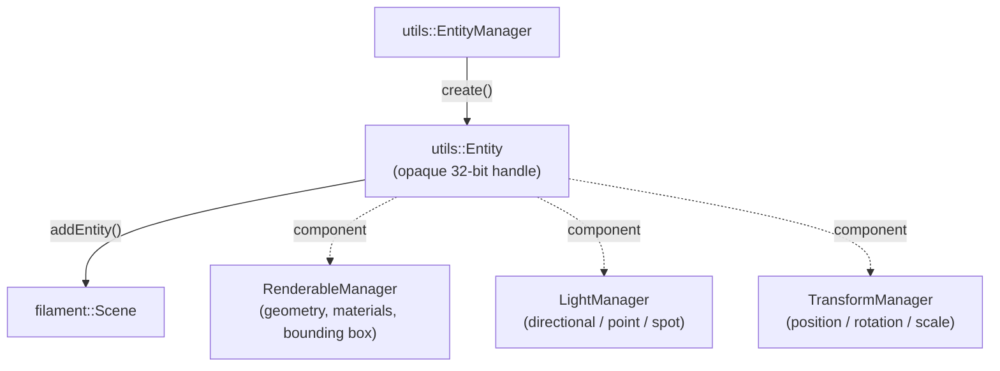
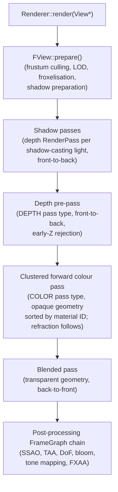
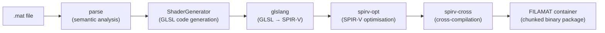
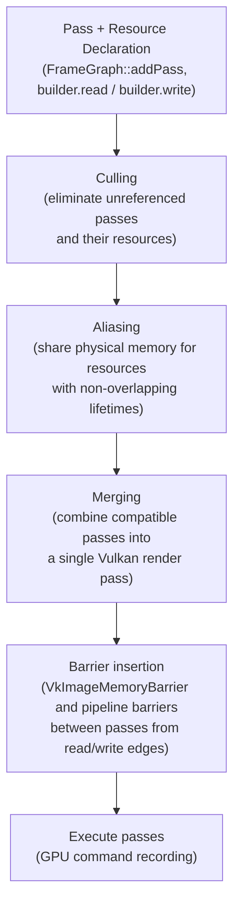

# Chapter 83 — Filament: Google's Physically Based Rendering Engine on Linux

**Audiences:** Graphics application developers embedding a production-quality PBR renderer; engine developers studying real-world FrameGraph, ECS, and material-system design; browser and Android engineers (Filament powers Chrome OS compositing, Google Maps 3D, and ARCore).

---

## Table of Contents

1. [Filament's Place in the Ecosystem](#1-filaments-place-in-the-ecosystem)
2. [Architecture Overview](#2-architecture-overview)
3. [Engine Initialisation and the Vulkan Backend](#3-engine-initialisation-and-the-vulkan-backend)
4. [The Entity-Component System](#4-the-entity-component-system)
5. [Vertex Buffers and Index Buffers](#5-vertex-buffers-and-index-buffers)
6. [The FILAMAT Material System](#6-the-filamat-material-system)
7. [Physically Based Rendering](#7-physically-based-rendering)
8. [Image-Based Lighting](#8-image-based-lighting)
9. [Shadow Mapping](#9-shadow-mapping)
10. [The FrameGraph](#10-the-framegraph)
11. [Post-Processing Pipeline](#11-post-processing-pipeline)
12. [Headless Rendering and Linux CI](#12-headless-rendering-and-linux-ci)
13. [matdbg and Debugging](#13-matdbg-and-debugging)
14. [Integrations](#14-integrations)

---

## 1. Filament's Place in the Ecosystem

**Filament** is Google's open-source, real-time, physically based rendering library. Released in 2018 and continuously developed since, it is used in production on Android (**Google Maps 3D**, **ARCore**), **Chrome OS**, and the **Flutter** engine. It runs on Android, iOS, Linux, macOS, Windows, and **WASM** via **WebGL2** and **WebGPU**. [Source](https://github.com/google/filament)

Filament is emphatically not a game engine. It is a rendering library meant to be embedded in an application that supplies its own event loop, asset pipeline, and UI toolkit. The library exposes a **C++** API (current standard: **C++20**, version 1.71.4 at time of writing) with Java/Kotlin and Swift bindings generated from the same source. [Source](https://deepwiki.com/google/filament/1-filament-overview)

The design philosophy is **minimal footprint, maximum physical accuracy**. The engine targets mobile hardware first, which forces disciplined trade-offs: every shader variant is pre-compiled offline by the **matc** tool into self-contained **FILAMAT** binary packages containing **SPIR-V** (for **Vulkan**), **MSL** (for Metal), **GLSL** (for OpenGL), and **WGSL** (for WebGPU) — the runtime never runs a **GLSL** compiler. The GPU upload path is explicitly managed through **BufferDescriptor** callbacks that transfer buffer ownership. On Linux, the preferred backend is **Vulkan**, though **OpenGL 4.1+** remains supported via the **bluegl** dynamic loader.

The chapter covers Filament's layered architecture:

- **filament::Engine** — resource factory managing all GPU resource lifetimes
- **filament::Scene** — entity container for ECS-managed renderables, lights, and transforms
- **filament::Renderer** — frame submission loop (`beginFrame` / `render` / `endFrame`)
- **Clustered forward renderer** — froxelisation-based light culling for large dynamic light counts
- **filament::backend::Driver** — abstraction layer routing GPU calls to **Vulkan**, **OpenGL/ES**, Metal, or **WebGPU** backends

Engine initialisation on Linux involves creating a **VkInstance** and **VkDevice** via **bluevk** (Filament's own Vulkan function loader), and constructing a **SwapChain** from a native window handle obtained via **SDL2**, **X11** (**VK_KHR_xlib_surface** / **VK_KHR_xcb_surface**), or **Wayland** (**VK_KHR_wayland_surface**).

Scene population uses a lightweight **entity-component system** (**ECS**) built on opaque **utils::Entity** handles and three managers:

- **RenderableManager** — geometry, materials, and bounding boxes
- **LightManager** — directional, point, and spot lights with physically based intensity in lux or lumens
- **TransformManager** — hierarchical position/rotation/scale

Geometry is submitted via **VertexBuffer** and **IndexBuffer** objects, with data transferred asynchronously using **BufferDescriptor** ownership-transfer callbacks.

The **FILAMAT** material system is fully offline: surface shaders are written in a domain-specific **.mat** format with a **shadingModel** directive selecting the shading model (**lit** Cook-Torrance **PBR**, **specularGlossiness**, **subsurface**, **cloth**, or **unlit**), then compiled by **matc** through a **glslang** → **spirv-opt** → **spirv-cross** pipeline into a chunked binary container. At runtime, a **Material** object parsed from the **.filamat** package spawns lightweight **MaterialInstance** objects per scene object.

The **PBR** implementation follows the rendering equation with a **Cook-Torrance** specular **BRDF** using the **GGX** (Trowbridge-Reitz) **NDF**, height-correlated Smith **geometric shadowing**, and **Schlick Fresnel** approximation, combined with a Lambertian diffuse **BRDF**. Energy compensation for multiscattering at high roughness uses the split-sum **DFG** lookup texture. Material model extensions include **clear coat**, **anisotropy**, and the **cloth** shading model.

**Image-based lighting** (**IBL**) relies on pre-filtered environment maps produced offline by **cmgen** (outputting **KTX1** specular cubemaps and **spherical harmonics** (**SH**) coefficients for diffuse irradiance), loaded at runtime via **IndirectLight**. The specular IBL integral is evaluated using the split-sum approximation with a pre-filtered cubemap and a baked **BRDF** integration map (**DFG** texture).

Shadow rendering is managed by **ShadowMapManager** and supports **Cascaded Shadow Maps** (**CSM**) for directional/sun lights, single perspective maps for spot lights, and cubemap faces for point lights. Shadow filtering options configurable per **View**:

- **PCF** — Percentage-Closer Filtering; default, fast, moderate quality
- **DPCF** — PCF with contact-hardening simulation
- **VSM** — Variance Shadow Maps; pre-filterable for large scenes
- **PCSS** — Percentage Closer Soft Shadows; true penumbra from light source size

Screen-space contact shadows are available as an additional layer.

The internal **FrameGraph** (**fg/**) is a directed acyclic graph of render passes and virtual resources, compiled each frame to perform pass culling, physical memory aliasing, compatible-pass merging (critical for **TBDR** GPUs such as **Adreno** and **Mali**), and automatic **VkImageMemoryBarrier** insertion. Applications do not write FrameGraph passes directly; they are authored internally by **PostProcessManager** and **ShadowMapManager**.

The post-processing pipeline exposes:

- **ColorGrading** — tone mapping and colour grading (with **ACESToneMapper**, **FilmicToneMapper**, and **LinearToneMapper**)
- **Bloom** — physically accurate; dual-Kawase pyramid
- **Depth of Field (DoF)** — scatter-as-gather circle-of-confusion approach
- **FXAA** — spatial anti-aliasing
- **TAA** — temporal anti-aliasing with Halton-jittered reprojection
- **SSAO** — Screen-Space Ambient Occlusion via **SAO** (Scalable Ambient Obscurance) or **GTAO** (Ground Truth AO)

Filament supports fully headless rendering via a dimension-based **SwapChain** overload (no native window) with **CONFIG_READABLE** for CPU pixel readback using **PixelBufferDescriptor**, and off-screen multi-pass compositing via **RenderTarget**. This mode powers Linux **CI** screenshot regression testing, using **Swiftshader** when no GPU is available.

Debugging facilities include **matdbg** — a live material editor embedding a **civetweb** HTTP/WebSocket server with a browser-based **Monaco** editor for hot-swapping **GLSL** shader variants at runtime — and **RenderDoc** integration via **librenderdoc.so** and **vkCmdBeginDebugUtilsLabelEXT** debug markers. The **matinfo** CLI tool can dump all shader variants from a **.filamat** package in **GLSL** or **SPIR-V** form.

Key differentiation from alternatives:

- vs. **Bevy/wgpu** (Ch 40): Filament is a mature **C++** library with production deployments; Bevy is a Rust game engine. Both use a declarative **FrameGraph** internally (see §10).
- vs. **Godot 4** (Ch 41): Godot exposes a **RenderingDevice** API for custom render passes; Filament's **PBR** pipeline is deeper and less configurable but more correct out of the box.
- vs. **Skia** (Ch 37): **Skia** is a 2D raster/vector library; Filament handles 3D scenes with lights, **PBR** materials, and a full shadow pipeline.
- vs. **bgfx** (Ch 84): **bgfx** is a thin cross-platform rendering **HAL**; Filament provides a complete high-level **PBR** pipeline on top of the **HAL** concept.

The repository lives at `https://github.com/google/filament`. Documentation is at `https://google.github.io/filament/`.

### 1.1 Production deployments and Linux relevance

Filament was designed for mobile but its **Vulkan** backend makes it a first-class citizen on Linux:

- **Google Maps 3D** (Android and desktop web): uses Filament to render photorealistic building geometry with **PBR** materials and **IBL**.
- **ARCore**: uses Filament to composite augmented-reality 3D objects into camera feeds with consistent **PBR** lighting.
- **Chrome OS**: **Flutter** applications on Chrome OS use Filament's **Impeller**-adjacent rendering path.
- **Open3D**: the open-source 3D data processing library uses Filament as its visualisation renderer, with a well-documented integration in **cpp/open3d/visualization/rendering/filament/**. [Source](https://www.open3d.org/docs/latest/cpp_api/_filament_scene_8h_source.html)

For Linux desktop developers, the primary entry points are:
- **libfilament.so** — the core rendering engine.
- **libbackend.so** — the backend abstraction layer and drivers.
- **libbluevk.so** — the **Vulkan** function loader (analogous to **libvulkan.so** but dynamically-loaded at runtime, avoiding a link-time **Vulkan SDK** dependency).
- **libfilamat.so** — material package parsing (separate from **matc** which is an offline tool).
- **libibl.so** — **IBL** prefiltering library for runtime use.

### 1.2 Building Filament for Linux

```bash
git clone https://github.com/google/filament
cd filament

# Build release binaries and tools for Linux (requires cmake 3.19+, clang 14+)
./build.sh release linux

# The install tree lands at out/release/filament/
# Key directories:
# out/release/filament/lib/x86_64/ — shared and static libraries
# out/release/filament/bin/         — matc, cmgen, matinfo, gltf_viewer, filamesh
# out/release/filament/include/     — public headers
```

[Source](https://github.com/google/filament/blob/main/BUILDING.md)

A minimal CMakeLists.txt for an application linking Filament:

```cmake
find_package(filament REQUIRED HINTS ${FILAMENT_INSTALL_DIR}/lib/cmake)
target_link_libraries(myapp PRIVATE filament backend bluevk utils math filabridge)
```

**Vulkan** must be present on the system; on Ubuntu: `apt install vulkan-tools libvulkan-dev`. AMD users need **radv** (**Mesa**), NVIDIA users need the proprietary driver or **nvk** (Ch 5), Intel users need **anv** (Ch 18).

---

## 2. Architecture Overview

Filament is structured in three layers that map closely to the rendering loop a developer writes.

### 2.1 Engine (resource factory and thread orchestration)

`filament::Engine` is the root object. It owns all resources (materials, textures, vertex buffers, etc.) and is responsible for their lifetime. Internally, `FEngine` maintains `ResourceList<T>` collections for leak detection at shutdown. [Source](https://github.com/google/filament/blob/main/filament/include/filament/Engine.h)

Filament separates CPU work across two threads:

- **Frontend thread**: the calling application thread that builds scene state, submits draw commands to a `CommandBufferQueue`, and calls `Renderer::beginFrame` / `render` / `endFrame`.
- **Backend thread**: consumes the command buffer and issues calls to the graphics driver (Vulkan command recording, pipeline binding, draw calls).

This dual-thread overlap allows the CPU to prepare frame N+1 while the GPU executes frame N. The `CommandBufferQueue` is a lock-free circular buffer; its size is configurable via `Engine::Config::commandBufferSizeMB`.

### 2.2 Scene (ECS container)

`filament::Scene` is a container for entities decorated with components from three managers:

- `RenderableManager` — associates geometry (vertex and index buffers), materials, and bounding boxes with an entity.
- `LightManager` — attaches directional, point, or spot light properties to an entity.
- `TransformManager` — manages hierarchical position/rotation/scale matrices.

This is a lightweight entity-component system (ECS) implemented via `utils::Entity` handles and `utils::EntityManager`. Entities are opaque 32-bit identifiers; component data lives in contiguous arrays inside each manager. [Source](https://deepwiki.com/google/filament/2-engine-architecture)



### 2.3 Renderer (frame submission)

`filament::Renderer` drives the render loop. Each call to `Renderer::render(View*)` executes:

1. `FView::prepare()` — frustum culling, LOD selection, froxelisation (light binning), shadow preparation.
2. Shadow passes — one depth `RenderPass` per shadow-casting light, sorted front-to-back.
3. Depth pre-pass (DEPTH pass type) — front-to-back for early-Z rejection.
4. Clustered forward colour pass (COLOR pass type) — opaque geometry sorted by material ID to minimise state changes; refraction pass follows.
5. Blended pass — transparent geometry sorted back-to-front.
6. Post-processing FrameGraph chain — SSAO, TAA, DoF, bloom, tone mapping, FXAA.

Each render command is a 64-bit sort key encoding pass type (bits 59–58: DEPTH/COLOR/REFRACT/BLENDED), priority, depth bucket, and material ID, stored in a cache-friendly contiguous array. The `sortCommands()` step uses integer comparison on these keys (O(N log N)), then `instanceify()` merges consecutive identical draws into GPU-instanced calls (up to 128 instances per merged call), reducing draw call overhead for repeated geometry. [Source](https://deepwiki.com/google/filament/3.1-rendering-pipeline)

`filament::View` binds a `Scene` to a `Camera` and a viewport, and carries per-view settings for post-processing, shadow type, ambient occlusion, and anti-aliasing. Multiple Views can reference the same Scene (e.g., a shadow pre-pass view and the main view).



### 2.4 Clustered forward light culling (froxelisation)

Filament uses a **clustered forward renderer** with froxel-based light culling. The view frustum is subdivided into a 3D grid of frustum-shaped voxels ("froxels") along X, Y, and Z (depth) axes. During `FView::prepare()`, each point and spot light is assigned to the froxels its bounding sphere or cone overlaps. The froxel-to-light mapping is uploaded to a `FroxelBuffer` GPU uniform that the fragment shader indexes per-pixel to enumerate only the lights that influence that fragment.

This means the fragment shader cost scales with lights per froxel, not total scene lights — allowing thousands of lights in large scenes with acceptable performance. The clustering step runs on the CPU with SIMD-friendly loops and the job system. On mobile hardware where compute shaders are constrained, the CPU clustering approach avoids a GPU compute pass that might stall the pipeline.

### 2.5 Backend abstraction

All GPU calls flow through `filament::backend::Driver`, an abstract C++ interface with concrete implementations for Vulkan, OpenGL/ES, Metal, and WebGPU. The abstraction uses typed handles (`Handle<HwTexture>`, `Handle<HwBufferObject>`, etc.) rather than raw pointers, allowing the backend thread to safely own resources independently of the application thread.

On Linux the relevant backends are:

| Backend | Entry point | Notes |
|---------|------------|-------|
| Vulkan 1.0+ | `Backend::VULKAN` | Preferred on Linux; explicit synchronisation |
| OpenGL 4.1+ | `Backend::OPENGL` | Fallback; uses `bluegl` dynamic loader |

The backend selection happens at `Engine::create` time and cannot be changed at runtime.

---

## 3. Engine Initialisation and the Vulkan Backend

### 3.1 Creating the engine

```cpp
// filament/include/filament/Engine.h — Engine::Builder (v1.71.4)
#include <filament/Engine.h>
#include <filament/Renderer.h>
#include <filament/SwapChain.h>
#include <filament/View.h>
#include <filament/Scene.h>
#include <filament/Camera.h>
#include <utils/EntityManager.h>

using namespace filament;

// Select the Vulkan backend explicitly on Linux.
Engine* engine = Engine::Builder()
    .backend(Engine::Backend::VULKAN)
    .build();
```

`Engine::Builder` also accepts `.platform(Platform*)` if you need to supply a custom `VulkanPlatform` (e.g., to inject an existing `VkInstance`). By default, Filament creates its own `VkInstance` and selects a `VkPhysicalDevice`. The relevant code lives in `filament/backend/src/vulkan/platform/PlatformVulkanAndroidLinuxWindows.cpp`. [Source](https://github.com/google/filament/blob/main/filament/backend/src/vulkan/platform/PlatformVulkanAndroidLinuxWindows.cpp)

Filament creates the `VkInstance` with a set of required instance extensions (surface, debug utils, platform-specific: `VK_KHR_xlib_surface` or `VK_KHR_xcb_surface` for X11, `VK_KHR_wayland_surface` for Wayland). It then selects a physical device, queries queue families, creates a logical `VkDevice`, and sets up a memory allocator (Filament maintains its own GPU memory pools rather than using VMA — see Ch 82 for comparison). The backend thread exclusively owns all Vulkan objects after this point.

### 3.2 Windowed SwapChain creation (SDL2 / X11 / Wayland)

The `libs/filamentapp` helper library — used by all sample apps — shows the real Linux path: [Source](https://github.com/google/filament/blob/main/libs/filamentapp/src/FilamentApp.cpp)

```cpp
// From libs/filamentapp/src/FilamentApp.cpp (simplified)
// SDL2 provides a platform-agnostic handle; SDL_SysWMinfo gives the native one.
SDL_SysWMinfo wmi;
SDL_VERSION(&wmi.version);
SDL_GetWindowWMInfo(sdlWindow, &wmi);

void* nativeWindow = nullptr;
#if defined(SDL_VIDEO_DRIVER_X11)
    // X11 path — pass the Display* and Window together
    nativeWindow = (void*) wmi.info.x11.window;
#elif defined(SDL_VIDEO_DRIVER_WAYLAND)
    // Wayland path — wl_egl_window wraps the wl_surface
    nativeWindow = wmi.info.wl.surface;
#endif

SwapChain* swapChain = engine->createSwapChain(nativeWindow,
    SwapChain::CONFIG_HAS_STENCIL_BUFFER);
```

Filament detects the display server from the window handle type at runtime. For Wayland it creates a `VK_KHR_wayland_surface`; for X11 it uses `VK_KHR_xlib_surface` or `VK_KHR_xcb_surface` depending on the `CONFIG_ENABLE_XCB` flag. [Source](https://github.com/google/filament/blob/main/filament/include/filament/SwapChain.h)

### 3.3 The full initialisation sequence

```cpp
// Complete engine + renderer setup
Engine* engine = Engine::Builder()
    .backend(Engine::Backend::VULKAN)
    .build();

SwapChain* swapChain = engine->createSwapChain(nativeWindow);
Renderer* renderer   = engine->createRenderer();
View*     view       = engine->createView();
Scene*    scene      = engine->createScene();

utils::Entity camEntity = utils::EntityManager::get().create();
Camera* camera = engine->createCamera(camEntity);

view->setCamera(camera);
view->setScene(scene);
view->setViewport({0, 0, (uint32_t)width, (uint32_t)height});

// Main loop
while (!quit) {
    if (renderer->beginFrame(swapChain)) {
        renderer->render(view);
        renderer->endFrame();
    }
}

// Destruction (in reverse order)
engine->destroyCameraComponent(camEntity);
engine->destroy(view);
engine->destroy(scene);
engine->destroy(renderer);
engine->destroy(swapChain);
Engine::destroy(&engine);  // sets pointer to null
```

Note that `renderer->beginFrame()` returns `false` when the frame should be skipped (e.g., the display is obscured or frame pacing requests a drop). `endFrame()` must only be called when `beginFrame()` returned `true`.

---

## 4. The Entity-Component System

Filament's ECS is intentionally minimal: entities are 32-bit integer handles; component data lives in cache-friendly arrays inside each manager. There is no inheritance, no virtual dispatch per entity.

### 4.1 Creating entities and attaching transforms

```cpp
#include <utils/EntityManager.h>
#include <filament/TransformManager.h>
#include <math/mat4.h>

utils::EntityManager& em = utils::EntityManager::get();
utils::Entity meshEntity = em.create();

// Attach a transform component
TransformManager& tcm = engine->getTransformManager();
tcm.create(meshEntity);

// Position the mesh at (0, 0, -4)
filament::math::mat4f transform = filament::math::mat4f::translation({0.f, 0.f, -4.f});
tcm.setTransform(tcm.getInstance(meshEntity), transform);
```

`TransformManager::getInstance(entity)` returns an opaque instance handle for fast array lookup. The hierarchy is a forest; `setParent(child, parent)` creates parent-child chains.

### 4.2 Attaching a directional light

```cpp
#include <filament/LightManager.h>

utils::Entity lightEntity = em.create();

LightManager::Builder(LightManager::Type::DIRECTIONAL)
    .color({0.98f, 0.92f, 0.89f})          // colour temperature ~5500 K
    .intensity(110'000.0f)                   // lux (direct sunlight)
    .direction({-0.7f, -1.0f, -0.8f})
    .castShadows(true)
    .build(*engine, lightEntity);

scene->addEntity(lightEntity);
```

`Type::SUN` additionally draws a visible solar disc in the sky. `intensity()` for directional lights is in lux; for point/spot lights it is luminous power in lumens, which Filament converts to luminous intensity internally. [Source](https://github.com/google/filament/blob/main/filament/include/filament/LightManager.h)

### 4.3 Attaching a renderable

```cpp
#include <filament/RenderableManager.h>

RenderableManager::Builder(1)              // 1 primitive slot
    .geometry(0,
        RenderableManager::PrimitiveType::TRIANGLES,
        vertexBuffer,
        indexBuffer)
    .material(0, materialInstance)
    .boundingBox({{ -1, -1, -1 }, { 1, 1, 1 }})
    .receiveShadows(true)
    .castShadows(true)
    .build(*engine, meshEntity);

scene->addEntity(meshEntity);
```

The `Builder(N)` argument is the number of primitive slots — a mesh with multiple material regions uses multiple slots, each with its own `geometry()` and `material()` binding.

---

## 5. Vertex Buffers and Index Buffers

### 5.1 Interleaved vertex buffer

```cpp
// filament/include/filament/VertexBuffer.h
#include <filament/VertexBuffer.h>

// Interleaved layout: float3 position, float4 tangent (quaternion), float2 uv
// stride = 3*4 + 4*4 + 2*4 = 36 bytes
VertexBuffer* vb = VertexBuffer::Builder()
    .vertexCount(vertexCount)
    .bufferCount(1)                        // single interleaved buffer
    .attribute(VertexAttribute::POSITION, 0,
        VertexBuffer::AttributeType::FLOAT3, 0,  36)
    .attribute(VertexAttribute::TANGENTS,  0,
        VertexBuffer::AttributeType::FLOAT4, 12, 36)
    .attribute(VertexAttribute::UV0,       0,
        VertexBuffer::AttributeType::FLOAT2, 28, 36)
    .build(*engine);
```

Arguments to `attribute()`: attribute slot, buffer index, element type, byte offset within stride, stride in bytes. [Source](https://github.com/google/filament/blob/main/filament/include/filament/VertexBuffer.h)

Filament encodes tangent frames as unit quaternions (FLOAT4) rather than TBN matrices, which halves the tangent storage cost and avoids handedness encoding. The vertex shader decodes the quaternion to reconstruct the TBN frame.

### 5.2 Uploading data with BufferDescriptor

```cpp
#include <backend/BufferDescriptor.h>

// The BufferDescriptor takes ownership; the callback frees the buffer
// when the GPU upload is complete (which may be deferred to the backend thread).
static void freeBuffer(void* buffer, size_t, void*) {
    free(buffer);
}

void* vertexData = malloc(vertexCount * 36);
// ... fill vertexData ...

vb->setBufferAt(*engine, 0,
    VertexBuffer::BufferDescriptor(vertexData, vertexCount * 36, freeBuffer));
```

The `BufferDescriptor` callback is invoked by the backend thread once the data has been staged or uploaded, allowing the application to release CPU-side copies without reference counting. This is a key Filament API contract: **do not free the pointer before the callback fires**.

### 5.3 Index buffer

```cpp
#include <filament/IndexBuffer.h>

IndexBuffer* ib = IndexBuffer::Builder()
    .indexCount(indexCount)
    .bufferType(IndexBuffer::IndexType::UINT16)   // or UINT32
    .build(*engine);

static const uint16_t indices[] = { 0, 1, 2, 0, 2, 3 };
ib->setBuffer(*engine,
    IndexBuffer::BufferDescriptor(indices, sizeof(indices)));
```

`UINT16` is preferred when vertex count < 65536 — it halves index bandwidth.

---

## 6. The FILAMAT Material System

Filament's material pipeline is fully offline: surface shader code is written in a domain-specific `.mat` format, compiled by the `matc` CLI tool into a self-contained binary `.filamat` package that contains all shader variants for all target APIs (SPIR-V for Vulkan, MSL for Metal, GLSL for OpenGL, WGSL for WebGPU). The runtime never runs a GLSL or SPIR-V compiler. [Source](https://deepwiki.com/google/filament/4-material-system)

### 6.1 Material definition file format

```glsl
// surfaces/plastic.mat — compiled with: matc -o plastic.filamat plastic.mat
material {
    name         : "Plastic",
    shadingModel : lit,
    blending     : opaque,
    parameters   : [
        { type : sampler2d, name : baseColorMap },
        { type : sampler2d, name : normalMap    },
        { type : float,     name : roughness    },
        { type : float,     name : metallic     }
    ],
    requires     : [ uv0 ]
}

fragment {
    void material(inout MaterialInputs mat) {
        // Sample base colour — linearise from sRGB texture
        mat.baseColor = texture(materialParams_baseColorMap, getUV0());

        // Normal map in tangent space — remap [0,1] → [-1,1]
        mat.normal = texture(materialParams_normalMap, getUV0()).xyz * 2.0 - 1.0;

        mat.roughness = materialParams.roughness;
        mat.metallic  = materialParams.metallic;
        mat.reflectance = 0.5;   // dielectric default (4% at normal incidence)

        prepareMaterial(mat);    // MUST be called before reading derived values
    }
}
```

`prepareMaterial()` finalises the TBN frame, computes the shading normal, and prepares derivative quantities used by the lighting model. It must be the last call before the `material()` function returns. [Source](https://google.github.io/filament/Materials.md.html)

### 6.2 Shading models

| `shadingModel` | Description |
|----------------|-------------|
| `lit` | Full Cook-Torrance PBR — metallic/roughness workflow |
| `specularGlossiness` | Legacy specular/glossiness workflow |
| `subsurface` | Adds `thickness`, `subsurfacePower`, `subsurfaceColor` for SSS |
| `cloth` | Fabric model with `sheenColor` and `subsurfaceColor` |
| `unlit` | No lighting; only `baseColor` and `emissive` |

### 6.3 Material properties (lit model)

| Property | Type | Range | Meaning |
|----------|------|-------|---------|
| `baseColor` | `float4` | [0..1] | Diffuse albedo (dielectrics) or specular colour (conductors) |
| `metallic` | `float` | [0..1] | 0 = dielectric, 1 = metal |
| `roughness` | `float` | [0..1] | Perceptual roughness; remapped as α = r² in shaders |
| `reflectance` | `float` | [0..1] | Dielectric F₀ via f₀ = 0.16·reflectance² |
| `emissive` | `float4` | rgb ≥ 0 | Emitted radiance in nits (HDR) |
| `normal` | `float3` | [0..1] | Tangent-space normal from a map |
| `ambientOcclusion` | `float` | [0..1] | Per-pixel occlusion multiplier |

### 6.4 Blending modes

`blending : opaque` — no blending, depth writing enabled.  
`blending : transparent` — alpha blending, sorted back-to-front.  
`blending : fade` — alpha blending of non-metallic surfaces only.  
`blending : masked` — binary alpha cutout with configurable threshold.

### 6.5 Runtime usage

```cpp
#include <filament/Material.h>
#include <filament/MaterialInstance.h>
#include <filament/Texture.h>

// Load from embedded binary (e.g., generated by resgen)
extern const uint8_t PLASTIC_FILAMAT_DATA[];
extern size_t        PLASTIC_FILAMAT_SIZE;

Material* mat = Material::Builder()
    .package(PLASTIC_FILAMAT_DATA, PLASTIC_FILAMAT_SIZE)
    .build(*engine);

// Create a per-object instance (overrides default parameter values)
MaterialInstance* mi = mat->createInstance();
mi->setParameter("roughness", 0.3f);
mi->setParameter("metallic",  0.0f);
mi->setParameter("baseColorMap", albedoTexture,
    TextureSampler(TextureSampler::MinFilter::LINEAR_MIPMAP_LINEAR,
                   TextureSampler::MagFilter::LINEAR,
                   TextureSampler::WrapMode::REPEAT));
```

`MaterialInstance` is cheap to create — it holds a copy of the parameter block, not the shader code. Thousands of instances can share one `Material`.

### 6.6 matc compilation pipeline

```bash
# Compile a .mat file for all supported backends
matc -o plastic.filamat -a all plastic.mat

# Inspect the compiled package
matinfo plastic.filamat

# Target Vulkan only (smaller output for embedded use)
matc -o plastic.filamat -a spirv plastic.mat
```

Inside `matc`, the pipeline is: `.mat` parse → semantic analysis → GLSL code generation via `ShaderGenerator` → `glslang` → SPIR-V optimisation via `spirv-opt` → `spirv-cross` for MSL/GLSL cross-compilation → chunked FILAMAT container. Shader variants (skinned vs. unskinned, depth-only vs. colour, shadow-receiver vs. not) are compiled in parallel via Filament's job system. [Source](https://deepwiki.com/google/filament/4-material-system)



---

## 7. Physically Based Rendering

Filament's PBR implementation is described in its own design document: [Physically Based Rendering in Filament](https://google.github.io/filament/Filament.md.html). The following summarises the key mathematical choices.

### 7.1 The rendering equation

Filament's forward renderer evaluates:

```
L_o(v) = Σ_lights [ f(v,l) ⊗ L_i(l) (n·l)⁺ ] + L_IBL(v)
```

where `f(v,l)` is the bidirectional reflectance distribution function (BRDF), `L_i(l)` is the incident radiance from a punctual light, `n·l` is the cosine of the incident angle, and `L_IBL(v)` is the image-based lighting contribution.

The BRDF separates into a diffuse term and a specular term:

```
f(v,l) = f_d(v,l) + f_r(v,l)
```

### 7.2 Specular BRDF (Cook-Torrance)

```
f_r(v,l) = D(h,α) · G(v,l,α) · F(v,h,f₀)
           ─────────────────────────────────
                   4(n·v)(n·l)
```

**Normal Distribution Function — GGX:**

The GGX (Trowbridge-Reitz) NDF produces the characteristic long-tailed highlight shape of rough dielectrics:

```
D_GGX(h,α) = α² / [ π · ((n·h)²(α²-1) + 1)² ]
```

where α = roughness² (perceptual roughness is squared to linearise the perceived roughness response). [Source](https://google.github.io/filament/Filament.md.html)

**Geometric Shadowing — Smith height-correlated (optimised):**

Filament uses the height-correlated Smith visibility function approximated as:

```
V(v,l,α) = 0.5 / [ n·l·(n·v·(1-α)+α) + n·v·(n·l·(1-α)+α) ]
```

Note: V here already includes the `4(n·v)(n·l)` denominator, so the combined term is `D·V·F`.

**Fresnel — Schlick approximation:**

```
F_Schlick(v,h,f₀,f₉₀) = f₀ + (f₉₀ - f₀)·(1 - v·h)⁵
```

For dielectrics, `f₀ = 0.16·reflectance²` (default `reflectance=0.5` gives f₀=0.04, matching common plastics at 4% normal-incidence reflectance). For metals, `f₀` is the `baseColor` directly.

### 7.3 Diffuse BRDF

Filament uses the Lambertian diffuse model:

```
f_d = σ / π
```

where σ = `baseColor · (1 - metallic)`. The Lambertian model is computationally trivial and "delivers results close enough to more complex models" for the real-time context. [Source](https://google.github.io/filament/Filament.md.html)

### 7.4 Energy compensation for multiscattering

The single-bounce Cook-Torrance model loses energy at high roughness (rough surfaces appear too dark). Filament implements the multiscattering compensation:

```
f_r(l,v) = f_ss(l,v) + f₀ · ((1/r) - 1) · f_ss(l,v)
```

where `r` is the precomputed directional albedo stored in a DFG lookup texture (the split-sum approximation). This keeps energy conservation at all roughness levels.

### 7.5 Material model extensions

Beyond the standard metallic-roughness workflow, Filament supports:

- **Clear coat** (`clearCoat`, `clearCoatRoughness`, `clearCoatNormal`): a thin dielectric layer with its own specular lobe, applied over the base material — used for car paint, lacquered surfaces.
- **Anisotropy** (`anisotropy`, `anisotropyDirection`): stretches the GGX highlight along a tangent direction for brushed metal, carbon fibre.
- **Cloth**: replaces the Cook-Torrance specular with a "wrapped diffuse" and an inverse-Gaussian retro-reflection term suitable for velvet and denim.

---

## 8. Image-Based Lighting

Image-based lighting (IBL) samples a pre-filtered environment map to provide ambient and specular lighting from the surrounding environment. It is the dominant source of realistic-looking ambient illumination in Filament scenes.

### 8.1 Pre-filtering with cmgen

Filament's `cmgen` tool converts an HDR equirectangular or cross-face cubemap into the two pre-filtered representations Filament needs:

```bash
# Produce a mipmapped specular cubemap and a diffuse SH file
# Output is KTX1 format (not KTX2 — cmgen does not yet write KTX2)
cmgen --format=ktx --size=256 --deploy=/tmp/ibl studio_hdri.hdr
```

This produces:

- `studio_hdri_ibl.ktx` — a mip-mapped specular cubemap where mip level 0 is the sharpest reflection (low roughness) and the highest mip encodes the blurry diffuse environment (high roughness). [Source](https://github.com/google/filament/tree/main/tools/cmgen)
- `studio_hdri_skybox.ktx` — an unfiltered skybox cubemap.
- `studio_hdri_m0.rgb9e5` / SH coefficients — spherical harmonics for diffuse irradiance.

**Important:** `cmgen` outputs KTX1 files, not KTX2. The KTX1 format is described in Ch 63; the distinction matters when integrating with tools that expect KTX2 only.

Alternatively, the `libiblprefilter` library provides the same prefiltering at runtime (useful when shipping HDRIs as assets that must be processed on-device).

### 8.2 Loading IBL at runtime

```cpp
#include <filament/IndirectLight.h>
#include <filament/Skybox.h>
#include <image/KtxBundle.h>
#include <imageio/ImageDecoder.h>

// Load the KTX1 specular cubemap
std::ifstream iblStream("/tmp/ibl/studio_hdri_ibl.ktx", std::ios::binary);
// ... read into a KtxBundle ...

Texture* iblTexture = ktxBundle->toTexture(*engine);   // helper in samples

// Spherical harmonics coefficients for diffuse (9 float3 values = 3 bands)
// cmgen writes these as a text file; parse them into an array:
static const math::float3 iblSH[9] = {
    { 0.754f,  0.698f,  0.671f },  // L₀₀ band
    // ... 8 more coefficients ...
};

IndirectLight* ibl = IndirectLight::Builder()
    .reflections(iblTexture)                   // specular cubemap
    .irradiance(3, iblSH)                      // diffuse SH, 3 bands = 9 coefficients
    .intensity(30'000.0f)                      // lux; default 30 000
    .build(*engine);

scene->setIndirectLight(ibl);
```

The `intensity()` value scales the entire IBL contribution. A value of 30 000 lux roughly corresponds to an overcast sky; bright sunlit outdoors is ~120 000 lux. [Source](https://github.com/google/filament/blob/main/filament/include/filament/IndirectLight.h)

### 8.3 Split-sum IBL implementation

Filament uses the split-sum approximation for the specular IBL integral:

```
∫ f_r(v,l) L(l) (n·l) dl ≈ L_specular(r, roughness) · (f₀·A + B)
```

where `L_specular` is sampled from the pre-filtered cubemap and `A`/`B` come from a DFG look-up texture baked offline (the "BRDF integration map"). This two-texture approach avoids integrating the BRDF at runtime and is the standard technique from Karis's 2013 "Real Shading in Unreal Engine 4" paper.

---

## 9. Shadow Mapping

Filament's `ShadowMapManager` orchestrates shadow map allocation and rendering. [Source](https://deepwiki.com/google/filament/3.4-shadow-mapping-system)

### 9.1 Shadow map types by light

| Light type | Shadow map geometry | Notes |
|------------|---------------------|-------|
| Directional / SUN | Up to 4 cascades (CSM) | Cascade splits align to view frustum |
| Spot / FOCUSED_SPOT | Single perspective projection | One map per shadow-casting spot |
| Point | 6-face cubemap | One dual-paraboloid or cubemap face set |

For directional lights, Filament uses Cascaded Shadow Maps (CSM): the view frustum is split into 1–4 sub-frustra, each rendered into a shadow atlas tile. Closer cascades have higher texel density.

### 9.2 Shadow configuration

Shadow parameters are set on the light component:

```cpp
LightManager::ShadowOptions so;
so.mapSize        = 2048;       // per cascade; power-of-two
so.shadowCascades = 4;          // 1–4 for directional lights
so.constantBias   = 0.001f;
so.normalBias     = 1.0f;
so.lispsm         = true;       // light-space perspective warping

engine->getLightManager().setShadowOptions(lightInstance, so);
```

### 9.3 Shadow filtering techniques

The shadow filter is set per-`View`:

```cpp
// filament/include/filament/View.h
view->setShadowType(ShadowType::DPCF);   // or PCF, VSM, PCSS
```

| `ShadowType` | Description |
|--------------|-------------|
| `PCF` | Percentage-Closer Filtering — default; fast, moderate quality |
| `DPCF` | PCF with contact hardening simulation — a Filament-specific variant that approximates the PCSS penumbra based on receiver depth; cheaper than PCSS |
| `VSM` | Variance Shadow Maps — pre-filterable, supports `EVSM` to reduce light bleeding; best for very large scenes |
| `PCSS` | Percentage Closer Soft Shadows — true penumbra from light source size; most expensive |

`DPCF` stands for Depth-based PCF with contact hardening (this acronym expansion is inferred from documentation and source comments; **Note: verify against upstream source if precision matters**). It approximates contact hardening by modulating the PCF kernel width based on the difference between blocker depth and receiver depth, without the full PCSS sample count.

For VSM, additional quality options apply:

```cpp
LightManager::VsmShadowOptions vsm;
vsm.highPrecision = true;    // use RGBA16F instead of RG16F
engine->getLightManager().setVsmShadowOptions(lightInstance, vsm);
```

Screen-space contact shadows (ray-marched in view space) are enabled separately:

```cpp
so.screenSpaceContactShadows = true;
so.stepCount = 8;
```

---

## 10. The FrameGraph

Filament introduced a declarative FrameGraph system (lived in `filament/src/fg/`) to manage the internal rendering pipeline. [Source](https://github.com/google/filament/pull/717/files/e3aaab65f13bf12dcf42ebdc8491de309dc9c5e1)

### 10.1 Design philosophy

The FrameGraph is a directed acyclic graph where:

- **Resources** (textures, render targets) are declared as `FrameGraphId<FrameGraphTexture>`. Resources are virtual until the graph is compiled; the system decides their actual backing allocation.
- **Passes** read from and write to resources. Dependencies are tracked as edges.

After all passes are declared, the graph is compiled:

1. **Culling**: unreferenced passes and their resources are eliminated.
2. **Aliasing**: resources whose lifetimes do not overlap share the same physical memory allocation, dramatically reducing peak VRAM usage (analogous to "render target aliasing" in D3D12/Vulkan).
3. **Merging**: compatible passes (same framebuffer attachments) are merged into a single Vulkan render pass, avoiding costly resolves on tile-based GPU architectures (Adreno, Mali).
4. **Barrier insertion**: layout transitions (`VkImageMemoryBarrier`) and pipeline barriers are inserted automatically between passes based on read/write edges.



### 10.2 Pass declaration pattern

Each post-processing effect declares itself as a named lambda pair. The pattern extracted from `PostProcessManager`:

```cpp
// Pseudocode reflecting the internal API structure (src/fg/FrameGraph.h)
// Public API is internal to Filament; applications do not call this directly.

struct BloomPassData {
    FrameGraphId<FrameGraphTexture> input;
    FrameGraphId<FrameGraphTexture> output;
};

auto& bloomPass = fg.addPass<BloomPassData>("Bloom",
    // Setup lambda — declares resource reads/writes (no GPU work here)
    [&](FrameGraph::Builder& builder, BloomPassData& data) {
        data.input  = builder.read(hdrColour);
        data.output = builder.write(
            builder.create<FrameGraphTexture>("bloom",
                { .width = w/2, .height = h/2,
                  .format = TextureFormat::R11F_G11F_B10F }));
    },
    // Execute lambda — issues actual GPU commands
    [=](FrameGraphResources const& resources, BloomPassData const& data,
        backend::DriverApi& driver) {
        auto in  = resources.getTexture(data.input);
        auto out = resources.getRenderPassInfo(data.output);
        driver.beginRenderPass(out.target, out.params);
        // draw full-screen quad with bloom shader ...
        driver.endRenderPass();
    }
);
```

Applications do not write FrameGraph passes directly; the pattern is internal to `PostProcessManager`, `ShadowMapManager`, and `RenderPass`. It is architecturally comparable to Bevy's render graph (Ch 40) and Vulkan's synchronisation granularity is handled automatically.

### 10.3 Comparison with other FrameGraph implementations

Filament's FrameGraph was published by Yuriy O'Donnell (Google) in a 2017 GDC talk ("FrameGraph: Extensible Rendering Architecture in Frostbite") and popularised the pattern. Key similarities and differences:

| Feature | Filament FrameGraph | Bevy RenderGraph (Ch 40) |
|---------|--------------------|-----------------------|
| Language | C++ internal API | Rust, user-extensible |
| Resource aliasing | Yes, automatic | Partial |
| Pass culling | Yes | Yes |
| User-extensible | No (internal only) | Yes (primary feature) |
| Subpass merging | Yes (TBDR-aware) | No |

---

## 11. Post-Processing Pipeline

All post-processing in Filament runs as FrameGraph passes managed by the internal `PostProcessManager`. Users configure effects through the `View` API. [Source](https://github.com/google/filament/blob/main/filament/include/filament/View.h)

### 11.1 Tone mapping and colour grading

Tone mapping in Filament does not use `View::setToneMapping` — instead it is embedded inside a `ColorGrading` object applied to the view:

```cpp
#include <filament/ColorGrading.h>

// The deprecated ToneMapping enum is still present but superseded by ToneMapper objects.
// Use the current API:
ColorGrading* cg = ColorGrading::Builder()
    .toneMapper(new filament::ACESToneMapper())  // or FilmicToneMapper, LinearToneMapper
    .contrast(1.1f)
    .saturation(1.05f)
    .build(*engine);

view->setColorGrading(cg);
```

[Source](https://github.com/google/filament/blob/main/filament/include/filament/ColorGrading.h)

Available tone mappers (as subclass objects passed to `toneMapper()`):

| Class | Behaviour |
|-------|-----------|
| `LinearToneMapper` | No tone mapping; pass-through |
| `ACESLegacyToneMapper` | ACES with brightness adjustment for compatibility |
| `ACESToneMapper` | Standard ACES filmic |
| `FilmicToneMapper` | ACES-based, applied in sRGB space |

The `ColorGrading` Builder also exposes `channelMixer()`, `shadowsMidtonesHighlights()`, `curves()`, `customLut()`, and `gamutMapping()` for full creative colour control.

The tone mapping pass runs as a single FrameGraph pass that combines tone mapping, colour grading, dithering, and gamma encoding into a single full-screen draw. On TBDR GPUs (Adreno, Mali), this pass is merged with the previous resolve to avoid an extra memory round-trip.

### 11.2 Bloom

```cpp
#include <filament/Options.h>

View::BloomOptions bloom;
bloom.enabled    = true;
bloom.strength   = 0.15f;         // [0..1]
bloom.resolution = 384;           // vertical resolution of blur pyramid
bloom.levels     = 6;             // number of dual-Kawase blur iterations
bloom.blendMode  = View::BloomOptions::BlendMode::ADD;
bloom.threshold  = true;          // threshold at highlight value
bloom.highlight  = 1000.0f;       // bloom kicks in above this nit value

view->setBloomOptions(bloom);
```

[Source](https://github.com/google/filament/blob/main/filament/include/filament/Options.h)

Filament implements bloom using a dual-Kawase pyramid: the HDR colour buffer is downsampled through `levels` half-resolution steps, then upsampled back, with each level convolved with a small separable kernel. The dual-Kawase approach produces a Gaussian-like blur at a fraction of the sample count of a true Gaussian.

Optional lens flare and starburst effects (`bloom.lensFlare`, `bloom.starburst`) simulate camera artefacts.

### 11.3 Depth of field

```cpp
View::DepthOfFieldOptions dof;
dof.enabled              = true;
dof.cocScale             = 1.0f;   // circle-of-confusion scale
dof.maxApertureDiameter  = 0.01f;  // metres
dof.backgroundRingCount  = 5;
dof.foregroundRingCount  = 5;

view->setDepthOfFieldOptions(dof);
```

Filament's DoF implementation uses a scatter-as-gather approach: the circle of confusion (CoC) radius is computed per-pixel from depth and camera parameters, then a gather pass samples a Poisson disc whose size is proportional to CoC. Foreground and background layers are processed separately to avoid foreground bleed.

### 11.4 Anti-aliasing

**FXAA** — the default spatial anti-aliasing pass; enabled by `AntiAliasing::FXAA`:
```cpp
view->setAntiAliasing(View::AntiAliasing::FXAA);
```

**TAA** — temporal accumulation with configurable history blend:
```cpp
View::TemporalAntiAliasingOptions taa;
taa.enabled   = true;
taa.feedback  = 0.12f;          // 12% current frame, 88% history
taa.jitterPattern = View::TemporalAntiAliasingOptions::JitterPattern::HALTON_23_X8;
view->setTemporalAntiAliasingOptions(taa);
```

TAA requires reprojection via a velocity/motion buffer; Filament generates this automatically for static meshes and skinned meshes with velocity exports.

### 11.5 Screen-Space Ambient Occlusion

```cpp
View::AmbientOcclusionOptions ssao;
ssao.enabled  = true;
ssao.radius   = 0.3f;     // AO radius in metres
ssao.power    = 1.0f;
ssao.aoType   = View::AmbientOcclusionOptions::AmbientOcclusionType::SAO;

view->setAmbientOcclusionOptions(ssao);
```

`AmbientOcclusionType::SAO` is Scalable Ambient Obscurance; `GTAO` (Ground Truth AO, a more accurate formulation) is also available.

---

## 12. Headless Rendering and Linux CI

Filament supports fully headless rendering — no display required — using a dimension-based `SwapChain` overload rather than a native window handle. This is the standard mode for server-side thumbnail generation and CI screenshot testing.

### 12.1 Headless SwapChain

```cpp
// Headless path: createSwapChain(width, height, flags)
// There is no CONFIG_HEADLESS flag — the no-window overload IS the headless path.
// Add CONFIG_READABLE to enable readPixels().
const uint32_t W = 1280, H = 720;
SwapChain* swapChain = engine->createSwapChain(W, H,
    SwapChain::CONFIG_READABLE);
```

[Source](https://github.com/google/filament/blob/main/filament/include/filament/SwapChain.h)

On Vulkan, the headless swap chain uses `VK_KHR_surface`-less rendering into an offscreen image; presentation is not needed. The `CONFIG_READABLE` flag ensures the swapchain image is in a layout accessible for CPU readback.

### 12.2 Pixel readback

```cpp
#include <backend/PixelBufferDescriptor.h>

std::vector<uint8_t> pixels(W * H * 4);
bool callbackFired = false;

backend::PixelBufferDescriptor pbd(
    pixels.data(),
    pixels.size(),
    backend::PixelBufferDescriptor::PixelDataFormat::RGBA,
    backend::PixelBufferDescriptor::PixelDataType::UBYTE,
    // Callback invoked on the backend thread when the GPU read completes
    [](void* /*buf*/, size_t /*sz*/, void* user) {
        *static_cast<bool*>(user) = true;
    },
    &callbackFired
);

if (renderer->beginFrame(swapChain)) {
    renderer->render(view);
    renderer->readPixels(0, 0, W, H, std::move(pbd));
    renderer->endFrame();
}

// Flush and wait for the callback
engine->flushAndWait();
assert(callbackFired);

// pixels now contains RGBA8 data, top-left origin
```

`readPixels()` is asynchronous: the callback fires on the backend thread, and `engine->flushAndWait()` ensures all pending GPU operations complete before the callback. Do not access `pixels` before the callback fires. [Source](https://github.com/google/filament/blob/main/filament/include/filament/Renderer.h)

### 12.3 CI rendering pattern

A typical Linux CI pipeline for regression-testing rendering output:

```bash
# 1. Build Filament with Vulkan (Swiftshader for CI without a GPU)
cmake -DFILAMENT_BACKEND_CPU_RENDERERS=OFF \
      -DFILAMENT_BACKEND_VULKAN=ON ..
make -j$(nproc)

# 2. Run headless test binary (links libfilament, libbackend, libbluevk)
./rendering_tests --headless --output /tmp/frames/

# 3. Compare frames against golden images
diff <(md5sum /tmp/frames/*.png | sort) golden_checksums.txt
```

The `gltf_viewer` sample application (`samples/gltf_viewer`) also supports headless operation and automation via JSON settings files, allowing CI to exercise the full asset-loading pipeline. [Source](https://github.com/google/filament/tree/main/samples)

### 12.4 Custom RenderTargets for multi-pass headless rendering

For compositing workflows, `Renderer::readPixels()` can target a `RenderTarget` rather than the SwapChain directly:

```cpp
#include <filament/RenderTarget.h>

// Create an off-screen colour texture
Texture* colourTex = Texture::Builder()
    .width(W).height(H)
    .levels(1)
    .sampler(Texture::Sampler::SAMPLER_2D)
    .format(Texture::InternalFormat::RGBA8)
    .usage(Texture::Usage::COLOR_ATTACHMENT | Texture::Usage::SAMPLEABLE)
    .build(*engine);

// Build a RenderTarget wrapping it
RenderTarget* rt = RenderTarget::Builder()
    .texture(RenderTarget::AttachmentPoint::COLOR, colourTex)
    .build(*engine);

// Point the View at the RenderTarget instead of the SwapChain
view->setRenderTarget(rt);

// Render and read back from the RenderTarget (not the SwapChain)
if (renderer->beginFrame(swapChain)) {
    renderer->render(view);
    renderer->readPixels(rt, 0, 0, W, H, std::move(pbd));
    renderer->endFrame();
}
```

`RenderTarget::AttachmentPoint::DEPTH` can be added to attach a depth texture, which is required when the post-processing chain reads depth (e.g., for SSAO or DoF). Both `RGBA8` and `RGBA16F` (for HDR) are supported on Vulkan.

---

## 13. matdbg and Debugging

### 13.1 Material debugger (matdbg)

`matdbg` is a live material editing tool shipped as a separate library (`libs/matdbg`). It embeds a **civetweb** HTTP/WebSocket server inside the running Filament application; a browser-based UI (using Monaco editor) connects to it and provides live GLSL/MSL/WGSL editing. [Source](https://github.com/google/filament/tree/main/libs/matdbg)

To enable it:

```bash
# Build with matdbg support (adds the -fd "filament debug" flag)
cmake -DFILAMENT_ENABLE_MATDBG=ON ..

# At runtime, set the port:
export FILAMENT_MATDBG_PORT=8080
./my_filament_app &

# Open in browser:
xdg-open http://localhost:8080
```

The matdbg architecture:

- **C++ server**: wraps civetweb; exposes REST endpoints (`/api/matids`, `/api/materials`, `/api/shader?matid=...&type=glsl`) and a WebSocket channel for push notifications.
- **JavaScript client**: single-page app with an in-browser material database. When a WebSocket connection is established, the client pulls all material IDs and metadata. The user selects a material, edits its GLSL in Monaco, and presses Ctrl+S.
- **Edit path**: the server calls the registered `EditCallback` in the C++ engine, which recompiles the GLSL on the fly, updates the affected shader variants, and hot-swaps them without restarting the application.


Key HTTP endpoints:

| Endpoint | Returns |
|----------|---------|
| `GET /api/matids` | JSON array of 8-digit hex material IDs |
| `GET /api/materials` | Metadata for all materials |
| `GET /api/shader?matid=&type=glsl` | GLSL source for the active variant |
| `GET /api/active` | Map of material IDs to active variant bitmasks |

This approach is particularly valuable on Android (forward `adb forward tcp:8081 tcp:8081`) but works identically on Linux desktop.

### 13.2 RenderDoc integration

Filament registers itself as a RenderDoc-capturable application by loading `librenderdoc.so` at startup and calling `RENDERDOC_GetAPI()` if the environment variable `RENDERDOC_CAPFILE` is set or the process was launched from RenderDoc. This populates Filament's renderdoc handle, enabling in-application frame capture triggers.

On Linux, the recommended workflow:

```bash
# Launch directly from RenderDoc GUI, or:
renderdoccmd capture --wait-for-exit ./my_filament_app
```

Within a captured frame, each Filament render pass appears as a labelled debug marker (Filament uses `vkCmdBeginDebugUtilsLabelEXT` for pass names), making the frame hierarchy easy to navigate in RenderDoc's event browser.

### 13.3 Shader debugging

Because FILAMAT packages contain SPIR-V (for Vulkan) and GLSL (for OpenGL), RenderDoc can display and step through shaders in both forms. `matinfo` (the companion CLI tool) can dump all shader variants from a `.filamat` file:

```bash
matinfo --print-shaders plastic.filamat   # dumps all GLSL variants
matinfo --format spirv plastic.filamat    # inspect SPIR-V binary
```

---

## 14. Integrations

This chapter connects to the following chapters in the book:

- **Ch 16 — Mesa Vulkan Common**: Filament's Vulkan backend creates its own `VkInstance`/`VkDevice` using `bluevk` (a Vulkan function loader); it does not use the Mesa Vulkan ICDs directly but relies on them being present. Mesa's Vulkan common infrastructure (see Ch 16) is what backs the `radv`, `anv`, and `nvk` drivers that Filament calls.

- **Ch 18 — Vulkan Drivers**: Filament's optimal backend on Linux is Vulkan. The explicit memory management, render-pass merging, and barrier insertion in the FrameGraph are all features that Vulkan (vs. OpenGL) makes possible. See Ch 18 for driver-level detail.

- **Ch 24 — Vulkan/EGL surface integration**: Filament's SwapChain abstracts `VkSurfaceKHR` creation for X11 (`VK_KHR_xlib_surface`) and Wayland (`VK_KHR_wayland_surface`); Ch 24 covers the EGL and surface extension landscape.

- **Ch 37 — Skia**: Both Filament and Skia are Google rendering libraries, but they operate at different levels: Skia is a 2D raster/vector library (paths, text, images) while Filament handles 3D PBR scenes with lights and materials. Flutter uses both — Skia (or Impeller) for 2D widget compositing and Filament for embedded 3D views.

- **Ch 40 — Bevy and wgpu**: Bevy's render graph is architecturally similar to Filament's FrameGraph (declarative pass declaration, resource aliasing, barrier automation), but Bevy's is user-extensible whereas Filament's is internal. Both originated from the same 2017 Frostbite FrameGraph paper.

- **Ch 41 — Godot 4**: Godot's `RenderingDevice` exposes Vulkan/D3D12 operations to GDScript and C++; Filament achieves similar cross-API portability through its backend abstraction but does not expose raw GPU API access to applications.

- **Ch 42 — Blender Cycles and EEVEE**: Both Filament and EEVEE use physically based shading models with Cook-Torrance specular and Lambertian diffuse, but EEVEE is a deferred renderer while Filament is clustered forward. Filament's cloth and subsurface models have analogues in Blender's Principled BSDF shader.

- **Ch 61 — SPIR-V**: Filament's `matc` pipeline (`.mat` → GLSL → `glslang` → SPIR-V → `spirv-opt` → `spirv-cross`) is a textbook demonstration of the SPIR-V portability promise: SPIR-V as the intermediate between a high-level material language and multiple GPU APIs.

- **Ch 63 — KTX**: Filament uses KTX1 files for IBL cubemaps generated by `cmgen`. The `IndirectLight::reflections()` API takes a mip-mapped cubemap Texture loaded from KTX1. Note that `cmgen` does not currently output KTX2; this is relevant when building asset pipelines that mix Filament IBL with KTX2-native tools.

- **Ch 64 — glTF**: Filament includes `gltfio`, a production-quality glTF 2.0 loader that maps glTF materials to Filament's `MaterialInstance` PBR parameters, handles animation tracks and skeletal skinning, and populates a `Scene` from a single `AssetLoader` call. The `gltf_viewer` application demonstrates headless and windowed usage.

- **Ch 76 — Modern Vulkan Extensions**: Filament conditionally uses `VK_EXT_descriptor_indexing`, `VK_KHR_buffer_device_address`, and timeline semaphores where available, falling back gracefully. These extensions are tracked in `VulkanFeatures`.

- **Ch 82 — VMA and Vulkan memory helpers**: Filament does **not** use VMA (Vulkan Memory Allocator). It maintains its own GPU memory pools tailored to mobile allocation patterns (large, long-lived allocations for textures and vertex buffers; small, transient allocations for per-frame uniform data). Comparing Filament's custom allocator strategy against VMA's slab approach is instructive for understanding the trade-offs. [Source](https://github.com/google/filament/blob/main/filament/backend/src/vulkan/VulkanBuffer.h)

---

*Chapter 83 of "The Linux Graphics Stack: From Kernel to Compositor, Browser, and Terminal."*  
*Copyright © 2026 jreuben11. Licensed under [CC BY 4.0](https://creativecommons.org/licenses/by/4.0/).*

## Roadmap

### Near-term (6–12 months)
- **WebGPU backend maturation**: Filament's WGSL code-generation path (`.mat` → `matc` → WGSL) and the Dawn-backed WebGPU backend are being hardened for production use in Flutter Web and Chrome OS, with work ongoing to close feature parity gaps against the Vulkan backend (e.g., VSM shadows, GTAO).
- **KTX2 support in cmgen**: The `cmgen` tool currently outputs KTX1 only; upstream issues and community MRs are tracking addition of KTX2 output with Basis Universal supercompression for smaller IBL asset sizes compatible with the broader ecosystem.
- **Vulkan descriptor indexing and bindless textures**: Filament is incrementally adopting `VK_EXT_descriptor_indexing` to enable bindless material parameter tables, reducing per-draw descriptor-set overhead on scenes with many unique `MaterialInstance` objects.
- **Improved Wayland support**: Work is underway to make the Wayland `VK_KHR_wayland_surface` path fully first-class on Linux desktop, including correct fractional-scale handling via `wp_fractional_scale_v1` and explicit sync with `linux-drm-syncobj-v1`.

### Medium-term (1–3 years)
- **Mesh shaders and task shaders**: As `VK_EXT_mesh_shader` becomes ubiquitous across AMD RDNA 2+, Intel Xe, and NVIDIA Turing+, Filament's clustered forward pipeline is expected to adopt mesh shaders for geometry amplification (e.g., GPU-driven culling of individual froxel-light pairs), replacing the current CPU-side froxelisation pass.
- **Ray-traced shadows and reflections**: Filament's FrameGraph is architecturally ready for `VK_KHR_ray_tracing_pipeline` passes; a ray-traced shadow option (replacing PCSS for soft shadows) and screen-space-fallback reflections are on the aspirational roadmap, driven by ARCore and Google Maps quality requirements.
- **Filament-as-compositing-engine on Chrome OS**: The Impeller rendering backend for Flutter (currently Skia-based on Linux) is expected to converge further with Filament's Vulkan backend for 3D Flutter scenes, blurring the line between Flutter 2D compositing and embedded Filament 3D views.
- **C API and language-binding improvements**: A stable C ABI (in addition to the current C++ API) is discussed upstream to simplify Python, Rust, and Swift language bindings beyond the current hand-maintained Java/Kotlin wrappers.

### Long-term
- **GPU-driven rendering architecture**: A full transition to GPU-driven rendering — where the CPU emits a single indirect draw call per frame and the GPU culls, sorts, and instantiates geometry — would replace the current CPU sort-key approach, reducing driver overhead for scenes with tens of thousands of renderables.
- **Hardware ray tracing as a primary lighting path**: As mobile GPU vendors (Qualcomm, ARM, Imagination) ship hardware ray-tracing units, Filament's IBL and shadow pipeline may eventually offer a hardware-accelerated path for dynamic GI (global illumination) and multi-bounce reflections, replacing the current split-sum approximation for high-end devices.
- **Unified material graph editor**: The offline `matc` pipeline may evolve toward a visual node-graph material authoring tool (analogous to Blender's Shader Editor or Unreal's Material Editor), lowering the barrier for artists while preserving the offline compilation model and FILAMAT binary portability.
