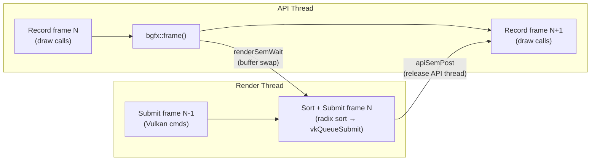
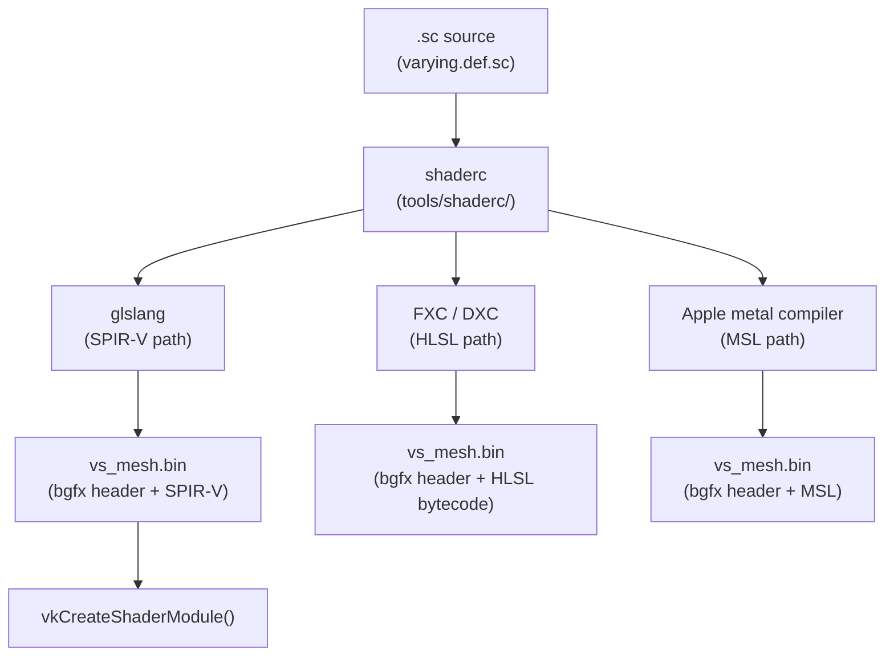
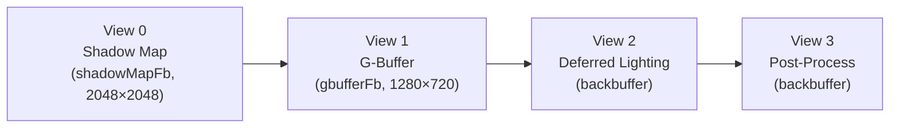
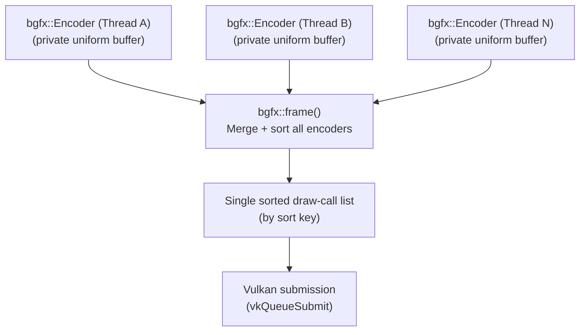
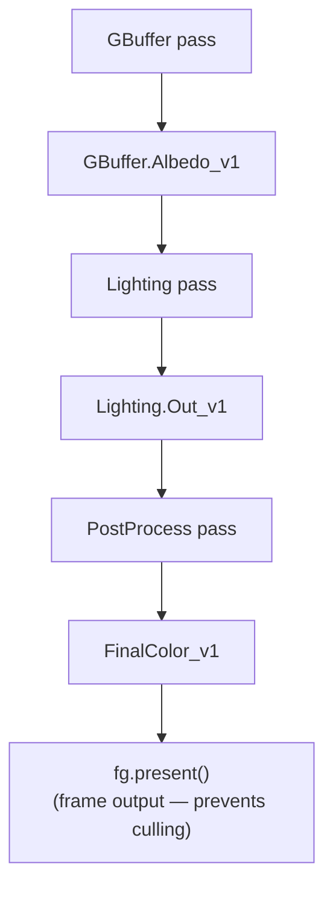
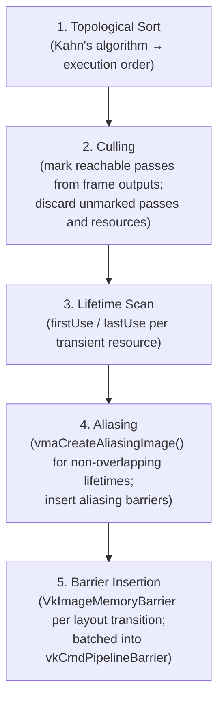

# Chapter 84: bgfx, Cross-Platform Rendering Abstractions, and the Frame Graph Pattern

**Audiences:** Graphics application developers (primary) — engineers building games, tools, or visualisation software who need to understand the landscape between raw Vulkan and full-featured engines; engine developers studying the architectural patterns — the frame graph, resource aliasing, and multi-threaded encoder models — that underpin modern rendering pipelines.

---

## Table of Contents

1. [The Abstraction Spectrum](#1-the-abstraction-spectrum)
2. [bgfx Architecture](#2-bgfx-architecture)
3. [bgfx Resource Management](#3-bgfx-resource-management)
4. [The bgfx Shader System](#4-the-bgfx-shader-system)
5. [The View and Render Target System](#5-the-view-and-render-target-system)
6. [Multi-Threaded Encoding](#6-multi-threaded-encoding)
7. [The Frame Graph Pattern](#7-the-frame-graph-pattern)
8. [Frame Graph Implementation Deep-Dive](#8-frame-graph-implementation-deep-dive)
9. [Transient Resource Allocators](#9-transient-resource-allocators)
10. [Other Notable Abstractions](#10-other-notable-abstractions)
11. [Choosing the Right Level](#11-choosing-the-right-level)
12. [Integrations](#12-integrations)

---

## 1. The Abstraction Spectrum

Modern graphics programming on Linux presents a wide spectrum of APIs, each trading control for convenience at a different point along the scale. Understanding where a library sits on this spectrum — and why — is the first decision any graphics-intensive project must make.

**Raw Vulkan** sits at the lowest practical level. The application manages every pipeline state object, render pass, subpass dependency, memory heap, image layout transition, and synchronisation barrier explicitly. The verbosity is immense: a minimal triangle requires several hundred lines of correct **Vulkan** setup. The reward is full access to every hardware capability — mesh shaders, ray tracing, variable rate shading, sparse images, and emerging **Vulkan** extensions land here first.

**VMA** plus helper libraries (see Ch82) add sane memory management but leave the rest of **Vulkan** unchanged. This is the preferred approach when you need **Vulkan**'s full feature surface but cannot afford to write a custom allocator.

**bgfx** sits in the middle: a cross-platform rendering library with its own command-buffer model, shader compilation pipeline, and view abstraction. It targets eight backends — **Vulkan**, **OpenGL** 3.1+, **OpenGL ES** 2/3.1, **Direct3D** 11/12, **Metal**, **WebGL**, and **WebGPU** — from a single API, at the cost of exposing a lowest-common-denominator feature surface. You cannot access mesh shaders or ray tracing pipelines from **bgfx**. In exchange, an application that works on Linux via **Vulkan** also works on macOS via **Metal** and on older Android devices via **OpenGL ES** 2. Section 2 covers **bgfx** architecture in depth: the `bgfx::RendererType::Enum` enum that selects backends at initialisation time (with **Vulkan** as the default on Linux when `BGFX_CONFIG_RENDERER_VULKAN` is set), the `bgfx::init()` / `bgfx::shutdown()` lifecycle, the `bgfx::PlatformData` window-handle mechanism (which issues `vkCreateXlibSurfaceKHR` or `vkCreateWaylandSurfaceKHR` under the hood), and the double-buffered frame model where `bgfx::frame()` swaps the API-thread submit buffer with the render-thread command buffer via a radix sort. The **bgfx** **Vulkan** backend (`src/renderer_vk.cpp`) internally manages `VkInstance`, `VkPhysicalDevice`, `VkDevice`, swap chain images, descriptor pool caches, and a staging-buffer ring for texture uploads — all hidden from the application.

Section 3 examines **bgfx** resource management: the typed opaque 16-bit handle system (`VertexBufferHandle`, `IndexBufferHandle`, `TextureHandle`, `FrameBufferHandle`, `ShaderHandle`, `ProgramHandle`, `UniformHandle`) that indexes into internal slot arrays; **bgfx::VertexLayout** and its fluent builder for declaring per-vertex attribute formats; static vs. dynamic vertex and index buffers created via **bgfx::makeRef()** (zero-copy) or **bgfx::copy()**; textures spanning formats from **RGBA8** through **RGBA16F**, **BC1**–**BC7**, **ASTC4x4**, **ETC2**, and **D24S8**; and framebuffers with multiple render targets (**MRT**) that the **Vulkan** backend maps lazily to `VkRenderPass` + `VkFramebuffer` pairs.

Section 4 covers the **bgfx** shader system. Because a single source must target **GLSL** (**OpenGL**), **ESSL** (**OpenGL ES**), **HLSL** (**Direct3D**), **MSL** (**Metal**), and **SPIR-V** (**Vulkan**), **bgfx** defines the `.sc` shader dialect — a **GLSL**-based format using macros such as `SAMPLER2D()` and a separate `varying.def.sc` file for interpolant declarations. The **shaderc** tool (in `tools/shaderc/`) drives **glslang** for the **SPIR-V** path, **FXC**/**DXC** for **HLSL**, and the Apple **metal** compiler for **MSL**, embedding the resulting bytecode in a **bgfx**-specific binary header. Uniforms are managed at runtime via `bgfx::UniformHandle` and `bgfx::setUniform()`, with `UniformType::Sampler` carrying texture-unit bindings.

Section 5 describes the view and render-target system. A *view* (`bgfx::ViewId`, a `uint16_t`) is the primary unit of render-pass organisation — up to `BGFX_CONFIG_MAX_VIEWS` (default 256) views exist per frame. Each view is configured with `bgfx::setViewRect()`, `bgfx::setViewFrameBuffer()`, `bgfx::setViewClear()`, and `bgfx::setViewTransform()`, and is executed in ascending ID order. Every draw call receives a 64-bit sort key whose top bits encode the view ID; the intra-view sort order is controlled by `bgfx::setViewMode()` (Default, Sequential, DepthAscending, DepthDescending). The **Vulkan** backend maps each view to a `vkCmdBeginRenderPass` / `vkCmdEndRenderPass` pair, with `setViewClear` parameters mapping to `VkRenderPassBeginInfo::pClearValues`. Compute dispatches (`bgfx::dispatch()`) and texture-region copies (`bgfx::blit()`) are also issued to views, enabling precise ordering of compute and copy passes relative to graphics passes.

Section 6 covers multi-threaded encoding. The `bgfx::Encoder` class allows multiple application threads to record draw calls concurrently — each encoder writes into its own private uniform buffer with no lock on the hot path, synchronising only at `bgfx::begin()` to acquire a slot from an encoder pool (maximum 8 simultaneous encoders by default, tunable via `bgfx::Init::limits.maxEncoders`). At `bgfx::frame()`, the render thread merges all encoder submissions into a single sorted draw-call list before touching **Vulkan** — a CPU-space merge analogous to **Vulkan** secondary command buffers being executed from a primary command buffer, but with lower overhead at moderate draw-call counts.

**SDL3 GPU** (see Ch81) is an even thinner portability layer from **SDL3**, targeting broadly-supported feature sets without a separate shader compiler.

**Filament** (see Ch83) provides a complete physically-based rendering pipeline as a library — shadow maps, **IBL**, bloom, **TAA** — while still running on a **Vulkan** backend on Linux. Applications use a materials system rather than raw shaders.

**Full engines** (**Bevy**, **Godot**, **Unity**, **Unreal**) provide the complete stack from scene graph to asset pipeline, at the cost of yielding architectural control to the engine's conventions.

The appropriate choice depends on what you actually need:

| Need | Appropriate level |
|------|------------------|
| Ray tracing, mesh shaders, Vulkan extensions | Raw Vulkan |
| Raw Vulkan + sane memory management | VMA + helpers |
| Cross-platform game / tool, no bleeding-edge features | bgfx |
| Maximum portability, minimal learning curve | SDL3 GPU |
| PBR rendering without writing shaders | Filament |
| Complete game framework | Bevy / Godot / Unreal |

The frame graph pattern described in the second half of this chapter is not specific to any level: it is a design pattern for managing inter-pass resource lifetimes and synchronisation that is used in **Filament**, Unreal's **Render Dependency Graph** (**RDG**), **Bevy**'s **RenderGraph**, and **Firefox WebRender**. It solves a structural problem that arises whenever rendering is split into multiple passes with shared intermediate resources. Section 7 introduces the problem — ownership ambiguity, redundant resource allocation, manual barrier management, and feature coupling — and the core concepts: passes with setup/execute phases, virtual resources, transient vs. imported resources, pass culling, memory aliasing, and automatic barrier insertion. Section 8 provides an implementation deep-dive using **Filament**'s **FrameGraph** as the reference: the builder pattern with `FrameGraph::Builder`, `FrameGraphId<FrameGraphTexture>`, and setup/execute lambdas; resource versioning via write-edge new-version semantics forming a **DAG**; and the five-step compilation phase (topological sort via Kahn's algorithm, culling, lifetime scan, aliasing, barrier insertion via `VkImageMemoryBarrier` batched into `vkCmdPipelineBarrier`), followed by the execution phase where transient resources are devirtualised to real `VkImage` handles. Section 9 covers transient resource allocators: the **VMA** `VMA_POOL_CREATE_LINEAR_ALGORITHM_BIT` pool for O(1) per-frame allocation, the **VMA** virtual block API (`VmaVirtualBlock`, `vmaVirtualAllocate()`) for offset-only management over a pre-allocated `VkDeviceMemory`, and `vmaCreateAliasingImage()` for binding multiple `VkImage` objects to the same `VmaAllocation` when their lifetimes do not overlap — a technique that routinely achieves 40–50% transient **VRAM** savings in production deferred pipelines. Section 10 surveys other notable abstractions in the cross-platform rendering space: **Diligent Engine** with its modern-API-shaped interface, automatic resource state tracking, and `IRenderDevice` / `IDeviceContext` model; **The Forge** (Confetti FX) with its **FSL** (Forge Shading Language) cross-compilation pipeline and shipped titles including *Call of Duty: Warzone Mobile*; **LLGL** (Low Level Graphics Library) as a thin **C++11** abstraction maximising fidelity to **Vulkan** and **Metal** semantics; and **Magnum** as a modular, composable toolkit suited to scientific visualisation. Section 11 provides a practical decision guide summarising when to choose each level, from raw **Vulkan** extensions (`VK_KHR_ray_tracing_pipeline`, `VK_EXT_mesh_shader`) through **bgfx**, **SDL3 GPU**, **Filament**, full engines, and a custom frame graph over **Vulkan** for async-compute pipelines.

---

## 2. bgfx Architecture

bgfx is a BSD-2-clause-licensed cross-platform rendering library authored by Branimir Karadžić, available at [https://github.com/bkaradzic/bgfx](https://github.com/bkaradzic/bgfx). It is described as a "Bring Your Own Engine/Framework" library — it handles GPU submission but imposes no scene graph, asset format, or window system.

### 2.1 Supported Backends

bgfx selects a backend at initialisation time through `bgfx::RendererType::Enum`:

```cpp
// include/bgfx/bgfx.h — RendererType namespace (simplified)
namespace bgfx {
  namespace RendererType {
    enum Enum {
      Noop,       // no-op renderer; useful for server-side builds
      Agc,        // PS5 (GNM/AGC, developer-only)
      Direct3D11,
      Direct3D12,
      Gnm,        // PS4 (developer-only)
      Metal,
      Nvn,        // Nintendo Switch
      OpenGLES,   // ES 2 and ES 3.1
      OpenGL,     // 2.1, 3.1+
      Vulkan,     // primary on Linux and Android
      WebGPU,
      Count
    };
  }
}
```

[Source: bgfx API reference](https://bkaradzic.github.io/bgfx/bgfx.html)

On Linux, Vulkan is the default backend when the Vulkan ICD is found at runtime. OpenGL 3.x is the fallback. The build-time define `BGFX_CONFIG_RENDERER_VULKAN` (enabled by default on Linux) controls whether the Vulkan backend is compiled in at all.

### 2.2 Initialisation

```cpp
#include <bgfx/bgfx.h>
#include <bgfx/platform.h>

int main() {
    bgfx::Init init;
    init.type = bgfx::RendererType::Vulkan;  // explicit; omit for auto-detect
    init.vendorId = BGFX_PCI_ID_NONE;        // any GPU
    init.resolution.width  = 1280;
    init.resolution.height = 720;
    init.resolution.reset  = BGFX_RESET_VSYNC;

    // Provide the native window handle from SDL/GLFW/etc.
    bgfx::PlatformData pd;
    pd.nwh = /* SDL_GetWindowWMInfo → info.info.x11.window */;
    bgfx::setPlatformData(pd);

    if (!bgfx::init(init)) return 1;

    // ... render loop ...

    bgfx::shutdown();
}
```

`bgfx::init()` starts the render thread, creates a Vulkan instance, selects a physical device, and creates a logical device, queues, and swap chain — all hidden from the application. The `bgfx::PlatformData::nwh` field carries the platform-specific window handle; bgfx uses this to create a Vulkan surface via `vkCreateXlibSurfaceKHR` on Linux. [Source: bgfx overview](https://bkaradzic.github.io/bgfx/overview.html)

### 2.3 The Frame Model

bgfx uses a **double-buffered command model**. The application thread (the *API thread*) records draw calls into a submit buffer. The *render thread* processes a separate render buffer. When `bgfx::frame()` is called:

1. The API thread waits for the render thread to finish the previous frame (`renderSemWait`).
2. The two buffers are swapped atomically.
3. The render thread resumes: it radix-sorts all draw calls by sort key, executes resource commands, submits to Vulkan, and flips the swap chain.
4. The API thread is released (`apiSemPost`) to start recording the next frame.

```
API thread:    [record frame N] → frame() → [record frame N+1]
                                   ↕ buffer swap
Render thread: [submit frame N-1] ←      → [sort+submit frame N]
```

This overlap allows CPU recording of frame N+1 while the GPU executes frame N, reducing total frame time.



[Source: bgfx internals](https://bkaradzic.github.io/bgfx/internals.html)

The frame call returns the current frame number, which applications can use for multi-buffered resource management (e.g., a per-frame uniform buffer):

```cpp
uint32_t frameNum = bgfx::frame();
```

### 2.4 Vulkan Backend Internals

The bgfx Vulkan backend (`src/renderer_vk.cpp`) internally manages:

- `VkInstance`, `VkPhysicalDevice`, `VkDevice`
- A graphics+present queue (`VkQueue`)
- A swap chain with typically three images
- Descriptor pool and set layout caches
- A staging buffer ring for texture/buffer uploads
- A transient vertex/index buffer pool per frame

None of these Vulkan objects are directly accessible from the bgfx API — the library handles the impedance mismatch between bgfx's view-based model and Vulkan's explicit render pass system internally.

---

## 3. bgfx Resource Management

### 3.1 Handle Types

bgfx uses typed opaque 16-bit handles for all GPU resources. The underlying type is a `uint16_t` index into an internal slot array, but wrapped in a named struct to prevent accidental misuse:

```cpp
// include/bgfx/bgfx.h (simplified)
struct VertexBufferHandle  { uint16_t idx; };
struct DynamicVertexBufferHandle { uint16_t idx; };
struct IndexBufferHandle   { uint16_t idx; };
struct TextureHandle       { uint16_t idx; };
struct FrameBufferHandle   { uint16_t idx; };
struct ShaderHandle        { uint16_t idx; };
struct ProgramHandle       { uint16_t idx; };
struct UniformHandle       { uint16_t idx; };
struct VertexLayoutHandle  { uint16_t idx; };

// validity check
static const uint16_t kInvalidHandle = UINT16_MAX;
inline bool isValid(VertexBufferHandle h) { return h.idx != kInvalidHandle; }
```

This is a *handle table* pattern: the index is meaningful only as an argument to the bgfx API; the library resolves it to the real Vulkan object at submit time on the render thread.

### 3.2 Vertex Layouts

`bgfx::VertexLayout` describes the memory layout of a single vertex in a buffer. It uses a fluent builder:

```cpp
// From bgfx/examples/06-bump/bump.cpp — position + normal + texcoord
struct PosNormalTexcoordVertex {
    float    m_x, m_y, m_z;   // position
    uint32_t m_normal;         // packed normal (Uint8×4, normalised)
    float    m_u, m_v;         // texcoord

    static bgfx::VertexLayout ms_layout;

    static void init() {
        ms_layout
            .begin()
            .add(bgfx::Attrib::Position,  3, bgfx::AttribType::Float)
            .add(bgfx::Attrib::Normal,    4, bgfx::AttribType::Uint8, true, true)
            .add(bgfx::Attrib::TexCoord0, 2, bgfx::AttribType::Float)
            .end();
    }
};
```

[Source: bgfx bump example](https://github.com/bkaradzic/bgfx/blob/master/examples/06-bump/bump.cpp)

The `true, true` on `Normal` means: normalise the bytes to `[−1, 1]` (first flag) and store them as integers in GLSL (second flag — `asInt`). The `VertexLayout` is an immutable description; the actual VkVertexInputAttributeDescription records are generated from it by the Vulkan backend when a pipeline state object is created for the first time that uses this layout.

### 3.3 Vertex and Index Buffers

```cpp
// Static (immutable) vertex buffer
bgfx::VertexBufferHandle vbh = bgfx::createVertexBuffer(
    bgfx::makeRef(vertices, sizeof(vertices)),  // no copy; caller owns memory
    PosNormalTexcoordVertex::ms_layout
);

// Dynamic vertex buffer — writeable each frame
bgfx::DynamicVertexBufferHandle dvbh =
    bgfx::createDynamicVertexBuffer(numVerts, ms_layout, BGFX_BUFFER_NONE);
bgfx::update(dvbh, 0, bgfx::copy(newData, dataSize));

bgfx::IndexBufferHandle ibh = bgfx::createIndexBuffer(
    bgfx::makeRef(indices, sizeof(indices))
);
```

`bgfx::makeRef()` returns a `bgfx::Memory*` that points to the provided memory without copying it. The application must keep the memory alive until `bgfx::frame()` returns after the buffer is submitted to the GPU. `bgfx::copy()` copies the data into bgfx's internal allocator.

### 3.4 Textures

```cpp
// 2D texture from pixel data
bgfx::TextureHandle tex = bgfx::createTexture2D(
    512, 512,
    false,                             // no mipmaps
    1,                                 // one layer
    bgfx::TextureFormat::RGBA8,        // format
    BGFX_TEXTURE_NONE,                 // usage flags
    bgfx::copy(pixelData, 512*512*4)
);

// BC1 (DXT1) compressed texture — preferred on desktop GPUs
bgfx::TextureHandle compTex = bgfx::createTexture2D(
    512, 512,
    true,                              // has mipmaps
    1,
    bgfx::TextureFormat::BC1,          // DXT1 — 4 bpp
    BGFX_TEXTURE_NONE,
    bgfx::copy(compressedData, dataSize)
);

// Render target texture
bgfx::TextureHandle rtTex = bgfx::createTexture2D(
    1280, 720, false, 1,
    bgfx::TextureFormat::RGBA8,
    BGFX_TEXTURE_RT                    // must set RT flag for framebuffer use
);
```

The `TextureFormat` enum includes `RGBA8`, `RGBA16F`, `R32F`, `BC1` through `BC7`, `ASTC4x4`, `ETC2`, `D24S8` (depth-stencil), and many others. The bgfx Vulkan backend maps each to the corresponding `VkFormat`. [Source: bgfx API reference](https://bkaradzic.github.io/bgfx/bgfx.html)

### 3.5 Framebuffers and MRT

```cpp
// Multiple render targets
bgfx::TextureHandle attachments[2] = { colorTex, depthTex };
bgfx::FrameBufferHandle fbh = bgfx::createFrameBuffer(2, attachments);

// Or directly from texture format descriptions (no pre-allocated textures)
bgfx::TextureHandle gbufAttachments[3];
gbufAttachments[0] = bgfx::createTexture2D(w, h, false, 1,
    bgfx::TextureFormat::RGBA8,   BGFX_TEXTURE_RT);
gbufAttachments[1] = bgfx::createTexture2D(w, h, false, 1,
    bgfx::TextureFormat::RGBA16F, BGFX_TEXTURE_RT);  // normals
gbufAttachments[2] = bgfx::createTexture2D(w, h, false, 1,
    bgfx::TextureFormat::D24S8,   BGFX_TEXTURE_RT);
bgfx::FrameBufferHandle gbufFb = bgfx::createFrameBuffer(3, gbufAttachments);
```

The bgfx Vulkan backend translates `FrameBufferHandle` into a `VkRenderPass` + `VkFramebuffer` pair, creating them lazily on first use and caching by descriptor hash.

### 3.6 A Complete Textured Quad Example

```cpp
// --- Vertex layout ---
struct PosUVVertex {
    float x, y, z;
    float u, v;
    static bgfx::VertexLayout s_layout;
    static void init() {
        s_layout.begin()
            .add(bgfx::Attrib::Position,  3, bgfx::AttribType::Float)
            .add(bgfx::Attrib::TexCoord0, 2, bgfx::AttribType::Float)
            .end();
    }
};

// --- Geometry ---
static const PosUVVertex kQuadVerts[] = {
    {-1, -1, 0,  0, 1},
    { 1, -1, 0,  1, 1},
    {-1,  1, 0,  0, 0},
    { 1,  1, 0,  1, 0},
};
static const uint16_t kQuadIdx[] = {0,1,2, 1,3,2};

bgfx::VertexBufferHandle vbh = bgfx::createVertexBuffer(
    bgfx::makeRef(kQuadVerts, sizeof(kQuadVerts)), PosUVVertex::s_layout);
bgfx::IndexBufferHandle ibh = bgfx::createIndexBuffer(
    bgfx::makeRef(kQuadIdx,   sizeof(kQuadIdx)));

// --- Texture and sampler uniform ---
bgfx::TextureHandle tex = loadTexture("texture.dds");
bgfx::UniformHandle s_texColor =
    bgfx::createUniform("s_texColor", bgfx::UniformType::Sampler);

// --- Program (pre-compiled shaders) ---
bgfx::ProgramHandle prog = loadProgram("vs_quad", "fs_quad");

// --- Render loop ---
while (running) {
    bgfx::setViewRect(0, 0, 0, 1280, 720);
    bgfx::setViewClear(0, BGFX_CLEAR_COLOR | BGFX_CLEAR_DEPTH,
                       0x303030ff, 1.0f, 0);

    bgfx::setVertexBuffer(0, vbh);
    bgfx::setIndexBuffer(ibh);
    bgfx::setTexture(0, s_texColor, tex);
    bgfx::setState(BGFX_STATE_DEFAULT);
    bgfx::submit(0, prog);          // submit to view 0

    bgfx::frame();
}
```

---

## 4. The bgfx Shader System

bgfx cannot use raw GLSL or HLSL source directly, because the same source must compile to GLSL (for OpenGL), ESSL (for OpenGL ES), HLSL (for Direct3D), MSL (for Metal), and SPIR-V (for Vulkan). Instead, bgfx defines a shader dialect based on GLSL with preprocessing macros that express cross-API semantics.

### 4.1 The `.sc` Shader Language

Shaders are written as `.sc` (shader/sc) files. The key differences from standard GLSL:

- All uniforms must be `float` or `vec`/`mat` types — `bool` and `int` uniforms are forbidden.
- Samplers are declared with the `SAMPLER2D(name, binding)` macro instead of `uniform sampler2D`.
- Input/output interpolants are declared in a separate file `varying.def.sc` rather than inline.
- The `$input` and `$output` directives at the top of each shader specify which varyings it uses.

**`varying.def.sc`:**

```glsl
// varying.def.sc — defines all possible vertex outputs
vec3 v_normal   : NORMAL;
vec2 v_texcoord : TEXCOORD0;
// Attributes (vertex inputs)
vec3 a_position : POSITION;
vec3 a_normal   : NORMAL;
vec2 a_texcoord : TEXCOORD0;
```

**`vs_mesh.sc` — vertex shader:**

```glsl
$input  a_position, a_normal, a_texcoord
$output v_normal, v_texcoord

#include <bgfx_shader.sh>

uniform mat4 u_model;    // uniform declared here

void main() {
    gl_Position = mul(u_modelViewProj, vec4(a_position, 1.0));
    v_normal    = normalize(mul(u_model, vec4(a_normal, 0.0)).xyz);
    v_texcoord  = a_texcoord;
}
```

**`fs_mesh.sc` — fragment shader:**

```glsl
$input v_normal, v_texcoord

#include <bgfx_shader.sh>

SAMPLER2D(s_albedo, 0);         // texture unit 0
uniform vec4 u_lightDir;        // float uniform (vec4 alignment)

void main() {
    vec4 albedo = texture2D(s_albedo, v_texcoord);
    float ndotl = max(dot(normalize(v_normal), -u_lightDir.xyz), 0.0);
    gl_FragColor = albedo * ndotl;
}
```

### 4.2 shaderc Compilation

bgfx's `shaderc` tool (in `tools/shaderc/`) compiles `.sc` source to backend-specific bytecode. It shells out to `glslang` (the Khronos GLSL reference compiler) for the SPIR-V path, to the FXC/DXC for HLSL, and to the Apple `metal` compiler for MSL.



The compilation command for Linux Vulkan is:

```bash
# Compile vertex shader for Linux Vulkan (SPIR-V 1.0)
shaderc \
    --type vertex \
    --platform linux \
    -p spirv \
    --varyingdef varying.def.sc \
    -f vs_mesh.sc \
    -o vs_mesh.bin

# Compile fragment shader
shaderc \
    --type fragment \
    --platform linux \
    -p spirv \
    --varyingdef varying.def.sc \
    -f fs_mesh.sc \
    -o fs_mesh.bin
```

[Source: bgfx tools documentation](https://bkaradzic.github.io/bgfx/tools.html)

The resulting `.bin` files contain a bgfx-specific header followed by the SPIR-V bytecode. The Vulkan backend calls `vkCreateShaderModule()` with the embedded SPIR-V when the shader handle is first used.

### 4.3 Uniforms at Runtime

Uniforms are set per-draw-call in the API thread and written into the per-encoder uniform buffer. At submit time, the render thread copies the uniform data into a descriptor set bound before the draw:

```cpp
// C++ — create uniforms at startup
bgfx::UniformHandle u_lightDir =
    bgfx::createUniform("u_lightDir", bgfx::UniformType::Vec4);
bgfx::UniformHandle u_albedo =
    bgfx::createUniform("s_albedo", bgfx::UniformType::Sampler);

// Per-frame update
float lightDir[4] = {0.577f, -0.577f, 0.577f, 0.0f};
bgfx::setUniform(u_lightDir, lightDir);
bgfx::setTexture(0, u_albedo, albedoTexHandle);
```

The `UniformType::Sampler` uniform is special — it carries the texture unit binding, not a float value. For matrix uniforms, use `bgfx::UniformType::Mat4` and pass a `float[16]` array.

---

## 5. The View and Render Target System

A *view* in bgfx is the primary unit of render pass organisation. Each view has a stable ID (`bgfx::ViewId`, a `uint16_t`), and up to `BGFX_CONFIG_MAX_VIEWS` (default 256) views can exist in a frame.

### 5.1 View Configuration

```cpp
// View 0 — shadow map pass
bgfx::setViewRect(0, 0, 0, 2048, 2048);
bgfx::setViewFrameBuffer(0, shadowMapFb);
bgfx::setViewClear(0, BGFX_CLEAR_DEPTH, 0, 1.0f, 0);
bgfx::setViewTransform(0, lightView, lightProj);

// View 1 — G-buffer pass (deferred geometry)
bgfx::setViewRect(1, 0, 0, 1280, 720);
bgfx::setViewFrameBuffer(1, gbufferFb);
bgfx::setViewClear(1,
    BGFX_CLEAR_COLOR | BGFX_CLEAR_DEPTH,
    0x00000000, 1.0f, 0);
bgfx::setViewTransform(1, cameraView, cameraProj);

// View 2 — deferred lighting pass
bgfx::setViewRect(2, 0, 0, 1280, 720);
bgfx::setViewFrameBuffer(2, BGFX_INVALID_HANDLE);  // default (backbuffer)
bgfx::setViewClear(2, BGFX_CLEAR_NONE, 0, 1.0f, 0);

// View 3 — post-process (full-screen quad to backbuffer)
bgfx::setViewRect(3, 0, 0, 1280, 720);
bgfx::setViewFrameBuffer(3, BGFX_INVALID_HANDLE);
bgfx::setViewClear(3, BGFX_CLEAR_NONE, 0, 1.0f, 0);
```

Views are rendered in ascending ID order. Lower IDs execute first: shadow map (0) → G-buffer (1) → lighting (2) → post (3). This is the fundamental scheduling mechanism in bgfx.



### 5.2 Sort Keys and View Modes

Every draw call receives a 64-bit sort key. The top bits encode the view ID, ensuring all draw calls belonging to a view are grouped together. Within a view, the default sort order groups by shader program (to reduce pipeline state switches):

```
sort key layout (Default mode):
[view: 8 bits][draw/compute: 1 bit][blend: 1 bit][alphaRef: 8 bits]
[program: 9 bits][depth: 24 bits][sequence: 13 bits]
```

The `bgfx::setViewMode()` function changes the intra-view sort:

```cpp
bgfx::setViewMode(1, bgfx::ViewMode::Default);          // group by program
bgfx::setViewMode(2, bgfx::ViewMode::Sequential);       // preserve submit order
bgfx::setViewMode(3, bgfx::ViewMode::DepthAscending);   // front-to-back (opaque)
bgfx::setViewMode(4, bgfx::ViewMode::DepthDescending);  // back-to-front (transparent)
```

[Source: bgfx internals](https://bkaradzic.github.io/bgfx/internals.html)

### 5.3 Mapping to Vulkan Render Passes

The bgfx Vulkan backend maps each view to one or more Vulkan render passes. Views sharing the same framebuffer *and* occurring consecutively in sort order may be merged into a single `VkRenderPass` with multiple subpasses if the implementation detects opportunities to do so. In practice, each view is more commonly an independent `vkCmdBeginRenderPass` / `vkCmdEndRenderPass` pair.

The `setViewClear` parameters map directly to `VkRenderPassBeginInfo::pClearValues`. The `BGFX_CLEAR_NONE` flag causes the Vulkan backend to use `VK_ATTACHMENT_LOAD_OP_LOAD`, preserving previous frame content.

### 5.4 Compute and Blit Views

bgfx distinguishes compute dispatches via `bgfx::dispatch(viewId, computeProgram, countX, countY, countZ)`. The view system applies equally: compute dispatches are sorted among draw calls by view ID. Blit operations (`bgfx::blit()`) copy texture regions and are also submitted to views, enabling copy passes to be precisely ordered relative to graphics and compute passes.

---

## 6. Multi-Threaded Encoding

### 6.1 The Encoder API

The `bgfx::Encoder` class enables multiple application threads to record draw calls simultaneously:

```cpp
// Thread A — main rendering
bgfx::Encoder* encoderA = bgfx::begin(true);  // true = flush immediately
encoderA->setState(BGFX_STATE_DEFAULT);
encoderA->setVertexBuffer(0, vbh);
encoderA->setIndexBuffer(ibh);
encoderA->setTexture(0, s_albedo, texHandle);
encoderA->submit(1, program);          // submit to view 1 (G-buffer)
bgfx::end(encoderA);

// Thread B — shadow casters (concurrent)
bgfx::Encoder* encoderB = bgfx::begin(true);
encoderB->setState(BGFX_STATE_DEFAULT);
encoderB->setVertexBuffer(0, shadowVbh);
encoderB->setIndexBuffer(shadowIbh);
encoderB->submit(0, shadowProgram);    // submit to view 0 (shadow map)
bgfx::end(encoderB);
```

[Source: bgfx API reference — Encoder](https://bkaradzic.github.io/bgfx/bgfx.html)

### 6.2 Thread Safety Model

Each `bgfx::Encoder` writes into its own private uniform buffer (1 MB by default, growing on demand). There is no lock on the hot path — each thread is serialised only at `bgfx::begin()` to acquire a slot from the encoder pool (maximum 8 simultaneous encoders by default, configurable via `bgfx::Init::limits.maxEncoders`).

At `bgfx::frame()`, the render thread merges all completed encoder submissions into a single sorted draw-call list and proceeds to submission. This is structurally similar to Vulkan secondary command buffers being recorded on worker threads and executed from a primary command buffer on the main thread — except bgfx performs the merge in CPU-space before touching Vulkan at all.



Key thread safety rules:

- **Resource API** (`bgfx::createVertexBuffer`, etc.) is mutex-guarded; safe from any thread.
- **View API** (`bgfx::setViewRect`, etc.) is safe per-view; do not update the same view from two threads.
- **Encoder API** is per-thread; never share an encoder between threads.
- **`bgfx::frame()`** must be called from the API thread only.

[Source: bgfx internals — thread model](https://bkaradzic.github.io/bgfx/internals.html)

### 6.3 Comparison to Vulkan Secondary Command Buffers

| Aspect | bgfx Encoder | Vulkan Secondary CB |
|--------|-------------|---------------------|
| Recording | API-thread encoding (no GPU objects) | GPU command recording directly |
| Merge point | `bgfx::frame()` — CPU sort + merge | `vkCmdExecuteCommands()` — GPU merge |
| Render pass | Implied by view → sort key | Must inherit render pass at creation |
| Barrier insertion | Handled by bgfx Vulkan backend | Application's responsibility |
| Max concurrency | 8 encoders by default | Unlimited (VkCommandPool per thread) |

The bgfx approach is simpler but defers all GPU work to the render thread. With secondary command buffers, GPU command recording is genuinely parallel, which matters at 10,000+ draw calls on multi-core CPUs.

---

## 7. The Frame Graph Pattern

### 7.1 The Problem Frame Graphs Solve

Modern rendering pipelines are sequences of interdependent passes: a shadow map pass writes a depth texture read by a lighting pass; a G-buffer pass writes colour, normal, and roughness textures read by a deferred shading pass; a shading pass writes a colour buffer read by bloom and TAA. Each intermediate texture has a *lifetime* — it is first written by one pass and last read by another.

In an ad-hoc multi-pass renderer, the following problems accumulate:

- **Ownership ambiguity:** "Who allocates the G-buffer albedo texture? Who frees it?" Typically answered with globals or a scene-wide render target manager, both of which are hard to evolve.
- **Redundant resource allocation:** A texture that is only needed for two consecutive passes is often kept alive for the entire frame, wasting GPU VRAM.
- **Manual barrier management:** Each Vulkan layout transition and pipeline barrier is written by hand, and the error rate is high. A missing barrier causes GPU corruption; a redundant barrier degrades performance.
- **Feature coupling:** Adding a debug visualisation pass (e.g., "show normals") requires manually threading a conditional through the entire render pipeline.

The frame graph pattern, introduced publicly in Yuriy O'Donnell's GDC 2017 talk "FrameGraph: Extensible Rendering Architecture in Frostbite" ([GDC Vault link](https://www.gdcvault.com/play/1024612/FrameGraph-Extensible-Rendering-Architecture-in)), addresses all of these with a single abstraction: **declare the complete frame as a directed acyclic graph (DAG) of passes and resources; compile it once; execute it optimally**.

### 7.2 Core Concepts

**Pass.** A unit of GPU work: typically a render pass (draw calls) or compute dispatch. A pass declares which resources it reads and which it writes during the *setup phase*. The actual GPU commands are deferred to the *execute phase*.

**Resource.** A texture or buffer referenced by passes. Resources are *virtual* at declaration time — they have a format, size, and usage, but no GPU memory backing. The frame graph allocates physical memory during compilation.

**Transient resource.** A resource that is created within the graph for one frame and does not need to persist. These are the candidates for memory aliasing.

**Imported resource.** A resource created outside the graph (the swap chain image, persistent shadow maps, the history buffer for TAA). The frame graph tracks its state but does not manage its lifetime.

**Culling.** Passes whose outputs are not consumed by any downstream pass (and are not marked as frame outputs) are removed before execution. This means a "render normals for debug visualisation" pass exists in the declaration unconditionally; it is simply culled when the debug visualiser is disabled.

**Aliasing.** Two transient resources with non-overlapping lifetimes in the execution order can share the same GPU memory. This is the primary VRAM savings mechanism.

**Barrier insertion.** The compiler walks the topological execution order and tracks each resource's current state (e.g., colour attachment, shader read, transfer source). When a resource changes state between passes, the compiler inserts the appropriate `VkImageMemoryBarrier` automatically.

### 7.3 Where Frame Graphs Are Used

| Engine/Library | Frame graph | Notes |
|---------------|-------------|-------|
| Frostbite (EA) | FrameGraph | Origin; O'Donnell GDC 2017 |
| Unreal Engine 5 | Render Dependency Graph (RDG) | Full async-compute integration |
| Filament (Google) | FrameGraph | Open-source, Vulkan backend on Linux |
| Bevy | RenderGraph | Node + edge model; uses wgpu |
| Firefox WebRender | RenderTask graph | Similar concept, 2D rendering |
| bgfx | *Not implemented* | Views approximate the concept manually |

bgfx's view system is a manual predecessor of the frame graph idea: you declare views with explicit render targets and ordering, then submit draw calls to them. The key thing frame graphs add is *automatic resource lifetime management and aliasing* — bgfx leaves that to the application.

---

## 8. Frame Graph Implementation Deep-Dive

### 8.1 The Builder Pattern

The canonical frame graph API uses two-phase pass registration. The setup lambda runs immediately during graph construction (it just records dependencies); the execute lambda is stored and runs later during execution:

```cpp
// Illustrative API — based on Filament's FrameGraph design
// Source: https://github.com/google/filament — filament/src/fg/

struct GBufferData {
    FrameGraphId<FrameGraphTexture> albedo;
    FrameGraphId<FrameGraphTexture> normal;
    FrameGraphId<FrameGraphTexture> depth;
};

auto& gbufferPass = fg.addPass<GBufferData>("GBuffer",
    // --- Setup lambda: runs now, during graph construction ---
    [&](FrameGraph::Builder& builder, GBufferData& data) {
        FrameGraphTexture::Descriptor colorDesc{
            .width  = 1280, .height = 720,
            .format = TextureFormat::RGBA8,
            .usage  = TextureUsage::COLOR_ATTACHMENT | TextureUsage::SAMPLEABLE
        };
        data.albedo = builder.create<FrameGraphTexture>("GBuffer.Albedo", colorDesc);
        data.normal = builder.create<FrameGraphTexture>("GBuffer.Normal",
            {1280, 720, TextureFormat::RGBA16F,
             TextureUsage::COLOR_ATTACHMENT | TextureUsage::SAMPLEABLE});
        data.depth  = builder.create<FrameGraphTexture>("GBuffer.Depth",
            {1280, 720, TextureFormat::D24S8,
             TextureUsage::DEPTH_ATTACHMENT});

        // Declare writes (this pass produces these resources)
        data.albedo = builder.write(data.albedo,
            FrameGraphTexture::Usage::COLOR_ATTACHMENT);
        data.normal = builder.write(data.normal,
            FrameGraphTexture::Usage::COLOR_ATTACHMENT);
        data.depth  = builder.write(data.depth,
            FrameGraphTexture::Usage::DEPTH_ATTACHMENT);
    },
    // --- Execute lambda: runs later, during graph execution ---
    [=](const GBufferData& data, FrameGraphResources& resources, DriverApi& driver) {
        auto albedoHandle = resources.getTexture(data.albedo);  // real VkImage now
        auto normalHandle = resources.getTexture(data.normal);
        auto depthHandle  = resources.getTexture(data.depth);

        // ... render scene geometry into G-buffer ...
        driver.beginRenderPass(renderTarget, params);
        renderGeometry(driver);
        driver.endRenderPass();
    }
);

// Lighting pass reads G-buffer outputs
fg.addPass<LightingData>("Lighting",
    [&](FrameGraph::Builder& builder, LightingData& data) {
        // Declare reads (albedo produced by GBuffer pass)
        data.albedo = builder.read(gbufferPass.getData().albedo,
            FrameGraphTexture::Usage::SAMPLEABLE);
        data.normal = builder.read(gbufferPass.getData().normal,
            FrameGraphTexture::Usage::SAMPLEABLE);
        data.output = builder.create<FrameGraphTexture>("Lighting.Out",
            {1280, 720, TextureFormat::RGBA16F,
             TextureUsage::COLOR_ATTACHMENT | TextureUsage::SAMPLEABLE});
        data.output = builder.write(data.output,
            FrameGraphTexture::Usage::COLOR_ATTACHMENT);
    },
    [=](const LightingData& data, FrameGraphResources& resources, DriverApi& driver) {
        // ... deferred lighting using G-buffer textures ...
    }
);
```

[Source: Filament FrameGraph system — deepwiki.com/google/filament/3.2-framegraph-system](https://deepwiki.com/google/filament/3.2-framegraph-system)

### 8.2 Resource Versioning

When a pass calls `builder.write(resource)`, the frame graph creates a *new version* of that resource node in the dependency graph. The write edge goes from the pass to the new version; read edges go from resource versions to consuming passes. This prevents ambiguity about which write a reader depends on:

```
GBuffer pass → GBuffer.Albedo_v1
Lighting pass reads GBuffer.Albedo_v1 → produces Lighting.Out_v1
PostProcess pass reads Lighting.Out_v1 → produces FinalColor_v1
```



The final frame output (`FinalColor_v1`) is marked as a *frame output* by calling `fg.present(data.output)`. This prevents the entire chain from being culled.

### 8.3 Compilation Phase

After all passes are registered, `fg.compile()` runs five steps:



1. **Topological sort.** Kahn's algorithm assigns each pass a position in the execution order, ensuring producers execute before consumers.

2. **Culling.** Working backwards from frame outputs, the compiler marks reachable passes and resources. Unmarked passes and resources are discarded. A pass can opt out of culling via `builder.sideEffect()` (for passes with external side effects like writing to a file or updating a persistent buffer).

3. **Lifetime scan.** For each transient resource, the compiler records `firstUse` (the pass that first writes it) and `lastUse` (the last pass that reads it). The lifetime is the inclusive range `[firstUse, lastUse]` in topological order.

4. **Aliasing.** Resources whose lifetime ranges do not overlap are candidates for aliasing. The compiler groups non-overlapping resources and assigns them to the same physical allocation. For textures, this requires that the aliased images have compatible memory requirements (size and alignment; Vulkan requires consulting `vkGetImageMemoryRequirements` for each). The aliasing commit uses `vmaCreateAliasingImage()` to bind a new `VkImage` to an existing `VmaAllocation`. Between aliased uses, an `aliasing barrier` (`VK_ACCESS_MEMORY_READ_BIT | VK_ACCESS_MEMORY_WRITE_BIT` with no layout transition) notifies the GPU that the memory has changed alias.

5. **Barrier insertion.** The compiler walks the execution order and tracks each resource's Vulkan image layout and access mask. When a resource transitions from colour attachment to shader read (for example), the compiler inserts a `VkImageMemoryBarrier` between the producing pass and the consuming pass. Multiple transitions are batched into a single `vkCmdPipelineBarrier` call at the start of each pass.

[Source: Frame graph theory — stoleckipawel.dev/posts/frame-graph-theory](https://stoleckipawel.dev/posts/frame-graph-theory/) and [render graph analysis — logins.github.io/graphics](https://logins.github.io/graphics/2021/05/31/RenderGraphs.html)

### 8.4 Execution Phase

At execution time, the frame graph calls execute lambdas in topological order. Before each lambda, the pre-computed barriers are submitted. At the lambda boundary, transient resources are *devirtualised*: their `FrameGraphId<FrameGraphTexture>` is resolved to a real `VkImage` handle by calling `resources.getTexture()`. After the last use, the texture's `VmaAllocation` is returned to the transient resource pool.

Filament implements this via a `TextureCacheInterface` that manages a pool of `VkImage` + `VmaAllocation` pairs, sorted by `(format, width, height, mips, layers, usage)`. A matching texture is reused if available; otherwise, a new one is allocated. [Source: Filament FrameGraph DeepWiki](https://deepwiki.com/google/filament/3.2-framegraph-system)

---

## 9. Transient Resource Allocators

### 9.1 The Fast Per-Frame Allocation Problem

Frame graphs require high-speed allocation and deallocation of textures and buffers within a frame. Using the default VMA allocator (`vmaCreateImage` / `vmaDestroyImage`) for every transient resource is too slow: `vkCreateImage` alone involves kernel round-trips and allocation metadata updates.

The solution is a **pre-allocated pool** combined with an aliasing strategy. At engine startup, allocate a single large `VkDeviceMemory` block (e.g., 256 MB for a midrange rendering pipeline). At frame start, assign virtual offsets within this block to transient resources. At frame end, reset the offsets. No `vkFreeMemory` is ever called during steady-state rendering.

### 9.2 VMA LINEAR Algorithm for Transient Pools

VMA's `VMA_POOL_CREATE_LINEAR_ALGORITHM_BIT` implements exactly this pattern:

```cpp
// Create a transient pool for render target textures
VmaPoolCreateInfo poolCI{};
poolCI.memoryTypeIndex = /* device-local, for GPU-only resources */;
poolCI.blockSize       = 256 * 1024 * 1024;  // 256 MB block
poolCI.maxBlockCount   = 1;
poolCI.flags           = VMA_POOL_CREATE_LINEAR_ALGORITHM_BIT;

VmaPool transientPool;
vmaCreatePool(allocator, &poolCI, &transientPool);

// Allocate a render target within the pool
VkImageCreateInfo imageCI{/* 1280×720 RGBA8 color attachment */};
VmaAllocationCreateInfo allocCI{};
allocCI.pool = transientPool;           // use our transient pool
allocCI.flags = VMA_ALLOCATION_CREATE_CAN_ALIAS_BIT;  // aliasing allowed

VkImage gbufferAlbedo;
VmaAllocation gbufferAlbedoAlloc;
vmaCreateImage(allocator, &imageCI, &allocCI, &gbufferAlbedo,
               &gbufferAlbedoAlloc, nullptr);

// ... render frame ...

// Frame end: reset the entire pool (O(1))
vmaSetCurrentFrameIndex(allocator, ++frameIndex);
// VMA linear algorithm automatically frees in FIFO order
```

[Source: VMA custom memory pools documentation](https://gpuopen-librariesandsdks.github.io/VulkanMemoryAllocator/html/custom_memory_pools.html)

With `maxBlockCount = 1` and `LINEAR_ALGORITHM_BIT`, VMA implements a ring buffer: when `vmaDestroyImage` is called, the allocation is freed but the memory is not returned to the OS — it wraps around to the next frame's allocations. As long as allocations are released in FIFO order (which the frame graph's topological execution guarantees), no memory is ever wasted.

### 9.3 VMA Virtual Blocks for Offset-Only Management

For cases where you pre-allocate the `VkDeviceMemory` yourself (e.g., from a persistent heap allocated at startup), VMA's *virtual block* API manages only offsets within the block, without owning any actual Vulkan objects:

```cpp
VmaVirtualBlockCreateInfo vbCI{};
vbCI.size = 256 * 1024 * 1024;

VmaVirtualBlock virtualBlock;
vmaCreateVirtualBlock(&vbCI, &virtualBlock);

// "Allocate" an offset for a transient resource
VmaVirtualAllocationCreateInfo vaCI{};
vaCI.size      = imageSize;
vaCI.alignment = imageAlignment;  // from vkGetImageMemoryRequirements

VmaVirtualAllocation vaHandle;
VkDeviceSize offset;
vmaVirtualAllocate(virtualBlock, &vaCI, &vaHandle, &offset);

// Bind to a pre-created VkImage
vkBindImageMemory(device, image, preAllocatedMemory, offset);

// ... render ...

// Release the virtual allocation (returns the offset to the pool)
vmaVirtualFree(virtualBlock, vaHandle);
```

This approach gives maximum control over the underlying `VkDeviceMemory`, while delegating offset arithmetic to VMA. [Source: VMA resource aliasing documentation](https://gpuopen-librariesandsdks.github.io/VulkanMemoryAllocator/html/resource_aliasing.html)

### 9.4 Aliasing with `vmaCreateAliasingImage`

For two transient resources that don't overlap, VMA provides a dedicated aliasing path that binds a new `VkImage` to an existing allocation at the same offset:

```cpp
VmaAllocationInfo gbufAlbedoInfo;
vmaGetAllocationInfo(allocator, gbufferAlbedoAlloc, &gbufAlbedoInfo);

// SSAOBuffer reuses the same memory after GBuffer.Albedo is no longer needed
VkImage ssaoBuffer;
vmaCreateAliasingImage(allocator, gbufferAlbedoAlloc, &ssaoImageCI, &ssaoBuffer);
// ssaoBuffer and gbufferAlbedo now share the same VkDeviceMemory region
// The frame graph inserts an aliasing barrier between their uses
```

Production deferred pipelines with 6–10 intermediate render targets routinely achieve 40–50% transient VRAM reduction through aliasing. [Source: Frame graph theory — stoleckipawel.dev](https://stoleckipawel.dev/posts/frame-graph-theory/)]

---

## 10. Other Notable Abstractions

### 10.1 Diligent Engine

[Diligent Engine](https://github.com/DiligentGraphics/DiligentEngine) is a production-quality cross-platform rendering abstraction targeting Direct3D 11/12, Vulkan, Metal, and OpenGL from a single API. Unlike bgfx, it exposes a *modern-API-shaped* interface — explicit pipeline state objects, explicit descriptor management, and an explicit device context model.

Key interfaces:

```cpp
// IRenderDevice — creates GPU objects
IRenderDevice* pDevice;
IDeviceContext* pCtx;

// Create a pipeline state object
GraphicsPipelineStateCreateInfo PSOCreateInfo;
PSOCreateInfo.PSODesc.Name = "GBuffer PSO";
PSOCreateInfo.GraphicsPipeline.NumRenderTargets = 2;
PSOCreateInfo.GraphicsPipeline.RTVFormats[0]    = TEX_FORMAT_RGBA8_UNORM;
PSOCreateInfo.GraphicsPipeline.RTVFormats[1]    = TEX_FORMAT_RGBA16_FLOAT;
PSOCreateInfo.GraphicsPipeline.DSVFormat        = TEX_FORMAT_D24_UNORM_S8_UINT;

IPipelineState* pPSO;
pDevice->CreateGraphicsPipelineState(PSOCreateInfo, &pPSO);

// Shader resource binding (mutable/dynamic variable model)
IShaderResourceBinding* pSRB;
pPSO->CreateShaderResourceBinding(&pSRB, true);
pSRB->GetVariableByName(SHADER_TYPE_PIXEL, "g_Albedo")->Set(pAlbedoSRV);

// Draw
pCtx->SetPipelineState(pPSO);
pCtx->CommitShaderResources(pSRB, RESOURCE_STATE_TRANSITION_MODE_TRANSITION);
DrawIndexedAttribs drawAttribs;
drawAttribs.NumIndices = 36;
pCtx->DrawIndexed(drawAttribs);
```

[Source: Diligent Engine documentation](https://diligentgraphics.github.io/docs/df/dbe/DiligentCore_README.html)

Diligent Engine is used in several commercial products. It is notable for its automatic resource state tracking — the `RESOURCE_STATE_TRANSITION_MODE_TRANSITION` flag tells the context to insert Vulkan barriers automatically, similar to the frame graph pattern but without the full graph structure.

### 10.2 The Forge

[The Forge](https://github.com/ConfettiFX/The-Forge) (Confetti FX) is a cross-platform rendering framework targeting Direct3D 12, Vulkan, Metal, and GNM (PS4/PS5). It has shipped in production games including Call of Duty: Warzone Mobile (Vulkan on Android) and No Man's Sky on macOS.

The Forge provides:

- A unified `Renderer` API (`initRenderer`, `addRenderTarget`, `beginCmd`, `cmdDraw`, `queueSubmit`)
- Asynchronous resource loading via a task system
- Shader cross-compilation via FSL (Forge Shading Language), which is pre-compiled to HLSL, GLSL, MSL, or SPIR-V
- Multi-threaded command buffer recording (one `CmdPool` per thread)

The API is closer in style to a unified DX12/Vulkan abstraction than to bgfx's higher-level view model.

### 10.3 LLGL

[LLGL (Low Level Graphics Library)](https://github.com/LukasBanana/LLGL) by Lukas Hermanns is a modern C++11 thin abstraction over OpenGL, Vulkan, Direct3D 11/12, and Metal. The design philosophy is *maximum fidelity to the underlying API* — LLGL exposes pipeline state objects, render passes, and command buffer semantics that map closely to both Vulkan and Metal, while providing an OpenGL compatibility shim.

LLGL is suited to projects that want Vulkan-quality API design but need to fall back to OpenGL for older hardware, without rewriting rendering code.

### 10.4 Magnum

[Magnum](https://github.com/mosra/magnum) (Vladimír Vondruš) is a lightweight C++11 graphics toolkit popular in scientific visualisation and interactive data exploration. It provides a OpenGL and Vulkan backend, a math library, a mesh primitive library, and a scene graph. The Vulkan backend (`VkMesh`, `VkBuffer`, `VkPipeline` wrappers) provides type-safe resource management closer in spirit to RAII than to bgfx's handle model.

Magnum is distinctive in that it is modular: you can use only the math library, or only the mesh utilities, without pulling in a full rendering pipeline. This composability makes it well-suited for scientific applications that want GPU acceleration for specific computations without the overhead of a full game framework.

[Source: Magnum graphics features](https://magnum.graphics/features/)

---

## 11. Choosing the Right Level

The ecosystem described in this chapter and its neighbours provides genuine options for every project profile. Here is a practical decision guide:

**Raw Vulkan** is appropriate when you need:
- Ray tracing (`VK_KHR_ray_tracing_pipeline`)
- Mesh shaders (`VK_EXT_mesh_shader`)
- Sub-allocation control below the VMA level
- Access to unreleased Vulkan extensions before abstraction layers adopt them

**VMA + raw Vulkan helpers** when you need the above but want sane memory management without a full abstraction layer.

**bgfx** when you need:
- A single codebase targeting Linux Vulkan, Windows DX12, macOS Metal, and Android OpenGL ES
- A cross-platform game or tool with straightforward 3D rendering requirements
- A moderate abstraction that does not require understanding Vulkan pipelines, descriptor sets, or render passes explicitly
- Not needed: mesh shaders, ray tracing, sub-pass dependencies, Vulkan 1.3+ features

**SDL3 GPU** (Ch81) when you need:
- Maximum portability with minimal learning curve
- Tight integration with SDL3's event and window system
- A GPU abstraction that will be maintained long-term by the SDL project

**Filament** (Ch83) when you need:
- High-quality physically-based rendering without writing a PBR pipeline from scratch
- A mature frame graph with automatic resource management
- Android/Linux/macOS portability through a single high-level API

**Bevy / Godot** when you need:
- A complete game framework with ECS, physics, audio, and asset management
- Willing to adopt the engine's conventions in exchange for broad functionality

**Custom frame graph over Vulkan** when you are building:
- The rendering core of a custom engine that processes 1,000+ render passes per frame
- A system that needs precise GPU barrier and memory aliasing control
- An async-compute pipeline where render graph dependency tracking enables multi-queue scheduling

The decision is rarely permanent. Many studios adopt bgfx for prototyping and migrate to a custom Vulkan renderer with a frame graph when performance profiling reveals that bgfx's abstraction overhead or feature ceiling is a constraint.

---

## 12. Integrations

This chapter connects directly to the following chapters in the book:

**Ch16 — Mesa's Vulkan Common Infrastructure:** The Vulkan objects that bgfx and frame graph engines create (`VkRenderPass`, `VkFramebuffer`, `VkPipelineLayout`, `VkDescriptorSet`) are processed by Mesa's `vk_object.h` and `vk_render_pass.c` infrastructure before reaching the hardware driver. Understanding Mesa's common Vulkan layer illuminates why bgfx's per-view render pass caching is efficient — Mesa's render pass compatibility rules allow the same `VkRenderPass` to be reused across frames.

**Ch18 — Vulkan Drivers:** bgfx's Vulkan backend targets the full Vulkan 1.1 API. The RADV, ANV, and NVK drivers explored in Ch18 are the actual executors of bgfx's submitted `VkCommandBuffer`. Shader compilation via glslang to SPIR-V passes through these drivers' ACO / Intel EU / NVIDIA shader compilers.

**Ch24 — Vulkan and EGL:** bgfx uses `VK_KHR_xlib_surface` (or `VK_KHR_wayland_surface`) to create its swap chain on Linux. Ch24's coverage of the Vulkan WSI extension ecosystem is directly relevant to bgfx's platform layer.

**Ch28 — Windows Compatibility (DXVK):** DXVK translates Direct3D 11/12 calls to Vulkan. bgfx's Direct3D backends (for cross-platform development on Windows) go through DXVK when running under Wine/Proton on Linux. DXVK's internal command buffer model shares design principles with bgfx's render thread pattern.

**Ch40 — Bevy Render Graph:** Bevy's `RenderGraph` is an instance of the frame graph pattern, implemented in Rust over wgpu. Comparing it to Filament's FrameGraph and bgfx's view system illustrates the design space — node/edge graph (Bevy) vs. compile-time DAG (Filament) vs. manual ordering (bgfx).

**Ch41 — Godot RenderingDevice:** Godot's `RenderingDevice` is a thin Vulkan abstraction similar in philosophy to LLGL — explicit pipelines, explicit render passes, explicit barriers, but wrapped in a clean C++ API.

**Ch52 — Firefox WebRender Render Task Graph:** WebRender's `RenderTaskGraph` is a 2D analogue of the 3D frame graph pattern: 2D compositing operations are nodes; pixel readback and texture uploads are resources. The same concepts — topological ordering, resource lifetime, dependency edges — apply.

**Ch61 — SPIR-V:** bgfx's shaderc tool targets SPIR-V 1.0 (via glslang) for the Vulkan backend. Ch61's coverage of SPIR-V binary layout, linking, and specialisation constants is the foundation of what bgfx embeds in its compiled `.bin` shader files.

**Ch77 — Shader Toolchain:** bgfx's `shaderc` is a parallel shader compilation pipeline to the ones described in Ch77. Both bgfx's shaderc and the Khronos `glslang` / `spirv-cross` toolchain ultimately produce the SPIR-V that the Mesa drivers consume — the difference is that bgfx's tool handles the multi-backend compilation problem (GLSL, HLSL, MSL, SPIR-V from one source) rather than only targeting Vulkan.

**Ch81 — SDL3 GPU API:** SDL3's GPU abstraction (Ch81) and bgfx target a similar developer audience — cross-platform rendering without raw Vulkan complexity — but with different trade-offs: SDL3 GPU is maintained by the SDL project and integrates tightly with SDL3's event loop; bgfx is independent and provides a more complete render-target view abstraction.

**Ch82 — Vulkan Memory Allocator (VMA):** The transient resource allocator patterns described in Section 9 of this chapter rely directly on VMA's `LINEAR_ALGORITHM_BIT` pool, virtual block API, and `vmaCreateAliasingImage`. Ch82 covers VMA's pool types, defragmentation, and the recommended usage patterns that underpin all frame graph implementations.

**Ch83 — Filament and the PBR Pipeline:** Filament's `FrameGraph` class is the reference open-source implementation of the frame graph pattern covered in Sections 7–9 of this chapter. Ch83 covers Filament's material system and PBR pipeline; this chapter covers the frame graph infrastructure that schedules and executes those passes.

---

*Copyright © 2026 jreuben11. Licensed under [CC BY 4.0](https://creativecommons.org/licenses/by/4.0/).*
