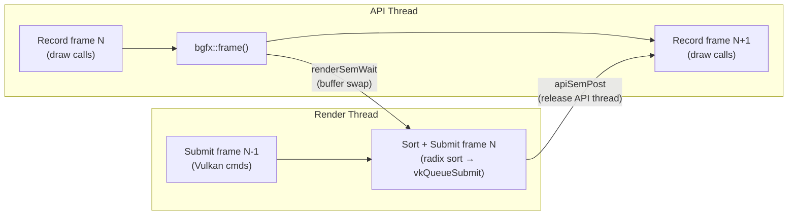
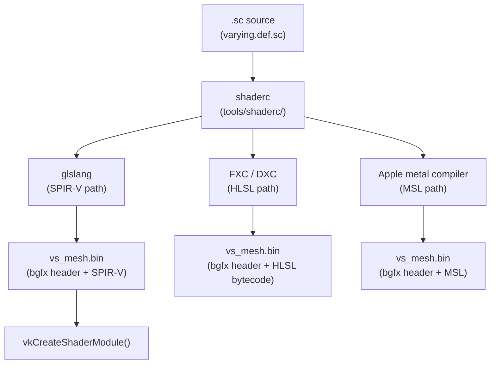
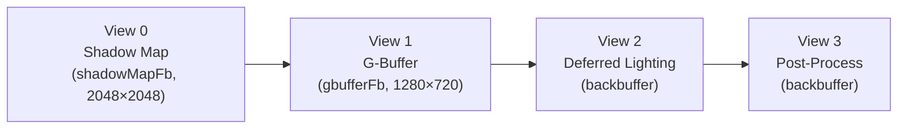
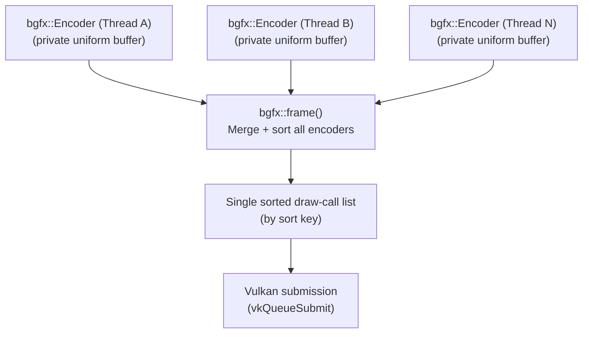
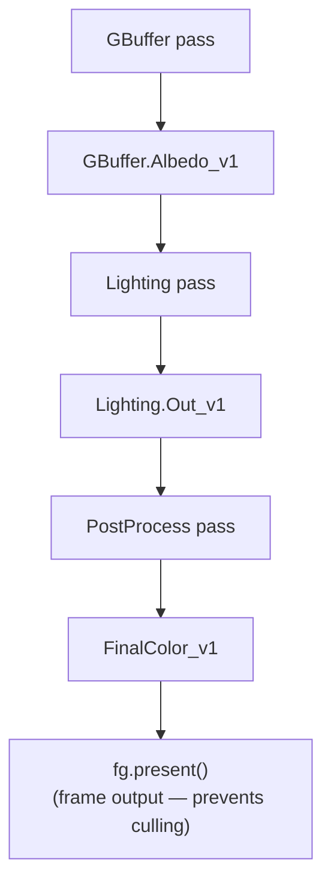
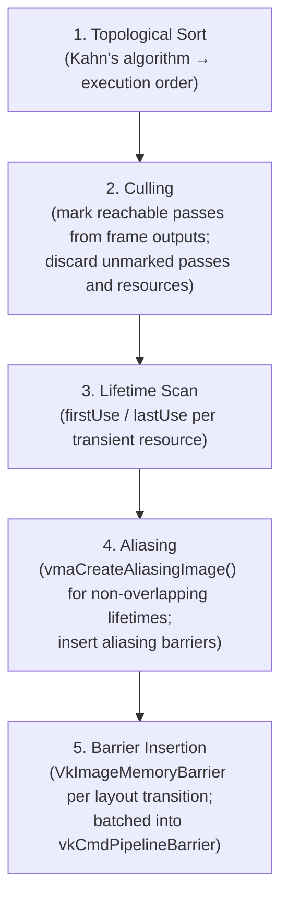

# Chapter 84: bgfx, Cross-Platform Rendering Abstractions, and the Frame Graph Pattern

**Audiences:** Graphics application developers (primary) — engineers building games, tools, or visualisation software who need to understand the landscape between raw Vulkan and full-featured engines; engine developers studying the architectural patterns — the frame graph, resource aliasing, and multi-threaded encoder models — that underpin modern rendering pipelines.

---

## Table of Contents

1. [The Abstraction Spectrum](#1-the-abstraction-spectrum)
2. [bgfx Architecture](#2-bgfx-architecture)
3. [bgfx Resource Management](#3-bgfx-resource-management)
4. [The bgfx Shader System](#4-the-bgfx-shader-system)
5. [The View and Render Target System](#5-the-view-and-render-target-system)
6. [Multi-Threaded Encoding](#6-multi-threaded-encoding)
7. [The Frame Graph Pattern](#7-the-frame-graph-pattern)
8. [Frame Graph Implementation Deep-Dive](#8-frame-graph-implementation-deep-dive)
9. [Transient Resource Allocators](#9-transient-resource-allocators)
10. [Other Notable Abstractions](#10-other-notable-abstractions)
11. [Choosing the Right Level](#11-choosing-the-right-level)
12. [Integrations](#12-integrations)

---

## 1. The Abstraction Spectrum

Modern graphics programming on Linux presents a wide spectrum of APIs, each trading control for convenience at a different point along the scale. Understanding where a library sits on this spectrum — and why — is the first decision any graphics-intensive project must make.

**Raw Vulkan** sits at the lowest practical level. The application manages every pipeline state object, render pass, subpass dependency, memory heap, image layout transition, and synchronisation barrier explicitly. The verbosity is immense: a minimal triangle requires several hundred lines of correct **Vulkan** setup. The reward is full access to every hardware capability — mesh shaders, ray tracing, variable rate shading, sparse images, and emerging **Vulkan** extensions land here first.

**VMA** plus helper libraries (see Ch82) add sane memory management but leave the rest of **Vulkan** unchanged. This is the preferred approach when you need **Vulkan**'s full feature surface but cannot afford to write a custom allocator.

**bgfx** sits in the middle: a cross-platform rendering library with its own command-buffer model, shader compilation pipeline, and view abstraction. It targets eight backends — **Vulkan**, **OpenGL** 3.1+, **OpenGL ES** 2/3.1, **Direct3D** 11/12, **Metal**, **WebGL**, and **WebGPU** — from a single API, at the cost of exposing a lowest-common-denominator feature surface. You cannot access mesh shaders or ray tracing pipelines from **bgfx**. In exchange, an application that works on Linux via **Vulkan** also works on macOS via **Metal** and on older Android devices via **OpenGL ES** 2. Section 2 covers **bgfx** architecture in depth: the `bgfx::RendererType::Enum` enum that selects backends at initialisation time (with **Vulkan** as the default on Linux when `BGFX_CONFIG_RENDERER_VULKAN` is set), the `bgfx::init()` / `bgfx::shutdown()` lifecycle, the `bgfx::PlatformData` window-handle mechanism (which issues `vkCreateXlibSurfaceKHR` or `vkCreateWaylandSurfaceKHR` under the hood), and the double-buffered frame model where `bgfx::frame()` swaps the API-thread submit buffer with the render-thread command buffer via a radix sort. The **bgfx** **Vulkan** backend (`src/renderer_vk.cpp`) internally manages `VkInstance`, `VkPhysicalDevice`, `VkDevice`, swap chain images, descriptor pool caches, and a staging-buffer ring for texture uploads — all hidden from the application.

Section 3 examines **bgfx** resource management: the typed opaque 16-bit handle system (`VertexBufferHandle`, `IndexBufferHandle`, `TextureHandle`, `FrameBufferHandle`, `ShaderHandle`, `ProgramHandle`, `UniformHandle`) that indexes into internal slot arrays; **bgfx::VertexLayout** and its fluent builder for declaring per-vertex attribute formats; static vs. dynamic vertex and index buffers created via **bgfx::makeRef()** (zero-copy) or **bgfx::copy()**; textures spanning formats from **RGBA8** through **RGBA16F**, **BC1**–**BC7**, **ASTC4x4**, **ETC2**, and **D24S8**; and framebuffers with multiple render targets (**MRT**) that the **Vulkan** backend maps lazily to `VkRenderPass` + `VkFramebuffer` pairs.

Section 4 covers the **bgfx** shader system. Because a single source must target **GLSL** (**OpenGL**), **ESSL** (**OpenGL ES**), **HLSL** (**Direct3D**), **MSL** (**Metal**), and **SPIR-V** (**Vulkan**), **bgfx** defines the `.sc` shader dialect — a **GLSL**-based format using macros such as `SAMPLER2D()` and a separate `varying.def.sc` file for interpolant declarations. The **shaderc** tool (in `tools/shaderc/`) drives **glslang** for the **SPIR-V** path, **FXC**/**DXC** for **HLSL**, and the Apple **metal** compiler for **MSL**, embedding the resulting bytecode in a **bgfx**-specific binary header. Uniforms are managed at runtime via `bgfx::UniformHandle` and `bgfx::setUniform()`, with `UniformType::Sampler` carrying texture-unit bindings.

Section 5 describes the view and render-target system. A *view* (`bgfx::ViewId`, a `uint16_t`) is the primary unit of render-pass organisation — up to `BGFX_CONFIG_MAX_VIEWS` (default 256) views exist per frame. Each view is configured with `bgfx::setViewRect()`, `bgfx::setViewFrameBuffer()`, `bgfx::setViewClear()`, and `bgfx::setViewTransform()`, and is executed in ascending ID order. Every draw call receives a 64-bit sort key whose top bits encode the view ID; the intra-view sort order is controlled by `bgfx::setViewMode()` (Default, Sequential, DepthAscending, DepthDescending). The **Vulkan** backend maps each view to a `vkCmdBeginRenderPass` / `vkCmdEndRenderPass` pair, with `setViewClear` parameters mapping to `VkRenderPassBeginInfo::pClearValues`. Compute dispatches (`bgfx::dispatch()`) and texture-region copies (`bgfx::blit()`) are also issued to views, enabling precise ordering of compute and copy passes relative to graphics passes.

Section 6 covers multi-threaded encoding. The `bgfx::Encoder` class allows multiple application threads to record draw calls concurrently — each encoder writes into its own private uniform buffer with no lock on the hot path, synchronising only at `bgfx::begin()` to acquire a slot from an encoder pool (maximum 8 simultaneous encoders by default, tunable via `bgfx::Init::limits.maxEncoders`). At `bgfx::frame()`, the render thread merges all encoder submissions into a single sorted draw-call list before touching **Vulkan** — a CPU-space merge analogous to **Vulkan** secondary command buffers being executed from a primary command buffer, but with lower overhead at moderate draw-call counts.

**SDL3 GPU** (see Ch81) is an even thinner portability layer from **SDL3**, targeting broadly-supported feature sets without a separate shader compiler.

**Filament** (see Ch83) provides a complete physically-based rendering pipeline as a library — shadow maps, **IBL**, bloom, **TAA** — while still running on a **Vulkan** backend on Linux. Applications use a materials system rather than raw shaders.

**IGL** (Meta's Intermediate Graphics Library, §10.13) is a production cross-platform HAL targeting **Vulkan 1.2**, Metal, and OpenGL from a single API, open-sourced by Meta and used in Quest XR and Instagram. It sits between bgfx and Filament: more explicit than bgfx's view model (render passes are visible to the application), but unopinionated about materials, lighting, or scene structure. IGL's Vulkan backend targets long-tail Android compatibility while the Metal backend serves Apple XR.

**LightweightVK** (§10.14) began as a fork of IGL's Vulkan backend, then underwent a complete API redesign targeting **Vulkan 1.3 only**. It replaces traditional descriptor sets with a fully bindless resource model, replaces `VkRenderPass` with dynamic rendering, and carries no STL containers in its public headers. It is the companion library to Sergey Kosarevsky's *3D Graphics Rendering Cookbook* and serves as a compact reference implementation of modern Vulkan 1.3 idioms: `VK_KHR_dynamic_rendering`, `VK_KHR_synchronization2`, and `VK_EXT_descriptor_indexing` are used by default rather than as optional extensions.

**Full engines** (**Bevy**, **Godot**, **Unity**, **Unreal**) provide the complete stack from scene graph to asset pipeline, at the cost of yielding architectural control to the engine's conventions.

The appropriate choice depends on what you actually need:

| Need | Appropriate level |
|------|------------------|
| Ray tracing, mesh shaders, Vulkan extensions | Raw Vulkan |
| Raw Vulkan + sane memory management | VMA + helpers |
| Vulkan 1.3 bindless prototyping, cookbook learning | LightweightVK |
| Cross-platform game / tool, no bleeding-edge features | bgfx |
| Maximum portability, minimal learning curve | SDL3 GPU |
| Cross-platform XR / mobile with explicit pass control | IGL |
| PBR rendering without writing shaders | Filament |
| Complete game framework | Bevy / Godot / Unreal |

### 1.1 The Full Competitive Landscape

The table below maps every library covered in this chapter and its neighbours against the axes that matter most when choosing: Vulkan support, additional backends, abstraction level, and primary target audience.

| Library | Vulkan | Other backends | Level | Primary audience |
|---------|--------|----------------|-------|-----------------|
| **volk** | 1.x (loader bypass) | — | Thin — dispatch only | Raw Vulkan C/C++ devs |
| **VMA** | 1.x | — | Thin — memory only | Any Vulkan app |
| **vk-bootstrap** | 1.x | — | Thin — init only | Vulkan setup ceremony |
| **LightweightVK** | 1.3 only | — | Mid — bindless, dynamic rendering | Prototyping, cookbook learning |
| **Granite** | 1.x only | — | Mid — render graph + bindless + async-compute first-class | Engine researchers, driver engineers |
| **magma** | 1.x only | — | Mid — idiomatic C++17 RAII | Full Vulkan with ownership |
| **LLGL** | 1.x | D3D11/12, Metal, GL | Mid-thin HAL | Vulkan-fidelity with GL fallback |
| **nvrhi** | 1.2+ | D3D11, D3D12 | Mid HAL | NVIDIA RTX / Falcor ecosystem |
| **sokol_gfx** | via community port | D3D11, Metal, GL3, WebGPU | Mid — single-header | Web + desktop small apps |
| **SDL3 GPU** | 1.x | D3D12, Metal | Mid — SDL3-integrated | Cross-platform games, minimal API |
| **bgfx** | 1.x | D3D9/11/12, Metal, GL, WebGPU | Mid — view model | Multi-backend games / tools |
| **Diligent Engine** | 1.x | D3D11/12, Metal, GL | Mid–full HAL | Engine development |
| **IGL** | 1.2 | Metal 2+, GL/ES, WebGL2 | Full HAL | XR / mobile cross-platform |
| **The Forge** | 1.x | D3D12, Metal, GNM (PS4/5) | Full HAL | AAA game studios |
| **Filament** | 1.x | Metal, D3D11, WebGL2, WebGPU | Full HAL + PBR | Mobile / web 3D |
| **wgpu** | 1.x | Metal, D3D12, D3D11, GL, WebGPU | Full HAL — WebGPU API | Rust / WASM / Firefox |
| **raylib** | — | OpenGL 3.3 only | High-level C API | Education, game jams |
| **SFML** | — | OpenGL only | High-level C++ | 2D + audio + networking |
| **LOVE2D** | — | OpenGL 3.3 / ES3 | High-level Lua | Lua game jams |
| **Allegro 5** | — | OpenGL | High-level C | Legacy / simple 2D |

**Abstraction-level axis** (thin → full HAL): volk / VMA / vk-bootstrap → LightweightVK / magma / nvrhi → SDL3 GPU / bgfx / Diligent / IGL → Filament / The Forge / wgpu → Bevy / Godot / Unreal.

**Backend breadth axis** (Vulkan-exclusive → everything): LightweightVK / magma / Granite → nvrhi → SDL3 GPU / bgfx → IGL → The Forge / wgpu / Filament.

The fork relationship between IGL and LightweightVK illustrates a recurring tension in this space: IGL prioritises multi-backend production compatibility (long-tail Android, Quest hardware) at the cost of conservative Vulkan targeting (1.2, traditional descriptor sets); LightweightVK discards that goal entirely to pursue Vulkan 1.3 bindless purity and a minimal surface area for prototyping. Neither approach is universally superior — the choice reflects the project's device matrix and feature requirements.

The frame graph pattern described in the second half of this chapter is not specific to any level: it is a design pattern for managing inter-pass resource lifetimes and synchronisation that is used in **Filament**, Unreal's **Render Dependency Graph** (**RDG**), **Bevy**'s **RenderGraph**, and **Firefox WebRender**. It solves a structural problem that arises whenever rendering is split into multiple passes with shared intermediate resources. Section 7 introduces the problem — ownership ambiguity, redundant resource allocation, manual barrier management, and feature coupling — and the core concepts: passes with setup/execute phases, virtual resources, transient vs. imported resources, pass culling, memory aliasing, and automatic barrier insertion. Section 8 provides an implementation deep-dive using **Filament**'s **FrameGraph** as the reference: the builder pattern with `FrameGraph::Builder`, `FrameGraphId<FrameGraphTexture>`, and setup/execute lambdas; resource versioning via write-edge new-version semantics forming a **DAG**; and the five-step compilation phase (topological sort via Kahn's algorithm, culling, lifetime scan, aliasing, barrier insertion via `VkImageMemoryBarrier` batched into `vkCmdPipelineBarrier`), followed by the execution phase where transient resources are devirtualised to real `VkImage` handles. Section 9 covers transient resource allocators: the **VMA** `VMA_POOL_CREATE_LINEAR_ALGORITHM_BIT` pool for O(1) per-frame allocation, the **VMA** virtual block API (`VmaVirtualBlock`, `vmaVirtualAllocate()`) for offset-only management over a pre-allocated `VkDeviceMemory`, and `vmaCreateAliasingImage()` for binding multiple `VkImage` objects to the same `VmaAllocation` when their lifetimes do not overlap — a technique that routinely achieves 40–50% transient **VRAM** savings in production deferred pipelines. Section 10 surveys other notable abstractions in the cross-platform rendering space: **Diligent Engine** with its modern-API-shaped interface, automatic resource state tracking, and `IRenderDevice` / `IDeviceContext` model; **The Forge** (Confetti FX) with its **FSL** (Forge Shading Language) cross-compilation pipeline and shipped titles including *Call of Duty: Warzone Mobile*; **LLGL** (Low Level Graphics Library) as a thin **C++11** abstraction maximising fidelity to **Vulkan** and **Metal** semantics; and **Magnum** as a modular, composable toolkit suited to scientific visualisation. Section 11 provides a practical decision guide summarising when to choose each level, from raw **Vulkan** extensions (`VK_KHR_ray_tracing_pipeline`, `VK_EXT_mesh_shader`) through **bgfx**, **SDL3 GPU**, **Filament**, full engines, and a custom frame graph over **Vulkan** for async-compute pipelines.

---

## 2. bgfx Architecture

bgfx is a BSD-2-clause-licensed cross-platform rendering library authored by Branimir Karadžić, available at [https://github.com/bkaradzic/bgfx](https://github.com/bkaradzic/bgfx). It is described as a "Bring Your Own Engine/Framework" library — it handles GPU submission but imposes no scene graph, asset format, or window system.

### 2.1 Supported Backends

bgfx selects a backend at initialisation time through `bgfx::RendererType::Enum`:

```cpp
// include/bgfx/bgfx.h — RendererType namespace (simplified)
namespace bgfx {
  namespace RendererType {
    enum Enum {
      Noop,       // no-op renderer; useful for server-side builds
      Agc,        // PS5 (GNM/AGC, developer-only)
      Direct3D11,
      Direct3D12,
      Gnm,        // PS4 (developer-only)
      Metal,
      Nvn,        // Nintendo Switch
      OpenGLES,   // ES 2 and ES 3.1
      OpenGL,     // 2.1, 3.1+
      Vulkan,     // primary on Linux and Android
      WebGPU,
      Count
    };
  }
}
```

[Source: bgfx API reference](https://bkaradzic.github.io/bgfx/bgfx.html)

On Linux, Vulkan is the default backend when the Vulkan ICD is found at runtime. OpenGL 3.x is the fallback. The build-time define `BGFX_CONFIG_RENDERER_VULKAN` (enabled by default on Linux) controls whether the Vulkan backend is compiled in at all.

### 2.2 Initialisation

```cpp
#include <bgfx/bgfx.h>
#include <bgfx/platform.h>

int main() {
    bgfx::Init init;
    init.type = bgfx::RendererType::Vulkan;  // explicit; omit for auto-detect
    init.vendorId = BGFX_PCI_ID_NONE;        // any GPU
    init.resolution.width  = 1280;
    init.resolution.height = 720;
    init.resolution.reset  = BGFX_RESET_VSYNC;

    // Provide the native window handle from SDL/GLFW/etc.
    bgfx::PlatformData pd;
    pd.nwh = /* SDL_GetWindowWMInfo → info.info.x11.window */;
    bgfx::setPlatformData(pd);

    if (!bgfx::init(init)) return 1;

    // ... render loop ...

    bgfx::shutdown();
}
```

`bgfx::init()` starts the render thread, creates a Vulkan instance, selects a physical device, and creates a logical device, queues, and swap chain — all hidden from the application. The `bgfx::PlatformData::nwh` field carries the platform-specific window handle; bgfx uses this to create a Vulkan surface via `vkCreateXlibSurfaceKHR` on Linux. [Source: bgfx overview](https://bkaradzic.github.io/bgfx/overview.html)

### 2.3 The Frame Model

bgfx uses a **double-buffered command model**. The application thread (the *API thread*) records draw calls into a submit buffer. The *render thread* processes a separate render buffer. When `bgfx::frame()` is called:

1. The API thread waits for the render thread to finish the previous frame (`renderSemWait`).
2. The two buffers are swapped atomically.
3. The render thread resumes: it radix-sorts all draw calls by sort key, executes resource commands, submits to Vulkan, and flips the swap chain.
4. The API thread is released (`apiSemPost`) to start recording the next frame.

```
API thread:    [record frame N] → frame() → [record frame N+1]
                                   ↕ buffer swap
Render thread: [submit frame N-1] ←      → [sort+submit frame N]
```

This overlap allows CPU recording of frame N+1 while the GPU executes frame N, reducing total frame time.



[Source: bgfx internals](https://bkaradzic.github.io/bgfx/internals.html)

The frame call returns the current frame number, which applications can use for multi-buffered resource management (e.g., a per-frame uniform buffer):

```cpp
uint32_t frameNum = bgfx::frame();
```

### 2.4 Vulkan Backend Internals

The bgfx Vulkan backend (`src/renderer_vk.cpp`) internally manages:

- `VkInstance`, `VkPhysicalDevice`, `VkDevice`
- A graphics+present queue (`VkQueue`)
- A swap chain with typically three images
- Descriptor pool and set layout caches
- A staging buffer ring for texture/buffer uploads
- A transient vertex/index buffer pool per frame

None of these Vulkan objects are directly accessible from the bgfx API — the library handles the impedance mismatch between bgfx's view-based model and Vulkan's explicit render pass system internally.

---

## 3. bgfx Resource Management

### 3.1 Handle Types

bgfx uses typed opaque 16-bit handles for all GPU resources. The underlying type is a `uint16_t` index into an internal slot array, but wrapped in a named struct to prevent accidental misuse:

```cpp
// include/bgfx/bgfx.h (simplified)
struct VertexBufferHandle  { uint16_t idx; };
struct DynamicVertexBufferHandle { uint16_t idx; };
struct IndexBufferHandle   { uint16_t idx; };
struct TextureHandle       { uint16_t idx; };
struct FrameBufferHandle   { uint16_t idx; };
struct ShaderHandle        { uint16_t idx; };
struct ProgramHandle       { uint16_t idx; };
struct UniformHandle       { uint16_t idx; };
struct VertexLayoutHandle  { uint16_t idx; };

// validity check
static const uint16_t kInvalidHandle = UINT16_MAX;
inline bool isValid(VertexBufferHandle h) { return h.idx != kInvalidHandle; }
```

This is a *handle table* pattern: the index is meaningful only as an argument to the bgfx API; the library resolves it to the real Vulkan object at submit time on the render thread.

### 3.2 Vertex Layouts

`bgfx::VertexLayout` describes the memory layout of a single vertex in a buffer. It uses a fluent builder:

```cpp
// From bgfx/examples/06-bump/bump.cpp — position + normal + texcoord
struct PosNormalTexcoordVertex {
    float    m_x, m_y, m_z;   // position
    uint32_t m_normal;         // packed normal (Uint8×4, normalised)
    float    m_u, m_v;         // texcoord

    static bgfx::VertexLayout ms_layout;

    static void init() {
        ms_layout
            .begin()
            .add(bgfx::Attrib::Position,  3, bgfx::AttribType::Float)
            .add(bgfx::Attrib::Normal,    4, bgfx::AttribType::Uint8, true, true)
            .add(bgfx::Attrib::TexCoord0, 2, bgfx::AttribType::Float)
            .end();
    }
};
```

[Source: bgfx bump example](https://github.com/bkaradzic/bgfx/blob/master/examples/06-bump/bump.cpp)

The `true, true` on `Normal` means: normalise the bytes to `[−1, 1]` (first flag) and store them as integers in GLSL (second flag — `asInt`). The `VertexLayout` is an immutable description; the actual VkVertexInputAttributeDescription records are generated from it by the Vulkan backend when a pipeline state object is created for the first time that uses this layout.

### 3.3 Vertex and Index Buffers

```cpp
// Static (immutable) vertex buffer
bgfx::VertexBufferHandle vbh = bgfx::createVertexBuffer(
    bgfx::makeRef(vertices, sizeof(vertices)),  // no copy; caller owns memory
    PosNormalTexcoordVertex::ms_layout
);

// Dynamic vertex buffer — writeable each frame
bgfx::DynamicVertexBufferHandle dvbh =
    bgfx::createDynamicVertexBuffer(numVerts, ms_layout, BGFX_BUFFER_NONE);
bgfx::update(dvbh, 0, bgfx::copy(newData, dataSize));

bgfx::IndexBufferHandle ibh = bgfx::createIndexBuffer(
    bgfx::makeRef(indices, sizeof(indices))
);
```

`bgfx::makeRef()` returns a `bgfx::Memory*` that points to the provided memory without copying it. The application must keep the memory alive until `bgfx::frame()` returns after the buffer is submitted to the GPU. `bgfx::copy()` copies the data into bgfx's internal allocator.

### 3.4 Textures

```cpp
// 2D texture from pixel data
bgfx::TextureHandle tex = bgfx::createTexture2D(
    512, 512,
    false,                             // no mipmaps
    1,                                 // one layer
    bgfx::TextureFormat::RGBA8,        // format
    BGFX_TEXTURE_NONE,                 // usage flags
    bgfx::copy(pixelData, 512*512*4)
);

// BC1 (DXT1) compressed texture — preferred on desktop GPUs
bgfx::TextureHandle compTex = bgfx::createTexture2D(
    512, 512,
    true,                              // has mipmaps
    1,
    bgfx::TextureFormat::BC1,          // DXT1 — 4 bpp
    BGFX_TEXTURE_NONE,
    bgfx::copy(compressedData, dataSize)
);

// Render target texture
bgfx::TextureHandle rtTex = bgfx::createTexture2D(
    1280, 720, false, 1,
    bgfx::TextureFormat::RGBA8,
    BGFX_TEXTURE_RT                    // must set RT flag for framebuffer use
);
```

The `TextureFormat` enum includes `RGBA8`, `RGBA16F`, `R32F`, `BC1` through `BC7`, `ASTC4x4`, `ETC2`, `D24S8` (depth-stencil), and many others. The bgfx Vulkan backend maps each to the corresponding `VkFormat`. [Source: bgfx API reference](https://bkaradzic.github.io/bgfx/bgfx.html)

### 3.5 Framebuffers and MRT

```cpp
// Multiple render targets
bgfx::TextureHandle attachments[2] = { colorTex, depthTex };
bgfx::FrameBufferHandle fbh = bgfx::createFrameBuffer(2, attachments);

// Or directly from texture format descriptions (no pre-allocated textures)
bgfx::TextureHandle gbufAttachments[3];
gbufAttachments[0] = bgfx::createTexture2D(w, h, false, 1,
    bgfx::TextureFormat::RGBA8,   BGFX_TEXTURE_RT);
gbufAttachments[1] = bgfx::createTexture2D(w, h, false, 1,
    bgfx::TextureFormat::RGBA16F, BGFX_TEXTURE_RT);  // normals
gbufAttachments[2] = bgfx::createTexture2D(w, h, false, 1,
    bgfx::TextureFormat::D24S8,   BGFX_TEXTURE_RT);
bgfx::FrameBufferHandle gbufFb = bgfx::createFrameBuffer(3, gbufAttachments);
```

The bgfx Vulkan backend translates `FrameBufferHandle` into a `VkRenderPass` + `VkFramebuffer` pair, creating them lazily on first use and caching by descriptor hash.

### 3.6 A Complete Textured Quad Example

```cpp
// --- Vertex layout ---
struct PosUVVertex {
    float x, y, z;
    float u, v;
    static bgfx::VertexLayout s_layout;
    static void init() {
        s_layout.begin()
            .add(bgfx::Attrib::Position,  3, bgfx::AttribType::Float)
            .add(bgfx::Attrib::TexCoord0, 2, bgfx::AttribType::Float)
            .end();
    }
};

// --- Geometry ---
static const PosUVVertex kQuadVerts[] = {
    {-1, -1, 0,  0, 1},
    { 1, -1, 0,  1, 1},
    {-1,  1, 0,  0, 0},
    { 1,  1, 0,  1, 0},
};
static const uint16_t kQuadIdx[] = {0,1,2, 1,3,2};

bgfx::VertexBufferHandle vbh = bgfx::createVertexBuffer(
    bgfx::makeRef(kQuadVerts, sizeof(kQuadVerts)), PosUVVertex::s_layout);
bgfx::IndexBufferHandle ibh = bgfx::createIndexBuffer(
    bgfx::makeRef(kQuadIdx,   sizeof(kQuadIdx)));

// --- Texture and sampler uniform ---
bgfx::TextureHandle tex = loadTexture("texture.dds");
bgfx::UniformHandle s_texColor =
    bgfx::createUniform("s_texColor", bgfx::UniformType::Sampler);

// --- Program (pre-compiled shaders) ---
bgfx::ProgramHandle prog = loadProgram("vs_quad", "fs_quad");

// --- Render loop ---
while (running) {
    bgfx::setViewRect(0, 0, 0, 1280, 720);
    bgfx::setViewClear(0, BGFX_CLEAR_COLOR | BGFX_CLEAR_DEPTH,
                       0x303030ff, 1.0f, 0);

    bgfx::setVertexBuffer(0, vbh);
    bgfx::setIndexBuffer(ibh);
    bgfx::setTexture(0, s_texColor, tex);
    bgfx::setState(BGFX_STATE_DEFAULT);
    bgfx::submit(0, prog);          // submit to view 0

    bgfx::frame();
}
```

---

## 4. The bgfx Shader System

bgfx cannot use raw GLSL or HLSL source directly, because the same source must compile to GLSL (for OpenGL), ESSL (for OpenGL ES), HLSL (for Direct3D), MSL (for Metal), and SPIR-V (for Vulkan). Instead, bgfx defines a shader dialect based on GLSL with preprocessing macros that express cross-API semantics.

### 4.1 The `.sc` Shader Language

Shaders are written as `.sc` (shader/sc) files. The key differences from standard GLSL:

- All uniforms must be `float` or `vec`/`mat` types — `bool` and `int` uniforms are forbidden.
- Samplers are declared with the `SAMPLER2D(name, binding)` macro instead of `uniform sampler2D`.
- Input/output interpolants are declared in a separate file `varying.def.sc` rather than inline.
- The `$input` and `$output` directives at the top of each shader specify which varyings it uses.

**`varying.def.sc`:**

```glsl
// varying.def.sc — defines all possible vertex outputs
vec3 v_normal   : NORMAL;
vec2 v_texcoord : TEXCOORD0;
// Attributes (vertex inputs)
vec3 a_position : POSITION;
vec3 a_normal   : NORMAL;
vec2 a_texcoord : TEXCOORD0;
```

**`vs_mesh.sc` — vertex shader:**

```glsl
$input  a_position, a_normal, a_texcoord
$output v_normal, v_texcoord

#include <bgfx_shader.sh>

uniform mat4 u_model;    // uniform declared here

void main() {
    gl_Position = mul(u_modelViewProj, vec4(a_position, 1.0));
    v_normal    = normalize(mul(u_model, vec4(a_normal, 0.0)).xyz);
    v_texcoord  = a_texcoord;
}
```

**`fs_mesh.sc` — fragment shader:**

```glsl
$input v_normal, v_texcoord

#include <bgfx_shader.sh>

SAMPLER2D(s_albedo, 0);         // texture unit 0
uniform vec4 u_lightDir;        // float uniform (vec4 alignment)

void main() {
    vec4 albedo = texture2D(s_albedo, v_texcoord);
    float ndotl = max(dot(normalize(v_normal), -u_lightDir.xyz), 0.0);
    gl_FragColor = albedo * ndotl;
}
```

### 4.2 shaderc Compilation

bgfx's `shaderc` tool (in `tools/shaderc/`) compiles `.sc` source to backend-specific bytecode. It shells out to `glslang` (the Khronos GLSL reference compiler) for the SPIR-V path, to the FXC/DXC for HLSL, and to the Apple `metal` compiler for MSL.



The compilation command for Linux Vulkan is:

```bash
# Compile vertex shader for Linux Vulkan (SPIR-V 1.0)
shaderc \
    --type vertex \
    --platform linux \
    -p spirv \
    --varyingdef varying.def.sc \
    -f vs_mesh.sc \
    -o vs_mesh.bin

# Compile fragment shader
shaderc \
    --type fragment \
    --platform linux \
    -p spirv \
    --varyingdef varying.def.sc \
    -f fs_mesh.sc \
    -o fs_mesh.bin
```

[Source: bgfx tools documentation](https://bkaradzic.github.io/bgfx/tools.html)

The resulting `.bin` files contain a bgfx-specific header followed by the SPIR-V bytecode. The Vulkan backend calls `vkCreateShaderModule()` with the embedded SPIR-V when the shader handle is first used.

### 4.3 Uniforms at Runtime

Uniforms are set per-draw-call in the API thread and written into the per-encoder uniform buffer. At submit time, the render thread copies the uniform data into a descriptor set bound before the draw:

```cpp
// C++ — create uniforms at startup
bgfx::UniformHandle u_lightDir =
    bgfx::createUniform("u_lightDir", bgfx::UniformType::Vec4);
bgfx::UniformHandle u_albedo =
    bgfx::createUniform("s_albedo", bgfx::UniformType::Sampler);

// Per-frame update
float lightDir[4] = {0.577f, -0.577f, 0.577f, 0.0f};
bgfx::setUniform(u_lightDir, lightDir);
bgfx::setTexture(0, u_albedo, albedoTexHandle);
```

The `UniformType::Sampler` uniform is special — it carries the texture unit binding, not a float value. For matrix uniforms, use `bgfx::UniformType::Mat4` and pass a `float[16]` array.

---

## 5. The View and Render Target System

A *view* in bgfx is the primary unit of render pass organisation. Each view has a stable ID (`bgfx::ViewId`, a `uint16_t`), and up to `BGFX_CONFIG_MAX_VIEWS` (default 256) views can exist in a frame.

### 5.1 View Configuration

```cpp
// View 0 — shadow map pass
bgfx::setViewRect(0, 0, 0, 2048, 2048);
bgfx::setViewFrameBuffer(0, shadowMapFb);
bgfx::setViewClear(0, BGFX_CLEAR_DEPTH, 0, 1.0f, 0);
bgfx::setViewTransform(0, lightView, lightProj);

// View 1 — G-buffer pass (deferred geometry)
bgfx::setViewRect(1, 0, 0, 1280, 720);
bgfx::setViewFrameBuffer(1, gbufferFb);
bgfx::setViewClear(1,
    BGFX_CLEAR_COLOR | BGFX_CLEAR_DEPTH,
    0x00000000, 1.0f, 0);
bgfx::setViewTransform(1, cameraView, cameraProj);

// View 2 — deferred lighting pass
bgfx::setViewRect(2, 0, 0, 1280, 720);
bgfx::setViewFrameBuffer(2, BGFX_INVALID_HANDLE);  // default (backbuffer)
bgfx::setViewClear(2, BGFX_CLEAR_NONE, 0, 1.0f, 0);

// View 3 — post-process (full-screen quad to backbuffer)
bgfx::setViewRect(3, 0, 0, 1280, 720);
bgfx::setViewFrameBuffer(3, BGFX_INVALID_HANDLE);
bgfx::setViewClear(3, BGFX_CLEAR_NONE, 0, 1.0f, 0);
```

Views are rendered in ascending ID order. Lower IDs execute first: shadow map (0) → G-buffer (1) → lighting (2) → post (3). This is the fundamental scheduling mechanism in bgfx.



### 5.2 Sort Keys and View Modes

Every draw call receives a 64-bit sort key. The top bits encode the view ID, ensuring all draw calls belonging to a view are grouped together. Within a view, the default sort order groups by shader program (to reduce pipeline state switches):

```
sort key layout (Default mode):
[view: 8 bits][draw/compute: 1 bit][blend: 1 bit][alphaRef: 8 bits]
[program: 9 bits][depth: 24 bits][sequence: 13 bits]
```

The `bgfx::setViewMode()` function changes the intra-view sort:

```cpp
bgfx::setViewMode(1, bgfx::ViewMode::Default);          // group by program
bgfx::setViewMode(2, bgfx::ViewMode::Sequential);       // preserve submit order
bgfx::setViewMode(3, bgfx::ViewMode::DepthAscending);   // front-to-back (opaque)
bgfx::setViewMode(4, bgfx::ViewMode::DepthDescending);  // back-to-front (transparent)
```

[Source: bgfx internals](https://bkaradzic.github.io/bgfx/internals.html)

### 5.3 Mapping to Vulkan Render Passes

The bgfx Vulkan backend maps each view to one or more Vulkan render passes. Views sharing the same framebuffer *and* occurring consecutively in sort order may be merged into a single `VkRenderPass` with multiple subpasses if the implementation detects opportunities to do so. In practice, each view is more commonly an independent `vkCmdBeginRenderPass` / `vkCmdEndRenderPass` pair.

The `setViewClear` parameters map directly to `VkRenderPassBeginInfo::pClearValues`. The `BGFX_CLEAR_NONE` flag causes the Vulkan backend to use `VK_ATTACHMENT_LOAD_OP_LOAD`, preserving previous frame content.

### 5.4 Compute and Blit Views

bgfx distinguishes compute dispatches via `bgfx::dispatch(viewId, computeProgram, countX, countY, countZ)`. The view system applies equally: compute dispatches are sorted among draw calls by view ID. Blit operations (`bgfx::blit()`) copy texture regions and are also submitted to views, enabling copy passes to be precisely ordered relative to graphics and compute passes.

---

## 6. Multi-Threaded Encoding

### 6.1 The Encoder API

The `bgfx::Encoder` class enables multiple application threads to record draw calls simultaneously:

```cpp
// Thread A — main rendering
bgfx::Encoder* encoderA = bgfx::begin(true);  // true = flush immediately
encoderA->setState(BGFX_STATE_DEFAULT);
encoderA->setVertexBuffer(0, vbh);
encoderA->setIndexBuffer(ibh);
encoderA->setTexture(0, s_albedo, texHandle);
encoderA->submit(1, program);          // submit to view 1 (G-buffer)
bgfx::end(encoderA);

// Thread B — shadow casters (concurrent)
bgfx::Encoder* encoderB = bgfx::begin(true);
encoderB->setState(BGFX_STATE_DEFAULT);
encoderB->setVertexBuffer(0, shadowVbh);
encoderB->setIndexBuffer(shadowIbh);
encoderB->submit(0, shadowProgram);    // submit to view 0 (shadow map)
bgfx::end(encoderB);
```

[Source: bgfx API reference — Encoder](https://bkaradzic.github.io/bgfx/bgfx.html)

### 6.2 Thread Safety Model

Each `bgfx::Encoder` writes into its own private uniform buffer (1 MB by default, growing on demand). There is no lock on the hot path — each thread is serialised only at `bgfx::begin()` to acquire a slot from the encoder pool (maximum 8 simultaneous encoders by default, configurable via `bgfx::Init::limits.maxEncoders`).

At `bgfx::frame()`, the render thread merges all completed encoder submissions into a single sorted draw-call list and proceeds to submission. This is structurally similar to Vulkan secondary command buffers being recorded on worker threads and executed from a primary command buffer on the main thread — except bgfx performs the merge in CPU-space before touching Vulkan at all.



Key thread safety rules:

- **Resource API** (`bgfx::createVertexBuffer`, etc.) is mutex-guarded; safe from any thread.
- **View API** (`bgfx::setViewRect`, etc.) is safe per-view; do not update the same view from two threads.
- **Encoder API** is per-thread; never share an encoder between threads.
- **`bgfx::frame()`** must be called from the API thread only.

[Source: bgfx internals — thread model](https://bkaradzic.github.io/bgfx/internals.html)

### 6.3 Comparison to Vulkan Secondary Command Buffers

| Aspect | bgfx Encoder | Vulkan Secondary CB |
|--------|-------------|---------------------|
| Recording | API-thread encoding (no GPU objects) | GPU command recording directly |
| Merge point | `bgfx::frame()` — CPU sort + merge | `vkCmdExecuteCommands()` — GPU merge |
| Render pass | Implied by view → sort key | Must inherit render pass at creation |
| Barrier insertion | Handled by bgfx Vulkan backend | Application's responsibility |
| Max concurrency | 8 encoders by default | Unlimited (VkCommandPool per thread) |

The bgfx approach is simpler but defers all GPU work to the render thread. With secondary command buffers, GPU command recording is genuinely parallel, which matters at 10,000+ draw calls on multi-core CPUs.

---

## 7. The Frame Graph Pattern

### 7.0 Deferred Rendering and the G-Buffer

The canonical example used throughout this section is **deferred rendering** — the technique whose data dependencies most directly motivated the frame graph abstraction. Understanding the G-Buffer makes the frame graph's design choices immediately legible.

**Forward rendering** computes lighting for every fragment as it is drawn: geometry is submitted, the fragment shader reads material properties and evaluates the full lighting equation — shadow maps, IBL, AO — in a single pass. This is correct but scales poorly. If a scene has *n* light sources and *f* visible fragments, the lighting loop runs *n × f* times, including for fragments later overdrawn by closer geometry.

**Deferred rendering** splits the work into two passes:

**Pass 1 — Geometry pass.** Draw all opaque geometry, but instead of computing lighting each fragment shader writes per-pixel surface attributes into multiple render targets simultaneously — the **G-Buffer** (Geometry Buffer):

| Attachment | Typical format | Contents |
|---|---|---|
| Albedo | RGBA8 | Base colour RGB + roughness or AO in alpha |
| Normal | RGBA16F | World-space surface normal |
| Material | RGBA8 | Metallic (R), roughness (G), emissive (B), flags (A) |
| Depth | D24S8 | Depth (for position reconstruction) + stencil |

The depth test discards overdrawn fragments before the fragment shader runs, so only the *closest* surface per pixel is written into the G-Buffer. The geometry pass output is complete coverage of the screen with no overdraw in the attribute buffers.

**Pass 2 — Lighting pass.** Read the G-Buffer as shader inputs. For every pixel, reconstruct world-space position from depth, sample the material attributes, and evaluate the full lighting equation. With *n* lights, each evaluation runs once per pixel rather than once per fragment per light. For a typical scene — millions of fragments, dozens to hundreds of analytical lights — the efficiency gain is large.

The tradeoff: G-Buffer textures consume significant VRAM bandwidth and VRAM footprint (typically 4–6 full-resolution render targets). On desktop IMR GPUs this means the G-Buffer is written to and read from DRAM on every frame. On TBDR mobile GPUs (§10 in ch86), the G-Buffer can live entirely in on-chip tile SRAM if the geometry and lighting passes are expressed as subpasses of the same Vulkan render pass, eliminating the DRAM round-trip entirely.

The G-Buffer pipeline is the canonical frame graph resource edge: the geometry pass *produces* transient G-Buffer textures; the lighting pass *consumes* them; both textures are meaningless outside this single frame. This is precisely the data dependency pattern a frame graph was designed to express.

### 7.1 The Problem Frame Graphs Solve

Modern rendering pipelines are sequences of interdependent passes: a shadow map pass writes a depth texture read by a lighting pass; a G-buffer pass writes colour, normal, and roughness textures read by a deferred shading pass; a shading pass writes a colour buffer read by bloom and TAA. Each intermediate texture has a *lifetime* — it is first written by one pass and last read by another.

In an ad-hoc multi-pass renderer, the following problems accumulate:

- **Ownership ambiguity:** "Who allocates the G-buffer albedo texture? Who frees it?" Typically answered with globals or a scene-wide render target manager, both of which are hard to evolve.
- **Redundant resource allocation:** A texture that is only needed for two consecutive passes is often kept alive for the entire frame, wasting GPU VRAM.
- **Manual barrier management:** Each Vulkan layout transition and pipeline barrier is written by hand, and the error rate is high. A missing barrier causes GPU corruption; a redundant barrier degrades performance.
- **Feature coupling:** Adding a debug visualisation pass (e.g., "show normals") requires manually threading a conditional through the entire render pipeline.

The frame graph pattern, introduced publicly in Yuriy O'Donnell's GDC 2017 talk "FrameGraph: Extensible Rendering Architecture in Frostbite" ([GDC Vault link](https://www.gdcvault.com/play/1024612/FrameGraph-Extensible-Rendering-Architecture-in)), addresses all of these with a single abstraction: **declare the complete frame as a directed acyclic graph (DAG) of passes and resources; compile it once; execute it optimally**.

### 7.2 Core Concepts

**Pass.** A unit of GPU work: typically a render pass (draw calls) or compute dispatch. A pass declares which resources it reads and which it writes during the *setup phase*. The actual GPU commands are deferred to the *execute phase*.

**Resource.** A texture or buffer referenced by passes. Resources are *virtual* at declaration time — they have a format, size, and usage, but no GPU memory backing. The frame graph allocates physical memory during compilation.

**Transient resource.** A resource that is created within the graph for one frame and does not need to persist. These are the candidates for memory aliasing.

**Imported resource.** A resource created outside the graph (the swap chain image, persistent shadow maps, the history buffer for TAA). The frame graph tracks its state but does not manage its lifetime.

**Culling.** Passes whose outputs are not consumed by any downstream pass (and are not marked as frame outputs) are removed before execution. This means a "render normals for debug visualisation" pass exists in the declaration unconditionally; it is simply culled when the debug visualiser is disabled.

**Aliasing.** Two transient resources with non-overlapping lifetimes in the execution order can share the same GPU memory. This is the primary VRAM savings mechanism.

**Barrier insertion.** The compiler walks the topological execution order and tracks each resource's current state (e.g., colour attachment, shader read, transfer source). When a resource changes state between passes, the compiler inserts the appropriate `VkImageMemoryBarrier` automatically.

### 7.3 Where Frame Graphs Are Used

| Engine/Library | Frame graph | Notes |
|---------------|-------------|-------|
| Frostbite (EA) | FrameGraph | Origin; O'Donnell GDC 2017 |
| Unreal Engine 5 | Render Dependency Graph (RDG) | Full async-compute integration |
| Filament (Google) | FrameGraph | Open-source, Vulkan backend on Linux |
| Granite (Arntzen) | RenderGraph | Open-source, Vulkan-only; subpass merging for tile GPUs; see §10.15 |
| Bevy | RenderGraph | Node + edge model; uses wgpu |
| Firefox WebRender | RenderTask graph | Similar concept, 2D rendering |
| bgfx | *Not implemented* | Views approximate the concept manually |

bgfx's view system is a manual predecessor of the frame graph idea: you declare views with explicit render targets and ordering, then submit draw calls to them. The key thing frame graphs add is *automatic resource lifetime management and aliasing* — bgfx leaves that to the application.

---

## 8. Frame Graph Implementation Deep-Dive

### 8.1 The Builder Pattern

The canonical frame graph API uses two-phase pass registration. The setup lambda runs immediately during graph construction (it just records dependencies); the execute lambda is stored and runs later during execution:

```cpp
// Illustrative API — based on Filament's FrameGraph design
// Source: https://github.com/google/filament — filament/src/fg/

struct GBufferData {
    FrameGraphId<FrameGraphTexture> albedo;
    FrameGraphId<FrameGraphTexture> normal;
    FrameGraphId<FrameGraphTexture> depth;
};

auto& gbufferPass = fg.addPass<GBufferData>("GBuffer",
    // --- Setup lambda: runs now, during graph construction ---
    [&](FrameGraph::Builder& builder, GBufferData& data) {
        FrameGraphTexture::Descriptor colorDesc{
            .width  = 1280, .height = 720,
            .format = TextureFormat::RGBA8,
            .usage  = TextureUsage::COLOR_ATTACHMENT | TextureUsage::SAMPLEABLE
        };
        data.albedo = builder.create<FrameGraphTexture>("GBuffer.Albedo", colorDesc);
        data.normal = builder.create<FrameGraphTexture>("GBuffer.Normal",
            {1280, 720, TextureFormat::RGBA16F,
             TextureUsage::COLOR_ATTACHMENT | TextureUsage::SAMPLEABLE});
        data.depth  = builder.create<FrameGraphTexture>("GBuffer.Depth",
            {1280, 720, TextureFormat::D24S8,
             TextureUsage::DEPTH_ATTACHMENT});

        // Declare writes (this pass produces these resources)
        data.albedo = builder.write(data.albedo,
            FrameGraphTexture::Usage::COLOR_ATTACHMENT);
        data.normal = builder.write(data.normal,
            FrameGraphTexture::Usage::COLOR_ATTACHMENT);
        data.depth  = builder.write(data.depth,
            FrameGraphTexture::Usage::DEPTH_ATTACHMENT);
    },
    // --- Execute lambda: runs later, during graph execution ---
    [=](const GBufferData& data, FrameGraphResources& resources, DriverApi& driver) {
        auto albedoHandle = resources.getTexture(data.albedo);  // real VkImage now
        auto normalHandle = resources.getTexture(data.normal);
        auto depthHandle  = resources.getTexture(data.depth);

        // ... render scene geometry into G-buffer ...
        driver.beginRenderPass(renderTarget, params);
        renderGeometry(driver);
        driver.endRenderPass();
    }
);

// Lighting pass reads G-buffer outputs
fg.addPass<LightingData>("Lighting",
    [&](FrameGraph::Builder& builder, LightingData& data) {
        // Declare reads (albedo produced by GBuffer pass)
        data.albedo = builder.read(gbufferPass.getData().albedo,
            FrameGraphTexture::Usage::SAMPLEABLE);
        data.normal = builder.read(gbufferPass.getData().normal,
            FrameGraphTexture::Usage::SAMPLEABLE);
        data.output = builder.create<FrameGraphTexture>("Lighting.Out",
            {1280, 720, TextureFormat::RGBA16F,
             TextureUsage::COLOR_ATTACHMENT | TextureUsage::SAMPLEABLE});
        data.output = builder.write(data.output,
            FrameGraphTexture::Usage::COLOR_ATTACHMENT);
    },
    [=](const LightingData& data, FrameGraphResources& resources, DriverApi& driver) {
        // ... deferred lighting using G-buffer textures ...
    }
);
```

[Source: Filament FrameGraph system — deepwiki.com/google/filament/3.2-framegraph-system](https://deepwiki.com/google/filament/3.2-framegraph-system)

### 8.2 Resource Versioning

When a pass calls `builder.write(resource)`, the frame graph creates a *new version* of that resource node in the dependency graph. The write edge goes from the pass to the new version; read edges go from resource versions to consuming passes. This prevents ambiguity about which write a reader depends on:

```
GBuffer pass → GBuffer.Albedo_v1
Lighting pass reads GBuffer.Albedo_v1 → produces Lighting.Out_v1
PostProcess pass reads Lighting.Out_v1 → produces FinalColor_v1
```



The final frame output (`FinalColor_v1`) is marked as a *frame output* by calling `fg.present(data.output)`. This prevents the entire chain from being culled.

### 8.3 Compilation Phase

After all passes are registered, `fg.compile()` runs five steps:



1. **Topological sort.** Kahn's algorithm assigns each pass a position in the execution order, ensuring producers execute before consumers.

2. **Culling.** Working backwards from frame outputs, the compiler marks reachable passes and resources. Unmarked passes and resources are discarded. A pass can opt out of culling via `builder.sideEffect()` (for passes with external side effects like writing to a file or updating a persistent buffer).

3. **Lifetime scan.** For each transient resource, the compiler records `firstUse` (the pass that first writes it) and `lastUse` (the last pass that reads it). The lifetime is the inclusive range `[firstUse, lastUse]` in topological order.

4. **Aliasing.** Resources whose lifetime ranges do not overlap are candidates for aliasing. The compiler groups non-overlapping resources and assigns them to the same physical allocation. For textures, this requires that the aliased images have compatible memory requirements (size and alignment; Vulkan requires consulting `vkGetImageMemoryRequirements` for each). The aliasing commit uses `vmaCreateAliasingImage()` to bind a new `VkImage` to an existing `VmaAllocation`. Between aliased uses, an `aliasing barrier` (`VK_ACCESS_MEMORY_READ_BIT | VK_ACCESS_MEMORY_WRITE_BIT` with no layout transition) notifies the GPU that the memory has changed alias.

5. **Barrier insertion.** The compiler walks the execution order and tracks each resource's Vulkan image layout and access mask. When a resource transitions from colour attachment to shader read (for example), the compiler inserts a `VkImageMemoryBarrier` between the producing pass and the consuming pass. Multiple transitions are batched into a single `vkCmdPipelineBarrier` call at the start of each pass.

[Source: Frame graph theory — stoleckipawel.dev/posts/frame-graph-theory](https://stoleckipawel.dev/posts/frame-graph-theory/) and [render graph analysis — logins.github.io/graphics](https://logins.github.io/graphics/2021/05/31/RenderGraphs.html)

### 8.4 Execution Phase

At execution time, the frame graph calls execute lambdas in topological order. Before each lambda, the pre-computed barriers are submitted. At the lambda boundary, transient resources are *devirtualised*: their `FrameGraphId<FrameGraphTexture>` is resolved to a real `VkImage` handle by calling `resources.getTexture()`. After the last use, the texture's `VmaAllocation` is returned to the transient resource pool.

Filament implements this via a `TextureCacheInterface` that manages a pool of `VkImage` + `VmaAllocation` pairs, sorted by `(format, width, height, mips, layers, usage)`. A matching texture is reused if available; otherwise, a new one is allocated. [Source: Filament FrameGraph DeepWiki](https://deepwiki.com/google/filament/3.2-framegraph-system)

---

## 9. Transient Resource Allocators

### 9.1 The Fast Per-Frame Allocation Problem

Frame graphs require high-speed allocation and deallocation of textures and buffers within a frame. Using the default VMA allocator (`vmaCreateImage` / `vmaDestroyImage`) for every transient resource is too slow: `vkCreateImage` alone involves kernel round-trips and allocation metadata updates.

The solution is a **pre-allocated pool** combined with an aliasing strategy. At engine startup, allocate a single large `VkDeviceMemory` block (e.g., 256 MB for a midrange rendering pipeline). At frame start, assign virtual offsets within this block to transient resources. At frame end, reset the offsets. No `vkFreeMemory` is ever called during steady-state rendering.

### 9.2 VMA LINEAR Algorithm for Transient Pools

VMA's `VMA_POOL_CREATE_LINEAR_ALGORITHM_BIT` implements exactly this pattern:

```cpp
// Create a transient pool for render target textures
VmaPoolCreateInfo poolCI{};
poolCI.memoryTypeIndex = /* device-local, for GPU-only resources */;
poolCI.blockSize       = 256 * 1024 * 1024;  // 256 MB block
poolCI.maxBlockCount   = 1;
poolCI.flags           = VMA_POOL_CREATE_LINEAR_ALGORITHM_BIT;

VmaPool transientPool;
vmaCreatePool(allocator, &poolCI, &transientPool);

// Allocate a render target within the pool
VkImageCreateInfo imageCI{/* 1280×720 RGBA8 color attachment */};
VmaAllocationCreateInfo allocCI{};
allocCI.pool = transientPool;           // use our transient pool
allocCI.flags = VMA_ALLOCATION_CREATE_CAN_ALIAS_BIT;  // aliasing allowed

VkImage gbufferAlbedo;
VmaAllocation gbufferAlbedoAlloc;
vmaCreateImage(allocator, &imageCI, &allocCI, &gbufferAlbedo,
               &gbufferAlbedoAlloc, nullptr);

// ... render frame ...

// Frame end: reset the entire pool (O(1))
vmaSetCurrentFrameIndex(allocator, ++frameIndex);
// VMA linear algorithm automatically frees in FIFO order
```

[Source: VMA custom memory pools documentation](https://gpuopen-librariesandsdks.github.io/VulkanMemoryAllocator/html/custom_memory_pools.html)

With `maxBlockCount = 1` and `LINEAR_ALGORITHM_BIT`, VMA implements a ring buffer: when `vmaDestroyImage` is called, the allocation is freed but the memory is not returned to the OS — it wraps around to the next frame's allocations. As long as allocations are released in FIFO order (which the frame graph's topological execution guarantees), no memory is ever wasted.

### 9.3 VMA Virtual Blocks for Offset-Only Management

For cases where you pre-allocate the `VkDeviceMemory` yourself (e.g., from a persistent heap allocated at startup), VMA's *virtual block* API manages only offsets within the block, without owning any actual Vulkan objects:

```cpp
VmaVirtualBlockCreateInfo vbCI{};
vbCI.size = 256 * 1024 * 1024;

VmaVirtualBlock virtualBlock;
vmaCreateVirtualBlock(&vbCI, &virtualBlock);

// "Allocate" an offset for a transient resource
VmaVirtualAllocationCreateInfo vaCI{};
vaCI.size      = imageSize;
vaCI.alignment = imageAlignment;  // from vkGetImageMemoryRequirements

VmaVirtualAllocation vaHandle;
VkDeviceSize offset;
vmaVirtualAllocate(virtualBlock, &vaCI, &vaHandle, &offset);

// Bind to a pre-created VkImage
vkBindImageMemory(device, image, preAllocatedMemory, offset);

// ... render ...

// Release the virtual allocation (returns the offset to the pool)
vmaVirtualFree(virtualBlock, vaHandle);
```

This approach gives maximum control over the underlying `VkDeviceMemory`, while delegating offset arithmetic to VMA. [Source: VMA resource aliasing documentation](https://gpuopen-librariesandsdks.github.io/VulkanMemoryAllocator/html/resource_aliasing.html)

### 9.4 Aliasing with `vmaCreateAliasingImage`

For two transient resources that don't overlap, VMA provides a dedicated aliasing path that binds a new `VkImage` to an existing allocation at the same offset:

```cpp
VmaAllocationInfo gbufAlbedoInfo;
vmaGetAllocationInfo(allocator, gbufferAlbedoAlloc, &gbufAlbedoInfo);

// SSAOBuffer reuses the same memory after GBuffer.Albedo is no longer needed
VkImage ssaoBuffer;
vmaCreateAliasingImage(allocator, gbufferAlbedoAlloc, &ssaoImageCI, &ssaoBuffer);
// ssaoBuffer and gbufferAlbedo now share the same VkDeviceMemory region
// The frame graph inserts an aliasing barrier between their uses
```

Production deferred pipelines with 6–10 intermediate render targets routinely achieve 40–50% transient VRAM reduction through aliasing. [Source: Frame graph theory — stoleckipawel.dev](https://stoleckipawel.dev/posts/frame-graph-theory/)]

---

## 10. Other Notable Abstractions

### 10.1 Diligent Engine

[Diligent Engine](https://github.com/DiligentGraphics/DiligentEngine) is a production-quality cross-platform rendering abstraction targeting Direct3D 11/12, Vulkan, Metal, and OpenGL from a single API. Unlike bgfx, it exposes a *modern-API-shaped* interface — explicit pipeline state objects, explicit descriptor management, and an explicit device context model.

Key interfaces:

```cpp
// IRenderDevice — creates GPU objects
IRenderDevice* pDevice;
IDeviceContext* pCtx;

// Create a pipeline state object
GraphicsPipelineStateCreateInfo PSOCreateInfo;
PSOCreateInfo.PSODesc.Name = "GBuffer PSO";
PSOCreateInfo.GraphicsPipeline.NumRenderTargets = 2;
PSOCreateInfo.GraphicsPipeline.RTVFormats[0]    = TEX_FORMAT_RGBA8_UNORM;
PSOCreateInfo.GraphicsPipeline.RTVFormats[1]    = TEX_FORMAT_RGBA16_FLOAT;
PSOCreateInfo.GraphicsPipeline.DSVFormat        = TEX_FORMAT_D24_UNORM_S8_UINT;

IPipelineState* pPSO;
pDevice->CreateGraphicsPipelineState(PSOCreateInfo, &pPSO);

// Shader resource binding (mutable/dynamic variable model)
IShaderResourceBinding* pSRB;
pPSO->CreateShaderResourceBinding(&pSRB, true);
pSRB->GetVariableByName(SHADER_TYPE_PIXEL, "g_Albedo")->Set(pAlbedoSRV);

// Draw
pCtx->SetPipelineState(pPSO);
pCtx->CommitShaderResources(pSRB, RESOURCE_STATE_TRANSITION_MODE_TRANSITION);
DrawIndexedAttribs drawAttribs;
drawAttribs.NumIndices = 36;
pCtx->DrawIndexed(drawAttribs);
```

[Source: Diligent Engine documentation](https://diligentgraphics.github.io/docs/df/dbe/DiligentCore_README.html)

Diligent Engine is used in several commercial products. It is notable for its automatic resource state tracking — the `RESOURCE_STATE_TRANSITION_MODE_TRANSITION` flag tells the context to insert Vulkan barriers automatically, similar to the frame graph pattern but without the full graph structure.

### 10.2 The Forge

[The Forge](https://github.com/ConfettiFX/The-Forge) (Confetti FX) is a cross-platform rendering framework targeting Direct3D 12, Vulkan, Metal, and GNM (PS4/PS5). It has shipped in production games including Call of Duty: Warzone Mobile (Vulkan on Android) and No Man's Sky on macOS.

The Forge provides:

- A unified `Renderer` API (`initRenderer`, `addRenderTarget`, `beginCmd`, `cmdDraw`, `queueSubmit`)
- Asynchronous resource loading via a task system
- Shader cross-compilation via FSL (Forge Shading Language), which is pre-compiled to HLSL, GLSL, MSL, or SPIR-V
- Multi-threaded command buffer recording (one `CmdPool` per thread)

The API is closer in style to a unified DX12/Vulkan abstraction than to bgfx's higher-level view model.

### 10.3 LLGL

[LLGL (Low Level Graphics Library)](https://github.com/LukasBanana/LLGL) by Lukas Hermanns is a modern C++11 thin abstraction over OpenGL, Vulkan, Direct3D 11/12, and Metal. The design philosophy is *maximum fidelity to the underlying API* — LLGL exposes pipeline state objects, render passes, and command buffer semantics that map closely to both Vulkan and Metal, while providing an OpenGL compatibility shim.

LLGL is suited to projects that want Vulkan-quality API design but need to fall back to OpenGL for older hardware, without rewriting rendering code.

### 10.4 Magnum

[Magnum](https://github.com/mosra/magnum) (Vladimír Vondruš) is a lightweight C++11 graphics toolkit popular in scientific visualisation and interactive data exploration. It provides a OpenGL and Vulkan backend, a math library, a mesh primitive library, and a scene graph. The Vulkan backend (`VkMesh`, `VkBuffer`, `VkPipeline` wrappers) provides type-safe resource management closer in spirit to RAII than to bgfx's handle model.

Magnum is distinctive in that it is modular: you can use only the math library, or only the mesh utilities, without pulling in a full rendering pipeline. This composability makes it well-suited for scientific applications that want GPU acceleration for specific computations without the overhead of a full game framework.

[Source: Magnum graphics features](https://magnum.graphics/features/)

### 10.5 GLFW — Lightweight Windowing and Input

[GLFW](https://www.glfw.org/) (3.4, released 2024) is a C library that handles window creation, OpenGL/Vulkan context setup, and input events across Linux (X11 and Wayland), Windows, and macOS. It provides no GPU abstraction — all rendering happens through whatever API the application uses — but it is the de-facto standard for standalone OpenGL and Vulkan samples, tutorials, and tools that want windowing without the scope of SDL.

On Linux, GLFW 3.4 supports both the X11 and Wayland backends, selectable at runtime via the `GLFW_PLATFORM` init hint:

```c
glfwInitHint(GLFW_PLATFORM, GLFW_PLATFORM_WAYLAND);  // or GLFW_PLATFORM_X11, GLFW_PLATFORM_AUTO
glfwInit();

GLFWwindow *win = glfwCreateWindow(1280, 720, "Demo", NULL, NULL);

// Vulkan integration
uint32_t count;
const char **exts = glfwGetRequiredInstanceExtensions(&count);
// On Wayland: {"VK_KHR_surface", "VK_KHR_wayland_surface"}
// On X11:     {"VK_KHR_surface", "VK_KHR_xlib_surface"}

// After vkCreateInstance:
VkSurfaceKHR surface;
glfwCreateWindowSurface(instance, win, NULL, &surface);
```

The Wayland backend in GLFW 3.4 uses `libdecor` for client-side window decorations (the `GLFW_WAYLAND_LIBDECOR` hint controls this); without a compositor that provides server-side decorations, GLFW requires `libdecor-0` at runtime. `glfwGetPhysicalDevicePresentationSupport(instance, physicalDevice, queueFamily)` queries whether a given Vulkan queue family can present to the GLFW window's surface, which is equivalent to calling `vkGetPhysicalDeviceWaylandPresentationSupportKHR` or `vkGetPhysicalDeviceXlibPresentationSupportKHR` depending on the active platform.

For OpenGL, `glfwCreateWindow` with `glfwWindowHint(GLFW_CLIENT_API, GLFW_OPENGL_API)` creates an EGL or GLX context automatically. GLFW is incompatible with `VK_KHR_display` (direct display) — it only targets windowed rendering.

[Source: GLFW Vulkan guide](https://www.glfw.org/docs/latest/vulkan_guide.html)

### 10.6 sokol — Single-Header Cross-Platform Suite

[sokol](https://github.com/floooh/sokol) (by Andre Weissflog) is a family of single-header C99 libraries that together cover the same scope as SDL: windowing, GPU rendering, audio, and input — but designed as independent, composable units with zero cross-header dependencies. Each header is self-contained and can be vendored as a single file.

The primary headers:

| Header | Purpose |
|---|---|
| `sokol_app.h` | Event loop, window creation, input callbacks |
| `sokol_gfx.h` | GPU resource creation and command encoding |
| `sokol_gl.h` | Immediate-mode OpenGL 1.x emulation on top of `sokol_gfx` |
| `sokol_audio.h` | Cross-platform audio callback |
| `sokol_time.h` | High-resolution timer |

`sokol_gfx.h` exposes a descriptor-style API modelled loosely on Metal and WebGPU. Resources are created via typed `*_desc` structs and returned as opaque handles:

```c
#define SOKOL_GLCORE33   // backend selection at compile time; also SOKOL_METAL, SOKOL_D3D11, SOKOL_WGPU
#include "sokol_gfx.h"
#include "sokol_app.h"

static sg_pipeline pip;
static sg_bindings bind;

static void init(void) {
    sg_setup(&(sg_desc){ .context = sapp_sgcontext() });

    // Vertex buffer
    float verts[] = { /* ... */ };
    bind.vertex_buffers[0] = sg_make_buffer(&(sg_buffer_desc){
        .data = SG_RANGE(verts),
        .label = "triangle-verts"
    });

    // Pipeline state (shaders inline via sokol-shdc or raw SPIR-V)
    pip = sg_make_pipeline(&(sg_pipeline_desc){
        .shader = sg_make_shader(triangle_shader_desc(sg_query_backend())),
        .layout.attrs[0].format = SG_VERTEXFORMAT_FLOAT3,
        .label = "triangle-pipeline"
    });
}

static void frame(void) {
    sg_begin_default_pass(&(sg_pass_action){
        .colors[0] = { .load_action = SG_LOADACTION_CLEAR,
                       .clear_value = { 0.0f, 0.0f, 0.0f, 1.0f } }
    }, sapp_width(), sapp_height());
    sg_apply_pipeline(pip);
    sg_apply_bindings(&bind);
    sg_draw(0, 3, 1);
    sg_end_pass();
    sg_commit();
}

sapp_desc sokol_main(int argc, char *argv[]) {
    return (sapp_desc){ .init_cb = init, .frame_cb = frame,
                        .width = 800, .height = 600, .window_title = "sokol" };
}
```

On Linux, `sokol_gfx.h` defaults to the OpenGL 3.3 backend (`SOKOL_GLCORE33`). A Vulkan backend is available for `sokol_gfx` via the community [sokol-zig](https://github.com/floooh/sokol-zig) bindings but is not part of the upstream C headers as of 2025 — the OpenGL backend is stable and well-tested on Mesa. `sokol_app.h` uses GLFW or a native X11/Wayland backend depending on compile flags; on Wayland it calls `wl_display_connect`, creates `xdg_surface`, and manages `wl_callback` for frame pacing.

[Source: sokol repository README](https://github.com/floooh/sokol)

### 10.7 raylib — Game-Oriented C Framework

[raylib](https://www.raylib.com/) is a C game programming library aimed at beginners, educators, and game-jam participants. Its API is deliberately simple and immediate-mode: a single `BeginDrawing()`/`EndDrawing()` block replaces explicit command buffer recording. Under the hood raylib uses GLFW for windowing and input on Linux desktop, and drives OpenGL 3.3 core through its own thin abstraction layer `rlgl.h`.

```c
#include "raylib.h"

int main(void) {
    InitWindow(800, 450, "raylib example");
    SetTargetFPS(60);

    Camera3D cam = { .position = {4,4,4}, .target = {0,0,0},
                     .up = {0,1,0}, .fovy = 45.0f,
                     .projection = CAMERA_PERSPECTIVE };
    Model model = LoadModel("mesh.obj");

    while (!WindowShouldClose()) {
        BeginDrawing();
            ClearBackground(RAYWHITE);
            BeginMode3D(cam);
                DrawModel(model, Vector3Zero(), 1.0f, WHITE);
            EndMode3D();
            DrawFPS(10, 10);
        EndDrawing();
    }
    UnloadModel(model);
    CloseWindow();
}
```

`rlgl.h` translates raylib draw calls to OpenGL 3.3 core profile calls. There is no Vulkan backend in raylib itself; the library is explicitly designed to hide GPU API complexity. For Linux the Mesa OpenGL driver handles the OpenGL 3.3 context created by GLFW, so the full Mesa stack (GLSL compiler, NIR, driver backend) is in use beneath raylib's abstraction. raylib is not intended for production 3D engines — it targets prototyping, education, and 2D/simple 3D games.

[Source: raylib cheatsheet](https://www.raylib.com/cheatsheet/cheatsheet.html)

### 10.8 SFML — C++ Multimedia Layer

[SFML](https://www.sfml-dev.org/) (Simple and Fast Multimedia Library) is a C++ library organised into five modules: System, Window, Graphics, Audio, and Network. SFML 3 (released 2024) modernised the API with move semantics, `std::optional`, and stronger type safety.

SFML's rendering model is OpenGL-backed: `sf::RenderWindow` creates an OpenGL context (via GLX on X11 or EGL on Wayland — SFML 3 adds experimental Wayland support); `sf::Texture` uploads pixels to an `GL_TEXTURE_2D`; `sf::Shader` wraps GLSL shaders via `glCreateProgram`. For 2D rendering, `sf::Sprite`, `sf::Shape`, and `sf::Text` emit batched vertex arrays to OpenGL's immediate pipeline.

```cpp
#include <SFML/Graphics.hpp>

int main() {
    sf::RenderWindow window(sf::VideoMode({800u, 600u}), "SFML 3");
    sf::Texture tex;
    tex.loadFromFile("sprite.png");
    sf::Sprite sprite(tex);

    while (window.isOpen()) {
        while (const auto event = window.pollEvent()) {
            if (event->is<sf::Event::Closed>()) window.close();
        }
        window.clear(sf::Color::Black);
        window.draw(sprite);
        window.display();
    }
}
```

SFML does not expose a command buffer API and provides no Vulkan backend. It is appropriate for 2D games, audio applications, and tools that need a self-contained C++ library with no OpenGL state machine exposure. SFML's Network module (TCP/UDP sockets, HTTP) is the feature that most clearly differentiates it from raylib.

[Source: SFML 3 migration guide](https://www.sfml-dev.org/tutorials/3.0/getting-started/migrate/)

### 10.9 Allegro 5 — Classic Game Toolkit

[Allegro 5](https://liballeg.org/) is a mature C game programming library with an add-on architecture. The core library provides display creation, event queues, timers, and file I/O; add-ons (`allegro_image`, `allegro_font`, `allegro_audio`, `allegro_primitives`) are loaded independently. Allegro 5 targets OpenGL on Linux via the `ALLEGRO_OPENGL` display flag, and X11/GLX for windowing.

```c
#include <allegro5/allegro.h>
#include <allegro5/allegro_image.h>

int main(void) {
    al_init();
    al_init_image_addon();

    ALLEGRO_DISPLAY *display = al_create_display(800, 600);
    ALLEGRO_EVENT_QUEUE *queue = al_create_event_queue();
    al_register_event_source(queue, al_get_display_event_source(display));

    ALLEGRO_BITMAP *bmp = al_load_bitmap("sprite.png");

    bool running = true;
    while (running) {
        ALLEGRO_EVENT ev;
        while (al_get_next_event(queue, &ev))
            if (ev.type == ALLEGRO_EVENT_DISPLAY_CLOSE) running = false;

        al_clear_to_color(al_map_rgb(0, 0, 0));
        al_draw_bitmap(bmp, 100, 100, 0);
        al_flip_display();  // swaps OpenGL buffers via GLX/EGL
    }
    al_destroy_bitmap(bmp);
    al_destroy_display(display);
}
```

Allegro has no Vulkan backend and does not expose shader programming through its API. Its `ALLEGRO_OPENGL` flag enables raw OpenGL access alongside Allegro draw calls via `al_get_opengl_texture()`. Allegro 5 remains in active maintenance and is used in several indie games and tools where its permissive licence (zlib) and stable ABI are important.

[Source: Allegro 5 documentation](https://liballeg.org/a5docs/5.2.9/)

### 10.10 LÖVE — Lua Game Framework

[LÖVE](https://love2d.org/) (commonly written LOVE2D) is a Lua game framework that exposes a `love.*` module system: `love.graphics`, `love.audio`, `love.physics` (Box2D), `love.keyboard`, and `love.window`. The engine is written in C++ and uses OpenGL 3.3 (desktop) or OpenGL ES 3 (mobile) as its renderer. On Linux, LOVE uses SDL2 (migrating to SDL3 in LOVE 12.x) for windowing and input.

```lua
-- main.lua
function love.load()
    img = love.graphics.newImage("sprite.png")
    x, y = 100, 100
end

function love.update(dt)
    x = x + 100 * dt   -- move right at 100 px/s
end

function love.draw()
    love.graphics.clear(0, 0, 0, 1)
    love.graphics.draw(img, x, y)
    love.graphics.print(string.format("FPS: %d", love.timer.getFPS()), 10, 10)
end
```

Internally, `love.graphics.draw()` issues textured quad draw calls through LOVE's SpriteBatch system, which batches consecutive draws into a single `glDrawElements` call with a shared VAO. `love.graphics.newShader()` accepts GLSL 3.30 core vertex and fragment sources directly. A Vulkan backend is in development for LOVE 12.x but not yet released; the current Linux rendering path is entirely OpenGL through Mesa.

LOVE is aimed at rapid game prototyping in Lua, game jams, and educational use. It is the standard framework for the itch.io Lua-game ecosystem.

[Source: LOVE wiki — Getting Started](https://love2d.org/wiki/Getting_Started)

### 10.11 nvrhi — NVIDIA Rendering Hardware Interface

[nvrhi](https://github.com/NVIDIAGameWorks/nvrhi) (NVIDIA Rendering Hardware Interface) is a C++ rendering abstraction layer developed by NVIDIA and used internally across Falcor (Ch117), Donut (the NVIDIA sample framework), and RTX Remix. It is Apache 2.0 licensed and ships as an independent open-source library. nvrhi provides Vulkan, Direct3D 11, and Direct3D 12 backends behind a unified object model.

The central object is `nvrhi::IDevice`, created by wrapping an existing `VkInstance` and `VkDevice` — nvrhi does not own the Vulkan initialisation and composes with vk-bootstrap or any other bootstrap path:

```cpp
#include <nvrhi/vulkan.h>

nvrhi::vulkan::DeviceDesc deviceDesc;
deviceDesc.instance           = vkInstance;
deviceDesc.physicalDevice     = vkPhysicalDevice;
deviceDesc.device             = vkDevice;
deviceDesc.graphicsQueue      = graphicsQueue;
deviceDesc.graphicsQueueIndex = graphicsQueueFamily;

nvrhi::DeviceHandle device = nvrhi::vulkan::createDevice(deviceDesc);

// Texture creation
nvrhi::TextureDesc texDesc;
texDesc.width       = 1920;
texDesc.height      = 1080;
texDesc.format      = nvrhi::Format::RGBA8_UNORM;
texDesc.isRenderTarget = true;
texDesc.debugName   = "ColorBuffer";
nvrhi::TextureHandle colorBuffer = device->createTexture(texDesc);

// Command list recording
nvrhi::CommandListHandle cmdList = device->createCommandList();
cmdList->open();
nvrhi::utils::ClearColorAttachment(cmdList, framebuffer, 0, nvrhi::Color(0.f));
cmdList->close();
device->executeCommandList(cmdList);
```

nvrhi's descriptor model centres on `IBindingLayout` (the schema — which slots, what types) and `IBindingSet` (the concrete bindings — which textures, buffers, samplers fill those slots). This maps directly onto Vulkan descriptor set layouts and descriptor sets, but with automatic layout-compatibility tracking:

```cpp
// Layout: slot 0 = texture SRV, slot 1 = sampler
nvrhi::BindingLayoutDesc layoutDesc;
layoutDesc.visibility = nvrhi::ShaderType::Pixel;
layoutDesc.bindings = {
    nvrhi::BindingLayoutItem::Texture_SRV(0),
    nvrhi::BindingLayoutItem::Sampler(1),
};
nvrhi::BindingLayoutHandle layout = device->createBindingLayout(layoutDesc);

// Set: bind the actual resources
nvrhi::BindingSetDesc setDesc;
setDesc.bindings = {
    nvrhi::BindingSetItem::Texture_SRV(0, colorBuffer),
    nvrhi::BindingSetItem::Sampler(1, sampler),
};
nvrhi::BindingSetHandle bindingSet = device->createBindingSet(setDesc, layout);
```

Ray-tracing acceleration structures are first-class: `nvrhi::IAccelStruct` wraps `VkAccelerationStructureKHR`, and `IRayTracingPipeline` composes shader groups from `IShader` handles. nvrhi issues Vulkan barriers automatically at `executeCommandList` time based on declared resource usage, similar in philosophy to Diligent Engine's `RESOURCE_STATE_TRANSITION_MODE_TRANSITION`.

On Linux, nvrhi's Vulkan backend targets Vulkan 1.2+ and requires `VK_KHR_dynamic_rendering`, `VK_KHR_synchronization2`, and `VK_KHR_buffer_device_address`. RADV and ANV both satisfy these requirements from Mesa 22.2 onward.

[Source: nvrhi repository](https://github.com/NVIDIAGameWorks/nvrhi)

### 10.12 magma — Idiomatic C++ Vulkan

[magma](https://github.com/vcoda/magma) is a C++17 Vulkan wrapper library that covers the full API surface with RAII objects, fluent command buffer recording, and zero-overhead abstractions. It is distinct from `vulkan.hpp` (Section 10, Ch82) in that it provides opinionated higher-level constructs — pipeline builders, render pass helpers, descriptor set update templates — rather than a thin mechanical translation of the C API.

Every Vulkan object has a corresponding magma class in the `magma::` namespace:

```cpp
#include <magma/magma.h>

auto instance = std::make_shared<magma::Instance>(
    "App", 1, VK_API_VERSION_1_3,
    std::vector<const char*>{"VK_KHR_surface", "VK_KHR_wayland_surface"});

auto physicalDevice = instance->enumeratePhysicalDevices().front();
auto device = std::make_shared<magma::Device>(
    physicalDevice,
    std::vector<magma::DeviceQueueDescriptor>{
        {physicalDevice, VK_QUEUE_GRAPHICS_BIT, {1.0f}}},
    std::vector<const char*>{"VK_KHR_swapchain"});

// Buffers and images are created via factory methods on the device
auto vertexBuffer = std::make_shared<magma::VertexBuffer>(
    device, vertices.data(), vertices.size() * sizeof(Vertex));

auto colorImage = std::make_shared<magma::ColorAttachment>(
    device, VK_FORMAT_R8G8B8A8_UNORM, VkExtent2D{1280, 720});
```

Command buffer recording uses a fluent interface that mirrors Vulkan's state machine but enforces render-pass scope at the C++ type level — methods valid only inside a render pass are only available on the `magma::RenderPassRecording` sub-object returned by `beginRenderPass()`:

```cpp
auto cmdBuffer = std::make_shared<magma::PrimaryCommandBuffer>(commandPool);
cmdBuffer->begin();
cmdBuffer->beginRenderPass(renderPass, framebuffer, {clearValue});
    cmdBuffer->bindPipeline(graphicsPipeline);
    cmdBuffer->bindVertexBuffer(0, vertexBuffer);
    cmdBuffer->draw(3, 1, 0, 0);
cmdBuffer->endRenderPass();
cmdBuffer->end();
```

magma provides a `magma::GraphicsPipeline::Builder` that accumulates shader stages, vertex input state, rasterisation state, and blend state through setter calls, culminating in a `build()` call that issues `vkCreateGraphicsPipelines`. The builder validates that required stages (at minimum a vertex shader) are set before building. Descriptor sets are managed via `magma::DescriptorSet` and the `magma::descriptors::` namespace, which provides typed binding helpers (`UniformBuffer<T>`, `CombinedImageSampler`, `StorageImage`) that encapsulate `VkWriteDescriptorSet` construction.

magma is best suited for C++ projects that want the full Vulkan feature surface with idiomatic ownership semantics, but without the mechanical verbosity of `vulkan.hpp`'s generated interface. It is notably used in vcoda's open-source Vulkan sample collection.

[Source: magma repository — vcoda/magma](https://github.com/vcoda/magma)

### 10.13 IGL — Meta's Intermediate Graphics Library

[IGL](https://github.com/facebook/igl) (Intermediate Graphics Library) is a production-grade cross-platform GPU abstraction layer open-sourced by Meta in 2023 under the MIT licence. It underpins rendering in Meta Quest XR applications, Instagram, and other Meta products. IGL wraps Vulkan 1.2, Metal 2+, OpenGL 2.x/3.x/ES 2.0/3.x, and WebGL 2.0 behind a single command-buffer API.

**Design philosophy.** IGL's API mirrors Vulkan and Metal mental models — explicit render passes, explicit command buffers, explicit pipeline state objects — rather than OpenGL's implicit state machine. Unlike bgfx's view abstraction, render passes are visible to the application. Unlike Filament, IGL provides no material system or PBR pipeline; it is a pure GPU-submission library. The result is a HAL that composes with any rendering algorithm while providing portability across the Vulkan, Metal, and OpenGL ecosystems.

**Vulkan 1.2 backend.** On Linux the Vulkan backend (`src/igl/vulkan/`) creates `VkInstance`, `VkPhysicalDevice`, and `VkDevice`, then manages a descriptor pool cache, a staging ring buffer for texture uploads, and a timeline-semaphore fence model for frame pacing. Descriptor sets are traditional (not bindless): each `IGL::RenderPipelineState` corresponds to a `VkPipelineLayout` + `VkDescriptorSetLayout` pair cached by signature hash.

```cpp
#include <igl/vulkan/Device.h>
#include <igl/vulkan/VulkanContext.h>

// --- Context creation (Vulkan backend) ---
igl::vulkan::VulkanContextConfig cfg;
cfg.maxTextures       = 512;
cfg.maxSamplers       = 128;
cfg.enableValidation  = true;

// nativeWindow is a platform-specific handle (ANativeWindow*, HWND, etc.)
auto vkCtx = igl::vulkan::VulkanContext::create(cfg, nativeWindow, nullptr);
auto device = igl::vulkan::Device::create(std::move(vkCtx), nullptr);

// --- Shader stages ---
auto shaders = device->createShaderStages(
    vertGLSLSource, "main",   // vertex GLSL
    fragGLSLSource, "main",   // fragment GLSL
    nullptr);

// --- Render pipeline ---
igl::RenderPipelineDesc pipelineDesc;
pipelineDesc.shaderStages = shaders;
pipelineDesc.targetDesc.colorAttachments.resize(1);
pipelineDesc.targetDesc.colorAttachments[0].textureFormat =
    igl::TextureFormat::BGRA_UNorm8;
pipelineDesc.targetDesc.depthAttachmentFormat =
    igl::TextureFormat::Z_UNorm24;
auto pipeline = device->createRenderPipeline(pipelineDesc, nullptr);

// --- Vertex buffer ---
igl::BufferDesc vbDesc;
vbDesc.type   = igl::BufferDesc::BufferTypeBits::Vertex;
vbDesc.data   = vertices;
vbDesc.length = sizeof(vertices);
auto vertexBuffer = device->createBuffer(vbDesc, nullptr);

// --- Command buffer and render pass ---
auto cmdBuf = device->createCommandBuffer({}, nullptr);

igl::RenderPassDesc passDesc;
passDesc.colorAttachments[0].loadAction  = igl::LoadAction::Clear;
passDesc.colorAttachments[0].clearColor  = {0.0f, 0.0f, 0.0f, 1.0f};
passDesc.depthAttachment.loadAction      = igl::LoadAction::Clear;
passDesc.depthAttachment.clearDepth      = 1.0f;

auto encoder = cmdBuf->createRenderCommandEncoder(passDesc, framebuffer);
encoder->bindRenderPipelineState(pipeline);
encoder->bindBuffer(0, vertexBuffer, 0);
encoder->drawIndexed(igl::PrimitiveType::Triangle, indexCount,
                     igl::IndexFormat::UInt32, *indexBuffer, 0);
encoder->endEncoding();

device->submit(*cmdBuf, igl::CommandQueueType::Graphics);
```

[Source: IGL repository — facebook/igl](https://github.com/facebook/igl)

**Relationship to LightweightVK.** LightweightVK (§10.14) was originally forked from IGL's Vulkan backend (circa 2022–2023) before being completely redesigned. They share no current synchronisation. The architectural split illustrates the IGL vs. LightweightVK tradeoff precisely: IGL keeps traditional descriptor sets and Vulkan 1.2 to serve long-tail Android and Quest hardware; LightweightVK discards that compatibility envelope to target Vulkan 1.3 bindless-only rendering.

**Ecosystem and activity.** IGL is actively maintained by Meta engineers (3,200+ stars, commits ongoing as of 2026). It ships in production in Meta Quest XR titles, making it a credible reference for how production XR rendering composes with Vulkan on Android. The XR-adjacent use case connects it to Monado (Ch131) and OpenXR swapchain management — IGL's framebuffer model maps naturally onto `XrSwapchainImage` arrays.

### 10.14 LightweightVK — Vulkan 1.3 Bindless Prototyping

[LightweightVK](https://github.com/corporateshark/lightweightvk) is a Vulkan 1.3-exclusive rapid-prototyping framework by Sergey Kosarevsky, companion to *3D Graphics Rendering Cookbook* (Packt, 2nd ed.). It began as a fork of IGL's Vulkan backend and underwent a full API redesign with no intention of multi-backend compatibility or backward compatibility with Vulkan 1.2.

**Vulkan 1.3 first-class features.** LightweightVK adopts three Vulkan 1.3 promoted extensions as non-optional requirements:

- **Dynamic rendering** (`VK_KHR_dynamic_rendering`): no `VkRenderPass` or `VkFramebuffer` objects exist. Render targets are specified inline at `cmdBeginRendering()` time, eliminating the render pass compilation overhead and attachment format constraints that traditional render passes impose.
- **Synchronization2** (`VK_KHR_synchronization2`): `vkCmdPipelineBarrier2` and `vkQueueSubmit2` replace their Vulkan 1.0 equivalents. Stage and access flags use the expanded `VkPipelineStageFlags2` type, eliminating the aliased `BOTTOM_OF_PIPE` / `TOP_OF_PIPE` workarounds required in Vulkan 1.x.
- **Bindless descriptors** via `VK_EXT_descriptor_indexing` and `VK_KHR_buffer_device_address`: all textures and samplers are registered into a global descriptor array at creation time and addressed by index in shaders. Per-draw `vkCmdBindDescriptorSets` calls are absent from the hot path.

**No STL in the public API.** Public headers avoid `std::vector`, `std::unordered_map`, and `std::string` in function signatures. This enables use in codebases with custom allocators, WASM targets (where STL overhead matters), or strict ABI boundaries.

**Shader support.** LightweightVK accepts GLSL (compiled via glslang to SPIR-V at runtime or offline), Slang (see Ch117), and precompiled SPIR-V binary. The bindless model is expressed in GLSL via `layout(set=0, binding=0) uniform texture2D textures[]` and in Slang via `Texture2D textures[]`.

```cpp
#include <lvk/LVK.h>

// --- Context and swapchain (wraps vkb::InstanceBuilder + VMA internally) ---
std::unique_ptr<lvk::IContext> ctx = lvk::createVulkanContextWithSwapchain(
    window, width, height,
    {.enableValidation = true});

// --- Vertex buffer ---
const float verts[] = { -0.5f,-0.5f, 0.5f,-0.5f, 0.0f,0.5f };
lvk::Holder<lvk::BufferHandle> vb = ctx->createBuffer({
    .usage     = lvk::BufferUsageBits_Vertex,
    .storage   = lvk::StorageType_Device,
    .size      = sizeof(verts),
    .data      = verts,
    .debugName = "VertexBuffer",
});

// --- Texture (registered into bindless descriptor array automatically) ---
lvk::Holder<lvk::TextureHandle> tex = ctx->createTexture({
    .type       = lvk::TextureType_2D,
    .format     = lvk::Format_RGBA_UN8,
    .dimensions = {512, 512, 1},
    .usage      = lvk::TextureUsageBits_Sampled,
    .data       = pixelData,
    .debugName  = "Albedo",
});

// --- Render pipeline ---
lvk::Holder<lvk::RenderPipelineHandle> pipeline = ctx->createRenderPipeline({
    .smVert   = ctx->createShaderModule({vertGLSL, lvk::Stage_Vert, "main"}),
    .smFrag   = ctx->createShaderModule({fragGLSL, lvk::Stage_Frag, "main"}),
    .color    = {{.format = ctx->getSwapchainFormat()}},
    .debugName = "TrianglePipeline",
});

// --- Render pass via dynamic rendering (no VkRenderPass object) ---
lvk::ICommandBuffer& cmd = ctx->acquireCommandBuffer();

cmd.cmdBeginRendering(
    lvk::RenderPass{
        .color = {{.loadOp      = lvk::LoadOp_Clear,
                   .clearColor  = {0.0f, 0.0f, 0.0f, 1.0f}}}},
    lvk::Framebuffer{
        .color = {{.texture = ctx->getCurrentSwapchainTexture()}}});

cmd.cmdBindRenderPipeline(pipeline);
cmd.cmdBindVertexBuffer(0, vb);
// Texture accessed by bindless index in shader — no descriptor bind call here
cmd.cmdDraw(3);
cmd.cmdEndRendering();

ctx->submit(cmd, ctx->getCurrentSwapchainTexture());
```

In the fragment shader the texture is accessed via the global bindless table:

```glsl
// Fragment shader — bindless texture access
layout(set = 0, binding = 0) uniform sampler2D textures[];

layout(push_constant) uniform PC {
    uint texIdx;  // index into bindless table, passed per-draw
} pc;

void main() {
    outColor = texture(textures[nonuniformEXT(pc.texIdx)], vTexCoord);
}
```

[Source: LightweightVK repository — corporateshark/lightweightvk](https://github.com/corporateshark/lightweightvk)

**Optional extensions.** Ray tracing (`VK_KHR_ray_tracing_pipeline`, `VK_KHR_acceleration_structure`), mesh shaders (`VK_EXT_mesh_shader`), and OpenXR 1.1 (Windows only) are available as opt-in compile-time flags. The bindless foundation composes cleanly with ray tracing — shader binding tables are buffers addressed via `VkDeviceAddress`, fitting the buffer-device-address model already required for bindless descriptors.

**Intended scope.** LightweightVK is explicitly not intended for production shipping. It prioritises clarity and modern idiom coverage over robustness, recovery, and backward compatibility. As a teaching tool it is effective precisely because it is not burdened by the compatibility surface of IGL or bgfx: every Vulkan 1.3 feature is used without an `#ifdef` fallback.

### 10.15 Granite — Driver-Expert Vulkan Renderer

[Granite](https://github.com/Themaister/Granite) is a personal Vulkan renderer by Hans-Kristian Arntzen (Themaister), a Valve engineer who also authors SPIRV-Cross (Ch61), Fossilize (pipeline state serialisation), and co-leads vkd3d-proton (Ch104). He is a primary contributor to RADV, Mesa's AMD Vulkan driver. Granite is MIT-licensed, described explicitly as a personal/educational project, and actively maintained (SDL3 integration and `KHR_display` work as of mid-2026).

Its significance for this book is not that it is a shipping SDK — it is not — but that its design choices reflect unusually deep knowledge of how Vulkan hardware and drivers actually behave. No other framework in this chapter's survey was built by someone who simultaneously develops the GPU driver that executes it.

**Abstraction level.** Granite sits between raw Vulkan and a full engine. Its README states it targets "between 'perfect' Vulkan and OpenGL/D3D11 w.r.t. CPU overhead." Unlike bgfx or IGL it is Vulkan-only; unlike LightweightVK it provides a complete render graph, async-compute queue management, and presentation infrastructure, not just a resource API.

#### Render Graph

The render graph is Granite's defining feature. Passes declare inputs and outputs declaratively; the graph is compiled (baked) in nine sequential steps before execution: validate → dependency traversal → pass reordering → logical-to-physical resource assignment → **subpass merging** → transient attachment marking → `VkRenderPassCreateInfo` construction → barrier emission → temporal aliasing. Ch133 §8.4 covers the barrier and async-compute aspects in detail; the distinctive step here is subpass merging.

**Subpass merging for tile-based GPUs.** If two adjacent passes share the same attachments and their attachment-read dependency qualifies for `VK_DEPENDENCY_BY_REGION_BIT` (per-tile rather than full image), the compiler merges them into a single Vulkan render pass with two subpasses. On Mali and Adreno tile-based GPUs this keeps intermediate data (e.g., G-buffer colour and G-buffer depth read by a lighting subpass) on-chip in the tile buffer, eliminating round-trips to main DRAM. No other framework in this chapter's survey implements this optimisation at the abstraction layer level.

```cpp
#include "renderer/render_graph.hpp"
#include "vulkan/device.hpp"

// --- Device setup ---
Vulkan::Context ctx;
ctx.init_instance_and_device(nullptr, 0, nullptr, 0);
Vulkan::Device device;
device.set_context(ctx);

// --- Render graph construction ---
RenderGraph graph;
graph.set_device(&device);

// G-buffer pass — outputs albedo + depth
AttachmentInfo albedo_info, depth_info;
albedo_info.format = VK_FORMAT_R8G8B8A8_UNORM;
albedo_info.size_x = 1.0f;  // fraction of swapchain dimensions
albedo_info.size_y = 1.0f;
depth_info.format  = VK_FORMAT_D32_SFLOAT;

auto &gbuffer_pass = graph.add_pass("GBuffer", RENDER_GRAPH_QUEUE_GRAPHICS_BIT);
auto &albedo_res   = gbuffer_pass.add_color_output("albedo", albedo_info);
auto &depth_res    = gbuffer_pass.add_depth_stencil_output("depth", depth_info);
gbuffer_pass.set_build_render_pass([&](Vulkan::CommandBuffer &cmd) {
    // scene geometry draw calls
    cmd.draw(vertexCount, 1, 0, 0);
});

// Lighting pass reads GBuffer outputs — compiler may merge into one VkRenderPass
auto &lighting_pass = graph.add_pass("Lighting", RENDER_GRAPH_QUEUE_GRAPHICS_BIT);
lighting_pass.add_texture_input("albedo");
lighting_pass.add_texture_input("depth");
auto &hdr_out = lighting_pass.add_color_output("hdr",
    {.format = VK_FORMAT_R16G16B16A16_SFLOAT, .size_x = 1.0f, .size_y = 1.0f});
lighting_pass.set_build_render_pass([&](Vulkan::CommandBuffer &cmd) {
    // deferred lighting fullscreen pass
});

// Async compute pass on dedicated compute queue
auto &ssao_pass = graph.add_pass("SSAO", RENDER_GRAPH_QUEUE_ASYNC_COMPUTE_BIT);
ssao_pass.add_texture_input("depth");
auto &ssao_out  = ssao_pass.add_storage_texture_output("ssao",
    {.format = VK_FORMAT_R8_UNORM, .size_x = 0.5f, .size_y = 0.5f});
ssao_pass.set_build_compute_pass([&](Vulkan::CommandBuffer &cmd) {
    cmd.dispatch(width/8, height/8, 1);
});

// Compile and execute
graph.set_backbuffer_source("hdr");
graph.bake();       // nine compilation steps including subpass merge
graph.log();        // print compiled pass/barrier schedule to stdout
graph.reset_buffers();

// Per-frame execution
graph.setup_attachments(device, &device.get_swapchain_view());
graph.enqueue_render_passes(device, cmd);
```

[Source: Granite render_graph.hpp — https://github.com/Themaister/Granite/blob/master/renderer/render_graph.hpp](https://github.com/Themaister/Granite/blob/master/renderer/render_graph.hpp)

#### Descriptor Management — Hybrid Traditional and Bindless

Granite maintains three coexisting descriptor layers:

1. **`DescriptorSetAllocator`** — per-layout hash-keyed pool with per-thread, per-frame sub-pools. Thread locality avoids allocation lock contention on multi-core frame recording. Immutable samplers are baked into pipeline layouts to reduce pipeline variant count.

2. **`BindlessDescriptorPool`** — a modern bindless path using `VK_EXT_descriptor_buffer`. Allocations return a GPU buffer offset; shader access goes through a global buffer of `VkDescriptorImageInfo` arrays. No `vkCmdBindDescriptorSets` on the hot path for bindless resources.

3. **Immutable samplers in pipeline layout** — common sampler states (bilinear, trilinear, shadow compare) are embedded in the pipeline layout's `pImmutableSamplers`, avoiding sampler descriptor writes for the majority of texture binds.

This hybrid strategy is notable: it allows Granite to run on older hardware via path 1 while fully exploiting `VK_EXT_descriptor_buffer` on drivers that expose it (RADV since Mesa 23.1, ANV since Mesa 23.3), without forking the renderer.

#### Command Buffer Model

Command buffers are acquired via `device.request_command_buffer(Vulkan::CommandBuffer::Type::Generic)` and returned to the device at submit time. Thread-local command pools avoid synchronisation on allocation. "Borrowed" command buffers allow external Vulkan code to integrate with Granite's lifecycle tracking. Submission is deferred: work accumulates and is batched into a single `VkSubmitInfo2` per queue per frame, coalescing semaphore waits and reducing queue submission overhead.

#### Synchronization — Binary and Timeline Semaphores

Granite uses both binary semaphores (for swap chain image acquisition) and timeline semaphores (for cross-queue and cross-frame dependencies). The `Helper::BatchComposer` aggregates cross-queue submissions. Implicit sync (`emit_implicit_sync_to_queues`) handles async compute hand-off without explicit application-side semaphore management. Per-frame `PerFrame` contexts provide triple-buffering fencing with stall detection — if the frame index wraps before the oldest frame has completed, the device blocks and logs a warning rather than corrupting in-flight resources.

#### Fossilize Integration

Pipeline state is serialised via [Fossilize](https://github.com/ValveSoftware/Fossilize) (also authored by Arntzen), enabling offline pipeline precompilation, pipeline state replay for shader pre-warming, and reproducible pipeline databases across driver versions. This is absent from every other framework in this chapter's survey. On Linux, RADV and ANV both support Fossilize replay via the VK_LAYER_FOSSILIZE Vulkan layer; the Steam runtime ships Fossilize databases for many shipped games. Granite is the only open-source renderer that natively generates and validates Fossilize databases as part of its development workflow.

#### WSI and Low-Latency Extensions

`WSIPlatform` is an abstract base with backends for Xlib, Wayland, headless (offscreen/CI), and DXGI on Windows. Granite integrates low-latency presentation extensions directly:

- `VK_NV_low_latency2` — NVIDIA Reflex integration, reducing GPU-CPU latency by delaying CPU work until shortly before the GPU needs it
- `VK_AMD_anti_lag` — AMD Anti-Lag, equivalent mechanism for AMD hardware
- `VK_KHR_present_wait` — blocks the CPU until the presented frame is actually displayed, enabling precise frame-pacing without sleep-polling
- Calibrated GPU/CPU timestamp correlation (`VK_EXT_calibrated_timestamps`) for accurate frame timing across clock domains
- Android pre-rotation transform support for portrait/landscape handling without driver-side blit

This level of presentation engineering — directly authoring the code that will run on Valve's shipping hardware — is only found in Granite among the frameworks covered in this chapter.

#### Shader System

Runtime GLSL compilation via `shaderc`. Hot-reload is supported on Linux and Android via filesystem watchers: shader source changes take effect on the next frame without restarting the application, which is Granite's primary developer-experience differentiator over Fossilize-precompiled workflows. No HLSL path; no Slang integration. Shader variants are managed through the pipeline cache rather than a macro permutation system.

[Source: Granite repository](https://github.com/Themaister/Granite)

---

## 11. Choosing the Right Level

The ecosystem described in this chapter and its neighbours provides genuine options for every project profile. Here is a practical decision guide:

**Raw Vulkan** is appropriate when you need:
- Ray tracing (`VK_KHR_ray_tracing_pipeline`)
- Mesh shaders (`VK_EXT_mesh_shader`)
- Sub-allocation control below the VMA level
- Access to unreleased Vulkan extensions before abstraction layers adopt them

**VMA + raw Vulkan helpers** when you need the above but want sane memory management without a full abstraction layer.

**bgfx** when you need:
- A single codebase targeting Linux Vulkan, Windows DX12, macOS Metal, and Android OpenGL ES
- A cross-platform game or tool with straightforward 3D rendering requirements
- A moderate abstraction that does not require understanding Vulkan pipelines, descriptor sets, or render passes explicitly
- Not needed: mesh shaders, ray tracing, sub-pass dependencies, Vulkan 1.3+ features

**SDL3 GPU** (Ch81) when you need:
- Maximum portability with minimal learning curve
- Tight integration with SDL3's event and window system
- A GPU abstraction that will be maintained long-term by the SDL project

**Filament** (Ch83) when you need:
- High-quality physically-based rendering without writing a PBR pipeline from scratch
- A mature frame graph with automatic resource management
- Android/Linux/macOS portability through a single high-level API

**Bevy / Godot** when you need:
- A complete game framework with ECS, physics, audio, and asset management
- Willing to adopt the engine's conventions in exchange for broad functionality

**Custom frame graph over Vulkan** when you are building:
- The rendering core of a custom engine that processes 1,000+ render passes per frame
- A system that needs precise GPU barrier and memory aliasing control
- An async-compute pipeline where render graph dependency tracking enables multi-queue scheduling

**GLFW** (Section 10.5) when you need:
- A minimal windowing and input layer for an existing Vulkan or OpenGL application
- The lightest possible dependency — GLFW adds no GPU abstraction overhead
- Compatibility with the vast body of Vulkan tutorials and OpenGL sample code that assumes GLFW
- Not needed: audio, asset loading, GPU resource management

**sokol** (Section 10.6) when you need:
- SDL-like scope (windowing + GPU + audio) in vendored single-header form with no external dependencies
- OpenGL 3.3 or WebGPU backends via the same API (C99 compile-time selection)
- Tight integration with web deployment via Emscripten (sokol's primary use case alongside desktop)
- Not needed: Vulkan directly on Linux (sokol's Linux GPU backend is OpenGL)

**raylib** (Section 10.7) when you need:
- The simplest possible path to a windowed game or interactive demo in C
- An educational or game-jam project where API simplicity matters more than GPU control
- Not needed: command buffers, explicit GPU resources, shader compilation pipelines

**SFML** (Section 10.8) when you need:
- A self-contained C++ library with 2D rendering, audio, and networking in one package
- Sprite-based 2D games with OpenGL shaders optionally exposed
- Not needed: 3D rendering, Vulkan, explicit GPU control

**Allegro 5** (Section 10.9) when you need:
- A permissive-licensed (zlib) C library with a stable, long-maintained ABI
- Mixed Allegro draw calls and raw OpenGL in the same window
- Not needed: Vulkan, modern GPU abstractions

**nvrhi** (Section 10.11) when you need:
- A thin Vulkan/D3D11/D3D12 abstraction that composes with an existing bootstrap (vk-bootstrap, SDL3, GLFW) rather than owning initialisation
- Automatic barrier tracking without a full frame graph
- Ray-tracing acceleration structures (`IAccelStruct`) and ray-tracing pipelines as first-class objects
- Alignment with NVIDIA's Falcor and Donut sample ecosystem

**magma** (Section 10.12) when you need:
- Full Vulkan API coverage with idiomatic C++17 RAII, beyond what vulkan.hpp's generated interface provides
- Fluent command buffer recording with C++ type enforcement of render-pass scope
- A pipeline builder API that validates shader stage completeness at `build()` time
- Not needed: cross-API portability (magma is Vulkan-only)

**Granite** (Section 10.15) when you need:
- A Vulkan-only renderer that treats the render graph, async compute, and tile-GPU subpass merging as first-class concerns, not bolt-ons
- Hybrid traditional + bindless descriptor management that spans both old and new hardware without forking
- Fossilize pipeline serialisation for shader pre-warming and reproducible pipeline databases
- A reference implementation of low-latency presentation extensions (`VK_NV_low_latency2`, `VK_AMD_anti_lag`, `VK_KHR_present_wait`)
- Hot-reload GLSL shader development workflow with automatic filesystem watching
- Not needed: multi-backend portability, production SDK stability guarantees, non-Vulkan targets

**IGL** (Section 10.13) when you need:
- A production cross-platform HAL used in real XR and mobile shipping titles
- Vulkan 1.2 + Metal + OpenGL/ES from a single explicit API, without a material system
- Android long-tail device compatibility (OpenGL ES 2 / ES 3 fallback paths)
- A HAL that composes naturally with OpenXR swapchain images (`XrSwapchainImage`)
- Not needed: Vulkan 1.3 features, bindless rendering, prototyping speed

**LightweightVK** (Section 10.14) when you need:
- A minimal, modern Vulkan 1.3 framework for renderer prototyping or cookbook learning
- Bindless-only resource access without traditional per-draw descriptor set binding
- Dynamic rendering (no `VkRenderPass` / `VkFramebuffer` boilerplate)
- GLSL + Slang + SPIR-V shader support in one framework
- Not needed: multi-backend portability, production robustness, long-tail device support

**LÖVE** (Section 10.10) when you need:
- Rapid prototyping or game jamming in Lua with built-in physics, audio, and 2D drawing
- A scripted game loop with zero C compilation
- Not needed: low-level GPU control, Vulkan, 3D pipelines

The decision is rarely permanent. Many studios adopt bgfx for prototyping and migrate to a custom Vulkan renderer with a frame graph when performance profiling reveals that bgfx's abstraction overhead or feature ceiling is a constraint.

---

## 12. Integrations

This chapter connects directly to the following chapters in the book:

**Ch16 — Mesa's Vulkan Common Infrastructure:** The Vulkan objects that bgfx and frame graph engines create (`VkRenderPass`, `VkFramebuffer`, `VkPipelineLayout`, `VkDescriptorSet`) are processed by Mesa's `vk_object.h` and `vk_render_pass.c` infrastructure before reaching the hardware driver. Understanding Mesa's common Vulkan layer illuminates why bgfx's per-view render pass caching is efficient — Mesa's render pass compatibility rules allow the same `VkRenderPass` to be reused across frames.

**Ch18 — Vulkan Drivers:** bgfx's Vulkan backend targets the full Vulkan 1.1 API. The RADV, ANV, and NVK drivers explored in Ch18 are the actual executors of bgfx's submitted `VkCommandBuffer`. Shader compilation via glslang to SPIR-V passes through these drivers' ACO / Intel EU / NVIDIA shader compilers.

**Ch24 — Vulkan and EGL:** bgfx uses `VK_KHR_xlib_surface` (or `VK_KHR_wayland_surface`) to create its swap chain on Linux. Ch24's coverage of the Vulkan WSI extension ecosystem is directly relevant to bgfx's platform layer.

**Ch28 — Windows Compatibility (DXVK):** DXVK translates Direct3D 11/12 calls to Vulkan. bgfx's Direct3D backends (for cross-platform development on Windows) go through DXVK when running under Wine/Proton on Linux. DXVK's internal command buffer model shares design principles with bgfx's render thread pattern.

**Ch40 — Bevy Render Graph:** Bevy's `RenderGraph` is an instance of the frame graph pattern, implemented in Rust over wgpu. Comparing it to Filament's FrameGraph and bgfx's view system illustrates the design space — node/edge graph (Bevy) vs. compile-time DAG (Filament) vs. manual ordering (bgfx).

**Ch41 — Godot RenderingDevice:** Godot's `RenderingDevice` is a thin Vulkan abstraction similar in philosophy to LLGL — explicit pipelines, explicit render passes, explicit barriers, but wrapped in a clean C++ API.

**Ch52 — Firefox WebRender Render Task Graph:** WebRender's `RenderTaskGraph` is a 2D analogue of the 3D frame graph pattern: 2D compositing operations are nodes; pixel readback and texture uploads are resources. The same concepts — topological ordering, resource lifetime, dependency edges — apply.

**Ch61 — SPIR-V:** bgfx's shaderc tool targets SPIR-V 1.0 (via glslang) for the Vulkan backend. Ch61's coverage of SPIR-V binary layout, linking, and specialisation constants is the foundation of what bgfx embeds in its compiled `.bin` shader files.

**Ch77 — Shader Toolchain:** bgfx's `shaderc` is a parallel shader compilation pipeline to the ones described in Ch77. Both bgfx's shaderc and the Khronos `glslang` / `spirv-cross` toolchain ultimately produce the SPIR-V that the Mesa drivers consume — the difference is that bgfx's tool handles the multi-backend compilation problem (GLSL, HLSL, MSL, SPIR-V from one source) rather than only targeting Vulkan.

**Ch81 — SDL3 GPU API:** SDL3's GPU abstraction (Ch81) and bgfx target a similar developer audience — cross-platform rendering without raw Vulkan complexity — but with different trade-offs: SDL3 GPU is maintained by the SDL project and integrates tightly with SDL3's event loop; bgfx is independent and provides a more complete render-target view abstraction.

**Ch82 — Vulkan Memory Allocator (VMA):** The transient resource allocator patterns described in Section 9 of this chapter rely directly on VMA's `LINEAR_ALGORITHM_BIT` pool, virtual block API, and `vmaCreateAliasingImage`. Ch82 covers VMA's pool types, defragmentation, and the recommended usage patterns that underpin all frame graph implementations.

**Ch83 — Filament and the PBR Pipeline:** Filament's `FrameGraph` class is the reference open-source implementation of the frame graph pattern covered in Sections 7–9 of this chapter. Ch83 covers Filament's material system and PBR pipeline; this chapter covers the frame graph infrastructure that schedules and executes those passes.

**Ch82 §10 — vulkan.hpp.** nvrhi (§10.11) and magma (§10.12) both depend on `vulkan.hpp` types for their generated handle and struct definitions. Ch82's Section 10 covers the `vk::raii::` RAII API and `vk::StructureChain<>` feature-chain pattern that magma and nvrhi use internally.

**Ch117 — Slang and Falcor.** nvrhi (§10.11) is the rendering hardware abstraction layer inside Falcor. Ch117 covers Falcor's Slang-based shader pipeline; nvrhi is the Vulkan/D3D substrate that executes those compiled shaders via `ICommandList` and `IAccelStruct`. LightweightVK (§10.14) also accepts Slang shaders directly, making it a lightweight alternative to Falcor/nvrhi for Slang-based rendering research on Linux.

**Ch133 — Vulkan Async Compute Queues.** Granite's render graph (§10.15) is the reference implementation covered in Ch133 §8.4 for multi-queue scheduling, `VkEvent` vs `VkSemaphore` strategy, and cross-queue resource ownership transfers. The subpass-merging step in Granite's `bake()` phase is the mechanism that allows a G-buffer pass and deferred lighting pass to share a single `vkCmdBeginRenderPass` / `vkCmdEndRenderPass` on tile-based hardware — a Vulkan subpass dependency pattern that Ch133 introduces for async compute scheduling.

**Ch61 — SPIR-V and SPIRV-Cross.** Hans-Kristian Arntzen (Granite's author) is also the primary author of SPIRV-Cross. Granite's shader compilation pipeline (runtime GLSL → `shaderc` → SPIR-V) feeds directly into the SPIRV-Cross reflection that Granite uses to auto-generate pipeline layout descriptors. Ch61's coverage of SPIR-V binary layout and SPIRV-Cross's cross-compilation is the foundation of Granite's shader system.

**Ch104 — vkd3d-proton and DXVK.** Granite's Fossilize integration (§10.15) is used in the same Steam runtime ecosystem that ships Fossilize databases for DXVK and vkd3d-proton titles. Ch104 covers how D3D12/D3D11 calls are translated to Vulkan; Fossilize pipeline replay is the mechanism that allows those translated pipelines to be pre-compiled before the game runs, eliminating stutter.

**Ch131 — OpenXR and Monado.** IGL (§10.13) is used in production in Meta Quest XR titles. Its framebuffer model maps onto `XrSwapchainImage` arrays from Monado's OpenXR runtime — each IGL framebuffer wraps a swapchain-provided `VkImage` obtained from `xrAcquireSwapchainImage`. Ch131's coverage of the OpenXR swapchain lifecycle is the runtime context in which IGL's Vulkan backend operates on Android.

**Ch18 — Vulkan Drivers (RADV, ANV, NVK).** LightweightVK (§10.14) requires Vulkan 1.3 with `VK_KHR_dynamic_rendering` and `VK_KHR_synchronization2`. RADV supports Vulkan 1.3 from Mesa 22.0 onward; ANV from Mesa 22.3; NVK from Mesa 24.0. Any Linux system running Mesa 22.3+ with RADV or ANV satisfies LightweightVK's requirements. IGL targets Vulkan 1.2, which all three Mesa Vulkan drivers have supported since Mesa 21.x.

## Roadmap

### Near-term (6–12 months)
- bgfx is tracking Vulkan 1.3 promoted extensions (`VK_KHR_dynamic_rendering`, `VK_KHR_synchronization2`) to eliminate the need for explicit render pass objects, which would simplify the Vulkan backend's per-view `VkRenderPass` caching and reduce driver overhead on RADV and ANV.
- Filament's FrameGraph is being extended with async-compute queue support, allowing compute passes to be scheduled on a dedicated transfer/compute queue and overlapped with graphics passes — a feature Unreal's RDG already exploits for particle simulation and occlusion culling.
- The VMA library (v3.x) is adding first-class sparse resource support (`VkSparseImageMemoryRequirements`) and improved VRAM budget tracking via `VK_EXT_memory_budget`, both of which will improve transient resource pool accuracy in frame graph allocators.
- The WebGPU backend in bgfx is receiving ongoing work following the Chromium WebGPU GA, enabling bgfx applications to target browser environments via Emscripten with minimal code changes.

### Medium-term (1–3 years)
- Frame graph implementations are expected to adopt `VK_EXT_descriptor_buffer` to replace the per-pass descriptor set allocation model with a plain GPU buffer of descriptor data, reducing CPU overhead at compilation time and making resource binding more cache-friendly across passes.
- bgfx and similar abstraction libraries will likely surface mesh shader support (`VK_EXT_mesh_shader`) through an opt-in extension mechanism, allowing applications targeting Linux Vulkan to use mesh/task shaders without abandoning the cross-platform API.
- Render dependency graphs will increasingly integrate GPU-driven occlusion and indirect drawing natively, with the graph compiler emitting `vkCmdDrawIndirectCount` sequences orchestrated from compute passes — mirroring the approach taken by Nanite and Lumen in Unreal Engine 5.
- VMA's virtual block API is expected to gain a first-class "frame graph allocator" mode that directly tracks `firstUse`/`lastUse` pass indices and automates alias grouping, removing the need for custom lifetime-scanning code in each frame graph implementation.

### Long-term
- Cross-platform rendering abstraction layers may converge on a common intermediate representation above SPIR-V — analogous to how bgfx's `.sc` dialect unifies shader authoring today — as hardware-ray-tracing and mesh-shader divergence between Vulkan, Metal, and Direct3D 12 makes single-source shaders increasingly difficult to maintain across backends.
- The frame graph pattern is likely to evolve toward fully GPU-resident dependency graphs, where the pass DAG and resource lifetime tables are uploaded to the GPU at frame start and the barrier sequence is resolved by a compute shader, eliminating the CPU compilation phase entirely for stable frame topologies.
- As Vulkan's `VK_KHR_maintenance` extensions and `VK_KHR_shader_object` land broadly in Mesa drivers, higher-level abstractions like bgfx may expose pipeline-less draw call APIs, further simplifying the impedance mismatch between their cross-platform handle model and Vulkan's explicit pipeline state objects.

---

*Copyright © 2026 jreuben11. Licensed under [CC BY 4.0](https://creativecommons.org/licenses/by/4.0/).*
